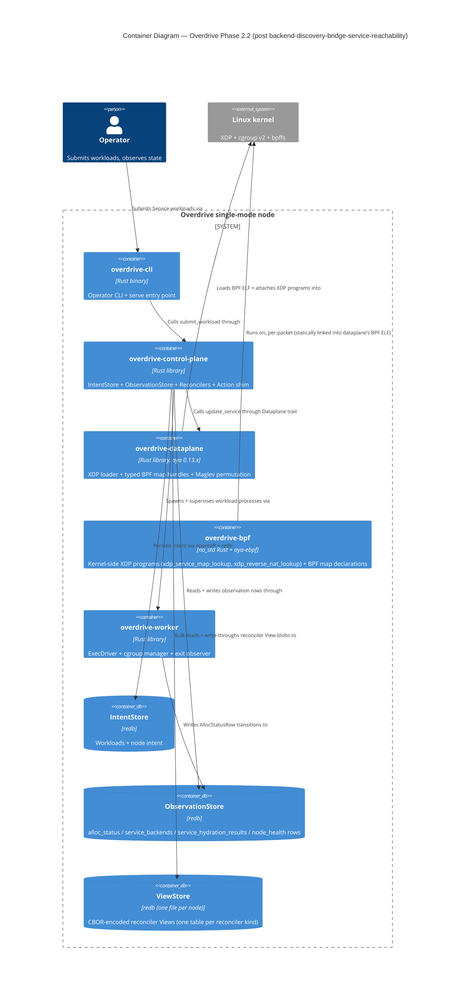
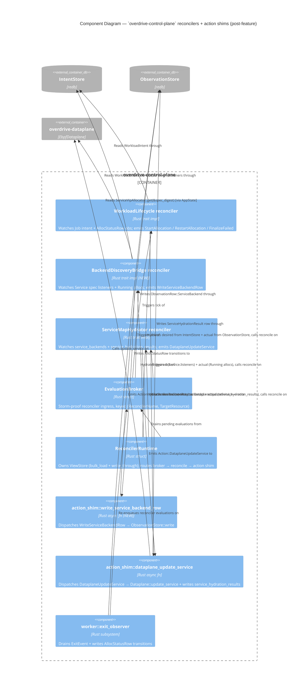

# Application architecture — `backend-discovery-bridge-service-reachability`

**Scope**: APPLICATION (component-level). System-level architecture
(XDP forward + reverse, HoM atomic swap, action-shim dispatch, hydrator
reconciler, ObservationStore row shapes) is settled in ADRs 40–48.

**Wave**: DESIGN | **Date**: 2026-05-13 (revised 2026-05-20 for ADR-0049 / 0050 / 0051 landing) | **Architect**: Morgan

**Companion artifacts**:

- `wave-decisions.md` — option analysis + recommendations + deferrals
- **ADR-0052** — Backend discovery bridge + production `EbpfDataplane` wiring (renumbered 2026-05-20; was ADR-0049 in the 2026-05-13 dispatch before ADR-0049 was reassigned to the platform-issued VIP allocator)
- brief.md § 63 / § 64 (updated sections)

**Companion ADRs consumed (landed since prior DESIGN)**:

- **ADR-0049 (platform-issued `ServiceVipAllocator`)** — bridge consumes
  `ServiceVipAllocator::get(&spec_digest)` for the assigned VIP. `Listener.vip`
  field is removed at the parser layer (2026-05-14 amendment).
- **ADR-0050 (intent-side `WorkloadIntent` aggregate)** — bridge's intent read
  decodes `WorkloadIntent::Service(ServiceV1)` via
  `WorkloadIntent::from_store_bytes`; `ServiceV1.listeners` is `(port,
  protocol)` only.
- **ADR-0051 (wire-side `SubmitSpecInput`)** — transitively consumed; the
  wire layer does not reach the bridge.

---

## 1. Context

The full intent-to-packet pipeline for Service workloads has a gap
between (a) the workload lifecycle, which starts and supervises
processes and writes `AllocStatusRow` rows on every transition, and
(b) the dataplane hydration pipeline, which watches
`service_backends` rows and programs the kernel-side XDP maps via
`EbpfDataplane::update_service`. **No production code path writes
`ServiceBackendRow`.** The `ServiceMapHydrator` reconciler exists and
is correct; the action shim exists and is correct; the
`EbpfDataplane` exists and is correct. They are not wired through to
each other end-to-end.

Two GitHub issues describe the gap:

- **GH #174** — Backend discovery bridge: produce
  `ServiceBackendRow` rows from `(Service spec, Running allocs)`.
- **GH #175** — Wire `EbpfDataplane` into production single-mode
  boot (today it threads `NoopDataplane`).

Joint scope: #175's value is unobservable without #174 — every
`update_service` call would receive `backends: []`. One DESIGN wave,
one walking-skeleton acceptance gate.

---

## 2. C4 — Container (L2)

The Phase 2.2 L2 diagram already exists in `c4-diagrams.md`. The
backend-discovery-bridge-service-reachability feature adds NO new containers. The new
component `BackendDiscoveryBridge` lives inside the existing
`overdrive-control-plane` container; the existing `overdrive-dataplane`
container is wired in production for the first time.



The change vs the pre-feature L2: `overdrive-control-plane` →
`overdrive-dataplane` arrow now actually carries traffic in
production (previously dispatched to `NoopDataplane` and returned
`Ok(())`).

---

## 3. C4 — Component (L3, `overdrive-control-plane` internals)

The bridge is one new component inside the control-plane container.



**Data-flow walking-skeleton trace** (the path a single Service
workload submission takes through the system, revised for
ADR-0049 / 0050 / 0051):

1. Operator submits Service spec (JSON `SubmitSpecInput::Service(ServiceSpecInput)`, no `vip` field — `deny_unknown_fields` rejects any client that smuggles one per ADR-0051).
2. `submit_workload` handler: validates + projects onto `WorkloadIntent::Service(ServiceV1)` via `ServiceV1::from_submit`; computes `spec_digest = WorkloadIntent::spec_digest(&intent)?`; allocates VIP synchronously via `state.allocator.lock().await.allocate(spec_digest).await?` per ADR-0049 § 4 (memo-hit returns existing VIP on resubmit); writes `WorkloadIntent::Service(ServiceV1)` to IntentStore at `IntentKey::for_workload(&workload_id)`; returns the assigned VIP in the submit echo.
3. `WorkloadLifecycle.reconcile` emits `StartAllocation` (existing behaviour).
4. Action shim dispatches `StartAllocation` → `ExecDriver` spawns the process; alloc transitions Pending → Running; `AllocStatusRow` written by exit-observer / action shim.
5. **NEW**: Broker re-enqueues `BackendDiscoveryBridge` for the workload (same enqueue site as `WorkloadLifecycle`, keyed by `WorkloadId`).
6. **NEW**: Runtime hydrates the bridge:
   - `desired`: reads `WorkloadIntent::from_store_bytes` at `IntentKey::for_workload(&workload_id)`; matches `Service(ServiceV1)` variant; computes `spec_digest`; consults `state.allocator.lock().await.get(&spec_digest)` for `assigned_vip`; projects `ServiceV1.listeners → (ServiceId::derive(&assigned_vip, port, "service-map"), ProjectedListener { vip, port, protocol })`.
   - `actual`: `ObservationStore::alloc_status_rows_for_workload(workload_id)` filtered to Running.
7. **NEW**: `BackendDiscoveryBridge.reconcile` computes the fingerprint of `(assigned_vip, [backend{ipv4=host_ip, port=listener.port}])`. If different from `view.last_written_fingerprint[service_id]`, emits `Action::WriteServiceBackendRow`.
8. **NEW**: Action shim `write_service_backend_row::dispatch` writes `ObservationRow::ServiceBackend(row)` via `ObservationStore::write`.
9. **UI-05 (NEW)**: The bridge emits a paired `Action::EnqueueEvaluation { reconciler: "service-map-hydrator", target: "service/<service_id>" }` alongside step 7's `WriteServiceBackendRow`. The action shim's `enqueue_evaluation::dispatch` submits the evaluation to the per-runtime `EvaluationBroker`. Prior to UI-05 this handoff did not exist — the bridge wrote its row but the hydrator never ticked. The "existing behaviour" claim that previously sat here ("broker re-enqueues `ServiceMapHydrator` on observation-row change") was wrong: no such mechanism existed. Making the handoff explicit at the reconciler's action boundary (rather than implicit at the action-shim dispatch surface) keeps the cross-reconciler dependency readable at the bridge's reconcile body.
10. `ServiceMapHydrator.reconcile` reads `desired.fingerprint == new_fingerprint` ≠ `actual.fingerprint` → emits `Action::DataplaneUpdateService`.
11. Action shim `dataplane_update_service::dispatch` calls `EbpfDataplane::update_service` → BPF maps populated; writes `ServiceHydrationResultRow::Completed`.
12. Hydrator on next tick sees `actual.fingerprint == desired.fingerprint` → idempotent steady-state per ADR-0042.

Steps 5–8 are #174's surface. Step 11's real `EbpfDataplane` call
(vs `NoopDataplane`) is #175's surface. The walking-skeleton Tier 3
test asserts on the kernel-side BPF map state after step 11.

---

## 4. New component — `BackendDiscoveryBridge`

### 4.1 Placement

```
crates/overdrive-control-plane/src/reconcilers/backend_discovery_bridge/
├── mod.rs         # re-exports + ReconcilerName constant
├── state.rs       # re-exports of overdrive_core::reconciler::BackendDiscovery*State types
└── view.rs        # re-exports of overdrive_core::reconciler::BackendDiscoveryBridgeView
```

The canonical types live in `overdrive-core::reconciler` (same
layering as `WorkloadLifecycle` and `ServiceMapHydrator`) because
`AnyReconciler` holds the concrete type in its variant and
`overdrive-core` cannot depend on `overdrive-control-plane`.

### 4.2 Public surface

```rust
// in overdrive-core::reconciler

/// Desired-side projection for a single Service workload: the set
/// of listeners projected with the allocator-issued VIP. Sourced by
/// the runtime's `hydrate_desired` arm:
///   * intent listeners from `WorkloadIntent::Service(ServiceV1).listeners`
///     per ADR-0050 (every listener is `(port, protocol)` — no `vip` field);
///   * `assigned_vip` from `ServiceVipAllocator::get(&spec_digest)`
///     per ADR-0049 § 5a, where `spec_digest = WorkloadIntent::spec_digest(&intent)?`.
///
/// Phase 1 invariant: the allocator memo is populated synchronously
/// at admission (ADR-0049 § 4) before the intent is persisted, so
/// the allocator lookup at hydrate time is always `Some(_)` for a
/// Service workload that reached IntentStore. A `None` here would
/// be a structural bug and surfaces as a debug event; the bridge
/// returns an empty desired state and defers convergence to a
/// subsequent tick.
#[derive(Debug, Clone, PartialEq, Eq, Default)]
pub struct ServiceListenerSet {
    pub workload_id: WorkloadId,
    /// Listeners keyed by `ServiceId::derive(&assigned_vip, port,
    /// "service-map")`. The allocator-issued VIP is the same across
    /// all entries (one VIP per Service per ADR-0049 § 5a).
    pub listeners: BTreeMap<ServiceId, ProjectedListener>,
}

#[derive(Debug, Clone, PartialEq, Eq)]
pub struct ProjectedListener {
    /// Allocator-issued VIP for the workload. Sourced from
    /// `ServiceVipAllocator::get(&spec_digest)` at hydrate time per
    /// ADR-0049 § 5a; NOT from the intent aggregate (`ServiceV1`
    /// carries no VIP field — ADR-0050 § 2).
    pub vip: ServiceVip,
    pub port: NonZeroU16,
    pub protocol: Proto,
}

/// Actual-side projection: the set of Running allocs for the
/// workload. Sourced by `hydrate_actual` from
/// `ObservationStore::alloc_status_rows_for_workload(workload_id)`
/// filtered to `state == Running`.
#[derive(Debug, Clone, PartialEq, Eq, Default)]
pub struct RunningAllocSet {
    pub workload_id: WorkloadId,
    pub running: BTreeSet<AllocationId>,
}

/// Merged state per ADR-0036 — runtime stitches desired + actual
/// into one struct before calling reconcile.
#[derive(Debug, Clone, PartialEq, Eq, Default)]
pub struct BackendDiscoveryBridgeState {
    pub desired: ServiceListenerSet,
    pub actual: RunningAllocSet,
}

/// View per ADR-0035 — persists *inputs* per
/// `.claude/rules/development.md` § "Persist inputs, not derived
/// state". The persisted input is the per-service fingerprint of
/// the last row the bridge successfully wrote; the dedup decision
/// is recomputed every tick from this input + the freshly-computed
/// current fingerprint.
#[derive(Debug, Clone, Default, PartialEq, Eq,
         serde::Serialize, serde::Deserialize)]
pub struct BackendDiscoveryBridgeView {
    #[serde(default)]
    pub last_written_fingerprint: BTreeMap<ServiceId, BackendSetFingerprint>,
}

pub struct BackendDiscoveryBridge {
    name: ReconcilerName,
    /// Host's IPv4 address for the configured `client_iface`. Resolved
    /// once at boot via `getifaddrs` on the configured iface; passed in
    /// at construction time. Phase 2.2 is single-node, so every Running
    /// alloc's backend endpoint uses this IP.
    host_ipv4: Ipv4Addr,
}

impl Reconciler for BackendDiscoveryBridge {
    const NAME: &'static str = "backend-discovery-bridge";
    type State = BackendDiscoveryBridgeState;
    type View = BackendDiscoveryBridgeView;

    fn name(&self) -> &ReconcilerName { &self.name }

    fn reconcile(
        &self,
        desired: &Self::State,
        actual: &Self::State,
        view: &Self::View,
        tick: &TickContext,
    ) -> (Vec<Action>, Self::View) {
        let mut actions = Vec::new();
        let mut next_view = view.clone();

        // For each projected listener (allocator-issued VIP + intent
        // port/protocol) on the workload:
        for (service_id, listener) in &desired.desired.listeners {
            // Build backend set = one Backend per Running alloc.
            // Phase 2.2 single-node: every alloc resolves to host_ipv4.
            let backends: Vec<Backend> = actual.actual.running.iter()
                .map(|_alloc_id| Backend {
                    ipv4: self.host_ipv4,
                    port: listener.port.get(),
                    weight: 1,
                    healthy: true,  // #170 ships real health
                    _pad: 0,
                })
                .collect();

            let new_fp = fingerprint(&listener.vip, &backends);
            let prev_fp = view.last_written_fingerprint.get(service_id);

            if Some(&new_fp) == prev_fp {
                continue;  // Dedup: no change.
            }

            let target = format!("backend-discovery-bridge/{service_id}");
            let spec_hash = ContentHash::of(new_fp.to_le_bytes().as_slice());
            let correlation = CorrelationKey::derive(
                &target, &spec_hash, "write-service-backend-row");

            actions.push(Action::WriteServiceBackendRow {
                row: ServiceBackendRow {
                    service_id: *service_id,
                    vip: ipv4_from_vip(&listener.vip),
                    backends,
                    updated_at: LogicalTimestamp {
                        counter: tick.tick.saturating_add(1),
                        writer: /* AppState.node_id */ self.writer_node_id.clone(),
                    },
                },
                correlation,
            });
            next_view.last_written_fingerprint.insert(*service_id, new_fp);
        }

        // GC: drop dedup entries for services no longer in desired.
        next_view.last_written_fingerprint
            .retain(|sid, _| desired.desired.listeners.contains_key(sid));

        (actions, next_view)
    }
}
```

### 4.3 New `Action` variant

```rust
// in overdrive-core::reconciler::Action

/// Write a `ServiceBackendRow` to the ObservationStore. Emitted by
/// `BackendDiscoveryBridge`; the action shim's wrapper at
/// `crates/overdrive-control-plane/src/action_shim/write_service_backend_row.rs`
/// dispatches into `ObservationStore::write(ObservationRow::ServiceBackend(row))`.
WriteServiceBackendRow {
    row: ServiceBackendRow,
    correlation: CorrelationKey,
},
```

### 4.4 Action shim wrapper

```rust
// crates/overdrive-control-plane/src/action_shim/write_service_backend_row.rs

use overdrive_core::reconciler::Action;
use overdrive_core::traits::observation_store::{
    ObservationRow, ObservationStore, ObservationStoreError,
};

/// Dispatch one `Action::WriteServiceBackendRow`. Writes the row
/// to the ObservationStore. No correlation-driven follow-up is
/// needed at the shim level — the bridge's next tick reads
/// `service_backends_rows` (transitively through the runtime's
/// hydrate path) and observes its own write via the dedup
/// fingerprint.
///
/// # Errors
///
/// Returns the underlying `ObservationStoreError` on write failure.
/// Per `.claude/rules/development.md` § Errors / pass-through —
/// the shim does not re-wrap the typed error.
///
/// # Panics
///
/// Panics if `action` is not [`Action::WriteServiceBackendRow`].
/// Caller is the action-shim match arm and is the sole expected
/// caller.
pub async fn dispatch(
    action: &Action,
    observation: &dyn ObservationStore,
) -> Result<(), ObservationStoreError> {
    let Action::WriteServiceBackendRow { row, correlation: _ } = action else {
        panic!(
            "action_shim::write_service_backend_row::dispatch invoked \
             with wrong Action variant"
        );
    };
    observation.write(ObservationRow::ServiceBackend(row.clone())).await
}
```

### 4.5 Hydration arms

Runtime extensions in
`crates/overdrive-control-plane/src/reconciler_runtime.rs`:

```rust
// hydrate_desired — new match arm
AnyReconciler::BackendDiscoveryBridge(_) => {
    let workload_id = workload_id_from_target(target)?;
    // Same intent read path WorkloadLifecycle uses; the key is
    // canonical per ADR-0050 OQ-5.
    let key = IntentKey::for_workload(&workload_id);
    let Some(bytes) = state.store.get(key.as_bytes()).await
        .map_err(|e| ConvergenceError::IntentRead(e.to_string()))? else {
        return Ok(AnyState::BackendDiscoveryBridge(BackendDiscoveryBridgeState {
            desired: ServiceListenerSet { workload_id, listeners: BTreeMap::new() },
            actual:  RunningAllocSet::default(),
        }));
    };
    let intent = WorkloadIntent::from_store_bytes(
        bytes.as_ref(), &state.intent_redb_path, Some(key.as_str()))
        .map_err(|e| ConvergenceError::IntentRead(e.to_string()))?;
    let listeners = match &intent {
        WorkloadIntent::Service(service_v1) => {
            let spec_digest = intent.spec_digest()
                .map_err(|e| ConvergenceError::IntentRead(e.to_string()))?;
            // ADR-0049 § 5a: bridge consults the allocator memo for the
            // assigned VIP. Phase 1 invariant: the memo is populated at
            // admission (synchronously, before IntentStore write per
            // ADR-0049 § 4), so this is always Some for a persisted
            // Service intent. A None response is logged as a structured
            // debug event and treated as an empty-desired tick — the
            // §18 convergence loop retries.
            let Some(assigned_vip) = state.allocator.lock().await.get(&spec_digest) else {
                tracing::debug!(
                    name: "bridge.allocator_memo_absent",
                    workload_id = %workload_id,
                    spec_digest = ?spec_digest,
                    "VIP allocator memo absent for Service intent; deferring tick"
                );
                BTreeMap::new()
            };
            service_v1.listeners.iter().map(|l| {
                let service_id = ServiceId::derive(
                    &assigned_vip, l.port, "service-map");
                (service_id, ProjectedListener {
                    vip: assigned_vip.clone(),
                    port: l.port, protocol: l.protocol,
                })
            }).collect()
        }
        // Job and Schedule have no listeners (ADR-0050 § 2).
        WorkloadIntent::Job(_) | WorkloadIntent::Schedule(_) => BTreeMap::new(),
    };
    Ok(AnyState::BackendDiscoveryBridge(BackendDiscoveryBridgeState {
        desired: ServiceListenerSet { workload_id, listeners },
        actual: RunningAllocSet::default(),
    }))
}

// hydrate_actual — new match arm
AnyReconciler::BackendDiscoveryBridge(_) => {
    let workload_id = workload_id_from_target(target)?;
    let rows = state.obs.alloc_status_rows_for_workload(&workload_id).await
        .map_err(|e| ConvergenceError::ObservationRead(e.to_string()))?;
    let running: BTreeSet<AllocationId> = rows.into_iter()
        .filter(|r| matches!(r.state, AllocState::Running))
        .map(|r| r.alloc_id)
        .collect();
    Ok(AnyState::BackendDiscoveryBridge(BackendDiscoveryBridgeState {
        desired: ServiceListenerSet::default(),
        actual: RunningAllocSet { workload_id, running },
    }))
}
```

Note: the `.await` on `state.allocator.lock()` is the `tokio::sync::Mutex`
acquire on the `Arc<Mutex<PersistentServiceVipAllocator>>` that
`AppState` holds (per `lib.rs:183`). The lookup itself
(`PersistentServiceVipAllocator::get`) is sync — see
`crates/overdrive-dataplane/src/allocators/persistent_service_vip.rs:251`.
This `.await` lives in the hydrate path, not in `reconcile` (which
remains pure-sync per ADR-0035).

### 4.6 AnyReconciler / AnyState extensions

Both `AnyReconciler` and `AnyState` gain a `BackendDiscoveryBridge`
variant (the existing two-variant + new third). Compile-time
exhaustive `match` catches every consumer in one PR (per the
single-cut migration rule).

### 4.7 Boot composition

```rust
// crates/overdrive-control-plane/src/lib.rs (after the existing
// bulk_load_service_vip_allocator block at lib.rs:667-679 — the
// allocator MUST be constructed before the bridge so the hydrate
// arm's `state.allocator.lock().await.get(&spec_digest)` is sound).
pub fn backend_discovery_bridge(host_ipv4: Ipv4Addr, node_id: NodeId) -> AnyReconciler {
    AnyReconciler::BackendDiscoveryBridge(
        BackendDiscoveryBridge::new(host_ipv4, node_id))
}

// in serve_with_config, alongside existing register calls:
runtime.register(noop_heartbeat()).await?;
runtime.register(workload_lifecycle()).await?;
runtime.register(backend_discovery_bridge(host_ipv4, node_id.clone())).await?;
// UI-05: registered at production boot in step 02-04 architectural
// remediation. The prior `// existing` annotation was incorrect —
// no `runtime.register(service_map_hydrator())` call site existed
// before UI-05 landed, so the bridge → hydrator handoff failed
// silently in production. Order matters only for
// `cluster_status`'s deterministic registration listing; the
// runtime registers idempotently regardless of order.
runtime.register(service_map_hydrator()).await?;
```

The bridge itself does NOT hold an `Arc<Mutex<PersistentServiceVipAllocator>>`
— the runtime's hydrate path acquires it via `state.allocator` (the
`AppState` field added by ADR-0049). This keeps the reconciler struct
narrow: per ADR-0035 the reconciler is pure over its inputs, and the
allocator lookup happens at hydrate time (the runtime's I/O boundary),
not in `reconcile`.

---

## 5. Production boot — `EbpfDataplane` composition

### 5.1 `[dataplane]` config section

```toml
# overdrive.toml
[dataplane]
client_iface = "lb_veth_a"
backend_iface = "lb_veth_b"
```

Required for production single-mode boot. Missing section produces
a typed `ConfigError` (mirroring the precedent for missing `[tls]`
section per ADR-0010).

### 5.2 Boot composition

```rust
// crates/overdrive-control-plane/src/lib.rs (replacing lines 560-566)

// Per ADR-0049 + ADR-0040/0045: EbpfDataplane is the production
// adapter. NoopDataplane is removed (single-cut migration per
// feedback_single_cut_greenfield_migrations.md). Tests inject
// SimDataplane via test harness; production binds the real impl
// here, on the boot path.
let dataplane_cfg = config.dataplane.as_ref().ok_or_else(|| {
    ControlPlaneError::Validation {
        message: "missing required [dataplane] section in overdrive.toml \
                  (client_iface + backend_iface)".into(),
        field: Some("dataplane".into()),
    }
})?;

let ebpf_dataplane = overdrive_dataplane::EbpfDataplane::new(
    &dataplane_cfg.client_iface,
    &dataplane_cfg.backend_iface,
).map_err(|source| DataplaneBootError::Construct {
    client_iface: dataplane_cfg.client_iface.clone(),
    backend_iface: dataplane_cfg.backend_iface.clone(),
    source,
})?;

// Earned-Trust probe per § 5.4 — write + read-back a sentinel
// BACKEND_MAP entry to prove the HoM pin-by-name reuse + map
// programmability work end-to-end on this kernel. Failure refuses
// startup with structured `health.startup.refused` event.
ebpf_dataplane.probe().await.map_err(|source| {
    DataplaneBootError::Probe { source }
})?;

let dataplane: Arc<dyn overdrive_core::traits::dataplane::Dataplane> =
    Arc::new(ebpf_dataplane);

// Resolve host_ipv4 once at boot for the BackendDiscoveryBridge.
let host_ipv4 = resolve_iface_ipv4(&dataplane_cfg.client_iface)
    .map_err(|source| DataplaneBootError::IfaceAddrResolution {
        iface: dataplane_cfg.client_iface.clone(),
        source,
    })?;
```

### 5.3 New `DataplaneBootError` variant

```rust
// crates/overdrive-control-plane/src/error.rs

#[derive(Debug, Error)]
pub enum DataplaneBootError {
    #[error(
        "EbpfDataplane construction failed \
         (client_iface={client_iface}, backend_iface={backend_iface}): {source}\n\
         \n\
         Try:\n\
           - `ip link show <iface>` to verify the interface exists.\n\
           - `mount | grep bpffs` to verify /sys/fs/bpf is mounted.\n\
           - `dmesg | tail` for kernel-side BPF verifier errors.\n\
           - Confirm CAP_SYS_ADMIN / CAP_BPF for the running process."
    )]
    Construct {
        client_iface: String,
        backend_iface: String,
        #[source]
        source: overdrive_core::traits::dataplane::DataplaneError,
    },

    #[error(
        "EbpfDataplane probe failed — the kernel accepted the BPF \
         programs at load time but the runtime BACKEND_MAP write+read \
         did not round-trip. This typically indicates a kernel BPF \
         feature regression or a corrupted bpffs pin from a prior \
         unclean shutdown.\n\
         \n\
         Try:\n\
           - `rm /sys/fs/bpf/overdrive/*` and retry.\n\
           - Inspect `dmesg | tail`.\n\
         \n\
         Underlying: {source}"
    )]
    Probe {
        #[source]
        source: overdrive_core::traits::dataplane::DataplaneError,
    },

    #[error(
        "EbpfDataplane iface IPv4 resolution failed for {iface}: {source}\n\
         \n\
         Try: `ip -4 addr show <iface>` to inspect the interface \
         configuration. The bridge requires a single IPv4 address on \
         the configured client_iface for endpoint derivation."
    )]
    IfaceAddrResolution {
        iface: String,
        #[source]
        source: std::io::Error,
    },
}
```

`ControlPlaneError` gains:

```rust
#[error(transparent)]
DataplaneBoot(#[from] DataplaneBootError),
```

`to_response` gains the matching arm — `StatusCode::INTERNAL_SERVER_ERROR`,
never reaches HTTP because boot precedes listener bind (same
exhaustiveness pattern as `ViewStoreBoot` / `Cgroup` / `CgroupBootstrap`).

### 5.4 Earned-Trust probe (`EbpfDataplane::probe`)

Concrete shape (D2 decision 2026-05-21 — ships in #175 Slice 2):

```rust
// crates/overdrive-dataplane/src/lib.rs
impl EbpfDataplane {
    /// Earned-Trust probe per `.claude/rules/development.md`
    /// principle 12. Writes a sentinel BACKEND_MAP entry, reads it
    /// back, asserts byte-equal, deletes it. Proves the HoM
    /// pin-by-name reuse path + map programmability work on this
    /// kernel BEFORE accepting traffic.
    ///
    /// Composition root invariant: probe AFTER `new()` succeeds and
    /// BEFORE the first `update_service` call. Failure refuses
    /// startup with structured `health.startup.refused` event.
    pub async fn probe(&self) -> Result<(), DataplaneError> {
        const SENTINEL_BACKEND_ID: u32 = u32::MAX;
        let sentinel = BackendEntryPod {
            ipv4: 0x7F_00_00_01,  // 127.0.0.1
            port: 0,
            weight: 0,
            healthy: 0,
            _pad: 0,
        };
        // Write.
        self.backend_map_handle().insert(
            SENTINEL_BACKEND_ID, sentinel, 0)
            .map_err(|e| DataplaneError::LoadFailed(
                format!("probe: BACKEND_MAP insert: {e}")))?;
        // Read-back.
        let got = self.backend_map_handle().get(SENTINEL_BACKEND_ID, 0)
            .map_err(|e| DataplaneError::LoadFailed(
                format!("probe: BACKEND_MAP get: {e}")))?;
        // Assert byte-equal.
        if got != Some(sentinel) {
            return Err(DataplaneError::LoadFailed(
                format!("probe: round-trip mismatch (got {got:?}, want {sentinel:?})")));
        }
        // Delete.
        self.backend_map_handle().remove(&SENTINEL_BACKEND_ID)
            .map_err(|e| DataplaneError::LoadFailed(
                format!("probe: BACKEND_MAP delete: {e}")))?;
        Ok(())
    }
}
```

### 5.5 Attach-mode fallback emit

Per Q175.3, the structured `tracing::warn!` event fires inside
`EbpfDataplane::new` at the moment the fallback decision is taken,
per-iface. The structured event name `xdp.attach.fallback_generic`
is locked here.

```rust
// in EbpfDataplane::new (per-iface attach loop)
match xdp.attach(iface, XdpFlags::DRV_MODE) {
    Ok(link) => link,
    Err(e) if should_fallback_to_generic(&e) => {
        tracing::warn!(
            name: "xdp.attach.fallback_generic",
            iface = %iface,
            errno = ?e,
            "native XDP attach rejected; retrying with SKB_MODE"
        );
        xdp.attach(iface, XdpFlags::SKB_MODE)
            .map_err(|e2| DataplaneError::LoadFailed(
                format!("XDP attach (SKB fallback) on {iface}: {e2}")))?
    }
    Err(e) => return Err(e.into()),
}
```

### 5.6 Shutdown — RAII via Drop

```rust
impl Drop for EbpfDataplane {
    fn drop(&mut self) {
        // Unlink the SERVICE_MAP bpffs pin. The XdpLinkId fields
        // detach automatically via aya's Drop. Failure on unlink
        // logs at debug — by the time Drop runs, panic propagation
        // is in-flight and we cannot bubble errors. The leftover-pin
        // cleanup discipline in .claude/rules/debugging.md is the
        // operator-side safety net if Drop is skipped (SIGKILL).
        let pin_path = self.pin_dir.join(SERVICE_MAP_NAME);
        if let Err(e) = std::fs::remove_file(&pin_path) {
            if e.kind() != std::io::ErrorKind::NotFound {
                tracing::debug!(
                    name: "xdp.shutdown.unlink_failed",
                    path = %pin_path.display(),
                    error = %e,
                    "SERVICE_MAP pin unlink failed during shutdown"
                );
            }
        }
        // XdpLinkId held by self drops; aya detaches.
    }
}
```

---

## 6. Walking-skeleton acceptance test

### 6.1 Placement

```
crates/overdrive-control-plane/tests/integration/backend_discovery_bridge/
└── walking_skeleton.rs
```

Gated by the existing `integration-tests` feature. Runs through
`cargo xtask lima run -- cargo nextest run -p overdrive-control-plane
-E 'test(walking_skeleton)' --features integration-tests` per
`.claude/rules/testing.md` § "Running tests — Lima VM".

### 6.2 Shape

```rust
// crates/overdrive-control-plane/tests/integration/backend_discovery_bridge/walking_skeleton.rs

#[tokio::test(flavor = "multi_thread", worker_threads = 4)]
async fn service_workload_running_populates_backend_map() {
    // Lima-side fixture: veth pair lb_veth_a / lb_veth_b already
    // configured (per crates/overdrive-dataplane/tests/integration
    // /atomic_swap.rs precedent).
    let lima_fixture = LimaFixture::setup_veth_pair().await;
    let host_ipv4 = lima_fixture.client_iface_ipv4();

    // Spin a real production server (mTLS + EbpfDataplane).
    let server = TestServer::serve_with_dataplane_config(DataplaneConfig {
        client_iface: lima_fixture.client_iface.clone(),
        backend_iface: lima_fixture.backend_iface.clone(),
    }).await.expect("server bind");

    // Submit a Service spec via the streaming submit API. The wire
    // shape is `SubmitSpecInput::Service(ServiceSpecInput)` per
    // ADR-0051; the listener carries `(port, protocol)` ONLY — no
    // `vip` field. `deny_unknown_fields` rejects any attempt to
    // smuggle one (ADR-0049 § 5).
    let spec = service_spec_with_one_listener(
        "walking-skeleton-svc",
        ListenerInput {
            port: 8080,
            protocol: "tcp".into(),
        },
        // exec: a long-lived nc -l 8080 process via bash loop
        exec_block_listening_on_port(8080),
    );
    let submit_response = server.submit_workload(spec).await.expect("submit");

    // Admission allocates the VIP synchronously (ADR-0049 § 4); the
    // submit echo carries the assigned VIP. Read it for the
    // SERVICE_MAP lookup below — hard-coding a VIP is no longer
    // possible (allocator owns the address space).
    let assigned_vip: Ipv4Addr = submit_response.assigned_vip()
        .expect("submit echo carries allocator-issued VIP");

    // Sanity precondition: allocator memo populated for this
    // workload's spec_digest. Failure indicates an admission-path
    // regression, not a bridge bug — surface it explicitly so the
    // test stays at the correct altitude per
    // `.claude/rules/debugging.md` § 7.
    let workload_intent = server.read_workload_intent("walking-skeleton-svc")
        .await.expect("intent persisted");
    let spec_digest = workload_intent.spec_digest()
        .expect("spec_digest");
    assert!(
        server.app_state().allocator.lock().await.get(&spec_digest).is_some(),
        "allocator memo absent for spec_digest={spec_digest:?} \
         after admission — admission path regression, not a bridge bug"
    );

    // Wait for ConvergedRunning (workload reached Running state).
    let event = submit_response.stream()
        .await_running(Duration::from_secs(10)).await
        .expect("workload reached Running");

    // Wait for the bridge to write a ServiceBackendRow + the hydrator
    // to dispatch DataplaneUpdateService + the dataplane to populate
    // BACKEND_MAP. Budget: 5 reconciler ticks × 100ms cadence = 500ms,
    // plus 500ms slack for redb fsyncs.
    let backend_map_populated = poll_until(
        Duration::from_secs(2),
        Duration::from_millis(50),
        || async {
            let entries = server.dataplane_inspect()
                .backend_map_entries().await.expect("inspect");
            entries.iter().any(|e|
                e.ipv4 == u32::from(host_ipv4) &&
                e.port == 8080
            )
        },
    ).await;
    assert!(backend_map_populated,
        "BACKEND_MAP did not receive an entry for host_ipv4={host_ipv4}:8080 within 2s");

    // Assert SERVICE_MAP resolves the (VIP, port) key. The VIP is
    // sourced from the submit echo — not hard-coded — because the
    // allocator owns the address space.
    let service_key = ServiceKey {
        vip: u32::from(assigned_vip),  // host-order octets per ADR-0040 § 11
        port: 8080,
        proto: 6,  // TCP
        _pad: 0,
    };
    let service_inner = server.dataplane_inspect()
        .service_map_lookup(&service_key).await.expect("lookup");
    assert!(service_inner.is_some(),
        "SERVICE_MAP did not resolve {service_key:?}");
    let inner_entries = service_inner.unwrap();
    assert!(!inner_entries.is_empty(),
        "SERVICE_MAP inner is empty for {service_key:?}");

    // D3 (decided 2026-05-21 — in-gate, NOT deferred):
    // Real TCP round-trip through the kernel XDP / reverse-NAT path.
    // Map state proves wiring; round-trip proves reachability — and
    // the walking-skeleton is the joint e2e acceptance for #174 + #175.
    //
    // Flake-mitigation knobs (DISTILL pins the exact shape):
    //   - Bind-readiness: AllocState::Running != port bound. Poll-
    //     connect-with-timeout (50ms cadence, 2s budget) until the
    //     backend's listener accepts.
    //   - Listener choice: the Service exec command MUST produce a
    //     deterministic bind + round-trip-capable listener (`nc -l`
    //     alone echoes nothing and dies on close — DISTILL specifies
    //     a `socat TCP-LISTEN:8080,fork EXEC:cat`-equivalent or a
    //     baked-in echo binary). The shape below assumes echo
    //     semantics.
    let probe_payload = b"walking-skeleton-probe\n";
    let response = poll_until(
        Duration::from_secs(2),
        Duration::from_millis(50),
        || async {
            let mut stream = tokio::net::TcpStream::connect(
                (assigned_vip, 8080)
            ).await.ok()?;
            stream.write_all(probe_payload).await.ok()?;
            let mut buf = vec![0u8; probe_payload.len()];
            stream.read_exact(&mut buf).await.ok()?;
            Some(buf)
        },
    ).await;
    assert_eq!(response.as_deref(), Some(&probe_payload[..]),
        "TCP round-trip to {assigned_vip}:8080 did not echo \
         {probe_payload:?} within 2s — XDP / reverse-NAT path or \
         backend listener regression");

    // Cleanup runs via Drop on server / lima_fixture.
}
```

The test asserts on **observable kernel side effects** per
`.claude/rules/testing.md` § "Tier 3 → Assertion rules" — BPF map
state via the typed handle, NOT on program internal reachability.

The `TestServer::dataplane_inspect()` helper exposes the typed
`BackendMapHandle::keys()` / `get()` and `HashOfMapsHandle::get_inner_entries()`
for assertion purposes; this is a `#[cfg(any(test, feature =
"integration-tests"))]` accessor on `EbpfDataplane` documented as
"part of the contract for testing purposes" per development.md §
"Trait definitions specify behavior" → "The DST equivalence test".

### 6.3 What the test does NOT do

- Does NOT assert on multiple replicas (covered by a separate Tier 1 DST invariant).
- Does NOT exercise allocation failure / restart (covered by DST invariants).
- Does NOT exercise the attach-mode fallback (covered by separate per-iface tests in `overdrive-dataplane/tests/integration/`).

---

## 7. New DST invariants (Tier 1)

Per ADR-0017, every new reconciler ships ESR invariants.

```rust
// crates/overdrive-sim/src/invariants/backend_discovery_bridge.rs

/// BridgeEventuallyWritesBackendRow — for every Service workload
/// with `≥ 1` listener AND an allocator-issued VIP for its
/// `spec_digest` AND `≥ 1` Running alloc, a `ServiceBackendRow` is
/// written within a bounded number of ticks whose `backends` field
/// contains exactly the Running allocs' endpoints. The DST harness
/// must seed the `ServiceVipAllocator` memo with an entry for the
/// workload's `spec_digest` as a precondition (mirrors the
/// production submit-time admission path per ADR-0049 § 4).
///
/// Eventual property: from any starting state, repeated ticks drive
/// `obs.service_backends_rows(service_id).backends == expected`.
pub struct BridgeEventuallyWritesBackendRow;

/// BridgeIdempotentSteadyState — once `obs.service_backends_rows(...)
/// .backends == expected` for every Service workload, the bridge
/// emits zero `Action::WriteServiceBackendRow` actions on subsequent
/// ticks given unchanged inputs.
///
/// Always property — the bridge does not write redundant rows.
pub struct BridgeIdempotentSteadyState;
```

Both invariants run in `cargo dst` on every PR per Tier 1 discipline.

---

## 8. Cross-cutting

### 8.1 Endianness / wire-shape

The bridge writes `ServiceBackendRowV1.vip: Ipv4Addr` (per existing
shape, line 777 of `observation_store.rs`). The downstream hydrator
wraps this into `ServiceVip` at the runtime hydrate boundary; the
action shim's `update_service` call takes `ServiceVip` → unwraps to
`Ipv4Addr` (per existing shape, line 110 of
`dataplane_update_service.rs`). The bridge does NOT touch wire-order
conversion — userspace stores host-order per ADR-0040 endianness
lockstep.

### 8.2 rkyv schema evolution

`ServiceBackendRow = ServiceBackendRowV1` is in place at
`observation_store.rs:469`. No schema change in this feature — the
bridge writes the existing V1 payload. Future versions (V2, V3) bump
the envelope per ADR-0048 procedure; the bridge picks up the new
`Latest` alias automatically.

### 8.3 Mutation testing scope

Per CLAUDE.md § "Mutation Testing Strategy", the bridge's `reconcile`
body is in scope for the diff-scoped mutation gate. The
`should_write_row` pure decision fn (the bridge's `if Some(&new_fp)
== prev_fp { continue }` shape) is exactly the canonical bug-shape
this catches.

The `EbpfDataplane::probe()` body is excluded — it's a probe with
no logic to mutate; the assert IS the contract.

### 8.4 Compile-time enforcement (Earned Trust principle 12 layer 1)

The `BackendDiscoveryBridge` reconciler has no special trait bounds
beyond the existing `Reconciler` trait — the same compile-fail
fixture from ADR-0035 § 7 (no `&LibsqlHandle` anywhere) covers it.

The `Action::WriteServiceBackendRow` variant addition is caught at
the action-shim match site via `match action { ... }` exhaustiveness
— the action shim's enum match becomes non-exhaustive and the
compiler rejects until the new arm is added. This is the
"compile-time exhaustive match" enforcement ADR-0023 documents.

---

## 9. Out of scope (explicit deferrals)

| Concern | Status | Reference |
|---|---|---|
| VIP allocation | Closed by ADR-0049 (delivered 2026-05-19). Bridge consumes the allocator-issued VIP. | wave-decisions.md Q174.4 |
| Health-check probing (`healthy: true` hardcoded) | Deferred to GH #170 (existing). Phase 2.2 treats Running alloc = healthy backend. | wave-decisions.md § 1 |
| Multi-node owner-writer logic | Phase 1 single-node; multi-node lands in Phase 2+. | wave-decisions.md Q174.3 |
| Schedule workload kind backend rows | ADR-0050 § 2: Schedule has no listeners. | wave-decisions.md § 1 |
| Job workload kind backend rows | ADR-0050 § 2: Job has no listeners. | wave-decisions.md § 1 |
| Operator-tunable `[dataplane] disabled = true` | DECIDED 2026-05-21 — do not ship. Hosts without XDP cannot run Service workloads; boot refuses without `[dataplane]` `client_iface`/`backend_iface` keys. | wave-decisions.md D1 |
| ~~Listener-skipped telemetry counter~~ | Withdrawn 2026-05-20 — VIP-less listeners are no longer representable; nothing to skip or count. | wave-decisions.md D5 |

---

## Review

| Field | Value |
|---|---|
| Reviewer | Atlas (nw-solution-architect-reviewer) |
| Date | 2026-05-20 |
| Verdict | **APPROVED** |
| Blocking issues | 0 |
| High issues | 0 |

Full review (focus areas + non-blocking questions) lives in
`wave-decisions.md` § Review. This file is approved for handoff to
DISTILL; the C4 L2/L3 diagrams, the walking-skeleton test code
including the D3 in-gate TCP round-trip block, and the hydration arms
consuming `WorkloadIntent::Service` + `ServiceVipAllocator::get` are
all verified coherent with ADR-0049 / ADR-0050 / ADR-0051.
