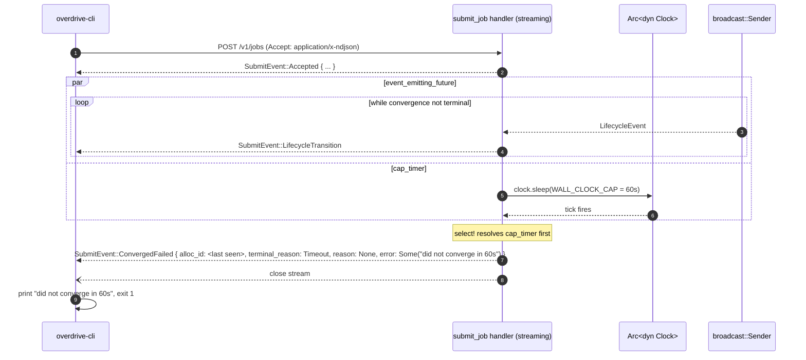

# Architecture — `cli-submit-vs-deploy-and-alloc-status`

**Wave**: DESIGN
**Date**: 2026-04-30
**Owner**: Morgan (`nw-solution-architect`)

This document is scaffolding for the two ADRs (ADR-0032, ADR-0033) and
the C4 diagrams. It describes component boundaries, sequence diagrams,
and integration points. Decisions are in `wave-decisions.md`; the load-
bearing artifacts are the ADRs.

---

## 1. Overview

Two surfaces, one feature:

1. **Streaming submit** — `POST /v1/jobs` becomes content-negotiated.
   `Accept: application/x-ndjson` returns a chunked stream of typed
   `SubmitEvent` lines that close on convergence. `Accept:
   application/json` (or no Accept) returns the existing single
   `SubmitJobResponse`. CLI auto-selects via `IsTerminal`; `--detach`
   forces the JSON lane.
2. **Snapshot enrichment** — `GET /v1/allocs?job=<id>` (existing path,
   extended response shape) returns a dense `AllocStatusResponse` with
   per-allocation `state` / `resources` / `started_at` / `exit_code` /
   `last_transition` / `error`, plus top-level `replicas_*` and
   `restart_budget`.

The two surfaces share a single source of truth for `transition_reason`
([C6]): a new `TransitionReason` enum that flows through the
`AllocStatusRow.reason` field on the ObservationStore, surfaced
identically by both the streaming endpoint and the snapshot endpoint.

## 2. Component boundaries

| Component | Responsibility | Crate |
|---|---|---|
| `submit_job` handler | Content-negotiate on `Accept`. JSON lane returns the existing `SubmitJobResponse`. NDJSON lane initialises the stream and delegates to `streaming_submit_loop`. | `overdrive-control-plane` |
| `streaming_submit_loop` (NEW) | Subscribe to broadcast channel filtered by `job_id`; race the event-emitting future against the wall-clock cap timer (`clock.sleep(WALL_CLOCK_CAP)`); emit `SubmitEvent` lines as `application/x-ndjson` chunks. | `overdrive-control-plane` |
| `alloc_status` handler | Hydrate the snapshot from ObservationStore + lifecycle reconciler view; project to `AllocStatusResponse`. | `overdrive-control-plane` |
| Action shim | (existing, EXTENDED) — capture `DriverError::StartRejected.reason` into `AllocStatusRow.detail`; broadcast `LifecycleEvent` after each `obs.write`. | `overdrive-control-plane` |
| `JobLifecycle::reconcile` | (existing, EXTENDED) — populate `Action::*` variants with `TransitionReason` for the cases the reconciler knows about (`Scheduling`, `BackoffPending`, `BackoffExhausted`, `Stopped`, `NoCapacity`). | `overdrive-core` |
| ObservationStore | (existing, schema-extended) — `AllocStatusRow.reason: Option<TransitionReason>` and `.detail: Option<String>` are new fields; rkyv archive shape is additive. | `overdrive-core` (trait); `overdrive-store-local` (impl); `overdrive-sim` (sim impl) |
| CLI `submit` command | (existing, EXTENDED) — `--detach` flag; `IsTerminal::is_terminal(stdout)` branch; NDJSON consumer over `reqwest::Response::bytes_stream()` with `serde_json::Deserializer::from_reader` driven line-by-line; exit-code mapping per [C3]. | `overdrive-cli` |
| CLI `alloc status` command | (existing, REPLACED) — renderer rewritten to produce the journey TUI mockup; consumes the extended `AllocStatusResponse`. | `overdrive-cli` |
| Shared types | (existing, EXTENDED) — `SubmitEvent`, `TransitionReason`, `TerminalReason`, `TransitionSource`, `AllocStateWire`, `TransitionRecord`, `RestartBudget`, `ResourcesBody` added to `overdrive-control-plane::api`. | `overdrive-control-plane` |

No new crates. No new external dependencies. The existing graph
(`overdrive-core` → `overdrive-control-plane` → `overdrive-cli`) is
unchanged.

## 3. Streaming-submit happy path

```mermaid
sequenceDiagram
    autonumber
    participant CLI as overdrive-cli
    participant Handler as submit_job handler
    participant IS as IntentStore
    participant Bus as broadcast::Sender<LifecycleEvent>
    participant Recon as JobLifecycle reconciler
    participant Shim as action shim
    participant Drv as ExecDriver
    participant OS as ObservationStore

    CLI->>Handler: POST /v1/jobs (Accept: application/x-ndjson)
    Handler->>IS: put_if_absent(key, archived_bytes)
    IS-->>Handler: PutOutcome::Inserted
    Handler-->>CLI: 200 OK; Content-Type: application/x-ndjson; chunked

    Note over Handler,Bus: enter streaming_submit_loop
    Handler->>Bus: subscribe (filtered by job_id)
    Handler-->>CLI: SubmitEvent::Accepted { spec_digest, intent_key, outcome }

    Note over Recon,Shim: convergence loop ticks
    Recon->>Shim: Action::StartAllocation { reason: Scheduling, ... }
    Shim->>OS: write(AllocStatusRow { state: Pending, reason: Some(Scheduling) })
    Shim->>Bus: send(LifecycleEvent { from: <new>, to: Pending, reason: Scheduling })
    Bus-->>Handler: LifecycleEvent
    Handler-->>CLI: SubmitEvent::LifecycleTransition { from: <new>, to: pending, reason: scheduling, ... }

    Shim->>Drv: start(spec)
    Drv-->>Shim: Ok(handle)
    Shim->>OS: write(AllocStatusRow { state: Running, reason: Some(Started), detail: None })
    Shim->>Bus: send(LifecycleEvent { from: Pending, to: Running, reason: Started })
    Bus-->>Handler: LifecycleEvent
    Handler-->>CLI: SubmitEvent::LifecycleTransition { from: pending, to: running, reason: started, ... }

    Note over Handler: replicas_running >= replicas_desired -> terminal
    Handler-->>CLI: SubmitEvent::ConvergedRunning { alloc_id, started_at }
    Handler--)CLI: close stream

    CLI->>CLI: print summary, exit 0
```

## 4. Streaming-submit broken-binary path (regression target)

```mermaid
sequenceDiagram
    autonumber
    participant CLI as overdrive-cli
    participant Handler as submit_job handler (streaming)
    participant Bus as broadcast::Sender
    participant Recon as JobLifecycle reconciler
    participant Shim as action shim
    participant Drv as ExecDriver
    participant OS as ObservationStore

    CLI->>Handler: POST /v1/jobs (Accept: application/x-ndjson)
    Handler-->>CLI: SubmitEvent::Accepted { ... }

    loop attempts 1..=5
        Recon->>Shim: Action::StartAllocation (or RestartAllocation)
        Shim->>Drv: start(spec)
        Drv-->>Shim: Err(DriverError::StartRejected { reason: "stat /usr/local/bin/payments: ..." })
        Shim->>OS: write(AllocStatusRow { state: Failed, reason: DriverStartFailed, detail: Some("stat ...") })
        Shim->>Bus: send(LifecycleEvent { from: Pending, to: Failed, reason: DriverStartFailed, detail: Some("stat ...") })
        Bus-->>Handler: LifecycleEvent
        Handler-->>CLI: SubmitEvent::LifecycleTransition { ..., reason: driver_start_failed, detail: "stat ..." }

        Note over Recon: tick.now < next_attempt_at -> emit BackoffPending
        Recon->>Shim: (no action; reason recorded in next eval)
    end

    Note over Recon: attempts == 5 -> emit no further restart actions
    Recon->>Recon: detect alloc.state == Failed AND restart_count == max
    Note over Handler: handler observes 5 consecutive Failed transitions; checks restart_budget
    Handler-->>CLI: SubmitEvent::ConvergedFailed { alloc_id, terminal_reason: BackoffExhausted, reason: Some(DriverStartFailed), error: Some("stat /usr/local/bin/payments: ...") }
    Handler--)CLI: close stream

    CLI->>CLI: print Error block, exit 1
```

The `terminal_reason: BackoffExhausted` is decided **handler-side**:
the `streaming_submit_loop` watches the broadcast for the (alloc_id,
state: Failed) tuple alongside a snapshot of `restart_budget` from the
reconciler view; when `used == max` AND latest state is `Failed`, it
emits the terminal event. Alternatives were considered (let the
reconciler emit a synthetic `Action::AbandonAllocation` action that the
shim translates to a `TerminalReason::BackoffExhausted` row state) and
rejected because `Action` is the *intent* dispatch shape, not a
streaming-event signal. The streaming handler is the right owner of
the streaming terminal-event decision.

## 5. Streaming-submit timeout path



The timer is `Arc<dyn Clock>::sleep`, which is `SystemClock` in
production and `SimClock` under DST. A DST harness can advance time
past `WALL_CLOCK_CAP` and assert the terminal event is emitted with
`terminal_reason: Timeout`.

## 6. `--detach` and pipe-detect path

```mermaid
sequenceDiagram
    autonumber
    participant Op as Operator
    participant CLI as overdrive-cli
    participant Handler as submit_job handler (JSON lane)
    participant IS as IntentStore

    Op->>CLI: overdrive job submit ./job.toml [--detach] [| jq]

    alt --detach OR stdout is not a TTY
        CLI->>CLI: accept = "application/json"
    else TTY and no --detach
        CLI->>CLI: accept = "application/x-ndjson"
    end

    Note over CLI: assume Accept: application/json branch
    CLI->>Handler: POST /v1/jobs (Accept: application/json)
    Handler->>IS: put_if_absent(...)
    IS-->>Handler: PutOutcome::Inserted | KeyExists
    Handler-->>CLI: 200 OK; Content-Type: application/json; { spec_digest, intent_key, outcome }
    CLI->>Op: write JSON to stdout, exit 0
```

The CLI logic:

```rust
// in overdrive-cli/src/commands/job_submit.rs
let stream = !args.detach && std::io::IsTerminal::is_terminal(&std::io::stdout());
let accept = if stream { "application/x-ndjson" } else { "application/json" };
```

No new dependency; `IsTerminal` is in stdlib since Rust 1.70.

## 7. Snapshot hydration

```mermaid
sequenceDiagram
    autonumber
    participant CLI as overdrive-cli
    participant Handler as alloc_status handler
    participant IS as IntentStore
    participant OS as ObservationStore
    participant View as ReconcilerViewCache

    CLI->>Handler: GET /v1/allocs?job=payments-v2
    Handler->>IS: get(IntentKey::for_job(job_id))
    IS-->>Handler: Job aggregate (or None)
    Handler->>OS: alloc_status_rows()
    OS-->>Handler: Vec<AllocStatusRow> (filter by job_id)
    Handler->>View: get_view(JobLifecycle, target=job_id)
    View-->>Handler: JobLifecycleView { restart_counts, next_attempt_at }

    Note over Handler: project rows + view -> AllocStatusResponse
    Handler-->>CLI: 200 OK; Content-Type: application/json; AllocStatusResponse { ... }

    CLI->>CLI: render journey TUI mockup
```

The snapshot's `last_transition.reason` is read directly off the row's
`reason` field; the snapshot's per-row `error` is read off the row's
`detail` field; this is the [C6] single-source-of-truth pin. The
streaming endpoint reads from the *same* row's reason/detail via the
broadcast channel; both endpoints serialise the same `TransitionReason`
value identically, by construction.

## 8. Architecture enforcement annotations

For software-crafter:

```markdown
## Architecture Enforcement

Style: Hexagonal (ports + adapters), single-process — UNCHANGED from brief.md §1
Language: Rust
Tool: existing `xtask::dst_lint` (banned-API gate); existing `xtask::openapi_check`; new `trybuild` fixture

New rules to enforce:
- The streaming-submit handler MUST use `clock.sleep(...)` for the wall-clock cap, not `tokio::time::sleep`. (`dst_lint` enforces this on adapter-host crates that the linting catalog covers; the streaming handler is in `overdrive-control-plane` which IS scanned for the time-source restriction.)
- `LifecycleEvent` (the broadcast payload) MUST NOT carry `AllocStatusRow` (an observation type) directly — it carries the projected fields. A `trybuild` compile-fail fixture asserts this.
- All new wire types live under `overdrive-control-plane::api` per ADR-0014. A grep gate in xtask asserts no `Serialize`/`Deserialize` derives appear under any other module path.
```

## 9. Quality-attribute scenarios (extending brief.md §22 / §32)

| Attribute | Scenario | How addressed |
|---|---|---|
| Performance — first-event latency | First NDJSON line lands within 200 ms of CLI POST commit (KPI-01) | Push-via-broadcast ([D4]) eliminates polling cadence; `Accepted` event sent synchronously from handler immediately after `put_if_absent` returns |
| Performance — cap latency under DST | Timeout path emits terminal event within 60 s (production) / advance-by-cap (DST) | `clock.sleep(WALL_CLOCK_CAP)` with injected `Clock` ([D3]) |
| Reliability — convergence honesty (regression target) | Broken-binary spec exits 1 with verbatim driver error (KPI-02) | Action shim captures `DriverError::StartRejected.reason` into `AllocStatusRow.detail`; both streaming and snapshot surface it |
| Reliability — surface coherence | Streaming `LifecycleTransition.reason` byte-equals snapshot `last_transition.reason` (KPI-04) | Single `TransitionReason` enum, emitted once at the action shim, written to the row, read by both surfaces ([C6]) |
| Maintainability — schema drift | New media type captured by `utoipa` derivation; existing CI gate catches drift | `xtask openapi-check` ([D8]); no new gate |
| Maintainability — testability under DST | Streaming wall-clock cap is DST-controllable | `Arc<dyn Clock>` injection ([D3]) — same seam ADR-0013 §2c established |
| Compatibility — back-compat | Existing `Accept: application/json` clients see no change | Content-negotiation on the same path ([D6]); JSON lane is the existing handler path verbatim |
| Usability — one-verb inner loop | Streaming submit on TTY, `--detach` for CI, auto-detach for pipes | CLI-side `IsTerminal` branch ([D5]) |

## 10. Integration points (production wiring)

`AppState` gains:

```rust
pub struct AppState {
    // existing fields ...
    pub store:           Arc<dyn IntentStore>,
    pub obs:             Arc<dyn ObservationStore>,
    pub driver:          Arc<dyn Driver>,
    pub broker:          Arc<EvaluationBroker>,
    pub registry:        Arc<ReconcilerRegistry>,
    pub view_cache:      Arc<ReconcilerViewCache>,
    pub clock:           Arc<dyn Clock>,                                  // promoted to direct field if not already
    // NEW:
    pub lifecycle_events: Arc<tokio::sync::broadcast::Sender<LifecycleEvent>>,
    pub streaming_cap:   std::time::Duration,                             // configurable; default 60s
}
```

`ServerConfig` gains:

```toml
[server]
streaming_submit_cap_seconds = 60   # default; override per deployment
```

The action shim gains a constructor parameter: a clone of
`Arc<broadcast::Sender<LifecycleEvent>>`. The `dispatch` function
gains a `bus: &broadcast::Sender<LifecycleEvent>` parameter; after
each successful `obs.write(...)` it emits an event with the
constructed `(from, to, reason, detail, source)` tuple. Per-variant
error isolation is preserved (an error broadcasting does not abort
subsequent action dispatch — the broadcast send error is logged and
discarded; the row was written, the snapshot will see it).

## 11. Out of scope (do not let scope creep)

- `alloc status --follow` — explicitly [C4]-out.
- Multi-replica progress aggregation — Phase 1 is `replicas=1` per
  slice-01 OUT scope.
- TUI mode (ratatui) — slice-02 OUT scope.
- A second streaming endpoint (e.g. `GET /v1/allocs/stream`) — out;
  the reference class is one streaming endpoint at a time.
- Operator-controlled `--timeout` flag — out; the cap is a server
  concern, not a CLI parameter (operators who want longer use
  `--detach` and poll `alloc status`).

## 12. Risks and mitigations

| Risk | Likelihood | Impact | Mitigation |
|---|---|---|---|
| Broadcast lag drops events; CLI sees gaps | low (single-subscriber Phase 1) | medium | On `Lagged`, fallback to one-shot ObservationStore snapshot, reconcile with prior state, resume |
| `AllocStatusRow` archive shape change breaks existing redb files | low | high | Additive-only change (`reason: Option<...>`, `detail: Option<...>` both default-`None`); rkyv `Option<T>` is forward-compatible |
| `IsTerminal` returns false on a CI runner that does allocate a TTY | medium | low | Operator override via `--detach`; documented in slice-03 brief failure mode |
| 60 s cap is too short for heavy-init workloads (Java, Python with deps) | low–medium | medium | `--detach` is the documented escape valve; cap is configurable; the journey calls 60 s a starting point |
| `select!` cap timer races with terminal event; observable interleaving | low | low | `select!` is left-biased and deterministic under DST; integration test asserts cap fires only when no terminal event arrived |

## 13. References

- `wave-decisions.md` (this directory)
- `reuse-analysis.md` (this directory)
- `c4-system-context.md`, `c4-container.md`, `c4-component.md` (this
  directory)
- `docs/product/architecture/adr-0032-ndjson-streaming-submit.md` (NEW)
- `docs/product/architecture/adr-0033-alloc-status-snapshot-enrichment.md` (NEW)
- ADR-0008, ADR-0009, ADR-0011, ADR-0013, ADR-0014, ADR-0015, ADR-0021,
  ADR-0023, ADR-0027, ADR-0029, ADR-0030 (cited)
- `docs/feature/cli-submit-vs-deploy-and-alloc-status/discuss/*` —
  user-stories, journey YAML, slice briefs, outcome KPIs, shared-
  artifacts registry
