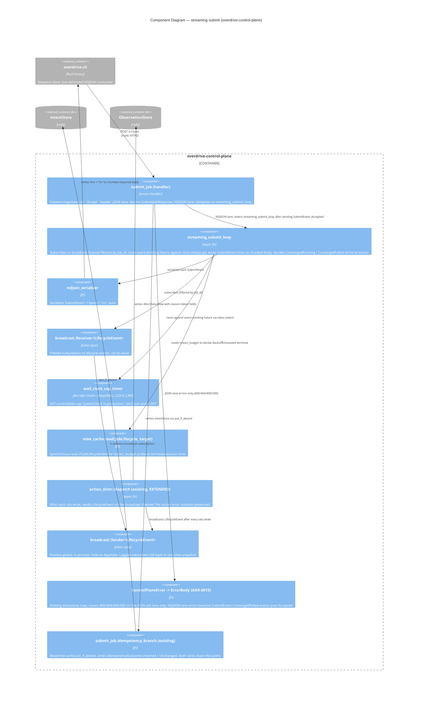

# C4 Level 3 — Component Diagram (streaming-submit endpoint)

**Wave**: DESIGN
**Date**: 2026-04-30

Zoom into the `overdrive-control-plane` container — specifically the
streaming-submit subsystem. The snapshot endpoint (`alloc_status`
handler) is simpler and is documented in `architecture.md` §7; no L3
needed for it. This L3 covers the streaming-submit path because it has
five distinct components interacting around the broadcast channel and
the wall-clock cap timer — the kind of complexity that warrants a
component diagram per the methodology rule.

## Component responsibilities

| Component | Owns | Does not own |
|---|---|---|
| `submit_job` handler | Content negotiation; idempotency-prefix; error mapping for the JSON lane | The streaming loop body; the broadcast send |
| `streaming_submit_loop` | Subscription, terminal-event decision, cap timer race, line emission | The broadcast send (action shim does that); the row write (action shim does that); the IntentStore put (handler does that before entering the loop) |
| `ndjson_serializer` | `SubmitEvent → bytes + '\n'` serialisation; serde_json::to_vec + push '\n' | Anything else; pure |
| `broadcast::Receiver` (subscription) | Per-handler instance; filtered by `job_id` | Production rate limiting; lagged-subscriber recovery (loop handles via `Lagged` arm) |
| `wall_clock_cap_timer` | `clock.sleep(cap).await` — DST-controllable | The cap *value* (config) and the cap *response* (loop emits ConvergedFailed) |
| `view_read` | Synchronous read of the lifecycle view's `restart_counts` | Mutating the view; the runtime's hydration; the libSQL connection |
| `action_shim::dispatch` (extended) | Driver call + obs.write + broadcast send; per-action error isolation | The terminal-event decision (handler); the wall-clock cap (handler) |
| `broadcast::Sender` | Process-global send; AppState-held | Per-subscriber state; lagging recovery |

## Why this L3 and not deeper

- **Why component-level (L3)** — five interacting components inside a
  single subsystem with a non-trivial concurrency story
  (`tokio::select!` over a broadcast subscription and a clock timer).
  The methodology rule (Example 1 in the agent prompt) calls L3 for
  "complex subsystems" specifically.
- **Why no L4** — the implementation details (the precise
  `tokio::select!` arm structure, the `Lagged` recovery pseudocode)
  belong in the crafter's GREEN phase, not in the design. The
  contracts and the dispatch shape are what DESIGN owns.

## Verb labels on every arrow (per methodology Example 1)

Every arrow on the diagram above carries a verb label
(`subscribes / writes / serializes / races / broadcasts / reads`).
Reviewers can challenge any label; the verb is what binds the
component to its responsibility.

## What this diagram pins for crafter

- The broadcast channel is **in-process** (no network hop). The
  `Sender` is on `AppState`; the `Receiver` is per-streaming-handler.
- The wall-clock cap is a `tokio::select!` arm racing the
  event-emitting future against `clock.sleep(cap)`. **Not** a tower
  layer, **not** a subscription-primitive concern.
- Terminal-event decision lives **in the loop**, not in the
  reconciler. The reconciler dispatches `Action::*` (intent shape);
  the streaming surface decides `Converged*` (streaming shape).
- Error mapping (ADR-0015) covers the JSON lane only. NDJSON lane
  errors *after* the `Accepted` line is emitted become structured
  `SubmitEvent::ConvergedFailed` events. NDJSON lane errors *before*
  the `Accepted` line (validation, conflict, internal) flow through
  the same `error_map` because at that point the handler hasn't
  switched to chunked transfer yet — it can still return a single
  JSON `ErrorBody` with the appropriate 4xx/5xx status. (See
  ADR-0032 §HTTP error semantics in the streaming context.)
