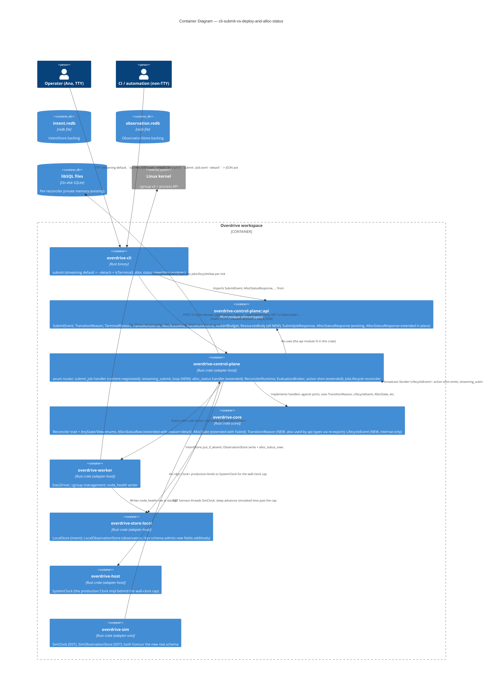

# C4 Level 2 — Container Diagram

**Wave**: DESIGN
**Date**: 2026-04-30

Feature-scoped extension of brief.md §C4 Level 2 (Phase 1
first-workload). Highlights the new edges and the new in-process
broadcast channel; everything else is inherited unchanged.

## Notes

### What's new in this diagram vs brief.md §C4 Level 2

1. **`broadcast::Sender<LifecycleEvent>` self-edge on
   `overdrive-control-plane`** — the new push channel from action shim
   to streaming handler. In-process; not a network hop. Covered by
   ADR-0032 [D4].
2. **`SimClock` edge from `overdrive-sim` to `overdrive-control-plane`**
   — explicit because the wall-clock cap [D3] is the new DST surface.
   The same `Clock` injection that ADR-0013 §2c established now drives
   the streaming-handler timer.
3. **`api_types` shown as a labelled module within
   `overdrive-control-plane`** (not a separate crate) — reflects
   ADR-0014 §Considered alternatives D ("place shared types in a
   separate crate, rejected on YAGNI for Phase 1"). The new types
   land in this same module.

### What's unchanged

- The `cli → ctrl` HTTP edge — still rustls / HTTP/2; the change is
  inside the response media type, not the transport.
- The `ctrl → store_local` edges — still typed `IntentStore` /
  `ObservationStore` traits; the new row fields are additive on
  `AllocStatusRow`'s rkyv shape.
- The `ctrl → worker` edge via `&dyn Driver` — unchanged; the
  `DriverError::StartRejected.reason` field that gets captured into
  `AllocStatusRow.detail` already exists.
- The `worker → kernel` edge — unchanged; the streaming surface does
  not touch the kernel directly.

### What's deliberately NOT in this diagram

- A separate `streaming_submit_loop` container — it's not a container,
  it's a function inside the `submit_job` handler. Promoting it would
  imply a separable deployment unit, which it is not.
- A network/RPC edge between handler and reconciler runtime — they
  share `AppState` via `axum::extract::State`. In-process; no RPC.
