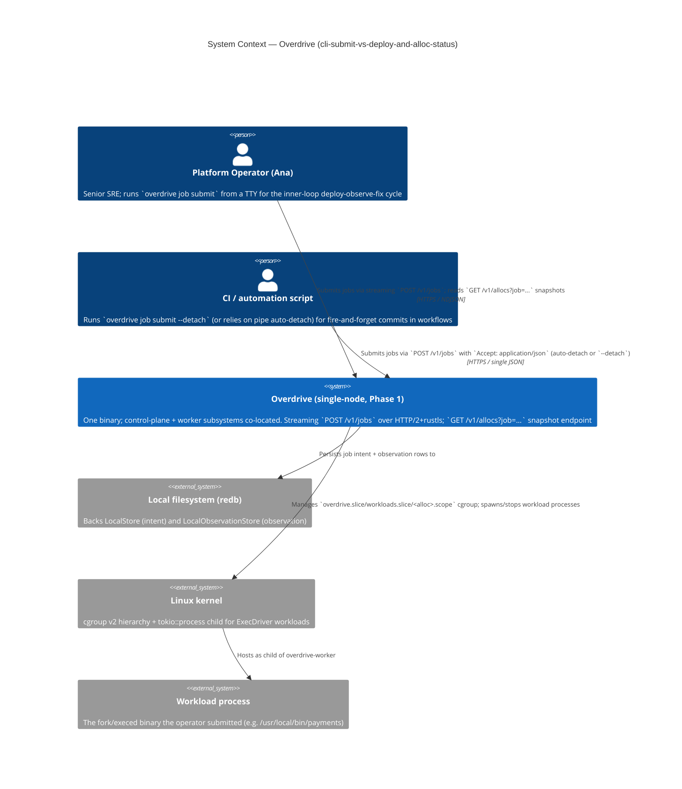

# C4 Level 1 — System Context

**Wave**: DESIGN
**Date**: 2026-04-30

This is a feature-scoped re-render of the brief.md system-context
diagram with the new actors (CI / pipeline calling `submit --detach`)
made explicit. Nothing on this diagram is new at the *system* level;
the boundary is preserved per brief.md §1.

## Notes

- The two human/agent actors (operator and CI) are functionally
  identical from the server's perspective — they're both clients of
  `POST /v1/jobs`. They're shown distinctly because the **default
  experience differs**: the operator sees streaming NDJSON; CI sees a
  single JSON object. This reflects [D5] (CLI-side TTY detection)
  and US-03 / US-04.
- No external system was added by this feature. The boundary is
  unchanged from brief.md §C4 Level 1; this re-render highlights the
  two consumer profiles for the streaming endpoint.
- The redb and kernel external systems are inherited unchanged from
  brief.md C4 Level 2; they're shown here as system-level
  dependencies because the streaming and snapshot endpoints both
  ultimately read from / write to them.
