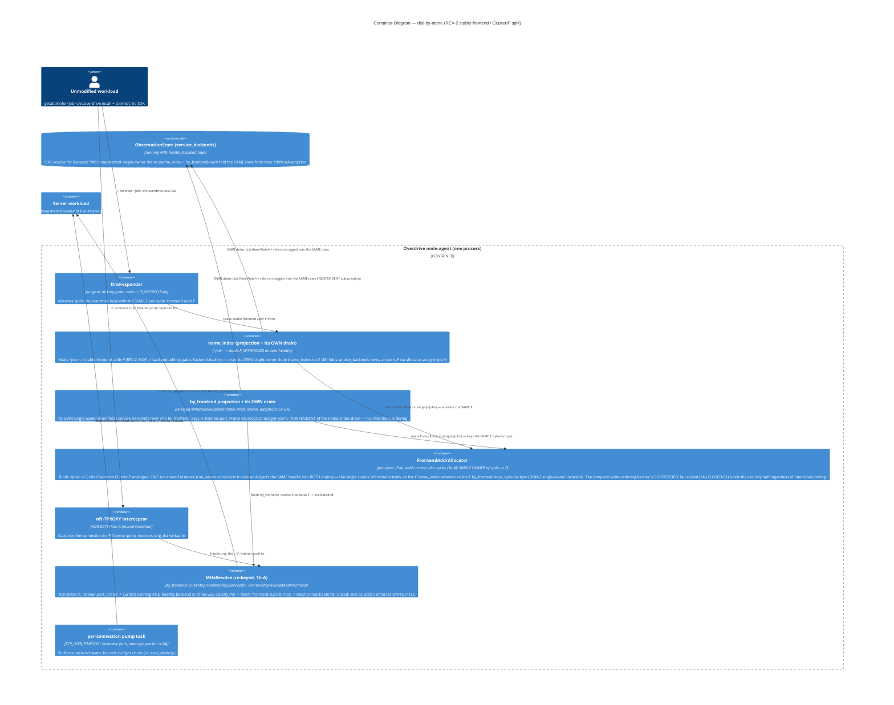

# Feature-Delta — dial-by-name-responder (DISCUSS · DRAFT)

> **Status: DISCUSS reviewed (2026-06-24) — gated to Slice 00.** The single
> authoritative DISCUSS narrative for this feature — the compact `feature-delta.md`
> form mandated by the `nw-discuss` Outputs contract + `validate_feature_layout.py`;
> the legacy split `discuss/*.md` files (user-stories, story-map, dor-validation,
> outcome-kpis, wave-decisions) are intentionally **not** produced, their content
> lives here. Lean density, Tier-1 `[REF]` sections. Produced by Luna
> (nw-product-owner) on 2026-06-24 for `dial-by-name-responder` (GH #243); revised
> per `review-discuss.md` (2026-06-24). **Cleared for Slice 00 (the spike) only —
> full responder DESIGN is BLOCKED until the spike records `PROMOTE`** (see the Gate
> verdict). Slice briefs under `slices/`.

## Reading checklist

- ✓ `docs/feature/dial-by-name-responder/intake.md` — primary source (GH #243 body, pinned contracts, ping-pong demo requirement, grounded code locations)
- ✓ `docs/product/jobs.yaml` — J-SEC-003 (parent enforcement arc), J-OPS-004 (operator-trust reachability family), header precedent ("JTBD skipped — distilled from whitepaper/issue, not interviews")
- ✓ `docs/product/personas/sam-platform-security-engineer.yaml` — Sam, the actor
- ✓ `docs/product/journeys/enforce-transparent-mtls-on-the-wire.yaml` — parent enforcement journey (pure enforcement, no operator verb)
- ✓ `docs/evolution/2026-06-22-transparent-mtls-enrollment.md` — finalized arc; D-TME-9/10/11 + responder reframe (#61 → #243)
- ✓ `examples/coinflip-as-service.toml` — `[service]`/`[exec]`/`[resources]`/`[[listener]]` schema + `/tmp`-staged-binary precedent
- ✓ `examples/dns-resolver.toml` — `command` = real on-disk binary (`/usr/bin/socat`); port-collision honesty (avoid 5353)
- ✓ `verification/expectations/E04-workload-reachable-at-canonical-address-mtls/README.md` — EDD expectation shape this feature graduates a sibling into

---

## `[REF]` Persona

**Sam — platform/security engineer** (`docs/product/personas/sam-platform-security-engineer.yaml`).
Defends the mesh story to a security reviewer. For this feature his lens shifts
from *enforcement* ("is the wire actually encrypted?") to *reachability* ("can an
**unmodified** workload even **find** its mesh peer by name, and does the platform
**never** hand it a stale address that points at a dead instance?"). Sam runs the
proof himself — `overdrive deploy` two specs, watch the ping-pong counter advance,
confirm each hop went TLS 1.3 on the peer wire.

Secondary actor (relates-to, not added to `personas/`): **Ana — application developer** (the workload author).
She writes an *ordinary* program that does `getaddrinfo("b.svc.overdrive.local")`
and connects — no SDK, no SVID, no mesh awareness. Her job is that this Just Works.
(Ana is referenced as a relates-to actor; this feature is authored through Sam's lens
per the codebase's single-persona-per-feature precedent.)

---

## `[REF]` JTBD — one-liner + proposed job entry

**One-liner (the job this feature serves):** *When I run two mesh workloads that
must talk to each other, I want an **unmodified** workload to dial a peer **by its
name** (`<job>.svc.overdrive.local`) and land at a **live** instance the mesh then
mTLS's — so the platform's "every flow is identity-bearing" promise is reachable
from ordinary code, not just enforceable once a connection already exists.*

### Job-tracing decision: MINT a new job `J-MESH-001` (reachability/mesh family)

**Decision: (a) mint a NEW job**, `relates_to: [J-SEC-003]`, actor Sam (+ Ana).
**Justification (one line):** dial-by-name has a **distinct progress** (an unmodified
workload **reaches** a mesh peer **by name** and lands at a **running** instance) and
a **distinct failure mode** (name resolution returns nothing / a stale address → the
workload **cannot even initiate** the connection) — orthogonal to J-SEC-003's
enforcement progress (cleartext on the wire / handshake that doesn't fail closed).
The two are independently satisfiable and independently failable.

This follows the **J-SEC-002 mint precedent** (jobs.yaml changelog 2026-06-08:
minted distinct from J-SEC-001 on "different progress + failure mode"), NOT the
**udp-sendmsg4 elevation precedent** (2026-06-05: elevated under J-OPS-004 because it
was the *same* reachability job at finer granularity). Dial-by-name is genuinely
distinct from enforcement — collapsing it under J-SEC-003 would over-correct exactly
as the J-SEC-002 analysis warned.

> **Why not elevate under J-OPS-004?** J-OPS-004 is *operator-trust in the
> Service-submit wire signal* (does `Stable`/`Failed` reflect real liveness). This
> job is *peer-to-peer name reachability inside the mesh* — a different progress,
> different actor-circumstance (a workload dialing a peer, not an operator reading a
> submit stream). A J-MESH-* family is the honest home; J-OPS-004 would fragment.

**APPLIED jobs.yaml addition** (user-approved 2026-06-24 — see Wave-Decisions
§ Applied SSOT diffs; the entry below is the source of the landed `jobs.yaml` text):

```yaml
  - id: J-MESH-001
    title: "Let an unmodified workload reach a mesh peer by name and land at a live instance — no SDK, no mesh awareness"
    relates_to: J-SEC-003
    situation: >
      When a workload I run must open a connection to another mesh workload by
      its logical name (<job>.svc.overdrive.local) — and the workload is
      identity-unaware and unmodified (it just calls getaddrinfo + connect like
      it would anywhere) — and the platform has already SHIPPED resolv.conf
      injection (each per-netns /etc/resolv.conf points at the per-netns gateway,
      D-TME-9) but NOTHING answers there yet, so name resolution fails in a deploy,
    motivation: >
      I want an in-agent name-answering listener (in the same process that owns
      the agent-light L4 proxy and the ServiceBackendsResolve index — NOT a
      separate daemon, NOT in-kernel) to answer A for <job>.svc.overdrive.local
      with the running-and-healthy backend's IPv4 address read as a sibling
      name-keyed reader over the SAME service_backends rows MtlsResolve folds
      (NOT the addr-keyed intercept-index struct; refined by DESIGN ADR-0072) (the
      v1 substrate is IPv4 — the MtlsResolve addr is SocketAddrV4, the per-netns
      responder addr is Ipv4Addr), returning the SAME address MtlsResolve
      recognizes (headless, no VIP, D-TME-10); answer AAAA as NODATA (the name is
      currently resolvable, no IPv6 record — a real IPv6 backend story is out of
      v1 scope); and NXDOMAIN when no backend is running-and-healthy (declared-but-empty and
      unknown are indistinguishable — the responder reads the running-and-healthy resolve
      index) — never a stale address,
    outcome: >
      so an unmodified workload can DIAL a mesh peer BY NAME and land at a live
      instance the existing intercept path then mTLS's — closing the dial-by-name
      leg the transparent-mtls arc deferred (#236), making the mesh reachable from
      ordinary code rather than only enforceable on a connection that already
      exists; and so the resolve index becomes "one source, THREE readers"
      (outbound resolve + inbound install + name answers) with the name layer
      byte-consistent with what the intercept path enforces.
    source: >
      GH #243; D-TME-9/10/11 (docs/evolution/2026-06-22-transparent-mtls-enrollment.md);
      whitepaper §11. Distilled from the issue + the finalized arc, not from user
      interviews (per the jobs.yaml header precedent).
    served_by_phase: 2
    status: active
```

---

## `[REF]` Locked decisions / pinned contracts (settled inputs — DO NOT re-litigate)

| ID | Contract | Status |
|---|---|---|
| **D-TME-9** | `resolv.conf` injection SHIPPED — each per-netns `/etc/resolv.conf` carries `nameserver <responder_addr>`; `responder_addr` = per-netns gateway (`plan.host_addr`, Fly `fdaa::3` model, collision-free by construction). `veth_provisioner.rs` `WriteResolvConf`. | **Shipped, do not touch** |
| **D-TME-10** | Return shape = **HEADLESS** — answer with a `running` `service_backends` addr, the **same** address `MtlsResolve.resolve` recognizes (one source, byte-consistent). **NO VIP, NO #167, NO #61.** | **Pinned** |
| **D-TME-11** | Read mechanism = a **sibling name-keyed reader over the SAME `service_backends` rows** (same `ObservationStore`, same List-then-Watch + relist-on-`Lagged` pattern as `ServiceBackendsResolve`) — **NOT** the addr-keyed intercept-index *struct*. This feature makes the `ObservationStore` `service_backends` **surface** **"one source, THREE readers"** (outbound resolve + inbound install + **name answers**). Byte-consistency = same rows, not a shared struct (DESIGN DDN-1; the security-critical `ServiceBackendsResolve` struct stays untouched). | **Surface exists; this feature adds the 3rd reader (a sibling, not a widening)** |
| **v1 address family** | The shipped resolve/intercept substrate is **IPv4**: `ResolvedBackend.addr` is `SocketAddrV4` (`mtls_resolve.rs`), and `responder_addr` + the netns addrs are `Ipv4Addr` (`veth_provisioner.rs`). **v1 answers `A` with the running-AND-healthy IPv4 backend addr; answers `AAAA` as NODATA** when the name is currently resolvable; **a name with 0 running-and-healthy backends → NXDOMAIN** (declared-but-not-running, unhealthy, and unknown all collapse — the responder reads only the running-AND-healthy set; DESIGN DDN-2). See § *The v1 DNS answer contract* above for the canonical table. A real IPv6 backend story (widening the `SocketAddrV4`/`Ipv4Addr` substrate) is **OUT of v1 scope**. | **Pinned (forced by the shipped types)** |
| **Implement-to-design** | This feature describes **behavior + the pinned contracts**. It does NOT invent the responder's API surface, new public types, or the `MtlsResolve` shape — those are DESIGN-wave decisions. | **Hard constraint (CLAUDE.md)** |

**Today's gap (the thing this feature closes):** nothing answers on `responder_addr`.
`getaddrinfo` reaches an injected resolver with no responder behind it → name
resolution fails in a deploy → an unmodified workload cannot initiate a by-name
connection at all.

### `[REF]` The v1 DNS answer contract (canonical — every artifact matches this)

| Query | Name has ≥1 running-AND-healthy IPv4 backend | Name has 0 running-and-healthy backends\* |
|---|---|---|
| `A` | **NOERROR + A** (the running-and-healthy IPv4 addr) | **NXDOMAIN** |
| `AAAA` | **NOERROR / NODATA** (resolvable name, no IPv6 record — v1 is IPv4) | **NXDOMAIN** |

\* *0 running-and-healthy backends covers declared-but-not-running, unhealthy /
not-ready, AND unknown names alike — v1 does **not** distinguish them, because the
responder reads only the **running-AND-healthy** set (the `by_name` index gates on
`Backend.healthy == true`, matching the intercept's `Mesh` set — DESIGN DDN-2), so
all collapse to **NXDOMAIN**. A stale / cached / guessed / unhealthy address is
**never** returned. The NXDOMAIN carries a short negative-TTL so a retrying dialer
re-resolves promptly once a backend reaches running-and-healthy (DESIGN pins the
exact TTL — 1 s, DDN-8). A future refinement could return NODATA for a
declared-but-empty service IF the responder gains a declared-service view distinct
from the running-and-healthy index — that is **not** v1.*

- **NODATA** = the name **is** currently resolvable (≥1 running-and-healthy
  backend) but has no record of the queried type (only `AAAA` in v1, since the
  substrate is IPv4).
- **NXDOMAIN** = no currently-resolvable (running-and-healthy) backend for the name.

This table is the single contract US-DBN-2 / US-DBN-4, slice-03, the KPIs, and the
product journey all reference. (Resolves the empty-answer ambiguity flagged in
`review-discuss.md` Blocking #1.)

---

## `[REF]` The load-bearing unvalidated mechanism (→ SPIKE-FIRST, do NOT design here)

**How does ONE in-agent listener answer DNS queries sent to N different per-netns
gateway addresses?** A query is emitted from inside each workload netns toward *that
netns'* gateway addr; one host-side listener must receive and answer all of them.
This is a real-kernel **netns / routing / binding** question with **no Tier-2
backstop** (`spike.md` "no synthetic harness" case). It MUST be validated in a
timeboxed probe (Slice 00) **before** the walking skeleton. **This document names it
as a dependency; it does NOT solve it.** The arc's own precedent spiked throughout
(increment-a/b/c/d/i).

---

## `[REF]` User stories

> All stories trace to **J-MESH-001**. Each carries an Elevator Pitch
> whose "After" is a real operator entry point (`overdrive serve` / `overdrive
> deploy <SPEC>`). ACs are embedded + testable. `@infrastructure`-tagged stories
> (the spike) carry an infrastructure rationale in lieu of an Elevator Pitch.

### US-DBN-1 `@infrastructure` `@spike` — One listener, many netns: validate the routing assumption

**Job:** `J-MESH-001` · **Infrastructure rationale:** This is a timeboxed PROBE of an
unvalidated real-kernel mechanism (`spike.md`), not a shippable behavior. It produces
a WORKS/DOESN'T-WORK verdict + a promotion-gate decision, not operator-observable
value. No Elevator Pitch (per the `@infrastructure` exemption).

**Problem:** Sam cannot trust the walking skeleton until he knows a single host-side
listener can actually *receive and answer* DNS sent to N distinct per-netns gateway
addresses. If it can't, the whole headless-in-agent design is wrong and must pivot
before any production code lands.

**Solution (behavior to probe — NOT to design):** In gitignored
`spike-scratch/increment-a/` (per `spike.md`), provision ≥2 per-workload netns+veth
(reuse the shipped `veth_provisioner` topology shape), each with `resolv.conf`
pointing at its own gateway; run ONE host-side listener; from *inside each netns*
emit a real `getaddrinfo`/`dig`-shape query toward that netns' gateway; confirm the
one listener receives and answers all of them on a real kernel under Lima as root.

**Acceptance Criteria (probe gate):**
- [ ] Probe runs **for real under Lima as root** (`cargo xtask lima run -- …`), NOT `--no-run` / compile-only.
- [ ] Findings record a binary verdict (WORKS / DOESN'T-WORK) with **pasted** command output (not narrated), `uname -r`, and the binding/routing shape that worked (or the wall that blocked).
- [ ] Promotion-gate decision (PROMOTE / DISCARD / PIVOT) recorded in `spike/wave-decisions.md`.
- [ ] Probe code is in `spike-scratch/`, **never** in `crates/`; eBPF (if any) is aya-rs Rust, never C.

### US-DBN-2 — Walking skeleton: responder answers ONE name → ONE running-and-healthy backend, end-to-end through serve+deploy

**Job:** `J-MESH-001`

**Elevator Pitch:**
- **Before:** An operator deploys a mesh workload that another workload must dial by name; the dialing workload's `getaddrinfo("<peer>.svc.overdrive.local")` reaches the injected resolver, **nothing answers**, resolution fails, and the connection never starts.
- **After:** `overdrive serve` (one node) + `overdrive deploy <server-spec>` + `overdrive deploy <client-spec>` → the client workload's `getaddrinfo("<server>.svc.overdrive.local")` resolves to the server's **running-and-healthy** `service_backends` addr, the client connects, and the connection is **intercepted + mTLS'd end-to-end** (TLS 1.3 `0x17` records on the peer wire) — the dial-by-name path closes through the production entry points.
- **Decision enabled:** Sam can tell a reviewer "an unmodified workload reaches its mesh peer by name and the hop is encrypted, proven through `serve` + `deploy`, not a `#[test]` seam."

**Problem:** Sam (and Ana's unmodified workload) need name resolution to actually work
in a deploy. The injection is shipped; the answer is missing.

**Solution (behavior; DESIGN owns the API):** The in-agent name-answering listener
answers `A` for `<job>.svc.overdrive.local` with the **running-AND-healthy IPv4**
backend addr by reading `service_backends ∩ running-and-healthy` as a **sibling
name-keyed reader over the SAME `service_backends` rows** (same `ObservationStore`,
same List-then-Watch pattern as `ServiceBackendsResolve`, D-TME-11) — NOT the
addr-keyed intercept-index struct — and returning a running-and-healthy backend addr
— the **same** address `MtlsResolve.resolve` recognizes and classifies `Mesh`
(`SocketAddrV4`, D-TME-10); it answers `AAAA` as **NODATA** (name exists, no IPv6
record — the v1 substrate is IPv4). Thin: the **A→B direction only** first (one
name, one running-and-healthy backend), driven end-to-end through `overdrive serve`
+ `overdrive deploy`, proven by the intercept landing.

**Domain Examples:**
1. **Happy path (A→B):** Sam deploys `server` (`server.toml`, replicas=1) and `client` (`client.toml`). `server` reaches running-and-healthy with backend addr `10.x.y.2:8080`. `client`'s `getaddrinfo("server.svc.overdrive.local")` → `10.x.y.2`; `client` connects; tcpdump on the peer leg shows TLS 1.3 records.
2. **Headless single-source:** the addr the responder returns for `server.svc.overdrive.local` is **byte-identical** to the addr `MtlsResolve.resolve` recognizes for the same flow (the name answer and the intercept read the same single source — two of the one-source / **three**-readers contract) — no VIP, no translation layer.
3. **Boundary (not-yet-running / not-yet-healthy):** Sam deploys `server` and *immediately* (before it reaches running-and-healthy) `client` queries `server.svc.overdrive.local` → NXDOMAIN (no running-and-healthy backend; covered fully by US-DBN-4), never a half-provisioned, unhealthy, or guessed addr.

**UAT Scenarios (BDD):**

```gherkin
Scenario: An unmodified workload resolves its mesh peer by name and the hop is encrypted
  Given Sam has run "overdrive serve" on a single node
  And Sam has run "overdrive deploy server.toml" and the server allocation is Running-AND-HEALTHY with a service_backends addr
  When Sam runs "overdrive deploy client.toml" and the client workload calls getaddrinfo("server.svc.overdrive.local")
  Then the query resolves to the server's running-and-healthy service_backends addr (the same addr MtlsResolve recognizes)
  And the client's subsequent connection is intercepted and the peer wire carries TLS 1.3 application_data records

Scenario: The name answer is byte-consistent with the intercept path's source
  Given a server allocation is Running-AND-HEALTHY with a service_backends addr A classified Mesh
  When the responder answers "server.svc.overdrive.local"
  Then the answer addr equals A byte-for-byte
  And no VIP and no #167 allocator is involved
```

**Acceptance Criteria:**
- [ ] Driven through production `overdrive serve` + `overdrive deploy` — NOT a hand-rolled harness. No test installs a rule / binds a socket / supplies an address production does not itself install/bind/supply (CLAUDE.md vertical-slice rule).
- [ ] A deployed workload's `getaddrinfo("<server>.svc.overdrive.local")` resolves to the server's `running`-and-healthy `service_backends` addr.
- [ ] The resolved addr is byte-identical to the addr `MtlsResolve.resolve` recognizes AND classifies `Mesh` (D-TME-10 single-source; an unhealthy addr would classify `MeshUnreachable`, so it is never answered).
- [ ] The subsequent connection is intercepted + mTLS'd (Tier-3 capture: TLS 1.3 `0x17`, zero payload cleartext on the peer leg).
- [ ] The resolve read is a **sibling name-keyed reader over the SAME `service_backends` rows** (the 3rd reader of the `ObservationStore` surface, D-TME-11) — no second source of backend truth, and the addr-keyed intercept-index struct is untouched.
- [ ] `AAAA` for a name with a running-and-healthy (IPv4) backend returns **NODATA** (NOERROR, no IPv6 record) — NOT NXDOMAIN, NOT a fabricated v6 addr (the v1 substrate is IPv4).

### US-DBN-3 — Runnable ping-pong demo: two services dial each other by name

**Job:** `J-MESH-001`

**Elevator Pitch:**
- **Before:** There is no operator-runnable proof of dial-by-name; the behavior is only assertable inside a Tier-3 test. An operator cannot *see* the mesh resolve names and ping-pong.
- **After:** `overdrive deploy examples/dial-by-name-responder/a.toml` + `overdrive deploy examples/dial-by-name-responder/b.toml` → an observable ping-pong: A calls `b.svc.overdrive.local`, B calls `a.svc.overdrive.local`, each call **increments a counter and stamps a fresh date** on a ~10s cadence, each hop resolved through the responder then intercepted + mTLS'd.
- **Decision enabled:** Sam (or a reviewer, or a new teammate) can *watch* the mesh work by name end-to-end with two `overdrive deploy` commands — the operator-runnable proof of dial-by-name.

**Problem:** Sam needs a proof he can run with his own hands and watch advance, not a
green test he must trust. The demo cannot run until the responder answers — so it is
scoped **inside** this feature.

**Solution (behavior):** Two specs `examples/dial-by-name-responder/{a,b}.toml`
(`[service]`/`[exec]`/`[resources]`/`[[listener]]` — the schema `overdrive deploy`
accepts). A small ping-pong workload program: resolve peer by name → call on a ~10s
loop; on inbound call, increment a counter + set a fresh date + reply. `command` MUST
point at a **real on-disk binary** in the deploy env (no phantom paths). Introduces the
`examples/<feature>/` subdir convention. **Program shape DECIDED (user, 2026-06-24): a
tiny Rust bin staged into the VM** (the `coinflip-helper` precedent — clean HTTP/TCP +
counter/date), built and staged at a real on-disk `command` path before the demo runs.

**Domain Examples:**
1. **Bidirectional (A↔B):** A deploys, B deploys; within ~10s A's `getaddrinfo("b.svc.overdrive.local")` resolves and A calls B (counter `b=1`, date stamped); within ~10s B calls A (counter `a=1`). Counters advance roughly every 10s.
2. **Real binary:** `a.toml`'s `command` is a real path present in the deploy env (e.g. a `/tmp`-staged `dial-pong` helper, per the `coinflip-helper` precedent, or `/usr/bin/socat`+shell per `dns-resolver.toml`) — verified to exist before the demo runs.
3. **Port honesty:** the listener ports avoid the dev-VM collisions documented in `dns-resolver.toml` (do not bind 5353 — `systemd-resolved` owns it).

**UAT Scenarios (BDD):**

```gherkin
Scenario: Two services ping-pong by name, each hop intercepted and mTLS'd
  Given Sam has run "overdrive serve" on a single node
  When Sam runs "overdrive deploy examples/dial-by-name-responder/a.toml"
  And Sam runs "overdrive deploy examples/dial-by-name-responder/b.toml"
  Then within ~10 seconds A resolves "b.svc.overdrive.local" and calls B, B's counter increments and its date refreshes
  And within ~10 seconds B resolves "a.svc.overdrive.local" and calls A, A's counter increments and its date refreshes
  And each call's hop is intercepted and carries TLS 1.3 records on the peer wire
  And the counters continue advancing on a ~10s cadence
```

**Acceptance Criteria:**
- [ ] `examples/dial-by-name-responder/a.toml` and `b.toml` exist with the `[service]`/`[exec]`/`[resources]`/`[[listener]]` schema and `command` pointing at a real on-disk binary.
- [ ] A calls `b.svc.overdrive.local` and B calls `a.svc.overdrive.local`, each resolved through the in-agent responder.
- [ ] Each call increments a counter and stamps a fresh date; cadence ≈ 10s.
- [ ] Each hop is intercepted + mTLS'd (observable via tcpdump/`ss -tie` on the peer leg).
- [ ] The demo is driven by `overdrive deploy` (two commands) against `overdrive serve` — a real serve+deploy loop, not a `#[test]`.
- [ ] Graduated to a `verification/expectations/` EDD expectation (see Outcome KPIs / EDD).

### US-DBN-4 — Empty-candidate honesty: no running-and-healthy backend → honest NXDOMAIN, never a stale address

**Job:** `J-MESH-001`

**Elevator Pitch:**
- **Before:** A name query for a service with **no running-and-healthy backend** risks returning a stale or last-known address — pointing an unmodified workload at a dead instance, producing a confusing connection failure two layers downstream.
- **After:** `overdrive deploy <server-spec>` then querying `<server>.svc.overdrive.local` **before it reaches running-and-healthy** (or after all backends stop) → **NXDOMAIN** (no running-and-healthy backend) — the workload sees "no such name right now," not a wrong address. (No new operator verb; the observable is the query result inside a deployed workload + the absence of a bogus connection.)
- **Decision enabled:** Sam can tell a reviewer "the name layer is fail-honest — it never points a workload at a backend that isn't running-and-healthy," matching the arc's fail-closed discipline.

**Problem:** A stale address is worse than no address — it sends an unmodified workload
to a dead instance. The arc's whole posture is fail-closed/fail-honest; the name layer
must match it.

**Solution (behavior):** When `service_backends ∩ running-and-healthy` is empty for
the queried name (no backend running-and-healthy, OR all backends unhealthy / not-ready, OR
unknown name), the responder returns **NXDOMAIN** (per § *The v1 DNS answer
contract*) — **never** a stale, cached, unhealthy, or last-known address. (Mirrors
the arc's "never absorb a fallible read into a default" discipline and the
K8s-headless/Fly `.internal` empty-endpoint-set shape.)

**Domain Examples:**
1. **No backend yet:** `server` deployed but Pending; query `server.svc.overdrive.local` → NXDOMAIN; the workload retries later and succeeds once `server` is running-and-healthy.
2. **All backends stopped:** `server` was running-and-healthy, then `overdrive job stop` removes it; a subsequent query → NXDOMAIN, NOT the old `10.x.y.2`.
3. **Unknown name:** query `nonexistent.svc.overdrive.local` → NXDOMAIN.

**UAT Scenarios (BDD):**

```gherkin
Scenario: No running-and-healthy backend yields NXDOMAIN, never a stale address
  Given a "server" service has been deployed but has no running-and-healthy backend
  When a workload queries "server.svc.overdrive.local"
  Then the responder returns NXDOMAIN
  And no previously-known or guessed address is returned

Scenario: A name that drops all backends stops resolving
  Given "server" was running-and-healthy and resolved to addr A
  When all of "server"'s backends stop
  And a workload queries "server.svc.overdrive.local"
  Then the responder returns NXDOMAIN
  And it never returns the stale addr A
```

**Acceptance Criteria:**
- [ ] Empty `running-and-healthy` candidate set → **NXDOMAIN** (never a stale/cached/unhealthy/guessed addr).
- [ ] After all backends stop (or go unhealthy), the name stops resolving (no stale addr).
- [ ] Unknown name → NXDOMAIN.
- [ ] Proven through a deployed workload's query against `overdrive serve` + `overdrive deploy` (Tier-3), consistent with the index's `running-and-healthy` filter — no second source of liveness truth.

---

## `[REF]` System Constraints (cross-cutting)

- **Single-node, Phase 2.** No multi-node, no cross-node name resolution. One node's workloads.
- **Headless only.** No VIP, no `fdc2::/16`, no XDP `SERVICE_MAP`, no #167/#61 dependency (D-TME-10).
- **IPv4 substrate (v1).** The resolve/intercept addr is `SocketAddrV4`; the responder + netns addrs are `Ipv4Addr`. `A` answers carry the running-AND-healthy IPv4 backend; `AAAA` answers are **NODATA**. A real IPv6 story (widening the substrate) is out of v1 scope.
- **In-agent, userspace.** Same process as the agent-light L4 proxy + the `ServiceBackendsResolve` index. NOT a separate daemon, NOT in-kernel (D-TME-11 / arc reframe).
- **One source, three readers.** The responder is the THIRD reader of the `ObservationStore` `service_backends` **surface** — a sibling name-keyed reader over the SAME rows (outbound resolve + inbound install + name answers), NOT a widening of the addr-keyed `ServiceBackendsResolve` intercept-index struct. No second source of backend truth.
- **Implement-to-design.** Behavior + pinned contracts only; the responder API surface, the listener type, and the resolve accessor signatures are DESIGN-wave decisions. Surface gaps as blockers, never improvise API (CLAUDE.md).
- **Vertical slices through production entry points.** Every slice closes a real loop through `overdrive serve` + `overdrive deploy`. No slice ships if it only composes in a `#[test]` (CLAUDE.md).

---

## `[REF]` Definition of Done

- US-DBN-1 spike verdict + promotion-gate decision recorded; the one-listener-many-netns assumption is PROMOTED (or the design pivots before the walking skeleton).
- US-DBN-2 walking skeleton: a deployed workload resolves ONE peer name → ONE running-and-healthy backend through `serve` + `deploy`, proven by the intercept landing.
- US-DBN-3 ping-pong demo: `examples/dial-by-name-responder/{a,b}.toml` + program; two `overdrive deploy`s produce an observable advancing counter/date, each hop mTLS'd; graduated to EDD.
- US-DBN-4 empty-candidate honesty: no running-and-healthy backend → NXDOMAIN, never stale; proven Tier-3 through a deployed workload.
- The resolve index is a verified "one source, three readers" — the name layer is byte-consistent with the intercept path.
- All four DoR-passing stories trace to J-MESH-001.

---

## `[REF]` Out of scope (cite existing issues only)

- **VIP path** (`<job>.svc.overdrive.local → fdc2::/16` VIP + XDP `SERVICE_MAP`) — **#61** (depends on #167). D-TME-10 headless choice avoids it.
- **Backend addressing / inbound install** — **#241** (the production inbound nft-TPROXY rule's `virt` source; the leg-C listener + accept loop ARE production).
- **Expected-SVID / intended-peer pinning** — **#178** (split → #242). v1 is authn-only; the responder returns an addr, not an expected identity.
- **Cross-node / multi-node name resolution, gossiped name state** — OUT of Phase-2 single-node scope. No forward-pointer issue (#36 is generic node enrollment, not this).
- **The agent-light kTLS enforcement substrate itself** — shipped by the transparent-mtls arc (#26/#236); this feature is a READER of the resolve index + a name-answerer, never an enforcer. MUST NOT duplicate `MtlsResolve` / `MtlsEnforcement`.

---

## `[REF]` Walking-skeleton strategy

**The thinnest serve+deploy loop:** `overdrive serve` (one node) + `overdrive deploy
<server-spec>` (reaches running-and-healthy, gets a `service_backends` addr) + `overdrive deploy
<client-spec>` whose workload does `getaddrinfo("<server>.svc.overdrive.local")` →
resolves to the server's running-and-healthy backend addr → connects → the existing intercept path
mTLS's the hop. **A→B direction only** (one name, one running-and-healthy backend) — the thinnest
slice that closes a real dial-by-name loop through production entry points and is
proven by the intercept landing. The bidirectional ping-pong (US-DBN-3) and
empty-candidate honesty (US-DBN-4) build outward from this spine.

**Gated by Slice 00 (the spike).** The skeleton cannot be designed until the
one-listener-many-netns routing assumption is validated — that probe is the BLOCKING
first slice (`spike.md`).

---

## `[REF]` Driving ports (for DESIGN — named, not designed)

- The **name-answering listener** that receives `getaddrinfo` queries on each per-netns gateway addr (the new surface; its concrete type/shape is a DESIGN decision).
- The shared **`ObservationStore` `service_backends`** read surface (`subscribe_all_events()`, `all_service_backends_rows()`, the same surface `ServiceBackendsResolve` reads) — EXISTS; this feature adds a third **sibling** reader over the SAME rows, NOT a widening of the addr-keyed intercept-index struct.
- **`overdrive serve`** (composition root / `run_server`) and **`overdrive deploy <SPEC>`** — the production entry points every slice drives through.

---

## `[REF]` Pre-requisites

- **SHIPPED:** `resolv.conf` injection (D-TME-9), the `ServiceBackendsResolve` index (D-TME-11, `01-03`), the `MtlsResolve` consumer + intercept path (transparent-mtls arc).
- **BLOCKING (Slice 00):** the one-listener-many-netns routing assumption (spike, no Tier-2 backstop).
- **For the demo (US-DBN-3):** the ping-pong program — DECIDED (2026-06-24) as a tiny Rust bin staged into the VM (the `coinflip-helper` precedent); **AS-LANDED (commit 9579f6ae) as a CHECKED-IN `examples/dial-by-name-responder/ping_pong.py` run via `/usr/bin/python3` — the staged-Rust-bin form was itself the phantom-path class it meant to avoid (`overdrive deploy` failed unless the test had first `rustc`-staged the bin), so it was superseded by a checked-in script that runs by hand with no build step (K3 intent satisfied better, not abandoned).**

---

## `[REF]` Shared-artifact registry

Registry-grade tracking of every value that must be single-source and byte-consistent
across the name layer and the intercept path — source of truth, consumers, owner,
integration risk, validation. (Addresses `review-discuss.md` High #3.)

| Artifact | Source of truth | Consumers | Owner | Integration risk | Validation |
|---|---|---|---|---|---|
| `service_backends_running_set` | The `ObservationStore` `service_backends` **surface** (`service_backends ∩ running-AND-healthy`, D-TME-11) — the SAME rows `ServiceBackendsResolve` folds, read via the same List-then-Watch + relist-on-`Lagged` pattern; the responder keeps its OWN name-keyed `by_name` index (a sibling reader, NOT the addr-keyed struct) | outbound resolve · inbound install · **name answers (this feature)** | transparent-mtls arc owns the addr-keyed struct; this feature is a 3rd sibling **reader** over the same rows | a second source of backend truth (a cache, a stale snapshot), OR widening the addr-keyed intercept struct, would let the name layer drift from / couple into the security path | K-DBN-1 / K-DBN-4 (Tier-3): name answers drawn ONLY from the surface's running-and-healthy rows; no separate cache; `mtls_resolve_adapter.rs` untouched |
| `answered_backend_addr` | the `running`-AND-healthy `service_backends` row (`SocketAddrV4`, headless D-TME-10) | the workload's `getaddrinfo` + `connect`; then `MtlsResolve.resolve` (the intercept) | this feature (the responder reads + answers) | a non-byte-identical addr, OR an unhealthy addr (→ `MeshUnreachable`), vs what `MtlsResolve` recognizes as `Mesh` → the resolved peer is not the intercepted peer | K-DBN-4 single-source oracle: feed the answered addr into `resolve`; assert byte-equality AND `Mesh` classification |
| `responder_addr` | `WorkloadNetnsPlan.host_addr` (per-netns gateway, `Ipv4Addr`, D-TME-9) — written to `resolv.conf` by `veth_provisioner.rs` `WriteResolvConf` (SHIPPED) | the workload's stub resolver (the `nameserver` it queries); the in-agent listener (the addr it must answer on, for EVERY netns) | transparent-mtls arc (injection shipped); this feature answers on it | one listener may NOT be able to answer on N per-netns gateway addrs (the load-bearing unvalidated routing assumption) | **Slice 00 (the spike)** — real-kernel one-listener-many-netns probe; BLOCKING |
| `mesh_dns_name` | the `<job>.svc.overdrive.local` grammar (job name ← the deploy spec `[service].id`) | the workload's query; the responder's name→backend lookup | this feature (the responder parses + matches the suffix) | name-grammar drift (suffix, case, label limits) vs what workloads dial | US-DBN-2 / US-DBN-4 ACs: `getaddrinfo("<server>.svc.overdrive.local")` resolves; unknown name → NXDOMAIN |
| `ping_pong_command_path` | **AS-LANDED (commit 9579f6ae, superseding the 2026-06-24 staged-Rust-bin decision):** the CHECKED-IN `examples/dial-by-name-responder/ping_pong.py` (a real on-disk stdlib-only script next to the specs), referenced by `examples/dial-by-name-responder/{a,b}.toml` `[exec].command = "/usr/bin/python3"` with the script path as the first arg — no build/staging step. The original 2026-06-24 decision (a `rustc`-staged Rust bin at `/tmp/overdrive-ping-pong`) was itself the phantom-path class it meant to avoid (`overdrive deploy a.toml` failed unless the test had first staged the bin), so it was superseded by the checked-in script | `overdrive deploy` (the two specs); the workloads at runtime | this feature (the demo) | a phantom `command` path → the alloc never reaches Running → the demo silently can't run (the `dns-resolver.toml` collision class) | US-DBN-3 AC: `command` (`/usr/bin/python3`) points at a real on-disk binary present in the deploy env, and the checked-in `ping_pong.py` resolves against `serve`'s cwd — runnable by hand with no build step |
| `edd_ping_pong_evidence` | the `verification/expectations/` capture of the demo (proposed `E05-dial-by-name-ping-pong-mtls`), black-box against the built `overdrive` binary under Lima | EDD different-fox review; the operator-surface proof (K-DBN-3) | this feature (the EDD expectation) | a fabricated / narrated capture (forbidden by `verification.md`); a stale capture vs current HEAD | honest `pending` until the full-system EDD harness (#227/#75) lands (mirrors E04); captured + different-fox-reviewed, never self-stamped |

---

## `[REF]` Outcome KPIs (numeric targets + measurement method)

| KPI | Who | Does what (behavior change) | By how much (target) | Measured by | Baseline |
|---|---|---|---|---|---|
| **K-DBN-1 — name resolves to a live backend** | A deployed mesh workload | `getaddrinfo("<peer>.svc.overdrive.local")` resolves to a **running-AND-healthy** backend addr | **100%** of queries where ≥1 backend is running-AND-healthy resolve to a running-and-healthy backend addr (0 stale, 0 unhealthy, 0 timeout) across the Tier-3 acceptance matrix | Tier-3 test: query from inside a deployed workload's netns; assert resolved addr ∈ running-and-healthy `service_backends`; assert byte-equal to the `MtlsResolve`-recognized addr AND that `resolve` classifies it `Mesh` | Today: **0%** — nothing answers; resolution fails in every deploy |
| **K-DBN-2 — empty-candidate honesty** | A deployed workload querying a name with no running-and-healthy backend | Receives **NXDOMAIN** (no running-and-healthy backend) | **0** stale/unhealthy/guessed addresses returned across the no-backend / all-stopped / all-unhealthy / unknown-name cases; **100%** NXDOMAIN | Tier-3: deploy-then-query-before-running-and-healthy, stop-then-query, all-unhealthy, unknown-name — assert NXDOMAIN, assert never the prior addr | Today: N/A (no answer at all) — target is "honest NXDOMAIN," not "wrong addr" |
| **K-DBN-3 — operator-runnable ping-pong advances** | Sam (operator) | Watches the demo advance via two `overdrive deploy`s | Both counters increment **≥1** within **~15s** of the second deploy and continue advancing on a **~10s ±5s** cadence over a 60s observation window | EDD expectation capture: deploy a.toml + b.toml, observe counter/date advancing in the workload output/logs; different-fox adversarial review of captured evidence | Today: **0** — demo cannot run (responder absent) |
| **K-DBN-4 — single-source consistency** | The mesh data plane | Name answers match the intercept path's backend truth | **100%** of name-answered addrs are byte-identical to the addr `MtlsResolve.resolve` recognizes for the same flow (one source, three readers) | Tier-3 single-source oracle: feed the responder's answered addr into `resolve`; assert equality (the 05-02 single-source discipline) | Today: N/A — no name answers exist |

**EDD graduation (per `.claude/rules/verification.md`):** US-DBN-3's ping-pong is the
operator-surface proof → graduates to a `verification/expectations/` `O`/`E`-surface
expectation (proposed id, e.g. `E05-dial-by-name-ping-pong-mtls`), anchored to the
US-DBN-3 walking-skeleton scenario + the K-DBN-3 KPI, captured black-box against the
built `overdrive` binary under Lima, different-fox-reviewed. (Like sibling `E04`, the
capture may be `pending` until the full-system EDD harness #227/#75 lands — surface
that as a dependency, mirror E04's honest `pending` posture.)

---

## `[REF]` DoR validation (9-item hard gate)

| # | Item | Status | Evidence |
|---|---|---|---|
| 1 | Problem statement clear, domain language | ✅ | Each story opens from user pain (Sam/Ana can't reach a peer by name; stale-addr hazard) in mesh/reachability vocabulary |
| 2 | User/persona with specific characteristics | ✅ | Sam (`sam-platform-security-engineer.yaml`), reachability lens; Ana as relates-to actor |
| 3 | 3+ domain examples with real data | ✅ | Each story carries 3 examples with concrete names (`server`/`client`, `a`/`b`), addrs (`10.x.y.2:8080`), names (`b.svc.overdrive.local`), real binaries (`/usr/bin/socat`, `/tmp`-staged helper) |
| 4 | UAT in Given/When/Then (3–7 scenarios) | ✅ | 7 scenarios across US-DBN-2/3/4 (US-DBN-1 is a spike → probe-gate ACs) |
| 5 | AC derived from UAT | ✅ | Each story's AC list maps to its scenarios |
| 6 | Right-sized (1–3 days, 3–7 scenarios) | ✅ | 4 slices, each a single behavior; ping-pong demo is the largest and is still one deliverable. See Scope Assessment in wave-decisions |
| 7 | Technical notes: constraints/dependencies | ✅ | System Constraints + Pre-requisites + Driving Ports sections; pinned contracts D-TME-9/10/11 |
| 8 | Dependencies resolved or tracked | ⚠️ | Resolved: D-TME-9/10/11, resolve index, intercept path; ping-pong program shape (tiny Rust bin, decided 2026-06-24). **Tracked/blocking: the spike (Slice 00)**; the EDD-harness #227/#75 (for full black-box capture) |
| 9 | Outcome KPIs with measurable targets | ✅ | K-DBN-1..4 with numeric targets + measurement method + baseline |

**Gate verdict:** **DISCUSS approved to run / design Slice 00 (the spike) ONLY.**
DoR is met for the spike, but **full responder DESIGN is BLOCKED until Slice 00
records `PROMOTE`** — if it records `PIVOT` / `DISCARD`, the DISCUSS artifacts are
revised before continuing. The spike is an in-feature *blocking* dependency, not a
parallel track; do **not** describe full DESIGN as ready until the spike result
exists. (Item 8: the spike is blocking; the ping-pong-program shape is decided — a
staged Rust bin; the EDD-harness dependency mirrors E04's honest `pending`.) No
invented issues. (Addresses `review-discuss.md` Blocking #2.)

---

## `[REF]` Wave-Decisions (DISCUSS)

### Decisions taken
1. **Job:** MINT `J-MESH-001` (reachability/mesh family, `relates_to: [J-SEC-003]`) — distinct progress + failure mode vs J-SEC-003 (J-SEC-002 mint precedent, NOT the udp-sendmsg4 elevation precedent).
2. **Journey:** PROPOSE a new journey `dial-a-mesh-peer-by-name.yaml` — do NOT extend `enforce-transparent-mtls-on-the-wire.yaml` (pure enforcement, no operator verb; this leg HAS an operator-observable surface via the demo).
3. **Scope:** the ping-pong demo is IN scope (operator-runnable proof, cannot run until the responder answers → scoped inside this feature, not built standalone).
4. **Slicing:** 4 slices (00 spike → 01 walking skeleton A→B → 02 bidirectional ping-pong → 03 empty-candidate honesty). Spike-first per `spike.md`.
5. **Ping-pong program shape (user, 2026-06-24):** a tiny **Rust bin staged into the VM** (the `coinflip-helper` precedent — clean HTTP/TCP + counter/date), NOT a shell+`curl`/`socat` loop — built and staged at a real on-disk `command` path before the demo runs. **SUPERSEDED at DELIVER (commit 9579f6ae): landed as a CHECKED-IN `examples/dial-by-name-responder/ping_pong.py` run via `/usr/bin/python3` — the staged-Rust-bin form was itself the phantom-path class the decision meant to avoid (`overdrive deploy` failed unless the test had first `rustc`-staged the bin); a checked-in stdlib-only script runs by hand with no build step, better serving the K3 / no-phantom-path intent.**

### Scope Assessment: PASS — 4 stories, 1–2 modules (the in-agent responder + the `examples/` demo), estimated ~4–6 days incl. spike
- Stories: 4 (≤10 ✅). Bounded contexts/modules: the in-agent name responder reading the existing resolve index (1 new surface) + the demo (`examples/` + a small program) (≤3 ✅). Walking skeleton integration points: serve + deploy + the resolve index (≤5 ✅). Multiple independent outcomes that could ship separately? No — all serve the single dial-by-name reachability outcome. **Right-sized; no split needed.**

### Applied SSOT diffs (user-approved 2026-06-24)
- **`docs/product/jobs.yaml`:** ✅ APPLIED — `J-MESH-001` added (after J-SEC-003) + a changelog entry dated 2026-06-24 recording the mint + the mint-vs-elevate justification.
- **`docs/product/journeys/dial-a-mesh-peer-by-name.yaml`:** ✅ APPLIED — NEW journey file written (the draft below is the source).
- **`docs/product/personas/sam-platform-security-engineer.yaml`:** NOT modified (per user) — Ana referenced inline only.

### Journey written to `docs/product/journeys/dial-a-mesh-peer-by-name.yaml` (source draft below; the written file expands this to the sibling-journey shape)

```yaml
journey:
  name: "Dial a mesh peer by name and land at a live instance"
  goal: >
    An unmodified, identity-unaware workload calls
    getaddrinfo("<job>.svc.overdrive.local") and connects; an in-agent
    name-answering listener (a sibling name-keyed reader over the SAME service_backends rows the ServiceBackendsResolve index reads — NOT the addr-keyed struct, D-TME-11)
    answers A with a running-AND-healthy IPv4 service_backends addr (headless, D-TME-10) — the
    same addr MtlsResolve recognizes and classifies Mesh (SocketAddrV4) — and AAAA as NODATA (v1 substrate
    is IPv4), or NXDOMAIN when no running-and-healthy backend exists (declared-but-not-running,
    unhealthy, and unknown collapse in v1); the existing intercept path then mTLS's the hop. Operator-observable
    via the dial-by-name-responder ping-pong demo.
  persona: >
    Sam (sam-platform-security-engineer.yaml) — reachability lens. Verifies an
    unmodified workload reaches its mesh peer by name and lands at a live instance,
    and that the name layer never returns a stale address.
  emotional_arc:
    start: "Skeptical — 'the wire is enforceable, but can an unmodified workload even FIND its peer by name in a deploy, and will the platform ever hand it a dead address?'"
    middle: "Reassured — the walking skeleton resolves one name to one running-and-healthy backend through serve+deploy and the hop goes TLS 1.3; the ping-pong demo advances counters he watches himself."
    end: "Confident — 'an ordinary workload dials by name and lands at a LIVE peer the mesh then mTLS's, and a no-backend query returns NOTHING, never a stale addr. I ran the proof myself with two overdrive deploys.'"
  steps:
    - id: 1
      name: "An unmodified workload resolves its peer by name to a running-and-healthy backend"
      command: "(workload getaddrinfo; in-agent responder answers from service_backends ∩ running-and-healthy as a sibling name-keyed reader over the SAME ObservationStore rows — the third reader of the surface, NOT the addr-keyed intercept struct)"
    - id: 2
      name: "The resolved addr is the one the intercept path recognizes (headless, one source)"
      command: "(internal — D-TME-10 single-source; no VIP)"
    - id: 3
      name: "The ping-pong demo advances — two services dial each other by name, each hop mTLS'd"
      command: "overdrive deploy examples/dial-by-name-responder/a.toml + b.toml"
  error_paths:
    - step: 1
      failure: "No running-and-healthy backend for the queried name"
      recovery: "NXDOMAIN (no running-and-healthy backend; declared-but-not-running, unhealthy, and unknown collapse in v1) — never a stale/cached/unhealthy/guessed addr (mirrors the arc's fail-honest discipline)."
  related_jobs: [J-MESH-001]
  related_features:
    - id: dial-by-name-responder
      role: "Ships the in-agent name responder (GH #243). The reachability leg of the mesh; a third sibling reader of the ObservationStore service_backends surface (the SAME rows ServiceBackendsResolve folds, NOT the addr-keyed struct)."
    - id: transparent-mtls-enrollment
      role: "Ships the intercept + MtlsResolve + resolve index this journey's name answers feed into (one source, three readers)."
```

### Anti-pattern scan (clean)
- No "Implement X" stories (all open from user pain). ✓
- No generic data (real names: Sam, Ana, server/client, a/b, `b.svc.overdrive.local`, `/usr/bin/socat`). ✓
- No technical AC / technical scenario titles (outcomes: "resolves to a running-and-healthy backend," "ping-pong advances," "honest NXDOMAIN"). ✓
- No oversized story (each ≤7 scenarios, single behavior). ✓
- No abstract requirements without examples (3+ per story). ✓

### Risks / notes
- **No DIVERGE artifacts** for this feature (`docs/feature/dial-by-name-responder/diverge/` absent) — consistent with the jobs.yaml header precedent (JTBD distilled from issue/arc, not interviews). Noted as a non-blocking risk; the parent arc's DISCUSS/DESIGN/spike history grounds the contracts.
- The EDD ping-pong capture may be `pending` until #227/#75 (full-system Lima EDD harness) — mirror E04's honest `pending` posture rather than fabricate a capture.

---

# Wave: DESIGN (ADR-0072, GH #243) — Morgan, 2026-06-25

> The single authoritative DESIGN narrative for this feature, compact `[REF]`
> form (no separate `design/wave-decisions.md` — the wave-decisions are folded
> here per the feature's compact-form posture). The Pass-1 user-ratified decision
> points (A1/B/C1/D1/E1/F/H1) are carried here under the stable `DDN-1..DDN-8`
> scheme (one ID per concern; see the Decisions table); this DESIGN pass pins the
> EXACT signatures, the running-AND-healthy gate, and the fallback source. Full
> decision record + alternatives: **ADR-0072**. SSOT
> components/C4: `docs/product/architecture/brief.md` § "Phase 2
> dial-by-name-responder extension (ADR-0072, GH #243)".

## Wave: DESIGN / [REF] DDD — strategic + tactical

- **D-DBN-1 (bounded context).** The name layer is a NEW reader bounded context
  over the EXISTING `service_backends` observation surface — NOT a new write
  surface and NOT a widening of the intercept (enforcement) context. The
  responder is the **third reader** (outbound resolve · inbound install · name
  answers); the addr-keyed `ServiceBackendsResolve` index is an *anti-corruption
  sibling*, untouched (A1).
- **D-DBN-2 (ubiquitous language).** `MeshServiceName` (the dialed
  `<job>.svc.overdrive.local` grammar) is the name layer's core domain term —
  modeled as a validated newtype, never a raw `String`. `NameAnswer` is the
  domain result of a query (`Records | NoData | NxDomain`), not a wire `Message`.
- **D-DBN-3 (aggregate / consistency boundary).** The `by_name` index is the
  read model; its consistency boundary is the List-then-Watch contract over the
  ObservationStore (eventually consistent, relist-on-`Lagged`). No transactional
  invariant spans the responder and the writer (`BackendDiscoveryBridge`).
- **D-DBN-4 (verified mapping).** `<job>` ← the SVID job segment of
  `Backend.alloc: SpiffeId` = `WorkloadId` = deploy `[service].id`. The
  "∩ running" filter is satisfied by construction (the bridge builds rows from
  `actual.actual.running` only); the `by_name` index additionally gates on
  `Backend.healthy == true` (running-AND-healthy, DDN-2) so an answered addr is
  always the `Mesh` set the intercept recognizes — the name layer derives no
  second liveness truth.
- **D-DBN-5 (anti-corruption to the wire).** `hickory-proto` is the wire codec
  behind a `wire.rs` translation boundary; the domain core (`answer_for`,
  `NameAnswer`, `MeshServiceName`) never names a hickory type in its signature
  (the QType crosses the boundary in `answer_for`; `NameAnswer` is hickory-free).

## Wave: DESIGN / [REF] Component decomposition

| Component | Path | Change | Responsibility |
|---|---|---|---|
| `MeshServiceName` newtype | `crates/overdrive-core/src/id.rs` | **CREATE NEW** | The `<job>.svc.overdrive.local` grammar; validated, case-insensitive, label ≤ `LABEL_MAX` |
| `NameAnswer` enum | `crates/overdrive-core/src/` (`id.rs` or small `dns` module) | **CREATE NEW** | Pure query result: `Records(Vec<SocketAddrV4>) \| NoData \| NxDomain` |
| `dns_responder` module root | `crates/overdrive-control-plane/src/dns_responder/mod.rs` | **CREATE NEW** | Module wiring + re-exports |
| `frontend_addr_allocator.rs` | `…/dns_responder/frontend_addr_allocator.rs` | **CREATE NEW** (REV-2, 1a-A) | `FrontendAddrAllocator` — the single `<job> ↔ F` owner (frontend SSOT) BOTH `name_index` and `by_frontend` derive `F` from; `assign`/`release`/`snapshot`, `WORKLOAD_FRONTEND_BASE = 10.98.0.0/16` |
| `name_index.rs` | `…/dns_responder/name_index.rs` | **CREATE NEW** | RE-SPEC (REV-2): maps `<job>` → stable frontend addr `F` (NOT → a backend-addr set); reads the `<job> ↔ F` binding from the ONE `Arc`-shared `FrontendAddrAllocator` via its OWN single-owner drain (`name_index.rs:41-43`, INDEPENDENT of the `by_frontend` drain — there is NO single shared drain); List-then-Watch + relist-on-`Lagged` + `probe()` (mirror `ServiceBackendsResolve`); the healthy gate is the WITHHOLD seam |
| `answer.rs` | `…/dns_responder/answer.rs` | **CREATE NEW** | Pure `answer_for(name, qtype, &index) -> NameAnswer` (the mutation-gate target); `Records` now holds `vec![F]` (one stable frontend addr) |
| `wire.rs` | `…/dns_responder/wire.rs` | **CREATE NEW** | `hickory-proto` decode (query) + encode (`NameAnswer` → bytes: A / NODATA-SOA / NXDOMAIN-SOA); separately proptested |
| `responder.rs` | `…/dns_responder/responder.rs` | **CREATE NEW** | `DnsResponder` host adapter: bind (wildcard→per-addr fallback), `IP_PKTINFO` recv/sendmsg loop, `probe()`, `serve()`; constructed with the SAME `FrontendAddrAllocator` handle as the re-keyed resolve |
| `BackendIndex` `by_frontend` re-key | `crates/overdrive-control-plane/src/mtls_resolve_adapter.rs` | **EXTEND** (REV-2, 1b-A, additive) | `by_frontend: BTreeMap<(F, listener.port, Proto), ServiceId>` + a three-way `classify` arm; derives the `<job> ↔ F` binding from the SAME `FrontendAddrAllocator` instance the `name_index` reads |
| `DnsResponderError` | `…/dns_responder/` | **CREATE NEW** | Typed `thiserror`; no `Internal(String)` |
| composition root | `crates/overdrive-control-plane/src/lib.rs` (`run_server_with_obs_and_driver`, ~1893-1957) | **EXTEND** | Construct ONE `FrontendAddrAllocator`, share on `AppState`, inject the SAME handle into BOTH the re-keyed `MtlsResolve` and the `DnsResponder` (the single-owner invariant); construct the responder after `resolve.probe()`; `responder.probe()`; `tokio::spawn(serve)`; hold `JoinHandle`; same `mtls_worker.is_some()` gate; `health.startup.refused` on failure |
| `hickory-proto` dep | root `Cargo.toml` `[workspace.dependencies]` | **ADD** | Apache-2.0/MIT |
| `nix` features | `overdrive-control-plane` + workspace `nix` (`socket`, `uio`) | **EXTEND** | `recvmsg`/`sendmsg`/`ControlMessage::Ipv4PacketInfo` (no new public API) |

## Wave: DESIGN / [REF] Driving + driven ports

**Driving (inbound):**
- The **UDP DNS socket** (`0.0.0.0:53` wildcard, or N per-gateway-addr on
  fallback) — the workload's `getaddrinfo` query arrives here. NOT a Rust port
  trait (D4 / C1: the socket is irreducibly Tier-3, no Tier-2 backstop; a Sim
  adapter would simulate exactly the substrate the spike proved cannot be
  honestly simulated). The driving "seam" for test is the pure
  `answer_for(name, qtype, &index)` + the `wire.rs` codec.

**Driven (outbound):**
- `Arc<dyn ObservationStore>` — `all_service_backends_rows()` (List at probe +
  relist) and `subscribe_all_events() -> LagAwareSubscription` (single-owner
  drain). EXISTING port; the responder is its third reader.
- `Arc<dyn Clock>` — for the SOA `SERIAL`. EXISTING port, injected.
- The live gateway-set source (for the per-addr bind fallback only) — PINNED
  (DDN-5) as `veth_provisioner::NetSlotAllocator` (`state.net_slot_allocator`,
  the SAME map that owns every live `alloc → NetSlot` binding). The responder
  derives each gateway via the existing pure `responder_addr_for_slot(slot)`.
  Read ONLY if the wildcard bind `EADDRINUSE`s; never read on the wildcard path.
  `NetSlotAllocator` exposes no change-subscription (`snapshot()` only), so the
  fallback **re-derives the desired gateway set on the converge tick** and diffs
  it against the bound per-addr socket set (add-if-missing / drop-if-absent —
  `reconcilers.md` Bar-1 converge), keeping sockets tracking the live slot set.

**Required-deps discipline:** `DnsResponder::new(store, clock, slots:
NetSlotAllocator, frontend: FrontendAddrAllocator)` — all mandatory constructor
params, no builder, no default (`development.md` § "Port-trait dependencies").
The `NetSlotAllocator` handle is a cheap `Arc`-shared clone; it is NOT a port
trait (it is concrete host state, the single source of slot truth — a second
source would be the anti-pattern). **The `FrontendAddrAllocator` (REV-2, 1a-A) is
a DISTINCT fourth parameter — a different allocator, a different concern:**
`slots` is the per-netns reply-source-pin / per-addr fallback source (DDN-5);
`frontend` is the single `<job> ↔ F` owner the `name_index` answers `F` from
(§ Frontend lifecycle contract — the single-owner invariant). It is the SAME
`FrontendAddrAllocator` instance the composition root injects into the re-keyed
`MtlsResolve` (`by_frontend`), so the answered `F` is byte-identical to the `F`
the resolve path recognizes. The responder MUST NOT construct its own
`FrontendAddrAllocator` or derive `F` independently — a second source is the
addressing-divergence anti-pattern REV-2 exists to prevent.

## Wave: DESIGN / [REF] Pinned signatures (implement to the design — do NOT invent surface)

```rust
// overdrive-core::id — NEW newtype, full completeness + proptest round-trip
pub struct MeshServiceName(/* validated <job> label */);
impl MeshServiceName {
    pub const SUFFIX: &'static str = "svc.overdrive.local";
    pub fn new(raw: &str) -> Result<Self, IdParseError>; // validates + canonicalises
    pub fn as_str(&self) -> &str;                         // canonical <job> label
}
// + Display (lowercase canonical), FromStr (case-insensitive), Serialize/
//   Deserialize (matching Display/FromStr), TryFrom<String>/<&str>.
//   Exact internal shape (store the <job> label vs the full name) is a DELIVER
//   detail; the public surface above is the contract.

// overdrive-core — NEW pure result type (PINNED — variant names are the contract)
pub enum NameAnswer {
    Records(Vec<SocketAddrV4>), // ≥1 running-AND-healthy IPv4 backend → A
    NoData,                     // live name, no record of the queried type (AAAA v1)
    NxDomain,                   // 0 running-and-healthy backends (declared-not-running OR unhealthy OR unknown)
}

// dns_responder::answer — pure, the mutation-gate target.
// qtype is PINNED to hickory_proto::rr::RecordType (reuse the codec's vocabulary —
// no redundant local QType enum; NameAnswer itself stays hickory-free).
pub fn answer_for(
    name: &MeshServiceName,
    qtype: hickory_proto::rr::RecordType,
    index: &NameIndex,
) -> NameAnswer;

// dns_responder::responder — host adapter
impl DnsResponder {
    pub fn new(
        store: Arc<dyn ObservationStore>,
        clock: Arc<dyn Clock>,
        slots: veth_provisioner::NetSlotAllocator, // PINNED gateway source for the
                                                   // per-addr fallback (DDN-5):
                                                   // re-derive responder_addr_for_slot
                                                   // over snapshot() on the converge tick
    ) -> Self;                                    // required deps, no builder
    pub async fn probe(&self) -> Result<(), DnsResponderError>; // bind + List-seed + watch; refuse-boot on failure
    pub async fn serve(self: Arc<Self>);          // IP_PKTINFO recv/answer_for/encode/sendmsg loop
}

// dns_responder — typed errors; NO Internal(String); each → distinct
// health.startup.refused reason (mirrors MtlsResolveError::{Probe,StoreUnreadable})
pub enum DnsResponderError {
    Bind { addr: SocketAddr, source: std::io::Error },
    ListSeed { reason: String },
    Probe { reason: String },
    Socket { source: std::io::Error },
}
```

## Wave: DESIGN / [REF] Technology choices (OSS-first)

| Choice | Pin | License | Rationale |
|---|---|---|---|
| DNS wire codec | **`hickory-proto`** (`hickory-proto.workspace = true`; add to `[workspace.dependencies]`) | Apache-2.0/MIT | OSS-first, mature, well-maintained; removes the DNS-encoding bug class (name compression, EDNS, SOA RDATA). Hand-rolled DNS REJECTED. |
| DNS server | `hickory-server` **REJECTED** | — | No per-packet reply-source control on a multi-homed wildcard socket; cannot satisfy the spike-mandatory `ipi_spec_dst` source-pin. |
| Socket / `IP_PKTINFO` | **own loop** via `nix` (`socket`, `uio` features) + `libc` (both already in workspace) | (nix MIT) | The spike-validated `ipi_spec_dst` source-pinning shape on one wildcard `0.0.0.0:53` socket; `getaddrinfo` rejects wrong-source replies. |
| Index collection | `BTreeMap`/`BTreeSet` | — | Iteration observed under test → deterministic across seeds (`development.md` § "Ordered-collection choice"). |
| Errors | `thiserror` typed `DnsResponderError` | — | No `Internal(String)` flatten; each variant → a distinct `health.startup.refused` reason. |

## Wave: DESIGN / [REF] Decisions table

> IDs are the stable `DDN-*` scheme (one per concern, consistent with ADR-0072).
> The user-ratified Pass-1 decision point each implements is shown in parens; the
> `F` point spanned two concerns (mapping + newtype), split into DDN-2 and DDN-7.

| ID | Decision | Alternatives rejected (see ADR-0072 for full rationale) |
|---|---|---|
| **DDN-1** (A1) | NEW sibling name-keyed reader over the `ObservationStore` `service_backends` surface (own `by_name` index, same rows + same List-then-Watch pattern as `ServiceBackendsResolve`) — byte-consistency is the shared rows, not a shared struct | A2: extend the addr-keyed intercept index struct (couples the name layer to the security-critical enforcement path) |
| **DDN-2** (F, mapping) | `<job>` ← SVID job segment; `by_name` index gates on **`Backend.healthy == true`** (running-AND-healthy), matching the intercept's `Mesh` set — mandatory, since an unhealthy addr is `MeshUnreachable` and answering it breaks byte-consistency | a declared-service view keyed by `[service].id` (needs a second observation surface to split declared-empty from unknown — not v1) |
| **DDN-3** (B) | `hickory-proto` codec + OWN `IP_PKTINFO` socket loop | hand-rolled DNS; `hickory-server` `RequestHandler` (no per-packet reply-source control — spike-verified) |
| **DDN-4** (C1) | Pure `answer_for` + separately-proptested encoder; NO port trait / NO Sim adapter | a `NameResponder` port + `SimNameResponder` (false confidence — sims the irreducibly-Tier-3 substrate; no second prod impl / no scheduling concern) |
| **DDN-5** (D1) | Bind `0.0.0.0:53` wildcard first; per-gateway-addr fallback on `EADDRINUSE`, source = `NetSlotAllocator` + `responder_addr_for_slot`, re-derived on the converge tick (add/drop sockets as slots come/go) | wildcard-only (node-image coupled); N per-addr only (wasteful, scales with allocs) |
| **DDN-6** (E1) | `run_server` owns it: after `resolve.probe()`, `responder.probe()`, spawn, hold `JoinHandle`; same `mtls_worker.is_some()` gate; `health.startup.refused` on failure | lazy spawn outside the composition root (breaks wire→probe→use); a standalone daemon (second source of truth; D-TME-11 in-agent reframe) |
| **DDN-7** (F, newtype) | NEW `MeshServiceName` newtype (`SUFFIX = svc.overdrive.local`, single `<job>` label v1, full completeness + proptest) | raw `String` parse (newtype violation); reuse `WorkloadId` as the name key (it is the job label, not the dialed name grammar) |
| **DDN-8** (H1) | NXDOMAIN(+1s-MINIMUM SOA) for 0-running-and-healthy; NODATA(+same SOA) for AAAA-on-live; pinned SOA fields (SERIAL via `Clock`) | no-SOA negative answers (implementation-default negative cache; stale negative window); longer negative TTL (delays deploy-then-dial re-resolve) |

## Wave: DESIGN / [REF] Reuse Analysis (mandatory hard gate — carried from Pass 1)

| Capability needed | Existing? | Verdict | Evidence |
|---|---|---|---|
| List-then-Watch + relist-on-`Lagged` + single-owner-drain + `probe()` over `ObservationStore` | YES — `ServiceBackendsResolve` (`mtls_resolve_adapter.rs`) | **REUSE the PATTERN** (mirror it as a sibling), do not REUSE the struct (A1 keeps the security path untouched) | `all_service_backends_rows`, `subscribe_all_events`, `LagAwareSubscription`, `SubscriptionEvent::{Row,Lagged}` consumed identically |
| `service_backends ∩ running-AND-healthy` rows | YES — `BackendDiscoveryBridge` builds rows from `actual.actual.running` only; `Backend.healthy` is on the row | **REUSE** (read the rows; ∩-running holds by construction; the index gates `healthy == true` per DDN-2) | `backend_discovery_bridge.rs` ~351; `mtls_resolve_adapter.rs:124-135` (the `Mesh`/`MeshUnreachable` healthy split) |
| Name→backend mapping (`<job>` ← SVID) | PARTIAL — `SpiffeId::path()` exists; NO job-segment accessor | **EXTEND** (surface OQ-1: pin the accessor in DISTILL/DELIVER, do NOT improvise) | `id.rs` `SpiffeId::path() -> "/job/<wk>/alloc/<id>"`; `for_allocation`; `WorkloadId` = `[service].id` |
| Label-shaped newtype machinery | YES — `define_label_newtype!` macro, `LABEL_MAX`, `validate_label` | **REUSE** (model `MeshServiceName` on it; suffix grammar needs a bespoke `FromStr`, so likely a hand-written newtype using the same validators) | `id.rs` lines 65-214 |
| DNS wire codec | NO | **CREATE NEW** (via `hickory-proto`, OSS-first) | no DNS dep in workspace |
| `IP_PKTINFO` recv/sendmsg socket | NO (but `nix`/`libc` present; spike has the shape) | **CREATE NEW** (own loop) | spike `increment-a` validated `ipi_spec_dst` |
| Composition-root probe-then-spawn-then-hold-handle | YES — the `resolve.probe()` + `mtls_worker.is_some()` block | **EXTEND** | `lib.rs` ~1893-1957 |
| `Clock` injection | YES — `Arc<dyn Clock>` on `AppState` (`config.clock`) | **REUSE** | `lib.rs` `config.clock.clone()` |

**Gate verdict: PASS.** Every capability is REUSE/EXTEND except the two genuinely
novel surfaces (DNS codec via OSS `hickory-proto`; the `IP_PKTINFO` socket loop),
each justified by "no existing alternative." The security-critical intercept
index is provably untouched.

## Wave: DESIGN / [REF] Open questions (deferred to DISTILL/DELIVER)

- **OQ-1 — the `SpiffeId` → `<job>` accessor signature.** The mapping is verified
  (D-DBN-4 / DDN-2), but no existing `SpiffeId` accessor returns the job segment. The
  exact accessor (a new `SpiffeId::job_segment() -> Option<&str>` on the newtype,
  or a parse helper local to the index) is a small surface decision left to
  DISTILL/DELIVER per CLAUDE.md "Implement to the design — never invent API
  surface." The crafter MUST surface and pin it, not improvise. **This is the
  one remaining gap the DESIGN decisions did not cover; it is named, not improvised.**

> **Resolved in this DESIGN pass (no longer open):**
> - **`NameAnswer` variant names + the `answer_for` qtype type are PINNED** —
>   `enum NameAnswer { Records(Vec<SocketAddrV4>), NoData, NxDomain }` and
>   `qtype: hickory_proto::rr::RecordType` (see Pinned signatures + ADR DDN-4).
> - **The per-addr-fallback gateway-set source is PINNED** —
>   `veth_provisioner::NetSlotAllocator` + `responder_addr_for_slot`, re-derived
>   on the converge tick (see Driven ports + ADR DDN-5).

## Wave: DESIGN / [REF] DEVOPS / Tier-3 obligation (for platform-architect)

- **Re-confirm the spike verdict on the 6.18 appliance kernel (ADR-0068) in the
  DELIVER Tier-3 matrix.** The Slice-00 PROMOTE is pinned to dev-Lima
  `7.0.0-22-generic`; the exercised surfaces (`IP_PKTINFO`, multi-homed UDP,
  per-netns `resolv.conf`, `SO_REUSEADDR` wildcard coexistence) are long-stable
  (well pre-6.18), so the verdict is expected to hold but is not separately
  confirmed there.
- **Acceptance SIGNAL is `getaddrinfo`/`getent`, never `dig @gw` alone** —
  `dig @gw` is lenient and masks a missing `ipi_spec_dst` source-pin.
- **`ip_forward=1` prerequisite** (already modeled as the converge-on-boot
  `EnableIpForward` step).
- **No external third-party API** — no consumer-driven contract tests apply
  (the only "external" surface is the kernel UDP/`IP_PKTINFO` substrate, covered
  by Tier-3, not Pact).

## Wave: DESIGN / [REF] Wave-decisions (DESIGN — folded, compact form)

1. **All ratified decision points carried into the stable `DDN-1..DDN-8` scheme**
   (one ID per concern; the Pass-1 points A1/B/C1/D1/E1/F/H1 map in, with `F`
   split across DDN-2 mapping + DDN-7 newtype — eight concerns, no duplicate
   labels). This DESIGN pass pinned signatures + the healthy gate + the fallback
   source; no decision re-opened.
2. **ADR-0072 minted** (`docs/product/architecture/adr-0072-dial-by-name-responder-node-local-dns.md`),
   next free platform-track number (0071 was the prior highest).
3. **brief.md SSOT** extended with a NEW `## Phase 2 dial-by-name-responder
   extension (ADR-0072, GH #243)` section (§36) + an ADR-0072 index row — the
   per-feature-section convention, NOT a rewrite of `## Application Architecture`.
4. **No separate `design/wave-decisions.md`** — folded here per the feature's
   compact-form posture (consistent with the DISCUSS compact form).
5. **One gap surfaced, not improvised** (OQ-1: the `SpiffeId` → `<job>`
   accessor) — per CLAUDE.md "Implement to the design — never invent API surface."
   The two former open questions (the `NameAnswer`/qtype signatures and the
   fallback gateway source) are now PINNED in DESIGN, not deferred.
6. **Ready for DISTILL handoff** (acceptance-designer): the contract table
   (running-AND-healthy throughout), the pinned signatures, the C4, and the Reuse
   gate are complete; OQ-1 is the sole named gap for the crafter to pin (not a
   blocker to DISTILL).

---

# Wave: DISTILL (GH #243) — Quinn, 2026-06-25

> **REV-2 RE-DISTILL note (2026-06-25, commit `8e22f499`).** The DISTILL
> `[REF]` sections in THIS block were re-distilled to the ratified ADR-0072
> REV-2 stable-frontend contract. The scenario set is now **39** (was 26);
> the executable spec + RED-classification PLAN in `distill/` are the
> REV-2-current SSOT. The original (REV-1) wording below the REV-2-updated
> sections (Inherited commitments, WS strategy, Adapter coverage, Scaffold
> MANIFEST, etc.) has been updated in place where it named the superseded
> backend-addr answer contract; the per-section REV-2 deltas are marked
> inline. The DESIGN § "Wave: DESIGN — REVISION 2" block below this DISTILL
> block is the contract this re-distill targets. Wave-Decision Reconciliation
> HARD GATE re-run for REV-2: **PASS — 0 contradictions** (the dispatch's four
> REV-2 contract points all match the committed ADR-0072 REV-2 + feature-delta
> REV-2; D-TME-10 "headless / no-VIP" is an ADR *supersession*, recorded
> verbatim as superseded, not a contradiction).
>
> The executable acceptance specification for this feature. Compact `[REF]`
> form, matching the file's lean-density posture. The GIVEN/WHEN/THEN scenario
> SSOT lives in `docs/feature/dial-by-name-responder/distill/test-scenarios.md`
> (the **39-scenario** executable spec — **no `.feature` files**, per
> `.claude/rules/testing.md`); the RED-classification PLAN in
> `distill/red-classification.md`. These `[REF]` sections are the pointers +
> structured summaries. Wave-Decision Reconciliation HARD GATE: **PASS — 0
> contradictions** across DISCUSS / DESIGN / DESIGN-REV-2 (no DEVOPS delta dir;
> the Tier-3 obligation is folded into the DESIGN § DEVOPS/Tier-3 section).
> Lang: Rust (`[lang-mode] rust`). Policy: `inherit`
> (`docs/architecture/atdd-infrastructure-policy.md` exists; dial-by-name +
> the REV-2 frontend rows recorded below).

## Wave: DISTILL / [REF] Inherited commitments

| Origin | Commitment | DDD | Impact |
|--------|------------|-----|--------|
| DESIGN-REV-2/1a-A | NEW per-`<job>` `FrontendAddrAllocator` (sibling to `NetSlotAllocator`) carving a STABLE frontend addr `F` from `WORKLOAD_FRONTEND_BASE = 10.98.0.0/16`; idempotent per `<job>`, retained across alloc cycles + zero-healthy windows, released ONLY on logical-workload deletion | REV-1a | S-DBN-FRONTEND-01..04 make the allocator a structural mutation target (membership/disjointness, idempotency, release-only-on-deletion, collision-free); S-DBN-WS-STABLE proves byte-stability across a real alloc cycle (SQ1 elimination) |
| DESIGN-REV-2/1b-A | EXTEND `BackendIndex` with `by_frontend: BTreeMap<FrontendKey, ServiceId>` (`FrontendKey = (SocketAddrV4, Proto)`); a THREE-way `classify` arm (hit → first-by-`Ord` healthy → `Mesh`/`MeshUnreachable`; frontend-subnet miss → `MeshUnreachable` fail-closed; else `by_addr` fall-through) | REV-1b | S-DBN-REKEY-01..04 + S-DBN-FAILCLOSED-01 + S-DBN-EQUIV-01 guard the translation, the proto-key, the fail-closed arm, and the reference-oracle equivalence (the trait-docstring contract — classify trajectory vs an INDEPENDENT oracle; `BackendIndex` is a single struct, so a two-implementation comparison would be vacuous) |
| DESIGN-REV-2/Finding-2 | WITHHOLD-not-release lifecycle — a transient zero-healthy `<job>` is WITHHELD by `name_index` (→ NXDOMAIN), the `FrontendAddrAllocator` RETAINS `F`; release only on deletion | REV-2 | S-DBN-FRONTEND-03 + S-DBN-IDX-02 + S-DBN-NXDOMAIN-02 assert BOTH the withheld answer AND the retained `F` — a mutant that releases on zero-healthy passes the NXDOMAIN check but fails the retained-`F` check |
| DESIGN-REV-2/Finding-3 (i) coherence — RECONCILED to the AS-IMPLEMENTED two-drains-one-allocator architecture | Byte-identity of `F` via the SINGLE `FrontendAddrAllocator` (DDN-2 single-owner): both projections (`by_frontend`, `name_index`) derive `F` from the ONE allocator, so the `F` they key/answer is byte-identical. The temporal write-time ordering barrier (`by_frontend` BEFORE `name_index`) is SUPERSEDED — there is NO single shared ordered drain; the implementation has TWO independent single-owner drains (`mtls_resolve_adapter.rs:55-57`, `name_index.rs:41-43`) reading one allocator, with no inter-drain ordering. PLUS the fail-closed-on-frontend-subnet-miss arm (`∈ 10.98.0.0/16` miss → `MeshUnreachable`, NO cleartext) | REV-2 | S-DBN-COHERENCE-01 (byte-identity-via-single-source Property 1 + fail-closed-regardless-of-inter-drain-timing Property 2) + S-DBN-FAILCLOSED-01 (the structural defense) together make the DNS↔resolve race non-exploitable: a residual race window worst-cases to a refused connect + retry (fail-closed), NEVER cleartext — so the barrier was an availability nicety, not a security invariant |
| DESIGN/DDN-1 (SUPERSEDED by REV-2) | REV-1: sibling name-keyed reader; the addr-keyed `ServiceBackendsResolve` struct "provably untouched". **REV-2 supersedes**: the struct is EXTENDED additively (`by_frontend` map + `classify` arm, 1b-A) — the user ratified the in-place extension by choosing the thin path | DDN-1 → REV-1b | The name layer is still a sibling reader (own `name_index`); REV-2's edit is the additive `by_frontend`/`classify` on `BackendIndex` (S-DBN-REKEY-04 proves the `by_addr` path is preserved, backward-compatible) |
| DESIGN/DDN-2 (RE-SCOPED by REV-2) | REV-1: the healthy gate decided *which addr we answer*. **REV-2 re-scopes**: the gate decides *whether the `<job>` is resolvable at all* (expose its stable `F` or withhold); the healthy backend is selected by `MtlsResolve` at *translation* time | DDN-2 → Finding-2 | S-DBN-ANSWER-04 + S-DBN-IDX-02 make the healthy-gate-as-withhold-seam a structural mutation target (an unhealthy-only `<job>` → NXDOMAIN); S-DBN-REKEY-01/02 make the translation-time healthy selection the mutation target (first-by-`Ord` → `Mesh`; zero-healthy → `MeshUnreachable`) |
| DESIGN/DDN-3 | `hickory-proto` codec + own `IP_PKTINFO` socket loop (`hickory-server` rejected — no per-packet reply-source control) | DDN-3 | `wire.rs` is proptested in isolation (S-DBN-WIRE-*); the socket loop is irreducibly Tier-3 (S-DBN-BIND-*), acceptance via `getent` source-pin, never `dig` |
| DESIGN/DDN-4 | Pure `answer_for` + separately-proptested encoder; NO port trait, NO Sim adapter | DDN-4 | `answer_for` is THE mutation-gate target (S-DBN-ANSWER-*); the project policy records "no new Sim adapter for the socket" — the socket has no Tier-2 backstop, a Sim would give false confidence |
| DESIGN/DDN-5 | Wildcard `0.0.0.0:53` first; per-gateway-addr fallback on `EADDRINUSE`, source = `NetSlotAllocator` + `responder_addr_for_slot`, re-derived on the converge tick | DDN-5 | S-DBN-BIND-01 (wildcard coexists) + S-DBN-BIND-02 (forced-`EADDRINUSE` fallback re-derive lifecycle) |
| DESIGN/DDN-6 | `run_server` owns the responder: probe-then-spawn-then-hold-handle, gated by `mtls_worker.is_some()`, `health.startup.refused` on failure | DDN-6 | S-DBN-WS litmus (delete the spawn → `getent` times out) + S-DBN-BIND-03 (Earned-Trust refuse-boot, cause-distinct `DnsResponderError` → distinct refusal reason) |
| DESIGN/DDN-7 | NEW `MeshServiceName` newtype (`SUFFIX = svc.overdrive.local`, single `<job>` label v1, full completeness + proptest) | DDN-7 | S-DBN-NAME-01..04 (mandatory round-trip proptest + case-insensitive + suffix grammar + label-limit rejection) in the core newtype-test suite |
| DESIGN/DDN-8 | NXDOMAIN(+1s-MINIMUM SOA) for 0-running-and-healthy; NODATA(+same SOA) for AAAA-on-live; SERIAL via `Clock` | DDN-8 | S-DBN-WIRE-02/03/04 pin the SOA shape + the deterministic-per-`Clock` SERIAL; S-DBN-NXDOMAIN-01 confirms the 1s TTL lets a retry land |
| DISCUSS/D-TME-10 (SUPERSEDED by REV-2) | REV-1: headless — the answered `A` addr is the backend addr, byte-identical to what `MtlsResolve` recognizes; NO VIP/translation. **REV-2 supersedes**: the answered addr is the STABLE per-`<job>` frontend `F` that `MtlsResolve` is re-keyed to recognize AND translate to a live backend (a stable IPv4 frontend is VIP-*shaped* but delivered via nft-TPROXY, NOT #61 XDP — a re-scoping, not a contradiction) | n/a → D-DBN-6 | S-DBN-SINGLE-SRC (K-DBN-4 oracle, REV-2 form): feed the answered `F` into the re-keyed `resolve(F, Tcp)`, assert it recognizes `F`, classifies `Mesh`, and translates to a running-and-healthy backend |
| DISCUSS/D-TME-11 | One source, THREE readers — the responder is the third sibling reader over the `ObservationStore` `service_backends` surface (same rows, same List-then-Watch + relist-on-`Lagged`) | DDN-1 | S-DBN-IDX-01/03 mirror the `ServiceBackendsResolve` List-then-Watch + relist behaviour against `SimObservationStore` |
| DISCUSS/D-TME-9 | `resolv.conf` injection SHIPPED — each per-netns gateway = `plan.host_addr`, the addr the responder answers on | n/a | The Tier-3 fixtures (S-DBN-WS / S-DBN-BIND-*) rely on the shipped injection; the responder answers on each per-netns gateway (one root-netns wildcard listener) |
| SPIKE/Slice-00 | `getaddrinfo`/`getent`, never `dig @gw` alone (the source-pin litmus); `ip_forward=1` prerequisite; root-netns wildcard listener | n/a | K2 fixture knob — every name-path Tier-3 scenario asserts on `getent`; a `dig`-only assertion is a reviewer-flagged defect |
| CLAUDE.md | Implement to the design — never invent API surface; surface OQ-1, do not improvise | n/a | OQ-1 (the `SpiffeId` → `<job>` accessor, CONFIRMED-ABSENT this pass) is NAMED as the one open surface decision the crafter pins in DELIVER; DISTILL picks NO signature |

## Wave: DISTILL / [REF] Scenario list with tags

> **REV-2 RE-DISTILL** (commit `8e22f499` stable-frontend contract): the set
> grew **26 → 39 scenarios** (28 Tier 1 pure / in-memory, 11 Tier 3
> real-kernel Lima). 13 PRESERVED (NAME-01..04, WIRE-01..04, ANSWER-05,
> NXDOMAIN-03, BIND-01..03), 13 RE-DISTILLed (ANSWER-01..04, IDX-01..04, WS,
> SINGLE-SRC, PINGPONG, NXDOMAIN-01/02), **13 NEW** (FRONTEND-01..04,
> REKEY-01..04, FAILCLOSED-01, COHERENCE-01, EQUIV-01, WS-STABLE, CHURN). Full
> GIVEN/WHEN/THEN + per-scenario REV-2 status in `distill/test-scenarios.md`.
> Error-path coverage **18/39 = 46%** (≥40% target met — the fail-honest
> withheld-NXDOMAIN posture plus the REV-2 fail-closed-on-frontend-subnet-miss
> arm).

| Scenario | Tags | Tier | US | REV-2 |
|---|---|---|---|---|
| S-DBN-NAME-01..04 | `@property`/`@error_path` `@in-memory` | 1 | US-DBN-2 | PRESERVED |
| S-DBN-FRONTEND-01..04 | `@property`/`@error_path` `@in-memory` `@frontend` `@churn` | 1 | US-DBN-2/4 | NEW (01-04) |
| S-DBN-ANSWER-01..05 | `@property`/`@error_path` `@in-memory` `@frontend` `@kpi` | 1 | US-DBN-2/4 | RE-DISTILL (01-04 ANSWER-05 PRESERVED) |
| S-DBN-WIRE-01..04 | `@property`/`@error_path` `@in-memory` | 1 | US-DBN-2/4 | PRESERVED |
| S-DBN-IDX-01..04 | `@property`/`@error_path` `@in-memory` `@frontend` `@churn` `@kpi` | 1 | US-DBN-2/4 | RE-DISTILL |
| S-DBN-REKEY-01..04 | `@property`/`@error_path` `@in-memory` `@frontend` `@kpi` | 1 | US-DBN-2/4 | NEW (02-00) |
| S-DBN-FAILCLOSED-01 | `@property` `@in-memory` `@fail_closed` `@error_path` `@kpi` | 1 | US-DBN-2 | NEW (02-00) |
| S-DBN-COHERENCE-01 | `@property` `@in-memory` `@frontend` | 1 | US-DBN-2 | NEW (02-00) |
| S-DBN-EQUIV-01 | `@property` `@in-memory` `@frontend` | 1 | US-DBN-2 | NEW (02-00) |
| S-DBN-WS | `@walking_skeleton` `@driving_adapter` `@real-io` `@frontend` `@kpi` | 3 | US-DBN-2 | RE-DISTILL |
| S-DBN-WS-STABLE | `@real-io` `@frontend` `@churn` `@kpi` | 3 | US-DBN-2 | NEW (02-02) |
| S-DBN-CHURN | `@real-io` `@churn` `@error_path` `@kpi` | 3 | US-DBN-4 | NEW (02-02) |
| S-DBN-SINGLE-SRC | `@real-io` `@frontend` `@kpi` | 3 | US-DBN-2 | RE-DISTILL |
| S-DBN-PINGPONG | `@walking_skeleton` `@real-io` `@edd` `@kpi` | 3 | US-DBN-3 | RE-DISTILL |
| S-DBN-NXDOMAIN-01..03 | `@real-io` `@error_path` `@frontend` `@churn` `@kpi` | 3 | US-DBN-4 | RE-DISTILL (03 PRESERVED) |
| S-DBN-BIND-01..03 | `@boot` `@real-io` (`@error_path` on 02/03) | 3 | US-DBN-2 | PRESERVED |

## Wave: DISTILL / [REF] WS strategy (Architecture of Reference)

Per the project Architecture of Reference (port class → treatment), NOT a
per-feature A/B/C/D choice:

- **Driving** (entry points) = real adapters: `overdrive serve`
  (`run_server_with_obs_and_driver`) + `overdrive deploy` (`POST /v1/jobs`,
  in-process per the keystone) + `getaddrinfo`/`getent` (the workload's
  real stub-resolver path). The walking skeleton (S-DBN-WS) and the
  ping-pong demo (S-DBN-PINGPONG) close the loop through these, mirroring
  `canonical_address_inbound_walking_skeleton.rs`.
- **Driven internal** (`ObservationStore` `service_backends` surface) =
  real: Tier-3 uses the real `LocalObservationStore`; Tier-1 uses
  `SimObservationStore` (the `adapter-sim` "real" in-process adapter
  honouring the same trait) for the watch/relist/ordering logic
  (S-DBN-IDX-*, S-DBN-COHERENCE-01).
- **Driven internal — the NEW REV-2 pure seams** (`FrontendAddrAllocator`
  + the re-keyed `BackendIndex`/`classify`) = pure, no port trait, Tier-1
  proptest (S-DBN-FRONTEND-* / S-DBN-REKEY-* / S-DBN-FAILCLOSED-01 /
  S-DBN-EQUIV-01). The `MtlsResolve` re-key equivalence (S-DBN-EQUIV-01) is
  the reference-oracle contract guard the trait docstring mandates —
  `BackendIndex`'s three-way classify trajectory checked against an
  INDEPENDENT hand-written oracle (NOT a host-vs-in-memory two-implementation
  comparison: there is one `BackendIndex` struct, so that would be vacuous).
  The Tier-3 oracle (S-DBN-SINGLE-SRC) feeds the answered `F` into the real
  re-keyed `resolve`.
- **The UDP `:53` socket + `IP_PKTINFO`** = **irreducibly Tier-3 real, NO
  Sim** (DDN-4). The spike proved this substrate cannot be honestly
  simulated (no Tier-2 `BPF_PROG_TEST_RUN`-equivalent for multi-homed
  `IP_PKTINFO`); a Sim adapter would simulate exactly the part the spike
  proved lies. The DST seam is the pure `answer_for` + the proptested
  `wire.rs` encoder + the pure `FrontendAddrAllocator`/`classify`, NOT a
  fake socket.
- **Driven external / non-deterministic** = none new (`Clock` is the only
  injected non-determinism, reused; no email/SMS/payment/LLM/3rd-party).

## Wave: DISTILL / [REF] Adapter coverage table

Every driven adapter the responder adds or consumes → a `@real-io`
scenario (Mandate 6). Full table in `distill/test-scenarios.md` §
"Adapter coverage table". Summary: UDP `:53` socket loop (S-DBN-WS,
S-DBN-BIND-01/02) · `getaddrinfo`/`getent` consuming adapter (S-DBN-WS,
S-DBN-WS-STABLE, S-DBN-NXDOMAIN-*, S-DBN-BIND-01/02) · `ObservationStore`
reader + TWO independent single-owner drains, one allocator (S-DBN-WS real, S-DBN-IDX-*/COHERENCE-01 Sim) ·
**`FrontendAddrAllocator`** (S-DBN-FRONTEND-* Tier-1, S-DBN-WS/WS-STABLE/
NXDOMAIN-02 Tier-3) · **re-keyed `MtlsResolve`** (`by_frontend` translation,
S-DBN-REKEY-*/FAILCLOSED-01/EQUIV-01 Tier-1, S-DBN-SINGLE-SRC/WS/CHURN
Tier-3) · `Clock` for SOA SERIAL (S-DBN-WIRE-04) · `NetSlotAllocator`
fallback source (S-DBN-BIND-02) · per-connection pump-task + `TCP_USER_TIMEOUT`
(S-DBN-CHURN) · `EbpfDataplane`/egress-intercept (reused, S-DBN-WS +
S-DBN-PINGPONG) · `overdrive deploy` handler (S-DBN-WS, S-DBN-PINGPONG,
S-DBN-NXDOMAIN-*). **Empty rows: none.** The pure `answer_for` + `wire.rs`
+ `FrontendAddrAllocator` + `BackendIndex`/`classify` are NOT adapters (no
port trait, DDN-4) — they are the Tier-1 proptest seams.

## Wave: DISTILL / [REF] Scaffold MANIFEST

**SCOPE DECISION**: DISTILL produces this MANIFEST, NOT landed `.rs`
files. The `dns_responder/*` + `mtls_resolve_adapter` re-key scaffolds NAME
types not yet in `crates/` (`NameIndex`, `FrontendAddrAllocator`,
`FrontendKey`, `by_frontend`) and the socket loop NAMES `nix`
`recvmsg`/`sendmsg` types — so a compilable RED scaffold REQUIRES the `nix`
`socket`/`uio` features (the `hickory-proto` workspace dep is now COMMITTED,
`04fa3d18`). Landing the half-built modules + the `mtls_resolve_adapter`
re-key mid-DISTILL would perturb the workspace build and is out of scope.
**NO file is written under `crates/` this wave.** DELIVER's RED phase
materialises each file below with the `todo!("RED scaffold: …")` /
`#[should_panic(expected = "RED scaffold")]` markers, adds the `nix`
features, and runs the fail-for-right-reason gate
(`distill/red-classification.md`).

> **REV-2 MANIFEST delta** (commit `8e22f499`): production scaffolds ADDED —
> `dns_responder/frontend_addr_allocator.rs` (NEW, 01-04) and the EXTEND of
> `mtls_resolve_adapter.rs` (the `by_frontend`/`FrontendKey`/three-way
> `classify` re-key, 02-00). The `name_index.rs` row is RE-SPEC'd (maps
> `<job>` → stable `F`, NOT → backend-addr set; withhold-not-release). The
> `MeshServiceName` / `NameAnswer` / `wire.rs` rows are now COMMITTED
> (`b39fe4d2`/`04fa3d18`) — marked accordingly. Test scaffolds ADDED:
> `dns_frontend_allocator.rs` + `mtls_resolve_rekey.rs` (Tier 1); the churn +
> stable-across-cycle Tier-3 tests fold into the walking-skeleton file.

### Production scaffolds (DELIVER materialises; all `todo!("RED scaffold: …")` + `#[expect(clippy::todo, …)]`)

| Path | Stubs (the PINNED signature) | Scenarios it RED's | REV-2 |
|---|---|---|---|
| `crates/overdrive-core/src/id.rs` (+`MeshServiceName`) | `MeshServiceName(String)`; `const SUFFIX = "svc.overdrive.local"`; `new(&str) -> Result<Self, IdParseError>`; `as_str`; `+ Display`/`FromStr`/serde/`TryFrom` | S-DBN-NAME-01..04 | **COMMITTED** (`b39fe4d2`/`4f030771`/`15d86342`) — NOT re-scaffolded; addr-agnostic, reused unchanged |
| `crates/overdrive-core/src/id.rs` (`NameAnswer`) | `enum NameAnswer { Records(Vec<SocketAddrV4>), NoData, NxDomain }` (variant names ARE the contract) | (consumed by all `answer_for` scenarios) | **COMMITTED** (`04fa3d18`, `id.rs:954`) — addr-agnostic, `Records` now holds `vec![F]` |
| `crates/overdrive-control-plane/src/dns_responder/mod.rs` | module wiring + re-exports | (module root) | NEW (02-01) |
| `crates/overdrive-control-plane/src/dns_responder/frontend_addr_allocator.rs` | `FrontendAddrAllocator { /* <job> -> Ipv4Addr */ }`; `new()`; `assign(&self, job) -> Result<Ipv4Addr, FrontendAddrExhausted>` (idempotent per `<job>`, atomic claim); `release(&self, job)` (deletion-only, no health input); `snapshot()`; const `WORKLOAD_FRONTEND_BASE = 10.98.0.0/16` (pure smallest-free scan, mirror `NetSlotAllocator`) | S-DBN-FRONTEND-01..04, S-DBN-WS, S-DBN-WS-STABLE, S-DBN-NXDOMAIN-02 | **NEW (01-04)** |
| `crates/overdrive-control-plane/src/dns_responder/answer.rs` | `pub fn answer_for(name: &MeshServiceName, qtype: hickory_proto::rr::RecordType, index: &NameIndex) -> NameAnswer` (signature UNCHANGED; `Records` now `vec![F]`) | S-DBN-ANSWER-01..05 | NEW (01-03, RE-SPEC: answer stable `F`) |
| `crates/overdrive-control-plane/src/dns_responder/name_index.rs` | `NameIndex` maps `<job>` → **stable frontend addr `F`** (NOT → backend-addr set); List-then-Watch + relist-on-`Lagged` + single-owner-drain + `probe()` (mirror `ServiceBackendsResolve`); the `Backend.healthy == true` gate as the WITHHOLD seam (REV-2 DDN-2/Finding-2 — governs *resolvability*); the OQ-1 `<job>` grouping; consumes the `FrontendAddrAllocator` binding | S-DBN-IDX-01..04, S-DBN-ANSWER-04, S-DBN-COHERENCE-01 | NEW (01-03, RE-SPEC: `<job>`→`F`, withhold-not-release) |
| `crates/overdrive-control-plane/src/dns_responder/wire.rs` | `hickory-proto` decode (query) + encode (`NameAnswer → Vec<u8>`: A / NODATA-SOA / NXDOMAIN-SOA, MINIMUM=1, SERIAL via `Clock`) | S-DBN-WIRE-01..04 | **COMMITTED** (`04fa3d18`) — addr-agnostic, renders whatever IPv4 addr handed |
| `crates/overdrive-control-plane/src/mtls_resolve_adapter.rs` (`BackendIndex` EXTEND) | ADD `by_frontend: BTreeMap<FrontendKey, ServiceId>` where `FrontendKey = (SocketAddrV4, Proto)`; the THREE-way `classify` arm (hit → first-by-`Ord` healthy → `Mesh` / else `MeshUnreachable`; frontend-subnet miss → `MeshUnreachable`; else `by_addr` fall-through); the single ordered drain updating `by_frontend` BEFORE `name_index`; the re-keyed contract pinned in the `MtlsResolve` trait docstring | S-DBN-REKEY-01..04, S-DBN-FAILCLOSED-01, S-DBN-COHERENCE-01, S-DBN-EQUIV-01, S-DBN-SINGLE-SRC, S-DBN-WS, S-DBN-CHURN | **NEW (02-00)** — EXTEND additively; REV-1's "untouched" SUPERSEDED |
| `crates/overdrive-control-plane/src/dns_responder/responder.rs` | `impl DnsResponder { new(store, clock, slots: NetSlotAllocator, frontend: FrontendAddrAllocator) -> Self; async fn probe(&self) -> Result<(), DnsResponderError>; async fn serve(self: Arc<Self>) }` (wildcard→per-addr fallback, `IP_PKTINFO` recv/send loop). `slots` is the DDN-5 per-addr fallback source; `frontend` is the single `<job> ↔ F` owner the `name_index` answers `F` from — the SAME instance injected into the re-keyed `MtlsResolve` (DDN-2 single-owner). | S-DBN-BIND-01..03, S-DBN-WS, S-DBN-WS-STABLE, S-DBN-CHURN, S-DBN-SINGLE-SRC, S-DBN-NXDOMAIN-*, S-DBN-PINGPONG | NEW (02-01, socket loop UNCHANGED; `+frontend` param added REV-2) |
| `crates/overdrive-control-plane/src/dns_responder/` (`DnsResponderError`) | `enum DnsResponderError { Bind { addr, source }, ListSeed { reason }, Probe { reason }, Socket { source } }` — typed, NO `Internal(String)` | S-DBN-BIND-03 | NEW (02-01, UNCHANGED) |
| `crates/overdrive-control-plane/src/lib.rs` (`run_server_with_obs_and_driver` ~1893-1957) | EXTEND: construct ONE `FrontendAddrAllocator` (share on `AppState`) and inject the SAME `Arc`-shared handle into BOTH the re-keyed `MtlsResolve` (so `by_frontend` recognizes `F`) AND the `DnsResponder` (so `name_index` answers `F`) — the single-owner invariant (DDN-2); construct the `DnsResponder` after `resolve.probe()`; `responder.probe()`; `tokio::spawn(serve)`; hold `JoinHandle`; same `mtls_worker.is_some()` gate; `health.startup.refused` on failure | S-DBN-WS (litmus), S-DBN-BIND-03, S-DBN-SINGLE-SRC | EXTEND (02-01, +single `FrontendAddrAllocator` injected into both paths + re-key wiring) |

### Test scaffolds (DELIVER materialises; `#[should_panic(expected = "RED scaffold")]`)

| Path | Tier | Scenarios | REV-2 |
|---|---|---|---|
| `crates/overdrive-core/tests/acceptance/core_newtype_roundtrip.rs` (EXTEND) | 1 | S-DBN-NAME-01/02 (mandatory proptest round-trip) | PRESERVED (committed) |
| `crates/overdrive-core/tests/acceptance/core_newtype_validation.rs` (EXTEND) | 1 | S-DBN-NAME-03/04 | PRESERVED (committed) |
| `crates/overdrive-control-plane/tests/acceptance/dns_frontend_allocator.rs` (NEW) | 1 | S-DBN-FRONTEND-01..04 | **NEW (01-04)** |
| `crates/overdrive-control-plane/tests/acceptance/dns_answer_for.rs` (NEW; wire into `acceptance.rs`) | 1 | S-DBN-ANSWER-01/02/03/05 | RE-DISTILL |
| `crates/overdrive-control-plane/tests/acceptance/dns_name_index.rs` (NEW) | 1 | S-DBN-ANSWER-04, S-DBN-IDX-01..04, S-DBN-COHERENCE-01 | RE-DISTILL |
| `crates/overdrive-control-plane/tests/acceptance/dns_wire.rs` (NEW) | 1 | S-DBN-WIRE-01..04 | PRESERVED (codec committed) |
| `crates/overdrive-control-plane/tests/acceptance/mtls_resolve_rekey.rs` (NEW) | 1 | S-DBN-REKEY-01..04, S-DBN-FAILCLOSED-01, S-DBN-EQUIV-01 | **NEW (02-00)** |
| `crates/overdrive-control-plane/tests/integration/dns_responder_walking_skeleton.rs` (NEW; `mod integration { mod … }` in `integration.rs`) | 3 | S-DBN-WS, S-DBN-WS-STABLE, S-DBN-CHURN, S-DBN-SINGLE-SRC | RE-DISTILL + NEW (WS-STABLE/CHURN) |
| `crates/overdrive-control-plane/tests/integration/dns_responder_ping_pong.rs` (NEW) | 3 | S-DBN-PINGPONG (+ the `E05` EDD expectation, honest `pending`) | RE-DISTILL |
| `crates/overdrive-control-plane/tests/integration/dns_responder_nxdomain.rs` (NEW) | 3 | S-DBN-NXDOMAIN-01..03 | RE-DISTILL |
| `crates/overdrive-control-plane/tests/integration/dns_responder_bind.rs` (NEW) | 3 | S-DBN-BIND-01..03 | PRESERVED |
| `examples/dial-by-name-responder/{a,b}.toml` + the checked-in `ping_pong.py` (run via `/usr/bin/python3`; AS-LANDED, commit 9579f6ae, superseding the staged-Rust-bin form) | 3 | S-DBN-PINGPONG fixtures (real on-disk `command` path, no build step) | RE-DISTILL (dial stable frontend name) |

**No `__SCAFFOLD__` / `// SCAFFOLD: true` marker sweep this wave** — the
Rust RED convention is `todo!("RED scaffold: …")` (production) +
`#[should_panic(expected = "RED scaffold")]` (test), discoverable via
`grep -rn 'RED scaffold' crates/`, per `.claude/rules/testing.md` § "RED
scaffolds". DELIVER injects a file-level
`#![cfg_attr(not(test), expect(clippy::todo, reason = "RED scaffold; lands GREEN slice 01"))]`
on the `dns_responder` module during the active slice (the DISTILL scaffold
clippy-discipline note in project memory) and strips it once Slice 03
closes the last scaffold.

## Wave: DISTILL / [REF] Test placement

| Surface | Directory | Precedent justification |
|---|---|---|
| `MeshServiceName` / `NameAnswer` | `crates/overdrive-core/tests/acceptance/` | `core_newtype_roundtrip.rs` + `core_newtype_validation.rs` already test newtypes here (the mandatory round-trip + rejection suites) |
| `answer_for` / `wire.rs` / `NameIndex` | `crates/overdrive-control-plane/tests/acceptance/` | Default-lane Tier-1 in-process tests live here (e.g. `eval_broker_collapse.rs`, `listener_fact_*`); `SimObservationStore`-driven, no real I/O |
| Tier-3 responder + intercept | `crates/overdrive-control-plane/tests/integration/` (gated `#![cfg(feature="integration-tests")]`, inline `mod integration { mod … }`) | `canonical_address_inbound_walking_skeleton.rs` is the direct sibling (in-process `run_server` + real `EbpfDataplane`); the `mod integration` inline trick is the documented Cargo lookup-base shift (`.claude/rules/testing.md` § Mechanics) |
| `examples/dial-by-name-responder/{a,b}.toml` | `examples/<feature>/` | Introduces the per-feature subdir convention; `command` → a real on-disk staged bin (the `coinflip-as-service.toml` / `dns-resolver.toml` precedents) |

## Wave: DISTILL / [REF] Driving-adapter coverage

The user-facing driving surfaces: (1) `getaddrinfo`/`getent` (the
name-path acceptance SIGNAL — **never `dig` alone**, the spike litmus),
(2) `overdrive deploy` (`POST /v1/jobs`, in-process per the keystone),
(3) `overdrive serve` (`run_server`, the boot driving surface for the
Earned-Trust gate). Each has ≥1 Tier-3 scenario exercising it via its
real protocol: `getent` (S-DBN-WS, S-DBN-NXDOMAIN-*, S-DBN-BIND-01/02),
`POST /v1/jobs` (S-DBN-WS, S-DBN-PINGPONG, S-DBN-NXDOMAIN-*), `run_server`
refuse-boot (S-DBN-BIND-03). Full detail in `distill/test-scenarios.md` §
"Driving-adapter verification".

## Wave: DISTILL / [REF] Project Infrastructure Policy rows (appended)

The policy at `docs/architecture/atdd-infrastructure-policy.md` exists
(inherit mode). Dial-by-name introduces these port rows (DELIVER appends
them to the policy file; recorded here for the audit trail):

- **Driving** — `getaddrinfo`/`getent` (glibc stub resolver) → real
  resolution from inside a deployed workload's netns under Lima
  (`cargo xtask lima run --`); the name-path acceptance signal, never
  `dig @gw` alone.
- **Driven internal** — `ObservationStore` `service_backends` reader + TWO
  independent single-owner drains (the `name_index` drain and the `by_frontend`
  drain, each with its OWN subscription, both reading the ONE shared
  `FrontendAddrAllocator`) → `SimObservationStore` (Tier 1, the watch/relist
  logic) + real `LocalObservationStore` (Tier 3). The responder is a sibling
  reader (own `name_index`).
- **Driven internal (NEW, REV-2, pure — no Sim, no port trait)** — the
  `FrontendAddrAllocator` (`assign`/`release`/`snapshot`) + the re-keyed
  `BackendIndex`/`classify` (`by_frontend` translation + the three-way arm).
  Pure data-structure seams, Tier-1 proptest (S-DBN-FRONTEND-*,
  S-DBN-REKEY-*, S-DBN-FAILCLOSED-01, S-DBN-EQUIV-01); the reference-oracle
  equivalence (S-DBN-EQUIV-01 — classify trajectory vs an INDEPENDENT oracle,
  not a two-implementation comparison) is the trait-docstring contract guard.
- **Driven internal (NO Sim)** — the UDP `:53` socket + `IP_PKTINFO` →
  real kernel only (DDN-4; no Tier-2 backstop). Explicitly NOT a port
  trait, NOT a Sim adapter — the DST seam is the pure `answer_for` + the
  proptested `wire.rs` codec + the pure `FrontendAddrAllocator`/`classify`.
- **Driven external / non-deterministic** — none new (`Clock` reused for
  the SOA SERIAL; the per-connection pump-task + `TCP_USER_TIMEOUT` churn
  surface is real Tier-3, NOT `sock_destroy`; no email/SMS/payment/LLM/3rd-party).

## Wave: DISTILL / [REF] Outcomes registered

OUT-DBN rows in `docs/product/outcomes/registry.yaml`
(`feature: dial-by-name-responder`). The original four:
`OUT-DBN-ANSWER-FOR` (the v1 DNS answer contract, `specification`),
`OUT-DBN-MESH-SERVICE-NAME` (the name grammar newtype, `specification`),
`OUT-DBN-RESPONDER-SERVE` (the name-answering operation through serve+deploy,
`operation`), `OUT-DBN-SINGLE-SOURCE` (the answered addr == the `MtlsResolve`
`Mesh` addr, `invariant`).

**REV-2 outcome deltas** (DELIVER registers when the surfaces land — the
new typed contract surfaces 01-04 / 02-00 introduce): `OUT-DBN-FRONTEND-ALLOC`
(the stable per-`<job>` frontend address allocation + withhold-not-release
lifecycle, `specification`), `OUT-DBN-FRONTEND-TRANSLATE` (the re-keyed
`resolve(F, proto)` → live-backend translation + the fail-closed-on-subnet-miss
arm, `operation`). `OUT-DBN-ANSWER-FOR` is RE-SCOPED (answers the stable `F`,
not a backend set) and `OUT-DBN-SINGLE-SOURCE` is RESTATED (the answered `F`
is the addr `MtlsResolve` translates to a `Mesh` backend, REV-2 D-DBN-6) —
DELIVER updates their input/output shapes when the re-keyed surfaces land.
DISTILL does NOT mutate the registry this RE-DISTILL pass (the surfaces are
not yet built — registration is at DELIVER, per the outcomes-registry
trigger).

## Wave: DISTILL / [REF] Pre-requisites

- **SHIPPED**: `resolv.conf` injection (D-TME-9), the `ServiceBackendsResolve`
  index (D-TME-11), the `MtlsResolve` consumer + intercept path
  (transparent-mtls arc), the canonical-address inbound walking-skeleton
  test shape (the boot/deploy/netns fixture this feature mirrors).
- **DONE**: Slice 00 PROMOTE (`spike/wave-decisions.md`) — the
  one-listener-many-netns assumption is validated.
- **DELIVER's RED-phase deps (NOT added this wave — see Scaffold MANIFEST
  SCOPE DECISION)**: the `nix` `socket`/`uio` features (the socket loop);
  the NEW `dns_responder/frontend_addr_allocator.rs` + the
  `mtls_resolve_adapter.rs` `by_frontend`/`classify` re-key (REV-2 01-04 /
  02-00 — not yet in `crates/`); the ping-pong client at a
  real on-disk `command` path (decided 2026-06-24 as a staged Rust bin;
  **AS-LANDED a CHECKED-IN `examples/dial-by-name-responder/ping_pong.py`
  run via `/usr/bin/python3`, commit 9579f6ae — the staged-Rust-bin form
  was itself the phantom-path class it meant to avoid**). **NOTE**:
  `hickory-proto.workspace = true` is now COMMITTED
  (`04fa3d18`, the 01-02 wire codec) — no longer a DELIVER-add.
- **Tier-3 obligation**: re-confirm the spike verdict on the pinned-6.18
  appliance kernel in the DELIVER Tier-3 matrix (ADR-0068; the MERGE
  GATE). Dev-Lima `7.0.0-22-generic` is necessary-but-not-sufficient.

## Wave: DISTILL / [REF] Wave-decisions (DISTILL — folded, compact)

1. **Reconciliation HARD GATE (REV-2 re-run): PASS — 0 contradictions**
   across DISCUSS / DESIGN / DESIGN-REVISION-2. The dispatch's four REV-2
   contract points (stable `F` in `10.98.0.0/16`; `by_frontend`/`FrontendKey`
   re-key; withhold-not-release; ordered-drain + fail-closed coherence) all
   match the committed ADR-0072 REV-2 + the feature-delta REV-2 sections
   verbatim. DISCUSS's D-TME-10 "headless / no-VIP" and DESIGN's DDN-1
   "intercept struct untouched" are ADR *supersessions* (recorded verbatim as
   superseded in ADR-0072 § "Changed Assumptions (REV-2)"), NOT contradictions.
   No DEVOPS delta dir exists (the Tier-3 obligation is folded into DESIGN §
   DEVOPS); default infra used, warning logged, not a blocker.
2. **39 scenarios, 46% error-path** (was 26 / 54% in REV-1). Tier 1 (28) =
   the pure seams (`MeshServiceName`, `answer_for`, `wire.rs`, `NameIndex`,
   the NEW `FrontendAddrAllocator`, the re-keyed `BackendIndex`/`classify`)
   under proptest + `SimObservationStore`; Tier 3 (11) = the socket + boot +
   the NEW churn/stable-across-cycle ACs + the reused intercept under Lima as
   root. No Tier 2 (DDN-4, no `BPF_PROG_TEST_RUN` surface).
3. **OQ-1 surfaced, NOT resolved (still open under REV-2).** `SpiffeId`
   confirmed-absent a job-segment accessor (`id.rs:269-304` exposes only
   `as_str`/`trust_domain`/`path`/`for_allocation`). REV-2 STILL needs it (to
   key the `FrontendAddrAllocator` by `<job>` + group rows). DISTILL names it
   as an open surface decision; DELIVER pins the signature (CLAUDE.md "never
   invent API surface"). TWO additional REV-2 DELIVER-open details NAMED (not
   picked): the `FrontendKey` newtype-vs-tuple shape, and the
   `orig_dst.ip() ∈ 10.98.0.0/16` CIDR-membership accessor. No scenario
   depends on a specific shape — they assert behaviour.
4. **No `crates/` files written this wave** (the Scaffold MANIFEST SCOPE
   DECISION) — the NEW `frontend_addr_allocator.rs` + the `mtls_resolve_adapter`
   re-key are DELIVER's wiring step (`hickory-proto` is already COMMITTED
   `04fa3d18`).
5. **EDD graduation**: S-DBN-PINGPONG → `verification/expectations/`
   `E05-dial-by-name-ping-pong-mtls`, honest `pending` until #227/#75
   (mirror E04). DELIVER authors the expectation stub + `runner.sh`; the
   capture is different-fox-reviewed, never self-stamped. Behaviorally
   unchanged by REV-2 (the resolved value is a stable `F`, an internal detail).
6. **Pillar compliance**: Pillar 1 (domain language — titles use `resolve by
   name`, `stable frontend addr`, `running-and-healthy`, `withheld`,
   `NXDOMAIN`, `prompt reset`, no `by_frontend`/`classify`/socket jargon in
   titles); Pillar 2 (chained narrative — S-DBN-FRONTEND-01 → FRONTEND-02
   read as one `<job>`'s addr lifecycle; S-DBN-IDX-01 → IDX-02 as one
   resolvability lifecycle; S-DBN-WS → S-DBN-NXDOMAIN-02 chain a resolved name
   into its stop; S-DBN-REKEY-01 → REKEY-02 relax the healthy precondition);
   Pillar 3 (production composition root — S-DBN-WS uses real `run_server`;
   no Tier B state-machine PBT — the journey is rich but the socket is
   irreducibly Tier-3, and the re-keyed `classify` state space is covered by
   the S-DBN-EQUIV-01 reference-oracle equivalence (classify trajectory vs an
   INDEPENDENT oracle) + the S-DBN-REKEY-* PBT at Tier 1, which is the right
   shape for the `BackendIndex`-as-state-machine model without simulating the
   substrate the spike proved cannot be simulated).
7. **REV-2 RE-DISTILL (commit `8e22f499`)**: the answer contract shifted from
   a volatile per-instance backend addr to a stable per-`<job>` frontend `F`;
   the per-step re-scope (`feature-delta.md` § "Per-step roadmap re-scope")
   adds steps 01-04 (`FrontendAddrAllocator`) + 02-00 (`MtlsResolve` re-key)
   and re-distills 01-03 / 02-02 / 03-01. The roadmap.json rewrite is the NEXT
   step (will reference these scenario IDs); this RE-DISTILL did NOT touch
   `roadmap.json`, `crates/`, or #61. The prior `nw-acceptance-designer-reviewer`
   APPROVED verdict applied to the superseded REV-1 26-scenario spec and does
   NOT carry forward — the Final Wave Review Gate MUST re-run against this
   REV-2 spec.

---

# Wave: DESIGN — REVISION 2 (stable-frontend / ClusterIP-split) — Morgan, 2026-06-25

> **PROPOSE-mode revision of the partly-delivered DESIGN above.** The user
> ratified shifting dial-by-name from answering a *volatile per-instance backend
> addr* (the REV-1 "headless v1" contract, DDN-2 / D-TME-10) to answering a
> **STABLE per-`<job>` frontend addr** while the already-live dataplane
> (nft-TPROXY + per-connection `MtlsResolve`, ADR-0071 Path-A / ADR-0053) owns
> backend churn — the "ClusterIP split". This is the **thin path** (reuse the
> live datapath, introduce a stable frontend) NOT the deferred **#61 VIP path**
> (XDP `SERVICE_MAP`). Two code-grounded research docs settle the inputs:
> `docs/research/networking/dial-by-name-thin-path-canonical-address-vs-cilium-socketlb-research.md`
> (SQ1/SQ2/SQ6 — the load-bearing findings) and
> `docs/research/networking/dns-positive-ttl-vs-cache-invalidation-dial-by-name-research.md`
> (the stable-address-makes-TTL-moot sub-q 4).
>
> **This section supersedes REV-1's DDN-2 (mapping) byte-consistency framing and
> the D-TME-10 "headless / no-VIP" answer contract.** It does NOT touch
> committed roadmap steps 01-01 (`MeshServiceName`) / 01-02 (`NameAnswer` +
> `hickory` wire codec) — the `SocketAddrV4` substrate and the codec are
> **agnostic to which IPv4 addr they carry** (research SQ3: `Records(vec![addr])`
> already holds one stable addr; the codec renders whatever addr it is handed).
>
> **FINALIZED (2026-06-25).** Both forks are RATIFIED by the user — **REV-1a =
> 1a-A** (a NEW per-`<job>` `FrontendAddrAllocator`, sibling to
> `NetSlotAllocator`, from a distinct subnet) and **REV-1b = 1b-A** (an additive
> `by_frontend` map on `BackendIndex` + a `classify` translation arm; the key
> carries the proto axis — `FrontendKey = (SocketAddrV4, Proto)` per 2nd-round
> Finding-1, § Frontend-key contract — a bare `SocketAddrV4` would collide
> `tcp/53` with `udp/53`). The gating spike **BLOCKER-1 returned WORKS** on a
> real kernel (`findings-blocker1-frontend-addr-capture.md`); BLOCKER-2 is pinned
> (deterministic first-by-`Ord`). The frontend subnet is **pinned to
> `10.98.0.0/16`** — the spike's `10.96.0.0/16` candidate was REJECTED for a total
> collision with the live service-VIP allocator default (collision check below).
> All directional calls (thin path, the corrected `sock_destroy` framing,
> whitepaper-not-SSOT, #61-reconcile-don't-rewrite) are ratified inputs designed
> to. The option tables in § "The genuinely-open design forks" are retained for
> the rejected-alternatives audit trail; the RATIFIED choice is marked inline.

## REV-2 / [REF] Why a revision is forced — the two code findings (settled inputs)

The dispatch's original "thin path = answer the EXISTING per-workload canonical
address; it never goes stale" rests on a premise the live code does **not**
satisfy:

- **SQ1 — `workload_addr` is NOT stable across alloc cycles.** It is pure slot
  arithmetic — `WORKLOAD_SUBNET_BASE.network() + slot*4 + 2`
  (`veth_provisioner.rs:528-532`) — and the slot is assigned **per
  `AllocationId`** by a smallest-free scan
  (`NetSlotAllocator::assign`, `veth_provisioner.rs:709-729`; held map keyed by
  `AllocationId`, `:673-678`). A backend cycle mints a NEW `AllocationId` →
  acquires the smallest-free slot → frequently a **different** slot → a
  **different** address. Restart-adoption (`adopt`, `:780-806`) preserves a slot
  only for a *surviving same-`AllocationId`* process, not a cycled instance. So
  answering `workload_addr` goes stale on the exact event the user wants to
  eliminate. **A NEW stable-per-`<job>` frontend-address concept is required —
  `workload_addr` cannot be reused for it.**
- **SQ2 — `MtlsResolve` keys on the BACKEND addr, not a frontend addr.** The
  index is `by_addr: BTreeMap<SocketAddrV4, BTreeMap<ServiceId, Backend>>`
  populated from each row's `Backend.addr`
  (`mtls_resolve_adapter.rs:207-253`); `resolve(orig_dst)` is a direct
  point-lookup → `classify` (`:292-300`). A query for a *stable frontend addr*
  would **MISS** the index → `NonMesh` → silent cleartext (`:298`). The module
  rustdoc says so verbatim: *"Headless v1: the addr DNS returns IS the backend
  addr, so the index is keyed by the backend addr DIRECTLY"* (`:89-91`).
  **`MtlsResolve` must be re-keyed (or gain a translation) so
  `resolve(stable_frontend_addr) → current live backend`** — the Cilium
  ClusterIP→backend translation headless-v1 deliberately deferred.

Cilium is the canonical reference for the split (research SQ4):
`__sock4_xlate_fwd` translates the stable ClusterIP → a currently-selected
backend at `connect()` (`bpf_sock.c:452-453`) and a reverse-NAT map preserves
the ClusterIP illusion (`bpf_sock.c:145-171,580-624`). Overdrive's analogue is
**MtlsResolve-at-intercept** translating a stable frontend → the live
`service_backends` backend. The DNS-TTL research (sub-q 4) independently lands
the same recommendation: a stable answer makes positive-TTL staleness moot **by
construction** — the convergent industry pattern (K8s ClusterIP, Cilium,
CoreDNS's relaxed 5 s TTL, Istio/Linkerd).

## REV-2 / [REF] DDD delta

- **D-DBN-1' (bounded context — unchanged shape, restated value).** The name
  layer stays a NEW *reader* bounded context over the EXISTING `service_backends`
  surface, and a NEW *frontend-address* concept. The answered value is no longer
  a backend addr (an enforcement-context value) but a **frontend addr** owned by
  the name/addressing context — which the enforcement context (`MtlsResolve`)
  *translates*. Two contexts, one translation seam (the re-keyed resolve).
- **D-DBN-4' (verified mapping — REVISED).** REV-1's `<job>` ← SVID-job-segment
  mapping still holds for *grouping rows by `<job>`*. REV-2 adds: the
  `name_index` maps `<job>` → that workload's **stable frontend addr** (one per
  `<job>`), NOT → the set of backend addrs. The OQ-1 `SpiffeId` → `<job>`
  accessor is **still needed** (to key the frontend-addr table by `<job>` and to
  group running-AND-healthy backend rows under it for the resolve translation).
- **D-DBN-6 (NEW — frontend↔backend translation invariant).** The byte-consistency
  invariant is RESTATED (see § Changed byte-consistency contract): the answered
  *frontend* addr is byte-identical to the addr `MtlsResolve` is re-keyed to
  *recognize and translate*, and that translation always lands a
  **running-AND-healthy** backend (`Mesh`), never a miss (`NonMesh`/cleartext)
  and never an unhealthy backend (`MeshUnreachable`). The healthy gate (REV-1
  DDN-2) moves from "which addr we answer" to "which backend the translation
  selects". **The answered/translated unit is a full `SocketAddrV4 = (F,
  listener.port)`, NOT a bare `Ipv4Addr` — see § Frontend-key contract (Finding-1
  tightening) for the exact key type and the proto stance.**
- **D-DBN-7' (NEW — frontend-subnet coherence invariant, Finding-3 tightening).**
  The `10.98.0.0/16` block is **dedicated to mesh frontends**. Two invariants
  follow and are pinned (§ Frontend-subnet coherence contract): (i)
  **byte-identity via the single allocator** (RECONCILED — the temporal
  ordering barrier is SUPERSEDED) — `by_frontend` (resolve) and `name_index`
  (DNS) are fed by TWO **independent** single-owner drains
  (`mtls_resolve_adapter.rs:55-57`, `name_index.rs:41-43`) reading the ONE
  `Arc`-shared `FrontendAddrAllocator`, so the `F` they key/answer is
  byte-identical (DDN-2 single-owner) — there is no single ordered drain and no
  inter-drain write-ordering; (ii) **fail-closed-on-subnet-miss** — a captured
  connection whose `orig_dst.ip() ∈ 10.98.0.0/16` that MISSES `by_frontend` is
  NOT `NonMesh`/cleartext; it is a mesh dial that arrived before the resolve
  drain bound the key (or to a withdrawn `<job>`), so it classifies
  **fail-closed (refuse, NO cleartext)**. (i) makes the answered `F` and the
  recognized `F` the same value; (ii) makes any residual inter-drain timing gap
  **non-exploitable**: worst case is a refused connect + client retry, never
  silent cleartext to a should-be-mesh peer. The barrier (i) once described was
  an availability nicety, not a security invariant — (ii) carries the security.

## REV-2 / [REF] The genuinely-open design forks (PROPOSE — 2–3 options each)

### REV-1a — the stable per-`<job>` frontend-address scheme — RATIFIED: 1a-A

**Requirement**: a per-logical-`<job>` IPv4 addr, **stable across alloc cycles**,
collision-free per host, lifecycle-bound to the *logical workload* (not the
instance), that the DNS responder answers and `MtlsResolve` translates. Single-node
Phase-2; IPv4-only (the `SocketAddrV4` substrate is unchanged). Default posture:
**EXTEND** existing primitives over CREATE-NEW (Reuse Analysis hard gate).

| Option | Shape | Pros | Cons | Reuse verdict |
|---|---|---|---|---|
| **1a-A (RATIFIED) — a NEW per-`<job>` frontend-addr allocator (sibling to `NetSlotAllocator`), carving from a DISTINCT subnet block (`WORKLOAD_FRONTEND_BASE = 10.98.0.0/16`)** | A small per-host `FrontendAddrAllocator` keyed by `<job>` (`WorkloadId` / `MeshServiceName`), assigning a stable IPv4 from a NEW per-host block (e.g. a `/18` carved from a frontend `WORKLOAD_FRONTEND_BASE`, parallel to `WORKLOAD_SUBNET_BASE`'s `10.99.0.0/16`); bound on first running-AND-healthy backend for the `<job>`, **retained across alloc cycles AND across transient zero-healthy-backend windows, released ONLY on logical-workload deletion** (Finding-2; see § Frontend lifecycle contract — a transient zero-healthy state is handled by the `name_index` WITHHOLDING the answer → NXDOMAIN, NEVER by releasing `F`). Lives beside `NetSlotAllocator` on `AppState`. | Clean separation of concerns: the netns slot is genuinely per-instance (`AllocationId`), the frontend addr is genuinely per-logical-workload (`<job>`) — conflating them (1a-B) is exactly the SQ1 bug. The Cilium ClusterIP analogue. A distinct subnet keeps the `service_map_hydrator` mesh-gate (`Backend.addr ∈ 10.99.0.0/16`, `service_map_hydrator.rs:265-274`) UNCHANGED for backend addrs while letting the frontend addr have its own routing/gate story (see BLOCKER-1). Stable answer → TTL-moot (DNS research sub-q 4); the `A_RECORD_TTL_SECS=1` may relax. | New per-host allocator + a new subnet const (net-new surface; justified — no existing per-`<job>`-keyed addr source). The frontend addr must be *routable/capturable* by the nft-TPROXY datapath — the dataplane-integration question (BLOCKER-1) that decides whether this is "thin". Restart rebuild story (rebuild the `<job>→frontend` map from running allocs, mirroring `NetSlotAllocator`'s empty-on-boot rebuild). | **CREATE NEW** (a per-`<job>` allocator has no existing analogue; `NetSlotAllocator` is per-`AllocationId` by design and must stay so) |
| **1a-B — extend `NetSlotAllocator` to key the slot per-`<job>` instead of per-`AllocationId`** | Re-key the held map `<job> → NetSlot`, so a cycled instance of the same `<job>` re-acquires the same slot → same `workload_addr`, making `workload_addr` itself the stable frontend. | Zero new allocator; the frontend addr IS `workload_addr` (no new subnet). | **Conflates two genuinely-different lifetimes**: the netns/veth/subnet slot is per-instance (two live instances of one `<job>` — e.g. replicas, or an overlapping drain — need DISTINCT netns/veths, the B1 collision the slot model exists to prevent, `veth_provisioner.rs:600-618`). Keying per-`<job>` breaks multi-replica and rolling-restart overlap. Research SQ6 explicitly rejects this: *"conflates the netns slot (genuinely per-instance) with the frontend addr (must be per-workload), so (a) is cleaner."* | **REJECTED** — breaks the per-instance slot invariant |
| **1a-C — deterministic per-`<job>` derivation (hash `<job>` → addr in a frontend block), no allocator** | `frontend_addr = WORKLOAD_FRONTEND_BASE + (hash(<job>) mod N)`; no held state, stable by construction (same `<job>` → same addr across cycles AND restarts). | No allocator, no state, no restart-rebuild; stable across restarts for free. | **Hash collisions** — two distinct `<job>`s mod to one addr → two services share a frontend → the dataplane translates the wrong one (an identity/routing collision, the same defect class as `development.md` § "One shared length ceiling"). Mitigations (open-address probe on collision) re-introduce held state — converging on 1a-A. Single-node N is small; collision probability is non-trivial at modest `<job>` counts (birthday bound). | **REJECTED for v1** — collision risk unacceptable for an addressing primitive; revisit only if a perfect-hash / registry guarantees uniqueness |

**RATIFIED: 1a-A** — a new per-`<job>` `FrontendAddrAllocator` from a distinct
subnet block. It is the only option that keeps the per-instance slot invariant
intact AND gives a genuinely-stable per-logical-workload frontend, and it is the
direct Cilium-ClusterIP analogue the research endorses. The CREATE-NEW verdict
is justified (no existing per-`<job>`-keyed addr source; `NetSlotAllocator` must
remain per-`AllocationId`).

**Pinned at finalization (the two formerly-open 1a-A details):**

- **Subnet block const: `WORKLOAD_FRONTEND_BASE = 10.98.0.0/16`.** The spike's
  `10.96.0.0/16` candidate is **REJECTED** — it collides totally with the live
  service-VIP allocator default `VipRange::default() = 10.96.0.0/16`
  (`crates/overdrive-dataplane/src/allocators/vip_range.rs:204-234`, in effect on
  every boot absent a `[dataplane.vip_allocator]` override per ADR-0049 Alt-E;
  live VIP examples `10.96.0.2/.10/.11`). `10.98.0.0/16` is disjoint from both
  the VIP range (`10.96.0.0/16`) and the workload range (`10.99.0.0/16`),
  satisfies both spike constraints (off-`10.99`; not on-link to any host route →
  falls through the per-netns default route), and is unused anywhere in the
  codebase. Full grep evidence in ADR-0072 § "Collision check". (Naming: keep
  `WORKLOAD_FRONTEND_BASE` lexically distinct from the existing `ServiceFrontend`
  VIP type at `crates/overdrive-core/src/dataplane/service_frontend.rs` — two
  different "frontend" concepts.)
- **Boot-rebuilt, not persisted** — empty-on-boot rebuild from the running
  allocs, mirroring `NetSlotAllocator`'s Phase-1 empty-on-boot rebuild (the DDN-5
  sibling precedent). No new persistence surface.

**BLOCKER-1 RESOLVED → WORKS** (`findings-blocker1-frontend-addr-capture.md`,
real kernel `7.0.0-22-generic`): the nft-TPROXY datapath captures a connection to
a non-`/30` frontend addr via the per-netns default route production already
installs, recovering `orig_dst` verbatim. The capture is destination-blind, so
the verdict holds for `10.98.0.0/16` directly — **no new routing/capture
dataplane work; REV-2 stays thin.**

### REV-1b — re-keying `MtlsResolve` (frontend addr → current live backend) — RATIFIED: 1b-A

**Requirement**: `resolve(stable_frontend_addr) → Mesh(running-AND-healthy
backend)`, never `NonMesh` (the SQ2 miss) and never an unhealthy backend. The
existing per-connection re-resolution against the live healthy set (the churn
half, `:521-540`) is REUSED verbatim — only the *key* changes. Default: EXTEND.

| Option | Shape | Pros | Cons | Reuse verdict |
|---|---|---|---|---|
| **1b-A (RATIFIED) — add a `frontend → ServiceId` map; resolve translates frontend → ServiceId → current healthy backend** | Extend `BackendIndex` with a second map `by_frontend: BTreeMap<FrontendKey, ServiceId>` where `FrontendKey = (SocketAddrV4, Proto)` (the stable frontend `(F, listener.port, proto)` → the logical service it fronts — the proto axis is carried per 2nd-round Finding-1 so `tcp/53`/`udp/53` never collide; § Frontend-key contract), built from the SAME `service_backends` rows + the frontend-allocator binding. `resolve(orig_dst)`: if `orig_dst ∈ by_frontend`, select a current running-AND-healthy backend for that `ServiceId` from the existing `by_addr`/per-service view (the live churn set) → `Mesh`; else fall through to today's backend-addr lookup. | Exactly Cilium's split: stable frontend constant, backend selection per-connect against the live set (the existing `classify` healthy logic is REUSED for selection). Additive — today's backend-addr path is preserved (backward-compatible; a direct backend dial still resolves). The translation is a pure index op, DST-testable, mutation-gate-able. | The selection policy (which healthy backend when N) is a NEW micro-decision — for v1 single-node single-replica it is "the one healthy backend"; >1 needs a pick rule (pin: deterministic first-by-`Ord`, or round-robin — a named v1 sub-decision). Couples the resolve index to the frontend-allocator binding (the `by_frontend` map must be fed the `<job>→frontend` truth — a new input to the index). | **EXTEND** `BackendIndex` (`mtls_resolve_adapter.rs:207`) — additive map + an additive `classify` arm; the security-critical struct is *extended in place*, NOT replaced |
| **1b-B — answer the frontend addr but make the responder ALSO write a `frontend→backend` translation row the resolve index already reads** | The responder (name layer) owns a translation surface the resolve index consumes; resolve stays keyed on what it reads. | Keeps the translation authorship in the name layer. | Inverts ownership — the *enforcement* path would depend on the *name* layer for its translation truth (a name-layer outage would break enforcement). Violates DDN-1's "the security-critical intercept index stays decoupled from the name layer." A second writer of resolve-consumed state. | **REJECTED** — couples enforcement to the name layer (the exact DDN-1 anti-pattern) |
| **1b-C — a separate `FrontendResolve` adapter wrapping `ServiceBackendsResolve`** | A new driven adapter in front of `MtlsResolve` that does frontend→backend, delegating the backend classification to the untouched `ServiceBackendsResolve`. | The `ServiceBackendsResolve` struct is byte-for-byte untouched (strongest DDN-1 compliance). | A new port + a new adapter + a new composition-root wiring for a translation that is *one map lookup*; the intercept call site (`mtls_intercept_worker.rs`) would call the wrapper, a real edit to the security-critical call path. Ceremony out of proportion to a map lookup; the wrapper still needs the frontend-allocator binding as input. | **VIABLE but heavier** — prefer 1b-A unless review insists the struct be byte-untouched |

**RATIFIED: 1b-A** — extend `BackendIndex` with an additive
`by_frontend → ServiceId` map and an additive `classify` translation arm,
reusing the existing healthy-set selection logic. It is the smallest faithful
realization of Cilium's split, keeps a direct-backend dial working
(backward-compatible), and the resolve struct is *extended in place* rather than
wrapped or duplicated.

**BLOCKER-2 RESOLVED → pinned: the multi-healthy-backend selection rule is
deterministic first-by-`Ord` for v1.** v1 is single-replica today (the choice is
degenerate — one healthy backend), but a deterministic tie-break keeps DST
replay-equivalence (`testing.md` § "Tier 1" — seed → bit-identical trajectory)
intact and makes `classify` mutation-gate-able. Round-robin / load-aware
selection is a named future churn-load concern, NOT v1 — it would introduce
per-connection non-determinism the DST harness must model. This is an edit to
`mtls_resolve_adapter.rs` — REV-1's DDN-1 "the intercept struct is provably
untouched" is **superseded**: the struct is now *extended* (additively), which
the user ratified by choosing the thin path. The DST `MtlsResolve` equivalence
discipline (`development.md` § "Trait definitions specify behavior") applies — the
re-keyed contract, including the first-by-`Ord` selection rule, MUST be pinned in
the trait docstring + an equivalence test.

### Active-termination posture — SETTLED (not re-litigated): NO `sock_destroy` in the thin path

Per the corrected dispatch framing and research SQ5: **there is NO `sock_destroy`
in the thin path — it is the wrong tool for a *terminating proxy*.** Backend death
already propagates through the per-connection **pump task** + `TCP_USER_TIMEOUT` /
keepalive on the worker proxy legs (`mtls_intercept_worker.rs:34`). The v1
obligation is (a) a **Tier-3 churn test**: cycle a backend mid-connection → the
client gets a prompt reset/error bounded by `TCP_USER_TIMEOUT`, not an indefinite
hang; (b) confirm `TCP_USER_TIMEOUT` is tuned sanely. `sock_destroy` belongs ONLY
to **#61's** future connect-time XDP-VIP-LB (no userspace proxy in path, so no
pump task to surface the death) — recorded as #61 scope, NOT here. Even Cilium
defaults TCP socket-termination OFF (research SQ5.3, `termination.go:212-219`), so
"in-flight breaks, next dial is live" is consistent with the reference impl's own
default, not a corner cut.

## REV-2 / [REF] Changed byte-consistency contract (supersedes D-TME-10 / REV-1 DDN-2)

| | REV-1 (headless v1 — superseded) | REV-2 (stable-frontend / ClusterIP split) |
|---|---|---|
| Answered `A` addr | the per-instance running-AND-healthy **backend** addr (`Backend.addr`) | the **stable per-`<job>` frontend** addr (1a-A) |
| Byte-consistency claim | answered addr == the addr `MtlsResolve` recognizes (both = `Backend.addr`) | answered frontend addr == the addr `MtlsResolve` is re-keyed to **recognize AND translate** to a current live backend |
| `MtlsResolve` key | backend addr (`by_addr`) | frontend addr → `ServiceId` → live backend (`by_frontend`, 1b-A) |
| Staleness on cycle | answer goes STALE (SQ1) | answer is STABLE; the dataplane re-resolves the backend per-connect |
| Positive TTL | `A_RECORD_TTL_SECS = 1` (load-bearing — backend addr is volatile) | TTL-moot by construction; MAY relax (DNS research sub-q 4) — a named v1 sub-decision, not auto-changed |
| VIP framing | "NO VIP, NO #167" | a stable IPv4 frontend is **VIP-SHAPED** but delivered via nft-TPROXY, NOT XDP/#61/#167 (research Conflict 2: a re-scoping, not a contradiction) |

## REV-2 / [REF] Frontend-key contract (Finding-1 — the `by_frontend` key is `(F, listener.port, Proto)`, NOT a bare `SocketAddrV4` and NOT a bare `Ipv4Addr`)

> **2nd-round Finding 1 (High) correction:** the prior tightening pinned
> `by_frontend: BTreeMap<SocketAddrV4, ServiceId>` and claimed `tcp/53`/`udp/53`
> were "distinguishable with no schema change." That is FALSE — a `SocketAddrV4`
> is ip+port only and collides the two protos on the key. The key now carries the
> proto axis (`FrontendKey = (SocketAddrV4, Proto)`, option (b)); the "no schema
> change" wording is removed. Grounded below on PRODUCTION code — the prior
> round's "production TCP-only proof" (`backend_discovery_bridge.rs:485`) was a
> `#[cfg(test)]` test helper and is NOT relied upon.

The review surfaced that REV-2 mostly described the binding as `<job> → frontend
addr` (an `Ipv4Addr`), while the resolve path is keyed by a full `SocketAddrV4`
and `ServiceId` carries a port AND proto axis. The contract is now pinned
unambiguously, grounded on live code:

- **`resolve` receives a `SocketAddrV4`, not an `Ipv4Addr`.**
  `async fn resolve(&self, orig_dst: SocketAddrV4)` (`mtls_resolve_adapter.rs:521`)
  → `classify(orig_dst)` is a point-lookup on ip+port. The `SocketAddrV4` carries
  no proto, so the `by_frontend` key MUST add a `Proto` field for collision-safety
  (below); the captured proto is plumbed into the lookup (the v1 capture is TCP,
  so the plumbed proto is `Proto::Tcp`).
- **The frontend key is `(F, listener.port, listener.protocol)`.** `F` is the
  per-`<job>` frontend IP that the `FrontendAddrAllocator` (1a-A) assigns;
  `listener.port` is the **same port the backend row already carries** —
  `Backend.addr = SocketAddr::new(IpAddr::V4(workload_addr ⟂ host_ipv4),
  listener.port.get())` (`backend_discovery_bridge.rs:364-367`); `listener.protocol`
  is the L4 proto the same row's `ServiceId` already encodes. The frontend addr
  re-uses the backend's listener port verbatim; only the IP changes
  (`workload_addr → F`). Thus **one frontend IP `F` fronting N distinct
  `(port, proto)` listeners yields N distinct `by_frontend` entries**:
  `(F, p1, Tcp) → ServiceId_1`, `(F, p2, Udp) → ServiceId_2`, …
- **The `ServiceId` VALUE is the row's existing content-addressed `ServiceId`,
  not a re-derivation.** `ServiceId::derive(vip, port, proto, "service-map")`
  (`id.rs:1189`) is keyed by `(vip, port, proto)` — the **proto axis is real**
  (`Proto { Tcp, Udp }`, `as_u8()` → `6`/`17`, `backend_key.rs:70-79`), inserted
  between the port and purpose so two listeners on the same `(vip, port)` but
  different L4 proto derive DISTINCT ids (the CoreDNS `tcp/53`+`udp/53` case; the
  same derivation `listener_facts.rs:130` uses — note `listener_facts.rs:130` is
  PRODUCTION, `backend_discovery_bridge.rs:130` is also production, both threading
  `listener.protocol`). `by_frontend` carries the `ServiceId` already on the
  `service_backends` rows it folds (`ServiceBackendRow.service_id`,
  `backend_discovery_bridge.rs:389`) — it does NOT recompute it.
- **The key MUST carry the proto axis (2nd-round Finding 1 — the prior "no schema
  change / bare `SocketAddrV4`" claim was FALSE and is removed).** A bare
  `SocketAddrV4` is ip+port ONLY — it **cannot distinguish `tcp/53` from
  `udp/53`**. The `ServiceId` value only disambiguates AFTER the lookup, so two
  same-`(F, port)` rows on different protos would **collide on the key** before
  the value is ever read. The earlier "TCP/UDP same-port distinguishable with no
  `by_frontend` schema change" framing is therefore false and is struck.
- **The v1 path is NOT TCP-only at the row-producing layer — option (b) chosen,
  grounded on PRODUCTION code:**
  - The prior round cited `backend_discovery_bridge.rs:485` (`protocol:
    Proto::Tcp`) as a "production TCP-only proof." It is **NOT production** — it
    is a `#[cfg(test)] mod tests` helper `fn listener(...)`
    (`backend_discovery_bridge.rs:451` opens the test module, `:481` is the
    helper, `:485` is the line). It is a test fixture and is NOT relied upon.
  - The PRODUCTION row-producing path is **proto-aware and UDP-admissible**:
    admission parses `"udp" => Proto::Udp` (`aggregate/mod.rs:568`;
    `workload_spec.rs:1009`; the listener carries `protocol: Proto`,
    `workload_spec.rs:547`); the bridge's PRODUCTION `reconcile`
    (`backend_discovery_bridge.rs:344-371`) emits a `Backend` row for **every**
    listener regardless of `listener.protocol` — there is NO production proto
    filter; the hydrator threads `proto: listener.protocol`
    (`service_map_hydrator.rs:130`) behind a C3 guard that **refuses to default to
    `Proto::Tcp`** (`:59-80`, `:120` → `ServiceProjectionError::NoListenerProto`).
    UDP listeners with running backends are representable today (the
    `udp-service-support` machinery exercises them).
  - The existing `BackendIndex.by_addr: BTreeMap<SocketAddrV4, …>`
    (`mtls_resolve_adapter.rs:214`) is itself proto-blind; a bare-`SocketAddrV4`
    `by_frontend` would inherit the same hole.
  - **Therefore: widen the key.** Option (a) ("v1 TCP-only via an explicit
    PRODUCTION filter") is REJECTED — no such filter exists to cite, and adding
    one would fight the C3 guard (a designed regression onto the proto-aware
    path). Option (b) is chosen.
- **Why the lookup still keys `Proto::Tcp` in v1 (and why that is NOT "dropping
  the axis"):** the dataplane intercept (Path-A) is **TCP-only at the WORKER
  layer** today — the outbound capture accepts a TCP listener and dials
  `std::net::TcpStream::connect` (`accept_outbound_and_recover_orig_dst` +
  `spawn_cleartext_passthrough`, `mtls_intercept_worker.rs:792-794`, `:1187`), so
  every captured `orig_dst` is a TCP dial. The resolve key therefore carries
  `Proto::Tcp` *because the capture is TCP*, not because the index lacks the axis.
  When the intercept path later captures UDP, the `Proto` is already a key field,
  so `tcp/53`/`udp/53` are distinguished **with no `by_frontend` schema change** —
  the widening lands in the *capture/plumbing* (surface the captured proto into
  `resolve`), never in the index key.

**Pinned key type:** `by_frontend: BTreeMap<FrontendKey, ServiceId>` where
`FrontendKey = (SocketAddrV4, Proto)` — the `SocketAddrV4` is `(F,
listener.port)` and `Proto` is `listener.protocol`. One frontend IP `F` × N
distinct `(port, proto)` listeners = N entries. (This SUPERSEDES the prior
`BTreeMap<SocketAddrV4, ServiceId>` declaration — the bare-`SocketAddrV4` key was
the collision hole 2nd-round Finding 1 names.) `FrontendKey` MAY be a named
newtype `(SocketAddrV4, Proto)` for call-site clarity (DELIVER detail); the
CONTRACT is that the key discriminates proto.

## REV-2 / [REF] Frontend-subnet coherence contract (Finding-3 tightening — DNS↔resolve race made non-exploitable) — RECONCILED to the AS-IMPLEMENTED two-drains-one-allocator architecture

> **RECONCILIATION (2026-06-26, review-02-00 D1/D2 + independent verification).**
> The original (i) below pinned a *single ordered drain* applying `by_frontend`
> BEFORE `name_index` exposes `F` (a temporal write-time barrier). The
> as-implemented architecture has **NO single shared drain**: there are **two
> independent single-owner drain tasks**, each owning its own
> `subscribe_all_events` subscription — the re-keyed `MtlsResolve`/`BackendIndex`
> drain (`mtls_resolve_adapter.rs:55-57`, feeding `by_frontend`) and the
> `NameIndex` drain (`name_index.rs:41-43`, feeding the resolvable set) — both
> reading the **same `Arc`-shared `FrontendAddrAllocator`**, with **no ordering
> coordination between them**. The temporal barrier therefore describes a
> mechanism that exists nowhere, and it is **superseded**. The **real** enforced
> invariant is **byte-identity of `F` via the single allocator** (DDN-2) — both
> drains call `allocator.assign(<job>)`, so they key/answer the **same** `F`. The
> barrier was, at most, an *availability* nicety (avoid a transient
> NXDOMAIN-then-refuse retry), **not a security invariant**: if `name_index`
> exposes `F` before `by_frontend` holds the key, a dial fails **closed**
> (`MeshUnreachable`, refuse, never cleartext) by (ii) below, regardless of
> inter-drain timing. The security half is held by the fail-closed arm
> (FAILCLOSED-01), not by ordering. The two mechanisms below are restated
> accordingly; **both** still required.

REV-2 requires an answered `F` to NEVER miss `MtlsResolve` *and lead to cleartext*
(a *general* miss → `NonMesh` → cleartext `PassThrough`, `mtls_intercept_worker.rs:1112` /
`spawn_cleartext_passthrough` `:1180` — a fail-OPEN security regression). Because
`name_index` (DNS) and `by_frontend` (resolve) are **separate readers** of the
same `service_backends` rows, fed by **two independent drains**, a build could let
DNS answer `F` before `by_frontend` learns it. Two complementary mechanisms are
pinned; **both** are required.

### (i) Byte-identity of `F` via the single `FrontendAddrAllocator` (DDN-2 single-owner — the enforced invariant; the temporal ordering barrier is SUPERSEDED)

The load-bearing coherence property is **NOT** "write `by_frontend` before
exposing `F` to `name_index`" — there is no shared drain to order. It is **"both
projections derive `F` from the ONE `FrontendAddrAllocator` instance, so the `F`
they key/answer is byte-identical."** Grounded on the live model:

- **The `<job> → F` binding has exactly ONE source — the single
  `FrontendAddrAllocator` instance** (1a-A; § Frontend lifecycle contract — the
  single-owner invariant). The re-keyed `MtlsResolve` drain calls
  `allocator.assign(<job>)` to key `by_frontend`, and the `NameIndex` drain calls
  the **same** `allocator.assign(<job>)` to answer `F` — both reading one
  `Arc`-shared allocator. Because `assign(<job>)` is idempotent and there is one
  instance, both projections key/answer the **same** `F` for the same `<job>`.
  The `service_backends` rows supply *liveness* (running-AND-healthy?); the
  allocator supplies *which `F`*. Neither projection has a second `<job> → F`
  source — a second allocator (or a re-derivation, or a stale cache) would assign
  a *different* `F` to the same `<job>`, the DNS-answered `F` would miss
  `by_frontend`, and the dial would fail-closed (`MeshUnreachable` via (ii)
  below) — the exact addressing-divergence defect this contract exists to prevent.
  The composition root (DDN-6) enforces "one instance" by constructing the
  `FrontendAddrAllocator` once and injecting the SAME handle into both the
  re-keyed `MtlsResolve` and the `DnsResponder`.
- **The temporal write-time ordering barrier is SUPERSEDED.** The two drains are
  independent single-owner tasks with no ordering coordination; there is no point
  in the implementation that orders one projection's write before the other's. A
  race window (DNS answers `F` for a `<job>` whose `by_frontend` key the resolve
  drain has not yet applied) is therefore *possible* — and *harmless*, because
  (ii) makes it fail-closed, never cleartext. The barrier would only have removed
  a transient NXDOMAIN-then-refuse-then-retry hiccup (an availability nicety), at
  the cost of a cross-drain coupling the two-independent-drains design avoids.
- **Pinned invariant (byte-identity, not ordering):** for every `<job>` both
  drains observe, the `F` `by_frontend` is keyed on equals the `F` `name_index`
  answers, byte-for-byte, because both come from `allocator.assign(<job>)` on the
  ONE allocator. (Tier-1-assertable as a single-source property — S-DBN-COHERENCE-01
  Property 1; the in-process sibling of the Tier-3 S-DBN-SINGLE-SRC oracle.) The
  timing-independent fail-closed half is S-DBN-COHERENCE-01 Property 2 / FAILCLOSED-01.

### (ii) Fail-closed-on-frontend-subnet-miss (the structural defense — ADOPTED)

The stronger structural defense the reviewer asked to evaluate **is sound and is
ADOPTED**, because the live code makes it both necessary and safe:

- **Necessary as defense-in-depth:** ordering (i) closes the steady-state race,
  but a withdrawn-`<job>` window, a `Lagged`-relist gap, or any future reader
  reordering could still present a frontend-subnet `orig_dst` that misses
  `by_frontend`. Treating that as `NonMesh`/cleartext is the fail-open footgun.
- **Safe (does NOT break legitimate non-mesh egress):** the live rustdoc pins
  *why* a general miss must stay `NonMesh` — "making a miss fail-closed would
  break legitimate external / non-mesh egress" (`mtls_resolve_adapter.rs:128-130`).
  The subnet-membership discriminator resolves that tension exactly: a miss whose
  `orig_dst.ip() ∈ WORKLOAD_FRONTEND_BASE (10.98.0.0/16)` is **not** a non-mesh
  dst — `10.98.0.0/16` is the subnet **dedicated to mesh frontends** (ADR-0072 §
  Pinned frontend subnet; disjoint from VIP `10.96.0.0/16` and workload
  `10.99.0.0/16`), so a workload only ever lands there by dialing a frontend `F`.
  A miss there is a mesh dial that is *early* (race) or to a *withdrawn* `<job>` —
  never legitimate cleartext. A miss **outside** the subnet keeps today's
  behaviour verbatim (fall through to `by_addr`; a true non-mesh dst → `NonMesh` →
  cleartext, by design).

- **Pinned classify arm** (see the pinned-signatures block above for the exact
  shape): after the `by_frontend` hit/`MeshUnreachable` arms and before the
  general `by_addr` fall-through, insert: `else if orig_dst.ip() ∈ 10.98.0.0/16
  { MeshUnreachable }`. `MeshUnreachable` (the existing fail-closed arm,
  `mtls_intercept_worker.rs:1113` → `OutboundAction::FailClosed` → drop leg-F, NO
  cleartext, NO dial) is the right verdict: the worker refuses and the client
  retries — exactly the negative-but-honest posture, consistent with the DDN-8
  NXDOMAIN/fail-honest contract on the DNS side.

**Net guarantee:** ordering (i) makes the steady-state race not occur;
fail-closed-on-subnet-miss (ii) makes any residual race **non-exploitable** — the
worst case is a refused connect + client retry (bounded, honest), NEVER silent
cleartext to a should-be-mesh peer. The dataplane fails **closed** for mesh,
which is the required posture. (ii) is independent of projection ordering, so it
holds even if a future reader reorders.

> **Membership-check primitive (DELIVER, not improvised here):** the
> `orig_dst.ip() ∈ 10.98.0.0/16` test is a CIDR-containment check against the
> pinned `WORKLOAD_FRONTEND_BASE`. The exact accessor (an `Ipv4Net::contains`
> on the const, or an equivalent mask compare) is a DELIVER surface detail; the
> CONTRACT is the membership test + the `MeshUnreachable` verdict. The crafter
> MUST NOT invent a broader "is this any reserved subnet" helper — the test is
> specifically membership in the dial-by-name frontend block.

## REV-2 / [REF] Frontend lifecycle contract (Finding-2 tightening — `F` is per-logical-workload; WITHHOLD on zero-healthy, RELEASE only on deletion)

The review found a self-contradiction: 1a-A pins the allocator to "retain `F`
across alloc cycles and release only when the logical workload is removed," but
the 03-01 wording said zero healthy backends → "the allocator releases OR the
index withholds it." Releasing `F` on a *transient* zero-healthy state destroys
the stability property (the whole point of 1a-A) and reintroduces the SQ1
stale-cached-`F` failure. The lifecycle is now pinned with a single answer.

**`F` is a property of the LOGICAL WORKLOAD (`<job>`), not of any allocation and
not of current backend health.** The two distinct events:

| Event | `FrontendAddrAllocator` | `name_index` (DNS answer) | Net observable |
|---|---|---|---|
| **Alloc cycle** (stop → new `AllocationId` → new `workload_addr`), `<job>` still declared | **RETAINS `F`** (idempotent `assign(<job>)` returns the same `F`) | answers the SAME `F` once a running-AND-healthy backend exists | `getent` returns the SAME `F` across the cycle; next connect lands the NEW backend (the SQ1-elimination AC, 02-02) |
| **Transient zero healthy backends** (`<job>` declared, all backends momentarily down/unready) | **RETAINS `F`** — does NOT release | **WITHHOLDS the answer → NXDOMAIN** (+ 1 s SOA, DDN-8) | `getent` → NXDOMAIN *now*; the moment a backend goes running-AND-healthy the SAME `F` resolves again (no churn of the addr) |
| **Logical-workload deletion** (`<job>` undeployed/removed) | **RELEASES `F`** (back to the free block) | WITHHOLDS → NXDOMAIN | `getent` → NXDOMAIN; a later re-deploy of `<job>` MAY draw a different `F` (the binding genuinely ended) |

**The withhold seam is the `name_index`, not the allocator.** The `name_index`
already gates its answer on "does this `<job>` have ≥1 running-AND-healthy
backend right now" (DDN-2 — the running-AND-healthy fold). Zero-healthy → the
`name_index` simply has no answer to give → NXDOMAIN. The allocator's `<job> → F`
binding is **orthogonal** to that health gate: it survives the zero-healthy
window so the addr is stable when health returns. Only the explicit
logical-workload-removal signal drives `release(<job>)`.

This also pins the boundary the DDN-8 negative contract already draws:
zero-healthy (transient) and unknown/withdrawn (deleted) **both NXDOMAIN** on the
DNS side (v1 does not distinguish them at the wire, ADR-0072 contract table) —
but they differ at the **allocator**: transient retains `F`, deletion releases
it. The DNS observable is identical; the addressing state is not.

**Reconciled wording:** the 03-01 row above and the 1a-A allocator description
now both say the SAME thing — **WITHHOLD-not-release on zero-healthy; release only
on logical-workload deletion.** No reading of either text can land on "release on
zero backends."

## REV-2 / [REF] Reuse Analysis (mandatory hard gate — REV-2 delta)

| Capability needed | Existing? | Verdict | Evidence |
|---|---|---|---|
| Stable per-`<job>` frontend IPv4 addr | NO — `workload_addr` is per-`AllocationId` (SQ1) | **CREATE NEW** (1a-A; the per-`<job>` `FrontendAddrAllocator` + `WORKLOAD_FRONTEND_BASE = 10.98.0.0/16`, collision-checked disjoint from VIP `10.96.0.0/16` + workload `10.99.0.0/16`) | `veth_provisioner.rs:528-532,673-729`; research SQ1; ADR-0072 § Collision check |
| Frontend→live-backend translation in resolve | PARTIAL — `BackendIndex` resolves backend-addr→`Mesh`; NO frontend key | **EXTEND** (1b-A; additive `by_frontend` map + `classify` arm, reuse the healthy-set selection) | `mtls_resolve_adapter.rs:207-300` |
| Per-connection re-resolution against the live healthy set (churn) | YES — `resolve` + List-then-Watch drain | **REUSE verbatim** (the churn half already works; only the key changes) | `mtls_resolve_adapter.rs:521-540`; research SQ2.1 |
| nft-TPROXY capture/handshake/kTLS/splice datapath | YES — ADR-0071 Path-A | **REUSE verbatim** (only the captured `orig_dst` changes — now a frontend addr) | ADR-0071; research SQ6 delta table |
| `name_index` `<job>` → answer | UNBUILT (01-03) — REV-1 mapped name → backend addrs | **RE-SPEC (unbuilt)** — map `<job>` → stable frontend addr (1a-A) | `dns_responder/mod.rs:17-22`; research SQ3 |
| `MeshServiceName`, `NameAnswer`, `wire` codec, SOA-TTL | YES — committed 01-01/01-02 | **REUSE UNCHANGED** (`SocketAddrV4` substrate + codec are addr-agnostic) | `id.rs:953-961`; `wire.rs`; research SQ3 |
| OQ-1 `SpiffeId` → `<job>` accessor | PARTIAL — no job-segment accessor | **EXTEND (still needed)** — now to key the frontend table + group rows by `<job>` | `id.rs` `SpiffeId::path`; ADR-0072 OQ-1 |
| In-flight churn handling (`sock_destroy`) | N/A | **NOT BUILT (v1)** — pump-task + `TCP_USER_TIMEOUT` covers it; `sock_destroy` is #61 scope | `mtls_intercept_worker.rs:34`; research SQ5 |
| `service_map_hydrator` mesh-gate vs the frontend subnet | YES — gates `Backend.addr ∈ 10.99.0.0/16` | **NO CHANGE (confirmed)** — the frontend subnet `10.98.0.0/16` is disjoint from `10.99.0.0/16`, so a frontend addr never enters the mesh-gate membership test; the spike's standalone probe (no XDP) confirmed the frontend addr hits egress TPROXY and is not blackholed (findings § mesh-gate note) | `service_map_hydrator.rs:265-274`; findings § mesh-gate note |

**Gate verdict: PASS (1 CREATE-NEW justified, rest REUSE/EXTEND).** The one
CREATE-NEW (the per-`<job>` frontend allocator) has no existing alternative;
every other surface is REUSE or additive EXTEND. The thin path holds: NO XDP, NO
`SERVICE_MAP`, NO AAAA/IPv6 widening, NO #167 IPAM, NO #61 reactivation.

## REV-2 / [REF] C4 Level 2 — Container (revised flow)



## REV-2 / [REF] Pinned signatures (FINAL — 1a-A / 1b-A ratified)

```rust
// 1a-A (RATIFIED) — NEW per-<job> frontend allocator. Sibling to NetSlotAllocator
//        on AppState. Boot-rebuilt (empty-on-boot, NetSlotAllocator precedent).
pub struct FrontendAddrAllocator { /* <job> -> Ipv4Addr, Arc<Mutex<BTreeMap>> */ }
impl FrontendAddrAllocator {
    pub fn new() -> Self;
    pub fn assign(&self, job: &WorkloadId /* or MeshServiceName */) -> Result<Ipv4Addr, FrontendAddrExhausted>; // idempotent per <job>, atomic check-and-act (development.md § Check-and-act)
    pub fn release(&self, job: &WorkloadId);                  // ONLY on logical-workload DELETION (undeploy/removal).
                                                             //   NOT on alloc cycle, NOT on transient zero-healthy backends —
                                                             //   F is per-logical-workload (Finding-2; § Frontend lifecycle contract).
                                                             //   Zero-healthy is handled by the name_index WITHHOLDING the answer
                                                             //   (→ NXDOMAIN), NOT by releasing F.
    pub fn snapshot(&self) -> BTreeMap</*job*/, Ipv4Addr>;
}
// PINNED const: WORKLOAD_FRONTEND_BASE = 10.98.0.0/16 (Ipv4Net) — distinct from
//   WORKLOAD_SUBNET_BASE (10.99.0.0/16) AND the service-VIP default (10.96.0.0/16,
//   VipRange::default()); collision-checked (ADR-0072 § Collision check). The
//   exact slot-within-block arithmetic + ceiling is a DELIVER detail (mirror
//   NetSlotAllocator's pure smallest-free scan); the block + the public surface
//   above are the contract.

// 1b-A (RATIFIED) — EXTEND BackendIndex (additive; mtls_resolve_adapter.rs:207).
//        The existing by_addr path is preserved; by_frontend is the new translation.
type FrontendKey = (SocketAddrV4, Proto); // (F, listener.port, listener.protocol)
                                          // MAY be a named newtype (DELIVER); the
                                          // contract is that it discriminates proto.
struct BackendIndex {
    by_addr: BTreeMap<SocketAddrV4, BTreeMap<ServiceId, Backend>>,     // UNCHANGED
    addrs_by_service: BTreeMap<ServiceId, Vec<SocketAddrV4>>,          // UNCHANGED
    by_frontend: BTreeMap<FrontendKey, ServiceId>,                     // NEW (REV-2)
}
// FINDING-1 (2nd round, High) — by_frontend MUST carry the proto axis. A bare
//   SocketAddrV4 is ip+port ONLY and cannot distinguish tcp/53 from udp/53 — two
//   same-(F, port) rows on different protos collide on the key BEFORE the ServiceId
//   value (which only disambiguates AFTER the lookup) is read. So the key is
//   FrontendKey = (SocketAddrV4, Proto) = (F, listener.port, listener.protocol).
//   F is the per-<job> frontend IP (1a-A); listener.port is the SAME port the
//   backend row carries (Backend.addr = (workload_addr, listener.port),
//   backend_discovery_bridge.rs:364-367, PRODUCTION reconcile); listener.protocol
//   is the L4 proto the row's ServiceId already encodes (ServiceId::derive,
//   id.rs:1189 — proto axis is REAL: Proto { Tcp, Udp }, as_u8 -> 6/17,
//   backend_key.rs:70-79). One frontend IP F fronting N distinct (port, proto)
//   listeners yields N distinct by_frontend entries: (F, p1, Tcp)->ServiceId_1,
//   (F, p2, Udp)->ServiceId_2, ... The ServiceId VALUE is the SAME content-addressed
//   ServiceId on the folded service_backends rows (listener_facts.rs:130 / the
//   bridge derive it) — by_frontend does NOT re-derive it.
//
// PRODUCTION evidence option (b) is the only groundable choice (option (a),
//   "TCP-only via a production filter," REJECTED — no such filter exists, and one
//   would fight the C3 guard that refuses proto coercion):
//   - backend_discovery_bridge.rs:485 (protocol: Proto::Tcp) is a #[cfg(test)]
//     TEST HELPER (mod tests opens :451; fn listener at :481), NOT production —
//     the prior round's "production TCP-only proof" was invalid and is dropped.
//   - PRODUCTION admission is proto-aware/UDP-admissible: "udp" => Proto::Udp
//     (aggregate/mod.rs:568, workload_spec.rs:1009); the bridge reconcile
//     (:344-371) emits a Backend row for EVERY listener with NO proto filter; the
//     hydrator threads proto: listener.protocol (service_map_hydrator.rs:130)
//     behind the C3 guard (:120) that refuses to default to Tcp.
//   So a bare-SocketAddrV4 key would silently collide a UDP <job> with a TCP one
//   on (F, port). The widened key is collision-free by construction.
//
// WHY the v1 lookup keys Proto::Tcp (and why that is NOT dropping the axis): the
//   dataplane intercept (Path-A) is TCP-only at the WORKER layer today — the
//   outbound capture accepts a TCP listener and dials TcpStream::connect
//   (mtls_intercept_worker.rs:792-794, :1187), so every captured orig_dst is TCP.
//   The plumbed proto is Tcp BECAUSE the capture is TCP. When the intercept later
//   captures UDP, Proto is already a key field — tcp/53 vs udp/53 distinguished
//   with no by_frontend schema change; the widening lands in the capture/plumbing
//   (surface the captured proto into resolve), never in the index key.
//
// DELIVER plumbing note: resolve currently receives orig_dst: SocketAddrV4 only
//   (mtls_resolve_adapter.rs:521). Keying on Proto requires the captured L4 proto
//   to reach classify. v1 captures TCP only (above), so a Proto::Tcp default at
//   the call site is correct for v1; the resolve signature widening to carry proto
//   is the named future-UDP plumbing step, NOT an index-key change.
//
// classify(orig_dst, proto): // orig_dst: SocketAddrV4 = (ip, port); proto from capture (v1: Tcp)
//   let key: FrontendKey = (orig_dst, proto);
//   if let Some(svc) = by_frontend.get(&key) {
//       // matched a (F, listener.port, proto) frontend → translate
//       select the FIRST-by-Ord running-AND-healthy backend for `svc` → Mesh;
//       else MeshUnreachable  // svc known but no healthy backend right now (fail-closed)
//   } else if orig_dst.ip() ∈ WORKLOAD_FRONTEND_BASE (10.98.0.0/16) {
//       // FINDING-3 fail-closed-on-frontend-subnet-miss arm: a miss WITHIN the
//       // dedicated mesh-frontend subnet is a mesh dial that arrived before the
//       // index was ready (race) OR to a withdrawn <job>. NOT NonMesh/cleartext.
//       MeshUnreachable  // refuse, NO cleartext — see § Frontend-subnet coherence contract
//   } else {
//       // a miss OUTSIDE the frontend subnet stays today's behaviour: fall through
//       // to the existing by_addr lookup; a true non-mesh dst → NonMesh (cleartext,
//       // by design — legitimate non-mesh egress, mtls_resolve_adapter.rs:126-130).
//       existing by_addr lookup (Mesh / MeshUnreachable / NonMesh)
//   }
//
// Multi-healthy selection rule PINNED (BLOCKER-2): deterministic first-by-Ord
//   (v1 single-replica = degenerate; the deterministic tie-break preserves DST
//   replay-equivalence). Re-keyed contract — including this selection rule, the
//   (F, listener.port, Proto) key type, and the fail-closed-on-frontend-subnet-miss arm —
//   pinned in the MtlsResolve trait docstring + an equivalence test (development.md).
```

01-01 / 01-02 signatures are UNCHANGED. 01-03's `answer_for` signature is
UNCHANGED (`answer_for(name, qtype, &NameIndex) -> NameAnswer`); only what the
`NameIndex` *maps to* changes (frontend addr, not backend addrs). `DnsResponder`
+ `DnsResponderError` (02-01) are UNCHANGED.

## REV-2 / [REF] Per-step roadmap re-scope (FINAL spec — the roadmap.json rewrite + re-DISTILL is a follow-on, NOT executed here)

> Steps **01-01 and 01-02 are COMMITTED and reused UNCHANGED** (addr-agnostic).
> Steps 01-03 onward must be re-DISTILLed against the stable-frontend contract.
> **This DESIGN pass does NOT rewrite `roadmap.json` or re-run DISTILL** — that
> is the follow-on DISTILL/DELIVER wave. The per-step delta below is the FINAL
> specification of what that follow-on must do: exact per-step status, position,
> dependencies, and AC deltas. The two forks are ratified, so every delta below
> is locked (no fork-dependent ambiguity remains).

| Step | Status | REV-2 delta |
|---|---|---|
| **01-01** `MeshServiceName` | **COMMITTED — UNCHANGED** | The name grammar is addr-agnostic. No change. |
| **01-02** `NameAnswer` + wire codec | **COMMITTED — UNCHANGED** | `Records(Vec<SocketAddrV4>)` holds one stable frontend addr; the codec renders whatever addr it is handed (research SQ3). No change. The `A_RECORD_TTL_SECS=1` MAY relax to a longer TTL now the answer is stable — a *named, optional* re-spec (DNS research sub-q 4), NOT auto-applied; if changed, it is a one-line `wire.rs` edit re-ratified, NOT a contract change to `NameAnswer`. |
| **01-03** `NameIndex` + `answer_for` | **RE-DISTILL** | `name_index` maps `<job>` → **stable frontend addr** (1a-A), NOT `<job>` → backend-addr set. `answer_for` signature UNCHANGED; `Records(vec![frontend_addr])` (one stable addr per `<job>`). The `Backend.healthy == true` gate moves from "which addr we answer" (REV-1) to "is this `<job>` currently resolvable at all" (does it have ≥1 running-AND-healthy backend → bind/keep its frontend addr; else NXDOMAIN). OQ-1 `SpiffeId`→`<job>` accessor STILL needed (to key the frontend table + group rows). New dependency: `name_index` / its probe consumes the `FrontendAddrAllocator` binding. Scenarios S-DBN-ANSWER-01/04, S-DBN-IDX-01..04 re-spec: assert the answered addr is the *stable frontend* (byte-equal across an alloc cycle), not a per-instance backend addr. |
| **NEW step `01-04` — `FrontendAddrAllocator` (1a-A)** | **NEW** | The per-`<job>` stable-frontend allocator + the `WORKLOAD_FRONTEND_BASE = 10.98.0.0/16` const + the empty-on-boot rebuild story. Pure assign/release/snapshot (default-lane unit + mutation testable, mirroring `NetSlotAllocator`'s pure `smallest_free_slot` split). **Position/deps:** lands AFTER 01-02 (no dep on the name layer; it is pure addressing) and BEFORE the 01-03 re-DISTILL (which consumes the `<job>→frontend` binding). Independent of 01-01/01-02 surface. **BLOCKER-1 RESOLVED** (spike WORKS — the `10.98.0.0/16` block is routable+capturable through the shipped datapath); **no dataplane gate remains** on this step. The atomic per-`<job>` claim follows `development.md` § "Check-and-act must be atomic" (the `assign` return is the claim). |
| **NEW step `02-00` — `MtlsResolve` re-key (1b-A)** | **NEW** | Extend `BackendIndex` with `by_frontend: BTreeMap<FrontendKey, ServiceId>` where **`FrontendKey = (SocketAddrV4, Proto)` = `(F, listener.port, listener.protocol)`** (2nd-round Finding-1; § Frontend-key contract — a bare `SocketAddrV4` cannot distinguish `tcp/53` from `udp/53`; the production row-producing path is proto-aware/UDP-admissible per `service_map_hydrator.rs:130` + the C3 guard, so the key carries proto; v1 captures TCP at the worker layer, so the plumbed proto is `Proto::Tcp`). The additive `classify` arm is a **THREE-way branch** (§ Frontend-key/coherence contracts): (1) `by_frontend` HIT → `ServiceId` → first-by-`Ord` running-AND-healthy backend → `Mesh` (else `MeshUnreachable`); (2) **MISS but `orig_dst.ip() ∈ 10.98.0.0/16` → `MeshUnreachable` (fail-closed-on-frontend-subnet-miss, Finding-3 — NO cleartext)**; (3) MISS outside the subnet → fall through to today's `by_addr` lookup (a true non-mesh dst → `NonMesh`/cleartext, by design). The re-keyed `MtlsResolve` trait-docstring contract MUST pin all three: the `(F, listener.port, Proto)` key type, the first-by-`Ord` selection rule, AND the fail-closed-on-frontend-subnet-miss arm + the equivalence test (`development.md` § "Trait definitions specify behavior"). **Coherence (Finding-3):** the `<job>→frontend` binding (from 01-04) is fed into the resolve index via a SINGLE ordered drain that updates `by_frontend` BEFORE `name_index` exposes `F` (option (b); § Frontend-subnet coherence contract). **Position/deps:** depends on 01-04 (the `<job>→frontend` truth it indexes); lands BEFORE 02-01 (the composition root wires the re-keyed resolve) and BEFORE 02-02 (the walking-skeleton oracle exercises the translation). Edits `mtls_resolve_adapter.rs` — REV-1's "untouched" is superseded (user-ratified). **BLOCKER-2 RESOLVED** — selection rule pinned: deterministic first-by-`Ord`. |
| **02-01** `DnsResponder` adapter + `run_server` wiring | **MOSTLY UNCHANGED** | The socket loop / bind / `IP_PKTINFO` / Earned-Trust gate are unchanged. The composition root additionally wires the `FrontendAddrAllocator` (construct + share on `AppState`) and the re-keyed resolve. The responder answers the frontend addr from `name_index`. |
| **02-02** Walking skeleton (`getent` → resolve → mTLS) | **RE-DISTILL** | `getent <job>.svc.overdrive.local` now resolves to the **stable frontend addr F** (in `10.98.0.0/16`); the connection to F is captured by the production nft-TPROXY rule (BLOCKER-1 spike WORKS — no test hand-installs the capture); `MtlsResolve` (re-keyed) translates F → live backend → mTLS. The S-DBN-SINGLE-SRC oracle is RESTATED: feed F into the re-keyed `resolve`; assert it classifies `Mesh` and translates to a running-AND-healthy backend (NOT "F == `Backend.addr`"). **NEW AC — F stable across alloc cycle:** cycle the backend (stop → new alloc, new `AllocationId` → new `workload_addr`) mid-test → `getent` returns the **SAME** F; the next connect to F lands the NEW backend. This is the AC that proves the SQ1 staleness is eliminated. |
| **NEW Tier-3 churn AC (lands in 02-02, may also be asserted in 03-01)** in-flight churn | **NEW** | **Cycle a backend mid-connection → the client gets a prompt reset/error bounded by `TCP_USER_TIMEOUT`, NOT an indefinite hang**; confirm `TCP_USER_TIMEOUT` is tuned sanely on the worker proxy legs (`mtls_intercept_worker.rs:34`). Backend death surfaces through the per-connection pump task + `TCP_USER_TIMEOUT`/keepalive — **NO `sock_destroy`** (the corrected framing: `sock_destroy` is the wrong tool for a terminating proxy and belongs to #61's future connect-time XDP-VIP-LB, NOT REV-2). Research SQ5 v1 posture; even Cilium defaults TCP socket-termination OFF (SQ5.3). Distinct from the "stable F across cycle" AC above — that proves the *next* dial is live; this proves the *in-flight* dial fails fast, not hangs. |
| **03-01** NXDOMAIN honesty | **MINOR RE-DISTILL** | NXDOMAIN when a `<job>` has 0 running-AND-healthy backends. **The mechanism is WITHHOLD, NOT RELEASE (Finding-2 tightening, see § Frontend lifecycle contract):** on a *temporary* zero-healthy-backend state the `name_index` **WITHHOLDS the DNS answer** (→ NXDOMAIN + 1 s SOA, consistent with the DDN-2/DDN-8 fail-honest negative contract) — the `FrontendAddrAllocator` does **NOT** release `F`. `F` is a property of the **logical workload**, retained across alloc cycles and zero-healthy windows, and released ONLY on logical-workload deletion. So "after all backends stop, the frontend addr stops *resolving*" — the binding is *withheld at the index*, not torn down at the allocator; a re-deployed/recovered `<job>` keeps its SAME `F`. A withdrawn (deleted) `<job>` NXDOMAINs AND its `F` is released. (Releasing `F` on a transient zero-healthy state would destroy the stability property and reintroduce the SQ1 stale-cached-`F` behaviour — explicitly rejected.) |
| **03-02** ping-pong demo + EDD | **UNCHANGED behaviorally** | Two services dial each other by stable frontend name; counters advance; each hop mTLS'd. The E05 EDD expectation is unchanged in shape. |

**Net roadmap shape**: 2 committed steps unchanged + ~2 NEW steps (frontend
allocator; resolve re-key) + 01-03 and 02-02 re-DISTILLed + minor 03-01 edit.
Still far thinner than #61 (no XDP, no `SERVICE_MAP`, no IPv6-VIP, no #167).

## REV-2 / [REF] BLOCKERS — resolutions (FINAL)

- **BLOCKER-1 (dataplane capture of the frontend subnet) — RESOLVED → WORKS.**
  Settled by a Tier-3 spike on a real kernel (`7.0.0-22-generic`):
  `spike/findings-blocker1-frontend-addr-capture.md`. A non-`/30` frontend addr
  (probe vector `10.96.0.1`) **routes out the workload netns via the per-netns
  `default via <gateway>` route production ALREADY installs** (`veth_provisioner.rs`
  `WorkloadVethStep::AddDefaultRoute`), is **captured by the destination-blind
  egress nft-TPROXY** (`install_outbound_tproxy`, `mtls_intercept.rs`), and
  `orig_dst` is recovered verbatim. Negative control (default route removed) →
  `ENETUNREACH`. The capture is destination-blind, so the verdict holds for ANY
  non-on-link addr → the pinned `WORKLOAD_FRONTEND_BASE = 10.98.0.0/16` inherits
  it directly. **No new routing/capture dataplane work; REV-2 stays thin** — the
  existing nft rules already capture F; the nft rule set is NOT extended. (The
  probe used `10.96.0.1` as a *routing test vector only*; the production subnet is
  the collision-checked `10.98.0.0/16`, NOT `10.96.0.0/16`.)
- **BLOCKER-2 (multi-replica selection rule, 1b-A) — RESOLVED → pinned.**
  `resolve(F)` selects the **deterministic first-by-`Ord`** running-AND-healthy
  backend for v1. Single-replica makes the choice degenerate today; a
  deterministic tie-break preserves DST replay-equivalence and is
  mutation-gate-able. Round-robin / load-aware is a named future churn-load
  concern, NOT v1. Pinned in the `MtlsResolve` trait docstring + equivalence test
  (CLAUDE.md "implement to the design — never invent API surface").
- **Subnet collision check (NEW finding, surfaced as a near-blocker, resolved) —
  the spike's `10.96.0.0/16` candidate is REJECTED.** Grepping the codebase for
  reserved CIDRs (the dispatch's mandated pre-pin check) found a **total
  collision**: `VipRange::default()` (`crates/overdrive-dataplane/src/allocators/vip_range.rs:204-234`,
  ADR-0049 Alt-E) reserves the **entire `10.96.0.0/16`** for the service-VIP
  allocator on every boot (absent an operator override), with live examples
  `10.96.0.2/.10/.11`. Pinning the dial-by-name frontend on the same `/16` would
  put two uncoordinated allocators on one block — the addressing-collision defect
  class. **Resolved by pinning `WORKLOAD_FRONTEND_BASE = 10.98.0.0/16`** (disjoint
  from both VIP `10.96.0.0/16` and workload `10.99.0.0/16`; unused; satisfies both
  spike constraints). Full evidence in ADR-0072 § "Collision check". This is the
  one new contradiction-with-shipped-code surfaced this pass — flagged, not picked
  past.
- **#61 corrected-scope statement (item 3) — still needs user approval before any
  GitHub edit.** See § REV-2 / [REF] #61 reconciliation below. Agents MUST NOT
  edit the issue unilaterally; the orchestrator relays the proposed text.

## REV-2 / [REF] #61 reconciliation — PROPOSED corrected scope (do NOT edit GH; user-approval gate)

#61's current "Out of scope: east-west via SPIFFE-ID/ObservationStore, NOT DNS"
is outdated whitepaper §11 framing (the whitepaper is NOT SSOT — project memory
*"East-west addressing model"* + *"Whitepaper is OUTDATED"*). The ratified model:
**unmodified workloads dial by NAME (DNS dial-by-name is PRIMARY); the dataplane
(nft-TPROXY + `MtlsResolve`) enforces SPIFFE identity; SPIFFE-ID addressing is
client-SDK-ONLY.** Proposed corrected #61 scope text (for user approval — the
orchestrator relays; this agent does NOT run `gh issue edit`):

> **Corrected scope (supersedes the whitepaper §11 framing in the issue body):**
> Dial-by-name is the PRIMARY east-west reachability path for unmodified
> workloads — `getaddrinfo("<job>.svc.overdrive.local")` answered by the
> in-agent DNS responder (ADR-0072 / #243), delivered through nft-TPROXY +
> per-connection `MtlsResolve` (ADR-0071 Path-A), which enforces SPIFFE mTLS
> identity. SPIFFE-ID-as-address is a **client-SDK-only** convenience, NOT the
> unmodified-workload path. #61's remaining scope is the **XDP `SERVICE_MAP`
> VIP-LB datapath** (the `fdc2::/16` VIP + connect-time eBPF socket-LB +
> `sock_destroy` active socket-termination), which the dial-by-name
> stable-frontend (ADR-0072 REV-2, thin path via nft-TPROXY) does NOT
> reactivate. `sock_destroy` belongs HERE (#61's userspace-proxy-free
> connect-time LB), NOT to the dial-by-name responder (which is a terminating
> proxy whose pump task + `TCP_USER_TIMEOUT` already surface backend death).

## REV-2 / [REF] Wave-decisions (REV-2 — FINAL)

1. **Both forks RATIFIED (no longer PROPOSE):** REV-1a = **1a-A** (a new
   per-`<job>` `FrontendAddrAllocator`, sibling to `NetSlotAllocator`, from
   `WORKLOAD_FRONTEND_BASE = 10.98.0.0/16`) and REV-1b = **1b-A** (additive
   `by_frontend` map on `BackendIndex` + a `classify` translation arm). The
   ADR-0072 REV-2 block is **FINAL** — DRAFT markers dropped.
2. **Settled directional inputs designed-to:** thin path (not #61); NO
   `sock_destroy` (pump-task + `TCP_USER_TIMEOUT`; `sock_destroy` is #61 scope);
   whitepaper-not-SSOT; #61 reconcile-don't-rewrite.
3. **Superseded REV-1 framing:** D-TME-10 "headless / no-VIP / answer the backend
   addr" and DDN-2's backend-addr byte-consistency → REPLACED by the
   stable-frontend contract (§ Changed byte-consistency contract). REV-1 DDN-1's
   "intercept struct provably untouched" → SUPERSEDED (1b-A extends it
   additively, user-ratified by choosing the thin path).
4. **Committed steps untouched:** 01-01 / 01-02 reused unchanged (addr-agnostic
   substrate + codec).
5. **Frontend subnet PINNED: `10.98.0.0/16`.** The spike's `10.96.0.0/16`
   candidate was REJECTED — a mandated pre-pin collision grep found a total
   overlap with the service-VIP allocator default (`VipRange::default() =
   10.96.0.0/16`). `10.98.0.0/16` is disjoint from both VIP and workload ranges
   and satisfies both spike constraints (collision check in ADR-0072).
6. **All blockers resolved:** BLOCKER-1 (dataplane capture) → WORKS (spike, real
   kernel — REV-2 stays thin, no nft extension); BLOCKER-2 (multi-replica
   selection) → pinned deterministic first-by-`Ord`; the subnet collision →
   resolved by `10.98.0.0/16`. The only remaining user-gated item is the **#61
   corrected-scope GitHub edit** (orchestrator relays; this agent does NOT run
   `gh`).
7. **ADR-0072 FINAL** — the `## Changed Assumptions (REV-2)` block quotes the
   superseded headless-v1 contract verbatim, locks 1a-A + 1b-A, records the
   pinned subnet + the two spike constraints + the collision check, cites
   BLOCKER-1 resolved, and pins BLOCKER-2.
8. **REV-2 contract tightenings (2026-06-25 — from a design-self-review, 3 High
   findings; the REV-2 DIRECTION is unchanged, only the executable contract is
   sharpened so the artifact rewrite cannot implement an ambiguous/racy version):**
   - **Finding 1 — `by_frontend` key type pinned (CORRECTED in a 2nd review
     round, High).** The key carries the proto axis —
     `FrontendKey = (SocketAddrV4, Proto)` = `(F, listener.port, listener.protocol)`
     (option (b)); one frontend IP `F` × N distinct `(port, proto)` listeners = N
     entries. The 1st-round framing (a bare `SocketAddrV4` key, "TCP-only with no
     schema change") was FALSE — a `SocketAddrV4` cannot distinguish `tcp/53` from
     `udp/53`, and the cited "production TCP-only proof"
     (`backend_discovery_bridge.rs:485`, `protocol: Proto::Tcp`) is a `#[cfg(test)]`
     test helper, NOT production. The PRODUCTION row-producing path is
     proto-aware/UDP-admissible (`aggregate/mod.rs:568`;
     `service_map_hydrator.rs:130` + the C3 guard `:120`; the bridge `reconcile`
     `:344-371` applies NO proto filter), so option (a) (a TCP-only production
     filter) has no code to cite and would fight the C3 guard. The `ServiceId`
     value still encodes proto (`ServiceId::derive`, `id.rs:1189`; `Proto::as_u8`
     → `6`/`17`, `backend_key.rs:70-79`); the v1 lookup keys `Proto::Tcp` because
     the worker-layer capture is TCP (`mtls_intercept_worker.rs:792-794`, `:1187`),
     not because the index dropped the axis. See § Frontend-key contract.
   - **Finding 2 — frontend lifecycle pinned: WITHHOLD-not-release.** `F` is a
     property of the LOGICAL workload. Transient zero-healthy → `name_index`
     WITHHOLDS the answer (→ NXDOMAIN, DDN-2/DDN-8 fail-honest); the allocator does
     NOT release `F`. RELEASE happens ONLY on logical-workload deletion. The 03-01
     row and the 1a-A allocator text are reconciled — neither can be read as
     "release on zero backends." See § Frontend lifecycle contract.
   - **Finding 3 — DNS↔resolve race made non-exploitable.** Chosen coherence =
     **option (b)**: a single ordered drain updates `by_frontend` BEFORE
     `name_index` (the readers are projections off one ordered apply, per the
     "one source, three readers" model). PLUS the **fail-closed-on-frontend-subnet-
     miss** arm is ADOPTED: a miss whose `orig_dst.ip() ∈ 10.98.0.0/16` (the subnet
     DEDICATED to mesh frontends) classifies `MeshUnreachable` (refuse, NO
     cleartext), NOT `NonMesh`. Safe because the subnet-membership discriminator
     distinguishes a frontend miss from legitimate non-mesh egress — which the live
     rustdoc requires stay `NonMesh` (`mtls_resolve_adapter.rs:128-130`). Worst case
     of any residual race = refused connect + retry, never silent cleartext. See
     § Frontend-subnet coherence contract.
     > **RECONCILED (2026-06-26, review-02-00 D2 + independent verification):** the
     > "single ordered drain updates `by_frontend` BEFORE `name_index`" coherence
     > (i) was **superseded** — the as-implemented architecture has TWO
     > **independent** single-owner drains (`mtls_resolve_adapter.rs:55-57`,
     > `name_index.rs:41-43`) reading ONE `Arc`-shared `FrontendAddrAllocator`,
     > with no shared drain and no inter-drain write-ordering. The enforced
     > coherence is **byte-identity of `F` via the single allocator** (DDN-2); the
     > temporal barrier was an availability nicety, not a security invariant. The
     > **fail-closed-on-subnet-miss arm (ii) is unchanged and now carries the
     > security half** — it holds regardless of inter-drain timing. ADR-0072 REV-4
     > amendment + S-DBN-COHERENCE-01 rewrite (byte-identity Property 1 +
     > timing-independent fail-closed Property 2) record the reconciliation.
   - **No live-code contradiction surfaced.** `ServiceId::derive` DOES carry proto
     (Finding-1 stance holds); the live `NonMesh → PassThrough` cleartext path
     (`mtls_intercept_worker.rs:1112`) and the "a general miss must stay `NonMesh`"
     rustdoc (`:128-130`) both CONFIRM and make safe the Finding-3 subnet-scoped
     fail-closed arm. All three fixes are grounded, not designed around code.

---

## REV-5 / [REF] Datapath amendment — the output-hook leg-B interception companion (the surface BLOCKER-1's reuse claim missed)

> **Status: DESIGN pin off a COMPLETED, falsification-tested spike (2026-06-27).
> User-ratified ("proceed with recommendation 1", spike `wave-decisions.md`).**
> Author: Morgan (nw-solution-architect). This amendment ratifies a NEW datapath
> surface the REV-2 reuse analysis declared out of scope; it does NOT re-litigate
> the stable-frontend direction (1a-A / 1b-A) or the DNS/resolve contracts
> (DDN-1..DDN-8, REV-2..REV-4), all of which are unchanged.

### Why this amendment exists — the falsified reuse claim

The REV-2 Reuse Analysis row *"nft-TPROXY capture/handshake/kTLS/splice datapath
— REUSE verbatim (only the captured `orig_dst` changes — now a frontend addr)"*
(§ REV-2 Reuse Analysis, this file) and BLOCKER-1's *"the nft-TPROXY datapath
captures a connection to the frontend → REV-2 stays thin, no nft extension"*
(§ REV-2 BLOCKERS) are **falsified for the mesh→mesh hop** by the walking-skeleton
RCA (`docs/analysis/root-cause-analysis-dial-by-name-by-frontend-resolve-rst.md`).

BLOCKER-1's spike validated the **client-egress** leg only: a workload's connect
to a non-`/30` frontend addr `F` routes out the netns via the per-netns default
route and is captured by the destination-blind egress nft-TPROXY
(`install_outbound_tproxy`), `orig_dst` recovered verbatim. That leg is genuinely
reuse-verbatim. **It never exercised the agent's leg-B re-dial.** dial-by-name is
the FIRST path where the dialed `orig_dst` (the frontend `F` ∈ `10.98.0.0/16`) ≠
the resolved backend `workload_addr` (∈ `10.99.0.0/16`), so after `resolve(F) →
Mesh(backend)` the agent must **re-dial the backend** (leg-B,
`overdrive-worker/src/mtls/mod.rs:612 dial_leg`, no `SO_MARK`). That re-dial is
**host-locally-originated** (`ip route get <backend>` → `src 10.99.0.1 dev
ovd-hv-0000`), so it traverses the kernel **OUTPUT** hook — but the destination
workload's inbound mTLS interception (`install_inbound_tproxy`) is a
**`type filter hook prerouting`**-only `tproxy` rule. Locally-originated packets
never hit `prerouting`, so leg-B is un-intercepted, lands on the plaintext
workload listener, and the agent's leg-B CLIENT handshake reads cleartext →
`InvalidContentType` → `health.mtls.enforce_failed` → RST. (The canonical/keystone
dial worked because its `orig_dst` IS the backend addr — one `daddr`-matched
prerouting hop, no re-dial.)

**The corrected reuse verdict:** the inbound interception datapath is **NOT
reuse-verbatim for the mesh→mesh hop**; it needs an **output-hook companion** so
the agent's host-originated leg-B re-dial is diverted to the destination's leg-C,
exactly as the prerouting rule diverts a peer's SYN. This is the surface the
feature-delta originally missed. The mechanism is **proven, falsification-tested,
and production-promotable** (spike `findings-output-hook-legb.md`, real Lima
kernel `7.0.0-22-generic`, root); this amendment ratifies it, it does not design
it.

### Decision A1-LEGB (PINNED) — leg-C output-path binding shape: `IP_FREEBIND` bind (spike-proven), NOT DNAT/redirect

**Chosen: (A) bind `workload_addr:port` with `IP_FREEBIND` on the leg-C
listener.** The output divert chain `meta mark set`s the existing shared fwmark
and the `type route hook output` re-lookup steers the packet via the existing
`ip rule fwmark 0x1 lookup 100` → `local 0.0.0.0/0 dev lo table 100` route to the
`IP_TRANSPARENT` leg-C listener, where `getsockname` recovers `orig_dst =
(workload_addr, port)` verbatim. The leg-C listener must additionally set
`IP_FREEBIND` because on the output path it binds a **non-local** address
(`workload_addr` ∈ `10.99.0.0/16` is not assigned to the host).

**Rationale.** Option (A) is the shape the spike *empirically proved* under
falsification (un-marked leg-B → intercepted, `getsockname=10.99.0.2:18951`;
marked leg-S → exempt; unrelated daddr → no over-capture; `type filter`
counter-test → decoy, proving `type route` necessary), it matches Cilium's
from-host `mangle OUTPUT` route-re-lookup precedent, and it is **symmetric with
the existing prerouting leg-C path** — the same `IP_TRANSPARENT` + `getsockname`
orig-dst recovery the inbound path already uses (`accept_inbound_leg`), so it
reuses the proven leg-C accept seam with one added sockopt. Option (B)
(`meta mark set` + DNAT/`redirect` to `127.0.0.1:<legC>`) was **NOT probed**,
would rewrite the destination (losing the `getsockname` orig-dst recovery the
whole intercept design depends on, forcing a `SO_ORIGINAL_DST` path the codebase
deliberately does not use — `accept_inbound_leg` rustdoc: "NOT `SO_ORIGINAL_DST`"),
and adopting an unproven datapath shape over a proven one on a no-Tier-2-backstop
routing surface would require its own spike for no benefit. (A) is decisive.

### The production design contract (`crates/overdrive-worker/src/mtls_intercept.rs`) — implement TO this; invent no surface

> Per CLAUDE.md "Implement to the design — never invent API surface." The exact
> nft/ip incantation is pinned in `findings-output-hook-legb.md` § "The exact
> working incantation"; the names, consts, and teardown surface below are the
> contract the crafter builds to. Where this names an exact rule shape or const,
> it is binding; where it says "DELIVER detail" the crafter picks the shape and
> surfaces it if the design is ambiguous, never improvises past a gap.

**New const (add beside the existing `IP_TRANSPARENT` const, `mtls_intercept.rs:45`):**

```rust
/// `IP_FREEBIND` sockopt level value — lets the leg-C listener bind the
/// NON-LOCAL `workload_addr` (∈ 10.99.0.0/16, not assigned to the host) on the
/// OUTPUT path, so the agent's host-originated leg-B re-dial is intercepted
/// symmetric with the prerouting path. libc 0.2 does not name it. (REV-5)
const IP_FREEBIND: libc::c_int = 15;
```

**New const (add beside `NFT_CHAIN`, `mtls_intercept.rs:61`):**

```rust
/// The shared `output` chain inside [`NFT_TABLE`] that holds the leg-S-dial
/// exemption (once, at the head) followed by every per-virt OUTPUT divert rule.
/// Distinct from [`NFT_CHAIN`] (`prerouting`): the output chain MUST be
/// `type route hook output priority mangle` (NOT `type filter`) so the kernel
/// RE-EVALUATES the route after `meta mark set`, firing the existing
/// `ip rule fwmark` → `local` route on the OUTPUT path (spike-proven; the
/// `type filter` counter-test lands on the plaintext decoy). (REV-5)
const NFT_OUTPUT_CHAIN: &str = "output";
```

No new `MTLS_LEG_S_DIAL_MARK` (= `0x2`, `overdrive-core::dataplane`) and no new
`TPROXY_FWMARK` (= `0x1`) const are needed — the output rule reuses both.

**`ensure_shared_routing_infra` (~L506) — add the output chain + its head
exemption; the `ip rule`/`ip route` lines are UNCHANGED.** After the existing
`prerouting` chain ensure, add an idempotent create-if-missing for the output
chain and insert the leg-S exemption at ITS head exactly once (mirroring the
prerouting exemption guard, `chain_has_leg_s_exemption`):

- `nft add chain ip overdrive-mtls output { type route hook output priority
  mangle; policy accept; }` — idempotent create-if-missing (`run_nft`, same as
  the prerouting `add chain`).
- Insert the head exemption ONCE: `nft insert rule ip overdrive-mtls output meta
  mark <MTLS_LEG_S_DIAL_MARK> accept`, guarded by a presence check on the OUTPUT
  chain (a `chain_has_leg_s_exemption`-shape predicate scoped to
  `NFT_OUTPUT_CHAIN` — DELIVER may parameterise the existing helper by chain
  name, or add a sibling; it must not re-insert on every install).
- **UNCHANGED (state explicitly in the rustdoc): the `ip rule fwmark 0x1 lookup
  100` and `ip route add local 0.0.0.0/0 dev lo table 100` lines stay exactly as
  they are.** `type route` makes them fire on the output path; no `iif lo` clause
  and no second route table are needed (spike-proven).

**`install_inbound_tproxy` (~L248) — append the companion output divert rule;
the leg-C listener gains `IP_FREEBIND`.** After the existing prerouting `tproxy`
append (step 2), append exactly ONE per-virt OUTPUT divert rule to the shared
output chain (after its head exemption):

```text
nft add rule ip overdrive-mtls output \
  ip daddr <virt.ip> tcp dport <virt.port> \
  meta mark != <MTLS_LEG_S_DIAL_MARK> meta mark set <TPROXY_FWMARK> accept
```

i.e. `ip daddr <workload_addr> tcp dport <port> meta mark != 0x2 meta mark set
0x1 accept`. The `meta mark != 0x2` clause skips the agent's marked leg-S inbound
dial (which must reach the workload directly) and matches only the un-marked
leg-B re-dial — the recursion guard the prerouting path already relies on. The
leg-C listener (`make_transparent_listener`, the inbound leg-C the worker passes
to `install_inbound_tproxy` for this virt) gains an `IP_FREEBIND` setsockopt
(`IPPROTO_IP`, `IP_FREEBIND`, `1`) **immediately after the existing
`IP_TRANSPARENT` setsockopt** in `make_transparent_listener` — so the one
transparent listener serves BOTH the prerouting (peer SYN, local-addr bind) and
output (agent leg-B re-dial, non-local-addr bind) paths. (DELIVER detail: whether
`IP_FREEBIND` is set unconditionally on every `make_transparent_listener` — the
simplest, and harmless for the prerouting path which binds `127.0.0.1` — or only
on the leg-C inbound listener, is a crafter shape choice; unconditional is
recommended and the spike set it unconditionally.)

**Teardown — `TproxyInterceptGuard` now reaps TWO rules per inbound install; the
classifier MUST be widened. This is a real teardown change, not a no-op.** The
inbound install now appends two per-virt rules (prerouting `tproxy` + output
`meta mark set`), so:

- **`TproxyInterceptGuard` (`mtls_intercept.rs:817`) holds a single `handle: u64`
  today.** It must carry BOTH the prerouting rule handle AND the output rule
  handle for an inbound install, and its `Drop` must delete BOTH by handle (the
  same by-handle `nft delete rule … handle <N>` the current Drop uses, once per
  chain). **DELIVER detail (surface if ambiguous):** the egress install
  (`install_outbound_tproxy`) appends only ONE rule and installs NO output
  companion, so the guard must represent "one or two rules across one or two
  chains." The recommended shape is a guard field that is a small set of
  `(chain, handle)` pairs (e.g. `Vec<(&'static str, u64)>` or a two-`Option`
  struct) — Drop iterates and deletes each by `(chain, handle)`. This is the ONE
  guard-shape decision the crafter pins; do NOT invent a richer guard surface
  than "the rules this install created, by chain+handle."
- **`install_inbound_tproxy` recovers the output rule's handle** via a
  `find_virt_rule_handle`-shape parse scoped to the OUTPUT chain. The existing
  `find_virt_rule_handle` matches on the `tproxy to 127.0.0.1:<port>` redirect,
  which the output rule does NOT carry — so a sibling parser (or a
  chain+predicate-parameterised `find_virt_rule_handle`) must match the output
  rule on its actual text: `ip daddr <vip>` + `tcp dport <vport>` + `meta mark
  set <fwmark>` (NO `tproxy to`) + the trailing `# handle <N>`. Pin this predicate
  explicitly — under-specify it and the install cannot recover the handle to tear
  it down.
- **`per_workload_rule_handles_in_dump` (the §5 boot-recovery sweep classifier,
  `mtls_intercept.rs:797`) MUST be widened.** Its current predicate
  `line.contains("tproxy to ")` recognises ONLY `tproxy`-verb rules — it will
  **NOT** reap the new output `meta mark set` divert rule, leaking it across every
  control-plane restart (the exact D2 dead-weight failure class the sweep exists
  to close, now reopened for the output rule). Widen the per-workload predicate to
  ALSO collect the output divert rule, WITHOUT collecting the shared infra. The
  classifier discriminator is: **a per-workload rule is one that carries EITHER
  `tproxy to ` (prerouting) OR (`ip daddr ` AND `meta mark set ` AND `tcp dport `)
  (output divert); the shared infra — chain headers, the type/policy line, and
  the F5 `meta mark <MTLS_LEG_S_DIAL_MARK> accept` exemption — carries neither.**
  Note the exemption is `meta mark 0x2 accept` (a `meta mark` MATCH, no `set`),
  whereas the divert rule is `meta mark set 0x1` (a `set`) — so keying the output
  arm on `meta mark set ` (the `set` token) plus `ip daddr ` excludes the
  exemption cleanly. **The sweep must run against BOTH chains** (`NFT_CHAIN` and
  `NFT_OUTPUT_CHAIN`): `list_chain` is hardwired to `NFT_CHAIN` today, so DELIVER
  must dump and sweep the output chain too (a chain-parameterised `list_chain` +
  a second sweep pass, or a combined dump). This widening + the dual-chain sweep
  are the load-bearing teardown change — pin them; the pure
  `per_workload_rule_handles_in_dump` predicate is the unit/mutation-test target
  (a fixture carrying the output divert rule + the exemption proves the partition).

**No new typed-error variant is needed.** Every failure mode the output path can
hit (chain create, rule append, handle recovery, by-handle delete, the
`IP_FREEBIND` setsockopt) maps onto the EXISTING `InterceptError` variants —
`TproxyInstall { reason }` for the nft/ip shell-outs and handle recovery (same as
the prerouting path), and `TransparentListener { addr, source }` for the
`IP_FREEBIND` setsockopt failure (the same variant the existing `IP_TRANSPARENT`
setsockopt already maps to in `make_transparent_listener`). The crafter MUST NOT
mint a new error variant or a new const beyond `IP_FREEBIND` + `NFT_OUTPUT_CHAIN`
above — the proven recipe needs nothing more.

### Reuse-analysis correction (supersedes the REV-2 row)

The REV-2 Reuse Analysis row *"nft-TPROXY capture/handshake/kTLS/splice datapath
— REUSE verbatim (only the captured `orig_dst` changes)"* is **corrected** by
this amendment to:

| Capability needed | Existing? | Verdict | Evidence |
|---|---|---|---|
| nft-TPROXY capture/handshake/kTLS/splice datapath (client egress + canonical/keystone hops) | YES — ADR-0071 Path-A | **REUSE verbatim** (client-egress capture + leg-C accept + handshake/kTLS/splice unchanged) | ADR-0071; BLOCKER-1 spike |
| **Agent leg-B re-dial interception (mesh→mesh hop where dialed `orig_dst` = `F` ≠ backend `workload_addr`)** | **NO — inbound interception is `prerouting`-only; leg-B is host-(output-)originated** | **EXTEND (additive output-hook companion)** — `type route hook output` chain + per-virt output divert rule + leg-C `IP_FREEBIND`; teardown classifier widened | RCA `root-cause-analysis-dial-by-name-by-frontend-resolve-rst.md`; spike `findings-output-hook-legb.md` (WORKS, falsification-tested) |

The C4 (§ REV-2 C4 Level 2) relation *"`tproxy` … Captures the connection to
(F, listener.port); recovers orig_dst verbatim"* describes the client-egress
capture and remains correct for that leg; the **agent leg-B → destination leg-C**
hop is the additional edge this amendment adds (an output-hook divert of the
host-originated re-dial into the destination's leg-C). The thin-path posture
holds: NO XDP, NO `SERVICE_MAP`, NO new IPAM — one additive nft chain + one
sockopt, reusing the existing fwmark, route table, leg-S exemption mark, and
leg-C accept seam.

### DEVOPS / Tier-3 obligation (carried to platform-architect — extends § DESIGN DEVOPS obligation)

- **Re-confirm the output-hook mechanism on the 6.18 appliance kernel (ADR-0068)
  at Tier-3/DEVOPS.** The spike verdict is pinned to dev-Lima
  `7.0.0-22-generic`. The exercised surfaces — `type route hook output`, the
  fwmark policy-routing `ip rule` → `local table 100` route firing on the OUTPUT
  path after a route re-lookup, and `IP_FREEBIND` binding a non-local addr — are
  long-stable kernel features (well pre-6.18), so the verdict is expected to hold,
  but the output-hook + policy-routing surface is a no-Tier-2-backstop datapath
  mechanism and MUST be re-confirmed on the pinned appliance kernel in the DELIVER
  Tier-3 matrix (mirrors the BLOCKER-1 / Slice-00 re-confirm obligation).
- **Acceptance signal is the real mesh→mesh hop completing.** The existing 02-02
  walking-skeleton Tier-3 test
  (`dns_responder_walking_skeleton.rs::deployed_workload_resolves_peer_stable_frontend_and_hop_is_mtls`)
  is the oracle: with the output-hook companion landed, the F-dial must NOT
  `enforce_failed`/RST — the agent's leg-B re-dial is intercepted by the
  destination leg-C, the mTLS hop completes, TLS 1.3 records on the peer wire. The
  `[DIAG]` probes the RCA added are removed once this lands.

---

## REV-6 / [REF] As-landed reconciliation — the 02-02 test-model correction + the user-approved re-size

> **Status: reconcile-to-reality of step 02-02 (2026-06-28).** Author: Morgan
> (nw-solution-architect). This amendment records two things the original 02-02
> spec did not anticipate, both surfaced while *landing* the walking skeleton: a
> **test-harness model correction** (a corrected reuse assumption, not a datapath
> change) and a **user-approved re-size** (two ATs deferred to a real issue). It
> changes NO production design — REV-5's datapath contract and the
> DDN-1..DDN-8 / REV-2..REV-4 DNS/resolve contracts are unchanged.

### A — the egress test-harness model error (corrects a REV-2 reuse assumption)

The REV-2 walking-skeleton plan assumed the keystone dial shape was
**reuse-verbatim**: a full `rustls::ClientConnection` whose TLS terminates at the
captured peer (the same assumption REV-5 corrected for the *datapath*; this is the
sibling correction for the *test client*). Landing 02-02 falsified that assumption
for the **test client** as REV-5 had for the datapath:

- The dial-by-name **egress** capture lands the workload's connect on the agent's
  **plaintext** workload-facing leg (leg-F), not a TLS leg. By the ADR-0072
  workload-identity model ("workloads hold NOTHING; the kernel/agent does mTLS"),
  an identity-unaware workload speaks an **ordinary plaintext socket**; the agent
  drains leg-F as plaintext and originates the mTLS on its **own** inter-agent
  leg-B → leg-C hop. A full-rustls test client therefore gets **no TLS peer** —
  its `ClientHello` tunnels through as plaintext to the plaintext backend, no
  `ServerHello` returns, the handshake **stalls → RST**. This is the *opposite*
  encryption role from the keystone's INBOUND path (where a peer-originated connect
  is captured at prerouting → leg-C, a genuine TLS leg, so a rustls peer correctly
  terminates its TLS there).
- **Root cause** (RCA
  `docs/analysis/root-cause-analysis-dial-by-name-agent-originated-mtls-stall.md`,
  hypothesis (e)): the S-DBN-WS dial helper was copied verbatim from the keystone
  onto a path whose captured leg has the opposite encryption role. A population-diff
  probe (a *plaintext* dial to the same `F` round-tripped byte-exact while the
  rustls dial stalled) pinned it as a **test-harness model error, not a datapath
  defect** — the production datapath (egress capture · resolve · leg-B mTLS · REV-5
  output-hook divert · leg-C mTLS · leg-S splice · reply) is **correct and complete
  end-to-end**.

**Corrected test model (the model the production path actually serves):**

- **The dialer speaks PLAINTEXT** — `TcpStream::connect((F, SERVICE_PORT))` →
  `write_all(REQUEST)` → read `RESPONSE`, with a byte-distinct `REQUEST`/`RESPONSE`
  litmus proving the real server→client reply pipe (not an echo). No client-side
  rustls, no client SVID, no SNI.
- **The mTLS proof moves OFF the client and ONTO the inter-agent leg-B ↔ leg-C
  wire** — the only segment the agent encrypts. On single-node that hop is
  host-local (`lo`); the `WireScan { plaintext: 0 }` / `0x17`-records oracle on
  `lo:SERVICE_PORT` proves it carries TLS 1.3 application_data records (both
  directions, zero cleartext), so a cleartext-passthrough regression is still
  caught. The server-side held SVIDs (`HeldServerIdentity`) **stay** — the agent's
  leg-B/leg-C still need them; only the *test client's* TLS is removed.

This is now a standing CLAUDE.md learning (§ "East-west mTLS tests — the egress
DIALER speaks PLAINTEXT; the captured leg's encryption flips by direction") so the
next crafter on the egress path (03-01 recovery legs, 03-02 ping-pong) does not
repeat it.

**Reuse-analysis correction (the test-client row REV-5's datapath correction
missed).** REV-5 corrected the *datapath* reuse claim; this corrects the
*test-client* reuse claim that rode alongside it:

| Capability | REV-2 assumption | Corrected verdict | Evidence |
|---|---|---|---|
| The egress walking-skeleton **test client** dial shape | REUSE the keystone's full-rustls `ClientConnection` verbatim (client presents TLS, terminates at the captured peer) | **WRONG for the egress path** — the egress capture lands on the agent's plaintext leg-F, not a TLS leg-C; the dialer must speak PLAINTEXT and the mTLS proof moves to the inter-agent leg-B↔leg-C wire (`WireScan`/`0x17`) | RCA `…-agent-originated-mtls-stall.md` (population-diff probe); CLAUDE.md § "East-west mTLS tests" |

The `[DIAG]` probes the RCA added were reverted (the test file `git diff` is empty
of them); the corrected plaintext-egress model is what landed.

### B — the user-approved re-size (S-DBN-WS-STABLE + S-DBN-CHURN → #249)

02-02's delivered core is **S-DBN-WS + S-DBN-SINGLE-SRC** (both GREEN — the
production-drivable name→F→live-backend loop with the inter-agent mTLS proof,
through real `serve` + `deploy`). **S-DBN-WS-STABLE + S-DBN-CHURN are DEFERRED to
overdrive-sh/overdrive#249** (user-approved 2026-06-28) and landed `#[ignore]`'d
citing #249.

**Why (a genuine driving-port gap, not a budget cut):** both ATs' WHEN clause —
*cycle a declared workload's backend to a NEW `AllocationId`/`workload_addr` while
the `<job>` stays declared* — is **not achievable through the production driving
ports as they stand**:

- `POST /v1/jobs/{id}/stop` writes a **sticky, overriding** operator-stop intent,
  and `WorkloadLifecycle` **deliberately refuses** to schedule a replacement for an
  operator-stopped workload (ADR-0037 Amendment / `WorkloadLifecycle` §Bug 3).
- A same-spec `POST /v1/jobs` resubmit takes the `put_if_absent → KeyExists →
  Unchanged` path, which does **not** clear the operator-stop key.
- Crash-restart reuses the **same** `alloc_id`/slot — it does not mint a new
  instance.
- There is **no production backend-instance-replacement verb**. #211 is logical-
  workload **deletion** (the *opposite* — it releases `F`), not replacement.

So `deploy_and_wait_running` for the cycled instance B2 times out: the replace/
restart edge does not exist. This is tracked in **#249** (backend instance
replacement / restart-after-stop). It is **distinct** from the §A test-model error
(that was a test fix; this is a missing production verb) and **distinct** from #211
(deletion). The Tier-1 PBT half of stability (**S-DBN-FRONTEND-02** at 01-04)
**remains GREEN and in this feature** — only the Tier-3 alloc-cycle/churn
manifestations move to #249. **DES GREEN for 02-02 is honestly recorded EXECUTED
FAIL (2/4)** in `execution-log.json` — the correct record of a 2-of-4 landing with
two ATs deferred, not a regression. Un-ignore both ATs when #249 lands the verb.

### C — the layer-2 `workload_addr` forward-carry fix (landed at 02-02)

The bridge advertisement of `F` depended on a `#241`-territory bug that the walking
skeleton surfaced: `build_alloc_status_row`
(`crates/overdrive-control-plane/src/action_shim/mod.rs`) gained a **required**
`workload_addr: Option<Ipv4Addr>` parameter, and `FinalizeFailed { Stable }` (a
still-Running terminal claim) now **forward-carries** `prior_row.workload_addr`
rather than dropping it — so the canonical workload address survives the
finalize-failed write the bridge reads. The **residual layer-3 `host_ipv4` fallback
that still masks a missing mesh `workload_addr`** is tracked in **#248** (cited at
the masking sites in `action_shim/mod.rs`). This is a real production fix that
landed under 02-02, not a test-only change.

### Net

02-02 landed: the production-drivable core dial-by-name loop (S-DBN-WS +
S-DBN-SINGLE-SRC, GREEN); the REV-5 output-hook leg-B interception datapath (REV-5
above); the layer-2 `workload_addr` forward-carry fix (§C, #248 residual); a
corrected plaintext-egress test model (§A); and two Tier-3 alloc-cycle/churn ATs
deferred to #249 (§B). No DNS/resolve contract changed; the thin-path posture holds.

---

## REV-7 / [REF] As-landed reconciliation — the 03-01 NXDOMAIN slice + the #251 Service-VIP withhold-not-release fix

> **Status: reconcile-to-reality of step 03-01 (2026-06-28).** Author: Morgan
> (nw-solution-architect). This amendment records what landed while *delivering*
> the NXDOMAIN end-to-end slice (03-01). It changes **NO design decision** — the
> Option-C / withhold-not-release decision is ratified (ADR-0049 §6 amendment
> 2026-06-28; ADR-0072 Finding-2). It is a **cross-reference** that the Service
> VIP's lifecycle was corrected to match the frontend `F`'s, and that the
> withhold-on-stop observable is now backed by a real fix.

### A — the Service VIP now joins `F` under ONE withhold-not-release lifecycle (#251)

The dial-by-name design (this feature) committed the frontend `F`
(`FrontendAddrAllocator`) to **withhold-not-release** from REV-2 onward: `F` is a
per-`<job>` identity, retained across a transient zero-healthy/stop window and
released **only** on logical-workload deletion (S-DBN-FRONTEND-03; release has no
production trigger until #211 — § REV3-BLOCKER). The **service VIP** (`10.96.x`,
the `ServiceVipAllocator` / `ReleaseServiceVip` path, **ADR-0049 scope, not this
feature's allocator**) was the *outlier*: per ADR-0049 §6 *original*, it released
on **observed terminal alloc state** — i.e. it **released on stop**, via
`WorkloadLifecycle::service_vip_release_emission`'s `terminal_observed`
(`actual.allocations.values().any(|row| row.terminal.is_some())`) gate.

That asymmetry **was the #251 bug**: releasing the VIP on a transient stop evicted
the bridge's VIP memo, so the dial-by-name name kept resolving the **stale frontend
`F`** for a stopped-but-declared Service forever (RCA
`docs/analysis/rca-251-withhold-on-stop.md`, mechanism 3 — pinned by a live Lima
population-diff probe). The fix (`88679ed8`, `Closes #251`) swapped that gate to
**release-on-deletion** (`desired.job.is_none()`), ratified as the **ADR-0049 §6
amendment (2026-06-28, D1)**. So **as-landed, the service VIP and `F` share one
deletion-only lifecycle** — retained across stop, released only on logical-workload
deletion, symmetric. The `10.96.0.0/16` ↔ `10.98.0.0/16` rows in this delta
(collision-check, § REV-2; the `1670` capability row) are unchanged; only the
VIP's *release trigger* moved, in ADR-0049, not here.

### B — the withhold-after-stop NXDOMAIN observable is GREEN/live; the recovery leg stays deferred to #249

S-DBN-NXDOMAIN-02 (the Tier-3 observable of the IDX-02 / FRONTEND-03 Tier-1
withhold-not-release contract) is **satisfied in two halves** as-landed:

- **Withhold-after-stop leg (GREEN/live):** stop → `Terminated` → `getent`
  NXDOMAIN, never the stale `F` — un-ignored at landing once `88679ed8` made the
  bridge's zero-backend retraction fire on stop
  (`after_backend_stops_the_job_is_withheld_nxdomain_never_a_stale_addr`,
  `dns_responder_nxdomain.rs`). At the *first* 03-01 landing this leg was
  `#[ignore]`'d because the withhold-on-stop **production gap was still unknown**;
  the #251 fix closed it.
- **Recovery leg (deferred):** re-deploy/recover the SAME `<job>` → `getent`
  resolves the SAME retained `F` — stays `#[ignore]`'d to **#249** (the
  restart-after-stop / backend-instance-replacement verb is absent, the SAME #249
  dependency 02-02's S-DBN-WS-STABLE/CHURN carry). The retained-`F` invariant is
  Tier-1 mutation-gated at 01-04 (FRONTEND-03) / 01-03 (IDX-02), so only the
  Tier-3 *observable* of the recovery half is deferred — not the contract.

### C — scope honesty: the #251 fix is a SEPARATE `/nw-bugfix`, not 03-01 production code

Step 03-01 ran as a **test-only** Tier-3 slice ("adds NO new production type"). The
#251 production gate-swap (`88679ed8`, `Closes #251`, **no `Step-ID`**) is a
**separate `/nw-bugfix`** surfaced *during* 03-01 and landed after the test-only
batch. This reconciliation is therefore a **cross-reference** — the withhold-on-stop
observable 03-01 asserts is now *backed by* the #251 fix — **NOT** a claim the
test-only slice itself shipped the reconciler change. The production change lives in
`overdrive-core` (`workload_lifecycle.rs`) and is recorded in ADR-0049 §6 / the
RCA addendum, not in this feature's production-scaffold table.

### Net

03-01 as-landed: the NXDOMAIN-before-running + unknown-name legs GREEN; the
withhold-after-stop leg GREEN/live **via the separate #251 fix** (service VIP
swapped to release-on-deletion, ADR-0049 §6 amendment — now symmetric with `F`);
the recovery leg `#[ignore]`'d to #249; VIP retention is unbounded until #211 wires
deletion (ADR-0049 D3, operational consequence). No dial-by-name DNS/resolve
contract changed; the withhold-not-release decision is ratified, not re-opened.
