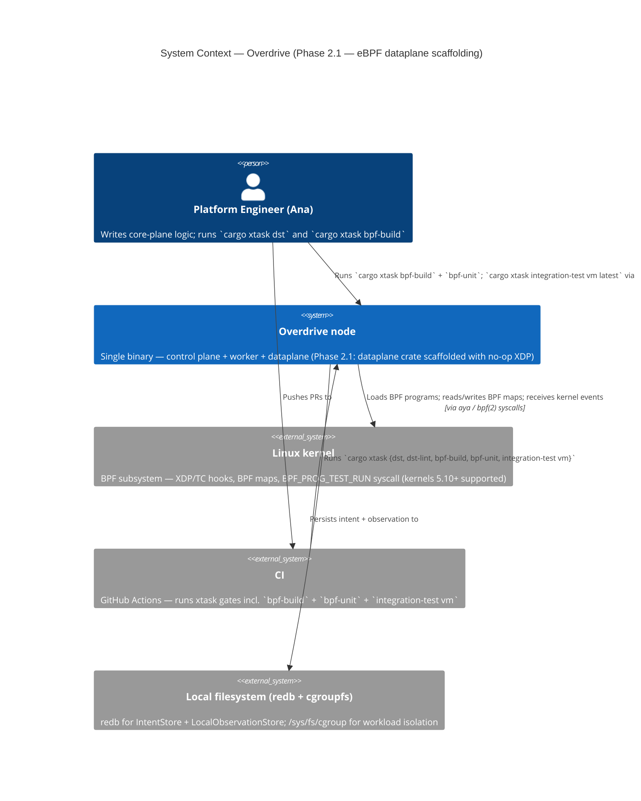
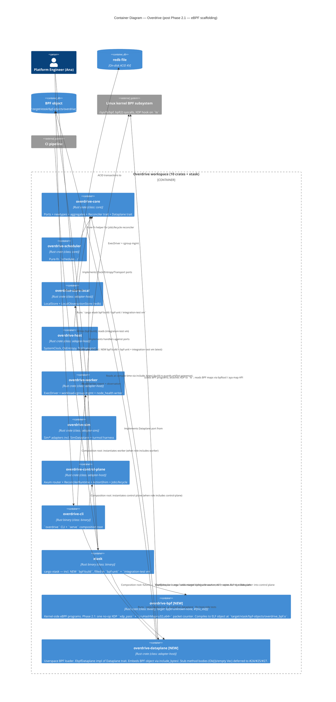

# Architecture — Phase 2.1 aya-rs eBPF scaffolding + build pipeline

**Feature ID:** `phase-2-aya-rs-scaffolding`
**Driving issue:** GH #23 — `[2.1] aya-rs eBPF scaffolding + build pipeline`
**Wave:** DESIGN
**Architect:** Morgan
**Date:** 2026-05-04

---

## 1. Problem statement

Phase 2 of the Overdrive roadmap delivers the eBPF dataplane described in
whitepaper §7. Issue #23 is the *scaffolding* that every later Phase 2
slice (#24–#37: SERVICE_MAP, sockops+kTLS, BPF LSM, telemetry ringbuf,
Tier 2/3 harness expansion) compiles against. Concretely, #23 must:

- mint two new workspace crates (kernel-side BPF programs; userspace
  loader) so subsequent slices have a target to land code in;
- introduce a build pipeline that compiles BPF object files reproducibly
  on Linux/Lima and degrades cleanly on macOS;
- provision `bpf-linker` on every developer surface that builds eBPF;
- ship a no-op XDP program that exercises the entire pipeline end-to-end
  (build → load → attach → observe → detach), proving the seams hold;
- wire the existing Tier 2 (`cargo xtask bpf-unit`) and Tier 3
  (`cargo xtask integration-test vm`) stubs against the no-op program.

What #23 explicitly defers: real policy enforcement (#24+), kTLS
sockops (#26+), BPF LSM (#28+), Tier 4 verifier+perf gates (#29 — the
`verifier-regress` and `xdp-perf` xtask subcommands stay stubbed), and
the SimDataplane parity work for the new map shapes (each future slice
extends `SimDataplane` alongside its kernel-side counterpart).

---

## 2. Crate topology

Two new crates land at the workspace root, siblings to the existing
eight crates established by ADRs 0003, 0016, 0024, 0029.

| Crate | Path | Class (ADR-0003) | Target | Key deps | Role |
|---|---|---|---|---|---|
| `overdrive-bpf` | `crates/overdrive-bpf/` | `binary` | `bpfel-unknown-none` | `aya-ebpf` only | Kernel-side eBPF programs (`#![no_std]`). Compiles to a single ELF object; never loaded by cargo. |
| `overdrive-dataplane` | `crates/overdrive-dataplane/` | `adapter-host` | host (`x86_64-unknown-linux-gnu`, `aarch64-unknown-linux-gnu`, plus stub bodies on macOS) | `aya` (workspace dep at 0.13), `overdrive-core`, `async-trait`, `thiserror`, `tokio`, `tracing` | Userspace loader. Owns the `EbpfDataplane` impl of the `Dataplane` port trait from `overdrive-core`. Embeds the BPF object via `include_bytes!`. |

**Why two crates, not one** — the `#![no_std]`, BPF-target compile
contract is incompatible with anything that needs `std`, `tokio`, or
`aya`'s userspace API. A single crate would force `#[cfg]`-gated
modules and a custom `build.rs` that recursively invokes cargo with
different targets — the recursive-cargo pattern (the aya-template
default) is the failure mode the build pipeline below explicitly
avoids. Two crates make the target boundary a Cargo-level concern, not
a runtime one.

**Why not three** (kernel + ABI/types + loader) — a shared-types crate
is premature in #23. The no-op XDP program has no shared types beyond
the `LruHashMap<u32, u64>` packet counter, and aya's userspace API
already exposes the map by name. The shared-types crate becomes
warranted in #24 (SERVICE_MAP) when wire-format structs cross the
kernel/user boundary; it can land then without disturbing #23's
boundary.

**Class assignment rationale** (ADR-0003 — four valid values: `core`,
`adapter-host`, `adapter-sim`, `binary`):

- `overdrive-bpf` is `binary` — it is not a library that the host
  links against. Its compile output is an ELF object consumed by
  `include_bytes!`. The crate is functionally a code-generation step;
  `binary` matches `xtask` (also a code-generation/tooling target).
- `overdrive-dataplane` is `adapter-host` — it is the production
  binding from the `Dataplane` port trait (in `overdrive-core`) to
  the kernel's BPF subsystem via aya. Same class as `overdrive-host`
  (host-OS adapters), `overdrive-store-local` (redb adapter),
  `overdrive-worker` (cgroup + exec adapter). dst-lint ignores
  `adapter-host` crates by design.

**Dependency graph after #23**:

```
overdrive-core    ←  overdrive-scheduler        ←  overdrive-control-plane  ←  overdrive-cli
                  ←  overdrive-host             ←  overdrive-cli
                  ←  overdrive-store-local      ←  overdrive-control-plane
                  ←  overdrive-worker           ←  overdrive-cli
                  ←  overdrive-dataplane (NEW)  ←  overdrive-cli (Phase 2.x: when AppState gains a dataplane field)
                  ←  overdrive-sim (dev/test)

overdrive-bpf  (no Rust dependents — consumed only as a built artifact via include_bytes!)
```

Critical edges:

- `overdrive-dataplane` depends ONLY on `overdrive-core` for the
  trait surface — same shape as every other `adapter-host` crate.
- `overdrive-control-plane` does **not** depend on
  `overdrive-dataplane`. The dataplane is plugged into `AppState` by
  the binary (the same composition pattern ADR-0029 established for
  `Arc<dyn Driver>`). `AppState` extension lands when a downstream
  slice (probably #24's SERVICE_MAP) gives the control plane
  something concrete to call.
- `overdrive-bpf` has no Rust dependents — it is an artifact-producing
  crate. The `include_bytes!` boundary is a path string, not a Cargo
  edge.

---

## 3. Build pipeline — `xtask bpf-build` + `build.rs` artifact-check shim

The pipeline is a hybrid of an explicit xtask subcommand (primary) and
a defensive `build.rs` shim in the loader (secondary). **No recursive
cargo invocations from build.rs.**

### 3.1 `cargo xtask bpf-build`

A new xtask subcommand. Responsibilities:

1. Run `which_or_hint("bpf-linker", "<install hint>")` (existing helper
   in `xtask/src/main.rs:553`).
2. Invoke the BPF-target cargo build:
   ```text
   cargo +<rust-toolchain> build
       --release
       --target bpfel-unknown-none
       -Z build-std=core
       --manifest-path crates/overdrive-bpf/Cargo.toml
   ```
3. Copy the produced ELF (under
   `target/bpfel-unknown-none/release/overdrive-bpf`) to the stable
   path `target/xtask/bpf-objects/overdrive_bpf.o`. The stable path
   decouples the loader's `include_bytes!` from cargo's nested target
   layout.

The subcommand exits non-zero with a structured `eyre`-formatted
report on any failure. CI runs `cargo xtask bpf-build` before any
job that compiles `overdrive-dataplane`.

### 3.2 `crates/overdrive-dataplane/build.rs`

A small build script whose only job is to surface a clear error when
the BPF artifact is missing:

```text
let path = env!("CARGO_WORKSPACE_DIR") +
           "target/xtask/bpf-objects/overdrive_bpf.o";
if !path.exists() {
    eprintln!("error: BPF object not found at {path};
               run `cargo xtask bpf-build` first");
    std::process::exit(1);
}
println!("cargo:rerun-if-changed={path}");
```

The script does **not** invoke cargo recursively. It does **not** try
to compile the BPF crate. It is a fail-fast guard whose entire purpose
is to convert "linker error in `include_bytes!`" into a single-line
diagnostic that names the fix.

### 3.3 The `include_bytes!` boundary

The loader carries:

```rust
const OVERDRIVE_BPF_OBJ: &[u8] = include_bytes!(concat!(
    env!("CARGO_WORKSPACE_DIR"),
    "target/xtask/bpf-objects/overdrive_bpf.o",
));
```

This is the entire kernel/user boundary in cargo terms. Cargo never
compiles `overdrive-bpf` as a transitive dep of `overdrive-dataplane` —
the kernel crate is excluded from `default-members` (§5 below) and
appears in the dep graph only as a path-string read by `include_bytes!`.

### 3.4 Why hybrid

The straightforward alternatives each fail:

- **build.rs alone, recursive cargo** — aya-template's default. Breaks
  workspace caching (the recursive cargo invocation has its own target
  dir), produces opaque error messages, and is hostile to incremental
  rebuilds. Repeated industry experience (aya, libbpf-rs, redbpf)
  documents this.
- **xtask alone, no build.rs** — leaves a sharp edge: a developer who
  forgets to run `cargo xtask bpf-build` before `cargo check` gets a
  cryptic "file not found in include_bytes!" error from rustc. The
  shim costs ~10 lines and removes that footgun.

The hybrid is the published consensus shape (see Cilium's tetragon
build, Aya's own workspace examples post-2024).

---

## 4. Toolchain provisioning — `bpf-linker`

`bpf-linker` is `cargo install`-able from crates.io (LLVM-15+ wrapper
that resolves BPF relocations). Three provisioning surfaces:

1. **Lima dev VM** — extend the `cargo install --locked` line in
   `infra/lima/overdrive-dev.yaml` (currently
   `cargo install --locked cargo-deny cargo-nextest cargo-mutants`)
   to add `bpf-linker`. Existing Lima users re-provision; new users
   get it on first boot. The VM already installs `clang`, `lld`,
   `mold`, `llvm`, `libclang-dev`, `libelf-dev`, `libbpf-dev`,
   `linux-libc-dev`, `linux-tools-*`, `xdp-tools`, `bpfcc-tools` —
   `bpf-linker` is the missing piece.
2. **`cargo xtask dev-setup`** — for non-Lima Linux developers. New
   xtask subcommand (or an extension of an existing setup target,
   crafter's call) that installs `bpf-linker` via
   `cargo install --locked bpf-linker` after a `which` probe.
3. **`cargo xtask bpf-build`** — fails fast with a `which_or_hint`
   call at the top:
   ```text
   `bpf-linker` not found on PATH. Install with:
   `cargo install --locked bpf-linker` (or `cargo xtask dev-setup`,
   or re-provision the Lima VM if you use it).
   ```

CI inherits the Lima image's tooling automatically (every CI runner
that compiles eBPF is Linux; ubuntu-latest gets the install line as a
setup step in the workflow). No additional CI-only install path.

The `--locked` flag is mandatory on every install site so the version
is reproducible across developer machines and CI; pinning happens
through `Cargo.lock` of `bpf-linker` itself, not a Overdrive-side pin.

---

## 5. macOS dev story

eBPF is Linux-only. The kernel-side crate `overdrive-bpf` cannot
compile on macOS (no `bpfel-unknown-none` cross-tooling shipped with
rustup-darwin); aya's userspace API uses `libbpf` constructs only
present on Linux.

Two mechanisms keep `cargo check --workspace` passing on macOS:

### 5.1 `default-members` exclusion

The workspace currently has no `default-members` declaration — every
member is a default member. The PR adds:

```toml
[workspace]
resolver = "3"
members = [ ..., "crates/overdrive-bpf", "crates/overdrive-dataplane", ... ]
default-members = [
    "crates/overdrive-core",
    "crates/overdrive-cli",
    "crates/overdrive-control-plane",
    "crates/overdrive-dataplane",       # loader compiles on macOS via stub bodies
    "crates/overdrive-host",
    "crates/overdrive-scheduler",
    "crates/overdrive-sim",
    "crates/overdrive-store-local",
    "crates/overdrive-worker",
    "xtask",
]
# `overdrive-bpf` deliberately omitted — it is `#![no_std]` against
# `bpfel-unknown-none`. Built explicitly via `cargo xtask bpf-build`.
```

`cargo check --workspace` (no `--exclude` flag needed) skips
`overdrive-bpf` automatically.

### 5.2 `#[cfg(target_os = "linux")]` on every aya call site

`overdrive-dataplane` compiles on macOS but contains no aya code on
non-Linux targets. The pattern:

```rust
pub struct EbpfDataplane {
    #[cfg(target_os = "linux")]
    bpf: aya::Ebpf,
    #[cfg(target_os = "linux")]
    _link: aya::programs::xdp::XdpLinkId,
}

impl EbpfDataplane {
    #[cfg(target_os = "linux")]
    pub fn new(iface: &str) -> Result<Self, DataplaneError> { /* aya */ }

    #[cfg(not(target_os = "linux"))]
    pub fn new(_iface: &str) -> Result<Self, DataplaneError> {
        Err(DataplaneError::LoadFailed(
            "overdrive-dataplane: non-Linux build target".into()
        ))
    }
}

#[async_trait]
impl Dataplane for EbpfDataplane {
    async fn update_policy(&self, _key: PolicyKey, _verdict: Verdict)
        -> Result<(), DataplaneError>
    {
        // Stub — see #24 (POLICY_MAP). Behaviour identical on
        // Linux and non-Linux until that slice lands.
        Ok(())
    }
    // ... update_service / drain_flow_events similarly
}
```

`DataplaneError::LoadFailed(String)` already exists in
`crates/overdrive-core/src/traits/dataplane.rs:23` — no new variant
needed.

### 5.3 The `--no-run` pre-merge gate

Per `.claude/rules/testing.md` § "Running tests on macOS — Lima VM",
every step's macOS quality gate is:

```text
cargo check --workspace --features integration-tests --no-run
```

(specifically the `--no-run` form, since macOS cannot execute the
Linux-gated runtime surface). On Linux/Lima the gate is the full
`cargo nextest run --workspace --features integration-tests` via
`cargo xtask lima run --`.

---

## 6. Test strategy

### 6.1 Tier 2 — BPF unit (`cargo xtask bpf-unit`)

Per `.claude/rules/testing.md` § "Tier 2 — BPF Unit Tests" the no-op
XDP program ships a single `PKTGEN`/`SETUP`/`CHECK` triptych under
`crates/overdrive-bpf/tests/`:

- `PKTGEN` — synthesise a minimal Ethernet+IP+TCP packet.
- `SETUP` — clear the `LruHashMap<u32, u64>` packet counter map.
- `CHECK` — drive `BPF_PROG_TEST_RUN` via aya's `Program::test_run()`,
  assert the verdict is `XDP_PASS` and the counter incremented from
  0 to 1.

`cargo xtask bpf-unit` invokes `cargo nextest run -p overdrive-bpf
--features integration-tests --test '*'` (matching the existing stub's
documented intent at `xtask/src/main.rs:565-572`). Nextest is the
project-wide runner.

### 6.2 Tier 3 — LVH smoke (`cargo xtask integration-test vm latest`)

A single end-to-end test asserting AC1: load → attach to `lo` →
observe counter > 0 after traffic → clean detach. The assertion path
is the `bpftool map dump` shape mandated by
`.claude/rules/testing.md` § "Assertion rules" (assert on observable
kernel side effects, never on internal program reachability).

`cargo xtask integration-test vm latest` is filled in (currently a
`tracing_placeholder` stub at `xtask/src/main.rs:574-586`) using
the LVH harness pattern aya already documents. CI runs the full
kernel matrix nightly; PR runs only `latest` to keep the critical
path under 15 minutes.

### 6.3 Tier 4 — explicitly deferred

`cargo xtask verifier-regress` and `cargo xtask xdp-perf` remain
`tracing_placeholder` stubs with a `// TODO(#29): wire when first
real program lands` comment. There is no point gating verifier
complexity or xdp-bench throughput against a no-op program — the
baselines would be meaningless and the gates would catch nothing.

---

## 7. Integration with the existing `Dataplane` port

The `Dataplane` trait surface in `crates/overdrive-core/src/traits/
dataplane.rs` (read 2026-05-04) is fixed:

```rust
#[async_trait]
pub trait Dataplane: Send + Sync + 'static {
    async fn update_policy(&self, key: PolicyKey, verdict: Verdict)
        -> Result<(), DataplaneError>;
    async fn update_service(&self, vip: Ipv4Addr, backends: Vec<Backend>)
        -> Result<(), DataplaneError>;
    async fn drain_flow_events(&self) -> Result<Vec<FlowEvent>, DataplaneError>;
}
```

`EbpfDataplane` ships in `overdrive-dataplane` as the production
implementation, mirroring `SimDataplane`'s constructor shape
(`SimDataplane::new()` → `EbpfDataplane::new(iface: &str)`). Method
bodies in #23:

| Method | #23 body | Issue that fills it in |
|---|---|---|
| `EbpfDataplane::new(iface)` | Loads no-op XDP via `aya::Ebpf::load`, attaches to `iface`, returns `Self`. **Real work.** | n/a — done in #23 |
| `update_policy` | `Ok(())` | #24 (POLICY_MAP) |
| `update_service` | `Ok(())` | #25 (SERVICE_MAP) |
| `drain_flow_events` | `Ok(vec![])` | #27 (telemetry ringbuf) |

Each stub method has a doc comment naming the issue. `EbpfDataplane`
is **not** wired into `AppState` in #23 — that wiring waits for #24
(the first slice that has something to call). #23 ships the type and
proves it loads; the binary-composition edge is added by the slice
that needs it.

---

## 8. dst-lint impact

Both new crates are non-`core`:

- `overdrive-bpf` declares `crate_class = "binary"`.
- `overdrive-dataplane` declares `crate_class = "adapter-host"`.

dst-lint (`xtask/src/dst_lint.rs`) scans only `crate_class = "core"`
crates per ADR-0003. Both new crates are skipped. The existing
self-test asserting the `core`-class set is non-empty continues to
pass (`overdrive-core` and `overdrive-scheduler` remain).

The workspace-wide `cargo xtask mutants ... --features
integration-tests` invocation requires every member to declare
`integration-tests = []` per `.claude/rules/testing.md` § Workspace
convention. Both new crates declare it — `overdrive-bpf` as a
deliberate no-op (kernel-side, no integration tests possible),
`overdrive-dataplane` as the gate for any host-side integration
tests it ships (currently none in #23; AC1's smoke test lives in the
xtask-driven Tier 3 harness, not in the crate's `tests/` dir).

---

## 9. Known risks / open questions for downstream issues

1. **Shared types between kernel and userspace (#24+).** The no-op
   program has no shared types beyond `u32`/`u64`. The first
   non-trivial map (POLICY_MAP) crosses the boundary. Decision
   deferred: either (a) a third `overdrive-bpf-types` crate (`#![no_std]`,
   no `aya` dep), or (b) a `types` module gated `#[cfg(not(target =
   "bpfel-unknown-none"))]` inside `overdrive-bpf`. Anchor at #24.
2. **`aya::Ebpf::load` panics on malformed object files in some
   versions.** The 0.13 workspace pin is current; if a future bump
   regresses, the Tier 3 smoke catches it. No #23-side mitigation
   needed.
3. **`bpf-linker` install time on Lima first-boot.** `cargo install`
   from source is ~1–2 minutes; this lengthens first-boot
   provisioning. Mitigation: the `cargo install` line already exists,
   adding one more crate is in the noise. Alternative pre-built
   binary distribution (e.g. via `cargo binstall`) is a follow-up if
   it becomes a real friction.
4. **Userland-only tests for `EbpfDataplane`.** With aya's
   `Program::test_run()` there is no need for a kernel for Tier 2.
   Tier 3 catches the load+attach path on Linux/Lima. macOS gets the
   `--no-run` compile gate only — by design.
5. **`AppState` extension** (which slice wires `Arc<dyn Dataplane>`
   into the control plane): pre-flagged for #24 owner. Not in #23.
6. **Runtime capability requirements: CAP_BPF + CAP_NET_ADMIN.** The
   loader process needs these capabilities (or root) to call
   `bpf(2)` and attach XDP to an interface. Lima dev VM runs the
   test process as root via `cargo xtask lima run --` (the canonical
   wrapper per `.claude/rules/testing.md`) so this is transparent in
   development. Production deployment (Phase 7+ via meta-overdrive)
   needs the systemd unit to declare `AmbientCapabilities=CAP_BPF
   CAP_NET_ADMIN` or run as root. Flagged for #28+ security-model
   slices and Phase 7 OS image work; not a #23 blocker because the
   Tier 3 smoke test already runs as root inside Lima.

---

## 10. C4 diagrams

### 10.1 C4 Level 1 — System Context (Phase 2.1 boundary)



### 10.2 C4 Level 2 — Container (post-#23 workspace, 10 crates)



### 10.3 C4 Level 3 — skipped

The loader is a single struct with three trait methods, two of which
are no-ops in #23. A component diagram would add no information that
the L2 + the trait surface in §7 do not already convey. L3 becomes
warranted around #25 (SERVICE_MAP) when the loader gains a map-update
component, a flow-event consumer component, and an attachment-state
component.

---

## 11. Reuse Analysis

| Existing Component | File | Overlap | Decision | Justification |
|---|---|---|---|---|
| `Dataplane` trait | `crates/overdrive-core/src/traits/dataplane.rs` | THE port we're implementing | EXTEND (impl trait) | Trait is fixed; we satisfy it. No trait change. `DataplaneError::LoadFailed(String)` already covers the non-Linux build target case — no new error variant needed. |
| `SimDataplane` | `crates/overdrive-sim/src/adapters/dataplane.rs` | Sibling impl on the other side of the port | MIRROR shape | `EbpfDataplane::new()` mirrors `SimDataplane::new()` at the constructor seam. `SimDataplane` ships HashMap-backed state; `EbpfDataplane` ships aya-backed state with the same trait surface. SimDataplane is **not** modified by #23 — its no-op responses are already correct against the trait, and any new map shape lands in lockstep with its kernel-side counterpart in later slices. |
| `overdrive-host` crate | `crates/overdrive-host/Cargo.toml`, `src/lib.rs` | Existing host adapter crate | SIBLING (do NOT extend) | `overdrive-host` is host-OS primitives only (Clock, Entropy, Transport) per ADR-0016, restored by ADR-0029. Adding a kernel/aya dependency to it would re-violate the ADR-0029 cleanup. New crate is the right shape. |
| `overdrive-worker` Cargo.toml | `crates/overdrive-worker/Cargo.toml` | Closest-precedent `adapter-host` crate | TEMPLATE | Use as Cargo.toml template — same `[package.metadata.overdrive] crate_class = "adapter-host"`, same `integration-tests = []` declaration, same workspace dep style, same `[target.'cfg(target_os = "linux")']` block pattern for libc-style host-OS-specific deps. |
| `xtask::which_or_hint` | `xtask/src/main.rs:553` | Tool-presence probe | EXTEND (call from `bpf-build`) | Existing helper. `bpf-build` calls it for `bpf-linker`. Zero new code — just one call site. |
| `xtask::bpf_unit` stub | `xtask/src/main.rs:565-572` | Existing placeholder | FILL IN | Already wired into the `Task::BpfUnit` enum; the body is a `tracing_placeholder` we replace with `cargo nextest run -p overdrive-bpf --features integration-tests --test '*'`. |
| `xtask::integration_vm` stub | `xtask/src/main.rs:574-586` | Existing placeholder | FILL IN | Same shape — body is a placeholder; we replace it with the LVH invocation per `.claude/rules/testing.md` § Tier 3. |
| `xtask::verifier_regress` / `xdp_perf` stubs | `xtask/src/main.rs:588-594` | Existing placeholders | LEAVE STUBBED | Per Q8: deferred to #29. Add `// TODO(#29): wire when first real program lands` comment. No point baselining a no-op. |
| `infra/lima/overdrive-dev.yaml` cargo-install line | line 205 | Existing tool-install enumeration | EXTEND | Add `bpf-linker` to the existing `cargo install --locked cargo-deny cargo-nextest cargo-mutants` line. CI inherits via the same workflow path (Linux runners install via the same line in their setup step). |
| Workspace `Cargo.toml` `[workspace.dependencies]` | `Cargo.toml:24` | aya = "0.13" already declared at line 85 | REUSE | aya is already a workspace dep. `overdrive-dataplane` adds `aya.workspace = true`. `aya-ebpf` (the kernel-side crate) is **not** yet a workspace dep — declare it (workspace dep, latest patch of 0.1.x) so `overdrive-bpf` can reference it as `aya-ebpf.workspace = true`. |
| Workspace `Cargo.toml` `members` | `Cargo.toml:3-13` | Existing 8-member declaration | EXTEND | Add `crates/overdrive-bpf` and `crates/overdrive-dataplane`. Add a NEW `default-members` declaration that includes the loader but excludes the kernel-side crate. |
| ADR-0003 (crate-class taxonomy) | `docs/product/architecture/adr-0003-core-crate-labelling.md` | Class-string allow-list | REUSE (no change) | Both new crates use existing values (`binary` and `adapter-host`). No taxonomy change. |
| ADR-0016 (overdrive-host extraction) | `docs/product/architecture/adr-0016-...md` | Adapter-extraction precedent | CITE in new ADR | Same strategic shape: extract per architectural class. The new dataplane crate is `overdrive-host` for the kernel/BPF surface. |
| ADR-0029 (overdrive-worker extraction) | `docs/product/architecture/adr-0029-...md` | Closest-precedent extraction ADR | TEMPLATE | Mirror its structure (Status / Context / Decision / Alternatives / Consequences / Compliance / References). |
| `crates/overdrive-host/Cargo.toml` | (read 2026-05-04) | Existing `adapter-host` Cargo.toml shape | TEMPLATE | Mirror the `[features] integration-tests = []` block + `[package.metadata.overdrive] crate_class = "adapter-host"` declaration verbatim. |

**Default = EXTEND.** The two CREATE NEW entries (`overdrive-bpf`,
`overdrive-dataplane`) are justified by:

- No existing crate hosts kernel-side BPF source; no existing crate
  hosts a userspace BPF loader.
- ADR-0029 establishes the per-architectural-class extraction
  pattern; eBPF is a distinct architectural class (Linux-only, BPF
  target, kernel-bound).
- Adding either responsibility to `overdrive-host` would re-violate
  ADR-0016's intent (host-OS primitives only) — exactly the move
  ADR-0029 reversed for ProcessDriver.
