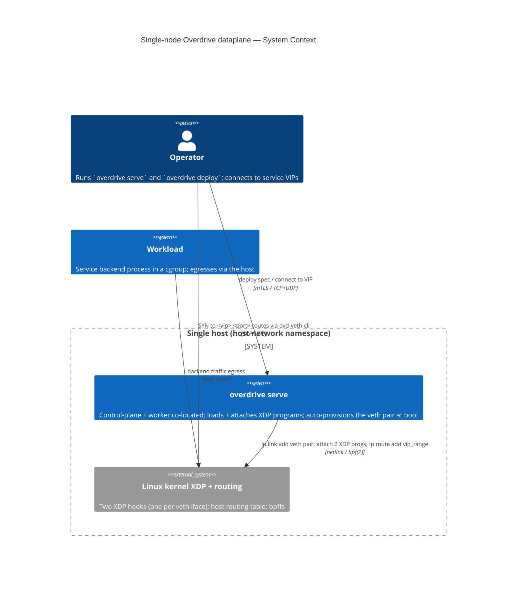
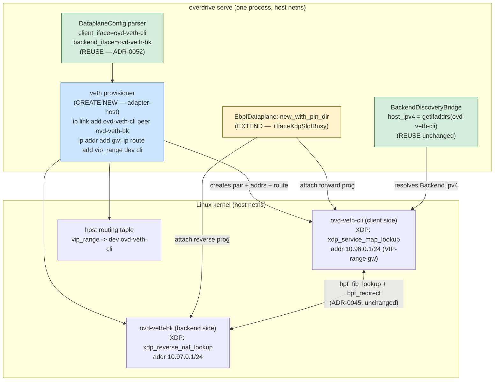

# C4 Diagrams — `single-node-dataplane-wiring`

Mandatory C4 System Context + Container views for the **ratified** option
(Option 1 — dedicated veth pair, two programs, two ifaces,
auto-provisioned at boot; ADR-0061 Accepted 2026-06-02). Plus a sequence
view of the boot composition and a request-flow view of single-node
traffic steering (G-4).

Provisioning is **idempotent detect-and-reuse**, so a Yocto OS image or
the Lima VM boot can own the veth lifecycle interchangeably (DQ-1 / DQ-4).
The datapath shown is **IPv4-only**; IPv6 / AF_INET6 single-node steering
is deferred to issue **#195** (DQ-3), and the explicit `[dataplane]
provision` opt-out knob to issue **#194** (DQ-2).

---

## 1. System Context (C4 L1)



---

## 2. Container view (C4 L2) — single-node dataplane wiring



Legend: blue = CREATE NEW, amber = EXTEND, green = REUSE.

---

## 3. Boot composition (sequence) — provision-then-attach ordering

```mermaid
sequenceDiagram
    participant Serve as overdrive serve
    participant Cfg as DataplaneConfig
    participant Prov as veth provisioner (NEW)
    participant Kern as kernel (netlink + bpf)
    participant Ebpf as EbpfDataplane

    Serve->>Cfg: parse [dataplane] (client/backend iface)
    Cfg-->>Serve: ovd-veth-cli / ovd-veth-bk
    Serve->>Prov: provision(client, backend, vip_range)
    Prov->>Kern: ip link show (idempotency check)
    alt pair absent
        Prov->>Kern: ip link add ovd-veth-cli peer ovd-veth-bk
        Prov->>Kern: ip addr add <gw> dev ovd-veth-cli; link up (both)
        Prov->>Kern: ip route add <vip_range> dev ovd-veth-cli
    else pair present (reuse / adopt)
        Note over Prov,Kern: idempotent detect-and-reuse — adopt a pair<br/>created by a prior serve, a Yocto OS image,<br/>or the Lima VM boot (DQ-1 / DQ-4)
    end
    Prov-->>Serve: ok
    Serve->>Ebpf: new_with_pin_dir(client, backend)
    Ebpf->>Kern: attach xdp_service_map_lookup -> ovd-veth-cli
    Ebpf->>Kern: attach xdp_reverse_nat_lookup -> ovd-veth-bk
    alt EBUSY (same iface / stale prog)
        Kern-->>Ebpf: EBUSY
        Ebpf-->>Serve: DataplaneError::IfaceXdpSlotBusy { iface } (D3)
    else ok
        Ebpf->>Ebpf: probe() (Earned Trust — ADR-0052)
        Ebpf-->>Serve: ready
    end
```

---

## 4. Request flow (G-4 steering) — single node, host netns

```mermaid
sequenceDiagram
    participant Client as deploy client / workload
    participant Rt as host routing table
    participant Cli as ovd-veth-cli ingress (XDP forward)
    participant Bk as ovd-veth-bk ingress (XDP reverse)
    participant Backend as Service backend (cgroup)

    Client->>Rt: SYN to <vip>:<port>
    Rt->>Cli: vip_range routes out ovd-veth-cli (peer ingress)
    Cli->>Cli: SERVICE_MAP hit; rewrite dst -> backend; bpf_fib_lookup
    Cli->>Backend: bpf_redirect(fib.ifindex) across the veth pair (ADR-0045)
    Backend-->>Bk: response (src=backend)
    Bk->>Bk: REVERSE_NAT_MAP hit; rewrite src -> vip; bpf_redirect
    Bk-->>Client: response (src=<vip>:<port>)
```

The single host plays all three roles the Tier-3 `ThreeIfaceTopology`
splits across `client-ns` / `lb-ns` / `backend-ns` (ADR-0043) — collapsed
into the host network namespace because Phase 1 is single-node.
`bpf_fib_lookup` resolves the egress iface and next-hop MAC from the host
routing table the provisioner populates; the `bpf_redirect` datapath
(ADR-0045) is unchanged.
```
