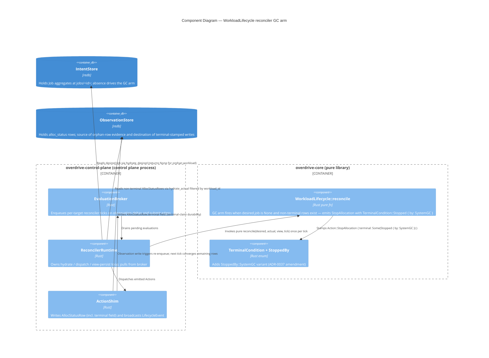

# C4 Component Diagram — Workload GC Touchpoints

Scope: control-plane internals affected by feature `workload-gc-absent-stale-allocs`. System Context (L1) and Container (L2) would be redundant for an intra-reconciler change; one Component diagram is sufficient.

**What the diagram shows:**

- **No new containers, no new components.** The GC arm extends `WorkloadLifecycle::reconcile` (a fn inside the existing component) and the `StoppedBy` enum gains one variant.
- **The data-flow loop converges on its own.** Tick → reconcile sees orphan rows → emits Stops → ActionShim writes terminal rows → observation delta re-enqueues target → next tick sees terminal rows only → emits zero Actions → arm quiesces.
- **Two read sources, one write destination.** Intent for `desired.job`, Observation for `actual.allocations`. Writes go to Observation only (terminal-stamped rows + lifecycle events).

**What the diagram does NOT show (and why):**

- No new arrows out of `overdrive-core` — the crate stays pure. All I/O is at the runtime/shim boundary.
- No race-resolver component — the per-target hydration boundary IS the LWW resolver; no separate component needed.
- No "OrphanDetector" or "GC sweeper" component — Option B's shape was rejected in favour of in-place extension.
