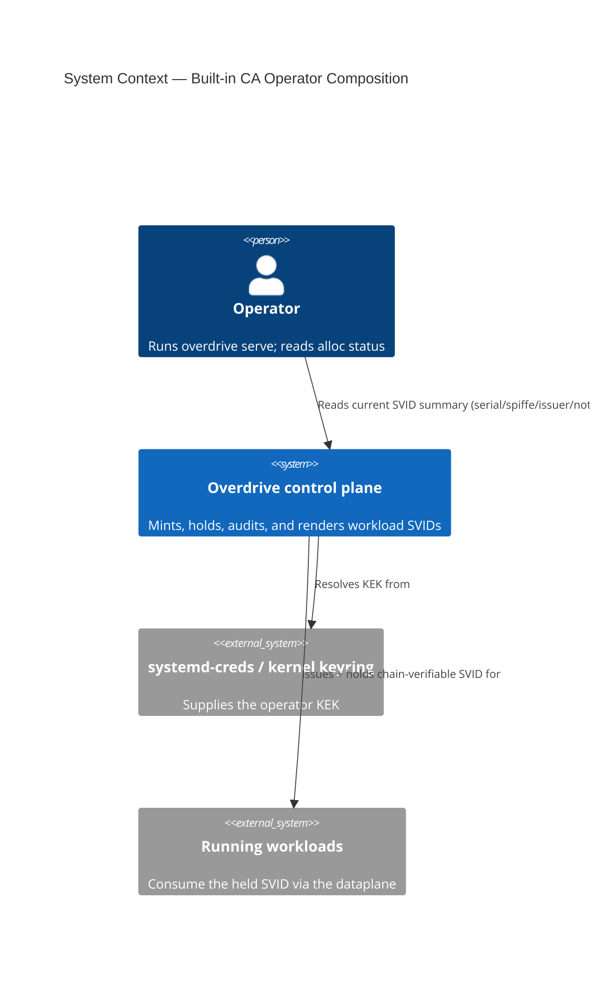
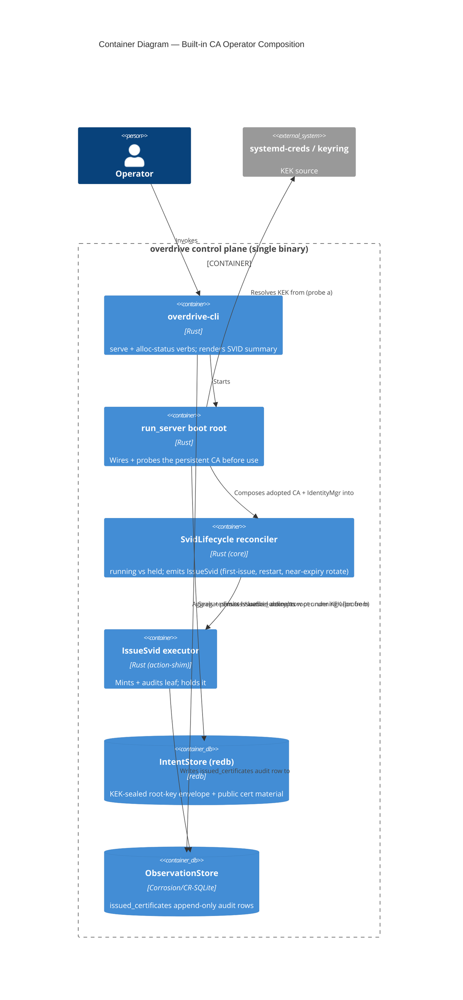
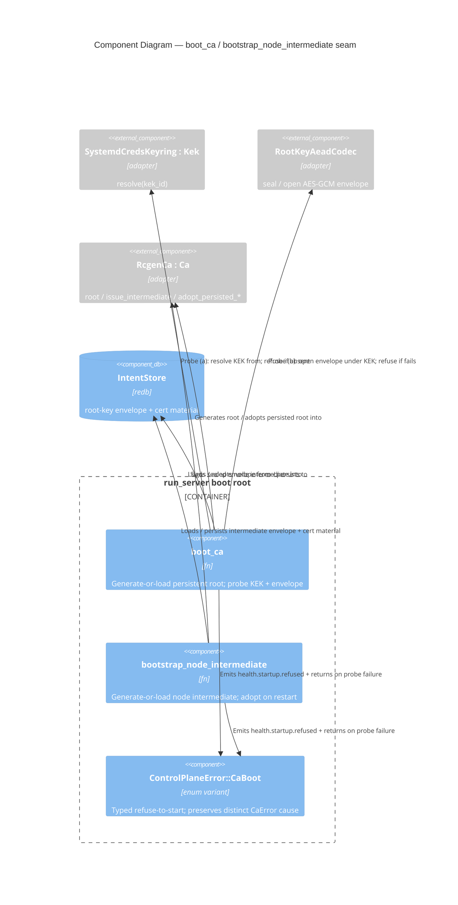

# C4 Diagrams — `built-in-ca-operator-composition`

Mermaid C4. System Context (L1) + Container (L2) are mandatory; a Component
diagram (L3) is included for the CA boot-composition seam because it crosses
four driven ports with Earned-Trust probes.

## L1 — System Context

## L2 — Container

## L3 — Component (CA boot-composition seam)

Justified: the seam crosses four driven ports with two Earned-Trust probes and
a fail-closed adopt-or-refuse invariant — the highest-risk boundary in the
feature.

