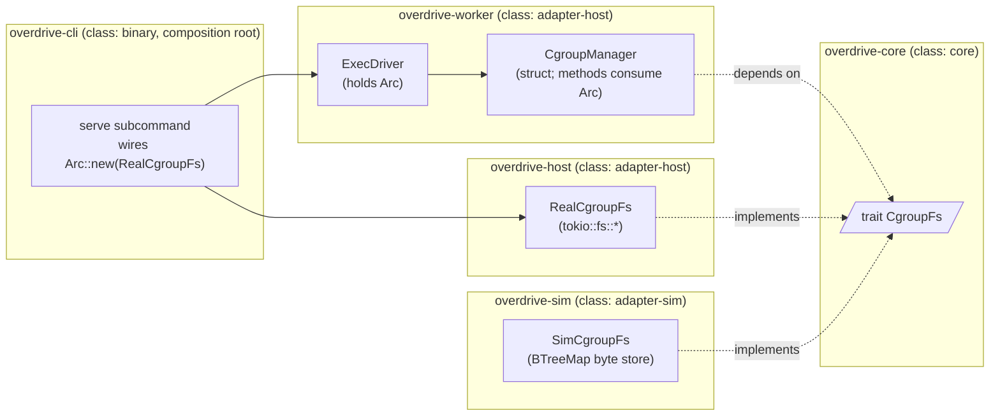

# Feature delta — `cgroup-fs-port`

Single-narrative DESIGN-wave artifact per D2 (no legacy `wave-decisions.md`
/ `architecture-design.md` split). Density: `lean` — Tier-1 [REF] sections
only; Tier-2 [WHY|HOW] expansions available via wave-end menu.

**Primary input**: GitHub issue #136 (enumerates the five decision points,
scope boundaries, and acceptance criteria — there is no
`docs/feature/cgroup-fs-port/discuss/` directory).

**Scope**: all priorities (D1 + D2 + D3 + D4 + D5) per project CLAUDE.md
§ "nWave design dispatches — priority scope".

---

## Wave: DESIGN / [REF] DDD List

| ID | Decision | Verdict | One-line rationale |
|---|---|---|---|
| D1 | Trait shape — narrow `CgroupFs` vs broad `Filesystem` vs hybrid | **Narrow `CgroupFs`** (Option A) | YAGNI; only consumer today is the cgroup manager; a broad `Filesystem` invites scope creep and weakens the contract. |
| D2 | Trait placement — `overdrive-core` vs `overdrive-worker` | **`overdrive-core`** (ports crate) | Matches Clock/Transport/Entropy/Dataplane/Driver/IntentStore/ObservationStore/Llm precedent; lets the trait be substituted at the binary boundary by either `RealCgroupFs` (host) or `SimCgroupFs` (sim) without the worker crate naming the implementation. |
| D3 | Cgroupfs semantics leak (kernel-side effects SimFs cannot simulate) | **Non-replacement contract recorded in ADR; Tier 3 (Lima sudo) stays mandatory for kill / subtree_control / kernel-state effects** | SimFs is a byte-write store; `1\n` to `cgroup.kill` does NOT terminate processes; `subtree_control` is not validated against the kernel's controller availability table. Equivalence test asserts byte-side effects only. |
| D4 | Cancellation semantics under DST (futures dropped mid-syscall) | **SimCgroupFs models `Future::drop` as `EnoughBytesWrittenOrZero` checkpoint — every write is journalled atomically pre-`.await` resolution; injected errors and cancellation interleavings are scheduled by the harness** | K3 (seed → bit-identical trajectory) extends naturally: cancellation is deterministic at every method-entry, mid-syscall is a kernel concept that does not apply in-process. |
| D5 | Migration shape — struct method (`new(fs: Arc<dyn CgroupFs>)`) vs generic `F: CgroupFs` vs global | **Struct method on `CgroupManager`** — constructor takes `Arc<dyn CgroupFs>`, mandatory not defaulted | Matches every other port-trait wiring (AppState, ExecDriver, EvalBroker); avoids monomorphisation explosion across the test surface; lets the same `Arc<dyn CgroupFs>` flow through the worker crate uniformly without builder methods. |

Locked decisions land in the table in § "Decisions Table" below.

---

## Wave: DESIGN / [REF] Component Decomposition

| Component | Path | Class | Change type | Notes |
|---|---|---|---|---|
| `CgroupFs` trait | `crates/overdrive-core/src/traits/cgroup_fs.rs` (new file) + re-export from `traits/mod.rs` | `core` | **CREATE NEW** (justified: no existing port covers cgroupfs side effects; Clock/Transport/Entropy/Dataplane/Driver/IntentStore/ObservationStore/Llm each cover orthogonal concerns and adding a method on any of them would conflate them) | Five-method surface (create_dir / write / remove_dir + a `probe()` per Earned Trust + a `kind()` introspection method for diagnostic logging). |
| `RealCgroupFs` adapter | `crates/overdrive-host/src/cgroup_fs.rs` (new file) | `adapter-host` | **CREATE NEW** | Wraps `tokio::fs::{create_dir_all, write, remove_dir}`. Zero new external deps; production lift-and-shift of the existing free functions' bodies. |
| `SimCgroupFs` adapter | `crates/overdrive-sim/src/adapters/cgroup_fs.rs` (new file) | `adapter-sim` | **CREATE NEW** | In-memory `BTreeMap<PathBuf, Vec<u8>>` (BTreeMap per § "Ordered-collection choice") + injectable error schedule per method/path. |
| `CgroupManager` struct (consolidates the eight free functions currently in `crates/overdrive-worker/src/cgroup_manager.rs`) | `crates/overdrive-worker/src/cgroup_manager.rs` (file kept; module reshaped) | `adapter-host` | **REFACTOR** | Free functions become methods on `CgroupManager { fs: Arc<dyn CgroupFs>, cgroup_root: PathBuf }`. `CgroupPath` newtype + `WorkloadsBootstrapError` stay as-is. |
| `ExecDriver` constructor | `crates/overdrive-worker/src/driver.rs` | `adapter-host` | **REFACTOR** | `ExecDriver::new` adds `fs: Arc<dyn CgroupFs>` parameter (mandatory, not defaulted, per `.claude/rules/development.md` § "Port-trait dependencies"). Internally stores it on the struct and passes to `CgroupManager`. |
| `AppState` (composition root) | `crates/overdrive-control-plane/src/lib.rs` (`AppState::new`) | `adapter-host` | **REFACTOR** (call-site only) | No new field on `AppState` — the `Arc<dyn CgroupFs>` flows into the binary's `ExecDriver::new` call site, which is constructed inside the worker subsystem entrypoint, not directly inside `AppState`. The control-plane crate never names `CgroupFs`. |
| Binary composition root | `crates/overdrive-cli/src/...` (`overdrive serve` subcommand) | `binary` | **REFACTOR** | Constructs `Arc::new(RealCgroupFs::new())`, threads into worker subsystem startup, which threads into `ExecDriver::new`. Single composition point per `.claude/rules/development.md` § "Production wiring is composed at the binary boundary". |
| Existing tempfile unit tests (cgroup_manager.rs `#[cfg(test)] mod tests`) | `crates/overdrive-worker/src/cgroup_manager.rs` (inline) | n/a | **TRIAGE per-test** (see Reuse Analysis below) | Some convert to `SimCgroupFs` (pure logic — `cpu_weight_for`, error discrimination, idempotency); some stay as tempfile-backed tests against `RealCgroupFs` for byte-side-effect coverage that SimFs structurally cannot honor (file presence / contents after the call). |

---

## Wave: DESIGN / [REF] Driving Ports

No new driving ports. The cgroup manager is consumed via `ExecDriver`,
which is itself consumed via `AppState.driver` (already a driving-port
mediation surface today). No new CLI subcommand; no new HTTP route; no new
skill.

---

## Wave: DESIGN / [REF] Driven Ports + Adapters



**Port placement rule applied** (per `.claude/rules/development.md`
§ "Port-trait dependencies"): `overdrive-worker` and consumers depend on
the trait surface in `overdrive-core` only; the binary composes
`Arc<dyn CgroupFs>` from `overdrive-host::RealCgroupFs`; tests inject
`Arc<SimCgroupFs>` from `overdrive-sim`. Mandatory not defaulted at the
constructor: `ExecDriver::new(cgroup_root, clock, fs)`.

---

## Wave: DESIGN / [REF] Technology Choices

| Choice | Version / Source | License | Why |
|---|---|---|---|
| `tokio::fs::*` | already in workspace via `tokio.workspace = true` | MIT | The real adapter IS `tokio::fs`. No new dep. |
| `parking_lot::Mutex` / `tokio::sync::Mutex` | already in workspace | Apache-2.0 / MIT | `SimCgroupFs` holds a `parking_lot::Mutex<BTreeMap<...>>` (no `.await` while holding); injection schedule held in a separate `parking_lot::Mutex<...>`. |
| `BTreeMap` | std | — | Deterministic iteration per `.claude/rules/development.md` § "Ordered-collection choice". |

**No new external crates added.** The work is structural: trait surface in
`overdrive-core`, real adapter in `overdrive-host`, sim adapter in
`overdrive-sim`, free-function → method refactor in `overdrive-worker`.
This was a deliberate evaluation criterion when sizing the work.

---

## Wave: DESIGN / [REF] Decisions Table

(Locked DDD-N rows; no prose rationale — narrative lives in § "DDD List"
above and in ADR-0054.)

| ID | Decision | Locked value |
|---|---|---|
| DDD-1 | Trait shape | `CgroupFs` — narrow, cgroup-semantic. Methods: `create_dir`, `write`, `remove_dir`, `probe`, `kind`. |
| DDD-2 | Trait crate placement | `crates/overdrive-core/src/traits/cgroup_fs.rs`. |
| DDD-3 | Tier 3 mandatory | Yes — Lima sudo integration tests stay; SimCgroupFs is byte-write only; semantics leak documented in ADR-0054 § "Non-replacement contract". |
| DDD-4 | Cancellation model | Method-entry deterministic; mid-syscall does not exist (in-process write is atomic). DST seeds extend uncannily. |
| DDD-5 | Migration shape | Constructor injection on `CgroupManager` struct + `ExecDriver::new` carries the trait object. Mandatory, not defaulted, not builder-overridable. |

---

## Wave: DESIGN / [REF] Reuse Analysis

(Hard gate per skill success criteria. Zero unjustified CREATE NEW.)

| Asset | Where it lives today | Decision | Justification |
|---|---|---|---|
| `tokio::fs::*` (`create_dir_all`, `write`, `remove_dir`) | workspace dep | **WRAP** | The real adapter IS `tokio::fs`. Lift-and-shift of the bodies currently inside `cgroup_manager.rs` free functions. No reimplementation, no abstraction over both sync and async — the dst-lint gate forbids sync `std::fs` inside `async fn` anyway. |
| Existing port traits (`Clock`, `Transport`, `Entropy`, `Dataplane`, `Driver`, `IntentStore`, `ObservationStore`, `Llm`) | `crates/overdrive-core/src/traits/*.rs` | **PATTERN-REUSE** | Same shape: `pub trait Foo: Send + Sync + 'static` (Clock pattern), declared once in `overdrive-core`, real impl in `overdrive-host`, sim impl in `overdrive-sim`, mandatory constructor injection at consumers. `CgroupFs` follows this template exactly. |
| `cgroup_manager.rs` free functions (`create_workload_scope`, `place_pid_in_scope`, `write_resource_limits`, `cgroup_kill`, `remove_workload_scope`, `create_workloads_slice_with_controllers`, `cpu_weight_for`, `write_resource_limits_warn_on_error`) | `crates/overdrive-worker/src/cgroup_manager.rs` | **REFACTOR** (not delete, not duplicate) | Bodies become method bodies on `CgroupManager`; the `tokio::fs::*` calls inside become `self.fs.write(...).await` etc. The arithmetic / classification helpers (`cpu_weight_for`, `WorkloadsBootstrapError::from_subtree_control_io`) stay as free or associated functions — no FS dep. |
| `CgroupPath` newtype + its STRICT discipline | `crates/overdrive-worker/src/cgroup_manager.rs` | **KEEP IN PLACE** | Newtype is unrelated to the FS port — it validates relative-path shape. Stays in worker crate. |
| `WorkloadsBootstrapError` envelope | `crates/overdrive-worker/src/cgroup_manager.rs` | **KEEP IN PLACE** | Error envelope on the typed surface stays; it wraps the underlying `io::Error` regardless of which `CgroupFs` impl produced it. The EBUSY-vs-other discrimination logic is identical because the kernel-level contract is identical for both real cgroupfs and the no-op semantic SimCgroupFs returns (which can be injected to return `EBUSY` for the right tests). |
| Existing tempfile-based unit tests in `cgroup_manager.rs` (12 tests today) | `crates/overdrive-worker/src/cgroup_manager.rs` `#[cfg(test)] mod tests` | **TRIAGE per-test** (8 convert to SimCgroupFs; 4 stay tempfile-backed as byte-side-effect tests against `RealCgroupFs`) | Per issue #136 AC, the choice is made deliberately per test and documented: (1) `cgroup_path_as_str_returns_canonical_string`, `cpu_weight_for_pins_division_and_clamp`, `from_subtree_control_io_*` (3 tests) — pure logic, no FS; stay as-is. (2) `cgroup_kill_is_idempotent_on_missing_scope`, `remove_workload_scope_is_idempotent_on_missing_scope` — convert to SimCgroupFs (assertion is "Ok on absent path"; SimFs models presence/absence faithfully). (3) `cgroup_kill_writes_one_to_cgroup_kill_file`, `place_pid_in_scope_writes_pid_to_cgroup_procs`, `write_resource_limits_writes_cpu_weight_and_memory_max`, `write_resource_limits_warn_on_error_writes_files_on_success`, `create_workload_scope_writes_a_real_directory`, `create_workloads_slice_with_controllers_creates_dir_and_writes_subtree_control`, `create_workloads_slice_with_controllers_is_idempotent` — convert to SimCgroupFs (assertion is on the bytes written; SimFs records the byte payload). (4) `cgroup_kill_propagates_non_notfound_errors`, `remove_workload_scope_propagates_non_notfound_errors` — KEEP TEMPFILE-BACKED against `RealCgroupFs`. The current setup creates a regular file where a directory would be and asserts on `ErrorKind::NotADirectory` (`ENOTDIR`) — that is a kernel-VFS effect SimCgroupFs cannot reproduce honestly (in-memory has no inode type taxonomy). Per the non-replacement contract: these tests defend a kernel-side semantic; they belong in the integration / tempfile lane, NOT in the SimFs lane. |
| `SimDriver`, `SimDataplane`, `SimClock` adapter construction shapes | `crates/overdrive-sim/src/adapters/*.rs` | **PATTERN-REUSE** | `SimCgroupFs::new()` follows the same shape — small constructor, internal `parking_lot::Mutex` over BTreeMap state, builder-style injection of fault scenarios (without violating "no builder for the port itself" — these are sim-side fault injectors, not port-trait config). |
| `ServiceVipAllocator::probe()` (Earned Trust precedent — see brief.md §71) | `crates/overdrive-control-plane/src/...` | **PATTERN-REUSE** | `CgroupFs::probe()` follows the same shape: composition-root invariant "wire then probe then use"; failure surfaces as `health.startup.refused` event. Production probe exercises a tempdir round-trip (create / write / read-back / remove) at `<cgroup_root>/.overdrive-probe-<uuid>/` to confirm the adapter can honor its contract in the real environment. SimCgroupFs's probe is structural (it always succeeds unless fault-injected). |

**Zero unjustified CREATE NEW.** Every new artifact is justified by the
absence of an existing peer.

---

## Wave: DESIGN / [REF] Open Questions

None deliberately deferred. The five issue-#136 decisions are all
addressed. The following are explicitly **out of scope** (not deferrals)
and not tracked:

- A general-purpose `Filesystem` port — rejected by D1; if a future
  consumer wants one (e.g. a redb-on-tmpfs probe), they extract their
  own narrow port. Composition over a god-trait.
- A property-based test that drives both `RealCgroupFs` and `SimCgroupFs`
  through the same sequence and asserts byte-side-effect equivalence —
  WORTH having (per `.claude/rules/development.md` § "Trait definitions
  specify behavior" → "The DST equivalence test is the structural guard")
  but the byte-side equivalence is trivially satisfied by SimCgroupFs's
  byte-store model; the semantic divergence is what Tier 3 covers. The
  DELIVER wave decides whether to land a minimal equivalence test
  (recommended) or rely on per-test SimCgroupFs coverage.

---

## Wave: DESIGN / [REF] Wave Decisions Summary

```yaml
wave: DESIGN
feature: cgroup-fs-port
density: lean
expansion_prompt: ask-intelligent
review_enabled: true
review_triggered: false   # no contested ADR, no novel pattern, no security boundary change

inputs:
  primary: gh-issue-#136
  ssot_read:
    - docs/product/architecture/brief.md (§ Application Architecture, §§ 1-3, 24-29)
    - docs/product/architecture/adr-0003-core-crate-labelling.md
    - docs/product/architecture/adr-0016-overdrive-host-extraction-and-adapter-host-rename.md
    - docs/product/architecture/adr-0026-cgroup-v2-direct-writes.md
    - docs/product/architecture/adr-0029-overdrive-worker-crate-extraction.md
    - docs/product/architecture/adr-0030-exec-driver-and-allocation-spec-args.md
    - docs/product/architecture/adr-0034-remove-allow-no-cgroups-escape-hatch.md
    - crates/overdrive-worker/src/cgroup_manager.rs
    - crates/overdrive-worker/src/driver.rs
    - crates/overdrive-core/src/traits/clock.rs (precedent)
    - crates/overdrive-core/src/traits/entropy.rs (precedent)
    - crates/overdrive-control-plane/src/lib.rs (AppState shape)
    - .claude/rules/development.md (port-trait, production-not-shaped-by-sim, trait-contract, ordered-collection)
    - .claude/rules/testing.md (DST K3, async std::fs ban)

decisions:
  D1_trait_shape: narrow CgroupFs (Option A)
  D2_trait_placement: overdrive-core/src/traits/cgroup_fs.rs
  D3_semantics_leak: Tier 3 stays mandatory; non-replacement contract in ADR
  D4_cancellation: method-entry deterministic; mid-syscall N/A in-process
  D5_migration_shape: struct method (CgroupManager::new(fs: Arc<dyn CgroupFs>))

outputs:
  - docs/feature/cgroup-fs-port/feature-delta.md (this file)
  - docs/product/architecture/adr-0054-cgroup-fs-port.md
  - docs/product/architecture/brief.md (§ Application Architecture — dated paragraph appended)

c4_diagrams_emitted:
  - container-level (Mermaid; inline in this file + ADR-0054)
  # System-Context omitted: this is an internal refactor at known scale,
  # no external-actor / external-system boundary change.

quality_gates:
  reuse_analysis: passed (zero unjustified CREATE NEW)
  port_trait_discipline: passed (mandatory not defaulted; trait in core; sim impl in sim crate; host impl in host crate)
  earned_trust: passed (probe() method on trait; production probe exercises tempdir round-trip; SimFs probe is structural; composition-root wire-then-probe-then-use)
  dst_k3_compatibility: passed (SimCgroupFs has no nondeterminism source; injection schedule is BTreeMap-keyed)
  documentation_density: lean — Tier-1 [REF] only emitted; expansion menu surfaced at wave-end

deferrals_to_user: none
gh_issues_created: none
outcome_collision_check: skipped (CLI not available in this environment; surfaced in return summary)

handoff:
  next_wave: DISTILL
  to: acceptance-designer (translate AC into Rust integration tests under crates/overdrive-worker/tests/integration/exec_driver_cgroupfs_port/)
  notes:
    - "DDD-3 implies the DISTILL test scenarios should split: SimCgroupFs covers byte-side-effects + error injection; RealCgroupFs (Lima sudo) covers kernel-side effects (cgroup.kill actually kills, subtree_control validated, EBUSY when child cgroup non-empty)."
    - "No external integrations introduced; no contract-test annotation needed."
    - "DELIVER wave's roadmap should sequence: (1) add CgroupFs trait + tests, (2) add RealCgroupFs + integration tests, (3) add SimCgroupFs + unit tests, (4) refactor cgroup_manager.rs to CgroupManager struct, (5) refactor ExecDriver::new signature, (6) update binary composition root, (7) triage existing tempfile tests per Reuse Analysis."
```
