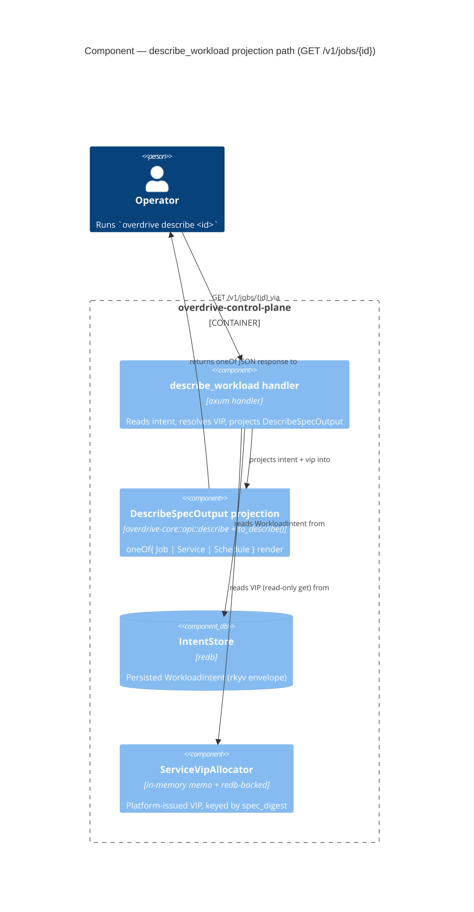

# C4 — Describe projection path (Component, L3)

GH #183 / ADR-0064. This change adds **no new container** — the L1
System Context and L2 Container topology are unchanged from brief.md
§ 67 (the `overdrive-control-plane` container already holds both the
`IntentStore` and the `ServiceVipAllocator`). The only new edge is the
read-only `describe_workload → ServiceVipAllocator::get` lookup for the
Service arm. A component-level view of the describe projection path:

Notes:

- Every arrow is verb-labelled; no abstraction-level mixing (all nodes
  are components within the one control-plane container).
- The `handler → alloc` edge is the single new component-level edge this
  feature introduces. It is **read-only** (`get`, not `allocate`) per
  OQ-7; the allocator state is never mutated on a describe (GET).
- Service arm only: a `WorkloadIntent::Job` describe never touches the
  allocator; a `WorkloadIntent::Schedule` is rejected before the
  allocator read (Phase 1 cannot persist a Schedule).
- The `describe → operator` response is the `oneOf`-discriminated
  `DescribeSpecOutput` (`kind: job | service | schedule`); the Service
  arm carries the required `vip` resolved from the allocator.
