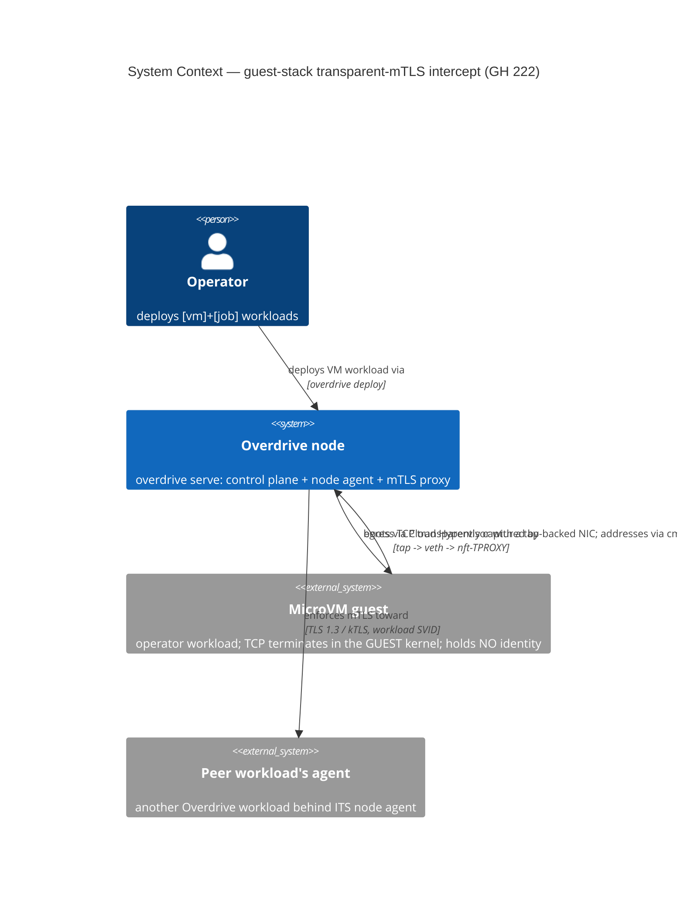
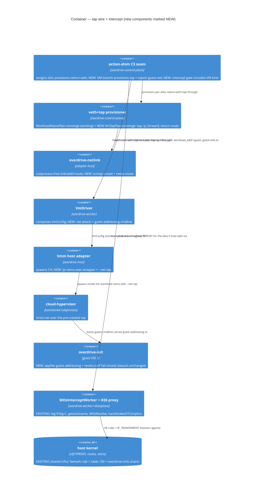

# Feature Delta — guest-stack-transparent-mtls-intercept (GH #222)

Companion ADRs: **ADR-0088** (guest netns topology + addressing) and
**ADR-0089** (tap-in-netns provisioning boundary + CH net attach). SSOT
section: `docs/product/architecture/brief.md` § "Guest-stack transparent-mTLS
intercept extension". Spike evidence:
`docs/feature/guest-stack-transparent-mtls-intercept/spike/findings.md`
(verdict WORKS, kernel 7.0.0-29, CH v53.0, no empirical toggle required).

## Wave: DESIGN

### [REF] Capability and scope

**Capability**: a microVM workload — whose TCP terminates in the GUEST kernel,
leaving the host with no `struct sock` — is born onto a NIC that is already
transparently intercepted: its egress traverses `tap → netns forward → veth →
host-veth ingress`, where the ALREADY-SHIPPED production nft-TPROXY rule
(`install_outbound_tproxy`) fires unchanged and produces the SAME
`InterceptedConnection` the host-socket path produces, feeding the proven #26
`MtlsEnforcement` proxy (handshake / kTLS / splice — off-limits, reused
verbatim).

**The only NEW production code** (spike `findings.md` § "What the
walking-skeleton promotion wires into production"):

1. **Tap-in-netns provisioning** for VM-kind allocs (folded in from #257 gap 2).
2. **CH `--net` tap attach** + running the hypervisor inside the workload netns.
3. **Guest addressing** (IP/gateway/DNS into the guest, applied by
   `overdrive-init`).
4. **Flipping the `DriverType::Exec` gate** on the intercept install at the
   action-shim at BOTH install sites — fresh-start (`action_shim/mod.rs:1584`,
   comment `:1559-1569`) AND restart (`:1880`) — so VM-kind allocs get
   `MtlsInterceptWorker::start_alloc` too on both fresh deploy and restart (see
   § [REF] D6). These are the production call sites deliberately deferred to
   #222 (an ungated install pre-tap would have presented a veth the guest's
   traffic never traversed as mesh-enrolled).

**Out of scope**: #257 ([vm]+[service] enablement — guest-reachable health
probes + removing the `[vm]`+`[service]` parse rejection at
`workload_spec.rs:878`). The inbound-intercept BUILD is deferred with it
(§ [REF] Inbound direction). The #26 proxy internals are not touched.

**Ubiquitous language** (extends DD-4 / ADR-0071 vocabulary):

| Term | Meaning |
|---|---|
| **transit /30** | The existing slot-derived veth /30 (`plan.subnet`, lower half of `10.99.0.0/16`). For a VM alloc it carries NO workload endpoint — it is the routed hop between tap and host. |
| **guest /30** | The NEW slot-derived /30 (upper half of `10.99.0.0/16`) the guest's virtio-net NIC is addressed from. |
| **tap gateway** | The tap device's address inside the netns (`guest /30` first usable) — the guest's default route. |
| **guest addr** | The guest NIC's address (`guest /30` second usable). For a VM alloc this IS the canonical `workload_addr`. |
| **guest addressing** | The platform-owned kernel-cmdline parameter carrying `(guest addr/prefix, gateway, dns)` that `overdrive-init` applies before exec'ing the operator's command. |

### [REF] Decisions table

| # | Decision | Chosen | Rejected | ADR |
|---|---|---|---|---|
| D1 | netns topology | **Routed two-/30** (spike-proven verbatim): tap + guest /30 in the netns, `ip_forward=1`, host return route; both /30s carved from `10.99.0.0/16` (transit = lower /17, guest = upper /17, same slot key) | L2 bridge tap↔veth (unproven, br_netfilter/L2 failure modes, breaks the veth converge model); guest-directly-on-transit-/30 via /32 onlink + proxy-ARP (unnumbered-routing fragility, unproven) | 0088 |
| D2a | where `workload_addr` sits | **The guest addr** (`spec.workload_addr = guest_addr` for VM allocs) — the only address a peer's leg-S dial or an inbound `daddr` match can terminate at; the transit /30 is pure forwarding | The transit veth addr (nothing listens there — an inbound leg-S dial would terminate on a forwarding hop); a second field beside `workload_addr` (two canonical addresses = the sentinel shape rust.md forbids) | 0088 |
| D2b | guest-addressing mechanism | **Kernel-cmdline parameter, `overdrive-init`-applied** (ioctl path spike-proven; fail-closed: apply-or-EXIT before exec; also writes guest `/etc/resolv.conf` → responder addr) | kernel `ip=` autoconfig (CONFIG_IP_PNP unset on the probe kernel; couples to guest-kernel config; no failure surface); DHCP (new daemon + guest client); a new beacon vsock message (extends the versioned PL for a static value) | 0088 |
| D3 | return-route ownership | **The C3-seam provisioner extension** (tap converge steps in `veth_provisioner`, Bar-1 idempotent converge-on-boot; Bar-2 promotion rides #197/#234). Teardown is structural (route + tap die with veth/netns deletion) | `start_alloc` (worker owns nft rules, not host routing; wrong lifecycle); a new dedicated reconciler (Bar-2 now — reconcilers.md names converge-on-boot the valid intermediate; #197 tracks promotion) | 0089 |
| D4 | C3 seam + CH `--net` wiring | **C3 branches on `DriverPayload` VM arm** → pure `VmTapPlan` + tap converge → inject guest-net onto the spec (same in-memory channel as `netns`/`host_veth`); `VmDriver` composes it into `VmConfig` + cmdline; `Vmm` prepends `ip netns exec <ns>` to the existing wrapper argv + appends `--net tap=<name>,mac=<mac>`. Tap creation subprocess-free (`/dev/net/tun` ioctl + netlink netns move, EXTEND `overdrive-netlink`) | driver-creates-tap (violates the ratified "provisioner creates, driver enters" split, Q2/C3); tap fd-passing `--net fd=` with CH in the host netns (deviates from the spike-proven shape; needs netns-scoped fd acquisition; **REJECTED ON THE MERITS** — ADR-0089 §A2: the hardened-microVM precedent, the Firecracker jailer's `setns`-into-netns, points AT the wrapper, and isolation/operability favour it; re-open only with evidence against the wrapper, NOT a queued refinement); worker-side `pre_exec` setns (crosses the ADR-0082 `Vmm`-owns-spawn boundary) | 0089 |
| D5 | inbound direction (peer→guest) | **Topology settled NOW; intercept build deferred to #257** (existing issue). `install_inbound_tproxy` needs zero change (keys on `workload_addr` = guest addr); leg-S delivery = a plain dial to the guest addr over the spike-proven host→guest reply path. A #222 inbound slice is structurally un-drivable: no production path can declare a guest listener until #257 removes the parse rejection — building it now repeats the #236 dead-mechanism precedent | Build inbound in #222 (no serve+deploy driver exists — Job-kind installs 0 inbound rules); leave topology unexamined (risks a rework when #257 lands) | 0089 |
| D6 | intercept-install gate | **EXTEND the `DriverType::Exec` gate to include VM-kind at BOTH install sites** — fresh-start (`action_shim/mod.rs:1584`, comment `:1559-1569`) AND restart (`:1880`, comment `:1877`); teardown (`stop_alloc` at `:1269`/`:2038`) is ungated-by-design (no flip, none must be added). With the tap wire the host-veth DOES carry the guest's traffic; the D-MTLS-18 fail-closed posture (install failure ⇒ drive the alloc terminal) applies to VM allocs unchanged. See § [REF] D6 | leave either install gate `Exec`-only (flipping only fresh-start leaves restarted VM allocs running CLEARTEXT fail-OPEN while the fresh-deploy AT goes green — the #236-adjacent silent regression) | 0089 |

### [REF] Component decomposition

| Component | Home | Class | Change |
|---|---|---|---|
| `VmTapPlan` (pure value: tap name `ovd-tp-<4hex>`, guest /30, tap gateway, guest addr, MAC, dns=responder, return-route spec) | `overdrive-control-plane/src/veth_provisioner.rs` | adapter-host | **CREATE-NEW value type** (pure derive from `NetSlot`, sibling of `WorkloadNetnsPlan`; never persisted) |
| Tap converge steps (create/persist tap in netns, address tap, `ip_forward=1` in netns, host return route) | `veth_provisioner.rs` | adapter-host | EXTEND (same observe → diff → converge Bar-1 shape as the veth steps) |
| tuntap create + netns move primitives | `overdrive-netlink` (+ a small `/dev/net/tun` ioctl surface) | adapter-host | EXTEND (subprocess-free per ADR-0085; tun devices are ioctl-created, netlink-moved) |
| C3 seam VM branch | `action_shim/mod.rs::provision_and_inject_netns` | adapter-host | EXTEND (match on `DriverPayload` VM arm; inject guest-net channel onto the spec) |
| Intercept-install gate (BOTH sites) | `action_shim/mod.rs` (the `DriverType::Exec` gates: fresh-start `:1584` + restart `:1880`) | adapter-host | EXTEND (`Exec` → `Exec \| Vm`) at both install sites; teardown `:1269`/`:2038` ungated-by-design |
| `AllocationSpec` guest-net channel | `overdrive-core/src/traits/driver.rs` | core | EXTEND (one additional pure in-memory field family, same no-serde/no-rkyv discipline as `netns`/`host_veth`/`workload_addr`; exact shape → DISTILL) |
| `VmConfig` net attach | `overdrive-core/src/vm/config.rs` | core | EXTEND (`netns` becomes CONSUMED; net attach carried so netns-without-NIC is unrepresentable — see § Open questions Q2) |
| `VmDriver` (compose net into `VmConfig` + cmdline param) | `overdrive-worker/src/vm_driver.rs` | adapter-host | EXTEND |
| `Vmm` host adapter (wrapper argv `ip netns exec <ns>` + `--net tap=,mac=`) | `overdrive-host/src/vmm.rs` | adapter-host | EXTEND (reuses the existing wrapper-argv mechanism; zero `unsafe` added — `#![forbid(unsafe_code)]` preserved) |
| `overdrive-init` net apply + resolv.conf write | guest-side init (beacon consumer) | guest | EXTEND (parse the cmdline parameter, `SIOCSIFADDR`/`SIOCSIFNETMASK`/`SIOCSIFFLAGS`/`SIOCADDRT` + write `/etc/resolv.conf`; fail-closed: on failure send `EXIT` ≠ 0, never exec) |
| `install_outbound_tproxy` / `ensure_shared_routing_infra` / `MtlsInterceptWorker::start_alloc` / `MtlsResolve` / the #26 proxy | `overdrive-worker` / `overdrive-dataplane` | adapter-host | **REUSE AS-IS — zero change** (the spike proved the rule fires byte-for-byte over a tap-fed veth) |
| DNS responder (ADR-0072) | `overdrive-control-plane` | adapter-host | REUSE AS-IS (the guest reaches `responder_addr` = the transit gateway via routed hops; UDP is not TPROXY'd — the egress rule is `meta l4proto tcp`) |

No new crate. No new port trait. No new daemon. No observation-schema change —
`AllocStatusRowV2.workload_addr` carries the guest addr through the EXISTING
field (no envelope bump).

### [REF] D1 — netns topology: routed two-/30 (options + trade-offs)

**Option A — routed two-/30 (RECOMMENDED, spike-proven).** The netns holds the
existing veth end (transit /30, unchanged) plus a tap addressed from a second
slot-derived /30; the guest's only NIC is virtio-net backed by that tap;
`ip_forward=1` in the netns routes tap↔veth; the host holds a return route to
the guest /30 via the transit in-netns addr.

```
[guest] eth0 <guest_addr>/30, gw <tap_gw>      (guest kernel owns TCP)
   │ virtio-net
[tap ovd-tp-<hex>] <tap_gw>/30                 ─┐ netns ovd-ns-<hex>
   │ (ip_forward=1)                             │ default via plan.host_addr
[veth ovd-wl-<hex>] plan.workload_addr/30      ─┘
   │ veth pair
[veth ovd-hv-<hex>] plan.host_addr/30           HOST netns
   │  ← nft prerouting iifname ovd-hv-<hex> l4proto tcp tproxy → leg-F  (EXISTING)
   │  ← host return route: <guest /30> via plan.workload_addr dev ovd-hv-<hex>  (NEW)
```

- Pro: byte-for-byte the spike topology (verdict WORKS, all four
  rp_filter×tx-offload combinations, no toggle); the veth half is the EXISTING
  provision, untouched; every step is observe-able for converge (tap present,
  addr present, forward flag, route present); inbound-ready (host→guest
  delivery is the proven reply path).
- Con: a second /30 per VM slot; the guest addr differs from the transit addr
  (two address families to keep straight — mitigated by the vocabulary above).

**Subnet carve (sub-decision)**: the guest /30 is carved from the SAME
`WORKLOAD_SUBNET_BASE` `10.99.0.0/16`: guest network =
`base + 0x8000 + slot*4` — a /18-sized carve starting at the upper-half
boundary, mirroring the transit carve's /18-within-the-lower-half shape
(`veth_provisioner.rs:405`). With `NET_SLOT_MAX = 4095` the transit carve tops
out at offset 16383 and the guest carve at 49151 — both strictly inside the
/16, disjoint by construction. **DELIVER item (Finding 4):** this disjointness
must be COMPILER-PROVEN, not prose. The existing S6 const guard
(`veth_provisioner.rs:518`) asserts only the transit carve
(`(NET_SLOT_MAX*4 + 3) < base_span`); DELIVER MUST add the **symmetric
guest-carve const guard** `(0x8000 + NET_SLOT_MAX*4 + 3) < base_span` (49151 <
65536) beside it, so a future `NET_SLOT_MAX` / base raise cannot silently
overflow the guest carve past the /16 or into the transit carve. Why in-/16:
the §35a GATE partition arm (`ServiceMapHydrator`'s third arm) and any future
mesh-membership test key on `addr ∈ WORKLOAD_SUBNET_BASE`; a guest addr in a
second /16 would silently escape that membership when #257 lands, and would add
a second base constant to the #239 tunable-base surface. Rejected alternative:
a distinct `10.100.0.0/16` guest base.

**Option B — L2 bridge tap↔veth.** Enslave tap + veth end to an in-netns
bridge; the guest sits directly on the transit /30 (takes `plan.workload_addr`).
Pro: one /30, one address identity, no forwarding. Con: UNPROVEN (the spike
proved routed); pulls in the bridge module, MAC learning, and the br_netfilter
sysctl family (bridged frames traversing iptables hooks is a classic surprise
surface); moves the address off the veth end, breaking the existing
`ObservedWorkloadVeth` converge model (`workload_addr_present` observes the veth
device); ARP now spans the pair. Rejected: trades proven mechanism for
untested L2 subtlety to save one /30.

**Option C — guest directly on the transit /30 (routed /32 + onlink).** Guest
takes `plan.workload_addr` as a /32 with an onlink route to `plan.host_addr`;
the tap runs unnumbered with proxy-ARP-ish delivery. Pro: no second subnet,
`workload_addr` identity unchanged. Con: unnumbered point-to-point routing is
the fiddliest of the three (onlink routes, in-netns /32 host routes, proxy-arp
on the tap), entirely unproven, and the hardest to observe/converge. Rejected.

### [REF] D2 — guest addressing

**Placement (D2a)**: for a VM-kind alloc the C3 seam injects
`spec.workload_addr = guest_addr` (NOT `plan.workload_addr`). Everything
downstream is untouched and correct by construction: the Running-row write
persists it (existing V2 field), a future bridge advertise (#257) advertises
it, `MtlsResolve` classifies a dial to it as `Mesh`, and `install_inbound_tproxy`
(#257) keys its `daddr` match on it. The transit veth addr keeps its role as
forwarding hop + return-route nexthop only. Exec-kind allocs are byte-identical
to today (`workload_addr = plan.workload_addr`).

**Mechanism (D2b)**: `VmDriver` appends ONE platform-owned parameter to the
kernel cmdline carrying `(guest_addr/30, gateway = tap_gw, dns =
plan.responder_addr)`. `overdrive-init` (the platform-owned guest PID 1 — the
beacon contract already makes it universal for VM-kind workloads) parses it and
applies it via the spike-proven ioctl path, and writes the guest's
`/etc/resolv.conf` pointing at the responder — so dial-by-name (ADR-0072)
works from guests with zero app config, the guest-side analogue of the netns
resolv.conf injection (which cannot reach a guest filesystem). Ordering
contract: net-apply completes BEFORE the operator's command is exec'd; on
failure `overdrive-init` sends `EXIT` (non-zero) and never execs — fail-closed
and operator-observable (contrast a silent boot-deadline expiry). The beacon
Published Language is UNCHANGED (no new vsock message; vsock needs no IP).

Why not the alternatives: kernel `ip=` requires `CONFIG_IP_PNP` (unset on the
probe kernel; even with a platform kernel flip it is boot-static, has no
failure surface, and couples addressing to kernel config); DHCP adds a host
daemon + a guest client for a value the platform already knows at plan time; a
beacon vsock message versions the PL for a static value and adds an ordering
dance the cmdline avoids.

**DNS reachability (topology-REASONED, NOT spike-proven — Finding 5)**: guest →
`responder_addr` (= `plan.host_addr`) routes default→tap→netns; the transit /30
is on-link on the veth → forwarded → host local delivery. UDP/53 does not match
the TCP-only egress TPROXY rule; TCP/53 would be TPROXY'd to leg-F, resolved
`NonMesh`, and pass-through-dialed to the responder — both paths terminate
correctly. The responder's `IP_PKTINFO` source-pinned replies return over the
host return route. **This is topology reasoning, not spike evidence**: the
increment-n spike used raw-IP `connect()`, so guest dial-by-name over routed
hops (guest `/etc/resolv.conf` → responder → resolve → dial) is UNPROVEN.
Guest-DNS-over-routed-hops is therefore the FIRST thing the Slice-1 metal AT
must exercise (the walking-skeleton "dials a mesh peer by name" step), not a
proven mechanism carried forward from the spike.

**MAC**: locally-administered unicast, a pure function of the slot (exact byte
layout → DISTILL). The spike's fixed MAC is replaced by the derivation so two
VM slots never collide on a segment.

### [REF] D3 — structural-requirement ownership (the spike's pinned facts)

| Structural fact (spike `findings.md`) | Owner | Status |
|---|---|---|
| `modprobe nft_tproxy` at agent boot | existing agent boot (already ensured on the veth-intercept path) | REUSE — no new work |
| `ip rule fwmark 0x1 lookup 100` + `local` table 100 | `ensure_shared_routing_infra()` | REUSE AS-IS (node-global, idempotent) |
| Host return route `<guest /30> via plan.workload_addr dev plan.host_veth` | NEW tap converge step (`veth_provisioner`), per-alloc | CREATE (one add-if-missing converge step; dies with the veth on teardown — structural, no teardown code) |
| `net.ipv4.ip_forward=1` inside the netns | NEW tap converge step, per-alloc (`/proc/sys` write inside the netns, ADR-0085 file-I/O shape) | CREATE (idempotent write) |
| Tap exists + persistent + addressed in the netns | NEW tap converge steps | CREATE (observe → diff → converge; adoption on restart = the same converge) |

Ownership rationale (D3): all four per-alloc facts live with the per-alloc
provisioner at the C3 seam — the same lifecycle as the netns+veth they extend,
fail-closed via the existing `ShimError::WorkloadNetnsProvision`, torn down
structurally by the existing `teardown_workload_netns` (deleting the netns
destroys the tap; deleting the veth drops the return route). No reconciler is
created: converge-on-boot (Bar 1) self-heals across restarts; continuous
convergence is the #197/#234 Bar-2 promotion, where the tap steps ride along
with the veth steps.

### [REF] D4 — the wiring (C3 seam → driver → Vmm → guest)

Production sequence for a VM-kind alloc on an mTLS-composed boot
(`overdrive serve` + `overdrive deploy vm-job.toml`):

1. **C3 seam** (`provision_and_inject_netns`, kind-agnostic half): assign slot,
   derive `WorkloadNetnsPlan`, provision netns+veth (EXISTING, byte-identical).
2. **C3 seam VM branch** (NEW): `DriverPayload` VM arm → derive `VmTapPlan`
   from the same slot → tap converge (create+persist tap in netns, address tap
   gateway, `ip_forward=1`, host return route) → inject onto the spec:
   `workload_addr = guest_addr` + the guest-net channel (tap name, MAC,
   guest addressing inputs).
3. **`VmDriver`**: composes `VmConfig` — `netns` (now consumed), the net
   attach (tap name + MAC), and the guest-addressing cmdline parameter.
4. **`Vmm` (host adapter)**: spawns
   `ip netns exec <ns> [existing prlimit wrapper] cloud-hypervisor … --net
   tap=<tap>,mac=<mac> …`. The netns entry reuses the existing wrapper-argv
   mechanism; `overdrive-host` stays `#![forbid(unsafe_code)]`; CH's
   unix-socket surfaces (api, vsock, console file) are mount-ns/filesystem
   based and unaffected. CH attaches the pre-created persistent tap by name
   (the spike's benign "Tap already exists" path). The guest boots;
   `overdrive-init` applies the addressing + resolv.conf (fail-closed) and
   signals beacon READY — but is HELD at post-READY/pre-EXEC: it has NOT yet
   exec'd the operator's command, so the guest can emit NO egress yet.
5. **Intercept install** (gate EXTENDED, D6): at the action-shim `Running` arm
   (after `driver.start()` returns at beacon READY),
   `MtlsInterceptWorker::start_alloc` installs
   `install_outbound_tproxy(plan.host_veth, leg_f_port)` — EXISTING code, now
   reached by VM allocs; D-MTLS-18 fail-closed on error (install `Err` ⇒ the
   guest is never released to EXEC ⇒ no cleartext egress ⇒ alloc driven
   terminal).
6. **EXEC-release, gated on install-success (the born-captured invariant)**:
   only after `start_alloc` succeeds does the platform release the beacon EXEC,
   letting `overdrive-init` exec the operator's command. The guest's first
   `connect()` is therefore born intercepted **by construction** — the ordering
   invariant is `install-success ≺ EXEC-release`. This is the SEQUENCE that
   makes the security claim true; boot-then-install without this gate would
   leave a first-connect window (a mesh-bound SYN before `start_alloc` would
   escape cleartext). Exact EXEC-release wiring — where the gate sits relative
   to the `Running` boundary, and the READY-vs-EXEC "what is Running for a VM"
   reconciliation — is a DISTILL shape (§ Open questions Q9); the invariant is
   pinned here.

Tap creation is subprocess-free (ADR-0085 discipline): open `/dev/net/tun`,
`TUNSETIFF`+`TUNSETPERSIST` (ioctl — tun devices cannot be netlink-created),
then netlink `RTM_SETLINK`/`IFLA_NET_NS_FD` moves the device into the netns;
address/up via the in-netns netlink ops `overdrive-netlink` already performs
for the veth end. The ONLY sanctioned subprocesses remain Cloud Hypervisor
itself and its argv wrapper (`ip netns exec` is an exec-time wrapper on the
already-sanctioned CH spawn, not a provisioning shell-out).

### [REF] D5 — inbound direction (peer → guest service)

**Settled now (topology-readiness, zero code):**

- `install_inbound_tproxy(SocketAddrV4::new(workload_addr, port), leg_c_port)`
  needs NO change — its `daddr` match keys on `workload_addr`, which for a VM
  alloc is the guest addr (D2a). TPROXY's prerouting match is
  destination-stack-agnostic exactly as the egress match is origin-agnostic.
- leg-S delivery (the agent's marked dial to the workload) is a plain TCP dial
  to the guest addr — the routed topology carries it host → veth → netns
  forward → tap → guest, the byte-identical path the spike's H5 reply leg
  proved (`PROBE-RESP-HOST-LISTENER-42` reached the guest).
- The leg-S mark exemption (`MTLS_LEG_S_DIAL_MARK`) already heads both shared
  chains — REUSE.

**Deferred to #257 (existing issue — the build):** the per-listener inbound
install for guest services fires off declared Service listeners, and
`[vm]+[service]` is refused at parse until #257 removes the rejection. A
Job-kind VM declares no listeners ⇒ `start_alloc` installs 0 inbound rules ⇒
an inbound slice inside #222 has NO production driver — a test would have to
hand-declare what production cannot, the exact #236 dead-mechanism precedent.
Residual empirical risk deferred with it: a host-originated SYN into the guest
(new connection, vs. the proven reply leg) — rated lower-risk routed-IP-over-tap
by the prior-art recon; #257 should open with a thin Tier-3 AT for it.

### [REF] D6 — intercept-install gate: BOTH install sites (+ teardown is ungated-by-design)

The `DriverType::Exec` gate on the intercept install is **NOT a single site**.
`MtlsInterceptWorker::start_alloc` (the security control that installs the
egress TPROXY) is gated on `spec.driver.driver_type() == DriverType::Exec` at
**TWO** action-shim install sites, and the D6 flip (`Exec` → `Exec | Vm`) MUST
land at BOTH:

| Site | `action_shim/mod.rs` | Arm | Current gate |
|---|---|---|---|
| Install 1 | `:1584` (comment block `:1559-1569`) | StartAllocation fresh-start `Running` | `DriverType::Exec` — FLIP |
| Install 2 | `:1880` (comment `:1877` "symmetric", `:1899`) | RestartAllocation `Running` | `DriverType::Exec` — FLIP |

**Why both, stated explicitly.** Flipping ONLY the fresh-start gate (`:1584`)
leaves a *restarted* VM alloc with NO intercept re-install. VM allocs ARE
restarted on every live restart path — the restart budget / crash-recovery loop
AND `overdrive workload restart` (ADR-0073), all of which apply to VM kind. A
restarted VM alloc whose `:1880` gate still reads `Exec`-only boots the guest,
writes `Running`, and skips `start_alloc` → the guest's egress reaches the wire
**CLEARTEXT, fail-OPEN**. The Slice-1 fresh-deploy AT never exercises the
restart arm, so it goes GREEN over the hole. Both install gates flip, or the
feature ships a silent cleartext regression on restart.

**Teardown is ungated-by-design and needs NO flip.** The intercept teardown
(`MtlsInterceptWorker::stop_alloc`) fires at TWO sites — the FinalizeFailed arm
(`:1269`, guarded on `!is_stable`) and the StopAllocation arm (`:2038`) — each
gated ONLY on `mtls_worker.is_some()`, NOT on `DriverType`. So a VM alloc that
installs the intercept is already torn down on stop/finalize (`stop_alloc` is
idempotent — a no-op for an alloc with no intercept). There is **NO
leak-on-stop bug**. The inverse hazard is the one to guard: a future reader MUST
NOT add a `DriverType::Exec` gate to either teardown site — doing so would leak
the VM alloc's nft rule on stop (the second, distinct bug the review
anticipated, which the current ungated shape structurally avoids).

**DISTILL/DELIVER obligation (Tier-3 restart AT).** Beyond the Slice-1
fresh-deploy egress AT, a Tier-3 **restart** AT (`kvm-tests` via `cargo xtask
metal run --`, same nested-KVM surface) MUST assert that a *restarted* VM alloc
re-installs the intercept and is driven terminal fail-closed on install
failure — pinning the `:1880` flip against regression. DISTILL authors the
scenario; this names the obligation.

### [REF] Walking-skeleton egress slice (the serve+deploy loop)

**Slice 1 (the feature's first deliverable, production-drivable end-to-end):**
`overdrive serve` (mTLS-composed boot; nft_tproxy ensured; DNS responder up) +
`overdrive deploy vm-job.toml` — a `[vm]`+`[job]` whose guest command dials a
mesh peer (an exec-backed `[service]` on the node) by name — yields:

- **guest dial-BY-NAME resolves over routed hops** (guest `/etc/resolv.conf` →
  responder → resolve → dial) — the FIRST thing the AT must exercise, because
  it is topology-reasoned, NOT spike-proven (the spike used raw-IP connect;
  Finding 5),
- **FIRST-CONNECT safety**: the guest's first mesh `connect()` is captured with
  ZERO cleartext SYN escaping — the born-captured ordering invariant
  (`install-success ≺ EXEC-release`; Finding 2/Q9),
- guest egress captured at the host-veth by the EXISTING rule (tap wire NEW),
- leg-F `getsockname` orig-dst → `MtlsResolve` `Mesh` → the proven #26
  handshake/kTLS/splice to the peer's agent,
- the response returns into the guest over the return route,
- a non-mesh dial from the same guest passes through cleartext (`NonMesh`),
- an intercept-install failure drives the alloc terminal (D-MTLS-18, now for
  VM kind),
- **(restart AT, Finding 1)**: a *restarted* VM alloc re-installs the intercept
  (the `:1880` gate) and is driven terminal fail-closed on install failure —
  the same nested-KVM metal surface.

NO test-only wiring: every install/bind/address/route above is a production
call site (the CLAUDE.md vertical-slice bar; the #236 precedent is the
counter-example this slice is sized against). Observables (DISTILL owns the
scenarios): TLS 1.3 records + zero cleartext on the inter-agent wire, byte
exact plaintext round-trip in the guest, `ss -K` kTLS on the kTLS legs.

**Execution surface (review remediation, iteration-1 HIGH)**: the Slice-1
Tier-3 walking-skeleton AT boots a REAL microVM (the spike's own constraint —
a netns cannot model "no host `struct sock`"), so it requires **nested KVM**:
it is gated behind the `kvm-tests` feature (on top of `integration-tests`)
and executes via **`cargo xtask metal run --`** against the x86_64 metal box —
NOT the Lima inner loop (arm64 Lima has no nested KVM; a Lima-scoped AT would
return no signal because the guest never boots). The 6.18 appliance-kernel
confirmation remains the Tier-3 matrix note at merge (ADR-0068).

### [REF] Technology choices

| Choice | What | License / status |
|---|---|---|
| Cloud Hypervisor `--net tap=` | the tap attach (spike-proven v53.0) | Apache-2.0, already the sanctioned VMM |
| `/dev/net/tun` ioctls (`TUNSETIFF`/`TUNSETPERSIST`) via `nix` | tap create (subprocess-free) | MIT, already in workspace (0.30) |
| netlink `RTM_SETLINK` + `IFLA_NET_NS_FD` | tap → netns move | `overdrive-netlink` (in-tree, ADR-0085) |
| `ip netns exec` wrapper argv | CH netns entry | iproute2, present on the appliance; wraps the already-sanctioned CH subprocess |
| kernel cmdline parameter + `overdrive-init` ioctls | guest addressing | in-tree guest init; no new dependency |

No new external dependency; no proprietary component.

### [REF] Reuse Analysis (HARD GATE — default EXTEND; contract shapes cited)

| # | Existing asset | Overlap | Verdict | Contract shape / justification |
|---|---|---|---|---|
| 1 | `install_outbound_tproxy(host_veth, leg_f_port)` (`mtls_intercept.rs:487`) | THE egress intercept | **REUSE AS-IS (zero change)** | bounded-change: appends exactly one nft rule in `overdrive-mtls/prerouting`, RAII-guarded. Spike proved the rule fires byte-for-byte over a tap-fed veth (`iifname` match is origin-agnostic). |
| 2 | `ensure_shared_routing_infra()` (`mtls_intercept.rs:677`) | fwmark rule, table 100, chains, exemptions | **REUSE AS-IS** | bounded-change idempotent converge over a declared node-global set; the spike consumed the identical triple. |
| 3 | `MtlsInterceptWorker::start_alloc` + the #26 proxy (`MtlsEnforcement`, splice pumps, ADR-0069/0070) | downstream of `InterceptedConnection` | **REUSE AS-IS (off-limits)** | per-connection lifecycle contract pinned by ADR-0069; #236-proven; this feature only makes VM allocs REACH it (D6 gate flip). |
| 4 | `provision_and_inject_netns` (C3 seam, `action_shim/mod.rs:897`) | per-alloc netns provisioning + spec injection | **EXTEND** | bounded-change (netns/veth/spec-field mutation set, fail-closed `ShimError`); gains the `DriverPayload`-matched VM branch. No alternative seam exists — C3 is the ratified provision point (Q2/C3, §35). |
| 5 | `derive_workload_netns_plan` + `WorkloadNetnsPlan` + veth converge (`veth_provisioner.rs`) | the netns/veth/addressing substrate | **EXTEND** | pure-function derive (slot → plan, total, deterministic) + bounded-change converge (declared step set, observed actuals). `VmTapPlan` is a sibling pure value, NOT a second derivation of the same facts (it derives the DISJOINT guest half; the transit plan is consumed as-is). |
| 6 | `overdrive-netlink` (ADR-0085) | in-netns link/addr/route ops | **EXTEND** | bounded-change netlink ops with typed-errno idempotency; gains tuntap ioctl-create + netns-move. Creating a second mechanism (subprocess `ip tuntap`) rejected — ADR-0085 regression. |
| 7 | `NetSlotAllocator` / `NetSlot` | slot identity for the guest /30 | **REUSE AS-IS** | the SAME slot keys both /30s + the tap name — no second allocator, collision-free by construction (disjoint halves of the /16). |
| 8 | `VmConfig` (ADR-0082 anti-corruption value) + `Vmm` (`overdrive-host/src/vmm.rs`) | the CH launch surface | **EXTEND** | pure-value config + spawn adapter; `netns` field goes from carried-but-unconsumed to consumed; net attach added; wrapper-argv mechanism reused (no unsafe). |
| 9 | `VmDriver` (`overdrive-worker/src/vm_driver.rs`) | composes `VmConfig` from the spec | **EXTEND** | already reads `spec.netns` (:730); gains the net-attach + cmdline composition. |
| 10 | `overdrive-init` (guest PID 1, beacon PL) | the only platform-owned code inside the guest | **EXTEND** | applies guest addressing fail-closed pre-exec; beacon PL unchanged. Creating a second guest agent rejected (one PID 1). |
| 11 | `install_inbound_tproxy` (`mtls_intercept.rs:347`) | future peer→guest intercept | **REUSE AS-IS, deferred with #257** | keys on `workload_addr` (= guest addr, D2a) — zero change needed when #257 builds. |
| 12 | DNS responder (ADR-0072) + `responder_addr_for_slot` | guest dial-by-name | **REUSE AS-IS** | the guest reaches the responder over routed hops; guest resolv.conf written by `overdrive-init` (the netns bind-mount cannot reach a guest filesystem). |
| 13 | `AllocStatusRowV2.workload_addr` (+ the §35a observed-input discipline) | persisting the canonical addr | **REUSE AS-IS** | the guest addr rides the EXISTING field — no envelope bump, no schema change. |
| 14 | The `DriverType::Exec` intercept gates — BOTH install sites (`action_shim/mod.rs:1584` fresh-start + `:1880` restart) | who gets `start_alloc` | **EXTEND (D6) — BOTH sites** | the gate's own comment names #222 as the lifter; with the tap wire the pre-condition it guarded ("the veth the guest's traffic never traverses") is dissolved. Flipping only the fresh-start gate leaves restarted VM allocs cleartext fail-open (§ [REF] D6); the teardown sites (`stop_alloc` `:1269`/`:2038`) are ungated by driver type — no flip, and none must be added. |

**Tally**: 7 REUSE-AS-IS (rows 1, 2, 3, 7, 11, 12, 13) · 7 EXTEND (rows 4, 5,
6, 8, 9, 10, 14) · 1 CREATE-NEW (the pure `VmTapPlan` value
+ its converge steps, housed inside EXTENDed components). Zero new crates,
ports, daemons, deps, schema changes. Default-EXTEND honored; the one
CREATE-NEW is a value type no existing component computes.

### [REF] C4 diagrams

#### Level 1 — System Context



#### Level 2 — Container



#### Level 3 — the netns data path (component view of the intercept/tap subsystem)

The topology diagram in § D1 is the L3 view: guest NIC → tap (guest /30) →
netns forward → veth transit /30 → host-veth ingress → EXISTING nft-TPROXY →
leg-F. Every arrow is a routed hop with an owner named in § D3.

### [REF] Quality attributes (ISO 25010, extending ADR-0069 §8)

| Attribute | Strategy | Observable |
|---|---|---|
| Security (confidentiality/authenticity) | The guest is born captured by an ORDERING INVARIANT, not by accident of timing: the intercept egress rule is installed-successfully (`start_alloc`, D6) BEFORE the guest is released to run the operator's command. A VM guest can emit NO egress until `overdrive-init` execs the operator command (post-beacon-EXEC), and the platform gates that EXEC-release on intercept-install success — so the guest's first `connect()` is captured by construction (invariant: `install-success ≺ EXEC-release`; exact EXEC-release wiring → DISTILL Q9). Production installs at the `Running` arm (boot-then-install), so the invariant — NOT boot-then-install alone — is what closes the first-connect window. Fail-closed on install failure (D-MTLS-18 extended to VM kind): install `Err` ⇒ EXEC never sent ⇒ guest never runs the operator command ⇒ no cleartext ⇒ alloc terminal. The honest v1 authn claim is UNCHANGED (chain-to-bundle, NO intended-peer pinning until #242) | Tier-3: the Slice-1 metal AT asserts FIRST-CONNECT safety (the guest's first mesh dial is captured, zero cleartext SYN escapes); TLS 1.3 records + zero cleartext on the inter-agent wire; install-failure → alloc terminal |
| Functional suitability (universality) | The #26 fold's promise made real: the SAME `MtlsEnforcement` proxy now serves guest-stack workloads; zero proxy change | the same leg-F/`MtlsResolve`/handshake path in the flow trace for exec AND vm allocs |
| Reliability (crash/restart) | Tap steps are idempotent converge-on-boot beside the veth steps (adopt-or-complete on restart); teardown is structural (netns/veth deletion destroys tap + route); fail-closed provision (`ShimError::WorkloadNetnsProvision`) | re-provision under the same slot is a no-op; restart completes a half-provisioned tap |
| Performance | Steady state unchanged from ADR-0069 (agent-light zero-copy splice); the added cost is one routed hop (tap→veth forward) per packet inside the netns — no userspace, no extra copy | throughput delta vs exec-kind within the Tier-3 budget (no new gate; informational) |
| Maintainability | Zero new mechanism: one topology (routed /30s), one intercept rule family, one provisioner, one slot key; the guest half derives from the SAME slot | the reuse tally above |
| Portability | TPROXY/tap/virtio-net all in-tree at the 6.18 floor (ADR-0068 waiver: nft_tproxy assumed supported); spike pinned to 7.0.0-29 — 6.18 confirmation is the Tier-3 matrix at merge | Tier-3 on the pinned kernel |

### [REF] Earned Trust (principle 12/13)

No new driven port ⇒ no new `probe()` method. The new trust surfaces and how
each earns it:

| Dependency trusted | How it is probed/verified |
|---|---|
| `/dev/net/tun` + tuntap ioctl semantics on the host | the tap converge OBSERVES actuals (device present in netns, addr, persist) — converge-on-boot is the provisioner family's Earned-Trust form; a create failure refuses the alloc fail-closed |
| CH `--net tap=` attach + virtio-net on the guest kernel | the beacon three-way boot race: a guest that cannot bring up its NIC fails `overdrive-init`'s fail-closed apply → `EXIT` ≠ 0 (observable), never a silently unnetworked workload |
| `ip netns exec` presence | spawn failure surfaces through the existing `Vmm` start-rejection path (typed, operator-visible) |
| nft_tproxy module | agent boot already ensures it (existing; waived per user ruling) |
| the composed path end-to-end | the Slice-1 Tier-3 walking-skeleton AT through real `serve`+`deploy` — the behavioral layer; the existing `HostMtlsEnforcement` `probe()` (kTLS sentinel) continues to gate the proxy at boot |

### [REF] Open questions → DISTILL (models pinned; exact shapes open)

| # | Pinned model | Open shape |
|---|---|---|
| Q1 | The guest-net channel on `AllocationSpec` (pure in-memory, no-serde, same discipline as `netns`/`host_veth`) carrying tap name, MAC, guest addressing inputs | exact field/struct name + layout |
| Q2 | `VmConfig` carries the net attach such that "netns without NIC" is unrepresentable for mesh VM allocs (sum-types-over-sentinels; the fold of `netns` + net attach into one `Option` is the recommended shape) | exact struct shape (fold vs invariant-documented sibling field) |
| Q3 | ONE platform-owned cmdline parameter carrying `(guest_addr/prefix, gateway, dns)`; parsed by `overdrive-init`, never by the kernel | exact key name + grammar |
| Q4 | MAC = locally-administered unicast, pure function of the slot | exact byte layout |
| Q5 | Tap name `ovd-tp-<4hex-slot>` (11 chars, IFNAMSIZ-safe, sibling of `ovd-hv-`/`ovd-wl-`) | none — pinned |
| Q6 | Guest /30 = `WORKLOAD_SUBNET_BASE + 0x8000 + slot*4` (a /18-sized carve within the upper /17 — mirrors the transit carve's /18-within-the-lower-half shape, `veth_provisioner.rs:405`). **DELIVER item (Finding 4):** add the symmetric guest-carve const guard `(0x8000 + NET_SLOT_MAX*4 + 3) < base_span` mirroring the S6 transit guard (`veth_provisioner.rs:518`) — disjointness compiler-proven, not prose | the const's name/home (beside `WORKLOAD_SUBNET_BASE`, same #239 tunable-base caveat) + the guest-carve guard's exact placement beside S6 |
| Q7 | Fail-closed net-apply failure MUST be host-distinguishable from a normal non-zero operator exit (the SECURITY fail-closed holds either way — the workload never execs; this pins the OBSERVABILITY claim). Model: an out-of-sequence / pre-exec-classified beacon `EXIT` is the signal | exact disambiguation shape (reserved sentinel exit code vs EXIT-before-EXEC host state-machine arm) + reconcile with "beacon PL unchanged" (if a new field is needed, DISTILL says so explicitly) |
| Q8 | `VmDriver`'s cmdline composition: `KernelCmdline` today is a fixed platform constant (`platform_default(arch)`, `vm_driver.rs:715`) — the EXTEND explicitly SANCTIONS a compose/append surface on `KernelCmdline` for the ONE platform-owned net parameter (named here so the crafter is not inventing surface) | exact method name/shape, alongside the Q3 grammar |
| Q9 | The born-captured ORDERING INVARIANT (Finding 2): `intercept-install-success ≺ beacon-EXEC-release` — the guest is held at post-READY/pre-EXEC until `start_alloc` succeeds, so the operator's command (and thus the first `connect()`) cannot run before the egress rule is live. Fail-closed inherited: on install `Err` the EXEC is never sent. This keeps the ratified D6 install site (the `Running` arm) and does not fork `start_alloc` | exact EXEC-release wiring (where the release gate sits relative to `driver.start()` return / the `Running` boundary) + the READY-vs-EXEC "what is Running for a VM" reconciliation. The Slice-1 metal AT MUST assert first-connect safety |

### [REF] Deferrals (all anchored on EXISTING issues — none created)

| Deferral | Anchor |
|---|---|
| Inbound intercept build for guest services (+ its thin Tier-3 host-originated-SYN-into-guest AT) | **#257** (existing; depends on #222) |
| `[vm]`+`[service]` parse-rejection removal + guest-reachable health probes | **#257** |
| Bar-2 promotion of netns/veth/tap provisioning to a network reconciler | **#197 / #234** (existing) |
| Tap fd-passing (`--net fd=`) as a wrapper-free refinement | NOT deferred — a rejected alternative recorded in ADR-0089; re-open only with evidence against the wrapper |
| Intended-peer SAN pinning | **#242** (concept inherited from ADR-0069; #242 is the tracked issue — ADR-0069's own #178 citation is stale, flagged for separate cleanup) |

### [REF] Outcome Collision Check

GAP: the check's CLI is not available in this dispatch (no Bash). Not run;
flagged for the orchestrator rather than inventing a result.
