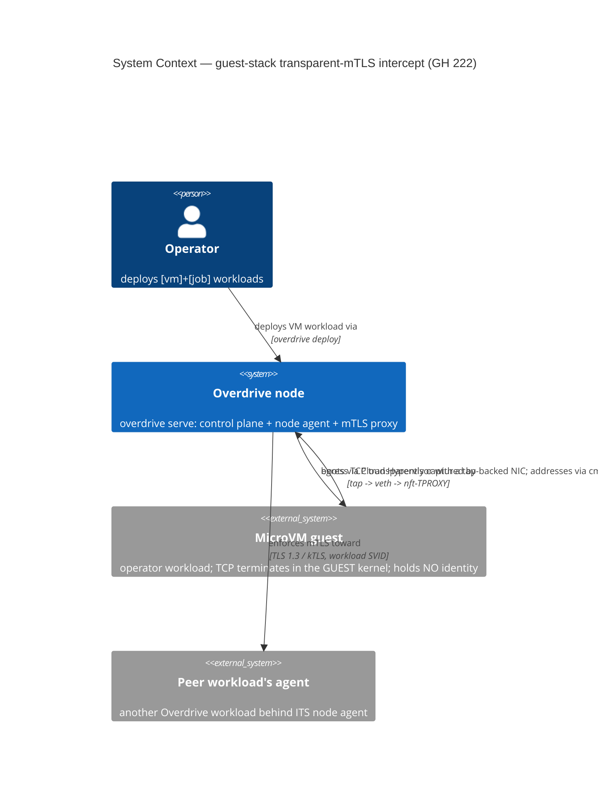
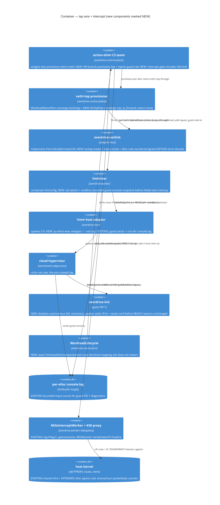

# Feature Delta — guest-stack-transparent-mtls-intercept (GH #222)

Companion ADRs: **ADR-0088** (guest netns topology + addressing) and
**ADR-0089** (tap-in-netns provisioning boundary + CH net attach). SSOT
section: `docs/product/architecture/brief.md` § "Guest-stack transparent-mTLS
intercept extension". Spike evidence:
`docs/feature/guest-stack-transparent-mtls-intercept/spike/findings.md`
(verdict WORKS, kernel 7.0.0-29, CH v53.0, no empirical toggle required).

## Wave: DESIGN

### [REF] Capability and scope

**Capability**: a microVM workload — whose TCP terminates in the GUEST kernel,
leaving the host with no `struct sock` — is born behind a closed two-stage
gate: its statically configured NIC emits zero L2 frames until the host
intercept is live, and the operator command is released only afterward. Its
egress then traverses `tap → netns forward → veth → host-veth ingress`, where
the production nft-TPROXY match, mark, redirect, and verdict semantics produce
the SAME `InterceptedConnection` the host-socket path
produces, feeding the proven #26 `MtlsEnforcement` proxy (handshake / kTLS /
splice — off-limits, reused verbatim). The alloc-scoped outbound rule is
EXTENDED with a non-terminal anonymous nft `counter` statement so metal can
prove that exact kernel rule was hit. The recovery amendment also orders the
rule's existing fwmark write before its TPROXY expression so a missing redirect
listener remains locally routed and cannot fall through to cleartext; it adds
no second rule or quarantine mechanism.

**The only NEW production code** (spike `findings.md` § "What the
walking-skeleton promotion wires into production"):

1. **Tap-in-netns provisioning** for VM-kind allocs (folded in from #257 gap 2).
2. **CH `--net` tap attach** + running the hypervisor inside the workload netns.
3. **Silent guest addressing** (PID 1 disables IPv6/GARP emission, then applies
   IP/gateway/DNS before READY).
4. **Flipping the `DriverType::Exec` gate** on the intercept install at the
   action-shim at BOTH install sites — fresh-start (`action_shim/mod.rs:1584`,
   comment `:1559-1569`) AND restart (`:1880`) — so VM-kind allocs get
   `MtlsInterceptWorker::start_alloc` too on both fresh deploy and restart (see
   § [REF] D6). These are the production call sites deliberately deferred to
   #222 (an ungated install pre-tap would have presented a veth the guest's
   traffic never traversed as mesh-enrolled).
5. **Pre-READY diagnostic selection**: `VmDriver` reads the bounded existing
   guest serial file before cleanup, with VMM stderr fallback.
6. **Exact Job terminal mapping**: the pure `WorkloadLifecycle` classifier
   preserves `VmGuestExitUnreported.vmm_exit_code` without a restart.
7. **Kernel-observable alloc-rule accounting**: the existing outbound-rule
   installer adds one anonymous nft `counter` after its exact interface/TCP
   matches and before its mark/TPROXY/accept tail; the existing
   internal `GETRULE` projection decodes that counter for the metal witness.

The 2026-08-30 recovery amendment below additionally sanctions only the exact
ObservationStore lifecycle-occurrence schema/operations, the internal async
stop/shutdown and VM-reclamation arbitration surfaces it names, and reordering
the existing per-allocation TPROXY rule tail to mark before redirect. It adds
no operator API, separate durable store, second nft rule, quarantine, or
event-delivery protocol, and it supersedes DELIVER-era mechanisms that moved
interception before VMM start or introduced a second lifecycle authority.

**Out of scope**: #257 ([vm]+[service] enablement — guest-reachable health
probes + removing the `[vm]`+`[service]` parse rejection at
`workload_spec.rs:878`). The inbound-intercept BUILD is deferred with it
(§ [REF] Inbound direction). The #26 proxy internals are not touched.

**Ubiquitous language** (extends DD-4 / ADR-0071 vocabulary):

| Term | Meaning |
|---|---|
| **transit /30** | The existing slot-derived veth /30 (`plan.subnet`, lower half of `10.99.0.0/16`). For a VM alloc it carries NO workload endpoint — it is the routed hop between tap and host. |
| **guest /30** | The NEW slot-derived /30 (upper half of `10.99.0.0/16`) the guest's virtio-net NIC is addressed from. |
| **tap gateway** | The tap device's address inside the netns (`guest /30` first usable) — the guest's default route. |
| **guest addr** | The guest NIC's address (`guest /30` second usable). For a VM alloc this IS the canonical `workload_addr`. |
| **guest addressing** | The platform-owned kernel-cmdline parameter carrying `(guest addr/prefix, gateway, dns)` that `overdrive-init` applies before emitting READY. READY therefore means guest platform initialization, including networking, completed and the guest is blocked awaiting EXEC. |

### [REF] Decisions table

| # | Decision | Chosen | Rejected | ADR |
|---|---|---|---|---|
| D1 | netns topology | **Routed two-/30** (spike-proven verbatim): tap + guest /30 in the netns, `ip_forward=1`, host return route; both /30s carved from `10.99.0.0/16` (transit = lower /17, guest = upper /17, same slot key) | L2 bridge tap↔veth (unproven, br_netfilter/L2 failure modes, breaks the veth converge model); guest-directly-on-transit-/30 via /32 onlink + proxy-ARP (unnumbered-routing fragility, unproven) | 0088 |
| D2a | where `workload_addr` sits | **The guest addr** (`spec.workload_addr = guest_addr` for VM allocs) — the only address a peer's leg-S dial or an inbound `daddr` match can terminate at; the transit /30 is pure forwarding | The transit veth addr (nothing listens there — an inbound leg-S dial would terminate on a forwarding hop); a second field beside `workload_addr` (two canonical addresses = the sentinel shape rust.md forbids) | 0088 |
| D2b | guest-addressing mechanism | **Kernel-cmdline parameter, `overdrive-init`-applied silently before READY** (require NIC down; disable per-interface IPv6; pin/read `arp_notify=0`; apply static IPv4; fail closed on any setup error; write guest `/etc/resolv.conf`) | kernel `ip=` autoconfig (CONFIG_IP_PNP unset on the probe kernel; couples to guest-kernel config; no failure surface); DHCP (new daemon + guest client); a new beacon vsock message (extends the versioned PL for a static value) | 0088 |
| D3 | return-route ownership | **The C3-seam provisioner extension** (tap converge steps in `veth_provisioner`, Bar-1 idempotent converge-on-boot; Bar-2 promotion rides #197/#234). Teardown is structural (route + tap die with veth/netns deletion) | `start_alloc` (worker owns nft rules, not host routing; wrong lifecycle); a new dedicated reconciler (Bar-2 now — reconcilers.md names converge-on-boot the valid intermediate; #197 tracks promotion) | 0089 |
| D4 | C3 seam + CH `--net` wiring | **C3 branches on `DriverPayload` VM arm** → pure `VmTapPlan` + tap converge → inject guest-net onto the spec (same in-memory channel as `netns`/`host_veth`); `VmDriver` composes it into `VmConfig` + cmdline; `Vmm` prepends `ip netns exec <ns>` to the existing wrapper argv + appends `--net tap=<name>,mac=<mac>`. Tap creation subprocess-free (`/dev/net/tun` ioctl + netlink netns move, EXTEND `overdrive-netlink`) | driver-creates-tap (violates the ratified "provisioner creates, driver enters" split, Q2/C3); tap fd-passing `--net fd=` with CH in the host netns (deviates from the spike-proven shape; needs netns-scoped fd acquisition; **REJECTED ON THE MERITS** — ADR-0089 §A2: the hardened-microVM precedent, the Firecracker jailer's `setns`-into-netns, points AT the wrapper, and isolation/operability favour it; re-open only with evidence against the wrapper, NOT a queued refinement); worker-side `pre_exec` setns (crosses the ADR-0082 `Vmm`-owns-spawn boundary) | 0089 |
| D5 | inbound direction (peer→guest) | **Topology settled NOW; intercept build deferred to #257** (existing issue). `install_inbound_tproxy` needs zero change (keys on `workload_addr` = guest addr); leg-S delivery = a plain dial to the guest addr over the spike-proven host→guest reply path. A #222 inbound slice is structurally un-drivable: no production path can declare a guest listener until #257 removes the parse rejection — building it now repeats the #236 dead-mechanism precedent | Build inbound in #222 (no serve+deploy driver exists — Job-kind installs 0 inbound rules); leave topology unexamined (risks a rework when #257 lands) | 0089 |
| D6 | intercept-install gate | **EXTEND the `DriverType::Exec` gate to include VM-kind at BOTH install sites** — fresh-start (`action_shim/mod.rs:1584`, comment `:1559-1569`) AND restart (`:1880`, comment `:1877`); teardown (`stop_alloc` at `:1269`/`:2038`) is ungated-by-design (no flip, none must be added). Initial deploy and generation replacement use fresh-start; unclean control-plane restart → boot-epoch Platform Reclamation with standing intent → same-`AllocationId` `RestartAllocation` uses restart. Natural VM Job exit/crash finalizes without retry. D-MTLS-18 remains fail-closed. See § [REF] D6 | leave either install gate `Exec`-only; treat Job restart budget/crash retry or `overdrive workload restart` as the same-id route (the former is run-once-final, the latter mints a fresh allocation) | 0089 |
| D7 | exact outbound-rule hit | **EXTEND the existing alloc-scoped egress rule with one anonymous nft counter after its interface/TCP matches; add strict bounded single-reply `GETGEN` plus complete multipart `GETRULE`, normalized full-program identity, a loss-detecting nft change guard, and exact capture-to-counter equality in the kernel `skb->len` domain** | handle+userdata alone (replace can preserve both); positive/bounded deltas (reset can false-pass); generic L2 byte length (not nft's byte domain); capture+leg-F without a kernel rule observable; nft trace/nftrace mutation; a test-installed/replaced/reset rule (violates production-path honesty and ownership) | 0088/0089 |

### [REF] Component decomposition

| Component | Home | Class | Change |
|---|---|---|---|
| `VmTapPlan` (pure value: tap name `ovd-tp-<4hex>`, guest /30, tap gateway, guest addr, MAC, dns=responder, return-route spec) | `overdrive-control-plane/src/veth_provisioner.rs` | adapter-host | **CREATE-NEW value type** (pure derive from `NetSlot`, sibling of `WorkloadNetnsPlan`; never persisted) |
| Tap converge steps (create/persist tap in netns, address tap, `ip_forward=1` in netns, host return route) | `veth_provisioner.rs` | adapter-host | EXTEND (same observe → diff → converge Bar-1 shape as the veth steps) |
| tuntap create + netns move primitives | `overdrive-netlink` (+ a small `/dev/net/tun` ioctl surface) | adapter-host | EXTEND (subprocess-free per ADR-0085; tun devices are ioctl-created, netlink-moved) |
| C3 seam VM branch | `action_shim/mod.rs::provision_and_inject_netns` | adapter-host | EXTEND (match on `DriverPayload` VM arm; inject guest-net channel onto the spec) |
| Intercept-install gate (BOTH sites) | `action_shim/mod.rs` (the `DriverType::Exec` gates: fresh-start `:1584` + restart `:1880`) | adapter-host | EXTEND (`Exec` → `Exec \| Vm`) at both install sites; fresh deploy/generation replacement use fresh-start, boot-reclamation same-id re-drive uses restart; teardown `:1269`/`:2038` ungated-by-design |
| `AllocationSpec` guest-net channel | `overdrive-core/src/traits/driver.rs` | core | EXTEND (one additional pure in-memory field family, same no-serde/no-rkyv discipline as `netns`/`host_veth`/`workload_addr`; exact shape → DISTILL) |
| `VmConfig` net attach | `overdrive-core/src/vm/config.rs` | core | EXTEND (`netns` becomes CONSUMED; net attach carried so netns-without-NIC is unrepresentable — see § Open questions Q2) |
| `VmDriver` (compose net + pre-READY diagnostics) | `overdrive-worker/src/vm_driver.rs` | adapter-host | EXTEND (compose `VmConfig`; on `VmmExited`, snapshot the bounded guest serial tail before run-dir cleanup and select it ahead of hypervisor stderr) |
| `Vmm` host adapter (wrapper argv `ip netns exec <ns>` + `--net tap=,mac=`) | `overdrive-host/src/vmm.rs` | adapter-host | EXTEND (reuses the existing wrapper-argv mechanism; zero `unsafe` added — `#![forbid(unsafe_code)]` preserved) |
| `VmRunDir::console_log` + CH `--serial file=` | `overdrive-core/src/vm/config.rs` + `overdrive-host/src/vmm.rs` | core / adapter-host | **REUSE AS-IS** (this is the actual guest PID 1 serial stream; `VmDriver` reads its bounded tail before cleanup) |
| `VmmDiagnostics` / `VmmExit.stderr_tail` | `overdrive-core/src/traits/vmm.rs` + `overdrive-host/src/vmm.rs` | core / adapter-host | **REUSE AS-IS** (hypervisor-process stderr only; bounded fallback, never mislabeled as guest console) |
| `overdrive-init` platform initialization + resolv.conf write | guest-side init (beacon consumer) | guest | EXTEND (before READY: require NIC down; disable per-interface IPv6; pin/read back `arp_notify=0`; parse/apply static IPv4; write `/etc/resolv.conf`; fail closed on any error, power off, never exec) |
| `WorkloadLifecycle::classify_natural_exit_terminal` | `overdrive-reconcilers/src/workload_lifecycle.rs` | core/application | EXTEND (pure exact `VmGuestExitUnreported.vmm_exit_code` → `TerminalCondition::Failed.exit_code`; no restart action/state mutation) |
| Tier-3 boot packet witness | existing `guest_stack_mtls_egress` metal harness around the real `Vmm` port | test adapter | EXTEND (observation-only capture-ready barrier before real VMM spawn; exact tap/host-veth correlation; no production data-path replacement) |
| `install_outbound_tproxy` + outbound-rule encode/read projection | `overdrive-worker` / `overdrive-netlink` | adapter-host | **EXTEND** (one non-terminal anonymous counter after `iifname`+TCP match and before the mark/TPROXY/accept tail; R3 orders the existing mark before TPROXY for dead-listener fail-closure; `RuleInfo` gains an internal counter snapshot and normalized full-program identity decoded by strict bounded multipart `GETRULE`, with full `GETGEN` and nft-change observation) |
| `ensure_shared_routing_infra` / `MtlsInterceptWorker::start_alloc` / `MtlsResolve` / the #26 proxy | `overdrive-worker` / `overdrive-dataplane` | adapter-host | **REUSE AS-IS** (shared routing, connection ownership, resolution, handshake, kTLS, and splice remain off-limits) |
| DNS responder (ADR-0072) | `overdrive-control-plane` | adapter-host | REUSE AS-IS (the guest reaches `responder_addr` = the transit gateway via routed hops; UDP is not TPROXY'd — the egress rule is `meta l4proto tcp`) |

No new crate, port trait, daemon, operator API, or Published Language.
`AllocStatusRowV2.workload_addr` carries the guest addr through the existing
field, and the counter projection stays inside the existing workspace-internal
`overdrive-netlink` API. The later recovery amendment R1 deliberately evolves
the existing ObservationStore with its exact bounded lifecycle-occurrence
schema; it adds no second persistence boundary.

### [REF] D1 — netns topology: routed two-/30 (options + trade-offs)

**Option A — routed two-/30 (RECOMMENDED, spike-proven).** The netns holds the
existing veth end (transit /30, unchanged) plus a tap addressed from a second
slot-derived /30; the guest's only NIC is virtio-net backed by that tap;
`ip_forward=1` in the netns routes tap↔veth; the host holds a return route to
the guest /30 via the transit in-netns addr.

```
[guest] eth0 <guest_addr>/30, gw <tap_gw>      (guest kernel owns TCP)
   │ virtio-net
[tap ovd-tp-<hex>] <tap_gw>/30                 ─┐ netns ovd-ns-<hex>
   │ (ip_forward=1)                             │ default via plan.host_addr
[veth ovd-wl-<hex>] plan.workload_addr/30      ─┘
   │ veth pair
[veth ovd-hv-<hex>] plan.host_addr/30           HOST netns
   │  ← nft prerouting iifname ovd-hv-<hex> l4proto tcp tproxy → leg-F  (EXISTING)
   │  ← host return route: <guest /30> via plan.workload_addr dev ovd-hv-<hex>  (NEW)
```

- Pro: byte-for-byte the spike topology (verdict WORKS, all four
  rp_filter×tx-offload combinations, no toggle); the veth half is the EXISTING
  provision, untouched; every step is observe-able for converge (tap present,
  addr present, forward flag, route present); inbound-ready (host→guest
  delivery is the proven reply path).
- Con: a second /30 per VM slot; the guest addr differs from the transit addr
  (two address families to keep straight — mitigated by the vocabulary above).

**Subnet carve (sub-decision)**: the guest /30 is carved from the SAME
`WORKLOAD_SUBNET_BASE` `10.99.0.0/16`: guest network =
`base + 0x8000 + slot*4` — a /18-sized carve starting at the upper-half
boundary, mirroring the transit carve's /18-within-the-lower-half shape
(`veth_provisioner.rs:405`). With `NET_SLOT_MAX = 4095` the transit carve tops
out at offset 16383 and the guest carve at 49151 — both strictly inside the
/16, disjoint by construction. **DELIVER item (Finding 4):** this disjointness
must be COMPILER-PROVEN, not prose. The existing S6 const guard
(`veth_provisioner.rs:518`) asserts only the transit carve
(`(NET_SLOT_MAX*4 + 3) < base_span`); DELIVER MUST add the **symmetric
guest-carve const guard** `(0x8000 + NET_SLOT_MAX*4 + 3) < base_span` (49151 <
65536) beside it, so a future `NET_SLOT_MAX` / base raise cannot silently
overflow the guest carve past the /16 or into the transit carve. Why in-/16:
the §35a GATE partition arm (`ServiceMapHydrator`'s third arm) and any future
mesh-membership test key on `addr ∈ WORKLOAD_SUBNET_BASE`; a guest addr in a
second /16 would silently escape that membership when #257 lands, and would add
a second base constant to the #239 tunable-base surface. Rejected alternative:
a distinct `10.100.0.0/16` guest base.

**Option B — L2 bridge tap↔veth.** Enslave tap + veth end to an in-netns
bridge; the guest sits directly on the transit /30 (takes `plan.workload_addr`).
Pro: one /30, one address identity, no forwarding. Con: UNPROVEN (the spike
proved routed); pulls in the bridge module, MAC learning, and the br_netfilter
sysctl family (bridged frames traversing iptables hooks is a classic surprise
surface); moves the address off the veth end, breaking the existing
`ObservedWorkloadVeth` converge model (`workload_addr_present` observes the veth
device); ARP now spans the pair. Rejected: trades proven mechanism for
untested L2 subtlety to save one /30.

**Option C — guest directly on the transit /30 (routed /32 + onlink).** Guest
takes `plan.workload_addr` as a /32 with an onlink route to `plan.host_addr`;
the tap runs unnumbered with proxy-ARP-ish delivery. Pro: no second subnet,
`workload_addr` identity unchanged. Con: unnumbered point-to-point routing is
the fiddliest of the three (onlink routes, in-netns /32 host routes, proxy-arp
on the tap), entirely unproven, and the hardest to observe/converge. Rejected.

### [REF] D2 — guest addressing

**Placement (D2a)**: for a VM-kind alloc the C3 seam injects
`spec.workload_addr = guest_addr` (NOT `plan.workload_addr`). Everything
downstream is untouched and correct by construction: the Running-row write
persists it (existing V2 field), a future bridge advertise (#257) advertises
it, `MtlsResolve` classifies a dial to it as `Mesh`, and `install_inbound_tproxy`
(#257) keys its `daddr` match on it. The transit veth addr keeps its role as
forwarding hop + return-route nexthop only. Exec-kind allocs are byte-identical
to today (`workload_addr = plan.workload_addr`).

**Mechanism (D2b)**: `VmDriver` appends ONE platform-owned parameter to the
kernel cmdline carrying `(guest_addr/30, gateway = tap_gw, dns =
plan.responder_addr)`. `overdrive-init` (the platform-owned guest PID 1 — the
beacon contract already makes it universal for VM-kind workloads) parses it and
applies it via the spike-proven ioctl path, and writes the guest's
`/etc/resolv.conf` pointing at the responder — so dial-by-name (ADR-0072)
works from guests with zero app config, the guest-side analogue of the netns
resolv.conf injection (which cannot reach a guest filesystem). Ordering
contract: `overdrive-init` completes minimal-root bootstrap, token parse,
net-apply, and resolver write **before it opens/reaches READY on the beacon
session**. READY means those platform-initialization duties succeeded and the
guest is blocked awaiting EXEC. Any init, malformed-token, or net-apply
failure powers the guest off before READY and never execs; the host consumes
the existing pre-READY VMM-exit start-rejection path. The beacon Published
Language is UNCHANGED (no new vsock message; vsock needs no IP), and `EXIT`
retains its original post-operator-wait semantics.

**Q7/Q9 lifecycle amendment (2026-08-28, step 02-03 metal RED).** The prior
host distinction — an `EXIT` observed post-READY but before the host marked
EXEC flushed means net-apply failure — is superseded. In isolation, the
net-apply failure reached the host before EXEC and passed. In the combined
metal gate, intercept installation and the host EXEC flush won the race while
the guest was still applying networking; the identical pre-operator `EXIT 78`
was classified as `crashed (exit Some(78), signal None)`. Host write success
proves transport flush, not guest consumption, so neither an atomic phase bit
nor a timing delay can make that distinction deterministic.

The deterministic classification is at the already-existing boot boundary:
before READY, guest shutdown resolves `VmDriver`'s pre-READY `VmmExited`
boot-race arm, producing the existing start rejection
`VmGuestExitUnreported { vmm_exit_code, vmm_signal }`. The action shim writes
the attempt as Failed without a Running transition. For #222's executable
`[vm]+[job]` surface, the existing Job-kind branch stays first, but
`WorkloadLifecycle::classify_natural_exit_terminal` is **EXTENDED** with the
pure total mapping `VmGuestExitUnreported { vmm_exit_code, .. }` →
`TerminalCondition::Failed { exit_code: vmm_exit_code }`. Its property ranges
over every `Option<i32>` (with arbitrary signal) and carries the exact rustdoc
line `/// CONTRACT_SHAPE: pure-function.`. A reconciler/action-shim example
proves the only action is `FinalizeFailed`, no `RestartAllocation` is emitted,
the returned `WorkloadLifecycleView` (including `restart_counts`) equals its
input, and the final row forwards the prior durable `restart_count` unchanged.

The concrete PID 1 diagnostic comes from a newly sanctioned internal read of
an existing stream, not from `VmmExit.stderr_tail`. CH already routes guest
serial to `VmRunDir::console_log()`; its own stderr is separately captured by
`VmmDiagnostics` and carried on `VmmExit`. After the pre-READY VMM exit resolves
and before `cleanup_after_start_failure` deletes the run directory, `VmDriver`
asynchronously snapshots at most the final 8 KiB / five line fragments of
`console.log`, retaining an unterminated final fragment and rendering lossy
UTF-8; the bounds come from existing `VMM_CONSOLE_TAIL_MAX_BYTES` and
`STDERR_TAIL_LINES`, not duplicate literals. A non-empty guest-console tail is
the primary row `detail`; bounded VMM stderr is fallback only when the console
is absent, empty, or unreadable; if
both are absent, a stable bounded fallback names the missing diagnostics.
Snapshot failure never masks cleanup or the typed rejection. `workload
describe` already renders the selected detail, reason, terminal claim, and
count. No new describe field, `VmmExit` field, `ExitKind`, `TransitionReason`,
or beacon field is required. `[vm]+[service]` remains blocked and deferred to
#257; this amendment does not silently alter the generic Service
start-rejection restart policy.

**Q9 closed packet contract — zero guest-originated L2 frames before
intercept-live.** A named allowlist is rejected because this platform needs no
autonomous L2 control exchange to apply a static IPv4 /30, and an allowlist
would create a place for unexpected destination or payload-bearing traffic to
hide. Before raising the NIC, `overdrive-init` must verify it is down, disable
IPv6 on that interface (IPv6 is enabled by Linux by default and link-up can
initiate link-local DAD/router solicitation), set IPv4 `arp_notify=0`, read
both settings back, and fail closed if any step fails. Static address/netmask
and route ioctls then run without DHCP, DNS, probes, neighbor warm-up, socket
connect, or workload send. The kernel documents `arp_notify=0` as no
gratuitous ARP on link/MAC change; pinning it and IPv6-disable makes the zero-
frame claim a platform policy rather than an appliance-default assumption.

The Tier-3 witness wraps the real VMM adapter only to observe ordering. After
C3 provisions the alloc netns/tap/host-veth and before real CH spawn/NIC-up, it
binds an all-EtherType capture to the exact tap ifindex inside that netns and a
correlated witness to the exact root-namespace host-veth ifindex; VMM create is
released only after both acknowledge capture-ready. Correlation is the full
allocation tuple: allocation id, slot, netns inode, tap name/ifindex,
host-veth name/ifindex, guest MAC, and guest address. From that readiness edge
through intercept-live, any guest-to-host Ethernet frame fails: tagged or
untagged, known or unknown EtherType, ARP/IPv4/IPv6, ICMP/TCP/UDP/other,
unicast/multicast/broadcast, any destination, and with or without payload.
Unexpected source MAC is also failure. There is no "control traffic" escape.
A capture drop/overflow, truncated or malformed record, unknown direction or
timestamp, missing readiness edge, or uncertain interface correlation fails
the proof rather than being filtered out.

Intercept-live is not a log timestamp: `start_alloc` has returned success and
the expected outbound rule is observed on that same host-veth with a readable
kernel counter, an exact production-encoder-derived expression identity, and a
coherent pre-EXEC baseline inside one unchanged ruleset generation. Both
captures and the loss-detecting nft change guard remain active across async
EXEC release. The first post-release guest TCP SYN must match the operator's
expected `guest_addr -> mesh service VIP:port` five-tuple; exact checked packet
and nft-`skb->len` byte deltas must equal the complete capture's rule-eligible
domain, with no other eligible tuple, before the flow arrives at leg-F. No
cleartext copy reaches the external peer path and the inter-agent path carries
TLS records. Ambiguous ordering, capture/kernel equivalence, or concurrent nft
mutation is a test failure. The observer is not a functional test double:
every tap, route, intercept, VMM, guest, and proxy call remains the production
implementation.

**Q9 exact-rule-hit amendment (2026-08-29; DISTILL platform P3).** The prior
wording required an exact rule increment while classifying
`install_outbound_tproxy` as REUSE-AS-IS. That was not executable: the shipped
egress rule has no counter expression, and `RuleInfo`/`list_rules` recover only
handle and userdata. Packet capture plus arrival at leg-F proves the path, but
cannot by itself prove which kernel nft rule accepted the packet. The ratified
kernel-observable mechanism is therefore an **internal anonymous counter on
the existing alloc-scoped egress rule**:

- `egress_tproxy_rule_exprs` emits, in this exact order, the existing
  `iifname == host_veth` match, the existing `meta l4proto == tcp` match, one
  anonymous `counter`, then fwmark set, the TPROXY destination, and `accept`.
  R3 deliberately moves the existing mark before TPROXY; no expression or
  second rule is added for shutdown. The counter is non-terminal. Rule table,
  chain, rule ordering, match domain, redirect address/port, mark, verdict, and
  `userdata_egress(host_veth, leg_f_port)` bytes do not change. Shared
  exemptions, inbound rules, and output-divert rules do not gain this counter.
- The existing workspace-internal netlink projection grows by the exact
  additive counter shape `RuleInfo { handle, userdata, counter:
  Option<RuleCounterSnapshot> }`, where `RuleCounterSnapshot { packets: u64,
  bytes: u64 }`, plus an internal normalized full-expression-program identity.
  The normalizer preserves expression order, names, registers, operands,
  addresses, ports, mark, and verdict, replacing only the selected counter's
  live packet/byte values with a typed placeholder. The target must equal the
  normalized production output of
  `egress_tproxy_rule_exprs(host_veth, AGENT_LOOPBACK, leg_f_port,
  TPROXY_FWMARK)`; same userdata+handle is not sufficient. A counter-free rule
  still yields `None`, but a target with an unknown/extra/reordered expression,
  duplicate counter, missing half, wrong width, or malformed subtree fails.
  These values are not serde/rkyv/API/Beacon/observation data.
- `list_rules` is one strict, bounded multipart `GETRULE` transaction on a
  dedicated socket and absolute whole-operation deadline. The source must be
  the kernel, every `nlmsg_seq` must equal the request sequence, and each data
  reply must carry the expected `NFT_MSG_NEWRULE` type and nft family. Every netlink message and
  attribute must have a valid bounded length and aligned
  extent, including all nested expressions. Exactly one `NLMSG_DONE` with zero
  completion status terminates the dump. A nonzero `NLMSG_ERROR`,
  `NLM_F_DUMP_INTR`, overrun, timeout/EOF, duplicate/missing DONE,
  wrong-sequence/sender record, or malformed/trailing/partial bytes fails the
  entire operation before target uniqueness is evaluated. The bounded
  `GETGEN` reader separately requires exactly one complete kernel
  `NFT_MSG_NEWGEN` reply with the request sequence, expected family, and full
  nonzero `NFTA_GEN_ID`—never only `nfgenmsg.res_id`'s low 16 bits—and rejects
  any extra, error, overrun, malformed, trailing, partial, timeout, or EOF
  result.
- `install_outbound_tproxy` remains the sole production owner of rule
  installation and teardown. Its same-tag idempotence path adopts the existing
  handle and accumulated counter without resetting it. A fresh install starts
  a fresh counter; normal guard drop deletes that exact handle; restart boot
  recovery still sweeps every per-workload rule before any clean reinstall.
  The metal decorator performs only `GETRULE`/`GETGEN` reads and nft change-
  notification receives: it may neither install, replace, reset, nor delete a
  rule. A pre-amendment survivor without a counter is swept by normal boot
  recovery; if one is nevertheless selected, the witness fails closed.

The before/after oracle is deliberately conservative because packet capture
and a netlink dump have no cross-subsystem atomic transaction:

1. After `start_alloc` succeeds, while the guest remains blocked before EXEC
   and the zero-frame capture contract still holds, subscribe a separate
   read-only netlink socket to this network namespace's `NFNLGRP_NFTABLES`
   group before the first generation read, with normal loss reporting
   retained. Treat `ENOBUFS`, `NLMSG_OVERRUN`, any malformed notification, and
   every nft change notification as failure. Read the full initial ruleset
   generation `G` with strict bounded `GETGEN`. This guard is intentionally
   global: an unrelated concurrent nft transaction may reject the metal
   scenario, but ambiguous mutation may never pass. The production install is
   complete before this witness epoch begins; it is not misclassified as
   concurrent mutation.
2. Select exactly one egress
   rule whose full userdata bytes are exactly
   `userdata_egress(host_veth, leg_f_port)`. Require its handle, complete
   counter, and normalized full program to equal the production encoder's
   expected program. Missing/duplicate targets or any extra, absent, or
   reordered expression fail. Every candidate dump is bracketed
   `GETGEN(G) -> complete GETRULE -> GETGEN(G)`; both full-generation replies
   must retain `G`, and the dump must complete without `NLM_F_DUMP_INTR`.
3. Take two such generation-bracketed snapshots separated by a
   capture-confirmed quiet interval. Both counters and normalized identities
   must be equal. The second snapshot is the conservative `before` cut and
   completes `intercept-live`; only then may EXEC be released.
4. Keep the exact-host-veth read-only `AF_PACKET/SOCK_DGRAM` ingress capture
   active from its pre-VMM-spawn readiness edge. Unlike the raw all-EtherType
   L2 safety capture, this socket retains `sockaddr_ll` direction/ifindex/
   protocol and uses `recvmsg(MSG_TRUNC)` with a 65,535-byte L3 buffer, so an
   oversize/truncated record is detected rather than counted;
   `PACKET_STATISTICS` must report zero drops at the closing cut. It records
   the full L3 skb without the Ethernet header. For this IPv4 table, the
   complete counter-eligible set is every kernel-valid, unfragmented IPv4
   ingress record on that exact ifindex whose protocol is TCP. Any fragment,
   malformed/truncated header, capture truncation, offload representation that
   cannot be shown one-for-one with the skb at the priority -150 prerouting
   hook, or inability to reproduce kernel eligibility fails. Each eligible
   packet contributes one packet and its validated IPv4 `tot_len` bytes:
   after IPv4 validation/trim that is exactly the `skb->len` passed to
   `nft_counter_eval`. Ethernet length, capture snap length, and TCP payload
   length are explicitly not substitutes.
5. The first eligible packet after release must be the initial TCP SYN for the
   expected `guest_addr:ephemeral -> mesh VIP:port` five-tuple, and every
   eligible packet through the postcondition cut must have that directional
   tuple. After the round trip and another capture-confirmed quiet interval,
   take two more identical generation-bracketed snapshots; the second is
   `after`. Let `C` be the complete eligible-packet count and `L` the
   checked-u64 sum of their exact IPv4 `tot_len` values. With checked addition
   and subtraction only, require `C > 0`, `L > 0`,
   `after.packets.checked_sub(before.packets) == Some(C)`,
   `after.bytes.checked_sub(before.bytes) == Some(L)`,
   `before.packets.checked_add(C) == Some(after.packets)`, and
   `before.bytes.checked_add(L) == Some(after.bytes)`. The same original
   destination must reach leg-F and the existing peer-wire/kTLS evidence must
   prove no-cleartext/TLS.
6. Drain the notification guard and perform a final strict `GETGEN`; it must
   still be `G` with no notification or loss. Any different, decreasing, or
   wrapped generation, same-handle replace, delete/reinsert, ruleset
   notification, lost notification, target disappearance, or ambiguous
   concurrent mutation fails. Generation protects the immutable program;
   exact arithmetic protects the mutable counter. An in-window
   `NFT_MSG_GETRULE_RESET` after any counted packet loses a prefix and cannot
   satisfy equality; before the first increment it changes no observed state.
   Reset, counter regression/wrap, arithmetic overflow, capture loss, or
   competing traffic therefore cannot false-pass.

The observer remains read-only: bounded polling may wait for a quiet pair but
never installs, replaces, resets, or deletes. Same-tag adoption retains its
accumulated counter and receives a fresh baseline. Normal stop still deletes
only the adopted handle; boot recovery still sweeps old per-workload rules
before reinstall. Other allocations are excluded by exact
userdata+handle+program, counter-free siblings still project `None`, and a
quiescent sibling snapshot remains equal across target teardown. Thus the
first-five-tuple proof is exact counter equality on one generation-stable
production program plus complete capture and the existing
leg-F/original-destination/TLS evidence, not an inference from leg-F alone.

These pins follow the kernel's
[`NFT_MSG_GETRULE_RESET` UAPI](https://github.com/torvalds/linux/blob/master/include/uapi/linux/netfilter/nf_tables.h),
[`nf_tables_commit` and rule-dump consistency machinery](https://github.com/torvalds/linux/blob/master/net/netfilter/nf_tables_api.c),
[`nft_counter_eval` byte accounting](https://github.com/torvalds/linux/blob/master/net/netfilter/nft_counter.c),
[`ip_rcv_core` validation/trim](https://github.com/torvalds/linux/blob/master/net/ipv4/ip_input.c),
and [`packet_rcv` L2/L3 delivery contract](https://github.com/torvalds/linux/blob/master/net/packet/af_packet.c).

Why not the alternatives: kernel `ip=` requires `CONFIG_IP_PNP` (unset on the
probe kernel; even with a platform kernel flip it is boot-static, has no
failure surface, and couples addressing to kernel config); DHCP adds a host
daemon + a guest client for a value the platform already knows at plan time; a
beacon vsock message versions the PL for a static value and adds an ordering
dance the cmdline avoids.

**DNS reachability (topology-REASONED, NOT spike-proven — Finding 5)**: guest →
`responder_addr` (= `plan.host_addr`) routes default→tap→netns; the transit /30
is on-link on the veth → forwarded → host local delivery. UDP/53 does not match
the TCP-only egress TPROXY rule; TCP/53 would be TPROXY'd to leg-F, resolved
`NonMesh`, and pass-through-dialed to the responder — both paths terminate
correctly. The responder's `IP_PKTINFO` source-pinned replies return over the
host return route. **This is topology reasoning, not spike evidence**: the
increment-n spike used raw-IP `connect()`, so guest dial-by-name over routed
hops (guest `/etc/resolv.conf` → responder → resolve → dial) is UNPROVEN.
Guest-DNS-over-routed-hops is therefore the FIRST thing the Slice-1 metal AT
must exercise (the walking-skeleton "dials a mesh peer by name" step), not a
proven mechanism carried forward from the spike.

**MAC**: locally-administered unicast, a pure function of the slot (exact byte
layout → DISTILL). The spike's fixed MAC is replaced by the derivation so two
VM slots never collide on a segment.

### [REF] D3 — structural-requirement ownership (the spike's pinned facts)

| Structural fact (spike `findings.md`) | Owner | Status |
|---|---|---|
| `modprobe nft_tproxy` at agent boot | existing agent boot (already ensured on the veth-intercept path) | REUSE — no new work |
| `ip rule fwmark 0x1 lookup 100` + `local` table 100 | `ensure_shared_routing_infra()` | REUSE AS-IS (node-global, idempotent) |
| Host return route `<guest /30> via plan.workload_addr dev plan.host_veth` | NEW tap converge step (`veth_provisioner`), per-alloc | CREATE (one add-if-missing converge step; dies with the veth on teardown — structural, no teardown code) |
| `net.ipv4.ip_forward=1` inside the netns | NEW tap converge step, per-alloc (`/proc/sys` write inside the netns, ADR-0085 file-I/O shape) | CREATE (idempotent write) |
| Tap exists + persistent + addressed in the netns | NEW tap converge steps | CREATE (observe → diff → converge; adoption on restart = the same converge) |

Ownership rationale (D3): all four per-alloc facts live with the per-alloc
provisioner at the C3 seam — the same lifecycle as the netns+veth they extend,
fail-closed via the existing `ShimError::WorkloadNetnsProvision`, torn down
structurally by the existing `teardown_workload_netns` (deleting the netns
destroys the tap; deleting the veth drops the return route). No reconciler is
created: converge-on-boot (Bar 1) self-heals across restarts; continuous
convergence is the #197/#234 Bar-2 promotion, where the tap steps ride along
with the veth steps.

### [REF] D4 — the wiring (C3 seam → driver → Vmm → guest)

Production sequence for a VM-kind alloc on an mTLS-composed boot
(`overdrive serve` + `overdrive deploy vm-job.toml`):

1. **C3 seam** (`provision_and_inject_netns`, kind-agnostic half): assign slot,
   derive `WorkloadNetnsPlan`, provision netns+veth (EXISTING, byte-identical).
2. **C3 seam VM branch** (NEW): `DriverPayload` VM arm → derive `VmTapPlan`
   from the same slot → tap converge (create+persist tap in netns, address tap
   gateway, `ip_forward=1`, host return route) → inject onto the spec:
   `workload_addr = guest_addr` + the guest-net channel (tap name, MAC,
   guest addressing inputs).
3. **`VmDriver`**: composes `VmConfig` — `netns` (now consumed), the net
   attach (tap name + MAC), and the guest-addressing cmdline parameter.
4. **`Vmm` (host adapter)**: spawns
   `ip netns exec <ns> [existing prlimit wrapper] cloud-hypervisor … --net
   tap=<tap>,mac=<mac> …`. The netns entry reuses the existing wrapper-argv
   mechanism; `overdrive-host` stays `#![forbid(unsafe_code)]`; CH's
   unix-socket surfaces (api, vsock, console file) are mount-ns/filesystem
   based and unaffected. CH attaches the pre-created persistent tap by name
   (the spike's benign "Tap already exists" path). Before this real spawn, the
   metal witness has already acknowledged capture-ready on the exact tap and
   host-veth. The guest boots; `overdrive-init` completes minimal-root
   bootstrap, verifies the NIC is down, disables per-interface IPv6,
   pins/reads `arp_notify=0`, parses and applies static IPv4 addressing, and writes
   resolv.conf **before** connecting/signalling beacon READY. A failure powers
   off before READY and takes the existing pre-READY driver-start rejection.
   `VmDriver` snapshots the bounded guest serial tail before deleting the run
   dir. READY means platform initialization is complete; the guest is then
   HELD awaiting EXEC and has not exec'd the operator command.
5. **Intercept install** (gate EXTENDED, D6): at the action-shim `Running` arm
   (after `driver.start()` returns at beacon READY),
   `MtlsInterceptWorker::start_alloc` installs
   `install_outbound_tproxy(plan.host_veth, leg_f_port)` — EXISTING owner, now
   reached by VM allocs and EXTENDED only so its alloc-scoped egress rule
   carries the Q9 anonymous counter; D-MTLS-18 fail-closed on error (install
   `Err` ⇒ the guest is never released to EXEC ⇒ no cleartext egress ⇒
   alloc driven terminal).
6. **EXEC-release, gated on intercept-install success (the born-captured
   invariant)**:
   only after `start_alloc` succeeds does the platform release the beacon EXEC,
   letting `overdrive-init` exec the operator's command. The guest's first
   `connect()` is therefore born intercepted **by construction** — the ordering
   invariant is `capture-ready ≺ VMM-spawn ≺ network-ready ≺ READY ≺
   intercept-live ≺ EXEC-release ≺ operator-first-connect`. Here
   `intercept-live` means `start_alloc` success plus the metal observer binding
   the exact outbound rule's tag+handle+normalized production program,
   establishing its stable counter baseline on the same host-veth inside one
   unchanged full ruleset generation, and observing no nft notification or
   notification loss. This is the SEQUENCE that makes the security claim true;
   boot-then-install without this gate would
   leave a first-connect window (a mesh-bound SYN before `start_alloc` would
   escape cleartext). Exact EXEC-release wiring — where the gate sits relative
   to the `Running` boundary, and the READY-vs-EXEC "what is Running for a VM"
   reconciliation — is a DISTILL shape (§ Open questions Q9); the invariant is
   pinned here.

Tap creation is subprocess-free (ADR-0085 discipline): open `/dev/net/tun`,
`TUNSETIFF`+`TUNSETPERSIST` (ioctl — tun devices cannot be netlink-created),
then netlink `RTM_SETLINK`/`IFLA_NET_NS_FD` moves the device into the netns;
address/up via the in-netns netlink ops `overdrive-netlink` already performs
for the veth end. The ONLY sanctioned subprocesses remain Cloud Hypervisor
itself and its argv wrapper (`ip netns exec` is an exec-time wrapper on the
already-sanctioned CH spawn, not a provisioning shell-out).

### [REF] D5 — inbound direction (peer → guest service)

**Settled now (topology-readiness, zero code):**

- `install_inbound_tproxy(SocketAddrV4::new(workload_addr, port), leg_c_port)`
  needs NO change — its `daddr` match keys on `workload_addr`, which for a VM
  alloc is the guest addr (D2a). TPROXY's prerouting match is
  destination-stack-agnostic exactly as the egress match is origin-agnostic.
- leg-S delivery (the agent's marked dial to the workload) is a plain TCP dial
  to the guest addr — the routed topology carries it host → veth → netns
  forward → tap → guest, the byte-identical path the spike's H5 reply leg
  proved (`PROBE-RESP-HOST-LISTENER-42` reached the guest).
- The leg-S mark exemption (`MTLS_LEG_S_DIAL_MARK`) already heads both shared
  chains — REUSE.

**Deferred to #257 (existing issue — the build):** the per-listener inbound
install for guest services fires off declared Service listeners, and
`[vm]+[service]` is refused at parse until #257 removes the rejection. A
Job-kind VM declares no listeners ⇒ `start_alloc` installs 0 inbound rules ⇒
an inbound slice inside #222 has NO production driver — a test would have to
hand-declare what production cannot, the exact #236 dead-mechanism precedent.
Residual empirical risk deferred with it: a host-originated SYN into the guest
(new connection, vs. the proven reply leg) — rated lower-risk routed-IP-over-tap
by the prior-art recon; #257 should open with a thin Tier-3 AT for it.

### [REF] D6 — intercept-install gate: BOTH install sites (+ teardown is ungated-by-design)

The `DriverType::Exec` gate on the intercept install is **NOT a single site**.
`MtlsInterceptWorker::start_alloc` (the security control that installs the
egress TPROXY) is gated on `spec.driver.driver_type() == DriverType::Exec` at
**TWO** action-shim install sites, and the D6 flip (`Exec` → `Exec | Vm`) MUST
land at BOTH:

| Site | `action_shim/mod.rs` | Arm | Current gate |
|---|---|---|---|
| Install 1 | `:1584` (comment block `:1559-1569`) | StartAllocation fresh-start `Running` | `DriverType::Exec` — FLIP |
| Install 2 | `:1880` (comment `:1877` "symmetric", `:1899`) | RestartAllocation `Running` | `DriverType::Exec` — FLIP |

**Why both, stated explicitly (route corrected 2026-08-29).** Flipping ONLY the
fresh-start gate (`:1584`) leaves the production-reachable same-allocation VM
Job re-drive with NO intercept re-install. After an unclean control-plane
restart while intent still stands, boot-epoch `VmReclamation` authors a
Platform Reclamation ending for the unsupervised non-terminal VM allocation;
`WorkloadLifecycle` then emits `RestartAllocation` with that same
`AllocationId`. If the `:1880` gate remains `Exec`-only, the re-driven guest
reaches `Running` but skips `start_alloc`, so egress reaches the wire
**CLEARTEXT, fail-OPEN**. The fresh-deploy AT never exercises that arm. Both
install gates flip, or the feature ships a silent same-id recovery regression.

The old route list is superseded. A VM Job's natural result or crash finalizes
run-once and does not consume restart budget. `overdrive workload restart`
(ADR-0073) advances the desired generation, ends the prior instance, mints a
fresh `AllocationId`, and therefore exercises the fresh-start install gate.
Those routes are not valid substitutes for S-GTI-06a/06b's same-id
boot-reclamation proof.

**Teardown is ungated-by-design and needs NO flip.** The intercept teardown
(`MtlsInterceptWorker::stop_alloc`) fires at TWO sites — the FinalizeFailed arm
(`:1269`, guarded on `!is_stable`) and the StopAllocation arm (`:2038`) — each
gated ONLY on `mtls_worker.is_some()`, NOT on `DriverType`. So a VM alloc that
installs the intercept is already torn down on stop/finalize (`stop_alloc` is
idempotent — a no-op for an alloc with no intercept). There is **NO
leak-on-stop bug**. The inverse hazard is the one to guard: a future reader MUST
NOT add a `DriverType::Exec` gate to either teardown site — doing so would leak
the VM alloc's nft rule on stop (the second, distinct bug the review
anticipated, which the current ungated shape structurally avoids).

**DISTILL/DELIVER obligation (Tier-3 restart AT).** Beyond the Slice-1
fresh-deploy egress AT, a Tier-3 **restart** AT (`kvm-tests` via `cargo xtask
metal run --`) MUST drive unclean control-plane restart with standing intent,
observe boot-epoch Platform Reclamation, preserve the same `AllocationId`, and
assert that the re-driven VM Job re-installs the intercept or is driven
terminal fail-closed on install failure. S-GTI-06a/06b pin both outcomes at the
`:1880` gate; this is not Job crash retry or generation replacement.

### [REF] Walking-skeleton egress slice (the serve+deploy loop)

**Slice 1 (the feature's first deliverable, production-drivable end-to-end):**
`overdrive serve` (mTLS-composed boot; nft_tproxy ensured; DNS responder up) +
`overdrive deploy vm-job.toml` — a `[vm]`+`[job]` whose guest command dials a
mesh peer (an exec-backed `[service]` on the node) by name — yields:

- **guest dial-BY-NAME resolves over routed hops** (guest `/etc/resolv.conf` →
  responder → resolve → dial) — the FIRST thing the AT must exercise, because
  it is topology-reasoned, NOT spike-proven (the spike used raw-IP connect;
  Finding 5),
- **FIRST-CONNECT safety**: the guest's first mesh `connect()` is captured with
  ZERO cleartext SYN escaping, after a verified zero-frame interval from
  capture-ready-before-VMM-spawn through intercept-live — the born-captured
  ordering invariant
  (`capture-ready ≺ VMM-spawn ≺ network-ready ≺ READY ≺ intercept-live ≺
  EXEC-release ≺ operator-first-connect`; Finding 2/Q9),
- guest egress captured at the host-veth by the EXISTING rule semantics, with
  the Q9 strict generation/program guard and exact packet/`skb->len` counter
  equality proving the unchanged alloc rule's hit,
- leg-F `getsockname` orig-dst → `MtlsResolve` `Mesh` → the proven #26
  handshake/kTLS/splice to the peer's agent,
- the response returns into the guest over the return route,
- a non-mesh dial from the same guest passes through cleartext (`NonMesh`),
- an intercept-install failure drives the alloc terminal (D-MTLS-18, now for
  VM kind),
- **(same-id re-drive AT, Finding 1)**: unclean control-plane restart with
  standing intent produces boot-epoch Platform Reclamation; the same
  `AllocationId` re-installs through the `:1880` gate or is driven terminal
  fail-closed on install failure (S-GTI-06a/06b).

NO functional test-only wiring: every install/bind/address/route above is a
production call site (the CLAUDE.md vertical-slice bar; the #236 precedent is
the counter-example this slice is sized against). The metal-only VMM decorator
adds an observation/readiness barrier and delegates the unchanged `VmConfig`
to the real adapter; it supplies no route, packet, address, rule, or success
result. Observables (DISTILL owns the scenarios): the closed all-EtherType
zero-frame interval; a complete, generation-bracketed exact-program counter
baseline with loss-detecting nft notifications; the correlated first mesh
five-tuple plus exact checked packet and IPv4-`tot_len`/nft-`skb->len` deltas;
TLS 1.3 records + zero cleartext on the inter-agent wire; byte-exact plaintext
round-trip in the guest; and `ss -K` kTLS on the kTLS legs.

**Execution surface (review remediation, iteration-1 HIGH)**: the Slice-1
Tier-3 walking-skeleton AT boots a REAL microVM (the spike's own constraint —
a netns cannot model "no host `struct sock`"), so it requires hardware-backed
`/dev/kvm` on the native, non-virtualized x86_64 bare-metal host. `kvm-tests`
is only the Cargo feature name (on top of `integration-tests`); nesting is
forbidden. Execute via **`cargo xtask metal run --`** after a fail-closed
architecture/KVM API/virtualization preflight. Lima and every virtualized or
nested host are compile-only/non-signal. The target is supplied through
`OVERDRIVE_METAL_TARGET` or the gitignored workspace `.env`, never hardcoded in
DESIGN. The 6.18 appliance-kernel confirmation remains the Tier-3 matrix note
at merge (ADR-0068).

### [REF] Technology choices

| Choice | What | License / status |
|---|---|---|
| Cloud Hypervisor `--net tap=` | the tap attach (spike-proven v53.0) | Apache-2.0, already the sanctioned VMM |
| `/dev/net/tun` ioctls (`TUNSETIFF`/`TUNSETPERSIST`) via `nix` | tap create (subprocess-free) | MIT, already in workspace (0.30) |
| netlink `RTM_SETLINK` + `IFLA_NET_NS_FD` | tap → netns move | `overdrive-netlink` (in-tree, ADR-0085) |
| anonymous nft `counter` + strict single-reply `GETGEN` / multipart `GETRULE` + nft change guard | exact unchanged alloc egress-rule program and packet/`skb->len` witness | `overdrive-netlink` (in-tree raw nfnetlink; no `nft` subprocess/text scrape/reset) |
| `ip netns exec` wrapper argv | CH netns entry | iproute2, present on the appliance; wraps the already-sanctioned CH subprocess |
| kernel cmdline parameter + `overdrive-init` ioctls | guest addressing | in-tree guest init; no new dependency |

No new external dependency; no proprietary component.

### [REF] Reuse Analysis (HARD GATE — default EXTEND; contract shapes cited)

| # | Existing asset | Overlap | Verdict | Contract shape / justification |
|---|---|---|---|---|
| 1 | `install_outbound_tproxy(host_veth, leg_f_port)` + `egress_tproxy_rule_exprs` (`mtls_intercept.rs:487`, `overdrive-netlink/src/nft.rs`) | THE egress intercept and its kernel hit oracle | **EXTEND** | bounded-change: the same RAII owner appends exactly one rule; add one non-terminal anonymous counter after its unchanged `iifname`+TCP matches and before its mark/TPROXY/accept tail. R3 reorders the existing mark ahead of TPROXY so a dead listener cannot restore the original route. The internal read side gains strict single-reply generation reads, complete multipart rule dumps, and normalized full-program identity; full userdata, install/adopt/delete-by-handle lifecycle, shared infra, and live-listener redirect semantics stay fixed. |
| 2 | `ensure_shared_routing_infra()` (`mtls_intercept.rs:677`) | fwmark rule, table 100, chains, exemptions | **REUSE AS-IS** | bounded-change idempotent converge over a declared node-global set; the spike consumed the identical triple. |
| 3 | `MtlsInterceptWorker::start_alloc` + the #26 proxy (`MtlsEnforcement`, splice pumps, ADR-0069/0070) | downstream of `InterceptedConnection` | **REUSE AS-IS (off-limits)** | per-connection lifecycle contract pinned by ADR-0069; #236-proven; this feature only makes VM allocs REACH it (D6 gate flip). |
| 4 | `provision_and_inject_netns` (C3 seam, `action_shim/mod.rs:897`) | per-alloc netns provisioning + spec injection | **EXTEND** | bounded-change (netns/veth/spec-field mutation set, fail-closed `ShimError`); gains the `DriverPayload`-matched VM branch. No alternative seam exists — C3 is the ratified provision point (Q2/C3, §35). |
| 5 | `derive_workload_netns_plan` + `WorkloadNetnsPlan` + veth converge (`veth_provisioner.rs`) | the netns/veth/addressing substrate | **EXTEND** | pure-function derive (slot → plan, total, deterministic) + bounded-change converge (declared step set, observed actuals). `VmTapPlan` is a sibling pure value, NOT a second derivation of the same facts (it derives the DISJOINT guest half; the transit plan is consumed as-is). |
| 6 | `overdrive-netlink` (ADR-0085) | in-netns link/addr/route ops + nft rule wire/read projection | **EXTEND** | bounded-change netlink ops with typed-errno idempotency; gains tuntap ioctl-create + netns-move, the anonymous-counter encoder, normalized full-program identity, strict bounded single-reply `GETGEN` plus complete multipart `GETRULE`, and loss-detecting nft notification decode into internal `RuleInfo`. Creating a second mechanism (subprocess `ip tuntap` or `nft` text scrape/reset) is rejected — ADR-0085 regression. |
| 7 | `NetSlotAllocator` / `NetSlot` | slot identity for the guest /30 | **REUSE AS-IS** | the SAME slot keys both /30s + the tap name — no second allocator, collision-free by construction (disjoint halves of the /16). |
| 8 | `VmConfig` (ADR-0082 anti-corruption value) + `Vmm` (`overdrive-host/src/vmm.rs`) | the CH launch surface | **EXTEND** | pure-value config + spawn adapter; `netns` field goes from carried-but-unconsumed to consumed; net attach added; wrapper-argv mechanism reused (no unsafe). |
| 9 | `VmDriver` (`overdrive-worker/src/vm_driver.rs`) | composes `VmConfig`; owns the pre-READY boot race and destructive cleanup | **EXTEND** | gains net-attach/cmdline composition and, on `VmmExited`, an async bounded tail read of `VmRunDir::console_log()` before cleanup. Guest console wins detail precedence; VMM stderr is fallback. No new public field. |
| 10 | `overdrive-init` (guest PID 1, beacon PL) | the only platform-owned code inside the guest | **EXTEND** | before NIC-up, verifies down state, disables per-interface IPv6, pins/reads `arp_notify=0`, then applies static IPv4 and resolver config; any error powers off before READY. After READY it waits for existing EXEC and reports the operator result. Beacon PL unchanged. |
| 11 | `install_inbound_tproxy` (`mtls_intercept.rs:347`) | future peer→guest intercept | **REUSE AS-IS, deferred with #257** | keys on `workload_addr` (= guest addr, D2a) — zero change needed when #257 builds. |
| 12 | DNS responder (ADR-0072) + `responder_addr_for_slot` | guest dial-by-name | **REUSE AS-IS** | the guest reaches the responder over routed hops; guest resolv.conf written by `overdrive-init` (the netns bind-mount cannot reach a guest filesystem). |
| 13 | `AllocStatusRowV2.workload_addr` (+ the §35a observed-input discipline) | persisting the canonical addr | **REUSE AS-IS** | the guest addr rides the EXISTING field — no envelope bump, no schema change. |
| 14 | The `DriverType::Exec` intercept gates — BOTH install sites (`action_shim/mod.rs:1584` fresh-start + `:1880` restart) | who gets `start_alloc` | **EXTEND (D6) — BOTH sites** | the gate's own comment names #222 as the lifter; with the tap wire the pre-condition it guarded ("the veth the guest's traffic never traverses") is dissolved. Flipping only the fresh-start gate leaves restarted VM allocs cleartext fail-open (§ [REF] D6); the teardown sites (`stop_alloc` `:1269`/`:2038`) are ungated by driver type — no flip, and none must be added. |
| 15 | `VmRunDir::console_log()` + CH `--serial file=<console.log>` | actual guest PID 1 diagnostic stream | **REUSE AS-IS** | `VmRunDir` remains sole path owner and CH already writes guest serial there. The only new behavior is row 9's bounded pre-cleanup read. |
| 16 | `VmmDiagnostics` + `VmmExit.stderr_tail` | bounded hypervisor-process stderr | **REUSE AS-IS** | fallback only. It remains hypervisor stderr and is never relabeled as guest console or extended with guest bytes. |
| 17 | `WorkloadLifecycle::classify_natural_exit_terminal` | Job terminal claim for a pre-READY Failed row | **EXTEND** | pure mapping of every `VmGuestExitUnreported { vmm_exit_code, .. }` to `TerminalCondition::Failed { exit_code: vmm_exit_code }`; source-local property has exact `/// CONTRACT_SHAPE: pure-function.`. Reconciler/action-shim evidence proves no restart action and both restart states unchanged. |
| 18 | Existing S-GTI Tier-3 metal harness + real `Vmm` port | boot-through-install packet/rule witness | **EXTEND (test adapter only)** | an observation-only decorator binds exact tap/host-veth captures, a loss-detecting nft notification guard, strict generation-bracketed multipart snapshots, full production-program identity, and exact packet/IPv4-`tot_len` counter equality; it holds real VMM delegation until readiness and never installs/replaces/resets/deletes a rule or synthesizes production networking, guest, intercept, or proxy behavior. |

**Tally**: 8 REUSE-AS-IS (rows 2, 3, 7, 11, 12, 13, 15, 16) · 10 EXTEND
(rows 1, 4, 5, 6, 8, 9, 10, 14, 17, 18) · 1 CREATE-NEW (the pure `VmTapPlan` value
+ its converge steps, housed inside EXTENDed components). Zero new crates,
ports, daemons, deps, schema changes. Default-EXTEND honored; the one
CREATE-NEW is a plan value no existing component computes.
`RuleCounterSnapshot`, normalized rule-program identity, strict multipart
framing, `GETGEN`, and change-notification decoding are read surfaces of the
already-EXTENDed row-6 netlink component/`RuleInfo`, not independently owned
components, ports, or schema rows.

### [REF] C4 diagrams

#### Level 1 — System Context



#### Level 2 — Container



#### Level 3 — the netns data path (component view of the intercept/tap subsystem)

The topology diagram in § D1 is the L3 view: guest NIC → tap (guest /30) →
netns forward → veth transit /30 → host-veth ingress → the existing
nft-TPROXY semantics plus the Q9 alloc-rule counter → leg-F. Every arrow is a
routed hop with an owner named in § D3.

### [REF] Quality attributes (ISO 25010, extending ADR-0069 §8)

| Attribute | Strategy | Observable |
|---|---|---|
| Security (confidentiality/authenticity) | Closed zero-frame contract plus ordering invariant: before NIC-up, PID 1 requires down state, disables per-interface IPv6, and pins/reads `arp_notify=0`; any failure powers off before READY. A capture-ready barrier precedes real VMM spawn. Invariant: `capture-ready ≺ VMM-spawn ≺ network-ready ≺ READY ≺ intercept-live ≺ EXEC-release ≺ operator-first-connect`. From capture-ready through intercept-live every guest-originated Ethernet frame is forbidden, with no EtherType/protocol/destination/payload exception. `intercept-live` includes a strict complete multipart snapshot, exact normalized production program, stable counter baseline, unchanged full ruleset generation, and loss-free nft change stream; on install/read/mutation ambiguity, EXEC is never sent. Honest v1 authn remains chain-to-bundle, without intended-peer pinning until #242. | Tier-3: exact tap+host-veth witnesses, zero drops/unknown records, zero guest L2 frames through the guarded baseline; then the first mesh five-tuple is the only rule-eligible tuple and checked packet/byte deltas equal the complete capture's packet count and validated IPv4 `tot_len` (the nft `skb->len` domain). Any reset, replacement, partial/interrupted dump, notification loss, generation change/wrap, or identity ambiguity fails before leg-F/TLS/no-cleartext success. |
| Functional suitability (universality) | The #26 fold's promise made real: the SAME `MtlsEnforcement` proxy now serves guest-stack workloads; zero proxy change | the same leg-F/`MtlsResolve`/handshake path in the flow trace for exec AND vm allocs |
| Reliability (crash/restart) | Tap steps are idempotent converge-on-boot beside the veth steps (adopt-or-complete on restart); teardown is structural (netns/veth deletion destroys tap + route); fail-closed provision (`ShimError::WorkloadNetnsProvision`) | re-provision under the same slot is a no-op; restart completes a half-provisioned tap |
| Performance | ADR-0069's proxy stays agent-light zero-copy; added costs are one routed hop (tap→veth forward) and one in-kernel anonymous counter update per matching egress packet — no userspace packet copy | throughput delta vs exec-kind within the Tier-3 budget (no new gate; informational) |
| Maintainability | No parallel intercept mechanism: one topology (routed /30s), one intercept rule family, one production rule owner, one provisioner, one slot key; the counter is an expression on that existing alloc rule and the guest half derives from the SAME slot | the reuse tally above |
| Portability | TPROXY/tap/virtio-net all in-tree at the 6.18 floor (ADR-0068 waiver: nft_tproxy assumed supported); spike pinned to 7.0.0-29 — 6.18 confirmation is the Tier-3 matrix at merge | Tier-3 on the pinned kernel |

### [REF] Earned Trust (principle 12/13)

No new driven port ⇒ no new `probe()` method. The new trust surfaces and how
each earns it:

| Dependency trusted | How it is probed/verified |
|---|---|
| `/dev/net/tun` + tuntap ioctl semantics on the host | the tap converge OBSERVES actuals (device present in netns, addr, persist) — converge-on-boot is the provisioner family's Earned-Trust form; a create failure refuses the alloc fail-closed |
| CH `--net tap=` attach + virtio-net on the guest kernel | the beacon three-way boot race plus the closed packet witness: capture is ready on the exact tap/host-veth before CH spawn; PID 1 pins IPv6-disabled/`arp_notify=0`; zero guest L2 frames are accepted before the correlated exact production rule has a generation-stable counter baseline |
| Exact outbound nft rule hit | production installs the anonymous counter; the read-only metal observer requires strict complete `GETRULE`, full normalized encoder identity, unchanged full `GETGEN`, and a loss-free nft notification stream, then accepts only exact checked equality between packet/byte deltas and the complete eligible capture's packet/validated-IPv4-`tot_len` totals; reset, replacement, generation wrap/change, partial dump, or competing traffic fails |
| guest PID 1 diagnostic delivery | CH's existing `--serial file=<VmRunDir::console_log()>` is snapshotted before cleanup under 8-KiB/five-line bounds; a real malformed/apply failure must appear as primary detail, with separately bounded VMM stderr only as fallback |
| Job pre-READY finalization | a pure property over every `Option<i32>` pins exact `VmGuestExitUnreported` mapping; the reconciler/action-shim example proves `FinalizeFailed` only, unchanged private View, and unchanged durable `restart_count` |
| `ip netns exec` presence | spawn failure surfaces through the existing `Vmm` start-rejection path (typed, operator-visible) |
| nft_tproxy module | agent boot already ensures it (existing; waived per user ruling) |
| the composed path end-to-end | the Slice-1 Tier-3 walking-skeleton AT through real `serve`+`deploy` — the behavioral layer; the existing `HostMtlsEnforcement` `probe()` (kTLS sentinel) continues to gate the proxy at boot |

### [REF] Open questions → DISTILL (models pinned; exact shapes open)

| # | Pinned model | Open shape |
|---|---|---|
| Q1 | The guest-net channel on `AllocationSpec` (pure in-memory, no-serde, same discipline as `netns`/`host_veth`) carrying tap name, MAC, guest addressing inputs | exact field/struct name + layout |
| Q2 | `VmConfig` carries the net attach such that "netns without NIC" is unrepresentable for mesh VM allocs (sum-types-over-sentinels; the fold of `netns` + net attach into one `Option` is the recommended shape) | exact struct shape (fold vs invariant-documented sibling field) |
| Q3 | ONE platform-owned cmdline parameter carrying `(guest_addr/prefix, gateway, dns)`; parsed by `overdrive-init`, never by the kernel | exact key name + grammar |
| Q4 | MAC = locally-administered unicast, pure function of the slot | exact byte layout |
| Q5 | Tap name `ovd-tp-<4hex-slot>` (11 chars, IFNAMSIZ-safe, sibling of `ovd-hv-`/`ovd-wl-`) | none — pinned |
| Q6 | Guest /30 = `WORKLOAD_SUBNET_BASE + 0x8000 + slot*4` (a /18-sized carve within the upper /17 — mirrors the transit carve's /18-within-the-lower-half shape, `veth_provisioner.rs:405`). **DELIVER item (Finding 4):** add the symmetric guest-carve const guard `(0x8000 + NET_SLOT_MAX*4 + 3) < base_span` mirroring the S6 transit guard (`veth_provisioner.rs:518`) — disjointness compiler-proven, not prose | the const's name/home (beside `WORKLOAD_SUBNET_BASE`, same #239 tunable-base caveat) + the guest-carve guard's exact placement beside S6 |
| Q7 | **AMENDED / RESOLVED (2026-08-28):** init, malformed-token, and net-apply failures occur before READY and resolve through the existing pre-READY `VmmExited` start-rejection arm. READY is the platform-initialization barrier; after READY, every guest `EXIT` is an operator result. The prior post-READY/pre-EXEC EXIT classification is superseded by the metal counterexample above | `VmDriver` reads the bounded guest serial tail from existing `VmRunDir::console_log()` before cleanup; guest detail precedes VMM-stderr fallback. EXTEND the pure Job classifier for exact `VmGuestExitUnreported.vmm_exit_code`; property uses exact `/// CONTRACT_SHAPE: pure-function.`. Reconciler/action-shim evidence proves `FinalizeFailed` only and both restart states unchanged. No Beacon/public describe shape. |
| Q8 | `VmDriver`'s cmdline composition: `KernelCmdline` today is a fixed platform constant (`platform_default(arch)`, `vm_driver.rs:715`) — the EXTEND explicitly SANCTIONS a compose/append surface on `KernelCmdline` for the ONE platform-owned net parameter (named here so the crafter is not inventing surface) | exact method name/shape, alongside the Q3 grammar |
| Q9 | **AMENDED (2026-08-28 lifecycle; 2026-08-29 mutation-aware exact-rule oracle):** `capture-ready ≺ VMM-spawn ≺ network-ready ≺ READY ≺ intercept-live ≺ EXEC-release ≺ operator-first-connect`. PID 1 disables autonomous IPv6/GARP emissions before NIC-up. From readiness through `intercept-live` (install success plus complete strict multipart snapshots, exact production-program identity, a stable counter baseline, one unchanged full ruleset generation, and a loss-free nft change stream), the closed contract is zero guest-originated L2 frames of any EtherType/protocol/destination/payload. The deferred EXEC mechanism and Running-arm `start_alloc` remain unchanged. | Metal binds exact tap+host-veth witnesses before real spawn, rejects drops/unknowns/partial dumps/mutation ambiguity, then requires the first operator mesh five-tuple to be the only eligible tuple and packet/byte deltas to equal the complete capture's matching-packet count and validated IPv4 `tot_len`/nft-`skb->len` sum. Checked arithmetic rejects reset/wrap; generation plus notification guard rejects replacement/delete/reinsert/wrap/loss. No test-owned install/replace/reset/delete. Downstream DISTILL/roadmap must incorporate the complete oracle. |

### [REF] Deferrals (all anchored on EXISTING issues — none created)

| Deferral | Anchor |
|---|---|
| Inbound intercept build for guest services (+ its thin Tier-3 host-originated-SYN-into-guest AT) | **#257** (existing; depends on #222) |
| `[vm]`+`[service]` parse-rejection removal + guest-reachable health probes | **#257** |
| Bar-2 promotion of netns/veth/tap provisioning to a network reconciler | **#197 / #234** (existing) |
| Tap fd-passing (`--net fd=`) as a wrapper-free refinement | NOT deferred — a rejected alternative recorded in ADR-0089; re-open only with evidence against the wrapper |
| Intended-peer SAN pinning | **#242** (concept inherited from ADR-0069; #242 is the tracked issue — ADR-0069's own #178 citation is stale, flagged for separate cleanup) |

### [REF] Outcome Collision Check

`nwave-ai outcomes check-delta` reports **0 collisions** across the currently
registered outcomes. It also warns that `OUT-GTI-VMTAPPLAN` and
`OUT-GTI-BORNCAPTURED` are referenced here but absent from the outcome
registry; those pre-existing registry gaps do not authorize this recovery to
create or edit outcome records.

### [REF] DESIGN recovery amendment — terminal truth, cleanup ownership, and boot safety (2026-08-30)

This section is the authoritative application/component design for recovering
roadmap steps 02-05 and 02-06 from the architecture delta recorded in
`deliver/assessment-architecture-delta-since-02-04.md`. It supersedes any
earlier feature text, DELIVER review prescription, or implementation comment
that requires a `terminal-effects/` journal, a lifecycle outbox, pre-start
interception, live-survivor reconstruction, recovery quarantine, generic
cross-layer task ownership, or a retry owner transported through a public
shutdown error. Historical review artifacts remain evidence of how the delta
arose; they are not requirements.

The recovery is surgical on the current branch. Commit `408f5feb` is the last
approved architecture checkpoint and a comparison aid, not permission to reset
or discard later work. D7 counter/observer work, the exact same-tag/handle
guard, guest pre-READY diagnostics, the Job classifier, the duplicate-start
cause, and the pure D6 same-id transition rules are retained while the rejected
mechanisms are peeled away.

#### Fixed decisions supplied to DESIGN

| ID | Fixed decision |
|---|---|
| F1 | Durable lifecycle facts belong inside `ObservationStore`. The filesystem `terminal-effects/` store, lifecycle outbox, parallel replay/receipt protocol, `LifecycleEventPort`, and `effect_key` are rejected. This does **not** freeze `AllocStatusRow` as the only lifecycle record shape. |
| F2 | The supported deployment is one node with one control-plane process owning one data directory. Shared-directory multi-process coordination is not a requirement. |
| F3 | The only legal success order remains `capture-ready -> VMM-spawn -> network-ready -> READY -> intercept-live -> awaited EXEC-release`. Interception is never installed before `Driver::start`. |
| F4 | Existing interfaces may evolve when this accepted design needs them. When an existing synchronous operation gains work that must be awaited, make that operation async; do not preserve the stale sync signature through runtime lookup, detached cleanup, or a parallel public effect method. |
| F5 | Roadmap file lists are implementation guidance, not allowlists. The roadmap is not edited by this remediation. |
| F6 | The existing ObservationStore/workflow/reconciler/driver/lifecycle mechanisms are the recovery vocabulary. A new persistence or survivor-adoption subsystem is out of scope. |

#### Recovery decision table

| Mechanism | Disposition | Authoritative recovery decision |
|---|---|---|
| Lifecycle current state and occurrences | **RESHAPE** | Keep `AllocStatusRow` as the per-allocation LWW **current-state** row. Add the bounded `AllocLifecycleOccurrenceRow` family inside the same `ObservationStore` and atomically accept a current-row transition with its occurrence. The direct broadcast is a best-effort projection of an accepted occurrence, not a durable delivery protocol. |
| Failed-start cleanup | **RESHAPE** | `VmDriver::start` retains attempt resources only inside its awaited call, attempts every cleanup stage before returning, and returns one existing `DriverError::StartRejected`. No `pending_cleanup` owner, durable Pending token, cleanup retry state machine, or public cleanup carrier survives. Residue after a failed cleanup is observed and disposed by the existing VM reclamation path. |
| Same-attempt terminal fences | **RETAIN** | Keep the pure `allocation_attempt_transition` rule and the exact terminal claim on the LWW `AllocStatusRow` current-state record. A Job current row with a terminal claim has zero delta for late READY, EXEC, or duplicate finalization. The occurrence row records that commit but is not the transition fence. A Platform-Reclamation current row intentionally carries `terminal: None` and remains the sole same-allocation re-drive. |
| `OwnedTaskSet` / `CompletionFence` | **RESHAPE** | Remove the public `overdrive_core::task_ownership` module. Keep only a private mTLS-worker allocation task owner and a private cancellation-safe stop-completion cell. They cover accept, resolve, enforce, and pass-through children for one allocation; they are not reused by the resolver, server, driver, or reclamation layers. |
| Allocation stop | **RETAIN / RESHAPE** | Keep `MtlsInterceptWorker::stop_alloc` as the existing async, fallible operation and await it at every destructive call site. It seals child registration, closes admission, joins all children, drains every enforced handle, and returns only after teardown succeeded or a typed `MtlsInterceptStopError` was produced. A later stop may retry only handles retained for that allocation; there are no concurrent stop generations. |
| Server shutdown and retry | **RESHAPE** | Keep shutdown async, fallible, and one-shot, but remove ownership transfer and public retry. Owner shutdown seals the worker and revokes userspace tasks/listeners/connections without invoking terminal `stop_alloc`; it deliberately leaves each live allocation's existing nft interception rules installed. Their existing fwmark is ordered before TPROXY, so loss of the listener routes matching traffic to the local stack instead of allowing cleartext fall-through while the surviving VM awaits boot reclamation. `ServerShutdownError` carries diagnostics, not an `Arc<MtlsInterceptWorker>`, and has no `retry()` method. |
| Reclamation arbitration lease | **RETAIN, NARROW** | Keep the process-local `Driver::try_begin_reclamation(&AllocationId) -> bool` claim and private RAII release in both kill-capable VM reclamation executors. It uses the same VM supervision map as `start`; it is not persisted, not a cleanup token, and not a cross-process lease. |
| Live-survivor reconstruction | **REMOVE** | Delete the Running-row/PID/intent/slot/SVID/intercept join and every boot call site. A replacement process never adopts a live VMM or reconstructs its userspace interception state. |
| Recovery quarantine | **REMOVE** | Delete the quarantine rule kind, userdata encoder, guards/batches, install/retain/release APIs, and tests. Boot safety comes from killing the old VMM before the ordinary rule sweep, not from keeping it alive behind a new kernel protocol. |
| Pre-start intercept / rollback | **REMOVE** | Delete pre-start install, `PrestartRollbackPending`, and its retry path. Restore the accepted post-READY, pre-EXEC gate on fresh start and same-id restart. |
| Terminal outbox / event protocol | **REMOVE / RESHAPE** | Delete `terminal-effects/`, route/event receipts, `LifecycleEventPort`, `IdempotentLifecycleEventPort`, delivery replay, `effect_key`, and the idempotent terminal-driver hook. A lifecycle occurrence is durably accepted only through the existing `ObservationStore` boundary; after that commit the action shim performs a direct best-effort broadcast. |
| Public cleanup/error additions | **REMOVE / NARROW** | Remove `DriverCleanupFailure`, `DriverCleanupStage`, `DriverStartCleanupError`, `Driver::retry_start_cleanup_disposition`, and `Driver::on_alloc_terminal_idempotent`. Retain the bounded `VmStartFailure::AllocationAlreadyOwned`, the narrowed reclamation claim, and the async mTLS stop/shutdown errors named here. |
| Tests and compiler fallout | **RESHAPE** | Retain tests for accepted behavior; delete tests whose subject is a removed protocol. Update all constructors, trait impls, dispatch signatures, shutdown callers, and test fixtures required by the removal. No mutation testing belongs in this recovery step. |

#### R1 — ObservationStore owns both current state and bounded occurrences

`AllocStatusRow` answers **"what is this allocation's current convergent
state?"** It cannot answer **"which lifecycle transitions occurred?"** after a
later LWW winner supersedes an earlier row. Durable lifecycle facts therefore
remain in one system of record but use two record families:

- `AllocStatusRow` remains the existing per-`AllocationId` LWW current-state
  row;
- `AllocLifecycleOccurrenceRow` is a bounded, immutable occurrence record in
  the same `ObservationStore` adapter and the same data directory.

The exact new core-owned record contract is:

```rust
pub const ALLOC_LIFECYCLE_OCCURRENCES_PER_ALLOC: usize = 64;

pub type AllocLifecycleOccurrenceRow = AllocLifecycleOccurrenceRowV1;

#[derive(Debug, Clone, PartialEq, Eq, rkyv::Archive, rkyv::Serialize, rkyv::Deserialize)]
pub enum AllocLifecycleUnreadable {
    UnknownVersion {
        observed: u8,
        supported_max: u8,
    },
    Malformed,
}

#[derive(Debug, Clone, PartialEq, Eq, rkyv::Archive, rkyv::Serialize, rkyv::Deserialize)]
pub enum AllocLifecyclePredecessor {
    Absent,
    State(AllocState),
    Unreadable(AllocLifecycleUnreadable),
}

#[derive(Debug, Clone, PartialEq, Eq, rkyv::Archive, rkyv::Serialize, rkyv::Deserialize)]
pub struct AllocLifecycleOccurrenceRowV1 {
    pub alloc_id: AllocationId,
    pub workload_id: WorkloadId,
    pub from: AllocLifecyclePredecessor,
    pub to: AllocState,
    pub reason: Option<TransitionReason>,
    pub detail: Option<String>,
    pub source: TransitionSource,
    pub at: LogicalTimestamp,
    pub terminal: Option<TerminalCondition>,
}

#[derive(Debug, Clone, PartialEq, Eq, rkyv::Archive, rkyv::Serialize, rkyv::Deserialize)]
pub enum AllocLifecycleOccurrenceRowEnvelope {
    V1(AllocLifecycleOccurrenceRowV1),
}

#[derive(Debug, Clone, PartialEq, Eq)]
pub enum ObservationWrite {
    NodeHealth(NodeHealthRow),
    ServiceHydration(ServiceHydrationResultRow),
    ServiceBackend(ServiceBackendRow),
    ReconcileConflict(ReconcileConflictRow),
    IssuedCertificate(IssuedCertificateRow),
    WorkflowTerminal {
        correlation: CorrelationKey,
        status: WorkflowStatus,
    },
    Signal {
        key: SignalKey,
        value: SignalValue,
    },
}

impl From<ObservationWrite> for ObservationRow {
    fn from(write: ObservationWrite) -> Self {
        match write {
            ObservationWrite::NodeHealth(row) => Self::NodeHealth(row),
            ObservationWrite::ServiceHydration(row) => Self::ServiceHydration(row),
            ObservationWrite::ServiceBackend(row) => Self::ServiceBackend(row),
            ObservationWrite::ReconcileConflict(row) => Self::ReconcileConflict(row),
            ObservationWrite::IssuedCertificate(row) => Self::IssuedCertificate(row),
            ObservationWrite::WorkflowTerminal { correlation, status } => {
                Self::WorkflowTerminal { correlation, status }
            }
            ObservationWrite::Signal { key, value } => Self::Signal { key, value },
        }
    }
}

#[async_trait]
pub trait ObservationStore {
    async fn write(&self, row: ObservationWrite) -> Result<(), ObservationStoreError>;

    async fn write_alloc_lifecycle(
        &self,
        current: AllocStatusRow,
        source: TransitionSource,
    ) -> Result<Option<AllocLifecycleOccurrenceRow>, ObservationStoreError>;

    async fn alloc_lifecycle_occurrences(
        &self,
        alloc_id: &AllocationId,
    ) -> Result<Vec<AllocLifecycleOccurrenceRow>, ObservationStoreError>;
}
```

`TransitionSource` moves from the control-plane API module to
`overdrive-core` without changing its existing `Reconciler` and
`Driver(DriverType)` variants, `#[non_exhaustive]`, serde tag/content/rename,
or `ToSchema` wire representation; the API module re-exports that one type.
`TransitionSource` and `DriverType` additionally derive
`rkyv::{Archive, Serialize, Deserialize}` because the occurrence envelope
persists that existing value; this adds no variant or wire field. The
occurrence envelope starts at V1 and follows ADR-0048's
append-a-variant schema-evolution procedure. `AllocLifecyclePredecessor` is a
closed, typed statement about the prior current key: `Absent` means no bytes
existed, `State` carries an exactly decoded prior state, and `Unreadable`
means bytes existed but their AllocStatus envelope was either an unknown
future version or malformed. `UnknownVersion` durably retains the stable
`observed` and `supported_max` values from `EnvelopeError`; `Malformed`
deliberately does not persist rkyv diagnostic text. These enums are embedded
in the occurrence V1 envelope and are not `AllocState` sentinels.

`ObservationWrite` replaces `ObservationRow` as the argument to the existing
generic `ObservationStore::write` method. It contains exactly the seven
non-allocation write families shown above and has no `AllocStatus` variant.
`ObservationRow` remains unchanged as the read/subscription projection,
including `ObservationRow::AllocStatus(Box<AllocStatusRow>)`, and
`ObservationRowKind` remains unchanged. The only public conversion is the
total one-way `From<ObservationWrite> for ObservationRow` used after an
accepted generic write; there is no `From`/`TryFrom<ObservationRow>` for
`ObservationWrite`, compatibility overload, generic raw-row writer, or
defaulted source. Consequently `write_alloc_lifecycle(current, source)` is
the one lawful public authoring route for an AllocStatus current row.

The local adapter table is `alloc_lifecycle_occurrences`, keyed internally by
`(AllocationId, u64 acceptance_ordinal)`. For a given allocation the adapter
chooses zero when no retained occurrence exists, otherwise checked-adds one
to the greatest retained ordinal, all inside the compound transaction. The
ordinal is storage ordering only: it is absent from the occurrence value and
every public/wire surface, is not an `effect_key` or cursor, carries no
receipt/ack state, and drives no delivery deduplication. Checked ordinal
exhaustion returns the existing `ObservationStoreError::Io` with
`std::io::ErrorKind::InvalidData` and rolls back; it does not add an error
variant or wrap to an existing key.

`write_alloc_lifecycle` has this exhaustive one-transaction behavior:

1. If no prior bytes exist at `current.alloc_id`, the incoming typed row is an
   accepted winner and the derived occurrence uses
   `from: AllocLifecyclePredecessor::Absent`.
2. If the prior envelope decodes, the existing LWW rule applies. A
   non-dominating/equal write returns `Ok(None)`, mutates neither family, and
   fans out nothing. A winner derives
   `from: AllocLifecyclePredecessor::State(prior.state)`.
3. If prior bytes exist but decode as `EnvelopeError::UnknownVersion`, the
   incoming typed row is accepted unconditionally under ADR-0048's existing
   observation self-healing rule, and the occurrence uses
   `Unreadable(UnknownVersion { observed, supported_max })`. If they decode as
   `EnvelopeError::Malformed`, it is likewise accepted and uses
   `Unreadable(Malformed)`. The full transient `EnvelopeError` is emitted as a
   structured degradation diagnostic; it is not returned as a write failure
   and is not archived in the occurrence.

For every accepted case, the adapter copies alloc/workload, `to`, reason,
detail, timestamp, and terminal from `current`, takes only `source` from the
separate argument, installs the typed current row, appends the derived
immutable occurrence at the next acceptance ordinal, evicts the allocation's
lowest ordinals until at most 64 remain, and commits once. Any current/occurrence
codec, ordinal, insert, eviction, or commit failure rolls the entire compound
mutation back and returns the existing `ObservationStoreError`. This includes
the unreadable-prior path: it can never heal current without appending the
truthful `Unreadable` occurrence, or append an occurrence without healing
current. A successful repair makes an exact replay ordinary valid-envelope
LWW input, so that replay returns `Ok(None)`. The ordinal key permits a repair
occurrence even when its incoming `LogicalTimestamp` equals one already in
retained history; `at` remains the incoming source timestamp and is never
rewritten.

The typed reader returns retained rows in ascending acceptance-ordinal order.
The sim adapter performs the absent/decoded-prior transition under one lock;
the local adapter additionally implements the two persisted-byte unreadable
cases in one database write transaction. The simulator's existing private
gossip router must no longer transport a raw writable `ObservationRow`: its
closed private delivery command carries either `Generic(ObservationWrite)` or
`AllocLifecycle { current: AllocStatusRow, source: TransitionSource }`.
Receivers apply the same generic or compound transition to their own peer
state, and a locally losing allocation command is still enqueued because it
may dominate at a peer. Thus simulated remote delivery cannot create a
current-only winner or invent a source. This private test mechanism adds no
production gossip wire or multi-node occurrence contract; the supported
deployment remains F2's single node/process.

Corrupt/future-envelope conformance uses a test-only local-adapter raw-byte
fixture below the public trait, not a production writer. After commit, any
accepted lifecycle winner fans out the existing
`SubscriptionEvent::Row(ObservationRow::AllocStatus(current))`; `Ok(None)`
fans out nothing. An accepted non-allocation generic write likewise fans out
its one-way `ObservationRow` projection. The occurrence family adds no
`ObservationRowKind` and does not independently wake reconcilers in this
feature.
The cap defines **durable recent history**, not indefinite audit retention;
oldest-first eviction is an accepted lossy boundary, while the LWW current row
continues to exist independently. A configurable/fleet-wide retention policy
belongs to GH #265 rather than this recovery.
This is the existing ObservationStore port gaining the one compound mutation
its two lifecycle record families require; it is not a second lifecycle port
and does not preserve a stale method around an awaited effect.

Every production, test, and fixture site that authors an allocation lifecycle
current row—including every action-shim, exit-observer, VM
Platform-Reclamation, adapter-conformance, and gossip-simulation site—uses
this atomic operation with the real `TransitionSource` for that author. Every
generic non-allocation site changes its constructor from `ObservationRow` to
the corresponding `ObservationWrite` variant. No private adapter helper may
accept a typed AllocStatus current write outside the compound transaction;
test-only raw-byte injection exists solely to establish malformed/future
envelope preconditions.

At sites whose already-accepted contract emits `LifecycleEvent`, only
`Ok(Some(occurrence))` is eligible and that returned occurrence supplies every
projectable field. `State(prior)` projects the exact prior. `Absent` preserves
ADR-0032's accepted live-only synthetic `Pending` predecessor because the
pre-outbox `LifecycleEvent.from` field is non-optional; the durable occurrence
remains truthfully `Absent`. `Unreadable` is never mapped to `Pending`, the
incoming state, or any other invented predecessor: the site emits a structured
degradation diagnostic and skips that best-effort direct `LifecycleEvent`.
The authoritative accepted current still fans out through
`SubscriptionEvent::Row(ObservationRow::AllocStatus(current))`, and existing
submit streams retain terminal-current-snapshot recovery. No new lifecycle
wire variant is added. Platform Reclamation gains the durable occurrence but
no new live-stream emission:

```text
await action-owned cleanup required for this transition
  -> ObservationStore.write_alloc_lifecycle(current, source)
  -> release the VM supervision claim (or abandon it on write failure)
  -> when this site already emits: best-effort broadcast LifecycleEvent
     projected from the returned Some(occurrence)
```

There is deliberately no atomicity claim between the ObservationStore commit
and the broadcast. A process cut may lose the live notification and a live
consumer may observe a duplicate. Existing submit streams keep their accepted
live-broadcast and terminal-current-snapshot behavior; this amendment adds no
cursor, replay, new HTTP/CLI query, exactly-once delivery, or automatic rule
that every lifecycle stream must be rebuilt from occurrence history. The
bounded history is durable observation, not an outbox. General operational
events, severity, query UX, and cold export remain GH #265's separate scope.

Duplicate `FinalizeFailed` against an identical terminal claim is a complete
no-op: no second cleanup, current row, occurrence, driver hook, or broadcast.
The pure `allocation_attempt_transition` check runs before destructive work.
The terminal current row is the same-attempt commit fence; the separate
occurrence remains observable after a later allowed Platform-Reclamation
re-drive supersedes current state.

`AllocDriverIndex` returns to its approved process-local alias:

```rust
pub type AllocDriverIndex =
    parking_lot::Mutex<std::collections::BTreeMap<AllocationId, DriverType>>;
```

The action-shim dispatch functions again accept
`&broadcast::Sender<LifecycleEvent>` directly. The index contains no root path,
journal, route record, event context, or replay method.

#### R2 — failed-start cleanup has one in-flight owner

`VmDriver::start` is the sole owner from its first allocation claim until it
returns. Every non-success branch performs a total cleanup attempt in stable
stage order: terminate the VMM, remove the rootfs clone and index entry, kill
and remove the cgroup, and remove the run directory. A diagnostic read never
short-circuits those stages. Each stage is idempotent on absence, and failure of
one stage does not suppress the remaining stages.

If cleanup succeeds, the original typed `VmStartFailure` remains the
`DriverStartFailure.class`. If any cleanup stage fails, no new public error
type is minted: `start` returns `DriverError::StartRejected` with
`DriverStartClass::Unclassified { driver: DriverType::Vm }`; its bounded detail
names the original rejection and every cleanup failure in stage order. This
makes cleanup failure authoritative without hiding it in `DriverError::Io` or
persisting a second state machine. The action shim atomically records the
ordinary Failed current state and occurrence and releases supervision only
after that write; if it fails, release is the existing ADR-0083
authorship-abandonment boundary.

Any VM-exclusive cgroup/run-directory/rootfs residue is subsequently
classified by the existing VM reclamation inputs:

- a non-terminal row with no live supervision claim is Platform Reclamation,
  followed by the existing same-id re-drive while intent stands;
- a terminal row, or VM-exclusive residue with no live non-terminal instance,
  is Artifact Disposal and authors no row.

No `Pending + DriverInternalError` value has special cleanup meaning. No
workload-lifecycle branch schedules cleanup retries, and no action-shim retry
re-enters `Driver::start` merely to dispose of an earlier attempt.

#### R3 — the minimum task and completion fences

Only the approved mTLS allocation introduces a dynamically growing task tree
whose children can race stop. Its private owner must provide these behavioral
guarantees:

1. registration and the transition to stopping share one atomic boundary;
2. a child is either registered before that boundary or is never spawned;
3. stop cooperatively signals blocking accept loops, aborts only as a
   backstop, and awaits every registered accept/resolve/enforce/pass-through
   child;
4. the final enforced-handle drain occurs after the producer tree is joined;
5. cancellation of the first `stop_alloc` waiter cannot orphan the already
   started stop operation; another waiter observes the same private completion;
6. same-allocation replacement waits for the prior stop and refuses install on
   `MtlsInterceptInstallError::PriorTeardown` if it did not converge.

`MtlsInterceptInstallError::OwnerShutdown` and
`MtlsInterceptInstallError::PriorTeardown` are retained exactly for those two
worker states: a sealed process owner and a failed prior same-allocation stop.
They do not carry a server-level retry owner or authorize another generation
of cleanup tasks.

Those guarantees may use private worker structs and Tokio primitives. They do
not justify public `CompletionFence`/`OwnedTaskSet` types or applying that
model to `ServiceBackendsResolve`, `ServerHandle`, `Driver`, or reclamation.
The resolver and pre-existing server loops keep their established explicit
token/`JoinHandle` ownership.

The sanctioned cross-crate signatures are exact:

```rust
impl MtlsInterceptWorker {
    pub async fn stop_alloc(
        self: &Arc<Self>,
        alloc_id: &AllocationId,
    ) -> Result<(), MtlsInterceptStopError>;

    pub async fn shutdown_owner(
        self: &Arc<Self>,
    ) -> Result<(), MtlsInterceptOwnerShutdownError>;
}

impl ServerHandle {
    pub async fn shutdown(
        self,
        drain_deadline: Duration,
    ) -> Result<(), ServerShutdownError>;
}

impl ServeHandle {
    pub async fn shutdown(self) -> Result<(), CliError>;
}
```

`shutdown_owner` is a one-shot **process-owner** boundary, not allocation
terminal cleanup and not a retry-generation API. Its exact behavior is:

1. atomically seal worker/allocation registration;
2. for every active allocation, remove its existing outbound and inbound
   `InterceptGuard`s from the normal terminal-drop path **without running their
   destructors**;
3. close the leg-F/leg-C listeners, join every accept/resolve/enforce/
   pass-through child, and close or attempt teardown of every live connection;
4. await any allocation stop that was already in progress, without converting
   another active allocation into a terminal stop; and
5. return only after no userspace child remains, with any connection teardown
   failures aggregated in `MtlsInterceptOwnerShutdownError`.

Relinquishing the guard boxes at this final sealed boundary is deliberate and
bounded by the allocations active at one process shutdown. The implementation
may use private `ManuallyDrop`/`mem::forget` mechanics; it may not add a guard
method or public ownership-transfer type. The original per-allocation nft
rules therefore remain in the kernel while their redirect listeners are gone.

That dead-listener state is closed by the original rule itself, not by a
second rule: both outbound and inbound prerouting programs order their existing
expressions as `selection predicates -> [outbound counter] -> meta mark set ->
tproxy -> accept`. With a live transparent listener, TPROXY assigns the socket
and the rule accepts exactly as before. Without one, the kernel TPROXY
expression ends that rule with `NFT_BREAK`; it does not roll back the mark that
already ran. The existing `fwmark 1 lookup 100` plus `local 0.0.0.0/0 dev lo`
route therefore sends the packet to the host local stack, where no proxy
listener exists, rather than along the original cleartext route. Moving the
existing mark before TPROXY is the only program change: no fallback/drop rule,
quarantine kind, listener adoption, or new guard surface is sanctioned. The D7
normalized program and fixtures must include this exact order.

Normal terminal `stop_alloc` still drops each guard and deletes its exact rule
handle after process quiescence. Process-owner shutdown instead closes both
listeners and all connection/task owners while suppressing only those active
guard destructors. Abrupt process loss naturally closes the listeners without
running guard destructors and reaches the same mark-first dead-listener state.
On the next boot, the accepted order kills the unsupervised VMM before the
ordinary tagged-rule sweep deletes those rules. This is retention of the
original enforcement rule, not quarantine, survivor reconstruction, or
userspace adoption.

The server and CLI methods above remain async `Result`-returning operations.
`ServerShutdownError` retains only aggregate source/diagnostics; the
`retry_owner` field and `retry()` method are removed. A successful or failed
owner shutdown leaves the worker sealed and no child task running; it never
calls terminal `stop_alloc` for a VM that the server lifecycle deliberately
leaves alive.

#### R4 — exact terminal cleanup and supervision order

Terminal cleanup is ordered by the security dependency, not by subsystem
convenience:

```text
confirm the workload process is quiescent
  -> await mTLS allocation stop
  -> tear down structural netns/veth/tap and release its slot
  -> call existing Driver::on_alloc_terminal
  -> atomically write current row + lifecycle occurrence
  -> release driver supervision
  -> remove the process-local driver route
  -> best-effort broadcast the accepted occurrence
```

For `StopAllocation`, "quiescent" means the existing `Driver::stop` completed
successfully or returned its typed already-absent result. For
`FinalizeFailed`, it means the driver/exit observation that caused the action
already proves the process ended; a failed start has the equivalent guarantee
only after `VmDriver::start` has completed its R2 cleanup attempt. A driver-stop
error for which absence is not proven returns that existing typed error before
the mTLS guard or network is removed and before a terminal record is written.
The still-live or uncertain VM therefore remains behind its existing intercept
and the level-triggered action may retry.

After process quiescence, each cleanup stage is awaited in the order above. A
stage failure returns its existing typed error and leaves the terminal current
row and occurrence absent; the next level-triggered dispatch retries the same
idempotent boundary. A failed mTLS stop therefore does not get hidden behind a
terminal fence, and a failed structural teardown keeps the allocator slot held
until teardown succeeds. A process cut before that retry uses only the
resource-specific boot paths below. No Pending value, cleanup token, effect
receipt, or terminal-row interpretation schedules the retry.

Only after those action-owned stages succeed does the atomic ObservationStore
write establish the terminal fence. If that write fails, the shim releases VM
supervision as ADR-0083 authorship abandonment and returns the store error; the
same action remains replayable. A replay after the accepted write is the exact
zero-effect terminal no-op from R1. The terminal current row therefore proves
the action-owned mTLS and structural-network cleanup completed, but it does
**not** assert that every VM-owned filesystem/cgroup artifact is absent.

Recovery promises remain resource-specific:

| Failed owner | State left by the failed call | Already-reachable recovery | Explicit non-promise |
|---|---|---|---|
| Driver stop / VM quiescence | No terminal current row/occurrence; original intercept and structural network remain; supervision is not released | Level-triggered `StopAllocation` retry in the live process. After process loss, existing `ReclaimAllocation` kills the unsupervised non-terminal VM and authors Platform Reclamation; standing intent then follows its ordinary lifecycle decision. | `DiscardStrandedArtifacts` is not used while a non-terminal live/uncertain VM exists. |
| mTLS `stop_alloc` | VM is already quiescent; no terminal record; the private worker retains only failed enforced handles needed by the next stop attempt | Level-triggered terminal-action retry calls the same `stop_alloc`. A later one-shot owner shutdown also drains retained userspace handles; process exit closes remaining sockets/fds. The ordinary boot tagged-rule sweep removes any kernel rule residue after VMM reclamation. | VM Artifact Disposal does not own listeners, connection handles, or nft rules, and no bounded convergence is claimed if all reachable retries keep failing. |
| Structural network teardown | VM is quiescent; mTLS stop has completed; no terminal record; the slot remains held | Level-triggered terminal-action retry re-enters the idempotent teardown. After process loss, the existing boot netns adoption/GC pass removes stale netns/veth/tap/resolver-directory state before serving. | VM Artifact Disposal does not own netns, veth, tap, routes, resolver files, or allocator slots. |
| VM start/stop artifact cleanup | The lifecycle row reflects only a transition that was actually committed; VM-exclusive cgroup-scope/run-directory/rootfs-clone residue may remain | Existing `DiscardStrandedArtifacts` owns only those VM-exclusive artifacts when no live non-terminal instance exists. If the row remains non-terminal, `ReclaimAllocation`, not Artifact Disposal, owns the kill-first path. | Artifact Disposal is not a general terminal-effect executor and gains no mTLS/network capability. |

The driver terminal hook stays the one existing naturally-idempotent method;
this feature adds no awaited work to it and therefore adds no parallel async
hook. The mTLS effect that requires awaiting remains solely on the existing
`stop_alloc` operation.

The execution-time reclamation lease is the one additional in-process fence
that remains necessary. Hydration's final `live_allocations` read is still a
snapshot; without an atomic executor claim a fresh start can win between plan
and kill. `Driver::try_begin_reclamation` closes exactly that interval against
the same `VmSupervision` map used by start, for both
`ReclaimAllocation` and `DiscardStrandedArtifacts`. The private RAII guard
calls existing `release_supervision` on every return/cancellation path. It
creates no durable state and evaporates on process loss.

#### R5 — boot recovery is reclaim, then replace

On replacement-process boot there is no live-allocation adoption path. The
existing boot order remains:

```text
VM reclamation boot drive
  -> kill unsupervised non-terminal VM instances
  -> discard their run/rootfs/cgroup artifacts
  -> commit Platform Reclamation
  -> ordinary netns adoption/GC and stale-rule sweep
  -> start server/convergence
  -> WorkloadLifecycle emits same-id RestartAllocation
  -> Driver::start reaches READY
  -> install fresh intercept and D7 baseline
  -> await EXEC release
```

The old VMM is gone before the stale outbound redirect is swept. After either
an unclean process loss or the graceful R3 owner shutdown, the original
per-allocation nft rules are still installed and their listeners are gone.
The mark-before-TPROXY order from R3 leaves every match on the existing local
policy route when TPROXY returns `NFT_BREAK`, so it cannot bypass to the guest
or external peer. No live guest can therefore cross a guard-less or
dead-listener cleartext window. If reclamation or the boot sweep fails, boot
refuses before serving. The replacement SVID, listener, resolver state, and
nft rule are created by their normal lifecycle paths; none is reconstructed
from a PID/row/intent join. The restart install failure is the ordinary D6
fail-closed Failed outcome.

Delete `plan_live_mtls_intercepts`, `apply_live_mtls_intercepts`,
`recover_live_mtls_intercepts`, quarantine boot orchestration, and every
`RecoveryQuarantine*`/quarantine-userdata surface. Preserve D7 counter,
normalized-program, same-tag adoption, exact-handle deletion, and ordinary
stale-rule sweep code that shares their files.

#### R6 — accepted fresh/restart ordering and failure unwind

Both fresh and same-id restart follow the same gate:

```text
C3 + capture-ready
  -> await Driver::start (VMM spawn, guest network setup, READY; EXEC held)
  -> commit Running row
  -> await MtlsInterceptWorker::start_alloc
  -> establish D7 stable before-cut
  -> await Driver::release_for_exit_emission (EXEC write and fail-closed result)
```

An install refusal after the transient Running row attempts driver stop,
mTLS partial teardown, and structural network teardown without early exit,
then atomically writes the Failed current row and occurrence with the install
cause when cleanup succeeded or an unclassified bounded composite detail when
cleanup did not. EXEC and the exit gate remain closed throughout. VM-exclusive
residue is eligible for `DiscardStrandedArtifacts`; mTLS userspace residue has
only owner-shutdown/process-exit closure, and structural network residue has
only ordinary boot netns GC. The Failed row makes no broader cleanup promise.
There is no pre-start intercept owner and therefore no pre-start rollback map.

#### R7 — exact public/cross-crate surface disposition

| Surface | Disposition |
|---|---|
| `AllocStatusRow` | Retain as the LWW current-state record; it is not occurrence history. |
| `AllocLifecycleOccurrenceRowV1` / envelope / alias / 64-row bound | Add inside `overdrive-core` exactly as R1; its `from` field uses the exact `AllocLifecyclePredecessor::{Absent, State, Unreadable}` schema and no generic operational-event scope. |
| `ObservationWrite` / `ObservationRow` | Add the exact seven-variant non-allocation `ObservationWrite` input enum and change the existing generic `write` argument to it. Retain all eight `ObservationRow` variants for reads/subscriptions and the one-way `From<ObservationWrite> for ObservationRow`; add no reverse conversion, compatibility overload, or AllocStatus variant on `ObservationWrite`. |
| `ObservationStore::{write, write_alloc_lifecycle, alloc_lifecycle_occurrences}` | Change `write` to the exact `ObservationWrite` signature and add the compound allocation write plus ordered reader signatures in R1. `write_alloc_lifecycle` is the sole public AllocStatus authoring primitive; this evolves the existing observation port rather than adding a lifecycle-event port. |
| `TransitionSource` / `DriverType` codec fallout | Move the single `TransitionSource` definition to `overdrive-core` and re-export it from the control-plane API; variants, `#[non_exhaustive]`, and wire shape stay unchanged. Add only the rkyv derives required to archive `TransitionSource::Driver(DriverType)` inside the occurrence envelope. |
| `LifecycleEvent` | Keep its pre-outbox fields with no `effect_key`. Project `State` exactly, preserve ADR-0032's live-only synthetic `Pending` for `Absent`, and skip the best-effort event with a degradation diagnostic for `Unreadable`; never invent a predecessor. |
| `LifecycleEventPort`, `IdempotentLifecycleEventPort`, `TerminalEffectJournalError` | Remove. |
| `Driver::on_alloc_terminal_idempotent` | Remove; use existing naturally-idempotent `on_alloc_terminal`. |
| `DriverCleanupFailure`, `DriverCleanupStage`, `DriverStartCleanupError`, cleanup constructors/accessors on `DriverError` | Remove. |
| `Driver::retry_start_cleanup_disposition` | Remove. |
| `VmStartFailure::AllocationAlreadyOwned { alloc }` | Retain as the typed C4a duplicate-owner refusal. |
| `Driver::live_allocations`, `Driver::release_supervision` | Retain from ADR-0083 unchanged. |
| `Driver::try_begin_reclamation(&AllocationId) -> bool` | Retain only for the two VM reclamation executors; default remains `false`. |
| `overdrive_core::task_ownership::{CompletionFence, OwnedTaskSet}` and module export | Remove. |
| `MtlsInterceptWorker::stop_alloc` / `MtlsInterceptStopError` | Retain with the exact async signature in R3. |
| `MtlsInterceptWorker::shutdown_owner` / `MtlsInterceptOwnerShutdownError` | Retain as the single awaited process-owner shutdown in R3; it revokes userspace but deliberately does not drop active allocations' original nft guards. The retained rules use the exact mark-before-TPROXY order pinned in R3. No retry generations. |
| `MtlsInterceptInstallError::{OwnerShutdown, PriorTeardown}` | Retain only for the sealed-owner and failed-prior-stop states in R3. |
| `ServerShutdownError` and CLI shutdown error | Retain as diagnostics-only fallibility; remove retained owner and retry method. |
| `ServerHandle::abort_for_test` / `ServeHandle::abort_for_test` / `AbruptServerResidue` | Retain only behind the existing integration-test gates as the unclean-serve-restart seam. They abort and await control-plane-owned infrastructure tasks, author no lifecycle row, call no workload terminal/stop path, and—like real process loss—must not run active allocation guard destructors. They expose no production capability. Their returns remain `Result<AbruptServerResidue, ServerShutdownError>` and `Result<AbruptServerResidue, CliError>`, respectively. |
| `RecoveryQuarantine`, `RecoveryQuarantineBatch`, quarantine encoder/install/retain/release APIs | Remove. |
| `AllocDriverIndex` | Restore the process-local mutex alias in R1. |

These are the only sanctioned public/cross-crate changes for the recovery.
Private helpers may change to realize them; beyond the exact ObservationStore
schema/trait evolution in R1—including `AllocLifecyclePredecessor`,
`AllocLifecycleUnreadable`, and `ObservationWrite`—no new method, enum variant,
parameter, persistence record, conversion, or public type may be invented to
make the recovery compile.

#### Mechanical fallout versus implementation details

Mechanical fallout is required and in scope: remove obsolete module exports
and imports; update the two production/simulation adapters
(`LocalObservationStore`, `SimObservationStore`) and the five workspace-only
trait fakes (`ScriptableStore`, `RelistRecoversStore`, `RelistFailsStore`,
`EndingStore`, `FailingListStore`); add the V1 lifecycle-occurrence
envelope/codecs and bounded table to the two adapters; update the shared
conformance harness and relocate/re-export `TransitionSource`; migrate all
seven generic write families to `ObservationWrite` and all
allocation-current production/test/fixture writers to
`write_alloc_lifecycle` with an explicit existing `Reconciler` or
`Driver(DriverType)` source appropriate to the scenario—no `Test` source is
added; reshape the private sim router command so remote allocation delivery
retains that source and invokes the compound transition; restore constructor
arguments that existed before the journal; delete outbox/quarantine/pre-start
test fixtures; and update test-only compositions whose struct literals or
expected errors name removed fields.
These edits may touch files absent from roadmap lists, but must be
compiler-required or directly tied to a retained acceptance criterion.

Implementation details remain private choices: the names/layout of the mTLS
allocation task registry and stop cell, exact log wording, helper function
decomposition, and how test fixtures observe private task completion. They may
not change the public signatures or ordering above. No production binary is
spawned from Rust tests, no expectation runner imports a crate or runs Cargo,
and no mutation run or mutation-exclusion edit belongs to this recovery.

Tests are classified with their mechanisms:

- retain D7, D6 same-id, terminal fence, duplicate-start, pre-READY
  diagnostics, exact cleanup, sibling preservation, and async EXEC-release
  evidence;
- add adapter-conformance evidence that current+derived-occurrence acceptance
  is atomic, returned `Some` equals the stored occurrence, its duplicated
  fields equal the accepted current row and its `from` equals `Absent` only
  when no prior bytes exist or `State` for a decoded prior, LWW losers return
  `None` and create no occurrence, equal retries create no duplicate, the 65th
  accepted transition evicts exactly the lowest acceptance ordinal, and
  current-state supersession does not erase the retained occurrence;
- add compile-fail/static conformance proving
  `write(ObservationRow::AllocStatus(..))` is ill-typed,
  `ObservationWrite::AllocStatus` does not exist, and there is no reverse
  `ObservationRow -> ObservationWrite` conversion; retain runtime conformance
  that every accepted AllocStatus current winner has exactly one compound
  occurrence—including a simulated remote winner after a local loser—and that
  all seven non-allocation generic variants preserve their existing
  persistence/fanout behavior;
- use test-only raw local-store bytes to prove both unknown-future and malformed
  prior AllocStatus envelopes accept the incoming typed current and append the
  matching `Unreadable` occurrence in one commit, survive restart, emit the
  AllocStatus subscription projection, never emit a lying direct
  `LifecycleEvent`, and make an exact replay a no-op; inject failure at current
  insert, occurrence insert, pruning, and commit to prove neither half can
  survive alone;
- reshape task tests around the private per-allocation owner and awaited stop;
- prove graceful and abrupt process-owner shutdown closes every userspace task
  and listener while retaining the original outbound/inbound nft rules until
  kill-before-sweep boot cleanup; pin both prerouting encoders to
  mark-before-TPROXY and use the real-kernel seam to prove a retained rule with
  no listener cannot deliver the matching TCP flow to its original cleartext
  destination; terminal `stop_alloc` still deletes only the target
  allocation's exact handles;
- reshape failure tests to prove no special Pending cleanup token exists and
  each failed terminal stage remains replayable without a terminal record;
  prove VM Artifact Disposal touches only VM-exclusive residue while boot netns
  GC/rule sweep owns structural-network/kernel-rule residue;
- delete filesystem-journal/outbox/effect-key, generic core task primitive,
  public retry-owner, live-survivor reconstruction, quarantine, and pre-start
  install tests;
- retain only test-gated abrupt-owner fixture mechanics that author no product
  lifecycle state and do not stand in for the production boot-reclamation
  assertions.

#### Recovery and DELIVER resume boundary

ADR-0088 and ADR-0089 remain amended only for R3's mark-before-TPROXY order:
their prior byte-identical-tail wording would otherwise contradict the
dead-listener security invariant. ADR-0048 is narrowly amended for R1's exact
write-side behavior when the current AllocStatus envelope is malformed or from
an unknown future version; ordinary observation scans retain their log-and-skip
policy. The rest of this recovery preserves ADR-0069/0070's per-allocation
enforcement ownership and ADR-0081/0083's supervision and reclamation model.
R1 remains a feature-local ObservationStore schema/trait evolution, not a
second store or the general GH #265 events architecture. The downstream
roadmap criteria remain the acceptance target and its JSON is left unchanged.

DELIVER resumes at **roadmap step 02-05 RED**, not at 02-06 review iteration 9.
The prior 02-05 approval cannot approve a replacement architecture. A fresh
isolated 02-05 crafter reconstructs failed-start/diagnostic/cleanup behavior
against this amendment, commits, and receives a fresh review. Only after 02-05
is approved does a fresh 02-06 crafter reconstruct same-id reclamation,
post-READY reinstall, exact stop, and the bounded private task owner; then 02-06
receives its fresh review. The old 02-06 remediation/review sequence is
historical evidence and is not resumed in place.

### [REF] Bounded terminal/network correction (2026-08-31)

This amendment supersedes the replay-oriented terminal-race proposal. It adds
exactly three corrections and no new public surface, schema, persistence,
broker behavior, reconciler state, or recovery protocol.

#### Source-grounded delta

| Correction | Current code evidence | Required change |
|---|---|---|
| Bound Stop/exit-observer LWW contention | `Driver::stop` sets the intentional flag before signalling and awaits the watcher (`crates/overdrive-worker/src/driver.rs:660-706`). The observer writes its dominating terminal row through `write_alloc_lifecycle` (`crates/overdrive-control-plane/src/worker/exit_observer.rs:458-549`). Shim dispatch awaits actions sequentially (`crates/overdrive-control-plane/src/action_shim/mod.rs:777-887`), making the observer the concrete concurrent writer. The Stop arm currently retries `Ok(None)` forever (`:2606-2695`). | After cleanup, make at most two fresh-read compound-write proposals. The first LWW rejection rebases once. A second rejection releases supervision, removes the existing process-local driver route, emits nothing, and returns `Ok(())`. |
| Unwind failed provisioning after slot assignment | C3 assigns at `action_shim/mod.rs:1127-1129`, provisions at `:1131-1147`, and its current failure arm records Failed at `:1762-1783` without teardown. The existing `teardown_and_release_netns_raw` tears down before release at `:1317-1333`; `teardown_workload_netns` already owns netns, stranded platform-owned TAP, host veth, and resolver cleanup (`crates/overdrive-control-plane/src/veth_provisioner.rs:2171-2212`). | On a post-assignment provision error, invoke that existing teardown path before return. Release only after successful teardown; a cleanup error retains the slot and uses the existing typed error while the Failed row keeps the provision cause. |
| Tear down old protection before same-id replacement | Restart awaits prior-driver stop at `action_shim/mod.rs:2136-2158` but currently starts replacement provisioning at `:2168-2188`. The existing cleanup operations are awaited mTLS `stop_alloc` and structural `teardown_and_release_netns` at `:1357-1370`. | After prior-driver stop, await prior mTLS teardown and complete prior network teardown/slot release before replacement provisioning, identity issuance, or driver start. Any later post-assignment failure uses the same unwind above. |

#### Exact terminal bound

The existing cleanup-first protocol and atomic current+occurrence store method
remain unchanged. Each Stop proposal is derived from a fresh current read and
uses a dominating logical timestamp. The outcomes are total:

| Outcome | Durable/live/local delta |
|---|---|
| First or second proposal returns `Ok(Some(occurrence))` | Existing accepted tail: release supervision, remove `AllocDriverIndex[alloc]`, and best-effort broadcast that occurrence. |
| A fresh read already equals the requested terminal | Release supervision, remove the route, emit nothing, and return `Ok(())`. |
| First proposal returns `Ok(None)` | Zero tail effect; re-read and propose once more. |
| Second proposal returns `Ok(None)` | The competing accepted row remains authoritative; release supervision, remove the route, emit no occurrence/event, and return `Ok(())`. |
| Read/write returns `Err` | Preserve the existing typed error and compound-write atomicity; no new error variant or retry protocol. |

The bound is a fixed behavior, not a configuration knob. The existing
`AllocDriverIndex` stays process-local; a miss already resolves a best-effort
stop to every composed driver (`action_shim/mod.rs:717-742`). No
`AllocDriverRouteView` or hydration edge is added.

This design does not model arbitrary cancellation of the active action.
Production graceful shutdown cancels then joins the convergence task and waits
for an active tick to finish through action dispatch
(`crates/overdrive-control-plane/src/lib.rs:1396-1417`); the convergence loop
checks cancellation only between drained batches (`:3355-3396`). Hard process
loss drops the process-local route. Therefore no cancellation partition,
detached completion, terminal-tail replay, receipt, outbox, or action retry
owner is sanctioned.

#### Explicit non-changes

- No WorkloadLifecycle replay, terminal-tail target, generation-replacement
  fence, or new Stop emitter.
- No ServiceLifecycle route/terminal facts, liveness-attempt state, or
  cross-reconciler handoff.
- `ProbeResultRowEnvelope` remains V1; there is no logical-attempt field,
  compatibility layer, or probe/driver signature propagation.
- No new broker self-enqueue, watch, Lagged, or periodic-relist requirement.
- No expanded boot-GC/netns path-state machine. Provision failure reuses only
  the current allocation-keyed teardown.
- No `RestartNetworkDisposition` or second restart-cleanup protocol.

For the post-assignment provision branch, cleanup is attempted and its result
captured before the existing Failed disposition is written. The Failed row
keeps `WorkloadNetnsProvisionFailed`; if that write fails its existing store
error wins, otherwise a captured cleanup failure returns through the existing
`ShimError`, and full success returns `Ok(())`. No aggregate error is added.

## Wave: DISTILL

### [REF] Inherited commitments

| Origin | Commitment | DDR | Impact |
|--------|------------|-----|--------|
| DESIGN#BTR-1 | `StopAllocation` makes at most two fresh-read compound terminal proposals after cleanup | ADR-0037 / ADR-0083 | A second LWW loss completes successfully after releasing supervision, removing the existing driver route, and emitting no fabricated occurrence. |
| DESIGN#BTR-2 | Every provision error after successful slot assignment uses the existing allocation-keyed structural teardown | ADR-0089 | Teardown success releases the slot; teardown failure retains it; the Failed row keeps the original provision cause and existing store-error precedence. |
| DESIGN#BTR-3 | Same-id restart removes prior driver, mTLS, and structural-network ownership before replacement work | ADR-0089 | Replacement provision, identity, and driver start cannot begin until prior protection is fully awaited and the old slot is released. |

### [REF] Reconciliation gate

**Reconciliation passed — 0 contradictions within BTR-1..3.** Product
journeys, the relevant architecture-brief extension, SPIKE WORKS/DISCARD
handoff, DESIGN wave decisions, and `design/upstream-changes.md` were read.
DISCUSS and DEVOPS wave artifacts are absent and recorded as warnings. The
older VM-journey retry sentence remains a separately owned stale product
statement; these three internal corrections neither depend on nor alter it.
The product KPI registry is scoped to `docs-platform` and has no applicable
metric. Resolved deliverable type is `application`.

### [REF] Scenario list with tags

| ID | Tags | Contract shape | Rust scaffold |
|---|---|---|---|
| S-GTI-BTR-01 | `@driving_port @in-memory @error` | bounded-change | `stop_allocation_second_lww_rejection_completes_without_event` |
| S-GTI-BTR-02 | `@driving_port @in-memory @error @cleanup` | bounded-change | `post_assignment_provision_failure_tears_down_before_slot_release` |
| S-GTI-BTR-03 | `@driving_port @in-memory @error @ordering` | bounded-change | `same_id_restart_removes_prior_protection_before_replacement_provision` |

The complete Given/When/Then contracts, causal partitions, port-observable
universes, and scoped AT-completeness audit live in
`distill/test-scenarios.md`. This bug-fix amendment adds no walking skeleton;
the existing example and sole pending E07 expectation remain unchanged.

### [REF] Test strategy and placement

All three scenarios drive the real in-process `action_shim::dispatch` boundary
with existing Rust ports. `SimObservationStore`, the production
`NetSlotAllocator`, and test-owned implementations of existing Driver, mTLS,
and `WorkloadNetworkProvisioner` ports provide deterministic error/order
observations. Ordered call traces, allocator snapshots, current rows,
lifecycle occurrences/events, route membership, and release counts form the
observable universe. Tests must not use a new public or cfg(test) production
accessor.

The three RED scaffolds are appended to the closest existing module,
`crates/overdrive-control-plane/tests/acceptance/action_shim_crash_observability.rs`,
which already owns the real dispatcher composition for terminal contention,
network cleanup, and driver routing. They use the repository's exact
`#[should_panic(expected = "RED scaffold")]` convention. Case tables are
example-based because each is a fixed causal/error-precedence partition; PBT
would add schedules without strengthening the ordering oracle.

### [REF] Adapter and driving-port coverage

| Boundary | Coverage |
|---|---|
| `Action::StopAllocation` through `action_shim::dispatch` | S-GTI-BTR-01: first accept, rebase-and-accept, exact-terminal read, two LWW losses, and typed read/write failure. |
| `Action::{StartAllocation,RestartAllocation}` through `dispatch_with_network_provisioner` | S-GTI-BTR-02: pre-assignment exhaustion, cleanup success, cleanup failure/slot retention, and store-error precedence. |
| same-id `Action::RestartAllocation` through the same dispatcher | S-GTI-BTR-03: prior driver/mTLS/network failure cuts, full cleanup-before-replacement trace, and BTR-2 unwind after replacement assignment. |
| `ObservationStore` / `NetSlotAllocator` / network / driver / mTLS ports | Existing production or simulation adapters and test-local implementations of existing traits; zero new adapter or production seam. |

No new CLI, HTTP route, hook, driven adapter, schema, dependency, or outcome
registry surface is introduced, so no subprocess/HTTP walking skeleton,
adapter-real-I/O scenario, KPI edit, or outcome registration applies.

### [REF] RED and handoff classification

At immutable base `465b96c39083984a1d2d470caff918a723b9301f`:

- S-GTI-BTR-01 is missing because the terminal write remains an unbounded loop
  and route removal remains accepted-occurrence-only.
- S-GTI-BTR-02 is missing because post-assignment provision errors do not use
  `teardown_and_release_netns_raw` before their Failed disposition.
- S-GTI-BTR-03 is missing because replacement provisioning begins before prior
  mTLS and structural teardown; the current later abort path still uses the
  explicitly rejected `RestartNetworkDisposition`.

`distill/red-classification.md` records source evidence and the targeted Lima
nextest result. DELIVER activates the three scaffolds, removes their
`#[should_panic]` markers as behavior turns green, and transitions inherited
tests that assert retain-for-retry or cleanup-after-replacement ordering.

### [REF] Scope exclusions and verification

No WorkloadLifecycle/ServiceLifecycle replay, terminal-tail target,
generation fence, route view/hydration, broker self-enqueue/relist,
liveness-attempt state, `ProbeResultRow` V2, probe/driver signature
propagation, arbitrary cancellation recovery, detached completion,
receipt/outbox, expanded boot-GC state machine, retry owner, or
`RestartNetworkDisposition` scenario is sanctioned.

The scoped completeness result is **11 PASS / 4 justified N/A / 0 gaps**.
Targeted Rust nextest plus document/layout validation are the only gates for
this pass. Per explicit user direction, no reviewer, mutation run, roadmap,
expectation, or example work is performed.

## Historical DISTILL snapshot (superseded on 2026-08-31)

The remainder of this file records the earlier full guest-stack feature
DISTILL snapshot. It is retained for provenance but is non-authoritative for
the bounded BTR-1..3 remediation above; in particular, it cannot reintroduce
any recovery machinery explicitly removed by the current DESIGN.

### [REF] Inherited commitments

| Origin | Commitment | DDR | Impact |
|--------|------------|-----|--------|
| DESIGN#D6 | VM fresh-start and same-allocation re-drive both use the production intercept-install gate; teardown remains driver-kind agnostic | ADR-0089 §1 | S-GTI-01/05 cover fresh start. S-GTI-06a/06b use the reachable VM Job same-id route: unclean control-plane restart → platform reclamation while intent stands → same `AllocationId` re-drive. Natural Job exit finalizes; `overdrive workload restart` mints a fresh allocation and is not this route. |
| DESIGN#D6 | Teardown remains driver-kind agnostic | ADR-0089 §1 | S-GTI-12a uses the real `overdrive job stop <id>` port and proves exact target deletion. Surviving siblings are compared as the ordered sequence of full snapshots after filtering the target handle, preserving relative order rather than absolute ordinal. S-GTI-12b proves repeated stop when no target guard exists. |
| DESIGN#D6 | D-MTLS-18 fail-closed extends to VM kind: install error means terminal and no cleartext execution | ADR-0089 §1 | Rust S-GTI-05 drives the deterministic real `-EOPNOTSUPP` rejection of the fresh production TPROXY append and exact fixture restoration. Rust S-GTI-06b separately covers the restart install gate. Both remain Rust-only contracts. |
| DESIGN#Q9/D7 | The born-captured interval ends only at a complete generation-stable exact-rule baseline; post-release packet and nft-byte deltas must equal the complete eligible capture | ADR-0088 §4 / ADR-0089 §1 / D7 | S-GTI-01 states the stakeholder outcome. Rust S-GTI-02/03 and `P-GTI-D7-*` own normalized program identity, strict `GETRULE`/`GETGEN`, notification/capture guards, exact checked counters, leg-F, TLS, and conservative failure mechanics. E07 observes only that its VM Job receives the exact Exec Service reply. |
| DESIGN#Q7 | All minimal-root/init/token/NIC-suppression/static-apply/resolver failures power off before READY; after READY, `EXIT` is operator-only | ADR-0088 §4 | Stable source-local cases and `P-GTI-PRE-READY-ERROR-CLOSURE` cover the closed typed pre-READY set, including directory/proc failures. S-GTI-08a uses a real custom-rootfs resolver failure; `P-GTI-JOB-EXIT-CLASSIFIER`, `C-GTI-08-RECONCILE`, and S-GTI-08b own exact ordering/classification. These boot-failure contracts remain Rust-only. |
| DESIGN#D2a | `workload_addr` = the guest addr for VM allocs (rides the EXISTING `AllocStatusRowV2` field) | ADR-0088 §3 | S-GTI-07 asserts `workload describe` shows the guest addr, not the transit hop |
| DESIGN#Q5/Q6/Q4 | Tap name `ovd-tp-<4hex>` (PINNED); guest /30 = `base + 0x8000 + slot*4` + symmetric const guard; MAC = LA-unicast pure fn of slot | ADR-0088 §2 | S-GTI-09/10/11 pin these at the pure layer; DELIVER adds the guest-carve const guard beside S6 |
| DESIGN#Slice-1 | Walking-skeleton egress runs through real `serve` + `deploy`, NO test-only wiring | ADR-0089 Consequences | S-GTI-01 drives `deploy`/`describe` only; every install/route is a production call site (the #236 counter-example) |
| DESIGN#exec-surface | Runtime Tier-3 AT = `kvm-tests` via `cargo xtask metal run --` on native, non-virtualized x86_64 KVM only | ADR-0088 Consequences | Deterministic preflight rejects virtualized/nested hosts. Lima is compile-only. Before any runtime claim, the canonical Run/Sync/direct-bootstrap writer boundary must acquire one host-global 120-second remote `flock` before any shared-tree mutation. Run holds the same descriptor across sync, preflight, execution, evidence, cleanup, and final probes; owner metadata covers PID/start/action/scenario/workspace/commit. Raw unleased writers are prohibited. |

### [REF] Reconciliation gate

**PASSED WITH ONE RECORDED STALE-JOURNEY CONFLICT.** Missing DISCUSS paths and
DEVOPS `wave-decisions.md` remain explicit warnings. The product journey
`run-a-vm-workload.yaml` says an unreported guest death consumes retry/backoff;
the later ratified Job run-once rule says natural Job exit and pre-READY
rejection finalize without restart, while platform reclamation with standing
intent is the one same-allocation re-drive. The later Job rule is authoritative
for implementation; Product/Journey ownership must remove the stale sentence.
This is not “zero contradictions.” The effective lifecycle, exact-rule, and
native-substrate amendment is
`85550e4a267cbd53ac266fa54f4d8cda164910af`, whose DESIGN review iteration 6 is
**APPROVED**. The previously reported D6 and nested-KVM contradictions are
therefore closed; only the separately owned stale product-journey sentence
remains. Full record: `distill/test-scenarios.md` § Reconciliation record.

### [REF] Authoritative lifecycle and packet state model

Setup failure has one deterministic path: minimal-root directories/proc mount,
module/vsock initialization, token parsing,
NIC-down verification, per-interface IPv6 disable/read-back, `arp_notify=0`
write/read-back, address, netmask, link-up, route, and resolver write all occur
before READY. Any failure powers off, emits no guest `EXIT`, never reaches
Running or EXEC, and resolves through the existing pre-READY VMM rejection.
S-GTI-08a observes terminal detail, exact available exit code, and durable
restart count through its Rust acceptance boundary; `C-GTI-08-RECONCILE`
separately owns the private View, exact finalization action, and no-restart
assertions. Boot-failure, diagnostic, marker, and cleanup guarantees remain
entirely within the Rust acceptance/component/source-local test layers.
`P-GTI-JOB-EXIT-CLASSIFIER` ranges over every `Option<i32>` plus arbitrary
signal and pins the exact Failed exit code. The closed source-local error table
maps every sanctioned pre-READY stage to one of ten exact `InitError` variants.
READY means setup is complete and the guest is blocked awaiting the existing
asynchronous EXEC reply. S-GTI-08b proves that a later operator `EXIT 78` is an
ordinary Job result, not a boot-failure sentinel.

This refinement leaves the Beacon Published Language byte-for-byte unchanged
and adds no `ExitKind`, `VmmExit`, describe, or observation field. It preserves
the approved step 02-01/02-02 production mechanics: the existing asynchronous
EXEC release, both D6 install sites, single `start_alloc`, and ungated teardown.
The stronger packet proof is a test decorator, not a production ordering or
networking rewrite.

At both D6 install sites the control plane commits the durable Running row
before `start_alloc`. An install error stops the driver and supersedes that row
with terminal Failed. Acceptance therefore permits a transient describe-visible
Running row but requires final Failed with typed install detail, no EXEC release
or operator marker, zero guest frames/cleartext, and bounded cleanup.

The observation harness may be prepared before deploy but has no
allocation-specific facts in Given. After real C3 provisioning it learns the
allocation/interface identity and arms exact tap+host-veth capture before real
VMM spawn. The D7 before-cut requires a normalized full production program,
strict complete generation-bracketed `GETRULE`, and a loss-free nft change
guard. The after-cut requires checked packet and IPv4-`tot_len`/nft-`skb->len`
equality against the complete eligible capture, with original destination at
leg-F, TLS, and no peer-path cleartext. Reset, replacement, generation
change/wrap, loss, partial dump, competing traffic, or ambiguity fails.

### [REF] Scenario list with tags

| ID | Tags | Contract shape | Tier |
|---|---|---|---|
| S-GTI-01 | `@walking_skeleton @driving_port @real-io @kvm` | bounded-change | Tier-3 metal |
| S-GTI-02 | `@driving_port @real-io @kvm @property` | unbounded-preservation | Tier-3 metal |
| S-GTI-03 | `@real-io @kvm @wire-assertion` | unbounded-preservation | Tier-3 metal |
| S-GTI-04 | `@real-io @kvm` | bounded-change | Tier-3 metal |
| S-GTI-05 | `@real-io @kvm @error` | bounded-change | Tier-3 metal |
| S-GTI-06a | `@real-io @kvm @restart` | bounded-change | Tier-3 metal |
| S-GTI-06b | `@real-io @kvm @restart @error` | bounded-change | Tier-3 metal |
| S-GTI-07 | `@real-io @kvm` | bounded-change | Tier-3 metal |
| S-GTI-08a | `@real-io @kvm @error @cleanup` | bounded-change | Tier-3 metal |
| S-GTI-08b | `@real-io @kvm` | bounded-change | Tier-3 metal |
| S-GTI-09 | `@property @in-memory` | pure-function | layer-1 unit |
| S-GTI-10 | `@property @in-memory` | pure-function | layer-1 unit |
| S-GTI-11 | `@property @in-memory` | pure-function | layer-1 unit |
| S-GTI-12a | `@real-io @kvm @teardown` | bounded-change | Tier-3 metal |
| S-GTI-12b | `@real-io @kvm @teardown` | unbounded-preservation | Tier-3 metal |

The budget is fifteen examples. Restart success/failure, pre-/post-READY exit
semantics, and stop with/without a rule are separate because their outcomes are
mutually exclusive. Exactly one actual `@walking_skeleton` scenario tag exists,
on S-GTI-01.
Malformed token fields, suppression stages, static address/netmask/link/route,
resolver, diagnostic totality, D7 decoder/oracle errors, and private lifecycle
deltas remain source-local/component cases rather than duplicate metal boots.

### [REF] Walking-skeleton strategy

Real-adapter, real-I/O through the production composition root: `overdrive
serve`, `overdrive deploy`, `overdrive workload describe`, and `overdrive job
stop <id>`. `overdrive workload restart` is deliberately absent from the
same-id scenario because it mints a fresh allocation. S-GTI-06 instead restarts
the control plane uncleanly against the same durable data and observes
boot-epoch platform reclamation followed by a same-`AllocationId` re-drive.
S-GTI-01 remains pure stakeholder language: the first named-peer call receives
its exact reply. S-GTI-02/S-GTI-03 and their Rust properties exclusively own
the protection, peer-path cleartext, and detailed test mechanics; E07
black-boxes only the successful VM call to the Exec Service. The Rust harness
is merely prepared in Given; real C3 produces the identities and
capture is armed after C3 but before VMM spawn. Runtime evidence requires the
native non-virtualized x86_64 preflight and the universal lease acquired by the
canonical Run/Sync/direct-bootstrap boundary before any shared mutation
and retained for Run through final probes; Lima is compile-only. Runtime
evidence remains invalid until that universal writer lease is implemented.

### [REF] Adapter / production-call-site coverage

Zero NEW driven adapters — the feature REUSES `install_outbound_tproxy`,
`MtlsResolve`, the #26 proxy, the DNS responder (all `@real-io`, exercised
end-to-end by S-GTI-01/03). The production seams and remaining test obligations
are driven through production entry points, with no test-only wiring:

| Production seam / obligation | Driven by AT |
|---|---|
| C3-seam VM branch (tap converge + `workload_addr = guest_addr` injection) | S-GTI-01, S-GTI-07 |
| `VmConfig` net-attach + `ip netns exec` + `--net tap=` | S-GTI-01 |
| Guest addressing via `overdrive-init`: separate token fields, suppression, address, netmask, link, route, resolver, pre-READY poweroff | S-GTI-01, S-GTI-08a + source-local closed failure matrix |
| Fresh and same-allocation intercept gates | S-GTI-01/05 (fresh), S-GTI-06a/06b (platform-reclamation same-id re-drive) |
| D7 read-only observer: exact identities after C3, pre-spawn capture, normalized program, strict `GETRULE`/`GETGEN`, notification guard, exact counter/capture equality | S-GTI-02 + `P-GTI-D7-ERROR-CLOSURE` Rust properties only; E07 does not inspect these internals |
| Bounded console selection where absent/empty/unreadable/open/read/mid-read failures never mask rejection or cleanup | diagnostic/cleanup totality examples + S-GTI-08a |
| Exact pre-READY Job finalization, no restart, private View preservation | `C-GTI-08-RECONCILE` component example; metal asserts only describe state/detail/count |
| Total unreported pre-READY exit-code mapping | `P-GTI-JOB-EXIT-CLASSIFIER`: every `Option<i32>` plus arbitrary signal, exact `/// CONTRACT_SHAPE: pure-function.` |
| Minimal-root and closed pre-READY typed errors | stable directory/proc/module/vsock/token/suppression/static/resolver/READY-send cases + `P-GTI-PRE-READY-ERROR-CLOSURE` |
| Existing asynchronous EXEC release after install success and status-78 complement | S-GTI-02, S-GTI-05, S-GTI-06a/06b, S-GTI-08b |
| Exact Job stop port | `overdrive job stop <id>` → internal `commands::deploy::stop`; S-GTI-12a/12b |
| Failed-start cleanup | S-GTI-05/08a poll bounded absence of VMM/cgroup/clone/index/run-dir/netns/tap/veth/route/nft/capture residue and preserve an independent allocation/rule |
| Q6 guest-carve const guard (compile-time) | S-GTI-10 (runtime companion) |
| First rejected slot partition | `P-GTI-SLOT-BOUNDARY` drives `NetSlot::new(NET_SLOT_MAX + 1)` before any plan derivation |
| Illegal lifecycle transitions | `P-GTI-ILLEGAL-01` through `-07`, each with stable identity, source, exact shape, and immutable classification |
| Mutation replay | inventory maps application-level C3/shared-infra converge, guard install/delete, reclamation claim, terminal finalization, and failed-start cleanup to repeat tests; C4a honestly remains unmapped for grouped attempt-owned rootfs/run-dir/listener/VMM/capture creation, because teardown replay does not prove correct duplicate-create rejection |

### [REF] Immutable-baseline implementation classification

At committed base `85550e4a`, S-GTI-01/02/03/04/07 and S-GTI-09/10/11 have
inherited live bodies; S-GTI-05/06/08/12 remain semantic RED panic scaffolds.
The split S-GTI-06b/08b/12b examples, seven illegal-state properties, total Job
classifier, closed pre-READY error property, minimal-root failures,
mutation-replay cases, the explicit C4a duplicate-create AT gap, and
D7/native-lease/cleanup obligations are newly incomplete or incomplete
transitions exactly as classified. No command ran in
this documentation pass, so every current result is `NOT_EXECUTED`; historical
GREEN and semantic RED are not promoted to current evidence. Dirty
DELIVER/source work is excluded. The row-by-row immutable classification is
`distill/red-classification.md`.

### [REF] AT-completeness verdict (Phase 2.5)

Canonical specification coverage is **14/15 → COMPLETE by the canonical ≥13
threshold**; this is not an execution claim. C1's valid partitions are driven
by S-GTI-09/10/11 and
`P-GTI-SLOT-BOUNDARY` invokes the rejected max+1 action. C2's seven forbidden
events are `P-GTI-ILLEGAL-01` through `-07`, each mapped and classified. C3
covers zero/one/duplicate D7 targets plus empty/single/multiple rule sequences
in S-GTI-12 and Rust teardown properties. C4 maps application-level C3/shared-infra converge, guard
install/delete, reclamation claim, terminal finalization, and failed cleanup to
apply-twice tests, but scores C4a FAIL because the grouped attempt-owned
rootfs/run-dir/listener/VMM/capture creation effects lack a correct-
non-idempotency AT. C5a/C5b pass as N/A because this feature introduces no
independent user mode flags. C6
adds directory/proc minimal-root failures and a total closed typed-error property
alongside token, suppression, static apply, resolver, diagnostic,
dump/generation, and capture errors. C7 covers degraded
reads/loss, `M-GTI-INTERRUPT-BOOT` terminating the real VMM after capture-ready
and before READY, and `M-GTI-CONCURRENT-DEPLOY` running two real deploys in
parallel with distinct identities/captures/rules. S-GTI-12 separately preserves
a live sibling during stop. No infrastructure waiver counts as coverage. Full
item-by-item evidence and the fifteen acceptance-example budget are in
`distill/test-scenarios.md`.

### [REF] Reuse and EDD handoff

The authoritative nineteen-row component decision remains **8 REUSE-AS-IS /
10 EXTEND / 1 CREATE-NEW**. DISTILL changes no classification. In particular,
D7 is an EXTEND of the existing production rule encoder/installer and raw
netlink read projection; the observation harness is not a second nft owner.

One minimal, nonduplicative pending EDD stub maps the operator journey:

| Expectation | Real outcome | Required evidence |
|---|---|---|
| E07 | one VM Job successfully calls one Exec Service | built default-feature serve/deploy/describe/stop commands over the one checked-in example; the caller's successful terminal result depends on the exact callee reply |

E07 requires a native non-virtualized x86_64 KVM preflight and the shared
`/run/lock/overdrive-metal-shared.lock` at the canonical metal writer boundary.
Every Run, Sync, and supported direct bootstrap writer acquires it before the
first shared-tree mutation; Run holds the same descriptor through sync,
execution, evidence, cleanup, and final probes. Raw unleased writers are
prohibited. Finite state/operation/cleanup deadlines and independent evidence
review remain mandatory. The E07 stub exits 75 and the harness records
`execution_status: pending`; no product run or satisfied evidence exists now.

The sole bundle is `examples/guest-stack-transparent-mtls-intercept/`; its two
specs, two helper sources, preparation entry point, and bounded operator entry
point are checked in. The shared preparation contract compiles static helpers,
reflinks and mounts a private base-rootfs copy, installs the guest helper,
co-locates the explicit traversable data directory, and delivers a per-run KEK
through `CREDENTIALS_DIRECTORY` inside a fresh anonymous session keyring; it
never purges an ambient key and never synthesizes source, Cargo manifests, or
specs inline. The callee explicitly selects `health_check.startup = []`, the
supported opt-out from the production-unreachable inferred TCP probe, and the
operator waits for public Service `Alloc / State = Running` with replicas
`1/1`. Its cleanup requires the public stop results, owns the exact serve PID
and marker tree, and does not inspect or repair private product cleanup state.
The cleanup trap is armed before launch; the parent acknowledges a token-bound
private process group before the wrapper creates any fresh-keyring/product
descendant, wrapper and serve identities carry Linux start times across the
`exec` handoff, and every signal/failure/handshake-timeout path uses finite
TERM/KILL polling and reaps only an observed-exited direct child. No wrapper
wait is unbounded and no unverified/reused PID is signalled.
Strict D7; boot-failure, diagnostic, and C4a;
restart/reclamation, stop/idempotency, sibling, nft/FIB, cleanup, generation,
counter, and replay evidence remains in Rust tests and has no EDD mapping.

### [REF] DISTILL shape pins (Q1–Q9) + no-BLOCKER note

Per CLAUDE.md § "Implement to the design", DISTILL pinned ONLY the shapes
ADR-0088/0089 Q1–Q9 and D7 sanction. Q5 (tap name), Q6 (guest carve formula),
Q4 (MAC LA-unicast invariants), Q7 (pre-READY setup/poweroff, post-READY status
78 operator-only, no new PL field), and Q9/D7 (identity learned after real C3,
exact pre-spawn capture, closed zero-frame interval, normalized program,
strict complete generation-bracketed snapshots, loss-free notification guard,
checked packet/`skb->len` equality, and continued capture across the existing
async EXEC reply) are pinned as concrete AT/spec shapes.
Q1/Q2/Q3/Q8 exact struct/method NAMES remain DELIVER implementation shapes —
the ATs observe them behaviourally, never by name. The total classifier,
pre-READY error closure, boundary, illegal-transition, and suppression
properties each carry exact `/// CONTRACT_SHAPE: pure-function.`; every named
component/native supporting example has its exact Contract Shape assigned.
**No underspecified-AND-unsanctioned shape was found; no BLOCKER surfaced** — the
full behavioural pins are in `distill/test-scenarios.md`.

### [REF] DELIVER carry-forwards

Recorded so DELIVER cannot lose the accepted AT strength; these are test and
harness obligations, not permission to alter public surfaces:

- S-GTI-06a/06b must drive the existing unclean-boot platform-reclamation route
  and prove reuse of the same allocation identity. Natural Job crash/exit and
  `overdrive workload restart` are explicitly invalid substitutes.
- S-GTI-02 must implement the entire ratified D7 oracle. The observer remains
  read-only and may not install, replace, reset, or delete rules. Generic
  “increment,” tag+handle, partial-dump, or leg-F-only assertions are invalid.
- S-GTI-08a uses a real deploy-selected custom rootfs resolver failure. Metal
  observes only deploy/describe state, detail, durable count, forbidden
  markers/frames, complete bounded cleanup, and independent-allocation
  preservation. Private View/action/no-restart assertions belong to the mapped
  component example. S-GTI-08b supplies the status-78 complement.
- S-GTI-05 starts from a clean `ip overdrive-mtls` baseline, then creates a
  test-owned **base** chain named `prerouting` at the unsupported INPUT hook.
  Production's create receives `EEXIST`; the real production TPROXY append must
  receive `-EOPNOTSUPP`, as pinned by an appliance-kernel preflight probe and
  the typed `OutboundTproxyInstall` / `append-egress` error. No injection seam
  is allowed. Final Failed may supersede a transient Running row; EXEC,
  operator markers, guest frames, and cleartext remain forbidden. The runner
  records nft/FIB baseline, installs restoration traps before mutation, proves
  product cleanup separately, and restores only its exact fixture/production
  delta. No expectation drives or inspects this kernel fixture.
- S-GTI-06b gives failed reinstall its own isolated, sibling-free subcase:
  establish Running plus durable same-id intent, record the exact nft/FIB
  baseline and expected post-cleanup state filtered of every target-scoped
  nft/FIB object, terminate serve
  uncleanly, replace the production chain with the same wrong-hook base-chain
  fixture, and restart against the same data. With no intervening deploy, the
  platform-reclamation ending, same `AllocationId`, boot epoch, and
  restart-arm action trace prove the restart install gate. The real production
  `append-egress` must return `-EOPNOTSUPP`; missing that call fails the test.
  Product cleanup precedes assertion-safe exact fixture restoration. Successful
  reinstall and sibling preservation remain separate Rust subcases.
- E07 uses the one checked-in bundle: exactly one Exec Service and one VM Job.
  It drives the built default-feature serve/deploy/describe/stop surface and
  proves only the caller's exact reply-dependent successful outcome.
- Source-local cases separately cover malformed address/prefix/gateway/DNS,
  minimal-root directory/proc, module/vsock, suppression,
  address/netmask/link/route/resolver/READY-send failures, diagnostic
  absence/empty/unreadable/open/read/mid-read totality, D7 parser/oracle closure,
  total Job classification, and valid/rejected slot boundaries. Every live pure property carries exact
  `/// CONTRACT_SHAPE: pure-function.`.
- S-GTI-12a/12b use `overdrive job stop <id>` (internally
  `commands::deploy::stop`). The after-stop ordered sequence of complete sibling
  snapshots must equal the before sequence after filtering the target handle;
  this preserves values and relative order without claiming absolute ordinals.
- Roadmap/DEVOPS must assign and land native non-virtualized x86_64 preflight,
  the canonical host-wide 120-second Run/Sync/direct-bootstrap writer lease
  with PID/start/action/scenario/workspace/commit diagnostics, acquisition
  before any shared mutation, and Run ownership through final probes, plus
  E07 evidence capture. Raw/unleased shared-tree writers are
  prohibited, and runtime evidence is invalid until this prerequisite lands.
  Lima is compile-only; nested KVM is never an accepted runtime surface.
- The existing DELIVER roadmap predates this sole-expectation boundary. It is
  stale and must be regenerated and freshly reviewed/approved before execution;
  no approval may be inferred from its superseded validation record.

### [REF] Registered outcomes — GAP (tool broken)

Two new typed contract surfaces were IDENTIFIED for registration but **could not
be registered** — `nwave-ai outcomes register` is broken in this environment:
it aborts with `FileNotFoundError: … site-packages/docs/product/outcomes/
schema.json` (its bundled JSON schema is missing from the installed package), so
the write never happens and `docs/product/outcomes/registry.yaml` is untouched.
Not hand-edited (that would bypass the tool's own validation and invent a
result) — flagged for the orchestrator, mirroring the DESIGN wave's Outcome
Collision Check gap. The two surfaces to register once the tool is fixed:

| Proposed id | kind | input → output |
|---|---|---|
| `OUT-GTI-VMTAPPLAN` | operation | `derive_vm_tap_plan(slot, responder_addr)` → `VmTapPlan { tap, guest_network, tap_gateway, guest_addr, mac, responder_addr }` |
| `OUT-GTI-BORNCAPTURED` | invariant | real C3 identity → capture armed before real VMM spawn → zero guest L2 frames through a stable D7 before-cut → capture across EXEC → exact checked counter/capture equality on the unchanged production program → original destination at leg-F → TLS and no peer-path cleartext |

### [REF] DISTILL amendment history (non-authoritative)

The 2026-08-28 DISTILL snapshot described a host phase that interpreted a
setup `EXIT` before EXEC and reduced born-captured evidence to install ordering
plus a peer-bound SYN check. The step 02-03 counterexample proved that phase was
scheduling-dependent. This 2026-08-29 section **supersedes** those historical
claims with the approved pre-READY poweroff lifecycle and closed all-frame
observer contract. Historical DESIGN changelog text may retain the former
wording only when it is explicitly labeled superseded; it is not an active
acceptance contract.
