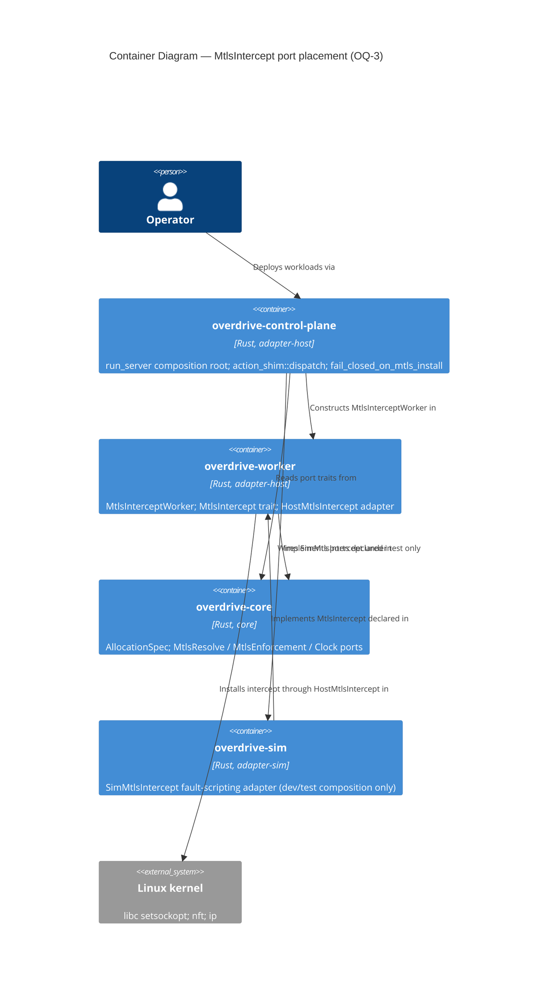

# DESIGN — `mtls-intercept-install-fault-seam` (GH #250)

> Authored by Morgan (nw-solution-architect), 2026-08-01. PROPOSE mode.
> Scope: **all priorities** — OQ-1 … OQ-9 are each pinned in
> `design/wave-decisions.md`. Full architectural record: **ADR-0076**.
>
> Direct inputs: `docs/feature/mtls-intercept-install-fault-seam/issue-250.md`;
> `docs/research/testing/fault-injection-seam-fail-closed-paths-research.md`
> (29 sources) — its `## Recommendation`, `## Open Questions for DESIGN`,
> `## Knowledge Gaps`, `## Conflicting Information`.

---

## 0. Executive summary — and the two findings that reshape the decision

The research ranked **Candidate A** (extract an `MtlsIntercept` port trait,
injected as a mandatory `Arc<dyn …>` on `MtlsInterceptWorker::new`) first. This
design **adopts Candidate A**, at **3 methods** — `bind_transparent`,
`install_outbound`, `install_inbound`. There is **no `probe()`**: the boot
`CAP_NET_ADMIN` gate earlier revisions carried is **struck from scope** (§ 8).

But two facts verified against the live tree during DESIGN change *why* it is
adopted, and both must be stated before the design, because a reviewer who does
not know them will grade this artifact against the wrong problem.

### Finding D-1 — the target mutant is killable **today, at zero production cost**

The research (and the issue) assume the missed mutant is blocked on the absence
of a fault seam. It is not. `fail_closed_on_mtls_install` is **module-private**
inside `crates/overdrive-control-plane/src/action_shim/mod.rs`, so an in-crate
`#[cfg(test)] mod tests` can call it **directly**. Every argument it takes is
constructible in the default lane with no I/O:

| Parameter | Default-lane source |
|---|---|
| `driver: &dyn Driver` | test-local recording driver (`InertDriver` precedent, `tests/acceptance/finalize_failed_forward_carries_workload_addr.rs:74`) |
| `obs: &dyn ObservationStore` | `SimObservationStore::single_peer(...)` |
| `bus: &broadcast::Sender<LifecycleEvent>` | `tokio::sync::broadcast::channel(16)` |
| `tick: &TickContext` | struct literal |
| `running_row: &AllocStatusRow` | struct literal |
| `prior_state: AllocStateWire` | enum literal |
| `handle: Option<&AllocationHandle>` | struct literal |
| `cause: &MtlsInterceptInstallError` | **constructible cross-crate — see below** |

The issue's stated blocker (`#[non_exhaustive]` + private constructors) is
**misdiagnosed**, exactly as the research's Finding 4.4 predicted. Verified
against `crates/overdrive-worker/src/mtls_intercept_worker.rs:119-184`:
`#[non_exhaustive]` sits at the **enum** level only, there is no per-variant
`#[non_exhaustive]`, and every variant is public with public field types
(`InterceptError`, `std::io::Error`). Per the Rust Reference, enum-level
`#[non_exhaustive]` blocks *exhaustive matching*, not *construction*. So
`MtlsInterceptInstallError::LegFBind(InterceptError::TransparentListener { addr,
source })` compiles from `overdrive-control-plane` today. The private
`const fn` constructors are call-site conveniences, not gates.

**Consequence.** A ~60-line default-lane unit test (**T1**, § 5.1) kills the
`replace fail_closed_on_mtls_install -> Result<(), ShimError> with Ok(())`
mutant with **no production change whatsoever**. The `.cargo/mutants.toml`
`exclude_re` entry can be removed on T1 alone.

This is a materially better outcome than the research contemplated, and it means
the "accept the gap / permanent justified exclusion" branch the dispatch offered
as the Cilium-persuaded alternative is **moot**: there is no gap to accept.

### Finding D-2 — an end-to-end `dispatch` killer test **cannot** be default-lane, port or no port

`provision_and_inject_netns` (`action_shim/mod.rs:830`) is gated on the **same**
`mtls_worker.is_some()` flag as the mTLS-install fail-closed path, and it runs
**upstream** of it:

```
StartAllocation
  └─ provision_and_inject_netns(..., mtls_worker)   :1169   ← if mtls_worker.is_none() { return Ok(()) }
       └─ provision_workload_netns(&plan)                    ← REAL `ip netns add` / veth shell-out, needs root
  └─ driver.start(&spec)
  └─ obs.write(Running row)
  └─ worker.start_alloc(&spec)                       :1305   ← the path #250 targets
       └─ fail_closed_on_mtls_install(...)           :1307
```

Passing `mtls_worker: Some(worker)` — which any `dispatch`-level test of this
path must do — therefore forces real netns/veth provisioning. Without root that
provision fails first, and the alloc is driven `Failed` by the **sibling**
`fail_closed_on_netns_provision` handler with
`TransitionReason::WorkloadNetnsProvisionFailed`; `Driver::start` is never
called, no `Running` row is written, and `worker.start_alloc` is never reached.
A default-lane `dispatch` test of this path would silently exercise the wrong
handler and assert nothing about #250.

**Consequence.** The end-to-end test (**T2**, § 5.2) is **integration-lane, Lima
+ root** — and that is a property of the netns seam, not of the port. No port
granularity, crate placement, or signature choice changes it. Making T2
default-lane would require a *second* port over `provision_workload_netns` /
`teardown_workload_netns`, which is **out of scope for #250** — its verified
home is [#197](https://github.com/overdrive-sh/overdrive/issues/197) (§ 8.1).
*Rev 4: this is no longer framed as a blocker — per § 0b, T2's lane is a
wall-clock cost, not a coverage cost.*

### What the port is therefore justified by — ONE leg, stated plainly

D-1 and D-2 each remove a justification the issue and the research assumed. This
design rests on **neither**, and no section below may be read as resting on
them:

- **NOT "the port is needed to kill the mutant."** D-1: the mutant is killable
  today, default-lane, at zero production cost. Verified — the helper is an
  `async fn` with no `pub` at `action_shim/mod.rs:413`, and that file's own
  `#[cfg(test)] mod tests` at `:1841` already reaches parent items via
  `use super::{…}` at `:1869`.
- **NOT "the port enables a default-lane end-to-end test."** D-2: impossible
  without a second port. Verified — `provision_and_inject_netns`
  (`mod.rs:830`) short-circuits **only** on `mtls_worker.is_none()` (`:838`), so
  arming the mTLS seam unavoidably reaches `provision_workload_netns(&plan)`
  (`:855`) and real `ip netns` shell-outs.

**The surviving justification, which carries this design alone:**

> The port makes the **call-site ordering property testable at all**. On an
> install failure the `StartAllocation` / `RestartAllocation` arms must `return`
> **before** `driver.release_for_exit_emission(handle)`
> (`mod.rs:1307` before `:1319`; `:1507` before `:1519`), so a now-`Failed`
> allocation never releases its exit watcher. Nothing in the tree can force
> `start_alloc` to fail on demand today — `mtls_worker` is a concrete
> `Option<&Arc<MtlsInterceptWorker>>` and under root the real install
> *succeeds* — so this security-relevant ordering is **wholly untested**. The
> port is the only mechanism that makes it exercisable. **T2 (§ 5.2, A-6') is
> that test**, and it is Lima+root-gated per D-2 — which is acceptable for the
> reason in § 0b.

**Two evidence caveats, so nothing here reads as an appeal to authority.**
Neither is cited anywhere in this design as justification:

- **Hexagonal architecture does NOT mandate this boundary.** Cockburn:
  "what exactly a port is and isn't is largely a matter of taste", and
  "it doesn't appear that there is any particular damage in choosing the 'wrong'
  number of ports." OQ-1's 3-method granularity is a **local** judgement,
  argued locally (§ wave-decisions OQ-1).
- **The mutation-testing literature is SILENT on production seams added for
  killability** (research Gap G1) — the field holds the program fixed and varies
  the test suite. It neither sanctions nor forbids this. The mutation result is
  used only as *evidence that an unasserted specification-level behaviour
  exists*.

### 0a. What was struck from scope at user direction

- **The boot `CAP_NET_ADMIN` `probe()` — struck entirely** (§ 8.2). It is a
  production behaviour change (`overdrive serve` refusing to start where it
  previously started), out of GH #250's scope, and per review iteration 1 it
  buys a *better boot-time diagnosis*, not a new safety property — a
  capability-less node already fails every deploy at the upstream netns seam.
  Gone: the trait method, `HostMtlsIntercept::probe`, `InterceptError::Probe`,
  `MtlsBootError::InterceptProbe`, the `run_server` gate, the sim's probe
  scripting, and the verification-catalogue graduation that depended on it.
- **The `WorkloadNetns` port** — out of scope, and its verified home is
  **[#197](https://github.com/overdrive-sh/overdrive/issues/197)** (§ 8.1). No
  new issue was created.

---

## 0b. Why a Lima+root T2 is not a coverage compromise

This is the load-bearing fact that makes D-2's gating acceptable, and it is why
a second port (the `WorkloadNetns` port, § 8.1) is **not** needed here:

> **Lima+root integration tests participate in the mutation gate.** The
> canonical CI invocation is
> `cargo xtask lima run -- cargo xtask mutants --diff origin/main --features integration-tests`,
> and **`cargo xtask lima run` runs as root by default**.
> `.claude/rules/testing.md` makes the Lima prefix *mandatory* for any mutation
> run carrying `--features integration-tests` **precisely because** without it
> the `#[cfg(target_os = "linux")]` surface is unreachable and "the kill-rate
> gate becomes meaningless."

A Lima-gated T2 therefore kills call-site mutants **in the real gate**.
Default-lane placement is a **wall-clock** property, not a **coverage** one.
Two consequences carried through this design:

1. § 6's "T1 alone must suffice" stands on the **DELIVER ordering** (T1 lands in
   step 1, before the port and therefore before T2 exists) — *not* on a claim
   that Lima-gated tests do not count toward the gate.
2. Closing D-2 with a second port would buy wall-clock and local ergonomics, not
   gate coverage. That is a further reason it is out of scope here (§ 8.1).

---

## 1. Premise check — is `MtlsInterceptInstallError` production-reachable?

**Verdict: YES, on the unconditional production path.** Re-run per CLAUDE.md
§ "Ground the premise" (the check that killed GH #248/ADR-0074), and it passes
cleanly — this is *not* a #248-shaped test-only state.

**Production call chain, real adapters composed:**

1. `overdrive serve` → `run_server` (`crates/overdrive-control-plane/src/lib.rs`).
   `compose_mtls = config.dataplane_override.is_none()` (`:1921`, the
   `#[cfg(not(feature = "integration-tests"))]` arm). Production sets no
   dataplane override ⇒ **`compose_mtls` is unconditionally true**, so
   `mtls_worker = Some(Arc::new(MtlsInterceptWorker::new(...)))` (`:2043`).
2. `overdrive deploy <SPEC>` → intent commit → `WorkloadLifecycle` emits
   `Action::StartAllocation` → `action_shim::dispatch` → `dispatch_single`.
3. On the `Running` write, `worker.start_alloc(&spec)` fires **unconditionally**
   for every exec alloc (`mod.rs:1304-1305`; D-MTLS-15 — the predicate is
   `DriverType::Exec`, always true on the worker path).
4. `start_alloc`'s **first** step is
   `make_transparent_listener(127.0.0.1:0)` → raw `libc::socket` +
   `setsockopt(IP_TRANSPARENT)` + `setsockopt(IP_FREEBIND)` + bind + listen
   (`crates/overdrive-worker/src/mtls_intercept.rs:164-230`). This step is
   **ungated** — it runs before any `Some`/`None` branch, for every workload
   kind, Job or Service.

**Named, real production faults that produce the error** — environmental, not
test-configuration artifacts:

| Fault | Site | Variant / `stage()` |
|---|---|---|
| Process lacks `CAP_NET_ADMIN` ⇒ `EPERM` on `setsockopt(IP_TRANSPARENT)` | `make_transparent_listener` (leg-F) | `LegFBind` / `"leg_f_bind"` |
| Kernel without `IP_TRANSPARENT` / `IP_FREEBIND`; fd exhaustion | same | `LegFBind` / `"leg_f_bind"` |
| `nft` binary absent from the appliance image, `nft` exits non-zero, ruleset lock contention, shared-routing-infra (`ip rule` / `ip route`) failure | `install_outbound_tproxy` | `OutboundTproxyInstall` / `"outbound_tproxy_install"` |
| Same, on the per-Service-port inbound rules | `install_inbound_tproxy` | `Inbound` / `"inbound_tproxy"` |
| `getsockname` failure on a bound listener | `local_addr()` | `LegFLocalAddr` / `LegCLocalAddr` |

**Contrast with the #248 anti-pattern.** #248's `workload_addr = None` was
producible *only* by a test setting `dataplane_override` to skip the mTLS
composition — a test-configuration artifact. Here the opposite holds: the
failing code path is **always executed in production** and is **never executed**
off the mTLS gate. The premise is grounded; the feature defends a real state.

**Security asymmetry (why this error path is worth the budget).** If
`fail_closed_on_mtls_install` no-ops, the alloc stays `Running` with **no mTLS
interception installed** — a workload admitted to the mesh with no identity
enforcement, and nothing anywhere alarms. That is Saltzer & Schroeder's
canonical failure of an *exclusion* mechanism: it "tends to fail by allowing
access, a failure which may go unnoticed in normal use" (research Finding 5.2),
on precisely the class of code Yuan et al. found behind the majority of
catastrophic distributed-systems failures (Finding 5.1).

---

## 2. C4 — System Context (L1)

```mermaid
C4Context
  title System Context — transparent-mTLS intercept install (GH #250 scope)
  Person(operator, "Operator", "Runs `overdrive serve` and `overdrive deploy`")
  System(node, "Overdrive node", "Control plane + worker on one host")
  System_Ext(kernel, "Linux kernel", "IP_TRANSPARENT / IP_FREEBIND sockets; nft ruleset; netns + veth")
  System_Ext(workload, "Workload process", "Identity-unaware; holds no SVID")
  Rel(operator, node, "Deploys workload specs to")
  Rel(node, kernel, "Installs per-alloc intercept in")
  Rel(node, workload, "Spawns and intercepts traffic of")
  Rel(kernel, node, "Refuses install to (EPERM / nft failure)")
```

The **only** external system in scope is the Linux kernel surface: it is the
actor that returns the failure this feature makes injectable, and it is the
actor we do not own (research Finding 1.3 — "don't mock what you don't own").

## 3. C4 — Container (L2), showing the new port boundary



No L3 Component diagram: the change touches one component
(`MtlsInterceptWorker`) with four collaborators, well under the 5-component
threshold that warrants L3.

---

## 4. The design — verbatim API surface

> Per CLAUDE.md § "Implement to the design — never invent API surface": every
> item below is **pinned verbatim**. A crafter who needs a symbol not listed
> here MUST return a blocker rather than invent one. There are deliberately no
> "pick the cleanest shape" gaps.

### 4.1 New module — `crates/overdrive-worker/src/mtls_intercept_port.rs`

Registered in `crates/overdrive-worker/src/lib.rs` as
`pub mod mtls_intercept_port;` (alphabetical position: between
`pub mod mtls_intercept;` and `pub mod mtls_intercept_worker;`).

> **Import-list note (rev 4).** With `probe()` struck, `InterceptError` is no
> longer named by any expression in this module — only by three rustdoc
> intra-doc links. (The alias `Result<T, E = InterceptError>` defaults its error
> parameter, so `Result<()>` does not name it either.) It stays in the `use`
> list below so those short links resolve. **If `unused_imports` fires, the
> pinned fix is: drop `InterceptError` from the `use` list and qualify all three
> links as `crate::mtls_intercept::InterceptError::…`.** Do NOT reach for
> `#[allow]`, and do NOT invent a use for it.

```rust
use std::net::SocketAddrV4;

use crate::mtls_intercept::{
    InterceptError, Result, TproxyInterceptGuard, install_inbound_tproxy,
    install_outbound_tproxy, make_transparent_listener,
};

/// RAII handle for ONE completed intercept install.
///
/// Marker-only by design: the guard's ENTIRE contract is its `Drop`, so the
/// trait exposes no callable method. The worker holds guards for the alloc
/// lifetime and drops them on `stop_alloc`; it never calls anything on them.
///
/// # Observable invariants
/// Dropping a guard releases EXACTLY what its originating
/// [`MtlsIntercept::install_outbound`] / [`MtlsIntercept::install_inbound`]
/// call acquired — no more, no less — and releases nothing another guard owns.
/// Dropping never panics and never errors, including for a guard whose
/// underlying state was already released out-of-band.
///
/// WHAT is acquired and released is adapter-specific and is NOT part of this
/// contract: [`HostMtlsIntercept`] acquires one `nft` rule and its `Drop`
/// removes that rule by handle; a simulation adapter acquires nothing and its
/// `Drop` is a no-op. Both honour the invariant above.
pub trait InterceptGuard: Send + Sync {}

impl InterceptGuard for TproxyInterceptGuard {}

/// The per-allocation transparent-mTLS **install** driven port.
///
/// Wraps the three privileged, un-ownable primitives
/// [`MtlsInterceptWorker::start_alloc`](crate::mtls_intercept_worker::MtlsInterceptWorker::start_alloc)
/// performs — the `IP_TRANSPARENT` socket setup (`libc::socket` +
/// `setsockopt`) and the two `nft`/`ip` shell-outs — so the install surface is
/// substitutable at the composition root. Production wires
/// [`HostMtlsIntercept`]; tests wire `overdrive_sim::adapters::mtls_intercept::SimMtlsIntercept`.
///
/// SYNC, not `#[async_trait]`: every underlying primitive is a blocking
/// syscall or a blocking `std::process::Command`, `start_alloc` is itself
/// sync, and the contract awaits no store I/O — the repo criterion recorded on
/// [`MtlsResolve`](overdrive_core::traits::mtls_resolve::MtlsResolve). Sync
/// also keeps the trait dyn-compatible with no `Pin<Box<dyn Future>>`
/// allocation per install.
///
/// `Send + Sync + 'static` to be held as `Arc<dyn MtlsIntercept>` and shared
/// across the worker's per-alloc calls.
///
/// # NO `probe()` — deliberate, and recorded
///
/// This port carries no Earned-Trust `probe()` and the composition root
/// installs no boot gate for it, unlike its sibling
/// [`MtlsResolve`](overdrive_core::traits::mtls_resolve::MtlsResolve) and
/// `MtlsEnforcement`. This is a deliberate scope decision recorded in
/// ADR-0076 § Decision 4, not an oversight: the capability this port depends
/// on (`CAP_NET_ADMIN`) is already proven per-deploy at the netns-provision
/// seam that runs strictly UPSTREAM of every call to this port, so a boot
/// probe would re-prove at boot what the deploy path proves anyway — buying a
/// better diagnosis, not a new safety property, at the cost of a production
/// behaviour change out of GH #250's scope. Do NOT add one back without
/// superseding that decision.
pub trait MtlsIntercept: Send + Sync + 'static {
    /// Bind ONE TCP listener at `addr`, suitable for accepting the intercept
    /// leg the caller is standing up.
    ///
    /// This is the primitive both intercept legs are built from: leg-F
    /// (outbound, workload-facing) and leg-C (inbound, peer-facing).
    ///
    /// # Preconditions
    /// - `addr` is an IPv4 address the caller intends to accept on;
    ///   `127.0.0.1:0` (agent-chosen ephemeral loopback) is the production
    ///   shape for both legs.
    ///
    /// # Postconditions on `Ok(listener)`
    /// The returned listener is bound and listening at `addr`.
    /// `listener.local_addr()` reports the concrete bound address; when `addr`
    /// carried port 0 the reported port is the kernel-assigned ephemeral port
    /// and is NON-ZERO. Ownership transfers to the caller — dropping it closes
    /// the socket.
    ///
    /// # Edge cases
    /// Every failure — a refused socket option, `EADDRINUSE`, fd exhaustion —
    /// surfaces as [`InterceptError::TransparentListener`] carrying a
    /// cause-distinct `io::Error` source. No fd leaks on any error path: a
    /// partially-created socket is closed before returning.
    ///
    /// # Observable invariants
    /// Each call returns a DISTINCT listener; two calls with port 0 bind two
    /// distinct ephemeral ports. The call installs no nft rule and mutates no
    /// routing state.
    ///
    /// # Substrate note (NOT part of this contract)
    /// The PRODUCTION leg semantics require the socket to carry
    /// `IP_TRANSPARENT` + `IP_FREEBIND` — both legs are TPROXY-divert targets,
    /// and a plain socket cannot receive a non-rewriting `tproxy` divert's
    /// orig-dst-addressed SYN. That is [`HostMtlsIntercept`]'s obligation and
    /// is documented on it, NOT here: a simulation adapter holds no
    /// `CAP_NET_ADMIN`, receives no diverted traffic, and honours the
    /// contract above with a plain listener. Stating the setopts as a TRAIT
    /// postcondition would make the contract unimplementable by half its
    /// sanctioned implementors.
    fn bind_transparent(&self, addr: SocketAddrV4) -> Result<std::net::TcpListener>;

    /// Install the per-alloc OUTBOUND egress intercept: capture all TCP egress
    /// arriving on the workload's host-side veth (`host_veth`) and divert it,
    /// without rewriting the destination, to the agent's leg-F listener at
    /// `agent_leg_f_port` on loopback (ADR-0071 Path A, D-TME-4).
    ///
    /// # Preconditions
    /// - `host_veth` names a host-side veth that EXISTS (the action-shim C3
    ///   provision seam created it and injected the name on
    ///   `AllocationSpec.host_veth`).
    /// - `agent_leg_f_port` is the NON-ZERO bound port of a live leg-F
    ///   listener obtained from [`bind_transparent`](Self::bind_transparent).
    ///
    /// # Postconditions on `Ok(guard)`
    /// The outbound capture for `host_veth` is in effect **against this
    /// adapter's OWN substrate**, and every prerequisite it depends on has
    /// been converged idempotently. The returned guard OWNS exactly what this
    /// call acquired: dropping it releases that and nothing else (see
    /// [`InterceptGuard`]). What "in effect" MEANS is adapter-specific and is
    /// not observable through this trait — see the substrate note below.
    ///
    /// # Edge cases
    /// - Any install failure surfaces as [`InterceptError::TproxyInstall`]
    ///   whose `reason` names the failing operation.
    /// - A re-install for a veth already carrying an identical capture is
    ///   idempotent-by-convergence; it does not create a duplicate.
    ///
    /// # Observable invariants
    /// One call acquires at most ONE capture. On `Err` NOTHING acquired by
    /// this call outlives it — every partially-applied step is reverted or was
    /// never applied, so a failed install leaks nothing.
    ///
    /// # Substrate note (NOT part of this contract)
    /// [`HostMtlsIntercept`] realises the capture as exactly one `nft` rule
    /// appended to the shared prerouting chain, after converging the
    /// node-global shared routing infra (fwmark `ip rule`, `local` route, the
    /// shared chain, the head exemption); its guard's `Drop` removes that rule
    /// by handle and leaves the shared infra intact. A simulation adapter
    /// realises it as nothing at all. Both honour the contract above.
    fn install_outbound(
        &self,
        host_veth: &str,
        agent_leg_f_port: u16,
    ) -> Result<Box<dyn InterceptGuard>>;

    /// Install ONE per-Service-port INBOUND intercept: capture connections
    /// destined for `virt` (the canonical per-workload address paired with one
    /// DECLARED Service listener port) and divert them to the agent's leg-C
    /// listener at `agent_leg_c_port` on loopback (D-A1, GH #241).
    ///
    /// # Preconditions
    /// - `virt` pairs the canonical per-workload address with a DECLARED
    ///   Service listener port — never the ephemeral leg-C port (D-BLOCKER1 /
    ///   D-TME-10 one-source/two-readers).
    /// - `agent_leg_c_port` is the NON-ZERO bound port of a live leg-C
    ///   listener obtained from [`bind_transparent`](Self::bind_transparent).
    ///
    /// # Postconditions on `Ok(guard)`
    /// The inbound capture for `virt` is in effect **against this adapter's
    /// OWN substrate**, and every prerequisite it depends on has been
    /// converged idempotently. The returned guard OWNS exactly what this call
    /// acquired: dropping it releases that and nothing else (see
    /// [`InterceptGuard`]). What "in effect" MEANS is adapter-specific and is
    /// not observable through this trait — see the substrate note below.
    ///
    /// # Edge cases
    /// Identical failure surface to
    /// [`install_outbound`](Self::install_outbound) —
    /// [`InterceptError::TproxyInstall`] with an operation-naming `reason`.
    /// The caller installs N captures for N declared ports and ZERO for a
    /// Job-kind / host-netns workload; that N-vs-0 decision is the CALLER's,
    /// not this method's.
    ///
    /// # Observable invariants
    /// One call acquires at most ONE capture; on `Err`, nothing acquired by
    /// this call outlives it.
    ///
    /// # Substrate note (NOT part of this contract)
    /// [`HostMtlsIntercept`] realises the capture as exactly one `nft` rule
    /// keyed `ip daddr <virt.ip> tcp dport <virt.port>`, tproxy-redirected to
    /// `agent_leg_c_port`, removed by handle on guard `Drop`. A simulation
    /// adapter realises it as nothing at all.
    fn install_inbound(
        &self,
        virt: SocketAddrV4,
        agent_leg_c_port: u16,
    ) -> Result<Box<dyn InterceptGuard>>;
}

/// Production [`MtlsIntercept`] binding. Each method is a ONE-LINE delegation
/// to the existing `crate::mtls_intercept` free function it wraps — the
/// adapter adds no logic, so there is nothing in it for a sim adapter to
/// diverge from except the substrate itself.
///
/// # Substrate obligations (BEYOND the [`MtlsIntercept`] contract)
///
/// These are this adapter's obligations, deliberately NOT stated on the trait
/// (a trait postcondition no sanctioned implementor can honour is a broken
/// contract, per `.claude/rules/development.md` § "Trait definitions specify
/// behavior, not just signature"). They are what the Tier-3 suite asserts:
///
/// - [`bind_transparent`](MtlsIntercept::bind_transparent) returns a socket
///   carrying BOTH `IP_TRANSPARENT` (so a non-rewriting `tproxy` divert's
///   orig-dst-addressed SYN is accepted, and `getsockname` recovers the
///   orig-dst) and `IP_FREEBIND` (so leg-C can bind a non-local address on the
///   OUTPUT path).
/// - [`install_outbound`](MtlsIntercept::install_outbound) appends EXACTLY ONE
///   `nft` rule to the shared prerouting chain (`iifname <host_veth>` → tproxy
///   to `127.0.0.1:<agent_leg_f_port>`) after converging the node-global
///   shared routing infra (fwmark `ip rule`, `local` route, shared chain, head
///   exemption); the returned guard's `Drop` removes that rule BY HANDLE and
///   leaves the shared infra intact.
/// - [`install_inbound`](MtlsIntercept::install_inbound) appends EXACTLY ONE
///   `nft` rule keyed `ip daddr <virt.ip> tcp dport <virt.port>` → tproxy to
///   `127.0.0.1:<agent_leg_c_port>`, removed by handle on guard `Drop`.
#[derive(Debug, Clone, Copy)]
pub struct HostMtlsIntercept;

impl HostMtlsIntercept {
    /// Construct the production binding. Stateless.
    #[must_use]
    pub const fn new() -> Self {
        Self
    }
}

impl Default for HostMtlsIntercept {
    fn default() -> Self {
        Self::new()
    }
}

impl MtlsIntercept for HostMtlsIntercept {
    fn bind_transparent(&self, addr: SocketAddrV4) -> Result<std::net::TcpListener> {
        make_transparent_listener(addr)
    }

    fn install_outbound(
        &self,
        host_veth: &str,
        agent_leg_f_port: u16,
    ) -> Result<Box<dyn InterceptGuard>> {
        install_outbound_tproxy(host_veth, agent_leg_f_port)
            .map(|guard| Box::new(guard) as Box<dyn InterceptGuard>)
    }

    fn install_inbound(
        &self,
        virt: SocketAddrV4,
        agent_leg_c_port: u16,
    ) -> Result<Box<dyn InterceptGuard>> {
        install_inbound_tproxy(virt, agent_leg_c_port)
            .map(|guard| Box::new(guard) as Box<dyn InterceptGuard>)
    }
}
```

### 4.2 `InterceptError` is UNCHANGED — no new variant

*Rev 4.* Earlier revisions appended a `Probe { reason: String }` variant to
`pub enum InterceptError` in `crates/overdrive-worker/src/mtls_intercept.rs`. It
existed **solely** to carry the boot probe's failure, and with the probe struck
(§ 0a, § 8) there is nothing to carry.

**`InterceptError` gains no variant, and `crates/overdrive-worker/src/mtls_intercept.rs`
is not edited by this feature at all.** The sim adapter (§ 4.6) scripts only the
two variants that already exist — `TransparentListener` and `TproxyInstall` —
both public, both with public field types, on an enum carrying no
`#[non_exhaustive]`.

### 4.3 `MtlsInterceptWorker` — the mandatory 4th port

`crates/overdrive-worker/src/mtls_intercept_worker.rs`.

**Struct field** (appended after `_clock`):

```rust
    /// The per-alloc intercept-INSTALL port (`HostMtlsIntercept` in
    /// production; `SimMtlsIntercept` under test composition). Wraps the three
    /// privileged un-ownable primitives `start_alloc` performs — the
    /// `IP_TRANSPARENT` bind and the two nft-TPROXY installs — so the install
    /// surface is substitutable at the composition root. Mandatory `new()`
    /// param, no builder (`.claude/rules/development.md` § "Port-trait
    /// dependencies").
    intercept: Arc<dyn MtlsIntercept>,
```

**Constructor — exact signature** (`intercept` appended LAST):

```rust
    #[must_use]
    pub fn new(
        enforcement: Arc<dyn MtlsEnforcement>,
        resolve: Arc<dyn MtlsResolve>,
        clock: Arc<dyn Clock>,
        intercept: Arc<dyn MtlsIntercept>,
    ) -> Self {
        Self {
            enforcement,
            resolve,
            _clock: clock,
            intercept,
            intercepts: Mutex::new(BTreeMap::new()),
        }
    }
```

**`start_alloc` — four call-site substitutions, nothing else.** The signature,
the error mapping, the ordering, the fail-closed partial-teardown discipline,
and every comment stay **byte-identical** apart from these four lines:

| Current | Becomes |
|---|---|
| `make_transparent_listener(SocketAddrV4::new(std::net::Ipv4Addr::LOCALHOST, 0))` (leg-F, `:524`) | `self.intercept.bind_transparent(SocketAddrV4::new(std::net::Ipv4Addr::LOCALHOST, 0))` |
| `install_outbound_tproxy(host_veth, leg_f_addr.port())` (`:559`) | `self.intercept.install_outbound(host_veth, leg_f_addr.port())` |
| `make_transparent_listener(SocketAddrV4::new(std::net::Ipv4Addr::LOCALHOST, 0))` (leg-C, `:576`) | `self.intercept.bind_transparent(SocketAddrV4::new(std::net::Ipv4Addr::LOCALHOST, 0))` |
| `install_inbound_tproxy(virt, leg_c_addr.port())` (`:626`) | `self.intercept.install_inbound(virt, leg_c_addr.port())` |

`start_alloc` keeps the signature
`pub fn start_alloc(self: &Arc<Self>, spec: &AllocationSpec) -> Result<(), MtlsInterceptInstallError>`.
`MtlsInterceptInstallError` gains **no** variant and **no** public constructor —
its five private `const fn` constructors stay private (OQ-5).

**Guard-type widening** — `AllocIntercept` and the two private helpers change
`TproxyInterceptGuard` → `Box<dyn InterceptGuard>`:

```rust
    _outbound_tproxy_guard: Option<Box<dyn InterceptGuard>>,
    _inbound_tproxy_guards: Vec<Box<dyn InterceptGuard>>,
```

with the same substitution in the parameter lists of `spawn_legs_and_record`
and `record_intercept_full`. No other change; `Drop` semantics are unchanged
because `Box<dyn InterceptGuard>` drops the concrete
`TproxyInterceptGuard` in production.

**Import delta** in `mtls_intercept_worker.rs` (the `use
crate::mtls_intercept::{…}` block at `:89-93`): `make_transparent_listener`,
`install_inbound_tproxy`, `install_outbound_tproxy`, and
`TproxyInterceptGuard` are dropped; `use
crate::mtls_intercept_port::{InterceptGuard, MtlsIntercept};` is added.
`InterceptError` stays (the error mapping still names it).

**Two adjacent doc sites go stale with that import and are fixed in the SAME
step** (`.claude/rules/development.md` — a behaviour change must fix the
comments it falsifies):

- `:467` — the intra-doc link ``[`TproxyInterceptGuard`]`` in `start_alloc`'s
  rustdoc will no longer resolve. Retarget it to
  ``[`InterceptGuard`](crate::mtls_intercept_port::InterceptGuard)``.
- `:28` — the module-doc prose "drops the OUTBOUND + INBOUND
  `TproxyInterceptGuard`s" becomes inaccurate; reword to "drops the OUTBOUND +
  INBOUND intercept guards (each releases exactly what its install acquired)".
- `:260-263` and `:269-273` — the two `AllocIntercept` guard-field docstrings
  assert substrate behaviour ("Dropping it removes the per-veth egress rule
  from the shared `prerouting` chain by handle"; "Each guard's `Drop` removes
  its per-virt rule … by handle"). Once the fields are
  `Box<dyn InterceptGuard>` that claim is false for any composition wiring
  `SimMtlsIntercept` — it re-introduces the § 4.1 contract defect one layer
  down. Reword both to the `InterceptGuard` contract ("dropping releases
  exactly what its install acquired, and nothing another guard owns"), with the
  nft-rule-by-handle detail attributed to `HostMtlsIntercept`.

### 4.4 Composition root — `run_server`, wire only (NO probe gate)

*Rev 4.* Earlier revisions added a probe-and-refuse step here. **Struck**
(§ 0a, § 8). `run_server` gains **no gate, no `tracing::warn!`, no early
return, and no new failure mode** — only the construction of the production
adapter and its passage as the worker's 4th argument.

`crates/overdrive-control-plane/src/lib.rs`, inside the existing
`if compose_mtls { … }` block, immediately before the worker construction
(`:2043`). The step-(4) comment block at `:2033` currently reads "all three
ports as REQUIRED params" — it is updated to **four** in the same edit.

```rust
            // The per-alloc intercept-INSTALL port. `HostMtlsIntercept` is
            // stateless and delegates one-for-one to the same
            // `crate::mtls_intercept` free functions `start_alloc` called
            // before this port existed, so wiring it changes no production
            // behaviour. Deliberately NOT probe-gated (ADR-0076 § Decision 4):
            // `CAP_NET_ADMIN` is already proven per-deploy at the upstream
            // netns-provision seam, so a boot probe would buy a better
            // diagnosis, not a new safety property — out of GH #250's scope.
            let intercept: Arc<dyn overdrive_worker::mtls_intercept_port::MtlsIntercept> =
                Arc::new(overdrive_worker::mtls_intercept_port::HostMtlsIntercept::new());
```

and the construction becomes:

```rust
            Some(Arc::new(overdrive_worker::mtls_intercept_worker::MtlsInterceptWorker::new(
                enforcement,
                resolve,
                config.clock.clone(),
                intercept,
            )))
```

The pre-existing `resolve.probe().await` gate at `:2021` (and its refusal block
ending at `:2031`) is **untouched** — it belongs to `MtlsResolve`, not to this
port.

### 4.5 `MtlsBootError` is UNCHANGED — no new variant

*Rev 4.* Earlier revisions appended an `InterceptProbe { source }` variant to
`pub enum MtlsBootError` in `crates/overdrive-control-plane/src/error.rs`. It
carried the boot probe's refusal; with the probe struck (§ 0a, § 8) there is no
refusal to carry.

**`MtlsBootError` gains no variant and `crates/overdrive-control-plane/src/error.rs`
is not edited by this feature at all.** Its existing `Probe` (enforcement
substrate) and `ResolveProbe` (resolve surface) variants are untouched, and no
new `health.startup.refused` reason string enters the vocabulary.

### 4.6 Sim adapter — `crates/overdrive-sim/src/adapters/mtls_intercept.rs`

Registered in `crates/overdrive-sim/src/adapters/mod.rs` with **both** a module
declaration and a re-export, matching the two sibling mTLS sims (that file is
not a bare `pub mod` list — it re-exports `SimMtlsEnforcement` at `:70` and
`SimMtlsResolve` at `:71`):

```rust
pub mod mtls_intercept;
// … and in the `pub use` block, adjacent to the two sibling mTLS re-exports:
pub use mtls_intercept::{SimInterceptFault, SimMtlsIntercept};
```

Requires adding to `crates/overdrive-sim/Cargo.toml` `[dependencies]`:

```toml
# `SimMtlsIntercept` (GH #250) implements
# `overdrive_worker::mtls_intercept_port::MtlsIntercept` — the per-alloc
# intercept-INSTALL port whose trait, error type, and guard trait are declared
# in `overdrive-worker`. Same shape as the `overdrive-control-plane` dep above
# (a port trait declared outside `overdrive-core`, sim adapter here). NOT a new
# edge class: `overdrive-sim` already reaches `overdrive-worker` transitively
# through `overdrive-control-plane`.
overdrive-worker.path = "../overdrive-worker"
```

```rust
use std::net::SocketAddrV4;

use overdrive_worker::mtls_intercept::{InterceptError, Result};
use overdrive_worker::mtls_intercept_port::{InterceptGuard, MtlsIntercept};
use parking_lot::Mutex;

/// A scripted intercept-install fault, expressed in the REAL error shapes the
/// production substrate produces (research Finding 5.3 — inject errors that
/// naturally occur, not a generic boolean "fail now").
///
/// `Clone` because a scripted fault is STANDING, not one-shot (see
/// [`SimMtlsIntercept`]): the same fault must be re-materialised on every call
/// while armed, and `InterceptError` is not `Clone` (it carries
/// `std::io::Error`).
#[derive(Debug, Clone)]
pub enum SimInterceptFault {
    /// Materialises `InterceptError::TransparentListener { addr, source:
    /// io::Error::from_raw_os_error(errno) }` — the missing-`CAP_NET_ADMIN`
    /// (`libc::EPERM`), unsupported-setopt (`libc::ENOPROTOOPT`), and
    /// address-in-use (`libc::EADDRINUSE`) shapes. `addr` is the address the
    /// faulted call was made with.
    TransparentListener {
        /// The `errno` the real syscall would have returned.
        errno: i32,
    },
    /// Materialises `InterceptError::TproxyInstall { reason }` — the
    /// `nft`-exited-non-zero / `nft`-binary-missing / `ip rule` shape.
    TproxyInstall {
        /// The failing-command description the real adapter would report.
        reason: String,
    },
}

/// In-memory [`MtlsIntercept`] double with per-method fault scripting.
///
/// # What it models, and what it does not
///
/// - **Fault arms are PURE** — an armed fault short-circuits before any
///   syscall, so a test that drives only fault arms performs ZERO I/O and
///   belongs in the DEFAULT lane.
/// - **The `Ok` arm of [`bind_transparent`](MtlsIntercept::bind_transparent)
///   binds a REAL, PLAIN (non-`IP_TRANSPARENT`) loopback listener.** The
///   worker's `Ok` path consumes a live listener it accepts on, and there is
///   no way to fabricate a `std::net::TcpListener` without a syscall. The
///   double does NOT hold `CAP_NET_ADMIN` and does not need it. **Any test
///   that drives this `Ok` arm binds a socket and is therefore
///   INTEGRATION-lane** per `.claude/rules/testing.md` § "Integration vs unit
///   gating".
/// - **The `Ok` arm of the two installs returns an INERT guard** that records
///   nothing and whose `Drop` is a no-op. The double installs no nft rule, so
///   there is none to remove.
///
/// # Fault lifetime — STANDING, not one-shot
///
/// An armed fault fires on EVERY subsequent call to that method until re-armed
/// or cleared. This deliberately diverges from
/// `SimMtlsResolve::script_resolve_fault`'s consume-on-use shape, because the
/// faults differ in kind: a poisoned store handle is transient, whereas a
/// missing `CAP_NET_ADMIN` or an absent `nft` binary fails EVERY call. Standing
/// faults also remove call-order dependence — `start_alloc` calls
/// `bind_transparent` twice (leg-F then leg-C), and a consume-on-use fault
/// would make "which leg failed" an artifact of ordering rather than a choice.
///
/// # Determinism
/// Holds no clock, no entropy, no store, and no collection whose iteration
/// order is observed. Each method's outcome is a pure function of its armed
/// fault.
///
/// # Out-of-contract fault pairings
/// [`SimInterceptFault`] is one type shared by all three scripting helpers, so
/// the compiler permits arming a
/// [`TproxyInstall`](SimInterceptFault::TproxyInstall) fault on
/// [`bind_transparent`](MtlsIntercept::bind_transparent) (or a
/// [`TransparentListener`](SimInterceptFault::TransparentListener) fault on an
/// install). Doing so produces an `InterceptError` variant that method's
/// contract says it never returns, so the double would model a substrate the
/// real one cannot exhibit. The SANCTIONED pairings are
/// `bind_transparent` ⇔ `TransparentListener` and `install_*` ⇔ either variant
/// (the `Inbound` arm legitimately carries both, per
/// `MtlsInterceptInstallError::stage`). Arming any other pairing is a test
/// defect, not a supported scenario.
pub struct SimMtlsIntercept {
    /// Standing fault for [`bind_transparent`](MtlsIntercept::bind_transparent).
    bind_fault: Mutex<Option<SimInterceptFault>>,
    /// Standing fault for [`install_outbound`](MtlsIntercept::install_outbound).
    outbound_fault: Mutex<Option<SimInterceptFault>>,
    /// Standing fault for [`install_inbound`](MtlsIntercept::install_inbound).
    inbound_fault: Mutex<Option<SimInterceptFault>>,
}

/// The inert guard the double's install `Ok` arms return. No rule was
/// installed, so `Drop` removes nothing. Private — consumers see only
/// `Box<dyn InterceptGuard>`.
struct InertGuard;

impl InterceptGuard for InertGuard {}

impl SimMtlsIntercept {
    /// A double with NO fault armed — every method takes its `Ok` arm. Faults
    /// are armed explicitly through the scripting helpers below (no builder
    /// over a *dependency*; these script OUTCOMES, mirroring `SimMtlsResolve`).
    #[must_use]
    pub const fn new() -> Self {
        Self {
            bind_fault: Mutex::new(None),
            outbound_fault: Mutex::new(None),
            inbound_fault: Mutex::new(None),
        }
    }

    /// Arm a STANDING fault on `bind_transparent`. Fires on every subsequent
    /// call until re-armed or [`clear_faults`](Self::clear_faults).
    pub fn script_bind_fault(&self, fault: SimInterceptFault) {
        *self.bind_fault.lock() = Some(fault);
    }

    /// Arm a STANDING fault on `install_outbound`.
    pub fn script_outbound_fault(&self, fault: SimInterceptFault) {
        *self.outbound_fault.lock() = Some(fault);
    }

    /// Arm a STANDING fault on `install_inbound`.
    pub fn script_inbound_fault(&self, fault: SimInterceptFault) {
        *self.inbound_fault.lock() = Some(fault);
    }

    /// Disarm every standing fault.
    pub fn clear_faults(&self) {
        *self.bind_fault.lock() = None;
        *self.outbound_fault.lock() = None;
        *self.inbound_fault.lock() = None;
    }
}

impl Default for SimMtlsIntercept {
    fn default() -> Self {
        Self::new()
    }
}
```

The `MtlsIntercept` impl materialises an armed `SimInterceptFault` into a fresh
`InterceptError` per call (`TransparentListener { addr, source:
std::io::Error::from_raw_os_error(errno) }` / `TproxyInstall { reason }`),
short-circuiting **before** any syscall; otherwise it binds a plain
`std::net::TcpListener::bind(addr)` (mapping a bind failure to
`InterceptError::TransparentListener`) or returns
`Ok(Box::new(InertGuard) as Box<dyn InterceptGuard>)`.

### 4.7 Call sites that must be updated (exhaustive)

Every existing `MtlsInterceptWorker::new(...)` gains a 4th argument.

**Governing rule — one sentence, no judgement required of the crafter: EVERY
pre-existing call site passes `Arc::new(HostMtlsIntercept::new())`, because
that preserves today's behaviour byte-for-byte** (each site currently invokes
the same free functions the host adapter delegates to). **Only NEW tests
introduced by this feature wire `SimMtlsIntercept`.** This rule exists because
both adapters would compile at several of these sites — `overdrive-sim` is a
dev-dependency of both `overdrive-worker` and `overdrive-control-plane` — so
the compiler cannot adjudicate and an unpinned choice is exactly the
invented-surface failure mode CLAUDE.md § "Implement to the design" forbids.

The table is derived mechanically from `rg 'MtlsInterceptWorker::new'` — **1
production site + 9 non-production sites across 7 files**:

| Site | Lane | 4th argument |
|---|---|---|
| `crates/overdrive-control-plane/src/lib.rs:2043` | production | `intercept` (the `HostMtlsIntercept` wired at § 4.4) |
| `crates/overdrive-worker/src/mtls_intercept_worker.rs:1393` (in-crate test helper) | **default lane** (`#[cfg(test)] mod tests` at `:1274`, not feature-gated) | `Arc::new(HostMtlsIntercept::new())` |
| `crates/overdrive-worker/src/mtls_intercept_worker.rs:1925` (in-crate test) | **default lane** (same module) | `Arc::new(HostMtlsIntercept::new())` |
| `crates/overdrive-worker/tests/integration/start_alloc_installs_both_tproxy.rs:305, :625` | Tier-3 (Lima + root) | `Arc::new(HostMtlsIntercept::new())` |
| `crates/overdrive-worker/tests/integration/inbound_tproxy_harness.rs:207` | Tier-3 | `Arc::new(HostMtlsIntercept::new())` |
| `crates/overdrive-worker/tests/integration/outbound_enforce_substrate_asymmetry.rs:1180` | Tier-3 | `Arc::new(HostMtlsIntercept::new())` |
| `crates/overdrive-worker/tests/integration/bidirectional_walking_skeleton.rs:1190, :1438` | Tier-3 | `Arc::new(HostMtlsIntercept::new())` |
| `crates/overdrive-control-plane/tests/integration/alloc_netns_lifecycle.rs:118` (inside `fn build_worker()`, `:109-119`) | integration (`is_root()`-gated) | `Arc::new(HostMtlsIntercept::new())` |

> The two `mtls_intercept_worker.rs` sites are **default-lane in-crate unit
> tests**, not Tier-3 — corrected at review iteration 1. They still pass the
> host adapter under the governing rule above (behaviour preservation), which
> is why the correction changes the rationale but not the argument.

**`action_shim::dispatch` and `dispatch_single` signatures are UNCHANGED.**
`mtls_worker` stays `Option<&Arc<MtlsInterceptWorker>>`. This is the property
that distinguishes Candidate A from Candidate B and keeps the blast radius off
every dispatch call site.

---

## 5. The tests

### 5.1 T1 — default-lane mutant killer (in-crate unit test)

**Location:** `crates/overdrive-control-plane/src/action_shim/mod.rs`. A
`#[cfg(test)] mod tests` block **already exists at `:1840`**, but its `//!`
module doc is scoped to `persist_workflow_intents`. T1 therefore lands as a
**sibling module** `#[cfg(test)] mod fail_closed_mtls_tests` with its own
module doc, leaving the existing module and its doc untouched. (The helper is
module-private, so an in-crate test module is the only reachable caller outside
`dispatch_single`.)

**Lane:** default. Zero I/O — no socket, no netns, no subprocess, no tempdir.
Runs under bare `cargo nextest run`, and therefore under
`cargo xtask mutants` on macOS **without** Lima.

**Shape:** construct the eight arguments directly (table in § 0, D-1) and call
`fail_closed_on_mtls_install(...).await`. The `cause` is built cross-crate as
`MtlsInterceptInstallError::LegFBind(InterceptError::TransparentListener { addr,
source: std::io::Error::from_raw_os_error(libc::EPERM) })` — no new escape
hatch, no `#[doc(hidden)]`, no new public constructor (OQ-5).

**Driver:** a test-local `RecordingDriver` (the `InertDriver` precedent) holding
`stops: Mutex<Vec<AllocationId>>` and `releases: Mutex<Vec<AllocationId>>`.

**Assertion list — all TEN (OQ-7).** A-8/A-9/A-10 were added at review
iteration 1: the helper *forward-carries* five fields out of the `Running` row
into `build_alloc_status_row` (`:440-450`) and stamps a `TransitionSource`
(`:457`), and none of that was asserted. Forward-carry drop is a **named bug
class in this repo** — it is why `workload_addr` became a required parameter
(GH #248 / dial-by-name 02-02). Those mutants are exactly what removing a
**function-name-anchored** suppression newly exposes (§ 6).

> **Read the third column as "the regression this assertion defends", NOT as a
> catalogue of mutants cargo-mutants will actually generate.** Corrected at
> review iteration 2: cargo-mutants' operator set is narrower than the column
> implies (it does not insert statements, and it does not substitute call
> arguments), and `fail_closed_on_mtls_install` contains no binary operators —
> so the realistically-generated set may be **just the whole-body mutant**. This
> repo has a recorded precedent for exactly that trap (a 100% file-scoped kill
> rate that skipped the load-bearing arm entirely, because the arm generated no
> mutant). **Consequence:** a 100% function-scoped kill rate over a one-mutant
> set would be *vacuous*, so A-8/A-9/A-10 rest on the **#248 forward-carry bug
> class**, not on mutation coverage. DELIVER must run `cargo mutants --list`
> scoped to the function and record the ACTUAL generated set on the step (§ 6).

| # | Assertion | Regression it defends |
|---|---|---|
| A-1 | Returns `Ok(())` | body → `Err(...)` |
| A-2 | The obs store holds a SUPERSEDING row for the alloc with `state == AllocState::Failed` and a strictly greater `updated_at.counter` than the seeded `Running` row | whole-body → `Ok(())`; `AllocState::Failed` → any other state |
| A-3 | That row's `reason` is `TransitionReason::MtlsInterceptInstallFailed { stage, detail }` with `stage == "leg_f_bind"` and `detail == cause.to_string()` | `reason: None`; a wrong `stage()` mapping; a swapped `stage`/`detail` |
| A-4 | That row's `workload_addr` is `None` and `terminal` is `None` | the `None,` / `None` wirings |
| A-5 | `RecordingDriver::stops` contains the alloc exactly once | deletion of the `driver.stop(handle)` call |
| A-6 | `RecordingDriver::releases` is EMPTY | insertion of a `release_for_exit_emission` call inside the helper |
| A-7 | Exactly one `LifecycleEvent` is received on the bus, with `to == AllocStateWire::Failed` and `from == prior_state` | deletion of `emit_event`; a swapped `from`/`to` |
| **A-8** | The `Failed` row's `alloc_id`, `workload_id`, `node_id`, and `kind` are byte-equal to the seeded `Running` row's | `running_row.workload_id` → `Default`; a swapped `workload_id`/`node_id`; `kind` → any other `WorkloadKind` |
| **A-9** | The `Failed` row's `started_at` is byte-equal to the `Running` row's `Some(..)` — **NOT `None`** | `running_row.started_at` → `None` (the forward-carry drop, #248's shape) |
| **A-10** | The emitted event's `source == TransitionSource::Reconciler` | `TransitionSource::Reconciler` → any other source |

Every assertion pins the **specification** ("an install failure drives the alloc
`Failed`, stops the driver, and never releases the gate"), not the
implementation — the productive/unproductive discriminator from research
Finding 3.2. None asserts on a private field, an internal call count of a
collaborator we own, or a method-decomposition shape.

**Parameterisation:** the test is parameterised over all four `stage()` strings
by varying `cause` across `OutboundTproxyInstall`, `LegFBind`,
`Inbound(TransparentListener{..})`, and `Inbound(TproxyInstall{..})`, asserting
A-3's `stage` matches the closed vocabulary
(`"outbound_tproxy_install"`, `"leg_f_bind"`, `"leg_c_transparent_listener"`,
`"inbound_tproxy"`). This makes the `stage()` match arms themselves a killed
mutation surface.

### 5.2 T2 — integration-lane end-to-end fail-closed test (needs the port)

**Location:** `crates/overdrive-control-plane/tests/integration/mtls_install_fail_closed.rs`,
declared from the existing `tests/integration.rs` entrypoint.

**Lane:** integration (`--features integration-tests`), **Lima + root**,
`is_root()`-gated — because the upstream netns provision seam is real
(Finding D-2).

**Fixture — reuse `alloc_netns_lifecycle.rs` verbatim, do not re-invent.** That
file is the only existing test that drives `dispatch` with
`mtls_worker: Some(..)`, and it already solves every problem T2 has. Required
elements, each pinned to its precedent:

- **`is_root()` early-return** (`alloc_netns_lifecycle.rs:100-103`) — the test
  skips, it does not fail, on an unprivileged host.
- **`NetnsGuard` RAII cleanup** (`:168-176`, `impl Drop` calling
  `teardown_workload_netns(&self.plan)`) **plus the explicit pre-sweep** at
  each use site (`:371-372`, `:595-596`, `:673-674`). This is **mandatory**,
  not optional: T2 provisions real netns + veth, and this repo has a documented
  cross-run leak-hazard class for exactly this shape
  (`.claude/rules/testing.md` § leaked workload cgroups;
  `.claude/rules/debugging.md` § leftover XDP attachments). A T2 without the
  guard poisons every subsequent Lima run.
- **Worker construction — a TEST-LOCAL helper with this EXACT signature**
  (`alloc_netns_lifecycle.rs`'s own `build_worker()` at `:109-119` takes no
  arguments and returns only `Arc<MtlsInterceptWorker>`, leaving the caller no
  handle on which to arm a fault — so T2 declares its own rather than reaching
  across test modules or widening the sibling's signature):

  ```rust
  fn build_worker(
      intercept: Arc<dyn overdrive_worker::mtls_intercept_port::MtlsIntercept>,
  ) -> Arc<MtlsInterceptWorker>
  ```

  Its **body is copied verbatim from `alloc_netns_lifecycle.rs:110-118`** — the
  same `SimMtlsEnforcement` / `SimMtlsResolve` / `SimClock` construction, with
  their real required arguments — and passes `intercept` as the 4th argument to
  `MtlsInterceptWorker::new`. Do **not** hand-write the sim constructors from
  memory: `SimMtlsEnforcement::new(identity: Arc<dyn IdentityRead>, limits:
  MtlsLimits)` and `SimMtlsResolve::new(scripted: BTreeMap<SocketAddrV4,
  MtlsResolution>, default_arm: MtlsResolution)` both take required arguments,
  and the existing fixture already supplies them correctly.

**Arming the fault — the exact call order:**

```rust
let intercept = Arc::new(SimMtlsIntercept::new());
intercept.script_bind_fault(SimInterceptFault::TransparentListener {
    errno: libc::EPERM,
});
let worker = build_worker(Arc::clone(&intercept) as Arc<dyn MtlsIntercept>);
// … then dispatch with `mtls_worker: Some(&worker)`
```

The `Arc::clone` before the cast is load-bearing: the test retains a typed
`Arc<SimMtlsIntercept>` so it can arm (and, if a later case needs it,
`clear_faults()`) after the worker holds its erased copy. Everything else is
the existing fixture: real `action_shim::dispatch`, `SimDriver` (so
`Driver::start` succeeds without spawning a workload), `SimObservationStore`, a
fresh `NetSlotAllocator`. The netns provision runs for real (root),
`Driver::start` succeeds, the `Running` row commits, and then — and only then —
the scripted install fault fires.

**Driver:** a `RecordingDriver` wrapper delegating to `SimDriver` and recording
`stop` / `release_for_exit_emission` calls, so A-6' below is observable without
adding any accessor to `overdrive-sim`.

**Assertions — the call-site properties T1 cannot reach:**

| # | Assertion | Why it needs T2 |
|---|---|---|
| A-1' | The latest row for the alloc is `Failed` with `MtlsInterceptInstallFailed { stage: "leg_f_bind", .. }`, superseding a `Running` row that WAS written first | proves `start_alloc`'s `Err` actually reaches the helper through the production guard |
| A-6' | `release_for_exit_emission` was **NEVER** called for the alloc | the gate-non-release is a property of the CALL SITE's `return` placement (`mod.rs:1307` before `:1319`), not of the helper. A reordering that releases first survives T1 entirely. **This is the security-critical assertion and the one most easily omitted.** |
| A-8' | `driver.on_alloc_running` was never called for the alloc | same ordering property, second observable |

**Resource lifecycle on this path — asserted, not left silent.** The mTLS
fail-closed path returns `Ok(())` from the helper (`:458`) and the call sites
`return` at `:1307` / `:1507` **without** reaching
`teardown_and_release_netns` (`:887`), so the alloc's netns and net slot stay
**HELD**. T2 is the first test in the codebase that can observe this, so it
pins the current contract rather than leaving it undefined:

| # | Assertion |
|---|---|
| A-9' | After the fail-closed dispatch, `net_slot_allocator.snapshot()` still contains the alloc — the slot is **retained**, released later by the terminal action's teardown seam |

This is a *characterisation* assertion of today's behaviour, deliberately: the
retained netns is what the later `StopAllocation`/terminal arm tears down, and
changing that is out of #250's scope. Pinning it means a future change to the
resource lifecycle on this path is a deliberate, visible edit rather than a
silent one.

**Both arms (OQ-6):** T2 ships as **two** test functions — one driving
`Action::StartAllocation` (`mod.rs:1307`) and one driving
`Action::RestartAllocation` (`mod.rs:1507`, seeded with a prior `Running` row so
`find_prior_alloc_row` resolves). The two production blocks are byte-identical
and are **NOT collapsed**: what is duplicated is a 6-line `if let … { return
…; }` guard whose body already delegates entirely to the shared helper, and the
two blocks close over different locals (`workload_id`/`node_id` vs
`prior_row.*`). Extracting it would require a control-flow-signal return type —
indirection for negative gain. Two test cases are the cheaper, more direct
defense.

### 5.3 T3 — sim contract test (default lane)

`crates/overdrive-sim/src/adapters/mtls_intercept.rs` `#[cfg(test)] mod tests`:
each armed `SimInterceptFault` materialises the pinned `InterceptError` variant
(`TransparentListener { errno }` → `InterceptError::TransparentListener` with a
matching `raw_os_error`; `TproxyInstall { reason }` →
`InterceptError::TproxyInstall` with that `reason`); a standing fault fires on
**two** consecutive calls (pinning the standing-not-one-shot contract);
`clear_faults` disarms all three. All fault arms — zero I/O, default lane. *Rev
4: the probe-scripting cases are gone with the probe (§ 0a).*

### 5.4 T4 — host↔sim equivalence (OQ-8), and its honest limit

`crates/overdrive-worker/tests/integration/mtls_intercept_equivalence.rs`,
integration-lane, Lima + root. Drives `HostMtlsIntercept` and
`SimMtlsIntercept` through the same sequence and asserts the **`Ok`-arm**
observable contract holds for both.

**The asserted set IS the trait contract, modulo one deliberately-unobservable
clause** (row 5 below) — this is what the § 4.1
contract split bought (review iteration 1). Before the split, the trait stated
postconditions (`IP_TRANSPARENT`, "exactly ONE nft rule appended", "guard Drop
removes the rule") that the sanctioned sim adapter **could not honour**, so T4
would have had to assert a *weaker* set than the contract stated — a contract
unimplementable by half its implementors, which
`.claude/rules/development.md` § "Trait definitions specify behavior" treats as
a defect in the trait, not in either adapter. Post-split, contract and
assertion coincide:

| Contract clause | T4 assertion, both adapters |
|---|---|
| `bind_transparent` returns a bound, listening listener; `local_addr()` port is NON-ZERO when `addr` carried port 0 | `bind_transparent(127.0.0.1:0)` → `Ok(l)`, `l.local_addr()` is IPv4 with a non-zero port |
| Each call returns a DISTINCT listener | two consecutive calls yield two **distinct** ports |
| `install_*` returns a guard owning exactly what the call acquired; `Drop` never panics | `install_outbound` / `install_inbound` → `Ok(guard)`; dropping the guard neither panics nor errors |
| "the capture is in effect **against this adapter's own substrate**" | **NOT asserted — deliberately.** The clause is unobservable through any trait accessor, so no adapter can diverge on it *observably*. It is honoured per-adapter and asserted per-adapter: for `HostMtlsIntercept` by the existing Tier-3 suite (which observes real `nft` state and real intercepted traffic); for the sim, vacuously. Listing it here rather than silently dropping it is the point — § 4.1 relativises the clause so the contract stays honourable by both, and this row records that the coincidence between contract and assertion set is exact **modulo one unobservable clause**, not unqualified. |

The substrate specifics (`IP_TRANSPARENT` + `IP_FREEBIND` on the socket, the
one-`nft`-rule-per-install realisation, removal by handle on `Drop`) are
`HostMtlsIntercept`'s own documented obligations (§ 4.1) and are asserted by
the **existing** Tier-3 suite
(`start_alloc_installs_both_tproxy.rs`, `bidirectional_walking_skeleton.rs`),
not by T4.

**The remaining limit, stated plainly:** the **fault** arms are *not*
equivalence-testable, because the host adapter cannot be made to fail on demand
— that inability is the entire reason this port exists (research Conflict 2).
The fault arms are pinned by the trait's rustdoc contract plus T3. The host
adapter's fault arms are exercised, unscripted, by real operational failures.
This is a genuine gap, recorded rather than papered over, and it is *smaller*
than it looks: each `HostMtlsIntercept` method is a one-line delegation with no
logic of its own to diverge.

---

## 6. Mutation-gate contract (OQ-9)

1. The `.cargo/mutants.toml` `exclude_re` entry `"fail_closed_on_mtls_install"`
   (`~:592-615`, with its ~24-line justification comment) is **DELETED in the
   same commit** as T1.
2. The source-site `// mutants: skip` comment block in
   `action_shim/mod.rs:403-412` is **DELETED in the same commit**. It is
   documentation of a suppression that will no longer exist; leaving it is an
   aspirational-doc violation.
3. The gate is re-run scoped to the changed file and the result recorded on the
   step:
   ```
   cargo xtask lima run -- cargo xtask mutants --diff origin/main \
     --features integration-tests \
     --package overdrive-control-plane \
     --file crates/overdrive-control-plane/src/action_shim/mod.rs
   ```
   Per the memory note on macOS, read the **guest**
   `target/xtask/mutants-summary.json`, not the stale host artifact.
4. **The obligation is EVERY mutant in the function, not just the whole-body
   one — and the target is 100%, not 80%.** *Corrected at review iteration 1.*
   The `exclude_re` entry is the bare **function-name anchor**
   `"fail_closed_on_mtls_install"`, and its own in-file comment says so ("A
   function-name anchor (the whole helper is uncovered, not just the whole-body
   mutant)"). Deleting it therefore un-suppresses **every** mutant
   cargo-mutants generates inside the function, whatever that set turns out to
   be. Meanwhile `cargo xtask mutants` gates on **kill rate ≥ 80% across the
   whole diff window**, so satisfying only "the whole-body mutant is caught"
   can still fail the PR gate. The contract is: **T1 must catch every mutant
   inside `fail_closed_on_mtls_install`, and the scoped run must report 100%
   for that function.**
5. **Enumerate the ACTUAL mutant set first — do not assume it** *(added at
   review iteration 2)*. Before claiming item 4 is met, run `cargo mutants
   --list` scoped to `crates/overdrive-control-plane/src/action_shim/mod.rs`
   and record the mutants generated inside `fail_closed_on_mtls_install` on the
   step. cargo-mutants does **not** insert statements or substitute call
   arguments, and this helper contains **no binary operators**, so the
   generated set may be **just the whole-body mutant** — in which case a 100%
   function-scoped kill rate is **vacuous** and must be reported as such. This
   repo has a recorded instance of exactly that trap: a file-scoped gate
   reading 100% while generating zero mutants for the load-bearing arm.
   Assertions A-8/A-9/A-10 (§ 5.1) therefore rest on the **#248 forward-carry
   bug class**, which stands regardless of what the tool generates — NOT on
   mutation coverage.
6. **T1 alone must be sufficient** — and *rev 4* corrects why. The reason is the
   **DELIVER ordering** (§ 9 / DFS-6): T1 and both suppression deletions land as
   step 1, *before* the port exists and therefore before T2 exists, so on that
   commit T1 is the only test defending the function. It is **not** because a
   Lima-gated test would fail to count toward the gate — per § 0b, Lima+root
   integration tests do participate in the mutation gate, and the earlier
   rationale ("the gate must not depend on Lima, root, or the
   `integration-tests` feature") was wrong on that point. If the crafter finds
   any mutant in the function survives with only T1, that is a design defect to
   surface as a blocker — not a licence to re-add the suppression, and not a
   licence to lean on T2 to cover step 1.
7. No new `exclude_re` entry is added for any symbol introduced by this design.
   `HostMtlsIntercept`'s three one-line delegations are I/O shims whose mutants
   are reachable only from Tier-3; if the diff-scoped gate reports them missed,
   the correct response is an `exclude_re` entry **with** the standard
   justification comment naming T4 as the exercising test — matching the
   sibling `sweep_one_chain` / `list_named_chain` entries.

---

## 7. Quality attributes

| ISO 25010 attribute | How this design addresses it | Trade-off accepted |
|---|---|---|
| **Security** (integrity, accountability) | The fail-closed control that prevents a workload running un-intercepted has its **call-site ordering** made testable for the first time (T2, A-6') — the property that a now-`Failed` alloc never releases its exit watcher | The test is Lima+root-gated (D-2). Per § 0b that is a wall-clock cost, not a gate-coverage cost |
| **Maintainability** (testability, modularity) | The un-ownable `libc`/`nft` surface is named by one trait with a four-section rustdoc contract; the substitutable unit is at the boundary of what we own | One `Arc<dyn>` indirection + one mandatory ctor param + a `Box<dyn InterceptGuard>` in place of a concrete guard |
| **Reliability** (fault tolerance, recoverability) | The four real install faults become deterministically injectable; the partial-teardown discipline on the `Err` path is unchanged and now exercised | Fault-arm host↔sim equivalence is not assertable (§ 5.4) |
| **Performance efficiency** | One vtable dispatch per install step, on a path that already spawns `nft` subprocesses. Sync trait ⇒ no `Pin<Box<dyn Future>>` per call | Unmeasurable |
| **Operability / analysability** | **No change, by decision.** With the boot probe struck (§ 0a, § 8), no new `health.startup.refused` reason and no new `MtlsBootError` variant enter the vocabulary | The `CAP_NET_ADMIN` misdiagnosis stands: a capability-less node still refuses every deploy under `WorkloadNetnsProvisionFailed`. Knowingly out of scope; **not** tracked as a deferral |

**Dependency-inversion compliance.** `MtlsInterceptWorker` depends only on the
`MtlsIntercept` trait; production and simulation adapters are selected at the
composition root (`run_server`) and at test composition respectively. No
`#[cfg]`, no `Option`, no fault field, no builder — production carries nothing
whose only purpose is to make a test double work
(`.claude/rules/development.md` § "Production code is not shaped by
simulation").

**Enforcement tooling.** Rust-appropriate, already in-tree, no new tool
required: (a) the mandatory 4th `new()` parameter is compiler-enforced at every
call site — a test that "forgets" the port fails to compile; (b)
`xtask::dst_lint` continues to scan `core`-class crates only, and this design
adds nothing to `overdrive-core`; (c) the workspace `integration-tests` feature
convention keeps T2/T4 out of the default lane and is itself enforced by
`xtask::mutants::tests::every_workspace_member_declares_integration_tests_feature`;
(d) the mutation gate (§ 6) is the enforcement for the fail-closed handler
itself.

**No external integrations.** This feature adds no third-party API, webhook, or
vendor SDK. **No consumer-driven contract tests are warranted.** The only
external dependency is the Linux kernel/`nft` surface, whose in-repo analogue of
a contract test is the existing Tier-3 suite
(`start_alloc_installs_both_tproxy.rs`, `bidirectional_walking_skeleton.rs`),
which observes real `nft` state and real intercepted traffic.

---

## 8. Scope decisions — both resolved, NO issue created

*Rev 4: both of the previous revision's open items are now closed by user
direction. Neither is a deferral, and **no `gh issue create` was run**.*

### 8.1 The `WorkloadNetns` port — out of scope; verified home is #197

**CLOSED against an existing, verified issue.** D-2 means T2 cannot be
default-lane without a second port over `provision_workload_netns` /
`teardown_workload_netns`
(`crates/overdrive-control-plane/src/veth_provisioner.rs`). That port is
**already scoped** by
**[#197](https://github.com/overdrive-sh/overdrive/issues/197)** (veth →
first-class network reconciler), whose **Scope item 1** reads verbatim:

> *"A network port trait (`Link`/`Address`/`Route` ops) with a `Host` adapter
> (netlink / `rtnetlink` / `ip(8)`) and a `Sim` adapter (in-memory HashMap)."*

That **is** the `WorkloadNetns` port. Verified with
`gh issue view 197 --comments`; **no new issue was created.**

Why it is not built here — two independent reasons:

1. **It would land #197's port without the reconciler it exists to serve, and
   prejudge that design.** #197 is a Bar-1→Bar-2 reconciler promotion
   (`.claude/rules/reconcilers.md`); the port's shape should be settled by the
   convergence semantics it is for, not by what makes one fault-injection test
   default-lane. Pulling it in from an unrelated feature forecloses that.
2. **It buys no gate coverage** (§ 0b). A Lima+root T2 already kills call-site
   mutants in the real mutation gate. What #197's port would buy here is
   wall-clock and local ergonomics.

T2 ships Lima + root-gated.

### 8.2 The boot `CAP_NET_ADMIN` probe — STRUCK from scope

**CLOSED: struck.** Revs 1–3 carried an Earned-Trust `probe()` with a
`run_server` refuse-to-boot gate, flagged as strikeable. It is struck. Removed
from this design: the trait method, `HostMtlsIntercept::probe` (§ 4.1), the
`InterceptError::Probe` variant (§ 4.2), the `MtlsBootError::InterceptProbe`
variant (§ 4.5), the `run_server` gate (§ 4.4), the sim's `probe_failure` field
and `with_probe_failure` helper (§ 4.6), the T3 probe cases (§ 5.3), the T4
probe row (§ 5.4), and the verification-catalogue graduation (§ 9).

Rationale, recorded once:

- **It is a production behaviour change** — `overdrive serve` refusing to start
  where it previously started — and therefore **out of GH #250's scope**, which
  is a fault-injection seam for an existing fail-closed path.
- **It buys a better boot-time diagnosis, not a new safety property** (review
  iteration 1's H1 correction). A capability-less node already fails every
  deploy at the upstream netns seam, because `ip netns add` / `ip link add type
  veth` need the same capability.
- **Striking it costs the design nothing**, because the justification rests on
  the call-site-ordering testability alone (§ 0).

Per CLAUDE.md § "Deferrals require GitHub issues", this takes the **drop the
deferral language** option: it is recorded as out of scope, with **no forward
pointer, no promised future slice, and no issue number**. Unstated knobs are out
of scope by default.

**No other deferral language appears in this design.** Nothing is "left for a
future ticket."

---

## 9. Handoff to DISTILL / DEVOPS

**Development paradigm:** object-oriented (project CLAUDE.md) →
`@nw-software-crafter`.

**Test scenarios to author (DISTILL):** T1 (default lane, **10** assertions ×
4 stage parameterisations), T2 (integration lane, 2 arms × 4 assertions
incl. the slot-retention characterisation), T3 (default lane, sim contract),
T4 (integration lane, `Ok`-arm equivalence).

**Verification-catalogue graduation** (`.claude/rules/verification.md`):
**none.** *Rev 4.* The only operator-surface expectation this design produced
was the boot-probe refusal, and the probe is struck (§ 8.2). What remains —
T1…T4 — is in-process logic and adapter-contract behaviour that the four test
tiers already own; duplicating it into `verification/expectations/` would
dilute the catalogue's signal, which that rule explicitly warns against. No
`O`-surface expectation graduates from this feature.

**Ordering constraint for DELIVER:** T1 + the `.cargo/mutants.toml` deletion
land as **one** step, before the port extraction. It is independently valuable,
independently gated, and de-risks the mutation contract from everything that
follows.
