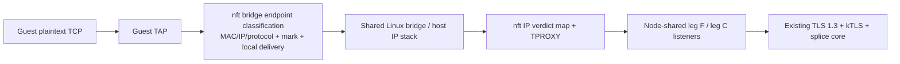
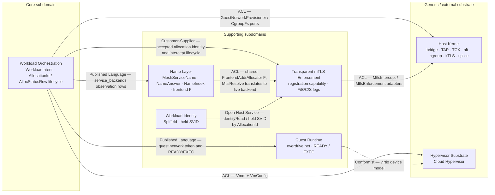

# Feature Delta — `netns-density-295`

**Feature ID:** `netns-density-295`
**Wave:** DESIGN reopened on 2026-09-23 and closed on 2026-09-24. The
correctness-recovery replacement DESIGN (application/components scope, Propose
mode, all priorities) was **accepted by the user on 2026-09-24**.
**Interaction mode:** Propose
**Current status (2026-09-24): REPLACEMENT DESIGN ACCEPTED (D-295-R1 to
D-295-R22, ADR-0127 to ADR-0143). DELIVER remains stopped until DISTILL is
rewritten against it and the roadmap is re-validated.** Reproduced evidence had
falsified several accepted premises
(`docs/feature/netns-density-295/recovery/proof-findings.md`). The correctness-
recovery charter (`.context/netns-density-295-correctness-recovery-plan.md`)
required one coherent replacement DESIGN before any implementation resumed.

Decisions D-295-R1 through D-295-R22 and ADR-0127 through ADR-0143 are in
§ *Correctness-Recovery Replacement DESIGN*, whose acceptance record names the
date, the decisions, and the review provenance. Every section that the
invalidation register lists as SUPERSEDED-PENDING or PENDING is now resolved by
those accepted decisions. Both 2026-09-23 revisions of D-295-DELIVER-04-01 are
withdrawn:

- **v1, committed:** a down TAP attached by name.
- **v2, uncommitted:** a closed pre-event control-frame oracle.

The acceptance record below is retained unchanged as provenance for the
contracts that survive. It is not DELIVER authority.

**Prior status record:** **Stage 1 accepted — approved by system design review iteration 5
on 2026-09-16 after user ratification of all stage-1 system choices. Stage 2
DDD is accepted — approved by DDD review iteration 2 on 2026-09-16 as a bounded
no-new-decision analysis. It introduces no new material choice requiring
ratification and does not alter any accepted stage-1 contract. D-295-7 and
D-295-9 remain unchanged accepted-contract constraints, not new material
decisions. These upstream stages alone did not authorize DELIVER.**
**Stage 3 application/solution architecture review iterations 1–3 returned ten
bounded findings. F-01 through F-04, S2-F01 through S2-F04, and I3-F01/I3-F02 are
remediated under the user's explicit 2026-09-16 authorization to proceed with
each recommended contract. Iteration 2 pins fresh-process target recovery,
removes competing constructor signatures, completes Contract Shape universes,
and corrects ADR-0090's live substrate evidence. Iteration 3 makes rollback
errors source-honest and removes Exec/process from ADR-0090's operative
contract. It adds no behavior or scope beyond the accepted stage-1 contracts
and accepted stage-2 no-new-domain-boundary conclusion. **Stage 3 is accepted
— approved by independent solution-architecture review iteration 4 on
2026-09-16 with no critical, high, or medium findings. Full DESIGN architecture
is accepted; there is still no DELIVER authority.**
**Bounded post-DISTILL DESIGN amendments:** **D-295-DISTILL-1 and
D-295-DISTILL-2 were explicitly user-approved on 2026-09-16 and independently
approved by bounded DESIGN review on the same date. They are recorded below as
the exact shared-owner and rollback contracts; this approval does not authorize
DELIVER. DESIGN-review F-02's complete
source-honest startup-cleanup shape was explicitly user-approved on the same
date and is included in D-295-DISTILL-1 below. The correctness-first
D-295-DISTILL-4 crate-ownership correction was explicitly **USER-APPROVED
2026-09-16 and independently approved at review iteration 4** and is recorded
below: core retains only cross-crate handoff/EXEC values, control-plane owns
the application port/fact/error family, and dataplane owns aya conversion and
exact aya sources.**
**D-295-DISTILL-5 was explicitly USER-APPROVED and independently APPROVED at
review iteration 6 on 2026-09-16.** It adds the
complete module-private scratch-effect boundary beneath the one private host
shared-network owner, so source-local tests drive the production owner
algorithm rather than injecting a completed cleanup aggregate. It preserves
the public shared-owner port and the reusable public `overdrive-sim`
scripting/call-observation/test-wiring API.
**D-295-DISTILL-6, D-295-DISTILL-7, and D-295-DISTILL-8, including the
`RegistrationRetired` correction, were explicitly USER-APPROVED and
independently APPROVED at review iteration 9 on 2026-09-17.** They pin respectively the dataplane-owned typed
TCX mutation/query boundary, the worker-private registration-capability state
machine, and the control-plane-private retained supervisor/DNS task owners.
They add no public product command, persistence, daemon, HA owner, process/PID
acceptance test, or expectation.
**DISTILL status:** cumulative D12, its private inventory source, D12A,
and D13's ordering-honest Sim oracle passed bounded DESIGN review iteration 6;
P02-07/08 are closed. The pre-D14 non-waived S00/S11/S12/S13 source-local/Sim
bodies are authored, have completed the bounded iteration-2 corrections, and
completed independent iteration-3 re-review. D14 is independently APPROVED by
phase-02 DESIGN review iteration 7; its pre-D14A three S00 projection,
owner-order, and real-kernel boot bodies were authored reasoned-pending, but
iteration-8 translation review found the bounded validator/deterministic-
observation/serialization gaps closed by independently approved D14A at
phase-02 DESIGN review iteration 9. The four exact transitioned S00 bodies are
authored reasoned-pending and await independent DISTILL review. The eight
real-I/O panic placeholders are user-waived and not scored by this bounded
gate. D-295-DISTILL-1
through D-295-DISTILL-9 are independently approved; D9 was approved at review
iteration 12. D-295-DISTILL-10 records the reusable deterministic simulation
API, and D-295-DISTILL-11 records final reachability contracts. There is no
DELIVER authority.
**F-08-01's D-295-DISTILL-7 activation-retirement projection was explicitly
USER-APPROVED on 2026-09-17.** It adds one typed install error and stage label;
the private registry, public worker surface, cleanup ownership, and lifecycle
ordering otherwise remain unchanged.
**D-295-DISTILL-9 was explicitly USER-APPROVED and independently APPROVED at
review iteration 12 on 2026-09-17.** It adds the
semantic bridge-family nft adapter over one private family-aware codec while
leaving every existing public IPv4 operation and PORT-295-C behavior unchanged.
The user also explicitly authorized autonomous DESIGN and DISTILL decisions for
the remainder of this run; this authorization does not expand product scope or
permit DELIVER, production, test, expectation, daemon, HA, or process-PID
acceptance changes.
**D-295-DISTILL-10 is authorized on 2026-09-17 under that autonomous
DESIGN/DISTILL authority.** It pins the already-public sim owner API; it adds
no product surface or behavior.
**D-295-DISTILL-11 is authorized on 2026-09-17 under the same authority.** It
pins actual worker task-exit classification, typed component audit scripting,
and S37 cross-test EXEC-closure evidence; it adds no product outcome, public
kill method, or gate accessor.
**Cumulative D-295-DISTILL-12, D-295-DISTILL-12A, and D13's
API/order/telemetry plus Sim RED oracle are APPROVED through phase-02 DESIGN
review iteration 6.** Ownership remains one real control-plane owner; no public
product hook or second adapter owner is added. The required S-ND295-00/10/11/
12/13 RED bodies for that pre-D14 scope are authored, have completed bounded
iteration-2 review corrections, and completed independent DISTILL iteration-3
re-review. DELIVER remains unauthorized while later wave validation is
pending.
**D-295-DISTILL-14 is APPROVED by phase-02 DESIGN review iteration 7 on
2026-09-21.** It adds one doc-hidden semantic TCP
classifier probe method on the existing opaque `GuestTcxProgram`, keeps its raw
packet/SKB/BPF syscall/FD/numeric ABI private to dataplane, and assigns the
unlike detached-link guard proof to the existing private real D5 host adapter
over D9 observation plus the scratch TAP. D12/D12A/D13 ownership, existing
methods, source taxonomy, and dependency direction remain unchanged. The
matching DELIVER roadmap was pending at that checkpoint and was independently
approved on 2026-09-22.
**D-295-DISTILL-14A is APPROVED by phase-02 DESIGN review iteration 9 on
2026-09-21.** It keeps
D14's approved cross-crate API byte-for-byte, adds one production-used
control-plane-private semantic validator, replaces the racy scratch-resource
monitor with non-persisted structured completion events captured across
ordinary `run_server`, and requires the existing cross-process
`host-kernel-shared` nextest group. It adds no public constructor, port, hook,
state accessor, timing seam, persistence, or second owner. Roadmap validation
remains pending.
**D-295-DELIVER-03-01 is USER-AUTHORIZED and independently APPROVED by
solution-architecture review iteration 2 on 2026-09-22.** It resolves only the
step-`03-01` EXEC-gate evidence
contradiction: the private `active_claims` field-level `+1/-1` bookkeeping is
not an independently observed acceptance outcome. S-ND295-27 owns the opaque
capabilities' public returns, recovery projection, blocking, wake, refusal, and
terminal behavior; S-ND295-28 owns the production `VmDriver` claim-lifetime,
writer-acknowledgement, and cancellation schedules. No accessor, hook, API,
owner, persistence, recovery, or C4/ADR change is authorized.
**D-295-DELIVER-04-01 is USER-DIRECTED on 2026-09-23 with no review cycle.**
Its initial loopback-byte ruling was falsified by native run `e72385d6` after
acceptance commit `c60b4dd`: one exact live TLS 1.3 kTLS TX/RX tuple/inode/fd
was uniquely correlated, loopback capture was lossless and saw both directions,
yet exposed zero complete TLS `0x17` records. The corrected same-node contract
therefore treats AF_PACKET as routing/escape evidence, not ciphertext evidence;
confidentiality is proved by exact kTLS socket state plus same-inode
bidirectional splice and zero unapproved non-loopback egress. The correction
adds no product behavior, test hook, public API, owner, route, persistence, or
cross-host claim. **That kTLS/splice evidence-boundary correction survives.**
The S-ND295-01 timing receipt also survives: the already-emitted
`mtls.intercept.install.success` event is the exact intercept-live barrier, and
typed-set polling is semantic state evidence only.

**Two later 2026-09-23 revisions of D-295-DELIVER-04-01 are WITHDRAWN by the
correctness-recovery replacement DESIGN:**

- **v1, committed `81ea7d47`/`db3af700`.** A down TAP was attached by name with
  a later `activate`. Native run `f1a15668` falsified its VMM premise, because
  Cloud Hypervisor v53's named path always enables the TAP. Its ordering and
  owner-state contract is re-proposed as D-295-R5, over the fd handoff of
  D-295-R1 and R2.
- **v2, uncommitted.** The TAP stayed up and a closed ARP-reply/TCP-reset
  oracle was admitted. It weakened the zero-frame invariant, which the charter
  forbids. Its premise that fd handoff was unnecessary was invalidated by the
  native fd spikes.

The roadmap's `validation.status` must return to `pending`; the roadmap is not
edited by DESIGN.
**Documentation density:** `lean` (`expansion_prompt=ask-intelligent`,
`provenance=explicit_override`). Only Tier-1 `[REF]` sections are emitted in
this feature delta. The Level-3 SSOT diagram is the solution-architect role's
mandatory view for this complex subsystem, not a Tier-2 feature-delta
expansion. No density telemetry has been emitted because the wave-end expansion
choice has not happened.

## Wave: DESIGN / [REF] Correctness-Recovery Replacement DESIGN — ACCEPTED 2026-09-24

**Status: ACCEPTED — user approval on 2026-09-24.** Author: Morgan (solution
architect). Mode: Propose. Scope: application/components (user decision
2026-09-23). Priorities: all priorities. Revision 2 (2026-09-24) applied four
user rulings and adversarial review round 3 findings F1–F19. Revision 3
(2026-09-24) applied four further user rulings and adversarial review round 4
findings H1–H3, M1–M4, M6, and L1–L10. Revision 4 (2026-09-24) applied final
review round 5 (R5-H1, R5-M1, R5-M2, L1–L7). Revision 5 (2026-09-24) applies the
verification review `arch_rev_20260924_netns295_r5_verify` defects D1–D12. It
pins contracts and corrects text, with one change to a decision's content:
D-295-R21 no longer disables unicast flooding on managed ports (`flood off` is
rejected on evidence, D5). Revision 6 (2026-09-24) adds D-295-R22 (ADR-0143) on
the user's ruling of the same day and the native evidence of spike
increment-aa: a seccomp filter installed at VMM launch denies every Cloud
Hypervisor thread the TAP-mutating ioctls. It prevents at their source the
FDB-poisoning victim outage and the `TUNSETOWNER` re-grant, which ADR-0142 and
ADR-0130 had accepted as residuals, and the `TUNSETDEBUG` host-log flood (Open
Question 10). The ADR-0130 audit read-back gains the TAP's debug message mask.
ADR-0142's egress classifier and the read-back remain. Revision 7 (2026-09-24)
applies user ruling 10: D-295-R22 ships for x86_64 only. The aarch64 program
is removed, every other target runs no microVM launch, and aarch64 support is
[GH #302](https://github.com/overdrive-sh/overdrive/issues/302). The revision
also replaces the earlier wording that a failed launch-seccomp probe "refuses
the node". It now states the existing production outcome (ADR-0083 §D3c): the
node composes no microVM driver, and every microVM start is rejected.

**Acceptance record (2026-09-24).** The user accepted this replacement DESIGN
on 2026-09-24. The acceptance covers decisions **D-295-R1, R2, R3, R4, R5, R6,
R7, R8, R9, R10, R11, R12, R13, R14, R15, R16, R17, R18, R19, R20, and R21**, and
ADR-0127 through ADR-0142, which are Accepted (2026-09-24). It covers:

- the technical decisions settled on evidence and by independent DESIGN review
  (rounds 3, 4, and 5, and the round-5 verification, each of whose findings is
  applied in this section); and
- the operator rulings already recorded below: 2026-09-23 rulings 1–5 and
  2026-09-24 rulings 1–8 (R7, R9, R11 retry-forever, R14 kill scope, R17 as
  built, R20 operator behaviour).

**D-295-R22 — user approval (2026-09-24).** The user approved preventing the
compromised-VMM TAP-ioctl hazards at their source with seccomp, as the correct
solution rather than the minimal one: the launcher installs a seccomp deny-list
before `exec`, and Cloud Hypervisor inherits it. The same ruling keeps both
existing layers: ADR-0142's registered-destination-MAC TCX egress check (the
unknown-unicast flood leak needs no ioctl), and the audit read-back of host-side
MAC, owner, persistence, and now the TAP debug level (it detects tampering from
outside the VMM, or a gap in the filter). It resolves the ADR-0142 and ADR-0130
accepted residuals and Open Question 10 by prevention. D-295-R22 and ADR-0143
are therefore Accepted (2026-09-24). The native evidence is spike increment-aa
(`spike/findings-tap-ioctl-seccomp.md`, verdict WORKS); its probe was discarded
from promotion with its files kept (`spike/wave-decisions.md`). The
implementation-facing contract derived under this approval is
§ *Driven port — VMM launch seccomp filter (D-295-R22)*.

**D-295-R22 scope — user ruling 10 (2026-09-24): x86_64 only.** Cloud
Hypervisor does not run in the Lima VM, and no aarch64 host with KVM is
available, so the aarch64 filter cannot be proven on native hardware. #295
therefore ships the filter for x86_64 only. The x86_64 program, including its
x32 kill prologue, is the only program. Starting a microVM on any other
target, aarch64 included, is refused, fail-closed, through the architecture
check (`for_target`) and startup-probe stage that the accepted R22 contract
already defines. Proving the filter on aarch64 and
enabling aarch64 microVM launch is tracked by
[GH #302](https://github.com/overdrive-sh/overdrive/issues/302). ADR-0143 and
§ *Driven port — VMM launch seccomp filter (D-295-R22)* state the scoped
contract, and the E21 aarch64 runner case is removed.

D-295-R18 and D-295-R19 are accepted as conditional decisions: each stands only
if its native RED (E14) reproduces, and is withdrawn otherwise, exactly as its
ADR states. The pre-existing ADRs the replacement amends or supersedes (ADR-0072,
0088, 0089, 0114, 0115, 0117, 0118, 0121, 0122, 0124, 0125) now state their
amendment explicitly with a pointer to the accepted ADR (see § *Freeze and
inventory* for why they are operative).

In-line markers elsewhere in this file that read *PROPOSED D-295-Rn* or
*PENDING D-295-Rn*, including those inside earlier-approved DISTILL-era sections
(D-295-DISTILL-10, 11, 12A, 15, RUN-295-B, and the others the invalidation
register lists), now denote the accepted D-295-Rn contract. Where such a marker
sits beside earlier text, the marker's text governs. This acceptance does not
authorize DELIVER: DISTILL must first be rewritten against these contracts
(§ *Required downstream changes*), and the roadmap re-validated.

Prior art for every VMM, networking, kernel, and process choice is in
`docs/research/networking/netns-density-295-replacement-design-prior-art-comprehensive-research.md`
(cited below as "research F*n.m*").

### [REF] Charter, rulings, and evidence

| Input | Use |
|---|---|
| `.context/netns-density-295-correctness-recovery-plan.md` | Charter: the seven correctness gaps, freeze/inventory, invalidation, and the §4 coverage list. |
| `docs/feature/netns-density-295/recovery/proof-findings.md` | Primary evidence, §3.1–§3.6, with seeds and file:line findings. |
| `.context/netns-density-295-fd-tap-spike-findings.md` | CH v53 `--net fd=[N]` with a non-persistent TAP: WORKS. |
| `spike/findings-persistent-fd-tap.md`, `spike/wave-decisions.md` (increment-y) | Same handoff with the production persistent TAP: WORKS, with two conditions. User decision: DISCARD from promotion and hand off to DESIGN. |
| `spike/findings-tap-ioctl-seccomp.md`, `spike/wave-decisions.md` (increment-aa) | A launcher-installed seccomp deny-list for the TAP-mutating ioctls, inherited by every Cloud Hypervisor v53 thread on the `fd=` path: WORKS. Probe discarded from promotion, files kept. Basis of D-295-R22. |
| Code at HEAD `db3af700`, plus staged 02-03/04-01/04-02 work | Current production facts, cited with file:line in the contracts below. |

**User rulings of 2026-09-23 — recorded, not reopened:**

1. The fd-handoff probes were discarded from promotion and handed to DESIGN.
   Adopting the mechanism and pinning its exact fd-ownership API is this
   DESIGN's proposal (D-295-R1 to R4).
2. The serve lifetime port is built as-is (uncommitted `serve_lifetime.rs`):
   - SIGTERM is kept as `ServeSignal::Terminate`.
   - `ServerHandle::kill_for_test` (test-gated killed mode) replaces
     `abort_for_test`, including its optional `rustix` `thread` dependency.

   It is pinned as built in D-295-R17.
3. The mTLS worker and DNS owner are injected through **required**
   `ServerConfig` ports, composed at the `serve` boundary like `kek`, never
   through `*_override: Option<…>` fields. The exact ports are pinned in
   D-295-R16.
4. Tests never spawn the `overdrive` binary. Only a verification expectation
   that verifies CLI output runs the built CLI. Conformance tests start the
   server in-process and use its public API only.
5. How the RED proof tests land is a DISTILL decision.

**User rulings of 2026-09-24 — recorded as approved:**

1. **D-295-R7 — capacity during replacement: count the old copy until its
   cleanup finishes.** A Retiring attachment counts against the node until
   cleanup completes, so a replacement starts only when there is room. In the
   user's words: "16,384 is an arbitrary number that doesn't matter. It was set
   as a threshold for no apparent reason. It all boils down to the resources
   the box has available. You can't start a replacement immediately if there's
   not enough room for it." 16,384 is therefore the current fixed placeholder
   cap, not a measured, meaningful, or promised density. Real capacity lives in
   [GH #299](https://github.com/overdrive-sh/overdrive/issues/299) (derived or
   configurable per-node guest-network capacity) and
   [GH #261](https://github.com/overdrive-sh/overdrive/issues/261) (real
   node-wide CPU and memory accounting). At the cap, replacement follows
   recreate ordering: predecessor cleanup, then successor. Retiring
   accumulation is operator-visible: a stuck cleanup visibly holds a slot.
2. **D-295-R14 — kill scope when quiescence cannot be confirmed: option (b).**
   Kill only the VMs whose TAP could not be confirmed down, and continue the
   bounded repair for the rest. Kill the whole workloads slice and fail-stop
   only when the platform cannot determine which TAPs are down (for example,
   the set-down call hangs or times out). This matches ADR-0124's accepted
   "kill the affected VMM cgroups" plus a fallback, and is written into
   ADR-0124's Decision.
3. **D-295-R9 — the CPU/memory accounting defect** is tracked in the existing
   [GH #261](https://github.com/overdrive-sh/overdrive/issues/261); the proof
   §3.2 evidence belongs there as a comment, and no new issue is created. #295
   makes no end-to-end density claim.
4. **Operator restart of a stopped Job is silently ignored** (proof §3.2 side
   observation 7). This is outside #295 and tracked by
   [GH #301](https://github.com/overdrive-sh/overdrive/issues/301).
5. **D-295-R7 — no slot reservation for a replacement.** This follows from
   ruling 1: a replacement starts only when there is room, and it gets no
   priority claim on a freed slot. Settled.
6. **D-295-R20 — a cleanup-pending status in `overdrive workload describe`,
   now.** An allocation whose network cleanup has not completed shows as
   cleanup-pending, never as Running. This includes a failed stop and every
   crash, replacement, and reclaim cleanup. It is specified end to end in
   § *Operator status — network cleanup pending (D-295-R20)*.
7. **D-295-R11 — retry-forever background reclaim is approved.** This
   discharges ADR-0106's requirement that a retrying cleanup owner be
   explicitly approved. Its real cadence is the constant one second of
   `backoff_for_attempt` until
   [GH #137](https://github.com/overdrive-sh/overdrive/issues/137).
8. **D-295-R14 — damaged per-VM network parts kill only that VM.** When a VM's
   TAP is deleted, its TCX link or classifier is detached, or its link pin,
   endpoint entry, or bridge-guard member is gone, only that VM is killed and
   the node is never fail-stopped for it. This extends ruling 2 and is
   settled. Whole-node fail-stop remains only for node-level components that
   fail bounded repair, or when the failing set cannot be determined.
9. **D-295-R22 — prevent the compromised-VMM TAP-ioctl hazards at their
   source with seccomp.** The launcher installs a seccomp deny-list before
   `exec` and Cloud Hypervisor inherits it (native evidence: spike
   increment-aa). ADR-0142's egress check and the audit read-back of host-side
   MAC, owner, persistence, and TAP debug level both stay. The ADR-0142 victim
   outage and the ADR-0130 `TUNSETOWNER` re-grant are prevented, no longer
   accepted, and the `TUNSETDEBUG` host-log flood (Open Question 10) is resolved
   by prevention.
10. **D-295-R22 — x86_64 only.** #295 ships the launch seccomp filter for
    x86_64 only, because the aarch64 filter cannot be proven on native
    hardware: Cloud Hypervisor does not run in the Lima VM, and no aarch64
    host with KVM is available. Starting a microVM on any other architecture,
    aarch64 included, is refused, fail-closed. Proving and enabling aarch64 is
    [GH #302](https://github.com/overdrive-sh/overdrive/issues/302).

**GitHub context (recorded; DESIGN takes no GitHub action):**

- [GH #197](https://github.com/overdrive-sh/overdrive/issues/197) stays open.
  The node-level load-balancer veth pair (ADR-0061) is still provisioned on
  every `serve` boot. If #197 remains the home of the shared host-infrastructure
  reconciler model, it must exclude every component the #295 shared-network
  supervisor owns (the bridge, TAPs, TCX links, maps and pins, the bridge guard,
  the IP nft program and sets, the policy route, the intercept-mark guard table,
  the listeners, and DNS). Two repair owners for one component would conflict
  with ADR-0124's bounded recovery and its single fail-stop authority.
- [GH #234](https://github.com/overdrive-sh/overdrive/issues/234) (shared
  inbound-TPROXY routing: fwmark rule, local route, shared nft chain) is
  superseded by #295's constant nft program, its boot convergence, and its
  one-second audit. It closes when #295 lands.

Correctness and security invariants are weighed first. Implementation size,
compatibility, and diff size are weighed only afterwards. The zero-frame
invariant and every accepted security outcome are preserved unweakened.

### [REF] Freeze and inventory (charter §1)

**Committed state.** HEAD `db3af700` carries steps 01-01 through 03-03 as
commits on the feature branch, plus the 04-01 test activation (`6f639179`).
Nothing is merged to `main` (merge base `736811d7`), no persisted or wire state
exists under any #295 decision, and no external consumer depends on one. The
contracts in this feature delta are therefore written in present tense.

**Operative status of the ADRs the replacement amends (decided per ADR on
evidence at HEAD `db3af700`, 2026-09-24).** An ADR is treated as operative when
its prior decision is implemented in code committed at HEAD, merged to `main`,
persisted, or externally depended on. Every amended ADR meets that test, so
each states its amendment explicitly rather than being rewritten silently:

| ADR | Prior decision | Evidence | Operative through |
|---|---|---|---|
| ADR-0072 | no DNS responder port trait or sim adapter | `origin/main` concrete `DnsResponder` (`responder.rs:192,228`) with no port trait; workloads resolve over its wire contract | `main`, external consumer |
| ADR-0088 | per-workload netns, routed `/30` TAP wire; mark-before-TPROXY claim | `origin/main` `action_shim/mod.rs:772-773,1195`; `AllocStatusRow.workload_addr` on the operator API | `main`, wire state |
| ADR-0089 | named `--net tap=` attach through `ip netns exec`; §A2 rejects fd passing | `origin/main` `vmm.rs:277,295,302`; HEAD `vmm.rs:277,296` still renders `tap=` | `main`, HEAD |
| ADR-0114 | TAP raised inside `provision`; VMM attaches by TAP name | HEAD `guest_network.rs:3018-3030` (`set_tap_up` then up read-back); no `activate` at HEAD | HEAD (feature branch) |
| ADR-0115 | ingress-only TCX classifier; eight counter classes | HEAD `overdrive-bpf/src/programs/guest_tcx.rs:41-42` (sole `#[classifier]`) | HEAD |
| ADR-0117 | 16,384 as the measured attachment contract | HEAD `scheduler.rs:50` | HEAD |
| ADR-0118 | pool with exactly assign/release/snapshot; process-global | HEAD `guest_network.rs:412,452,509,518,523` (`static ACTION_POOL`) | HEAD |
| ADR-0121 | cap enforced at placement over Running rows | HEAD `scheduler.rs:108-115,137` | HEAD |
| ADR-0122 | error family without admission/retiring refusals or a host-MAC fact | HEAD `guest_network.rs:364` | HEAD |
| ADR-0124 | narrow supervisor; unconfirmed quiescence kills all affected VMMs then fail-stops | HEAD `lib.rs:1406,1412,1449,1458-1459` | HEAD |
| ADR-0125 | eight constant rules, mark set before TPROXY; no fallible element release or boot-clear caller | HEAD `nft.rs:679-690,3065-3066`; `mtls_intercept_port.rs:786` | HEAD |

The superseded behaviour committed on the feature branch is replaced in the
single #295 implementation cut; nothing is migrated.

**Uncommitted design edits.** Saved verbatim at
`.context/netns-density-295-uncommitted-docs.diff`.

| Artifact | HEAD (committed) | Uncommitted | Verdict |
|---|---|---|---|
| `feature-delta.md` | D-295-DELIVER-04-01 **v1**: provision-down; CH attaches the down TAP **by name**; event → `activate` → EXEC. Adds `GuestNetworkProvisioner::activate`, private `ProvisionedDown/Active/QuiescedActive` phases, the activation failure projection, and quiescence serialization. | **v2**: TAP up for named attach; a closed ARP-reply/zero-payload TCP-reset pre-event oracle; a two-method provisioner; fd handoff "unnecessary and rejected". Also reverts some "approved 2026-09-22" phrasing to "pending". | **v2 SUPERSEDED**: it weakens zero-frame, and the fd spikes invalidate its premise. **v1's ordering, owner-state, and failure-projection contract SURVIVES**, re-proposed as D-295-R5 and restored below marked PROPOSED. v1's named-TAP-down VMM clause is **SUPERSEDED** (falsified by `f1a15668`) by D-295-R1/R2. The status-phrasing hunks are superseded by this section: roadmap validation returns to pending. |
| `distill/test-scenarios.md` | S-ND295-01/S11 v1: down through READY; event before activation; activation before EXEC; activation-failure cleanup. | S-ND295-01/S11 v2: the closed two-shape oracle, provision-up, no activate. | **v2 SUPERSEDED.** **v1 SURVIVES in intent**, except its "CH attaches the down TAP by name" and "argv stays `tap=`" clauses, which D-295-R1/R2 **SUPERSEDE**. DESIGN does not edit this file; DISTILL must. |
| `distill/red-classification.md` | "2026-09-23 deferred-TAP-activation amendment" subsection. | v2 "native contradiction closure" table. | The evidence rows **SURVIVE**: `c4d36190` (up-TAP guest frames) and `f1a15668` (named-path `EPERM`). The v2 classifications "control-frame oracle selected" and "fd handoff out of scope/unnecessary" are **SUPERSEDED**. The v1 subsection **SURVIVES in intent**; its VMM clause is superseded. Not edited. |
| `deliver/roadmap.json` | Goal and criteria for v1. | Goal and criteria for v2. | **Both SUPERSEDED.** `validation.status` must return to `pending`. Not edited. |
| `deliver/execution-log.json` | — | One appended `04-01 RED FAIL` event. | **SURVIVES** as an append-only factual record. It carries no GREEN or COMMIT credit. Not edited. |
| `spike/wave-decisions.md` | — | The increment-y PROBE/DISCARD entry. | **SURVIVES**. It records a user-approved promotion decision. |
| ADR-0088, ADR-0089 | v1 #295 amendment: TAP down; CH named attach leaves it down. | v2 #295 amendment: closed control-frame set; A7 "bounded amendment accepted". | **v2 SUPERSEDED** and reverted in this DESIGN. The operative #222 zero-frame contract and the A7 rejection are restored verbatim; since the 2026-09-24 acceptance each ADR states its amendment explicitly, pointing to ADR-0127 to ADR-0131 and ADR-0140. The v1 named-TAP clause is **SUPERSEDED**. |
| ADR-0114, ADR-0115 | v1 activation paragraphs. | v2 provision-up and control-frame paragraphs and alternatives. | **v2 SUPERSEDED** and removed. TAP timing is no longer decided inside these bucket ADRs; it is proposed in ADR-0127 to ADR-0131. ADR-0115's `e72385d6` kTLS/splice evidence correction **SURVIVES**. |
| ADR-0118, ADR-0122, ADR-0124 | v1 activation clarifications. | Those clarifications removed, which restores the original accepted text. | **The working-tree text SURVIVES**, as the original single-decision text. The activation projection is carried in this feature delta (D-295-R5), and since the 2026-09-24 acceptance each ADR states its amendment explicitly. |
| `brief.md` | v1 lifecycle text and changelog. | v2 lifecycle, gate text, and changelog. | **v2 SUPERSEDED** and replaced by proposed text. |

**Uncommitted production work.** DESIGN has no shell and cannot diff source.
The orchestrator must attach a per-hunk production inventory before DELIVER
re-plans.

| Work | Attribution | Verdict |
|---|---|---|
| Staged 02-03/04-01/04-02 changes in these files: `overdrive-control-plane/src/{action_shim/mod.rs,guest_network.rs,lib.rs}`, `overdrive-sim/src/adapters/guest_network.rs`, `overdrive-worker/src/{mtls_intercept.rs,mtls_intercept_port.rs,vm_driver.rs}`, `overdrive-host/src/vmm.rs`, `overdrive-netlink/src/{client.rs,ethtool.rs}`, `overdrive-dataplane/src/guest_tcx.rs` | Includes v1 activation: `GuestNetworkProvisioner::activate` (`guest_network.rs:103-110`); `HostGuestNetworkAllocationPhase` and `HostGuestNetworkLifecycle` (`:1994-2009`); provision without `TapSetUp` (`:2866-3160`); `activate` (`:3162-3364`); the action-shim helpers `activate_guest_network` (`action_shim/mod.rs:1682`, called at `:2618` and `:3112`) and `fail_closed_on_guest_network_activation` (`:729`). | **RETAINED-PENDING.** It matches D-295-R5 in shape, but **must not land without D-295-R1 to R3**: with named-TAP launch it breaks every mesh VM (proof §3.5). It needs design-conformance review against D-295-R5, and against R4's owner-uid change, before reuse. The listed clippy failures are in-scope fixes for whichever step lands it. |
| Unstaged serve-lifetime work: `overdrive-cli/src/commands/{serve_lifetime.rs,serve.rs,mod.rs}`, `overdrive-cli/src/main.rs`, `ServerHandle::kill_for_test` in `overdrive-control-plane/src/lib.rs`, the optional `rustix` `thread` dependency in `overdrive-control-plane/Cargo.toml`, and the related CLI/control-plane tests | Serve lifetime port and killed mode (proof §3.6). | **SURVIVES**: user-approved 2026-09-23 and pinned in D-295-R17. |
| Untracked proof tests: `netns_density_node_admission.rs` (§3.2), `shared_network_supervisor_recovery_proof.rs` (§3.3), `shared_element_cleanup_failure.rs` (§3.4), `serve_killed_restart_boot_clear.rs` (§3.5), `serve_lifetime_fail_stop.rs` (§3.6); plus the `.config/nextest.toml` timeout override | Recovery proofs. | **Evidence.** Landing them is DISTILL's decision. Their assertions must be re-targeted to the approved contracts; for example, §3.2 must use held-population semantics under D-295-R7 (user-approved 2026-09-24). |
| `.claude/rules/{spike,testing}.md`, `AGENTS.md`, `.serena/project.yml`, `Cargo.lock` | Outside this DESIGN's ownership. | Not assessed. |

### [REF] Invalidation register (charter §2)

Each of the seven gaps is **UNRESOLVED** until its mapped decisions, accepted
on 2026-09-24, are delivered:

| Gap | Mapped decisions |
|---|---|
| 1 — the cap is evaluated over workload-local rows, not the node-wide admitted and in-flight population | D-295-R6, R7, R8. R9 scopes the parallel CPU/memory defect. |
| 2 — the retained supervisor implements only the narrow S19 loop | D-295-R13, R14, R16 |
| 3 — live IPv4 constant-rule/set loss is not audited while capability records exist | D-295-R15, R18, R19 |
| 4 — the CLI process owner never consumes the typed fail-stop request | D-295-R17 (built, user-approved) |
| 5 — normal `2 + P` element cleanup is hidden in infallible `Drop` | D-295-R10, R11 |
| 6 — boot-clear has no production caller, and the old fixture removed the residue it claimed to test | D-295-R12, plus killed mode in R17 |
| 7 — the named-TAP/down-through-READY design is incompatible with CH v53; and the shared-bridge queue holder can rewrite its own TAP's host-side MAC to steal another guest's host-to-guest plaintext (R5-H1) | D-295-R1, R2, R3, R4, R5, R21, R22 |

Revision 2 adds D-295-R19 (the TPROXY-before-mark rule order, from review
finding F3) and resolves D-295-R7, R9, and R14 by the 2026-09-24 user rulings.
Revision 3 moves D-295-R19 into its own proposed ADR-0140, adds D-295-R20 (the
cleanup-pending operator status, user ruling 6) with proposed ADR-0141, and
records user rulings 5, 7, and 8 against R7, R11, and R14. Revision 4
(2026-09-24) applies final review R5: it adds D-295-R21 (the TAP egress
guest-MAC control, proposed ADR-0142) for R5-H1, completes ADR-0130's
own-queue-ioctl dispositions and settles its residual (R5-M2, A5), qualifies the
E14 (e) `TIME_WAIT` preconditions (R5-M1), and applies the L1–L7 text and
placement corrections. No other decision is reopened. Revision 5 (2026-09-24)
applies verification defects D1–D12: it pins R21's implementation-facing
contract, cites the native reproduction (increment-z), drops `flood off` on
evidence (D5), makes the egress verdict total, and states R21's accepted
residuals. The user accepted the replacement the same day. Revision 6
(2026-09-24) adds D-295-R22 (ADR-0143,
the launch seccomp filter) on the user's ruling 9 and the increment-aa native
evidence; the residuals R21 and R4 had stated become prevented. Revision 7
(2026-09-24) scopes D-295-R22 to x86_64 on the user's ruling 10; aarch64 is
[GH #302](https://github.com/overdrive-sh/overdrive/issues/302).

**Sections of this feature delta marked by this DESIGN:**

| Section | Marking |
|---|---|
| Header D-295-DELIVER-04-01 v1 and v2 | WITHDRAWN. The kTLS/splice evidence part survives. |
| Evidence Classification rows "Reproduced named-TAP activation fact" and "User-directed D-295-DELIVER-04-01 supersession" | SUPERSEDED; replaced in place. |
| Requirements FR2 and FR4; quality attribute rank 1 | Rewritten in place: zero-frame restored, marked PROPOSED. |
| C-295-A | VMM rendering PENDING D-295-R1/R2. The value types are unchanged. |
| C-295-B | PENDING D-295-R5. The three-method port is proposed in place. |
| C-295-C five-method port; DESIGN-02-03 delete and boot-clear semantics | PENDING D-295-R10/R12/R15/R18. |
| C-295-D "no DNS port trait" | PENDING D-295-R16. |
| C-295-F and G-295-0 | SUPERSEDED-PENDING D-295-R6 to R8. |
| C-295-G "complete port" (five methods; `quiesce_managed_taps -> Result<()>`; `audit_shared -> Result<(), _>`; the quiesce sentence "returns only after every managed TAP is observed down or a typed failure is available to the existing cgroup-kill/fail-stop owner") | PENDING D-295-R5/R13/R14: six node methods (adding `restore_quiesced_taps`) over the three-method provisioner (adding `activate`), `quiesce_managed_taps -> Result<TapQuiescence>`, and `audit_shared -> Result<SharedGuestNetworkAudit, _>`. |
| D-295-DISTILL-10 sim slot set ("six disarmed non-audit standing slots"; `script_quiesce_failure`; `activate` returns `Ok(())`) | PENDING D-295-R5/R13/R14: `script_quiesce_outcome` replaces `script_quiesce_failure`, plus `script_restore_failure` and `script_audit_damage`. |
| D-295-DISTILL-11 audit signature (`audit_shared -> Result<(), SharedGuestNetworkAuditError>`) | PENDING D-295-R14: `Ok` carries the per-allocation damage set. |
| D-295-DISTILL-15 observation semantics (the real `SharedInterceptProgramIo::observe` projects the member-intolerant netlink observation) | PENDING D-295-R15: member-tolerant identity projection. |
| RUN-295-B CLI selection sentence; D-295-DISTILL-8 `run_mtls_owner` signature and S19 closed journal | PENDING D-295-R13/R14/R17. |
| D-295-DISTILL-12A allocation state (owner uid, phases) | PENDING D-295-R4/R5, restored in place as PROPOSED. |
| Lifecycle Gate Ownership | Rewritten in place, marked PROPOSED. |
| Application Architecture sequences, D-295-DELIVER-04-01 subsection, Contract Shape rows, Security rows | Rewritten in place, marked PROPOSED. |
| Reuse Analysis, Decisions Table, Open Questions, Author Validation | Extended or rewritten in place. |
| D-295-DISTILL-6 (`GuestTcxCounter`, eight-index `read_counter`), D-295-DISTILL-12 (`GuestTcxObject`, counter schema, private receipts), D-295-DISTILL-14/14A (eight-counter probe), Reuse Analysis classifier row | Marked in place for D-295-R21 (egress classifier, ninth counter slot, `attach_first_egress`); the exact additions are in § *Driven port — TAP egress guest-MAC delivery*. |
| VMM TAP queue attachment (launch hook, probe, dependencies), TAP activation gate (debug-mask read-back), TAP egress guest-MAC delivery (residuals), D-295-DISTILL-12A step 7, evidence-lane matrix (E12, new E21), Changed Assumptions 30–35, Reuse Analysis, Evidence Classification, Technology Choices, Earned Trust, Lifecycle Gate G-295-4, Contract Shape, Security, Decisions Table, Open Questions 1, 8, and 10, Author Validation | Revised in place for D-295-R22 (revision 6), and scoped to x86_64 by ruling 10 (revision 7; aarch64 is GH #302); the exact contract is in § *Driven port — VMM launch seccomp filter (D-295-R22)*. |
| Every `## Wave: DISTILL` section | NOT EDITED by DESIGN; pending the DISTILL rewrite. |

**Artifacts outside this file:**

| Artifact | Marking |
|---|---|
| ADR-0121 | **Resolved 2026-09-24:** superseded in part (enforcement location and counted population) by ADR-0132 to ADR-0134, stated explicitly. |
| ADR-0117, ADR-0118, ADR-0122, ADR-0124, ADR-0125, ADR-0072 | **Resolved 2026-09-24:** each is operative and states its amendment explicitly, with pointers to the accepted ADRs (ADR-0117: user ruling with R7 and ADR-0133; ADR-0118: ADR-0132/0133; ADR-0122: R5–R7 and R21 additions; ADR-0124: R13–R15, ADR-0131, ADR-0138, ADR-0140; ADR-0125: ADR-0135, ADR-0137, R15, ADR-0139, ADR-0140; ADR-0072: ADR-0138). |
| ADR-0088, ADR-0089, ADR-0114, ADR-0115 | **Resolved 2026-09-24:** v2 text stays reverted; each operative ADR states its amendment explicitly with a pointer to ADR-0127 to ADR-0131 (and ADR-0140 for the rule order, ADR-0142 for TAP egress delivery). |
| ADR-0128, ADR-0129, ADR-0130, ADR-0142 | **Revised in present tense 2026-09-24 for D-295-R22** (accepted, not yet implemented, so no amendment narrative): ADR-0129 records the filter's place and order in its one launch hook; ADR-0130's holder-ioctl dispositions and read-back set, ADR-0142's source-prevention alternative and residual text, and ADR-0128's by-name-attach consequence state the ADR-0143 prevention. |
| ADR-0122, ADR-0124 | **Operative; their explicit 2026-09-24 amendments gain D-295-R22:** ADR-0122 lists the `TapDebugMsgMask` fact; ADR-0124 counts a changed TAP debug message mask as per-allocation damage. |
| `brief.md` #295 sections; `c4-diagrams.md` #295 | Replacement added and marked accepted (2026-09-24). Where the earlier baseline conflicts, including the brief's "exactly `assign`, `release`, and `snapshot`" and "eight constant IP rules" sentences, the replacement governs. |
| `distill/test-scenarios.md`, `distill/red-classification.md` | PENDING the DISTILL rewrite; not edited. |
| `deliver/roadmap.json` | `validation.status` must return to `pending`. Steps 02-01, 02-03, 03-01, 03-03, 04-01, and 04-02 are invalidated in part; see *Required downstream changes*. |

**Alternatives reopened** because native evidence invalidated their
rejection:

- **fd handoff.** ADR-0089 §A2 rejected it for the per-workload-netns
  topology, and v2 rejected it as "unnecessary".
- **Pool-owned admission.** G-295-0 rejected it: "never calls the pool at the
  cap".

### [REF] Decision index — accepted 2026-09-24

| ID | Decision (one sentence) | Owner / boundary | ADR | Gap |
|---|---|---|---|---|
| D-295-R1 | Cloud Hypervisor receives the guest NIC as one inherited TAP queue descriptor (`--net fd=`), and the TAP stays down through READY and Running. | VMM boundary | ADR-0127 | 7 |
| D-295-R2 | `CloudHypervisorVmm::create` attaches, verifies, maps, and closes the per-launch queue; no type or crate carries the descriptor. | `overdrive-host` VMM adapter, with an `overdrive-netlink` TUN helper | ADR-0128 | 7 |
| D-295-R3 | The VMM child inherits exactly descriptors 0–2 and the queue at descriptor 3: `command-fds` maps the queue, and one audited `pre_exec` marks every other descriptor close-on-exec. Creating first-party raw descriptors close-on-exec under a source gate is an implementation obligation, not part of this decision. | `overdrive-host` (decision); every first-party crate in the `serve` process (obligation) | ADR-0129 | 7 |
| D-295-R4 | Guest TAPs are owned by uid 0, so no process that does not hold the queue can attach one without `CAP_NET_ADMIN`. | Shared guest-network owner and the netlink creator | ADR-0130 | 7 |
| D-295-R5 | Provision ends with the TAP down; after the exact success event the shim waits on the EXEC gate, then `activate` raises it before EXEC, serialized with quiescence; a latched quiescence defers activation rather than failing the allocation. The owner records each allocation's plan, and teardown treats an absent part as already removed. | Shared guest-network owner and the action shim | ADR-0131 | 7 |
| D-295-R6 | `GuestAddressPool::assign`, one pool per server instance, is the sole admission linearization point; it refuses at the cap over the held population. | Guest-address pool, built in the composition root | ADR-0132 | 1 |
| D-295-R7 | **User-approved 2026-09-24 (rulings 1 and 5).** Admitted and Retiring leases both count against the placeholder cap until cleanup finishes; at the cap a replacement's predecessor is cleaned up first; no slot is reserved for the replacement. | Guest-address pool, the action shim, and `WorkloadLifecycle` | ADR-0133 | 1 |
| D-295-R8 | Placement reads one consistent occupancy snapshot (held, retiring, leases) through a fifth hydration read-port; restart is gated on it with its predecessor counted. | Core read-port, `WorkloadLifecycle`, and the scheduler | ADR-0134 | 1 |
| D-295-R9 | **User-approved 2026-09-24.** The workload-local CPU/memory accounting defect is outside #295, tracked by GH #261; #295 makes no end-to-end density claim. | Scope | — | 1 (adjacent) |
| D-295-R10 | Allocation intercept elements are released through one awaited, convergent, retry-retaining port operation. | `MtlsIntercept` and the worker | ADR-0135 | 5 |
| D-295-R11 | A row-neutral `ReclaimAllocationNetwork` action retries cleanup of every leased Failed/Terminated allocation no other action owns, computed on every reconcile path. **Retry-forever user-approved 2026-09-24 (ruling 7)**, at a constant one-second cadence until GH #137. | `WorkloadLifecycle` and the action shim | ADR-0136 | 5 |
| D-295-R12 | The intercept owner converges dynamic members to empty in the fresh-process boot branch. | Worker and `MtlsIntercept` | ADR-0137 | 6 |
| D-295-R13 | A recovery attempt is the converge of every failing component's owner, one full audit, and then, only if that audit is clean, the restore of quiesced TAPs (ADR-0124 over the S19 journal). | Control-plane supervisor and the shared guest-network owner | — (ADR-0124) | 2 |
| D-295-R14 | A complete component matrix: component-specific quiescence, bounded owner calls, and DNS loss closes EXEC. **Kill scope user-approved 2026-09-24 (rulings 2 and 8):** a VM whose TAP could not be confirmed down, or whose own attachment parts are damaged, is killed alone, its parts leave the audit and restore universes, and repair continues; the whole workloads slice is killed and the process fail-stops only when the failing set cannot be determined or a per-VM kill cannot be written. The supervisor holds a kill-only capability. | Control-plane supervisor | — (ADR-0124) | 2 |
| D-295-R15 | The worker audits the constant program, the policy route, the guard table, and the dynamic members against its registry, and repairs them through the same port; `converge_shared` observes the program identity without regard to dynamic members, and the worker relinquishes, never drops, the prior node guard. | Worker and `MtlsIntercept` | — (ADR-0124/0125) | 3 |
| D-295-R16 | `ServerConfig` requires intercept and guest-DNS ports; the mTLS worker, DNS owner, and supervisor are always composed. | Serve composition | ADR-0138 | 2 |
| D-295-R17 | The serve lifetime port is pinned as built (user-approved). | CLI | — (ruling) | 4 |
| D-295-R18 | An independent intercept-owned guard table drops TCP still carrying the TCX intercept mark after the intercept chain, so intercept-marked TCP fails closed without the IP nft program (option R18-B, chosen on evidence). Conditional on a native RED. | Worker (intercept owner) | ADR-0139 | 3 |
| D-295-R19 | The constant program's two TPROXY rules order TPROXY, then the policy-route mark, then accept, so an outbound TPROXY without a transparent listener falls through to the unhandled-intercept drop. Conditional on a native RED. | Worker (intercept owner) | ADR-0140 | 3 |
| D-295-R20 | **Operator behaviour user-approved 2026-09-24 (ruling 6).** `overdrive workload describe` shows an allocation whose network cleanup has not finished as cleanup-pending, never Running. The status is derived at read time from the live guest-attachment lease and the row state, and is not persisted. | Control-plane `alloc_status` handler, CLI renderer | ADR-0141 | — (operator visibility) |
| D-295-R21 | A TAP egress classifier delivers unicast to a guest only for that TAP's registered guest MAC, dropping every other unicast, including when the TAP has no endpoint entry (broadcast/multicast always delivered), so a host-side MAC change cannot redirect another guest's host-to-guest plaintext and flooded unknown unicast reaches only its registered target (review finding R5-H1). A structural control; no user decision. | Shared guest-network owner (TCX egress), reusing the ADR-0115 endpoint map | ADR-0142 | 7 |
| D-295-R22 | **User-approved 2026-09-24 (ruling 9); x86_64 only (ruling 10).** Every Cloud Hypervisor launch installs, in the forked child before its first exec, a seccomp filter that returns `EPERM` (or lets CH's own stricter action apply) for the 13 TAP-mutating ioctl requests on any descriptor and kills the process on a foreign syscall ABI, so every Cloud Hypervisor thread inherits it; a launch never proceeds without it. The filter exists for x86_64 only, so no microVM starts on any other target, aarch64 included (GH #302). | `overdrive-host` VMM adapter (the one ADR-0129 launch hook and its startup probe) | ADR-0143 | 7 |

### [REF] Driven port — VMM TAP queue attachment (D-295-R1, R2, R3, R4) — ACCEPTED 2026-09-24

**Unchanged.** `GuestNetworkAssignment`, `VmNetworkAttachment { tap, mac }`,
`VmConfig`, and the four-method `Vmm` trait (`kind`, `probe`, `create`,
`terminate`) keep their exact shapes and derives. `VmDriver` still projects
`VmNetworkAttachment` from the grouped assignment (`vm_driver.rs:139-171`).

**New `overdrive-netlink` TUN helper.** It is public, in the TAP module beside
`create_persistent_tap` (`client.rs`):

```rust
/// One queue attached to an existing single-queue persistent TAP, opened for
/// handoff to exactly one VMM launch. Dropping it closes the queue.
#[derive(Debug)]
pub struct TapQueue { /* private: OwnedFd, name */ }

impl TapQueue {
    pub fn name(&self) -> &str;
    pub fn as_fd(&self) -> std::os::fd::BorrowedFd<'_>;
    pub fn into_owned_fd(self) -> std::os::fd::OwnedFd;
}

pub fn attach_tap_queue(name: &str) -> Result<TapQueue, TapQueueError>;

#[derive(Debug, thiserror::Error)]
pub enum TapQueueError {
    #[error("opening /dev/net/tun to attach TAP {name} failed")]
    Open { name: String, #[source] source: std::io::Error },
    #[error("attaching a queue to TAP {name} failed")]
    Attach { name: String, #[source] source: std::io::Error },
    #[error("reading back TAP {name} queue flags failed")]
    FlagsReadBack { name: String, #[source] source: std::io::Error },
    #[error("TAP {name} queue flags {observed:#06x} are not the persistent single-queue vnet-header TAP flags")]
    Flags { name: String, observed: u16 },
    #[error("reading back TAP {name} administrative state failed")]
    AdminStateReadBack { name: String, #[source] source: std::io::Error },
    #[error("TAP {name} was administratively up at queue attach")]
    NotDown { name: String },
}
```

`attach_tap_queue` contract:

- **Precondition.** The shared guest-network owner has created `name` as a
  persistent single-queue TAP that holds no queue and is administratively down.
- **Effect.** Opens `/dev/net/tun` with `O_RDWR|O_NONBLOCK|O_CLOEXEC` and
  issues `TUNSETIFF` with exactly `IFF_TAP|IFF_NO_PI|IFF_VNET_HDR`, never
  `IFF_MULTI_QUEUE`.
- **Postconditions, checked before return.** Each failure closes the
  descriptor.
  1. `TUNGETIFF` must equal exactly `IFF_TAP|IFF_NO_PI|IFF_VNET_HDR|IFF_PERSIST`
     (`0x5802`). A missing `IFF_PERSIST` means the attach created a fresh
     non-persistent device; the call fails with `Flags`, and closing destroys
     that transient device.
  2. `SIOCGIFFLAGS` on `name` must report `IFF_UP` clear, otherwise the call
     fails with `NotDown`.
- **Edge cases.** `EBUSY` from an already-attached queue maps to `Attach`
  (kernel `tun_attach`, research F2.1), as does an absent name without
  `CAP_NET_ADMIN`, and `EPERM` from a caller that is neither the TAP's owner
  (uid 0, R4) nor holding `CAP_NET_ADMIN`. The helper never creates, persists,
  renames, raises, lowers, or deletes a TAP.

**Creator owner (D-295-R4).** The existing signature
`create_persistent_tap(name: &str, owner_uid: u32) -> Result<(), NetlinkError>`
is unchanged (`client.rs:116`). The shared guest-network owner passes `0`, the
uid of the root launcher, instead of the VMM uid:

- `TUNSETIFF(IFF_TAP|IFF_NO_PI)`, `TUNSETOFFLOAD(0)`, `TUNSETOWNER(0)`,
  `TUNSETPERSIST(1)`, and close. No group is set.
- The kernel's `tun_not_capable()` then refuses a queue attach from any caller
  that is neither uid 0 nor holding `CAP_NET_ADMIN`, which includes every
  confined VMM. An ownerless TAP would be attachable by any process that can
  open `/dev/net/tun` (research F2.2, Conflict 1; Firecracker's CI attaches
  ownerless TAPs as uid 1234).
- The legacy by-name reopen `set_persistent_tap_owner` has no post-#295 caller.
  Its only caller is the test-gated netns path (`veth_provisioner.rs:2979-2991`),
  and both leave in the accepted single cut.
- D-295-DISTILL-12A's expected TAP fact changes from
  `owner_uid=Some(OVERDRIVE_VMM_UID)` to `owner_uid=Some(0)`.

**`CloudHypervisorVmm::create` (D-295-R2, R3).**

- Add `pub(crate) const VMM_TAP_QUEUE_FD: std::os::fd::RawFd = 3;` in
  `overdrive-host::vmm`.
- When `config.network == Some(att)`, call `attach_tap_queue(&att.tap)`
  immediately before building the spawn.
- Map the queue's descriptor to child fd `VMM_TAP_QUEUE_FD` with
  `command_fds::CommandFdExt` on the existing `tokio::process::Command`.
- Render exactly
  `--net fd=[3],mac=<mac>,offload_tso=off,offload_ufo=off,offload_csum=off`,
  with no `num_queues`, so the default single queue pair applies. This replaces
  `tap=…` in `vmm.rs:294-305`.
- Keep the existing Landlock order unchanged: TAP sysfs `access=r`, then the
  run directory `access=rw`. That is the proven configuration.
- **In-child close (D-295-R3).** After the `command-fds` mapping is registered,
  register exactly one further `pre_exec` hook on the same `Command`. It issues
  one `close_range(VMM_TAP_QUEUE_FD + 1, u32::MAX, CLOSE_RANGE_CLOEXEC)` call,
  which marks every descriptor above 3 close-on-exec, so the exec leaves the
  child with exactly descriptors 0, 1, 2, and 3. It allocates nothing and takes
  no lock. It marks rather than closes so the standard library's own
  close-on-exec exec-error pipe keeps reporting an exec failure as a spawn
  error. A failed call returns its `io::Error` from the hook, which fails the
  spawn and maps to the existing `classify_launch_spawn_error`. This matches
  libvirt's `virCommandMassClose` and the Firecracker jailer, which close every
  non-stdio descriptor in the child (research F1.4); `command-fds` alone does
  not. The same hook then sets `no_new_privs` and loads the D-295-R22 launch
  seccomp filter as its last effect; the hook's exact signature, its three
  child steps in order, and its registration on every launch are pinned in
  § *Driven port — VMM launch seccomp filter (D-295-R22)*.
- **The exec-error pipe and descriptor 3 (review finding L1).** The standard
  library creates its close-on-exec exec-error pipe inside `spawn`, after the
  queue is already open, and its `pre_exec` hooks run in the child after that
  pipe exists. If descriptor 3 is free at the moment the pipe is created, the
  pipe's write end can be numbered 3, and the `command-fds` `dup2` of the queue
  onto 3 then replaces it in the child. This needs descriptor 3 to be freed by
  another thread between the queue open (which takes the lowest free number,
  so a free 3 at that moment makes the queue itself descriptor 3 and no `dup2`
  happens) and the pipe creation. The consequence is limited to error
  classification:
  - The parent's pipe read sees end-of-file as soon as the child's `dup2` closes
    the original write end, so `spawn` returns `Ok` even if the later `execve`
    fails.
  - On such an exec failure the child writes the standard library's 8-byte
    error message to descriptor 3, the queue. The TAP rejects it: the write is
    shorter than the virtio-net header, and the TAP is administratively down in
    any case. The child exits, and `VmDriver`'s existing boot race reports the
    launch as a VMM exit before READY instead of a spawn error.
  - A successful exec is unaffected.

  No mechanism is added for this: the degradation is diagnostic only, and the
  security outcome (one queue, zero frames before activation) holds on every
  branch.
- **Command lifetime (F19).** `command-fds` moves the queue's `OwnedFd` into the
  `Command`'s descriptor mapping, so the parent's copy lives exactly as long as
  the `Command` value. `create` binds the spawn result, then drops the
  `Command` explicitly before any further await, and only then matches the
  result. The spawn-error branch's clone removal (`vmm.rs:443-451`) and the
  no-pid branch's clone removal (`vmm.rs:454-459`) therefore never await while
  the parent's copy of the queue is open.
- `REQUIRED_LAUNCH_TOOLS` drops `ip` (`vmm.rs:75`); this removal was already
  accepted.
- `overdrive-host/Cargo.toml` gains `overdrive-netlink.workspace = true`, and
  `command-fds` as a workspace dependency with its `tokio` feature. The
  dependency-review gate is closed by research F1.5: `google/command-fds`,
  Apache-2.0, version 0.3.3 published 2026-04-10, about 5.1 million downloads,
  41 reverse dependencies, and AOSP's `virtmgr` uses it for the same TAP-fd
  handoff to crosvm. That the `tokio` feature implements `CommandFdExt` for
  `tokio::process::Command`, through the same `pre_exec` + `dup2` child hook,
  was read from source in research addendum A7 (`command-fds` 0.3.3
  `src/tokio.rs`); DELIVER confirms by compiling. `libc` moves from
  `overdrive-host`'s `[dev-dependencies]` to its `[dependencies]` (still
  `libc.workspace = true`) for the D-295-R22 program types and constants; no
  new crate enters the lockfile.
- `overdrive-host` moves from `#![forbid(unsafe_code)]` to
  `#![deny(unsafe_code)]`. The one function that registers the launch hook,
  `register_launch_child_hook` (D-295-R22 section), carries the crate's only
  production `#[allow(unsafe_code)]`. The integration-gated E21 test module
  carries the only other, scoped to itself (§ *Driven port — VMM launch
  seccomp filter*, *Testability boundary*). The hook's `SAFETY` comment states
  that the hook runs
  in the forked, single-threaded child and issues exactly three raw syscalls in
  order — `close_range`, `prctl(PR_SET_NO_NEW_PRIVS)`, and
  `seccomp(SECCOMP_SET_MODE_FILTER)` — with no allocation, lock, or formatting
  (none is on the formal POSIX async-signal-safe list, since none is a POSIX
  function, but each is a bare syscall with the property that list guarantees;
  glibc issues `close_range` in its own post-`clone` `posix_spawn` child,
  research addendum A6). It captures only the descriptor bound and the
  parent-built program buffer, and builds the `sock_fprog` on the child's
  stack.

**Creation-time close-on-exec — implementation obligation OBL-295-CLOEXEC (not
part of ADR-0129's decision; review finding M4).** The in-child close is the
guarantee for the VMM child. As a hygiene obligation for every other spawn
path, every raw descriptor that first-party code in the `serve` process creates
is created close-on-exec: `SOCK_CLOEXEC` on sockets, `O_CLOEXEC` on pipes and
opens. That changes today's inheritable descriptors:

| Site | Descriptor | Change |
|---|---|---|
| `overdrive-worker/src/mtls_intercept.rs:340` (reached through `mtls_intercept_port.rs:865-866`) | shared leg-F and leg-C listeners | `SOCK_STREAM \| SOCK_CLOEXEC` |
| `overdrive-dataplane/src/mtls/mod.rs:662` | leg-S dial socket | `SOCK_STREAM \| SOCK_CLOEXEC` |
| `overdrive-netlink/src/nft.rs:1644` | netfilter netlink socket | `SOCK_RAW \| SOCK_CLOEXEC` |
| `overdrive-netlink/src/ethtool.rs:265` | generic netlink socket | `SOCK_RAW \| SOCK_CLOEXEC` |
| `overdrive-control-plane/src/dns_responder/responder.rs:414` | guest DNS socket | `SockFlag::SOCK_CLOEXEC` |
| `overdrive-dataplane/src/mtls/splice.rs:533`, `:632` | per-connection splice pipes | `O_CLOEXEC` added to the existing flags |

The last two rows were not in review finding F2's list; the source scan found
them.

**Source gate (review finding L2).** An `xtask` check, purely syntactic like
`dst-lint` and importing no `overdrive-*` crate, scans `src/` of every
first-party crate linked into `overdrive serve`. It excludes `#[cfg(test)]`
items and `overdrive-init`, which runs in the guest. It matches calls under the
`libc::`, `nix::`, and `rustix::` paths by final path segment, after resolving
`use` renames within the file. It rejects:

| Call family | Rejected when |
|---|---|
| `socket`, `socketpair`, `accept4` | the type or flag argument lacks `SOCK_CLOEXEC` |
| `pipe2`, `open`, `openat`, `openat2`, `dup3` | the flag argument lacks `O_CLOEXEC` |
| `fcntl` with `F_DUPFD` | always (`F_DUPFD_CLOEXEC` is required) |
| `memfd_create` | the flag argument lacks `MFD_CLOEXEC` |
| `eventfd` | the flag argument lacks `EFD_CLOEXEC` |
| `epoll_create` | always (`epoll_create1(EPOLL_CLOEXEC)` is required) |
| `epoll_create1`, `timerfd_create`, `signalfd`, `inotify_init1` | the flag argument lacks its close-on-exec flag |
| `recvmsg`, `recvmmsg` | the flag argument lacks `MSG_CMSG_CLOEXEC` (an `SCM_RIGHTS` descriptor arrives inheritable otherwise) |
| `accept`, `pipe`, `dup`, `dup2`, `inotify_init` | always: they cannot set the flag |
| `nix` and `rustix` wrappers of the above | the same flag rule on the wrapper's flags argument; a wrapper with no flags argument is rejected like its `libc` counterpart |

A flag argument the scanner cannot resolve syntactically (a variable rather
than a literal or constant expression) is rejected, with a per-site
`// cloexec-lint: ok <reason>` escape of the same shape as the
`dst-lint: hashmap-ok` marker. Standard-library and Tokio constructors are
close-on-exec already and are not scanned. Third-party and FFI descriptors are
outside this obligation; the in-child close covers them for the VMM child.

**Core `VmmError` additions** (`overdrive-core::traits::vmm`):

```rust
#[derive(Debug, Clone, Copy, PartialEq, Eq)]
pub enum TapQueueStage { Open, Attach, FlagsReadBack, AdminStateReadBack }

#[derive(Debug, Clone, Copy, PartialEq, Eq)]
pub enum TapQueueViolation { Flags { observed: u16 }, NotDown }

pub enum VmmError {
    // existing variants unchanged
    #[error("VMM TAP queue attach for {tap} failed at {stage:?}")]
    TapQueue { tap: String, stage: TapQueueStage, #[source] source: std::io::Error },
    #[error("VMM TAP queue postcondition for {tap} failed: {violation:?}")]
    TapQueuePostcondition { tap: String, violation: TapQueueViolation },
}
```

The host adapter maps each `TapQueueError` one-for-one:

- the four sourced variants map to `TapQueue { stage, source }`;
- `Flags` and `NotDown` map to `TapQueuePostcondition`.

`VmDriver` routes these through its existing create-failure start rejection.
No `DriverError`, `TransitionReason`, or row field is added.

**`Vmm::probe` (Earned Trust).** `CloudHypervisorVmm::probe` additionally
requires the configured binary's `--version` to report Cloud Hypervisor v53.0
or later, the version whose `fd=` import behaviour is proven. It refuses
otherwise with the existing typed probe error. Behavioural proof of the handoff
is Tier-3 native-metal evidence:

- READY with the TAP down;
- zero frames and counters;
- the queue holder set equals the Cloud Hypervisor pid;
- the complete descriptor table of the Cloud Hypervisor process shares no
  object with `overdrive serve` except the stderr pipe, and its descriptor 3 is
  its own TAP's queue (`iff:<tap>` in `fdinfo`) with `O_RDWR|O_NONBLOCK` in its
  file-status flags;
- well-formed post-activation L2.

The spikes proved descriptor 50 from a blocking open. The production number (3)
and flags (`O_NONBLOCK`) are therefore proven only by this native lane (review
finding F15). No scratch VM boots at startup. The probe also gains the
D-295-R22 launch-seccomp stage (§ *Driven port — VMM launch seccomp filter*),
and every native case in this list runs with that filter in force, because the
production launch always installs it.

**Persistent-TAP lifecycle and the single-attach invariant:**

| Step | Owner | Effect | TAP admin state | Queue holders |
|---|---|---|---|---|
| provision | shared guest-network owner | Create the persistent TAP (owner uid 0), set master, add the guard member, endpoint, TCX ingress attach/pin/query, and TCX egress attach/pin/query (D-295-R21); read everything back, including a debug message mask of 0, and record the TAP's host-side MAC. | down | none |
| VMM create | `CloudHypervisorVmm` | Build the D-295-R22 launch filter; `attach_tap_queue`, which checks down-at-attach; spawn with fd 3, every other descriptor close-on-exec, and the launch seccomp filter loaded in the child before its first exec; drop the parent copy before any await. | down | CH only |
| launch failure before exec | `CloudHypervisorVmm` | The parent copy is dropped with the `Command` before the failure branch awaits. The action shim's start-failure path tears the TAP down. | down | none |
| CH exits before READY | CH / `VmDriver` | The kernel releases the queue at exit; the start is rejected; teardown follows. | down | none |
| READY → Running → `start_alloc` → event | action shim | No TAP effect. | down | CH only |
| activate | shared guest-network owner | Re-read protection, including both TCX links and pins, the recorded host-side MAC, and a debug message mask of 0; `TapSetUp`; read back up and master. | up | CH only |
| runtime quiesce / recovery | shared guest-network owner | Set down; restore activation-complete TAPs only. | down → up | CH only |
| VMM exit (stop or crash) | kernel | The queue is released and carrier drops; the TAP keeps its admin state. No unprivileged process can attach it in this window (R4), and its holder could not have re-granted it (`TUNSETOWNER` returns `EPERM` under R22). | unchanged, possibly up | none |
| teardown | shared guest-network owner, then the action shim | Endpoint delete → TCX ingress unpin/detach → TCX egress unpin/detach → **TAP down and read-back** → `RTM_DELLINK` → guard member delete → complement read-back. Each step treats an already-absent part as removed (see *Teardown converges on absence*). The action shim releases the lease last. | down → absent | none |

No production path attaches a second queue to a provisioned TAP. VMM
replacement always uses a fresh `AllocationId`, hence a fresh lease and TAP,
under the ADR-0105/0106 fresh-identity replacement. Every start-failure path
tears the TAP down. The spike's second condition, set the TAP down before any
reattach, is therefore satisfied structurally. `NotDown` also enforces it at
the only attach point. Multiqueue is out of scope: there is exactly one queue
pair.

### [REF] Driven port — VMM launch seccomp filter (D-295-R22) — ACCEPTED 2026-09-24

**Decision and evidence.** ADR-0143, approved by the user on 2026-09-24
(ruling 9). The native oracle is spike increment-aa
(`spike/findings-tap-ioctl-seccomp.md`, verdict WORKS; native x86_64 metal,
`systemd-detect-virt=none`, kernel `7.0.0-29-generic`, Cloud Hypervisor v53.0 at
tag commit `9ed824d6d08df3e96f7d5f50795d9449ac99f431`):

- The source audit of Cloud Hypervisor's `fd=` path found exactly `TUNGETIFF`,
  `TUNSETIFF` (`EEXIST` accepted), `TUNSETVNETHDRSZ`, `SIOCGIFMTU`,
  `SIOCSIFMTU` (only with `mtu=`), and `TUNSETOFFLOAD`, disjoint from the
  deny-list.
- A classic-BPF filter installed in the single-threaded child after
  `PR_SET_NO_NEW_PRIVS` and before the first exec survived the
  `prlimit` → `setpriv` → Cloud Hypervisor chain. All 11 Cloud Hypervisor
  threads gained exactly one filter, the leader included (0 in the control).
  Cloud Hypervisor's own `--seccomp true` filters stacked on top.
- Cloud Hypervisor reached READY and passed ICMP both ways, with zero frames
  before activation.
- All 13 denied requests returned `EPERM` in a filtered main thread and in three
  threads created later. The unfiltered control returned no `EPERM`.

The probe's program is the production program below minus the x32 prologue
(instructions 4–6), which closes a bypass the probe did not exercise. The
production program's compatibility is re-proved natively by E21.

**Scope: x86_64 only (user ruling 10, 2026-09-24).** Increment-aa is x86_64
evidence. Cloud Hypervisor does not run in the Lima VM, and no aarch64 host
with KVM is available, so no aarch64 program can be proven against Cloud
Hypervisor on native hardware. The x86_64 program below, with its x32 kill
prologue, is the only program. Every other target has none and starts no
microVM (§ *Refusal on every other target*). Proving an aarch64 program and
enabling aarch64 launches is
[GH #302](https://github.com/overdrive-sh/overdrive/issues/302).

**Mechanism: a hand-built classic-BPF program over `libc` (chosen on
evidence).** The alternative was `seccompiler` (rust-vmm), which Cloud
Hypervisor and Firecracker use. Its source was read at the latest release,
0.5.0, published 2025-03-07, under `Apache-2.0 OR BSD-3-Clause`, with `libc`
its only mandatory dependency. Its standalone repository was archived
2026-08-18 into the rust-vmm monorepo, which has published nothing newer. The
files read were `Cargo.toml`, `src/lib.rs`, `src/backend/{bpf,mod,filter,condition,rule}.rs`
at `github.com/rust-vmm/seccompiler` tag `v0.5.0`, and `seccompiler/src/backend/bpf.rs`
on the monorepo's `main`, accessed 2026-09-24. Two facts carry the choice:

1. **The proven artefact is a hand-built program.** Increment-aa installed
   exactly this shape, minus the x32 prologue. `seccompiler`'s arch prologue
   (`build_arch_validation_sequence`, `bpf.rs`) is the same three
   instructions and also kills on a mismatch.
2. **It adds no dependency.** The program is 24 instructions over
   `libc::sock_filter` and constants the lockfile already has (libc 0.2.185).
   `seccompiler` would add a crate whose dependency-review gate this DESIGN
   has not closed.

A third fact removes `seccompiler`'s main attraction, that it spares the
design seccomp-specific knowledge. A default-allow deny-list must close the x32
route: seccomp(2) names the bypass, and the 7.2 kernel tree confirms it:

- x32 syscalls carry `AUDIT_ARCH_X86_64` (`arch/x86/include/asm/syscall.h:161-165`);
- x32 `ioctl` is entry 514, `compat_sys_ioctl`
  (`arch/x86/entry/syscalls/syscall_64.tbl:409`);
- that reaches `__tun_chr_ioctl` through `tun_chr_compat_ioctl`
  (`drivers/net/tun.c:3492-3516`).

`seccompiler` has no x32 handling. Its rules are keyed on exact syscall
numbers, compiled to `JEQ` (`filter.rs`, `append_syscall_chain`). Its
conditions apply only to arguments 0 to 5 (`condition.rs`), and one filter has
a single match action (`SeccompFilter::new`). It could close the x32 `ioctl`
route only by enumerating the literal key `0x4000_0000 + 514` under the same
13 conditions. It cannot express the range check `nr >= __X32_SYSCALL_BIT` or
kill the rest of the x32 ABI. Either way the design has to carry the x32
knowledge by hand. libseccomp adds the range check itself (`src/gen_bpf.c`,
`_gen_bpf_arch`).

`seccompiler`'s remaining advantage is a safe `apply_filter` (`lib.rs`): it
sets `no_new_privs` and does not allocate. That would remove two raw syscalls
from the hook. The hook stays `unsafe` for `pre_exec` and `close_range` either
way, so the unsafe accounting is one audited function under both choices; the
hand-built choice puts three raw syscalls in it instead of one.

**Deny-list (exact, closed, in this order).** Each value is the build target's
`libc` constant, taken as its low 32 bits (`libc::<NAME> as u32`). That is the
kernel's `unsigned int cmd` (`fs/ioctl.c:583`), so upper bits a caller sets
cannot evade the match. The locked `libc` 0.2.185 defines all thirteen for
Linux targets: the TUN requests through `_IOW`/`_IOR` in
`src/unix/linux_like/mod.rs:1454-1479`, and `SIOCSIFHWADDR` in
`src/unix/linux_like/linux_l4re_shared.rs:1279`. No request number appears as a
numeric literal in production source. The x86_64 column is the increment-aa
measurement, used only as the unit-test oracle for the x86_64 derivation.

| # | Request | UAPI header | x86_64 value (test oracle) | Effect prevented |
|---|---|---|---:|---|
| 1 | `SIOCSIFHWADDR` | `linux/sockios.h` | `0x8924` | host-side MAC change → bridge FDB poisoning (R5-H1) |
| 2 | `TUNSETOWNER` | `linux/if_tun.h` | `0x400454cc` | owner re-grant to the VMM uid |
| 3 | `TUNSETGROUP` | `linux/if_tun.h` | `0x400454ce` | attach-grant mutation |
| 4 | `TUNSETPERSIST` | `linux/if_tun.h` | `0x400454cb` | persistence removal |
| 5 | `TUNSETCARRIER` | `linux/if_tun.h` | `0x400454e2` | carrier mutation |
| 6 | `TUNSETDEBUG` | `linux/if_tun.h` | `0x400454c9` | unratelimited host kernel-log output |
| 7 | `TUNSETLINK` | `linux/if_tun.h` | `0x400454cd` | link-type mutation |
| 8 | `TUNSETTXFILTER` | `linux/if_tun.h` | `0x400454d1` | legacy TX filter |
| 9 | `TUNATTACHFILTER` | `linux/if_tun.h` | `0x401054d5` | classic socket filter attach |
| 10 | `TUNDETACHFILTER` | `linux/if_tun.h` | `0x401054d6` | classic socket filter detach |
| 11 | `TUNSETSTEERINGEBPF` | `linux/if_tun.h` | `0x800454e0` | eBPF steering |
| 12 | `TUNSETFILTEREBPF` | `linux/if_tun.h` | `0x800454e1` | eBPF filter |
| 13 | `TUNSETQUEUE` | `linux/if_tun.h` | `0x400454d9` | queue attach/detach |

Allowed, because Cloud Hypervisor v53's `fd=` path needs them: `TUNGETIFF`,
`TUNSETIFF`, `TUNSETVNETHDRSZ`, `SIOCGIFMTU`, `SIOCSIFMTU` (this design renders
no `mtu=`), and `TUNSETOFFLOAD`. Every other request and syscall is allowed;
the filter is a deny-list (ADR-0143).

**ABI selection and fail-closed.** The program is selected by `cfg` inside
`VmmLaunchSeccompFilter::for_target`. An unsupported target is a typed runtime
refusal, never a compile error, because the workspace also builds on aarch64
Lima.

| Compile target (`cfg`) | Audit architecture compared | `nr` compared | Extra prologue |
|---|---|---|---|
| `all(target_arch = "x86_64", target_pointer_width = "64")` | `AUDIT_ARCH_X86_64` = `u32::from(libc::EM_X86_64) \| __AUDIT_ARCH_64BIT \| __AUDIT_ARCH_LE` = `0xC000_003E` | `libc::SYS_ioctl` | x32 rejection (instructions 4–6) |
| any other: aarch64 (user ruling 10; GH #302), and the x32 target `x86_64-unknown-linux-gnux32` (whose `libc::SYS_ioctl` carries `__X32_SYSCALL_BIT`, so the x86_64 program would kill its own process) | — | — | none exists: `LaunchSeccompUnsupportedArch` |

Some constants come from `libc`: `EM_X86_64`
(`linux_l4re_shared.rs:780`), `SYS_ioctl`, the `BPF_*` codes, the
`SECCOMP_RET_*` actions, `EPERM`, `sock_filter`, `sock_fprog`, and
`seccomp_data`. The locked `libc` does not export three values for these
targets, so they are named private constants citing their UAPI headers:

- `__AUDIT_ARCH_64BIT` (`0x8000_0000`, `linux/audit.h`);
- `__AUDIT_ARCH_LE` (`0x4000_0000`, `linux/audit.h`);
- `__X32_SYSCALL_BIT` (`0x4000_0000`, `asm/unistd.h`).

A unit test pins the composed audit value and the x32 bit. The program fails
closed at run time: a foreign audit architecture, or any `nr` at or above
`__X32_SYSCALL_BIT` other than `-1`, returns `SECCOMP_RET_KILL_PROCESS`.

**Refusal on every other target (user ruling 10; GH #302).** On a target with
no program, aarch64 included, `for_target` returns
`LaunchSeccompUnsupportedArch { target_arch: std::env::consts::ARCH }`, so the
architecture is named at run time (`"aarch64"`). No microVM starts. Two
fail-closed points that the accepted R22 contract already defines stop it, and
ruling 10 adds no type or variant:

1. **Boot.** `check_launch_seccomp` maps it to
   `VmmProbeError::LaunchSeccompUnsupportedArch { target_arch }`, whose
   `Display` is *"no VMM launch seccomp program for target architecture
   aarch64"*. `Vmm::probe` fails, and the existing composition rule applies
   unchanged (ADR-0083 §D3c; `compose_vm_driver`, `lib.rs:3168-3174`):
   - For the discovered production adapter, the failure is capability
     absence (`VmComposeError::NotAvailable`). The node boots with no `vm`
     driver registered, and emits `driver.vm.not_composed`, rendering the
     probe error. The probe runs its stages in order, so the reason names
     the architecture only when `reflink`, `cloud-hypervisor`, `prlimit`,
     and `setpriv` pass. Otherwise it names the earlier failing stage.
   - Every microVM start is then rejected at dispatch by the existing
     registry-miss start rejection, `DriverStartClass::Unclassified { driver:
     vm }`. Its detail names the absent capability and points at that
     startup event (ADR-0083 §D3d).
   - Only an injected `vmm_override` turns a probe failure into a boot
     refusal (`health.startup.refused`). `SimVmm` installs no filter and runs
     no seccomp stage, so this never arises from the sim adapter.
2. **Launch.** `create` calls `for_target` before any other effect and returns
   `VmmError::ConfinementUnavailable { control: Seccomp }`. `VmDriver`
   projects that to `VmConfinementUnavailable` (§ *`create` additions*). With
   the probe failing first, a production node never reaches this point. It
   is the backstop, so that no path launches Cloud Hypervisor unfiltered.

No other syscall reaches `__tun_chr_ioctl`. io_uring cannot: `tun_fops`
defines no `uring_cmd` (`drivers/net/tun.c:3614-3629`), and io_uring has no
generic ioctl opcode. The socket-path `SIOCSIFHWADDR` needs `CAP_NET_ADMIN`,
which Cloud Hypervisor lacks.

A denied request returns `EPERM` on a thread where the launch filter is the
most restrictive filter that matches, as on the Cloud Hypervisor leader. On a
Cloud Hypervisor worker thread whose own filter traps that request, Cloud
Hypervisor's stricter action (`SIGSYS`) takes precedence. Either way the
request never reaches `__tun_chr_ioctl`.

**Program (exact).** `libc::sock_filter` instructions. Offsets come from
`core::mem::offset_of!(libc::seccomp_data, …)`. The supported target is
little-endian, so `args[1]`'s low word sits at
`offset_of!(seccomp_data, args) + size_of::<u64>()`; `for_target` also requires
`cfg(target_endian = "little")`.

| # | Instruction | Meaning |
|---:|---|---|
| 0 | `BPF_LD \| BPF_W \| BPF_ABS`, `k = offset_of!(arch)` | load the audit architecture |
| 1 | `BPF_JMP \| BPF_JEQ \| BPF_K`, `k = AUDIT_ARCH_X86_64`, `jt = 1`, `jf = 0` | native ABI → skip the kill |
| 2 | `BPF_RET \| BPF_K`, `k = SECCOMP_RET_KILL_PROCESS` | foreign ABI (i386 compat) |
| 3 | `BPF_LD \| BPF_W \| BPF_ABS`, `k = offset_of!(nr)` | load the syscall number |
| 4 | `JEQ K`, `k = 0xFFFF_FFFF`, `jt → ALLOW` | `nr == -1`: a tracer's syscall skip; the kernel runs no syscall for it (libseccomp exempts it the same way) |
| 5 | `JGE K`, `k = __X32_SYSCALL_BIT`, `jt = 0`, `jf = 1` | x32 ABI → kill |
| 6 | `RET K`, `k = SECCOMP_RET_KILL_PROCESS` | x32 syscall |
| 7 | `JEQ K`, `k = libc::SYS_ioctl as u32`, `jt = 0`, `jf → ALLOW` | not `ioctl` → allow |
| 8 | `LD W ABS`, `k = offset_of!(args) + 8` | load the request's low 32 bits |
| 9–21 | `JEQ K`, `k = request_i`, `jt → DENY`, `jf = 0`, once per deny-list row in table order | denied request |
| 22 | ALLOW: `RET K`, `k = SECCOMP_RET_ALLOW` | everything else |
| 23 | DENY: `RET K`, `k = SECCOMP_RET_ERRNO \| EPERM` | the natively proven action |

The program is 24 instructions. The builder computes every forward jump, and
each fits the `u8` jump field.

**Private types and functions (exact; all private to `overdrive-host`).** The
pure builder is the functional core. The hook is the imperative shell.

```rust
// overdrive-host/src/vmm/launch_seccomp.rs (declared `mod launch_seccomp;` in vmm.rs)

/// The VMM launch seccomp program (D-295-R22, ADR-0143): built in the parent
/// for the compile target's syscall ABI, installed in the child by
/// `register_launch_child_hook`.
pub(super) struct VmmLaunchSeccompFilter {
    program: Vec<libc::sock_filter>,
}

/// No launch seccomp program exists for the compile target.
#[derive(Debug, Clone, Copy, PartialEq, Eq)]
pub(super) struct LaunchSeccompUnsupportedArch {
    /// `std::env::consts::ARCH`.
    pub(super) target_arch: &'static str,
}

impl VmmLaunchSeccompFilter {
    /// Build the program for the compile target. Pure: no syscall and no I/O.
    /// Guarantees `program().len() <= usize::from(u16::MAX)`.
    pub(super) fn for_target() -> Result<Self, LaunchSeccompUnsupportedArch>;

    /// The instructions, for the child hook and for pure evaluation tests.
    pub(super) fn program(&self) -> &[libc::sock_filter];
}

/// The deny-list in table order: `(name, libc::<NAME> as u32)`.
pub(super) const VMM_LAUNCH_DENIED_IOCTLS: [(&str, u32); 13];
```

```rust
// overdrive-host/src/vmm.rs

/// The single audited launch hook (ADR-0129, ADR-0143): registers one
/// `pre_exec` closure that, in the forked child, (1) marks every descriptor
/// at or above `first_closed` close-on-exec, (2) sets `no_new_privs`, and
/// (3) loads `filter`, returning the first step's `io::Error` on failure.
/// The crate's only production `#[allow(unsafe_code)]`.
#[allow(unsafe_code)]
fn register_launch_child_hook(
    cmd: &mut tokio::process::Command,
    first_closed: std::os::fd::RawFd,
    filter: launch_seccomp::VmmLaunchSeccompFilter,
);
```

The three child steps are exact, and each returns
`Err(io::Error::last_os_error())` immediately on failure, with no allocation,
lock, or formatting:

1. `libc::syscall(libc::SYS_close_range, first_closed as c_uint, c_uint::MAX,
   libc::CLOSE_RANGE_CLOEXEC)` (ADR-0129).
2. `libc::prctl(libc::PR_SET_NO_NEW_PRIVS, 1, 0, 0, 0)`.
3. `libc::syscall(libc::SYS_seccomp, libc::SECCOMP_SET_MODE_FILTER, 0, &fprog)`.
   `fprog` is a `libc::sock_fprog` on the child's stack over the program
   buffer the closure owns, with the `u16` length computed in the parent at
   registration. The flags are 0, not `TSYNC`: the forked child has one thread.

`first_closed` is `VMM_TAP_QUEUE_FD + 1` when `create` maps a queue, and `3` for
a launch without `config.network` and for the probe. The hook is registered on
every Cloud Hypervisor launch, after the `command-fds` mapping when there is
one. The standard library runs `pre_exec` closures in registration order,
after its own standard-I/O setup.

**`create` additions (exact order).**

1. First, before the rootfs clone, `attach_tap_queue`, or any other effect,
   call `VmmLaunchSeccompFilter::for_target()`. On `Err(e)`, return
   `VmmError::ConfinementUnavailable { control: ConfinementControl::Seccomp,
   detail: format!("no VMM launch seccomp program for target architecture
   {}", e.target_arch) }`. This is an existing variant and an existing control,
   projected by `VmDriver` to the existing `VmConfinementUnavailable` reason.
   On the 64-bit x86_64 target this arm is unreachable. On every other target
   it is the only outcome (§ *Refusal on every other target*).
2. Continue with the existing staging and `attach_tap_queue` (network only).
3. Build the command, register the `command-fds` mapping (network only), then
   call `register_launch_child_hook(&mut cmd, first_closed, filter)`.
4. Spawn, and drop the `Command` before any await (F19).

A hook failure is a spawn `io::Error` carrying the child's errno. It maps
through the existing `classify_launch_spawn_error` to `VmmError::Create`,
unchanged. No `VmmError`, `DriverError`, or `TransitionReason` variant is
added. The errno alone does not say which of the three steps failed. That
diagnostic loss is accepted. The startup probe runs the same hook and program
first. If it fails, the typed `LaunchSeccomp*` error means no VM driver is
composed and no launch happens. A per-launch failure after a passing probe
therefore cannot come from a kernel that lacks the filter or from a malformed
program.

**Startup probe (Earned Trust).** The private `VmmProbeSubstrate` gains one
method:

```rust
async fn check_launch_seccomp(&self) -> std::result::Result<(), VmmProbeError>;
```

The real implementation:

1. Calls `for_target()`. `Err` maps to `LaunchSeccompUnsupportedArch`.
2. Spawns `prlimit --version`, with stdout and stderr null, through
   `register_launch_child_hook(&mut cmd, 3, filter)`.
3. Awaits its status. A spawn error is `LaunchSeccompInstall { source }`. A
   non-success status is `LaunchSeccompProbeExit { exit_code, signal }`,
   including a `SIGSYS` death, which is what a wrong audit-architecture
   constant produces at the tool's first syscall.

It therefore proves at boot that the kernel accepts the exact program the
launch installs (a kernel without `CONFIG_SECCOMP_FILTER`, or a malformed
program, fails the spawn with `EINVAL`), and that an exec proceeds under it.
The probe order becomes `reflink`, `cloud-hypervisor`, `prlimit`, `setpriv`,
`launch-seccomp`, `kvm`, `run-dir` (R2 removes `ip`). A failure takes the
existing `Vmm::probe` failure path unchanged (ADR-0083 §D3c). For the
discovered production adapter it is capability absence: the node boots with no
`vm` driver, emits `driver.vm.not_composed` rendering the probe error, and
rejects every microVM start at dispatch. An injected `vmm_override` refuses the boot
(`health.startup.refused`). On every target but x86_64 the stage fails at step
1 with `LaunchSeccompUnsupportedArch` (user ruling 10; GH #302).

`overdrive-core::traits::vmm::VmmProbeError` gains exactly three variants and
their constructors:

```rust
/// No VMM launch seccomp program exists for this target architecture
/// (D-295-R22, ADR-0143).
#[error("no VMM launch seccomp program for target architecture {target_arch}")]
LaunchSeccompUnsupportedArch { target_arch: &'static str },

/// Spawning a launch tool under the VMM launch seccomp filter failed: the
/// kernel refused the filter, or a launch-hook step failed (D-295-R22).
#[error("VMM launch seccomp filter could not be installed: {source}")]
LaunchSeccompInstall { source: std::io::Error },

/// A launch tool spawned under the VMM launch seccomp filter did not exit
/// successfully; a foreign-ABI kill ends it with `SIGSYS` (D-295-R22).
#[error(
    "launch tool under the VMM launch seccomp filter ended with exit code \
     {exit_code:?}, signal {signal:?}"
)]
LaunchSeccompProbeExit { exit_code: Option<i32>, signal: Option<u8> },

impl VmmProbeError {
    #[must_use]
    pub const fn launch_seccomp_unsupported_arch(target_arch: &'static str) -> Self;
    #[must_use]
    pub const fn launch_seccomp_install(source: std::io::Error) -> Self;
    #[must_use]
    pub const fn launch_seccomp_probe_exit(exit_code: Option<i32>, signal: Option<u8>) -> Self;
}
```

`exit_code` and `signal` mirror `VmmExit`'s existing field shapes. The `Vmm`
trait's `probe` rustdoc (`overdrive-core/src/traits/vmm.rs:72-99`) changes in
three places, with R2's removal of `ip` applied:

- the launch-executable postcondition names `prlimit` and `setpriv`, and a new
  postcondition bullet follows it: *"An adapter whose launch installs a
  seccomp filter has spawned one launch executable under that exact filter,
  and it exited successfully."*;
- the order bullet reads: *"reflink, Cloud Hypervisor/Landlock, launch
  executables in the order `prlimit` → `setpriv`, the launch seccomp filter,
  KVM, then the run root."*;
- `# Errors` gains: *"A launch seccomp filter that has no program for the
  target architecture, that the kernel refuses, or under which the launch
  executable does not exit successfully returns
  [`VmmProbeError::LaunchSeccompUnsupportedArch`],
  [`VmmProbeError::LaunchSeccompInstall`], or
  [`VmmProbeError::LaunchSeccompProbeExit`] respectively."*

`SimVmm`, `SimVmmProbeFault`, and every composition-root mapping of
`VmmProbeError` are unchanged, and the sim adapter installs no filter.

**Audit read-back of the TAP debug message mask (the ADR-0130 read-back set).**
The filter prevents `TUNSETDEBUG`. The read-back detects a mask changed anyway,
through a gap in the filter or by another process (user ruling 9).

```rust
// overdrive-netlink::ethtool, beside `disable_tx_offload` / `tx_offload_on`

/// Read `iface`'s ethtool debug message mask: one `ETHTOOL_MSG_DEBUG_GET`
/// request with `ETHTOOL_A_HEADER_FLAGS = ETHTOOL_FLAG_COMPACT_BITSETS`,
/// decoding the first `ETHTOOL_A_BITSET_VALUE` word of the compact
/// `ETHTOOL_A_DEBUG_MSGMASK` bitset. For a tun/tap device this is the
/// device's `msg_enable` (`tun_get_msglevel`), which `TUNSETDEBUG` sets and
/// which is 0 on a freshly created TAP.
pub async fn debug_msg_mask(iface: &str) -> Result<u32, NetlinkError>;

/// Every host-namespace netdev's ethtool debug message mask, keyed by
/// ifindex (`ETHTOOL_A_HEADER_DEV_INDEX`), from one `ETHTOOL_MSG_DEBUG_GET`
/// request with `NLM_F_DUMP`, read until `NLMSG_DONE`. A device without
/// `get_msglevel` is absent from the map: the kernel skips its
/// `-EOPNOTSUPP` (`net/ethtool/netlink.c:657`).
pub async fn debug_msg_masks() -> Result<BTreeMap<u32, u32>, NetlinkError>;
```

Both are plain `pub`, like their siblings `disable_tx_offload` and
`tx_offload_on`, not `#[doc(hidden)]`: they are production API that the
control plane consumes.

- **Transport.** The existing hand-rolled `GenlSock` in `ethtool.rs`, whose
  `recv` is blocking. Both functions therefore run their socket exchange on
  `tokio::task::spawn_blocking`, so a read never blocks a runtime worker. The
  `ethtool` crate (0.2.9) has no debug-message handle.
- **Cost shape.** The audit makes one dump exchange per pass, whatever the
  allocation count, rather than one socket, family resolution, and request per
  audited allocation. The single-interface read runs only at provision and at
  activation. E18 measures the dump's latency at the placeholder population
  with the rest of the audit.
- **Pinned constants,** beside `ETHTOOL_MSG_FEATURES_SET` and asserted the same
  way, from `include/uapi/linux/ethtool_netlink_generated.h`:
  `ETHTOOL_MSG_DEBUG_GET = 7`, `ETHTOOL_A_DEBUG_HEADER = 1`,
  `ETHTOOL_A_DEBUG_MSGMASK = 2`, `ETHTOOL_A_HEADER_FLAGS = 3`,
  `ETHTOOL_FLAG_COMPACT_BITSETS = 1`, `ETHTOOL_A_BITSET_SIZE = 2`,
  `ETHTOOL_A_BITSET_VALUE = 4`, `ETHTOOL_A_HEADER_DEV_INDEX = 1`, plus
  `NLM_F_DUMP = 0x300` and `NLMSG_DONE = 0x3` pinned beside the module's
  existing `NLM_F_REQUEST`, `NLM_F_ACK`, and `NLMSG_ERROR` (`ethtool.rs:46-48`),
  from `include/uapi/linux/netlink.h`.
- **Errors.** Each is `NetlinkError::ethtool(op, source)` with `op` equal to:
  - `"debug-get-socket"`;
  - `"resolve-family"`;
  - `"debug-get"`, for a kernel NACK, whose errno (for example `ENODEV`) is
    preserved;
  - `"debug-get-decode"`, for a reply without the mask (and, in the dump, a
    reply without a device index);
  - `"debug-dump"`, for a dump NACK or a multipart read failure;
  - `"debug-blocking-join"`, for a `spawn_blocking` join failure.

  Every error keeps its original source (rust.md § Errors): no read failure is
  absorbed into a default mask.
- **Scope of the reported mask.** It covers the `NETIF_MSG_CLASS_COUNT`
  defined message classes (`net/ethtool/debug.c:50-62`), every bit that gates
  a `netif_*` log call.

```rust
// overdrive-control-plane::guest_network (module-private, extending D12A)
#[async_trait::async_trait]
trait GuestNetworkAllocationIo: Send + Sync {
    // every existing method unchanged, plus:
    /// The TAP's debug message mask, or `None` when the TAP no longer exists
    /// (the netlink read reports `ENODEV`). Used by provision and `activate`.
    async fn observe_tap_debug_msg_mask(
        &self,
        plan: &GuestNetworkPlan,
    ) -> std::result::Result<Option<u32>, NetlinkError>;

    /// Every netdev's debug message mask keyed by ifindex, in one dump.
    /// Used once per audit pass.
    async fn observe_debug_msg_masks(
        &self,
    ) -> std::result::Result<BTreeMap<u32, u32>, NetlinkError>;
}

// public
pub enum GuestNetworkFact {
    // every existing variant unchanged, plus:
    /// A TAP's ethtool debug message mask: expected is 0, observed is the
    /// live one (the ADR-0130 read-back set).
    TapDebugMsgMask { ifindex: u32, mask: u32 },
}
```

- **When the owner reads it.** Provision's step 7, after the host-side MAC
  read-back, and activation's step 2 re-read, each through
  `observe_tap_debug_msg_mask`. The audit calls `observe_debug_msg_masks`
  once per pass, after every node-level check has passed, and each audited
  allocation's per-allocation TAP check looks up its TAP's observed ifindex in
  that map. Teardown and quiescence do not read it.
- **`Some(0)`, or a map value of 0,** passes.
- **`Some(n)`, or a map value n, with n ≠ 0,** is `PostconditionMismatch {
  operation: TapObserve, expected: TapDebugMsgMask { ifindex, mask: 0 },
  observed: Some(TapDebugMsgMask { ifindex, mask: n }) }`. In the audit it is
  per-allocation damage, and only that VM is killed (R14).
- **`None`, or an audited TAP's ifindex missing from the map,** is the
  existing absent-TAP `PostconditionMismatch` over `GuestNetworkFact::Tap`.
  In the audit, that is per-allocation damage.
- **A sourced failure** of a single read (provision, `activate`) is
  `Netlink { operation: TapObserve, source }` for that allocation.
- **A failed audit dump is a node-level failure, not per-allocation damage.**
  It is a whole-observation failure, like quiescence's whole-call `Err`, so
  the audit returns `Err(SharedGuestNetworkAuditError { component:
  SharedGuestNetworkComponent::Bridge, source: GuestNetworkError::Netlink {
  operation: TapObserve, source } })`. The TAPs are that bridge's ports, and
  the dump's own source is retained. The existing bounded recovery (R13/R14)
  then retries it within the 5 s window and fail-stops if it persists. No
  allocation is condemned for it, and there is no per-allocation fallback read.
  The audit makes the dump after every other node-level check has passed, so
  its failure is reported only when those checks are healthy.
- **What is not added.** No operation variant and no owner-state field. The
  expected value is the constant 0, not a recorded one: `alloc_netdev_mqs`
  zero-initialises the tun private area, and only `TUNSETDEBUG` and ethtool
  `set_msglevel` write `msg_enable` (`drivers/net/tun.c:2927`, `3362-3363`,
  `3694-3698`). `SimSharedGuestNetworkOwner` records one operation per
  owner-port method, so its call log and scripting surface do not change.

**Testability boundary (exact; no public or doc-hidden seam).** E21's
real-kernel cases need the private `register_launch_child_hook`,
`VmmLaunchSeccompFilter`, and the real `check_launch_seccomp`. The public
`Vmm::probe` also runs reflink, KVM, and run-root stages that Lima cannot
satisfy. These cases therefore live in one source-local module in
`overdrive-host/src/vmm.rs`:

```rust
#[cfg(all(test, feature = "integration-tests"))]
#[allow(unsafe_code)]
mod launch_seccomp_kernel { /* E21 Lima-root and native (f) cases */ }
```

- **Unsafe.** The module's scoped `#[allow(unsafe_code)]` is the crate's only
  non-production exception. Each test-only raw call in it carries a `SAFETY`
  comment: the TUN `ioctl`s on the scratch queue, the x32
  `syscall(0x4000_0000 + 514, …)`, and the i386 `int 0x80` `asm!`. No safe
  wrapper for these requests exists in the dependency graph, and
  `rustix::ioctl` is itself `unsafe`.
- **Lane.** The module compiles into `overdrive-host`'s library test binary,
  which the integration lane's `binary(integration)` filter does not select.
  The lane selection is therefore a required downstream change (§ *Required
  downstream changes*).

- **Precedent.** This is a named exception to `testing.md`'s
  `tests/integration/` layout, following the existing source-local
  integration-gated module `offload_read_failure_propagation`
  (`overdrive-control-plane/src/veth_provisioner.rs:5162`).
- **Architecture gating (user ruling 10).** Only x86_64 has a program, so
  every case that installs it is `#[cfg(target_arch = "x86_64")]`. These are
  the production-hook `EPERM`, per-thread, and descriptor-table cases, and
  the x32 and i386 cases. They run on native x86_64 metal
  (`cargo xtask metal run -- cargo nextest run -p overdrive-host --features
  integration-tests`) and on an x86_64 Lima VM. On any other architecture,
  such as an Apple Silicon Lima VM, the module holds one case:
  `check_launch_seccomp` returns `LaunchSeccompUnsupportedArch` naming that
  architecture.
- **The filtered process.** It is a re-exec of the crate's own test binary,
  never the `overdrive` binary. DISTILL owns the helper's mechanics, not its
  API.
- **The scratch TAP.** Each case's persistent TAP has a test-unique name
  outside the managed `ovd-tp-` prefix, which every boot sweep deletes
  (`guest_network.rs:3627-3628`). The same rule applies to the
  `overdrive-netlink` debug-mask adapter test. The TAP is not enslaved to a
  bridge, and carries no address or route. It is deleted by
  an RAII guard, so it creates no shared kernel state beyond its own name.
  DISTILL applies `testing.md`'s `host-kernel-shared` rule if a case touches a
  listed resource.
- **The pure verdict partition.** It needs no kernel. It lives in
  `launch_seccomp.rs`'s ordinary `#[cfg(test)]` module in the default lane.
  Its program cases compile only on x86_64, so they run in the default lane
  of an x86_64 host, such as CI or the metal host, and not in an aarch64 Lima
  VM. On other targets the module instead pins the `LaunchSeccompUnsupportedArch`
  return.
- **The debug-mask reads.** They are public doc-hidden functions, tested
  through `overdrive-netlink`'s existing integration layout.

**Re-verification obligation OBL-295-SECCOMP-REVERIFY.** The increment-aa
source audit covers Cloud Hypervisor's net-device creation and activation
path (`Net::from_tap_fds`, `Tap::from_tap_fd`, `new_with_tap`, `activate`).
The trigger list below therefore also includes paths it did not read. Any of
these repeats two checks before it lands:

- a change to the Cloud Hypervisor build the appliance ships;
- a change to the `--net` launch shape rendered by
  `cloud_hypervisor_network_arg` (`host_mac=`, `mtu=`, a named TAP,
  `num_queues`, vhost-user);
- the platform starting to use a Cloud Hypervisor API or runtime path that
  touches a net device (`vm.add-net`, snapshot/restore, or the virtio-net
  control-queue handlers).

The two checks:

1. the source audit of that path's ioctl set at the exact tag commit,
   showing it disjoint from the deny-list;
2. E21's native case through the production launcher.

A shape that needs a denied request, such as `host_mac=`, which needs
`SIOCSIFHWADDR`, is incompatible with ADR-0143 and needs a new decision, not a
list edit. The renderer's existing exact-argv assertion is the tripwire that
makes a launch-shape change visible in review.

The probe accepts Cloud Hypervisor v53.0 or later. A later, unaudited version
that issues a denied request fails closed: the request returns `EPERM`, or
Cloud Hypervisor's stricter action applies, and the operation fails. It can
never bypass the filter.

**Evidence lane.** E21 in § *Evidence-lane matrix*.

### [REF] Driven port — TAP activation gate (D-295-R5) — ACCEPTED 2026-09-24

`GuestNetworkProvisioner`, in `overdrive_control_plane::guest_network` and
doc-hidden public per F-02, becomes exactly:

```rust
#[doc(hidden)]
#[async_trait::async_trait]
pub trait GuestNetworkProvisioner: Send + Sync {
    async fn provision(&self, plan: &GuestNetworkPlan) -> Result<()>;
    async fn activate(&self, plan: &GuestNetworkPlan) -> Result<TapActivation>;
    async fn teardown(&self, plan: &GuestNetworkPlan) -> Result<()>;
}

/// The outcome of one `activate` call that did not fail.
#[doc(hidden)]
#[derive(Debug, Clone, Copy, PartialEq, Eq)]
pub enum TapActivation {
    /// The TAP is administratively up and read back with its exact master.
    Raised,
    /// Runtime quiescence is latched; nothing was mutated. The caller waits
    /// for recovery to reopen the EXEC gate and calls `activate` again.
    QuiescenceLatched,
}
```

`SharedGuestNetworkOwner` inherits it. Of its five node methods,
`probe_startup`, `sweep_stale`, and `converge_shared` are unchanged;
`audit_shared` reports per-allocation damage separately from node-level
failures, and `quiesce_managed_taps` reports per-TAP outcomes (D-295-R14, user
rulings 2 and 8 of 2026-09-24). It gains a sixth method:

```rust
#[doc(hidden)]
#[async_trait::async_trait]
pub trait SharedGuestNetworkOwner: GuestNetworkProvisioner + Send + Sync {
    // probe_startup, sweep_stale, converge_shared: unchanged
    /// Non-repairing audit. `Err` names the first failing node-level
    /// component; `Ok` carries every allocation whose own attachment parts
    /// failed.
    async fn audit_shared(
        &self,
    ) -> std::result::Result<SharedGuestNetworkAudit, SharedGuestNetworkAuditError>;
    /// Latch quiescence, then set every `Active` TAP down and read it back.
    async fn quiesce_managed_taps(&self) -> Result<TapQuiescence>;
    /// Raise every quiesced activation-complete TAP and read it back, then
    /// clear the quiescence latch.
    async fn restore_quiesced_taps(&self) -> Result<()>;
}

/// The per-TAP result of one quiescence pass.
#[doc(hidden)]
#[derive(Debug, Default)]
pub struct TapQuiescence {
    /// Each allocation whose TAP could not be confirmed administratively down,
    /// with the typed cause. Every other `Active` allocation was read back down
    /// and is now `QuiescedActive`.
    pub unconfirmed: BTreeMap<AllocationId, GuestNetworkError>,
}

/// The per-allocation result of one audit that found every node-level
/// component healthy.
#[doc(hidden)]
#[derive(Debug, Default)]
pub struct SharedGuestNetworkAudit {
    /// Each allocation whose own attachment parts failed the audit, with the
    /// first failing check. Empty means every audited allocation is exact.
    pub damaged: BTreeMap<AllocationId, GuestNetworkError>,
}
```

`SharedGuestNetworkAuditError` is unchanged.

**Node-level versus per-allocation parts (review finding H1, user ruling 8).**
The audit attributes every check to exactly one of two classes:

| Class | Parts | Failure reported as | Repaired by |
|---|---|---|---|
| Node-level | Bridge identity (name, kind, fixed MAC, up, gateway); the bridge-guard table, chains, and three rules, and any guard member naming a TAP the owner does not manage; the loaded TCX program; endpoint and counter map identity; the endpoint and counter map pins; any endpoint entry for an ifindex the owner does not manage; the per-pass debug-mask dump itself (a failed dump is component `Bridge`, D-295-R22) | `Err(SharedGuestNetworkAuditError { component, .. })` with the matrix component | `converge_shared` (a failed dump is retried by the next attempt's audit) |
| Per-allocation | That allocation's TAP (existence, persistence, owner uid 0, **host-side MAC equal to the recorded one**, **debug message mask 0** (D-295-R22), ifindex, bridge master, and administrative state versus phase); its TCX ingress attachment on its ifindex and its ingress link pin; **its TCX egress attachment on its ifindex and its egress link pin** (D-295-R21); its endpoint entry value; its bridge-guard member | `Ok(SharedGuestNetworkAudit { damaged })` naming the allocation | never repaired in place: the VM is killed (R14) and its lifecycle replaces it |

The audit runs every node-level check first and returns `Err` at the first
failure, so per-allocation damage is reported only when every node-level part is
healthy. It reads per-allocation parts through the D12A allocation I/O
(`observe_tap`, `query_attachment`, `link_pin_present`,
`query_egress_attachment`, `egress_link_pin_present`, `read_endpoint`, and
guard membership), plus one `observe_debug_msg_masks` dump per pass looked up
by each TAP's ifindex (D-295-R22). It does not attribute from the inventory-wide
`observe_tcx_links`, `observe_tcx_link_pins`, or `observe_endpoint_entries`
counts, which today report per-allocation loss as a node-level `TcxLink`
failure (`guest_network.rs:4067-4081`). Per-allocation parts are never
repaired in place, because `converge_shared` is node-level (C-295-G) and a
re-attached link or re-inserted entry would follow a loss nobody explained.

**Host-side TAP MAC read-back (review finding R5-H1).** The per-allocation TAP
check adds the TAP's host-side MAC to what it already reads back. The owner
records each allocation's provisioned host-side MAC — the MAC read back when
`provision` observed the TAP down — in the `host_mac` field of the same private
allocation state that holds the `GuestNetworkPlan` and phase, and `activate` and
the audit compare the live host-side MAC against it. This is projection-only
over the existing observation: `ObservedLinkIdentity` already carries
`mac: Option<[u8; 6]>` (`client.rs:80`), and
`GuestNetworkAllocationTapObservation::Persistent` (which today drops it,
`guest_network.rs:1852-1859`) gains the observed host-side MAC; no new netlink
surface is added. A mismatch is reported through the one fact R21 adds (exact
shape in § *Driven port — TAP egress guest-MAC delivery*). A changed host-side
MAC is per-allocation damage, handled by R14 exactly like an owner-uid or
persistence change: only that VM is killed, and its lifecycle tears it down.
The audit does not repair the MAC in place. This detection complements the
structural delivery control in D-295-R21 / ADR-0142. Under D-295-R22 the VMM
cannot issue `SIOCSIFHWADDR` at all, so the read-back detects a change made
through a gap in the launch filter or by another process. The same check reads
the TAP's debug message mask, which must be 0 (exact contract in § *Driven
port — VMM launch seccomp filter (D-295-R22)*).

**How the victim's delivery is restored (the re-learn step; review defect D5).**
D-295-R22 prevents the VMM's `SIOCSIFHWADDR`, so this path runs only for a
poisoning that happens anyway, through a gap in the launch filter or by another
process. Such a `SIOCSIFHWADDR` leaves a `LOCAL|STATIC` entry for the victim's
guest MAC on the attacker's port, which setting that port down does not remove
(research addendum 2 B4.2; increment-z *Edge cases*, "Stickiness"). Teardown of
the killed VM deletes its TAP, so the bridge removes the port and every entry
on it (`br_fdb_delete_by_port`, research B4.2). The victim's MAC then has no FDB
entry, so the next host unicast to it is flooded to every flood-enabled port
(D-295-R21 keeps unicast flooding on): the victim TAP's egress classifier
admits it, because the destination is its registered guest MAC, and every
other managed TAP's egress classifier drops its copy. Host-to-victim delivery
therefore resumes as soon as teardown has removed the port, without waiting
for learning. The bridge then re-learns the victim's MAC as an ordinary learned
entry on the victim's port from the next frame the victim guest transmits,
typically its reply to that first host frame, which restores direct forwarding.
E12 (h) observes each step.

`quiesce_managed_taps` contract:

- **Effect.** Latch `quiescing` before the first mutation. For every `Active`
  allocation, set its TAP down and read it back. A failed set-down or read-back
  for one TAP does not stop the pass. That allocation moves to the private phase
  `Condemned` and enters `unconfirmed` with its typed
  `Netlink { operation: TapSetDown, .. }` or `PostconditionMismatch`. A TAP that
  no longer exists fails set-down at its index lookup
  (`Client::set_link_down` → `require_index`, `client.rs:332-333`) and is
  reported the same way.
  Each confirmed allocation moves to `QuiescedActive`.
- **`Ok(TapQuiescence)`** means the owner knows the outcome of every `Active`
  TAP. `unconfirmed` empty means full quiescence.
- **`Err(GuestNetworkError)`** means the owner could not determine per-TAP
  outcomes at all, for example because no netlink socket could be opened.
- **Repeat call while latched.** No allocation is `Active` any more (activation
  defers while latched), so it returns an empty result without I/O.
- The supervisor treats a call that misses its bound like `Err`: the failing
  set is undetermined.
- The staged implementation (`guest_network.rs:4122-4159`) opens a netlink
  client per TAP and returns at the first failure; it changes to this contract.

`restore_quiesced_taps` contract:

- **Precondition.** The caller has observed a clean full audit of every
  shared-network owner. The method does not check other owners.
- **Effect.** For each `QuiescedActive` allocation in `AllocationId` order:
  `TapSetUp`, then read back up and master, then move the allocation to
  `Active`. After every allocation succeeds, clear `quiescing`.
- **No latch.** When `quiescing` is false, return `Ok(())` without I/O.
- **Failure.** Return the first typed `Netlink { operation: TapSetUp, .. }` or
  `PostconditionMismatch`. Keep the latch set. Allocations already restored stay
  `Active`; the rest stay `QuiescedActive`. A retry resumes with the remainder.
- `ProvisionedDown` and `Condemned` allocations are never touched.

The supervisor reports a restore failure as component `Bridge`.

`audit_shared` contract, beyond the existing D11 component/source pairing:

- It performs no kernel mutation and repairs nothing.
- Its only effect is owner-private bookkeeping: each allocation it reports in
  `damaged` moves to the private phase `Condemned`.
- A `Condemned` allocation is outside every later audit universe (neither its
  per-allocation parts nor its inventory receipts are checked) and outside the
  restore universe.

**`Condemned` becomes effective only after the kill succeeds (review finding
H1).** An allocation reaches `Condemned` only when the owner reports it, in
`TapQuiescence::unconfirmed` or `SharedGuestNetworkAudit::damaged`. At runtime
the supervisor is the only caller of either operation, and it is one task (a
boot-time call sees no allocation, so it can report none). Between
receiving a report and its next owner call, it writes the kill for every
reported allocation. If any kill write fails, it makes no further owner call and
fail-stops (R14). The exclusion is therefore observed only by calls made after
every reported kill has succeeded. A seeded test asserts this ordering on the
owner call journal.

`GuestNetworkPlan`, the two test-gated dispatch/tick seams, and every
`GuestNetworkError` variant apart from R6's two additions are unchanged.

**`provision`.** Returns `Ok(())` only after the following are read back with
the TAP administratively **down**:

- the exact persistent TAP identity, with `owner_uid=Some(0)` per R4;
- the bridge master;
- guard membership;
- the endpoint entry;
- the first-ingress TCX program and its link pin;
- the first-egress TCX program and its egress link pin (D-295-R21);
- the TAP's debug message mask, which must be 0 (D-295-R22).

It records the TAP's observed host-side MAC in the allocation's `host_mac`
field together with the plan, both program identities, and the
`ProvisionedDown` phase. The exact step order is D12A's (§ *D-295-DISTILL-12A*),
as extended by D-295-R21.

A repeat call for the same plan while the attachment is still provisioned-down
is idempotent. Re-entering after activation returns the existing source-less
`PostconditionMismatch`; it never downs a live allocation. Provision never
performs `TapSetUp`.

**Why administrative state, not carrier (review finding F13).** The kernel also
offers `IFF_NO_CARRIER` at attach and the `TUNSETCARRIER` ioctl (research F2.1).
Both are rejected as the gate: `TUNSETCARRIER` is issued on a queue descriptor,
which the confined VMM holds, so the VMM could open the gate itself. Raising
administrative state needs `CAP_NET_ADMIN`, which the confined VMM lacks (native
run `f1a15668`), and the spikes show zero frames and zero counters through READY
with the TAP administratively down.

**`activate`** is the only allocation operation allowed to set the TAP up:

1. Require the published allocation record and a byte-equal plan identity.
2. While the TAP is still down, re-read:
   - the current Bridge-kind ifindex and master;
   - the persistent TAP's owner, ifindex, and down state;
   - the TAP's host-side MAC, which must equal the recorded `host_mac`;
   - the TAP's debug message mask, which must be 0 (D-295-R22);
   - complete guard membership;
   - the endpoint value;
   - the first-ingress program and its link pin;
   - the first-egress program (the egress query names exactly the recorded
     `egress_program_id`) and its egress link pin (D-295-R21).
3. `TapSetUp`, which is `disable_tx_offload` followed by `set_link_up`.
4. Refresh the bridge and read back persistence, owner, stable ifindex, master,
   and up-state.
5. Return.

A repeat call on an allocation whose activation already completed returns
`Ok(Raised)` idempotently after an exact read-back. The outcomes are:

| Case | Result |
|---|---|
| Activation completed | `Ok(TapActivation::Raised)` |
| Quiescence already latched | No mutation; `Ok(TapActivation::QuiescenceLatched)`. Not a failure (review finding F6). |
| The allocation is `Condemned` (its VMM was killed under R14) | No mutation; the same source-less `PostconditionMismatch` as a missing allocation record (next row). The activation failure projection follows; `driver.stop` returns `NotFound` for the killed VMM, which proves quiescence. |
| Missing or non-matching allocation record | `PostconditionMismatch { operation: TapObserve, expected: Tap { name, ifindex: None, link_kind: Tap, persistent: true, up: false, owner_uid: Some(0) }, observed }` |
| Protection or final-link mismatch | The already-pinned facts and operation tags |
| `set_link_up` transport, ACK, or kernel failure | `Netlink { operation: TapSetUp, source }` |
| Set-up succeeded but a mandatory final read-back failed | Attempt `TapSetDown` and a down read-back. A typed quiescence failure takes return precedence; the activation failure stays in the existing `guest_network.allocation_provision_failed` diagnostic. |

D-295-R5 adds no new operation, fact, or error variant. `TapActivation`,
`TapQuiescence`, and `SharedGuestNetworkAudit` are the only new value types on
this port. D-295-R21 adds exactly one fact variant, `GuestNetworkFact::TapHostMac`
(§ *Driven port — TAP egress guest-MAC delivery*), which `activate` and the
audit use for a host-side MAC mismatch. D-295-R22 adds exactly one more,
`GuestNetworkFact::TapDebugMsgMask`, which provision, `activate`, and the audit
use for a non-zero debug message mask (§ *Driven port — VMM launch seccomp
filter*).

**Teardown converges on absence (review finding M2).** `teardown` follows the
CNI DEL rule that a missing interface or modification is success (research
F6.2). Today it errors when the TAP is absent (`guest_network.rs:3491-3520`:
`set_tap_down`, the down read-back, and `delete_tap` all fail on a missing
link). Under this contract:

- An absent endpoint entry, TCX ingress or egress attachment, ingress or
  egress link pin, or guard member is already its postcondition, and its delete
  step succeeds without a write.
- When the TAP is absent, `TapSetDown`, its down read-back, and `RTM_DELLINK`
  are skipped. When it is present, they run as today, down before delete.
- The final complement read-back (TAP absent, no endpoint entry, no ingress or
  egress attachment, no ingress or egress pin, no guard member) alone decides
  success.
- A kernel failure other than absence keeps its operation-tagged typed error,
  and the lease is retained for the level-triggered retry owner.

This is what lets a VM killed for a deleted TAP, or for a TAP whose
persistence was cleared (its own queue holder cannot do this under D-295-R22,
but the audit detects a change made anyway, ADR-0130), be cleaned up and its
lease released.

**Action-shim order**, in both the start and the restart-successor arms:

```text
durable Running write
  -> awaited mtls_lifecycle.start_alloc   (exact 2 + P read-back)
  -> synchronous mtls.intercept.install.success event
  -> loop:
       claim = exec_gate.claim_release().await
         None (FailStop)   -> withhold activation and EXEC; write no row; return Ok
         Some(claim)       -> guest_provisioner.activate(plan).await
                                Raised            -> drop(claim); leave loop
                                QuiescenceLatched -> drop(claim); wait again
                                Err(_)            -> drop(claim); activation failure projection
  -> driver.release_for_exit_emission
  -> on_alloc_running / event emission
```

**Waiting on the EXEC gate (review finding F6).** The action shim reuses the
existing `GuestNetworkExecGate::claim_release` capability purely as a wait: it
returns while the gate is Open, waits while BootClosed or Recovering, and
returns `None` at FailStop (`overdrive-core/src/guest_network.rs:176-200`).
This is the ADR-0124 rule "release attempts wait, then proceed only after
recovery or refuse on FailStop", applied one step before release. The claim is
dropped before `release_for_exit_emission`, which takes its own claim as today.
The wait is bounded by the supervisor's recovery window: recovery either
reopens the gate or fail-stops, and an abnormal supervisor exit fail-stops
through `ServerHandle`. The wait holds no claim, lock, or descriptor, so it is
cancellation-safe on shutdown. At FailStop the arm withholds activation and
EXEC and writes nothing more, exactly as `VmDriver::release_for_exit_emission`
already does at FailStop (`vm_driver.rs:1856-1858`); the process is exiting and
the next boot's reclamation owns the residue. It emits
`guest_network.activation_withheld { alloc, reason: "fail_stop" }`.

**Invariant — latch set ⇒ gate not Open (review finding L9).** Whenever the
owner's quiescence latch is set, the EXEC gate is Recovering or FailStop:

- the supervisor calls `begin_recovery` before `quiesce_managed_taps`, so the
  latch is set only while Recovering;
- the gate reopens only through `complete_attempt(None)`, which recovery calls
  only after `restore_quiesced_taps` has cleared the latch, or when no TAP was
  quiesced;
- a failed restore keeps the latch set and the gate Recovering until the
  deadline turns it into FailStop;
- condemnation (`Condemned`) never sets the latch.

A latched quiescence is therefore observed only while the next `claim_release`
waits, so the activation loop cannot spin. E11 asserts the invariant on every
seeded schedule, deriving the latch from the sim owner's call journal and the
gate from the supervisor capability.

**No Failed row for an observed recovery (scope, review finding L10).** A
recovery condition that an activating allocation *observes* (the gate
Recovering, or `QuiescenceLatched`) never writes a Failed row for that
allocation and never consumes its restart budget (ADR-0121; ADR-0124's rule
that release attempts wait during recovery). A
VM that the supervisor kills under R14 is different: it has crashed, and it
follows the ordinary crash path. Its VMM exit writes the Failed row, its restart
consumes budget, and its lease is cleaned up by the owner that path assigns.

The gate reaches the shim as follows. `AppState` carries
`guest_network_exec: Arc<GuestNetworkExecGate>`, the same instance the
composition root passes to `compose_vm_driver` (`lib.rs:3149`). Every dispatch
form that carries `guest_provisioner` also carries
`exec_gate: &GuestNetworkExecGate`, placed immediately after it. The claim
capability grants no state change; the supervisor capability stays solely with
the supervisor and `ServerHandle`.

There is no activation path without intercept-live. Under R16:

- `AppState.mtls_worker` becomes `Arc<MtlsInterceptWorker>`.
- Every action-shim helper that takes `Option<&dyn MtlsInterceptLifecycle>`
  (`action_shim/mod.rs:731`, `:1023`, `:1080`, `:1125`, `:1315`, `:1725`,
  `:1761`, `:1800`, `:1861`) takes `&dyn MtlsInterceptLifecycle`.
- The `.as_ref().map(...)` projections at `:1297`, `:1387`, and `:1432` become
  direct borrows.

Shim-level tests supply a private test implementation of the existing
`MtlsInterceptLifecycle` trait (`:75`).

**Activation failure projection** (an `Err` from `activate`; never
`QuiescenceLatched`). EXEC is never released and `on_alloc_running` is never
called.

- If `driver.stop` proves quiescence, the arm performs these steps in order:
  1. retire the lease (R7);
  2. await `stop_alloc`;
  3. await the same owner's teardown;
  4. release the lease last;
  5. write a dominating Failed row with the existing
     `WorkloadNetnsProvisionFailed { stage: "guest_network_activate", detail }`.
- If `driver.stop` fails, the typed driver error stays primary, and
  structural cleanup and the replacement row are withheld.
- Incomplete later cleanup uses the existing `DriverInternalError` Failed
  disposition, carrying the primary and cleanup detail. The genuine-terminal
  replay (R11/FinalizeFailed) re-drives it.

No new `TransitionReason` is added.

**Private owner state.** This supersedes D-295-DISTILL-12A's two-field record:

```rust
#[derive(Debug, Clone, Copy, PartialEq, Eq)]
enum HostGuestNetworkAllocationPhase {
    ProvisionedDown,
    Active,
    QuiescedActive,
    /// Reported unconfirmed by quiescence or damaged by audit; the supervisor
    /// kills its VMM before its next owner call (D-295-R14). Outside every
    /// later audit and restore universe; terminal until teardown.
    Condemned,
}

#[derive(Debug, Clone, PartialEq, Eq)]
struct HostGuestNetworkAllocationState {
    /// The plan this owner provisioned; the TAP name and every other
    /// allocation fact derive from it.
    plan: GuestNetworkPlan,
    ifindex: u32,
    /// Program id returned by `pin_link` for the TCX ingress classifier.
    program_id: u32,
    /// Program id returned by `pin_egress_link` for the TCX egress
    /// guest-MAC classifier (D-295-R21).
    egress_program_id: u32,
    /// The TAP's host-side MAC as observed by provision's final down
    /// read-back (D-295-R21). `activate` and the audit require the live
    /// host-side MAC to equal it.
    host_mac: Option<[u8; 6]>,
    phase: HostGuestNetworkAllocationPhase,
}

#[derive(Debug, Default)]
struct HostGuestNetworkLifecycle {
    quiescing: bool,
    allocations: BTreeMap<AllocationId, HostGuestNetworkAllocationState>,
}

struct HostSharedGuestNetworkOwner {
    scratch_io: Arc<dyn SharedGuestNetworkScratchIo>,
    allocation_io: Arc<dyn GuestNetworkAllocationIo>,
    tcx: Arc<parking_lot::Mutex<Option<HostGuestTcxState>>>,
    allocation_lifecycle: tokio::sync::Mutex<HostGuestNetworkLifecycle>,
}
```

`allocation_lifecycle` is the one private awaited sequencer. It serializes
`provision`, `activate`, `teardown`, the phase-aware `audit_shared`,
`quiesce_managed_taps`, and `restore_quiesced_taps`.

- No `parking_lot` guard, TCX handle guard, or leaf lock is held across an
  adapter await.
- **Where the plan comes from (review finding M3).** `provision` records the
  exact `GuestNetworkPlan` it was given in the allocation's state, and `audit`,
  `quiesce`, `restore`, and `teardown` use that recorded plan for every D12A
  allocation I/O call. The owner never looks a plan up in the pool. Today's
  `action_plan()` lookups (`guest_network.rs:3929`, `:4084`) read the
  process-global pool that R6 deletes; they are replaced by this field.
  `GuestNetworkPlan` already derives `Clone` and `Eq` (`guest_network.rs:67-75`).
- Quiescence latches `quiescing` before its first down mutation. It moves an
  allocation from `Active` to `QuiescedActive` only after a down read-back; an
  allocation whose TAP could not be confirmed down moves to `Condemned` and is
  reported in `TapQuiescence::unconfirmed`.
- An activation linearized before the latch is included in the quiescence. One
  that observes the latch returns `Ok(QuiescenceLatched)` without raising the
  TAP, and the action shim waits on the EXEC gate before calling again.
- `converge_shared` repairs structure only. It never raises a TAP and never
  clears the latch.
- Only `restore_quiesced_taps` restores. It raises and reads back only
  `QuiescedActive` attachments, never `ProvisionedDown` or `Condemned` ones. It
  clears the latch only after every restore succeeds.
- The audit expects down for `ProvisionedDown` and `QuiescedActive`, and up for
  `Active`, so the intentional pre-activation interval is never reported as
  drift. It checks nothing of a `Condemned` allocation: that VMM has been
  killed and can no longer execute; its queue closes when its exit completes,
  and nothing after the kill depends on the queue being closed. Its lifecycle
  cleanup removes whatever parts remain (a deleted TAP included, by *Teardown
  converges on absence*). Without this exclusion, a killed VM whose TAP was
  deleted would fail every later audit and turn a per-VM kill into a
  fail-stop.
- Boot begins with `quiescing=false` and an empty map. It never persists or
  adopts a phase.
- Teardown accepts every phase.

No phase crosses into `GuestNetworkPlan`, `AllocationSpec`, rows, or a public
accessor.

**Sim adapter.** `SimSharedGuestNetworkOwner` models the latch and the
`Condemned` set as the real owner does. The exact scripting surface is pinned
under D-295-DISTILL-10 (PENDING D-295-R5/R13/R14):

- `quiesce_managed_taps` sets the latch, records `TapSetDown`, and returns its
  standing quiescence outcome: `Ok(TapQuiescence)` naming the scripted
  unconfirmed allocations, `Err`, or a future that never resolves (the
  supervisor's bound then applies).
- A successful `restore_quiesced_taps` clears the latch. It records `TapSetUp`
  and returns its standing restore-failure slot.
- `audit_shared` returns its node-level result as today (D11). When no
  node-level slot fires, it returns `Ok(SharedGuestNetworkAudit)` naming the
  scripted damaged allocations.
- Every allocation reported through either operation joins the sim's private
  condemned set and is never reported again, which models the host exclusion.
- `activate` records `TapSetUp` and returns `Ok(Raised)` when the latch is clear
  and the allocation is not condemned. It records nothing and returns
  `Ok(QuiescenceLatched)` when the latch is set. For a condemned allocation it
  returns the host's source-less `PostconditionMismatch`. It gains no public
  failure slot.

Action-shim activation-failure ordering is driven by a private test
implementation of the port, while host activation-leaf failures stay
source-local under D12A.

### [REF] Driven port — TAP egress guest-MAC delivery (D-295-R21) — ACCEPTED 2026-09-24

**The hazard (review finding R5-H1), reproduced natively (increment-z); E12 (h)
proves the TCX form and the restoration.** The mechanism was first reasoned from
kernel source (research addendum 2 B1) and then reproduced on native metal
(`spike/findings-mac-fdb-isolation.md`; see § *Evidence Classification*). Each
Cloud Hypervisor process holds its own TAP's queue as uid 4200.
`SIOCSIFHWADDR` on that queue has no capability or owner check
(`drivers/net/tun.c` `__tun_chr_ioctl`, arm at `3385-3394`; the TAP carries
`IFF_LIVE_ADDR_CHANGE`, so the change applies while up). Setting the host-side
MAC to another guest's virtio-net MAC drives `br_fdb_changeaddr` →
`fdb_add_local`, which deletes the victim's learned entry and installs a
`LOCAL|STATIC` entry for that MAC on the attacker's port (`br_fdb.c:430-504`);
`br_dev_xmit` then transmits host-originated unicast for that MAC out of the
attacker's port without testing `BR_FDB_LOCAL` (`br_device.c:109-112`). These
frames travel host→guest, which the ADR-0115 ingress-only classifier never sees.
Two verified repository facts sharpen it:

- **Guest MACs are deterministic** — `[0x02, 0x00, address.octets()]`
  (`guest_network.rs:481`) — so the target MAC is derivable from the victim's
  IPv4 and needs no ARP learning. This removes the "must learn the MAC first"
  precondition the research left open.
- **Cloud Hypervisor is never given a host-side MAC** — the renderer passes the
  guest MAC and no `host_mac=` (today `tap=…,mac=…` at `vmm.rs:294-305`; under
  D-295-R2 `fd=[3],mac=…`), CH v53 applies `host_mac` only on its named/create
  path and never issues `SIOCSIFHWADDR` itself on the `fd=` path, and CH v53's
  seccomp allows `SIOCSIFHWADDR` on the VMM thread keyed on the request number
  only (research addendum 2 B2). CH's own confinement does not block it; the
  D-295-R22 launch filter does, on every CH thread.

**The structural control (ADR-0142).** A TCX egress classifier on each managed
TAP delivers a unicast frame to the guest only when the frame's destination MAC
equals that TAP's registered guest MAC. Every other unicast is dropped with one
counter class, including when the TAP has no endpoint entry. Broadcast and
multicast are always delivered, so ARP and neighbour discovery are unaffected.
The registered guest MAC is the `source_mac` value the ADR-0115 endpoint map
already holds keyed by the TAP's ifindex (`GuestEndpointFact.source_mac`,
`guest_network.rs:283`); the egress program reads that map by its own
ifindex — no new map, record, or netlink surface. Delivery is therefore steered
by the registered record, not the learned FDB, so a host-side MAC change cannot
redirect another guest's host-to-guest traffic. This is the Cilium
(`ep->mac`/`ep->ifindex`) and Neutron-OVS (`dl_dst=<registered MAC>`)
registered-record delivery shape (research addendum 2 B3.4, B3.2).

**The egress verdict is total (review defect D4).** For every frame the TAP
egresses:

| Destination / endpoint state | Verdict | Counter |
|---|---|---|
| Destination MAC is broadcast or multicast (I/G bit set) | deliver (`TC_ACT_OK`), with or without an endpoint entry | none |
| Unicast; the TAP's ifindex has an endpoint entry; destination equals its `source_mac` | deliver (`TC_ACT_OK`) | none |
| Unicast; the entry exists; destination differs from its `source_mac` | drop (`TC_ACT_SHOT`) | `EgressDestinationDrop` |
| Unicast; the TAP's ifindex has **no** endpoint entry (map miss) | drop (`TC_ACT_SHOT`), fail-closed | `EgressDestinationDrop` |
| Frame shorter than an Ethernet header (destination unreadable) | drop (`TC_ACT_SHOT`) | `EgressDestinationDrop` |

The map-miss arm makes teardown's order safe for this program: teardown
deletes the endpoint entry before it detaches the egress link, and in that
interval every unicast the TAP would egress is dropped, not delivered
unchecked.

**Unicast flooding stays on; `flood off` is not adopted (review defect D5,
decided on evidence).** The unicast delivery path floods host unknown-unicast
to every flood-enabled port (research addendum 2 B1.5 observation 1). A per-TAP
destination-MAC gate alone already closes that leak: in the native run, with
the gate in its nft form on both TAPs, every flooded copy was dropped at each
non-target port (increment-z STEP 7; E12 (h) proves the same of the TCX form).
There, the attacker TAP's drop counter counted the 3 flooded `ctrlFloodC`
copies as well as the 3 stolen frames, the other TAP's counter counted its 3
flooded copies, and broadcast was still delivered. Disabling unicast flood on the ports (STEP 8) closes the same
flood variant independently, but adds nothing the egress check does not already
provide, and it does nothing against the directed steal, which uses a known FDB
entry (research B3.3). It also has a delivery cost: with `flood off` on every
managed port, host unicast to a guest whose MAC has no FDB entry (after ageing,
before the guest's first frame, or after teardown clears a poisoned entry)
reaches no port at all, not even its legitimate target, until that guest
transmits. For a silent guest that holds until host neighbour resolution falls
back to a broadcast ARP request the guest answers. With flooding on, the target's
own egress classifier admits the flooded copy and every other TAP drops it, so
delivery never waits on learning (research B4.2). `flood off` is therefore not
adopted, and no bridge-port flag surface is added. The re-learn step after a
poisoning is described under *How the victim's delivery is restored* in
§ *Driven port — TAP activation gate*.

**Bridge-MAC takeover is already closed (research addendum 2 B1.5 observation
2).** A holder could otherwise move the bridge's own MAC when the bridge MAC was
never set explicitly. It is set explicitly: the shared owner converges the fixed
`GUEST_BRIDGE_MAC` (`02:01:00:00:00:01`, ADR-0126) via
`set_link_mac(bridge, GUEST_BRIDGE_MAC)` at every membership mutation and reads
it back at boot-clear (`guest_network.rs:1060`, `:1815`, `:3766`, `:3803`). A
netlink `IFLA_ADDRESS` set marks the device `NET_ADDR_SET`
(`net/core/dev.c:10055`), which makes `br_stp_recalculate_bridge_id` return
early (`br_stp_if.c:269`) and `NETDEV_PRE_CHANGEADDR` on a port a no-op
(`br.c:79-80`). No new control is needed for it; this DESIGN records the fact.

**Prevention at the source is D-295-R22, beside this control (research
addendum 2 B4.4; user ruling 9).** The launch seccomp filter (ADR-0143) denies
`SIOCSIFHWADDR`, `TUNSETOWNER`, and the other TAP-mutating ioctls to every
Cloud Hypervisor thread, so the VMM cannot poison the forwarding database at
all. The victim outage and the ADR-0130 `TUNSETOWNER` re-grant are therefore
prevented, not accepted as residuals (Changed Assumptions 30 and 31). This
control stays, for two reasons:

- the unknown-unicast flood leak needs no ioctl;
- the filter is pinned to a Cloud Hypervisor version, a launch shape, and a
  syscall ABI, so a MAC change through a gap in it, or by another process,
  would otherwise steal delivery again.

Such a change still leaves a poisoned entry. Its bound, end to end:

- the change is detected within one audit period (one second, subject to E18)
  and reported as per-allocation damage;
- the changed TAP's VM alone is killed (R14);
- its ordinary lifecycle cleanup then tears the TAP down: the restart's
  one-shot predecessor cleanup once the constant one-second restart backoff
  (`RESTART_BACKOFF_DURATION`, until GH #137) has elapsed, or FinalizeFailed or
  R11 reclaim, each retried at a one-second cadence on failure;
- the next host unicast to the victim is then delivered, and the victim's MAC
  is re-learned on its next frame.

E12 (h) exercises exactly this path, from a test process outside the launch
filter, and records the kill→teardown interval. A BPF-LSM `file_ioctl` hook is
rejected in ADR-0143: it is a node-global mandatory-access-control policy over
every process's ioctls and adds nothing the launch filter lacks.

**Exact implementation-facing contract (review defect D1).** Signatures below
are checked against `crates/overdrive-dataplane/src/guest_tcx.rs`,
`crates/overdrive-bpf/src/programs/guest_tcx.rs`,
`crates/overdrive-control-plane/src/guest_network.rs`, and
`crates/overdrive-netlink/src/client.rs` as they stand in the working tree (HEAD
`db3af700` plus the staged 02-03/04-01/04-02 work). `flood off` is not adopted
(above), so no netlink bridge-port-flag setter or read-back is added.

*Dataplane (`overdrive-dataplane::guest_tcx`, extending D-295-DISTILL-6 and
D-295-DISTILL-12).*

```rust
// overdrive-dataplane::guest_tcx — additions only; every existing item keeps
// its exact signature.
#[doc(hidden)]
#[derive(Debug, Clone, Copy, PartialEq, Eq)]
pub enum GuestTcxObject {
    EndpointMap,
    CounterMap,
    Classifier,
    /// The TCX egress guest-MAC classifier (D-295-R21).
    EgressClassifier,
}

#[derive(Debug, Clone, Copy, PartialEq, Eq)]
pub enum GuestTcxCounter {
    GatewayHostPass,
    Intercept,
    EndpointMapMiss,
    SourceMacSpoof,
    SourceIpArpSpoof,
    DirectBypassDrop,
    ArpPass,
    MalformedDrop,
    /// A frame the TAP would egress to its guest, dropped because its
    /// destination is not provably the TAP's registered guest MAC: a foreign
    /// unicast destination, an endpoint-map miss, or an unreadable header.
    EgressDestinationDrop,
}

impl GuestTcxProgram {
    /// Attach the node's egress guest-MAC classifier to `interface` at TCX
    /// egress with first ordering. Sibling of `attach_first_ingress`; the
    /// returned link's `program_id()` is the egress classifier's id and its
    /// attachment type is TCX egress.
    pub fn attach_first_egress(
        &mut self,
        interface: &str,
    ) -> Result<GuestTcxLink, GuestTcxError>;
}
```

- **Load.** `GuestTcxProgram::load` loads the egress classifier from the same
  embedded object as the ingress classifier and records its program identity.
  An absent program is `ObjectMissing { object: EgressClassifier }`; a
  load/verifier failure is the existing sourced `Program`. The egress program's
  verifier acceptance at boot is therefore part of the existing startup load,
  and a failure refuses startup like an ingress failure. Its ELF symbol is
  `gh295c_egress`, private to dataplane like `gh295c_endpoint`. It is a second
  `#[classifier]` in `crates/overdrive-bpf/src/programs/guest_tcx.rs`: it reads
  `ENDPOINTS` keyed by the egressing device's ifindex and applies the verdict
  table above.
- **Counter slot.** The shared `COUNTERS` array grows from eight to nine slots;
  `EgressDestinationDrop` is private index 8. `GuestTcxMapCapacity::CounterSlots`
  now denotes exactly nine entries, so the source-local schema tables move with
  it (8 becomes `Unsupported`). The D-295-DISTILL-14 startup probe's
  `[GuestTcxProbeCounterObservation; 8]` stays the eight ingress-classifier
  counters (indices 0–7); the ingress-program test run cannot reach slot 8.
  D-295-DISTILL-6 `read_counter(counter_map_pin, GuestTcxCounter::EgressDestinationDrop)`
  reads it with no signature change.
- **Link, pin, query, detach.** `GuestTcxLink::pin` and `GuestTcxLink::detach`
  are reused unchanged. The pin path is
  `/sys/fs/bpf/overdrive/mtls-endpoints/links/<tap>-egress`, beside the
  existing `<tap>-ingress`. D-295-DISTILL-6
  `query_attachment(interface, TcxAttachPoint::Egress)` and
  `detach_pinned_link(pin)` are reused unchanged.
- **Inventory.** The private ownership receipts record the egress program's
  identity alongside the ingress program's. `observe_tcx_programs` counts every
  receipted classifier program (so a loaded owner reports up to two), and any
  unreceipted post-baseline program remains `InventoryAmbiguous`. No public
  inventory signature changes, and the startup scratch complement still
  requires zero.
- **Adoption and boot sweep.** Production never adopts an allocation's egress
  link, exactly as for ingress links. The existing boot `sweep_stale` already
  removes every file under `links/`, every `ovd-tp-*` TAP (whose deletion
  detaches its TCX links), and the counter-map pin whatever its capacity, so a
  counter pin left by an earlier eight-slot build is removed as stale; the
  sweep does not change. `GuestTcxAdoptedState` stays the startup scratch
  probe's adoption of its own ingress link and is not extended; the scratch
  probe does not attach the egress program.

*Control plane (`overdrive-control-plane::guest_network`, extending
D-295-DISTILL-12A; all module-private except the two public enums).*

```rust
#[async_trait::async_trait]
trait GuestNetworkAllocationIo: Send + Sync {
    // every existing method unchanged
    fn attach_first_egress(
        &self,
        plan: &GuestNetworkPlan,
    ) -> std::result::Result<(), GuestTcxError>;

    fn pin_egress_link(
        &self,
        plan: &GuestNetworkPlan,
    ) -> std::result::Result<u32, GuestTcxError>;

    fn query_egress_attachment(
        &self,
        plan: &GuestNetworkPlan,
    ) -> std::result::Result<GuestTcxAttachment, GuestTcxError>;

    fn egress_link_pin_present(
        &self,
        plan: &GuestNetworkPlan,
    ) -> std::result::Result<bool, GuestTcxError>;

    fn detach_pending_egress_link(
        &self,
        plan: &GuestNetworkPlan,
    ) -> std::result::Result<(), GuestTcxError>;

    fn detach_pinned_egress_link(
        &self,
        plan: &GuestNetworkPlan,
    ) -> std::result::Result<(), GuestTcxError>;
}

enum GuestNetworkAllocationTapObservation {
    Absent { name: String },
    Incompatible { /* unchanged */ },
    Persistent {
        name: String,
        ifindex: u32,
        up: bool,
        owner_uid: Option<u32>,
        master_ifindex: Option<u32>,
        /// Projected from `ObservedLinkIdentity::mac` (D-295-R21).
        mac: Option<[u8; 6]>,
    },
}

// public
pub enum GuestNetworkOperation {
    // every existing variant unchanged, plus:
    TcxEgressAttach,
    TcxEgressLinkPin,
    TcxEgressQuery,
    TcxEgressDetach,
}

// public
pub enum GuestNetworkFact {
    // every existing variant unchanged, plus:
    /// A TAP's host-side MAC: expected is the MAC recorded at provision,
    /// observed is the live one.
    TapHostMac { ifindex: u32, mac: Option<[u8; 6]> },
}
```

- `HostGuestNetworkAllocationIo` holds a second private map,
  `pending_egress_links: parking_lot::Mutex<BTreeMap<AllocationId, GuestTcxLink>>`,
  used only between `attach_first_egress` and `pin_egress_link`. The six
  methods mirror their ingress siblings: `attach_first_egress` calls
  `GuestTcxProgram::attach_first_egress(&plan.assignment().tap)`;
  `pin_egress_link` pins at the egress path and returns the link's program id;
  `query_egress_attachment` is `query_attachment(&tap, TcxAttachPoint::Egress)`;
  `egress_link_pin_present` reports whether the egress pin path exists;
  `detach_pending_egress_link` detaches a retained unpinned egress link, if
  any; and `detach_pinned_egress_link` returns `Ok(())` for an absent pin and
  otherwise calls `detach_pinned_link`.
- The four egress operation discriminators keep egress failures unambiguous,
  as ADR-0122 requires of link effects. A sourced leaf failure is
  `Tcx { operation: TcxEgress*, source }`. A wrong egress attachment is
  `PostconditionMismatch { operation: TcxEgressQuery, .. }` over
  `TcxAttachment { attach_point: Some(TcxAttachPoint::Egress), .. }` expecting
  exactly the recorded `egress_program_id`. A missing or unexpected egress pin
  is `PostconditionMismatch { operation: TcxEgressLinkPin, .. }` over
  `BpfLinkPin`, shaped like its ingress sibling.
- A host-side MAC mismatch in `activate` or the audit is
  `PostconditionMismatch { operation: TapObserve, expected: TapHostMac { ifindex,
  mac: <recorded host_mac> }, observed: Some(TapHostMac { ifindex, mac: <live> }) }`.
- `SimSharedGuestNetworkOwner` records one operation per owner-port method, so
  its call log and scripting surface do not change.
- Rollback state tracks both links. Wherever the owner keeps a partial
  provision's link state (stack-local per D12A; the staged cross-call
  `rollback_pending` record, if the RETAINED-PENDING conformance review keeps
  it), it records the egress link's state (none, pending unpinned, or pinned)
  beside the ingress link's, so a rollback or its teardown retry detaches
  whichever egress link remains.

*Allocation step order.* D12A's provision order gains the egress step as step
6, before the final down read-back (now step 7, which also records the host
MAC); rollback and normal teardown gain the egress detach immediately after the
ingress detach, and their absence read-backs cover both attach points. The
exact text is in § *D-295-DISTILL-12A*.

**Evidence lane (review defect D3).** E12 (h) (§ *Evidence-lane matrix*). The
pre-control RED oracle is the increment-z native reproduction
(`spike/findings-mac-fdb-isolation.md`, STEPs 4–6). The attacker is a test
process holding a copy of A's queue, which is not launched through the VMM
adapter and so runs outside the D-295-R22 launch filter: the case models a MAC
change the filter does not see. The prevention itself is E21. The
production-composed GREEN through `serve` + `deploy` shows:

- the attacker's TAP transmits zero frames addressed to the victim;
- positive controls: host unicast to the attacker's own guest still arrives,
  and broadcast reaches every guest;
- while the entry is poisoned, the victim receives no host unicast;
- the audit reports the host-side-MAC damage and kills only the attacker;
- after teardown removes the attacker's port, the poisoned entry is gone,
  host-to-victim delivery resumes, and the victim's MAC is re-learned on its
  port, within the stated bound.

The Tier-2 verdict partition covers every row of the verdict table above.

### [REF] Component — node-wide guest-attachment admission (D-295-R6, R7, R8) — ACCEPTED 2026-09-24 (R7 user ruling of the same date)

**Counting policy (D-295-R7, user-approved 2026-09-24).** Every held lease,
Admitted or Retiring, counts against the cap until its allocation's cleanup
finishes and the lease is released. The cap is a fixed placeholder with no
capacity basis; real capacity is GH #299 and GH #261. The kubelet counts a
terminating pod until it is fully terminated, including sandbox teardown, and
calls the exception a bug; Nomad releases at desired-stop; KEP-3939 and
KEP-3973 move Kubernetes toward counting terminating pods (research F5.1–F5.3,
Conflict 2). This decision takes the kubelet side.

```rust
// overdrive-core::guest_network
/// Fixed placeholder cap on held guest-network attachments per node. It has no
/// capacity basis and promises no density; real per-node capacity is GH #299
/// and GH #261. Enforced at ADR-0132's linearization point.
pub const MAX_GUEST_NETWORK_ATTACHMENTS: u32 = 16_384;

/// One consistent reading of node guest-attachment occupancy.
#[derive(Debug, Clone, Copy, PartialEq, Eq)]
pub struct GuestAttachmentOccupancy {
    /// Admitted plus Retiring leases (ADR-0133). Compared against the cap.
    pub held: u32,
    /// The Retiring subset of `held`: attachments whose cleanup has begun and
    /// not finished. Reported so a stuck cleanup is visible.
    pub retiring: u32,
}
```

The scheduler's private `MAX_GUEST_NETWORK_ATTACHMENTS` (`scheduler.rs:50`)
moves, under the same name, into `overdrive-core::guest_network`, and the
scheduler and the pool both read that one constant. No address-capacity field is
exposed: the cap is below the prefix's 65,533 usable addresses, so address
exhaustion below the cap stays a pool-internal drift outcome.

**Core read-port** (ADR-0134), beside the four ADR-0086 read-ports:

```rust
// overdrive-core::reconcilers (the module that defines ListenerFacts etc.)
#[derive(Debug, Clone, Copy, PartialEq, Eq)]
pub enum GuestAttachmentLease { Admitted, Retiring }

#[derive(Debug, Clone, PartialEq, Eq)]
pub struct GuestAttachmentObservation {
    pub occupancy: GuestAttachmentOccupancy,
    /// The lease each requested allocation holds. An allocation holding no
    /// lease is absent from the map.
    pub leases: BTreeMap<AllocationId, GuestAttachmentLease>,
}

pub trait GuestAttachmentView: Send + Sync {
    /// Occupancy plus the leases of `allocs`, read as ONE snapshot under one
    /// acquisition of the owning lock. The snapshot is advisory. The
    /// authoritative decision is the pool's `assign` at dispatch, which may
    /// refuse a placement this snapshot allowed.
    fn observe(&self, allocs: &[AllocationId]) -> GuestAttachmentObservation;
}
```

`HydrationContext` gains `pub guest_attachments: &'a dyn GuestAttachmentView`.
The production implementation holds the server's `Arc<GuestAddressPool>` and
reads it under its mutex. `overdrive-sim` provides `SimGuestAttachmentView`,
with settable occupancy and a per-allocation lease map, and every `Sim`
composition supplies it.

**One pool per server (review finding F8).** Today the pool is a
process-global `static ACTION_POOL: OnceLock<GuestAddressPool>` with a
hardcoded `100.95.0.0/16` (`guest_network.rs:525-548`), reached through the free
functions `assign_action_plan`, `release_action_plan`, and `action_plan`. An
in-process killed-mode restart therefore inherits the previous server's leases,
and a read-port over it would reach a global. In the same cut:

- the static and the three free functions are deleted;
- `run_server*` constructs one `Arc<GuestAddressPool>` with the same node
  prefix, bridge name, gateway, and DNS address that the shared guest-network
  owner is composed with (today's constants, unchanged);
- `AppState` carries `guest_pool: Arc<GuestAddressPool>`, and every dispatch
  form that carries `guest_provisioner` also carries `guest_pool:
  &GuestAddressPool`, placed immediately after `exec_gate`;
- the production `GuestAttachmentView` wraps the same `Arc`.

Because the test-gated dispatch seams that `overdrive-sim` calls (F-02) now
take the pool, the type and its existing constructor become doc-hidden public
in `overdrive_control_plane::guest_network`, following F-02's precedent for the
provisioner. Its operations stay crate-private:

```rust
#[doc(hidden)]
pub struct GuestAddressPool { /* private */ }

impl GuestAddressPool {
    #[doc(hidden)]
    pub fn new(node_prefix: Ipv4Net, bridge: String, gateway: Ipv4Addr, dns: Ipv4Addr) -> Self;
}
```

**Pool operations (control-plane private).** One `parking_lot::Mutex`, never
held across `.await`:

```rust
impl GuestAddressPool {
    pub(crate) fn assign(&self, alloc: AllocationId) -> Result<GuestNetworkPlan>;
    pub(crate) fn retire(&self, alloc: &AllocationId) -> bool;
    pub(crate) fn release(&self, alloc: &AllocationId);
    pub(crate) fn snapshot(&self) -> BTreeMap<AllocationId, GuestNetworkPlan>;
    pub(crate) fn observe(&self, allocs: &[AllocationId]) -> GuestAttachmentObservation;
}
```

- **`assign`**, in order, under one lock acquisition:
  - an Admitted lease already held for this allocation returns the
    byte-equal existing plan;
  - a Retiring lease returns `Err(LeaseRetiring { alloc })`;
  - `held >= MAX_GUEST_NETWORK_ATTACHMENTS`, where `held` counts both states,
    returns `Err(AdmissionCapReached { held, retiring, cap })` with no state
    change;
  - otherwise the existing smallest-free selection applies, or
    `PoolExhausted { held, capacity }`, unreachable while the cap is below the
    prefix's usable addresses.
- **`retire`** moves Admitted to Retiring and returns `true` only for that
  transition. An absent or already-Retiring lease returns `false` with no
  change. Retiring never returns to Admitted. The lease still counts.
- **`release`** removes the lease in either state, and only then does its slot
  become free. It is called only after the allocation's cleanup has finished.
  An absent lease is a no-op. A later `assign` of the same `AllocationId` takes
  the normal path. Identity reuse is prevented upstream: the reconciler
  reserves every issued id in its View and never mints one twice
  (`next_allocation_attempt`, `workload_lifecycle.rs:1200-1210`).
- **`observe`** is read-only and reads occupancy and leases in one acquisition.
  **`snapshot`** is unchanged and includes both states.

There is no restart handover operation. Under the counting policy a retiring
predecessor still occupies its slot, so an atomic predecessor-to-successor
handover at retirement would free nothing; the earlier `replace` is withdrawn.

`GuestNetworkError` (ADR-0122 family) gains exactly two source-less,
non-terminal variants:

```rust
#[error("guest-network admission cap reached: {held} held ({retiring} retiring) of {cap}")]
AdmissionCapReached { held: u32, retiring: u32, cap: u32 },
#[error("allocation {alloc} holds a retiring guest-network lease")]
LeaseRetiring { alloc: AllocationId },
```

**Retirement points.** Each path retires exactly once, before its first
network or intercept cleanup effect:

| Path | Retire point |
|---|---|
| `StopAllocation` | After every resolved `driver.stop` returned `Ok` or `NotFound` (VMM quiescence proven), before `mtls_lifecycle.stop_alloc` |
| `FinalizeFailed`, genuine terminal | At the start of the genuine-terminal branch, before `stop_alloc` |
| `RestartAllocation` predecessor | At the start of the one predecessor cleanup attempt that follows the successor outcome (ADR-0106), after the existing Failed/Terminated precondition (`action_shim/mod.rs:2675-2677`) |
| Start-failure, Running-write-failure, install-failure, and activation-failure cleanup of the same allocation | Before that path's `stop_alloc` or teardown |
| `ReclaimAllocationNetwork` (R11) | First effect |

**Admission refusal projection.** An `assign` refusal
(`AdmissionCapReached`, `LeaseRetiring`, or `PoolExhausted`) happens before any
network, VMM, or intercept effect. The start or restart arm:

- returns `ShimError::GuestNetwork(source)` unchanged;
- writes **no** allocation row, emits no lifecycle event, and performs no
  teardown;
- emits the structured event `guest_network.admission_refused { alloc, held,
  retiring, cap }`, with no durable state.

For `RestartAllocation` the refusal is the successor outcome, and
`finish_restart` still performs the one predecessor cleanup attempt (ADR-0106),
which retires and, on success, releases the predecessor's lease. Failures of
provision effects after a successful `assign` keep their existing fail-closed
projection.

**Operator visibility of Retiring accumulation (D-295-R7).** A stuck cleanup
visibly holds a slot:

- every refusal event above carries `held` and `retiring`;
- `retire` and `release` emit `guest_network.lease_retired { alloc }` and
  `guest_network.lease_released { alloc }`;
- a failed cleanup keeps the lease Retiring and surfaces its typed `ShimError`
  in the dispatch error event naming the allocation;
- `overdrive workload describe <id>` shows every allocation whose network
  cleanup has not finished as `CleanupPending`, never `Running`, including a
  `StopAllocation` whose cleanup failed and left the row non-terminal (R10).
  This is the one operator-surface addition (D-295-R20, user ruling 6); see
  § *Operator status — network cleanup pending (D-295-R20)*.

A per-node occupancy view in the CLI or HTTP API would be further operator
surface; it belongs with GH #299's capacity surface and is not added here.

**Placement** (ADR-0134):

```rust
pub fn schedule(
    nodes: &BTreeMap<NodeId, Node>,
    needed: &Resources,
    current_allocs: &[AllocStatusRow],
    guest_attachments: GuestAttachmentOccupancy,
) -> Result<NodeId, PlacementError>;
```

`schedule` returns the existing `NoCapacity` when
`guest_attachments.held >= MAX_GUEST_NETWORK_ATTACHMENTS`. The Running-row cap
loop (`scheduler.rs:108-114`) is deleted. The CPU/memory checks are unchanged
(R9).

`WorkloadLifecycle` `State` gains
`guest_attachments: GuestAttachmentObservation`. Hydration requests the leases
of this workload's row allocation ids. Placement passes
`guest_attachments.occupancy`.

**Restart gating and at-cap recreate ordering.** The restart branch
(`workload_lifecycle.rs:920-1063`) counts the predecessor's lease, because it
counts until the predecessor's cleanup finishes:

| Condition at hydration | Emission |
|---|---|
| `held < MAX` and the restart is due (backoff elapsed, budget left) | `RestartAllocation`, as today. The shim admits the successor through `assign`, then runs the one predecessor cleanup attempt (ADR-0106). Both leases count during the overlap. |
| `held >= MAX`, the restart is due, and the predecessor holds a lease | `ReclaimAllocationNetwork { predecessor }` (R11) instead of the restart: predecessor cleanup first. Its success releases the lease, and the runtime's immediate re-evaluation of this workload then sees room and emits the restart. |
| `held >= MAX`, the restart is due, and the predecessor holds no lease | Nothing. The workload waits for room like any placement. |
| The restart is not yet due | Nothing, as today; the predecessor keeps its counted lease through the backoff window. |

This is recreate ordering at the cap only. Below the cap, successor creation
does not wait for predecessor cleanup, as the user ratified in ADR-0106; that
ADR's consequence "a held predecessor network slot can make the successor ...
encounter existing slot exhaustion" is exactly the at-cap case handled here. No
slot is reserved (user ruling 5 of 2026-09-24): a concurrent evaluation may take
the freed slot between the reclaim and the restart, and the successor then waits
like any placement. That
race is narrow, because this workload re-evaluates immediately after its
non-noop reclaim dispatch while other waiting workloads wake only on their own
row changes or the 30 s relist.

**What a raced refusal does to the View (decided here; DISTILL verifies).** A
refusal can still happen when another evaluation takes the last free slot
between hydration and dispatch. The reconciler has already recorded the
emission in the View, and the View is made durable before dispatch
(`workload_lifecycle.rs:1034-1062`). The consequences are:

- The successor id stays reserved in `restart_counts`, with no row. It is never
  minted again, so the attempt index advances by one per raced refusal.
- The predecessor's restart ceiling is unchanged, because the ceiling reads
  `restart_counts[predecessor]` (`:927`). **A raced refusal consumes no restart
  budget.**
- The predecessor's backoff inputs (`last_failure_seen_at[predecessor]`) are
  unchanged.
- `finish_restart` still runs the predecessor cleanup attempt, which retires
  and, on success, releases the predecessor's lease. The next evaluation sees
  room if that release freed it, and emits the restart; otherwise the table
  above applies.

**No hot loop.** At the cap, restart gating and placement emit nothing, and the
only possible emission is the predecessor's reclaim, which backs off on
repeated failure (R11). A refusal implies the node was at the cap when `assign`
ran; the runtime's immediate re-evaluation sees the same occupancy. The target
then waits for the existing wakeups: row interest, the router's 30 s relist, or
its reclaim backoff deadline. At most one refused dispatch occurs per contended
slot.

### [REF] D-295-R9 — CPU/memory accounting scope — USER-APPROVED 2026-09-24

The same workload-local hydration (`workload_lifecycle.rs:514-526`, filter at
`:524`, with `free_capacity` at `scheduler.rs:152-183`) makes CPU/memory
placement inert. The baseline node (`baseline_nodes_phase1`,
`workload_lifecycle.rs:381-393`) is a hardcoded 4,000 mCPU / 8 GiB
placeholder, not host capacity. As a result, 16,384 end-to-end VM deployments
"fit" only because of the defect.

**User ruling of 2026-09-24:** the defect is outside #295 and tracked in the
existing [GH #261](https://github.com/overdrive-sh/overdrive/issues/261); the
proof §3.2 evidence belongs there as a comment, and no new issue is created.
#295 makes no end-to-end density claim. T1-BASE and T1-PORT4 have no VMM
population and are unaffected. Kubernetes and Nomad both account node-wide
usage at their authoritative gate, which corroborates that workload-local
accounting is a defect (research F4.1, F4.2).

### [REF] Driven port — intercept element release, member convergence, boot clear (D-295-R10, R12, R15, R18, R19) — ACCEPTED 2026-09-24 (R18, R19 conditional on native RED)

`MtlsIntercept` (worker) becomes exactly eight methods. The existing five keep
their signatures and their D15 and DESIGN-02-03 contracts, except that
`observe_shared` and `converge_shared`'s pre-check observe the program identity
without regard to dynamic members (see *Runtime repair contract* below).
`InterceptGuard` stays a method-free marker.

```rust
pub trait MtlsIntercept: Send + Sync + 'static {
    fn bind_transparent(&self, addr: SocketAddrV4) -> Result<std::net::TcpListener>;
    fn converge_shared(
        &self,
        prior: Option<&InterceptPostcondition>,
        leg_f: SocketAddrV4,
        leg_c: SocketAddrV4,
    ) -> Result<Box<dyn InterceptGuard>>;
    fn observe_shared(&self) -> Result<Option<InterceptPostcondition>>;
    fn install_outbound(&self, source_addr: Ipv4Addr, leg_f_port: u16)
        -> Result<Box<dyn InterceptGuard>>;
    fn install_inbound(&self, virt: SocketAddrV4, leg_c_port: u16)
        -> Result<Box<dyn InterceptGuard>>;
    // proposed
    fn observe_shared_state(&self) -> Result<Option<InterceptState>>;
    fn converge_allocation_elements(&self, expected: &InterceptMembers)
        -> Result<Option<InterceptState>>;
    fn remove_allocation_elements(
        &self,
        source_addr: Ipv4Addr,
        destinations: &[SocketAddrV4],
    ) -> Result<InterceptState>;
}

#[derive(Debug, Clone, Default, PartialEq, Eq)]
pub struct InterceptMembers {
    pub managed_guest_ips: BTreeSet<Ipv4Addr>,
    pub outbound_sources: BTreeSet<Ipv4Addr>,
    pub inbound_destinations: BTreeSet<SocketAddrV4>,
}

#[derive(Debug, Clone, PartialEq, Eq)]
pub struct InterceptState {
    /// The owned constant program (`InterceptPostcondition::ConstantRules`).
    pub program: InterceptPostcondition,
    /// Whether the policy route is present: the `fwmark 0x1 lookup 100` rule
    /// and table 100's `local 0.0.0.0/0 dev lo` route (review finding F18).
    pub policy_route: bool,
    /// Whether the D-295-R18 intercept-mark guard table is present and exact.
    pub intercept_mark_guard: bool,
    pub members: InterceptMembers,
}
```

**`observe_shared_state`** is a non-mutating, generation-bracketed observation
covering:

- the owned table, both chains, the three sets, and the eight rules, including
  the D-295-R19 rule order;
- every member;
- the target-table foreign complement;
- the policy route: the fwmark rule and the table-100 local route;
- the R18 guard table.

It returns `None` exactly when the owned table is absent. Partial, foreign,
duplicate, malformed, or generation-unstable state is a typed error. It wraps
the unchanged netlink `observe_shared_ip_intercept_state`, the existing
`Client::fib_rule_fwmark_present` (`client.rs:842`), one new
`Client::local_route_present`, and `observe_intercept_mark_guard`:

```rust
// overdrive-netlink::client, beside `add_local_route` (`client.rs:906`)
impl Client {
    /// True exactly when routing table `table` holds a `local 0.0.0.0/0`
    /// route whose output interface is `oif`.
    pub async fn local_route_present(&self, table: u32, oif: &str)
        -> Result<bool, NetlinkError>;
}
```

Today's audit reads neither the fwmark rule nor the table-100 route; the
converge path already recreates both (`mtls_intercept_port.rs:890-891`), so only
the read-back is new.

**`remove_allocation_elements(source, destinations)`**:

1. Rejects duplicate or zero-port destinations before any I/O.
2. Requires the host registry's recorded identity to equal the observed
   program; otherwise it is a typed refusal with no mutation.
3. Deletes, in one atomic batch, exactly those members of the requested set
   that are currently present. The requested set is `{managed(source),
   outbound(source)} ∪ {inbound(d)}`.
4. Requires the post-observation to show every requested member absent, and
   every other member, the program, and the foreign complement unchanged.

Members already absent before the call are simply missing from the returned
state. They are not an error; this is the convergent removal ADR-0135
proposes.

The unchanged DESIGN-02-03 rules still apply:

- batch rejection preserves the pre-state;
- a post-commit read failure or mismatch performs one inverse transition to the
  captured pre-state plus a verification, then returns a sourced error that
  retains both causes.

On `Ok` the method retires every process-local token for the requested keys,
so their guards' `Drop` performs no effect. On `Err` the tokens are untouched.

**`converge_allocation_elements(expected)`** converges all three sets to
exactly `expected` in one atomic batch: it inserts missing members and deletes
unexpected ones. It requires a read-back equal to `expected`, with the program
and foreign complement unchanged. It returns `Ok(None)` without writing when
the owned table is absent.

- If the host registry holds a recorded identity, the observed program must
  equal it.
- If it holds none (a fresh process, before `converge_shared`), the observed
  program must have the canonical owned shape with any non-zero targets.

The worker passes only two kinds of target:

- its registry-expected member set, at runtime;
- the empty set, in the fresh-process branch, where no token exists.

**Netlink** (`overdrive-netlink::nft`, the doc-hidden DESIGN-02-03 surface):

- `clear_shared_ip_intercept_elements_atomically` has zero callers. It is
  deleted with its tests and replaced by:

  ```rust
  #[doc(hidden)]
  #[derive(Debug, Clone, Default, PartialEq, Eq)]
  pub struct SharedIpInterceptMembers {
      pub managed_guest_ips: BTreeSet<Ipv4Addr>,
      pub outbound_sources: BTreeSet<Ipv4Addr>,
      pub inbound_destinations: BTreeSet<SocketAddrV4>,
  }

  #[doc(hidden)]
  pub fn converge_shared_ip_intercept_members_atomically(
      expected_program: &SharedIpInterceptIdentity,
      expected: &SharedIpInterceptMembers,
  ) -> Result<SharedIpInterceptState, NetlinkError>;
  ```

  This is a declarative whole-state target, not the rejected caller-composed
  additions/removals API.
- `delete_shared_ip_intercept_elements_atomically` keeps its signature and
  gains convergent semantics: it deletes the present subset and reports members
  that were already absent.

**Worker.**

- One worker-private `element_effects: tokio::sync::Mutex<()>` serializes:
  every install, `remove_allocation_elements`, the runtime member audit, and
  member repair. The audit's registry snapshot and kernel observation are
  therefore mutually consistent.
- Retirement (`begin_stop_alloc` at `mtls_intercept_worker.rs:2905`,
  `begin_pending_stop` at `:3003`, and `shutdown_owner`) proceeds as follows.
  After the handle drain, it calls
  `remove_allocation_elements(record.source, &record.destinations)` under
  `element_effects`.
  - On `Ok`: drop the element guards (a no-op) and call `drain.complete()`.
  - On `Err(source)`: keep the guards and the drain in `retry_drain`, keep the
    Retiring record, and return `ElementRemoval`.

  A retried `stop_alloc` re-runs any pending handle teardown, then the element
  removal. This replaces
  `drop(drain.take_elements()); drain.complete();` at `:2979-2980`, `:3035`,
  `:3183`, and `:3690`.

```rust
#[derive(Debug, thiserror::Error)]
pub enum MtlsInterceptStopError {
    #[error("allocation {alloc_id}: enforced-handle teardown failed for {} handle(s)", failures.len())]
    HandleTeardown { alloc_id: AllocationId, failures: Vec<HandleTeardownFailure> },
    #[error("allocation {alloc_id}: shared intercept element removal failed")]
    ElementRemoval { alloc_id: AllocationId, #[source] source: InterceptError },
}

#[derive(Debug)]
pub struct HandleTeardownFailure {
    pub connection: EnforcedConnectionId,
    pub source: MtlsEnforcementError,
}
```

This replaces the stringified `failures: Vec<String>` struct
(`mtls_intercept_worker.rs:239`). `ShimError::MtlsStop` keeps wrapping it
unchanged.

**Runtime member audit (R15).** `audit_shared_owner` runs under
`element_effects` and no longer skips the program check while records exist
(`:2451`). Holding the mutex makes the registry snapshot and the kernel
observation consistent, but it blocks installs and removals for the length of
the observation. E18 measures that hold time at T1-PORT4. If it exceeds 100 ms,
this choice is reopened in favour of the named alternative: observe without the
mutex, bracket the observation with a worker element-effect epoch that each
completed effect advances under the mutex, and discard and retry the comparison
when the epoch moved. The audit compares:

1. the listener sockets and tasks, as today;
2. `observe_shared_state()`, where:
   - the program must equal the recorded identity, else `IpRules`;
   - `policy_route` must be `true`, else `IpRules` (review finding F18);
   - `intercept_mark_guard` must be `true`, else `IpRules`;
3. the members, which must equal the registry-expected set, else `IpSets`. The
   registry-expected set is the union of the source and destination keys of
   every record that holds acquired elements: Pending with acquired effects,
   Active, and Retiring not yet removed.

**Runtime repair contract (review finding H2).** Two facts at HEAD make the
earlier repair sequence unrunnable while any allocation is live:

- `HostMtlsIntercept::converge_shared` refuses unless its observation equals
  `prior` (`mtls_intercept_port.rs:880-888`). That observation goes through the
  module-private seam, whose real implementation projects the strict netlink
  `observe_shared_ip_intercept` (`mtls_intercept_port.rs:794-798`, `:845-847`).
  The strict observer errs whenever any dynamic member exists
  (`nft.rs:3689-3695`). So an `IpRules` repair, a policy-route loss, or a guard
  loss can never be repaired with live allocations, and E11 and E13 would be RED
  by construction.
- A node guard's `Drop` performs `replace_atomically(Some(&requested), None)`
  and then clears the host's recorded targets and program
  (`mtls_intercept_port.rs:80-92`). Dropping the prior guard after an identical
  successor would delete the successor's program when no members exist, and
  would clear host state in every case, after which `install_outbound` refuses
  (`:908-922`).

Two options were compared:

| Option | Change | Why chosen or rejected |
|---|---|---|
| **Member-tolerant observation (chosen)** | The seam's real `observe` projects `observe_shared_ip_intercept_state()` to its identity, ignoring members. `converge_shared` then compares identity only. No port method is added. | Every program write still goes through the netlink conditional `replace`, which keeps its strict `collect()` and refuses non-empty sets (`nft.rs:3920-3930`). At runtime the only write is the create after the table was deleted, and deleting the table deleted its sets. An equal identity takes the no-write path (`mtls_intercept_port.rs:672-674`). A differing identity is refused before any write, which is S19-A unchanged. At fresh boot, R12 has already converged the sets to empty. |
| Explicit route and guard converge effects | Keep `converge_shared` boot-only and add a ninth port method that idempotently ensures the fwmark rule, table 100's route, and the guard table. | Rejected: it adds a port method and a second repair path for the same constant objects, and still needs the guard handover below for the table-deleted case. |

Chosen contract:

- **Observation.** `SharedInterceptProgramIo::observe`'s real implementation
  returns `observe_shared_ip_intercept_state()` projected to its
  `SharedIpInterceptIdentity`, with members ignored. `observe_shared` (port) and
  `converge_shared`'s pre-check therefore see the program identity whether or
  not dynamic members exist. Emptiness of the sets is asserted where it matters,
  and only there: R12's boot step 6.2 (`converge_allocation_elements(∅)` must
  return `None` or empty) and step 6.6 (`observe_shared_state` shows zero
  members). The scripted seam keeps its two methods and its stateful program
  and complement, and observes identity the same way.
- **Program writes stay strict.** `replace_shared_ip_intercept_atomically` is
  unchanged. It performs its own strict observation and refuses non-empty sets,
  so no program create or target replacement can ever run over live members.
- **Guard handover.** When `converge_shared` returns a guard at runtime, the
  worker stores it in `SharedOwner.guard` and relinquishes the prior boxed guard
  with `std::mem::forget`. This is the same private sealed relinquish the
  shutdown path uses (`mtls_intercept_worker.rs:3141-3145`, D15). The prior
  guard is never dropped, so its conditional delete never runs and the host's
  recorded targets and program stay intact. **The leak is memory only** — one
  boxed guard holding three `Arc` clones and one program identity, a few hundred
  bytes, per relinquish. It is bounded per recovery episode (at most one per
  attempt, so at most 20 per episode, and every episode is an operator-visible
  fault) but **unbounded over the process lifetime**: a long-lived `serve`
  process that recovers repeatedly accumulates one such box per handover with no
  reclamation until process exit. No file descriptor, kernel object, or lock is
  leaked, only heap. No `InterceptGuard` method, downcast, or public disarm is
  added.

`converge_shared_owner` stops calling `observe_shared` for its decision
(`:2469`). It proceeds in this order:

1. Rebind the exact recorded listeners if lost, as today.
2. Observe the owned program through `observe_shared_state()`.
   - Absent: call `converge_shared(None, F, C)` at the recorded targets.
   - Equal to the recorded identity: call `converge_shared(Some(&recorded), F,
     C)` with the same targets. That writes no program, because the identities
     are equal.
   - Different: return `PostconditionMismatch` without writing (S19-A).
   After the program step, `converge_shared` idempotently ensures the fwmark
   rule and table 100's local route (as today, `mtls_intercept_port.rs:890-891`;
   both helpers are add-if-missing, `mtls_intercept.rs:972-996`) and the R18
   guard table. It then returns the new guard, and the worker hands it over as
   above.
3. Call `converge_allocation_elements(&registry_expected)`.
4. Run the full audit.

A policy-route loss or guard loss under an intact program, with live members, is
therefore repaired without a new port method. A present program whose identity
or target differs from the recorded one is never rewritten; this is S19-A. A
partially deleted program (some owned rules missing) is a typed observation
error, as in D15, and reaches the recovery deadline.

**New worker error variants and component SSOT:**

```rust
pub enum MtlsSharedOwnerError {
    // existing variants unchanged
    #[error("shared mTLS dynamic members could not be cleared at boot")]
    BootMemberClear { #[source] source: InterceptError },
    #[error("shared mTLS dynamic members differ from the registry: expected {expected:?}, observed {observed:?}")]
    MemberMismatch { expected: InterceptMembers, observed: InterceptMembers },
    #[error("shared mTLS dynamic member repair failed")]
    MemberRepair { #[source] source: InterceptError },
}

impl MtlsSharedOwnerError {
    /// The one shared-network component this error reports; the SSOT the
    /// supervisor consumes.
    pub fn component(&self) -> SharedGuestNetworkComponent;
}
```

Exact mapping:

| Variant | Component |
|---|---|
| `ListenerBind`, `ListenerLocalAddr`, `ListenerPostcondition`, `TaskReturned`, `TaskFailed`, `TaskPanicked`, `TaskCancelled` | `LegF` or `LegC`, by `leg` |
| `Intercept` | `IpRules` |
| `MemberMismatch`, `MemberRepair`, `BootMemberClear` | `IpSets` |
| `NotStarted`, `OwnerShutdown`, `TaskObserverClosed` | `Supervisor` |

The control-plane `component_for` (`lib.rs:1329-1385`) is deleted.

**Intercept-mark fail-closure (R18 and R19, both conditional on native RED).**
The mechanism is chosen on evidence, below; it is not a user decision (review
finding F4).

**Two hazards, reasoned from source and kernel semantics, not executed.** The
shared facts are:

- TCX marks validated guest TCP with `0x295a`, and only TCP
  (`overdrive-bpf/src/programs/guest_tcx.rs:107-119`).
- Only the owned IP program sets `0x1` (`mtls_intercept.rs:158`), and the
  `fwmark 0x1 lookup 100` rule plus table 100's `local 0.0.0.0/0 dev lo` route
  make every `0x1`-marked packet local.
- The kernel scans routing rules in priority order and the `lookup local` rule
  sits at priority 0, so a packet addressed to any host address is delivered
  locally before any added rule, and a listener bound to `0.0.0.0` on that port
  accepts it (research F9.2, F9.5).

*Hazard 1, the IP program is lost (R18).* With `table ip overdrive-mtls`
deleted and the bridge guard intact, TCP marked `0x295a` meets ordinary routing.
When its destination is a host address (the bridge gateway or any host
interface address) it is delivered to a wildcard host listener. When its
destination is a peer guest and host IPv4 forwarding is on, it is forwarded to
the peer TAP in cleartext.

*Hazard 2, a TPROXY target listener is absent while the program is present
(R19, review findings F3 and M1).* Rules 1 and 3 run `meta mark set 0x1` before
`tproxy` (`tproxy_and_mark_and_accept`, `nft.rs:674-691`; used at `:757` and
`:770`). The primary evidence for what happens next is kernel source,
`net/netfilter/nft_tproxy.c` (`nft_tproxy_eval_v4`): when the socket lookup
finds no socket, or finds one that is not transparent, it sets
`regs->verdict.code = NFT_BREAK`, which ends the rule without a verdict, and
the mark set earlier in the same rule survives. The research's kernel TPROXY
document does not describe this case (research F9.1, gap 5); the source does.

- **Outbound (rule 1 → rule 2).** The packet keeps `0x1` and no longer matches
  rule 2 (`meta mark 0x295a … drop`, `nft.rs:761-766`). If its destination is
  not a registered inbound destination or a managed guest, no later rule
  matches, and the `0x1` policy route delivers it to any host listener bound to
  `0.0.0.0` on its destination port. That reaches guest TCP whose destination
  is not even a host address, because table 100 makes every address local.
  This is the path R19 closes.
- **Inbound (rule 3 → rule 4).** Already fail-closed with today's order. Rule 4
  drops any TCP whose destination is in `managed_guest_ips`, without testing the
  mark (`nft.rs:773-779`). Every registered inbound destination is a managed
  guest address, because the same `start_alloc` installs both the managed
  element and the destination elements. R19 changes rule 3's tail only because
  the two rules share one helper; nothing inbound depends on it.

`xt_TPROXY`, the iptables target, behaves differently again: with no
transparent socket it returns `NF_DROP` (`net/netfilter/xt_TPROXY.c`). It marks
only on success, but it also drops rather than falling through. The earlier
text of this design, which said R19 matches how `xt_TPROXY` behaves, was
imprecise, and it is withdrawn. The code comment at `nft.rs:674-678`
records the original intent ("the existing fwmark/local route still prevents
the packet from resuming its original cleartext route"), which is true and not
fail-closed. The order came from ADR-0089's 2026-08-31 amendment for #222. The
listener-absent state is reachable in production:

- leg-F or leg-C listener loss, which the supervisor deliberately does not
  quiesce;
- a crashed `serve` whose VMs survive, because Cloud Hypervisor is spawned with
  `kill_on_drop(false)` (`vmm.rs:282`) and the TCX pins and nft program persist;
- a fail-stop whose shutdown is abandoned at the ten-second bound.

**Host `ip_forward` ownership (review finding F4).** No Overdrive component owns
host `net.ipv4.ip_forward` after #295. The step that set it,
`WorkloadVethStep::EnableIpForward` (`veth_provisioner.rs:1436-1440`, declared
at `:1289`, executed at `:2850`), belongs to the per-workload netns path, whose
only caller is the test-gated `HostNetworkProvisioner`
(`action_shim/mod.rs:900-919`); production composes `ProductionNetworkGuard`,
which refuses that path. The Service load-balancer veth path (`VethStep`,
`:1572`; `provision`, `:1755`; called at `lib.rs:3528`) sets no `ip_forward`.
The value is therefore a host setting that #295 neither writes nor depends on:
no designed #295 guest flow is forwarded (TCP is delivered to leg F or leg C,
DNS terminates at the gateway, and leg S originates on the host). R18 and R19
must hold for either value. E14 records the observed value, and its forwarding
oracle runs with forwarding enabled as a declared environment precondition,
because only then can the forwarding leak occur.

**Why the healthy path never carries the mark past prerouting.** Every TCP
packet carrying `0x295a` meets the owned mangle-priority prerouting chain:

- rule 1 TPROXYs it and, under R19, only then sets the mark to `0x1`;
- rule 2 drops it (`nft.rs:747-781`).

The leg-S dial mark is `0x2` (`MTLS_LEG_S_DIAL_MARK`). Any control placed after
that chain therefore matches nothing in healthy operation.

**R19 contract (proposed ADR-0140).** Both TPROXY rules order their tail as
`tproxy to 127.0.0.1:<port>`, then `meta mark set 0x1`, then `accept`. On
`NFT_BREAK` the rest of the rule does not run, so an outbound packet keeps
`0x295a` and falls through to rule 2's unhandled-intercept drop. The healthy
path is unchanged: TPROXY succeeds, then the mark, then accept. The shared tail
helper changes its expression order, and the normalized program identity that
`observe_shared_state` compares changes with it. No port, rule, or set is
added. The per-allocation #222 rules that share the helper leave in the #295
single cut. **Leg-F and leg-C losses stay un-quiesced only because R19 closes
the outbound path** (or, if E14's listener RED does not reproduce, because
native evidence shows the path already fails closed). Without either, a
listener loss would have to quiesce TAPs.

**The TIME_WAIT side door (review finding L3).** `nft_tproxy` looks up an
established socket first. For a SYN that matches a `TIME_WAIT` socket, it
replaces that socket with the listener at the TPROXY target, but only if such a
listener exists (`nf_tproxy_handle_time_wait4`, `net/ipv4/netfilter/nf_tproxy_ipv4.c`).
With leg F absent, the `TIME_WAIT` socket itself is returned. A `TIME_WAIT`
socket inherits `tw_transparent` from the accepted leg-F connection, so the
transparency check passes and TPROXY succeeds. Under R19 the packet is then
marked `0x1` and delivered locally, and `tcp_v4_rcv`'s `TCP_TW_SYN` branch
looks up a listener on the packet's own destination address and port. A host
listener bound to `0.0.0.0` on that port would accept it. The door needs every
one of these preconditions, refined from kernel source (research addendum A2):

- **leg F absent** — no transparent listener at the TPROXY target, so
  `nf_tproxy_handle_time_wait4` returns the `TIME_WAIT` socket rather than a
  listener;
- **the entry is in the true `TIME_WAIT` substate, not `FIN_WAIT2`** — the guest
  must have completed its own close (sent its FIN). A `FIN_WAIT2` substate
  answers the SYN with an RST (`tcp_timewait_state_process`,
  `net/ipv4/tcp_minisocks.c:149-150`: `TCP_TW_RST`), not a listener. "Host side
  closed first" is necessary but not sufficient;
- **the probe SYN carries a sequence number above the old `rcv_nxt`, or a newer
  `TSval`, with no PAWS rejection** (`tcp_minisocks.c:253-256`). A naive
  reconnect with an older ISN gets `TCP_TW_ACK`, not `TCP_TW_SYN`. A malicious
  guest controls its ISN and timestamps, so this is attacker-satisfiable but is
  still a precondition the probe must meet;
- **the SYN arrives inside the `TIME_WAIT` interval** (`TCP_TIMEWAIT_LEN`,
  60 s, `include/net/tcp.h:140`);
- **a host wildcard listener on the destination port** to receive the
  `TCP_TW_SYN` handoff.

A malicious guest controls its source port. `TIME_WAIT` sockets are kernel
objects that outlive a crashed `serve` process. **A killed `serve` closes every
leg-F socket from the host side at once**, so every open intercepted flow whose
guest side also completed its close then sits in true `TIME_WAIT` for about 60 s
— the door is open, per flow, for that interval. This amplifies the killed-mode
residue case beyond a single flow. This is reasoned from source and not
executed. E14 adds it as native case (e), with a **positive control** (a probe
that meets every precondition above receives the SYN-ACK) beside the negative
control (the same probe with a stale ISN gets an RST/ACK, proving the substate
and sequence gates). If it reproduces, R19 alone does not make an absent
listener fail closed, and the design responds on that evidence:

1. `LegF` and `LegC` become kernel-path components, so listener loss quiesces
   managed TAPs, which closes the runtime path.
2. The killed-mode residue exposure (no in-process owner after a crash; every
   leg-F socket closed at once, so every qualifying flow's door open for about
   60 s; bounded by the `TIME_WAIT` interval and the preconditions above) is an
   accepted single-loss outcome that would change. It is surfaced to the user,
   not absorbed. This routing to the user is kept exactly as before; E14 (e)'s
   reproduction is what triggers it.

**Fresh boot that finds the old rule order (review finding L7).** R19 changes
the canonical program identity. A node whose kernel still holds a program in
the pre-R19 order (only a development or test host that ran an earlier #295
build, because no #295 build has shipped or merged) is handled by the existing
fresh-boot rule. `from_normalized_parts` accepts only the canonical owned shape,
so the old program is a schema-conflicting owned table. Boot refuses with the
existing typed error, mutates nothing, and emits `health.startup.refused`. No
compatibility recognizer for the old order is added (single-cut greenfield).
Such a host clears the stale `ip overdrive-mtls` table once, like any other
leaked node-global nft state (`.claude/rules/testing.md`), before running the
R19 build.

**R18 options, compared on evidence:**

| Option | Mechanism | Forwarding | Host-local delivery | Why chosen or rejected |
|---|---|---|---|---|
| **R18-B (chosen)** | An independent worker-owned table `ip overdrive-mtls-guard`, holding one filter-priority prerouting chain and one rule that drops TCP still marked `0x295a`. | dropped | dropped | Covers both paths before the routing decision. `nft(8)`: chains run in priority order, and a drop ends evaluation of the whole ruleset (research F9.3). Survives deletion of either table. Adds one constant rule. |
| R18-A | FIB rule `fwmark 0x295a` blackhole | dropped | **not dropped** | `ip-rule(8)`: the priority-0 `lookup local` rule precedes any added rule (research F9.2), so host destinations are delivered before the blackhole. |
| R18-C | Blackhole FIB rule, with the `local` rule moved behind it | dropped | dropped | Its premise, that rule 0 can be moved safely, is unverified in the fetched primary sources (research gap 3), and it changes routing for every host packet. |
| R18-D | Bridge-family drop on output for marked frames | dropped | not dropped | Changes the three-rule bridge guard contract (D9) and still leaves local delivery. |

R18-B is chosen: its two controls, the owned intercept table and the independent
guard table, each survive the deletion of the other, it uses the nft ownership
pattern the intercept owner already has, and it changes no routing policy. The
leak class is real in prior art, where lost redirection rules sent traffic past
Istio's proxy and only an independent NetworkPolicy caught it (research F9.4).
The exact guard-on-classifier-mark mechanism has no external precedent. R18-B
does not cover hazard 2, because there the mark is `0x1`; R19 does.

**R18-B contract.** `HostMtlsIntercept::converge_shared` additionally converges
and reads back the guard table:

- table `ip overdrive-mtls-guard`;
- one base chain `prerouting`: type filter, hook prerouting, priority 0
  (after the mangle-priority intercept chain), policy accept;
- exactly one rule: `meta mark == 0x295a`, `meta l4proto tcp`, `drop`, with
  userdata `ovd295-ip-guard-0`.

It is:

- included in `observe_shared_state` as `InterceptState.intercept_mark_guard`;
- repaired through `converge_shared`, which `converge_shared_owner` calls
  whenever the program is absent or equals the recorded identity;
- created in the fresh-process branch.

No port method is added for it. `overdrive-netlink::nft` gains two doc-hidden
semantic effects, sharing the DESIGN-02-03 private codec:

```rust
#[doc(hidden)]
pub fn observe_intercept_mark_guard() -> Result<bool, NetlinkError>;
#[doc(hidden)]
pub fn converge_intercept_mark_guard() -> Result<(), NetlinkError>;
```

- `observe_intercept_mark_guard` returns `Ok(true)` exactly when the table,
  chain, and single rule match the identity above. It returns `Ok(false)` when
  the table is absent. A partial, duplicate, malformed, or foreign-conflicting
  table is a typed error.
- `converge_intercept_mark_guard` creates whatever is missing in one atomic
  batch, then requires `observe` to return `true`. It never rewrites a present
  non-matching rule; that case returns the typed error.

**Conditional parts, and the shape if a RED does not reproduce:**

| Part | Shape without R18 | Shape without R19 |
|---|---|---|
| `InterceptState.intercept_mark_guard` | The field is absent; `InterceptState` is `{ program, policy_route, members }`. | Unchanged |
| The `IpRules` check that the guard is present | Absent. `IpRules` covers the program and the policy route. | Unchanged |
| The guard in `converge_shared` and in boot steps 6.5 and 6.6 | Absent. Step 6.6 reads back the program, the policy route, and zero members. | Unchanged |
| The two netlink guard effects | Not added. | Unchanged |
| The TPROXY-rule tail order | Unchanged | Stays mark → TPROXY → accept, which E14's listener RED showed already fails closed |

DISTILL must first reproduce each hazard as a native-metal RED (E14). R18 is
withdrawn if neither table-loss path (forwarding, host-local) reproduces; R19
is withdrawn if neither outbound listener-absent case (listener closed with the
TAP up; killed-mode residue with Cloud Hypervisor alive) reproduces. E14 case
(e), the `TIME_WAIT` side door, is judged separately, as stated above.

### [REF] Lifecycle action — row-neutral reclaim (D-295-R11) — ACCEPTED 2026-09-24

```rust
// overdrive-core::reconciler::Action
/// Reclaim the guest-network and intercept residue of a Failed or Terminated
/// allocation whose cleanup no other action owns. Writes no allocation row and
/// emits no lifecycle event.
ReclaimAllocationNetwork { alloc_id: AllocationId },
```

**Emission** (`WorkloadLifecycle::reconcile`, pure). The reconciler emits one
action, in `AllocationId` order, for every allocation of the workload that
meets all of these conditions:

- `guest_attachments.leases` contains it (Admitted or Retiring);
- its latest row state is Failed or Terminated;
- no other action in the same evaluation names it (`StopAllocation`,
  `FinalizeFailed`, or `RestartAllocation`, whose predecessor it may be);
- it is not the current allocation of a Run-branch workload whose restart is
  pending and either not yet due (inside its backoff window, whatever the
  occupancy) or due while `held < MAX_GUEST_NETWORK_ATTACHMENTS`. That
  restart's own one-shot predecessor cleanup owns it (ADR-0106). Only a due
  restart at the cap hands the predecessor to reclaim.

*(Review finding L4.)* The previous text excluded a pending restart only while
`held < MAX`, so at the cap it would have emitted a reclaim during the backoff
window. That contradicted the restart-gating table, whose "not yet due" row
emits nothing. The table is the intended contract. Inside the backoff window the
predecessor stays owned by its pending restart, and at the cap it keeps its
counted slot for at most one backoff window (one second, the constant below)
before the due restart hands it to reclaim.

Cleanup ownership per allocation is therefore:

| Allocation | Cleanup owner |
|---|---|
| Running, any branch | `StopAllocation` (operator stop, GC, or generation replacement) |
| Current Failed/Terminated, restart pending and not yet due (any occupancy), or due with room | The `RestartAllocation` predecessor cleanup attempt |
| Current Failed/Terminated, restart due, at the cap | `ReclaimAllocationNetwork` (recreate ordering, D-295-R7) |
| Current Failed/Terminated, `FinalizeFailed` emitted | `FinalizeFailed` and its replay |
| Current Failed/Terminated of a stopped workload (Stop branch) or a deleted one (GC branch), or past its restart ceiling and finalized, or behind the Job terminal fence or the operator-stop veto, still leased | `ReclaimAllocationNetwork` |
| Not current, Failed/Terminated, still leased | `ReclaimAllocationNetwork` |

**Computed on every path (review finding F9).** `reconcile_inner` returns early
from the Stop branch (`workload_lifecycle.rs:617-640`), the Absent/GC branch
(`:669-685`), and the Run branch's Job terminal fence (`:712-725`), Running
guard (`:762-773`), Draining guard (`:783-785`), operator-stop veto
(`:843-845`), and Job natural-exit handler (`:865-887`). A reclaim computed only
on the restart path would never run for a superseded or leftover allocation of
a stopped or deleted workload. The reclaim set is therefore computed once per
evaluation from the rows, the leases, the occupancy, the restart-pending
predicate, and the evaluation's other actions, and every return path appends
it and carries its View bookkeeping. The boundary scenarios in *Lifecycle Gate
Ownership* cover the stopped and deleted workloads and each guard.

**Residual: a leased allocation with no row has no in-process retry owner.**
This state arises only when the observation store rejects the allocation's
first row write and the same arm's cleanup then also fails. Hydration requests
leases for row ids only, so R11 cannot see the allocation. The residue is
bounded:

- It holds no intercept element, because installation follows the Running
  write.
- Its TAP is down, because activation follows installation.
- Its Retiring lease counts against the cap (R7) until the next process boot's
  VMM reclamation and stale sweep remove it. The `retiring` count in every
  admission refusal makes the held slot visible.

This residual is stated, not hidden. Closing it would require the pool lease to
carry a workload key, which `RestartAllocation` does not carry today.

Re-emission follows the existing restart backoff policy, keyed by persisted
inputs. `WorkloadLifecycleView` gains two additive `#[serde(default)]` fields:

- `reclaim_attempts: BTreeMap<AllocationId, u32>`;
- `reclaim_emitted_at: BTreeMap<AllocationId, UnixInstant>`.

An action is emitted only when
`tick.now_unix >= reclaim_emitted_at + backoff_for_attempt(reclaim_attempts)`.
`next_evaluation_at` reports the earliest reclaim deadline. Entries are pruned
when the lease disappears. A persistently failing reclaim therefore backs off
instead of re-dispatching immediately.

**Retry forever, user-approved (ruling 7 of 2026-09-24).** Reclaim has no
attempt ceiling. It retries until the lease is released or the next process
boot sweeps the residue. This is the explicit approval ADR-0106 requires for a
retrying cleanup owner.

**Real cadence and load (review finding M2).**

- **Cadence.** `backoff_for_attempt` is degenerate-constant today. It returns
  `RESTART_BACKOFF_DURATION`, one second, for every attempt
  (`workload_lifecycle.rs:42-70`). Reclaim therefore re-dispatches a failing
  allocation at most once per second, with no progression, until GH #137 lands a
  per-policy schedule. The View persists `reclaim_attempts` and
  `reclaim_emitted_at` as inputs, so a later schedule applies without
  migration.
- **Per-allocation bound.** One reclaim dispatch per second per leased,
  otherwise-unowned Failed/Terminated allocation. After a failing dispatch the
  runtime re-evaluates immediately, but the backoff gate emits nothing, and
  `next_evaluation_at` wakes the workload at the deadline.
- **Node bound at the placeholder population.** At most 16,384 held leases can
  be reclaimable, so the offered rate is at most 16,384 dispatches per second.
  Each dispatch performs a handful of netlink and nft round trips, so the real
  rate is capped by the runtime's eight concurrent evaluations
  (`lib.rs:4727-4812`, `reconciler_runtime.rs:1477-1484`). Under a population
  that large, the per-allocation interval stretches past one second and reclaim
  competes with other reconciliation for those eight slots.
- **What produces a mass failure.** A failure common to every allocation
  (the nft program or the bridge lost) is a node-level component. The
  supervisor repairs it or fail-stops within five seconds (R13), so
  mass-reclaim contention is bounded in time. A sustained reclaim load comes
  only from per-allocation failures, one allocation each.
- **Evidence.** This load is not measured. E18 does not cover it, and no
  benchmark is proposed; E9's seeded lane pins the one-second spacing.

**Shim arm**, in order:

1. `guest_pool.retire(&alloc_id)`.
2. For each driver from `resolve_drivers_for_alloc`, `driver.stop(&handle)`,
   tolerating `NotFound`.
3. `mtls_lifecycle.stop_alloc(&alloc_id).await?`.
4. `teardown_guest_network`: provisioner teardown, then
   `guest_pool.release(&alloc_id)` last.
5. `release_supervision`, if held.
6. Remove the `alloc_drivers` entry.

It writes no row and emits no event. An absent lease returns `Ok(())` with no
effect. Any error returns a typed `ShimError`; later effects are withheld and
the lease is retained. Because teardown converges on absence (R5), a reclaim
whose attachment parts were already removed out of band, or whose TAP vanished
with its killed VMM, completes and releases the lease.

**Validator.** `validate_reconcile_output` rejects `ReclaimAllocationNetwork`
when the same tick also names that `alloc_id` in `StartAllocation`,
`RestartAllocation`, `StopAllocation`, or `FinalizeFailed`.

**Wakeup.** Row-backed (`interests() → [AllocStatus]`), with the router's 30 s
relist as backstop, plus `next_evaluation_at` for the reclaim backoff. There is
no busy loop: once the lease is released, hydration stops reporting it.

**Prior art.** The kubelet's pod worker retries a terminated pod's sandbox
teardown independently of the replacement already created, and finalizers
retain a deleted object until cleanup succeeds (research F5.1, F6.1, F6.4). The
row-neutral action shape itself has no direct precedent. ADR-0106 recorded a
retrying cleanup owner as needing explicit approval and its own exact design;
this is that design, scoped to guest-network residue, and the user gave that
approval on 2026-09-24 (ruling 7).

### [REF] Boot ordering (D-295-R12) — ACCEPTED 2026-09-24

This replaces the accepted boot sequence row:

1. Construct the BootClosed `GuestNetworkExecWiring`.
2. Run the existing host and security probes, then
   `shared_guest_network.probe_startup()` (isolated scratch).
3. VM reclamation (`vm_reclamation_boot::converge`). No VMM or allocation is
   adopted.
4. `shared_guest_network.sweep_stale()`, then the zero
   managed-TAP/link/pin/endpoint/guard read-back.
5. `shared_guest_network.converge_shared()`: production bridge, maps, and guard.
6. The fresh-process branch of `MtlsInterceptWorker::start_shared_owner()`:
   1. Require BootClosed and the zero-managed-TAP precondition (S2-F01).
   2. `converge_allocation_elements(&InterceptMembers::default())`. It must
      return `None` or empty members, otherwise `BootMemberClear`.
   3. `observe_shared()` to capture the prior identity (D15). Under R15 the
      observation projects identity whatever the members are; step 2 has
      already proved the sets empty, and step 6 proves them empty again.
   4. Bind fresh F and C listeners. Port 0 is legal only here.
   5. `converge_shared(prior, F, C)`: atomic target replacement with rollback,
      in the R19 rule order, plus the policy route and the R18 guard table.
   6. Full read-back through `observe_shared_state()`: the exact program, the
      policy route, the guard table, and zero members.
   7. Start the two accept tasks and publish.
7. DNS: build it through `ServerConfig.guest_dns`, `probe()` it, and spawn it
   under `DnsServeTaskOwner`.
8. Start the retained shared-network supervisor.
9. `open_after_boot()`, then the convergence runtime and admission.

Any failure in steps 2 to 8 emits `health.startup.refused`. EXEC stays
BootClosed and nothing is published.

The killed-mode fidelity deviation is recorded (proof §3.5):
`EbpfDataplane`'s destructor still runs. The native lane must not rely on the
SERVICE_MAP pin or XDP attachment surviving.

Flushing owned state and rebuilding it before admitting work matches
kube-proxy's full sync and Cilium's deletion of endpoint-map entries not tied to
a live workload (research F7.1, F7.2). The divergence from Cilium's default
hitless restore follows from #295's no-adoption rule, not from this ordering.

### [REF] Runtime shared-network supervisor (D-295-R13, R14, R15, R16) — ACCEPTED 2026-09-24 (R14 kill scope user ruling of the same date)

| Component | Owner (repair) | Detection | TAP quiescence | Repair call per attempt |
|---|---|---|---|---|
| `Bridge` (bridge identity: name, kind, fixed MAC, up, gateway) | shared guest-network owner | periodic full audit | yes | `converge_shared()`; TAP restore is the attempt's separate final step |
| `TcxLink` (the loaded program) | shared owner | audit | yes | `converge_shared()` |
| `EndpointMap` (map identity; entries for unmanaged ifindices) | shared owner | audit | yes | `converge_shared()` |
| `CounterMap` | shared owner | audit | yes | `converge_shared()` |
| `BpffsPin` (endpoint and counter map pins) | shared owner | audit (pins now observed) | yes | `converge_shared()` |
| `BridgeGuard` (table, chains, three rules; members naming unmanaged TAPs) | shared owner | audit (no longer reported as Bridge) | yes | `converge_shared()` |
| *Per-allocation damage* (one allocation's TAP existence/persistence/owner-uid/**host-side MAC**/admin-state, TCX attachment, link pin, endpoint entry, or guard member) — not a component | shared owner reports it; nobody repairs it | audit `Ok(SharedGuestNetworkAudit { damaged })` | **no** | none: that VM is killed (user ruling 8) and its lifecycle replaces it |
| `IpRules` (constant program in R19 order; policy route: the `fwmark 0x1 lookup 100` rule and table 100's `local 0.0.0.0/0 dev lo` route; R18 guard table) | worker | audit through `observe_shared_state` | yes | `converge_shared_owner()` |
| `IpSets` (dynamic members versus registry) | worker | audit | yes | `converge_shared_owner()` |
| `LegF` / `LegC` | worker | immediate (`wait_shared_owner_failure`) plus audit | **no**, only because R19 makes a missing listener fail closed | `converge_shared_owner()` (exact-port rebind) |
| `Dns` | DNS task owner | immediate (`DnsServeTaskOwner::wait_failure`) plus audit | **no** | `DnsServeTaskOwner::replace` with a freshly built and probed responder |
| `Supervisor` | `ServerHandle` | join or channel classification (D8) | n/a | immediate fail-stop, unchanged |

**Private signature.** This replaces `run_mtls_owner` in D-295-DISTILL-8.
There is still one task and one `SharedNetworkSupervisorHandle`, and `new`,
`shutdown_requested`, and `shutdown` are unchanged:

```rust
struct SharedNetworkSupervisorPorts {
    shared_guest_network: Arc<dyn SharedGuestNetworkOwner>,
    mtls_worker: Arc<MtlsInterceptWorker>,
    dns: DnsServeTaskOwner,
    dns_factory: Arc<dyn GuestDnsFactory>,
    dns_deps: GuestDnsDeps,
    vm_kill: vm_kill::VmKillCapability,
}

impl SharedNetworkSupervisorHandle {
    async fn run_shared_network_supervisor(
        ports: SharedNetworkSupervisorPorts,
        exec: Arc<GuestNetworkExecSupervisor>,
        clock: Arc<dyn Clock>,
        request_tx: tokio::sync::mpsc::Sender<ServeShutdownRequest>,
        shutdown: CancellationToken,
    ) -> Result<(), SharedNetworkSupervisorError>;
}

/// Kill-only capability over VMM cgroups (review finding H3). It lives in a
/// child module `vm_kill` of the supervisor's module; the `CgroupManager` field
/// and the constructor are private to that child module, and the two kill
/// methods are `pub(super)`. So the enclosing supervisor module can call
/// exactly `kill_allocation` and `kill_workloads_slice` and can reach no other
/// `CgroupManager` surface (no create, placement, limit, removal, or bootstrap
/// authority) — "exposes exactly two methods" holds structurally, not by
/// convention (review finding L4).
mod vm_kill {
    pub(super) struct VmKillCapability {
        cgroups: super::CgroupManager, // private to this child module
    }

    impl VmKillCapability {
        pub(super) fn new(cgroups: super::CgroupManager) -> Self;
        /// Write `1` to one allocation's scope `cgroup.kill`. An absent scope is
        /// `Ok`: the VMM can no longer execute (see below).
        pub(super) async fn kill_allocation(
            &self,
            alloc: &super::AllocationId,
        ) -> std::io::Result<()>;
        /// Write `1` to the workloads slice's `cgroup.kill`, killing every
        /// workload VMM.
        pub(super) async fn kill_workloads_slice(&self) -> std::io::Result<()>;
    }
}
```

```rust
// overdrive-core::cgroup
impl CgroupPath {
    /// The workloads slice, `overdrive.slice/workloads.slice`, that contains
    /// every allocation scope.
    #[must_use]
    pub fn workloads_slice() -> Self;
}
```

- `kill_allocation` calls the existing `CgroupManager::cgroup_kill(&CgroupPath::for_alloc(alloc))`.
  `cgroup_kill` already maps `NotFound` to `Ok` (`cgroup_manager.rs:263-281`).
  `kill_workloads_slice` calls `cgroup_kill(&CgroupPath::workloads_slice())`.
  Writing `cgroup.kill` on a non-root cgroup kills every process in its subtree.
- **What an absent scope proves, precisely (review findings H1, L1).** A scope
  directory disappears only through `rmdir`. The kernel refuses `rmdir` on a
  cgroup that still has live processes; only a cgroup with no children and only
  zombie processes counts as empty and can be removed
  (`Documentation/admin-guide/cgroup-v2.rst`, "Creating and Removing Cgroups").
  So whoever removed the scope, its VMM had already passed the point where it
  can no longer execute user code (research addendum A4: an absent scope is
  sound for "cannot act", provided no task was migrated out — and an unprivileged
  uid 4200 cannot write the root-owned `cgroup.procs` to migrate itself out).
  A4 is careful that an absent scope does **not** by itself prove the VMM's
  descriptors are already closed: file-table teardown can still be pending. That
  does not weaken this design, because the queue closes when the VMM's exit
  completes, and **nothing after the kill depends on the queue being closed** —
  the design never reuses or re-attaches a killed VM's TAP (a replacement uses a
  fresh `AllocationId`, hence a fresh TAP), and teardown converges on absence.
  So an `ENOENT` on the kill write counts as a confirmed kill. The ordinary
  remover is `cleanup_driver_artifacts`, which runs `cgroup_kill` then
  `remove_workload_scope`, from the exit watcher or a concurrent
  `StopAllocation` (`vm_driver.rs:1395-1400`, reached at `:2208`).
  - **The scope may also not exist yet** — between `provision` (the TAP exists,
    no VMM started) and `VmDriver` starting the VMM, a `kill_allocation` finds
    no scope and returns `Ok`. That is safe because there is no VMM to emit a
    frame, and `activate` refuses a `Condemned` allocation without mutation
    (Case table above), so a never-started VMM is never activated onto the
    bridge.
- `CgroupPath::workloads_slice()` is one new pure constructor. It passes the
  existing `FromStr` validation. `create_workloads_slice_with_controllers`
  currently hard-codes `overdrive.slice/workloads.slice` (`cgroup_manager.rs:350`);
  the intent is for it, and the duplicate private constant in
  `overdrive-host/src/vm_host_state.rs:32`, to adopt the new constructor so the
  slice path has one source in the workspace, but that adoption is not required
  by this decision.
- The composition root builds the capability from a clone of the same
  `CgroupManager` it composes for `VmDriver` (same cgroup root, same
  `CgroupFs`). The seeded lane builds it over `SimCgroupFs`, and asserts the
  recorded writes.

The no-worker branch (`lib.rs:4445-4447`) is deleted, because the worker is
always composed (R16). The private constants are
`SHARED_NETWORK_AUDIT_PERIOD = 1 s`, `SHARED_NETWORK_RETRY_PERIOD = 250 ms`,
`SHARED_NETWORK_RECOVERY_DEADLINE = 5 s`,
`SHARED_NETWORK_RECOVERY_ATTEMPTS = 20`, `SHARED_NETWORK_AUDIT_CALL_BOUND`, and
`SHARED_NETWORK_QUIESCE_CALL_BOUND`; the last two take their values from E18 as
described under *Full audit* and *Quiescence*. All are measured on the injected
clock.

**Why these cadences (review finding F14).** Bounded recovery then escalation
is the Erlang/OTP supervisor and systemd `StartLimitBurst` shape (research
F8.1). Calico Felix audits rules and sets on 90 to 180 second periods, but for
drift correction (F7.2, F8.3). The one-second audit here is a **security
detection bound**, taken from ADR-0124: it caps how long a lost classifier,
guard, or intercept program goes unnoticed before EXEC closes and TAPs
quiesce. That purpose, not drift correction, is why it is one to two orders of
magnitude tighter than Felix.

**Full audit.** One pass in fixed owner order:

1. Shared owner `audit_shared()`.
2. Worker `audit_shared_owner()`.
3. DNS `audit()`.

The result is the ordered set of failing node-level components, plus the
per-allocation damage set when the shared owner's audit returned `Ok`. The
snapshot component is the first in D8's fixed order: `Bridge, TcxLink,
EndpointMap, CounterMap, BpffsPin, BridgeGuard, IpRules, IpSets, LegF, LegC,
Dns`.

Audits never overlap. The next audit starts one `SHARED_NETWORK_AUDIT_PERIOD`
after the previous one started, or immediately after it returns if it took
longer. A slow audit therefore stretches the period rather than stacking calls.

During detection, each owner call races `clock.sleep(SHARED_NETWORK_AUDIT_CALL_BOUND)`.
A call that misses that bound fails with the owner's first component and cause
`audit_timeout`. The bound is derived from evidence, not fixed at 1 s:

- Native evidence E18 measures full-audit latency per owner at T1-BASE and
  T1-PORT4.
- The bound is at least 4 × the maximum latency observed at T1-PORT4, and never
  below 1 s. DISTILL records the measured value and the derived bound in this
  section before DELIVER uses it.
- If E18 shows a full audit takes longer than 1 s at T1-PORT4, ADR-0124's
  one-second detection interval does not hold at the placeholder population.
  That changes an accepted security outcome, so it is surfaced to the user; this
  design does not absorb it silently.

The host `audit_shared` attributes components exactly as the matrix above
states, and attributes per-allocation parts to their allocation (R5,
*Node-level versus per-allocation parts*). That corrects
`guest_network.rs:3977-4121`, where guard loss is reported as Bridge, pins are
never read, and per-TAP problems are reported as Bridge.

**Detection.**

1. When the audit finds a node-level failure, or a listener or DNS task exits:
   1. `exec.begin_recovery(first_component)`, under the gate lock as today.
   2. Emit `guest_network.shared_owner_unhealthy { component, cause, error }`,
      where `cause ∈ {audit_mismatch, task_exit, audit_timeout}`.
   3. A DNS task exit now closes EXEC before replacement. D8's
      never-overwrite-a-live-handle rule is unchanged.
2. When the audit finds no node-level failure but reports per-allocation
   damage, EXEC stays Open, because no other allocation's isolation depends on
   the damaged parts. For each damaged allocation, in `AllocationId` order, the
   supervisor calls `vm_kill.kill_allocation(alloc)` and emits
   `guest_network.shared_owner_vm_killed { alloc, cause: "attachment_damaged",
   error }`. A kill write that fails other than with an absent scope is
   handled as in the kill-scope table below. No owner call happens between the
   audit and these kills.

**Quiescence** is component-specific:

- When the failing set contains any kernel-path component (`Bridge`, `TcxLink`,
  `EndpointMap`, `CounterMap`, `BpffsPin`, `BridgeGuard`, `IpRules`, `IpSets`)
  and TAPs are not yet quiesced, call `quiesce_managed_taps()` once. The call
  races `clock.sleep(SHARED_NETWORK_QUIESCE_CALL_BOUND)`, itself capped by the
  remaining recovery deadline.
- Pure `LegF`, `LegC`, or `Dns` failures never quiesce. For leg F and leg C that
  is safe only because R19 makes guest TCP to an absent listener fail closed;
  DNS carries no guest TCP.
- A later attempt whose audit first reveals a kernel-path component quiesces at
  that point.

**Kill scope (D-295-R14, user-approved 2026-09-24, rulings 2 and 8).** The
owner's reports decide what is killed:

| Owner report | Action | Recovery |
|---|---|---|
| `Ok(TapQuiescence { unconfirmed })`, `unconfirmed` empty | none | continues |
| `Ok(TapQuiescence { unconfirmed })`, `unconfirmed` non-empty (a set-down or read-back failed, a deleted TAP included) | For each allocation in `unconfirmed`, in `AllocationId` order: `vm_kill.kill_allocation(alloc)`, then emit `guest_network.shared_owner_vm_killed { alloc, cause: "quiescence_unconfirmed", error }`. | continues for every other allocation, within the same window |
| `Ok(SharedGuestNetworkAudit { damaged })`, `damaged` non-empty, while Open or during an attempt | For each allocation in `damaged`: `vm_kill.kill_allocation(alloc)`, then emit the same event with `cause: "attachment_damaged"`. | while Open: stays Open; during recovery: the attempt continues to step 3 |
| a per-VM kill write returns `Ok`, including an absent scope | counted as confirmed; the allocation is `Condemned` and outside every later audit and restore universe | as above |
| a per-VM kill write fails other than `NotFound` | `vm_kill.kill_workloads_slice()`; then `exec.fail_stop(VmKillFailed)` and send the request. From Open the request carries the existing no-recovery values (component `Supervisor`, zero attempts, zero elapsed); the cause identifies it. | ends |
| quiescence `Err(_)`, or the call missed its bound (the failing set is undetermined) | `vm_kill.kill_workloads_slice()`; then `exec.fail_stop(TapQuiescenceUndetermined)` and send the request. | ends |

A killed VM can no longer emit frames: its queue closes at process exit, and
the kernel drops carrier. Its allocation then follows the normal crash path
(VMM exit, Failed row, restart or finalize, teardown). Teardown converges on
absence, so a TAP that was already deleted, or that vanished with its
non-persistent holder, does not block the release. Its owner phase is
`Condemned`, so `restore_quiesced_taps` never raises its TAP and no later audit
checks any of its parts. Recovery for the remaining allocations can therefore
reopen. If the killed allocation was still `ProvisionedDown`, because its guest
had not reached READY, its start fails through the existing VMM-exit start
rejection and start-failure teardown. If it had reached READY and its dispatch
is waiting to activate, `activate` refuses the `Condemned` allocation and the
activation failure projection cleans it up. The kill outcome of a slice kill is
recorded as `vm_kill` in `guest_network.shared_owner_fail_stop` and never delays
the fail-stop; the next boot's VMM reclamation is the backstop. Scoping
remediation to the affected workloads is Istio's repair-controller posture; no
surveyed system kills every node workload locally (research F8.2). That is why
the whole-slice kill is kept only for the cases where the affected set cannot be
determined, or a VM known to be affected cannot be killed.

**A common-cause loss classified per allocation kills every VM with EXEC left
Open (review finding L7).** The per-allocation classification has a sharp
consequence, stated here so it is not read as a repair path: a single
common-cause loss that manifests as per-allocation damage across every
allocation — a flushed managed-TAP nft set, or a flushed endpoint map that
removes every entry while the set or map *identity* survives the node-level
check — is classified per allocation. Every affected VM is then killed, EXEC is
left Open (no other allocation's isolation depends on a part that is per-VM by
classification), and no node-level repair is attempted, because the node-level
identity check passed. This is the accepted behaviour of the user-approved
per-allocation kill scope (rulings 2 and 8), not a defect in it; the ruling is
not re-asked. ADR-0124's Decision states the same.

**Quiescence and restore latency at density (review finding F7).** ADR-0117's
Part C measured about 7.6 ms per TAP for attach plus pin; there is no
measurement of set-down or set-up plus read-back across the placeholder
population. E18 therefore also measures `quiesce_managed_taps` and
`restore_quiesced_taps` wall time at T1-BASE and T1-PORT4. The rules:

- `SHARED_NETWORK_QUIESCE_CALL_BOUND` is at least 4 × the maximum quiesce time
  observed at T1-PORT4, and never below 1 s, so a slow but working pass is not
  misread as undetermined. A false timeout would turn every kernel-path fault
  into a whole-slice kill.
- The design holds only if that bound plus one complete attempt at measured
  latency (owner converge, full audit, restore) fits inside the 5 s recovery
  window.
- ADR-0124's accepted double-loss exposure ("at most the one-second audit
  interval before TAP quiescence") is restated with the measured time for the
  last TAP to go down.

If either measurement breaks those rules, the first response is batching: issue
the set-downs (or set-ups) pipelined on one netlink socket and confirm them with
one filtered `RTM_GETLINK` dump over the bridge's ports, which still yields the
per-TAP outcomes ruling 2 needs. If batched latency still breaks them, the next
response is a quiescence budget outside the 5 s recovery window; that changes
ADR-0124's accepted timing, and a materially longer double-loss exposure changes
an accepted security outcome, so either is surfaced to the user rather than
absorbed.

**Recovery attempt (R13).** Every 250 ms, while Recovering and before the
deadline:

1. Converge every owner that owns a component that failed the latest full
   audit, in fixed owner order: shared owner, then worker, then DNS.
   `converge_shared` never raises a TAP, so no TAP comes up during this step.
2. Run one full audit of all three owners. Quiesced TAPs are expected down and
   do not fail it.
3. If that audit found no node-level failure, first kill every allocation it
   reported damaged (kill-scope table). Then, if TAPs were quiesced during this
   recovery, call `shared_guest_network.restore_quiesced_taps()`. It runs even
   when no shared-owner component failed, so a repair of only `IpRules` or
   `IpSets` still restores the TAPs. A restore failure leaves `Bridge` as the
   first remaining component.
4. Call `exec.complete_attempt(first_remaining)`. The attempt counts only after
   steps 1 to 3 have returned.

`None` reopens EXEC. That happens only when the step 2 audit is clean and step 3
either succeeded or was not needed. A TAP is therefore never raised while any
owner's component is still failing. Each owner call races the remaining
deadline; a call still pending at the deadline is abandoned and counts as
incomplete. At 20 attempts
or 5 s the supervisor calls `exec.fail_stop(RecoveryDeadlineExceeded)` once,
sends the request, and parks, as today. A late completion cannot reopen EXEC.

**Core addition.** `SharedGuestNetworkFailStopCause` gains two variants, placed
in this order after `RecoveryDeadlineExceeded`:

- `TapQuiescenceUndetermined`, used only when the set of TAPs that failed to go
  down cannot be determined;
- `VmKillFailed`, used only when a per-VM kill write for a known allocation
  failed other than with an absent scope.

They are distinct because their causes and remedies differ (rust.md,
"Distinct failure modes get distinct error variants"). The enum is not
persisted.

**S19 consequence (R13).** The S19 journal changes as follows:

- Detection is one full audit.
- It is followed by one `TapSetDown`, because `IpRules` is a kernel-path
  component.
- Each of the 20 attempts is one worker `converge_shared_owner`, which returns
  `PostconditionMismatch` without rewriting, followed by one full audit.
- The request is `IpRules / RecoveryDeadlineExceeded / 20 / 5 s`.

DISTILL rewrites the S19-B body. S19-A's no-rewrite adapter contract is
unchanged.

### [REF] Serve-boundary ports (D-295-R16) — ACCEPTED 2026-09-24

```rust
// overdrive-control-plane
impl ServerConfig {
    pub fn new(
        kek: Arc<dyn Kek>,
        mtls_intercept: Arc<dyn MtlsIntercept>,
        guest_dns: Arc<dyn GuestDnsFactory>,
    ) -> Self;
}
pub struct ServerConfig {
    // existing fields
    pub mtls_intercept: Arc<dyn overdrive_worker::mtls_intercept_port::MtlsIntercept>,
    pub guest_dns: Arc<dyn crate::dns_responder::GuestDnsFactory>,
}
```

- **Removed:** the `dns_probe_fault` field (integration-tests gated). The sim
  DNS factory expresses that fault.
- **`compose_mtls` is deleted** (`lib.rs:3831-3834`). `run_server*` always
  constructs `MtlsInterceptWorker::new(enforcement, resolve, clock,
  config.mtls_intercept.clone())`, the DNS task owner, and the supervisor.
- **Unchanged:** `dataplane_override`, `mtls_probe_fault`,
  `mtls_identity_override`, `vmm_override`, and `dataplane_probe_fault`. These
  are not in the ruling's scope. `dataplane_override` now affects only the
  Service dataplane.
- Enforcement stays `HostMtlsEnforcement` over the in-process identity.

```rust
// overdrive-control-plane::dns_responder
#[doc(hidden)]
#[async_trait::async_trait]
pub trait GuestDns: Send + Sync {
    async fn probe(&self) -> Result<()>;
    async fn serve(self: Arc<Self>);
    async fn audit(&self) -> Result<()>;
    fn stop(&self);
}

#[doc(hidden)]
pub struct GuestDnsDeps {
    pub store: Arc<dyn ObservationStore>,
    pub clock: Arc<dyn Clock>,
    pub gateway: Ipv4Addr,
    pub frontend: FrontendAddrAllocator,
}

#[doc(hidden)]
pub trait GuestDnsFactory: Send + Sync {
    fn responder(&self, deps: GuestDnsDeps) -> Arc<dyn GuestDns>;
}

#[doc(hidden)]
pub struct HostGuestDnsFactory;
```

- `Result` is the existing `dns_responder` alias over `DnsResponderError`.
- `DnsResponder` implements `GuestDns`. Its existing
  `probe(&self)`, `serve(self: Arc<Self>)`, and `stop(&self)` are used
  unchanged. It gains `audit`, a non-mutating read-back of the socket
  identities that `probe` recorded.
- `HostGuestDnsFactory` builds
  `DnsResponder::new(deps.store, deps.clock, deps.gateway, deps.frontend)`.
- `DnsServeTaskOwner` holds `Arc<dyn GuestDns>`.
- `overdrive-sim` adds `SimGuestDnsFactory` and `SimGuestDns`, with a
  scriptable probe result, serve exit (return, panic, or pending), and audit
  result.
- `overdrive serve` passes `Arc::new(HostMtlsIntercept::new())` and
  `Arc::new(HostGuestDnsFactory)`.

### [REF] Serve lifetime port (D-295-R17) — AS BUILT, USER-APPROVED 2026-09-23

`overdrive_cli::commands::serve_lifetime`, pinned exactly as built:

```rust
pub const FAIL_STOP_OUTER_BOUND: Duration = Duration::from_secs(10);
pub enum ServeSignal { Interrupt, Terminate, #[cfg(feature = "integration-tests")] Kill }
impl ServeSignal { pub const fn as_str(self) -> &'static str; }
pub trait ServeSignals: Send {
    fn recv(&mut self) -> impl Future<Output = ServeSignal> + Send;
}
pub struct OsServeSignals { /* private */ }
impl OsServeSignals { pub fn install() -> std::io::Result<Self>; }
pub enum FailStopCleanup { DrainedBeforeExit, AbandonedAtExit }
impl FailStopCleanup { pub const fn as_str(self) -> &'static str; }
pub enum ServeExit {
    Stopped { signal: ServeSignal },
    SharedGuestNetworkFailStop { request: ServeShutdownRequest, cleanup: FailStopCleanup },
    #[cfg(feature = "integration-tests")]
    Killed,
}
impl ServeExit { pub const fn exit_code(&self) -> i32; } // 0 / 1 / 137
pub struct ServeLifetime<S> { /* private */ }
impl<S: ServeSignals> ServeLifetime<S> {
    pub fn new(signals: S, clock: Arc<dyn Clock>) -> Self;
    pub async fn run(self, handle: ServeHandle) -> Result<ServeExit, CliError>;
}
```

**Behaviour:**

- A biased select takes the internal request before any operator signal.
- On fail-stop, `handle.shutdown()` races `clock.sleep(FAIL_STOP_OUTER_BOUND)`.
  The process exits 1 whether shutdown drained, returned a typed error, or was
  abandoned.
- SIGINT and SIGTERM drive graceful shutdown and exit 0.
- `Kill` (test-gated) abandons the server through the CLI wrapper
  `ServeHandle::kill_for_test` (`pub(crate) async`, `serve.rs:118`), which
  delegates to the control-plane `ServerHandle::kill_for_test` below.
- `main.rs` builds `ServeLifetime::new(OsServeSignals::install()?,
  Arc::new(SystemClock))` and exits with `exit_code()`.

**Killed mode.** `pub async fn ServerHandle::kill_for_test(self) -> AbruptServerResidue`
(`overdrive-control-plane`, `lib.rs:2623`) is `#[doc(hidden)]` and
`#[cfg(any(test, feature = "integration-tests"))]`, as is the unit struct
`AbruptServerResidue`. It:

- aborts the server tasks without graceful workload cleanup;
- stops the supervisor and DNS owner, which releases `:53`;
- drops the worker on a thread that has relinquished every Linux capability.
  This uses `rustix` with its `thread` feature, optional behind
  `integration-tests` and also a dev-dependency.

The guard destructors therefore run, but the kernel refuses their effects.
This supersedes RUN-295-B's "`ctrl_c()` second" wording.

### [REF] Operator status — network cleanup pending (D-295-R20) — ACCEPTED 2026-09-24 (operator behaviour user ruling of the same date)

**Operator behaviour (user ruling 6).** `overdrive workload describe <id>`
shows an allocation whose network cleanup has not completed as
`CleanupPending`, never as `Running`. That covers a failed stop and every
crash, replacement, and reclaim cleanup.

**The observed fact it derives from.** The one authoritative fact that a guest
attachment's cleanup has not finished is the allocation's lease in the server's
`GuestAddressPool` (R6, R7). A lease is released only after the allocation's
cleanup has finished. Cleanup-pending is derived from that lease and the
allocation's row state by one pure predicate:

```rust
// overdrive-core::reconcilers, beside GuestAttachmentLease
impl GuestAttachmentLease {
    /// True when the allocation still holds guest-network residue whose
    /// cleanup has not finished and is operator-visible as cleanup-pending:
    /// every Retiring lease (cleanup has begun), and an Admitted lease on an
    /// allocation whose row is terminal (its VMM exited; cleanup has not begun).
    #[must_use]
    pub const fn cleanup_pending(self, row_state: AllocState) -> bool;
}
```

| Lease | Row state | Cleanup pending | Example |
|---|---|---|---|
| none | any | no | cleanup finished and the lease was released, or no network was ever leased |
| Admitted | Pending, Running, Draining, Suspended | no | a healthy allocation |
| Admitted | Failed, Terminated | yes | a crashed or R14-killed VM before its restart, finalize, or reclaim begins cleanup |
| Retiring | any | yes | a stop, finalize, restart-predecessor, activation-failure, or reclaim cleanup in progress or failed; a failed stop leaves the row `Running` (R10) |

**Where it is persisted: nowhere, by design.** This follows "persist inputs, not
derived state" and "a convergent record cannot answer 'did it happen'"
(`.claude/rules/development.md`):

- *Pending is derived, not persisted.* Its inputs are the lease state and the
  row state, both read live on every `describe`. A persisted pending flag would
  be a cached derivation of them.
- *The input's lifetime is the residue's lifetime.* The lease is process-local
  (ADR-0118 rejected a durable lease table), and every fresh boot starts with an
  empty pool at exactly the point where VM reclamation and the stale sweep have
  removed every residue it described (R12). A persisted flag would survive that
  sweep, because the sweep writes no rows. It would then claim cleanup still
  pending for residue that no longer exists: the "marker outlives the effect it
  records" defect (`.claude/rules/reconcilers.md`).
- *Occurrence stays on the durable surface that already carries it.* A crash
  or an R14 kill is an occurrence, and it is recorded where occurrences are
  recorded: the Failed row, `restart_count`, and `last_terminated` (ADR-0078).
  Cleanup-pending does not replace or hide any of these. The describe output
  keeps the lifecycle state beside the pending status, below. A failed cleanup
  attempt's occurrence is the typed dispatch error event naming the allocation,
  plus `reclaim_attempts` in the durable reconciler View where reclaim owns the
  retry. This ruling does not add a durable history of cleanup attempts.
- *Scope honestly stated.* The status is exact for the life of the process that
  holds the residue. After a restart the boot sweep has finished all network
  cleanup, so no allocation is cleanup-pending. Two residuals have no `describe`
  surface at all, both visible only in the `retiring` count of admission
  refusals: a leased allocation with no row (the R11 residual); and a
  **GC-branch** workload's leased residue — once the workload intent is deleted,
  `alloc_status` resolves the workload aggregate and returns 404 when the intent
  is absent (`handlers.rs:1094-1100`), so an allocation still being reclaimed
  under a deleted workload has no `describe` output to carry the status.

**Server projection.**

- `AllocStatusRowBody` gains one field:

  ```rust
  // overdrive-control-plane::api
  pub struct AllocStatusRowBody {
      // existing fields unchanged
      /// Network cleanup for this allocation has not finished (D-295-R20).
      #[serde(default)]
      pub network_cleanup_pending: bool,
  }
  ```

- `handlers::alloc_status` (`handlers.rs:1073-1263`) collects the row
  allocation ids after its existing row filter. It reads their leases in one
  `GuestAddressPool::observe(&ids)` call over `AppState.guest_pool`, and sets
  each body's `network_cleanup_pending` from `cleanup_pending(row.state)`.
- `replicas_running` counts `Running` rows whose `network_cleanup_pending` is
  false (today, every `Running` row, `handlers.rs:1232-1234`). A VM whose stop
  has begun is not a running replica.
- The row read and the lease read are not one atomic snapshot. That is the same
  as every other field this handler joins, and it leaves the status at most one
  transition stale.

**CLI rendering** (`render::workload_describe`, the one live renderer):

- One private helper computes the State cell for both the Service per-allocation
  table and the Job per-attempt table: `CleanupPending` when
  `network_cleanup_pending`, otherwise the existing `state_label(row.state)`.
- The label is 14 characters and overflows the 12-character minimum column
  width for that row only. Rows that are not cleanup-pending render
  byte-identically.
- A presence-guarded detail line beneath a cleanup-pending row keeps the
  lifecycle state visible: `    network cleanup: pending (lifecycle state:
  <state_label>)`. A crash therefore still reads as Failed.
- The Job verdict keeps its row-state derivation (`derive_job_verdict`).

**Schema evolution.** No persisted row changes. `AllocStatusRow` and every rkyv
envelope are untouched, so there is no envelope bump and no golden fixture. The
JSON wire change is one additive field with `#[serde(default)]`: an older CLI
ignores it, and an older server's responses decode as not pending. The OpenAPI
document is regenerated (`cargo openapi-gen`) and gated by `cargo
openapi-check`.

**Evidence lane.** E20.

### [REF] Evidence-lane matrix (charter §4 and §5)

Lanes:

- **Seeded sim:** pure in-process logic over `overdrive-sim` adapters with a
  printed seed. No `run_server`: R16 composes the real `HostMtlsEnforcement`
  unconditionally, and its kTLS probe is host I/O. Supervisor lanes therefore
  drive the private supervisor source-locally, over `SimSharedGuestNetworkOwner`,
  a worker built on `SimMtlsIntercept` plus `SimMtlsEnforcement`, `SimGuestDns`,
  and `SimClock`.
- **In-process:** Lima root, the real `run_server` composition, with sim or
  real injected ports. This includes the real enforcement probe, so it is not a
  deterministic simulation lane.
- **Native metal:** `cargo xtask metal run --` on a non-virtualized host.
- **Verification expectation:** the built binary; a point-in-time EDD record,
  not a test.

No test spawns the `overdrive` binary.

| # | Invariant | Seeded sim | In-process | Native metal | Verification expectation |
|---|---|---|---|---|---|
| E1 | Zero guest frames before intercept-live (R1, R5) | Owner phase and order: activate follows the event and precedes release, serialized with quiescence. Activation during Recovering waits on the EXEC gate and runs once after reopen; activation that observes a latched quiescence returns `QuiescenceLatched`, raises nothing, and runs again after reopen; at FailStop activation and EXEC are withheld. None of these writes a Failed row or advances `restart_counts`. | Host owner tables through D12A leaves: provision-down; activation read-back and failure; latched activation returns `QuiescenceLatched` with no mutation | S-ND295-01 through `serve` + `deploy`: the same TAP ifindex is down across CH create, READY, and Running; exact-ifindex AF_PACKET sees 0 frames and all six TAP counters read 0 at the event; event ≺ activation read-back ≺ EXEC; every guest frame is strictly after the event | — |
| E2 | Queue confinement and descriptor inheritance (R2, R3) | — | Lima needs no KVM for TAP operations. Checks: `attach_tap_queue` flags `0x5802`; `NotDown`; `EBUSY`; refusal of a non-persistent creation; descriptor mapping yields exactly fd 3 in a child; a child spawned while an inheritable socket and pipe are open in the parent holds exactly descriptors 0–3 | The **complete** `/proc/<ch>/fd` table of every Cloud Hypervisor process: no descriptor refers to an object `overdrive serve` also holds (leg-F and leg-C listeners, leg-S sockets, netlink sockets, the DNS socket, splice pipes) except the stderr pipe; descriptor 3 is `iff:<its tap>` with `O_RDWR\|O_NONBLOCK` (review finding F15: the spikes proved descriptor 50 from a blocking open); no other descriptor is a TUN queue. The parent holds no queue after spawn. A concurrently launched second VM holds no queue of the first. | — |
| E3 | vnet-header correctness | — | — | Post-activation guest ARP, ICMP, and TCP decode well-formed; the walking-skeleton reply arrives. Launch success alone is not evidence. | — |
| E4 | TAP owned by uid 0 (R4) | — | An attach attempt as uid 4200 without `CAP_NET_ADMIN` gets `EPERM` (predicted by kernel `tun_not_capable`, research F2.2); the D12A identity expects owner `Some(0)` | CH reaches READY through fd handoff on a TAP owned by uid 0 | — |
| E5 | Launch failure, VMM exit, and teardown complement; teardown converges on absence (M2) | Start-failure ordering releases the lease last | A `SimVmm` create failure tears down before release; on the spawn-error and no-pid branches the queue descriptor is closed before the clone-removal await (F19). D12A source-local teardown tables: each of the TAP, TCX attachment, link pin, endpoint entry, and guard member absent before teardown (singly and all together) yields `Ok` with no write for the absent part and set-down skipped when the TAP is absent; a non-absence kernel failure keeps its typed error | A missing-kernel launch leaves the TAP deleted with no holder; stop reads the TAP down before `RTM_DELLINK`; the complement is empty. Out-of-band deletion of the TAP, then separately of the link pin and of the guard member, before `StopAllocation` still reaches the empty complement and releases the lease | — |
| E6 | Held (Admitted + Retiring) ≤ cap at every `assign` (R6, R7) | The §3.2 proof re-targeted to held-population semantics: NA-1, NA-2, NA-4a, NA-4b, and NA-G GREEN; NA-5 GREEN; OBS-OVERLAP's retiring-plus-replacement peak never exceeds the cap; concurrent-evaluation races; printed seeds | Pure pool properties, source-local: cap over held, idempotence, monotonic retire, a Retiring lease still counted, release frees, `LeaseRetiring`; one pool per server (a killed-mode restart starts with an empty pool) | The T1 receipts report the held and retiring counts | — |
| E7 | No hot retry loop and recreate ordering at the cap (R7, R8, R11) | Dispatch count at the cap: at most one refused dispatch per contended slot. At the cap, a due crash replacement whose predecessor holds a lease emits `ReclaimAllocationNetwork` for the predecessor and no restart; after release, the next evaluation emits the restart and it is admitted. A failing reclaim backs off. Below the cap, the successor is admitted before the predecessor's cleanup (ADR-0106). A raced restart refusal leaves the predecessor's ceiling and backoff inputs unchanged and the successor id reserved. | Pool source-local: `PoolExhausted` unreachable below the cap | — | — |
| E8 | Retry-retaining cleanup (R10) | A failing removal keeps the lease held and counted, admits no successor on the address, and a retry converges | Proof §3.4 through an `MtlsIntercept` port fault on the real `stop_alloc` and StopAllocation arm; all ten assertions GREEN | Lima real nft: convergent removal with a pre-absent member; batch rejection preserves state | — |
| E9 | Reclaim on every path, forever, at the constant cadence (R11, F9, L4, M2) | A restart predecessor's cleanup fails, then Reclaim is emitted with backoff and eventually releases; no row is rewritten. Boundary scenarios: a leased Failed allocation of a workload that is then **stopped** (Stop branch) and of one that is **deleted** (GC branch) is reclaimed; so are leased allocations behind the Job terminal fence, the Running guard, the Draining guard, the operator-stop veto, and the Job natural-exit handler. A reclaim that fails N times re-dispatches no sooner than one second after each failure and never stops retrying while the lease exists. At the cap, a current allocation whose restart is pending but not yet due gets no reclaim; the reclaim appears only once the restart is due. | The shim arm and the validator conflict rule; a reclaim whose parts were removed out of band releases the lease | — | — |
| E10 | Boot after process loss (R12) | S-ND295-13 extended to: reclamation ≺ sweep ≺ member clear ≺ constant program and policy route ≺ open | — | Proof §3.5 in killed mode: V0–V6 GREEN | — |
| E11 | Supervisor component matrix (R13, R14, R16) and the latch invariant (L9) | Source-local, all 12 components and task classes, printed seeds. Includes: an `IpRules`-only and an `IpSets`-only loss that quiesce, repair, restore, and reopen; a policy-route-only loss detected as `IpRules` and repaired through `converge_shared` with live members, in which the prior node guard is relinquished and not dropped (host targets survive, and a later `install_outbound` succeeds); a double failure (shared-owner component plus `IpRules`) in which no TAP comes up before the worker repair and full audit pass; an activation in flight when a kernel-path detection latches quiescence, which waits and then raises exactly once after reopen. **Invariant, every schedule:** whenever the sim owner's latch is set (derived from its call journal: a quiescence `TapSetDown` not yet followed by a successful restore), the supervisor capability reports Recovering (`recovery_progress().is_some()`) or FailStop has been requested; the gate is never Open | Proof §3.3 through `run_server` and the required ports: C0–C8 GREEN, with C6 re-targeted to the per-TAP kill scope | S-ND295-37 (double loss); one native `IpRules` table-deletion case | — |
| E12 | Per-VM kill scope (R14, user rulings 2 and 8; review finding H1) | Sim `CgroupFs` records writes; the owner call journal shows no owner call between a report and its kill writes. Cases: (a) `unconfirmed = {A}`: exactly A's scope `cgroup.kill` is written, no slice kill, recovery continues and reopens; (b) the quiescence call returns `Err` or hangs past its bound: the workloads-slice `cgroup.kill` is written before the `TapQuiescenceUndetermined` request; (c) a per-VM kill write fails with an I/O error other than `NotFound`: slice kill, then `VmKillFailed`; (d) a per-VM kill write returns `NotFound` (the scope was removed by a concurrent stop or exit watcher): counted as confirmed, no slice kill, recovery reopens; (e) `unconfirmed = {A}` because A's TAP was deleted: A is killed, is never reported by later audits, and recovery reopens for the rest; (f) a `ProvisionedDown` allocation whose TAP vanished is reported damaged by the audit while Open: only its VM is killed, EXEC stays Open, its start is rejected through the VMM-exit path, teardown converges on absence, and the lease is released; (g) audit damage while Open for each per-allocation part (TAP deleted, TCX ingress attachment detached, ingress link pin removed, **TCX egress attachment detached, egress link pin removed**, endpoint entry deleted, guard member removed, TAP raised while `ProvisionedDown`, owner uid or persistence changed, **host-side MAC changed**, **debug message mask non-zero** (D-295-R22)): only that VM is killed, EXEC stays Open, and no fail-stop occurs | — | Native cases through `serve` + `deploy`: an injected per-TAP set-down failure kills only that VM and the node recovers; (e) deleting one `Active` TAP during an unrelated `IpRules` fault kills only that VM and recovery reopens; (f) deleting the TAP of an allocation held `ProvisionedDown` (a guest image that delays READY) kills only that VM; (g) out-of-band detach of one TAP's TCX ingress link, separately of its TCX egress link, and separately removal of one guard member, kills only that VM with EXEC open; **(h) R5-H1 host-side-MAC hijack (D-295-R21). Pre-control RED oracle: the increment-z native reproduction (`spike/findings-mac-fdb-isolation.md` STEPs 4–6: uid 4200 with `CapEff=0`, holding only its own queue fd, moved the victim's guest MAC to its port as `LOCAL\|STATIC` and read the victim's host-to-guest frames from that fd; the unknown-unicast flood also reached it). The production composition always has the control, so no uncontrolled production run is rebuilt. Production-composed GREEN through `serve` + `deploy`, with two `Active` allocations, attacker A and victim V: a process running as uid 4200 with no capabilities, holding a duplicate of A's queue descriptor, sets A's host-side MAC to V's guest MAC with `SIOCSIFHWADDR` (this test process is not launched through the VMM adapter, so it runs outside the D-295-R22 launch filter and models a change the filter does not see; the prevention itself is E21); the test then sends host-originated unicast to V's guest MAC. Oracles: (1) A's TAP transmits zero frames addressed to V (exact-ifindex capture on A's TAP plus a read on the held queue descriptor; this is the primary oracle), and the node-wide `EgressDestinationDrop` slot, which every TAP's egress program shares, rises by at least the frames sent; (2) positive controls: host unicast to A's own guest MAC still reaches A's guest, and a host broadcast reaches every guest; (3) while the entry is poisoned (after the change, before A's teardown), V receives no host unicast (exact-ifindex capture on V's TAP); (4) the next audit reports A's host-side MAC as per-allocation damage (`TapHostMac`) and kills only A's VM; EXEC stays Open, and V and every other allocation are untouched; A's teardown is then performed by its ordinary lifecycle cleanup (its restart's predecessor cleanup after the one-second restart backoff, or FinalizeFailed or R11 reclaim), with no test-installed effect, and the kill→teardown interval is recorded; (5) after A's teardown returns its empty complement, `bridge fdb show` lists V's MAC on no port except V's own, a host→V ICMP echo sent then is answered (whether the host first re-resolves V by broadcast ARP or sends straight into the empty FDB entry, only V's egress classifier admits a unicast to V's MAC), and V's reply re-learns V's MAC as a learned, non-permanent entry on V's port. Bounds: (4) within one audit period (1 s, subject to E18) of the change; (5) the echo answered and the re-learned entry observed within 1 s of teardown's complement read-back**; an injected whole-call quiescence failure kills the workloads slice, then fail-stops | — |
| E13 | Member, policy-route, and guard audit and repair (R15, F18, H2) | Sim intercept; the worker hands over the guard without dropping the prior one | Lima real nft and routing, **with live allocations** (non-empty dynamic sets): delete one member, the whole table, the fwmark rule, the table-100 route, or the guard table; detection within 1 s; repair restores exactly the deleted object; after every repair the recorded targets are intact and a new allocation installs its elements | — | — |
| E14 | Intercept-marked TCP fails closed (R18, R19) | — | — | Native RED first, then GREEN, with the bridge guard intact. The pre-test value of host `net.ipv4.ip_forward` is recorded; oracle (a) runs with forwarding enabled as a declared environment precondition. **R18** (`table ip overdrive-mtls` deleted): (a) forwarding: a peer-TAP capture shows zero forwarded intercept-marked frames for a guest SYN to the peer's address; (b) host-local: a guest SYN to the bridge gateway address, and one to another host interface address, at the port of a host listener bound to `0.0.0.0`, gets no SYN-ACK, and that listener accepts nothing. **R19** (program present, listener absent; outbound rule 1 → rule 2): (c) with the leg-F listener closed and the TAP up, and (d) in killed mode with Cloud Hypervisor alive and the TAP up, a guest SYN to the gateway address and one to an external address outside every managed and registered set, each at the port of a host listener bound to `0.0.0.0`, get no SYN-ACK and that listener accepts nothing. An inbound control (leg C closed; SYN to a registered destination) is dropped by rule 4 under both orders. **`TIME_WAIT` side door (L3, preconditions per research A2):** (e) complete one leg-F connection from guest source port P to destination D:p, and make the **guest complete its own close** so the entry is in the true `TIME_WAIT` substate (a `FIN_WAIT2` substate answers the SYN with RST), then close leg F (and, separately, kill `serve` in killed mode — which closes every leg-F socket at once, opening the door per flow for ~60 s), and within the `TIME_WAIT` interval send a guest SYN from P to D:p **carrying a sequence number above the old `rcv_nxt` (or a newer `TSval`)** with a host listener bound to `0.0.0.0:p`: record whether it gets a SYN-ACK. Two controls run first and do not depend on the door. Both target one `TIME_WAIT` entry held by a host listener on a path the TPROXY program does not handle (for example a test-owned veth peer namespace under the `TestCidrLease` discipline, connecting to a host listener bound to `0.0.0.0:p`): the listener's accepted socket closes first, then the peer closes, so the host side holds the true `TIME_WAIT` substate. **Negative control (first):** the probe generator sends, from the same peer 4-tuple, a SYN with a stale ISN and no timestamp option (or a TSval no newer than the entry's), and gets a bare ACK (`TCP_TW_ACK`, research A2) and no SYN-ACK, proving the substate and sequence gates; the entry survives. **Positive control (second; review defect D9):** after an interval longer than `tcp_invalid_ratelimit`, the same generator sends a SYN with a sequence number above the old `rcv_nxt`, meets the sequence precondition, and receives the SYN-ACK (a reopen consumes the entry, which is why it runs second). Only then does (e) run against the guest's leg-F entry. The healthy control shows the guard rule's counter at zero. A further fault deletes only the guard table and shows the intercept program still catches or drops. | — |
| E15 | The CLI consumes fail-stop (R17) | — | `serve_lifetime_fail_stop` (in-process `serve`, injected signals and clock): the internal request beats a ready SIGINT or SIGTERM; the 10 s bound is measured on the injected clock; `exit_code()==1`; drained and abandoned cases | The same test runs on metal, because its real fault needs the kernel | One EDD expectation: the built default-feature `overdrive serve` under a real shared-network fault exits with process status 1 and prints the fail-stop line. SHA-pinned; not a regression test. |
| E16 | Required ports (R16) | — | Compile-time check plus a source scan: no `Option` field or parameter gates mTLS, DNS, or supervisor composition, including `AppState.mtls_worker` and the action-shim lifecycle parameters | — | — |
| E17 | DNS loss closes EXEC | Source-local supervisor over `SimGuestDns` | Through `run_server` with the sim DNS factory | S-ND295-34 real bind | — |
| E18 | Audit, quiescence, and restore latency and element-mutex hold at the placeholder population (F7) | — | — | At T1-BASE and T1-PORT4, with every attachment activated through the owner: full-audit latency per owner; `quiesce_managed_taps` and `restore_quiesced_taps` wall time and the time the last TAP reads back down; and the worker member audit's `element_effects` hold time. These pin `SHARED_NETWORK_AUDIT_CALL_BOUND` and `SHARED_NETWORK_QUIESCE_CALL_BOUND`, test the recovery-window fit, restate the double-loss exposure, and decide R15's mutex choice. | — |
| E19 | Creation-time close-on-exec (obligation OBL-295-CLOEXEC, L2) | — | The `xtask` source gate over every first-party `serve` crate: zero raw descriptor-creating calls without the close-on-exec flag; one planted violation per row of the gate's call table (including an `F_DUPFD`, an `epoll_create`, a `recvmsg` without `MSG_CMSG_CLOEXEC`, a `use libc::socket as s` rename, and a `nix`/`rustix` wrapper) fails it | — | — |
| E20 | Cleanup-pending status (R20, user ruling 6) | Pure predicate: `cleanup_pending` over every lease × row-state pair matches the table in § *Operator status* | In-process through `run_server` and the HTTP API, with an `MtlsIntercept` element-removal fault: a `StopAllocation` whose cleanup fails leaves the row `Running` and `GET /v1/allocs` reports `network_cleanup_pending: true`, excluded from `replicas_running`; after the retry converges the row is `Terminated` and the field is false. A crashed allocation (Failed row, Admitted lease) and a reclaim in progress report true. CLI live-path render tests (`render::workload_describe`): a pending row renders `CleanupPending` plus the lifecycle detail line and never `Running`, in both the Service and Job tables; every non-pending row renders byte-identically | — | Candidate EDD expectation (DISTILL decides): the built binary's `workload describe` showing `CleanupPending` under a real element-removal fault |
| E21 | VMM launch seccomp filter (R22, ADR-0143): every Cloud Hypervisor thread carries it, each denied request returns `EPERM`, every other ABI route fails closed, and CH still boots and passes traffic | — | **Pure, default lane (no I/O).** On an x86_64 build, the program `VmmLaunchSeccompFilter::for_target` builds, evaluated over synthetic `seccomp_data`, yields this verdict partition. (a) Each of the 13 requests as `ioctl` `args[1]` → `ERRNO\|EPERM`, including with `args[1]`'s upper 32 bits set. (b) The six `fd=`-path requests, a read-only request, and a non-`ioctl` syscall carrying a denied value in `args[1]` → `ALLOW`. (c) A foreign audit architecture → `KILL_PROCESS`. (d) `nr = 0x4000_0000 + 514` (x32 `ioctl`), `0x4000_0000 + 16`, and any other `nr ≥ 0x4000_0000` except `-1` → `KILL_PROCESS`; `nr = -1` → `ALLOW`. Also: the 13 derived values equal the increment-aa numbers; the composed audit value and the x32 bit are pinned; `VMM_LAUNCH_DENIED_IOCTLS` is exactly the table. Source-local mapping tables: an unsupported-architecture value maps to `ConfinementUnavailable { control: Seccomp }`, and each probe cause maps to its `LaunchSeccomp*` variant. On any other build target (an aarch64 build, such as an Apple Silicon Lima VM) the arm with no program is the compiled arm: `for_target` returns `LaunchSeccompUnsupportedArch` naming the architecture, and `create`'s filter-first refusal on that arm can be executed there (ruling 10; GH #302). On an x86_64 build that arm is reviewed, not executed. **Lima root (real kernel; the source-local `launch_seccomp_kernel` module of § *Testability boundary*).** On an x86_64 VM, a process launched through `register_launch_child_hook` with the production program (a re-exec of the crate's test binary) holds an attached queue of a scratch persistent TAP at descriptor 3. Each of the 13 requests returns `EPERM` from its main thread and from three threads created after exec. None of the six `fd=`-path requests returns `EPERM`. `/proc/self/task/*/status` reports `NoNewPrivs: 1` and `Seccomp: 2`. The descriptor table is exactly 0–3. The probe's `check_launch_seccomp` passes. On any other architecture, such as an Apple Silicon Lima VM, `check_launch_seccomp` returns `LaunchSeccompUnsupportedArch` naming it, and the production-program cases are proven on metal by (f). | **x86_64 native metal, production launcher, through `serve` + `deploy`:** (e) CH reaches READY and passes bidirectional traffic (S-ND295-01 and E3 run with the filter in force). At READY and again after traffic, every thread in `/proc/<ch>/task/*/status` reports `NoNewPrivs: 1` and `Seccomp: 2`, and each thread's `Seccomp_filters` equals CH v53's own count for that thread plus 1: leader 1, `vmm` and `http-server` 2, every other thread 3 (increment-aa control table, pinned to CH v53 by OBL-295-SECCOMP-REVERIFY). The leader's count is the discriminating check, because CH's own filters never cover it; worker coverage follows from it together with kernel inheritance. (f) The whole Lima-root block repeated on metal, plus the fail-closed ABI routes under the production program. The block is the `EPERM` cases, the per-thread `NoNewPrivs`/`Seccomp` reads, the exact 0–3 descriptor table, and a passing `check_launch_seccomp`. The fail-closed ABI routes are: an x32 `syscall(0x4000_0000 + 514, …)` ends the process with `SIGSYS`, and so does an i386 `int 0x80` `ioctl` where the kernel provides the i386 entry. (g) OBL-295-SECCOMP-REVERIFY: the source audit and (e) on every Cloud Hypervisor version or `--net` launch-shape change. There is no aarch64 case: aarch64 microVM launches are refused (user ruling 10), and proving the filter and enabling them is [GH #302](https://github.com/overdrive-sh/overdrive/issues/302). | — |

### [REF] Changed Assumptions

Each superseded contract is quoted verbatim, followed by its replacement.

1. **Evidence Classification, v2 (uncommitted).** It said: *"Down-through-READY
   is impossible under the accepted named-TAP + confined-VMM boundary. CH also
   supports `--net fd=`, whose separate `from_tap_fds` branch does not call
   `open_tap`/`enable`, but Overdrive's accepted attachment/VMM/confinement
   contract has no fd ownership or inheritance channel. Because a closed
   control-frame contract satisfies the security outcome, fd handoff and a new
   capability grant are unnecessary and remain rejected."*
   Replaced by D-295-R1 to R3: fd handoff is adopted, and no capability is
   granted.
2. **D-295-DELIVER-04-01 v2 (uncommitted).** It said: *"Keep the
   already-protected TAP up for CH named attachment/READY. Before the exact
   mTLS success event, admit only correlated validated ARP replies and
   correlated zero-payload TCP resets; TCX/guard marks and counters must prove
   each is caught or host-delivered, never ordinarily forwarded."*
   Withdrawn. Zero guest frames before intercept-live is restored (ADR-0088).
3. **D-295-DELIVER-04-01 v1 (committed).** It said: *"Cloud Hypervisor attaches
   that exact persistent TAP while it remains down and must leave its
   administrative state unchanged through guest READY and accepted Running."*
   Falsified by `f1a15668`. Replaced by fd handoff (R1, R2), while v1's
   ordering survives as R5.
4. **G-295-0.** It said: *"**Owner:** the existing placement decision, before
   any start action or guest address assignment."* and *"a node at 16,384
   returns the existing `NoCapacity` outcome and never calls the guest-address
   pool."*
   Replaced by R6 (the linearization point is `assign`) and R8 (placement is
   advisory, over the authoritative held count).
5. **ADR-0121, Decision.** It said: *"Enforce a private fixed cap of 16,384
   active allocations per node in the existing placement decision, before any
   start action or guest-address assignment."*
   Replaced by R6 and R7: the cap is enforced at `assign` over held (Admitted
   plus Retiring) leases.
6. **D-295-DISTILL-8, S19 journal.** It said: *"Mechanically,
   `shared_owner.calls() == [TapSetDown]` and the intercept delta is
   `bind = 0`, fresh `converge_shared = 0`, `observe_shared = 21`, and
   `guard_drop = 0` before terminal ownership. There is no provision, teardown,
   startup probe, sweep, shared-switch converge, shared-switch audit, repeat
   quiesce, listener bind, fresh-process `MtlsIntercept::converge_shared`,
   element install, or guard relinquish."*
   Replaced by R13: each attempt is the owner converge plus one full audit,
   which ADR-0124 and S-ND295-29 already required.
7. **C-295-C.** It said: *"The complete post-#295 port is:"*, followed by five
   methods.
   Replaced by eight methods (R10, R12, R15).
8. **DESIGN-02-03.** It said: *"An acknowledged batch is not success until a
   second generation-bracketed state observation proves the exact requested
   membership delta"* and *"Boot clear inventories and deletes every member of
   all three sets in one batch; already-empty clear is an idempotent no-write
   success."*
   Replaced as follows. Delete becomes convergent: members already absent are
   reported, not refused. Boot clear becomes
   `converge_allocation_elements(∅)` through the port, called by the worker.
9. **RUN-295-B.** It said: *"CLI `serve` uses a biased `tokio::select!` with
   internal request first and `ctrl_c()` second."* ADR-0124 said: *"The CLI
   selects that request ahead of SIGINT"*.
   Replaced by SIGINT and SIGTERM through `ServeSignals` (user ruling, R17);
   ADR-0124 now reads "ahead of SIGINT and SIGTERM" (review finding F17).
10. **C-295-D.** It said: *"No new DNS port trait is created."* The ADR-0072
    heading said: *"the DST seam is a pure `answer_for` + a
    separately-proptested encoder; NO port trait, NO Sim adapter"*.
    Replaced by R16's doc-hidden `GuestDns` lifecycle port. The pure seam
    remains.
11. **Production composition** (`lib.rs:3831-3834`, code, not a written
    contract): *"`let compose_mtls = config.dataplane_override.is_none();`"*
    Replaced by unconditional composition (R16).
12. **D-295-DISTILL-12A.** It said: *"expected is TAP-kind, persistent, desired
    up/down, and `owner_uid=Some(overdrive_core::vm::config::OVERDRIVE_VMM_UID)`"*.
    Replaced by `owner_uid=Some(0)` (R4). The earlier revision's
    `owner_uid=None` is withdrawn: kernel `tun_not_capable()` lets any caller
    attach an ownerless TAP (review finding F1, research F2.2).
13. **C-295-A.** It said: *"`CloudHypervisorVmm` launches directly and renders
    the existing `--net tap=…,mac=…`."*
    Replaced by `--net fd=[3],mac=…` (R2).
14. **ADR-0089 §A2.** It said: *"Rejected — and the evidence confirms the
    wrapper on the merits, not on ease."*
    Reopened for the #295 host-namespace topology (ADR-0127).
15. **F-03 / C-295-L.** It said: *"`audit_shared_owner` is a non-repairing
    read-back of both recorded socket identities, both live accept tasks, and
    `MtlsIntercept::observe_shared` compared against the constant rule/set
    targets."*
    Replaced by `observe_shared_state` plus registry members (R15). The
    implementation also skipped this comparison whenever records existed.
16. **RUN-295-B.** It said: *"If that quiesce cannot be confirmed, it invokes
    existing per-VM `cgroup.kill` for the affected node inventory and takes the
    fail-stop path"*.
    Refined by R14 (user rulings 2 and 8 of 2026-09-24): per-VM `cgroup.kill`
    only for the allocations whose TAP could not be confirmed down or whose own
    attachment parts are damaged, with repair continuing; the whole-slice kill
    and fail-stop only when the failing set cannot be determined
    (`TapQuiescenceUndetermined`) or a known VM cannot be killed
    (`VmKillFailed`).
17. **ADR-0125 / PORT-295-C.** It said: *"Together with the three bridge
    proof-mark rules, #295 nft rule cardinality is eleven regardless of
    allocations or listener count."*
    Under R18-B the count becomes twelve: nine IP rules (the eight constant
    rules plus one guard rule in its own owned table) and three bridge rules.
    The count is still constant. R19 changes the order of expressions inside
    two rules, not the count.
18. **ADR-0121 / G-295-0 restart handling.** It said: *"a node at 16,384
    returns the existing `NoCapacity` outcome and never calls the guest-address
    pool."* The accepted restart path also never called the scheduler.
    Replaced by R6/R8/R7: a restart is gated on the held count with its
    predecessor counted; at the cap its predecessor is reclaimed first (R11).
    The earlier revision's atomic `replace` handover is withdrawn.
19. **ADR-0117, Decision.** It said: *"Set the initial shared-bridge **measured
    network-attachment contract** to 16,384 simultaneously active guest
    attachments per node."* The status block also said the number defined the
    contract over admitted attachments with retiring overlap outside the
    receipt.
    Replaced by the user ruling of 2026-09-24 (with R7): 16,384 is a fixed
    placeholder that sizes the design and caps held attachments; it is not a
    measured, meaningful, or promised density. The T1 profiles measure costs and
    size runtime bounds at that population. Real capacity is GH #299 and
    GH #261. ADR-0117's Decision is rewritten in present tense.
20. **ADR-0121, headroom.** It said: *"The `/16` address pool retains headroom
    for predecessor/successor overlap and cleanup residue."*
    Replaced by R7: overlap and cleanup residue count against the cap, so the
    headroom is address space only.
21. **ADR-0124, kill scope.** It said, in its accepted Decision: *"Kernel-path
    mismatch also quiesces managed TAPs; failure to confirm quiescence kills the
    affected VMM cgroups and takes the fail-stop path."*
    Replaced by the user rulings of 2026-09-24 (R14, rulings 2 and 8): the
    affected VMM cgroups, and the VMs whose own network parts are damaged, are
    killed and bounded repair continues; the whole workloads slice is killed
    and the process fail-stops only when the failing set cannot be determined
    or a per-VM kill cannot be written. ADR-0124's Decision now says so in
    present tense.
22. **ADR-0124, listener loss.** It says: *"new connects or DNS queries fail
    while their socket owner is absent."*
    For outbound guest TCP this is false under the current mark-before-TPROXY
    order (review findings F3 and M1): the connect reaches a host wildcard
    listener. Inbound TCP already fails closed through rule 4. The sentence
    becomes true for outbound under R19 (ADR-0140, accepted conditional on its
    native RED), subject to the `TIME_WAIT` case in E14 (e). ADR-0124's sentence
    is unchanged; its 2026-09-24 amendment records the dependency on ADR-0140.
23. **ADR-0089 §1 and ADR-0088 status (2026-08-31 amendment).** ADR-0089 said
    (`:194-198`): *"The inbound prerouting rule also orders its existing mark
    before TPROXY. With a live transparent listener, redirect semantics are
    unchanged. With no listener, kernel `NFT_BREAK` occurs after the mark side
    effect, so the existing fwmark/local route keeps the flow on the host
    instead of restoring its original cleartext route."* ADR-0088's status said
    the amendment was *"to keep listener-loss fail-closed by ordering the
    existing fwmark before TPROXY."*
    Conditionally replaced by R19 (TPROXY, then mark, then accept; ADR-0140,
    accepted conditional on its native RED), if E14's outbound listener-absent
    RED reproduces. Keeping the flow on the host is not fail-closed. Both
    operative ADRs record the correction in an explicit 2026-09-24 amendment;
    the #222 per-allocation rules leave in the #295 single cut.
24. **C-295-G.** It says: *"The complete port is:"*, followed by five methods
    with `async fn quiesce_managed_taps(&self) -> Result<()>;` and `async fn
    audit_shared(&self) -> std::result::Result<(),
    SharedGuestNetworkAuditError>;`, and that *"`quiesce_managed_taps` returns
    only after every managed TAP is observed down or a typed failure is
    available to the existing cgroup-kill/fail-stop owner."*
    Replaced by R5, R13, and R14: six node methods (adding
    `restore_quiesced_taps`) over a three-method inherited provisioner (adding
    `activate`); `quiesce_managed_taps -> Result<TapQuiescence>` reports
    per-TAP outcomes rather than failing at the first TAP; and
    `audit_shared -> Result<SharedGuestNetworkAudit, SharedGuestNetworkAuditError>`
    reports per-allocation damage beside node-level failures.
25. **ADR-0118, Decision, and `brief.md` § *Accepted shared-bridge microVM
    network*.** ADR-0118 says the pool *"exposes only assignment, release, and
    snapshot semantics."* The brief says it *"exposes exactly `assign`,
    `release`, and `snapshot`"*.
    Replaced by R6 and R7: the pool also exposes `retire` and `observe`, and
    each lease carries an Admitted or Retiring state. Both artifacts record the
    2026-09-24 amendment explicitly.
26. **D-295-DISTILL-10 sim slot set.** It says: *"`Default` creates six disarmed
    non-audit standing slots"*, pins `script_quiesce_failure(&self, armed:
    bool)` with the refusal mapped to `TapSetDown`, and says the inherited
    `activate` *"records `TapSetUp` and returns `Ok(())`"*.
    Replaced by R5, R13, and R14: `script_quiesce_outcome` replaces
    `script_quiesce_failure`; `script_restore_failure` and `script_audit_damage`
    are added; `activate` returns `Ok(Raised)`, `Ok(QuiescenceLatched)`, or, for
    a condemned allocation, the host's `PostconditionMismatch`; and reported
    allocations join a private condemned set. The exact surface is in the
    D-295-DISTILL-10 section.
27. **D-295-DISTILL-11 audit signature.** It says `async fn audit_shared(&self)
    -> std::result::Result<(), SharedGuestNetworkAuditError>;`.
    Replaced by R14: `Ok` carries `SharedGuestNetworkAudit`. The error type and
    its component/source pairing are unchanged.
28. **D-295-DISTILL-15 observation semantics (implemented behaviour).** The real
    `SharedInterceptProgramIo::observe` projects the strict netlink observation,
    which errs whenever a dynamic member exists (`nft.rs:3689-3695`). The worker
    comment at `mtls_intercept_worker.rs:2444-2449` calls this *"intentionally
    strict about a zero dynamic-element complement"*, and R12's earlier boot text
    said the observation is valid *"because the sets are empty"*.
    Replaced by R15: the seam projects the member-tolerant state observation to
    its identity. Program writes keep the strict conditional replace.
29. **ADR-0106, retrying cleanup owner.** It records that a retrying cleanup
    owner needs explicit approval and its own exact design.
    Discharged: the user approved retry-forever reclaim on 2026-09-24
    (ruling 7), and ADR-0136 is that design.
30. **ADR-0142, Consequences, and § *Driven port — TAP egress guest-MAC
    delivery*.** They said: *"**Accepted residual: the victim outage.** The
    egress check stops the theft but does not revert the poisoned FDB entry.
    From the attacker's MAC change until the attacker's TAP is torn down, host
    unicast to the victim is dropped at the attacker's TAP, so the victim
    receives none."*
    Replaced by D-295-R22 (user ruling 9): the VMM cannot issue
    `SIOCSIFHWADDR`, so it cannot cause the outage. The delivery control and the
    kill-teardown-re-learn path remain for a MAC change made through a gap in
    the launch filter or by another process.
31. **ADR-0130, Consequences; ADR-0142, Consequences; Open Question 8.** They
    said: *"**The `TUNSETOWNER` residual stands.** A holder can set its own
    TAP's owner to uid 4200 and exit"*, *"the residual is accepted as stated"*,
    and *"**Accepted residual: `TUNSETOWNER`,** with the bounds stated in
    ADR-0130."*
    Replaced by D-295-R22: `TUNSETOWNER` returns `EPERM` to every Cloud
    Hypervisor thread, so no re-grant path remains. The owner-uid read-back
    still detects a change made anyway.
32. **ADR-0142, *Prevent the poisoning at its source*.** It said: *"Considered
    as defence in depth and not adopted."* and *"The seccomp filter remains
    available if native evidence shows the residuals below unacceptable."*
    Replaced by ADR-0143, adopted on the user's ruling and the increment-aa
    native evidence. It complements the egress classifier and does not replace
    it.
33. **ADR-0130, `TUNSETDEBUG` row; Open Question 10.** They said: *"It is not in
    the audit read-back and lasts until the VM's teardown deletes the TAP. …
    it is surfaced to the user for a decision … and is not accepted here."*
    Replaced by D-295-R22: `TUNSETDEBUG` returns `EPERM`, and the ADR-0130
    read-back set gains the TAP's debug message mask (expected 0), whose
    change is per-allocation damage.
34. **§ *Driven port — VMM TAP queue attachment*, the unsafe hook.** It said:
    *"The one function that registers the close hook carries the crate's only
    `#[allow(unsafe_code)]`, with a `SAFETY` comment stating that the hook runs
    in the forked child, issues a single raw `close_range` syscall"*.
    Replaced by D-295-R22: the same single audited function,
    `register_launch_child_hook`, issues three raw syscalls in order —
    `close_range`, `prctl(PR_SET_NO_NEW_PRIVS)`, and
    `seccomp(SECCOMP_SET_MODE_FILTER)` — and is registered on every launch.
35. **The accepted microVM driver runs on both architectures.** ADR-0082 D7
    builds the guest init *"static for `{x86_64,aarch64}-unknown-linux-musl`"*,
    and the brief's microVM quality table says *"`KernelImage::validate` is
    arch-parameterised; x86_64 takes a distro `bzImage` as-is, aarch64 needs a
    raw PE `Image`"*.
    Replaced by D-295-R22 under user ruling 10: after #295, no microVM starts
    on any target but x86_64. On aarch64 the node composes no microVM driver.
    Those arch-parameterised microVM-driver contracts are unchanged and remain
    in their own sections, which #295 does not edit, but on aarch64 nothing
    reaches them until
    [GH #302](https://github.com/overdrive-sh/overdrive/issues/302) proves the
    filter there and enables launch.

### [REF] Reuse Analysis — replacement delta

| New or changed responsibility | Existing alternative examined | Decision |
|---|---|---|
| Per-launch TAP queue attach | `create_persistent_tap`; `set_persistent_tap_owner` (`client.rs:115-221`) | **EXTEND** `overdrive-netlink` with one helper. Reusing `set_persistent_tap_owner` is rejected: it clears `IFF_VNET_HDR`, gets `EBUSY` against a live VMM, and belongs to the legacy path. |
| Child descriptor mapping and inheritance set | None in the tree (no `pre_exec`/`pass_fds`/`dup2` helper) | **CREATE** through the `command-fds` dependency (gate closed by research F1.5) plus one audited `pre_exec` close-on-exec hook, which also carries the D-295-R22 filter install. The creation-time close-on-exec source gate is a separate implementation obligation (OBL-295-CLOEXEC). `command-fds` alone is rejected: it closes nothing else (research F1.4). |
| TAP owner | `create_persistent_tap(name, owner_uid)` | **REUSE** the existing signature with owner uid 0. Dropping the owner is rejected (review finding F1). |
| Host→guest delivery only to the registered guest MAC (R5-H1) | The ADR-0115 endpoint map (`GuestEndpointFact.source_mac`, keyed by ifindex), the existing per-TAP TCX ingress classifier and its `COUNTERS` array, and the D6/D12 attach/pin/query/detach operations | **EXTEND** with a TCX egress program per TAP that reads the same endpoint map and drops every unicast not addressed to the registered guest MAC (map miss included), one added counter slot, and one `attach_first_egress` sibling; query, pin, detach, and counter read are reused. `flood off` is rejected on evidence (it adds nothing to the egress check against the flood leak and delays delivery to un-learned guests). An nft bridge output rule is rejected (a second owner/codec beside the endpoint map). Prevention at the source is the separate D-295-R22 launch filter (ADR-0143); a BPF-LSM ioctl hook is rejected there. |
| Host-side TAP MAC change detection (R5-H1) | The existing D12A `observe_tap` and `ObservedLinkIdentity.mac` | **REUSE** the existing observation, projecting the host-side MAC into `GuestNetworkAllocationTapObservation::Persistent` and recording the provisioned MAC in the owner's per-allocation state; a change is per-allocation damage (R14). No new netlink surface. |
| Denying Cloud Hypervisor the TAP-mutating ioctls (R22) | Cloud Hypervisor's own `--seccomp` (`VmConfinement::seccomp_arg`); the ADR-0129 launch hook; `seccompiler` 0.5.0 | **EXTEND** the one ADR-0129 hook with the install and **CREATE** a private pure program builder over the locked `libc`. CH's own filters are rejected as the control (per-thread, leader unfiltered, `SIOCSIFHWADDR` allowed; research B2, increment-aa control). `seccompiler` is not chosen, on evidence: the proven artefact is the hand-built shape, it adds an unreviewed dependency, and it can close the x32 route only by a hand-enumerated literal key (§ *Driven port — VMM launch seccomp filter*). A second hook is rejected: one audited hook carries both the close and the install. |
| TAP debug message mask read-back (R22, ADR-0130 read-back set) | `observe_tap` (rtnetlink link attributes, which do not carry `msg_enable`); the `ethtool` crate 0.2.9 (no debug-message handle); the hand-rolled `GenlSock` in `overdrive-netlink::ethtool` | **EXTEND** `overdrive-netlink::ethtool` with an `ETHTOOL_MSG_DEBUG_GET` single read and dump over the existing `GenlSock`, and D12A with two leaf methods; one fact variant. The legacy `SIOCETHTOOL` `ETHTOOL_GMSGLVL` ioctl is rejected: it would add a second, ioctl-based ethtool path beside the netlink one the module already owns. |
| Activation wait during recovery | `GuestNetworkExecGate::claim_release` | **REUSE** the existing capability as a wait in the action shim; a new retry owner or "activation pending" state is rejected. |
| VMM launch | `CloudHypervisorVmm::create` | **EXTEND**; `Vmm`, `VmConfig`, and `VmNetworkAttachment` are unchanged. |
| TAP activation | Staged `GuestNetworkProvisioner::activate` and the owner phases | **EXTEND** the existing owner port; the retained-pending staged code is reviewed against R5. |
| Admission linearization | `GuestAddressPool::assign`, the only atomic node-wide claim; the scheduler cap | **EXTEND** the pool with lease states, counting held leases. The scheduler cap becomes advisory over the authoritative count. A second ledger is rejected. The process-global static becomes one pool per server (F8). |
| Placement input | The four ADR-0086 read-ports | **CREATE** one narrow read-port. No existing port exposes lease state. |
| Cleanup retry for leased Failed/Terminated allocations no other action owns | `StopAllocation` and `FinalizeFailed` replay; `vm-reclamation` | **CREATE** one row-neutral action, computed on every reconcile path. The existing actions would rewrite rows, and `vm-reclamation` owns VMM residue, not lease residue. |
| Grouped element release | Netlink `delete_shared_ip_intercept_elements_atomically`; `SharedElementGuard::drop` | **EXTEND** the `MtlsIntercept` port over the existing netlink effect, with convergent semantics. |
| Boot and runtime member convergence | Netlink `clear_shared_ip_intercept_elements_atomically`, which has zero callers | **REPLACE** it with a declarative converge-to-expected, and delete clear. |
| State observation with members | Netlink `observe_shared_ip_intercept_state` | **EXTEND** the port with one method. |
| Supervisor | `run_mtls_owner`, `DnsServeTaskOwner`, `SharedNetworkSupervisorHandle` | **EXTEND**; the private function is renamed and gains a ports struct. |
| VMM kill on unconfirmed quiescence or damaged per-VM parts | `CgroupManager::cgroup_kill` (already maps an absent scope to `Ok`), `CgroupPath::for_alloc`, and the workloads slice | **REUSE** `cgroup_kill` behind a module-private kill-only `VmKillCapability`; add one pure `CgroupPath::workloads_slice()` constructor. Handing the supervisor the raw `CgroupFs` and a root path is rejected: it would grant every cgroup write for a kill-only need (review finding H3). |
| Per-allocation plan for audit, quiesce, restore, and teardown | The process-global `action_plan()` pool lookup (`guest_network.rs:546-548`), deleted by R6 | **EXTEND** the owner's private allocation state with the plan it provisioned. Re-keying `GuestNetworkAllocationIo` by TAP name or ifindex is rejected: every D12A leaf takes the plan, and the owner already receives it at `provision`. |
| Per-allocation damage attribution | The existing D12A allocation I/O reads (`observe_tap`, `query_attachment`, `link_pin_present`, `read_endpoint`, guard membership) | **REUSE** them in `audit_shared`; the inventory-wide TCX counts stop being used for attribution. |
| Cleanup-pending operator status | `GuestAddressPool::observe` (R8) and the existing `alloc_status` handler and `render::workload_describe` | **EXTEND** the handler and renderer with one derived field; a persisted row field or a new `AllocState` variant is rejected (ADR-0141). |
| Runtime policy-route and guard repair with live members | `converge_shared` plus the seam's observation; the shutdown path's sealed guard relinquish | **EXTEND**: member-tolerant seam observation and the same `std::mem::forget` handover. A ninth port method is rejected. |
| Policy-route audit | `Client::fib_rule_fwmark_present`; `add_local_route` has no read counterpart | **EXTEND** `overdrive-netlink` with `local_route_present` beside `add_local_route` |
| DNS lifecycle port | Concrete `DnsResponder` | **CREATE** the trait and factory, per the user ruling; `DnsResponder` implements it. |
| Required serve ports | The `kek` pattern | **EXTEND** `ServerConfig::new` |
| Serve lifetime | `serve_lifetime.rs` (built) | **REUSE** as built |
| Fail-closure that does not depend on the intercept table (R18-B) | The owned shared IP program and its DESIGN-02-03 codec; FIB helpers `add_fib_rule_fwmark` / `fib_rule_fwmark_present` (`client.rs:819-856`) | **EXTEND** the nft codec with one independent guard table and two doc-hidden effects. A FIB rule is rejected: the kernel's `pref 0 lookup local` rule precedes it, so host-local delivery escapes (R18-A). Moving the local rule is a node-global routing change (R18-C). |
| Listener-absent fail-closure (R19) | The existing `tproxy_and_mark_and_accept` tail (`nft.rs:674-691`) | **EXTEND** by reordering its expressions; no rule, set, or port is added. |
| Restart slot handover | `GuestAddressPool::assign` plus a separate `retire` | **NOT NEEDED.** Under R7 a retiring predecessor still counts, so a handover at retirement frees nothing; the earlier `replace` is withdrawn. |
| Runtime TAP restore | `converge_shared` (structural repair) | **EXTEND** the owner port with `restore_quiesced_taps`. Restoring inside `converge_shared` is rejected: it raises TAPs before other owners are repaired, and it never runs after a worker-only repair. |

### [REF] Out-of-scope items and their issues (user rulings of 2026-09-24)

1. **Node-wide CPU/memory accounting (R9).** Tracked by the existing
   [GH #261](https://github.com/overdrive-sh/overdrive/issues/261); the proof
   §3.2 finding 2 evidence belongs there as a comment. Derived or configurable
   per-node guest-network capacity is
   [GH #299](https://github.com/overdrive-sh/overdrive/issues/299). No new
   issue.
2. **Operator restart of a stopped Job is silently ignored.** Proof §3.2 side
   observation 7: the shim discards `RestartAllocation` for a Job whose prior
   row carries a terminal claim (`workload_lifecycle.rs:111-120` via
   `action_shim/mod.rs:2670-2674`). Pre-existing, not a #295 invariant; tracked
   by [GH #301](https://github.com/overdrive-sh/overdrive/issues/301).
3. **aarch64 microVM launch (user ruling 10).** #295 ships the D-295-R22
   launch filter for x86_64 only, and no microVM starts on aarch64. Proving
   the filter on aarch64 and enabling aarch64 microVM launch is
   [GH #302](https://github.com/overdrive-sh/overdrive/issues/302).

DESIGN created no issue. No other deferral is proposed.

### [REF] Required downstream changes (not edited by DESIGN)

- **`deliver/roadmap.json`:**
  - Set `validation.status` to `pending`.
  - Replace the goal. Invalidate the criteria of 02-01 (provision order, TAP
    owner), 02-03 (element cleanup, boot clear, audit), 03-01 (placement cap),
    03-03 (S19-B journal, supervisor matrix, `run_mtls_owner`), 04-01
    (v1 and v2), and 04-02 (conformance through required ports).
  - Add steps for R1 to R4 (VMM fd handoff and descriptor inheritance), the
    OBL-295-CLOEXEC source gate, R6 to R8, R10 to R12, R14 to R16, R18, R19,
    R20, and R21 (TAP egress guest-MAC classifier with its counter slot and
    provision/activate/audit/teardown steps, plus the host-side-MAC record and
    audit read-back; no `flood off`), and R22 (the pure launch seccomp program
    builder, its install in the one launch hook on every launch, the
    `create`-first architecture refusal, the probe's `launch-seccomp` stage and
    three `VmmProbeError` variants, and the debug-mask read-back through
    `overdrive-netlink::ethtool`, one D12A leaf, and one fact).
  - Order the work by ownership: the VMM boundary before activation;
    admission; cleanup; boot; supervisor; walking skeleton.
  - DELIVER owns the exact plan.
- **`deliver/execution-log.json`:** append-only. Record no GREEN or COMMIT for
  04-01 or 04-02 under the superseded contracts. Earlier COMMIT entries remain
  history.
- **`distill/test-scenarios.md`:**
  - Rewrite S-ND295-01: zero frames through the event with the TAP down; event ≺
    activation ≺ EXEC; same-ifindex down across CH; vnet-header L2 decode;
    queue holder set.
  - Rewrite S-ND295-05 (held-population cap, read-port, restart gating with the
    predecessor counted, at-cap reclaim-then-restart), S-ND295-11
    (provision-down plus activation tables, owner `Some(0)`, `TapActivation`),
    and S-ND295-12 (teardown TAP-down before delete).
  - Extend S-ND295-13 (member clear and policy route in the boot order).
  - Rewrite S-ND295-19-B's journal (R13).
  - Rewrite S-ND295-29 to 33 (full component matrix through the required
    ports; quiescence per component with per-TAP outcomes; the R14 kill scope,
    including `TapQuiescenceUndetermined`; bounded calls; DNS closes EXEC).
  - Change S-ND295-20 to 26 (typed `ElementRemoval`, retry-retained drain,
    convergent removal, member, policy-route, and guard audit and repair).
  - Add scenarios for R2, R3 (complete descriptor table), R4 (`EPERM` for the
    VMM uid), R11 (every reconcile path, including stopped and deleted
    workloads), R12, R18, R19, R21 (the TAP egress guest-MAC classifier's total
    verdict partition — own-MAC deliver, foreign-MAC drop, map-miss unicast
    drop, broadcast/multicast deliver with or without an entry, short-frame
    drop — plus the egress provision/activate/audit/teardown steps, the
    host-side-MAC record and audit read-back, and its per-allocation-damage
    kill), R22 (E21: the pure verdict partition, the Lima-root `EPERM` and
    per-thread cases through the production hook, the native boot/traffic and
    per-thread filter cases, the x32 and i386 fail-closed cases, the
    debug-mask provision/activate/audit read-back with its per-allocation-damage
    kill, and the non-x86_64 refusal cases of user ruling 10:
    `for_target`'s `LaunchSeccompUnsupportedArch`, `create`'s
    `ConfinementUnavailable { Seccomp }` before any effect, and the probe
    stage's unsupported return. Those refusal cases run only on an aarch64
    build, such as an Apple Silicon Lima VM, and no x86_64 CI runner runs
    them, so that lane is the authority for them), the E15 expectation, and
    the E19 source gate.
  - Add the E1 activation-during-recovery cases (wait, latched then retry,
    FailStop withhold, no Failed row for the observing allocation); the E11
    worker-only (`IpRules`/`IpSets`) restore-and-reopen case, the
    policy-route-only case with live members and guard handover, the
    double-failure no-early-restore case, and the latch-implies-not-Open
    invariant; the E7 at-cap recreate-ordering cases; the E12 kill-scope cases
    (a) to (h), including the absent-scope, deleted-TAP, `ProvisionedDown`,
    damaged-part (egress link and pin and host-side MAC included), and
    `VmKillFailed` cases, the non-zero debug-mask damage case, and (h) the
    R5-H1 host-side-MAC hijack, from a test process outside the R22 launch
    filter: the increment-z native reproduction as its pre-control RED oracle
    (`spike/findings-mac-fdb-isolation.md`), and a production-composed GREEN in
    which the attacker's TAP receives zero frames addressed to the victim, host
    unicast to the attacker's own guest and broadcast to every guest still
    arrive, the victim receives no host unicast while the entry is poisoned,
    the audit reports the host-side-MAC damage and kills only the attacker, and
    after the attacker's teardown the entry is gone and host-to-victim delivery
    resumes, with the victim's MAC re-learned, within the stated bound; the E5
    absent-part teardown cases;
    the E9 cadence and not-yet-due-at-cap cases; the E13 repairs with live
    members; the E14 R18 and R19 oracles, the guard-only deletion case, and the
    `TIME_WAIT` case (e) with its true-`TIME_WAIT`/newer-sequence preconditions,
    its door-independent positive control (a host listener's own `TIME_WAIT`
    entry on a path TPROXY does not handle), and its stale-ISN negative control,
    both run before (e); the E18 native audit, quiescence, restore, and
    mutex-hold measurement, which pins `SHARED_NETWORK_AUDIT_CALL_BOUND` and
    `SHARED_NETWORK_QUIESCE_CALL_BOUND`; and E20's cleanup-pending projection
    and live-path render cases (`tests/acceptance/render_workload_describe.rs`),
    with its candidate EDD expectation.
  - Remove every v2 control-frame clause.
  - Decide how the §3.2 to §3.6 proof tests land.
- **`distill/red-classification.md`:** reclassify the v2 closure table as
  superseded. Keep `c4d36190` and `f1a15668` as evidence. Add the proof §3.x
  REDs as current classifications once their tests land.
- **Proof §3.2 test** (`netns_density_node_admission.rs`): re-target from
  admitted-only to held-population semantics (R7); its OBS-OVERLAP observation
  becomes an assertion that the held peak never exceeds the cap.
- **CI lane selection for E21 (D-295-R22; DEVOPS/DISTILL).** The source-local
  `launch_seccomp_kernel` module compiles into `overdrive-host`'s library test
  binary, which today's integration filter (`binary(integration)`) does not
  select. The lane that runs `--features integration-tests` must also select
  it, for example
  `binary(integration) | (package(overdrive-host) & kind(lib) & test(/launch_seccomp_kernel/))`.
  Every case that installs the program is x86_64-only (user ruling 10), so
  it needs the native-metal lane or another x86_64 runner. The same holds for
  the pure verdict partition and its per-step mutation run: an aarch64 build
  compiles the program out. The existing precedent module
  (`veth_provisioner.rs:5162`) has the same lane-selection gap, which the same
  selector pattern closes.
- **`forbid(unsafe_code)` narration in `overdrive-host` (D-295-R3/R22).** The
  step that flips the crate to `deny(unsafe_code)` also corrects the adjacent
  docs that describe the crate as `forbid(unsafe_code)`: `vmm.rs:29-31`,
  `vmm.rs:800`, `ca/keyring.rs:56-61`, and the `Cargo.toml` comments that say
  production code never names `libc`.
- **Development and test hosts** that ran an earlier #295 build hold an
  `ip overdrive-mtls` table in the pre-R19 rule order. A fresh boot of the R19
  build refuses on it by design (L7). DELIVER clears it once, like any leaked
  node-global nft state, before running R19-build suites on such a host.
- **`.claude/rules/reconcilers.md`** § "Deferred Bar-2 promotions" names
  GH #234 as the home of the shared inbound-TPROXY routing infrastructure. When
  #295 lands that bullet becomes stale (GH #234 is superseded and closes), and
  #197's scope must exclude the components the #295 supervisor owns. DESIGN
  does not edit rule files.

## Wave: DESIGN / [REF] Prior-wave Consultation

- ✓ `AGENTS.md`, `CLAUDE.md`, and all mandatory `.claude/rules/*.md` named by
  `AGENTS.md`
- ✓ `docs/product/architecture/brief.md`
- ✓ `docs/product/architecture/c4-diagrams.md`
- ✓ all 120 pre-feature `docs/product/architecture/adr-*.md` records
  inventoried; the active network, VM, identity, lifecycle, and Exec-removal
  decisions were consulted in full before adding the twelve accepted-baseline
  #295 ADRs. The 2026-09-23 replacement DESIGN adds fifteen proposed ADRs
  (ADR-0127 to ADR-0141).
- ✓ relevant product artifacts: `docs/product/vision.md`,
  `docs/product/jobs.yaml`, `docs/product/outcomes/registry.yaml`,
  `docs/product/journeys/run-a-vm-workload.yaml`,
  `enforce-transparent-mtls-on-the-wire.yaml`,
  `dial-a-mesh-peer-by-name.yaml`, `hold-identity-for-the-running-set.yaml`,
  `issue-workload-identity.yaml`, and `submit-a-service.yaml`
- ⊘ `docs/feature/netns-density-295/discuss/wave-decisions.md` (not found)
- ⊘ `docs/feature/netns-density-295/discuss/user-stories.md` (not found)
- ⊘ `docs/feature/netns-density-295/discuss/story-map.md` (not found)
- ⊘ `docs/feature/netns-density-295/discuss/outcome-kpis.md` (not found)
- ✓ `docs/feature/netns-density-295/spike/findings.md`
- ✓ `docs/feature/netns-density-295/spike/findings-tap-ioctl-seccomp.md`
  (increment-aa, revision 6), with `findings-mac-fdb-isolation.md` and
  `findings-persistent-fd-tap.md`
- ✓ `docs/feature/netns-density-295/spike/wave-decisions.md`
- ✓ Part-C scratch source and retained evidence at
  `spike-scratch/increment-w-part-c-tcx-netns-density-295-20260916T014247Z/`
  (evidence commit `7a00464969e98fe00764e0ab707428e8cd82a026`)
- ✓ Part-D shared-listener source and retained evidence at
  `spike-scratch/increment-x-part-d-shared-listeners-netns-density-295-20260916T101440Z/`
  (executed against source commit
  `7a00464969e98fe00764e0ab707428e8cd82a026`)
- ✓ user-supplied Cilium checkout `/Users/marcus/git/cilium/cilium` at
  `e99150f8d8f403eca51ed82138d4ae20a265c8f3` for TCX link lifecycle,
  endpoint map ownership/fail-closed behavior, and userspace DNS separation
- ✓ GH #295 body, full comments, and JSON
- ✓ GH #293 body, full comments, and JSON; production HEAD is rebased over
  `Remove legacy Exec workload driver (#297)` and no live Exec compatibility
  branch remains

GH #295 plus its full comment thread and the two spike artifacts are the
authorized DISCUSS-equivalent input. The missing DISCUSS files are therefore a
recorded warning, not a scope gap.

Contradiction check: no unresolved requirement contradiction. This proposal
explicitly supersedes only the obsolete mechanism clauses in ADR-0071,
ADR-0072, ADR-0088, ADR-0089, and ADR-0098. It preserves ADR-0067/0069/0070's
identity and zero-copy enforcement contracts, ADR-0081/0082/0083's VM and
cgroup ownership, ADR-0090/0101's guest-address health/backend facts, and
ADR-0110 through ADR-0113's microVM-only single cut. The feature is strictly
single-node. Cross-host routing is outside this proposal and tracked separately
by [GH #298](https://github.com/overdrive-sh/overdrive/issues/298); no routing
shape is prescribed here. Heterogeneous per-node guest-network capacity is also
outside #295 and tracked by
[GH #299](https://github.com/overdrive-sh/overdrive/issues/299); #295 adds no
public, wire, or persisted `network_ports` resource.
Connection-pump concurrency scaling is outside #295 and tracked by
[GH #300](https://github.com/overdrive-sh/overdrive/issues/300); #295 preserves
the current TLS 1.3/kTLS/splice enforcement implementation and makes no
concurrent-flow capacity claim.

## Wave: DESIGN / [REF] Evidence Classification

| Class | Evidence that may be relied on | What it does not prove |
|---|---|---|
| **Current production fact** | HEAD is rebased over origin/main's Exec-removal merge. The live action shim still assigns `NetSlot`, derives `WorkloadNetnsPlan` + `VmTapPlan`, injects `netns`/`host_veth`/guest fields, and tears down by slot. `VmNetworkAttachment` still contains `netns`; `CloudHypervisorVmm` still launches through `ip netns exec`. `MtlsIntercept::install_outbound` still keys on `host_veth`. `DnsResponder` still takes `NetSlotAllocator`. `MtlsInterceptWorker` still starts two `spawn_blocking` accept loops per allocation. | These facts describe the mechanism to replace; their existence is not a reason to preserve it. Historical source/test comments naming `ExecDriver` are not a live compatibility branch. |
| **Accepted contract fact** | Running follows guest READY + durable row; mTLS install then gates guest EXEC release. `workload_addr` is the observed backend/probe address. Platform-held SVIDs, `ServiceBackendsResolve`, TLS 1.3, kTLS TX/RX, splice, and per-VM cgroups have accepted owners. | An accepted contract does not select the new switch/classifier or move lifecycle gates. |
| **Spike-proven feasibility** | Parts A/B prove the shared bridge, shared DNS, production identity/resolver/`HostMtlsEnforcement`/cgroups, TLS 1.3 kTLS TX/RX, 14 splice calls, and no final-path netns/veth/slot dependency. Part C proves real aya-rs SCHED_CLS through TCX ingress on both TAPs, endpoint source validation, map-miss/spoof/direct-bypass drops, bridge-local delivery, pin survival/adoption/removal, and the same production zero-copy/cgroup path. Part D proves one node-shared leg-F listener plus one node-shared leg-C listener across two real microVM allocations, immutable pre-enforcement capability capture, exact-membership claim, successor selection, unknown/stale/post-removal rejection, and allocation-scoped drain of already-published handles while unrelated handles/listeners remain live. | Part D did **not** hold a real enforcement call across retirement and then execute the publish/teardown branch; its reuse self-test removed membership after claim but never called enforcement/publish with that held claim. No 16k/32k/100k end-to-end scale, connection-flood behavior, long-run listener performance, pinned-6.18 verifier baseline, deliberate TCX-detach guard, or production implementation is proved. Cross-host is outside #295. |
| **Reproduced S-ND295-01 production fact (2026-09-23; corrected by native run `e72385d6`)** | Same-node Service resolution selected `Mesh` to `100.95.0.2:18951`. `HostMtlsEnforcement` created exact leg-B socket `100.95.0.1:35260 → 100.95.0.2:18951`; one live `ss` record uniquely correlated its inode and sole in-process fd with TLS 1.3, `tcp-ulp-tls`, TX configuration, and RX configuration. The constant output route-hook marked that host-local tuple, `fwmark 0x1` selected table 100's `local 0.0.0.0/0 dev lo` route, and shared leg C accepted it before ordinary bridge egress. A lossless loopback AF_PACKET capture observed both directions across 6,076 packets but no complete TLS `0x17` record. | Same-node loopback AF_PACKET is not authoritative ciphertext evidence in this composition; requiring `0x17` there is impossible despite real kTLS. The exact tuple's loopback presence and non-loopback absence prove local diversion, while exact kTLS state plus same-inode/fd bidirectional splice prove the protected transport. Bridge/TAP plaintext remains intentional only on leg F/leg S. No cross-host physical-wire behavior is inferred. |
| **Reproduced named-TAP activation fact (native run `f1a15668`, CH v53.0 tag / peeled commit `9ed824d6d08df3e96f7d5f50795d9449ac99f431`)** | With the production TAP deliberately left down, the accepted direct `--net tap=<name>,mac=<mac>` path failed before READY: `Cannot create virtio-net device` → `Failed to open taps` → `SIOCSIFFLAGS (35092)` → `EPERM`. CH v53's named path calls `open_tap`, which always calls `tap.enable()`; `Tap::enable` issues `SIOCSIFFLAGS` unless `IFF_UP` is already set. Linux v6.18 requires `CAP_NET_ADMIN` for that ioctl, and CH's own build guide requires that capability to set TAPs up. | Down-through-READY is impossible **through the named-TAP path** under the accepted confinement. It says nothing about CH's separate `--net fd=` branch (`from_tap_fds`), which never calls `open_tap`/`enable`. *(The earlier conclusion here, that fd handoff was "unnecessary and rejected", is SUPERSEDED by the next row and D-295-R1.)* |
| **Native fd-handoff spikes (2026-09-23; `.context/netns-density-295-fd-tap-spike-findings.md`, `spike/findings-persistent-fd-tap.md`)** | Native metal, kernel 7.0.0-29, CH v53.0, production `prlimit`/`setpriv`/seccomp/landlock/cgroup chain. One inherited queue fd (`--net fd=[50]`) reached the real guest `READY` beacon with the TAP administratively down, zero exact-ifindex frames, and all six counters at zero. CH never raised the TAP, and the launcher's copy could close after exec. The owner activated after interception was live, and every captured frame followed the barrier. The persistent-TAP lifecycle had an exact empty complement. Two conditions held: the attach must request `IFF_VNET_HDR`, and the TAP must be down at every attach. | Proves the mechanism **accepted** (2026-09-24) in D-295-R1 to R5. It does not prove multiqueue, a TAP owned by uid 0 (R4), `command-fds` mapping to descriptor 3 with `O_NONBLOCK` (R3), or the in-child close-on-exec hook; each is an evidence obligation in the evidence-lane matrix. Kernel version is out of scope (user ruling). The spikes were discarded from promotion (user, 2026-09-23). |
| **Native MAC/FDB isolation spike, increment-z (2026-09-24; `spike/findings-mac-fdb-isolation.md`)** | Native metal, kernel `7.0.0-29`. An attacker running as uid 4200 with `CapEff=0` (no `CAP_NET_ADMIN`), holding only its own TAP's queue fd, set its TAP's host-side MAC to another guest's MAC with `SIOCSIFHWADDR` (`ioctl_rc=0`). The bridge moved the victim's MAC to the attacker's port as `LOCAL\|STATIC`, and the attacker read the victim's host-to-guest frames from its own fd: **the steal reproduced**. Host unknown-unicast to a never-learned MAC reached the attacker with no MAC change: **the flood leak reproduced**. An nft bridge `output` (`NF_BR_LOCAL_OUT`) destination-MAC gate, keyed on `oifname` and delivering only the TAP's registered guest MAC, blocked both, with broadcast still delivered; its drop counters show every flooded copy dropped at each non-target port. `bridge link set … flood off` closed the flood variant independently, with broadcast preserved. The explicit bridge MAC held: the attacker's port-MAC change did not move it (ADR-0126). The gate does not revert the stuck `LOCAL\|STATIC` FDB entry. The spike was discarded from promotion with its files kept. | It does not prove the TCX-egress form of the gate (ADR-0142's chosen form), nor the host-side-MAC audit, the per-VM kill, or the teardown-and-re-learn restoration. E12 (h) proves those natively through `serve` + `deploy`. The findings' "Design implications" 2 and 3 quote the revision-4 ADR-0142 text, which adopted `flood off`; that adoption is superseded (D5), and the evidence itself is unchanged. |
| **Native TAP-ioctl seccomp spike, increment-aa (2026-09-24; `spike/findings-tap-ioctl-seccomp.md`)** | Native x86_64 metal, `systemd-detect-virt=none`, kernel `7.0.0-29-generic`, Cloud Hypervisor v53.0 at tag commit `9ed824d6`. A source audit at that commit found the `fd=` path's exact ioctl set (`TUNGETIFF`, `TUNSETIFF` with `EEXIST` accepted, `TUNSETVNETHDRSZ`, `SIOCGIFMTU`, `SIOCSIFMTU` only with `mtu=`, `TUNSETOFFLOAD`), disjoint from the 13-request deny-list. A classic-BPF filter (arch check → kill; `ioctl` `args[1]` low word in the deny-list → `ERRNO(EPERM)`; default allow), installed in the single-threaded child after `PR_SET_NO_NEW_PRIVS` and before the first exec: survived `prlimit` → `setpriv` → CH; every one of CH's 11 threads, the leader included (0 filters in the control), gained exactly one filter; CH's own `--seccomp true` filters stacked on top; CH reached READY and passed ICMP in both directions with zero pre-activation frames; each of the 13 requests returned `EPERM` in a filtered main thread and three later-created threads; the no-filter control returned no `EPERM`. The probe was discarded from promotion with its files kept. | It does not prove the production program's x32 prologue (not in the probe), the production hook and probe stage, or a live CH thread issuing a denied request (the `EPERM` observations are in a helper under the same filter; the CH per-thread filter counts come from `/proc`). E21 proves those. It is x86_64 evidence only; no aarch64 program exists, and aarch64 microVM launches are refused (user ruling 10; GH #302). Numbers and BPF are pinned to the x86_64 ABI; a CH upgrade or `--net` launch-shape change needs the same audit and native case (OBL-295-SECCOMP-REVERIFY). Kernel version is out of scope (user ruling). |
| **Accepted by system design review iteration 5 on 2026-09-16** | D-295-1 through D-295-6, A2, B1, C1 as amended by PORT-295-C, C-295-E, F1, ERR-295-A, GEN-295-A, CAP-295-A, and RUN-295-B. | System-design acceptance is not DELIVER authority. |
| **Reproduced correctness-recovery production facts (2026-09-23; `recovery/proof-findings.md`)** | These are §3.2 to §3.6. Placement admitted 16,385 attachments across workloads: in-flight, crash replacement, and operator resume were all uncounted. The runtime supervisor never audited the shared switch, and it skipped nft while allocations were live. Stop returned `Ok` after an element-removal failure, and the address was reassigned. Restart after process loss refused on stale members, because no boot clear ran. The CLI ignored the typed fail-stop until the serve lifetime port. | These are **current production defects**, not accepted behaviour. D-295-R6 to R19, accepted 2026-09-24, correct them once delivered. |
| **Withdrawn: D-295-DELIVER-04-01 v2 (2026-09-23, uncommitted)** | *"Keep the already-protected TAP up for CH named attachment/READY. Before the exact mTLS success event, admit only correlated validated ARP replies and correlated zero-payload TCP resets…"* | **WITHDRAWN.** It weakened ADR-0088's zero-frame outcome, which the recovery charter forbids. The zero-frame outcome is restored and the fd-handoff replacement is accepted (D-295-R1 to R5, 2026-09-24). The post-event `2 + P`, TLS 1.3/kTLS/splice, and no-cleartext evidence is unchanged. |
| **Unchanged accepted-contract constraints** | D-295-7 preserves cgroup, identity, resolver, enforcement, lifecycle, and recovery owners. D-295-9 preserves Service selection, atomic membership, and selected-`BackendId` identity receipt. | These are non-regression constraints, not fresh #295 decisions or new ADRs. |

## Wave: DESIGN / [REF] Requirements, Quality Attributes, and Capacity

### Functional requirements

1. Every running microVM receives one host-netns TAP, one IPv4 address, and one
   MAC on one node-local shared Linux bridge. The production path contains no
   per-workload netns, veth pair, transit/guest `/30`, `NetSlot`, or
   `host_veth` dependency.
2. In healthy state and under any single owned-component loss, guest-originated
   TCP is caught or dropped at the source TAP before ordinary bridge
   forwarding. Mesh TCP follows the existing leg-F → leg-B / leg-C → leg-S
   proxy; the peer-facing leg performs a real TLS 1.3 handshake, arms kTLS
   TX/RX, and moves steady-state bytes with kernel `splice(2)`. Guests remain
   credential-free plaintext endpoints. **Zero guest-originated frames reach the
   host or bridge before the allocation's exact `mtls.intercept.install.success`
   event.** The host TAP stays administratively down until the shared owner
   activates it after that event (PROPOSED D-295-R1 and R5; the zero-frame
   outcome itself is the accepted ADR-0088 contract). Intercept-marked TCP must
   also fail closed if the IP nft program is lost (PROPOSED D-295-R18) or a
   TPROXY target listener is absent (PROPOSED D-295-R19).
3. One in-agent DNS responder answers on the shared bridge gateway. The guest
   kernel token continues to carry address, prefix, gateway, and DNS; no host
   `/etc/netns/*/resolv.conf` exists.
4. One owner provisions, activates, and tears down the TAP, bridge membership,
   classifier membership, and host route effects around the VMM. The address
   lease, which is also the node-wide admission claim under PROPOSED D-295-R6
   and R7, is assigned first and released last. Provision leaves the host TAP
   administratively down. The VMM inherits one queue descriptor and never opens
   or raises the TAP. Activation happens only after intercept-live and before
   EXEC (PROPOSED D-295-R1, R2, and R5). Cleanup failure retains the lease and
   retirement ownership for a level-triggered retry (PROPOSED D-295-R10 and
   R11). Per-VM cgroup v2 ownership, CPU weight, reserve-padded `memory.max`, VMM PID,
   OOM attribution, total teardown, and boot reclamation remain unchanged.
5. The existing Service dataplane continues to own backend selection and
   atomic membership updates. A public-ingress gateway remains behind
   `GatewayConnectDataplane` / `GatewayClientMtls`; it does not select backends
   in userspace and does not lose the selected `BackendId` → SPIFFE receipt.
6. Exactly one node-owned leg-F listener and one node-owned leg-C listener serve
   every allocation. Accept resolves and freezes the exact active allocation,
   generation, and SPIFFE identity before enforcement; allocation stop drains
   only that capability's enforced handles and leaves both listeners alive.

Cross-host routing is out of #295 scope and undecided;
[GH #298](https://github.com/overdrive-sh/overdrive/issues/298) tracks that
separate design. Heterogeneous schedulable guest-network capacity is out of
#295 scope and tracked by
[GH #299](https://github.com/overdrive-sh/overdrive/issues/299). Nothing here
prescribes either contract.

### Ranked quality attributes

| Rank | Attribute | Required response |
|---:|---|---|
| 1 | Security / confidentiality | Healthy operation and any single owned classifier/guard/listener/map/route loss catch or drop TCP. Loss of the IP nft program also fails closed, for both forwarding and host-local delivery, through the PROPOSED D-295-R18 independent guard table (option R18-B, chosen on evidence), and a missing TPROXY listener fails closed through the PROPOSED D-295-R19 rule order; both conditional on native RED. Before intercept-live, the exact host TAP stays administratively down (PROPOSED D-295-R1 and R5), so no guest frame can enter the bridge; this is the unweakened ADR-0088 zero-frame outcome. Accepted downside: arbitrary near-simultaneous external deletion of both a TAP's TCX entrypoint and the independent bridge guard can expose ordinary forwarding for at most the one-second audit window before TAP quiescence. |
| 2 | Performance efficiency | O(1)-expected ifindex endpoint-map lookup at TCX ingress; no per-packet userspace proxy, AF_XDP, or ring-buffer forwarding; existing kTLS/splice core remains the steady-state path. |
| 3 | Capacity | 16,384 is a fixed placeholder cap on held guest network attachments per node, Admitted and Retiring alike (D-295-R7, user-approved 2026-09-24). It has no capacity basis and promises no density; real per-node capacity is GH #299 and GH #261. The T1 profiles below measure attachment-state cost and size runtime bounds at that population. No end-to-end VM density claim exists (D-295-R9). |
| 4 | Reliability / recoverability | Teardown is effect-first and lease-release-last; boot reclaims VMMs before sweeping old TAP/rule state. |
| 5 | Maintainability | Delete netns/veth/slot/setns surface; extend existing netlink, DNS, mTLS, identity, cgroup, and lifecycle owners. No new daemon or crate. |
| 6 | Testability / Earned Trust | Real startup probe for the shared-switch catch point; existing probes reused where they already establish the claimed substrate. |

### Attachment-capacity contract and non-contractual connection limitation

**Framing (user ruling of 2026-09-24).** Wherever this accepted-baseline
section says "contract" or "density target" for 16,384, read "fixed placeholder
population": the number was set without a capacity basis, it caps held
attachments, and the T1 receipts measure cost at that population to size
runtime bounds. They do not establish a density. Real per-node capacity is
[GH #299](https://github.com/overdrive-sh/overdrive/issues/299) and
[GH #261](https://github.com/overdrive-sh/overdrive/issues/261).

CAP-295-A makes T1 an attachment-only contract. Let `N` be live guest network
attachments, `P_i` the unbounded valid TCP-listener count for attachment `i`,
and `M = ΣP_i` (uniform profile shorthand `M=N×P`). PORT-295-C makes IP nft
rule cardinality constant: eight node-global IP rules plus the three bridge-guard
rules, independent of `N` and `M`. Dynamic kernel state is one managed-guest IP
element and one outbound-source IP element per attachment plus one inbound
`(IPv4Addr, NonZeroU16)` element per valid TCP listener.

| Target | Attachment state | Shared interception state | Disposition |
|---|---|---|---|
| **T1 — N=16,384 (placeholder population)** | 16,384 TAP/FDB entries, TCX links, endpoint-map entries, guard members, and address leases; two listener FDs/tasks | **11 total #295 nft rules** (8 IP + 3 bridge); N managed-IP + N outbound + M inbound elements; userspace registry has N source records + N destination-IP records holding M allowed ports | Completion measures this attachment/set/registry/recovery envelope. It makes no concurrent-flow, `EnforcedConnection`, throughput, `RLIMIT_NOFILE`, `pids.max`, `threads-max`, or pump-stack promise. |
| T2 — N=32,768 (rejected) | 32,768 attachment effects | Same 11 rules; IP `2N+M` elements plus bridge `managed_taps=N` | A `/16` has 65,533 usable addresses; full predecessor/successor overlap requires 65,536 and is short by 3. |
| T3 — N=100,000 (rejected) | Requires `/15`, larger endpoint map, and ~100k VMM processes | Same 11 rules; IP `2N+M` elements plus bridge `managed_taps=N` | Not the #295 contract; neither attachment resources nor VMM capacity are proved. |

Logical nft key payload is `8N + 6M` bytes before kernel set overhead. Intercept
start/stop adds/deletes `2 + P_i` IP elements; a full stale-state sweep processes
`2N + M` elements. No listener bound is added: every valid
Service TCP port remains admissible, and capacity observations must report N,
M, element bytes, and element-update/sweep rates rather than assume `P=1`.

That formula is **IP-family only**. The bridge-family `managed_taps` ifname set
adds N separate elements. With the approved 11-byte `ovd-tp-<4hex>` names its
logical key payload is `11N` bytes before kernel overhead, one insert/delete per
attachment, and N additional sweep elements. Across all three IP sets plus
`managed_taps`, full element inventory/sweep is `3N + M`.

T1 is reproducible through two required measurement receipts; neither restricts
valid product input above the measured M:

| Receipt | Exact workload distribution | N / M | Exact element inventory | Required measurements |
|---|---|---:|---|---|
| **T1-BASE** | 16,384 Job-shaped allocation network attachments through the production owner; no VMM population and no Service TCP listeners | 16,384 / 0 | IP `2N+M=32,768`; bridge `N=16,384`; total 49,152. Logical keys: 128 KiB IP + 176 KiB bridge. | Successful attach/read-back; kernel memory delta for every map/set/link/FDB; full-population insert/delete elements/s; one outbound-hit packet per source plus 256 deterministic missing-source probes; lookup packets/s and exact counters; full `3N+M` sweep wall time and empty complement. |
| **T1-PORT4** | 16,384 Service-shaped allocation network attachments through the production owner, each with TCP ports 8080, 8081, 8443, and 9000; no VMM population | 16,384 / 65,536 | IP `2N+M=98,304`; bridge `N=16,384`; total 114,688. Logical keys: 512 KiB IP + 176 KiB bridge. | Same memory/update/sweep measurements; one hit for all four ports and one 9001 miss for every destination (81,920 lookup packets), exact counters and packets/s; full sweep/read-back complement. |

Any valid distribution with `M > 65,536` remains supported product semantics but
is outside #295's measured capacity receipt. Results must always report the
actual N, M, port distribution, kernel version, and substrate limits.

Part C measured a 20-byte endpoint value in a preallocated 16-entry hash map at
3,840 bytes memlock: 240 bytes per configured maximum entry on that kernel, so
65,536 entries extrapolate to exactly 15 MiB before kernel/version variance.
The program measured 4,096 bytes and the eight-slot counter map 368 bytes.
Per-link kernel/bpffs memory remains unmeasured. The 7.624/7.943 ms attach+pin
observations average 7.7835 ms, or about **127.5 s** for 16,384 serial cold
attaches; this is an extrapolation, not a benchmark.

The prior 60 s recovery value is unsupported and is no longer stated as a
fact. Recovering T1 inside 60 s would require at least **273 complete allocation
cleanups/s**, plus `(3N+M)/60` set-element removals/s, VMM/cgroup/TAP/TCX/map
work, and atomic registry cleanup. Those are attachment-recovery measurements,
not concurrent-connection requirements.

Part D's exact T1 listener/task/FD cardinalities were 2/2/2 for the node-shared
shape and 32,768/32,768/32,768 for async per-allocation. Both processes built a
32,768-entry registry first. Shared registry RSS was 1,440 KiB and the shared
listener/task layer added 316 KiB; listener setup was 0.042 ms. The rejected
per-allocation listener/task layer added 29,484 KiB and setup was 405.335 ms.
Counts are structural; RSS and timings are one-run point observations, and the
compact scratch registry is a lower bound for the final typed capability index.
Connection file descriptors are load-dependent and are intentionally separate
from these listener counts.

Current connection cost remains an explicit limitation, not a #295 gate:
`HostMtlsEnforcement` owns **6 FDs + 2 native pump threads per handle**, and a
same-node application flow creates outbound plus inbound handles. The withdrawn
four-flows-per-guest illustration would therefore produce 131,072 handles,
786,432 FDs, 262,144 pump threads, ~512 GiB default user-stack virtual address
reservation, and ~4 GiB kernel stack at a 16 KiB illustration. #295 neither
promises nor tests that population and leaves the production pump mechanism
unchanged. Scaling it is tracked exclusively by
[GH #300](https://github.com/overdrive-sh/overdrive/issues/300).

## Wave: DESIGN / [REF] Infrastructure Options and Recommendation

### Option A — shared bridge + per-TAP TCX/SCHED_CLS + minimal nft guard + IP TPROXY (approved direction)

```mermaid
flowchart LR
    GA[Guest A plaintext TCP] --> TA[TAP A]
    TA --> TCX[TCX ingress SCHED_CLS\nifindex map + MAC/IP validation]
    TCX -->|accepted 0x295b or intercept 0x295a| GUARD[bridge nft proof-mark guard]
    GUARD -->|0x295a preserved| IP[Host IP prerouting TPROXY]
    GUARD -->|0x295b cleared| BR[ordinary bridge/host delivery]
    IP --> LF[One node-shared leg F]
    LF --> FCAP[Validated source + orig-dst\nimmutable allocation capability]
    FCAP --> CORE[Existing HostMtlsEnforcement\nrustls TLS 1.3 -> kTLS TX/RX -> splice]
    CORE -->|leg B, TLS records| IC[Destination IP/output TPROXY]
    IC --> LC[One node-shared leg C]
    LC --> CCAP[Recovered destination\nimmutable allocation capability]
    CCAP --> CORE2[Existing inbound kTLS/splice]
    CORE2 --> LS[Marked leg S]
    LS --> TB[TAP B]
    BR -->|UDP :53| DNS[userspace DnsResponder on shared bridge gateway]
```



- **Structure:** one shared aya-rs SCHED_CLS program attaches with TCX ingress
  to each TAP. Its ifindex map validates registration, source MAC, and source
  IPv4/ARP identity. Valid TCP is marked \`0x295a\`, bridge-MAC rewritten, made
  \`PACKET_HOST\`, and delivered to existing IP TPROXY. Valid gateway/ARP traffic
  is marked \`0x295b\`. The minimum bridge guard matches only registered managed
  TAPs: \`0x295a\` passes unchanged, \`0x295b\` is cleared and passes, anything else
  drops. It does not repeat endpoint classification.
- **Failure modes:** map miss/spoof/malformed/direct bypass drops in TCX; a
  detached/missing link produces no proof mark and drops at the bridge guard;
  stale/missing TPROXY entries retain the existing mark-before-TPROXY
  fail-closed local-route behavior. Unknown source/destination capability,
  inactive generation, and retirement during enforcement close or teardown
  before publication. Attach/pin/query, nft-guard, listener, or capability
  registration failure rejects use before EXEC release.
  A simultaneous external deletion of both TCX and the bridge guard is outside
  the single-owned-fault guarantee and may forward until the <=1 s RUN-295-B
  audit detects it and downs managed TAPs.
- **Operational cost:** one program, one 65,536-entry endpoint map, one small
  counter map, one pinned TCX link per TAP, one managed-TAP nft set and three
  bridge rules; three shared IP sets and eight IP rules; N source records plus N
  destination records containing M allowed ports; and exactly two listener
  FDs/tasks. Part C
  measured 296 verified instructions, 4,096-byte program memlock, 4,208-byte
  bounded-probe map memlock, ~7.6–7.9 ms attach/pin, and ~50.8 ms load/verifier.
- **Zero-copy implication:** classification stays in kernel; the data session
  continues through the production TLS 1.3 + kTLS + splice core. TCX is not a
  mirror and sends no payload through a ring buffer/userspace forwarding loop.
- **Gateway path:** the gateway's host socket still enters the existing cgroup
  BPF Service selection path. BPF returns the selected `BackendId`; the applied
  backend address then hits the output-hook inbound companion and destination
  leg C. Existing Path-A demand teaching is retained until the gateway design
  explicitly supersedes it; selection does not move into the gateway.

### Option B — full nftables bridge classification + IP TPROXY



- **Structure:** this rejected alternative would expand Part A's bridge-local
  delivery transform into the endpoint classifier using nft sets/maps/rules.
- **Failure modes:** nft would own both endpoint identity validation and socket
  delivery. Linear per-TAP rules do not scale, while the proposed set/vmap path
  has no Part-C-equivalent scale or spoof-counter evidence.
- **Operational cost:** no verifier/TCX links, but a broader nft classifier and
  its own endpoint-state/counter lifecycle. This is rejected, not installed in
  parallel beside TCX.
- **Zero-copy implication:** classification is in kernel and the existing
  kTLS/splice core remains zero-copy.
- **Gateway path:** unchanged from Option A after BPF Service selection.

### Option C — vhost-user userspace vswitch


- **Structure:** replace TAP/bridge switching with a vhost-user endpoint and a
  userspace switch such as a DPDK/VPP-class datapath.
- **Failure modes:** switch process crash, shared-memory/queue exhaustion,
  vhost-user reconnect ordering, a second lifecycle/upgrade authority, and a
  new path for direct-bypass or plaintext mishandling.
- **Operational cost:** new daemon/process, hugepage/queue/CPU-pinning policy,
  independent observability and recovery, and an extra kernel-injection bridge
  to reach the existing socket/kTLS proxy.
- **Zero-copy implication:** every guest packet enters a userspace switching
  datapath before the existing kernel socket path. That conflicts with the
  current requirement to avoid a userspace packet-proxy datapath and has no
  measured need at T1.
- **Gateway path:** backend selection/receipt would need a new integration with
  the switch, increasing the risk that selection drifts out of the existing BPF
  owner.

**Accepted direction — Option A; user-approved and approved by system design
review iteration 5 on 2026-09-16.** Part C gives it real-metal classifier, negative-security,
pin/adoption, production-core, and cleanup evidence. nftables remains necessary
for IP TPROXY/output and the three-rule attachment safeguard, but full nft
endpoint classification (Option B) is rejected rather than installed as a
competing classifier. Option C remains rejected.

## Wave: DESIGN / [REF] DDD List

**DDD status: Accepted — approved by DDD review iteration 2 on 2026-09-16.**

### Stage-2 bounded conclusion

**No material independently decidable DDD choice is required.** #295 changes
the host dataplane, network-effect ownership, and the narrow pre-EXEC
interception gate around the existing physical `AllocationId`. It does not
change what a workload, Service, allocation, SVID, selected backend, Running
row, or Service Stable state means. It therefore creates no new bounded
context, aggregate, repository, domain event, persistence boundary,
workload/allocation lifecycle state, workflow, Event Sourcing model, or CQRS
split.

This conclusion is descriptive rather than a new architectural decision. It
does not reopen the accepted system choices below and adds no public API. The
exact stage-1 public and internal contract shapes remain exclusively in their
existing sections of this feature delta.

The DDD boundary also preserves the approved scope exclusions: cross-host
routing remains with GH #298, heterogeneous per-node guest-network capacity
with GH #299, and concurrent-flow pump scaling with GH #300. None becomes a
domain model, aggregate field, or repository in #295. Per-VM cgroup ownership
and the existing TLS 1.3/kTLS/splice enforcement model remain unchanged.

### Observed production model versus accepted proposal

| Evidence class | Domain reading |
|---|---|
| **Observed production fact** | `WorkloadIntent::{Job,Service,Schedule}` is the durable workload-intent aggregate. `Allocation { id, workload_id, node_id }` exists as an intent-side model, but current production has no live construction or persistence path for it. Live physical-execution identity is the `AllocationId` carried by `Action::StartAllocation` / `Action::RestartAllocation`; lifecycle facts are observed and persisted at that identity through `AllocStatusRow`, including `workload_addr`. `AllocationSpec` is a transient driver handoff. The current host mechanism derives `NetSlot`, netns/veth/TAP plans and per-allocation mTLS listeners around that live identity. |
| **Accepted #295 proposal** | Keep `WorkloadIntent`, the intent-side `Allocation` model, live `AllocationId` action identity, `AllocStatusRow`, `SpiffeId`, Service listener intent, `BackendId` selection receipt, lifecycle meanings, `workload_addr`, and their owners unchanged. Replace only the transient guest-network handoff and the host effects surrounding it. |
| **DDD consequence** | The topology replacement does not create a second workload or allocation model. `GuestNetworkAssignment`, `GuestNetworkPlan`, address-pool entries, endpoint facts, listener capabilities, and TAP/MAC/generation/TCX/listener/nft state remain subordinate transient values/entities inside existing application and enforcement boundaries. |

### Subdomains, bounded contexts, and context map

No new bounded context is introduced. The feature crosses existing contexts
and external substrates:

| Existing context / substrate | Classification | #295 responsibility |
|---|---|---|
| **Workload Orchestration** | Core subdomain | Retains workload intent, live `AllocationId` lifecycle identity, fixed-cap admission, lifecycle ordering, accepted Running-row ownership, and the narrow guest-command-release gate. |
| **Transparent mTLS Enforcement** | Supporting subdomain | Retains the leg-F/leg-B/leg-C/leg-S model and consumes identity. #295 changes listener cardinality and registration ownership without changing TLS 1.3, kTLS TX/RX, or splice semantics. |
| **Name Layer** | Existing supporting reader bounded context | Retains `MeshServiceName`, `NameAnswer`, `NameIndex`, and the stable frontend-address concept owned by `FrontendAddrAllocator`. It reads the existing `service_backends` observation surface and meets enforcement at the re-keyed `MtlsResolve` frontend-to-backend translation seam. #295 only re-homes the `DnsResponder` socket to the shared gateway and supervises its task. |
| **Workload Identity** | Supporting security subdomain | Continues to own platform-held SVID material and the `SpiffeId` vocabulary. Guests remain identity-unaware and hold no credential material. |
| **Guest Runtime** | Supporting subdomain | Continues to consume the published guest-network token and READY/EXEC protocol. No workload netns/veth concept enters the guest language. |
| **Host Kernel / Hypervisor Substrate** | Generic external substrate | Supplies bridge, TAP, TCX, nftables, cgroup v2, kTLS, splice, and Cloud Hypervisor effects behind existing adapter/port boundaries. |



The map records existing relationship patterns; it creates no team,
deployment, protocol, or ownership boundary. The node shared-switch owner is
not a bounded context: it has no independently evolving domain language or
business lifecycle and exists solely to translate accepted allocation/network
facts into host-kernel effects. Likewise, the existing cgroup-BPF Service
dataplane remains backend-selection owner; the shared switch gains no Service
routing model. The Name Layer remains D-DBN-1's sibling reader over
`service_backends`; #295 changes only the shared-gateway `DnsResponder` socket
composition and task supervision. It does not change `MeshServiceName`,
`NameAnswer`, `NameIndex`, `FrontendAddrAllocator`, stable-frontend ownership,
or the `MtlsResolve` translation contract.

### Tactical classification

| Concept | Classification | Boundary and invariant |
|---|---|---|
| `WorkloadIntent` / `Job` / `Service` | Existing aggregate root and variants — unchanged | Continues to own declared workload intent, including Service listeners. #295 adds no field or behavior to the aggregate. |
| `Allocation` | Existing intent-side aggregate model — empty #295 delta | The type records `{ id, workload_id, node_id }`, but current production has no live construction/persistence path for it. #295 neither activates nor changes that model. |
| `AllocationId` + `AllocStatusRow` | Current live execution identity and persisted observation surface — unchanged | Start/restart actions carry the exact physical `AllocationId`; `AllocStatusRow` persists the lifecycle state and `workload_addr` at that identity. Lifecycle meanings do not move, and TAP/MAC/generation/TCX/listener/nft state remains transient. |
| `GuestNetworkAssignment` | Transient value object — accepted stage-1 shape | Its six attributes (`address`, `tap`, `mac`, `gateway`, `prefix`, `dns`) are one all-or-none driver handoff. It has structural equality, no independent identity, and no persistence. |
| `GuestNetworkPlan` | Internal orchestration value object — accepted stage-1 shape | Adds allocation, bridge, and node-prefix ownership context around one `GuestNetworkAssignment`; it is not a public domain type or aggregate. |
| Guest address lease | Internal technical resource binding, not a new aggregate/entity type | One pool entry binds an existing `AllocationId` to one plan. The pool's single mutex makes unique assignment, smallest-free selection, idempotent re-entry, release, and ordered snapshot one technical consistency boundary. It is not a repository and is not persisted. |
| Transparent-mTLS registration capability | Ephemeral entity inside the existing enforcement context | Identity is the exact `(AllocationId, node-session generation, SpiffeId)` triple. Pending/Active/Retiring/removed and in-flight/published-handle membership are serialized by the node listener owner's existing single lock. It is not an aggregate root, durable entity, or new public type. |
| `GuestEndpointFact`, `GuestNetworkFact`, `DestinationRegistration` | Value/fact projections | They describe read-back, typed failure evidence, or one active destination membership. They own no lifecycle outside their technical owner. |
| Shared-switch owner, `GuestNetworkProvisioner`, listener owner, runtime supervisor | Application/infrastructure services, not domain services | They coordinate kernel effects and lifecycle gates already assigned by stage 1; none introduces cross-aggregate business logic. |

No repository is added. In particular, `GuestAddressPool` is the owner of
live process state, not a persistence abstraction over leases; boot reclamation
and stale-effect sweep intentionally start the new owner empty.

### Aggregate bounded-change declaration

Because #295 creates no aggregate, it creates no new aggregate command universe.
For the existing aggregate roots it touches indirectly, the declared delta is
empty:

| Existing aggregate | Full observable state | #295 declared delta | Complement equality |
|---|---|---|---|
| `WorkloadIntent` | The complete persisted `Job` / `Service` / `Schedule` V1 payload, including driver, resources, listeners, and probes | None | Before and after archived intent bytes remain equal. TCP-port projection reads `ServiceV1::listeners`; it does not rewrite intent. |
| `Allocation` | `{ id, workload_id, node_id }` on the existing intent-side model; no current live construction/persistence path | None | All three fields remain equal; #295 must not activate a new persistence path or place guest address, TAP, MAC, generation, TCX state, listener state, or nft state in this model. |

The technical state owners still have explicit mutation complements, but those
are infrastructure invariants rather than new DDD aggregates:

- address `assign` may add exactly one `AllocationId -> GuestNetworkPlan`
  binding or return the byte-equal existing binding; it changes no other
  binding;
- address `release` may remove only the named allocation binding; absent
  release changes nothing;
- capability registration may add only its exact source/destination indexes,
  generation state, and set-element guards; conflicting live keys change
  nothing;
- capability retirement removes only its exact indexes, waits for only its
  in-flight claims, and drains only its published handles; unrelated
  capabilities and both node listeners are complement-equal; and
- shared-switch/intercept cleanup changes only effects owned by the named
  allocation. `WorkloadIntent`, the intent-side `Allocation` model, live
  `AllocationId`, `AllocStatusRow` lifecycle meanings and `workload_addr`,
  Service selection, SVID ownership, per-VM cgroup ownership, and unrelated
  allocations remain unchanged.

### Domain events, services, repositories, and ES/CQRS

- **Domain events:** none added. The structured
  `guest_network.shared_owner_*` records are operational health/evidence events,
  not a domain event stream. Existing lifecycle observation rows retain their
  accepted meaning.
- **Domain services:** none added. Provision, converge, audit, enforce, and
  teardown are application/infrastructure services over existing identities.
- **Repositories:** none added. No lease, capability, endpoint, rule, or
  recovery repository is authorized.
- **Event Sourcing:** rejected as inapplicable. The live kernel/registry state
  is convergent technical state; replay history has no business value and boot
  intentionally reclaims rather than adopts prior capabilities.
- **CQRS:** rejected as inapplicable. Existing intent and observation models
  remain separate for their already-accepted consistency reasons; #295 creates
  no new write model, projection family, or query workload that warrants a new
  CQRS split.

### Ubiquitous language additions and exclusions

| Term | Exact meaning | Explicit exclusion |
|---|---|---|
| **Guest network attachment** | One allocation's live lease + host TAP + bridge membership + endpoint entry + TCX link/pin + guard membership + registration facts. | Not a VMM, workload, netns, veth pair, concurrent flow, or `EnforcedConnection`. |
| **Guest address lease** | The process-held `AllocationId -> GuestNetworkPlan` binding owned until effect-first teardown completes. | Not a `NetSlot`, durable IPAM row, or schedulable public resource. |
| **Shared guest switch** | The node-owned bridge, fixed bridge MAC/gateway, endpoint/counter maps, per-TAP TCX links/pins, and three-rule proof-mark guard. | Not the existing XDP/cgroup-BPF Service dataplane and not a backend selector. |
| **Managed TAP** | A host-netns TAP currently registered in the switch owner's guard/map/link inventory. | Not a per-workload network namespace or veth endpoint. |
| **Proof mark** | TCX-authored `0x295a` intercept or `0x295b` accepted evidence consumed by the bridge guard. | Not workload identity, policy verdict, or selected backend identity. |
| **Registration capability** | Immutable `(AllocationId, node-session generation, SpiffeId)` captured once for one accepted connection. | Not address identity alone and never re-resolved onto an address-reuse successor. |
| **Node-session generation** | Non-zero process-session counter owned by the node listener registry. | Not workload desired generation, restart count, allocation identity, or persisted epoch. |
| **Attachment capacity** | Simultaneous guest-network attachment population N under CAP-295-A. | Not VMM capacity, concurrent-flow capacity, throughput, FD/pump-thread/stack capacity, or connection population. |
| **Release-last** | Release the guest address only after the predecessor's enforcement, nft, endpoint, TCX, TAP, and guard effects are gone. | Not release-on-Running-row change or release-before-handle drain. |

The existing leg vocabulary is unchanged: leg F is workload-facing plaintext,
leg B is peer-facing outbound TLS, leg C is peer-facing inbound TLS, and leg S
is server-workload-facing plaintext. #295 changes ownership/cardinality around
those legs, not their meaning.

### Accepted stage-1 constraints entering DDD unchanged

Every selected item below is **user-approved and accepted by system design
review iteration 5 on 2026-09-16**, except D-295-7 and D-295-9, which are
pre-existing accepted-contract constraints and require no fresh decision.

- **D-295-1 — shared node-local switch (USER-APPROVED):** one Linux bridge and
  one node-owned guest prefix replace per-workload netns/veth/two-`/30` cells.
- **D-295-2 — TCX endpoint classification (ACCEPTED 2026-09-16):** one aya-rs SCHED_CLS program attaches through
  TCX ingress per managed TAP. nftables retains IP TPROXY/output and only the
  registered-TAP/proof-mark guard; it does not duplicate endpoint
  classification.
- **D-295-3 + CAP-295-A — measured T1 attachment contract (USER-APPROVED):**
  demonstrate 16,384 simultaneous guest network attachments. Concurrent flows,
  enforcement handles, throughput, and pump resources are uncontracted in #295
  and tracked by GH #300.
- **D-295-4 + C-295-E — address/identity owner (USER-APPROVED):** one internal
  pool owns a guest IPv4 lease by allocation and exposes exactly `assign`,
  `release`, and `snapshot`. Reserve network, broadcast, and gateway; derive TAP
  name from the 16-bit host offset (`ovd-tp-<4hex>`) and MAC as
  `02:00:<IPv4 octets>`. `workload_addr` remains the persisted observed address;
  `NetSlot` is deleted rather than renamed.
- **D-295-5 + GEN-295-A — node-shared listeners (ACCEPTED 2026-09-16):** one node-owned leg-F and one node-owned leg-C listener serve
  all allocations. Accept captures an immutable
  `(AllocationId, generation, SpiffeId)` capability, claims the exact active
  node-session generation before enforcement, and publishes the returned handle only while
  that same generation remains active. Allocation stop drains only its handles;
  shared listeners survive. Address reuse is remove-before-reassign.
- **D-295-6 — DNS (ACCEPTED 2026-09-16):**
  one userspace `DnsResponder` on the shared gateway; wildcard bind first and
  exactly-one-gateway fallback. Preserve `NameIndex`, `FrontendAddrAllocator`,
  variable-length wire semantics, `IP_PKTINFO`, source pinning, and the existing
  A/NODATA/NXDOMAIN contract. DNS synthesis does not move into eBPF.
- **D-295-7 — UNCHANGED/UNAFFECTED accepted-contract constraint:** preserve
  `IdentityMgr`, `RcgenCa`, `ServiceBackendsResolve`, `HostMtlsEnforcement`,
  per-VM cgroups, VM reclamation, probe targeting via `workload_addr`, and
  allocation identity. This is non-regression scope, not a new #295 decision.
- **D-295-9 — UNCHANGED/UNAFFECTED accepted-contract constraint:** cgroup BPF
  remains backend-selection and atomic-membership owner; the selected
  `BackendId` receipt remains the source of exact peer identity;
  gateway-to-workload TLS terminates at the selected node's leg C. The public
  Route/TLS/HTTP contract does not change. This is non-regression scope, not a
  new #295 decision.

## Wave: DESIGN / [REF] Infrastructure Component Decomposition

| Component / owner | Home | Proposed change | Responsibility |
|---|---|---|---|
| Node shared guest switch | `overdrive-control-plane` + `overdrive-netlink` + existing BPF crates | **CREATE NEW internal production owner with doc-hidden cross-crate owner port; EXTEND existing crates — D-295-DISTILL-1/D-295-DISTILL-5 USER-APPROVED** | One private host implementation supplies the same inherited allocation provisioner plus startup probe, stale sweep, shared converge/audit, TAP quiescence, runtime repair, and boot ownership. A module-private typed scratch-I/O boundary keeps the startup algorithm in this owner while making every setup, probe, reverse-cleanup, and inventory branch source-locally deterministic. The public owner port remains the composition/sim boundary. |
| Guest address pool | `overdrive-control-plane` | **CREATE NEW internal value/owner — ERR-295-A approved; admission ownership PROPOSED D-295-R6/R7** | One internal allocation-keyed pool owns the guest IP/TAP/MAC lease over the node prefix. The accepted operations are exactly `assign`, `release`, and `snapshot`; typed exhaustion is `GuestNetworkError::PoolExhausted`. PROPOSED: the pool, one per server, is also the node-wide admission linearization point, with `retire` and `observe`, and with Admitted/Retiring lease states that both count. `assign` refuses at the placeholder cap of held leases with `AdmissionCapReached`, or `LeaseRetiring` for a retiring lease. |
| `GuestNetworkProvisioner` + `SharedGuestNetworkOwner` | `overdrive-control-plane::guest_network` | **EXTEND and rename — ERR-295-A + F-02 + D-295-DISTILL-4 approved; `activate` PROPOSED D-295-R5** | B1 replaces the old sync/netns seam with one async doc-hidden provisioner. The shared-owner super-port adds the five node operations. PROPOSED: the allocation operations become provision-down, activate-after-intercept, and teardown. The same module owns the opaque, read-only plan and one source-bearing orchestration error. Host construction and implementation stay private; cross-crate visibility exists only for the sibling sim adapter and the accepted production-owner seams. |
| `AllocationSpec` network handoff | `overdrive-core::traits::driver` | **DELETE + CREATE approved value type** | Delete `netns`, `host_veth`, and the six separate optional guest-network fields. Add exactly `network: Option<GuestNetworkAssignment>`; the grouped value contains only `address`, `tap`, `mac`, `gateway`, `prefix`, and `dns`. |
| `VmNetworkAttachment` / VMM launch | `overdrive-core::vm`, `overdrive-host::vmm` | **EXTEND; queue-fd handoff PROPOSED D-295-R1 to R3** | The attachment becomes host TAP plus MAC; the `ip netns exec` wrapper and the selected-TAP sysfs lookup through a netns are deleted. PROPOSED: `CloudHypervisorVmm::create` attaches one queue to the down persistent TAP with `IFF_VNET_HDR`, maps it to child fd 3 via `command-fds`, renders `--net fd=[3],mac=…`, and closes its copy after spawn. The value types and the `Vmm` trait are unchanged; `VmmError` gains two typed queue variants. |
| mTLS intercept install | `overdrive-worker::MtlsIntercept` | **EXTEND — C1/PORT-295-C/F-03 approved; three methods PROPOSED D-295-R10/R12/R15; guard table PROPOSED D-295-R18** | Accepted: retain bind and both allocation-element installs, with outbound keyed by guest source IPv4. Add node-global converge/audit for the eight constant IP rules and three sets. The node guard and the allocation guards own disjoint universes, and the TAP/TCX/bridge-guard lifecycle stays separate. PROPOSED additions: `observe_shared_state`, `converge_allocation_elements`, and `remove_allocation_elements`, for grouped, awaited, convergent, retry-retaining release and for boot/runtime member convergence. Also PROPOSED: one independent intercept-mark guard table (R18-B). |
| Node-shared mTLS listener/connection owner | existing `MtlsInterceptWorker` home | **EXTEND — GEN-295-A/RUN-295-B/F-03 approved** | Preserve the four-dependency constructor; boot-owned start binds one F/C pair and starts two tasks; one failure future plus converge/audit supplies supervisor observation/recovery; allocation lifecycle owns generations, claims, publish fence, set elements, and handles; shutdown drains userspace/allocation ownership while retaining constant empty rules for next-boot revalidation. |
| mTLS enforcement core | `overdrive-dataplane::mtls` | **REUSE AS-IS** | TLS 1.3, kTLS TX/RX, four splice pumps, limits, connection supervision. |
| Identity and resolution | `IdentityMgr`, `RcgenCa`, `ServiceBackendsResolve` | **REUSE AS-IS** | Platform-held SVID, trust bundle, backend/mesh resolution. |
| DNS responder | `overdrive-control-plane::dns_responder` | **EXTEND; lifecycle port PROPOSED D-295-R16** | Replace the N per-netns gateway sources with one shared gateway, preserving index, wire, serve, and probe behaviour. PROPOSED: a doc-hidden `GuestDns` lifecycle port and `GuestDnsFactory`, required on `ServerConfig`, which `DnsResponder` implements. |
| Per-VM cgroup + reclamation | `CgroupManager`, `VmReclamation`, `VmHostState` | **REUSE / EXTEND cleanup inventory only** | Preserve resource limits, PID ownership, OOM attribution, kill/remove; include shared-switch TAP residue in post-reclamation sweep, never in cgroup ownership. |
| Netns/veth/slot mechanisms | `veth_provisioner`, action shim, worker/VMM fields and tests | **DELETE** | Delete per-workload netns/veth/two-`/30`, `NetSlot`, setns, `/etc/netns`, `host_veth`, inverse-slot cleanup, and their mechanism-only tests. |
| TCX endpoint classifier | `overdrive-bpf` / `overdrive-dataplane::guest_tcx` | **EXTEND — ACCEPTED; D-295-DISTILL-4 source ownership correction; D-295-R21 egress addition** | Add one aya-rs SCHED_CLS program, ifindex-keyed endpoint map, eight counters, TCX first-order attach, bpffs pin/adopt/query/remove, semantic `TcxAttachPoint`, and canonical `GuestTcxError` retaining exact aya sources. No raw aya type crosses into core or control-plane facts. D-295-R21 adds a second SCHED_CLS program attached at TCX egress over the same endpoint map, with one more counter slot. |
| nft bridge endpoint classifier | shared-switch nft adapter | **DO NOT CREATE** | Retain only registered-TAP/proof-mark safeguard; duplicating MAC/IP/protocol classification is rejected. |
| Userspace/vhost-user vswitch | new external/runtime component | **REJECT** | No current requirement justifies a userspace packet datapath or new daemon. |

## Wave: DESIGN / [REF] Driving Ports

| Driving surface | Existing/new | Proposed behavior |
|---|---|---|
| `overdrive serve` composition root | EXTEND | Converge and probe the node shared switch before use; run VM reclamation, then sweep stale switch resources, then compose DNS and reconciliation. |
| CLI `serve` lifetime select | EXTEND | Biased-select typed internal fail-stop request before SIGINT; normal SIGINT exits 0, shared-network fail-stop is outer-bounded and exits 1. |
| `overdrive deploy <SPEC>` / action shim | EXTEND | Allocate a guest lease and provision its TAP/bridge/classifier before VMM start; no network-specific operator verb. |
| VM lifecycle actions | REUSE | `StartAllocation`, `RestartAllocation`, `StopAllocation`, and `FinalizeFailed` remain the only lifecycle actions; no new action or state. |
| Guest kernel token | EXTEND values, not grammar | Continue `overdrive.net=<addr>/<prefix>,gw=<gateway>,dns=<gateway>`; prefix becomes shared-prefix length instead of `/30`. |
| Public-ingress gateway | REUSE boundary | Enter existing Service selection; carry selected-backend receipt into exact-peer verification; do not query the switch for a second backend choice. |

## Wave: DESIGN / [REF] Driven Ports and Exact Proposed Contract Alternatives

The A2 shape is complete. ERR-295-A completes B1/C-295-E/F1; GEN-295-A completes
the internal capability generation; CAP-295-A fixes the attachment-only capacity
boundary; PORT-295-C amends C1's inbound storage mechanism without changing its
allocation-element method surface; F-03 adds only node-global converge/audit on
the same port; RUN-295-B fixes runtime recovery. D-295-DISTILL-1 adds the one
shared-network owner super-port and startup-probe errors; D-295-DISTILL-2 makes
rollback-to-absence and its private host I/O seam exact. D-295-DISTILL-5 adds
the private typed scratch-I/O boundary that exercises the actual host-owner
algorithm without changing the public owner port. Rejected alternatives remain
recorded only for trade-off history.

### D-295-DISTILL-4 — approved crate ownership and dependency correction

The exact type homes follow responsibility and the live acyclic dependency
graph; purity alone does not move an application-owner contract into core.

| Home | Exact types / responsibilities |
|---|---|
| `overdrive-core::guest_network` | `GuestNetworkExecWiring`, `GuestNetworkExecGate`, `GuestNetworkExecSupervisor`, `GuestNetworkExecClaim`, `SharedGuestNetworkComponent`, `SharedGuestNetworkFailStopCause`, `SharedGuestNetworkRecovery`, `SharedGuestNetworkFailStop`, and `ServeShutdownRequest`. These are the dependency-neutral synchronization/request values shared by worker, control-plane, and CLI. |
| `overdrive-core::traits::driver` | `GuestNetworkAssignment`, beside `AllocationSpec`, because it is the grouped transient driver handoff. |
| `overdrive-core::vm::config` | `VmNetworkAttachment`, because it is the core `Vmm` configuration handoff consumed by the host adapter. |
| `overdrive-core::dataplane` | `GUEST_BRIDGE_MAC`, a pure cross-crate constant used by classifier facts and bridge convergence. |
| `overdrive-control-plane::guest_network` | `GuestNetworkPlan`, `GuestNetworkProvisioner`, `SharedGuestNetworkOwner`, `SharedGuestNetworkAuditError`, `GuestNetworkProbeStage`, `GuestNetworkScratchCount`, `GuestNetworkScratchComplement`, `GuestNetworkOperation`, `GuestNetworkFact`, `GuestLinkKind`, `GuestBpfMapKind`, `GuestEndpointFact`, `GuestNetworkError`, and the guest-network `Result` alias. The private address pool, private host owner/constructor, module-private scratch plan/action/resource/I/O boundary, and D12A's module-private allocation observation/I/O boundary stay in this crate. |
| `overdrive-dataplane::guest_tcx` | `TcxAttachPoint`, `GuestTcxAttachment`, `GuestTcxCounter`, `GuestTcxObject`, `GuestTcxEndpoint`, semantic map kind/key/value/capacity shapes with opaque unsupported tokens, `GuestTcxMapSchema`, `GuestTcxInventoryFamily`, `GuestTcxInventoryCapture`, `GuestTcxInventoryIdentity`, `GuestTcxError`, the opaque doc-hidden `GuestTcxProgram`/`GuestTcxLink`/`GuestTcxAdoptedState` lifecycle types, D14's doc-hidden semantic TCP-probe input/outcome values and one `GuestTcxProgram::probe_tcp_intercept` method, the exhaustive aya-to-semantic attach-point conversion, and D6's exact five doc-hidden query/detach/endpoint/counter functions. Raw packets, SKB context, BPF syscall command/attribute layout, program/map FDs, TC action and counter-slot numbers, raw aya types, inventory map/link ownership IDs, enumeration records, and the private endpoint/counter layout terminate here; D6's already-approved semantic `program_ids` projection is unchanged. D12/D14 add no trait, generic command method, raw-FD accessor, or free packet operation. |
| `overdrive-netlink::nft::bridge` | `BridgeGuardSpec`, semantic table/chain/set/rule/member/other-child observation facts, mutation/delete outcomes, and typed observe/converge/member/delete operations. The shared private nft codec owns `NftFamily`; every existing public IP operation remains unchanged. |
| `overdrive-netlink::nft` shared IP intercept boundary | D-295-DISTILL-15's exact doc-hidden `SharedIpInterceptIdentity`, its three semantic constructor/projection methods, and the unchanged `observe_shared_ip_intercept` / `replace_shared_ip_intercept_atomically` functions; DESIGN-02-03 adds only the exact semantic dynamic-state snapshot plus the four allocation/boot element effects needed below that existing boundary. Private observed state alone carries kernel handles, set IDs, generation receipts, and raw keys. There is no public `nft::ip` bundle, family/runtime-mode parameter, raw builder, caller-composed set/key mutation, or `AtomicRuleMutation` expansion. |
| `overdrive-worker::mtls_intercept_worker` | The module-private `RegistrationGeneration`, capability key/value/lifecycle/elements, registry, Pending/claim/retirement/drain RAII values, and publish disposition. Public worker methods remain unchanged. |
| `overdrive-control-plane` server composition | The module-private `SharedNetworkSupervisorHandle`, `DnsServeTaskOwner`, DNS exit vocabulary, and existing private supervisor error. `ServerHandle::shutdown_requested` remains the sole public wait surface. |

`overdrive-core` gains no aya, overdrive-netlink, or control-plane dependency.
`overdrive-control-plane` already depends on core, dataplane, and netlink;
`overdrive-sim` already depends on control-plane and implements the doc-hidden
control-plane ports through that edge. No crate, reverse dependency, direct aya
dependency in control-plane, or duplicate sim error family is added.

The dataplane boundary exposes one semantic attach projection and one canonical
source-bearing TCX error:

```rust
// overdrive-dataplane::guest_tcx
#[derive(Debug, Clone, Copy, PartialEq, Eq)]
pub enum TcxAttachPoint {
    Ingress,
    Egress,
    Custom(u32),
}

impl From<aya::programs::TcAttachType> for TcxAttachPoint {
    fn from(value: aya::programs::TcAttachType) -> Self {
        match value {
            aya::programs::TcAttachType::Ingress => Self::Ingress,
            aya::programs::TcAttachType::Egress => Self::Egress,
            aya::programs::TcAttachType::Custom(parent) => Self::Custom(parent),
        }
    }
}

#[derive(Debug, thiserror::Error)]
pub enum GuestTcxError {
    #[error("guest TCX object load failed")]
    Load {
        #[source]
        source: aya::EbpfError,
    },
    #[error("guest TCX object is missing required {object:?}")]
    ObjectMissing {
        object: GuestTcxObject,
    },
    #[error("guest TCX map schema does not match the accepted identity")]
    MapSchemaMismatch {
        expected: GuestTcxMapSchema,
        observed: GuestTcxMapSchema,
    },
    #[error("guest TCX inventory is ambiguous for {family:?}")]
    InventoryAmbiguous {
        family: GuestTcxInventoryFamily,
    },
    #[error("guest TCX ownership identity does not match for {family:?}")]
    OwnershipMismatch {
        family: GuestTcxInventoryFamily,
    },
    #[error("guest TCX inventory capture is unavailable for {family:?}")]
    CaptureUnavailable {
        family: GuestTcxInventoryFamily,
    },
    #[error("guest TCX map operation failed")]
    Map {
        #[source]
        source: aya::maps::MapError,
    },
    #[error("guest TCX program operation failed")]
    Program {
        #[source]
        source: aya::programs::ProgramError,
    },
    #[error("guest TCX pin operation failed")]
    Pin {
        #[source]
        source: aya::pin::PinError,
    },
    #[error("guest TCX link operation failed")]
    Link {
        #[source]
        source: aya::programs::links::LinkError,
    },
    #[error("guest TCX I/O operation failed")]
    Io {
        #[source]
        source: std::io::Error,
    },
}
```

The adapter maps aya `Ingress`, `Egress`, and `Custom(parent)` one-for-one to
`TcxAttachPoint`; no raw aya enum appears in a control-plane fact. The
control-plane module re-exports the canonical adapter types for its sim/test
consumers without duplicating them:

```rust
pub use overdrive_dataplane::guest_tcx::{GuestTcxError, TcxAttachPoint};
```

This correction is **USER-APPROVED 2026-09-16**. It changes only type and
source ownership. B1 methods, shared-owner methods, plan visibility,
composition-helper argument order, cleanup aggregation, lifecycle gates, and
all kernel behavior remain unchanged. *(Accepted 2026-09-24 with the
replacement DESIGN: D-295-R5 adds B1's `activate` method and the shared owner's
`restore_quiesced_taps`. D-295-R8 adds one core hydration read-port,
`GuestAttachmentView`, with `GuestAttachmentObservation`,
`GuestAttachmentLease`, and `GuestAttachmentOccupancy`. Crate ownership and
dependency direction are unchanged.)*

### D-295-DISTILL-6 — approved typed TCX mutation/query adapter boundary

The accepted simultaneous TCX-link plus bridge-guard loss is an external
real-kernel event, but its fixture must not shell out to `ip`, `tc`, or
`bpftool`, expose a production fault switch, or duplicate aya/map ABI in the
control-plane test. The same dataplane module that owns production TCX
lifecycle therefore exposes the following doc-hidden high-level operations for
production audit/teardown and typed external mutation:

```rust
#[derive(Debug, Clone, PartialEq, Eq)]
pub struct GuestTcxAttachment {
    pub revision: u64,
    pub program_ids: Vec<u32>,
}

#[derive(Debug, Clone, Copy, PartialEq, Eq)]
pub enum GuestTcxCounter {
    GatewayHostPass,
    Intercept,
    EndpointMapMiss,
    SourceMacSpoof,
    SourceIpArpSpoof,
    DirectBypassDrop,
    ArpPass,
    MalformedDrop,
}

#[doc(hidden)]
pub fn query_attachment(
    interface: &str,
    attach_point: TcxAttachPoint,
) -> Result<GuestTcxAttachment, GuestTcxError>;

#[doc(hidden)]
pub fn detach_pinned_link(
    link_pin: impl AsRef<Path>,
) -> Result<(), GuestTcxError>;

#[doc(hidden)]
pub fn endpoint_present(
    endpoint_map_pin: impl AsRef<Path>,
    ifindex: u32,
) -> Result<bool, GuestTcxError>;

#[doc(hidden)]
pub fn remove_endpoint(
    endpoint_map_pin: impl AsRef<Path>,
    ifindex: u32,
) -> Result<(), GuestTcxError>;

#[doc(hidden)]
pub fn read_counter(
    counter_map_pin: impl AsRef<Path>,
    counter: GuestTcxCounter,
) -> Result<u64, GuestTcxError>;
```

`query_attachment` internally maps the semantic attach point to aya, queries
the real interface, and returns program IDs sorted ascending. `detach_pinned_link`
opens the exact owned `BPF_LINK` pin, unpins it, and consumes the returned FD
link so TCX detaches. `endpoint_present` and `remove_endpoint` open the pinned
endpoint map through the one private ABI representation. `read_counter` opens
the pinned counter array and owns the exact eight-index mapping. No endpoint
layout, counter index, or raw aya type crosses the module boundary.
*(D-295-R21, accepted 2026-09-24: `GuestTcxCounter` gains
`EgressDestinationDrop` at private index 8, so the mapping and the counter array
have nine entries; `query_attachment` is also called with
`TcxAttachPoint::Egress`. See § *Driven port — TAP egress guest-MAC delivery*.)*

The original D6 amendment added only the following two source-bearing variants
to the then-existing map/program/pin family:

```rust
#[error("guest TCX link operation failed")]
Link {
    #[source]
    source: aya::programs::links::LinkError,
},
#[error("guest TCX I/O operation failed")]
Io {
    #[source]
    source: std::io::Error,
},
```

Existing `Map`, `Program`, and `Pin` variants remain. Query uses `Program`,
endpoint/counter access uses `Map`, opening a link pin uses `Link`, and unpin
filesystem failure uses `Io`; no source is stringified or mapped to a false
variant. D-295-DISTILL-12 later adds `Load { source: aya::EbpfError }` for the
previously-unspecified object-loader boundary and the one source-less
`ObjectMissing { object }` semantic artifact mismatch plus source-less
`MapSchemaMismatch { expected, observed }`, `InventoryAmbiguous { family }`,
`OwnershipMismatch { family }`, and `CaptureUnavailable { family }`, plus the
capture carrier described below; it does not change these five functions or
their source mapping.

S-ND295-37 uses the typed sequence: query and record the owned attachment,
endpoint presence, and counter baseline; detach the exact link through
`detach_pinned_link`; delete the independent bridge guard through the accepted
typed netlink adapter; query TCX absence and confirm the endpoint entry remains
present so the injected condition is exactly link-plus-guard loss, not a third
map loss; send identifiable guest frames; sample classifier/guard counters and
ordinary-forwarding capture; drive the real one-second audit; and assert EXEC
closure plus confirmed TAP quiescence. `remove_endpoint` remains the same typed
production teardown/external-map-mutation operation used by endpoint-loss
coverage, but S-ND295-37 does not call it before quiescence. Only
post-quiescence no-forwarding is required—the accepted double-loss interval is
not relabelled fail-closed.

Direct raw aya use in the control-plane test, duplicated endpoint/counter ABI,
subprocess control, and public host-owner fault methods are rejected. This
contract is **USER-APPROVED and independently APPROVED at review iteration 9
on 2026-09-17**.

### D-295-DISTILL-9 — approved semantic bridge-family nft adapter

The shipped nft codec remains one auditable implementation. Its private payload,
transaction, observer, dump, and decoder functions become family-aware through
one closed internal type:

```rust
#[derive(Debug, Clone, Copy, PartialEq, Eq)]
enum NftFamily {
    Ipv4,
    Bridge,
}

impl NftFamily {
    const fn nfproto(self) -> u8;
}
```

`Ipv4` maps to `NFPROTO_IPV4 = 2`; `Bridge` maps to
`NFPROTO_BRIDGE = 7`. Existing public IPv4 table/chain/rule/observer and atomic-
transaction functions retain their exact signatures and delegate to
`NftFamily::Ipv4`; their encoded bytes, normalization, errors, and PORT-295-C
semantics do not change. No public family parameter permits bridge TPROXY or
other invalid combinations.

The shared private codec adds bridge/set ABI: `NFT_MSG_NEWSET`, `GETSET`,
`DELSET`, `NEWSETELEM`, `GETSETELEM`, and `DELSETELEM`; exact set/schema and
set-element attributes; `lookup` expression normalization;
`NF_BR_PRE_ROUTING`; a filter base chain at priority `-300` with accept policy;
an ifname-key set whose members are each one NUL-padded `IFNAMSIZ = 16` key;
and exact normalized/userdata identities for intercept-accept, accepted-mark-
clear, and counter-drop rules. Every decoder retains the actual observed family/table
identity. Malformed or truncated netlink framing, interrupted dumps,
generation change, and notification loss fail closed through the existing
`NetlinkError::Nft` source. A well-formed wrong family/table/schema, unknown
expression, duplicate owned occurrence, or foreign child remains decodable and
is classified semantically as `Conflict`.

The semantic public surface lives only in `overdrive_netlink::nft::bridge`:

```rust
#[derive(Debug, Clone, PartialEq, Eq)]
pub struct BridgeGuardSpec {
    table: String,
    chain: String,
    managed_taps_set: String,
    priority: i32,
    intercept_mark: u32,
    accepted_mark: u32,
}

impl BridgeGuardSpec {
    pub fn new(
        table: String,
        chain: String,
        managed_taps_set: String,
        priority: i32,
        intercept_mark: u32,
        accepted_mark: u32,
    ) -> Result<Self, BridgeGuardValidationError>;

    pub fn expected_rule_facts(&self) -> Vec<BridgeGuardRuleFact>;
}

#[derive(Debug, Clone, Copy, PartialEq, Eq, PartialOrd, Ord)]
pub enum BridgeGuardRuleKind {
    InterceptAccept,
    AcceptedClear,
    DefaultDrop,
}

#[derive(Debug, Clone, Copy, PartialEq, Eq)]
pub enum BridgeGuardObservedFamily {
    Bridge,
    Inet,
    Ipv4,
    Ipv6,
    Arp,
    Netdev,
    Other,
}

#[derive(Debug, Clone, PartialEq, Eq)]
pub struct BridgeGuardTableFact {
    pub family: BridgeGuardObservedFamily,
    pub name: String,
}

#[derive(Debug, Clone, Copy, PartialEq, Eq)]
pub enum BridgeGuardChainType {
    Filter,
    Route,
    Nat,
    Other,
}

#[derive(Debug, Clone, Copy, PartialEq, Eq)]
pub enum BridgeGuardChainHook {
    Prerouting,
    Input,
    Forward,
    Output,
    Postrouting,
    Ingress,
    Egress,
    Other,
}

#[derive(Debug, Clone, Copy, PartialEq, Eq)]
pub enum BridgeGuardChainPolicy {
    Accept,
    Drop,
    Other,
}

#[derive(Debug, Clone, PartialEq, Eq)]
pub enum BridgeGuardChainDefinition {
    Base {
        chain_type: BridgeGuardChainType,
        hook: BridgeGuardChainHook,
        priority: i32,
        policy: Option<BridgeGuardChainPolicy>,
    },
    Regular,
    Unsupported,
}

#[derive(Debug, Clone, PartialEq, Eq)]
pub struct BridgeGuardChainOccurrence {
    pub table: BridgeGuardTableFact,
    pub name: String,
    pub handle: Option<u64>,
    pub definition: BridgeGuardChainDefinition,
}

#[derive(Debug, Clone, PartialEq, Eq)]
pub struct BridgeGuardSetFact {
    pub table: BridgeGuardTableFact,
    pub name: String,
    pub key_len: u32,
    pub ifname_key: bool,
}

#[derive(Debug, Clone, PartialEq, Eq)]
pub enum BridgeGuardRuleIdentity {
    Owned(BridgeGuardRuleKind),
    Foreign,
}

#[derive(Debug, Clone, PartialEq, Eq)]
pub enum BridgeGuardRuleExpression {
    IngressInterfaceInSet { set: String },
    MarkEquals { value: u32 },
    SetMark { value: u32 },
    Counter,
    Accept,
    Drop,
    Unknown { name: String },
}

#[derive(Debug, Clone, PartialEq, Eq)]
pub struct BridgeGuardRuleProgram {
    pub expressions: Vec<BridgeGuardRuleExpression>,
}

#[derive(Debug, Clone, PartialEq, Eq)]
pub struct BridgeGuardRuleFact {
    pub identity: BridgeGuardRuleIdentity,
    pub program: BridgeGuardRuleProgram,
}

#[derive(Debug, Clone, PartialEq, Eq)]
pub struct BridgeGuardRuleOccurrence {
    pub table: BridgeGuardTableFact,
    pub chain: String,
    pub handle: u64,
    pub fact: BridgeGuardRuleFact,
    pub counter: Option<RuleCounterSnapshot>,
}

#[derive(Debug, Clone, PartialEq, Eq)]
pub enum BridgeGuardMemberIdentity {
    Ifname(String),
    ForeignEncoding { encoded_len: usize },
}

#[derive(Debug, Clone, PartialEq, Eq)]
pub struct BridgeGuardMemberOccurrence {
    pub table: BridgeGuardTableFact,
    pub set: String,
    pub identity: BridgeGuardMemberIdentity,
}

#[derive(Debug, Clone, Copy, PartialEq, Eq)]
pub enum BridgeGuardOtherChildKind {
    Flowtable,
    StatefulObject,
    Other,
}

#[derive(Debug, Clone, PartialEq, Eq)]
pub struct BridgeGuardOtherChildOccurrence {
    pub table: BridgeGuardTableFact,
    pub kind: BridgeGuardOtherChildKind,
    pub name: Option<String>,
    pub handle: Option<u64>,
}

#[derive(Debug, Clone, PartialEq, Eq)]
pub struct BridgeGuardInventory {
    pub generation: u32,
    pub tables: Vec<BridgeGuardTableFact>,
    pub chains: Vec<BridgeGuardChainOccurrence>,
    pub sets: Vec<BridgeGuardSetFact>,
    pub rules: Vec<BridgeGuardRuleOccurrence>,
    pub members: Vec<BridgeGuardMemberOccurrence>,
    pub other_children: Vec<BridgeGuardOtherChildOccurrence>,
}

#[derive(Debug, Clone, PartialEq, Eq)]
pub enum BridgeGuardObservation {
    Absent { inventory: BridgeGuardInventory },
    Exact { inventory: BridgeGuardInventory },
    Conflict { inventory: BridgeGuardInventory },
}

#[derive(Debug, Clone, PartialEq, Eq)]
pub enum BridgeGuardMutationOutcome {
    Converged { observed: BridgeGuardInventory },
    Conflict { observed: BridgeGuardInventory },
}

#[derive(Debug, Clone, PartialEq, Eq)]
pub enum BridgeGuardDeleteOutcome {
    Absent { observed: BridgeGuardInventory },
    Deleted { observed: BridgeGuardInventory },
    Conflict { observed: BridgeGuardInventory },
}

#[derive(Debug, Clone, Copy, PartialEq, Eq)]
pub enum BridgeGuardIdentifier {
    Table,
    Chain,
    ManagedTapsSet,
}

#[derive(Debug, Clone, PartialEq, Eq, thiserror::Error)]
pub enum BridgeGuardValidationError {
    #[error("bridge guard {identifier:?} identifier is empty")]
    EmptyIdentifier { identifier: BridgeGuardIdentifier },
    #[error("bridge guard {identifier:?} identifier contains NUL at byte {index}")]
    IdentifierContainsNul {
        identifier: BridgeGuardIdentifier,
        index: usize,
    },
    #[error("bridge guard {identifier:?} identifier is {length} bytes; maximum is {maximum}")]
    IdentifierTooLong {
        identifier: BridgeGuardIdentifier,
        length: usize,
        maximum: usize,
    },
    #[error("bridge guard priority must be {expected}, got {actual}")]
    PriorityMismatch { expected: i32, actual: i32 },
    #[error("bridge guard intercept mark must be {expected:#x}, got {actual:#x}")]
    InterceptMarkMismatch { expected: u32, actual: u32 },
    #[error("bridge guard accepted mark must be {expected:#x}, got {actual:#x}")]
    AcceptedMarkMismatch { expected: u32, actual: u32 },
    #[error("bridge guard managed TAP name is empty")]
    EmptyMember,
    #[error("bridge guard managed TAP name contains NUL at byte {index}")]
    MemberContainsNul { index: usize },
    #[error("bridge guard managed TAP name is {length} bytes; maximum is {maximum}")]
    MemberTooLong { length: usize, maximum: usize },
}

#[derive(Debug, thiserror::Error)]
pub enum BridgeGuardError {
    #[error(transparent)]
    Validation(#[from] BridgeGuardValidationError),
    #[error(transparent)]
    Netlink(#[from] NetlinkError),
}

pub fn observe(
    spec: &BridgeGuardSpec,
    expected_members: &BTreeSet<String>,
) -> Result<BridgeGuardObservation, BridgeGuardError>;

pub fn converge_table(
    spec: &BridgeGuardSpec,
) -> Result<BridgeGuardMutationOutcome, BridgeGuardError>;

pub fn converge_chain(
    spec: &BridgeGuardSpec,
) -> Result<BridgeGuardMutationOutcome, BridgeGuardError>;

pub fn converge_set(
    spec: &BridgeGuardSpec,
) -> Result<BridgeGuardMutationOutcome, BridgeGuardError>;

pub fn converge_rules(
    spec: &BridgeGuardSpec,
) -> Result<BridgeGuardMutationOutcome, BridgeGuardError>;

pub fn insert_member(
    spec: &BridgeGuardSpec,
    tap: &str,
) -> Result<BridgeGuardMutationOutcome, BridgeGuardError>;

pub fn delete_member(
    spec: &BridgeGuardSpec,
    tap: &str,
) -> Result<BridgeGuardMutationOutcome, BridgeGuardError>;

pub fn delete_rules(
    spec: &BridgeGuardSpec,
) -> Result<BridgeGuardDeleteOutcome, BridgeGuardError>;

pub fn delete_set(
    spec: &BridgeGuardSpec,
) -> Result<BridgeGuardDeleteOutcome, BridgeGuardError>;

pub fn delete_chain(
    spec: &BridgeGuardSpec,
) -> Result<BridgeGuardDeleteOutcome, BridgeGuardError>;

pub fn delete_table(
    spec: &BridgeGuardSpec,
) -> Result<BridgeGuardDeleteOutcome, BridgeGuardError>;

pub fn delete_owned_guard(
    spec: &BridgeGuardSpec,
    expected_members: &BTreeSet<String>,
) -> Result<BridgeGuardDeleteOutcome, BridgeGuardError>;
```

`BridgeGuardSpec::new` validates each table/chain/set identifier as non-empty,
free of interior NUL, and at most 255 UTF-8 bytes; requires priority exactly
`-300`; requires intercept mark exactly `0x295a`; and requires accepted mark
exactly `0x295b`. It performs no member validation. `insert_member` and
`delete_member` validate the provided interface name at their boundary: UTF-8
byte length must be `1..=15`, no byte may be NUL, and encoding writes exactly
one 16-byte NUL-padded IFNAMSIZ key. No truncation, lossy conversion, or
validation-through-kernel-error is permitted.

Observation is read-only and generation-bracketed. It preserves the actual
observed family and table identity rather than rejecting a well-formed wrong
identity as decode failure. Known nft families map to the closed semantic
`BridgeGuardObservedFamily`; an otherwise well-formed unsupported family maps
to `Other`, while its numeric nfproto value remains private.
`BridgeGuardInventory` contains every table fact returned for the target
identity and every chain, set, rule occurrence, and set member inside the
target table, including foreign children. Well-formed flowtables, stateful
objects, and otherwise unsupported child kinds are retained as separate
`other_children` occurrences, so exclusivity never means “only the child kinds
this adapter happens to understand.”

Every decoded `NEWCHAIN` occurrence for a candidate table appears exactly once
in `chains`, in multipart-dump order. A base chain is represented only by
`Base` and its actually observed semantic chain type, hook, signed priority,
and optional policy. A regular chain is `Regular` and carries no fabricated
hook, priority, policy, or chain type. A well-formed combination that cannot be
projected into either shape is `Unsupported`; it remains present and therefore
conflicting, without exposing raw attributes. The exact owned chain is one
`Base { chain_type: Filter, hook: Prerouting, priority: -300,
policy: Some(Accept) }` occurrence with the specification's table/chain names.
Any additional, regular, unsupported, wrong-table, or otherwise non-exact
chain occurrence is `Conflict` and blocks aggregate deletion.

Rule occurrences remain in actual kernel order; repeated owned userdata/program
occurrences are separate vector entries and never collapse into a map. The
adapter privately normalizes raw expression sequences into the canonical
`BridgeGuardRuleProgram`. `IngressInterfaceInSet` consumes only the exact
well-formed meta-iifname plus lookup sequence; mark comparison/set, counter,
and terminal verdicts become the corresponding semantic expression. Every
well-formed raw expression not consumed by one recognized semantic expression
produces one `Unknown { name }` at that exact position; the name is the decoded
expression-kind string, not raw attributes, and consecutive unknown expressions
remain consecutive entries. Malformed expression framing is instead a sourced
decode failure. Thus wrong values, wrong expression order, duplicates and
unknown expressions remain honest structured observations while raw registers,
attribute bytes, userdata and expression encodings never leave the adapter.
Each child carries its full observed table family/name identity.

Candidate-table children are a disjoint exhaustive partition: tables appear in
`tables`; every chain in `chains`; every set in `sets`; every rule in `rules`;
every set element in `members`; and only flowtables, stateful objects or other
top-level child kinds in `other_children`. No decoded child may be dropped or
appear in more than one collection. Vector order is the kernel multipart order,
the `rules` vector preserves actual rule-occurrence order within each chain,
and each `BridgeGuardRuleProgram.expressions` vector preserves semantic
expression order within that rule.

Classification compares the complete inventory with the expected table,
single chain, single set, exact ordered three rule occurrences, and caller-
supplied complete `expected_members`: no matching bridge table is `Absent`;
one exclusive byte/semantic match with no duplicate or foreign child is
`Exact`; any wrong family/table, partial object, wrong schema/hook/priority/
policy/program/order, duplicate owned occurrence, unexpected member, malformed
member, or foreign child inside the target table is `Conflict`. Non-repairing
audit consumes this same `Absent`/`Exact`/`Conflict` result and never mutates.
`Absent` requires an empty candidate inventory; a same-name table in another
family or any well-formed response carrying a different table identity is
`Conflict`, not absence and not a decode error. `expected_members` is comparison
input only and is never encoded; member-name validation belongs exclusively to
the `insert_member`/`delete_member` mutation boundaries.

`BridgeGuardSpec::expected_rule_facts` is the sole public construction of the
expected semantic rule sequence. It returns, in order:

1. owned `InterceptAccept`: ingress-interface lookup in the configured set,
   mark-equals the configured intercept mark, accept;
2. owned `AcceptedClear`: ingress-interface lookup in the configured set,
   mark-equals the configured accepted mark, set mark zero, accept; and
3. owned `DefaultDrop`: ingress-interface lookup in the configured set,
   counter, drop.

The method derives those facts from the already validated specification and
does not expose or return normalized bytes. Classification and the
control-plane expected postcondition consume these returned facts; neither
reconstructs nft expressions or maintains a second expected-program constant.
Because the public `GuestNetworkFact` embeds `BridgeGuardRuleFact`, the
control-plane guest-network module re-exports the canonical netlink rule-fact
types shown in ERR-295-A; it does not declare a mirror enum or a conversion
taxonomy.

Each granular converge/delete classifies the object named by that operation,
so the setup sequence can build table, chain, set and rules without requiring
later objects to exist already. Absent objects converge to exact desired
identity; exact objects are idempotent no-mutation successes; a same-name wrong
object or foreign child in the operation's deletion scope is `Conflict` and is
not repaired. `converge_rules` installs the ordered three-rule program
atomically. Member insert/delete validate only their `tap` argument and treat
exact presence/absence idempotently, including typed `ENOENT`.
`delete_owned_guard` is the deliberately stronger aggregate operation: it
first performs the same complete read-only classification as `observe` and may
delete the table only from `Exact`, proving that the table contains exclusively
the complete owned identity and exactly `expected_members`. `Absent` succeeds
without mutation; `Conflict` returns the full inventory and refuses. Foreign
objects outside the target table remain byte-equal. Concurrent generation
change or queued notification fails closed.

`BridgeGuardSpec::new` returns `BridgeGuardValidationError` directly. Every
read or mutation operation returns `BridgeGuardError`; member input validation
is its `Validation` arm and performs no netlink I/O. Transport/decode/ACK/kernel
failure alone is source-bearing
`BridgeGuardError::Netlink(NetlinkError::Nft { .. })`. Semantic Absent/Exact/
Conflict is an outcome, never an error or fabricated lower-level source;
`HostSharedGuestNetworkOwner` maps it to the existing source-less
`GuestNetworkError::PostconditionMismatch`. D5 netlink actions map directly to
table/chain/set/rule/member converge and reverse delete operations. S-ND295-37
uses `delete_owned_guard` against a healthy exact observation after typed TCX
detach, then performs the accepted frame/counter/capture/audit/quiesce oracle.

A public family parameter on existing IP functions, a duplicated bridge codec,
raw expression/set builders, subprocess control, a public owner fault method,
and reuse of scratch-only D5 I/O are rejected. This complete contract is
**USER-APPROVED and independently APPROVED at review iteration 12 on
2026-09-17** under the user's explicit autonomous DESIGN/DISTILL authorization
for the remainder of this run.

### D-295-DISTILL-10 — public deterministic shared-owner simulation API

The reusable simulation surface is an intentional cross-crate test API for
deterministic owner-port outcomes and call-order observation. It is not a
product API, compatibility shape, or substitute for host-owner evidence.

#### Public deterministic shared-owner simulation API

`overdrive-sim` exposes exactly this reusable adapter-sim surface:

```rust
// overdrive_sim::adapters::guest_network
#[derive(Debug, Default)]
pub struct SimSharedGuestNetworkOwner { /* private */ }

#[derive(Debug, Clone, PartialEq, Eq)]
pub struct SimSharedGuestNetworkSweepCall {
    pub call_index: usize,
    pub host: VmHostObservation,
}

impl SimSharedGuestNetworkOwner {
    pub fn with_sweep_host_state(host: SimVmHostState) -> Self;
    pub fn script_provision_failure(&self, armed: bool);
    pub fn script_teardown_failure(&self, armed: bool);
    pub fn script_probe_failure(&self, armed: bool);
    pub fn script_next_probe_error(&self, error: GuestNetworkError);
    pub fn script_sweep_failure(&self, armed: bool);
    pub fn script_converge_failure(&self, armed: bool);
    pub fn script_audit_failure(&self, armed: bool);
    pub fn script_component_audit_failure(
        &self,
        component: SharedGuestNetworkComponent,
        armed: bool,
    );
    pub fn script_next_audit_error(
        &self,
        component: SharedGuestNetworkComponent,
        source: GuestNetworkError,
    );
    pub fn script_quiesce_failure(&self, armed: bool);
    pub fn calls(&self) -> Vec<GuestNetworkOperation>;
    pub fn sweep_calls(&self) -> Vec<SimSharedGuestNetworkSweepCall>;
}

pub fn test_wiring(
    clock: Arc<dyn Clock>,
) -> (Arc<dyn SharedGuestNetworkOwner>, GuestNetworkExecWiring);

// overdrive_sim crate root
pub use adapters::guest_network::{
    SimSharedGuestNetworkOwner,
    SimSharedGuestNetworkSweepCall,
    test_wiring as shared_guest_network_test_wiring,
};
```

*(D-295-R5, R13, and R14, accepted 2026-09-24. Changed Assumption 26.)* The
replacement DESIGN changes this surface as follows, and the paragraphs below
it describe the accepted, pending surface:

```rust
impl SimSharedGuestNetworkOwner {
    // replaces `script_quiesce_failure(&self, armed: bool)`
    pub fn script_quiesce_outcome(&self, outcome: SimQuiesceOutcome);
    pub fn script_restore_failure(&self, armed: bool);
    pub fn script_audit_damage(&self, damaged: BTreeSet<AllocationId>);
}

/// Standing outcome of every subsequent `quiesce_managed_taps` call.
#[derive(Debug, Clone, PartialEq, Eq)]
pub enum SimQuiesceOutcome {
    /// `Ok(TapQuiescence)` naming these allocations unconfirmed, each with a
    /// fresh `GuestNetworkError::Io { operation: TapSetDown, .. }`; empty is
    /// full quiescence. The `Default`.
    Unconfirmed(BTreeSet<AllocationId>),
    /// `Err(GuestNetworkError::Io { operation: TapSetDown, .. })`.
    Fail,
    /// A future that never resolves.
    Hang,
}
```

- `Default` creates six disarmed non-audit standing slots (probe, provision,
  teardown, sweep, converge, restore), the quiescence outcome
  `Unconfirmed(∅)`, twelve disarmed audit-component slots, an empty damage set,
  and an empty private condemned set.
- `script_audit_damage` sets the standing damage set. When no node-level audit
  slot fires, `audit_shared` returns `Ok(SharedGuestNetworkAudit)` naming each
  scripted allocation not yet condemned, each with a fresh
  `GuestNetworkError::Io { operation: TapObserve, .. }`.
- Every allocation named in a returned `TapQuiescence::unconfirmed` or
  `SharedGuestNetworkAudit::damaged` joins the condemned set and is never named
  again, which models the host exclusion.
- `activate` records `TapSetUp` and returns `Ok(TapActivation::Raised)` with the
  latch clear, `Ok(QuiescenceLatched)` with it set and nothing recorded, and
  the host's source-less `PostconditionMismatch` for a condemned allocation.
- Call recording, `SeqCst` ordering, and the operation mapping below are
  unchanged; `restore_quiesced_taps` records `TapSetUp`.

`Default` creates six disarmed non-audit standing slots, twelve disarmed typed
audit-component slots, no one-shot probe/audit error, no sweep host binding,
and empty operation/sweep logs. `with_sweep_host_state` differs only by storing
one clone of the supplied existing Sim port; it arms no failure.
Each non-audit `script_*_failure(true)` arms a standing refusal for every
subsequent invocation of only that named port operation until the same method
receives `false`; standing slots are independent and are not consumed.
Their atomic stores and reads use `Ordering::SeqCst`; scripting and invocation
therefore share one deterministic cross-thread order rather than a relaxed
visibility contract.
The non-audit refusal is exactly `GuestNetworkError::Io { operation, source }`, where
each refused call constructs a fresh
`std::io::Error::other("scripted sim owner refusal")` source, and the operation
mapping is:

| Port invocation | Recorded / refused operation |
|---|---|
| `provision` | `TapCreate` |
| `activate` *(PROPOSED D-295-R5)* | `TapSetUp` (recorded success; no public failure slot) |
| `teardown` | `TapDelete` |
| `probe_startup` | `StartupProbe` |
| `sweep_stale` | `CleanupComplement` |
| `converge_shared` | `BridgeConverge` |
| `audit_shared` | `BridgeObserve`; D11 supplies its typed component/cause result |
| `quiesce_managed_taps` | `TapSetDown` |

*(PROPOSED D-295-R5.)* The inherited `activate` adds no atomic slot and no
public failure script method; its outcomes are pinned in the pending block
above. Host-leaf tests own activation-effect failures, and an
action-shim-local private port implementation owns composed activation-failure
cleanup.

*(PROPOSED D-295-R13.)* `restore_quiesced_taps`'s standing failure slot is a
private `restore: AtomicBool` of the same shape as the existing non-audit slots
(`overdrive-sim/src/adapters/guest_network.rs:39-44`, `:58-97`), set only by
`script_restore_failure`. When armed, the call returns the same fixed typed
error the other non-audit slots return. The supervisor's restore-failure cases
need the slot, and no other port output can express that failure.

*(PROPOSED D-295-R8/R16.)* `overdrive-sim` additionally provides
`SimGuestAttachmentView` for the new hydration read-port, and
`SimGuestDnsFactory`/`SimGuestDns` for the DNS lifecycle port. Both are
composition-only; neither claims kernel or socket effects.

`script_next_probe_error` stores the exact supplied `GuestNetworkError` for
one `probe_startup` call. A later script before consumption replaces the
earlier pending value. The one-shot error takes precedence over the standing
probe slot, is consumed when returned, and leaves that standing slot unchanged
for the following call. This is the probe's sole exact-error scripting method;
D11 separately pins the typed audit one-shot and standing-component semantics.

Every port call appends its mapped `GuestNetworkOperation` before selecting an
outcome. `calls()` returns a cloned, non-draining snapshot; it never clears or
reorders the log. The mutex acquisition order is the observation order for
concurrent callers, so a seeded schedule has one deterministic total call
sequence. Successful, standing-failure, and one-shot-failure calls are all
recorded exactly once.

When the optional host binding exists, `sweep_stale` first awaits its exact
`observe()` result, then appends `CleanupComplement` and the corresponding
`SimSharedGuestNetworkSweepCall` under the same private trace lock before
selecting success/standing failure. `call_index` indexes the unchanged
operation log. `sweep_calls()` returns a cloned, non-draining snapshot. Without
the binding it remains empty and `sweep_stale` behaves exactly as before.

`test_wiring` constructs one fresh default sim owner behind
`Arc<dyn SharedGuestNetworkOwner>` and one fresh paired EXEC wiring from the
exact supplied clock. It does not return a downcast/scripting handle; a test
that needs to script the concrete owner constructs
`Arc<SimSharedGuestNetworkOwner>` directly and passes its coerced application
port. The crate-root alias is only a re-export of this same function.

This adapter scripts completed application-port outcomes and observes
composition order. It creates no bridge, TAP, map, pin, TCX, nft, listener, or
cleanup inventory; the optional D13 binding only snapshots the existing Sim VM
host port at the real sweep call. It cannot prove `HostSharedGuestNetworkOwner` setup,
reverse-cleanup, continue-after-failure, or complement construction. The D5
module-private scratch-I/O tests and native-metal binding retain that proof.


### D-295-DISTILL-11 — final acceptance reachability contracts

These three corrections are evidence contracts for already accepted behavior,
not new product outcomes. They are authorized under the user's autonomous
DESIGN/DISTILL authority and join the same validator/design/rule checkpoint.

#### Worker-private shared-listener task owner and exit classifier

`TaskPanicked`, `TaskCancelled`, and `TaskObserverClosed` cannot be proved by
constructing enum values. `overdrive-worker::mtls_intercept_worker` therefore
owns this exact module-private Tokio boundary:

```rust
type SharedListenerTaskResult = std::io::Result<()>;

struct SharedListenerTaskEvent {
    leg: InterceptLeg,
    joined: Result<SharedListenerTaskResult, tokio::task::JoinError>,
}

struct AbortOnDropListenerTask {
    task: Option<tokio::task::JoinHandle<SharedListenerTaskResult>>,
}

struct SharedListenerTaskSlot {
    task_abort: tokio::task::AbortHandle,
    observer: tokio::task::JoinHandle<()>,
}

#[derive(Default)]
struct SharedListenerTaskSlots {
    leg_f: Option<SharedListenerTaskSlot>,
    leg_c: Option<SharedListenerTaskSlot>,
}

struct SharedListenerTaskOwner {
    slots: parking_lot::Mutex<SharedListenerTaskSlots>,
    event_tx: tokio::sync::mpsc::WeakSender<SharedListenerTaskEvent>,
    event_rx: tokio::sync::Mutex<
        tokio::sync::mpsc::Receiver<SharedListenerTaskEvent>,
    >,
}

impl SharedListenerTaskOwner {
    fn new(
        leg_f: tokio::task::JoinHandle<SharedListenerTaskResult>,
        leg_c: tokio::task::JoinHandle<SharedListenerTaskResult>,
    ) -> Self;

    async fn wait_failure(&self) -> MtlsSharedOwnerError;

    fn replace_terminal(
        &self,
        leg: InterceptLeg,
        task: tokio::task::JoinHandle<SharedListenerTaskResult>,
    ) -> Result<(), MtlsSharedOwnerError>;

    async fn shutdown(self);
}

fn classify_shared_listener_task_exit(
    leg: InterceptLeg,
    joined: Result<SharedListenerTaskResult, tokio::task::JoinError>,
) -> MtlsSharedOwnerError;
```

`new` creates a bounded event channel of capacity four, stores only a weak
sender in the owner, and gives one strong sender clone to each observer. Each
observer owns an `AbortOnDropListenerTask`; aborting/dropping the observer
therefore aborts rather than detaches its listener task. The original strong
sender is dropped before `new` returns. `wait_failure` receives one actual join
event, removes only that leg's terminal slot, and classifies it. A closed event
channel while the worker lifecycle is still Open is `TaskObserverClosed`.

The classifier is exhaustive and source-honest:

| Actual Tokio result | Public error |
|---|---|
| `Ok(Ok(()))` | `TaskReturned { leg }` |
| `Ok(Err(source))` | `TaskFailed { leg, source }` retaining the exact I/O source |
| `Err(join)` where `join.is_panic()` | `TaskPanicked { leg }` |
| `Err(join)` where `join.is_cancelled()` | `TaskCancelled { leg }` |

Tokio represents no other `JoinError` class. `replace_terminal` requires the
named slot to have been removed by `wait_failure`, upgrades the weak sender,
and installs one new observed task at the recorded leg; inability to upgrade is
`TaskObserverClosed`. It never overwrites or detaches a live slot. `shutdown`
consumes the owner after the worker's intentional shutdown fence, aborts only
as the bounded backstop, and awaits both observer/child terminations; its events
are not reclassified as runtime failure.

Source-local multi-thread Tokio tests spawn real tasks that return `Ok`, return
an actual `io::Error`, panic, or remain pending and are aborted through the
private production abort handle. The observer-close case aborts both private
observer handles; the abort-on-drop guards cancel the children and the real
receiver returns `None`. Tests call `wait_failure` and assert the public error
and exact source. They also prove replacement only after terminal removal and
intentional shutdown produces no runtime failure. There is no public task-
kill/cancel/channel-close method, injected join result, or pure label test.

#### Typed 12-component simulator audit scripting

The owner audit result carries its component separately from its exact existing
guest-network cause:

```rust
#[derive(Debug, thiserror::Error)]
#[error("shared guest-network component {component:?} audit failed")]
pub struct SharedGuestNetworkAuditError {
    pub component: SharedGuestNetworkComponent,
    #[source]
    pub source: GuestNetworkError,
}

// Added closed vocabulary entries.
pub enum GuestNetworkOperation {
    // existing variants unchanged
    SharedAudit,
}

pub enum GuestNetworkFact {
    // existing variants unchanged
    SharedComponent {
        component: SharedGuestNetworkComponent,
        healthy: bool,
    },
}

#[async_trait::async_trait]
pub trait SharedGuestNetworkOwner: GuestNetworkProvisioner + Send + Sync {
    // existing methods unchanged
    async fn audit_shared(
        &self,
    ) -> std::result::Result<(), SharedGuestNetworkAuditError>;
    // PENDING D-295-R14 (Changed Assumption 27):
    // -> Result<SharedGuestNetworkAudit, SharedGuestNetworkAuditError>
}

impl SimSharedGuestNetworkOwner {
    pub fn script_audit_failure(&self, armed: bool);

    pub fn script_component_audit_failure(
        &self,
        component: SharedGuestNetworkComponent,
        armed: bool,
    );

    pub fn script_next_audit_error(
        &self,
        component: SharedGuestNetworkComponent,
        source: GuestNetworkError,
    );
}
```

The existing one-argument `script_audit_failure` remains a compatibility-free
semantic shorthand for standing `Bridge` audit failure; it does not add an old
product path. `script_component_audit_failure` independently arms/disarms each
of the closed twelve components. `script_next_audit_error` stores one exact
component/source pair; a later script replaces an unconsumed pair. On the next
`audit_shared`, that pair has precedence and is consumed. Otherwise the first
armed component in the exact enum order
`Bridge, LegF, LegC, Dns, TcxLink, EndpointMap, CounterMap, BpffsPin,
BridgeGuard, IpRules, IpSets, Supervisor` fails; successful and failed audits
still append exactly one `BridgeObserve` call before outcome selection.

A standing component failure returns `SharedGuestNetworkAuditError` whose
source is `GuestNetworkError::PostconditionMismatch` with operation
`SharedAudit`, expected `SharedComponent { component, healthy: true }`, and
observed the same component with `healthy: false`. One-shot scripting returns
the exact caller-supplied source without flattening. The private host owner
wraps its actual first failed audit check and existing precise
`GuestNetworkError`; it never fabricates a sim fact. The retained supervisor
uses `error.component` for `begin_recovery` and retains/logs `error.source`.

This public adapter-sim surface is reusable deterministic owner-port scripting,
not a production kill hook. A finite table covers all twelve standing
components, exact one-shot precedence/replacement/consumption, cause/source
fidelity, canonical simultaneous-standing order, disarm/idempotence, and the
unchanged ordered call log.

#### S-ND295-37 EXEC-closure evidence composition

No public gate-state accessor or test-only admission hook is added. S37 uses
the already accepted structured production event as its external owner
observable and composes three independent evidence layers:

1. the native-metal body captures
   `guest_network.shared_owner_unhealthy{component=TcxLink,...}` through a
   test-local tracing subscriber after the real typed TCX+guard deletion and
   before TAP-down; audit order makes `TcxLink` the first failed component;
2. the control-plane supervisor acceptance body proves the same production
   branch wins `begin_recovery(TcxLink)` before emitting that event or invoking
   TAP quiescence; and
3. the core gate state-machine body proves the winning Open→Recovering
   transition blocks every new `claim_release` until complete audit reopens or
   FailStop refuses it.

The S37 native body continues to own the deletion-to-event-to-TAP-down duration,
frame/counter/capture oracle and post-quiescence no-forwarding. The supervisor
and gate bodies own internal ordering/closure. Trace timestamp/order plus exact
component is the cross-test join key. This proves the accepted EXEC-closure
claim without pretending a TAP observation reveals gate state, spawning a PID
oracle, or exposing a gate accessor. S-ND295-33 remains direct-handler/public-
API only with no process/PID evidence.

### C-295-0 — approved TCX endpoint and bridge-guard contract

- One aya-rs `#[classifier]` SCHED_CLS program attaches through TCX ingress
  with first ordering to every platform-managed guest TAP.
- A node-global hash map is keyed by ingress ifindex. Its value is exactly the
  expected source IPv4, source MAC, and bridge MAC. The production maximum is
  65,536 entries so the 16,384 active target and replacement/cleanup headroom
  share one map without resizing.
- The node bridge MAC is not adopted from ambient kernel state. Its one source
  is `overdrive_core::dataplane::GUEST_BRIDGE_MAC`:

  ```rust
  pub const GUEST_BRIDGE_MAC: [u8; 6] = [0x02, 0x01, 0x00, 0x00, 0x00, 0x01];
  ```

  `0x02` makes it locally administered and unicast. Every guest MAC remains
  exactly `[0x02, 0x00, ip.octets()[0], ip.octets()[1], ip.octets()[2],
  ip.octets()[3]]`; the second octet (`0x01` bridge vs `0x00` guest) proves
  collision freedom for every IPv4 address, independent of prefix contents.
- Boot reclamation/sweep removes prior TAP ports before bridge convergence. The
  shared-switch owner creates or adopts only a bridge-kind link, brings it down,
  sets `GUEST_BRIDGE_MAC`, reads back exact name/ifindex/type/MAC/gateway-prefix,
  then brings it up before writing any endpoint entry or attaching any TAP.
  Lower-level failure preserves its typed source; successful mutation followed
  by wrong read-back is `GuestNetworkError::PostconditionMismatch` and refuses
  startup. A live MAC is never adopted and no fleet-wide endpoint rewrite path
  exists.
- The program owns eight counter classes: gateway/host pass, intercept,
  endpoint-map miss, source-MAC spoof, source-IP/ARP spoof, direct-bypass drop,
  ARP pass, and malformed drop. *(D-295-R21: the shared counter array gains a
  ninth slot, owned by the separate egress guest-MAC classifier.)*
- Ethernet parsing requires the complete 14-byte header before any field read.
  For EtherType `0x0806`, parsing requires the complete 28-byte Ethernet/IPv4
  ARP payload (42-byte frame prefix) and exactly: hardware type `1` (Ethernet),
  protocol type `0x0800` (IPv4), hardware length `6`, protocol length `4`, and
  opcode `1` or `2`. Any short load, other type/length, or other opcode
  increments **malformed drop exactly once** and returns `TC_ACT_SHOT`.
- Every ARP frame must have Ethernet source MAC and ARP sender hardware address
  both equal to the endpoint-map MAC. Either mismatch increments **source-MAC
  spoof exactly once** and drops. ARP sender protocol address must equal the
  endpoint-map IPv4; mismatch increments **source-IP/ARP spoof exactly once**
  and drops. A conforming request/reply increments **ARP pass exactly once**,
  receives `TCX_ACCEPTED_MARK = 0x295b`, and returns `TC_ACT_OK`. Target fields
  are not endpoint identity and are not used to authorize the sender.
- Map miss, malformed frames, source spoof, non-IPv4/non-ARP, and validated
  non-TCP traffic addressed directly to another guest return `TC_ACT_SHOT`.
- Validated ARP and validated non-TCP traffic addressed to the bridge receive
  `TCX_ACCEPTED_MARK = 0x295b` and `TC_ACT_OK`.
- Every validated TCP flow receives
  `TCX_INTERCEPT_MARK = 0x295a`, bridge destination-MAC rewrite,
  `PACKET_HOST`, and `TC_ACT_OK`; original IPv4 destination and port remain
  byte-identical for IP TPROXY and `getsockname` recovery.
- The node-global `table bridge overdrive-mtls` safeguard owns one
  `managed_taps` ifname set and one
  `type filter hook prerouting priority -300; policy accept` chain with exactly
  three ordered rules: managed+`0x295a` accepts/preserves the mark;
  managed+`0x295b` clears the mark and accepts; any remaining packet from a
  managed TAP increments one passive counter and drops. It performs no
  endpoint/source/protocol/backend classification.
- The shared-switch owner pins maps and per-TAP links under one
  platform-owned bpffs hierarchy:
  `/sys/fs/bpf/overdrive/mtls-endpoints/maps/{endpoints,counters}` and
  `.../links/<tap>-ingress`. Provisioning orders guard membership before map
  insert and TCX attach; it queries the exact link/program/ifindex before VMM
  attachment. Closing the loader must not detach a pinned link. A pin outside
  this hierarchy is never adopted as an Overdrive endpoint link.
- Normal teardown deletes the endpoint entry, adopts/unpins/detaches the link,
  deletes the TAP while guard membership remains, then removes membership and
  releases the address. At boot, VM reclamation precedes adopt-to-verify and
  sweep; no VMM/allocation is adopted.
- Startup probe and every RUN-295 audit require bridge read-back MAC equal to
  `GUEST_BRIDGE_MAC` and every live endpoint-map value's `bridge_mac` byte-equal
  to that read-back. Runtime mismatch closes EXEC and downs managed TAPs before
  setting/read-backing the fixed bridge MAC and replacing/read-backing any
  mismatched endpoint values. TAPs return up only after the whole registered set
  agrees; typed failure follows the 250 ms/5 s recovery-to-fail-stop contract.

Part C proves the program/attachment mechanics on native metal: 296 verified
instructions; 4,096-byte program memlock; 3,840-byte 16-entry endpoint map;
368-byte counter map; 50.811 ms load/verifier; 7.624/7.943 ms attach+pin;
loader-exit survival; independent pin adoption/query/removal; exact negative
counters with no escaped packet; TLS 1.3/kTLS/14 splice calls; zero cleartext,
gaps, or direct bypass; production cgroups; clean complements. The bridge guard
is the approved remedy for the one unproved deliberate-link-removal case.
Production also tightens Part C's scratch gateway-pass branch: gateway-MAC TCP
must take the intercept verdict so off-subnet stable mesh frontends still reach
leg F. The startup/Tier-3 probe must cover peer-MAC TCP and gateway-MAC TCP;
Part C alone does not prove that expanded population.

### C-295-A — allocation-to-VMM network handoff

| Alternative | Exact shape | Trade-off |
|---|---|---|
| A1 — retain six separate optional fields | Delete `AllocationSpec.{netns,host_veth}` but retain separate `workload_addr`, `guest_tap`, `guest_mac`, `guest_gateway`, `guest_prefix_len`, and `guest_dns` options. | **Rejected.** The all-or-none invariant remains runtime-only and the shape preserves avoidable partial network assignments. |
| **A2 — grouped typed assignment (ACCEPTED 2026-09-16)** | Delete `AllocationSpec.{netns,host_veth}` and the six separate option fields. Add exactly `network: Option<GuestNetworkAssignment>` whose only fields are `address`, `tap`, `mac`, `gateway`, `prefix`, and `dns`. `VmNetworkAttachment` remains exactly `{tap, mac}`. `CloudHypervisorVmm` launches directly and renders the existing `--net tap=…,mac=…`. | Makes partial assignment unrepresentable. The approved public shape adds no allocation generation, bridge name, TCX state, guard state, listener port, or other field. |

The complete A2 Rust shape is normative here and nowhere else.
`GuestNetworkAssignment` lives beside `AllocationSpec` in
`overdrive-core::traits::driver`; `VmNetworkAttachment` remains in
`overdrive-core::vm::config`:

```rust
#[derive(Debug, Clone, PartialEq, Eq)]
pub struct GuestNetworkAssignment {
    pub address: Ipv4Addr,
    pub tap: String,
    pub mac: [u8; 6],
    pub gateway: Ipv4Addr,
    pub prefix: u8,
    pub dns: Ipv4Addr,
}

#[derive(Debug, Clone, PartialEq, Eq)]
pub struct VmNetworkAttachment {
    pub tap: String,
    pub mac: [u8; 6],
}
```

`AllocationSpec` retains its existing `Debug, Clone, PartialEq, Eq` derives and
all non-network fields, deletes the six old guest-network options plus `netns`
and `host_veth`, and adds exactly
`pub network: Option<GuestNetworkAssignment>`. `service_ports` remains its
existing separate `pub Vec<NonZeroU16>` field; under PORT-295-C the shared
`ServiceV1::listen_ports()` source filters `Proto::Tcp`, preserves declaration
order, and emits each valid TCP port once for all readers. UDP listeners remain
valid intent but do not enter this TCP-only vector.
These transient types
intentionally derive no serde/rkyv schema traits. `GuestNetworkAssignment` adds
no generation or listener-port field.

*(D-295-R1/R2, accepted 2026-09-24.)* Both value types stay exactly as
above; no descriptor field is added. Only the VMM adapter's rendering changes,
from the named `--net tap=…,mac=…` to `--net fd=[3],mac=…`, with the adapter
itself opening the per-launch queue by the attachment's TAP name. See
§ *Driven port — VMM TAP queue attachment*.

### C-295-B — network provisioner boundary

| Alternative | Exact shape | Trade-off |
|---|---|---|
| **B1 — replace obsolete plan vocabulary (ERR-295-A APPROVED 2026-09-16; visibility amended by F-02 under user authorization; `activate` D-295-R5, accepted 2026-09-24)** | Replace the sync `WorkloadNetworkProvisioner` two-plan surface with one async `GuestNetworkProvisioner::{provision(&GuestNetworkPlan),teardown(&GuestNetworkPlan)}` returning public `GuestNetworkError`. D-295-R5 proposes adding `activate(&GuestNetworkPlan)` between them. The trait and plan type are `#[doc(hidden)] pub` solely because the sibling `overdrive-sim` adapter must implement the port across a crate boundary; the host implementation, plan construction, and production dispatch remain control-plane-private. | Precise owner/object language, one atomic plan, awaited effect completion, one typed cause chain, and a sanctioned production-owner simulation seam without a parallel fake action owner. |
| B2 — keep the old trait name and change parameter meaning | Keep `WorkloadNetworkProvisioner` but pass a shared-bridge plan. | **Rejected.** It has less rename fallout but permanently assigns netns-era meaning to a shared-switch boundary. |

The B1 plan itself is fully pinned. Its type is public only for the established
`adapter-sim -> overdrive-control-plane` test dependency; fields stay private so
only the control-plane action owner can construct or mutate it. Four read-only
accessors let a sanctioned adapter observe the complete plan it is asked to
apply. `GuestNetworkPlan`, the provisioner port, and their `Result` resolve
from `overdrive_control_plane::guest_network`, never from core:

```rust
#[doc(hidden)]
#[derive(Debug, Clone, PartialEq, Eq)]
pub struct GuestNetworkPlan {
    alloc: AllocationId,
    bridge: String,
    node_prefix: Ipv4Net,
    assignment: GuestNetworkAssignment,
}

impl GuestNetworkPlan {
    pub fn alloc(&self) -> &AllocationId;
    pub fn bridge(&self) -> &str;
    pub fn node_prefix(&self) -> Ipv4Net;
    pub fn assignment(&self) -> &GuestNetworkAssignment;
}
```

`assignment` carries the approved TAP/address/MAC/gateway/prefix/DNS facts once;
the plan adds only allocation, bridge, and node-prefix ownership context. The
port is async because convergence performs awaitable netlink/BPF effects; no
runtime discovery, detached task, or second sync method is permitted. The
trait is exactly:

```rust
#[doc(hidden)]
#[async_trait::async_trait]
pub trait GuestNetworkProvisioner: Send + Sync {
    async fn provision(&self, plan: &GuestNetworkPlan) -> Result<()>;
    async fn teardown(&self, plan: &GuestNetworkPlan) -> Result<()>;
}
```

The production `HostGuestNetworkProvisioner` and every plan constructor remain
private to `overdrive-control-plane`; `overdrive-sim` may implement only the
public port. Two existing production-owner seams are renamed and retained as
the complete sanctioned cross-crate test surface:

```rust
#[doc(hidden)]
#[cfg(any(test, feature = "integration-tests"))]
pub async fn dispatch_with_guest_network_provisioner_for_test(
    actions: Vec<Action>,
    state: &AppState,
    tick: &TickContext,
    provisioner: &dyn GuestNetworkProvisioner,
) -> Result<(), ShimError>;

#[doc(hidden)]
#[cfg(any(test, feature = "integration-tests"))]
pub async fn run_convergence_tick_with_guest_network_provisioner_for_test(
    state: &AppState,
    reconciler_name: &ReconcilerName,
    target: &TargetResource,
    now: Instant,
    tick_n: u64,
    deadline: Instant,
    provisioner: &dyn GuestNetworkProvisioner,
) -> std::result::Result<(), ConvergenceError>;
```

Both functions execute the same workflow-intent preflight, registered
reconciler hydration, View write-through, output validation, action shim,
re-enqueue, and error projection as production; only the one driven network
adapter changes. There is no public low-level parameter bundle and no
simulation-owned action sequence. ERR-295-A below pins the one typed error
family. This F-02 amendment is **USER-APPROVED 2026-09-16** under the explicit
recommended-decisions authorization.

D-295-DISTILL-4 changes only the module from which the plan, port, and
`Result` resolve. These two B1 helper signatures, parameter order, test gates,
and production-owner behavior remain byte-for-byte the accepted contract.

*(D-295-R5, accepted 2026-09-24.)* The replacement DESIGN proposes the
three-method trait `provision`/`activate`/`teardown`:

- provision ends TAP-down;
- activate is the only up-transition, after the exact install-success event and
  before EXEC;
- the VMM receives the queue by fd handoff (D-295-R1/R2), never the TAP name.

The exact contract is in § *Driven port — TAP activation gate*. The withdrawn
v2 note that claimed `f1a15668` "revalidates the two-method surface" is
superseded: `f1a15668` falsifies only the **named** attachment path. No plan
or attachment field carries a descriptor.

### C-295-G — approved shared guest-network owner boundary

D-295-DISTILL-1 makes the already-accepted internal shared guest-switch owner
substitutable at the application boundary without exposing a second owner or a
low-level netlink/BPF fault framework. Both ports, their plan, facts, errors,
and result alias live in `overdrive-control-plane::guest_network`. The production implementation and its
constructor remain private to `overdrive-control-plane`; only the ports are
`#[doc(hidden)] pub` so the sibling `overdrive-sim` adapter can implement the
same owner contract across the existing dependency edge.

The complete port is:

```rust
#[doc(hidden)]
#[async_trait::async_trait]
pub trait SharedGuestNetworkOwner:
    GuestNetworkProvisioner + Send + Sync
{
    async fn probe_startup(&self) -> Result<()>;
    async fn sweep_stale(&self) -> Result<()>;
    async fn converge_shared(&self) -> Result<()>;
    async fn audit_shared(
        &self,
    ) -> std::result::Result<(), SharedGuestNetworkAuditError>;
    async fn quiesce_managed_taps(&self) -> Result<()>;
}
```

*(D-295-R5, R13, and R14, accepted 2026-09-24.)* The replacement DESIGN
proposes six node methods over a three-method provisioner:
`quiesce_managed_taps -> Result<TapQuiescence>` with per-TAP outcomes,
`audit_shared -> Result<SharedGuestNetworkAudit, SharedGuestNetworkAuditError>`
with per-allocation damage, a new `restore_quiesced_taps`, and the inherited
`activate`. The sentence below saying that `quiesce_managed_taps` "returns only
after every managed TAP is observed down or a typed failure is available" is
pending the same decisions. See § *Driven port — TAP activation gate* and
Changed Assumption 24.

All methods except audit return the module's `GuestNetworkError` alias. Audit
retains that exact error as the `#[source]` of
`SharedGuestNetworkAuditError` and adds only the closed component needed by the
retained supervisor; it does not duplicate or flatten the operation taxonomy.

One concrete owner implements both this port and the inherited
`GuestNetworkProvisioner` allocation operations (provision and teardown, plus
`activate` under PROPOSED D-295-R5). Production and simulation therefore cannot
supply one object for boot/runtime ownership and a parallel object for
allocation effects. `probe_startup` owns only isolated
scratch resources and always attempts their cleanup; `sweep_stale` runs only
after existing VMM reclamation; `converge_shared` applies the one production
bridge/map/guard identity; `audit_shared` is non-repairing over the complete
registered inventory; and `quiesce_managed_taps` returns only after every
managed TAP is observed down or a typed failure is available to the existing
cgroup-kill/fail-stop owner.

The two accepted injected-driver composition helpers receive the same owner
immediately before the paired EXEC wiring. Their complete signatures remain
single-sourced under *EXEC-close linearization*. The ordinary public
`run_server` surface is unchanged: it privately constructs the
`HostSharedGuestNetworkOwner` and supplies that one instance to the same
production composition. The sim adapter may script only the five named owner
method results and the inherited allocation operations; it does not expose a
generic fault language or manufacture kernel state.

That scripting/call-observation/test-wiring surface is intentionally public in
the `adapter-sim` crate so deterministic simulations and composed tests in
sibling crates can reuse it. A scripted public-port result proves how the real
composition reacts to an owner outcome. It does not prove how the private host
owner creates, cleans, or inventories kernel scratch resources; that distinct
obligation belongs to D-295-DISTILL-5 below.

Startup cleanup has an honest two-outcome oracle. When the primary probe fails
and cleanup succeeds, the primary typed error returns and the scratch
complement is exactly zero. When cleanup itself fails or its read-back remains
non-empty, startup still refuses with EXEC BootClosed and publishes no
production shared owner/task, but it preserves both the primary and cleanup
errors plus the complete `GuestNetworkScratchComplement` observation. Any
resource family whose read-back failed is `Unavailable`, never fabricated as
zero. A later retry or boot must not overwrite that first-failure evidence.

Rejected alternatives remain: adding node methods to B1 itself (conflates
node and allocation contracts), adding `ServerConfig` fault strings/booleans
(production shaped by tests), exposing a low-level netlink/BPF fault framework
(broader than the owner), or constructing a second test-only owner (does not
exercise production ownership).

This amendment is **USER-APPROVED 2026-09-16**. It changes cross-crate
visibility and exact application-port shape only; D-295-1/D-295-2/RUN-295-B
ownership and behavior remain unchanged. The complete source-honest scratch
complement/error shape that closes DESIGN review F-02 was separately and
explicitly **USER-APPROVED 2026-09-16**, contingent on these exact
per-resource observation and no-fabricated-zero semantics.

### D-295-DISTILL-5 — approved private host scratch-effect boundary

The public `SharedGuestNetworkOwner` port is the correct composition and
simulation boundary, but returning an already-assembled `GuestNetworkError`
from that port cannot prove the private host owner's startup-probe algorithm.
The host owner therefore keeps the algorithm and receives only raw, typed
scratch effects through one module-private boundary. Every newly introduced
scratch plan/action/resource/I/O type in this section is
module-private. Only the existing host owner's production constructor is
`pub(crate)`, as shown below.

The scratch plan is a distinct private value, not an allocation plan and not a
new owner:

```rust
#[derive(Debug, Clone, PartialEq, Eq)]
struct GuestNetworkScratchPlan {
    bridge: String,
    tap: String,
    node_prefix: Ipv4Net,
    assignment: GuestNetworkAssignment,
    endpoint_map_pin: PathBuf,
    counter_map_pin: PathBuf,
    tcx_link_pin: PathBuf,
    guard_table: String,
    guard_chain: String,
    guard_set: String,
    original_destination: SocketAddrV4,
}
```

The fallible effect vocabularies are closed and source-specific. They cannot
express a pool, production allocation, runtime repair, listener, or arbitrary
kernel command:

```rust
#[derive(Debug, Clone, Copy, PartialEq, Eq)]
enum GuestNetworkScratchNetlinkAction {
    ConvergeBridge,
    CreateTap,
    AttachTapToBridge,
    SetTapUp,
    CreateGuardTable,
    CreateGuardChain,
    CreateGuardSet,
    CreateGuardRules,
    InsertGuardMember,
    SetTapDown,
    DeleteTap,
    DeleteGuardMember,
    DeleteGuardRules,
    DeleteGuardSet,
    DeleteGuardChain,
    DeleteGuardTable,
    DeleteBridge,
}

#[derive(Debug, Clone, Copy, PartialEq, Eq)]
enum GuestNetworkScratchTcxAction {
    LoadProgramAndMaps,
    PinEndpointMap,
    PinCounterMap,
    InsertEndpoint,
    AttachLink,
    PinLink,
    AdoptEndpointMap,
    AdoptCounterMap,
    AdoptLink,
    QueryLink,
    DeleteEndpoint,
    UnpinLink,
    DetachLink,
    UnpinCounterMap,
    UnpinEndpointMap,
}

#[derive(Debug, Clone, Copy, PartialEq, Eq)]
enum GuestNetworkScratchNetlinkResource {
    Bridge,
    Tap,
    BridgeGuardTable,
    BridgeGuardChain,
    BridgeGuardSet,
    BridgeGuardRule,
    BridgeGuardMember,
}

#[derive(Debug, Clone, Copy, PartialEq, Eq)]
enum GuestNetworkScratchTcxResource {
    EndpointMap,
    CounterMap,
    EndpointEntry,
    TcxProgram,
    TcxLink,
    EndpointMapPin,
    CounterMapPin,
    TcxLinkPin,
}
```

The exact module-private I/O contract is:

```rust
#[async_trait::async_trait]
trait SharedGuestNetworkScratchIo: Send + Sync {
    async fn apply_netlink(
        &self,
        plan: &GuestNetworkScratchPlan,
        action: GuestNetworkScratchNetlinkAction,
    ) -> std::result::Result<(), NetlinkError>;

    async fn apply_tcx(
        &self,
        plan: &GuestNetworkScratchPlan,
        action: GuestNetworkScratchTcxAction,
    ) -> std::result::Result<(), GuestTcxError>;

    fn close_loader_handles(&self, plan: &GuestNetworkScratchPlan);
    fn release_adopted_handles(&self, plan: &GuestNetworkScratchPlan);

    async fn exercise(
        &self,
        plan: &GuestNetworkScratchPlan,
        stage: GuestNetworkProbeStage,
    ) -> std::io::Result<bool>;

    async fn count_netlink(
        &self,
        plan: &GuestNetworkScratchPlan,
        resource: GuestNetworkScratchNetlinkResource,
    ) -> std::result::Result<u32, NetlinkError>;

    async fn count_tcx(
        &self,
        plan: &GuestNetworkScratchPlan,
        resource: GuestNetworkScratchTcxResource,
    ) -> std::result::Result<u32, GuestTcxError>;
}
```

`close_loader_handles` and `release_adopted_handles` are deliberately
infallible: dropping Rust/aya handles has no honest lower-level error return.
Both operations are absence-idempotent. `close_loader_handles` may run once at
the normal loader-close/adoption transition and again as the first
unconditional cleanup action; calling it before a loader exists or after its
handles are already closed is a no-op. Any retained kernel object is detected
by the subsequent complete inventory. The production implementation is private
and delegates only to the existing netlink and dataplane adapters.

Each fallible action maps to exactly one public discriminator:

- netlink actions map respectively to `BridgeConverge`, `TapCreate`,
  `TapAttachBridge`, `TapSetUp`, `GuardTableCreate`, `GuardChainCreate`,
  `GuardSetCreate`, `GuardRulesCreate`, `GuardMemberInsert`, `TapSetDown`,
  `TapDelete`, `GuardMemberDelete`, `GuardRulesDelete`, `GuardSetDelete`,
  `GuardChainDelete`, `GuardTableDelete`, and `BridgeDelete`;
- TCX actions map respectively to `TcxLoad`, `EndpointMapPin`,
  `CounterMapPin`, `EndpointInsert`, `TcxAttach`, `TcxLinkPin`,
  `EndpointMapAdopt`, `CounterMapAdopt`, `TcxLinkAdopt`, `TcxQuery`,
  `EndpointDelete`, `TcxLinkUnpin`, `TcxDetach`, `CounterMapUnpin`, and
  `EndpointMapUnpin`;
- every per-family count failure maps to `CleanupComplement`, with the failed
  resource represented as `Unavailable`; and
- transport failure from `exercise` maps to `StartupProbe`, while
  `Ok(false)` maps to the existing stage-specific semantic mismatch.

`HostSharedGuestNetworkOwner` gains the private field
`scratch_io: Arc<dyn SharedGuestNetworkScratchIo>`. Its production and test
construction is exactly:

```rust
impl HostSharedGuestNetworkOwner {
    pub(crate) fn new() -> Self;

    #[cfg(test)]
    fn with_scratch_io(
        scratch_io: Arc<dyn SharedGuestNetworkScratchIo>,
    ) -> Self;
}
```

`new` supplies the private real implementation. `with_scratch_io` is visible
only to source-local tests in the same module; integration tests,
`overdrive-sim`, and downstream crates cannot name the effect trait or replace
the host algorithm.

The owner algorithm is fixed. D14 explicitly supersedes the pre-D14 sequence
“close loader → adopt/query → exercise classifier/original destination.” The
only normative sequence is the numbered exercise-before-close order below;
DISTILL must transition existing D5 call-order tables rather than retain both
orders as alternatives:

1. Construct one isolated scratch plan.
2. Apply bridge, TAP, guard table/chain/set/rules/member, TCX program/maps,
   map pins, endpoint, link, and link-pin setup in that order.
3. Exercise `Classifier` and `OriginalDestination` through D14 while the
   existing opaque `GuestTcxProgram` still owns the loaded classifier and both
   typed maps. Both stages cover peer-MAC and gateway-MAC TCP; the exact link
   has already been attached and pinned, so the program-id receipt binds these
   semantic runs to the link adopted in the next step.
4. Close the loader handles, adopt both map pins and the link pin, and query the
   exact link/program/ifindex attachment. The query must equal the program id
   retained before the D14 exercise; classifier success never substitutes for
   pin survival/adoption/query.
5. Unpin and detach the TCX link, then exercise `DetachedLinkGuard` through the
   private real host adapter while the endpoint and exact D9 guard still exist.
6. On success or the first primary failure, attempt the complete safe reverse
   cleanup in this exact order: unconditionally call `close_loader_handles`;
   delete the endpoint; unpin then detach the TCX link; unpin the counter and
   endpoint maps; release adopted handles; set the TAP down; delete the TAP
   while guard membership still exists; delete guard membership, rules, set,
   chain, and table; then delete the bridge. This cleanup-phase loader close
   runs even when setup failed before the normal step-4 close, including every
   failure after `LoadProgramAndMaps` but before normal loader closure. On paths
   that reached step 4 it repeats idempotently. The link unpin/detach calls also
   repeat absence-idempotently after the deliberate-loss stage. Every cleanup
   action is absence-idempotent. Cleanup continues after failure while
   retaining the first direct cleanup source. Because loader close is
   infallible, it never becomes or displaces that source.
7. Query all seven netlink and all eight TCX resource families in the enum
   order. A successful query becomes `Observed(n)`; a failed query becomes
   `Unavailable`, records its raw source if no earlier cleanup source exists,
   and never stops the remaining queries.
8. Construct `GuestNetworkScratchComplement` in the host-owner algorithm, never
   in the I/O implementation or scripted test double.
9. Return `Ok(())` only for successful probe plus fully observed empty cleanup.
   A failed probe plus fully observed empty cleanup returns the original primary
   unchanged. Any cleanup/query failure or residue returns
   `StartupProbeCleanup { primary, cleanup, observed }`; fully observed residue
   uses `ScratchCleanupIncomplete` as the direct cleanup leaf. Neither boxed
   error may itself be `StartupProbeCleanup`.

The direct source mapping is structural: `apply_netlink`/`count_netlink` map to
`GuestNetworkError::Netlink`, `apply_tcx`/`count_tcx` map to
`GuestNetworkError::Tcx`, and `exercise` transport failure maps to
`GuestNetworkError::Io`. Under D14, the real exercise adapter wraps a
`GuestTcxError` or `BridgeGuardError` only with `std::io::Error::other(error)`,
never `error.to_string()`, so its complete typed source chain remains
inspectable beneath the accepted `Io { operation: StartupProbe }` leaf.
`exercise == Ok(false)` maps only to the existing stage-specific
`PostconditionMismatch`.

The test split is equally binding:

- source-local tests use `with_scratch_io` and a private scripted I/O to drive
  the real `HostSharedGuestNetworkOwner::probe_startup` algorithm through every
  setup/probe leaf failure, every cleanup leaf failure, every observation
  failure, semantic residue, success, call order, continuation, and optional-
  primary case. The call-order matrix includes a primary failure after every
  fallible setup action. For failures before normal step-4 handle closure it
  proves the cleanup-phase `close_loader_handles` occurs before the first
  fallible cleanup action and before all fifteen inventory calls. For paths
  that reached normal handle closure it proves the second cleanup-phase close
  still occurs and is idempotent;
- composed `run_server_with_obs_and_driver` tests may script a final result on
  the public sim owner port to prove BootClosed/refusal/no publication, but do
  not claim host cleanup execution and do not construct a zero complement as
  evidence of it; and
- integration-tests-gated control-plane tests enter through the exported
  production handler/action-owner path, which privately constructs `new()` and
  the real I/O, to prove actual bridge/TAP/TCX/bpffs/nft behavior and real empty
  inventory. The integration crate never names the private effect trait or
  private plan. The pure fifteen-field complement property remains a separate
  value-level proof.

Public fault hooks, `ServerConfig` switches, a second host owner, and a
monolithic I/O method that returns the completed probe result are rejected.
This complete contract is **USER-APPROVED and independently APPROVED at review
iteration 6 on 2026-09-16**.

### C-295-C — mTLS install port

| Alternative | Exact shape | Trade-off |
|---|---|---|
| **C1 + PORT-295-C + F-03 — single-cut shared-owner and element methods (USER-APPROVED 2026-09-16)** | Retain `bind_transparent`, the accepted source-address outbound install, and destination-tuple inbound install. Add only two node-owner operations on the same port: shared-rule/set convergence against a caller-supplied prior observation returning one node-scoped guard, and non-repairing shared identity observation. The worker owns the node guard; outbound allocation guard owns managed+source elements and inbound allocation guard owns one destination tuple. Shared-switch TAP/TCX/bridge-guard lifecycle stays separate. | Five cohesive methods on the existing port avoid direct host calls and a second port. No compatibility method, per-allocation rule, or Service port bound. |
| C2 — retain `install_outbound(host_veth, …)` and add a compatibility method | A second shared-switch method registers source IP/TAP while the old method remains. | **Rejected.** The post-Exec cut has one production path and no compatibility branch. |

The complete post-#295 port is:

```rust
pub trait MtlsIntercept: Send + Sync + 'static {
    fn bind_transparent(&self, addr: SocketAddrV4) -> Result<std::net::TcpListener>;
    fn converge_shared(
        &self,
        prior: Option<&InterceptPostcondition>,
        leg_f: SocketAddrV4,
        leg_c: SocketAddrV4,
    ) -> Result<Box<dyn InterceptGuard>>;
    fn observe_shared(&self) -> Result<Option<InterceptPostcondition>>;
    fn install_outbound(
        &self,
        source_addr: Ipv4Addr,
        leg_f_port: u16,
    ) -> Result<Box<dyn InterceptGuard>>;
    fn install_inbound(
        &self,
        virt: SocketAddrV4,
        leg_c_port: u16,
    ) -> Result<Box<dyn InterceptGuard>>;
}
```

*(D-295-R10/R12/R15/R18, accepted 2026-09-24.)* The replacement DESIGN
proposes three additional methods on this port:

- `observe_shared_state` observes the program plus its dynamic members.
- `converge_allocation_elements` converges the members to an exact expected
  set. It serves as the boot clear with the empty set, and as runtime repair
  with the registry set.
- `remove_allocation_elements` is the grouped, awaited, convergent,
  retry-retaining normal release.

It also proposes one independent intercept-owned guard table (R18-B). The five
methods above keep their signatures. One observable contract changes (R15):
`observe_shared` and `converge_shared`'s pre-check see the program identity
whether or not dynamic members exist, while every program write keeps refusing
non-empty sets. See § *Driven port — intercept element release, member
convergence, boot clear*.

The `Ipv4Addr` parameter above is the already-accepted public contract, not a
compatibility choice. The live pre-cut `install_outbound(&str, ...)` signature
and every TAP-name/string caller are required conformance work: replace the
parameter with `Ipv4Addr` and update the bounded implementations, doubles,
fixtures, and call sites selected by the compiler. There is no textual overload,
no parse-inside fallback, no second method, and no branch back to the retired
per-interface rule installer. This is compiler-required fallout from activating
C-295-C, not authorization to change the other four methods or add public
surface.

`HostMtlsIntercept` keeps the replacement/read-back/rollback algorithm above
the effect boundary so tests do not replace the behavior being proved. Its
module owns one non-public I/O seam:

```rust
trait SharedInterceptProgramIo: Send + Sync {
    fn observe(
        &self,
    ) -> std::result::Result<Option<InterceptPostcondition>, NetlinkError>;

    fn replace_atomically(
        &self,
        expected_current: Option<&InterceptPostcondition>,
        desired: Option<&InterceptPostcondition>,
    ) -> std::result::Result<(), NetlinkError>;
}

impl HostMtlsIntercept {
    #[cfg(test)]
    fn with_shared_program_io(
        io: Arc<dyn SharedInterceptProgramIo>,
    ) -> Self;
}
```

The production `HostMtlsIntercept::new()` remains the only non-test
constructor and privately supplies the real netlink implementation. The
in-module constructor is neither `pub` nor `pub(crate)` and exists only under
`cfg(test)`; integration consumers and `overdrive-sim` cannot name it. A
stateful scripted in-module implementation owns the semantic program and its
declared complement while injecting exact observe/atomic-replacement stage
failures for replacement rejection, post-commit mismatch, rollback write/read
failure, exact restoration, and wrong-identity rollback read-back.
`desired = None` is the exact rollback target when the captured pre-boot
observation was absence. This seam adds no method to public `MtlsIntercept`, no
compatibility adapter, and no generic cross-owner fault vocabulary. Acceptance
bodies that name the post-cut five-method trait remain post-cut activation
dependencies; the pre-cut and post-cut worker/adapter surfaces never coexist
merely to make those bodies compile.

#### D-295-DISTILL-15 — shared-IP adapter boundary and paired S-ND295-14..19 evidence

**Status: Adapter/error contract and P02-15/18/19 layering approved.
P02-20/21/22 terminal-owner, cadence, and closed-journal assertion correction
is proposed; the authored S19-B body requires remediation and independent
DISTILL/roadmap re-review.**
This clarification resolves the implementation-review
D3/D4/D6 conflict without changing C-295-C, PORT-295-C, S2-F01, any public
worker port, or the product contract.

`overdrive_netlink::Client` is not a usable reuse boundary for the shared IP
program: it owns `NETLINK_ROUTE` link/address/route operations, while this
adapter requires generation-consistent `NETLINK_NETFILTER` inventory and one
mixed-object nft transaction. The existing public raw nft rule operations are
also insufficient because they neither represent the eight-rule/three-set
semantic identity nor atomically create/delete its complete object graph.
The exact minimum cross-crate implementation surface is therefore the
following doc-hidden, IP-intercept-specific API in `overdrive-netlink::nft`:

```rust
#[doc(hidden)]
#[derive(Debug, Clone, PartialEq, Eq)]
pub struct SharedIpInterceptIdentity {
    // private semantic fields; no kernel handles
}

impl SharedIpInterceptIdentity {
    #[doc(hidden)]
    pub fn for_listener_ports(
        leg_f_port: u16,
        leg_c_port: u16,
    ) -> Result<Self, NetlinkError>;

    #[doc(hidden)]
    pub fn from_normalized_parts(
        table_and_chains: Vec<Vec<u8>>,
        sets: Vec<Vec<u8>>,
        prerouting: Vec<Vec<u8>>,
        output: Vec<Vec<u8>>,
    ) -> Result<Self, NetlinkError>;

    #[doc(hidden)]
    pub fn normalized_parts(
        &self,
    ) -> (Vec<Vec<u8>>, Vec<Vec<u8>>, Vec<Vec<u8>>, Vec<Vec<u8>>);
}

#[doc(hidden)]
pub fn observe_shared_ip_intercept(
) -> Result<Option<SharedIpInterceptIdentity>, NetlinkError>;

#[doc(hidden)]
pub fn replace_shared_ip_intercept_atomically(
    expected_current: Option<&SharedIpInterceptIdentity>,
    desired: Option<&SharedIpInterceptIdentity>,
) -> Result<(), NetlinkError>;
```

The identity type has private fields and carries only canonical semantic
identity: the IP table/base-chain definitions, exact three set schemas,
ordered normalized eight-rule programs, exact userdata, and the two listener
target registers. It has no handle, generation, dump-order, family selector,
raw attribute, or generic mutation representation. `for_listener_ports`
rejects either zero port before I/O. `from_normalized_parts` accepts only the
canonical owned shape and treats the two listener target registers as its sole
variable fields. `normalized_parts` exists only to project the accepted
worker-owned `InterceptPostcondition::ConstantRules` carrier.

The netlink module privately retains an observed form containing kernel rule
handles. `observe_shared_ip_intercept` returns only its semantic identity.
`replace_shared_ip_intercept_atomically` performs its own generation-bracketed
complete observation, compares only semantic identity with `expected_current`,
and uses private live handles only after that comparison succeeds. The
`None -> Some` create, `Some -> Some` target replacement, and `Some -> None`
conditional deletion each commit the complete owned object change in one nft
batch; a rejected batch leaves the observed current state intact. No public
`nft::ip` module, family parameter, raw builder, public observed-handle type,
or new `AtomicRuleMutation` variant is permitted. The existing public
`AtomicRuleMutation` surface is restored to its pre-step shape; append/replace
encoding needed by this adapter stays private.

`SharedInterceptProgramIo` remains module-private in
`overdrive-worker::mtls_intercept_port`. Its real implementation is the only
consumer of the doc-hidden netlink API and translates between
`SharedIpInterceptIdentity` and `InterceptPostcondition::ConstantRules`.
*(PENDING D-295-R15, Changed Assumption 28: the real `observe` projects
`observe_shared_ip_intercept_state()` to its identity, ignoring dynamic members,
so runtime repair can run with live allocations. `replace_atomically` keeps its
strict observation.)*
Its scripted implementation is stateful: it owns the declared semantic
program plus foreign/dynamic complement, applies the requested conditional
transition, and can inject a failure before or after each observe/replace
stage. A queue of return values or call kinds alone is not bounded-change
evidence.

The two seam arguments retain their literal conditional-replacement meaning;
they are not an operation code. Initial replacement calls
`replace_atomically(prior.as_ref(), Some(&requested))`. `prior` is captured
exactly once before that call and never overwritten. `Ok(())` from the call is
the commit boundary: the algorithm never returns `NftSharedReplaceFailed`
after it and never issues the desired replacement again.

The mandatory desired read-back then has three disjoint outcomes:

1. `Ok(observed)` where `observed == Some(requested.clone())` returns the armed
   unpublished guard.
2. `Ok(replacement_observed)` where it differs records the semantic trigger as
   `(replacement_read_source = None, replacement_observed)` and rolls back with
   `replace_atomically(replacement_observed.as_ref(), prior.as_ref())`.
3. `Err(replacement_read_source)` records that real source and no observation,
   then rolls back with
   `replace_atomically(Some(&requested), prior.as_ref())`. The expected current
   is `requested` because the atomic replacement already reported commit; the
   netlink adapter performs its own complete conditional observation and
   refuses without mutation if that identity cannot be confirmed.

Both trigger arms make exactly one rollback attempt. `prior = None` passes a
literal `None` desired target and therefore restores absence without a
fabricated identity. The attempt/read-back state machine is exact:

| Trigger | Rollback result | Rollback read-back | Returned error |
|---|---|---|---|
| desired semantic mismatch | `Err(source)` | not called | `NftSharedRollbackFailed { operation: RestorePrior, replacement_read_source: None, replacement_observed, source, .. }` |
| desired read `Err(replacement_read_source)` | `Err(source)` | not called | `NftSharedRollbackFailed { operation: RestorePrior, replacement_read_source: Some(replacement_read_source), replacement_observed: None, source, .. }` |
| either trigger | `Ok(())` | `Err(source)` | `NftSharedRollbackFailed { operation: ReadBackPrior, trigger fields preserved exactly, source, .. }` |
| desired semantic mismatch | `Ok(())` | `Ok(rollback_observed == prior)` | source-less `NftSharedReplacementMismatchRolledBack { prior, requested, replacement_observed }` |
| desired read failure | `Ok(())` | `Ok(rollback_observed == prior)` | `NftSharedReplacementReadFailedRolledBack { prior, requested, replacement_read_source }` |
| either trigger | `Ok(())` | `Ok(rollback_observed != prior)` | `NftSharedRollbackPostconditionMismatch { prior, requested, trigger fields preserved exactly, rollback_observed }`; it has a source only when the trigger was the desired read failure |

`NftSharedRollbackFailed::source` is always the rollback write/read source and
is the error-chain source. Its optional `replacement_read_source` retains an
earlier desired-read cause as structured evidence; it is never substituted for
the rollback source. In `NftSharedRollbackPostconditionMismatch`, the optional
`replacement_read_source` is the error-chain source when present. Thus no
lower source is fabricated, overwritten, flattened, or lost. A semantic
trigger never gains a source. A successful rollback never becomes a rollback
failure, and a lower desired-read failure never masquerades as
`ReadBackPrior`.

Unpublished guard cleanup separately calls
`replace_atomically(Some(&requested), None)`. An exact reapply performs no
replace call. No other argument interpretation or second mutation attempt is
permitted.

The private `SharedInterceptGuard` returned by a successful fresh/adopt/replace
operation owns exactly `(Arc<dyn SharedInterceptProgramIo>, requested
InterceptPostcondition)`. Its `Drop` performs one best-effort conditional
`replace_atomically(Some(&requested), None)`; an identity mismatch cannot
delete changed or foreign state, Drop never panics, and cleanup failure is
diagnosed but cannot fabricate success. Step 02-02 owns this unpublished-
startup cleanup behavior and proves the successful real-kernel complement.
Step 02-03 alone owns the published guard: it retains the erased
`Box<dyn InterceptGuard>` until both listener tasks are closed and every
allocation element is empty, then its private sealed shutdown path consumes
and deliberately forgets that box so Drop does not delete the constant empty
program. There is no `InterceptGuard` method, downcast, public disarm/relinquish
operation, or second guard type.

S-ND295-14..19 use paired evidence rather than pretending one test boundary
can drive every partition:

| Contract slice | Mandatory step 02-02 evidence | Deferred step 02-03 evidence |
|---|---|---|
| S-ND295-14 replacement | Stateful source-local test proves the only semantic delta is the two target registers and idempotent exact reapply performs no write. Lima root drives public `HostMtlsIntercept::{observe_shared,converge_shared}` for absence-create and exact-prior replacement, then reads back three exact empty sets, eight canonical rules, changed targets, unchanged normalized remainder, and an unrelated foreign-table complement. | `start_shared_owner` proves BootClosed/zero-managed-TAP preconditions, fresh non-zero binds, guard/task retention, publication, and `open_after_boot` only after the completed adapter read-back. |
| S-ND295-15 refusal | Stateful source-local prior-snapshot mismatch performs no replace. Lima root seeds each foreign family/table child, unknown userdata, duplicate rule, conflicting set schema, incomplete program, and non-empty dynamic-set partition; the public host adapter refuses and a complete pre/post dump is equal. | The owner proves every refusal closes unpublished sockets/tasks, drops the unpublished guard when acquired, leaves EXEC BootClosed, and publishes nothing. |
| S-ND295-16 exact rollback | Stateful source-local body drives both committed desired semantic mismatch and desired lower read failure, then exact rollback for `prior = Some(identity)` and `prior = None`; it distinguishes the source-less mismatch-restored variant from sourced `NftSharedReplacementReadFailedRolledBack` and asserts the complete program/complement delta. Lima root proves ordinary create/replace/delete and guard-Drop absence, not a manufactured fault. | Owner-path startup-failure tests prove either restored-prior disposition prevents publication and closes the acquired listener/task universe. |
| S-ND295-17 sourced rollback failure | Stateful source-local body combines both desired-read trigger classes with rollback write/read `NetlinkError` independently; it proves exact `RestorePrior`/`ReadBackPrior`, preserves optional earlier `replacement_read_source` and the separate rollback `source`, and asserts the resulting state. No deterministic lower-I/O fault is claimed from Lima. | Owner-path tests prove every typed failure refuses publication with EXEC still BootClosed. |
| S-ND295-18 semantic rollback mismatch | Stateful source-local body lets rollback write/read succeed but returns a different semantic identity after each trigger class, retaining either the successful replacement observation or real desired-read source plus the rollback observation. The semantic trigger stays source-less; no rollback source is fabricated. | Owner-path tests prove either typed mismatch refuses publication with EXEC still BootClosed. |
| S-ND295-19 runtime no-rewrite | Step 02-02 completes the adapter layer. Public `HostMtlsIntercept::observe_shared` returns `Ok(Some(canonical_wrong_target))` for a valid different non-zero target; a partial/foreign/duplicate/malformed present identity returns the existing typed `NftRuleInstallFailed { op: "observe-shared", source }`. Stateful and Lima bodies assert zero replace/bind/nft notification plus exact owned/dynamic/foreign pre/post equality around either result. The adapter never authors `PostconditionMismatch`. | Step 02-03 publishes/retains the worker and is the first layer that compares observed versus recorded identity, returning structured `PostconditionMismatch` once and proving guard retention/relinquish. Step 03-03 solely owns the real 250 ms/5 s retry/deadline and typed fail-stop. |

The exact test homes are source-local
`mtls_intercept_port::shared_program_rollback_acceptance` for the deterministic
algorithm/state-delta table, Lima-root
`crates/overdrive-worker/tests/integration/mtls_intercept_install.rs` for the
real public host adapter and kernel complement; step 02-03's
`tests/acceptance/netns_density_shared_owner.rs` for publication, listener/task
cleanup, one worker-authored structured conflict, and sealed relinquishment;
and step 03-03's control-plane source-local module for clock, attempts,
deadline, EXEC FailStop, typed request, and terminal orchestration. The integration
binary cannot and need not name `SharedInterceptProgramIo`. This allocation
does not weaken a scenario: S-ND295-14..18 close only when their source-local,
Lima, and 02-03 owner portions all pass. S-ND295-19 has an independently
approvable 02-02 adapter/no-rewrite layer, a 02-03 published-worker
prerequisite, and closes only through the 03-03 control-plane supervisor.

The required D15 bodies and their authoring state are exact:

| Layer / step | Exact required body | Contract Shape and status |
|---|---|---|
| source-local `02-02` | `shared_program_post_commit_failure_rolls_back_source_honestly_for_every_prior` | `/// CONTRACT_SHAPE: bounded-change.`; **AUTHORED / RED**. Finite table covers both optional priors, desired semantic/read-error triggers, rollback write/read errors, exact restoration, and rollback semantic mismatch with every source/field invariant above. |
| source-local `02-02` | `shared_program_replace_refusal_idempotence_and_guard_cleanup_preserve_complete_state_delta` | `/// CONTRACT_SHAPE: bounded-change.`; **AUTHORED / RED**. Covers rejected batch, absence/create, exact-prior target-only replacement, exact reapply, and armed guard Drop. |
| source-local `02-02` | `shared_program_prior_snapshot_mismatch_preserves_complete_state_and_complement` | `/// CONTRACT_SHAPE: bounded-change.`; **AUTHORED / RED** at independent zero-port semantic construction after the stale-prior partition. Covers caller-prior mismatch plus leg-F-zero/leg-C-zero refusal before I/O. |
| Lima `02-02` | `shared_program_absence_create_readback_idempotence_and_guard_drop` | `/// CONTRACT_SHAPE: bounded-change.`; **AUTHORED / REAL-KERNEL RED** on the current set ABI and atomic-create defect. |
| Lima `02-02` | `shared_program_replaces_only_listener_targets_and_preserves_foreign_complement` | same declaration/status. |
| Lima `02-02` | `shared_program_refuses_ambiguous_owned_state_without_mutation` | same declaration/status. |
| owner `02-03` | existing `shared_owner_starts_once_audits_and_shutdown_drains_the_owner_tree`, `initial_leg_f_bind_refusal_returns_to_absent_without_partial_publication`, `leg_c_bind_refusal_closes_the_already_bound_leg_f_and_publishes_no_owner`, and `shared_rule_convergence_refusal_closes_both_sockets_and_publishes_no_tasks_or_guard` | Existing reasoned-pending bounded-change bodies; remain `02-03`. |
| source-local `02-02`, S19-A | `runtime_present_wrong_target_and_observe_error_are_non_mutating` | `/// CONTRACT_SHAPE: bounded-change.`; **AUTHORED / RED** at the exact semantic-identity scaffold. Through public `observe_shared`, canonical wrong target is `Ok(Some(identity))`; scripted partial/foreign/duplicate/malformed/lower observation errors map to existing typed `NftRuleInstallFailed`. Every row snapshots exact owned/dynamic/foreign state and allows only one Observe journal entry. |
| Lima `02-02`, S19-A | `shared_program_valid_wrong_target_observation_is_non_mutating` | `/// CONTRACT_SHAPE: bounded-change.`; **AUTHORED / REAL-KERNEL RED** at current atomic create. Uses public `HostMtlsIntercept`, subscribed generation/notification observation, and complete semantic/foreign complement. |
| worker `02-03`, S19 prerequisite | current `published_wrong_shared_target_is_observe_only_until_bounded_fail_stop` | **AUTHORED / RED** at owner start. The narrowed body proves one canonical worker conflict plus published-guard retention/relinquish only; its removed manual loop receives no retry/deadline or outcome-closure credit. |
| control-plane `03-03`, S19-B closure | `shared_network_task_owner_acceptance::published_wrong_shared_target_retries_on_production_cadence_and_emits_one_typed_fail_stop` | `/// CONTRACT_SHAPE: bounded-change.`; **AUTHORED / RED SPECIFICATION REMEDIATION REQUIRED (P02-20/21/22)**. Preserve elapsed advance during 249 ms no-attempt intervals; assert Recovering exactly only for 1..19; use the 20/5s FailStop request as attempt-20 receipt; retain exact journal and `ServerHandle` terminal ownership. |

The current active source-local
`replacement_and_every_rollback_disposition_preserve_exact_identity_and_source`
and `fresh_replace_exact_prior_rollback_and_idempotent_reapply_are_complete`
use queued return values/call kinds and receive no D15 credit; the three new
reasoned-pending stateful bodies above supersede them as D15 evidence. The current private-helper-only
`runtime_present_wrong_target_is_reported_without_mutation` is superseded by
the exact S19-A transition named above; the private helper receives no credit.
The three
existing Lima bodies and worker published-owner prerequisite now compile and
exact-select; their observed
failures are recorded in `distill/red-classification.md`.

The source-local scripted state universe is closed and snapshot-able:
`owned_program: Option<InterceptPostcondition>`; all three sets' exact dynamic
element bytes; an ordered outside-table/foreign-object byte inventory; exact
conditional mutation journal; and the unconsumed staged fault schedule. Every
row asserts the allowed owned-program transition plus byte-equality of dynamic
elements and foreign inventory. Batch rejection/prior mismatch leave the whole
universe equal; failed rollback write leaves the post-commit state; rollback
read failure leaves the restored prior but reports it unverified; exact
rollback leaves `owned_program == prior`; semantic rollback mismatch leaves
the returned wrong identity. Fault consumption and journal append are the only
harness-state deltas and are asserted separately. Listener/task/EXEC and
kernel handles are absent from this universe and cannot be claimed.

The Lima universe is the real IP-family target table, two base chains, three
typed sets and every element, eight ordered normalized rules, private live
handles/ruleset generation, plus one unrelated foreign-table sentinel. Tests
assert semantic identity while treating handles as private receipts; exact
target-only delta, zero dynamic-element complement, generation-consistent
idempotence/no-mutation, byte-equal refusal state, outside-table preservation,
and successful guard-Drop absence. Lima never forces lower rollback faults.
Kernel rule/set handles are private, kernel-assigned receipts: tests may compare
semantic identity, presence/absence, and relative same-owner preservation or
replacement, but never require a literal numeric handle such as `74`.
The `02-03` worker universe ends at two sockets/addresses, two task slots, node
guard token, lifecycle/publication state, capability registry/elements/handles,
one compare-and-return conflict, and sealed relinquishment. It contains no
clock, attempt count, deadline, EXEC state transition, request sender, or
terminal orchestration. The `03-03` control-plane universe exclusively owns
the injected clock, one-second detection, completed attempts, five-second
deadline, paired EXEC FailStop, typed request send, supervisor shutdown token,
and terminal orchestration; adapter bytes remain observations through existing
worker/port calls.

Rejected alternatives are exact. Reusing `Client` would put nft semantics on a
route-netlink abstraction that cannot perform them. Keeping the current public
`nft::ip::{SharedProgram,observe,replace_atomically}` bundle or extending
`AtomicRuleMutation` exports handles/raw mutation policy beyond the sole
consumer. Making `SharedInterceptProgramIo` `pub(crate)` or exposing a guard
relinquish method would turn a private deterministic seam/lifecycle action into
a second callable port. Requiring Lima to force rollback write/read corruption
would be nondeterministic and still would not prove the worker's exact error
partition. All four are rejected.

##### DESIGN-02-03 correction — exact allocation-element netlink boundary

The preceding D15 identity/observe/replace API is necessary for the constant
program but is not sufficient for C-295-C's allocation methods. The existing
public nft functions mutate rules, not typed set members; their private
set-element codec cannot be named by `HostMtlsIntercept`. Reusing
`AtomicRuleMutation`, the route-netlink `Client`, or the retired worker-local
rule installers cannot express one outbound two-set transaction, semantic
member read-back, or a three-set boot clear. One additive doc-hidden semantic
boundary is therefore required. Its exact complete cross-crate surface is:

```rust
#[doc(hidden)]
#[derive(Debug, Clone, PartialEq, Eq)]
pub struct SharedIpInterceptState {
    // private canonical program identity and private typed member sets
}

impl SharedIpInterceptState {
    #[doc(hidden)]
    pub fn identity(&self) -> &SharedIpInterceptIdentity;

    #[doc(hidden)]
    pub fn managed_guest_ips(
        &self,
    ) -> &std::collections::BTreeSet<Ipv4Addr>;

    #[doc(hidden)]
    pub fn outbound_sources(
        &self,
    ) -> &std::collections::BTreeSet<Ipv4Addr>;

    #[doc(hidden)]
    pub fn inbound_destinations(
        &self,
    ) -> &std::collections::BTreeSet<SocketAddrV4>;
}

#[doc(hidden)]
pub fn observe_shared_ip_intercept_state(
) -> Result<Option<SharedIpInterceptState>, NetlinkError>;

#[doc(hidden)]
pub fn insert_shared_ip_intercept_outbound_elements_atomically(
    expected_program: &SharedIpInterceptIdentity,
    source_addr: Ipv4Addr,
) -> Result<SharedIpInterceptState, NetlinkError>;

#[doc(hidden)]
pub fn insert_shared_ip_intercept_inbound_element_atomically(
    expected_program: &SharedIpInterceptIdentity,
    destination: SocketAddrV4,
) -> Result<SharedIpInterceptState, NetlinkError>;

#[doc(hidden)]
pub fn delete_shared_ip_intercept_elements_atomically(
    expected_program: &SharedIpInterceptIdentity,
    source_addr: Option<Ipv4Addr>,
    inbound_destinations: &[SocketAddrV4],
) -> Result<SharedIpInterceptState, NetlinkError>;

#[doc(hidden)]
pub fn clear_shared_ip_intercept_elements_atomically(
    expected_program: &SharedIpInterceptIdentity,
) -> Result<SharedIpInterceptState, NetlinkError>;
```

There is no other public or doc-hidden `overdrive-netlink` element type. In
particular there is no set enum, key enum, mutation enum, additions/removals
tuple API, family selector, runtime-mode flag, set-ID/handle accessor, raw key
constructor, or generic batch builder. The existing
`SharedIpInterceptIdentity` fields and its
three methods remain unchanged, as do `observe_shared_ip_intercept()` and
`replace_shared_ip_intercept_atomically(...)`. The additive state observer is
the read-only semantic surface needed when dynamic members legitimately make
the D15 empty-program observation unsuitable; it does not weaken or replace
that D15 boot/replacement contract.

Every state observation is one generation-bracketed IPv4-family inventory of
the exact `overdrive-mtls` table, two base chains, three owned set schemas,
eight ordered canonical rules, all three member sets, and the target-table
foreign-child complement. `None` means the owned table is wholly absent.
Partial, duplicate, malformed, wrong-family, foreign-child, or generation-
unstable state is `Err`, never absence. `SharedIpInterceptState` contains only
the canonical handle-free `SharedIpInterceptIdentity` plus sorted semantic
members; table/set IDs, rule handles, generation values, dump order, netlink
attributes, and encoded bytes remain private.

The exact schemas and key encodings are fixed. `managed_guest_ips` and
`outbound_sources` are `ipv4_addr` (`key_type = 7`, `key_len = 4`) with the four
IPv4 octets as the complete key. `inbound_destinations` is
`ipv4_addr . inet_service` (`key_type = 0x1cd`, `key_len = 8`) with four IPv4
octets, the TCP port in network byte order, then two zero alignment bytes. The
observer rejects duplicate decoded members, non-zero alignment padding, wrong
length/type/userdata, or a zero destination port before any mutation. Each
effect first requires the observed constant identity to equal
`expected_program`; therefore a missing/wrong listener target, malformed
program, stale set ID, or foreign target-table object refuses without mutation.

The two insert functions are deliberately group-shaped. Outbound inserts the
same `source_addr` into `managed_guest_ips` and `outbound_sources` in one
acknowledged nft batch; inbound inserts exactly one `destination` tuple in one
acknowledged batch. The delete function expands `Some(source_addr)` to those
same two members and appends the distinct `inbound_destinations`; it rejects
`None` plus an empty slice and duplicate/zero-port destinations before I/O.
Normal allocation stop passes `Some(source_addr)` and the allocation's complete
distinct destination slice, so all `2 + P` members leave in one batch. An armed
outbound Drop fallback passes `Some(source_addr)` plus `[]`; an armed inbound
fallback passes `None` plus its one-element slice. Boot clear inventories and
deletes every member of all three sets in one batch; already-empty clear is an
idempotent no-write success. It never deletes a set, rule, chain, or table.

For every effect, batch rejection preserves the complete pre-state. An
acknowledged batch is not success until a second generation-bracketed state
observation proves the exact requested membership delta, byte-for-byte
equality of every untouched encoded member as checked behind the semantic
projection, unchanged constant identity, and
unchanged foreign complement; that observed state is the returned value. A
post-commit read or semantic mismatch performs exactly one inverse atomic
transition to the captured pre-state and one verification before returning
`Err`. If restoration also fails, the returned operation-tagged
`NetlinkError` retains both the original read-back cause and the separate
restoration cause in its private source payload; neither is stringified,
fabricated, or replaced. `HostMtlsIntercept` maps insert/delete/read-back
stages to the already-approved `NftElementUpdateFailed` vocabulary and adds no
error variant.

Refcounts and tokens do not cross into `overdrive-netlink`. One private
`HostMtlsIntercept` registry, shared by its clones, records the successfully
converged expected identity/listener ports plus process-local outbound and
inbound group refcounts. Each public install first verifies its passed port
against the recorded leg and the lower effect independently verifies the
kernel program against the recorded identity. The first token performs the
corresponding lower insert; an identical install only increments/adopts the
existing process token after the same port/identity checks and performs no nft
write. A partial kernel group is a conflict, never token adoption. The final
normal-path owner calls the one grouped delete/read-back before disarming and
dropping its tokens; failure keeps the tokens and allocation retirement
ownership retryable. `Drop` is only the non-panicking best-effort unwind/crash
fallback, diagnoses any failure, and never converts it into normal-path
success. No token or refcount is adopted across process restart: after VMM
reclamation boot observes the retained identity/state, calls the boot clear,
requires all three returned member sets empty, and only then continues the
existing D15 listener bind/target convergence.

*(D-295-R10/R12, accepted 2026-09-24.)* The accepted port has no method
through which the worker could perform that normal-path grouped delete or boot
clear. The guards are erased markers, and the clear function has zero callers
(proof §3.4, §3.5). The replacement DESIGN makes both executable through the
port. It also proposes that the grouped delete become convergent: members
already absent are reported, not refused. The clear is replaced by
`converge_shared_ip_intercept_members_atomically` with an empty target.

The uncommitted candidate is not this contract. Its public
`SharedIpInterceptElementSet` / `SharedIpInterceptElementKey` pairing admits
invalid and caller-composed mutations; its generic additions/removals function
has no expected constant identity, typed whole-state observation, generation-
stable all-set complement, grouped normal deletion, or boot clear. It also
swallows `ENOENT` across a removal transaction, which can turn a missing owned
member into success, and its touched-key read-back cannot prove unchanged
members. In the worker it retains `install_outbound(&str, ...)`, parses text,
branches back to the retired per-interface installer, and drops element guards
one at a time. Those portions are rejected rather than ratified. The correct
candidate may retain only private codec/transaction mechanics that conform to
the exact semantic surface and behavior above; the lazy routing helper and any
other adjacent mechanism receive no authority from this correction.

`observe_shared` performs a non-mutating complete dump and returns `None` only
when no owned shared table/set/chain/rule identity exists; any partial, foreign,
duplicate, or malformed identity is a typed error, never absence.
`converge_shared` first requires the live observation to equal the caller's
pre-bind `prior` snapshot, then atomically creates/adopts the three sets and
eight normalized rules for the passed exact listener targets, reads them back, and returns one
node-scoped guard that owns only those shared objects. Reapplying identical
targets is idempotent. A differing **owned prior** target may be replaced only
when the 02-03 fresh-process caller has already proved the BootClosed +
zero-managed-TAP precondition pinned below; `converge_shared` carries no mode
parameter and does not own that precondition. At runtime the published owner
calls only `observe_shared`, compares against its recorded identity, and treats
a different target as a structured port mismatch with no mutation. Foreign,
duplicate, malformed, or identity-conflicting targets always return structured
mismatch without mutation. The sim adapter implements
the same observable target identity and fault partitions without pretending to
create nft state. Neither method accepts an allocation, source address,
destination tuple, bridge/TAP, or TCX value, so node ownership cannot absorb
per-allocation or shared-switch effects.

Dropping the node-scoped guard on a failed startup attempt deletes only shared
objects created/adopted by that attempt. After a successfully published owner,
normal/fail-stop shutdown uses the worker's sealed relinquish path so constant
rules and emptied sets remain in the kernel until next-boot revalidation; an
allocation never receives or can drop that guard.

### C-295-L — approved node-shared listener and capability contract

- The node listener owner binds exactly one leg-F and one leg-C transparent TCP
  listener. Both listeners survive every allocation stop and close only with
  their node owner. They are ordinary node-owned sockets recreated at boot, not
  pinned/adopted per-allocation state.
- Leg F resolves the accepted socket's validated source guest address to an
  immutable `(AllocationId, generation, SpiffeId)` capability and separately
  recovers the original destination for mesh resolution. Leg C resolves the
  recovered destination IPv4 to one destination registration, requires the
  recovered TCP port in its `allowed_ports`, then captures that capability.
  Unknown IP or disallowed port closes fail-closed.
- Accept captures the capability once. Before calling
  `HostMtlsEnforcement`, the connection owner claims that exact capability only
  if its generation is active. An accepted predecessor connection is never
  re-looked-up or re-attributed to an address-reuse successor.
- The returned `EnforcedConnection` is published under that capability only if
  the same generation remains active. If retirement raced enforcement, the
  handle is torn down immediately instead of being published.
- Allocation stop removes its source record and IP-keyed destination record and retires
  its exact generation, then drains only handles published under that
  capability. Unrelated handles and both shared listeners remain live.
- Address reuse is remove-before-reassign: predecessor registrations and active
  generation are gone before successor registration. Existing release-last
  cleanup keeps the address unavailable until the predecessor's owned network
  and enforcement effects are gone.
- Boot adopts no allocation capability: existing VMM reclamation runs before
  stale network sweep; the node listener registry begins empty and receives
  registrations only through a new allocation's normal post-Running,
  pre-command-release intercept install.

#### F-03 worker-owned shared-listener lifecycle — approved remediation

`MtlsInterceptWorker` remains the one concrete cross-crate owner. Construction
injects the same four mandatory ports and performs no I/O:

```rust
pub fn new(
    enforcement: Arc<dyn MtlsEnforcement>,
    resolve: Arc<dyn MtlsResolve>,
    clock: Arc<dyn Clock>,
    intercept: Arc<dyn MtlsIntercept>,
) -> Self;
```

Boot, task observation, exact-port recovery, allocation registration, and
shutdown use this complete public worker surface:

```rust
pub async fn start_shared_owner(self: &Arc<Self>)
    -> Result<(), MtlsSharedOwnerError>;

pub async fn wait_shared_owner_failure(&self) -> MtlsSharedOwnerError;

pub async fn converge_shared_owner(self: &Arc<Self>)
    -> Result<(), MtlsSharedOwnerError>;

pub async fn audit_shared_owner(&self)
    -> Result<(), MtlsSharedOwnerError>;

pub async fn start_alloc(
    self: &Arc<Self>,
    spec: &AllocationSpec,
) -> Result<(), MtlsInterceptInstallError>;

pub async fn stop_alloc(
    self: &Arc<Self>,
    alloc_id: &AllocationId,
) -> Result<(), MtlsInterceptStopError>;

pub async fn shutdown_owner(
    self: &Arc<Self>,
) -> Result<(), MtlsInterceptOwnerShutdownError>;
```

`start_shared_owner` first captures `MtlsIntercept::observe_shared`, then binds
F and C once at the boot owner boundary using the existing transparent-listener
adapter, records both concrete non-zero `SocketAddrV4` values, calls
`MtlsIntercept::converge_shared` with the captured prior identity for the eight
constant IP rules/three sets, retains its node-scoped guard, starts exactly two
accept tasks, and audits both socket and rule identities before returning. A
partial bind/rule/task-start failure closes every listener, rule guard, and task
acquired by that invocation and refuses boot; it never publishes a half-started
owner.

##### Fresh-process target recovery (S2-F01 — approved)

Fresh-process boot is the **only** target-port replacement authority. The
composition root orders it exactly:

1. construct one `GuestNetworkExecWiring`; its state is BootClosed;
2. complete existing VMM reclamation, then shared-switch stale attachment
   reclamation;
3. read back the complete managed-TAP/link/pin/endpoint/guard inventory and
   require the zero-managed-TAP complement;
4. require `GuestNetworkExecSupervisor::is_boot_closed()`;
5. through `MtlsIntercept::observe_shared`, dump and identify existing owned
   constant table/set/chain/rule objects by the exact platform table/chain/set
   names, userdata, normalized programs, and prior F/C targets **without
   mutating them**;
6. bind fresh F and C listeners. Port zero is permitted only for these two
   fresh-process binds; capture their concrete non-zero addresses;
7. call `converge_shared` with the captured prior identity and submit one nft
   atomic transaction replacing every occurrence of the two owned TPROXY target
   ports while preserving every other normalized
   expression, rule order, set identity, userdata, and foreign object;
8. read back both listener sockets, all three sets, all eight constant rules,
   the two new target ports, and the zero dynamic-element complement; and
9. only after every read-back passes, publish the shared owner and call
   `open_after_boot()` before node READY/admission.

The owner never adopts a listener, allocation capability, dynamic set element,
or VMM across the process boundary. Existing constant rules are adopted only
as typed prior identity needed for atomic replacement. A foreign rule, unknown
userdata, duplicate owned rule, conflicting table/chain/set schema, incomplete
prior program, nonzero managed-TAP complement, or non-BootClosed EXEC gate
fails startup before target mutation. The adapter never deletes or rewrites a
foreign/conflicting object to make room.

The nft replacement batch is atomic: rejection preserves the complete prior
program. After a successful commit, any failed/mismatched full read-back
triggers one atomic rollback to the captured prior observation (the exact owned
program or absence) followed by a second full read-back. Whether rollback succeeds or fails, boot still refuses,
EXEC remains BootClosed, both fresh listener tasks/sockets are joined/closed,
the unpublished node guard is dropped, and the error variants above preserve
the primary postcondition plus rollback outcome. Successful rollback proves the
prior rule complement restored; failed rollback reports the exact observed
inventory for operator/next-boot recovery. No address/port is persisted, no
fixed port is introduced, and no READY/admission signal is emitted on any
failure.

Runtime remains different and stricter. `converge_shared_owner` may rebind only
the recorded address/port. It first audits the existing target identity. A
missing owned rule may be recreated with that same target; any present owned
rule with a different target is a conflict that consumes the bounded retry and
eventually fail-stops. Runtime never passes port zero and never invokes the
fresh-process target-replacement branch.

This S2-F01 recovery contract is **USER-APPROVED 2026-09-16** under the
recommended-decisions authorization.

`wait_shared_owner_failure` has exactly one consumer: the retained
control-plane shared-owner supervisor. It resolves only when an F/C accept task
returns, returns an I/O error, panics, is cancelled, or the worker's task-event
channel closes unexpectedly. Ordinary per-connection enforcement/resolution
failure remains connection-scoped and does not terminate the listener task.
`audit_shared_owner` is a non-repairing read-back of both recorded socket
identities, both live accept tasks, and `MtlsIntercept::observe_shared` compared
against the constant rule/set targets.
`converge_shared_owner` recreates only a missing/failed task and listener at the
**recorded exact address/port**, reconverges the unchanged rule targets, and
returns only after the same full audit succeeds. It never binds port zero after
initial start and never substitutes a new port. A replacement node guard is
acquired and read back before the prior guard is relinquished, so recovery
cannot create a rule/set ownership gap.

Per-allocation `start_alloc` no longer binds or spawns listeners. It requires a
healthy started shared owner, publishes Pending, acquires the accepted `2 + P`
set elements, and atomically activates the capability; `stop_alloc` performs
the accepted exact-generation retirement/claim wait/handle drain/element
removal while the F/C listeners stay live. Calling `start_alloc` before owner
start or while the owner is unavailable returns the shared-owner install error
and leaves no Active capability or nft element.

The cross-crate worker error is exact and source-preserving:

```rust
#[derive(Debug, thiserror::Error)]
pub enum MtlsSharedOwnerError {
    #[error("shared mTLS owner has not started")]
    NotStarted,
    #[error("shared mTLS owner is shutting down")]
    OwnerShutdown,
    #[error("shared mTLS listener {leg:?} bind failed at {requested}")]
    ListenerBind {
        leg: InterceptLeg,
        requested: SocketAddrV4,
        #[source]
        source: InterceptError,
    },
    #[error("shared mTLS listener {leg:?} address observation failed")]
    ListenerLocalAddr {
        leg: InterceptLeg,
        #[source]
        source: std::io::Error,
    },
    #[error("shared mTLS listener {leg:?} postcondition mismatch: expected {expected}, observed {observed:?}")]
    ListenerPostcondition {
        leg: InterceptLeg,
        expected: SocketAddrV4,
        observed: Option<SocketAddrV4>,
    },
    #[error("shared mTLS rule/set convergence failed")]
    Intercept {
        #[source]
        source: InterceptError,
    },
    #[error("shared mTLS listener task {leg:?} returned")]
    TaskReturned { leg: InterceptLeg },
    #[error("shared mTLS listener task {leg:?} failed")]
    TaskFailed {
        leg: InterceptLeg,
        #[source]
        source: std::io::Error,
    },
    #[error("shared mTLS listener task {leg:?} panicked")]
    TaskPanicked { leg: InterceptLeg },
    #[error("shared mTLS listener task {leg:?} was cancelled")]
    TaskCancelled { leg: InterceptLeg },
    #[error("shared mTLS listener task observation channel closed")]
    TaskObserverClosed,
}

pub enum MtlsInterceptInstallError {
    // existing allocation-registration variants remain
    #[error("shared mTLS owner unavailable")]
    SharedOwner {
        #[source]
        source: MtlsSharedOwnerError,
    },
}
```

Boot maps `start_shared_owner` failure without flattening:

```rust
pub enum MtlsBootError {
    // existing variants unchanged
    #[error("shared mTLS owner failed to start")]
    SharedOwner {
        #[source]
        source: MtlsSharedOwnerError,
    },
}
```

The runtime supervisor wraps `MtlsSharedOwnerError` directly (the exact private
wrapper is updated under RUN-295-B below), calls `converge_shared_owner` for
LegF/LegC recovery, and calls `audit_shared_owner` before reopening EXEC.
`shutdown_owner` first closes both listener admissions, retires all exact
capabilities, waits for every in-flight claim, drains every published handle,
removes their allocation elements, joins both accept tasks, and closes both
listener sockets. It then deliberately relinquishes the node-scoped shared-
rule guard **without deleting the constant rules/empty sets**, preserving the
accepted listenerless mark/local-route fail-closed state until next-boot
revalidation. It returns only after completion or its existing typed aggregate
teardown error. No task/socket or allocation guard is detached; retained
node-global kernel state is explicit shutdown policy and appears in the
fail-stop inventory.

This F-03 contract is **USER-APPROVED 2026-09-16** under the explicit
recommended-decisions authorization. It supersedes ADR-0076 only where that
record placed listener bind/task lifetime inside per-allocation `start_alloc`;
the five-method `MtlsIntercept` port, split node/allocation guard ownership, and unchanged
enforcement/resolution dependencies remain.

The async-per-allocation listener pair and a per-allocation `SO_REUSEPORT` pair
are rejected: both preserve `2N` listener/task cardinality after Part D proved
that the explicit node-shared capability registry needs only two.

### C-295-D — approved DNS composition

The user-approved exact replacement is singular: change `DnsResponder::new`'s
third dependency from `NetSlotAllocator` to the shared gateway `Ipv4Addr`.
`probe()` binds `0.0.0.0:53` first and falls back to exactly
`<shared-gateway>:53` on `EADDRINUSE`. All other constructor dependencies and
the `probe`/`serve` surface remain unchanged. No new DNS port trait is created.
*(D-295-R16, accepted 2026-09-24: the replacement DESIGN adds a doc-hidden
`GuestDns` lifecycle port and a `GuestDnsFactory` required on `ServerConfig`,
per the user's 2026-09-23 ruling that the DNS owner be injected as a required
serve-boundary port.)*
DNS remains userspace-owned: variable-length parsing, the live `NameIndex`,
A/NODATA/NXDOMAIN+SOA semantics, malformed input, source-pinned replies, and
future UDP/TCP/EDNS behavior do not enter the fixed verifier program. The
shared gateway makes the socket cardinality O(1), and DNS is a name-resolution
control exchange rather than steady-state application payload.

### C-295-E — approved guest-address ownership with ERR-295-A

The user-approved address owner is one internal,
`Arc<Mutex<BTreeMap<…>>>`-shared pool with exactly the `assign`, `release`, and
`snapshot` operations. It does not expose a
numeric slot and does not derive a `/30`. The pool excludes prefix network,
broadcast, and gateway addresses; tap name and MAC derive from the assigned IP.
Because `VmReclamation` kills unsupervised VMs on boot, the boot path sweeps all
prior-epoch owned TAP/map residue before initializing the new held set; it does
not adopt a surviving VMM or recreate a `NetSlot`-style recovery map.

```rust
#[derive(Debug, Clone)]
pub(crate) struct GuestAddressPool {
    node_prefix: Ipv4Net,
    bridge: String,
    gateway: Ipv4Addr,
    dns: Ipv4Addr,
    held: Arc<parking_lot::Mutex<BTreeMap<AllocationId, GuestNetworkPlan>>>,
}
```

All three operations are synchronous and complete under one `parking_lot::Mutex`
critical section; none crosses `.await`. `assign` is atomic and idempotent for
an already-held `AllocationId`, returning the byte-equal existing plan. A new
assignment chooses and inserts the smallest free non-reserved address in the
same critical section. `release` of an absent allocation is an idempotent no-op.
`snapshot` returns a detached
`BTreeMap<AllocationId, GuestNetworkPlan>` clone in allocation-ID order. The
approved below-cap exhaustion is `Err(GuestNetworkError::PoolExhausted {
held, capacity })`, never panic/reuse.

### C-295-F — density admission and capacity failure

| Alternative | Exact shape | Trade-off |
|---|---|---|
| **F1 — fixed derived scheduler cap (ERR-295-A APPROVED 2026-09-16)** | Add private `MAX_ACTIVE_GUESTS_PER_NODE = 16_384`; existing placement returns `NoCapacity` before start. Below-cap pool exhaustion returns `GuestNetworkError::PoolExhausted` through the one shim wrapper plus degraded health, never `AllocState::Failed`. | No operator/wire/persisted `network_ports`; resolves obsolete slot exhaustion honestly. |
| F2 — public heterogeneous `network_ports` resource | Add `network_ports` to node capacity and a derived per-workload demand of one, then include it in scheduler subtraction and diagnostics. | **Rejected and out of #295 scope.** It models heterogeneous nodes but creates public/wire/persistence fallout. Its separate design is tracked by [GH #299](https://github.com/overdrive-sh/overdrive/issues/299); #295 must not add this field. |

**SUPERSEDED IN PART (D-295-R6 to R8, accepted 2026-09-24).** F1's premise, that the
existing placement decision sees the node's active population, is falsified
(proof §3.2). The replacement proposes these changes:

- the cap linearizes at `GuestAddressPool::assign`;
- it counts Admitted, not Retiring, leases;
- placement reads the authoritative count through a hydration read-port.

The cap value, the private-constant posture, and F2's rejection are unchanged.

### ERR-295-A — approved typed operation-family error and exact B1 port

No existing error is semantically exact: `NetSlotExhausted` and the netns/veth
variants are deleted, `PlacementError::NoCapacity` occurs before dispatch, and
`VethProvisionError` cannot represent TCX/map/pin/bridge-guard effects. The user
approved one public typed error family wrapped by exactly one `ShimError`
variant:

```rust
// overdrive-control-plane::guest_network
pub use overdrive_dataplane::guest_tcx::{GuestTcxError, TcxAttachPoint};
pub use overdrive_netlink::nft::bridge::{
    BridgeGuardRuleExpression,
    BridgeGuardRuleFact,
    BridgeGuardRuleIdentity,
    BridgeGuardRuleProgram,
};

#[derive(Debug, Clone, Copy, PartialEq, Eq)]
pub enum GuestNetworkOperation {
    PoolAssign,
    StartupProbe,
    SharedAudit,
    BridgeObserve, BridgeConverge, BridgeDelete,
    TapObserve, TapCreate, TapAttachBridge, TapSetDown, TapSetUp, TapDelete,
    GuardTableCreate, GuardTableDelete,
    GuardChainCreate, GuardChainDelete,
    GuardSetCreate, GuardSetDelete,
    GuardRulesCreate, GuardRulesDelete,
    GuardMemberInsert, GuardMemberDelete,
    EndpointInsert, EndpointDelete, EndpointMapObserve, CounterMapObserve,
    TcxLoad, TcxAttach, TcxQuery, TcxDetach,
    EndpointMapPin, EndpointMapAdopt, EndpointMapUnpin,
    CounterMapPin, CounterMapAdopt, CounterMapUnpin,
    TcxLinkPin, TcxLinkAdopt, TcxLinkUnpin,
    CleanupComplement,
}

#[derive(Debug, Clone, PartialEq, Eq)]
pub enum GuestNetworkFact {
    Tap {
        name: String,
        ifindex: Option<u32>,
        link_kind: GuestLinkKind,
        persistent: bool,
        up: bool,
        owner_uid: Option<u32>,
    },
    Bridge {
        name: String,
        ifindex: Option<u32>,
        link_kind: GuestLinkKind,
        mac: [u8; 6],
        up: bool,
        gateway: Option<Ipv4Net>,
    },
    BridgeLinkIdentity {
        name: String,
        ifindex: Option<u32>,
        link_kind: GuestLinkKind,
    },
    LinkMaster { ifindex: u32, master_ifindex: Option<u32> },
    LinkUp { ifindex: u32, up: bool },
    TcxAttachment {
        ifindex: u32,
        program_id: Option<u32>,
        attach_point: Option<TcxAttachPoint>,
    },
    BpfMap {
        kind: GuestBpfMapKind,
        path: PathBuf,
        map_id: Option<u32>,
        key_size: u32,
        value_size: u32,
        max_entries: u32,
    },
    BpfLinkPin {
        path: PathBuf,
        link_id: Option<u32>,
    },
    EndpointMapEntry {
        ifindex: u32,
        value: Option<GuestEndpointFact>,
    },
    BridgeGuard {
        tap: String,
        member: bool,
        rules: Vec<BridgeGuardRuleFact>,
    },
    CleanupComplement {
        taps: u32,
        tcx_links: u32,
        pins: u32,
        endpoint_entries: u32,
        guard_members: u32,
    },
    ScratchCleanupComplement {
        complement: GuestNetworkScratchComplement,
    },
    StartupProbe {
        stage: GuestNetworkProbeStage,
        passed: bool,
    },
    SharedComponent {
        component: SharedGuestNetworkComponent,
        healthy: bool,
    },
}

#[derive(Debug, Clone, Copy, PartialEq, Eq)]
pub enum GuestLinkKind { Bridge, Tap, Tun, Other }

#[derive(Debug, Clone, Copy, PartialEq, Eq)]
pub enum GuestBpfMapKind { Endpoint, Counter }

#[derive(Debug, Clone, Copy, PartialEq, Eq)]
pub enum GuestNetworkProbeStage {
    Classifier,
    OriginalDestination,
    DetachedLinkGuard,
}

#[derive(Debug, Clone, Copy, PartialEq, Eq)]
pub enum GuestNetworkScratchCount {
    Observed(u32),
    Unavailable,
}

#[derive(Debug, Clone, Copy, PartialEq, Eq)]
pub struct GuestNetworkScratchComplement {
    pub bridges: GuestNetworkScratchCount,
    pub taps: GuestNetworkScratchCount,

    pub endpoint_maps: GuestNetworkScratchCount,
    pub counter_maps: GuestNetworkScratchCount,
    pub endpoint_entries: GuestNetworkScratchCount,

    pub tcx_programs: GuestNetworkScratchCount,
    pub tcx_links: GuestNetworkScratchCount,

    pub endpoint_map_pins: GuestNetworkScratchCount,
    pub counter_map_pins: GuestNetworkScratchCount,
    pub tcx_link_pins: GuestNetworkScratchCount,

    pub bridge_guard_tables: GuestNetworkScratchCount,
    pub bridge_guard_chains: GuestNetworkScratchCount,
    pub bridge_guard_sets: GuestNetworkScratchCount,
    pub bridge_guard_rules: GuestNetworkScratchCount,
    pub bridge_guard_members: GuestNetworkScratchCount,
}

impl GuestNetworkScratchComplement {
    pub const fn is_fully_observed(&self) -> bool;
    pub const fn is_empty(&self) -> bool;
}

#[derive(Debug, Clone, Copy, PartialEq, Eq)]
pub struct GuestEndpointFact {
    pub source_ip: Ipv4Addr,
    pub source_mac: [u8; 6],
    pub bridge_mac: [u8; 6],
}

#[derive(Debug, thiserror::Error)]
pub enum GuestNetworkError {
    #[error("guest address pool exhausted below fixed cap: held={held}, capacity={capacity}")]
    PoolExhausted { held: u32, capacity: u32 },
    #[error("guest-network boot requires the EXEC gate to remain BootClosed")]
    ExecGateNotBootClosed,
    #[error("guest network netlink/nft operation {operation:?} failed")]
    Netlink {
        operation: GuestNetworkOperation,
        #[source]
        source: overdrive_netlink::NetlinkError,
    },
    #[error("guest TCX operation {operation:?} failed")]
    Tcx {
        operation: GuestNetworkOperation,
        #[source]
        source: GuestTcxError,
    },
    #[error("guest network I/O operation {operation:?} failed")]
    Io { operation: GuestNetworkOperation, #[source] source: std::io::Error },
    #[error("guest network postcondition mismatch after {operation:?}: expected {expected:?}, observed {observed:?}")]
    PostconditionMismatch {
        operation: GuestNetworkOperation,
        expected: GuestNetworkFact,
        observed: Option<GuestNetworkFact>,
    },
    #[error("guest-network scratch cleanup complement is non-empty")]
    ScratchCleanupIncomplete,
    #[error("guest-network startup probe cleanup failed")]
    StartupProbeCleanup {
        primary: Option<Box<GuestNetworkError>>,
        #[source]
        cleanup: Box<GuestNetworkError>,
        observed: GuestNetworkScratchComplement,
    },
}

pub type Result<T, E = GuestNetworkError> = std::result::Result<T, E>;

pub enum ShimError {
    // existing variants unchanged
    GuestNetwork(#[from] GuestNetworkError),
}

pub enum ControlPlaneError {
    // existing variants unchanged
    #[error(transparent)]
    GuestNetworkBoot(#[from] GuestNetworkError),
}
```

`GuestNetworkFact::BridgeGuard.rules` uses the adapter-owned
`BridgeGuardRuleFact` directly. The expected fact calls
`BridgeGuardSpec::expected_rule_facts`; the observed fact projects each
`BridgeGuardRuleOccurrence.fact` in inventory order. Both retain semantic
identity, expression order, duplicate occurrences, wrong mark/set/verdict
values, and one ordered named `Unknown` per well-formed unknown expression.
Neither control-plane nor sim parses raw expressions, copies the expected byte
program, or imports a second rule grammar. `PostconditionMismatch` therefore
retains one structured expected fact and the honest structured observed fact
for wrong program, wrong order, duplicate or unknown-expression conflicts.
Handles, counter samples and raw adapter bytes remain outside this orchestration
fact.

The three inherent pool signatures are exactly
`assign(&self, AllocationId) -> Result<GuestNetworkPlan>`,
`release(&self, &AllocationId) -> ()`, and
`snapshot(&self) -> BTreeMap<AllocationId, GuestNetworkPlan>`; all are
`pub(crate)`.

`PoolExhausted` and `PostconditionMismatch` are constructed directly. Every
fallible host operation maps its existing typed source at the call site into
exactly one operation-tagged variant; the inner source is never stringified or
flattened. `StartupProbe` plus `GuestNetworkFact::StartupProbe` classifies the
three semantic scratch-probe postconditions. Netlink and ordinary I/O failures
retain their existing exact sources directly. TCX map/program/pin failures
cross the canonical `overdrive-dataplane::guest_tcx::GuestTcxError` boundary,
so the chain is `GuestNetworkError::Tcx { operation }` →
`GuestTcxError::{Map|Program|Pin|Link|Io}` → exact lower source. Neither control-plane nor
sim names a raw aya type, and no second TCX error taxonomy exists.

*(D-295-R5, R6, and R7, accepted 2026-09-24.)*

TAP activation reuses this family without adding a variant:

- A `set_link_up` transport, ACK, or kernel failure is
  `Netlink { operation: TapSetUp, source }`.
- A successful mutation followed by a wrong TAP or master read-back is the
  existing `PostconditionMismatch` over `Tap` or `LinkMaster`.
- A missing endpoint, attachment, pin, or guard keeps its existing operation
  and fact.

The action shim wraps the returned value only as `ShimError::GuestNetwork`.
The durable post-Running failure projection reuses the shipped
`TransitionReason::WorkloadNetnsProvisionFailed` payload with the exact closed
stage `guest_network_activate`.

Admission adds exactly two source-less, non-terminal variants:
`AdmissionCapReached { held: u32, retiring: u32, cap: u32 }` and
`LeaseRetiring { alloc: AllocationId }` (PROPOSED D-295-R6/R7; the held count
includes Retiring leases per the 2026-09-24 user ruling). Neither ever authors a Failed row or
consumes restart budget, and the obsolete `NetSlotExhausted` mapping stays
deleted.

D-295-DISTILL-5 removes the ambiguous `LinkPin`, `LinkAdopt`, and
`LinkUnpin` discriminators before implementation. Map pins and the TCX link
have distinct pin/adopt/unpin operations; bridge and every bridge-guard object
have exact create/delete operations; and TCX load/verifier failure is
`TcxLoad`, not `TcxAttach`. The private action enums map one-for-one to these
public operation discriminators. Complete inventory query failures retain
`CleanupComplement`; the exact `Unavailable` field identifies the resource
family whose count could not be read. No compatibility variants remain.

The existing `GuestNetworkFact::CleanupComplement` remains allocation-scoped;
it is not extended with node-shared scratch objects. Startup cleanup uses the
distinct `GuestNetworkScratchComplement` and
`GuestNetworkFact::ScratchCleanupComplement`, because the scratch universe
also owns the bridge, endpoint/counter map objects, TCX program, and complete
bridge-guard program. Every count is scoped to the probe's exact scratch link,
bpffs, and nft ownership namespace rather than the whole host.

`GuestNetworkScratchCount::Observed(n)` means the corresponding owner query
completed and counted exactly `n` scratch-owned objects. `Unavailable` means
that family could not be observed; it is never interpreted as zero.
`is_fully_observed()` is true only when all fifteen fields are `Observed(_)`.
`is_empty()` is true only when all fifteen fields are `Observed(0)`; therefore
it implies `is_fully_observed()`. `GuestNetworkScratchComplement` deliberately
does not implement `Default`, so no caller can obtain an implicit all-zero
receipt without constructing every field explicitly.

If cleanup fails after another probe failure, `StartupProbeCleanup` retains
the original direct failure in `primary`, the actual direct cleanup failure in
the `#[source] cleanup` field, and the complete per-family observation in
`observed`. If cleanup is the first failure, `primary` is `None`. A lower-level
cleanup or read-back failure remains the exact operation-tagged `Netlink`,
`Tcx`, or `Io` variant; `Tcx` in turn retains its canonical
`GuestTcxError::{Map|Program|Pin|Link|Io}` and exact lower source. When all cleanup and
read-back operations return but the fully observed complement contains residue,
`cleanup` is
`ScratchCleanupIncomplete`; the residue exists only once, in `observed`, and
is not duplicated inside another fact/error. If an observation fails, its
families are `Unavailable` and the source-bearing cleanup error remains exact.

`StartupProbeCleanup` is the sole aggregate for one `probe_startup` invocation:
neither `primary` nor `cleanup` may itself be `StartupProbeCleanup`. When
cleanup succeeds with a fully observed empty complement, the aggregate is not
constructed and the original primary error returns unchanged. This avoids an
ambiguous recursive error tree while reusing the one source-honest operation
taxonomy instead of duplicating it into a cleanup-only enum. The only automatic conversion is
`GuestNetworkError -> ShimError::GuestNetwork`. `assign` remains
atomic/idempotent, absent `release` is a no-op, and `snapshot` is detached and
ordered. Provision/teardown are async effect-completion boundaries; no sync,
`block_on`, detached, compatibility, or second method exists. ERR-295-B is
rejected.

The control-plane guest-network component owns only
pool/bridge/TAP/bridge-guard orchestration and coordinates endpoint-map/TCX/pin
effects through the dataplane adapter. All three IP-family PORT-295-C sets and their elements are
exclusively worker-owned and therefore use `InterceptError`, never
`GuestNetworkOperation`; there is no duplicate element-operation vocabulary.

### GEN-295-A — approved node-session registration generation

The approved `GuestNetworkAssignment` remains unchanged. The node-shared
listener owner exclusively owns `next_generation: u64` inside the same mutex as
source/destination indexes, capability state, in-flight claims, and published
handles. Zero is reserved. Construction after boot reclamation and empty-registry
verification initializes `next_generation = 1`; no generation is persisted or
adopted across a process owner.

Registration reads `next_generation`, first requires `checked_add(1)`, and only
then atomically publishes the current non-zero value and advances the counter.
If the checked add fails, it returns
`MtlsInterceptInstallError::GenerationExhausted { next: u64::MAX }` with no
registry/nft effect; `u64::MAX` is never minted. GEN-295-B/C are rejected, and
no generation field is added to `GuestNetworkAssignment` or `AllocationSpec`.

```rust
#[error("mTLS registration generation exhausted at {next}")]
GenerationExhausted { next: u64 },
#[error("mTLS registration address is already reserved: {address}")]
RegistrationConflict { address: Ipv4Addr },
#[error("mTLS registration for allocation {alloc_id} retired before activation")]
RegistrationRetired { alloc_id: AllocationId },
```

### D-295-DISTILL-7 — approved private capability-registry state machine

The accepted generation/claim/publish/retire behavior lives in one
module-private worker model. No public setter, lifecycle hook, or second test
registry exists:

```rust
#[derive(Debug, Clone, Copy, PartialEq, Eq, PartialOrd, Ord, Hash)]
struct RegistrationGeneration(NonZeroU64);

#[derive(Debug, Clone, PartialEq, Eq, PartialOrd, Ord, Hash)]
struct CapabilityKey {
    alloc: AllocationId,
    generation: RegistrationGeneration,
}

#[derive(Debug, Clone, PartialEq, Eq)]
struct Capability {
    key: CapabilityKey,
    spiffe_id: SpiffeId,
    source_addr: Ipv4Addr,
    allowed_ports: BTreeSet<NonZeroU16>,
}

enum CapabilityLifecycle {
    Pending,
    Active,
    Retiring,
}

struct CapabilityElements {
    outbound: Option<Box<dyn InterceptGuard>>,
    inbound: Vec<Box<dyn InterceptGuard>>,
}

struct CapabilityRegistry { /* private shared state */ }
struct PendingCapability { /* RAII key reservations */ }
struct CapabilityClaim { /* RAII in-flight claim */ }
struct CapabilityRetirement { /* cancellation-safe waiter */ }
struct CapabilityDrain { /* handles/elements retained until completion */ }

enum PublishDisposition {
    Published,
    Retired(EnforcedConnection),
}

enum ActivationDisposition {
    Activated,
    Retired,
}

impl CapabilityRegistry {
    fn new() -> Self;

    #[cfg(test)]
    fn with_next_generation(next_generation: u64) -> Self;

    fn begin_registration(
        &self,
        alloc: AllocationId,
        source_addr: Ipv4Addr,
        spiffe_id: SpiffeId,
        allowed_ports: BTreeSet<NonZeroU16>,
    ) -> Result<PendingCapability, MtlsInterceptInstallError>;

    fn claim_source(
        &self,
        source_addr: Ipv4Addr,
    ) -> Option<CapabilityClaim>;

    fn claim_destination(
        &self,
        destination_addr: Ipv4Addr,
        destination_port: NonZeroU16,
    ) -> Option<CapabilityClaim>;

    fn begin_retire(
        &self,
        alloc: &AllocationId,
    ) -> Option<CapabilityRetirement>;
}

impl PendingCapability {
    fn retain_outbound(
        &mut self,
        guard: Box<dyn InterceptGuard>,
    );

    fn retain_inbound(
        &mut self,
        guard: Box<dyn InterceptGuard>,
    );

    fn activate(self) -> ActivationDisposition;
}

impl CapabilityClaim {
    fn capability(&self) -> &Capability;

    fn publish(
        self,
        handle: EnforcedConnection,
    ) -> PublishDisposition;
}

impl Drop for PendingCapability;
impl Drop for CapabilityClaim;

impl CapabilityRetirement {
    async fn wait_for_claims(self) -> CapabilityDrain;
}

impl CapabilityDrain {
    fn take_handles(&mut self) -> Vec<EnforcedConnection>;
    fn take_elements(&mut self) -> CapabilityElements;
    fn complete(self);
}
```

`new` begins with `next_generation = 1`. `begin_registration` performs
`checked_add(1)` before reservations or kernel effects; on overflow it returns
`GenerationExhausted { next: u64::MAX }`, mutates nothing, and never mints
`u64::MAX`. Otherwise it consumes the current non-zero generation, advances the
counter, and atomically reserves allocation/source/destination keys in Pending.
A conflicting Pending, Active, or Retiring address returns
`RegistrationConflict` before element acquisition. Dropping an unactivated
`PendingCapability` removes its reservations only while the same generation is
still Pending and retirement has not taken ownership; otherwise it completes
the retirement handshake described below. Generations are never reused.

`PendingCapability` owns every outbound/inbound guard immediately as acquisition
succeeds, including partial acquisition. `activate` re-enters the registry lock.
If the same generation remains Pending, it moves the guards into the record,
changes Pending to Active, clears the pending-owner flag, publishes claimable
source/destination indexes atomically, wakes any waiter, and returns
`Activated`. If retirement already owns the same generation, it moves the
guards into the Retiring record, clears the pending-owner flag, wakes the
waiter, publishes no index, and returns `Retired`; the retirement owner performs
the rollback/drain. Claims clone the immutable capability and increment its
in-flight count before the lock is released. Claim `Drop` decrements on every
enforcement error, cancellation, or un-published path and wakes retirement at
zero.

`MtlsInterceptWorker::start_alloc` projects that outcome exactly:

```rust
match pending.activate() {
    ActivationDisposition::Activated => Ok(()),
    ActivationDisposition::Retired => {
        Err(MtlsInterceptInstallError::RegistrationRetired {
            alloc_id: spec.alloc.clone(),
        })
    }
}
```

`RegistrationRetired` is a post-effect activation loss, not a pre-effect
`RegistrationConflict`, shared-owner availability failure, prior teardown
failure, or owner-shutdown synonym. It carries the existing validated
`AllocationId`; the internal generation remains private and no raw domain
primitive is exposed. Its closed stage projection is exactly:

```rust
MtlsInterceptInstallError::RegistrationRetired { .. }
    => "registration_retired"
```

The `Retired` arm never returns `Ok(())`, publishes no Active index, and does
not drop or separately clean the transferred guards. The existing retirement
owner exclusively retains those guards and reservations until drain completion.

`publish` consumes the claim and re-enters the same lock. If the record remains
Active, it stores the handle before decrementing and returns `Published`. If it
is Retiring, it decrements/wakes and returns `Retired(handle)`; the worker
awaits teardown outside the registry lock. No returned handle is re-looked-up
or attributed to a successor.

`begin_retire` is idempotent. For Active it marks the exact record Retiring and
removes claimable indexes immediately. For Pending it atomically transfers
retirement ownership of the same generation, retains every key reservation,
marks the record Retiring, and records that the pending owner is still open.
`wait_for_claims` holds no mutex while waiting and may yield a `CapabilityDrain`
only when both `in_flight == 0` and the pending-owner flag is clear. Activation
or Pending drop clears that flag and wakes the same waiter.

Pending cancellation is exact. `PendingCapability::drop` first relinquishes
its locally owned partial guards outside the registry lock. It then locks once:
if the same generation is still Pending and retirement has not taken ownership,
it removes only that generation's reservations; if the same generation is
Retiring, it leaves reservations in place, clears the pending-owner flag, and
wakes retirement; if the record changed or disappeared, it mutates nothing.
It never removes a successor reservation. No lock is held while a guard drops,
while `wait_for_claims` awaits, or while handle/element teardown runs.

The cancellation-safe allocation-stop owner retains `CapabilityDrain` while it
tears down every handle and removes/read-backs elements. `complete` alone
removes the Retiring record and reservations. A successor using the same
address is refused until completion, and the external network owner still
releases the address last. Owner shutdown closes accept admission, calls
`begin_retire` for Pending and Active records under bounded lock sections,
cancels/joins registration owners so every Pending token activates or drops,
waits the same pending/in-flight handshake, drains all returned values, and
only then closes listener sockets.

The production caller ordering is fixed. `start_alloc` returns
`RegistrationRetired` to the real action shim; it does not mark the intercept
baseline live and cannot reach guest-command release. Existing fail-closed
handling stops the already-started driver, calls idempotent `stop_alloc` to
join the same retirement owner, waits its guard/handle/element drain, then
tears down the guest network and releases the address last before authoring the
dominating Failed disposition with stage `registration_retired`. A racing
owner shutdown joins the same retirement handshake. No start caller may turn
this error into success or create a second cleanup generation. Existing
primary-versus-cleanup error precedence remains unchanged.

Source-local model tables drive `with_next_generation(u64::MAX)`, every
Pending/Active/Retiring conflict, claim Drop, publish before/after retirement,
multiple-claim wake, scoped drain, predecessor/successor address reuse, stop and
owner shutdown during Pending, activation after retirement, and Pending future
cancellation before/after partial element acquisition. The call-order/state
matrix proves no drain is yielded and no reservation is released until the
Pending owner atomically activates or relinquishes its effects.
Worker tests also drive real `start_alloc` with a blocking implementation of
the existing `MtlsIntercept` port immediately before activation, race
`stop_alloc` and `shutdown_owner`, and assert the exact typed error with no
Active index or guard loss. Action-shim integration drives that real result
through fail-closed cleanup and asserts no EXEC send/release, address release
last, exact stage projection, and unchanged cleanup-error precedence. No new
test hook is required. Worker tests use the existing enforcement barrier to hold real enforcement
across retirement and prove late-handle teardown outside the lock. Tier-3
S-ND295-25 retains two real capabilities/listeners/handles and proves isolated
stop. Testing only through public `start_alloc`/`stop_alloc`, a public
generation setter, and a parallel test registry are rejected.

This complete model is **USER-APPROVED and independently APPROVED at review
iteration 9 on 2026-09-17**.

These linearization points are mandatory:

1. Registration checks/advances the generation and atomically reserves a
   Pending capability plus all source/destination keys; a conflicting Pending,
   Active, or Retiring key refuses before effects. Only `activate` publishes
   claimable indexes.
2. Accept clones one immutable capability under the registry lock. `claim`
   succeeds only for that exact Active capability and increments its in-flight
   count before releasing the lock; the RAII claim is held across the entire
   awaited enforcement call.
3. Publish re-enters the same lock. If still Active, it inserts the returned
   handle before decrementing in-flight. If Retiring, it removes the claim and
   tears the returned handle down outside the lock. Every error path decrements
   the claim; transition to zero wakes stop waiters.
4. Stop atomically takes retirement ownership, removes Active indexes when
   present, retains every reservation, and waits without the mutex until both
   in-flight count zero and Pending-owner completion. It drains only that
   generation and removes state only after all teardowns complete.
   TPROXY/TCX/TAP cleanup follows; address release is last.
5. Node-owner shutdown first closes both accept admissions, retires every
   Pending and Active capability, cancels/joins registration owners, waits the
   same Pending/in-flight handshake, drains every handle/element, then closes
   the listener sockets. It returns only after effects complete.

Part D proves capture, membership claim, successor selection, stale rejection,
and scoped drain. It did **not** execute step 3's retirement-during-enforcement
race. A focused production-path spike or executable integration case must hold
enforcement after claim, retire, return a real handle, and observe awaited
teardown with zero publication before this contract is considered evidenced.

### CAP-295-A — approved attachment-only capacity boundary

T1 requires 16,384 live TAP/TCX/guard/address/registry attachments and the two
shared listeners. It deliberately specifies no simultaneous application-flow or
`EnforcedConnection` population. Functional TLS 1.3/kTLS/splice remains required
at bounded population, but concurrent-flow capacity, throughput, pump FDs,
threads, and stacks are not #295 completion criteria. `HostMtlsEnforcement`
remains unchanged. CAP-295-B/C are rejected for #295; connection-pump scale is
tracked by [GH #300](https://github.com/overdrive-sh/overdrive/issues/300), and
#295 must not partially implement that redesign.

### PORT-295-C — approved constant nft rules and shared element sets

Valid Service listener semantics remain unbounded. The mTLS projection filters
to distinct TCP ports; UDP listeners remain valid but create no TCP-intercept
element. Let `P_i` be allocation `i`'s distinct TCP-port count and `M=ΣP_i`.

The `MtlsIntercept` worker exclusively owns three typed nft sets:

- `managed_guest_ips`: `ipv4_addr`, inserted with outbound intercept admission
  and retained until intercept stop; N elements. It supplies destination
  fallback drops independently of the allowed-port set.
- `outbound_sources`: `ipv4_addr`, keyed by guest source IPv4; N elements.
- `inbound_destinations`: `ipv4_addr . inet_service`, keyed by destination guest
  IPv4 plus declared TCP port; M elements (`N×P` only for a uniform profile).

The intercept owner owns exactly eight constant rules in
`table ip overdrive-mtls`:

1. prerouting leg-S mark exemption;
2. prerouting TCX-intercept-mark + `ip saddr @outbound_sources` TCP TPROXY to F;
3. prerouting remaining TCX-intercept-mark TCP drop (missing source membership);
4. prerouting `ip daddr . tcp dport @inbound_destinations` TPROXY to C;
5. prerouting remaining `ip daddr @managed_guest_ips` TCP drop;
6. output leg-S mark exemption;
7. output `ip daddr . tcp dport @inbound_destinations` mark/local-route divert;
8. output remaining `ip daddr @managed_guest_ips` TCP drop.

Together with D-295-2's three bridge-guard rules, #295 owns eleven constant nft
rules. The shared fwmark policy rule/local route remain unchanged. Rule targets
store the initially bound node-shared listener ports; every install verifies its
passed port equals that target. RUN-295-B never replaces target ports: listener
recovery rebinds the exact prior address/port or reaches fail-stop.

The userspace registry is IP-keyed:

```rust
#[derive(Debug, Clone, PartialEq, Eq)]
struct DestinationRegistration {
    capability: Capability,
    allowed_ports: BTreeSet<NonZeroU16>,
}

source: BTreeMap<Ipv4Addr, Capability>
destination: BTreeMap<Ipv4Addr, DestinationRegistration>
```

The approved allocation-element portion of C1 remains exactly
`install_outbound(source_addr, leg_f_port)` and
`install_inbound(virt, leg_c_port)`. Outbound atomically adds/refcounts both the
managed-guest and outbound-source elements; inbound adds/refcounts one tuple
element. Each returned guard owns exactly that element group through
process-local shared tokens; identical re-install adopts the tokens, conflicting
listener-port identity errors, and final token drop deletes only that group's
elements. Allocation guards never own or delete a shared rule/set/chain; the
one node-scoped guard returned by `converge_shared` owns that separate universe
and is never stored on an allocation.

The worker module retains its public local alias and adds closed vocabularies:

```rust
pub type Result<T, E = InterceptError> = std::result::Result<T, E>;

#[derive(Debug, Clone, Copy, PartialEq, Eq)]
pub enum InterceptLeg { F, C }

#[derive(Debug, Clone, Copy, PartialEq, Eq)]
pub enum InterceptSet { ManagedGuestIps, OutboundSources, InboundDestinations }

#[derive(Debug, Clone, Copy, PartialEq, Eq)]
pub enum InterceptElementOperation { Insert, Delete, ReadBack }

#[derive(Debug, Clone, Copy, PartialEq, Eq)]
pub enum InterceptSharedRollbackOperation { RestorePrior, ReadBackPrior }

#[derive(Debug, Clone, PartialEq, Eq)]
pub enum InterceptElementKey {
    Address(Ipv4Addr),
    Destination(SocketAddrV4),
}

#[derive(Debug, Clone, PartialEq, Eq)]
pub enum InterceptPostcondition {
    ListenerPort { leg: InterceptLeg, port: u16 },
    Element {
        set: InterceptSet,
        key: InterceptElementKey,
        present: bool,
    },
    ConstantRules {
        table_and_chains: Vec<Vec<u8>>,
        sets: Vec<Vec<u8>>,
        prerouting: Vec<Vec<u8>>,
        output: Vec<Vec<u8>>,
    },
}

SharedListenerPortMismatch {
    leg: InterceptLeg,
    expected: u16,
    actual: u16,
},
NftSharedReplaceFailed {
    prior: Option<InterceptPostcondition>,
    requested: InterceptPostcondition,
    #[source]
    source: NetlinkError,
},
NftSharedRollbackFailed {
    operation: InterceptSharedRollbackOperation,
    prior: Option<InterceptPostcondition>,
    requested: InterceptPostcondition,
    replacement_read_source: Option<NetlinkError>,
    replacement_observed: Option<InterceptPostcondition>,
    #[source]
    source: NetlinkError,
},
NftSharedRollbackPostconditionMismatch {
    prior: Option<InterceptPostcondition>,
    requested: InterceptPostcondition,
    #[source]
    replacement_read_source: Option<NetlinkError>,
    replacement_observed: Option<InterceptPostcondition>,
    rollback_observed: Option<InterceptPostcondition>,
},
NftSharedReplacementMismatchRolledBack {
    prior: Option<InterceptPostcondition>,
    requested: InterceptPostcondition,
    replacement_observed: Option<InterceptPostcondition>,
},
NftSharedReplacementReadFailedRolledBack {
    prior: Option<InterceptPostcondition>,
    requested: InterceptPostcondition,
    #[source]
    replacement_read_source: NetlinkError,
},
NftElementUpdateFailed {
    set: InterceptSet,
    operation: InterceptElementOperation,
    key: InterceptElementKey,
    #[source]
    source: NetlinkError,
},
PostconditionMismatch {
    expected: InterceptPostcondition,
    observed: Option<InterceptPostcondition>,
},
```

Semantic mismatch contributes no fabricated source and remains structured; an
outcome may still retain a genuine lower source from an earlier desired read.
Every lower-level failure retains its exact typed operation and source. No element mutation maps to the old per-rule handle-recovery error
and no cause is stringified.
`ConstantRules` is the complete canonical identity: normalized table/base-chain
objects, three typed set schemas, and every ordered prerouting/output rule with
userdata and target registers. Vectors are deterministically ordered, not dump
arrival order, so equality is stable across reads.

`NftSharedReplaceFailed` means the atomic replacement batch was rejected and
the prior rules remain the kernel state. It is never returned after the batch
commits. A committed replacement followed by either a lower read-back failure
or a successful read of the wrong semantic identity attempts exactly one
conditional atomic rollback to the captured prior, then exactly one rollback
read-back.

The rollback outcomes are source-honest and disjoint:

- `NftSharedReplacementMismatchRolledBack` means the replacement read-back
  mismatched but rollback committed and its read-back exactly equaled `prior`.
  It is source-less because no lower-level operation failed; the variant itself
  is the structured `RestoredPrior` disposition and retains `prior`,
  `requested`, and the replacement observation. `prior = None` means the
  replacement was a first-boot create and exact rollback/read-back restored
  absence.
- `NftSharedReplacementReadFailedRolledBack` means the replacement batch
  committed, its first mandatory read-back failed with the retained real
  `replacement_read_source`, and rollback committed/read back exactly equal to
  `prior`. `prior = None` again means verified restoration to genuine absence.
  This is the sole new public `InterceptError` variant required by D15; the
  previously accepted variants cannot retain that source while also reporting
  successful restoration.
- `NftSharedRollbackFailed` is only a lower-level rollback-write or
  rollback-read failure. `operation` distinguishes `RestorePrior` from
  `ReadBackPrior`; `source` is that rollback operation's real `NetlinkError`.
  A preceding desired-read failure is retained separately in
  `replacement_read_source`; otherwise that field is `None` and
  `replacement_observed` is the successful wrong semantic observation,
  including genuine observed absence. The two trigger fields are never both
  populated. It is never constructed for a successful rollback read that
  returned the wrong identity.
- `NftSharedRollbackPostconditionMismatch` means rollback write and read both
  completed successfully but `rollback_observed != prior`. It is deliberately
  source-less when triggered by a successful desired semantic mismatch. When
  the desired read failed, it retains that real lower source in
  `replacement_read_source` while the rollback mismatch itself remains
  semantic and source-less. It always retains the successful rollback
  read-back; fabricating a rollback `NetlinkError` is forbidden.

All four rollback dispositions carry `prior: Option<InterceptPostcondition>`.
This is load-bearing for a clean first boot: `observe_shared()` legitimately
returns `None`, replacement may commit, and a mismatched mandatory read-back
must then roll back to and verify absence. Encoding absence as an empty or
fabricated `InterceptPostcondition` is forbidden.

Every outcome refuses startup with EXEC still BootClosed, closes unpublished
listeners/tasks, and records the owned/foreign complement. None is downgraded
to element or allocation failure or flattened into a string.

Allocation registration stays fail-closed and externally atomic: create a
Pending capability, acquire one two-element outbound guard plus P inbound guards
(each element-group mutation is one atomic nft batch with read-back), then publish the IP-keyed source/destination record as
Active under one registry lock. Any install failure drops acquired guards and
never publishes Active. Stop marks Retiring/removes registry visibility first,
then the owner removes the recorded 2+P elements in one private nft batch and reads
all three sets back before dropping the guards. Stop succeeds only after absence is
confirmed; guard `Drop` remains the best-effort crash/unwind fallback and never
hides a normal-path deletion failure. Partial kernel deletion cannot re-authorize
a flow because registry visibility is already gone.
Boot recovery clears all three stale sets atomically after VMM reclamation while
retaining/revalidating the eight constant IP rules. PORT-295-A/B and the former
linear per-allocation rule implementation are rejected.

### RUN-295-B — approved bounded reconvergence then fail-stop

Listener/DNS task `JoinHandle` completion is
immediate; a one-second kernel audit queries bridge/TAP membership, exact
TCX program/link/ifindex, endpoint-map and bpffs-pin identity, and normalized nft
guard/TPROXY rule identity. Any mismatch atomically closes the new-EXEC release
gate and emits `guest_network.shared_owner_unhealthy{component,cause}` plus node
degraded health. Missing listener/DNS sockets fail new connects/name lookups;
missing TCX while the guard survives drops unmarked managed-TAP packets. Loss of
both TCX and the guard can permit ordinary bridge forwarding until detection,
so no option claims protection from arbitrary external deletion during the
one-second audit window.

After detecting any bridge/TCX/map/pin/nft mismatch, the common response first
sets every managed guest TAP administratively down before repair or drain. If
that quiesce cannot be confirmed, it invokes existing per-VM `cgroup.kill` for
the affected node inventory and takes the fail-stop path; it never keeps a
potentially forwarding guest alive merely because repair was selected. A pure
listener/DNS task exit does not require TAP-down because missing local socket
ownership already refuses new intercepted/DNS traffic; published enforcement
handles remain owned until the selected policy drains or preserves them.

*(D-295-R5, R13, R14, and R15, accepted 2026-09-24.)* The seeded proof
`shared_network_supervisor_recovery_proof` shows the implementation does not
yet realize this table:

- the supervisor audits only the worker;
- it skips nft while allocations exist;
- it quiesces TAPs for every component;
- DNS task loss never closes EXEC.

§ *Runtime shared-network supervisor* pins the exact component matrix,
attempt definition, component-specific quiescence, bounded owner calls, the
per-VM kill scope for unconfirmed quiescence and damaged per-VM parts, and
member audit and repair. *(The sentence above that kills "the affected node
inventory" on unconfirmed quiescence and takes the fail-stop path is pending
that per-VM scope; Changed Assumption 16.)* Activation and
quiescence serialize inside the one shared owner, with the latch set before the
first down mutation:

- an activation that linearized first is included in the quiescence;
- an activation that observes the latch returns without raising the TAP;
- recovery restores only activation-complete attachments, never
  provisioned-down ones;
- the latch clears only after the full audit and those restores succeed, before
  Recovering changes to Open.

At initial bind the listener owner records the concrete F/C `SocketAddrV4` that
the constant rules target. Listener recovery may only recreate the transparent
socket and accept task at that exact address/port. `EADDRINUSE`, any other bind
failure, or mismatched read-back consumes another 250 ms retry; after five
seconds it fail-stops. There is no port replacement, nft target rewrite,
already-running command pause/freeze, or new guest command release while the
owner is unhealthy.

| Shared owner | Detection signal | Immediate fail-closed / observation |
|---|---|---|
| Bridge + TAP membership | rtnetlink read disagrees with bridge name/ifindex/type/fixed MAC/up/gateway-prefix or expected master/port membership | Close EXEC release; quiesce all managed TAPs down, converge/read back fixed bridge identity, then repair endpoint bridge-MAC values before TAP-up (or cgroup-kill + fail-stop); emit `component=bridge`. |
| Leg-F / leg-C listeners | Either accept-task `JoinHandle` completes or listener socket identity/read-back fails | Close EXEC release; retry transparent bind at the exact previously recorded address/port and restart accept only after read-back. Never bind port 0 or rewrite rule targets. New connects fail during repair; existing handles remain owned. Pure listener failure does not down TAPs or pause already-running commands. |
| DNS loop | Serve-task `JoinHandle` completes or shared-gateway socket read-back fails | Close EXEC release; retry the exact approved shared-gateway/wildcard `:53` bind and serve owner. Guest lookup fails during repair; no alternate answer/port. |
| TCX link + endpoint/counter maps + bpffs pins | query returns missing/wrong program, attach type, ifindex, map identity/capacity, pin target, endpoint key/value, or endpoint bridge MAC unequal to bridge read-back | Close EXEC release and quiesce TAPs; before quiesce, an intact guard drops unmarked frames; repair/read back the full registered set; emit the exact TCX/map/pin component. |
| nft proof-mark guard + IP TPROXY/output | normalized table/set/chain/rule identity or managed-TAP membership differs | Close EXEC release and quiesce TAPs; guard loss is critical because combined guard+TCX loss can fail open; emit `component=nft_guard|nft_tproxy`. |

#### EXEC-close linearization

The dependency direction is `overdrive-control-plane -> overdrive-worker ->
overdrive-core`; therefore the shared gate cannot live in the control plane or
worker without a dependency reversal. F-01 places the concurrency primitive
and the already-approved cross-crate request vocabulary in the dependency-
neutral `overdrive_core::guest_network` module. `overdrive-core` already owns
the injected `Clock` port plus Tokio/parking_lot synchronization dependencies;
the module performs no host I/O and reads time only through that injected port.

One `GuestNetworkExecWiring` constructs paired, opaque capabilities over one
private mutex/Notify state. The composition root passes only the claim
capability to `VmDriver` and retains only the supervisor capability in the
control-plane shared-owner task/`ServerHandle`. Fields are private; the three
capabilities are neither `Clone` directly nor constructible separately. Only
their `Arc` handles may be cloned by their named owners.

```rust
// overdrive-core::guest_network
pub struct GuestNetworkExecWiring { /* private */ }
pub struct GuestNetworkExecGate { /* private */ }
pub struct GuestNetworkExecSupervisor { /* private */ }
#[must_use]
pub struct GuestNetworkExecClaim { /* private; Drop releases */ }

impl GuestNetworkExecWiring {
    pub fn new(clock: Arc<dyn Clock>) -> Self;
    pub fn gate(&self) -> Arc<GuestNetworkExecGate>;
    pub fn supervisor(&self) -> Arc<GuestNetworkExecSupervisor>;
}

impl GuestNetworkExecGate {
    pub async fn claim_release(&self) -> Option<GuestNetworkExecClaim>;
}

impl GuestNetworkExecSupervisor {
    pub fn is_boot_closed(&self) -> bool;
    pub fn open_after_boot(&self) -> bool;
    pub fn begin_recovery(&self, component: SharedGuestNetworkComponent) -> bool;
    pub fn complete_attempt(
        &self,
        first_remaining: Option<SharedGuestNetworkComponent>,
    ) -> bool;
    pub fn recovery_progress(&self) -> Option<SharedGuestNetworkRecovery>;
    pub fn fail_stop(
        &self,
        cause: SharedGuestNetworkFailStopCause,
    ) -> Option<SharedGuestNetworkFailStop>;
}
```

`GuestNetworkExecWiring::new` initializes `BootClosed` with no recovery
snapshot. `claim_release` locks once: Open begins one opaque RAII claim lifetime
and returns the claim; BootClosed or Recovering registers its `Notify` waiter
before unlocking and retries after wake without touching VM pending state;
FailStop returns `None`. Claim `Drop` ends that lifetime under the same lock and
wakes waiters. The current implementation's private `active_claims` count may
retain debug bookkeeping for those lifetimes, but neither capability projects
or consumes that count; its field-level `+1/-1` is not a separate acceptance
outcome. `open_after_boot` performs only `BootClosed -> Open`, wakes waiters,
and returns `false` from any other state; the composition root calls it only
after the complete fresh-process listener/rule/set read-back succeeds.
`is_boot_closed` is the read-only precondition check used immediately before
fresh-process shared-listener/rule mutation; it is never a runtime health
signal.
`begin_recovery` performs only `Open -> Recovering` and returns `true` only for
that winning transition. `complete_attempt` applies only while Recovering,
increments after a completed converge-plus-full-audit attempt, updates the
first remaining component or changes to Open and wakes waiters; it returns
`false` after Open/FailStop, so late work cannot overwrite either. The
supervisor's methods read monotonic time from the injected `Clock`.
`recovery_progress` returns a value snapshot only while Recovering.
`fail_stop` atomically changes BootClosed/Open/Recovering to FailStop, returns
the one request to send, wakes waiters, and returns `None` on every later call; this is
the first-request-wins/idempotent-send contract.

`VmDriver::release_for_exit_emission` acquires a gate claim **before** it takes
`pending_exec` or `gate_sender`. An Open claim increments the count and is held
through the beacon writer acknowledgement. A Recovering caller waits without
taking either value; recovery changes to Open and wakes it. FailStop wakes it
with `None`, so EXEC is never taken or written and process shutdown owns the
remaining VMM/gate. A claim linearized before detection may finish; a claim
cannot linearize after detection until full recovery. Already-written commands
are not paused or frozen. This extends `VmDriver` construction only; the public
`Driver` trait and existing release method do not change.

The complete post-#295 constructor is:

```rust
pub fn new(
    vmm: Arc<dyn Vmm>,
    clock: Arc<dyn Clock>,
    fs: Arc<dyn CgroupFs>,
    cgroup_accounting: Arc<dyn CgroupAccounting>,
    probe_runner: Arc<ProbeRunner>,
    guest_network_exec: Arc<GuestNetworkExecGate>,
    layout: VmHostLayout,
) -> Self;
```

The gate is the mandatory sixth dependency and `layout` remains last. There is
no optional builder or default-open gate created inside `VmDriver`. The
composition root creates one `GuestNetworkExecWiring` from its existing clock,
passes `wiring.gate()` through the private `compose_vm_driver` call, and passes
the same wiring into the server composition that retains
`wiring.supervisor()`. D-295-DISTILL-13 makes the helpers' already-composed
`VmHostState` dependency explicit immediately before the shared owner; the one
`Arc<dyn SharedGuestNetworkOwner>` remains immediately before the final
`GuestNetworkExecWiring` argument. Allocation and shared-owner effects still
come from the same injected owner while a real `VmDriver` and the retained
supervisor receive the paired EXEC capabilities. SimDriver callers provide the
existing `SimVmHostState`, the same sim owner, and neutral wiring from their
injected SimClock.
Compiler-required callsite fallout is bounded and source-inventoried below. No
`Driver` trait method changes.

| Changed call surface | Current compiler-fallout files |
|---|---|
| `VmDriver::new` | `overdrive-control-plane/src/lib.rs`; control-plane acceptance `service_kind_vm_workloads.rs`, `stable_does_not_stop_probe_supervision.rs`, `vm_failed_start_artifact_disposal.rs`; `overdrive-worker/src/vm_driver.rs`; worker acceptance `service_kind_vm_workloads.rs`, `vm_driver_clone_index.rs`, `vm_driver_start_failure_contract.rs`, `vm_driver_stop_totality.rs`; sim tests `e10_vm_early_exit_spike.rs`, `vm_finalize_failed_ownership_spike.rs` |
| `run_server_with_obs_and_driver(s)` | `overdrive-control-plane/src/lib.rs`; control-plane integration `dns_responder_bind.rs`, `interest_router_run_server.rs`, `node_health_writer_runs_at_boot.rs`, `observation_empty_rows.rs`, `shared_guest_network_startup.rs`, `workload_lifecycle/convergence_loop_spawned_in_production_boot.rs`; sim `vm_lifecycle_latency_283_spike.rs`; `tests/conformance/src/lib.rs`; source-scanning acceptance/lint expectations that name the call shape |

String-scanning architecture tests/comments that name these functions receive
only mechanically necessary expectation updates. This inventory describes the
current tree and is not a restrictive file allowlist; compiler-required fallout
must remain neutral and directly tied to the added mandatory wiring.

```rust
pub async fn run_server_with_obs_and_driver(
    config: ServerConfig,
    obs: Arc<dyn ObservationStore>,
    driver: Arc<dyn Driver>,
    vm_host_state: Arc<dyn VmHostState>,
    shared_guest_network: Arc<dyn SharedGuestNetworkOwner>,
    guest_network_exec: GuestNetworkExecWiring,
) -> Result<ServerHandle, ControlPlaneError>;

pub async fn run_server_with_obs_and_drivers(
    config: ServerConfig,
    obs: Arc<dyn ObservationStore>,
    drivers: Arc<DriverRegistry>,
    vm_host_state: Arc<dyn VmHostState>,
    shared_guest_network: Arc<dyn SharedGuestNetworkOwner>,
    guest_network_exec: GuestNetworkExecWiring,
) -> Result<ServerHandle, ControlPlaneError>;
```

This F-01 contract is **USER-APPROVED 2026-09-16** under the explicit
recommended-decisions authorization. ADR-0090 is amended to remove its stale
six-argument constructor listing and point to this feature-local signature.
D-295-DISTILL-1, also **USER-APPROVED 2026-09-16**, added the mandatory
shared-owner argument. D-295-DISTILL-13's 2026-09-20 remediation, approved by
phase-02 DESIGN review iteration 2, adds only the mandatory existing
`VmHostState` port argument shown above so the
same production composition can be driven deterministically; the shared-owner
and EXEC argument order, seven-argument `VmDriver::new`, paired EXEC wiring,
and public `Driver` trait remain unchanged.

#### Internal fail-stop request to the CLI

The supervisor cannot call `ServerHandle::shutdown` because the CLI owns that
handle. The design therefore adds this exact public cross-crate contract:

```rust
// overdrive-core::guest_network
#[derive(Debug, Clone, Copy, PartialEq, Eq)]
pub enum SharedGuestNetworkComponent {
    Bridge, LegF, LegC, Dns, TcxLink, EndpointMap, CounterMap, BpffsPin,
    BridgeGuard, IpRules, IpSets, Supervisor,
}

#[derive(Debug, Clone, Copy, PartialEq, Eq)]
pub enum SharedGuestNetworkFailStopCause {
    RecoveryDeadlineExceeded,
    SupervisorReturned,
    SupervisorFailed,
    SupervisorPanicked,
    SupervisorCancelled,
    RequestChannelClosed,
}

#[derive(Debug, Clone, PartialEq, Eq)]
pub struct SharedGuestNetworkRecovery {
    pub component: SharedGuestNetworkComponent,
    pub attempts: u32,
    pub elapsed: std::time::Duration,
}

#[derive(Debug, Clone, PartialEq, Eq)]
pub struct SharedGuestNetworkFailStop {
    pub component: SharedGuestNetworkComponent,
    pub cause: SharedGuestNetworkFailStopCause,
    pub attempts: u32,
    pub elapsed: std::time::Duration,
}

#[derive(Debug, Clone, PartialEq, Eq)]
pub enum ServeShutdownRequest {
    SharedGuestNetwork(SharedGuestNetworkFailStop),
}

// overdrive-control-plane
impl ServerHandle {
    pub async fn shutdown_requested(&mut self) -> ServeShutdownRequest;
}

// overdrive-cli::commands::serve
impl ServeHandle {
    pub async fn shutdown_requested(&mut self) -> ServeShutdownRequest;
}

pub enum CliError {
    // existing variants unchanged
    #[error("shared guest-network fail-stop: {request:?}")]
    SharedGuestNetworkFailStop { request: ServeShutdownRequest },
}
```

The internal task error retains lower-level causes:

```rust
#[derive(Debug, thiserror::Error)]
pub(crate) enum SharedNetworkSupervisorError {
    #[error("guest-network convergence failed")]
    GuestNetwork(#[from] GuestNetworkError),
    #[error("shared mTLS owner convergence failed")]
    MtlsOwner(#[from] MtlsSharedOwnerError),
    #[error("DNS owner recovery failed")]
    Dns(#[from] DnsResponderError),
}
```

### D-295-DISTILL-8 — approved retained supervisor and DNS task owners

`ServerHandle` retains exactly one module-private owner for the supervisor
request receiver, task join, paired EXEC supervisor, and intentional-shutdown
token:

```rust
struct SharedNetworkSupervisorHandle {
    request_rx: tokio::sync::mpsc::Receiver<ServeShutdownRequest>,
    task: Option<
        tokio::task::JoinHandle<
            Result<(), SharedNetworkSupervisorError>
        >
    >,
    exec: Arc<GuestNetworkExecSupervisor>,
    shutdown: CancellationToken,
}

impl SharedNetworkSupervisorHandle {
    fn new(
        request_rx: tokio::sync::mpsc::Receiver<ServeShutdownRequest>,
        task: tokio::task::JoinHandle<
            Result<(), SharedNetworkSupervisorError>
        >,
        exec: Arc<GuestNetworkExecSupervisor>,
        shutdown: CancellationToken,
    ) -> Self;

    async fn shutdown_requested(&mut self) -> ServeShutdownRequest;

    async fn run_mtls_owner(
        shared_guest_network: Arc<dyn SharedGuestNetworkOwner>,
        mtls_worker: Arc<MtlsInterceptWorker>,
        exec: Arc<GuestNetworkExecSupervisor>,
        clock: Arc<dyn Clock>,
        request_tx: tokio::sync::mpsc::Sender<ServeShutdownRequest>,
        shutdown: CancellationToken,
    ) -> Result<(), SharedNetworkSupervisorError>;

    async fn shutdown(self);
}
```

*(D-295-R13, R14, and R16, accepted 2026-09-24.)* The replacement DESIGN
changes three things here:

- It replaces `run_mtls_owner` with
  `run_shared_network_supervisor(ports: SharedNetworkSupervisorPorts, exec,
  clock, request_tx, shutdown)`. The single task, this handle, and its public
  delegation are unchanged.
- It deletes the no-worker branch, because the worker is always composed.
- It replaces the closed S19 journal below with R13's attempt definition: owner
  converge plus one full audit.

The paragraphs below describe the accepted, pending contract.

`run_mtls_owner` is a module-private production future, not a second task,
port, hook, or test seam. The sole supervisor task created by ordinary
`run_server` polls this exact future alongside the other registered owner/DNS
signals; it never spawns or detaches another supervisor. It owns the one-second
mTLS audit, maps a canonical wrong shared-IP target to `IpRules`, changes the
paired EXEC state to Recovering, and performs the RUN-295-B-designed one-time
`quiesce_managed_taps` call before retry. Each 250 ms attempt invokes the real
worker `converge_shared_owner`; in S19's persistent canonical-wrong-target arm
that method performs exactly one `observe_shared` and returns
`PostconditionMismatch`, so no second audit is invoked for that failed attempt.
Only a successful convergence proceeds to mandatory full audit before reopen.
Its `clock` is the same `Arc<dyn Clock>` used to construct the paired wiring.
At 20 completed failed attempts / five seconds it calls
`exec.fail_stop(RecoveryDeadlineExceeded)` once, sends that exact request, and
parks on `shutdown`.

*(SUPERSEDED-PENDING D-295-R13.)* The journal below conflicts with ADR-0124,
where each attempt is converge plus a full read-back, and with S-ND295-29,
where attempts count only after both return. The replacement adopts the ADR-0124
version. Detection is one full audit (shared owner, worker, and DNS), followed
by one `TapSetDown`. Each of the twenty attempts is one worker converge followed
by one full audit.

The pre-terminal S19 effect journal is closed: one worker audit/adapter observe
for detection; exactly one `quiesce_managed_taps` at detection; then exactly
twenty worker converge calls, each containing exactly one adapter observe.
Mechanically, `shared_owner.calls() == [TapSetDown]` and the intercept delta is
`bind = 0`, fresh `converge_shared = 0`, `observe_shared = 21`, and
`guard_drop = 0` before terminal ownership.
There is no provision, teardown, startup probe, sweep, shared-switch converge,
shared-switch audit, repeat quiesce, listener bind, fresh-process
`MtlsIntercept::converge_shared`, element install, or guard relinquish. The
guard remains retained. Cancellation observes `shutdown` and returns normally;
`run_mtls_owner` never invokes `MtlsInterceptWorker::shutdown_owner`.

After the typed request is sent, ownership flows only through existing
boundaries: `SharedNetworkSupervisorHandle::shutdown_requested` returns it
unchanged through `ServerHandle::shutdown_requested` to the CLI's internal-
request branch; that branch invokes the existing
`ServerHandle::shutdown(drain_deadline)` under its accepted outer timeout.
`ServerHandle::shutdown` is the sole terminal owner. After its established
application-task/DNS drain it awaits `mtls_worker_owner.shutdown_owner()` to
drain worker children and seal-relinquish the node guard, then shuts down the
resolver owner, then calls `shared_network_supervisor.shutdown()` to cancel and
join the parked supervisor future. Supervisor cancellation alone never implies
worker shutdown or guard relinquishment.

This private signature is the production/test join point for S-ND295-19. It
adds no public surface. `overdrive-control-plane` already depends on
`overdrive-worker` and may name `MtlsInterceptWorker`; the reverse dependency
does not exist, so a worker acceptance body cannot honestly own this retry or
fail-stop result.

`ServerHandle` owns exactly the private field
`shared_network_supervisor: SharedNetworkSupervisorHandle`; its already-
accepted public `shutdown_requested` delegates and adds no new public method.

`SharedNetworkSupervisorHandle::shutdown_requested` uses the accepted biased
selection with the supervisor task-join branch first and request-receiver
branch second, and always calls the paired `exec.fail_stop` before returning an
abnormal result. A received request returns unchanged. Receiver closure while
the task remains live yields `RequestChannelClosed`. Task `Ok(Ok(()))` yields
`SupervisorReturned`; `Ok(Err(source))` emits the exact typed source and yields
`SupervisorFailed`; `JoinError::is_panic` yields `SupervisorPanicked`; and
`JoinError::is_cancelled` yields `SupervisorCancelled`. The current Tokio
`JoinError` contract has no other represented class. `shutdown` first signals
the intentional token and joins the task, so intentional cancellation is never
reclassified as failure.

The DNS serve task has one separate module-private ownership value, itself
owned and polled by the same shared-network supervisor:

```rust
#[derive(Debug, Clone, Copy, PartialEq, Eq)]
enum DnsServeTaskExit {
    Returned,
    Panicked,
    Cancelled,
}

#[derive(Debug, Clone, Copy, PartialEq, Eq)]
enum DnsServeTaskState {
    Running,
    Exited(DnsServeTaskExit),
    Replacing,
    ShuttingDown,
    Stopped,
}

#[derive(Debug, thiserror::Error)]
enum DnsServeTaskOwnerError {
    #[error("DNS task owner cannot replace from state {state:?}")]
    InvalidReplacementState { state: DnsServeTaskState },
}

struct DnsServeTaskOwner {
    state: DnsServeTaskState,
    responder: Option<Arc<DnsResponder>>,
    task: Option<tokio::task::JoinHandle<()>>,
}

impl DnsServeTaskOwner {
    fn new(
        responder: Arc<DnsResponder>,
        task: tokio::task::JoinHandle<()>,
    ) -> Self;

    async fn wait_failure(&mut self) -> DnsServeTaskExit;

    async fn replace(
        &mut self,
        replacement: Arc<DnsResponder>,
        stop_bound: std::time::Duration,
        spawn: impl FnOnce(
            Arc<DnsResponder>,
        ) -> tokio::task::JoinHandle<()>,
    ) -> Result<(), DnsServeTaskOwnerError>;

    async fn shutdown(
        &mut self,
        stop_bound: std::time::Duration,
    );
}
```

Any DNS task return, panic, or unexpected cancellation maps to component
`Dns`, closes EXEC, and enters the existing bounded recovery/fail-stop path.
*(The implementation replaces the task without closing EXEC, at
`lib.rs:4466-4515`. D-295-R14 requires conformance to this sentence.)*
Intentional shutdown calls `responder.stop()` and joins through
`DnsServeTaskOwner::shutdown`. Abort is permitted only as the documented
backstop after the caller-supplied stop bound elapses; the aborted handle is
still awaited and the backstop is recorded before completion.

Replacement is a singular state transition. It is allowed only from `Running`
or `Exited`; the replacement responder must already have completed exact
gateway bind/probe/read-back, and the `spawn` closure has not yet run. From
`Running`, `replace` sets `Replacing`, cooperatively stops the old responder,
and awaits its task within `stop_bound`; timeout aborts and then awaits the old
handle. From `Exited`, the old handle has already been consumed. Only after the
old task is terminal and `task == None` does `replace` invoke `spawn`, install
the replacement responder/handle, and publish `Running`. Any invalid state
returns `InvalidReplacementState` without stopping, spawning, overwriting, or
detaching anything. A live `JoinHandle` is never assigned over or dropped.

`shutdown` sets `ShuttingDown`, uses the same cooperative stop/join plus bounded
abort backstop, clears the handle/responder, and ends in `Stopped`; replacement
cannot publish once shutdown begins. There is no detached observer or parallel
supervisor.

Source-local tests construct `SharedNetworkSupervisorHandle` with real Tokio
tasks that return, return a typed error, panic, remain pending and are aborted,
or remain live while the only request sender is dropped. They assert
fail-stop-before-return and both no-recovery and in-progress snapshots. DNS
task-owner tests drive return/panic/cancel plus intentional shutdown and
replacement. The matrix includes replacement while the old task is live, after
an observed exit, during intentional shutdown, and from every invalid/failure
state; it proves cooperative stop precedes abort, old join precedes spawn, and
no live handle is overwritten. Tier-3 S-ND295-34 separately retains real DNS
bind/wire/source-pin proof. Public kill/panic/channel-close helpers, a second
supervisor, and a pure label function that bypasses actual join/channel
ownership are rejected.

S-ND295-19 adds exactly one source-local body in this same private module and
no worker integration body:

```rust
/// CONTRACT_SHAPE: bounded-change.
#[tokio::test(flavor = "multi_thread", worker_threads = 4)]
#[ignore = "pending DELIVER step 03-03 D-295-DISTILL-15 control-plane supervisor evidence"]
async fn published_wrong_shared_target_retries_on_production_cadence_and_emits_one_typed_fail_stop();
```

Home: `crates/overdrive-control-plane/src/lib.rs`, module
`shared_network_task_owner_acceptance`. The body constructs a real
`MtlsInterceptWorker` over a test-local private `MtlsIntercept` implementation
that begins with one canonical healthy F/C identity and then exposes a
canonical different non-zero leg-F target. It constructs healthy existing Sim
shared-network ownership, one `SimClock`, paired EXEC wiring from that same
clock; it creates the production future through
`SharedNetworkSupervisorHandle::run_mtls_owner`, wraps the returned
task/request receiver in the existing private `SharedNetworkSupervisorHandle`,
and awaits `shutdown_requested`. No public constructor, worker→control-plane
edge, test-only production method, fault hook, or manual retry loop is added.

The test advances the injected clock first to 999 ms and proves no detection,
then to the exact one-second audit boundary and proves Recovering with
`attempts = 0`, `elapsed = 0`, one detection observe, and the one designed
quiesce. For each `n = 1..=20`, before advancing time it asserts exactly
`attempts = n-1`, `elapsed = (n-1)*250 ms`, an empty request receiver, and the
exact journal prefix. It advances 249 ms and proves attempts/journal/request
remain unchanged while `elapsed` advances exactly to
`(n-1)*250 ms + 249 ms`. It then advances one millisecond. For `n = 1..19` it
waits for Recovering with exactly `attempts = n`, `elapsed = n*250 ms`, and one
new observe. For `n = 20`, it does **not** require an observable
`Recovering { attempts: 20 }`: the same boundary atomically enters FailStop and
the sole receipt is one request equal to
`SharedGuestNetwork(IpRules, RecoveryDeadlineExceeded, attempts = 20,
elapsed = 5 s)`. At 4,999 ms it has already proved attempts remain 19 and no
request exists. It then advances beyond the deadline and proves no twenty-first
attempt or second request.

The test places the private supervisor handle and real worker into a
source-local `ServerHandle` fixture whose unrelated owners are inert real
tasks/tokens. It receives the request through existing
`ServerHandle::shutdown_requested`, then invokes existing
`ServerHandle::shutdown(drain_deadline)`. That method is the sole terminal
owner: after its established convergence/router/HTTP/observer/DNS drain, step
6 awaits `mtls_worker_owner.shutdown_owner()` (drain + sealed relinquish), then
the resolver owner, then `shared_network_supervisor.shutdown()` (cancel + join).
Only after worker shutdown does `run_mtls_owner` observe cancellation and
return normally. The returned `ServerHandle::shutdown` future proves the
supervisor join. The test asserts guard retention before this boundary,
the exact journal and zero guard Drop afterward, and no post-terminal audit
that would add a twenty-second observe. It never infers worker shutdown from
supervisor-handle cancellation. These assertions close S19-B only after S19-A
passes.

This task-owner contract is **USER-APPROVED and independently APPROVED at
review iteration 9 on 2026-09-17**.

When recovery has begun, `elapsed` is the monotonic duration from the locked
Open→Recovering detection transition to request emission. An abnormal exit
before recovery begins uses `std::time::Duration::ZERO`. It is never stored or transported
as an unvalidated integer millisecond count.

The composition root owns a capacity-one channel. `ServerHandle` retains the
receiver, the one `JoinHandle<Result<(), SharedNetworkSupervisorError>>`, and
the `Arc<GuestNetworkExecSupervisor>` from the same wiring passed to
`VmDriver`; no detached observer, second gate, or second supervisor exists.
After sending an explicit fail-stop request the supervisor parks on its normal
shutdown token rather than returning. `shutdown_requested()` biased-selects the
retained join handle before the request receiver, so panic/cancellation/return
cannot be masked by simultaneous sender drop. A received request is returned
unchanged. A receiver `None` while the task is still live first
closes the EXEC gate to FailStop and returns `RequestChannelClosed`. Task
`Ok(())`, task `Ok(Err(source))`, `JoinError::is_panic`, and
`JoinError::is_cancelled` likewise close the gate before returning respectively
`SupervisorReturned`, `SupervisorFailed`, `SupervisorPanicked`, or
`SupervisorCancelled`, populated from the snapshot rules below. The typed
internal `source` is emitted without stringification before returning
`SupervisorFailed`. Any
other join classification is impossible under Tokio's current `JoinError`
contract and is not represented. Thus loss of the recovery supervisor cannot
leave EXEC silently Open.

The latest recovery progress is part of the already-approved EXEC gate state,
not a second mutex, supervisor, or storage record. The supervisor capability's
read-only `recovery_progress` projection is the only cross-crate view:

```rust
struct RecoverySnapshot {
    component: SharedGuestNetworkComponent,
    started_at: std::time::Instant,
    completed_attempts: u32,
}

enum GuestNetworkExecGateState {
    BootClosed,
    Open,
    Recovering(RecoverySnapshot),
    FailStop,
}
```

The same gate lock that linearizes EXEC claims also linearizes this snapshot.
The first detected mismatch changes `Open` to `Recovering` with the detected
component, the current monotonic instant, and `completed_attempts = 0` before
the lock is released. The detection audit is not a recovery attempt. A retry
increments `completed_attempts` only after its convergence invocation **and
mandatory full registered-set read-back** have both returned, whether recovered
or with a typed failure. An interrupted invocation is not completed. After each
incomplete repair, `component` is the first invariant still failing in this
fixed audit order: `Bridge`,
`TcxLink`, `EndpointMap`, `CounterMap`, `BpffsPin`, `BridgeGuard`, `IpRules`,
`IpSets`, `LegF`, `LegC`, then `Dns`. A panic or cancellation during a retry
therefore leaves the count at the last completed attempt. Repairing some
components never reopens EXEC: only one locked `Recovering` -> `Open`
transition after the full audit passes clears the snapshot. A retry may update
the snapshot only if the gate is still `Recovering`; once `ServerHandle` wins
the lock and writes `FailStop`, no late retry result can overwrite it.

For `SupervisorReturned`, `SupervisorFailed`, `SupervisorPanicked`,
`SupervisorCancelled`, and `RequestChannelClosed`, `ServerHandle` takes the
paired supervisor capability and calls `fail_stop`, which takes the same gate
lock before changing it to `FailStop`. If it finds `Recovering`, that method
copies the snapshot into the public request: `component` is the snapshot's
latest failing component, `attempts` is its completed-attempt count, and
`elapsed` comes from the wiring's injected monotonic `Clock`. Thus a task exit after
partial repair reports the remaining failure and never reports the partial
work as recovery. If no recovery ever began (the state is `Open`, or a prior
successful transition already cleared the snapshot), the abnormal-exit request
uses `component = Supervisor`, `attempts = 0`, and
`elapsed = std::time::Duration::ZERO`. The explicit five-second deadline request uses the
same latest snapshot (normally 20 completed attempts), so every cause has one
definition of attempts and elapsed time.

The supervisor's first explicit fail-stop request wins and later sends are
idempotent. During normal SIGINT shutdown, CLI selection ends first and
`ServerHandle::shutdown` owns intentional supervisor cancellation, so that
cancellation is not reclassified as runtime failure. CLI `serve` uses a biased
`tokio::select!` with internal request first and `ctrl_c()` second. *(Superseded
by the user ruling of 2026-09-23 and pinned in D-295-R17 as built: the operator
branch is `ServeSignals::recv`, covering SIGINT and SIGTERM. The internal
request still wins, and both signals keep exit status 0.)* SIGINT keeps
normal shutdown/exit status 0. Internal fail-stop starts
`timeout(FAIL_STOP_OUTER_BOUND, handle.shutdown())`, where
`FAIL_STOP_OUTER_BOUND = 10 s`. Whether graceful shutdown returns `Ok` or typed
`Err`, the CLI returns `CliError::SharedGuestNetworkFailStop { request }` and
process status 1. If the 10-second outer timeout fires, the CLI emits the final
abandonment evidence and calls `std::process::exit(1)`; runtime/task teardown
cannot extend the bound. Thus task-exit detection to process exit is at most
15 seconds and an audited kernel mismatch to process exit at most 16 seconds
(one-second detection + five-second repair + ten-second outer shutdown).

On detection, new EXEC release closes immediately. Retry the exact failed owner
through the same production converge/read-back path every 250 ms for at most
five seconds: attempts 1–20 occur at 250 ms…5,000 ms after detection; the
request records the completed attempt count. Reopen EXEC only after every invariant passes and quiesced TAPs
return to expected up-state. Existing established enforcement handles remain
owned during the bounded repair; new intercepted connects/name lookups fail while
their listener/DNS owner is absent. At five seconds, retain EXEC closure/TAP
quiescence, perform the existing five-second server drain, emit fail-stop, and
exit `overdrive serve`. RUN-295-A/C are rejected.

Observations are exactly `guest_network.shared_owner_unhealthy` once on
detection, `guest_network.shared_owner_retry` per retry with component/attempt/
elapsed, and `guest_network.shared_owner_recovered` before reopening. At the
repair deadline, `guest_network.shared_owner_fail_stop` records
`cleanup=abandoned_to_shutdown` plus owned TAP/link/pin/map/managed-set/
intercept-set/handle counts before sending the CLI request. Graceful completion
adds `cleanup=drained_before_exit`; outer-timeout adds
`cleanup=abandoned_at_exit`. The next boot's post-reclamation/sweep complement
emits `guest_network.shared_owner_boot_recovered` with recovered counts and
`complement_empty`. These are structured tracing/health evidence, not new
durable state; journald/external log retention is the cross-process evidence
carrier.

The repository contains no shipped service-unit restart policy. The
whitepaper/appliance model may place `overdrive serve` under a systemd-class
supervisor, but #295 implements only the typed fail-stop request. Recurring
system conformance therefore starts the exported server handler directly,
forces RUN-295-B fail-stop, drains that owner, constructs a fresh handler over
the retained production data root, and proves startup recovery completes
before API admission reopens. It does not turn an API contract into a child-
process/PID/CLI protocol assertion. The conformance harness—not the runtime—
constructs that fresh handler. In deployment an external supervisor may create
a replacement process, and its new-process readiness proof remains a separate
operational obligation. No HA, restart daemon, or persistence is added.

The direct-handler fixture is an adapter over the real exported boundary, not
an alternate failure author. `DirectHandlerHarness::start` supplies the
accepted simulated shared owner and paired EXEC wiring through the exported
injected-driver server composition and stores the returned real `ServerHandle`.
`DirectHandlerInstance::shutdown_requested` delegates directly to that retained
handle's public `ServerHandle::shutdown_requested().await`; it contains no
`panic!`, `todo!`, fabricated `ServeShutdownRequest`, private-supervisor call,
or parallel channel. Until DELIVER implements the real retained owner, S33 may
fail only from the production `ServerHandle` boundary reached by that
delegation. The harness then owns constructing the separate fresh handler over
the same roots exactly as already accepted.

## Wave: DESIGN / [REF] Technology Choices

| Technology | Proposed use | Version/evidence | License posture |
|---|---|---|---|
| Linux bridge + TAP | Node-local shared L2 and one workload port per VM | Parts A-D proved the bounded same-node mechanism on 7.0.0-29 native metal, not the pinned 6.18 baseline. | Existing pinned Linux substrate, GPL-2.0-only; no new dependency. |
| aya-rs SCHED_CLS + TCX | Primary per-TAP endpoint classification, source validation, counters, proof marks; raw attach/error types terminate in `overdrive-dataplane::guest_tcx` | **User-approved mechanism; cumulative D12/private projection/D12A approved through phase-02 DESIGN review iteration 6; D14 semantic boot-probe amendment approved at iteration 7.** aya 0.13.1 / aya-ebpf 0.1.1; Part C measured 296 verified instructions and proved high-level attach/pin/adopt/query/remove. D6 retains its exact five functions; D12 owns semantic projections and opaque lifecycle/inventory; D14 adds one closed method on that opaque program while raw packet/SKB/test-run/FD/numeric ABI stays private. | MIT OR Apache-2.0; already locked. |
| nftables bridge family | Minimum managed-TAP/proof-mark fail-closed guard only | Three ordered rules + one ifname set; no duplicated endpoint classification. This guard is approved but not Part-C-executed. | Existing Linux netfilter substrate; no new userspace dependency. |
| nftables IP family | Eight constant rules over managed-IP, source-IP, and destination-IP/TCP-port sets | PORT-295-C approved. TPROXY/output plus unmatched-intercept/managed-destination drops; per-allocation/per-port rules are deleted. Part C did not exercise this final population. | Existing Linux netfilter substrate; no new userspace dependency. |
| `rtnetlink` / `overdrive-netlink` | Subprocess-free bridge/TAP/address/link convergence | Workspace `rtnetlink 0.23.0`; extend existing adapter. | MIT; already locked. |
| Rust / Tokio | Control/lifecycle, two node-shared accept tasks, immutable capability registry, and allocation-scoped handle drain | Rust 1.95.0, Tokio 1.52.1; Part D exercised bounded listener cardinality/selection, not the retirement/publish race or runtime supervision. | Rust toolchain MIT/Apache-2.0; Tokio MIT; already selected. |
| rustls + kTLS + splice | Existing handshake and zero-copy steady state | rustls 0.23.39; unchanged in #295. Current 6-FD/2-thread per-handle cost motivates GH #300 but is outside the attachment-capacity contract. | rustls Apache-2.0 OR ISC OR MIT; kTLS/splice are existing Linux substrate. |
| hickory-proto userspace DNS | Existing DNS codec and semantic owner | **User-approved.** Workspace hickory-proto 0.26.1; reuse responder/index/wire/negative-answer/source-pin contract; one shared gateway makes sockets O(1). | MIT OR Apache-2.0; already locked. |
| Linux seccomp classic BPF over `libc` (D-295-R22) | The VMM launch filter: a hand-built 24-instruction deny-list program for x86_64, installed in the child by the one ADR-0129 hook; no program for any other target (ruling 10; aarch64 is GH #302) | **User-approved (ruling 9), x86_64 only (ruling 10); natively proven on x86_64 by increment-aa.** `libc` 0.2.185, already locked, supplies `sock_filter`, `sock_fprog`, `seccomp_data`, the `BPF_*`/`SECCOMP_*` constants, `EM_X86_64`, `SYS_ioctl`, and all 13 request constants. `seccompiler` 0.5.0 (rust-vmm; `Apache-2.0 OR BSD-3-Clause`) was evaluated from source and not chosen: the proven artefact is the hand-built shape, it would add an unreviewed dependency, and its exact-number rule keys can close the x32 route only by a hand-enumerated literal, not the range check. | `libc` MIT OR Apache-2.0; already locked; moves from `overdrive-host` dev-dependency to dependency. Kernel seccomp is existing Linux substrate. |
| ethtool generic netlink `ETHTOOL_MSG_DEBUG_GET` (D-295-R22 read-back) | Reading each TAP's debug message mask for the ADR-0130 audit | The existing hand-rolled `GenlSock` in `overdrive-netlink::ethtool` (ADR-0085); constants from `ethtool_netlink_generated.h`. | Existing Linux substrate; no new userspace dependency. |

No new crate, daemon, database, message queue, userspace vswitch, AF_XDP path,
or packet ring buffer is proposed.

Cilium is validating precedent, not a template: its current config enables TCX
for supported endpoint devices by default while retaining a global in-agent
userspace DNS proxy
([TCX config](https://github.com/cilium/cilium/blob/e99150f8d8f403eca51ed82138d4ae20a265c8f3/install/kubernetes/cilium/values.yaml#L742-L749),
[DNS config](https://github.com/cilium/cilium/blob/e99150f8d8f403eca51ed82138d4ae20a265c8f3/install/kubernetes/cilium/values.yaml#L4236-L4259),
[DNS proxy owner](https://github.com/cilium/cilium/blob/e99150f8d8f403eca51ed82138d4ae20a265c8f3/pkg/fqdn/dnsproxy/proxy.go#L57-L151)).
Its TCX pin/update/query lifecycle is also directly visible in
[the loader](https://github.com/cilium/cilium/blob/e99150f8d8f403eca51ed82138d4ae20a265c8f3/pkg/datapath/loader/tcx.go#L34-L171).
The same checkout keeps shared HTTP/TLS ingress and egress proxy-port records
with redirect reference counts
([proxyports.go](https://github.com/cilium/cilium/blob/e99150f8d8f403eca51ed82138d4ae20a265c8f3/pkg/proxy/proxyports/proxyports.go#L47-L61))
and reuses a named listener until its last reference is removed
([xds_server.go](https://github.com/cilium/cilium/blob/e99150f8d8f403eca51ed82138d4ae20a265c8f3/pkg/envoy/xds_server.go#L842-L876),
[removal](https://github.com/cilium/cilium/blob/e99150f8d8f403eca51ed82138d4ae20a265c8f3/pkg/envoy/xds_server.go#L1066-L1103)).
Its endpoint manager removes IP references before endpoint deletion and exposes
successors under the same manager lock
([manager.go](https://github.com/cilium/cilium/blob/e99150f8d8f403eca51ed82138d4ae20a265c8f3/pkg/endpointmanager/manager.go#L451-L486),
[expose](https://github.com/cilium/cilium/blob/e99150f8d8f403eca51ed82138d4ae20a265c8f3/pkg/endpointmanager/manager.go#L662-L681)).
These are prior art for per-endpoint TCX plus node-shared listeners and
remove-before-reassign, not mechanisms copied wholesale. Overdrive adds its own
bridge guard because no entrypoint program can fail closed after that entrypoint
link has been detached, and adds the immutable allocation-generation/SPIFFE
capability, post-enforcement publish fence, and concrete kTLS/splice handle
drain because the cited Cilium paths do not provide those contracts. Cilium also
has several listeners by proxy type/direction; #295 approves exactly one leg F
and one leg C for Overdrive's current TCP mTLS path.

## Wave: DESIGN / [REF] Earned Trust

| Dependency / claim | Probe contract or existing proof |
|---|---|
| TCX support/load/verifier | **New shared-switch probe is required on pinned 6.18.** Load the production SCHED_CLS object, record verified instructions against a same-kernel baseline, and refuse boot on unsupported TCX or verifier/load failure. Part C's 296 count on 7.0 is evidence, not the cross-kernel baseline. |
| TCX attach/pin/adopt/query/detach | The startup probe attaches to a scratch TAP with first ordering, pins, closes the loader, reopens the pin, queries exact program/ifindex, unpins/detaches, and proves zero residual attachment. Part C executed this sequence successfully; production repeats it through the production owner. |
| Endpoint-map verdicts | D14 makes the production boot boundary explicit: the existing opaque program runs fresh peer-MAC and gateway-MAC TCP cases through its private context-aware test-run path, returning only semantic verdict/mark/MAC/original-destination/eight-counter observations; raw bytes/FD/ABI do not cross crates. S08/09 independently inject the complete passing/failing population through the production classifier: accepted gateway traffic, intercept/local delivery/orig-dst, map miss, MAC spoof, IP spoof, malformed, direct-bypass, valid ARP request/reply, Ethernet-source/ARP-SHA mismatch, sender-IP mismatch, wrong htype/ptype/hlen/plen/opcode, every executable post-Ethernet truncation 14..41, and IPv4/L4 truncation 34..37. The SKB runner makes no claim for kernel-rejected 0..13-byte frames. Exact counters/verdicts/marks pair with external no-escape evidence. |
| Bridge MAC ownership | Boot with absent, correct, and wrong-MAC bridge states. Prove only bridge-kind adoption, exact fixed-MAC convergence before up/TAP attach, gateway-prefix read-back, and every endpoint value's bridge MAC equality. Runtime mutate bridge MAC and one endpoint value independently; RUN must close EXEC/down TAPs, repair both to the constant, verify the full registered set, then reopen. Assert constant local-admin/unicast bits and disjointness from every derived guest MAC. |
| Deliberate/missing TCX link | D14 pins the startup layer: with the isolated scratch TAP still in `managed_taps`, detach TCX, write one uniquely identifiable valid frame through the TAP queue, require exact D9 default-drop packet delta one/positive byte delta, unchanged classifier counters, and no host UDP delivery. S10 separately proves peer-TAP plus host no-escape and exact audit cause on the ordinary production attachment. BPF test-run cannot substitute for either real guard traversal. |
| Bridge guard ownership/cleanup | The same probe proves only `0x295a` and `0x295b` pass, accepted mark clears, unknown/unmarked managed traffic drops, and add/use/delete leaves an empty complement. It must not duplicate source/IP/protocol classification. |
| Pinned-link self-application | Boot and teardown query actual TCX attachments rather than trusting pins alone. A defunct/missing/wrong-target pin refuses adoption or is removed while the bridge guard stays active. Cilium's pin/update/query lifecycle is corroborating precedent, not evidence for Overdrive's guard. |
| TLS 1.3 + kTLS TX/RX + splice | Existing `HostMtlsEnforcement::probe()` already proves the production core. Do not add a second crypto/zero-copy probe. |
| Mesh resolution | Existing `ServiceBackendsResolve::probe()` List-seeds/watches the authoritative backend rows and refuses boot. Reuse. |
| Platform-held identity | Existing workload-CA boot probes and `IdentityMgr`/`SvidLifecycle` contracts. Reuse. |
| Node-shared listener selection and ownership | Reuse Part D for real accepted source/destination selection, unknown/stale/post-removal rejection, successor selection, and scoped drain of already-published handles. Add the missing focused race: pause a production enforcement call after exact claim, retire/stop that capability, let enforcement return a real handle, and prove stop waits until the late handle is torn down with zero publication/re-attribution. Also exercise owner shutdown with multiple in-flight claims. This extends the intercept probe rather than duplicating the existing TLS/kTLS/splice probe. |
| Enforcement resource limitation | Source inspection fixes the current cost at 6 steady FDs + 2 pump threads per handle and two handles per same-node flow. Record that limitation and GH #300; do not make any connection-population measurement a #295 completion gate. Parts B/D continue to prove bounded functional TLS/kTLS/splice only. |
| Shared nft rules/elements | Fresh-process recovery starts BootClosed after VMM/attachment sweep proves zero managed TAPs: exercise both an absent prior and an exact owned prior program with old F/C targets, bind fresh ephemeral listeners, atomically create or replace only owned targets, and prove full new listener/rule/set read-back before opening. Reject foreign/duplicate/malformed identity without mutation. Inject separately: replacement rejection; replacement mismatch plus exact successful rollback to the prior program or absence; lower-level rollback write failure; lower-level rollback-read failure; and successful rollback read returning the wrong identity. Assert real sources only on lower failures, no source on semantic mismatches, structured optional-prior/requested/replacement/rollback observations, complements, and startup refusal. Separately prove runtime missing-rule recreation uses recorded ports while present wrong-target state is never rewritten. T1-BASE/T1-PORT4 still prove 8 IP + 3 bridge rules and exact set populations/memory/update/lookup/sweep. |
| Runtime shared-owner health | Exercise actual listener/DNS Tokio task termination and deletion/corruption of bridge, TCX, map/pin, and nft state. Assert mutex-linearized EXEC refusal, exact prior-port rebind (and fail-stop when occupied), 250 ms retry cadence, full read-back before reopen, typed shutdown request after 5 s, the ten-second drain bound, and abandoned/drained/boot-recovered evidence. The finite component table uses typed sim audit errors; listener return/error/panic/cancel/channel-close uses the private real task owner. S37 joins its real-kernel `TcxLink` unhealthy event to supervisor begin-before-event ordering and the core Recovering claim block. For every abnormal supervisor-exit cause, prove no-recovery yields `Supervisor`/0/`Duration::ZERO`, recovery in progress yields the latest snapshot, partial repair never reopens, and late retry cannot overwrite FailStop. S33 remains direct-handler/public-API only with no PID/CLI claim. |
| Internal guest-address pool | No external dependency exists to runtime-probe: this is deterministic in-process state. The pool contract requires exhaustive boundary/property evidence for reserved addresses, 16,384 unique active assignments, IPv4-derived TAP/MAC uniqueness, release-last reuse, and `snapshot()` consistency. The real shared-switch startup/recovery probe separately proves that prior-epoch kernel effects are gone before the initially empty pool accepts assignments. |
| Fixed placeholder admission cap | No new substrate dependency exists. *(Superseded-pending by D-295-R6 to R8: the boundary moves to `assign` over held leases, with held 16,383 admitting and 16,384 refusing with `AdmissionCapReached`, and placement returning `NoCapacity` advisorily.)* Below-cap pool exhaustion projects only typed infrastructure drift + degraded health. No `network_ports` field or second scheduler resource is probed because #295 creates none. |
| DNS bind/index/source-pin | Existing `DnsResponder::probe()` proves bind + List seed. The approved gateway replacement narrows fallback from N addresses to one; Tier-3 `getaddrinfo` remains the source-pin proof. No BPF DNS probe is added because DNS stays with its userspace semantic owner. |
| cgroup v2 resource ownership | Existing cgroup preflight, `CgroupFs::probe`, and VMM/cgroup production evidence. Reuse; networking does not move this boundary. |
| VMM substrate | Existing `Vmm::probe()`. It must be amended only to remove `ip` as a netns-launch prerequisite after direct host-TAP launch; no duplicate VMM probe is added. *(PROPOSED D-295-R2.)* The probe also requires Cloud Hypervisor v53.0 or later, the version whose `--net fd=` import is proven. Native metal proves the handoff behaviour: READY with the TAP down, zero frames, a queue holder set equal to the CH pid, a Cloud Hypervisor descriptor table holding exactly standard I/O and its own queue at descriptor 3 with the production flags, and well-formed post-activation L2. The probe does not boot a scratch VM. *(D-295-R22: the probe also runs the `launch-seccomp` stage after `setpriv`; on every target but x86_64 that stage fails, so no microVM driver is composed there. Ruling 10; GH #302.)* |
| TAP queue attach (PROPOSED D-295-R2) | `attach_tap_queue` self-verifies each attach: exact flags `0x5802`, including persistence, and administratively down, else typed refusal. Lima-root tests cover the flags, `NotDown`, `EBUSY`, and refusal of a non-persistent creation, without KVM. |
| Descriptor inheritance (PROPOSED D-295-R3) | Three orthogonal layers: the in-child `close_range` hook (structural; a failure fails the spawn), the creation-time close-on-exec source gate (static), and the native complete-descriptor-table scan (behavioural). A leak through one layer is caught by at least one other. |
| TAP owner (PROPOSED D-295-R4) | The owner's TAP identity read-back expects owner uid 0 at provision and activation. Lima root proves that an attach as uid 4200 without `CAP_NET_ADMIN` gets `EPERM`. |
| VMM launch seccomp filter (D-295-R22) | Three orthogonal layers. **Type and lint:** registering a `pre_exec` hook is `unsafe`, and under `deny(unsafe_code)` the crate's one allowed production function, `register_launch_child_hook`, takes a built filter by value, so no production hook can be registered without a program; `create` builds it before any effect, and a launch that registered no hook at all is caught by the behavioural layer. **Boot probe:** `check_launch_seccomp` spawns `prlimit --version` through the same hook with the same program, so a kernel that refuses the filter, or a wrong audit-architecture constant (the tool dies with `SIGSYS`), fails `Vmm::probe` with a typed `LaunchSeccomp*` error, and the node composes no microVM driver (ADR-0083 §D3c). On every target but x86_64 the stage fails the same way with `LaunchSeccompUnsupportedArch` (ruling 10; GH #302). **Behaviour:** E21's native case reads every Cloud Hypervisor thread's `Seccomp`/`Seccomp_filters` at READY and after traffic, and the production-program `EPERM` and fail-closed ABI cases run on the real kernel. Self-application: OBL-295-SECCOMP-REVERIFY repeats the source audit and E21 on every Cloud Hypervisor version or launch-shape change. |
| TAP debug message mask (D-295-R22, ADR-0130 read-back set) | Read at provision and activation with a single `ETHTOOL_MSG_DEBUG_GET`, and once per audit pass with one dump; expected 0. A Lima-root adapter test reads 0 from a freshly created persistent TAP, through both forms, and the changed value after a test-side `TUNSETDEBUG` issued outside the launch filter. |
| Node-wide admission (PROPOSED D-295-R6 to R8) | In-process deterministic state, so there is no substrate to probe. Evidence is pool property tests plus the seeded §3.2 proof, re-targeted to held-population semantics. |
| Intercept-mark fail-closure (PROPOSED D-295-R18, R19) | Native metal only, RED first. R18: delete the IP program with a live allocation; no forwarded intercept-marked frame, and no host wildcard listener accepts a guest SYN. R19: with the program present and the listener absent (leg-F closed; killed mode with Cloud Hypervisor alive), no host wildcard listener accepts a guest SYN. The audit reads back the program order, the policy route, and the guard table every second. |

Probe self-application: the startup probe and per-allocation convergence use
the same aya/netlink/nft encoders and bpffs layout. Tier-3 reruns both the
classifier and deliberate-link-loss guard after dependency/kernel upgrades. A
source-only, pin-exists-only, or mocked probe is not evidence.

## Wave: DESIGN / [REF] Lifecycle Gate Ownership

**Status: rewritten in place 2026-09-23 and revised 2026-09-24 as part of the
correctness-recovery replacement DESIGN (D-295-R1 to R21), accepted by the user
on 2026-09-24.** G-295-0 and G-295-2 replace their earlier text. G-295-3,
G-295-4, and G-295-5 are new gates. No state below changes meaning. The G-295-0
counting policy (D-295-R7) and the G-295-5 kill scope (D-295-R14) carry the
user rulings of 2026-09-24. Markers below that read *PROPOSED* denote these
accepted decisions. D-295-R22 (ruling 9) adds no gate and moves none. It
extends G-295-4's promise and failure projection, because the launch filter is
part of what `Vmm::create` must establish before the queue is handed over, and
its startup-probe stage uses the existing `Vmm::probe` refusal path. No state
changes meaning.

### Existing state-ownership matrix

| Signal or state | Owner | Promise | Current/proposed inputs allowed to gate it | Must not gate |
|---|---|---|---|---|
| node guest-attachment admission | `GuestAddressPool::assign`, one pool per server (PROPOSED D-295-R6) | The held-lease population (Admitted plus Retiring) never exceeds the placeholder cap (D-295-R7) | Held count under the pool mutex | READY, Running, EXEC, Service Stable, CPU/memory placement meaning |
| guest `READY` | `overdrive-init` + `VmDriver` beacon session | Guest platform initialization, including static network application, completed; guest is blocked awaiting EXEC | Valid shared address/prefix/gateway/DNS token and successful guest apply/read-back | Service `Stable`; mTLS handshake success for a future connection; host TAP forwarding |
| allocation `Running` | action shim after `Driver::start` and accepted observation write | Guest reached READY and the allocation Running row is durable | Existing driver start/READY result and row write only | Intercept-live, TAP activation, Service readiness/liveness, DNS backend health |
| allocation intercept-live | action shim, after awaited `MtlsInterceptLifecycle::start_alloc` | Exact-generation capability plus `2 + P` shared elements active and read back; receipted by the synchronous `mtls.intercept.install.success` event | `start_alloc` success only | Running, READY, TAP state |
| allocation TAP administratively up | shared guest-network owner `activate` (PROPOSED D-295-R5) | The exact protected TAP may carry guest frames | Intercept-live receipt plus the owner's protection read-back | READY, Running, intercept-live meaning |
| guest command release | `VmDriver::release_for_exit_emission` called by action shim | The operator command may begin and emit network traffic | Existing accepted Running row, allocation intercept-live, TAP activation read-back (PROPOSED), and node shared-owner health gate | Meaning of Running or READY |
| Service `Stable` / backend eligibility | `ServiceLifecycle` / authoritative backend projection | Declared probes establish Service health and membership | Existing probe observations | VM boot readiness or node startup |
| operator `CleanupPending` status (PROPOSED D-295-R20) | `alloc_status` handler projection, over the pool lease and the row | The allocation's network cleanup has not finished | Lease state plus row state, read at request time | Nothing: it is a derived display status and gates no state, action, or admission |

### Gate G-295-0 — node-wide guest-attachment admission (PROPOSED D-295-R6, R7, R8)

- **Existing evidence:** the accepted owner was the placement decision
  (`scheduler.rs:107-114`). Its input covers only the target workload's own rows
  (`workload_lifecycle.rs:1073-1079`, filter `:524`). Up to eight evaluations
  run concurrently with no hydration-to-dispatch lock
  (`lib.rs:4727-4812`, `reconciler_runtime.rs:1477-1484`). `RestartAllocation`
  never calls the scheduler (`:920-1062`). The seeded proof admitted 16,385
  attachments (proof §3.2, seeds `186055177052160001` and `295032`).
- **Owner:** `GuestAddressPool::assign`, the sole linearization point, one pool
  per server instance. The scheduler's check is an advisory read of the same
  authoritative count through `GuestAttachmentView`.
- **Promise:** at every successful `assign`, held leases (Admitted plus
  Retiring) ≤ the placeholder cap. A lease counts until its allocation's cleanup
  finishes (D-295-R7, user-approved 2026-09-24).
- **Affected result:** the start and restart-successor dispatch outcome,
  placement emission, and, at the cap, whether a due replacement is preceded by
  its predecessor's reclaim. The cap stays private and fixed.
- **Failure projection:**
  - `AdmissionCapReached { held, retiring, cap }` and `LeaseRetiring` are
    source-less, non-terminal `ShimError::GuestNetwork`, emitted before any
    effect, with the operator-visible `guest_network.admission_refused` event.
    No row, no lifecycle event, no teardown, and no restart budget is consumed.
  - Below-cap `PoolExhausted` keeps its drift projection.
  - Placement at the cap returns the existing `NoCapacity` and emits no action;
    a due restart at the cap emits its predecessor's reclaim instead.
- **Explicitly unaffected:** READY, Running, intercept-live, EXEC, Service
  Stable, and the CPU/memory checks, whose defect is tracked by GH #261
  (D-295-R9).
- **Ordering:** placement advisory → action dispatch → `assign` → provision. A
  restart below the cap admits the successor first and cleans up the
  predecessor afterwards (ADR-0106). At the cap, predecessor reclaim → release →
  re-evaluation → restart. A lease becomes Retiring at the path-specific points
  in § *Component — node-wide guest-attachment admission* and is released only
  after teardown succeeds. Budget: none added. The pool mutex is never held
  across `.await`.
- **Counterexamples:**
  - Placement over node-wide Running rows alone still admits one more than the
    cap: an in-flight admission holds a lease but has no row, and restart
    bypasses placement.
  - Not counting Retiring leases lets a replacement start with no room while
    the predecessor's TAP, TCX link, and intercept elements still exist.
- **Evidence lane:** pure pool properties (source-local). The seeded §3.2 proof
  is re-targeted to held-population semantics with printed seeds, including the
  at-cap reclaim-then-restart sequence. T1 receipts report the held and
  retiring counts.

### Gate G-295-1 — shared-switch substrate startup

- **Existing evidence:** `run_server` already probes cgroup, VMM, dataplane,
  identity, enforcement, resolve, and DNS before use; no existing probe covers
  shared-bridge local delivery.
- **Owner:** node shared-switch component in the `run_server` composition root.
- **Promise:** the configured bridge/TAP/TCX/nft substrate can validate an
  endpoint, emit accepted/intercept proof marks, catch TCP locally with original
  destination preserved, drop map-miss/spoof/direct-bypass traffic, drop a
  valid packet after deliberate TCX detach through the bridge guard, and clean
  every pin/map/rule/link scratch effect.
- **Affected result:** `overdrive serve` startup only.
- **Failure projection:** typed construct/bind/classify/orig-dst/cleanup probe,
  zero-complement, BootClosed-precondition, listener bind, owned-rule identity,
  atomic replacement/read-back, or rollback error → `health.startup.refused`;
  no cleartext-degraded boot and no foreign-rule mutation.
- **Explicitly unaffected:** allocation `Running`, guest READY, Service Stable,
  per-connection liveness semantics.
- **Ordering:** construct BootClosed gate → isolated scratch bridge/guard +
  TCX/map/link probe → deliberate link-loss guard proof → scratch complement →
  VM reclamation → stale managed-attachment sweep → zero managed-TAP read-back
  → production bridge/guard convergence → **(PROPOSED D-295-R12) dynamic
  intercept members converged to empty and read back empty** → read owned
  constant-rule identity → fresh F/C bind → atomic target
  replacement/rollback discipline in the TPROXY-before-mark order (PROPOSED
  D-295-R19), plus the policy route and the intercept-mark guard table (PROPOSED
  D-295-R18) → complete listener/rule/set/route/guard/zero-element read-back →
  DNS probe →
  supervisor retained → `open_after_boot` → production use. Port zero and target
  replacement are forbidden outside this boot branch. Proof §3.5 showed the
  unmodified order refusing startup on stale members. The proposed member-clear
  step closes that refusal (`BootMemberClear` on failure).
- **Runtime:** startup success is not a lifetime guarantee. Listener/DNS task
  completion and the one-second bridge/TCX/map/pin/nft audit close the new-EXEC
  gate and emit component/cause degraded health. RUN-295-B retries every 250 ms
  for at most five seconds, reopens only after full read-back, then fail-stops
  `overdrive serve` if unrecovered.
- **Counterexample:** gating allocation Running on a later DNS backend-health
  row would conflate node substrate capability with one Service's readiness.
- **Evidence lane:** pure plan properties + Tier-3 real-kernel scratch flow;
  no Tier-2 substitute exists for bridge/TAP/TPROXY routing.

### Gate G-295-2 — existing guest command release, narrowed to the new switch

- **Existing evidence:** at HEAD, production provisions and reads back the TAP
  up before CH named attachment, writes Running, installs mTLS, then releases
  EXEC.
  - Native run `c4d36190`: an up TAP admits guest-kernel ARP replies and a TCP
    reset before the success event.
  - Native run `f1a15668`: a down TAP makes CH v53's **named** path fail before
    READY.
  - The native fd spikes: through `--net fd=` the TAP stays down through READY
    with zero frames.

  The gate therefore requires the proposed G-295-4 and G-295-3 upstream.
- **Owner:** action shim, consuming the existing `MtlsInterceptLifecycle`
  result, the proposed `activate` read-back, and the already-provisioned
  guest-network plan.
- **Promise:** the two node-shared listeners are live; this allocation's TAP is
  in the managed guard set; its endpoint map entry and exact pinned TCX ingress
  link are queried live; source-address → shared leg-F and declared
  destination → shared leg-C TPROXY entries are live; source/destination
  indexes name the exact active `(AllocationId, generation, SpiffeId)`
  capability; healthy state and any single owned-component loss intercept or
  drop guest TCP. The accepted simultaneous external TCX+guard loss envelope is
  governed by RUN-295-B's <=1 s detection/TAP-quiesce bound.
- **Pre-event packet promise (restored; ADR-0088):** from capture-ready through
  the exact success event, **zero** guest-originated frames reach the host or
  bridge, because the TAP is administratively down until G-295-3. The withdrawn
  v2 closed control-frame allowance does not apply.
- **Runtime linearization:** `VmDriver` must acquire the shared EXEC-gate claim
  before taking/sending deferred EXEC. RUN detection closes that same gate under
  its mutex; no check-then-send atomic-bool window exists.
- **Affected result:** only guest EXEC release.
- **Failure projection:** one of the following, and EXEC is always withheld:
  - the typed admission refusal or network provision failure before start;
  - the existing `MtlsInterceptInstallFailed`, dominating Failed after Running;
  - activation failure (G-295-3) with the existing
    `WorkloadNetnsProvisionFailed { stage: "guest_network_activate" }`;
  - FailStop reached while activation waits on the gate: activation and EXEC are
    withheld, no row is written, and the fail-stopping process's next boot owns
    the residue.

  A recovery interval is not a failure: activation waits on the EXEC gate and
  proceeds after reopen (G-295-3). Driver, mTLS, and network cleanup is awaited.
  Cleanup failure retains the lease and retirement ownership for a
  level-triggered retry (PROPOSED D-295-R10 and R11).
- **Explicitly unaffected:** READY and Running keep their present meanings;
  Service Stable/readiness/liveness stay probe-owned.
- **Ordering:** the node owner binds one leg F and one leg C before any
  allocation uses them. The allocation flow is:

  ```text
  admission assign (G-295-0)
    -> down TAP (owner uid 0) / bridge -> managed guard membership
    -> endpoint map -> TCX ingress attach/pin/query
    -> TCX egress guest-MAC attach/pin/query (R21)
    -> read-back TAP DOWN, record host-side MAC
    -> VMM queue attach with the TAP down (G-295-4)
    -> CH fd spawn (descriptors 0-3 only) -> VMM READY -> accepted Running
    -> exact-generation capability registration
       + leg-F/leg-C 2 + P IP entries/read-back
    -> synchronous mtls.intercept.install.success event
    -> wait on the EXEC gate while Recovering
    -> activate + up/master/protection read-back (G-295-3)
    -> EXEC release
  ```

  Teardown is:

  ```text
  driver quiescence -> retire the lease (Admitted -> Retiring)
    -> atomically remove capability indexes, mark the exact generation Retiring
    -> await in-flight claims to zero, tearing down every late returned handle
    -> drain only its published enforcement handles
    -> grouped awaited element removal (retry-retaining)
    -> endpoint-map delete -> TCX ingress + egress unpin/detach
    -> TAP set down + read-back
    -> TAP delete while guarded -> guard-set delete
    -> lease release -> terminal commit
  ```

  The node listeners stay live. A reused address is not assigned to a successor
  before the predecessor's registration is removed and its release-last cleanup
  completes.
- **S-ND295-01 intercept-live timing receipt:** install a test tracing Layer
  before deployment and accept exactly one event whose metadata name is
  `mtls.intercept.install.success` and whose `alloc` field equals the exact
  caller allocation ID. The Layer samples `clock_gettime(CLOCK_REALTIME)`
  synchronously in `on_event`; that value is the intercept-live and
  operator-workload-traffic barrier
  because the production source emits the event immediately after awaited
  `mtls_lifecycle.start_alloc(&spec)` returns and immediately before
  `driver.release_for_exit_emission(handle)`. AF_PACKET `SO_TIMESTAMPNS` uses
  the same realtime domain. Under PROPOSED D-295-R5 the event precedes awaited
  `activate`, so the first possible guest frame is strictly later. Any
  guest-originated caller-TAP frame with a missing timestamp, or a timestamp
  `<=` the event, fails closed. So does event absence, duplication, a wrong
  allocation ID, or capture loss. The typed generation-bracketed state
  observation must still prove the complete constant program and the `2 + P`
  member universe. Its userspace poll-completion time is never a timing
  authority.
- **Counterexamples:**
  - Moving intercept-live before READY would bind allocation ownership for a
    guest that may never boot.
  - Admitting control frames before the event weakens the accepted zero-frame
    outcome (withdrawn v2).
  - Keeping the named TAP down is impossible (`f1a15668`).
- **Evidence lane:** seeded simulation for the owner order, plus Tier-3
  native-metal production-path proof of the actual bridge, TAP, TCX, nft, and
  kTLS effects, the deliberate TCX detach, and the zero-frame capture.

### Gate G-295-3 — allocation TAP activation (PROPOSED D-295-R5)

- **Existing evidence:**
  - The native fd spikes: with the TAP down through READY, the owner activated
    it after the interception guard read back, and every frame followed the
    barrier.
  - The committed v1 design had the same ordering, but over the falsified named
    path.
  - The staged `activate` code (`guest_network.rs:3162-3364`, action shim
    `:2618`) matches in shape.
- **Owner:** the shared guest-network owner's `activate`, invoked by the action
  shim.
- **Promise:** the exact TAP becomes administratively up only while the
  following are read back and live: the bridge master, guard membership, the
  endpoint value, the first-ingress TCX program and its link pin, the
  first-egress TCX guest-MAC program and its link pin (D-295-R21), and the TAP's
  host-side MAC equal to the one recorded at provision. This happens only after
  the allocation's exact install-success event. On return, the TAP is read back
  up with the exact master.
- **Affected state:** only that TAP's administrative state and the owner's
  private phase (`ProvisionedDown → Active`).
- **Failure projection:**
  - A recovery condition is non-terminal (review finding F6). While the EXEC
    gate is Recovering the shim waits; an `activate` that observes a latched
    quiescence returns `Ok(QuiescenceLatched)` with no mutation and the shim
    waits again; at FailStop activation and EXEC are withheld and no row is
    written. None of these writes a Failed row or consumes restart budget, per
    ADR-0121 and ADR-0124's rule that release attempts wait during recovery.
  - A `Condemned` allocation (its VMM killed under R14 while its dispatch was
    waiting to activate) refuses with the source-less `PostconditionMismatch`
    and no mutation, and takes the genuine-failure projection below;
    `driver.stop` returns `NotFound`.
  - A genuine activation failure is an existing operation-tagged
    `GuestNetworkError` or a source-less `PostconditionMismatch`. After a set-up
    whose read-back failed, a set-down is attempted. The action shim then:
    1. stops the VMM;
    2. retires the lease;
    3. stops the intercept;
    4. tears down;
    5. releases last;
    6. writes a dominating Failed row with stage `guest_network_activate`.

  EXEC is withheld in every case.
- **Explicitly unaffected:** READY, Running, and intercept-live meanings; the
  EXEC gate's recovery state, which activation only observes; other
  allocations' TAPs.
- **Ordering:** `start_alloc` success → event → EXEC-gate wait → `activate` →
  EXEC release. The wait consumes the supervisor's existing recovery window and
  adds no deadline; everything runs inside the existing awaited dispatch.
  Activation and runtime quiescence serialize in `allocation_lifecycle`.
- **Counterexamples:**
  - Activating before the event lets the first guest frame precede the barrier.
  - Activating in `VmDriver` or the intercept owner splits TAP ownership and
    defeats quiescence serialization.
  - Failing the allocation when quiescence is latched turns a shared-network
    recovery into a Failed row that consumes restart budget
    (`workload_lifecycle.rs:1040-1044`).
- **Evidence lane:** source-local D12A tables (activation read-back, failure,
  set-down, and the latched no-mutation outcome); the seeded composed order
  (event before activate before release; quiescence interleavings; the
  Recovering wait and FailStop withhold, with `restart_counts` unchanged);
  native S-ND295-01 zero-frame and same-ifindex evidence.

### Gate G-295-4 — VMM queue attachment precondition (PROPOSED D-295-R2)

- **Existing evidence:** the persistent-TAP spike's restart observation. An
  attach onto an admin-up persistent TAP raises carrier and queues host frames
  before any VMM runs; a down-first attach stays silent. `IFF_VNET_HDR` is sticky
  and is set by the last attacher.
- **Owner:** `CloudHypervisorVmm::create`, via `attach_tap_queue`.
- **Promise:** a queue is handed to the VMM only after it attaches to the exact
  persistent single-queue TAP, with flags `0x5802` read back, while the TAP is
  read back administratively down. The child inherits exactly descriptors 0–3.
  *(D-295-R22)* The child also carries the launch seccomp filter from its first
  exec, so no Cloud Hypervisor thread can issue a TAP-mutating ioctl on the
  queue. The launcher's copy is closed once the spawn returns, before any await
  on any branch.
- **Affected result:** the `Vmm::create` result only.
- **Failure projection:** `VmmError::TapQueue { stage }` or
  `TapQueuePostcondition`, routed through `VmDriver`'s existing start rejection
  and then the action shim's start-failure teardown and release-last. *(D-295-R22)*
  No program for the target architecture (every target but x86_64, aarch64
  included; user ruling 10, GH #302):
  `VmmError::ConfinementUnavailable { control: Seccomp }`, before any queue is
  attached. A failed hook step (close, `no_new_privs`, or filter load): a spawn
  error through the existing `classify_launch_spawn_error`. Both take the same
  start rejection. At boot, a filter the kernel refuses or an unsupported
  architecture fails `Vmm::probe` (`LaunchSeccomp*`). The node then composes
  no microVM driver (ADR-0083 §D3c), and every microVM start is rejected at
  dispatch before this gate is reached.
- **Explicitly unaffected:** the network owner's TAP state, which the launcher
  never mutates; READY semantics; the other VMM confinement controls, which
  stack under the launch filter unchanged; activation (G-295-3), which the
  filter neither delays nor advances.
- **Ordering:** after the provision read-back, and immediately before spawn,
  within the existing `create` path. The filter is built first, before any
  effect, and is installed in the child after the descriptor close, as the
  hook's last effect (ADR-0129). No new deadline.
- **Counterexamples:**
  - Letting the network owner open the queue at provision would hold a
    descriptor across the provision-to-start awaits, and would give one queue
    two owners.
  - Installing the filter after the exec chain, or relying on Cloud
    Hypervisor's per-thread filters, leaves the leader thread free to issue
    `SIOCSIFHWADDR` (increment-aa control).
  - Treating an unsupported architecture, aarch64 included, as "launch
    unfiltered" would hand a queue to a VMM the design claims cannot mutate
    its TAP.
- **Evidence lane:** Lima-root attach tests (no KVM needed); a native holder-set
  and complete descriptor-table scan; native well-formed L2 after activation;
  E21 (pure verdict partition, production-hook `EPERM` and per-thread cases,
  native per-thread filter presence, fail-closed ABI cases).

### Gate G-295-5 — runtime recovery reopen (PROPOSED D-295-R13, R14; kill scope user-approved 2026-09-24)

- **Existing evidence:** ADR-0124 and RUN-295-B. Proof §3.3 shows that C1/C2
  never detect a fault, because the supervisor audits only the worker.
- **Owner:** the retained shared-network supervisor, through the
  `GuestNetworkExecSupervisor` capability.
- **Promise:** `Recovering → Open` only after one complete attempt: the owner
  converges and the full three-owner audit have returned with every node-level
  component healthy, every allocation the audit reported damaged has been
  killed, and then `restore_quiesced_taps` has succeeded, or was not needed.
  No TAP is raised while any component is still failing. FailStop is
  irreversible. While the latch is set, the gate is never Open (L9).
- **Affected state:** the EXEC gate state and its recovery snapshot; and the
  life of exactly one allocation's VMM (per-VM `cgroup.kill`) when quiescence
  cannot confirm its TAP down or the audit reports its own parts damaged (user
  rulings 2 and 8), which is also done while Open for damage alone; or of every
  workload VMM only when the failing set is undetermined or a known VM cannot
  be killed.
- **Failure projection:** `RecoveryDeadlineExceeded` at 20 attempts or 5 s;
  `TapQuiescenceUndetermined` or `VmKillFailed` after the workloads-slice kill;
  D8's abnormal-exit causes. The typed request goes to the CLI owner
  (D-295-R17). A per-VM kill is not a fail-stop: recovery continues for the
  rest, and a kill write that finds the scope already removed counts as done.
- **Explicitly unaffected:** READY, Running, and intercept-live of existing
  allocations whose TAPs were confirmed down and whose parts are intact;
  already-written EXEC commands; the EXEC gate itself when the only finding is
  per-allocation damage.
- **Ordering:** detection (immediate task loss, or the periodic audit) →
  `begin_recovery` for a node-level failure → quiescence for kernel-path
  components only, bounded by `SHARED_NETWORK_QUIESCE_CALL_BOUND` → per-VM kills
  for unconfirmed TAPs, before any further owner call → attempts every 250 ms
  within the 5 s window. Each attempt is: converge the failing owners → full
  audit → kills for audited damage → TAP restore if the audit is clean →
  `complete_attempt`. Each owner call is bounded by the remaining window. This
  consumes RUN-295-B's existing 5 s budget and adds none, subject to E18's
  fit check. Per-allocation damage found while Open is killed at once, and the
  gate stays Open.
- **Counterexamples:**
  - Reopening after a converge whose audit has not yet returned reopens on
    partial repair.
  - Counting attempts before the audit returns lets a hung audit stretch the
    window.
  - Restoring TAPs inside `converge_shared` would raise them before a worker
    `IpRules` repair, and would never raise them after a worker-only repair.
  - Killing every VMM when one TAP fails to go down destroys workloads whose
    isolation was confirmed (user ruling 2 of 2026-09-24).
  - Keeping a killed VM's parts in the audit universe makes a deleted TAP fail
    every later audit and turns a per-VM kill into a fail-stop (review finding
    H1).
  - Treating a per-VM damaged part as a node-level component makes one detached
    link or deleted TAP fail-stop the node (user ruling 8).
- **Evidence lane:** the seeded source-local supervisor matrix (E11, including
  the worker-only, policy-route-only, double-failure, and latch-invariant cases,
  and E12's cases (a) to (g)); in-process proof §3.3 C0–C8 through
  `run_server`; native S-ND295-37, the `IpRules` deletion case, and E12's native
  per-TAP, deleted-TAP, `ProvisionedDown`, damaged-part, host-side-MAC-hijack
  (case (h)), and whole-call failure cases.

### Required boundary scenarios per gate

| Scenario | G-295-0 admission | G-295-1 startup (member clear, R12) | G-295-2 EXEC release | G-295-3 activation | G-295-4 queue attach | G-295-5 reopen |
|---|---|---|---|---|---|---|
| 1 gate available | `assign` below the cap proceeds; a below-cap restart admits the successor before predecessor cleanup | stale members converged to empty and read back; fresh listeners bound; policy route and guard converged; `open_after_boot` | released after activation read-back | TAP up and read back after the event | CH spawned with fd 3 and no other inherited descriptor above 2, every thread under the launch seccomp filter (R22); parent copy closed | clean full audit, then restore succeeds → Open |
| 2 unavailable / timeout | typed refusal carrying held and retiring counts; no row, no event, no restart budget consumed; at the cap a due restart reclaims its predecessor first | member-converge failure → `BootMemberClear` → `health.startup.refused`; EXEC stays BootClosed; nothing published | withheld; typed failure lands in the owning domain | Recovering: waits, then proceeds; genuine error or `Condemned`: set-down attempted where applicable, dominating Failed | typed `VmmError`, including a failed launch-hook step (close, `no_new_privs`, or filter load) and `ConfinementUnavailable { Seccomp }` for an architecture with no program (every target but x86_64); teardown and release-last | deadline → typed fail-stop request; per-TAP unconfirmed quiescence or per-allocation damage → only that VM killed, recovery continues (an absent scope counts as killed); undetermined quiescence → slice kill and `TapQuiescenceUndetermined`; a failed per-VM kill write → slice kill and `VmKillFailed` |
| 3 unrelated state | READY, Running, and CPU/memory checks unchanged; a stopped or deleted workload's leftover leased allocation is still reclaimed | allocation Running, READY, and Service Stable are not gated by startup; foreign nft objects untouched | Running and READY meanings unchanged | Running, READY, and intercept-live unchanged; `restart_counts` unchanged by any recovery wait the allocation observes | network-owner TAP state unchanged | existing allocations whose TAPs were confirmed down and whose parts are intact, and written EXEC, unchanged; per-allocation damage while Open leaves the gate Open; the `CleanupPending` status gates nothing |
| 4 late success | a raced refusal leaves the successor id reserved in the View and never re-minted; a later `assign` of a released id is prevented upstream by View reservation, not by the pool | a member clear that commits after a refused boot publishes nothing: the gate stays BootClosed and the process exits | a late install success cannot resurrect a newer terminal (existing) | activation after the quiescence latch returns `QuiescenceLatched`, raises nothing, and runs once after reopen; after FailStop it never runs | a spawn completing after stop is reaped by the existing VMM owner | `complete_attempt` after FailStop is ignored; a quiescence result arriving after its bound is ignored (the slice kill already fired) |
| 5 disconnect / reconnect | process restart, including killed mode in-process, starts with an empty per-server pool; boot reclaims all leases | killed-mode restart (proof §3.5): residue members from the prior process are cleared before the constant-program read, and no token is adopted | VMM exit before release → start rejection | runtime quiesce, then `restore_quiesced_taps` raises only activation-complete TAPs | CH exit releases the queue; the TAP is torn down and never reattached; meanwhile no process without `CAP_NET_ADMIN` can attach it, and the former holder could not have changed the owner (`TUNSETOWNER` returns `EPERM` under R22; an owner change made anyway is detected by the audit as per-allocation damage) | DNS or listener task loss → exact-port or replacement recovery, with guest TCP dropped meanwhile by R19, **subject to E14 (e)**: if the `TIME_WAIT` side door reproduces, leg-F/leg-C loss becomes TAP-quiescing and the killed-`serve` residue (every leg-F socket closed at once, each flow's door open ~60 s) goes to the user |
| 6 feature disabled | not applicable: post-Exec single cut, no disabled branch | not applicable | not applicable | not applicable | not applicable | not applicable |

For ordering, cancellation, retry, and convergence, the seeded
`overdrive-sim` invariants named in the evidence-lane matrix apply (E1, E6,
E7, E9, E10, E11, E12). Kernel and VMM effects require the native-metal lanes
named there. No test-only state or hand-wired adapter counts as gate evidence.

## Wave: DESIGN / [REF] Application Architecture

**Stage-3 status: ACCEPTED — approved by independent solution-architecture
review iteration 4 on 2026-09-16 after iterations 1–3 were fully remediated;
zero critical/high/medium findings remain.** It maps the accepted stage-1 contracts onto the existing
modular-monolith/ports-and-adapters composition, preserves the accepted stage-2
domain boundaries, and does not duplicate the normative Rust signatures above.

### Stage-3 bounded conclusion and production-path fit

The accepted choices fully determine the application architecture. The current
production entry point is `overdrive serve` → `run_server` /
`run_server_with_obs_and_drivers` → `AppState` → convergence runtime → action
shim → `DriverRegistry`/`VmDriver`. The current network cut occurs inside the
action shim through `NetSlotAllocator`, `WorkloadNetworkProvisioner`,
`WorkloadNetnsPlan`, and `VmTapPlan`; the same shim then writes Running, calls
the per-allocation `MtlsInterceptWorker`, and releases guest EXEC. #295 replaces
only that network/intercept slice and the serve-owner supervision around it.
It does not add a service, daemon, database, message broker, workflow,
reconciler, or deployment unit.

The selected style remains the existing Rust modular monolith with inward
port dependencies. `overdrive-core` contains only the grouped driver/VMM
handoff values, fixed MAC, dependency-neutral EXEC capabilities/request
vocabulary, and unchanged domain ports. `overdrive-control-plane::guest_network`
owns the shared-network plan, both application ports, probe/scratch facts, and
one orchestration error family over typed adapter sources.
`overdrive-dataplane::guest_tcx` owns aya conversion and the canonical nested
TCX source error; `overdrive-netlink` retains its canonical netlink error.
`overdrive-worker` owns transparent-intercept lifecycle; `overdrive-host` and
`overdrive-bpf` remain host/kernel adapters. The node shared-switch owner is an
internal application/infrastructure coordinator, not a new bounded context or
crate. It composes the existing adapters and exposes no second backend-selection
or workload-lifecycle authority.

No independent team or deployment boundary is present in the issue, accepted
design, or repository. Keeping the feature inside the existing crate ownership
and one `overdrive serve` process therefore matches the current organization;
splitting a network service or daemon would create cross-team/operational
coordination without an independent release or scaling requirement.

*(Correctness-recovery, 2026-09-23, revised 2026-09-24, accepted 2026-09-24.)*
Sixteen further independently decidable choices are recorded as ADR-0127
through ADR-0142, all Accepted on 2026-09-24. They cover VMM queue handoff,
queue ownership, the VMM child's descriptor set, the TAP owner, the activation
gate, admission linearization, the held population (user ruling, D-295-R7),
the placement read-port, element release, reclaim (retry-forever user ruling,
D-295-R11), boot member convergence, required serve ports, intercept-mark
fail-closure, the TPROXY-before-mark order (D-295-R19, ADR-0140), the
cleanup-pending status (operator behaviour by user ruling, D-295-R20,
ADR-0141), and TAP egress guest-MAC delivery (D-295-R21, ADR-0142). The kill
scope, including the damaged per-VM parts ruling (D-295-R14), is written into
ADR-0124. The sentence below describes the accepted stage-3 baseline.

No architecture choice remains for an ADR: ADR-0114 through ADR-0118 and
ADR-0120 through ADR-0126 each record one independently decidable accepted
choice. The grouped handoff, provisioner/error contracts, intercept method
changes, and shutdown request surface remain normative only in their existing
feature-delta sections. Repeating those signatures in an ADR or brief would
create two sources of truth.

### Current-to-target component mapping

| Current production owner/path | #295 application change | Target collaboration boundary |
|---|---|---|
| `run_server` / `run_server_with_obs_and_drivers` in `overdrive-control-plane` | **EXTEND composition — D-295-DISTILL-13** | Construct the private host shared-network owner and existing `RealVmHostState` in ordinary production; injected-driver helpers require the existing `Arc<dyn VmHostState>` immediately before the one `Arc<dyn SharedGuestNetworkOwner>` and paired EXEC wiring. Through those same owners, probe isolated scratch resources, run existing VM reclamation, emit the exact production boot-phase trace, sweep prior residue, converge production bridge/maps/guards, and retain runtime audit/quiesce before convergence/admission can drive allocations. |
| `AppState::net_slot_allocator` plus action-shim C3 parameters | **REPLACE in the single cut** | Hold the internal guest-address pool through the one shared-network owner; route every start/restart/stop through its inherited async `overdrive_control_plane::guest_network::GuestNetworkProvisioner`. The control-plane-owned doc-hidden plan/provisioner/owner traits exist only so `overdrive-sim` can substitute that same driven owner through the accepted high-level seams. There is no core error mirror, slot/adopt compatibility path, split provisioner/shared owner, or simulation-owned action owner. |
| `action_shim::dispatch*` start/restart/stop arms | **EXTEND existing orchestration owner; PROPOSED D-295-R5/R6/R7/R11** | Accepted: enforce cap-before-assignment; sequence lease/provision → VMM READY → accepted Running → exact-generation intercept registration → EXEC; reverse owned effects and release the lease last. PROPOSED: `assign` over the per-server pool is the admission linearization point, with a refusal that writes no row; a below-cap restart admits its successor first and retires the predecessor at the start of its cleanup attempt; the shim waits on the EXEC gate during recovery and then awaits activation between the success event and EXEC; leases retire at the defined cleanup points and count until released; a new row-neutral `ReclaimAllocationNetwork` arm is added. Existing lifecycle rows are unchanged. |
| `AllocationSpec` / `VmNetworkAttachment` in `overdrive-core` | **USE accepted replacement values** | Carry one all-or-none assignment into `VmDriver`; pass only TAP+MAC into the VMM configuration. No bridge, generation, listener, TCX, nft, or capability state crosses this handoff. |
| `CloudHypervisorVmm` in `overdrive-host` | **EXTEND adapter, narrow prerequisites; queue-fd handoff PROPOSED D-295-R1 to R3** | Launch directly in the host namespace, removing `ip netns exec` and the `ip` launch-tool prerequisite. PROPOSED: attach one `IFF_VNET_HDR` queue to the down persistent TAP by name, verifying the flags and the down state; map it to child fd 3 via `command-fds` and mark every other descriptor close-on-exec in the child; render `--net fd=[3],mac=…`; close the parent copy after spawn, before any await. Cloud Hypervisor never opens or raises the TAP, so there is no capability grant and no hotplug. Existing confinement, cgroup, clone, reaper, and VMM probe ownership remains; the probe gains a CH ≥ v53.0 version check. ACCEPTED D-295-R22: the same child hook loads the launch seccomp filter after the close, on every launch, so every CH thread is denied the TAP-mutating ioctls; the probe gains a `launch-seccomp` stage. The filter exists for x86_64 only, so no microVM starts on any other target (ruling 10; GH #302). |
| `veth_provisioner` host-effect seam plus `overdrive-netlink` | **REPLACE topology; EXTEND adapter mechanisms — D-295-DISTILL-9 approved** | The control-plane owner plans and orders one bridge/TAP attachment. `overdrive-netlink` performs typed bridge/TAP/MAC/master/address/up/down effects; its unchanged IPv4 nft APIs and new semantic bridge-guard module share one private family-aware codec. It gains no workload policy, raw builder, port trait, or subprocess path. |
| `overdrive-bpf` and `overdrive-dataplane::guest_tcx` | **EXTEND existing BPF homes — D-295-DISTILL-6/12** | Add the SCHED_CLS classifier/maps, D12's exact opaque stateful production lifecycle, and D6's exact typed query/detach/endpoint/counter functions used by the shared-switch owner and S-ND295-37 external actor. Dataplane owns loader/link/adopted handles, semantic projection, private ABI, sorted query results, and every raw aya source; control-plane sees neither raw type nor layout. The existing XDP/cgroup-BPF Service dataplane remains separate. |
| `MtlsIntercept` + `MtlsInterceptWorker` in `overdrive-worker` | **EXTEND existing intercept owner — F-03/D-295-DISTILL-7 approved** | Keep the four mandatory constructor dependencies and public methods. The module-private `CapabilityRegistry` owns checked generation, Pending reservations, atomic activation, RAII claims, publication fence, Retiring wait/drain/complete, and address-reuse exclusion. Continue calling unchanged `MtlsEnforcement`, `MtlsResolve`, `IdentityRead`, and intercept ports. |
| `DnsResponder` / `NameIndex` / `FrontendAddrAllocator` | **EXTEND responder composition only — D-295-DISTILL-8 approved** | Bind/probe/serve one shared-gateway responder and keep existing DNS semantics. One private `DnsServeTaskOwner`, owned by the common supervisor, classifies task loss, owns intentional shutdown, and replaces only the recovered exact task. |
| `VmDriver::release_for_exit_emission` | **EXTEND private composition; public `Driver` unchanged — F-01 approved** | Inject `Arc<GuestNetworkExecGate>` from `overdrive_core::guest_network`; claim before taking deferred EXEC and hold through writer acknowledgement. Recovery waits; FailStop refuses; already-written commands are not paused. |
| `ServerHandle` + CLI `serve` lifetime owner | **EXTEND with accepted request surface — F-01/D-295-DISTILL-8 approved** | `ServerHandle` owns exactly one private `SharedNetworkSupervisorHandle`, which retains the sole join, request receiver, paired EXEC supervisor, and intentional-shutdown token. Public `shutdown_requested` delegates; CLI outer bound and SIGINT/status behavior remain unchanged. |
| `CgroupManager`, `VmReclamation`, `VmHostState`, observation and identity owners | **REUSE accepted behavior** | Reclamation remains first authority over old VMMs; per-VM limits/OOM/cleanup, `workload_addr`, SVID hold, lifecycle rows, and backend facts do not move into the shared-switch owner. |

The detailed Level-3 topology and the boot, allocation, and recovery sequences
are in `docs/product/architecture/c4-diagrams.md` under *Accepted shared-bridge
microVM network (GH #295)*. Every interaction terminates at an existing owner
or an accepted #295 internal owner; no test-only composition stands in for a
missing production call site.

### Port and adapter mapping

| Direction | Port/surface | Application owner | Production adapter / consumer | Contract disposition |
|---|---|---|---|---|
| Driving | `overdrive serve` | CLI + control-plane composition root | Existing binary entry point | Extends boot, task retention, fail-stop selection, and shutdown; no new operator command. |
| Driving | `overdrive deploy <SPEC>` and existing lifecycle `Action`s | Existing handlers, reconcilers, and action shim | Existing HTTP/CLI and runtime path | Reuses current actions/states; cap and network effects are internal preconditions, not new verbs. |
| Driving | guest READY / deferred EXEC | `VmDriver` and action shim | Existing vsock beacon session | READY and Running meanings stay fixed; only EXEC consumes the new gate. |
| Driving | accepted leg-F/leg-C TCP | Node-shared intercept owner | Two boot-owned transparent host listeners | `start_shared_owner` establishes the two tasks once; source/destination facts select one immutable accepted capability before enforcement. |
| Driving | guest UDP DNS on the bridge gateway | `DnsResponder` | Existing hickory-based codec/index | Constructor dependency changes; query semantics do not. |
| Driven | `overdrive_control_plane::guest_network::GuestNetworkProvisioner` | Action shim | Private host implementation over `overdrive-netlink` and `overdrive-dataplane::guest_tcx`; sibling `overdrive-sim` implementation through test-gated owner seams | Accepted: the exact two-method async contract, with visibility as set in C-295-B/ERR-295-A. PROPOSED D-295-R5 adds a third method, `activate`. Production and simulation return the same control-plane `Result` through the real action-shim/runtime owner path. |
| Driven | `overdrive_control_plane::guest_network::SharedGuestNetworkOwner` | Serve composition and retained shared-owner supervisor | Same private host object that implements `GuestNetworkProvisioner`; sibling `overdrive-sim` owner through the injected-driver composition | Exact five node-owner methods in C-295-G. One object owns allocation provision and teardown (plus `activate`, PROPOSED D-295-R5) and the startup probe, sweep, converge/audit, and quiescence. No second owner, core error mirror, or low-level kernel fault port. |
| Driven adapter | D12 opaque `GuestTcxProgram` / `GuestTcxLink` / `GuestTcxAdoptedState` | Private `HostSharedGuestNetworkOwner` and its private real D5 I/O | `overdrive-dataplane::guest_tcx` over raw aya and the private endpoint/counter ABI | Exact state-advancing methods only; state types are doc-hidden, private-field, non-`Clone`, and never implemented by Sim. D6's five free operations remain unchanged for audit, teardown, and external mutation. |
| Driven | `MtlsIntercept` | Node-shared listener owner | Existing host intercept adapter over `overdrive-netlink::nft` | Exact five-method surface in C-295-C; one node guard owns rules/sets, allocation guards own only elements. |
| Driven | `MtlsEnforcement` | Node-shared listener owner | `HostMtlsEnforcement` | Reused unchanged for TLS 1.3, kTLS TX/RX, splice, limits, and handle teardown. |
| Driven | `MtlsResolve` / `IdentityRead` | Node-shared listener owner | `ServiceBackendsResolve` / `IdentityMgr` | Reused unchanged; backend selection and platform-held credentials remain authoritative. |
| Driven | `GuestNetworkExecGate` claim capability | `VmDriver` | Dependency-neutral paired capability from `overdrive-core` | Exact constructor and methods are in RUN-295-B; worker can claim/wait/refuse but cannot mutate recovery state. |
| Driven | `Vmm` / `CgroupFs` / `VmHostState` | `VmDriver` and reclamation owners | Cloud Hypervisor and Linux host adapters | Existing probes and typed errors retained; only netns launch prerequisite is removed. D-295-R22: the VMM probe gains the `launch-seccomp` stage and `VmmProbeError` gains three `LaunchSeccomp*` variants; R22 adds no `VmmError` variant. |
| Driven | observation/intent/view ports | Existing control-plane/reconcilers | Existing redb-backed and simulation adapters | No schema, row, repository, hydration, or persistence contract change. |
| External deployment boundary | process supervision | Appliance environment | systemd-class supervisor | #295 emits the typed fail-stop request and retains existing CLI status behavior. The runtime never creates its replacement. A deployment supervisor may start a replacement process, while S-ND295-33's separate recurring API conformance has its harness construct a fresh exported handler over retained roots and makes no OS PID or CLI-protocol claim. |

The Linux kernel and Cloud Hypervisor are substrate integrations, not remote
third-party service APIs. Consumer-driven Pact-style testing does not apply.
Their equivalent contract evidence is the existing host probe/equivalence
surface plus the new real-kernel shared-switch startup probe and native-metal
production-composition tests.

### End-to-end control and data sequences

| Sequence | Required application order | Ownership invariant |
|---|---|---|
| Boot and admission open *(PROPOSED D-295-R12)* | Construct BootClosed EXEC wiring → existing substrate probes → isolated shared-switch scratch probe and empty complement → VM reclamation → stale shared-attachment sweep + zero-managed-TAP read-back → production bridge fixed-MAC/gateway/maps/guard convergence → **worker converges dynamic intercept members to empty + empty read-back** → adopt/read owned constant IP rule identity without mutation → fresh F/C port-zero bind → atomic owned target replacement with rollback-on-mismatch + intercept-mark guard table (R18) → full listener/rule/set/zero-element read-back → DNS probe (through `ServerConfig.guest_dns`) → start retained supervisor → `open_after_boot` → convergence/admission | Port zero and target replacement exist only in this fresh-process branch. No allocation, listener, token, or member is adopted; foreign rules never mutate; no admission opens on partial read-back. |
| Fresh start / restart successor *(PROPOSED D-295-R1 to R8)* | Placement advisory over the authoritative held count (at the cap a due restart reclaims its predecessor first) → pool `assign`, the admission linearization point → down TAP (owner uid 0) attached to bridge → guard membership → endpoint entry → TCX attach/pin/query → **read back TAP DOWN** → VMM builds the launch seccomp program (R22), attaches one vnet-header queue with the TAP down, and spawns CH with `--net fd=[3]`, no other inherited descriptor above 2, and the filter loaded in the child before its first exec → READY → accepted Running row → Pending capability + `2 + P` shared IP-set elements → atomic Active publication/read-back → synchronous `mtls.intercept.install.success` → **EXEC-gate wait while Recovering, then awaited `activate` + up/master/protection read-back** → (restart: the predecessor's one cleanup attempt, retiring then releasing its lease) → action shim invokes existing release hook → `VmDriver` claims EXEC gate before taking pending state → deferred EXEC acknowledgement | Running remains pre-intercept and pre-activation. The administratively down TAP, not guest sysctl intent, guarantees zero guest frames before the event barrier. After activation, every capture and drop effect is already live. |
| Guest-to-guest TCP | Source TAP TCX validation/mark/rewrite → bridge proof-mark guard → IP TPROXY leg F → immutable source capability claim + original-destination resolution → outbound TLS/kTLS/splice → output divert leg C → destination capability/allowed-port claim → inbound TLS/kTLS/splice → marked leg S → destination TAP | The shared switch never selects a Service backend; each accepted connection is attributed once and never re-resolved to an address-reuse successor. |
| Allocation teardown *(PROPOSED D-295-R7/R10/R11)* | Driver quiescence → retire lease → remove capability indexes and mark exact generation Retiring → wait its in-flight claims → tear down late returned handles and drain its published handles → **grouped awaited convergent element removal; failure keeps record, guards, and lease, and stop returns typed `ElementRemoval`** → endpoint delete → TCX unpin/detach → TAP down + read-back → delete TAP while still guarded → remove guard membership (each step treating an already-absent part as removed) → release address → existing terminal commit | Shared listeners and unrelated capabilities/handles remain. Release-last prevents predecessor/successor aliasing. Every failure retains cleanup ownership for exactly one level-triggered retry owner: Stop replay, Finalize replay, the restart's one-shot predecessor cleanup, or row-neutral Reclaim. Until release, `describe` shows the allocation `CleanupPending` (R20). |
| Runtime owner loss *(PROPOSED D-295-R13 to R16)* | Immediate task-join signal (listeners, DNS) or one-second full audit (shared owner → worker → DNS) → **per-allocation damage only:** that VM's `cgroup.kill` through the kill-only capability, gate stays Open → **node-level failure:** locked Open→Recovering before the unhealthy event → **kernel-path component only:** quiesce managed TAPs with per-TAP outcomes; each unconfirmed TAP → that VM's `cgroup.kill` before any further owner call, recovery continues; undetermined quiescence → workloads-slice `cgroup.kill` + `TapQuiescenceUndetermined` fail-stop; a failed per-VM kill write → slice kill + `VmKillFailed` (D-295-R14, user-approved 2026-09-24) → every 250 ms: converge every failing component's owner + one full audit + kills for audited damage; attempt counted after all → one locked Recovering→Open only after complete success with no quiesced TAP, otherwise typed request at 20 attempts / five seconds → CLI-bound shutdown/status 1 within ten further seconds | Recovery snapshot and EXEC admission share one lock. Owner calls are bounded by the remaining window. Partial or late success cannot reopen after FailStop. A killed VM's parts leave the audit and restore universes. |

#### D-295-DELIVER-04-01 — same-node protected-transport boundary (pre-event oracle WITHDRAWN)

**Status:** the kTLS/splice evidence boundary below (`e72385d6`) survives. Both
2026-09-23 TAP-order revisions are withdrawn:

- **v1**, which attached a down TAP by name;
- **v2**, the closed pre-event control-frame oracle.

The pre-intercept packet contract is the restored ADR-0088 zero-frame outcome.
The mechanism that realizes it is PROPOSED in D-295-R1 to R5. The
primary-source audit below is retained as evidence: it explains why the
**named** path cannot keep the TAP down, and why the `fd=` path can. Its
conclusion that `fd=` was "unnecessary" is superseded.

Native run `f1a15668`: with the provisioned TAP down, CH v53's named path
failed before READY at `SIOCSIFFLAGS` with `EPERM`. The primary-source audit
explains why:

- CH v53.0 (`9ed824d6d08df3e96f7d5f50795d9449ac99f431`) selects the named
  branch when `NetConfig.tap` is present, calls `Net::new`, and reaches
  `open_tap`; `open_tap_rx_q_0` unconditionally calls `tap.enable()` after
  opening/configuring the named TAP.
- `Tap::enable` returns early only when `IFF_UP` is already present; otherwise
  it writes `IFF_UP` through `SIOCSIFFLAGS`. Linux v6.18 gates
  `SIOCSIFFLAGS` with `CAP_NET_ADMIN`, and CH's own build guide explicitly
  requires that capability for setting TAPs up.
- CH does expose `--net fd=[...]`; the device manager selects
  `Net::from_tap_fds`, which duplicates/imports the descriptors and does not
  call `open_tap`/`Tap::enable`. That is a real, supported alternative, not an
  inference, and two native spikes have since exercised it end to end. The
  earlier conclusion that it was unnecessary is withdrawn, and D-295-R1 to R3
  propose adopting it. Granting CH `CAP_NET_ADMIN`, or hot-plugging or delaying
  the NIC, remains rejected (ADR-0127).

Primary sources: [CH v53 named open + unconditional enable](https://github.com/cloud-hypervisor/cloud-hypervisor/blob/v53.0/net_util/src/open_tap.rs#L57-L98),
[CH v53 `Tap::enable`](https://github.com/cloud-hypervisor/cloud-hypervisor/blob/v53.0/net_util/src/tap.rs#L414-L432),
[CH v53 named-vs-fd selection](https://github.com/cloud-hypervisor/cloud-hypervisor/blob/v53.0/vmm/src/device_manager.rs#L2747-L2798),
[CH v53 fd import](https://github.com/cloud-hypervisor/cloud-hypervisor/blob/v53.0/virtio-devices/src/net.rs#L653-L681),
[CH v53 CLI grammar](https://github.com/cloud-hypervisor/cloud-hypervisor/blob/v53.0/vmm/src/config.rs#L1609-L1637),
[CH v53 fd example](https://github.com/cloud-hypervisor/cloud-hypervisor/blob/v53.0/docs/macvtap-bridge.md#L19-L25),
[CH v53 capability guidance](https://github.com/cloud-hypervisor/cloud-hypervisor/blob/v53.0/docs/building.md#L33-L48),
[Linux v6.18 `SIOCSIFFLAGS` capability check](https://github.com/torvalds/linux/blob/v6.18/net/core/dev_ioctl.c#L738-L800), and
[Linux v6.18 TUN/TAP interface](https://docs.kernel.org/6.18/networking/tuntap.html#program-interface).
The reset correlation follows [RFC 9293 §3.5.2](https://www.rfc-editor.org/rfc/rfc9293.html#section-3.5.2).

**Restored pre-intercept contract (ADR-0088; realized by PROPOSED D-295-R1 to
R5).** From capture-ready through the exact caller allocation's synchronous
`mtls.intercept.install.success` timestamp, inclusive, **zero**
guest-originated frames reach the host or the shared bridge:

- The exact TAP stays administratively down through CH create, READY, and
  Running, so guest writes are dropped by the kernel.
- All six TAP counters (`rx/tx packets`, `bytes`, `dropped`) read zero at the
  event.
- The first possible guest frame follows the post-event `activate` read-back.

The withdrawn v2 closed control-frame set, its request correlator, and its
counter-equality proof are not part of any contract. Native run `c4d36190`
stays as evidence of why an up TAP cannot satisfy the zero-frame outcome.

For S-ND295-01 only, **peer-facing protected transport** means the exact
outbound leg-B socket joined to inbound leg C after `HostMtlsEnforcement` dials
the selected `Mesh` backend and before leg C delivers decrypted bytes to leg S.
The nft `type route hook output` rule and table-100
`local 0.0.0.0/0 dev lo` route keep that socket local. There is no cross-host
physical wire in this case, and native run `e72385d6` proves that AF_PACKET on
`lo` is not an authoritative TLS-record byte layer for this locally diverted
kTLS connection. GH #298 owns any future cross-host physical-wire design.

The S-ND295-01 native test must join the following existing observations
without a product hook or API:

1. Install a tracing Layer before deployment. Its synchronous `on_event`
   callback accepts exactly one `mtls.intercept.install.success` event for the
   exact caller allocation and samples `CLOCK_REALTIME`. That timestamp is the
   intercept-live barrier. The proposed production source order (D-295-R5) is:
   `start_alloc` returns successfully (including `2 + P` element activation and
   read-back) → success event → awaited `activate` with up/master/protection
   read-back → `release_for_exit_emission`. Any guest-originated caller-TAP
   frame with a missing timestamp, or a timestamp `<=` the barrier, fails. So
   does a TAP counter above zero at the event, a TAP that is not the same
   ifindex and down across CH create, READY, and Running, event absence, a
   duplicate event, a wrong allocation, or capture loss.
   Typed set observation separately proves the full semantic universe, but its
   delayed polling timestamp supplies no ordering credit.
2. Journal `ss -H -n -t -i -e` throughout both application exchanges. The one
   eligible leg-B record has source IP equal to the node shared-bridge gateway,
   destination equal to the `ServiceBackendsResolve`-selected workload address
   and declared TCP port, and one record containing `tcp-ulp-tls`, TLS 1.3,
   `txconf`, `rxconf`, and a nonzero socket inode. The inode must map through
   `/proc/self/fd` to exactly one in-process fd. Zero or multiple eligible
   tuples, inodes, or fds fail closed.
3. Attach the existing strace-style thread-group observer before the production
   pump threads start. After the first request/reply establishes steady state,
   the second byte-distinct exchange must show completed positive `splice(2)`
   calls with that exact leg-B fd as request destination and response source;
   the guest must receive the second reply byte-exact. Missing either direction,
   attribution to another fd, or ambiguous thread/fd ownership fails closed.
   The exact live socket state and same-inode bidirectional data movement are
   the same-node TLS 1.3/kTLS/splice confidentiality proof.
4. Start one loss-accounted all-interface AF_PACKET capture (`ifindex = 0`)
   before caller-VM release and retain every frame's actual ifindex through the
   exchange. The exact leg-B tuple and reverse must be observed only on the
   loopback ifindex and zero times on every non-loopback ifindex. This is the
   positive local-divert plus negative physical/ordinary-forwarding egress
   oracle. Loopback payload bytes are not parsed as TLS and cannot add or remove
   kTLS credit.
5. Partition the same capture by the exact shared-bridge and managed-TAP
   ifindices. Plaintext is permitted only on the two guest-local boundaries:
   the caller guest-address-to-frontend tuple and reverse toward/from leg F,
   and exactly one non-kTLS leg-S tuple from node gateway address and ephemeral
   port to Service workload address and declared port, plus its reverse. Both
   byte-distinct request/reply pairs must be present there, while a direct
   caller-guest-to-Service-guest tuple is absent.
6. Across every other observed non-loopback ifindex and tuple, all four
   byte-distinct plaintext markers must have zero hits. Packet drops,
   truncation, missing positive guest-local markers, sequence gaps/conflicts,
   the exact leg-B tuple on any non-loopback interface, a marker on an
   unapproved interface/tuple, or direct guest bypass fails closed.

The same-node `0x17` AF_PACKET requirement is removed because the required
kernel layer is not observable in the accepted locally diverted topology. It
is not replaced by guest success alone: exact kTLS socket state, exact-inode/fd
bidirectional splice, and lossless no-physical-egress/no-unapproved-cleartext
evidence are all mandatory. TLS `0x17` capture remains appropriate only for a
future cross-host receipt on an actual physical wire and is outside #295.
The product topology, TLS 1.3/kTLS TX/RX/splice requirement, guest-local
plaintext requirement, production composition root, and fail-closed
confidentiality outcome remain unchanged.

### Effect isolation and Contract Shape classification

This table is the Contract Shape companion to the Reuse Analysis below. It
covers every overlapping or created component so implementation does not have
to infer its mutation universe.

| Component / operation | Contract Shape | Closed universe and complement | Structural / executable assertion mechanism |
|---|---|---|---|
| Address/MAC/TAP derivation and TCP-listener projection | **pure-function** | Return value only; no store, kernel, registry, or observation mutation | Source-local properties over `/16` boundaries, reserved addresses, uniqueness, TCP filter/dedup/order, and bridge/guest MAC disjointness. |
| Guest address-pool assign/release/snapshot *(PROPOSED D-295-R6/R7: plus retire/observe)* | **bounded-change** | Only the allocation-keyed held map and each lease's Admitted/Retiring state. `assign` adds one Admitted binding, returns the byte-equal existing binding, or refuses with no change. `retire` flips only the named binding Admitted→Retiring. `release` removes only the named binding. `snapshot` and `observe` mutate nothing. | One mutex makes check-and-act atomic, per `.claude/rules/rust.md` § check-and-act. Assertions: the complete before/after map-and-state delta; complement equality for every other allocation; a property that held (Admitted plus Retiring) ≤ the cap after every operation sequence; and a property that Retiring never returns to Admitted. |
| Grouped `AllocationSpec` / `VmNetworkAttachment` projection | **pure-function** | Returned transient values only; every non-network field remains equal | Rust types make partial guest assignment and netns-bearing VMM attachment unrepresentable; compile and property checks cover exact projection. D10's detached transition overlay applies the destructive shape plus acceptance patch, proves every final-shape body compiles/REDs, and persists reviewed hashes while the committed pre-cut tree keeps only the old sole shape and stays GREEN. |
| `GuestNetworkProvisioner::provision/teardown` (+ `activate`, D-295-R5; egress link and host-MAC record, D-295-R21) | **bounded-change** | The named allocation's TAP/master/up state, endpoint entry, TCX ingress link/pin, TCX egress link/pin, bridge-guard membership, and private state: the recorded `GuestNetworkPlan`, both program ids, the recorded host-side MAC, and the phase (`ProvisionedDown`, `Active`, `QuiescedActive`, `Condemned`), plus lease-correlated facts. The shared bridge, maps, and rules may change only toward their one desired identity. No bridge-port flag and no TAP MAC is ever written. | The same `SharedGuestNetworkOwner` implements the inherited async completion boundary. Provision's postcondition is the complete protected attachment, both TCX links included, with the TAP exactly down, a debug message mask of 0 (R22), the recorded plan, and the recorded host-side MAC. Only `activate` performs and reads back down→up, after the event and after re-reading both links, the host-side MAC, and the debug message mask; it refuses a latched quiescence without mutation and a `Condemned` allocation without mutation. Teardown accepts every phase, treats each absent part as removed, sets a present TAP down and reads it back before delete, and proves the empty complement at both attach points. Evidence: the typed operation/error family, allocation-scoped state-delta universes including the absent-part tables, and the real-kernel complement. |
| `SharedGuestNetworkOwner` startup/sweep/converge | **bounded-change** | Platform bpffs hierarchy, one bridge/gateway, endpoint/counter maps, three guard rules, scratch-probe resources; unrelated host objects preserved. `converge_shared` changes only node-level parts, never a per-allocation part and never a TAP's administrative state | One mandatory owner is also the provisioner. D14A's production-used private validator covers every semantic mismatch/lower source; D5/D12A source-local tables cover owner algorithms. Non-persisted stage/attachment/guard/complement events expose only completed real-boot effects to the tracing subscriber. Public Sim remains composition-only; Lima/native retains kernel authority. |
| `SharedGuestNetworkOwner::audit_shared` *(PROPOSED D-295-R14)* | **bounded-change** (kernel read-only) | No kernel mutation. The only change is owner-private: each allocation reported in `damaged` moves to `Condemned`. Read universe: every node-level part and every non-`Condemned` allocation's parts; `Condemned` allocations are the complement and are not read | D12A source-local tables: node-level failure returns `Err` before any per-allocation read; each per-allocation part fault yields exactly that allocation in `damaged`; a reported allocation is absent from every later audit; kernel state is byte-equal before and after. |
| `SharedGuestNetworkOwner::quiesce_managed_taps` *(PROPOSED D-295-R5/R14)* | **bounded-change** | The latch; each `Active` allocation's TAP administrative state (up→down) and phase (`Active`→`QuiescedActive`, or `Condemned` when not confirmed down). `ProvisionedDown`, `QuiescedActive`, and `Condemned` allocations, the bridge, maps, guard, and every non-managed link are the complement | D12A tables: the latch is set before the first mutation; one failed set-down continues the pass; an absent TAP is reported unconfirmed; a repeat call while latched performs no I/O; a whole-call failure (no netlink socket) returns `Err` with no phase change beyond the latch. |
| `SharedGuestNetworkOwner::restore_quiesced_taps` *(PROPOSED D-295-R13)* | **bounded-change** | Each `QuiescedActive` allocation's TAP administrative state (down→up) and phase (→`Active`), then the latch (cleared only after every restore). `ProvisionedDown`, `Active`, and `Condemned` allocations, the bridge, maps, and guard are the complement | D12A tables: no latch performs no I/O; a failure keeps the latch and the remainder `QuiescedActive`, and a retry resumes; `Condemned` and `ProvisionedDown` TAPs are never raised. |
| Public `SimSharedGuestNetworkOwner` | **bounded-change** | Adapter-sim universe only: six independent non-audit refusal bits (probe, provision, teardown, sweep, converge, restore), one standing `SimQuiesceOutcome`, one standing damage set, one private condemned set, one latch bit, twelve component audit bits, replaceable/consumable next-probe and next-audit errors, one append-only ordered `GuestNetworkOperation` call log, and optional D13 sweep-call observations over the same injected `SimVmHostState`. No kernel/listener/cleanup implementation exists | Existing method/call-log table remains unchanged. Seeded tests assert the latch, condemned-set, and activation outcomes against the scripted inputs. D13's exact constructor stores one clone of the existing Sim host; each real owner-port sweep atomically records call index plus `VmHostObservation`. Default/test_wiring has no host observation. Composition tests prove application ordering only; D5/D12A source-local and Lima/native tests exclusively prove host effects/cleanup. |
| `GuestAttachmentView` *(PROPOSED D-295-R8)* and its production implementation over the pool | **bounded-change** (read-only; empty mutation set) | Reads occupancy and the named allocations' leases under one pool-mutex acquisition. Mutates nothing: the lease map, lease states, and every other pool field are complement-equal. The trait has one `&self` read method and no write method | Pool source-local property: `observe` returns exactly the held/retiring counts and leases of the map at the acquisition, and the map is byte-equal after. `SimGuestAttachmentView` is composition-only and scripted. |
| Cleanup-pending projection *(PROPOSED D-295-R20)* | **pure-function** (`GuestAttachmentLease::cleanup_pending`) plus a read-only handler join | Return value only. The handler reads rows and leases and writes nothing: no row, lease, View, or event | Exhaustive predicate table over every lease × row state; in-process API assertions that `GET /v1/allocs` changes no store; render live-path tests. |
| `GuestDnsFactory::responder` *(PROPOSED D-295-R16)* | **pure-function** | Return-only construction of one responder over the supplied deps; no bind, no socket, no task | Construction performs no I/O (the host factory calls only `DnsResponder::new`); the sim factory returns its scripted responder. |
| `GuestDns` probe/serve/audit/stop *(PROPOSED D-295-R16)* | **bounded-change** | `probe`: the responder's own socket bind and recorded identity. `serve`: that socket's query/reply traffic and existing `NameIndex` reads. `audit`: read-only re-read of the recorded identity. `stop`: the responder's own stop flag. No intent, frontend assignment, backend selection, or kernel-classifier state | Existing DNS wire/probe/source-pin evidence; `audit` proven non-mutating by a before/after socket-identity comparison; `SimGuestDns` scripts probe, serve exit, and audit outcomes only. |
| `VmKillCapability` kill writes *(PROPOSED D-295-R14)* | **bounded-change** | `kill_allocation`: one `cgroup.kill` write in one allocation scope; `kill_workloads_slice`: one `cgroup.kill` write on the workloads slice. No scope creation, removal, placement, limit, or controller write | The type exposes exactly the two methods; seeded tests over `SimCgroupFs` assert the exact write set per case (E12), including `NotFound` treated as `Ok`. |
| TCX classifier packet evaluation | **bounded-change** | One input skb's sanctioned MAC/type/mark fields plus exactly one counter class; D14 permits only one scratch counter increment per semantic run and no retained userspace packet/FD/payload | BPF/Tier-2 plus Tier-3 partitions remain. D14 raw projection and D14A private validation tables are separate; the real boot calls the opaque program and emits completion only after validation. D9/TAP owns detached guard proof; tracing observes but never coordinates or persists effects. |
| TAP egress guest-MAC classifier *(D-295-R21)* | **bounded-change** | One egressing skb's destination MAC read against the ADR-0115 endpoint map value for its own ifindex, plus at most one increment of exactly one counter slot (`EgressDestinationDrop`); a foreign unicast destination, an endpoint-map miss for a unicast frame, or an unreadable header is dropped; broadcast/multicast (with or without an entry) and the registered guest MAC are delivered. No map write, no other counter slot, no other skb field, no FDB or bridge mutation | Reads the existing endpoint map (`source_mac` for its ifindex). Tier-2 verdict partition, one arm per verdict-table row: own-MAC deliver, foreign-MAC drop, **map-miss unicast drop (fail-closed)**, broadcast and multicast deliver both with and without an entry, short-frame drop; each drop increments slot 8 by one and no other slot. Plus the E12 (h) native oracle (increment-z as pre-control RED; production-composed GREEN with positive controls and the restoration). Adds one verifier-budget baseline for the egress program. |
| S-ND295-01 zero-frame witness *(replaces the withdrawn v2 pre-event parser row)* | **bounded-change observation** | Exact caller-TAP ifindex capture, the six TAP counters, the TAP admin state and ifindex sampled across CH create, READY, and Running, and the exact event. Production state is read-only, and no fixture installs or mutates a network effect. | Zero captured guest frames and zero counters at or before the event; the same ifindex, down, through Running; event ≺ activation read-back ≺ EXEC. Any capture loss, missing timestamp, or unexpected frame fails, and the witness never filters a frame into success. |
| `overdrive-netlink` `attach_tap_queue` *(PROPOSED D-295-R2)* | **bounded-change** | One queue attached to one existing persistent TAP. No TAP creation, persistence, admin state, rename, or deletion; every other TAP and queue is complement-equal. | Lima-root tests: exact flags `0x5802`; `NotDown` refusal; `EBUSY`; refusal of a non-persistent creation that closes and destroys the transient device; every failure path closes the descriptor. |
| `ReclaimAllocationNetwork` shim arm *(PROPOSED D-295-R11)* | **bounded-change** | One Failed or Terminated allocation's lease state, driver supervision/index entry, capability record and elements, and TAP/TCX/endpoint/guard effects. The allocation may be non-current, or the current allocation of a stopped, deleted, finalized, or fenced workload, or, at the cap, the predecessor of a due restart. No allocation row or lifecycle event. | Before/after universes, including row-store equality; retry after an injected failure; the already-absent-part case; validator conflict rejection; seeded backoff evidence. |
| `guest_tcx` query/detach/endpoint/counter operations | **bounded-change** | Exact owned TCX attachment, one link pin, one ifindex endpoint entry, or one of nine counters (eight ingress, one egress under D-295-R21); bridge guard, TAP state, other endpoints/counters, and unrelated pins remain complement-equal | Dataplane-source-local typed adapter tests plus S-ND295-37 real-kernel external mutation: query baseline, detach exact pin, typed guard deletion, query absence, frame/counter/capture oracle, structured `TcxLink` unhealthy event, one-second TAP quiescence, and post-quiescence no-forwarding. Supervisor call-order plus core gate tests join on that event/component to prove EXEC closure; no raw aya, subprocess control, or gate accessor crosses into the test. |
| `overdrive-netlink::nft::bridge` guard operations | **bounded-change** | Exact bridge-family table, one base/regular/unsupported occurrence for every candidate-table chain, ifname set, ordered semantic rule facts/programs with duplicates and unknown expressions, semantic member occurrences, a disjoint exhaustive partition of every owned/foreign target-table child, ruleset generation and outside-table complement; raw nfnetlink ABI remains private and existing IP-family objects remain byte-equal | Family-aware codec and validation properties cover identifier/member byte/NUL/IFNAMSIZ boundaries with no I/O on rejection; malformed decode; base/regular/unsupported chains without fabricated fields or dropped/duplicated children; wrong observed family/table; wrong semantic rule value/order, duplicate owned occurrence and ordered unknown expressions; adapter-derived expected rule facts mapped unchanged into `GuestNetworkFact`; foreign-child conflict; expected-member classification; generation-bracketed observation; absent/exact/conflict no-mutation; staged granular convergence; reverse cleanup; and S-ND295-37 exact exclusive `delete_owned_guard`. Only transport/decode/ACK/kernel failures wrap `NetlinkError`. |
| `MtlsIntercept` shared rule/set converge/audit and unpublished guard | **bounded-change** | Adapter universe only: exactly eight IP rules, three IP sets, their semantic normalized ownership identities/targets, one private node guard, dynamic elements (read, never written by converge), and outside-table foreign complement. *(PROPOSED D-295-R15/R18:)* plus the `fwmark 0x1 lookup 100` RPDB rule, table 100's `local 0.0.0.0/0 dev lo` route, and the `ip overdrive-mtls-guard` table with its chain and one rule, each only created if missing. Every other RPDB rule, route, and table is the complement. Kernel handles remain private netlink mutation receipts. No listener socket/task, capability registry, TAP, bridge, or TCX state | D-295-DISTILL-15's authored stateful source-local algorithm table drives both desired-read trigger classes and every rollback outcome/source/state delta; authored Lima-root public-host-adapter bodies prove real absence/create/read-back/idempotence/target replacement/foreign refusal/guard-Drop. *(PROPOSED:)* E13 with live members proves converge writes no program when the identity is equal, restores only a missing route or guard, and leaves the RPDB and routing complement equal. All adapter bodies are RED at current scaffolds/behavior. Owner/runtime effects remain outside this row. |
| `MtlsIntercept` allocation-element install/token/delete/boot-clear *(PROPOSED D-295-R10/R12/R15: `remove_allocation_elements`, `converge_allocation_elements`, `observe_shared_state`; convergent removal)* | **bounded-change** | Exactly the typed members of `managed_guest_ips`, `outbound_sources`, and `inbound_destinations` under one unchanged expected constant-program identity; all other members, constant objects, raw receipts, and outside-table objects are the complement. Process-local group tokens/refcounts remain in `HostMtlsIntercept`, never in netlink | DESIGN-02-03's exact `SharedIpInterceptState` observer plus group-shaped insert/delete/clear functions return mandatory generation-stable semantic read-back. Source-local registry properties prove first-token write, identical-token adoption, final-token grouped normal deletion, retained retry ownership, and Drop fallback; Lima drives the public five-method host adapter and typed state observer to prove exact `2 + P` delta, all-set complement, and boot-empty result without reconstructing nft ABI. |
| `MtlsInterceptWorker` shared-owner start/failure/converge/audit/shutdown | **bounded-change** | Worker universe only: two recorded listener addresses/sockets, one private two-slot Tokio task owner, one weak-sender event channel/receiver, two observer/abort handles, one node guard token, lifecycle state, capability registry, in-flight claims, and published handles. Adapter rule/set bytes are observed only through the port | Step 02-03 changes Absent→Started only after BootClosed/zero-managed-TAP, both sockets, node guard, observed tasks, and audit succeed; partial failure returns to Absent. `audit_shared_owner`/one `converge_shared_owner` call report the same canonical wrong-target conflict without target replacement; the worker owns no clock, retry loop, deadline, or fail-stop request. Shutdown drains and privately relinquishes the erased node guard. *(PROPOSED D-295-R15:)* a runtime `converge_shared` hands the new guard into the owner and relinquishes the prior one by the same private forget, so no node guard is ever dropped while published. |
| Node-shared capability register/claim/publish/retire | **bounded-change** | Registry sub-universe only: same-lock generation counter, Pending/Active/Retiring reservations, pending-owner flag/effects, exact source/destination indexes, one capability's guards/in-flight count/published handles, waiter notifications, and completion fence; listener tasks/sockets, node guard, adapter rule bytes, and unrelated capabilities remain equal | Source-local tables cover max generation, conflicts, stop/shutdown during Pending, activation-after-retire, cancellation, RAII claim Drop, publish fence, wake, drain/complete, and reuse. Real `start_alloc` must project Retired to `RegistrationRetired`, never success; action-shim integration proves fail-closed driver/mTLS/network cleanup, exact stage, address release last, and zero EXEC release. No drain precedes Pending relinquish and no lock crosses await/effect teardown. |
| `HostMtlsEnforcement` and `ServiceBackendsResolve` | **bounded-change** (existing contract) | One accepted connection/handle and existing resolver snapshot; no guest credentials, allocation lifecycle, switch, or Service membership mutation | Existing probe/equivalence/real-wire evidence; #295 adds no alternative adapter or crypto path. |
| `DnsResponder` query path | **bounded-change** | One query/reply and existing `NameIndex` reader state; no intent, frontend assignment, backend selection, or kernel-classifier mutation | Existing wire/property/probe/source-pin evidence plus one shared-gateway bind/read-back and supervised-task failure cases. |
| `GuestNetworkExecWiring::new` | **pure-function** | Return-only construction of one private BootClosed gate state plus paired `Arc` claim/supervisor capabilities over the injected Clock; no driver, row, kernel, or task mutation | Type/visibility architecture check: gate/supervisor/claim cannot be constructed separately; worker receives only gate, control plane only supervisor; host and Sim clocks produce the same state machine. |
| `GuestNetworkExecGate::claim_release` + claim Drop | **bounded-change** | Observable read-capability universe: Open returns one opaque claim lifetime; BootClosed/Recovering remains pending; FailStop returns `None`; state transitions and recovery projections remain supervisor-owned. Wait registration/wake is private synchronization. Recovery receipts, request ownership, pending EXEC values, rows, and unrelated claims are complement-equal | S-ND295-27 compares every public return and `recovery_progress` projection and observes pending/wake/refusal through the opaque capability. S-ND295-28 separately proves the real `VmDriver` holds and releases the claim lifetime across acknowledgement and cancellation. The private `active_claims` field is neither projected nor an independent acceptance oracle; no accessor or test seam is added. |
| `GuestNetworkExecSupervisor` methods | **bounded-change** | Gate write-capability universe: BootClosed/Open/Recovering/FailStop, one recovery snapshot, monotonic timestamps, completed attempts, and waiter notifications. Existing opaque claim lifetimes and their owning futures remain unaffected; pending EXEC values, driver state, rows, kernel objects, and request channel contents remain equal except the one returned fail-stop value | Exhaustive state-transition property: only boot-open, begin, complete, reopen, and first fail-stop deltas; late attempt after FailStop is byte-equal; injected-clock elapsed; first-request-wins; capability-separation compile/architecture checks. S-ND295-28 owns the production overlap with an already-issued claim. |
| `VmDriver` EXEC release | **bounded-change** | One allocation's pending EXEC sender/gate sender plus one opaque gate-claim lifetime; gate synchronization is delegated to the read capability. Running row, recovery snapshot, other allocations, and already-written guest commands unchanged | Generated gate operation sequences plus deterministic real-beacon writer schedules for acknowledgement, recovery, cancellation, claim lifetime end, and FailStop refusal; no seeded simulation writer. Evidence observes the production owner and writer trajectory, not private counter storage. |
| `CloudHypervisorVmm` direct TAP launch *(PROPOSED D-295-R1 to R3; D-295-R22)* | **bounded-change** (existing VMM contract) | One allocation's VMM process, run dir, and cgroup, plus one per-launch queue descriptor, which the parent holds only until `spawn` returns, plus (R22) the forked child's own seccomp filter stack and `no_new_privs` bit, which the child's exec chain inherits. No bridge/classifier ownership and no TAP administrative-state mutation. | Exact argv projection: `--net fd=[3],mac=…`, with no `tap=` and no `ip netns exec`. The child descriptor map is exactly {3}. Native evidence: the holder set equals the CH pid; the TAP stays down through READY; well-formed L2 follows activation; every CH thread carries the launch filter (E21). Native `f1a15668` stays the negative boundary for the named path. |
| `VmmLaunchSeccompFilter::for_target` *(D-295-R22)* | **pure-function** | Return value only: the x86_64 program, or `LaunchSeccompUnsupportedArch` on every other target (ruling 10). No syscall, file, environment, or process effect. | E21's pure verdict partition over the returned instructions on an x86_64 build; derived request values against the increment-aa x86_64 numbers; the composed audit value and the x32 bit. On any other build, the `LaunchSeccompUnsupportedArch` return naming the architecture. |
| `register_launch_child_hook` in the forked child *(ADR-0129, D-295-R22)* | **bounded-change** | Only the forked child's own state: the close-on-exec flag of each of its descriptors at or above `first_closed`, its `no_new_privs` bit, and one added seccomp filter. The parent, every other process, and the child's descriptors below `first_closed` are the complement. No allocation, lock, or formatting in the child. | Type: the hook takes the built filter by value and is the crate's only production `#[allow(unsafe_code)]`. x86_64 Lima root and x86_64 native metal: exactly descriptors 0–3 in the exec'd child when a queue is mapped, and 0–2 when none is; `NoNewPrivs: 1` and `Seccomp: 2` on every thread; the production-program `EPERM` cases; the fail-closed ABI cases on metal only (E21 (f)). On any other target the hook is never registered, because no filter can be built (ruling 10). |
| `VmmProbeSubstrate::check_launch_seccomp` *(D-295-R22)* | **bounded-change** | One short-lived `prlimit --version` child, spawned through the launch hook with stdout and stderr null, and reaped before return. No residue. | Source-local: each cause maps to its `LaunchSeccomp*` variant, and the probe order places the stage after `setpriv`. x86_64 Lima root and native metal: the stage passes on the real kernel. On any other target (an Apple Silicon Lima VM, for example) the stage returns `LaunchSeccompUnsupportedArch` naming the architecture, before any spawn (ruling 10). |
| `overdrive-netlink::ethtool::{debug_msg_mask, debug_msg_masks}` and D12A `observe_tap_debug_msg_mask` / `observe_debug_msg_masks` *(D-295-R22)* | **bounded-change** (read-only; empty mutation set) | One generic-netlink request for one named link, or one dump over the host namespace's netdevs, each on the blocking pool. No link, TAP, bridge, or ethtool state is written. | Lima root: 0 on a freshly created persistent TAP, in both the single read and the dump; the changed value after a test-side `TUNSETDEBUG`; `ENODEV` for an absent link, projected by the D12A leaf to `None`; a device without `get_msglevel` absent from the dump. Source-local D12A audit table: a failed dump returns the node-level `Err { component: Bridge, source: Netlink { operation: TapObserve, .. } }` with its source and condemns no allocation; a non-zero or missing mask condemns only its own allocation. |
| Shared-owner recovery supervisor orchestration *(PROPOSED D-295-R13/R14; replaces the pending accepted row)* | **bounded-change** | One supervisor future; the paired EXEC recovery snapshot; the injected clock; one request channel; the three owners' operation journals (shared owner, worker, DNS task owner); the node guard handed over by forget, never dropped; the `VmKillCapability` writes (per-VM scopes and the workloads slice) and nothing else in cgroupfs. Terminal worker/listener/capability/guard state is a disjoint `ServerHandle::shutdown` phase. | Seeded source-local lanes E11 and E12: every attempt is owner converge + full audit + kills for audited damage + restore when clean; attempt counts only after all return; the owner journal shows no owner call between a report and its kill writes; the cgroup write set per case is exact; the latch-implies-not-Open invariant holds on every schedule. S19's cadence assertions (each 249 ms subinterval fixed, attempt 20 observed only as the `20/5s` request, no attempt 21) keep their shape with R13's attempt definition. |
| `ServerHandle` fail-stop request/wait/drain | **bounded-change** | Exactly one private retained supervisor owner, one request/join result, and the existing exported-handler task tree; no process result, automatic replacement owner, or persistent recovery state | Public `shutdown_requested` delegates to the private owner; every abnormal join/channel class writes FailStop before returning. Intentional shutdown is token-owned and unclassified. S-ND295-33 proves handler/API drain and fresh harness construction only. |
| CLI fail-stop exit mapping and external deployment replacement | **bounded-change** (separate operational owner) | Existing CLI selection, process exit result, and external deployment-supervisor boundary; no handler-internal restart daemon, HA owner, or new persistence | Biased selection, hard ten-second outer timeout, status 1, and the external-supervisor new-process deployment context remain accepted. DISTILL assigns no S-ND295 process/PID/exit test to this row; S-ND295-33 stops at the exported-handler boundary. |
| Cgroup, identity, CA, observation, intent, View, and Service dataplane owners | **bounded-change** (unchanged existing contracts) | Their existing per-VM, held-identity, row/store, or Service-map universes; #295 changes none | Existing port rustdoc, adapter probes/equivalence, schema fixtures, lifecycle properties, and backend-selection receipt tests remain mandatory non-regression evidence. |
| Netns/veth/slot/setns mechanism deletion | **bounded-change deletion** | Entire obsolete production symbol/call-site/test-mechanism set; no compatibility branch survives | Ordinary deletion/compiler/review discipline removes obsolete types and call sites; native-metal direct-host-TAP E2E evidence proves the observable production path contains no per-workload namespace/veth/`/30`/setns launch while preserving ADR-0061 and legitimate fixtures. |

No operation in #295 is unbounded-preservation shaped, so no Plan-returning
API is introduced. The bounded kernel owners have enumerated mutation sets and
must prove both their intended delta and the complement. Read-only owners do
not gain write methods.

### Security and failure architecture

| Threat / failure | Boundary | Required response |
|---|---|---|
| Guest source spoofing or direct shared-L2 bypass | Untrusted guest TAP → host bridge | TCX validates registered ifindex, source MAC, and IPv4/ARP identity; malformed, map-miss, spoof, non-IP/non-ARP, and peer-directed non-TCP drop with one exact counter. |
| Pre-intercept guest-kernel traffic *(PROPOSED D-295-R1/R5)* | Guest NIC before allocation mTLS publication | The host TAP stays administratively down until the post-event `activate`, so no guest frame reaches the host or bridge (ADR-0088 zero-frame outcome). The VMM holds only an inherited queue and cannot raise the TAP. |
| Cross-guest queue attach *(PROPOSED D-295-R3/R4)* | VMM process (shared uid 4200) → another guest's TAP | TAPs are owned by uid 0, so the kernel refuses an attach from any caller that is neither uid 0 nor holding `CAP_NET_ADMIN`; an ownerless TAP would be attachable by anyone who can open `/dev/net/tun` (research F2.2). The queue descriptor is mapped only into its own CH child, with every other descriptor close-on-exec. |
| A compromised queue holder rewriting its own TAP *(D-295-R4/R14/R21/R22; review findings L8, R5-H1, D7; user ruling 9)* | Cloud Hypervisor holding its TAP's queue → any ioctl on that queue: every arm of `__tun_chr_ioctl`, listed and verified from `drivers/net/tun.c` in ADR-0130 | The kernel runs no capability or owner check for these ioctls on an attached queue (`__tun_chr_ioctl`, the only gate is attachment), so the uid-0 owner does not bind the holder. **Prevention (D-295-R22, ADR-0143):** a seccomp filter loaded in the launcher child before its first exec, and inherited by every Cloud Hypervisor thread including the leader, returns `EPERM` for `SIOCSIFHWADDR`, `TUNSETOWNER`, `TUNSETGROUP`, `TUNSETPERSIST`, `TUNSETCARRIER`, `TUNSETDEBUG`, `TUNSETLINK`, `TUNSETTXFILTER`, `TUNATTACHFILTER`, `TUNDETACHFILTER`, `TUNSETSTEERINGEBPF`, `TUNSETFILTEREBPF`, and `TUNSETQUEUE`, on any descriptor, and kills the process on a foreign syscall ABI (i386 compat, x32). The filter exists for x86_64 only, and no microVM starts on any other target, so no unfiltered VMM ever holds a queue (user ruling 10; aarch64 is GH #302). It therefore prevents the bridge-FDB poisoning (R5-H1, reproduced in increment-z) and with it the victim outage, the `TUNSETOWNER` re-grant, and the `TUNSETDEBUG` host-log flood. **Allowed arms (ADR-0130):** `TUNSETOFFLOAD`, `TUNSETSNDBUF`, and `TUNSETVNETHDRSZ`/`TUNSETVNETLE`/`TUNSETVNETBE` configure only the holder's own TAP and queue; `TUNSETNOCSUM` is a no-op; Cloud Hypervisor itself issues `TUNSETIFF`, `TUNSETOFFLOAD`, and `TUNSETVNETHDRSZ` on the `fd=` path; the read-only arms have no effect; and the kernel refuses `TUNSETIFF` (`EEXIST`), `TUNSETIFINDEX`, `SIOCGSKNS`, `TUNGETDEVNETNS`, and every other request including `SIOCSIFFLAGS` on an attached single-queue TAP. **Independent layers, for a change made through a gap in the filter or by another process:** the D-295-R21 TAP egress guest-MAC classifier (ADR-0142) keeps redirected frames and flooded unknown unicast from every non-target TAP, and the flood leak needs no ioctl at all; the audit read-back of host-side MAC, owner uid 0, persistence, and debug message mask 0 reports any change as per-allocation damage, so the next audit kills that VM (≤ one audit period), its teardown removes the port and any poisoned entry, and the victim's delivery resumes and re-learns. `TUNSETGROUP` would grant nothing while the owner is uid 0 in any case (the owner-mismatch disjunct in `tun_not_capable`, mainline `tun.c:516-524`, always holds — this corrects research A1's group claim, which holds only for an ownerless TAP). CH v53's own Landlock grants `/dev/net/tun` `rw` whenever `--net` is present (research A5), so no layer here relies on Landlock. |
| Descriptor leak into the VMM *(PROPOSED D-295-R3)* | Leg-F/leg-C listeners, leg-S sockets, netlink sockets, the DNS socket, or splice pipes inherited by Cloud Hypervisor | The in-child `close_range` hook leaves exactly descriptors 0–3; the OBL-295-CLOEXEC source gate makes every first-party raw descriptor close-on-exec; the native scan checks the complete descriptor table. |
| Loss of the IP nft program *(PROPOSED D-295-R18, conditional; option R18-B, chosen on evidence)* | Intercept-marked TCP → host IP routing: local delivery to host wildcard listeners, and forwarding to a peer TAP when host `ip_forward` is on | An independent intercept-owned guard table drops TCP still marked `0x295a` at filter priority after the intercept chain. It survives deletion of `ip overdrive-mtls`, and it matches nothing while that table is healthy. Native RED first. |
| Absent TPROXY listener *(PROPOSED D-295-R19, conditional)* | Outbound guest TCP after listener loss, a crashed `serve` with VMs alive, or an abandoned fail-stop → the `0x1` policy route → host wildcard listeners | TPROXY runs before the mark, so a failed outbound TPROXY leaves `0x295a` and rule 2 drops the packet; inbound already fails closed at rule 4. Native RED first. The `TIME_WAIT` side door (E14 (e)) is judged on its own RED. |
| Cleanup failure / address reuse *(PROPOSED D-295-R10/R11)* | Element removal → lease release | A removal failure keeps the Retiring record, guards, and lease; no successor can reuse the address; a level-triggered owner retries. |
| Classifier entrypoint removal | TCX link → bridge guard | Unmarked managed-TAP frames drop at the independent bridge guard. Arbitrary near-simultaneous external loss of both controls retains only the explicitly accepted one-second detection/TAP-quiesce exposure. |
| Cleartext escape or wrong peer identity | IP TPROXY → shared F/C listeners → enforcement | Constant fallback-drop rules, exact source/destination membership, immutable generation/SPIFFE capability, existing guest-mesh resolution, and TLS 1.3/kTLS publish fencing fail closed. On the distinct public-ingress path, the existing selected-`BackendId` receipt remains the exact-peer identity source. |
| Address reuse / stale in-flight completion | Capability registry and guest-address pool | Remove predecessor indexes before reuse, wait its claims, destroy late handles, drain its handles, remove kernel effects, then release the address. |
| Kernel-object tampering or drift | Privileged host adapter boundary | One-second normalized read-back audits close EXEC first. A kernel-path mismatch downs managed TAPs before repair. Unconfirmed quiescence kills affected VMM cgroups. *(PROPOSED D-295-R14/R15: the audit covers every component, including dynamic members, pins, and the policy route, and attributes per-allocation parts to their allocation; the kill scope, user-approved 2026-09-24, is the VMs whose TAPs could not be confirmed down or whose own parts are damaged, with repair continuing and those VMs' parts removed from the audit and restore universes; the workloads slice is killed and the process fail-stops only when that set cannot be determined (`TapQuiescenceUndetermined`) or a known VM cannot be killed (`VmKillFailed`).)* |
| Resource exhaustion — attachment population *(PROPOSED D-295-R6 to R8; R7 user-approved)* | Concurrent evaluations, restart, resume → pool | Admission linearizes at `assign` on the per-server pool; held (Admitted plus Retiring) ≤ the placeholder cap; refusal is typed, non-terminal, carries the retiring count, and writes no row. |
| Stale-process listener targets or foreign nft identity at boot | Retained kernel rules → fresh listener owner | Keep EXEC BootClosed; require zero managed TAPs; identify either absence or the complete owned prior program before fresh bind; atomically create or replace only owned target registers; rollback/read back to that optional prior on mismatch; refuse without mutating foreign/conflicting objects. |
| Shared task crash or bind theft | Listener/DNS task boundary | Observe retained joins immediately; rebind only the exact recorded endpoint. `EADDRINUSE` or wrong read-back consumes the bounded retry and never rewrites rule targets. |
| Recovery task panic/cancel/return/channel loss | Supervisor → `ServerHandle` trust boundary | Close EXEC under the same lock and return a typed fail-stop cause with the latest recovery snapshot or deterministic supervisor/zero values. |
| Resource exhaustion / denial of service | Placement, pool, kernel sets, listener owner | Fixed attachment admission returns existing `NoCapacity`; below-cap pool exhaustion is typed drift. Port cardinality remains valid and measured separately. Connection/pump capacity is explicitly not claimed and remains GH #300. |
| Privilege expansion | CLI/control-plane → Linux kernel | Reuse the existing root/CAP_NET_ADMIN appliance boundary and typed netlink/BPF adapters; no new daemon, shell subprocess path, credential store, guest credential, or remote API is introduced. |

Operational telemetry is structured evidence rather than a new domain-event or
persistence stream. It must identify allocation/node, component, cause,
attempt, monotonic elapsed time, owned inventory, and cleanup disposition as
applicable. The accepted `guest_network.shared_owner_*` vocabulary remains the
only new event family. Diagnostic retries append evidence; they never overwrite
the first failure.

### Single-cut migration, cutover, and rollback boundary

- This is one source and binary cut. The old and new network mechanisms do not
  coexist behind a flag, compatibility method, dual writer, or adapter. The
  obsolete types/fields/call sites and their mechanism-only tests are deleted
  in the same implementation cut.
- No persisted schema migrates. `WorkloadIntent`, the intent-side `Allocation`
  model, `AllocStatusRow`, `workload_addr`, reconciler Views, SVID audit rows,
  and Service backend rows retain their existing formats and meanings. The new
  lease, endpoint, capability, recovery, and listener state is process-local or
  kernel-resident and is rebuilt/converged, never deserialized from a new store.
- Cutover is a serve-process replacement on a node prepared with no live
  pre-#295 allocation network ownership, not live adoption. The accepted
  greenfield single cut deliberately retains no legacy netns/veth adopter or
  cleanup compatibility branch; deployment must drain or reprovision that old
  node state before installing the new binary. Once the #295 binary owns the
  node, an unclean stop is handled by existing VM reclamation before the new
  shared-switch sweep, and no old VMM or allocation capability is adopted.
  Production admission opens only after the new topology's full
  probe/reclamation/sweep/convergence sequence succeeds.
- Old and new `overdrive serve` processes must never overlap on one node. A
  rollback likewise occurs only after the new owner has shut down and its
  owned shared-switch/intercept inventory is absent; an older binary does not
  understand or adopt #295 bridge/TCX/shared-rule state.
- Cross-host routing, heterogeneous capacity, and pump redesign are not
  migration stages. They remain independent GH #298, GH #299, and GH #300
  designs and must not be partially introduced as compatibility hooks.

### Architecture enforcement and downstream verification obligations

The repository's existing enforcement mechanisms are sufficient; no new tool
or crate is selected.

| Rule | Enforcement |
|---|---|
| Core remains infrastructure-free; adapter dependencies point inward | Existing crate classes plus `cargo tree`/`xtask dst-lint`; `overdrive-core` receives only grouped driver/VMM values, fixed MAC, EXEC synchronization/request vocabulary, and existing domain ports. Guest-network plan/ports/facts/errors live in control-plane; aya conversion/sources live in dataplane; netlink sources remain in netlink. Core gains no aya, overdrive-netlink, control-plane, Tokio network, or host syscall dependency. |
| One network mechanism after the cut | Ordinary deletion/compiler/review discipline closes obsolete type and call-site fallout; native-metal direct-host-TAP E2E evidence proves the product does not create or launch through the retired per-workload mechanism. |
| One bridge MAC and one Service TCP-port projection source | Constant/literal and call-site architecture checks: the bridge MAC is referenced from its approved core constant, and both intercept and backend readers consume the one accepted TCP projection. |
| One shared-switch/intercept effect owner per kernel object | `overdrive-control-plane::guest_network` keeps host constructors/implementations internal and exposes only its opaque plan plus B1/shared-owner ports as doc-hidden contracts for the sibling sim adapter; the super-port requires one object to own allocation and node operations. Its module-private scratch-I/O trait delegates raw effects without owning ordering, cleanup, aggregation, or publication. `overdrive-dataplane::guest_tcx` is the sole aya conversion/source owner; normalized kernel inventory checks prevent parallel rule/map/link writers. |
| Wire then probe then use | Composition-root structural checks require the shared-switch probe and existing VMM/enforcement/resolver/DNS/cgroup probes to precede runtime task/admission spawn; real substrate fault cases prove refusal. |
| Host and simulation contracts remain equivalent where a port has both | Existing adapter-equivalence and seeded simulation patterns remain; no Sim-specific branch is added to production. Actual TCX/nft/TAP/kTLS effects remain Tier-3/native-metal obligations. |

Acceptance handoff follows the same ownership. Existing core-safe
`GuestNetworkProbeStage` / scratch-count / scratch-complement scaffolds and
their focused properties are relocated to control-plane rather than copied;
only EXEC wiring/capability tests remain in core. Source-local control-plane
tests inject the module-private scratch I/O and drive the actual host-owner
setup/probe/reverse-cleanup/all-family-observation algorithm. The public sim
owner imports the control-plane port/result and retains its reusable scripted
method results, call observation, and test wiring for composed deterministic
tests; those tests assert only the composition's reaction to the port result.
Native-metal tests use the host constructor's real private I/O. Dataplane tests
exercise `GuestTcxError` down to each raw aya source.

DISTILL must turn the accepted lifecycle gates and the application sequences
above into executable obligations without designing new APIs. Ordering,
timing, cancellation, retry, generation, and convergence require seeded
production-owner-path simulation. Bridge/TAP/TCX/nft/cgroup/kTLS/Cloud
Hypervisor effects require real-kernel/native-metal integration. The T1-BASE
and T1-PORT4 cohorts are stress/capacity measurements, not EDD expectations;
any concise operator-visible delivery claim is captured separately against the
built default-feature binary. Mutation testing remains one final DELIVER gate,
not a per-step architecture activity.

No implementation roadmap is produced in DESIGN. `/nw-roadmap` or
`/nw-deliver` owns delivery sequencing after full DESIGN and DISTILL approval.

### 2026-09-20 DESIGN/DISTILL remediation — phase-02 dependency closure

**Status: APPROVED by phase-02 DESIGN review iteration 6; the revised DELIVER
roadmap was pending at that checkpoint and was approved on 2026-09-22.** This is a bounded correction to the
already-existing phase-02 delivery decomposition. It does not reopen the
accepted component architecture, port ownership, public API, kernel policy,
single-cut migration, or lifecycle order above.

#### Revalidated facts and accepted contracts

| Current observed fact | Accepted contract | Remediation disposition |
|---|---|---|
| `02-01` requires the production owner to create, pin, query, read back, audit, and remove the TCX and bridge-guard effects used by S-ND295-10..13. | C-295-0, C-295-G, D-295-DISTILL-5/6/9, and ADR-0114/0115 assign those effects to the one private `HostSharedGuestNetworkOwner`, composed from the dataplane and netlink adapters. | `02-01` must own the complete shared-switch substrate it consumes; it may not pass with fake files, process-local guard state, no-op effects, or a second adapter. |
| The exact five D-295-DISTILL-6 doc-hidden functions in `overdrive-dataplane::guest_tcx` are RED panics, and the BPF classifier/maps and real D-295-DISTILL-9 bridge-family codec were assigned exclusively to later `02-02`. | A step may not depend on behavior exclusively owned by a later step. Raw aya remains confined to dataplane; bridge nft ABI remains confined to netlink. | Move the classifier/maps, all five D6 functions, the D5 private lifecycle binding, and the complete D9 bridge-guard adapter into revised `02-01`. |
| No accepted cross-crate method lets D5's real control-plane I/O load the embedded BPF object, pin/adopt its maps and links, insert/read an endpoint, or attach first-ingress TCX without importing aya. | Control-plane owns ordering and complete rollback; dataplane owns raw handles, private ABI, and source translation. | D-295-DISTILL-12 below pins the exact opaque stateful dataplane lifecycle. D6's five free functions remain unchanged and no second port/owner is added. |
| No authored active Rust body exists for S-ND295-10, S-ND295-11, or S-ND295-12. The live S-ND295-13 body proves only stale-TAP removal, not VMM reclamation before sweep or the full residue complement. | DELIVER activates acceptance bodies authored and approved by DISTILL; crafters do not invent substitutes. Rust tests, expectations, and integration tests remain independent evidence layers. | Revised `02-01` is blocked from execution until DISTILL supplies the missing bodies and completes S-ND295-13 at the evidence boundaries below. |
| Ordinary production dispatch still selects `HostNetworkProvisioner` and the legacy `NetSlot`/netns/veth path; only the test-gated path selects the new owner. The current host owner has no-op provision/teardown/audit/quiesce effects and its bridge guard is process-local. | A2/C-295-A/B/G and the single-cut architecture require one ordinary production path, one owner, direct host TAP attachment, and deletion of the legacy production mechanism with no compatibility branch. | These remain bounded `02-01` implementation findings after the upstream dependency and DISTILL blockers are cleared. The decomposition correction does not excuse or redesign them. |
| Current source invokes `sweep_stale` before `vm_reclamation_boot::converge`. | The accepted boot contract remains scratch probe → VM reclamation → stale shared-attachment sweep/read-back → shared convergence/admission. | The source mismatch is observed, but the claimed production failure is not proved. It remains a hypothesis until a seeded `overdrive-sim` invariant fails through the real production entry/owner path and prints its seed; only then may DELIVER reorder code. No Sim seam or public hook is authorized here. |
| The injected-driver server helpers hide a newly constructed `RealVmHostState`; `SimSharedGuestNetworkOwner` records only its own calls, so existing Sim cannot seed prior VMM state and observe reclamation/sweep in one production trace. | S-ND295-13 requires a failing seeded production-path invariant before source reorder, followed independently by native-metal complement evidence. | D-295-DISTILL-13 injects the existing `VmHostState` port and adds one production structured boot-phase event; it adds no new boot owner, Sim state model, or test-only production branch. |
| Commits `c60cdd3b` and `7ec987a8` are already tagged `Step-Id: 02-01`, and their review is `CHANGES_REQUIRED`. | A step's original crafter performs its own review remediation; DES events record only phases actually executed and existing history is never relabelled. | Keep the step ID `02-01`. The original isolated `02-01` crafter may remediate the revised same-step contract after DESIGN/DISTILL approval, with a new genuine RED → GREEN → COMMIT cycle for the added scope. The existing commits and DES events remain historical evidence; none is renamed or backfilled. |

#### Decomposition options and decision

| Option | Dependency and API effect | TDD/evidence effect | Review/rollback and existing-Step-Id effect | Decision |
|---|---|---|---|---|
| Move the exact TCX/classifier/bridge-guard prerequisites into the owner step; leave IP-family constant-rule replacement in `02-02`. | Acyclic: `01-01 → 02-01 complete shared-switch substrate → 02-02 IP intercept program → 02-03 listeners`. Uses only accepted D5/D6/D9 surfaces. | S-ND295-08/09 classifier evidence and S-ND295-10..13 owner/guard evidence become available in the step that owns their production effects. | Preserves `02-01` commit identity and lets the original crafter remediate under the same step/reviewer gate. Rollback remains component-coherent: shared-switch effects versus IP-intercept effects. | **Selected.** |
| Insert a fresh adapter-enablement step before owner composition. | Architecturally clean in a greenfield sequence, but no longer executable from the current committed state: `02-01` has already started and cannot advance to a different step while unapproved. | Would give a fresh adapter RED/GREEN boundary. | Requires relabelling inherited `02-01` work, advancing past an unapproved step, or rewriting commit/DES history. All are forbidden. | Rejected for the current run. |
| Reorder current `02-02` before current `02-01`. | Breaks the strict active-step gate and still bundles unrelated PORT-295-C IP-rule replacement with the prerequisite shared-switch adapters. | S-ND295-14..19 would be pulled ahead of the owner they are intended to compose with, while S-ND295-10..13 remain missing. | Existing `02-01` commits cannot become later-step work, and no review gate can honestly approve the reordering. | Rejected. |
| Merge all of current `02-01` and `02-02`. | Acyclic and API-correct, but couples independent bridge/TCX attachment ownership to IP TPROXY target replacement/rollback. | One very large RED/GREEN surface mixes S-ND295-00/02..19 and obscures which kernel family failed. | Expands reviewer and rollback blast radius beyond what the dependency requires. | Rejected; only the exact prerequisites move. |
| Narrow `02-01`, approve an interim fake/legacy path, then add a later final-owner step. | Requires either a no-op production owner, a dual NetSlot/shared-switch path, or undoing the accepted A2 single cut. | Would make green tests evidence of an intentionally non-production composition. | Contradicts the accepted one-owner/single-cut boundary and would make the rejected commits appear complete under a weaker contract. | Rejected. |

The selected decomposition prioritizes an executable vertical slice over step
size. Revised `02-01` is the complete shared-switch attachment slice: grouped
handoff and pool, one production owner and ordinary action path, classifier and
maps, typed TCX lifecycle/read-back, semantic bridge proof-mark guard, direct
host TAP VMM attachment, legacy-path deletion, and its independent evidence.
Revised `02-02` is only the worker-owned IP-family constant-rule/set
replacement/rollback and unpublished-guard slice. `02-03` remains the
listener/capability slice and owns publication, the first structured
wrong-target conflict, and published-guard relinquishment. `03-03` exclusively
owns runtime audit cadence, retry attempts, deadline, EXEC FailStop, and typed
request emission.

#### Exact phase-02 ownership and dependency matrix

| Step | Depends on | Exact owned surface and behavior | Evidence gate |
|---|---|---|---|
| `02-01` — complete shared-switch attachment owner | `01-01` | A2 and C-295-A/B/G; the private address pool and `HostSharedGuestNetworkOwner`; ordinary action-shim/reconciler composition and deletion of the legacy `NetSlot`/netns/veth/setns production path; the C-295-0 BPF classifier/maps; D-295-DISTILL-5's existing module-private `SharedGuestNetworkScratchIo` lifecycle; all five D-295-DISTILL-6 functions; and every D-295-DISTILL-9 semantic bridge-guard capability. | Existing pool/scratch/action-owner evidence; existing S-ND295-08/09 classifier body; DISTILL-authored S-ND295-10/11/12 bodies; completed S-ND295-13 seeded-sim plus native-metal body; Lima real-kernel adapter/read-back/complement tests; native metal only where a real VMM is required. |
| `02-02` — shared IP intercept program replacement/rollback | `02-01` | PORT-295-C/C-295-C plus D-295-DISTILL-15's unchanged doc-hidden constant-program identity/observe/replace surface, source-retaining rollback algebra, module-private algorithm, and unpublished guard cleanup. It owns no allocation-element token, publication, clock, retry, deadline, or fail-stop request. | Existing S-ND295-14..18 evidence plus exact S19-A source-local `runtime_present_wrong_target_and_observe_error_are_non_mutating` and Lima `shared_program_valid_wrong_target_observation_is_non_mutating`; 02-02 is approvable when these adapter obligations pass without S19-B. |
| `02-03` — node-shared listeners and capability registry | `02-02` | C-295-L, D-295-DISTILL-7, GEN-295-A, DESIGN-02-03's exact typed element-state observe/boot-clear and group-shaped element effects, worker publication/retained guard, first-token insert, identical-token adoption/refcount, grouped normal delete/read-back, Drop fallback, and one observe-only conflict trigger. The public `MtlsIntercept` stays exactly five methods; this step owns no retry loop, clock, deadline, or typed fail-stop request. | Existing start/refusal bodies close S-ND295-14..18 owner paths; semantic state/effect properties plus Lima public-host-adapter read-back cover the element boundary; the current wrong-target worker body is prerequisite coverage only; S-ND295-20..26 retain their existing allocation. |

S-ND295-19 closes later in `03-03`, whose existing retained control-plane
supervisor owns the injected clock, cadence, deadline, paired EXEC capability,
and typed request channel. This is a dependency correction, not a new step or
owner: `overdrive-control-plane -> overdrive-worker` permits the private
control-plane source-local body to construct and drive a real worker; the
worker crate cannot name the control-plane-private supervisor.

For `02-01`, the TCX names are exact. The doc-hidden dataplane functions are
`query_attachment`, `detach_pinned_link`, `endpoint_present`,
`remove_endpoint`, and `read_counter`; there is no public `attach`, `pin`,
`adopt`, or generic `remove` operation to invent. Load, verifier, map/link
pinning, endpoint insertion, TCX attachment, adoption, unpinning, detach, and
inventory remain private implementation of the already-approved D5 seam:
`apply_tcx` over `LoadProgramAndMaps`, `PinEndpointMap`, `PinCounterMap`,
`InsertEndpoint`, `AttachLink`, `PinLink`, `AdoptEndpointMap`,
`AdoptCounterMap`, `AdoptLink`, `QueryLink`, `DeleteEndpoint`, `UnpinLink`,
`DetachLink`, `UnpinCounterMap`, and `UnpinEndpointMap`; `count_tcx` over the
eight existing resource variants; plus `close_loader_handles` and
`release_adopted_handles`. D-295-DISTILL-12 below is the exact cross-crate
boundary those private D5 actions call; no additional public/doc-hidden
lifecycle function, type, variant, parameter, trait, or generic command method
is authorized.

The bridge-guard names are likewise exact. `02-01` owns the already-approved
`BridgeGuardSpec` and semantic fact/inventory/outcome/error types plus
`observe`, `converge_table`, `converge_chain`, `converge_set`,
`converge_rules`, `insert_member`, `delete_member`, `delete_rules`,
`delete_set`, `delete_chain`, `delete_table`, and `delete_owned_guard` over the
one private family-aware codec. `02-02` owns none of those functions even
though its IP-family implementation may share that private codec file.

#### D-295-DISTILL-12 — exact dataplane-owned TCX production lifecycle boundary

**Status: APPROVED through phase-02 DESIGN review iteration 6.** The accepted
component split requires control-plane to own the
one orchestration owner and dataplane to own raw aya, the private endpoint/map
ABI, loader/link handles, and their exact sources. The following structurally
distinct boundaries were evaluated:

| Shape | Benefit | Rejection or selection reason |
|---|---|---|
| Direct aya calls from `HostSharedGuestNetworkOwner` | No new adapter API. | **Rejected:** reverses the accepted dependency boundary, leaks raw aya and the map ABI into control-plane, and creates a second lifecycle translation. |
| One public command enum plus generic `apply(command)` | Mirrors every D5 action compactly. | **Rejected:** duplicates the control-plane action vocabulary in dataplane, makes illegal command/state combinations representable, and is the generic method this remediation forbids. |
| Stateless public free functions for every load/map/link operation | Simple call sites. | **Rejected:** exposes raw lifecycle fragmentation, cannot retain one node-global loaded program safely across allocation attachments, and makes rollback ownership implicit. |
| One coarse `install_attachment`/`remove_attachment` transaction | Small API and internal rollback. | **Rejected:** prevents D5's accepted owner algorithm from interleaving bridge-guard membership, proving every leaf failure, continuing cleanup, and constructing the complete complement. |
| A new public lifecycle trait injected beside the shared owner | Easy mocking. | **Rejected:** D5 already supplies the private application-side effect seam; another public port/test double duplicates ownership and invites a second production owner. |
| Opaque, non-`Clone` dataplane state types with exact state-advancing methods | Retains raw handles/ABI in dataplane while letting D5 and the production owner order exact effects and cleanup. | **Selected:** preserves dependency direction, one owner, leaf evidence, and explicit rollback without a generic command API. |

The map-kind observation was evaluated separately because aya's `MapType` is
`#[non_exhaustive]` and much wider than the two accepted schemas:

| Map-kind projection | Consequence | Decision |
|---|---|---|
| Mirror every aya 0.13.1 `MapType` as a public variant | Represents today's space but couples this API to aya and requires public enum growth for future valid kinds. | Rejected. |
| `Hash | Array | Other` with a fieldless `Other` | Future-safe but collapses distinct observations, so two different unexpected kinds compare equal and mismatch evidence loses identity. | Rejected. |
| `Hash | Array | Unsupported(opaque-token)` | Accepted kinds stay exact; all other valid kinds remain honestly unsupported and equality distinguishes them through a private discriminant without exposing aya or numeric ABI. | **Selected.** |

Capture-failure ownership was evaluated separately after iteration-3 review:

| Capture disposition | Source movement and later observation | Decision |
|---|---|---|
| `Result<GuestTcxInventoryIdentity, GuestTcxError>` | Moves the genuine error but returns no identity, so D5 cannot run its mandatory eight observations. | Rejected. |
| Store the genuine error inside `GuestTcxInventoryIdentity` | Leaves an identity, but the same non-`Clone` error cannot both move into D5's primary error and be returned again by one or more observations; `Arc`/string wrapping would alter or fabricate source semantics. | Rejected. |
| Return `GuestTcxInventoryCapture { identity, disposition }` | Always returns the partial identity; `into_parts` moves the genuine first error exactly once into D5 while the identity retains only per-domain availability state for later source-less unavailable results. | **Selected.** |

The cumulative semantic values and the complete new lifecycle surface are
below. *(D-295-R21, accepted 2026-09-24, extends this surface: `GuestTcxObject`
gains `EgressClassifier`, `GuestTcxProgram` gains `attach_first_egress`, the
counter schema's `CounterSlots` denotes nine entries, and the private receipts
record the egress program. The exact additions are in § *Driven port — TAP
egress guest-MAC delivery*; everything else here is unchanged.)*

```rust
// overdrive-dataplane::guest_tcx
#[doc(hidden)]
#[derive(Debug, Clone, Copy, PartialEq, Eq)]
pub enum GuestTcxObject {
    EndpointMap,
    CounterMap,
    Classifier,
}

#[doc(hidden)]
#[derive(Debug, Clone, Copy, PartialEq, Eq)]
pub struct GuestTcxEndpoint {
    pub source_ipv4: Ipv4Addr,
    pub source_mac: [u8; 6],
    pub bridge_mac: [u8; 6],
}

#[doc(hidden)]
#[derive(Debug, Clone, Copy, PartialEq, Eq)]
pub enum GuestTcxMapKind {
    Hash,
    Array,
    Unsupported(GuestTcxUnsupportedMapKind),
}

#[doc(hidden)]
#[derive(Clone, Copy, PartialEq, Eq)]
pub struct GuestTcxUnsupportedMapKind {
    // private opaque discriminant; no constructor or accessor
}

impl std::fmt::Debug for GuestTcxUnsupportedMapKind {
    fn fmt(&self, formatter: &mut std::fmt::Formatter<'_>) -> std::fmt::Result {
        formatter.write_str("Unsupported")
    }
}

#[doc(hidden)]
#[derive(Clone, Copy, PartialEq, Eq)]
pub struct GuestTcxUnsupportedMapProperty {
    // private opaque discriminant; no constructor or accessor
}

impl std::fmt::Debug for GuestTcxUnsupportedMapProperty {
    fn fmt(&self, formatter: &mut std::fmt::Formatter<'_>) -> std::fmt::Result {
        formatter.write_str("Unsupported")
    }
}

#[doc(hidden)]
#[derive(Debug, Clone, Copy, PartialEq, Eq)]
pub enum GuestTcxMapKeyShape {
    U32,
    Unsupported(GuestTcxUnsupportedMapProperty),
}

#[doc(hidden)]
#[derive(Debug, Clone, Copy, PartialEq, Eq)]
pub enum GuestTcxMapValueShape {
    EndpointAbi,
    CounterU64,
    Unsupported(GuestTcxUnsupportedMapProperty),
}

#[doc(hidden)]
#[derive(Debug, Clone, Copy, PartialEq, Eq)]
pub enum GuestTcxMapCapacity {
    EndpointMaximum,
    CounterSlots,
    Unsupported(GuestTcxUnsupportedMapProperty),
}

#[doc(hidden)]
#[derive(Debug, Clone, Copy, PartialEq, Eq)]
pub struct GuestTcxMapSchema {
    pub kind: GuestTcxMapKind,
    pub key: GuestTcxMapKeyShape,
    pub value: GuestTcxMapValueShape,
    pub capacity: GuestTcxMapCapacity,
}

#[doc(hidden)]
#[derive(Debug, Clone, Copy, PartialEq, Eq)]
pub enum GuestTcxInventoryFamily {
    EndpointMap,
    CounterMap,
    EndpointEntry,
    TcxProgram,
    TcxLink,
    EndpointMapPin,
    CounterMapPin,
    TcxLinkPin,
}

#[doc(hidden)]
pub struct GuestTcxInventoryCapture {
    identity: GuestTcxInventoryIdentity,
    disposition: Result<(), GuestTcxError>,
}

impl GuestTcxInventoryCapture {
    pub fn into_parts(
        self,
    ) -> (GuestTcxInventoryIdentity, Result<(), GuestTcxError>);
}

#[doc(hidden)]
#[derive(Clone)]
pub struct GuestTcxInventoryIdentity {
    // private pre-load map/program/link baseline, exact ownership identities,
    // planned pin paths, endpoint ifindices, and link attachment identities;
    // contains no FD or aya handle
}

#[doc(hidden)]
pub struct GuestTcxProgram {
    // private aya::Ebpf; classifier/maps remain owned or borrowed inside it
}

#[doc(hidden)]
pub struct GuestTcxLink {
    // private aya FdLink plus its semantic program id
}

#[doc(hidden)]
pub struct GuestTcxAdoptedState {
    // private owned pin paths plus optional aya map/link handles
}

impl GuestTcxProgram {
    pub fn load(
        inventory: &GuestTcxInventoryIdentity,
    ) -> Result<Self, GuestTcxError>;

    pub fn pin_endpoint_map(
        &mut self,
        pin: &Path,
    ) -> Result<GuestTcxMapSchema, GuestTcxError>;

    pub fn pin_counter_map(
        &mut self,
        pin: &Path,
    ) -> Result<GuestTcxMapSchema, GuestTcxError>;

    pub fn insert_endpoint(
        &mut self,
        ifindex: u32,
        endpoint: GuestTcxEndpoint,
    ) -> Result<(), GuestTcxError>;

    pub fn read_endpoint(
        &self,
        ifindex: u32,
    ) -> Result<Option<GuestTcxEndpoint>, GuestTcxError>;

    pub fn attach_first_ingress(
        &mut self,
        interface: &str,
    ) -> Result<GuestTcxLink, GuestTcxError>;
}

impl GuestTcxLink {
    pub fn program_id(&self) -> u32;

    pub fn pin(self, pin: &Path) -> Result<(), GuestTcxError>;

    pub fn detach(self) -> Result<(), GuestTcxError>;
}

impl GuestTcxAdoptedState {
    pub fn for_inventory(
        inventory: &GuestTcxInventoryIdentity,
        link_pin: PathBuf,
    ) -> Self;

    pub fn adopt_endpoint_map(
        &mut self,
    ) -> Result<GuestTcxMapSchema, GuestTcxError>;

    pub fn adopt_counter_map(
        &mut self,
    ) -> Result<GuestTcxMapSchema, GuestTcxError>;

    pub fn adopt_link(&mut self) -> Result<(), GuestTcxError>;

    pub fn read_endpoint(
        &self,
        ifindex: u32,
    ) -> Result<Option<GuestTcxEndpoint>, GuestTcxError>;

    pub fn unpin_link(
        &mut self,
    ) -> Result<Option<GuestTcxLink>, GuestTcxError>;

    pub fn unpin_counter_map(&mut self) -> Result<(), GuestTcxError>;

    pub fn unpin_endpoint_map(&mut self) -> Result<(), GuestTcxError>;
}

impl GuestTcxInventoryIdentity {
    pub fn capture(
        endpoint_map_pin: PathBuf,
        counter_map_pin: PathBuf,
    ) -> GuestTcxInventoryCapture;

    pub fn observe_endpoint_maps(&self) -> Result<u32, GuestTcxError>;

    pub fn observe_counter_maps(&self) -> Result<u32, GuestTcxError>;

    pub fn observe_endpoint_entries(&self) -> Result<u32, GuestTcxError>;

    pub fn observe_tcx_programs(&self) -> Result<u32, GuestTcxError>;

    pub fn observe_tcx_links(&self) -> Result<u32, GuestTcxError>;

    pub fn observe_endpoint_map_pins(&self) -> Result<u32, GuestTcxError>;

    pub fn observe_counter_map_pins(&self) -> Result<u32, GuestTcxError>;

    pub fn observe_tcx_link_pins(&self) -> Result<u32, GuestTcxError>;
}
```

All three stateful types have private fields, are non-`Clone`, and expose no
raw file descriptor, aya map/program/link, endpoint POD, counter slot, or ELF
symbol name. `GuestTcxEndpoint` is the semantic value; dataplane alone converts
it to/from the private endian/padding ABI. `GuestTcxMapKind::Hash` and `Array`
are the only accepted kinds. Every other valid aya `MapType` maps to
`Unsupported(GuestTcxUnsupportedMapKind)`; the opaque value has no public
constructor/accessor, compares its private discriminant for `Eq`, and renders
only `Unsupported` for `Debug`. Thus LRU hash, per-CPU array, map-of-maps, and
future aya variants never masquerade as Hash/Array and require no public enum
growth, while their raw/numeric kernel identity remains private. An aya failure
to decode a map kind is a sourced `Map` error, not a fabricated unsupported
value.

The accepted endpoint schema is exactly `Hash/U32/EndpointAbi/EndpointMaximum`;
the accepted counter schema is exactly `Array/U32/CounterU64/CounterSlots`.
Every other key width, value width, or capacity maps to an equality-preserving
opaque `GuestTcxUnsupportedMapProperty`. The product meanings remain exact
without exporting the private endpoint layout or raw numeric map metadata.
`MapSchemaMismatch { expected, observed }` carries two fully comparable
`GuestTcxMapSchema` values and has no source. Raw `MapInfo`, kernel map IDs,
map-type numbers, key/value sizes, and maximum-entry integers do not cross the
boundary.

A dataplane source-local closed table covers every `MapType` variant in the
locked aya 0.13.1: only `Hash` and `Array` project to accepted kinds; every
other variant projects to `Unsupported`; distinct unexpected kinds and
distinct unexpected numeric properties compare unequal while all Debug output
remains opaque. The match includes a wildcard so a future aya variant also
projects to `Unsupported` without public API growth.

That table and every capture-domain failure are driven through one
dataplane-private production-used observation source, not through public token
constructors:

```rust
// overdrive-dataplane::guest_tcx — all items below are private
struct RawGuestTcxMapObservation {
    id: u32,
    kind: aya::maps::MapType,
    key_size: u32,
    value_size: u32,
    max_entries: u32,
    name: Vec<u8>,
}

struct RawGuestTcxProgramObservation {
    id: u32,
    tag: u64,
    name: Vec<u8>,
    program_type: aya::programs::ProgramType,
    map_ids: Vec<u32>,
}

struct RawGuestTcxLinkObservation {
    id: u32,
    program_id: u32,
    target_ifindex: u32,
    attach_type: u32,
}

enum RawGuestTcxPinObservation {
    Absent,
    Map(RawGuestTcxMapObservation),
    Link(RawGuestTcxLinkObservation),
    Other,
}

trait GuestTcxInventorySource: Send + Sync {
    fn loaded_maps(
        &self,
    ) -> Result<Vec<RawGuestTcxMapObservation>, GuestTcxError>;

    fn loaded_programs(
        &self,
    ) -> Result<Vec<RawGuestTcxProgramObservation>, GuestTcxError>;

    fn loaded_links(
        &self,
    ) -> Result<Vec<RawGuestTcxLinkObservation>, GuestTcxError>;

    fn map_by_id(
        &self,
        id: u32,
    ) -> Result<Option<RawGuestTcxMapObservation>, GuestTcxError>;

    fn endpoint_present_by_id(
        &self,
        map_id: u32,
        ifindex: u32,
    ) -> Result<bool, GuestTcxError>;

    fn observe_pin(
        &self,
        path: &Path,
    ) -> Result<RawGuestTcxPinObservation, GuestTcxError>;
}

struct AyaGuestTcxInventorySource;

fn capture_with_source(
    endpoint_map_pin: PathBuf,
    counter_map_pin: PathBuf,
    source: Arc<dyn GuestTcxInventorySource>,
) -> GuestTcxInventoryCapture;

fn project_map_kind(raw: aya::maps::MapType) -> GuestTcxMapKind;

fn project_map_schema(
    raw: &RawGuestTcxMapObservation,
) -> GuestTcxMapSchema;
```

`GuestTcxInventoryIdentity::capture` delegates only to
`capture_with_source(..., Arc::new(AyaGuestTcxInventorySource))` and stores that
same stateless source privately for all eight later observations. The real
source exhausts aya's map/program/link iterators, private by-ID map/entry
lookups, and private pin-info syscalls; it maps their genuine errors to the
existing `GuestTcxError` source variants. It retains no FD between calls.

Source-local tests inject only `capture_with_source` with a private scripted
source. They can construct raw aya `MapType` values and raw numeric metadata
because they are inside dataplane, deterministically fail maps/programs/links
independently, and return by-ID/pin observations. All accepted and unsupported
public semantic values are produced by the same private `project_*` functions
production uses. `GuestTcxUnsupportedMapKind` and unsupported property tokens
remain field-private with no public or `pub(crate)` constructor/accessor; tests
verify them through projection and equality, not direct construction. No raw
observation type or source trait crosses the crate boundary.

The three handle-owning types remain non-`Clone`. The separately cloneable
`GuestTcxInventoryIdentity` contains only private scalar ownership receipts,
pre-load enumeration baselines, planned pin paths, endpoint keys, and link
attachment identity. It owns no FD/aya handle, exposes none of those fields,
and its Drop performs no kernel effect. Its clones share one private
`parking_lot::Mutex` receipt state so `GuestTcxProgram::load(&identity)` and
later synchronous lifecycle methods can record successful objects while the
real D5 I/O retains its original identity for post-cleanup observation. That
lock never crosses `.await` or a control-plane callback.

`GuestTcxProgram::load` loads the embedded production BPF object, resolves the
exact `ENDPOINTS`, `COUNTERS`, and classifier objects, and loads the classifier
before returning. It creates no bpffs pin and attaches no interface. An aya
object/relocation/BTF/load failure is `GuestTcxError::Load` with the exact
`aya::EbpfError`; an absent required embedded object is the deliberately
source-less `ObjectMissing { object }`, never a fabricated I/O or program
source. A successfully opened pin with a wrong semantic schema is the
source-less `MapSchemaMismatch { expected, observed }`. Map conversion,
mutation, and transport read-back failure is `Map`, program load/attach/detach
is `Program`, map/link pin is `Pin`, pinned-link open/conversion is `Link`, and
filesystem unpin is `Io`.

Each pin/adopt method validates the map schema inside dataplane, pins or opens
only its named map, and returns its semantic schema from the read-back.
`insert_endpoint` performs only the one ifindex write; the
control-plane owner immediately calls `read_endpoint` and compares the complete
semantic value. `attach_first_ingress` always uses TCX ingress with
`LinkOrder::first()` and returns one unpinned `GuestTcxLink`; `program_id` is
captured from the loaded classifier. `GuestTcxLink::pin` consumes the unpinned
handle, so a failed pin drops/detaches it. After success, the owner invokes
D6's unchanged `query_attachment(interface, TcxAttachPoint::Ingress)` and
requires exactly that program id before publishing the attachment.

`GuestTcxAdoptedState` clones the inventory receipt, selects one exact recorded
link-pin path, and owns only handles successfully opened from the receipt's two
map paths and that link path. Each adopt method opens only its named pin and
returns the map schema where applicable. `unpin_link` is absence-idempotent,
unpins the exact planned link and returns the unpinned opaque handle; the D5
`DetachLink` action then calls `GuestTcxLink::detach`. Map unpins are likewise
absence-idempotent but retain any already-adopted FD until the control-plane
D5 `release_adopted_handles` drops the whole adopted state. Dropping
`GuestTcxProgram` closes loader handles but never removes a bpffs pin; dropping
`GuestTcxAdoptedState` releases adopted FDs but never unpins; all promised
effect completion therefore remains explicit and observable.

`for_inventory` performs no I/O and registers its planned link path in the
shared inventory identity even when setup fails before attach/pin. Repeating an
adopt on the same state is idempotent and returns the already-observed schema
without replacing a live handle;
attempting `read_endpoint` before endpoint-map adoption returns
`ObjectMissing { object: EndpointMap }`. An absent planned path is an error for
adopt (the owner expected an object) but success for cleanup unpin (the cleanup
contract is absence-idempotent). No method accepts an arbitrary object kind,
program name, attach point, link order, or map layout parameter.

The one private production owner contains the state, not another port or
owner:

```rust
struct HostGuestTcxState {
    program: GuestTcxProgram,
    inventory: GuestTcxInventoryIdentity,
}

struct HostSharedGuestNetworkOwner {
    scratch_io: Arc<dyn SharedGuestNetworkScratchIo>,
    allocation_io: Arc<dyn GuestNetworkAllocationIo>,
    tcx: Arc<parking_lot::Mutex<Option<HostGuestTcxState>>>,
    allocations: parking_lot::Mutex<
        BTreeMap<AllocationId, HostGuestNetworkAllocationState>,
    >,
}
```

`HostSharedGuestNetworkOwner::new()` remains the sole production constructor
and supplies `RealSharedGuestNetworkScratchIo` plus the D12A real allocation
I/O over the same production TCX state; no caller injects a TCX lifecycle
adapter. The real D5 I/O keeps its own isolated, unpublished
`GuestTcxProgram`, pending unpinned `GuestTcxLink`, and
`GuestTcxAdoptedState` while executing one scratch plan. Source-local tests
still replace only the private D5 I/O. The public Sim owner implements only
`SharedGuestNetworkOwner`; it never implements or simulates these raw adapter
types.

The real D5 binding is one-to-one and exhaustive:

| D5 action | D12/D6 production call |
|---|---|
| `LoadProgramAndMaps` | `GuestTcxProgram::load(&inventory)` after the real I/O captures the receipt/baseline |
| `PinEndpointMap` / `PinCounterMap` | matching `GuestTcxProgram::pin_*_map` |
| `InsertEndpoint` | `GuestTcxProgram::insert_endpoint`, followed by semantic `read_endpoint` in the owner |
| `AttachLink` | `GuestTcxProgram::attach_first_ingress`, retaining the returned unpinned link |
| `PinLink` | `GuestTcxLink::pin`, after retaining its `program_id` |
| `AdoptEndpointMap` / `AdoptCounterMap` / `AdoptLink` | matching `GuestTcxAdoptedState::adopt_*` |
| `QueryLink` | unchanged D6 `query_attachment` and exact retained program-id comparison |
| `DeleteEndpoint` | unchanged D6 `remove_endpoint` |
| `UnpinLink` | `GuestTcxAdoptedState::unpin_link`, retaining any returned unpinned link |
| `DetachLink` | retained `GuestTcxLink::detach`; absence is an idempotent success |
| `UnpinCounterMap` / `UnpinEndpointMap` | matching `GuestTcxAdoptedState::unpin_*_map` |

`close_loader_handles` takes and drops only the unpublished scratch
`GuestTcxProgram`; `release_adopted_handles` takes and drops only the scratch
`GuestTcxAdoptedState` plus any already-detached/absence-idempotent link state.
Neither operation performs an implicit kernel mutation.

The real D5 I/O calls `GuestTcxInventoryIdentity::capture` immediately before
`LoadProgramAndMaps`, then immediately consumes
`GuestTcxInventoryCapture::into_parts`. It stores the returned identity before
examining the disposition. Capture exhausts maps, programs, and links
independently in that fixed order, records every successful baseline plus the
two planned map-pin paths, and marks each failed domain in
the identity's private maps/programs/links availability state. If any domain
failed, disposition is `Err(source)`, where `source` is the first genuine
enumeration `GuestTcxError` moved exactly once; later domain failures are
represented only by their private unavailable flags, not cloned or
stringified. `source` is the original direct `Map` or `Program` variant (aya
exposes link enumeration failure through `Program`) with its lower source
unchanged.

This capture and disposition check is the first part of the same D5
`apply_tcx(LoadProgramAndMaps)` call. The I/O retains the identity, moves the
error into the existing `TcxLoad` primary path, and does not call
`GuestTcxProgram::load` when disposition is `Err`. On `Ok(())`, it supplies the
identity to `GuestTcxProgram::load`. The identity stores only baseline-domain
availability, never the moved error. Successful load records the exact
classifier and both map ownership identities; every endpoint-insert attempt
records its ifindex before mutation; successful attach records program, link,
target-ifindex, and first-ingress identity; every link-pin attempt records its
exact planned path before mutation. These receipts are private and never keep
an object alive.

After the owner has attempted every explicit cleanup action, called
`close_loader_handles`, unpinned/detached, and called
`release_adopted_handles`, D5 invokes `count_tcx` in its existing eight-family
order. The real I/O delegates exactly as follows:

| D5 resource | D12 observation |
|---|---|
| `EndpointMap` | `observe_endpoint_maps` |
| `CounterMap` | `observe_counter_maps` |
| `EndpointEntry` | `observe_endpoint_entries` |
| `TcxProgram` | `observe_tcx_programs` |
| `TcxLink` | `observe_tcx_links` |
| `EndpointMapPin` | `observe_endpoint_map_pins` |
| `CounterMapPin` | `observe_counter_map_pins` |
| `TcxLinkPin` | `observe_tcx_link_pins` |

Without a receipt, capture-domain availability maps exactly as follows: `maps`
governs `EndpointMap`, `CounterMap`, and `EndpointEntry`; `programs` governs
`TcxProgram`; `links` governs `TcxLink`. The three pin families instead observe
their exact planned paths directly. A later exact receipt takes precedence over
baseline availability for its family because it proves ownership; capture
failure itself prevents load, so that precedence is reachable only after a
successful capture followed by a later partial lifecycle failure.

Map-object observation exhausts aya `loaded_maps`; program observation
exhausts `loaded_programs`; link observation exhausts dataplane-private
`loaded_links` projection. Endpoint-entry observation reopens the exact
recorded endpoint map by private map ID and reads only the recorded ifindices
through the private endpoint ABI. Pin observation opens the exact planned path,
reads its object identity inside dataplane, and compares it with the private
receipt. No iterator item, malformed observation, or concurrent enumeration
failure is skipped.

For lifecycle steps that published a receipt, matching uses exact private kernel object
ID plus the recorded semantic identity: program tag/name/type; map name/schema
and program-map relationship; link ID/program/target-ifindex/TCX-ingress
relationship; endpoint map ID plus ifindex; or pin path plus object ID. For a
family whose required baseline capture failed and for which no exact receipt
exists, observation returns source-less `CaptureUnavailable { family }`.
Otherwise, when no receipt exists, the post-cleanup observer may use the
complete pre-load baseline only to decide whether the candidate set is empty:
zero candidates yields `Ok(0)`, while **any** new semantic candidate yields
source-less `InventoryAmbiguous { family }`, regardless of whether the set has
one or many members. An unreceipted candidate is never counted as owned. An
object at an exact planned pin path with no receipt is likewise
`InventoryAmbiguous`; when a receipt exists but the path opens a different
private identity, it returns source-less `OwnershipMismatch { family }`, never
zero or a false owned count.

This rule also binds partial `GuestTcxProgram::load` failure. A map, program,
or link becomes owned for inventory only after dataplane has read its exact
identity and committed that private receipt. A kernel object created before
that point is deliberately unreceipted: if it survives cleanup it produces
`InventoryAmbiguous`, even when it is the sole name/schema/tag candidate.
Fail-closed ambiguity is evidence unavailability, not proof that the object
belongs to this probe.

Each observation returns `Ok(n)` only after its complete family observation
succeeds. `Ok(0)` therefore means genuine observed absence, including an
`ENOENT` exact pin path; it is the only input D5 converts to `Observed(0)`.
Aya map/enumeration/entry failures retain `GuestTcxError::Map`; program/link
enumeration failures retain `Program`; pinned-link open/identity failures
retain `Link`; filesystem failures other than genuine absence retain `Io`;
schema conflicts use source-less `MapSchemaMismatch`; unavailable capture,
unreceipted candidates, or wrong-owner objects use the source-less variants
above. Any `Err` becomes that family's
`Unavailable` plus the existing operation-tagged
`GuestNetworkError::Tcx { operation: CleanupComplement, source }`; D5 keeps the
first source and continues all later families. Pin absence, prior Drop, or
local bookkeeping is never used to infer an object-family zero.

`MapSchemaMismatch`, `InventoryAmbiguous`, `OwnershipMismatch`,
`CaptureUnavailable`, and `ObjectMissing` deliberately return `None` from
`Error::source`; their closed fields derive equality (including opaque-token
equality) and are asserted by typed pattern/field comparison.
The capture disposition moves the first genuine `Map`/`Program` error directly;
there is no wrapper error and no duplicate source stored in the identity.
`Load`, `Map`, `Program`, `Pin`, `Link`, and `Io` retain their exact lower
source and are never constructed for a successful observation that merely
disagrees semantically.

Production shared convergence captures one node-session inventory, loads the
program against it, pins and reads back both maps, then publishes both values
atomically into `tcx`. Provisioning holds the
mutex only across synchronous dataplane syscalls—never across `.await`—and
orders down TAP/guard membership before endpoint insert/read-back and
attach/pin/query. A partial failure runs the existing owner-authored reverse
cleanup; no opaque type silently repairs it. Teardown and external-mutation
tests continue to use D6's exact `remove_endpoint` and
`detach_pinned_link`; runtime audit uses the retained program's semantic
`read_endpoint` plus D6 attachment/counter functions. Boot sweep uses
`GuestTcxAdoptedState` only to verify and remove prior-epoch owned pins after
VM reclamation; no allocation or VMM is adopted.

This exact surface changes neither component ownership nor crate dependency
direction. It makes the already-approved control-plane → dataplane adapter edge
executable and therefore belongs only in the feature-delta API SSOT; no
`brief.md` or ADR amendment is warranted.

#### D-295-DISTILL-14 — source-honest startup packet-probe boundary

**Status: APPROVED by phase-02 DESIGN review iteration 7 on 2026-09-21;
independent revised DISTILL evidence and roadmap review are required before
DELIVER resumes.** The implementation review proved a reachable production
gap: ordinary `run_server` awaits
`HostSharedGuestNetworkOwner::probe_startup`, D5 delegates its three semantic
stages to `RealSharedGuestNetworkScratchIo::exercise`, and that real adapter
currently checks only attachment/endpoint/counter presence. Startup can
therefore succeed without observing the classifier verdict, the one exact
counter transition, proof mark, MAC rewrite, original destination, or D9's
detached-link drop.

The current ownership capabilities were revalidated:

- `overdrive-dataplane::guest_tcx::GuestTcxProgram` is the only production
  value that simultaneously owns the loaded classifier and its typed endpoint
  and counter maps. It deliberately exposes no program/map FD.
- `overdrive-dataplane::sys::prog_test_run` accepts packet bytes but no
  `__sk_buff` context, so it cannot set ingress ifindex or observe skb mark.
  The complete context-aware runner exists only in the
  `overdrive-bpf` integration test and is not a production boot boundary.
- Writing or sending a frame through a TAP/AF_PACKET socket can exercise the
  attached path, but it cannot directly and honestly return the classifier's
  TC verdict, skb mark, rewritten bytes, and preserved L3/L4 destination.
- D9's generation-bracketed `bridge::observe` already supplies the exact
  `DefaultDrop` rule counter. A guest-side write through the persistent TAP and
  a host UDP receive socket can independently prove that an unmarked frame
  reached that rule and did not reach the host IP stack after TCX detach.

The structurally distinct boundaries are:

| Shape | Benefit | Rejection or selection reason |
|---|---|---|
| Expose a program FD or generic packet/test-run method from dataplane | Lets control-plane reuse the test helper directly. | **Rejected:** leaks aya/kernel ABI and raw packets, creates a generic production test hook, and makes control-plane a second classifier adapter. |
| Add a doc-hidden free function that reopens a classifier by program id or pin | Can run after loader closure. | **Rejected:** adds a second loader/lookup path, a sixth D6-style free operation, and ownership ambiguity between the opaque program receipt and the reopened object. |
| Add an owner-private trait/adapter in dataplane beside `GuestTcxProgram` | Easy to fake and can hide the syscall. | **Rejected:** D5 already has the one private injectable effect seam; another injectable lifecycle/probe owner duplicates test and production authority. A private raw runner function may support source-local projection tests, but it is not a trait or cross-crate surface. |
| Move all of D5 `exercise` into dataplane | One aggregate probe result. | **Rejected:** dataplane would need to own D9 nft observation, `/dev/net/tun`, bridge addressing, and host delivery capture, reversing the accepted dependency boundary and conflating unlike mechanisms. |
| Use only TAP/AF_PACKET/UDP for all stages | Exercises the attached production path. | **Rejected:** cannot honestly observe the classifier TC return code or skb mark, and packet absence cannot distinguish classifier, guard, route, or socket behavior. |
| Add one closed semantic TCP-intercept method to the existing opaque program; keep detached-link proof in the existing real D5 host adapter | Each owner observes only its mechanism, with no raw value crossing crates. | **Selected:** smallest source-honest boundary. The classifier run is bound to the same program-id receipt later adopted/queried; the guard run crosses the real TAP and D9 rule. |

The exact additive D14 dataplane surface is:

```rust
// overdrive-dataplane::guest_tcx
#[doc(hidden)]
#[derive(Debug, Clone, Copy, PartialEq, Eq)]
pub enum GuestTcxProbeVerdict {
    Accept,
    Drop,
    Unexpected,
}

#[doc(hidden)]
#[derive(Debug, Clone, Copy, PartialEq, Eq)]
pub enum GuestTcxProbeMark {
    None,
    Intercept,
    Accepted,
    Unexpected,
}

#[doc(hidden)]
#[derive(Debug, Clone, Copy, PartialEq, Eq)]
pub struct GuestTcxProbeCounterObservation {
    pub counter: GuestTcxCounter,
    pub before: u64,
    pub after: u64,
}

#[doc(hidden)]
#[derive(Debug, Clone, Copy, PartialEq, Eq)]
pub struct GuestTcxTcpProbeInput {
    pub ingress_ifindex: u32,
    pub source_ipv4: Ipv4Addr,
    pub source_mac: [u8; 6],
    pub bridge_mac: [u8; 6],
    pub destination_mac: [u8; 6],
    pub original_destination: SocketAddrV4,
}

#[doc(hidden)]
#[derive(Debug, Clone, PartialEq, Eq)]
pub struct GuestTcxTcpProbeOutcome {
    verdict: GuestTcxProbeVerdict,
    mark: GuestTcxProbeMark,
    source_mac: Option<[u8; 6]>,
    destination_mac: Option<[u8; 6]>,
    original_destination: Option<SocketAddrV4>,
    counters: [GuestTcxProbeCounterObservation; 8],
}

impl GuestTcxTcpProbeOutcome {
    pub const fn verdict(&self) -> GuestTcxProbeVerdict;
    pub const fn mark(&self) -> GuestTcxProbeMark;
    pub const fn source_mac(&self) -> Option<[u8; 6]>;
    pub const fn destination_mac(&self) -> Option<[u8; 6]>;
    pub const fn original_destination(&self) -> Option<SocketAddrV4>;
    pub const fn counters(&self) -> &[GuestTcxProbeCounterObservation; 8];
}

impl GuestTcxProgram {
    pub fn probe_tcp_intercept(
        &self,
        input: GuestTcxTcpProbeInput,
    ) -> Result<GuestTcxTcpProbeOutcome, GuestTcxError>;
}
```

Every item is `#[doc(hidden)] pub` only because the existing real D5 adapter is
in the sibling control-plane crate. The input/outcome values are data, not
state owners: they carry no handle or raw packet. Input and counter-observation
fields are the exact semantic construction shape and have no inherent
constructor. Outcome fields are private and the six read-only accessors above
are its complete surface; no downstream crate can construct a successful
outcome or replace the production projection. No free probe operation, trait,
raw handle accessor, packet enum, protocol selector, arbitrary payload, repeat
count, or link/pin lookup is added. The enums/records expose no TC action
number, skb field, mark number, counter slot, program FD, or BPF
command/attribute.

`probe_tcp_intercept` has one fixed behavior. It constructs exactly one valid
Ethernet/IPv4/TCP SYN with a private fixed source port and the caller's exact
semantic source, destination MAC, and original destination. It obtains the FD
only from the classifier already owned by `self`, supplies a private full
`__sk_buff` context whose ingress ifindex is `input.ingress_ifindex`, invokes
`BPF_PROG_TEST_RUN` exactly once, and projects the returned TC action, skb mark,
packet bytes, IPv4 destination, and TCP destination port into the semantic
outcome. Raw frame bytes, context layout, `bpf_attr`, command number, FD, TC
action numbers, mark numbers, and counter indexes never leave
`guest_tcx.rs`. `Unexpected` means a well-formed raw result that is neither an
accepted semantic value; it deliberately reveals no numeric ABI. A short or
malformed returned packet yields `None` for the affected MAC/destination field
and remains a semantic failed observation rather than a fabricated transport
source.

Before the syscall, the method reads all eight ingress-classifier counters in
the enum order `GatewayHostPass`, `Intercept`, `EndpointMapMiss`,
`SourceMacSpoof`, `SourceIpArpSpoof`, `DirectBypassDrop`, `ArpPass`,
`MalformedDrop`; afterward it reads all eight again and returns the actual
`before`/`after` pair for every one of them. *(D-295-R21: these are the first
eight of the nine counter slots; the egress classifier's `EgressDestinationDrop`
slot is outside this probe, which runs only the ingress program.)* It never resets, subtracts, saturates, or normalizes a
counter. The D5 adapter uses `checked_sub`: pass requires `Intercept == 1`, all
seven other deltas `== 0`, and no decrease/wrap. Map reads retain
`GuestTcxError::Map`; missing classifier/counter-map objects retain
`ObjectMissing`; the raw syscall and private context/output transport retain
the exact `std::io::Error` in `GuestTcxError::Io`. No new
`GuestTcxError` variant is added.

The real D5 adapter constructs two inputs on every semantic stage:

1. **peer-MAC TCP:** the source fields and bridge MAC are the scratch endpoint;
   the existing scratch plan's `original_destination` is exactly
   `100.95.255.253:8443`, distinct from source `100.95.255.254` and gateway
   `100.95.0.1`, and its MAC is exactly
   `[0x02, 0x00, 100, 95, 255, 253]` under the accepted derivation;
2. **gateway-MAC TCP:** the destination MAC is the fixed bridge MAC and the
   destination tuple is exactly `100.95.0.1:8443`.

D14 changes only the value assigned to the existing private
`GuestNetworkScratchPlan::original_destination`; it adds no plan field,
accessor, or caller-selected address.

For `GuestNetworkProbeStage::Classifier`, both observations must be
`Accept`/`Intercept`, preserve the source MAC, return the bridge destination
MAC, and satisfy the exact counter transitions above. For
`OriginalDestination`, the adapter performs two fresh runs and requires all
the same classifier facts plus byte-equal peer and gateway destination
IPv4/port values. A fresh run prevents one cached/self-authored receipt from
satisfying both D5 stages. The complete S-ND295-08/09 positive, ARP, malformed,
spoof, map-miss, truncation, and direct-bypass partitions remain independent
Tier-2/Tier-3 obligations; this bounded D5 amendment neither weakens nor
duplicates them.

Because the method requires the live opaque program, D5's order is amended as
shown above: attach and pin first; exercise `Classifier` and
`OriginalDestination`; close loader handles; adopt both maps and the link;
then query and compare the exact retained program id/ifindex. The D12 receipt
links the probed classifier to the post-close pinned attachment. Adoption and
query still refuse startup independently, and no loader handle survives that
transition.

This pre-close exercise does not create a cleanup hole. The real D5 I/O has
already retained `GuestTcxInventoryIdentity` and the exact planned link pin.
If either semantic stage fails before normal adoption, the existing cleanup
still begins by closing the loader. On the first `UnpinLink`,
`UnpinCounterMap`, or `UnpinEndpointMap` action whose adopted state is absent,
the real I/O constructs exactly one
`GuestTcxAdoptedState::for_inventory(&identity, link_pin)` and immediately
executes the already-approved unpin method. `for_inventory` performs no I/O or
kernel mutation; it is internal state preparation, not a new D5 action or
adoption success claim. Unpin/detach and all eight TCX observations therefore
remain reachable after a `Classifier` or `OriginalDestination` failure.

The detached-link stage uses a different, exact production boundary. After
D5 unpins and detaches the link, the existing private
`RealSharedGuestNetworkScratchIo`:

1. queries D6 attachment absence and samples all eight D6 classifier counters;
2. calls D9 `bridge::observe` with exactly the scratch TAP member, requires an
   `Exact` inventory and exactly one owned `DefaultDrop` occurrence with a
   present `RuleCounterSnapshot`;
3. binds a nonblocking host UDP socket with `SO_BINDTODEVICE` to the exact
   scratch bridge and `gateway:0`, reads back that same gateway plus the
   kernel-selected non-zero port, reopens the existing persistent TAP through
   `/dev/net/tun` with `TUNSETIFF(IFF_TAP | IFF_NO_PI)`, and writes one valid
   Ethernet/IPv4/UDP datagram containing a unique private marker from the exact
   scratch source MAC/IP to the bridge MAC and that exact gateway/port;
4. after the TAP write returns, runs a synchronous monotonic-deadline loop for
   at most 250 ms, repeatedly sampling the complete D9 observation, all D6
   counters, and the nonblocking UDP socket without spawning or awaiting; and
5. passes only when the guard remains `Exact`, the default-drop packet count has
   checked delta exactly one, its byte count has a checked positive delta, all
   classifier counters are unchanged, and the bound UDP socket returns
   `WouldBlock` with no marker delivery. Counter decrease/wrap, packet delta
   other than one, missing/duplicate counter, host delivery, guard conflict, or
   non-empty attachment, or no exact transition before the deadline is
   `Ok(false)` and therefore the existing `DetachedLinkGuard` postcondition
   mismatch.

The scratch TAP is isolated and has no VMM, so an extra default-drop packet is
not ignored as ambient traffic; it refuses startup. D9's counter transition is
the non-vacuous arrival oracle, while the UDP socket is the independent host-IP
no-delivery oracle. S-ND295-10 remains the separate ordinary-production
two-attachment proof for peer-TAP plus host no-escape and exact audit cause;
the startup probe does not claim to replace it.

The production classifier method and detached helper are synchronous once
entered; the real `async exercise` implementation contains no await, spawned
task, thread, callback, or retained future. Cancellation can therefore occur
only before or after a complete one-packet observation. Program/map/TAP/socket
FDs are borrowed or locally RAII-owned and never escape. The only successful
probe mutations are increments in the isolated classifier/guard counters;
there is no reset. The bounded guard poll adds at most 250 ms once at process
startup and no steady-state packet or runtime-audit cost. On every returned
error or false outcome,
`probe_startup` enters D5's already-approved complete reverse cleanup and all
fifteen-family observation. `close_loader_handles` remains the first cleanup
action and is absence-idempotent even though the normal close moved after the
two classifier stages; lazy construction of the handle-free adopted state
keeps every unpin/detach branch executable.

`SharedGuestNetworkScratchIo::exercise` keeps its existing
`std::io::Result<bool>` signature. The real adapter wraps a typed
`GuestTcxError` or `BridgeGuardError` with
`std::io::Error::other(error)`, preserving rather than stringifying the full
source. Direct TAP/socket failures remain their original `std::io::Error`.
D5 maps `Err` to the existing `GuestNetworkError::Io { operation:
StartupProbe, source }`; semantic disagreement maps to the stage-specific
`PostconditionMismatch`. The source-local scripted D5 seam continues to return
only stage booleans/errors and cannot fabricate a
`GuestTcxTcpProbeOutcome` as production evidence.

DISTILL and DELIVER evidence is exact and layered:

- dataplane source-local pure tables drive the private raw-result projection
  through accepted/drop/unexpected verdicts and marks, short output, peer and
  gateway MAC/destination parsing, every counter before/after combination, and
  decrease/wrap; the body is named
  `guest_tcx::tests::startup_tcp_probe_projects_semantics_and_all_eight_counter_pairs_without_raw_abi`,
  carries the exact rustdoc line `/// CONTRACT_SHAPE: pure-function.`, and does
  not call a fake public probe;
- the existing `overdrive-bpf` test-run body continues to prove the complete
  S-ND295-08/09 partition against the production BPF object;
- control-plane source-local D5 tables assert the amended real owner call
  order, both stage failures, source-chain preservation, unconditional cleanup,
  and no cached outcome in
  `guest_network::scratch_probe_packet_acceptance::classifier_runs_precede_close_and_each_stage_is_fresh`,
  but do not count scripted success as kernel proof;
- one Lima-root ordinary boot body calls the production
  `HostSharedGuestNetworkOwner::probe_startup` with the real D5 adapter and
  proves peer/gateway semantic outcomes, post-close adoption/query, the real
  detached D9 counter/no-host-delivery oracle, empty cleanup, BootClosed
  refusal on each semantic mismatch or lower failure, and no publication;
  its exact name is
  `shared_guest_network_startup::production_startup_exercises_classifier_and_detached_guard_before_admission`;
- S-ND295-10 remains the independent ordinary-provision deliberate-link-loss
  body. No ignored placeholder, public Sim result, test-only BPF helper, inline
  replacement classifier, fabricated outcome, or direct test call to a private
  runner may satisfy the boot-probe gate.

This amendment adds no component, owner, technology, crate edge, persistence,
recovery behavior, later supervisor behavior, or product-facing API. It makes
the already-approved D5-to-D12/D9 edges source-honest, so feature-delta
exactness is sufficient. `brief.md`, C4 diagrams, and ADR-0114/0115/0122/0124
remain correct and are not amended.

##### D-295-DISTILL-14A — private semantic validation and deterministic boot observation

**Status: APPROVED by phase-02 DESIGN review iteration 9 on 2026-09-21;
D14's approved cross-crate API is unchanged.** Translation review
proved two bounded gaps. First, projecting raw dataplane fields into an opaque
outcome does not force the real control-plane adapter to compare every field.
Second, a 1 ms monitor that polls short-lived pins and nft counters can miss a
correct probe and is not a deterministic production-composition oracle.

The semantic decision remains inside `overdrive-control-plane::guest_network`,
where D5 already owns stage meaning. The exact module-private values and
production-used validation function are:

```rust
// overdrive-control-plane::guest_network — every item module-private
#[derive(Debug, Clone, Copy, PartialEq, Eq)]
enum GuestNetworkTcpProbeRequirement {
    Classifier,
    OriginalDestination,
}

#[derive(Debug, Clone, PartialEq, Eq)]
struct GuestNetworkTcpProbeObservation {
    verdict: GuestTcxProbeVerdict,
    mark: GuestTcxProbeMark,
    source_mac: Option<[u8; 6]>,
    destination_mac: Option<[u8; 6]>,
    original_destination: Option<SocketAddrV4>,
    counters: [GuestTcxProbeCounterObservation; 8],
}

impl GuestNetworkTcpProbeObservation {
    fn from_outcome(outcome: &GuestTcxTcpProbeOutcome) -> Self;
}

#[derive(Debug, Clone, PartialEq, Eq)]
enum GuestNetworkTcpProbeMismatch {
    Verdict { observed: GuestTcxProbeVerdict },
    Mark { observed: GuestTcxProbeMark },
    SourceMac {
        expected: [u8; 6],
        observed: Option<[u8; 6]>,
    },
    DestinationMac {
        expected: [u8; 6],
        observed: Option<[u8; 6]>,
    },
    OriginalDestination {
        expected: SocketAddrV4,
        observed: Option<SocketAddrV4>,
    },
    CounterIdentity {
        index: u8,
        expected: GuestTcxCounter,
        observed: GuestTcxCounter,
    },
    CounterDecrease {
        counter: GuestTcxCounter,
        before: u64,
        after: u64,
    },
    CounterDelta {
        counter: GuestTcxCounter,
        expected: u64,
        observed: u64,
    },
}

#[derive(Debug, Clone, PartialEq, Eq)]
enum GuestNetworkTcpProbeValidation {
    Passed {
        intercept_before: u64,
        intercept_after: u64,
    },
    Mismatch(GuestNetworkTcpProbeMismatch),
}

fn validate_guest_tcx_tcp_probe(
    requirement: GuestNetworkTcpProbeRequirement,
    expected: &GuestTcxTcpProbeInput,
    observed: std::result::Result<
        GuestNetworkTcpProbeObservation,
        GuestTcxError,
    >,
) -> std::io::Result<GuestNetworkTcpProbeValidation>;
```

`GuestNetworkTcpProbeObservation::from_outcome` is the sole production mapping
from the approved opaque outcome accessors. It copies semantic values only and
cannot access or reconstruct raw packet/SKB/BPF state. Source-local tests in the
same module construct the private observation directly; this makes every
finite mismatch reachable without a public outcome constructor or a second
dataplane adapter.

Validation is deterministic and returns the first mismatch in this exact
order: verdict must be `Accept`; mark must be `Intercept`; source MAC must be
`Some(expected.source_mac)`; destination MAC must be
`Some(expected.bridge_mac)`; `OriginalDestination` additionally requires
`Some(expected.original_destination)` while `Classifier` does not compare that
field; then all eight counter records (the ingress-classifier counters; the
D-295-R21 egress slot is not part of this probe) are checked in the canonical
enum order.
Each counter record must name the counter at its array index, `after` must
permit `checked_sub(before)`, `Intercept` must have delta one, and every other
counter must have delta zero. Wrong identity, decrease/wrap, and wrong delta
are distinct mismatch variants. `Passed` returns the actual Intercept bracket
used by deterministic telemetry; it does not manufacture a count.

An input `Err(GuestTcxError)` returns
`Err(std::io::Error::other(error))`, preserving the typed error and lower source
for D5's existing `Io { operation: StartupProbe }` mapping. A mismatch is not a
lower failure: the real adapter maps `Mismatch(_)` to `Ok(false)`, so the owner
constructs the existing stage-specific `PostconditionMismatch`. The real
`RealSharedGuestNetworkScratchIo::exercise` must call this function for both
peer and gateway outcomes in both TCP stages. It emits stage completion only
after both calls return `Passed`; a semantic mismatch emits no completion and
cannot be hidden by a pre-decided scripted boolean.

The source-local body is exactly
`guest_network::scratch_probe_packet_acceptance::every_d14_semantic_mismatch_and_lower_source_reaches_the_production_validator`.
Its finite table drives wrong verdict, mark, source MAC, destination MAC,
original destination, wrong counter identity, wrong delta for each of the eight
counters, decrease/wrap for each counter, and one source-bearing
`GuestTcxError::Io`. It asserts the exact private mismatch variant or preserved
error source. The dataplane projection body separately adds complete-length
malformed rows for wrong EtherType, IPv4 version/IHL, non-TCP protocol, and a
declared TCP destination-port boundary outside the returned bytes; those rows
must yield `None` for affected semantic fields. This closes translation-review
P02-10 without changing D14's API or evidence ownership.

The ordinary-boot witness uses production-owned structured tracing rather than
transient-resource polling. The alternatives are:

| Observation shape | Decision |
|---|---|
| Background monitor polling pins/counters every 1 ms | **Rejected:** scheduler-dependent, can miss correct create/use/delete transitions, and races cleanup. |
| Poll pins or guard state after `run_server` returns | **Rejected:** correct D5 cleanup has already removed them, so absence cannot prove the stages that preceded it. |
| Add a test channel, callback, barrier, sleep, or public snapshot accessor | **Rejected:** creates a test-shaped timing hook or second observation owner. |
| Persist a probe receipt in View/redb/health state | **Rejected:** creates a new system of record and recovery contract for ephemeral boot evidence. |
| Emit non-persisted structured completion events from the real adapter/owner and capture them with the existing tracing-subscriber pattern | **Selected:** deterministic production control-flow evidence with no state authority or timing seam. |

The event vocabulary is closed and exact:

```text
event name: guest_network.shared_owner_startup_probe_tcp_stage_completed
level: INFO
fields:
  stage = "classifier" | "original_destination"
  program_id = <retained GuestTcxLink::program_id>
  peer_intercept_before = <actual u64>
  peer_intercept_after = <actual u64>
  gateway_intercept_before = <actual u64>
  gateway_intercept_after = <actual u64>

event name: guest_network.shared_owner_startup_probe_attachment_reopened
level: INFO
fields:
  program_id = <the same retained program id>
  revision = <D6 query revision>
  program_count = 1
  ifindex = <scratch TAP ifindex>

event name: guest_network.shared_owner_startup_probe_detached_guard_completed
level: INFO
fields:
  program_id = <the same retained program id>
  classifier_intercept_before = <actual u64>
  classifier_intercept_after = <actual u64>
  guard_packets_before = <actual u64>
  guard_packets_after = <actual u64>
  guard_bytes_before = <actual u64>
  guard_bytes_after = <actual u64>
  host_datagrams = 0

event name: guest_network.shared_owner_startup_probe_cleanup_observed
level: INFO
fields:
  primary_failed = <bool>
  cleanup_failed = <bool>
  fully_observed = <GuestNetworkScratchComplement::is_fully_observed()>
  empty = <GuestNetworkScratchComplement::is_empty()>
  bridges = ?<GuestNetworkScratchCount>
  taps = ?<GuestNetworkScratchCount>
  endpoint_maps = ?<GuestNetworkScratchCount>
  counter_maps = ?<GuestNetworkScratchCount>
  endpoint_entries = ?<GuestNetworkScratchCount>
  tcx_programs = ?<GuestNetworkScratchCount>
  tcx_links = ?<GuestNetworkScratchCount>
  endpoint_map_pins = ?<GuestNetworkScratchCount>
  counter_map_pins = ?<GuestNetworkScratchCount>
  tcx_link_pins = ?<GuestNetworkScratchCount>
  bridge_guard_tables = ?<GuestNetworkScratchCount>
  bridge_guard_chains = ?<GuestNetworkScratchCount>
  bridge_guard_sets = ?<GuestNetworkScratchCount>
  bridge_guard_rules = ?<GuestNetworkScratchCount>
  bridge_guard_members = ?<GuestNetworkScratchCount>
```

The real scratch adapter retains the semantic program id before `PinLink`
consumes the opaque link. The TCP-stage event is emitted synchronously only
after both peer and gateway outcomes pass the private validator. The
attachment event is emitted only after normal loader close, fresh pin
adoption, and a D6 query whose complete `program_ids` vector equals exactly
that one retained id. The detached event is emitted only after attachment
absence, exact D9 guard identity, checked packet delta one, checked positive
byte delta, all classifier counters unchanged, and no UDP delivery. The
cleanup event is emitted once by `HostSharedGuestNetworkOwner::probe_startup`
after `cleanup` returns the constructed fifteen-family complement and before
the existing success/error selection.

On semantic mismatch or lower error there is no false stage-completed event;
already-completed earlier stages remain in the trace, cleanup still runs, and
the cleanup event records its actual result. Post-close query mismatch emits no
attachment event. Detached-guard mismatch emits no detached event. An
unavailable family renders `Unavailable`, never `Observed(0)`, in the cleanup
event. Tracing emission has no return value and never changes startup outcome.
Cancellation before an emission produces no completion claim; cancellation
after emission cannot retract an already completed synchronous effect.

These events extend the already-approved
`guest_network.shared_owner_*` operational telemetry family. They are not
persisted, indexed, replayed, consulted by admission/recovery, or represented
by a public enum, port, row, accessor, or health repository. The integration
test installs the same minimal tracing-subscriber layer already used by
control-plane startup-refusal tests before awaiting ordinary `run_server`; the
events occur synchronously inside that awaited boot path, not in a detached
monitor task.

The revised Lima body removes its monitor thread and every poll of transient
bpffs/nft state. It filters the captured trace to the four names above and
requires exactly five events in this order: `classifier`, `original_destination`, attachment
reopened, detached guard, cleanup. All first four events must carry the same
program id. The four TCP calls must form one continuous Intercept sequence
with delta one per call; the detached classifier bracket must equal the final
TCP value and remain unchanged. The detached guard packet delta must be one,
its byte delta positive, and host datagrams zero. Cleanup must be fully
observed and every one of the fifteen fields `Observed(0)`. Stable post-return
absence read-back may corroborate cleanup, but no transient pin/counter sample
is an oracle.

Cross-process serialization is mandatory independently of source-level
`serial_test`. The existing `.config/nextest.toml` whole-binary override
`package(overdrive-control-plane) & binary(integration)` must continue to
resolve every `shared_guest_network_startup` body, including D14 S00 and
S10/S11/S12/S13, into the one-thread `host-kernel-shared` group. DISTILL and
DELIVER must verify that resolution with `cargo nextest show-config
test-groups`; they must not replace it with an in-process annotation.

D14A changes no approved D14/D12/D12A/D13 public or doc-hidden API, component,
owner, dependency, recovery policy, persistence, or evidence partition.
Feature-delta exactness is sufficient; no brief, C4, or ADR amendment is
warranted.

#### D-295-DISTILL-12A — private production allocation-effect boundary

**Status: APPROVED by phase-02 DESIGN review iteration 6.** D5 remains
deliberately scratch-only. S-ND295-11/12 need the same
one `HostSharedGuestNetworkOwner` allocation algorithm to be deterministically
driven without replacing that owner or scripting a fake action sequence. A
separate module-private leaf-effect interface is selected because unifying
allocation effects into D5 would make scratch-only plans/actions capable of
mutating production attachments and would erase the different complement
universes.

The real adapter reuses the existing typed persistent-TAP parser and extends
the netlink adapter only with these doc-hidden semantic observations. They are
not product ports or a bridge-specific API, and no raw `LinkMessage`/attribute
crosses crates:

```rust
// overdrive-netlink
#[doc(hidden)]
#[derive(Debug, Clone, Copy, PartialEq, Eq)]
pub enum ObservedLinkKind {
    Bridge,
    Tap,
    Tun,
    Veth,
    Other,
}

#[doc(hidden)]
#[derive(Debug, Clone, PartialEq, Eq)]
pub struct ObservedLinkIdentity {
    pub name: String,
    pub ifindex: u32,
    pub kind: ObservedLinkKind,
    pub up: bool,
    pub master_ifindex: Option<u32>,
    pub mac: Option<[u8; 6]>,
}

#[doc(hidden)]
#[derive(Debug, Clone, PartialEq, Eq)]
pub enum PersistentTapIdentity {
    Absent { name: String },
    Incompatible {
        link: ObservedLinkIdentity,
        persistent: Option<bool>,
        owner_uid: Option<u32>,
    },
    Persistent {
        link: ObservedLinkIdentity,
        owner_uid: Option<u32>,
    },
}

impl Client {
    #[doc(hidden)]
    pub async fn observe_persistent_tap_identity(
        &self,
        name: &str,
    ) -> Result<PersistentTapIdentity, NetlinkError>;

    #[doc(hidden)]
    pub async fn observe_link_identity(
        &self,
        name: &str,
    ) -> Result<Option<ObservedLinkIdentity>, NetlinkError>;
}
```

`observe_persistent_tap_identity` classifies one `RTM_GETLINK` reply using the
same `IFLA_INFO_KIND=tun`, `IFF_TAP`, `IFLA_TUN_PERSIST`, and
`IFLA_TUN_OWNER` rules as existing `observe_persistent_tap`, while retaining
ifindex, actual kind/up/master/MAC. For a non-tun link, `persistent` is `None`;
for tun/tap it is the actual observed flag. `observe_link_identity` is the
generic semantic link projection used for the bridge lookup; it contains no
bridge validation or desired-state verdict. D12A maps Bridge/Tap/Tun
one-for-one to `GuestLinkKind`; Veth/Other map to `GuestLinkKind::Other`
without exposing raw netlink kinds.

The allocation boundary contains no generic `apply` command and no completed
provision or teardown result. Its exact private values and methods are:

```rust
// overdrive-control-plane::guest_network — all items module-private
#[derive(Debug, Clone, PartialEq, Eq)]
enum GuestNetworkAllocationTapObservation {
    Absent { name: String },
    Incompatible {
        name: String,
        ifindex: u32,
        kind: GuestLinkKind,
        persistent: Option<bool>,
        up: bool,
        owner_uid: Option<u32>,
        master_ifindex: Option<u32>,
    },
    Persistent {
        name: String,
        ifindex: u32,
        up: bool,
        owner_uid: Option<u32>,
        master_ifindex: Option<u32>,
    },
}

#[derive(Debug, Clone, PartialEq, Eq)]
enum GuestNetworkAllocationBridgeObservation {
    Absent { name: String },
    Present {
        name: String,
        ifindex: u32,
        kind: GuestLinkKind,
    },
}

#[async_trait::async_trait]
trait GuestNetworkAllocationIo: Send + Sync {
    async fn create_tap(
        &self,
        plan: &GuestNetworkPlan,
    ) -> std::result::Result<(), NetlinkError>;

    async fn attach_tap_to_bridge(
        &self,
        plan: &GuestNetworkPlan,
    ) -> std::result::Result<(), NetlinkError>;

    async fn set_tap_up(
        &self,
        plan: &GuestNetworkPlan,
    ) -> std::result::Result<(), NetlinkError>;

    async fn set_tap_down(
        &self,
        plan: &GuestNetworkPlan,
    ) -> std::result::Result<(), NetlinkError>;

    async fn delete_tap(
        &self,
        plan: &GuestNetworkPlan,
    ) -> std::result::Result<(), NetlinkError>;

    async fn observe_tap(
        &self,
        plan: &GuestNetworkPlan,
    ) -> std::result::Result<GuestNetworkAllocationTapObservation, NetlinkError>;

    async fn observe_bridge(
        &self,
        plan: &GuestNetworkPlan,
    ) -> std::result::Result<GuestNetworkAllocationBridgeObservation, NetlinkError>;

    fn insert_guard_member(
        &self,
        plan: &GuestNetworkPlan,
    ) -> std::result::Result<BridgeGuardMutationOutcome, BridgeGuardError>;

    fn delete_guard_member(
        &self,
        plan: &GuestNetworkPlan,
    ) -> std::result::Result<BridgeGuardMutationOutcome, BridgeGuardError>;

    fn observe_guard(
        &self,
        expected_members: &BTreeSet<String>,
    ) -> std::result::Result<BridgeGuardObservation, BridgeGuardError>;

    fn insert_endpoint(
        &self,
        plan: &GuestNetworkPlan,
        ifindex: u32,
    ) -> std::result::Result<(), GuestTcxError>;

    fn read_endpoint(
        &self,
        plan: &GuestNetworkPlan,
        ifindex: u32,
    ) -> std::result::Result<Option<GuestTcxEndpoint>, GuestTcxError>;

    fn remove_endpoint(
        &self,
        plan: &GuestNetworkPlan,
        ifindex: u32,
    ) -> std::result::Result<(), GuestTcxError>;

    fn attach_first_ingress(
        &self,
        plan: &GuestNetworkPlan,
    ) -> std::result::Result<(), GuestTcxError>;

    fn pin_link(
        &self,
        plan: &GuestNetworkPlan,
    ) -> std::result::Result<u32, GuestTcxError>;

    fn query_attachment(
        &self,
        plan: &GuestNetworkPlan,
    ) -> std::result::Result<GuestTcxAttachment, GuestTcxError>;

    fn link_pin_present(
        &self,
        plan: &GuestNetworkPlan,
    ) -> std::result::Result<bool, GuestTcxError>;

    fn detach_pending_link(
        &self,
        plan: &GuestNetworkPlan,
    ) -> std::result::Result<(), GuestTcxError>;

    fn detach_pinned_link(
        &self,
        plan: &GuestNetworkPlan,
    ) -> std::result::Result<(), GuestTcxError>;
}
```

The real allocation I/O maps `PersistentTapIdentity` one-for-one. `Absent`
stays `Absent`. `Incompatible` retains the actual semantic kind, ifindex,
up/master, optional persistence, and owner UID; it is never collapsed into
absence or an I/O error. `Persistent` is emitted only for the existing
netlink observer's exact persistent TAP classification and retains actual
ifindex/up/owner/master. `HostSharedGuestNetworkOwner` constructs the existing
`GuestNetworkFact::Tap` expected/observed values: expected is TAP-kind,
persistent, desired up/down, and
`owner_uid=Some(overdrive_core::vm::config::OVERDRIVE_VMM_UID)` *(PROPOSED
D-295-R4: `owner_uid=Some(0)`, because the creator sets the root launcher as
owner so no unprivileged process can attach)*; a present
observed fact uses every actual field (`persistent.unwrap_or(false)` for an
incompatible non-tun/non-persistent link). Absent uses `observed=None`.
`GuestNetworkFact::LinkMaster` separately carries the actual and expected
master. Any mismatch returns the existing source-less
`GuestNetworkError::PostconditionMismatch`; only a transport/decode failure
returns sourced `Netlink { operation: TapObserve, ... }`.

`observe_bridge` performs the host lookup in the leaf adapter by calling the
generic semantic `observe_link_identity(plan.bridge())`. It maps absence or
the actual name/ifindex/kind into `GuestNetworkAllocationBridgeObservation`;
it never returns a pre-decided boolean. The owner compares that value through
`GuestNetworkFact::BridgeLinkIdentity`: for a present incompatible link,
expected and observed retain the same actual name/ifindex but expected kind is
`Bridge`; for absence, expected names a Bridge with no ifindex and
`observed=None`. Only `Present { kind: Bridge, ifindex, .. }` supplies the
expected master ifindex.

The bridge observation is refreshed immediately before each of the two master
checks—after attach while the TAP is down, and after TAP-up before provision
success. *(PROPOSED D-295-R5: the refreshes happen after attach while the TAP
is down, at the end of provision while it is still down, immediately before
activation, and after TAP-up before activation succeeds.)* The returned ifindex is stack-local to the following comparison and
is never cached as a second bridge owner. If the bridge is replaced between
checks, the second refresh changes the expected ifindex and the still-enslaved
TAP fails `LinkMaster` comparison. Lookup failure maps to the existing sourced
`Netlink { operation: BridgeObserve, ... }`; semantic absence/incompatibility
maps only to `PostconditionMismatch`.

`HostGuestNetworkAllocationIo` is the sole real implementation. It delegates
tap effects to the existing typed netlink client, guard effects to D9, and TCX
effects to D12/D6. It shares the owner's one
`Arc<parking_lot::Mutex<Option<HostGuestTcxState>>>`; its private pending-link
map holds `GuestTcxLink` only between `attach_first_ingress` and `pin_link`,
keyed by `AllocationId`. No mutex crosses `.await`. The interface returns raw
typed leaf results only; `HostSharedGuestNetworkOwner` alone maps operations,
compares postconditions, selects rollback, and publishes success.

Construction and test injection are exact. *(PENDING D-295-R5: the
two-field `HostGuestNetworkAllocationState` and the `allocations`
`parking_lot` map below are replaced by the proposed
`HostGuestNetworkAllocationPhase`/`State`/`Lifecycle` types and the
`allocation_lifecycle: tokio::sync::Mutex<HostGuestNetworkLifecycle>` field in
§ *Driven port — TAP activation gate*. `HostGuestNetworkAllocationIo`, `new`,
`with_scratch_io`, and `with_allocation_io` are unchanged.)*

```rust
#[derive(Debug, Clone, Copy, PartialEq, Eq)]
struct HostGuestNetworkAllocationState {
    ifindex: u32,
    program_id: u32,
}

struct HostGuestNetworkAllocationIo {
    // private shared TCX state, pending links, and validated D9 guard spec
}

impl HostGuestNetworkAllocationIo {
    fn new(
        tcx: Arc<parking_lot::Mutex<Option<HostGuestTcxState>>>,
        guard: BridgeGuardSpec,
    ) -> Self;
}

struct HostSharedGuestNetworkOwner {
    scratch_io: Arc<dyn SharedGuestNetworkScratchIo>,
    allocation_io: Arc<dyn GuestNetworkAllocationIo>,
    tcx: Arc<parking_lot::Mutex<Option<HostGuestTcxState>>>,
    allocations: parking_lot::Mutex<
        BTreeMap<AllocationId, HostGuestNetworkAllocationState>,
    >,
}

impl HostSharedGuestNetworkOwner {
    pub(crate) fn new() -> Self;

    #[cfg(test)]
    fn with_scratch_io(
        scratch_io: Arc<dyn SharedGuestNetworkScratchIo>,
    ) -> Self;

    #[cfg(test)]
    fn with_allocation_io(
        allocation_io: Arc<dyn GuestNetworkAllocationIo>,
    ) -> Self;
}
```

`new` creates one TCX state, injects it into the real allocation I/O, and keeps
the already-approved real scratch I/O isolated. It supplies the same validated
production `BridgeGuardSpec` used by shared convergence; no caller selects
names, marks, priority, or family. `with_allocation_io` is
module-private/source-local, creates no public hook, and is never available to
integration crates or `overdrive-sim`. A scripted source-local implementation
returns leaf results and records method calls; tests always call the real
owner's `provision`/`teardown` algorithm and never author an action sequence or
completed owner result. The private allocation map is published only after the
final TAP-up observation and retains the ifindex/program identity needed for
exact teardown when a TAP or pin is externally missing; partial provision uses
the same values only as stack-local rollback state. *(PROPOSED D-295-R5: the
map is published as `ProvisionedDown` after the final TAP-**down** observation,
and marked `Active` only after the activation up read-back. It also retains the
TAP name and phase needed for exact activation, recovery, and teardown.)*

The successful provision order is exact (steps 6 and 7 as accepted
2026-09-24 under D-295-R21 and D-295-R5):

1. create TAP; observe present/TAP-kind/down;
2. attach TAP to the accepted bridge; observe exact Bridge-kind identity and
   use its current ifindex to compare the TAP's exact master while down;
3. insert guard member; observe the complete D9 guard with the full expected
   managed-TAP set;
4. insert endpoint; read back the exact source IPv4/MAC/fixed bridge MAC;
5. attach first-ingress TCX, pin the link, query exactly the returned program
   id at ingress, and prove the exact link pin present;
6. **(D-295-R21)** attach first-egress TCX (`attach_first_egress`), pin the
   egress link (`pin_egress_link`, which returns the egress program id), query
   exactly that program id at `TcxAttachPoint::Egress`
   (`query_egress_attachment`), and prove the exact egress link pin present
   (`egress_link_pin_present`);
7. **(D-295-R5, replacing the earlier set-up step)** refresh the exact
   Bridge-kind identity and ifindex, then observe persistent, owner uid 0
   (D-295-R4), exact master, and **down**, together with the TAP's host-side
   MAC; then read the TAP's debug message mask (`observe_tap_debug_msg_mask`,
   D-295-R22), which must be 0. Record the MAC as `host_mac`, publish the
   allocation as `ProvisionedDown`, and return success only after all of these
   facts match.

Provisioning never performs `TapSetUp`, and it performs no bridge-port flag
write (`flood off` is not adopted). The separate activation order is in
§ *Driven port — TAP activation gate*.

No VMM start can occur before step 7 returns. A semantic mismatch is mapped by
the owner to the existing `GuestNetworkError::PostconditionMismatch`; a real
netlink/guard/TCX failure maps to the existing exact operation/source variant
(for the egress step, the `TcxEgress*` operations).

On a provision primary failure the owner records which effects completed and
attempts every applicable reverse action in this order: remove endpoint;
detach a pinned ingress link or the retained pending unpinned ingress link;
detach a pinned egress link or the retained pending unpinned egress link
(`detach_pinned_egress_link` / `detach_pending_egress_link`); set TAP down;
read back endpoint absence plus ingress and egress attachment and pin absence
while the TAP still exists; delete TAP while guard membership remains; delete
guard membership; then read back TAP absence and the full guard membership to
construct the existing allocation `CleanupComplement`, whose link and pin counts
cover both attach points. Cleanup continues after a leaf
failure and retains the first cleanup error. If rollback is fully observed
empty, the original primary is returned. If rollback has a typed cleanup
failure, that first cleanup error is returned and the primary remains in the
structured `guest_network.allocation_provision_failed` event; if all cleanup
calls return but the complement is non-empty, the existing source-less
`PostconditionMismatch` over `CleanupComplement` returns. This preserves the
existing public error family without fabricating or flattening a source.

Normal teardown runs the same idempotent effect-first suffix—endpoint delete,
pinned ingress-link detach, pinned egress-link detach, endpoint/link/pin
absence read-back at both attach points, TAP down, guarded TAP delete,
guard-member delete, and final TAP/guard read-back—continuing after failure and
returning the first typed failure (or a source-less complement mismatch). Only an empty complement returns `Ok(())`;
the action owner releases the address afterward. Any error retains the lease,
so a later retry replays the same absence-idempotent sequence and cannot expose
the address early. Unrelated attachment and full guard observations are
compared before/after by the owner.

Source-local S11 tables drive every successful leaf and every wrong read-back
through `with_allocation_io`, asserting the exact call sequence and that
success occurs only after final TAP-up observation. *(PROPOSED D-295-R5:
provision succeeds only after the final TAP-**down** observation, with no
`TapSetUp`. A separate activation table covers the pre-activation protection
read-back, `TapSetUp`, the final up/master read-back, idempotent repeats,
set-down after a post-mutation failure, and refusal under the quiescence
latch.)* They enumerate TAP absent,
TUN/dummy/veth/non-persistent/wrong-owner/persistent states and bridge
absent/wrong-kind/replaced-ifindex/master mismatch at both checkpoints; tests
return observations, never a boolean verdict. S06 tables fail each setup
leaf once and assert owner-authored rollback. S12 tables fail each cleanup leaf
once, assert continuation/first-source/no-release, then retry to an empty named
complement while an unrelated attachment remains byte-equal. Lima real-kernel
tests retain final effect/read-back authority. This is a testable leaf adapter,
not a second owner or alternate production workflow.

#### D-295-DISTILL-13 — production-composed S-ND295-13 boot-order boundary

**Status: helper/API/order/telemetry contract approved by phase-02 DESIGN
review iteration 2 on 2026-09-20; the Sim sweep-call RED-oracle refinement is
approved by iteration 5 and revalidated at iteration 6.** Existing
`AppState` and `vm_reclamation_boot::converge`
already consume `Arc<dyn VmHostState>`, and `SimVmHostState` already seeds and
removes scopes, run directories, and clone paths. The missing boundary is at
the public injected-driver server composition, which currently hides a newly
constructed `RealVmHostState` and gives Sim no common ordering observation.

| Shape | Benefit | Rejection or selection reason |
|---|---|---|
| Native-metal S13 only | No signature change. | **Rejected:** proves substrate reachability but cannot replace the mandated seeded invariant. |
| `ServerConfig` integration-test override | Small callsite fallout. | **Rejected:** makes production configuration test-shaped and hides a required port behind `cfg`. |
| A new `BootReclaimer`/boot-order port or alternate boot owner | Direct scripting. | **Rejected:** duplicates `VmReclamation`, manufactures consequences, and broadens architecture beyond #295. |
| A private orchestration helper called only by tests | No public signature change. | **Rejected:** does not drive the same production composition root and can drift from `run_server`. |
| Add a generic shared test trace/callback to both Sim adapters | Can observe arbitrary schedules. | **Rejected:** broader than S13 and duplicates an observer/callback abstraction. |
| Inject the existing `VmHostState`; let the existing Sim shared owner snapshot that same port at its real sweep call; retain structured production phase events as separate GREEN telemetry | Uses the real boot drive/order and fails before telemetry implementation. | **Selected:** smallest ordering-honest RED plus operational evidence; no new owner, port trait, product hook, or alternate state model. |

The exact helper signatures are the cumulative fences shown under
EXEC-close linearization: `vm_host_state` is mandatory immediately before
`shared_guest_network`, which remains immediately before EXEC wiring. Ordinary
`run_server` constructs the same `RealVmHostState` it constructs today before
calling the helper; `run_server_with_obs_and_driver` passes the parameter
unchanged to the registry form. Every current non-production caller supplies
its existing `SimVmHostState`; there is no default/no-op inside either helper.

The production orchestration emits one closed event vocabulary at exact await
boundaries:

```text
event name: guest_network.shared_owner_boot_phase
fields:
  node_id = <the existing NodeId>
  phase = "vm_reclamation" | "stale_sweep"
  transition = "started" | "completed"
```

`vm_reclamation/started` is emitted immediately before awaiting the existing
boot drive. `vm_reclamation/completed` is emitted only after
`vm_reclamation_boot::converge(&state).await` returns `Ok(())`—therefore after
every emitted kill/discard effect has completed. `stale_sweep/started` is
emitted immediately before awaiting `shared_guest_network.sweep_stale()`;
`stale_sweep/completed` follows only its success. Failure retains the existing
typed refusal and emits no false completion. The event belongs to the already
accepted `guest_network.shared_owner_*` telemetry family, is not persisted,
and adds no event enum, port method, or public state accessor. These events
remain required GREEN operational telemetry, but they are not the first RED
oracle: a missing not-yet-implemented event must not masquerade as an ordering
failure.

The existing Sim owner gains one exact optional observation binding over the
same `SimVmHostState` passed to the production helper:

```rust
// overdrive-sim::adapters::guest_network
#[derive(Debug, Clone, PartialEq, Eq)]
pub struct SimSharedGuestNetworkSweepCall {
    pub call_index: usize,
    pub host: VmHostObservation,
}

impl SimSharedGuestNetworkOwner {
    pub fn with_sweep_host_state(host: SimVmHostState) -> Self;

    pub fn sweep_calls(&self) -> Vec<SimSharedGuestNetworkSweepCall>;
}
```

The default constructor and approved `calls() -> Vec<GuestNetworkOperation>`
remain byte-for-byte unchanged. `with_sweep_host_state` only stores a clone of
the existing Arc-backed Sim port. At the actual `sweep_stale` port call, before
returning its scripted result, the Sim owner awaits that host's existing
`VmHostState::observe`, appends `CleanupComplement` to the existing call log,
and atomically records its call index plus the exact semantic host snapshot in
the same private trace lock. An observe failure returns the existing
`GuestNetworkError::Io { operation: CleanupComplement, source }`; no fabricated
snapshot is recorded. This is one implementation of the existing owner port,
not an alternate boot owner or production hook.

DISTILL authors the seeded invariant at
`overdrive-sim/src/invariants/netns_density_boot_order.rs`, named
`reclamation_completes_before_stale_shared_network_sweep_for_every_seeded_prior_vm`.
For every printed seed it creates one or more allocation IDs with at least one
VM-exclusive prior-host surface (run directory or clone, optionally a scope),
an empty VM supervision set, one `SimVmHostState`, and
`SimSharedGuestNetworkOwner::with_sweep_host_state(host.clone())`; it passes
the same host as D13's `Arc<dyn VmHostState>` helper argument and calls
`run_server_with_obs_and_driver`. The invariant requires:

1. exactly one recorded sweep call whose `call_index` names a
   `CleanupComplement` in the existing operation log;
2. every seeded scope, run directory, and clone is absent from that call's
   exact host snapshot; and
3. failure output contains the replay seed.

After only the compiler-required D13 parameter plumbing and Sim observation
binding are present—without changing boot order or adding phase events—the
current source calls sweep while the seeded host residue still exists, so item
2 fails for the real ordering reason. Only that reproduced RED authorizes the
bounded source reorder. After GREEN, a separate trace assertion requires the
approved `vm_reclamation/completed` event before `stale_sweep/started`; event
absence is then a missing telemetry failure, never the RED's cause. The
native-metal S-ND295-13 body remains
the independent second layer for a real prior VMM, TAP, endpoint, link, pin,
guard, dynamic-element complement, and first-lease admission; it is not
weakened or replaced by Sim.

This boundary moves construction of an existing adapter to the outer
composition and exposes the already-existing core port as a mandatory helper
argument. Component ownership, crate dependencies, recovery policy, and the
accepted boot order do not change, so feature-delta exactness is sufficient;
no `brief.md` or ADR amendment is warranted.

#### DISTILL handoff required before revised `02-01` may resume

The table below preserves the gaps observed when iteration 6 approved the
prior DESIGN handoff and adds the D14 packet-probe evidence now required by the
reachable step-02-01 blocker. The bounded DISTILL remediation has authored the five
non-waived S00 source-local bodies, S11's private netlink projection body and
two real-owner bodies, S12's retained-owner failure/retry body, and S13's
seeded production-helper invariant. Those ten bodies remain reasoned-pending
and now include distinguishable program-before-link capture precedence, the
complete D12A cleanup-leaf failure table, and dummy/missing-owner/wrong-bridge
raw projection rows. Roadmap validation remains `pending`. The eight real-I/O panic placeholders
named in `distill/red-classification.md` are explicitly user-waived and are not
scored by this remediation gate; the waiver does not turn them into executed
Lima or native evidence.

After D14's iteration-7 approval and D14A's bounded translation remediation,
revised DISTILL adds exactly
`startup_tcp_probe_projects_semantics_and_all_eight_counter_pairs_without_raw_abi`,
`every_d14_semantic_mismatch_and_lower_source_reaches_the_production_validator`,
`classifier_runs_precede_close_and_each_stage_is_fresh`, and
`production_startup_exercises_classifier_and_detached_guard_before_admission`.
All four are reasoned-pending; the first three are source-local RED layers, and
the fourth is an executable ordinary-boot Lima body whose tracing subscriber
captures production-owned stage, attachment, detached-guard, and complement
events without installing effects or polling transient resources.

| Scenario | Missing or insufficient body | Production entry point and required oracle | Evidence layer and disposition |
|---|---|---|---|
| S-ND295-00 | Existing D5 owner-algorithm/inventory bodies do not prove D14's production packet decisions. | Retain D12 capture/inventory. Add the private production validator table for every mismatch/lower error and transition D5 tables exclusively to exercise-before-close. Ordinary Lima boot must capture the five ordered D14A production events across `run_server`: both TCP stages, exact post-close same-id attachment, real detached D9/TAP result, and all-fifteen complement. It asserts counter continuity without polling pins/nft state. | Projection/validator/owner tables are necessary but never kernel proof. The serialized Lima body is mandatory and may not substitute the test-only BPF runner, public Sim, an ignored placeholder, fabricated outcome, private-runner call, monitor thread, or timing poll. Existing D12 evidence and independent S08/09/S10 remain required. |
| S-ND295-10 | No authored active deliberate-link-loss body. | Drive the ordinary `run_server`-composed `HostSharedGuestNetworkOwner` through the real provision path; use D6 `query_attachment` then `detach_pinned_link` as the external mutation; observe the still-exact D9 guard, its `DefaultDrop` counter, peer/host no-escape capture, and the production audit's exact `TcxLink` failure. The fixture creates no production attachment effect. | Author as a Lima-root real-kernel integration body. Native metal is unnecessary unless DISTILL deliberately composes a real microVM. |
| S-ND295-11 | No authored active production provision/read-back body. | Drive `HostSharedGuestNetworkOwner::provision` through D12A. Assert exact TAP-down/create/attach/guard/endpoint/TCX/TAP-up order. Table every TAP observation state (absent, TUN/dummy/veth/non-persistent, wrong UID, persistent exact), both bridge lookups (absent, wrong kind, replaced ifindex), and both exact-master comparisons. The scripted leaf returns typed actual observations; the owner alone builds `Tap`, `BridgeLinkIdentity`, and `LinkMaster` facts/mismatches. Pair with ordinary production-composition Lima read-back before injected VMM start. *(PENDING D-295-R4/R5: the order ends TAP-**down** with no owner; `activate` gets its own table; the native lane adds a same-ifindex, down-through-READY check over the fd-handoff VMM. DISTILL rewrites this.)* | Source-local tests inject only leaf results through `with_allocation_io`; no boolean verdict or completed action sequence. Netlink source-local tests prove raw-to-semantic TAP/link projection; Lima retains real netlink/D9/D12 effect authority. |
| S-ND295-12 | No authored active effect-first teardown/complement body. | Drive the same real owner's teardown through D12A with two attachments. Fail every cleanup leaf once; assert later cleanup calls continue, the first typed cleanup error returns, the address remains held, and retry reaches an empty named complement in exact endpoint → link → TAP-down → guarded TAP-delete → member-delete order while the unrelated attachment remains byte-equal. | Pair source-local algorithm/fault/continuation tables with Lima real-kernel production-composition evidence. No public fault hook, second owner, simulated action owner, or replacement workflow is permitted. |
| S-ND295-13 | Existing stale-TAP body is insufficient. | Author D13's named seeded invariant through the same injected `SimVmHostState` and `SimSharedGuestNetworkOwner::with_sweep_host_state`. The first RED asserts the actual `sweep_stale` call's host snapshot is empty and therefore fails on current sweep-before-reclamation order without depending on telemetry. After GREEN, separately assert the approved phase-event order. Then drive fresh ordinary `run_server` on native metal with a real prior VMM plus TAP/entry/link/pin/guard/dynamic-element residue and first lease acceptance. | Seeded production-composed port observation is mandatory first; structured telemetry is a separate GREEN obligation; native metal remains the independent actual-effect layer. No new boot owner, product hook, or alternate evidence contract is permitted. |

S-ND295-05 remains mapped to `03-01`; it is not activated by `02-01`.
S-ND295-08/09 move into `02-01` because that step now owns the classifier
whose semantics they prove. S-ND295-14..18 pair `02-02`'s source-local/Lima
adapter proof with `02-03`'s owner-path closure. S19-A is an independently
approvable `02-02` adapter layer; `02-03` supplies publication/conflict/
relinquish prerequisites; S19-B closes only in `03-03`. S-ND295-20..26 remain
in `02-03`. D15 pins every exact body name above. Reasoned-pending markers may
be removed only after independent review; the roadmap may not be approved
while the P02-15 bodies or any paired layer are missing.

#### Changed assumptions and SSOT impact

| Review finding | Candidate resolution for iteration 2 |
|---|---|
| `DESIGN-P02-01` | **Resolved by D-295-DISTILL-12:** exact opaque dataplane types/methods, visibility, state ownership, construction, D5 mapping, source taxonomy, read-back, cleanup, and Drop semantics are normative above. |
| `DESIGN-P02-02` | **Resolved by D-295-DISTILL-13:** the existing `VmHostState` port is a mandatory production-helper dependency; the Sim owner observes that same port at the real sweep call for an ordering-honest RED; approved production phase events remain a separate GREEN trace; native metal remains the second layer. |
| `DESIGN-P02-03` | **Resolved by corrected D12:** a pure-data private ownership receipt survives explicit handle release; eight exact dataplane observation methods enumerate objects, entries, links, and pins; only completed observation returns a count, while every failure becomes `Unavailable` without fabricated zero. |
| `DESIGN-P02-04` | **Resolved by corrected D12:** accepted kinds are exact `Hash`/`Array`; every other valid kind is `Unsupported` with an opaque equality-preserving token; schema mismatch remains source-less and raw aya/numeric ABI stays private. |
| `DESIGN-P02-05` | **Resolved by corrected D12:** capture returns a carrier containing both the always-usable identity and one movable disposition; the first genuine source moves once into the primary, while identity-contained domain availability drives later source-less `CaptureUnavailable` results. |
| `DESIGN-P02-06` | **Resolved by corrected D12:** only an exact recorded receipt may produce an owned nonzero count; without a receipt, an empty complete-baseline delta is zero and every nonempty candidate set is `InventoryAmbiguous`, regardless of cardinality. |
| `DESIGN-P02-07` | **Resolved by corrected D12A:** the private TAP enum preserves absence, incompatibility/non-persistence, actual kind/ifindex/up/owner/master, and persistent exact state; only the owner maps it to existing Tap/LinkMaster facts and exact VMM UID expectations. |
| `DESIGN-P02-08` | **Resolved by corrected D12A:** a private bridge observation supplies semantic kind/current ifindex from the leaf adapter immediately before both master comparisons; the owner maps BridgeLinkIdentity and never accepts a test-authored boolean or performs host I/O. |
| `DELIVER-02-01-F16` | **Resolved at DESIGN by approved D-295-DISTILL-14:** the existing opaque program gains one closed semantic TCP probe and D5 separately owns the real D9/TAP detached-link oracle. Implementation and executable proof remain pending; no crafter may invent an FD accessor, free packet function, second adapter, or test-only substitute. |
| `DESIGN-P02-09` | **Resolved by approved D14A:** the real adapter maps opaque accessors into one constructible private observation and calls the exact production validator; every mismatch and lower error is source-locally drivable without a public outcome constructor. |
| `DESIGN-P02-10` | **No DESIGN/API change required:** D14A makes the already-required complete-length malformed projection rows explicit for DISTILL. |
| `DESIGN-P02-11` | **Resolved by approved D14A:** production-owned non-persisted completion events replace transient monitoring, and the existing whole control-plane integration-binary `host-kernel-shared` assignment is mandatory evidence. |

- The earlier assertion that all acceptance bodies were authored is false for
  S-ND295-10/11/12 and incomplete for S-ND295-13.
- The earlier phase-02 split was cyclic: `02-01` consumed effects owned only by
  `02-02`. The revised split has no later-step behavior dependency.
- The roadmap's former “attach/pin/adopt/query/remove” description was not the
  D6 API. The five names above are the complete doc-hidden D6 surface.
- Reclamation-before-sweep remains an accepted boot ordering contract, but a
  source-order mismatch alone does not prove the claimed production failure.
  D-295-DISTILL-13 now pins the exact mandatory port injection, real sweep-call
  Sim snapshot, separate production telemetry trace, and seeded invariant that
  supplies the required promotion evidence.
- The rejected `02-01` commits remain same-step partial work. They are neither
  relabelled nor treated as an approved prerequisite step.
- The rejected `02-02` implementation exposed raw shared-IP mutation and
  attempted to credit its private helper as runtime evidence. D15 replaces
  only that ambiguity: exact doc-hidden semantic netlink operations terminate
  the crate edge; `02-02` owns deterministic adapter/rollback/unpublished-guard
  proof plus S19-A no-rewrite; `02-03` owns publication/one worker conflict/
  relinquishment; existing `03-03` control-plane supervision owns runtime
  cadence/deadline/fail-stop.

No `brief.md` or ADR amendment is warranted. ADR-0114/0115/0118/0122/0124/0126
and the accepted application architecture already assign the correct single
owner, control-plane → dataplane dependency, raw-aya termination, existing
`VmHostState` reclamation owner, boot order, and independent evidence layers.
D-295-DISTILL-12 makes the existing adapter edge exact; D-295-DISTILL-13 moves
construction of an existing port outward and adds structured observation of
the existing order; D-295-DISTILL-15 makes the already-owned worker→netlink
semantic edge and 02-02/02-03/03-03 evidence split exact. None changes
component ownership, policy, persistence, or deployment. The feature delta
remains the sole implementation-facing API SSOT, so editing a brief or ADR
would duplicate unchanged architecture.

## Wave: DESIGN / [REF] Reuse Analysis

| Existing component | Overlap | Decision | Evidence / justification |
|---|---|---|---|
| `overdrive-netlink` TAP/routing primitives | TAP and link mutation | **EXTEND** | Already owns subprocess-free host network operations; adding bridge membership is less surface than a second adapter. |
| `WorkloadNetworkProvisioner` seam | Pre-start network effect and teardown | **EXTEND/RENAME — B1/ERR-295-A/F-02/D-295-DISTILL-4 approved** | `overdrive-control-plane::guest_network` owns one async doc-hidden public provisioner, the shared-owner super-port, one opaque/read-only plan, one source-bearing operation-family error, and the accepted high-level owner seams. Host impl/construction remain private; old sync/netns surface deletes. |
| `NetSlotAllocator`, `WorkloadNetnsPlan`, `VmTapPlan` | Address/name/topology allocation | **DELETE** | Their identity is the forbidden slot + two-`/30` + netns/veth mechanism. Preserving them would preserve the constraint #295 removes. |
| `AllocationSpec` guest fields | C3 → VM transient handoff | **DELETE fields + CREATE approved grouped value** | A2 is user-approved: reuse the current `AllocationSpec` channel with exactly `network: Option<GuestNetworkAssignment>` containing `address`, `tap`, `mac`, `gateway`, `prefix`, and `dns`; do not add a second driver/network API or extra fields. |
| `VmNetworkAttachment` | VMM NIC attach | **EXTEND; rendering PROPOSED D-295-R1/R2** | The value `{tap, mac}` is unchanged. The netns wrapper is obsolete. PROPOSED: the rendering moves from the named `--net tap=…,mac=…` to `--net fd=[3],mac=…`, with the VMM adapter attaching the queue by the same TAP name. |
| `overdrive-bpf` + `overdrive-dataplane::guest_tcx` | Existing kernel-program and userspace-loader homes | **EXTEND — D-295-2/D-295-DISTILL-4/D-295-DISTILL-12/D-295-DISTILL-14** | Add the SCHED_CLS endpoint program/maps; expose D12's exact opaque, non-`Clone` loader/link/adopted-state lifecycle types and semantic endpoint/map facts for the production D5 binding; add D14's one closed semantic TCP-intercept method on that existing program; retain D6's exact five free functions `query_attachment`, `detach_pinned_link`, `endpoint_present`, `remove_endpoint`, and `read_counter`. Raw aya, packets, SKB/test-run ABI, private endpoint/counter ABI, ELF names, FDs, TC action/counter-slot numbers, and map-type numbers terminate in dataplane. Part C proves aya 0.13.1 supports the lifecycle; no new crate, trait, owner, free operation, or dependency edge is added. |
| Existing nft TPROXY/output owner | Transparent socket delivery and recursion exemptions | **EXTEND — PORT-295-C approved** | Replace linear rules with three shared typed sets and exactly eight constant IP rules; retain install methods/per-element guards. Bridge proof-mark guard remains separate. |
| `MtlsIntercept` / guards | Privileged bind and TPROXY ownership | **EXTEND — C1/PORT-295-C approved** | Existing methods now acquire shared set elements; outbound replaces `host_veth` with source IPv4. Per-rule guards/delete paths are retired. |
| `MtlsInterceptWorker` | Transparent listeners and connection ownership | **EXTEND — GEN-295-A/RUN-295-B/F-03 approved** | Same mandatory port constructor; exact boot start/failure observation/converge/audit/shutdown interface owns two shared listeners; per-allocation methods own counter, registry, claims, elements, fence, and handles. |
| `VmDriver` + existing `Driver::release_for_exit_emission` | Deferred guest EXEC send | **EXTEND internals — F-01 approved; public Driver port unchanged** | Mandatory dependency-neutral gate claim is the sixth constructor dependency; claim before taking pending EXEC; wait through recovery or refuse at FailStop. All current constructor callsites update neutrally. |
| `HostMtlsEnforcement` | TLS/kTLS/splice plus two native pumps per handle | **REUSE AS-IS — CAP-295-A approved** | #295 contracts only attachment capacity. Current 6-FD/2-thread handle cost is documented; any scale redesign belongs exclusively to GH #300. |
| `ServiceBackendsResolve` | orig-dst → backend classification | **REUSE AS-IS** | Part B proved it topology-neutral on the shared bridge. |
| `IdentityMgr` / `RcgenCa` | SVID hold/issue | **REUSE AS-IS** | Part B proved topology-neutral; guests still hold nothing. |
| `DnsResponder`, `NameIndex`, `FrontendAddrAllocator` | dial-by-name | **EXTEND responder only** | Index/wire/source-pin logic remains; only the gateway source changes. |
| `CgroupManager`, `VmReclamation`, `VmHostState` | per-VM resource/recovery | **REUSE AS-IS** | Explicit locked requirement and Part-B evidence. Switch sweep follows reclamation; it does not move cgroup ownership. |
| Shared guest switch | Node-level bridge/TCX/guard ownership | **CREATE NEW internal production component with control-plane-owned doc-hidden port — D-295-1/RUN-295-B/D-295-DISTILL-1/D-295-DISTILL-4/D-295-DISTILL-5/D12A approved** | One control-plane coordinator for bridge, per-TAP link/map, proof-mark guard, runtime audit, quiescence, recovery, boot sweep, and inherited allocation provision/teardown. Its private scratch I/O proves isolated startup; its separate module-private production allocation I/O exposes only leaf effects/read-backs so source-local tests drive the same owner algorithm. Neither is another owner or public hook. The public sibling sim adapter remains only the cross-crate high-level composition adapter. |
| `GUEST_BRIDGE_MAC` | Bridge/classifier destination identity | **CREATE NEW public constant — I4-F01 approved** | One cross-crate source for bridge convergence and endpoint values; `02:01` namespace is structurally disjoint from every `02:00:<IPv4>` guest MAC. |
| Guest address pool | Per-allocation address/MAC/TAP lease within the node prefix | **CREATE NEW internal owner — ERR-295-A approved; admission EXTEND PROPOSED D-295-R6/R7** | Accepted: exactly `assign`, `release`, and `snapshot`; below-cap exhaustion preserves its typed cause through one `ShimError::GuestNetwork` wrapper. PROPOSED: the pool, one per server, is the sole node-wide admission linearization point, with `retire` and `observe` and Admitted/Retiring states that both count. It is the only existing atomic node-wide claim covering every attachment class; a second ledger is rejected. |
| Shared-owner runtime supervisor | Listener/DNS task exits and bridge/TCX/map/pin/nft drift | **CREATE NEW internal owner — RUN-295-B approved; complete matrix PROPOSED D-295-R13/R14/R15** | Accepted: one-second audits and task joins close EXEC, retry every 250 ms for 5 s, then fail-stop. It reuses production convergence, health, TAP netlink, cgroup kill, and server shutdown, with no daemon, persistence, or HA. External restart is a deployment precondition, not this component. PROPOSED: a full audit across all three owners; component-specific quiescence; bounded owner calls; DNS loss closes EXEC; a workloads-slice kill on unconfirmed quiescence; member audit and repair; always composed (R16). |
| Control-plane/CLI `ServerHandle` + CLI main | Serve lifetime ownership | **EXTEND public handle + CLI select — F-01 approved; REUSE as built — D-295-R17 (user-approved 2026-09-23)** | Retain the supervisor half of the same core wiring injected into VmDriver, and add the typed one-shot shutdown-request wait on both handles. The `ServeLifetime` port selects the request before SIGINT/SIGTERM, wraps shutdown in the 10 s outer bound measured on the injected clock, and exits status 1 on internal fail-stop. Killed mode is `ServerHandle::kill_for_test`. |
| *(PROPOSED — see § Correctness-Recovery Replacement DESIGN / Reuse Analysis — replacement delta)* | TAP queue attach; descriptor mapping; activation; admission read-port; row-neutral reclaim; grouped element release; member convergence; DNS port; required serve ports; FIB fail-closure | Per the replacement delta table | Every CREATE NEW there is justified against extending an existing owner. |

No unjustified public CREATE NEW decision is authorized. D-295-DISTILL-1
approves only the doc-hidden `SharedGuestNetworkOwner` port and the one new
owner parameter on the existing injected-driver composition helpers; the
production implementation/construction remain private. D-295-DISTILL-4 places
that port, B1, the plan, and the fact/error/result vocabulary in
`overdrive-control-plane::guest_network`, and adds only the canonical
dataplane-owned `TcxAttachPoint`/`GuestTcxError`; control-plane re-exports those
same types rather than cloning them. A2 approves
`GuestNetworkAssignment`; ERR-295-A approves `GuestNetworkOperation`,
`GuestNetworkFact`, `GuestLinkKind`, `GuestBpfMapKind`, `GuestEndpointFact`,
`GuestNetworkProbeStage`, `GuestNetworkScratchCount`,
`GuestNetworkScratchComplement`, `GuestNetworkError`, and its local alias in
control-plane; I4-F01 approves core-owned `GUEST_BRIDGE_MAC`; PORT-295-C approves five closed intercept vocabularies and three error
variants; the later S2/I3 amendments add the rollback-operation vocabulary and
source-honest replacement/rollback outcomes. RUN-295-B approves the typed shutdown request/component/fail-stop
values, two handle wait methods, and one CLI error variant. F-01 additionally
approves the public dependency-neutral wiring/gate/supervisor/claim and
recovery-progress types plus their capability methods; F-02 approves only the
doc-hidden cross-crate provisioner/opaque plan and two test-gated owner seams;
F-03 approves `MtlsSharedOwnerError` and the worker lifecycle methods, plus the
one typed boot/install wrapper each. Other new owners/values/indexes are
internal. D-295-DISTILL-2 adds only the private
`SharedInterceptProgramIo` effect seam, the private in-module test constructor,
and optional prior fields on the existing rollback outcomes; public
`MtlsIntercept` stays unchanged. S2-F01 adds only
`open_after_boot`/`is_boot_closed`, one gate-
precondition error, one control-plane boot wrapper, one rollback-operation
vocabulary, and source-honest shared replace/rollback outcome variants; it adds
no persistence or port type. F2 is
tracked by GH #299; pump-scale public/mechanism work belongs to GH #300.

D-295-DISTILL-5 adds no public owner, port, helper, or fault API. It adds only
the module-private scratch plan/action/resource types, the private typed
`SharedGuestNetworkScratchIo`, one private field on the existing host owner,
its crate-private production constructor, its private `cfg(test)` constructor,
and the exact `GuestNetworkOperation` discriminator corrections recorded in
ERR-295-A. The public `SimSharedGuestNetworkOwner`, its script/call observation,
and `test_wiring` remain intentional reusable `adapter-sim` API; D-295-
DISTILL-10 pins their exact signatures, standing/one-shot semantics, operation
mapping, ordered non-draining log, and root re-export. They do not add a host
fault hook or claim private cleanup proof.

D-295-DISTILL-6 adds only `GuestTcxAttachment`, `GuestTcxCounter`, the five
doc-hidden high-level adapter operations, and exact `Link`/`Io` source variants
to the already-approved dataplane boundary. D-295-DISTILL-7 adds only
module-private worker registry/RAII types plus the already-required closed
generation/conflict errors; no generation setter or lifecycle method becomes
public. D-295-DISTILL-8 adds only module-private control-plane task owners and
one private `ServerHandle` field; the existing public wait method delegates.
No public kill, panic, cancellation, channel-close, DNS-failure, or replacement
hook is authorized.

D-295-DISTILL-11 adds one public source-bearing
`SharedGuestNetworkAuditError`, the closed `SharedAudit` operation and
`SharedComponent` fact, and two public reusable sim scripting methods. The
worker task owner/classifier remains module-private and S37 reuses the existing
structured event; no public task control, gate accessor, or test-only product
hook is added.

## Wave: DESIGN / [REF] Outcome Collision Candidates

- **OUT-ND295-SHARED-SWITCH:** a running microVM receives one address/MAC/TAP
  on the node-local shared bridge without any final-path netns, veth, `/30`,
  `NetSlot`, or `host_veth` dependency.
- **OUT-ND295-BORN-CAPTURED:** after accepted Running and before guest EXEC,
  the allocation's registered-TAP classification and leg-F/leg-C map/listener
  state are live; **in healthy state and under any single owned-component
  loss**, guest TCP is intercepted or dropped rather than
  cleartext-forwarded. Near-simultaneous **external** deletion of both TCX and
  the independent bridge guard is the accepted exception: it is detected and
  the managed TAP is quiesced within <=1 s, without claiming the exposure
  window itself is fail-closed. Peer-facing steady state remains TLS 1.3 kTLS
  TX/RX plus kernel splice.
- **OUT-ND295-DENSITY:** the shared-switch network layer is measured against
  T1-BASE (N=16,384/M=0) and T1-PORT4 (N=16,384/M=65,536), including exact
  rule/set/map/link/FDB inventories, memory, element update/lookup, and sweep
  recovery. Connection FDs/threads/stacks/throughput are excluded by CAP-295-A;
  functional two-guest evidence alone does not satisfy the outcome.

These are system-review-approved collision candidates and are not added to the
outcome registry by this stage-finalization bookkeeping. The collision checker
must treat existing transparent
mTLS, VM-target, DNS, and Exec-removal outcomes as related/extended contracts,
not duplicate them.

`nwave-ai outcomes check-delta` exited 0 with `6 outcomes checked, 0
collisions found across 0 outcomes` and warned that all three proposal IDs are
absent from the registry. The zero-registry count is not a meaningful clean
signal because `docs/product/outcomes/registry.yaml` is populated. Manual
collision disposition approved by system design review iteration 5:
`OUT-ND295-BORN-CAPTURED` extends
`OUT-MTLS-COMPOSED-PROXY-SKELETON` / `OUT-MTLS-WIRE-TLS13` on a replacement
topology; `OUT-ND295-SHARED-SWITCH` relates to
`OUT-SVM-SERVICE-TARGET-PROJECTION` and the #293 handoff; density is a new
measured outcome. System-design acceptance does not itself authorize registry mutation.

## Wave: DESIGN / [REF] Decisions Table

| Item | Accepted system-design verdict | ADR / authority |
|---|---|---|
| D-295-1 | **USER-APPROVED 2026-09-16 with RUN-295-B/I4-F01:** one node-local shared bridge, fixed MAC, and bounded runtime reconvergence/fail-stop | [ADR-0114](../../product/architecture/adr-0114-node-local-shared-bridge-guest-network.md), [ADR-0124](../../product/architecture/adr-0124-bounded-shared-network-owner-recovery.md), [ADR-0126](../../product/architecture/adr-0126-fixed-node-guest-bridge-mac.md) |
| D-295-2 | **USER-APPROVED 2026-09-16 with PORT-295-C/RUN-295-B:** TCX endpoint classification + proof-mark guard + constant shared IP nft rules/sets | [ADR-0115](../../product/architecture/adr-0115-tcx-endpoint-classification-feeds-transparent-mtls.md), [ADR-0124](../../product/architecture/adr-0124-bounded-shared-network-owner-recovery.md), [ADR-0125](../../product/architecture/adr-0125-constant-nft-rules-shared-intercept-elements.md) |
| D-295-6 | **USER-APPROVED 2026-09-16 with RUN-295-B:** shared-gateway userspace DNS with bounded runtime recovery | [ADR-0116](../../product/architecture/adr-0116-shared-bridge-gateway-dns.md), [ADR-0124](../../product/architecture/adr-0124-bounded-shared-network-owner-recovery.md) |
| D-295-3 | **USER-APPROVED 2026-09-16 with CAP-295-A/PORT-295-C:** T1 is 16,384 network attachments; no concurrent-flow claim; constant nft rules and unbounded port elements | [ADR-0117](../../product/architecture/adr-0117-initial-shared-bridge-density-target.md), [ADR-0125](../../product/architecture/adr-0125-constant-nft-rules-shared-intercept-elements.md) |
| D-295-4 + C-295-E | **USER-APPROVED 2026-09-16 with ERR-295-A:** internal allocation-keyed pool; exact operations; IP-derived TAP/MAC; delete `NetSlot` | [ADR-0118](../../product/architecture/adr-0118-guest-address-lease-and-derived-link-identity.md), [ADR-0122](../../product/architecture/adr-0122-guest-network-operation-error-family.md) |
| D-295-5 | **USER-APPROVED 2026-09-16 with GEN-295-A/RUN-295-B:** shared listeners, node-session generation, in-flight wait, scoped handles, runtime recovery | [ADR-0120](../../product/architecture/adr-0120-node-shared-transparent-mtls-listeners.md), [ADR-0123](../../product/architecture/adr-0123-node-session-mtls-registration-generation.md), [ADR-0124](../../product/architecture/adr-0124-bounded-shared-network-owner-recovery.md) |
| D-295-7 | **UNCHANGED/UNAFFECTED accepted-contract constraint; no fresh decision:** existing cgroup, identity, resolver, enforcement, and lifecycle owners remain | Existing accepted ADRs; no new ADR. |
| D-295-9 | **UNCHANGED/UNAFFECTED accepted-contract constraint; no fresh decision:** cgroup-BPF Service selection, atomic membership, and selected-`BackendId` identity receipt remain authoritative | Existing accepted ADRs and ADR-0115 compatibility consequence; no new ADR. |
| A2 | **ACCEPTED 2026-09-16:** one grouped `network: Option<GuestNetworkAssignment>` with exactly `address`, `tap`, `mac`, `gateway`, `prefix`, and `dns`; `VmNetworkAttachment` remains `{tap, mac}` | Exact implementation-facing contract in this feature delta; no separate system ADR. |
| B1 | **USER-APPROVED 2026-09-16 with ERR-295-A; F-02 amended visibility:** async doc-hidden public provisioner, public opaque/read-only plan, private host construction/implementation, one public typed error; B2 rejected | Exact feature-delta contract, [ADR-0122](../../product/architecture/adr-0122-guest-network-operation-error-family.md) |
| C1 + PORT-295-C + F-03 | **USER-APPROVED 2026-09-16:** retain allocation install methods, add node-global converge/audit on the same port, split node-rule versus allocation-element guards, and replace linear rules with eight constant IP rules | Exact feature-delta contract, amended [ADR-0076](../../product/architecture/adr-0076-mtls-intercept-port-fault-injectable-privileged-install-surface.md), and current [ADR-0125](../../product/architecture/adr-0125-constant-nft-rules-shared-intercept-elements.md) |
| F1 | **USER-APPROVED 2026-09-16 with ERR-295-A:** private fixed cap; existing `NoCapacity`; typed below-cap drift. **SUPERSEDED IN PART 2026-09-24 by D-295-R6 to R8**: the placement-location premise is falsified by proof §3.2; the cap moves to address assignment and counts held leases. | [ADR-0121](../../product/architecture/adr-0121-fixed-guest-network-admission-cap.md) (superseded in part by ADR-0132 to ADR-0134), [ADR-0122](../../product/architecture/adr-0122-guest-network-operation-error-family.md) |
| F2 | **REJECTED / OUT OF #295:** heterogeneous schedulable guest-network capacity | [GH #299](https://github.com/overdrive-sh/overdrive/issues/299) |
| Cross-host routing | **OUT OF #295; no prescribed topology** | [GH #298](https://github.com/overdrive-sh/overdrive/issues/298) |
| ERR-295-A | **USER-APPROVED 2026-09-16:** one public operation-family `GuestNetworkError`, one shim wrapper | [ADR-0122](../../product/architecture/adr-0122-guest-network-operation-error-family.md) |
| GEN-295-A | **USER-APPROVED 2026-09-16:** checked node-session global generation, internal only | [ADR-0123](../../product/architecture/adr-0123-node-session-mtls-registration-generation.md) |
| CAP-295-A | **USER-APPROVED 2026-09-16:** attachment-only capacity; pump scaling excluded | ADR-0117, [GH #300](https://github.com/overdrive-sh/overdrive/issues/300) |
| PORT-295-C | **USER-APPROVED 2026-09-16:** constant node-global nft rules and shared element sets | [ADR-0125](../../product/architecture/adr-0125-constant-nft-rules-shared-intercept-elements.md) |
| RUN-295-B | **USER-APPROVED 2026-09-16:** 250 ms retry for 5 s, then fail-stop serve | [ADR-0124](../../product/architecture/adr-0124-bounded-shared-network-owner-recovery.md) |
| I4-F01 bridge MAC | **USER-APPROVED 2026-09-16:** fixed `02:01:00:00:00:01`, boot/runtime convergence and endpoint equality | [ADR-0126](../../product/architecture/adr-0126-fixed-node-guest-bridge-mac.md) |
| F-01 solution remediation | **USER-APPROVED 2026-09-16:** dependency-neutral `overdrive_core::guest_network` paired EXEC capabilities; complete seven-argument `VmDriver` constructor and server-helper fallout; `Driver` unchanged | This feature delta § *EXEC-close linearization*; amended [ADR-0090](../../product/architecture/adr-0090-vm-service-network-probe-target-projection.md) |
| F-02 solution remediation / B1 amendment | **USER-APPROVED 2026-09-16:** `#[doc(hidden)] pub` async provisioner and opaque/read-only plan for the sibling sim adapter; exactly two test-gated production-owner dispatch/tick seams | This feature delta § *C-295-B* |
| F-03 solution remediation | **USER-APPROVED 2026-09-16:** worker-owned shared-listener start/failure/converge/audit/shutdown; per-allocation lifecycle owns only capabilities/elements/handles | This feature delta § *C-295-L*; amended [ADR-0076](../../product/architecture/adr-0076-mtls-intercept-port-fault-injectable-privileged-install-surface.md) |
| F-04 solution remediation | **CLOSED 2026-09-16:** L3 runtime edge is TCX → Linux bridge/guard+nft IP TPROXY → shared listeners; `overdrive-netlink` is control/read-back only | `c4-diagrams.md` § *C4 Level 3 — Component* |
| D-295-DISTILL-1 shared-owner testability | **USER-APPROVED 2026-09-16; review F-02 complete shape explicitly approved the same date:** one doc-hidden `SharedGuestNetworkOwner` super-port over B1 with five exact node-owner methods; private host implementation/construction; sibling sim implementation; one owner argument before EXEC wiring in both injected-driver server helpers; complete per-resource scratch observation with unavailable distinct from zero; primary + direct cleanup source + observed complement retained together | This feature delta § *C-295-G* and § *ERR-295-A*; current intent in ADR-0114/0115/0122/0124 |
| D-295-DISTILL-2 rollback testability | **USER-APPROVED 2026-09-16:** rollback prior is optional so clean first boot restores absence; module-private two-method `SharedInterceptProgramIo` plus private in-module test constructor; public `MtlsIntercept` unchanged and no compatibility API | This feature delta § *C-295-C* and § *PORT-295-C*; current ADR-0125 |
| D-295-DISTILL-4 crate ownership | **USER-APPROVED and independently APPROVED at review iteration 4 on 2026-09-16:** core owns only grouped driver/VMM handoffs, fixed MAC, and EXEC/request values; control-plane owns plan/ports/probe/scratch/fact/error/result and private owner/pool; dataplane owns semantic TCX attach projection and the sole raw-aya source taxonomy; sim reuses its existing control-plane dependency | This feature delta § *D-295-DISTILL-4*; folded into ADR-0114/0115/0122/0124, brief, and C4; no new ADR |
| D-295-DISTILL-5 host scratch-algorithm testability | **USER-APPROVED and independently APPROVED at review iteration 6 on 2026-09-16:** one module-private typed scratch-I/O boundary beneath `HostSharedGuestNetworkOwner`; private plan/netlink+TCX action/resource enums; raw typed sources/counts only; private field and source-local constructor; owner-controlled setup, semantic exercise, complete reverse cleanup beginning with unconditional idempotent loader-handle closure on every branch, continuation after first cleanup failure, all-fifteen inventory, and source-honest return semantics; public owner and sim APIs unchanged | This feature delta § *D-295-DISTILL-5* and § *ERR-295-A*; current intent in ADR-0114/0115/0122/0124; no new ADR |
| D-295-DISTILL-6 typed TCX external mutation/query | **USER-APPROVED 2026-09-17:** dataplane-owned semantic attachment/counter values; doc-hidden query, pinned-link detach, endpoint presence/removal, and counter read operations; private ABI/sorted IDs; exact Link/Io sources; S-ND295-37 uses only typed dataplane/netlink mutation and real frame/counter/capture/quiesce observations | This feature delta § *D-295-DISTILL-6*; current ADR-0115/0122 intent; no new ADR |
| D-295-DISTILL-7 registration-capability lifecycle | **USER-APPROVED 2026-09-17; F-07-01 and F-08-01 closed:** complete module-private worker registry, Pending/Active/Retiring reservations, checked generation before effects, typed conflict, RAII Pending/claim/retirement/drain, Pending-owner retirement handshake, activation-after-retire typed `RegistrationRetired { alloc_id: AllocationId }` projection and `registration_retired` stage, cancellation/owner-shutdown wake, atomic publish fence, scoped drain/complete, and address-reuse exclusion; no public setter/hook | This feature delta § *D-295-DISTILL-7* and § *GEN-295-A*; current ADR-0120/0123 intent; no new ADR |
| D-295-DISTILL-8 retained supervisor/DNS task ownership | **USER-APPROVED 2026-09-17; F-07-02 closed:** one private supervisor handle retained by `ServerHandle`, one stateful private DNS task owner retained by that supervisor, actual Tokio join/channel classification, fail-stop-before-return, cooperative stop/join with bounded abort backstop, old-terminal-before-spawn replacement, intentional shutdown, and no live-handle overwrite; public wait surface unchanged and no kill hooks/parallel observer | This feature delta § *D-295-DISTILL-8* and § *RUN-295-B*; current ADR-0116/0124 intent; no new ADR |
| D-295-DISTILL-9 bridge-family nft adapter | **USER-APPROVED and independently APPROVED at review iteration 12 on 2026-09-17; F-10-01/F-10-02 and F-11-01/F-11-02 closed:** one private family-aware nft codec; unchanged public IPv4 APIs; typed validation/error algebra; read-only Absent/Exact/Conflict classification over actual family/table identity; faithful base/regular/unsupported chain occurrences; ordered duplicate-preserving semantic rule programs including unknown expressions; a disjoint exhaustive target-table child inventory; adapter-derived structured guest-network expected/observed rule facts; exact-exclusive `delete_owned_guard`; full set/lookup ABI, normalization, generation, idempotence and foreign-object semantics; existing guest-network errors unchanged | This feature delta § *D-295-DISTILL-9*; current ADR-0115/0122, historical ADR-0085 extension, brief and C4; no new ADR |
| D-295-DISTILL-10 deterministic simulation contract | **AUTHORIZED 2026-09-17; D13 RED-observation amendment APPROVED at phase-02 DESIGN iteration 5:** existing standing/one-shot scripting, calls(), Default, and test wiring remain unchanged; one exact optional SimVmHostState constructor plus indexed sweep snapshot observes the real owner-port call for S13 ordering and proves no kernel effect | This feature delta § *D-295-DISTILL-10/13* and Contract Shape handoff; no ADR/C4/product behavior |
| D-295-DISTILL-11 final reachability contracts | **AUTHORIZED 2026-09-17 under autonomous DESIGN/DISTILL authority:** module-private two-slot worker task owner and actual Tokio join/channel classifier for the full `MtlsSharedOwnerError` task family; source-bearing component-tagged owner audit result; public sim twelve-component standing and exact next-audit scripting; S37 structured `TcxLink` unhealthy event joined to supervisor begin-before-event and core Recovering-claim evidence; no public kill/gate accessor or fabricated consequence | This feature delta § *D-295-DISTILL-11*, F-03/RUN-295-B Contract Shape and test handoff; focused current ADR-0120/0122/0124 and brief prose only; same trusted-validator review/checkpoint, no new ADR/C4/product outcome |
| D-295-DISTILL-12/12A lifecycle and allocation-effect boundaries | **APPROVED through phase-02 DESIGN review iteration 6:** D12 retains opaque lifecycle/inventory/schema contracts and private production-used projection. D12A adds one module-private allocation leaf I/O with exact owner ordering/injection; its TAP observation preserves persistent/owner/master identity and its refreshed bridge fact supplies exact master ifindex without moving comparison from the owner. No public hook, second owner, or alternate workflow | This feature delta § *D-295-DISTILL-12* and § *D-295-DISTILL-12A*; ownership/dependencies unchanged; no brief/ADR/C4 change |
| D-295-DISTILL-13 production-composed S13 boundary | **API/order/telemetry contract APPROVED by phase-02 DESIGN review iteration 2; RED-oracle refinement APPROVED at iteration 5:** mandatory existing `VmHostState` argument remains; the same Sim host is observed at the real Sim owner `sweep_stale` call so current order fails before telemetry exists; approved structured phase events remain separate GREEN evidence; native metal remains independent | This feature delta § *D-295-DISTILL-13* and cumulative EXEC-close helper signatures; no new boot owner/product hook/brief/ADR/C4 change |
| D-295-DISTILL-14 startup packet-probe boundary | **APPROVED by phase-02 DESIGN review iteration 7 on 2026-09-21; revised DISTILL review pending:** one doc-hidden semantic `GuestTcxProgram::probe_tcp_intercept` with closed inputs/outcomes keeps raw test-run ABI/FDs/packets inside dataplane; D5 exercises peer/gateway stages before close and separately proves detached-link D9 drop through the existing private host adapter, TAP write, exact counter delta, and no host delivery | This feature delta § *D-295-DISTILL-14*; D12/D12A/D13 ownership/dependencies unchanged; no brief/ADR/C4 change |
| D-295-DISTILL-14A translation testability | **APPROVED by phase-02 DESIGN review iteration 9 on 2026-09-21; revised DISTILL review pending:** one production-used control-plane-private semantic validator makes every D14 mismatch and lower error source-locally reachable; four non-persisted structured event names deterministically expose five ordered real-boot completions; the existing whole control-plane integration binary remains in `host-kernel-shared` | This feature delta § *D-295-DISTILL-14A*; approved D14 API and D12/D12A/D13 remain unchanged; no brief/ADR/C4 change |
| D-295-DISTILL-15 shared-IP boundary/evidence allocation | **Approved layering; P02-20/21/22 assertion correction PROPOSED, independent DISTILL/roadmap re-review pending:** `run_mtls_owner` sends/parks only; `ServerHandle::shutdown` solely owns terminal drain; each 249 ms interval advances elapsed without attempts/effects; attempts 1..19 expose exact Recovering snapshots; attempt 20 is observed only as the exact 5 s FailStop request; closed journal/no attempt 21; no API/owner change | This feature delta § *D-295-DISTILL-15* and § *D-295-DISTILL-8*; C-295-C/PORT-295-C/S2-F01 and ADR-0125 ownership unchanged; no brief/ADR/C4 change |
| DESIGN-02-03 allocation-element lower boundary | **USER-DIRECTED 2026-09-23:** existing general nft exports are insufficient; add only one opaque typed shared-IP state projection, its generation-bracketed observer, and the four exact group-shaped outbound/inbound/delete/boot-clear effects. Preserve D15 observe/replace, the exact public five-method `MtlsIntercept`, private raw ABI/handles, Host-owned tokens/refcounts, grouped normal deletion/read-back, and Drop fallback. The `&str` to `Ipv4Addr` edit is mandatory conformance, with no compatibility/fallback branch. | This feature delta § *DESIGN-02-03 correction — exact allocation-element netlink boundary* and amended ADR-0125; no brief/C4/component/product expansion and no further review cycle per user direction |
| D-295-DELIVER-03-01 EXEC-claim evidence allocation | **USER-AUTHORIZED and independently APPROVED by solution-architecture review iteration 2 on 2026-09-22:** S-ND295-27's complete step-`03-01` evidence is public return/projection plus blocking/wake/refusal/terminal behavior through the opaque gate. S-ND295-28 retains the production `VmDriver` claim-lifetime/acknowledgement/cancellation schedules. Private `active_claims +1/-1` bookkeeping is not independently observed | [Step 03-01 design remediation](deliver/design-remediation-03-01.md); brief effect-isolation prose aligned; no public/private API, owner, production, test, persistence, ADR, or C4 change |
| D-295-DELIVER-04-01 same-node protected transport; pre-event TAP-order revisions v1/v2 | **Same-node kTLS/splice evidence boundary (`e72385d6`) and the exact install-success timing receipt: USER-DIRECTED 2026-09-23, surviving.** Both TAP-order revisions are **WITHDRAWN**. v1 (committed: down TAP attached by name) was falsified by `f1a15668`; its ordering is re-proposed as D-295-R5 over R1/R2. v2 (uncommitted: closed ARP-reply/TCP-reset oracle) weakened the zero-frame outcome, which the charter forbids. | This feature delta § *D-295-DELIVER-04-01* and § *Correctness-Recovery Replacement DESIGN*; ADR-0088/0089/0114/0115 v2 text reverted, each stating its 2026-09-24 amendment explicitly |
| D-295-R1 guest NIC attachment | **ACCEPTED 2026-09-24:** one inherited TAP queue descriptor (`--net fd=`); TAP down through READY/Running | [ADR-0127](../../product/architecture/adr-0127-inherited-tap-queue-descriptor-guest-nic-attachment.md) (Accepted) |
| D-295-R2 queue ownership | **ACCEPTED 2026-09-24:** `CloudHypervisorVmm::create` attaches/verifies/maps/closes the per-launch queue, dropping its copy before any await on every branch; value types and `Vmm` unchanged; `VmmError` gains two typed variants | [ADR-0128](../../product/architecture/adr-0128-vmm-adapter-owns-per-launch-tap-queue-descriptor.md) (Accepted) |
| D-295-R3 VMM child descriptor set | **ACCEPTED 2026-09-24:** exactly descriptors 0–3; `command-fds` mapping (gate closed, research F1.5) and one audited `pre_exec` `close_range` close-on-exec hook, which also loads the D-295-R22 filter as its last effect. The creation-time close-on-exec source gate is implementation obligation OBL-295-CLOEXEC, outside the ADR | [ADR-0129](../../product/architecture/adr-0129-safe-descriptor-mapping-for-vmm-launch.md) (Accepted) |
| D-295-R4 TAP owner | **ACCEPTED 2026-09-24:** owner uid 0, so the kernel refuses attaches from processes that do not hold the queue and lack `CAP_NET_ADMIN` (an ownerless TAP is attachable by anyone; research F2.2); the queue holder itself is not bound (L8), and every own-queue ioctl has a stated disposition (D7); the TAP-mutating ones are prevented by R22, and the read-back covers host-side MAC, owner, persistence, and debug message mask | [ADR-0130](../../product/architecture/adr-0130-guest-taps-carry-no-unprivileged-owner-grant.md) (Accepted) |
| D-295-R5 activation gate | **ACCEPTED 2026-09-24:** provision-down; EXEC-gate wait, then `activate` after the exact event and before EXEC; serialized with quiescence; a latched quiescence defers, never fails; a `Condemned` allocation is refused; genuine failure fail-closed with the existing reason/stage; the owner records each plan; teardown converges on absence | [ADR-0131](../../product/architecture/adr-0131-activate-allocation-tap-after-intercept-live.md) (Accepted) |
| D-295-R6 admission linearization | **ACCEPTED 2026-09-24:** `GuestAddressPool::assign`, one pool per server, refuses at the cap over held leases; typed, non-terminal, no row | [ADR-0132](../../product/architecture/adr-0132-linearize-guest-attachment-admission-at-address-assignment.md) (Accepted) |
| D-295-R7 held population | **ACCEPTED 2026-09-24 (user rulings 1 and 5):** Admitted and Retiring both count until cleanup finishes; at the cap the predecessor is cleaned up first; no slot is reserved for the replacement; retiring accumulation operator-visible; 16,384 is a placeholder (GH #299, GH #261) | [ADR-0133](../../product/architecture/adr-0133-retiring-guest-attachment-counts-until-cleanup.md) (Accepted) |
| D-295-R8 placement read-port | **ACCEPTED 2026-09-24:** fifth hydration read-port returning one occupancy snapshot (held, retiring, leases); placement at the cap emits nothing; restart gated with the predecessor counted, and at the cap its predecessor is reclaimed first; a raced refusal consumes no restart budget | [ADR-0134](../../product/architecture/adr-0134-placement-reads-held-attachment-count-through-read-port.md) (Accepted) |
| D-295-R9 CPU/memory scope | **USER-APPROVED 2026-09-24:** out of #295, tracked by GH #261; no end-to-end density claim | This feature delta § *D-295-R9* |
| D-295-R10 grouped element release | **ACCEPTED 2026-09-24:** one awaited, convergent, retry-retaining port removal; typed `MtlsInterceptStopError` | [ADR-0135](../../product/architecture/adr-0135-awaited-convergent-intercept-element-release.md) (Accepted) |
| D-295-R11 reclaim | **ACCEPTED 2026-09-24; retry-forever by user ruling 7 of the same date, discharging ADR-0106's approval requirement:** row-neutral `ReclaimAllocationNetwork` for every leased Failed/Terminated allocation no other action owns, computed on every reconcile path, with persisted-input backoff at the constant one second until GH #137; a not-yet-due restart keeps its predecessor even at the cap | [ADR-0136](../../product/architecture/adr-0136-row-neutral-reclaim-of-non-current-allocation-network.md) (Accepted) |
| D-295-R12 boot member convergence | **ACCEPTED 2026-09-24:** the worker converges dynamic members to empty in the fresh-process branch, before constant-program adoption | [ADR-0137](../../product/architecture/adr-0137-intercept-owner-converges-dynamic-members-at-boot.md) (Accepted) |
| D-295-R13 attempt definition | **ACCEPTED 2026-09-24:** failing-owner converge, one full audit, then TAP restore only if the audit is clean (ADR-0124 over the S19 journal) | ADR-0124 (explicit 2026-09-24 amendment) |
| D-295-R14 component matrix and kill scope | **ACCEPTED 2026-09-24:** component-specific quiescence with per-TAP outcomes; per-allocation damage attributed separately; bounded calls; DNS loss closes EXEC; a kill-only `VmKillCapability`; `VmKillFailed`. **Kill scope by user rulings 2 and 8 of 2026-09-24:** per-VM kill for unconfirmed TAPs and for damaged per-VM parts, with repair continuing and those VMs' parts leaving the audit and restore universes; an absent scope counts as killed; slice kill plus fail-stop only when undetermined or when a known VM cannot be killed | ADR-0124 (explicit 2026-09-24 amendment) |
| D-295-R15 audit and repair | **ACCEPTED 2026-09-24:** program, policy route, guard table, and members observed against the registry; repair through the worker, with member-tolerant `converge_shared` observation and forget-not-drop guard handover so repair runs with live allocations | ADR-0124/0125 (explicit 2026-09-24 amendments) |
| D-295-R16 required serve ports | **ACCEPTED 2026-09-24 (shape class fixed by user ruling):** `ServerConfig::new(kek, mtls_intercept, guest_dns)`; unconditional composition | [ADR-0138](../../product/architecture/adr-0138-required-serve-boundary-intercept-and-guest-dns-ports.md) (Accepted) |
| D-295-R17 serve lifetime port | **USER-APPROVED 2026-09-23 (as built):** `ServeLifetime`, SIGINT/SIGTERM, 10 s bound, exit 1, killed mode | This feature delta § *Serve lifetime port* |
| D-295-R18 intercept-mark fail-closure | **ACCEPTED 2026-09-24, conditional on native RED:** R18-B, chosen on evidence from four options, an independent guard table dropping TCP still marked `0x295a` | [ADR-0139](../../product/architecture/adr-0139-intercept-mark-fails-closed-without-ip-nft-program.md) (Accepted, conditional) |
| D-295-R19 TPROXY-before-mark order | **ACCEPTED 2026-09-24, conditional on native RED:** both TPROXY rules order TPROXY, then the mark, then accept, so an absent outbound listener falls through to rule 2's drop (inbound already fails closed at rule 4); the `TIME_WAIT` side door is a separate native RED | [ADR-0140](../../product/architecture/adr-0140-tproxy-before-policy-route-mark-in-constant-intercept-rules.md) (Accepted, conditional); ADR-0088/0089/0124/0125 state the amendment explicitly |
| D-295-R20 cleanup-pending status | **ACCEPTED 2026-09-24; operator behaviour by user ruling 6 of the same date:** `describe` shows `CleanupPending`, never `Running`, for an allocation whose network cleanup has not finished; derived at read time from the live lease and row state; not persisted; one additive wire field | [ADR-0141](../../product/architecture/adr-0141-cleanup-pending-status-derived-from-live-guest-lease.md) (Accepted) |
| D-295-R21 TAP egress guest-MAC control | **ACCEPTED 2026-09-24 (review finding R5-H1, reproduced natively in increment-z); a structural control:** a TCX egress classifier per TAP delivers unicast only to the TAP's registered guest MAC (reusing the ADR-0115 endpoint map) and drops every other unicast, a map miss included; broadcast/multicast always delivered; closes the host-side-MAC FDB-theft path and the unknown-unicast flood leak; `flood off` rejected on evidence (D5); complemented by the ADR-0130 host-side-MAC audit read-back; prevention at the source is the separate D-295-R22 (below), which makes the victim outage and the `TUNSETOWNER` re-grant prevented rather than accepted residuals | [ADR-0142](../../product/architecture/adr-0142-guest-tap-egress-drops-frames-to-foreign-destination-mac.md) (Accepted) |
| D-295-R22 launch seccomp filter | **ACCEPTED 2026-09-24 (user ruling 9; native evidence increment-aa):** every Cloud Hypervisor launch loads, in the forked child before its first exec and as the last effect of the one ADR-0129 hook, a hand-built classic-BPF seccomp deny-list returning `EPERM` for the 13 TAP-mutating ioctl requests (values from `libc`, low 32 bits) on any descriptor, killing the process on a foreign audit architecture or an x32 syscall; every CH thread inherits it. **x86_64 only (user ruling 10, 2026-09-24):** every other target, aarch64 included, has no program; its startup probe fails, so the node composes no microVM driver, and `create` refuses before any effect; aarch64 is GH #302. `seccompiler` not chosen, on evidence; the ADR-0142 egress check and the ADR-0130 read-back (now including the TAP debug message mask) stay as independent layers; resolves Open Questions 8 and 10 by prevention | [ADR-0143](../../product/architecture/adr-0143-vmm-launch-seccomp-filter-denies-tap-mutating-ioctls.md) (Accepted) |
| S2-F01 fresh-process target recovery | **USER-APPROVED 2026-09-16:** BootClosed + zero-managed-TAP preconditions; adopt/read owned identity; fresh ephemeral bind; atomic owned target replacement with rollback/full read-back; runtime exact-port/no-rewrite unchanged | This feature delta § *Fresh-process target recovery*; amended ADR-0076 plus current ADR-0120/0125 |
| S2-F02 signature SSOT | **CLOSED 2026-09-16:** exact seven-argument `VmDriver::new` remains only here; brief and ADR-0082/0083/0090 preserve dependency history without competing signatures | This feature delta § *EXEC-close linearization* |
| S2-F03 Contract Shape completeness | **CLOSED 2026-09-16:** paired gate claim/write capabilities and shared listener adapter/owner universes each have allowed deltas, complements, and assertions | This feature delta § *Effect isolation and Contract Shape classification* |
| S2-F04 probe-target evidence | **CLOSED 2026-09-16:** ADR-0090's netns/veth route is historical; live native evidence uses default-feature `serve` + `deploy` over shared bridge/direct host TAP | Amended [ADR-0090](../../product/architecture/adr-0090-vm-service-network-probe-target-projection.md) |
| I3-F01 rollback failure model | **CLOSED 2026-09-16 and source-retention amendment APPROVED by D15 review iteration 13:** rollback write/read failure keeps its operation-tagged real source; desired semantic mismatch keeps source-less restored/mismatch dispositions; a failed desired read keeps its real source through successful restoration, rollback failure, or rollback semantic mismatch without replacing the distinct rollback source | This feature delta § *PORT-295-C*, § *D-295-DISTILL-15*, and Contract Shape catalogue |
| I3-F02 ADR-0090 operative scope | **CLOSED 2026-09-16:** every Exec/process statement is explicitly historical/non-operative; only VM shared-bridge/direct-host-TAP target projection remains live | Amended [ADR-0090](../../product/architecture/adr-0090-vm-service-network-probe-target-projection.md) |
| Stage-3 application composition | **ACCEPTED — APPROVED BY SOLUTION-ARCHITECTURE REVIEW ITERATION 4 ON 2026-09-16; ZERO CRITICAL/HIGH/MEDIUM FINDINGS:** existing modular-monolith ports/adapters plus review iterations 1–3's ten bounded closures compose every accepted system/domain decision | This feature delta § *Application Architecture*; `brief.md` § *Shared-bridge microVM application architecture*; C4 Level 3 |

## Wave: DESIGN / [REF] Open Questions

**Correctness-recovery open items (revised 2026-09-24), in priority order.**

1. **Independent DESIGN review and acceptance of D-295-R1 to R21 — RESOLVED
   2026-09-24.** Review rounds 3, 4, and 5 and the round-5 verification
   (`arch_rev_20260924_netns295_r5_verify`, defects D1–D12) are applied, and
   the user accepted the replacement on 2026-09-24. R7, R9, the R11
   retry-forever policy, the R14 kill scope (rulings 2 and 8), R17, and R20's
   operator behaviour carry their user rulings. The R11 ruling discharges
   ADR-0106's requirement. D-295-R22 was approved by the user the same day
   (ruling 9) on the increment-aa native evidence, and scoped to x86_64
   (ruling 10; aarch64 is GH #302).
2. **Native REDs gate two conditional decisions.** E14 must reproduce the
   IP-program-loss exposure (R18) and the outbound listener-absent exposure
   (R19) before either stands; each is withdrawn if its RED does not reproduce.
   E14 (e), the `TIME_WAIT` side door, is judged separately; if it reproduces,
   listener loss becomes kernel-path (quiesces TAPs), and the killed-mode
   residue exposure is surfaced to the user.
3. **Latency at the placeholder population (E18).** The audit and quiescence
   call bounds, the recovery-window fit, the double-loss exposure statement,
   and R15's mutex choice depend on native measurement at T1-PORT4. If a full
   audit takes longer than 1 s, or quiescence plus one attempt does not fit the
   5 s window after batching, an accepted security or timing outcome changes and
   the user decides.
4. **Native proof of the production descriptor (E2).** The spikes proved
   descriptor 50 from a blocking open; descriptor 3 with `O_NONBLOCK` is proven
   only by the native lane.
5. **`command-fds` compile check.** The review gate is closed (research F1.5).
   The `tokio` feature's `CommandFdExt` for `tokio::process::Command` was read
   from source in research addendum A7 (`command-fds` 0.3.3 `src/tokio.rs`);
   DELIVER confirms by compiling.
6. **Per-hunk production inventory.** The orchestrator must attach one for the
   staged 02-03/04-01/04-02 work before DELIVER re-plans. DESIGN had no shell.
7. **R11 residual.** A leased allocation with no row has no in-process retry
   owner (see R11). It holds one counted slot until the next boot, visible in
   the retiring count but not in `describe` (it has no row). Closing it would
   change `RestartAllocation`'s shape; that is not proposed.
8. **Cloud Hypervisor's own Landlock ruleset on the `fd=` path (L8 residual) —
   RESOLVED 2026-09-24 by prevention (D-295-R22, user ruling 9).** Research
   addendum A5 read CH v53.0 source (`vmm/src/vm_config.rs`): the ruleset
   grants `/dev/net/tun` `rw` whenever any `--net` device is configured, `fd=`
   and `tap=` alike, so CH's own Landlock does not close the `TUNSETOWNER`
   re-grant. The launch seccomp filter (ADR-0143) does: `TUNSETOWNER` returns
   `EPERM` to every Cloud Hypervisor thread, so no holder can re-grant its TAP,
   and the owner-uid read-back detects a change made anyway. No residual
   remains.
9. **Reclaim load at the placeholder population.** Unmeasured; bounded by one
   dispatch per allocation per second and the runtime's eight concurrent
   evaluations (R11).
10. **`TUNSETDEBUG` host-log flood — RESOLVED 2026-09-24 by prevention
    (D-295-R22, user ruling 9).** Verifying ADR-0130's holder-ioctl table
    against `drivers/net/tun.c` (review defect D7) found that `TUNSETDEBUG` is
    not a no-op: it sets the TAP's `msg_enable`, after which the kernel writes
    an unratelimited `netdev_info` line to the host kernel log for every ioctl
    on that queue and every frame delivered toward that guest, with no
    capability needed. The user chose prevention at the source: the launch
    seccomp filter (ADR-0143) returns `EPERM` for `TUNSETDEBUG` to every Cloud
    Hypervisor thread. The ADR-0130 read-back set also gains the TAP's debug
    message mask (expected 0), so a change made anyway is per-allocation
    damage that kills that VM. No residual remains.

Out-of-scope items now have issues (user rulings of 2026-09-24): CPU/memory
accounting is GH #261, stopped-Job resume is GH #301, and proving the launch
seccomp filter on aarch64 and enabling aarch64 microVM launch is GH #302
(ruling 10). The pinned-kernel item
of the previous revision is dropped: kernel version is out of scope by user
ruling.

**Prior record (unchanged below):** the acceptance-driving contracts found by
the prior DISTILL audits are
explicitly approved as D-295-DISTILL-6/7/8/9/10/11. ERR-295-A, GEN-295-A, CAP-295-A,
PORT-295-C, RUN-295-B, the fixed bridge-MAC policy, D-295-DISTILL-1,
D-295-DISTILL-2, D-295-DISTILL-4, and D-295-DISTILL-5 were explicitly approved
on 2026-09-16.
D-295-DISTILL-6, D-295-DISTILL-7, D-295-DISTILL-8, and the
`RegistrationRetired` correction were explicitly approved and independently
approved at review iteration 9 on 2026-09-17. D-295-DISTILL-9 was explicitly
approved and independently approved at review iteration 12 on 2026-09-17 under
the user's autonomous DESIGN/DISTILL authorization for the remainder of this
run. That same authorization resolves D-295-DISTILL-10's exact simulator API
plus D-295-DISTILL-11's bounded reachability surfaces without changing product
scope.
Cumulative D12, its private projection source, D12A, and D13 remain approved
through phase-02 DESIGN review iteration 6. P02-07/08 remain closed. D14's exact
additive semantic packet-probe method, D5 ordering, and distinct D9/TAP guard
oracle are approved by phase-02 DESIGN review iteration 7. D14A's private
validation and deterministic observation boundary is approved by phase-02
DESIGN review iteration 9. D-295-DISTILL-15 now pins the previously ambiguous
cross-crate shared-IP semantic boundary and S-ND295-14..19 paired evidence/
ownership allocation and is independently approved by DESIGN review iteration
13. Its six S-ND295-14..18 bodies are authored. DESIGN-P02-15/18/19 establish
that S19-A preserves `observe_shared` identity/error semantics, worker-authored
`PostconditionMismatch` begins only in 02-03, and retry/fail-stop belongs to
the control-plane supervisor in 03-03. Iteration 16 approves that correction;
its exact S19-A and S19-B bodies are authored reasoned-pending. P02-20/21/22 now
pin the missing sole-terminal-owner, boundary-exact cadence, and closed-journal
assertions; the S19-B body requires that bounded remediation. DELIVER remains
blocked while the DISTILL handoff and roadmap are independently reviewed.
DESIGN-02-03 closes only the lower allocation-element effect signature that
D15 did not name: its exact semantic state observer and four group-shaped
effects are user-directed and require no further design-review cycle. It does
not reopen D15's constant-program surface or the pending P02-20/21/22
acceptance/roadmap status.
D-295-DISTILL-1 and D-295-DISTILL-2 are independently approved;
D-295-DISTILL-4 was independently approved by review iteration 4, and
D-295-DISTILL-5 was independently approved by review iteration 6. D9 resolves
the remaining typed bridge-family mutation signature, D10 resolves the trusted
transition evidence, and D11 closes only acceptance reachability. Those prior
choices plus D14/D14A remain closed. D15 does not reopen them or any product
contract. P02-15/18/19 remain approved; P02-20/21/22 acceptance remediation,
DISTILL review, and revised-roadmap validation are still required.
All twelve original #295 ADRs were
Accepted by system design review iteration 5 on 2026-09-16. D-295-7 and D-295-9 remain pre-existing
non-regression constraints. GH #298, GH #299, and GH #300 own cross-host,
heterogeneous attachment capacity, and connection-pump scaling respectively.
Stage 2 DDD surfaced no material independently decidable choice. Stage 3 review
iterations 1–3 are closed by the user's explicit recommended-decisions
authorization and need no further user gate or new ADR; existing ADRs are
amended only where intent/evidence or older exact contracts became stale.
Independent solution-architecture review iteration 4 approved the preceding
stage-3 baseline on 2026-09-16 with zero critical/high/medium findings. There
is no DELIVER authority until S19-B's P02-20/21/22 assertions are remediated and
reviewed and the revised roadmap is reapproved.

## Wave: DESIGN / [REF] Author Validation

**Correctness-recovery replacement DESIGN (2026-09-23, revised 2026-09-24),
author checks:**

- **Premise grounding** (`development.md` § ground the premise). Every
  defended state has a named production producer through `serve` + `deploy`:
  - the admission undercount: `workload_lifecycle.rs:524` filter,
    `scheduler.rs:107-114`, `lib.rs:4727`;
  - cleanup success on failure: `mtls_intercept_worker.rs:2979-2980`, with the
    `stop_alloc` `Ok` then consumed by the StopAllocation arm at
    `action_shim/mod.rs:3200-3210`;
  - no boot clear: `nft.rs:3038` has zero callers;
  - an incomplete supervisor audit: `lib.rs:1394`;
  - a DNS task replaced without EXEC closure: `lib.rs:4466-4515`;
  - exposure on IP-program loss: only nft sets `0x1`, and the priority-0
    `lookup local` rule delivers host-addressed TCP to wildcard listeners;
    forwarding additionally needs host `ip_forward`, which no production path
    sets (`veth_provisioner.rs:1436-1440` is the test-gated per-workload path;
    the Service veth path at `:1572`/`:1755`, called at `lib.rs:3528`, sets
    none);
  - exposure on listener loss: `nft.rs:674-691` sets the mark before TPROXY,
    reached through leg-F/leg-C loss, a crashed `serve` with VMs alive
    (`vmm.rs:282` `kill_on_drop(false)`), and an abandoned fail-stop; outbound
    only, because rule 4 (`nft.rs:773-779`) drops inbound regardless of mark;
  - runtime repair impossible with live allocations: `converge_shared`'s
    `observed == prior` check (`mtls_intercept_port.rs:880-888`) over the strict
    observer (`nft.rs:3689-3695`), and the prior guard's deleting `Drop`
    (`mtls_intercept_port.rs:80-92`);
  - a killed VM failing every later audit: the audit reads every registered
    allocation (`guest_network.rs:4083-4119`) and attributes inventory-wide TCX
    loss to a node-level component (`:4067-4081`);
  - teardown refusing an absent TAP: `guest_network.rs:3491-3520`;
  - plan lookups through the pool R6 deletes: `guest_network.rs:3929`, `:4084`;
  - inherited descriptors: the six non-close-on-exec creation sites listed
    under D-295-R3;
  - an activation refusal consuming restart budget:
    `workload_lifecycle.rs:1040-1044`;
  - reclaim skipped by early returns: `workload_lifecycle.rs:617-640`,
    `:669-685`, `:712-725`, `:762-773`, `:783-785`, `:843-845`, `:865-887`;
  - a process-global pool: `guest_network.rs:525-548`.
  - cross-guest host-to-guest theft via a host-side TAP MAC change (R5-H1): a
    compromised CH holds its own TAP's queue as uid 4200 on the production path
    (`vmm.rs` fd handoff; guest TAPs are bridge ports via `set_link_master`,
    `guest_network.rs:1811`); the queue's `SIOCSIFHWADDR` has no cap check
    (kernel `tun.c:3385-3394`); guest MACs are deterministic
    (`guest_network.rs:481`); and CH is given no `host_mac` (`vmm.rs:294-305`).
    This is a real production-reachable hazard, not a test-only state; the
    delivery-side control (D-295-R21) and the audit read-back are grounded in
    the ADR-0115 endpoint map and the existing `observe_tap`.
  - the other TAP-mutating own-queue ioctls (D-295-R22): the same production
    holder reaches `__tun_chr_ioctl` with no capability or owner check (kernel
    `tun.c:3264-3266`), including `TUNSETOWNER`, `TUNSETDEBUG`, and
    `TUNSETPERSIST`, and through the x32 compat entry
    (`tun_chr_compat_ioctl`, `tun.c:3492-3516`); CH's own filters leave the
    leader unfiltered (increment-aa control). The launch filter's install point
    is the production `create` path's one hook, not a test composition.

  The IP-program-loss and listener-absent exposures, and the `TIME_WAIT` side
  door, are reasoned from source, not executed, and are marked conditional. The
  R5-H1 mechanism is reproduced natively (increment-z,
  `spike/findings-mac-fdb-isolation.md`); E12 (h) proves the TCX form and the
  restoration. The launch filter's compatibility and enforcement are proven
  natively for the probe's program (increment-aa); the production program adds
  only the x32 prologue, and E21 re-proves it. The x32 bypass itself is
  reasoned from kernel source (7.2 tree) and seccomp(2), not reproduced.
- **Prior art.** Every VMM, networking, kernel, and process choice cites
  `docs/research/networking/netns-density-295-replacement-design-prior-art-comprehensive-research.md`.
  Where the research found no precedent (holding the TAP admin-down across
  boot, the guard table on the classifier mark, fusing the admission count into
  the address allocator, the row-neutral reclaim shape), the design says so and
  rests the choice on kernel semantics or native evidence.
- **Test-only-state trap.** `compose_mtls = config.dataplane_override.is_none()`
  (`lib.rs:3831-3834`) is the #248 shape: a test field silently removes
  production composition. D-295-R16 removes it rather than designing around it.
- **Owner uniqueness.** Every proposed mutation has exactly one owner:
  - TAP admin state belongs to the shared owner;
  - the queue belongs to the VMM adapter for one launch;
  - leases and admission belong to the per-server pool;
  - elements, the policy route, and the guard table belong to the intercept
    owner;
  - cleanup is owned by Stop replay, Finalize replay, the restart's one-shot
    predecessor cleanup, or row-neutral Reclaim, never two at once;
  - VMM kills on unconfirmed quiescence or damaged per-VM parts belong to the
    supervisor, through its kill-only capability; #197's future
    host-infrastructure reconciler must exclude every supervisor-owned
    component;
  - the cleanup-pending status is derived by the `alloc_status` handler and
    owns no state;
  - host→guest delivery-by-registered-MAC (the TAP egress classifier, R21) and
    the host-side-MAC and debug-mask read-back belong to the shared
    guest-network owner, the same owner that owns TAP admin state and the
    ADR-0115 endpoint map;
  - the launch seccomp filter (R22) belongs to the VMM adapter's one launch
    hook, the same owner that holds the per-launch queue; it mutates no TAP
    state.
- **API discipline.** Every new public or doc-hidden item is enumerated with
  exact signatures in this feature delta and in no ADR. Existing surfaces are
  reused where they exist: the `VmNetworkAttachment` value, the `Vmm` trait,
  the operations and facts of the `GuestNetworkError` family, and
  `WorkloadNetnsProvisionFailed`.
- **No weakened outcome.** The zero-frame, single-loss fail-closed, release-last,
  and bounded-recovery outcomes are preserved or strengthened. Cross-guest
  host-to-guest isolation is strengthened: R21's TAP egress guest-MAC control
  closes the host-side-MAC FDB-theft path (R5-H1) and the unknown-unicast flood
  leak that the ingress-only classifier never covered. The only accepted
  exposure remains the documented simultaneous TCX-plus-guard double loss. The
  `TIME_WAIT` side door (E14 (e)) goes to the user only if its native RED
  reproduces. The compromised-VMM TAP-ioctl hazards are prevented at their
  source by D-295-R22 (user ruling 9): the FDB-poisoning victim outage, the
  `TUNSETOWNER` re-grant (Open Question 8), and the `TUNSETDEBUG` host-log
  flood (Open Question 10) are no longer residuals. The R21 egress check and
  the ADR-0130 read-back remain as independent layers for a change made
  through a gap in the filter or by another process. The filter's own
  couplings (Cloud Hypervisor version, `--net` launch shape, syscall ABI) are
  stated in ADR-0143 and guarded by OBL-295-SECCOMP-REVERIFY and E21. It
  exists for x86_64 only (ruling 10). No other target weakens the outcome,
  because none launches a microVM: aarch64 support is GH #302.
- **Evidence classes are kept distinct**, per `design.md` § order of authority.
  Spikes (fd handoff, increment-z MAC/FDB, increment-aa launch seccomp filter)
  show feasibility and reproduce hazards only. Proofs (§3.2 to §3.6) show current defects. The decisions were
  proposals until the user accepted them on 2026-09-24. No spike is cited as
  proof that a particular architecture is required.

**Prior record, retained as history:**

- Native run `f1a15668` reproduced the down-TAP failure through the real
  production named-TAP entry point before READY, with the exact CH error chain
  ending `SIOCSIFFLAGS (35092) / EPERM`. It falsifies the **named-path**
  deferred-activation premise. It does not bear on the `fd=` path.
- Primary-source verification used CH v53.0 tag `v53.0` (peeled commit
  `9ed824d6d08df3e96f7d5f50795d9449ac99f431`) and Linux v6.18 (peeled commit
  `7d0a66e4bb9081d75c82ec4957c50034cb0ea449`). Named `tap=` demonstrably enters
  `open_tap` and unconditional `enable`; `enable` demonstrably issues
  capability-gated `SIOCSIFFLAGS` when down. `fd=` demonstrably takes the
  separate `from_tap_fds` path without that enable call. The earlier judgement
  that fd was "unnecessary" is withdrawn (D-295-R1).
- *(Withdrawn v2 bullet, retained as history.)* It stated that the final
  correction restored the two-method provisioner and provision-up order with a
  closed pre-event frame oracle. That correction is withdrawn.
- Production-path revalidation covered the live `run_server` / `AppState` /
  `ServerHandle` composition, action-shim C3 start/restart/stop and post-Running
  intercept gate, current `AllocationSpec`/`VmNetworkAttachment`, netns/veth/
  slot plans, direct VMM argv construction, `MtlsIntercept`/
  `MtlsInterceptWorker`, `DnsResponder`, `overdrive-netlink`, and the current
  BPF/dataplane homes. Observed current facts are not presented as target
  behavior.
- `cargo tree --edges normal` confirmed the production dependency direction
  `overdrive-control-plane -> overdrive-worker -> overdrive-core` and no reverse
  core/worker/control-plane edge. Source inventory found the current eleven
  `VmDriver::new` files and seven actual injected-driver server-helper callsite
  files recorded under F-01; these are bounded compiler fallout, not a new
  dependency or permissive file allowlist.
- F-02 reuses the current test architecture: `overdrive-sim` already depends on
  `overdrive-control-plane` with `integration-tests` and already drives the
  test-gated convergence/action-shim owner seam. The amendment narrows the
  replacement to one async adapter and makes the plan read-only across the
  crate boundary; it creates no parallel dispatch implementation.
- F-03 coherence was checked through both layers: the worker's boot lifecycle
  uses the same `MtlsIntercept` adapter for transparent bind, node-global
  converge/audit, and allocation elements. No direct worker host call or second
  driven port remains hidden behind the cross-crate worker methods.
- S2-F01 separates cold boot from runtime repair mechanically: wiring begins
  BootClosed; zero managed TAPs is a typed postcondition; only cold boot may
  pass new ephemeral targets to atomic shared convergence; runtime audits
  present wrong targets without mutation. Replacement rejection, successful
  rollback, rollback failure, listener/task cleanup, and foreign complements
  each have a typed observable outcome.
- S2-F02 exact-signature scan found no `VmDriver::new(` argument list in the
  current architecture brief or ADR-0082/0083/0090; the sole complete
  seven-parameter constructor declaration is the `pub fn new` block under
  F-01 here. Those artifacts retain dependency decisions and link here without
  a competing arity.
- S2-F03 adds explicit Contract Shape rows for wiring construction, gate
  claim/Drop, supervisor state mutation, intercept-adapter rules/sets, worker
  listeners/tasks/registry, and supervisor orchestration. Each row names both
  its delta and the other-owner complement.
- S2-F04 marks ADR-0090's old netns/veth facts and Exec amendment historical;
  the live evidence obligation now names default-feature production
  shared-bridge/direct-host-TAP `serve` + `deploy` with no test-installed
  network effect.
- I3-F01 audits every rollback branch against the originating observation:
  rollback write/read I/O variants require their own operation-tagged real
  `NetlinkError`; successful exact rollback and successful wrong-identity
  rollback read remain source-less only when the desired trigger was a
  semantic mismatch. D15's desired-read-failure path retains that earlier real
  source separately through every rollback outcome and never substitutes it
  for a rollback operation source. No semantic stage fabricates a source.
- I3-F02 scans every ADR-0090 `Exec`/`process` occurrence: all surviving
  occurrences are inside sentences/sections explicitly labelled historical and
  non-operative. The live decision table, consequences, and evidence contain
  only VM cases.
- D-295-DISTILL-1 revalidated the real owner split: B1 exposes only
  per-allocation provision/teardown, while `run_server` must also drive the
  isolated startup probe, post-VMM sweep, production converge/audit, and TAP
  quiescence. Making the node owner a super-port over B1 keeps one object and
  one error family instead of adding a second owner or low-level fault API.
  Persistent cleanup failure cannot truthfully satisfy a zero-complement
  assertion, so the approved complete F-02 shape preserves the optional
  primary, direct cleanup source, and every scratch resource family as an
  observed count or unavailable. It has no default zero, refuses startup, and
  publishes nothing.
- D-295-DISTILL-2 revalidated the clean-first-boot production branch:
  `observe_shared()` may return `None`, replacement can commit, and mandatory
  read-back can still mismatch. The prior therefore must remain optional
  through rollback write/read/postcondition outcomes. The private
  observe/atomic-replace seam stages those calls without changing public
  `MtlsIntercept` or substituting worker ordering.
- D-295-DISTILL-15 revalidated the actual crate boundary and current step
  review. `overdrive_netlink::Client` is route-netlink only; the worker cannot
  name netlink-private nft values; integration cannot name the worker-private
  seam; `converge_shared` carries no runtime mode; and the published owner is a
  02-03 RED scaffold. The exact doc-hidden semantic identity/observe/replace
  surface is therefore necessary and sufficient for the constant-program
  half. Private observed handles
  prevent handle equality from polluting semantic identity, source-local
  stateful tests deterministically prove rollback partitions, Lima proves real
  adapter effects, 02-03 retains publication/relinquish, and the existing
  03-03 control-plane supervisor owns runtime cadence/deadline/fail-stop.
  DESIGN-P02-13 additionally proved the accepted variants could not express a
  committed replacement followed by a failed desired read and successful
  rollback. The exact new restored variant and optional earlier-source fields
  retain both the primary desired-read cause and any separate rollback cause;
  no implementation chooses or aliases an operation tag. DESIGN-P02-14 pinned
  exact selectors and those S14..18 bodies are now authored. DESIGN-P02-15
  revalidated the actual dependency direction and removed the impossible
  worker-owned retry claim: S19-A terminates at Host/worker no-rewrite, while
  S19-B uses the production-private control-plane future and source-local test
  home without adding any public/test-only seam. DESIGN-P02-18 preserves the
  exact port contract: Host observation returns canonical identity or its
  existing typed error; only the worker comparison returns
  `PostconditionMismatch`. DESIGN-P02-19 removes clock/attempt/deadline/request
  state from every 02-03 universe and assigns it solely to 03-03.
  DESIGN-P02-20 keeps terminal ownership singular: request classification
  flows back to existing `ServerHandle::shutdown`, which drains/relinquishes
  the worker before cancelling/joining the supervisor. DESIGN-P02-21 replaces
  aggregate/final-receipt timing with exact 249 ms/1 ms boundary assertions,
  attempt/elapsed equality, no early/late request, and a closed phase-separated
  effect journal. DESIGN-P02-22 corrects that oracle: elapsed advances during
  the 249 ms no-attempt interval, Recovering equality ends at attempt 19, and
  the terminal 20/5s request is the sole attempt-20 receipt.
- DESIGN-02-03 revalidated the allocation-element half separately. Existing
  exports expose rule operations and private set-element codec helpers, not a
  usable cross-crate semantic member effect. The uncommitted generic
  set/key-pair mutation candidate permits invalid combinations, omits expected
  constant identity, whole-state/generation-stable complement, grouped normal
  deletion, and boot clear, and preserves the obsolete textual/per-interface
  branch. The accepted correction instead adds one opaque typed state
  projection and four group-shaped effects, leaves D15's three identity methods
  plus observe/replace functions and the public `MtlsIntercept` five-method
  surface unchanged, and classifies the
  `&str` to `Ipv4Addr` edit as mandatory conformance with compiler-selected
  fallout. No C4/component/dependency or product behavior changes.
- D-295-DISTILL-4 revalidated `cargo metadata`: `overdrive-core` has no aya or
  overdrive-netlink dependency; control-plane already depends on core,
  dataplane, and netlink; sim already depends on control-plane. Keeping
  application facts/errors in control-plane and raw aya conversion/errors in
  dataplane therefore preserves the live acyclic graph and exact source chain
  without a new edge or duplicate taxonomy. The existing aya `TcAttachType`
  has Ingress/Egress/Custom variants; `TcxAttachPoint` preserves them
  one-for-one without leaking the library type.
- D-295-DISTILL-5 revalidated the executable startup path and found that the
  composed test injected an already-assembled owner-port error and constructed
  its own empty complement. That proves composition refusal but cannot prove
  the private host owner's cleanup algorithm. The approved private typed I/O
  boundary exposes only raw netlink/TCX/I/O results and per-family counts;
  `HostSharedGuestNetworkOwner` retains setup order, three-stage exercise,
  unconditional reverse cleanup beginning with idempotent loader-handle close
  on success and every primary-failure branch, first-source retention,
  all-fifteen observation, complement construction, and aggregate selection. The public
  sim API remains valid deterministic composition evidence and is not treated
  as host-kernel algorithm proof.
- D-295-DISTILL-6 revalidated aya 0.13.1 and the current crate graph. Aya has
  typed TCX query, pinned-link open/unpin/detach, pinned-map access, and map
  mutation, but the control-plane test cannot use those raw types without
  violating the accepted dataplane ownership and duplicating endpoint/counter
  ABI. The approved high-level dataplane operations are therefore production
  audit/teardown primitives also used by the external S-ND295-37 fixture, not
  test-only fault hooks.
- D-295-DISTILL-7 revalidated the live worker and accepted GEN-295-A. The
  public worker methods exist, but no internal generation/capability model can
  currently represent overflow-before-effects, Pending reservations, exact
  claims, retirement fencing, or successor exclusion. The approved private
  registry makes those accepted transitions executable without widening the
  product API or creating a parallel test owner.
- D-295-DISTILL-8 revalidated `run_server`, `ServerHandle`, and
  `DnsResponder::serve`. The current handle retains DNS directly and its
  shared-network wait remains a scaffold, while accepted RUN-295-B requires one
  retained supervisor to classify actual join/channel outcomes and DNS task
  loss. The approved private task owners preserve that sole ownership and
  expose no public task-control method.
- D-295-DISTILL-9 revalidated the shipped `overdrive-netlink::nft` encoder.
  Every table/chain/rule request and rule decoder currently hardcodes
  `NFPROTO_IPV4`, and no set/set-element or bridge lookup ABI exists. Reusing
  those methods would target the wrong family; using D5 scratch I/O would
  violate its private scratch-only ownership. The approved design therefore
  shares private family-aware framing while keeping public IP APIs unchanged
  and exposes only the semantic bridge-guard program needed by production and
  S-ND295-37. F-10-01/F-10-02 make its read-only classifier preserve actual
  identity, rule order, duplicate occurrences, and all supported or unsupported
  target-table children; they also separate exact input validation from sourced
  netlink failure and forbid interface-name truncation. F-11-01/F-11-02 make
  every chain and child a non-fabricated, exactly-once semantic occurrence and
  make one adapter-owned semantic rule program the shared netlink/guest-error
  fact, including ordered unknown expressions. The user's autonomous
  DESIGN/DISTILL authorization is provenance, not authority to expand product
  or DELIVER scope.
- D-295-DISTILL-10 revalidated the public sim scaffold. The simulator already
  has one stable implementation shape, so documenting its exact signatures and
  standing/one-shot/log semantics closes B-API without adding product surface.
- D-295-DISTILL-11 revalidated F-03/RUN-295-B against the current worker and
  acceptance bodies. Public task-exit variants existed without an accepted
  owner capable of producing panic/cancel/channel-close through actual Tokio
  ownership; the private two-slot observer closes that gap without a public
  kill hook. The twelve-component supervisor matrix could not be driven through
  the existing bridge-only sim refusal; the component-tagged sourced audit
  result and typed sim slots preserve the real owner cause. S37 could observe
  TAP-down but not gate state; its accepted structured unhealthy event plus
  supervisor call-order and core gate state-machine tests provide the honest
  cross-test proof instead of a test-only accessor.
- D-295-DISTILL-12 revalidated the current dataplane loader patterns and the
  retained Part-C aya lifecycle. The five D6 free functions cannot load or
  retain a program, while direct aya in control-plane would break D4. Opaque
  state types are the smallest shape that preserves one loaded program across
  attachments, maps every D5 leaf exactly, and keeps pin/adopt/drop semantics
  explicit. Coarse transactions, command enums, a second trait, and stateless
  lifecycle functions were rejected for concrete ordering/ownership reasons.
  Iteration-2 revalidation added the missing pure-data pre-load ownership
  receipt and eight exact post-release observations over aya's loaded-object
  enumerators/private by-ID lookup, so unpinned retained objects cannot hide
  behind pin absence. It also replaced the two-value map-kind model with exact
  Hash/Array plus an opaque equality-preserving Unsupported token and removed
  numeric schema/ID exposure from the cross-crate shape.
  Iteration-3 revalidation replaced all-or-nothing capture with an exact
  identity-plus-disposition carrier: the first real enumeration source moves
  once into D5's primary while per-domain availability remains in the
  handle-free identity for all later observations. It also removed semantic
  fallback attribution—only a recorded receipt can yield owned nonzero;
  every unreceipted candidate is unavailable through `InventoryAmbiguous`,
  even when unique.
  The attempted DISTILL handoff then exposed the missing test projection and
  allocation algorithm seams: one dataplane-private production-used raw
  inventory source now drives both real enumeration and source-local
  projection/failure tables, while D12A's module-private allocation leaf I/O
  drives the same real owner's provision/rollback/teardown ordering without a
  public hook or second owner. Iteration-5 revalidation completed D12A's
  observation facts: the existing persistent-TAP parser now feeds exact
  absent/incompatible/persistent state including UID/master, and a generic
  semantic link lookup supplies a refreshed Bridge-kind ifindex immediately
  before each owner-side master comparison. No raw netlink or boolean verdict
  crosses the leaf boundary.
- D-295-DISTILL-13 revalidated `run_server_with_obs_and_driver(s)`,
  `AppState::vm_host_state`, `vm_reclamation_boot::converge`,
  `SimVmHostState`, and the Sim shared owner's call log. Existing Sim can seed
  and remove the right prior-host facts but the production helper hides the
  port. Mandatory injection closes that production dependency. The refined
  first RED uses the same Sim host observed at the actual owner-port sweep
  call, so current ordering fails before telemetry exists; approved structured
  phase events remain a separate GREEN/operational trace. This adds no
  alternate boot owner, product hook, or generalized seam.
- D-295-DISTILL-14 revalidated the currently reachable production boot path,
  D12 opaque program lifetime, the context-free production
  `sys::prog_test_run` helper, the context-aware test-only BPF runner, D6
  counter reads, D9 counter-bearing observations, persistent-TAP `/dev/net/tun`
  injection, and ordinary UDP delivery. The classifier's verdict/mark/output
  bytes cannot be inferred honestly from TAP traffic, while BPF test-run cannot
  traverse the detached nft guard. The selected split therefore adds only one
  closed semantic method to the already-owning program and keeps the unlike
  guard oracle inside the existing real D5 host adapter. No raw FD/packet/ABI,
  second loader, trait, owner, persistence, or dependency edge is introduced.
- D-295-DISTILL-14A revalidated the authored translation against the actual
  `RealSharedGuestNetworkScratchIo` call path, the private opaque outcome
  accessors, D5 complement construction, existing tracing-subscriber capture
  patterns, and `.config/nextest.toml`. A constructible control-plane-private
  observation is the smallest way to drive every semantic mismatch while the
  successful outcome remains unforgeable across crates. The existing whole
  control-plane integration-binary override already resolves the D14 body into
  `host-kernel-shared`; no config or in-source serial mechanism is added.
  Non-persisted completion events are selected over a monitor, hook, accessor,
  or stored receipt because they observe completed production effects without
  owning state or coordinating timing.
- `cargo metadata --format-version 1 --locked` confirmed the technology table's
  locked versions and license expressions for aya/aya-ebpf, rtnetlink, Tokio,
  rustls, hickory-proto, ipnet, parking_lot, nix, and the netlink family. The
  solution adds no third-party dependency.
- `nwave-ai outcomes check-delta` exited 0 with the same three unregistered
  candidate warnings and `6 outcomes checked, 0 collisions found across 0
  outcomes`. As recorded above, the zero-registry comparison is not treated as
  semantic collision proof; the system-review-approved manual disposition is
  unchanged and this stage does not mutate the outcome registry.
- The installed `nwave-ai validate-feature-delta --warn-only` command refused
  inside its startup probe because its package lacks
  `nWave/data/protocol-verbs/en.txt`. That tool defect is recorded rather than
  reported as a pass. The check executed no artifact mutation.
- Mechanical checks passed: every `## Wave:` heading matches the typed
  `[REF|WHY|HOW]` form; Markdown fences are balanced; all local Markdown links
  in the feature delta, brief, C4 document, twelve accepted #295 ADRs, and
  the relevant ADR-0076/0082/0083/0090/0120/0122/0124/0125 resolve; all edited
  documents have
  no trailing
  whitespace; and `git diff --check` reports no whitespace errors on tracked
  SSOT edits.
- C4 coverage is complete for this complex subsystem: the accepted L1 and L2
  remain, and stage 3 adds one L3 component view plus boot, allocation, and
  runtime-recovery sequence diagrams. No arrow lacks a verb and no exact Rust
  signature is duplicated from the feature delta.
- Focused self-review closed all iteration-1 through iteration-3 findings: type homes and constructor
  fallout are explicit; the sim seam is cross-crate and production-owner-path;
  the shared listener has complete boot/task/recovery/shutdown plus lower-port
  effects; and the C4 runtime packet edge bypasses netlink. No new technology
  bias, independent-deployment complexity, persistence owner, or unclassified
  CREATE NEW component remains. Independent solution-architecture review
  iteration 4 subsequently APPROVED the stage on 2026-09-16 with zero
  critical/high/medium findings.

## Wave: DISTILL / [REF] Prior-wave Reconciliation

**Result:** Reconciliation passed — 0 contradictions.

The accepted DESIGN reconciles the SPIKE rather than copying it. SPIKE Parts
A–D are `WORKS` feasibility evidence; the user-selected promotion disposition
is `DISCARD from promotion; hand off to DESIGN`. The accepted DESIGN preserves
the proved same-node shared-bridge, production identity/resolver/cgroup,
TLS 1.3, kTLS TX/RX, splice, TCX, and shared-listener facts while adding the
unproved production contracts explicitly: proof-mark guard, complete ARP
partition, held-enforcement retirement race, cold-boot target replacement and
rollback, runtime owner recovery, fixed bridge MAC, exact API shape, and the
T1 attachment receipts.

Graceful-degradation warnings:

- `docs/feature/netns-density-295/discuss/` is absent. GH #295 plus its full
  comment thread is the DESIGN-recorded DISCUSS-equivalent scope source, so
  story IDs use the accepted decision/outcome IDs rather than invented user
  stories.
- `docs/feature/netns-density-295/devops/` is absent. The repository ATDD
  policy and accepted native-metal/Lima substrate contracts supply the test
  environment. No deployment behavior is inferred beyond DESIGN.
- The legacy `docs/feature/netns-density-295/design/` directory is absent by
  construction; the accepted DESIGN is the preceding sections of this single
  feature delta, so this is not a missing-design blocker.
- `docs/product/kpi-contracts.yaml` is intentionally scoped only to
  `docs-platform`; no unrelated KPI is attached to #295. CAP-295-A and the two
  T1 measurement receipts are the applicable accepted measurement contracts.

The `DESConfig.deliverable_type` precedence resolved an unmarked root to the
application fail-safe (`None` is the adapter's intentional sentinel for an
application tree). No plugin or skill verification branch applies.

## Wave: DISTILL / [REF] Prose Scenario List

The executable-specification SSOT is
`docs/feature/netns-density-295/distill/test-scenarios.md`. Gherkin is prose
only; repository policy forbids `.feature` files. Every prose scenario has an
explicit Contract Shape and intended Rust evidence lane; only the files listed
under *Rust Scaffolds and Test Placement* are compiled bodies at this commit.

| IDs | Outcome | Principal tags |
|---|---|---|
| S-ND295-00 | The real host-owner algorithm handles every scratch-probe/setup/cleanup/observation partition, including D14's real peer/gateway classifier observations and detached D9/TAP guard drop, and produces the honest complement; composed startup separately proves BootClosed/refusal/no publication | `@driving_port @error @real-io @contract-shape:bounded-change` |
| S-ND295-01 | Two checked-in VM workloads communicate by name through production `serve` + `deploy`; exact kTLS socket state and same-inode bidirectional splice prove the same-node leg-B/leg-C protected transport, lossless interface capture proves loopback-only leg-B and plaintext confined to the guest-local leg-F/leg-S tuples with no bypass, and cleanup is owned | `@walking_skeleton @driving_port @real-io @adapter-integration @contract-shape:bounded-change` |
| S-ND295-02..05 | Grouped handoff, `/16` lease derivation, replay/release complement, and fixed admission boundary | `@property @boundary @contract-shape:pure-function|bounded-change` |
| S-ND295-06..07 | Production action-owner start failure and release-last teardown converge without fixture-authored consequences | `@property @tier1 @in-memory @error @contract-shape:bounded-change` |
| S-ND295-08..09 | Complete TCX IPv4/ARP partitions and exact counters/no-escape | `@property @tier2 @tier3 @real-io @error @adapter-integration @contract-shape:bounded-change`; Tier 2 is BPF_PROG_TEST_RUN only |
| S-ND295-10 | Deliberate-link-loss bridge guard | `@tier3 @real-io @error @adapter-integration @contract-shape:bounded-change` |
| S-ND295-11..13 | Shared-switch provision/read-back, effect-first teardown, and post-VMM-reclamation boot sweep | `@tier3 @real-io @error @adapter-integration @contract-shape:bounded-change` |
| S-ND295-14..19 | Fresh-process constant-rule replacement, refusal, exact rollback, source-honest rollback failure, semantic mismatch, and runtime no-rewrite | `@tier3 @real-io @error @adapter-integration @contract-shape:bounded-change` |
| S-ND295-20..26 | Two-listener owner, atomic capability/port membership, exhaustion, late-handle fence, address reuse, isolated stop, and owner shutdown | `@property @tier1 @in-memory @tier3 @error @contract-shape:bounded-change` |
| S-ND295-27..28 | Paired EXEC capability state machine plus deterministic real-`VmDriver` beacon-writer schedules | `@property @tier1 @in-memory @error @contract-shape:bounded-change`; no simulated writer seam |
| S-ND295-29..32 | Full shared-owner fault matrix, TAP quiesce/cgroup kill, exact-port rebind, supervisor exits, and typed handler fail-stop | `@property @tier1 @tier3 @driving_port @error @contract-shape:bounded-change` |
| S-ND295-33 | Exported-handler fail-stop/drain plus harness-constructed fresh handler over retained roots; public HTTPS API admission reopens only after recovery | `@tier3 @driving_port @error @contract-shape:bounded-change`; no subprocess, CLI, PID, `assert_cmd`, or `trycmd` proof |
| S-ND295-34..37 | Shared DNS, direct-TAP VMM, unchanged identity/selection/probe/cgroup owners, and accepted simultaneous external double-loss envelope | `@tier3 @real-io @error @adapter-integration @contract-shape:bounded-change` |
| B-ND295-T1-BASE / B-ND295-T1-PORT4 | Exact N/M attachment/set/map/link/FDB/counter/memory/update/sweep receipts | `benchmark`, never `EDD` and never a concurrent-flow claim |

There are 39 prose scenarios: 14 healthy/non-regression and 25
error/boundary/recovery scenarios (**64.1%** error/edge coverage). Finite
closed vocabularies use table-driven Rust tests; unbounded layer-1/2 domains
use proptest or seeded state machines; layer 3+ remains example-based.

## Wave: DISTILL / [REF] Walking Skeleton and Infrastructure Policy

The retired A/B/C/D strategy label is not reintroduced. The inherited
Architecture of Reference and project policy determine the mechanism:

- the walking skeleton drives the real production composition through
  `overdrive serve` and `overdrive deploy <SPEC>` on native x86_64 metal;
- internal host state uses the real Cloud Hypervisor, bridge/TAP/TCX/BPF/nft,
  DNS, cgroup, filesystem, and socket adapters;
- deterministic ordering/retry/convergence uses the sanctioned
  `overdrive-sim` adapters through the accepted production-owner seams; and
- no fake replaces a production owner or installs a missing production
  effect.

The checked-in `examples/guest-stack-transparent-mtls-intercept/` journey
remains the operator-runnable product example. E07 is the corresponding
black-box expectation, but its retained capture is historical pre-cut evidence
and is not current #295 proof. The Rust walking skeleton is the persistent
native-metal regression proof and must not spawn the binary or emit EDD
evidence. A fresh E07 capture remains point-in-time only; the two layers stay
independent.

## Wave: DISTILL / [REF] Required Adapter Coverage

| Adapter / owner | Real-I/O or production-owner scenario | Coverage disposition |
|---|---|---|
| Built CLI `serve` + `deploy` | S-ND295-01 / existing E07 checked-in example | E07 runner exists but retained evidence is historical; the stabilized post-cut Rust traffic body uses the approved shared-owner/intercept seams |
| Action shim + convergence runtime | S-ND295-01, S-ND295-06, S-ND295-07, S-ND295-28 | S-ND295-01 captures the existing synchronous `mtls.intercept.install.success` event for the exact allocation between successful `start_alloc` and `release_for_exit_emission`; other scenarios retain accepted high-level test seams only, with no simulation-owned action sequence or new event/hook |
| `HostSharedGuestNetworkOwner` startup algorithm | S-ND295-00 | Source-local private validator drives every D14 semantic mismatch/lower source; the owner table uses only exercise-before-close and proves cleanup/continuation/all-fifteen inventory; serialized Lima ordinary boot captures production stage/attachment/guard/complement events across `run_server` with no monitor or transient poll |
| Public `SimSharedGuestNetworkOwner` | S-ND295-00, S-ND295-06..07, S-ND295-13, S-ND295-29..33 | D10/D11 exact non-audit slots, twelve typed component audit slots, one-shot exact probe/audit errors, ordered non-draining calls and typed `test_wiring` prove deterministic port/composition reaction; D13 additionally snapshots the same injected Sim host only at the actual sweep port call; none substitutes for private host cleanup or real worker task-exit classification |
| `GuestNetworkProvisioner` host adapter | S-ND295-11..13 | D12A source-local tests drive the real owner through typed allocation leaves; Lima/native bodies retain real bridge/TAP/guard/TCX effects and complete complements |
| `GuestNetworkProvisioner` sim adapter | S-ND295-06..07 | Production-owner-path fault injection and state-delta oracles |
| `overdrive-netlink` bridge/TAP/nft adapter | S-ND295-10..19, S-ND295-25..26, S-ND295-37 | Real kernel mutation plus normalized family-correct read-back; D9 bridge guard observation/convergence/member/reverse deletion and exact `delete_owned_guard`; D15 keeps its doc-hidden identity/observe/replace surface while DESIGN-02-03 adds only the exact typed shared-IP state observation and group-shaped outbound/inbound/delete/boot-clear functions. Handles, set IDs, generations, raw keys, and ABI stay private; no generic family/runtime-mode parameter, raw builder, caller-composed set/key mutation, or `AtomicRuleMutation` expansion. |
| TCX/BPF loader, endpoint/counter maps, bpffs links | S-ND295-00, S-ND295-08..13, S-ND295-37 | D12 private projection/capture and eight-family inventory tables; D14 private raw-result projection plus the production-used opaque-program TCP probe; D6 typed semantic query, exact pinned-link detach, endpoint presence/removal, and counter read; Tier-2 full parser/verdict partitions plus real boot/Tier-3 frame/capture/quiesce and retained-unpinned-object oracles |
| Bridge proof-mark guard | S-ND295-00, S-ND295-10..13, S-ND295-37 | D14 boot uses D9 exact counter observation, real scratch-TAP injection, and host UDP no-delivery after deliberate detach; S10/S37 retain ordinary-production no-escape/audit and double-loss authority |
| `MtlsIntercept` host adapter | S-ND295-14..18 plus S19-A non-mutation, S-ND295-25..26, S-ND295-31A/B | Existing D15 rollback/real-adapter bodies remain; S19-A requires `runtime_present_wrong_target_and_observe_error_are_non_mutating` plus Lima `shared_program_valid_wrong_target_observation_is_non_mutating`. DESIGN-02-03 supplies the only typed dynamic-state oracle for exact allocation element install/delete/boot-clear and complement evidence. Public observe returns canonical identity or its existing typed error; the adapter never authors `PostconditionMismatch`, publication, cadence, deadline, or fail-stop. |
| `MtlsIntercept` sim adapter | S-ND295-20..24, S-ND295-29 | Same typed outcomes without pretending to create kernel state |
| `MtlsInterceptWorker` | Owner portions of S-ND295-14..18; S19 publication/one-conflict prerequisite; S-ND295-20..26 and S-ND295-31A/B | D15 assigns publication refusal/cleanup, exact target recording, one observe-only conflict result, and published-guard relinquish here. The worker owns no clock/retry/deadline/request. Its current wrong-target body is prerequisite coverage only; D7 and real listener/enforcement evidence retain their roles. |
| `HostMtlsEnforcement` | S-ND295-01, S-ND295-23, S-ND295-25..26 | Real TLS 1.3, kTLS TX/RX, splice, late-handle teardown; S-ND295-01 uniquely correlates one selected-backend `ss` socket/inode/sole fd to bidirectional production splice, while all-interface capture proves loopback-only local diversion, zero non-loopback leg-B egress, and plaintext confined to the separate leg-F/leg-S guest-local tuples; no same-node `0x17` byte claim, pump redesign, or test hook |
| `ServiceBackendsResolve` + `IdentityRead` | S-ND295-01, S-ND295-24, S-ND295-36 | Existing selection/identity owners remain authoritative |
| `DnsResponder` | S-ND295-01, S-ND295-34 | Real shared-gateway UDP socket/fallback/source pin plus D8 private DNS task-owner return/panic/cancel, intentional shutdown, and exact recovered-task replacement |
| `CloudHypervisorVmm` | S-ND295-01, S-ND295-35 | Native-metal direct host-TAP launch and existing VMM contracts |
| cgroup/VMM reclamation | S-ND295-13, S-ND295-30, S-ND295-35..36 | seeded same-`SimVmHostState` production-helper ordering first; separate GREEN phase telemetry; real cgroup/process/native complement second |
| EXEC gate/control-plane supervisor | S-ND295-19 and S-ND295-27..32 | S19-B uses D8's sole private control-plane owner and production-used `run_mtls_owner` future for cadence/deadline/request closure; existing gate sequences, beacon schedules, and Tokio join/channel matrix remain unchanged. No public hook or second supervisor. |
| Exported handler + public HTTPS API | S-ND295-33 | Handler fail-stop/drain and harness-owned fresh construction over retained roots; no process or CLI assertion |
| Existing Service dataplane/selected `BackendId` receipt | S-ND295-36 | Mandatory non-regression; shared switch never selects a backend |

The table is the required coverage map. D-295-DISTILL-1/2 close the former
owner/rollback blockers, and independently approved D-295-DISTILL-4 resolves
the type homes: core retains dependency-neutral handoffs/EXEC values,
control-plane owns the application contract, and dataplane owns raw aya source
conversion. D-295-DISTILL-5 requires S-ND295-00 to split private host-algorithm
proof from composed public-port reaction. Sim coverage remains intentional
ordering/composition evidence and never substitutes for host cleanup or
kernel/VMM effects. D-295-DISTILL-6/7/8 name the typed TCX, private
capability-registry, and retained task-owner driving contracts and are
independently approved. The D6 guest-TCX operations do not, however, supply
the distinct bridge-family guard mutation that S-ND295-37 also requires;
D-295-DISTILL-9 pins that final typed adapter contract and is independently
approved; executable reconciliation now uses it directly.
D-295-DISTILL-14 adds only the missing production-used semantic packet
observation on D12 and the unlike real D9/TAP startup oracle; it does not alter
D6/D9 ownership or let a source-local/scripted result stand in for Linux.
D-295-DISTILL-14A adds no cross-crate API: it makes the control-plane decision
source-locally drivable and the Linux evidence deterministic through existing
operational telemetry and nextest serialization.

## Wave: DISTILL / [REF] Rust Scaffolds and Test Placement

The repository's hybrid test-type-first Rust convention is retained:

- pure properties and fast acceptance tests live under each crate's
  `tests/acceptance/` entrypoint;
- real infrastructure lives under the owning crate's
  `tests/integration/` binary behind `integration-tests`;
- source-local pure properties use the exact rustdoc marker
  `/// CONTRACT_SHAPE: pure-function.`;
- seeded control-plane witnesses live under `overdrive-sim` and print their
  seed; and
- native microVM evidence runs only through `cargo xtask metal run --`.

RED-ready files authored in DISTILL:

| File | Purpose | RED mechanism |
|---|---|---|
| `crates/overdrive-core/src/guest_network.rs` | Exact accepted dependency-neutral wiring/gate/supervisor/claim, component, cause, recovery, fail-stop, and shutdown-request API scaffold | `SCAFFOLD: true`; exact method bodies panic only for the designated gate RED. No VmDriver/server/live-regression caller receives this scaffold before the gate step is GREEN. |
| `crates/overdrive-core/tests/acceptance/netns_density_exec_gate.rs` + `netns_density_placement_cap.rs` | Complete BootClosed/recovery/fail-stop/PBT bodies plus final-shape placement-cap acceptance | every gate body is reasoned-pending for its DELIVER step; placement-cap uses only the accepted grouped network assignment |
| `crates/overdrive-control-plane/src/guest_network.rs` + acceptance/integration bodies | Exact plan/ports/probe/scratch/fact/error/result/private pool/host-owner home; D5 scratch I/O; D14 opaque outcome mapping; D14A private validator and non-persisted stage/attachment/guard/complement events; D12A allocation leaf; Lima S00/S10/S11/S12 plus S13 telemetry/native bodies | Four S00 bodies are authored reasoned-pending: expanded dataplane projection; every closed validator value/mismatch/lower source plus all adjacent first-mismatch precedence rows; superseding exercise-before-close owner order/cleanup; and serialized ordinary boot with tracing subscriber. The Lima body contains no monitor or transient poll; the earlier waiver does not cover it. D12A and later evidence retain prior roles. |
| `crates/overdrive-sim/src/adapters/guest_network.rs` + `src/invariants/netns_density_boot_order.rs` | Exact reusable `SimSharedGuestNetworkOwner`, same-host sweep-call observation, and seeded S13 production-helper invariant | `with_sweep_host_state` records one `SimSharedGuestNetworkSweepCall` inside the actual sweep port invocation while preserving `calls()`; the invariant passes the same `SimVmHostState` into the production helper, fails on current residue-at-sweep order, prints every seed, and shrinks to seed `0` without depending on telemetry |
| `crates/overdrive-netlink/src/nft.rs` + family-specific source-local/integration bodies | Existing public IPv4 operations remain unchanged over one private family-aware codec; D9 retains its bridge surface; D15 keeps the exact doc-hidden `SharedIpInterceptIdentity` constructors/projection and two shared-IP observe/replace functions. DESIGN-02-03 adds exactly `SharedIpInterceptState`, its four semantic accessors, `observe_shared_ip_intercept_state`, and the four named group-shaped element effects; handles/raw ABI remain private. | D9 bodies remain unchanged. D15 codec/semantic projection properties plus Lima-root worker integration prove exact set ABI, complete generation-consistent constant-program observation, atomic full-object create/replace/delete, handle-insensitive equality, foreign refusal, and outside-table complement. The additive state/effect bodies prove typed non-empty member observation, exact two-element outbound and one-element inbound mutation, grouped `2 + P` delete, boot clear, read-back restoration, and unchanged complement without duplicating nft decoding outside this crate. |
| `crates/overdrive-dataplane/src/guest_tcx.rs` + `tests/integration/guest_tcx_inventory.rs` | D12 exact semantic endpoint/map/inventory/lifecycle types, approved D14 semantic TCP input/outcome and one opaque-program method, private inventory/probe projections, and D6's unchanged operations | Retain D12 bodies. The D14 pure projection table covers verdict/mark/MAC/destination/eight counter pairs, short output, complete malformed EtherType/version/IHL/protocol/destination-port boundaries, wrong source, and decrease/wrap. Lima alone exercises the opaque method through real D5; no runner or fabricated outcome satisfies boot. |
| `crates/overdrive-netlink/src/client.rs` | D12A doc-hidden `ObservedLinkIdentity`/`ObservedLinkKind`/`PersistentTapIdentity`, exact observation methods, and source-local raw-message projection table | method/projection bodies are explicit RED panics; the table covers absent/TAP/TUN/dummy/veth/other/correct-or-wrong bridge plus persistence, exact/missing UID, up/master/MAC identity, while Lima retains real RTM_GETLINK/persistent-TAP effect authority |
| `crates/overdrive-worker/src/mtls_intercept{,_port,_worker}.rs` + worker acceptance/integration | Accepted intercept vocabularies/errors, exact `Ipv4Addr` outbound signature, D15 private seam/netlink boundary/unpublished guard, DESIGN-02-03 Host-owned expected identity plus group-token/refcount/delete behavior, node-shared worker lifecycle, D11 task owner, and D7 registry | S14..18 bodies remain authored. S19-A adds one transitioned stateful source-local Host body and one authored Lima body. Step-02-03 review remediation replaces the textual/per-interface fallback, adds exact first/adopt/final-token and grouped normal-delete evidence through the typed lower state, and retains exact D11 weak-sender/abort ownership, full registry snapshots, production shared-dispatch retirement, shared teardown retry, strengthened S20, paired S25/S26 source-local/native evidence, and Outcome anchors; `netns_density_shared_owner` still owns no retry cadence/fail-stop. |
| `crates/overdrive-control-plane/src/lib.rs` + DNS responder source-local acceptance | D8 private retained supervisor/DNS task owners, production-used private `run_mtls_owner`, and unchanged public `ServerHandle::shutdown_requested` delegation | Existing Tokio/DNS matrices remain. S19-B is authored but requires P02-20/21/22 elapsed/cadence/journal/terminal-owner assertion remediation before closure; no public/test-only seam is added. |
| `crates/overdrive-cli/tests/integration/vm_walking_skeleton.rs` | Complete native-metal direct-host-TAP/shared-bridge production-composition body | S37's reasoned-pending body captures the real structured `TcxLink` unhealthy event before TAP-down and retains frame/counter/timing/cleanup; supervisor call-order and core gate bodies supply the explicit cross-test EXEC-closure join, with no accessor |
| `tests/conformance/` | Reusable direct-handler/public-API harness plus GH #295 owner-fail-stop/replacement body | exported server handler, HTTPS API, typed `ServeShutdownRequest` obtained only by delegating the retained real `ServerHandle::shutdown_requested`, same-root harness replacement, `nix`/`overdrive-netlink` host observation, and cleanup; no fixture panic/fabricated request/private supervisor, CLI, subprocess SUT, PID, assert_cmd, or trycmd |

No unsanctioned API was created. Exact accepted scaffolds are additive where
they do not create a competing live shape. Complete final-`AllocationSpec`
bodies and exact mechanical fallout are acceptance-designer-owned bundle
inputs, compiled and semantically RED in the detached D10 overlay while the
committed pre-cut tree remains single-shape. DELIVER verifies hashes, applies
both patches byte-for-byte, reruns the same source hashes for RED, and may not
weaken, repair, replace, or re-author an acceptance body.

### [REF] Step 02-03 D1-D7 executable remediation

The bounded post-review DISTILL correction adds no contract or API. It
translates the already-approved D7/D11/S20/S23/S25/S26 requirements into these
exact evidence layers:

- source-local actual-Tokio D11 tests close weak-sender channel ownership,
  abort-on-observer-drop child ownership, exact terminal-slot consumption,
  live-slot replacement refusal, and a retained strong probe that closes only
  when `shutdown(self)` consumes/drops the sole receiver before return;
- source-local full registry snapshots cover the generation, every record and
  lifecycle/effect/handle/claim field, all reservations, and both indexes;
- the S23 race now enters the real worker through shared `start_alloc` and
  `handle_shared_outbound`/`spawn_shared_enforcement`, never through a direct
  test-owned `enforce`/`claim.publish` workflow;
- shared teardown failure retains the exact stable opaque handle identity and
  Retiring reservation, then supplies that identical identity to same-owner
  retry before completion and successor admission;
- S20 uses the existing recording adapter for exact bind/converge/socket/task/
  program/guard cardinality and idempotence;
- S25/S26 pair source-local real-owner state/complement proof with native-metal
  `HostMtlsEnforcement`/TLS evidence at the existing
  `outbound_enforce_substrate_splice` host-kernel-shared home; and
- the control-plane integration body races the real worker result through
  action-shim `dispatch`, retaining exact `registration_retired`, zero EXEC
  release, driver-stop/mTLS/network order, address-last, and cleanup precedence.

Every new or transitioned body has the required Outcome anchor, exact
bounded-change declaration, closed observable universe/delta/complement, and
reasoned `02-03` ignore. Current execution is honest: D1, D2, and the
action-shim ordering scenario are semantic RED; registry/D3/S20/S25/S26 are
GREEN evidence corrections over behavior already present; native S25/S26 are
environment-pending because metal bootstrap lacks the selected guest kernel.
Independent DISTILL/roadmap review approved this material on 2026-09-22;
current roadmap validation remains approved.

## Wave: DISTILL / [REF] Driving Adapter Coverage

| Driving surface | Scenarios | Observable contract |
|---|---|---|
| `overdrive serve` / `ServerHandle` | S-ND295-01, S-ND295-13..19, S-ND295-29..32, S-ND295-34 | boot refusal/opening, runtime recovery/fail-stop, typed handler evidence and cleanup; CLI exit/new-process behavior remains accepted operational context with no S-ND295 process assertion |
| Exported server handler + public HTTPS API | S-ND295-33 | harness observes fail-stop/drain and constructs a fresh handler over retained roots; runtime does not replace itself and the scenario makes no PID/process/CLI claim |
| `overdrive deploy <SPEC>` | S-ND295-01, S-ND295-06..07, S-ND295-35..36 | one production start/restart owner, direct host-TAP VM, honest lifecycle and peer result |
| Existing lifecycle actions | S-ND295-06..07, S-ND295-23..30 | exact order, no new action/state, late work cannot resurrect terminal state |
| Guest READY/deferred EXEC | S-ND295-01, S-ND295-27..30 | READY/Running meanings unchanged; only command release consumes the shared health gate |
| Accepted leg-F / leg-C sockets | S-ND295-20..26, S-ND295-31A/B | immutable exact capability before enforcement, scoped handle ownership |
| Guest DNS at shared gateway | S-ND295-01, S-ND295-34 | existing A/NODATA/NXDOMAIN/source-pin behavior with one supervised socket |

The walking skeleton validates product arguments, operator result, lifecycle
output, workload reply, and cleanup. Focused tests own private kernel/state
oracles; black-box expectations do not absorb them.

## Wave: DISTILL / [REF] Prerequisites and Environment Matrix

| Environment | Required precondition | Scenario evidence |
|---|---|---|
| Default in-process / explicit Linux runner | Rust production composition with injected Sim ports; the roadmap may wrap exact-name commands in Lima only as a Linux toolchain runner; no host/kernel I/O is inferred | Existing source-local evidence remains. S19-A's Host body and S19-B's control-plane-private supervisor body are authored reasoned-pending under 02-02 and 03-03 respectively. The worker body is prerequisite-only. |
| Lima root | Linux/cgroup v2/BPF/nft/netlink, `integration-tests`, explicit whole-`overdrive-control-plane` **and whole-`overdrive-worker` integration-binary** assignments to one-thread `host-kernel-shared` verified through nextest `show-config`, named test CIDR leases | Existing D14/D15 real-adapter bodies retain their recorded state. S19-A's authored Lima `shared_program_valid_wrong_target_observation_is_non_mutating` proves only host-adapter no-mutation and is currently real-kernel RED at atomic create. S19-B is source-local control-plane timing evidence, not Lima/kernel evidence. S-ND295-34/37 retain their lanes. |
| Native x86_64 metal — in-process S13 | canonical lease, no virtualization/nesting, usable KVM, real Cloud Hypervisor and guest artifacts; no built product binary | S-ND295-13 `native_prior_vmm_reclamation_precedes_full_attachment_sweep_and_first_lease_acceptance` only |
| Native x86_64 metal — remaining feature lanes | canonical lease, no virtualization/nesting, usable KVM, built default-feature binary, real Cloud Hypervisor and guest artifacts; S-ND295-01 additionally requires a pre-deploy tracing Layer with realtime `on_event` sampling, one loss-accounted all-interface AF_PACKET capture retaining `SO_TIMESTAMPNS` and actual ifindices, `ss -H -n -t -i -e`, readable `/proc/self/fd`, and the existing strace attach/thread-group observation | S-ND295-01, S-ND295-23, S-ND295-25 `two_real_shared_capabilities_keep_the_unrelated_tls_handle_live_after_one_stops`, S-ND295-26 `real_owner_shutdown_closes_admission_waits_one_claim_and_drains_every_shared_handle`, S-ND295-35..37 and both T1 receipts. S-ND295-01 fails rather than skips when the exact-allocation success event is absent/duplicate/wrong, a guest TAP timestamp is missing or not strictly after the event barrier, tuple/inode/fd/splice evidence is zero/ambiguous, capture is lossy, leg-B appears on non-loopback, plaintext appears outside exact leg-F/leg-S tuples, or direct bypass appears. Typed state polling has no timing authority; private handles are never literal-valued assertions. |
| Fresh-process retained owned rules | BootClosed, zero managed TAPs after VMM/attachment sweep, complete owned identity or empty state | S-ND295-13..18 |
| Runtime tamper | already-published owner with recorded exact listener ports and append-only diagnostics | S19-A adapter no-mutation in 02-02; published worker prerequisite in 02-03; S19-B cadence/deadline/request closure plus S-ND295-29..33 in 03-03; S-ND295-37 native fault evidence later |

There is no feature-disabled environment: #295 is the accepted post-Exec
single cut. A stale-config default matrix would be dishonest for this kernel
ownership feature, so the accepted cold-boot prior-state partitions replace
the generic clean/pre-commit/stale-config illustration.

## Wave: DISTILL / [REF] Completeness Audit

The canonical 7-category / 15-item audit was run separately over prose and the
candidate Rust-body set. The prose results below are final; executable results
remain conditional on D10 overlay compilation and semantic RED. No domain
extension is opted in.

| Check | Result | Evidence |
|---|---|---|
| C1a empty/minimum | PASS | zero leases/elements/listeners-at-owner-state; empty prior program and zero-managed-TAP boot partitions |
| C1b boundaries | PASS | 16,383/16,384/16,385; reserved `/16` addresses; executable ARP lengths 14..41 and IPv4/L4 lengths 34..37; generation max-1/max/exhausted |
| C2a state machine documented | PASS | capability Pending/Active/Retiring/removed, EXEC BootClosed/Open/Recovering/FailStop, owner Absent/Started/ShuttingDown |
| C2b illegal event per state | PASS | premature allocation start, repeated boot-open/begin/complete, post-FailStop retry, stale capability, post-removal accept |
| C3 zero/one/many | PASS | leases, TCP listener ports, active capabilities, in-flight claims, published handles, attachments and elements |
| C4a apply twice | PASS | assign/release, shared convergence, owner start, missing-rule recreation, guard element adoption |
| C4b inverse without prerequisite | PASS | absent release/teardown/stop, shutdown before start, rollback/no-prior partitions |
| C5a mode combinations | PASS | cold boot vs runtime; Job/Service; TCP/UDP; owner fault/component/cause finite tables |
| C5b orthogonality | PASS | TCP projection leaves UDP valid; pure listener loss does not down TAPs; unrelated owner/alloc complements stay equal |
| C6a malformed input | PASS | Ethernet/ARP lengths/types/opcodes, foreign/duplicate/malformed nft identity, wrong postconditions |
| C6b each declared error | PASS | guest-network source variants, generation exhaustion, shared-owner errors, rollback dispositions, supervisor causes |
| C6c closed error set | PASS | table-driven closed enums plus exact source/no-source assertions; no string flattening |
| C7a degraded resource | PASS | map/link/pin/rule/socket loss, `EADDRINUSE`, pool drift, quiesce refusal, rollback failure |
| C7b interruption | PASS | retirement during enforcement, task panic/cancel/return, channel close, late retry after FailStop |
| C7c concurrent actors | PASS | detection-versus-release, duplicate registration, predecessor/successor reuse, two allocations and in-flight shutdown |

**Pre-D14A prose verdict: COMPLETE — 15/15. D14A verdict: COMPLETE and later
independently approved.** D-295-DISTILL-5 remains reconciled for
setup, unconditional reverse cleanup, count failures, residue families,
ordering, and optional-primary aggregation. D14 now requires the amended
pre-close classifier/post-close-adoption order and real detached-guard oracle;
the prior scripted stage booleans and transient monitor do not complete those
obligations. D14A pins the missing production validator and deterministic
event oracle.

**Pre-D14 non-waived executable-body audit: COMPLETE — 12 PASS + 3 justified
N/A = 15/15 dispositions. D14A audit: COMPLETE — the four exact S00
bodies were transitioned reasoned-pending and subsequently approved; current
roadmap validation remains approved.** The
pre-D14 scored population is exactly ten reasoned-pending bodies: five D12 private
map/schema/capture/receipt bodies, one D12A private netlink projection body,
two S11 real-owner order/identity bodies, one S12 retained-owner
failure/retry/complement body, and the S13 seeded invariant. The detailed
15-item C1–C7 audit is recorded in `distill/test-scenarios.md`. Nine bodies
stop on their exact missing D12/D12A behavior; S13 reaches the actual production
helper and fails on residue in the real sweep-call snapshot, shrinking to
printed replay seed `0`. The eight unconditional real-I/O panic placeholders
are user-waived, not rerun in this gate, and unscored—not completed fixture
evidence.
The D14A source-local RED bodies compile and fail on the missing projection,
production validator, and owner ordering. The Lima body compiles and captures
only the five deterministic production events across awaited ordinary boot;
the rejected monitor/polls are absent. Kernel execution remains
environment-gated and is never replaced by source-local or Sim evidence. D14A
introduces no public kill/fault/generation hook, subprocess control, second
owner, or test-authored production effect.

**Current D15 executable-body audit: COMPLETE — 15/15.** C1a/C1b/C4b cover genuine absence, independent
zero-port refusal, exact requested targets, and rollback to `None`; C3 covers
zero/one/duplicate rules and dynamic members; C4a covers exact reapply;
C5a/C5b separate boot adapter, runtime owner, semantic trigger, and lower-
source trigger; C6a covers valid-IP/foreign-family coexistence, foreign child,
unknown userdata, isolated conflicting schema, incomplete program, and non-
empty sets; C6b/C6c cover every D15 disposition, structured evidence field,
and actual Rust source-chain combination; C7a covers real kernel ABI failure
plus rollback write/read failure; C7b/C7c cover committed-before-read and
caller-prior races. All eight 02-02 bodies are RED. C2b is closed by the
authored 02-03 one-conflict prerequisite plus S19-B's exact private production
future, one shared injected clock, twenty completed attempts, typed FailStop,
and terminal relinquishment; no fixture retry or request is authored.

Workspace `.env` configures the native-metal target, but D15 maps no body to
metal and no metal execution is claimed for this bounded authoring turn. The
Lima-root runner is available: all four D15 real-adapter bodies reached the
real nft adapter and failed at the current `atomic-rule-transaction` `ENODATA`
ABI/atomic-create defect, rather than at SSH, compilation, or fixture setup.
The direct-handler S-ND295-33 body remains the correct handler/API evidence
lane; external supervisor/new-process behavior remains separate DEVOPS
context, with no process/PID/exit conformance test assigned here.

The prior zero-finding falsifier telemetry predates D-295-DISTILL-5 and is not
the current completion verdict. Fresh DISTILL owns the replacement telemetry.

## Wave: DISTILL / [REF] Outcomes and Verification Separation

The accepted typed/system contracts were registered without duplicate IDs:

- `OUT-ND295-SHARED-SWITCH` — `GuestNetworkProvisioner` operation;
- `OUT-ND295-BORN-CAPTURED` — pre-EXEC capture/drop and exact-generation
  invariant; and
- `OUT-ND295-DENSITY` — T1 attachment/inventory/receipt invariant.

E07 remains the EDD record for the checked-in operator VM-to-VM journey, but
its retained evidence is historical pre-cut and cannot prove #295. No second
expectation duplicates that journey. Typed fail-stop, production-handler
replacement over the same roots, boot recovery, API admission reopening, and
cleanup are recurring contracts in the Linux Rust suite at
`tests/conformance/tests/shared_guest_network_fail_stop_recovery.rs`, backed by
the reusable direct-handler/API lifecycle harness in
`tests/conformance/src/lib.rs`. It uses no
product CLI, subprocess SUT, PID oracle, assert_cmd, or trycmd and remains
separate from `verification/expectations/`. The harness constructs the fresh
handler; the runtime does not. The accepted external deployment-supervisor
new-process boundary and CLI status mapping remain separate from this scenario.
No S-ND295 scenario is assigned to prove a replacement PID or process exit.
T1-BASE/T1-PORT4 are benchmark receipts;
deterministic private-state and kernel guarantees stay Rust tests.
Mutation testing remains the single final DELIVER gate after every roadmap
step and review, never a DISTILL or per-step activity.
