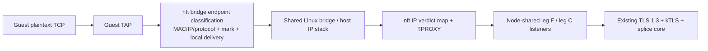
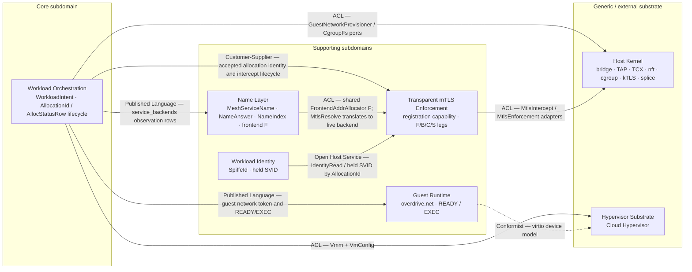

# Feature Delta — `netns-density-295`

**Feature ID:** `netns-density-295`
**Wave:** DESIGN — stages 1–3, full-stack architecture
**Interaction mode:** Propose
**Status:** **Stage 1 accepted — approved by system design review iteration 5
on 2026-09-16 after user ratification of all stage-1 system choices. Stage 2
DDD is accepted — approved by DDD review iteration 2 on 2026-09-16 as a bounded
no-new-decision analysis. It introduces no new material choice requiring
ratification and does not alter any accepted stage-1 contract. D-295-7 and
D-295-9 remain unchanged accepted-contract constraints, not new material
decisions. These upstream stages alone did not authorize DELIVER.**
**Stage 3 application/solution architecture review iterations 1–3 returned ten
bounded findings. F-01 through F-04, S2-F01 through S2-F04, and I3-F01/I3-F02 are
remediated under the user's explicit 2026-09-16 authorization to proceed with
each recommended contract. Iteration 2 pins fresh-process target recovery,
removes competing constructor signatures, completes Contract Shape universes,
and corrects ADR-0090's live substrate evidence. Iteration 3 makes rollback
errors source-honest and removes Exec/process from ADR-0090's operative
contract. It adds no behavior or scope beyond the accepted stage-1 contracts
and accepted stage-2 no-new-domain-boundary conclusion. **Stage 3 is accepted
— approved by independent solution-architecture review iteration 4 on
2026-09-16 with no critical, high, or medium findings. Full DESIGN architecture
is accepted; there is still no DELIVER authority.**
**Documentation density:** `lean` (`expansion_prompt=ask-intelligent`,
`provenance=explicit_override`). Only Tier-1 `[REF]` sections are emitted in
this feature delta. The Level-3 SSOT diagram is the solution-architect role's
mandatory view for this complex subsystem, not a Tier-2 feature-delta
expansion. No density telemetry has been emitted because the wave-end expansion
choice has not happened.

## Wave: DESIGN / [REF] Prior-wave Consultation

- ✓ `AGENTS.md`, `CLAUDE.md`, and all mandatory `.claude/rules/*.md` named by
  `AGENTS.md`
- ✓ `docs/product/architecture/brief.md`
- ✓ `docs/product/architecture/c4-diagrams.md`
- ✓ all 120 pre-feature `docs/product/architecture/adr-*.md` records
  inventoried; the active network, VM, identity, lifecycle, and Exec-removal
  decisions were consulted in full before adding the twelve #295 ADRs
- ✓ relevant product artifacts: `docs/product/vision.md`,
  `docs/product/jobs.yaml`, `docs/product/outcomes/registry.yaml`,
  `docs/product/journeys/run-a-vm-workload.yaml`,
  `enforce-transparent-mtls-on-the-wire.yaml`,
  `dial-a-mesh-peer-by-name.yaml`, `hold-identity-for-the-running-set.yaml`,
  `issue-workload-identity.yaml`, and `submit-a-service.yaml`
- ⊘ `docs/feature/netns-density-295/discuss/wave-decisions.md` (not found)
- ⊘ `docs/feature/netns-density-295/discuss/user-stories.md` (not found)
- ⊘ `docs/feature/netns-density-295/discuss/story-map.md` (not found)
- ⊘ `docs/feature/netns-density-295/discuss/outcome-kpis.md` (not found)
- ✓ `docs/feature/netns-density-295/spike/findings.md`
- ✓ `docs/feature/netns-density-295/spike/wave-decisions.md`
- ✓ Part-C scratch source and retained evidence at
  `spike-scratch/increment-w-part-c-tcx-netns-density-295-20260916T014247Z/`
  (evidence commit `7a00464969e98fe00764e0ab707428e8cd82a026`)
- ✓ Part-D shared-listener source and retained evidence at
  `spike-scratch/increment-x-part-d-shared-listeners-netns-density-295-20260916T101440Z/`
  (executed against source commit
  `7a00464969e98fe00764e0ab707428e8cd82a026`)
- ✓ user-supplied Cilium checkout `/Users/marcus/git/cilium/cilium` at
  `e99150f8d8f403eca51ed82138d4ae20a265c8f3` for TCX link lifecycle,
  endpoint map ownership/fail-closed behavior, and userspace DNS separation
- ✓ GH #295 body, full comments, and JSON
- ✓ GH #293 body, full comments, and JSON; production HEAD is rebased over
  `Remove legacy Exec workload driver (#297)` and no live Exec compatibility
  branch remains

GH #295 plus its full comment thread and the two spike artifacts are the
authorized DISCUSS-equivalent input. The missing DISCUSS files are therefore a
recorded warning, not a scope gap.

Contradiction check: no unresolved requirement contradiction. This proposal
explicitly supersedes only the obsolete mechanism clauses in ADR-0071,
ADR-0072, ADR-0088, ADR-0089, and ADR-0098. It preserves ADR-0067/0069/0070's
identity and zero-copy enforcement contracts, ADR-0081/0082/0083's VM and
cgroup ownership, ADR-0090/0101's guest-address health/backend facts, and
ADR-0110 through ADR-0113's microVM-only single cut. The feature is strictly
single-node. Cross-host routing is outside this proposal and tracked separately
by [GH #298](https://github.com/overdrive-sh/overdrive/issues/298); no routing
shape is prescribed here. Heterogeneous per-node guest-network capacity is also
outside #295 and tracked by
[GH #299](https://github.com/overdrive-sh/overdrive/issues/299); #295 adds no
public, wire, or persisted `network_ports` resource.
Connection-pump concurrency scaling is outside #295 and tracked by
[GH #300](https://github.com/overdrive-sh/overdrive/issues/300); #295 preserves
the current TLS 1.3/kTLS/splice enforcement implementation and makes no
concurrent-flow capacity claim.

## Wave: DESIGN / [REF] Evidence Classification

| Class | Evidence that may be relied on | What it does not prove |
|---|---|---|
| **Current production fact** | HEAD is rebased over origin/main's Exec-removal merge. The live action shim still assigns `NetSlot`, derives `WorkloadNetnsPlan` + `VmTapPlan`, injects `netns`/`host_veth`/guest fields, and tears down by slot. `VmNetworkAttachment` still contains `netns`; `CloudHypervisorVmm` still launches through `ip netns exec`. `MtlsIntercept::install_outbound` still keys on `host_veth`. `DnsResponder` still takes `NetSlotAllocator`. `MtlsInterceptWorker` still starts two `spawn_blocking` accept loops per allocation. | These facts describe the mechanism to replace; their existence is not a reason to preserve it. Historical source/test comments naming `ExecDriver` are not a live compatibility branch. |
| **Accepted contract fact** | Running follows guest READY + durable row; mTLS install then gates guest EXEC release. `workload_addr` is the observed backend/probe address. Platform-held SVIDs, `ServiceBackendsResolve`, TLS 1.3, kTLS TX/RX, splice, and per-VM cgroups have accepted owners. | An accepted contract does not select the new switch/classifier or move lifecycle gates. |
| **Spike-proven feasibility** | Parts A/B prove the shared bridge, shared DNS, production identity/resolver/`HostMtlsEnforcement`/cgroups, TLS 1.3 kTLS TX/RX, 14 splice calls, and no final-path netns/veth/slot dependency. Part C proves real aya-rs SCHED_CLS through TCX ingress on both TAPs, endpoint source validation, map-miss/spoof/direct-bypass drops, bridge-local delivery, pin survival/adoption/removal, and the same production zero-copy/cgroup path. Part D proves one node-shared leg-F listener plus one node-shared leg-C listener across two real microVM allocations, immutable pre-enforcement capability capture, exact-membership claim, successor selection, unknown/stale/post-removal rejection, and allocation-scoped drain of already-published handles while unrelated handles/listeners remain live. | Part D did **not** hold a real enforcement call across retirement and then execute the publish/teardown branch; its reuse self-test removed membership after claim but never called enforcement/publish with that held claim. No 16k/32k/100k end-to-end scale, connection-flood behavior, long-run listener performance, pinned-6.18 verifier baseline, deliberate TCX-detach guard, or production implementation is proved. Cross-host is outside #295. |
| **Accepted by system design review iteration 5 on 2026-09-16** | D-295-1 through D-295-6, A2, B1, C1 as amended by PORT-295-C, C-295-E, F1, ERR-295-A, GEN-295-A, CAP-295-A, and RUN-295-B. | System-design acceptance is not DELIVER authority. |
| **Unchanged accepted-contract constraints** | D-295-7 preserves cgroup, identity, resolver, enforcement, lifecycle, and recovery owners. D-295-9 preserves Service selection, atomic membership, and selected-`BackendId` identity receipt. | These are non-regression constraints, not fresh #295 decisions or new ADRs. |

## Wave: DESIGN / [REF] Requirements, Quality Attributes, and Capacity

### Functional requirements

1. Every running microVM receives one host-netns TAP, one IPv4 address, and one
   MAC on one node-local shared Linux bridge. The production path contains no
   per-workload netns, veth pair, transit/guest `/30`, `NetSlot`, or
   `host_veth` dependency.
2. In healthy state and under any single owned-component loss, guest-originated
   TCP is caught or dropped at the source TAP before ordinary bridge
   forwarding. Mesh TCP follows the existing leg-F → leg-B / leg-C → leg-S
   proxy; the peer-facing leg performs a real TLS 1.3 handshake, arms kTLS
   TX/RX, and moves steady-state bytes with kernel `splice(2)`. Guests remain
   credential-free plaintext endpoints.
3. One in-agent DNS responder answers on the shared bridge gateway. The guest
   kernel token continues to carry address, prefix, gateway, and DNS; no host
   `/etc/netns/*/resolv.conf` exists.
4. One owner provisions and tears down the address lease, TAP, bridge
   membership, classifier membership, and host route effects around the VMM.
   Per-VM cgroup v2 ownership, CPU weight, reserve-padded `memory.max`, VMM PID,
   OOM attribution, total teardown, and boot reclamation remain unchanged.
5. The existing Service dataplane continues to own backend selection and
   atomic membership updates. A public-ingress gateway remains behind
   `GatewayConnectDataplane` / `GatewayClientMtls`; it does not select backends
   in userspace and does not lose the selected `BackendId` → SPIFFE receipt.
6. Exactly one node-owned leg-F listener and one node-owned leg-C listener serve
   every allocation. Accept resolves and freezes the exact active allocation,
   generation, and SPIFFE identity before enforcement; allocation stop drains
   only that capability's enforced handles and leaves both listeners alive.

Cross-host routing is out of #295 scope and undecided;
[GH #298](https://github.com/overdrive-sh/overdrive/issues/298) tracks that
separate design. Heterogeneous schedulable guest-network capacity is out of
#295 scope and tracked by
[GH #299](https://github.com/overdrive-sh/overdrive/issues/299). Nothing here
prescribes either contract.

### Ranked quality attributes

| Rank | Attribute | Required response |
|---:|---|---|
| 1 | Security / confidentiality | Healthy operation and any single owned classifier/guard/listener/map/route loss catch or drop TCP. Accepted downside: arbitrary near-simultaneous external deletion of both a TAP's TCX entrypoint and the independent bridge guard can expose ordinary forwarding for at most the one-second audit window before TAP quiescence. |
| 2 | Performance efficiency | O(1)-expected ifindex endpoint-map lookup at TCX ingress; no per-packet userspace proxy, AF_XDP, or ring-buffer forwarding; existing kTLS/splice core remains the steady-state path. |
| 3 | Capacity | Initial measured contract is 16,384 simultaneous guest network attachments under the exact T1 profiles below, not a VMM/resource or connection-capacity claim. |
| 4 | Reliability / recoverability | Teardown is effect-first and lease-release-last; boot reclaims VMMs before sweeping old TAP/rule state. |
| 5 | Maintainability | Delete netns/veth/slot/setns surface; extend existing netlink, DNS, mTLS, identity, cgroup, and lifecycle owners. No new daemon or crate. |
| 6 | Testability / Earned Trust | Real startup probe for the shared-switch catch point; existing probes reused where they already establish the claimed substrate. |

### Attachment-capacity contract and non-contractual connection limitation

CAP-295-A makes T1 an attachment-only contract. Let `N` be live guest network
attachments, `P_i` the unbounded valid TCP-listener count for attachment `i`,
and `M = ΣP_i` (uniform profile shorthand `M=N×P`). PORT-295-C makes IP nft
rule cardinality constant: eight node-global IP rules plus the three bridge-guard
rules, independent of `N` and `M`. Dynamic kernel state is one managed-guest IP
element and one outbound-source IP element per attachment plus one inbound
`(IPv4Addr, NonZeroU16)` element per valid TCP listener.

| Target | Attachment state | Shared interception state | Disposition |
|---|---|---|---|
| **T1 — N=16,384 (contract)** | 16,384 TAP/FDB entries, TCX links, endpoint-map entries, guard members, and address leases; two listener FDs/tasks | **11 total #295 nft rules** (8 IP + 3 bridge); N managed-IP + N outbound + M inbound elements; userspace registry has N source records + N destination-IP records holding M allowed ports | Completion measures this attachment/set/registry/recovery envelope. It makes no concurrent-flow, `EnforcedConnection`, throughput, `RLIMIT_NOFILE`, `pids.max`, `threads-max`, or pump-stack promise. |
| T2 — N=32,768 (rejected) | 32,768 attachment effects | Same 11 rules; IP `2N+M` elements plus bridge `managed_taps=N` | A `/16` has 65,533 usable addresses; full predecessor/successor overlap requires 65,536 and is short by 3. |
| T3 — N=100,000 (rejected) | Requires `/15`, larger endpoint map, and ~100k VMM processes | Same 11 rules; IP `2N+M` elements plus bridge `managed_taps=N` | Not the #295 contract; neither attachment resources nor VMM capacity are proved. |

Logical nft key payload is `8N + 6M` bytes before kernel set overhead. Intercept
start/stop adds/deletes `2 + P_i` IP elements; a full stale-state sweep processes
`2N + M` elements. No listener bound is added: every valid
Service TCP port remains admissible, and capacity observations must report N,
M, element bytes, and element-update/sweep rates rather than assume `P=1`.

That formula is **IP-family only**. The bridge-family `managed_taps` ifname set
adds N separate elements. With the approved 11-byte `ovd-tp-<4hex>` names its
logical key payload is `11N` bytes before kernel overhead, one insert/delete per
attachment, and N additional sweep elements. Across all three IP sets plus
`managed_taps`, full element inventory/sweep is `3N + M`.

T1 is reproducible through two required measurement receipts; neither restricts
valid product input above the measured M:

| Receipt | Exact workload distribution | N / M | Exact element inventory | Required measurements |
|---|---|---:|---|---|
| **T1-BASE** | 16,384 Job-shaped allocation network attachments through the production owner; no VMM population and no Service TCP listeners | 16,384 / 0 | IP `2N+M=32,768`; bridge `N=16,384`; total 49,152. Logical keys: 128 KiB IP + 176 KiB bridge. | Successful attach/read-back; kernel memory delta for every map/set/link/FDB; full-population insert/delete elements/s; one outbound-hit packet per source plus 256 deterministic missing-source probes; lookup packets/s and exact counters; full `3N+M` sweep wall time and empty complement. |
| **T1-PORT4** | 16,384 Service-shaped allocation network attachments through the production owner, each with TCP ports 8080, 8081, 8443, and 9000; no VMM population | 16,384 / 65,536 | IP `2N+M=98,304`; bridge `N=16,384`; total 114,688. Logical keys: 512 KiB IP + 176 KiB bridge. | Same memory/update/sweep measurements; one hit for all four ports and one 9001 miss for every destination (81,920 lookup packets), exact counters and packets/s; full sweep/read-back complement. |

Any valid distribution with `M > 65,536` remains supported product semantics but
is outside #295's measured capacity receipt. Results must always report the
actual N, M, port distribution, kernel version, and substrate limits.

Part C measured a 20-byte endpoint value in a preallocated 16-entry hash map at
3,840 bytes memlock: 240 bytes per configured maximum entry on that kernel, so
65,536 entries extrapolate to exactly 15 MiB before kernel/version variance.
The program measured 4,096 bytes and the eight-slot counter map 368 bytes.
Per-link kernel/bpffs memory remains unmeasured. The 7.624/7.943 ms attach+pin
observations average 7.7835 ms, or about **127.5 s** for 16,384 serial cold
attaches; this is an extrapolation, not a benchmark.

The prior 60 s recovery value is unsupported and is no longer stated as a
fact. Recovering T1 inside 60 s would require at least **273 complete allocation
cleanups/s**, plus `(3N+M)/60` set-element removals/s, VMM/cgroup/TAP/TCX/map
work, and atomic registry cleanup. Those are attachment-recovery measurements,
not concurrent-connection requirements.

Part D's exact T1 listener/task/FD cardinalities were 2/2/2 for the node-shared
shape and 32,768/32,768/32,768 for async per-allocation. Both processes built a
32,768-entry registry first. Shared registry RSS was 1,440 KiB and the shared
listener/task layer added 316 KiB; listener setup was 0.042 ms. The rejected
per-allocation listener/task layer added 29,484 KiB and setup was 405.335 ms.
Counts are structural; RSS and timings are one-run point observations, and the
compact scratch registry is a lower bound for the final typed capability index.
Connection file descriptors are load-dependent and are intentionally separate
from these listener counts.

Current connection cost remains an explicit limitation, not a #295 gate:
`HostMtlsEnforcement` owns **6 FDs + 2 native pump threads per handle**, and a
same-node application flow creates outbound plus inbound handles. The withdrawn
four-flows-per-guest illustration would therefore produce 131,072 handles,
786,432 FDs, 262,144 pump threads, ~512 GiB default user-stack virtual address
reservation, and ~4 GiB kernel stack at a 16 KiB illustration. #295 neither
promises nor tests that population and leaves the production pump mechanism
unchanged. Scaling it is tracked exclusively by
[GH #300](https://github.com/overdrive-sh/overdrive/issues/300).

## Wave: DESIGN / [REF] Infrastructure Options and Recommendation

### Option A — shared bridge + per-TAP TCX/SCHED_CLS + minimal nft guard + IP TPROXY (approved direction)

```mermaid
flowchart LR
    GA[Guest A plaintext TCP] --> TA[TAP A]
    TA --> TCX[TCX ingress SCHED_CLS\nifindex map + MAC/IP validation]
    TCX -->|accepted 0x295b or intercept 0x295a| GUARD[bridge nft proof-mark guard]
    GUARD -->|0x295a preserved| IP[Host IP prerouting TPROXY]
    GUARD -->|0x295b cleared| BR[ordinary bridge/host delivery]
    IP --> LF[One node-shared leg F]
    LF --> FCAP[Validated source + orig-dst\nimmutable allocation capability]
    FCAP --> CORE[Existing HostMtlsEnforcement\nrustls TLS 1.3 -> kTLS TX/RX -> splice]
    CORE -->|leg B, TLS records| IC[Destination IP/output TPROXY]
    IC --> LC[One node-shared leg C]
    LC --> CCAP[Recovered destination\nimmutable allocation capability]
    CCAP --> CORE2[Existing inbound kTLS/splice]
    CORE2 --> LS[Marked leg S]
    LS --> TB[TAP B]
    BR -->|UDP :53| DNS[userspace DnsResponder on shared bridge gateway]
```



- **Structure:** one shared aya-rs SCHED_CLS program attaches with TCX ingress
  to each TAP. Its ifindex map validates registration, source MAC, and source
  IPv4/ARP identity. Valid TCP is marked \`0x295a\`, bridge-MAC rewritten, made
  \`PACKET_HOST\`, and delivered to existing IP TPROXY. Valid gateway/ARP traffic
  is marked \`0x295b\`. The minimum bridge guard matches only registered managed
  TAPs: \`0x295a\` passes unchanged, \`0x295b\` is cleared and passes, anything else
  drops. It does not repeat endpoint classification.
- **Failure modes:** map miss/spoof/malformed/direct bypass drops in TCX; a
  detached/missing link produces no proof mark and drops at the bridge guard;
  stale/missing TPROXY entries retain the existing mark-before-TPROXY
  fail-closed local-route behavior. Unknown source/destination capability,
  inactive generation, and retirement during enforcement close or teardown
  before publication. Attach/pin/query, nft-guard, listener, or capability
  registration failure rejects use before EXEC release.
  A simultaneous external deletion of both TCX and the bridge guard is outside
  the single-owned-fault guarantee and may forward until the <=1 s RUN-295-B
  audit detects it and downs managed TAPs.
- **Operational cost:** one program, one 65,536-entry endpoint map, one small
  counter map, one pinned TCX link per TAP, one managed-TAP nft set and three
  bridge rules; three shared IP sets and eight IP rules; N source records plus N
  destination records containing M allowed ports; and exactly two listener
  FDs/tasks. Part C
  measured 296 verified instructions, 4,096-byte program memlock, 4,208-byte
  bounded-probe map memlock, ~7.6–7.9 ms attach/pin, and ~50.8 ms load/verifier.
- **Zero-copy implication:** classification stays in kernel; the data session
  continues through the production TLS 1.3 + kTLS + splice core. TCX is not a
  mirror and sends no payload through a ring buffer/userspace forwarding loop.
- **Gateway path:** the gateway's host socket still enters the existing cgroup
  BPF Service selection path. BPF returns the selected `BackendId`; the applied
  backend address then hits the output-hook inbound companion and destination
  leg C. Existing Path-A demand teaching is retained until the gateway design
  explicitly supersedes it; selection does not move into the gateway.

### Option B — full nftables bridge classification + IP TPROXY



- **Structure:** this rejected alternative would expand Part A's bridge-local
  delivery transform into the endpoint classifier using nft sets/maps/rules.
- **Failure modes:** nft would own both endpoint identity validation and socket
  delivery. Linear per-TAP rules do not scale, while the proposed set/vmap path
  has no Part-C-equivalent scale or spoof-counter evidence.
- **Operational cost:** no verifier/TCX links, but a broader nft classifier and
  its own endpoint-state/counter lifecycle. This is rejected, not installed in
  parallel beside TCX.
- **Zero-copy implication:** classification is in kernel and the existing
  kTLS/splice core remains zero-copy.
- **Gateway path:** unchanged from Option A after BPF Service selection.

### Option C — vhost-user userspace vswitch


- **Structure:** replace TAP/bridge switching with a vhost-user endpoint and a
  userspace switch such as a DPDK/VPP-class datapath.
- **Failure modes:** switch process crash, shared-memory/queue exhaustion,
  vhost-user reconnect ordering, a second lifecycle/upgrade authority, and a
  new path for direct-bypass or plaintext mishandling.
- **Operational cost:** new daemon/process, hugepage/queue/CPU-pinning policy,
  independent observability and recovery, and an extra kernel-injection bridge
  to reach the existing socket/kTLS proxy.
- **Zero-copy implication:** every guest packet enters a userspace switching
  datapath before the existing kernel socket path. That conflicts with the
  current requirement to avoid a userspace packet-proxy datapath and has no
  measured need at T1.
- **Gateway path:** backend selection/receipt would need a new integration with
  the switch, increasing the risk that selection drifts out of the existing BPF
  owner.

**Accepted direction — Option A; user-approved and approved by system design
review iteration 5 on 2026-09-16.** Part C gives it real-metal classifier, negative-security,
pin/adoption, production-core, and cleanup evidence. nftables remains necessary
for IP TPROXY/output and the three-rule attachment safeguard, but full nft
endpoint classification (Option B) is rejected rather than installed as a
competing classifier. Option C remains rejected.

## Wave: DESIGN / [REF] DDD List

**DDD status: Accepted — approved by DDD review iteration 2 on 2026-09-16.**

### Stage-2 bounded conclusion

**No material independently decidable DDD choice is required.** #295 changes
the host dataplane, network-effect ownership, and the narrow pre-EXEC
interception gate around the existing physical `AllocationId`. It does not
change what a workload, Service, allocation, SVID, selected backend, Running
row, or Service Stable state means. It therefore creates no new bounded
context, aggregate, repository, domain event, persistence boundary,
workload/allocation lifecycle state, workflow, Event Sourcing model, or CQRS
split.

This conclusion is descriptive rather than a new architectural decision. It
does not reopen the accepted system choices below and adds no public API. The
exact stage-1 public and internal contract shapes remain exclusively in their
existing sections of this feature delta.

The DDD boundary also preserves the approved scope exclusions: cross-host
routing remains with GH #298, heterogeneous per-node guest-network capacity
with GH #299, and concurrent-flow pump scaling with GH #300. None becomes a
domain model, aggregate field, or repository in #295. Per-VM cgroup ownership
and the existing TLS 1.3/kTLS/splice enforcement model remain unchanged.

### Observed production model versus accepted proposal

| Evidence class | Domain reading |
|---|---|
| **Observed production fact** | `WorkloadIntent::{Job,Service,Schedule}` is the durable workload-intent aggregate. `Allocation { id, workload_id, node_id }` exists as an intent-side model, but current production has no live construction or persistence path for it. Live physical-execution identity is the `AllocationId` carried by `Action::StartAllocation` / `Action::RestartAllocation`; lifecycle facts are observed and persisted at that identity through `AllocStatusRow`, including `workload_addr`. `AllocationSpec` is a transient driver handoff. The current host mechanism derives `NetSlot`, netns/veth/TAP plans and per-allocation mTLS listeners around that live identity. |
| **Accepted #295 proposal** | Keep `WorkloadIntent`, the intent-side `Allocation` model, live `AllocationId` action identity, `AllocStatusRow`, `SpiffeId`, Service listener intent, `BackendId` selection receipt, lifecycle meanings, `workload_addr`, and their owners unchanged. Replace only the transient guest-network handoff and the host effects surrounding it. |
| **DDD consequence** | The topology replacement does not create a second workload or allocation model. `GuestNetworkAssignment`, `GuestNetworkPlan`, address-pool entries, endpoint facts, listener capabilities, and TAP/MAC/generation/TCX/listener/nft state remain subordinate transient values/entities inside existing application and enforcement boundaries. |

### Subdomains, bounded contexts, and context map

No new bounded context is introduced. The feature crosses existing contexts
and external substrates:

| Existing context / substrate | Classification | #295 responsibility |
|---|---|---|
| **Workload Orchestration** | Core subdomain | Retains workload intent, live `AllocationId` lifecycle identity, fixed-cap admission, lifecycle ordering, accepted Running-row ownership, and the narrow guest-command-release gate. |
| **Transparent mTLS Enforcement** | Supporting subdomain | Retains the leg-F/leg-B/leg-C/leg-S model and consumes identity. #295 changes listener cardinality and registration ownership without changing TLS 1.3, kTLS TX/RX, or splice semantics. |
| **Name Layer** | Existing supporting reader bounded context | Retains `MeshServiceName`, `NameAnswer`, `NameIndex`, and the stable frontend-address concept owned by `FrontendAddrAllocator`. It reads the existing `service_backends` observation surface and meets enforcement at the re-keyed `MtlsResolve` frontend-to-backend translation seam. #295 only re-homes the `DnsResponder` socket to the shared gateway and supervises its task. |
| **Workload Identity** | Supporting security subdomain | Continues to own platform-held SVID material and the `SpiffeId` vocabulary. Guests remain identity-unaware and hold no credential material. |
| **Guest Runtime** | Supporting subdomain | Continues to consume the published guest-network token and READY/EXEC protocol. No workload netns/veth concept enters the guest language. |
| **Host Kernel / Hypervisor Substrate** | Generic external substrate | Supplies bridge, TAP, TCX, nftables, cgroup v2, kTLS, splice, and Cloud Hypervisor effects behind existing adapter/port boundaries. |



The map records existing relationship patterns; it creates no team,
deployment, protocol, or ownership boundary. The node shared-switch owner is
not a bounded context: it has no independently evolving domain language or
business lifecycle and exists solely to translate accepted allocation/network
facts into host-kernel effects. Likewise, the existing cgroup-BPF Service
dataplane remains backend-selection owner; the shared switch gains no Service
routing model. The Name Layer remains D-DBN-1's sibling reader over
`service_backends`; #295 changes only the shared-gateway `DnsResponder` socket
composition and task supervision. It does not change `MeshServiceName`,
`NameAnswer`, `NameIndex`, `FrontendAddrAllocator`, stable-frontend ownership,
or the `MtlsResolve` translation contract.

### Tactical classification

| Concept | Classification | Boundary and invariant |
|---|---|---|
| `WorkloadIntent` / `Job` / `Service` | Existing aggregate root and variants — unchanged | Continues to own declared workload intent, including Service listeners. #295 adds no field or behavior to the aggregate. |
| `Allocation` | Existing intent-side aggregate model — empty #295 delta | The type records `{ id, workload_id, node_id }`, but current production has no live construction/persistence path for it. #295 neither activates nor changes that model. |
| `AllocationId` + `AllocStatusRow` | Current live execution identity and persisted observation surface — unchanged | Start/restart actions carry the exact physical `AllocationId`; `AllocStatusRow` persists the lifecycle state and `workload_addr` at that identity. Lifecycle meanings do not move, and TAP/MAC/generation/TCX/listener/nft state remains transient. |
| `GuestNetworkAssignment` | Transient value object — accepted stage-1 shape | Its six attributes (`address`, `tap`, `mac`, `gateway`, `prefix`, `dns`) are one all-or-none driver handoff. It has structural equality, no independent identity, and no persistence. |
| `GuestNetworkPlan` | Internal orchestration value object — accepted stage-1 shape | Adds allocation, bridge, and node-prefix ownership context around one `GuestNetworkAssignment`; it is not a public domain type or aggregate. |
| Guest address lease | Internal technical resource binding, not a new aggregate/entity type | One pool entry binds an existing `AllocationId` to one plan. The pool's single mutex makes unique assignment, smallest-free selection, idempotent re-entry, release, and ordered snapshot one technical consistency boundary. It is not a repository and is not persisted. |
| Transparent-mTLS registration capability | Ephemeral entity inside the existing enforcement context | Identity is the exact `(AllocationId, node-session generation, SpiffeId)` triple. Pending/Active/Retiring/removed and in-flight/published-handle membership are serialized by the node listener owner's existing single lock. It is not an aggregate root, durable entity, or new public type. |
| `GuestEndpointFact`, `GuestNetworkFact`, `DestinationRegistration` | Value/fact projections | They describe read-back, typed failure evidence, or one active destination membership. They own no lifecycle outside their technical owner. |
| Shared-switch owner, `GuestNetworkProvisioner`, listener owner, runtime supervisor | Application/infrastructure services, not domain services | They coordinate kernel effects and lifecycle gates already assigned by stage 1; none introduces cross-aggregate business logic. |

No repository is added. In particular, `GuestAddressPool` is the owner of
live process state, not a persistence abstraction over leases; boot reclamation
and stale-effect sweep intentionally start the new owner empty.

### Aggregate bounded-change declaration

Because #295 creates no aggregate, it creates no new aggregate command universe.
For the existing aggregate roots it touches indirectly, the declared delta is
empty:

| Existing aggregate | Full observable state | #295 declared delta | Complement equality |
|---|---|---|---|
| `WorkloadIntent` | The complete persisted `Job` / `Service` / `Schedule` V1 payload, including driver, resources, listeners, and probes | None | Before and after archived intent bytes remain equal. TCP-port projection reads `ServiceV1::listeners`; it does not rewrite intent. |
| `Allocation` | `{ id, workload_id, node_id }` on the existing intent-side model; no current live construction/persistence path | None | All three fields remain equal; #295 must not activate a new persistence path or place guest address, TAP, MAC, generation, TCX state, listener state, or nft state in this model. |

The technical state owners still have explicit mutation complements, but those
are infrastructure invariants rather than new DDD aggregates:

- address `assign` may add exactly one `AllocationId -> GuestNetworkPlan`
  binding or return the byte-equal existing binding; it changes no other
  binding;
- address `release` may remove only the named allocation binding; absent
  release changes nothing;
- capability registration may add only its exact source/destination indexes,
  generation state, and set-element guards; conflicting live keys change
  nothing;
- capability retirement removes only its exact indexes, waits for only its
  in-flight claims, and drains only its published handles; unrelated
  capabilities and both node listeners are complement-equal; and
- shared-switch/intercept cleanup changes only effects owned by the named
  allocation. `WorkloadIntent`, the intent-side `Allocation` model, live
  `AllocationId`, `AllocStatusRow` lifecycle meanings and `workload_addr`,
  Service selection, SVID ownership, per-VM cgroup ownership, and unrelated
  allocations remain unchanged.

### Domain events, services, repositories, and ES/CQRS

- **Domain events:** none added. The structured
  `guest_network.shared_owner_*` records are operational health/evidence events,
  not a domain event stream. Existing lifecycle observation rows retain their
  accepted meaning.
- **Domain services:** none added. Provision, converge, audit, enforce, and
  teardown are application/infrastructure services over existing identities.
- **Repositories:** none added. No lease, capability, endpoint, rule, or
  recovery repository is authorized.
- **Event Sourcing:** rejected as inapplicable. The live kernel/registry state
  is convergent technical state; replay history has no business value and boot
  intentionally reclaims rather than adopts prior capabilities.
- **CQRS:** rejected as inapplicable. Existing intent and observation models
  remain separate for their already-accepted consistency reasons; #295 creates
  no new write model, projection family, or query workload that warrants a new
  CQRS split.

### Ubiquitous language additions and exclusions

| Term | Exact meaning | Explicit exclusion |
|---|---|---|
| **Guest network attachment** | One allocation's live lease + host TAP + bridge membership + endpoint entry + TCX link/pin + guard membership + registration facts. | Not a VMM, workload, netns, veth pair, concurrent flow, or `EnforcedConnection`. |
| **Guest address lease** | The process-held `AllocationId -> GuestNetworkPlan` binding owned until effect-first teardown completes. | Not a `NetSlot`, durable IPAM row, or schedulable public resource. |
| **Shared guest switch** | The node-owned bridge, fixed bridge MAC/gateway, endpoint/counter maps, per-TAP TCX links/pins, and three-rule proof-mark guard. | Not the existing XDP/cgroup-BPF Service dataplane and not a backend selector. |
| **Managed TAP** | A host-netns TAP currently registered in the switch owner's guard/map/link inventory. | Not a per-workload network namespace or veth endpoint. |
| **Proof mark** | TCX-authored `0x295a` intercept or `0x295b` accepted evidence consumed by the bridge guard. | Not workload identity, policy verdict, or selected backend identity. |
| **Registration capability** | Immutable `(AllocationId, node-session generation, SpiffeId)` captured once for one accepted connection. | Not address identity alone and never re-resolved onto an address-reuse successor. |
| **Node-session generation** | Non-zero process-session counter owned by the node listener registry. | Not workload desired generation, restart count, allocation identity, or persisted epoch. |
| **Attachment capacity** | Simultaneous guest-network attachment population N under CAP-295-A. | Not VMM capacity, concurrent-flow capacity, throughput, FD/pump-thread/stack capacity, or connection population. |
| **Release-last** | Release the guest address only after the predecessor's enforcement, nft, endpoint, TCX, TAP, and guard effects are gone. | Not release-on-Running-row change or release-before-handle drain. |

The existing leg vocabulary is unchanged: leg F is workload-facing plaintext,
leg B is peer-facing outbound TLS, leg C is peer-facing inbound TLS, and leg S
is server-workload-facing plaintext. #295 changes ownership/cardinality around
those legs, not their meaning.

### Accepted stage-1 constraints entering DDD unchanged

Every selected item below is **user-approved and accepted by system design
review iteration 5 on 2026-09-16**, except D-295-7 and D-295-9, which are
pre-existing accepted-contract constraints and require no fresh decision.

- **D-295-1 — shared node-local switch (USER-APPROVED):** one Linux bridge and
  one node-owned guest prefix replace per-workload netns/veth/two-`/30` cells.
- **D-295-2 — TCX endpoint classification (ACCEPTED 2026-09-16):** one aya-rs SCHED_CLS program attaches through
  TCX ingress per managed TAP. nftables retains IP TPROXY/output and only the
  registered-TAP/proof-mark guard; it does not duplicate endpoint
  classification.
- **D-295-3 + CAP-295-A — measured T1 attachment contract (USER-APPROVED):**
  demonstrate 16,384 simultaneous guest network attachments. Concurrent flows,
  enforcement handles, throughput, and pump resources are uncontracted in #295
  and tracked by GH #300.
- **D-295-4 + C-295-E — address/identity owner (USER-APPROVED):** one internal
  pool owns a guest IPv4 lease by allocation and exposes exactly `assign`,
  `release`, and `snapshot`. Reserve network, broadcast, and gateway; derive TAP
  name from the 16-bit host offset (`ovd-tp-<4hex>`) and MAC as
  `02:00:<IPv4 octets>`. `workload_addr` remains the persisted observed address;
  `NetSlot` is deleted rather than renamed.
- **D-295-5 + GEN-295-A — node-shared listeners (ACCEPTED 2026-09-16):** one node-owned leg-F and one node-owned leg-C listener serve
  all allocations. Accept captures an immutable
  `(AllocationId, generation, SpiffeId)` capability, claims the exact active
  node-session generation before enforcement, and publishes the returned handle only while
  that same generation remains active. Allocation stop drains only its handles;
  shared listeners survive. Address reuse is remove-before-reassign.
- **D-295-6 — DNS (ACCEPTED 2026-09-16):**
  one userspace `DnsResponder` on the shared gateway; wildcard bind first and
  exactly-one-gateway fallback. Preserve `NameIndex`, `FrontendAddrAllocator`,
  variable-length wire semantics, `IP_PKTINFO`, source pinning, and the existing
  A/NODATA/NXDOMAIN contract. DNS synthesis does not move into eBPF.
- **D-295-7 — UNCHANGED/UNAFFECTED accepted-contract constraint:** preserve
  `IdentityMgr`, `RcgenCa`, `ServiceBackendsResolve`, `HostMtlsEnforcement`,
  per-VM cgroups, VM reclamation, probe targeting via `workload_addr`, and
  allocation identity. This is non-regression scope, not a new #295 decision.
- **D-295-9 — UNCHANGED/UNAFFECTED accepted-contract constraint:** cgroup BPF
  remains backend-selection and atomic-membership owner; the selected
  `BackendId` receipt remains the source of exact peer identity;
  gateway-to-workload TLS terminates at the selected node's leg C. The public
  Route/TLS/HTTP contract does not change. This is non-regression scope, not a
  new #295 decision.

## Wave: DESIGN / [REF] Infrastructure Component Decomposition

| Component / owner | Home | Proposed change | Responsibility |
|---|---|---|---|
| Node shared guest switch | `overdrive-control-plane` + `overdrive-netlink` + existing BPF crates | **CREATE NEW internal owner; EXTEND existing crates — ACCEPTED** | Converge/probe bridge identity, fixed MAC, gateway/prefix, TAPs, TCX maps/links, endpoint bridge-MAC equality, managed-TAP guard, runtime repair, and boot sweep. |
| Guest address pool | `overdrive-control-plane` | **CREATE NEW internal value/owner — ERR-295-A approved** | One internal allocation-keyed pool owns the guest IP/TAP/MAC lease over the node prefix through exactly `assign`, `release`, and `snapshot`; typed exhaustion is `GuestNetworkError::PoolExhausted`. |
| `GuestNetworkProvisioner` | `action_shim` / current network-provisioner seam | **EXTEND and rename — ERR-295-A + F-02 approved** | B1 replaces the old sync/netns seam with one async `#[doc(hidden)] pub` port, one public opaque/read-only `GuestNetworkPlan`, and one public operation-family error. Host construction/implementation stays private; the cross-crate visibility exists only for the sibling sim adapter and exact test-gated production-owner seams. |
| `AllocationSpec` network handoff | `overdrive-core::traits::driver` | **DELETE + CREATE approved value type** | Delete `netns`, `host_veth`, and the six separate optional guest-network fields. Add exactly `network: Option<GuestNetworkAssignment>`; the grouped value contains only `address`, `tap`, `mac`, `gateway`, `prefix`, and `dns`. |
| `VmNetworkAttachment` / VMM launch | `overdrive-core::vm`, `overdrive-host::vmm` | **EXTEND** | Attachment becomes host TAP + MAC; delete `ip netns exec` wrapper and selected-TAP sysfs lookup through a netns. |
| mTLS intercept install | `overdrive-worker::MtlsIntercept` | **EXTEND — C1/PORT-295-C/F-03 approved** | Retain bind and both allocation-element installs; outbound keys guest source IPv4. Add node-global converge/audit for eight constant IP rules/three sets. Node guard and allocation guards own disjoint universes; TAP/TCX/bridge-guard lifecycle remains separate. |
| Node-shared mTLS listener/connection owner | existing `MtlsInterceptWorker` home | **EXTEND — GEN-295-A/RUN-295-B/F-03 approved** | Preserve the four-dependency constructor; boot-owned start binds one F/C pair and starts two tasks; one failure future plus converge/audit supplies supervisor observation/recovery; allocation lifecycle owns generations, claims, publish fence, set elements, and handles; shutdown drains userspace/allocation ownership while retaining constant empty rules for next-boot revalidation. |
| mTLS enforcement core | `overdrive-dataplane::mtls` | **REUSE AS-IS** | TLS 1.3, kTLS TX/RX, four splice pumps, limits, connection supervision. |
| Identity and resolution | `IdentityMgr`, `RcgenCa`, `ServiceBackendsResolve` | **REUSE AS-IS** | Platform-held SVID, trust bundle, backend/mesh resolution. |
| DNS responder | `overdrive-control-plane::dns_responder` | **EXTEND** | Replace N per-netns gateway source with one shared gateway; preserve index/wire/serve/probe behavior. |
| Per-VM cgroup + reclamation | `CgroupManager`, `VmReclamation`, `VmHostState` | **REUSE / EXTEND cleanup inventory only** | Preserve resource limits, PID ownership, OOM attribution, kill/remove; include shared-switch TAP residue in post-reclamation sweep, never in cgroup ownership. |
| Netns/veth/slot mechanisms | `veth_provisioner`, action shim, worker/VMM fields and tests | **DELETE** | Delete per-workload netns/veth/two-`/30`, `NetSlot`, setns, `/etc/netns`, `host_veth`, inverse-slot cleanup, and their mechanism-only tests. |
| TCX endpoint classifier | `overdrive-bpf` / `overdrive-dataplane` | **EXTEND — ACCEPTED** | Add one aya-rs SCHED_CLS program, ifindex-keyed endpoint map, eight counters, TCX first-order attach, bpffs pin/adopt/query/remove. No new crate. |
| nft bridge endpoint classifier | shared-switch nft adapter | **DO NOT CREATE** | Retain only registered-TAP/proof-mark safeguard; duplicating MAC/IP/protocol classification is rejected. |
| Userspace/vhost-user vswitch | new external/runtime component | **REJECT** | No current requirement justifies a userspace packet datapath or new daemon. |

## Wave: DESIGN / [REF] Driving Ports

| Driving surface | Existing/new | Proposed behavior |
|---|---|---|
| `overdrive serve` composition root | EXTEND | Converge and probe the node shared switch before use; run VM reclamation, then sweep stale switch resources, then compose DNS and reconciliation. |
| CLI `serve` lifetime select | EXTEND | Biased-select typed internal fail-stop request before SIGINT; normal SIGINT exits 0, shared-network fail-stop is outer-bounded and exits 1. |
| `overdrive deploy <SPEC>` / action shim | EXTEND | Allocate a guest lease and provision its TAP/bridge/classifier before VMM start; no network-specific operator verb. |
| VM lifecycle actions | REUSE | `StartAllocation`, `RestartAllocation`, `StopAllocation`, and `FinalizeFailed` remain the only lifecycle actions; no new action or state. |
| Guest kernel token | EXTEND values, not grammar | Continue `overdrive.net=<addr>/<prefix>,gw=<gateway>,dns=<gateway>`; prefix becomes shared-prefix length instead of `/30`. |
| Public-ingress gateway | REUSE boundary | Enter existing Service selection; carry selected-backend receipt into exact-peer verification; do not query the switch for a second backend choice. |

## Wave: DESIGN / [REF] Driven Ports and Exact Proposed Contract Alternatives

The A2 shape is complete. ERR-295-A completes B1/C-295-E/F1; GEN-295-A completes
the internal capability generation; CAP-295-A fixes the attachment-only capacity
boundary; PORT-295-C amends C1's inbound storage mechanism without changing its
allocation-element method surface; F-03 adds only node-global converge/audit on
the same port; RUN-295-B fixes runtime recovery. Rejected alternatives remain
recorded only for trade-off history.

### C-295-0 — approved TCX endpoint and bridge-guard contract

- One aya-rs `#[classifier]` SCHED_CLS program attaches through TCX ingress
  with first ordering to every platform-managed guest TAP.
- A node-global hash map is keyed by ingress ifindex. Its value is exactly the
  expected source IPv4, source MAC, and bridge MAC. The production maximum is
  65,536 entries so the 16,384 active target and replacement/cleanup headroom
  share one map without resizing.
- The node bridge MAC is not adopted from ambient kernel state. Its one source
  is `overdrive_core::dataplane::GUEST_BRIDGE_MAC`:

  ```rust
  pub const GUEST_BRIDGE_MAC: [u8; 6] = [0x02, 0x01, 0x00, 0x00, 0x00, 0x01];
  ```

  `0x02` makes it locally administered and unicast. Every guest MAC remains
  exactly `[0x02, 0x00, ip.octets()[0], ip.octets()[1], ip.octets()[2],
  ip.octets()[3]]`; the second octet (`0x01` bridge vs `0x00` guest) proves
  collision freedom for every IPv4 address, independent of prefix contents.
- Boot reclamation/sweep removes prior TAP ports before bridge convergence. The
  shared-switch owner creates or adopts only a bridge-kind link, brings it down,
  sets `GUEST_BRIDGE_MAC`, reads back exact name/ifindex/type/MAC/gateway-prefix,
  then brings it up before writing any endpoint entry or attaching any TAP.
  Lower-level failure preserves its typed source; successful mutation followed
  by wrong read-back is `GuestNetworkError::PostconditionMismatch` and refuses
  startup. A live MAC is never adopted and no fleet-wide endpoint rewrite path
  exists.
- The program owns eight counter classes: gateway/host pass, intercept,
  endpoint-map miss, source-MAC spoof, source-IP/ARP spoof, direct-bypass drop,
  ARP pass, and malformed drop.
- Ethernet parsing requires the complete 14-byte header before any field read.
  For EtherType `0x0806`, parsing requires the complete 28-byte Ethernet/IPv4
  ARP payload (42-byte frame prefix) and exactly: hardware type `1` (Ethernet),
  protocol type `0x0800` (IPv4), hardware length `6`, protocol length `4`, and
  opcode `1` or `2`. Any short load, other type/length, or other opcode
  increments **malformed drop exactly once** and returns `TC_ACT_SHOT`.
- Every ARP frame must have Ethernet source MAC and ARP sender hardware address
  both equal to the endpoint-map MAC. Either mismatch increments **source-MAC
  spoof exactly once** and drops. ARP sender protocol address must equal the
  endpoint-map IPv4; mismatch increments **source-IP/ARP spoof exactly once**
  and drops. A conforming request/reply increments **ARP pass exactly once**,
  receives `TCX_ACCEPTED_MARK = 0x295b`, and returns `TC_ACT_OK`. Target fields
  are not endpoint identity and are not used to authorize the sender.
- Map miss, malformed frames, source spoof, non-IPv4/non-ARP, and validated
  non-TCP traffic addressed directly to another guest return `TC_ACT_SHOT`.
- Validated ARP and validated non-TCP traffic addressed to the bridge receive
  `TCX_ACCEPTED_MARK = 0x295b` and `TC_ACT_OK`.
- Every validated TCP flow receives
  `TCX_INTERCEPT_MARK = 0x295a`, bridge destination-MAC rewrite,
  `PACKET_HOST`, and `TC_ACT_OK`; original IPv4 destination and port remain
  byte-identical for IP TPROXY and `getsockname` recovery.
- The node-global `table bridge overdrive-mtls` safeguard owns one
  `managed_taps` ifname set and one
  `type filter hook prerouting priority -300; policy accept` chain with exactly
  three ordered rules: managed+`0x295a` accepts/preserves the mark;
  managed+`0x295b` clears the mark and accepts; any remaining packet from a
  managed TAP increments one passive counter and drops. It performs no
  endpoint/source/protocol/backend classification.
- The shared-switch owner pins maps and per-TAP links under one
  platform-owned bpffs hierarchy:
  `/sys/fs/bpf/overdrive/mtls-endpoints/maps/{endpoints,counters}` and
  `.../links/<tap>-ingress`. Provisioning orders guard membership before map
  insert and TCX attach; it queries the exact link/program/ifindex before VMM
  attachment. Closing the loader must not detach a pinned link. A pin outside
  this hierarchy is never adopted as an Overdrive endpoint link.
- Normal teardown deletes the endpoint entry, adopts/unpins/detaches the link,
  deletes the TAP while guard membership remains, then removes membership and
  releases the address. At boot, VM reclamation precedes adopt-to-verify and
  sweep; no VMM/allocation is adopted.
- Startup probe and every RUN-295 audit require bridge read-back MAC equal to
  `GUEST_BRIDGE_MAC` and every live endpoint-map value's `bridge_mac` byte-equal
  to that read-back. Runtime mismatch closes EXEC and downs managed TAPs before
  setting/read-backing the fixed bridge MAC and replacing/read-backing any
  mismatched endpoint values. TAPs return up only after the whole registered set
  agrees; typed failure follows the 250 ms/5 s recovery-to-fail-stop contract.

Part C proves the program/attachment mechanics on native metal: 296 verified
instructions; 4,096-byte program memlock; 3,840-byte 16-entry endpoint map;
368-byte counter map; 50.811 ms load/verifier; 7.624/7.943 ms attach+pin;
loader-exit survival; independent pin adoption/query/removal; exact negative
counters with no escaped packet; TLS 1.3/kTLS/14 splice calls; zero cleartext,
gaps, or direct bypass; production cgroups; clean complements. The bridge guard
is the approved remedy for the one unproved deliberate-link-removal case.
Production also tightens Part C's scratch gateway-pass branch: gateway-MAC TCP
must take the intercept verdict so off-subnet stable mesh frontends still reach
leg F. The startup/Tier-3 probe must cover peer-MAC TCP and gateway-MAC TCP;
Part C alone does not prove that expanded population.

### C-295-A — allocation-to-VMM network handoff

| Alternative | Exact shape | Trade-off |
|---|---|---|
| A1 — retain six separate optional fields | Delete `AllocationSpec.{netns,host_veth}` but retain separate `workload_addr`, `guest_tap`, `guest_mac`, `guest_gateway`, `guest_prefix_len`, and `guest_dns` options. | **Rejected.** The all-or-none invariant remains runtime-only and the shape preserves avoidable partial network assignments. |
| **A2 — grouped typed assignment (ACCEPTED 2026-09-16)** | Delete `AllocationSpec.{netns,host_veth}` and the six separate option fields. Add exactly `network: Option<GuestNetworkAssignment>` whose only fields are `address`, `tap`, `mac`, `gateway`, `prefix`, and `dns`. `VmNetworkAttachment` remains exactly `{tap, mac}`. `CloudHypervisorVmm` launches directly and renders the existing `--net tap=…,mac=…`. | Makes partial assignment unrepresentable. The approved public shape adds no allocation generation, bridge name, TCX state, guard state, listener port, or other field. |

The complete A2 Rust shape is normative here and nowhere else:

```rust
#[derive(Debug, Clone, PartialEq, Eq)]
pub struct GuestNetworkAssignment {
    pub address: Ipv4Addr,
    pub tap: String,
    pub mac: [u8; 6],
    pub gateway: Ipv4Addr,
    pub prefix: u8,
    pub dns: Ipv4Addr,
}

#[derive(Debug, Clone, PartialEq, Eq)]
pub struct VmNetworkAttachment {
    pub tap: String,
    pub mac: [u8; 6],
}
```

`AllocationSpec` retains its existing `Debug, Clone, PartialEq, Eq` derives and
all non-network fields, deletes the six old guest-network options plus `netns`
and `host_veth`, and adds exactly
`pub network: Option<GuestNetworkAssignment>`. `service_ports` remains its
existing separate `pub Vec<NonZeroU16>` field; under PORT-295-C the shared
`ServiceV1::listen_ports()` source filters `Proto::Tcp`, preserves declaration
order, and emits each valid TCP port once for all readers. UDP listeners remain
valid intent but do not enter this TCP-only vector.
These transient types
intentionally derive no serde/rkyv schema traits. `GuestNetworkAssignment` adds
no generation or listener-port field.

### C-295-B — network provisioner boundary

| Alternative | Exact shape | Trade-off |
|---|---|---|
| **B1 — replace obsolete plan vocabulary (ERR-295-A APPROVED 2026-09-16; visibility amended by F-02 under user authorization)** | Replace the sync `WorkloadNetworkProvisioner` two-plan surface with one async `GuestNetworkProvisioner::{provision(&GuestNetworkPlan),teardown(&GuestNetworkPlan)}` returning public `GuestNetworkError`. The trait and plan type are `#[doc(hidden)] pub` solely because the sibling `overdrive-sim` adapter must implement the port across a crate boundary; the host implementation, plan construction, and production dispatch remain control-plane-private. | Precise owner/object language, one atomic plan, awaited effect completion, one typed cause chain, and a sanctioned production-owner simulation seam without a parallel fake action owner. |
| B2 — keep the old trait name and change parameter meaning | Keep `WorkloadNetworkProvisioner` but pass a shared-bridge plan. | **Rejected.** It has less rename fallout but permanently assigns netns-era meaning to a shared-switch boundary. |

The B1 plan itself is fully pinned. Its type is public only for the established
`adapter-sim -> overdrive-control-plane` test dependency; fields stay private so
only the control-plane action owner can construct or mutate it. Four read-only
accessors let a sanctioned adapter observe the complete plan it is asked to
apply:

```rust
#[doc(hidden)]
#[derive(Debug, Clone, PartialEq, Eq)]
pub struct GuestNetworkPlan {
    alloc: AllocationId,
    bridge: String,
    node_prefix: Ipv4Net,
    assignment: GuestNetworkAssignment,
}

impl GuestNetworkPlan {
    pub fn alloc(&self) -> &AllocationId;
    pub fn bridge(&self) -> &str;
    pub fn node_prefix(&self) -> Ipv4Net;
    pub fn assignment(&self) -> &GuestNetworkAssignment;
}
```

`assignment` carries the approved TAP/address/MAC/gateway/prefix/DNS facts once;
the plan adds only allocation, bridge, and node-prefix ownership context. The
port is async because convergence performs awaitable netlink/BPF effects; no
runtime discovery, detached task, or second sync method is permitted. The
trait is exactly:

```rust
#[doc(hidden)]
#[async_trait::async_trait]
pub trait GuestNetworkProvisioner: Send + Sync {
    async fn provision(&self, plan: &GuestNetworkPlan) -> Result<()>;
    async fn teardown(&self, plan: &GuestNetworkPlan) -> Result<()>;
}
```

The production `HostGuestNetworkProvisioner` and every plan constructor remain
private to `overdrive-control-plane`; `overdrive-sim` may implement only the
public port. Two existing production-owner seams are renamed and retained as
the complete sanctioned cross-crate test surface:

```rust
#[doc(hidden)]
#[cfg(any(test, feature = "integration-tests"))]
pub async fn dispatch_with_guest_network_provisioner_for_test(
    actions: Vec<Action>,
    state: &AppState,
    tick: &TickContext,
    provisioner: &dyn GuestNetworkProvisioner,
) -> Result<(), ShimError>;

#[doc(hidden)]
#[cfg(any(test, feature = "integration-tests"))]
pub async fn run_convergence_tick_with_guest_network_provisioner_for_test(
    state: &AppState,
    reconciler_name: &ReconcilerName,
    target: &TargetResource,
    now: Instant,
    tick_n: u64,
    deadline: Instant,
    provisioner: &dyn GuestNetworkProvisioner,
) -> std::result::Result<(), ConvergenceError>;
```

Both functions execute the same workflow-intent preflight, registered
reconciler hydration, View write-through, output validation, action shim,
re-enqueue, and error projection as production; only the one driven network
adapter changes. There is no public low-level parameter bundle and no
simulation-owned action sequence. ERR-295-A below pins the one typed error
family. This F-02 amendment is **USER-APPROVED 2026-09-16** under the explicit
recommended-decisions authorization.

### C-295-C — mTLS install port

| Alternative | Exact shape | Trade-off |
|---|---|---|
| **C1 + PORT-295-C + F-03 — single-cut shared-owner and element methods (USER-APPROVED 2026-09-16)** | Retain `bind_transparent`, the accepted source-address outbound install, and destination-tuple inbound install. Add only two node-owner operations on the same port: shared-rule/set convergence against a caller-supplied prior observation returning one node-scoped guard, and non-repairing shared identity observation. The worker owns the node guard; outbound allocation guard owns managed+source elements and inbound allocation guard owns one destination tuple. Shared-switch TAP/TCX/bridge-guard lifecycle stays separate. | Five cohesive methods on the existing port avoid direct host calls and a second port. No compatibility method, per-allocation rule, or Service port bound. |
| C2 — retain `install_outbound(host_veth, …)` and add a compatibility method | A second shared-switch method registers source IP/TAP while the old method remains. | **Rejected.** The post-Exec cut has one production path and no compatibility branch. |

The complete post-#295 port is:

```rust
pub trait MtlsIntercept: Send + Sync + 'static {
    fn bind_transparent(&self, addr: SocketAddrV4) -> Result<std::net::TcpListener>;
    fn converge_shared(
        &self,
        prior: Option<&InterceptPostcondition>,
        leg_f: SocketAddrV4,
        leg_c: SocketAddrV4,
    ) -> Result<Box<dyn InterceptGuard>>;
    fn observe_shared(&self) -> Result<Option<InterceptPostcondition>>;
    fn install_outbound(
        &self,
        source_addr: Ipv4Addr,
        leg_f_port: u16,
    ) -> Result<Box<dyn InterceptGuard>>;
    fn install_inbound(
        &self,
        virt: SocketAddrV4,
        leg_c_port: u16,
    ) -> Result<Box<dyn InterceptGuard>>;
}
```

`observe_shared` performs a non-mutating complete dump and returns `None` only
when no owned shared table/set/chain/rule identity exists; any partial, foreign,
duplicate, or malformed identity is a typed error, never absence.
`converge_shared` first requires the live observation to equal the caller's
pre-bind `prior` snapshot, then atomically creates/adopts the three sets and
eight normalized rules for the passed exact listener targets, reads them back, and returns one
node-scoped guard that owns only those shared objects. Reapplying identical
targets is idempotent. A differing **owned prior** target may be replaced only
under the fresh-process BootClosed + zero-managed-TAP precondition pinned below;
at runtime it is a structured port mismatch with no mutation. Foreign,
duplicate, malformed, or identity-conflicting targets always return structured
mismatch without mutation. The sim adapter implements
the same observable target identity and fault partitions without pretending to
create nft state. Neither method accepts an allocation, source address,
destination tuple, bridge/TAP, or TCX value, so node ownership cannot absorb
per-allocation or shared-switch effects.

Dropping the node-scoped guard on a failed startup attempt deletes only shared
objects created/adopted by that attempt. After a successfully published owner,
normal/fail-stop shutdown uses the worker's sealed relinquish path so constant
rules and emptied sets remain in the kernel until next-boot revalidation; an
allocation never receives or can drop that guard.

### C-295-L — approved node-shared listener and capability contract

- The node listener owner binds exactly one leg-F and one leg-C transparent TCP
  listener. Both listeners survive every allocation stop and close only with
  their node owner. They are ordinary node-owned sockets recreated at boot, not
  pinned/adopted per-allocation state.
- Leg F resolves the accepted socket's validated source guest address to an
  immutable `(AllocationId, generation, SpiffeId)` capability and separately
  recovers the original destination for mesh resolution. Leg C resolves the
  recovered destination IPv4 to one destination registration, requires the
  recovered TCP port in its `allowed_ports`, then captures that capability.
  Unknown IP or disallowed port closes fail-closed.
- Accept captures the capability once. Before calling
  `HostMtlsEnforcement`, the connection owner claims that exact capability only
  if its generation is active. An accepted predecessor connection is never
  re-looked-up or re-attributed to an address-reuse successor.
- The returned `EnforcedConnection` is published under that capability only if
  the same generation remains active. If retirement raced enforcement, the
  handle is torn down immediately instead of being published.
- Allocation stop removes its source record and IP-keyed destination record and retires
  its exact generation, then drains only handles published under that
  capability. Unrelated handles and both shared listeners remain live.
- Address reuse is remove-before-reassign: predecessor registrations and active
  generation are gone before successor registration. Existing release-last
  cleanup keeps the address unavailable until the predecessor's owned network
  and enforcement effects are gone.
- Boot adopts no allocation capability: existing VMM reclamation runs before
  stale network sweep; the node listener registry begins empty and receives
  registrations only through a new allocation's normal post-Running,
  pre-command-release intercept install.

#### F-03 worker-owned shared-listener lifecycle — approved remediation

`MtlsInterceptWorker` remains the one concrete cross-crate owner. Construction
injects the same four mandatory ports and performs no I/O:

```rust
pub fn new(
    enforcement: Arc<dyn MtlsEnforcement>,
    resolve: Arc<dyn MtlsResolve>,
    clock: Arc<dyn Clock>,
    intercept: Arc<dyn MtlsIntercept>,
) -> Self;
```

Boot, task observation, exact-port recovery, allocation registration, and
shutdown use this complete public worker surface:

```rust
pub async fn start_shared_owner(self: &Arc<Self>)
    -> Result<(), MtlsSharedOwnerError>;

pub async fn wait_shared_owner_failure(&self) -> MtlsSharedOwnerError;

pub async fn converge_shared_owner(self: &Arc<Self>)
    -> Result<(), MtlsSharedOwnerError>;

pub async fn audit_shared_owner(&self)
    -> Result<(), MtlsSharedOwnerError>;

pub async fn start_alloc(
    self: &Arc<Self>,
    spec: &AllocationSpec,
) -> Result<(), MtlsInterceptInstallError>;

pub async fn stop_alloc(
    self: &Arc<Self>,
    alloc_id: &AllocationId,
) -> Result<(), MtlsInterceptStopError>;

pub async fn shutdown_owner(
    self: &Arc<Self>,
) -> Result<(), MtlsInterceptOwnerShutdownError>;
```

`start_shared_owner` first captures `MtlsIntercept::observe_shared`, then binds
F and C once at the boot owner boundary using the existing transparent-listener
adapter, records both concrete non-zero `SocketAddrV4` values, calls
`MtlsIntercept::converge_shared` with the captured prior identity for the eight
constant IP rules/three sets, retains its node-scoped guard, starts exactly two
accept tasks, and audits both socket and rule identities before returning. A
partial bind/rule/task-start failure closes every listener, rule guard, and task
acquired by that invocation and refuses boot; it never publishes a half-started
owner.

##### Fresh-process target recovery (S2-F01 — approved)

Fresh-process boot is the **only** target-port replacement authority. The
composition root orders it exactly:

1. construct one `GuestNetworkExecWiring`; its state is BootClosed;
2. complete existing VMM reclamation, then shared-switch stale attachment
   reclamation;
3. read back the complete managed-TAP/link/pin/endpoint/guard inventory and
   require the zero-managed-TAP complement;
4. require `GuestNetworkExecSupervisor::is_boot_closed()`;
5. through `MtlsIntercept::observe_shared`, dump and identify existing owned
   constant table/set/chain/rule objects by the exact platform table/chain/set
   names, userdata, normalized programs, and prior F/C targets **without
   mutating them**;
6. bind fresh F and C listeners. Port zero is permitted only for these two
   fresh-process binds; capture their concrete non-zero addresses;
7. call `converge_shared` with the captured prior identity and submit one nft
   atomic transaction replacing every occurrence of the two owned TPROXY target
   ports while preserving every other normalized
   expression, rule order, set identity, userdata, and foreign object;
8. read back both listener sockets, all three sets, all eight constant rules,
   the two new target ports, and the zero dynamic-element complement; and
9. only after every read-back passes, publish the shared owner and call
   `open_after_boot()` before node READY/admission.

The owner never adopts a listener, allocation capability, dynamic set element,
or VMM across the process boundary. Existing constant rules are adopted only
as typed prior identity needed for atomic replacement. A foreign rule, unknown
userdata, duplicate owned rule, conflicting table/chain/set schema, incomplete
prior program, nonzero managed-TAP complement, or non-BootClosed EXEC gate
fails startup before target mutation. The adapter never deletes or rewrites a
foreign/conflicting object to make room.

The nft replacement batch is atomic: rejection preserves the complete prior
program. After a successful commit, any failed/mismatched full read-back
triggers one atomic rollback to the captured prior owned program followed by a
second full read-back. Whether rollback succeeds or fails, boot still refuses,
EXEC remains BootClosed, both fresh listener tasks/sockets are joined/closed,
the unpublished node guard is dropped, and the error variants above preserve
the primary postcondition plus rollback outcome. Successful rollback proves the
prior rule complement restored; failed rollback reports the exact observed
inventory for operator/next-boot recovery. No address/port is persisted, no
fixed port is introduced, and no READY/admission signal is emitted on any
failure.

Runtime remains different and stricter. `converge_shared_owner` may rebind only
the recorded address/port. It first audits the existing target identity. A
missing owned rule may be recreated with that same target; any present owned
rule with a different target is a conflict that consumes the bounded retry and
eventually fail-stops. Runtime never passes port zero and never invokes the
fresh-process target-replacement branch.

This S2-F01 recovery contract is **USER-APPROVED 2026-09-16** under the
recommended-decisions authorization.

`wait_shared_owner_failure` has exactly one consumer: the retained
control-plane shared-owner supervisor. It resolves only when an F/C accept task
returns, returns an I/O error, panics, is cancelled, or the worker's task-event
channel closes unexpectedly. Ordinary per-connection enforcement/resolution
failure remains connection-scoped and does not terminate the listener task.
`audit_shared_owner` is a non-repairing read-back of both recorded socket
identities, both live accept tasks, and `MtlsIntercept::observe_shared` compared
against the constant rule/set targets.
`converge_shared_owner` recreates only a missing/failed task and listener at the
**recorded exact address/port**, reconverges the unchanged rule targets, and
returns only after the same full audit succeeds. It never binds port zero after
initial start and never substitutes a new port. A replacement node guard is
acquired and read back before the prior guard is relinquished, so recovery
cannot create a rule/set ownership gap.

Per-allocation `start_alloc` no longer binds or spawns listeners. It requires a
healthy started shared owner, publishes Pending, acquires the accepted `2 + P`
set elements, and atomically activates the capability; `stop_alloc` performs
the accepted exact-generation retirement/claim wait/handle drain/element
removal while the F/C listeners stay live. Calling `start_alloc` before owner
start or while the owner is unavailable returns the shared-owner install error
and leaves no Active capability or nft element.

The cross-crate worker error is exact and source-preserving:

```rust
#[derive(Debug, thiserror::Error)]
pub enum MtlsSharedOwnerError {
    #[error("shared mTLS owner has not started")]
    NotStarted,
    #[error("shared mTLS owner is shutting down")]
    OwnerShutdown,
    #[error("shared mTLS listener {leg:?} bind failed at {requested}")]
    ListenerBind {
        leg: InterceptLeg,
        requested: SocketAddrV4,
        #[source]
        source: InterceptError,
    },
    #[error("shared mTLS listener {leg:?} address observation failed")]
    ListenerLocalAddr {
        leg: InterceptLeg,
        #[source]
        source: std::io::Error,
    },
    #[error("shared mTLS listener {leg:?} postcondition mismatch: expected {expected}, observed {observed:?}")]
    ListenerPostcondition {
        leg: InterceptLeg,
        expected: SocketAddrV4,
        observed: Option<SocketAddrV4>,
    },
    #[error("shared mTLS rule/set convergence failed")]
    Intercept {
        #[source]
        source: InterceptError,
    },
    #[error("shared mTLS listener task {leg:?} returned")]
    TaskReturned { leg: InterceptLeg },
    #[error("shared mTLS listener task {leg:?} failed")]
    TaskFailed {
        leg: InterceptLeg,
        #[source]
        source: std::io::Error,
    },
    #[error("shared mTLS listener task {leg:?} panicked")]
    TaskPanicked { leg: InterceptLeg },
    #[error("shared mTLS listener task {leg:?} was cancelled")]
    TaskCancelled { leg: InterceptLeg },
    #[error("shared mTLS listener task observation channel closed")]
    TaskObserverClosed,
}

pub enum MtlsInterceptInstallError {
    // existing allocation-registration variants remain
    #[error("shared mTLS owner unavailable")]
    SharedOwner {
        #[source]
        source: MtlsSharedOwnerError,
    },
}
```

Boot maps `start_shared_owner` failure without flattening:

```rust
pub enum MtlsBootError {
    // existing variants unchanged
    #[error("shared mTLS owner failed to start")]
    SharedOwner {
        #[source]
        source: MtlsSharedOwnerError,
    },
}
```

The runtime supervisor wraps `MtlsSharedOwnerError` directly (the exact private
wrapper is updated under RUN-295-B below), calls `converge_shared_owner` for
LegF/LegC recovery, and calls `audit_shared_owner` before reopening EXEC.
`shutdown_owner` first closes both listener admissions, retires all exact
capabilities, waits for every in-flight claim, drains every published handle,
removes their allocation elements, joins both accept tasks, and closes both
listener sockets. It then deliberately relinquishes the node-scoped shared-
rule guard **without deleting the constant rules/empty sets**, preserving the
accepted listenerless mark/local-route fail-closed state until next-boot
revalidation. It returns only after completion or its existing typed aggregate
teardown error. No task/socket or allocation guard is detached; retained
node-global kernel state is explicit shutdown policy and appears in the
fail-stop inventory.

This F-03 contract is **USER-APPROVED 2026-09-16** under the explicit
recommended-decisions authorization. It supersedes ADR-0076 only where that
record placed listener bind/task lifetime inside per-allocation `start_alloc`;
the five-method `MtlsIntercept` port, split node/allocation guard ownership, and unchanged
enforcement/resolution dependencies remain.

The async-per-allocation listener pair and a per-allocation `SO_REUSEPORT` pair
are rejected: both preserve `2N` listener/task cardinality after Part D proved
that the explicit node-shared capability registry needs only two.

### C-295-D — approved DNS composition

The user-approved exact replacement is singular: change `DnsResponder::new`'s
third dependency from `NetSlotAllocator` to the shared gateway `Ipv4Addr`.
`probe()` binds `0.0.0.0:53` first and falls back to exactly
`<shared-gateway>:53` on `EADDRINUSE`. All other constructor dependencies and
the `probe`/`serve` surface remain unchanged. No new DNS port trait is created.
DNS remains userspace-owned: variable-length parsing, the live `NameIndex`,
A/NODATA/NXDOMAIN+SOA semantics, malformed input, source-pinned replies, and
future UDP/TCP/EDNS behavior do not enter the fixed verifier program. The
shared gateway makes the socket cardinality O(1), and DNS is a name-resolution
control exchange rather than steady-state application payload.

### C-295-E — approved guest-address ownership with ERR-295-A

The user-approved address owner is one internal,
`Arc<Mutex<BTreeMap<…>>>`-shared pool with exactly the `assign`, `release`, and
`snapshot` operations. It does not expose a
numeric slot and does not derive a `/30`. The pool excludes prefix network,
broadcast, and gateway addresses; tap name and MAC derive from the assigned IP.
Because `VmReclamation` kills unsupervised VMs on boot, the boot path sweeps all
prior-epoch owned TAP/map residue before initializing the new held set; it does
not adopt a surviving VMM or recreate a `NetSlot`-style recovery map.

```rust
#[derive(Debug, Clone)]
pub(crate) struct GuestAddressPool {
    node_prefix: Ipv4Net,
    bridge: String,
    gateway: Ipv4Addr,
    dns: Ipv4Addr,
    held: Arc<parking_lot::Mutex<BTreeMap<AllocationId, GuestNetworkPlan>>>,
}
```

All three operations are synchronous and complete under one `parking_lot::Mutex`
critical section; none crosses `.await`. `assign` is atomic and idempotent for
an already-held `AllocationId`, returning the byte-equal existing plan. A new
assignment chooses and inserts the smallest free non-reserved address in the
same critical section. `release` of an absent allocation is an idempotent no-op.
`snapshot` returns a detached
`BTreeMap<AllocationId, GuestNetworkPlan>` clone in allocation-ID order. The
approved below-cap exhaustion is `Err(GuestNetworkError::PoolExhausted {
held, capacity })`, never panic/reuse.

### C-295-F — density admission and capacity failure

| Alternative | Exact shape | Trade-off |
|---|---|---|
| **F1 — fixed derived scheduler cap (ERR-295-A APPROVED 2026-09-16)** | Add private `MAX_ACTIVE_GUESTS_PER_NODE = 16_384`; existing placement returns `NoCapacity` before start. Below-cap pool exhaustion returns `GuestNetworkError::PoolExhausted` through the one shim wrapper plus degraded health, never `AllocState::Failed`. | No operator/wire/persisted `network_ports`; resolves obsolete slot exhaustion honestly. |
| F2 — public heterogeneous `network_ports` resource | Add `network_ports` to node capacity and a derived per-workload demand of one, then include it in scheduler subtraction and diagnostics. | **Rejected and out of #295 scope.** It models heterogeneous nodes but creates public/wire/persistence fallout. Its separate design is tracked by [GH #299](https://github.com/overdrive-sh/overdrive/issues/299); #295 must not add this field. |

### ERR-295-A — approved typed operation-family error and exact B1 port

No existing error is semantically exact: `NetSlotExhausted` and the netns/veth
variants are deleted, `PlacementError::NoCapacity` occurs before dispatch, and
`VethProvisionError` cannot represent TCX/map/pin/bridge-guard effects. The user
approved one public typed error family wrapped by exactly one `ShimError`
variant:

```rust
#[derive(Debug, Clone, Copy, PartialEq, Eq)]
pub enum GuestNetworkOperation {
    PoolAssign,
    BridgeObserve, BridgeConverge,
    TapObserve, TapCreate, TapAttachBridge, TapSetDown, TapSetUp, TapDelete,
    GuardMemberInsert, GuardMemberDelete,
    EndpointInsert, EndpointDelete, EndpointMapObserve, CounterMapObserve,
    TcxAttach, TcxQuery, TcxDetach,
    LinkPin, LinkAdopt, LinkUnpin,
    CleanupComplement,
}

#[derive(Debug, Clone, PartialEq, Eq)]
pub enum GuestNetworkFact {
    Tap {
        name: String,
        ifindex: Option<u32>,
        link_kind: GuestLinkKind,
        persistent: bool,
        up: bool,
        owner_uid: Option<u32>,
    },
    Bridge {
        name: String,
        ifindex: Option<u32>,
        link_kind: GuestLinkKind,
        mac: [u8; 6],
        up: bool,
        gateway: Option<Ipv4Net>,
    },
    LinkMaster { ifindex: u32, master_ifindex: Option<u32> },
    LinkUp { ifindex: u32, up: bool },
    TcxAttachment {
        ifindex: u32,
        program_id: Option<u32>,
        attach_type: Option<aya::programs::TcAttachType>,
    },
    BpfMap {
        kind: GuestBpfMapKind,
        path: PathBuf,
        map_id: Option<u32>,
        key_size: u32,
        value_size: u32,
        max_entries: u32,
    },
    BpfLinkPin {
        path: PathBuf,
        link_id: Option<u32>,
    },
    EndpointMapEntry {
        ifindex: u32,
        value: Option<GuestEndpointFact>,
    },
    BridgeGuard {
        tap: String,
        member: bool,
        normalized_rules: Vec<Vec<u8>>,
    },
    CleanupComplement {
        taps: u32,
        tcx_links: u32,
        pins: u32,
        endpoint_entries: u32,
        guard_members: u32,
    },
}

#[derive(Debug, Clone, Copy, PartialEq, Eq)]
pub enum GuestLinkKind { Bridge, Tap, Tun, Other }

#[derive(Debug, Clone, Copy, PartialEq, Eq)]
pub enum GuestBpfMapKind { Endpoint, Counter }

#[derive(Debug, Clone, Copy, PartialEq, Eq)]
pub struct GuestEndpointFact {
    pub source_ip: Ipv4Addr,
    pub source_mac: [u8; 6],
    pub bridge_mac: [u8; 6],
}

#[derive(Debug, thiserror::Error)]
pub enum GuestNetworkError {
    #[error("guest address pool exhausted below fixed cap: held={held}, capacity={capacity}")]
    PoolExhausted { held: u32, capacity: u32 },
    #[error("guest-network boot requires the EXEC gate to remain BootClosed")]
    ExecGateNotBootClosed,
    #[error("guest network netlink/nft operation {operation:?} failed")]
    Netlink { operation: GuestNetworkOperation, #[source] source: NetlinkError },
    #[error("guest endpoint-map operation {operation:?} failed")]
    Map { operation: GuestNetworkOperation, #[source] source: aya::maps::MapError },
    #[error("guest TCX operation {operation:?} failed")]
    Program { operation: GuestNetworkOperation, #[source] source: aya::programs::ProgramError },
    #[error("guest bpffs pin operation {operation:?} failed")]
    Pin { operation: GuestNetworkOperation, #[source] source: aya::pin::PinError },
    #[error("guest network I/O operation {operation:?} failed")]
    Io { operation: GuestNetworkOperation, #[source] source: std::io::Error },
    #[error("guest network postcondition mismatch after {operation:?}: expected {expected:?}, observed {observed:?}")]
    PostconditionMismatch {
        operation: GuestNetworkOperation,
        expected: GuestNetworkFact,
        observed: Option<GuestNetworkFact>,
    },
}

pub type Result<T, E = GuestNetworkError> = std::result::Result<T, E>;

pub enum ShimError {
    // existing variants unchanged
    GuestNetwork(#[from] GuestNetworkError),
}

pub enum ControlPlaneError {
    // existing variants unchanged
    #[error(transparent)]
    GuestNetworkBoot(#[from] GuestNetworkError),
}
```

The three inherent pool signatures are exactly
`assign(&self, AllocationId) -> Result<GuestNetworkPlan>`,
`release(&self, &AllocationId) -> ()`, and
`snapshot(&self) -> BTreeMap<AllocationId, GuestNetworkPlan>`; all are
`pub(crate)`.

`PoolExhausted` and `PostconditionMismatch` are constructed directly. Every fallible host operation maps its
existing typed source at the call site into exactly one operation-tagged
variant; the inner source is never stringified or flattened. The only automatic
conversion is `GuestNetworkError -> ShimError::GuestNetwork`. `assign` remains
atomic/idempotent, absent `release` is a no-op, and `snapshot` is detached and
ordered. Provision/teardown are async effect-completion boundaries; no sync,
`block_on`, detached, compatibility, or second method exists. ERR-295-B is
rejected.

The guest-network component owns only pool/bridge/TAP/bridge-guard/endpoint-map/
TCX/pin effects. All three IP-family PORT-295-C sets and their elements are
exclusively worker-owned and therefore use `InterceptError`, never
`GuestNetworkOperation`; there is no duplicate element-operation vocabulary.

### GEN-295-A — approved node-session registration generation

The approved `GuestNetworkAssignment` remains unchanged. The node-shared
listener owner exclusively owns `next_generation: u64` inside the same mutex as
source/destination indexes, capability state, in-flight claims, and published
handles. Zero is reserved. Construction after boot reclamation and empty-registry
verification initializes `next_generation = 1`; no generation is persisted or
adopted across a process owner.

Registration reads `next_generation`, first requires `checked_add(1)`, and only
then atomically publishes the current non-zero value and advances the counter.
If the checked add fails, it returns
`MtlsInterceptInstallError::GenerationExhausted { next: u64::MAX }` with no
registry/nft effect; `u64::MAX` is never minted. GEN-295-B/C are rejected, and
no generation field is added to `GuestNetworkAssignment` or `AllocationSpec`.

```rust
#[error("mTLS registration generation exhausted at {next}")]
GenerationExhausted { next: u64 },
```

These linearization points are mandatory:

1. Registration mints/selects the generation and atomically inserts the active
   capability plus all source/destination keys; a conflicting live key refuses
   registration.
2. Accept clones one immutable capability under the registry lock. `claim`
   succeeds only for that exact Active capability and increments its in-flight
   count before releasing the lock; the RAII claim is held across the entire
   awaited enforcement call.
3. Publish re-enters the same lock. If still Active, it inserts the returned
   handle before decrementing in-flight. If Retiring, it removes the claim and
   tears the returned handle down outside the lock. Every error path decrements
   the claim; transition to zero wakes stop waiters.
4. Stop atomically marks the exact capability Retiring and removes its index
   keys, then asynchronously waits for in-flight count zero without holding the
   mutex. It drains only that capability's published handles and removes its
   state only after all teardowns complete. TPROXY/TCX/TAP cleanup follows;
   address release is last.
5. Node-owner shutdown first closes both accept admissions, retires every
   capability, waits for all in-flight claims, drains every handle, then closes
   the listener sockets. It returns only after effects complete.

Part D proves capture, membership claim, successor selection, stale rejection,
and scoped drain. It did **not** execute step 3's retirement-during-enforcement
race. A focused production-path spike or executable integration case must hold
enforcement after claim, retire, return a real handle, and observe awaited
teardown with zero publication before this contract is considered evidenced.

### CAP-295-A — approved attachment-only capacity boundary

T1 requires 16,384 live TAP/TCX/guard/address/registry attachments and the two
shared listeners. It deliberately specifies no simultaneous application-flow or
`EnforcedConnection` population. Functional TLS 1.3/kTLS/splice remains required
at bounded population, but concurrent-flow capacity, throughput, pump FDs,
threads, and stacks are not #295 completion criteria. `HostMtlsEnforcement`
remains unchanged. CAP-295-B/C are rejected for #295; connection-pump scale is
tracked by [GH #300](https://github.com/overdrive-sh/overdrive/issues/300), and
#295 must not partially implement that redesign.

### PORT-295-C — approved constant nft rules and shared element sets

Valid Service listener semantics remain unbounded. The mTLS projection filters
to distinct TCP ports; UDP listeners remain valid but create no TCP-intercept
element. Let `P_i` be allocation `i`'s distinct TCP-port count and `M=ΣP_i`.

The `MtlsIntercept` worker exclusively owns three typed nft sets:

- `managed_guest_ips`: `ipv4_addr`, inserted with outbound intercept admission
  and retained until intercept stop; N elements. It supplies destination
  fallback drops independently of the allowed-port set.
- `outbound_sources`: `ipv4_addr`, keyed by guest source IPv4; N elements.
- `inbound_destinations`: `ipv4_addr . inet_service`, keyed by destination guest
  IPv4 plus declared TCP port; M elements (`N×P` only for a uniform profile).

The intercept owner owns exactly eight constant rules in
`table ip overdrive-mtls`:

1. prerouting leg-S mark exemption;
2. prerouting TCX-intercept-mark + `ip saddr @outbound_sources` TCP TPROXY to F;
3. prerouting remaining TCX-intercept-mark TCP drop (missing source membership);
4. prerouting `ip daddr . tcp dport @inbound_destinations` TPROXY to C;
5. prerouting remaining `ip daddr @managed_guest_ips` TCP drop;
6. output leg-S mark exemption;
7. output `ip daddr . tcp dport @inbound_destinations` mark/local-route divert;
8. output remaining `ip daddr @managed_guest_ips` TCP drop.

Together with D-295-2's three bridge-guard rules, #295 owns eleven constant nft
rules. The shared fwmark policy rule/local route remain unchanged. Rule targets
store the initially bound node-shared listener ports; every install verifies its
passed port equals that target. RUN-295-B never replaces target ports: listener
recovery rebinds the exact prior address/port or reaches fail-stop.

The userspace registry is IP-keyed:

```rust
#[derive(Debug, Clone, PartialEq, Eq)]
struct DestinationRegistration {
    capability: Capability,
    allowed_ports: BTreeSet<NonZeroU16>,
}

source: BTreeMap<Ipv4Addr, Capability>
destination: BTreeMap<Ipv4Addr, DestinationRegistration>
```

The approved allocation-element portion of C1 remains exactly
`install_outbound(source_addr, leg_f_port)` and
`install_inbound(virt, leg_c_port)`. Outbound atomically adds/refcounts both the
managed-guest and outbound-source elements; inbound adds/refcounts one tuple
element. Each returned guard owns exactly that element group through
process-local shared tokens; identical re-install adopts the tokens, conflicting
listener-port identity errors, and final token drop deletes only that group's
elements. Allocation guards never own or delete a shared rule/set/chain; the
one node-scoped guard returned by `converge_shared` owns that separate universe
and is never stored on an allocation.

The worker module retains its public local alias and adds closed vocabularies:

```rust
pub type Result<T, E = InterceptError> = std::result::Result<T, E>;

#[derive(Debug, Clone, Copy, PartialEq, Eq)]
pub enum InterceptLeg { F, C }

#[derive(Debug, Clone, Copy, PartialEq, Eq)]
pub enum InterceptSet { ManagedGuestIps, OutboundSources, InboundDestinations }

#[derive(Debug, Clone, Copy, PartialEq, Eq)]
pub enum InterceptElementOperation { Insert, Delete, ReadBack }

#[derive(Debug, Clone, Copy, PartialEq, Eq)]
pub enum InterceptSharedRollbackOperation { RestorePrior, ReadBackPrior }

#[derive(Debug, Clone, PartialEq, Eq)]
pub enum InterceptElementKey {
    Address(Ipv4Addr),
    Destination(SocketAddrV4),
}

#[derive(Debug, Clone, PartialEq, Eq)]
pub enum InterceptPostcondition {
    ListenerPort { leg: InterceptLeg, port: u16 },
    Element {
        set: InterceptSet,
        key: InterceptElementKey,
        present: bool,
    },
    ConstantRules {
        table_and_chains: Vec<Vec<u8>>,
        sets: Vec<Vec<u8>>,
        prerouting: Vec<Vec<u8>>,
        output: Vec<Vec<u8>>,
    },
}

SharedListenerPortMismatch {
    leg: InterceptLeg,
    expected: u16,
    actual: u16,
},
NftSharedReplaceFailed {
    prior: Option<InterceptPostcondition>,
    requested: InterceptPostcondition,
    #[source]
    source: NetlinkError,
},
NftSharedRollbackFailed {
    operation: InterceptSharedRollbackOperation,
    prior: InterceptPostcondition,
    requested: InterceptPostcondition,
    replacement_observed: Option<InterceptPostcondition>,
    #[source]
    source: NetlinkError,
},
NftSharedRollbackPostconditionMismatch {
    prior: InterceptPostcondition,
    requested: InterceptPostcondition,
    replacement_observed: Option<InterceptPostcondition>,
    rollback_observed: Option<InterceptPostcondition>,
},
NftSharedReplacementMismatchRolledBack {
    prior: InterceptPostcondition,
    requested: InterceptPostcondition,
    replacement_observed: Option<InterceptPostcondition>,
},
NftElementUpdateFailed {
    set: InterceptSet,
    operation: InterceptElementOperation,
    key: InterceptElementKey,
    #[source]
    source: NetlinkError,
},
PostconditionMismatch {
    expected: InterceptPostcondition,
    observed: Option<InterceptPostcondition>,
},
```

Semantic mismatch is source-less and structured; lower-level failure retains
its exact typed set/operation/key and source. No element mutation maps to the old per-rule handle-recovery error
and no cause is stringified.
`ConstantRules` is the complete canonical identity: normalized table/base-chain
objects, three typed set schemas, and every ordered prerouting/output rule with
userdata and target registers. Vectors are deterministically ordered, not dump
arrival order, so equality is stable across reads.

`NftSharedReplaceFailed` means the atomic replacement batch was rejected and
the prior rules remain the kernel state. If replacement commits but mandatory
read-back mismatches, the adapter attempts one atomic rollback to the captured
prior owned program.

The rollback outcomes are source-honest and disjoint:

- `NftSharedReplacementMismatchRolledBack` means the replacement read-back
  mismatched but rollback committed and its read-back exactly equaled `prior`.
  It is source-less because no lower-level operation failed; the variant itself
  is the structured `RestoredPrior` disposition and retains `prior`,
  `requested`, and the replacement observation.
- `NftSharedRollbackFailed` is only a lower-level rollback-write or
  rollback-read failure. `operation` distinguishes `RestorePrior` from
  `ReadBackPrior`; `source` is the real `NetlinkError`; and
  `replacement_observed` preserves the state that triggered rollback. It is
  never constructed for a successful read that returned the wrong identity.
- `NftSharedRollbackPostconditionMismatch` means rollback write and read both
  completed successfully but `rollback_observed != prior`. It is deliberately
  source-less and retains both the replacement observation and the successful
  rollback read-back; fabricating a `NetlinkError` for this semantic mismatch
  is forbidden.

Every outcome refuses startup with EXEC still BootClosed, closes unpublished
listeners/tasks, and records the owned/foreign complement. None is downgraded
to element or allocation failure or flattened into a string.

Allocation registration stays fail-closed and externally atomic: create a
Pending capability, acquire one two-element outbound guard plus P inbound guards
(each element-group mutation is one atomic nft batch with read-back), then publish the IP-keyed source/destination record as
Active under one registry lock. Any install failure drops acquired guards and
never publishes Active. Stop marks Retiring/removes registry visibility first,
then the owner removes the recorded 2+P elements in one private nft batch and reads
all three sets back before dropping the guards. Stop succeeds only after absence is
confirmed; guard `Drop` remains the best-effort crash/unwind fallback and never
hides a normal-path deletion failure. Partial kernel deletion cannot re-authorize
a flow because registry visibility is already gone.
Boot recovery clears all three stale sets atomically after VMM reclamation while
retaining/revalidating the eight constant IP rules. PORT-295-A/B and the former
linear per-allocation rule implementation are rejected.

### RUN-295-B — approved bounded reconvergence then fail-stop

Listener/DNS task `JoinHandle` completion is
immediate; a one-second kernel audit queries bridge/TAP membership, exact
TCX program/link/ifindex, endpoint-map and bpffs-pin identity, and normalized nft
guard/TPROXY rule identity. Any mismatch atomically closes the new-EXEC release
gate and emits `guest_network.shared_owner_unhealthy{component,cause}` plus node
degraded health. Missing listener/DNS sockets fail new connects/name lookups;
missing TCX while the guard survives drops unmarked managed-TAP packets. Loss of
both TCX and the guard can permit ordinary bridge forwarding until detection,
so no option claims protection from arbitrary external deletion during the
one-second audit window.

After detecting any bridge/TCX/map/pin/nft mismatch, the common response first
sets every managed guest TAP administratively down before repair or drain. If
that quiesce cannot be confirmed, it invokes existing per-VM `cgroup.kill` for
the affected node inventory and takes the fail-stop path; it never keeps a
potentially forwarding guest alive merely because repair was selected. A pure
listener/DNS task exit does not require TAP-down because missing local socket
ownership already refuses new intercepted/DNS traffic; published enforcement
handles remain owned until the selected policy drains or preserves them.

At initial bind the listener owner records the concrete F/C `SocketAddrV4` that
the constant rules target. Listener recovery may only recreate the transparent
socket and accept task at that exact address/port. `EADDRINUSE`, any other bind
failure, or mismatched read-back consumes another 250 ms retry; after five
seconds it fail-stops. There is no port replacement, nft target rewrite,
already-running command pause/freeze, or new guest command release while the
owner is unhealthy.

| Shared owner | Detection signal | Immediate fail-closed / observation |
|---|---|---|
| Bridge + TAP membership | rtnetlink read disagrees with bridge name/ifindex/type/fixed MAC/up/gateway-prefix or expected master/port membership | Close EXEC release; quiesce all managed TAPs down, converge/read back fixed bridge identity, then repair endpoint bridge-MAC values before TAP-up (or cgroup-kill + fail-stop); emit `component=bridge`. |
| Leg-F / leg-C listeners | Either accept-task `JoinHandle` completes or listener socket identity/read-back fails | Close EXEC release; retry transparent bind at the exact previously recorded address/port and restart accept only after read-back. Never bind port 0 or rewrite rule targets. New connects fail during repair; existing handles remain owned. Pure listener failure does not down TAPs or pause already-running commands. |
| DNS loop | Serve-task `JoinHandle` completes or shared-gateway socket read-back fails | Close EXEC release; retry the exact approved shared-gateway/wildcard `:53` bind and serve owner. Guest lookup fails during repair; no alternate answer/port. |
| TCX link + endpoint/counter maps + bpffs pins | query returns missing/wrong program, attach type, ifindex, map identity/capacity, pin target, endpoint key/value, or endpoint bridge MAC unequal to bridge read-back | Close EXEC release and quiesce TAPs; before quiesce, an intact guard drops unmarked frames; repair/read back the full registered set; emit the exact TCX/map/pin component. |
| nft proof-mark guard + IP TPROXY/output | normalized table/set/chain/rule identity or managed-TAP membership differs | Close EXEC release and quiesce TAPs; guard loss is critical because combined guard+TCX loss can fail open; emit `component=nft_guard|nft_tproxy`. |

#### EXEC-close linearization

The dependency direction is `overdrive-control-plane -> overdrive-worker ->
overdrive-core`; therefore the shared gate cannot live in the control plane or
worker without a dependency reversal. F-01 places the concurrency primitive
and the already-approved cross-crate request vocabulary in the dependency-
neutral `overdrive_core::guest_network` module. `overdrive-core` already owns
the injected `Clock` port plus Tokio/parking_lot synchronization dependencies;
the module performs no host I/O and reads time only through that injected port.

One `GuestNetworkExecWiring` constructs paired, opaque capabilities over one
private mutex/Notify state. The composition root passes only the claim
capability to `VmDriver` and retains only the supervisor capability in the
control-plane shared-owner task/`ServerHandle`. Fields are private; the three
capabilities are neither `Clone` directly nor constructible separately. Only
their `Arc` handles may be cloned by their named owners.

```rust
// overdrive-core::guest_network
pub struct GuestNetworkExecWiring { /* private */ }
pub struct GuestNetworkExecGate { /* private */ }
pub struct GuestNetworkExecSupervisor { /* private */ }
#[must_use]
pub struct GuestNetworkExecClaim { /* private; Drop releases */ }

impl GuestNetworkExecWiring {
    pub fn new(clock: Arc<dyn Clock>) -> Self;
    pub fn gate(&self) -> Arc<GuestNetworkExecGate>;
    pub fn supervisor(&self) -> Arc<GuestNetworkExecSupervisor>;
}

impl GuestNetworkExecGate {
    pub async fn claim_release(&self) -> Option<GuestNetworkExecClaim>;
}

impl GuestNetworkExecSupervisor {
    pub fn is_boot_closed(&self) -> bool;
    pub fn open_after_boot(&self) -> bool;
    pub fn begin_recovery(&self, component: SharedGuestNetworkComponent) -> bool;
    pub fn complete_attempt(
        &self,
        first_remaining: Option<SharedGuestNetworkComponent>,
    ) -> bool;
    pub fn recovery_progress(&self) -> Option<SharedGuestNetworkRecovery>;
    pub fn fail_stop(
        &self,
        cause: SharedGuestNetworkFailStopCause,
    ) -> Option<SharedGuestNetworkFailStop>;
}
```

`GuestNetworkExecWiring::new` initializes `BootClosed`, zero active claims, and
no recovery snapshot. `claim_release` locks once: Open increments the count and
returns the RAII claim; BootClosed or Recovering registers its `Notify` waiter
before unlocking and retries after wake without touching VM pending state;
FailStop returns `None`. Claim `Drop` decrements under the same lock and wakes
waiters. `open_after_boot` performs only `BootClosed -> Open`, wakes waiters,
and returns `false` from any other state; the composition root calls it only
after the complete fresh-process listener/rule/set read-back succeeds.
`is_boot_closed` is the read-only precondition check used immediately before
fresh-process shared-listener/rule mutation; it is never a runtime health
signal.
`begin_recovery` performs only `Open -> Recovering` and returns `true` only for
that winning transition. `complete_attempt` applies only while Recovering,
increments after a completed converge-plus-full-audit attempt, updates the
first remaining component or changes to Open and wakes waiters; it returns
`false` after Open/FailStop, so late work cannot overwrite either. The
supervisor's methods read monotonic time from the injected `Clock`.
`recovery_progress` returns a value snapshot only while Recovering.
`fail_stop` atomically changes BootClosed/Open/Recovering to FailStop, returns
the one request to send, wakes waiters, and returns `None` on every later call; this is
the first-request-wins/idempotent-send contract.

`VmDriver::release_for_exit_emission` acquires a gate claim **before** it takes
`pending_exec` or `gate_sender`. An Open claim increments the count and is held
through the beacon writer acknowledgement. A Recovering caller waits without
taking either value; recovery changes to Open and wakes it. FailStop wakes it
with `None`, so EXEC is never taken or written and process shutdown owns the
remaining VMM/gate. A claim linearized before detection may finish; a claim
cannot linearize after detection until full recovery. Already-written commands
are not paused or frozen. This extends `VmDriver` construction only; the public
`Driver` trait and existing release method do not change.

The complete post-#295 constructor is:

```rust
pub fn new(
    vmm: Arc<dyn Vmm>,
    clock: Arc<dyn Clock>,
    fs: Arc<dyn CgroupFs>,
    cgroup_accounting: Arc<dyn CgroupAccounting>,
    probe_runner: Arc<ProbeRunner>,
    guest_network_exec: Arc<GuestNetworkExecGate>,
    layout: VmHostLayout,
) -> Self;
```

The gate is the mandatory sixth dependency and `layout` remains last. There is
no optional builder or default-open gate created inside `VmDriver`. The
composition root creates one `GuestNetworkExecWiring` from its existing clock,
passes `wiring.gate()` through the private `compose_vm_driver` call, and passes
the same wiring into the server composition that retains
`wiring.supervisor()`. The existing public injected-driver server helpers gain
one final `GuestNetworkExecWiring` argument so their caller must use the same
pair when the injected driver is a real `VmDriver`; SimDriver callers provide a
neutral wiring from their injected SimClock. Compiler-required callsite fallout
is bounded and source-inventoried below. No `Driver` trait method changes.

| Changed call surface | Current compiler-fallout files |
|---|---|
| `VmDriver::new` | `overdrive-control-plane/src/lib.rs`; control-plane acceptance `service_kind_vm_workloads.rs`, `stable_does_not_stop_probe_supervision.rs`, `vm_failed_start_artifact_disposal.rs`; `overdrive-worker/src/vm_driver.rs`; worker acceptance `service_kind_vm_workloads.rs`, `vm_driver_clone_index.rs`, `vm_driver_start_failure_contract.rs`, `vm_driver_stop_totality.rs`; sim tests `e10_vm_early_exit_spike.rs`, `vm_finalize_failed_ownership_spike.rs` |
| `run_server_with_obs_and_driver(s)` | `overdrive-control-plane/src/lib.rs`; control-plane integration `dns_responder_bind.rs`, `interest_router_run_server.rs`, `node_health_writer_runs_at_boot.rs`, `observation_empty_rows.rs`, `workload_lifecycle/convergence_loop_spawned_in_production_boot.rs`; sim `vm_lifecycle_latency_283_spike.rs` |

String-scanning architecture tests/comments that name these functions receive
only mechanically necessary expectation updates. This inventory describes the
current tree and is not a restrictive file allowlist; compiler-required fallout
must remain neutral and directly tied to the added mandatory wiring.

```rust
pub async fn run_server_with_obs_and_driver(
    config: ServerConfig,
    obs: Arc<dyn ObservationStore>,
    driver: Arc<dyn Driver>,
    guest_network_exec: GuestNetworkExecWiring,
) -> Result<ServerHandle, ControlPlaneError>;

pub async fn run_server_with_obs_and_drivers(
    config: ServerConfig,
    obs: Arc<dyn ObservationStore>,
    drivers: Arc<DriverRegistry>,
    guest_network_exec: GuestNetworkExecWiring,
) -> Result<ServerHandle, ControlPlaneError>;
```

This F-01 contract is **USER-APPROVED 2026-09-16** under the explicit
recommended-decisions authorization. ADR-0090 is amended to remove its stale
six-argument constructor listing and point to this feature-local signature.

#### Internal fail-stop request to the CLI

The supervisor cannot call `ServerHandle::shutdown` because the CLI owns that
handle. The design therefore adds this exact public cross-crate contract:

```rust
// overdrive-core::guest_network
#[derive(Debug, Clone, Copy, PartialEq, Eq)]
pub enum SharedGuestNetworkComponent {
    Bridge, LegF, LegC, Dns, TcxLink, EndpointMap, CounterMap, BpffsPin,
    BridgeGuard, IpRules, IpSets, Supervisor,
}

#[derive(Debug, Clone, Copy, PartialEq, Eq)]
pub enum SharedGuestNetworkFailStopCause {
    RecoveryDeadlineExceeded,
    SupervisorReturned,
    SupervisorFailed,
    SupervisorPanicked,
    SupervisorCancelled,
    RequestChannelClosed,
}

#[derive(Debug, Clone, PartialEq, Eq)]
pub struct SharedGuestNetworkRecovery {
    pub component: SharedGuestNetworkComponent,
    pub attempts: u32,
    pub elapsed: std::time::Duration,
}

#[derive(Debug, Clone, PartialEq, Eq)]
pub struct SharedGuestNetworkFailStop {
    pub component: SharedGuestNetworkComponent,
    pub cause: SharedGuestNetworkFailStopCause,
    pub attempts: u32,
    pub elapsed: std::time::Duration,
}

#[derive(Debug, Clone, PartialEq, Eq)]
pub enum ServeShutdownRequest {
    SharedGuestNetwork(SharedGuestNetworkFailStop),
}

// overdrive-control-plane
impl ServerHandle {
    pub async fn shutdown_requested(&mut self) -> ServeShutdownRequest;
}

// overdrive-cli::commands::serve
impl ServeHandle {
    pub async fn shutdown_requested(&mut self) -> ServeShutdownRequest;
}

pub enum CliError {
    // existing variants unchanged
    #[error("shared guest-network fail-stop: {request:?}")]
    SharedGuestNetworkFailStop { request: ServeShutdownRequest },
}
```

The internal task error retains lower-level causes:

```rust
#[derive(Debug, thiserror::Error)]
pub(crate) enum SharedNetworkSupervisorError {
    #[error("guest-network convergence failed")]
    GuestNetwork(#[from] GuestNetworkError),
    #[error("shared mTLS owner convergence failed")]
    MtlsOwner(#[from] MtlsSharedOwnerError),
    #[error("DNS owner recovery failed")]
    Dns(#[from] DnsResponderError),
}
```

When recovery has begun, `elapsed` is the monotonic duration from the locked
Open→Recovering detection transition to request emission. An abnormal exit
before recovery begins uses `std::time::Duration::ZERO`. It is never stored or transported
as an unvalidated integer millisecond count.

The composition root owns a capacity-one channel. `ServerHandle` retains the
receiver, the one `JoinHandle<Result<(), SharedNetworkSupervisorError>>`, and
the `Arc<GuestNetworkExecSupervisor>` from the same wiring passed to
`VmDriver`; no detached observer, second gate, or second supervisor exists.
After sending an explicit fail-stop request the supervisor parks on its normal
shutdown token rather than returning. `shutdown_requested()` biased-selects the
retained join handle before the request receiver, so panic/cancellation/return
cannot be masked by simultaneous sender drop. A received request is returned
unchanged. A receiver `None` while the task is still live first
closes the EXEC gate to FailStop and returns `RequestChannelClosed`. Task
`Ok(())`, task `Ok(Err(source))`, `JoinError::is_panic`, and
`JoinError::is_cancelled` likewise close the gate before returning respectively
`SupervisorReturned`, `SupervisorFailed`, `SupervisorPanicked`, or
`SupervisorCancelled`, populated from the snapshot rules below. The typed
internal `source` is emitted without stringification before returning
`SupervisorFailed`. Any
other join classification is impossible under Tokio's current `JoinError`
contract and is not represented. Thus loss of the recovery supervisor cannot
leave EXEC silently Open.

The latest recovery progress is part of the already-approved EXEC gate state,
not a second mutex, supervisor, or storage record. The supervisor capability's
read-only `recovery_progress` projection is the only cross-crate view:

```rust
struct RecoverySnapshot {
    component: SharedGuestNetworkComponent,
    started_at: std::time::Instant,
    completed_attempts: u32,
}

enum GuestNetworkExecGateState {
    BootClosed,
    Open,
    Recovering(RecoverySnapshot),
    FailStop,
}
```

The same gate lock that linearizes EXEC claims also linearizes this snapshot.
The first detected mismatch changes `Open` to `Recovering` with the detected
component, the current monotonic instant, and `completed_attempts = 0` before
the lock is released. The detection audit is not a recovery attempt. A retry
increments `completed_attempts` only after its convergence invocation **and
mandatory full registered-set read-back** have both returned, whether recovered
or with a typed failure. An interrupted invocation is not completed. After each
incomplete repair, `component` is the first invariant still failing in this
fixed audit order: `Bridge`,
`TcxLink`, `EndpointMap`, `CounterMap`, `BpffsPin`, `BridgeGuard`, `IpRules`,
`IpSets`, `LegF`, `LegC`, then `Dns`. A panic or cancellation during a retry
therefore leaves the count at the last completed attempt. Repairing some
components never reopens EXEC: only one locked `Recovering` -> `Open`
transition after the full audit passes clears the snapshot. A retry may update
the snapshot only if the gate is still `Recovering`; once `ServerHandle` wins
the lock and writes `FailStop`, no late retry result can overwrite it.

For `SupervisorReturned`, `SupervisorFailed`, `SupervisorPanicked`,
`SupervisorCancelled`, and `RequestChannelClosed`, `ServerHandle` takes the
paired supervisor capability and calls `fail_stop`, which takes the same gate
lock before changing it to `FailStop`. If it finds `Recovering`, that method
copies the snapshot into the public request: `component` is the snapshot's
latest failing component, `attempts` is its completed-attempt count, and
`elapsed` comes from the wiring's injected monotonic `Clock`. Thus a task exit after
partial repair reports the remaining failure and never reports the partial
work as recovery. If no recovery ever began (the state is `Open`, or a prior
successful transition already cleared the snapshot), the abnormal-exit request
uses `component = Supervisor`, `attempts = 0`, and
`elapsed = std::time::Duration::ZERO`. The explicit five-second deadline request uses the
same latest snapshot (normally 20 completed attempts), so every cause has one
definition of attempts and elapsed time.

The supervisor's first explicit fail-stop request wins and later sends are
idempotent. During normal SIGINT shutdown, CLI selection ends first and
`ServerHandle::shutdown` owns intentional supervisor cancellation, so that
cancellation is not reclassified as runtime failure. CLI `serve` uses a biased
`tokio::select!` with internal request first and `ctrl_c()` second. SIGINT keeps
normal shutdown/exit status 0. Internal fail-stop starts
`timeout(FAIL_STOP_OUTER_BOUND, handle.shutdown())`, where
`FAIL_STOP_OUTER_BOUND = 10 s`. Whether graceful shutdown returns `Ok` or typed
`Err`, the CLI returns `CliError::SharedGuestNetworkFailStop { request }` and
process status 1. If the 10-second outer timeout fires, the CLI emits the final
abandonment evidence and calls `std::process::exit(1)`; runtime/task teardown
cannot extend the bound. Thus task-exit detection to process exit is at most
15 seconds and an audited kernel mismatch to process exit at most 16 seconds
(one-second detection + five-second repair + ten-second outer shutdown).

On detection, new EXEC release closes immediately. Retry the exact failed owner
through the same production converge/read-back path every 250 ms for at most
five seconds: attempts 1–20 occur at 250 ms…5,000 ms after detection; the
request records the completed attempt count. Reopen EXEC only after every invariant passes and quiesced TAPs
return to expected up-state. Existing established enforcement handles remain
owned during the bounded repair; new intercepted connects/name lookups fail while
their listener/DNS owner is absent. At five seconds, retain EXEC closure/TAP
quiescence, perform the existing five-second server drain, emit fail-stop, and
exit `overdrive serve`. RUN-295-A/C are rejected.

Observations are exactly `guest_network.shared_owner_unhealthy` once on
detection, `guest_network.shared_owner_retry` per retry with component/attempt/
elapsed, and `guest_network.shared_owner_recovered` before reopening. At the
repair deadline, `guest_network.shared_owner_fail_stop` records
`cleanup=abandoned_to_shutdown` plus owned TAP/link/pin/map/managed-set/
intercept-set/handle counts before sending the CLI request. Graceful completion
adds `cleanup=drained_before_exit`; outer-timeout adds
`cleanup=abandoned_at_exit`. The next boot's post-reclamation/sweep complement
emits `guest_network.shared_owner_boot_recovered` with recovered counts and
`complement_empty`. These are structured tracing/health evidence, not new
durable state; journald/external log retention is the cross-process evidence
carrier.

The repository contains no shipped service-unit restart policy or restart probe.
The whitepaper/appliance model assumes `overdrive serve` is managed by an
external systemd-class supervisor, but #295 implements only the fail-stop exit,
not process restart. Production readiness therefore requires an external-
supervisor probe: force RUN-295-B fail-stop, observe a new serve PID, and prove
startup probes/reclamation finish before admission reopens. No HA, daemon, or
persistence is added.

## Wave: DESIGN / [REF] Technology Choices

| Technology | Proposed use | Version/evidence | License posture |
|---|---|---|---|
| Linux bridge + TAP | Node-local shared L2 and one workload port per VM | Parts A-D proved the bounded same-node mechanism on 7.0.0-29 native metal, not the pinned 6.18 baseline. | Existing pinned Linux substrate, GPL-2.0-only; no new dependency. |
| aya-rs SCHED_CLS + TCX | Primary per-TAP endpoint classification, source validation, counters, proof marks | **User-approved.** aya 0.13.1 / aya-ebpf 0.1.1; Part C measured 296 verified instructions and proved high-level attach/pin/adopt/query/remove. | MIT OR Apache-2.0; already locked. |
| nftables bridge family | Minimum managed-TAP/proof-mark fail-closed guard only | Three ordered rules + one ifname set; no duplicated endpoint classification. This guard is approved but not Part-C-executed. | Existing Linux netfilter substrate; no new userspace dependency. |
| nftables IP family | Eight constant rules over managed-IP, source-IP, and destination-IP/TCP-port sets | PORT-295-C approved. TPROXY/output plus unmatched-intercept/managed-destination drops; per-allocation/per-port rules are deleted. Part C did not exercise this final population. | Existing Linux netfilter substrate; no new userspace dependency. |
| `rtnetlink` / `overdrive-netlink` | Subprocess-free bridge/TAP/address/link convergence | Workspace `rtnetlink 0.23.0`; extend existing adapter. | MIT; already locked. |
| Rust / Tokio | Control/lifecycle, two node-shared accept tasks, immutable capability registry, and allocation-scoped handle drain | Rust 1.95.0, Tokio 1.52.1; Part D exercised bounded listener cardinality/selection, not the retirement/publish race or runtime supervision. | Rust toolchain MIT/Apache-2.0; Tokio MIT; already selected. |
| rustls + kTLS + splice | Existing handshake and zero-copy steady state | rustls 0.23.39; unchanged in #295. Current 6-FD/2-thread per-handle cost motivates GH #300 but is outside the attachment-capacity contract. | rustls Apache-2.0 OR ISC OR MIT; kTLS/splice are existing Linux substrate. |
| hickory-proto userspace DNS | Existing DNS codec and semantic owner | **User-approved.** Workspace hickory-proto 0.26.1; reuse responder/index/wire/negative-answer/source-pin contract; one shared gateway makes sockets O(1). | MIT OR Apache-2.0; already locked. |

No new crate, daemon, database, message queue, userspace vswitch, AF_XDP path,
or packet ring buffer is proposed.

Cilium is validating precedent, not a template: its current config enables TCX
for supported endpoint devices by default while retaining a global in-agent
userspace DNS proxy
([TCX config](https://github.com/cilium/cilium/blob/e99150f8d8f403eca51ed82138d4ae20a265c8f3/install/kubernetes/cilium/values.yaml#L742-L749),
[DNS config](https://github.com/cilium/cilium/blob/e99150f8d8f403eca51ed82138d4ae20a265c8f3/install/kubernetes/cilium/values.yaml#L4236-L4259),
[DNS proxy owner](https://github.com/cilium/cilium/blob/e99150f8d8f403eca51ed82138d4ae20a265c8f3/pkg/fqdn/dnsproxy/proxy.go#L57-L151)).
Its TCX pin/update/query lifecycle is also directly visible in
[the loader](https://github.com/cilium/cilium/blob/e99150f8d8f403eca51ed82138d4ae20a265c8f3/pkg/datapath/loader/tcx.go#L34-L171).
The same checkout keeps shared HTTP/TLS ingress and egress proxy-port records
with redirect reference counts
([proxyports.go](https://github.com/cilium/cilium/blob/e99150f8d8f403eca51ed82138d4ae20a265c8f3/pkg/proxy/proxyports/proxyports.go#L47-L61))
and reuses a named listener until its last reference is removed
([xds_server.go](https://github.com/cilium/cilium/blob/e99150f8d8f403eca51ed82138d4ae20a265c8f3/pkg/envoy/xds_server.go#L842-L876),
[removal](https://github.com/cilium/cilium/blob/e99150f8d8f403eca51ed82138d4ae20a265c8f3/pkg/envoy/xds_server.go#L1066-L1103)).
Its endpoint manager removes IP references before endpoint deletion and exposes
successors under the same manager lock
([manager.go](https://github.com/cilium/cilium/blob/e99150f8d8f403eca51ed82138d4ae20a265c8f3/pkg/endpointmanager/manager.go#L451-L486),
[expose](https://github.com/cilium/cilium/blob/e99150f8d8f403eca51ed82138d4ae20a265c8f3/pkg/endpointmanager/manager.go#L662-L681)).
These are prior art for per-endpoint TCX plus node-shared listeners and
remove-before-reassign, not mechanisms copied wholesale. Overdrive adds its own
bridge guard because no entrypoint program can fail closed after that entrypoint
link has been detached, and adds the immutable allocation-generation/SPIFFE
capability, post-enforcement publish fence, and concrete kTLS/splice handle
drain because the cited Cilium paths do not provide those contracts. Cilium also
has several listeners by proxy type/direction; #295 approves exactly one leg F
and one leg C for Overdrive's current TCP mTLS path.

## Wave: DESIGN / [REF] Earned Trust

| Dependency / claim | Probe contract or existing proof |
|---|---|
| TCX support/load/verifier | **New shared-switch probe is required on pinned 6.18.** Load the production SCHED_CLS object, record verified instructions against a same-kernel baseline, and refuse boot on unsupported TCX or verifier/load failure. Part C's 296 count on 7.0 is evidence, not the cross-kernel baseline. |
| TCX attach/pin/adopt/query/detach | The startup probe attaches to a scratch TAP with first ordering, pins, closes the loader, reopens the pin, queries exact program/ifindex, unpins/detaches, and proves zero residual attachment. Part C executed this sequence successfully; production repeats it through the production owner. |
| Endpoint-map verdicts | Inject passing and failing scratch frames through the production classifier: accepted gateway traffic, intercept/local delivery/orig-dst, map miss, MAC spoof, IP spoof, malformed, and direct-bypass drop. For ARP, prove one valid request and reply plus Ethernet-source/ARP-SHA mismatch, sender-IP mismatch, wrong htype/ptype/hlen/plen/opcode, and every truncation boundary through byte 41. Assert the exact single counter and `TC_ACT_SHOT`/accepted mark for each, paired with external peer-TAP/host no-escape capture. Part C did not exercise this complete ARP partition. |
| Bridge MAC ownership | Boot with absent, correct, and wrong-MAC bridge states. Prove only bridge-kind adoption, exact fixed-MAC convergence before up/TAP attach, gateway-prefix read-back, and every endpoint value's bridge MAC equality. Runtime mutate bridge MAC and one endpoint value independently; RUN must close EXEC/down TAPs, repair both to the constant, verify the full registered set, then reopen. Assert constant local-admin/unicast bits and disjointness from every derived guest MAC. |
| Deliberate/missing TCX link | With the scratch TAP still in `managed_taps`, detach TCX and inject a valid frame. The bridge proof-mark guard must drop it and its counter must advance; no packet may reach peer TAP or host IP. This is the new evidence Part C deliberately did not provide. |
| Bridge guard ownership/cleanup | The same probe proves only `0x295a` and `0x295b` pass, accepted mark clears, unknown/unmarked managed traffic drops, and add/use/delete leaves an empty complement. It must not duplicate source/IP/protocol classification. |
| Pinned-link self-application | Boot and teardown query actual TCX attachments rather than trusting pins alone. A defunct/missing/wrong-target pin refuses adoption or is removed while the bridge guard stays active. Cilium's pin/update/query lifecycle is corroborating precedent, not evidence for Overdrive's guard. |
| TLS 1.3 + kTLS TX/RX + splice | Existing `HostMtlsEnforcement::probe()` already proves the production core. Do not add a second crypto/zero-copy probe. |
| Mesh resolution | Existing `ServiceBackendsResolve::probe()` List-seeds/watches the authoritative backend rows and refuses boot. Reuse. |
| Platform-held identity | Existing workload-CA boot probes and `IdentityMgr`/`SvidLifecycle` contracts. Reuse. |
| Node-shared listener selection and ownership | Reuse Part D for real accepted source/destination selection, unknown/stale/post-removal rejection, successor selection, and scoped drain of already-published handles. Add the missing focused race: pause a production enforcement call after exact claim, retire/stop that capability, let enforcement return a real handle, and prove stop waits until the late handle is torn down with zero publication/re-attribution. Also exercise owner shutdown with multiple in-flight claims. This extends the intercept probe rather than duplicating the existing TLS/kTLS/splice probe. |
| Enforcement resource limitation | Source inspection fixes the current cost at 6 steady FDs + 2 pump threads per handle and two handles per same-node flow. Record that limitation and GH #300; do not make any connection-population measurement a #295 completion gate. Parts B/D continue to prove bounded functional TLS/kTLS/splice only. |
| Shared nft rules/elements | Fresh-process recovery starts BootClosed after VMM/attachment sweep proves zero managed TAPs: seed an exact owned prior program with old F/C targets, bind fresh ephemeral listeners, atomically replace only those targets, and prove full new listener/rule/set read-back before opening. Reject foreign/duplicate/malformed identity without mutation. Inject separately: replacement rejection; replacement mismatch plus exact successful rollback; lower-level rollback write failure; lower-level rollback-read failure; and successful rollback read returning the wrong identity. Assert real sources only on lower failures, no source on semantic mismatches, structured prior/requested/replacement/rollback observations, complements, and startup refusal. Separately prove runtime missing-rule recreation uses recorded ports while present wrong-target state is never rewritten. T1-BASE/T1-PORT4 still prove 8 IP + 3 bridge rules and exact set populations/memory/update/lookup/sweep. |
| Runtime shared-owner health | Exercise listener/DNS task termination and deletion/corruption of bridge, TCX, map/pin, and nft state. Assert mutex-linearized EXEC refusal, exact prior-port rebind (and fail-stop when occupied), 250 ms retry cadence, full read-back before reopen, typed CLI shutdown request after 5 s, status 1, 10 s hard outer bound, and abandoned/drained/boot-recovered evidence. For every abnormal supervisor-exit cause, prove no-recovery yields `Supervisor`/0/`std::time::Duration::ZERO`, recovery in progress yields the latest remaining component/completed-attempts/monotonic elapsed snapshot, partial repair never emits recovered or reopens EXEC, and a late retry cannot overwrite FailStop. Separately prove an external supervisor starts a new PID; #295 owns only exit. |
| Internal guest-address pool | No external dependency exists to runtime-probe: this is deterministic in-process state. The pool contract requires exhaustive boundary/property evidence for reserved addresses, 16,384 unique active assignments, IPv4-derived TAP/MAC uniqueness, release-last reuse, and `snapshot()` consistency. The real shared-switch startup/recovery probe separately proves that prior-epoch kernel effects are gone before the initially empty pool accepts assignments. |
| Fixed T1 admission cap | No new substrate dependency exists. The existing placement equivalence evidence is extended with the pure boundary: active count 16,383 may proceed, 16,384 returns existing `NoCapacity` before `assign`, and below-cap pool exhaustion projects only typed infrastructure drift + degraded health. No `network_ports` field or second scheduler resource is probed because #295 creates none. |
| DNS bind/index/source-pin | Existing `DnsResponder::probe()` proves bind + List seed. The approved gateway replacement narrows fallback from N addresses to one; Tier-3 `getaddrinfo` remains the source-pin proof. No BPF DNS probe is added because DNS stays with its userspace semantic owner. |
| cgroup v2 resource ownership | Existing cgroup preflight, `CgroupFs::probe`, and VMM/cgroup production evidence. Reuse; networking does not move this boundary. |
| VMM substrate | Existing `Vmm::probe()`. It must be amended only to remove `ip` as a netns-launch prerequisite after direct host-TAP launch; no duplicate VMM probe is added. |

Probe self-application: the startup probe and per-allocation convergence use
the same aya/netlink/nft encoders and bpffs layout. Tier-3 reruns both the
classifier and deliberate-link-loss guard after dependency/kernel upgrades. A
source-only, pin-exists-only, or mocked probe is not evidence.

## Wave: DESIGN / [REF] Lifecycle Gate Ownership

### Existing state-ownership matrix

| Signal or state | Owner | Promise | Current/proposed inputs allowed to gate it | Must not gate |
|---|---|---|---|---|
| guest `READY` | `overdrive-init` + `VmDriver` beacon session | Guest platform initialization, including static network application, completed; guest is blocked awaiting EXEC | Valid shared address/prefix/gateway/DNS token and successful guest apply/read-back | Service `Stable`; mTLS handshake success for a future connection |
| allocation `Running` | action shim after `Driver::start` and accepted observation write | Guest reached READY and the allocation Running row is durable | Existing driver start/READY result and row write only | Intercept-live, Service readiness/liveness, DNS backend health |
| guest command release | `VmDriver::release_for_exit_emission` called by action shim | The operator command may begin and emit network traffic | Existing accepted Running row, allocation intercept-live, and node shared-owner health gate | Meaning of Running or READY |
| Service `Stable` / backend eligibility | `ServiceLifecycle` / authoritative backend projection | Declared probes establish Service health and membership | Existing probe observations | VM boot readiness or node startup |

### Gate G-295-0 — fixed T1 network admission

- **Owner:** the existing placement decision, before any start action or guest
  address assignment.
- **Promise:** a node with fewer than 16,384 active allocations may proceed to
  its existing resource checks; a node at 16,384 returns the existing
  `NoCapacity` outcome and never calls the guest-address pool.
- **Affected result:** placement/admission only. The cap is private and fixed;
  no operator, wire, persistence, or advertised `network_ports` value exists.
- **Failure projection:** pool exhaustion below the cap is infrastructure drift,
  producing the approved typed non-terminal dispatch error and degraded-health
  event, never allocation `Failed` or restart-budget consumption.
- **Explicitly unaffected:** guest READY, allocation Running, guest command
  release, Service Stable, and the meanings of existing CPU/memory placement
  checks do not move.
- **Evidence lane:** pure scheduler boundary/equivalence evidence. Heterogeneous
  per-node capacity is outside #295 and belongs to GH #299.

### Gate G-295-1 — shared-switch substrate startup

- **Existing evidence:** `run_server` already probes cgroup, VMM, dataplane,
  identity, enforcement, resolve, and DNS before use; no existing probe covers
  shared-bridge local delivery.
- **Owner:** node shared-switch component in the `run_server` composition root.
- **Promise:** the configured bridge/TAP/TCX/nft substrate can validate an
  endpoint, emit accepted/intercept proof marks, catch TCP locally with original
  destination preserved, drop map-miss/spoof/direct-bypass traffic, drop a
  valid packet after deliberate TCX detach through the bridge guard, and clean
  every pin/map/rule/link scratch effect.
- **Affected result:** `overdrive serve` startup only.
- **Failure projection:** typed construct/bind/classify/orig-dst/cleanup probe,
  zero-complement, BootClosed-precondition, listener bind, owned-rule identity,
  atomic replacement/read-back, or rollback error → `health.startup.refused`;
  no cleartext-degraded boot and no foreign-rule mutation.
- **Explicitly unaffected:** allocation `Running`, guest READY, Service Stable,
  per-connection liveness semantics.
- **Ordering:** construct BootClosed gate → isolated scratch bridge/guard +
  TCX/map/link probe → deliberate link-loss guard proof → scratch complement →
  VM reclamation → stale managed-attachment sweep → zero managed-TAP read-back
  → production bridge/guard convergence → read owned constant-rule identity →
  fresh F/C bind → atomic target replacement/rollback discipline → complete
  listener/rule/set/zero-element read-back → `open_after_boot` → production
  use. Port zero and target replacement are forbidden outside this boot branch.
- **Runtime:** startup success is not a lifetime guarantee. Listener/DNS task
  completion and the one-second bridge/TCX/map/pin/nft audit close the new-EXEC
  gate and emit component/cause degraded health. RUN-295-B retries every 250 ms
  for at most five seconds, reopens only after full read-back, then fail-stops
  `overdrive serve` if unrecovered.
- **Counterexample:** gating allocation Running on a later DNS backend-health
  row would conflate node substrate capability with one Service's readiness.
- **Evidence lane:** pure plan properties + Tier-3 real-kernel scratch flow;
  no Tier-2 substitute exists for bridge/TAP/TPROXY routing.

### Gate G-295-2 — existing guest command release, narrowed to the new switch

- **Existing evidence:** current production writes Running, installs mTLS, then
  releases EXEC; ADR-0088's zero-frame pre-EXEC contract prevents a guest from
  racing traffic before the intercept.
- **Owner:** action shim, consuming the existing `MtlsInterceptLifecycle`
  result and the already-provisioned guest-network plan.
- **Promise:** the two node-shared listeners are live; this allocation's TAP is
  in the managed guard set; its endpoint map entry and exact pinned TCX ingress
  link are queried live; source-address → shared leg-F and declared
  destination → shared leg-C TPROXY entries are live; source/destination
  indexes name the exact active `(AllocationId, generation, SpiffeId)`
  capability; healthy state and any single owned-component loss intercept or
  drop guest TCP. The accepted simultaneous external TCX+guard loss envelope is
  governed by RUN-295-B's <=1 s detection/TAP-quiesce bound.
- **Runtime linearization:** `VmDriver` must acquire the shared EXEC-gate claim
  before taking/sending deferred EXEC. RUN detection closes that same gate under
  its mutex; no check-then-send atomic-bool window exists.
- **Affected result:** only guest EXEC release.
- **Failure projection:** existing typed network provision failure before
  start, or existing `MtlsInterceptInstallFailed` dominating Failed after
  Running; driver/mTLS/network cleanup is awaited and EXEC is withheld.
- **Explicitly unaffected:** READY and Running keep their present meanings;
  Service Stable/readiness/liveness stay probe-owned.
- **Ordering:** node owner binds one leg F and one leg C before allocation use;
  allocation flow is lease → down TAP/bridge → managed guard membership →
  endpoint map → TCX attach/pin/query → VMM READY → accepted Running →
  exact-generation capability registration + leg-F/leg-C IP entries → EXEC
  release. Teardown is driver quiescence → atomically remove capability
  indexes and mark the exact generation Retiring → await its in-flight-claim
  count reaching zero while every late returned handle is torn down → drain
  only its published enforcement handles → mTLS IP maps → endpoint-map delete
  → TCX unpin/detach → TAP delete while guarded → guard-set delete → lease
  release → terminal commit. The node listeners stay live. A reused address is
  not assigned to its successor before predecessor registration removal and
  release-last cleanup complete.
- **Counterexample:** moving intercept-live before READY would require binding
  listeners for a guest that may never boot and would still not strengthen the
  meaning of Running.
- **Evidence lane:** seeded simulation for owner/order plus Tier-3 native-metal
  production-path proof for actual bridge/TAP/TCX/nft/kTLS effects and
  deliberate TCX detach.

There is no feature-disabled branch: #295 is a post-Exec single cut. Late
install success cannot resurrect a newer terminal because the existing
allocation owner/generation and awaited cleanup boundaries remain authoritative.

## Wave: DESIGN / [REF] Application Architecture

**Stage-3 status: ACCEPTED — approved by independent solution-architecture
review iteration 4 on 2026-09-16 after iterations 1–3 were fully remediated;
zero critical/high/medium findings remain.** It maps the accepted stage-1 contracts onto the existing
modular-monolith/ports-and-adapters composition, preserves the accepted stage-2
domain boundaries, and does not duplicate the normative Rust signatures above.

### Stage-3 bounded conclusion and production-path fit

The accepted choices fully determine the application architecture. The current
production entry point is `overdrive serve` → `run_server` /
`run_server_with_obs_and_drivers` → `AppState` → convergence runtime → action
shim → `DriverRegistry`/`VmDriver`. The current network cut occurs inside the
action shim through `NetSlotAllocator`, `WorkloadNetworkProvisioner`,
`WorkloadNetnsPlan`, and `VmTapPlan`; the same shim then writes Running, calls
the per-allocation `MtlsInterceptWorker`, and releases guest EXEC. #295 replaces
only that network/intercept slice and the serve-owner supervision around it.
It does not add a service, daemon, database, message broker, workflow,
reconciler, or deployment unit.

The selected style remains the existing Rust modular monolith with inward
port dependencies. `overdrive-core` contains the approved cross-crate values
and unchanged domain ports; `overdrive-control-plane` owns orchestration and
the action boundary; `overdrive-worker` owns transparent-intercept lifecycle;
`overdrive-host`, `overdrive-netlink`, `overdrive-dataplane`, and
`overdrive-bpf` remain host/kernel adapters. The node shared-switch owner is an
internal application/infrastructure coordinator, not a new bounded context or
crate. It composes the existing adapters and exposes no second backend-selection
or workload-lifecycle authority.

No independent team or deployment boundary is present in the issue, accepted
design, or repository. Keeping the feature inside the existing crate ownership
and one `overdrive serve` process therefore matches the current organization;
splitting a network service or daemon would create cross-team/operational
coordination without an independent release or scaling requirement.

No architecture choice remains for an ADR: ADR-0114 through ADR-0118 and
ADR-0120 through ADR-0126 each record one independently decidable accepted
choice. The grouped handoff, provisioner/error contracts, intercept method
changes, and shutdown request surface remain normative only in their existing
feature-delta sections. Repeating those signatures in an ADR or brief would
create two sources of truth.

### Current-to-target component mapping

| Current production owner/path | #295 application change | Target collaboration boundary |
|---|---|---|
| `run_server` / `run_server_with_obs_and_drivers` in `overdrive-control-plane` | **EXTEND composition** | Probe the shared-switch adapter on isolated scratch resources; run existing VM reclamation; sweep prior shared-switch residue; converge production bridge/maps/guards; compose the empty address pool, two shared listeners, shared DNS owner, EXEC gate, and one retained supervisor before convergence/admission can drive allocations. |
| `AppState::net_slot_allocator` plus action-shim C3 parameters | **REPLACE in the single cut** | Hold the internal guest-address pool and host provisioner; route every start/restart/stop through the accepted async `GuestNetworkProvisioner`. Its `#[doc(hidden)] pub` trait/opaque plan exist only so `overdrive-sim` can substitute the driven adapter through the two exact test-gated production-owner seams. There is no slot/adopt compatibility path or simulation-owned action owner. |
| `action_shim::dispatch*` start/restart/stop arms | **EXTEND existing orchestration owner** | Enforce cap-before-assignment; sequence lease/provision → VMM READY → accepted Running → exact-generation intercept registration → EXEC; reverse owned effects and release the lease last. Existing lifecycle actions and rows remain unchanged. |
| `AllocationSpec` / `VmNetworkAttachment` in `overdrive-core` | **USE accepted replacement values** | Carry one all-or-none assignment into `VmDriver`; pass only TAP+MAC into the VMM configuration. No bridge, generation, listener, TCX, nft, or capability state crosses this handoff. |
| `CloudHypervisorVmm` in `overdrive-host` | **EXTEND adapter, narrow prerequisites** | Render the existing TAP/MAC `--net` attachment directly in the host namespace; remove `ip netns exec` and the `ip` launch-tool prerequisite. Existing confinement, cgroup, clone, reaper, and VMM probe ownership remains. |
| `veth_provisioner` host-effect seam plus `overdrive-netlink` | **REPLACE topology; EXTEND adapter mechanisms** | The control-plane owner plans and orders one bridge/TAP attachment; `overdrive-netlink` performs typed bridge/TAP/MAC/master/address/up/down/nft effects and read-back. It does not gain workload policy or a new port trait. |
| `overdrive-bpf` and `overdrive-dataplane` | **EXTEND existing BPF homes** | Add the SCHED_CLS classifier/maps and the high-level TCX load/attach/pin/adopt/query/remove adapter used by the shared-switch owner. The existing XDP/cgroup-BPF Service dataplane and `Dataplane` backend-selection port remain separate and unchanged. |
| `MtlsIntercept` + `MtlsInterceptWorker` in `overdrive-worker` | **EXTEND existing intercept owner — F-03 approved** | Keep the four mandatory constructor dependencies; move F/C bind/task lifetime to `start_shared_owner`, expose one task-failure future plus converge/audit, and keep allocation start/stop for capability/elements/handles only. Continue calling unchanged `MtlsEnforcement`, `MtlsResolve`, and `IdentityRead` ports. |
| `DnsResponder` / `NameIndex` / `FrontendAddrAllocator` | **EXTEND responder composition only** | Bind/probe/serve one shared-gateway responder; keep userspace DNS semantics and the existing frontend/resolution single source. The responder task becomes a supervised shared owner. |
| `VmDriver::release_for_exit_emission` | **EXTEND private composition; public `Driver` unchanged — F-01 approved** | Inject `Arc<GuestNetworkExecGate>` from `overdrive_core::guest_network`; claim before taking deferred EXEC and hold through writer acknowledgement. Recovery waits; FailStop refuses; already-written commands are not paused. |
| `ServerHandle` + CLI `serve` lifetime owner | **EXTEND with accepted request surface — F-01 approved** | Retain the sole shared-network supervisor join, request receiver, and the paired `Arc<GuestNetworkExecSupervisor>` from the same `GuestNetworkExecWiring`; apply the ten-second outer shutdown bound and preserve SIGINT status 0 versus internal fail-stop status 1. |
| `CgroupManager`, `VmReclamation`, `VmHostState`, observation and identity owners | **REUSE accepted behavior** | Reclamation remains first authority over old VMMs; per-VM limits/OOM/cleanup, `workload_addr`, SVID hold, lifecycle rows, and backend facts do not move into the shared-switch owner. |

The detailed Level-3 topology and the boot, allocation, and recovery sequences
are in `docs/product/architecture/c4-diagrams.md` under *Accepted shared-bridge
microVM network (GH #295)*. Every interaction terminates at an existing owner
or an accepted #295 internal owner; no test-only composition stands in for a
missing production call site.

### Port and adapter mapping

| Direction | Port/surface | Application owner | Production adapter / consumer | Contract disposition |
|---|---|---|---|---|
| Driving | `overdrive serve` | CLI + control-plane composition root | Existing binary entry point | Extends boot, task retention, fail-stop selection, and shutdown; no new operator command. |
| Driving | `overdrive deploy <SPEC>` and existing lifecycle `Action`s | Existing handlers, reconcilers, and action shim | Existing HTTP/CLI and runtime path | Reuses current actions/states; cap and network effects are internal preconditions, not new verbs. |
| Driving | guest READY / deferred EXEC | `VmDriver` and action shim | Existing vsock beacon session | READY and Running meanings stay fixed; only EXEC consumes the new gate. |
| Driving | accepted leg-F/leg-C TCP | Node-shared intercept owner | Two boot-owned transparent host listeners | `start_shared_owner` establishes the two tasks once; source/destination facts select one immutable accepted capability before enforcement. |
| Driving | guest UDP DNS on the bridge gateway | `DnsResponder` | Existing hickory-based codec/index | Constructor dependency changes; query semantics do not. |
| Driven | accepted `GuestNetworkProvisioner` boundary | Action shim | Private host implementation over `overdrive-netlink` and TCX; sibling `overdrive-sim` implementation through test-gated owner seams | Exact two-method async contract and visibility remain in C-295-B/ERR-295-A; production and simulation both drive the real action-shim/runtime owner path. |
| Driven | `MtlsIntercept` | Node-shared listener owner | Existing host intercept adapter over `overdrive-netlink::nft` | Exact five-method surface in C-295-C; one node guard owns rules/sets, allocation guards own only elements. |
| Driven | `MtlsEnforcement` | Node-shared listener owner | `HostMtlsEnforcement` | Reused unchanged for TLS 1.3, kTLS TX/RX, splice, limits, and handle teardown. |
| Driven | `MtlsResolve` / `IdentityRead` | Node-shared listener owner | `ServiceBackendsResolve` / `IdentityMgr` | Reused unchanged; backend selection and platform-held credentials remain authoritative. |
| Driven | `GuestNetworkExecGate` claim capability | `VmDriver` | Dependency-neutral paired capability from `overdrive-core` | Exact constructor and methods are in RUN-295-B; worker can claim/wait/refuse but cannot mutate recovery state. |
| Driven | `Vmm` / `CgroupFs` / `VmHostState` | `VmDriver` and reclamation owners | Cloud Hypervisor and Linux host adapters | Existing probes and typed errors retained; only netns launch prerequisite is removed. |
| Driven | observation/intent/view ports | Existing control-plane/reconcilers | Existing redb-backed and simulation adapters | No schema, row, repository, hydration, or persistence contract change. |
| External deployment boundary | process supervision | Appliance environment | systemd-class supervisor | #295 emits status 1 and evidence; restart remains an externally probed precondition, not a new Overdrive adapter. |

The Linux kernel and Cloud Hypervisor are substrate integrations, not remote
third-party service APIs. Consumer-driven Pact-style testing does not apply.
Their equivalent contract evidence is the existing host probe/equivalence
surface plus the new real-kernel shared-switch startup probe and native-metal
production-composition tests.

### End-to-end control and data sequences

| Sequence | Required application order | Ownership invariant |
|---|---|---|
| Boot and admission open | Construct BootClosed EXEC wiring → existing substrate probes → isolated shared-switch scratch probe and empty complement → VM reclamation → stale shared-attachment sweep + zero-managed-TAP read-back → production bridge fixed-MAC/gateway/maps/guard convergence → adopt/read owned constant IP rule identity without mutation → fresh F/C port-zero bind → atomic owned target replacement with rollback-on-mismatch → full listener/rule/set/zero-element read-back → DNS probe → start retained supervisor → `open_after_boot` → convergence/admission | Port zero and target replacement exist only in this fresh-process branch. No allocation/listener is adopted; foreign rules never mutate; no admission opens on partial read-back. |
| Fresh start / restart successor | Existing placement including private T1 cap → pool assignment → down TAP attached to bridge → guard membership → endpoint entry → TCX attach/pin/query → TAP ready → VMM start/READY → accepted Running row → Pending capability + `2 + P` shared IP-set elements → atomic Active publication → action shim invokes existing release hook → `VmDriver` claims EXEC gate before taking pending state → deferred EXEC acknowledgement | Running remains pre-intercept. Guest traffic cannot start before the exact capability and all capture/drop effects are live. |
| Guest-to-guest TCP | Source TAP TCX validation/mark/rewrite → bridge proof-mark guard → IP TPROXY leg F → immutable source capability claim + original-destination resolution → outbound TLS/kTLS/splice → output divert leg C → destination capability/allowed-port claim → inbound TLS/kTLS/splice → marked leg S → destination TAP | The shared switch never selects a Service backend; each accepted connection is attributed once and never re-resolved to an address-reuse successor. |
| Allocation teardown | Driver quiescence → remove capability indexes and mark exact generation Retiring → wait its in-flight claims → tear down late returned handles and drain its published handles → remove shared IP elements with read-back → endpoint delete → TCX unpin/detach → delete TAP while still guarded → remove guard membership → release address → existing terminal commit | Shared listeners and unrelated capabilities/handles remain; release-last prevents predecessor/successor aliasing. |
| Runtime owner loss | Immediate task-join signal or one-second audit → locked Open→Recovering before unhealthy event → kernel mismatch quiesces managed TAPs → exact-owner converge+full read-back every 250 ms → one locked Recovering→Open only after complete success, otherwise typed request at five seconds → CLI-bound shutdown/status 1 within ten further seconds | Recovery snapshot and EXEC admission share one lock. Partial or late success cannot reopen after FailStop. |

### Effect isolation and Contract Shape classification

This table is the Contract Shape companion to the Reuse Analysis below. It
covers every overlapping or created component so implementation does not have
to infer its mutation universe.

| Component / operation | Contract Shape | Closed universe and complement | Structural / executable assertion mechanism |
|---|---|---|---|
| Address/MAC/TAP derivation and TCP-listener projection | **pure-function** | Return value only; no store, kernel, registry, or observation mutation | Source-local properties over `/16` boundaries, reserved addresses, uniqueness, TCP filter/dedup/order, and bridge/guest MAC disjointness. |
| Guest address-pool assign/release/snapshot | **bounded-change** | Only the allocation-keyed held map; assign adds one binding or returns byte-equal existing, release removes only the named binding, snapshot mutates nothing | One mutex makes check-and-act atomic; complete before/after map delta and complement equality for all other allocations. |
| Grouped `AllocationSpec` / `VmNetworkAttachment` projection | **pure-function** | Returned transient values only; every non-network field remains equal | Rust types make partial guest assignment and netns-bearing VMM attachment unrepresentable; compile and property checks cover exact projection. |
| `GuestNetworkProvisioner::provision/teardown` | **bounded-change** | Named allocation's TAP/master/up state, endpoint entry, TCX link/pin, bridge-guard membership, and lease-correlated facts; shared bridge/maps/rules may change only toward their one desired identity | Async completion boundary, typed operation/error family, full postcondition read-back, allocation-scoped state-delta universe, and real-kernel complement. |
| Shared-switch boot/probe/sweep/audit | **bounded-change** | Platform bpffs hierarchy, one bridge/gateway, managed TAP set, endpoint/counter maps, three guard rules, scratch-probe resources, and registered allocation inventory; unrelated host objects preserved | Probe creates/uses/removes only scratch-owned objects; startup/runtime audits enumerate the whole registered set; Tier-3 before/after kernel inventory proves empty scratch/stale complements. |
| TCX classifier packet evaluation | **bounded-change** | One input skb's sanctioned MAC/type/mark fields plus exactly one counter class; no userspace state or payload copy | BPF verifier/Tier-2 parsing properties plus Tier-3 marks, exact counters, peer/host no-escape captures, and deliberate-link-loss guard proof. |
| `MtlsIntercept` shared rule/set converge/audit and guards | **bounded-change** | Adapter universe only: exactly eight IP rules, three IP sets, their normalized ownership identities/targets, one node guard, and each capability's `2 + P` element guards. No listener socket/task, capability registry, handle, TAP, bridge, or TCX state | Fresh boot asserts four disjoint outcomes: replace rejection with real source/prior unchanged; replacement mismatch + exact successful rollback; rollback write/read failure with operation-tagged real source; successful rollback read with wrong identity and no fabricated source. Every case checks prior/requested/replacement/rollback observations, zero dynamic elements, foreign complement, and BootClosed. Runtime: identical-target idempotence, missing-rule same-target recreation, present wrong-target no-mutation. |
| `MtlsInterceptWorker` shared-owner start/failure/converge/audit/shutdown | **bounded-change** | Worker universe only: two recorded listener addresses/sockets, two accept-task owners, one task-event receiver, one node guard token, lifecycle state, capability registry, in-flight claims, and published handles. Adapter rule/set bytes are observed only through the port | Start changes Absent→Started only after both sockets, node guard, tasks, and audit succeed; partial failure returns to Absent. Recovery may replace only a failed listener/task at its recorded port and swap node-guard tokens without a gap. Shutdown closes admission, retires all capabilities, waits claims, drains handles/tasks/sockets, empties allocation elements, and deliberately relinquishes constant rules. Assert exact two-task/two-socket cardinality and every unrelated registry/handle complement. |
| Node-shared capability register/claim/publish/retire | **bounded-change** | Registry sub-universe only: same-lock generation counter, exact source/destination indexes, one capability state, its in-flight count, and published handles; listener tasks/sockets, node guard, adapter rule bytes, and unrelated capabilities remain equal | Rust RAII claim, checked generation mint, one-lock transitions, publish fence, seeded interleaving invariant, real enforcement-held retirement, and state-delta complement over unrelated capabilities/listeners. |
| `HostMtlsEnforcement` and `ServiceBackendsResolve` | **bounded-change** (existing contract) | One accepted connection/handle and existing resolver snapshot; no guest credentials, allocation lifecycle, switch, or Service membership mutation | Existing probe/equivalence/real-wire evidence; #295 adds no alternative adapter or crypto path. |
| `DnsResponder` query path | **bounded-change** | One query/reply and existing `NameIndex` reader state; no intent, frontend assignment, backend selection, or kernel-classifier mutation | Existing wire/property/probe/source-pin evidence plus one shared-gateway bind/read-back and supervised-task failure cases. |
| `GuestNetworkExecWiring::new` | **pure-function** | Return-only construction of one private BootClosed gate state plus paired `Arc` claim/supervisor capabilities over the injected Clock; no driver, row, kernel, or task mutation | Type/visibility architecture check: gate/supervisor/claim cannot be constructed separately; worker receives only gate, control plane only supervisor; host and Sim clocks produce the same state machine. |
| `GuestNetworkExecGate::claim_release` + claim Drop | **bounded-change** | Gate read-capability universe: gate state is read only; allowed delta is active-claim count +1/−1 and waiter registration/wake. Recovery snapshot, request channel, pending EXEC values, rows, and other claims are complement-equal | Seeded schedules for BootClosed/Recovering wait, Open claim, detection race, FailStop `None`, cancellation/drop, multiple waiters, and pre-detection claim completion; whole private-state delta asserts no write-capability mutation. |
| `GuestNetworkExecSupervisor` methods | **bounded-change** | Gate write-capability universe: BootClosed/Open/Recovering/FailStop, one recovery snapshot, monotonic timestamps, completed attempts, and waiter notifications. Active claims, pending EXEC values, driver state, rows, kernel objects, and request channel contents remain equal except the one returned fail-stop value | Exhaustive state-transition property: only boot-open, begin, complete, reopen, and first fail-stop deltas; late attempt after FailStop is byte-equal; injected-clock elapsed; first-request-wins; capability-separation compile/architecture checks. |
| `VmDriver` EXEC release | **bounded-change** | One allocation's pending EXEC sender/gate sender plus one gate claim; gate mutation is delegated to the read capability. Running row, recovery snapshot, other allocations, and already-written guest commands unchanged | Lock/claim ordering, writer acknowledgement, BootClosed/Recovering wait, FailStop refusal, and seeded detection-versus-release schedules. |
| `CloudHypervisorVmm` direct TAP launch | **bounded-change** (existing VMM contract) | One allocation's VMM process/run dir/cgroup/TAP reference; no bridge/classifier ownership | Existing `Vmm` probe/equivalence/native lifecycle evidence; exact argv/config projection verifies no `ip netns exec`. |
| Shared-owner recovery supervisor orchestration | **bounded-change** | Control-plane orchestration universe: supervisor capability calls, registered owner inventory, managed-TAP admin state, one typed request send, and structured events. Gate internals, listener internals, and adapter rule/set effects change only through their separate capabilities/ports; unrelated lifecycle/service state equal | Single retained task/join, fixed audit order, fault injection at each owner port, full read-back before reopen, no direct private-state mutation, typed exit-class matrix, and outer-bound process evidence. |
| `ServerHandle`/CLI fail-stop selection | **bounded-change** | One request/join result, existing server task tree, process exit result; no alternate recovery owner or persistent state | Biased selection, capacity-one channel, cooperative shutdown joins, hard outer timeout, and external-supervisor new-PID proof. |
| Cgroup, identity, CA, observation, intent, View, and Service dataplane owners | **bounded-change** (unchanged existing contracts) | Their existing per-VM, held-identity, row/store, or Service-map universes; #295 changes none | Existing port rustdoc, adapter probes/equivalence, schema fixtures, lifecycle properties, and backend-selection receipt tests remain mandatory non-regression evidence. |
| Netns/veth/slot/setns mechanism deletion | **bounded-change deletion** | Entire obsolete production symbol/call-site/test-mechanism set; no compatibility branch survives | Compile-time call-site fallout plus architecture lint/grep proves zero live `NetSlot`, netns plan, `host_veth`, `/etc/netns`, or `ip netns exec` production path. |

No operation in #295 is unbounded-preservation shaped, so no Plan-returning
API is introduced. The bounded kernel owners have enumerated mutation sets and
must prove both their intended delta and the complement. Read-only owners do
not gain write methods.

### Security and failure architecture

| Threat / failure | Boundary | Required response |
|---|---|---|
| Guest source spoofing or direct shared-L2 bypass | Untrusted guest TAP → host bridge | TCX validates registered ifindex, source MAC, and IPv4/ARP identity; malformed, map-miss, spoof, non-IP/non-ARP, and peer-directed non-TCP drop with one exact counter. |
| Classifier entrypoint removal | TCX link → bridge guard | Unmarked managed-TAP frames drop at the independent bridge guard. Arbitrary near-simultaneous external loss of both controls retains only the explicitly accepted one-second detection/TAP-quiesce exposure. |
| Cleartext escape or wrong peer identity | IP TPROXY → shared F/C listeners → enforcement | Constant fallback-drop rules, exact source/destination membership, immutable generation/SPIFFE capability, existing guest-mesh resolution, and TLS 1.3/kTLS publish fencing fail closed. On the distinct public-ingress path, the existing selected-`BackendId` receipt remains the exact-peer identity source. |
| Address reuse / stale in-flight completion | Capability registry and guest-address pool | Remove predecessor indexes before reuse, wait its claims, destroy late handles, drain its handles, remove kernel effects, then release the address. |
| Kernel-object tampering or drift | Privileged host adapter boundary | One-second normalized read-back audits close EXEC first; kernel-path mismatch downs managed TAPs before repair. Unconfirmed quiescence kills affected VMM cgroups and fail-stops. |
| Stale-process listener targets or foreign nft identity at boot | Retained kernel rules → fresh listener owner | Keep EXEC BootClosed; require zero managed TAPs; identify the complete owned prior program before fresh bind; atomically replace only owned target registers; rollback/read back on mismatch; refuse without mutating foreign/conflicting objects. |
| Shared task crash or bind theft | Listener/DNS task boundary | Observe retained joins immediately; rebind only the exact recorded endpoint. `EADDRINUSE` or wrong read-back consumes the bounded retry and never rewrites rule targets. |
| Recovery task panic/cancel/return/channel loss | Supervisor → `ServerHandle` trust boundary | Close EXEC under the same lock and return a typed fail-stop cause with the latest recovery snapshot or deterministic supervisor/zero values. |
| Resource exhaustion / denial of service | Placement, pool, kernel sets, listener owner | Fixed attachment admission returns existing `NoCapacity`; below-cap pool exhaustion is typed drift. Port cardinality remains valid and measured separately. Connection/pump capacity is explicitly not claimed and remains GH #300. |
| Privilege expansion | CLI/control-plane → Linux kernel | Reuse the existing root/CAP_NET_ADMIN appliance boundary and typed netlink/BPF adapters; no new daemon, shell subprocess path, credential store, guest credential, or remote API is introduced. |

Operational telemetry is structured evidence rather than a new domain-event or
persistence stream. It must identify allocation/node, component, cause,
attempt, monotonic elapsed time, owned inventory, and cleanup disposition as
applicable. The accepted `guest_network.shared_owner_*` vocabulary remains the
only new event family. Diagnostic retries append evidence; they never overwrite
the first failure.

### Single-cut migration, cutover, and rollback boundary

- This is one source and binary cut. The old and new network mechanisms do not
  coexist behind a flag, compatibility method, dual writer, or adapter. The
  obsolete types/fields/call sites and their mechanism-only tests are deleted
  in the same implementation cut.
- No persisted schema migrates. `WorkloadIntent`, the intent-side `Allocation`
  model, `AllocStatusRow`, `workload_addr`, reconciler Views, SVID audit rows,
  and Service backend rows retain their existing formats and meanings. The new
  lease, endpoint, capability, recovery, and listener state is process-local or
  kernel-resident and is rebuilt/converged, never deserialized from a new store.
- Cutover is a serve-process replacement on a node prepared with no live
  pre-#295 allocation network ownership, not live adoption. The accepted
  greenfield single cut deliberately retains no legacy netns/veth adopter or
  cleanup compatibility branch; deployment must drain or reprovision that old
  node state before installing the new binary. Once the #295 binary owns the
  node, an unclean stop is handled by existing VM reclamation before the new
  shared-switch sweep, and no old VMM or allocation capability is adopted.
  Production admission opens only after the new topology's full
  probe/reclamation/sweep/convergence sequence succeeds.
- Old and new `overdrive serve` processes must never overlap on one node. A
  rollback likewise occurs only after the new owner has shut down and its
  owned shared-switch/intercept inventory is absent; an older binary does not
  understand or adopt #295 bridge/TCX/shared-rule state.
- Cross-host routing, heterogeneous capacity, and pump redesign are not
  migration stages. They remain independent GH #298, GH #299, and GH #300
  designs and must not be partially introduced as compatibility hooks.

### Architecture enforcement and downstream verification obligations

The repository's existing enforcement mechanisms are sufficient; no new tool
or crate is selected.

| Rule | Enforcement |
|---|---|
| Core remains infrastructure-free; adapter dependencies point inward | Existing crate classes plus `cargo tree`/`xtask dst-lint`; `overdrive-core` receives only the accepted values/constant/error vocabulary and no aya, rtnetlink, Tokio network, or host syscall dependency. |
| One network mechanism after the cut | Extend the existing AST/scanner style to reject live production references to the deleted netns/veth/slot/setns/`host_veth` surface; compilation closes struct-literal fallout. |
| One bridge MAC and one Service TCP-port projection source | Constant/literal and call-site architecture checks: the bridge MAC is referenced from its approved core constant, and both intercept and backend readers consume the one accepted TCP projection. |
| One shared-switch/intercept effect owner per kernel object | Rust visibility keeps host constructors/owners internal and exposes the plan only as doc-hidden opaque/read-only data for the sim adapter; operation/error vocabularies identify the sole owner; normalized kernel inventory checks prevent parallel rule/map/link writers. |
| Wire then probe then use | Composition-root structural checks require the shared-switch probe and existing VMM/enforcement/resolver/DNS/cgroup probes to precede runtime task/admission spawn; real substrate fault cases prove refusal. |
| Host and simulation contracts remain equivalent where a port has both | Existing adapter-equivalence and seeded simulation patterns remain; no Sim-specific branch is added to production. Actual TCX/nft/TAP/kTLS effects remain Tier-3/native-metal obligations. |

DISTILL must turn the accepted lifecycle gates and the application sequences
above into executable obligations without designing new APIs. Ordering,
timing, cancellation, retry, generation, and convergence require seeded
production-owner-path simulation. Bridge/TAP/TCX/nft/cgroup/kTLS/Cloud
Hypervisor effects require real-kernel/native-metal integration. The T1-BASE
and T1-PORT4 cohorts are stress/capacity measurements, not EDD expectations;
any concise operator-visible delivery claim is captured separately against the
built default-feature binary. Mutation testing remains one final DELIVER gate,
not a per-step architecture activity.

No implementation roadmap is produced in DESIGN. `/nw-roadmap` or
`/nw-deliver` owns delivery sequencing after full DESIGN and DISTILL approval.

## Wave: DESIGN / [REF] Reuse Analysis

| Existing component | Overlap | Decision | Evidence / justification |
|---|---|---|---|
| `overdrive-netlink` TAP/routing primitives | TAP and link mutation | **EXTEND** | Already owns subprocess-free host network operations; adding bridge membership is less surface than a second adapter. |
| `WorkloadNetworkProvisioner` seam | Pre-start network effect and teardown | **EXTEND/RENAME — B1/ERR-295-A/F-02 approved** | One async doc-hidden public `GuestNetworkProvisioner`, one public opaque/read-only plan, one public operation-family error, and two test-gated high-level owner seams. Host impl/construction remain private; old sync/netns surface deletes. |
| `NetSlotAllocator`, `WorkloadNetnsPlan`, `VmTapPlan` | Address/name/topology allocation | **DELETE** | Their identity is the forbidden slot + two-`/30` + netns/veth mechanism. Preserving them would preserve the constraint #295 removes. |
| `AllocationSpec` guest fields | C3 → VM transient handoff | **DELETE fields + CREATE approved grouped value** | A2 is user-approved: reuse the current `AllocationSpec` channel with exactly `network: Option<GuestNetworkAssignment>` containing `address`, `tap`, `mac`, `gateway`, `prefix`, and `dns`; do not add a second driver/network API or extra fields. |
| `VmNetworkAttachment` | VMM NIC attach | **EXTEND** | Same Cloud Hypervisor `--net tap=…,mac=…` contract; only the netns wrapper is obsolete. |
| `overdrive-bpf` + `overdrive-dataplane` aya loader | Existing kernel-program and userspace-loader homes | **EXTEND — D-295-2 approved** | Add SCHED_CLS endpoint program/maps and high-level TCX attach/pin/adopt/query/remove. Part C proves aya 0.13.1 supports the required lifecycle; no raw syscall wrapper or new crate. |
| Existing nft TPROXY/output owner | Transparent socket delivery and recursion exemptions | **EXTEND — PORT-295-C approved** | Replace linear rules with three shared typed sets and exactly eight constant IP rules; retain install methods/per-element guards. Bridge proof-mark guard remains separate. |
| `MtlsIntercept` / guards | Privileged bind and TPROXY ownership | **EXTEND — C1/PORT-295-C approved** | Existing methods now acquire shared set elements; outbound replaces `host_veth` with source IPv4. Per-rule guards/delete paths are retired. |
| `MtlsInterceptWorker` | Transparent listeners and connection ownership | **EXTEND — GEN-295-A/RUN-295-B/F-03 approved** | Same mandatory port constructor; exact boot start/failure observation/converge/audit/shutdown interface owns two shared listeners; per-allocation methods own counter, registry, claims, elements, fence, and handles. |
| `VmDriver` + existing `Driver::release_for_exit_emission` | Deferred guest EXEC send | **EXTEND internals — F-01 approved; public Driver port unchanged** | Mandatory dependency-neutral gate claim is the sixth constructor dependency; claim before taking pending EXEC; wait through recovery or refuse at FailStop. All current constructor callsites update neutrally. |
| `HostMtlsEnforcement` | TLS/kTLS/splice plus two native pumps per handle | **REUSE AS-IS — CAP-295-A approved** | #295 contracts only attachment capacity. Current 6-FD/2-thread handle cost is documented; any scale redesign belongs exclusively to GH #300. |
| `ServiceBackendsResolve` | orig-dst → backend classification | **REUSE AS-IS** | Part B proved it topology-neutral on the shared bridge. |
| `IdentityMgr` / `RcgenCa` | SVID hold/issue | **REUSE AS-IS** | Part B proved topology-neutral; guests still hold nothing. |
| `DnsResponder`, `NameIndex`, `FrontendAddrAllocator` | dial-by-name | **EXTEND responder only** | Index/wire/source-pin logic remains; only the gateway source changes. |
| `CgroupManager`, `VmReclamation`, `VmHostState` | per-VM resource/recovery | **REUSE AS-IS** | Explicit locked requirement and Part-B evidence. Switch sweep follows reclamation; it does not move cgroup ownership. |
| Shared guest switch | Node-level bridge/TCX/guard ownership | **CREATE NEW internal component — D-295-1/RUN-295-B approved** | One coordinator for bridge, per-TAP link/map, proof-mark guard, runtime audit, quiescence, recovery, and boot sweep; composes existing adapters. |
| `GUEST_BRIDGE_MAC` | Bridge/classifier destination identity | **CREATE NEW public constant — I4-F01 approved** | One cross-crate source for bridge convergence and endpoint values; `02:01` namespace is structurally disjoint from every `02:00:<IPv4>` guest MAC. |
| Guest address pool | Per-allocation address/MAC/TAP lease within the node prefix | **CREATE NEW internal owner — ERR-295-A approved** | Exactly `assign`, `release`, and `snapshot`; below-cap exhaustion preserves its typed cause through one `ShimError::GuestNetwork` wrapper. |
| Shared-owner runtime supervisor | Listener/DNS task exits and bridge/TCX/map/pin/nft drift | **CREATE NEW internal owner — RUN-295-B approved** | One-second audits + task joins close EXEC, retry every 250 ms for 5 s, then fail-stop. It reuses production convergence, health, TAP netlink, cgroup kill, and server shutdown; no daemon/persistence/HA. External restart is a deployment precondition, not this component. |
| Control-plane/CLI `ServerHandle` + CLI main | Serve lifetime ownership | **EXTEND public handle + CLI select — F-01 approved** | Retain the supervisor half of the same core wiring injected into VmDriver; add typed one-shot shutdown request wait on both handles; main biased-selects request before SIGINT, wraps shutdown in a 10 s outer bound, and exits status 1 for internal fail-stop. |

No unjustified public CREATE NEW decision is authorized. A2 approves
`GuestNetworkAssignment`; ERR-295-A approves `GuestNetworkOperation`,
`GuestNetworkFact`, `GuestLinkKind`, `GuestBpfMapKind`, `GuestEndpointFact`,
`GuestNetworkError`, and its local
alias; I4-F01 approves `GUEST_BRIDGE_MAC`; PORT-295-C approves five closed intercept vocabularies and three error
variants; the later S2/I3 amendments add the rollback-operation vocabulary and
source-honest replacement/rollback outcomes. RUN-295-B approves the typed shutdown request/component/fail-stop
values, two handle wait methods, and one CLI error variant. F-01 additionally
approves the public dependency-neutral wiring/gate/supervisor/claim and
recovery-progress types plus their capability methods; F-02 approves only the
doc-hidden cross-crate provisioner/opaque plan and two test-gated owner seams;
F-03 approves `MtlsSharedOwnerError` and the worker lifecycle methods, plus the
one typed boot/install wrapper each. Other new owners/values/indexes are
internal. S2-F01 adds only `open_after_boot`/`is_boot_closed`, one gate-
precondition error, one control-plane boot wrapper, one rollback-operation
vocabulary, and source-honest shared replace/rollback outcome variants; it adds
no persistence or port type. F2 is
tracked by GH #299; pump-scale public/mechanism work belongs to GH #300.

## Wave: DESIGN / [REF] Outcome Collision Candidates

- **OUT-ND295-SHARED-SWITCH:** a running microVM receives one address/MAC/TAP
  on the node-local shared bridge without any final-path netns, veth, `/30`,
  `NetSlot`, or `host_veth` dependency.
- **OUT-ND295-BORN-CAPTURED:** after accepted Running and before guest EXEC,
  the allocation's registered-TAP classification and leg-F/leg-C map/listener
  state are live; in healthy state and under any single owned-component loss,
  guest TCP is intercepted or dropped rather than cleartext-forwarded. The
  accepted simultaneous external TCX+guard deletion envelope is <=1 s before
  TAP quiescence. Peer-facing steady state remains TLS 1.3 kTLS TX/RX plus
  kernel splice.
- **OUT-ND295-DENSITY:** the shared-switch network layer is measured against
  T1-BASE (N=16,384/M=0) and T1-PORT4 (N=16,384/M=65,536), including exact
  rule/set/map/link/FDB inventories, memory, element update/lookup, and sweep
  recovery. Connection FDs/threads/stacks/throughput are excluded by CAP-295-A;
  functional two-guest evidence alone does not satisfy the outcome.

These are system-review-approved collision candidates and are not added to the
outcome registry by this stage-finalization bookkeeping. The collision checker
must treat existing transparent
mTLS, VM-target, DNS, and Exec-removal outcomes as related/extended contracts,
not duplicate them.

`nwave-ai outcomes check-delta` exited 0 with `6 outcomes checked, 0
collisions found across 0 outcomes` and warned that all three proposal IDs are
absent from the registry. The zero-registry count is not a meaningful clean
signal because `docs/product/outcomes/registry.yaml` is populated. Manual
collision disposition approved by system design review iteration 5:
`OUT-ND295-BORN-CAPTURED` extends
`OUT-MTLS-COMPOSED-PROXY-SKELETON` / `OUT-MTLS-WIRE-TLS13` on a replacement
topology; `OUT-ND295-SHARED-SWITCH` relates to
`OUT-SVM-SERVICE-TARGET-PROJECTION` and the #293 handoff; density is a new
measured outcome. System-design acceptance does not itself authorize registry mutation.

## Wave: DESIGN / [REF] Decisions Table

| Item | Accepted system-design verdict | ADR / authority |
|---|---|---|
| D-295-1 | **USER-APPROVED 2026-09-16 with RUN-295-B/I4-F01:** one node-local shared bridge, fixed MAC, and bounded runtime reconvergence/fail-stop | [ADR-0114](../../product/architecture/adr-0114-node-local-shared-bridge-guest-network.md), [ADR-0124](../../product/architecture/adr-0124-bounded-shared-network-owner-recovery.md), [ADR-0126](../../product/architecture/adr-0126-fixed-node-guest-bridge-mac.md) |
| D-295-2 | **USER-APPROVED 2026-09-16 with PORT-295-C/RUN-295-B:** TCX endpoint classification + proof-mark guard + constant shared IP nft rules/sets | [ADR-0115](../../product/architecture/adr-0115-tcx-endpoint-classification-feeds-transparent-mtls.md), [ADR-0124](../../product/architecture/adr-0124-bounded-shared-network-owner-recovery.md), [ADR-0125](../../product/architecture/adr-0125-constant-nft-rules-shared-intercept-elements.md) |
| D-295-6 | **USER-APPROVED 2026-09-16 with RUN-295-B:** shared-gateway userspace DNS with bounded runtime recovery | [ADR-0116](../../product/architecture/adr-0116-shared-bridge-gateway-dns.md), [ADR-0124](../../product/architecture/adr-0124-bounded-shared-network-owner-recovery.md) |
| D-295-3 | **USER-APPROVED 2026-09-16 with CAP-295-A/PORT-295-C:** T1 is 16,384 network attachments; no concurrent-flow claim; constant nft rules and unbounded port elements | [ADR-0117](../../product/architecture/adr-0117-initial-shared-bridge-density-target.md), [ADR-0125](../../product/architecture/adr-0125-constant-nft-rules-shared-intercept-elements.md) |
| D-295-4 + C-295-E | **USER-APPROVED 2026-09-16 with ERR-295-A:** internal allocation-keyed pool; exact operations; IP-derived TAP/MAC; delete `NetSlot` | [ADR-0118](../../product/architecture/adr-0118-guest-address-lease-and-derived-link-identity.md), [ADR-0122](../../product/architecture/adr-0122-guest-network-operation-error-family.md) |
| D-295-5 | **USER-APPROVED 2026-09-16 with GEN-295-A/RUN-295-B:** shared listeners, node-session generation, in-flight wait, scoped handles, runtime recovery | [ADR-0120](../../product/architecture/adr-0120-node-shared-transparent-mtls-listeners.md), [ADR-0123](../../product/architecture/adr-0123-node-session-mtls-registration-generation.md), [ADR-0124](../../product/architecture/adr-0124-bounded-shared-network-owner-recovery.md) |
| D-295-7 | **UNCHANGED/UNAFFECTED accepted-contract constraint; no fresh decision:** existing cgroup, identity, resolver, enforcement, and lifecycle owners remain | Existing accepted ADRs; no new ADR. |
| D-295-9 | **UNCHANGED/UNAFFECTED accepted-contract constraint; no fresh decision:** cgroup-BPF Service selection, atomic membership, and selected-`BackendId` identity receipt remain authoritative | Existing accepted ADRs and ADR-0115 compatibility consequence; no new ADR. |
| A2 | **ACCEPTED 2026-09-16:** one grouped `network: Option<GuestNetworkAssignment>` with exactly `address`, `tap`, `mac`, `gateway`, `prefix`, and `dns`; `VmNetworkAttachment` remains `{tap, mac}` | Exact implementation-facing contract in this feature delta; no separate system ADR. |
| B1 | **USER-APPROVED 2026-09-16 with ERR-295-A; F-02 amended visibility:** async doc-hidden public provisioner, public opaque/read-only plan, private host construction/implementation, one public typed error; B2 rejected | Exact feature-delta contract, [ADR-0122](../../product/architecture/adr-0122-guest-network-operation-error-family.md) |
| C1 + PORT-295-C + F-03 | **USER-APPROVED 2026-09-16:** retain allocation install methods, add node-global converge/audit on the same port, split node-rule versus allocation-element guards, and replace linear rules with eight constant IP rules | Exact feature-delta contract, amended [ADR-0076](../../product/architecture/adr-0076-mtls-intercept-port-fault-injectable-privileged-install-surface.md), [ADR-0125](../../product/architecture/adr-0125-constant-nft-rules-shared-intercept-elements.md) |
| F1 | **USER-APPROVED 2026-09-16 with ERR-295-A:** private fixed cap; existing `NoCapacity`; typed below-cap drift | [ADR-0121](../../product/architecture/adr-0121-fixed-guest-network-admission-cap.md), [ADR-0122](../../product/architecture/adr-0122-guest-network-operation-error-family.md) |
| F2 | **REJECTED / OUT OF #295:** heterogeneous schedulable guest-network capacity | [GH #299](https://github.com/overdrive-sh/overdrive/issues/299) |
| Cross-host routing | **OUT OF #295; no prescribed topology** | [GH #298](https://github.com/overdrive-sh/overdrive/issues/298) |
| ERR-295-A | **USER-APPROVED 2026-09-16:** one public operation-family `GuestNetworkError`, one shim wrapper | [ADR-0122](../../product/architecture/adr-0122-guest-network-operation-error-family.md) |
| GEN-295-A | **USER-APPROVED 2026-09-16:** checked node-session global generation, internal only | [ADR-0123](../../product/architecture/adr-0123-node-session-mtls-registration-generation.md) |
| CAP-295-A | **USER-APPROVED 2026-09-16:** attachment-only capacity; pump scaling excluded | ADR-0117, [GH #300](https://github.com/overdrive-sh/overdrive/issues/300) |
| PORT-295-C | **USER-APPROVED 2026-09-16:** constant node-global nft rules and shared element sets | [ADR-0125](../../product/architecture/adr-0125-constant-nft-rules-shared-intercept-elements.md) |
| RUN-295-B | **USER-APPROVED 2026-09-16:** 250 ms retry for 5 s, then fail-stop serve | [ADR-0124](../../product/architecture/adr-0124-bounded-shared-network-owner-recovery.md) |
| I4-F01 bridge MAC | **USER-APPROVED 2026-09-16:** fixed `02:01:00:00:00:01`, boot/runtime convergence and endpoint equality | [ADR-0126](../../product/architecture/adr-0126-fixed-node-guest-bridge-mac.md) |
| F-01 solution remediation | **USER-APPROVED 2026-09-16:** dependency-neutral `overdrive_core::guest_network` paired EXEC capabilities; complete seven-argument `VmDriver` constructor and server-helper fallout; `Driver` unchanged | This feature delta § *EXEC-close linearization*; amended [ADR-0090](../../product/architecture/adr-0090-vm-service-network-probe-target-projection.md) |
| F-02 solution remediation / B1 amendment | **USER-APPROVED 2026-09-16:** `#[doc(hidden)] pub` async provisioner and opaque/read-only plan for the sibling sim adapter; exactly two test-gated production-owner dispatch/tick seams | This feature delta § *C-295-B* |
| F-03 solution remediation | **USER-APPROVED 2026-09-16:** worker-owned shared-listener start/failure/converge/audit/shutdown; per-allocation lifecycle owns only capabilities/elements/handles | This feature delta § *C-295-L*; amended [ADR-0076](../../product/architecture/adr-0076-mtls-intercept-port-fault-injectable-privileged-install-surface.md) |
| F-04 solution remediation | **CLOSED 2026-09-16:** L3 runtime edge is TCX → Linux bridge/guard+nft IP TPROXY → shared listeners; `overdrive-netlink` is control/read-back only | `c4-diagrams.md` § *C4 Level 3 — Component* |
| S2-F01 fresh-process target recovery | **USER-APPROVED 2026-09-16:** BootClosed + zero-managed-TAP preconditions; adopt/read owned identity; fresh ephemeral bind; atomic owned target replacement with rollback/full read-back; runtime exact-port/no-rewrite unchanged | This feature delta § *Fresh-process target recovery*; amended ADR-0076/0120/0125 |
| S2-F02 signature SSOT | **CLOSED 2026-09-16:** exact seven-argument `VmDriver::new` remains only here; brief and ADR-0082/0083/0090 preserve dependency history without competing signatures | This feature delta § *EXEC-close linearization* |
| S2-F03 Contract Shape completeness | **CLOSED 2026-09-16:** paired gate claim/write capabilities and shared listener adapter/owner universes each have allowed deltas, complements, and assertions | This feature delta § *Effect isolation and Contract Shape classification* |
| S2-F04 probe-target evidence | **CLOSED 2026-09-16:** ADR-0090's netns/veth route is historical; live native evidence uses default-feature `serve` + `deploy` over shared bridge/direct host TAP | Amended [ADR-0090](../../product/architecture/adr-0090-vm-service-network-probe-target-projection.md) |
| I3-F01 rollback failure model | **CLOSED 2026-09-16:** operation-tagged real `NetlinkError` only for rollback write/read failure; source-less distinct variants for successful exact rollback and successful rollback read with wrong identity | This feature delta § *PORT-295-C* and Contract Shape catalogue |
| I3-F02 ADR-0090 operative scope | **CLOSED 2026-09-16:** every Exec/process statement is explicitly historical/non-operative; only VM shared-bridge/direct-host-TAP target projection remains live | Amended [ADR-0090](../../product/architecture/adr-0090-vm-service-network-probe-target-projection.md) |
| Stage-3 application composition | **ACCEPTED — APPROVED BY SOLUTION-ARCHITECTURE REVIEW ITERATION 4 ON 2026-09-16; ZERO CRITICAL/HIGH/MEDIUM FINDINGS:** existing modular-monolith ports/adapters plus review iterations 1–3's ten bounded closures compose every accepted system/domain decision | This feature delta § *Application Architecture*; `brief.md` § *Shared-bridge microVM application architecture*; C4 Level 3 |

## Wave: DESIGN / [REF] Open Questions

None. ERR-295-A, GEN-295-A, CAP-295-A, PORT-295-C, RUN-295-B, and the fixed
bridge-MAC policy were explicitly approved on 2026-09-16. All twelve ADRs were
Accepted by system design review iteration 5 on 2026-09-16. D-295-7 and D-295-9 remain pre-existing
non-regression constraints. GH #298, GH #299, and GH #300 own cross-host,
heterogeneous attachment capacity, and connection-pump scaling respectively.
Stage 2 DDD surfaced no material independently decidable choice. Stage 3 review
iterations 1–3 are closed by the user's explicit recommended-decisions
authorization and need no further user gate or new ADR; existing ADRs are
amended only where intent/evidence or older exact contracts became stale.
Independent solution-architecture review iteration 4 approved stage 3 on
2026-09-16 with zero critical/high/medium findings. Full DESIGN architecture is
accepted; there is no DELIVER authority.

## Wave: DESIGN / [REF] Author Validation

- Production-path revalidation covered the live `run_server` / `AppState` /
  `ServerHandle` composition, action-shim C3 start/restart/stop and post-Running
  intercept gate, current `AllocationSpec`/`VmNetworkAttachment`, netns/veth/
  slot plans, direct VMM argv construction, `MtlsIntercept`/
  `MtlsInterceptWorker`, `DnsResponder`, `overdrive-netlink`, and the current
  BPF/dataplane homes. Observed current facts are not presented as target
  behavior.
- `cargo tree --edges normal` confirmed the production dependency direction
  `overdrive-control-plane -> overdrive-worker -> overdrive-core` and no reverse
  core/worker/control-plane edge. Source inventory found the current eleven
  `VmDriver::new` files and seven actual injected-driver server-helper callsite
  files recorded under F-01; these are bounded compiler fallout, not a new
  dependency or permissive file allowlist.
- F-02 reuses the current test architecture: `overdrive-sim` already depends on
  `overdrive-control-plane` with `integration-tests` and already drives the
  test-gated convergence/action-shim owner seam. The amendment narrows the
  replacement to one async adapter and makes the plan read-only across the
  crate boundary; it creates no parallel dispatch implementation.
- F-03 coherence was checked through both layers: the worker's boot lifecycle
  uses the same `MtlsIntercept` adapter for transparent bind, node-global
  converge/audit, and allocation elements. No direct worker host call or second
  driven port remains hidden behind the cross-crate worker methods.
- S2-F01 separates cold boot from runtime repair mechanically: wiring begins
  BootClosed; zero managed TAPs is a typed postcondition; only cold boot may
  pass new ephemeral targets to atomic shared convergence; runtime audits
  present wrong targets without mutation. Replacement rejection, successful
  rollback, rollback failure, listener/task cleanup, and foreign complements
  each have a typed observable outcome.
- S2-F02 exact-signature scan found no `VmDriver::new(` argument list in the
  current architecture brief or ADR-0082/0083/0090; the sole complete
  seven-parameter constructor declaration is the `pub fn new` block under
  F-01 here. Those artifacts retain dependency decisions and link here without
  a competing arity.
- S2-F03 adds explicit Contract Shape rows for wiring construction, gate
  claim/Drop, supervisor state mutation, intercept-adapter rules/sets, worker
  listeners/tasks/registry, and supervisor orchestration. Each row names both
  its delta and the other-owner complement.
- S2-F04 marks ADR-0090's old netns/veth facts and Exec amendment historical;
  the live evidence obligation now names default-feature production
  shared-bridge/direct-host-TAP `serve` + `deploy` with no test-installed
  network effect.
- I3-F01 audits every rollback branch against the originating observation:
  rollback write/read I/O variants require an operation-tagged real
  `NetlinkError`; successful exact rollback and successful wrong-identity
  rollback read are source-less distinct variants. No semantic mismatch can
  fabricate or carry a lower-level source.
- I3-F02 scans every ADR-0090 `Exec`/`process` occurrence: all surviving
  occurrences are inside sentences/sections explicitly labelled historical and
  non-operative. The live decision table, consequences, and evidence contain
  only VM cases.
- `cargo metadata --format-version 1 --locked` confirmed the technology table's
  locked versions and license expressions for aya/aya-ebpf, rtnetlink, Tokio,
  rustls, hickory-proto, ipnet, parking_lot, nix, and the netlink family. The
  solution adds no third-party dependency.
- `nwave-ai outcomes check-delta` exited 0 with the same three unregistered
  candidate warnings and `6 outcomes checked, 0 collisions found across 0
  outcomes`. As recorded above, the zero-registry comparison is not treated as
  semantic collision proof; the system-review-approved manual disposition is
  unchanged and this stage does not mutate the outcome registry.
- The installed `nwave-ai validate-feature-delta --warn-only` command refused
  inside its startup probe because its package lacks
  `nWave/data/protocol-verbs/en.txt`. That tool defect is recorded rather than
  reported as a pass. The check executed no artifact mutation.
- Mechanical checks passed: every `## Wave:` heading matches the typed
  `[REF|WHY|HOW]` form; Markdown fences are balanced; all local Markdown links
  in the feature delta, brief, C4 document, twelve accepted #295 ADRs, and
  amended ADR-0076/0082/0083/0090/0120/0122/0124/0125 resolve; all edited
  documents have
  no trailing
  whitespace; and `git diff --check` reports no whitespace errors on tracked
  SSOT edits.
- C4 coverage is complete for this complex subsystem: the accepted L1 and L2
  remain, and stage 3 adds one L3 component view plus boot, allocation, and
  runtime-recovery sequence diagrams. No arrow lacks a verb and no exact Rust
  signature is duplicated from the feature delta.
- Focused self-review closed all iteration-1 through iteration-3 findings: type homes and constructor
  fallout are explicit; the sim seam is cross-crate and production-owner-path;
  the shared listener has complete boot/task/recovery/shutdown plus lower-port
  effects; and the C4 runtime packet edge bypasses netlink. No new technology
  bias, independent-deployment complexity, persistence owner, or unclassified
  CREATE NEW component remains. Independent solution-architecture review
  iteration 4 subsequently APPROVED the stage on 2026-09-16 with zero
  critical/high/medium findings.
