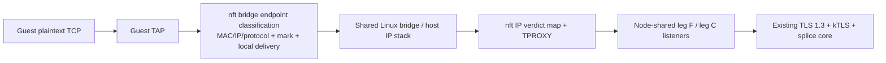
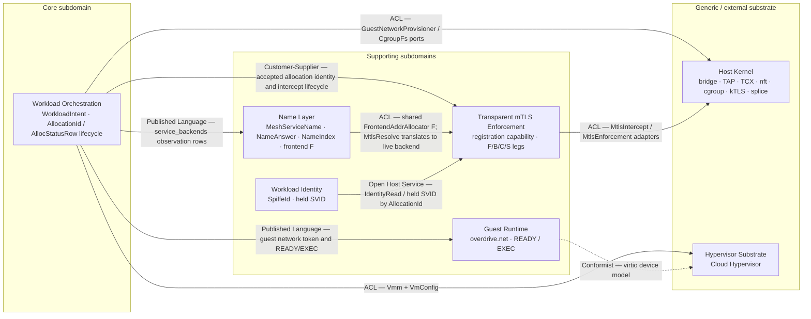

# Feature Delta — `netns-density-295`

**Feature ID:** `netns-density-295`
**Wave:** DISTILL — acceptance design over accepted full-stack architecture
**Interaction mode:** Propose
**Status:** **Stage 1 accepted — approved by system design review iteration 5
on 2026-09-16 after user ratification of all stage-1 system choices. Stage 2
DDD is accepted — approved by DDD review iteration 2 on 2026-09-16 as a bounded
no-new-decision analysis. It introduces no new material choice requiring
ratification and does not alter any accepted stage-1 contract. D-295-7 and
D-295-9 remain unchanged accepted-contract constraints, not new material
decisions. These upstream stages alone did not authorize DELIVER.**
**Stage 3 application/solution architecture review iterations 1–3 returned ten
bounded findings. F-01 through F-04, S2-F01 through S2-F04, and I3-F01/I3-F02 are
remediated under the user's explicit 2026-09-16 authorization to proceed with
each recommended contract. Iteration 2 pins fresh-process target recovery,
removes competing constructor signatures, completes Contract Shape universes,
and corrects ADR-0090's live substrate evidence. Iteration 3 makes rollback
errors source-honest and removes Exec/process from ADR-0090's operative
contract. It adds no behavior or scope beyond the accepted stage-1 contracts
and accepted stage-2 no-new-domain-boundary conclusion. **Stage 3 is accepted
— approved by independent solution-architecture review iteration 4 on
2026-09-16 with no critical, high, or medium findings. Full DESIGN architecture
is accepted; there is still no DELIVER authority.**
**Bounded post-DISTILL DESIGN amendments:** **D-295-DISTILL-1 and
D-295-DISTILL-2 were explicitly user-approved on 2026-09-16 and independently
approved by bounded DESIGN review on the same date. They are recorded below as
the exact shared-owner and rollback contracts; this approval does not authorize
DELIVER. DESIGN-review F-02's complete
source-honest startup-cleanup shape was explicitly user-approved on the same
date and is included in D-295-DISTILL-1 below. The correctness-first
D-295-DISTILL-4 crate-ownership correction was explicitly **USER-APPROVED
2026-09-16 and independently approved at review iteration 4** and is recorded
below: core retains only cross-crate handoff/EXEC values, control-plane owns
the application port/fact/error family, and dataplane owns aya conversion and
exact aya sources.**
**D-295-DISTILL-5 was explicitly USER-APPROVED and independently APPROVED at
review iteration 6 on 2026-09-16.** It adds the
complete module-private scratch-effect boundary beneath the one private host
shared-network owner, so source-local tests drive the production owner
algorithm rather than injecting a completed cleanup aggregate. It preserves
the public shared-owner port and the reusable public `overdrive-sim`
scripting/call-observation/test-wiring API.
**D-295-DISTILL-6, D-295-DISTILL-7, and D-295-DISTILL-8, including the
`RegistrationRetired` correction, were explicitly USER-APPROVED and
independently APPROVED at review iteration 9 on 2026-09-17.** They pin respectively the dataplane-owned typed
TCX mutation/query boundary, the worker-private registration-capability state
machine, and the control-plane-private retained supervisor/DNS task owners.
They add no public product command, persistence, daemon, HA owner, process/PID
acceptance test, or expectation.
**DISTILL status:** cumulative D12, its private inventory source, D12A, and
D13's ordering-honest Sim oracle passed bounded DESIGN review iteration 6;
P02-07/08 are closed. The non-waived S00/S11/S12/S13 source-local/Sim bodies
are authored, have completed the bounded iteration-2 corrections, and completed
independent iteration-3 re-review. The eight
real-I/O panic placeholders are user-waived and not scored by this bounded
gate. D-295-DISTILL-1
through D-295-DISTILL-9 are independently approved; D9 was approved at review
iteration 12. D-295-DISTILL-10 records the reusable deterministic simulation
API, and D-295-DISTILL-11 records final reachability contracts. There is no
DELIVER authority.
**F-08-01's D-295-DISTILL-7 activation-retirement projection was explicitly
USER-APPROVED on 2026-09-17.** It adds one typed install error and stage label;
the private registry, public worker surface, cleanup ownership, and lifecycle
ordering otherwise remain unchanged.
**D-295-DISTILL-9 was explicitly USER-APPROVED and independently APPROVED at
review iteration 12 on 2026-09-17.** It adds the
semantic bridge-family nft adapter over one private family-aware codec while
leaving every existing public IPv4 operation and PORT-295-C behavior unchanged.
The user also explicitly authorized autonomous DESIGN and DISTILL decisions for
the remainder of this run; this authorization does not expand product scope or
permit DELIVER, production, test, expectation, daemon, HA, or process-PID
acceptance changes.
**D-295-DISTILL-10 is authorized on 2026-09-17 under that autonomous
DESIGN/DISTILL authority.** It pins the already-public sim owner API; it adds
no product surface or behavior.
**D-295-DISTILL-11 is authorized on 2026-09-17 under the same authority.** It
pins actual worker task-exit classification, typed component audit scripting,
and S37 cross-test EXEC-closure evidence; it adds no product outcome, public
kill method, or gate accessor.
**Cumulative D-295-DISTILL-12, D-295-DISTILL-12A, and D13's
API/order/telemetry plus Sim RED oracle are APPROVED through phase-02 DESIGN
review iteration 6.** Ownership remains one real control-plane owner; no public
product hook or second adapter owner is added. The required S-ND295-00/10/11/
12/13 RED bodies are authored, have completed bounded iteration-2 review
corrections, and completed independent DISTILL iteration-3 re-review. DELIVER
remains unauthorized while later wave validation is pending.
**Documentation density:** `lean` (`expansion_prompt=ask-intelligent`,
`provenance=explicit_override`). Only Tier-1 `[REF]` sections are emitted in
this feature delta. The Level-3 SSOT diagram is the solution-architect role's
mandatory view for this complex subsystem, not a Tier-2 feature-delta
expansion. No density telemetry has been emitted because the wave-end expansion
choice has not happened.

## Wave: DESIGN / [REF] Prior-wave Consultation

- ✓ `AGENTS.md`, `CLAUDE.md`, and all mandatory `.claude/rules/*.md` named by
  `AGENTS.md`
- ✓ `docs/product/architecture/brief.md`
- ✓ `docs/product/architecture/c4-diagrams.md`
- ✓ all 120 pre-feature `docs/product/architecture/adr-*.md` records
  inventoried; the active network, VM, identity, lifecycle, and Exec-removal
  decisions were consulted in full before adding the twelve #295 ADRs
- ✓ relevant product artifacts: `docs/product/vision.md`,
  `docs/product/jobs.yaml`, `docs/product/outcomes/registry.yaml`,
  `docs/product/journeys/run-a-vm-workload.yaml`,
  `enforce-transparent-mtls-on-the-wire.yaml`,
  `dial-a-mesh-peer-by-name.yaml`, `hold-identity-for-the-running-set.yaml`,
  `issue-workload-identity.yaml`, and `submit-a-service.yaml`
- ⊘ `docs/feature/netns-density-295/discuss/wave-decisions.md` (not found)
- ⊘ `docs/feature/netns-density-295/discuss/user-stories.md` (not found)
- ⊘ `docs/feature/netns-density-295/discuss/story-map.md` (not found)
- ⊘ `docs/feature/netns-density-295/discuss/outcome-kpis.md` (not found)
- ✓ `docs/feature/netns-density-295/spike/findings.md`
- ✓ `docs/feature/netns-density-295/spike/wave-decisions.md`
- ✓ Part-C scratch source and retained evidence at
  `spike-scratch/increment-w-part-c-tcx-netns-density-295-20260916T014247Z/`
  (evidence commit `7a00464969e98fe00764e0ab707428e8cd82a026`)
- ✓ Part-D shared-listener source and retained evidence at
  `spike-scratch/increment-x-part-d-shared-listeners-netns-density-295-20260916T101440Z/`
  (executed against source commit
  `7a00464969e98fe00764e0ab707428e8cd82a026`)
- ✓ user-supplied Cilium checkout `/Users/marcus/git/cilium/cilium` at
  `e99150f8d8f403eca51ed82138d4ae20a265c8f3` for TCX link lifecycle,
  endpoint map ownership/fail-closed behavior, and userspace DNS separation
- ✓ GH #295 body, full comments, and JSON
- ✓ GH #293 body, full comments, and JSON; production HEAD is rebased over
  `Remove legacy Exec workload driver (#297)` and no live Exec compatibility
  branch remains

GH #295 plus its full comment thread and the two spike artifacts are the
authorized DISCUSS-equivalent input. The missing DISCUSS files are therefore a
recorded warning, not a scope gap.

Contradiction check: no unresolved requirement contradiction. This proposal
explicitly supersedes only the obsolete mechanism clauses in ADR-0071,
ADR-0072, ADR-0088, ADR-0089, and ADR-0098. It preserves ADR-0067/0069/0070's
identity and zero-copy enforcement contracts, ADR-0081/0082/0083's VM and
cgroup ownership, ADR-0090/0101's guest-address health/backend facts, and
ADR-0110 through ADR-0113's microVM-only single cut. The feature is strictly
single-node. Cross-host routing is outside this proposal and tracked separately
by [GH #298](https://github.com/overdrive-sh/overdrive/issues/298); no routing
shape is prescribed here. Heterogeneous per-node guest-network capacity is also
outside #295 and tracked by
[GH #299](https://github.com/overdrive-sh/overdrive/issues/299); #295 adds no
public, wire, or persisted `network_ports` resource.
Connection-pump concurrency scaling is outside #295 and tracked by
[GH #300](https://github.com/overdrive-sh/overdrive/issues/300); #295 preserves
the current TLS 1.3/kTLS/splice enforcement implementation and makes no
concurrent-flow capacity claim.

## Wave: DESIGN / [REF] Evidence Classification

| Class | Evidence that may be relied on | What it does not prove |
|---|---|---|
| **Current production fact** | HEAD is rebased over origin/main's Exec-removal merge. The live action shim still assigns `NetSlot`, derives `WorkloadNetnsPlan` + `VmTapPlan`, injects `netns`/`host_veth`/guest fields, and tears down by slot. `VmNetworkAttachment` still contains `netns`; `CloudHypervisorVmm` still launches through `ip netns exec`. `MtlsIntercept::install_outbound` still keys on `host_veth`. `DnsResponder` still takes `NetSlotAllocator`. `MtlsInterceptWorker` still starts two `spawn_blocking` accept loops per allocation. | These facts describe the mechanism to replace; their existence is not a reason to preserve it. Historical source/test comments naming `ExecDriver` are not a live compatibility branch. |
| **Accepted contract fact** | Running follows guest READY + durable row; mTLS install then gates guest EXEC release. `workload_addr` is the observed backend/probe address. Platform-held SVIDs, `ServiceBackendsResolve`, TLS 1.3, kTLS TX/RX, splice, and per-VM cgroups have accepted owners. | An accepted contract does not select the new switch/classifier or move lifecycle gates. |
| **Spike-proven feasibility** | Parts A/B prove the shared bridge, shared DNS, production identity/resolver/`HostMtlsEnforcement`/cgroups, TLS 1.3 kTLS TX/RX, 14 splice calls, and no final-path netns/veth/slot dependency. Part C proves real aya-rs SCHED_CLS through TCX ingress on both TAPs, endpoint source validation, map-miss/spoof/direct-bypass drops, bridge-local delivery, pin survival/adoption/removal, and the same production zero-copy/cgroup path. Part D proves one node-shared leg-F listener plus one node-shared leg-C listener across two real microVM allocations, immutable pre-enforcement capability capture, exact-membership claim, successor selection, unknown/stale/post-removal rejection, and allocation-scoped drain of already-published handles while unrelated handles/listeners remain live. | Part D did **not** hold a real enforcement call across retirement and then execute the publish/teardown branch; its reuse self-test removed membership after claim but never called enforcement/publish with that held claim. No 16k/32k/100k end-to-end scale, connection-flood behavior, long-run listener performance, pinned-6.18 verifier baseline, deliberate TCX-detach guard, or production implementation is proved. Cross-host is outside #295. |
| **Accepted by system design review iteration 5 on 2026-09-16** | D-295-1 through D-295-6, A2, B1, C1 as amended by PORT-295-C, C-295-E, F1, ERR-295-A, GEN-295-A, CAP-295-A, and RUN-295-B. | System-design acceptance is not DELIVER authority. |
| **Unchanged accepted-contract constraints** | D-295-7 preserves cgroup, identity, resolver, enforcement, lifecycle, and recovery owners. D-295-9 preserves Service selection, atomic membership, and selected-`BackendId` identity receipt. | These are non-regression constraints, not fresh #295 decisions or new ADRs. |

## Wave: DESIGN / [REF] Requirements, Quality Attributes, and Capacity

### Functional requirements

1. Every running microVM receives one host-netns TAP, one IPv4 address, and one
   MAC on one node-local shared Linux bridge. The production path contains no
   per-workload netns, veth pair, transit/guest `/30`, `NetSlot`, or
   `host_veth` dependency.
2. In healthy state and under any single owned-component loss, guest-originated
   TCP is caught or dropped at the source TAP before ordinary bridge
   forwarding. Mesh TCP follows the existing leg-F → leg-B / leg-C → leg-S
   proxy; the peer-facing leg performs a real TLS 1.3 handshake, arms kTLS
   TX/RX, and moves steady-state bytes with kernel `splice(2)`. Guests remain
   credential-free plaintext endpoints.
3. One in-agent DNS responder answers on the shared bridge gateway. The guest
   kernel token continues to carry address, prefix, gateway, and DNS; no host
   `/etc/netns/*/resolv.conf` exists.
4. One owner provisions and tears down the address lease, TAP, bridge
   membership, classifier membership, and host route effects around the VMM.
   Per-VM cgroup v2 ownership, CPU weight, reserve-padded `memory.max`, VMM PID,
   OOM attribution, total teardown, and boot reclamation remain unchanged.
5. The existing Service dataplane continues to own backend selection and
   atomic membership updates. A public-ingress gateway remains behind
   `GatewayConnectDataplane` / `GatewayClientMtls`; it does not select backends
   in userspace and does not lose the selected `BackendId` → SPIFFE receipt.
6. Exactly one node-owned leg-F listener and one node-owned leg-C listener serve
   every allocation. Accept resolves and freezes the exact active allocation,
   generation, and SPIFFE identity before enforcement; allocation stop drains
   only that capability's enforced handles and leaves both listeners alive.

Cross-host routing is out of #295 scope and undecided;
[GH #298](https://github.com/overdrive-sh/overdrive/issues/298) tracks that
separate design. Heterogeneous schedulable guest-network capacity is out of
#295 scope and tracked by
[GH #299](https://github.com/overdrive-sh/overdrive/issues/299). Nothing here
prescribes either contract.

### Ranked quality attributes

| Rank | Attribute | Required response |
|---:|---|---|
| 1 | Security / confidentiality | Healthy operation and any single owned classifier/guard/listener/map/route loss catch or drop TCP. Accepted downside: arbitrary near-simultaneous external deletion of both a TAP's TCX entrypoint and the independent bridge guard can expose ordinary forwarding for at most the one-second audit window before TAP quiescence. |
| 2 | Performance efficiency | O(1)-expected ifindex endpoint-map lookup at TCX ingress; no per-packet userspace proxy, AF_XDP, or ring-buffer forwarding; existing kTLS/splice core remains the steady-state path. |
| 3 | Capacity | Initial measured contract is 16,384 simultaneous guest network attachments under the exact T1 profiles below, not a VMM/resource or connection-capacity claim. |
| 4 | Reliability / recoverability | Teardown is effect-first and lease-release-last; boot reclaims VMMs before sweeping old TAP/rule state. |
| 5 | Maintainability | Delete netns/veth/slot/setns surface; extend existing netlink, DNS, mTLS, identity, cgroup, and lifecycle owners. No new daemon or crate. |
| 6 | Testability / Earned Trust | Real startup probe for the shared-switch catch point; existing probes reused where they already establish the claimed substrate. |

### Attachment-capacity contract and non-contractual connection limitation

CAP-295-A makes T1 an attachment-only contract. Let `N` be live guest network
attachments, `P_i` the unbounded valid TCP-listener count for attachment `i`,
and `M = ΣP_i` (uniform profile shorthand `M=N×P`). PORT-295-C makes IP nft
rule cardinality constant: eight node-global IP rules plus the three bridge-guard
rules, independent of `N` and `M`. Dynamic kernel state is one managed-guest IP
element and one outbound-source IP element per attachment plus one inbound
`(IPv4Addr, NonZeroU16)` element per valid TCP listener.

| Target | Attachment state | Shared interception state | Disposition |
|---|---|---|---|
| **T1 — N=16,384 (contract)** | 16,384 TAP/FDB entries, TCX links, endpoint-map entries, guard members, and address leases; two listener FDs/tasks | **11 total #295 nft rules** (8 IP + 3 bridge); N managed-IP + N outbound + M inbound elements; userspace registry has N source records + N destination-IP records holding M allowed ports | Completion measures this attachment/set/registry/recovery envelope. It makes no concurrent-flow, `EnforcedConnection`, throughput, `RLIMIT_NOFILE`, `pids.max`, `threads-max`, or pump-stack promise. |
| T2 — N=32,768 (rejected) | 32,768 attachment effects | Same 11 rules; IP `2N+M` elements plus bridge `managed_taps=N` | A `/16` has 65,533 usable addresses; full predecessor/successor overlap requires 65,536 and is short by 3. |
| T3 — N=100,000 (rejected) | Requires `/15`, larger endpoint map, and ~100k VMM processes | Same 11 rules; IP `2N+M` elements plus bridge `managed_taps=N` | Not the #295 contract; neither attachment resources nor VMM capacity are proved. |

Logical nft key payload is `8N + 6M` bytes before kernel set overhead. Intercept
start/stop adds/deletes `2 + P_i` IP elements; a full stale-state sweep processes
`2N + M` elements. No listener bound is added: every valid
Service TCP port remains admissible, and capacity observations must report N,
M, element bytes, and element-update/sweep rates rather than assume `P=1`.

That formula is **IP-family only**. The bridge-family `managed_taps` ifname set
adds N separate elements. With the approved 11-byte `ovd-tp-<4hex>` names its
logical key payload is `11N` bytes before kernel overhead, one insert/delete per
attachment, and N additional sweep elements. Across all three IP sets plus
`managed_taps`, full element inventory/sweep is `3N + M`.

T1 is reproducible through two required measurement receipts; neither restricts
valid product input above the measured M:

| Receipt | Exact workload distribution | N / M | Exact element inventory | Required measurements |
|---|---|---:|---|---|
| **T1-BASE** | 16,384 Job-shaped allocation network attachments through the production owner; no VMM population and no Service TCP listeners | 16,384 / 0 | IP `2N+M=32,768`; bridge `N=16,384`; total 49,152. Logical keys: 128 KiB IP + 176 KiB bridge. | Successful attach/read-back; kernel memory delta for every map/set/link/FDB; full-population insert/delete elements/s; one outbound-hit packet per source plus 256 deterministic missing-source probes; lookup packets/s and exact counters; full `3N+M` sweep wall time and empty complement. |
| **T1-PORT4** | 16,384 Service-shaped allocation network attachments through the production owner, each with TCP ports 8080, 8081, 8443, and 9000; no VMM population | 16,384 / 65,536 | IP `2N+M=98,304`; bridge `N=16,384`; total 114,688. Logical keys: 512 KiB IP + 176 KiB bridge. | Same memory/update/sweep measurements; one hit for all four ports and one 9001 miss for every destination (81,920 lookup packets), exact counters and packets/s; full sweep/read-back complement. |

Any valid distribution with `M > 65,536` remains supported product semantics but
is outside #295's measured capacity receipt. Results must always report the
actual N, M, port distribution, kernel version, and substrate limits.

Part C measured a 20-byte endpoint value in a preallocated 16-entry hash map at
3,840 bytes memlock: 240 bytes per configured maximum entry on that kernel, so
65,536 entries extrapolate to exactly 15 MiB before kernel/version variance.
The program measured 4,096 bytes and the eight-slot counter map 368 bytes.
Per-link kernel/bpffs memory remains unmeasured. The 7.624/7.943 ms attach+pin
observations average 7.7835 ms, or about **127.5 s** for 16,384 serial cold
attaches; this is an extrapolation, not a benchmark.

The prior 60 s recovery value is unsupported and is no longer stated as a
fact. Recovering T1 inside 60 s would require at least **273 complete allocation
cleanups/s**, plus `(3N+M)/60` set-element removals/s, VMM/cgroup/TAP/TCX/map
work, and atomic registry cleanup. Those are attachment-recovery measurements,
not concurrent-connection requirements.

Part D's exact T1 listener/task/FD cardinalities were 2/2/2 for the node-shared
shape and 32,768/32,768/32,768 for async per-allocation. Both processes built a
32,768-entry registry first. Shared registry RSS was 1,440 KiB and the shared
listener/task layer added 316 KiB; listener setup was 0.042 ms. The rejected
per-allocation listener/task layer added 29,484 KiB and setup was 405.335 ms.
Counts are structural; RSS and timings are one-run point observations, and the
compact scratch registry is a lower bound for the final typed capability index.
Connection file descriptors are load-dependent and are intentionally separate
from these listener counts.

Current connection cost remains an explicit limitation, not a #295 gate:
`HostMtlsEnforcement` owns **6 FDs + 2 native pump threads per handle**, and a
same-node application flow creates outbound plus inbound handles. The withdrawn
four-flows-per-guest illustration would therefore produce 131,072 handles,
786,432 FDs, 262,144 pump threads, ~512 GiB default user-stack virtual address
reservation, and ~4 GiB kernel stack at a 16 KiB illustration. #295 neither
promises nor tests that population and leaves the production pump mechanism
unchanged. Scaling it is tracked exclusively by
[GH #300](https://github.com/overdrive-sh/overdrive/issues/300).

## Wave: DESIGN / [REF] Infrastructure Options and Recommendation

### Option A — shared bridge + per-TAP TCX/SCHED_CLS + minimal nft guard + IP TPROXY (approved direction)

```mermaid
flowchart LR
    GA[Guest A plaintext TCP] --> TA[TAP A]
    TA --> TCX[TCX ingress SCHED_CLS\nifindex map + MAC/IP validation]
    TCX -->|accepted 0x295b or intercept 0x295a| GUARD[bridge nft proof-mark guard]
    GUARD -->|0x295a preserved| IP[Host IP prerouting TPROXY]
    GUARD -->|0x295b cleared| BR[ordinary bridge/host delivery]
    IP --> LF[One node-shared leg F]
    LF --> FCAP[Validated source + orig-dst\nimmutable allocation capability]
    FCAP --> CORE[Existing HostMtlsEnforcement\nrustls TLS 1.3 -> kTLS TX/RX -> splice]
    CORE -->|leg B, TLS records| IC[Destination IP/output TPROXY]
    IC --> LC[One node-shared leg C]
    LC --> CCAP[Recovered destination\nimmutable allocation capability]
    CCAP --> CORE2[Existing inbound kTLS/splice]
    CORE2 --> LS[Marked leg S]
    LS --> TB[TAP B]
    BR -->|UDP :53| DNS[userspace DnsResponder on shared bridge gateway]
```



- **Structure:** one shared aya-rs SCHED_CLS program attaches with TCX ingress
  to each TAP. Its ifindex map validates registration, source MAC, and source
  IPv4/ARP identity. Valid TCP is marked \`0x295a\`, bridge-MAC rewritten, made
  \`PACKET_HOST\`, and delivered to existing IP TPROXY. Valid gateway/ARP traffic
  is marked \`0x295b\`. The minimum bridge guard matches only registered managed
  TAPs: \`0x295a\` passes unchanged, \`0x295b\` is cleared and passes, anything else
  drops. It does not repeat endpoint classification.
- **Failure modes:** map miss/spoof/malformed/direct bypass drops in TCX; a
  detached/missing link produces no proof mark and drops at the bridge guard;
  stale/missing TPROXY entries retain the existing mark-before-TPROXY
  fail-closed local-route behavior. Unknown source/destination capability,
  inactive generation, and retirement during enforcement close or teardown
  before publication. Attach/pin/query, nft-guard, listener, or capability
  registration failure rejects use before EXEC release.
  A simultaneous external deletion of both TCX and the bridge guard is outside
  the single-owned-fault guarantee and may forward until the <=1 s RUN-295-B
  audit detects it and downs managed TAPs.
- **Operational cost:** one program, one 65,536-entry endpoint map, one small
  counter map, one pinned TCX link per TAP, one managed-TAP nft set and three
  bridge rules; three shared IP sets and eight IP rules; N source records plus N
  destination records containing M allowed ports; and exactly two listener
  FDs/tasks. Part C
  measured 296 verified instructions, 4,096-byte program memlock, 4,208-byte
  bounded-probe map memlock, ~7.6–7.9 ms attach/pin, and ~50.8 ms load/verifier.
- **Zero-copy implication:** classification stays in kernel; the data session
  continues through the production TLS 1.3 + kTLS + splice core. TCX is not a
  mirror and sends no payload through a ring buffer/userspace forwarding loop.
- **Gateway path:** the gateway's host socket still enters the existing cgroup
  BPF Service selection path. BPF returns the selected `BackendId`; the applied
  backend address then hits the output-hook inbound companion and destination
  leg C. Existing Path-A demand teaching is retained until the gateway design
  explicitly supersedes it; selection does not move into the gateway.

### Option B — full nftables bridge classification + IP TPROXY



- **Structure:** this rejected alternative would expand Part A's bridge-local
  delivery transform into the endpoint classifier using nft sets/maps/rules.
- **Failure modes:** nft would own both endpoint identity validation and socket
  delivery. Linear per-TAP rules do not scale, while the proposed set/vmap path
  has no Part-C-equivalent scale or spoof-counter evidence.
- **Operational cost:** no verifier/TCX links, but a broader nft classifier and
  its own endpoint-state/counter lifecycle. This is rejected, not installed in
  parallel beside TCX.
- **Zero-copy implication:** classification is in kernel and the existing
  kTLS/splice core remains zero-copy.
- **Gateway path:** unchanged from Option A after BPF Service selection.

### Option C — vhost-user userspace vswitch


- **Structure:** replace TAP/bridge switching with a vhost-user endpoint and a
  userspace switch such as a DPDK/VPP-class datapath.
- **Failure modes:** switch process crash, shared-memory/queue exhaustion,
  vhost-user reconnect ordering, a second lifecycle/upgrade authority, and a
  new path for direct-bypass or plaintext mishandling.
- **Operational cost:** new daemon/process, hugepage/queue/CPU-pinning policy,
  independent observability and recovery, and an extra kernel-injection bridge
  to reach the existing socket/kTLS proxy.
- **Zero-copy implication:** every guest packet enters a userspace switching
  datapath before the existing kernel socket path. That conflicts with the
  current requirement to avoid a userspace packet-proxy datapath and has no
  measured need at T1.
- **Gateway path:** backend selection/receipt would need a new integration with
  the switch, increasing the risk that selection drifts out of the existing BPF
  owner.

**Accepted direction — Option A; user-approved and approved by system design
review iteration 5 on 2026-09-16.** Part C gives it real-metal classifier, negative-security,
pin/adoption, production-core, and cleanup evidence. nftables remains necessary
for IP TPROXY/output and the three-rule attachment safeguard, but full nft
endpoint classification (Option B) is rejected rather than installed as a
competing classifier. Option C remains rejected.

## Wave: DESIGN / [REF] DDD List

**DDD status: Accepted — approved by DDD review iteration 2 on 2026-09-16.**

### Stage-2 bounded conclusion

**No material independently decidable DDD choice is required.** #295 changes
the host dataplane, network-effect ownership, and the narrow pre-EXEC
interception gate around the existing physical `AllocationId`. It does not
change what a workload, Service, allocation, SVID, selected backend, Running
row, or Service Stable state means. It therefore creates no new bounded
context, aggregate, repository, domain event, persistence boundary,
workload/allocation lifecycle state, workflow, Event Sourcing model, or CQRS
split.

This conclusion is descriptive rather than a new architectural decision. It
does not reopen the accepted system choices below and adds no public API. The
exact stage-1 public and internal contract shapes remain exclusively in their
existing sections of this feature delta.

The DDD boundary also preserves the approved scope exclusions: cross-host
routing remains with GH #298, heterogeneous per-node guest-network capacity
with GH #299, and concurrent-flow pump scaling with GH #300. None becomes a
domain model, aggregate field, or repository in #295. Per-VM cgroup ownership
and the existing TLS 1.3/kTLS/splice enforcement model remain unchanged.

### Observed production model versus accepted proposal

| Evidence class | Domain reading |
|---|---|
| **Observed production fact** | `WorkloadIntent::{Job,Service,Schedule}` is the durable workload-intent aggregate. `Allocation { id, workload_id, node_id }` exists as an intent-side model, but current production has no live construction or persistence path for it. Live physical-execution identity is the `AllocationId` carried by `Action::StartAllocation` / `Action::RestartAllocation`; lifecycle facts are observed and persisted at that identity through `AllocStatusRow`, including `workload_addr`. `AllocationSpec` is a transient driver handoff. The current host mechanism derives `NetSlot`, netns/veth/TAP plans and per-allocation mTLS listeners around that live identity. |
| **Accepted #295 proposal** | Keep `WorkloadIntent`, the intent-side `Allocation` model, live `AllocationId` action identity, `AllocStatusRow`, `SpiffeId`, Service listener intent, `BackendId` selection receipt, lifecycle meanings, `workload_addr`, and their owners unchanged. Replace only the transient guest-network handoff and the host effects surrounding it. |
| **DDD consequence** | The topology replacement does not create a second workload or allocation model. `GuestNetworkAssignment`, `GuestNetworkPlan`, address-pool entries, endpoint facts, listener capabilities, and TAP/MAC/generation/TCX/listener/nft state remain subordinate transient values/entities inside existing application and enforcement boundaries. |

### Subdomains, bounded contexts, and context map

No new bounded context is introduced. The feature crosses existing contexts
and external substrates:

| Existing context / substrate | Classification | #295 responsibility |
|---|---|---|
| **Workload Orchestration** | Core subdomain | Retains workload intent, live `AllocationId` lifecycle identity, fixed-cap admission, lifecycle ordering, accepted Running-row ownership, and the narrow guest-command-release gate. |
| **Transparent mTLS Enforcement** | Supporting subdomain | Retains the leg-F/leg-B/leg-C/leg-S model and consumes identity. #295 changes listener cardinality and registration ownership without changing TLS 1.3, kTLS TX/RX, or splice semantics. |
| **Name Layer** | Existing supporting reader bounded context | Retains `MeshServiceName`, `NameAnswer`, `NameIndex`, and the stable frontend-address concept owned by `FrontendAddrAllocator`. It reads the existing `service_backends` observation surface and meets enforcement at the re-keyed `MtlsResolve` frontend-to-backend translation seam. #295 only re-homes the `DnsResponder` socket to the shared gateway and supervises its task. |
| **Workload Identity** | Supporting security subdomain | Continues to own platform-held SVID material and the `SpiffeId` vocabulary. Guests remain identity-unaware and hold no credential material. |
| **Guest Runtime** | Supporting subdomain | Continues to consume the published guest-network token and READY/EXEC protocol. No workload netns/veth concept enters the guest language. |
| **Host Kernel / Hypervisor Substrate** | Generic external substrate | Supplies bridge, TAP, TCX, nftables, cgroup v2, kTLS, splice, and Cloud Hypervisor effects behind existing adapter/port boundaries. |



The map records existing relationship patterns; it creates no team,
deployment, protocol, or ownership boundary. The node shared-switch owner is
not a bounded context: it has no independently evolving domain language or
business lifecycle and exists solely to translate accepted allocation/network
facts into host-kernel effects. Likewise, the existing cgroup-BPF Service
dataplane remains backend-selection owner; the shared switch gains no Service
routing model. The Name Layer remains D-DBN-1's sibling reader over
`service_backends`; #295 changes only the shared-gateway `DnsResponder` socket
composition and task supervision. It does not change `MeshServiceName`,
`NameAnswer`, `NameIndex`, `FrontendAddrAllocator`, stable-frontend ownership,
or the `MtlsResolve` translation contract.

### Tactical classification

| Concept | Classification | Boundary and invariant |
|---|---|---|
| `WorkloadIntent` / `Job` / `Service` | Existing aggregate root and variants — unchanged | Continues to own declared workload intent, including Service listeners. #295 adds no field or behavior to the aggregate. |
| `Allocation` | Existing intent-side aggregate model — empty #295 delta | The type records `{ id, workload_id, node_id }`, but current production has no live construction/persistence path for it. #295 neither activates nor changes that model. |
| `AllocationId` + `AllocStatusRow` | Current live execution identity and persisted observation surface — unchanged | Start/restart actions carry the exact physical `AllocationId`; `AllocStatusRow` persists the lifecycle state and `workload_addr` at that identity. Lifecycle meanings do not move, and TAP/MAC/generation/TCX/listener/nft state remains transient. |
| `GuestNetworkAssignment` | Transient value object — accepted stage-1 shape | Its six attributes (`address`, `tap`, `mac`, `gateway`, `prefix`, `dns`) are one all-or-none driver handoff. It has structural equality, no independent identity, and no persistence. |
| `GuestNetworkPlan` | Internal orchestration value object — accepted stage-1 shape | Adds allocation, bridge, and node-prefix ownership context around one `GuestNetworkAssignment`; it is not a public domain type or aggregate. |
| Guest address lease | Internal technical resource binding, not a new aggregate/entity type | One pool entry binds an existing `AllocationId` to one plan. The pool's single mutex makes unique assignment, smallest-free selection, idempotent re-entry, release, and ordered snapshot one technical consistency boundary. It is not a repository and is not persisted. |
| Transparent-mTLS registration capability | Ephemeral entity inside the existing enforcement context | Identity is the exact `(AllocationId, node-session generation, SpiffeId)` triple. Pending/Active/Retiring/removed and in-flight/published-handle membership are serialized by the node listener owner's existing single lock. It is not an aggregate root, durable entity, or new public type. |
| `GuestEndpointFact`, `GuestNetworkFact`, `DestinationRegistration` | Value/fact projections | They describe read-back, typed failure evidence, or one active destination membership. They own no lifecycle outside their technical owner. |
| Shared-switch owner, `GuestNetworkProvisioner`, listener owner, runtime supervisor | Application/infrastructure services, not domain services | They coordinate kernel effects and lifecycle gates already assigned by stage 1; none introduces cross-aggregate business logic. |

No repository is added. In particular, `GuestAddressPool` is the owner of
live process state, not a persistence abstraction over leases; boot reclamation
and stale-effect sweep intentionally start the new owner empty.

### Aggregate bounded-change declaration

Because #295 creates no aggregate, it creates no new aggregate command universe.
For the existing aggregate roots it touches indirectly, the declared delta is
empty:

| Existing aggregate | Full observable state | #295 declared delta | Complement equality |
|---|---|---|---|
| `WorkloadIntent` | The complete persisted `Job` / `Service` / `Schedule` V1 payload, including driver, resources, listeners, and probes | None | Before and after archived intent bytes remain equal. TCP-port projection reads `ServiceV1::listeners`; it does not rewrite intent. |
| `Allocation` | `{ id, workload_id, node_id }` on the existing intent-side model; no current live construction/persistence path | None | All three fields remain equal; #295 must not activate a new persistence path or place guest address, TAP, MAC, generation, TCX state, listener state, or nft state in this model. |

The technical state owners still have explicit mutation complements, but those
are infrastructure invariants rather than new DDD aggregates:

- address `assign` may add exactly one `AllocationId -> GuestNetworkPlan`
  binding or return the byte-equal existing binding; it changes no other
  binding;
- address `release` may remove only the named allocation binding; absent
  release changes nothing;
- capability registration may add only its exact source/destination indexes,
  generation state, and set-element guards; conflicting live keys change
  nothing;
- capability retirement removes only its exact indexes, waits for only its
  in-flight claims, and drains only its published handles; unrelated
  capabilities and both node listeners are complement-equal; and
- shared-switch/intercept cleanup changes only effects owned by the named
  allocation. `WorkloadIntent`, the intent-side `Allocation` model, live
  `AllocationId`, `AllocStatusRow` lifecycle meanings and `workload_addr`,
  Service selection, SVID ownership, per-VM cgroup ownership, and unrelated
  allocations remain unchanged.

### Domain events, services, repositories, and ES/CQRS

- **Domain events:** none added. The structured
  `guest_network.shared_owner_*` records are operational health/evidence events,
  not a domain event stream. Existing lifecycle observation rows retain their
  accepted meaning.
- **Domain services:** none added. Provision, converge, audit, enforce, and
  teardown are application/infrastructure services over existing identities.
- **Repositories:** none added. No lease, capability, endpoint, rule, or
  recovery repository is authorized.
- **Event Sourcing:** rejected as inapplicable. The live kernel/registry state
  is convergent technical state; replay history has no business value and boot
  intentionally reclaims rather than adopts prior capabilities.
- **CQRS:** rejected as inapplicable. Existing intent and observation models
  remain separate for their already-accepted consistency reasons; #295 creates
  no new write model, projection family, or query workload that warrants a new
  CQRS split.

### Ubiquitous language additions and exclusions

| Term | Exact meaning | Explicit exclusion |
|---|---|---|
| **Guest network attachment** | One allocation's live lease + host TAP + bridge membership + endpoint entry + TCX link/pin + guard membership + registration facts. | Not a VMM, workload, netns, veth pair, concurrent flow, or `EnforcedConnection`. |
| **Guest address lease** | The process-held `AllocationId -> GuestNetworkPlan` binding owned until effect-first teardown completes. | Not a `NetSlot`, durable IPAM row, or schedulable public resource. |
| **Shared guest switch** | The node-owned bridge, fixed bridge MAC/gateway, endpoint/counter maps, per-TAP TCX links/pins, and three-rule proof-mark guard. | Not the existing XDP/cgroup-BPF Service dataplane and not a backend selector. |
| **Managed TAP** | A host-netns TAP currently registered in the switch owner's guard/map/link inventory. | Not a per-workload network namespace or veth endpoint. |
| **Proof mark** | TCX-authored `0x295a` intercept or `0x295b` accepted evidence consumed by the bridge guard. | Not workload identity, policy verdict, or selected backend identity. |
| **Registration capability** | Immutable `(AllocationId, node-session generation, SpiffeId)` captured once for one accepted connection. | Not address identity alone and never re-resolved onto an address-reuse successor. |
| **Node-session generation** | Non-zero process-session counter owned by the node listener registry. | Not workload desired generation, restart count, allocation identity, or persisted epoch. |
| **Attachment capacity** | Simultaneous guest-network attachment population N under CAP-295-A. | Not VMM capacity, concurrent-flow capacity, throughput, FD/pump-thread/stack capacity, or connection population. |
| **Release-last** | Release the guest address only after the predecessor's enforcement, nft, endpoint, TCX, TAP, and guard effects are gone. | Not release-on-Running-row change or release-before-handle drain. |

The existing leg vocabulary is unchanged: leg F is workload-facing plaintext,
leg B is peer-facing outbound TLS, leg C is peer-facing inbound TLS, and leg S
is server-workload-facing plaintext. #295 changes ownership/cardinality around
those legs, not their meaning.

### Accepted stage-1 constraints entering DDD unchanged

Every selected item below is **user-approved and accepted by system design
review iteration 5 on 2026-09-16**, except D-295-7 and D-295-9, which are
pre-existing accepted-contract constraints and require no fresh decision.

- **D-295-1 — shared node-local switch (USER-APPROVED):** one Linux bridge and
  one node-owned guest prefix replace per-workload netns/veth/two-`/30` cells.
- **D-295-2 — TCX endpoint classification (ACCEPTED 2026-09-16):** one aya-rs SCHED_CLS program attaches through
  TCX ingress per managed TAP. nftables retains IP TPROXY/output and only the
  registered-TAP/proof-mark guard; it does not duplicate endpoint
  classification.
- **D-295-3 + CAP-295-A — measured T1 attachment contract (USER-APPROVED):**
  demonstrate 16,384 simultaneous guest network attachments. Concurrent flows,
  enforcement handles, throughput, and pump resources are uncontracted in #295
  and tracked by GH #300.
- **D-295-4 + C-295-E — address/identity owner (USER-APPROVED):** one internal
  pool owns a guest IPv4 lease by allocation and exposes exactly `assign`,
  `release`, and `snapshot`. Reserve network, broadcast, and gateway; derive TAP
  name from the 16-bit host offset (`ovd-tp-<4hex>`) and MAC as
  `02:00:<IPv4 octets>`. `workload_addr` remains the persisted observed address;
  `NetSlot` is deleted rather than renamed.
- **D-295-5 + GEN-295-A — node-shared listeners (ACCEPTED 2026-09-16):** one node-owned leg-F and one node-owned leg-C listener serve
  all allocations. Accept captures an immutable
  `(AllocationId, generation, SpiffeId)` capability, claims the exact active
  node-session generation before enforcement, and publishes the returned handle only while
  that same generation remains active. Allocation stop drains only its handles;
  shared listeners survive. Address reuse is remove-before-reassign.
- **D-295-6 — DNS (ACCEPTED 2026-09-16):**
  one userspace `DnsResponder` on the shared gateway; wildcard bind first and
  exactly-one-gateway fallback. Preserve `NameIndex`, `FrontendAddrAllocator`,
  variable-length wire semantics, `IP_PKTINFO`, source pinning, and the existing
  A/NODATA/NXDOMAIN contract. DNS synthesis does not move into eBPF.
- **D-295-7 — UNCHANGED/UNAFFECTED accepted-contract constraint:** preserve
  `IdentityMgr`, `RcgenCa`, `ServiceBackendsResolve`, `HostMtlsEnforcement`,
  per-VM cgroups, VM reclamation, probe targeting via `workload_addr`, and
  allocation identity. This is non-regression scope, not a new #295 decision.
- **D-295-9 — UNCHANGED/UNAFFECTED accepted-contract constraint:** cgroup BPF
  remains backend-selection and atomic-membership owner; the selected
  `BackendId` receipt remains the source of exact peer identity;
  gateway-to-workload TLS terminates at the selected node's leg C. The public
  Route/TLS/HTTP contract does not change. This is non-regression scope, not a
  new #295 decision.

## Wave: DESIGN / [REF] Infrastructure Component Decomposition

| Component / owner | Home | Proposed change | Responsibility |
|---|---|---|---|
| Node shared guest switch | `overdrive-control-plane` + `overdrive-netlink` + existing BPF crates | **CREATE NEW internal production owner with doc-hidden cross-crate owner port; EXTEND existing crates — D-295-DISTILL-1/D-295-DISTILL-5 USER-APPROVED** | One private host implementation supplies the same inherited allocation provisioner plus startup probe, stale sweep, shared converge/audit, TAP quiescence, runtime repair, and boot ownership. A module-private typed scratch-I/O boundary keeps the startup algorithm in this owner while making every setup, probe, reverse-cleanup, and inventory branch source-locally deterministic. The public owner port remains the composition/sim boundary. |
| Guest address pool | `overdrive-control-plane` | **CREATE NEW internal value/owner — ERR-295-A approved** | One internal allocation-keyed pool owns the guest IP/TAP/MAC lease over the node prefix through exactly `assign`, `release`, and `snapshot`; typed exhaustion is `GuestNetworkError::PoolExhausted`. |
| `GuestNetworkProvisioner` + `SharedGuestNetworkOwner` | `overdrive-control-plane::guest_network` | **EXTEND and rename — ERR-295-A + F-02 + D-295-DISTILL-4 approved** | B1 replaces the old sync/netns seam with one async doc-hidden provisioner; the shared-owner super-port adds the five node operations. The same module owns the opaque/read-only plan and one source-bearing orchestration error. Host construction/implementation stays private; cross-crate visibility exists only for the sibling sim adapter and accepted production-owner seams. |
| `AllocationSpec` network handoff | `overdrive-core::traits::driver` | **DELETE + CREATE approved value type** | Delete `netns`, `host_veth`, and the six separate optional guest-network fields. Add exactly `network: Option<GuestNetworkAssignment>`; the grouped value contains only `address`, `tap`, `mac`, `gateway`, `prefix`, and `dns`. |
| `VmNetworkAttachment` / VMM launch | `overdrive-core::vm`, `overdrive-host::vmm` | **EXTEND** | Attachment becomes host TAP + MAC; delete `ip netns exec` wrapper and selected-TAP sysfs lookup through a netns. |
| mTLS intercept install | `overdrive-worker::MtlsIntercept` | **EXTEND — C1/PORT-295-C/F-03 approved** | Retain bind and both allocation-element installs; outbound keys guest source IPv4. Add node-global converge/audit for eight constant IP rules/three sets. Node guard and allocation guards own disjoint universes; TAP/TCX/bridge-guard lifecycle remains separate. |
| Node-shared mTLS listener/connection owner | existing `MtlsInterceptWorker` home | **EXTEND — GEN-295-A/RUN-295-B/F-03 approved** | Preserve the four-dependency constructor; boot-owned start binds one F/C pair and starts two tasks; one failure future plus converge/audit supplies supervisor observation/recovery; allocation lifecycle owns generations, claims, publish fence, set elements, and handles; shutdown drains userspace/allocation ownership while retaining constant empty rules for next-boot revalidation. |
| mTLS enforcement core | `overdrive-dataplane::mtls` | **REUSE AS-IS** | TLS 1.3, kTLS TX/RX, four splice pumps, limits, connection supervision. |
| Identity and resolution | `IdentityMgr`, `RcgenCa`, `ServiceBackendsResolve` | **REUSE AS-IS** | Platform-held SVID, trust bundle, backend/mesh resolution. |
| DNS responder | `overdrive-control-plane::dns_responder` | **EXTEND** | Replace N per-netns gateway source with one shared gateway; preserve index/wire/serve/probe behavior. |
| Per-VM cgroup + reclamation | `CgroupManager`, `VmReclamation`, `VmHostState` | **REUSE / EXTEND cleanup inventory only** | Preserve resource limits, PID ownership, OOM attribution, kill/remove; include shared-switch TAP residue in post-reclamation sweep, never in cgroup ownership. |
| Netns/veth/slot mechanisms | `veth_provisioner`, action shim, worker/VMM fields and tests | **DELETE** | Delete per-workload netns/veth/two-`/30`, `NetSlot`, setns, `/etc/netns`, `host_veth`, inverse-slot cleanup, and their mechanism-only tests. |
| TCX endpoint classifier | `overdrive-bpf` / `overdrive-dataplane::guest_tcx` | **EXTEND — ACCEPTED; D-295-DISTILL-4 source ownership correction** | Add one aya-rs SCHED_CLS program, ifindex-keyed endpoint map, eight counters, TCX first-order attach, bpffs pin/adopt/query/remove, semantic `TcxAttachPoint`, and canonical `GuestTcxError` retaining exact aya sources. No raw aya type crosses into core or control-plane facts. |
| nft bridge endpoint classifier | shared-switch nft adapter | **DO NOT CREATE** | Retain only registered-TAP/proof-mark safeguard; duplicating MAC/IP/protocol classification is rejected. |
| Userspace/vhost-user vswitch | new external/runtime component | **REJECT** | No current requirement justifies a userspace packet datapath or new daemon. |

## Wave: DESIGN / [REF] Driving Ports

| Driving surface | Existing/new | Proposed behavior |
|---|---|---|
| `overdrive serve` composition root | EXTEND | Converge and probe the node shared switch before use; run VM reclamation, then sweep stale switch resources, then compose DNS and reconciliation. |
| CLI `serve` lifetime select | EXTEND | Biased-select typed internal fail-stop request before SIGINT; normal SIGINT exits 0, shared-network fail-stop is outer-bounded and exits 1. |
| `overdrive deploy <SPEC>` / action shim | EXTEND | Allocate a guest lease and provision its TAP/bridge/classifier before VMM start; no network-specific operator verb. |
| VM lifecycle actions | REUSE | `StartAllocation`, `RestartAllocation`, `StopAllocation`, and `FinalizeFailed` remain the only lifecycle actions; no new action or state. |
| Guest kernel token | EXTEND values, not grammar | Continue `overdrive.net=<addr>/<prefix>,gw=<gateway>,dns=<gateway>`; prefix becomes shared-prefix length instead of `/30`. |
| Public-ingress gateway | REUSE boundary | Enter existing Service selection; carry selected-backend receipt into exact-peer verification; do not query the switch for a second backend choice. |

## Wave: DESIGN / [REF] Driven Ports and Exact Proposed Contract Alternatives

The A2 shape is complete. ERR-295-A completes B1/C-295-E/F1; GEN-295-A completes
the internal capability generation; CAP-295-A fixes the attachment-only capacity
boundary; PORT-295-C amends C1's inbound storage mechanism without changing its
allocation-element method surface; F-03 adds only node-global converge/audit on
the same port; RUN-295-B fixes runtime recovery. D-295-DISTILL-1 adds the one
shared-network owner super-port and startup-probe errors; D-295-DISTILL-2 makes
rollback-to-absence and its private host I/O seam exact. D-295-DISTILL-5 adds
the private typed scratch-I/O boundary that exercises the actual host-owner
algorithm without changing the public owner port. Rejected alternatives remain
recorded only for trade-off history.

### D-295-DISTILL-4 — approved crate ownership and dependency correction

The exact type homes follow responsibility and the live acyclic dependency
graph; purity alone does not move an application-owner contract into core.

| Home | Exact types / responsibilities |
|---|---|
| `overdrive-core::guest_network` | `GuestNetworkExecWiring`, `GuestNetworkExecGate`, `GuestNetworkExecSupervisor`, `GuestNetworkExecClaim`, `SharedGuestNetworkComponent`, `SharedGuestNetworkFailStopCause`, `SharedGuestNetworkRecovery`, `SharedGuestNetworkFailStop`, and `ServeShutdownRequest`. These are the dependency-neutral synchronization/request values shared by worker, control-plane, and CLI. |
| `overdrive-core::traits::driver` | `GuestNetworkAssignment`, beside `AllocationSpec`, because it is the grouped transient driver handoff. |
| `overdrive-core::vm::config` | `VmNetworkAttachment`, because it is the core `Vmm` configuration handoff consumed by the host adapter. |
| `overdrive-core::dataplane` | `GUEST_BRIDGE_MAC`, a pure cross-crate constant used by classifier facts and bridge convergence. |
| `overdrive-control-plane::guest_network` | `GuestNetworkPlan`, `GuestNetworkProvisioner`, `SharedGuestNetworkOwner`, `SharedGuestNetworkAuditError`, `GuestNetworkProbeStage`, `GuestNetworkScratchCount`, `GuestNetworkScratchComplement`, `GuestNetworkOperation`, `GuestNetworkFact`, `GuestLinkKind`, `GuestBpfMapKind`, `GuestEndpointFact`, `GuestNetworkError`, and the guest-network `Result` alias. The private address pool, private host owner/constructor, module-private scratch plan/action/resource/I/O boundary, and D12A's module-private allocation observation/I/O boundary stay in this crate. |
| `overdrive-dataplane::guest_tcx` | `TcxAttachPoint`, `GuestTcxAttachment`, `GuestTcxCounter`, `GuestTcxObject`, `GuestTcxEndpoint`, semantic map kind/key/value/capacity shapes with opaque unsupported tokens, `GuestTcxMapSchema`, `GuestTcxInventoryFamily`, `GuestTcxInventoryCapture`, `GuestTcxInventoryIdentity`, `GuestTcxError`, the opaque doc-hidden `GuestTcxProgram`/`GuestTcxLink`/`GuestTcxAdoptedState` lifecycle types, the exhaustive aya-to-semantic attach-point conversion, and D6's exact five doc-hidden query/detach/endpoint/counter functions. Raw aya types, numeric map ABI, inventory map/link ownership IDs and FDs, enumeration records, and the private endpoint/counter layout terminate here; D6's already-approved semantic `program_ids` projection is unchanged. The later D-295-DISTILL-12 fence below is the exact lifecycle and inventory surface; it adds no trait or generic command method. |
| `overdrive-netlink::nft::bridge` | `BridgeGuardSpec`, semantic table/chain/set/rule/member/other-child observation facts, mutation/delete outcomes, and typed observe/converge/member/delete operations. The shared private nft codec owns `NftFamily`; every existing public IP operation remains unchanged. |
| `overdrive-worker::mtls_intercept_worker` | The module-private `RegistrationGeneration`, capability key/value/lifecycle/elements, registry, Pending/claim/retirement/drain RAII values, and publish disposition. Public worker methods remain unchanged. |
| `overdrive-control-plane` server composition | The module-private `SharedNetworkSupervisorHandle`, `DnsServeTaskOwner`, DNS exit vocabulary, and existing private supervisor error. `ServerHandle::shutdown_requested` remains the sole public wait surface. |

`overdrive-core` gains no aya, overdrive-netlink, or control-plane dependency.
`overdrive-control-plane` already depends on core, dataplane, and netlink;
`overdrive-sim` already depends on control-plane and implements the doc-hidden
control-plane ports through that edge. No crate, reverse dependency, direct aya
dependency in control-plane, or duplicate sim error family is added.

The dataplane boundary exposes one semantic attach projection and one canonical
source-bearing TCX error:

```rust
// overdrive-dataplane::guest_tcx
#[derive(Debug, Clone, Copy, PartialEq, Eq)]
pub enum TcxAttachPoint {
    Ingress,
    Egress,
    Custom(u32),
}

impl From<aya::programs::TcAttachType> for TcxAttachPoint {
    fn from(value: aya::programs::TcAttachType) -> Self {
        match value {
            aya::programs::TcAttachType::Ingress => Self::Ingress,
            aya::programs::TcAttachType::Egress => Self::Egress,
            aya::programs::TcAttachType::Custom(parent) => Self::Custom(parent),
        }
    }
}

#[derive(Debug, thiserror::Error)]
pub enum GuestTcxError {
    #[error("guest TCX object load failed")]
    Load {
        #[source]
        source: aya::EbpfError,
    },
    #[error("guest TCX object is missing required {object:?}")]
    ObjectMissing {
        object: GuestTcxObject,
    },
    #[error("guest TCX map schema does not match the accepted identity")]
    MapSchemaMismatch {
        expected: GuestTcxMapSchema,
        observed: GuestTcxMapSchema,
    },
    #[error("guest TCX inventory is ambiguous for {family:?}")]
    InventoryAmbiguous {
        family: GuestTcxInventoryFamily,
    },
    #[error("guest TCX ownership identity does not match for {family:?}")]
    OwnershipMismatch {
        family: GuestTcxInventoryFamily,
    },
    #[error("guest TCX inventory capture is unavailable for {family:?}")]
    CaptureUnavailable {
        family: GuestTcxInventoryFamily,
    },
    #[error("guest TCX map operation failed")]
    Map {
        #[source]
        source: aya::maps::MapError,
    },
    #[error("guest TCX program operation failed")]
    Program {
        #[source]
        source: aya::programs::ProgramError,
    },
    #[error("guest TCX pin operation failed")]
    Pin {
        #[source]
        source: aya::pin::PinError,
    },
    #[error("guest TCX link operation failed")]
    Link {
        #[source]
        source: aya::programs::links::LinkError,
    },
    #[error("guest TCX I/O operation failed")]
    Io {
        #[source]
        source: std::io::Error,
    },
}
```

The adapter maps aya `Ingress`, `Egress`, and `Custom(parent)` one-for-one to
`TcxAttachPoint`; no raw aya enum appears in a control-plane fact. The
control-plane module re-exports the canonical adapter types for its sim/test
consumers without duplicating them:

```rust
pub use overdrive_dataplane::guest_tcx::{GuestTcxError, TcxAttachPoint};
```

This correction is **USER-APPROVED 2026-09-16**. It changes only type and
source ownership. B1 methods, shared-owner methods, plan visibility,
composition-helper argument order, cleanup aggregation, lifecycle gates, and
all kernel behavior remain unchanged.

### D-295-DISTILL-6 — approved typed TCX mutation/query adapter boundary

The accepted simultaneous TCX-link plus bridge-guard loss is an external
real-kernel event, but its fixture must not shell out to `ip`, `tc`, or
`bpftool`, expose a production fault switch, or duplicate aya/map ABI in the
control-plane test. The same dataplane module that owns production TCX
lifecycle therefore exposes the following doc-hidden high-level operations for
production audit/teardown and typed external mutation:

```rust
#[derive(Debug, Clone, PartialEq, Eq)]
pub struct GuestTcxAttachment {
    pub revision: u64,
    pub program_ids: Vec<u32>,
}

#[derive(Debug, Clone, Copy, PartialEq, Eq)]
pub enum GuestTcxCounter {
    GatewayHostPass,
    Intercept,
    EndpointMapMiss,
    SourceMacSpoof,
    SourceIpArpSpoof,
    DirectBypassDrop,
    ArpPass,
    MalformedDrop,
}

#[doc(hidden)]
pub fn query_attachment(
    interface: &str,
    attach_point: TcxAttachPoint,
) -> Result<GuestTcxAttachment, GuestTcxError>;

#[doc(hidden)]
pub fn detach_pinned_link(
    link_pin: impl AsRef<Path>,
) -> Result<(), GuestTcxError>;

#[doc(hidden)]
pub fn endpoint_present(
    endpoint_map_pin: impl AsRef<Path>,
    ifindex: u32,
) -> Result<bool, GuestTcxError>;

#[doc(hidden)]
pub fn remove_endpoint(
    endpoint_map_pin: impl AsRef<Path>,
    ifindex: u32,
) -> Result<(), GuestTcxError>;

#[doc(hidden)]
pub fn read_counter(
    counter_map_pin: impl AsRef<Path>,
    counter: GuestTcxCounter,
) -> Result<u64, GuestTcxError>;
```

`query_attachment` internally maps the semantic attach point to aya, queries
the real interface, and returns program IDs sorted ascending. `detach_pinned_link`
opens the exact owned `BPF_LINK` pin, unpins it, and consumes the returned FD
link so TCX detaches. `endpoint_present` and `remove_endpoint` open the pinned
endpoint map through the one private ABI representation. `read_counter` opens
the pinned counter array and owns the exact eight-index mapping. No endpoint
layout, counter index, or raw aya type crosses the module boundary.

The original D6 amendment added only the following two source-bearing variants
to the then-existing map/program/pin family:

```rust
#[error("guest TCX link operation failed")]
Link {
    #[source]
    source: aya::programs::links::LinkError,
},
#[error("guest TCX I/O operation failed")]
Io {
    #[source]
    source: std::io::Error,
},
```

Existing `Map`, `Program`, and `Pin` variants remain. Query uses `Program`,
endpoint/counter access uses `Map`, opening a link pin uses `Link`, and unpin
filesystem failure uses `Io`; no source is stringified or mapped to a false
variant. D-295-DISTILL-12 later adds `Load { source: aya::EbpfError }` for the
previously-unspecified object-loader boundary and the one source-less
`ObjectMissing { object }` semantic artifact mismatch plus source-less
`MapSchemaMismatch { expected, observed }`, `InventoryAmbiguous { family }`,
`OwnershipMismatch { family }`, and `CaptureUnavailable { family }`, plus the
capture carrier described below; it does not change these five functions or
their source mapping.

S-ND295-37 uses the typed sequence: query and record the owned attachment,
endpoint presence, and counter baseline; detach the exact link through
`detach_pinned_link`; delete the independent bridge guard through the accepted
typed netlink adapter; query TCX absence and confirm the endpoint entry remains
present so the injected condition is exactly link-plus-guard loss, not a third
map loss; send identifiable guest frames; sample classifier/guard counters and
ordinary-forwarding capture; drive the real one-second audit; and assert EXEC
closure plus confirmed TAP quiescence. `remove_endpoint` remains the same typed
production teardown/external-map-mutation operation used by endpoint-loss
coverage, but S-ND295-37 does not call it before quiescence. Only
post-quiescence no-forwarding is required—the accepted double-loss interval is
not relabelled fail-closed.

Direct raw aya use in the control-plane test, duplicated endpoint/counter ABI,
subprocess control, and public host-owner fault methods are rejected. This
contract is **USER-APPROVED and independently APPROVED at review iteration 9
on 2026-09-17**.

### D-295-DISTILL-9 — approved semantic bridge-family nft adapter

The shipped nft codec remains one auditable implementation. Its private payload,
transaction, observer, dump, and decoder functions become family-aware through
one closed internal type:

```rust
#[derive(Debug, Clone, Copy, PartialEq, Eq)]
enum NftFamily {
    Ipv4,
    Bridge,
}

impl NftFamily {
    const fn nfproto(self) -> u8;
}
```

`Ipv4` maps to `NFPROTO_IPV4 = 2`; `Bridge` maps to
`NFPROTO_BRIDGE = 7`. Existing public IPv4 table/chain/rule/observer and atomic-
transaction functions retain their exact signatures and delegate to
`NftFamily::Ipv4`; their encoded bytes, normalization, errors, and PORT-295-C
semantics do not change. No public family parameter permits bridge TPROXY or
other invalid combinations.

The shared private codec adds bridge/set ABI: `NFT_MSG_NEWSET`, `GETSET`,
`DELSET`, `NEWSETELEM`, `GETSETELEM`, and `DELSETELEM`; exact set/schema and
set-element attributes; `lookup` expression normalization;
`NF_BR_PRE_ROUTING`; a filter base chain at priority `-300` with accept policy;
an ifname-key set whose members are each one NUL-padded `IFNAMSIZ = 16` key;
and exact normalized/userdata identities for intercept-accept, accepted-mark-
clear, and counter-drop rules. Every decoder retains the actual observed family/table
identity. Malformed or truncated netlink framing, interrupted dumps,
generation change, and notification loss fail closed through the existing
`NetlinkError::Nft` source. A well-formed wrong family/table/schema, unknown
expression, duplicate owned occurrence, or foreign child remains decodable and
is classified semantically as `Conflict`.

The semantic public surface lives only in `overdrive_netlink::nft::bridge`:

```rust
#[derive(Debug, Clone, PartialEq, Eq)]
pub struct BridgeGuardSpec {
    table: String,
    chain: String,
    managed_taps_set: String,
    priority: i32,
    intercept_mark: u32,
    accepted_mark: u32,
}

impl BridgeGuardSpec {
    pub fn new(
        table: String,
        chain: String,
        managed_taps_set: String,
        priority: i32,
        intercept_mark: u32,
        accepted_mark: u32,
    ) -> Result<Self, BridgeGuardValidationError>;

    pub fn expected_rule_facts(&self) -> Vec<BridgeGuardRuleFact>;
}

#[derive(Debug, Clone, Copy, PartialEq, Eq, PartialOrd, Ord)]
pub enum BridgeGuardRuleKind {
    InterceptAccept,
    AcceptedClear,
    DefaultDrop,
}

#[derive(Debug, Clone, Copy, PartialEq, Eq)]
pub enum BridgeGuardObservedFamily {
    Bridge,
    Inet,
    Ipv4,
    Ipv6,
    Arp,
    Netdev,
    Other,
}

#[derive(Debug, Clone, PartialEq, Eq)]
pub struct BridgeGuardTableFact {
    pub family: BridgeGuardObservedFamily,
    pub name: String,
}

#[derive(Debug, Clone, Copy, PartialEq, Eq)]
pub enum BridgeGuardChainType {
    Filter,
    Route,
    Nat,
    Other,
}

#[derive(Debug, Clone, Copy, PartialEq, Eq)]
pub enum BridgeGuardChainHook {
    Prerouting,
    Input,
    Forward,
    Output,
    Postrouting,
    Ingress,
    Egress,
    Other,
}

#[derive(Debug, Clone, Copy, PartialEq, Eq)]
pub enum BridgeGuardChainPolicy {
    Accept,
    Drop,
    Other,
}

#[derive(Debug, Clone, PartialEq, Eq)]
pub enum BridgeGuardChainDefinition {
    Base {
        chain_type: BridgeGuardChainType,
        hook: BridgeGuardChainHook,
        priority: i32,
        policy: Option<BridgeGuardChainPolicy>,
    },
    Regular,
    Unsupported,
}

#[derive(Debug, Clone, PartialEq, Eq)]
pub struct BridgeGuardChainOccurrence {
    pub table: BridgeGuardTableFact,
    pub name: String,
    pub handle: Option<u64>,
    pub definition: BridgeGuardChainDefinition,
}

#[derive(Debug, Clone, PartialEq, Eq)]
pub struct BridgeGuardSetFact {
    pub table: BridgeGuardTableFact,
    pub name: String,
    pub key_len: u32,
    pub ifname_key: bool,
}

#[derive(Debug, Clone, PartialEq, Eq)]
pub enum BridgeGuardRuleIdentity {
    Owned(BridgeGuardRuleKind),
    Foreign,
}

#[derive(Debug, Clone, PartialEq, Eq)]
pub enum BridgeGuardRuleExpression {
    IngressInterfaceInSet { set: String },
    MarkEquals { value: u32 },
    SetMark { value: u32 },
    Counter,
    Accept,
    Drop,
    Unknown { name: String },
}

#[derive(Debug, Clone, PartialEq, Eq)]
pub struct BridgeGuardRuleProgram {
    pub expressions: Vec<BridgeGuardRuleExpression>,
}

#[derive(Debug, Clone, PartialEq, Eq)]
pub struct BridgeGuardRuleFact {
    pub identity: BridgeGuardRuleIdentity,
    pub program: BridgeGuardRuleProgram,
}

#[derive(Debug, Clone, PartialEq, Eq)]
pub struct BridgeGuardRuleOccurrence {
    pub table: BridgeGuardTableFact,
    pub chain: String,
    pub handle: u64,
    pub fact: BridgeGuardRuleFact,
    pub counter: Option<RuleCounterSnapshot>,
}

#[derive(Debug, Clone, PartialEq, Eq)]
pub enum BridgeGuardMemberIdentity {
    Ifname(String),
    ForeignEncoding { encoded_len: usize },
}

#[derive(Debug, Clone, PartialEq, Eq)]
pub struct BridgeGuardMemberOccurrence {
    pub table: BridgeGuardTableFact,
    pub set: String,
    pub identity: BridgeGuardMemberIdentity,
}

#[derive(Debug, Clone, Copy, PartialEq, Eq)]
pub enum BridgeGuardOtherChildKind {
    Flowtable,
    StatefulObject,
    Other,
}

#[derive(Debug, Clone, PartialEq, Eq)]
pub struct BridgeGuardOtherChildOccurrence {
    pub table: BridgeGuardTableFact,
    pub kind: BridgeGuardOtherChildKind,
    pub name: Option<String>,
    pub handle: Option<u64>,
}

#[derive(Debug, Clone, PartialEq, Eq)]
pub struct BridgeGuardInventory {
    pub generation: u32,
    pub tables: Vec<BridgeGuardTableFact>,
    pub chains: Vec<BridgeGuardChainOccurrence>,
    pub sets: Vec<BridgeGuardSetFact>,
    pub rules: Vec<BridgeGuardRuleOccurrence>,
    pub members: Vec<BridgeGuardMemberOccurrence>,
    pub other_children: Vec<BridgeGuardOtherChildOccurrence>,
}

#[derive(Debug, Clone, PartialEq, Eq)]
pub enum BridgeGuardObservation {
    Absent { inventory: BridgeGuardInventory },
    Exact { inventory: BridgeGuardInventory },
    Conflict { inventory: BridgeGuardInventory },
}

#[derive(Debug, Clone, PartialEq, Eq)]
pub enum BridgeGuardMutationOutcome {
    Converged { observed: BridgeGuardInventory },
    Conflict { observed: BridgeGuardInventory },
}

#[derive(Debug, Clone, PartialEq, Eq)]
pub enum BridgeGuardDeleteOutcome {
    Absent { observed: BridgeGuardInventory },
    Deleted { observed: BridgeGuardInventory },
    Conflict { observed: BridgeGuardInventory },
}

#[derive(Debug, Clone, Copy, PartialEq, Eq)]
pub enum BridgeGuardIdentifier {
    Table,
    Chain,
    ManagedTapsSet,
}

#[derive(Debug, Clone, PartialEq, Eq, thiserror::Error)]
pub enum BridgeGuardValidationError {
    #[error("bridge guard {identifier:?} identifier is empty")]
    EmptyIdentifier { identifier: BridgeGuardIdentifier },
    #[error("bridge guard {identifier:?} identifier contains NUL at byte {index}")]
    IdentifierContainsNul {
        identifier: BridgeGuardIdentifier,
        index: usize,
    },
    #[error("bridge guard {identifier:?} identifier is {length} bytes; maximum is {maximum}")]
    IdentifierTooLong {
        identifier: BridgeGuardIdentifier,
        length: usize,
        maximum: usize,
    },
    #[error("bridge guard priority must be {expected}, got {actual}")]
    PriorityMismatch { expected: i32, actual: i32 },
    #[error("bridge guard intercept mark must be {expected:#x}, got {actual:#x}")]
    InterceptMarkMismatch { expected: u32, actual: u32 },
    #[error("bridge guard accepted mark must be {expected:#x}, got {actual:#x}")]
    AcceptedMarkMismatch { expected: u32, actual: u32 },
    #[error("bridge guard managed TAP name is empty")]
    EmptyMember,
    #[error("bridge guard managed TAP name contains NUL at byte {index}")]
    MemberContainsNul { index: usize },
    #[error("bridge guard managed TAP name is {length} bytes; maximum is {maximum}")]
    MemberTooLong { length: usize, maximum: usize },
}

#[derive(Debug, thiserror::Error)]
pub enum BridgeGuardError {
    #[error(transparent)]
    Validation(#[from] BridgeGuardValidationError),
    #[error(transparent)]
    Netlink(#[from] NetlinkError),
}

pub fn observe(
    spec: &BridgeGuardSpec,
    expected_members: &BTreeSet<String>,
) -> Result<BridgeGuardObservation, BridgeGuardError>;

pub fn converge_table(
    spec: &BridgeGuardSpec,
) -> Result<BridgeGuardMutationOutcome, BridgeGuardError>;

pub fn converge_chain(
    spec: &BridgeGuardSpec,
) -> Result<BridgeGuardMutationOutcome, BridgeGuardError>;

pub fn converge_set(
    spec: &BridgeGuardSpec,
) -> Result<BridgeGuardMutationOutcome, BridgeGuardError>;

pub fn converge_rules(
    spec: &BridgeGuardSpec,
) -> Result<BridgeGuardMutationOutcome, BridgeGuardError>;

pub fn insert_member(
    spec: &BridgeGuardSpec,
    tap: &str,
) -> Result<BridgeGuardMutationOutcome, BridgeGuardError>;

pub fn delete_member(
    spec: &BridgeGuardSpec,
    tap: &str,
) -> Result<BridgeGuardMutationOutcome, BridgeGuardError>;

pub fn delete_rules(
    spec: &BridgeGuardSpec,
) -> Result<BridgeGuardDeleteOutcome, BridgeGuardError>;

pub fn delete_set(
    spec: &BridgeGuardSpec,
) -> Result<BridgeGuardDeleteOutcome, BridgeGuardError>;

pub fn delete_chain(
    spec: &BridgeGuardSpec,
) -> Result<BridgeGuardDeleteOutcome, BridgeGuardError>;

pub fn delete_table(
    spec: &BridgeGuardSpec,
) -> Result<BridgeGuardDeleteOutcome, BridgeGuardError>;

pub fn delete_owned_guard(
    spec: &BridgeGuardSpec,
    expected_members: &BTreeSet<String>,
) -> Result<BridgeGuardDeleteOutcome, BridgeGuardError>;
```

`BridgeGuardSpec::new` validates each table/chain/set identifier as non-empty,
free of interior NUL, and at most 255 UTF-8 bytes; requires priority exactly
`-300`; requires intercept mark exactly `0x295a`; and requires accepted mark
exactly `0x295b`. It performs no member validation. `insert_member` and
`delete_member` validate the provided interface name at their boundary: UTF-8
byte length must be `1..=15`, no byte may be NUL, and encoding writes exactly
one 16-byte NUL-padded IFNAMSIZ key. No truncation, lossy conversion, or
validation-through-kernel-error is permitted.

Observation is read-only and generation-bracketed. It preserves the actual
observed family and table identity rather than rejecting a well-formed wrong
identity as decode failure. Known nft families map to the closed semantic
`BridgeGuardObservedFamily`; an otherwise well-formed unsupported family maps
to `Other`, while its numeric nfproto value remains private.
`BridgeGuardInventory` contains every table fact returned for the target
identity and every chain, set, rule occurrence, and set member inside the
target table, including foreign children. Well-formed flowtables, stateful
objects, and otherwise unsupported child kinds are retained as separate
`other_children` occurrences, so exclusivity never means “only the child kinds
this adapter happens to understand.”

Every decoded `NEWCHAIN` occurrence for a candidate table appears exactly once
in `chains`, in multipart-dump order. A base chain is represented only by
`Base` and its actually observed semantic chain type, hook, signed priority,
and optional policy. A regular chain is `Regular` and carries no fabricated
hook, priority, policy, or chain type. A well-formed combination that cannot be
projected into either shape is `Unsupported`; it remains present and therefore
conflicting, without exposing raw attributes. The exact owned chain is one
`Base { chain_type: Filter, hook: Prerouting, priority: -300,
policy: Some(Accept) }` occurrence with the specification's table/chain names.
Any additional, regular, unsupported, wrong-table, or otherwise non-exact
chain occurrence is `Conflict` and blocks aggregate deletion.

Rule occurrences remain in actual kernel order; repeated owned userdata/program
occurrences are separate vector entries and never collapse into a map. The
adapter privately normalizes raw expression sequences into the canonical
`BridgeGuardRuleProgram`. `IngressInterfaceInSet` consumes only the exact
well-formed meta-iifname plus lookup sequence; mark comparison/set, counter,
and terminal verdicts become the corresponding semantic expression. Every
well-formed raw expression not consumed by one recognized semantic expression
produces one `Unknown { name }` at that exact position; the name is the decoded
expression-kind string, not raw attributes, and consecutive unknown expressions
remain consecutive entries. Malformed expression framing is instead a sourced
decode failure. Thus wrong values, wrong expression order, duplicates and
unknown expressions remain honest structured observations while raw registers,
attribute bytes, userdata and expression encodings never leave the adapter.
Each child carries its full observed table family/name identity.

Candidate-table children are a disjoint exhaustive partition: tables appear in
`tables`; every chain in `chains`; every set in `sets`; every rule in `rules`;
every set element in `members`; and only flowtables, stateful objects or other
top-level child kinds in `other_children`. No decoded child may be dropped or
appear in more than one collection. Vector order is the kernel multipart order,
the `rules` vector preserves actual rule-occurrence order within each chain,
and each `BridgeGuardRuleProgram.expressions` vector preserves semantic
expression order within that rule.

Classification compares the complete inventory with the expected table,
single chain, single set, exact ordered three rule occurrences, and caller-
supplied complete `expected_members`: no matching bridge table is `Absent`;
one exclusive byte/semantic match with no duplicate or foreign child is
`Exact`; any wrong family/table, partial object, wrong schema/hook/priority/
policy/program/order, duplicate owned occurrence, unexpected member, malformed
member, or foreign child inside the target table is `Conflict`. Non-repairing
audit consumes this same `Absent`/`Exact`/`Conflict` result and never mutates.
`Absent` requires an empty candidate inventory; a same-name table in another
family or any well-formed response carrying a different table identity is
`Conflict`, not absence and not a decode error. `expected_members` is comparison
input only and is never encoded; member-name validation belongs exclusively to
the `insert_member`/`delete_member` mutation boundaries.

`BridgeGuardSpec::expected_rule_facts` is the sole public construction of the
expected semantic rule sequence. It returns, in order:

1. owned `InterceptAccept`: ingress-interface lookup in the configured set,
   mark-equals the configured intercept mark, accept;
2. owned `AcceptedClear`: ingress-interface lookup in the configured set,
   mark-equals the configured accepted mark, set mark zero, accept; and
3. owned `DefaultDrop`: ingress-interface lookup in the configured set,
   counter, drop.

The method derives those facts from the already validated specification and
does not expose or return normalized bytes. Classification and the
control-plane expected postcondition consume these returned facts; neither
reconstructs nft expressions or maintains a second expected-program constant.
Because the public `GuestNetworkFact` embeds `BridgeGuardRuleFact`, the
control-plane guest-network module re-exports the canonical netlink rule-fact
types shown in ERR-295-A; it does not declare a mirror enum or a conversion
taxonomy.

Each granular converge/delete classifies the object named by that operation,
so the setup sequence can build table, chain, set and rules without requiring
later objects to exist already. Absent objects converge to exact desired
identity; exact objects are idempotent no-mutation successes; a same-name wrong
object or foreign child in the operation's deletion scope is `Conflict` and is
not repaired. `converge_rules` installs the ordered three-rule program
atomically. Member insert/delete validate only their `tap` argument and treat
exact presence/absence idempotently, including typed `ENOENT`.
`delete_owned_guard` is the deliberately stronger aggregate operation: it
first performs the same complete read-only classification as `observe` and may
delete the table only from `Exact`, proving that the table contains exclusively
the complete owned identity and exactly `expected_members`. `Absent` succeeds
without mutation; `Conflict` returns the full inventory and refuses. Foreign
objects outside the target table remain byte-equal. Concurrent generation
change or queued notification fails closed.

`BridgeGuardSpec::new` returns `BridgeGuardValidationError` directly. Every
read or mutation operation returns `BridgeGuardError`; member input validation
is its `Validation` arm and performs no netlink I/O. Transport/decode/ACK/kernel
failure alone is source-bearing
`BridgeGuardError::Netlink(NetlinkError::Nft { .. })`. Semantic Absent/Exact/
Conflict is an outcome, never an error or fabricated lower-level source;
`HostSharedGuestNetworkOwner` maps it to the existing source-less
`GuestNetworkError::PostconditionMismatch`. D5 netlink actions map directly to
table/chain/set/rule/member converge and reverse delete operations. S-ND295-37
uses `delete_owned_guard` against a healthy exact observation after typed TCX
detach, then performs the accepted frame/counter/capture/audit/quiesce oracle.

A public family parameter on existing IP functions, a duplicated bridge codec,
raw expression/set builders, subprocess control, a public owner fault method,
and reuse of scratch-only D5 I/O are rejected. This complete contract is
**USER-APPROVED and independently APPROVED at review iteration 12 on
2026-09-17** under the user's explicit autonomous DESIGN/DISTILL authorization
for the remainder of this run.

### D-295-DISTILL-10 — public deterministic shared-owner simulation API

The reusable simulation surface is an intentional cross-crate test API for
deterministic owner-port outcomes and call-order observation. It is not a
product API, compatibility shape, or substitute for host-owner evidence.

#### Public deterministic shared-owner simulation API

`overdrive-sim` exposes exactly this reusable adapter-sim surface:

```rust
// overdrive_sim::adapters::guest_network
#[derive(Debug, Default)]
pub struct SimSharedGuestNetworkOwner { /* private */ }

#[derive(Debug, Clone, PartialEq, Eq)]
pub struct SimSharedGuestNetworkSweepCall {
    pub call_index: usize,
    pub host: VmHostObservation,
}

impl SimSharedGuestNetworkOwner {
    pub fn with_sweep_host_state(host: SimVmHostState) -> Self;
    pub fn script_provision_failure(&self, armed: bool);
    pub fn script_teardown_failure(&self, armed: bool);
    pub fn script_probe_failure(&self, armed: bool);
    pub fn script_next_probe_error(&self, error: GuestNetworkError);
    pub fn script_sweep_failure(&self, armed: bool);
    pub fn script_converge_failure(&self, armed: bool);
    pub fn script_audit_failure(&self, armed: bool);
    pub fn script_component_audit_failure(
        &self,
        component: SharedGuestNetworkComponent,
        armed: bool,
    );
    pub fn script_next_audit_error(
        &self,
        component: SharedGuestNetworkComponent,
        source: GuestNetworkError,
    );
    pub fn script_quiesce_failure(&self, armed: bool);
    pub fn calls(&self) -> Vec<GuestNetworkOperation>;
    pub fn sweep_calls(&self) -> Vec<SimSharedGuestNetworkSweepCall>;
}

pub fn test_wiring(
    clock: Arc<dyn Clock>,
) -> (Arc<dyn SharedGuestNetworkOwner>, GuestNetworkExecWiring);

// overdrive_sim crate root
pub use adapters::guest_network::{
    SimSharedGuestNetworkOwner,
    SimSharedGuestNetworkSweepCall,
    test_wiring as shared_guest_network_test_wiring,
};
```

`Default` creates six disarmed non-audit standing slots, twelve disarmed typed
audit-component slots, no one-shot probe/audit error, no sweep host binding,
and empty operation/sweep logs. `with_sweep_host_state` differs only by storing
one clone of the supplied existing Sim port; it arms no failure.
Each non-audit `script_*_failure(true)` arms a standing refusal for every
subsequent invocation of only that named port operation until the same method
receives `false`; standing slots are independent and are not consumed.
Their atomic stores and reads use `Ordering::SeqCst`; scripting and invocation
therefore share one deterministic cross-thread order rather than a relaxed
visibility contract.
The non-audit refusal is exactly `GuestNetworkError::Io { operation, source }`, where
each refused call constructs a fresh
`std::io::Error::other("scripted sim owner refusal")` source, and the operation
mapping is:

| Port invocation | Recorded / refused operation |
|---|---|
| `provision` | `TapCreate` |
| `teardown` | `TapDelete` |
| `probe_startup` | `StartupProbe` |
| `sweep_stale` | `CleanupComplement` |
| `converge_shared` | `BridgeConverge` |
| `audit_shared` | `BridgeObserve`; D11 supplies its typed component/cause result |
| `quiesce_managed_taps` | `TapSetDown` |

`script_next_probe_error` stores the exact supplied `GuestNetworkError` for
one `probe_startup` call. A later script before consumption replaces the
earlier pending value. The one-shot error takes precedence over the standing
probe slot, is consumed when returned, and leaves that standing slot unchanged
for the following call. This is the probe's sole exact-error scripting method;
D11 separately pins the typed audit one-shot and standing-component semantics.

Every port call appends its mapped `GuestNetworkOperation` before selecting an
outcome. `calls()` returns a cloned, non-draining snapshot; it never clears or
reorders the log. The mutex acquisition order is the observation order for
concurrent callers, so a seeded schedule has one deterministic total call
sequence. Successful, standing-failure, and one-shot-failure calls are all
recorded exactly once.

When the optional host binding exists, `sweep_stale` first awaits its exact
`observe()` result, then appends `CleanupComplement` and the corresponding
`SimSharedGuestNetworkSweepCall` under the same private trace lock before
selecting success/standing failure. `call_index` indexes the unchanged
operation log. `sweep_calls()` returns a cloned, non-draining snapshot. Without
the binding it remains empty and `sweep_stale` behaves exactly as before.

`test_wiring` constructs one fresh default sim owner behind
`Arc<dyn SharedGuestNetworkOwner>` and one fresh paired EXEC wiring from the
exact supplied clock. It does not return a downcast/scripting handle; a test
that needs to script the concrete owner constructs
`Arc<SimSharedGuestNetworkOwner>` directly and passes its coerced application
port. The crate-root alias is only a re-export of this same function.

This adapter scripts completed application-port outcomes and observes
composition order. It creates no bridge, TAP, map, pin, TCX, nft, listener, or
cleanup inventory; the optional D13 binding only snapshots the existing Sim VM
host port at the real sweep call. It cannot prove `HostSharedGuestNetworkOwner` setup,
reverse-cleanup, continue-after-failure, or complement construction. The D5
module-private scratch-I/O tests and native-metal binding retain that proof.


### D-295-DISTILL-11 — final acceptance reachability contracts

These three corrections are evidence contracts for already accepted behavior,
not new product outcomes. They are authorized under the user's autonomous
DESIGN/DISTILL authority and join the same validator/design/rule checkpoint.

#### Worker-private shared-listener task owner and exit classifier

`TaskPanicked`, `TaskCancelled`, and `TaskObserverClosed` cannot be proved by
constructing enum values. `overdrive-worker::mtls_intercept_worker` therefore
owns this exact module-private Tokio boundary:

```rust
type SharedListenerTaskResult = std::io::Result<()>;

struct SharedListenerTaskEvent {
    leg: InterceptLeg,
    joined: Result<SharedListenerTaskResult, tokio::task::JoinError>,
}

struct AbortOnDropListenerTask {
    task: Option<tokio::task::JoinHandle<SharedListenerTaskResult>>,
}

struct SharedListenerTaskSlot {
    task_abort: tokio::task::AbortHandle,
    observer: tokio::task::JoinHandle<()>,
}

#[derive(Default)]
struct SharedListenerTaskSlots {
    leg_f: Option<SharedListenerTaskSlot>,
    leg_c: Option<SharedListenerTaskSlot>,
}

struct SharedListenerTaskOwner {
    slots: parking_lot::Mutex<SharedListenerTaskSlots>,
    event_tx: tokio::sync::mpsc::WeakSender<SharedListenerTaskEvent>,
    event_rx: tokio::sync::Mutex<
        tokio::sync::mpsc::Receiver<SharedListenerTaskEvent>,
    >,
}

impl SharedListenerTaskOwner {
    fn new(
        leg_f: tokio::task::JoinHandle<SharedListenerTaskResult>,
        leg_c: tokio::task::JoinHandle<SharedListenerTaskResult>,
    ) -> Self;

    async fn wait_failure(&self) -> MtlsSharedOwnerError;

    fn replace_terminal(
        &self,
        leg: InterceptLeg,
        task: tokio::task::JoinHandle<SharedListenerTaskResult>,
    ) -> Result<(), MtlsSharedOwnerError>;

    async fn shutdown(self);
}

fn classify_shared_listener_task_exit(
    leg: InterceptLeg,
    joined: Result<SharedListenerTaskResult, tokio::task::JoinError>,
) -> MtlsSharedOwnerError;
```

`new` creates a bounded event channel of capacity four, stores only a weak
sender in the owner, and gives one strong sender clone to each observer. Each
observer owns an `AbortOnDropListenerTask`; aborting/dropping the observer
therefore aborts rather than detaches its listener task. The original strong
sender is dropped before `new` returns. `wait_failure` receives one actual join
event, removes only that leg's terminal slot, and classifies it. A closed event
channel while the worker lifecycle is still Open is `TaskObserverClosed`.

The classifier is exhaustive and source-honest:

| Actual Tokio result | Public error |
|---|---|
| `Ok(Ok(()))` | `TaskReturned { leg }` |
| `Ok(Err(source))` | `TaskFailed { leg, source }` retaining the exact I/O source |
| `Err(join)` where `join.is_panic()` | `TaskPanicked { leg }` |
| `Err(join)` where `join.is_cancelled()` | `TaskCancelled { leg }` |

Tokio represents no other `JoinError` class. `replace_terminal` requires the
named slot to have been removed by `wait_failure`, upgrades the weak sender,
and installs one new observed task at the recorded leg; inability to upgrade is
`TaskObserverClosed`. It never overwrites or detaches a live slot. `shutdown`
consumes the owner after the worker's intentional shutdown fence, aborts only
as the bounded backstop, and awaits both observer/child terminations; its events
are not reclassified as runtime failure.

Source-local multi-thread Tokio tests spawn real tasks that return `Ok`, return
an actual `io::Error`, panic, or remain pending and are aborted through the
private production abort handle. The observer-close case aborts both private
observer handles; the abort-on-drop guards cancel the children and the real
receiver returns `None`. Tests call `wait_failure` and assert the public error
and exact source. They also prove replacement only after terminal removal and
intentional shutdown produces no runtime failure. There is no public task-
kill/cancel/channel-close method, injected join result, or pure label test.

#### Typed 12-component simulator audit scripting

The owner audit result carries its component separately from its exact existing
guest-network cause:

```rust
#[derive(Debug, thiserror::Error)]
#[error("shared guest-network component {component:?} audit failed")]
pub struct SharedGuestNetworkAuditError {
    pub component: SharedGuestNetworkComponent,
    #[source]
    pub source: GuestNetworkError,
}

// Added closed vocabulary entries.
pub enum GuestNetworkOperation {
    // existing variants unchanged
    SharedAudit,
}

pub enum GuestNetworkFact {
    // existing variants unchanged
    SharedComponent {
        component: SharedGuestNetworkComponent,
        healthy: bool,
    },
}

#[async_trait::async_trait]
pub trait SharedGuestNetworkOwner: GuestNetworkProvisioner + Send + Sync {
    // existing methods unchanged
    async fn audit_shared(
        &self,
    ) -> std::result::Result<(), SharedGuestNetworkAuditError>;
}

impl SimSharedGuestNetworkOwner {
    pub fn script_audit_failure(&self, armed: bool);

    pub fn script_component_audit_failure(
        &self,
        component: SharedGuestNetworkComponent,
        armed: bool,
    );

    pub fn script_next_audit_error(
        &self,
        component: SharedGuestNetworkComponent,
        source: GuestNetworkError,
    );
}
```

The existing one-argument `script_audit_failure` remains a compatibility-free
semantic shorthand for standing `Bridge` audit failure; it does not add an old
product path. `script_component_audit_failure` independently arms/disarms each
of the closed twelve components. `script_next_audit_error` stores one exact
component/source pair; a later script replaces an unconsumed pair. On the next
`audit_shared`, that pair has precedence and is consumed. Otherwise the first
armed component in the exact enum order
`Bridge, LegF, LegC, Dns, TcxLink, EndpointMap, CounterMap, BpffsPin,
BridgeGuard, IpRules, IpSets, Supervisor` fails; successful and failed audits
still append exactly one `BridgeObserve` call before outcome selection.

A standing component failure returns `SharedGuestNetworkAuditError` whose
source is `GuestNetworkError::PostconditionMismatch` with operation
`SharedAudit`, expected `SharedComponent { component, healthy: true }`, and
observed the same component with `healthy: false`. One-shot scripting returns
the exact caller-supplied source without flattening. The private host owner
wraps its actual first failed audit check and existing precise
`GuestNetworkError`; it never fabricates a sim fact. The retained supervisor
uses `error.component` for `begin_recovery` and retains/logs `error.source`.

This public adapter-sim surface is reusable deterministic owner-port scripting,
not a production kill hook. A finite table covers all twelve standing
components, exact one-shot precedence/replacement/consumption, cause/source
fidelity, canonical simultaneous-standing order, disarm/idempotence, and the
unchanged ordered call log.

#### S-ND295-37 EXEC-closure evidence composition

No public gate-state accessor or test-only admission hook is added. S37 uses
the already accepted structured production event as its external owner
observable and composes three independent evidence layers:

1. the native-metal body captures
   `guest_network.shared_owner_unhealthy{component=TcxLink,...}` through a
   test-local tracing subscriber after the real typed TCX+guard deletion and
   before TAP-down; audit order makes `TcxLink` the first failed component;
2. the control-plane supervisor acceptance body proves the same production
   branch wins `begin_recovery(TcxLink)` before emitting that event or invoking
   TAP quiescence; and
3. the core gate state-machine body proves the winning Open→Recovering
   transition blocks every new `claim_release` until complete audit reopens or
   FailStop refuses it.

The S37 native body continues to own the deletion-to-event-to-TAP-down duration,
frame/counter/capture oracle and post-quiescence no-forwarding. The supervisor
and gate bodies own internal ordering/closure. Trace timestamp/order plus exact
component is the cross-test join key. This proves the accepted EXEC-closure
claim without pretending a TAP observation reveals gate state, spawning a PID
oracle, or exposing a gate accessor. S-ND295-33 remains direct-handler/public-
API only with no process/PID evidence.

### C-295-0 — approved TCX endpoint and bridge-guard contract

- One aya-rs `#[classifier]` SCHED_CLS program attaches through TCX ingress
  with first ordering to every platform-managed guest TAP.
- A node-global hash map is keyed by ingress ifindex. Its value is exactly the
  expected source IPv4, source MAC, and bridge MAC. The production maximum is
  65,536 entries so the 16,384 active target and replacement/cleanup headroom
  share one map without resizing.
- The node bridge MAC is not adopted from ambient kernel state. Its one source
  is `overdrive_core::dataplane::GUEST_BRIDGE_MAC`:

  ```rust
  pub const GUEST_BRIDGE_MAC: [u8; 6] = [0x02, 0x01, 0x00, 0x00, 0x00, 0x01];
  ```

  `0x02` makes it locally administered and unicast. Every guest MAC remains
  exactly `[0x02, 0x00, ip.octets()[0], ip.octets()[1], ip.octets()[2],
  ip.octets()[3]]`; the second octet (`0x01` bridge vs `0x00` guest) proves
  collision freedom for every IPv4 address, independent of prefix contents.
- Boot reclamation/sweep removes prior TAP ports before bridge convergence. The
  shared-switch owner creates or adopts only a bridge-kind link, brings it down,
  sets `GUEST_BRIDGE_MAC`, reads back exact name/ifindex/type/MAC/gateway-prefix,
  then brings it up before writing any endpoint entry or attaching any TAP.
  Lower-level failure preserves its typed source; successful mutation followed
  by wrong read-back is `GuestNetworkError::PostconditionMismatch` and refuses
  startup. A live MAC is never adopted and no fleet-wide endpoint rewrite path
  exists.
- The program owns eight counter classes: gateway/host pass, intercept,
  endpoint-map miss, source-MAC spoof, source-IP/ARP spoof, direct-bypass drop,
  ARP pass, and malformed drop.
- Ethernet parsing requires the complete 14-byte header before any field read.
  For EtherType `0x0806`, parsing requires the complete 28-byte Ethernet/IPv4
  ARP payload (42-byte frame prefix) and exactly: hardware type `1` (Ethernet),
  protocol type `0x0800` (IPv4), hardware length `6`, protocol length `4`, and
  opcode `1` or `2`. Any short load, other type/length, or other opcode
  increments **malformed drop exactly once** and returns `TC_ACT_SHOT`.
- Every ARP frame must have Ethernet source MAC and ARP sender hardware address
  both equal to the endpoint-map MAC. Either mismatch increments **source-MAC
  spoof exactly once** and drops. ARP sender protocol address must equal the
  endpoint-map IPv4; mismatch increments **source-IP/ARP spoof exactly once**
  and drops. A conforming request/reply increments **ARP pass exactly once**,
  receives `TCX_ACCEPTED_MARK = 0x295b`, and returns `TC_ACT_OK`. Target fields
  are not endpoint identity and are not used to authorize the sender.
- Map miss, malformed frames, source spoof, non-IPv4/non-ARP, and validated
  non-TCP traffic addressed directly to another guest return `TC_ACT_SHOT`.
- Validated ARP and validated non-TCP traffic addressed to the bridge receive
  `TCX_ACCEPTED_MARK = 0x295b` and `TC_ACT_OK`.
- Every validated TCP flow receives
  `TCX_INTERCEPT_MARK = 0x295a`, bridge destination-MAC rewrite,
  `PACKET_HOST`, and `TC_ACT_OK`; original IPv4 destination and port remain
  byte-identical for IP TPROXY and `getsockname` recovery.
- The node-global `table bridge overdrive-mtls` safeguard owns one
  `managed_taps` ifname set and one
  `type filter hook prerouting priority -300; policy accept` chain with exactly
  three ordered rules: managed+`0x295a` accepts/preserves the mark;
  managed+`0x295b` clears the mark and accepts; any remaining packet from a
  managed TAP increments one passive counter and drops. It performs no
  endpoint/source/protocol/backend classification.
- The shared-switch owner pins maps and per-TAP links under one
  platform-owned bpffs hierarchy:
  `/sys/fs/bpf/overdrive/mtls-endpoints/maps/{endpoints,counters}` and
  `.../links/<tap>-ingress`. Provisioning orders guard membership before map
  insert and TCX attach; it queries the exact link/program/ifindex before VMM
  attachment. Closing the loader must not detach a pinned link. A pin outside
  this hierarchy is never adopted as an Overdrive endpoint link.
- Normal teardown deletes the endpoint entry, adopts/unpins/detaches the link,
  deletes the TAP while guard membership remains, then removes membership and
  releases the address. At boot, VM reclamation precedes adopt-to-verify and
  sweep; no VMM/allocation is adopted.
- Startup probe and every RUN-295 audit require bridge read-back MAC equal to
  `GUEST_BRIDGE_MAC` and every live endpoint-map value's `bridge_mac` byte-equal
  to that read-back. Runtime mismatch closes EXEC and downs managed TAPs before
  setting/read-backing the fixed bridge MAC and replacing/read-backing any
  mismatched endpoint values. TAPs return up only after the whole registered set
  agrees; typed failure follows the 250 ms/5 s recovery-to-fail-stop contract.

Part C proves the program/attachment mechanics on native metal: 296 verified
instructions; 4,096-byte program memlock; 3,840-byte 16-entry endpoint map;
368-byte counter map; 50.811 ms load/verifier; 7.624/7.943 ms attach+pin;
loader-exit survival; independent pin adoption/query/removal; exact negative
counters with no escaped packet; TLS 1.3/kTLS/14 splice calls; zero cleartext,
gaps, or direct bypass; production cgroups; clean complements. The bridge guard
is the approved remedy for the one unproved deliberate-link-removal case.
Production also tightens Part C's scratch gateway-pass branch: gateway-MAC TCP
must take the intercept verdict so off-subnet stable mesh frontends still reach
leg F. The startup/Tier-3 probe must cover peer-MAC TCP and gateway-MAC TCP;
Part C alone does not prove that expanded population.

### C-295-A — allocation-to-VMM network handoff

| Alternative | Exact shape | Trade-off |
|---|---|---|
| A1 — retain six separate optional fields | Delete `AllocationSpec.{netns,host_veth}` but retain separate `workload_addr`, `guest_tap`, `guest_mac`, `guest_gateway`, `guest_prefix_len`, and `guest_dns` options. | **Rejected.** The all-or-none invariant remains runtime-only and the shape preserves avoidable partial network assignments. |
| **A2 — grouped typed assignment (ACCEPTED 2026-09-16)** | Delete `AllocationSpec.{netns,host_veth}` and the six separate option fields. Add exactly `network: Option<GuestNetworkAssignment>` whose only fields are `address`, `tap`, `mac`, `gateway`, `prefix`, and `dns`. `VmNetworkAttachment` remains exactly `{tap, mac}`. `CloudHypervisorVmm` launches directly and renders the existing `--net tap=…,mac=…`. | Makes partial assignment unrepresentable. The approved public shape adds no allocation generation, bridge name, TCX state, guard state, listener port, or other field. |

The complete A2 Rust shape is normative here and nowhere else.
`GuestNetworkAssignment` lives beside `AllocationSpec` in
`overdrive-core::traits::driver`; `VmNetworkAttachment` remains in
`overdrive-core::vm::config`:

```rust
#[derive(Debug, Clone, PartialEq, Eq)]
pub struct GuestNetworkAssignment {
    pub address: Ipv4Addr,
    pub tap: String,
    pub mac: [u8; 6],
    pub gateway: Ipv4Addr,
    pub prefix: u8,
    pub dns: Ipv4Addr,
}

#[derive(Debug, Clone, PartialEq, Eq)]
pub struct VmNetworkAttachment {
    pub tap: String,
    pub mac: [u8; 6],
}
```

`AllocationSpec` retains its existing `Debug, Clone, PartialEq, Eq` derives and
all non-network fields, deletes the six old guest-network options plus `netns`
and `host_veth`, and adds exactly
`pub network: Option<GuestNetworkAssignment>`. `service_ports` remains its
existing separate `pub Vec<NonZeroU16>` field; under PORT-295-C the shared
`ServiceV1::listen_ports()` source filters `Proto::Tcp`, preserves declaration
order, and emits each valid TCP port once for all readers. UDP listeners remain
valid intent but do not enter this TCP-only vector.
These transient types
intentionally derive no serde/rkyv schema traits. `GuestNetworkAssignment` adds
no generation or listener-port field.

### C-295-B — network provisioner boundary

| Alternative | Exact shape | Trade-off |
|---|---|---|
| **B1 — replace obsolete plan vocabulary (ERR-295-A APPROVED 2026-09-16; visibility amended by F-02 under user authorization)** | Replace the sync `WorkloadNetworkProvisioner` two-plan surface with one async `GuestNetworkProvisioner::{provision(&GuestNetworkPlan),teardown(&GuestNetworkPlan)}` returning public `GuestNetworkError`. The trait and plan type are `#[doc(hidden)] pub` solely because the sibling `overdrive-sim` adapter must implement the port across a crate boundary; the host implementation, plan construction, and production dispatch remain control-plane-private. | Precise owner/object language, one atomic plan, awaited effect completion, one typed cause chain, and a sanctioned production-owner simulation seam without a parallel fake action owner. |
| B2 — keep the old trait name and change parameter meaning | Keep `WorkloadNetworkProvisioner` but pass a shared-bridge plan. | **Rejected.** It has less rename fallout but permanently assigns netns-era meaning to a shared-switch boundary. |

The B1 plan itself is fully pinned. Its type is public only for the established
`adapter-sim -> overdrive-control-plane` test dependency; fields stay private so
only the control-plane action owner can construct or mutate it. Four read-only
accessors let a sanctioned adapter observe the complete plan it is asked to
apply. `GuestNetworkPlan`, the provisioner port, and their `Result` resolve
from `overdrive_control_plane::guest_network`, never from core:

```rust
#[doc(hidden)]
#[derive(Debug, Clone, PartialEq, Eq)]
pub struct GuestNetworkPlan {
    alloc: AllocationId,
    bridge: String,
    node_prefix: Ipv4Net,
    assignment: GuestNetworkAssignment,
}

impl GuestNetworkPlan {
    pub fn alloc(&self) -> &AllocationId;
    pub fn bridge(&self) -> &str;
    pub fn node_prefix(&self) -> Ipv4Net;
    pub fn assignment(&self) -> &GuestNetworkAssignment;
}
```

`assignment` carries the approved TAP/address/MAC/gateway/prefix/DNS facts once;
the plan adds only allocation, bridge, and node-prefix ownership context. The
port is async because convergence performs awaitable netlink/BPF effects; no
runtime discovery, detached task, or second sync method is permitted. The
trait is exactly:

```rust
#[doc(hidden)]
#[async_trait::async_trait]
pub trait GuestNetworkProvisioner: Send + Sync {
    async fn provision(&self, plan: &GuestNetworkPlan) -> Result<()>;
    async fn teardown(&self, plan: &GuestNetworkPlan) -> Result<()>;
}
```

The production `HostGuestNetworkProvisioner` and every plan constructor remain
private to `overdrive-control-plane`; `overdrive-sim` may implement only the
public port. Two existing production-owner seams are renamed and retained as
the complete sanctioned cross-crate test surface:

```rust
#[doc(hidden)]
#[cfg(any(test, feature = "integration-tests"))]
pub async fn dispatch_with_guest_network_provisioner_for_test(
    actions: Vec<Action>,
    state: &AppState,
    tick: &TickContext,
    provisioner: &dyn GuestNetworkProvisioner,
) -> Result<(), ShimError>;

#[doc(hidden)]
#[cfg(any(test, feature = "integration-tests"))]
pub async fn run_convergence_tick_with_guest_network_provisioner_for_test(
    state: &AppState,
    reconciler_name: &ReconcilerName,
    target: &TargetResource,
    now: Instant,
    tick_n: u64,
    deadline: Instant,
    provisioner: &dyn GuestNetworkProvisioner,
) -> std::result::Result<(), ConvergenceError>;
```

Both functions execute the same workflow-intent preflight, registered
reconciler hydration, View write-through, output validation, action shim,
re-enqueue, and error projection as production; only the one driven network
adapter changes. There is no public low-level parameter bundle and no
simulation-owned action sequence. ERR-295-A below pins the one typed error
family. This F-02 amendment is **USER-APPROVED 2026-09-16** under the explicit
recommended-decisions authorization.

D-295-DISTILL-4 changes only the module from which the plan, port, and
`Result` resolve. These two B1 helper signatures, parameter order, test gates,
and production-owner behavior remain byte-for-byte the accepted contract.

### C-295-G — approved shared guest-network owner boundary

D-295-DISTILL-1 makes the already-accepted internal shared guest-switch owner
substitutable at the application boundary without exposing a second owner or a
low-level netlink/BPF fault framework. Both ports, their plan, facts, errors,
and result alias live in `overdrive-control-plane::guest_network`. The production implementation and its
constructor remain private to `overdrive-control-plane`; only the ports are
`#[doc(hidden)] pub` so the sibling `overdrive-sim` adapter can implement the
same owner contract across the existing dependency edge.

The complete port is:

```rust
#[doc(hidden)]
#[async_trait::async_trait]
pub trait SharedGuestNetworkOwner:
    GuestNetworkProvisioner + Send + Sync
{
    async fn probe_startup(&self) -> Result<()>;
    async fn sweep_stale(&self) -> Result<()>;
    async fn converge_shared(&self) -> Result<()>;
    async fn audit_shared(
        &self,
    ) -> std::result::Result<(), SharedGuestNetworkAuditError>;
    async fn quiesce_managed_taps(&self) -> Result<()>;
}
```

All methods except audit return the module's `GuestNetworkError` alias. Audit
retains that exact error as the `#[source]` of
`SharedGuestNetworkAuditError` and adds only the closed component needed by the
retained supervisor; it does not duplicate or flatten the operation taxonomy.

One concrete owner implements both this port and the inherited
`GuestNetworkProvisioner` allocation operations. Production and simulation
therefore cannot supply one object for boot/runtime ownership and a parallel
object for allocation provision/teardown. `probe_startup` owns only isolated
scratch resources and always attempts their cleanup; `sweep_stale` runs only
after existing VMM reclamation; `converge_shared` applies the one production
bridge/map/guard identity; `audit_shared` is non-repairing over the complete
registered inventory; and `quiesce_managed_taps` returns only after every
managed TAP is observed down or a typed failure is available to the existing
cgroup-kill/fail-stop owner.

The two accepted injected-driver composition helpers receive the same owner
immediately before the paired EXEC wiring. Their complete signatures remain
single-sourced under *EXEC-close linearization*. The ordinary public
`run_server` surface is unchanged: it privately constructs the
`HostSharedGuestNetworkOwner` and supplies that one instance to the same
production composition. The sim adapter may script only the five named owner
method results and the inherited allocation operations; it does not expose a
generic fault language or manufacture kernel state.

That scripting/call-observation/test-wiring surface is intentionally public in
the `adapter-sim` crate so deterministic simulations and composed tests in
sibling crates can reuse it. A scripted public-port result proves how the real
composition reacts to an owner outcome. It does not prove how the private host
owner creates, cleans, or inventories kernel scratch resources; that distinct
obligation belongs to D-295-DISTILL-5 below.

Startup cleanup has an honest two-outcome oracle. When the primary probe fails
and cleanup succeeds, the primary typed error returns and the scratch
complement is exactly zero. When cleanup itself fails or its read-back remains
non-empty, startup still refuses with EXEC BootClosed and publishes no
production shared owner/task, but it preserves both the primary and cleanup
errors plus the complete `GuestNetworkScratchComplement` observation. Any
resource family whose read-back failed is `Unavailable`, never fabricated as
zero. A later retry or boot must not overwrite that first-failure evidence.

Rejected alternatives remain: adding node methods to B1 itself (conflates
node and allocation contracts), adding `ServerConfig` fault strings/booleans
(production shaped by tests), exposing a low-level netlink/BPF fault framework
(broader than the owner), or constructing a second test-only owner (does not
exercise production ownership).

This amendment is **USER-APPROVED 2026-09-16**. It changes cross-crate
visibility and exact application-port shape only; D-295-1/D-295-2/RUN-295-B
ownership and behavior remain unchanged. The complete source-honest scratch
complement/error shape that closes DESIGN review F-02 was separately and
explicitly **USER-APPROVED 2026-09-16**, contingent on these exact
per-resource observation and no-fabricated-zero semantics.

### D-295-DISTILL-5 — approved private host scratch-effect boundary

The public `SharedGuestNetworkOwner` port is the correct composition and
simulation boundary, but returning an already-assembled `GuestNetworkError`
from that port cannot prove the private host owner's startup-probe algorithm.
The host owner therefore keeps the algorithm and receives only raw, typed
scratch effects through one module-private boundary. Every newly introduced
scratch plan/action/resource/I/O type in this section is
module-private. Only the existing host owner's production constructor is
`pub(crate)`, as shown below.

The scratch plan is a distinct private value, not an allocation plan and not a
new owner:

```rust
#[derive(Debug, Clone, PartialEq, Eq)]
struct GuestNetworkScratchPlan {
    bridge: String,
    tap: String,
    node_prefix: Ipv4Net,
    assignment: GuestNetworkAssignment,
    endpoint_map_pin: PathBuf,
    counter_map_pin: PathBuf,
    tcx_link_pin: PathBuf,
    guard_table: String,
    guard_chain: String,
    guard_set: String,
    original_destination: SocketAddrV4,
}
```

The fallible effect vocabularies are closed and source-specific. They cannot
express a pool, production allocation, runtime repair, listener, or arbitrary
kernel command:

```rust
#[derive(Debug, Clone, Copy, PartialEq, Eq)]
enum GuestNetworkScratchNetlinkAction {
    ConvergeBridge,
    CreateTap,
    AttachTapToBridge,
    SetTapUp,
    CreateGuardTable,
    CreateGuardChain,
    CreateGuardSet,
    CreateGuardRules,
    InsertGuardMember,
    SetTapDown,
    DeleteTap,
    DeleteGuardMember,
    DeleteGuardRules,
    DeleteGuardSet,
    DeleteGuardChain,
    DeleteGuardTable,
    DeleteBridge,
}

#[derive(Debug, Clone, Copy, PartialEq, Eq)]
enum GuestNetworkScratchTcxAction {
    LoadProgramAndMaps,
    PinEndpointMap,
    PinCounterMap,
    InsertEndpoint,
    AttachLink,
    PinLink,
    AdoptEndpointMap,
    AdoptCounterMap,
    AdoptLink,
    QueryLink,
    DeleteEndpoint,
    UnpinLink,
    DetachLink,
    UnpinCounterMap,
    UnpinEndpointMap,
}

#[derive(Debug, Clone, Copy, PartialEq, Eq)]
enum GuestNetworkScratchNetlinkResource {
    Bridge,
    Tap,
    BridgeGuardTable,
    BridgeGuardChain,
    BridgeGuardSet,
    BridgeGuardRule,
    BridgeGuardMember,
}

#[derive(Debug, Clone, Copy, PartialEq, Eq)]
enum GuestNetworkScratchTcxResource {
    EndpointMap,
    CounterMap,
    EndpointEntry,
    TcxProgram,
    TcxLink,
    EndpointMapPin,
    CounterMapPin,
    TcxLinkPin,
}
```

The exact module-private I/O contract is:

```rust
#[async_trait::async_trait]
trait SharedGuestNetworkScratchIo: Send + Sync {
    async fn apply_netlink(
        &self,
        plan: &GuestNetworkScratchPlan,
        action: GuestNetworkScratchNetlinkAction,
    ) -> std::result::Result<(), NetlinkError>;

    async fn apply_tcx(
        &self,
        plan: &GuestNetworkScratchPlan,
        action: GuestNetworkScratchTcxAction,
    ) -> std::result::Result<(), GuestTcxError>;

    fn close_loader_handles(&self, plan: &GuestNetworkScratchPlan);
    fn release_adopted_handles(&self, plan: &GuestNetworkScratchPlan);

    async fn exercise(
        &self,
        plan: &GuestNetworkScratchPlan,
        stage: GuestNetworkProbeStage,
    ) -> std::io::Result<bool>;

    async fn count_netlink(
        &self,
        plan: &GuestNetworkScratchPlan,
        resource: GuestNetworkScratchNetlinkResource,
    ) -> std::result::Result<u32, NetlinkError>;

    async fn count_tcx(
        &self,
        plan: &GuestNetworkScratchPlan,
        resource: GuestNetworkScratchTcxResource,
    ) -> std::result::Result<u32, GuestTcxError>;
}
```

`close_loader_handles` and `release_adopted_handles` are deliberately
infallible: dropping Rust/aya handles has no honest lower-level error return.
Both operations are absence-idempotent. `close_loader_handles` may run once at
the normal loader-close/adoption transition and again as the first
unconditional cleanup action; calling it before a loader exists or after its
handles are already closed is a no-op. Any retained kernel object is detected
by the subsequent complete inventory. The production implementation is private
and delegates only to the existing netlink and dataplane adapters.

Each fallible action maps to exactly one public discriminator:

- netlink actions map respectively to `BridgeConverge`, `TapCreate`,
  `TapAttachBridge`, `TapSetUp`, `GuardTableCreate`, `GuardChainCreate`,
  `GuardSetCreate`, `GuardRulesCreate`, `GuardMemberInsert`, `TapSetDown`,
  `TapDelete`, `GuardMemberDelete`, `GuardRulesDelete`, `GuardSetDelete`,
  `GuardChainDelete`, `GuardTableDelete`, and `BridgeDelete`;
- TCX actions map respectively to `TcxLoad`, `EndpointMapPin`,
  `CounterMapPin`, `EndpointInsert`, `TcxAttach`, `TcxLinkPin`,
  `EndpointMapAdopt`, `CounterMapAdopt`, `TcxLinkAdopt`, `TcxQuery`,
  `EndpointDelete`, `TcxLinkUnpin`, `TcxDetach`, `CounterMapUnpin`, and
  `EndpointMapUnpin`;
- every per-family count failure maps to `CleanupComplement`, with the failed
  resource represented as `Unavailable`; and
- transport failure from `exercise` maps to `StartupProbe`, while
  `Ok(false)` maps to the existing stage-specific semantic mismatch.

`HostSharedGuestNetworkOwner` gains the private field
`scratch_io: Arc<dyn SharedGuestNetworkScratchIo>`. Its production and test
construction is exactly:

```rust
impl HostSharedGuestNetworkOwner {
    pub(crate) fn new() -> Self;

    #[cfg(test)]
    fn with_scratch_io(
        scratch_io: Arc<dyn SharedGuestNetworkScratchIo>,
    ) -> Self;
}
```

`new` supplies the private real implementation. `with_scratch_io` is visible
only to source-local tests in the same module; integration tests,
`overdrive-sim`, and downstream crates cannot name the effect trait or replace
the host algorithm.

The owner algorithm is fixed:

1. Construct one isolated scratch plan.
2. Apply bridge, TAP, guard table/chain/set/rules/member, TCX program/maps,
   map pins, endpoint, link, and link-pin setup in that order.
3. Close the loader handles, adopt both map pins and the link pin, and query the
   exact link/program/ifindex attachment.
4. Exercise `Classifier` and `OriginalDestination`.
5. Unpin and detach the TCX link, then exercise `DetachedLinkGuard` while the
   endpoint and guard still exist.
6. On success or the first primary failure, attempt the complete safe reverse
   cleanup in this exact order: unconditionally call `close_loader_handles`;
   delete the endpoint; unpin then detach the TCX link; unpin the counter and
   endpoint maps; release adopted handles; set the TAP down; delete the TAP
   while guard membership still exists; delete guard membership, rules, set,
   chain, and table; then delete the bridge. This cleanup-phase loader close
   runs even when setup failed before the normal step-3 close, including every
   failure after `LoadProgramAndMaps` but before normal loader closure. On paths
   that reached step 3 it repeats idempotently. The link unpin/detach calls also
   repeat absence-idempotently after the deliberate-loss stage. Every cleanup
   action is absence-idempotent. Cleanup continues after failure while
   retaining the first direct cleanup source. Because loader close is
   infallible, it never becomes or displaces that source.
7. Query all seven netlink and all eight TCX resource families in the enum
   order. A successful query becomes `Observed(n)`; a failed query becomes
   `Unavailable`, records its raw source if no earlier cleanup source exists,
   and never stops the remaining queries.
8. Construct `GuestNetworkScratchComplement` in the host-owner algorithm, never
   in the I/O implementation or scripted test double.
9. Return `Ok(())` only for successful probe plus fully observed empty cleanup.
   A failed probe plus fully observed empty cleanup returns the original primary
   unchanged. Any cleanup/query failure or residue returns
   `StartupProbeCleanup { primary, cleanup, observed }`; fully observed residue
   uses `ScratchCleanupIncomplete` as the direct cleanup leaf. Neither boxed
   error may itself be `StartupProbeCleanup`.

The direct source mapping is structural: `apply_netlink`/`count_netlink` map to
`GuestNetworkError::Netlink`, `apply_tcx`/`count_tcx` map to
`GuestNetworkError::Tcx`, and `exercise` transport failure maps to
`GuestNetworkError::Io`. `exercise == Ok(false)` maps only to the existing
stage-specific `PostconditionMismatch`.

The test split is equally binding:

- source-local tests use `with_scratch_io` and a private scripted I/O to drive
  the real `HostSharedGuestNetworkOwner::probe_startup` algorithm through every
  setup/probe leaf failure, every cleanup leaf failure, every observation
  failure, semantic residue, success, call order, continuation, and optional-
  primary case. The call-order matrix includes a primary failure after every
  fallible setup action. For failures before normal step-3 handle closure it
  proves the cleanup-phase `close_loader_handles` occurs before the first
  fallible cleanup action and before all fifteen inventory calls. For paths
  that reached normal handle closure it proves the second cleanup-phase close
  still occurs and is idempotent;
- composed `run_server_with_obs_and_driver` tests may script a final result on
  the public sim owner port to prove BootClosed/refusal/no publication, but do
  not claim host cleanup execution and do not construct a zero complement as
  evidence of it; and
- integration-tests-gated control-plane tests enter through the exported
  production handler/action-owner path, which privately constructs `new()` and
  the real I/O, to prove actual bridge/TAP/TCX/bpffs/nft behavior and real empty
  inventory. The integration crate never names the private effect trait or
  private plan. The pure fifteen-field complement property remains a separate
  value-level proof.

Public fault hooks, `ServerConfig` switches, a second host owner, and a
monolithic I/O method that returns the completed probe result are rejected.
This complete contract is **USER-APPROVED and independently APPROVED at review
iteration 6 on 2026-09-16**.

### C-295-C — mTLS install port

| Alternative | Exact shape | Trade-off |
|---|---|---|
| **C1 + PORT-295-C + F-03 — single-cut shared-owner and element methods (USER-APPROVED 2026-09-16)** | Retain `bind_transparent`, the accepted source-address outbound install, and destination-tuple inbound install. Add only two node-owner operations on the same port: shared-rule/set convergence against a caller-supplied prior observation returning one node-scoped guard, and non-repairing shared identity observation. The worker owns the node guard; outbound allocation guard owns managed+source elements and inbound allocation guard owns one destination tuple. Shared-switch TAP/TCX/bridge-guard lifecycle stays separate. | Five cohesive methods on the existing port avoid direct host calls and a second port. No compatibility method, per-allocation rule, or Service port bound. |
| C2 — retain `install_outbound(host_veth, …)` and add a compatibility method | A second shared-switch method registers source IP/TAP while the old method remains. | **Rejected.** The post-Exec cut has one production path and no compatibility branch. |

The complete post-#295 port is:

```rust
pub trait MtlsIntercept: Send + Sync + 'static {
    fn bind_transparent(&self, addr: SocketAddrV4) -> Result<std::net::TcpListener>;
    fn converge_shared(
        &self,
        prior: Option<&InterceptPostcondition>,
        leg_f: SocketAddrV4,
        leg_c: SocketAddrV4,
    ) -> Result<Box<dyn InterceptGuard>>;
    fn observe_shared(&self) -> Result<Option<InterceptPostcondition>>;
    fn install_outbound(
        &self,
        source_addr: Ipv4Addr,
        leg_f_port: u16,
    ) -> Result<Box<dyn InterceptGuard>>;
    fn install_inbound(
        &self,
        virt: SocketAddrV4,
        leg_c_port: u16,
    ) -> Result<Box<dyn InterceptGuard>>;
}
```

`HostMtlsIntercept` keeps the replacement/read-back/rollback algorithm above
the effect boundary so tests do not replace the behavior being proved. Its
module owns one non-public I/O seam:

```rust
trait SharedInterceptProgramIo: Send + Sync {
    fn observe(
        &self,
    ) -> std::result::Result<Option<InterceptPostcondition>, NetlinkError>;

    fn replace_atomically(
        &self,
        expected_current: Option<&InterceptPostcondition>,
        desired: Option<&InterceptPostcondition>,
    ) -> std::result::Result<(), NetlinkError>;
}

impl HostMtlsIntercept {
    #[cfg(test)]
    fn with_shared_program_io(
        io: Arc<dyn SharedInterceptProgramIo>,
    ) -> Self;
}
```

The production `HostMtlsIntercept::new()` remains the only non-test
constructor and privately supplies the real netlink implementation. The
in-module constructor is neither `pub` nor `pub(crate)` and exists only under
`cfg(test)`; integration consumers and `overdrive-sim` cannot name it. A
scripted in-module implementation may queue `observe` and atomic-replacement
results to exercise replacement rejection, post-commit mismatch, rollback
write/read failure, exact restoration, and wrong-identity rollback read-back.
`desired = None` is the exact rollback target when the captured pre-boot
observation was absence. This seam adds no method to public `MtlsIntercept`, no
compatibility adapter, and no generic cross-owner fault vocabulary. Acceptance
bodies that name the post-cut five-method trait remain post-cut activation
dependencies; the pre-cut and post-cut worker/adapter surfaces never coexist
merely to make those bodies compile.

`observe_shared` performs a non-mutating complete dump and returns `None` only
when no owned shared table/set/chain/rule identity exists; any partial, foreign,
duplicate, or malformed identity is a typed error, never absence.
`converge_shared` first requires the live observation to equal the caller's
pre-bind `prior` snapshot, then atomically creates/adopts the three sets and
eight normalized rules for the passed exact listener targets, reads them back, and returns one
node-scoped guard that owns only those shared objects. Reapplying identical
targets is idempotent. A differing **owned prior** target may be replaced only
under the fresh-process BootClosed + zero-managed-TAP precondition pinned below;
at runtime it is a structured port mismatch with no mutation. Foreign,
duplicate, malformed, or identity-conflicting targets always return structured
mismatch without mutation. The sim adapter implements
the same observable target identity and fault partitions without pretending to
create nft state. Neither method accepts an allocation, source address,
destination tuple, bridge/TAP, or TCX value, so node ownership cannot absorb
per-allocation or shared-switch effects.

Dropping the node-scoped guard on a failed startup attempt deletes only shared
objects created/adopted by that attempt. After a successfully published owner,
normal/fail-stop shutdown uses the worker's sealed relinquish path so constant
rules and emptied sets remain in the kernel until next-boot revalidation; an
allocation never receives or can drop that guard.

### C-295-L — approved node-shared listener and capability contract

- The node listener owner binds exactly one leg-F and one leg-C transparent TCP
  listener. Both listeners survive every allocation stop and close only with
  their node owner. They are ordinary node-owned sockets recreated at boot, not
  pinned/adopted per-allocation state.
- Leg F resolves the accepted socket's validated source guest address to an
  immutable `(AllocationId, generation, SpiffeId)` capability and separately
  recovers the original destination for mesh resolution. Leg C resolves the
  recovered destination IPv4 to one destination registration, requires the
  recovered TCP port in its `allowed_ports`, then captures that capability.
  Unknown IP or disallowed port closes fail-closed.
- Accept captures the capability once. Before calling
  `HostMtlsEnforcement`, the connection owner claims that exact capability only
  if its generation is active. An accepted predecessor connection is never
  re-looked-up or re-attributed to an address-reuse successor.
- The returned `EnforcedConnection` is published under that capability only if
  the same generation remains active. If retirement raced enforcement, the
  handle is torn down immediately instead of being published.
- Allocation stop removes its source record and IP-keyed destination record and retires
  its exact generation, then drains only handles published under that
  capability. Unrelated handles and both shared listeners remain live.
- Address reuse is remove-before-reassign: predecessor registrations and active
  generation are gone before successor registration. Existing release-last
  cleanup keeps the address unavailable until the predecessor's owned network
  and enforcement effects are gone.
- Boot adopts no allocation capability: existing VMM reclamation runs before
  stale network sweep; the node listener registry begins empty and receives
  registrations only through a new allocation's normal post-Running,
  pre-command-release intercept install.

#### F-03 worker-owned shared-listener lifecycle — approved remediation

`MtlsInterceptWorker` remains the one concrete cross-crate owner. Construction
injects the same four mandatory ports and performs no I/O:

```rust
pub fn new(
    enforcement: Arc<dyn MtlsEnforcement>,
    resolve: Arc<dyn MtlsResolve>,
    clock: Arc<dyn Clock>,
    intercept: Arc<dyn MtlsIntercept>,
) -> Self;
```

Boot, task observation, exact-port recovery, allocation registration, and
shutdown use this complete public worker surface:

```rust
pub async fn start_shared_owner(self: &Arc<Self>)
    -> Result<(), MtlsSharedOwnerError>;

pub async fn wait_shared_owner_failure(&self) -> MtlsSharedOwnerError;

pub async fn converge_shared_owner(self: &Arc<Self>)
    -> Result<(), MtlsSharedOwnerError>;

pub async fn audit_shared_owner(&self)
    -> Result<(), MtlsSharedOwnerError>;

pub async fn start_alloc(
    self: &Arc<Self>,
    spec: &AllocationSpec,
) -> Result<(), MtlsInterceptInstallError>;

pub async fn stop_alloc(
    self: &Arc<Self>,
    alloc_id: &AllocationId,
) -> Result<(), MtlsInterceptStopError>;

pub async fn shutdown_owner(
    self: &Arc<Self>,
) -> Result<(), MtlsInterceptOwnerShutdownError>;
```

`start_shared_owner` first captures `MtlsIntercept::observe_shared`, then binds
F and C once at the boot owner boundary using the existing transparent-listener
adapter, records both concrete non-zero `SocketAddrV4` values, calls
`MtlsIntercept::converge_shared` with the captured prior identity for the eight
constant IP rules/three sets, retains its node-scoped guard, starts exactly two
accept tasks, and audits both socket and rule identities before returning. A
partial bind/rule/task-start failure closes every listener, rule guard, and task
acquired by that invocation and refuses boot; it never publishes a half-started
owner.

##### Fresh-process target recovery (S2-F01 — approved)

Fresh-process boot is the **only** target-port replacement authority. The
composition root orders it exactly:

1. construct one `GuestNetworkExecWiring`; its state is BootClosed;
2. complete existing VMM reclamation, then shared-switch stale attachment
   reclamation;
3. read back the complete managed-TAP/link/pin/endpoint/guard inventory and
   require the zero-managed-TAP complement;
4. require `GuestNetworkExecSupervisor::is_boot_closed()`;
5. through `MtlsIntercept::observe_shared`, dump and identify existing owned
   constant table/set/chain/rule objects by the exact platform table/chain/set
   names, userdata, normalized programs, and prior F/C targets **without
   mutating them**;
6. bind fresh F and C listeners. Port zero is permitted only for these two
   fresh-process binds; capture their concrete non-zero addresses;
7. call `converge_shared` with the captured prior identity and submit one nft
   atomic transaction replacing every occurrence of the two owned TPROXY target
   ports while preserving every other normalized
   expression, rule order, set identity, userdata, and foreign object;
8. read back both listener sockets, all three sets, all eight constant rules,
   the two new target ports, and the zero dynamic-element complement; and
9. only after every read-back passes, publish the shared owner and call
   `open_after_boot()` before node READY/admission.

The owner never adopts a listener, allocation capability, dynamic set element,
or VMM across the process boundary. Existing constant rules are adopted only
as typed prior identity needed for atomic replacement. A foreign rule, unknown
userdata, duplicate owned rule, conflicting table/chain/set schema, incomplete
prior program, nonzero managed-TAP complement, or non-BootClosed EXEC gate
fails startup before target mutation. The adapter never deletes or rewrites a
foreign/conflicting object to make room.

The nft replacement batch is atomic: rejection preserves the complete prior
program. After a successful commit, any failed/mismatched full read-back
triggers one atomic rollback to the captured prior observation (the exact owned
program or absence) followed by a second full read-back. Whether rollback succeeds or fails, boot still refuses,
EXEC remains BootClosed, both fresh listener tasks/sockets are joined/closed,
the unpublished node guard is dropped, and the error variants above preserve
the primary postcondition plus rollback outcome. Successful rollback proves the
prior rule complement restored; failed rollback reports the exact observed
inventory for operator/next-boot recovery. No address/port is persisted, no
fixed port is introduced, and no READY/admission signal is emitted on any
failure.

Runtime remains different and stricter. `converge_shared_owner` may rebind only
the recorded address/port. It first audits the existing target identity. A
missing owned rule may be recreated with that same target; any present owned
rule with a different target is a conflict that consumes the bounded retry and
eventually fail-stops. Runtime never passes port zero and never invokes the
fresh-process target-replacement branch.

This S2-F01 recovery contract is **USER-APPROVED 2026-09-16** under the
recommended-decisions authorization.

`wait_shared_owner_failure` has exactly one consumer: the retained
control-plane shared-owner supervisor. It resolves only when an F/C accept task
returns, returns an I/O error, panics, is cancelled, or the worker's task-event
channel closes unexpectedly. Ordinary per-connection enforcement/resolution
failure remains connection-scoped and does not terminate the listener task.
`audit_shared_owner` is a non-repairing read-back of both recorded socket
identities, both live accept tasks, and `MtlsIntercept::observe_shared` compared
against the constant rule/set targets.
`converge_shared_owner` recreates only a missing/failed task and listener at the
**recorded exact address/port**, reconverges the unchanged rule targets, and
returns only after the same full audit succeeds. It never binds port zero after
initial start and never substitutes a new port. A replacement node guard is
acquired and read back before the prior guard is relinquished, so recovery
cannot create a rule/set ownership gap.

Per-allocation `start_alloc` no longer binds or spawns listeners. It requires a
healthy started shared owner, publishes Pending, acquires the accepted `2 + P`
set elements, and atomically activates the capability; `stop_alloc` performs
the accepted exact-generation retirement/claim wait/handle drain/element
removal while the F/C listeners stay live. Calling `start_alloc` before owner
start or while the owner is unavailable returns the shared-owner install error
and leaves no Active capability or nft element.

The cross-crate worker error is exact and source-preserving:

```rust
#[derive(Debug, thiserror::Error)]
pub enum MtlsSharedOwnerError {
    #[error("shared mTLS owner has not started")]
    NotStarted,
    #[error("shared mTLS owner is shutting down")]
    OwnerShutdown,
    #[error("shared mTLS listener {leg:?} bind failed at {requested}")]
    ListenerBind {
        leg: InterceptLeg,
        requested: SocketAddrV4,
        #[source]
        source: InterceptError,
    },
    #[error("shared mTLS listener {leg:?} address observation failed")]
    ListenerLocalAddr {
        leg: InterceptLeg,
        #[source]
        source: std::io::Error,
    },
    #[error("shared mTLS listener {leg:?} postcondition mismatch: expected {expected}, observed {observed:?}")]
    ListenerPostcondition {
        leg: InterceptLeg,
        expected: SocketAddrV4,
        observed: Option<SocketAddrV4>,
    },
    #[error("shared mTLS rule/set convergence failed")]
    Intercept {
        #[source]
        source: InterceptError,
    },
    #[error("shared mTLS listener task {leg:?} returned")]
    TaskReturned { leg: InterceptLeg },
    #[error("shared mTLS listener task {leg:?} failed")]
    TaskFailed {
        leg: InterceptLeg,
        #[source]
        source: std::io::Error,
    },
    #[error("shared mTLS listener task {leg:?} panicked")]
    TaskPanicked { leg: InterceptLeg },
    #[error("shared mTLS listener task {leg:?} was cancelled")]
    TaskCancelled { leg: InterceptLeg },
    #[error("shared mTLS listener task observation channel closed")]
    TaskObserverClosed,
}

pub enum MtlsInterceptInstallError {
    // existing allocation-registration variants remain
    #[error("shared mTLS owner unavailable")]
    SharedOwner {
        #[source]
        source: MtlsSharedOwnerError,
    },
}
```

Boot maps `start_shared_owner` failure without flattening:

```rust
pub enum MtlsBootError {
    // existing variants unchanged
    #[error("shared mTLS owner failed to start")]
    SharedOwner {
        #[source]
        source: MtlsSharedOwnerError,
    },
}
```

The runtime supervisor wraps `MtlsSharedOwnerError` directly (the exact private
wrapper is updated under RUN-295-B below), calls `converge_shared_owner` for
LegF/LegC recovery, and calls `audit_shared_owner` before reopening EXEC.
`shutdown_owner` first closes both listener admissions, retires all exact
capabilities, waits for every in-flight claim, drains every published handle,
removes their allocation elements, joins both accept tasks, and closes both
listener sockets. It then deliberately relinquishes the node-scoped shared-
rule guard **without deleting the constant rules/empty sets**, preserving the
accepted listenerless mark/local-route fail-closed state until next-boot
revalidation. It returns only after completion or its existing typed aggregate
teardown error. No task/socket or allocation guard is detached; retained
node-global kernel state is explicit shutdown policy and appears in the
fail-stop inventory.

This F-03 contract is **USER-APPROVED 2026-09-16** under the explicit
recommended-decisions authorization. It supersedes ADR-0076 only where that
record placed listener bind/task lifetime inside per-allocation `start_alloc`;
the five-method `MtlsIntercept` port, split node/allocation guard ownership, and unchanged
enforcement/resolution dependencies remain.

The async-per-allocation listener pair and a per-allocation `SO_REUSEPORT` pair
are rejected: both preserve `2N` listener/task cardinality after Part D proved
that the explicit node-shared capability registry needs only two.

### C-295-D — approved DNS composition

The user-approved exact replacement is singular: change `DnsResponder::new`'s
third dependency from `NetSlotAllocator` to the shared gateway `Ipv4Addr`.
`probe()` binds `0.0.0.0:53` first and falls back to exactly
`<shared-gateway>:53` on `EADDRINUSE`. All other constructor dependencies and
the `probe`/`serve` surface remain unchanged. No new DNS port trait is created.
DNS remains userspace-owned: variable-length parsing, the live `NameIndex`,
A/NODATA/NXDOMAIN+SOA semantics, malformed input, source-pinned replies, and
future UDP/TCP/EDNS behavior do not enter the fixed verifier program. The
shared gateway makes the socket cardinality O(1), and DNS is a name-resolution
control exchange rather than steady-state application payload.

### C-295-E — approved guest-address ownership with ERR-295-A

The user-approved address owner is one internal,
`Arc<Mutex<BTreeMap<…>>>`-shared pool with exactly the `assign`, `release`, and
`snapshot` operations. It does not expose a
numeric slot and does not derive a `/30`. The pool excludes prefix network,
broadcast, and gateway addresses; tap name and MAC derive from the assigned IP.
Because `VmReclamation` kills unsupervised VMs on boot, the boot path sweeps all
prior-epoch owned TAP/map residue before initializing the new held set; it does
not adopt a surviving VMM or recreate a `NetSlot`-style recovery map.

```rust
#[derive(Debug, Clone)]
pub(crate) struct GuestAddressPool {
    node_prefix: Ipv4Net,
    bridge: String,
    gateway: Ipv4Addr,
    dns: Ipv4Addr,
    held: Arc<parking_lot::Mutex<BTreeMap<AllocationId, GuestNetworkPlan>>>,
}
```

All three operations are synchronous and complete under one `parking_lot::Mutex`
critical section; none crosses `.await`. `assign` is atomic and idempotent for
an already-held `AllocationId`, returning the byte-equal existing plan. A new
assignment chooses and inserts the smallest free non-reserved address in the
same critical section. `release` of an absent allocation is an idempotent no-op.
`snapshot` returns a detached
`BTreeMap<AllocationId, GuestNetworkPlan>` clone in allocation-ID order. The
approved below-cap exhaustion is `Err(GuestNetworkError::PoolExhausted {
held, capacity })`, never panic/reuse.

### C-295-F — density admission and capacity failure

| Alternative | Exact shape | Trade-off |
|---|---|---|
| **F1 — fixed derived scheduler cap (ERR-295-A APPROVED 2026-09-16)** | Add private `MAX_ACTIVE_GUESTS_PER_NODE = 16_384`; existing placement returns `NoCapacity` before start. Below-cap pool exhaustion returns `GuestNetworkError::PoolExhausted` through the one shim wrapper plus degraded health, never `AllocState::Failed`. | No operator/wire/persisted `network_ports`; resolves obsolete slot exhaustion honestly. |
| F2 — public heterogeneous `network_ports` resource | Add `network_ports` to node capacity and a derived per-workload demand of one, then include it in scheduler subtraction and diagnostics. | **Rejected and out of #295 scope.** It models heterogeneous nodes but creates public/wire/persistence fallout. Its separate design is tracked by [GH #299](https://github.com/overdrive-sh/overdrive/issues/299); #295 must not add this field. |

### ERR-295-A — approved typed operation-family error and exact B1 port

No existing error is semantically exact: `NetSlotExhausted` and the netns/veth
variants are deleted, `PlacementError::NoCapacity` occurs before dispatch, and
`VethProvisionError` cannot represent TCX/map/pin/bridge-guard effects. The user
approved one public typed error family wrapped by exactly one `ShimError`
variant:

```rust
// overdrive-control-plane::guest_network
pub use overdrive_dataplane::guest_tcx::{GuestTcxError, TcxAttachPoint};
pub use overdrive_netlink::nft::bridge::{
    BridgeGuardRuleExpression,
    BridgeGuardRuleFact,
    BridgeGuardRuleIdentity,
    BridgeGuardRuleProgram,
};

#[derive(Debug, Clone, Copy, PartialEq, Eq)]
pub enum GuestNetworkOperation {
    PoolAssign,
    StartupProbe,
    SharedAudit,
    BridgeObserve, BridgeConverge, BridgeDelete,
    TapObserve, TapCreate, TapAttachBridge, TapSetDown, TapSetUp, TapDelete,
    GuardTableCreate, GuardTableDelete,
    GuardChainCreate, GuardChainDelete,
    GuardSetCreate, GuardSetDelete,
    GuardRulesCreate, GuardRulesDelete,
    GuardMemberInsert, GuardMemberDelete,
    EndpointInsert, EndpointDelete, EndpointMapObserve, CounterMapObserve,
    TcxLoad, TcxAttach, TcxQuery, TcxDetach,
    EndpointMapPin, EndpointMapAdopt, EndpointMapUnpin,
    CounterMapPin, CounterMapAdopt, CounterMapUnpin,
    TcxLinkPin, TcxLinkAdopt, TcxLinkUnpin,
    CleanupComplement,
}

#[derive(Debug, Clone, PartialEq, Eq)]
pub enum GuestNetworkFact {
    Tap {
        name: String,
        ifindex: Option<u32>,
        link_kind: GuestLinkKind,
        persistent: bool,
        up: bool,
        owner_uid: Option<u32>,
    },
    Bridge {
        name: String,
        ifindex: Option<u32>,
        link_kind: GuestLinkKind,
        mac: [u8; 6],
        up: bool,
        gateway: Option<Ipv4Net>,
    },
    BridgeLinkIdentity {
        name: String,
        ifindex: Option<u32>,
        link_kind: GuestLinkKind,
    },
    LinkMaster { ifindex: u32, master_ifindex: Option<u32> },
    LinkUp { ifindex: u32, up: bool },
    TcxAttachment {
        ifindex: u32,
        program_id: Option<u32>,
        attach_point: Option<TcxAttachPoint>,
    },
    BpfMap {
        kind: GuestBpfMapKind,
        path: PathBuf,
        map_id: Option<u32>,
        key_size: u32,
        value_size: u32,
        max_entries: u32,
    },
    BpfLinkPin {
        path: PathBuf,
        link_id: Option<u32>,
    },
    EndpointMapEntry {
        ifindex: u32,
        value: Option<GuestEndpointFact>,
    },
    BridgeGuard {
        tap: String,
        member: bool,
        rules: Vec<BridgeGuardRuleFact>,
    },
    CleanupComplement {
        taps: u32,
        tcx_links: u32,
        pins: u32,
        endpoint_entries: u32,
        guard_members: u32,
    },
    ScratchCleanupComplement {
        complement: GuestNetworkScratchComplement,
    },
    StartupProbe {
        stage: GuestNetworkProbeStage,
        passed: bool,
    },
    SharedComponent {
        component: SharedGuestNetworkComponent,
        healthy: bool,
    },
}

#[derive(Debug, Clone, Copy, PartialEq, Eq)]
pub enum GuestLinkKind { Bridge, Tap, Tun, Other }

#[derive(Debug, Clone, Copy, PartialEq, Eq)]
pub enum GuestBpfMapKind { Endpoint, Counter }

#[derive(Debug, Clone, Copy, PartialEq, Eq)]
pub enum GuestNetworkProbeStage {
    Classifier,
    OriginalDestination,
    DetachedLinkGuard,
}

#[derive(Debug, Clone, Copy, PartialEq, Eq)]
pub enum GuestNetworkScratchCount {
    Observed(u32),
    Unavailable,
}

#[derive(Debug, Clone, Copy, PartialEq, Eq)]
pub struct GuestNetworkScratchComplement {
    pub bridges: GuestNetworkScratchCount,
    pub taps: GuestNetworkScratchCount,

    pub endpoint_maps: GuestNetworkScratchCount,
    pub counter_maps: GuestNetworkScratchCount,
    pub endpoint_entries: GuestNetworkScratchCount,

    pub tcx_programs: GuestNetworkScratchCount,
    pub tcx_links: GuestNetworkScratchCount,

    pub endpoint_map_pins: GuestNetworkScratchCount,
    pub counter_map_pins: GuestNetworkScratchCount,
    pub tcx_link_pins: GuestNetworkScratchCount,

    pub bridge_guard_tables: GuestNetworkScratchCount,
    pub bridge_guard_chains: GuestNetworkScratchCount,
    pub bridge_guard_sets: GuestNetworkScratchCount,
    pub bridge_guard_rules: GuestNetworkScratchCount,
    pub bridge_guard_members: GuestNetworkScratchCount,
}

impl GuestNetworkScratchComplement {
    pub const fn is_fully_observed(&self) -> bool;
    pub const fn is_empty(&self) -> bool;
}

#[derive(Debug, Clone, Copy, PartialEq, Eq)]
pub struct GuestEndpointFact {
    pub source_ip: Ipv4Addr,
    pub source_mac: [u8; 6],
    pub bridge_mac: [u8; 6],
}

#[derive(Debug, thiserror::Error)]
pub enum GuestNetworkError {
    #[error("guest address pool exhausted below fixed cap: held={held}, capacity={capacity}")]
    PoolExhausted { held: u32, capacity: u32 },
    #[error("guest-network boot requires the EXEC gate to remain BootClosed")]
    ExecGateNotBootClosed,
    #[error("guest network netlink/nft operation {operation:?} failed")]
    Netlink {
        operation: GuestNetworkOperation,
        #[source]
        source: overdrive_netlink::NetlinkError,
    },
    #[error("guest TCX operation {operation:?} failed")]
    Tcx {
        operation: GuestNetworkOperation,
        #[source]
        source: GuestTcxError,
    },
    #[error("guest network I/O operation {operation:?} failed")]
    Io { operation: GuestNetworkOperation, #[source] source: std::io::Error },
    #[error("guest network postcondition mismatch after {operation:?}: expected {expected:?}, observed {observed:?}")]
    PostconditionMismatch {
        operation: GuestNetworkOperation,
        expected: GuestNetworkFact,
        observed: Option<GuestNetworkFact>,
    },
    #[error("guest-network scratch cleanup complement is non-empty")]
    ScratchCleanupIncomplete,
    #[error("guest-network startup probe cleanup failed")]
    StartupProbeCleanup {
        primary: Option<Box<GuestNetworkError>>,
        #[source]
        cleanup: Box<GuestNetworkError>,
        observed: GuestNetworkScratchComplement,
    },
}

pub type Result<T, E = GuestNetworkError> = std::result::Result<T, E>;

pub enum ShimError {
    // existing variants unchanged
    GuestNetwork(#[from] GuestNetworkError),
}

pub enum ControlPlaneError {
    // existing variants unchanged
    #[error(transparent)]
    GuestNetworkBoot(#[from] GuestNetworkError),
}
```

`GuestNetworkFact::BridgeGuard.rules` uses the adapter-owned
`BridgeGuardRuleFact` directly. The expected fact calls
`BridgeGuardSpec::expected_rule_facts`; the observed fact projects each
`BridgeGuardRuleOccurrence.fact` in inventory order. Both retain semantic
identity, expression order, duplicate occurrences, wrong mark/set/verdict
values, and one ordered named `Unknown` per well-formed unknown expression.
Neither control-plane nor sim parses raw expressions, copies the expected byte
program, or imports a second rule grammar. `PostconditionMismatch` therefore
retains one structured expected fact and the honest structured observed fact
for wrong program, wrong order, duplicate or unknown-expression conflicts.
Handles, counter samples and raw adapter bytes remain outside this orchestration
fact.

The three inherent pool signatures are exactly
`assign(&self, AllocationId) -> Result<GuestNetworkPlan>`,
`release(&self, &AllocationId) -> ()`, and
`snapshot(&self) -> BTreeMap<AllocationId, GuestNetworkPlan>`; all are
`pub(crate)`.

`PoolExhausted` and `PostconditionMismatch` are constructed directly. Every
fallible host operation maps its existing typed source at the call site into
exactly one operation-tagged variant; the inner source is never stringified or
flattened. `StartupProbe` plus `GuestNetworkFact::StartupProbe` classifies the
three semantic scratch-probe postconditions. Netlink and ordinary I/O failures
retain their existing exact sources directly. TCX map/program/pin failures
cross the canonical `overdrive-dataplane::guest_tcx::GuestTcxError` boundary,
so the chain is `GuestNetworkError::Tcx { operation }` →
`GuestTcxError::{Map|Program|Pin|Link|Io}` → exact lower source. Neither control-plane nor
sim names a raw aya type, and no second TCX error taxonomy exists.

D-295-DISTILL-5 removes the ambiguous `LinkPin`, `LinkAdopt`, and
`LinkUnpin` discriminators before implementation. Map pins and the TCX link
have distinct pin/adopt/unpin operations; bridge and every bridge-guard object
have exact create/delete operations; and TCX load/verifier failure is
`TcxLoad`, not `TcxAttach`. The private action enums map one-for-one to these
public operation discriminators. Complete inventory query failures retain
`CleanupComplement`; the exact `Unavailable` field identifies the resource
family whose count could not be read. No compatibility variants remain.

The existing `GuestNetworkFact::CleanupComplement` remains allocation-scoped;
it is not extended with node-shared scratch objects. Startup cleanup uses the
distinct `GuestNetworkScratchComplement` and
`GuestNetworkFact::ScratchCleanupComplement`, because the scratch universe
also owns the bridge, endpoint/counter map objects, TCX program, and complete
bridge-guard program. Every count is scoped to the probe's exact scratch link,
bpffs, and nft ownership namespace rather than the whole host.

`GuestNetworkScratchCount::Observed(n)` means the corresponding owner query
completed and counted exactly `n` scratch-owned objects. `Unavailable` means
that family could not be observed; it is never interpreted as zero.
`is_fully_observed()` is true only when all fifteen fields are `Observed(_)`.
`is_empty()` is true only when all fifteen fields are `Observed(0)`; therefore
it implies `is_fully_observed()`. `GuestNetworkScratchComplement` deliberately
does not implement `Default`, so no caller can obtain an implicit all-zero
receipt without constructing every field explicitly.

If cleanup fails after another probe failure, `StartupProbeCleanup` retains
the original direct failure in `primary`, the actual direct cleanup failure in
the `#[source] cleanup` field, and the complete per-family observation in
`observed`. If cleanup is the first failure, `primary` is `None`. A lower-level
cleanup or read-back failure remains the exact operation-tagged `Netlink`,
`Tcx`, or `Io` variant; `Tcx` in turn retains its canonical
`GuestTcxError::{Map|Program|Pin|Link|Io}` and exact lower source. When all cleanup and
read-back operations return but the fully observed complement contains residue,
`cleanup` is
`ScratchCleanupIncomplete`; the residue exists only once, in `observed`, and
is not duplicated inside another fact/error. If an observation fails, its
families are `Unavailable` and the source-bearing cleanup error remains exact.

`StartupProbeCleanup` is the sole aggregate for one `probe_startup` invocation:
neither `primary` nor `cleanup` may itself be `StartupProbeCleanup`. When
cleanup succeeds with a fully observed empty complement, the aggregate is not
constructed and the original primary error returns unchanged. This avoids an
ambiguous recursive error tree while reusing the one source-honest operation
taxonomy instead of duplicating it into a cleanup-only enum. The only automatic conversion is
`GuestNetworkError -> ShimError::GuestNetwork`. `assign` remains
atomic/idempotent, absent `release` is a no-op, and `snapshot` is detached and
ordered. Provision/teardown are async effect-completion boundaries; no sync,
`block_on`, detached, compatibility, or second method exists. ERR-295-B is
rejected.

The control-plane guest-network component owns only
pool/bridge/TAP/bridge-guard orchestration and coordinates endpoint-map/TCX/pin
effects through the dataplane adapter. All three IP-family PORT-295-C sets and their elements are
exclusively worker-owned and therefore use `InterceptError`, never
`GuestNetworkOperation`; there is no duplicate element-operation vocabulary.

### GEN-295-A — approved node-session registration generation

The approved `GuestNetworkAssignment` remains unchanged. The node-shared
listener owner exclusively owns `next_generation: u64` inside the same mutex as
source/destination indexes, capability state, in-flight claims, and published
handles. Zero is reserved. Construction after boot reclamation and empty-registry
verification initializes `next_generation = 1`; no generation is persisted or
adopted across a process owner.

Registration reads `next_generation`, first requires `checked_add(1)`, and only
then atomically publishes the current non-zero value and advances the counter.
If the checked add fails, it returns
`MtlsInterceptInstallError::GenerationExhausted { next: u64::MAX }` with no
registry/nft effect; `u64::MAX` is never minted. GEN-295-B/C are rejected, and
no generation field is added to `GuestNetworkAssignment` or `AllocationSpec`.

```rust
#[error("mTLS registration generation exhausted at {next}")]
GenerationExhausted { next: u64 },
#[error("mTLS registration address is already reserved: {address}")]
RegistrationConflict { address: Ipv4Addr },
#[error("mTLS registration for allocation {alloc_id} retired before activation")]
RegistrationRetired { alloc_id: AllocationId },
```

### D-295-DISTILL-7 — approved private capability-registry state machine

The accepted generation/claim/publish/retire behavior lives in one
module-private worker model. No public setter, lifecycle hook, or second test
registry exists:

```rust
#[derive(Debug, Clone, Copy, PartialEq, Eq, PartialOrd, Ord, Hash)]
struct RegistrationGeneration(NonZeroU64);

#[derive(Debug, Clone, PartialEq, Eq, PartialOrd, Ord, Hash)]
struct CapabilityKey {
    alloc: AllocationId,
    generation: RegistrationGeneration,
}

#[derive(Debug, Clone, PartialEq, Eq)]
struct Capability {
    key: CapabilityKey,
    spiffe_id: SpiffeId,
    source_addr: Ipv4Addr,
    allowed_ports: BTreeSet<NonZeroU16>,
}

enum CapabilityLifecycle {
    Pending,
    Active,
    Retiring,
}

struct CapabilityElements {
    outbound: Option<Box<dyn InterceptGuard>>,
    inbound: Vec<Box<dyn InterceptGuard>>,
}

struct CapabilityRegistry { /* private shared state */ }
struct PendingCapability { /* RAII key reservations */ }
struct CapabilityClaim { /* RAII in-flight claim */ }
struct CapabilityRetirement { /* cancellation-safe waiter */ }
struct CapabilityDrain { /* handles/elements retained until completion */ }

enum PublishDisposition {
    Published,
    Retired(EnforcedConnection),
}

enum ActivationDisposition {
    Activated,
    Retired,
}

impl CapabilityRegistry {
    fn new() -> Self;

    #[cfg(test)]
    fn with_next_generation(next_generation: u64) -> Self;

    fn begin_registration(
        &self,
        alloc: AllocationId,
        source_addr: Ipv4Addr,
        spiffe_id: SpiffeId,
        allowed_ports: BTreeSet<NonZeroU16>,
    ) -> Result<PendingCapability, MtlsInterceptInstallError>;

    fn claim_source(
        &self,
        source_addr: Ipv4Addr,
    ) -> Option<CapabilityClaim>;

    fn claim_destination(
        &self,
        destination_addr: Ipv4Addr,
        destination_port: NonZeroU16,
    ) -> Option<CapabilityClaim>;

    fn begin_retire(
        &self,
        alloc: &AllocationId,
    ) -> Option<CapabilityRetirement>;
}

impl PendingCapability {
    fn retain_outbound(
        &mut self,
        guard: Box<dyn InterceptGuard>,
    );

    fn retain_inbound(
        &mut self,
        guard: Box<dyn InterceptGuard>,
    );

    fn activate(self) -> ActivationDisposition;
}

impl CapabilityClaim {
    fn capability(&self) -> &Capability;

    fn publish(
        self,
        handle: EnforcedConnection,
    ) -> PublishDisposition;
}

impl Drop for PendingCapability;
impl Drop for CapabilityClaim;

impl CapabilityRetirement {
    async fn wait_for_claims(self) -> CapabilityDrain;
}

impl CapabilityDrain {
    fn take_handles(&mut self) -> Vec<EnforcedConnection>;
    fn take_elements(&mut self) -> CapabilityElements;
    fn complete(self);
}
```

`new` begins with `next_generation = 1`. `begin_registration` performs
`checked_add(1)` before reservations or kernel effects; on overflow it returns
`GenerationExhausted { next: u64::MAX }`, mutates nothing, and never mints
`u64::MAX`. Otherwise it consumes the current non-zero generation, advances the
counter, and atomically reserves allocation/source/destination keys in Pending.
A conflicting Pending, Active, or Retiring address returns
`RegistrationConflict` before element acquisition. Dropping an unactivated
`PendingCapability` removes its reservations only while the same generation is
still Pending and retirement has not taken ownership; otherwise it completes
the retirement handshake described below. Generations are never reused.

`PendingCapability` owns every outbound/inbound guard immediately as acquisition
succeeds, including partial acquisition. `activate` re-enters the registry lock.
If the same generation remains Pending, it moves the guards into the record,
changes Pending to Active, clears the pending-owner flag, publishes claimable
source/destination indexes atomically, wakes any waiter, and returns
`Activated`. If retirement already owns the same generation, it moves the
guards into the Retiring record, clears the pending-owner flag, wakes the
waiter, publishes no index, and returns `Retired`; the retirement owner performs
the rollback/drain. Claims clone the immutable capability and increment its
in-flight count before the lock is released. Claim `Drop` decrements on every
enforcement error, cancellation, or un-published path and wakes retirement at
zero.

`MtlsInterceptWorker::start_alloc` projects that outcome exactly:

```rust
match pending.activate() {
    ActivationDisposition::Activated => Ok(()),
    ActivationDisposition::Retired => {
        Err(MtlsInterceptInstallError::RegistrationRetired {
            alloc_id: spec.alloc.clone(),
        })
    }
}
```

`RegistrationRetired` is a post-effect activation loss, not a pre-effect
`RegistrationConflict`, shared-owner availability failure, prior teardown
failure, or owner-shutdown synonym. It carries the existing validated
`AllocationId`; the internal generation remains private and no raw domain
primitive is exposed. Its closed stage projection is exactly:

```rust
MtlsInterceptInstallError::RegistrationRetired { .. }
    => "registration_retired"
```

The `Retired` arm never returns `Ok(())`, publishes no Active index, and does
not drop or separately clean the transferred guards. The existing retirement
owner exclusively retains those guards and reservations until drain completion.

`publish` consumes the claim and re-enters the same lock. If the record remains
Active, it stores the handle before decrementing and returns `Published`. If it
is Retiring, it decrements/wakes and returns `Retired(handle)`; the worker
awaits teardown outside the registry lock. No returned handle is re-looked-up
or attributed to a successor.

`begin_retire` is idempotent. For Active it marks the exact record Retiring and
removes claimable indexes immediately. For Pending it atomically transfers
retirement ownership of the same generation, retains every key reservation,
marks the record Retiring, and records that the pending owner is still open.
`wait_for_claims` holds no mutex while waiting and may yield a `CapabilityDrain`
only when both `in_flight == 0` and the pending-owner flag is clear. Activation
or Pending drop clears that flag and wakes the same waiter.

Pending cancellation is exact. `PendingCapability::drop` first relinquishes
its locally owned partial guards outside the registry lock. It then locks once:
if the same generation is still Pending and retirement has not taken ownership,
it removes only that generation's reservations; if the same generation is
Retiring, it leaves reservations in place, clears the pending-owner flag, and
wakes retirement; if the record changed or disappeared, it mutates nothing.
It never removes a successor reservation. No lock is held while a guard drops,
while `wait_for_claims` awaits, or while handle/element teardown runs.

The cancellation-safe allocation-stop owner retains `CapabilityDrain` while it
tears down every handle and removes/read-backs elements. `complete` alone
removes the Retiring record and reservations. A successor using the same
address is refused until completion, and the external network owner still
releases the address last. Owner shutdown closes accept admission, calls
`begin_retire` for Pending and Active records under bounded lock sections,
cancels/joins registration owners so every Pending token activates or drops,
waits the same pending/in-flight handshake, drains all returned values, and
only then closes listener sockets.

The production caller ordering is fixed. `start_alloc` returns
`RegistrationRetired` to the real action shim; it does not mark the intercept
baseline live and cannot reach guest-command release. Existing fail-closed
handling stops the already-started driver, calls idempotent `stop_alloc` to
join the same retirement owner, waits its guard/handle/element drain, then
tears down the guest network and releases the address last before authoring the
dominating Failed disposition with stage `registration_retired`. A racing
owner shutdown joins the same retirement handshake. No start caller may turn
this error into success or create a second cleanup generation. Existing
primary-versus-cleanup error precedence remains unchanged.

Source-local model tables drive `with_next_generation(u64::MAX)`, every
Pending/Active/Retiring conflict, claim Drop, publish before/after retirement,
multiple-claim wake, scoped drain, predecessor/successor address reuse, stop and
owner shutdown during Pending, activation after retirement, and Pending future
cancellation before/after partial element acquisition. The call-order/state
matrix proves no drain is yielded and no reservation is released until the
Pending owner atomically activates or relinquishes its effects.
Worker tests also drive real `start_alloc` with a blocking implementation of
the existing `MtlsIntercept` port immediately before activation, race
`stop_alloc` and `shutdown_owner`, and assert the exact typed error with no
Active index or guard loss. Action-shim integration drives that real result
through fail-closed cleanup and asserts no EXEC send/release, address release
last, exact stage projection, and unchanged cleanup-error precedence. No new
test hook is required. Worker tests use the existing enforcement barrier to hold real enforcement
across retirement and prove late-handle teardown outside the lock. Tier-3
S-ND295-25 retains two real capabilities/listeners/handles and proves isolated
stop. Testing only through public `start_alloc`/`stop_alloc`, a public
generation setter, and a parallel test registry are rejected.

This complete model is **USER-APPROVED and independently APPROVED at review
iteration 9 on 2026-09-17**.

These linearization points are mandatory:

1. Registration checks/advances the generation and atomically reserves a
   Pending capability plus all source/destination keys; a conflicting Pending,
   Active, or Retiring key refuses before effects. Only `activate` publishes
   claimable indexes.
2. Accept clones one immutable capability under the registry lock. `claim`
   succeeds only for that exact Active capability and increments its in-flight
   count before releasing the lock; the RAII claim is held across the entire
   awaited enforcement call.
3. Publish re-enters the same lock. If still Active, it inserts the returned
   handle before decrementing in-flight. If Retiring, it removes the claim and
   tears the returned handle down outside the lock. Every error path decrements
   the claim; transition to zero wakes stop waiters.
4. Stop atomically takes retirement ownership, removes Active indexes when
   present, retains every reservation, and waits without the mutex until both
   in-flight count zero and Pending-owner completion. It drains only that
   generation and removes state only after all teardowns complete.
   TPROXY/TCX/TAP cleanup follows; address release is last.
5. Node-owner shutdown first closes both accept admissions, retires every
   Pending and Active capability, cancels/joins registration owners, waits the
   same Pending/in-flight handshake, drains every handle/element, then closes
   the listener sockets. It returns only after effects complete.

Part D proves capture, membership claim, successor selection, stale rejection,
and scoped drain. It did **not** execute step 3's retirement-during-enforcement
race. A focused production-path spike or executable integration case must hold
enforcement after claim, retire, return a real handle, and observe awaited
teardown with zero publication before this contract is considered evidenced.

### CAP-295-A — approved attachment-only capacity boundary

T1 requires 16,384 live TAP/TCX/guard/address/registry attachments and the two
shared listeners. It deliberately specifies no simultaneous application-flow or
`EnforcedConnection` population. Functional TLS 1.3/kTLS/splice remains required
at bounded population, but concurrent-flow capacity, throughput, pump FDs,
threads, and stacks are not #295 completion criteria. `HostMtlsEnforcement`
remains unchanged. CAP-295-B/C are rejected for #295; connection-pump scale is
tracked by [GH #300](https://github.com/overdrive-sh/overdrive/issues/300), and
#295 must not partially implement that redesign.

### PORT-295-C — approved constant nft rules and shared element sets

Valid Service listener semantics remain unbounded. The mTLS projection filters
to distinct TCP ports; UDP listeners remain valid but create no TCP-intercept
element. Let `P_i` be allocation `i`'s distinct TCP-port count and `M=ΣP_i`.

The `MtlsIntercept` worker exclusively owns three typed nft sets:

- `managed_guest_ips`: `ipv4_addr`, inserted with outbound intercept admission
  and retained until intercept stop; N elements. It supplies destination
  fallback drops independently of the allowed-port set.
- `outbound_sources`: `ipv4_addr`, keyed by guest source IPv4; N elements.
- `inbound_destinations`: `ipv4_addr . inet_service`, keyed by destination guest
  IPv4 plus declared TCP port; M elements (`N×P` only for a uniform profile).

The intercept owner owns exactly eight constant rules in
`table ip overdrive-mtls`:

1. prerouting leg-S mark exemption;
2. prerouting TCX-intercept-mark + `ip saddr @outbound_sources` TCP TPROXY to F;
3. prerouting remaining TCX-intercept-mark TCP drop (missing source membership);
4. prerouting `ip daddr . tcp dport @inbound_destinations` TPROXY to C;
5. prerouting remaining `ip daddr @managed_guest_ips` TCP drop;
6. output leg-S mark exemption;
7. output `ip daddr . tcp dport @inbound_destinations` mark/local-route divert;
8. output remaining `ip daddr @managed_guest_ips` TCP drop.

Together with D-295-2's three bridge-guard rules, #295 owns eleven constant nft
rules. The shared fwmark policy rule/local route remain unchanged. Rule targets
store the initially bound node-shared listener ports; every install verifies its
passed port equals that target. RUN-295-B never replaces target ports: listener
recovery rebinds the exact prior address/port or reaches fail-stop.

The userspace registry is IP-keyed:

```rust
#[derive(Debug, Clone, PartialEq, Eq)]
struct DestinationRegistration {
    capability: Capability,
    allowed_ports: BTreeSet<NonZeroU16>,
}

source: BTreeMap<Ipv4Addr, Capability>
destination: BTreeMap<Ipv4Addr, DestinationRegistration>
```

The approved allocation-element portion of C1 remains exactly
`install_outbound(source_addr, leg_f_port)` and
`install_inbound(virt, leg_c_port)`. Outbound atomically adds/refcounts both the
managed-guest and outbound-source elements; inbound adds/refcounts one tuple
element. Each returned guard owns exactly that element group through
process-local shared tokens; identical re-install adopts the tokens, conflicting
listener-port identity errors, and final token drop deletes only that group's
elements. Allocation guards never own or delete a shared rule/set/chain; the
one node-scoped guard returned by `converge_shared` owns that separate universe
and is never stored on an allocation.

The worker module retains its public local alias and adds closed vocabularies:

```rust
pub type Result<T, E = InterceptError> = std::result::Result<T, E>;

#[derive(Debug, Clone, Copy, PartialEq, Eq)]
pub enum InterceptLeg { F, C }

#[derive(Debug, Clone, Copy, PartialEq, Eq)]
pub enum InterceptSet { ManagedGuestIps, OutboundSources, InboundDestinations }

#[derive(Debug, Clone, Copy, PartialEq, Eq)]
pub enum InterceptElementOperation { Insert, Delete, ReadBack }

#[derive(Debug, Clone, Copy, PartialEq, Eq)]
pub enum InterceptSharedRollbackOperation { RestorePrior, ReadBackPrior }

#[derive(Debug, Clone, PartialEq, Eq)]
pub enum InterceptElementKey {
    Address(Ipv4Addr),
    Destination(SocketAddrV4),
}

#[derive(Debug, Clone, PartialEq, Eq)]
pub enum InterceptPostcondition {
    ListenerPort { leg: InterceptLeg, port: u16 },
    Element {
        set: InterceptSet,
        key: InterceptElementKey,
        present: bool,
    },
    ConstantRules {
        table_and_chains: Vec<Vec<u8>>,
        sets: Vec<Vec<u8>>,
        prerouting: Vec<Vec<u8>>,
        output: Vec<Vec<u8>>,
    },
}

SharedListenerPortMismatch {
    leg: InterceptLeg,
    expected: u16,
    actual: u16,
},
NftSharedReplaceFailed {
    prior: Option<InterceptPostcondition>,
    requested: InterceptPostcondition,
    #[source]
    source: NetlinkError,
},
NftSharedRollbackFailed {
    operation: InterceptSharedRollbackOperation,
    prior: Option<InterceptPostcondition>,
    requested: InterceptPostcondition,
    replacement_observed: Option<InterceptPostcondition>,
    #[source]
    source: NetlinkError,
},
NftSharedRollbackPostconditionMismatch {
    prior: Option<InterceptPostcondition>,
    requested: InterceptPostcondition,
    replacement_observed: Option<InterceptPostcondition>,
    rollback_observed: Option<InterceptPostcondition>,
},
NftSharedReplacementMismatchRolledBack {
    prior: Option<InterceptPostcondition>,
    requested: InterceptPostcondition,
    replacement_observed: Option<InterceptPostcondition>,
},
NftElementUpdateFailed {
    set: InterceptSet,
    operation: InterceptElementOperation,
    key: InterceptElementKey,
    #[source]
    source: NetlinkError,
},
PostconditionMismatch {
    expected: InterceptPostcondition,
    observed: Option<InterceptPostcondition>,
},
```

Semantic mismatch is source-less and structured; lower-level failure retains
its exact typed set/operation/key and source. No element mutation maps to the old per-rule handle-recovery error
and no cause is stringified.
`ConstantRules` is the complete canonical identity: normalized table/base-chain
objects, three typed set schemas, and every ordered prerouting/output rule with
userdata and target registers. Vectors are deterministically ordered, not dump
arrival order, so equality is stable across reads.

`NftSharedReplaceFailed` means the atomic replacement batch was rejected and
the prior rules remain the kernel state. If replacement commits but mandatory
read-back mismatches, the adapter attempts one atomic rollback to the captured
prior owned program.

The rollback outcomes are source-honest and disjoint:

- `NftSharedReplacementMismatchRolledBack` means the replacement read-back
  mismatched but rollback committed and its read-back exactly equaled `prior`.
  It is source-less because no lower-level operation failed; the variant itself
  is the structured `RestoredPrior` disposition and retains `prior`,
  `requested`, and the replacement observation. `prior = None` means the
  replacement was a first-boot create and exact rollback/read-back restored
  absence.
- `NftSharedRollbackFailed` is only a lower-level rollback-write or
  rollback-read failure. `operation` distinguishes `RestorePrior` from
  `ReadBackPrior`; `source` is the real `NetlinkError`; and
  `replacement_observed` preserves the state that triggered rollback. It is
  never constructed for a successful read that returned the wrong identity.
- `NftSharedRollbackPostconditionMismatch` means rollback write and read both
  completed successfully but `rollback_observed != prior`. It is deliberately
  source-less and retains both the replacement observation and the successful
  rollback read-back; fabricating a `NetlinkError` for this semantic mismatch
  is forbidden.

All three rollback variants carry `prior: Option<InterceptPostcondition>`.
This is load-bearing for a clean first boot: `observe_shared()` legitimately
returns `None`, replacement may commit, and a mismatched mandatory read-back
must then roll back to and verify absence. Encoding absence as an empty or
fabricated `InterceptPostcondition` is forbidden.

Every outcome refuses startup with EXEC still BootClosed, closes unpublished
listeners/tasks, and records the owned/foreign complement. None is downgraded
to element or allocation failure or flattened into a string.

Allocation registration stays fail-closed and externally atomic: create a
Pending capability, acquire one two-element outbound guard plus P inbound guards
(each element-group mutation is one atomic nft batch with read-back), then publish the IP-keyed source/destination record as
Active under one registry lock. Any install failure drops acquired guards and
never publishes Active. Stop marks Retiring/removes registry visibility first,
then the owner removes the recorded 2+P elements in one private nft batch and reads
all three sets back before dropping the guards. Stop succeeds only after absence is
confirmed; guard `Drop` remains the best-effort crash/unwind fallback and never
hides a normal-path deletion failure. Partial kernel deletion cannot re-authorize
a flow because registry visibility is already gone.
Boot recovery clears all three stale sets atomically after VMM reclamation while
retaining/revalidating the eight constant IP rules. PORT-295-A/B and the former
linear per-allocation rule implementation are rejected.

### RUN-295-B — approved bounded reconvergence then fail-stop

Listener/DNS task `JoinHandle` completion is
immediate; a one-second kernel audit queries bridge/TAP membership, exact
TCX program/link/ifindex, endpoint-map and bpffs-pin identity, and normalized nft
guard/TPROXY rule identity. Any mismatch atomically closes the new-EXEC release
gate and emits `guest_network.shared_owner_unhealthy{component,cause}` plus node
degraded health. Missing listener/DNS sockets fail new connects/name lookups;
missing TCX while the guard survives drops unmarked managed-TAP packets. Loss of
both TCX and the guard can permit ordinary bridge forwarding until detection,
so no option claims protection from arbitrary external deletion during the
one-second audit window.

After detecting any bridge/TCX/map/pin/nft mismatch, the common response first
sets every managed guest TAP administratively down before repair or drain. If
that quiesce cannot be confirmed, it invokes existing per-VM `cgroup.kill` for
the affected node inventory and takes the fail-stop path; it never keeps a
potentially forwarding guest alive merely because repair was selected. A pure
listener/DNS task exit does not require TAP-down because missing local socket
ownership already refuses new intercepted/DNS traffic; published enforcement
handles remain owned until the selected policy drains or preserves them.

At initial bind the listener owner records the concrete F/C `SocketAddrV4` that
the constant rules target. Listener recovery may only recreate the transparent
socket and accept task at that exact address/port. `EADDRINUSE`, any other bind
failure, or mismatched read-back consumes another 250 ms retry; after five
seconds it fail-stops. There is no port replacement, nft target rewrite,
already-running command pause/freeze, or new guest command release while the
owner is unhealthy.

| Shared owner | Detection signal | Immediate fail-closed / observation |
|---|---|---|
| Bridge + TAP membership | rtnetlink read disagrees with bridge name/ifindex/type/fixed MAC/up/gateway-prefix or expected master/port membership | Close EXEC release; quiesce all managed TAPs down, converge/read back fixed bridge identity, then repair endpoint bridge-MAC values before TAP-up (or cgroup-kill + fail-stop); emit `component=bridge`. |
| Leg-F / leg-C listeners | Either accept-task `JoinHandle` completes or listener socket identity/read-back fails | Close EXEC release; retry transparent bind at the exact previously recorded address/port and restart accept only after read-back. Never bind port 0 or rewrite rule targets. New connects fail during repair; existing handles remain owned. Pure listener failure does not down TAPs or pause already-running commands. |
| DNS loop | Serve-task `JoinHandle` completes or shared-gateway socket read-back fails | Close EXEC release; retry the exact approved shared-gateway/wildcard `:53` bind and serve owner. Guest lookup fails during repair; no alternate answer/port. |
| TCX link + endpoint/counter maps + bpffs pins | query returns missing/wrong program, attach type, ifindex, map identity/capacity, pin target, endpoint key/value, or endpoint bridge MAC unequal to bridge read-back | Close EXEC release and quiesce TAPs; before quiesce, an intact guard drops unmarked frames; repair/read back the full registered set; emit the exact TCX/map/pin component. |
| nft proof-mark guard + IP TPROXY/output | normalized table/set/chain/rule identity or managed-TAP membership differs | Close EXEC release and quiesce TAPs; guard loss is critical because combined guard+TCX loss can fail open; emit `component=nft_guard|nft_tproxy`. |

#### EXEC-close linearization

The dependency direction is `overdrive-control-plane -> overdrive-worker ->
overdrive-core`; therefore the shared gate cannot live in the control plane or
worker without a dependency reversal. F-01 places the concurrency primitive
and the already-approved cross-crate request vocabulary in the dependency-
neutral `overdrive_core::guest_network` module. `overdrive-core` already owns
the injected `Clock` port plus Tokio/parking_lot synchronization dependencies;
the module performs no host I/O and reads time only through that injected port.

One `GuestNetworkExecWiring` constructs paired, opaque capabilities over one
private mutex/Notify state. The composition root passes only the claim
capability to `VmDriver` and retains only the supervisor capability in the
control-plane shared-owner task/`ServerHandle`. Fields are private; the three
capabilities are neither `Clone` directly nor constructible separately. Only
their `Arc` handles may be cloned by their named owners.

```rust
// overdrive-core::guest_network
pub struct GuestNetworkExecWiring { /* private */ }
pub struct GuestNetworkExecGate { /* private */ }
pub struct GuestNetworkExecSupervisor { /* private */ }
#[must_use]
pub struct GuestNetworkExecClaim { /* private; Drop releases */ }

impl GuestNetworkExecWiring {
    pub fn new(clock: Arc<dyn Clock>) -> Self;
    pub fn gate(&self) -> Arc<GuestNetworkExecGate>;
    pub fn supervisor(&self) -> Arc<GuestNetworkExecSupervisor>;
}

impl GuestNetworkExecGate {
    pub async fn claim_release(&self) -> Option<GuestNetworkExecClaim>;
}

impl GuestNetworkExecSupervisor {
    pub fn is_boot_closed(&self) -> bool;
    pub fn open_after_boot(&self) -> bool;
    pub fn begin_recovery(&self, component: SharedGuestNetworkComponent) -> bool;
    pub fn complete_attempt(
        &self,
        first_remaining: Option<SharedGuestNetworkComponent>,
    ) -> bool;
    pub fn recovery_progress(&self) -> Option<SharedGuestNetworkRecovery>;
    pub fn fail_stop(
        &self,
        cause: SharedGuestNetworkFailStopCause,
    ) -> Option<SharedGuestNetworkFailStop>;
}
```

`GuestNetworkExecWiring::new` initializes `BootClosed`, zero active claims, and
no recovery snapshot. `claim_release` locks once: Open increments the count and
returns the RAII claim; BootClosed or Recovering registers its `Notify` waiter
before unlocking and retries after wake without touching VM pending state;
FailStop returns `None`. Claim `Drop` decrements under the same lock and wakes
waiters. `open_after_boot` performs only `BootClosed -> Open`, wakes waiters,
and returns `false` from any other state; the composition root calls it only
after the complete fresh-process listener/rule/set read-back succeeds.
`is_boot_closed` is the read-only precondition check used immediately before
fresh-process shared-listener/rule mutation; it is never a runtime health
signal.
`begin_recovery` performs only `Open -> Recovering` and returns `true` only for
that winning transition. `complete_attempt` applies only while Recovering,
increments after a completed converge-plus-full-audit attempt, updates the
first remaining component or changes to Open and wakes waiters; it returns
`false` after Open/FailStop, so late work cannot overwrite either. The
supervisor's methods read monotonic time from the injected `Clock`.
`recovery_progress` returns a value snapshot only while Recovering.
`fail_stop` atomically changes BootClosed/Open/Recovering to FailStop, returns
the one request to send, wakes waiters, and returns `None` on every later call; this is
the first-request-wins/idempotent-send contract.

`VmDriver::release_for_exit_emission` acquires a gate claim **before** it takes
`pending_exec` or `gate_sender`. An Open claim increments the count and is held
through the beacon writer acknowledgement. A Recovering caller waits without
taking either value; recovery changes to Open and wakes it. FailStop wakes it
with `None`, so EXEC is never taken or written and process shutdown owns the
remaining VMM/gate. A claim linearized before detection may finish; a claim
cannot linearize after detection until full recovery. Already-written commands
are not paused or frozen. This extends `VmDriver` construction only; the public
`Driver` trait and existing release method do not change.

The complete post-#295 constructor is:

```rust
pub fn new(
    vmm: Arc<dyn Vmm>,
    clock: Arc<dyn Clock>,
    fs: Arc<dyn CgroupFs>,
    cgroup_accounting: Arc<dyn CgroupAccounting>,
    probe_runner: Arc<ProbeRunner>,
    guest_network_exec: Arc<GuestNetworkExecGate>,
    layout: VmHostLayout,
) -> Self;
```

The gate is the mandatory sixth dependency and `layout` remains last. There is
no optional builder or default-open gate created inside `VmDriver`. The
composition root creates one `GuestNetworkExecWiring` from its existing clock,
passes `wiring.gate()` through the private `compose_vm_driver` call, and passes
the same wiring into the server composition that retains
`wiring.supervisor()`. D-295-DISTILL-13 makes the helpers' already-composed
`VmHostState` dependency explicit immediately before the shared owner; the one
`Arc<dyn SharedGuestNetworkOwner>` remains immediately before the final
`GuestNetworkExecWiring` argument. Allocation and shared-owner effects still
come from the same injected owner while a real `VmDriver` and the retained
supervisor receive the paired EXEC capabilities. SimDriver callers provide the
existing `SimVmHostState`, the same sim owner, and neutral wiring from their
injected SimClock.
Compiler-required callsite fallout is bounded and source-inventoried below. No
`Driver` trait method changes.

| Changed call surface | Current compiler-fallout files |
|---|---|
| `VmDriver::new` | `overdrive-control-plane/src/lib.rs`; control-plane acceptance `service_kind_vm_workloads.rs`, `stable_does_not_stop_probe_supervision.rs`, `vm_failed_start_artifact_disposal.rs`; `overdrive-worker/src/vm_driver.rs`; worker acceptance `service_kind_vm_workloads.rs`, `vm_driver_clone_index.rs`, `vm_driver_start_failure_contract.rs`, `vm_driver_stop_totality.rs`; sim tests `e10_vm_early_exit_spike.rs`, `vm_finalize_failed_ownership_spike.rs` |
| `run_server_with_obs_and_driver(s)` | `overdrive-control-plane/src/lib.rs`; control-plane integration `dns_responder_bind.rs`, `interest_router_run_server.rs`, `node_health_writer_runs_at_boot.rs`, `observation_empty_rows.rs`, `shared_guest_network_startup.rs`, `workload_lifecycle/convergence_loop_spawned_in_production_boot.rs`; sim `vm_lifecycle_latency_283_spike.rs`; `tests/conformance/src/lib.rs`; source-scanning acceptance/lint expectations that name the call shape |

String-scanning architecture tests/comments that name these functions receive
only mechanically necessary expectation updates. This inventory describes the
current tree and is not a restrictive file allowlist; compiler-required fallout
must remain neutral and directly tied to the added mandatory wiring.

```rust
pub async fn run_server_with_obs_and_driver(
    config: ServerConfig,
    obs: Arc<dyn ObservationStore>,
    driver: Arc<dyn Driver>,
    vm_host_state: Arc<dyn VmHostState>,
    shared_guest_network: Arc<dyn SharedGuestNetworkOwner>,
    guest_network_exec: GuestNetworkExecWiring,
) -> Result<ServerHandle, ControlPlaneError>;

pub async fn run_server_with_obs_and_drivers(
    config: ServerConfig,
    obs: Arc<dyn ObservationStore>,
    drivers: Arc<DriverRegistry>,
    vm_host_state: Arc<dyn VmHostState>,
    shared_guest_network: Arc<dyn SharedGuestNetworkOwner>,
    guest_network_exec: GuestNetworkExecWiring,
) -> Result<ServerHandle, ControlPlaneError>;
```

This F-01 contract is **USER-APPROVED 2026-09-16** under the explicit
recommended-decisions authorization. ADR-0090 is amended to remove its stale
six-argument constructor listing and point to this feature-local signature.
D-295-DISTILL-1, also **USER-APPROVED 2026-09-16**, added the mandatory
shared-owner argument. D-295-DISTILL-13's 2026-09-20 remediation, approved by
phase-02 DESIGN review iteration 2, adds only the mandatory existing
`VmHostState` port argument shown above so the
same production composition can be driven deterministically; the shared-owner
and EXEC argument order, seven-argument `VmDriver::new`, paired EXEC wiring,
and public `Driver` trait remain unchanged.

#### Internal fail-stop request to the CLI

The supervisor cannot call `ServerHandle::shutdown` because the CLI owns that
handle. The design therefore adds this exact public cross-crate contract:

```rust
// overdrive-core::guest_network
#[derive(Debug, Clone, Copy, PartialEq, Eq)]
pub enum SharedGuestNetworkComponent {
    Bridge, LegF, LegC, Dns, TcxLink, EndpointMap, CounterMap, BpffsPin,
    BridgeGuard, IpRules, IpSets, Supervisor,
}

#[derive(Debug, Clone, Copy, PartialEq, Eq)]
pub enum SharedGuestNetworkFailStopCause {
    RecoveryDeadlineExceeded,
    SupervisorReturned,
    SupervisorFailed,
    SupervisorPanicked,
    SupervisorCancelled,
    RequestChannelClosed,
}

#[derive(Debug, Clone, PartialEq, Eq)]
pub struct SharedGuestNetworkRecovery {
    pub component: SharedGuestNetworkComponent,
    pub attempts: u32,
    pub elapsed: std::time::Duration,
}

#[derive(Debug, Clone, PartialEq, Eq)]
pub struct SharedGuestNetworkFailStop {
    pub component: SharedGuestNetworkComponent,
    pub cause: SharedGuestNetworkFailStopCause,
    pub attempts: u32,
    pub elapsed: std::time::Duration,
}

#[derive(Debug, Clone, PartialEq, Eq)]
pub enum ServeShutdownRequest {
    SharedGuestNetwork(SharedGuestNetworkFailStop),
}

// overdrive-control-plane
impl ServerHandle {
    pub async fn shutdown_requested(&mut self) -> ServeShutdownRequest;
}

// overdrive-cli::commands::serve
impl ServeHandle {
    pub async fn shutdown_requested(&mut self) -> ServeShutdownRequest;
}

pub enum CliError {
    // existing variants unchanged
    #[error("shared guest-network fail-stop: {request:?}")]
    SharedGuestNetworkFailStop { request: ServeShutdownRequest },
}
```

The internal task error retains lower-level causes:

```rust
#[derive(Debug, thiserror::Error)]
pub(crate) enum SharedNetworkSupervisorError {
    #[error("guest-network convergence failed")]
    GuestNetwork(#[from] GuestNetworkError),
    #[error("shared mTLS owner convergence failed")]
    MtlsOwner(#[from] MtlsSharedOwnerError),
    #[error("DNS owner recovery failed")]
    Dns(#[from] DnsResponderError),
}
```

### D-295-DISTILL-8 — approved retained supervisor and DNS task owners

`ServerHandle` retains exactly one module-private owner for the supervisor
request receiver, task join, paired EXEC supervisor, and intentional-shutdown
token:

```rust
struct SharedNetworkSupervisorHandle {
    request_rx: tokio::sync::mpsc::Receiver<ServeShutdownRequest>,
    task: Option<
        tokio::task::JoinHandle<
            Result<(), SharedNetworkSupervisorError>
        >
    >,
    exec: Arc<GuestNetworkExecSupervisor>,
    shutdown: CancellationToken,
}

impl SharedNetworkSupervisorHandle {
    fn new(
        request_rx: tokio::sync::mpsc::Receiver<ServeShutdownRequest>,
        task: tokio::task::JoinHandle<
            Result<(), SharedNetworkSupervisorError>
        >,
        exec: Arc<GuestNetworkExecSupervisor>,
        shutdown: CancellationToken,
    ) -> Self;

    async fn shutdown_requested(&mut self) -> ServeShutdownRequest;

    async fn shutdown(self);
}
```

`ServerHandle` owns exactly the private field
`shared_network_supervisor: SharedNetworkSupervisorHandle`; its already-
accepted public `shutdown_requested` delegates and adds no new public method.

`SharedNetworkSupervisorHandle::shutdown_requested` uses the accepted biased
selection with the supervisor task-join branch first and request-receiver
branch second, and always calls the paired `exec.fail_stop` before returning an
abnormal result. A received request returns unchanged. Receiver closure while
the task remains live yields `RequestChannelClosed`. Task `Ok(Ok(()))` yields
`SupervisorReturned`; `Ok(Err(source))` emits the exact typed source and yields
`SupervisorFailed`; `JoinError::is_panic` yields `SupervisorPanicked`; and
`JoinError::is_cancelled` yields `SupervisorCancelled`. The current Tokio
`JoinError` contract has no other represented class. `shutdown` first signals
the intentional token and joins the task, so intentional cancellation is never
reclassified as failure.

The DNS serve task has one separate module-private ownership value, itself
owned and polled by the same shared-network supervisor:

```rust
#[derive(Debug, Clone, Copy, PartialEq, Eq)]
enum DnsServeTaskExit {
    Returned,
    Panicked,
    Cancelled,
}

#[derive(Debug, Clone, Copy, PartialEq, Eq)]
enum DnsServeTaskState {
    Running,
    Exited(DnsServeTaskExit),
    Replacing,
    ShuttingDown,
    Stopped,
}

#[derive(Debug, thiserror::Error)]
enum DnsServeTaskOwnerError {
    #[error("DNS task owner cannot replace from state {state:?}")]
    InvalidReplacementState { state: DnsServeTaskState },
}

struct DnsServeTaskOwner {
    state: DnsServeTaskState,
    responder: Option<Arc<DnsResponder>>,
    task: Option<tokio::task::JoinHandle<()>>,
}

impl DnsServeTaskOwner {
    fn new(
        responder: Arc<DnsResponder>,
        task: tokio::task::JoinHandle<()>,
    ) -> Self;

    async fn wait_failure(&mut self) -> DnsServeTaskExit;

    async fn replace(
        &mut self,
        replacement: Arc<DnsResponder>,
        stop_bound: std::time::Duration,
        spawn: impl FnOnce(
            Arc<DnsResponder>,
        ) -> tokio::task::JoinHandle<()>,
    ) -> Result<(), DnsServeTaskOwnerError>;

    async fn shutdown(
        &mut self,
        stop_bound: std::time::Duration,
    );
}
```

Any DNS task return, panic, or unexpected cancellation maps to component
`Dns`, closes EXEC, and enters the existing bounded recovery/fail-stop path.
Intentional shutdown calls `responder.stop()` and joins through
`DnsServeTaskOwner::shutdown`. Abort is permitted only as the documented
backstop after the caller-supplied stop bound elapses; the aborted handle is
still awaited and the backstop is recorded before completion.

Replacement is a singular state transition. It is allowed only from `Running`
or `Exited`; the replacement responder must already have completed exact
gateway bind/probe/read-back, and the `spawn` closure has not yet run. From
`Running`, `replace` sets `Replacing`, cooperatively stops the old responder,
and awaits its task within `stop_bound`; timeout aborts and then awaits the old
handle. From `Exited`, the old handle has already been consumed. Only after the
old task is terminal and `task == None` does `replace` invoke `spawn`, install
the replacement responder/handle, and publish `Running`. Any invalid state
returns `InvalidReplacementState` without stopping, spawning, overwriting, or
detaching anything. A live `JoinHandle` is never assigned over or dropped.

`shutdown` sets `ShuttingDown`, uses the same cooperative stop/join plus bounded
abort backstop, clears the handle/responder, and ends in `Stopped`; replacement
cannot publish once shutdown begins. There is no detached observer or parallel
supervisor.

Source-local tests construct `SharedNetworkSupervisorHandle` with real Tokio
tasks that return, return a typed error, panic, remain pending and are aborted,
or remain live while the only request sender is dropped. They assert
fail-stop-before-return and both no-recovery and in-progress snapshots. DNS
task-owner tests drive return/panic/cancel plus intentional shutdown and
replacement. The matrix includes replacement while the old task is live, after
an observed exit, during intentional shutdown, and from every invalid/failure
state; it proves cooperative stop precedes abort, old join precedes spawn, and
no live handle is overwritten. Tier-3 S-ND295-34 separately retains real DNS
bind/wire/source-pin proof. Public kill/panic/channel-close helpers, a second
supervisor, and a pure label function that bypasses actual join/channel
ownership are rejected.

This task-owner contract is **USER-APPROVED and independently APPROVED at
review iteration 9 on 2026-09-17**.

When recovery has begun, `elapsed` is the monotonic duration from the locked
Open→Recovering detection transition to request emission. An abnormal exit
before recovery begins uses `std::time::Duration::ZERO`. It is never stored or transported
as an unvalidated integer millisecond count.

The composition root owns a capacity-one channel. `ServerHandle` retains the
receiver, the one `JoinHandle<Result<(), SharedNetworkSupervisorError>>`, and
the `Arc<GuestNetworkExecSupervisor>` from the same wiring passed to
`VmDriver`; no detached observer, second gate, or second supervisor exists.
After sending an explicit fail-stop request the supervisor parks on its normal
shutdown token rather than returning. `shutdown_requested()` biased-selects the
retained join handle before the request receiver, so panic/cancellation/return
cannot be masked by simultaneous sender drop. A received request is returned
unchanged. A receiver `None` while the task is still live first
closes the EXEC gate to FailStop and returns `RequestChannelClosed`. Task
`Ok(())`, task `Ok(Err(source))`, `JoinError::is_panic`, and
`JoinError::is_cancelled` likewise close the gate before returning respectively
`SupervisorReturned`, `SupervisorFailed`, `SupervisorPanicked`, or
`SupervisorCancelled`, populated from the snapshot rules below. The typed
internal `source` is emitted without stringification before returning
`SupervisorFailed`. Any
other join classification is impossible under Tokio's current `JoinError`
contract and is not represented. Thus loss of the recovery supervisor cannot
leave EXEC silently Open.

The latest recovery progress is part of the already-approved EXEC gate state,
not a second mutex, supervisor, or storage record. The supervisor capability's
read-only `recovery_progress` projection is the only cross-crate view:

```rust
struct RecoverySnapshot {
    component: SharedGuestNetworkComponent,
    started_at: std::time::Instant,
    completed_attempts: u32,
}

enum GuestNetworkExecGateState {
    BootClosed,
    Open,
    Recovering(RecoverySnapshot),
    FailStop,
}
```

The same gate lock that linearizes EXEC claims also linearizes this snapshot.
The first detected mismatch changes `Open` to `Recovering` with the detected
component, the current monotonic instant, and `completed_attempts = 0` before
the lock is released. The detection audit is not a recovery attempt. A retry
increments `completed_attempts` only after its convergence invocation **and
mandatory full registered-set read-back** have both returned, whether recovered
or with a typed failure. An interrupted invocation is not completed. After each
incomplete repair, `component` is the first invariant still failing in this
fixed audit order: `Bridge`,
`TcxLink`, `EndpointMap`, `CounterMap`, `BpffsPin`, `BridgeGuard`, `IpRules`,
`IpSets`, `LegF`, `LegC`, then `Dns`. A panic or cancellation during a retry
therefore leaves the count at the last completed attempt. Repairing some
components never reopens EXEC: only one locked `Recovering` -> `Open`
transition after the full audit passes clears the snapshot. A retry may update
the snapshot only if the gate is still `Recovering`; once `ServerHandle` wins
the lock and writes `FailStop`, no late retry result can overwrite it.

For `SupervisorReturned`, `SupervisorFailed`, `SupervisorPanicked`,
`SupervisorCancelled`, and `RequestChannelClosed`, `ServerHandle` takes the
paired supervisor capability and calls `fail_stop`, which takes the same gate
lock before changing it to `FailStop`. If it finds `Recovering`, that method
copies the snapshot into the public request: `component` is the snapshot's
latest failing component, `attempts` is its completed-attempt count, and
`elapsed` comes from the wiring's injected monotonic `Clock`. Thus a task exit after
partial repair reports the remaining failure and never reports the partial
work as recovery. If no recovery ever began (the state is `Open`, or a prior
successful transition already cleared the snapshot), the abnormal-exit request
uses `component = Supervisor`, `attempts = 0`, and
`elapsed = std::time::Duration::ZERO`. The explicit five-second deadline request uses the
same latest snapshot (normally 20 completed attempts), so every cause has one
definition of attempts and elapsed time.

The supervisor's first explicit fail-stop request wins and later sends are
idempotent. During normal SIGINT shutdown, CLI selection ends first and
`ServerHandle::shutdown` owns intentional supervisor cancellation, so that
cancellation is not reclassified as runtime failure. CLI `serve` uses a biased
`tokio::select!` with internal request first and `ctrl_c()` second. SIGINT keeps
normal shutdown/exit status 0. Internal fail-stop starts
`timeout(FAIL_STOP_OUTER_BOUND, handle.shutdown())`, where
`FAIL_STOP_OUTER_BOUND = 10 s`. Whether graceful shutdown returns `Ok` or typed
`Err`, the CLI returns `CliError::SharedGuestNetworkFailStop { request }` and
process status 1. If the 10-second outer timeout fires, the CLI emits the final
abandonment evidence and calls `std::process::exit(1)`; runtime/task teardown
cannot extend the bound. Thus task-exit detection to process exit is at most
15 seconds and an audited kernel mismatch to process exit at most 16 seconds
(one-second detection + five-second repair + ten-second outer shutdown).

On detection, new EXEC release closes immediately. Retry the exact failed owner
through the same production converge/read-back path every 250 ms for at most
five seconds: attempts 1–20 occur at 250 ms…5,000 ms after detection; the
request records the completed attempt count. Reopen EXEC only after every invariant passes and quiesced TAPs
return to expected up-state. Existing established enforcement handles remain
owned during the bounded repair; new intercepted connects/name lookups fail while
their listener/DNS owner is absent. At five seconds, retain EXEC closure/TAP
quiescence, perform the existing five-second server drain, emit fail-stop, and
exit `overdrive serve`. RUN-295-A/C are rejected.

Observations are exactly `guest_network.shared_owner_unhealthy` once on
detection, `guest_network.shared_owner_retry` per retry with component/attempt/
elapsed, and `guest_network.shared_owner_recovered` before reopening. At the
repair deadline, `guest_network.shared_owner_fail_stop` records
`cleanup=abandoned_to_shutdown` plus owned TAP/link/pin/map/managed-set/
intercept-set/handle counts before sending the CLI request. Graceful completion
adds `cleanup=drained_before_exit`; outer-timeout adds
`cleanup=abandoned_at_exit`. The next boot's post-reclamation/sweep complement
emits `guest_network.shared_owner_boot_recovered` with recovered counts and
`complement_empty`. These are structured tracing/health evidence, not new
durable state; journald/external log retention is the cross-process evidence
carrier.

The repository contains no shipped service-unit restart policy. The
whitepaper/appliance model may place `overdrive serve` under a systemd-class
supervisor, but #295 implements only the typed fail-stop request. Recurring
system conformance therefore starts the exported server handler directly,
forces RUN-295-B fail-stop, drains that owner, constructs a fresh handler over
the retained production data root, and proves startup recovery completes
before API admission reopens. It does not turn an API contract into a child-
process/PID/CLI protocol assertion. The conformance harness—not the runtime—
constructs that fresh handler. In deployment an external supervisor may create
a replacement process, and its new-process readiness proof remains a separate
operational obligation. No HA, restart daemon, or persistence is added.

The direct-handler fixture is an adapter over the real exported boundary, not
an alternate failure author. `DirectHandlerHarness::start` supplies the
accepted simulated shared owner and paired EXEC wiring through the exported
injected-driver server composition and stores the returned real `ServerHandle`.
`DirectHandlerInstance::shutdown_requested` delegates directly to that retained
handle's public `ServerHandle::shutdown_requested().await`; it contains no
`panic!`, `todo!`, fabricated `ServeShutdownRequest`, private-supervisor call,
or parallel channel. Until DELIVER implements the real retained owner, S33 may
fail only from the production `ServerHandle` boundary reached by that
delegation. The harness then owns constructing the separate fresh handler over
the same roots exactly as already accepted.

## Wave: DESIGN / [REF] Technology Choices

| Technology | Proposed use | Version/evidence | License posture |
|---|---|---|---|
| Linux bridge + TAP | Node-local shared L2 and one workload port per VM | Parts A-D proved the bounded same-node mechanism on 7.0.0-29 native metal, not the pinned 6.18 baseline. | Existing pinned Linux substrate, GPL-2.0-only; no new dependency. |
| aya-rs SCHED_CLS + TCX | Primary per-TAP endpoint classification, source validation, counters, proof marks; raw attach/error types terminate in `overdrive-dataplane::guest_tcx` | **User-approved mechanism; cumulative D12/private projection/D12A approved through phase-02 DESIGN review iteration 6.** aya 0.13.1 / aya-ebpf 0.1.1; Part C measured 296 verified instructions and proved high-level attach/pin/adopt/query/remove. D6 retains its exact five functions; D12 owns semantic projections and opaque lifecycle/inventory; the private raw source and D12A expose no raw value across crates. | MIT OR Apache-2.0; already locked. |
| nftables bridge family | Minimum managed-TAP/proof-mark fail-closed guard only | Three ordered rules + one ifname set; no duplicated endpoint classification. This guard is approved but not Part-C-executed. | Existing Linux netfilter substrate; no new userspace dependency. |
| nftables IP family | Eight constant rules over managed-IP, source-IP, and destination-IP/TCP-port sets | PORT-295-C approved. TPROXY/output plus unmatched-intercept/managed-destination drops; per-allocation/per-port rules are deleted. Part C did not exercise this final population. | Existing Linux netfilter substrate; no new userspace dependency. |
| `rtnetlink` / `overdrive-netlink` | Subprocess-free bridge/TAP/address/link convergence | Workspace `rtnetlink 0.23.0`; extend existing adapter. | MIT; already locked. |
| Rust / Tokio | Control/lifecycle, two node-shared accept tasks, immutable capability registry, and allocation-scoped handle drain | Rust 1.95.0, Tokio 1.52.1; Part D exercised bounded listener cardinality/selection, not the retirement/publish race or runtime supervision. | Rust toolchain MIT/Apache-2.0; Tokio MIT; already selected. |
| rustls + kTLS + splice | Existing handshake and zero-copy steady state | rustls 0.23.39; unchanged in #295. Current 6-FD/2-thread per-handle cost motivates GH #300 but is outside the attachment-capacity contract. | rustls Apache-2.0 OR ISC OR MIT; kTLS/splice are existing Linux substrate. |
| hickory-proto userspace DNS | Existing DNS codec and semantic owner | **User-approved.** Workspace hickory-proto 0.26.1; reuse responder/index/wire/negative-answer/source-pin contract; one shared gateway makes sockets O(1). | MIT OR Apache-2.0; already locked. |

No new crate, daemon, database, message queue, userspace vswitch, AF_XDP path,
or packet ring buffer is proposed.

Cilium is validating precedent, not a template: its current config enables TCX
for supported endpoint devices by default while retaining a global in-agent
userspace DNS proxy
([TCX config](https://github.com/cilium/cilium/blob/e99150f8d8f403eca51ed82138d4ae20a265c8f3/install/kubernetes/cilium/values.yaml#L742-L749),
[DNS config](https://github.com/cilium/cilium/blob/e99150f8d8f403eca51ed82138d4ae20a265c8f3/install/kubernetes/cilium/values.yaml#L4236-L4259),
[DNS proxy owner](https://github.com/cilium/cilium/blob/e99150f8d8f403eca51ed82138d4ae20a265c8f3/pkg/fqdn/dnsproxy/proxy.go#L57-L151)).
Its TCX pin/update/query lifecycle is also directly visible in
[the loader](https://github.com/cilium/cilium/blob/e99150f8d8f403eca51ed82138d4ae20a265c8f3/pkg/datapath/loader/tcx.go#L34-L171).
The same checkout keeps shared HTTP/TLS ingress and egress proxy-port records
with redirect reference counts
([proxyports.go](https://github.com/cilium/cilium/blob/e99150f8d8f403eca51ed82138d4ae20a265c8f3/pkg/proxy/proxyports/proxyports.go#L47-L61))
and reuses a named listener until its last reference is removed
([xds_server.go](https://github.com/cilium/cilium/blob/e99150f8d8f403eca51ed82138d4ae20a265c8f3/pkg/envoy/xds_server.go#L842-L876),
[removal](https://github.com/cilium/cilium/blob/e99150f8d8f403eca51ed82138d4ae20a265c8f3/pkg/envoy/xds_server.go#L1066-L1103)).
Its endpoint manager removes IP references before endpoint deletion and exposes
successors under the same manager lock
([manager.go](https://github.com/cilium/cilium/blob/e99150f8d8f403eca51ed82138d4ae20a265c8f3/pkg/endpointmanager/manager.go#L451-L486),
[expose](https://github.com/cilium/cilium/blob/e99150f8d8f403eca51ed82138d4ae20a265c8f3/pkg/endpointmanager/manager.go#L662-L681)).
These are prior art for per-endpoint TCX plus node-shared listeners and
remove-before-reassign, not mechanisms copied wholesale. Overdrive adds its own
bridge guard because no entrypoint program can fail closed after that entrypoint
link has been detached, and adds the immutable allocation-generation/SPIFFE
capability, post-enforcement publish fence, and concrete kTLS/splice handle
drain because the cited Cilium paths do not provide those contracts. Cilium also
has several listeners by proxy type/direction; #295 approves exactly one leg F
and one leg C for Overdrive's current TCP mTLS path.

## Wave: DESIGN / [REF] Earned Trust

| Dependency / claim | Probe contract or existing proof |
|---|---|
| TCX support/load/verifier | **New shared-switch probe is required on pinned 6.18.** Load the production SCHED_CLS object, record verified instructions against a same-kernel baseline, and refuse boot on unsupported TCX or verifier/load failure. Part C's 296 count on 7.0 is evidence, not the cross-kernel baseline. |
| TCX attach/pin/adopt/query/detach | The startup probe attaches to a scratch TAP with first ordering, pins, closes the loader, reopens the pin, queries exact program/ifindex, unpins/detaches, and proves zero residual attachment. Part C executed this sequence successfully; production repeats it through the production owner. |
| Endpoint-map verdicts | Inject passing and failing scratch frames through the production classifier: accepted gateway traffic, intercept/local delivery/orig-dst, map miss, MAC spoof, IP spoof, malformed, and direct-bypass drop. For ARP, prove one valid request and reply plus Ethernet-source/ARP-SHA mismatch, sender-IP mismatch, wrong htype/ptype/hlen/plen/opcode, and every executable post-Ethernet truncation length 14..41. Exercise IPv4/L4 truncation only after the full Ethernet+IPv4 header at lengths 34..37. The SKB runner makes no claim for kernel-rejected 0..13-byte Ethernet frames. Assert the exact single counter and `TC_ACT_SHOT`/accepted mark for each, paired with external peer-TAP/host no-escape capture. Part C did not exercise this complete runnable partition. |
| Bridge MAC ownership | Boot with absent, correct, and wrong-MAC bridge states. Prove only bridge-kind adoption, exact fixed-MAC convergence before up/TAP attach, gateway-prefix read-back, and every endpoint value's bridge MAC equality. Runtime mutate bridge MAC and one endpoint value independently; RUN must close EXEC/down TAPs, repair both to the constant, verify the full registered set, then reopen. Assert constant local-admin/unicast bits and disjointness from every derived guest MAC. |
| Deliberate/missing TCX link | With the scratch TAP still in `managed_taps`, detach TCX and inject a valid frame. The bridge proof-mark guard must drop it and its counter must advance; no packet may reach peer TAP or host IP. This is the new evidence Part C deliberately did not provide. |
| Bridge guard ownership/cleanup | The same probe proves only `0x295a` and `0x295b` pass, accepted mark clears, unknown/unmarked managed traffic drops, and add/use/delete leaves an empty complement. It must not duplicate source/IP/protocol classification. |
| Pinned-link self-application | Boot and teardown query actual TCX attachments rather than trusting pins alone. A defunct/missing/wrong-target pin refuses adoption or is removed while the bridge guard stays active. Cilium's pin/update/query lifecycle is corroborating precedent, not evidence for Overdrive's guard. |
| TLS 1.3 + kTLS TX/RX + splice | Existing `HostMtlsEnforcement::probe()` already proves the production core. Do not add a second crypto/zero-copy probe. |
| Mesh resolution | Existing `ServiceBackendsResolve::probe()` List-seeds/watches the authoritative backend rows and refuses boot. Reuse. |
| Platform-held identity | Existing workload-CA boot probes and `IdentityMgr`/`SvidLifecycle` contracts. Reuse. |
| Node-shared listener selection and ownership | Reuse Part D for real accepted source/destination selection, unknown/stale/post-removal rejection, successor selection, and scoped drain of already-published handles. Add the missing focused race: pause a production enforcement call after exact claim, retire/stop that capability, let enforcement return a real handle, and prove stop waits until the late handle is torn down with zero publication/re-attribution. Also exercise owner shutdown with multiple in-flight claims. This extends the intercept probe rather than duplicating the existing TLS/kTLS/splice probe. |
| Enforcement resource limitation | Source inspection fixes the current cost at 6 steady FDs + 2 pump threads per handle and two handles per same-node flow. Record that limitation and GH #300; do not make any connection-population measurement a #295 completion gate. Parts B/D continue to prove bounded functional TLS/kTLS/splice only. |
| Shared nft rules/elements | Fresh-process recovery starts BootClosed after VMM/attachment sweep proves zero managed TAPs: exercise both an absent prior and an exact owned prior program with old F/C targets, bind fresh ephemeral listeners, atomically create or replace only owned targets, and prove full new listener/rule/set read-back before opening. Reject foreign/duplicate/malformed identity without mutation. Inject separately: replacement rejection; replacement mismatch plus exact successful rollback to the prior program or absence; lower-level rollback write failure; lower-level rollback-read failure; and successful rollback read returning the wrong identity. Assert real sources only on lower failures, no source on semantic mismatches, structured optional-prior/requested/replacement/rollback observations, complements, and startup refusal. Separately prove runtime missing-rule recreation uses recorded ports while present wrong-target state is never rewritten. T1-BASE/T1-PORT4 still prove 8 IP + 3 bridge rules and exact set populations/memory/update/lookup/sweep. |
| Runtime shared-owner health | Exercise actual listener/DNS Tokio task termination and deletion/corruption of bridge, TCX, map/pin, and nft state. Assert mutex-linearized EXEC refusal, exact prior-port rebind (and fail-stop when occupied), 250 ms retry cadence, full read-back before reopen, typed shutdown request after 5 s, the ten-second drain bound, and abandoned/drained/boot-recovered evidence. The finite component table uses typed sim audit errors; listener return/error/panic/cancel/channel-close uses the private real task owner. S37 joins its real-kernel `TcxLink` unhealthy event to supervisor begin-before-event ordering and the core Recovering claim block. For every abnormal supervisor-exit cause, prove no-recovery yields `Supervisor`/0/`Duration::ZERO`, recovery in progress yields the latest snapshot, partial repair never reopens, and late retry cannot overwrite FailStop. S33 remains direct-handler/public-API only with no PID/CLI claim. |
| Internal guest-address pool | No external dependency exists to runtime-probe: this is deterministic in-process state. The pool contract requires exhaustive boundary/property evidence for reserved addresses, 16,384 unique active assignments, IPv4-derived TAP/MAC uniqueness, release-last reuse, and `snapshot()` consistency. The real shared-switch startup/recovery probe separately proves that prior-epoch kernel effects are gone before the initially empty pool accepts assignments. |
| Fixed T1 admission cap | No new substrate dependency exists. The existing placement equivalence evidence is extended with the pure boundary: active count 16,383 may proceed, 16,384 returns existing `NoCapacity` before `assign`, and below-cap pool exhaustion projects only typed infrastructure drift + degraded health. No `network_ports` field or second scheduler resource is probed because #295 creates none. |
| DNS bind/index/source-pin | Existing `DnsResponder::probe()` proves bind + List seed. The approved gateway replacement narrows fallback from N addresses to one; Tier-3 `getaddrinfo` remains the source-pin proof. No BPF DNS probe is added because DNS stays with its userspace semantic owner. |
| cgroup v2 resource ownership | Existing cgroup preflight, `CgroupFs::probe`, and VMM/cgroup production evidence. Reuse; networking does not move this boundary. |
| VMM substrate | Existing `Vmm::probe()`. It must be amended only to remove `ip` as a netns-launch prerequisite after direct host-TAP launch; no duplicate VMM probe is added. |

Probe self-application: the startup probe and per-allocation convergence use
the same aya/netlink/nft encoders and bpffs layout. Tier-3 reruns both the
classifier and deliberate-link-loss guard after dependency/kernel upgrades. A
source-only, pin-exists-only, or mocked probe is not evidence.

## Wave: DESIGN / [REF] Lifecycle Gate Ownership

### Existing state-ownership matrix

| Signal or state | Owner | Promise | Current/proposed inputs allowed to gate it | Must not gate |
|---|---|---|---|---|
| guest `READY` | `overdrive-init` + `VmDriver` beacon session | Guest platform initialization, including static network application, completed; guest is blocked awaiting EXEC | Valid shared address/prefix/gateway/DNS token and successful guest apply/read-back | Service `Stable`; mTLS handshake success for a future connection |
| allocation `Running` | action shim after `Driver::start` and accepted observation write | Guest reached READY and the allocation Running row is durable | Existing driver start/READY result and row write only | Intercept-live, Service readiness/liveness, DNS backend health |
| guest command release | `VmDriver::release_for_exit_emission` called by action shim | The operator command may begin and emit network traffic | Existing accepted Running row, allocation intercept-live, and node shared-owner health gate | Meaning of Running or READY |
| Service `Stable` / backend eligibility | `ServiceLifecycle` / authoritative backend projection | Declared probes establish Service health and membership | Existing probe observations | VM boot readiness or node startup |

### Gate G-295-0 — fixed T1 network admission

- **Owner:** the existing placement decision, before any start action or guest
  address assignment.
- **Promise:** a node with fewer than 16,384 active allocations may proceed to
  its existing resource checks; a node at 16,384 returns the existing
  `NoCapacity` outcome and never calls the guest-address pool.
- **Affected result:** placement/admission only. The cap is private and fixed;
  no operator, wire, persistence, or advertised `network_ports` value exists.
- **Failure projection:** pool exhaustion below the cap is infrastructure drift,
  producing the approved typed non-terminal dispatch error and degraded-health
  event, never allocation `Failed` or restart-budget consumption.
- **Explicitly unaffected:** guest READY, allocation Running, guest command
  release, Service Stable, and the meanings of existing CPU/memory placement
  checks do not move.
- **Evidence lane:** pure scheduler boundary/equivalence evidence. Heterogeneous
  per-node capacity is outside #295 and belongs to GH #299.

### Gate G-295-1 — shared-switch substrate startup

- **Existing evidence:** `run_server` already probes cgroup, VMM, dataplane,
  identity, enforcement, resolve, and DNS before use; no existing probe covers
  shared-bridge local delivery.
- **Owner:** node shared-switch component in the `run_server` composition root.
- **Promise:** the configured bridge/TAP/TCX/nft substrate can validate an
  endpoint, emit accepted/intercept proof marks, catch TCP locally with original
  destination preserved, drop map-miss/spoof/direct-bypass traffic, drop a
  valid packet after deliberate TCX detach through the bridge guard, and clean
  every pin/map/rule/link scratch effect.
- **Affected result:** `overdrive serve` startup only.
- **Failure projection:** typed construct/bind/classify/orig-dst/cleanup probe,
  zero-complement, BootClosed-precondition, listener bind, owned-rule identity,
  atomic replacement/read-back, or rollback error → `health.startup.refused`;
  no cleartext-degraded boot and no foreign-rule mutation.
- **Explicitly unaffected:** allocation `Running`, guest READY, Service Stable,
  per-connection liveness semantics.
- **Ordering:** construct BootClosed gate → isolated scratch bridge/guard +
  TCX/map/link probe → deliberate link-loss guard proof → scratch complement →
  VM reclamation → stale managed-attachment sweep → zero managed-TAP read-back
  → production bridge/guard convergence → read owned constant-rule identity →
  fresh F/C bind → atomic target replacement/rollback discipline → complete
  listener/rule/set/zero-element read-back → `open_after_boot` → production
  use. Port zero and target replacement are forbidden outside this boot branch.
- **Runtime:** startup success is not a lifetime guarantee. Listener/DNS task
  completion and the one-second bridge/TCX/map/pin/nft audit close the new-EXEC
  gate and emit component/cause degraded health. RUN-295-B retries every 250 ms
  for at most five seconds, reopens only after full read-back, then fail-stops
  `overdrive serve` if unrecovered.
- **Counterexample:** gating allocation Running on a later DNS backend-health
  row would conflate node substrate capability with one Service's readiness.
- **Evidence lane:** pure plan properties + Tier-3 real-kernel scratch flow;
  no Tier-2 substitute exists for bridge/TAP/TPROXY routing.

### Gate G-295-2 — existing guest command release, narrowed to the new switch

- **Existing evidence:** current production writes Running, installs mTLS, then
  releases EXEC; ADR-0088's zero-frame pre-EXEC contract prevents a guest from
  racing traffic before the intercept.
- **Owner:** action shim, consuming the existing `MtlsInterceptLifecycle`
  result and the already-provisioned guest-network plan.
- **Promise:** the two node-shared listeners are live; this allocation's TAP is
  in the managed guard set; its endpoint map entry and exact pinned TCX ingress
  link are queried live; source-address → shared leg-F and declared
  destination → shared leg-C TPROXY entries are live; source/destination
  indexes name the exact active `(AllocationId, generation, SpiffeId)`
  capability; healthy state and any single owned-component loss intercept or
  drop guest TCP. The accepted simultaneous external TCX+guard loss envelope is
  governed by RUN-295-B's <=1 s detection/TAP-quiesce bound.
- **Runtime linearization:** `VmDriver` must acquire the shared EXEC-gate claim
  before taking/sending deferred EXEC. RUN detection closes that same gate under
  its mutex; no check-then-send atomic-bool window exists.
- **Affected result:** only guest EXEC release.
- **Failure projection:** existing typed network provision failure before
  start, or existing `MtlsInterceptInstallFailed` dominating Failed after
  Running; driver/mTLS/network cleanup is awaited and EXEC is withheld.
- **Explicitly unaffected:** READY and Running keep their present meanings;
  Service Stable/readiness/liveness stay probe-owned.
- **Ordering:** node owner binds one leg F and one leg C before allocation use;
  allocation flow is lease → down TAP/bridge → managed guard membership →
  endpoint map → TCX attach/pin/query → VMM READY → accepted Running →
  exact-generation capability registration + leg-F/leg-C IP entries → EXEC
  release. Teardown is driver quiescence → atomically remove capability
  indexes and mark the exact generation Retiring → await its in-flight-claim
  count reaching zero while every late returned handle is torn down → drain
  only its published enforcement handles → mTLS IP maps → endpoint-map delete
  → TCX unpin/detach → TAP delete while guarded → guard-set delete → lease
  release → terminal commit. The node listeners stay live. A reused address is
  not assigned to its successor before predecessor registration removal and
  release-last cleanup complete.
- **Counterexample:** moving intercept-live before READY would require binding
  listeners for a guest that may never boot and would still not strengthen the
  meaning of Running.
- **Evidence lane:** seeded simulation for owner/order plus Tier-3 native-metal
  production-path proof for actual bridge/TAP/TCX/nft/kTLS effects and
  deliberate TCX detach.

There is no feature-disabled branch: #295 is a post-Exec single cut. Late
install success cannot resurrect a newer terminal because the existing
allocation owner/generation and awaited cleanup boundaries remain authoritative.

## Wave: DESIGN / [REF] Application Architecture

**Stage-3 status: ACCEPTED — approved by independent solution-architecture
review iteration 4 on 2026-09-16 after iterations 1–3 were fully remediated;
zero critical/high/medium findings remain.** It maps the accepted stage-1 contracts onto the existing
modular-monolith/ports-and-adapters composition, preserves the accepted stage-2
domain boundaries, and does not duplicate the normative Rust signatures above.

### Stage-3 bounded conclusion and production-path fit

The accepted choices fully determine the application architecture. The current
production entry point is `overdrive serve` → `run_server` /
`run_server_with_obs_and_drivers` → `AppState` → convergence runtime → action
shim → `DriverRegistry`/`VmDriver`. The current network cut occurs inside the
action shim through `NetSlotAllocator`, `WorkloadNetworkProvisioner`,
`WorkloadNetnsPlan`, and `VmTapPlan`; the same shim then writes Running, calls
the per-allocation `MtlsInterceptWorker`, and releases guest EXEC. #295 replaces
only that network/intercept slice and the serve-owner supervision around it.
It does not add a service, daemon, database, message broker, workflow,
reconciler, or deployment unit.

The selected style remains the existing Rust modular monolith with inward
port dependencies. `overdrive-core` contains only the grouped driver/VMM
handoff values, fixed MAC, dependency-neutral EXEC capabilities/request
vocabulary, and unchanged domain ports. `overdrive-control-plane::guest_network`
owns the shared-network plan, both application ports, probe/scratch facts, and
one orchestration error family over typed adapter sources.
`overdrive-dataplane::guest_tcx` owns aya conversion and the canonical nested
TCX source error; `overdrive-netlink` retains its canonical netlink error.
`overdrive-worker` owns transparent-intercept lifecycle; `overdrive-host` and
`overdrive-bpf` remain host/kernel adapters. The node shared-switch owner is an
internal application/infrastructure coordinator, not a new bounded context or
crate. It composes the existing adapters and exposes no second backend-selection
or workload-lifecycle authority.

No independent team or deployment boundary is present in the issue, accepted
design, or repository. Keeping the feature inside the existing crate ownership
and one `overdrive serve` process therefore matches the current organization;
splitting a network service or daemon would create cross-team/operational
coordination without an independent release or scaling requirement.

No architecture choice remains for an ADR: ADR-0114 through ADR-0118 and
ADR-0120 through ADR-0126 each record one independently decidable accepted
choice. The grouped handoff, provisioner/error contracts, intercept method
changes, and shutdown request surface remain normative only in their existing
feature-delta sections. Repeating those signatures in an ADR or brief would
create two sources of truth.

### Current-to-target component mapping

| Current production owner/path | #295 application change | Target collaboration boundary |
|---|---|---|
| `run_server` / `run_server_with_obs_and_drivers` in `overdrive-control-plane` | **EXTEND composition — D-295-DISTILL-13** | Construct the private host shared-network owner and existing `RealVmHostState` in ordinary production; injected-driver helpers require the existing `Arc<dyn VmHostState>` immediately before the one `Arc<dyn SharedGuestNetworkOwner>` and paired EXEC wiring. Through those same owners, probe isolated scratch resources, run existing VM reclamation, emit the exact production boot-phase trace, sweep prior residue, converge production bridge/maps/guards, and retain runtime audit/quiesce before convergence/admission can drive allocations. |
| `AppState::net_slot_allocator` plus action-shim C3 parameters | **REPLACE in the single cut** | Hold the internal guest-address pool through the one shared-network owner; route every start/restart/stop through its inherited async `overdrive_control_plane::guest_network::GuestNetworkProvisioner`. The control-plane-owned doc-hidden plan/provisioner/owner traits exist only so `overdrive-sim` can substitute that same driven owner through the accepted high-level seams. There is no core error mirror, slot/adopt compatibility path, split provisioner/shared owner, or simulation-owned action owner. |
| `action_shim::dispatch*` start/restart/stop arms | **EXTEND existing orchestration owner** | Enforce cap-before-assignment; sequence lease/provision → VMM READY → accepted Running → exact-generation intercept registration → EXEC; reverse owned effects and release the lease last. Existing lifecycle actions and rows remain unchanged. |
| `AllocationSpec` / `VmNetworkAttachment` in `overdrive-core` | **USE accepted replacement values** | Carry one all-or-none assignment into `VmDriver`; pass only TAP+MAC into the VMM configuration. No bridge, generation, listener, TCX, nft, or capability state crosses this handoff. |
| `CloudHypervisorVmm` in `overdrive-host` | **EXTEND adapter, narrow prerequisites** | Render the existing TAP/MAC `--net` attachment directly in the host namespace; remove `ip netns exec` and the `ip` launch-tool prerequisite. Existing confinement, cgroup, clone, reaper, and VMM probe ownership remains. |
| `veth_provisioner` host-effect seam plus `overdrive-netlink` | **REPLACE topology; EXTEND adapter mechanisms — D-295-DISTILL-9 approved** | The control-plane owner plans and orders one bridge/TAP attachment. `overdrive-netlink` performs typed bridge/TAP/MAC/master/address/up/down effects; its unchanged IPv4 nft APIs and new semantic bridge-guard module share one private family-aware codec. It gains no workload policy, raw builder, port trait, or subprocess path. |
| `overdrive-bpf` and `overdrive-dataplane::guest_tcx` | **EXTEND existing BPF homes — D-295-DISTILL-6/12** | Add the SCHED_CLS classifier/maps, D12's exact opaque stateful production lifecycle, and D6's exact typed query/detach/endpoint/counter functions used by the shared-switch owner and S-ND295-37 external actor. Dataplane owns loader/link/adopted handles, semantic projection, private ABI, sorted query results, and every raw aya source; control-plane sees neither raw type nor layout. The existing XDP/cgroup-BPF Service dataplane remains separate. |
| `MtlsIntercept` + `MtlsInterceptWorker` in `overdrive-worker` | **EXTEND existing intercept owner — F-03/D-295-DISTILL-7 approved** | Keep the four mandatory constructor dependencies and public methods. The module-private `CapabilityRegistry` owns checked generation, Pending reservations, atomic activation, RAII claims, publication fence, Retiring wait/drain/complete, and address-reuse exclusion. Continue calling unchanged `MtlsEnforcement`, `MtlsResolve`, `IdentityRead`, and intercept ports. |
| `DnsResponder` / `NameIndex` / `FrontendAddrAllocator` | **EXTEND responder composition only — D-295-DISTILL-8 approved** | Bind/probe/serve one shared-gateway responder and keep existing DNS semantics. One private `DnsServeTaskOwner`, owned by the common supervisor, classifies task loss, owns intentional shutdown, and replaces only the recovered exact task. |
| `VmDriver::release_for_exit_emission` | **EXTEND private composition; public `Driver` unchanged — F-01 approved** | Inject `Arc<GuestNetworkExecGate>` from `overdrive_core::guest_network`; claim before taking deferred EXEC and hold through writer acknowledgement. Recovery waits; FailStop refuses; already-written commands are not paused. |
| `ServerHandle` + CLI `serve` lifetime owner | **EXTEND with accepted request surface — F-01/D-295-DISTILL-8 approved** | `ServerHandle` owns exactly one private `SharedNetworkSupervisorHandle`, which retains the sole join, request receiver, paired EXEC supervisor, and intentional-shutdown token. Public `shutdown_requested` delegates; CLI outer bound and SIGINT/status behavior remain unchanged. |
| `CgroupManager`, `VmReclamation`, `VmHostState`, observation and identity owners | **REUSE accepted behavior** | Reclamation remains first authority over old VMMs; per-VM limits/OOM/cleanup, `workload_addr`, SVID hold, lifecycle rows, and backend facts do not move into the shared-switch owner. |

The detailed Level-3 topology and the boot, allocation, and recovery sequences
are in `docs/product/architecture/c4-diagrams.md` under *Accepted shared-bridge
microVM network (GH #295)*. Every interaction terminates at an existing owner
or an accepted #295 internal owner; no test-only composition stands in for a
missing production call site.

### Port and adapter mapping

| Direction | Port/surface | Application owner | Production adapter / consumer | Contract disposition |
|---|---|---|---|---|
| Driving | `overdrive serve` | CLI + control-plane composition root | Existing binary entry point | Extends boot, task retention, fail-stop selection, and shutdown; no new operator command. |
| Driving | `overdrive deploy <SPEC>` and existing lifecycle `Action`s | Existing handlers, reconcilers, and action shim | Existing HTTP/CLI and runtime path | Reuses current actions/states; cap and network effects are internal preconditions, not new verbs. |
| Driving | guest READY / deferred EXEC | `VmDriver` and action shim | Existing vsock beacon session | READY and Running meanings stay fixed; only EXEC consumes the new gate. |
| Driving | accepted leg-F/leg-C TCP | Node-shared intercept owner | Two boot-owned transparent host listeners | `start_shared_owner` establishes the two tasks once; source/destination facts select one immutable accepted capability before enforcement. |
| Driving | guest UDP DNS on the bridge gateway | `DnsResponder` | Existing hickory-based codec/index | Constructor dependency changes; query semantics do not. |
| Driven | `overdrive_control_plane::guest_network::GuestNetworkProvisioner` | Action shim | Private host implementation over `overdrive-netlink` and `overdrive-dataplane::guest_tcx`; sibling `overdrive-sim` implementation through test-gated owner seams | Exact two-method async contract and visibility remain in C-295-B/ERR-295-A; production and simulation return the same control-plane `Result` through the real action-shim/runtime owner path. |
| Driven | `overdrive_control_plane::guest_network::SharedGuestNetworkOwner` | Serve composition and retained shared-owner supervisor | Same private host object that implements `GuestNetworkProvisioner`; sibling `overdrive-sim` owner through the injected-driver composition | Exact five node-owner methods in C-295-G; one object owns allocation provision/teardown plus startup probe, sweep, converge/audit, and quiescence. No second owner, core error mirror, or low-level kernel fault port. |
| Driven adapter | D12 opaque `GuestTcxProgram` / `GuestTcxLink` / `GuestTcxAdoptedState` | Private `HostSharedGuestNetworkOwner` and its private real D5 I/O | `overdrive-dataplane::guest_tcx` over raw aya and the private endpoint/counter ABI | Exact state-advancing methods only; state types are doc-hidden, private-field, non-`Clone`, and never implemented by Sim. D6's five free operations remain unchanged for audit, teardown, and external mutation. |
| Driven | `MtlsIntercept` | Node-shared listener owner | Existing host intercept adapter over `overdrive-netlink::nft` | Exact five-method surface in C-295-C; one node guard owns rules/sets, allocation guards own only elements. |
| Driven | `MtlsEnforcement` | Node-shared listener owner | `HostMtlsEnforcement` | Reused unchanged for TLS 1.3, kTLS TX/RX, splice, limits, and handle teardown. |
| Driven | `MtlsResolve` / `IdentityRead` | Node-shared listener owner | `ServiceBackendsResolve` / `IdentityMgr` | Reused unchanged; backend selection and platform-held credentials remain authoritative. |
| Driven | `GuestNetworkExecGate` claim capability | `VmDriver` | Dependency-neutral paired capability from `overdrive-core` | Exact constructor and methods are in RUN-295-B; worker can claim/wait/refuse but cannot mutate recovery state. |
| Driven | `Vmm` / `CgroupFs` / `VmHostState` | `VmDriver` and reclamation owners | Cloud Hypervisor and Linux host adapters | Existing probes and typed errors retained; only netns launch prerequisite is removed. |
| Driven | observation/intent/view ports | Existing control-plane/reconcilers | Existing redb-backed and simulation adapters | No schema, row, repository, hydration, or persistence contract change. |
| External deployment boundary | process supervision | Appliance environment | systemd-class supervisor | #295 emits the typed fail-stop request and retains existing CLI status behavior. The runtime never creates its replacement. A deployment supervisor may start a replacement process, while S-ND295-33's separate recurring API conformance has its harness construct a fresh exported handler over retained roots and makes no OS PID or CLI-protocol claim. |

The Linux kernel and Cloud Hypervisor are substrate integrations, not remote
third-party service APIs. Consumer-driven Pact-style testing does not apply.
Their equivalent contract evidence is the existing host probe/equivalence
surface plus the new real-kernel shared-switch startup probe and native-metal
production-composition tests.

### End-to-end control and data sequences

| Sequence | Required application order | Ownership invariant |
|---|---|---|
| Boot and admission open | Construct BootClosed EXEC wiring → existing substrate probes → isolated shared-switch scratch probe and empty complement → VM reclamation → stale shared-attachment sweep + zero-managed-TAP read-back → production bridge fixed-MAC/gateway/maps/guard convergence → adopt/read owned constant IP rule identity without mutation → fresh F/C port-zero bind → atomic owned target replacement with rollback-on-mismatch → full listener/rule/set/zero-element read-back → DNS probe → start retained supervisor → `open_after_boot` → convergence/admission | Port zero and target replacement exist only in this fresh-process branch. No allocation/listener is adopted; foreign rules never mutate; no admission opens on partial read-back. |
| Fresh start / restart successor | Existing placement including private T1 cap → pool assignment → down TAP attached to bridge → guard membership → endpoint entry → TCX attach/pin/query → TAP ready → VMM start/READY → accepted Running row → Pending capability + `2 + P` shared IP-set elements → atomic Active publication → action shim invokes existing release hook → `VmDriver` claims EXEC gate before taking pending state → deferred EXEC acknowledgement | Running remains pre-intercept. Guest traffic cannot start before the exact capability and all capture/drop effects are live. |
| Guest-to-guest TCP | Source TAP TCX validation/mark/rewrite → bridge proof-mark guard → IP TPROXY leg F → immutable source capability claim + original-destination resolution → outbound TLS/kTLS/splice → output divert leg C → destination capability/allowed-port claim → inbound TLS/kTLS/splice → marked leg S → destination TAP | The shared switch never selects a Service backend; each accepted connection is attributed once and never re-resolved to an address-reuse successor. |
| Allocation teardown | Driver quiescence → remove capability indexes and mark exact generation Retiring → wait its in-flight claims → tear down late returned handles and drain its published handles → remove shared IP elements with read-back → endpoint delete → TCX unpin/detach → delete TAP while still guarded → remove guard membership → release address → existing terminal commit | Shared listeners and unrelated capabilities/handles remain; release-last prevents predecessor/successor aliasing. |
| Runtime owner loss | Immediate task-join signal or one-second audit → locked Open→Recovering before unhealthy event → kernel mismatch quiesces managed TAPs → exact-owner converge+full read-back every 250 ms → one locked Recovering→Open only after complete success, otherwise typed request at five seconds → CLI-bound shutdown/status 1 within ten further seconds | Recovery snapshot and EXEC admission share one lock. Partial or late success cannot reopen after FailStop. |

### Effect isolation and Contract Shape classification

This table is the Contract Shape companion to the Reuse Analysis below. It
covers every overlapping or created component so implementation does not have
to infer its mutation universe.

| Component / operation | Contract Shape | Closed universe and complement | Structural / executable assertion mechanism |
|---|---|---|---|
| Address/MAC/TAP derivation and TCP-listener projection | **pure-function** | Return value only; no store, kernel, registry, or observation mutation | Source-local properties over `/16` boundaries, reserved addresses, uniqueness, TCP filter/dedup/order, and bridge/guest MAC disjointness. |
| Guest address-pool assign/release/snapshot | **bounded-change** | Only the allocation-keyed held map; assign adds one binding or returns byte-equal existing, release removes only the named binding, snapshot mutates nothing | One mutex makes check-and-act atomic; complete before/after map delta and complement equality for all other allocations. |
| Grouped `AllocationSpec` / `VmNetworkAttachment` projection | **pure-function** | Returned transient values only; every non-network field remains equal | Rust types make partial guest assignment and netns-bearing VMM attachment unrepresentable; compile and property checks cover exact projection. D10's detached transition overlay applies the destructive shape plus acceptance patch, proves every final-shape body compiles/REDs, and persists reviewed hashes while the committed pre-cut tree keeps only the old sole shape and stays GREEN. |
| `GuestNetworkProvisioner::provision/teardown` | **bounded-change** | Named allocation's TAP/master/up state, endpoint entry, TCX link/pin, bridge-guard membership, and lease-correlated facts; shared bridge/maps/rules may change only toward their one desired identity | The same `SharedGuestNetworkOwner` implements the inherited async completion boundary; typed operation/error family, full postcondition read-back, allocation-scoped state-delta universe, and real-kernel complement. |
| `SharedGuestNetworkOwner` startup/sweep/converge/audit/quiesce | **bounded-change** | Platform bpffs hierarchy, one bridge/gateway, managed TAP set, endpoint/counter maps, three guard rules, scratch-probe resources, and registered allocation inventory; unrelated host objects preserved | One mandatory injected owner is also the allocation provisioner. Source-local tests drive startup through D5's private scratch leaf I/O and allocation provision/rollback/teardown through D12A's separate private production-used leaf I/O; neither returns a completed owner result. Tests cover every leaf, read-back, reverse cleanup, continuation, complement, and first-source branch. Public Sim proves only high-level composition. Lima/native uses the real private adapters and actual kernel inventory. |
| Public `SimSharedGuestNetworkOwner` | **bounded-change** | Adapter-sim universe only: six independent non-audit refusal bits, twelve component audit bits, replaceable/consumable next-probe and next-audit errors, one append-only ordered `GuestNetworkOperation` call log, and optional D13 sweep-call observations over the same injected `SimVmHostState`. No kernel/listener/cleanup implementation exists | Existing method/call-log table remains unchanged. D13's exact constructor stores one clone of the existing Sim host; each real owner-port sweep atomically records call index plus `VmHostObservation`. Default/test_wiring has no host observation. Composition tests prove application ordering only; D5/D12A source-local and Lima/native tests exclusively prove host effects/cleanup. |
| TCX classifier packet evaluation | **bounded-change** | One input skb's sanctioned MAC/type/mark fields plus exactly one counter class; no userspace state or payload copy | BPF verifier/Tier-2 parsing properties plus Tier-3 marks, exact counters, peer/host no-escape captures, and deliberate-link-loss guard proof. |
| `guest_tcx` query/detach/endpoint/counter operations | **bounded-change** | Exact owned TCX attachment, one link pin, one ifindex endpoint entry, or one of eight counters; bridge guard, TAP state, other endpoints/counters, and unrelated pins remain complement-equal | Dataplane-source-local typed adapter tests plus S-ND295-37 real-kernel external mutation: query baseline, detach exact pin, typed guard deletion, query absence, frame/counter/capture oracle, structured `TcxLink` unhealthy event, one-second TAP quiescence, and post-quiescence no-forwarding. Supervisor call-order plus core gate tests join on that event/component to prove EXEC closure; no raw aya, subprocess control, or gate accessor crosses into the test. |
| `overdrive-netlink::nft::bridge` guard operations | **bounded-change** | Exact bridge-family table, one base/regular/unsupported occurrence for every candidate-table chain, ifname set, ordered semantic rule facts/programs with duplicates and unknown expressions, semantic member occurrences, a disjoint exhaustive partition of every owned/foreign target-table child, ruleset generation and outside-table complement; raw nfnetlink ABI remains private and existing IP-family objects remain byte-equal | Family-aware codec and validation properties cover identifier/member byte/NUL/IFNAMSIZ boundaries with no I/O on rejection; malformed decode; base/regular/unsupported chains without fabricated fields or dropped/duplicated children; wrong observed family/table; wrong semantic rule value/order, duplicate owned occurrence and ordered unknown expressions; adapter-derived expected rule facts mapped unchanged into `GuestNetworkFact`; foreign-child conflict; expected-member classification; generation-bracketed observation; absent/exact/conflict no-mutation; staged granular convergence; reverse cleanup; and S-ND295-37 exact exclusive `delete_owned_guard`. Only transport/decode/ACK/kernel failures wrap `NetlinkError`. |
| `MtlsIntercept` shared rule/set converge/audit and guards | **bounded-change** | Adapter universe only: exactly eight IP rules, three IP sets, their normalized ownership identities/targets, one node guard, and each capability's `2 + P` element guards. No listener socket/task, capability registry, handle, TAP, bridge, or TCX state | Fresh boot covers prior `None` and exact owned prior, then asserts four disjoint outcomes: replace rejection with real source/prior unchanged; replacement mismatch + exact rollback to prior or absence; rollback write/read failure with operation-tagged real source; successful rollback read with wrong identity and no fabricated source. Every case checks optional-prior/requested/replacement/rollback observations, zero dynamic elements, foreign complement, and BootClosed. Runtime: identical-target idempotence, missing-rule same-target recreation, present wrong-target no-mutation. |
| `MtlsInterceptWorker` shared-owner start/failure/converge/audit/shutdown | **bounded-change** | Worker universe only: two recorded listener addresses/sockets, one private two-slot Tokio task owner, one weak-sender event channel/receiver, two observer/abort handles, one node guard token, lifecycle state, capability registry, in-flight claims, and published handles. Adapter rule/set bytes are observed only through the port | Start changes Absent→Started only after both sockets, node guard, observed tasks, and audit succeed; partial failure returns to Absent. Real Tokio return/error/panic/cancel joins and actual channel close classify the complete public task-error family; no consequence is constructed. Recovery replaces only the removed terminal leg and never overwrites/detaches a live slot. Shutdown closes admission, retires capabilities, waits claims, drains handles/tasks/sockets/elements, and deliberately relinquishes constant rules. |
| Node-shared capability register/claim/publish/retire | **bounded-change** | Registry sub-universe only: same-lock generation counter, Pending/Active/Retiring reservations, pending-owner flag/effects, exact source/destination indexes, one capability's guards/in-flight count/published handles, waiter notifications, and completion fence; listener tasks/sockets, node guard, adapter rule bytes, and unrelated capabilities remain equal | Source-local tables cover max generation, conflicts, stop/shutdown during Pending, activation-after-retire, cancellation, RAII claim Drop, publish fence, wake, drain/complete, and reuse. Real `start_alloc` must project Retired to `RegistrationRetired`, never success; action-shim integration proves fail-closed driver/mTLS/network cleanup, exact stage, address release last, and zero EXEC release. No drain precedes Pending relinquish and no lock crosses await/effect teardown. |
| `HostMtlsEnforcement` and `ServiceBackendsResolve` | **bounded-change** (existing contract) | One accepted connection/handle and existing resolver snapshot; no guest credentials, allocation lifecycle, switch, or Service membership mutation | Existing probe/equivalence/real-wire evidence; #295 adds no alternative adapter or crypto path. |
| `DnsResponder` query path | **bounded-change** | One query/reply and existing `NameIndex` reader state; no intent, frontend assignment, backend selection, or kernel-classifier mutation | Existing wire/property/probe/source-pin evidence plus one shared-gateway bind/read-back and supervised-task failure cases. |
| `GuestNetworkExecWiring::new` | **pure-function** | Return-only construction of one private BootClosed gate state plus paired `Arc` claim/supervisor capabilities over the injected Clock; no driver, row, kernel, or task mutation | Type/visibility architecture check: gate/supervisor/claim cannot be constructed separately; worker receives only gate, control plane only supervisor; host and Sim clocks produce the same state machine. |
| `GuestNetworkExecGate::claim_release` + claim Drop | **bounded-change** | Gate read-capability universe: gate state is read only; allowed delta is active-claim count +1/−1 and waiter registration/wake. Recovery snapshot, request channel, pending EXEC values, rows, and other claims are complement-equal | Seeded schedules for BootClosed/Recovering wait, Open claim, detection race, FailStop `None`, cancellation/drop, multiple waiters, and pre-detection claim completion; whole private-state delta asserts no write-capability mutation. |
| `GuestNetworkExecSupervisor` methods | **bounded-change** | Gate write-capability universe: BootClosed/Open/Recovering/FailStop, one recovery snapshot, monotonic timestamps, completed attempts, and waiter notifications. Active claims, pending EXEC values, driver state, rows, kernel objects, and request channel contents remain equal except the one returned fail-stop value | Exhaustive state-transition property: only boot-open, begin, complete, reopen, and first fail-stop deltas; late attempt after FailStop is byte-equal; injected-clock elapsed; first-request-wins; capability-separation compile/architecture checks. |
| `VmDriver` EXEC release | **bounded-change** | One allocation's pending EXEC sender/gate sender plus one gate claim; gate mutation is delegated to the read capability. Running row, recovery snapshot, other allocations, and already-written guest commands unchanged | Generated gate operation sequences plus deterministic real-beacon writer schedules for acknowledgement, recovery, cancellation, claim drop, and FailStop refusal; no seeded simulation writer. |
| `CloudHypervisorVmm` direct TAP launch | **bounded-change** (existing VMM contract) | One allocation's VMM process/run dir/cgroup/TAP reference; no bridge/classifier ownership | Existing `Vmm` probe/equivalence/native lifecycle evidence; exact argv/config projection verifies no `ip netns exec`. |
| Shared-owner recovery supervisor orchestration | **bounded-change** | Control-plane orchestration universe: one `SharedNetworkSupervisorHandle`, one stateful `DnsServeTaskOwner`, supervisor capability calls, registered owner inventory, managed-TAP admin state, one typed request send, and structured events. Gate internals, listener internals, and adapter effects change only through their capabilities/ports; unrelated lifecycle/service state equal | Source-local real Tokio task/channel matrix covers return, typed error, panic, cancellation and request-channel close. DNS cases cover live/exited replacement, exact pre-probed replacement, cooperative stop/join, bounded abort backstop, old-terminal-before-spawn, intentional shutdown, invalid-state failure, and no live-handle overwrite. Full read-back precedes publish/reopen; no public kill hook or parallel observer exists. |
| `ServerHandle` fail-stop request/wait/drain | **bounded-change** | Exactly one private retained supervisor owner, one request/join result, and the existing exported-handler task tree; no process result, automatic replacement owner, or persistent recovery state | Public `shutdown_requested` delegates to the private owner; every abnormal join/channel class writes FailStop before returning. Intentional shutdown is token-owned and unclassified. S-ND295-33 proves handler/API drain and fresh harness construction only. |
| CLI fail-stop exit mapping and external deployment replacement | **bounded-change** (separate operational owner) | Existing CLI selection, process exit result, and external deployment-supervisor boundary; no handler-internal restart daemon, HA owner, or new persistence | Biased selection, hard ten-second outer timeout, status 1, and the external-supervisor new-process deployment context remain accepted. DISTILL assigns no S-ND295 process/PID/exit test to this row; S-ND295-33 stops at the exported-handler boundary. |
| Cgroup, identity, CA, observation, intent, View, and Service dataplane owners | **bounded-change** (unchanged existing contracts) | Their existing per-VM, held-identity, row/store, or Service-map universes; #295 changes none | Existing port rustdoc, adapter probes/equivalence, schema fixtures, lifecycle properties, and backend-selection receipt tests remain mandatory non-regression evidence. |
| Netns/veth/slot/setns mechanism deletion | **bounded-change deletion** | Entire obsolete production symbol/call-site/test-mechanism set; no compatibility branch survives | Ordinary deletion/compiler/review discipline removes obsolete types and call sites; native-metal direct-host-TAP E2E evidence proves the observable production path contains no per-workload namespace/veth/`/30`/setns launch while preserving ADR-0061 and legitimate fixtures. |

No operation in #295 is unbounded-preservation shaped, so no Plan-returning
API is introduced. The bounded kernel owners have enumerated mutation sets and
must prove both their intended delta and the complement. Read-only owners do
not gain write methods.

### Security and failure architecture

| Threat / failure | Boundary | Required response |
|---|---|---|
| Guest source spoofing or direct shared-L2 bypass | Untrusted guest TAP → host bridge | TCX validates registered ifindex, source MAC, and IPv4/ARP identity; malformed, map-miss, spoof, non-IP/non-ARP, and peer-directed non-TCP drop with one exact counter. |
| Classifier entrypoint removal | TCX link → bridge guard | Unmarked managed-TAP frames drop at the independent bridge guard. Arbitrary near-simultaneous external loss of both controls retains only the explicitly accepted one-second detection/TAP-quiesce exposure. |
| Cleartext escape or wrong peer identity | IP TPROXY → shared F/C listeners → enforcement | Constant fallback-drop rules, exact source/destination membership, immutable generation/SPIFFE capability, existing guest-mesh resolution, and TLS 1.3/kTLS publish fencing fail closed. On the distinct public-ingress path, the existing selected-`BackendId` receipt remains the exact-peer identity source. |
| Address reuse / stale in-flight completion | Capability registry and guest-address pool | Remove predecessor indexes before reuse, wait its claims, destroy late handles, drain its handles, remove kernel effects, then release the address. |
| Kernel-object tampering or drift | Privileged host adapter boundary | One-second normalized read-back audits close EXEC first; kernel-path mismatch downs managed TAPs before repair. Unconfirmed quiescence kills affected VMM cgroups and fail-stops. |
| Stale-process listener targets or foreign nft identity at boot | Retained kernel rules → fresh listener owner | Keep EXEC BootClosed; require zero managed TAPs; identify either absence or the complete owned prior program before fresh bind; atomically create or replace only owned target registers; rollback/read back to that optional prior on mismatch; refuse without mutating foreign/conflicting objects. |
| Shared task crash or bind theft | Listener/DNS task boundary | Observe retained joins immediately; rebind only the exact recorded endpoint. `EADDRINUSE` or wrong read-back consumes the bounded retry and never rewrites rule targets. |
| Recovery task panic/cancel/return/channel loss | Supervisor → `ServerHandle` trust boundary | Close EXEC under the same lock and return a typed fail-stop cause with the latest recovery snapshot or deterministic supervisor/zero values. |
| Resource exhaustion / denial of service | Placement, pool, kernel sets, listener owner | Fixed attachment admission returns existing `NoCapacity`; below-cap pool exhaustion is typed drift. Port cardinality remains valid and measured separately. Connection/pump capacity is explicitly not claimed and remains GH #300. |
| Privilege expansion | CLI/control-plane → Linux kernel | Reuse the existing root/CAP_NET_ADMIN appliance boundary and typed netlink/BPF adapters; no new daemon, shell subprocess path, credential store, guest credential, or remote API is introduced. |

Operational telemetry is structured evidence rather than a new domain-event or
persistence stream. It must identify allocation/node, component, cause,
attempt, monotonic elapsed time, owned inventory, and cleanup disposition as
applicable. The accepted `guest_network.shared_owner_*` vocabulary remains the
only new event family. Diagnostic retries append evidence; they never overwrite
the first failure.

### Single-cut migration, cutover, and rollback boundary

- This is one source and binary cut. The old and new network mechanisms do not
  coexist behind a flag, compatibility method, dual writer, or adapter. The
  obsolete types/fields/call sites and their mechanism-only tests are deleted
  in the same implementation cut.
- No persisted schema migrates. `WorkloadIntent`, the intent-side `Allocation`
  model, `AllocStatusRow`, `workload_addr`, reconciler Views, SVID audit rows,
  and Service backend rows retain their existing formats and meanings. The new
  lease, endpoint, capability, recovery, and listener state is process-local or
  kernel-resident and is rebuilt/converged, never deserialized from a new store.
- Cutover is a serve-process replacement on a node prepared with no live
  pre-#295 allocation network ownership, not live adoption. The accepted
  greenfield single cut deliberately retains no legacy netns/veth adopter or
  cleanup compatibility branch; deployment must drain or reprovision that old
  node state before installing the new binary. Once the #295 binary owns the
  node, an unclean stop is handled by existing VM reclamation before the new
  shared-switch sweep, and no old VMM or allocation capability is adopted.
  Production admission opens only after the new topology's full
  probe/reclamation/sweep/convergence sequence succeeds.
- Old and new `overdrive serve` processes must never overlap on one node. A
  rollback likewise occurs only after the new owner has shut down and its
  owned shared-switch/intercept inventory is absent; an older binary does not
  understand or adopt #295 bridge/TCX/shared-rule state.
- Cross-host routing, heterogeneous capacity, and pump redesign are not
  migration stages. They remain independent GH #298, GH #299, and GH #300
  designs and must not be partially introduced as compatibility hooks.

### Architecture enforcement and downstream verification obligations

The repository's existing enforcement mechanisms are sufficient; no new tool
or crate is selected.

| Rule | Enforcement |
|---|---|
| Core remains infrastructure-free; adapter dependencies point inward | Existing crate classes plus `cargo tree`/`xtask dst-lint`; `overdrive-core` receives only grouped driver/VMM values, fixed MAC, EXEC synchronization/request vocabulary, and existing domain ports. Guest-network plan/ports/facts/errors live in control-plane; aya conversion/sources live in dataplane; netlink sources remain in netlink. Core gains no aya, overdrive-netlink, control-plane, Tokio network, or host syscall dependency. |
| One network mechanism after the cut | Ordinary deletion/compiler/review discipline closes obsolete type and call-site fallout; native-metal direct-host-TAP E2E evidence proves the product does not create or launch through the retired per-workload mechanism. |
| One bridge MAC and one Service TCP-port projection source | Constant/literal and call-site architecture checks: the bridge MAC is referenced from its approved core constant, and both intercept and backend readers consume the one accepted TCP projection. |
| One shared-switch/intercept effect owner per kernel object | `overdrive-control-plane::guest_network` keeps host constructors/implementations internal and exposes only its opaque plan plus B1/shared-owner ports as doc-hidden contracts for the sibling sim adapter; the super-port requires one object to own allocation and node operations. Its module-private scratch-I/O trait delegates raw effects without owning ordering, cleanup, aggregation, or publication. `overdrive-dataplane::guest_tcx` is the sole aya conversion/source owner; normalized kernel inventory checks prevent parallel rule/map/link writers. |
| Wire then probe then use | Composition-root structural checks require the shared-switch probe and existing VMM/enforcement/resolver/DNS/cgroup probes to precede runtime task/admission spawn; real substrate fault cases prove refusal. |
| Host and simulation contracts remain equivalent where a port has both | Existing adapter-equivalence and seeded simulation patterns remain; no Sim-specific branch is added to production. Actual TCX/nft/TAP/kTLS effects remain Tier-3/native-metal obligations. |

Acceptance handoff follows the same ownership. Existing core-safe
`GuestNetworkProbeStage` / scratch-count / scratch-complement scaffolds and
their focused properties are relocated to control-plane rather than copied;
only EXEC wiring/capability tests remain in core. Source-local control-plane
tests inject the module-private scratch I/O and drive the actual host-owner
setup/probe/reverse-cleanup/all-family-observation algorithm. The public sim
owner imports the control-plane port/result and retains its reusable scripted
method results, call observation, and test wiring for composed deterministic
tests; those tests assert only the composition's reaction to the port result.
Native-metal tests use the host constructor's real private I/O. Dataplane tests
exercise `GuestTcxError` down to each raw aya source.

DISTILL must turn the accepted lifecycle gates and the application sequences
above into executable obligations without designing new APIs. Ordering,
timing, cancellation, retry, generation, and convergence require seeded
production-owner-path simulation. Bridge/TAP/TCX/nft/cgroup/kTLS/Cloud
Hypervisor effects require real-kernel/native-metal integration. The T1-BASE
and T1-PORT4 cohorts are stress/capacity measurements, not EDD expectations;
any concise operator-visible delivery claim is captured separately against the
built default-feature binary. Mutation testing remains one final DELIVER gate,
not a per-step architecture activity.

No implementation roadmap is produced in DESIGN. `/nw-roadmap` or
`/nw-deliver` owns delivery sequencing after full DESIGN and DISTILL approval.

### 2026-09-20 DESIGN/DISTILL remediation — phase-02 dependency closure

**Status: APPROVED by phase-02 DESIGN review iteration 6; the revised DELIVER
roadmap remains `validation.status = pending` for DISTILL/roadmap review.** This is a bounded correction to the
already-existing phase-02 delivery decomposition. It does not reopen the
accepted component architecture, port ownership, public API, kernel policy,
single-cut migration, or lifecycle order above.

#### Revalidated facts and accepted contracts

| Current observed fact | Accepted contract | Remediation disposition |
|---|---|---|
| `02-01` requires the production owner to create, pin, query, read back, audit, and remove the TCX and bridge-guard effects used by S-ND295-10..13. | C-295-0, C-295-G, D-295-DISTILL-5/6/9, and ADR-0114/0115 assign those effects to the one private `HostSharedGuestNetworkOwner`, composed from the dataplane and netlink adapters. | `02-01` must own the complete shared-switch substrate it consumes; it may not pass with fake files, process-local guard state, no-op effects, or a second adapter. |
| The exact five D-295-DISTILL-6 doc-hidden functions in `overdrive-dataplane::guest_tcx` are RED panics, and the BPF classifier/maps and real D-295-DISTILL-9 bridge-family codec were assigned exclusively to later `02-02`. | A step may not depend on behavior exclusively owned by a later step. Raw aya remains confined to dataplane; bridge nft ABI remains confined to netlink. | Move the classifier/maps, all five D6 functions, the D5 private lifecycle binding, and the complete D9 bridge-guard adapter into revised `02-01`. |
| No accepted cross-crate method lets D5's real control-plane I/O load the embedded BPF object, pin/adopt its maps and links, insert/read an endpoint, or attach first-ingress TCX without importing aya. | Control-plane owns ordering and complete rollback; dataplane owns raw handles, private ABI, and source translation. | D-295-DISTILL-12 below pins the exact opaque stateful dataplane lifecycle. D6's five free functions remain unchanged and no second port/owner is added. |
| No authored active Rust body exists for S-ND295-10, S-ND295-11, or S-ND295-12. The live S-ND295-13 body proves only stale-TAP removal, not VMM reclamation before sweep or the full residue complement. | DELIVER activates acceptance bodies authored and approved by DISTILL; crafters do not invent substitutes. Rust tests, expectations, and integration tests remain independent evidence layers. | Revised `02-01` is blocked from execution until DISTILL supplies the missing bodies and completes S-ND295-13 at the evidence boundaries below. |
| Ordinary production dispatch still selects `HostNetworkProvisioner` and the legacy `NetSlot`/netns/veth path; only the test-gated path selects the new owner. The current host owner has no-op provision/teardown/audit/quiesce effects and its bridge guard is process-local. | A2/C-295-A/B/G and the single-cut architecture require one ordinary production path, one owner, direct host TAP attachment, and deletion of the legacy production mechanism with no compatibility branch. | These remain bounded `02-01` implementation findings after the upstream dependency and DISTILL blockers are cleared. The decomposition correction does not excuse or redesign them. |
| Current source invokes `sweep_stale` before `vm_reclamation_boot::converge`. | The accepted boot contract remains scratch probe → VM reclamation → stale shared-attachment sweep/read-back → shared convergence/admission. | The source mismatch is observed, but the claimed production failure is not proved. It remains a hypothesis until a seeded `overdrive-sim` invariant fails through the real production entry/owner path and prints its seed; only then may DELIVER reorder code. No Sim seam or public hook is authorized here. |
| The injected-driver server helpers hide a newly constructed `RealVmHostState`; `SimSharedGuestNetworkOwner` records only its own calls, so existing Sim cannot seed prior VMM state and observe reclamation/sweep in one production trace. | S-ND295-13 requires a failing seeded production-path invariant before source reorder, followed independently by native-metal complement evidence. | D-295-DISTILL-13 injects the existing `VmHostState` port and adds one production structured boot-phase event; it adds no new boot owner, Sim state model, or test-only production branch. |
| Commits `c60cdd3b` and `7ec987a8` are already tagged `Step-Id: 02-01`, and their review is `CHANGES_REQUIRED`. | A step's original crafter performs its own review remediation; DES events record only phases actually executed and existing history is never relabelled. | Keep the step ID `02-01`. The original isolated `02-01` crafter may remediate the revised same-step contract after DESIGN/DISTILL approval, with a new genuine RED → GREEN → COMMIT cycle for the added scope. The existing commits and DES events remain historical evidence; none is renamed or backfilled. |

#### Decomposition options and decision

| Option | Dependency and API effect | TDD/evidence effect | Review/rollback and existing-Step-Id effect | Decision |
|---|---|---|---|---|
| Move the exact TCX/classifier/bridge-guard prerequisites into the owner step; leave IP-family constant-rule replacement in `02-02`. | Acyclic: `01-01 → 02-01 complete shared-switch substrate → 02-02 IP intercept program → 02-03 listeners`. Uses only accepted D5/D6/D9 surfaces. | S-ND295-08/09 classifier evidence and S-ND295-10..13 owner/guard evidence become available in the step that owns their production effects. | Preserves `02-01` commit identity and lets the original crafter remediate under the same step/reviewer gate. Rollback remains component-coherent: shared-switch effects versus IP-intercept effects. | **Selected.** |
| Insert a fresh adapter-enablement step before owner composition. | Architecturally clean in a greenfield sequence, but no longer executable from the current committed state: `02-01` has already started and cannot advance to a different step while unapproved. | Would give a fresh adapter RED/GREEN boundary. | Requires relabelling inherited `02-01` work, advancing past an unapproved step, or rewriting commit/DES history. All are forbidden. | Rejected for the current run. |
| Reorder current `02-02` before current `02-01`. | Breaks the strict active-step gate and still bundles unrelated PORT-295-C IP-rule replacement with the prerequisite shared-switch adapters. | S-ND295-14..19 would be pulled ahead of the owner they are intended to compose with, while S-ND295-10..13 remain missing. | Existing `02-01` commits cannot become later-step work, and no review gate can honestly approve the reordering. | Rejected. |
| Merge all of current `02-01` and `02-02`. | Acyclic and API-correct, but couples independent bridge/TCX attachment ownership to IP TPROXY target replacement/rollback. | One very large RED/GREEN surface mixes S-ND295-00/02..19 and obscures which kernel family failed. | Expands reviewer and rollback blast radius beyond what the dependency requires. | Rejected; only the exact prerequisites move. |
| Narrow `02-01`, approve an interim fake/legacy path, then add a later final-owner step. | Requires either a no-op production owner, a dual NetSlot/shared-switch path, or undoing the accepted A2 single cut. | Would make green tests evidence of an intentionally non-production composition. | Contradicts the accepted one-owner/single-cut boundary and would make the rejected commits appear complete under a weaker contract. | Rejected. |

The selected decomposition prioritizes an executable vertical slice over step
size. Revised `02-01` is the complete shared-switch attachment slice: grouped
handoff and pool, one production owner and ordinary action path, classifier and
maps, typed TCX lifecycle/read-back, semantic bridge proof-mark guard, direct
host TAP VMM attachment, legacy-path deletion, and its independent evidence.
Revised `02-02` is only the worker-owned IP-family constant-rule/set
replacement and rollback slice. `02-03` remains the listener/capability slice.

#### Exact phase-02 ownership and dependency matrix

| Step | Depends on | Exact owned surface and behavior | Evidence gate |
|---|---|---|---|
| `02-01` — complete shared-switch attachment owner | `01-01` | A2 and C-295-A/B/G; the private address pool and `HostSharedGuestNetworkOwner`; ordinary action-shim/reconciler composition and deletion of the legacy `NetSlot`/netns/veth/setns production path; the C-295-0 BPF classifier/maps; D-295-DISTILL-5's existing module-private `SharedGuestNetworkScratchIo` lifecycle; all five D-295-DISTILL-6 functions; and every D-295-DISTILL-9 semantic bridge-guard capability. | Existing pool/scratch/action-owner evidence; existing S-ND295-08/09 classifier body; DISTILL-authored S-ND295-10/11/12 bodies; completed S-ND295-13 seeded-sim plus native-metal body; Lima real-kernel adapter/read-back/complement tests; native metal only where a real VMM is required. |
| `02-02` — shared IP intercept program replacement/rollback | `02-01` | PORT-295-C/C-295-C only: `MtlsIntercept::{converge_shared, observe_shared}` and the already-approved private `SharedInterceptProgramIo` algorithm for optional-prior observation, atomic replacement, exact read-back, and source-honest rollback. It owns no BPF classifier, D6 TCX function, or bridge-family guard operation. | S-ND295-14..19 private algorithm bodies plus Lima/native real-IP-nft normalized read-back. |
| `02-03` — node-shared listeners and capability registry | `02-02` | C-295-L, D-295-DISTILL-7, GEN-295-A, and the existing worker method surface. No decomposition change. | S-ND295-20..26, including the real enforcement retirement race and isolated drain. |

For `02-01`, the TCX names are exact. The doc-hidden dataplane functions are
`query_attachment`, `detach_pinned_link`, `endpoint_present`,
`remove_endpoint`, and `read_counter`; there is no public `attach`, `pin`,
`adopt`, or generic `remove` operation to invent. Load, verifier, map/link
pinning, endpoint insertion, TCX attachment, adoption, unpinning, detach, and
inventory remain private implementation of the already-approved D5 seam:
`apply_tcx` over `LoadProgramAndMaps`, `PinEndpointMap`, `PinCounterMap`,
`InsertEndpoint`, `AttachLink`, `PinLink`, `AdoptEndpointMap`,
`AdoptCounterMap`, `AdoptLink`, `QueryLink`, `DeleteEndpoint`, `UnpinLink`,
`DetachLink`, `UnpinCounterMap`, and `UnpinEndpointMap`; `count_tcx` over the
eight existing resource variants; plus `close_loader_handles` and
`release_adopted_handles`. D-295-DISTILL-12 below is the exact cross-crate
boundary those private D5 actions call; no additional public/doc-hidden
lifecycle function, type, variant, parameter, trait, or generic command method
is authorized.

The bridge-guard names are likewise exact. `02-01` owns the already-approved
`BridgeGuardSpec` and semantic fact/inventory/outcome/error types plus
`observe`, `converge_table`, `converge_chain`, `converge_set`,
`converge_rules`, `insert_member`, `delete_member`, `delete_rules`,
`delete_set`, `delete_chain`, `delete_table`, and `delete_owned_guard` over the
one private family-aware codec. `02-02` owns none of those functions even
though its IP-family implementation may share that private codec file.

#### D-295-DISTILL-12 — exact dataplane-owned TCX production lifecycle boundary

**Status: APPROVED through phase-02 DESIGN review iteration 6.** The accepted
component split requires control-plane to own the
one orchestration owner and dataplane to own raw aya, the private endpoint/map
ABI, loader/link handles, and their exact sources. The following structurally
distinct boundaries were evaluated:

| Shape | Benefit | Rejection or selection reason |
|---|---|---|
| Direct aya calls from `HostSharedGuestNetworkOwner` | No new adapter API. | **Rejected:** reverses the accepted dependency boundary, leaks raw aya and the map ABI into control-plane, and creates a second lifecycle translation. |
| One public command enum plus generic `apply(command)` | Mirrors every D5 action compactly. | **Rejected:** duplicates the control-plane action vocabulary in dataplane, makes illegal command/state combinations representable, and is the generic method this remediation forbids. |
| Stateless public free functions for every load/map/link operation | Simple call sites. | **Rejected:** exposes raw lifecycle fragmentation, cannot retain one node-global loaded program safely across allocation attachments, and makes rollback ownership implicit. |
| One coarse `install_attachment`/`remove_attachment` transaction | Small API and internal rollback. | **Rejected:** prevents D5's accepted owner algorithm from interleaving bridge-guard membership, proving every leaf failure, continuing cleanup, and constructing the complete complement. |
| A new public lifecycle trait injected beside the shared owner | Easy mocking. | **Rejected:** D5 already supplies the private application-side effect seam; another public port/test double duplicates ownership and invites a second production owner. |
| Opaque, non-`Clone` dataplane state types with exact state-advancing methods | Retains raw handles/ABI in dataplane while letting D5 and the production owner order exact effects and cleanup. | **Selected:** preserves dependency direction, one owner, leaf evidence, and explicit rollback without a generic command API. |

The map-kind observation was evaluated separately because aya's `MapType` is
`#[non_exhaustive]` and much wider than the two accepted schemas:

| Map-kind projection | Consequence | Decision |
|---|---|---|
| Mirror every aya 0.13.1 `MapType` as a public variant | Represents today's space but couples this API to aya and requires public enum growth for future valid kinds. | Rejected. |
| `Hash | Array | Other` with a fieldless `Other` | Future-safe but collapses distinct observations, so two different unexpected kinds compare equal and mismatch evidence loses identity. | Rejected. |
| `Hash | Array | Unsupported(opaque-token)` | Accepted kinds stay exact; all other valid kinds remain honestly unsupported and equality distinguishes them through a private discriminant without exposing aya or numeric ABI. | **Selected.** |

Capture-failure ownership was evaluated separately after iteration-3 review:

| Capture disposition | Source movement and later observation | Decision |
|---|---|---|
| `Result<GuestTcxInventoryIdentity, GuestTcxError>` | Moves the genuine error but returns no identity, so D5 cannot run its mandatory eight observations. | Rejected. |
| Store the genuine error inside `GuestTcxInventoryIdentity` | Leaves an identity, but the same non-`Clone` error cannot both move into D5's primary error and be returned again by one or more observations; `Arc`/string wrapping would alter or fabricate source semantics. | Rejected. |
| Return `GuestTcxInventoryCapture { identity, disposition }` | Always returns the partial identity; `into_parts` moves the genuine first error exactly once into D5 while the identity retains only per-domain availability state for later source-less unavailable results. | **Selected.** |

The cumulative semantic values and the complete new lifecycle surface are:

```rust
// overdrive-dataplane::guest_tcx
#[doc(hidden)]
#[derive(Debug, Clone, Copy, PartialEq, Eq)]
pub enum GuestTcxObject {
    EndpointMap,
    CounterMap,
    Classifier,
}

#[doc(hidden)]
#[derive(Debug, Clone, Copy, PartialEq, Eq)]
pub struct GuestTcxEndpoint {
    pub source_ipv4: Ipv4Addr,
    pub source_mac: [u8; 6],
    pub bridge_mac: [u8; 6],
}

#[doc(hidden)]
#[derive(Debug, Clone, Copy, PartialEq, Eq)]
pub enum GuestTcxMapKind {
    Hash,
    Array,
    Unsupported(GuestTcxUnsupportedMapKind),
}

#[doc(hidden)]
#[derive(Clone, Copy, PartialEq, Eq)]
pub struct GuestTcxUnsupportedMapKind {
    // private opaque discriminant; no constructor or accessor
}

impl std::fmt::Debug for GuestTcxUnsupportedMapKind {
    fn fmt(&self, formatter: &mut std::fmt::Formatter<'_>) -> std::fmt::Result {
        formatter.write_str("Unsupported")
    }
}

#[doc(hidden)]
#[derive(Clone, Copy, PartialEq, Eq)]
pub struct GuestTcxUnsupportedMapProperty {
    // private opaque discriminant; no constructor or accessor
}

impl std::fmt::Debug for GuestTcxUnsupportedMapProperty {
    fn fmt(&self, formatter: &mut std::fmt::Formatter<'_>) -> std::fmt::Result {
        formatter.write_str("Unsupported")
    }
}

#[doc(hidden)]
#[derive(Debug, Clone, Copy, PartialEq, Eq)]
pub enum GuestTcxMapKeyShape {
    U32,
    Unsupported(GuestTcxUnsupportedMapProperty),
}

#[doc(hidden)]
#[derive(Debug, Clone, Copy, PartialEq, Eq)]
pub enum GuestTcxMapValueShape {
    EndpointAbi,
    CounterU64,
    Unsupported(GuestTcxUnsupportedMapProperty),
}

#[doc(hidden)]
#[derive(Debug, Clone, Copy, PartialEq, Eq)]
pub enum GuestTcxMapCapacity {
    EndpointMaximum,
    CounterSlots,
    Unsupported(GuestTcxUnsupportedMapProperty),
}

#[doc(hidden)]
#[derive(Debug, Clone, Copy, PartialEq, Eq)]
pub struct GuestTcxMapSchema {
    pub kind: GuestTcxMapKind,
    pub key: GuestTcxMapKeyShape,
    pub value: GuestTcxMapValueShape,
    pub capacity: GuestTcxMapCapacity,
}

#[doc(hidden)]
#[derive(Debug, Clone, Copy, PartialEq, Eq)]
pub enum GuestTcxInventoryFamily {
    EndpointMap,
    CounterMap,
    EndpointEntry,
    TcxProgram,
    TcxLink,
    EndpointMapPin,
    CounterMapPin,
    TcxLinkPin,
}

#[doc(hidden)]
pub struct GuestTcxInventoryCapture {
    identity: GuestTcxInventoryIdentity,
    disposition: Result<(), GuestTcxError>,
}

impl GuestTcxInventoryCapture {
    pub fn into_parts(
        self,
    ) -> (GuestTcxInventoryIdentity, Result<(), GuestTcxError>);
}

#[doc(hidden)]
#[derive(Clone)]
pub struct GuestTcxInventoryIdentity {
    // private pre-load map/program/link baseline, exact ownership identities,
    // planned pin paths, endpoint ifindices, and link attachment identities;
    // contains no FD or aya handle
}

#[doc(hidden)]
pub struct GuestTcxProgram {
    // private aya::Ebpf; classifier/maps remain owned or borrowed inside it
}

#[doc(hidden)]
pub struct GuestTcxLink {
    // private aya FdLink plus its semantic program id
}

#[doc(hidden)]
pub struct GuestTcxAdoptedState {
    // private owned pin paths plus optional aya map/link handles
}

impl GuestTcxProgram {
    pub fn load(
        inventory: &GuestTcxInventoryIdentity,
    ) -> Result<Self, GuestTcxError>;

    pub fn pin_endpoint_map(
        &mut self,
        pin: &Path,
    ) -> Result<GuestTcxMapSchema, GuestTcxError>;

    pub fn pin_counter_map(
        &mut self,
        pin: &Path,
    ) -> Result<GuestTcxMapSchema, GuestTcxError>;

    pub fn insert_endpoint(
        &mut self,
        ifindex: u32,
        endpoint: GuestTcxEndpoint,
    ) -> Result<(), GuestTcxError>;

    pub fn read_endpoint(
        &self,
        ifindex: u32,
    ) -> Result<Option<GuestTcxEndpoint>, GuestTcxError>;

    pub fn attach_first_ingress(
        &mut self,
        interface: &str,
    ) -> Result<GuestTcxLink, GuestTcxError>;
}

impl GuestTcxLink {
    pub fn program_id(&self) -> u32;

    pub fn pin(self, pin: &Path) -> Result<(), GuestTcxError>;

    pub fn detach(self) -> Result<(), GuestTcxError>;
}

impl GuestTcxAdoptedState {
    pub fn for_inventory(
        inventory: &GuestTcxInventoryIdentity,
        link_pin: PathBuf,
    ) -> Self;

    pub fn adopt_endpoint_map(
        &mut self,
    ) -> Result<GuestTcxMapSchema, GuestTcxError>;

    pub fn adopt_counter_map(
        &mut self,
    ) -> Result<GuestTcxMapSchema, GuestTcxError>;

    pub fn adopt_link(&mut self) -> Result<(), GuestTcxError>;

    pub fn read_endpoint(
        &self,
        ifindex: u32,
    ) -> Result<Option<GuestTcxEndpoint>, GuestTcxError>;

    pub fn unpin_link(
        &mut self,
    ) -> Result<Option<GuestTcxLink>, GuestTcxError>;

    pub fn unpin_counter_map(&mut self) -> Result<(), GuestTcxError>;

    pub fn unpin_endpoint_map(&mut self) -> Result<(), GuestTcxError>;
}

impl GuestTcxInventoryIdentity {
    pub fn capture(
        endpoint_map_pin: PathBuf,
        counter_map_pin: PathBuf,
    ) -> GuestTcxInventoryCapture;

    pub fn observe_endpoint_maps(&self) -> Result<u32, GuestTcxError>;

    pub fn observe_counter_maps(&self) -> Result<u32, GuestTcxError>;

    pub fn observe_endpoint_entries(&self) -> Result<u32, GuestTcxError>;

    pub fn observe_tcx_programs(&self) -> Result<u32, GuestTcxError>;

    pub fn observe_tcx_links(&self) -> Result<u32, GuestTcxError>;

    pub fn observe_endpoint_map_pins(&self) -> Result<u32, GuestTcxError>;

    pub fn observe_counter_map_pins(&self) -> Result<u32, GuestTcxError>;

    pub fn observe_tcx_link_pins(&self) -> Result<u32, GuestTcxError>;
}
```

All three stateful types have private fields, are non-`Clone`, and expose no
raw file descriptor, aya map/program/link, endpoint POD, counter slot, or ELF
symbol name. `GuestTcxEndpoint` is the semantic value; dataplane alone converts
it to/from the private endian/padding ABI. `GuestTcxMapKind::Hash` and `Array`
are the only accepted kinds. Every other valid aya `MapType` maps to
`Unsupported(GuestTcxUnsupportedMapKind)`; the opaque value has no public
constructor/accessor, compares its private discriminant for `Eq`, and renders
only `Unsupported` for `Debug`. Thus LRU hash, per-CPU array, map-of-maps, and
future aya variants never masquerade as Hash/Array and require no public enum
growth, while their raw/numeric kernel identity remains private. An aya failure
to decode a map kind is a sourced `Map` error, not a fabricated unsupported
value.

The accepted endpoint schema is exactly `Hash/U32/EndpointAbi/EndpointMaximum`;
the accepted counter schema is exactly `Array/U32/CounterU64/CounterSlots`.
Every other key width, value width, or capacity maps to an equality-preserving
opaque `GuestTcxUnsupportedMapProperty`. The product meanings remain exact
without exporting the private endpoint layout or raw numeric map metadata.
`MapSchemaMismatch { expected, observed }` carries two fully comparable
`GuestTcxMapSchema` values and has no source. Raw `MapInfo`, kernel map IDs,
map-type numbers, key/value sizes, and maximum-entry integers do not cross the
boundary.

A dataplane source-local closed table covers every `MapType` variant in the
locked aya 0.13.1: only `Hash` and `Array` project to accepted kinds; every
other variant projects to `Unsupported`; distinct unexpected kinds and
distinct unexpected numeric properties compare unequal while all Debug output
remains opaque. The match includes a wildcard so a future aya variant also
projects to `Unsupported` without public API growth.

That table and every capture-domain failure are driven through one
dataplane-private production-used observation source, not through public token
constructors:

```rust
// overdrive-dataplane::guest_tcx — all items below are private
struct RawGuestTcxMapObservation {
    id: u32,
    kind: aya::maps::MapType,
    key_size: u32,
    value_size: u32,
    max_entries: u32,
    name: Vec<u8>,
}

struct RawGuestTcxProgramObservation {
    id: u32,
    tag: u64,
    name: Vec<u8>,
    program_type: aya::programs::ProgramType,
    map_ids: Vec<u32>,
}

struct RawGuestTcxLinkObservation {
    id: u32,
    program_id: u32,
    target_ifindex: u32,
    attach_type: u32,
}

enum RawGuestTcxPinObservation {
    Absent,
    Map(RawGuestTcxMapObservation),
    Link(RawGuestTcxLinkObservation),
    Other,
}

trait GuestTcxInventorySource: Send + Sync {
    fn loaded_maps(
        &self,
    ) -> Result<Vec<RawGuestTcxMapObservation>, GuestTcxError>;

    fn loaded_programs(
        &self,
    ) -> Result<Vec<RawGuestTcxProgramObservation>, GuestTcxError>;

    fn loaded_links(
        &self,
    ) -> Result<Vec<RawGuestTcxLinkObservation>, GuestTcxError>;

    fn map_by_id(
        &self,
        id: u32,
    ) -> Result<Option<RawGuestTcxMapObservation>, GuestTcxError>;

    fn endpoint_present_by_id(
        &self,
        map_id: u32,
        ifindex: u32,
    ) -> Result<bool, GuestTcxError>;

    fn observe_pin(
        &self,
        path: &Path,
    ) -> Result<RawGuestTcxPinObservation, GuestTcxError>;
}

struct AyaGuestTcxInventorySource;

fn capture_with_source(
    endpoint_map_pin: PathBuf,
    counter_map_pin: PathBuf,
    source: Arc<dyn GuestTcxInventorySource>,
) -> GuestTcxInventoryCapture;

fn project_map_kind(raw: aya::maps::MapType) -> GuestTcxMapKind;

fn project_map_schema(
    raw: &RawGuestTcxMapObservation,
) -> GuestTcxMapSchema;
```

`GuestTcxInventoryIdentity::capture` delegates only to
`capture_with_source(..., Arc::new(AyaGuestTcxInventorySource))` and stores that
same stateless source privately for all eight later observations. The real
source exhausts aya's map/program/link iterators, private by-ID map/entry
lookups, and private pin-info syscalls; it maps their genuine errors to the
existing `GuestTcxError` source variants. It retains no FD between calls.

Source-local tests inject only `capture_with_source` with a private scripted
source. They can construct raw aya `MapType` values and raw numeric metadata
because they are inside dataplane, deterministically fail maps/programs/links
independently, and return by-ID/pin observations. All accepted and unsupported
public semantic values are produced by the same private `project_*` functions
production uses. `GuestTcxUnsupportedMapKind` and unsupported property tokens
remain field-private with no public or `pub(crate)` constructor/accessor; tests
verify them through projection and equality, not direct construction. No raw
observation type or source trait crosses the crate boundary.

The three handle-owning types remain non-`Clone`. The separately cloneable
`GuestTcxInventoryIdentity` contains only private scalar ownership receipts,
pre-load enumeration baselines, planned pin paths, endpoint keys, and link
attachment identity. It owns no FD/aya handle, exposes none of those fields,
and its Drop performs no kernel effect. Its clones share one private
`parking_lot::Mutex` receipt state so `GuestTcxProgram::load(&identity)` and
later synchronous lifecycle methods can record successful objects while the
real D5 I/O retains its original identity for post-cleanup observation. That
lock never crosses `.await` or a control-plane callback.

`GuestTcxProgram::load` loads the embedded production BPF object, resolves the
exact `ENDPOINTS`, `COUNTERS`, and classifier objects, and loads the classifier
before returning. It creates no bpffs pin and attaches no interface. An aya
object/relocation/BTF/load failure is `GuestTcxError::Load` with the exact
`aya::EbpfError`; an absent required embedded object is the deliberately
source-less `ObjectMissing { object }`, never a fabricated I/O or program
source. A successfully opened pin with a wrong semantic schema is the
source-less `MapSchemaMismatch { expected, observed }`. Map conversion,
mutation, and transport read-back failure is `Map`, program load/attach/detach
is `Program`, map/link pin is `Pin`, pinned-link open/conversion is `Link`, and
filesystem unpin is `Io`.

Each pin/adopt method validates the map schema inside dataplane, pins or opens
only its named map, and returns its semantic schema from the read-back.
`insert_endpoint` performs only the one ifindex write; the
control-plane owner immediately calls `read_endpoint` and compares the complete
semantic value. `attach_first_ingress` always uses TCX ingress with
`LinkOrder::first()` and returns one unpinned `GuestTcxLink`; `program_id` is
captured from the loaded classifier. `GuestTcxLink::pin` consumes the unpinned
handle, so a failed pin drops/detaches it. After success, the owner invokes
D6's unchanged `query_attachment(interface, TcxAttachPoint::Ingress)` and
requires exactly that program id before publishing the attachment.

`GuestTcxAdoptedState` clones the inventory receipt, selects one exact recorded
link-pin path, and owns only handles successfully opened from the receipt's two
map paths and that link path. Each adopt method opens only its named pin and
returns the map schema where applicable. `unpin_link` is absence-idempotent,
unpins the exact planned link and returns the unpinned opaque handle; the D5
`DetachLink` action then calls `GuestTcxLink::detach`. Map unpins are likewise
absence-idempotent but retain any already-adopted FD until the control-plane
D5 `release_adopted_handles` drops the whole adopted state. Dropping
`GuestTcxProgram` closes loader handles but never removes a bpffs pin; dropping
`GuestTcxAdoptedState` releases adopted FDs but never unpins; all promised
effect completion therefore remains explicit and observable.

`for_inventory` performs no I/O and registers its planned link path in the
shared inventory identity even when setup fails before attach/pin. Repeating an
adopt on the same state is idempotent and returns the already-observed schema
without replacing a live handle;
attempting `read_endpoint` before endpoint-map adoption returns
`ObjectMissing { object: EndpointMap }`. An absent planned path is an error for
adopt (the owner expected an object) but success for cleanup unpin (the cleanup
contract is absence-idempotent). No method accepts an arbitrary object kind,
program name, attach point, link order, or map layout parameter.

The one private production owner contains the state, not another port or
owner:

```rust
struct HostGuestTcxState {
    program: GuestTcxProgram,
    inventory: GuestTcxInventoryIdentity,
}

struct HostSharedGuestNetworkOwner {
    scratch_io: Arc<dyn SharedGuestNetworkScratchIo>,
    allocation_io: Arc<dyn GuestNetworkAllocationIo>,
    tcx: Arc<parking_lot::Mutex<Option<HostGuestTcxState>>>,
    allocations: parking_lot::Mutex<
        BTreeMap<AllocationId, HostGuestNetworkAllocationState>,
    >,
}
```

`HostSharedGuestNetworkOwner::new()` remains the sole production constructor
and supplies `RealSharedGuestNetworkScratchIo` plus the D12A real allocation
I/O over the same production TCX state; no caller injects a TCX lifecycle
adapter. The real D5 I/O keeps its own isolated, unpublished
`GuestTcxProgram`, pending unpinned `GuestTcxLink`, and
`GuestTcxAdoptedState` while executing one scratch plan. Source-local tests
still replace only the private D5 I/O. The public Sim owner implements only
`SharedGuestNetworkOwner`; it never implements or simulates these raw adapter
types.

The real D5 binding is one-to-one and exhaustive:

| D5 action | D12/D6 production call |
|---|---|
| `LoadProgramAndMaps` | `GuestTcxProgram::load(&inventory)` after the real I/O captures the receipt/baseline |
| `PinEndpointMap` / `PinCounterMap` | matching `GuestTcxProgram::pin_*_map` |
| `InsertEndpoint` | `GuestTcxProgram::insert_endpoint`, followed by semantic `read_endpoint` in the owner |
| `AttachLink` | `GuestTcxProgram::attach_first_ingress`, retaining the returned unpinned link |
| `PinLink` | `GuestTcxLink::pin`, after retaining its `program_id` |
| `AdoptEndpointMap` / `AdoptCounterMap` / `AdoptLink` | matching `GuestTcxAdoptedState::adopt_*` |
| `QueryLink` | unchanged D6 `query_attachment` and exact retained program-id comparison |
| `DeleteEndpoint` | unchanged D6 `remove_endpoint` |
| `UnpinLink` | `GuestTcxAdoptedState::unpin_link`, retaining any returned unpinned link |
| `DetachLink` | retained `GuestTcxLink::detach`; absence is an idempotent success |
| `UnpinCounterMap` / `UnpinEndpointMap` | matching `GuestTcxAdoptedState::unpin_*_map` |

`close_loader_handles` takes and drops only the unpublished scratch
`GuestTcxProgram`; `release_adopted_handles` takes and drops only the scratch
`GuestTcxAdoptedState` plus any already-detached/absence-idempotent link state.
Neither operation performs an implicit kernel mutation.

The real D5 I/O calls `GuestTcxInventoryIdentity::capture` immediately before
`LoadProgramAndMaps`, then immediately consumes
`GuestTcxInventoryCapture::into_parts`. It stores the returned identity before
examining the disposition. Capture exhausts maps, programs, and links
independently in that fixed order, records every successful baseline plus the
two planned map-pin paths, and marks each failed domain in
the identity's private maps/programs/links availability state. If any domain
failed, disposition is `Err(source)`, where `source` is the first genuine
enumeration `GuestTcxError` moved exactly once; later domain failures are
represented only by their private unavailable flags, not cloned or
stringified. `source` is the original direct `Map` or `Program` variant (aya
exposes link enumeration failure through `Program`) with its lower source
unchanged.

This capture and disposition check is the first part of the same D5
`apply_tcx(LoadProgramAndMaps)` call. The I/O retains the identity, moves the
error into the existing `TcxLoad` primary path, and does not call
`GuestTcxProgram::load` when disposition is `Err`. On `Ok(())`, it supplies the
identity to `GuestTcxProgram::load`. The identity stores only baseline-domain
availability, never the moved error. Successful load records the exact
classifier and both map ownership identities; every endpoint-insert attempt
records its ifindex before mutation; successful attach records program, link,
target-ifindex, and first-ingress identity; every link-pin attempt records its
exact planned path before mutation. These receipts are private and never keep
an object alive.

After the owner has attempted every explicit cleanup action, called
`close_loader_handles`, unpinned/detached, and called
`release_adopted_handles`, D5 invokes `count_tcx` in its existing eight-family
order. The real I/O delegates exactly as follows:

| D5 resource | D12 observation |
|---|---|
| `EndpointMap` | `observe_endpoint_maps` |
| `CounterMap` | `observe_counter_maps` |
| `EndpointEntry` | `observe_endpoint_entries` |
| `TcxProgram` | `observe_tcx_programs` |
| `TcxLink` | `observe_tcx_links` |
| `EndpointMapPin` | `observe_endpoint_map_pins` |
| `CounterMapPin` | `observe_counter_map_pins` |
| `TcxLinkPin` | `observe_tcx_link_pins` |

Without a receipt, capture-domain availability maps exactly as follows: `maps`
governs `EndpointMap`, `CounterMap`, and `EndpointEntry`; `programs` governs
`TcxProgram`; `links` governs `TcxLink`. The three pin families instead observe
their exact planned paths directly. A later exact receipt takes precedence over
baseline availability for its family because it proves ownership; capture
failure itself prevents load, so that precedence is reachable only after a
successful capture followed by a later partial lifecycle failure.

Map-object observation exhausts aya `loaded_maps`; program observation
exhausts `loaded_programs`; link observation exhausts dataplane-private
`loaded_links` projection. Endpoint-entry observation reopens the exact
recorded endpoint map by private map ID and reads only the recorded ifindices
through the private endpoint ABI. Pin observation opens the exact planned path,
reads its object identity inside dataplane, and compares it with the private
receipt. No iterator item, malformed observation, or concurrent enumeration
failure is skipped.

For lifecycle steps that published a receipt, matching uses exact private kernel object
ID plus the recorded semantic identity: program tag/name/type; map name/schema
and program-map relationship; link ID/program/target-ifindex/TCX-ingress
relationship; endpoint map ID plus ifindex; or pin path plus object ID. For a
family whose required baseline capture failed and for which no exact receipt
exists, observation returns source-less `CaptureUnavailable { family }`.
Otherwise, when no receipt exists, the post-cleanup observer may use the
complete pre-load baseline only to decide whether the candidate set is empty:
zero candidates yields `Ok(0)`, while **any** new semantic candidate yields
source-less `InventoryAmbiguous { family }`, regardless of whether the set has
one or many members. An unreceipted candidate is never counted as owned. An
object at an exact planned pin path with no receipt is likewise
`InventoryAmbiguous`; when a receipt exists but the path opens a different
private identity, it returns source-less `OwnershipMismatch { family }`, never
zero or a false owned count.

This rule also binds partial `GuestTcxProgram::load` failure. A map, program,
or link becomes owned for inventory only after dataplane has read its exact
identity and committed that private receipt. A kernel object created before
that point is deliberately unreceipted: if it survives cleanup it produces
`InventoryAmbiguous`, even when it is the sole name/schema/tag candidate.
Fail-closed ambiguity is evidence unavailability, not proof that the object
belongs to this probe.

Each observation returns `Ok(n)` only after its complete family observation
succeeds. `Ok(0)` therefore means genuine observed absence, including an
`ENOENT` exact pin path; it is the only input D5 converts to `Observed(0)`.
Aya map/enumeration/entry failures retain `GuestTcxError::Map`; program/link
enumeration failures retain `Program`; pinned-link open/identity failures
retain `Link`; filesystem failures other than genuine absence retain `Io`;
schema conflicts use source-less `MapSchemaMismatch`; unavailable capture,
unreceipted candidates, or wrong-owner objects use the source-less variants
above. Any `Err` becomes that family's
`Unavailable` plus the existing operation-tagged
`GuestNetworkError::Tcx { operation: CleanupComplement, source }`; D5 keeps the
first source and continues all later families. Pin absence, prior Drop, or
local bookkeeping is never used to infer an object-family zero.

`MapSchemaMismatch`, `InventoryAmbiguous`, `OwnershipMismatch`,
`CaptureUnavailable`, and `ObjectMissing` deliberately return `None` from
`Error::source`; their closed fields derive equality (including opaque-token
equality) and are asserted by typed pattern/field comparison.
The capture disposition moves the first genuine `Map`/`Program` error directly;
there is no wrapper error and no duplicate source stored in the identity.
`Load`, `Map`, `Program`, `Pin`, `Link`, and `Io` retain their exact lower
source and are never constructed for a successful observation that merely
disagrees semantically.

Production shared convergence captures one node-session inventory, loads the
program against it, pins and reads back both maps, then publishes both values
atomically into `tcx`. Provisioning holds the
mutex only across synchronous dataplane syscalls—never across `.await`—and
orders down TAP/guard membership before endpoint insert/read-back and
attach/pin/query. A partial failure runs the existing owner-authored reverse
cleanup; no opaque type silently repairs it. Teardown and external-mutation
tests continue to use D6's exact `remove_endpoint` and
`detach_pinned_link`; runtime audit uses the retained program's semantic
`read_endpoint` plus D6 attachment/counter functions. Boot sweep uses
`GuestTcxAdoptedState` only to verify and remove prior-epoch owned pins after
VM reclamation; no allocation or VMM is adopted.

This exact surface changes neither component ownership nor crate dependency
direction. It makes the already-approved control-plane → dataplane adapter edge
executable and therefore belongs only in the feature-delta API SSOT; no
`brief.md` or ADR amendment is warranted.

#### D-295-DISTILL-12A — private production allocation-effect boundary

**Status: APPROVED by phase-02 DESIGN review iteration 6.** D5 remains
deliberately scratch-only. S-ND295-11/12 need the same
one `HostSharedGuestNetworkOwner` allocation algorithm to be deterministically
driven without replacing that owner or scripting a fake action sequence. A
separate module-private leaf-effect interface is selected because unifying
allocation effects into D5 would make scratch-only plans/actions capable of
mutating production attachments and would erase the different complement
universes.

The real adapter reuses the existing typed persistent-TAP parser and extends
the netlink adapter only with these doc-hidden semantic observations. They are
not product ports or a bridge-specific API, and no raw `LinkMessage`/attribute
crosses crates:

```rust
// overdrive-netlink
#[doc(hidden)]
#[derive(Debug, Clone, Copy, PartialEq, Eq)]
pub enum ObservedLinkKind {
    Bridge,
    Tap,
    Tun,
    Veth,
    Other,
}

#[doc(hidden)]
#[derive(Debug, Clone, PartialEq, Eq)]
pub struct ObservedLinkIdentity {
    pub name: String,
    pub ifindex: u32,
    pub kind: ObservedLinkKind,
    pub up: bool,
    pub master_ifindex: Option<u32>,
    pub mac: Option<[u8; 6]>,
}

#[doc(hidden)]
#[derive(Debug, Clone, PartialEq, Eq)]
pub enum PersistentTapIdentity {
    Absent { name: String },
    Incompatible {
        link: ObservedLinkIdentity,
        persistent: Option<bool>,
        owner_uid: Option<u32>,
    },
    Persistent {
        link: ObservedLinkIdentity,
        owner_uid: Option<u32>,
    },
}

impl Client {
    #[doc(hidden)]
    pub async fn observe_persistent_tap_identity(
        &self,
        name: &str,
    ) -> Result<PersistentTapIdentity, NetlinkError>;

    #[doc(hidden)]
    pub async fn observe_link_identity(
        &self,
        name: &str,
    ) -> Result<Option<ObservedLinkIdentity>, NetlinkError>;
}
```

`observe_persistent_tap_identity` classifies one `RTM_GETLINK` reply using the
same `IFLA_INFO_KIND=tun`, `IFF_TAP`, `IFLA_TUN_PERSIST`, and
`IFLA_TUN_OWNER` rules as existing `observe_persistent_tap`, while retaining
ifindex, actual kind/up/master/MAC. For a non-tun link, `persistent` is `None`;
for tun/tap it is the actual observed flag. `observe_link_identity` is the
generic semantic link projection used for the bridge lookup; it contains no
bridge validation or desired-state verdict. D12A maps Bridge/Tap/Tun
one-for-one to `GuestLinkKind`; Veth/Other map to `GuestLinkKind::Other`
without exposing raw netlink kinds.

The allocation boundary contains no generic `apply` command and no completed
provision or teardown result. Its exact private values and methods are:

```rust
// overdrive-control-plane::guest_network — all items module-private
#[derive(Debug, Clone, PartialEq, Eq)]
enum GuestNetworkAllocationTapObservation {
    Absent { name: String },
    Incompatible {
        name: String,
        ifindex: u32,
        kind: GuestLinkKind,
        persistent: Option<bool>,
        up: bool,
        owner_uid: Option<u32>,
        master_ifindex: Option<u32>,
    },
    Persistent {
        name: String,
        ifindex: u32,
        up: bool,
        owner_uid: Option<u32>,
        master_ifindex: Option<u32>,
    },
}

#[derive(Debug, Clone, PartialEq, Eq)]
enum GuestNetworkAllocationBridgeObservation {
    Absent { name: String },
    Present {
        name: String,
        ifindex: u32,
        kind: GuestLinkKind,
    },
}

#[async_trait::async_trait]
trait GuestNetworkAllocationIo: Send + Sync {
    async fn create_tap(
        &self,
        plan: &GuestNetworkPlan,
    ) -> std::result::Result<(), NetlinkError>;

    async fn attach_tap_to_bridge(
        &self,
        plan: &GuestNetworkPlan,
    ) -> std::result::Result<(), NetlinkError>;

    async fn set_tap_up(
        &self,
        plan: &GuestNetworkPlan,
    ) -> std::result::Result<(), NetlinkError>;

    async fn set_tap_down(
        &self,
        plan: &GuestNetworkPlan,
    ) -> std::result::Result<(), NetlinkError>;

    async fn delete_tap(
        &self,
        plan: &GuestNetworkPlan,
    ) -> std::result::Result<(), NetlinkError>;

    async fn observe_tap(
        &self,
        plan: &GuestNetworkPlan,
    ) -> std::result::Result<GuestNetworkAllocationTapObservation, NetlinkError>;

    async fn observe_bridge(
        &self,
        plan: &GuestNetworkPlan,
    ) -> std::result::Result<GuestNetworkAllocationBridgeObservation, NetlinkError>;

    fn insert_guard_member(
        &self,
        plan: &GuestNetworkPlan,
    ) -> std::result::Result<BridgeGuardMutationOutcome, BridgeGuardError>;

    fn delete_guard_member(
        &self,
        plan: &GuestNetworkPlan,
    ) -> std::result::Result<BridgeGuardMutationOutcome, BridgeGuardError>;

    fn observe_guard(
        &self,
        expected_members: &BTreeSet<String>,
    ) -> std::result::Result<BridgeGuardObservation, BridgeGuardError>;

    fn insert_endpoint(
        &self,
        plan: &GuestNetworkPlan,
        ifindex: u32,
    ) -> std::result::Result<(), GuestTcxError>;

    fn read_endpoint(
        &self,
        plan: &GuestNetworkPlan,
        ifindex: u32,
    ) -> std::result::Result<Option<GuestTcxEndpoint>, GuestTcxError>;

    fn remove_endpoint(
        &self,
        plan: &GuestNetworkPlan,
        ifindex: u32,
    ) -> std::result::Result<(), GuestTcxError>;

    fn attach_first_ingress(
        &self,
        plan: &GuestNetworkPlan,
    ) -> std::result::Result<(), GuestTcxError>;

    fn pin_link(
        &self,
        plan: &GuestNetworkPlan,
    ) -> std::result::Result<u32, GuestTcxError>;

    fn query_attachment(
        &self,
        plan: &GuestNetworkPlan,
    ) -> std::result::Result<GuestTcxAttachment, GuestTcxError>;

    fn link_pin_present(
        &self,
        plan: &GuestNetworkPlan,
    ) -> std::result::Result<bool, GuestTcxError>;

    fn detach_pending_link(
        &self,
        plan: &GuestNetworkPlan,
    ) -> std::result::Result<(), GuestTcxError>;

    fn detach_pinned_link(
        &self,
        plan: &GuestNetworkPlan,
    ) -> std::result::Result<(), GuestTcxError>;
}
```

The real allocation I/O maps `PersistentTapIdentity` one-for-one. `Absent`
stays `Absent`. `Incompatible` retains the actual semantic kind, ifindex,
up/master, optional persistence, and owner UID; it is never collapsed into
absence or an I/O error. `Persistent` is emitted only for the existing
netlink observer's exact persistent TAP classification and retains actual
ifindex/up/owner/master. `HostSharedGuestNetworkOwner` constructs the existing
`GuestNetworkFact::Tap` expected/observed values: expected is TAP-kind,
persistent, desired up/down, and
`owner_uid=Some(overdrive_core::vm::config::OVERDRIVE_VMM_UID)`; a present
observed fact uses every actual field (`persistent.unwrap_or(false)` for an
incompatible non-tun/non-persistent link). Absent uses `observed=None`.
`GuestNetworkFact::LinkMaster` separately carries the actual and expected
master. Any mismatch returns the existing source-less
`GuestNetworkError::PostconditionMismatch`; only a transport/decode failure
returns sourced `Netlink { operation: TapObserve, ... }`.

`observe_bridge` performs the host lookup in the leaf adapter by calling the
generic semantic `observe_link_identity(plan.bridge())`. It maps absence or
the actual name/ifindex/kind into `GuestNetworkAllocationBridgeObservation`;
it never returns a pre-decided boolean. The owner compares that value through
`GuestNetworkFact::BridgeLinkIdentity`: for a present incompatible link,
expected and observed retain the same actual name/ifindex but expected kind is
`Bridge`; for absence, expected names a Bridge with no ifindex and
`observed=None`. Only `Present { kind: Bridge, ifindex, .. }` supplies the
expected master ifindex.

The bridge observation is refreshed immediately before each of the two master
checks—after attach while the TAP is down, and after TAP-up before provision
success. The returned ifindex is stack-local to the following comparison and
is never cached as a second bridge owner. If the bridge is replaced between
checks, the second refresh changes the expected ifindex and the still-enslaved
TAP fails `LinkMaster` comparison. Lookup failure maps to the existing sourced
`Netlink { operation: BridgeObserve, ... }`; semantic absence/incompatibility
maps only to `PostconditionMismatch`.

`HostGuestNetworkAllocationIo` is the sole real implementation. It delegates
tap effects to the existing typed netlink client, guard effects to D9, and TCX
effects to D12/D6. It shares the owner's one
`Arc<parking_lot::Mutex<Option<HostGuestTcxState>>>`; its private pending-link
map holds `GuestTcxLink` only between `attach_first_ingress` and `pin_link`,
keyed by `AllocationId`. No mutex crosses `.await`. The interface returns raw
typed leaf results only; `HostSharedGuestNetworkOwner` alone maps operations,
compares postconditions, selects rollback, and publishes success.

Construction and test injection are exact:

```rust
#[derive(Debug, Clone, Copy, PartialEq, Eq)]
struct HostGuestNetworkAllocationState {
    ifindex: u32,
    program_id: u32,
}

struct HostGuestNetworkAllocationIo {
    // private shared TCX state, pending links, and validated D9 guard spec
}

impl HostGuestNetworkAllocationIo {
    fn new(
        tcx: Arc<parking_lot::Mutex<Option<HostGuestTcxState>>>,
        guard: BridgeGuardSpec,
    ) -> Self;
}

struct HostSharedGuestNetworkOwner {
    scratch_io: Arc<dyn SharedGuestNetworkScratchIo>,
    allocation_io: Arc<dyn GuestNetworkAllocationIo>,
    tcx: Arc<parking_lot::Mutex<Option<HostGuestTcxState>>>,
    allocations: parking_lot::Mutex<
        BTreeMap<AllocationId, HostGuestNetworkAllocationState>,
    >,
}

impl HostSharedGuestNetworkOwner {
    pub(crate) fn new() -> Self;

    #[cfg(test)]
    fn with_scratch_io(
        scratch_io: Arc<dyn SharedGuestNetworkScratchIo>,
    ) -> Self;

    #[cfg(test)]
    fn with_allocation_io(
        allocation_io: Arc<dyn GuestNetworkAllocationIo>,
    ) -> Self;
}
```

`new` creates one TCX state, injects it into the real allocation I/O, and keeps
the already-approved real scratch I/O isolated. It supplies the same validated
production `BridgeGuardSpec` used by shared convergence; no caller selects
names, marks, priority, or family. `with_allocation_io` is
module-private/source-local, creates no public hook, and is never available to
integration crates or `overdrive-sim`. A scripted source-local implementation
returns leaf results and records method calls; tests always call the real
owner's `provision`/`teardown` algorithm and never author an action sequence or
completed owner result. The private allocation map is published only after the
final TAP-up observation and retains the ifindex/program identity needed for
exact teardown when a TAP or pin is externally missing; partial provision uses
the same values only as stack-local rollback state.

The successful provision order is exact:

1. create TAP; observe present/TAP-kind/down;
2. attach TAP to the accepted bridge; observe exact Bridge-kind identity and
   use its current ifindex to compare the TAP's exact master while down;
3. insert guard member; observe the complete D9 guard with the full expected
   managed-TAP set;
4. insert endpoint; read back the exact source IPv4/MAC/fixed bridge MAC;
5. attach first-ingress TCX, pin the link, query exactly the returned program
   id at ingress, and prove the exact link pin present;
6. set TAP up; refresh the exact Bridge-kind identity/ifindex, then observe
   persistent/exact-owner/exact-master/up; return success only after both facts
   match.

No VMM start can occur before step 6 returns. A semantic mismatch is mapped by
the owner to the existing `GuestNetworkError::PostconditionMismatch`; a real
netlink/guard/TCX failure maps to the existing exact operation/source variant.

On a provision primary failure the owner records which effects completed and
attempts every applicable reverse action in this order: remove endpoint;
detach a pinned link or the retained pending unpinned link; set TAP down;
read back endpoint absence plus attachment/pin absence while the TAP still
exists; delete TAP while guard membership remains; delete guard membership;
then read back TAP absence and the full guard membership to construct the
existing allocation `CleanupComplement`. Cleanup continues after a leaf
failure and retains the first cleanup error. If rollback is fully observed
empty, the original primary is returned. If rollback has a typed cleanup
failure, that first cleanup error is returned and the primary remains in the
structured `guest_network.allocation_provision_failed` event; if all cleanup
calls return but the complement is non-empty, the existing source-less
`PostconditionMismatch` over `CleanupComplement` returns. This preserves the
existing public error family without fabricating or flattening a source.

Normal teardown runs the same idempotent effect-first suffix—endpoint delete,
pinned-link detach, endpoint/link/pin absence read-back, TAP down, guarded TAP
delete, guard-member delete, and final TAP/guard read-back—continuing after
failure and returning the first typed failure (or a source-less complement
mismatch). Only an empty complement returns `Ok(())`;
the action owner releases the address afterward. Any error retains the lease,
so a later retry replays the same absence-idempotent sequence and cannot expose
the address early. Unrelated attachment and full guard observations are
compared before/after by the owner.

Source-local S11 tables drive every successful leaf and every wrong read-back
through `with_allocation_io`, asserting the exact call sequence and that
success occurs only after final TAP-up observation. They enumerate TAP absent,
TUN/dummy/veth/non-persistent/wrong-owner/persistent states and bridge
absent/wrong-kind/replaced-ifindex/master mismatch at both checkpoints; tests
return observations, never a boolean verdict. S06 tables fail each setup
leaf once and assert owner-authored rollback. S12 tables fail each cleanup leaf
once, assert continuation/first-source/no-release, then retry to an empty named
complement while an unrelated attachment remains byte-equal. Lima real-kernel
tests retain final effect/read-back authority. This is a testable leaf adapter,
not a second owner or alternate production workflow.

#### D-295-DISTILL-13 — production-composed S-ND295-13 boot-order boundary

**Status: helper/API/order/telemetry contract approved by phase-02 DESIGN
review iteration 2 on 2026-09-20; the Sim sweep-call RED-oracle refinement is
approved by iteration 5 and revalidated at iteration 6.** Existing
`AppState` and `vm_reclamation_boot::converge`
already consume `Arc<dyn VmHostState>`, and `SimVmHostState` already seeds and
removes scopes, run directories, and clone paths. The missing boundary is at
the public injected-driver server composition, which currently hides a newly
constructed `RealVmHostState` and gives Sim no common ordering observation.

| Shape | Benefit | Rejection or selection reason |
|---|---|---|
| Native-metal S13 only | No signature change. | **Rejected:** proves substrate reachability but cannot replace the mandated seeded invariant. |
| `ServerConfig` integration-test override | Small callsite fallout. | **Rejected:** makes production configuration test-shaped and hides a required port behind `cfg`. |
| A new `BootReclaimer`/boot-order port or alternate boot owner | Direct scripting. | **Rejected:** duplicates `VmReclamation`, manufactures consequences, and broadens architecture beyond #295. |
| A private orchestration helper called only by tests | No public signature change. | **Rejected:** does not drive the same production composition root and can drift from `run_server`. |
| Add a generic shared test trace/callback to both Sim adapters | Can observe arbitrary schedules. | **Rejected:** broader than S13 and duplicates an observer/callback abstraction. |
| Inject the existing `VmHostState`; let the existing Sim shared owner snapshot that same port at its real sweep call; retain structured production phase events as separate GREEN telemetry | Uses the real boot drive/order and fails before telemetry implementation. | **Selected:** smallest ordering-honest RED plus operational evidence; no new owner, port trait, product hook, or alternate state model. |

The exact helper signatures are the cumulative fences shown under
EXEC-close linearization: `vm_host_state` is mandatory immediately before
`shared_guest_network`, which remains immediately before EXEC wiring. Ordinary
`run_server` constructs the same `RealVmHostState` it constructs today before
calling the helper; `run_server_with_obs_and_driver` passes the parameter
unchanged to the registry form. Every current non-production caller supplies
its existing `SimVmHostState`; there is no default/no-op inside either helper.

The production orchestration emits one closed event vocabulary at exact await
boundaries:

```text
event name: guest_network.shared_owner_boot_phase
fields:
  node_id = <the existing NodeId>
  phase = "vm_reclamation" | "stale_sweep"
  transition = "started" | "completed"
```

`vm_reclamation/started` is emitted immediately before awaiting the existing
boot drive. `vm_reclamation/completed` is emitted only after
`vm_reclamation_boot::converge(&state).await` returns `Ok(())`—therefore after
every emitted kill/discard effect has completed. `stale_sweep/started` is
emitted immediately before awaiting `shared_guest_network.sweep_stale()`;
`stale_sweep/completed` follows only its success. Failure retains the existing
typed refusal and emits no false completion. The event belongs to the already
accepted `guest_network.shared_owner_*` telemetry family, is not persisted,
and adds no event enum, port method, or public state accessor. These events
remain required GREEN operational telemetry, but they are not the first RED
oracle: a missing not-yet-implemented event must not masquerade as an ordering
failure.

The existing Sim owner gains one exact optional observation binding over the
same `SimVmHostState` passed to the production helper:

```rust
// overdrive-sim::adapters::guest_network
#[derive(Debug, Clone, PartialEq, Eq)]
pub struct SimSharedGuestNetworkSweepCall {
    pub call_index: usize,
    pub host: VmHostObservation,
}

impl SimSharedGuestNetworkOwner {
    pub fn with_sweep_host_state(host: SimVmHostState) -> Self;

    pub fn sweep_calls(&self) -> Vec<SimSharedGuestNetworkSweepCall>;
}
```

The default constructor and approved `calls() -> Vec<GuestNetworkOperation>`
remain byte-for-byte unchanged. `with_sweep_host_state` only stores a clone of
the existing Arc-backed Sim port. At the actual `sweep_stale` port call, before
returning its scripted result, the Sim owner awaits that host's existing
`VmHostState::observe`, appends `CleanupComplement` to the existing call log,
and atomically records its call index plus the exact semantic host snapshot in
the same private trace lock. An observe failure returns the existing
`GuestNetworkError::Io { operation: CleanupComplement, source }`; no fabricated
snapshot is recorded. This is one implementation of the existing owner port,
not an alternate boot owner or production hook.

DISTILL authors the seeded invariant at
`overdrive-sim/src/invariants/netns_density_boot_order.rs`, named
`reclamation_completes_before_stale_shared_network_sweep_for_every_seeded_prior_vm`.
For every printed seed it creates one or more allocation IDs with at least one
VM-exclusive prior-host surface (run directory or clone, optionally a scope),
an empty VM supervision set, one `SimVmHostState`, and
`SimSharedGuestNetworkOwner::with_sweep_host_state(host.clone())`; it passes
the same host as D13's `Arc<dyn VmHostState>` helper argument and calls
`run_server_with_obs_and_driver`. The invariant requires:

1. exactly one recorded sweep call whose `call_index` names a
   `CleanupComplement` in the existing operation log;
2. every seeded scope, run directory, and clone is absent from that call's
   exact host snapshot; and
3. failure output contains the replay seed.

After only the compiler-required D13 parameter plumbing and Sim observation
binding are present—without changing boot order or adding phase events—the
current source calls sweep while the seeded host residue still exists, so item
2 fails for the real ordering reason. Only that reproduced RED authorizes the
bounded source reorder. After GREEN, a separate trace assertion requires the
approved `vm_reclamation/completed` event before `stale_sweep/started`; event
absence is then a missing telemetry failure, never the RED's cause. The
native-metal S-ND295-13 body remains
the independent second layer for a real prior VMM, TAP, endpoint, link, pin,
guard, dynamic-element complement, and first-lease admission; it is not
weakened or replaced by Sim.

This boundary moves construction of an existing adapter to the outer
composition and exposes the already-existing core port as a mandatory helper
argument. Component ownership, crate dependencies, recovery policy, and the
accepted boot order do not change, so feature-delta exactness is sufficient;
no `brief.md` or ADR amendment is warranted.

#### DISTILL handoff required before revised `02-01` may resume

The table below preserves the gaps observed when iteration 6 approved the
DESIGN handoff. The bounded DISTILL remediation has now authored the five
non-waived S00 source-local bodies, S11's private netlink projection body and
two real-owner bodies, S12's retained-owner failure/retry body, and S13's
seeded production-helper invariant. Those ten bodies remain reasoned-pending
and now include distinguishable program-before-link capture precedence, the
complete D12A cleanup-leaf failure table, and dummy/missing-owner/wrong-bridge
raw projection rows. Roadmap validation remains `pending`. The eight real-I/O panic placeholders
named in `distill/red-classification.md` are explicitly user-waived and are not
scored by this remediation gate; the waiver does not turn them into executed
Lima or native evidence.

| Scenario | Missing or insufficient body | Production entry point and required oracle | Evidence layer and disposition |
|---|---|---|---|
| S-ND295-00 | Existing D5 owner-algorithm tables do not yet prove the corrected D12 real inventory binding. | Dataplane source-local tables drive private `capture_with_source` through every accepted/unsupported map kind/property and maps/programs/links capture failure. Control-plane source-local tables then drive `HostSharedGuestNetworkOwner::probe_startup` through the private real D5 binding: clean capture/cleanup yields eight zeros; receipted retained objects yield exact positives; capture failure moves its first source only into `TcxLoad`, marks dependent fields unavailable, and continues; every unreceipted candidate—including a unique match—is `InventoryAmbiguous`, never owned. | Pair private dataplane projection/failure tables, control-plane D5 source-movement/continuation tables, and Lima-root real-kernel inventory. Include wrong path ownership/schema and retained unpinned map/program/link cases. Public Sim remains composition-only. |
| S-ND295-10 | No authored active deliberate-link-loss body. | Drive the ordinary `run_server`-composed `HostSharedGuestNetworkOwner` through the real provision path; use D6 `query_attachment` then `detach_pinned_link` as the external mutation; observe the still-exact D9 guard, its `DefaultDrop` counter, peer/host no-escape capture, and the production audit's exact `TcxLink` failure. The fixture creates no production attachment effect. | Author as a Lima-root real-kernel integration body. Native metal is unnecessary unless DISTILL deliberately composes a real microVM. |
| S-ND295-11 | No authored active production provision/read-back body. | Drive `HostSharedGuestNetworkOwner::provision` through D12A. Assert exact TAP-down/create/attach/guard/endpoint/TCX/TAP-up order. Table every TAP observation state (absent, TUN/dummy/veth/non-persistent, wrong UID, persistent exact), both bridge lookups (absent, wrong kind, replaced ifindex), and both exact-master comparisons. The scripted leaf returns typed actual observations; the owner alone builds `Tap`, `BridgeLinkIdentity`, and `LinkMaster` facts/mismatches. Pair with ordinary production-composition Lima read-back before injected VMM start. | Source-local tests inject only leaf results through `with_allocation_io`; no boolean verdict or completed action sequence. Netlink source-local tests prove raw-to-semantic TAP/link projection; Lima retains real netlink/D9/D12 effect authority. |
| S-ND295-12 | No authored active effect-first teardown/complement body. | Drive the same real owner's teardown through D12A with two attachments. Fail every cleanup leaf once; assert later cleanup calls continue, the first typed cleanup error returns, the address remains held, and retry reaches an empty named complement in exact endpoint → link → TAP-down → guarded TAP-delete → member-delete order while the unrelated attachment remains byte-equal. | Pair source-local algorithm/fault/continuation tables with Lima real-kernel production-composition evidence. No public fault hook, second owner, simulated action owner, or replacement workflow is permitted. |
| S-ND295-13 | Existing stale-TAP body is insufficient. | Author D13's named seeded invariant through the same injected `SimVmHostState` and `SimSharedGuestNetworkOwner::with_sweep_host_state`. The first RED asserts the actual `sweep_stale` call's host snapshot is empty and therefore fails on current sweep-before-reclamation order without depending on telemetry. After GREEN, separately assert the approved phase-event order. Then drive fresh ordinary `run_server` on native metal with a real prior VMM plus TAP/entry/link/pin/guard/dynamic-element residue and first lease acceptance. | Seeded production-composed port observation is mandatory first; structured telemetry is a separate GREEN obligation; native metal remains the independent actual-effect layer. No new boot owner, product hook, or alternate evidence contract is permitted. |

S-ND295-05 remains mapped to `03-01`; it is not activated by `02-01`.
S-ND295-08/09 move into `02-01` because that step now owns the classifier
whose semantics they prove. S-ND295-14..19 remain in `02-02`, and
S-ND295-20..26 remain in `02-03`. The acceptance designer must record exact
Rust body names and remove reasoned-pending markers only after independent
DISTILL review; the roadmap may not be approved while those names/bodies are
missing.

#### Changed assumptions and SSOT impact

| Review finding | Candidate resolution for iteration 2 |
|---|---|
| `DESIGN-P02-01` | **Resolved by D-295-DISTILL-12:** exact opaque dataplane types/methods, visibility, state ownership, construction, D5 mapping, source taxonomy, read-back, cleanup, and Drop semantics are normative above. |
| `DESIGN-P02-02` | **Resolved by D-295-DISTILL-13:** the existing `VmHostState` port is a mandatory production-helper dependency; the Sim owner observes that same port at the real sweep call for an ordering-honest RED; approved production phase events remain a separate GREEN trace; native metal remains the second layer. |
| `DESIGN-P02-03` | **Resolved by corrected D12:** a pure-data private ownership receipt survives explicit handle release; eight exact dataplane observation methods enumerate objects, entries, links, and pins; only completed observation returns a count, while every failure becomes `Unavailable` without fabricated zero. |
| `DESIGN-P02-04` | **Resolved by corrected D12:** accepted kinds are exact `Hash`/`Array`; every other valid kind is `Unsupported` with an opaque equality-preserving token; schema mismatch remains source-less and raw aya/numeric ABI stays private. |
| `DESIGN-P02-05` | **Resolved by corrected D12:** capture returns a carrier containing both the always-usable identity and one movable disposition; the first genuine source moves once into the primary, while identity-contained domain availability drives later source-less `CaptureUnavailable` results. |
| `DESIGN-P02-06` | **Resolved by corrected D12:** only an exact recorded receipt may produce an owned nonzero count; without a receipt, an empty complete-baseline delta is zero and every nonempty candidate set is `InventoryAmbiguous`, regardless of cardinality. |
| `DESIGN-P02-07` | **Resolved by corrected D12A:** the private TAP enum preserves absence, incompatibility/non-persistence, actual kind/ifindex/up/owner/master, and persistent exact state; only the owner maps it to existing Tap/LinkMaster facts and exact VMM UID expectations. |
| `DESIGN-P02-08` | **Resolved by corrected D12A:** a private bridge observation supplies semantic kind/current ifindex from the leaf adapter immediately before both master comparisons; the owner maps BridgeLinkIdentity and never accepts a test-authored boolean or performs host I/O. |

- The earlier assertion that all acceptance bodies were authored is false for
  S-ND295-10/11/12 and incomplete for S-ND295-13.
- The earlier phase-02 split was cyclic: `02-01` consumed effects owned only by
  `02-02`. The revised split has no later-step behavior dependency.
- The roadmap's former “attach/pin/adopt/query/remove” description was not the
  D6 API. The five names above are the complete doc-hidden D6 surface.
- Reclamation-before-sweep remains an accepted boot ordering contract, but a
  source-order mismatch alone does not prove the claimed production failure.
  D-295-DISTILL-13 now pins the exact mandatory port injection, real sweep-call
  Sim snapshot, separate production telemetry trace, and seeded invariant that
  supplies the required promotion evidence.
- The rejected `02-01` commits remain same-step partial work. They are neither
  relabelled nor treated as an approved prerequisite step.

No `brief.md` or ADR amendment is warranted. ADR-0114/0115/0118/0122/0124/0126
and the accepted application architecture already assign the correct single
owner, control-plane → dataplane dependency, raw-aya termination, existing
`VmHostState` reclamation owner, boot order, and independent evidence layers.
D-295-DISTILL-12 makes the existing adapter edge exact; D-295-DISTILL-13 moves
construction of an existing port outward and adds structured observation of
the existing order. Neither changes component ownership, policy, persistence,
or deployment. The feature delta remains the sole implementation-facing API
SSOT, so editing a brief or ADR would duplicate unchanged architecture.

## Wave: DESIGN / [REF] Reuse Analysis

| Existing component | Overlap | Decision | Evidence / justification |
|---|---|---|---|
| `overdrive-netlink` TAP/routing primitives | TAP and link mutation | **EXTEND** | Already owns subprocess-free host network operations; adding bridge membership is less surface than a second adapter. |
| `WorkloadNetworkProvisioner` seam | Pre-start network effect and teardown | **EXTEND/RENAME — B1/ERR-295-A/F-02/D-295-DISTILL-4 approved** | `overdrive-control-plane::guest_network` owns one async doc-hidden public provisioner, the shared-owner super-port, one opaque/read-only plan, one source-bearing operation-family error, and the accepted high-level owner seams. Host impl/construction remain private; old sync/netns surface deletes. |
| `NetSlotAllocator`, `WorkloadNetnsPlan`, `VmTapPlan` | Address/name/topology allocation | **DELETE** | Their identity is the forbidden slot + two-`/30` + netns/veth mechanism. Preserving them would preserve the constraint #295 removes. |
| `AllocationSpec` guest fields | C3 → VM transient handoff | **DELETE fields + CREATE approved grouped value** | A2 is user-approved: reuse the current `AllocationSpec` channel with exactly `network: Option<GuestNetworkAssignment>` containing `address`, `tap`, `mac`, `gateway`, `prefix`, and `dns`; do not add a second driver/network API or extra fields. |
| `VmNetworkAttachment` | VMM NIC attach | **EXTEND** | Same Cloud Hypervisor `--net tap=…,mac=…` contract; only the netns wrapper is obsolete. |
| `overdrive-bpf` + `overdrive-dataplane::guest_tcx` | Existing kernel-program and userspace-loader homes | **EXTEND — D-295-2/D-295-DISTILL-4/D-295-DISTILL-12** | Add the SCHED_CLS endpoint program/maps; expose D12's exact opaque, non-`Clone` loader/link/adopted-state lifecycle types and semantic endpoint/map facts for the production D5 binding; retain D6's exact five free functions `query_attachment`, `detach_pinned_link`, `endpoint_present`, `remove_endpoint`, and `read_counter`. Raw aya, private endpoint/counter ABI, ELF names, FDs, and map-type numbers terminate in dataplane. Part C proves aya 0.13.1 supports the lifecycle; no new crate or dependency edge is added. |
| Existing nft TPROXY/output owner | Transparent socket delivery and recursion exemptions | **EXTEND — PORT-295-C approved** | Replace linear rules with three shared typed sets and exactly eight constant IP rules; retain install methods/per-element guards. Bridge proof-mark guard remains separate. |
| `MtlsIntercept` / guards | Privileged bind and TPROXY ownership | **EXTEND — C1/PORT-295-C approved** | Existing methods now acquire shared set elements; outbound replaces `host_veth` with source IPv4. Per-rule guards/delete paths are retired. |
| `MtlsInterceptWorker` | Transparent listeners and connection ownership | **EXTEND — GEN-295-A/RUN-295-B/F-03 approved** | Same mandatory port constructor; exact boot start/failure observation/converge/audit/shutdown interface owns two shared listeners; per-allocation methods own counter, registry, claims, elements, fence, and handles. |
| `VmDriver` + existing `Driver::release_for_exit_emission` | Deferred guest EXEC send | **EXTEND internals — F-01 approved; public Driver port unchanged** | Mandatory dependency-neutral gate claim is the sixth constructor dependency; claim before taking pending EXEC; wait through recovery or refuse at FailStop. All current constructor callsites update neutrally. |
| `HostMtlsEnforcement` | TLS/kTLS/splice plus two native pumps per handle | **REUSE AS-IS — CAP-295-A approved** | #295 contracts only attachment capacity. Current 6-FD/2-thread handle cost is documented; any scale redesign belongs exclusively to GH #300. |
| `ServiceBackendsResolve` | orig-dst → backend classification | **REUSE AS-IS** | Part B proved it topology-neutral on the shared bridge. |
| `IdentityMgr` / `RcgenCa` | SVID hold/issue | **REUSE AS-IS** | Part B proved topology-neutral; guests still hold nothing. |
| `DnsResponder`, `NameIndex`, `FrontendAddrAllocator` | dial-by-name | **EXTEND responder only** | Index/wire/source-pin logic remains; only the gateway source changes. |
| `CgroupManager`, `VmReclamation`, `VmHostState` | per-VM resource/recovery | **REUSE AS-IS** | Explicit locked requirement and Part-B evidence. Switch sweep follows reclamation; it does not move cgroup ownership. |
| Shared guest switch | Node-level bridge/TCX/guard ownership | **CREATE NEW internal production component with control-plane-owned doc-hidden port — D-295-1/RUN-295-B/D-295-DISTILL-1/D-295-DISTILL-4/D-295-DISTILL-5/D12A approved** | One control-plane coordinator for bridge, per-TAP link/map, proof-mark guard, runtime audit, quiescence, recovery, boot sweep, and inherited allocation provision/teardown. Its private scratch I/O proves isolated startup; its separate module-private production allocation I/O exposes only leaf effects/read-backs so source-local tests drive the same owner algorithm. Neither is another owner or public hook. The public sibling sim adapter remains only the cross-crate high-level composition adapter. |
| `GUEST_BRIDGE_MAC` | Bridge/classifier destination identity | **CREATE NEW public constant — I4-F01 approved** | One cross-crate source for bridge convergence and endpoint values; `02:01` namespace is structurally disjoint from every `02:00:<IPv4>` guest MAC. |
| Guest address pool | Per-allocation address/MAC/TAP lease within the node prefix | **CREATE NEW internal owner — ERR-295-A approved** | Exactly `assign`, `release`, and `snapshot`; below-cap exhaustion preserves its typed cause through one `ShimError::GuestNetwork` wrapper. |
| Shared-owner runtime supervisor | Listener/DNS task exits and bridge/TCX/map/pin/nft drift | **CREATE NEW internal owner — RUN-295-B approved** | One-second audits + task joins close EXEC, retry every 250 ms for 5 s, then fail-stop. It reuses production convergence, health, TAP netlink, cgroup kill, and server shutdown; no daemon/persistence/HA. External restart is a deployment precondition, not this component. |
| Control-plane/CLI `ServerHandle` + CLI main | Serve lifetime ownership | **EXTEND public handle + CLI select — F-01 approved** | Retain the supervisor half of the same core wiring injected into VmDriver; add typed one-shot shutdown request wait on both handles; main biased-selects request before SIGINT, wraps shutdown in a 10 s outer bound, and exits status 1 for internal fail-stop. |

No unjustified public CREATE NEW decision is authorized. D-295-DISTILL-1
approves only the doc-hidden `SharedGuestNetworkOwner` port and the one new
owner parameter on the existing injected-driver composition helpers; the
production implementation/construction remain private. D-295-DISTILL-4 places
that port, B1, the plan, and the fact/error/result vocabulary in
`overdrive-control-plane::guest_network`, and adds only the canonical
dataplane-owned `TcxAttachPoint`/`GuestTcxError`; control-plane re-exports those
same types rather than cloning them. A2 approves
`GuestNetworkAssignment`; ERR-295-A approves `GuestNetworkOperation`,
`GuestNetworkFact`, `GuestLinkKind`, `GuestBpfMapKind`, `GuestEndpointFact`,
`GuestNetworkProbeStage`, `GuestNetworkScratchCount`,
`GuestNetworkScratchComplement`, `GuestNetworkError`, and its local alias in
control-plane; I4-F01 approves core-owned `GUEST_BRIDGE_MAC`; PORT-295-C approves five closed intercept vocabularies and three error
variants; the later S2/I3 amendments add the rollback-operation vocabulary and
source-honest replacement/rollback outcomes. RUN-295-B approves the typed shutdown request/component/fail-stop
values, two handle wait methods, and one CLI error variant. F-01 additionally
approves the public dependency-neutral wiring/gate/supervisor/claim and
recovery-progress types plus their capability methods; F-02 approves only the
doc-hidden cross-crate provisioner/opaque plan and two test-gated owner seams;
F-03 approves `MtlsSharedOwnerError` and the worker lifecycle methods, plus the
one typed boot/install wrapper each. Other new owners/values/indexes are
internal. D-295-DISTILL-2 adds only the private
`SharedInterceptProgramIo` effect seam, the private in-module test constructor,
and optional prior fields on the existing rollback outcomes; public
`MtlsIntercept` stays unchanged. S2-F01 adds only
`open_after_boot`/`is_boot_closed`, one gate-
precondition error, one control-plane boot wrapper, one rollback-operation
vocabulary, and source-honest shared replace/rollback outcome variants; it adds
no persistence or port type. F2 is
tracked by GH #299; pump-scale public/mechanism work belongs to GH #300.

D-295-DISTILL-5 adds no public owner, port, helper, or fault API. It adds only
the module-private scratch plan/action/resource types, the private typed
`SharedGuestNetworkScratchIo`, one private field on the existing host owner,
its crate-private production constructor, its private `cfg(test)` constructor,
and the exact `GuestNetworkOperation` discriminator corrections recorded in
ERR-295-A. The public `SimSharedGuestNetworkOwner`, its script/call observation,
and `test_wiring` remain intentional reusable `adapter-sim` API; D-295-
DISTILL-10 pins their exact signatures, standing/one-shot semantics, operation
mapping, ordered non-draining log, and root re-export. They do not add a host
fault hook or claim private cleanup proof.

D-295-DISTILL-6 adds only `GuestTcxAttachment`, `GuestTcxCounter`, the five
doc-hidden high-level adapter operations, and exact `Link`/`Io` source variants
to the already-approved dataplane boundary. D-295-DISTILL-7 adds only
module-private worker registry/RAII types plus the already-required closed
generation/conflict errors; no generation setter or lifecycle method becomes
public. D-295-DISTILL-8 adds only module-private control-plane task owners and
one private `ServerHandle` field; the existing public wait method delegates.
No public kill, panic, cancellation, channel-close, DNS-failure, or replacement
hook is authorized.

D-295-DISTILL-11 adds one public source-bearing
`SharedGuestNetworkAuditError`, the closed `SharedAudit` operation and
`SharedComponent` fact, and two public reusable sim scripting methods. The
worker task owner/classifier remains module-private and S37 reuses the existing
structured event; no public task control, gate accessor, or test-only product
hook is added.

## Wave: DESIGN / [REF] Outcome Collision Candidates

- **OUT-ND295-SHARED-SWITCH:** a running microVM receives one address/MAC/TAP
  on the node-local shared bridge without any final-path netns, veth, `/30`,
  `NetSlot`, or `host_veth` dependency.
- **OUT-ND295-BORN-CAPTURED:** after accepted Running and before guest EXEC,
  the allocation's registered-TAP classification and leg-F/leg-C map/listener
  state are live; **in healthy state and under any single owned-component
  loss**, guest TCP is intercepted or dropped rather than
  cleartext-forwarded. Near-simultaneous **external** deletion of both TCX and
  the independent bridge guard is the accepted exception: it is detected and
  the managed TAP is quiesced within <=1 s, without claiming the exposure
  window itself is fail-closed. Peer-facing steady state remains TLS 1.3 kTLS
  TX/RX plus kernel splice.
- **OUT-ND295-DENSITY:** the shared-switch network layer is measured against
  T1-BASE (N=16,384/M=0) and T1-PORT4 (N=16,384/M=65,536), including exact
  rule/set/map/link/FDB inventories, memory, element update/lookup, and sweep
  recovery. Connection FDs/threads/stacks/throughput are excluded by CAP-295-A;
  functional two-guest evidence alone does not satisfy the outcome.

These are system-review-approved collision candidates and are not added to the
outcome registry by this stage-finalization bookkeeping. The collision checker
must treat existing transparent
mTLS, VM-target, DNS, and Exec-removal outcomes as related/extended contracts,
not duplicate them.

`nwave-ai outcomes check-delta` exited 0 with `6 outcomes checked, 0
collisions found across 0 outcomes` and warned that all three proposal IDs are
absent from the registry. The zero-registry count is not a meaningful clean
signal because `docs/product/outcomes/registry.yaml` is populated. Manual
collision disposition approved by system design review iteration 5:
`OUT-ND295-BORN-CAPTURED` extends
`OUT-MTLS-COMPOSED-PROXY-SKELETON` / `OUT-MTLS-WIRE-TLS13` on a replacement
topology; `OUT-ND295-SHARED-SWITCH` relates to
`OUT-SVM-SERVICE-TARGET-PROJECTION` and the #293 handoff; density is a new
measured outcome. System-design acceptance does not itself authorize registry mutation.

## Wave: DESIGN / [REF] Decisions Table

| Item | Accepted system-design verdict | ADR / authority |
|---|---|---|
| D-295-1 | **USER-APPROVED 2026-09-16 with RUN-295-B/I4-F01:** one node-local shared bridge, fixed MAC, and bounded runtime reconvergence/fail-stop | [ADR-0114](../../product/architecture/adr-0114-node-local-shared-bridge-guest-network.md), [ADR-0124](../../product/architecture/adr-0124-bounded-shared-network-owner-recovery.md), [ADR-0126](../../product/architecture/adr-0126-fixed-node-guest-bridge-mac.md) |
| D-295-2 | **USER-APPROVED 2026-09-16 with PORT-295-C/RUN-295-B:** TCX endpoint classification + proof-mark guard + constant shared IP nft rules/sets | [ADR-0115](../../product/architecture/adr-0115-tcx-endpoint-classification-feeds-transparent-mtls.md), [ADR-0124](../../product/architecture/adr-0124-bounded-shared-network-owner-recovery.md), [ADR-0125](../../product/architecture/adr-0125-constant-nft-rules-shared-intercept-elements.md) |
| D-295-6 | **USER-APPROVED 2026-09-16 with RUN-295-B:** shared-gateway userspace DNS with bounded runtime recovery | [ADR-0116](../../product/architecture/adr-0116-shared-bridge-gateway-dns.md), [ADR-0124](../../product/architecture/adr-0124-bounded-shared-network-owner-recovery.md) |
| D-295-3 | **USER-APPROVED 2026-09-16 with CAP-295-A/PORT-295-C:** T1 is 16,384 network attachments; no concurrent-flow claim; constant nft rules and unbounded port elements | [ADR-0117](../../product/architecture/adr-0117-initial-shared-bridge-density-target.md), [ADR-0125](../../product/architecture/adr-0125-constant-nft-rules-shared-intercept-elements.md) |
| D-295-4 + C-295-E | **USER-APPROVED 2026-09-16 with ERR-295-A:** internal allocation-keyed pool; exact operations; IP-derived TAP/MAC; delete `NetSlot` | [ADR-0118](../../product/architecture/adr-0118-guest-address-lease-and-derived-link-identity.md), [ADR-0122](../../product/architecture/adr-0122-guest-network-operation-error-family.md) |
| D-295-5 | **USER-APPROVED 2026-09-16 with GEN-295-A/RUN-295-B:** shared listeners, node-session generation, in-flight wait, scoped handles, runtime recovery | [ADR-0120](../../product/architecture/adr-0120-node-shared-transparent-mtls-listeners.md), [ADR-0123](../../product/architecture/adr-0123-node-session-mtls-registration-generation.md), [ADR-0124](../../product/architecture/adr-0124-bounded-shared-network-owner-recovery.md) |
| D-295-7 | **UNCHANGED/UNAFFECTED accepted-contract constraint; no fresh decision:** existing cgroup, identity, resolver, enforcement, and lifecycle owners remain | Existing accepted ADRs; no new ADR. |
| D-295-9 | **UNCHANGED/UNAFFECTED accepted-contract constraint; no fresh decision:** cgroup-BPF Service selection, atomic membership, and selected-`BackendId` identity receipt remain authoritative | Existing accepted ADRs and ADR-0115 compatibility consequence; no new ADR. |
| A2 | **ACCEPTED 2026-09-16:** one grouped `network: Option<GuestNetworkAssignment>` with exactly `address`, `tap`, `mac`, `gateway`, `prefix`, and `dns`; `VmNetworkAttachment` remains `{tap, mac}` | Exact implementation-facing contract in this feature delta; no separate system ADR. |
| B1 | **USER-APPROVED 2026-09-16 with ERR-295-A; F-02 amended visibility:** async doc-hidden public provisioner, public opaque/read-only plan, private host construction/implementation, one public typed error; B2 rejected | Exact feature-delta contract, [ADR-0122](../../product/architecture/adr-0122-guest-network-operation-error-family.md) |
| C1 + PORT-295-C + F-03 | **USER-APPROVED 2026-09-16:** retain allocation install methods, add node-global converge/audit on the same port, split node-rule versus allocation-element guards, and replace linear rules with eight constant IP rules | Exact feature-delta contract, amended [ADR-0076](../../product/architecture/adr-0076-mtls-intercept-port-fault-injectable-privileged-install-surface.md), and current [ADR-0125](../../product/architecture/adr-0125-constant-nft-rules-shared-intercept-elements.md) |
| F1 | **USER-APPROVED 2026-09-16 with ERR-295-A:** private fixed cap; existing `NoCapacity`; typed below-cap drift | [ADR-0121](../../product/architecture/adr-0121-fixed-guest-network-admission-cap.md), [ADR-0122](../../product/architecture/adr-0122-guest-network-operation-error-family.md) |
| F2 | **REJECTED / OUT OF #295:** heterogeneous schedulable guest-network capacity | [GH #299](https://github.com/overdrive-sh/overdrive/issues/299) |
| Cross-host routing | **OUT OF #295; no prescribed topology** | [GH #298](https://github.com/overdrive-sh/overdrive/issues/298) |
| ERR-295-A | **USER-APPROVED 2026-09-16:** one public operation-family `GuestNetworkError`, one shim wrapper | [ADR-0122](../../product/architecture/adr-0122-guest-network-operation-error-family.md) |
| GEN-295-A | **USER-APPROVED 2026-09-16:** checked node-session global generation, internal only | [ADR-0123](../../product/architecture/adr-0123-node-session-mtls-registration-generation.md) |
| CAP-295-A | **USER-APPROVED 2026-09-16:** attachment-only capacity; pump scaling excluded | ADR-0117, [GH #300](https://github.com/overdrive-sh/overdrive/issues/300) |
| PORT-295-C | **USER-APPROVED 2026-09-16:** constant node-global nft rules and shared element sets | [ADR-0125](../../product/architecture/adr-0125-constant-nft-rules-shared-intercept-elements.md) |
| RUN-295-B | **USER-APPROVED 2026-09-16:** 250 ms retry for 5 s, then fail-stop serve | [ADR-0124](../../product/architecture/adr-0124-bounded-shared-network-owner-recovery.md) |
| I4-F01 bridge MAC | **USER-APPROVED 2026-09-16:** fixed `02:01:00:00:00:01`, boot/runtime convergence and endpoint equality | [ADR-0126](../../product/architecture/adr-0126-fixed-node-guest-bridge-mac.md) |
| F-01 solution remediation | **USER-APPROVED 2026-09-16:** dependency-neutral `overdrive_core::guest_network` paired EXEC capabilities; complete seven-argument `VmDriver` constructor and server-helper fallout; `Driver` unchanged | This feature delta § *EXEC-close linearization*; amended [ADR-0090](../../product/architecture/adr-0090-vm-service-network-probe-target-projection.md) |
| F-02 solution remediation / B1 amendment | **USER-APPROVED 2026-09-16:** `#[doc(hidden)] pub` async provisioner and opaque/read-only plan for the sibling sim adapter; exactly two test-gated production-owner dispatch/tick seams | This feature delta § *C-295-B* |
| F-03 solution remediation | **USER-APPROVED 2026-09-16:** worker-owned shared-listener start/failure/converge/audit/shutdown; per-allocation lifecycle owns only capabilities/elements/handles | This feature delta § *C-295-L*; amended [ADR-0076](../../product/architecture/adr-0076-mtls-intercept-port-fault-injectable-privileged-install-surface.md) |
| F-04 solution remediation | **CLOSED 2026-09-16:** L3 runtime edge is TCX → Linux bridge/guard+nft IP TPROXY → shared listeners; `overdrive-netlink` is control/read-back only | `c4-diagrams.md` § *C4 Level 3 — Component* |
| D-295-DISTILL-1 shared-owner testability | **USER-APPROVED 2026-09-16; review F-02 complete shape explicitly approved the same date:** one doc-hidden `SharedGuestNetworkOwner` super-port over B1 with five exact node-owner methods; private host implementation/construction; sibling sim implementation; one owner argument before EXEC wiring in both injected-driver server helpers; complete per-resource scratch observation with unavailable distinct from zero; primary + direct cleanup source + observed complement retained together | This feature delta § *C-295-G* and § *ERR-295-A*; current intent in ADR-0114/0115/0122/0124 |
| D-295-DISTILL-2 rollback testability | **USER-APPROVED 2026-09-16:** rollback prior is optional so clean first boot restores absence; module-private two-method `SharedInterceptProgramIo` plus private in-module test constructor; public `MtlsIntercept` unchanged and no compatibility API | This feature delta § *C-295-C* and § *PORT-295-C*; current ADR-0125 |
| D-295-DISTILL-4 crate ownership | **USER-APPROVED and independently APPROVED at review iteration 4 on 2026-09-16:** core owns only grouped driver/VMM handoffs, fixed MAC, and EXEC/request values; control-plane owns plan/ports/probe/scratch/fact/error/result and private owner/pool; dataplane owns semantic TCX attach projection and the sole raw-aya source taxonomy; sim reuses its existing control-plane dependency | This feature delta § *D-295-DISTILL-4*; folded into ADR-0114/0115/0122/0124, brief, and C4; no new ADR |
| D-295-DISTILL-5 host scratch-algorithm testability | **USER-APPROVED and independently APPROVED at review iteration 6 on 2026-09-16:** one module-private typed scratch-I/O boundary beneath `HostSharedGuestNetworkOwner`; private plan/netlink+TCX action/resource enums; raw typed sources/counts only; private field and source-local constructor; owner-controlled setup, semantic exercise, complete reverse cleanup beginning with unconditional idempotent loader-handle closure on every branch, continuation after first cleanup failure, all-fifteen inventory, and source-honest return semantics; public owner and sim APIs unchanged | This feature delta § *D-295-DISTILL-5* and § *ERR-295-A*; current intent in ADR-0114/0115/0122/0124; no new ADR |
| D-295-DISTILL-6 typed TCX external mutation/query | **USER-APPROVED 2026-09-17:** dataplane-owned semantic attachment/counter values; doc-hidden query, pinned-link detach, endpoint presence/removal, and counter read operations; private ABI/sorted IDs; exact Link/Io sources; S-ND295-37 uses only typed dataplane/netlink mutation and real frame/counter/capture/quiesce observations | This feature delta § *D-295-DISTILL-6*; current ADR-0115/0122 intent; no new ADR |
| D-295-DISTILL-7 registration-capability lifecycle | **USER-APPROVED 2026-09-17; F-07-01 and F-08-01 closed:** complete module-private worker registry, Pending/Active/Retiring reservations, checked generation before effects, typed conflict, RAII Pending/claim/retirement/drain, Pending-owner retirement handshake, activation-after-retire typed `RegistrationRetired { alloc_id: AllocationId }` projection and `registration_retired` stage, cancellation/owner-shutdown wake, atomic publish fence, scoped drain/complete, and address-reuse exclusion; no public setter/hook | This feature delta § *D-295-DISTILL-7* and § *GEN-295-A*; current ADR-0120/0123 intent; no new ADR |
| D-295-DISTILL-8 retained supervisor/DNS task ownership | **USER-APPROVED 2026-09-17; F-07-02 closed:** one private supervisor handle retained by `ServerHandle`, one stateful private DNS task owner retained by that supervisor, actual Tokio join/channel classification, fail-stop-before-return, cooperative stop/join with bounded abort backstop, old-terminal-before-spawn replacement, intentional shutdown, and no live-handle overwrite; public wait surface unchanged and no kill hooks/parallel observer | This feature delta § *D-295-DISTILL-8* and § *RUN-295-B*; current ADR-0116/0124 intent; no new ADR |
| D-295-DISTILL-9 bridge-family nft adapter | **USER-APPROVED and independently APPROVED at review iteration 12 on 2026-09-17; F-10-01/F-10-02 and F-11-01/F-11-02 closed:** one private family-aware nft codec; unchanged public IPv4 APIs; typed validation/error algebra; read-only Absent/Exact/Conflict classification over actual family/table identity; faithful base/regular/unsupported chain occurrences; ordered duplicate-preserving semantic rule programs including unknown expressions; a disjoint exhaustive target-table child inventory; adapter-derived structured guest-network expected/observed rule facts; exact-exclusive `delete_owned_guard`; full set/lookup ABI, normalization, generation, idempotence and foreign-object semantics; existing guest-network errors unchanged | This feature delta § *D-295-DISTILL-9*; current ADR-0115/0122, historical ADR-0085 extension, brief and C4; no new ADR |
| D-295-DISTILL-10 deterministic simulation contract | **AUTHORIZED 2026-09-17; D13 RED-observation amendment APPROVED at phase-02 DESIGN iteration 5:** existing standing/one-shot scripting, calls(), Default, and test wiring remain unchanged; one exact optional SimVmHostState constructor plus indexed sweep snapshot observes the real owner-port call for S13 ordering and proves no kernel effect | This feature delta § *D-295-DISTILL-10/13* and Contract Shape handoff; no ADR/C4/product behavior |
| D-295-DISTILL-11 final reachability contracts | **AUTHORIZED 2026-09-17 under autonomous DESIGN/DISTILL authority:** module-private two-slot worker task owner and actual Tokio join/channel classifier for the full `MtlsSharedOwnerError` task family; source-bearing component-tagged owner audit result; public sim twelve-component standing and exact next-audit scripting; S37 structured `TcxLink` unhealthy event joined to supervisor begin-before-event and core Recovering-claim evidence; no public kill/gate accessor or fabricated consequence | This feature delta § *D-295-DISTILL-11*, F-03/RUN-295-B Contract Shape and test handoff; focused current ADR-0120/0122/0124 and brief prose only; same trusted-validator review/checkpoint, no new ADR/C4/product outcome |
| D-295-DISTILL-12/12A lifecycle and allocation-effect boundaries | **APPROVED through phase-02 DESIGN review iteration 6:** D12 retains opaque lifecycle/inventory/schema contracts and private production-used projection. D12A adds one module-private allocation leaf I/O with exact owner ordering/injection; its TAP observation preserves persistent/owner/master identity and its refreshed bridge fact supplies exact master ifindex without moving comparison from the owner. No public hook, second owner, or alternate workflow | This feature delta § *D-295-DISTILL-12* and § *D-295-DISTILL-12A*; ownership/dependencies unchanged; no brief/ADR/C4 change |
| D-295-DISTILL-13 production-composed S13 boundary | **API/order/telemetry contract APPROVED by phase-02 DESIGN review iteration 2; RED-oracle refinement APPROVED at iteration 5:** mandatory existing `VmHostState` argument remains; the same Sim host is observed at the real Sim owner `sweep_stale` call so current order fails before telemetry exists; approved structured phase events remain separate GREEN evidence; native metal remains independent | This feature delta § *D-295-DISTILL-13* and cumulative EXEC-close helper signatures; no new boot owner/product hook/brief/ADR/C4 change |
| S2-F01 fresh-process target recovery | **USER-APPROVED 2026-09-16:** BootClosed + zero-managed-TAP preconditions; adopt/read owned identity; fresh ephemeral bind; atomic owned target replacement with rollback/full read-back; runtime exact-port/no-rewrite unchanged | This feature delta § *Fresh-process target recovery*; amended ADR-0076 plus current ADR-0120/0125 |
| S2-F02 signature SSOT | **CLOSED 2026-09-16:** exact seven-argument `VmDriver::new` remains only here; brief and ADR-0082/0083/0090 preserve dependency history without competing signatures | This feature delta § *EXEC-close linearization* |
| S2-F03 Contract Shape completeness | **CLOSED 2026-09-16:** paired gate claim/write capabilities and shared listener adapter/owner universes each have allowed deltas, complements, and assertions | This feature delta § *Effect isolation and Contract Shape classification* |
| S2-F04 probe-target evidence | **CLOSED 2026-09-16:** ADR-0090's netns/veth route is historical; live native evidence uses default-feature `serve` + `deploy` over shared bridge/direct host TAP | Amended [ADR-0090](../../product/architecture/adr-0090-vm-service-network-probe-target-projection.md) |
| I3-F01 rollback failure model | **CLOSED 2026-09-16:** operation-tagged real `NetlinkError` only for rollback write/read failure; source-less distinct variants for successful exact rollback and successful rollback read with wrong identity | This feature delta § *PORT-295-C* and Contract Shape catalogue |
| I3-F02 ADR-0090 operative scope | **CLOSED 2026-09-16:** every Exec/process statement is explicitly historical/non-operative; only VM shared-bridge/direct-host-TAP target projection remains live | Amended [ADR-0090](../../product/architecture/adr-0090-vm-service-network-probe-target-projection.md) |
| Stage-3 application composition | **ACCEPTED — APPROVED BY SOLUTION-ARCHITECTURE REVIEW ITERATION 4 ON 2026-09-16; ZERO CRITICAL/HIGH/MEDIUM FINDINGS:** existing modular-monolith ports/adapters plus review iterations 1–3's ten bounded closures compose every accepted system/domain decision | This feature delta § *Application Architecture*; `brief.md` § *Shared-bridge microVM application architecture*; C4 Level 3 |

## Wave: DESIGN / [REF] Open Questions

The acceptance-driving contracts found by the prior DISTILL audits are
explicitly approved as D-295-DISTILL-6/7/8/9/10/11. ERR-295-A, GEN-295-A, CAP-295-A,
PORT-295-C, RUN-295-B, the fixed bridge-MAC policy, D-295-DISTILL-1,
D-295-DISTILL-2, D-295-DISTILL-4, and D-295-DISTILL-5 were explicitly approved
on 2026-09-16.
D-295-DISTILL-6, D-295-DISTILL-7, D-295-DISTILL-8, and the
`RegistrationRetired` correction were explicitly approved and independently
approved at review iteration 9 on 2026-09-17. D-295-DISTILL-9 was explicitly
approved and independently approved at review iteration 12 on 2026-09-17 under
the user's autonomous DESIGN/DISTILL authorization for the remainder of this
run. That same authorization resolves D-295-DISTILL-10's exact simulator API
plus D-295-DISTILL-11's bounded reachability surfaces without changing product
scope.
Cumulative D12, its private projection source, D12A, and D13 are approved
through phase-02 DESIGN review iteration 6. P02-07/08 are closed; no DESIGN
decision remains pending in this bounded remediation. This approval does not
authorize DELIVER while DISTILL and roadmap validation remain pending.
D-295-DISTILL-1 and D-295-DISTILL-2 are independently approved;
D-295-DISTILL-4 was independently approved by review iteration 4, and
D-295-DISTILL-5 was independently approved by review iteration 6. D9 resolves
the remaining typed bridge-family mutation signature, D10 resolves the trusted
transition evidence, and D11 closes only acceptance reachability; no product
choice remains open. Independent post-DISTILL re-review and roadmap validation
are still required.
All twelve original #295 ADRs were
Accepted by system design review iteration 5 on 2026-09-16. D-295-7 and D-295-9 remain pre-existing
non-regression constraints. GH #298, GH #299, and GH #300 own cross-host,
heterogeneous attachment capacity, and connection-pump scaling respectively.
Stage 2 DDD surfaced no material independently decidable choice. Stage 3 review
iterations 1–3 are closed by the user's explicit recommended-decisions
authorization and need no further user gate or new ADR; existing ADRs are
amended only where intent/evidence or older exact contracts became stale.
Independent solution-architecture review iteration 4 approved the preceding
stage-3 baseline on 2026-09-16 with zero critical/high/medium findings. There
is no DELIVER authority until the approved post-DISTILL amendments receive
independent review and DISTILL reruns its completeness gate.

## Wave: DESIGN / [REF] Author Validation

- Production-path revalidation covered the live `run_server` / `AppState` /
  `ServerHandle` composition, action-shim C3 start/restart/stop and post-Running
  intercept gate, current `AllocationSpec`/`VmNetworkAttachment`, netns/veth/
  slot plans, direct VMM argv construction, `MtlsIntercept`/
  `MtlsInterceptWorker`, `DnsResponder`, `overdrive-netlink`, and the current
  BPF/dataplane homes. Observed current facts are not presented as target
  behavior.
- `cargo tree --edges normal` confirmed the production dependency direction
  `overdrive-control-plane -> overdrive-worker -> overdrive-core` and no reverse
  core/worker/control-plane edge. Source inventory found the current eleven
  `VmDriver::new` files and seven actual injected-driver server-helper callsite
  files recorded under F-01; these are bounded compiler fallout, not a new
  dependency or permissive file allowlist.
- F-02 reuses the current test architecture: `overdrive-sim` already depends on
  `overdrive-control-plane` with `integration-tests` and already drives the
  test-gated convergence/action-shim owner seam. The amendment narrows the
  replacement to one async adapter and makes the plan read-only across the
  crate boundary; it creates no parallel dispatch implementation.
- F-03 coherence was checked through both layers: the worker's boot lifecycle
  uses the same `MtlsIntercept` adapter for transparent bind, node-global
  converge/audit, and allocation elements. No direct worker host call or second
  driven port remains hidden behind the cross-crate worker methods.
- S2-F01 separates cold boot from runtime repair mechanically: wiring begins
  BootClosed; zero managed TAPs is a typed postcondition; only cold boot may
  pass new ephemeral targets to atomic shared convergence; runtime audits
  present wrong targets without mutation. Replacement rejection, successful
  rollback, rollback failure, listener/task cleanup, and foreign complements
  each have a typed observable outcome.
- S2-F02 exact-signature scan found no `VmDriver::new(` argument list in the
  current architecture brief or ADR-0082/0083/0090; the sole complete
  seven-parameter constructor declaration is the `pub fn new` block under
  F-01 here. Those artifacts retain dependency decisions and link here without
  a competing arity.
- S2-F03 adds explicit Contract Shape rows for wiring construction, gate
  claim/Drop, supervisor state mutation, intercept-adapter rules/sets, worker
  listeners/tasks/registry, and supervisor orchestration. Each row names both
  its delta and the other-owner complement.
- S2-F04 marks ADR-0090's old netns/veth facts and Exec amendment historical;
  the live evidence obligation now names default-feature production
  shared-bridge/direct-host-TAP `serve` + `deploy` with no test-installed
  network effect.
- I3-F01 audits every rollback branch against the originating observation:
  rollback write/read I/O variants require an operation-tagged real
  `NetlinkError`; successful exact rollback and successful wrong-identity
  rollback read are source-less distinct variants. No semantic mismatch can
  fabricate or carry a lower-level source.
- I3-F02 scans every ADR-0090 `Exec`/`process` occurrence: all surviving
  occurrences are inside sentences/sections explicitly labelled historical and
  non-operative. The live decision table, consequences, and evidence contain
  only VM cases.
- D-295-DISTILL-1 revalidated the real owner split: B1 exposes only
  per-allocation provision/teardown, while `run_server` must also drive the
  isolated startup probe, post-VMM sweep, production converge/audit, and TAP
  quiescence. Making the node owner a super-port over B1 keeps one object and
  one error family instead of adding a second owner or low-level fault API.
  Persistent cleanup failure cannot truthfully satisfy a zero-complement
  assertion, so the approved complete F-02 shape preserves the optional
  primary, direct cleanup source, and every scratch resource family as an
  observed count or unavailable. It has no default zero, refuses startup, and
  publishes nothing.
- D-295-DISTILL-2 revalidated the clean-first-boot production branch:
  `observe_shared()` may return `None`, replacement can commit, and mandatory
  read-back can still mismatch. The prior therefore must remain optional
  through rollback write/read/postcondition outcomes. The private
  observe/atomic-replace seam stages those calls without changing public
  `MtlsIntercept` or substituting worker ordering.
- D-295-DISTILL-4 revalidated `cargo metadata`: `overdrive-core` has no aya or
  overdrive-netlink dependency; control-plane already depends on core,
  dataplane, and netlink; sim already depends on control-plane. Keeping
  application facts/errors in control-plane and raw aya conversion/errors in
  dataplane therefore preserves the live acyclic graph and exact source chain
  without a new edge or duplicate taxonomy. The existing aya `TcAttachType`
  has Ingress/Egress/Custom variants; `TcxAttachPoint` preserves them
  one-for-one without leaking the library type.
- D-295-DISTILL-5 revalidated the executable startup path and found that the
  composed test injected an already-assembled owner-port error and constructed
  its own empty complement. That proves composition refusal but cannot prove
  the private host owner's cleanup algorithm. The approved private typed I/O
  boundary exposes only raw netlink/TCX/I/O results and per-family counts;
  `HostSharedGuestNetworkOwner` retains setup order, three-stage exercise,
  unconditional reverse cleanup beginning with idempotent loader-handle close
  on success and every primary-failure branch, first-source retention,
  all-fifteen observation, complement construction, and aggregate selection. The public
  sim API remains valid deterministic composition evidence and is not treated
  as host-kernel algorithm proof.
- D-295-DISTILL-6 revalidated aya 0.13.1 and the current crate graph. Aya has
  typed TCX query, pinned-link open/unpin/detach, pinned-map access, and map
  mutation, but the control-plane test cannot use those raw types without
  violating the accepted dataplane ownership and duplicating endpoint/counter
  ABI. The approved high-level dataplane operations are therefore production
  audit/teardown primitives also used by the external S-ND295-37 fixture, not
  test-only fault hooks.
- D-295-DISTILL-7 revalidated the live worker and accepted GEN-295-A. The
  public worker methods exist, but no internal generation/capability model can
  currently represent overflow-before-effects, Pending reservations, exact
  claims, retirement fencing, or successor exclusion. The approved private
  registry makes those accepted transitions executable without widening the
  product API or creating a parallel test owner.
- D-295-DISTILL-8 revalidated `run_server`, `ServerHandle`, and
  `DnsResponder::serve`. The current handle retains DNS directly and its
  shared-network wait remains a scaffold, while accepted RUN-295-B requires one
  retained supervisor to classify actual join/channel outcomes and DNS task
  loss. The approved private task owners preserve that sole ownership and
  expose no public task-control method.
- D-295-DISTILL-9 revalidated the shipped `overdrive-netlink::nft` encoder.
  Every table/chain/rule request and rule decoder currently hardcodes
  `NFPROTO_IPV4`, and no set/set-element or bridge lookup ABI exists. Reusing
  those methods would target the wrong family; using D5 scratch I/O would
  violate its private scratch-only ownership. The approved design therefore
  shares private family-aware framing while keeping public IP APIs unchanged
  and exposes only the semantic bridge-guard program needed by production and
  S-ND295-37. F-10-01/F-10-02 make its read-only classifier preserve actual
  identity, rule order, duplicate occurrences, and all supported or unsupported
  target-table children; they also separate exact input validation from sourced
  netlink failure and forbid interface-name truncation. F-11-01/F-11-02 make
  every chain and child a non-fabricated, exactly-once semantic occurrence and
  make one adapter-owned semantic rule program the shared netlink/guest-error
  fact, including ordered unknown expressions. The user's autonomous
  DESIGN/DISTILL authorization is provenance, not authority to expand product
  or DELIVER scope.
- D-295-DISTILL-10 revalidated the public sim scaffold. The simulator already
  has one stable implementation shape, so documenting its exact signatures and
  standing/one-shot/log semantics closes B-API without adding product surface.
- D-295-DISTILL-11 revalidated F-03/RUN-295-B against the current worker and
  acceptance bodies. Public task-exit variants existed without an accepted
  owner capable of producing panic/cancel/channel-close through actual Tokio
  ownership; the private two-slot observer closes that gap without a public
  kill hook. The twelve-component supervisor matrix could not be driven through
  the existing bridge-only sim refusal; the component-tagged sourced audit
  result and typed sim slots preserve the real owner cause. S37 could observe
  TAP-down but not gate state; its accepted structured unhealthy event plus
  supervisor call-order and core gate state-machine tests provide the honest
  cross-test proof instead of a test-only accessor.
- D-295-DISTILL-12 revalidated the current dataplane loader patterns and the
  retained Part-C aya lifecycle. The five D6 free functions cannot load or
  retain a program, while direct aya in control-plane would break D4. Opaque
  state types are the smallest shape that preserves one loaded program across
  attachments, maps every D5 leaf exactly, and keeps pin/adopt/drop semantics
  explicit. Coarse transactions, command enums, a second trait, and stateless
  lifecycle functions were rejected for concrete ordering/ownership reasons.
  Iteration-2 revalidation added the missing pure-data pre-load ownership
  receipt and eight exact post-release observations over aya's loaded-object
  enumerators/private by-ID lookup, so unpinned retained objects cannot hide
  behind pin absence. It also replaced the two-value map-kind model with exact
  Hash/Array plus an opaque equality-preserving Unsupported token and removed
  numeric schema/ID exposure from the cross-crate shape.
  Iteration-3 revalidation replaced all-or-nothing capture with an exact
  identity-plus-disposition carrier: the first real enumeration source moves
  once into D5's primary while per-domain availability remains in the
  handle-free identity for all later observations. It also removed semantic
  fallback attribution—only a recorded receipt can yield owned nonzero;
  every unreceipted candidate is unavailable through `InventoryAmbiguous`,
  even when unique.
  The attempted DISTILL handoff then exposed the missing test projection and
  allocation algorithm seams: one dataplane-private production-used raw
  inventory source now drives both real enumeration and source-local
  projection/failure tables, while D12A's module-private allocation leaf I/O
  drives the same real owner's provision/rollback/teardown ordering without a
  public hook or second owner. Iteration-5 revalidation completed D12A's
  observation facts: the existing persistent-TAP parser now feeds exact
  absent/incompatible/persistent state including UID/master, and a generic
  semantic link lookup supplies a refreshed Bridge-kind ifindex immediately
  before each owner-side master comparison. No raw netlink or boolean verdict
  crosses the leaf boundary.
- D-295-DISTILL-13 revalidated `run_server_with_obs_and_driver(s)`,
  `AppState::vm_host_state`, `vm_reclamation_boot::converge`,
  `SimVmHostState`, and the Sim shared owner's call log. Existing Sim can seed
  and remove the right prior-host facts but the production helper hides the
  port. Mandatory injection closes that production dependency. The refined
  first RED uses the same Sim host observed at the actual owner-port sweep
  call, so current ordering fails before telemetry exists; approved structured
  phase events remain a separate GREEN/operational trace. This adds no
  alternate boot owner, product hook, or generalized seam.
- `cargo metadata --format-version 1 --locked` confirmed the technology table's
  locked versions and license expressions for aya/aya-ebpf, rtnetlink, Tokio,
  rustls, hickory-proto, ipnet, parking_lot, nix, and the netlink family. The
  solution adds no third-party dependency.
- `nwave-ai outcomes check-delta` exited 0 with the same three unregistered
  candidate warnings and `6 outcomes checked, 0 collisions found across 0
  outcomes`. As recorded above, the zero-registry comparison is not treated as
  semantic collision proof; the system-review-approved manual disposition is
  unchanged and this stage does not mutate the outcome registry.
- The installed `nwave-ai validate-feature-delta --warn-only` command refused
  inside its startup probe because its package lacks
  `nWave/data/protocol-verbs/en.txt`. That tool defect is recorded rather than
  reported as a pass. The check executed no artifact mutation.
- Mechanical checks passed: every `## Wave:` heading matches the typed
  `[REF|WHY|HOW]` form; Markdown fences are balanced; all local Markdown links
  in the feature delta, brief, C4 document, twelve accepted #295 ADRs, and
  the relevant ADR-0076/0082/0083/0090/0120/0122/0124/0125 resolve; all edited
  documents have
  no trailing
  whitespace; and `git diff --check` reports no whitespace errors on tracked
  SSOT edits.
- C4 coverage is complete for this complex subsystem: the accepted L1 and L2
  remain, and stage 3 adds one L3 component view plus boot, allocation, and
  runtime-recovery sequence diagrams. No arrow lacks a verb and no exact Rust
  signature is duplicated from the feature delta.
- Focused self-review closed all iteration-1 through iteration-3 findings: type homes and constructor
  fallout are explicit; the sim seam is cross-crate and production-owner-path;
  the shared listener has complete boot/task/recovery/shutdown plus lower-port
  effects; and the C4 runtime packet edge bypasses netlink. No new technology
  bias, independent-deployment complexity, persistence owner, or unclassified
  CREATE NEW component remains. Independent solution-architecture review
  iteration 4 subsequently APPROVED the stage on 2026-09-16 with zero
  critical/high/medium findings.

## Wave: DISTILL / [REF] Prior-wave Reconciliation

**Result:** Reconciliation passed — 0 contradictions.

The accepted DESIGN reconciles the SPIKE rather than copying it. SPIKE Parts
A–D are `WORKS` feasibility evidence; the user-selected promotion disposition
is `DISCARD from promotion; hand off to DESIGN`. The accepted DESIGN preserves
the proved same-node shared-bridge, production identity/resolver/cgroup,
TLS 1.3, kTLS TX/RX, splice, TCX, and shared-listener facts while adding the
unproved production contracts explicitly: proof-mark guard, complete ARP
partition, held-enforcement retirement race, cold-boot target replacement and
rollback, runtime owner recovery, fixed bridge MAC, exact API shape, and the
T1 attachment receipts.

Graceful-degradation warnings:

- `docs/feature/netns-density-295/discuss/` is absent. GH #295 plus its full
  comment thread is the DESIGN-recorded DISCUSS-equivalent scope source, so
  story IDs use the accepted decision/outcome IDs rather than invented user
  stories.
- `docs/feature/netns-density-295/devops/` is absent. The repository ATDD
  policy and accepted native-metal/Lima substrate contracts supply the test
  environment. No deployment behavior is inferred beyond DESIGN.
- The legacy `docs/feature/netns-density-295/design/` directory is absent by
  construction; the accepted DESIGN is the preceding sections of this single
  feature delta, so this is not a missing-design blocker.
- `docs/product/kpi-contracts.yaml` is intentionally scoped only to
  `docs-platform`; no unrelated KPI is attached to #295. CAP-295-A and the two
  T1 measurement receipts are the applicable accepted measurement contracts.

The `DESConfig.deliverable_type` precedence resolved an unmarked root to the
application fail-safe (`None` is the adapter's intentional sentinel for an
application tree). No plugin or skill verification branch applies.

## Wave: DISTILL / [REF] Prose Scenario List

The executable-specification SSOT is
`docs/feature/netns-density-295/distill/test-scenarios.md`. Gherkin is prose
only; repository policy forbids `.feature` files. Every prose scenario has an
explicit Contract Shape and intended Rust evidence lane; only the files listed
under *Rust Scaffolds and Test Placement* are compiled bodies at this commit.

| IDs | Outcome | Principal tags |
|---|---|---|
| S-ND295-00 | The real host-owner algorithm handles every scratch-probe/setup/cleanup/observation partition and produces the honest complement; composed startup separately proves BootClosed/refusal/no publication for an owner-port failure | `@driving_port @error @real-io @contract-shape:bounded-change` |
| S-ND295-01 | Two checked-in VM workloads communicate by name through production `serve` + `deploy`, encrypted on the peer wire, with owned cleanup | `@walking_skeleton @driving_port @real-io @adapter-integration @contract-shape:bounded-change` |
| S-ND295-02..05 | Grouped handoff, `/16` lease derivation, replay/release complement, and fixed admission boundary | `@property @boundary @contract-shape:pure-function|bounded-change` |
| S-ND295-06..07 | Production action-owner start failure and release-last teardown converge without fixture-authored consequences | `@property @tier1 @in-memory @error @contract-shape:bounded-change` |
| S-ND295-08..09 | Complete TCX IPv4/ARP partitions and exact counters/no-escape | `@property @tier2 @tier3 @real-io @error @adapter-integration @contract-shape:bounded-change`; Tier 2 is BPF_PROG_TEST_RUN only |
| S-ND295-10 | Deliberate-link-loss bridge guard | `@tier3 @real-io @error @adapter-integration @contract-shape:bounded-change` |
| S-ND295-11..13 | Shared-switch provision/read-back, effect-first teardown, and post-VMM-reclamation boot sweep | `@tier3 @real-io @error @adapter-integration @contract-shape:bounded-change` |
| S-ND295-14..19 | Fresh-process constant-rule replacement, refusal, exact rollback, source-honest rollback failure, semantic mismatch, and runtime no-rewrite | `@tier3 @real-io @error @adapter-integration @contract-shape:bounded-change` |
| S-ND295-20..26 | Two-listener owner, atomic capability/port membership, exhaustion, late-handle fence, address reuse, isolated stop, and owner shutdown | `@property @tier1 @in-memory @tier3 @error @contract-shape:bounded-change` |
| S-ND295-27..28 | Paired EXEC capability state machine plus deterministic real-`VmDriver` beacon-writer schedules | `@property @tier1 @in-memory @error @contract-shape:bounded-change`; no simulated writer seam |
| S-ND295-29..32 | Full shared-owner fault matrix, TAP quiesce/cgroup kill, exact-port rebind, supervisor exits, and typed handler fail-stop | `@property @tier1 @tier3 @driving_port @error @contract-shape:bounded-change` |
| S-ND295-33 | Exported-handler fail-stop/drain plus harness-constructed fresh handler over retained roots; public HTTPS API admission reopens only after recovery | `@tier3 @driving_port @error @contract-shape:bounded-change`; no subprocess, CLI, PID, `assert_cmd`, or `trycmd` proof |
| S-ND295-34..37 | Shared DNS, direct-TAP VMM, unchanged identity/selection/probe/cgroup owners, and accepted simultaneous external double-loss envelope | `@tier3 @real-io @error @adapter-integration @contract-shape:bounded-change` |
| B-ND295-T1-BASE / B-ND295-T1-PORT4 | Exact N/M attachment/set/map/link/FDB/counter/memory/update/sweep receipts | `benchmark`, never `EDD` and never a concurrent-flow claim |

There are 39 prose scenarios: 14 healthy/non-regression and 25
error/boundary/recovery scenarios (**64.1%** error/edge coverage). Finite
closed vocabularies use table-driven Rust tests; unbounded layer-1/2 domains
use proptest or seeded state machines; layer 3+ remains example-based.

## Wave: DISTILL / [REF] Walking Skeleton and Infrastructure Policy

The retired A/B/C/D strategy label is not reintroduced. The inherited
Architecture of Reference and project policy determine the mechanism:

- the walking skeleton drives the real production composition through
  `overdrive serve` and `overdrive deploy <SPEC>` on native x86_64 metal;
- internal host state uses the real Cloud Hypervisor, bridge/TAP/TCX/BPF/nft,
  DNS, cgroup, filesystem, and socket adapters;
- deterministic ordering/retry/convergence uses the sanctioned
  `overdrive-sim` adapters through the accepted production-owner seams; and
- no fake replaces a production owner or installs a missing production
  effect.

The checked-in `examples/guest-stack-transparent-mtls-intercept/` journey
remains the operator-runnable product example. E07 is the corresponding
black-box expectation, but its retained capture is historical pre-cut evidence
and is not current #295 proof. The Rust walking skeleton is the persistent
native-metal regression proof and must not spawn the binary or emit EDD
evidence. A fresh E07 capture remains point-in-time only; the two layers stay
independent.

## Wave: DISTILL / [REF] Required Adapter Coverage

| Adapter / owner | Real-I/O or production-owner scenario | Coverage disposition |
|---|---|---|
| Built CLI `serve` + `deploy` | S-ND295-01 / existing E07 checked-in example | E07 runner exists but retained evidence is historical; the stabilized post-cut Rust traffic body uses the approved shared-owner/intercept seams |
| Action shim + convergence runtime | S-ND295-06, S-ND295-07, S-ND295-28 | Accepted high-level test seams only; no simulation-owned action sequence |
| `HostSharedGuestNetworkOwner` startup algorithm | S-ND295-00 | Source-local private scratch-I/O table drives real owner setup, three semantic stages, reverse cleanup, continued cleanup after first failure, all-fifteen inventory, and exact aggregate; native metal proves the real I/O binding |
| Public `SimSharedGuestNetworkOwner` | S-ND295-00, S-ND295-06..07, S-ND295-13, S-ND295-29..33 | D10/D11 exact non-audit slots, twelve typed component audit slots, one-shot exact probe/audit errors, ordered non-draining calls and typed `test_wiring` prove deterministic port/composition reaction; D13 additionally snapshots the same injected Sim host only at the actual sweep port call; none substitutes for private host cleanup or real worker task-exit classification |
| `GuestNetworkProvisioner` host adapter | S-ND295-11..13 | D12A source-local tests drive the real owner through typed allocation leaves; Lima/native bodies retain real bridge/TAP/guard/TCX effects and complete complements |
| `GuestNetworkProvisioner` sim adapter | S-ND295-06..07 | Production-owner-path fault injection and state-delta oracles |
| `overdrive-netlink` bridge/TAP/nft adapter | S-ND295-10..19, S-ND295-37 | Real kernel mutation plus normalized family-correct read-back; D9 bridge guard observation/convergence/member/reverse deletion and exact `delete_owned_guard`; no runtime packet edge, raw builder, or new low-level port |
| TCX/BPF loader, endpoint/counter maps, bpffs links | S-ND295-00, S-ND295-08..13, S-ND295-37 | D12 private projection/capture and eight-family inventory tables; D6 typed semantic query, exact pinned-link detach, endpoint presence/removal, and counter read; Tier-2 parser/verdict plus Tier-3 frame/capture/quiesce and retained-unpinned-object oracles |
| Bridge proof-mark guard | S-ND295-10..13, S-ND295-37 | Deliberate missing-TCX oracle and double-loss envelope |
| `MtlsIntercept` host adapter | S-ND295-14..19, S-ND295-31A/B | Constant rules/shared elements, target recovery, exact-port runtime behavior |
| `MtlsIntercept` sim adapter | S-ND295-20..24, S-ND295-29 | Same typed outcomes without pretending to create kernel state |
| `MtlsInterceptWorker` | S-ND295-20..26, S-ND295-31A/B | D7 private registry model drives checked generation, Pending/Active/Retiring, RAII claims, publish fence, scoped drain/complete and address reuse; real listener/enforcement cases remain Tier-3 |
| `HostMtlsEnforcement` | S-ND295-01, S-ND295-23, S-ND295-25..26 | Real TLS 1.3, kTLS TX/RX, splice, late-handle teardown; no pump redesign |
| `ServiceBackendsResolve` + `IdentityRead` | S-ND295-01, S-ND295-24, S-ND295-36 | Existing selection/identity owners remain authoritative |
| `DnsResponder` | S-ND295-01, S-ND295-34 | Real shared-gateway UDP socket/fallback/source pin plus D8 private DNS task-owner return/panic/cancel, intentional shutdown, and exact recovered-task replacement |
| `CloudHypervisorVmm` | S-ND295-01, S-ND295-35 | Native-metal direct host-TAP launch and existing VMM contracts |
| cgroup/VMM reclamation | S-ND295-13, S-ND295-30, S-ND295-35..36 | seeded same-`SimVmHostState` production-helper ordering first; separate GREEN phase telemetry; real cgroup/process/native complement second |
| EXEC gate/supervisor | S-ND295-27..32 | Exact capability surface, generated gate sequences, real-beacon writer schedules, and D8 actual Tokio join/channel finite matrix through the sole retained private owner |
| Exported handler + public HTTPS API | S-ND295-33 | Handler fail-stop/drain and harness-owned fresh construction over retained roots; no process or CLI assertion |
| Existing Service dataplane/selected `BackendId` receipt | S-ND295-36 | Mandatory non-regression; shared switch never selects a backend |

The table is the required coverage map. D-295-DISTILL-1/2 close the former
owner/rollback blockers, and independently approved D-295-DISTILL-4 resolves
the type homes: core retains dependency-neutral handoffs/EXEC values,
control-plane owns the application contract, and dataplane owns raw aya source
conversion. D-295-DISTILL-5 requires S-ND295-00 to split private host-algorithm
proof from composed public-port reaction. Sim coverage remains intentional
ordering/composition evidence and never substitutes for host cleanup or
kernel/VMM effects. D-295-DISTILL-6/7/8 name the typed TCX, private
capability-registry, and retained task-owner driving contracts and are
independently approved. The D6 guest-TCX operations do not, however, supply
the distinct bridge-family guard mutation that S-ND295-37 also requires;
D-295-DISTILL-9 pins that final typed adapter contract and is independently
approved; executable reconciliation now uses it directly.

## Wave: DISTILL / [REF] Rust Scaffolds and Test Placement

The repository's hybrid test-type-first Rust convention is retained:

- pure properties and fast acceptance tests live under each crate's
  `tests/acceptance/` entrypoint;
- real infrastructure lives under the owning crate's
  `tests/integration/` binary behind `integration-tests`;
- source-local pure properties use the exact rustdoc marker
  `/// CONTRACT_SHAPE: pure-function.`;
- seeded control-plane witnesses live under `overdrive-sim` and print their
  seed; and
- native microVM evidence runs only through `cargo xtask metal run --`.

RED-ready files authored in DISTILL:

| File | Purpose | RED mechanism |
|---|---|---|
| `crates/overdrive-core/src/guest_network.rs` | Exact accepted dependency-neutral wiring/gate/supervisor/claim, component, cause, recovery, fail-stop, and shutdown-request API scaffold | `SCAFFOLD: true`; exact method bodies panic only for the designated gate RED. No VmDriver/server/live-regression caller receives this scaffold before the gate step is GREEN. |
| `crates/overdrive-core/tests/acceptance/netns_density_exec_gate.rs` + `netns_density_placement_cap.rs` | Complete BootClosed/recovery/fail-stop/PBT bodies plus final-shape placement-cap acceptance | every gate body is reasoned-pending for its DELIVER step; placement-cap uses only the accepted grouped network assignment |
| `crates/overdrive-control-plane/src/guest_network.rs` + acceptance/integration bodies | Exact plan/ports/probe/scratch/fact/error/result/private pool/host-owner home; D5 private scratch I/O; D12A private allocation leaf and source-local S11/S12 tables; D9 semantic bridge-guard adapter mapping; separate composed startup refusal and Lima S10/S11/S12 plus telemetry/native S13 bodies | D12A tables invoke the real owner through `with_allocation_io`, inject actual typed TAP/bridge/guard/endpoint/TCX leaf results, fail every cleanup leaf occurrence with exact operation/source and continuation, and fail RED on the current no-op provision/teardown bodies; the five control-plane real-I/O placeholders are reasoned-pending and user-waived from the bounded remediation score |
| `crates/overdrive-sim/src/adapters/guest_network.rs` + `src/invariants/netns_density_boot_order.rs` | Exact reusable `SimSharedGuestNetworkOwner`, same-host sweep-call observation, and seeded S13 production-helper invariant | `with_sweep_host_state` records one `SimSharedGuestNetworkSweepCall` inside the actual sweep port invocation while preserving `calls()`; the invariant passes the same `SimVmHostState` into the production helper, fails on current residue-at-sweep order, prints every seed, and shrinks to seed `0` without depending on telemetry |
| `crates/overdrive-netlink/src/nft.rs` + bridge-family source-local/integration bodies | Unchanged public IPv4 operations over one private family-aware codec; D9 bridge set/lookup ABI, semantic facts/outcomes and complete observe/converge/member/delete surface | active validation/family/expected-program/classification/member bodies plus reasoned-pending semantic observation/exact-exclusive deletion and real-kernel S37 bodies |
| `crates/overdrive-dataplane/src/guest_tcx.rs` + `tests/integration/guest_tcx_inventory.rs` | D12 exact semantic endpoint/map/inventory/lifecycle types, private production-used inventory source/projections, and D6's unchanged five operations | five source-local reasoned-pending bodies cover every locked aya map kind, both accepted and opaque wrong schemas, once-moved capture failure/eight-family continuation including simultaneous outer-`Program` failures with distinguishable nested program/link enumeration sources, unique/multiple unreceipted ambiguity, and exact zero/positive receipts; the three Lima placeholders remain user-waived from this gate |
| `crates/overdrive-netlink/src/client.rs` | D12A doc-hidden `ObservedLinkIdentity`/`ObservedLinkKind`/`PersistentTapIdentity`, exact observation methods, and source-local raw-message projection table | method/projection bodies are explicit RED panics; the table covers absent/TAP/TUN/dummy/veth/other/correct-or-wrong bridge plus persistence, exact/missing UID, up/master/MAC identity, while Lima retains real RTM_GETLINK/persistent-TAP effect authority |
| `crates/overdrive-worker/src/mtls_intercept{,_port,_worker}.rs` + worker acceptance | Accepted intercept vocabularies/errors, private observe/atomic-replace seam, node-shared worker lifecycle/task owner, D7 private capability registry/RAII model, and final VmDriver gate schedules | Source-local actual Tokio tasks cover returned/error/panicked/cancelled/channel-closed classifications through D11's private owner. `netns_density_shared_owner` and dedicated `netns_density_exec_release` are acceptance-designer-owned final-shape bodies. |
| `crates/overdrive-control-plane/src/lib.rs` + DNS responder source-local acceptance | D8 private retained supervisor/DNS task owners and unchanged public `ServerHandle::shutdown_requested` delegation | actual Tokio join/channel, DNS live/exited replacement, cooperative/abort shutdown, and invalid-state bodies compile without public kill methods |
| `crates/overdrive-cli/tests/integration/vm_walking_skeleton.rs` | Complete native-metal direct-host-TAP/shared-bridge production-composition body | S37's reasoned-pending body captures the real structured `TcxLink` unhealthy event before TAP-down and retains frame/counter/timing/cleanup; supervisor call-order and core gate bodies supply the explicit cross-test EXEC-closure join, with no accessor |
| `tests/conformance/` | Reusable direct-handler/public-API harness plus GH #295 owner-fail-stop/replacement body | exported server handler, HTTPS API, typed `ServeShutdownRequest` obtained only by delegating the retained real `ServerHandle::shutdown_requested`, same-root harness replacement, `nix`/`overdrive-netlink` host observation, and cleanup; no fixture panic/fabricated request/private supervisor, CLI, subprocess SUT, PID, assert_cmd, or trycmd |

No unsanctioned API was created. Exact accepted scaffolds are additive where
they do not create a competing live shape. Complete final-`AllocationSpec`
bodies and exact mechanical fallout are acceptance-designer-owned bundle
inputs, compiled and semantically RED in the detached D10 overlay while the
committed pre-cut tree remains single-shape. DELIVER verifies hashes, applies
both patches byte-for-byte, reruns the same source hashes for RED, and may not
weaken, repair, replace, or re-author an acceptance body.

## Wave: DISTILL / [REF] Driving Adapter Coverage

| Driving surface | Scenarios | Observable contract |
|---|---|---|
| `overdrive serve` / `ServerHandle` | S-ND295-01, S-ND295-13..19, S-ND295-29..32, S-ND295-34 | boot refusal/opening, runtime recovery/fail-stop, typed handler evidence and cleanup; CLI exit/new-process behavior remains accepted operational context with no S-ND295 process assertion |
| Exported server handler + public HTTPS API | S-ND295-33 | harness observes fail-stop/drain and constructs a fresh handler over retained roots; runtime does not replace itself and the scenario makes no PID/process/CLI claim |
| `overdrive deploy <SPEC>` | S-ND295-01, S-ND295-06..07, S-ND295-35..36 | one production start/restart owner, direct host-TAP VM, honest lifecycle and peer result |
| Existing lifecycle actions | S-ND295-06..07, S-ND295-23..30 | exact order, no new action/state, late work cannot resurrect terminal state |
| Guest READY/deferred EXEC | S-ND295-01, S-ND295-27..30 | READY/Running meanings unchanged; only command release consumes the shared health gate |
| Accepted leg-F / leg-C sockets | S-ND295-20..26, S-ND295-31A/B | immutable exact capability before enforcement, scoped handle ownership |
| Guest DNS at shared gateway | S-ND295-01, S-ND295-34 | existing A/NODATA/NXDOMAIN/source-pin behavior with one supervised socket |

The walking skeleton validates product arguments, operator result, lifecycle
output, workload reply, and cleanup. Focused tests own private kernel/state
oracles; black-box expectations do not absorb them.

## Wave: DISTILL / [REF] Prerequisites and Environment Matrix

| Environment | Required precondition | Scenario evidence |
|---|---|---|
| Default in-process / explicit Linux runner | Rust production composition with injected Sim ports; the roadmap may wrap the exact-name S13 command in Lima only as its Linux toolchain runner; no host or kernel I/O is evidence | S-ND295-02..07, S-ND295-13 seeded sweep-call invariant, S-ND295-20..24, S-ND295-27..33 |
| Lima root | Linux/cgroup v2/BPF/nft/netlink, `integration-tests`, `host-kernel-shared` serialization, named test CIDR leases | Tier 2 and non-KVM Tier 3 portions of S-ND295-08..12, S-ND295-13 structured boot-phase telemetry only, S-ND295-14..19, S-ND295-34, S-ND295-37 |
| Native x86_64 metal — in-process S13 | canonical lease, no virtualization/nesting, usable KVM, real Cloud Hypervisor and guest artifacts; no built product binary | S-ND295-13 `native_prior_vmm_reclamation_precedes_full_attachment_sweep_and_first_lease_acceptance` only |
| Native x86_64 metal — remaining feature lanes | canonical lease, no virtualization/nesting, usable KVM, built default-feature binary, real Cloud Hypervisor and guest artifacts | S-ND295-01, S-ND295-23, S-ND295-25..26, S-ND295-35..37 and both T1 receipts |
| Fresh-process retained owned rules | BootClosed, zero managed TAPs after VMM/attachment sweep, complete owned identity or empty state | S-ND295-13..18 |
| Runtime tamper | already-published owner with recorded exact listener ports and append-only diagnostics | S-ND295-19, S-ND295-29..33, S-ND295-37 |

There is no feature-disabled environment: #295 is the accepted post-Exec
single cut. A stale-config default matrix would be dishonest for this kernel
ownership feature, so the accepted cold-boot prior-state partitions replace
the generic clean/pre-commit/stale-config illustration.

## Wave: DISTILL / [REF] Completeness Audit

The canonical 7-category / 15-item audit was run separately over prose and the
candidate Rust-body set. The prose results below are final; executable results
remain conditional on D10 overlay compilation and semantic RED. No domain
extension is opted in.

| Check | Result | Evidence |
|---|---|---|
| C1a empty/minimum | PASS | zero leases/elements/listeners-at-owner-state; empty prior program and zero-managed-TAP boot partitions |
| C1b boundaries | PASS | 16,383/16,384/16,385; reserved `/16` addresses; executable ARP lengths 14..41 and IPv4/L4 lengths 34..37; generation max-1/max/exhausted |
| C2a state machine documented | PASS | capability Pending/Active/Retiring/removed, EXEC BootClosed/Open/Recovering/FailStop, owner Absent/Started/ShuttingDown |
| C2b illegal event per state | PASS | premature allocation start, repeated boot-open/begin/complete, post-FailStop retry, stale capability, post-removal accept |
| C3 zero/one/many | PASS | leases, TCP listener ports, active capabilities, in-flight claims, published handles, attachments and elements |
| C4a apply twice | PASS | assign/release, shared convergence, owner start, missing-rule recreation, guard element adoption |
| C4b inverse without prerequisite | PASS | absent release/teardown/stop, shutdown before start, rollback/no-prior partitions |
| C5a mode combinations | PASS | cold boot vs runtime; Job/Service; TCP/UDP; owner fault/component/cause finite tables |
| C5b orthogonality | PASS | TCP projection leaves UDP valid; pure listener loss does not down TAPs; unrelated owner/alloc complements stay equal |
| C6a malformed input | PASS | Ethernet/ARP lengths/types/opcodes, foreign/duplicate/malformed nft identity, wrong postconditions |
| C6b each declared error | PASS | guest-network source variants, generation exhaustion, shared-owner errors, rollback dispositions, supervisor causes |
| C6c closed error set | PASS | table-driven closed enums plus exact source/no-source assertions; no string flattening |
| C7a degraded resource | PASS | map/link/pin/rule/socket loss, `EADDRINUSE`, pool drift, quiesce refusal, rollback failure |
| C7b interruption | PASS | retirement during enforcement, task panic/cancel/return, channel close, late retry after FailStop |
| C7c concurrent actors | PASS | detection-versus-release, duplicate registration, predecessor/successor reuse, two allocations and in-flight shutdown |

**Current prose verdict: COMPLETE — 15/15.** D-295-DISTILL-5 is reconciled:
reasoned-pending source-local private-I/O tables drive the host-owner algorithm through
setup, all probe stages, unconditional reverse cleanup, all count failures,
all residue families, exact order, and optional-primary aggregation. Composed
startup tests now prove only caller reaction and construct no empty complement.

**Current non-waived executable-body audit: COMPLETE — 12 PASS + 3 justified
N/A = 15/15 dispositions, roadmap validation pending.** The scored population
is exactly ten reasoned-pending bodies: five D12 private
map/schema/capture/receipt bodies, one D12A private netlink projection body,
two S11 real-owner order/identity bodies, one S12 retained-owner
failure/retry/complement body, and the S13 seeded invariant. The detailed
15-item C1–C7 audit is recorded in `distill/test-scenarios.md`. Nine bodies
stop on their exact missing D12/D12A behavior; S13 reaches the actual production
helper and fails on residue in the real sweep-call snapshot, shrinking to
printed replay seed `0`. The eight unconditional real-I/O panic placeholders
are user-waived, not rerun in this gate, and unscored—not completed fixture
evidence.
Linux Docker compile gates passed for the affected dataplane, control-plane,
netlink, and Sim targets. No public kill/fault/generation hook, subprocess
control, second owner, or test-authored production effect was introduced.

Native metal remains environment-gated because `OVERDRIVE_METAL_TARGET` is
unset. The Lima VM was unavailable after a failed SSH restore, so the recorded
compile and RED executions use a read-only mounted Linux Docker environment;
they make no claim that the pending real-kernel/native bodies executed.
The direct-handler S-ND295-33 body remains the correct handler/API evidence
lane; external supervisor/new-process behavior remains separate DEVOPS
context, with no process/PID/exit conformance test assigned here.

The prior zero-finding falsifier telemetry predates D-295-DISTILL-5 and is not
the current completion verdict. Fresh DISTILL owns the replacement telemetry.

## Wave: DISTILL / [REF] Outcomes and Verification Separation

The accepted typed/system contracts were registered without duplicate IDs:

- `OUT-ND295-SHARED-SWITCH` — `GuestNetworkProvisioner` operation;
- `OUT-ND295-BORN-CAPTURED` — pre-EXEC capture/drop and exact-generation
  invariant; and
- `OUT-ND295-DENSITY` — T1 attachment/inventory/receipt invariant.

E07 remains the EDD record for the checked-in operator VM-to-VM journey, but
its retained evidence is historical pre-cut and cannot prove #295. No second
expectation duplicates that journey. Typed fail-stop, production-handler
replacement over the same roots, boot recovery, API admission reopening, and
cleanup are recurring contracts in the Linux Rust suite at
`tests/conformance/tests/shared_guest_network_fail_stop_recovery.rs`, backed by
the reusable direct-handler/API lifecycle harness in
`tests/conformance/src/lib.rs`. It uses no
product CLI, subprocess SUT, PID oracle, assert_cmd, or trycmd and remains
separate from `verification/expectations/`. The harness constructs the fresh
handler; the runtime does not. The accepted external deployment-supervisor
new-process boundary and CLI status mapping remain separate from this scenario.
No S-ND295 scenario is assigned to prove a replacement PID or process exit.
T1-BASE/T1-PORT4 are benchmark receipts;
deterministic private-state and kernel guarantees stay Rust tests.
Mutation testing remains the single final DELIVER gate after every roadmap
step and review, never a DISTILL or per-step activity.
