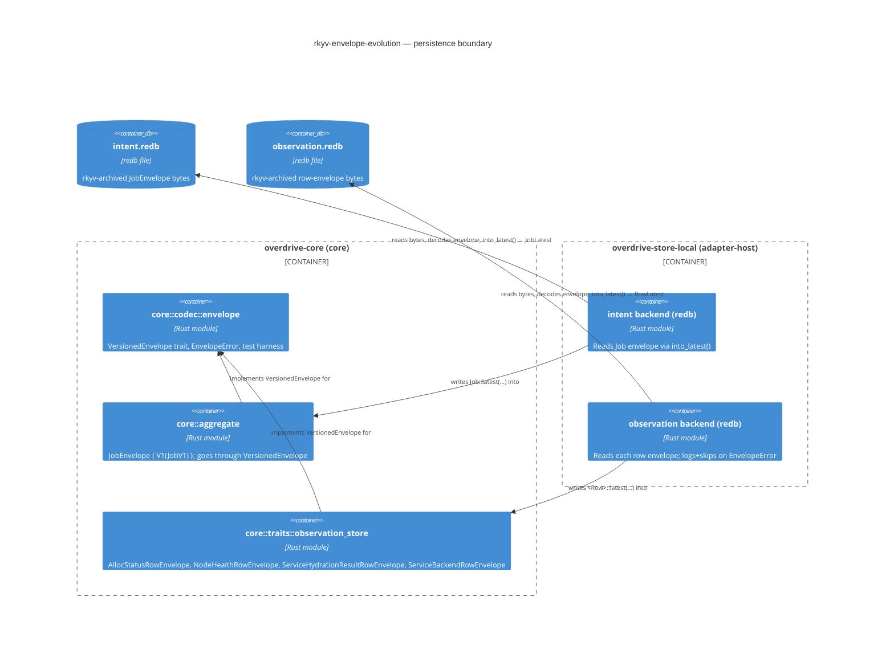

# DESIGN wave decisions — rkyv-envelope-evolution

**Feature**: `rkyv-envelope-evolution`
**Wave**: DESIGN (application/components scope, propose mode)
**Architect**: Morgan
**Status**: CONFIRMED (all four open questions resolved by user 2026-05-12; SSOT writes landed; revised 2026-05-12 in response to peer review — see § 11 "Review-revision log")
**Date**: 2026-05-12

---

## 1. Pre-wave artifact checklist

This design wave originates from a bug-fix RCA, not a feature pipeline.
DISCUSS / DISTILL artifacts do not exist and that is the correct state.

| Path | Status |
|---|---|
| `docs/feature/rkyv-envelope-evolution/discuss/brief.md` | ⊘ not found (correct — RCA-driven) |
| `docs/feature/rkyv-envelope-evolution/discuss/user-stories.md` | ⊘ not found |
| `docs/feature/rkyv-envelope-evolution/distill/test-scenarios.md` | ⊘ not found |
| `docs/feature/rkyv-envelope-evolution/distill/acceptance-criteria.md` | ⊘ not found |
| `docs/product/architecture/brief.md` | ✓ read (Phase 1 single-node, Morgan owns Application Architecture) |
| `docs/product/architecture/adr-0035-reconciler-memory-collapse-to-typed-view-redb.md` | ✓ existing precedent (View / CBOR side) |
| `docs/product/architecture/adr-0036-anystate-amendment-no-per-reconciler-hydrate.md` | ✓ existing precedent (schema evolution language) |
| `docs/product/architecture/adr-0047-workload-kind-discriminator.md` | ✓ most recent — next sequential = **ADR-0048** |
| `crates/overdrive-store-local/src/observation_backend.rs` | ✓ read (failing reader, module-level "rebuild-on-upgrade" prose lines 5–27) |
| `crates/overdrive-core/src/traits/observation_store.rs` | ✓ read (four row types; false additive-field claims at lines 278-282, 311-313, 359-361) |
| `crates/overdrive-core/src/aggregate/mod.rs` (Job / WorkloadDriver / Exec) | ✓ read (lines 96–172) |
| `crates/overdrive-control-plane/src/view_store/redb.rs` | ✓ read (CBOR + serde precedent) |

---

## 2. Problem summary (verified)

Five rkyv-archive boundaries lack schema-evolution support:

| Boundary | Value type | Defined at |
|---|---|---|
| `observation_alloc_status` table | `AllocStatusRow` | `observation_store.rs:283` |
| `observation_node_health` table | `NodeHealthRow` | `observation_store.rs:392` |
| `observation_service_hydration_results` table | `ServiceHydrationResultRow` | `observation_store.rs:463` |
| `observation_service_backends` table | `ServiceBackendRow` | `observation_store.rs:494` |
| Intent aggregate redb store | `Job` (with embedded `WorkloadDriver` + `Exec`) | `aggregate/mod.rs:96` |

**False docstring claims**: three docstrings at `observation_store.rs:278-282`,
`311-313`, `359-361` claim rkyv has "additive-field tolerance" — it does
not. Plain `#[derive(rkyv::Archive)]` structs encode a **fixed positional
layout**; adding a field shifts every subsequent field's offset, and the
validator (`rkyv-0.8.15/src/validation/archive/validator.rs:47-56`) rejects
the old bytes with a `subtree pointer overran range` panic at read time.

**Migration policy** (already decided): single-cut greenfield (2b) — users
`rm -rf ~/.overdrive/data` once. Per `feedback_single_cut_greenfield_migrations.md`.

**Out of scope**: `RedbViewStore` (already CBOR + serde-versioning per
ADR-0035/0036); `FingerprintInput` (hash input, never persisted).

---

## 3. Reuse Analysis (MANDATORY)

| Existing pattern | Location | Reusable? | Decision |
|---|---|---|---|
| **CBOR `serde(tag = "v")` envelope** for `View` blobs | `development.md` § Reconciler I/O → Schema evolution; ADR-0035/0036 | API surface only — wire format differs | Mirror **shape** (versioned envelope tagged by integer discriminant; `Latest` alias; `latest(payload)` constructor) but **not the wire codec** (rkyv ≠ CBOR). |
| `RedbViewStore` CBOR encoder | `crates/overdrive-control-plane/src/view_store/redb.rs` | Not directly — wraps `serde` not `rkyv` | Use it as the **mental model** for the new rkyv envelope: probe table, write-then-fsync, typed error variants. |
| `ServiceHydrationStatus` enum | `observation_store.rs:415` (rkyv-archived) | First-class precedent that rkyv enums work for our row types | The envelope itself will be an rkyv-archived enum — same construction shape. |
| `ObservationRow` outer enum | `observation_store.rs:516` | NOT an envelope — a *closed set of row types*; one variant per table | Keep unchanged. The new envelope wraps each *inner* row type, not the outer enum. |
| `LogicalTimestamp::dominates` LWW key | (used by all four observation rows) | Untouched by this change | Envelope version is **inside** the value payload; the LWW key remains the row's content-addressed key. |
| `FingerprintInput` (rkyv-archived, hashing only) | `BackendSetFingerprint` derivation | Not persisted (hash input only) | Explicitly out of scope per problem statement. No envelope needed. |

**Conclusion**: no existing rkyv envelope to extend. The closest precedent
(CBOR `View` envelope) confirms the *shape* but its codec is wrong for the
rkyv path. We introduce a new workspace primitive scoped to rkyv-persisted
values.

---

## 4. Design Options

### A. Envelope shape canon

#### Option A1 — rkyv enum variant per version (`enum FooRow { V1(FooRowV1), V2(FooRowV2) }`)

```rust
#[derive(rkyv::Archive, rkyv::Serialize, rkyv::Deserialize, Debug, Clone, PartialEq, Eq)]
pub enum AllocStatusRow {
    V1(AllocStatusRowV1),
    V2(AllocStatusRowV2),
}
```

- **Pros**: rkyv encodes enum discriminant deterministically as `u8` tag
  + payload. Variant ordering pinned in source. No new infrastructure
  crate. Existing `ServiceHydrationStatus` enum is direct proof rkyv enums
  archive cleanly.
- **Cons**: per-type bespoke shape — every persisted type re-implements
  the pattern. No central enforcement that writers emit `V<latest>` (a
  call site can construct `V1(...)` against a binary that already has
  `V2`). Adding `V3` touches every read site that pattern-matches.
- **Forward-read policy**: unknown variant tag → rkyv validator rejects
  at read (well-defined, but the error is a low-level
  `CheckArchiveError`, not a typed "unknown future version" signal).

#### Option A2 — generic workspace primitive `Envelope<T>` (rkyv enum, parametric)

```rust
// in overdrive-core::codec::envelope
#[derive(rkyv::Archive, rkyv::Serialize, rkyv::Deserialize, Debug, Clone, PartialEq, Eq)]
pub enum Envelope<T>
where
    T: rkyv::Archive,
{
    V1(T),
    // V2(NewerT) added here when the schema breaks.
}

// In leaf crate:
pub type AllocStatusRow      = AllocStatusRowV1;       // alias for Latest
pub type StoredAllocStatus   = Envelope<AllocStatusRow>;
```

- **Pros**: single primitive owned by `overdrive-core::codec`; reusable
  for *every* rkyv-persisted type (5 today; more in Phase 2+ — compiled
  policy verdicts, revoked-cert lists). Test discipline (golden-byte
  schema-evolution tests) shares one harness.
- **Cons**: `Envelope<T>` is parametric, so each schema bump introduces a
  *new generic instantiation* — `Envelope<AllocStatusRowV1>` and
  `Envelope<AllocStatusRowV2>` are different types. Forward reads
  (binary at V1 reading a V2 file) require **per-type version-tag-only
  decode** before committing to the payload type. This means the envelope
  needs a two-stage decode: read a probe tag first, then the payload.
  rkyv's positional layout makes that subtle — the enum discriminant is
  fixed at offset 0 but the payload pointer follows the type's archived
  size, which differs per `T`.
- **Forward-read policy**: needs explicit "peek tag" helper.

#### Option A3 — versioned struct wrapper with explicit `u16` tag

```rust
#[derive(rkyv::Archive, rkyv::Serialize, rkyv::Deserialize, Debug, Clone, PartialEq, Eq)]
pub struct Tagged<T> {
    pub version: u16,   // tag at fixed offset 0
    pub payload: T,
}
```

- **Pros**: tag at fixed offset is trivially peek-able pre-decode.
- **Cons**: only works if **every version's payload is the same archived
  type**, defeating the whole point. To carry different payload types per
  version, you end up needing an enum anyway. Strictly worse than A1/A2.

#### **Recommendation: A1 (per-type rkyv enum), with helpers in `overdrive-core::codec`**

Rationale:

1. **Type-system correctness over abstraction reuse.** A1 lets each
   row type declare its own version axis. `AllocStatusRow` is on V2
   (the `WorkloadKind` + `listeners` fields are post-V1); `NodeHealthRow`
   is still on V1; `Job` is on V1. Coupling them via `Envelope<T>` makes
   bumping one type's version look like a typing-system change to its
   *neighbors* through generic instantiation — a footgun.
2. **rkyv enums are forward-compatible across variant additions, on
   two independent sources of confidence.**
   - **rkyv 0.8 source semantics.** `rkyv-0.8.15` emits a
     `#[repr(u8)]` enum discriminant tag at offset 0 followed by
     per-variant `#[repr(C)]` payload structs of shape
     `(Tag, payload_fields...)`. Canonical reference shape lives in
     the stdlib `Result<T,E>` impl at
     `~/.cargo/registry/src/index.crates.io-1949cf8c6b5b557f/rkyv-0.8.15/src/impls/core/result.rs:11-26`
     (`#[repr(u8)] enum ArchivedResultTag { Ok, Err }`, then
     `#[repr(C)] struct ArchivedResultVariantOk<T>(ArchivedResultTag, T)`).
     Dispatch is by tag-byte value at offset 0; payload layout is
     per-variant. Appending `V<N+1>` at the end allocates a new tag
     value and does NOT shift existing variants' tags or layouts.
   - **In-repo precedent — `ServiceHydrationStatus`.**
     `crates/overdrive-core/src/traits/observation_store.rs:415-447`
     declares an rkyv-archived enum and its docstring (lines
     412-414) commits to *"Variant ordering and discriminants are
     STABLE — additions are minor-version per ADR-0037."* The shape
     matches; the property is not yet exercised in production (no
     V2 has shipped) so this precedent is for the shape, not the
     tested invariant. The mandatory golden-bytes fixtures (§ F)
     close that gap structurally for every envelope going forward.
3. **Forward-read policy is per-type anyway.** What "unknown V3 means"
   for `AllocStatusRow` (drop the row, log) may differ from what it
   means for `Job` (refuse to start — intent is load-bearing). A1
   keeps the policy local.
4. **Codec helpers stay shared.** The `overdrive-core::codec` module
   carries shared helpers: `EnvelopeError`, the `Latest`-alias
   convention, the schema-evolution test harness primitive. Each
   persisted type implements the pattern; the primitive doesn't enforce
   the *shape* via a generic — it enforces the *discipline* via a trait.

A trait-shape sketch (the discipline-enforcer):

```rust
// overdrive-core::codec::envelope
pub trait VersionedEnvelope:
    rkyv::Archive + rkyv::Serialize<rkyv::rancor::Strategy<...>>
{
    /// The latest payload type. Writers MUST go through `Self::latest`.
    type Latest;

    /// Constructor — every writer site goes through this. Adding a new
    /// version requires updating this implementation; old call sites
    /// continue to compile and now emit the new latest version
    /// automatically.
    fn latest(payload: Self::Latest) -> Self;

    /// Read-time projection to the latest shape. Older versions are
    /// up-converted via `From` impls; unknown future versions return
    /// `Err(EnvelopeError::UnknownVersion)`.
    fn into_latest(self) -> Result<Self::Latest, EnvelopeError>;
}
```

### B. Where the envelope lives

**Recommendation: per-type co-located, with shared primitives in `overdrive-core::codec`.**

- Each row type owns its own envelope enum (e.g. `AllocStatusRow` *is* the
  envelope; `AllocStatusRowV1` / `V2` are the inner shapes).
- The shared `overdrive-core::codec::envelope` module owns: the
  `VersionedEnvelope` trait, the `EnvelopeError` enum, and a
  `#[macro_export] macro_rules! envelope_test!(...)` (or function) that
  generates the gold-byte forward-read test for any envelope.

This places domain types in their bounded context (intent on `aggregate`,
observation on `traits::observation_store`) and the *protocol* (versioned
envelope discipline) in `core::codec`. Mirrors the
`overdrive-core::traits` / `overdrive-core::aggregate` split.

### C. Write-time invariant — every writer emits V<latest>

**Recommendation: combination of (i) `type Latest = ...` alias + (ii) trait-driven `latest()` constructor.**

```rust
// overdrive-core::aggregate::alloc_status (or wherever the row lives)
pub type AllocStatusRow = AllocStatusRowEnvelope;        // exported as "the row"
pub type AllocStatusRowLatest = AllocStatusRowV2;        // alias for current shape

#[derive(rkyv::Archive, rkyv::Serialize, rkyv::Deserialize, ...)]
pub enum AllocStatusRowEnvelope {
    V1(AllocStatusRowV1),
    V2(AllocStatusRowV2),
}

impl VersionedEnvelope for AllocStatusRowEnvelope {
    type Latest = AllocStatusRowV2;
    fn latest(payload: Self::Latest) -> Self { Self::V2(payload) }
    fn into_latest(self) -> Result<Self::Latest, EnvelopeError> {
        match self {
            Self::V1(v1) => Ok(v1.into()),       // From<V1> for V2 — additive
            Self::V2(v2) => Ok(v2),
        }
    }
}
```

Every write site is:

```rust
let row = AllocStatusRow::latest(AllocStatusRowLatest { /* fields */ });
store.write(row)?;
```

**Symptom enforcement — two-layer (honest mechanism)**:

- **Layer 1 (cross-crate, type-system)**: inner payload types
  (`AllocStatusRowV1`, `AllocStatusRowV2`, …) are `pub(crate)` inside
  `overdrive-core` and not re-exported. Cross-crate writers (the
  dominant case — `overdrive-store-local` is where every IntentStore
  / ObservationStore write site lives) cannot name the payload type
  to put inside `Envelope::V1(...)`. NOTE: this does NOT block the
  variant constructor itself — `AllocStatusRow::V1(<expr>)` is
  syntactically reachable from any crate because the envelope enum
  is `pub`; cross-crate callers are merely unable to produce a
  payload value of the right type.
- **Layer 2 (in-crate, syntactic lint)**: a one-clause addition to
  `xtask::dst_lint` walks `overdrive-core` source for
  `<Envelope>::V<N>(` literal patterns *outside* the defining
  module's own `From` / `into_latest` impls and fails the PR at CI
  time. The scanner is purely syntactic (no `overdrive-*` imports);
  the xtask boundary per `.claude/rules/development.md` § "xtask is
  build / test / dev orchestration" stays intact. The test
  discipline (§ F below) is a structural fallback that catches
  layout drift regardless of which writer path slipped past.

**Rejected alternatives**:
- `#[non_exhaustive]` envelope — only blocks downstream-crate
  exhaustive matches; does NOT prevent construction.
- Per-variant `pub(in path)` — Rust does not support per-variant
  visibility narrower than the enum.
- Standalone `overdrive-envelope-lint` binary in
  `overdrive-core::src/bin/` — would require type resolution against
  `overdrive-core` itself, but the check is syntactic / grep-tier
  and does not need it. The xtask path is correct and matches the
  existing dst-lint precedent.

### D. Read-time policy

| Failure mode | Policy | Error type |
|---|---|---|
| Bytes decode to a known older variant (`V1` when current is `V2`) | Up-convert via `From<V1Inner> for V2Inner` (additive-only); proceed | None |
| Bytes decode to a known newer variant (`V3` when current is `V2`) | `Err(EnvelopeError::UnknownVersion { observed, supported })` | Observation rows: log + skip the row (single-row degradation). Intent (`Job`): refuse to start (`IntentStoreError::UnknownEnvelope` → `health.startup.refused`). |
| Bytes don't decode to the envelope at all (corruption, prior-schema file) | `Err(EnvelopeError::Malformed { source })` | Observation rows: log + skip. Intent: refuse to start. |

Error variant placement:

- `overdrive-core::codec::envelope::EnvelopeError` — the canonical type.
- `ObservationStoreError::Envelope { source: EnvelopeError }` via
  `#[from]` (per development.md error pattern).
- `IntentStoreError::Envelope { source: EnvelopeError }` via `#[from]`.

The asymmetric policy (intent fail-fast, observation degrade-gracefully)
matches the existing platform discipline: intent is the SSOT, observation
is gossiped and converges; losing one observation row is a tick away
from recovery, losing one intent row is data loss.

### E. Documentation discipline

The three false docstrings at `observation_store.rs:278-282`, `311-313`,
`359-361` are corrected to:

```rust
/// Schema evolution: this row is wrapped in [`AllocStatusRowEnvelope`]
/// at the persistence boundary per ADR-0048. Adding fields requires
/// minting a new `AllocStatusRowVN` shape and a new envelope variant
/// — `Option<T>` does NOT provide forward-read compatibility on its
/// own (rkyv archives are fixed-position).
```

**New rule placement** in `.claude/rules/development.md`: extend the
existing § "Reconciler I/O" → "Schema evolution" subsection with a sibling
top-level section after it: § **"rkyv schema evolution"**. The View / CBOR
path is one paradigm (additive serde with `#[serde(default)]`); the rkyv
path is a different paradigm (versioned envelope enum). Both deserve their
own canon section.

**Draft text for `.claude/rules/development.md`** (proposed addition,
INLINE for user review before landing):

> ## rkyv schema evolution
>
> rkyv archives are fixed-position layouts. `#[derive(rkyv::Archive)]`
> on a plain struct/enum encodes every field at a compile-time-fixed
> offset; adding a field (even `Option<T>`) shifts subsequent offsets
> and renders pre-existing bytes unreadable. The validator surfaces
> the failure as a `subtree pointer overran range` rejection at read
> time — there is no `#[serde(default)]`-equivalent escape hatch.
>
> **Every rkyv-persisted type goes through a versioned envelope.** The
> canonical shape is a per-type rkyv enum where each variant is one
> historical payload type:
>
> ```rust
> #[derive(rkyv::Archive, rkyv::Serialize, rkyv::Deserialize, ...)]
> pub enum FooRowEnvelope {
>     V1(FooRowV1),
>     V2(FooRowV2),
> }
> pub type FooRowLatest = FooRowV2;
> impl VersionedEnvelope for FooRowEnvelope { /* ... */ }
> ```
>
> Rules:
>
> - **Writers MUST go through `<Envelope>::latest(payload)`.** Direct
>   variant construction (e.g. `FooRowEnvelope::V1(...)`) outside the
>   defining module's own `From` / `into_latest` impls is rejected.
> - **Reads up-convert to `Latest` via `into_latest()`.** Older variants
>   chain through `From<V1> for V2`, `From<V2> for V3`, …; each
>   conversion is additive-only.
> - **Unknown-future-version handling depends on the layer.** Intent
>   reads (load-bearing) refuse to start with a structured
>   `health.startup.refused`. Observation reads degrade gracefully
>   (log + skip the row).
> - **Bumping a version is a single commit** that adds `VN+1`, sets
>   `type FooRowLatest = FooRowVN+1`, updates `latest()`, and adds a
>   `From<FooRowVN> for FooRowVN+1` impl. **Existing tests assert that
>   the prior version's golden bytes still decode** — that is the
>   structural defense against drift.
> - **Migration policy is greenfield single-cut for Phase 1.** Per
>   `feedback_single_cut_greenfield_migrations.md`. Phase 2+ may
>   re-evaluate when a real production fleet exists; until then,
>   "delete the on-disk redb file" is the official upgrade path. The
>   envelope discipline exists so that **future** versions can read
>   today's V<latest> files without rebuild.

### F. Testing discipline

**Recommendation: new mandatory call site in § "Property-based testing
(proptest)" → "Mandatory call sites" in `.claude/rules/testing.md`.**

**Draft text for `.claude/rules/testing.md`** (proposed addition, INLINE):

> - **Archive schema-evolution roundtrip.** Every versioned envelope
>   (per `development.md` § "rkyv schema evolution") ships a per-version
>   golden-bytes fixture in
>   `crates/<crate>/tests/schema_evolution/<envelope>.rs`. For each
>   historical variant V_N, the test:
>   1. Constructs the canonical V_N payload from hand-pinned fields.
>   2. rkyv-serialises it; the resulting bytes are hex-encoded and stored
>      inline in the test source as a `const FIXTURE_V_N: &str = "..."`.
>   3. On every run, hex-decodes `FIXTURE_V_N`, rkyv-deserialises into
>      `Envelope`, calls `into_latest()`, and asserts equality against a
>      canonical Latest projection.
>   The test FAILS when an envelope variant's archived layout changes
>   without minting a new version — which is the structural defense
>   against "additive Option<T>"-style mistakes. Adding `V_N+1` adds a
>   new fixture and a new assertion; the prior `FIXTURE_V_N` is **never
>   touched**.

Test layout per-crate:

```
crates/overdrive-core/tests/schema_evolution.rs       # entrypoint
crates/overdrive-core/tests/schema_evolution/
    alloc_status_row.rs
    node_health_row.rs
    service_hydration_result_row.rs
    service_backend_row.rs
    job.rs                                            # intent aggregate
```

Default lane (no `integration-tests` feature) — these are pure-Rust
in-memory, no I/O.

### G. ADR

Path: `docs/product/architecture/adr-0048-rkyv-versioned-envelope.md`.
Status: Proposed (awaiting user confirmation). Draft below in § 7.

### H. Intent aggregate (`Job` with embedded `WorkloadDriver` + `Exec`)

**Recommendation: envelope at the `Job` level only.**

Rationale:

1. **One version axis per persisted unit.** A redb row's bytes encode
   one `Job`. The envelope variant is the *file-format version* of that
   row. Embedding sub-envelopes (`WorkloadDriverEnvelope`,
   `ExecEnvelope`) inside `JobV1` creates a combinatorial version space
   — `Job V1 + WorkloadDriver V2 + Exec V1` is a distinct point in the
   schema lattice. Operators have no way to reason about which
   combination they're running.
2. **Consequence (stated honestly)**: every internal-type schema change
   bumps `Job`'s outer version. `MicroVm` / `Wasm` driver variants land
   as `JobV2` even though the `Job` struct itself didn't gain a field —
   only `WorkloadDriver` did. This is the *correct* coupling: the file
   format is what changed.
3. **Phase 1 single-node mitigates the cost**: greenfield cut means
   "V2 lands by deleting the V1 on-disk file." Phase 2+ may introduce
   sub-envelopes if the cost ratio inverts.

---

## 5. Trade-off summary — recommendation

| Question | Recommendation | Status |
|---|---|---|
| **A. Envelope shape** | A1 — per-type rkyv enum | **Confirmed by user 2026-05-12** |
| **B. Where it lives** | Per-type co-located; shared trait + error in `overdrive-core::codec::envelope` | **Confirmed by user 2026-05-12** |
| **C. Write invariant** | Two complementary layers: (1) `pub(crate)` on inner payload types prevents cross-crate writers from *constructing the payload value* — the only path to put inside `Envelope::V1(...)` from `overdrive-store-local` is the publicly-exported `<Foo>Latest` alias, which `Envelope::latest()` consumes. (2) A one-clause addition to `xtask::dst_lint` (syntactic scanner; no `overdrive-*` deps so the xtask boundary stays intact) flags `<Envelope>::V<N>(` literals outside the defining module's own `From` / `into_latest` impls — required because the envelope enum itself is `pub`, so the variant *constructor* remains syntactically reachable cross-crate; cross-crate callers cannot supply a payload value (Layer 1), but in-crate callers can and the lint is the gate. Layer 1 covers the dominant writer surface (every IntentStore/ObservationStore write lives in `overdrive-store-local`). Honest framing: visibility blocks the payload, lint blocks the variant constructor. | **Confirmed by user 2026-05-12; revised 2026-05-12 per peer review (honest mechanism statement)** |
| **D. Read policy** | Intent: refuse to start on unknown/malformed. Observation: log + skip row. Errors via `EnvelopeError` `#[from]` | **Confirmed by user 2026-05-12 (asymmetric)** |
| **E. Docs** | Correct three false docstrings; new § "rkyv schema evolution" in development.md | **Confirmed; landed 2026-05-12** |
| **F. Tests** | Golden-bytes per-version fixtures; new bullet in testing.md § PBT mandatory call sites | **Confirmed; landed 2026-05-12** |
| **G. ADR** | ADR-0048 (status: Accepted) | **Confirmed; landed 2026-05-12** |
| **H. Job aggregate** | Envelope at `Job` level only (outer-only; embedded `WorkloadDriver`/`Exec` changes bump outer `Job` version) | **Confirmed by user 2026-05-12** |

---

## 6. C4 — Container diagram (Mermaid)



L3 (component) intentionally omitted — the design is shallow enough
(one trait, one error, per-type enum) that an extra level adds no
clarity.

---

## 7. ADR-0048 — DRAFT (status: Proposed)

Path: `docs/product/architecture/adr-0048-rkyv-versioned-envelope.md`

```markdown
# ADR-0048: rkyv versioned envelope for persisted types

## Status

Proposed (2026-05-12). Awaiting user confirmation.

## Context

Five rkyv-archive boundaries persist data via redb:

| Boundary | Type |
|---|---|
| `observation_alloc_status` | `AllocStatusRow` |
| `observation_node_health` | `NodeHealthRow` |
| `observation_service_hydration_results` | `ServiceHydrationResultRow` |
| `observation_service_backends` | `ServiceBackendRow` |
| intent aggregate | `Job` (embeds `WorkloadDriver`, `Exec`) |

Each derives `rkyv::{Archive, Serialize, Deserialize}` on a plain struct
or enum. Three docstrings on `AllocStatusRow` (lines 278-282, 311-313,
359-361 of `observation_store.rs`) claim rkyv has "additive-field
tolerance" — i.e. that `Option<T>` fields appended to a struct
deserialise from older archives.

This is false. rkyv archives are **fixed positional layouts**. Adding
a field shifts subsequent offsets; the validator
(`rkyv-0.8.15/src/validation/archive/validator.rs:47-56`) panics on read
with `subtree pointer overran range`.

The failure surfaced 2026-05-12 as
`WARN convergence tick error e=ObservationRead("...subtree pointer
overran range...")` after the `WorkloadKind` discriminator field
(commit 6ffa9270) and `listeners: Vec<ListenerRow>` (commit e7b40282)
were appended to `AllocStatusRow` against existing redb files.

ADR-0035/0036 established a CBOR / serde-versioning envelope for the
View / ViewStore layer. That envelope is correct *for CBOR*; it does
not apply to rkyv, which has different layout semantics.

## Decision

Every rkyv-persisted type at the redb persistence boundary is wrapped
in a per-type **versioned envelope enum**. Writers go through a
`VersionedEnvelope::latest()` constructor; readers up-convert to
`Latest` via `into_latest()`. Schema bumps add a new variant + a new
`From<VN> for VN+1` impl, and the prior version's golden bytes
continue to decode.

```rust
// overdrive-core::codec::envelope
pub trait VersionedEnvelope: rkyv::Archive + rkyv::Serialize<...> {
    type Latest;
    fn latest(payload: Self::Latest) -> Self;
    fn into_latest(self) -> Result<Self::Latest, EnvelopeError>;
}

pub enum EnvelopeError {
    UnknownVersion { observed: u8, supported_max: u8 },
    Malformed { source: rkyv::rancor::Error },
}
```

Per-type shape:

```rust
#[derive(rkyv::Archive, rkyv::Serialize, rkyv::Deserialize, ...)]
pub enum AllocStatusRowEnvelope {
    V1(AllocStatusRowV1),
    V2(AllocStatusRowV2),
}
pub type AllocStatusRow = AllocStatusRowEnvelope;   // exported as "the row"
pub type AllocStatusRowLatest = AllocStatusRowV2;
```

Read-time policy:

| Layer | Unknown / malformed |
|---|---|
| Intent (`Job`) | Refuse to start: `health.startup.refused` |
| Observation (all four row types) | Log + skip the row; degrade gracefully |

Migration: greenfield single-cut for Phase 1 (per
`feedback_single_cut_greenfield_migrations.md`). The envelope exists
so that **future** versions can read today's V<latest> files without
rebuild — not so that today's binaries can read pre-envelope files.

## Alternatives Considered

### Option 1 — Generic `Envelope<T>` workspace primitive (rejected)

A single `enum Envelope<T> { V1(T), V2(NewerT), … }` parameterised over
the inner type. Rejected because:

- Generic instantiation couples version axes across unrelated types
  (`Envelope<AllocStatusRowV1>` and `Envelope<JobV1>` are distinct
  types but share the bump cadence).
- Forward-read (V1 binary peeking at V2 bytes) requires two-stage
  decode that rkyv's positional layout makes awkward.

### Option 2 — `Tagged<T> { version: u16, payload: T }` struct (rejected)

A fixed-offset version tag at byte 0. Rejected because every version's
payload would have to share the same archived type, which defeats the
purpose. Carrying different payload types per version requires an enum
anyway.

### Option 3 — Status quo: `Option<T>` additive fields (rejected — buggy)

The pre-incident understanding. False — `Option<T>` is positional like
every other rkyv field and shifts offsets.

## Consequences

**Positive**:
- Schema bumps become a structural, type-system-enforced operation.
- Golden-bytes test discipline (per `testing.md` addition) catches
  silent layout drift at PR time.
- Intent / observation asymmetric policy preserves SSOT integrity:
  intent fails fast; observation converges through degradation.

**Negative**:
- Every persisted type gains a per-variant enum overhead (one `u8`
  discriminant in the archive). Storage cost is ~1 byte per row —
  negligible.
- Every internal-type change to a subtype of `Job` (`WorkloadDriver`,
  `Exec`) bumps the *outer* `Job` envelope version. Stated coupling,
  not a bug — see § H of the design doc.
- Greenfield single-cut means existing dev `~/.overdrive/data` files
  must be deleted on this PR landing. Per
  `feedback_single_cut_greenfield_migrations.md` this is the standard
  Phase 1 contract; document in the PR description.

## References

- `docs/feature/rkyv-envelope-evolution/design/wave-decisions.md`
- ADR-0035 (CBOR / serde-versioning analog on the View side)
- ADR-0036 (Amendment — no per-reconciler hydrate)
- `.claude/rules/development.md` § "rkyv schema evolution" (new)
- `.claude/rules/testing.md` § PBT mandatory call sites (new bullet)
```

---

## 8. Quality gates (Morgan's self-check)

- [x] Requirements traced to components (5 redb boundaries → 5 envelope types)
- [x] Component boundaries with clear responsibilities (codec module vs domain types vs adapter)
- [x] Technology choices in ADRs with alternatives (3 alternatives in ADR-0048)
- [x] Quality attributes: maintainability (single discipline), reliability (gold-byte test), security (no foreign-bytes accepted)
- [x] Dependency-inversion compliance (trait owned by `core`; adapters implement)
- [x] C4 diagram (L1 implicit via existing brief; L2 above)
- [x] Integration patterns specified (per-type envelope at persistence boundary)
- [x] OSS preference validated (rkyv is workspace-pinned MIT/Apache-2.0)
- [x] AC behavioral: "old version's gold bytes decode" — observable, not implementation-coupled
- [x] No deferrals introduced
- [x] No external integrations (this is pure-Rust local persistence)

---

## 9. User confirmation — landed 2026-05-12

All four open questions confirmed by the user. SSOT writes performed:

1. `docs/product/architecture/adr-0048-rkyv-versioned-envelope.md` — **Accepted** (status moved from Proposed → Accepted, date 2026-05-12).
2. `.claude/rules/development.md` — new top-level section § "rkyv schema evolution" landed between § "Reconciler I/O" and § "Workflow contract".
3. `.claude/rules/testing.md` — new bullet "Archive schema-evolution roundtrip" landed under § "Property-based testing (proptest)" → "Mandatory call sites".
4. `docs/product/architecture/brief.md` — one-line cross-reference to ADR-0048 added to the rkyv dependency row in § 10.

Resolved decisions:

- **(A) Envelope shape**: per-type rkyv enum (`enum FooRowEnvelope { V1(...), V2(...) }`). Generic `Envelope<T>` and `Tagged<T>` rejected.
- **(C) Write invariant**: two complementary layers per honest mechanism statement (revised 2026-05-12 per peer review).
  - **Layer 1 — `pub(crate)` blocks cross-crate payload construction.** Inner payload types (`AllocStatusRowV1`, `AllocStatusRowV2`, …) are `pub(crate)` inside `overdrive-core` and not re-exported. Cross-crate writers in `overdrive-store-local` cannot construct a value of the inner payload type, so they cannot supply one to `Envelope::V1(...)`. The only construction path from outside `overdrive-core` is `Envelope::latest(<Foo>Latest { ... })`. NOTE: this does NOT block the variant constructor itself — the envelope enum is `pub` and `Envelope::V1(<expr>)` remains syntactically reachable from any crate; it is rendered uncallable in practice by the payload type being unnameable cross-crate, not by the constructor being unreachable.
  - **Layer 2 — `xtask::dst_lint` clause blocks in-crate variant construction.** Within `overdrive-core` itself, in-crate code CAN name a `pub(crate)` payload and CAN call `Envelope::V1(payload)`. The residual in-crate hole is closed by a syntactic AST clause added to the existing `xtask::dst_lint` scanner (precedent: `xtask/src/dst_lint.rs`, already syntactically scans `core`-class crate sources for banned shapes — see ADR-0003). The new clause walks `overdrive-core` source for `<Envelope>::V<N>(` literal expression patterns outside the defining module's own `From` / `into_latest` impls. Per `.claude/rules/development.md` § "xtask is build / test / dev orchestration, NOT a runtime entry point": the scanner is *syntactic only* and does NOT import any `overdrive-*` crate; the xtask boundary stays intact.
  - **Why not a separate binary**: a standalone `overdrive-envelope-lint` in `overdrive-core::src/bin/` would need `overdrive-core` to import its own envelope types for type resolution, but the variant-construction check is grep-tier syntactic — no type resolution required. The xtask path is correct.
  - Rejected: `#[non_exhaustive]` (blocks downstream matches, not construction), per-variant `pub(in path)` (not supported in Rust), pure trybuild `compile_fail` per envelope (one fixture per envelope vs. one lint clause covering all — a single complementary trybuild fixture is still recommended, see S-EV-02).
- **(D) Read policy**: asymmetric. Intent (`Job`) refuses to start on unknown/malformed (`health.startup.refused`). Observation rows log + skip the offending row and continue convergence.
- **(H) Job aggregate**: outer envelope only. Embedded `WorkloadDriver` / `Exec` schema changes bump the outer `Job` envelope version. Sub-envelopes explicitly rejected.

---

## 10. Handoff to DISTILL

Scenarios the acceptance-designer must formalise as Rust integration tests
under `crates/<crate>/tests/schema_evolution/` (default lane, no
`integration-tests` feature) and as compile-fail / dst-lint assertions
where structural:

### S-EV-01 — Per-envelope schema-evolution golden-bytes roundtrip

For each of the five envelope boundaries:

| Envelope | Crate | Test file |
|---|---|---|
| `AllocStatusRowEnvelope` | `overdrive-core` | `tests/schema_evolution/alloc_status_row.rs` |
| `NodeHealthRowEnvelope` | `overdrive-core` | `tests/schema_evolution/node_health_row.rs` |
| `ServiceHydrationResultRowEnvelope` | `overdrive-core` | `tests/schema_evolution/service_hydration_result_row.rs` |
| `ServiceBackendRowEnvelope` | `overdrive-core` | `tests/schema_evolution/service_backend_row.rs` |
| `JobEnvelope` | `overdrive-core` | `tests/schema_evolution/job.rs` |

Each test holds a hex-encoded `const FIXTURE_V1: &str = "..."` golden
payload (Phase 1 starts at V1; future variants append `FIXTURE_V2`,
`FIXTURE_V3`, …). The test hex-decodes, rkyv-deserialises into the
envelope, calls `into_latest()`, and asserts equality against a
canonical `Latest` projection.

### S-EV-02 — Write-invariant enforcement (two-layer)

Two complementary assertions matching the two enforcement layers in
ADR-0048 § 2:

**S-EV-02a — Cross-crate payload-type unreachability (trybuild).**
A `tests/compile_fail/<envelope>_payload_unreachable.rs` fixture in
`overdrive-store-local` that attempts to construct
`AllocStatusRowEnvelope::V1(AllocStatusRowV1 { ... })` and asserts
the compilation fails with the expected `E0603`/`E0432` (private /
unresolved) error on the *inner payload type* `AllocStatusRowV1`.
This pins Layer 1 (`pub(crate)` payload visibility). The fixture
explicitly does NOT assert that
`AllocStatusRowEnvelope::V1(...)` itself is unreachable — Layer 1
does not block the variant constructor; it blocks the payload value.
One fixture is sufficient (Layer 1 mechanism is uniform across all
envelopes).

**S-EV-02b — In-crate variant-construction lint
(`cargo xtask envelope-lint` or equivalent dst-lint subcommand).**
A unit test inside `xtask` that creates a synthetic in-`overdrive-core`
source fixture containing `AllocStatusRowEnvelope::V1(payload)`
outside the defining module's own `From` / `into_latest` impls, runs
the AST scanner against it, and asserts the lint fails with an
identifying message. The complementary negative test: the same
scanner accepts the `into_latest()` implementation itself (the only
allowed in-crate site that names a non-latest variant) and the
`From<V1Inner> for V2Inner` impl. This pins Layer 2 (the dst-lint
clause).

The two assertions together close the write-invariant claim: Layer 1
catches cross-crate writers structurally; Layer 2 catches in-crate
writers via mechanical scanning. Neither alone is sufficient — the
trybuild proves cross-crate, the lint proves in-crate.

### S-EV-03 — Write-invariant enforcement (in-crate dst-lint)

A `xtask::dst_lint`-style unit test inside `xtask` that asserts the
scanner flags a synthetic in-crate `AllocStatusRowEnvelope::V1(...)`
construction outside the defining module's own `From` / `into_latest`
impls. Negative case: the same scanner accepts the `into_latest()`
implementation itself.

### S-EV-04 — Observation degrade-gracefully on malformed bytes

Integration test against `LocalObservationStore` that:

1. Writes a valid `AllocStatusRow` envelope at LWW key K1.
2. Writes raw garbage bytes at LWW key K2 via a back-door write helper
   (test-only).
3. Asserts that a full-table scan yields exactly K1's row and emits a
   structured log event tagged `observation.envelope.malformed` for K2.
4. Asserts that subsequent reads / convergence ticks continue normally
   (the malformed row does not poison the table).

Repeat for each of the four observation row types.

### S-EV-05 — Intent refuse-to-start on malformed / unknown-future bytes

Integration test against `LocalStore` (intent backend) that:

1. Pre-writes raw garbage bytes (or a `JobEnvelope::V99(...)`-shaped
   payload constructed via a test-only back-door — synthesising bytes
   for an unknown future variant) at a `JobId` key.
2. Boots the control-plane against this redb file.
3. Asserts startup fails with `IntentStoreError::Envelope`, surfaces as
   `health.startup.refused`, and the process exits non-zero. No
   degraded-but-running state.

### S-EV-06 — Docstring correction verification

A grep-based unit test in `overdrive-core` that asserts no remaining
occurrences of the false "additive-field tolerance" / "additive-field
compatibility" / "rkyv handles additive evolution" claims in
`crates/overdrive-core/src/traits/observation_store.rs`. The
corrected docstrings (per ADR-0048 § "Decision") reference ADR-0048
explicitly; the test can assert the references exist.

### Out of scope for DISTILL (DELIVER concerns)

- The actual implementation of `VersionedEnvelope` trait,
  `EnvelopeError`, and per-type envelope enums.
- The `xtask::dst_lint` clause implementation.
- The greenfield single-cut `rm -rf ~/.overdrive/data` operator
  instruction (PR-description scope).
- Migration of pre-envelope on-disk redb files (explicitly NOT
  supported per ADR-0048 § Migration).

---

## 11. Review-revision log

Peer review (2026-05-12, post-confirmation) flagged 3 blocking + 2
high + 2 medium issues + 1 open question. Resolution:

| Finding | Severity | Resolution | Location |
|---|---|---|---|
| B1 — Verify rkyv enum precedent (`ServiceHydrationStatus` exists?) | Blocking | Confirmed exists at `crates/overdrive-core/src/traits/observation_store.rs:415-447`; cited as precedent for SHAPE (not tested invariant, no V2 has shipped); paired with rkyv 0.8.15 source citation (`impls/core/result.rs:11-26`) for the variant-discriminator semantics that justify Option A1 independent of any in-repo precedent. | ADR-0048 § 1 "Decision — Per-type rkyv enum", wave-decisions.md § 4 A1 rationale point 2 |
| B2 — `pub(crate)` does not block cross-crate writers' variant constructor | Blocking | Replaced "visibility closes the cross-crate hole" with two-layer honest mechanism: (1) `pub(crate)` blocks cross-crate construction of the PAYLOAD value (so `Envelope::V1(<expr>)` is uncallable cross-crate for lack of an expression), (2) dst-lint clause blocks the constructor itself for in-crate writers. Stated explicitly that the variant constructor is `pub` and syntactically reachable from any crate. | ADR-0048 § 2, ADR-0048 Consequences (Negative), wave-decisions.md § 4 C, § 5 table row C, § 9 (C) |
| B3 — xtask boundary violation (`overdrive-*` deps forbidden) | Blocking | Decision: extend existing `xtask::dst_lint` (Option 3a) — the scanner is syntactic / grep-tier, needs only source text + AST, does NOT import any `overdrive-*` crate. Per `.claude/rules/development.md` § "xtask is build / test / dev orchestration" the existing dst-lint precedent is exactly this shape. Rejected Option 3b (`overdrive-core::src/bin/envelope_lint.rs`) — would reintroduce bootstrap-graph cost for no signal gain, since variant construction is a textual pattern. | ADR-0048 § 2, wave-decisions.md § 4 C, § 9 (C) |
| H1 — Operator remediation path | High | New § 6 "Operator Remediation" in ADR-0048: control-plane refuses to start on envelope decode failure with typed `IntentStoreError::Envelope`, structured `health.startup.refused` event, non-zero exit. `Display` form names the redb path and the EnvelopeError variant; documented remediation = *"delete `<data_dir>/intent.redb` and restart"*. Phase 1 single-node greenfield per `feedback_single_cut_greenfield_migrations.md`; Phase 2 migration tooling out of scope. | ADR-0048 § 6 |
| H2 — Version-bump procedure | High | Numbered 6-step checklist landed in `.claude/rules/development.md` § "rkyv schema evolution" → "Version-bump procedure" subsection (steps: add VN+1 variant, update Latest alias, update latest() constructor, add From impl, add golden-bytes fixture, single commit). | `.claude/rules/development.md` § "rkyv schema evolution" |
| M1 — Cross-reference between rkyv and CBOR sections | Medium | The `.claude/rules/development.md` § "rkyv schema evolution" opens with a paragraph cross-referencing § "Reconciler I/O" → Schema evolution (CBOR / ADR-0035/0036), noting the two paths use different evolution mechanics and must not be conflated. Already present in the prior draft (lines 1170-1176); reviewed for clarity, no change needed. Reviewer's concern was confirmed addressed in-place; logged here for traceability. | `.claude/rules/development.md` lines 1170-1176 |
| M2 — Handoff scenario S-EV-02 rewording | Medium | S-EV-02 split into S-EV-02a (trybuild — cross-crate payload-type unreachability) and S-EV-02b (xtask::dst_lint unit test — in-crate variant-construction lint). The unresolved-import claim is now scoped to the payload type only (correct under `pub(crate)` semantics), and the in-crate variant constructor is covered by the lint. | wave-decisions.md § 10 S-EV-02 |
| Q1 — Phase 1 rkyv-persisted boundary enumeration exhaustive? | Open question | Verified complete 2026-05-12 by exhaustive grep across `crates/` for `redb::TableDefinition` constants and `rkyv::Archive` derives reaching redb write paths. 5 redb boundaries confirmed (4 observation tables in `crates/overdrive-store-local/src/observation_backend.rs:74-94`, 1 intent table `entries` in `crates/overdrive-store-local/src/redb_backend.rs:64`). Out-of-band rkyv use sites enumerated and excluded with rationale: `snapshot_frame.rs` (separate `magic+u16-version` frame, not redb-resident), `cgroup_manager.rs` (transient, not persisted), `FingerprintInput` (hash input only), field-level rkyv derives on newtypes (governed transitively by containing envelope). | ADR-0048 Context table + out-of-band enumeration block |
