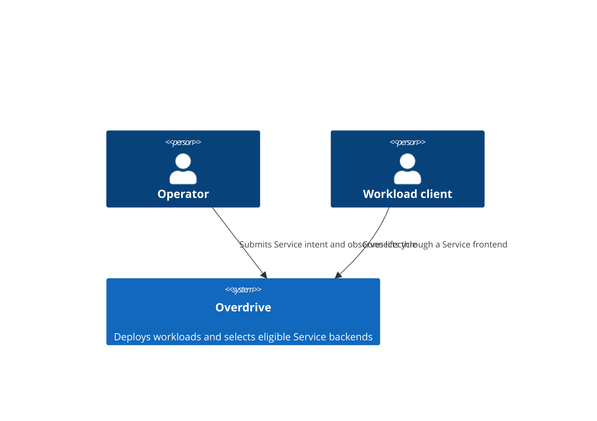
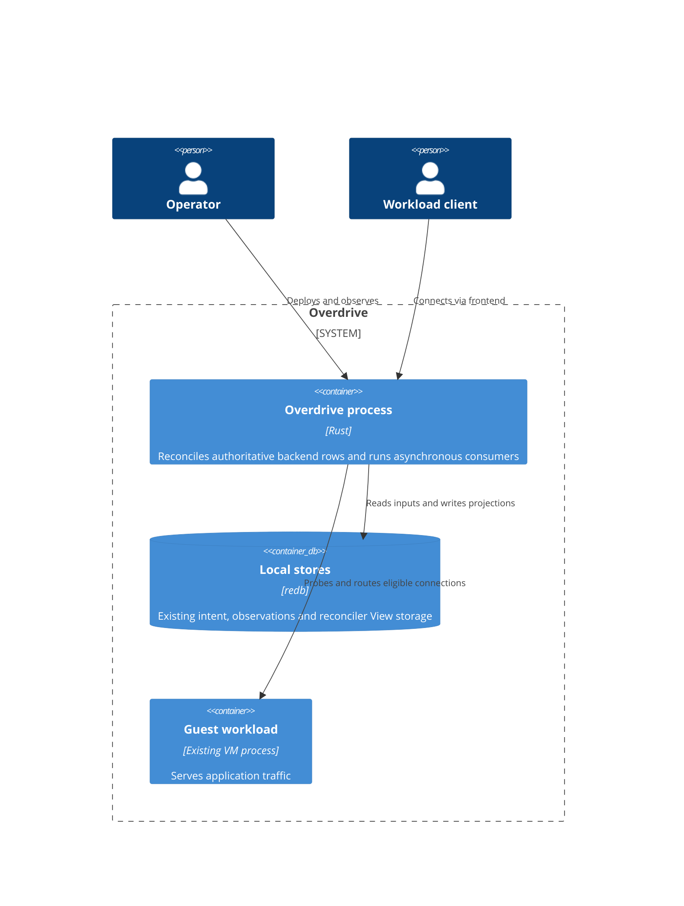

# Backend eligibility convergence — final ownership ruling

**Revision 4 local direct-VIP amendment: Accepted; independent DESIGN review APPROVED**
(2026-09-08), [iteration 1](review-amendment-be10-local-backend-withdrawal.md#iteration-history),
with no findings. The user authorized preserving BE10's withdrawal assertion via
focused local-consumer DESIGN. Revision 3 approval provenance below remains
unchanged and separate. Exact accepted contract:
[ADR-0101 D7](../../../product/architecture/adr-0101-service-backend-health-observed-convergence.md#d7--revision-4-amendment-honor-local-backend-health-with-existing-removal)
and [BE10 amendment](amendment-be10-local-backend-withdrawal.md).

**Status:** Accepted revision 3; independent DESIGN review **APPROVED** on
2026-09-08 in [iteration 3](review-adr-0101.md#iteration-3--focused-re-review-of-r0101-3).
Independent consolidated DESIGN+DISTILL review is also **APPROVED** on
2026-09-08 in [iteration 2](../distill/review-adr-0101-design-distill.md#iteration-2--focused-re-review-of-cd-0101-0102).
Approval does not claim production GREEN or implementation completion; the
recorded behavioral REDs and unexecuted suffixes remain implementation
obligations. The user selected a sole backend projection writer at
ServiceLifecycle and asynchronous consumer convergence. Greenfield replacement:
no compatibility, migration, upgrade handling, dual publisher or rollout path.

The authoritative implementation contract is
[ADR-0101](../../../product/architecture/adr-0101-service-backend-health-observed-convergence.md).
It pins all public State/Fact/Identity changes, private interface changes,
retired APIs, registration, call sites and action ordering. No signature choice
is delegated to the crafter. This ruling supplies rationale and behavioral
boundaries, not an implementation or a test specification.

## Decision and guarantees

ServiceLifecycle alone publishes the complete backend projection for every
current Service listener. Membership comes from Running allocation facts;
eligibility comes from its existing terminal/readiness policy. Neither a
missing output row nor a reappearing same-ID member is evidence of eligibility.

While the existing terminal veto applies, **no subsequent backend publication
grants that allocation eligibility**. This is a publication safety guarantee,
not merely eventual repair of a competing writer's true value. Current
observed output is the deduplication reference; an earlier emitted fingerprint
is not acknowledgement that desired output remains stored.

Startup failure is a lifecycle fact. It does not acknowledge that every
consumer has applied withdrawal. Successful backend publication is followed
by normal asynchronous consumer convergence; a row-write error retains the
existing action-shim error-isolation behavior. No global consumer barrier,
zero-propagation-delay claim, existing-flow termination or new latency SLO.

The terminal predicate remains exactly the existing deciding-tick failure or
retained `terminal_announced` membership. Same-ID restart does not reset it;
Running does not imply healthy. Non-vetoed Running allocations retain ordinary
readiness policy, including true when readiness is absent, without a new Stable
prerequisite. This is not a new permanent-failure or replacement-eligibility
policy. WorkloadLifecycle remains sole restart authority.

## Revalidated evidence and owner path

The source baseline remains `480501fd03df4b0e749e026246312b3f3099ae4e`; the
affected production code was not modified by this DESIGN. The
[diagnosis](../../../analysis/e09-v2-failed-service-reachability.md) retains the
native witness and complete seeded reproducer. Both negative peer Jobs received
the source-identified `SVM-E08-GUEST-OK` witness through replacement VMs and
exited 43 while startup probes still failed. Original VMMs had exited; healthy
controls passed under the same persistent CP PID 2298755. This was neither a
100-pair completion nor a clean expectation capture.

The existing intentionally RED
`crates/overdrive-sim/tests/e09_v2_failed_service_reachability_spike.rs`, seed
`257209`, drives registered WorkloadLifecycle, ServiceLifecycle,
BackendDiscoveryBridge and VmReclamation with production ProbeRunner and
action dispatch through the existing Sim Driver port. Production authors
the disputed rows and veto. Six subsequent service ticks still leave true.
No new failure reproduction or stronger all-schedule claim was made here.

| Production path before correction | Evidence and significance |
| --- | --- |
| ServiceLifecycle sees startup failure, records terminal input, constructs false row before FinalizeFailed | `service_lifecycle.rs:657–703`; health decision and terminal decision already share an owner. |
| Runtime persists View, then awaits dispatch; emitted work re-enqueues even on shim error | `reconciler_runtime.rs:1617–1779`; retained veto is normal runtime state, not a new persistence requirement. |
| Shim drains actions serially, continuing after error; terminal path stops probe/network supervision through existing ownership | `action_shim/mod.rs:905–959`, `:1759–1795`; action completion is not subscriber completion and not a direct-VMM-stop promise. |
| WorkloadLifecycle restarts the same allocation ID; shim awaits prior stop/absence and cleanup before new provision | `workload_lifecycle.rs:1426–1465`; `action_shim/mod.rs:2244–2302`. ADR-0099 Running acceptance and ADR-0100 watcher session ownership remain unchanged. |
| Bridge removes Failed membership and recreates Running membership with missing-member true | `backend_discovery_bridge.rs:372–455`; existing shared full-row authorship, not an invented schedule. |
| ServiceLifecycle discards observed row contents and skips equal emitted fingerprint | `service_lifecycle.rs:936–974`, `:1114–1173`; actual output changes while authoritative desired health stays false. |
| Real loop drains each full tick before shutdown selection | `overdrive-control-plane/src/lib.rs:3332–3403`; no forced-abort scenario explains or motivates this correction. |

ServiceBackendRow has full-row LWW arbitration, not field-level owner merging
(`overdrive-core/src/traits/observation_store.rs`;
`overdrive-store-local/src/observation_backend.rs:604`). Moving only the health
formula into the bridge would leave the terminal/readiness input authority
elsewhere. The bridge cannot infer that retained veto from a replacement
Running row or read another reconciler's private View as its contract.

ADR-0096's original distinct-allocation-ID assumption was false: production
and ADR-0099 use same-ID attempts. Its factual correction stands. The original
ADR-0096 review is APPROVED despite stale Proposed metadata; that history is
not rewritten. The current ownership consolidation is explicitly selected by
the user, not claimed to be the only change compelled by the old diagnosis.

## Alternatives and necessity

| Approach | Publication safety and authority | Trade-off / disposition |
| --- | --- | --- |
| Shared-row health-only repair | Repairs the retained seed's persistent mismatch, but an independent membership writer still publishes true under the veto. | Rejected against the selected strict publication contract. Minimum diff is not the criterion. |
| Sole publisher colocated with ServiceLifecycle | Membership and eligibility are combined with the actual terminal/readiness authority before writing. No competing membership publisher reinitializes health. | Selected. Reuses policy View and materialized row/consumers; requires all-listener computation and direct retirement of bridge wiring. |
| Independent membership/health facts joined by one publisher | Can satisfy the same guarantee if health absence, freshness and retained-veto lifetime are defined. | Adds a fact/synchronization boundary to move this owner's own decision back to the projection. No independent producer requirement here justifies it. |
| Independent facts joined by each consumer | Requires consistent missing/stale-fact and health policy across mesh, DNS and dataplane consumers; kernel still needs materialization. | Adds multiple policy-consistency boundaries without improving the selected asynchronous completion promise. Not selected. |

The [completed primary-source research](../../../research/backend-eligibility-convergence.md)
supports observed-state comparison and explicit projection authority, with
qualified Kubernetes and Consul examples. External object ownership,
check stores, trackers and protocols are not imported. The report's earlier
bounded-overlay recommendation is historical input, not authority over the
user's subsequently selected publication guarantee.

Every necessary change has a current source reason:

- ServiceLifecycle's first-listener identity and port must become all-listener
  identity plus per-allocation IP; the bridge currently serves every listener
  (`backend_discovery_bridge.rs:565–608`, `service_lifecycle.rs:838–974`).
- Readiness counters update once per allocation before listener projection,
  preserving their current tick semantics rather than multiplying increments.
- Complete output readback replaces the marker. A sole writer still cannot
  equate an attempted effect with stored equality.
- WorkloadLifecycle's existing bridge wake covers Start/Restart/Stop/Finalize;
  its ServiceLifecycle wake currently covers only starts. Consolidation
  preserves the union at the one remaining Service owner
  (`workload_lifecycle.rs:223–335`).
- Reclamation already enqueues both owners. Remove only the obsolete bridge
  submission, keeping the existing ServiceLifecycle nudge and resource logic
  (`action_shim/reclamation.rs:105–139`, `:255–275`).
- The bridge explicitly enqueues ServiceMapHydrator per changed row. The sole
  publisher must retain that handoff, including health-only changes
  (`backend_discovery_bridge.rs:462–489`).

No new public port, persistence subsystem, generation identity, consumer
acknowledgement or broker protocol is necessary. No hidden second publisher,
legacy shape decoder or rollout flag is allowed.

## Application architecture and effects

The system and deployment boundaries do not change.

| Component | Decision | Contract shape / effect universe |
| --- | --- | --- |
| ServiceLifecycle | EXTEND, reuse policy ownership | Pure-function reconciliation returns actions and next View; output action delta bounded to this Service's current listener rows and existing lifecycle actions. |
| BackendDiscoveryBridge | RETIRE | No registration, public constructors, dispatch variants or active writer remain. Reuse its computation at the selected owner. |
| Hydration | EXTEND | Existing read-only HydrationContext ports; one workload's allocation/probe facts and current listener rows. No store writes from projection. |
| Runtime/action shim | REUSE except named removal/wiring | Existing bounded View persistence, serial action effects and broker enqueue. No new task/acknowledgement interface. |
| Mesh/DNS consumers | REUSE | Existing materialized-row consumption and watch/fault behavior; no new health decision owner. |
| ServiceMapHydrator local action selection | EXTEND (Accepted revision 4) | Pure returned-action delta: existing register for healthy, existing deregister for still-present unhealthy local candidate. Existing fingerprint gate, remote actions, View and ports unchanged. |

Rust type/enum removal enforces absence of the retired call surface. Existing
pure Reconciler signatures enforce the computation/effect boundary. No new
technology, external adapter, license choice or Earned-Trust dependency;
existing adapter probing and production composition stay intact. The design
does not add a repository-wide architecture enforcement project.

## Lifecycle Gate Ownership

| State / result | Owner and promise | Inputs | Explicitly unaffected |
| --- | --- | --- | --- |
| Allocation Running | Driver/action shim; accepted successful start | Existing driver/beacon and compound write acceptance | Stable, readiness, consumer convergence |
| Service Stable | ServiceLifecycle startup branch | Existing startup result/deadline/opt-out | Restart authority and routing completion |
| Backend eligibility | ServiceLifecycle, now sole full-row publisher | Existing terminal veto first, then allocation readiness policy | Running, Stable, restart choice |
| Liveness termination | ServiceLifecycle detector | Existing failure threshold | WorkloadLifecycle restart budget/decision |
| Restart | WorkloadLifecycle alone | Existing terminal/status and unified budget | Probe semantics and veto lifetime |
| New traffic selection | Existing mesh/dataplane consumers | Their asynchronously applied materialized backend health | Lifecycle failure publication and existing flows |
| DNS resolvability | NameIndex | Existing running/healthy projection | Cached-answer revocation and traffic-selection acknowledgement |

The predicate does not change; the independent publication path that can
bypass it is removed. Unavailable/failed hydration remains its existing typed
error and does not become an empty desired row. Backend write failure remains
an action-shim error with continued batch processing and later readback repair.
Late success cannot override the retained veto. Reconnection and normal
process restart preserve existing consumer and View ownership. There is no
new deadline or consumer gate on lifecycle reporting.

## Consumer and runtime limits

Mesh `ServiceBackendsResolve` indexes healthy members independently
(`mtls_resolve_adapter.rs:491`, `:711–771`, `:876`). DNS NameIndex independently
withholds unresolved names when no eligible backend remains
(`dns_responder/name_index.rs:222`, `:236`, `:401`). Neither drain is awaited
by the row write. DNS withdrawal does not invalidate an address already
obtained by a client.

ServiceMapHydrator reads the row plus its existing listener fact
(`service_map_hydrator.rs:110`) and independently applies the supported
dataplane projection. VM mesh backends are excluded from its local/remote map
paths (`:345–420`); the E09 VM path uses mesh selection. The remote backend
map carries materialized health; the local address-only map does not.
Revision 4's approved D6 exception makes the local consumer express that bit
through existing register/deregister actions, not a new policy-store join.

### Changed assumption — revision 4, independently approved

The prior sentence “The kernel consumes a materialized healthy bit, not a new
join against policy storage.” was overbroad: BE10 seed `257221` observes an
unhealthy local registration still present after queued hydrator execution.
The local connect hook consumes the retained address directly, without health.
This is Sim effect evidence and current source tracing, not native unhealthy
routing reproduction or the original E09 mesh defect. See the
[recorded transfer](../deliver/adr-0101-test-transfer.md#be10-map-retention-versus-backend-selection).

The accepted correction retains the local candidate/address through the
existing fingerprint change and chooses existing `DeregisterLocalBackend`
when `healthy: false`; true/recovery uses existing `RegisterLocalBackend`.
Both async effects are already awaited. No new public surface, acknowledgement,
memory, retry, lifecycle or recovery architecture. The local fingerprint is an
emission marker, not readback; failed-effect repair is not newly promised.
Scope is the demonstrated still-present single-Running local backend and
successful local effects; BE02 and generalized consumer hardening are unchanged.
ServiceLifecycle remains sole publisher, lifecycle reporting does not await
consumers, and no established connection is actively revoked.

Normal next-View persistence precedes dispatch and survives normal new-program
restarts. Row retry uses observed equality, existing self-enqueue and the
AllocStatus interest router's boot LIST/30-second relist; this is not a new
ServiceLifecycle `resync_schedule`. These are source facts, not a new consumer
latency guarantee. Single-writer authority is scoped to the current production
composition, not a global HA fencing claim.

## Handoff and unchanged outcomes

Independent DESIGN review approved revision 3 in iteration 3 on 2026-09-08;
the independent consolidated DESIGN+DISTILL review approved the package in
iteration 2 on 2026-09-08. Neither approval substitutes for production GREEN
and implementation review.
**nw-acceptance-designer owns DISTILL, detailed scenarios and
all executable tests**. This DESIGN hands over behavioral guarantees only:

- Publication safety and eventual stored/consumer convergence must be
  established through the composed production owners and consumers, with
  deliberate reachable faults using existing ports, per testing.md.
- Retain the original seeded/native defect evidence; simulation establishes
  control-plane behavior and independent native evidence establishes VM,
  kernel and wire effects. New defect claims still need seeded reproduction.
- Preserve normal no-readiness serving, existing readiness fail/pass policy,
  allocation-scoped counters, all-listener membership, stable empty output,
  existing late-Pass/veto behavior, startup observation accounting, same-ID
  restart acceptance, watcher ownership and working VmReclamation.
- Preserve the persistent-CP E09 v2 negative-peer refusal and healthy controls.
  Do not weaken its oracle, conflate membership with health, or substitute a
  favorable final writer for publication safety.

This ruling authors no test scenarios, invariants' implementation or harness
changes. The diagnosis's separate parsing/cleanup defects remain with the
verification owner and do not expand this production architecture.

## Review history

Revision 1 proposed a shared-row overlay; the
[recorded review](review-adr-0101.md) returned CHANGES_REQUESTED against its
pinned hashes. Revision 2 compared alternatives and exposed consumer completion
as a decision. The user selected asynchronous convergence and sole publication
at ServiceLifecycle, then explicitly ruled out backward compatibility. Revision
3 replaces the obsolete proposals; prior review artifacts remain untouched.
Revision 4's focused local direct-VIP amendment received independent
[DESIGN approval, iteration 1](review-amendment-be10-local-backend-withdrawal.md#iteration-history)
on 2026-09-08 with no findings. This approval does not claim implementation
GREEN, native unhealthy-routing reproduction or an executed BE10 recovery suffix.
No outstanding user choice or design signature gap is intentionally left.
