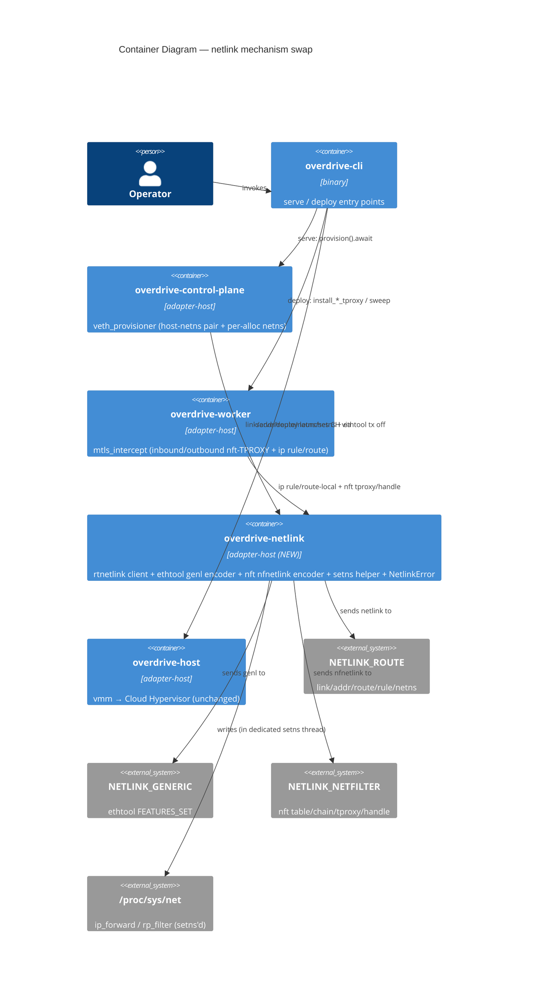

# Feature Delta — subprocess-free-veth-provisioner (GH #233)

**Wave:** DESIGN (Application/components scope, Propose mode).
**Author:** Morgan (solution-architect). **Date:** 2026-08-24.
**Decision record:** ADR-0085. **Priorities:** ALL (P1 + P2 — the
`ethtool` "trap" half is IN, hand-rolled per the spike, not deferred).

## 1. What this is (and is not)

A **mechanism swap only**: replace every `ip` / `nft` / `ethtool` /
`sysctl` subprocess shell-out in TWO files with direct netlink +
`/proc/sys` file I/O. Cloud Hypervisor stays the ONLY sanctioned
subprocess.

- **In scope:** `crates/overdrive-control-plane/src/veth_provisioner.rs`
  (host-netns single-node pair + per-alloc netns + veth) and
  `crates/overdrive-worker/src/mtls_intercept.rs` (inbound/outbound
  nft-TPROXY + `ip rule`/`ip route local`); a new `overdrive-netlink`
  crate; the errno error model; the `setns`-thread helper; `async
  provision()`; the final xtask ban-infra-subprocess lint.
- **NOT in scope:** any new user-facing surface; the #197 port-trait /
  Sim-adapter / DST promotion; any change to the pure **derivation/diff**
  cores (`derive_veth_plan`, `converge_steps`,
  `derive_workload_netns_plan`, `workload_converge_steps`,
  `smallest_free_slot`, `NetSlot`, `resolv_conf_contents`,
  `NetSlotAllocator`) — these stay **byte-identical**.
- **Deleted in scope (not kept):** the observation **text-parsers**
  (`link_state`/`link_absent`, `tx_checksumming_on`, the `# handle N`
  scrape family, `ip_rule_dump_has_fwmark`, `dump_has_leg_s_exemption`,
  `stderr_reports_absent_chain`) become dead code once the observer reads
  structured netlink/genl attributes — they and their tests are **deleted
  with** each slice's structured replacement, per CLAUDE.md deletion
  discipline (ADR-0085 D10, which maps each parser → its structured read).
  The swap touches only the impure executor/observer shims + these dead
  parsers.

## 2. Requirements-input read checklist

| Input | Status |
|---|---|
| GH issue #233 | ⊘ — Bash/`gh` unavailable in this session; scope reconstructed from spike findings + wave-decisions (which capture #233 comprehensively). **Flagged in return.** |
| `spike/findings.md` (A/B/C) | ✓ |
| `spike/findings-d.md` (mtls `ip`) | ✓ |
| `spike/findings-e.md` (mtls `nft` tproxy) | ✓ |
| `spike/wave-decisions.md` | ✓ |
| `veth_provisioner.rs` (shims + pure cores) | ✓ |
| `mtls_intercept.rs` (shims + pure cores) | ✓ |
| `brief.md` (SSOT) | ✓ |
| ADR-0061 (veth converge-on-boot) | ✓ |
| ADR-0003 (crate classes) | ✓ |
| `.claude/rules/bpf.md` Rule 2 (`tx off` invariant) | ✓ |
| `.claude/rules/reconcilers.md` (converge-on-boot) | ✓ |
| DISCUSS artifacts | ⊘ — none exist (started at SPIKE by user choice). |
| DISTILL artifacts | ⊘ — none exist. |

## 3. Reuse Analysis (HARD GATE)

Searched the codebase for existing netlink usage and overlapping
components before proposing anything new.

| Candidate | Evidence | Verdict |
|---|---|---|
| Existing production netlink/rtnetlink client | `grep netlink\|rtnetlink` over `crates/**/Cargo.toml` + `src/**` → matches **only** in `spike-scratch/`. No production netlink code exists. | **CREATE NEW** — no existing alternative to extend. |
| `overdrive-host` as the shared home | Exists (`clock`/`entropy`/`transport`/`vmm`/`cgroup_fs`); `overdrive-control-plane` depends on it in `[dependencies]`; **`overdrive-worker` depends on it only in `[dev-dependencies]`** (deliberate port-trait purity, per its Cargo.toml comment). | **REJECT as home** — using it forces a new production worker→host edge + drags `vmm`/`cgroup` into worker's graph. New `overdrive-netlink` crate instead (ADR-0085 D2). |
| `overdrive-testing/src/netns.rs` (`ip netns` fixture) | `crate_class = "adapter-host"`, **dev-dep-only** Tier-3 fixture; shells `ip`. | **DO NOT reuse** — dev-dep-only; a production binary must never link it (ADR-0061 § 3). Excluded from the lint scope, not extended. |
| Pure **derivation/diff** cores (`derive_*`, `converge_steps`, `NetSlot`, `NetSlotAllocator`) | Present in both files; pure, unit/mutation-tested. | **KEEP byte-identical** — key on structured facts, not CLI text. |
| Pure **observation text-parsers** (`link_state`, `tx_checksumming_on`, `# handle N` scrape family, `ip_rule_dump_has_fwmark`, …) | Parse `ip`/`ethtool`/`nft` **text** output. | **DELETE with tests** (ADR-0085 D10) — dead once the observer reads structured netlink/genl attributes; CLAUDE.md deletion discipline. |
| `xtask/src/dst_lint.rs` | syn AST visitor + marker suppression + crate-class scoping + self-test. | **EXTEND the pattern** — the ban-infra-subprocess lint mirrors it (D8). |

Only genuinely-new component: the `overdrive-netlink` crate (justified —
no existing netlink client, and `overdrive-host` is the wrong home per
the dev-dep-edge finding above).

## 4. Genuinely-open points — resolved (Propose mode)

Full rationale in ADR-0085 D2–D6/D8. One-line each:

1. **Module placement** → new `overdrive-netlink` (`adapter-host`) crate.
   *Concentrates all hand-rolled kernel wire bytes in one auditable home
   and gives both consumers the netlink surface WITHOUT forcing the
   deliberately-avoided production `overdrive-worker → overdrive-host`
   edge.* (a duplicated-submodule and b overdrive-host rejected;
   b is the fallback.)
2. **Error model** → shared errno-carrying `overdrive-netlink::NetlinkError`,
   **embedded via `#[source]`**. `VethProvisionError` per-site variants
   swap `stderr:String,status` → `errno:Option<i32>` (and `Spawn(#[from]
   io::Error)` → discrete `NetlinkConnect`); **`InterceptError` is
   decomposed** — its `TproxyInstall{reason:String}` multi-site catch-all
   splits into named per-site variants (ADR-0085 D3), so the mtls side
   honors § Errors without the crafter inventing API. Idempotent `-EEXIST`/
   `-ENODEV` matched on typed errno at the executor. *Keeps per-step
   operator context (no `Internal(String)`/catch-all) while typing the
   idempotency the packet-corruption path depends on.*
3. **`setns` helper** → `overdrive-netlink::in_netns(&NetnsName, closure)`
   on a **dedicated throwaway `std::thread`** (never a pooled tokio
   thread — `setns` permanently mutates thread netns). *Per-thread netns
   semantics + async provision demand a thread the runtime never reuses.*
4. **DELIVER slices** → 5 vertical, production-drivable slices, lint last
   (§ 6).

## 5. C4 diagrams

### 5.1 System Context (L1)

```mermaid
C4Context
  title System Context — subprocess-free dataplane provisioning (GH #233)
  Person(op, "Operator", "runs `overdrive serve` / `overdrive deploy`")
  System(ovd, "Overdrive node", "serve boot + deploy: provisions veth/netns + mTLS-TPROXY interception")
  System_Ext(kernel, "Linux kernel", "netlink (ROUTE/GENERIC/NETFILTER) + /proc/sys")
  System_Ext(ch, "Cloud Hypervisor", "the ONE sanctioned subprocess (workload microVMs)")
  Rel(op, ovd, "invokes")
  Rel(ovd, kernel, "provisions via netlink + /proc/sys (was: ip/nft/ethtool/sysctl subprocess)")
  Rel(ovd, ch, "launches workloads via subprocess")
  UpdateRelStyle(ovd, kernel, $offsetY="-10")
```

### 5.2 Container (L2)



**L3 not warranted** — the change is a mechanism swap behind existing
component boundaries, not a new multi-component subsystem.

## 6. DELIVER slice sequencing (each vertical through serve/deploy; lint last)

Every slice keeps the pure **derivation/diff** cores byte-identical,
**deletes the observation text-parsers it makes dead (with their tests,
DDD-13)**, is driven end-to-end through a production entry point, and is
guarded by the named Tier-3 e2e. **Pre-DELIVER gate (DDD-14):** each
slice must cite its exact production call site — slice 1 (host-netns
`provision` @ `lib.rs:2133`), slice 3 (`ensure_shared_routing_infra`
reached per-alloc via `start_alloc → install_*_tproxy` on the `overdrive
deploy` path), and slice 4 (BOTH `install_outbound_tproxy` AND
`install_inbound_tproxy`, each reached via `on_alloc_running`
(`action_shim/mod.rs:1585, :1880`) → `worker.start_alloc` →
`HostMtlsIntercept::install_inbound`/`install_outbound`
(`mtls_intercept_port.rs:268-275`, a production trait impl, NOT
cfg-gated)) are confirmed wired; **slice 2 (per-alloc netns provision)
must confirm a production call site**. The inbound nft-TPROXY rule is
**production-wired today** (the prior `tproxy_guard=None` deferral was
CLOSED by the landed `canonical-workload-address-inbound-tproxy`
feature), so slice 4's Tier-3 guard MUST drive that real `start_alloc →
install_inbound_tproxy` path and MUST NOT hand-install the rule (CLAUDE.md
vertical-slice rule — a Tier-3 test may not stand in for a production call
site).

| # | Slice | Entry point driven | New in `overdrive-netlink` | Tier-3 guard |
|---|---|---|---|---|
| 1 | **Crate scaffold + host-netns veth swap** — create `overdrive-netlink` (deps, `crate_class`, `NetlinkError`, rtnetlink link/addr/route client, ethtool `FEATURES_SET` encoder, `setns` helper); swap the host-netns single-node executor/observer; `provision()` → `async`. | `overdrive serve` default boot (`lib.rs:2133`) | client + ethtool encoder + errno error | `veth_attach`, `reverse_nat_e2e`, `reverse_nat_udp_e2e`, `sanity_mixed_batch` (ethtool `tx off` = biggest de-risk) |
| 2 | **Per-alloc netns + veth swap** — `NetworkNamespace::add/del`, `ip -n` in-netns ops via setns'd rtnetlink, per-netns sysctl via setns'd `/proc/sys`, in-netns ethtool. | `overdrive deploy` (`start_alloc` per-alloc provisioning) | netns + setns surface | mtls dial-by-name / inbound walking skeletons; per-alloc netns Tier-3 |
| 3 | **mtls `ip` ops swap** — `ip rule fwmark` add + **ported dump-then-add guard** (spike-D: naked add stacks duplicates), `ip route add local … table 100` (EEXIST-idempotent). | `overdrive deploy` (`start_alloc → install_*_tproxy → ensure_shared_routing_infra`) | rule add/dump + route-local | mtls inbound walking skeleton; **re-provision oracle: exactly one `fwmark` FIB rule after two provisions** (the netlink analogue of the existing `adopt_on_restart.rs` nft re-sweep — guards the ported dump-then-add, DDD-6/D6) |
| 4 | **mtls `nft` ops swap** — table/chain/exemption ensure, per-virt `tproxy` append, output-divert append, **structural `NFTA_RULE_HANDLE` recovery** (replaces `# handle N` scrape), by-handle delete, §5 sweep. | `overdrive deploy` (`install_inbound/outbound_tproxy`) + `overdrive serve` (sweep) | nft nfnetlink encoder incl. `tproxy` expr | mtls dial-by-name + inbound walking skeletons; §5 sweep AT (primary mtls de-risk) |
| 5 | **xtask ban-infra-subprocess lint (FINAL)** — mirror `dst_lint.rs`; ban `Command::new("<ip\|nft\|ethtool\|sysctl\|tc\|bpftool\|iptables>")` in `{core,adapter-host}` `src/**` minus `overdrive-testing`; `// subprocess-ok:` marker; `#[cfg(test)]`/`bin/` exempt; catalogue exceptions (ADR-0085 D8). Flips green immediately. | xtask gate | — | xtask self-test (mirror `dst_lint_self_test.rs`) |

Rationale for the split: slices 1/2 divide the veth work by **entry
point** (serve vs deploy) and guard; slices 3/4 divide the mtls work by
**mechanism** (`ip` reuses the client from 1–3; `nft` is the new
hand-rolled encoder). No slice ships infrastructure a production path
cannot reach.

## 7. Decisions table (DDD-N)

| ID | Decision | Rationale | Source |
|---|---|---|---|
| DDD-1 | Eliminate all `ip`/`nft`/`ethtool`/`sysctl` subprocess; CH stays only sanctioned subprocess. | Remove `$PATH` dep; type the idempotency on the packet-corruption path. | ADR-0085 D1; spike |
| DDD-2 | New `overdrive-netlink` (`crate_class="adapter-host"`) crate is the shared home. | One auditable home for hand-rolled wire bytes; avoids the deliberately-avoided prod worker→host edge. | ADR-0085 D2; Reuse Analysis |
| DDD-3 | Shared errno `NetlinkError` embedded `#[source]`. `VethProvisionError` per-site variants swap `stderr`→`errno`; `Spawn(#[from] io::Error)` → discrete `NetlinkConnect`. **`InterceptError::TproxyInstall{reason:String}` (a multi-site catch-all) is DECOMPOSED** into `NftRuleInstallFailed`/`IpRuleAddFailed`/`IpRouteLocalAddFailed`/`NftHandleRecoveryFailed` (named in the ADR — the crafter does not invent them). | Keep operator step-context; type idempotent `-EEXIST`/`-ENODEV`; no `Internal(String)`/catch-all. | ADR-0085 D3; dev.md § Errors |
| DDD-4 | `setns` helper on a dedicated throwaway `std::thread`. | Per-thread netns; `setns` poisons a pooled tokio thread. | ADR-0085 D4; spike C |
| DDD-5 | `provision()` → `async fn`. | Sole call site is already `async` → `.await`, no `spawn_blocking`. | ADR-0085 D5; `lib.rs:2133` |
| DDD-6 | Port the `ip_rule_fwmark_present` dump-then-add guard; keep `ip route local` EEXIST-idempotent. | Naked netlink `rule add` stacks duplicates (no fib dedup). | ADR-0085 D6; spike D |
| DDD-7 | Drop `rustables`; hand-roll nft over `NETLINK_NETFILTER` incl. `tproxy`. | `rustables` cannot express `tproxy` + drags `bindgen`/`libclang`. | ADR-0085 alt; spike E |
| DDD-8 | ethtool `FEATURES_SET` = `0x0c` hand-rolled over genl. | `ethtool` crate is GET-only (`Wanted` = `todo!()`); `0x0a` is `WOL_SET`. | ADR-0085 D1; spike B |
| DDD-9 | Locked dep set (rtnetlink 0.23 + netlink-packet-* + genetlink + nix 0.30), `adapter-host`-only. | Spike-validated combination; `CAP_NET_ADMIN` unchanged. | ADR-0085 D7; spike |
| DDD-10 | Final slice = xtask ban-infra-subprocess lint; catalogue sanctioned exceptions; `// subprocess-ok:` marker. | Structurally enforce **no named infra-CLI literal** (`ip`/`nft`/`ethtool`/`sysctl`/`tc`/`bpftool`/`iptables`) in scoped prod `src/`; NOT "no subprocess except CH" (CH is spawned through `prlimit`/`setpriv`; drivers spawn workloads — none are named infra-CLIs). Bounded guarantee: literals only, not variable-binary spawns. Flips green when both files swap. | ADR-0085 D8; wave-decisions |
| DDD-13 | Delete the observation text-parsers + their tests in the slice that lands each structured replacement. | Dead code once the observer reads structured attributes; CLAUDE.md deletion discipline (delete prod code WITH its tests). | ADR-0085 D10 |
| DDD-14 | Before DELIVER, cite the exact production call site for each slice's entry point. Slice 4's `install_inbound_tproxy` is **production-wired today** — `on_alloc_running` (`action_shim/mod.rs:1585, :1880`) → `worker.start_alloc` → `HostMtlsIntercept::install_inbound` (`mtls_intercept_port.rs:268-275`, a production trait impl, NOT cfg-gated) → `install_inbound_tproxy`; the prior `tproxy_guard=None` deferral was CLOSED by the landed `canonical-workload-address-inbound-tproxy` feature. Its Tier-3 guard MUST drive that path, not hand-install the rule. Slice 2 (per-alloc netns provision) still must confirm its call site. | Vertical-slice rule: no slice may rely on a Tier-3-hand-installed rule standing in for a production call site. | Review MEDIUM; CLAUDE.md vertical-slice |
| DDD-11 | This is the in-place swap, NOT #197; no port trait / Sim / DST. | Ships independently; `overdrive-netlink` is a future #197 home, not #197. | ADR-0085 D9 |
| DDD-12 | Surface the `nix` 0.29→0.30 workspace bump as a slice-1 gating task. | Workspace pins 0.29; rtnetlink pulls 0.30 transitively; do not silently mix across the setns FD boundary. | ADR-0085 § Open constraint |

## 8. Back-propagation to prior waves

- **ADR-0061** — its § 3.1 converge-on-boot semantics and DQ-4
  leave-a-usable-pair are **unchanged**; only the executor/observer
  mechanism (`ip`→netlink, `ethtool`→genl) swaps. The
  `VethProvisionError` per-site variants named in ADR-0061 § Compliance
  now carry `errno` instead of `stderr`+`status`; noted here, no ADR-0061
  amendment required (the variant *shapes*/intent are preserved).
- **`.claude/rules/bpf.md` Rule 2** — the `tx off` converge-on-boot
  invariant is **preserved**; the mechanism moves from `ethtool -K` to
  the genl `FEATURES_SET` encoder, still idempotent observe→diff→converge,
  still refusing boot on a non-benign failure. No rule change.
- No prior-wave assumption is reversed. No user-facing surface changes.

## 9. Handoff annotations

- **External integrations:** none (no third-party APIs). The only external
  boundary is the **Linux kernel netlink API** — not a network service, so
  no consumer-driven contract test applies. The correctness contract for
  the two hand-rolled encoders is the **pinned wire bytes** in
  `spike/findings-e.md` + the Tier-3 real-packet e2e (per `bpf.md`
  Rule 3: verifier/kernel-accept ≠ correct; only a real-packet echo
  proves the checksum/divert).
- **Architecture enforcement tooling:** the xtask ban-infra-subprocess
  lint (slice 5) is the language-appropriate structural enforcement
  (Rust/syn AST), mirroring the existing `dst-lint`.
- **Development paradigm:** object-oriented (per project CLAUDE.md);
  implement via `@nw-software-crafter`.

## 10. Changed Assumptions (post-review correction)

- **Struck the #236 inbound-rule deferral premise (review HIGH).** DDD-14
  and §6 previously gated slice 4's inbound nft-TPROXY on the claim that
  its production call site was "#236-deferred, `tproxy_guard=None`." That
  premise was **stale and mis-attributed** (verified against the tree):
  the inbound rule is production-wired today via `on_alloc_running`
  (`action_shim/mod.rs:1585, :1880`) → `worker.start_alloc` →
  `HostMtlsIntercept::install_inbound` (`mtls_intercept_port.rs:268-275`,
  a production trait impl, not cfg-gated) → `install_inbound_tproxy`
  (`mtls_intercept_worker.rs:63-66` records that the current code closed
  the prior `tproxy_guard = None` deferral, and `start_alloc` builds real
  `inbound_tproxy_guards`); the deferral was CLOSED by the landed
  `canonical-workload-address-inbound-tproxy` feature; and GH #236 (now
  closed) concerns the **outbound/egress** interception model
  (`cgroup_connect4` / `MTLS_REDIRECT_DEST`), not the inbound nft rule.
  The (still-correct) vertical-slice guidance — the Tier-3 guard MUST
  drive the real production path and MUST NOT hand-install the rule — is
  **retained and re-anchored** to that call site. **No ADR decision
  changes**; the swap's scope, slices, and mechanism are unchanged. No
  new issue number invented; brief.md's #236 references (in the shipped
  `canonical-workload-address-inbound-tproxy` and transparent-mTLS
  sections) are correct in their own context and left untouched.
