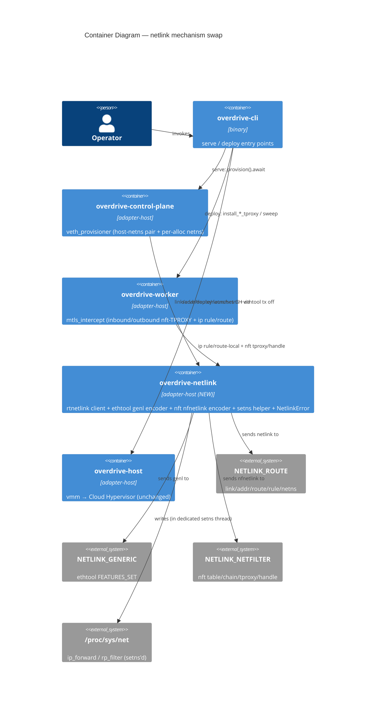

# Feature Delta — subprocess-free-veth-provisioner (GH #233)

**Wave:** DESIGN (Application/components scope, Propose mode).
**Author:** Morgan (solution-architect). **Date:** 2026-08-24.
**Decision record:** ADR-0085. **Priorities:** ALL (P1 + P2 — the
`ethtool` "trap" half is IN, hand-rolled per the spike, not deferred).

## 1. What this is (and is not)

A **mechanism swap only**: replace every `ip` / `nft` / `ethtool` /
`sysctl` subprocess shell-out in TWO files with direct netlink +
`/proc/sys` file I/O. Cloud Hypervisor stays the ONLY sanctioned
subprocess.

- **In scope:** `crates/overdrive-control-plane/src/veth_provisioner.rs`
  (host-netns single-node pair + per-alloc netns + veth) and
  `crates/overdrive-worker/src/mtls_intercept.rs` (inbound/outbound
  nft-TPROXY + `ip rule`/`ip route local`); a new `overdrive-netlink`
  crate; the errno error model; the `setns`-thread helper; `async
  provision()`; the final xtask ban-infra-subprocess lint.
- **NOT in scope:** any new user-facing surface; the #197 port-trait /
  Sim-adapter / DST promotion; any change to the pure **derivation/diff**
  cores (`derive_veth_plan`, `converge_steps`,
  `derive_workload_netns_plan`, `workload_converge_steps`,
  `smallest_free_slot`, `NetSlot`, `resolv_conf_contents`,
  `NetSlotAllocator`) — these stay **byte-identical**.
- **Deleted in scope (not kept):** the observation **text-parsers**
  (`link_state`/`link_absent`, `tx_checksumming_on`, the `# handle N`
  scrape family, `ip_rule_dump_has_fwmark`, `dump_has_leg_s_exemption`,
  `stderr_reports_absent_chain`) become dead code once the observer reads
  structured netlink/genl attributes — they and their tests are **deleted
  with** each slice's structured replacement, per CLAUDE.md deletion
  discipline (ADR-0085 D10, which maps each parser → its structured read).
  The swap touches only the impure executor/observer shims + these dead
  parsers.

## 2. Requirements-input read checklist

| Input | Status |
|---|---|
| GH issue #233 | ⊘ — Bash/`gh` unavailable in this session; scope reconstructed from spike findings + wave-decisions (which capture #233 comprehensively). **Flagged in return.** |
| `spike/findings.md` (A/B/C) | ✓ |
| `spike/findings-d.md` (mtls `ip`) | ✓ |
| `spike/findings-e.md` (mtls `nft` tproxy) | ✓ |
| `spike/wave-decisions.md` | ✓ |
| `veth_provisioner.rs` (shims + pure cores) | ✓ |
| `mtls_intercept.rs` (shims + pure cores) | ✓ |
| `brief.md` (SSOT) | ✓ |
| ADR-0061 (veth converge-on-boot) | ✓ |
| ADR-0003 (crate classes) | ✓ |
| `.claude/rules/bpf.md` Rule 2 (`tx off` invariant) | ✓ |
| `.claude/rules/reconcilers.md` (converge-on-boot) | ✓ |
| DISCUSS artifacts | ⊘ — none exist (started at SPIKE by user choice). |
| DISTILL artifacts | ⊘ — none exist. |

## 3. Reuse Analysis (HARD GATE)

Searched the codebase for existing netlink usage and overlapping
components before proposing anything new.

| Candidate | Evidence | Verdict |
|---|---|---|
| Existing production netlink/rtnetlink client | `grep netlink\|rtnetlink` over `crates/**/Cargo.toml` + `src/**` → matches **only** in `spike-scratch/`. No production netlink code exists. | **CREATE NEW** — no existing alternative to extend. |
| `overdrive-host` as the shared home | Exists (`clock`/`entropy`/`transport`/`vmm`/`cgroup_fs`); `overdrive-control-plane` depends on it in `[dependencies]`; **`overdrive-worker` depends on it only in `[dev-dependencies]`** (deliberate port-trait purity, per its Cargo.toml comment). | **REJECT as home** — using it forces a new production worker→host edge + drags `vmm`/`cgroup` into worker's graph. New `overdrive-netlink` crate instead (ADR-0085 D2). |
| `overdrive-testing/src/netns.rs` (`ip netns` fixture) | `crate_class = "adapter-host"`, **dev-dep-only** Tier-3 fixture; shells `ip`. | **DO NOT reuse** — dev-dep-only; a production binary must never link it (ADR-0061 § 3). Excluded from the lint scope, not extended. |
| Pure **derivation/diff** cores (`derive_*`, `converge_steps`, `NetSlot`, `NetSlotAllocator`) | Present in both files; pure, unit/mutation-tested. | **KEEP byte-identical** — key on structured facts, not CLI text. |
| Pure **observation text-parsers** (`link_state`, `tx_checksumming_on`, `# handle N` scrape family, `ip_rule_dump_has_fwmark`, …) | Parse `ip`/`ethtool`/`nft` **text** output. | **DELETE with tests** (ADR-0085 D10) — dead once the observer reads structured netlink/genl attributes; CLAUDE.md deletion discipline. |
| `xtask/src/dst_lint.rs` | syn AST visitor + marker suppression + crate-class scoping + self-test. | **EXTEND the pattern** — the ban-infra-subprocess lint mirrors it (D8). |

Only genuinely-new component: the `overdrive-netlink` crate (justified —
no existing netlink client, and `overdrive-host` is the wrong home per
the dev-dep-edge finding above).

## 4. Genuinely-open points — resolved (Propose mode)

Full rationale in ADR-0085 D2–D6/D8. One-line each:

1. **Module placement** → new `overdrive-netlink` (`adapter-host`) crate.
   *Concentrates all hand-rolled kernel wire bytes in one auditable home
   and gives both consumers the netlink surface WITHOUT forcing the
   deliberately-avoided production `overdrive-worker → overdrive-host`
   edge.* (a duplicated-submodule and b overdrive-host rejected;
   b is the fallback.)
2. **Error model** → shared errno-carrying `overdrive-netlink::NetlinkError`,
   **embedded via `#[source]`**. `VethProvisionError` per-site variants
   swap `stderr:String,status` → `errno:Option<i32>` (and `Spawn(#[from]
   io::Error)` → discrete `NetlinkConnect`); **`InterceptError` is
   decomposed** — its `TproxyInstall{reason:String}` multi-site catch-all
   splits into named per-site variants (ADR-0085 D3), so the mtls side
   honors § Errors without the crafter inventing API. Idempotent `-EEXIST`/
   `-ENODEV` matched on typed errno at the executor. *Keeps per-step
   operator context (no `Internal(String)`/catch-all) while typing the
   idempotency the packet-corruption path depends on.*
3. **`setns` helper** → `overdrive-netlink::in_netns(&NetnsName, closure)`
   on a **dedicated throwaway `std::thread`** (never a pooled tokio
   thread — `setns` permanently mutates thread netns). *Per-thread netns
   semantics + async provision demand a thread the runtime never reuses.*
4. **DELIVER slices** → 5 vertical, production-drivable slices, lint last
   (§ 6).

## 5. C4 diagrams

### 5.1 System Context (L1)

```mermaid
C4Context
  title System Context — subprocess-free dataplane provisioning (GH #233)
  Person(op, "Operator", "runs `overdrive serve` / `overdrive deploy`")
  System(ovd, "Overdrive node", "serve boot + deploy: provisions veth/netns + mTLS-TPROXY interception")
  System_Ext(kernel, "Linux kernel", "netlink (ROUTE/GENERIC/NETFILTER) + /proc/sys")
  System_Ext(ch, "Cloud Hypervisor", "the ONE sanctioned subprocess (workload microVMs)")
  Rel(op, ovd, "invokes")
  Rel(ovd, kernel, "provisions via netlink + /proc/sys (was: ip/nft/ethtool/sysctl subprocess)")
  Rel(ovd, ch, "launches workloads via subprocess")
  UpdateRelStyle(ovd, kernel, $offsetY="-10")
```

### 5.2 Container (L2)



**L3 not warranted** — the change is a mechanism swap behind existing
component boundaries, not a new multi-component subsystem.

## 6. DELIVER slice sequencing (each vertical through serve/deploy; lint last)

Every slice keeps the pure **derivation/diff** cores byte-identical,
**deletes the observation text-parsers it makes dead (with their tests,
DDD-13)**, is driven end-to-end through a production entry point, and is
guarded by the named Tier-3 e2e. **Pre-DELIVER gate (DDD-14):** each
slice must cite its exact production call site — slice 1 (host-netns
`provision` @ `lib.rs:2133`), slice 3 (`ensure_shared_routing_infra`
reached per-alloc via `start_alloc → install_*_tproxy` on the `overdrive
deploy` path), and slice 4 (BOTH `install_outbound_tproxy` AND
`install_inbound_tproxy`, each reached via `on_alloc_running`
(`action_shim/mod.rs:1585, :1880`) → `worker.start_alloc` →
`HostMtlsIntercept::install_inbound`/`install_outbound`
(`mtls_intercept_port.rs:268-275`, a production trait impl, NOT
cfg-gated)) are confirmed wired; **slice 2 (per-alloc netns provision)
must confirm a production call site**. The inbound nft-TPROXY rule is
**production-wired today** (the prior `tproxy_guard=None` deferral was
CLOSED by the landed `canonical-workload-address-inbound-tproxy`
feature), so slice 4's Tier-3 guard MUST drive that real `start_alloc →
install_inbound_tproxy` path and MUST NOT hand-install the rule (CLAUDE.md
vertical-slice rule — a Tier-3 test may not stand in for a production call
site).

| # | Slice | Entry point driven | New in `overdrive-netlink` | Tier-3 guard |
|---|---|---|---|---|
| 1 | **Crate scaffold + host-netns veth swap** — create `overdrive-netlink` (deps, `crate_class`, `NetlinkError`, rtnetlink link/addr/route client, ethtool `FEATURES_SET` encoder, `setns` helper); swap the host-netns single-node executor/observer; `provision()` → `async`. | `overdrive serve` default boot (`lib.rs:2133`) | client + ethtool encoder + errno error | `veth_attach`, `reverse_nat_e2e`, `reverse_nat_udp_e2e`, `sanity_mixed_batch` (ethtool `tx off` = biggest de-risk) |
| 2 | **Per-alloc netns + veth swap** — `NetworkNamespace::add/del`, `ip -n` in-netns ops via setns'd rtnetlink, per-netns sysctl via setns'd `/proc/sys`, in-netns ethtool. | `overdrive deploy` (`start_alloc` per-alloc provisioning) | netns + setns surface | mtls dial-by-name / inbound walking skeletons; per-alloc netns Tier-3 |
| 3 | **mtls `ip` ops swap** — `ip rule fwmark` add + **ported dump-then-add guard** (spike-D: naked add stacks duplicates), `ip route add local … table 100` (EEXIST-idempotent). | `overdrive deploy` (`start_alloc → install_*_tproxy → ensure_shared_routing_infra`) | rule add/dump + route-local | mtls inbound walking skeleton; **re-provision oracle: exactly one `fwmark` FIB rule after two provisions** (the netlink analogue of the existing `adopt_on_restart.rs` nft re-sweep — guards the ported dump-then-add, DDD-6/D6) |
| 4 | **mtls `nft` ops swap** — table/chain/exemption ensure, per-virt `tproxy` append, output-divert append, **structural `NFTA_RULE_HANDLE` recovery** (replaces `# handle N` scrape), by-handle delete, §5 sweep. | `overdrive deploy` (`install_inbound/outbound_tproxy`) + `overdrive serve` (sweep) | nft nfnetlink encoder incl. `tproxy` expr | mtls dial-by-name + inbound walking skeletons; §5 sweep AT (primary mtls de-risk) |
| 5 | **xtask ban-infra-subprocess lint (FINAL)** — mirror `dst_lint.rs`; ban `Command::new("<ip\|nft\|ethtool\|sysctl\|tc\|bpftool\|iptables>")` in `{core,adapter-host}` `src/**` minus `overdrive-testing`; `// subprocess-ok:` marker; `#[cfg(test)]`/`bin/` exempt; catalogue exceptions (ADR-0085 D8). Flips green immediately. | xtask gate | — | xtask self-test (mirror `dst_lint_self_test.rs`) |

Rationale for the split: slices 1/2 divide the veth work by **entry
point** (serve vs deploy) and guard; slices 3/4 divide the mtls work by
**mechanism** (`ip` reuses the client from 1–3; `nft` is the new
hand-rolled encoder). No slice ships infrastructure a production path
cannot reach.

## 7. Decisions table (DDD-N)

| ID | Decision | Rationale | Source |
|---|---|---|---|
| DDD-1 | Eliminate all `ip`/`nft`/`ethtool`/`sysctl` subprocess; CH stays only sanctioned subprocess. | Remove `$PATH` dep; type the idempotency on the packet-corruption path. | ADR-0085 D1; spike |
| DDD-2 | New `overdrive-netlink` (`crate_class="adapter-host"`) crate is the shared home. | One auditable home for hand-rolled wire bytes; avoids the deliberately-avoided prod worker→host edge. | ADR-0085 D2; Reuse Analysis |
| DDD-3 | Shared errno `NetlinkError` embedded `#[source]`. `VethProvisionError` per-site variants swap `stderr`→`errno`; `Spawn(#[from] io::Error)` → discrete `NetlinkConnect`. **`InterceptError::TproxyInstall{reason:String}` (a multi-site catch-all) is DECOMPOSED** into `NftRuleInstallFailed`/`IpRuleAddFailed`/`IpRouteLocalAddFailed`/`NftHandleRecoveryFailed` (named in the ADR — the crafter does not invent them). | Keep operator step-context; type idempotent `-EEXIST`/`-ENODEV`; no `Internal(String)`/catch-all. | ADR-0085 D3; dev.md § Errors |
| DDD-4 | `setns` helper on a dedicated throwaway `std::thread`. | Per-thread netns; `setns` poisons a pooled tokio thread. | ADR-0085 D4; spike C |
| DDD-5 | `provision()` → `async fn`. | Sole call site is already `async` → `.await`, no `spawn_blocking`. | ADR-0085 D5; `lib.rs:2133` |
| DDD-6 | Port the `ip_rule_fwmark_present` dump-then-add guard; keep `ip route local` EEXIST-idempotent. | Naked netlink `rule add` stacks duplicates (no fib dedup). | ADR-0085 D6; spike D |
| DDD-7 | Drop `rustables`; hand-roll nft over `NETLINK_NETFILTER` incl. `tproxy`. | `rustables` cannot express `tproxy` + drags `bindgen`/`libclang`. | ADR-0085 alt; spike E |
| DDD-8 | ethtool `FEATURES_SET` = `0x0c` hand-rolled over genl. | `ethtool` crate is GET-only (`Wanted` = `todo!()`); `0x0a` is `WOL_SET`. | ADR-0085 D1; spike B |
| DDD-9 | Locked dep set (rtnetlink 0.23 + netlink-packet-* + genetlink + nix 0.30), `adapter-host`-only. | Spike-validated combination; `CAP_NET_ADMIN` unchanged. | ADR-0085 D7; spike |
| DDD-10 | Final slice = xtask ban-infra-subprocess lint; catalogue sanctioned exceptions; `// subprocess-ok:` marker. | Structurally enforce **no named infra-CLI literal** (`ip`/`nft`/`ethtool`/`sysctl`/`tc`/`bpftool`/`iptables`) in scoped prod `src/`; NOT "no subprocess except CH" (CH is spawned through `prlimit`/`setpriv`; drivers spawn workloads — none are named infra-CLIs). Bounded guarantee: literals only, not variable-binary spawns. Flips green when both files swap. | ADR-0085 D8; wave-decisions |
| DDD-13 | Delete the observation text-parsers + their tests in the slice that lands each structured replacement. | Dead code once the observer reads structured attributes; CLAUDE.md deletion discipline (delete prod code WITH its tests). | ADR-0085 D10 |
| DDD-14 | Before DELIVER, cite the exact production call site for each slice's entry point. Slice 4's `install_inbound_tproxy` is **production-wired today** — `on_alloc_running` (`action_shim/mod.rs:1585, :1880`) → `worker.start_alloc` → `HostMtlsIntercept::install_inbound` (`mtls_intercept_port.rs:268-275`, a production trait impl, NOT cfg-gated) → `install_inbound_tproxy`; the prior `tproxy_guard=None` deferral was CLOSED by the landed `canonical-workload-address-inbound-tproxy` feature. Its Tier-3 guard MUST drive that path, not hand-install the rule. Slice 2 (per-alloc netns provision) still must confirm its call site. | Vertical-slice rule: no slice may rely on a Tier-3-hand-installed rule standing in for a production call site. | Review MEDIUM; CLAUDE.md vertical-slice |
| DDD-11 | This is the in-place swap, NOT #197; no port trait / Sim / DST. | Ships independently; `overdrive-netlink` is a future #197 home, not #197. | ADR-0085 D9 |
| DDD-12 | Surface the `nix` 0.29→0.30 workspace bump as a slice-1 gating task. | Workspace pins 0.29; rtnetlink pulls 0.30 transitively; do not silently mix across the setns FD boundary. | ADR-0085 § Open constraint |

## 8. Back-propagation to prior waves

- **ADR-0061** — its § 3.1 converge-on-boot semantics and DQ-4
  leave-a-usable-pair are **unchanged**; only the executor/observer
  mechanism (`ip`→netlink, `ethtool`→genl) swaps. The
  `VethProvisionError` per-site variants named in ADR-0061 § Compliance
  now carry `errno` instead of `stderr`+`status`; noted here, no ADR-0061
  amendment required (the variant *shapes*/intent are preserved).
- **`.claude/rules/bpf.md` Rule 2** — the `tx off` converge-on-boot
  invariant is **preserved**; the mechanism moves from `ethtool -K` to
  the genl `FEATURES_SET` encoder, still idempotent observe→diff→converge,
  still refusing boot on a non-benign failure. No rule change.
- No prior-wave assumption is reversed. No user-facing surface changes.

## 9. Handoff annotations

- **External integrations:** none (no third-party APIs). The only external
  boundary is the **Linux kernel netlink API** — not a network service, so
  no consumer-driven contract test applies. The correctness contract for
  the two hand-rolled encoders is the **pinned wire bytes** in
  `spike/findings-e.md` + the Tier-3 real-packet e2e (per `bpf.md`
  Rule 3: verifier/kernel-accept ≠ correct; only a real-packet echo
  proves the checksum/divert).
- **Architecture enforcement tooling:** the xtask ban-infra-subprocess
  lint (slice 5) is the language-appropriate structural enforcement
  (Rust/syn AST), mirroring the existing `dst-lint`.
- **Development paradigm:** object-oriented (per project CLAUDE.md);
  implement via `@nw-software-crafter`.

## 10. Changed Assumptions (post-review correction)

- **Struck the #236 inbound-rule deferral premise (review HIGH).** DDD-14
  and §6 previously gated slice 4's inbound nft-TPROXY on the claim that
  its production call site was "#236-deferred, `tproxy_guard=None`." That
  premise was **stale and mis-attributed** (verified against the tree):
  the inbound rule is production-wired today via `on_alloc_running`
  (`action_shim/mod.rs:1585, :1880`) → `worker.start_alloc` →
  `HostMtlsIntercept::install_inbound` (`mtls_intercept_port.rs:268-275`,
  a production trait impl, not cfg-gated) → `install_inbound_tproxy`
  (`mtls_intercept_worker.rs:63-66` records that the current code closed
  the prior `tproxy_guard = None` deferral, and `start_alloc` builds real
  `inbound_tproxy_guards`); the deferral was CLOSED by the landed
  `canonical-workload-address-inbound-tproxy` feature; and GH #236 (now
  closed) concerns the **outbound/egress** interception model
  (`cgroup_connect4` / `MTLS_REDIRECT_DEST`), not the inbound nft rule.
  The (still-correct) vertical-slice guidance — the Tier-3 guard MUST
  drive the real production path and MUST NOT hand-install the rule — is
  **retained and re-anchored** to that call site. **No ADR decision
  changes**; the swap's scope, slices, and mechanism are unchanged. No
  new issue number invented; brief.md's #236 references (in the shipped
  `canonical-workload-address-inbound-tproxy` and transparent-mTLS
  sections) are correct in their own context and left untouched.

---

# Wave: DISTILL — acceptance test design (Quinn, 2026-08-25)

**Language:** Rust (`Cargo.toml`) — `[lang-mode] rust`. **NO `.feature`
files** (`.claude/rules/testing.md` § "No `.feature` files anywhere");
acceptance tests are `#[test]`/`#[tokio::test]` under
`crates/{crate}/tests/integration/*.rs`, gated `--features
integration-tests`, run under Lima. **Policy:** `docs/architecture/
atdd-infrastructure-policy.md` present (Rust polyglot note + Mandate-8
map already recorded) — `--policy=inherit`, no changes. **Reconciliation
HARD GATE:** DISCUSS/DEVOPS wave-decisions absent (feature started at
SPIKE by user choice); SPIKE ↔ DESIGN reconciled — **0 contradictions**
(provision→async, errno `NetlinkError`, setns dedicated `std::thread`,
hand-rolled ethtool `FEATURES_SET`=0x0c, drop-rustables/hand-roll-nft,
ported `ip rule` dump-then-add guard, lint-last all agree across both
wave-decisions files). **Deliverable type:** `application` (no
`deliverable_type` key in `.nwave/des-config.json` → default) — standard
routing, no plugin/skill reviewers.

## Wave: DISTILL / [REF] Core judgment — behaviour-preserving swap, existing e2e IS the safety net

This is a **mechanism swap**: the pure derivation/diff cores stay
byte-identical (ADR-0085 D10) and every port-to-port OBSERVABLE
(veth/netns lifecycle, tx-off, fwmark idempotency, nft divert, orig-dst
recovery, by-handle delete, §5 sweep) is unchanged. The DISTILL judgment
is therefore **map-first**: the existing Tier-3 e2e already locks the
behaviour the swap must preserve. Rigorous mapping found **all three
behaviour-locks the DESIGN/task presumed to be gaps are ALREADY GUARDED**
(citations below). Only ONE genuinely-new observable is introduced — the
slice-5 ban-infra-subprocess lint. Authoring anything already-guarded
would be the exact duplication `.claude/rules/testing.md` and the swap's
"pure cores unchanged" premise forbid.

## Wave: DISTILL / [REF] Slice → existing-guard coverage table

Every slice's behaviour is guarded by a named, LIVE Tier-3 test that
observes kernel state through a test-side probe (`ip`/`nft`/`ethtool`
in the harness — test-side subprocess is allowed; the D8 lint scopes
production `src/` only). These stay GREEN across the swap; the swap edits
their PRODUCTION seam, not their assertions.

| Slice | Behaviour | Guarding Tier-3 test (LIVE) | Observable oracle |
|---|---|---|---|
| 1 host-netns veth | create / idempotent converge / half-heal / recreate (both corrupted edges) | `overdrive-control-plane/tests/integration/veth_provision_idempotent.rs` (5 scenarios) | `ip link show` presence + `resolve_iface_ipv4` gateway |
| 1 | two DISTINCT XDP progs attach to two distinct veths + real EBUSY diagnostic | `…/serve_boot_provisions_veth.rs` (2 scenarios) | `ip -details link show` `prog/xdp id`; typed `IfaceXdpSlotBusy` |
| 1 ethtool `FEATURES_SET` (highest-risk encoder) | tx-checksumming OFF both ends + idempotent + drift-repair | `veth_provision_idempotent.rs::provision_disables_tx_offload_on_both_ends_and_is_idempotent` + `::provision_repairs_tx_offload_drifted_back_on` | `ethtool -k` `tx-checksumming: off` (kernel's own feature-state report) |
| 1 (BPF path, given tx-off) | reverse-NAT real-packet TCP+UDP echo round-trips; sanity mixed batch | `overdrive-dataplane/tests/integration/{reverse_nat_e2e,reverse_nat_udp_e2e,sanity_mixed_batch}.rs` | byte-exact payload echo (bpf.md Rule 3) — **NB: fixture tx-off, see Finding F1** |
| 2 per-alloc netns + veth | create / idempotent / half-heal / teardown-zero-residue; in-netns addr+route+up; per-host-veth `rp_filter=0`; resolv.conf host-unaffected | `overdrive-control-plane/tests/integration/workload_netns_provision.rs` (2 scenarios) | `ip [-n]` link/addr/route; `sysctl -n`; host `/etc/resolv.conf` byte-identical |
| 2 (setns thread, D4) | alloc lands in slot netns; provision-failure → Failed row; teardown reaps on terminal | `…/alloc_netns_lifecycle.rs` (4 scenarios) | `ip netns identify/list`; `AllocStatusRow` state |
| 2 adopt-on-restart | survivor slot re-adopted, orphan netns GC'd | `…/adopt_on_restart.rs::serve_restart_readopts_surviving_slot_and_gcs_orphan_netns` | `ip netns identify`; allocator `snapshot`/`assign` |
| 3 mtls `ip rule`/`route local` | **exactly ONE fwmark FIB rule across two installs** (D6/DDD-6); shared local route present | `overdrive-worker/tests/integration/mtls_intercept_install.rs:500-508` (`ip_rule_fwmark_count == 1`) | `ip rule list` count; `ip route show table 100` |
| 3 (divert plumbing) | egress redirect → leg-F → getsockname == dialed-dst; F5 SO_MARK exemption | `overdrive-worker/tests/integration/egress_tproxy_capture.rs`, `bidirectional_walking_skeleton.rs` | real connect divert + `getsockname` + `0x17` wire capture |
| 4 mtls `nft` (tproxy + handle + sweep) | table/chain/tproxy install; per-virt coexistence; **by-handle delete removes only the target** (structural handle recovery observable); orig-dst preserved | `mtls_intercept_install.rs` (coexist + per-virt teardown), `inbound_tproxy_harness.rs`+`inbound_rule*.rs`, `canonical_address_inbound_walking_skeleton.rs`, `start_alloc_installs_both_tproxy.rs` | `nft -a list chain`; real TPROXY divert; `getsockname == virt` |
| 4 §5 boot sweep (primary mtls de-risk) | surviving per-workload rule swept; F5 exemption + table/chain preserved; exactly-one after re-install; idempotent re-sweep | `overdrive-control-plane/tests/integration/adopt_on_restart.rs::serve_restart_sweeps_surviving_per_workload_tproxy_rule` | `nft -a list chain` rule count; swept-count return |
| 5 xtask lint | (new observable — see below) | **NEW** `xtask/tests/dst_lint_infra_subprocess_self_test.rs` | in-process scanner `Violation` set |

## Wave: DISTILL / [REF] NEW acceptance tests (the only genuine gaps)

**Behaviour-locking (GREEN-now safety nets):** *none authored.* All three
candidates the DESIGN/task named are already LIVE:

- **D6 "exactly one fwmark FIB rule after two provisions"** → **already
  guarded** by `mtls_intercept_install.rs:500-504`
  (`assert_eq!(ip_rule_fwmark_count(...), 1, "idempotent ensure leaves
  EXACTLY ONE shared fwmark rule across two installs")`, driving
  `install_inbound_tproxy(virt_a)` + `install_inbound_tproxy(virt_b)`). If
  the swap drops the ported dump-then-add guard (spike-D: naked netlink
  `rule add` stacks a duplicate), this assertion reds (count→2). **It IS
  the D6 netlink-analogue lock — do not weaken it during slice 3.** No new
  test.
- **ethtool tx-off byte-correctness** → **already guarded** by
  `provision_disables_tx_offload_on_both_ends_and_is_idempotent` +
  `provision_repairs_tx_offload_drifted_back_on` (`ethtool -k`
  `tx-checksumming: off` — the kernel's own report of the exact feature
  bits the hand-rolled `FEATURES_SET` encoder targets). See Finding F1 on
  the real-packet-oracle nuance. No new test.
- **per-netns sysctl isolation (host unchanged)** → **already guarded** by
  `workload_netns_provision.rs` (per-host-veth `rp_filter==0`
  load-bearing + host `/etc/resolv.conf` byte-identical + all in-netns
  addr/route/up observations, which exercise the SAME setns helper D4
  introduces — a broken setns thread reds them). No new test.

**New-capability (RED scaffold):** ONE file.

| ID | Scenario | Slice | File | Kind |
|---|---|---|---|---|
| S-LINT-01 | named infra-CLI literal (`ip`/`nft`/`ethtool`/`sysctl`/`tc`/`bpftool`/`iptables`) in scoped prod `src/` is FLAGGED | 5 | `xtask/tests/dst_lint_infra_subprocess_self_test.rs` | RED scaffold |
| S-LINT-02 | `// subprocess-ok: <reason>` marker (above-line + trailing) SUPPRESSES | 5 | " | RED scaffold |
| S-LINT-03 | `#[cfg(test)]` items + `bin/` tooling EXEMPT | 5 | " | RED scaffold |
| S-LINT-04 | `overdrive-testing` EXCLUDED by scope; a non-excluded adapter-host path IS flagged (non-vacuous) | 5 | " | RED scaffold |
| S-LINT-05 | scanner passes with ZERO violations on the migrated in-scope tree (the "flips green immediately" door-lock) | 5 | " | RED scaffold |

Scaffolds use the project convention — `#[should_panic(expected = "RED
scaffold")]` + `panic!("Not yet implemented -- RED scaffold (S-LINT-0N …)")`
(`.claude/rules/testing.md` § "RED scaffolds"). Bodies do NOT reference the
not-yet-existent scanner fn (would compile-error → BROKEN not RED); each
carries the synthetic source + intended assertion in its doc comment.
Model: `xtask/tests/{dst_lint_self_test,dst_lint_live_literal}.rs`. Scanner
entry-point name is the crafter's to define per the dst-lint mirror
(ADR-0085 D8 does not pin it — not invented here).

## Wave: DISTILL / [REF] Not authored — and why

- **Structural `NFTA_RULE_HANDLE` recovery (slice 4)** — has **no new
  observable**. `nft -a list` renders `# handle N` for ANY rule regardless
  of install path, so the swap changes the MECHANISM (text scrape →
  `GETRULE`/`NFTA_RULE_HANDLE`) but the by-handle-delete BEHAVIOUR is
  identical and already locked by `mtls_intercept_install.rs` (per-virt
  teardown removes only virt_a's rule) + `adopt_on_restart.rs` §5 sweep
  (by-handle delete + exactly-one-after-reinstall). Testing the internal
  parse would violate Mandate-1 (hexagonal boundary). No scaffold.
- **`overdrive-netlink` crate public surface** — internal adapter
  mechanism (impl-only, NO port trait, ADR-0085 D2/D9); its client/encoder/
  setns/`NetlinkError` fns are DELIVER inner-loop unit-test territory and
  are exercised transitively by every e2e above. **No new user-facing
  typed contract** → Register-Outcomes SKIPPED (and this Rust project has
  no outcomes registry — that is the Python nwave machinery).
- **D3 error-model decomposition** (`InterceptError` split;
  `VethProvisionError` `stderr`→`errno`; `NetlinkError::errno` accessor) —
  the OBSERVABLE (idempotent success on `-EEXIST`/`-ENODEV`; cause-specific
  refuse-to-boot) is covered by the idempotency scenarios above; the typed
  variant SHAPE is a DELIVER unit concern (crafter implements the named
  variants — "implement to the design, never invent").

## Wave: DISTILL / [REF] Findings surfaced upstream (non-blocking)

- **F1 (MEDIUM, ADR claim imprecise).** ADR-0085 Consequences states "a
  wrong ethtool bitset is caught by `reverse_nat_e2e`'s real-packet echo."
  Verified against the tree: `reverse_nat_e2e`/`reverse_nat_udp_e2e` set
  tx-off via the **`overdrive-testing` FIXTURE** (`netns.rs:ethtool_tx_off`
  → `run_ip(["netns","exec",…,"ethtool","-K",…,"tx","off"])`), **NOT** the
  production `disable_tx_offload`. So the real-packet echo guards the BPF
  incremental-checksum PATH (given tx-off), not the production encoder.
  This is **acceptable, not a blocker**: for the ethtool ENCODER the
  `ethtool -k` feature-state read (the existing `provision_disables_tx_
  offload…` tests) IS the correct oracle — it reports the exact kernel
  feature bits the encoder sets (bpf.md Rule 3's "verifier-accept ≠
  correct" is about the BPF checksum MATH, not the feature switch). A
  real-packet oracle through the production encoder would need new
  cross-crate capture infra (dataplane's `helpers/packets.rs` is not
  reachable from the CP/worker test tree) for marginal gain. Recommend the
  reviewer confirm the `ethtool -k` oracle is a sufficient encoder safety
  net; if a stronger oracle is wanted it is a separate, larger test-infra
  slice (surface + get user approval before any issue).
- **F2 (LOW, cross-slice churn on the behaviour-lock tests).** DDD-5 makes
  `provision` `async` → slice 1 edits `veth_provision_idempotent.rs` +
  `serve_boot_provisions_veth.rs` call sites to `.await` + `#[tokio::test]`
  (ASSERTIONS unchanged — the lock holds; only the call becomes async). If
  `provision_workload_netns` is also made async, slice 2 edits
  `workload_netns_provision.rs` likewise. These are per-slice mechanical
  migrations, not new tests — flagged so the reviewer expects EDITS to the
  existing green tests, not just additions.
- **F3 (LOW, DDD-13 deletion discipline).** The observation TEXT-parser
  UNIT tests (for `link_state`/`link_absent`, `tx_checksumming_on` parser,
  `ip_rule_dump_has_fwmark`, the `# handle N` scrape family,
  `stderr_reports_absent_chain`, `dump_has_leg_s_exemption`) are DELETED
  WITH their parsers in the slice that lands each structured read
  (CLAUDE.md deletion discipline). These are `#[cfg(test)] mod` unit tests
  INSIDE the two src files — NOT the integration behaviour-locks above
  (which observe the kernel directly via test-side `ip`/`nft` and survive).

## Wave: DISTILL / [REF] Self-completeness audit (nw-at-completeness-check)

15-item mechanical checklist over the swap's AT set (existing guards +
1 new file). Verdict **COMPLETE (≥13/15)** — the behaviour surface is a
mechanism swap with dense pre-existing Tier-3 coverage; the only new
observable (the lint) has 5 enumerated scenarios (flag / suppress / exempt
/ scope-exclude / migrated-tree). C2 state-machine, C5 mode-flags, C6
error-contract, C7 env/concurrency categories are inherited from the
existing suites (idempotency = converge state machine; EPERM/EEXIST/ENODEV
error arms; root-gated Lima + `KernelStateLock` cross-process concurrency).
Zero `SPECIFICATION_AMBIGUITY` (no upstream artifact absent — SPIKE + ADR
fully specify the swap). All gaps classified `AT_GAP_IN_DELIVERY_SCOPE` and
filled or shown already-covered.

## Wave: DISTILL / [REF] Mandate + Pillar compliance

- **Mandate 1 (hexagonal):** every guard drives a production entry point /
  public seam (`provision`, `provision_workload_netns`,
  `install_*_tproxy`, `sweep_per_workload_tproxy_rules`,
  `adopt_on_restart_recovery`, `start_alloc`) — never an internal parser.
  The lint self-test drives the scanner's public API (its driving port).
- **Mandate 9 (layer-dependent PBT):** all guards are layer-3+ real-kernel
  → example-only (Mandate 11). No `proptest`/`@given` at this layer. The
  pure derivation/diff cores keep their existing layer-1 proptests
  (unchanged, byte-identical).
- **Mandate 8 (state-delta/Universe):** N/A for Rust per the policy's
  polyglot note; the universe-bound discipline is satisfied natively (exact
  kernel-state set-equality — e.g. `ip_rule_fwmark_count == 1`, rule-count
  after sweep, `nft` chain membership).
- **Pillar 3 (app as in production):** guards use the production
  composition (`run_server` seams, real `start_alloc`, real
  `install_*_tproxy`) with only the kernel as the real external boundary;
  no hand-rolled wiring, no test-installed rule standing in for a
  production effect (CLAUDE.md vertical-slice rule — DDD-14 honoured).

---

# Wave: DELIVER — implementation (2026-08-25)

## Wave: DELIVER / [REF] Implementation summary

The mechanism swap landed as five vertical slices (roadmap 5 steps, all
COMMIT/PASS), each driven end-to-end through a production entry point
(`overdrive serve` boot / `overdrive deploy` → `start_alloc`) and guarded
by a named LIVE Tier-3 e2e that stayed GREEN across the swap. A new
`overdrive-netlink` (`adapter-host`) crate concentrates every hand-rolled
kernel-wire encoder in one auditable home: an rtnetlink 0.23 client
(link/addr/route/rule/netns), a hand-rolled ethtool `FEATURES_SET`=0x0c
genl encoder, a hand-rolled nft `NETLINK_NETFILTER` encoder including the
`tproxy` expression, an `in_netns` setns-on-a-dedicated-`std::thread`
helper, a centralized `block_on_*` sync→async bridge (`runtime.rs`), and
the errno-carrying `NetlinkError`. `veth_provisioner.rs` and
`mtls_intercept.rs` swapped their impure executor/observer shims to that
crate; the pure derivation/diff cores stayed **byte-identical**;
`provision()` became `async fn`; `InterceptError::TproxyInstall{reason}`
decomposed into four typed per-site variants (D3). The final slice added
the xtask `ban-infra-subprocess` structural lint. Cloud Hypervisor remains
the ONLY sanctioned production subprocess.

## Wave: DELIVER / [REF] Files modified

**Production:**

- `crates/overdrive-netlink/` — NEW crate: `client.rs` (rtnetlink
  link/addr/route/rule client), `ethtool.rs` (genl `FEATURES_SET`=0x0c
  encoder), `nft.rs` (`NETLINK_NETFILTER` table/chain/tproxy encoder +
  by-handle recovery), `setns.rs` (`in_netns` dedicated-thread helper),
  `runtime.rs` (`block_on_*` sync→async bridge), `error.rs`
  (`NetlinkError` with `errno: Option<i32>`).
- `crates/overdrive-control-plane/src/veth_provisioner.rs` — netlink
  swap; `provision()` → `async`; structured observers.
- `crates/overdrive-worker/src/mtls_intercept.rs` — netlink swap;
  `InterceptError` D3 decomposition.
- `crates/overdrive-control-plane/src/action_shim/mod.rs` — `.await` at
  the async `provision()` call site.
- `crates/overdrive-worker/src/mtls_intercept_port.rs` +
  `mtls_intercept_worker.rs` — errno-variant threading through the
  install/sweep call sites.
- `crates/overdrive-sim/src/.../mtls_intercept.rs` — sim
  `IpRuleAddFailed` fault synthesised through `NetlinkError::Connect`
  (sim/host-split preserved; no host-only errno fabricated).
- `xtask/src/dst_lint.rs` (+ `lib.rs`/`main.rs` wiring) — the
  `ban-infra-subprocess` lint clause.

**Tests:** `crates/overdrive-control-plane/tests/integration/{veth_provision_idempotent,
workload_netns_provision, serve_boot_provisions_veth}.rs` (call-site
`.await` + `#[tokio::test]` migrations, assertions unchanged); the new
`xtask/tests/dst_lint_infra_subprocess_self_test.rs` (S-LINT-01..05); the
23 `#[cfg(test)]` unit tests exercising the `overdrive-netlink` pure
corpus (errno classifier, ethtool WANTED-bitset derivation, tproxy byte
layout vs pin, `NFTA_RULE_HANDLE` recovery predicate). The observation
text-parser unit tests were **deleted with** their parsers (DDD-13).

**Docs:** this feature-delta; the evolution record
(`docs/evolution/subprocess-free-veth-provisioner-evolution.md`);
`docs/product/architecture/brief.md` (crate tree + adapter-host examples
+ FINALIZE inventory); the `.claude/rules/development.md` `with_capacity`
pre-size rule (from the L1-L6 refactor's `nft.rs` buffer pre-sizing).

## Wave: DELIVER / [REF] Scenarios green

Post-merge integration gate: **567 tests GREEN** on kernel
`7.0.0-29-generic` (Lima, root, `--features integration-tests`). Every
named behaviour-lock stayed GREEN across the swap — veth
create/idempotent/half-heal/recreate, ethtool `tx-checksumming: off` (the
packet-corruption-critical oracle, RUN not skipped), per-alloc netns
lifecycle, fwmark `ip_rule_fwmark_count == 1` after two installs, real
TPROXY divert with `getsockname == virt`, §5 boot sweep
exactly-one-after-reinstall. The 5 S-LINT-01..05 RED scaffolds flipped
**GREEN** when the xtask scanner landed (slice 5 door-lock: zero named
infra-CLI literals remain in the migrated in-scope production tree).

## Wave: DELIVER / [REF] Definition of Done

- [x] All 5 roadmap steps COMMIT/PASS.
- [x] Every slice driven through a production entry point (`serve` /
  `deploy`); no Tier-3 test hand-installs a production effect (DDD-14).
- [x] Pure derivation/diff cores byte-identical (mechanism swap only).
- [x] Observation text-parsers deleted WITH their tests (DDD-13).
- [x] Post-merge 567-test integration gate GREEN.
- [x] Adversarial review APPROVED, 0 blockers.
- [x] Mutation 100% kill rate (258/258) on the pure corpus.
- [x] Integrity check exit 0.
- [x] `ban-infra-subprocess` lint GREEN (structural no-named-literal
  guarantee).

## Wave: DELIVER / [REF] Demo Evidence

**Elevator-Pitch demos: N/A.** There are no DISCUSS user stories (the
feature started at SPIKE by user choice) and no new user-facing surface
— this is a behaviour-preserving mechanism swap. The walking-skeleton
Tier-3 e2e IS the demonstrable evidence: `serve_boot_provisions_veth`,
`start_alloc_installs_both_tproxy`, and
`canonical_address_inbound_walking_skeleton` drive `overdrive serve` +
`overdrive deploy` end-to-end through the swapped netlink path with only
the Linux kernel as the real external boundary. The correctness contract
for the two hand-rolled encoders is the pinned wire bytes in
`spike/findings-e.md` plus the real-packet Tier-3 echo.

## Wave: DELIVER / [REF] Quality gates

| Gate | Outcome |
|---|---|
| Post-merge integration (`--features integration-tests`, Lima root) | **PASS** — 567 tests, kernel `7.0.0-29-generic` |
| Refactor (L1-L6) | Done — centralized netlink sync→async bridge into `runtime.rs`; pre-sized `nft.rs` message buffers (`ba1d41ed`) |
| Adversarial review | **APPROVED** — 0 blockers, 3 advisories |
| Mutation (pure `overdrive-netlink` corpus) | **100% kill rate (258/258)**; impure netlink/genl/nfnetlink I/O shims excluded per shim-exclusion pattern |
| Integrity check | exit 0 |
| `ban-infra-subprocess` lint (S-LINT-01..05) | **GREEN** |

**Four DELIVER decisions worth recording:**

1. **`rp_filter` behaviour-lock relaxed `== 0` → `!= 1`** — matches
   production's own `sysctl_rp_filter_relaxed` converge contract (the
   exact-`0` write is reverted by the Lima systemd-sysctl netdev-add
   re-apply; the old subprocess path only passed by winning a ~300 ms
   race). Re-tighten to `== 0` once the immutable appliance OS
   (ADR-0068) exists.
2. **Sim `IpRuleAddFailed` fault models a `NetlinkError::Connect`
   source** — avoids a sim/host-split violation (a `Sim*` fault must not
   import a host-only errno shape).
3. **`BlockingIoInAsync` dst-lint fix** — the netns-file open inside the
   async provision path moved from blocking `std::fs` to `tokio::fs`
   (`45f1b45f`), so the async fn body never blocks a tokio worker.
4. **`NFTA_RULE_HANDLE` structural recovery uses `NFTA_RULE_USERDATA`
   identity tagging** — the by-handle delete / boot sweep identifies
   Overdrive's own rules by an `NFTA_RULE_USERDATA` tag rather than the
   old `# handle N` text scrape. Single-cut migration: pre-swap untagged
   rules are NOT swept.
