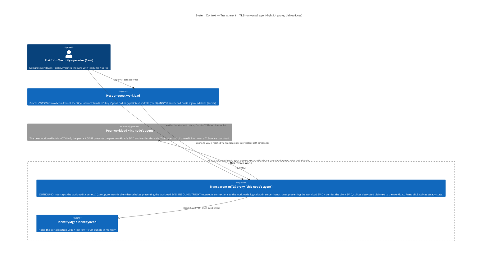
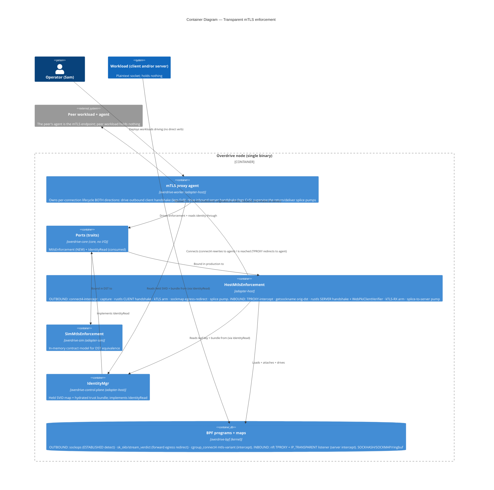
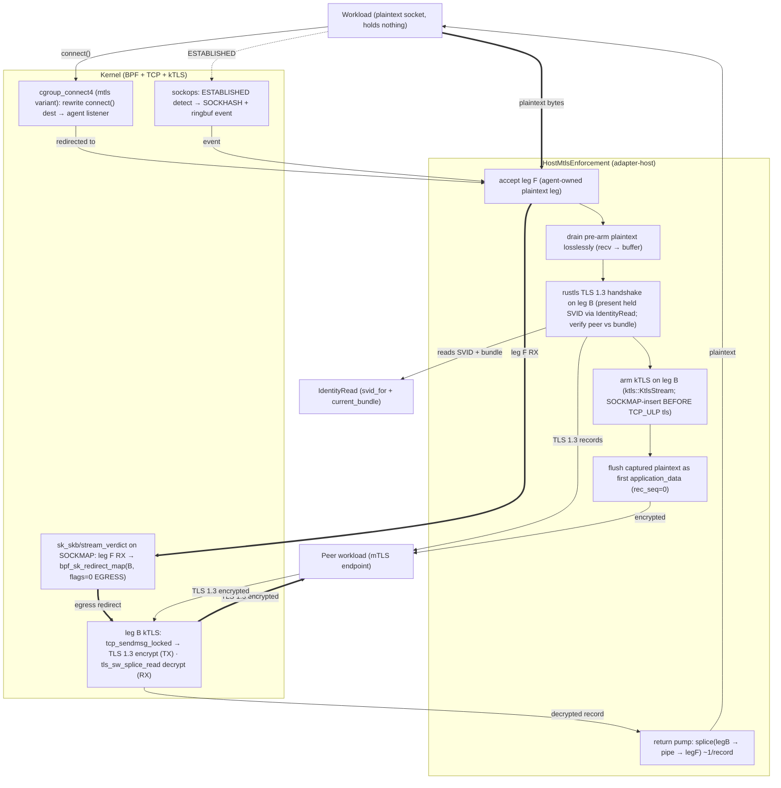
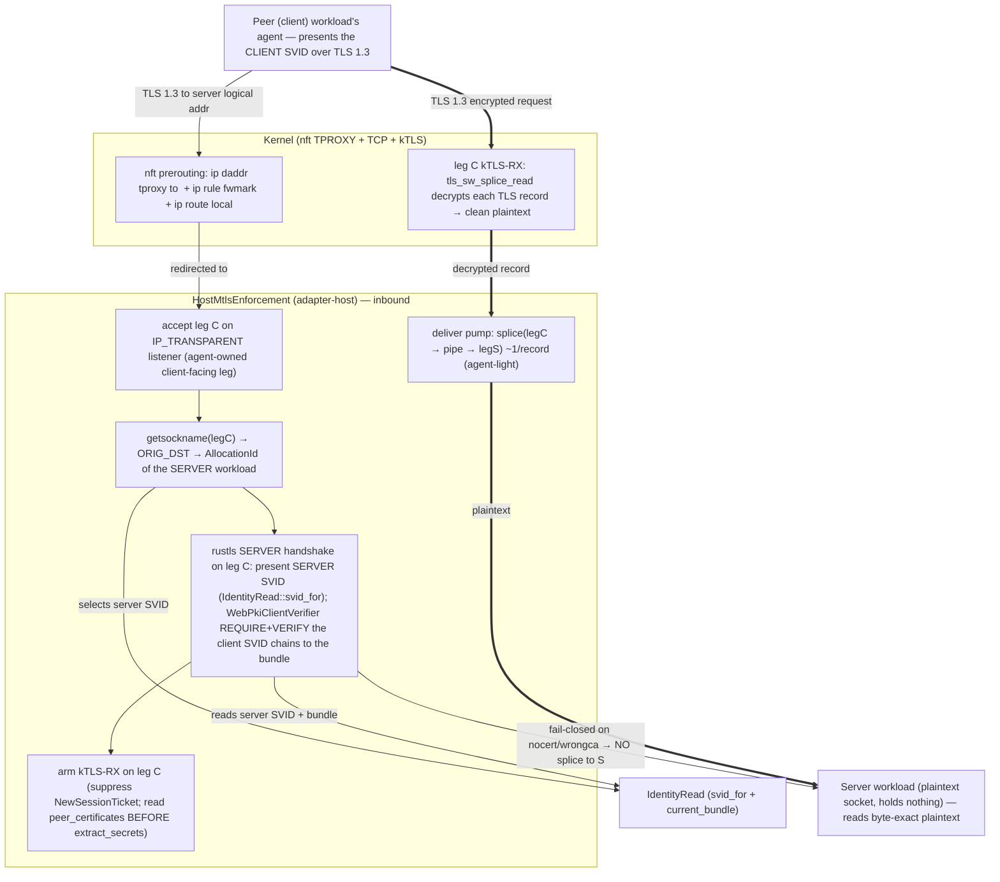

# C4 diagrams — transparent mTLS universal agent-light L4 proxy (ADR-0069, GH #26)

Four diagrams (Mermaid). L1 System Context + L2 Container are mandatory; L3
Component is rendered TWICE for the proxy dataplane (a complex subsystem) — once
for the OUTBOUND/client path (detect→intercept→handshake→kTLS-arm→forward-splice
→return-splice) and once for the INBOUND/server path
(TPROXY-intercept→orig-dst→server-mTLS→kTLS-RX→splice-to-server, F3). Every arrow
is labelled with a verb. Abstraction levels are not mixed. Both directions are
real-kernel proven (outbound: increments-f/g; inbound:
`findings-inbound-intercept.md`).

---

## L1 — System Context

The actors and the systems the transparent-mTLS proxy touches. The workload is
identity-unaware and holds NOTHING; the operator declares policy. The "peer" is
another Overdrive workload **paired with its own node's agent** — the peer
workload holds nothing either; the peer's *agent* presents the peer workload's
SVID (this resolves the self-contradiction the prior diagram carried: the peer
workload does NOT present its own SVID — its agent does, on its behalf).

---

## L2 — Container

The deployment units inside the Overdrive node binary and the BPF/kernel surface.
The hexagon: the agent (control logic) depends on the `MtlsEnforcement` and
`IdentityRead` ports; production wires the host adapter, DST wires the sim adapter.

---

## L3 — Component (the proxy dataplane path — OUTBOUND / client side)

The per-connection enforcement path inside `HostMtlsEnforcement`:
detect → intercept → capture → handshake → kTLS-arm → forward-splice (agent-idle)
→ return-splice (agent-light). leg F = the agent-owned plaintext leg facing the
workload; leg B = the agent-owned kTLS leg facing the peer.

**Reading the diagram**:

- **Setup (thin arrows)**: connect4 rewrites the workload's `connect()` to the
  agent's leg F; sockops fires the ESTABLISHED event; the agent drains the
  pre-arm plaintext losslessly, handshakes on leg B (reading the held SVID via
  `IdentityRead`), arms kTLS, and flushes the captured bytes.
- **Steady-state forward (thick `==>` arrows) — AGENT-IDLE**: leg F's RX is
  egress-redirected (`bpf_sk_redirect_map`, `flags=0`) into leg B's kTLS TX; the
  kernel's `tcp_sendmsg_locked` encrypts; the agent issues zero per-byte syscalls
  (`findings-egress-ktls-splice.md`, 15/15).
- **Steady-state return (thin arrows from PEER) — AGENT-LIGHT**: leg B is a plain
  kTLS-RX socket (NO psock); the agent drives a `splice(legB → pipe → legF)` pump;
  `tls_sw_splice_read` decrypts each record into clean plaintext, zero-copy, ~1
  splice/record (`findings-splice-return.md`).

**Invariant (Tier-3 test target)**: leg B carries NO sockmap verdict/psock on its
RX — that both fights kTLS RX (`ConnectionAborted`) and forecloses the return path
(`tls_sw_read_sock` `-EINVAL`). The return is `splice`, not a verdict redirect.

---

## L3 — Component (the proxy dataplane path — INBOUND / server side, F3)

The inbound/passive half (proven in `findings-inbound-intercept.md`, increment-i):
TPROXY-intercept → orig-dst recovery → server-mTLS terminate → kTLS-RX arm →
splice-to-server (agent-light). leg C = the agent-owned client-facing kTLS leg
(the inbound analogue of leg B); leg S = the agent-owned plaintext leg facing the
server workload (the inbound analogue of leg F). The server workload holds
NOTHING and reads byte-exact plaintext.

**Reading the diagram**:

- **Intercept (thin arrows)**: `nft` TPROXY redirects the connection aimed at the
  server workload's logical address to the agent's `IP_TRANSPARENT` listener;
  `getsockname()` on the accepted leg-C socket recovers the original destination,
  which selects the server workload's `AllocationId` → its held SVID
  (`findings-inbound-intercept.md` §1).
- **Server-side mutual-TLS (thin arrows)**: the agent presents the server SVID and
  `WebPkiClientVerifier` requires-and-verifies the client SVID chains to the
  bundle. `nocert`/`wrongca` is fail-closed — nothing is spliced to the server
  workload (§2/§4).
- **Steady-state deliver (thick `==>` arrows) — AGENT-LIGHT**: leg C is a plain
  (no-psock) kTLS-RX leg; the agent drives `splice(legC → pipe → legS)`;
  `tls_sw_splice_read` decrypts each record into clean plaintext, zero-copy,
  ~1 splice/record (§3/§5). The server reads the byte-exact plaintext.

**Invariant (Tier-3 test target)**: same as outbound — leg C carries NO sockmap
verdict/psock on its RX; the deliver is `splice`, not a verdict redirect. The
server's **response** leg (re-encrypt the server workload's reply onto leg C's
kTLS-TX) reuses the outbound forward primitive and is part of the composed
walking-skeleton gate (NOT exercised in the inbound spike).
