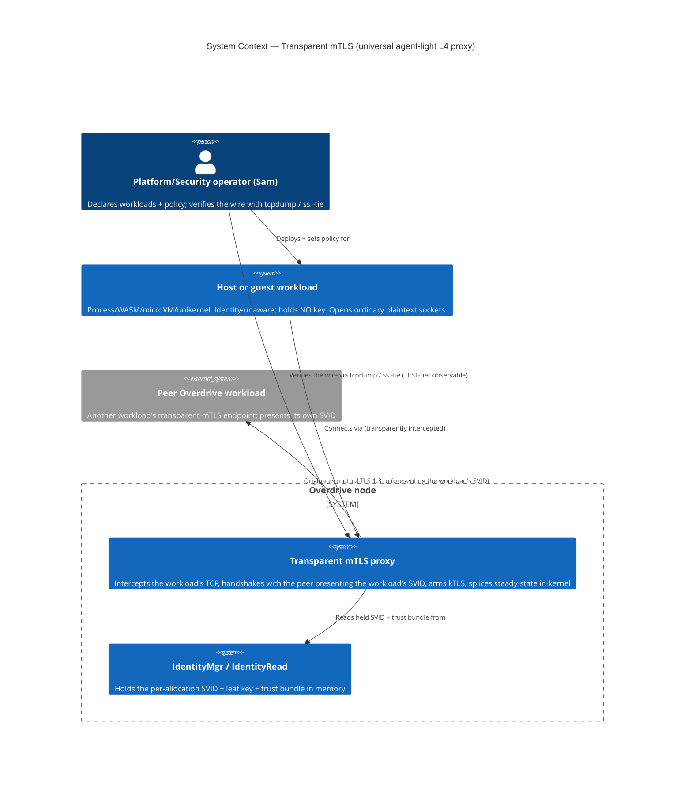
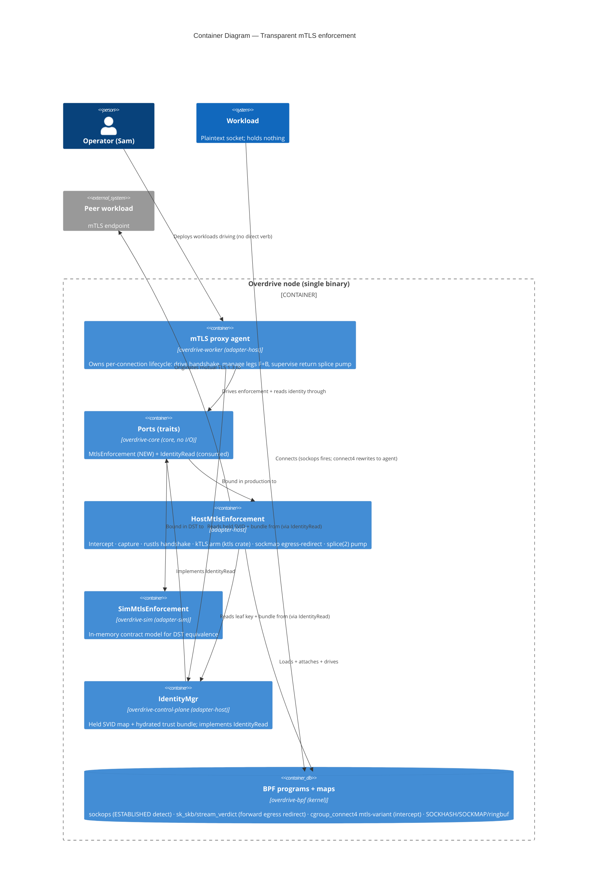
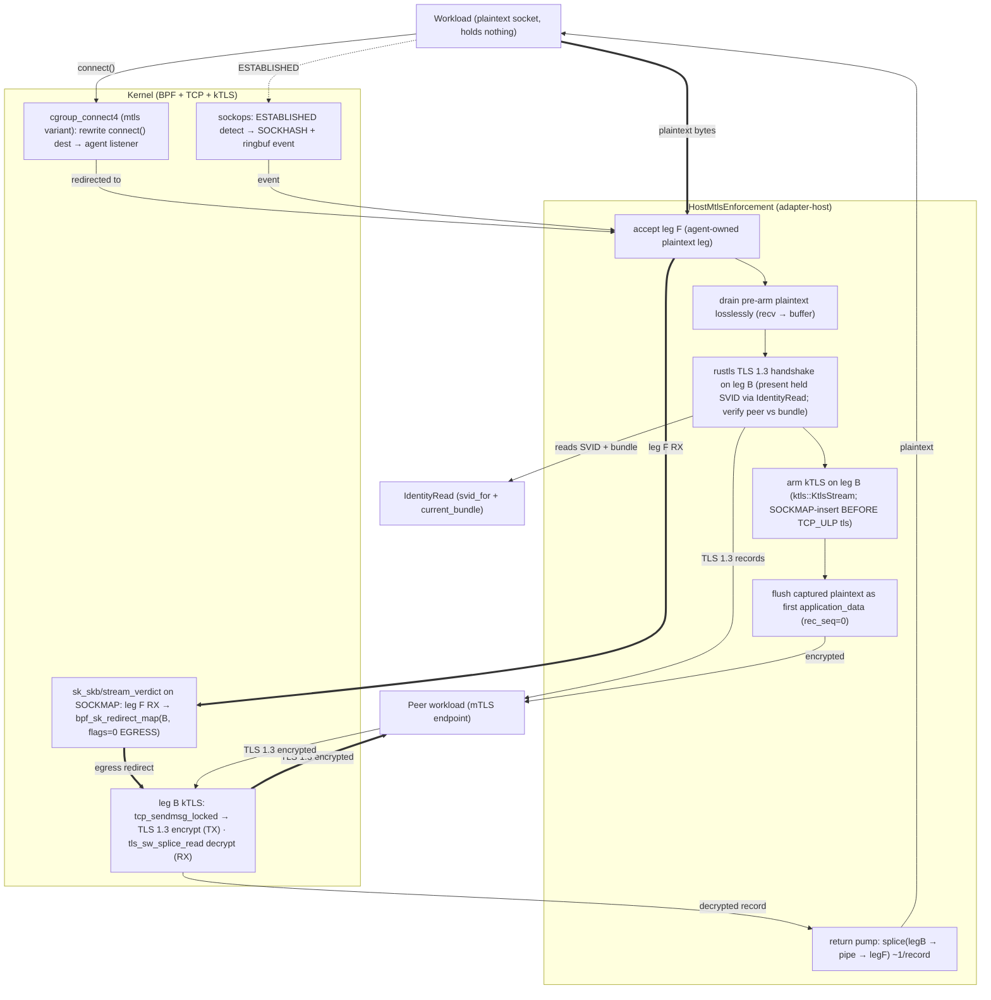

# C4 diagrams — transparent mTLS universal agent-light L4 proxy (ADR-0069, GH #26)

Three levels (Mermaid). L1 System Context + L2 Container are mandatory; L3
Component is rendered for the proxy dataplane (a complex subsystem — the
detect→intercept→handshake→kTLS-arm→forward-splice→return-splice path). Every
arrow is labelled with a verb. Abstraction levels are not mixed.

---

## L1 — System Context

The actors and the systems the transparent-mTLS proxy touches. The workload is
identity-unaware; the operator declares policy; the peer is another Overdrive
workload.

---

## L2 — Container

The deployment units inside the Overdrive node binary and the BPF/kernel surface.
The hexagon: the agent (control logic) depends on the `MtlsEnforcement` and
`IdentityRead` ports; production wires the host adapter, DST wires the sim adapter.

---

## L3 — Component (the proxy dataplane path)

The per-connection enforcement path inside `HostMtlsEnforcement`:
detect → intercept → capture → handshake → kTLS-arm → forward-splice (agent-idle)
→ return-splice (agent-light). leg F = the agent-owned plaintext leg facing the
workload; leg B = the agent-owned kTLS leg facing the peer.

**Reading the diagram**:

- **Setup (thin arrows)**: connect4 rewrites the workload's `connect()` to the
  agent's leg F; sockops fires the ESTABLISHED event; the agent drains the
  pre-arm plaintext losslessly, handshakes on leg B (reading the held SVID via
  `IdentityRead`), arms kTLS, and flushes the captured bytes.
- **Steady-state forward (thick `==>` arrows) — AGENT-IDLE**: leg F's RX is
  egress-redirected (`bpf_sk_redirect_map`, `flags=0`) into leg B's kTLS TX; the
  kernel's `tcp_sendmsg_locked` encrypts; the agent issues zero per-byte syscalls
  (`findings-egress-ktls-splice.md`, 15/15).
- **Steady-state return (thin arrows from PEER) — AGENT-LIGHT**: leg B is a plain
  kTLS-RX socket (NO psock); the agent drives a `splice(legB → pipe → legF)` pump;
  `tls_sw_splice_read` decrypts each record into clean plaintext, zero-copy, ~1
  splice/record (`findings-splice-return.md`).

**Invariant (Tier-3 test target)**: leg B carries NO sockmap verdict/psock on its
RX — that both fights kTLS RX (`ConnectionAborted`) and forecloses the return path
(`tls_sw_read_sock` `-EINVAL`). The return is `splice`, not a verdict redirect.
