# Feature Delta — vm-recreation-allocation-id-reuse

**Feature-id:** `vm-recreation-allocation-id-reuse` · **GH:** [#284](https://github.com/overdrive-sh/overdrive/issues/284)
· **Wave:** DESIGN · **Scope:** Application/components · **Mode:** propose
· **Paradigm:** OOP (repository contract)

**Status:** DESIGN accepted after independent review iteration 2 APPROVED and
user authorization on 2026-09-12; approved commit
`a0f9bda8cd4f2377c1a709e77e8c05850e7adaa2`. This document is the single
feature artifact. No legacy `design/wave-decisions.md` is created.

**Density:** `lean` with `ask-intelligent`, resolved by the canonical
`resolve_density` helper from `/Users/marcus/.local/share/uv/tools/nwave-ai/`;
Tier-1 `[REF]` sections only. The installed distribution has no
`scripts/shared/telemetry.py`, so no density JSONL was fabricated. The tooling
gap is reported to the orchestrator; it does not change the architecture.

## Wave: DESIGN / [REF] Consultation and contract

The user-authorized input is `gh issue view 284 --comments` (issue comments were
empty). It supplies the bounded scope, two native failure directions, required
ownership invariants, rejected fixes, hard-gate regression obligations and
DESIGN questions. The feature-specific DISCUSS and SPIKE files are absent; the
issue is the explicit replacement input, not an invitation to invent missing
stories or outcomes.

✓ `docs/product/architecture/brief.md` — existing SSOT, including the VM driver,
  VM reclamation, workload lifecycle and Service-kind VM sections.

✓ `docs/product/architecture/adr-*.md` — all 110 existing ADR files consulted;
  ADR-0073, 0077, 0078, 0081–0084, 0088–0091 and 0098–0103 are the load-bearing
  current decisions for this feature.

⊘ `docs/feature/vm-recreation-allocation-id-reuse/discuss/wave-decisions.md`
  (not found; replaced by #284).

⊘ `docs/feature/vm-recreation-allocation-id-reuse/discuss/user-stories.md`
  (not found; replaced by #284).

⊘ `docs/feature/vm-recreation-allocation-id-reuse/discuss/story-map.md`
  (not found; replaced by #284).

⊘ `docs/feature/vm-recreation-allocation-id-reuse/discuss/outcome-kpis.md`
  (not found; replaced by #284).

⊘ `docs/feature/vm-recreation-allocation-id-reuse/spike/findings.md`
  (not found; #284 retains the authorized native evidence).

Migration gate: `docs/product/` exists, so this brownfield design extends the
architecture SSOT. No migration guide is needed.

The accepted OOP, modular-monolith, dependency-inversion style remains in force.
The issue's identity correction does not change a lifecycle state, wire field,
operator command, persistence owner or external integration. The only changed
assumption is the identity used by VM replacement execution, recorded in
`Changed Assumptions` below.

## Wave: DESIGN / [REF] Verified premise and production owner path

The issue's native captures are prior-SHA evidence; the following source facts
are from the current HEAD (`ed52e957`, `origin/main`) and were traced through
the complete production owners.

| Boundary | Current production evidence | Load-bearing fact |
|---|---|---|
| Stable logical owner | `WorkloadLifecycle` is registered per `TargetResource` `workload/<workload_id>`; its desired projection reads the intent `WorkloadId`, while actual projection groups all `AllocStatusRow`s by that workload (`crates/overdrive-reconcilers/src/workload_lifecycle.rs:236–369, 493–529`). | The existing workload target is the stable owner for this single effective placement model. No `VmInstance`, `VmIncarnationId` or replica aggregate is introduced. |
| Existing same-ID recovery decision | The current failed/reclamation branch selects `failed.alloc_id`, calls `restart_allocation_action` (`:929–1044`, helper `:1407–1441`), and emits `Action::RestartAllocation` whose `alloc_id` and `spec.alloc` are that same value. | This is the exact identity alias that issue #284 corrects for VM payloads. |
| Same-ID effect owner | `action_shim::dispatch_single` handles `RestartAllocation` at `crates/overdrive-control-plane/src/action_shim/mod.rs:2253–2751`: it reads the prior row, stops the prior driver, tears down the network, reassigns/provisions using the same allocation key, and calls the selected driver. | A failed replacement bind is allowed to address the predecessor's run directory, cgroup scope and slot-derived effects. |
| VM artifact creation | `VmDriver::provision_vmm` takes the VM supervision claim, then derives `VmRunDir::for_alloc`, `CgroupPath::for_alloc`, the beacon path and `RootfsPlan::for_alloc` before `Vmm::create` (`crates/overdrive-worker/src/vm_driver.rs:1159–1394`). `CloudHypervisorVmm::create` stages the clone and per-allocation kernel copy (`crates/overdrive-host/src/vmm.rs:365–548`). | The physical execution identity is the `AllocationId` passed before the first VM-exclusive artifact. |
| Platform Reclamation reachability | `VmReclamation::hydrate_vm_reclamation_desired` currently joins `WorkloadIntent::Job` entries whose driver is VM (`crates/overdrive-reconcilers/src/vm_reclamation.rs:328–345`); the current Service bind reproduction reaches the `WorkloadLifecycle` restart branch directly. | The fresh-ID rule applies at the existing WorkloadLifecycle replacement seam and to the currently reachable VM reclamation successor. This feature does not widen the reclaimer's Job-only desired join without a reproduced #284 reclaimer defect. |
| Current native reproduction | The current Lima run of `e10_vm_early_exit_spike` with seed `257205` completed its no-restart control and same-ID case. The same-ID case recorded one VMM, a second bind failure `Address already in use`, and `cgroup.kill` of the original PID; it did not produce a second VMM. | Current production composition still reaches the collision. The existing test's passing assertion is the stale-watcher guard; it is not evidence that the same-ID bind/cgroup ownership is safe. |
| Rejected first publication | `run_convergence_tick_inner` persists `next_view` before action dispatch and requeues even when dispatch returns an error (`crates/overdrive-control-plane/src/reconciler_runtime.rs:1485–1500, 1526–1571, 1590–1607`). `StartAllocation` can start a VM, lose its initial Running write, then await `driver.stop`, release supervision and tear down networking while committing no allocation row (`action_shim/mod.rs:2079–2163`). `vm_running_write_failure_releases_the_supervision_claim` drives that exact VM-shaped boundary and proves no committed row plus no surviving claim (`tests/acceptance/action_shim_running_write_failure_stops_alloc.rs:329–383`). | Row-count minting alone can reissue the same VM ID on the runtime's requeue. The already-fsynced View is the narrow existing surface that must consume the ID before dispatch. |
| Issue native evidence | #284 records E09-v2 `bind beacon listener: Address already in use` and the inverse qualified-metal sequence in which an old reaper deleted the replacement path and the replacement then saw `ENOENT`. | Both directions are ownership failures, not latency, retry or beacon-only failures. |

The bounded command used for the current revalidation was:

```text
cargo xtask lima run -- cargo nextest run -p overdrive-sim \
  --features integration-tests,overdrive-control-plane/integration-tests \
  --test e10_vm_early_exit_spike --no-capture --no-fail-fast
```

The required BPF object was first produced with `cargo xtask lima run -- cargo
xtask bpf-build`. The seed-257205 output is retained in the command result and
shows the current path's same-ID bind and old-PID kill. The issue's qualified
metal `EADDRINUSE` and late-reaper `ENOENT` captures remain the authoritative
host-effect evidence; no claim is made that Lima proves Unix socket or file
deletion effects.

## Wave: DESIGN / [REF] Selected mechanism and DDD decisions

### Selected mechanism — reuse `StartAllocation` with a fresh VM allocation identity

For a VM driver payload, every automatic replacement action emitted by
`WorkloadLifecycle` uses the existing `Action::StartAllocation` shape with a
fresh `AllocationId`. The current `Action::RestartAllocation` path remains the
same-ID recovery mechanism for `Exec` payloads, preserving existing process
restart semantics and the accepted `Driver::stop`/`RestartAllocation` contract.

The fresh VM ID is minted in the pure reconciler before the action is returned,
using the existing `mint_alloc_id(&WorkloadId, attempt)` producer. The attempt
is the checked successor of the greatest numeric suffix in the union of
retained allocation rows and the existing View's VM issued-ID keys. The action's
`spec.alloc`, its `identity`, and its `alloc_id` are the same fresh value.
Before dispatch, that ID is inserted into `next_view.restart_counts`; the
runtime fsyncs the View before the action shim receives the action. No host
artifact is created until the identity is durably consumed.

The DELIVER seam is pinned to the existing private helper, extended rather
than exposed:

```text
fn restart_allocation_action(
    job: &Job,
    desired: &WorkloadLifecycleState,
    row: &AllocStatusRow,
    attempt: u32,
) -> Action
```

For `WorkloadDriver::Vm(_)`, `attempt` is supplied by this pinned private
decision:

```text
fn next_vm_attempt(
    allocs: &[&AllocStatusRow],
    view: &WorkloadLifecycleView,
) -> Option<u32>
```

It returns `Some(0)` when neither input has a parseable suffix; otherwise it
returns `max_suffix.checked_add(1)` across row IDs and
`view.restart_counts.keys()`. `None` emits no VM start and never clamps to or
reuses `u32::MAX`. The helper then returns:

```text
StartAllocation {
    alloc_id: fresh,
    workload_id: job.id.clone(),
    node_id: row.node_id.clone(),
    spec: AllocationSpec {
        alloc: fresh,
        identity: SpiffeId::for_allocation(&job.id, &fresh),
        driver: the existing VM payload,
        resources: job.resources,
        probe_descriptors: desired.probe_descriptors.clone(),
        service_ports: desired.service_ports.clone(),
        netns: None,
        host_veth: None,
        workload_addr: None,
        guest_tap: None,
        guest_mac: None,
        guest_gateway: None,
        guest_prefix_len: None,
        guest_dns: None,
    },
    kind: desired.workload_kind,
}
```

where `fresh = mint_alloc_id(&job.id, attempt)`. For
`WorkloadDriver::Exec(_)`, it returns the existing same-ID
`RestartAllocation` spec. This is a private implementation seam; no public
method, trait, action variant or parameter is added.

Every VM `StartAllocation` producer in `WorkloadLifecycle` -- initial,
generation, Workload Failure and Platform Reclamation -- reserves the selected
fresh key in `next_view` before returning it. Exec initial placement keeps its
current row-count derivation and Exec restart remains same-ID.

This deliberately does not add a `ReplaceAllocation` action. The existing
running-origin generation path already emits `StopAllocation` and later a
fresh `StartAllocation`; VM failure/reclamation recovery is brought onto that
same fresh-start path. No second public action, compatibility branch or old-ID
alias is needed.

### DDD-1 — stable logical owner

`WorkloadId` and its existing workload-scoped reconciler target remain the
stable logical owner for desired state, restart policy, prior-failure memory and
current-allocation selection. The current Service/Job lifecycle has one
effective allocation per workload target; it does not carry a stable replica
identity that this feature can safely reinterpret. Therefore no replica/slot
identity is added. Multi-replica replacement semantics remain outside this
bounded issue.

### DDD-2 — fresh replacement identity

For `WorkloadDriver::Vm(_)`, the failed/reclamation replacement branch emits a
fresh `StartAllocation` ID. `Action::StartAllocation` already has the exact
contracted shape:

```text
StartAllocation {
    alloc_id: AllocationId,
    workload_id: WorkloadId,
    node_id: NodeId,
    spec: AllocationSpec,
    kind: WorkloadKind,
}
```

The `AllocationSpec.alloc` and `SpiffeId::for_allocation(workload_id, alloc_id)`
values must equal the action's fresh `alloc_id`. The existing
`VmDriver::start(&AllocationSpec) -> Result<AllocationHandle, DriverError>`
contract is unchanged. No `VmIncarnationId`, stable-ID compatibility alias or
ID-derived fallback is introduced.

The existing numeric attempt suffix remains the selection identity.
`current_alloc` still selects only the numeric maximum **row** suffix rather
than lexical map order. VM minting additionally considers View reservation keys,
so an unpublished execution remains consumed without becoming current.

### DDD-3 — current selection/update and predecessor representation

There is no persisted `current` pointer in this slice. The existing pure
`current_alloc<'a>(&[&'a AllocStatusRow]) -> Option<&'a AllocStatusRow>` is the
current-allocation projection: it returns the row with the numerically highest
minted attempt suffix. The current reference changes only when the new
`StartAllocation` row is accepted by the existing
`ObservationStore::write_alloc_lifecycle` boundary. That write atomically
publishes the current row and its occurrence for the new key; it does not
overwrite the predecessor row.

The existing publication signature is:

```text
async fn write_alloc_lifecycle(
    &self,
    current: AllocStatusRow,
    source: TransitionSource,
) -> Result<Option<AllocLifecycleOccurrenceRow>, ObservationStoreError>
```

When that call returns `Ok(Some(_))`, the fresh key is accepted as a new
current row plus occurrence in one existing store operation. `Ok(None)` or
`Err(_)` leaves current selection unchanged while the pre-dispatch View
reservation consumes the ID. No second pointer write or cross-key transaction
is introduced.

The predecessor is represented by the retained terminal `AllocStatusRow` under
its old `AllocationId`, together with its existing bounded
`AllocLifecycleOccurrenceRow` history. `LastTerminated` and
`AllocStatusRow.restart_count` remain per-physical-allocation facts under
ADR-0078; they are not copied into the fresh row, because doing so would make
the new row claim a terminal observation it did not supersede. The operator
sees the old terminal row and the new row in the existing workload describe
rows collection. No revision row, `RevisionId`, `workloads/<id>/current` alias,
or unbounded cross-allocation history is added.

The reconciler's persisted `WorkloadLifecycleView` fields retain their current
public shape (`BTreeMap<AllocationId, u32>` and
`BTreeMap<AllocationId, UnixInstant>`), with this explicit driver-specific
contract:

- **Exec:** the count and failure timestamp retain their accepted
  per-allocation, same-ID restart meaning.
- **VM count key:** key presence is the durable fact that the physical VM ID
  was issued, even when the corresponding row publication was rejected. The
  value is the stable owner's Workload Failure budget carried at that
  candidate, not `AllocStatusRow.restart_count`.
- **VM timestamp:** candidate-keyed latest genuine Workload Failure input. A
  fresh candidate carries it; Platform Reclamation never stamps a new failure.

Retry policy stays candidate-keyed, as ADR-0102 requires. An ordinary VM
Workload Failure reads only the selected candidate's count/timestamp, advances
the budget once, and writes the advanced value plus `tick.now_unix` under both
the still-current candidate and the fresh reservation. Thus a rejected
publication leaves the old candidate with the consumed attempt/backoff. A VM
Platform Reclamation carries the candidate's values to the fresh reservation
without incrementing budget or stamping time. Initial placement starts at
zero/no timestamp; explicit generation replacement carries current values
without increment. The existing successful-Running follow-up clears that
current candidate's failure timestamp.

`next_evaluation_at` reads the same selected candidate as `reconcile`; neither
folds maximum counts or latest timestamps over historical entries. Only
`next_vm_attempt` scans the VM reservation **keys**, whose stated purpose is
identity consumption. This is an explicit semantic amendment to ADR-0083 and
ADR-0102, not a new View field, pointer, codec or wire projection.

Once more than one physical row is retained, VM replacement must select the
current row before applying `is_restartable`: `current_alloc(&allocs_vec)` is
the only VM restart candidate, and a historical predecessor is never re-driven
because it happens to be restartable. `Exec` keeps its existing single-key
candidate behavior. `next_evaluation_at` applies the same VM-current-candidate
selection, so its deadline cannot be based on a historical row.

The per-allocation `restart_count` shown on the wire remains the ADR-0078
observed terminal-to-Running counter. A fresh key starts at zero; the prior
allocation's count and cause remain on its retained row. The owner-level
restart-policy inputs above are distinct from that observed per-allocation
counter and must not be conflated.

### DDD-4 — exact cleanup capability and ownership

The existing `LiveVm` is the move-only cleanup capability for one physical VM
execution. It retains the execution's `VmControl`, accepted beacon writer,
private pending `BeaconMessage::Exec`, cgroup `CgroupPath`, `VmRunDir`,
`RootfsPlan` and Running-confirmed gate. Its artifact-cleanup-relevant fields
are therefore bound to one physical allocation; no field is added and no
capability is looked up through the logical owner's current row.
`ClaimGuard` and `ReclamationLease` continue to arbitrate ownership through the
existing `VmDriver` live map.

The inventory includes directly evidenced VM artifacts. The adjacent
netns/TAP entry below is shown only as an explicit no-change check required by
#284's anti-generalization constraint.

The exact existing cleanup surfaces remain:

| Capability/effect | Existing owner and signature | #284 disposition |
|---|---|---|
| VMM process | `Vmm::terminate(&VmControl, Duration) -> Result<VmTermination>`; `CloudHypervisorVmm` tracks by its own PID map | Reuse. A new allocation gets a new `VmControl`; an old process is never found through the new ID. |
| VM supervision claim | `Driver::try_begin_reclamation(&AllocationId) -> bool`, `Driver::live_allocations() -> Option<Vec<AllocationId>>`, `Driver::release_supervision(&AllocationId)` | Reuse unchanged. Old and new claims have distinct keys; the accepted-session `Weak<BeaconWriter>` identity guard remains. |
| Cgroup scope | `CgroupPath::for_alloc(&AllocationId)` and `VmHostState::kill_scope(&CgroupPath)` | Include for VM identity because #284's current/native trace shows failed-start cleanup writing the predecessor's `cgroup.kill` and killing its VMM. Do not widen or change generic Exec cgroup ownership. |
| Run directory and children | `VmRunDir::for_alloc(&Path, &AllocationId)`; `VmDriver` binds/owns beacon and `CloudHypervisorVmm` uses the same directory for vsock, API, console and kernel copy | Include. The fresh ID supplies a fresh directory before bind/copy. |
| Rootfs clone + index link | `RootfsPlan::for_alloc(..., &AllocationId, ...)`; `create_index_link` records the chosen clone; `VmDriver` removes clone before link; `RealVmHostState::discard_artifacts(&AllocationId)` reads the recorded target | Include. Fresh IDs produce distinct clone/index names. Cleanup always uses the execution's capability or the exact old allocation key in the existing reclaimer; no path fallback is added. |
| Netns/veth/TAP slot | `NetSlotAllocator::assign(AllocationId)` and existing teardown-before-release | Reuse unchanged. #284 has no reproduced wrong-owner TAP mutation. A new `StartAllocation` uses the existing slot claim; a held old slot remains held until existing teardown succeeds. No TAP generalisation is inferred from the VM directory race. |

The move/claim signatures remain exact and private where they are today:

```text
ClaimGuard::new(
    alloc: AllocationId,
    live: Arc<LiveMap>,
    beacon: Weak<BeaconWriter>,
) -> ClaimGuard
ClaimGuard::try_begin_ending(&mut self) -> Option<LiveVm>
ReclamationLease::try_acquire(
    drivers: &DriverRegistry,
    alloc_id: &AllocationId,
) -> Option<ReclamationLease<'_>>
```

`ClaimGuard`'s `Drop` removes only its originating `Live` session; a successful
`try_begin_ending` transfers the one `LiveVm` to the ending owner. A
`ReclamationLease` `Drop` calls `Driver::release_supervision` for exactly its
allocation key. Neither path is changed to consult the logical owner's
current row.

The `Driver` port remains the existing async start/stop boundary plus the
sync supervision claim methods:

```text
async fn start(&self, spec: &AllocationSpec) -> Result<AllocationHandle, DriverError>
async fn stop(&self, handle: &AllocationHandle) -> Result<(), DriverError>
fn live_allocations(&self) -> Option<Vec<AllocationId>>
fn try_begin_reclamation(&self, alloc: &AllocationId) -> bool
fn release_supervision(&self, alloc: &AllocationId)
```

The path and host-cleanup contracts remain exact as well:

```text
VmRunDir::for_alloc(root: &Path, alloc: &AllocationId) -> VmRunDir
RootfsPlan::for_alloc(
    master: PathBuf,
    master_bytes: u64,
    alloc: &AllocationId,
    staging_dir: &Path,
    index_dir: &Path,
) -> RootfsPlan
CgroupPath::for_alloc(alloc: &AllocationId) -> CgroupPath
async fn VmHostState::kill_scope(&self, scope: &CgroupPath) -> io::Result<()>
async fn VmHostState::discard_artifacts(&self, alloc: &AllocationId) -> io::Result<()>
async fn Vmm::create(&self, config: &VmConfig) -> Result<VmProcess>
async fn Vmm::terminate(
    &self,
    control: &VmControl,
    grace: Duration,
) -> Result<VmTermination>
```

`RootfsPlan`'s clone location remains the recorded clone-index target; only
the platform-owned link pathname is derived from the exact allocation key.

The issue's “allocation-ID-derived cleanup fallback” prohibition means no new
code may synthesize a physical artifact path from the logical owner's current
ID when an execution capability is missing. The existing
`VmHostState::discard_artifacts(&AllocationId)` allocation-keyed host contract
and clone-index link lookup remain accepted; they use the exact old allocation
key as the reclaimer's canonical lookup and read the recorded clone target,
not a new fallback that guesses or re-derives an arbitrary physical path.

### DDD-5 — lifecycle states and failure projections

No new `AllocState`, `TerminalCondition`, `TransitionReason`, wire field or
operator command is introduced.

| Situation | Current row/result | Fresh-VM design |
|---|---|---|
| Running-origin explicit generation replacement | Existing `StopAllocation` ends the current row; later placement already emits a fresh `StartAllocation` | Preserve exactly; generation stamp remains the workload View input. |
| VM Platform Reclamation (current VM-Job join) | `VmReclamation` writes old `Terminated / Stopped { by: PlatformReclaimed }` and wakes `WorkloadLifecycle` | `WorkloadLifecycle` emits fresh `StartAllocation` for the standing workload; old row remains terminal and is never reused. The existing Job-only reclaimer desired join is unchanged. |
| VM Workload Failure restart candidate (Service startup failure or another existing restartable VM row) | Existing branch emits same-ID `RestartAllocation` | VM branch emits fresh `StartAllocation`; candidate-keyed budget/backoff inputs are carried to the fresh reservation. |
| Fresh VM start succeeds | New `AllocStatusRow` is `Running`, `Started`, fresh `started_at`/address, `last_terminated: None`, `restart_count: 0` | Existing StartAllocation publication and Running-confirmed gate; old row is untouched. |
| Fresh VM start is rejected | Existing typed `StartRejected` projection writes a `Failed` row | Same typed projection, but under the fresh ID; no old row/cgroup/run path is touched. Existing candidate-keyed backoff decides any next attempt. |
| Running write is rejected after VM creation | Existing StartAllocation unwind stops the just-created handle and removes its own network/VM effects before returning the write error | Same unwind, keyed by the fresh ID; the fsynced reservation survives and requeue/restart must mint higher. No retry or old-ID cleanup is added. |
| Job natural exit or operator/SystemGc stop | Existing terminal/finalisation and intentional-stop semantics | Unchanged. A natural Job result is not converted into a fresh VM replacement. |
| Service Stable/readiness/liveness | Existing ServiceLifecycle owner and gates | Unchanged; Service startup failure still owns its terminal claim, and WorkloadLifecycle alone decides a restart. |

The fresh `StartAllocation` action is the only current-selection mutation. Its
action-shim order remains: existing VM network assignment/provisioning for the
fresh ID → `VmDriver::start` claim and VM-exclusive artifacts → accepted
`Running` row → existing mTLS/EXEC/probe hooks. No sleep, retry-to-success,
global lock or cleanup-before-create barrier is introduced.

## Wave: DESIGN / [REF] #284 ownership invariants

| # | Invariant carried from #284 | Design guarantee and evidence lane |
|---|---|---|
| 1 | One `AllocationId` identifies at most one VM execution and is never reassigned. | Every VM start reserves its key in the fsynced View before dispatch; minting advances above retained rows and reservations. `LiveMap` has one claim entry per physical ID. Seeded Sim asserts accepted and rejected-publication sequences. |
| 2 | A replacement ID exists before any host artifact. | `restart_allocation_action(..., attempt)` returns fresh `StartAllocation`, and `next_view` reserves it before runtime dispatch; action-shim C3 and `VmDriver` then receive that value before run-dir, beacon, cgroup, clone or VMM work. |
| 3 | Cleanup consumes the exact execution capability, not the logical owner's current row. | `LiveVm` carries old paths/control; `ClaimGuard`/`ReclamationLease` and exact old-key `VmHostState` calls remain the only cleanup authorities. |
| 4 | Allocation N cannot unlink, remove, signal or otherwise mutate N+1. | Fresh run/cgroup/clone/process identities plus accepted-session/claim checks make the two capability universes disjoint; native strace and Sim cross-key assertions cover it. |
| 5 | Cleanup ownership is exactly once. | Existing atomic `ClaimGuard::try_begin_ending` and `Driver::try_begin_reclamation`/`release_supervision` transitions retain the winner/loser contract; seeded contention and final cleanup complement test both. |
| 6 | Desired state, restart policy, prior failure and current selection belong to the stable owner; physical rows retain immutable history. | Candidate-keyed View values carry stable-owner policy into each VM reservation; `current_alloc` selects the numeric latest accepted row; old `AllocStatusRow`/occurrences remain. |
| 7 | Safety is structural, not dependent on sleep, retry, global lock or cleanup ordering. | Old cleanup may precede or follow fresh creation; no timing mechanism is added. The two native issue interleavings are separate hard-gate regressions. |
| 8 | Final cleanup removes all artifacts for the ended allocation. | Existing fresh-start unwind and old-key reclaimer remain; qualified metal asserts zero final deltas for both IDs across run dir, beacon/API/vsock, kernel/clone/index, cgroup and VMM process. |

## Wave: DESIGN / [REF] Component decomposition

| Component / current path | Disposition | Bounded responsibility |
|---|---|---|
| `WorkloadLifecycle` and `restart_allocation_action` (`overdrive-reconcilers/src/workload_lifecycle.rs`) | **EXTEND** | For `WorkloadDriver::Vm`, reserve then construct existing fresh `StartAllocation`; keep `Exec` on existing `RestartAllocation`; keep retry policy candidate-keyed in both `reconcile` and `next_evaluation_at`; retain row-only numeric current selection. |
| `Action::StartAllocation` / `AllocationSpec` (`overdrive-core/src/reconcilers/mod.rs`, `traits/driver.rs`) | **REUSE unchanged shape** | Existing action already carries fresh `AllocationId`, stable `WorkloadId`, node and full per-driver spec. The fresh VM ID must be copied into `spec.alloc` and identity. |
| `Action::RestartAllocation` + action-shim restart arm | **REUSE for Exec; preserve API** | Existing same-ID stop/restart publication remains for process workloads. VM WorkloadLifecycle no longer emits this action; no compatibility branch is retained for VM. |
| `VmDriver`, `LiveVm`, `ClaimGuard`, `VmRunDir`, `RootfsPlan` | **REUSE mechanism** | Existing capability and per-ID paths become safe when supplied the fresh ID. Only comments/tests referring to VM same-ID recreation are updated in DELIVER. |
| `VmReclamation` and `action_shim::reclamation` | **REUSE unchanged** | Reclaim/dispose the old allocation under its own ID, preserving Platform Reclamation versus Artifact Disposal and exact claim ordering. This issue does not generalize the reclaimer's host observation surfaces. |
| `VmHostState` / `RealVmHostState` / `SimVmHostState` | **REUSE unchanged** | Existing exact allocation-keyed observation and disposal handle old artifacts; no cleanup fallback or path derivation is added. |
| `NetSlotAllocator` and `WorkloadNetworkProvisioner` | **REUSE unchanged** | Existing allocation-bound slot and teardown-before-release contract remains. TAP ownership is not changed without a reproduced #284 TAP failure. |
| `ObservationStore` rows and occurrences | **REUSE unchanged** | Retain old terminal row and occurrence history; publish fresh current row as a separate key. No new cross-key row or persistence protocol. |
| `ServiceLifecycle`, `ProbeRunner`, `IdentityMgr`, backend/SVID readers | **REUSE unchanged** | Their per-allocation state naturally follows fresh `StartAllocation`; ownership and lifecycle gates remain in their existing components. |
| `overdrive-sim` production-owner regression bindings | **EXTEND tests only** | Drive WorkloadLifecycle → action shim → VM driver with two IDs and delayed old cleanup; no fabricated terminal state or new production seam. |
| Qualified-metal VM integration test | **EXTEND test only** | Retain the existing `restarted_vm_boots_from_a_clean_unmodified_rootfs_copy` production composition and assert distinct IDs, old/new path isolation and final cleanup complements. |

**No component is CREATE NEW.** The feature changes which already-existing
primary action is emitted for a VM replacement; it does not add an allocator,
reclaimer, persistence store, owner, protocol or runtime task.

## Wave: DESIGN / [REF] Driving ports

No new driving port is introduced.

| Existing driving surface | Contract in this feature |
|---|---|
| `overdrive deploy <SPEC>` / HTTPS submit | Remains a pure declaration. It does not bump generation and does not resurrect an operator-stopped workload. |
| Existing Service health observations and `WorkloadLifecycle` target | A VM Workload Failure remains decided by `WorkloadLifecycle`; the VM branch returns a fresh `StartAllocation`. |
| Existing boot/reclamation drive | `VmReclamation` continues to classify/reclaim old allocation host state. Its actions target the old `AllocationId` only. |
| Existing `overdrive workload restart` generation path | Already places a fresh allocation on the generation mismatch. This feature does not add a second restart command or change its response shape. |

The feature has no new CLI/API/wire surface. `RestartAllocation` remains a
valid internal action for Exec and existing tests; VM replacement uses the
already-public-internal `StartAllocation` action contract.

## Wave: DESIGN / [REF] Driven ports and adapters

| Port | Existing adapters | Contract/evidence lane |
|---|---|---|
| `Driver` (`start`, `stop`, `status`, `live_allocations`, `try_begin_reclamation`, `release_supervision`) | `VmDriver`, `ExecDriver`, `SimDriver` | No signature changes. VM claims and status are keyed by the fresh execution ID; Exec semantics remain same-ID. Seeded Sim proves ordering/claim isolation. |
| `Vmm` | `CloudHypervisorVmm`, `SimVmm` | No signature or behavior changes. `VmConfig` receives fresh identity and its existing `VmRunDir`/`RootfsPlan` values. Tier-3 proves bind/copy/process isolation. |
| `VmHostState` | `RealVmHostState`, `SimVmHostState` | No signature changes. `kill_scope`/`discard_artifacts` are called with the exact old or fresh allocation key selected by the owner; no fallback path. |
| `ObservationStore` | `LocalObservationStore`, `SimObservationStore` | Existing `write_alloc_lifecycle` atomically accepts each new-key current row plus occurrence. Old rows are retained; no schema or codec change. |
| `IntentStore` / ViewStore | `LocalIntentStore`, `RedbViewStore`, Sim bindings | Existing workload intent and `WorkloadLifecycleView` storage; candidate policy plus VM issued-ID reservations reuse current serialized fields. No new transaction or state model. |
| Network provisioning | Existing `NetSlotAllocator`, `WorkloadNetworkProvisioner`, netlink adapters | Existing allocation-keyed slot claim and teardown ordering; no generalized TAP ownership change. |

Cloud Hypervisor remains a local child process and the Linux filesystem/cgroup/
Unix-socket surfaces remain the external substrate. Consumer-driven Pact
contracts do not apply; existing `Vmm::probe`, `VmHostState::probe`, adapter
equivalence and native Tier-3 tests are the contract evidence.

## Wave: DESIGN / [REF] Technology and architecture choices

| Choice | Decision | Rationale |
|---|---|---|
| Style | Existing modular monolith with ports-and-adapters / dependency inversion | The issue is an ownership identity correction inside one existing control-plane process; a new service or workflow would add a second owner and not fix path aliasing. |
| Paradigm | Rust 2024, OOP repository contract | Preserve `CLAUDE.md`; no paradigm rewrite. |
| Allocation identity | Existing validated `AllocationId`, minted by `mint_alloc_id` | It already keys every VM physical artifact and the workload's current projection. Fresh values are sufficient; `VmIncarnationId` is explicitly rejected. |
| Persistence | Existing redb IntentStore, ObservationStore current rows + bounded occurrences, CBOR WorkloadLifecycle View | The old terminal row is the predecessor/history record; a new cross-allocation pointer or event log is not required by the reproduced defect. |
| Runtime | Existing Tokio/action-shim/convergence owner | Existing awaited ordering and claim surfaces remain; no detached task, retry loop or global lock. |
| Dependencies | No new crate or version | Existing `rkyv`, `serde`, redb, Tokio, `nix`/host adapters and Sim adapters cover the path. |

Architecture enforcement remains `cargo xtask dst-lint`, Rust exhaustive matches,
the existing core/host/sim crate-class boundary, adapter equivalence tests and
the repository's Contract Shape declarations. The fresh ID and pure current
projection are return-only decisions; cleanup executors remain bounded-change
over their one allocation's capability universe.

Formal verification is not selected: this is a single-node, in-process owner
and local filesystem/cgroup sequencing defect, not a new distributed consensus
protocol. The required seeded `overdrive-sim` safety/liveness regression plus
qualified-metal evidence are the proportionate evidence lanes.

## Wave: DESIGN / [REF] Quality attributes

| Attribute | Design response and observable measure |
|---|---|
| Reliability / recoverability | Old and fresh executions have disjoint IDs and capabilities; delayed cleanup cannot destroy the replacement. Seeded Sim proves the owner sequence; qualified metal proves both native interleavings and final absence. |
| Integrity / least privilege | Cleanup is restricted to the move-only old `LiveVm` or exact old allocation key; no logical-owner lookup, blind unlink or broad/global lock can authorize another allocation's artifact. Existing Landlock/cgroup boundaries remain. |
| Maintainability / modifiability | One existing `StartAllocation` path is reused; no new action, service, persistence table or protocol. `current_alloc`, `next_vm_attempt` and candidate-keyed retry memory remain pure, named seams with bounded Contract Shape assertions. |
| Testability | Existing `Driver`, `Vmm`, `VmHostState`, `ObservationStore` and Sim ports remain injectable. Internal lifecycle assertions stay in Rust tests; native process/filesystem effects stay in the qualified Tier-3 lane. |
| Performance efficiency | Fresh-ID selection is pure and adds no wait. Existing action-shim and driver deadlines are unchanged; no restart barrier, retry/sleep or global serialization is introduced. |
| Observability / auditability | Each physical attempt keeps its own `AllocStatusRow` and bounded occurrences; the workload describe rows show predecessor and current IDs. No derived aggregate counter or duplicated terminal snapshot is persisted. |

## Wave: DESIGN / [REF] C4 System Context (Mermaid)

```mermaid
C4Context
    title VM recreation with allocation-scoped execution identity — GH #284

    Person(operator, "Platform operator", "Deploys workloads and observes lifecycle")
    System(overdrive, "Overdrive node", "Owns workload intent, reconciliation, VM execution and cleanup")
    System_Ext(artifacts, "Operator VM artifacts", "Kernel and rootfs images")
    System_Ext(host, "Linux host substrate", "cgroup v2, filesystem, Unix sockets, KVM and process namespace")
    System_Ext(guest, "VM guest", "Guest PID 1 and operator command")

    Rel(operator, overdrive, "deploys and observes workloads through")
    Rel(overdrive, artifacts, "reads and clones declared VM artifacts from")
    Rel(overdrive, host, "creates, supervises and cleans VM execution resources on")
    Rel(overdrive, guest, "boots and controls through the per-execution beacon")
    Rel(guest, overdrive, "reports READY and EXIT for its execution through")
```

## Wave: DESIGN / [REF] C4 Container diagram (Mermaid)

```mermaid
C4Container
    title VM recreation allocation identity — existing containers and changed flow

    Person(operator, "Platform operator", "Deploys and describes workloads")
    System_Boundary(node, "Overdrive node") {
        Container(cli, "overdrive CLI", "Rust binary", "Submits intent and renders observations")
        Container(serve, "overdrive serve", "Rust/Tokio", "Runs the convergence owner and action shim")
        Container(recon, "WorkloadLifecycle", "Rust reconciler", "Owns stable WorkloadId policy, current projection and replacement action")
        Container(service_lifecycle, "ServiceLifecycle", "Rust reconciler", "Authors existing startup/liveness failure actions for Service allocations")
        Container(reclaim, "VmReclamation", "Rust reconciler", "Classifies exact old-ID Platform Reclamation or Artifact Disposal")
        Container(shim, "Action shim", "Rust application component", "Provisions an action's allocation and publishes observations")
        Container(driver, "VmDriver", "Rust adapter-host", "Owns one VM execution claim, beacon session and LiveVm cleanup capability")
        Container(vmm, "CloudHypervisorVmm", "Rust adapter-host + child process", "Creates one confined VM from one VmConfig")
        Container(vmhost, "VmHostState", "Rust driven port + host adapter", "Observes and removes exact allocation-keyed VM host residue")
        ContainerDb(intent, "IntentStore", "redb", "Stable workload intent and generation")
        ContainerDb(obs, "ObservationStore", "redb/Sim", "One row and bounded occurrences per AllocationId")
        ContainerDb(view, "WorkloadLifecycle View", "CBOR ViewStore", "VM ID reservations and candidate retry inputs")
    }
    System_Ext(host, "Linux host", "cgroup scopes, run directories, clone-index links, KVM")
    System_Ext(guest, "VM guest", "PID 1 and operator command")
    System_Ext(images, "Operator kernel/rootfs", "BYO files")

    Rel(operator, cli, "submits VM workload through")
    Rel(cli, serve, "sends intent to")
    Rel(serve, intent, "persists and reads stable workload intent in")
    Rel(serve, recon, "runs one workload target through")
    Rel(serve, service_lifecycle, "runs Service health convergence through")
    Rel(serve, reclaim, "runs node reclamation convergence through")
    Rel(recon, view, "reserves VM IDs and reads candidate policy inputs in")
    Rel(recon, shim, "emits fresh StartAllocation for VM replacement to")
    Rel(obs, service_lifecycle, "provides allocation/probe lifecycle facts to")
    Rel(service_lifecycle, shim, "emits existing VM failure/stop actions to")
    Rel(obs, reclaim, "provides old allocation terminality to")
    Rel(reclaim, driver, "checks the exact old-ID supervision claim with")
    Rel(reclaim, vmhost, "hydrates exact old-ID host facts from")
    Rel(reclaim, shim, "emits exact old-ID reclaim/disposal actions to")
    Rel(shim, driver, "passes the fresh alloc ID to")
    Rel(driver, vmm, "creates and supervises one execution through")
    Rel(vmm, images, "reads and clones per-execution inputs from")
    Rel(vmm, host, "creates paths and process resources on")
    Rel(shim, vmhost, "kills or discards exact old-ID host state through")
    Rel(vmhost, host, "removes old-ID cgroup, run-dir and recorded clone state from")
    Rel(vmm, guest, "boots one guest process for")
    Rel(guest, driver, "reports execution outcome through")
    Rel(shim, obs, "publishes fresh current row and occurrence in")
    Rel(obs, recon, "feeds retained predecessor/current rows back to")
```



The old and new execution paths share the same containers and ports.
`ServiceLifecycle` supplies the existing Service failure transition,
`WorkloadLifecycle` chooses the fresh successor, and `VmReclamation` plus
`VmHostState` may clean the predecessor under its exact old ID before or after
that successor starts. The critical distinction is that the old terminal row
remains in `ObservationStore`, while the next VM crosses the shim/driver
boundary with a different, pre-reserved `AllocationId` before it reaches any
run directory, beacon, cgroup, clone or VMM process.

## Wave: DESIGN / [REF] Decisions table

| ID | Locked decision | SSOT |
|---|---|---|
| D-284-1 | `WorkloadId` is the stable logical owner; no replica identity is added to this single-effective-placement model. | ADR-0104 D1 |
| D-284-2 | VM Workload Failure and Platform Reclamation replacements use existing `StartAllocation` with a fresh `AllocationId`; Exec `RestartAllocation` remains same-ID. | ADR-0104 D2 |
| D-284-3 | Current allocation is the existing numeric-max `current_alloc` projection over retained rows; the accepted fresh row changes that projection, with no persisted current pointer. | ADR-0104 D3 |
| D-284-4 | Old terminal rows and existing bounded occurrence history are the predecessor representation; per-allocation `LastTerminated`/`restart_count` are not copied across IDs. | ADR-0104 D3 |
| D-284-5 | VM cleanup uses existing execution-scoped `LiveVm`/claim capability and exact old/new IDs; no allocation-ID-derived cleanup fallback is added. | ADR-0104 D4 |
| D-284-6 | Existing VM artifact set in scope is run-dir descendants, rootfs clone/index, cgroup scope and VMM process; TAP/netns ownership remains unchanged absent reproduced evidence. | ADR-0104 D4 |
| D-284-7 | Candidate-keyed restart inputs are carried into each fresh VM reservation without changing the persisted View field shape; Platform Reclamation reserves an ID but neither increments budget nor stamps failure time. | ADR-0104 D3/D5 |
| D-284-8 | Existing Running, Stable, readiness, liveness, terminal and claim gates retain their owners and ordering. | ADR-0104 Lifecycle Gate Ownership |
| D-284-9 | The existing View is fsynced with every VM issued-ID key before dispatch; rejected publication and process restart skip that key without making it current. | ADR-0104 D2/D3 |
| D-284-10 | No new API, action, type, field, variant, route, dependency, retry, sleep, lock or compatibility alias is introduced. | ADR-0104 D2/D4 |

## Wave: DESIGN / [REF] Reuse Analysis (HARD GATE)

Contract Shape uses the repository's exact classifications: `pure-function` is
return-only; `bounded-change` names the finite mutation universe; no
`unbounded-preservation` operation is introduced.

| Existing component | Overlap | Decision | Contract Shape / universe / assertion |
|---|---|---|---|
| `WorkloadLifecycle::reconcile` | Chooses a replacement for a restartable row | **EXTEND** | `pure-function`; action/owner View only. Seeded production-owner Sim checks VM fresh ID, Exec unchanged action, budget and current selection. |
| `restart_allocation_action` | Builds per-driver restart spec | **EXTEND** | `pure-function`; return-only action construction. Unit/property checks VM→fresh `StartAllocation`, Exec→same-ID `RestartAllocation`, matching `spec.alloc`/identity. |
| `mint_alloc_id` / `alloc_attempt_index` / `current_alloc` | Allocation identity and latest-row projection already exist | **REUSE** | `pure-function`; no mutation. Numeric suffix property proves fresh ID is distinct and current projection selects it over lexical order. |
| `WorkloadLifecycleView.restart_counts` and `last_failure_seen_at` | Restart budget/backoff memory plus pre-dispatch VM ID consumption | **EXTEND semantics, preserve shape** | `bounded-change` over one workload target's candidate and one fresh reservation. VM key presence reserves issued identity; Workload Failure advances/carries budget and time, Platform Reclamation carries without increment/stamp, and retry reads only the current candidate. Properties prove rejected publication and restart cannot reuse an ID; Exec remains byte-equivalent. |
| `Action::StartAllocation` | Already creates a fresh allocation | **REUSE** | `bounded-change`; one fresh allocation's row/effects. Existing StartAllocation action-shim and Running publication tests assert exact field complement. |
| `Action::RestartAllocation` / action-shim arm | Existing same-ID recovery | **REUSE for Exec; no VM producer** | `bounded-change`; one Exec allocation's current row/effects. Existing same-ID publication and stop contracts remain. |
| `VmDriver::provision_vmm` | Creates run dir, cgroup, beacon and clone for an allocation | **REUSE** | `bounded-change`; one fresh allocation capability. Native/Sim VM start tests assert the first artifact key equals the action/spec ID. |
| `LiveVm` / `ClaimGuard` / `ReclamationLease` | Moves and claims cleanup ownership | **REUSE** | `bounded-change`; one `AllocationId` map entry and its capability. Seeded old-watcher/new-start and claim tests assert no cross-key mutation. |
| `VmRunDir` | Owns all run-directory paths | **REUSE** | `pure-function`; one allocation ID to path family. Path-table property asserts all child paths differ for predecessor/replacement IDs. |
| `RootfsPlan` / clone-index link | Records per-launch clone location | **REUSE** | `bounded-change`; one clone and link. Native filesystem test asserts old cleanup cannot remove new link/clone. |
| `CgroupPath` / `VmHostState::kill_scope` | Scope identity and cleanup | **REUSE** | `bounded-change`; one scope. Current seed and native trace prove cgroup is part of the VM alias; no generic cgroup refactor. |
| `VmHostState::discard_artifacts` / `RealVmHostState` | Reaper/disposal of exact old artifacts | **REUSE** | `bounded-change`; one old allocation's run dir/index-recorded clone. Existing host/sim equivalence and native cleanup complement remain. |
| `VmReclamation` / `action_shim::reclamation` | Reclaims/disposes allocation host state | **REUSE** | `bounded-change`; old allocation only. Existing Platform Reclamation/Artifact Disposal claim and terminality guards remain; no new fallback. |
| `NetSlotAllocator` / TAP provisioner | Slot-derived VM network artifacts | **REUSE** | `bounded-change`; one allocation slot. Existing teardown-before-release and slot-conflict properties remain; no #284 TAP mutation is asserted. |
| `ObservationStore::write_alloc_lifecycle` | Current-row publication and predecessor occurrences | **REUSE** | `bounded-change`; one new-key row + occurrence, old key unchanged. Sim asserts old row byte equality and new row acceptance. |
| `ServiceLifecycle` / `ProbeRunner` / `IdentityMgr` | Per-allocation health/identity consumers | **REUSE** | `bounded-change`; fresh allocation's existing rows/holds. Service Stable/readiness and identity cleanup properties remain unchanged. |
| `overdrive-sim` production-owner harness | Makes timing/order reproducible | **EXTEND tests only** | `bounded-change`; two execution IDs and existing host/driver effects. Seeded safety/liveness test drives real production owners without fabricated rows. |
| Qualified-metal VM restart test | Proves filesystem/socket/process effects | **EXTEND tests only** | `bounded-change`; two VM execution artifact sets. Strace/native assertions cover both issue interleavings and final cleanup. |

No `CREATE NEW` row is justified. A new public type/action/pointer/lock or
cleanup subsystem would duplicate an existing owner and is prohibited by #284.

## Wave: DESIGN / [REF] Lifecycle Gate Ownership

The feature changes replacement identity and current-row selection; it does not
add, remove or move READY, Running, Stable, readiness, liveness, terminal or
supervision gates. The complete existing matrix is:

| Signal/state | Owning component | Promise it makes | Inputs that may gate it | States it must not gate |
|---|---|---|---|---|
| Workload intent/generation | IntentStore + workload handler | Desired workload remains declared and generation is monotonically advanced by the existing restart verb | Existing intent transaction | Driver readiness, cleanup completion |
| Current allocation projection | `WorkloadLifecycle` | Numeric-max retained allocation row is the current attempt; accepted fresh row supersedes selection while View-only reservations do not | Retained `AllocStatusRow` set and `WorkloadId` target | Service Stable, backend health, old artifact cleanup |
| Replacement decision | `WorkloadLifecycle` | Existing policy authorizes one durably reserved VM fresh `StartAllocation`, or one Exec same-ID restart, under candidate-keyed budget/backoff | Desired/actual rows, selected candidate's View inputs, issued-ID keys and terminal predicates | Driver start success, READY, Service health |
| Allocation Running publication | Action shim + selected Driver | `Driver::start` succeeded and the corresponding current row write was accepted | Driver result and `write_alloc_lifecycle` acceptance | Service Stable, readiness, artifact absence |
| VM execution supervision claim | `VmDriver` | One physical VM execution's `LiveVm` is owned by exactly one ending/cleanup path | Existing `LiveMap`, accepted session witness and atomic claim methods | Logical owner's current selection, Exec allocations |
| Platform Reclamation / Artifact Disposal | `VmReclamation` + existing executors | Reclaims only the exact old allocation host state; Platform Reclamation writes its existing terminal disposition, Artifact Disposal writes no row | Existing observed host surfaces, terminality and supervision claims | Fresh replacement artifact set, supervised nonterminal VM |
| Service Stable/readiness/liveness | `ServiceLifecycle` | Existing startup/readiness/liveness promises remain separate from VM start and replacement identity | Existing probe rows, thresholds and terminal decisions | Allocation identity, VMM cleanup and WorkloadLifecycle budget |
| Terminal row/occurrence | Existing ObservationStore writer | One accepted current row plus bounded occurrence is durable; old predecessor rows remain readable | Existing LWW timestamp and writer owner | Reclassifying old terminal as new current, copying terminal facts into fresh row |

### Gate G-284 — fresh VM execution identity and current selection

- **Existing evidence:** `WorkloadLifecycle` target `workload/<id>` selects a
  restartable row and currently emits same-ID `RestartAllocation`; the action
  shim and `VmDriver` derive every VM-exclusive path from that ID. The current
  seed-257205 owner run and #284's native E09/qualified-metal traces show the
  bind collision and inverse old-reaper deletion.
- **Owner:** `WorkloadLifecycle` owns the replacement decision and stable
  `WorkloadId` partition. The action shim owns effect sequencing; `VmDriver`
  owns the execution capability and `ObservationStore` owns row acceptance.
- **Promise:** every VM replacement receives and durably reserves a fresh
  `AllocationId` before action-shim network/VM effects; accepted
  `StartAllocation` publishes a new current row while retaining the old
  terminal predecessor. Rejected publication leaves a non-current reservation,
  and an old execution's cleanup capability names only old artifacts.
- **Affected state/result:** VM replacement allocation identity and the
  derived current-allocation projection for one workload target. No enum state,
  wire result or operator command changes.
- **Failure projection:** View persistence failure dispatches no action. A
  fresh driver/provision rejection uses the existing typed
  `StartRejected`/`Failed` path under the fresh ID. A rejected Running
  publication uses the existing awaited fresh-start unwind, does not update
  current selection, and leaves the reservation durable so requeue/restart
  skips that ID. A stale old VM watcher fails its existing VM-only
  session/claim check. Cleanup errors retain existing typed ownership; no
  retry-to-success is added.
- **Explicitly unaffected:** Exec same-ID restart; `WorkloadLifecycle` Job
  natural-exit finalization; operator/SystemGc stop semantics; Service Stable,
  readiness and liveness; `VmReclamation` class/action split; `VmDriver`
  supervision claim lifecycle; NetSlotAllocator/TAP semantics; ObservationStore
  LWW/occurrence schema and wire projections.
- **Ordering:** select the current predecessor and candidate-keyed policy; if a
  running-origin generation operation, complete the existing stop path first;
  choose above rows+reservations, add the fresh reservation/carried policy to
  `next_view`, fsync it, then dispatch `StartAllocation`; run C3 with that ID;
  let `VmDriver` claim before its run directory, beacon, cgroup, clone and VMM
  effects; publish the fresh Running row before existing hooks. Dispatch error
  still requeues after awaited cleanup. Process restart bulk-loads reservations
  before convergence; `VmReclamation` may dispose surviving old-ID residue
  before or after the higher-ID start. Existing driver/action deadlines remain
  the only budgets.
- **Counterexample:** when old cleanup is delayed after the fresh VMM creates
  its directory, the old capability still points to the old run directory,
  clone/index and cgroup; it cannot remove or signal the fresh values. When
  fresh creation fails, its cleanup removes only the fresh capability and does
  not write over the predecessor row.
- **Evidence lane:** seeded `overdrive-sim` production-owner safety/liveness
  regression through registered WorkloadLifecycle, action shim, VmDriver,
  ObservationStore and existing Sim ports; pure properties for ID/path/current
  projection and candidate-keyed View/reservation memory; qualified x86_64 metal Tier-3 test
  drives real `VmDriver`/Cloud Hypervisor and retains strace evidence for bind,
  clone/index, cgroup and directory ordering. Black-box expectations, if any,
  remain external to Rust tests and observe only product outcomes.

#### Gate G-284 boundary obligations

| Boundary case | Required outcome |
|---|---|
| Gate available | VM replacement emits a fresh `StartAllocation`; accepted Running row has the fresh ID and fresh artifact/address identity; current projection selects it. |
| Gate unavailable/rejected | View failure dispatches nothing. After dispatch, fresh failure is typed under the fresh ID; rejected Running publication awaits cleanup, keeps predecessor current, and retains the reservation so the next decision cannot reuse the ID. Candidate-keyed budget/backoff remains authoritative. No retry/sleep is added. |
| Unrelated state | Exec same-ID restart, Job natural exit, operator/SystemGc stop and Service Stable/readiness/liveness retain their existing actions, owners and state meanings. Initial VM still uses the same StartAllocation/effect path; only its pre-dispatch ID reservation is added so a rejected publication cannot reuse an execution identity. |
| Late success | Old watcher/reaper completion after fresh creation can remove only old capability-owned artifacts; it cannot write the fresh row, remove the fresh directory/clone/index, kill the fresh cgroup or change current selection. |
| Disconnect/reconnect | Existing accepted-session `Weak<BeaconWriter>` and claim guard remain authoritative. A stale old session emits no new event; no reconnect protocol or new cancellation owner is introduced. |
| Feature disabled | There is no feature flag. Non-VM `Exec` follows the existing same-ID path. VM initial creation keeps its existing `StartAllocation` action and effect ordering while participating in the same reservation rule; only VM automatic replacement changes action selection. |

## Wave: DESIGN / [REF] Required evidence lanes and hard gate

The issue's two hard-gate regressions remain independent evidence layers:

1. **Seeded production-owner Sim regression.** Through the existing registered
   `WorkloadLifecycle` → convergence owner → action shim → real `VmDriver` path,
   retain one stable workload and create predecessor/replacement IDs. Delay
   old cleanup while fresh start is eligible. Assert a fresh VM ID before
   run-dir/beacon/cgroup/clone creation, old session/claim cannot author the
   new allocation, current selection changes only after accepted fresh row,
   and the candidate-keyed carried restart memory does not reset. Inject the
   existing VM initial-Running write failure and prove the next dispatch uses a
   higher reserved ID despite no committed row. Print seed and exact
   rerun command. Do not seed a terminal row or private live-map state to
   manufacture the schedule.

2. **Qualified-metal Tier-3 artifact-ownership regression.** Transition
   `restarted_vm_boots_from_a_clean_unmodified_rootfs_copy` or an adjacent
   production-composition test to assert both #284 interleavings: old beacon
   ownership overlaps the fresh bind without `EADDRINUSE`; old reaper after
   fresh creation removes only old directory/clone/index/cgroup/process; the
   second VMM reaches the expected state; and final cleanup has zero deltas for
   both IDs. Retain `strace` evidence for bind/unlink/remove and use the
   qualified native host, not nested Lima, for VM effects.

3. **Pure/property layer.** Exercise the existing numeric current projection,
   fresh-ID derivation over rows plus reservations, path-family inequality,
   candidate-keyed budget/backoff carry and complement equality. Every
   source-local pure property gets
   exactly `/// CONTRACT_SHAPE: pure-function.`; bounded production tests name
   their changed universe.

4. **Preservation layer.** Keep existing ADR-0099 Running-publication,
   ADR-0100 session-ownership, ADR-0081 reclamation, ADR-0098 network cleanup,
   ServiceLifecycle and Exec same-ID tests. A green suite or current E10
   expectation does not replace the fresh-ID metal oracle.

Mutation testing is not a per-step DESIGN activity. The final DELIVER gate runs
once after all implementation steps and their reviews, per repository rules.

## Wave: DESIGN / [REF] Open questions and handoff

No architecture decision is left open for DELIVER. The following are explicit
non-decisions, not deferrals or new GitHub issues:

- No `VmIncarnationId`, stable-ID alias, `current` symlink, revision lineage,
  global restart lock, restart barrier, sleep, retry-to-success path, or
  allocation-ID-derived cleanup fallback.
- No cgroup/TAP/netns ownership generalization beyond the directly reproduced
  cgroup effect and the already-proven VM run/clone artifacts.
- No new VM Service/replica state model; the current workload target remains
  the stable owner and multi-replica replacement is not inferred.
- No Pact/consumer contract: Cloud Hypervisor is a local child process; existing
  probes and native adapter/effect evidence cover this boundary.
- No TLA+ model: the design does not introduce a distributed protocol.

The implementation handoff must preserve exact existing public API shapes and
introduce no new public surface. The action change is the `WorkloadLifecycle`
VM branch returning existing `StartAllocation`; the necessary companion
semantic change is the explicit VM interpretation of the existing View fields
that durably reserves each issued ID before dispatch. All compiler/test/
documentation fallout must remain within #284.

## Wave: DESIGN / [REF] Changed Assumptions (back-propagation)

| Original accepted wording | New DESIGN assumption and rationale |
|---|---|
| `docs/product/architecture/brief.md` Service-kind VM section: “The automatic WorkloadLifecycle restart starts a replacement allocation attempt under the same allocation id, not a fresh allocation identity.” | For `WorkloadDriver::Vm(_)`, automatic replacement now emits existing `StartAllocation` with a fresh ID. This corrects the reproduced beacon bind and late-reaper path alias while retaining the same WorkloadLifecycle owner and action-shim sequencing. Exec remains same-ID. |
| `docs/product/architecture/adr-0073-backend-instance-replacement-workload-restart-generation-precursor.md`: “crash-restart (`RestartAllocation`) reuses the alloc-id/slot” and its VM-adjacent same-ID recovery examples. | The explicit generation restart remains fresh-ID as already designed; this feature extends that identity correction to automatic VM replacement. No generation field or revision lineage is added. |
| `docs/product/architecture/brief.md` §105a/ADR-0083: Platform Reclamation's existing WorkloadLifecycle re-drive uses same-ID `RestartAllocation`. | Platform Reclamation still writes the same old terminal disposition and wakes the same WorkloadLifecycle owner, but a VM payload is re-driven through fresh `StartAllocation`. Existing Exec same-ID and reclamation claim/disposal semantics remain. |
| ADR-0083 D6: “the restart branch, on a reclaimed row, **writes no View field at all**” | VM Platform Reclamation still consumes no Workload Failure budget and stamps no failure time, but it carries the candidate values into a fresh issued-ID key before dispatch. This is identity consumption, not failure accounting. |
| ADR-0102: WorkloadLifecycle retry reads `last_failure_seen_at[candidate] + backoff_for_attempt(restart_counts[candidate])` and must “not scan unrelated historical View entries.” | Retry policy remains exactly candidate-keyed. VM ID selection separately scans only `restart_counts` keys, whose amended VM contract is the issued-ID ledger; historical values never override the selected candidate's deadline. |
| `WorkloadLifecycleView.restart_counts`: “How many times each alloc has been started under this reconciler's lifecycle.” | Exec retains the per-allocation count. For VM, key presence durably reserves an issued execution ID and the value carries stable-owner Workload Failure budget at that candidate; `last_failure_seen_at` stays candidate-keyed and is updated only by genuine Workload Failure. |

The old wording remains valid for Exec and historical feature evidence only; it
is not used as current VM behavior after this design. No upstream user story or
acceptance criterion is edited because the feature-specific DISCUSS artifacts
are absent and #284 is the authorized contract.

## Wave: DISTILL / [REF] Consultation, density, and reconciliation

DISTILL is Rust-native (`Cargo.toml`) and inherits the existing ATDD policy.
Repository rules override the generic nWave examples: no `.feature`, Gherkin,
pytest, Python state-delta port, production scaffold, or black-box expectation
runner is created. Executable specifications are complete Rust test bodies with
reasoned pending markers. Density resolved through the canonical installed
`resolve_density` helper as `lean / ask-intelligent / explicit_override`, so
only Tier-1 `[REF]` sections are emitted. The installed distribution still has
no `scripts/shared/telemetry.py`; no density JSONL was fabricated.

Prior-wave and SSOT read checklist, completed before scenario authorship:

- ✓ `gh issue view 284 --comments` — body read; comments are empty.
- ✓ `docs/feature/vm-recreation-allocation-id-reuse/feature-delta.md` — the
  approved DESIGN contract and single unified feature artifact.
- ✓ `docs/product/architecture/adr-0104-vm-recreation-fresh-allocation-identity.md`.
- ✓ amended ADRs 0073, 0081, 0083, 0089, 0099, 0100, 0102, and 0103.
- ✓ `docs/product/architecture/brief.md` — VM system/domain/application,
  backend-replacement, guest-stack, Service-health, and GH #284 sections.
- ✓ `docs/product/architecture/c4-diagrams.md` — VM lifecycle, GH #284, and
  Service-kind VM containers.
- ✓ `docs/product/journeys/run-a-vm-workload.yaml`,
  `submit-a-service.yaml`, `submit-a-job.yaml`, and `trust-the-sim.yaml`.
- ✓ `docs/product/kpi-contracts.yaml` — docs-platform-only; no GH #284 KPI
  contract applies.
- ✓ `docs/architecture/atdd-infrastructure-policy.md` — existing Rust proof
  hierarchy and host/sim/metal mechanisms inherited without modification.
- ✓ `.nwave/des-config.json` and the installed `DESConfig.deliverable_type`
  resolver. It resolves `None`; per ADR-PST-003 this follows the unchanged
  `application` verification route, with no plugin/skill reviewer.
- ⊘ `discuss/{user-stories.md,story-map.md,wave-decisions.md}` — absent by the
  user-authorized flow; #284 supplies scope and acceptance criteria.
- ⊘ `spike/{findings.md,wave-decisions.md}` — absent by the user-authorized
  flow; #284 retains the qualified native evidence.
- ⊘ `devops/wave-decisions.md` — absent by the user-authorized flow; the
  project ATDD policy supplies Lima and qualified-metal environments.
- ⊘ legacy `design/wave-decisions.md` — absent by the unified-artifact flow;
  the DESIGN sections above plus ADR-0104 are authoritative and do identify
  every driving/driven boundary.

The journey files contain historical language (`overdrive job submit`) and
volume/virtiofs scope superseded elsewhere by repository rules and ADR-0083's
accepted amendments. Those unrelated stale passages are not imported into
GH #284. The current `overdrive deploy` / `workload describe` journey and the
accepted DESIGN agree on the bounded replacement-identity outcome.

**Reconciliation passed — 0 contradictions.** Missing DISCUSS/SPIKE/DEVOPS and
the missing legacy DESIGN directory are warnings, not blockers. The unified
DESIGN artifact pins the exact existing public API. Current production was
re-read: `WorkloadLifecycle` still emits same-ID `RestartAllocation` for VM,
the runtime still fsyncs View before awaited dispatch/requeue, `VmDriver` still
derives the complete artifact family from `AllocationId`, and the existing
Running-write rejection and seed-257205 owner paths remain reachable.

`nwave-ai outcomes check-delta` found no referenced outcomes, and an explicit
collision check for the locked fresh-VM-allocation invariant returned
`NO COLLISIONS`. No registry row is added: DISTILL introduces no typed contract
surface beyond ADR-0104; it supplies executable evidence for the DESIGN-owned
invariant.

## Wave: DISTILL / [REF] Inherited commitments

| Origin | Commitment | DDR | Impact |
|---|---|---|---|
| GH #284 / DESIGN D-284-1..5 | One stable `WorkloadId` owns desired state and policy while every physical VM execution has a fresh, never-reused `AllocationId`; accepted rows alone define current selection and old rows remain history. | ADR-0104 D1-D4 | Tests must distinguish logical-owner continuity from execution identity and reject cross-allocation mutation. |
| DESIGN D-284-7 / D-284-9 | Every VM ID is reserved in the existing candidate-keyed View before dispatch; rejected publication and process restart skip the reservation without making it current. | ADR-0104 D2-D3; ADR-0102 amendment | The seeded owner regression injects a real Running write failure and re-drives above the unpublished key. |
| GH #284 invariants 3-5 / DESIGN D-284-5 | Existing `LiveVm`, accepted-session, reclamation, and exact-key host cleanup remain the only ending/artifact authorities. | ADR-0104 D4; ADR-0100; ADR-0103 | Sim and metal tests must prove an old owner cannot signal, unlink, remove, or author the replacement and cleanup is claimed once. |
| DESIGN D-284-2 / D-284-10 | VM replacement reuses existing `StartAllocation`; Exec retains same-ID `RestartAllocation`; no action, type, field, parameter, retry, lock, sleep, or compatibility alias is added. | ADR-0104 D2-D5 | Acceptance bodies compile through existing public surfaces and make any invented API unnecessary. |
| DESIGN D-284-6 | Run-dir descendants, clone/index, VM cgroup, and VMM process are the reproduced artifact universe; TAP/netns ownership is unchanged. | ADR-0104 D4; ADR-0089 amendment | The tests assert network non-effects but do not generalize a new TAP cleanup contract. |

## Wave: DISTILL / [REF] Scenario and test list

| ID | Executable Rust test | Tags | Contract Shape | Acceptance obligation |
|---|---|---|---|---|
| S-284-PURE-01 | `vm_failure_reserves_fresh_execution_and_preserves_predecessor` | `@property @in-memory @workload-failure @pending:01-01` | `pure-function` | VM Workload Failure returns one fresh `StartAllocation`; `alloc_id == spec.alloc == identity.alloc`; old/new candidate values advance together; predecessor is immutable. |
| S-284-PURE-02 | `vm_reclamation_carries_policy_without_charging_failure_budget` | `@property @in-memory @platform-reclamation @error @pending:01-01` | `pure-function` | The production-reachable `WorkloadKind::Job` + `WorkloadDriver::Vm` partition reserves a fresh ID while carrying, not incrementing or restamping, the selected candidate's policy inputs. |
| S-284-PURE-03 | `unpublished_reservation_is_skipped_without_becoming_current` | `@property @in-memory @publication-rejected @error @pending:01-01` | `pure-function` | A View-only reservation is not current, is never materialized as a row, and forces the next ID above it. |
| S-284-PURE-04 | `retry_deadline_is_derived_only_from_current_accepted_candidate` | `@property @in-memory @backoff @error @pending:01-01` | `pure-function` | The lexical-falsifier pair suffix 2/10 has distinct count/time values; `next_evaluation_at` reads only numeric-current suffix 10, so lexical-last fails. |
| S-284-PURE-05 | `numeric_current_row_owns_replacement_and_history_stays_isolated` | `@property @in-memory @history @pending:01-01` | `pure-function` | For lexical-falsifier suffixes 2/10 with distinct policy, numeric-max accepted row 10 alone is re-driven; historical values stay unchanged and fresh ID is suffix 11. |
| S-284-PURE-06 | `vm_uses_fresh_start_while_exec_keeps_same_id_restart` | `@decision-table @in-memory @non-effect @pending:01-01` | `pure-function` | VM uses fresh `StartAllocation`; Exec uses the same `RestartAllocation`, ID, payload, budget, and action family it uses today. |
| S-284-PURE-07 | `exhausted_vm_attempt_domain_emits_no_execution_action` | `@boundary @in-memory @error @pending:01-01` | `pure-function` | `u32::MAX` exhaustion emits neither start nor restart and preserves the View; no wrap, clamp, or reuse. |
| S-284-PURE-08 | `vm_max_minus_one_issues_the_final_attempt_identity` | `@boundary @in-memory @pending:01-01` | `pure-function` | `u32::MAX - 1` issues `u32::MAX` exactly once, pairing the last-valid boundary with S-284-PURE-07. |
| S-284-PURE-09 | `malformed_attempt_suffix_is_not_silently_reused` | `@negative @in-memory @error @pending:01-01` | `pure-function` | A retained non-minted ID remains the accepted candidate but cannot be parsed/reused as an attempt; canonical minting begins at suffix zero. |
| S-284-PURE-10 | `initial_vm_placement_reserves_zero_before_dispatch` | `@property @in-memory @initial-placement @pending:01-01` | `pure-function` | Initial VM placement returns suffix zero and records budget zero/no failure time in the returned pre-dispatch View. |
| S-284-PURE-11 | `generation_replacement_reserves_fresh_id_without_failure_increment` | `@property @in-memory @generation @non-effect @pending:01-01` | `pure-function` | Explicit generation replacement carries the current candidate's policy into a fresh reservation and stamps observed generation without charging failure budget. |
| S-284-PROP-01 | `vm_identity_advances_above_rows_and_reservations` | `@property @proptest @in-memory @pending:01-01` | `pure-function` | For generated accepted and reservation suffixes, the fresh suffix is exactly `checked(max)+1` and every identity field agrees. |
| S-VM-26 | `job_kind_reclaimed_vm_is_restarted_never_fabricated_completed_zero` | `@property @in-memory @platform-reclamation @regression @pending:01-01` | `pure-function` | The production-reachable Job+VM partition emits a fresh `StartAllocation`, never fabricated completion or same-ID VM restart. |
| S-VM-27 | `six_consecutive_reclamations_never_trip_restart_budget_exhausted` | `@property @in-memory @platform-reclamation @boundary @pending:01-01` | `pure-function` | Reclamation remains exempt at and above the Workload Failure ceiling while issuing a fresh VM identity without charging the carried budget. |
| S-284-SIM-01 | `vm_recreation_reserves_each_execution_and_old_cleanup_cannot_cross_ids` | `@seeded-sim @production-owner @process-restart @publication-rejected @concurrency @error @non-effect @pending:01-02` | `bounded-change` | Seed 257205 drives real registered owners: initial Running, Service failure, rejected fresh Running publication with awaited cleanup, redb runtime close/reopen and WorkloadLifecycle bulk-load, higher fresh Running, predecessor disposal, stale-author suppression, twice-applied reaper, operator stop, and final complement; C3/TAP pairs remain unchanged. |
| S-VM-81 | `reclaiming_an_svid_holding_allocation_submits_the_fourth_evaluation` | `@real-io @qualified-metal @svid @platform-reclamation @pending:01-03` | `bounded-change` | A real SVID-holding Job VM retains its PlatformReclaimed predecessor row while a distinct fresh row reaches Running with zero/None history and current SVID coverage. |
| S-VM-28 | `reclaim_then_fresh_start_retains_predecessor_and_resets_history` | `@real-io @qualified-metal @platform-reclamation @history @pending:01-03` | `bounded-change` | Boot-epoch reclamation retains the old disposition and creates a fresh Running row with `restart_count == 0` and `last_terminated == None`. |
| S-VM-48 | `restarted_vm_boots_from_a_clean_unmodified_rootfs_copy` | `@real-io @qualified-metal @rootfs @edge @pending:01-03` | `bounded-change` | The fresh post-reclamation VM boots from an unmodified clone; its predecessor stays PlatformReclaimed and the operator's master remains byte-identical. |
| S-GTI-06a | `a_restarted_microvm_workload_is_re_enrolled_in_the_mesh_before_it_runs_again` | `@real-io @qualified-metal @mtls @svid @pending:01-03` | `bounded-change` | Boot recovery retains the PlatformReclaimed predecessor, creates a distinct zero/None VM row and SVID, reinstalls the exact mesh guard before EXEC, completes authenticated flow, then reaches natural Job completion and full cleanup. |
| S-GTI-06b | `failed_re_enrolment_after_platform_reclamation_stays_closed` | `@real-io @qualified-metal @mtls @svid @error @pending:01-03` | `bounded-change` | A distinct fresh VM row retains the typed INPUT-hook reinstall failure at zero/None history; no EXEC or guest-originated frame escapes, and both predecessor and replacement processes are absent after cleanup. |
| S-284-METAL-01 | `predecessor_cleanup_cannot_bind_or_remove_replacement_vm_artifacts` | `@real-io @adapter-integration @qualified-metal @strace @concurrency @error @pending:01-03` | `bounded-change` | Real `VmDriver`/Cloud Hypervisor: the existing injected production clock withholds registered predecessor cleanup until fresh bind/create is observed, then releases old-only disposal; second VMM reaches Running; final operator cleanup proves every captured child/socket/cgroup/clone/index absent and both captured PIDs absent. Raw strace is retained. |

The 21 scenarios comprise eight primary/preservation contracts and thirteen
error, boundary, interruption, or hostile-ordering contracts (62% adverse),
above the 40% bug-fix target without duplicating the same evidence across
tiers. Pure input/state rules stay in the fast reconciler suite; Sim owns
control-plane ordering; metal owns real Unix socket, filesystem, cgroup, and
process effects.

## Wave: DISTILL / [REF] Walking-skeleton strategy

**Bug-fix N/A.** GH #284 adds no operator verb, route, wire result, lifecycle
state, or user journey. A new walking skeleton would duplicate the already
delivered `overdrive deploy` / Service health / `workload describe` journey and
could pass without exposing private allocation ownership. The acceptance spine
is instead the two issue-mandated regressions: S-284-SIM-01 proves the complete
production-owner control sequence in-process, and S-284-METAL-01 proves the two
host-artifact interleavings through a real `VmDriver` and Cloud Hypervisor.
Together they are the narrowest stakeholder-relevant proof that recovery stays
available and truthful; neither substitutes for the other.

No production scaffold exists or is created. Every required public surface is
already sanctioned by ADR-0104. Adding a scaffold method/type/action would
diverge from the accepted API; the complete tests therefore enter through
existing `Reconciler`, runtime, CLI-handler, `Vmm`, and host-state boundaries.

## Wave: DISTILL / [REF] Adapter coverage

| Port / adapter | Real-I/O or production-owner scenario | Covered contract |
|---|---|---|
| `WorkloadLifecycle::reconcile` / `next_evaluation_at` | S-284-PURE-01..11, PROP-01, S-VM-26/27 | Initial/generation/failure/reclamation action shape, reservations, current row, candidate policy, malformed/exhausted boundaries, VM/Exec decision table, and production-reachable Job+VM reclamation. |
| `ReconcilerRuntime` + action shim + registered `WorkloadLifecycle`, `ServiceLifecycle`, `VmReclamation` | S-284-SIM-01 | View fsync-before-dispatch, real requeue, restart/stop/reaper ownership, safety/liveness/convergence. |
| `VmDriver` over real driver logic + `RecordedVmm(SimVmm)` | S-284-SIM-01 | Accepted-session/claim, distinct VMM controls, cleanup call identity, stale-author suppression. |
| `SimObservationStore` + redb `ViewStore` | S-284-SIM-01 | Rejected Running publication creates no row; the test closes/reopens the same redb-backed runtime, re-registers WorkloadLifecycle, observes its reservation restored by bulk-load, and drives the next real owner tick above it. Accepted rows/occurrences retain history. |
| `CloudHypervisorVmm` | S-284-METAL-01 plus S-VM-28/48/81 (`@real-io`) | Second real VMM creation, fresh Platform Reclamation row partition, rootfs/SVID preservation, beacon/API/vsock/console/kernel/clone/index identity and liveness. |
| Production mTLS/SVID composition | S-GTI-06a/b (`@real-io`) | Fresh replacement SVID and exact guard-before-EXEC success; typed INPUT-hook reinstall failure remains closed with zero guest-originated frames. |
| `RealVmHostState`, real cgroupfs/filesystem/Unix sockets | S-284-METAL-01 (`@real-io`) | Deterministically delayed old-only removal, replacement preservation, exact final path absence, and independent predecessor/replacement PID absence. |
| Linux syscall boundary (`strace`) | S-284-METAL-01 (`@real-io`) | Successful distinct beacon binds and new-create-before-old-unlink/rmdir chronology; `EADDRINUSE` is an explicit refutation. Every run uses a unique protected retained raw-evidence path printed with rerun/substrate/source identity. |
| `NetSlotAllocator` / network provisioner | S-284-SIM-01 plus inherited ADR-0089 suites | Existing per-allocation assignment/teardown is exercised, but no new TAP/netns ownership assertion is inferred. |

Every driven adapter relevant to the changed claim has an independent real or
production-owner scenario. Cloud Hypervisor is a local child process, not a
consumer-provider API, so Pact/contract-server machinery is not applicable.

## Wave: DISTILL / [REF] Test inventory and pending activation

| DELIVER step | File | Pending tests | Activation / RED classification |
|---|---|---|---|
| 01-01 | `crates/overdrive-reconcilers/tests/acceptance/vm_recreation_allocation_identity.rs` via `tests/acceptance.rs`; explicit Direct replay sidecar `vm_recreation_allocation_identity.proptest-regressions` | 12 | Remove only `#[ignore = "pending DELIVER step 01-01"]`. Current code compiles: 11 cases fail semantically on absent initial/generation reservation, same-ID VM `RestartAllocation`, historical-candidate selection, or unchecked exhaustion; PURE-04 is an intentional green preservation control for the existing numeric-current deadline. PROP-01's fully-shrunk retained case is `(accepted_suffix=0, reservation_gap=0)`. With `PROPTEST_CASES=0`, the saved seed still fails while novel generation is disabled and no `SourceParallel` warning appears, proving replay precedence. |
| 01-01 | transitioned `crates/overdrive-core/tests/acceptance/vm_reclamation_plan_purity.rs`; explicit Direct sidecars `.s_vm_26.proptest-regressions` / `.s_vm_27.proptest-regressions` | 2 | Remove only the reasoned step-01-01 ignores on S-VM-26/27. Current Job+VM behavior emits same-ID `RestartAllocation`; ADR-0104 requires fresh `StartAllocation`. Independent fully-shrunk cases are retained for each property. A combined `PROPTEST_CASES=0` Lima run fails from both saved seeds with novel generation disabled and no `SourceParallel` warning. |
| 01-02 | transitioned `crates/overdrive-sim/tests/e10_vm_early_exit_spike.rs` | 1 | Remove only the step-01-02 ignore. Current seed 257205 reaches the actual owners and fails `MISSING_FUNCTIONALITY` because the replacement completes under the predecessor identity before the fresh beacon exists. Exact rerun command prints in the test. |
| 01-03 | transitioned `crates/overdrive-cli/tests/integration/vm_reclamation_tier3.rs` | 2 | Remove the reasoned S-VM-28/81 ignores only after fresh VM Platform Reclamation lands. Current same-ID behavior cannot satisfy their distinct-row oracle; both retain predecessor disposition and require a distinct zero/None Running row, while S-VM-81 retains SVID coverage. Compile-only locally because qualified metal is absent. |
| 01-03 | transitioned/adjacent `crates/overdrive-cli/tests/integration/vm_stop_restart_and_vmm_death.rs` | 2 | Remove the reasoned S-VM-48 and S-284-METAL-01 ignores. Current same-ID S-VM-48 cannot satisfy its distinct fresh-row poll. The ownership regression rejects the original same-path `EADDRINUSE` cause before second real creation. Both are compile-only in Lima and execute exclusively through `cargo xtask metal run --`; no local execution result is claimed. |
| 01-03 | transitioned `crates/overdrive-cli/tests/integration/guest_stack_mtls_egress.rs` | 2 | Remove the reasoned S-GTI-06a/b ignores after ADR-0104 lands. Current same-ID rows cannot satisfy the distinct replacement VMM/row or retained predecessor oracle. The success case preserves SVID, guard-before-EXEC, authenticated flow and natural completion; the error case preserves typed reinstall failure, closed guest boundary and cleanup. Compile-only locally because qualified metal is absent. |
| 01-03 | `.config/nextest.toml` | configuration | The exact ownership test has retries=0 and a finite 360s slow timeout above its 288s derived internal-wait/trace bound; this is not a measured metal runtime claim. |

The Sim no-restart control remains active and green. Future DELIVER crafters
may remove pending markers and implement production behavior; they may not
replace, weaken, or complete these bodies. The qualified-metal test remains
inactive in all Lima lanes because nested/virtualized KVM is non-signal.

## Wave: DISTILL / [REF] Placement and driving-adapter coverage

Placement follows existing crate conventions rather than the generic root
template:

- Pure/focused `WorkloadLifecycle` tests live in
  `overdrive-reconcilers/tests/acceptance/`, the crate that now owns the
  implementation after ADR-0086 extraction.
- The two production-reachable Job+VM reclamation properties remain in their
  established `overdrive-core/tests/acceptance/vm_reclamation_plan_purity.rs`
  suite and transition in place.
- Seeded production-owner composition stays beside its active seed-257205
  control in `overdrive-sim/tests/e10_vm_early_exit_spike.rs`; it is an
  in-process Rust test and never spawns the Overdrive production binary.
- Real-guest ownership stays adjacent to the existing clean-rootfs restart in
  the CLI `tests/integration/` `kvm-tests` module. It calls the existing CLI
  handlers against a real in-process `run_server`, as mandated by
  `crates/overdrive-cli/CLAUDE.md`; Cloud Hypervisor and the guest are the
  legitimate external Tier-3 fixtures.
- Existing S-GTI-06 mesh/SVID recovery scenarios transition in place in
  `guest_stack_mtls_egress.rs`; their real packet, kTLS, INPUT-hook, guest
  boundary, and cleanup oracles remain independent from the ownership test.

No new driving adapter exists. Coverage of existing ones is explicit:

| Existing driving surface | Scenario |
|---|---|
| Pure `Reconciler` call | S-284-PURE-01..11 and PROP-01. |
| Production convergence/runtime dispatch | S-284-SIM-01. |
| `overdrive deploy` and `overdrive job stop` handler path plus `workload describe` | S-VM-28/48/81, S-GTI-06a/b, and S-284-METAL-01. |
| Real `Vmm::create` and registered reclamation cadence | S-VM-28/48/81, S-GTI-06a/b, and S-284-METAL-01. |

Rust tests remain separate from `verification/expectations`: they neither
spawn the built Overdrive binary nor emit expectation evidence. No new EDD
expectation is authored because the only changed claim is already fully
deterministic in Sim and metal regression lanes; duplicating it as a SHA-pinned
snapshot would weaken, not extend, regression protection.

## Wave: DISTILL / [REF] Preconditions and inherited environment commitments

- Lima compile/test command shape is mandatory on macOS:
  `cargo xtask lima run -- cargo {check,clippy,nextest ...}`. `cargo test` and
  nextest `--no-run` remain forbidden.
- S-284-SIM-01 enables `overdrive-sim/integration-tests` and
  `overdrive-control-plane/integration-tests`, uses seed `257205`, prints the
  exact focused rerun command, and must remain current-thread deterministic.
- S-284-PROP-01, S-VM-26, and S-VM-27 each configure
  `FileFailurePersistence::Direct(concat!(env!("CARGO_MANIFEST_DIR"), ...))`
  to a distinct adjacent checked-in sidecar. Their minimized cases are,
  respectively, `(accepted_suffix=0, reservation_gap=0)`,
  `(alloc=vm-plan-10000000, workload=wl-0, attempts=0, elapsed_secs=1)`, and
  `(alloc=vm-plan-11000000, workload=wl-0, cycle=1)`. Focused Lima reruns with
  `PROPTEST_CASES=0` still fails from all three saved seeds while novel case
  generation is disabled, and emits no `failed to find lib.rs or main.rs`
  warning. Full shrinking remains evidenced by the retained sidecar comments;
  the persisted-only proof intentionally performs zero additional shrink steps.
- S-284-METAL-01 requires `OVERDRIVE_METAL_TARGET` (environment or gitignored
  `.env`), native non-virtualized `x86_64`, usable hardware `/dev/kvm`, CPU
  virtualization extensions, `systemd-detect-virt=none`, the provisioned VM
  fixture/reflink staging filesystem, Cloud Hypervisor, and `strace`. The
  canonical runner is `cargo xtask metal run -- cargo nextest run -p
  overdrive-cli --features integration-tests,kvm-tests --test integration -E
  'test(predecessor_cleanup_cannot_bind_or_remove_replacement_vm_artifacts)'
  --run-ignored ignored-only --no-capture`.
- The metal VMM decorator delegates to real Cloud Hypervisor and pauses the
  successful second `create` before publication. The existing public
  `ServerConfig.clock` boundary keeps registered reclamation below its 30s
  resync deadline until bind/create is observed; one logical tick then releases
  old cleanup, and second-create completion is released afterward. No artifact,
  row, terminal state, or proposed solution is injected.
- The existing `host-kernel-shared` nextest group and `#[serial(cgroup)]`
  isolate node-global cgroup/reclamation/strace state. The exact test has a
  derived 288s internal upper bound, a 360s nextest ceiling, and retries=0.
  Every fallible setup boundary is asserted; RAII releases the held second create and
  detaches and flushes strace on panic without deleting its unique 0700 evidence
  directory.
- No mutation run belongs to DISTILL or an individual future roadmap step.
  The repository's single final DELIVER mutation gate remains authoritative.

## Wave: DISTILL / [REF] Completeness audit

Canonical 15-item audit; no domain extension is opted in:

| Check | Result | Evidence / N/A rationale |
|---|---|---|
| C1a empty/zero/minimum | PASS | S-284-PURE-10 and S-284-SIM-01 start with zero accepted rows; S-284-PURE-09 covers no parseable suffix; zero restart budget is exercised. |
| C1b partition boundaries | PASS | PROP-01 covers ordinary partitions; PURE-08 covers `u32::MAX-1 → MAX`; PURE-07 covers MAX exhaustion. MAX+1 is unrepresentable by the existing `u32` API and wrap is explicitly forbidden. |
| C2a state machine documented | PASS | S-284-SIM-01's module contract documents and executes initial Running → Service Failed → rejected fresh publication and awaited own cleanup → redb runtime restart/bulk-load → higher fresh Running → predecessor disposal → operator stop/final disposal. |
| C2b illegal event from each state | PASS | Existing ADR-0073 Pending/Running/Draining/terminal tests remain; PURE-03 rejects reservation-as-current, PURE-05 rejects historical re-drive, SIM rejects old-session authorship, and PURE-07 rejects start after exhaustion. |
| C3 zero/one/many | PASS | Sim begins with zero rows, focused tests use one predecessor, PURE-05/PROP-01 cover multiple row/reservation inputs. |
| C4a apply twice | PASS | SIM proves the rejected execution is already absent before reclamation, applies predecessor reclamation twice with no second cleanup, and consumes a new ID after runtime restart rather than replaying the unpublished reservation. |
| C4b inverse without prerequisite | PASS | Second reclamation operates after absence and is an exact no-op; cleanup of absent artifacts remains the inherited idempotent host-port contract. |
| C5a mode-flag table | PASS (N/A) | No feature flag, mode flag, route option, or configuration is added. The only finite discriminator is VM versus Exec, fully covered by PURE-06. |
| C5b flag orthogonality | PASS (N/A) | No flag exists; VM/Exec orthogonality is asserted as action/identity behavior without changing other lifecycle fields. |
| C6a malformed input | PASS | PURE-09 covers a retained non-minted suffix; typed IDs still enforce their existing grammar. No new input channel exists. |
| C6b every declared error | PASS | No new error is declared. SIM triggers the existing ObservationStore write error and existing awaited cleanup; S-GTI-06b retains the typed INPUT-hook reinstall failure; ownership metal treats `EADDRINUSE`/`ENOENT` as refutations, never retries. |
| C6c closed error set | PASS (N/A) | ADR-0104 adds no error type/variant. Existing typed driver/store/cleanup errors remain the closed set and the tests add no catch-all. |
| C7a degraded resource | PASS | SIM rejects Running publication with `PermissionDenied`; the durable reservation survives and recovery proceeds above it. S-GTI-06b rejects replacement mTLS installation while retaining fresh identity/history partition and a closed guest boundary. |
| C7b interruption mid-operation | PASS | SIM crosses rejected publication and a real runtime close/reopen; metal pauses successful replacement creation, withholds registered reclamation through the existing injected clock until bind/create is observable, advances the resync deadline to release old cleanup, then releases replacement publication. |
| C7c concurrent actors | PASS | Registered WorkloadLifecycle and VmReclamation operate on different owner targets in both Sim and metal while claim/session gates and fresh keys prevent cross-allocation mutation. |

**Verdict: 15/15 — COMPLETE.** No C2/C5/C6/C7 specification ambiguity was
found: ADR-0104 and its amendments explicitly own state, discriminator, error,
interruption, and concurrency contracts. Audit telemetry tuple:
`(vm-recreation-allocation-id-reuse, C1..C7, finding_count=0,
severity_max=none)`; no audit file or unavailable density telemetry helper was
fabricated.

## Wave: DISTILL / [REF] Mandate evidence and handoff

- **CM-A / hexagonal boundary:** tests import only existing public driving and
  driven ports. Private `next_vm_attempt` is never exposed; its behavior is
  observed through `WorkloadLifecycle::reconcile`.
- **CM-B / domain language:** scenario names preserve exact owners and nouns:
  stable workload, physical allocation, accepted row, issued reservation,
  predecessor, replacement, reclamation, and artifact. No method-call-count or
  private-field assertion stands in for an outcome.
- **CM-C / complete bug journey:** the Sim narrative reaches rejection,
  recovery, stale cleanup, stop, and final complement. Metal reaches both
  issue interleavings and an operator-clean ending.
- **CM-D / pure extraction:** numeric identity/current/candidate rules use
  production's existing pure `Reconciler` boundary and proptest; slow real
  host paths remain enumerated examples.
- **CM-E / universe discipline:** pure tests have return-only universes. SIM's
  finite universe is rows, occurrences, View reservation keys, VMM controls,
  exact host artifacts, and cleanup calls. Metal's universe is both exact
  allocation artifact families, processes, rows, and traced syscalls. Every
  named complement is asserted.
- **CM-F / layer-dependent PBT:** proptest appears only in the fast
  in-memory reconciler test. Sim and metal paths are fixed examples.
- **CM-G / Tier B:** N/A. This is a bounded bug fix, not a three-scenario
  domain-rich user-input journey; the fixed-seed sequence through the three
  registered production reconcilers is the correct state-machine evidence.
- **CM-H / slow sad paths:** Sim uses one named deterministic owner sequence;
  every metal behavior is a fixed enumerated example, with no generated real I/O.
- **Mandate-12:** Rust production newtypes/enums are the domain types, and
  shared typed helpers (`states`, `reconcile`, exact-row lookup, artifact
  inventory) centralize fixture vocabulary. Python decorator criteria are N/A.
  Informational natural ceiling: 21 Rust test functions / zero step decorators
  (ratio undefined); the meaningful reuse counts are `reconcile` across all 12
  new focused cases, two transitioned Job+VM properties, and shared Sim/metal
  owner compositions plus the two existing S-GTI-06 scenarios.
  No forced generic step DSL would improve Rust readability.
- **Contract Shape:** every new/transitioned test declares exactly
  `pure-function` or `bounded-change`; every source-local pure property uses
  the repository's exact rustdoc line.
- **Test honesty:** current pure and Sim tests compile and execute through real
  owners. Thirteen focused/transitioned cases plus Sim are semantic RED;
  PURE-04 is the expected numeric-deadline preservation green. All six
  transitioned/new metal cases compile; none is claimed executed because the
  qualified target is unavailable locally.
- **Scope/API:** zero production files, public methods, traits, types, enum
  variants, parameters, dependencies, expectations, or `.feature` files are
  added. Exec and TAP/network ownership are explicit non-effects.

DISTILL handoff is ready for independent acceptance re-review and DELIVER
planning. Activation order is strict: focused pure acceptance (01-01),
seeded production-owner composition (01-02), qualified-metal host ownership
(01-03). Each future step removes only its own pending markers.
