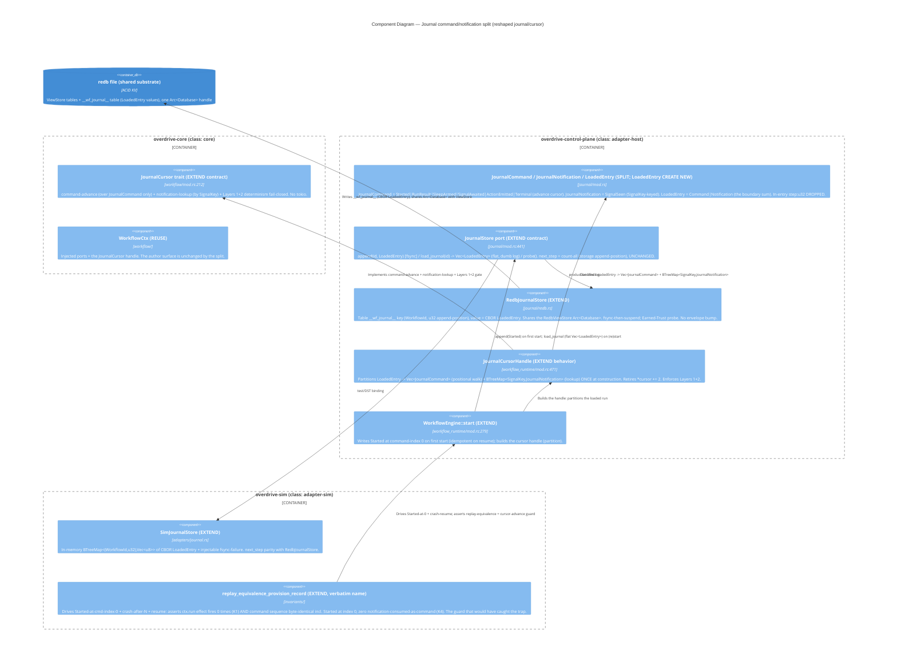

<!-- markdownlint-disable MD024 -->
# Feature Delta — workflow-journal-command-notification-split

Wave: DESIGN (Morgan / nw-solution-architect) · Date: 2026-06-06 · Mode:
**GUIDE** (Q&A complete, decisions Q1–Q6 LOCKED by the user) · Density:
lean + `[REF]`. Parent primitive: `Workflow` durable-execution (GH #39,
roadmap [3.2]; ADR-0066 / ADR-0064). This feature is a **typed
Command/Notification journal split** that closes a latent
replay-corruption trap; it is designed OVER the locked B′ direction, not
a re-litigation of it.

**The trap (one line).** `Started` is documented as the journal's first
entry but `WorkflowEngine::start` never writes it, and the positional
replay cursor cannot consume a non-`await` entry at a walked position —
so `Started`/`Terminal` are second-class, and a variant mismatch at the
cursor silently falls through to the live path. The fix: **type the
journal stream** (Restate journal-v2 evidence,
`docs/research/workflow/restate-journal-replay-model.md`) so the cursor
advances only over replayable commands; `Started`/`Terminal` become
legitimate typed commands; notifications are `SignalKey`-correlated off
the walk.

---

## Wave: DESIGN / [REF] Design Decisions (DDD)

D-numbered = the user's ratified GUIDE answers Q1–Q6 (verdict + one-line
rationale). All LOCKED — encoded, not re-weighed.

- **[D1 = Q1] Taxonomy = TWO typed enums + a boundary sum.** `JournalEntry`
  (single 7-variant) → `JournalCommand` { `Started`, `RunResult`,
  `SleepArmed`, `SignalAwaited`, `ActionEmitted`, `Terminal` } (replayable,
  advance the cursor) + `JournalNotification` { `SignalSeen` }
  (`SignalKey`-correlated, off the positional walk) + boundary sum
  `LoadedEntry = Command(JournalCommand) | Notification(JournalNotification)`
  (the on-disk/append/load representation; commands + notifications
  interleave in one ordered table). **No `#[serde(tag="v")]` envelope
  bump** — greenfield single-cut. *Rationale:* "make invalid states
  unrepresentable" — a notification cannot enter the command walk by type.
  ADR-0066 §2 / CA-1.
- **[D2 = Q2] Partition AT THE CURSOR; store stays a dumb ordered log.**
  `JournalStore::load_journal` returns the flat ordered `Vec<LoadedEntry>`;
  `JournalCursorHandle::new`/`new_with_channels` partitions ONCE at
  construction into `Vec<JournalCommand>` (positional walk) +
  `BTreeMap<SignalKey, JournalNotification>` (correlated lookup). Retires
  the `*cursor += 2` two-positional-entry signal walk. "Crashed while
  blocked" = `SignalAwaited` command present, no matching `SignalSeen`
  notification → re-block. *Rationale:* keeps `JournalStore` generic
  append-only; a future HA adapter (#205) re-implements the log without
  re-deriving replay semantics. ADR-0064 §3 / CA-5.
- **[D3 = Q3] Derived command-index; dumb store.** redb key stays
  `(WorkflowId, u32)` = storage append-position over ALL entries;
  `next_step` (count-all over the single table) UNCHANGED; command-index
  DERIVED at the cursor during the D2 partition; `Started` = command-index
  0. Storage-step ≠ command-index by design (storage =
  ordering/observability; command-index = replay identity). *Rationale:*
  conflating append-position with cursor-consumption-position IS the trap.
  ADR-0066 §3 / CA-3.
- **[D4 = Q4] Determinism gate = Layers 1+2, fail-closed.** Layer 1
  (type-at-index, Restate RT0016 shape): recorded `JournalCommand` variant
  at command-index N must match the resumed body's await-op; mismatch →
  `WorkflowCtxError::NonDeterministic { expected, actual }` fail-closed
  (CLOSES the trap's twin — the former silent fall-to-live). Layer 2
  (name within `RunResult`): recorded `name` must match. **Layer 3
  (content/digest) DEFERRED → [#214](https://github.com/overdrive-sh/overdrive/issues/214).**
  *Rationale:* a divergent journal must be an error, not a silent
  re-execution. ADR-0064 §3 / CA-6.
- **[D5 = Q5] DROP the in-entry `step: u32`** from `RunResult` /
  `SleepArmed` / `SignalAwaited` / `ActionEmitted`. Identity is structural
  (position in `Vec<JournalCommand>` for commands; `SignalKey` for
  notifications); a persisted `step` is derived state. *Rationale:*
  "persist inputs, not derived state" — `step` is a cache of "my own
  position." **DELIVER must verify no consumer reads it** (the store
  counts for `next_step`; the cursor derives the command-index) and move
  any position reader to position-derived. ADR-0066 §2 / CA-2.
- **[D6 = Q6] Minimal notification model; DROP the forward-pointer; new
  DST guard IN SCOPE.** Build ONLY `BTreeMap<SignalKey, JournalNotification>`
  — no general Restate-style `NotificationId` correlation model, no issue,
  no "general NotificationId later" language (single-node Phase-1 has
  exactly one notification shape; the general model is aspirational and
  rejected). **EXTEND `replay_equivalence_provision_record`** (verbatim
  name, NOT a new invariant family) to drive a run whose journal has
  `Started` at command-index 0, crash after step-N, resume, and assert
  (a) the resumed `ctx.run` effect fires 0 times (K1) AND (b) the resumed
  command sequence is byte-identical incl. `Started` at index 0, with zero
  re-executions caused by a non-command consumed as a command (K4).
  *Rationale:* the DST replay-equivalence invariant is the structural
  guard that would have caught the trap. ADR-0064 §6 / CA-7.

## Wave: DESIGN / [REF] Component Decomposition

| Component | Path | Class | Change |
|---|---|---|---|
| `JournalCommand` / `JournalNotification` / `LoadedEntry` | `overdrive-control-plane/src/journal/mod.rs` (the `JournalEntry` enum site) | adapter-host | **SPLIT (EXTEND)** — single 7-variant enum → two typed enums + boundary sum (D1) |
| `JournalStore` trait (`append` / `load_journal`) | `overdrive-control-plane/src/journal/mod.rs` | adapter-host | **EXTEND contract** — both methods now deal in `LoadedEntry`; docstrings pin command/notification, append-position vs command-index (D2/D3) |
| `RedbJournalStore` (`next_step`, `append`, `load_journal`) | `overdrive-control-plane/src/journal/redb.rs` | adapter-host | **EXTEND** — value type `LoadedEntry`; `next_step` count-all behaviour UNCHANGED (D3) |
| `SimJournalStore` (`next_step`, `append`, `load_journal`) | `overdrive-sim/src/adapters/journal.rs` | adapter-sim | **EXTEND** — mirrors `RedbJournalStore`; in-memory `BTreeMap<(WorkflowId,u32), Vec<u8>>` of CBOR `LoadedEntry` |
| `JournalCursor` trait | `overdrive-core/src/workflow/mod.rs:212` | core | **EXTEND contract** — command-advance + notification-lookup + determinism fail-closed docstrings (D2/D4) |
| `JournalCursorHandle` | `overdrive-control-plane/src/workflow_runtime/mod.rs:471` | adapter-host | **EXTEND behaviour** — the partition lands here: `Vec<JournalCommand>` + `BTreeMap<SignalKey, JournalNotification>`; retires `*cursor += 2`; Layers 1+2 gate (D2/D4) |
| `WorkflowEngine::start` | `overdrive-control-plane/src/workflow_runtime/mod.rs:279` | adapter-host | **EXTEND** — writes `Started` at command-index 0 on first start (idempotent on resume) (D6/CA-4) |
| `entry_kinds` helpers / `replay_equivalence_provision_record` invariant | `overdrive-sim/src/invariants/` | adapter-sim | **EXTEND** — the invariant gains the `Started`-at-0 + notification-not-as-command cursor-advance guard (D6) |

**One genuinely-new type:** `LoadedEntry` (the boundary sum) — see Reuse
Analysis. Everything else is EXTEND. **Zero new components.**

## Wave: DESIGN / [REF] Driving Ports

- **Author surface (primary, UNCHANGED):** `impl Workflow for X` against
  the core `Workflow` trait; the typed split is invisible to the author
  (they still write `ctx.run` / `ctx.sleep` / `ctx.wait_for_signal` /
  `ctx.emit_action`).
- **Lifecycle trigger (UNCHANGED):** `Action::StartWorkflow { spec,
  correlation }` → action-shim → `WorkflowEngine::start` (which now writes
  `Started` command-index 0).
- **Observable surface (UNCHANGED, no CLI):** ObservationStore
  terminal-result row + structured lifecycle events + the
  `replay_equivalence_provision_record` DST invariant (now also the
  cursor-advance guard). No `overdrive workflow` verb (#206).

## Wave: DESIGN / [REF] Driven Ports + Adapters

| Driven port | Adapter (prod) | Adapter (sim) | Change |
|---|---|---|---|
| `JournalStore` (EXTEND) | `RedbJournalStore` | `SimJournalStore` | `append`/`load_journal` deal in `LoadedEntry`; store stays a dumb ordered log (D2) |
| `Clock` / `Transport` / `Entropy` / `ObservationStore` (REUSE) | host adapters | sim adapters | UNCHANGED — the split is internal to the journal/cursor; `tick.now`/injected clock only |
| Action channel → Raft (REUSE) | reconciler-runtime commit path | sim harness | UNCHANGED — `ctx.emit_action` → `ActionEmitted` command |

## Wave: DESIGN / [REF] Technology Choices (pinned)

- **Language/runtime:** Rust 2024; `tokio` (engine only, control-plane);
  `async_trait` (the trait surfaces). `BTreeMap` (not `HashMap`) for the
  notification map and any ordered collection (`.claude/rules/development.md`
  § "Ordered-collection choice").
- **Codec:** CBOR via `ciborium` — UNCHANGED. The split changes the
  in-memory enum shape and the on-disk value type (`LoadedEntry`), but
  **no `#[serde(tag="v")]` envelope bump** (greenfield single-cut; no
  surviving on-disk journals — slices 01/02/03 unlanded). Additive CBOR
  evolution still governs future await-surface variants.
- **Store:** `redb` 2.x (shared substrate). Key `(WorkflowId, u32)`
  UNCHANGED (storage append-position). **No new external dependency.**
- **DST:** `turmoil` + `Sim*` adapters; `replay_equivalence_provision_record`
  on the CI critical path. **No proprietary deps; no contract tests this
  phase** (no external boundary — the journal/cursor reshape is internal).

## Wave: DESIGN / [REF] Decisions Table

| ID | Decision | ADR (Changed Assumptions) |
|---|---|---|
| D1 (Q1) | Two typed enums (`JournalCommand`/`JournalNotification`) + `LoadedEntry` sum; no envelope bump | 0063 §2 / CA-1 |
| D2 (Q2) | Partition at the cursor; store is a dumb ordered log; retire `*cursor += 2` | 0064 §3 / CA-5 |
| D3 (Q3) | redb key = storage append-position (count-all `next_step` unchanged); command-index derived at cursor; `Started` = cmd-index 0 | 0063 §3 / CA-3 |
| D4 (Q4) | Determinism gate Layers 1+2 fail-closed (`NonDeterministic`); Layer 3 → #214 | 0064 §3 / CA-6 |
| D5 (Q5) | Drop in-entry `step: u32`; identity structural | 0063 §2 / CA-2 |
| D6 (Q6) | Minimal notification model (no `NotificationId`); extend `replay_equivalence_provision_record` with the cursor-advance guard | 0064 §6 / CA-7 |
| — | `Started` becomes a real engine-written command-index-0 entry (the trap) | 0063 §2 / CA-4; 0064 §5 / CA-7 |

## Wave: DESIGN / [REF] Reuse Analysis (HARD GATE)

| Existing component | File | Overlap | Decision | Justification |
|---|---|---|---|---|
| `JournalEntry` enum | `journal/mod.rs:194` | The journal entry taxonomy | **EXTEND (split)** | Q1(a) splits it by semantic class into `JournalCommand` + `JournalNotification`; the 7 variants are re-homed, not invented |
| `JournalStore` trait | `journal/mod.rs:441` | `append` / `load_journal` contract | **EXTEND contract** | Both methods now deal in `LoadedEntry`; the trait surface and the redb table are otherwise unchanged (D2) |
| `RedbJournalStore::next_step` | `journal/redb.rs:113` | Append-position derivation | **EXTEND (unchanged behavior)** | Count-all over the single table still computes the storage append-position; only the value type changes to `LoadedEntry` (D3) |
| `SimJournalStore::next_step` | `overdrive-sim/.../journal.rs:119` | Append-position derivation (sim) | **EXTEND** | Mirrors `RedbJournalStore`; behaviour parity preserved |
| `JournalCursor` trait | `overdrive-core/.../workflow/mod.rs:212` | Replay/record contract | **EXTEND contract** | Command-advance + notification-lookup + Layers 1+2 fail-closed pinned in docstrings (D2/D4) |
| `JournalCursorHandle` | `workflow_runtime/mod.rs:471` | The replay buffer + cursor | **EXTEND behavior** | The partition lands here (`Vec<JournalCommand>` + `BTreeMap<SignalKey, JournalNotification>`); retires `*cursor += 2`; the Layers 1+2 gate lands here (D2/D4) |
| `WorkflowEngine::start` | `workflow_runtime/mod.rs:279` | Instance bring-up + cursor construction | **EXTEND** | Writes `Started` cmd-index 0 on first start (idempotent on resume); partitions the loaded run (D6/CA-4) |
| `entry_kinds` / `replay_equivalence_provision_record` | `overdrive-sim/src/invariants/` | The replay-equivalence DST invariant | **EXTEND** | Same invariant (verbatim name) gains the `Started`-at-0 + notification-not-as-command cursor-advance guard (D6) |
| `LoadedEntry` boundary sum | NEW (`journal/mod.rs`) | The on-disk/append/load interleaved-stream shape | **CREATE NEW** | Q1(a) requires a boundary representation for the interleaved on-disk stream; it is a thin sum over the two existing-derived leaf enums, not a new component |

**Verdict: EXTEND-dominant — 8 EXTEND, 1 CREATE NEW (`LoadedEntry`, a
thin boundary sum), zero new components.** The reuse gate is satisfied:
no new trait, no new adapter, no new store, no new engine; the typed
split is a re-homing of the 7 existing variants plus one boundary sum,
and every behavioural change lands on an existing component.

## Wave: DESIGN / [REF] Trait Contract Discipline (changed methods)

Every changed `JournalStore` / `JournalCursor` method docstring pins
pre/post/edge/invariants per `.claude/rules/development.md` § "Trait
definitions specify behavior":

- **`JournalStore::append`** — *pre:* well-formed `LoadedEntry`. *post:*
  durable (fsync before return), appended at the END of the ordered run
  at the next storage append-position; classes interleave (a notification
  and a command append identically — the store does not classify).
  *edge:* first append creates the instance's run; the store assigns the
  `u32` by append position over ALL entries. *invariant:* append order ==
  load order; `next_step` counts every entry (command + notification).
- **`JournalStore::load_journal`** — *post:* returns the flat ordered
  `Vec<LoadedEntry>`, byte-equal after CBOR round-trip, in append order;
  the store does NOT partition. *edge:* empty `Vec` for a fresh instance.
  *invariant:* the store is a dumb ordered log — classification is the
  cursor's job (D2).
- **`JournalCursor` command-advance contract** — *post:* a replay hit at
  command-index N returns the recorded `JournalCommand`'s result and
  advances the command-cursor by exactly 1; a live op appends + fsyncs +
  advances by 1. *invariant:* the cursor advances over `JournalCommand`s
  ONLY; notifications never advance it.
- **`JournalCursor` notification-lookup contract** — *post:*
  `SignalSeen` is resolved by `SignalKey` lookup in the
  `BTreeMap<SignalKey, JournalNotification>`, never by position; a
  `SignalAwaited` command with no matching `SignalSeen` notification →
  re-block. *invariant:* a notification is never consumed as a command.
- **`JournalCursor` determinism fail-closed contract** — *post:* on a
  Layer-1 (type-at-index) or Layer-2 (name within `RunResult`) mismatch
  the cursor returns `WorkflowCtxError::NonDeterministic { expected,
  actual }` and does NOT advance / does NOT fall through to the live path.
  *invariant:* a divergent journal is an error, never a silent
  re-execution (D4).

## Wave: DESIGN / [REF] C4 — Component (the reshaped journal/cursor)

C4 Level 3 of the journal/cursor subsystem, annotated for the split.
System Context + Container live in `brief.md` §98 (the System Context is
largely unchanged — an internal reshape).

Three properties the diagram makes explicit:

1. **The store is a dumb ordered log.** `append`/`load_journal` deal in
   `LoadedEntry`; the store never classifies. The partition into the
   command walk + notification lookup happens ONCE at the cursor (D2).
2. **`Started` is a real command-index-0 entry.** `WorkflowEngine::start`
   writes it on first start; the cursor walks it; the first `await`-point
   reads command-index 1. The trap is closed (CA-4).
3. **The DST invariant is the structural guard.** A regression that drops
   the `Started` write, or lets a `SignalSeen` notification enter the
   positional command walk, fails `replay_equivalence_provision_record`'s
   extended cursor-advance assertion (D6).

## Wave: DESIGN / [REF] Open Questions / Deferrals (cite by number; CREATE NOTHING)

- **HA cross-node resume** — [#205](https://github.com/overdrive-sh/overdrive/issues/205)
  (VERIFIED OPEN). The typed split is node-independent (the `LoadedEntry`
  log is `WorkflowId`-keyed CBOR behind a `JournalStore` trait; the
  partition is a cursor concern, not a store concern) and does NOT
  preclude #205. Cite at every reference site.
- **Determinism Layer 3 (content/digest comparison)** —
  [#214](https://github.com/overdrive-sh/overdrive/issues/214) (already
  created). The gate is Layers 1+2 (type-at-index + name); Layer 3 is
  out of scope and tracked here. Do NOT add content comparison; do NOT
  file anything.

**No other forward pointers.** Per repo rule: NEVER create GH issues;
both deferrals already have real, verified numbers (#205, #214). No
general `NotificationId` deferral language (D6 — rejected, not deferred).

## Wave: DESIGN / [REF] DELIVER verification obligations (D5 follow-through)

The DELIVER wave (not this DESIGN pass) must:

- **Verify no consumer reads the dropped in-entry `step: u32`** (D5/CA-2):
  the store counts entries for `next_step` (not a per-entry field read);
  the cursor derives the command-index from partition position. Any reader
  of a per-entry `step` is moved to position-derived in the same slice
  that lands the split. This is an in-scope DELIVER check, not a deferral.
- **Land the extended `replay_equivalence_provision_record` cursor-advance
  guard** (D6/CA-7) as the structural enforcement of the typed split, on
  the CI critical path.
