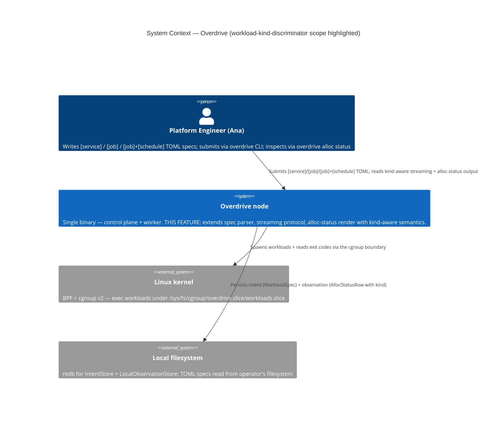
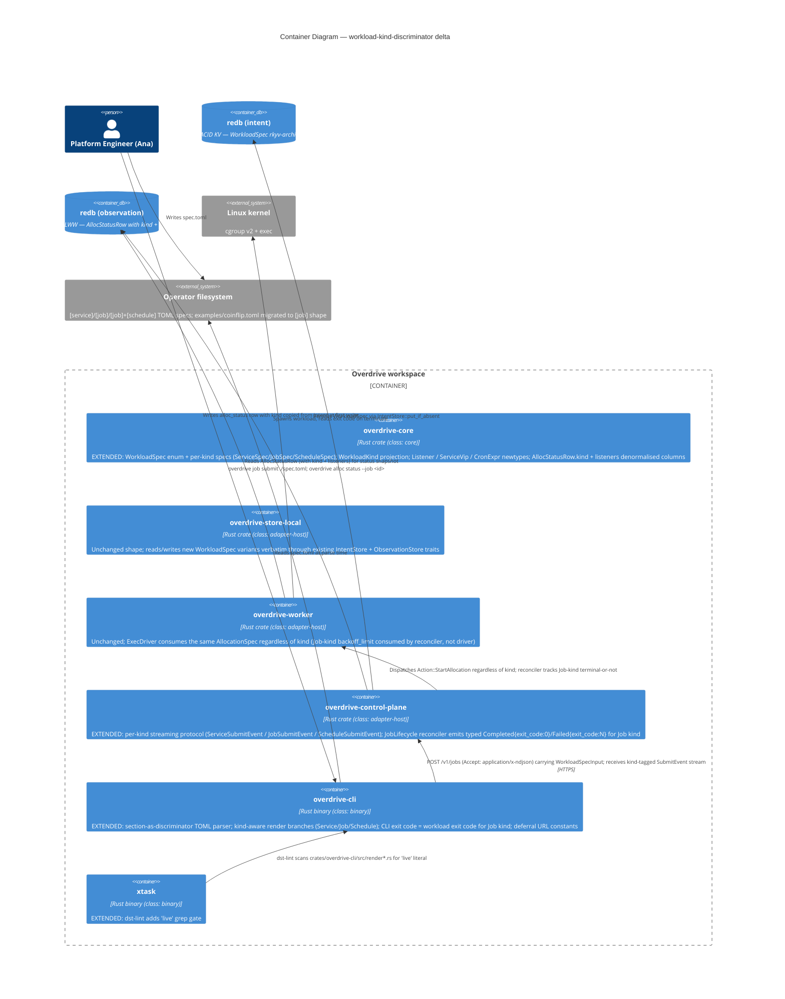
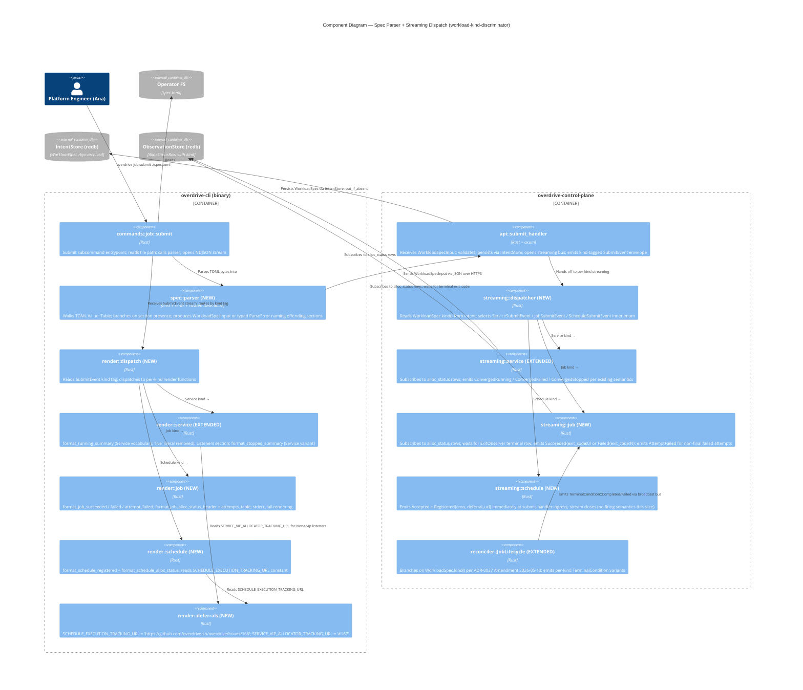

# C4 Diagrams — workload-kind-discriminator

**Feature**: workload-kind-discriminator
**Wave**: DESIGN
**Author**: Morgan
**Date**: 2026-05-10

This file ships the C4 diagrams for the feature delta. The
**System Context (L1)** and **Container (L2)** diagrams build on
the existing diagrams in `docs/product/architecture/c4-diagrams.md`
(Phase 2.1) — only the bounded context affected by this feature is
called out. The **Component (L3)** diagram is feature-specific and
shows the spec-parser pipeline, the per-kind streaming dispatcher,
and the kind-aware render layer.

---

## C4 Level 1 — System Context (no change)

The kind discriminator is purely internal type-shape work. The
operator → CLI → control plane → driver → workload boundaries do
NOT change. **No new external systems are introduced.** The Phase
2.1 L1 diagram in `c4-diagrams.md` § "Phase 2.1 — eBPF Dataplane
Containers" → "C4 Level 1 — System Context" remains the SSOT.

For convenience, here is the unchanged shape, with the workload-
kind-discriminator scope annotated:

---

## C4 Level 2 — Container (annotated delta)

---

## C4 Level 3 — Spec Parser Pipeline + Per-Kind Streaming Dispatch (NEW)

This is the load-bearing component diagram for the feature. It
shows the section-as-discriminator parser, the kind branch point in
the submit handler, and the three sibling streaming protocols.

### Reading guide

- **Three branch points, one disambiguator (`WorkloadKind`)**.
  The spec parser produces it (from section presence). The
  streaming dispatcher consumes it (from intent). The render
  dispatcher consumes it again (from the kind tag on the wire).
  All three branches use the same closed enum — adding a new
  workload kind in the future means adding one variant and
  filling three exhaustive `match` arms.

- **`ConvergedRunning` lives in `stream_service` only** — the
  arrow from `stream_dispatcher` to `stream_job` does NOT carry
  a `ConvergedRunning` event. This is the structural fix for RCA
  root causes B + C.

- **`render_job` has no `format_running_summary` call site** —
  the function is reachable only from `render_service`. The
  `"live"` literal removal is a Slice 04 concern; the grep gate
  in `xtask::dst_lint` enforces it doesn't return.

- **Deferral URLs are read, not hardcoded** at the call site.
  The arrows from `render_schedule` / `render_service` to
  `deferrals` represent the constant-read; KPIs K5 and K6 rely
  on this single SSOT shape.

---

## Diagram coverage check

- [x] L1 (System Context) — unchanged; documented as such.
- [x] L2 (Container) — annotated to mark the four containers
      affected (`overdrive-core`, `overdrive-cli`,
      `overdrive-control-plane`, `xtask`).
- [x] L3 (Component) — new; shows the parser pipeline + streaming
      dispatch + render branch.
- [x] Every arrow has a verb.
- [x] No mixing of abstraction levels.
- [x] No internal class-level (L4) diagrams — feature does not
      warrant.
