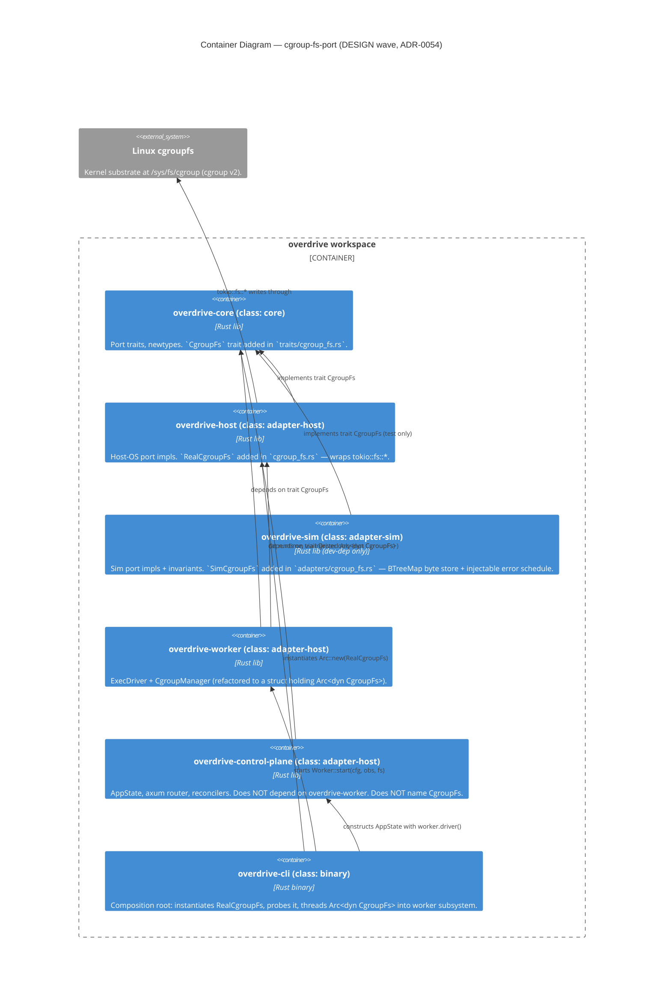

# ADR-0054 — `CgroupFs` port trait; constructor-injected on `CgroupManager` and `ExecDriver`; `overdrive-host::RealCgroupFs` (production) + `overdrive-sim::SimCgroupFs` (tests)

## Status

Accepted. 2026-05-24. Decision-makers: Morgan (proposing). Tags:
phase-1, worker-subsystem, application-arch, port-trait, testability,
earned-trust.

References issue #136 (the DISCUSS-equivalent artifact — there is no
`docs/feature/cgroup-fs-port/discuss/` directory). Does not supersede;
refines the DST seam established by ADR-0016 and the
`overdrive-worker`-owned cgroup surface established by ADR-0026 §
Amendment 2026-04-27 + ADR-0029.

**Amendment 2026-05-24**: § Production probe (RealCgroupFs)
restructured to round-trip on `cgroup.subtree_control` (kernel-
managed pseudo-file) instead of a regular file inside the probe
cgroup. The original spec was empirically falsified by DELIVER step
01-02 — cgroupfs only permits kernel-managed pseudo-files inside
cgroup directories. See § Alternatives considered → Alternative F.

## Context

ADR-0026 chose direct `std::fs` writes against `/sys/fs/cgroup` for the
five filesystem operations the workload-cgroup lifecycle needs (mkdir
scope → write `cpu.weight` / `memory.max` → write `cgroup.procs` →
write `cgroup.kill` → rmdir). ADR-0029 placed those operations in
`overdrive-worker::cgroup_manager` (eight free functions today —
`create_workload_scope`, `place_pid_in_scope`, `write_resource_limits`,
`write_resource_limits_warn_on_error`, `cgroup_kill`,
`remove_workload_scope`, `create_workloads_slice_with_controllers`,
`cpu_weight_for`).

The bodies of those free functions reach `tokio::fs::*` directly. That
is correct *production* shape — but for **tests**, three problems
accumulate.

1. **Unit tests are forced into `tempfile::TempDir` fixtures.** Every
   test that wants to assert on a cgroup write opens a real
   filesystem under `/tmp`. Twelve such tests exist in
   `crates/overdrive-worker/src/cgroup_manager.rs` today. Tempfile
   tests work, but they (a) make the test surface heavier than it
   should be, (b) can't model injected errors at the FS layer
   (`PermissionDenied`, `OutOfMemory`, mid-write failure), and (c)
   can't honestly model the EBUSY-on-`subtree_control`-with-live-child
   condition without setting up actual processes — which integration
   tests already cover.

2. **The dst-lint discipline can't reach this layer.** The free
   functions live in `overdrive-worker` (class `adapter-host`), so
   `dst-lint` does not scan them — the real-infra calls are
   legitimate. But that means any *future* consumer of those
   functions (a different reconciler, an admin CLI subcommand) that
   wants DST-controllable behaviour has no seam to inject. The
   nondeterminism-source discipline (`.claude/rules/testing.md` §
   "Sources of Nondeterminism") names filesystem-IO as one of the
   sources every port trait exists to corral; cgroupfs is filesystem
   IO with kernel semantics, and there is no port yet.

3. **The composition root cannot probe the FS surface in production.**
   Earned Trust (CLAUDE.md principle 12) demands that every adapter
   designed against an external substrate demonstrate empirically
   that it can honor its contract in the real environment. Today,
   the worker boots and either succeeds at `create_workloads_slice_with_controllers`
   or returns a typed error after the convergence loop has already
   been started. There is no separable probe — no "wire then probe
   then use" gate at composition root.

The fix is to extract a narrow port trait for the cgroupfs side
effects, route the production code through it, wire `tokio::fs::*` as
the host adapter, and provide an in-memory sim adapter for tests that
do not need kernel semantics. This is the same pattern Clock /
Transport / Entropy / Dataplane / Driver / IntentStore /
ObservationStore / Llm each implement.

Five coupled decisions surface, enumerated in issue #136 (D1-D5).
This ADR records all five.

## Decision

### D1 — Trait shape: narrow `CgroupFs`, NOT broad `Filesystem`

```rust
// crates/overdrive-core/src/traits/cgroup_fs.rs

use std::path::Path;

use async_trait::async_trait;

/// Cgroupfs side-effect port. The driven port through which the worker
/// crate's cgroup manager performs every filesystem mutation on
/// `/sys/fs/cgroup/overdrive.slice/...`.
///
/// **Production binding**: `overdrive-host::RealCgroupFs`, wrapping
/// `tokio::fs::{create_dir_all, write, remove_dir}`. **Test binding**:
/// `overdrive-sim::adapters::cgroup_fs::SimCgroupFs`, an in-memory
/// `BTreeMap<PathBuf, Vec<u8>>` store with an injectable per-method
/// error schedule.
///
/// # Scope
///
/// The port covers the **byte-side effects** of cgroupfs writes — what
/// bytes appeared in what path. It does NOT cover the **kernel-side
/// effects** that real cgroupfs triggers as a consequence of those
/// writes (mass-kill on `cgroup.kill`; controller enablement
/// validation on `cgroup.subtree_control`; EBUSY when modifying a
/// parent whose descendants have live processes). Tests that exercise
/// kernel-side effects MUST run against real cgroupfs (Tier 3 / Lima
/// sudo); see § "Non-replacement contract" in ADR-0054.
///
/// # Preconditions, postconditions, edge cases
///
/// Per `.claude/rules/development.md` § "Trait definitions specify
/// behavior, not just signature", every method below pins:
/// - Preconditions on inputs (validated paths, byte payloads).
/// - Postconditions on caller-observable state.
/// - Edge cases (idempotency, NotFound, EBUSY).
/// - Observable invariants (`write` then `read` yields bytes
///   written, modulo kernel semantics on real cgroupfs).
///
/// # Earned Trust
///
/// Every adapter MUST implement [`probe`](Self::probe). The
/// composition root invariant is "wire then probe then use": the
/// binary calls `probe()` at startup; failure surfaces as a
/// structured `health.startup.refused` event and the process refuses
/// to start. Probe specifications for the two shipping adapters are
/// in the adapter rustdoc.
#[async_trait]
pub trait CgroupFs: Send + Sync + 'static {
    /// Create the directory at `path`, including any missing parents
    /// (`mkdir -p` semantics).
    ///
    /// # Preconditions
    /// - `path` must be an absolute path (caller's responsibility;
    ///   `CgroupPath::resolve(&root)` always satisfies this).
    ///
    /// # Postconditions on Ok
    /// - `path` exists as a directory; subsequent `write(path.join(...))`
    ///   calls against children succeed unless rejected by the
    ///   substrate.
    /// - Re-invocation against an existing `path` is `Ok(())` (no-op
    ///   on Real; no-op on Sim).
    ///
    /// # Edge cases
    /// - Pre-existing directory at `path`: `Ok(())` (idempotent).
    /// - Pre-existing regular file at `path`: `Err(AlreadyExists)` on
    ///   Real (kernel-side `EEXIST`); on Sim the schedule determines
    ///   the outcome (default `Err(io::ErrorKind::AlreadyExists)`).
    ///
    /// # Errors
    /// Returns the underlying `io::Error` from the substrate. Real
    /// adapter surfaces `PermissionDenied`, `NotADirectory`, etc.;
    /// Sim adapter surfaces whatever the injection schedule yields.
    async fn create_dir(&self, path: &Path) -> std::io::Result<()>;

    /// Write `bytes` to the file at `path`. Overwrites any existing
    /// contents; creates the file if absent (matches `tokio::fs::write`).
    ///
    /// # Preconditions
    /// - `path`'s parent directory must exist.
    ///
    /// # Postconditions on Ok
    /// - The file at `path` exists and its full contents equal
    ///   `bytes`.
    /// - On real cgroupfs, additional **kernel-side effects** may
    ///   follow as a consequence — these are NOT promised by this
    ///   port (see § "Non-replacement contract" above).
    ///
    /// # Edge cases
    /// - `bytes.is_empty()`: writes an empty file; not an error.
    /// - Path does not exist and parent does not exist: `Err(NotFound)`
    ///   (on Real; substrate-dependent on Sim).
    ///
    /// # Errors
    /// Returns the underlying `io::Error`. Notable on real cgroupfs:
    /// `ResourceBusy` (EBUSY) from `cgroup.subtree_control` writes
    /// when descendants contain live processes; `PermissionDenied`
    /// from delegation refusal; `InvalidInput` from rejected control
    /// values (e.g. malformed `cpu.weight`).
    async fn write(&self, path: &Path, bytes: &[u8]) -> std::io::Result<()>;

    /// Remove the empty directory at `path`. Matches `tokio::fs::remove_dir`.
    ///
    /// # Postconditions on Ok
    /// - `path` no longer exists.
    /// - Subsequent `create_dir(path)` succeeds (idempotent re-create).
    ///
    /// # Edge cases
    /// - `path` does not exist: caller responsible for `NotFound`
    ///   tolerance (the cgroup manager's `remove_workload_scope`
    ///   wrapper swallows `NotFound` as Ok).
    /// - `path` non-empty: `Err(DirectoryNotEmpty)` on Real. On
    ///   real cgroupfs this does NOT happen for workload scopes —
    ///   the kernel-managed pseudo-files inside a scope are reaped
    ///   automatically by `rmdir(2)` (see `cgroup_manager.rs`
    ///   `remove_workload_scope` rustdoc).
    ///
    /// # Errors
    /// Returns the underlying `io::Error`. Substrate-specific.
    async fn remove_dir(&self, path: &Path) -> std::io::Result<()>;

    /// Empirically demonstrate that this adapter can honor its
    /// contract against the real substrate. Called once at
    /// composition-root startup per Earned Trust (CLAUDE.md principle
    /// 12); failure causes the process to refuse to start with a
    /// structured `health.startup.refused` event.
    ///
    /// # Production probe (RealCgroupFs)
    ///
    /// At `<cgroup_root>/.overdrive-probe-<uuid>/`:
    /// 1. `create_dir(&probe_dir)` — directory exists. On real
    ///    cgroupfs, the kernel synthesises the per-cgroup pseudo-files
    ///    (`cgroup.procs`, `cgroup.subtree_control`, `cgroup.events`,
    ///    `cgroup.kill`, …) inside the new leaf cgroup as a side effect.
    /// 2. `write(&probe_dir.join("cgroup.subtree_control"), b"")` — a
    ///    no-op write against a kernel-managed pseudo-file. The kernel
    ///    parses the empty controller-diff payload and applies it as a
    ///    no-op (no controller enabled, no controller disabled). This
    ///    falsifies "filesystem mounted read-only", "wrong cgroup
    ///    version", "permission denied", "broken bind mount", and any
    ///    kernel-side rejection of the write surface — without
    ///    requiring the probe to create regular files inside the
    ///    cgroup (which cgroupfs forbids — only kernel-managed
    ///    pseudo-files exist inside cgroup directories).
    /// 3. `tokio::fs::read(&probe_dir.join("cgroup.subtree_control"))`
    ///    — the kernel returns the current controller list as a
    ///    newline-delimited ASCII payload (may be empty on a fresh
    ///    leaf cgroup; may contain entries inherited from the parent
    ///    if the substrate is already controller-populated). The
    ///    Earned Trust assertion is **"read does NOT error" + "kernel
    ///    returned bytes are valid UTF-8"** — NOT byte-equality with
    ///    what was written (the kernel response is its own canonical
    ///    form, not the empty payload). A non-UTF-8 read response is
    ///    the substrate-lying signal (kernel bug, corruption,
    ///    something pretending to be cgroupfs); it surfaces as
    ///    `ProbeError::RoundTripMismatch { wrote: vec![], read }`.
    /// 4. `remove_dir(&probe_dir)` — teardown succeeds because the
    ///    leaf cgroup is empty (no descendants, no live processes);
    ///    the kernel garbage-collects the synthesised pseudo-files
    ///    automatically. No `remove_file` step against
    ///    `cgroup.subtree_control` — the kernel forbids unlinking
    ///    its own pseudo-files.
    ///
    /// On any substrate-level failure (mkdir EACCES, write EROFS,
    /// read EIO, rmdir EBUSY, …), the probe surfaces the originating
    /// `io::Error` in `ProbeError::Substrate { source }`; the
    /// composition root emits `health.startup.refused` with the
    /// structured cause.
    ///
    /// **Rationale for `cgroup.subtree_control` over a regular file
    /// inside the probe cgroup.** The original probe specification
    /// (pre-amendment-2026-05-24) wrote a regular `probe-file` inside
    /// the probe cgroup and read it back for byte-equality. Empirical
    /// testing during DELIVER step 01-02 against real `/sys/fs/cgroup`
    /// falsified that spec: cgroupfs only permits kernel-managed
    /// pseudo-files inside cgroup directories — `mkdir` of a leaf
    /// cgroup converts the directory into a cgroup, and subsequent
    /// regular-file creation is rejected by the kernel. The amended
    /// spec round-trips on `cgroup.subtree_control` — a kernel-managed
    /// pseudo-file production cgroup-management code ALREADY touches
    /// (every controller-enablement write goes through it) — so the
    /// probe exercises the actual production substrate surface. See
    /// § Alternatives considered → Alternative F for the rejected
    /// regular-file approach.
    ///
    /// # Sim probe (SimCgroupFs)
    ///
    /// Structural: invokes the four-step round-trip against the
    /// in-memory store and asserts the BTreeMap reflects each
    /// transition. Fault-injection mode (injected `Err` at any step)
    /// causes the probe to fail; this is the mechanism that
    /// validates the binary's "refuse to start" path under DST.
    async fn probe(&self) -> Result<(), ProbeError>;

    /// Adapter discriminator for diagnostic logging. Real adapters
    /// return their crate-qualified name; sim adapters return
    /// `"sim"`. Stable across versions — operators grep on this
    /// string in startup logs.
    fn kind(&self) -> &'static str;
}

/// Failure surface for [`CgroupFs::probe`].
#[derive(Debug, thiserror::Error)]
pub enum ProbeError {
    /// Probe failed at a substrate-level operation. The originating
    /// `io::Error` carries the cause.
    #[error("CgroupFs probe failed: {source}")]
    Substrate {
        #[source]
        source: std::io::Error,
    },

    /// Probe succeeded structurally but the round-trip assertion
    /// failed. For RealCgroupFs this fires when the kernel returns a
    /// non-UTF-8 response from `cgroup.subtree_control` (the kernel's
    /// canonical response is a newline-delimited ASCII controller
    /// list; non-UTF-8 indicates the substrate is lying about being
    /// cgroupfs). For SimCgroupFs this fires when the in-memory store
    /// returns bytes other than what the probe wrote (the BTreeMap is
    /// the substrate; mismatch indicates a Sim-side bug or test-
    /// configuration drift). The `wrote` field is `vec![]` for the
    /// Real path (we wrote an empty no-op payload); it carries the
    /// probe payload for the Sim path.
    #[error("CgroupFs probe round-trip mismatch: wrote {wrote:?}, read {read:?}")]
    RoundTripMismatch { wrote: Vec<u8>, read: Vec<u8> },
}
```

**Rationale.** A narrow `CgroupFs` carries exactly the surface the
cgroup manager needs (three I/O methods + `probe` + `kind`). A broad
`Filesystem` would conflate cgroupfs with redb-on-disk, with
`/var/run/netns/*` opens, with tempfile creation, with config-file
reads — each of those substrates lies in different ways, has different
operational contracts, and a single trait method that papered over the
differences would be the wrong abstraction. The Phase 1 / Phase 2
codebase has exactly one consumer for this trait today
(`overdrive-worker::CgroupManager`); a second consumer extracts its
own narrow port if/when it appears. Composition over a god-trait.

### D2 — Trait placement: `crates/overdrive-core/src/traits/cgroup_fs.rs`

The trait lives in `overdrive-core`, the ports crate. This matches
every other port-trait precedent without exception:

| Port | Crate | File |
|---|---|---|
| `Clock` | `overdrive-core` | `traits/clock.rs` |
| `Transport` | `overdrive-core` | `traits/transport.rs` |
| `Entropy` | `overdrive-core` | `traits/entropy.rs` |
| `Dataplane` | `overdrive-core` | `traits/dataplane.rs` |
| `Driver` | `overdrive-core` | `traits/driver.rs` |
| `IntentStore` | `overdrive-core` | `traits/intent_store.rs` |
| `ObservationStore` | `overdrive-core` | `traits/observation_store.rs` |
| `Llm` | `overdrive-core` | `traits/llm.rs` |
| **`CgroupFs`** | **`overdrive-core`** | **`traits/cgroup_fs.rs`** |

Placing the trait in `overdrive-worker` would (a) prevent any future
non-worker consumer from depending on the surface without taking on
the worker crate's transitive deps, (b) make the
`overdrive-host::RealCgroupFs` adapter look like a layering violation
(host should impl core ports, not worker-internal ones), and (c)
violate the symmetry that makes the codebase navigable. ADR-0029
deliberately scoped the worker crate to host *worker-subsystem
concerns*; the trait surface for one of its dependencies is not such
a concern.

The `traits/mod.rs` re-exports `cgroup_fs::{CgroupFs, ProbeError}`
alongside the existing port re-exports.

### D3 — Cgroupfs semantics leak: non-replacement contract; Tier 3 stays mandatory

The Sim adapter is a byte-write store. The following kernel-side
effects that real cgroupfs triggers as a side effect of byte writes
**are NOT modelled by SimCgroupFs** and **MUST be tested against real
cgroupfs (Tier 3, Lima sudo)**:

| Substrate effect | What real cgroupfs does | What SimCgroupFs does |
|---|---|---|
| `write(cgroup.kill, b"1\n")` | Atomically delivers SIGKILL to every task in the cgroup; the workload tree dies; PIDs become unreachable. | Stores `b"1\n"` in the BTreeMap at `<scope>/cgroup.kill`. No process is killed (there is no process). |
| `write(cgroup.subtree_control, b"+cpu +memory ...\n")` with a live child | Returns `EBUSY` because the kernel forbids `subtree_control` modification on a cgroup whose descendants contain live processes. | Stores the bytes. No EBUSY unless the test injects it via the per-path error schedule. |
| `write(cpu.weight, b"<value>\n")` with malformed value | Rejects with `EINVAL` for out-of-range values; the kernel parses and validates. | Stores arbitrary bytes; no validation. |
| `mkdir <slice>/<scope>` inside a delegated subtree | Inherits subtree_control, creates the kernel-managed pseudo-files inside (`cgroup.procs`, `cpu.weight`, `memory.max`, `cpu.stat`, ...). | Creates the directory; pseudo-files do not appear (they are not separate writes — the kernel synthesises them). |
| `rmdir <scope>` | Reaps the kernel-managed pseudo-files automatically. | Cannot reproduce — there are no pseudo-files to reap. |
| `write(cgroup.procs, b"<pid>\n")` | Moves the PID into the cgroup; the kernel updates accounting; subsequent `cgroup.events` notifications fire. | Stores the byte payload; no PID movement. |

**This is the non-replacement contract.** SimCgroupFs is honest about
its byte-write semantics; it does not pretend to model kernel
behaviour. Tests that exercise kernel-side semantics — and we have
many of them, in `crates/overdrive-worker/tests/integration/exec_driver/*.rs`
and `crates/overdrive-control-plane/tests/integration/cgroup_isolation/*.rs`
— **stay** as Tier 3 tests under `cargo xtask lima run --`. ADR-0034's
removal of the `--allow-no-cgroups` escape hatch already made Lima
sudo mandatory for the integration suite; this ADR does not weaken
that.

The DELIVER wave's roadmap must NOT replace any Tier 3 integration
test with a SimCgroupFs unit test on the grounds that "SimCgroupFs is
cheaper." A SimCgroupFs test that *only* asserts byte side effects is
a valid replacement for a tempfile test that *only* asserted byte
side effects (see the per-test triage in
`feature-delta.md` § Reuse Analysis); a SimCgroupFs test that
purports to assert on kernel-side effects is a bug.

### D4 — Cancellation semantics

`SimCgroupFs::{create_dir, write, remove_dir, probe}` are `async fn`
but **method-entry deterministic**: every method's effect on the
in-memory store happens **atomically inside the method body before the
first `.await`**. There is no `.await` interleaved with mutation
inside SimCgroupFs — the mutation is a single `parking_lot::Mutex`
acquisition, a BTreeMap insert, and a Mutex release. The `async fn`
surface exists only because the trait method signatures are `async`
(forced by `tokio::fs::*`-returning-Future in the Real adapter).

Consequence: cancelling a `SimCgroupFs::write(...)` future via
`Future::drop` is one of two states only:
- **Drop before poll**: the write has not happened. The BTreeMap is
  unchanged.
- **Drop after poll-to-completion**: the write has happened. The
  BTreeMap reflects the new bytes. (`Future::drop` after `Ready`
  resolves is a no-op.)

There is no "mid-syscall" interleaving — that is a kernel concept that
does not apply to an in-process store. K3 (seed → bit-identical
trajectory, per whitepaper §21 and `.claude/rules/testing.md`
§ "Sources of Nondeterminism") therefore extends naturally:
nondeterminism in SimCgroupFs comes from one source only, the
injection schedule, which is a BTreeMap keyed by `(method, path)` and
indexed deterministically per call. Replay against the same seed and
the same injection schedule produces bit-identical bytes and
bit-identical errors.

Partial-write modelling is **explicitly out of scope**: the kernel
guarantees `write(2)` on cgroup pseudo-files is atomic at the byte-
payload level (the cgroup-v2 admin guide specifies "single write per
update"); the cgroup manager's write payloads are small (`<100`
bytes) and inside one syscall. Real partial-write semantics do not
fire in production; modelling them in Sim would be production code
shaped by simulation (forbidden per `.claude/rules/development.md`
§ "Production code is not shaped by simulation").

### D5 — Migration shape: struct method (`CgroupManager::new(fs: Arc<dyn CgroupFs>)`)

The eight free functions in `crates/overdrive-worker/src/cgroup_manager.rs`
collapse into method bodies on a `CgroupManager` struct:

```rust
// crates/overdrive-worker/src/cgroup_manager.rs (after refactor)

use std::path::PathBuf;
use std::sync::Arc;
use overdrive_core::traits::cgroup_fs::CgroupFs;

pub struct CgroupManager {
    fs: Arc<dyn CgroupFs>,
    cgroup_root: PathBuf,
}

impl CgroupManager {
    /// Construct a `CgroupManager`. Both parameters are mandatory and
    /// not defaulted, per `.claude/rules/development.md` §
    /// "Port-trait dependencies".
    pub fn new(cgroup_root: PathBuf, fs: Arc<dyn CgroupFs>) -> Self {
        Self { fs, cgroup_root }
    }

    pub async fn create_workload_scope(&self, scope: &CgroupPath) -> std::io::Result<()> { ... }
    pub async fn place_pid_in_scope(&self, scope: &CgroupPath, pid: u32) -> std::io::Result<()> { ... }
    pub async fn write_resource_limits(&self, scope: &CgroupPath, resources: &Resources) -> std::io::Result<()> { ... }
    pub async fn write_resource_limits_warn_on_error(&self, scope: &CgroupPath, resources: &Resources) { ... }
    pub async fn cgroup_kill(&self, scope: &CgroupPath) -> std::io::Result<()> { ... }
    pub async fn remove_workload_scope(&self, scope: &CgroupPath) -> std::io::Result<()> { ... }
    pub fn create_workloads_slice_with_controllers(&self) -> Result<(), WorkloadsBootstrapError> { ... }
}

// Free helpers that don't touch the FS stay free:
pub fn cpu_weight_for(cpu_milli: u32) -> u32 { ... }
```

`ExecDriver::new` signature changes to:

```rust
pub fn new(
    cgroup_root: PathBuf,
    clock: Arc<dyn Clock>,
    fs: Arc<dyn CgroupFs>,                  // NEW — mandatory, not defaulted
) -> Self {
    let manager = CgroupManager::new(cgroup_root.clone(), fs.clone());
    Self {
        cgroup_manager: manager,
        cgroup_root, fs, clock,
        // ... existing fields ...
    }
}
```

The binary composition root in `overdrive-cli` instantiates
`Arc::new(RealCgroupFs::new())` once at boot and threads it through
the worker subsystem entrypoint to `ExecDriver::new`. Tests inject
`Arc::new(SimCgroupFs::new())` (optionally with `.with_error_schedule(...)`
for fault scenarios).

**No builder method.** Per `.claude/rules/development.md` §
"Port-trait dependencies": "Builder-pattern overrides (`with_clock`,
`with_transport`) are an anti-pattern for these traits. A builder
makes the dependency optional — and 'optional' means 'tests can
forget.'" The `fs` parameter is positional and required.

**No generic `F: CgroupFs`**. Two reasons. (a) Monomorphisation
explosion: `ExecDriver` already takes `Arc<dyn Clock>`; making it
`ExecDriver<F: CgroupFs>` doubles the type surface for callers and
the test fixtures that compose them. (b) Trait-object dispatch
through `Arc<dyn CgroupFs>` matches the existing `Arc<dyn Clock>` /
`Arc<dyn Driver>` / `Arc<dyn Dataplane>` / `Arc<dyn ObservationStore>`
shape on `AppState` and `ExecDriver` — uniform throughout the
codebase. The performance argument for monomorphisation does not
apply: these methods are called on workload start/stop (rare), not
on the hot path.

**No global** (`thread_local!` / `OnceLock` / mutable static). A
global would defeat both per-test injection AND DST replay across
multiple `tokio` tasks. Explicitly rejected; matches every other
port-trait choice in the workspace.

### Composition root wiring

`AppState` does NOT grow a `cgroup_fs` field. The `Arc<dyn CgroupFs>`
threads through the **worker subsystem entrypoint** (the future
`Worker::start` per ADR-0029 §4), which constructs `ExecDriver::new(...,
fs.clone())` and returns the `Arc<dyn Driver>` for the binary to
thread into `AppState::driver`. The control-plane crate never names
`CgroupFs` and gains no new dep. This preserves the ADR-0029
invariant that `overdrive-control-plane` does NOT depend on
`overdrive-worker`.

```
overdrive-cli (binary):
  fs: Arc<dyn CgroupFs> = Arc::new(overdrive_host::RealCgroupFs::new());
  fs.probe().await.map_err(refuse_to_start)?;             // Earned Trust gate
  worker = worker::Worker::start(config, obs, fs.clone()).await?;
  app_state = AppState::new(..., worker.driver(), ...);   // worker.driver() = Arc<ExecDriver>
                                                          // ExecDriver holds its own Arc<dyn CgroupFs>
```

The probe runs **before** any cgroup write the worker would otherwise
issue. If the probe fails, the binary emits a structured
`health.startup.refused` event with the `ProbeError` cause and exits
non-zero — matching the existing `cgroup_preflight` refusal shape
established by ADR-0028 (which stays; this ADR's probe is a
*supplement*, not a replacement — `cgroup_preflight` checks v2
delegation existence, the probe checks the adapter can round-trip
bytes through the kernel).

### Real adapter (`overdrive-host::RealCgroupFs`)

```rust
// crates/overdrive-host/src/cgroup_fs.rs

use std::path::Path;
use async_trait::async_trait;
use overdrive_core::traits::cgroup_fs::{CgroupFs, ProbeError};

pub struct RealCgroupFs {
    // Optional: a root path for the probe to scope its tempdir under.
    // Default: env-derived to /sys/fs/cgroup; tests can override.
    probe_root: std::path::PathBuf,
}

impl RealCgroupFs {
    pub fn new() -> Self {
        Self { probe_root: std::path::PathBuf::from("/sys/fs/cgroup") }
    }
    pub fn with_probe_root(mut self, root: std::path::PathBuf) -> Self {
        self.probe_root = root;
        self
    }
}

#[async_trait]
impl CgroupFs for RealCgroupFs {
    async fn create_dir(&self, path: &Path) -> std::io::Result<()> {
        tokio::fs::create_dir_all(path).await
    }
    async fn write(&self, path: &Path, bytes: &[u8]) -> std::io::Result<()> {
        tokio::fs::write(path, bytes).await
    }
    async fn remove_dir(&self, path: &Path) -> std::io::Result<()> {
        tokio::fs::remove_dir(path).await
    }
    async fn probe(&self) -> Result<(), ProbeError> {
        let probe_dir = self.probe_root.join(format!(".overdrive-probe-{}", uuid::Uuid::new_v4()));
        // `cgroup.subtree_control` is a kernel-managed pseudo-file
        // that exists in every cgroup directory the kernel
        // synthesises. Production cgroup-management code already
        // writes to it (every controller-enablement goes through this
        // surface); the probe round-trips a no-op empty payload.
        let subtree_ctl = probe_dir.join("cgroup.subtree_control");
        // 1. mkdir the probe leaf cgroup. The kernel synthesises the
        //    per-cgroup pseudo-files inside as a side effect.
        self.create_dir(&probe_dir).await.map_err(|source| ProbeError::Substrate { source })?;
        // 2. Write an empty (no-op) controller diff. The kernel
        //    parses the empty payload and applies it without state
        //    change. This falsifies "mounted read-only", "wrong
        //    cgroup version", "permission denied", "broken bind
        //    mount", and any kernel-side rejection of the write
        //    surface.
        self.write(&subtree_ctl, b"").await.map_err(|source| ProbeError::Substrate { source })?;
        // 3. Read back via tokio::fs::read (intentional: the adapter
        //    must demonstrate round-trip; the trait's read surface is
        //    intentionally absent because the cgroup manager never
        //    reads, but the probe must). Assert "read does NOT error"
        //    + "kernel response is valid UTF-8" — NOT byte-equality
        //    (the kernel returns its own canonical controller-list
        //    response, not the empty payload we wrote).
        let read_back = tokio::fs::read(&subtree_ctl).await.map_err(|source| ProbeError::Substrate { source })?;
        if std::str::from_utf8(&read_back).is_err() {
            return Err(ProbeError::RoundTripMismatch { wrote: Vec::new(), read: read_back });
        }
        // 4. Teardown — rmdir the empty leaf cgroup. The kernel
        //    garbage-collects the synthesised pseudo-files
        //    automatically. No remove_file step against
        //    cgroup.subtree_control — the kernel forbids unlinking
        //    its own pseudo-files.
        self.remove_dir(&probe_dir).await.map_err(|source| ProbeError::Substrate { source })?;
        Ok(())
    }
    fn kind(&self) -> &'static str { "overdrive_host::RealCgroupFs" }
}
```

The probe exercises the exact set of substrate lies Earned Trust
demands (CLAUDE.md principle 12): "(d) when designing for environments
known to lie (Docker overlayfs `fsync` no-op, WSL2 DrvFs, tmpfs,
vendor SDKs in flux), the probe MUST exercise the specific lie."
Round-tripping on `cgroup.subtree_control` — a kernel-managed
pseudo-file production cgroup-management code already touches — gives
the probe a substrate surface identical to the production write path,
so any kernel-side rejection (read-only mount, wrong cgroup version,
denied delegation, broken bind mount, kernel returning garbage) fires
at boot rather than at first workload start. The amended spec
supersedes the pre-amendment-2026-05-24 design that wrote a regular
`probe-file` inside the probe cgroup — empirically falsified during
DELIVER step 01-02 against real `/sys/fs/cgroup` (cgroupfs only
permits kernel-managed pseudo-files inside cgroup directories). See
§ Alternatives considered → Alternative F.

### Sim adapter (`overdrive-sim::SimCgroupFs`)

```rust
// crates/overdrive-sim/src/adapters/cgroup_fs.rs

use std::collections::BTreeMap;
use std::path::{Path, PathBuf};
use std::sync::Arc;
use async_trait::async_trait;
use parking_lot::Mutex;
use overdrive_core::traits::cgroup_fs::{CgroupFs, ProbeError};

#[derive(Clone, Copy)]
pub enum SimEntry {
    Dir,
    File,
}

#[derive(Clone, Copy)]
pub enum SimOp { CreateDir, Write, RemoveDir, Probe }

pub struct SimCgroupFs {
    // BTreeMap per `.claude/rules/development.md` § "Ordered-collection choice"
    // — iteration is observed by DST-style assertions, must be deterministic.
    state: Arc<Mutex<BTreeMap<PathBuf, (SimEntry, Vec<u8>)>>>,
    // Per-(op, path) error injection schedule. BTreeMap keyed by
    // (SimOp_as_u8, path) for determinism.
    errors: Arc<Mutex<BTreeMap<(u8, PathBuf), VecDeque<std::io::ErrorKind>>>>,
}

impl SimCgroupFs {
    pub fn new() -> Self { ... }
    /// Schedule one error to fire on the next matching call. Tests use
    /// this to validate the warn-and-continue path, EBUSY discrimination,
    /// etc. Each call against the matched (op, path) pops one entry; if
    /// the queue is empty the call proceeds normally.
    pub fn inject_error(&self, op: SimOp, path: PathBuf, kind: std::io::ErrorKind) { ... }
    /// Inspect the in-memory state — test hook only.
    pub fn snapshot(&self) -> BTreeMap<PathBuf, (SimEntry, Vec<u8>)> { ... }
}

#[async_trait]
impl CgroupFs for SimCgroupFs {
    async fn create_dir(&self, path: &Path) -> std::io::Result<()> {
        if let Some(kind) = self.pop_error(SimOp::CreateDir, path) {
            return Err(std::io::Error::from(kind));
        }
        // Insert + every missing parent (mkdir -p semantics)
        let mut state = self.state.lock();
        let mut cur = PathBuf::new();
        for c in path.components() {
            cur.push(c);
            state.entry(cur.clone()).or_insert((SimEntry::Dir, Vec::new()));
        }
        Ok(())
    }
    async fn write(&self, path: &Path, bytes: &[u8]) -> std::io::Result<()> {
        if let Some(kind) = self.pop_error(SimOp::Write, path) {
            return Err(std::io::Error::from(kind));
        }
        // Parent must exist (matches tokio::fs::write on Real)
        if let Some(parent) = path.parent() {
            let state = self.state.lock();
            if !state.contains_key(parent) {
                return Err(std::io::Error::from(std::io::ErrorKind::NotFound));
            }
        }
        self.state.lock().insert(path.to_path_buf(), (SimEntry::File, bytes.to_vec()));
        Ok(())
    }
    async fn remove_dir(&self, path: &Path) -> std::io::Result<()> {
        if let Some(kind) = self.pop_error(SimOp::RemoveDir, path) {
            return Err(std::io::Error::from(kind));
        }
        let mut state = self.state.lock();
        match state.remove(path) {
            Some(_) => Ok(()),
            None => Err(std::io::Error::from(std::io::ErrorKind::NotFound)),
        }
    }
    async fn probe(&self) -> Result<(), ProbeError> {
        // Structural: round-trip a known payload through the in-memory store.
        // Honours the same fault-injection schedule so DST can exercise the
        // refuse-to-start path.
        let probe_dir = PathBuf::from("/sim-probe-root");
        let probe_file = probe_dir.join("probe-file");
        let payload: &[u8] = b"probe\n";
        self.create_dir(&probe_dir).await.map_err(|source| ProbeError::Substrate { source })?;
        self.write(&probe_file, payload).await.map_err(|source| ProbeError::Substrate { source })?;
        let read_back = self.state.lock().get(&probe_file).map(|(_, b)| b.clone()).unwrap_or_default();
        if read_back != payload {
            return Err(ProbeError::RoundTripMismatch { wrote: payload.to_vec(), read: read_back });
        }
        self.state.lock().remove(&probe_file);
        self.remove_dir(&probe_dir).await.map_err(|source| ProbeError::Substrate { source })?;
        Ok(())
    }
    fn kind(&self) -> &'static str { "overdrive_sim::SimCgroupFs" }
}
```

The injection schedule is BTreeMap-keyed (deterministic iteration);
each method consults / mutates the BTreeMap under one `parking_lot::Mutex`
guard with no `.await` while holding (per
`.claude/rules/development.md` § "Concurrency & async"). The structure
preserves K3 (seed → bit-identical trajectory): two DST runs with the
same injection schedule produce bit-identical state transitions and
bit-identical error sequences.

### Migration plan (single-cut greenfield, per
`feedback_single_cut_greenfield_migrations`)

One coherent PR, with commits sequenced for reviewer-friendly diffs:

1. Add `CgroupFs` trait + `ProbeError` in `crates/overdrive-core/src/traits/cgroup_fs.rs`; re-export from `traits/mod.rs`.
2. Add `RealCgroupFs` in `crates/overdrive-host/src/cgroup_fs.rs`; re-export from `lib.rs`. Add `tokio.workspace = true` is already present, no new dep.
3. Add `SimCgroupFs` in `crates/overdrive-sim/src/adapters/cgroup_fs.rs`; re-export from `adapters/mod.rs`.
4. Refactor `crates/overdrive-worker/src/cgroup_manager.rs` — free functions become methods on `CgroupManager`; `cpu_weight_for` and `WorkloadsBootstrapError` stay free.
5. Refactor `ExecDriver::new` signature: add `fs: Arc<dyn CgroupFs>` parameter; internally construct `CgroupManager` and replace direct `cgroup_manager::xxx` calls with `self.cgroup_manager.xxx`. Every test fixture migrates in lockstep (mostly to `Arc::new(SimCgroupFs::new())`; the Lima integration tests use `Arc::new(RealCgroupFs::new())`).
6. Refactor binary composition root in `crates/overdrive-cli/src/...` — construct `RealCgroupFs`, call `probe()` before worker startup, thread `Arc<dyn CgroupFs>` through worker subsystem entrypoint to `ExecDriver::new`.
7. Triage existing tempfile unit tests per `feature-delta.md` § Reuse Analysis — 8 convert to SimCgroupFs, 4 stay tempfile-backed for byte-side-effect coverage against the real OS substrate.
8. Add a new `cgroup_fs_probe` startup test asserting the probe failure path produces `health.startup.refused` and exits non-zero.

No deprecation period, no compatibility shim, no `pub use` re-export
shadows.

### dst-lint placement

`overdrive-core` is class `core` and IS scanned. The new
`traits/cgroup_fs.rs` file contains only the trait declaration — no
`tokio::fs::*`, no `Instant::now`, no banned calls. dst-lint passes
unchanged.

`overdrive-host` is class `adapter-host` and is NOT scanned. The new
`cgroup_fs.rs` file's `tokio::fs::*` calls are legitimate. No new
exemption needed.

`overdrive-sim` is class `adapter-sim` and is NOT scanned. The
`SimCgroupFs` adapter uses no banned APIs (no real I/O, no real
clock, no real RNG). No new exemption needed.

`overdrive-worker` is class `adapter-host`; the post-refactor
`cgroup_manager.rs` calls `self.fs.{create_dir, write, remove_dir}.await`
instead of `tokio::fs::*`. No banned calls in the refactored module;
no scan applies anyway.

The dst-lint `scan_source_async_fs` clause that already forbids
`std::fs::*` inside `async fn` in adapter-host crates is **preserved**
and continues to fire on any direct `std::fs::*` reintroduction.

## Alternatives considered

### Alternative A — Keep direct `tokio::fs::*` (status quo)

Don't extract a port; keep the eight free functions as they are; keep
tempfile-backed unit tests; keep the worker crate's tests grouped at
the tempfile level.

**Rejected.** Three problems compound (per § Context): unit tests are
forced into tempfile; no DST seam; no Earned Trust probe at composition
root. Earned Trust alone is the load-bearing reason — every other
port has a probe (or is in the process of getting one — see brief.md
§ 71 for the precedent in the ServiceVip allocator); the cgroup
substrate is the largest substrate the worker subsystem touches, and
operating without an empirical proof of contract at boot is a known
gap.

### Alternative B — Broad `Filesystem` trait (D1 Option B)

Define `trait Filesystem` with general-purpose
`create_dir / write / read / remove_dir / remove_file / metadata`
methods; use it for cgroupfs AND for netns FD opens AND for
redb-on-disk AND for tempfile creation.

**Rejected.** Each of those substrates lies in different ways. A
single `Filesystem::write(path, bytes)` would have to encompass:
"writes to /sys/fs/cgroup do not always do what they say (e.g.
`cgroup.kill` triggers kernel-side effects)", "writes to a redb file
must go through redb's own write surface (not a raw FS write)",
"writes to a tempfile under /tmp may be ext4 / tmpfs / overlayfs with
different fsync semantics." The trait would either lie about every
substrate at once (and have a useless docstring) or grow N variants
per method (`write_cgroup`, `write_redb`, `write_tempfile`) which is
just N narrow traits in a trenchcoat. YAGNI: there is one consumer
today; a future consumer extracts its own narrow port.

### Alternative C — Hybrid: narrow `CgroupFs` extending `BaseFs` (D1 Option C)

Define `trait BaseFs { create_dir / write / remove_dir }` and
`trait CgroupFs: BaseFs { ...cgroup-specific... }`. Real adapter
implements both; sim adapter implements both.

**Rejected.** Splits a five-method surface into "a three-method base
+ two cgroup-specifics" with no upstream consumer of `BaseFs` alone.
Adds a layer of indirection (the consumer now needs `Arc<dyn
CgroupFs>` which derefs through `BaseFs`) for zero benefit. If
`BaseFs` ever earns its keep — e.g. a future netns or redb consumer
wants the same three methods — we extract it then. Until then,
`CgroupFs` carries the three methods directly.

### Alternative D — Generic `F: CgroupFs` parameter (D5 Option B)

`CgroupManager<F: CgroupFs>` and `ExecDriver<F: CgroupFs>` instead of
`Arc<dyn CgroupFs>`.

**Rejected.** Monomorphisation explosion: every test fixture that
constructs `ExecDriver` would need to spell the type parameter;
`AppState::driver: Arc<dyn Driver>` is already trait-object so the
boxing is already there; the perf argument doesn't apply (cgroup
methods fire on workload start/stop, not hot path). Trait-object
dispatch is the workspace's uniform shape (Clock / Driver / Dataplane
all are `Arc<dyn ...>`); deviating here for one port is asymmetry for
asymmetry's sake.

### Alternative E — Thread-local FS

`thread_local!` storing the current `CgroupFs`; the cgroup manager
reads from the TLS slot.

**Rejected.** Defeats per-test injection across tokio tasks (each
spawned task may run on a different worker thread; TLS does not
follow). Defeats DST replay (the harness drives multiple logical
nodes in one process; TLS would be shared across them). Globals of
any flavour are explicitly forbidden by `.claude/rules/development.md`
§ "Port-trait dependencies" → "mandatory not defaulted at the call
site". Explicitly rejected by the rule.

### Alternative F — Regular-file round-trip inside the probe cgroup (rejected post-empirical-test, 2026-05-24)

The original ADR (§ Production probe, pre-amendment-2026-05-24)
specified a four-step round-trip writing a regular `probe-file`
inside the probe cgroup directory:

```
1. create_dir(<probe_root>/.overdrive-probe-<uuid>)
2. write(<probe_dir>/probe-file, b"probe\n")
3. tokio::fs::read(<probe_file>) and assert byte-equal to step 2
4. remove_file(<probe_file>) then remove_dir(<probe_dir>)
```

**Rejected.** Empirically falsified during DELIVER step 01-02
(2026-05-24) by the crafter running C-probe-success against real
`/sys/fs/cgroup` via `cargo xtask lima run --` (executing as root).
Step 2 fails with the kernel rejecting the regular-file write: when
`probe_root = /sys/fs/cgroup`, the `mkdir` of step 1 turns
`.overdrive-probe-<uuid>` into a leaf cgroup, and cgroupfs only
permits kernel-managed pseudo-files (`cgroup.procs`,
`cgroup.subtree_control`, `cgroup.events`, `cgroup.kill`, …) inside
cgroup directories — creating the regular file `probe-file` is
rejected by the kernel substrate.

This is the same kernel-side-effects boundary the ADR's own § Scope
block (in the trait docstring) warned about — "SimCgroupFs does NOT
model kernel side effects (kernel-managed pseudo-files)" — but the
original production-side probe spec walked into the boundary without
noticing.

The remediation (Option A, user-approved 2026-05-24) round-trips on
`cgroup.subtree_control` — a kernel-managed pseudo-file production
code already touches via every controller-enablement write. The
kernel parses an empty controller-diff payload as a no-op, and reads
back its own canonical controller-list response. The semantic of
"round-trip" shifts slightly — from "bytes I wrote = bytes I read"
to "kernel acknowledges the write AND returns parseable bytes on
read" — but the failure modes the probe exists to catch
(filesystem read-only, wrong cgroup version, permission denied,
broken bind mount, kernel returning garbage) all still fire. The
amended probe spec uses surfaces production code ALREADY touches,
which the regular-file approach did not.

Other alternatives considered for the remediation and rejected:

- **Option B — Probe at the slice level above the cgroup boundary**
  (write a regular file at `/sys/fs/cgroup/overdrive.slice/` parent
  before creating any leaf cgroup). Rejected: the slice itself is
  also a cgroup, so the regular-file restriction applies there too;
  and the probe would no longer test the leaf-cgroup creation path
  that production exercises on every workload start.
- **Option C — Skip the round-trip; assert only that mkdir +
  rmdir succeed.** Rejected: drops the substrate-lying detection
  (overlayfs no-op, kernel rejection silently ignored), which is the
  Earned Trust load-bearing assertion.
- **Option D — Round-trip on `cgroup.procs`** (also a
  kernel-managed pseudo-file). Rejected: writes to `cgroup.procs`
  require a real PID payload and move that PID into the cgroup;
  the probe has no spare PID to move, and using the probe's own PID
  would attempt to move the boot-time process into a transient
  cgroup that's about to be rmdir'd.

### Alternative G — Wrap `tokio::fs::*` directly (no port)

Just thin async functions in `overdrive-worker` that call
`tokio::fs::*` and provide a `cfg(test)` swap.

**Rejected.** `cfg(test)` swaps fragment the test surface (different
behaviour under `cargo test` vs `cargo build`), don't compose with
DST (multiple logical nodes in one binary need different FS instances
at once), and don't satisfy Earned Trust (no probe surface).
`cfg(test)` is a code-organisation primitive, not a port-trait
substitute.

## Consequences

### Positive

- **DST seam at the cgroupfs boundary.** Future reconcilers / worker
  subsystems / admin CLI subcommands that touch cgroupfs can take
  `Arc<dyn CgroupFs>` and be DST-replayable.
- **Earned Trust probe at composition root.** Real boot fails fast
  with a structured `health.startup.refused` event if the cgroupfs
  substrate is lying (overlayfs fsync no-op, tmpfs eviction, kernel
  validation skip).
- **Unit test surface lightens.** 8 of 12 existing tempfile tests
  move to SimCgroupFs (no tempdir setup, no leftover-cgroup risk on
  abnormal exit). The remaining 4 stay tempfile-backed for byte-side-
  effect coverage that SimFs structurally cannot model honestly.
- **Trait-contract discipline applied.** Per
  `.claude/rules/development.md` § "Trait definitions specify
  behavior, not just signature": preconditions / postconditions /
  edge cases / observable invariants pinned in rustdoc on every
  trait method. The equivalence test (recommended) closes the loop.
- **No new external dep.** `tokio::fs` is already in the workspace;
  `parking_lot::Mutex` is already in the workspace; `BTreeMap` is
  std; `uuid` is already in the workspace (probe tempdir naming).
- **Tier 3 stays mandatory; non-replacement contract recorded.** No
  one can later convert a kernel-semantics integration test into a
  SimCgroupFs unit test "to save time" — the ADR is explicit.

### Negative

- **Two extra files in `overdrive-core` / `overdrive-host` /
  `overdrive-sim`** (one each). Small, justifiable.
- **`ExecDriver::new` gains one parameter.** Every fixture migrates
  in the same single-cut PR; the diff is mechanical. No deprecation
  shim.
- **Probe failures at boot are a new operator-visible failure
  shape.** Mitigated by structured `health.startup.refused` event +
  the `ProbeError` Display impl carrying the substrate-level cause.
  This is honest behaviour: a binary that cannot honor its FS
  contract should refuse to start, not silently misbehave under
  load.

### Quality-attribute impact (ISO 25010)

- **Reliability — fault tolerance**: positive. Earned Trust probe
  catches substrate dishonesty at boot rather than at first cgroup
  operation.
- **Maintainability — testability**: positive. Test surface
  lightens; DST extends to cgroupfs.
- **Maintainability — modifiability**: positive. Future cgroup
  consumers compose against the trait surface, not free functions.
- **Maintainability — analyzability**: positive. Trait docstring is
  the SSOT for cgroupfs contract; adapter rustdoc per-adapter pins
  the per-substrate semantics.
- **Performance — time behaviour**: neutral. Trait-object dispatch
  is one virtual call per cgroup operation; cgroup operations fire
  on workload start/stop (rare). No hot-path impact.
- **Compatibility — interoperability**: neutral. The trait surface
  is internal; no operator-facing wire format changes.
- **Security — confidentiality / integrity**: neutral. The substrate
  is unchanged; only the call surface inside the binary changes.
- **Portability — replaceability**: positive. A future non-Linux
  worker (e.g. macOS-launchd backend) could implement `CgroupFs`
  with a no-op-or-error shape and the upstream code paths stay the
  same.

### Migration shape

Single-cut, no deprecation, all references migrate in one PR. The
roadmap (DELIVER wave) sequences:

1. Trait + tests.
2. Real adapter + tests.
3. Sim adapter + tests.
4. CgroupManager refactor.
5. ExecDriver::new signature.
6. Binary composition.
7. Existing-test triage.
8. Probe at composition-root + startup-refusal regression test.

## Compliance

- **Whitepaper §4 (workload isolation on co-located nodes)**: cgroup
  isolation contract preserved; the port is internal plumbing.
- **Whitepaper §21 (Sources of Nondeterminism / DST)**: cgroupfs
  becomes injectable. K3 (seed → bit-identical trajectory) extends
  to cgroup operations.
- **ADR-0003 (crate-class labelling)**: `overdrive-core` stays
  `core` (no banned APIs in the new trait file). New `CgroupFs`
  adapters in `overdrive-host` (`adapter-host`) and `overdrive-sim`
  (`adapter-sim`) — correctly classed.
- **ADR-0016 (`overdrive-host` extraction)**: extends the original
  intent. `RealCgroupFs` joins `SystemClock` / `OsEntropy` /
  `TcpTransport` as the production binding of a core port trait.
- **ADR-0026 (cgroup v2 direct writes)**: mechanism unchanged
  (direct cgroupfs writes, no `cgroups-rs` dep). The writes now go
  through the trait object instead of directly to `tokio::fs`. Body
  bytes, ordering, and warn-and-continue posture all unchanged.
- **ADR-0028 (cgroup pre-flight)**: pre-flight check stays; probe
  is a *supplement*. Pre-flight asserts v2 delegation exists;
  probe asserts the FS adapter can round-trip bytes. Both run
  before the convergence loop.
- **ADR-0029 (overdrive-worker extraction)**: crate boundary
  preserved; `overdrive-control-plane` does NOT gain a dep on
  `CgroupFs`; the trait lives in `overdrive-core`.
- **ADR-0030 (ExecDriver rename + args)**: signature change is
  additive (a new mandatory parameter); type rename and field
  rename from ADR-0030 are unrelated and preserved.
- **ADR-0034 (no `--allow-no-cgroups` escape hatch)**: explicit
  non-reintroduction. The Sim adapter is byte-write only; using
  SimCgroupFs in production would skip cgroup isolation; the
  composition-root probe gate makes this structurally infeasible
  (SimCgroupFs's probe is structural — it would succeed against
  itself but the cgroup_preflight check from ADR-0028 still
  requires real `/sys/fs/cgroup` for the v2 delegation assertion,
  which SimCgroupFs cannot satisfy).
- **`development.md` § "Port-trait dependencies"**: mandatory not
  defaulted; trait in `overdrive-core`; real impl in `overdrive-host`;
  sim impl in `overdrive-sim` (dev-dep only). All four constraints
  satisfied.
- **`development.md` § "Production code is not shaped by simulation"**:
  the trait surface is the production shape regardless of which
  adapter is wired. Production has no awareness of SimCgroupFs.
- **`development.md` § "Trait definitions specify behavior, not just
  signature"**: every trait method's rustdoc pins preconditions /
  postconditions / edge cases / observable invariants. The
  non-replacement contract for SimCgroupFs is recorded in the trait
  docstring under § Scope.
- **`development.md` § "Ordered-collection choice"**: SimCgroupFs
  uses `BTreeMap` throughout. No `HashMap`.
- **`development.md` § "No blocking `std::fs::*` inside `async fn`"**:
  RealCgroupFs uses `tokio::fs::*`; the dst-lint gate continues to
  fire on direct `std::fs::*` reintroduction inside async bodies.
- **`testing.md` § "Sources of Nondeterminism"**: the new injection
  surface is deterministic (BTreeMap-keyed schedule).
- **CLAUDE.md principle 12 (Earned Trust)**: every adapter ships a
  `probe()`; composition root invariant "wire then probe then use"
  is satisfied; production probe exercises substrate round-trip;
  sim probe is structural with fault-injection support.

## C4 Container diagram



System-Context (L1) omitted: this is an internal refactor at known
scale, no external-actor / external-system boundary change. The
cgroup v2 kernel substrate is already present in the system context
of all prior cgroup-related ADRs; no L1 update is needed.

## References

- Issue #136 (cgroup-fs-port DISCUSS-equivalent).
- ADR-0003 — crate-class labelling.
- ADR-0016 — overdrive-host extraction; the precedent this ADR
  extends.
- ADR-0026 — cgroup v2 direct writes; the mechanism this ADR makes
  injectable.
- ADR-0028 — cgroup pre-flight; the gate this ADR supplements
  (probe ≠ pre-flight).
- ADR-0029 — overdrive-worker extraction; the crate boundary this
  ADR respects.
- ADR-0030 — ExecDriver rename + args; preserved.
- ADR-0034 — removed `--allow-no-cgroups`; structurally
  non-reintroducible under this ADR.
- ADR-0049 — ServiceVip allocator; the Earned Trust probe precedent
  (brief.md §71).
- CLAUDE.md principle 12 — Earned Trust.
- `.claude/rules/development.md` § "Port-trait dependencies",
  § "Production code is not shaped by simulation",
  § "Trait definitions specify behavior, not just signature",
  § "Ordered-collection choice",
  § "No blocking `std::fs::*` inside `async fn`".
- `.claude/rules/testing.md` § "Sources of Nondeterminism".
- HashiCorp Nomad `exec` driver — referenced by ADR-0030 (unrelated
  but worth a glance for the cross-tool cgroup semantics).
- Linux kernel `Documentation/admin-guide/cgroup-v2.rst` —
  authoritative source for the kernel-side effects this ADR records
  as non-replicable by SimCgroupFs.
