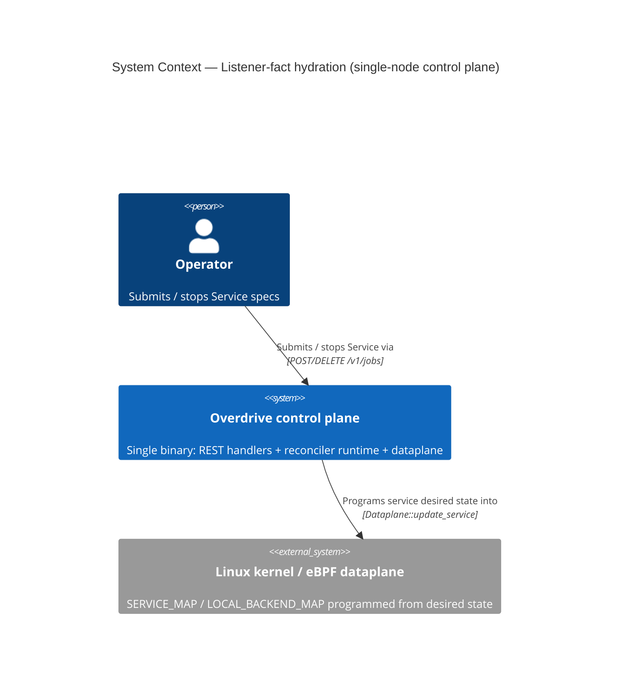
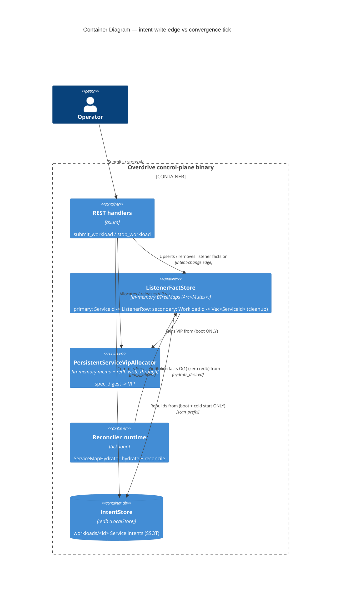
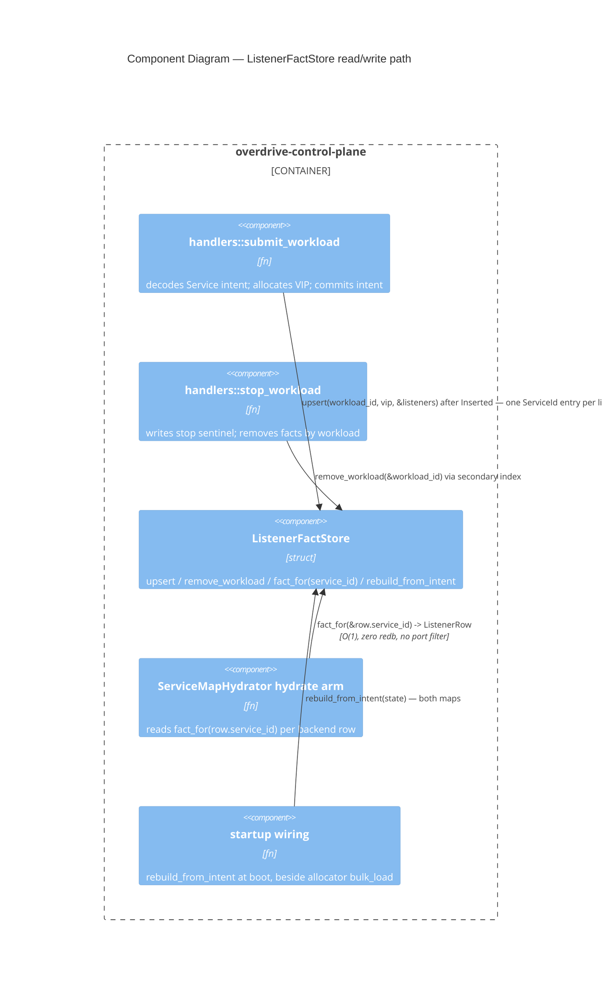

# ADR-0062: Listener-fact in-memory view, maintained on the intent-change edge

## Status

Accepted (2026-06-03). Extends ADR-0035; amends ADR-0042; references ADR-0049; preserves ADR-0060 C3.

## Context

`ServiceMapHydrator` hydrates its desired state by calling
`gather_service_listener_facts` (`reconciler_runtime.rs:1733-1796`), which performs a
full `scan_prefix(b"workloads/")` + rkyv-decode of every Service intent + an
`allocator.lock().await` per decoded intent — **once per `ServiceMapHydrator`
target per ~100 ms convergence tick**. With one target per service (S services),
this is **O(S²) decodes + O(S²) lock acquisitions per active tick**, realized at
boot, backend-churn waves, and multi-service rollouts.

The derived value `ListenerRow { vip: Some(_), port, protocol }` is stable between
operator spec submissions — it changes only on `submit_workload` / `stop_workload`.
Its two inputs (the Service intent's `listeners`, the allocator-issued VIP) are both
present at the intent-change write edge in `handlers.rs` (`allocate` at 323-331,
`release` at 424-432).

Research (`docs/research/control-plane/reconciler-desired-hydration-efficiency.md`,
18 sources, High confidence) maps this to the Kubernetes informer/indexer
anti-pattern ("re-list the durable store inside the reconcile path") and ranks the
fix "fold the derived projection into an in-process cache kept current by write
events" first. The canonical invalidation key is a **writer-bumped event** (here:
the submit/stop handler), not a reader-recomputed digest (which would re-incur the
decode cost the cache exists to avoid).

This intersects two project rules:
- **ADR-0035** contract: "steady-state reconcile pays zero disk reads; views
  bulk-loaded into RAM, redb touched only on write-through and cold boot."
- `.claude/rules/development.md` § "Persist inputs, not derived state":
  `ListenerRow` is a *derived* projection of `s.listeners` + the issued VIP;
  persisting it would ship a stale cache of the listener-projection logic.

## Decision

Introduce an in-memory `ListenerFactStore` (`overdrive-control-plane`,
`src/listener_facts.rs`), held on `AppState` as `Arc<tokio::sync::Mutex<…>>` beside
`allocator`. It holds two maps:

- **Primary (read path):** `BTreeMap<ServiceId, ListenerRow>` — one entry per
  `[[listener]]` of every Service, keyed by the **same `ServiceId` the hydrator
  reads by**. This is the load-bearing keying decision (see § "Why keyed by
  `ServiceId`" below).
- **Secondary (cleanup index):** `BTreeMap<WorkloadId, Vec<ServiceId>>` — maps a
  workload to the `ServiceId`s its listeners produced, used **only** by the
  stop/conflict-release path to find the entries to evict (the stop handler holds
  a `WorkloadId`, not the `ServiceId`s — see § "Stop / remove path").

It is:

1. **Rebuilt at boot** (`rebuild_from_intent`) by the relocated body of
   `gather_service_listener_facts` — one scan, once, at startup wiring, next to
   `PersistentServiceVipAllocator::bulk_load`. The rebuild scans `workloads/`,
   decodes each `Service` intent, joins the allocator-issued VIP, and for **each
   listener** computes `ServiceId::derive(&vip, listener.port, "service-map")`,
   inserting `ServiceId → ListenerRow { vip: Some(vip), port, protocol }` into the
   primary map and appending the `ServiceId` to the workload's `Vec` in the
   secondary map. NOT persisted: the intent store is the SSOT; cold boot
   re-projects both maps.
2. **Maintained on the intent-change edge** in `handlers.rs`: `upsert` after a
   successful submit (`PutOutcome::Inserted`, intent committed), `remove_workload`
   on stop and on conflict-release. This is the writer-bumped-invalidation
   discipline.
3. **Read O(1) at hydrate**: the `ServiceMapHydrator` arm
   (`reconciler_runtime.rs:1322-1364`) replaces the cluster-wide
   `gather_service_listener_facts(state).await?` with a per-row keyed read. The
   arm already resolves `service_id` from the target and iterates
   `service_backends_rows`; for each row it reads
   `store.get(&row.service_id)` — a genuine O(1) lookup that **directly yields**
   the `(port, protocol)` for that service, eliminating the prior per-row
   `vip == row.vip` scan over a cluster-wide `Vec<ListenerRow>` in
   `project_service_desired`. (Acquire guard → clone the small value → drop before
   any `.await`, mirroring `hydrate_bridge_desired_listeners:1686-1691`.)

Steady-state `hydrate_desired` for `ServiceMapHydrator` thereby pays **zero redb
reads** and **zero per-row listener scan**. The ADR-0060 C3 guard (unresolvable
protocol → skip service, never default to `Tcp`) is preserved verbatim.

### Why keyed by `ServiceId` (the read-path key is the store key)

The `ServiceMapHydrator` read path **never holds a `WorkloadId`**. Verified in
`reconciler_runtime.rs:1322-1364`:

- `let service_id = service_id_from_target(target)?;` — the hydrator target is a
  `ServiceId` (line 1323; `service_id_from_target` strips `service/` and parses
  `ServiceId::from_str`, `reconciler_runtime.rs:2342-2351`).
- `state.obs.service_backends_rows(&service_id)` — each row carries `row.vip`
  (`Ipv4Addr`) and `row.service_id` (`ServiceId`) (lines 1324-1335).
- `project_service_desired(&row, &listeners)` previously scanned the cluster-wide
  `Vec<ListenerRow>` for the listener whose `vip == Some(row.vip)`, then
  `desired.insert(row.service_id, desired_svc)` — the desired map is keyed by
  **`row.service_id`** (line 1347).

A `WorkloadId`-keyed store would therefore force a `ServiceId/VIP → WorkloadId`
reverse lookup or a scan on every read — the "O(1) keyed read" claim would be
false. Keying the store by `ServiceId` makes the read `store.get(&row.service_id)`
— genuinely O(1) and directly yielding the `(port, protocol)` the hydrator needs,
with the per-row VIP-match filter **eliminated**, not relocated.

The edge already has everything to derive the key: the allocated `ServiceVip` +
each listener's `(port, protocol)`. The derivation is **exactly** the one
`hydrate_bridge_desired_listeners` already uses at `reconciler_runtime.rs:1705`:

```rust
ServiceId::derive(&assigned_vip, listener.port, "service-map")
```

`ServiceId::derive(vip: &ServiceVip, port: NonZeroU16, purpose: &str)`
(`overdrive-core/src/id.rs:825`) takes a `ServiceVip` (not a bare `Ipv4Addr`),
which is precisely what the submit handler's `service_vip: Option<ServiceVip>`
(`handlers.rs:323-331`) holds — so the edge derives the key with no wrapping. (A
fallback `Ipv4Addr`-keyed store was considered and rejected: it would still force
the hydrator to wrap `row.vip: Ipv4Addr` into `ServiceVip` and apply a small port
filter, whereas `ServiceId` keying sidesteps both. `WorkloadId` keying is rejected
outright — it does not match any read-path key.)

### Multi-listener byte-equivalence (invariant B)

A Service with multiple `[[listener]]` entries produces **one store entry per
listener** — each listener yields its own `ServiceId` via
`ServiceId::derive(&vip, listener.port, "service-map")`, so a 3-listener Service
contributes 3 entries to the primary map and 3 `ServiceId`s to that workload's
secondary-index `Vec`. Invariant B ("edge-maintained store byte-equivalent to
`rebuild_from_intent` over the same intent set") asserts equivalence over the
**full set of `ServiceId` entries for all services, multi-listener included** —
both maps, every entry. See the Testability section.

### Why in-memory, not a persisted ViewStore View (vs ADR-0035)

A persisted `ViewStore` View (option i) **would technically fit the ADR-0035 View
contract**: `ServiceMapHydrator` is a reconciler, and a CBOR-encoded `View` blob could
hold this listener-fact projection keyed per target. So the rejection is not "Views
can't model this." It is two narrower reasons, in order of weight:

1. **Persistence is unnecessary — there is no durable state to persist.** The intent
   store is already the durable SSOT for listeners; `ListenerRow { vip, port, protocol }`
   is a *pure derivation* of stable, already-persisted inputs (the Service intent's
   `listeners` + the allocator-issued VIP). Persisting the derivation buys **zero
   durability** — cold boot re-derives it for free from the intent SSOT (exactly as
   `PersistentServiceVipAllocator::bulk_load` re-derives the VIP memo). Worse,
   persisting a derived projection would **violate** `.claude/rules/development.md` §
   "Persist inputs, not derived state": the persisted `ListenerRow` becomes a stale
   cache of the listener-projection logic the moment that logic changes, while the
   inputs it derives from are already durably held one layer down.

2. **A ViewStore View needs an owning reconciler with a `reconcile()`.** The ADR-0035
   machinery binds a `View` to a reconciler whose `reconcile()` produces the
   `next_view`. These cluster-wide listener facts are maintained on the intent-write
   edge (the submit/stop handler), not on any reconcile tick — so hosting them in a
   View would require fabricating a *synthetic reconciler with no real `reconcile`*
   purely to own the blob. That is unjustified machinery for state that the handler
   already updates directly.

The in-memory store achieves ADR-0035's "zero steady-state durable reads" *effect*
with no persistence schema, no derived-state cache, and no synthetic reconciler.

### Stop / remove path

`ServiceId` keying introduces an asymmetry the `WorkloadId` scheme hid: the
**read** path holds a `ServiceId`, but the **stop** path holds a `WorkloadId`.
Verified in `handlers.rs:642-681`: `stop_workload` writes only the
`workloads/<id>/stop` sentinel and enqueues a lifecycle eval — it does **not**
decode the intent and does **not** hold or release the VIP at this point (the VIP
release happens downstream via `Action::ReleaseServiceVip` on the convergence
tick). So at stop time the handler cannot, without extra reads, re-derive the
`ServiceId`s it must evict (the derivation needs the VIP).

**Chosen approach — (b) secondary cleanup index.** Maintain
`BTreeMap<WorkloadId, Vec<ServiceId>>` alongside the primary map. On the submit
edge, after computing each listener's `ServiceId`, record the workload → its
`ServiceId`s. On `stop_workload` / conflict-release, `remove_workload(&workload_id)`
looks up the workload's `Vec<ServiceId>` in the secondary index, removes each from
the primary map, then drops the secondary entry. The stop edge thus needs **no**
intent decode and **no** allocator lock — it operates entirely on the `WorkloadId`
it already holds.

The alternative — (a) re-derive the `ServiceId`s at stop time by re-reading the
intent's `listeners` + the allocator VIP — was rejected: it re-introduces an
intent decode + an allocator-guard acquisition on the stop edge, and forces an
ordering constraint (derive-then-release: the `ServiceId` derivation needs the VIP,
so the facts must be evicted *before* the downstream `Action::ReleaseServiceVip`
frees it). Approach (b) sidesteps the ordering concern entirely because the
secondary index already holds the derived `ServiceId`s — no VIP is needed to evict.

Boot `rebuild_from_intent` reconstructs **both** maps from the intent scan (it
derives each `ServiceId` during the scan, so it populates the secondary index in
the same pass), so any drift between the two maps, or a missed edge update on
either, is healed by the next boot rebuild — the same self-healing property the
single-map design relied on. The crash-consistency argument is unchanged: the
facts are a pure derivation of the committed intent set; a crash on the edge is
re-projected on the next boot.

### Why a new type, not extending the VIP allocator (vs ADR-0049)

`PersistentServiceVipAllocator`'s single responsibility is VIP issuance + range
management (IPv4-only, Earned-Trust range-projection boot probe, pool exhaustion,
`ServiceVipAllocatorEntryV2` rkyv envelope, `spec_digest`-keyed). Folding listeners in
would muddy that SRP, force a rkyv version bump to persist listeners the allocator
does not need, couple listener lifecycle to allocator lifecycle, and key the facts by
`spec_digest` when the hydrator reads by `ServiceId`. The new store *imitates* the
allocator's boot-rebuild + edge-maintain lifecycle but is a separate, cohesive type
keyed to the read path's `ServiceId`.

## Alternatives Considered

1. **First-class `ViewStore`-persisted reconciler View (option i).** Technically fits
   the ADR-0035 View contract (`ServiceMapHydrator` is a reconciler; a `View` could
   hold this projection). Rejected for two reasons, in order: (a) **persistence is
   unnecessary** — the facts are a pure derivation of already-persisted inputs (intent
   store is the SSOT), so persisting buys zero durability and persisting the derivation
   violates "persist inputs, not derived state"; (b) a View needs an owning reconciler
   with a `reconcile()`, so hosting edge-maintained facts would require a synthetic
   reconciler-with-no-`reconcile` — unjustified machinery. Heaviest surface for zero
   durability benefit. See § "Why in-memory, not a persisted ViewStore View".
2. **Extend `PersistentServiceVipAllocator` to carry `(VIP, listeners)` (option
   iii).** Rejected on cohesion — see "Why a new type" above. Smallest diff but wrong
   home; couples two lifecycles and forces an unwanted rkyv version bump.
3. **Hoist the scan to once-per-tick (research candidate b).** Rejected as the
   destination — kills the quadratic (O(S²)→O(S)) but still does an uncached full
   scan + decode every tick (the poll-to-detect-change pattern the research and Argo
   CD #27192 call a regression). Acceptable only as an interim, not needed here since
   (d) is landed directly.
4. **Memoise by recomputed `spec_digest` (research candidate a).** Rejected —
   computing the digest requires decoding the intent every tick to validate the
   cache, re-incurring the avoided cost; degrades to the self-polling-cache failure
   mode unless re-keyed on a writer-published generation, at which point it converges
   onto this decision's edge-maintenance mechanism.
5. **Action-shim or dedicated reconciler for the edge update (sub-decision 2
   alternatives).** Rejected — both run on the convergence tick, downstream of the
   timer, re-introducing the tick-coupling the fix removes; the handler already has
   both inputs in hand on the intent-write edge.

## Consequences

**Positive:**
- Steady-state `ServiceMapHydrator` hydrate is O(1) in-memory, zero redb reads —
  restores the ADR-0035 contract.
- Single boot-rebuild projection + symmetric edge maintenance, mirroring the
  allocator — analyzable, with the same drift-defense (DST byte-equivalence to
  re-scan).
- No new persistence schema, no rkyv envelope, no synthetic reconciler.
- C3 unresolvable-proto guard preserved verbatim.

**Negative / risks:**
- The edge-maintained store can drift from a fresh boot rebuild if a write path
  forgets to `upsert`/`remove`. Mitigated by the DELIVER **byte-equivalence
  invariant** (store contents == boot rebuild over the same intent set) — the same
  defense `PersistentServiceVipAllocator` upholds between `allocate` and `bulk_load`.
- One more `Arc<Mutex<…>>` on the hot edge. Acquired briefly (insert/remove a few
  bytes), dropped before any `.await` per project lock discipline — no `.await` held
  across the guard. Because the read path and the submit/stop edge contend on the
  same mutex, this is a deadlock/latency hazard if violated — promoted to DST
  **invariant C** (lock never held across `.await`) in the Testability section.
- **Crash-consistency edge case:** on crash during the handler after intent-commit but
  before fact-insert, the next boot's `rebuild_from_intent` re-derives from the
  committed intent, correctly overwriting any partial facts. On crash during boot's
  `rebuild_from_intent`, the binary fails fast; the intent store remains durable and a
  restart re-runs rebuild. This is safe because the in-memory store is not a cache — it
  is a pure derivation of the intent set, so any partial/failed edge is healed by the
  next rebuild.

**Testability (DELIVER gates):**
- **Invariant A (zero-scan):** `ServiceMapHydrator::hydrate_desired` issues zero
  `scan_prefix` calls in steady state — assertable via a counting `IntentStore`
  decorator (sim) over N ticks across S services. **`scan_prefix` is a public
  method on the `IntentStore` trait** (`overdrive-core/src/traits/intent_store.rs:255`:
  `async fn scan_prefix(&self, prefix: &[u8]) -> Result<Vec<(Bytes, Bytes)>, IntentStoreError>`),
  so a counting decorator wraps `&dyn IntentStore` directly — no new sim trait
  surface, no host-adapter detail to expose. This is a verified fact, not a
  DELIVER-time contingency.
- **Invariant B (byte-equivalence, multi-listener):** the edge-maintained store
  (both the primary `BTreeMap<ServiceId, ListenerRow>` AND the secondary
  `BTreeMap<WorkloadId, Vec<ServiceId>>`) is byte-equivalent to
  `rebuild_from_intent` over the same intent set, asserted over the **full set of
  `ServiceId` entries for all services, including services with multiple
  `[[listener]]` entries** (each listener contributes one entry). Guards against
  the edge-update path drifting from the rebuild path — the same contract
  `PersistentServiceVipAllocator` upholds between `allocate` and `bulk_load`.
- **Invariant C (lock never held across `.await`, DST):** the
  `ListenerFactStore` `Arc<Mutex<…>>` guard is **never held across an `.await`**.
  This is load-bearing, not stylistic: the hydrator read path and the concurrent
  `submit_workload`/`stop_workload` edge update contend on the same mutex, so
  holding the guard across `.await` is a deadlock/latency hazard
  (`.claude/rules/development.md` § "Concurrency & async" → "Never hold a lock
  across `.await`"). The discipline is "acquire guard → clone the small value →
  drop the guard before any `.await`" (mirroring the allocator guard at
  `hydrate_bridge_desired_listeners:1686-1691`). The DELIVER suite defends this as
  a DST invariant alongside A and B.

**Collection discipline:** `BTreeMap` keying for **both** maps (per §
"Ordered-collection choice") — the store is iterated by the boot rebuild and
observed by DST invariants; iteration order must be seed-deterministic; no
`HashMap`.

## C4 — System Context (L1)



## C4 — Container (L2)



## C4 — Component (L3, the listener-fact read/write path)


