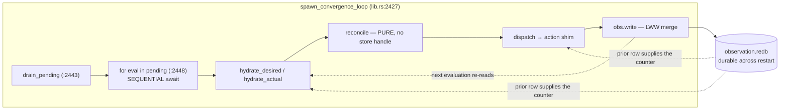

# ADR-0077 — Every durable observation write derives its LWW counter from the row it replaces, never from the tick

## Status

Accepted. 2026-08-01.
Decision-makers: Morgan (nw-solution-architect, DESIGN wave). Mode: propose.
Tags: phase-1, observation-store, lww, durability, restart-safety, application-arch.

Responds to
`docs/analysis/root-cause-analysis-cross-restart-lww-counter-regression.md`
(the "RCA" throughout) — a defect **reproduced end-to-end** through real
`overdrive serve` + `overdrive deploy` + restart, not inferred from source.

**Amends ADR-0076** (§ 7c, § 7d — three factual corrections, § D6 below). Does
not supersede it: ADR-0076's decision stands, and its § 7b
`superseding_timestamp` fix is the shape this ADR generalises. ADR-0076 § 7d
explicitly deferred this decision to "its own ADR"; this is that ADR.

**Amendment 2026-08-01 (iv) — "the bridge-convergence step" is
[ADR-0079](adr-0079-backend-discovery-bridge-converges-on-the-rows-it-manages.md).**
This ADR names that step as a dependency in § D2 (site 9), § D3 (C2), § D5
reason 3, § D7 (Layer-2 scope staging), § D8 and § D9 (Unit B) without pointing
at a document, because none existed. ADR-0079 is it, and it lands **Unit B in
full** — sites 9 and 10, their hydration, T3, and the § D7 widening of the
Layer-2 clause to `crates/overdrive-core/src/**` — in one change, because the
crate-scoped lint couples them. **No decision in this ADR changes.** ADR-0079
confirms § D2 site 9's `service_backends: BTreeMap<ServiceId, ServiceBackendRow>`
field verbatim, so the § D2 dependency contract ("a crafter implementing site 9
MUST NOT invent an alternative field") is satisfied without amendment. One
finding there is worth reading back into § D3's two-owner note: the two writers
diverge on `Backend.addr` as well as `healthy`, so making the bridge converge
naively would have erased the readiness health signal — ADR-0079 § D2 is the
containment.

Depends on `.claude/rules/reconcilers.md`,
`.claude/rules/development.md` § "Reconciler I/O", § "Persist inputs, not
derived state", § "Check-and-act must be atomic", § "Errors".

---

## Context

### The defect

`timestamp_for` (`crates/overdrive-control-plane/src/action_shim/mod.rs:1753`)
derives an observation row's LWW counter from the convergence tick alone:

```rust
const fn timestamp_for(tick: &TickContext, writer: NodeId) -> LogicalTimestamp {
    LogicalTimestamp { counter: tick.tick.saturating_add(1), writer }
}
```

`tick_n` is a literal `0` in `spawn_convergence_loop`
(`crates/overdrive-control-plane/src/lib.rs:2434`), bumped once per 100 ms
cadence at `:2469`, and never seeded from persistent state. Observation rows are
fsync-durable across restarts, and the writer `NodeId` is the compile-time
literal `"local"` (`lib.rs:1701`), so `dominates`' `Equal` arm
(`crates/overdrive-core/src/traits/observation_store.rs:268`) evaluates
`"local" > "local"` → deterministic `false`.

Consequence: after a restart, every tick-derived write for a surviving row is
**silently discarded** until the tick counter climbs past the pre-restart
high-water mark — a window equal to the previous process's uptime. Measured
(RCA § 3): prior counter 4 → 0.5 s; 269 → 29 s; 522 → 52 s. **The longer the
system ran successfully, the longer the outage after a restart.**

The operator-visible symptom is worse than a delay: `overdrive job stop` prints
`Stopped workload 'probe-job'.` and exits **0** while the store still reads
`Running`, because `ObservationStore::write` returns `Ok(())` on a dropped write
(`crates/overdrive-store-local/src/observation_backend.rs:397-504`,
`:1010-1036`). Two INFO lines are logged across the entire window (RCA § 2.3).

### The design error underneath it

The tick and the LWW counter are **different quantities**, and `timestamp_for`
conflates them:

| | `TickContext.tick` | `LogicalTimestamp.counter` |
|---|---|---|
| Names | which evaluation cycle the runtime is in | which version of *one row key* this is |
| Scope | process-global, per-loop | per LWW key |
| Lifetime | resets every process start | durable, monotone forever |
| Consumer | reconciler tie-breaking, DST replay | `dominates`, across restarts and (Phase 2) peers |

A process-local scheduling coordinate cannot carry durable per-key version
semantics. Every remedy below is judged against whether it un-conflates the two
or entrenches the conflation.

### What is already correct in-tree

Two writers already derive from the prior row and are immune (RCA § 6):

- **The exit observer** — `counter: prior.updated_at.counter.saturating_add(1)`
  (`crates/overdrive-control-plane/src/worker/exit_observer.rs:541-544`), where
  `prior` is the LWW winner loaded at `:534`. No tick component at all.
- **`superseding_timestamp`** — `max(tick+1, prior+1)`
  (`action_shim/mod.rs:1771-1777`), added as the GH #250 fix (ADR-0076 § 7b),
  reached from `:444`.

**The mechanism this ADR mandates is already in production at two sites.** The
decision is to make it the *only* mechanism.

### Scope correction against ADR-0076 § 7d

ADR-0076 § 7d finding 3 named `ServiceBackendRow`, left its reachability
unaudited, grouped `NodeHealthRow` with the tick-derived rows, and did not name
`ServiceHydrationResultRow` or `ReconcileConflictRow` at all. The RCA § 4.1
census is wider and is the scope this ADR governs (§ D2). `NodeHealthRow` is
**wall-clock-derived and immune** (`crates/overdrive-worker/src/node_health.rs:55`
— `clock.unix_now().as_secs()`).

---

## Decision

### D1 — The LWW counter derives from the prior row at that key; the tick is only a floor

**Decision: monotone-against-prior (`max(tick+1, prior+1)`) at every durable
write site. The boot-seeded `tick_n` alternative is rejected (Alt-N).**

One constructor, on `LogicalTimestamp` itself in `overdrive-core`, replaces both
shim helpers and every struct literal:

```rust
// crates/overdrive-core/src/traits/observation_store.rs
// — beside `dominates`, in the SAME `impl LogicalTimestamp` block.
impl LogicalTimestamp {
    #[must_use]
    pub fn dominating(
        tick_floor: u64,
        writer: NodeId,
        prior: Option<&LogicalTimestamp>,
    ) -> LogicalTimestamp {
        let floor = tick_floor.saturating_add(1);
        let counter = match prior {
            Some(p) => floor.max(p.counter.saturating_add(1)),
            None => floor,
        };
        LogicalTimestamp { counter, writer }
    }
}
```

The rustdoc carries the four mandated sections
(`.claude/rules/development.md` § "Trait definitions specify behavior, not just
signature" — applied here to an inherent constructor because it is the SSOT both
adapters' acceptance depends on):

- **Preconditions.** `prior` is the `updated_at` of the row currently at *this
  row's LWW key*, read from the `ObservationStore`, or `None` iff no row exists
  at that key. `tick_floor` is `TickContext.tick`, or `0` for a writer that runs
  outside a convergence loop and has no tick (the exit observer).
- **Postcondition.**
  `LogicalTimestamp::dominating(t, w, Some(p)).dominates(p) == true` for every
  `t`, every `w`, and every `p` with `p.counter < u64::MAX`. The returned
  counter is `>= tick_floor + 1`.
- **Edge cases.** `prior == None` → `tick_floor + 1` (a genuinely-first write at
  the key). `p.counter == u64::MAX` → `saturating_add` clamps and the
  postcondition does **not** hold; unreachable at 100 ms cadence (~5.8 × 10¹⁰
  years) and stated rather than hidden. `tick_floor == 0` with
  `prior == Some(p)` → `p.counter + 1`, i.e. exactly the exit observer's
  historical shape. `writer` is **not** derived from `prior` — each site passes
  its own writer, preserving today's tiebreak behaviour unchanged.
- **Observable invariant.** For any key, the sequence of counters produced by
  successive `dominating` calls that each read the current row is strictly
  increasing, **independently of the tick sequence that fed them** — including
  across a process restart, and including across two different tick sequences
  (§ D4).

**Why the tick floor is retained rather than using a bare `prior + 1`.** It
keeps counters comparable to the tick during normal operation (which is what
today's operator-facing `counter@writer` rendering,
`action_shim/mod.rs:551-553`, has always shown), it single-sources one
constructor for the tick-bearing and tick-less callers so they cannot drift, and
it is ADR-0076 § 7b's already-shipped shape. It is not load-bearing for
correctness: `prior + 1` alone would also dominate.

**Why not the boot-seed (Alt-N).** Three reasons, in order of weight:

1. **It cannot be implemented through the existing port surface.** The true
   high-water mark spans four row types, and `ObservationStore` exposes
   *keyed-only* accessors for two of them —
   `service_hydration_results_rows(&service_id)`
   (`observation_store.rs:1617-1620`) and
   `reconcile_conflict_rows(&service_id)` (`:1705-1708`). There is no keyless
   enumerator for either. A boot seed therefore **requires new port-trait
   methods**, which is exactly the change § D5 declines. Prior-derivation
   requires none.
2. **It does not fix the same-drain collision (§ D3), and prior-derivation
   does.** Two writers to one key in one drain both read the same seeded
   `tick_n` and stamp identically → the second is still dropped. Under
   prior-derivation the second writer reads the first's committed row and
   strictly dominates it.
3. **It entrenches the conflation.** It makes a scheduling coordinate a cached
   function of durable rows — the shape `.claude/rules/development.md`
   § "Persist inputs, not derived state" names — and it does not make any
   *individual* write monotone, so a same-tick tie still needs a second
   mechanism. Prior-derivation removes the conflation instead of scaling it up.

Alt-N is recorded in full under § Alternatives Considered.

**Honest limit.** `dominating` is a read-modify-write: read prior, derive,
write. It is correct only under a **single-writer-at-a-time** discipline for a
given key. That discipline holds today (§ D3), is what the exit observer has
always relied on, and is the thing that breaks first when a second concurrent
emitter is wired or Phase 2 introduces real peers (§ D4, § D5). Per
`.claude/rules/development.md` § "Check-and-act must be atomic" the eventual
structural answer is to move counter assignment to the write boundary — that is
a Phase-2 decision, named here and deliberately not taken (Alt-O).

### D2 — Scope: all ten defective sites, plus two behaviour-preserving migrations

Ten production sites derive from the tick and are defective. Two further sites
are already prior-derived and migrate to the unified constructor for
lint-conformance only, byte-identical in behaviour.



The load-bearing structure: **the counter's source of truth is the store, on
both the shim path and the reconciler path.** The shim reads it directly; a pure
`reconcile` receives it through `actual` (ADR-0035/0036 forbid a store handle
inside `reconcile`).

| # | Site | Row type | Prior available how | Extra store read |
|---|---|---|---|---|
| 1 | `action_shim/mod.rs:526` (`fail_closed_on_netns_provision`) | `AllocStatusRow` | new parameter, threaded from both call sites | **none** |
| 2 | `action_shim/mod.rs:1076` (`FinalizeFailed`) | `AllocStatusRow` | `prior_row` in scope | none |
| 3 | `action_shim/mod.rs:1251` (`StartAllocation`) | `AllocStatusRow` | `find_prior_alloc_row` **already called** at `:1148` | **none** |
| 4 | `action_shim/mod.rs:1470` (`RestartAllocation`) | `AllocStatusRow` | `prior_row` in scope (`:1361`) | none |
| 5 | `action_shim/mod.rs:1580` (`StopAllocation`) | `AllocStatusRow` | `prior_row` in scope (`:1552`) | none |
| 6 | `dataplane_update_service.rs:126` | `ServiceHydrationResultRow` | `observation.service_hydration_results_rows` | 1 per dispatch (shared with #7) |
| 7 | `dataplane_update_service.rs:155` | `ServiceHydrationResultRow` | same lookup as #6 | — |
| 8 | `reconciler_runtime.rs:1444` | `ReconcileConflictRow` | `state.obs.reconcile_conflict_rows` | 1, on the conflict path only |
| 9 | `backend_discovery_bridge.rs:392` | `ServiceBackendRow` | `actual` — **depends on the bridge-convergence step** | 0 (hydration already reads it) |
| 10 | `service_lifecycle.rs:860` | `ServiceBackendRow` | `actual` — new hydrated field | 1 per hydrate |
| — | `action_shim/mod.rs:444` (mTLS supersede) | `AllocStatusRow` | already correct (ADR-0076 § 7b) | none |
| — | `exit_observer.rs:541` | `AllocStatusRow` | already correct | none |

**Cost correction against RCA § 8.1.** The RCA states that `StartAllocation`
(`:1251`) and the netns fail-closed helper (`:526`) "each need a
`find_prior_alloc_row` lookup [they do] not do today: one extra redb read on the
alloc-start path." **That is wrong.** `StartAllocation` already performs the
lookup at `:1148` and discards everything but `state` via
`.map_or(AllocStateWire::Pending, |r| r.state.into())`; both
`fail_closed_on_netns_provision` call sites (`:1176` from Start, `:1384` from
Restart) sit downstream of a prior-row read that has already happened
(`:1148`, `:1361`). **All five `AllocStatusRow` sites cost zero additional store
reads.** The real added I/O is three reads: one per `DataplaneUpdateService`
dispatch (#6/#7), one per conflict write (#8, an already-rare path), and one per
`service-lifecycle` hydrate (#10).

#### The exact per-site shape

Sites 2, 4, 5 — the row is in scope; replace the `timestamp_for` line:

```rust
// :1076 / :1470 / :1580 — identical shape at all three
let updated_at = LogicalTimestamp::dominating(
    tick.tick,
    prior_row.node_id.clone(),
    Some(&prior_row.updated_at),
);
```

Site 3 — bind the row that `:1148` already reads and currently discards:

```rust
// replaces action_shim/mod.rs:1148-1150
let prior_row = find_prior_alloc_row(obs, &alloc_id).await?;
let prior_state: AllocStateWire =
    prior_row.as_ref().map_or(AllocStateWire::Pending, |r| r.state.into());
let prior_updated_at: Option<LogicalTimestamp> = prior_row.map(|r| r.updated_at);

// replaces action_shim/mod.rs:1251
let updated_at =
    LogicalTimestamp::dominating(tick.tick, node_id.clone(), prior_updated_at.as_ref());
```

Site 1 — `fail_closed_on_netns_provision` gains one **required** parameter,
appended last (the anti-builder discipline of
`.claude/rules/development.md` § "Port-trait dependencies", already applied to
`build_alloc_status_row`'s `updated_at` and `workload_addr`):

```rust
async fn fail_closed_on_netns_provision(
    obs: &dyn ObservationStore,
    bus: &broadcast::Sender<LifecycleEvent>,
    tick: &TickContext,
    alloc_id: AllocationId,
    workload_id: WorkloadId,
    node_id: NodeId,
    kind: overdrive_core::aggregate::WorkloadKind,
    prior_state: AllocStateWire,
    cause: TransitionReason,
    prior_updated_at: Option<&LogicalTimestamp>,   // <-- appended, required
) -> Result<(), ShimError> {
    // ... replaces :526
    let updated_at = LogicalTimestamp::dominating(tick.tick, node_id.clone(), prior_updated_at);
```

Call sites: `:1176` passes `prior_updated_at.as_ref()`; `:1384` passes
`Some(&prior_row.updated_at)`.

> **This corrects ADR-0076 § 7c**, which cleared this site with the reasoning
> *"Any prior row is from an EARLIER tick, hence a strictly smaller counter."*
> That premise is precisely what the cross-restart defect falsifies. See § D6.

**Amendment 2026-08-01 (iii) — site 1's parameter is superseded by
`prior: Option<&AllocStatusRow>`.**
[ADR-0078](adr-0078-crash-and-recover-is-durably-observable-last-terminated-plus-restart-count.md)
§ D2 (site 2 of its own table) replaces the
`prior_updated_at: Option<&LogicalTimestamp>` parameter pinned above with the
strictly wider `prior: Option<&AllocStatusRow>`, because that ADR's crash-facts
derivation needs the whole superseded row rather than only its stamp
(`build_alloc_status_row` takes the same parameter and computes
`CrashFacts::advance(prior, state)` internally). The stamp is then derived inside
the function, and the call-site expressions change correspondingly — ADR-0078
§ D2 pins both:

```rust
let updated_at = LogicalTimestamp::dominating(
    tick.tick,
    node_id.clone(),
    prior.map(|r| &r.updated_at),
);
```

**This is a widening, not a contradiction, and no decision here changes.**
`Option<&LogicalTimestamp>` is recoverable from `Option<&AllocStatusRow>` via
`prior.map(|r| &r.updated_at)`, so the value reaching `dominating` is identical;
only the carrier the prior arrives in changes. § D1 stands exactly as written —
the counter still derives from the prior row at that key — and
`LogicalTimestamp::dominating`'s signature, rustdoc contract, postcondition and
edge cases are untouched. Carrying **both** parameters was rejected there as two
values derived from one row with a standing risk they disagree. ADR-0077 Unit A
and ADR-0078 land as **one combined commit** (ADR-0078 § Implementation
sequencing — a two-unit split was evaluated and works in neither order), so no
code ever ships against the superseded signature; see the § D9 amendment below.

Sites 6 + 7 — one lookup, computed immediately after
`let fp = fingerprint(vip, backends);` (`dataplane_update_service.rs:111`), used
by both the IPv6-reject early return and the normal path. The LWW key is the
composite `(service_id, fingerprint)`, so the prior is the row at that
fingerprint:

```rust
let prior_rows = observation.service_hydration_results_rows(service_id).await?;
let prior_updated_at: Option<LogicalTimestamp> =
    prior_rows.into_iter().find(|r| r.fingerprint == fp).map(|r| r.updated_at);

// replaces :126 and :155
updated_at: LogicalTimestamp::dominating(tick.tick, writer.clone(), prior_updated_at.as_ref()),
```

Site 8 — `ReconcileConflictRow`, LWW key `(service_id, vip, port, proto)`. This
write is already best-effort (`reconciler_runtime.rs:1449-1470`: a write failure
is logged and convergence continues, because the tracing event is the primary
signal). A **read** failure must therefore not abort the conflict signal either,
but it must not be silently absorbed
(`.claude/rules/development.md` § "Errors"). The pinned shape logs the cause and
proceeds with `None`:

```rust
let prior_updated_at: Option<LogicalTimestamp> =
    match state.obs.reconcile_conflict_rows(&service_id).await {
        Ok(rows) => rows
            .into_iter()
            .find(|r| r.vip == vip && r.port == port && r.proto == proto)
            .map(|r| r.updated_at),
        Err(err) => {
            tracing::warn!(
                target: "overdrive::reconciler",
                name = "reconciler.output.conflict_prior_read_failed",
                reconciler = %reconciler_name,
                target = %target.as_str(),
                error = %err,
                "could not read the prior reconcile_conflict row; stamping without a \
                 prior floor — this write may lose the LWW merge. The tracing signal \
                 above is unaffected."
            );
            None
        }
    };

// replaces :1444
updated_at: LogicalTimestamp::dominating(tick.tick, state.node_id.clone(), prior_updated_at.as_ref()),
```

Site 9 — `BackendDiscoveryBridge`. `reconcile` is pure-sync with no store handle
by construction (ADR-0035/0036), so the prior arrives through `actual`. **This
site depends on the bridge-convergence step** (RCA § 8.4), which adds the
managed rows to the bridge's `actual` for reasons independent of this ADR. The
field this ADR requires that step to expose, pinned exactly:

```rust
// crates/overdrive-core/src/reconcilers/backend_discovery_bridge.rs
pub struct BackendDiscoveryBridgeState {
    pub desired: ServiceListenerSet,
    pub actual: RunningAllocSet,
    /// The `service_backends` rows this bridge manages, keyed by `ServiceId`.
    /// Populated ONLY in the `actual` projection (ADR-0021 uses one type for
    /// both halves; the `desired` projection leaves this empty, exactly as
    /// `hydrate_actual` leaves `desired.listeners` empty today at
    /// `reconciler_runtime.rs:2715`).
    pub service_backends: BTreeMap<ServiceId, ServiceBackendRow>,
}
```

```rust
// replaces backend_discovery_bridge.rs:392-395
updated_at: LogicalTimestamp::dominating(
    tick.tick,
    self.writer_node_id.clone(),
    actual.service_backends.get(service_id).map(|r| &r.updated_at),
),
```

Hydration: `reconciler_runtime.rs`'s `hydrate_actual` `BackendDiscoveryBridge`
arm (`:2676-2723`) populates it via
`state.obs.service_backends_rows(&service_id)` — the same accessor the
`ServiceMapHydrator` arm already calls at `:1698`, so this is the established
cost shape in this runtime, not a new one.

> **Dependency contract.** If the bridge-convergence step's own design names
> this field differently, the two steps must be updated in lockstep and this ADR
> amended. A crafter implementing site 9 MUST NOT invent an alternative field —
> per CLAUDE.md § "Implement to the design", surface the mismatch as a blocker.

Site 10 — `ServiceLifecycle`. Same constraint, minimal addition: only the stamp
is needed (this reconciler does not converge on the row — that is the bridge's
concern), so the hydrated input is the stamp alone.

```rust
// crates/overdrive-core/src/service_lifecycle.rs — on ServiceLifecycleState
pub struct ServiceLifecycleState {
    pub allocs: BTreeMap<AllocationId, ServiceAllocFact>,
    pub service_dataplane: Option<ServiceDataplaneIdentity>,
    /// LWW stamp of the `service_backends` row currently stored for this
    /// service, or `None` when no row exists yet. An OBSERVED INPUT, hydrated
    /// by the runtime from `service_backends_rows(&service_id)` — never
    /// derived, never persisted in the View.
    pub prior_backend_row_at: Option<LogicalTimestamp>,
}
```

```rust
// replaces service_lifecycle.rs:860-863, inside readiness_backend_row_action
updated_at: LogicalTimestamp::dominating(
    tick.tick,
    dataplane.writer.clone(),
    actual.prior_backend_row_at.as_ref(),
),
```

Hydration: the `hydrate_actual` `ServiceLifecycle` arm populates it using the
same `ServiceId` it already derives to build `ServiceDataplaneIdentity`. **If
that `ServiceId` is not in scope in that arm, the crafter surfaces it as a
blocker rather than inventing a new derivation path.**

Migrations (behaviour-identical, for lint conformance under § D6):

```rust
// action_shim/mod.rs:444 — replaces superseding_timestamp(tick, running_row)
LogicalTimestamp::dominating(tick.tick, running_row.node_id.clone(), Some(&running_row.updated_at))

// exit_observer.rs:541-544 — `tick_floor = 0` because this writer runs outside
// any convergence loop and has no tick. max(1, prior+1) == prior+1 for every
// prior, so the emitted counter is byte-identical to today's.
LogicalTimestamp::dominating(0, writer, Some(&prior.updated_at))
```

`timestamp_for` (`:1753`) and `superseding_timestamp` (`:1771`) are **deleted**
in the same change — single-cut, per the repo's greenfield-migration discipline.
No deprecation, no shim, no re-export.

### D3 — The same-drain in-process collision IS closed by D1, conditional on two facts

**Ruling: covered.** RCA § 7.1's collision — two reconcilers drained in one
iteration sharing one `tick_n` (`lib.rs:2443-2469`) and writing the same key
with a byte-identical `(counter, writer)` — is closed by prior-derivation,
because of a fact the RCA did not use:

> **The drain is sequential.** `lib.rs:2448-2467` is
> `for eval in pending { … run_convergence_tick(…).await … }` — a plain
> sequential `await` loop with no `join_all`, no `spawn`, and no concurrency.
> Evaluation *N + 1*'s `hydrate_actual` therefore runs strictly **after**
> evaluation *N*'s `dispatch` has committed its write (`reconciler_runtime.rs:1493`
> awaits `dispatch_with_workflow_intent` before the tick returns).

So the second writer reads the first writer's committed row as its `prior` and
stamps `>= prior + 1`, which strictly dominates. The shared `tick_n` becomes
irrelevant: it is only a floor, and the prior row overrides it whenever the prior
is ahead. **This is a property tick-derivation cannot have and the boot-seed
(Alt-N) does not gain** — under either, both writers compute an identical stamp
from identical inputs.

Two conditions make the ruling true, and both are obligations on the
implementation, not assumptions:

- **C1 — the drain stays sequential.** Introducing concurrency into
  `spawn_convergence_loop`'s evaluation loop reopens the collision. This is a
  standing constraint on that loop, recorded here so a future change to it is a
  change to *this* decision.
- **C2 — the prior stamp is actually in the hydrated `actual`.** For the two
  `ServiceBackendRow` sites this is precisely what sites 9 and 10 add. Until
  they land, those two sites remain exposed.

**The residual this does NOT cover, stated explicitly:** two writes to the
**same LWW key emitted within a single `reconcile` action vector**. Both derive
from one hydration, both see the same prior, both stamp identically, and the
second is dropped. No stamping rule computed from `(tick, prior)` alone can
order two writers that share both inputs — this is an impossibility, not a gap
in the chosen remedy. Today no reconciler does this for any LWW-keyed row
(`readiness_backend_row_action` emits at most one `WriteServiceBackendRow` per
reconcile; the bridge emits one per distinct `ServiceId`), and
`validate_reconcile_output` (`action_shim/validate.rs:194`) already rejects the
analogous same-slot dataplane case. It is a standing constraint on future
reconcilers, not a live defect.

**A separate defect this ruling exposes and does not fix.** `ServiceBackendRow`
is keyed by `service_id` alone (`observation_store.rs:1074`) and has **two
writers** — `backend_discovery_bridge.rs:392` (writer =
`self.writer_node_id`) and `service_lifecycle.rs:860` (writer =
`dataplane.writer`). That violates
`.claude/rules/development.md` § "State-layer hygiene", which specifies
observation rows are **owner-writer only**. Correct ordering (what D1 buys) is
not the same as correct content: two owners computing different backend sets and
overwriting each other in a defined order is still wrong, just no longer
silently so. **The remedy is a single-owner decision, not a timestamp decision,
and it is out of scope here.** It is recorded as an observed fact with no
forward pointer and no issue number (§ Blockers).

### D4 — The second `tick_n` needs no fix; the second *loop* carries a real constraint

**Ruling: no fix required for the counter. One standing constraint recorded for
the loop.**

`lib.rs:2526` declares a second `let mut tick_n: u64 = 0;` in
`spawn_workflow_emit_drain`, feeding `TickContext { tick: tick_n, .. }` at
`:2545` and reaching the same shim write sites through
`action_shim::dispatch_with_workflow_intent` (`:2553`).

Under D1 this is **structurally harmless**, because prior-derivation is
**tick-source-agnostic**: with `tick = 0` the floor is 1 and the `max` selects
`prior + 1` — the exact case `superseding_timestamp`'s docstring already records
(`action_shim/mod.rs:1763-1766`). Two independent tick sequences feeding one key
still produce a strictly increasing per-key chain, because each write reads the
key's current row. Fixing the write sites fixes both loops with one mechanism.
This is a second decisive advantage over Alt-N, which would have to seed **both**
declarations and would still leave two sequences that can cross.

**The constraint the second loop does introduce — and it is not the unseeded
counter.** `spawn_workflow_emit_drain` is a **separate `tokio` task**, concurrent
with `spawn_convergence_loop`. Prior-derivation is a read-modify-write; two
concurrent tasks can both read prior `P`, both stamp `P + 1`, and one is dropped.
This is the time-of-check-to-time-of-use shape of
`.claude/rules/development.md` § "Check-and-act must be atomic", applied to a
counter rather than a set membership.

Three facts bound it:

1. **It is latent.** `WorkflowRegistry::new()` is empty in production
   (`.claude/rules/workflows.md` § "Codebase precedent"), so no first-party
   workflow emits today and the drain forwards nothing.
2. **It pre-dates this ADR.** The exit observer
   (`exit_observer.rs:534-544`) already performs the identical
   read-modify-write from outside the convergence loop, and has since it
   shipped. D1 does not introduce the race; it makes the existing discipline
   explicit and universal.
3. **It becomes live at a nameable moment.** Registering a first production
   workflow that emits an `Action` reaching a durable observation write.

**Standing constraint (binding on whoever registers that workflow):** before a
first-party workflow that emits a durable-row-writing `Action` is registered in
`WorkflowRegistry`, the concurrent-writer race between `spawn_workflow_emit_drain`
and `spawn_convergence_loop` must be closed. Serialising the two drains is the
cheapest option; moving counter assignment to the write boundary (Alt-O) is the
structural one. This is recorded as a constraint on a future change, not as a
deferral with a promised slice.

### D5 — No `ObservationStore` port-trait change

**Ruling: the trait is unchanged. `write` continues to return
`Result<(), ObservationStoreError>` and does not surface acceptance.**

Four independent reasons:

1. **Nothing in this decision needs it.** Every one of the ten sites obtains its
   prior through an accessor that already exists —
   `alloc_status_row` (`observation_store.rs:1475-1478`),
   `service_hydration_results_rows` (`:1617-1620`),
   `service_backends_rows` (`:1629-1632`),
   `reconcile_conflict_rows` (`:1705-1708`) — or through `actual`, hydrated by
   those same accessors.
2. **The alternative that *would* need it is the one being rejected.** Alt-N's
   boot seed cannot compute a high-water mark through the current surface at
   all (§ D1 reason 1).
3. **A write receipt is a substitute for convergence, and adopting it would
   entrench the defect the bridge already has.** `BackendDiscoveryBridge` is
   fire-once precisely because it stamps a dedup fingerprint at *emit* time and
   calls it "the last row the bridge successfully wrote"
   (`backend_discovery_bridge.rs:374-379`, `:428`) — a success signal it does
   not have. Handing it a real one would let it keep diffing against what it
   emitted instead of against what is stored. The bridge-convergence step
   (RCA § 8.4) fixes it the right way — hydrate the managed rows into `actual`
   and diff desired-vs-actual per `.claude/rules/reconcilers.md` Bar 1 — and
   **that fix requires no trait change**, which is a point in its favour and the
   reason no forcing function exists here.
4. **Observability is served without it.** The LWW reject is made visible inside
   the store adapter (the parallel logging step), where `apply_alloc_status_lww`
   already computes the `bool`
   (`crates/overdrive-store-local/src/observation_backend.rs:1010-1036`). A
   15-method trait's contract does not need to change to log a decision the
   adapter already makes.

**Revisit trigger, named not deferred:** Phase 2 multi-node. When `NodeId` stops
being the compile-time literal `"local"` (`lib.rs:1701`) and rows arrive by
gossip, per-key counter assignment by a single reader-then-writer is no longer
sound, and moving assignment to the write boundary (Alt-O) becomes the live
question. That is a Phase-2 decision with its own ADR.

### D6 — Corrections to ADR-0076

ADR-0076's decision stands; three statements in its out-of-scope findings are
factually wrong and are corrected in place, as **rev 6**, following the same
in-place amendment convention revs 2–5 used. No supersession.

| ADR-0076 location | Stated | Correct |
|---|---|---|
| § 7c, `fail_closed_on_netns_provision` row | "**NO** … Any prior row is from an EARLIER tick, hence a strictly smaller counter. *(Verified, not assumed.)*" | **Affected.** The premise "earlier tick ⇒ smaller counter" is exactly what the cross-restart defect falsifies. Site 1 of § D2. |
| § 7d finding 1 | "Verified from source; NOT reproduced at runtime" | **Reproduced end-to-end** through real `serve` + `deploy` + restart, four measurement points (RCA § 2, § 3). |
| § 7d finding 3 | `ServiceBackendRow` "reachability was not audited"; `NodeHealthRow` grouped with the tick-derived rows; `ServiceHydrationResultRow` and `ReconcileConflictRow` unnamed | The tick-derived set is **ten sites across four row types** (RCA § 4.1, § D2 above). `NodeHealthRow` is **wall-clock-derived and immune** (`node_health.rs:55`); its two-heartbeats-per-second collision is a different, benign issue. |

### D7 — Enforcement

Per the "enforceable architecture rules" discipline, three **semantically
orthogonal** layers. Each answers a different question; a bypass of one is
caught by at least one other.

**Layer 1 — the unsafe constructor stops existing (subtype/API).**
`timestamp_for` and `superseding_timestamp` are deleted. `LogicalTimestamp::dominating`
is the only sanctioned way to mint a stamp, and its `prior` parameter is
required — there is no default and no builder, so a writer cannot *forget* to
consider the prior; it can only pass `None` deliberately.
**Honest limit:** `LogicalTimestamp`'s fields are `pub`
(`observation_store.rs:233-236`) and are read by `dominates`, by
`format_logical_timestamp` (`action_shim/mod.rs:551-553`), and by the rkyv
archived surface, so a struct literal remains *syntactically* constructible.
Privatising them is a separate, larger decision (Alt-Q). Layer 1 removes the
convenient wrong path; it does not make it unrepresentable.

**Layer 2 — an AST lint makes the residual path fail CI (structural).** A new
clause in `xtask/src/dst_lint.rs` rejects `LogicalTimestamp {` struct-literal
construction in `crates/overdrive-core/src/**` and
`crates/overdrive-control-plane/src/**`, outside the defining `impl` block and
outside `#[cfg(test)]` items. Direct precedent: ADR-0048's "Layer 2 —
variant-construction lint", which bans `<Envelope>::V<N>(` by the same
mechanism. Purely syntactic; imports no `overdrive-*` crate, so
`.claude/rules/development.md` § "xtask is build / test / dev orchestration"
stays intact.

The census the clause must come out clean against — the crafter runs it and
reports, and **does not invent an exemption**:

| Site | Disposition |
|---|---|
| `observation_store.rs:233`, `:238` | the definition + the `impl` — exempt by construction |
| `exit_observer.rs:541` | migrates (§ D2) |
| `reconciler_runtime.rs:1444`, `dataplane_update_service.rs:126`/`:155`, `backend_discovery_bridge.rs:392`, `service_lifecycle.rs:860` | migrate (§ D2) |
| `action_shim/mod.rs:1754`, `:1773` | deleted with their helpers |
| `reconciler_runtime.rs:3375`, `streaming.rs:1107`, `mtls_resolve_adapter.rs:901-902`, `action_shim/mod.rs:2300`, `write_service_backend_row.rs:95`, `core/testing/observation_store.rs:200`, `workload_lifecycle.rs:1748` | believed `#[cfg(test)]` — **verify**; any production-reachable site is an eleventh site under § D2 and is reported, not patched ad hoc |
| `node_health.rs:55`, `overdrive-sim/src/invariants/*` | outside the scanned crates; `node_health` is wall-clock and immune |

**Amendment 2026-08-01 (ii) — the Layer-2 scope is staged A → B, and
`src/testing/**` is excluded.** Implementing Unit A surfaced an internal
inconsistency in this section plus two census facts. The decision in § D1–§ D6
is unchanged; what follows fixes the enforcement *schedule* and the census,
nothing else.

**The inconsistency.** Layer 2 above scopes the clause to
`crates/overdrive-core/src/**` **and** `crates/overdrive-control-plane/src/**`,
while § D9 assigns the lint to **Unit A** and assigns sites **9**
(`backend_discovery_bridge.rs:392`) and **10** (`service_lifecycle.rs:860`) to
**Unit B**. Both of those sites are `LogicalTimestamp {` struct literals under
`crates/overdrive-core/src/`. Landing the lint at its stated scope inside Unit A
therefore fails CI on two sites Unit A is explicitly forbidden to touch — so
Layer 2's scope and § D9's "self-contained" claim could not both hold. The
implementing crafter surfaced it as a blocker rather than resolving it
unilaterally, which is the correct move: Layer 2 forbids inventing an exemption.

**Ruling.** Unit A lands the Layer-2 clause scoped to
`crates/overdrive-control-plane/src/**` **only**. Unit B widens the same clause
to `crates/overdrive-core/src/**` in the change that lands sites 9 and 10.

**This is not the exemption Layer 2 forbids.** An exemption permanently
whitelists a *defective site*, leaving it construction-legal after the
enforcement lands. Incremental scope widening whitelists nothing: it tracks the
A → B ordering § D9 had already decided, it keeps the lint **green at every
commit** rather than landing it red and depending on a follow-up to make it
honest, and the end state is unchanged — both crates scanned, zero exemptions.
The staging costs Unit A nothing in coverage: **all eight of Unit A's sites
(1–8), and both behaviour-preserving migrations, live under
`crates/overdrive-control-plane/src/`** — sites 1–5 in `action_shim/mod.rs`,
6–7 in `action_shim/dataplane_update_service.rs`, 8 in `reconciler_runtime.rs`,
the migrations in `action_shim/mod.rs:444` and `worker/exit_observer.rs:541`.
The narrowed clause protects every one of them the moment Unit A lands. The only
sites it does not yet reach are 9 and 10 — precisely Unit B's, and already
recorded as exposed until Unit B lands (§ D3, C2).

**Census correction — `#[cfg(test)]` is not always in-file.** The census table
above assumes the gate appears in the same file as the literal. It does not for
`crates/overdrive-core/src/testing/observation_store.rs:200`, which is gated at
its *declaration*: `crates/overdrive-core/src/lib.rs:140` reads
`#[cfg(any(test, feature = "test-utils"))] pub mod testing;`. The module
therefore never enters a production build and is **not** an eleventh defective
site — but a purely in-file AST scanner cannot see the gate and will flag it.
The clause carries a `src/testing/**` path exclusion for this reason. That
exclusion is a **scanner-capability accommodation, not a semantic exemption**:
the excluded path is non-production by construction at its declaration site, and
the exclusion whitelists no site that could ever reach a production build.

**Census result — the § D2 count of ten stands.** The remaining six literals
were each verified inside a top-level `#[cfg(test)]` module in their own file,
so **no eleventh production-reachable site exists**:

| Literal | Top-level `#[cfg(test)]` gate in the same file |
|---|---|
| `reconciler_runtime.rs:3375` | yes |
| `streaming.rs:1107` | yes |
| `mtls_resolve_adapter.rs:901-902` | yes |
| `action_shim/mod.rs:2300` | yes |
| `write_service_backend_row.rs:95` | yes |
| `workload_lifecycle.rs:1748` | yes |

With `#[cfg(test)]` items, the defining `impl`, and `src/testing/**` excluded,
the *only* literals a core-scoped clause would flag are sites 9 and 10 — which
is what makes the staged scope safe rather than merely convenient. Line numbers
throughout this census are pinned to pre-Unit-A HEAD and drift once Unit A's
edits land; the identities and dispositions do not.

**Layer 3 — behavioural tests prove it against the real substrate.** Reasoning
about durability is not evidence of durability; the RCA exists because the
reasoning was right and unverified.

- **T1 (default lane, proptest).** For all `(tick_floor, writer, prior)`:
  `LogicalTimestamp::dominating(t, w, Some(&p)).dominates(&p)` and
  `counter >= t + 1`. `p.counter == u64::MAX` excluded per the stated contract.
  Generator lives beside `LogicalTimestamp`
  (`.claude/rules/testing.md` § "Property-based testing").
- **T2 (integration lane) — the cross-restart regression test.** The RCA's
  Probe A promoted to a permanent test: write an `AllocStatusRow` at a high
  counter, **drop and reopen** a real `LocalObservationStore` on the same path,
  dispatch at `tick = 0`, assert the post-restart row **wins** and carries
  `counter == prior + 1`. It must reopen a real store — an in-memory fixture
  cannot express the substrate behaviour ("the counter resets while the rows
  do not") that this whole ADR is about. Precedent for the shape:
  `crates/overdrive-store-local/tests/acceptance/local_observation_store.rs:113`
  (`restart_round_trip_alloc_status`).
- **T3 (integration lane) — the same-drain ordering test.** Two evaluations
  drained in one iteration, both writing one `ServiceBackendRow` key; assert
  both writes land and the second dominates. This is the falsifiable check on
  § D3's sequential-drain premise (C1) and closes RCA § 9 open question 2 by
  construction. Lands with sites 9 and 10.
- **Mutation obligation.** `LogicalTimestamp::dominating` is a
  comparison-and-arithmetic function — the canonical `<`/`<=`, `max`/`min`,
  `+1`/`+0` mutation surface. 100% of its mutants must be caught, per
  `.claude/rules/testing.md` § "Mandatory targets". Run scoped:
  `cargo xtask lima run -- cargo xtask mutants --diff origin/main --features integration-tests --package overdrive-core --file crates/overdrive-core/src/traits/observation_store.rs`.

### D8 — Documentation corrections this change obliges

Behaviour changes make adjacent prose false; the repo's discipline is to fix it
in the same change, not leave it for the next reader. Each of these currently
states the tick-derived rule as the contract:

| Location | Correction |
|---|---|
| `observation_store.rs:1004-1009` (`ServiceHydrationResultRowV1::updated_at`) | "the action shim writes `(counter = tick.tick + 1, writer = node_id)`" → the prior-derived rule |
| `observation_store.rs` (`ReconcileConflictRowV1::updated_at`) | same sentence, same correction |
| `observation_store.rs:226-247` (`LogicalTimestamp`) | add the per-key monotonicity invariant and point at `dominating` |
| `action_shim/mod.rs:1739-1752` / `:1757-1770` | deleted with the helpers; the contract prose moves onto `dominating` |
| `backend_discovery_bridge.rs:203-211`, `:237-241` (View docstring) | the claim that `last_written_fingerprint` records "the last row the bridge **successfully wrote**" and is "the canonical *input*" is false on both halves (RCA § 4.3). Owned by the bridge-convergence step, which deletes the field; named here so it is not missed. |

**Amendment 2026-08-01 — the architecture SSOT.** The table above
enumerated only *code* docstrings and omitted
`docs/product/architecture/brief.md`, which is the architecture SSOT.
The brief carried the stale tick-derived / "production does not consult
logical timestamps" claims in **five** places, plus a **sixth** row that
is the brief-side twin of the View-docstring row above. That omission
was a gap in this ADR, not in the brief; it is closed here, and the
corrections were made in the same change that recorded them.

| Location (`docs/product/architecture/brief.md`) | Correction |
|---|---|
| § 6, `LocalObservationStore` bullet | "single-writer overwrite semantics (**no LWW merge**, no site-IDs, no tombstones — those land with Phase 2's `CorrosionStore`)" → the LWW merge is **live in Phase 1**; only site-IDs and tombstones are Phase 2. "Single-writer" is a deployment posture, not the absence of an ordering check. |
| § 6, logical-timestamp paragraph | "**`LocalObservationStore` does not consult them** (single-writer has no ordering question to resolve)" → **false, and already false before this ADR.** It is the production LWW path: six `apply_*_lww` helpers (`overdrive-store-local/src/observation_backend.rs:1058`, `:1103`, `:1141`, `:1179`, `:1204`, `:1241`) admit a row only when `dominates` holds and silently discard it otherwise. `dominates` was promoted into `overdrive-core` by the earlier `fix-observation-lww-merge` work *so that* the production adapter would consult it (`observation_store.rs:330-335`); the brief was not updated then either. Also adds the § D1 per-key-monotonicity rule, explicitly marked as an accepted decision **not** a landed implementation. |
| § 18, "No CRDT machinery" bullet | "Owner-writer site-IDs, **LWW logical-timestamp merges**, and tombstone discipline land with `CorrosionStore` in Phase 2" → the LWW merge does not wait for Phase 2; it runs today. Site-IDs and tombstones do. |
| § 48, `service_hydration_results` schema table | `lamport_counter` / `writer_node_id` described as "Forward-compat with Phase 2 Corrosion gossip" → **load-bearing in Phase 1**, not merely forward-compat: `apply_service_hydration_lww` (`observation_backend.rs:1204`) discards a non-dominating row at `(service_id, fingerprint)`. |
| § 63, `BackendDiscoveryBridge` | Documented the defect as the design — "`counter = tick.tick.saturating_add(1)` … **per-node monotonic counter** + writer tiebreak IS the CR-SQLite LWW shape". The writer half and the owner-writer conclusion stand; **"per-node monotonic counter" is false** — the tick resets per process (`lib.rs:2434`) while durable rows keep their high-water mark, which is the defect itself. Replaced with the § D1 rule plus a per-site status table separating site 9 (**Unit B, still tick-derived, not implemented, blocked on bridge convergence**) from sites 6/7 (**Unit A, authored, not landed**) — the old text equated the two. |
| § 63, View "inputs only" paragraph | Struck. Same falsehood as the code-side View docstring row above (`last_written_fingerprint` is derived state stamped at emit time, not a confirmed-write input; RCA § 4.2–4.3). Remedy owned by the bridge-convergence step; recorded as struck rather than fixed, since no fix is designed or landed. |

Per CLAUDE.md § "Deferrals require GitHub issues", none of these rows
carries a forward pointer to an uncreated issue: each either states a
correction already made, or names the bridge-convergence step as the
owning work.

### D9 — Implementation sequencing

This ADR is decision-complete for two implementation units, deliberately split
along a real dependency, not along file boundaries:

- **Unit A — the constructor + the shim path.** `LogicalTimestamp::dominating`
  with its rustdoc contract; sites 1–8; the two migrations; deletion of both
  shim helpers; Layer-2 lint; T1 + T2; the § D8 corrections for
  `observation_store.rs` and `action_shim/mod.rs`. **Self-contained** — depends
  on nothing else in the sequence, and closes the reproduced defect for every
  `AllocStatusRow` site, which is the whole of what the RCA drove end-to-end.
- **Unit B — the reconciler path.** Sites 9 and 10, their hydration, and T3.
  **Depends on the bridge-convergence step** for site 9's `actual.service_backends`
  field (§ D2, dependency contract).

Ordering A → (bridge convergence) → B. A must not wait on B: it is where the
measured operator-visible outage lives.

**Amendment 2026-08-01 (ii) — the Layer-2 lint's scope is staged across the two
units.** Unit A's "Layer-2 lint" item lands the clause scoped to
`crates/overdrive-control-plane/src/**` only; Unit B widens it to
`crates/overdrive-core/src/**` alongside sites 9 and 10. Unit A remains
**self-contained** as stated above — but at the *narrowed* scope. At the scope
§ D7 originally stated, it was not: both of Unit B's sites are
`crates/overdrive-core/src/` struct literals that the lint would have rejected
inside Unit A, on files Unit A is forbidden to touch. See the § D7 amendment for
the ruling, why it is a scope stage rather than the exemption § D7 forbids, and
the census confirming that sites 9 and 10 are the only literals the widened
scope adds.

**Amendment 2026-08-01 (iii) — Unit A does not land as a standalone commit.**
[ADR-0078](adr-0078-crash-and-recover-is-durably-observable-last-terminated-plus-restart-count.md)
§ Implementation sequencing rules that Unit A, ADR-0078 and that ADR's
`crash_recovery.rs` rewrite land as **one combined commit** — a two-unit split
was evaluated and works in neither order. **Unit A's scope is unchanged**
(ADR-0078 folds in "Unit A exactly as § D9 of that ADR scopes it"), as are
Unit B, its bridge-convergence dependency, and the A → B ordering. What is
superseded is only the **"self-contained"** claim read as a *commit* boundary:
the same body of work now lands inside a larger commit. The one signature
ADR-0078 supersedes is noted in the § D2 amendment above.

---

## Alternatives Considered

**Alt-N — seed `tick_n` from the store's high-water mark at boot.** One read
during `run_server`, used to initialise both `tick_n` declarations
(`lib.rs:2434`, `:2526`). Genuinely attractive: a handful of lines at one site
in place of ten call-site edits and two reconciler `State` changes.
**Rejected** on three grounds, any one of which is sufficient:
(1) it **cannot be implemented through the current port surface** — there is no
keyless enumerator for `ServiceHydrationResultRow` or `ReconcileConflictRow`
(`observation_store.rs:1617-1620`, `:1705-1708`), so it requires the very
port-trait change § D5 declines;
(2) it **leaves § D3 fully open** — two writers in one drain read the same
seeded tick and stamp identically, whereas prior-derivation orders them;
(3) it makes a scheduling coordinate a cached function of durable rows — the
shape `.claude/rules/development.md` § "Persist inputs, not derived state" names
— and still makes no *individual* write monotone, so a same-tick tie needs a
second mechanism anyway. It is also a Lamport clock bolted onto a per-node
counter that Phase 2's real `NodeId`s and gossip would force back open.
Recorded so the option is foreclosed by reasoning, not overlooked.

**Alt-O — the store assigns the counter at the write boundary.** `write` derives
the next counter for the key inside the adapter, under the same lock as the LWW
merge, making the read-modify-write atomic and eliminating both § D3's
within-vector residual and § D4's concurrent-writer race. **Architecturally the
strongest option, and rejected for now, not on principle.** It changes the
`ObservationStore` contract for all 15 methods' worth of adapters, it moves a
decision reconcilers currently make explicitly into an adapter (weakening the
call-site reviewability that ADR-0076 § 7b deliberately bought with a required
`updated_at` parameter), and it prejudges the Phase-2 multi-node design from
inside a Phase-1 defect repair. Named as the § D5 revisit trigger's answer.

**Alt-P — increment `tick_n` inside the drain loop (a distinct tick per
evaluation).** A one-line move of `lib.rs:2469` into the `for` body.
**Rejected**: it does not work. When the prior counter exceeds the tick — which
is exactly the post-restart window this ADR exists to fix — writers at ticks `T`
and `T+1` both compute `max(tick+1, prior+1) = prior+1` and tie anyway. It
perturbs a documented `TickContext.tick` semantic
(`.claude/rules/development.md` § "Reconciler I/O" rule 6: a deterministic
tie-breaker) for no guaranteed benefit. § D3's sequential-drain argument closes
the collision without touching the tick at all.

**Alt-Q — make `LogicalTimestamp`'s fields private.** Would make the tick-only
literal genuinely unrepresentable rather than merely lint-rejected — the
strongest form of `.claude/rules/development.md` § "Type-driven design".
**Rejected on blast radius, not on merit**: the fields are read by `dominates`
(`observation_store.rs:260-270`), by `format_logical_timestamp`
(`action_shim/mod.rs:551-553`), by the rkyv archived surface, and by
schema-evolution fixtures; privatising them means accessors at every read site
and touching pinned golden-bytes tests. Layer 2 of § D7 delivers the same
enforcement outcome with a precedented, syntactic mechanism at a fraction of the
cost. Recorded as the available escalation if the lint proves insufficient.

**Alt-R — surface write acceptance (`write -> Result<bool, _>`) and let writers
retry.** **Rejected**, and it would be actively harmful: a write receipt is a
substitute for convergence. `BackendDiscoveryBridge`'s fire-once defect exists
because it treats an emit as a successful write
(`backend_discovery_bridge.rs:374-379`, `:428`); giving it a real receipt would
legitimise diffing against what it emitted rather than against what is stored,
which is the `.claude/rules/reconcilers.md` Bar 1 violation the bridge-convergence
step removes. A converging reconciler does not need to know why a write failed —
it re-diffs and re-emits. See § D5.

**Alt-K / Alt-L / Alt-M (ADR-0076).** Re-examined and their rejections upheld:

- **Alt-K (a per-write `AtomicU64` in the shim)** was rejected partly because it
  is "restart-unsafe without seeding from the store's high-water mark — which is
  finding 1 in § 7d." That rejection is **strengthened** by this ADR: the seed
  it would need is Alt-N, which is itself rejected above. An in-process
  high-water map also cannot reach the reconciler sites, which have no mutable
  state handle by construction (ADR-0035/0036).
- **Alt-L (synthesize a distinct `TickContext`)** — upheld unchanged. Fabricating
  a tick to move one counter is a lie about which tick the write belongs to, and
  § D3 shows a distinct tick would not even have worked (Alt-P).
- **Alt-M (change `dominates` to break the equal-`(counter, writer)` tie in
  favour of the incoming row)** — upheld unchanged, and this ADR depends on it
  being upheld: `dominating`'s postcondition is stated against the *current*
  comparator, and the LWW idempotency case (re-delivered gossip is a no-op)
  requires `false` on `Equal`. The bug was never in the comparator.

---

## Consequences

### Positive

- **The reproduced defect is closed at its cause.** A surviving allocation is
  writable on the first tick after a restart, not after a window equal to the
  previous process's uptime. The measured 29 s and 52 s outages
  (RCA § 3) become zero.
- **The fix is cause-agnostic and source-agnostic.** Prior-derivation gives a
  strictly increasing per-key counter chain regardless of which tick sequence
  fed the write, so both convergence loops (§ D4), any future emitter, and any
  future cause of counter regression are covered by one mechanism.
- **The same-drain collision closes as a consequence, not as a second fix**
  (§ D3) — a property the boot-seed alternative does not have.
- **Zero additional store reads on the allocation lifecycle path.** All five
  `AllocStatusRow` sites already hold or already read the prior row; the RCA's
  cost estimate is corrected downward (§ D2).
- **One constructor, one contract, one enforcement story.** Two divergent
  helpers plus six scattered struct literals collapse to a single `#[must_use]`
  constructor whose postcondition is a one-line proptest, defended by a
  precedented AST lint.
- **The tick stops carrying durable semantics.** `TickContext.tick` returns to
  being what it is documented to be — a scheduling coordinate and deterministic
  tie-breaker — which keeps DST replay independent of durable store contents.

### Negative

- **Three added store reads on non-alloc paths** — one per
  `DataplaneUpdateService` dispatch (sites 6/7), one per conflict write (site 8,
  an already-rare path), one per `service-lifecycle` hydrate (site 10). The
  hydrate read is the established shape in this runtime
  (`reconciler_runtime.rs:1698`).
- **The bug class is made deliberate, not impossible.** A writer can still pass
  `prior = None` when a prior exists. This is ADR-0076 § 7b's honest limit,
  inherited: the structural defences are a required parameter, a deleted unsafe
  constructor, and an AST lint — not a type that forbids the wrong argument.
  Alt-Q is the escalation if that proves insufficient.
- **A read-modify-write is now the durable-write discipline, and it is only
  sound under a single-writer-at-a-time regime** (§ D1 honest limit, § D4
  constraint). This is not new — the exit observer has always worked this way —
  but this ADR makes it universal and therefore makes the constraint
  load-bearing everywhere.
- **Two reconciler `State` types grow a field** (`BackendDiscoveryBridgeState`,
  `ServiceLifecycleState`), and site 9 is **blocked on the bridge-convergence
  step**. Unit B cannot land independently; Unit A can and should (§ D9).
- **`ServiceBackendRow` still has two owners** (§ D3). Ordering is fixed;
  ownership is not. Two owners computing different backend sets now overwrite
  each other in a defined order rather than silently — an improvement, not a
  resolution.
- **Six-plus test/fixture sites must be audited** against the Layer-2 lint
  (§ D7 census). Any production-reachable site found there is an eleventh site
  and a scope expansion to be reported, not absorbed.

### Neutral / non-consequences

- **The `ObservationStore` trait is unchanged** (§ D5) — no adapter contract
  change, no equivalence-test churn, no schema evolution. `LogicalTimestamp`'s
  archived layout is untouched (a new inherent method is not a wire change), so
  no rkyv envelope version bumps and no new golden-bytes fixtures.
- **`dominates` is unchanged** (Alt-M upheld). The comparator remains the single
  SSOT both adapters consult.
- **Emitted counter values are byte-identical to today** at both migrating
  sites, and at every site whose prior row is behind the current tick — which is
  the entire steady-state, no-restart case. The change is observable only in the
  window where today's code silently drops writes.
- **No external integration**, so no consumer-driven contract tests are
  warranted. The only external dependency on this path is redb's durability
  contract, whose in-repo analogue of a contract test is T2's real
  drop-and-reopen (§ D7).
- **No GitHub issue was created.** Agents do not open issues unilaterally
  (CLAUDE.md). The two out-of-scope findings below are recorded as observed
  facts with no forward pointer and no promised slice — the same shape ADR-0076
  § Decision 4 and § 7d used.

---

## Out of scope — recorded facts, no forward pointer

1. **`ServiceBackendRow` has two owners** (`backend_discovery_bridge.rs:392`,
   `service_lifecycle.rs:860`) on a key that is `service_id` alone
   (`observation_store.rs:1074`), against
   `.claude/rules/development.md` § "State-layer hygiene" (observation rows are
   owner-writer only). This ADR orders their writes; it does not decide who owns
   the key.
2. **`spawn_workflow_emit_drain` and `spawn_convergence_loop` are concurrent
   tasks performing the same read-modify-write** (§ D4). Latent while
   `WorkflowRegistry` is empty; the constraint in § D4 binds whoever registers
   the first emitting production workflow.
