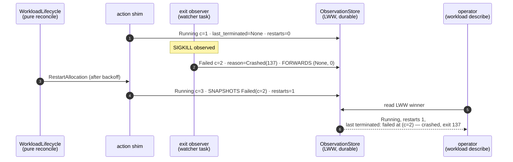

# ADR-0078 — A crash-and-recover is durably observable: `last_terminated` + `restart_count` on the alloc row

## Status

Accepted. 2026-08-01.
Decision-makers: Morgan (nw-solution-architect, DESIGN wave). Mode: propose.
Tags: phase-1, observation-store, lww, crash-observability, rkyv-schema-evolution,
operator-surface, application-arch.

**Records a product-owner ruling, does not relitigate it:** *a crash is a crash —
if a workload crashes and recovers, that must be observable.* This ADR decides
**how**.

Responds to
`docs/research/orchestration/crash-observability-under-lww-comprehensive-research.md`
(the "research" throughout — 16 sources, Kubernetes / Nomad / CRDT theory /
Corrosion, cross-referenced) and to the gap
[ADR-0077](adr-0077-lww-counter-derives-from-the-prior-row-not-the-tick.md)'s
(correct) behaviour change exposed.

**Depends on ADR-0077** — its § D1 constructor and its § D1 *honest limit* (the
single-writer-at-a-time precondition) are load-bearing here (§ D3). Does not
supersede or amend it. **Depends on ADR-0048** — the rkyv versioned-envelope
evolution procedure is binding (§ D4). **Depends on ADR-0032 § 3 / ADR-0037 § 4**
— `TransitionReason` and `TerminalCondition` are the typed cause and terminal-claim
surfaces this ADR reuses rather than duplicates.

Depends on `.claude/rules/development.md` § "Persist inputs, not derived state",
§ "State-layer hygiene", § "Type-driven design", § "rkyv schema evolution",
§ "Trait definitions specify behavior, not just signature"; `.claude/rules/testing.md`
§ "Archive schema-evolution roundtrip".

> **Line numbers in this ADR are pinned to the working tree at authoring time,
> with ADR-0077 Unit A authored but NOT committed.** The identities and
> dispositions are load-bearing; the numbers drift the moment Unit A lands.

---

## Context

### The gap

`AllocStatusRow` is merged last-write-wins on
`LogicalTimestamp { counter, writer }`
(`crates/overdrive-core/src/traits/observation_store.rs:252-256`, comparator at
`:330-339`). One row per allocation key; full-row writes only, no field-diff
merges (`:346-347`).

After ADR-0077 every durable write derives its counter from the row it replaces
(`LogicalTimestamp::dominating`, `observation_store.rs:302-306`), so a
crash-then-restart produces:

```
Running(counter=1)  ← action shim, StartAllocation      (action_shim/mod.rs:1279)
Failed (counter=2)  ← exit observer, SIGKILL classified (worker/exit_observer.rs:561)
Running(counter=3)  ← action shim, RestartAllocation    (action_shim/mod.rs:1503)
```

Each write correctly dominates its prior. **The durable row ends at `Running`
and the crash is unobservable.** An operator polling `overdrive workload
describe` after convergence sees a healthy Running allocation and no evidence
the workload ever died. A LWW-Register discards intermediate values *by
construction* — that is the type's semantics, not a defect (research Finding 5;
Corrosion's own documentation: *"No intermediate value preservation — only final
merged states persist; intermediate conflicting values are discarded"*, Finding 6).

Before ADR-0077 the crash was visible only **by accident**: the restart write
computed `tick.tick + 1`, tied byte-for-byte with the exit observer's
`prior.counter + 1`, and `dominates`' `Equal` arm evaluated `"local" > "local"`
→ deterministic `false` (`observation_store.rs:337`), so the restart row was
silently dropped and the `Failed` row lingered until the tick climbed past it.
That accident is what the current test suite encodes as its contract (§ D6).

### What the operator loses today, precisely

Four distinct facts vanish when the recovered `Running` row supersedes the
`Failed` row, because each lives in a field the successor write overwrites:

| Fact | Field on the superseded row | Overwritten by the successor |
|---|---|---|
| It was terminal, and in which bucket | `state: AllocState::Failed` | `Running` |
| Typed cause — exit code, signal, path, errno class | `reason: Some(TransitionReason::WorkloadCrashedImmediately { exit_code, signal, stderr_tail })` | `Some(Started)` |
| Verbatim driver / OS text | `detail: Option<String>` | `None` |
| The workload's dying words | `stderr_tail: Option<String>` | `None` (`action_shim/mod.rs:1512`) |
| Reconciler terminal claim | `terminal: Option<TerminalCondition>` | `None` |
| When the dead generation started | `started_at: Option<UnixInstant>` | fresh `tick.now_unix` (`:1478`) |
| Which durable observation it was | `updated_at: LogicalTimestamp` | the successor's stamp |

The streaming lane is **not** affected — `emit_event` fires a `LifecycleEvent`
on every shim write and on every exit-observer write
(`action_shim/mod.rs:1359`, `worker/exit_observer.rs:206-220`), so a
`deploy --watch` subscriber attached at the time sees the crash live. The gap is
strictly in the **durable, poll-at-any-time** surface.

### What the research settled (built on, not re-derived)

Kubernetes and Nomad converge independently on the same structure (research
Findings 1–4): a **bounded current-state record** plus a **monotone scalar
counter**, paired with a **separate, explicitly lossy** history side.

- Kubernetes: `containerStatuses[].lastState` — **depth 1**, *"overwritten
  whenever the container restarts"* — plus a scalar `restartCount`. Anything
  beyond the latest occurrence lives in the `Events` object, which is TTL'd
  (default 1 h), count-aggregated, and explicitly **not** an audit log
  (Finding 1, High; Finding 2, Medium-High).
- Nomad: a hard-coded **10-event ring buffer** per task, plus scalar `Restarts` /
  `LastRestart`; HashiCorp's own guidance for real retention is to externalise
  via the Event Stream API (Finding 3, **Medium-High** — the `defaultMaxEvents
  = 10` constant is quoted from HashiCorp's own forum, not re-verified against a
  second direct source read). That the ring lives in **per-node, non-gossiped**
  state is Finding 7's analysis and Gap 4, not Finding 3.
- Neither makes its converged current-state record an unbounded log. Both are
  the CQRS/event-sourcing split applied independently (Finding 4, High).
- Storage in both is **O(1) regardless of crash-loop depth** — a workload
  crash-looping 10 000 times produces `restartCount = 10000` and an
  unchanged-size `lastState` (Finding 8, **Medium** — a structural inference
  from the documented field *types*, not a direct source statement; its open
  Gap 3 asks whether a `u32` counter risks overflow at extreme scale, which
  § D1 answers by stating the saturation edge rather than assuming it away).

The research's ranked recommendation, against the two hard constraints
(durably observable; correct under LWW gossip merge):

1. a Kubernetes-`lastState`-shaped `last_terminated` sub-struct on the existing
   row — **recommended minimum viable fix**, adds no new CRDT primitive;
2. a monotone `restart_count` scalar — **recommended companion, not substitute**,
   safe only under single-writer-per-key (Finding 5, High);
3. a separate append-only crash table — CRDT-cleanest, **explicitly "RECOMMENDED
   as a follow-up, not the immediate fix"**. Its cost is retention, not
   correctness — and the research does **answer** the retention question for a
   *bounded* table: cap at N rows per allocation and evict the oldest **by the
   row's own writer**, never cross-writer, which stays inside the
   single-writer-per-key envelope and sidesteps causal stability entirely. Only
   *unbounded* history is unsolved (Gap 4). See Alt-C;
4. **not a standalone candidate**: "just make the existing in-process
   `LifecycleEvent` broadcast durable" — it either collapses into (3), or, if
   made durable only in per-node local storage, is disqualified at cluster level
   because an operator polling from another peer cannot see it. The research
   concedes it may still be a reasonable **local debugging aid**.

Separately disqualified by the research (not a numbered candidate): **a single
LWW-merged blob encoding "the last N events"** — a concurrent gossip race
discards an entire peer's contribution, not just the conflicting entry; a
failure mode strictly worse than any of 1–3, and a shape neither Kubernetes nor
Nomad uses. See Alt-B.

**One research recommendation was NOT actioned and is carried as a known
limitation**: Recommendation-for-Further-Research 2 asked that Kubernetes'
`ContainerStatus` / `--event-ttl` primary-source text be pulled with a
code-search tool *"if higher-confidence citation is later required (e.g., for an
ADR)"*. It was not. Every Kubernetes quotation in this ADR is therefore a
godoc/CNCF **paraphrase**, corroborated by 2+ independent secondary sources but
not verbatim primary text. This does not change the decision — the shape is
independently corroborated by Nomad (Finding 3) and by CRDT theory (Findings 5–7)
— but a reader must not treat the quoted strings as verbatim Kubernetes source.

### What is already in tree and reusable

- **The typed cause surface.** `TransitionReason`
  (`crates/overdrive-core/src/transition_reason.rs:88-210`) already carries every
  crash fact structurally: `WorkloadCrashedImmediately { exit_code, signal,
  stderr_tail }` (`:179-183`), `ExecBinaryNotFound { path }`,
  `CgroupSetupFailed { kind, source }`, `MtlsInterceptInstallFailed`,
  `WorkloadNetnsProvisionFailed`. It derives serde + `ToSchema` + rkyv
  (`:74-85`) and is already a public wire field
  (`api.rs:349`).
- **The typed terminal-claim surface.** `TerminalCondition` (`:407-494`) —
  `Completed { exit_code }`, `Failed { exit_code }`, `BackoffExhausted`,
  `Stopped`, `Stable`, `ServiceFailed`. Also serde + `ToSchema` + rkyv.
- **The forward-carry discipline.** `build_alloc_status_row`
  (`action_shim/mod.rs:272-347`) already takes `updated_at`, `started_at` and
  `workload_addr` as **required parameters** so the compiler enumerates every
  writer and none can silently drop a prior-row value. That parameter shape
  exists precisely because the forget-to-forward bug class has bitten twice
  (`:277-286`, `:301-310`).
- **A `Restarts` column that renders a hard-coded `"0"`.**
  `crates/overdrive-cli/src/render.rs:835` — *"Restarts default to 0 in Phase 1
  (per-alloc restart counter not surfaced on the wire row body yet — this is a
  forward-compat placeholder)."* The operator surface for a restart counter was
  designed and shipped; only the value is missing.
- **The envelope machinery.** `AllocStatusRowEnvelope` is at **V2**
  (`observation_store.rs:721-731`), `AllocStatusRow = AllocStatusRowV2`
  (`:392`), with `VersionedEnvelope` impl at `:900-980` and golden-bytes
  fixtures at `crates/overdrive-core/tests/schema_evolution/alloc_status_row.rs`.

**No new mechanism is required.** This ADR adds two fields, one pure
constructor, and one wire projection.

---

## Decision

### D1 — Shape: a depth-1 `LastTerminated` snapshot of exactly the fields a successor overwrites, plus a monotone `restart_count: u32`

**Decision: the Kubernetes `lastState` shape (depth 1), NOT Nomad's ring buffer;
composed of existing `overdrive-core` types, with zero parallel invention.**

Two new fields land on the allocation row:

```rust
// crates/overdrive-core/src/traits/observation_store.rs
// — co-located with AllocStatusRowV3, per ADR-0048 § 4.

/// Verbatim snapshot of the most recent terminal observation for an
/// allocation, preserved across the successor write that would otherwise
/// discard it under last-write-wins (ADR-0078 § D1).
///
/// # Membership rule — the closed list, not a judgement call
///
/// This struct carries **exactly** those [`AllocStatusRow`] fields that a
/// successor write OVERWRITES. Fields every writer forward-carries anyway
/// (`alloc_id`, `workload_id`, `node_id`, `kind`, `listeners`,
/// `workload_addr`) are NOT included — snapshotting them would duplicate a
/// value that is already stable across the transition. Adding a field to
/// [`AllocStatusRow`] obliges a decision here, and the rule decides it:
/// overwritten ⇒ snapshotted, forward-carried ⇒ not.
///
/// # Depth is structural, not conventional
///
/// This type does NOT contain a `last_terminated` of its own. Depth-1 is
/// therefore *unrepresentable-otherwise*, not merely "the current policy" —
/// an unbounded in-row history cannot be written by a future author without
/// changing this type. Storage is O(1) in crash-loop depth (research
/// Finding 8): a workload crash-looping 10 000 times produces exactly one
/// `LastTerminated` and `restart_count = 10000`. This mirrors Kubernetes'
/// accepted, production-proven limitation (research Finding 1): the detail of
/// crash N-1 is permanently lost once crash N is observed.
///
/// # Deliberate divergence from Kubernetes
///
/// Kubernetes' `lastState` on a currently-terminated container shows the
/// *previous* termination. So does this field: it is populated ONLY by the
/// write that supersedes a terminal row, never by the terminal write itself.
/// The invariant is therefore exact and checkable: **`last_terminated` never
/// describes the row that carries it.** A terminal row's own facts are on the
/// row's own `state` / `reason` / `detail` / `terminal` / `stderr_tail`
/// fields; duplicating them into `last_terminated` would create two sources
/// of truth for one transition.
#[derive(Debug, Clone, PartialEq, Eq, rkyv::Archive, rkyv::Serialize, rkyv::Deserialize)]
pub struct LastTerminated {
    /// The terminal lifecycle bucket. Always `Terminated` or `Failed` —
    /// [`CrashFacts::advance`] is the only constructor and it snapshots only
    /// from a row satisfying [`AllocState::is_terminal`].
    pub state: AllocState,
    /// The superseded row's typed cause-class, verbatim. Carries `exit_code`
    /// / `signal` / `stderr_tail` inside
    /// [`TransitionReason::WorkloadCrashedImmediately`], `path` inside
    /// [`TransitionReason::ExecBinaryNotFound`], and so on — NOT flattened
    /// into scalars. `None` when the superseded row carried no reason.
    pub reason: Option<TransitionReason>,
    /// The superseded row's verbatim driver / OS text, verbatim. The
    /// audit-preserving sidecar the typed `reason` payload cannot capture
    /// (raw `errno`-decorated `std::io::Error::Display` strings).
    pub detail: Option<String>,
    /// The superseded row's reconciler terminal claim, verbatim. `None` when
    /// the terminal was observed OUTSIDE a reconciler tick — the exit
    /// observer emits `terminal: None` per ADR-0037 § 4
    /// (`worker/exit_observer.rs:574`), which is the common crash case.
    pub terminal: Option<TerminalCondition>,
    /// The superseded row's `stderr_tail`, verbatim — the workload's dying
    /// words. Already bounded to `STDERR_TAIL_LINES` at the observation seam
    /// (`worker/exit_observer.rs:553-554`).
    pub stderr_tail: Option<String>,
    /// Wall-clock instant at which the TERMINATED generation reached
    /// Running, verbatim from the superseded row's `started_at`. `None` when
    /// that generation never reached Running (a pre-Running provision or
    /// start failure). This is Kubernetes' `lastState.terminated.startedAt`.
    pub started_at: Option<UnixInstant>,
    /// LWW stamp of the superseded terminal row. Identifies exactly WHICH
    /// durable observation this snapshot summarises, and is the coordinate
    /// the operator surface already renders as `(c=N,w=W)`
    /// (`handlers.rs:108`, `:117`).
    ///
    /// There is deliberately NO `finished_at` wall clock: no writer in tree
    /// records one, and synthesising it at the *successor* site would stamp
    /// the RESTART time onto a field named for the TERMINATION time — a lie
    /// the type would then carry forever. `terminated_at` is what is
    /// genuinely known, and `dominates` gives it a total order.
    pub terminated_at: LogicalTimestamp,
}
```

```rust
/// Monotone per-allocation restart counter — Kubernetes' `restartCount` /
/// Nomad's `Restarts` (research Findings 1, 3).
///
/// Increments by exactly 1 on the write that observes a
/// `terminal → Running` transition at this LWW key; carried forward verbatim
/// by every other write. Never decreases, never resets.
///
/// `u32` matches the attempt counters it sits beside
/// (`WorkloadLifecycleView.restart_counts`,
/// `TerminalCondition::BackoffExhausted { attempts }`,
/// `TransitionReason::RestartBudgetExhausted { attempts }`).
/// `saturating_add` clamps at `u32::MAX`; at that point the postcondition
/// "strictly greater than prior on a restart" no longer holds. Stated rather
/// than hidden, exactly as ADR-0077 § D1 states its `u64::MAX` edge.
pub restart_count: u32,
```

Both fields are computed **together, by one pure function**, so they cannot
drift and so no call site carries the terminal-detection predicate:

```rust
/// The two crash-observability fields of [`AllocStatusRow`], computed as a
/// unit from the row being superseded (ADR-0078 § D1, § D2).
///
/// Contract shape: **pure function, return-only.** `advance` reads nothing
/// but its arguments, writes nothing, and allocates only its own return
/// value. It is the sole sanctioned constructor for both fields.
#[derive(Debug, Clone, PartialEq, Eq)]
pub struct CrashFacts {
    pub last_terminated: Option<LastTerminated>,
    pub restart_count: u32,
}

impl CrashFacts {
    /// Derive the crash facts a successor row must carry.
    ///
    /// **Snapshots ONLY on a recovery — the `terminal → non-terminal`
    /// transition.** Every other shape forwards the prior row's two fields
    /// verbatim. This is Kubernetes' `lastState` semantics exactly: the field
    /// is populated on the RESTARTED container, not on the dying one.
    ///
    /// # Preconditions
    ///
    /// `prior` is the row this write **supersedes at this allocation's LWW
    /// key** — either the LWW-winner read from the [`ObservationStore`], or a
    /// row this same dispatch frame has already written to that key (the
    /// fail-closed supersession shape, ADR-0078 § D2 site 1). `None` iff no
    /// row exists at that key. `next_state` is the `AllocState` the caller is
    /// about to write, and MUST be the same value the caller puts on the row —
    /// the builder guarantees this by computing `advance` itself (§ D2).
    ///
    /// # Postconditions
    ///
    /// - `prior == None` → `CrashFacts { last_terminated: None, restart_count: 0 }`.
    /// - `prior == Some(p)`, `p.state.is_terminal()`, `!next_state.is_terminal()`
    ///   → `last_terminated == Some(<verbatim snapshot of p>)`.
    /// - **Every other case** → `last_terminated == p.last_terminated`,
    ///   verbatim (forward-carry).
    /// - `restart_count == p.restart_count + 1` iff `p.state.is_terminal()`
    ///   **and** `next_state == AllocState::Running`; else `p.restart_count`.
    /// - For every `p` and every `s`:
    ///   `p.restart_count <= advance(Some(p), s).restart_count <= p.restart_count + 1`
    ///   (monotone, never more than one increment per write).
    ///
    /// # Edge cases — each is a mandatory T-A proptest clause (§ D6)
    ///
    /// - **`terminal → terminal` forwards, it does NOT snapshot.** This is the
    ///   `FinalizeFailed` shape (§ D2 site 3): that arm re-stamps an
    ///   already-`Failed` row with a terminal claim while forward-carrying the
    ///   same `reason` / `detail` / `stderr_tail` / `started_at`
    ///   (`action_shim/mod.rs:1102-1116`). Snapshotting there would put those
    ///   five facts on the row **twice** — once as row fields, once inside
    ///   `last_terminated` — which is precisely the two-sources-of-truth
    ///   duplication Alt-G is rejected on. Forwarding is also the honest
    ///   reading: `FinalizeFailed` is not a *new* terminal, it is the same
    ///   terminal restamped.
    /// - **A driver-REJECTED restart (`Failed → Failed`) forwards and does not
    ///   increment.** Nothing restarted, and the new row carries its own
    ///   `StartRejected` cause, so the prior crash's facts are lost — the
    ///   accepted depth-1 loss. The *attempt* is separately counted by the
    ///   reconciler's budget (`WorkloadLifecycleView.restart_counts`,
    ///   `workload_lifecycle.rs:786-789`) and published as
    ///   `TerminalCondition::BackoffExhausted { attempts }`.
    /// - **An mTLS fail-closed supersession (`Running → Failed` within one
    ///   dispatch, § D2 site 1) forwards.** The prior is `Running`, so no
    ///   snapshot and no increment — but note the alloc's `Running` row DID
    ///   land first (`action_shim/mod.rs:1309`), so if that write itself
    ///   incremented (it superseded a terminal), the count stands for a
    ///   restart that was immediately reversed. Stated, not hidden; see the
    ///   § D3 divergence table.
    /// - **Re-dispatching against an already-`Running` row** forwards both
    ///   fields unchanged — idempotent on a non-terminal prior.
    /// - **An operator-stopped `Terminated` prior counts like any other
    ///   terminal.** `Terminated → Running` on the same key snapshots and
    ///   increments; `advance` deliberately does NOT consult an
    ///   intentional-stop discriminator. **This is unreachable in Phase 1**:
    ///   `is_restartable` excludes intentionally-stopped rows
    ///   (`workload_lifecycle.rs:1116-1119`) so no `RestartAllocation` is
    ///   emitted, and a resubmit mints a FRESH `alloc_id` from the observed row
    ///   count (`workload_lifecycle.rs:846-847`), landing on a NEW LWW key with
    ///   `restart_count == 0`. If a future path makes it reachable, excluding
    ///   operator stops from the count is a decision to take THEN, with
    ///   `is_intentionally_stopped` (`workload_lifecycle.rs:1100-1111`) as the
    ///   predicate — do not improvise it now.
    /// - `p.restart_count == u32::MAX` → `saturating_add` clamps; the strict
    ///   increment does not hold. Unreachable in practice. (This is the honest
    ///   answer to research Gap 3, which left the overflow question open.)
    ///
    /// # Observable invariant
    ///
    /// Across the whole life of one allocation key, `restart_count` is
    /// non-decreasing, and `last_terminated` is `Some` from the first
    /// **recovery** onward — i.e. `last_terminated.is_some()` implies the
    /// allocation recovered from that terminal at least once, **independently
    /// of how many intermediate LWW values were discarded**.
    #[must_use]
    pub fn advance(prior: Option<&AllocStatusRow>, next_state: AllocState) -> Self;
}
```

**Amendment 2026-08-11 — the "unreachable in Phase 1" clause narrows, not
reverses, the moment ADR-0081's `StoppedBy::PlatformReclaimed` disposition
lands (GH #42).**
[ADR-0081](adr-0081-three-ending-classes-platform-reclamation-and-artifact-disposal.md)
§ *Narrows ADR-0078 § D1* traces the operator-stopped-prior bullet above to a
second path into the same `Terminated → Running` transition: **Platform
Reclamation**, a disposition that does not exist in code as of this writing —
ADR-0081 is DESIGN-complete only, no `StoppedBy::PlatformReclaimed` has landed,
and this bullet's claim is **true exactly as written today**. It stops being
the whole truth, without becoming false about what it was written for, the
moment that disposition ships: a reclamation-restart re-drives through the same
`RestartAllocation` path at the same allocation key, making `Terminated →
Running` reachable there for the first time — and reachable *correctly*. The
**operator-stop half is untouched and stays true forever**: `is_restartable`
continues to exclude intentionally-stopped rows, so an *operator*-stopped
`Terminated` prior remains genuinely unreachable; only the umbrella claim
("unreachable in Phase 1", covering every path) narrows to name reclamation as
the one exception.

**`advance` itself needs NO code change for this.** It already produces the
right answer: reclamation writes `Terminated`, the restart write supersedes it
with `Running` at the same key, and `advance` snapshots the terminal into
`LastTerminated` and increments `restart_count` exactly as it does for any
other recovery — because it deliberately does not consult an intentional-stop
discriminator (the bullet's own opening sentence). Do **not** "fix" `advance`
to exempt reclamation from the count when that lands; doing so would erase the
occurrence, which is precisely the defect this ADR exists to prevent,
reproduced by the feature that cites it. This note corrects only a
*reachability claim* going stale on landing — the mechanism it describes is
unchanged and needs no revisiting.

**Binding on the DELIVER-wave commit that lands `StoppedBy::PlatformReclaimed`**
(ADR-0081's own stated obligation): that commit must carry a further dated
amendment here — and to the mirrored docstring in
`observation_store.rs` — striking "unreachable in Phase 1" and naming
reclamation as the reachable path. Not performed now; editing an accepted ADR
ahead of the landing it describes would document behaviour that does not yet
exist.

Supporting predicate, on the enum that owns it
(`.claude/rules/development.md` § "Label enums own their string
representation" — same locality argument, applied to a classification):

```rust
impl AllocState {
    /// True iff this is a terminal lifecycle bucket. `Draining` is
    /// transient-and-restartable, NOT terminal (cf. `is_restartable`,
    /// `crates/overdrive-core/src/reconcilers/workload_lifecycle.rs:1118`).
    #[must_use]
    pub const fn is_terminal(self) -> bool {
        matches!(self, Self::Terminated | Self::Failed)
    }
}
```

**This predicate already exists, inlined, and MUST be collapsed onto the new
method in the same change.** `is_natural_exit` computes
`matches!(row.state, AllocState::Terminated | AllocState::Failed)` as a local
`terminal_state` binding (`workload_lifecycle.rs:1125`). Leaving both is exactly
the drift risk the "enums own their own vocabulary" discipline exists to
prevent — rewrite that line as `row.state.is_terminal()`. Do NOT touch
`is_restartable` (`:1118`), whose predicate is a *different, wider* set
(`Terminated | Draining | Failed`) and is not this method.

`LastTerminated`'s snapshot constructor is **private to the defining module** —
`fn from_superseded(p: &AllocStatusRow) -> LastTerminated`, not `pub`. Only
`CrashFacts::advance` can reach it, so "a `LastTerminated` describes a terminal
row" is enforced by reachability, not by convention. Its *fields* are `pub`
because the wire projection reads them; see § Enforcement for the honest limit
that follows and the lint that closes it.

**Why depth-1 rather than Nomad's ring.** Nomad's 10-event ring lives in
**per-node, non-gossiped** state (research Finding 3 for the ring itself,
Medium-High; Finding 7's analysis and Gap 4 for the non-gossiped property), and
safely bounding a *gossiped* list requires causal stability — a real,
non-trivial protocol property no examined production orchestrator implements
inside a CRDT-merged store (Finding 7, Gap 4). A ring embedded in an LWW-merged
whole row is not a ring; it is the **disqualified blob** (research
§ "What is disqualified") — a concurrent peer's entire list is discarded by a
higher `col_version`, not just the conflicting entry. Depth-1 is the only
in-row shape that is safe by construction.

**Why no flattened `exit_code` / `reason: String`.** `TransitionReason` and
`TerminalCondition` already carry every exit code, signal, path and errno class
in typed form. Adding scalars beside them would create two sources of truth for
one fact and force every renderer to decide which to trust — the exact
stringly-typed shape the cause-class refactor removed
(`transition_reason.rs:66-73`). Consumers read the exit code out of
`last_terminated.reason` / `last_terminated.terminal`, which is where it lives
on the row today.

### D2 — The builder computes both fields from the prior row; no call site passes a `CrashFacts`

**Decision: `build_alloc_status_row` takes `prior: Option<&AllocStatusRow>` as a
REQUIRED parameter and calls `CrashFacts::advance(prior, state)` ITSELF. No call
site computes, passes, or names a `CrashFacts`. Every production writer —
including the exit observer — goes through the builder.**

Making it a *computed-inside* parameter rather than a *passed-in value* is
load-bearing, not stylistic. `advance` is a pure function of `(prior, state)`,
and `state` is **already a builder parameter**. A pre-computed `CrashFacts`
argument would therefore carry zero information the builder does not already
have, while adding one way to be wrong: a site could compute the facts against a
different `state` than the one it writes onto the row. Computing inside makes
"the crash facts were derived from the same `state` the row carries"
**structurally guaranteed**. It also deletes the "no writer may pass a literal"
obligation for `CrashFacts` entirely.

The `prior` parameter itself keeps the required-parameter discipline `updated_at`
and `workload_addr` already carry (`action_shim/mod.rs:277-286`, `:301-310`) —
the compiler enumerates every writer, and the forget-to-forward bug class (which
has bitten twice: the `started_at` GAP-1 subsidiary fix and the `workload_addr`
dial-by-name backend-drop) cannot recur silently.

```rust
// crates/overdrive-control-plane/src/action_shim/mod.rs
// `pub(crate)` — the exit observer calls it too (site 7 below).
#[allow(clippy::too_many_arguments)]
pub(crate) fn build_alloc_status_row(
    alloc_id: AllocationId,
    workload_id: WorkloadId,
    node_id: NodeId,
    state: AllocState,
    updated_at: LogicalTimestamp,
    reason: Option<TransitionReason>,
    detail: Option<String>,
    terminal: Option<TerminalCondition>,
    stderr_tail: Option<String>,
    kind: overdrive_core::aggregate::WorkloadKind,
    started_at: Option<overdrive_core::UnixInstant>,
    workload_addr: Option<std::net::Ipv4Addr>,
    // ADR-0078 § D2. REQUIRED: the row this write supersedes at this alloc's
    // LWW key (`None` ONLY when genuinely no row exists). The builder derives
    // `last_terminated` and `restart_count` from it via
    // `CrashFacts::advance(prior, state)` — using the SAME `state` it writes
    // onto the row, so the two cannot be computed against different states.
    // Callers never construct a `CrashFacts`.
    prior: Option<&AllocStatusRow>,
) -> AllocStatusRow
```

The body calls `advance` once and destructures onto the two row fields; no other
logic.

**The seven production write sites.** Six already hold or already read the prior
row; site 2 receives it from its two callers, both of which do. **The added
store reads are zero** — the same cost finding ADR-0077 § D2 established for the
`AllocStatusRow` sites.

| # | Site | `prior` argument | Effect of `advance(prior, state)` |
|---|---|---|---|
| 1 | `action_shim/mod.rs:442` `fail_closed_on_mtls_install` | `Some(running_row)` (`:421`) | forwards — prior is `Running` |
| 2 | `action_shim/mod.rs:542` `fail_closed_on_netns_provision` | new required param (below) | forwards — prior is `Running`/`Pending`/absent |
| 3 | `action_shim/mod.rs:1096` `FinalizeFailed` | `Some(&prior_row)` (`:1023`) | **forwards** — `terminal → terminal` re-stamp, § D1 edge case 1 |
| 4 | `action_shim/mod.rs:1279` `StartAllocation` | `prior_row.as_ref()` (`:1172`) | `(None, 0)` on a fresh key |
| 5 | `action_shim/mod.rs:1503` `RestartAllocation` | `Some(&prior_row)` (`:1388`) | **snapshots + increments on `Failed → Running` — the crash-observability site**; forwards on a rejected restart |
| 6 | `action_shim/mod.rs:1617` `StopAllocation` | `Some(&prior_row)` (`:1584`) | forwards — `Running → Terminated` |
| 7 | `worker/exit_observer.rs:561` `handle_exit_event` | `Some(&prior)` (`:534`) | forwards — the crash row carries the PREVIOUS terminal, per § D1's invariant |

**Site 3 is a forward, NOT a snapshot, and this is the whole reason § D1's rule
is `terminal → non-terminal`.** `FinalizeFailed`'s dominant case has
`prior_row.state == Failed` — its own comment records that "the WorkloadLifecycle
only emits FinalizeFailed against a known-failed alloc" (`:1025-1026`) — and it
writes `AllocState::Failed` (`:1090`) while forward-carrying that same row's
`reason` (`:1102`), `detail` (`:1112`), `stderr_tail` (`:1114`) and `started_at`
(`:1116`). Snapshotting there would put five facts on one row twice.

**Site 7 routes through the builder; the raw struct literal is deleted.**
`handle_exit_event` currently builds `AllocStatusRow { … }` by hand
(`worker/exit_observer.rs:561-603`). Its field set is an exact subset of the
builder's parameters — including `listeners: Vec::new()`, which the builder sets
internally (`action_shim/mod.rs:333`) — so the conversion is mechanical. This is
**not cosmetic**: it is what puts site 7 inside the required-parameter net. A
`restart_count: 0` typed by hand at a raw literal compiles, satisfies every lint,
and silently resets the counter on every crash; there is no such literal to type
once the site calls the builder.

**A borrow-ordering constraint binding on every site: bind `prior` BEFORE the row
is moved.** Sites 3, 5 and 6 move `prior_row.workload_id` / `prior_row.node_id`
into the builder's earlier parameters, so `prior` must be supplied as a borrow of
the *same* row in the *same* call. Rust resolves argument expressions
left-to-right, so `Some(&prior_row)` in the final position after
`prior_row.workload_id` has already moved does **not** compile. Bind the two
moved fields first:

```rust
// the shape at sites 3, 5 and 6 — clone the two identity fields, keep the row
let workload_id = prior_row.workload_id.clone();
let node_id = prior_row.node_id.clone();
let row = build_alloc_status_row(
    alloc_id, workload_id, node_id, state, updated_at, /* … */,
    Some(&prior_row),
);
```

Site 4 additionally must not consume the row at `:1175`, because the final
`state` is not known until after `driver.start` (`:1228`):

```rust
// replaces action_shim/mod.rs:1172-1175
let prior_row = find_prior_alloc_row(obs, &alloc_id).await?;
let prior_state: AllocStateWire =
    prior_row.as_ref().map_or(AllocStateWire::Pending, |r| r.state.into());
let prior_updated_at: Option<LogicalTimestamp> =
    prior_row.as_ref().map(|r| r.updated_at.clone());
// `prior_row` STAYS ALIVE through the driver call. Neither binding consumes it.
```

> **ADR-0077 § D2 site 3's contract is preserved.** It pins the *value*
> `prior_updated_at: Option<LogicalTimestamp>` and its use at the `dominating`
> call; the binding above produces the identical value of the identical type at
> the identical call site. Only the borrow discipline changes —
> `as_ref().map(|r| r.updated_at.clone())` instead of `map(|r| r.updated_at)` —
> because a second reader now needs the row.

**Site 2 — `fail_closed_on_netns_provision`'s `prior_updated_at` parameter is
REPLACED by `prior: Option<&AllocStatusRow>`, from which the stamp is derived
internally.**

```rust
#[allow(clippy::too_many_arguments)]
async fn fail_closed_on_netns_provision(
    obs: &dyn ObservationStore,
    bus: &broadcast::Sender<LifecycleEvent>,
    tick: &TickContext,
    alloc_id: AllocationId,
    workload_id: WorkloadId,
    node_id: NodeId,
    kind: overdrive_core::aggregate::WorkloadKind,
    prior_state: AllocStateWire,
    cause: TransitionReason,
    // ADR-0078 § D2, REPLACING ADR-0077 § D2 site 1's
    // `prior_updated_at: Option<&LogicalTimestamp>`. Strictly more
    // informative — the stamp is derived from it internally:
    //   LogicalTimestamp::dominating(tick.tick, node_id.clone(),
    //                                prior.map(|r| &r.updated_at))
    // Carrying BOTH would be two parameters derived from one row, with a
    // standing risk they disagree.
    prior: Option<&AllocStatusRow>,
) -> Result<(), ShimError>
```

Call sites: `:1201` passes `prior_row.as_ref()`; `:1411` passes `Some(&prior_row)`.

> **This supersedes a shape ADR-0077 pinned, and does so in the SAME commit that
> lands ADR-0077 Unit A** (§ Implementation sequencing) — so no landed code is
> rewritten and nothing ships against the superseded signature. Because the
> collapse leaves ADR-0077's § D2 site-1 code block describing a parameter that
> will never exist, **a minimal dated amendment to ADR-0077 § D2 site 1 is
> required**, pointing at this section. That is the only edit to ADR-0077 this
> ADR obliges; it is flagged in § Blockers.

**A structured event fires at the increment.** The single increment site is the
builder, and it is the only place in the system that observes a restart landing.
Emit there so a crash-and-recover is *alertable*, not merely pollable:

```rust
// in build_alloc_status_row, when advance() incremented
tracing::info!(
    name: "alloc.restart.observed",
    alloc = %alloc_id,
    workload = %workload_id,
    restart_count = facts.restart_count,
    prior_state = %prior_state_of_snapshot,
    "allocation recovered from a terminal observation",
);
```

**What this ADR does NOT change.** No `ObservationStore` trait method changes.
No new accessor. No new store read. No adapter contract change: both
`LocalObservationStore` (`crates/overdrive-store-local/src/observation_backend.rs:1070`,
`:1090`) and `SimObservationStore` persist and merge the whole row and are
agnostic to its field set.



### D3 — The increment ships as a plain LWW scalar; a per-writer G-Counter inside an LWW row is structurally void

**Ruling: plain monotone `u32`, single increment site, inheriting ADR-0077's
single-writer-at-a-time precondition. No G-Counter. The promotion path is
recorded, not taken.**

Research Finding 5 is precise and this ADR accepts it in full: a scalar merged
under plain LWW is safe **only** under a single-writer-per-key invariant, and is
a materially weaker primitive than a true G-Counter (which merges per-writer
slots component-wise and tolerates genuinely concurrent writers). ADR-0077 § D1
already names that precondition as its own honest limit; § D4 already names the
concurrent-task hazard (`spawn_workflow_emit_drain` vs `spawn_convergence_loop`,
plus the exit observer's out-of-loop read-modify-write).

Three findings make the plain scalar the correct ship-now answer:

1. **A hand-rolled G-Counter in this row would be a lie.** `AllocStatusRow` is
   merged **whole-row, no field-diff merges** (`observation_store.rs:346-347`;
   brief § 4 guardrail). A `BTreeMap<NodeId, u32>` embedded in that row is not
   merged component-wise — the losing row is discarded *entirely*, map and all.
   It would be a G-Counter in name with LWW semantics in fact, i.e. precisely
   the research's **disqualified blob** wearing a CRDT costume, and strictly
   worse than the honest scalar because it *looks* safe. A real G-Counter
   requires either a native counter column or a separate per-writer-keyed table
   — neither of which is available or in scope (see below).
2. **Corrosion is not verified to expose a counter CRDT.** Research Finding 6
   and Gap 2: Corrosion's documented conflict resolution is plain
   LWW-per-column; the underlying `cr-sqlite` engine documents Counter/PERITEXT
   as *"still being implemented"* in the examined revision, and no
   Corrosion-schema-level counter type was confirmed. Designing against an
   unverified primitive would be exactly the load-bearing-premise failure
   `.claude/rules/debugging.md` § 6 warns about.
3. **The increment adds no new *merge* argument — but it DOES add a new loss
   mode, and this ADR states it rather than claiming otherwise.** The single
   increment site is the builder called from `RestartAllocation` (§ D2 site 5),
   inside the sequential convergence-loop drain (ADR-0077 § D3 C1), so no new
   comparator, no new key, no new merge rule. **What is new is that the loss is
   permanent.** The two failure shapes are asymmetric:

   | | a lost `state` write | a lost `restart_count` increment |
   |---|---|---|
   | Recovery | **self-heals** — the reconciler re-diffs `desired` vs `actual` and re-emits | **never** — nothing in the system re-derives `restart_count` |
   | Operator sees | a stale state for one tick | an under-count, forever |

   The research says this in as many words: under concurrent writers a plain-LWW
   scalar can lose "the higher-attempt writer's *history*, not just its value"
   (Finding 5). The window is not hypothetical: at § D2 site 4,
   `find_prior_alloc_row` runs at `action_shim/mod.rs:1172` and the write at
   `:1309`, separated by `driver.start(&spec).await` (`:1228`) — a terminal the
   exit observer records inside that window is read from a stale prior and is
   permanently absent from both fields.

   This is accepted because the alternative primitives are unavailable (points 1
   and 2), not because the risk is nil. It **strengthens**, not weakens, the
   standing constraint below.

**Standing constraint (binding; it is ADR-0077 § D4's constraint, now with a
sharper cost):** before a second concurrent emitter of `AllocStatusRow` is wired
— a first-party production workflow registered in `WorkflowRegistry`, or Phase 2
peers — the concurrent-writer race must be closed. When it is closed for
`updated_at` it is closed for `restart_count`, because both ride the same
whole-row write. The difference is that a race lost on `updated_at` costs a tick
and a race lost on `restart_count` costs the fact forever.

**Promotion path, named not promised.** When `NodeId` stops being the
compile-time literal `"local"` (`lib.rs:1701`) and rows arrive by gossip, the
answer is **not** a per-writer map inside the LWW row (structurally void, above).
It is one of:

- (a) a Corrosion-native counter column, **iff** the pinned vendored version
  verifiably exposes one — verify against that version's changelog/source, not
  the docs site (research Recommendation-for-Further-Research 1); or
- (b) moving the counter to a separate append-only table keyed
  `(allocation_id, writer, restart_ordinal)`, where each row has exactly one
  writer for its whole lifetime and there is no LWW conflict to resolve — the
  research's candidate 3 / G-Set shape (Finding 6).

Both are Phase-2 decisions with their own ADR. This ADR takes neither.

**`restart_count` is an observed input, not derived state.** A reviewer will
reach for `.claude/rules/development.md` § "Persist inputs, not derived state";
the rule does not fire. `restart_count` is a count of *observed transitions*. No
constant, policy table, or operator knob anywhere in the codebase can change its
correct value — editing `RESTART_BACKOFF_CEILING` or `backoff_for_attempt` leaves
it untouched. It is an input by construction, exactly as
`WorkloadLifecycleView.restart_counts` is (`workload_lifecycle.rs:1305-1308`).

**And it is NOT the same quantity as `WorkloadLifecycleView.restart_counts` —
do not source one from the other.** They differ in owner, layer, and semantics:

| | `WorkloadLifecycleView.restart_counts` | `AllocStatusRow.restart_count` |
|---|---|---|
| Layer | reconciler **memory** (CBOR, `ViewStore`) | **observation** (rkyv, `ObservationStore`) |
| Increments when | the reconciler EMITS `RestartAllocation` (`workload_lifecycle.rs:786-789`) | the shim OBSERVES a terminal→Running write land |
| Counts | restart **attempts** (drives `RESTART_BACKOFF_CEILING`) | restarts that actually **happened** |
| Visible to | the reconciler only | the operator |
| Diverges when | (i) a restart is emitted and the driver **rejects** it — the View counts an attempt, the row does not count a restart; (ii) an mTLS install **fail-closed** supersedes a `Running` row that had just incremented (§ D2 site 1) — the row counts a restart that was immediately reversed, the View counts one attempt; (iii) a lost increment under the § D3 point-3 race — the View is unaffected because it is a different store | |

Publishing the View value as an observation row would cross the state-layer
boundary `.claude/rules/development.md` § "State-layer hygiene" draws, and would
publish reconciler-private budget accounting as an operator fact. The reconciler
never sees `AllocStatusRow.restart_count` and never sets it.

### D4 — `AllocStatusRowEnvelope::V3` per ADR-0048, in one commit

**Confirmed against source, not this ADR's brief: the envelope is at V2**
(`observation_store.rs:721-731`, `AllocStatusRow = AllocStatusRowV2` at `:392`,
`VersionedEnvelope for AllocStatusRowEnvelope` at `:900-980`,
`discriminant_offset_from_end() == Some(224)` at `:963-965`,
`known_discriminants() == &[0, 1]` at `:967-975`). The bump is therefore
**V2 → V3**.

All six steps of `.claude/rules/development.md` § "rkyv schema evolution" →
"Version-bump procedure" land in **one commit**:

1. **Append the variant.** `V3(AllocStatusRowV3)` at the tail of
   `AllocStatusRowEnvelope` — V1 and V2 discriminants UNMOVED (declaration
   order `V1 = 0`, `V2 = 1`, `V3 = 2`). Define `pub struct AllocStatusRowV3` =
   every V2 field verbatim, plus `last_terminated: Option<LastTerminated>` and
   `restart_count: u32` appended in that order. Re-alias
   `pub type AllocStatusRow = AllocStatusRowV3;`.
2. **`pub type AllocStatusRowLatest = AllocStatusRowV3;`**
3. **`fn latest(payload: Self::Latest) -> Self { Self::V3(payload) }`** and
   `type Latest = AllocStatusRowV3;`.
4. **`impl From<AllocStatusRowV2> for AllocStatusRowV3`** — every pre-existing
   field carried forward verbatim; `last_terminated: None` and
   `restart_count: 0` (a V2 row was written before crash observability existed,
   so the honest projection is "no terminal observed, no restarts counted").
   **`into_latest` must chain EXPLICITLY** — the existing
   `Self::V1(v1) => Ok(v1.into())` no longer type-checks once `Latest` is V3,
   because no `From<V1> for V3` exists and none should be added:

   ```rust
   fn into_latest(self) -> Result<Self::Latest, EnvelopeError> {
       match self {
           Self::V1(v1) => Ok(AllocStatusRowV2::from(v1).into()),
           Self::V2(v2) => Ok(v2.into()),
           Self::V3(v3) => Ok(v3),
       }
   }
   ```

5. **Fixtures** in
   `crates/overdrive-core/tests/schema_evolution/alloc_status_row.rs`:
   - **two existing helpers break on the re-alias and must chain through the new
     `From<V2> for V3`**: `canonical_v1_payload()` (`:106-108`) returns
     `AllocStatusRowV2::from(canonical_v1_payload_inner())` typed as
     `AllocStatusRowLatest`, and `canonical_v1_v2_base()` (`:113-115`) does the
     same. Both become
     `AllocStatusRowV3::from(AllocStatusRowV2::from(canonical_v1_payload_inner()))`;
   - add `canonical_v3_payload()` and a new `FIXTURE_V3` constant, generated by
     a new `print_fixture_v3_bytes` aid mirroring `print_fixture_v2_bytes`
     (`:366-376`), plus
     `alloc_status_row_v3_decodes_through_current_envelope`;
   - add a V2-golden-bytes-project-to-V3 assertion mirroring
     `alloc_status_row_v1_golden_bytes_decode_to_v2_with_absent_workload_addr`
     (`:422-451`): `FIXTURE_V2` must decode through the V3 envelope to a
     `Latest` with `last_terminated == None` and `restart_count == 0`, and tag
     `1` must remain in `known_discriminants`;
   - **the V3 canonical payload MUST carry `last_terminated: Some(..)` with a
     populated `reason`, and `restart_count: 1`** — a `None`/`0` payload would
     pin only the discriminant and not the new layout;
   - re-pin the triangulation expectation to tag **`2`**
     (`assert_discriminant_offset_triangulation::<_>(canonical_v1_payload(),
     GOLDEN_DISCRIMINANT_OFFSET_V1, 2)`, `:199-205`) and the unknown-version
     probe's `supported_max` to **`2`** (`:216-223`);
   - update `known_discriminants()` to `&[0, 1, 2]`.
6. **All of the above in a single commit.**

**Two obligations this ADR states rather than assumes.**

**(a) `discriminant_offset_from_end()` is EMPIRICAL — do not guess it.** Both
that method (`observation_store.rs:963`) and the independent
`GOLDEN_DISCRIMINANT_OFFSET_V1` pin
(`tests/schema_evolution/alloc_status_row.rs:66`) are re-pinned **in lockstep**
from the value the triangulation test reports against the actual archived bytes.
The prior three re-pins (168 → 192 → 212 → 224) were each derived this way and
each documented why; the V3 re-pin adds a fourth dated entry naming this ADR.

**(b) `FIXTURE_V1` and `FIXTURE_V2` will almost certainly require regeneration,
and that is authorised — but it is NOT the "never touch a fixture" default.**
The general rule is that existing `FIXTURE_V<N>` constants are never touched.
This envelope has a documented exception, exercised **once** so far — at the V2
variant append (the offset itself has been re-pinned three times, but only one
of those was a variant append; do not conflate the two counts). It is recorded
verbatim in the fixture's own docstring (`:121-142`): appending a variant grows the outer
enum's **inline** footprint to `max(V1..VN)`, which shifts every prior variant's
archive layout and makes the previously-pinned bytes structurally unreadable
through the new envelope. Appending `V3` with two inline fields (an
`Option<LastTerminated>` carrying inline `Option<TransitionReason>` /
`Option<TerminalCondition>` / `Option<UnixInstant>` / `LogicalTimestamp`, plus a
`u32`) will shift it again. The procedure is therefore:

- run `print_fixture_v1_bytes` and `print_fixture_v2_bytes`;
- if the emitted hex is **byte-identical** to the pinned constants, leave them
  untouched and say so in the commit message;
- if it differs, regenerate both and extend each constant's docstring with a
  dated entry naming this ADR — the same greenfield single-cut authorisation the
  V2 append used (`feedback_single_cut_greenfield_migrations.md`; this envelope
  has no deployed consumer, and "delete the on-disk redb file" is the Phase-1
  upgrade path).

**Do not silently regenerate a fixture without recording which case applied.**
The whole value of a golden fixture is that a change to it is a deliberate,
justified act.

**Blast radius the compiler will surface: 132 `AllocStatusRow*` struct literals
across 64 files**, measured at authoring time with

```
rg -c 'AllocStatusRow \{|AllocStatusRowV1 \{|AllocStatusRowV2 \{' crates/
```

(re-run it against current HEAD, adding `AllocStatusRowV3 \{`, before trusting
the number). The overwhelming majority are test fixtures, which
take `last_terminated: None, restart_count: 0`. Production construction funnels
through `build_alloc_status_row` (§ D2) and `exit_observer::handle_exit_event`.
This is the intended signal, not an accident — the same enumeration the V2
`workload_addr` append produced.

### D5 — The operator surface: a real `Restarts` column and a presence-guarded `last terminated:` block

**Ruling: `overdrive workload describe` renders both fields, in both the
Service and the Job arm. An unrendered field fixes nothing.**

**Wire (`crates/overdrive-control-plane/src/api.rs`).** Two additive,
`#[serde(default)]` fields on `AllocStatusRowBody` (`:339-369`), plus a wire
body for the snapshot. A separate wire type is **required**, not gratuitous:
`LastTerminated` embeds `AllocState` and `LogicalTimestamp`, neither of which
derives serde or `ToSchema` — the wire has always projected those as
`AllocStateWire` and a formatted `String` respectively
(`handlers.rs:105`, `:108`, `:117`). This mirrors the established projection,
it does not add a pattern.

```rust
/// Verbatim wire projection of the durable `AllocStatusRow.last_terminated`
/// (ADR-0078 § D1). `AllocState` → `AllocStateWire` and `LogicalTimestamp` →
/// the `(c=N,w=W)` string are the two conversions the row body already
/// performs elsewhere; every other field is byte-verbatim.
#[derive(Debug, Clone, Serialize, Deserialize, ToSchema, PartialEq, Eq)]
pub struct LastTerminatedBody {
    pub state: AllocStateWire,
    #[serde(default, skip_serializing_if = "Option::is_none")]
    pub reason: Option<overdrive_core::TransitionReason>,
    #[serde(default, skip_serializing_if = "Option::is_none")]
    pub detail: Option<String>,
    #[serde(default, skip_serializing_if = "Option::is_none")]
    pub terminal: Option<overdrive_core::transition_reason::TerminalCondition>,
    #[serde(default, skip_serializing_if = "Option::is_none")]
    pub stderr_tail: Option<String>,
    /// Wall clock at which the TERMINATED generation reached Running.
    /// `UnixInstant` verbatim — the wire already carries this type directly
    /// (`IssuedCertSummary.not_after`, `api.rs:247`) and the renderer already
    /// renders it via `Display` (`render.rs:374`), so no new convention.
    #[serde(default, skip_serializing_if = "Option::is_none")]
    pub started_at: Option<overdrive_core::wall_clock::UnixInstant>,
    /// `(c=<counter>,w=<writer>)` — the same coordinate shape
    /// `AllocStatusRowBody.started_at` already carries.
    pub terminated_at: String,
}

// on AllocStatusRowBody, appended:
    /// Monotone count of observed restarts for this allocation
    /// (ADR-0078 § D3). `0` for an allocation that has never restarted.
    #[serde(default)]
    pub restart_count: u32,
    /// The most recent terminal observation this allocation survived
    /// (ADR-0078 § D1). `None` when the allocation has never been observed
    /// terminal.
    #[serde(default, skip_serializing_if = "Option::is_none")]
    pub last_terminated: Option<LastTerminatedBody>,
```

Populated in `impl From<AllocStatusRow> for api::AllocStatusRowBody`
(`handlers.rs:96-136`) — a mechanical projection, no derivation.

**`api/openapi.yaml` MUST be regenerated** (`cargo openapi-gen`) in the same
commit; `cargo openapi-check` gates it
(`crates/overdrive-control-plane/tests/integration/openapi_gate.rs`).

**Render (`crates/overdrive-cli/src/render.rs`).**

*Service arm* — the `Restarts` column stops lying. Replace the hard-coded
`"0"` at `:835` with `row.restart_count`, and delete the two duplicated
placeholder comments at `:814-819` that describe it as a forward-compat stub.
The column set (`Alloc / State / Restarts / Since`) is **unchanged**.

*Job arm* — the per-attempt table's column set
(`Attempt / State / Exit / Started / Duration`, `:754-758`) is **unchanged**.
It is pinned by the KPI-K3 byte-equality assertions; growing it is out of scope.
The restart count surfaces in the detail block instead.

*Both arms* — one shared, presence-guarded, indented helper, called per row:

```rust
/// Append the indented `last terminated:` block for one row, IFF the row
/// carries a `last_terminated` snapshot (ADR-0078 § D5). Presence-guarded
/// and additive: a row that has never been terminal emits nothing, so
/// healthy output is byte-identical to before.
fn render_last_terminated_detail(
    out: &mut String,
    row: &overdrive_control_plane::api::AllocStatusRowBody,
);
```

Rendering, exactly:

```
    last terminated: <state_label(lt.state)> at <lt.terminated_at>[ — <lt.reason.human_readable()>]
    last terminated ran since: <lt.started_at>                (iff started_at is Some)
    last terminated detail: <lt.detail>                       (iff detail is Some)
    restarts: <row.restart_count>                             (Job arm only, iff > 0)
    last terminated stderr (last <STDERR_TAIL_LINES> lines):   (iff stderr_tail is Some and non-empty)
      <line>
      ...
```

`lt.started_at` renders via `UnixInstant`'s `Display`, exactly as
`IssuedCertSummary.not_after` does at `render.rs:374`. Paired with the row's own
`started_at` (which, on a recovered row, is the wall clock of the RECOVERY —
`action_shim/mod.rs:1477-1478`), an operator reads both ends of the crash window
without a third field; see Alt-J.

The reason clause is omitted when `lt.reason` is `None`. `state_label` and
`TransitionReason::human_readable()` are the vocabulary the renderer already
uses (`:293`, `:768`, `:834`) — no new operator vocabulary is introduced.
`restarts:` is Job-arm-only because the Service arm already has the column;
rendering it twice would be noise.

Call sites: the Service arm appends it inside/after `render_row_cause_detail`
(`:287-301`, already called per row at `:838`); the Job arm appends it after
each attempt row inside `format_job_alloc_status_attempts_table` (`:759-773`).

Worked example — the recovered allocation from the § D2 diagram:

```
Service 'recovery' (kind: Service)
Replicas (desired/running): 1/1
Alloc                    State        Restarts   Since
alloc-recovery-0         Running      1          (c=3,w=local)
    last terminated: failed at (c=2,w=local) — workload crashed immediately (exit code 137)
    last terminated ran since: 2026-08-01T17:22:04Z
    last terminated stderr (last 20 lines):
      Segmentation fault
```

**The streaming lane is deliberately untouched.** `LifecycleEvent` already
carries the crash live at the moment it happens
(`action_shim/mod.rs:1359`, `worker/exit_observer.rs:206-220`); a subscriber
attached during the crash was never the gap. Adding `last_terminated` to the
event would duplicate a fact the event stream already delivers in real time.

### D6 — The test asserts durable facts, never a transient state; this is what unblocks ADR-0077 Unit A

**Ruling: `killed_workload_is_restarted_with_fresh_alloc_id` stops polling for a
transient `Failed` row and asserts on `last_terminated` + `restart_count` on the
converged `Running` row.**

`crates/overdrive-control-plane/tests/integration/workload_lifecycle/crash_recovery.rs`
polls in a loop (`:209-227`) for a row in `AllocState::Failed`, asserts
`saw_failed` at `:228`, captures `failed_counter` at `:224`, and uses it at
`:245` to assert recovery. **The `Failed` row it polls for is transient by
design** — the reconciler's whole job is to replace it. The test wins the race
at HEAD only because the pre-ADR-0077 defect held the row in place: the exit
observer stamps `prior.counter + 1`, the restart write stamps `tick.tick + 1`,
these tie on the very next tick, and `dominates` returns `false` on `Equal`
(`observation_store.rs:337`) — so the restart write is silently dropped and
`Failed` lingers long enough to be seen.

Measured in place by the implementing crafter: **HEAD 8/8 pass; with ADR-0077
Unit A applied, 0/8.** Unit A is correct and the test is wrong — under Unit A
the restart write dominates immediately, and whether the 20 ms poll lands between
the exit observer's `Failed` write and the shim's `Running` write is a genuine
race the test has no way to win reliably.

**The replacement contract.** Delete the `saw_failed` / `failed_counter` loop
(`:207-228`) outright and replace Phase 3 with a single loop that polls until
the durable facts appear, then asserts them:

```rust
// Phase 3: drive convergence until the durable crash facts appear on the
// recovered Running row. `last_terminated` and `restart_count` survive the
// LWW merge by construction (ADR-0078 § D1), so there is no transient
// window to catch and no race to lose.
let mut recovered: Option<AllocStatusRow> = None;
while tick_n < 150 && recovered.is_none() {
    run_convergence_tick(/* ... unchanged ... */).await.expect("tick");
    tokio::time::sleep(Duration::from_millis(20)).await;
    let rows = state.obs.alloc_status_rows().await.expect("read rows");
    recovered = rows
        .into_iter()
        .find(|r| r.state == AllocState::Running && r.restart_count >= 1);
    tick_n += 1;
}
let row = recovered.expect(
    "alloc must converge to a Running row carrying restart_count >= 1 after SIGKILL",
);

// The crash happened, exactly once.
assert_eq!(row.restart_count, 1, "exactly one observed restart");

// The crash is durably described on the converged row.
let lt = row.last_terminated.as_ref().expect("recovered row must carry last_terminated");
assert_eq!(lt.state, AllocState::Failed, "the SIGKILL was classified Failed");
assert!(
    matches!(lt.reason, Some(TransitionReason::WorkloadCrashedImmediately { .. })),
    "the SIGKILL must be classified as a crash, not an intentional stop: {:?}",
    lt.reason,
);

// The recovered row strictly dominates the terminal it summarises.
assert!(
    row.updated_at.dominates(&lt.terminated_at),
    "the recovered Running row must dominate the Failed row it snapshots",
);
```

This is **strictly stronger** than the assertion it replaces. The old test
proved only "a `Failed` row existed at some instant". The new one proves the
SIGKILL was classified as a crash (not an intentional stop), that the workload
recovered, that exactly one restart was counted, and that the recovered row
strictly dominates the terminal it describes — all from durable state that no
LWW merge can discard.

**This is what unblocks ADR-0077 Unit A.** Unit A cannot commit while the suite
encodes the tie-drop defect as its contract, and it cannot rewrite the test to
this contract before the fields exist — which is why both land together
(§ Implementation sequencing).

**Additional tests this ADR requires.**

- **T-A (default lane, proptest) — `CrashFacts::advance` postconditions.** For
  all `(prior, next_state)`: monotonicity
  (`p.restart_count <= out.restart_count <= p.restart_count + 1`); increment iff
  `p.state.is_terminal() && next_state == Running`;
  `out.last_terminated.is_some()` iff `p.state.is_terminal()`; forward-carry
  equality on a non-terminal prior; `advance(None, _) == (None, 0)`.
  `p.restart_count == u32::MAX` excluded per the stated contract. Generator
  lives beside the type (`.claude/rules/testing.md` § "Property-based testing").
- **T-B (default lane) — snapshot fidelity.** For a terminal `prior`, every one
  of the seven `LastTerminated` fields equals the corresponding field of `prior`
  byte-for-byte. This is the falsifiable form of § D1's membership rule and
  kills a mutant that drops or swaps a field in `from_superseded`.
- **T-C (integration lane) — the shim writes the facts.** Seed a `Failed` row at
  counter `K` carrying `WorkloadCrashedImmediately`; dispatch
  `Action::RestartAllocation`; assert the stored row is `Running`,
  `restart_count == 1`, and `last_terminated` snapshots the seeded row.
- **T-F (integration lane) — TWO crash-restart cycles. Mandatory; nothing else
  covers the forward-carry.** Drive `Running → Failed → Running → Failed →
  Running` and assert the final row has `restart_count == 2` and a
  `last_terminated` describing the **second** terminal (not the first). This is
  the ONLY test that fails when a writer forward-carries the fields wrongly — a
  hand-typed `restart_count: 0` at any forward-carry site passes T-A (which
  tests the pure function, not the call sites), passes T-C (which asserts
  `== 1`), and passes the rewritten `crash_recovery.rs` (which also asserts
  `== 1`). Without T-F the § D2 site-7 hazard is untested.
- **T-G (integration lane) — a driver-REJECTED restart.** Seed a `Failed` row;
  dispatch `RestartAllocation` against a driver returning `StartRejected`;
  assert `restart_count` is **unchanged** and `last_terminated` is forwarded,
  not overwritten with the rejected row. Pins § D1's `terminal → terminal` edge
  case at a real call site.
- **T-H (integration lane) — `FinalizeFailed` does not self-duplicate.** Seed a
  `Failed` row carrying a `reason`; dispatch
  `FinalizeFailed { terminal: Some(BackoffExhausted { .. }) }`; assert the
  written row's `last_terminated` is the **forwarded prior value** (`None` on a
  first failure), NOT a snapshot of the row's own `reason` / `detail` /
  `stderr_tail`. This is the falsifiable form of § D2 site 3.
- **T-D (default lane) — schema evolution.** The § D4 fixtures, including the
  V2-golden-bytes-project-to-V3-with-absent-crash-facts assertion (mirroring
  `alloc_status_row_v1_golden_bytes_decode_to_v2_with_absent_workload_addr`,
  `:422-451`).
- **T-E (default lane) — render.** `render::workload_describe` on a
  `WorkloadDescribeOutput` whose row carries `restart_count: 2` and a populated
  `last_terminated` produces the `Restarts` cell `2` and the
  `last terminated:` line; a row with `last_terminated: None` produces
  byte-identical output to today (the additive/presence-guard proof). Lives on
  the live path, `crates/overdrive-cli/tests/acceptance/render_workload_describe.rs`,
  per the crate's CLAUDE.md rule 2.
- **Mutation obligation.** `CrashFacts::advance` is a
  comparison-and-arithmetic function over a match — the canonical `+1`/`+0`,
  match-arm-deletion, and boolean-flip surface. **100% of its mutants must be
  caught** per `.claude/rules/testing.md` § "Mandatory targets". Run scoped:
  `cargo xtask lima run -- cargo xtask mutants --diff origin/main --features integration-tests --package overdrive-core --file crates/overdrive-core/src/traits/observation_store.rs`.
  **A zero-mutant result is NOT a pass.** This exact file-and-diff scoping has
  produced `total_mutants == 0` before, which the wrapper records as a vacuous
  pass; and on macOS the Lima-wrapped run writes its summary into the GUEST
  target dir while the host artifact stays stale. If
  `target/xtask/mutants-summary.json` (read **guest-side**) reports
  `total_mutants == 0`, the gate is *undefined*, not satisfied — re-scope with
  `--workspace --package overdrive-core --file …` and re-run before claiming
  100%.

### D7 — Explicitly NOT in scope

Each of the following is recorded as a **considered and sequenced option**, not
a promise, and carries **no forward pointer and no issue number** (agents do not
open issues unilaterally — CLAUDE.md; see § Blockers).

1. **A separate append-only crash/event table** (research candidate 3). The
   CRDT-cleanest of all candidates: a row keyed
   `(allocation_id, logical_ts, writer)` has exactly one writer for its whole
   lifetime, so there is no LWW conflict to resolve — the practical analogue of
   a G-Set. It is **not** the immediate fix because of cost and sequencing (Alt-C),
   not correctness, and because depth-1 closes the reported gap with zero new
   primitives. **Named revisit trigger, falsifiable:** an operator needs the
   cause of crash *N-1* while crash *N* is the current terminal — i.e. the
   depth-1 overwrite demonstrably loses a fact someone needed. Until that is
   observed, this is speculation.
   **Two retention shapes are already answered by the research and are recorded
   here so the follow-up does not re-derive them:** (i) cap at N rows per
   allocation with eviction of the oldest **by the row's own writer**, never
   cross-writer — stays inside the single-writer-per-key envelope, no causal
   stability needed; (ii) Kubernetes' `events.k8s.io/v1` `EventSeries`
   aggregation (`count` + `lastObservedTime` collapsing near-duplicates), which
   bounds growth through a crash-loop while preserving "how many, how often".
2. **Unbounded, causal-stability-gated durable history inside the gossiped
   store.** Research Gap 4 is unambiguous: **no examined production orchestrator
   does this.** Kubernetes bounds to depth-1 by overwrite; Nomad's ring is
   per-node and non-gossiped and HashiCorp externalises anything beyond it.
   Safe pruning under gossip requires causal stability — a real protocol
   property (Finding 7) with cross-peer acknowledgement tracking that neither
   Corrosion nor this codebase provides. If Overdrive ever wants it, it is new
   machinery with its own research and its own ADR.
3. **Surfacing a dropped LWW write to the CALLER** (the residue of RCA § 8.2
   fix 1). The *logging* half has landed: `log_lww_reject`
   (`crates/overdrive-store-local/src/observation_backend.rs:1022-1038`) emits a
   structured `observation.lww.rejected` warn and is called on the discard path
   of all five `apply_*_lww` helpers (`:1074`, `:1113`, `:1151`, `:1214`,
   `:1256`). What remains is that `write` still returns `Ok(())`, so no caller
   can branch on rejection. Out of scope, and orthogonal anyway: this ADR is
   about an *intentionally* discarded intermediate value — the LWW merge working
   as designed — not about a write that lost when it should have won.
4. **`BackendDiscoveryBridge` not converging** (RCA § 4.3). A
   `.claude/rules/reconcilers.md` Bar-1 violation surfaced by the same
   investigation, independent of both the counter and crash observability.
5. **`AllocStatusRowBody.exit_code` is hard-coded `None`** (`handlers.rs:132`,
   documented on the field as *"Phase 2+ — exit code observation. `None` in
   Phase 1."*). Consequence: the Job arm's `Exit` column
   (`render.rs:760`) renders an em-dash for every attempt. This ADR surfaces the
   *last terminated* generation's exit code (inside
   `last_terminated.reason` / `.terminal`); it does **not** wire the *current*
   generation's. Recorded as an observed fact.
6. **`LifecycleEvent`** gains nothing (§ D5).
7. **A shared test-fixture constructor for `AllocStatusRow`.** 132 struct
   literals across 64 files each take two new fields (§ D4). A builder would
   reduce future churn; refactoring 60+ test files is a separate change.
   Recorded as an observed fact.

---

## Enforcement

Per the enforceable-architecture-rules discipline, three semantically orthogonal
layers. Each answers a different question; a bypass of one is caught by another.

**Layer 1 — the wrong path stops existing (API).** Three properties, in
increasing order of strength:

- `prior: Option<&AllocStatusRow>` is a **required** parameter of
  `build_alloc_status_row` and of `fail_closed_on_netns_provision` — no default,
  no builder, so a writer cannot *forget* it.
- The builder derives both fields itself from `(prior, state)` (§ D2), so **no
  call site can supply a value at all** — the "wrote the right facts against the
  wrong state" failure is not expressible.
- `LastTerminated::from_superseded` is **private to the defining module**, so
  `CrashFacts::advance` is the only reachable producer and the "describes a
  terminal row" invariant holds by reachability.

**Honest limit:** `LastTerminated`'s fields are `pub` (the wire projection reads
them), so a struct literal remains syntactically constructible — the same limit
ADR-0077 § D7 records for `LogicalTimestamp`, with the same escalation available
(privatise + accessors) if the lint proves insufficient.

**Layer 2 — an AST lint makes the residual paths fail CI (structural).** Extend
`xtask/src/dst_lint.rs` with a clause rejecting, in
`crates/overdrive-core/src/**` and `crates/overdrive-control-plane/src/**`,
outside the defining `impl`/module, outside `#[cfg(test)]` items and outside
`src/testing/**`:

1. `LastTerminated {` and `CrashFacts {` struct-literal construction; **and**
2. **`AllocStatusRow {` / `AllocStatusRowV3 {` struct-literal construction.**

Clause 2 is the one that matters and it is not decorative. Layer 1's
required-parameter net only covers writers that go through
`build_alloc_status_row`; a raw `AllocStatusRow { …, last_terminated: None,
restart_count: 0 }` bypasses it entirely, compiles, and silently resets the
counter on every write. § D2 removes the only production instance
(`worker/exit_observer.rs:561-603`, routed through the builder); clause 2 is what
stops the next one being written. Direct precedent: ADR-0048's
variant-construction clause and ADR-0077 § D7 Layer 2. Purely syntactic; imports
no `overdrive-*` crate, so the xtask boundary
(`.claude/rules/development.md` § "xtask is build / test / dev orchestration")
stays intact.

**ADR-0077's staged-scope problem does not recur for clauses on the two new
types**, which have zero pre-existing literals anywhere. **Clause 2 must be
census'd like ADR-0077's was**: run the § D4 ripgrep restricted to
`crates/*/src/`, confirm every hit outside the two defining modules is either
`#[cfg(test)]`-gated in-file or under `src/testing/**`, and report the result.
Any production-reachable literal found there is an eighth write site and a scope
expansion **to be reported, not patched ad hoc** — the same discipline ADR-0077
§ D7 applied to its census. (`crates/overdrive-sim/src/invariants/*` constructs
rows but is outside the scanned crates; those are DST scenario drivers, not
control-plane writers.)

**Layer 3 — behavioural tests prove it against the real substrate.** T-A through
T-H and the mutation obligation (§ D6). T-C, T-F, T-G and T-H exercise the real
`action_shim::dispatch` against a real store, because reasoning about durability
is not evidence of durability — that is why the RCA exists. **T-F is the
load-bearing one**: it is the only test that fails when a forward-carry site is
written wrongly.

---

## Implementation sequencing

**Decision: ONE commit — ADR-0077 Unit A + ADR-0078 + the § D6
`crash_recovery.rs` rewrite. A two-unit split was evaluated and does not work in
either order.**

The combined commit contains: ADR-0077 Unit A exactly as § D9 of that ADR scopes
it; the `V3` envelope bump with its fixtures (§ D4 — itself a mandatory
single-commit obligation under ADR-0048); `LastTerminated`,
`CrashFacts::advance`, `AllocState::is_terminal` and the `is_natural_exit`
collapse; the `build_alloc_status_row` / `fail_closed_on_netns_provision`
signature changes and all seven call sites including the exit-observer
re-routing (§ D2); the wire body, `From` projection and regenerated
`api/openapi.yaml`; the render changes (§ D5); the Layer-2 lint clauses and their
census; tests T-A…T-H plus the `crash_recovery.rs` rewrite; the ~132 fixture
updates.

**Why not two commits — this ADR's first draft got it wrong and the reasoning is
recorded so it is not re-attempted.**

- **ADR-0078 first, Unit A second: not implementable.** Every § D2 instruction in
  this ADR is written against the **working tree, which already contains Unit A**
  — `LogicalTimestamp::dominating` at `observation_store.rs:302`, already called
  at `action_shim/mod.rs:1091` / `:1498` / `worker/exit_observer.rs:546`;
  `fail_closed_on_netns_provision` already carrying `prior_updated_at` at
  `:538`; and § D2's site-4 rewrite quoting a `:1175` binding that is Unit A's
  code. A crafter landing ADR-0078 first would be editing a source shape this
  ADR never describes.
- **ADR-0078 first also fails the vertical-slice bar.** Pre-Unit-A the restart
  write ties and is dropped, so on the crash-recovery path the recovered
  `Running` row never lands — the new fields would be written and then
  discarded, and **a crash would still not be observable**. Shipping a feature
  whose value is gated on an un-landed dependency is what CLAUDE.md § "Build
  vertical slices through production entry points" forbids.
- **Unit A first, ADR-0078 second: leaves a red commit.** Unit A alone turns
  `crash_recovery.rs` 8/8 → 0/8 (§ D6), and the replacement contract cannot be
  written before the fields exist. The only way to make Unit A green alone is to
  weaken the test to something that does not assert the SIGKILL was classified
  as a crash — shipping a deliberately weakened assertion to buy a commit
  boundary.
- **The two are not file-separable anyway.** Both edit the same lines at all six
  `action_shim/mod.rs` builder sites and at `worker/exit_observer.rs`.

**Consequence, accepted:** this is a large single commit. That is the cost of two
overlapping single-commit obligations (ADR-0048's envelope rule and ADR-0077's
already-authored Unit A) landing in the same files. The mitigation is review
scope, not commit splitting: § D2's seven-site table, § D4's six-step checklist
and § D6's eight tests are each independently checkable against the diff.

---

## Alternatives Considered

**Alt-A — do nothing; tell operators to watch the event stream.** The
`LifecycleEvent` broadcast already carries every transition live, and an
operator running `overdrive deploy --watch` sees the crash. **Rejected**: it
requires the operator to have been watching at the moment of the crash. The
ruling is that a crash-and-recover must be observable *after the fact*, from the
durable surface an operator polls. Nomad's own guidance treats a live event
stream as a *notification* mechanism and directs operators to attach durable
storage when history matters (research Finding 3) — which is precisely the
concession this alternative refuses to make.

**Alt-B — a `Vec<TerminationEvent>` / "last N events" field on the row.**
Nomad's ring buffer shape, or a JSON/rkyv list overwritten wholesale on each
write. **Rejected, and it is the one shape the research explicitly
disqualifies.** Under whole-row LWW a concurrent peer's *entire list* — not just
the conflicting entry — is discarded by the winning write, a failure mode
strictly worse than any recommended candidate. Nomad's ring is safe only because
it lives in per-node, non-gossiped Raft state (Finding 3); safely bounding a
gossiped list needs causal stability (Finding 7), which nothing in this stack
provides. Neither Kubernetes nor Nomad uses this shape in a merged store, and
their joint avoidance of it is itself corroborating evidence.

**Alt-C — a separate append-only crash table now, instead of row fields.** The
CRDT-cleanest candidate (research candidate 3, § D7 item 1). **Rejected as the
immediate fix, on cost and sequencing — which is the research's own framing
("RECOMMENDED as a follow-up, not the immediate fix") — not on correctness.**
It introduces a new row type, a new `ObservationRow` variant, a new envelope, a
new store accessor, a new hydration path and a new operator query surface, all
to close a gap that two additive fields close with zero new primitives.

**Its retention question is NOT unsolved, and this ADR does not claim it is.**
The research answers it concretely for a *bounded* table: cap at N rows per
allocation and evict the oldest **by the row's own writer**, never cross-writer
— which stays inside the single-writer-per-key envelope candidates 1–2 already
rely on and sidesteps causal stability entirely. Gap 4's "no prior art" verdict
applies only to *unbounded* history, which § D7 item 2 quarantines separately.
The research also names a second retention avenue worth evaluating when this is
picked up: Kubernetes' `events.k8s.io/v1` `EventSeries` aggregation
(`count` + `lastObservedTime` collapsing near-duplicates), which bounds growth
during a genuine crash-loop without losing the "how many, how often" signal.
Both shapes are recorded in § D7 item 1 so the follow-up does not re-derive them.

**Alt-D — a true per-writer G-Counter (`BTreeMap<NodeId, u32>`) inside the
row.** **Rejected as structurally void**, not as over-engineering: the row is
merged whole-row with no field-diff merges (`observation_store.rs:346-347`), so
the map is never merged component-wise — the losing row is discarded entirely,
map and all. It would carry a G-Counter's *shape* with an LWW-Register's
*semantics*, which is worse than the honest scalar because it invites reviewers
to believe a safety property that does not hold. A real G-Counter needs either a
native counter column or a per-writer-keyed table (§ D3 promotion path).

**Alt-E — a Corrosion-native counter column.** Would give genuine multi-writer
safety with no hand-rolling. **Rejected on evidence, not on preference**:
research Finding 6 and Gap 2 could not confirm that Corrosion's *schema surface*
exposes any non-LWW column type, and the underlying `cr-sqlite` engine documents
Counter as *"still being implemented"* in the examined revision. Designing
against an unverified primitive is the load-bearing-premise failure mode
`.claude/rules/debugging.md` § 6 exists to prevent. Recorded as promotion-path
option (a), gated on verifying the actually-vendored version's changelog — not
the docs site, which may lag.

**Alt-F — publish `WorkloadLifecycleView.restart_counts` as the row's
`restart_count`.** Tempting: the count already exists and is already persisted.
**Rejected on two independent grounds.** (1) It crosses the state-layer
boundary — reconciler-private CBOR memory would become an operator-visible
observation, against `.claude/rules/development.md` § "State-layer hygiene".
(2) It is a **different quantity**: the View counts restart *attempts* at emit
time (`workload_lifecycle.rs:786-789`) and drives the backoff budget; the row
must count restarts that actually *landed*. They diverge on every rejected
restart. Publishing one as the other would make the operator surface silently
wrong in exactly the failure case an operator is investigating. See § D3's
comparison table.

**Alt-G — populate `last_terminated` on the terminal row itself
(self-describing), rather than on its successor.** Attractive because it removes
the terminal-detection predicate from the constructor: terminal writers mint,
everyone else forwards. **Rejected**: the terminal row would then carry its own
`state` / `reason` / `detail` / `terminal` / `stderr_tail` **twice** — once as
row fields and once inside `last_terminated` — creating two sources of truth for
one transition that can drift the moment one writer updates one and not the
other. The successor-populated form makes the invariant exact and checkable
("`last_terminated` never describes the row that carries it") and matches
Kubernetes' `lastState` semantics directly.

**Alt-H — add a `finished_at: UnixInstant` to `LastTerminated`, completing the
Kubernetes `startedAt`/`finishedAt` pair.** **Rejected on honesty.** No writer
in tree records a wall clock at the terminal transition. The successor site has
only `tick.now_unix`, which is the *restart* time; stamping it into a field named
`finished_at` would make the type carry a lie permanently, and every downstream
consumer would compute wrong durations from it. Obtaining a true `finished_at`
means adding a terminal wall clock to the row itself and forward-carrying it —
a separate field, a separate decision, and not required to make a crash
observable. `terminated_at: LogicalTimestamp` is what is genuinely known, is
already totally ordered by `dominates`, and is already the coordinate the
operator surface renders.

**Alt-I — collapse `fail_closed_on_netns_provision`'s prior-derived parameters
into one `prior: Option<&AllocStatusRow>`. ADOPTED (§ D2 site 2).** Initially
rejected on sequencing cost — it supersedes a signature ADR-0077 pinned. That
cost evaporated once § Implementation sequencing settled on a single combined
commit: nothing ships against the superseded shape, so the only residue is a
minimal dated amendment to ADR-0077 § D2 site 1. Carrying two parameters derived
from one row, with a standing risk they disagree, was the worse trade.

**Alt-J — add `recovered_at: UnixInstant` to `LastTerminated`, as the research's
recommended field list names (`{reason, exit_code, terminated_at,
recovered_at}`).** **Rejected on duplication — the same ground as Alt-G.** The
recovery wall clock is ALREADY on the row that carries `last_terminated`: the
`RestartAllocation` Running write sets `started_at = Some(tick.now_unix)`
(`action_shim/mod.rs:1477-1478`), and on a recovered row that *is* the moment the
allocation came back. A `recovered_at` inside `last_terminated` would be a second
copy of `row.started_at` on the same row, free to drift. The operator gets the
full crash window from the pair this ADR does ship —
`last_terminated.started_at` (when the dead generation started) and
`row.started_at` (when it recovered) — with no third field. Adopting it would
also force a `now: UnixInstant` parameter onto `advance` and a `Clock` onto
`handle_exit_event`, for a value neither site needs. Recorded because the
research names the field and silently dropping it would be a gap, not a decision.

**Alt-K — pass a pre-computed `crash_facts: CrashFacts` into
`build_alloc_status_row` instead of `prior`. Rejected (§ D2).** It was this
ADR's first shape. `advance` is a pure function of `(prior, state)` and `state`
is already a builder parameter, so a pre-computed argument carries zero extra
information while adding one way to be wrong — a site could derive the facts
against a different `state` than the one it writes. It also required a
"no writer may pass a literal" obligation and a lint clause to police it.
Computing inside the builder makes the agreement structural and deletes both.

---

## Consequences

### Positive

- **The ruling is discharged at the durable surface.** After a crash-and-recover,
  `overdrive workload describe` shows `Restarts 1` and
  `last terminated: failed at (c=2,w=local) — workload crashed immediately (exit code 137)`
  — permanently, at any later poll, with no race to win and no subscriber to
  have been attached.
- **Zero new CRDT primitives, zero new *merge* argument.** Both fields ride the
  existing whole-row LWW write and inherit exactly the precondition ADR-0077
  already documents. Nothing new to reason about at merge time. (A new *loss*
  mode is introduced — see Negative.)
- **Depth-1 is structural, not conventional.** `LastTerminated` cannot nest, so
  an unbounded in-row history is unrepresentable rather than merely discouraged.
  Storage stays O(1) in crash-loop depth (research Finding 8).
- **Zero added store reads.** Six write sites already hold or already read the
  prior row; the seventh receives it from callers that do.
- **One pure constructor, computed where it cannot diverge.** `CrashFacts::advance`
  is the sole producer of both fields, the terminal-detection predicate exists
  once, and the builder computes it from the same `state` it writes — so "the
  facts were derived against a different state than the row carries" is not
  expressible (§ D2, Alt-K).
- **The last raw production `AllocStatusRow` literal is deleted.** Routing the
  exit observer through `build_alloc_status_row` (§ D2 site 7) puts every
  production writer inside the required-parameter net for `updated_at`,
  `started_at`, `workload_addr` and now `prior` — a strengthening that outlives
  this ADR.
- **A designed-but-dead operator surface comes alive.** The `Restarts` column
  has rendered a hard-coded `"0"` since Phase 1 (`render.rs:835`); it now
  renders the truth.
- **ADR-0077 Unit A is unblocked**, and the test that replaces the racy one
  proves strictly more (§ D6).
- **Every fact reuses an existing type.** `AllocState`, `TransitionReason`,
  `TerminalCondition`, `UnixInstant`, `LogicalTimestamp` — no parallel `reason:
  String`, no flattened `exit_code`, nothing for a future renderer to have to
  choose between.

### Negative

- **The detail of crash *N-1* is permanently lost once crash *N* is observed.**
  This is the accepted, production-proven Kubernetes limitation (research
  Finding 1), taken deliberately and with the follow-up sequenced (§ D7 item 1)
  behind a falsifiable trigger — but it *is* a real loss, and an operator
  debugging an alternating two-cause crash loop will see only the most recent
  cause.
- **`restart_count` can permanently under-count, and this is a NEW loss mode**
  (§ D3 point 3). It inherits ADR-0077 § D1's single-writer-at-a-time
  precondition, but the consequence of losing the race is asymmetric: a lost
  `state` write self-heals on the next reconcile, whereas nothing re-derives a
  monotone counter — a lost increment is gone forever. The window is real at
  § D2 site 4 (`find_prior_alloc_row` at `action_shim/mod.rs:1172`, the write at
  `:1309`, `driver.start` in between). Accepted because the alternative
  primitives are unavailable (§ D3 points 1–2), not because the risk is nil.
- **`last_terminated` can miss a terminal for the same reason.** A terminal the
  exit observer records inside that same read-to-write window is read from a
  stale prior and is absent from the snapshot.
- **The row grows.** Two fields, one of them an `Option<LastTerminated>`
  carrying up to two inline enums and three out-of-line strings. Absorbed by the
  existing `Box` on `ObservationRow::AllocStatus`
  (`observation_store.rs:590`), but it shifts the archived layout and forces the
  V3 bump.
- **`FIXTURE_V1` and `FIXTURE_V2` will very likely need regeneration** (§ D4b).
  Authorised pre-shipment by the greenfield single-cut rule and precedented once
  on this envelope (at the V2 append) — but each regeneration spends a little of
  the golden fixtures' regression value. Once this envelope ships to a deployed
  consumer, that door closes.
- **~132 struct literals across 64 files change**, the great majority test
  fixtures. Mechanical and compiler-enumerated, but it is a large diff and it
  will collide with any concurrent branch touching those fixtures.
- **It lands as ONE large commit** together with ADR-0077 Unit A
  (§ Implementation sequencing). No split is available that leaves every commit
  both green and implementable; the mitigation is per-section review scope, not
  commit boundaries.
- **Two ADRs now share a pinned signature.** `fail_closed_on_netns_provision`'s
  `prior_updated_at` parameter (ADR-0077 § D2 site 1) is superseded here, which
  obliges a minimal dated amendment to ADR-0077 (§ Blockers item 2).
- **A four-line indented block appears under crashed allocations** in
  `workload describe`. Presence-guarded, so healthy output is byte-identical —
  but the Job and Service arms render the restart count differently (column vs
  detail line), which is a deliberate asymmetry (§ D5) a future reader may
  mistake for an oversight.
- **`api/openapi.yaml` changes**, so any external consumer pinned to the current
  spec sees new (additive, `skip_serializing_if`-guarded) fields.

### Neutral / non-consequences

- **The `ObservationStore` trait is unchanged.** No new method, no adapter
  contract change, no equivalence-test churn. `LocalObservationStore` and
  `SimObservationStore` persist and merge whole rows and are agnostic to the
  field set.
- **`dominates` is unchanged**, and this ADR depends on it staying unchanged:
  `CrashFacts` does not participate in ordering.
- **`LogicalTimestamp` and `LogicalTimestamp::dominating` are unchanged.** This
  ADR adds fields to a row; it does not touch how the row is stamped.
- **The reconciler is unchanged.** `WorkloadLifecycle` neither reads nor writes
  either field; `reconcile` stays pure and its `View` is untouched.
- **The streaming lane is unchanged** (§ D5).
- **No external integration**, so no consumer-driven contract tests are
  warranted. The only external dependency on this path is redb's durability
  contract, whose in-repo analogue of a contract test is ADR-0077's T2
  drop-and-reopen.
- **No GitHub issue was created.** See § Blockers.

---

## Out of scope — recorded facts, no forward pointer

1. **`AllocStatusRowBody.exit_code` is hard-coded `None`** (`handlers.rs:132`),
   so the Job arm's `Exit` column renders an em-dash for every attempt
   (`render.rs:760`). This ADR surfaces the *terminated* generation's exit code
   inside `last_terminated.reason` / `.terminal`; the current generation's
   remains unwired.
2. **`AllocStatusRow` has 132 struct-literal construction sites across 64
   files**, the great majority test fixtures with no shared constructor. Each
   field append pays this cost; a fixture builder would amortise it.
3. **A dropped LWW write is logged but not surfaced to the caller.**
   `log_lww_reject` (`observation_backend.rs:1022-1038`) fires
   `observation.lww.rejected` on every discard path (`:1074` and four siblings),
   but `write` still returns `Ok(())`, so no caller can branch on it. Unchanged
   by this ADR.
4. **`ServiceBackendRow` still has two owners** (ADR-0077 § Out of scope item 1),
   and **`spawn_workflow_emit_drain` / `spawn_convergence_loop` are still
   concurrent tasks performing the same read-modify-write** (ADR-0077 § D4).
   Both are inherited, neither is widened.

---

## Blockers requiring user approval

1. **No GitHub issue exists for the crash-observability gap, or for the
   cross-restart LWW defect that surfaced it.** The RCA
   (`docs/analysis/root-cause-analysis-cross-restart-lww-counter-regression.md`
   § 11) already surfaced this for approval and no issue was created; ADR-0077
   records its findings with no forward pointer for the same reason. Per
   CLAUDE.md § "Deferrals require GitHub issues — AND user approval BEFORE
   creation", **no issue was created by this ADR either**. Every § D7 item and
   every § Out-of-scope item above is written as an observed fact with no
   forward pointer, so nothing here depends on an issue existing. Surfacing for
   a decision: whether to open one covering (a) this ADR's implementation, (b)
   surfacing LWW rejection to the caller, and (c) the append-only crash table as
   a sequenced follow-up.

2. **This ADR obliges ONE edit to ADR-0077 — the only edit outside its own
   file.** § D2 site 2 supersedes ADR-0077 § D2 site 1's
   `prior_updated_at: Option<&LogicalTimestamp>` parameter with
   `prior: Option<&AllocStatusRow>` (Alt-I). Because both land in the same
   commit no code ever ships against the superseded shape, but ADR-0077's § D2
   would otherwise permanently describe a parameter that never existed. The
   remedy is a **minimal dated amendment note on ADR-0077 § D2 site 1** pointing
   at ADR-0078 § D2 — in ADR-0077's own established in-place amendment style
   (revs 2–6), no supersession, no decision change. **Not made yet**: editing an
   accepted ADR is a user decision. Approve before dispatch.

3. **ADR-0077 Unit A's landing scope grows.** § Implementation sequencing folds
   Unit A, this ADR, and the § D6 `crash_recovery.rs` rewrite into one commit —
   larger than what ADR-0077 § D9 describes for Unit A alone. The reasoning for
   why no split works is recorded there; confirm the combined shape before
   dispatching a crafter, because the alternative orderings each fail
   differently (one is unimplementable, one ships a red commit).

4. **§ D4b may require regenerating `FIXTURE_V1` and `FIXTURE_V2`.** Authorised
   by `feedback_single_cut_greenfield_migrations.md` and precedented once on
   this envelope (the V2 append), but it spends golden-fixture regression value
   and is worth an explicit acknowledgement rather than a silent regeneration.

5. **Two research knowledge gaps are carried, not closed.** Gap 1 (verbatim
   Kubernetes primary-source text — the research's own
   Recommendation-for-Further-Research 2 asked for this *specifically* before an
   ADR cited it) and Gap 2 (whether the pinned Corrosion version exposes a
   counter CRDT — load-bearing for Alt-E's rejection and for § D3's promotion
   path (a)). Neither changes the decision, both are flagged in § Context. If
   higher-confidence citation is wanted before acceptance, closing Gap 1 is a
   code-search task and Gap 2 is a changelog read.
