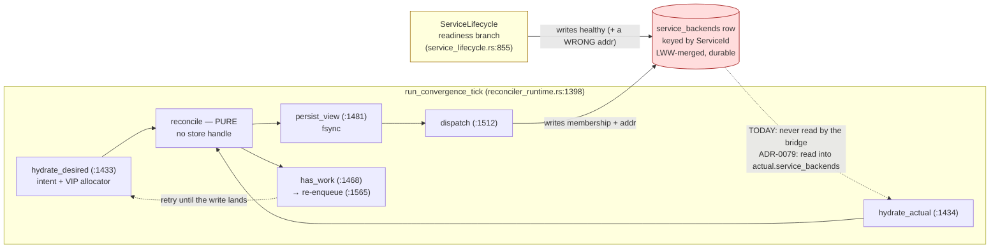

# ADR-0079 — `BackendDiscoveryBridge` converges on the `service_backends` rows it manages; the emit-time fingerprint is deleted

## Status

Accepted. 2026-08-01. **Amended 2026-08-02** (scoped, two additions — see
below).
Decision-makers: Morgan (nw-solution-architect, DESIGN wave). Mode: propose.
Tags: phase-1, reconcilers, observation-store, convergence, service-discovery, application-arch.

### Amendment 2026-08-02

Two user-approved additions. Neither re-opens D1–D7; both were recorded in the
2026-08-01 text as out-of-scope items and are promoted here.

1. **§ D8 folds in the `ServiceLifecycle` address fix** — former Out-of-scope
   item 2. It is *not* the "one-line fix" the original text called it: the
   defect is that `host_ipv4` is the **pre-mesh** addressing model and was
   never migrated to per-workload `/30`s. § D8 pins the exact expression, rules
   the `None` case against the ADR-0074 precedent, and corrects the stale
   comment that propagated the error. Consequence: the `addr` oscillation § D2
   documents is **eliminated**, not merely bounded — so § D2's
   "deliberately not taken here" passage is superseded by § D8.
2. **§ D9 records the `ServiceBackendRow` ownership decision** — former
   Out-of-scope item 1 and § D5's deferral. § D2's carry-through remains the
   containment that this ADR implements; § D9 records the target end-state,
   the rejected alternative, and the evidence, as a decision rather than a
   forward pointer. **No GitHub issue was created and none is cited** — per
   CLAUDE.md § "Deferrals require GitHub issues", an unbacked forward pointer
   is forbidden, so the ambiguity is closed by *deciding* it rather than by
   promising a slice. The unratified `// GH #170 ships real health` comment at
   `backend_discovery_bridge.rs:369` is corrected as part of this ADR's scope,
   because it is exactly the false forward-reference that rule prohibits.

Unchanged by the amendment: D1, D3, D4, D6, D7's test set (extended, not
revised), and every line-cited claim in § Context.

This is **the bridge-convergence step** that
[ADR-0077](adr-0077-lww-counter-derives-from-the-prior-row-not-the-tick.md)
§ D2 (site 9), § D3 (C2), § D8 and § D9 (Unit B) each name as a dependency
without pointing at a document. It lands ADR-0077 **Unit B** in full — sites 9
and 10, their hydration, T3, and the § D7 Layer-2 lint widening — because the
enforcement layer couples them (§ D6 below).

Responds to
`docs/analysis/root-cause-analysis-cross-restart-lww-counter-regression.md`
(the "RCA" throughout) § 4.2 (fire-once, adversarially verified: no recovery
channel exists) and § 4.3 (root cause: the bridge does not converge). RCA § 8.4
sketches a fix; it is treated here as **input, not as the decision** — and § D2
below records where that sketch is incomplete.

Depends on `.claude/rules/reconcilers.md` (the decision rule, Bar 1, and the
fingerprint-marker symptom), `.claude/rules/development.md` § "Reconciler I/O",
§ "Persist inputs, not derived state", § "A convergent record cannot answer
'did it happen'", § "State-layer hygiene", § "Deletion discipline".
ADR-0035 / ADR-0036 (reconciler runtime; `State` / `View` contract).
ADR-0048 (envelope discipline for `ServiceBackendRow`).

---

## Context

### The defect

`BackendDiscoveryBridge` is a `Reconciler` by trait
(`crates/overdrive-core/src/reconcilers/backend_discovery_bridge.rs:309`) and
**apply-once by structure**. Its `State` (`:170-175`) carries `desired:
ServiceListenerSet` and `actual: RunningAllocSet` — but `actual` is a *second
input* it cross-products with `desired.listeners` to compute the row it should
write. The resource it manages is the `service_backends` rows, and it never
reads them: the runtime's `hydrate_actual` bridge arm
(`crates/overdrive-control-plane/src/reconciler_runtime.rs:2732-2767`) calls
`alloc_status_rows()` at `:2736`, and the runtime's only `service_backends_rows`
call (`:1742`) belongs to `ServiceMapHydrator`'s **desired** arm.

So `view.last_written_fingerprint` (`:249`) **is** the diff (`:374-379`),
stamped on the *emit* path (`:428`):

```rust
let new_fp = fingerprint(&listener.vip, &backends);
let prev_fp = view.last_written_fingerprint.get(service_id).copied();
if Some(new_fp) == prev_fp {
    // Dedup: no change since last successful write.
    continue;
}
```

There is no notion of a successful write. The merge helper
`apply_service_backends_lww`
(`crates/overdrive-store-local/src/observation_backend.rs:1136-1171`) **does**
compute a verdict — it returns `Ok(dominates)` at `:1171` — and `write`
**discards it**, committing and returning `Ok(())` either way
(`:500-503`: `if accepted { self.emit(row); } Ok(())`). The success signal
exists one layer down and never reaches the caller. And the
runtime fsyncs the View at `reconciler_runtime.rs:1481-1485` **before**
dispatching at `:1512`, so the marker outlives the effect it claims to record —
across crashes and restarts. On the next tick the fingerprint matches,
`continue` fires, zero actions are emitted,
`view_has_backoff_pending` is a hard-coded `false` for this reconciler
(`:1602-1695`, the bridge folded into the `false` or-pattern at `:1617`), so
`has_work` (`:1468`) is false, no self-re-enqueue happens (`:1565-1570`), and
the broker drains empty. **A dropped write is permanently forgotten.**

This is the `.claude/rules/reconcilers.md` § "Symptoms during review" marker
bullet, live in tree, and that file's § "Codebase precedent" already names this
exact site as the anti-exemplar. The View docstring (`:203-211`, `:237-241`)
compounds it by claiming to record "the last row the bridge **successfully
wrote**" and citing § "Persist inputs, not derived state" as justification —
false on both halves (RCA § 4.3): there is no success signal, and a hash the
bridge computed is derived state.

### What convergence must not break — the finding that shapes this ADR

RCA § 8.4 proposes "with a real `actual` the dedup is just `desired != actual`."
**That is not safe as stated**, and the reason is a fact neither the RCA nor
ADR-0077 § D3 traced to its consequence: `ServiceBackendRow` is keyed by
`service_id` alone (`crates/overdrive-core/src/traits/observation_store.rs:1520-1531`)
and has **two writers with divergent content**.

| | `BackendDiscoveryBridge` | `ServiceLifecycle` (readiness branch) |
|---|---|---|
| Site | `backend_discovery_bridge.rs:387-398` | `service_lifecycle.rs:855-866` |
| `ServiceId` | `ServiceId::derive(&assigned_vip, listener.port, listener.protocol, "service-map")` (`reconciler_runtime.rs:2144-2149`), **per listener** | the identical derivation (`reconciler_runtime.rs:2019-2024`), for `listeners.first()` only (`:1990`) |
| `Backend.alloc` | `SpiffeId::for_allocation(workload, alloc)` (`:356`) | `fact.backend_spiffe`, built by the same constructor (`reconciler_runtime.rs:2985`) — **identical** |
| `Backend.addr` | `workload_addr.unwrap_or(host_ipv4)` : `listener.port` (`:364-367`) | `state.host_ipv4` : `listeners[0].port` (`reconciler_runtime.rs:2986-2987`) — **`workload_addr` never read** |
| `Backend.healthy` | hardcoded `true` (`:369`) | `compute_backend_healthy(...)` (`service_lifecycle.rs:830`, `:872-900`) |
| Dedup | own emit fingerprint (`:374`) | own emit fingerprint (`service_lifecycle.rs:844-848`) |

Both derive the **same `ServiceId`** for `listeners[0]` — the single-listener
case, which is every Service in tree. And GH #248's closing comment establishes
that in production `provision_and_inject_netns` assigns every allocation a
`workload_addr`, so the bridge's `unwrap_or(host_ipv4)` fallback is dead code
and the two writers **always disagree on `addr` in production**, not merely
sometimes.

Trace the naive convergence:

1. `ServiceLifecycle` observes a failing readiness probe, writes
   `{addr: host_ipv4, healthy: false}`.
2. The bridge's next tick sees `actual != desired` (both `addr` **and**
   `healthy` differ) and rewrites `{addr: workload_addr, healthy: true}`.
3. `ServiceLifecycle`'s own emit fingerprint is unchanged, so it stays silent.

**The readiness health flip survives at most one 100 ms tick.** Today the bridge
fires once and goes quiet, so a health flip written after it stands until the
next alloc-set change; convergence makes the bridge the deterministic winner of
every arbitration and erases the health signal GH #170 shipped.

**No test would catch this** — but not for the reason a first census suggests,
and the accurate reason matters because it tells the crafter which tests this
change puts at risk.

Every `healthy: false` assertion in the workspace stops at the reconciler's
**action vector** —
`crates/overdrive-control-plane/tests/acceptance/service_lifecycle_readiness.rs:380-385`,
`crates/overdrive-core/tests/acceptance/service_lifecycle_reconcile_branches.rs:1312`,
`:1336` — and the DST invariants in
`crates/overdrive-sim/src/invariants/backend_discovery_bridge.rs` never assert
`healthy` at all.

Five integration tests **do** run both writers against one store and **do** read
`healthy` back off it: `run_server` registers both reconcilers (`crates/overdrive-control-plane/src/lib.rs:1753`,
`:1773`) against one `AppState.obs`, shared at `:2067-2068` where
`AppState::new_with_workflow_engine` receives both the store and the runtime. And
`stable_mesh_backend_addr`
(`crates/overdrive-control-plane/tests/integration/dns_responder_walking_skeleton.rs:1517-1530`;
twin at `dns_responder_ping_pong.rs:1176-1192`) filters
`all_service_backends_rows()` on `b.healthy`. All four
`dns_responder_walking_skeleton` tests are additionally `healthy`-gated
*indirectly*, because the production DNS responder's `NameIndex` relists the
same rows (`crates/overdrive-control-plane/src/dns_responder/name_index.rs:371-378`)
and filters on `healthy` at `:222` — the WITHHOLD seam.

They cannot catch Alt-A's erasure for a different and weaker reason: every spec
they deploy sets `readiness_probes: vec![]`
(`dns_responder_walking_skeleton.rs:798`, `:821`;
`dns_responder_ping_pong.rs:871`), so `compute_backend_healthy` returns `true`
at its first branch (`service_lifecycle.rs:877-880`) and `healthy` is `true`
from both writers. These tests assert on the value being `true`; erasing a
`false` that never occurs makes them pass, not fail.

So the coverage gap is real, and it is narrower and more fragile than "nothing
reads the row": **the only tests that read `healthy` off the store are
configured so it can never be `false`.** They are the tests this change is most
likely to perturb, and § D7 treats them as such.



The dashed read edge is the whole of this ADR: it does not exist today, and
without it the bridge's diff has nowhere to look but its own memo. The second
writer (amber) is why the edge cannot simply be wired to a whole-row comparison.

So the design question is not "should the bridge converge" (it must — Bar 1 is
non-negotiable) but **"converge on what?"** A reconciler may only converge on
the resource it manages; `.claude/rules/reconcilers.md` § "Symptoms" states this
explicitly: *"check that `actual` is the resource this reconciler manages."* The
bridge manages the row's **membership and addressing**. It does not author
`healthy` — it hardcodes a placeholder. That distinction is the decision in
§ D2.

### What is already correct in-tree

- The retry channel needs no new machinery. `has_work`
  (`reconciler_runtime.rs:1468`) is true whenever the tick emitted a
  non-`Noop` action, and `:1565-1570` self-re-enqueues on it — *before*
  `dispatch_outcome` is returned at `:1575`, so the re-enqueue survives a
  dispatch error. A converging bridge therefore retries a dropped write on the
  next tick with no View field, no backoff memo, and no change to
  `view_has_backoff_pending`.
- `service_backends_rows(&service_id)`
  (`crates/overdrive-core/src/traits/observation_store.rs:2071-2081`) already
  exists and is already called once per hydrate at `reconciler_runtime.rs:1742`.
  This ADR adds no port-trait surface.
- `hydrate_bridge_desired_listeners` (`reconciler_runtime.rs:2086-2160`) already
  encapsulates the intent + allocator read that derives the `ServiceId` set. It
  is directly reusable by the actual arm (§ D1).

---

## Decision

### D1 — `actual` gains the managed rows, in full, keyed by `ServiceId`

**Decision: `BackendDiscoveryBridgeState` gains a third field carrying the whole
`ServiceBackendRow`, populated only in the `actual` projection — exactly the
shape ADR-0077 § D2 site 9 pinned. No deviation, so no ADR-0077 amendment is
required for the field.**

```rust
// crates/overdrive-core/src/reconcilers/backend_discovery_bridge.rs
// — replaces the struct at :170-175
#[derive(Debug, Clone, PartialEq, Eq)]
pub struct BackendDiscoveryBridgeState {
    /// Desired-side projection — declared listener set.
    pub desired: ServiceListenerSet,
    /// Second desired-side INPUT — the Running alloc set. Despite the
    /// name this is not the resource the bridge manages; it is one of
    /// the two inputs from which `desired` is computed. Retained
    /// unchanged so the field's meaning is not silently redefined.
    pub actual: RunningAllocSet,
    /// The `service_backends` rows this bridge manages, keyed by
    /// `ServiceId` — the genuine `actual` per
    /// `.claude/rules/reconcilers.md` Bar 1.
    ///
    /// Populated ONLY in the `actual` projection (ADR-0021 uses one
    /// type for both halves; the `desired` projection leaves this
    /// empty, exactly as `hydrate_actual` leaves `desired.listeners`
    /// empty at `reconciler_runtime.rs:2759`).
    ///
    /// `BTreeMap` per `.claude/rules/development.md` §
    /// "Ordered-collection choice".
    pub service_backends: BTreeMap<ServiceId, ServiceBackendRow>,
}
```

`BackendDiscoveryBridgeState::empty_for_workload` (`:192-200`) initialises it to
`BTreeMap::new()`.

**Why the full row, not a projection.** Three consumers need three different
parts and together they are the whole row: the diff needs `vip` and `backends`
(§ D2); the carry-through needs `backends[i].healthy` (§ D2); ADR-0077 site 9
needs `updated_at` (§ D4). Only `service_id` is redundant, and it is the map
key. A projection type would carry every field minus one and cost a conversion
at the hydrate boundary for no benefit.

**Why not `RunningAllocSet.service_backends`.** The rows are keyed by
`ServiceId`; `RunningAllocSet` is keyed by `AllocationId` and scoped to one
workload. Nesting a differently-keyed map inside it would misrepresent both.

#### Key derivation — the ruling the prompt asks for

`service_backends_rows` is keyed by `ServiceId`
(`observation_store.rs:2071-2081`) while the bridge's reconcile target is
`workload/<id>` (`reconciler_runtime.rs:3106-3112`). `hydrate_actual` therefore
needs the `ServiceId` set, which today is derived only on the desired side.

**Decision: `hydrate_actual` obtains the keys by calling
`hydrate_bridge_desired_listeners` — the same helper the desired arm calls — and
reads one row per key. The derivation is not duplicated.**

```rust
// crates/overdrive-control-plane/src/reconciler_runtime.rs
// — replaces the AnyReconciler::BackendDiscoveryBridge arm of
//   hydrate_actual at :2732-2767
AnyReconciler::BackendDiscoveryBridge(_) => {
    let workload_id = workload_id_from_target(target)?;

    // Running alloc set — UNCHANGED from :2736-2753.
    let rows = state
        .obs
        .alloc_status_rows()
        .await
        .map_err(|e| ConvergenceError::ObservationRead(e.to_string()))?;
    let running: BTreeMap<AllocationId, Option<std::net::Ipv4Addr>> = /* unchanged */;

    // NEW — the managed rows. Keys come from the SAME derivation the
    // desired arm uses, so the two halves cannot drift.
    let listeners = hydrate_bridge_desired_listeners(state, &workload_id).await?;
    let mut service_backends: BTreeMap<ServiceId, ServiceBackendRow> = BTreeMap::new();
    for service_id in listeners.keys() {
        let backend_rows = state
            .obs
            .service_backends_rows(service_id)
            .await
            .map_err(|e| ConvergenceError::ObservationRead(e.to_string()))?;
        // `service_backends_rows` returns at most one row per ServiceId
        // (the LWW winner) per its rustdoc at observation_store.rs:2075-2077.
        if let Some(row) = backend_rows.into_iter().next() {
            service_backends.insert(*service_id, row);
        }
    }

    Ok(AnyState::BackendDiscoveryBridge(BackendDiscoveryBridgeState {
        desired: ServiceListenerSet { workload_id: workload_id.clone(), listeners: BTreeMap::new() },
        actual: RunningAllocSet { workload_id, running },
        service_backends,
    }))
}
```

The `Ipv4Addr` map type above is elided only to keep the delta legible; it is
byte-for-byte the existing `:2746-2753` expression and **must not be changed**.

**Why re-run the helper rather than derive independently.** Two independent
derivations of the same `ServiceId` are two things that can drift; one helper
called twice cannot. It also makes the halves consistent under failure: when
intent is absent or the allocator memo is missing, the helper returns an empty
map (`:2104`, `:2140`) for *both* arms, so `desired.listeners` is empty, the
reconcile loop does not iterate, and no action is emitted — the tick is a
correct no-op rather than a half-populated diff.

**Why not `all_service_backends_rows()`** (`observation_store.rs:2135-2137`).
It is keyless, so it cannot be scoped to the workload; the bridge's `actual`
would carry rows for services it does not manage, contradicting the
`workload/<id>` target scope and growing with total cluster service count
rather than with this workload's listener count.

---

### D2 — the diff is structural equality against the observed row; `healthy` is carried through, not clobbered

**Decision, two parts:**

1. **`BackendSetFingerprint` is deleted as the diff.** The comparison becomes
   plain structural equality on `(vip, backends)` against the observed row.
   Note precisely what that compares: because `healthy` is copied from the
   observed row before the comparison (part 2), its contribution to
   `row.backends == backends` is **tautologically equal for every alloc present
   in both**, so the effective diff is over `(vip, membership, addr, weight)` —
   the bridge-authored projection. `healthy` is **diff-inert by construction**;
   it can influence the outcome only through the default-`true` path for an
   alloc with no observed entry, which is a membership difference anyway. The
   bridge therefore cannot derive *any* diff decision from a field it does not
   author.
2. **The bridge's emitted `Backend.healthy` is carried through from the observed
   row**, defaulting to `true` for an alloc with no observed entry. The bridge
   converges on what it authors (membership, addressing, VIP) and is a faithful
   pass-through for the one field it does not author.

The pinned `reconcile` body:

```rust
// crates/overdrive-core/src/reconcilers/backend_discovery_bridge.rs
// — replaces :334-437
fn reconcile(
    &self,
    desired: &Self::State,
    actual: &Self::State,
    view: &Self::View,
    tick: &TickContext,
) -> (Vec<Action>, Self::View) {
    let mut actions: Vec<Action> = Vec::new();

    for (service_id, listener) in &desired.desired.listeners {
        // The genuine `actual`: the row this bridge manages, or None.
        let observed: Option<&ServiceBackendRow> = actual.service_backends.get(service_id);

        let backends: Vec<Backend> = actual
            .actual
            .running
            .iter()
            .map(|(alloc_id, workload_addr)| {
                let alloc = SpiffeId::for_allocation(&actual.actual.workload_id, alloc_id);
                // `healthy` is authored by ServiceLifecycle's readiness
                // branch (service_lifecycle.rs:830), NOT by this bridge.
                // Carry the observed value through so convergence does
                // not erase it; default `true` for an alloc with no
                // observed entry, preserving today's emitted value for a
                // newly-Running alloc.
                let healthy = observed
                    .and_then(|row| row.backends.iter().find(|b| b.alloc == alloc))
                    .map_or(true, |b| b.healthy);
                Backend {
                    alloc,
                    addr: SocketAddr::new(
                        IpAddr::V4(workload_addr.unwrap_or(self.host_ipv4)),
                        listener.port.get(),
                    ),
                    weight: 1,
                    healthy,
                }
            })
            .collect();

        let vip_v4 = vip_to_ipv4(&listener.vip);

        // Converge: diff desired against the OBSERVED row. `updated_at`
        // is excluded — it is the LWW stamp, not part of desired.
        if let Some(row) = observed {
            if row.vip == vip_v4 && row.backends == backends {
                continue;
            }
        }

        let fp = fingerprint(&listener.vip, &backends);
        let target = format!("backend-discovery-bridge/{service_id}");
        let spec_hash = ContentHash::of(fp.to_le_bytes().as_slice());
        let correlation =
            CorrelationKey::derive(&target, &spec_hash, "write-service-backend-row");

        actions.push(Action::WriteServiceBackendRow {
            row: ServiceBackendRow {
                service_id: *service_id,
                vip: vip_v4,
                backends,
                updated_at: LogicalTimestamp::dominating(
                    tick.tick,
                    self.writer_node_id.clone(),
                    observed.map(|r| &r.updated_at),
                ),
            },
            correlation,
        });

        // UI-05 cross-reconciler handoff — UNCHANGED from :399-427,
        // including the comment block and the two `expect` call sites.
        // ...
    }

    (actions, view.clone())
}
```

`.map_or(true, |b| b.healthy)` may need to be written `.is_none_or(|b| b.healthy)`
to satisfy `clippy::unnecessary_map_or`; the two are semantically identical and
the crafter may use either. That is an expression detail, not API surface.

**Why structural equality rather than a fingerprint comparison.** Both operands
are fully materialised in memory, so hashing saves no I/O — the only thing a
hash buys over `Vec<Backend>: PartialEq` (`crates/overdrive-core/src/traits/dataplane.rs:153-160`)
is a `2^-64` collision probability and a fallible `Ipv4Addr → ServiceVip`
round-trip to re-derive the observed side's `fingerprint` input. Retaining a
truncated hash as the diff would also reintroduce a lossy proxy in exactly the
place this ADR removes one; the RCA's whole point is that the bridge stopped
looking at the thing and started looking at its record of the thing.

**`fingerprint()` survives — as the correlation content-address, not as the
diff.** `ContentHash::of(fp.to_le_bytes())` is retained verbatim at the
correlation site, so the expression shape and `CorrelationKey::derive` call are
unchanged. This is a legitimate use: a content hash used as an identifier, which
is what `crates/overdrive-core/src/dataplane/fingerprint.rs:10-14` documents it
as. The emitted correlation *value* now differs whenever carried-through
`healthy` differs from `true`; that is unobservable, because
`action_shim/write_service_backend_row.rs:53` pattern-discards it
(`correlation: _`) and no test in the workspace asserts on it.

**Why carry-through is load-bearing, not decoration.** Without it, the diff
still fires (the two writers disagree on `addr`, which is inside `backends`), so
the bridge still rewrites — and its rewrite carries `healthy: true`. Excluding
`healthy` from the *comparison* alone does not help for the same reason. Only
carrying the observed value into the *emitted* row makes the bridge's write
non-destructive.

**Why the `true` default for an unobserved alloc — including where it conflicts
with a ratified scenario.** Two cases, and they pull in opposite directions.

- **Probe-less alloc.** `compute_backend_healthy` returns `true` at its first
  branch when the alloc has no readiness probe (`service_lifecycle.rs:877-880`),
  so both writers agree on `true` and carry-through cannot blackhole it.
- **Probed alloc with no readiness observation yet.**
  `compute_backend_healthy` returns **`false`** (`:892-899`), and this is
  deliberate and named: **S-SHCP-RECON-08c**, documented at `:806-808` and at
  `reconciler_runtime.rs:2955-2957` — *"`None` (no row yet) is the load-bearing
  initial state: `Backend.healthy = false` until first Pass … avoids the inverse
  race."* A `true` default asserts the inverse of that scenario for one tick.

**The default is nevertheless `true`, for a reason that is not "it matches
today".** The bridge cannot distinguish the two cases: whether an alloc has a
readiness probe is intent the bridge does not hydrate and has no business
hydrating (it is `ServiceLifecycle`'s `has_readiness_probe`,
`service_lifecycle.rs:877`). A `false` default would therefore withhold traffic
from **every probe-less backend** from the moment it is Running until some other
reconciler writes the row — a real availability regression against the
backward-compat default S-SHCP-RECON-08b establishes. Between honouring 08c for
probed allocs at the cost of breaking 08b for probe-less ones, and honouring
08b at the cost of a one-tick 08c window, the ADR takes the second.

**Why the one-tick standard used to reject Alt-A does not bind here.** Alt-A's
window is *recurring and unbounded in count* — every health flip, forever, with
the bridge actively re-erasing each one. This window is *once per alloc, at
first appearance*, and it **closes by convergence**: the new alloc changes
`ServiceLifecycle`'s computed set, its fingerprint moves, it emits the real
`false`, and the bridge carries it from the next tick on. A window that
convergence closes is categorically different from one convergence reopens.
It is also exactly today's emitted value (`backend_discovery_bridge.rs:369`), so
it is not a new exposure — but it is a *knowingly retained* one, which is why
S-SHCP-RECON-08c is named here rather than left for a reader to find.

**The one new exposure carry-through creates, stated rather than buried.**
Today the bridge's hardcoded `healthy: true` acts as an *accidental reset*: any
stale `false` in the row is overwritten the next time the bridge fires. Carrying
the observed value through removes that reset. The consequence is asymmetric,
and only one direction is new:

| Lost `ServiceLifecycle` write | Row retains | Bridge carries | vs today |
|---|---|---|---|
| `true → false` (backend went unhealthy) | `true` | `true` — fail **open**, traffic to an unhealthy backend | **unchanged** — the bridge writes `true` today too |
| `false → true` (backend recovered) | `false` | `false` — fail **closed**, traffic withheld from a healthy backend | **new** — today the bridge's next write clears it |

The latch is **bounded by the next genuine health transition**, not permanent:
`ServiceLifecycle` re-emits whenever its *computed* set changes, so the next
real flip clears it. But "next real flip" can be arbitrarily far away for a
backend that stays healthy, so the practical exposure is a recovered backend
withheld from traffic for an unbounded time.

Two facts bound how reachable this is. Site 10 (§ D4) closes the LWW cause —
after it, a `ServiceLifecycle` write always dominates, so losing one requires a
dispatch or I/O error, not a merge rejection. And the memo-poisoning path at
`service_lifecycle.rs:848-853` (the fingerprint is stamped at `:848` *before*
the `try_as_ipv4()?` early return at `:853`, so a non-IPv4 VIP records a
fingerprint for a row never emitted) is **structurally unreachable in Phase 1** —
the allocator's `VipRange` is IPv4-only per ADR-0049 § 5, the same premise
`vip_to_ipv4`'s `mutants: skip` at `backend_discovery_bridge.rs:446-448` rests
on. It is a latent trap, not a live path.

**This is accepted, not overlooked.** The reset being removed was itself
unprincipled — the bridge overwriting a field it does not author with a
placeholder, which is the clobbering § D2 exists to stop. Trading an
unprincipled fail-open reset for a principled fail-closed latch is the correct
direction for a routing decision; the residual is `ServiceLifecycle`'s own
fire-once defect (Out-of-scope item 3), which is the actual cause in both rows
of the table.

**Consequence for `Backend.addr` — the oscillation this paragraph describes is
what § D8 removes.** The analysis below is retained because it is the
*derivation* of § D8's necessity: it shows that carry-through alone leaves
`addr` contested, which is why the address fix is folded into this ADR rather
than left out of scope. Read § D8 for the resolved position.
`LogicalTimestamp::dominating`
(`crates/overdrive-core/src/traits/observation_store.rs:318-322`) computes
`max(tick_floor + 1, prior + 1)`, so a writer that derives from the prior row
**always** strictly dominates it. § D4 puts *both* writers on that constructor.
Each therefore wins its own write unconditionally, and the advertised address
**oscillates**:

1. Bridge converges → row carries `workload_addr`.
2. `ServiceLifecycle`'s own fingerprint changes (a readiness verdict or an
   alloc-set change) → it emits `{addr: host_ipv4, …}` → dominates → row
   carries `host_ipv4`, which per GH #248 is wrong for every Path-A mesh alloc.
3. The bridge's next tick diffs on `addr` → re-emits `workload_addr` →
   dominates → row is correct again.

The exchange is **bounded, not a loop**: the bridge's writes do not feed
`ServiceLifecycle`'s fingerprint inputs (it builds `backends` from
`actual.allocs` + probe facts, never from the stored row), so each
`ServiceLifecycle` emission costs exactly one corrective bridge write. The row
is correct in steady state and wrong for at most one convergence tick
(~100 ms) per `ServiceLifecycle` emission.

That transient would **not** be an improvement over today in the strict sense —
today the same two values alternate, just driven by different events. Carry-
through alone changes only *who wins last*: the bridge would now always restore
`workload_addr` afterwards, where today it goes quiet after its first write and
`host_ipv4` can stand indefinitely.

**§ D8 removes the transient at its source** by making `ServiceLifecycle`
advertise the same address the bridge does. With both writers agreeing on
`addr`, and `healthy` already neutralised by carry-through, the bridge's
computed row equals the observed row and it stops re-firing on
`ServiceLifecycle`'s writes entirely — the diff is satisfied and `continue`
fires. The 2026-08-01 text left this out of scope and priced the transient as
the cost; the amendment takes the fix instead.

---

### D3 — `BackendDiscoveryBridgeView` is retained as a field-less struct; the field and the GC sweep are deleted

**Decision: keep the type, empty. `type View` stays
`BackendDiscoveryBridgeView`; it is NOT changed to `()`.**

```rust
// crates/overdrive-core/src/reconcilers/backend_discovery_bridge.rs
// — replaces :203-250
/// Runtime-persisted typed memory for the bridge per ADR-0035 § 1.
///
/// **Deliberately empty.** The bridge converges by diffing `desired`
/// against the `service_backends` rows it manages (ADR-0079 § D2), so
/// it holds no per-tick memory. The former
/// `last_written_fingerprint` was an emit-time marker consulted as the
/// diff — the `.claude/rules/reconcilers.md` § "Symptoms during
/// review" anti-pattern — and is deleted, not relocated.
///
/// The type is retained rather than collapsed to `()` so a future
/// bridge-side retry or backoff policy (anticipated by
/// `reconciler_runtime.rs:1612-1616`) lands without re-wiring the
/// runtime's `AnyViewMap` / `AnyReconcilerView` variants. Precedent:
/// `WorkflowLifecycleView` (`workflow_lifecycle.rs:93`), which is
/// likewise zero-sized and fully wired.
#[derive(Debug, Clone, Default, PartialEq, Eq, Serialize, Deserialize)]
pub struct BackendDiscoveryBridgeView {}
```

Deleted with it: the dedup read (`:374`), the memo write (`:428`), and the GC
`retain` sweep (`:431-434`).

**Why not `type View = ()`.** That routes the bridge onto
`AnyReconcilerView::Unit` / `AnyViewMap::Unit`, whose `register` arm performs no
`bulk_load` (`reconciler_runtime.rs:265`) and whose `persist_view` arm is a bare
`Ok(())` (`:548-556`). Three costs: it deletes two enum variants and forces
edits to ~14 exhaustive or-patterns plus three test-only accessors
(`:1003-1057`); it collapses the reconciler↔view type pairing that
`AnyReconciler::reconcile`'s 4-tuple dispatch relies on
(`crates/overdrive-core/src/reconcilers/mod.rs:852-920`, which panics on
mismatch at `:915`); and it orphans the bridge's redb table so that a future
non-empty View would `bulk_load` stale fingerprint blobs into a new shape.

**CBOR schema evolution — the field removal is safe, and is pinned by a test.**
The runtime persists Views as CBOR via `ciborium`, which encodes a struct as a
map with string keys; serde struct deserialization ignores unknown keys unless
`deny_unknown_fields` is set, which it is not. A persisted
`{"last_written_fingerprint": {...}}` blob therefore decodes into
`BackendDiscoveryBridgeView {}` without error. This is the *removal* direction
of the additive-evolution tolerance ADR-0035 § 6 requires, and per
`.claude/rules/development.md` § "Reconciler I/O" → "Schema evolution" it needs
no versioned envelope. **It is asserted, not assumed** (§ D7, T-BDB-VIEW-1).

Two honest consequences of the empty View, neither harmful:

- `persist_view`'s Eq-diff gate (`:719-721`) now always short-circuits for the
  bridge (`{} == {}`), so `write_through` is never called for it again. Legacy
  rows stay on disk, inert. Per the repo's greenfield single-cut migration
  policy the upgrade path is deleting the data dir; no migration is written.
- `view_has_backoff_pending` keeps returning `false` for the bridge (`:1617`)
  and **must not change**. Retry is carried by `has_work` (`:1468`), which is
  true on exactly the ticks that emitted a write. A converged tick emits
  nothing, `has_work` is false, and the broker correctly drains — no busy loop.

---

### D4 — sites 9 and 10 both land here; only site 9 is a decision of this ADR

**Site 9 (`backend_discovery_bridge.rs`) — in scope, and the prior stamp reaches
it through `actual.service_backends`**, pinned in the § D2 body above as
`observed.map(|r| &r.updated_at)`. This is ADR-0077 § D2 site 9's snippet
verbatim, modulo binding the row to `observed` once so the diff and the stamp
read the same value.

**Site 9 must land in this same change, not after it.** Convergence changes the
failure mode of a dropped write from an unbounded stall into a retry on every
tick. While the bridge is still tick-derived, a post-restart write loses the LWW
merge until the tick counter climbs past the surviving row's counter — measured
at "between 28.7 s and 30.8 s" and "≈ 52 s" (RCA §§ 2.2-3), and proportional to
the previous process's uptime.
Landing convergence without site 9 would therefore convert a silent stall into a
**10 Hz write-and-lose loop for the length of the recovery window**. Site 9 is
what makes the first retry land.

**Site 10 (`service_lifecycle.rs:860-863`) — in scope for the implementing
change, but NOT a decision of this ADR.** It is ADR-0077 § D2 site 10 executed
verbatim: the `ServiceLifecycleState` field, its hydration, and the
`dominating` call are all already pinned there and are reproduced here only so
the crafter has one document to work from:

```rust
// crates/overdrive-core/src/service_lifecycle.rs — on ServiceLifecycleState (:218-248)
    /// LWW stamp of the `service_backends` row currently stored for this
    /// service, or `None` when no row exists yet. An OBSERVED INPUT,
    /// hydrated by the runtime from `service_backends_rows(&service_id)`
    /// — never derived, never persisted in the View.
    pub prior_backend_row_at: Option<LogicalTimestamp>,
```

```rust
// replaces service_lifecycle.rs:860-863, inside readiness_backend_row_action
updated_at: LogicalTimestamp::dominating(
    tick.tick,
    dataplane.writer.clone(),
    actual.prior_backend_row_at.as_ref(),
),
```

**Hydration — pinned imperatively, and the blocker hedge is discharged.**
ADR-0077 § D2 told the crafter to surface a blocker "if that `ServiceId` is not
in scope at the population point." It is in scope, so no blocker arises and no
new derivation path may be invented. `service_dataplane_identity`
(`reconciler_runtime.rs:1986-2032`) returns the id on
`ServiceDataplaneIdentity.service_id` (`service_lifecycle.rs:257`), and
`hydrate_service_lifecycle_actual` binds the result at `:2879`. It does **not**
call `service_backends_rows` today — the crafter adds that read.

```rust
// crates/overdrive-control-plane/src/reconciler_runtime.rs
// — inserted between :2879 (service_dataplane bound) and :2890 (construction)
let prior_backend_row_at: Option<LogicalTimestamp> = match service_dataplane.as_ref() {
    Some(dp) => state
        .obs
        .service_backends_rows(&dp.service_id)
        .await
        .map_err(|e| ConvergenceError::ObservationRead(e.to_string()))?
        .into_iter()
        .next()
        .map(|r| r.updated_at),
    None => None,
};
```

The lookup **must** be gated on the `Option`: `service_dataplane` is `None`
whenever the Service has no listener or no allocator-issued VIP
(`reconciler_runtime.rs:1990`, `:2012-2017`), and there is no `ServiceId` to
read by in that case.

`ServiceLifecycleState` has **three** construction sites, all of which must
name the new field explicitly:

| Site | Value |
|---|---|
| `reconciler_runtime.rs:2890` — `hydrate_actual` happy path | `prior_backend_row_at` |
| `reconciler_runtime.rs:2859-2862` — `hydrate_actual` intent-absent early return | `None` |
| `reconciler_runtime.rs:1851-1854` — `hydrate_desired` arm | `None` (the desired side carries no dataplane identity by design, `:1848-1850`) |

At `:2859-2862` the crafter **must not** reach for `..Default::default()` — the
comment at `:2855-2858` forbids it as a GAP-1 structural defence with its own
acceptance gate. Spell the field out.

**Why site 10 is not deferred to its own step.** § D6's lint widening is
scoped to a *crate*, not a file. `service_lifecycle.rs:860-863` is a
`LogicalTimestamp { .. }` struct literal under `crates/overdrive-core/src/`, so
widening the clause with site 10 unmigrated fails CI on a site the change is
not allowed to touch — the identical inconsistency ADR-0077 § D7 amendment (ii)
resolved for Unit A. Landing both closes ADR-0077 Unit B and its C2 exposure in
one commit.

**What is explicitly NOT fixed: `ServiceLifecycle`'s own fire-once dedup.**
`ServiceLifecycleView::last_emitted_backend_fingerprint`
(`service_lifecycle.rs:364-370`, read/written at `:844-848`) is the same
emit-time-marker-as-diff defect in a second reconciler — its own docstring
names the bridge's field as the pattern it copies. It is **not** fixed here.
The reason is structural, not budgetary: `ServiceLifecycle` authors only
`healthy` on a row it shares, so "diff desired against the stored row" is not
available to it until ownership is decided (§ D5). Converging it on the whole
row would make it fight the bridge, reintroducing on the health side exactly the
clobbering § D2 removes on the membership side. Recorded as an out-of-scope
fact, no forward pointer.

---

### D5 — one added read per hydrate on each of two paths; convergence is NOT safe with two owners without § D2's rule

**Cost.** Three added store reads, all on the Service hydrate path:

| Path | Added reads | Precedent |
|---|---|---|
| bridge `hydrate_actual` | 1 × `IntentStore::get` + 1 × allocator lock (via `hydrate_bridge_desired_listeners`) + **N** × `service_backends_rows`, N = listener count (1 in every in-tree Service) | the desired arm already pays the identical intent+allocator cost every tick (`:1804-1820`) |
| `ServiceLifecycle` `hydrate_actual` | 1 × `service_backends_rows` | ADR-0077 § D2 priced this as "1 per hydrate" |

`service_backends_rows` is confirmed as the established cost shape in this
runtime: `ServiceMapHydrator`'s desired arm already calls it once per hydrate at
`reconciler_runtime.rs:1742`. Against the existing per-tick cost this is small —
the bridge's actual arm already performs an **unfiltered full-table**
`alloc_status_rows()` scan (`:2736`, filtered in-process at `:2748-2751`), and
three other hydrate paths in the same file do the same scan (`:2178`, `:2811`,
`:2933`), so a single Service tick already scans the whole alloc table three to
four times. One keyed lookup and one keyed intent read do not move that needle.

**Two-owner safety — the ruling.** `ServiceBackendRow` has two writers on a key
that is `service_id` alone, which violates
`.claude/rules/development.md` § "State-layer hygiene" (observation rows are
owner-writer only). ADR-0077 § D3 recorded this and fixed the **ordering**;
this ADR *implements* only the containment. The ruling on whether convergence
is safe under two owners:

> **Convergence on a two-owner row is not safe in general, and is not made safe
> by ADR-0077's ordering fix.** Correct ordering guarantees that the later write
> wins deterministically; with two writers computing different content, that
> guarantee is precisely what lets the converging writer erase the other's
> contribution *reliably* instead of *sometimes*. Convergence is safe here only
> because § D2 narrows the bridge's authority to the fields it authors and makes
> its write a pass-through for the one field it does not. That narrowing is a
> **containment**, not a resolution: it holds for exactly the field set that
> diverges today (`healthy`), and a third divergent field added by either writer
> would reopen the hazard silently.

The resolution is a single-owner decision. **It is taken in § D9** — recorded
as a decision with its leading candidate, its rejected alternative, and the
evidence, rather than left as an open question with a forward pointer. § D9
also disposes of the `// GH #170 ships real health` comment at
`backend_discovery_bridge.rs:369`, which is an unratified forward-reference and
is **not** authority for the bridge learning health.

**§ D8 narrows what the containment has to hold.** After the address fix the
two writers agree on `addr`, so `healthy` is the **only** field on which they
diverge. That does not make the two-owner hazard safe — it makes the
containment's surface exactly one field instead of two, which is why § D9 can
state the ownership question in terms of a single field's producer.

---

### D6 — the Layer-2 lint widens to `crates/overdrive-core/src/**`; the tripwire is retired and replaced by a census

**Decision: widen, retire the tripwire, add the positive census.** Three edits
in `xtask/src/dst_lint.rs`, all pre-authorised by ADR-0077 § D7 amendment (ii)
and by the scope function's own rustdoc at `:2036-2043`.

1. **Widen the scope predicate.** `logical_timestamp_literal_path_in_scope`
   (`:2044-2065`) — replace the single expression at `:2064`:

   ```rust
   // was:
   s.contains("crates/overdrive-control-plane/src/") || s.contains("overdrive-control-plane/src/")
   // becomes:
   s.contains("crates/overdrive-control-plane/src/")
       || s.contains("overdrive-control-plane/src/")
       || s.contains("crates/overdrive-core/src/")
       || s.contains("overdrive-core/src/")
   ```

   The `/src/testing/**` exclusion at `:2061-2063` is **kept unchanged** — it
   was landed in Unit A specifically for this moment and becomes live now. Its
   rustdoc already explains that the exclusion encodes a gate the in-file
   scanner cannot see (`overdrive-core/src/lib.rs:140` declares
   `#[cfg(any(test, feature = "test-utils"))] pub mod testing;`). It remains a
   scanner-capability accommodation, not a semantic exemption. The staging
   rationale in the rustdoc at `:2026-2043` is rewritten to record that the
   staging is complete.

2. **Retire the tripwire.** `logical_timestamp_unit_b_sites_still_carry_literals`
   (`:4319-4341`) sums violations across sites 9 and 10 (`:4326-4334`) and
   asserts the **aggregate** is `> 0` (`:4335`) — so it goes red once *both*
   migrate, which is exactly what this change does. It has now discharged its
   purpose. Per
   `.claude/rules/development.md` § "Deletion discipline" it is **deleted, not
   rewritten to assert something else** — the condition it defended (a silently
   narrow gate) no longer exists.

3. **Replace it with the positive census.** A new test asserting the real
   `crates/overdrive-core/src` tree scans clean, mirroring
   `crash_observability_literal_real_src_is_clean` (`:4357`), which is the
   established shape for exactly this obligation. This is written from scratch
   against a new requirement ("the widened scope stays clean"), not salvaged
   from the tripwire.

   `logical_timestamp_literal_path_scope_is_unit_a` (`:4288-4311`) is renamed
   and its fixture lists updated: the two Unit-B paths move from `out_of_scope`
   to `in_scope`; `src/testing/**` and `tests/**` stay out.

**Census — what the widened scope newly flags.** Exactly the two intended
production sites, **once item 1's `/src/testing/` exclusion is applied**. The
full census of `LogicalTimestamp {` literals under `crates/overdrive-core/src`
is **four**, verified by reading:

| Literal | Disposition under the widened scope |
|---|---|
| `service_lifecycle.rs:860` | **flagged** — site 10, migrated by § D4 |
| `reconcilers/backend_discovery_bridge.rs:392` | **flagged** — site 9, migrated by § D2 |
| `reconcilers/workload_lifecycle.rs:1752` | skipped — inside the top-level `#[cfg(test)] mod current_alloc_tests` (`:1713-1714`), caught by the scanner's `cfg_test_depth` exemption (`dst_lint.rs:1920-1935`, push gated at `:1980`) |
| `testing/observation_store.rs:202` | skipped — **by the `/src/testing/` path predicate only** (`dst_lint.rs:2061-2063`). It carries no in-file `#[cfg(test)]`; the gate is at its declaration (`overdrive-core/src/lib.rs:140`), which an in-file scanner cannot see. |

The fourth row is why item 1 keeps the exclusion rather than dropping it as
dead: it is unreachable while the scope is control-plane-only, and becomes
load-bearing the moment `overdrive-core` is added.

---

### D7 — what proves convergence: a dropped write is retried on the next tick

The regression the current design **cannot express** is retry-after-drop. It is
provable in the default lane, because the bridge's `reconcile` is pure and the
"dropped write" is modelled exactly as it appears to the reconciler: `actual`
still shows the stale row.

**T-BDB-CONV-1 — `bridge_reemits_when_observed_row_does_not_match_desired`
(default lane, unit).** Desired one listener, one Running alloc,
`actual.service_backends` **empty**. Assert two actions
(`WriteServiceBackendRow` + the UI-05 `EnqueueEvaluation`). Then call
`reconcile` **again with the identical state** — modelling a write the store
discarded — and assert **two actions again**. Under the deleted design the
second call emitted zero. This single test is the whole ADR's falsifiable claim.

**T-BDB-CONV-2 — `bridge_emits_nothing_when_observed_row_matches_desired`
(default lane, unit).** Same inputs, but `actual.service_backends` seeded with
the row the bridge would emit. Assert zero actions. Proves convergence
terminates and pins the absence of a busy loop.

**T-BDB-CONV-3 — `bridge_carries_observed_healthy_through_on_rewrite`
(default lane, unit).** Seed the observed row with
`backends[0].healthy == false` and an `addr` of `host_ipv4` (the shape
`ServiceLifecycle` writes). Assert the bridge emits — because `addr` drifted —
**and that the emitted backend still carries `healthy == false`**. This is the
regression guard for the § D2 finding, and it is the assertion whose absence
today means nothing in the suite would notice the health signal being erased.

**T-BDB-VIEW-1 — `legacy_bridge_view_blob_decodes_to_empty_view` (default lane).**
CBOR-encode a map carrying `last_written_fingerprint` with a populated entry,
decode into the new field-less `BackendDiscoveryBridgeView`, assert
`== BackendDiscoveryBridgeView::default()`. Substrate-level proof of § D3's
field-removal claim rather than an argument from serde's documented default.
This replaces `backend_discovery_bridge_view_cbor_roundtrip`
(`crates/overdrive-core/tests/backend_discovery_bridge_types.rs:40-59`,
`#[test]` at `:39`), which degenerates to a tautology once the type has no
fields. Its sibling
`backend_discovery_bridge_view_serde_default_tolerates_unknown_fields` (`:62-89`)
still compiles and passes verbatim — **and that is the problem**: after the
field is removed it silently stops testing what its name claims, because
`last_written_fingerprint` becomes just another unknown key. Fold it into
T-BDB-VIEW-1, which asserts the same tolerance against a payload that names the
removed field deliberately.

**T3 (integration lane) — ADR-0077 § D7's same-drain ordering test**, which that
ADR assigns to Unit B: two evaluations drained in one iteration, both writing
one `ServiceBackendRow` key; assert both writes land and the second dominates.
It closes RCA § 9 open question 2 by construction, and with both writers now
prior-derived it is the falsifiable check on ADR-0077 § D3's sequential-drain
premise (C1).

**T3 must assert content, not only ordering.** After this ADR both writers
always dominate their own writes (`dominating` = `max(tick+1, prior+1)`), so an
ordering-only assertion passes whether or not the two-writer containment holds —
it would be green even under Alt-A, which erases health. Extend T3 to assert the
surviving row's `healthy` and `addr` against § D2's narrowing: with the bridge
running second, `healthy` must equal the value `ServiceLifecycle` computed (not
`true`), and `addr` must be the `workload_addr`. Without that, nothing in the
suite pins the containment that § D5 relies on as its safety argument.

**T-BDB-CONV-4 — `bridge_does_not_clobber_readiness_health_end_to_end`
(integration lane).** The gap § "What convergence must not break" identifies:
no test runs both writers against a store with a readiness probe that can
fail. Deploy a Service with a non-empty `readiness_probes`, drive the probe to
Fail, and assert the stored row reaches `healthy: false` **and stays there
across at least one further bridge convergence tick**. This is the only test
that would have failed under Alt-A, and it is the reason the five existing
`healthy`-reading tests could not have caught the regression.

**T-BDB-CONV-4 carries a blocking precondition that MUST be pinned, or the test
passes vacuously.** `ProbeRunner::start_alloc` assigns `probe_idx` by
enumerating the **concatenated** `startup ++ readiness ++ liveness` descriptor
vector (`crates/overdrive-worker/src/probe_runner/mod.rs:337`), while
`hydrate_service_alloc_facts` projects readiness by filtering
`role == Readiness && probe_idx == 0`
(`crates/overdrive-control-plane/src/reconciler_runtime.rs:2958-2965`). ADR-0058
inference **synthesises a startup TCP probe whenever a listener exists and the
startup section is omitted** (`crates/overdrive-core/src/aggregate/workload_spec.rs:1108-1122`)
— and the bridge needs a listener to have a `ServiceId` at all. So the naive
spec puts the readiness probe at `probe_idx = 1`, `latest_readiness_probe` stays
`None` forever, and `compute_backend_healthy` returns `false` via the
*no-observation* branch (`service_lifecycle.rs:892-895`) rather than via the
Fail verdict. **The test would still go green while its stated mechanism is
inert** — a vacuous pass on the ADR's central regression guard.

Two obligations on the crafter, both required:

1. **The spec must set `startup_probes: vec![]` explicitly**, so the readiness
   probe occupies `probe_idx = 0`. Either the API path (`ServiceSpecInput` →
   `ServiceV1::from_submit`, `aggregate/mod.rs:510-611`, which applies no
   ADR-0058 inference and passes the vectors through verbatim) or the TOML
   `health_check.startup = []` opt-out (`workload_spec.rs:1083-1087`).
2. **Assert the intermediate fact**, not just the outcome: a `probe_results` row
   with `role = Readiness, probe_idx = 0, status = Fail{..}` actually landed.
   Without it the assertion cannot distinguish "the probe failed" from "no probe
   observation ever arrived," which are the two paths to the same
   `healthy: false`.

A deterministic Fail is available without timing games: `TokioTcpProber` maps
`ConnectionRefused` to `"connection refused"`
(`crates/overdrive-worker/src/probe_runner/tcp_prober.rs:91`); the
`examples/never-binds-service.toml` shape is the in-tree precedent. The test is
Linux + `integration-tests` gated (`run_server` calls `cgroup_preflight`,
`lib.rs:1308`).

**Mutation obligation.** `BackendDiscoveryBridge::reconcile` is reconciler
logic — a mandatory mutation target at ≥ 80 % kill rate per
`.claude/rules/testing.md` § "Mandatory targets". Run scoped:
`cargo xtask lima run -- cargo xtask mutants --diff origin/main --features integration-tests --package overdrive-core --file crates/overdrive-core/src/reconcilers/backend_discovery_bridge.rs`.

One trap in that file: the `// mutants: skip` comment on `vip_to_ipv4`
(`backend_discovery_bridge.rs:445-447`) **suppresses nothing**. Per
`.claude/rules/testing.md` § "Mutation testing" → Rules, there is no
comment-based skip — only the `#[mutants::skip]` attribute or a
`.cargo/mutants.toml` `exclude_re` entry. If the `unwrap_or` branch surfaces as
a missed mutant, close it with an `exclude_re` entry carrying the ADR-0049 § 5
IPv4-only justification (this repo's standard mechanism), **not** by weakening a
test.

#### Tests that are retired because the code they defended is gone

Per `.claude/rules/development.md` § "Deletion discipline" these are **deleted
in the same change, not repurposed**:

| Test | Location (verified ranges) | Why it goes |
|---|---|---|
| `reconcile_gc_branch_drops_removed_service_id` | `backend_discovery_bridge.rs:609-627` (`#[test]` at `:608`) | the GC sweep is deleted |
| `fingerprint_deterministic_across_runs` | `:694-710` (`#[test]` at `:693`; last test in the module, which closes at `:711`) | asserts on `view.last_written_fingerprint`; the property it pinned (dedup stability) is subsumed by T-BDB-CONV-2 |
| `reconcile_dedup_branch_emits_zero_actions_on_unchanged_inputs` | `:580-604` (`#[test]` at `:579`) | replaced by T-BDB-CONV-2, which dedups against the row rather than the memo |
| S-BDB-05 `evaluate_bridge_idempotent_steady_state` **step 3 only** | `crates/overdrive-sim/src/invariants/backend_discovery_bridge.rs:442-464` (fn spans `:356-467`) | the GC half. Steps 1–2 survive, re-seeded through `actual.service_backends`. Two assertions live in that block — zero-actions at `:447-456` (**keep**, it is a convergence property) and the fingerprint-retain check at `:457-463` (**delete**, the field is gone). |
| S-BDB-06 `evaluate_bridge_recomputes_fingerprint_on_replay` | `:508-655` (doc `:469-500`; `#[allow(clippy::too_many_lines)]` at `:501`) | the Atlas-Q2 failure mode ("silent skip on a cached stale fingerprint after a crash") is **structurally impossible** once there is no cache. Retire it; do not rewrite it to assert something else. |
| `bridge_dedup_branch_emits_zero_actions_including_no_enqueue` | `crates/overdrive-control-plane/tests/acceptance/bridge_emits_enqueue_evaluation_for_hydrator.rs:118-150` (`#[test]` at `:117`) | feeds the prior view back; re-express against `actual.service_backends` |

**A new DST invariant replaces S-BDB-06:**
`evaluate_bridge_reconverges_after_dropped_write` — seed the `SimObservationStore`
with a `ServiceBackendRow` that does not match desired, tick, assert the bridge
re-emits; then apply the write and assert the next tick emits zero.

**Registering (or retiring) a DST invariant is a nine-site edit**, and only two
of those sites are compiler-enforced. Three are hand-maintained mirror lists;
two of them fail as *tests*, and **the ninth fails OPEN — nothing catches it at
all**:

| # | Site | Enforced by |
|---|---|---|
| 1 | `crates/overdrive-sim/src/invariants/mod.rs` — `Invariant` enum variant (enum spans `:147-582`; the bridge variants are `:430`, `:438`, `:452`, `:472`) | — |
| 2 | `mod.rs` — the `ALL` list (`:589-727`; bridge entries `:676`, `:677`, `:678`, `:683`) | the mirror tests below |
| 3 | `mod.rs` — `as_canonical`'s `match` (`:733-794`; bridge arms `:769-775`) | **compiler** (exhaustive match, no `_` arm) |
| 4 | `crates/overdrive-sim/src/harness.rs` — dispatch `match` (`:380-719`; bridge arms `:622-654`) | **compiler** |
| 5 | `crates/overdrive-sim/src/invariants/backend_discovery_bridge.rs` — the `evaluate_*` body | — |
| 6 | `mod.rs:125` — `pub mod backend_discovery_bridge;` — **already present**, no edit | — |
| 7 | `crates/overdrive-sim/tests/integration/dst_harness_smoke.rs` — `EXPECTED_INVARIANTS` (`:71-175`; bridge names `:131-133`, `:138`), asserted by length at `:215-219` and by name at `:220-224` | **test** |
| 8 | `crates/overdrive-sim/tests/integration/dst_clean_clone_green.rs` — `EXPECTED_INVARIANTS` (`:70-204`; bridge names `:141-143`, `:152`), length at `:237`, name loops at `:239` / `:302`, and a per-name `--only <name>` subprocess loop at `:352-370` | **test** |
| 9 | `crates/overdrive-sim/tests/invariant_roundtrip.rs` — `ALL_VARIANTS` (`:24-49`) **and** the duplicated `prop_oneof![…]` in `variant_strategy()` (`:52-80`) | **NOTHING — fails open** |

`FromStr` (`mod.rs:803-817`) iterates `ALL` and needs no per-variant edit.
Site 8's `--only` loop shells out for **every** catalogued name, so a variant
registered with a `todo!()` body fails there even if it compiles.

**Site 9 is called out separately because it is the one that will be missed.**
Its own doc comment (`invariant_roundtrip.rs:21-23`) says *"Keep this list
synchronised with the enum itself — adding a variant without adding an entry
here means the round-trip property silently stops covering it"* — and it is
**already stale**: 17 of 40 variants, with no `Bridge*` variant present at all.
Nothing ties it to `Invariant::ALL` — no length assertion, no compile check. So
the new invariant lands silently uncovered by the round-trip property and the
suite stays green. Adding the entry is a deliberate act, not a compiler-forced
one. The pre-existing staleness is **not** in scope to repair here; it is named
so the crafter does not mistake a green suite for coverage.

#### One test must be retargeted, not deleted

`runtime_skips_write_through_when_backend_discovery_bridge_view_equals_in_memory`
(`crates/overdrive-control-plane/tests/integration/reconciler_runtime_view_store.rs:391-459`)
exercises `persist_view`'s Eq-diff gate and kills the `==` → `!=` mutant it
names. It needs two distinguishable non-default View values, which a field-less
View cannot supply. The gate it defends **still exists**, so deleting the test
would drop live coverage. **Retarget it to a View that still has fields** —
`WorkloadLifecycleView` or `ServiceMapHydratorView` — preserving the mutant
kill, and delete the bridge-specific variant. The crafter must confirm the
mutant is still killed after retargeting and report the result.

#### Tests that read the changed row and must be re-run deliberately

An ADR that changes a durable row's content must enumerate every test that reads
that row, not only the ones it deletes. Five integration tests read `healthy`
and `addr` off `service_backends` **after both writers have run in a real
`run_server` boot** (`crates/overdrive-control-plane/src/lib.rs:1753`, `:1773`).
None is modified by this change; all five are on the blast radius and the
crafter reports their result explicitly rather than assuming.

| Test | Location | Reads via |
|---|---|---|
| `deployed_workload_resolves_peer_stable_frontend_and_hop_is_mtls` | `dns_responder_walking_skeleton.rs:1355-1484` | `deploy_and_wait_stable_backend` (`:1494-1511`) at `:1375`, which calls `stable_mesh_backend_addr` (`:1517-1530`) at `:1500` — **a direct `service_backends` read** |
| `answered_frontend_is_the_addr_mtls_resolve_translates_to_a_mesh_backend` | `:1589-1676` | the DNS responder's `NameIndex` **only** (`dns_responder/name_index.rs:371-378`, `healthy` filter at `:222`); its direct store reads are `alloc_status_rows` |
| `answered_frontend_is_byte_stable_across_alloc_cycle_next_connect_lands_new_backend` | `:1722-1876` | same |
| `in_flight_connection_fails_fast_on_backend_churn_subsequent_connect_lands_new_backend` | `:1925-2057` | same |
| `two_services_dial_each_other_by_name_counters_advance_each_hop_mtls` | `dns_responder_ping_pong.rs:1306-1442` | `deploy_and_wait_stable_backend` (`:1223-1249`) at `:1329` and `:1330`, which calls `stable_mesh_backend_addr` (`:1176-1189`) at `:1234` |

That tests 2–4 reach the row *only* through the production `NameIndex`
strengthens the point rather than weakening it: the surface this ADR changes is
consumed by the live resolution path, not merely by test assertions.

**Expected to stay green, for a reason worth checking rather than trusting.**
Every spec they deploy sets `readiness_probes: vec![]`
(`dns_responder_walking_skeleton.rs:798`, `:821`;
`dns_responder_ping_pong.rs:871`), so `compute_backend_healthy` short-circuits
to `true` (`service_lifecycle.rs:877-880`) and carry-through carries `true` —
identical to today's hardcoded value. The `addr` assertions are the ones to
watch: `stable_mesh_backend_addr` requires a `10.99.0.0/16` mesh address and
would reject the `host_ipv4` value `ServiceLifecycle` writes today, so before
the amendment these tests depended on the bridge winning the `addr` exchange,
with their 30 s poll (`:1497-1502`) absorbing the transient — a timing
accident, not a designed guarantee.

**§ D8 removes that dependency.** With `ServiceLifecycle` advertising the same
`workload_addr`, the mesh address holds regardless of which writer landed last,
so the assertion becomes structural. The crafter still reports all five
explicitly — but a failure here after § D8 indicates a real addressing
regression rather than a lost race, which is a materially more useful signal.

#### Documentation corrections this change obliges

Behaviour changes make adjacent prose false; the repo's discipline is to fix it
in the same change.

| Location | Correction |
|---|---|
| `backend_discovery_bridge.rs:21-32`, `:203-211`, `:237-241` | the module header and View docstrings claiming `last_written_fingerprint` records "the last row the bridge **successfully wrote**" and is "the canonical *input*" — false on both halves (RCA § 4.3). ADR-0077 § D8 names this correction as owned by this step. |
| `backend_discovery_bridge.rs:369` | `healthy: true, // GH #170 ships real health` — #170 is closed and never names the bridge. **This is a false forward-reference of exactly the shape CLAUDE.md § "Deferrals require GitHub issues" prohibits, and correcting it is in scope (§ D9).** Replace with what is true: the value is carried through from the readiness writer (§ D2), `true` only for an alloc with no observed row. Do **not** substitute another issue number — none covers it, and § D9 is the record. |
| `reconciler_runtime.rs:2983-2984` | *"The addr is `(host_ipv4, listener_port)` per the BackendDiscoveryBridge precedent."* — **stale and causally load-bearing**: it cites a precedent that no longer describes the bridge, which advertises `workload_addr` (`backend_discovery_bridge.rs:357-367`). Per GH #248's closing the bridge's `host_ipv4` fallback never fires in production. Correct it per § D8; leaving it would re-justify the defect the fix removes. |
| `backend_discovery_bridge.rs:319-333` | the `reconcile` contract comment enumerating the dedup + GC steps |
| `service_lifecycle.rs:364-370` | the docstring cross-referencing `BackendDiscoveryBridgeView::last_written_fingerprint` as "the same dedup pattern" — the pattern it names is deleted; the cross-reference must say so and name this ADR as why `ServiceLifecycle` still carries it (§ D4) |
| `action_shim/write_service_backend_row.rs:5-11`, `:36-40` | the module docstring stating the bridge "observes its own write via the dedup fingerprint persisted in [`BackendDiscoveryBridgeView`]" — it now observes the row |
| `reconciler_runtime.rs:1612-1616` | the `view_has_backoff_pending` comment describing the bridge's view as carrying "dedup-fingerprint memory" |
| `.claude/rules/reconcilers.md:190-209` | the § "Codebase precedent" entry naming `BackendDiscoveryBridge` as the live non-converging `Reconciler`. It becomes a **historical** entry — the anti-pattern's canonical description should be kept (it is the clearest statement of the shape) with the site moved to past tense and this ADR cited as the fix. `ServiceMapHydrator` remains the reference shape. |
| `docs/product/architecture/brief.md:2841-2987` (the `BackendDiscoveryBridge` section — cite by line, **not** by "§ 63": two headings carry that number, the other at `:3353`) | the struck View "inputs only" paragraph (`:2870-2876`) and the per-site status table separating site 9 as "**Unit B, blocked on bridge convergence**" (`:2939-2945`) — both are discharged here |
| `docs/architecture/backend-discovery-bridge-service-reachability/architecture.md` (`:161`, `:182`, `:256-258`, `:273`, `:303`, `:326`, `:330`) and `docs/scenarios/.../test-scenarios.md` (`:329`, `:351`, `:361`, `:391`, `:395`, `:428`) | feature-wave artifacts specifying the fingerprint dedup and S-BDB-05/06/07. Mark the superseded sections rather than rewriting history, per the repo's convention for landed feature docs. |

---

### D8 — `ServiceLifecycle` advertises `workload_addr`; `host_ipv4` stays, but stops being an address source for backend advertisement

*Added by the 2026-08-02 amendment. Was Out-of-scope item 2.*

**Decision: `hydrate_service_alloc_facts` builds `backend_addr` from the
alloc-status row's `workload_addr`, falling back to `state.host_ipv4` with an
expression byte-identical to the bridge's. `AppState.host_ipv4` is NOT removed —
it remains required elsewhere. The stale comment that propagated the error is
corrected in the same change.**

#### Why this is not "a one-line fix"

The 2026-08-01 text called this a one-line fix. The edit is one expression, but
the *defect* is a missed migration, and describing it as a typo would let a
crafter fix the line without understanding which of the two addressing models
is authoritative.

`host_ipv4` is the **node's own IP**, resolved once at boot by `getifaddrs(3)`
against the operator-supplied `[dataplane] client_iface`
(`resolve_host_ipv4_from_dataplane_config`,
`crates/overdrive-control-plane/src/lib.rs:1208-1224`; threaded at `:1734-1737`
into `AppState.host_ipv4`, `:286`). It encodes the **pre-mesh** addressing
model: a backend is reachable at `(node_ip, listener_port)`.

Per-workload `/30` addresses superseded that model for mesh workloads (GH #241,
ADR-0071 Path A). `AllocStatusRow` — now `AllocStatusRowV3`
(`crates/overdrive-core/src/traits/observation_store.rs:413`) — carries the
materialised `workload_addr: Option<Ipv4Addr>` (`:926`), and its own rustdoc
names the three readers that must share the value byte-for-byte: the inbound
nft rule, the persisted row, and **the `BackendDiscoveryBridge` advertise**
(`:890-898`). The bridge was migrated (`backend_discovery_bridge.rs:357-367`,
reading the field verbatim at hydrate, `reconciler_runtime.rs:2739-2753`).
**`ServiceLifecycle` was not.** It still builds `(host_ipv4, backend_port)` at
`reconciler_runtime.rs:2986-2987`.

The comment directly above the defective line is the tell:

> `// ... The addr is `(host_ipv4, listener_port)` per the`
> `// BackendDiscoveryBridge precedent.` — `reconciler_runtime.rs:2983-2984`

That precedent **no longer exists**. The bridge advertises `workload_addr`, and
GH #248's closing established its `host_ipv4` fallback never fires in
production. The comment is not decoration: it is the stated justification for
the defect, and a crafter who fixes the expression but leaves the comment has
left the next reader a live argument for reverting it.

#### What `host_ipv4` is still required for — do NOT remove it

`host_ipv4` remains legitimately load-bearing and this ADR does **not** propose
removing it:

| Consumer | Site | Why it stays |
|---|---|---|
| `service_map_hydrator(host_ipv4)` | `lib.rs:1765` → `ServiceMapHydrator::canonical(host_ipv4, WORKLOAD_SUBNET_BASE)`, `reconciler_runtime.rs:2712-2715` | the XDP/VIP dataplane path gates Path-A/mesh backends out of BOTH LB paths against this value |
| `backend_discovery_bridge(host_ipv4, …)` | `lib.rs:1753` → `BackendDiscoveryBridge::new`, `reconciler_runtime.rs:2661` | the `None` fallback below |
| `AppState.host_ipv4` | `lib.rs:286` | the field both of the above are threaded from |

What is vestigial is **its use as an address source for backend
advertisement** — one expression, not the value.

#### The exact change — pinned; the crafter builds this and nothing else

One expression at `crates/overdrive-control-plane/src/reconciler_runtime.rs:2986-2987`.
`row` is already bound by the enclosing loop at `:2937`
(`for row in rows.into_iter().filter(|r| r.workload_id == *workload_id)`), and
`state: &AppState` is already the fn's first parameter (`:2903`), so
`row.workload_addr` and `state.host_ipv4` are both in scope with no plumbing.

```rust
// crates/overdrive-control-plane/src/reconciler_runtime.rs
// — replaces the `backend_addr` binding at :2986-2987
let backend_addr = std::net::SocketAddr::new(
    std::net::IpAddr::V4(row.workload_addr.unwrap_or(state.host_ipv4)),
    backend_port,
);
```

**Forbidden latitude.** No signature change to `hydrate_service_alloc_facts`
(`:2902-2913`); no new parameter; no new store read; no new field on
`ServiceAllocFact`; no new `ServiceLifecycleState` field; no discriminator
type; no change to `backend_port`, which is already
`spec.listeners.first().map_or(0, |l| l.port.get())` (`:2878`) — the same port
the bridge uses for the `ServiceId` the two writers share. The value flows into
`ServiceAllocFact.backend_addr`
(`crates/overdrive-core/src/service_lifecycle.rs:168`), consumed unchanged at
`:833`.

The comment at `:2983-2984` is rewritten in the same change to state the live
model: the addr is the alloc's canonical `workload_addr` when present, falling
back to `host_ipv4` for a host-netns alloc — mirroring the bridge.

#### The `None` case — ruled with the ADR-0074 precedent explicitly in view

**Decision: `None` falls back to `state.host_ipv4`. The expression is
byte-identical to the bridge's `workload_addr.unwrap_or(self.host_ipv4)`
(`backend_discovery_bridge.rs:365`), and that identity is the point — not an
incidental resemblance.**

This is the case where the wrong instinct is well-precedented, so the reasoning
is recorded rather than assumed.

`.claude/rules/development.md` § "Ground the premise: a state only a test seam
can produce is not a feature" uses **this exact fallback** as its worked
precedent. GH #248 was filed off the *smell* of
`workload_addr.unwrap_or(host_ipv4)` and grew a full DISCUSS → DESIGN
(ADR-0074) → DISTILL → DELIVER arc — a 3-variant `AllocBackend` discriminator,
four steps, Opus reviews, a mutation gate — before anyone traced the premise.
The trace: production `run_server` composes mTLS unconditionally
(`compose_mtls = config.dataplane_override.is_none()`) and
`provision_and_inject_netns` assigns `workload_addr = Some(/30)` for every
alloc past the `mtls_worker.is_some()` gate, so **the fallback never fires in
production**. `workload_addr = None` arises only when a test sets
`dataplane_override` to skip mTLS. The discriminator defended a test-only state,
did nothing in production, and **broke** the one real test of the host-local
path (`backend_discovery_bridge::walking_skeleton`, S-BDB-19).

Applying that check here, as the rule requires at every downstream wave rather
than inheriting the premise:

- **Does `workload_addr = None` reach `hydrate_service_alloc_facts` in
  production?** No — by the identical trace. It is the same field, read from
  the same row, on the same boot path.
- **So what does the `None` arm actually govern?** The test/Sim lane, plus a
  genuine host-netns alloc if one is ever composed. The row's own rustdoc pins
  the semantics: `None` = "a host-netns workload (no provisioned netns / no
  Path-A interception) … The bridge falls back to `host_ipv4:port` (unchanged
  behaviour)" (`observation_store.rs:900-908`).

Three candidate rulings, and why mirroring wins:

| Candidate | Verdict |
|---|---|
| **Mirror the bridge — `unwrap_or(state.host_ipv4)`** | **Taken.** In production both writers use `workload_addr`; in the test/host-netns lane both use `host_ipv4`. The two writers agree **in both branches, by construction**. |
| Fail closed on `None` (skip the alloc / withhold the backend) | Rejected. It would withhold traffic from every host-netns backend — the availability-regression shape, and a *behaviour* change to a state production never reaches. |
| A discriminator distinguishing mesh from host-local | Rejected. This is ADR-0074 verbatim: machinery for a non-problem, built against a test-seam state. |

The decisive argument is stronger than "mirroring is conservative". § D8's
purpose is **agreement between two writers**. Any rule other than the
bridge's own expression reintroduces divergence precisely in the branch where
the bridge falls back — converting a fix for the production path into a new
defect on the test path. The `None` arm is therefore not a policy choice at
all; it is a constraint discharged by copying.

**A guard the crafter must respect:** if the bridge's fallback is ever changed,
this expression must change with it. The two are one decision expressed twice.
That is a standing constraint, not a deferral.

#### Does this eliminate the `addr` oscillation, or bound it?

**It eliminates it.** After § D8, on the row the two writers share, every field
the bridge diffs on is equal:

| Field | Bridge | `ServiceLifecycle` | Equal? |
|---|---|---|---|
| `service_id` | `ServiceId::derive(vip, listener.port, proto, "service-map")` (`reconciler_runtime.rs:2144-2149`) | identical derivation for `listeners.first()` (`:2019-2024`) | ✅ |
| `vip` | `vip_to_ipv4(&listener.vip)` | `dataplane.vip.try_as_ipv4()?` (`service_lifecycle.rs:853`) — same allocator-issued VIP | ✅ |
| `backends[i].alloc` | `SpiffeId::for_allocation` (`:356`) | same constructor (`reconciler_runtime.rs:2985`) | ✅ |
| `backends[i].addr` | `workload_addr.unwrap_or(host_ipv4)` : `listener.port` | **§ D8** — same expression : `backend_port` (= `listeners[0].port`) | ✅ **(the fix)** |
| `backends[i].weight` | `1` (`:368`) | `1` (`service_lifecycle.rs:834`) | ✅ |
| `backends[i].healthy` | carried through from observed (§ D2) | `compute_backend_healthy` (`:830`) | ✅ — carry-through makes the bridge reproduce whatever `ServiceLifecycle` wrote |
| membership | Running allocs from `alloc_status_rows()` | same scan, `state != Running → continue` (`:827-829`) | ✅ |

So the bridge's computed row equals the observed row, the § D2 diff is
satisfied, `continue` fires, and **the bridge emits nothing in response to a
`ServiceLifecycle` write**. The per-emission corrective write at 10 Hz that
§ D2 priced as the cost of deferring this fix does not occur.

**Two residuals, named so "eliminated" is not read as "nothing remains":**

1. **The `healthy` first-appearance window is unchanged.** An alloc Running but
   absent from the observed row still gets the § D2 default `true` for one
   tick (the S-SHCP-RECON-08c trade recorded there). § D8 does not touch it.
2. **A one-tick membership skew remains possible.** The two reconcilers hydrate
   at different instants, so one may see a newly-Running alloc the other has
   not. That is a transient that convergence closes on the next tick — and it
   is pre-existing, not introduced here. It is *not* the `addr` oscillation,
   which was a standing disagreement between two writers about the same alloc.

#### Consequences of folding it in

- **`Backend.addr` becomes deterministic**, closing the gap § D2's original
  text explicitly declined to close. The § "Consequences" entry is updated.
- **The five blast-radius integration tests get stronger, not weaker.**
  `stable_mesh_backend_addr`
  (`dns_responder_walking_skeleton.rs:1517-1530`) requires a `10.99.0.0/16`
  mesh address and would reject the `host_ipv4` value `ServiceLifecycle`
  writes today. They currently pass because the bridge wins the exchange and
  their 30 s poll absorbs the transient — a timing accident, as § D7 notes.
  After § D8 both writers produce the mesh address, so the assertion holds
  regardless of which writer landed last. **This converts a timing-dependent
  pass into a structural one**, and the crafter should report these five as
  green for the new reason.
- **No added store read, no signature change, no new state** — so § D5's cost
  table is unchanged by this addition.

#### Test obligation

**T-SL-ADDR-1 — `service_lifecycle_advertises_workload_addr_not_host_ipv4`
(default lane where possible; otherwise alongside the existing
`hydrate_service_alloc_facts` unit tests, `reconciler_runtime.rs:3774`).**
Mirror the established shape of
`hydrate_actual_populates_per_alloc_workload_addr`
(`reconciler_runtime.rs:3652`), which already pins the *bridge* side of this
exact field with a `Some`/`None` pair. Write two Running alloc-status rows —
one carrying `Some(10.99.0.6)`, one `None` — and assert the resulting
`ServiceAllocFact.backend_addr` is `10.99.0.6:port` for the first and
`host_ipv4:port` for the second. The `None` half is the regression guard that
keeps the two writers' fallbacks identical; without it a future edit to one
expression silently diverges from the other.

This is a mutation target: the `unwrap_or` is exactly the operator
cargo-mutants flips, and the paired `Some`/`None` assertions are what kill it.

---

### D9 — `ServiceBackendRow` ownership: recorded decision, no forward pointer

*Added by the 2026-08-02 amendment. Was Out-of-scope item 1 and § D5's
deferral. **No GitHub issue exists, none was created, and none is cited.***

#### Why this is recorded as a decision rather than deferred

CLAUDE.md § "Deferrals require GitHub issues" forbids a forward pointer without
a real issue number, because "the next reader treats the deferral as planned
work and propagates the false reference." The live
`// GH #170 ships real health` comment at `backend_discovery_bridge.rs:369` is
that exact failure, already compounding: #170 is **closed**, names the
*service-lifecycle* reconciler as the health producer, and **never mentions the
bridge**.

The valid moves under that rule are: drop the language, fix it now, surface and
ask, or cite a verified existing issue. The user was asked and ruled: **record
the ownership decision here; create no issue.** So this section closes the
ambiguity by *deciding* it — stating the target end-state, the rejected
alternative, and the evidence — and § D2's carry-through is what this ADR
actually implements. Nothing below promises a slice, names a future step, or
invents an issue number.

#### The violation, stated with the evidence gathered

`ServiceBackendRow` is keyed by `service_id` alone
(`crates/overdrive-core/src/traits/observation_store.rs:1520-1531`) and has two
writers — `backend_discovery_bridge.rs:387-398` and `service_lifecycle.rs:855-866`
— against `.claude/rules/development.md` § "State-layer hygiene", which requires
observation rows to be **owner-writer only, full-row writes**.

After § D8, **`healthy` is the only divergent field.** That sharpens the
violation rather than softening it, because the field is genuinely consumed —
this is not a dormant flag:

| Consumer | Site | What it decides |
|---|---|---|
| `BackendIndex::first_healthy_backend_for` | `mtls_resolve_adapter.rs:497` | a frontend HIT with no healthy backend → `MeshUnreachable` (**fail-closed, no cleartext**) |
| `BackendIndex::classify_by_addr` | `mtls_resolve_adapter.rs:575` | the any-healthy-at-addr rule → `Mesh` vs `MeshUnreachable` |
| `NameIndex` resolvability | `dns_responder/name_index.rs:222` | the **WITHHOLD seam** — zero healthy backends → name withheld → `NxDomain` |
| `BackendEntry::try_from` | `maps/service_map_handle.rs:141` | `healthy: u8::from(backend.healthy)` — the byte written into the **BPF SERVICE_MAP** |

A second violation is stacked underneath. `ServiceAllocFact.latest_readiness_probe`
is documented as *"the OBSERVED INPUT; `Backend.healthy` is RECOMPUTED every
tick from this status + the live `success_threshold` + the consecutive-Pass
counter in the View. It is never a cached `healthy: bool`"*
(`service_lifecycle.rs:140-150`). So the codebase already classifies `healthy`
as **derived**. Persisting it onto a row a **different** reconciler owns
therefore stacks a § "State-layer hygiene" violation on a § "Persist inputs,
not derived state" violation — the two rules § D2 and § D9 respectively answer.

#### The decision

**Leading candidate — the bridge takes sole ownership of `ServiceBackendRow`.**

The bridge hydrates readiness observations and authors `healthy` itself;
`ServiceLifecycle` stops writing `service_backends` entirely and retains its
allocation-lifecycle scope — the `Action::FinalizeFailed` terminal branches
(`service_lifecycle.rs:551`, `:576`, `:614`, `:762`, `:962`) and
`Action::RestartAllocation` (`:781`). It would emit `WriteServiceBackendRow`
(`:855`) no longer.

Why this is the leading candidate: it is the only option that makes the row
single-owner **without** changing what the row stores, so every one of the four
consumers above is untouched. It also collapses § D2's carry-through — with one
writer there is no field to carry — and § D5's containment stops being load-
bearing.

What it costs, priced from source so the candidate is not underspecified:

- Relocating `readiness_consecutive_successes:
  BTreeMap<(AllocationId, ProbeIdx), u32>` (`service_lifecycle.rs:297`) — a
  **persisted `ServiceLifecycleView` input** — across a reconciler boundary,
  together with the `compute_backend_healthy` threshold policy (`:872-900`).
  Moving persisted View state between reconcilers is a real migration, not a
  refactor.
- Adding a readiness hydrate to the bridge via the existing accessor
  `ObservationStore::list_probe_results_for_alloc(&AllocationId) ->
  Result<Vec<ProbeResultRow>, ObservationStoreError>`
  (`observation_store.rs:2235-2238`). It is **per-alloc keyed**, so the bridge
  pays one call per Running alloc — a genuinely new per-tick cost shape, unlike
  § D5's keyed single lookups.
- The bridge would then hold intent it does not hydrate today
  (`has_readiness_probe`, `readiness_success_threshold`), which § D2 relied on
  it *not* having when it ruled the `true` default.

**Rejected alternative — drop `healthy` from `ServiceBackendRow` and join
`ProbeResultRow` at read time.**

Strictly cleaner against § "Persist inputs, not derived state": the row would
carry only membership and addressing (both bridge-authored, so single-owner
falls out for free), and `healthy` would be recomputed by each reader from the
probe observations — which is what the field's own docstring says it is.

**Rejected because the dataplane needs the flag *in* the map, not computable
beside it.** `BackendEntry::try_from` writes `healthy` as a byte into the BPF
SERVICE_MAP (`maps/service_map_handle.rs:141`); the kernel-side program reads
the map, and cannot perform a join. Removing the field would push a
`ProbeResultRow` join into the hot path that produces the map — and, by the
same argument, into `NameIndex`'s relist (`name_index.rs:222`) and the mTLS
resolve index (`mtls_resolve_adapter.rs:497`, `:575`), each of which currently
filters on a materialised boolean. The rule's own narrow exception applies in
reverse: this is the case where the derived value must be materialised for the
consumer, and the correct discipline is then a **single owner** for the
materialisation — which is the leading candidate.

#### What this ADR implements, and what it does not

This ADR implements **§ D2's carry-through** — the containment — and **§ D8's
address fix**, which reduces the contested surface to one field. It does **not**
implement single ownership: that requires relocating persisted View state and a
new per-alloc hydrate, which is a feature-sized change and would make this
change's blast radius exceed its subject (§ Alt-C).

The standing constraint, unchanged from § D5 and now the operative one: the
containment holds for exactly the field set that diverges today. **A third
divergent field added by either writer reopens the hazard silently, and nothing
enforces against it.** That is a constraint on whoever next edits either
writer's `Backend` construction — not a scheduled item.

#### The comment correction is in scope

`backend_discovery_bridge.rs:369` — `healthy: true, // GH #170 ships real
health` — is corrected in this change (§ D7's documentation table). It must be
replaced with a statement of what is true: the value is carried through from
the readiness writer per § D2, defaulting to `true` only for an alloc with no
observed row, and ownership is recorded in this section. **It must not be
re-pointed at another issue number** — none covers it, and inventing or
guessing one is the precise failure CLAUDE.md § "Deferrals require GitHub
issues" prohibits.

---

## Alternatives Considered

**Alt-A — converge on the full row with no carry-through (RCA § 8.4 as
written).** "With a real `actual` the dedup is just `desired != actual`."
**Rejected: it silently erases the readiness health signal.** The bridge
hardcodes `healthy: true` (`:369`) while `ServiceLifecycle` computes it
(`service_lifecycle.rs:830`); with the bridge diffing the whole row it rewrites
`true` over every flip within one 100 ms tick, and no test in the workspace
would fail. Rejected on a verified behaviour regression, not on taste. This is
the one place this ADR departs from the RCA's sketch.

**Alt-B — exclude `healthy` from the comparison but keep emitting
`healthy: true`.** Superficially simpler than carry-through. **Rejected: it does
not work.** The two writers also disagree on `Backend.addr` (bridge reads
`workload_addr`, `ServiceLifecycle` uses `host_ipv4` —
`reconciler_runtime.rs:2986-2987`), and GH #248's closing comment establishes
`workload_addr` is `Some` for every production allocation. So the diff fires on
`addr` regardless, and the emitted row still carries `healthy: true`. Excluding
a field from the comparison does not stop the write from clobbering it; only
carrying the observed value into the emitted row does.

*Amendment note (2026-08-02).* § D8 removes the `addr` disagreement, so Alt-B's
stated failure mode fires less often — but Alt-B remains rejected, and the
reason is now the sharper one. Post-§ D8 the bridge still writes whenever
**membership** changes (a new or departing Running alloc), and under Alt-B that
write carries `healthy: true` for every backend in the set, clobbering the
readiness verdict for the *unchanged* ones. Alt-B would convert a
per-`ServiceLifecycle`-emission clobber into a per-membership-change clobber:
rarer, still unbounded, and harder to reproduce. Carry-through is what makes
the write non-destructive regardless of why it fires.

**Alt-C — *implement* single ownership in this change: the bridge absorbs
readiness health and `ServiceLifecycle` stops writing the row.**
**Rejected as an implementation here** — but note the amendment below, because
the *direction* is no longer undecided.

Rejected on blast radius, not on merit. It requires relocating
`readiness_consecutive_successes` — a `ServiceLifecycleView` persisted input
(`service_lifecycle.rs:297`) — and the `compute_backend_healthy` threshold
policy (`:872-900`) across a reconciler boundary, plus a new per-Running-alloc
`list_probe_results_for_alloc` hydrate on the bridge. Moving persisted View
state between reconcilers is a migration, not a defect repair, and folding it
into a convergence fix would make this change's blast radius exceed its
subject.

*Amendment note (2026-08-02).* The original rejection also rested on "no
ratified decision supports it." **That ground is retired: § D9 is now that
record.** The distinction the amendment preserves is between *deciding* a
direction and *implementing* it — § D9 does the former, Alt-C remains rejected
for the latter.

This is deliberately **not** the failure `.claude/rules/development.md` § "A
convergent record cannot answer 'did it happen'" warns about — resolving an
ambiguity in whichever direction the current change makes easiest. § D9 records
the direction that is *harder* for this change: bridge sole ownership is the
option this ADR does **not** take a step toward, since § D2's carry-through
makes the bridge a faithful pass-through for a field it does not author, which
is the shape single ownership would later undo. The easiest direction for this
change would have been Alt-A (let the bridge win and call `healthy` its own),
and that is rejected outright.

**Alt-D — do not converge; give the bridge a write receipt instead
(`write -> Result<bool, _>`) and let it retry on `false`.** **Rejected**, and
ADR-0077 § D5 reason 3 / Alt-R already foreclosed it: a write receipt is a
substitute for convergence. It would legitimise the bridge continuing to diff
against what it emitted, leaving it blind to every failure cause it was not
told about (I/O, a future merge rule, a peer's gossip in Phase 2). A converging
reconciler does not need to know *why* a write failed — it re-diffs and
re-emits. It would also require the `ObservationStore` trait change § D5 of
that ADR declines.

**Alt-E — keep `BackendSetFingerprint` as the diff, computed over *observed*
vs *desired*.** A genuine diff rather than an emit marker, so it does not
reproduce the defect. **Rejected on cost/benefit**: both operands are already in
memory so hashing saves no I/O; it admits a `2^-64` collision where
`Vec<Backend>: PartialEq` admits none; and it needs a fallible `Ipv4Addr →
ServiceVip` reconstruction to feed `fingerprint`'s signature
(`fingerprint.rs:64-65`) from the stored row, adding a failure mode for nothing.
`fingerprint()` is retained for its legitimate role as the correlation
content-address (§ D2).

**Alt-F — `type View = ()`.** **Rejected** (§ D3): it deletes two runtime enum
variants and forces ~14 exhaustive-match edits plus three test-only accessors,
collapses the reconciler↔view type pairing `AnyReconciler::reconcile` dispatches
on, orphans the bridge's redb table, and removes the extension point
`reconciler_runtime.rs:1612-1616` explicitly anticipates. A field-less struct
(the `WorkflowLifecycleView` precedent) achieves the same deletion with a
fraction of the blast radius.

**Alt-G — derive the `ServiceId` set in `hydrate_actual` independently of the
desired arm.** **Rejected**: two independent derivations of one value drift.
Calling `hydrate_bridge_desired_listeners` from both arms makes the halves
consistent by construction, including under the intent-absent and
allocator-memo-absent paths (`:2104`, `:2140`), where both arms then yield empty
and the tick is a correct no-op.

**Alt-H — defer site 10 to its own step.** **Rejected**: § D6's lint clause is
crate-scoped, so widening it with `service_lifecycle.rs:860-863` unmigrated
fails CI on a file the change may not touch — the identical inconsistency
ADR-0077 § D7 amendment (ii) had to resolve for Unit A. The alternative
(widening later, in a third step) leaves the tripwire red in the interim, which
is the "land it red and depend on a follow-up" shape that amendment rejected.

---

## Consequences

### Positive

- **The only *unbounded* consequence found in the RCA is closed.** A dropped
  `ServiceBackendRow` write self-heals on the next tick instead of standing
  indefinitely: `actual` still shows the stale row, the diff re-fires, and
  `has_work` (`reconciler_runtime.rs:1468`) re-enqueues the bridge. Service
  discovery degrades to the same *transient* recovery-window shape as
  `WorkloadLifecycle` — and with site 9 landing in the same change, to a single
  tick.
- **The fix is failure-cause-agnostic.** It works for LWW rejection, for I/O
  errors, and for whatever comes next; the bridge stops needing to know why a
  write failed.
- **A `Reconciler` impl that was apply-once becomes a real reconciler**, closing
  the `.claude/rules/reconcilers.md` Bar 1 violation that file's own precedent
  section documents.
- **The `development.md` § "Persist inputs, not derived state" violation is
  removed rather than documented around** — the field cited that rule while
  persisting a hash the bridge computed.
- **A latent health-erasure regression is caught before it ships** (§ D2). The
  investigation also surfaced that no test exercises `Backend.healthy == false`
  against the store with both writers live — the five that read `healthy` all
  deploy probe-less specs, so the value can never be `false`. T-BDB-CONV-3 and
  T-BDB-CONV-4 are the first assertions that a *failing* readiness verdict
  survives contact with the other writer.
- **`Backend.addr` becomes deterministic** (§ D8, amendment). `ServiceLifecycle`
  is migrated off the pre-mesh `host_ipv4` addressing model onto the same
  per-workload `workload_addr` the bridge advertises, so the two writers agree
  and the bridge stops re-firing on `ServiceLifecycle`'s writes. This closes the
  oscillation the 2026-08-01 text priced as an accepted residual, and removes a
  10 Hz corrective write. It also converts the five blast-radius integration
  tests from a timing-dependent pass (they poll long enough to absorb the
  transient) into a structural one.
- **The contested field surface shrinks from two fields to one** (§ D8 + § D2).
  With `addr` agreeing and `healthy` carried through, `healthy` is the only
  field on which the two writers can diverge — which is what lets § D9 state
  the ownership question as a single field's producer.
- **ADR-0077 Unit B closes**, discharging its § D3 C2 exposure, its § D9
  dependency, and the § D7 staged lint scope in one change.

### Negative

- **Three added store reads per Service hydrate** (§ D5), against an existing
  per-tick cost of three-to-four full `alloc_status_rows()` table scans.
- **The two-owner hazard is contained, not resolved** (§ D5). The containment
  holds for exactly the field set that diverges today; a third divergent field
  added by either writer reopens it silently. There is no enforcement against
  that — it is a standing constraint on whoever next edits either writer's
  `Backend` construction. The **direction** of the resolution is now recorded
  (§ D9), but this ADR does not implement it, so the constraint stands.
- **Two `unwrap_or(host_ipv4)` fallbacks must now stay identical** (§ D8) —
  `backend_discovery_bridge.rs:365` and the new expression at
  `reconciler_runtime.rs:2986-2987`. They are one decision expressed twice, and
  nothing enforces the pairing beyond T-SL-ADDR-1's `None` half. Changing one
  without the other silently reintroduces writer divergence on the test /
  host-netns path.
- **`ServiceLifecycle` keeps the identical fire-once defect** (§ D4). Its
  dropped writes are still permanently forgotten, so a health flip can still be
  lost — now via the *other* writer's blindness rather than the bridge's.
- **Five tests are retired, one partially, and one retargeted** (§ D7). S-BDB-06
  (Atlas Q2) is retired as a scenario — it defended a cache that no longer
  exists. S-BDB-07 has no standalone existence: its coverage is the fingerprint
  assertion inside `evaluate_bridge_idempotent_steady_state` step 3
  (`invariants/backend_discovery_bridge.rs:457-463`) plus the unit proxy at
  `backend_discovery_bridge.rs:609-627`, and only those go — the zero-actions
  assertion beside it (`:447-456`) is a convergence property and stays. The
  deletions are correct under § "Deletion discipline" but they are a real
  reduction in the bridge's DST surface until
  `evaluate_bridge_reconverges_after_dropped_write` lands, which is why it lands
  in the same change.
- **The bridge's redb View table is left with inert legacy rows.** The empty
  View's Eq-diff always short-circuits, so they are never rewritten. The
  greenfield single-cut upgrade path (delete the data dir) is the answer; no
  migration is written.
- **`reconcile` now reads a field it does not author** (`healthy`) to compute
  what it emits. This is a deliberate narrowing of authority, but it is a shape
  a reviewer should scrutinise: it is one step away from "derive desired from
  actual," which `.claude/rules/reconcilers.md` criterion 1 forbids. The
  discriminator is stronger than "the bridge has an SSOT for what it diffs on":
  the carried field is **diff-inert by construction** (§ D2), so no convergence
  decision can be derived from `actual` at all. The bridge reads `healthy` only
  to avoid destroying it on the way out.

### Neutral / non-consequences

- **No `ObservationStore` port-trait change** — every read uses an accessor that
  exists (`service_backends_rows`, `observation_store.rs:2071-2081`). No adapter
  contract change, no equivalence-test churn.
- **No rkyv schema change.** `ServiceBackendRow`'s archived layout is untouched;
  no envelope version bump, no new golden-bytes fixture. The only serialization
  change is the CBOR View, which is not rkyv-persisted and is covered by serde's
  unknown-field tolerance (§ D3, pinned by T-BDB-VIEW-1).
- **`Action::WriteServiceBackendRow`'s shape is unchanged**, as is its executor
  (`action_shim/write_service_backend_row.rs`). The `correlation` field remains
  pattern-discarded at `:53`.
- **The UI-05 bridge → hydrator `EnqueueEvaluation` handoff is unchanged**,
  including its two `expect` call sites. It now also fires on each retry;
  harmless, because the broker is LWW at `(ReconcilerName, TargetResource)`.
- **`view_has_backoff_pending` is unchanged** and must stay `false` for the
  bridge (§ D3).
- **No external integration**, so no consumer-driven contract tests are
  warranted.
- **No GitHub issue was created, and none is cited.** Agents do not open issues
  unilaterally (CLAUDE.md), and the user explicitly ruled no issue for the
  ownership question. The out-of-scope findings below are recorded as observed
  facts with no forward pointer and no promised slice — the shape ADR-0076
  § Decision 4 and ADR-0077 § "Out of scope" used. The ownership question is
  **not** in that list: it is closed as a recorded decision in § D9, and the one
  live false forward-reference in the codebase
  (`// GH #170 ships real health`) is corrected rather than re-pointed.

---

## Out of scope — recorded facts, no forward pointer

1. ~~**`ServiceBackendRow` still has two owners.**~~ **Promoted by the
   2026-08-02 amendment — see § D9.** The ownership question is no longer an
   out-of-scope observation: it is a recorded decision (leading candidate,
   rejected alternative, evidence), with no GitHub issue and no forward
   pointer. This ADR still implements only the containment (§ D2), so the
   *standing constraint* in § "Consequences → Negative" remains live; what is
   discharged is the ambiguity about which direction resolves it.
2. ~~**`ServiceLifecycle` advertises the wrong backend address.**~~
   **Promoted by the 2026-08-02 amendment — see § D8.** Folded in rather than
   deferred. The original entry called it "a one-line fix"; the amendment
   records why that framing understated it (a missed migration off the pre-mesh
   `host_ipv4` model, propagated by a stale comment at
   `reconciler_runtime.rs:2983-2984`), pins the exact expression, and rules the
   `None` case against the ADR-0074 precedent.
3. **`ServiceLifecycle`'s `last_emitted_backend_fingerprint` is the same
   emit-time-marker-as-diff defect** (`service_lifecycle.rs:364-370`,
   `:844-848`), and its dedup slot can additionally be poisoned by the
   `try_as_ipv4()?` early return at `:853`, which records a fingerprint for a
   row that was never emitted. Not fixed (§ D4).
4. **Orphaned rows on listener removal.** When a listener is dropped from
   intent, the `service_backends` row for its `ServiceId` is never deleted — no
   delete action exists on this path. Unchanged by this ADR (the old GC swept
   only the bridge's own memo, never the row), and stated so it is not mistaken
   for a regression introduced by deleting the sweep.
