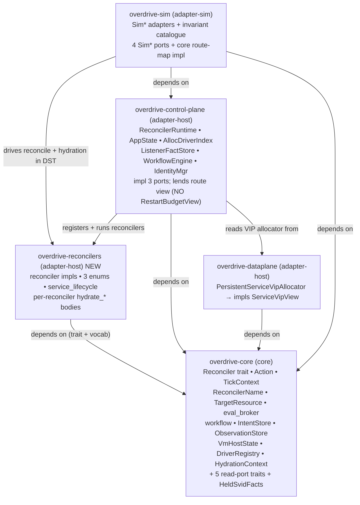

# ADR-0086 — Reconcilers own their hydration; extract `overdrive-reconcilers`; narrow read-ports break the resulting Cargo cycle

## Status

Accepted. 2026-08-25. Decision-makers: Morgan (proposing); user
ratification via `/nw-design` Decision 1 = **guide** (core option A
locked through prior discussion, this ADR records it). Tags: phase-1,
reconciler-primitive, application-arch, crate-topology.

**Amended 2026-08-31 (4→5 read-ports; TRC-ARCH-001).** The terminal-race
cancellation review proved that `WorkloadLifecycle` must distinguish an exact
durable terminal whose process-local `AllocDriverIndex` tail is still present
from one whose tail is already converged. Add the narrow synchronous
`AllocDriverRouteView` port, lend it through `HydrationContext`, and project the
target intersection into `WorkloadLifecycleState.routed_allocations`. This is
not the removed cross-reconciler `RestartBudgetView`: it reads an existing
process-local action-shim index, carries keys only, and creates no durable route
or View dependency. The current complete read-port set is **exactly five**.

**Amended 2026-08-25 (5→4 read-ports).** `RestartBudgetView` — the fifth
read-port, a cross-reconciler read of the `WorkloadLifecycle` restart
budget by `ServiceLifecycle` — is **removed**. ADR-0087 (single restart
authority) makes `WorkloadLifecycle` the sole restart authority and
demotes `ServiceLifecycle` to liveness-*terminate*, so the cross-read is
eliminated at its root before this crate-move runs. **This ADR now
depends on ADR-0087 landing first** (the precursor behaviour change). At that
amendment the read-port set became exactly four; the § Compliance "a reconciler
may read another reconciler's View" paragraph remains retired. The later
TRC-ARCH-001 port above supersedes only the count, not the
no-cross-reconciler-View decision. See the amendment markers inline (D4, D5,
D8, § Compliance, § Migration).

**Supersedes-in-part ADR-0036** ("runtime owns all hydration"). The
intent + observation hydration ownership returns to the reconciler
(as `Reconciler` trait methods on the impls); **view** hydration
remains runtime-owned per ADR-0035 §2 (unchanged). See § "Compliance"
and the ADR-0036 amendment note.

**Companion**: ADR-0035 (reconciler runtime + `ViewStore`), ADR-0084
(cadence / interest hooks — unaffected), ADR-0003 (crate-class
taxonomy). Deferred-from parent: GH [#266](https://github.com/overdrive-sh/overdrive/issues/266)
Facet-2 (hydration ownership), pragmatic-cut flavour.

## Context

Today the `Reconciler` trait + impls live in `overdrive-core`
(`crate_class = "core"`), and the runtime hydrates each reconciler's
`State` **centrally** via free functions `hydrate_desired` /
`hydrate_actual` in `overdrive-control-plane/src/reconciler_runtime.rs`
— a ~1100-line `match reconciler { AnyReconciler::X(_) => … } ->
AnyState` per side (the file is 5030 lines). ADR-0036 codified this
"runtime owns all hydration" split.

Three costs of the central-hydration shape:

1. **Feature logic is split across two crates.** A reconciler's
   diff (core) and its hydration (control-plane free fn) live apart;
   adding or changing a reconciler edits both, in different crates,
   in files hundreds of lines apart.
2. **Hydration is NOT DST-injectable.** The central free functions
   read `state.listener_facts`, `state.workflow_engine`,
   `state.identity`, and the VIP `state.allocator` as **concrete**
   fields on `AppState` — turmoil/DST cannot substitute them, so the
   hydration boundary is invisible to the DST harness. This is the
   opposite of the `Clock`/`Transport`/`ObservationStore` discipline
   the rest of the platform holds (whitepaper §21; `development.md`
   § "Port-trait dependencies").
3. **The `too_many_lines` pressure is structural, not cosmetic.**
   Every arm carries an `#[allow(clippy::too_many_lines)]`-driven
   extraction (`hydrate_*_desired` / `hydrate_*_actual` helpers)
   because one function owns every reconciler's hydration.

The user has **locked option A** (reconcilers own their hydration;
keep the dispatch enums; new crate; break the Cargo cycle with narrow
read-ports). This ADR records it and pins the exact surface set. The
core decision is not re-opened; alternatives B and C are recorded
only as rejected framings.

## Decision

### D1. Reconcilers own their hydration — as `Reconciler` trait methods

`hydrate_desired` / `hydrate_actual` move OFF the central free
functions and ONTO the `Reconciler` trait as **impure, async**
methods, implemented per-reconciler. The dispatch enum forwards +
wraps at the enum boundary, **exactly** as `AnyReconciler::reconcile`
already wraps a concrete `Self::View` into `AnyReconcilerView`:

```rust
// core — the contract (async, impure; separate from the pure reconcile)
async fn hydrate_desired(&self, ctx: &HydrationContext<'_>, target: &TargetResource)
    -> Result<Self::State, HydrateError>;
async fn hydrate_actual(&self, ctx: &HydrationContext<'_>, target: &TargetResource)
    -> Result<Self::State, HydrateError>;

// new crate — the enum forwards, wraps Self::State -> AnyState at the boundary
impl AnyReconciler {
    async fn hydrate_desired(&self, ctx: &HydrationContext<'_>, target: &TargetResource)
        -> Result<AnyState, HydrateError> {
        match self {
            Self::WorkloadLifecycle(r) =>
                Ok(AnyState::WorkloadLifecycle(r.hydrate_desired(ctx, target).await?)),
            // … one arm per variant, mirroring the existing reconcile match
        }
    }
}
```

The associated-type erasure is a **non-issue** — the existing
`AnyReconciler::reconcile` already erases `Self::State`/`Self::View`
this way (`overdrive-core/src/reconcilers/mod.rs`, `impl
AnyReconciler`). The runtime's central free functions **collapse** to
`AnyReconciler::hydrate_desired` / `AnyReconciler::hydrate_actual`
forwarding calls.

The pure-sync `reconcile` is **unchanged** — no async, no I/O, no
store handle inside the diff. `hydrate_*` is the ONLY impure surface;
`reconcile` stays pure. The compile-time guard
`reconciler_trait_signature_is_synchronous_no_async_no_clock_param`
still pins `reconcile`'s sync signature (the new async methods are
separate; the guard is unaffected and gains one additive assertion
that the hydrate methods carry no `&dyn Clock`).

### D2. Keep the `AnyReconciler` / `AnyState` / `AnyReconcilerView` enums

The pragmatic cut. Dissolving the erasure for open-world / WASM
reconcilers is **OUT OF SCOPE** (GH [#272](https://github.com/overdrive-sh/overdrive/issues/272)).
Adding a first-party reconciler still edits the three enums (one
variant + one arm each) plus now one arm in each of `hydrate_desired`
/ `hydrate_actual` — accepted.

### D3. New crate `overdrive-reconcilers`; `crate_class = "adapter-host"`

**The contract stays in core; the impls move out** — the same
ports-in-core / adapters-out discipline the platform already holds
for `IntentStore` / `Driver` / `ObservationStore`.

| STAYS in `overdrive-core` (contract + vocabulary) | MOVES to `overdrive-reconcilers` (impls + dispatch) |
|---|---|
| `Reconciler` trait (+ new async `hydrate_*` methods) | every `*Reconciler` impl struct (`NoopHeartbeat`, `WorkloadLifecycle`, `WorkflowLifecycle`, `ServiceMapHydrator`, `BackendDiscoveryBridge`, `ServiceLifecycleReconciler`, `SvidLifecycle`, `VmReclamation`) |
| `Action`, `TickContext` | the **three enums** `AnyReconciler` / `AnyState` / `AnyReconcilerView` |
| `ReconcilerName`, `TargetResource` (broker keys) | per-reconciler `*State` / `*View` types + private projections (`RunningAlloc`, `SupervisionSet`, `VmAllocFacts`, `WorkflowInstanceState`, `ProjectedListener`, `ServiceListenerSet`, `RunningAllocSet`, `ServiceDesired`, …) |
| `ResyncSchedule`, `ResyncScope`, `resolve_scope` | pure helpers (`backoff_for_attempt`, `plan_reclamation`, `classify_backend_address`, `project_probe_descriptors`, `project_service_listen_ports`, `RESTART_BACKOFF_CEILING`, …) |
| **NEW**: `HydrationContext<'_>`, `HydrateError` | the `service_lifecycle` module (entire) |
| **NEW / EXTEND**: the 5 read-port traits (D5; fifth added by TRC-ARCH-001) | **NEW**: the per-reconciler `async fn hydrate_*` bodies (from the old free fns) |
| `HeldSvidFacts` (relocated out of `svid_lifecycle` — see D6) | — |

**Why the vocabulary stays in core (load-bearing, verified against
code):** `overdrive_core::eval_broker` keys its pending map on
`(ReconcilerName, TargetResource)` (`eval_broker.rs:23,63`), and
`overdrive_core::workflow` + `overdrive_core::testing::workflow`
reference `Action` (`workflow/mod.rs:37`). Both are core primitives
*below* the new crate. If those types moved, core would need to depend
UP on the new crate — a cycle. Keeping the reconciler **contract** in
core (parallel to `IntentStore` living in core while `LocalIntentStore`
lives in `overdrive-store-local`) is the clean resolution, not a
compromise.

**Crate class = `adapter-host`.** The crate carries impure `async`
hydration (real store reads through injected ports), so it cannot be
`core` (async I/O; would fail the dst-lint whole-crate scan). It is
production code, so not `adapter-sim`; it is a library, so not
`binary`. Among the four ADR-0003 classes it is `adapter-host`: the
non-core/non-sim/non-binary bucket that is legitimately off the
whole-crate DST scan path. The taxonomy fit is slightly loose — the
crate *consumes* ports rather than *binding* a host OS/kernel/network
primitive directly — but `adapter-host` is the correct class among the
four available, and `overdrive-control-plane` (which the impls came out
of) is itself `adapter-host` for the same operational reason. Inventing
a fifth `orchestration`/`port-consumer` class would require an ADR-0003
amendment and is out of scope.

**`HydrateError` (core, NEW).** Variants mirror the failure modes the
current hydrate bodies already produce: `IntentRead`,
`ObservationRead`, `IntentDecode` (today's
`ConvergenceError::{IntentRead, ObservationRead, IntentDecode}` at
`reconciler_runtime.rs:1885,2481,2750`). `AnyReconciler::hydrate_*`
returns `Result<AnyState, HydrateError>`; the runtime converts at the
call site via `ConvergenceError: From<HydrateError>` (a `#[from]`
variant), so the tick loop keeps consuming `ConvergenceError`. **Name
note:** ADR-0036 §Consequences retired an *older* `HydrateError` (the
per-reconciler libSQL read error). This is a **new, distinct** type
reusing the name — the hydration-boundary error, not the libSQL read
error; the two never coexist.

### D4. The dependency graph — cycle-break proof

The reconcilers crate depends **only DOWN on core**. Every surface its
hydration reads is either already a core trait (`IntentStore`,
`ObservationStore`, `VmHostState`, `DriverRegistry`+`Driver`) or a NEW
narrow core read-trait (D5) implemented UP in control-plane / over the
dataplane allocator.

**Amendment (2026-08-25): no cross-reconciler read remains.** The one
hydration read that formerly touched a control-plane-owned type —
`ServiceLifecycle`'s actual-side `state.runtime.restart_status_for_alloc`
(the cross-read of the `WorkloadLifecycle` restart budget) — is
**eliminated** by ADR-0087 (single restart authority): `ServiceLifecycle`
no longer reads any budget, so there is no `RestartBudgetView` port and
`ReconcilerRuntime` implements **no** read-port. Every remaining read-port
is implemented UP in control-plane (three), over the dataplane allocator
(one), or by the core implementation for the process-local route map (one); no
edge points from the new crate to control-plane. The
cycle-break is now cleaner than the original 5-port framing — the one
surface that straddled the "reconciler reads another's View" line is gone.

**TRC-ARCH-001 does not restore that cross-read.**
`AllocDriverRouteView::routed_allocations` snapshots keys from the existing
action-shim `AllocDriverIndex`; it never reads a reconciler View. The core trait
has the exact production implementation for
`parking_lot::Mutex<BTreeMap<AllocationId, DriverType>>`, which is the alias's
underlying type. The method exposes no driver kind or mutation. Control-plane
only lends `state.alloc_drivers.as_ref()` into `HydrationContext`, so the
crate-dependency graph is unchanged.



No back-edge from `recon` to `cp`: the cycle is broken. `overdrive-sim`
already depends on both `overdrive-core` and `overdrive-control-plane`
(`overdrive-sim/Cargo.toml:55`), so it reaches the new crate directly
(add one `[dependencies]` edge) with no cycle, and the DST invariant
catalogue (`ReconcilerIsPure`, `service_map_hydrator`,
`vm_reclamation`, etc.) resolves `AnyReconciler` /
`reconcile` from `overdrive_reconcilers::*` instead of
`overdrive_core::reconcilers::*` (mechanical import rewrite across ~8
sim files).

### D5. The COMPLETE read-port trait set — exactly five

**Amended 2026-08-31: five.** TRC-ARCH-001 adds
`AllocDriverRouteView`, the narrow process-local route-key snapshot required to
make accepted Stop tail debt observable to the pure WorkloadLifecycle diff. It
is distinct from and does not resurrect `RestartBudgetView`.

**Amended 2026-08-25: four, not five.** `RestartBudgetView` (the former
fifth surface) is removed — ADR-0087 eliminates the cross-reconciler
restart-budget read at its root, so `ServiceLifecycle`'s hydration no
longer reads any budget and `ReconcilerRuntime` implements no read-port.

Pinned by reading **every** `hydrate_*` body (and every helper they
reach) in `reconciler_runtime.rs`. Each is a **driven** read-port
(hydration reads outbound — the app calls out to fetch facts), exposing
**read-only** methods (no write method — the read/write split of
Principle 12 holds by construction). Each lives in core
(`overdrive_core::traits::*`). The original four are implemented UP in
control-plane / over the dataplane allocator and get `Sim*` impls in
`overdrive-sim`; the fifth route trait has the shared core implementation for
its plain deterministic map type, so production and simulation inject the same
shape without another adapter. Hydration remains DST-injectable.

**Async only where the underlying read is async** — the two
`tokio::sync::Mutex`-guarded surfaces (`ListenerFacts`,
`ServiceVipView`) are `#[async_trait]`; the three sync in-memory reads
(`WorkflowLiveSet`, `HeldSvidView`, `AllocDriverRouteView`) are **sync** trait
methods (no boxed future per read on the tick path). The async hydrate body
calls the sync ones directly and `.await`s the async ones.

| Trait (core) | Method | Async? | Impl (up) | Contract (pre / post / edge) |
|---|---|---|---|---|
| **`ListenerFacts`** | `fact_for(service_id: ServiceId) -> Option<ListenerRow>` | async | `ListenerFactStore` (control-plane) | pre: none. post: returns the boot-rebuilt+edge-maintained listener fact for `service_id`, or `None` when unknown. edge: `None` ⇒ hydrator SKIPS the service (never defaults `Proto::Tcp` — ADR-0060 C3). Point read; no ordering guarantee across keys. |
| **`ServiceVipView`** | `assigned_vip(spec_digest: &ContentHash) -> Option<ServiceVip>` | async | `PersistentServiceVipAllocator` (dataplane) | pre: none. post: returns the allocator-issued VIP for the content-addressed spec digest, or `None` when no VIP is memoised. edge: `None` on a persisted Service intent is the ADR-0049 §4 structural-invariant-violation signal (defer tick, log `allocator_memo_absent`); the adapter maps the core `ContentHash` to the allocator's `ServiceSpecDigest`. |
| **`WorkflowLiveSet`** | `live_instances() -> BTreeSet<CorrelationKey>` | sync | `WorkflowEngine` (control-plane) | pre: none. post: a point-in-time snapshot of the engine's live-task correlation keys (ephemeral runtime state, NOT intent/observation). edge: empty set after a restart is legitimate — an instance running-in-intent with no live task and no terminal IS the crash-resume trigger (ADR-0064 §5). Snapshot; interior `ClaimSet` lock never held across `.await`. |
| **`HeldSvidView`** | `held_snapshot() -> BTreeMap<AllocationId, HeldSvidFacts>` | sync | `IdentityMgr` (control-plane) | pre: none. post: the GLOBAL node-held SVID set (every workload's held leaves), keyed by `AllocationId`; presence == "held". edge: the hydrator filters to the target workload by `SpiffeId::for_allocation` equality (ADR-0067 D5b) — the trait returns the unfiltered global set by contract. Ephemeral; rebuilt on restart. |
| **`AllocDriverRouteView`** | `routed_allocations() -> BTreeSet<AllocationId>` | sync | core impl for `parking_lot::Mutex<BTreeMap<AllocationId, DriverType>>`; production value is control-plane `AllocDriverIndex` | pre: none. post: one point-in-time, deterministic key snapshot; never exposes `DriverType` or a mutator. edge: empty after process restart is legitimate. WorkloadLifecycle actual hydration intersects the snapshot with only the target workload's observed allocation ids; desired hydration uses empty. The set distinguishes exact-terminal tail debt from exact-terminal steady state and is never durable lifecycle truth. |

The additive signatures are exact:

```rust
pub trait AllocDriverRouteView: Send + Sync {
    #[must_use]
    fn routed_allocations(&self) -> BTreeSet<AllocationId>;
}

impl AllocDriverRouteView
    for parking_lot::Mutex<BTreeMap<AllocationId, DriverType>>
{
    fn routed_allocations(&self) -> BTreeSet<AllocationId> {
        self.lock().keys().cloned().collect()
    }
}

// Additive field on the existing borrow bundle:
pub alloc_driver_routes: &'a dyn AllocDriverRouteView,

// Additive field on WorkloadLifecycleState:
pub routed_allocations: BTreeSet<AllocationId>,
```

The trait is declared in
`crates/overdrive-core/src/traits/alloc_driver_route_view.rs`, added as
`pub mod alloc_driver_route_view`, and re-exported exactly as
`overdrive_core::traits::AllocDriverRouteView`. There is no second declaration,
compatibility alias, or inherent mutation method.

No error variant is added because the production read is an infallible
`parking_lot` snapshot. No async method is added because the lock is never held
across an await.

> **Removed (2026-08-25): `RestartBudgetView`.** The former fifth
> surface — `restart_status_for_alloc`, a cross-reconciler read of the
> `WorkloadLifecycle` restart budget by `ServiceLifecycle`'s
> actual-hydration — is **deleted** by ADR-0087, not ported. Under single
> restart authority `ServiceLifecycle` reads no budget (it emits a
> liveness-*terminate*; `WorkloadLifecycle` is the sole authority), so
> there is no port to add and `ReconcilerRuntime` implements no read-port.
> `ServiceAllocFact.restart_count` / `.restart_spec` and the
> `restart_status_for_alloc` hydration join are removed in the ADR-0087
> precursor slice, before this crate-move runs.

**Surfaces that need NO new trait (verified — corrects the skim
candidate list):**

- `IntentStore` (`state.store` — `get` / `scan_prefix`) — **already
  core**; hydration reads via `&dyn IntentStore` in `HydrationContext`.
  (`AppState.store` is the concrete `Arc<LocalIntentStore>`; the
  reconcilers see the trait.)
- `ObservationStore` (`state.obs` — `alloc_status_rows`,
  `service_backends_rows`, `issued_certificate_rows`,
  `workflow_terminal_rows`, `service_hydration_results_rows`,
  `list_probe_results_for_alloc`) — **already core**.
- `VmHostState` (`state.vm_host_state.observe()`) — **already a core
  trait** (`overdrive_core::traits::vm_host_state::VmHostState`,
  `AppState` holds `Arc<dyn VmHostState>`). The skim list wrongly
  flagged "vm-reclamation host observation" as needing a trait; it does
  not.
- **VM supervision** (`state.drivers.get(DriverType::Vm)
  .live_allocations()`) — **already core**: `DriverRegistry` lives in
  `overdrive-core` (`traits/driver.rs:497`) and `Driver::live_allocations`
  is a core `Driver` trait method (`traits/driver.rs:885`). No new
  trait; `HydrationContext` carries `&DriverRegistry`.
- **Allocation driver route mutation** remains action-shim-owned through the
  unchanged `AllocDriverIndex` alias. The new trait is read-only and returns
  keys, so it does not create a second route owner or expose driver selection
  to reconcilers.

**Plain data threaded into `HydrationContext` (not traits):**
`node_id: &NodeId`, `host_ipv4: Ipv4Addr`, `intent_redb_path: &Path`.

`HydrationContext<'a>` is a core struct bundling `&'a dyn IntentStore`,
`&'a dyn ObservationStore`, `&'a DriverRegistry`, `&'a dyn VmHostState`,
`&'a dyn ListenerFacts`, `&'a dyn ServiceVipView`, `&'a dyn
WorkflowLiveSet`, `&'a dyn HeldSvidView`, `&'a dyn
AllocDriverRouteView`, plus the plain data (no
`RestartBudgetView` — removed 2026-08-25). The control-plane composition
root builds one per tick from `AppState` and passes it to
`AnyReconciler::hydrate_*`. **S1 acceptance invariant:**
`HydrationContext` carries a handle for **every** surface any `hydrate_*`
body reads — the "read every hydrate body" audit is the evidence, and no
`hydrate_*` body may reach a `state.*` field that is not represented on
`HydrationContext`. (After ADR-0087 the `ServiceLifecycle` hydrate body
reaches no restart-budget surface at all.)

### D6. `HeldSvidFacts` relocates into core

`HeldSvidView::held_snapshot` returns `BTreeMap<AllocationId,
HeldSvidFacts>`, so `HeldSvidFacts` crosses a **core** trait signature
and MUST live in core. It is already a shared value type —
`IdentityMgr::held_snapshot` (control-plane) returns it today and it is
defined in core `svid_lifecycle.rs`. When `svid_lifecycle` moves to the
new crate, `HeldSvidFacts` relocates to a core module (e.g.
`overdrive_core::identity`); control-plane's `IdentityMgr` and the
`svid-lifecycle` reconciler both import it from core. **General rule
for the crafter:** any value type appearing in a core read-trait
signature stays in core; reconciler-private projections
(`RunningAlloc`, `SupervisionSet`, …) move.

### D7. Purity firewall — tradeoff + mitigation

Today `reconcile` lives in `core` and is statically scanned by
dst-lint (`xtask/src/dst_lint.rs` scans only `crate_class = "core"` for
banned real-infra calls: `Instant::now`, `SystemTime::now`, `tokio::`,
`rand::`, raw `HashMap`, …). Moving the reconciler impls to a
non-core crate REMOVES the pure `reconcile` bodies from that
whole-crate scan. The user accepted option A knowing this.

**Mitigation (chosen): an allowlist-inverted dst-lint clause over the
whole new crate.** The pure `reconcile` diff is NOT the only pure
surface that moves — the pure **helpers** it transitively calls
(`backoff_for_attempt`, `plan_reclamation`, `classify_backend_address`,
`project_service_desired`, `project_*`) move too and are NOT
`reconcile` bodies, so a body-only scan would leave the diff's
transitive pure call graph unscanned. Therefore: extend the existing
`xtask::dst_lint` AST scanner (which reads source as text and imports
no `overdrive-*` crate — so the xtask-boundary rule holds) to scan the
**entire** `overdrive-reconcilers/src/**` for the banned symbols
(`Instant::now`, `SystemTime::now`, `tokio::`, `rand::`, raw
`HashMap`), with a **narrow allowlist for exactly the async `hydrate_*`
methods** (the one legitimately-impure surface — they `.await` store
reads through injected ports). This covers `reconcile` AND every pure
helper, closing the gap a body-only scan would leave.
`ReconcilerIsPure` (the DST twin-invocation invariant in
`overdrive-sim`) is retained as the **behavioural complement** but is
NOT sufficient alone: it passes ONE shared `TickContext` to both
invocations (`evaluators.rs:3320-3326`), so a wall-clock read that
bypasses `tick.now` would not reliably diverge between the two
synchronous calls. Static scan is the primary defence; twin-invocation
is the backstop.

### D8. DST / replay survival + the injectability WIN

Pure-sync `reconcile` stays pure ⇒ DST replay-equivalence and the
single-loop/single-clock model are structurally unchanged. The four
`Sim*` read-port impls plus the core route-map implementation turn a
previously-concrete, DST-invisible
hydration boundary INTO an injectable one: for the first time a DST
scenario can inject a stale/empty `SimWorkflowLiveSet` (crash-resume
convergence), a missing `SimServiceVipView` memo (ADR-0049 §4 defer
path), a drifted `SimListenerFacts` fact, or a filtered `SimHeldSvidView`
set — none of which the central concrete-`AppState` free functions
allowed. TRC-ARCH-001 additionally lets a DST composition inject
exact+routed, exact+unrouted, and Terminated/None states with a plain
deterministic map. This is a net DST-coverage gain, per `development.md` §
"Port-trait dependencies". (Liveness-restart-budget exhaustion is now
tested via the ADR-0087 observation-row trajectory — no read-port needed;
the former `SimRestartBudgetView` at the backoff ceiling is retired with
the port.)

**Earned Trust note (Principle 13):** the five read-ports wrap
**in-process** control-plane / allocator state (mutexes over
in-memory maps) — there is no external substrate (fs / network /
subprocess / kernel) that could lie, so a `probe()` on these ports is
degenerate
(construction by the composition root already guarantees presence). The
Earned-Trust value here is the *sim-injectability* of the hydration
boundary, not a substrate probe. The runtime's existing
`ViewStore::probe` boot gate (ADR-0035 §5) is unchanged.

### D9. Single-cut greenfield migration

The old central `hydrate_*` free functions are DELETED in the same arc
that lands the trait methods — no parallel old path, no deprecation
shim (repo discipline, `feedback_single_cut_greenfield_migrations.md`).
See § "Migration slice sketch".

## Alternatives considered

- **B — dissolve the `AnyReconciler` erasure (open-world dispatch).**
  Rejected for THIS feature: it is the GH #272 scope. The enums stay
  (D2); the pragmatic cut is deliberate.
- **C — keep central hydration, make `AppState` sub-fields injectable
  in place** (trait-ify `listener_facts`/`engine`/`identity`/`allocator`
  but leave the `match` free functions in control-plane). Rejected:
  it fixes DST-injectability (2) but not the split-logic (1) or the
  structural `too_many_lines` (3) — the reconciler's diff and hydration
  still live in different crates, and adding a reconciler still edits a
  1100-line central `match`. Option A subsumes C's injectability win
  and also co-locates each reconciler's diff+hydration.
- **`hydrate_*` as inherent methods on each impl (not trait methods).**
  Considered; rejected. Trait methods make hydration a first-class part
  of the reconciler contract (the point of "reconcilers own their
  hydration") and mirror the `AnyReconciler::reconcile → reconcile`
  forwarding symmetry the locked design draws. Inherent methods would
  leave "every reconciler must hydrate" enforced only by the enum's
  match arms, not the type system.
- **Move the whole `WorkflowEngine` down into core** (so the reconciler
  reaches it directly). Rejected: `WorkflowEngine` is a peer primitive
  (ADRs 0064/0065/0066) with its own journal/engine surface; only a
  **narrow read view** (`live_instances`) is needed. `WorkflowLiveSet`
  exposes exactly that.

## Consequences

### Positive

- **Each reconciler is self-contained** — diff + hydration in one
  place, one crate. Adding a reconciler no longer edits a 1100-line
  central `match` in a different crate.
- **Hydration is DST-injectable** for the first time (D8) — a net
  coverage gain, closing the last non-injectable boundary in the
  reconcile path.
- **Ports-in-core discipline restored** — the `Reconciler` contract
  joins `IntentStore`/`Driver`/`ObservationStore` as a core trait with
  impls out; the 5 current read-ports follow the same pattern.
- **`too_many_lines` pressure dissolves** — per-reconciler hydrate
  bodies are bounded by one reconciler's needs, not all eight.

### Negative

- **Large mechanical import rewrite.** Every `overdrive_core::
  reconcilers::{impl,enum,*State,*View}` reference across control-plane,
  sim (~8 invariant files), and tests moves to `overdrive_reconcilers::`.
  One-time cost; single-cut.
- **The enums are still edited per new reconciler** (D2) — the #272
  cut is retained, not resolved.
- **Crate-class taxonomy fit is loose** (D3) — `adapter-host` is the
  best of four, not a perfect descriptor for a port-consuming
  orchestration library.

### Quality-attribute impact

- **Maintainability — modularity / modifiability**: strong positive
  (co-location; contract-in-core).
- **Maintainability — testability**: strong positive (hydration
  DST-injectable).
- **Reliability**: neutral-positive (crash-resume convergence now
  fault-injectable at the hydration boundary).
- **Performance**: bounded-neutral. `HydrationContext` remains a borrow bundle;
  WorkloadLifecycle actual hydration clones only the process-local route keys
  into one ordered set and retains only the target-workload intersection. No
  I/O, await, retry, or durable write is added.

## Compliance — what survives / what changes

- **ADR-0035 (runtime + `ViewStore`)** — survives verbatim. VIEW
  hydration (bulk-load + write-through) stays runtime-owned; only
  intent + observation hydration moves.
- **ADR-0036 ("runtime owns all hydration")** — **superseded-in-part.**
  Its §1 table row for **view** memory stands; the **intent** and
  **observation** rows (runtime-owned `hydrate_desired`/`hydrate_actual`)
  are reversed — those become `Reconciler` trait methods on the impls,
  forwarded by `AnyReconciler`. The amendment note is added to ADR-0036.
- **No reconciler reads another reconciler's View (amended 2026-08-25).**
  The original ADR carried `RestartBudgetView` as the one hydration
  surface that straddled the intent+observation-moves /
  view-stays-runtime-owned line — a `ServiceLifecycle` read of the
  `WorkloadLifecycle` restart budget. **ADR-0087 removes that read
  entirely** (single restart authority): `ServiceLifecycle` reads no
  budget and makes no restart decision, so no cross-reconciler View read
  exists to justify. Every read-port now projects either a shared store
  (`IntentStore`/`ObservationStore`), a host/registry surface
  (`VmHostState`/`DriverRegistry`), or a non-reconciler control-plane /
  allocator component (`ListenerFacts`/`ServiceVipView`/`WorkflowLiveSet`/
  `HeldSvidView`/`AllocDriverRouteView`) — never another reconciler's private
  `View`. The route view is process-local action-shim state, not a reconciler
  View. The
  runtime still **owns** every reconciler's View (bulk-load +
  write-through via `ViewStore`, ADR-0035 §2 — unchanged); nothing reads
  it cross-reconciler.
- **ADR-0084 (cadence / interest hooks)** — unaffected; `resync_schedule`
  / `interests` stay pure declarative on the trait (they move with the
  contract, i.e. stay in core).
- **ADR-0021 (`AnyState` shape)** — the enum shape survives; it
  relocates to the new crate (D3) but keeps its one-variant-per-kind
  structure.
- **The `reconciler_trait_signature_is_synchronous...` compile guard**
  — retained; gains one additive assertion (hydrate methods carry no
  `&dyn Clock`); `reconcile` stays pinned sync.
- **dst-lint** — gains the D7 targeted `reconcile`-body clause over the
  new crate.

## Out of scope (tracked deferrals — reference only, do NOT re-scope)

- GH [#272](https://github.com/overdrive-sh/overdrive/issues/272) —
  dissolve the `AnyReconciler`/`AnyState`/`AnyReconcilerView` erasure
  for open-world / WASM reconcilers. The enums are KEPT (D2).
- GH [#270](https://github.com/overdrive-sh/overdrive/issues/270) —
  managed-target-set bounding (`ResyncScope::WholeManaged`). Untouched.
- GH [#271](https://github.com/overdrive-sh/overdrive/issues/271) —
  migrate `EnqueueEvaluation` producer-push to `interests()`. Untouched.
- GH [#275](https://github.com/overdrive-sh/overdrive/issues/275) —
  sibling #266 deferral. Untouched.

## Migration slice sketch (single-cut; no red intermediate)

Not a roadmap.json (that is a later `/nw-roadmap` step). **Precondition:
ADR-0087 (single restart authority) lands first** — its precursor slice
removes the `restart_status_for_alloc` cross-read and
`ServiceAllocFact.{restart_count,restart_spec}`, so the slices below
never build a `RestartBudgetView`. Ordered so each slice compiles green:

1. **S1 — add core read-ports + `HydrationContext` + relocate
   `HeldSvidFacts`.** Add the **4** read-port traits (`ListenerFacts`,
   `ServiceVipView`, `WorkflowLiveSet`, `HeldSvidView`),
   `HydrationContext`, `HydrateError` to
   `overdrive-core`; move `HeldSvidFacts` to a core module; add
   `Reconciler::hydrate_desired`/`hydrate_actual` async trait methods
   with a `todo!("RED scaffold")` default (so core compiles). Implement
   the traits UP: `ListenerFactStore` / `WorkflowEngine` / `IdentityMgr`
   (control-plane) and `PersistentServiceVipAllocator`
   (dataplane). **Acceptance gate: the "read every `hydrate_*` body"
   audit shows every `state.*` surface any hydrate body reaches is
   represented on `HydrationContext`** (post-ADR-0087, no hydrate body
   reaches a restart-budget surface — the audit confirms the cross-read
   is gone). Green: nothing calls the new methods yet.
2. **S2 — create `overdrive-reconcilers` (adapter-host) and move the
   impls + 3 enums + `service_lifecycle` + per-reconciler state/view +
   pure helpers.** Rewrite every `overdrive_core::reconcilers::{impl,
   enum,*State,*View}` import (control-plane, sim ~8 files, tests) to
   `overdrive_reconcilers::`. The trait methods still `todo!`. Green:
   compiles, hydration still runs through the old free fns.
3. **S3 — move the hydrate bodies onto the impls; collapse the central
   free fns.** Port each `hydrate_*_{desired,actual}` body from the
   control-plane free fn into the matching impl's trait method (reading
   through `HydrationContext` instead of `AppState`); implement
   `AnyReconciler::hydrate_desired`/`hydrate_actual` forwarding; rewire
   `reconciler_runtime.rs` to build a `HydrationContext` per tick and
   call the enum forwarders; wire the 4 read-ports + `HydrationContext`
   in the composition root. **DELETE** the old central `hydrate_desired`/
   `hydrate_actual` free functions and their `hydrate_*_*` helpers in
   the same commit.
4. **S4 — DST + enforcement.** Add the **4** `Sim*` read-port impls in
   `overdrive-sim`; point the invariant catalogue at
   `overdrive_reconcilers::*`; add the whole-crate dst-lint clause with
   the `hydrate_*` allowlist over the new crate (D7); add the
   compile-guard assertion (D1). Green: DST harness drives reconcile +
   hydration through sim ports.

**TRC-ARCH-001 additive migration (2026-08-31).** The four steps above are the
completed historical extraction. The terminal-race remediation adds, in one
compiler-green slice, the exact `AllocDriverRouteView` trait and underlying-map
impl, `HydrationContext.alloc_driver_routes`, the composition-root binding,
and `WorkloadLifecycleState.routed_allocations`; updates every exhaustive
HydrationContext destructure and WorkloadLifecycleState literal; hydrates the
target intersection; and changes both existing Stop/GC predicates together.
Neutral literals use `BTreeSet::new()`. The exhaustive read-surface audit must
now fail if the route field is absent or an unrepresented `state.alloc_drivers`
read bypasses the context. No compatibility constructor or second state shape
is retained.

Verification is multi-layered: pure reconcile properties (with the exact
`/// CONTRACT_SHAPE: pure-function.` rustdoc), hydration target-filter tests,
production self-enqueue and interest-router watch/relist integration, local
compound-write cancellation, exact-tail zero-effect complements, and
duplicate-wake/no-spin steady state. Manually redispatching a stale action does
not establish production reachability.

## References

- **ADR-0087 (single restart authority — the precursor that removes the
  fifth read-port; this ADR now depends on it).**
- ADR-0036 (superseded-in-part), ADR-0035, ADR-0084, ADR-0003.
- ADR-0064/0065/0066 (`WorkflowEngine` — NOT relocated; narrow read
  view only, D5).
- ADR-0049 (VIP allocator — `ServiceVipView` contract), ADR-0060 (C3
  proto-source — `ListenerFacts` contract), ADR-0067 (SVID lifecycle —
  `HeldSvidView` contract).
- GH #266 (parent, closed — Facet-2 hydration ownership); #272/#270/#271/#275 (out of scope).
- Code pinned: `overdrive-control-plane/src/reconciler_runtime.rs`
  (`hydrate_desired` @1844, `hydrate_actual` @2808, and the 9 helper
  fns); `overdrive-core/src/reconcilers/mod.rs` (`impl AnyReconciler`);
  `overdrive-core/src/eval_broker.rs` (broker key vocabulary);
  `overdrive-core/src/traits/{driver,vm_host_state}.rs` (already-core
  supervision surfaces).
- `docs/research/architecture/cqrs-structural-mechanism-reconciler-framework-research.md` §6.

## Changelog

- 2026-08-25 — Initial accepted version. Supersedes-in-part ADR-0036.
- 2026-08-25 — Amended: 5→4 read-ports. `RestartBudgetView` removed;
  ADR-0087 (single restart authority) eliminates the cross-reconciler
  restart-budget read at its root, so no fifth port is needed. This ADR
  now depends on ADR-0087 landing first. Updated D4/D5/D8, § Compliance,
  the dep-graph, and § Migration slice sketch.
- 2026-08-31 — Amended: 4→5 read-ports for TRC-ARCH-001. Added the
  read-only `AllocDriverRouteView` key snapshot, HydrationContext field, and
  target-intersected WorkloadLifecycleState input. This is process-local
  terminal-tail evidence, not the removed cross-reconciler restart-budget
  View, a durable route, or a new component.
