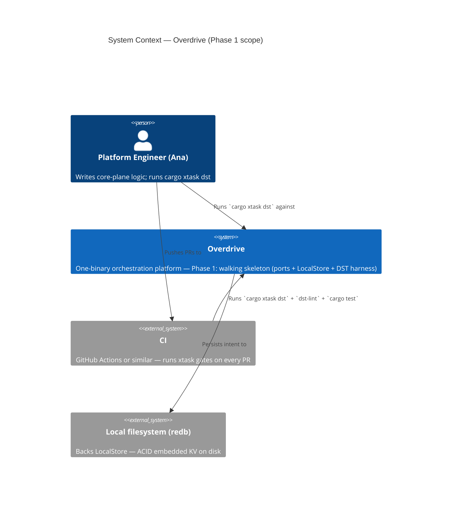
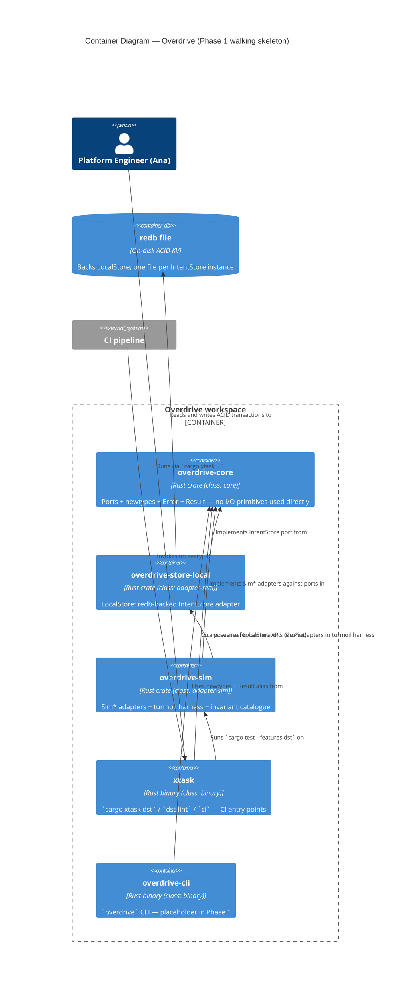
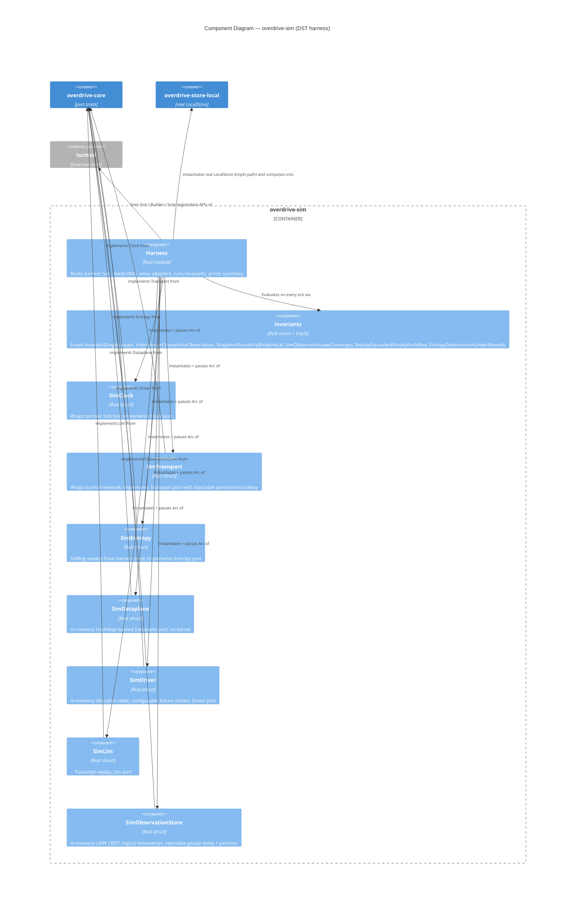

# Overdrive Architecture Brief

**Source of truth for platform architecture.** Cross-cut with `docs/whitepaper.md`
(platform design) and `docs/commercial.md` (tenancy / tiers / licensing). This
brief records the *architectural decisions* those documents imply, at three
levels of ownership:

1. **System Architecture** — cluster-scale decisions: Intent/Observation split,
   role-at-bootstrap, regional topology, dataplane substrate. *(Future architect:
   placeholder.)*
2. **Domain Model** — aggregates, bounded contexts, ubiquitous language.
   *(Future architect: placeholder.)*
3. **Application Architecture** — crate topology, module boundaries, trait
   surfaces, enforcement mechanisms. *(Owned here, by Morgan — Phase 1
   foundation.)*

Each section is owned by exactly one architect. Later waves build on top; they
do not rewrite prior sections without a corresponding ADR marked
`supersedes ADR-XXXX`.

---

## Status

| Section | Owner | Status |
|---|---|---|
| System Architecture | Titan (future) | placeholder |
| Domain Model | Hera (future) | placeholder |
| Application Architecture | Morgan (this doc) | **initial — Phase 1 foundation** |

---

## System Architecture

*Placeholder for Titan.* System-level decisions that apply to the whole cluster
topology (per-region Raft vs global CRDT, role declaration at bootstrap, mesh
VPN underlay, etc.) live here. For now, read `docs/whitepaper.md` §2-§4 as the
authoritative source.

---

## Domain Model

*Placeholder for Hera.* Aggregates, bounded contexts, and ubiquitous language
live here once the domain crosses the complexity threshold that warrants DDD.
For Phase 1 the language is thin: `Job`, `Allocation`, `Node`, `Policy`,
`Certificate`, `Investigation`, plus the identifier newtypes enumerated below.

---

## Application Architecture

**Scope**: crate topology, trait surfaces, module boundaries, and enforcement
tooling for the Phase 1 walking skeleton and everything that will build on it.

### 1. Architectural style

**Hexagonal (ports and adapters), single-process**.

The whitepaper §21 nondeterminism-trait table *is* the ports layer:

| Port (trait) | Concern | Real adapter | Sim adapter |
|---|---|---|---|
| `Clock` | time | `SystemClock` | `SimClock` |
| `Transport` | network | `TcpTransport` | `SimTransport` |
| `Entropy` | RNG | `OsEntropy` | `SeededEntropy` |
| `Dataplane` | kernel/eBPF | `EbpfDataplane` (Phase 2+) | `SimDataplane` |
| `Driver` | workload exec | `CloudHypervisorDriver` etc. (Phase 2+) | `SimDriver` |
| `IntentStore` | linearizable state | `LocalStore` (Phase 1) / `RaftStore` (Phase 2+) | `LocalStore` reused |
| `ObservationStore` | eventually-consistent state | `CorrosionStore` (Phase 2+) | `SimObservationStore` |
| `Llm` | inference | `RigLlm` (Phase 3+) | `SimLlm` |

Core logic (future reconcilers, workflows, investigation agent) depends on
ports only. Wiring crates pick real adapters; DST picks sim adapters. This
matches whitepaper §21 word-for-word and is what makes the §21 DST claim
structural rather than aspirational.

**Why not microservices, layered, or event-driven?**

- The whole platform is **one binary** (whitepaper principle 8). Roles are
  declared at bootstrap, not at build time. Microservices at the Phase 1 scope
  contradicts the central design commitment.
- Layered (N-tier) has no answer for the DST seam; it routes I/O through
  infrastructure interfaces that are not injectable by default.
- Event-driven is the *consequence* of the reconciler/workflow primitives
  (whitepaper §18) — not the top-level organising principle. Reconcilers
  converge; workflows orchestrate. Both are hosted inside the hexagon.

The decision to name this hexagonal-only (rather than "hexagonal + DDD +
vertical slice") is a deliberate narrowing: Phase 1 ships identifier types
and traits, not aggregates with behaviour, so there is no domain-model
surface for DDD to organise yet.

### 2. Paradigm

**OOP (Rust trait-based)**.

- Ports are `trait` objects. Adapters are `struct` types implementing them.
- Errors are `enum` variants under `thiserror`.
- Identifiers are `struct` newtypes with validating constructors.
- Composition over inheritance everywhere (Rust has no inheritance anyway).
- `async_trait` for async trait methods (Rust 2024 + `dyn` compatibility).

The `development.md` rules codify this: thiserror for libs, newtypes STRICT,
pass-through `#[from]` error embedding, `Send + Sync` on core data structures.
No pull toward functional-first organisation (no algebra-of-effects, no
free monads, no lens-style derives) — the injectable trait surface already
gives us the substitution semantics functional style would be reaching for.

### 3. Crate topology (Phase 1 target)

```
workspace/
├── crates/
│   ├── overdrive-core/          # ports + newtypes + Result alias + Error
│   │                            # (class: core, lint-scanned, no I/O primitives)
│   ├── overdrive-store-local/   # LocalStore (redb) adapter
│   │                            # (class: adapter-real, uses redb directly)
│   ├── overdrive-sim/           # Sim* adapters + invariants + turmoil harness
│   │                            # (class: adapter-sim, dev-profile only)
│   ├── overdrive-cli/           # bin: `overdrive` (binary boundary, eyre)
│   └── overdrive-node/          # bin: `overdrive-node` (future wiring crate)
└── xtask/                        # bin: `cargo xtask ...`
```

Phase 1 ships `overdrive-core`, `overdrive-store-local`, `overdrive-sim`, and
extends `xtask` with `dst`/`dst-lint`. `overdrive-cli` already exists;
`overdrive-node` is a future placeholder.

**Crate classes** (`package.metadata.overdrive.crate_class`):

| Class | Meaning | Banned-API lint | Examples |
|---|---|---|---|
| `core` | ports + pure logic | **yes** — lint scans for `Instant::now`, `rand::*`, `tokio::net::*`, `std::thread::sleep` | `overdrive-core` |
| `adapter-real` | real adapter | no — allowed to use banned APIs to *implement* ports | `overdrive-store-local`, future `overdrive-node` |
| `adapter-sim` | sim adapter + harness | no — legitimately uses `turmoil`, `StdRng`, etc. | `overdrive-sim` |
| `binary` | binary boundary | no | `overdrive-cli`, `xtask` |
| *(unset)* | legacy / not classified | no | — |

A crate without the metadata label is *not scanned*. `xtask dst-lint` walks
the workspace, filters to `crate_class = "core"`, and scans only those crates.
A self-test inside `xtask` asserts the core-class set is non-empty (preventing
a silent "all scanning turned off" regression).

See **ADR-0003** for the labelling-mechanism rationale.

### 4. State-layer discipline (mapped to types)

The state-layer table from `development.md` is the load-bearing boundary.
Application architecture enforces it by type:

| Layer | Trait | Impl (Phase 1) | Enforcement |
|---|---|---|---|
| Intent (should-be) | `IntentStore` | `LocalStore` (redb) | Distinct trait, distinct types; no shared `put(key, value)` surface |
| Observation (is) | `ObservationStore` | `SimObservationStore` (in-mem LWW) | Distinct trait, distinct types; compile-time test asserts non-substitutability |
| Memory (was) | per-primitive libSQL (Phase 2+) | — | N/A in Phase 1 |
| Scratch (this tick) | `bumpalo::Bump` | — | N/A in Phase 1 (reconcilers land Phase 2) |

Nothing in Phase 1 admits a cross-boundary write path. A future reconciler
cannot persist a `JobSpec` into `ObservationStore` because the trait does not
expose a `write_bytes(key, bytes)` surface — `write` is parametrised on
observation-row shapes, not raw bytes. Likewise, `IntentStore::put` takes
`&[u8]` by key but its *callers* are constrained to intent-class keys by the
typed wrappers the reconciler runtime will provide in Phase 2.

### 5. Module topology inside `overdrive-core`

```
overdrive-core/
├── src/
│   ├── lib.rs              # re-exports + module docs
│   ├── error.rs            # top-level Error + Result alias
│   ├── id.rs               # 11 identifier newtypes (Phase 1 complete)
│   └── traits/
│       ├── mod.rs          # pub use ...
│       ├── clock.rs        # Clock
│       ├── transport.rs    # Transport + Connection + TransportError
│       ├── entropy.rs      # Entropy
│       ├── dataplane.rs    # Dataplane + Verdict + FlowEvent + ...
│       ├── driver.rs       # Driver + DriverType + AllocationSpec + ...
│       ├── intent_store.rs # IntentStore + TxnOp + StateSnapshot + ...
│       ├── observation_store.rs # ObservationStore + Value + Rows + ...
│       └── llm.rs          # Llm + Prompt + ToolDef + ...
```

The existing scaffolding (`crates/overdrive-core/src/{error.rs, id.rs,
traits/*.rs}`) is structurally correct. Phase 1 **completes in place**: adds
the two missing identifier newtypes (`SchematicId` canonicalisation signed,
`CorrelationKey` already present) and adds proptest/trait-contract tests where
missing. No refactor. See **ADR-0001**.

### 6. Observation-store row shapes — Phase 1 minimal set

`SimObservationStore` implements the `ObservationStore` trait over a fixed,
versioned set of typed row shapes. For Phase 1 the minimum the DST harness
needs (per US-04 and the whitepaper §4 schema):

- `alloc_status { alloc_id, job_id, node_id, state, updated_at }`
- `node_health { node_id, region, last_heartbeat }`

Rows are full-row writes (§4 guardrail) — no field-diff merges. Logical
timestamps are `(lamport_counter, writer_node_id)` tuples, LWW under
lexicographic tuple ordering. Gossip delay and partition are injectable via
the `SimObservationStore` constructor.

Production `CorrosionStore` (Phase 2+) will implement the same trait with the
same row shapes, but backed by cr-sqlite and SWIM/QUIC. Sim and real share
the shape definitions; they do not share the wire format.

Row schema versioning (for Phase 2+ forward compatibility of Phase 1 test
artifacts) is a crafter decision at implementation time; Phase 2 feature
scope will lock the mechanism.

### 7. DST harness architecture

The harness is the integration point for every Phase 1 invariant. It is
hosted in a dedicated crate (`overdrive-sim`) and invoked from `xtask dst`.

See the C4 component diagram below; the short form:

- `xtask dst` parses the seed (random if unspecified), invokes
  `cargo test --features dst --package overdrive-sim`.
- `overdrive-sim` depends on `turmoil` and `overdrive-core`; it owns
  `SimClock`, `SimTransport`, `SimEntropy`, `SimDataplane`, `SimDriver`,
  `SimLlm`, `SimObservationStore`.
- The harness composes **real** `LocalStore` (`overdrive-store-local`) with
  all Sim* adapters in a `turmoil::Sim` — matching US-06 AC.
- Invariants live in `overdrive-sim::invariants::Invariant` (an enum). The
  enum name IS the canonical invariant name; `--only <NAME>` resolves to an
  enum variant via `FromStr`. This prevents printed-vs-flag name drift (the
  `shared-artifacts-registry` `invariant_name` HIGH risk).
- Seed is printed on every run; failure output prints invariant name, seed,
  tick, turmoil host, and a reproduction command (matching the US-06 AC).

See **ADR-0004** for why `overdrive-sim` is one crate, not three.

### 8. Test distribution

Per-crate `tests/*.rs` for integration tests that exercise a single crate's
public surface; top-level `crates/{crate}/tests/acceptance/*.rs` *only* for
acceptance scenarios that explicitly correspond to a DISTILL test-scenarios
entry (they may exist in Phase 1 only as US-06 scenarios once DISTILL lands).

Unit tests stay in `#[cfg(test)] mod tests` inside the module they test.
`.feature` files are banned project-wide (`.claude/rules/testing.md`).

See **ADR-0005**.

### 9. Enforcement tooling

**Style**: Hexagonal, single-process, Rust workspace
**Language**: Rust 2024 edition, rustc ≥ 1.85
**Primary enforcement tool**: `cargo xtask dst-lint` (custom)
**Secondary enforcement**: `cargo clippy` workspace-wide with pedantic+nursery+cargo

**Rules to enforce**:

| Rule | Enforcement | Where |
|---|---|---|
| Core crates do not use `Instant::now`, `SystemTime::now`, `rand::random`, `rand::thread_rng`, `tokio::time::sleep`, `std::thread::sleep`, `tokio::net::{TcpStream, TcpListener, UdpSocket}` | Custom: `xtask dst-lint` via `syn` walk over `src/**/*.rs` of every `crate_class = "core"` crate | xtask/src/dst_lint.rs |
| Violations print file:line:col, banned symbol, replacement trait, link to `development.md` | Custom: error-formatter inside `dst-lint` | xtask/src/dst_lint.rs |
| Every banned symbol is covered by a synthetic-file self-test | xtask unit test | xtask/src/dst_lint.rs |
| Core-class set is non-empty | xtask assertion at start of `dst-lint` | xtask/src/dst_lint.rs |
| `thiserror` + Result alias convention | Code review + clippy (no structural enforcer exists for this in Rust today) | — |
| Newtypes: FromStr / Display / serde round-trip lossless | proptest in `overdrive-core/tests/` for every newtype | overdrive-core/tests |
| `IntentStore` and `ObservationStore` are not substitutable | `trybuild` or `tests/compile_fail/*.rs` asserting the substitution fails to compile | overdrive-core/tests/compile_fail |

`import-linter` (Python) and `ArchUnit` (JVM) have no Rust analogue with
equivalent semantics; `cargo-deny` checks dependency licenses but not
API-usage within a crate. The custom `dst-lint` is the only way to enforce
the banned-API rule, which is the load-bearing invariant for DST.

**Mutation testing.** Not a design-level decision — the `nw-mutation-test`
skill enforces the ≥80% kill-rate gate at DELIVER time per
`.claude/rules/testing.md` using `cargo-mutants`. Phase 1 applicable
targets: newtype `FromStr`/validators (US-01, US-02), `SchematicId` rkyv
canonicalisation / hash determinism paths (ADR-0002), and
`IntentStore::export_snapshot` / `bootstrap_from` round-trip code (US-03).
Other `testing.md`-listed targets (reconciler logic, policy verdicts,
scheduler bin-pack, workflow `run` bodies) do not exist in Phase 1 and
therefore have no Phase 1 kill-rate obligation.

### 10. Dependencies — Phase 1

OSS-only, already in workspace `Cargo.toml`:

| Dep | Version | License | Role | Why chosen |
|---|---|---|---|---|
| `redb` | 2.x | MIT-or-Apache-2 | IntentStore backend | Pure Rust embedded ACID KV; ~30MB RAM matches commercial density claim; whitepaper §4 explicit choice |
| `rkyv` | 0.8 | MIT | Snapshot framing; zero-copy deserialization | Archived bytes are canonical → deterministic hashing (§development.md rule); whitepaper §17/18 explicit choice |
| `turmoil` | 0.6 | MIT-or-Apache-2 | DST harness | Rust-native controllable async simulation; whitepaper §21 + testing.md Tier 1 explicit choice |
| `bumpalo` | 3.x | MIT-or-Apache-2 | Per-reconciler scratch (Phase 2+) | Already in workspace; declared for reconciler hot path per development.md |
| `thiserror` | 2.x | MIT-or-Apache-2 | Typed errors | Rust community standard; `#[from]` preserves error chain |
| `proptest` | 1.x | MIT-or-Apache-2 | Property-based tests | Newtype round-trip, snapshot round-trip, LWW convergence |
| `async-trait` | 0.1 | MIT-or-Apache-2 | Async trait methods | Still needed for `dyn`-compatible async traits in stable Rust 2024 |
| `futures` | 0.3 | MIT-or-Apache-2 | Stream trait | `IntentStore::watch` returns `Stream<Item=(Bytes, Bytes)>` |
| `bytes` | 1.x | MIT | Zero-copy buffers | Cheap clone for put/get values |
| `serde` / `serde_json` | 1.x | MIT-or-Apache-2 | Transparent identifier serialisation | `try_from = "String"` for validating deserialize |
| `sha2` | 0.10 | MIT-or-Apache-2 | `ContentHash::of` | SHA-256 |
| `hex` | 0.4 | MIT-or-Apache-2 | `ContentHash` hex `Display`/`FromStr` | Lowercase hex |

No proprietary dependencies. All maintained, active, above 1k stars.

### 11. Non-functional / Quality attributes (ISO 25010, mapped)

| Attribute | Target | How it is addressed |
|---|---|---|
| Performance efficiency — time behaviour | *Phase 2+ guardrail* — `commercial.md` "Control Plane Density" target (<50ms cold start) | Direct redb open; no Raft overhead. Not a Phase 1 CI gate — density claims become measurable only once tenant clusters run on the infrastructure layer (see `upstream-changes.md` for K4 reframe). |
| Performance efficiency — resource util. | *Phase 2+ guardrail* — `commercial.md` "Control Plane Density" target (<30MB RSS empty) | Single redb file; no background tasks (single-mode). Not a Phase 1 CI gate — same reframe as above. |
| Performance efficiency — DST wall-clock | < 60s default catalogue | Turmoil tick-duration 1ms; 3-node default topology; CI gate (K1) |
| Reliability — fault tolerance | DST catches partition, clock skew, reorder, node crash | Sim adapters inject the fault catalogue from testing.md |
| Reliability — recoverability | Snapshot round-trip bit-identical | proptest with randomised contents; CI gate (K6) |
| Maintainability — testability | Every source of nondeterminism injectable | Ports table above; `dst-lint` enforces; CI gate (K2) |
| Maintainability — modifiability | New banned APIs added by editing one constant | `BANNED_APIS` constant in `xtask::dst_lint` |
| Security — accountability (future) | SPIFFE identity on every flow event | `SpiffeId` newtype already lands in Phase 1; flow-event wiring Phase 2+ |
| Compatibility — interoperability | Snapshot format stable across `LocalStore` → `RaftStore` | Versioned framing header on snapshot bytes; both impls share format |

No performance architecture beyond the above is in scope for Phase 1 — there
is no end-user request path yet.

### 12. Integration patterns

Phase 1 has **no external integrations**. No external APIs, no webhooks, no
OAuth, no third-party services. The DST harness runs entirely in-process.
`overdrive-cli` is already a placeholder that logs and returns — it will
gain a control-plane connection in Phase 2.

Consequently **no contract tests** are recommended for Phase 1. The
platform-architect handoff annotation remains empty at this phase; it will
fill up starting Phase 2 (gRPC control-plane API, future Phase 3 ACME, etc.).

### 13. Residuality / stressor posture

Phase 1 carries **one** named residual stressor: *turmoil upstream version
drift*. Bit-identical reproduction depends on deterministic scheduler output
from turmoil's `Sim::run`. A minor-version turmoil update that changes tick
ordering would invalidate historical seeds.

Mitigation: pin turmoil to a precise workspace version (`turmoil = "=0.6.X"`
once first seed is captured in a test). The twin-run identity self-test
(US-06 AC) catches drift continuously in CI.

No other stressors rise to the level requiring a hidden residuality pass at
this scope. The DST fault catalogue from `.claude/rules/testing.md` IS the
platform's realistic-fault surface; the sim adapters exercise it
continuously.

---

## C4 Diagrams

### C4 Level 1 — System Context



### C4 Level 2 — Container diagram



### C4 Level 3 — `overdrive-sim` component diagram

The DST harness is complex enough to warrant a component view (5+ components
interacting non-trivially). Every other crate's internal structure is
adequately described by the container-level view.



---

## Architecture Enforcement

Style: Hexagonal (single-process, Rust workspace)
Language: Rust 2024 edition
Tool: **`cargo xtask dst-lint`** (custom, `syn`-based; see
`xtask/src/dst_lint.rs`)
Secondary: `cargo clippy` workspace pedantic+nursery+cargo
Contract enforcement: `overdrive-core/tests/compile_fail/*.rs`
(`trybuild`-powered) for trait-non-substitutability

Rules to enforce:

- Core crates (class = `core`) do not import banned APIs (`Instant::now`,
  `SystemTime::now`, `rand::random`, `rand::thread_rng`, `tokio::time::sleep`,
  `std::thread::sleep`, `tokio::net::{TcpStream, TcpListener, UdpSocket}`).
- The set of core-class crates is non-empty at every lint run.
- Every banned symbol is covered by a synthetic-file self-test inside xtask.
- Violation messages include file:line:col, banned symbol, replacement trait,
  and a link to `.claude/rules/development.md`.
- `IntentStore` and `ObservationStore` are not type-substitutable (compile-fail
  test).
- Every newtype is lossless under Display / FromStr / serde / rkyv round-trip
  (proptest).

---

## ADR index

| # | Title | Status |
|---|---|---|
| 0001 | Complete existing trait scaffolding in place | Accepted |
| 0002 | SchematicId canonicalisation uses rkyv-archived bytes | Accepted |
| 0003 | Core-crate labelling via `package.metadata.overdrive.crate_class` | Accepted |
| 0004 | Single `overdrive-sim` crate, not split | Accepted |
| 0005 | Test distribution: per-crate `tests/`, top-level `tests/acceptance/` for acceptance only | Accepted |
| 0006 | `cargo xtask dst` + `dst-lint` are the required CI checks; seeds surfaced on failure | Accepted |

---

## Handoff annotations

**To acceptance-designer (DISTILL)**:

- Source of AC: `docs/feature/phase-1-foundation/discuss/user-stories.md`
  + Design decisions below.
- Trait surfaces and error variants are stable at this point; test scenarios
  can name `IntentStore`, `ObservationStore`, `Clock` etc. in their GIVEN
  clauses without further consultation.
- Every AC in the user stories is observable through the DST harness output,
  the `LocalStore` public surface, or the lint-gate output — no scenarios
  need to inspect private methods.

**To platform-architect (DEVOPS)**:

- Architecture document + ADRs in `docs/product/architecture/`.
- Paradigm: OOP (Rust trait-based).
- External integrations in Phase 1: **none**. No contract tests recommended.
  Starting Phase 2 the gRPC control-plane API will be the first external
  surface worth contract-testing between client and server.
- CI integration: two new required checks. `cargo xtask dst` (runs the DST
  harness), `cargo xtask dst-lint` (runs the banned-API scan). Both block
  merges on non-zero exit. Seed printed in summary line; failure output
  includes reproduction command. CI uploads the full DST output as a job
  artifact on failure.
- Quality-attribute thresholds to alert on: DST wall-clock > 60s on main
  (K1); lint-gate false-positive rate > 0 (K2). K4 (LocalStore cold
  start / RSS) is a Phase 2+ commercial guardrail, not a Phase 1 CI gate
  — see `docs/feature/phase-1-foundation/design/upstream-changes.md`.

---

## Changelog

| Date | Change |
|---|---|
| 2026-04-21 | Initial Application Architecture section (Phase 1 foundation) — Morgan. |
| 2026-04-22 | Review revisions: mutation-testing note in §9 (owned by nw-mutation-test skill); K4 reframed as Phase 2+ commercial guardrail, not Phase 1 CI gate (see upstream-changes.md); row schema versioning deferred to crafter per §6. |
