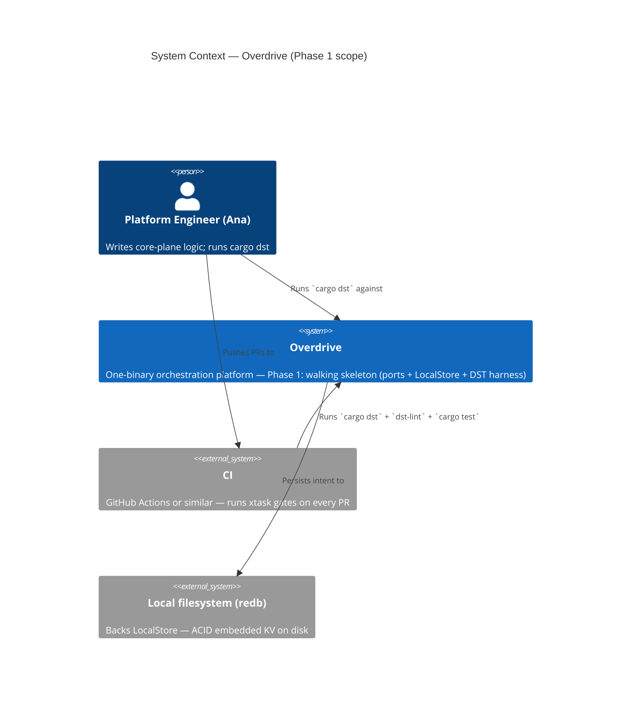
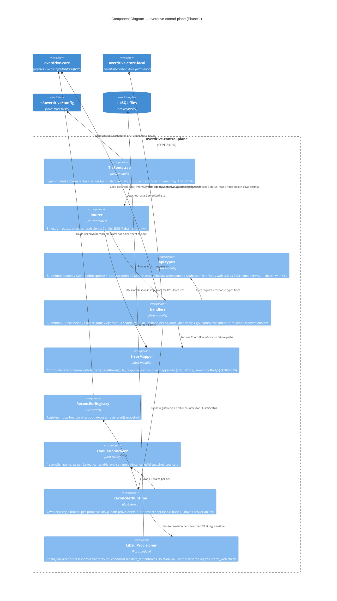
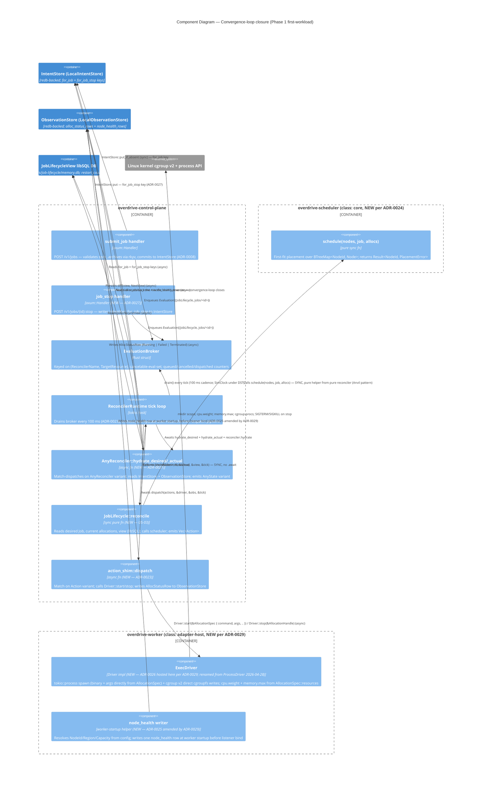
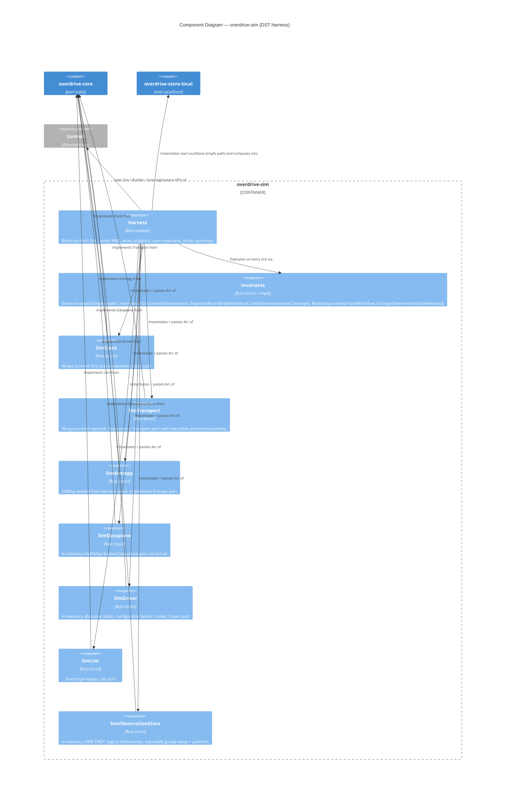
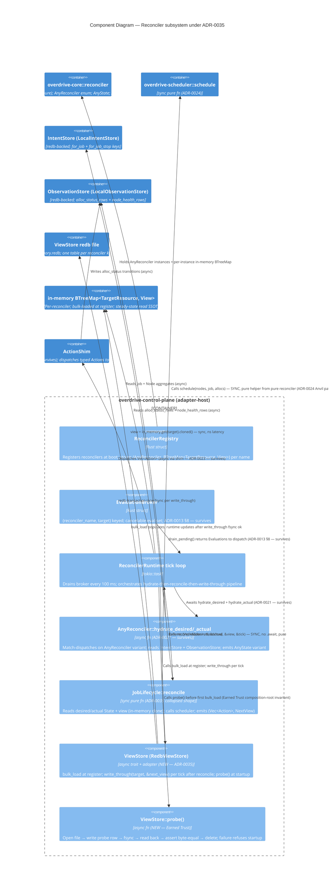
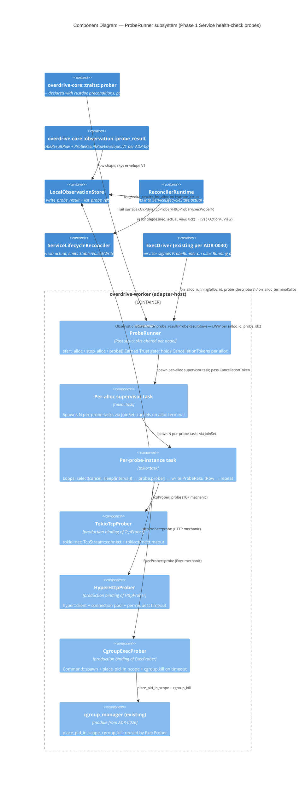
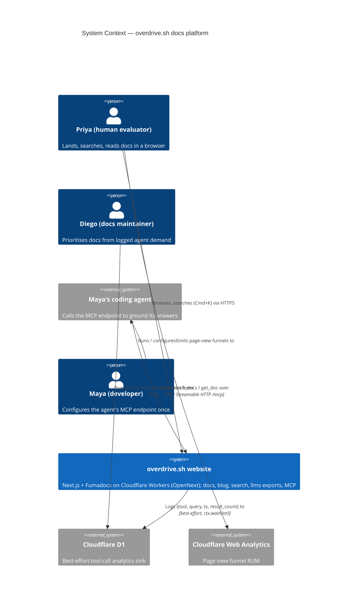
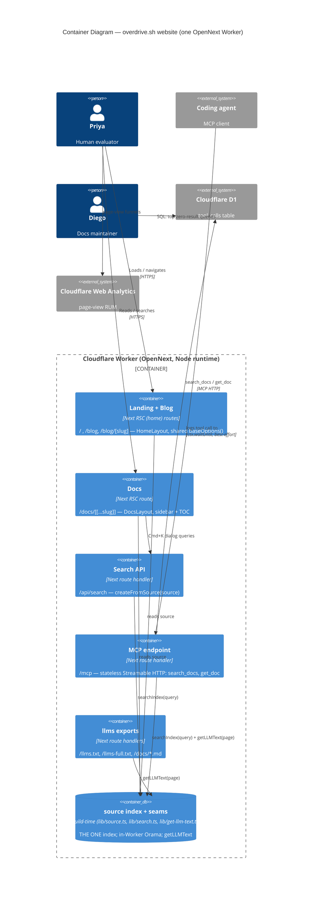
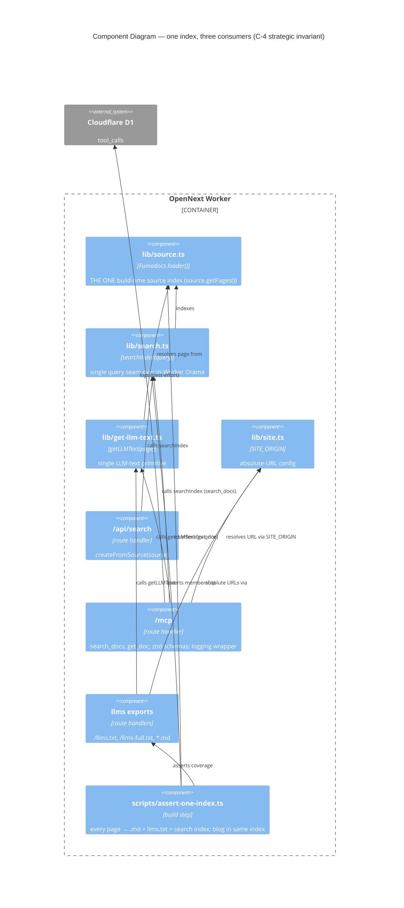

# Overdrive Architecture Brief

**Source of truth for platform architecture.** Cross-cut with `docs/whitepaper.md`
(platform design) and `docs/commercial.md` (tenancy / tiers / licensing). This
brief records the *architectural decisions* those documents imply, at three
levels of ownership:

1. **System Architecture** — cluster-scale decisions: Intent/Observation split,
   role-at-bootstrap, regional topology, dataplane layer. *(Future architect:
   placeholder.)*
2. **Domain Model** — aggregates, bounded contexts, ubiquitous language.
   *(Future architect: placeholder.)*
3. **Application Architecture** — crate topology, module boundaries, trait
   surfaces, enforcement mechanisms. *(Owned here, by Morgan — Phase 1
   foundation.)*

Each section is owned by exactly one architect. Later waves build on top; they
do not rewrite prior sections without a corresponding ADR marked
`supersedes ADR-XXXX`.

---

## Status

| Section | Owner | Status |
|---|---|---|
| System Architecture | Titan | **single-node dataplane interface wiring (2026-06-02, ADR-0061 Accepted)** |
| Domain Model | Hera (future) | placeholder |
| Application Architecture | Morgan (this doc) | **extended — Phase 2.2 XDP service map (2026-05-05); pivot to `bpf_redirect_neigh` datapath (2026-05-07, GH #159, ADR-0045); `ServiceFrontend` on `update_service` for per-proto reverse-NAT (2026-06-02, GH #163, ADR-0060); built-in CA `Ca` port trait + 3-tier hierarchy (2026-06-05, GH #28, ADR-0063)** |

---

## System Architecture

System-level decisions that apply to the whole cluster topology (per-region
Raft vs global CRDT, role declaration at bootstrap, mesh VPN underlay, etc.)
live here. For the broader cluster-scale topology not yet decided, read
`docs/whitepaper.md` §2-§4 as the authoritative source. Decisions recorded so
far:

### Single-node dataplane interface wiring (ADR-0061, 2026-06-02)

**Decision.** Single-node `overdrive serve` attaches its two XDP programs
(forward `xdp_service_map_lookup`, reverse `xdp_reverse_nat_lookup`) to a
**dedicated host-netns veth pair** (`ovd-veth-cli` ↔ `ovd-veth-bk`),
auto-provisioned at boot — **not** to `lo`.

**Why.** The kernel permits exactly one program per netdev XDP hook, so
pointing both ifaces at `lo` (the prior `DataplaneConfig::loopback()` default)
returned `EBUSY` on the second attach and aborted boot. `lo` additionally has
no native XDP driver, forcing generic/SKB mode, which can bypass cloned skbs
(TCP retransmit path) and silently miss traffic. A veth pair restores the
two-distinct-iface invariant (no `EBUSY`) **and** native veth XDP (correct
cloned-skb handling), with zero kernel-side / BPF change.

**Provisioning is idempotent detect-and-reuse, and OS-image-adoptable.**
Serve-boot provisioning is the single-node default, but it detects and
adopts a pre-existing veth pair rather than recreating or failing — so an
OS image (**Yocto**) or VM-boot provisioner (**Lima**, which already
provisions its veth/networking at VM boot) can own the interface lifecycle
and `serve` reuses what it finds. The two mechanisms are interchangeable
by construction because reuse is idempotent; the same property persists
the pair across serve restarts (mirrors bpffs-pin persistence per
ADR-0052 § 3).

**Topology (G-4 steering).** The single host plays all three roles the
Tier-3 `ThreeIfaceTopology` (ADR-0043) splits across `client-ns`/`lb-ns`/
`backend-ns`, collapsed into the host network namespace. A host route
(`ip route add <vip_range> dev ovd-veth-cli`) makes the platform-issued VIP
range (ADR-0049) on-link via the client-side veth; a connection to
`<vip>:<port>` routes out `ovd-veth-cli`, where the forward program does the
SERVICE_MAP lookup + `bpf_fib_lookup` + `bpf_redirect` across the pair to the
backend. The cross-iface `bpf_redirect` datapath (ADR-0045) is **preserved
verbatim** — it is the reason the two programs must stay on two distinct
ifaces (a merged single-hook program has no second iface to redirect to).

**Boundaries.** Two-NIC / multi-NIC production deployments override
`client_iface`/`backend_iface` with real NIC names and skip auto-provisioning
— the existing path is unchanged. The explicit `[dataplane] provision =
"veth" | "none"` opt-out knob is deferred to issue **#194**. A typed
`DataplaneError::IfaceXdpSlotBusy` variant replaces the prior
`DRV_MODE`-masking error string for the residual same-iface collision case.
The datapath is **IPv4-only**; IPv6 / AF_INET6 single-node veth steering is
deferred to issue **#195** (depends on IPv6 dataplane forwarding, #155).

See ADR-0061 (Accepted 2026-06-02) and
`docs/feature/single-node-dataplane-wiring/feature-delta.md`.

---

## Domain Model

*Placeholder for Hera.* Aggregates, bounded contexts, and ubiquitous language
live here once the domain crosses the complexity threshold that warrants DDD.
For Phase 1 the language is thin: `Job`, `Allocation`, `Node`, `Policy`,
`Certificate`, `Investigation`, plus the identifier newtypes enumerated below.

---

## Application Architecture

**Scope**: crate topology, trait surfaces, module boundaries, and enforcement
tooling for the Phase 1 walking skeleton and everything that will build on it.

### 1. Architectural style

**Hexagonal (ports and adapters), single-process**.

The whitepaper §21 nondeterminism-trait table *is* the ports layer:

| Port (trait) | Concern | Real adapter | Sim adapter |
|---|---|---|---|
| `Clock` | time | `SystemClock` | `SimClock` |
| `Transport` | network | `TcpTransport` | `SimTransport` |
| `Entropy` | RNG | `OsEntropy` | `SeededEntropy` |
| `Dataplane` | kernel/eBPF | `EbpfDataplane` (Phase 2+) | `SimDataplane` |
| `Driver` | workload exec | `CloudHypervisorDriver` etc. (Phase 2+) | `SimDriver` |
| `IntentStore` | linearizable state | `LocalStore` (Phase 1) / `RaftStore` (Phase 2+) | `LocalStore` reused |
| `ObservationStore` | eventually-consistent state | `LocalObservationStore` (Phase 1, redb) / `CorrosionStore` (Phase 2+) | `SimObservationStore` |
| `Llm` | inference | `RigLlm` (Phase 3+) | `SimLlm` |

Core logic (future reconcilers, workflows, investigation agent) depends on
ports only. Wiring crates pick real adapters; DST picks sim adapters. This
matches whitepaper §21 word-for-word and is what makes the §21 DST claim
structural rather than aspirational.

**Why not microservices, layered, or event-driven?**

- The whole platform is **one binary** (whitepaper principle 8). Roles are
  declared at bootstrap, not at build time. Microservices at the Phase 1 scope
  contradicts the central design commitment.
- Layered (N-tier) has no answer for the DST seam; it routes I/O through
  infrastructure interfaces that are not injectable by default.
- Event-driven is the *consequence* of the reconciler/workflow primitives
  (whitepaper §18) — not the top-level organising principle. Reconcilers
  converge; workflows orchestrate. Both are hosted inside the hexagon.

The decision to name this hexagonal-only (rather than "hexagonal + DDD +
vertical slice") is a deliberate narrowing: Phase 1 ships identifier types
and traits, not aggregates with behaviour, so there is no domain-model
surface for DDD to organise yet.

### 2. Paradigm

**OOP (Rust trait-based)**.

- Ports are `trait` objects. Adapters are `struct` types implementing them.
- Errors are `enum` variants under `thiserror`.
- Identifiers are `struct` newtypes with validating constructors.
- Composition over inheritance everywhere (Rust has no inheritance anyway).
- `async_trait` for async trait methods (Rust 2024 + `dyn` compatibility).

The `development.md` rules codify this: thiserror for libs, newtypes STRICT,
pass-through `#[from]` error embedding, `Send + Sync` on core data structures.
No pull toward functional-first organisation (no algebra-of-effects, no
free monads, no lens-style derives) — the injectable trait surface already
gives us the substitution semantics functional style would be reaching for.

### 3. Crate topology (Phase 1 target)

```
workspace/
├── crates/
│   ├── overdrive-core/          # ports + newtypes + Result alias + Error
│   │                            # (class: core, lint-scanned, no I/O primitives)
│   ├── overdrive-scheduler/     # pure-fn placement (ADR-0024 — first-workload)
│   │                            # (class: core, lint-scanned)
│   ├── overdrive-store-local/   # LocalStore (redb) adapter
│   │                            # (class: adapter-host, uses redb directly)
│   ├── overdrive-host/          # production adapters: SystemClock, OsEntropy,
│   │                            # TcpTransport (host-OS primitives — ADR-0016)
│   │                            # (class: adapter-host)
│   ├── overdrive-worker/        # ExecDriver + workload-cgroup management
│   │                            # + node_health writer (ADR-0029 — first-workload)
│   │                            # (class: adapter-host)
│   ├── overdrive-control-plane/ # axum + rustls + reconciler runtime
│   │                            # (class: adapter-host)
│   ├── overdrive-sim/           # Sim* adapters + invariants + turmoil harness
│   │                            # (class: adapter-sim, dev-profile only)
│   ├── overdrive-cli/           # bin: `overdrive` (binary boundary, eyre)
│   └── overdrive-node/          # bin: `overdrive-node` (future wiring crate)
└── xtask/                        # bin: `cargo xtask ...`
```

Phase 1 ships `overdrive-core`, `overdrive-store-local`, `overdrive-sim`, and
extends `xtask` with `dst`/`dst-lint`. `overdrive-cli` already exists;
`overdrive-node` is a future placeholder.

**Phase 1 control-plane-core extension** (ADR-0008 — ADR-0015):

- **`crates/overdrive-control-plane/`** — NEW, class = `adapter-host`. Hosts
  the axum router + handlers, rustls TLS bootstrap, `ReconcilerRuntime`,
  `EvaluationBroker`, and the `overdrive-control-plane::api` shared
  request/response types. Depends on `overdrive-core`,
  `overdrive-store-local` (for both `LocalStore` and
  `LocalObservationStore` — ADR-0012, revised 2026-04-24),
  `axum`, `utoipa`, `utoipa-axum`, `rustls`, `rcgen`, `libsql`, `hyper`,
  `tokio`, `bytes`, `serde`, `serde_json`, `thiserror`. `overdrive-sim`
  is **not** a runtime dep — it stays in `overdrive-control-plane`'s
  `[dev-dependencies]` only (if used for DST-shaped crate-local tests).
- **`crates/overdrive-cli/`** — EXTENDED. Gains `reqwest` dep (ADR-0014),
  imports shared types from `overdrive-control-plane::api`, adds HTTP
  client module under `src/client.rs`, fills in the previously-stub
  subcommand handlers.
- **`xtask`** — EXTENDED with `openapi-gen` and `openapi-check` subcommands
  (ADR-0009).
- **`api/openapi.yaml`** — NEW at workspace root. Checked-in OpenAPI 3.1
  document, derived from the Rust request/response types; drift caught
  by `cargo openapi-check` in CI.

**Phase 1 first-workload extension** (ADR-0021 — ADR-0029):

- **`crates/overdrive-scheduler/`** — NEW, class = `core` (ADR-0024 user
  override of the originally-proposed module-inside-control-plane
  placement). Hosts the pure synchronous `schedule(...)` function
  consumed by the `JobLifecycle` reconciler. Depends only on
  `overdrive-core`. `dst-lint` mechanically enforces the BTreeMap-only
  iteration discipline + banned-API contract.
- **`crates/overdrive-worker/`** — NEW, class = `adapter-host`
  (ADR-0029, amended 2026-04-28 — `ProcessDriver` renamed to
  `ExecDriver`; `DriverType::Process` renamed to `DriverType::Exec`;
  `AllocationSpec.image` renamed to `AllocationSpec.command` and
  `args: Vec<String>` field added). Hosts `ExecDriver` (ADR-0026,
  formerly slated for `overdrive-host`), workload-cgroup management
  (`overdrive.slice/workloads.slice/<alloc_id>.scope` create / limit
  writes / teardown), and the boot-time `node_health` row writer
  (relocated from control-plane bootstrap per ADR-0025 amendment).
  The crate exposes a worker subsystem entrypoint the binary calls
  during startup; `overdrive-control-plane` does NOT depend on this
  crate — the action shim calls `Driver::*` against an injected
  `&dyn Driver` whose impl the binary plugs in.
- **`crates/overdrive-host/`** — UNCHANGED at the application-architecture
  level. Per ADR-0029, `overdrive-host` retains its ADR-0016 intent
  (host-OS primitive bindings: `SystemClock`, `OsEntropy`,
  `TcpTransport`); workload drivers were never landed there.
- **`crates/overdrive-control-plane/`** — EXTENDED. Gains
  `reconciler_runtime::action_shim` submodule (ADR-0023), `AppState::driver:
  Arc<dyn Driver>` field (ADR-0022), `JobLifecycle` reconciler
  body, control-plane-cgroup management + pre-flight (ADR-0028 +
  ADR-0026 amendment — workload-cgroup half moves to
  `overdrive-worker`), and `POST /v1/jobs/{id}:stop` handler
  (ADR-0027).
- **`crates/overdrive-core/`** — EXTENDED. Gains `AnyState` enum
  (ADR-0021), `JobLifecycleState` struct, `AnyReconciler::JobLifecycle`
  variant, `IntentKey::for_job_stop` constructor (ADR-0027),
  `NodeId::from_hostname` (ADR-0025), three new `Action` variants
  (`StartAllocation`, `StopAllocation`, `RestartAllocation`).
- **`crates/overdrive-cli/`** — EXTENDED. Gains `overdrive job stop <id>`
  subcommand. The `serve` subcommand becomes the binary-composition
  root: hard-depends on both `overdrive-control-plane` and
  `overdrive-worker`; runtime `[node] role` config selects which
  subsystems boot (ADR-0029).

New crate-class assignments:

| Crate | Class | Notes |
|---|---|---|
| `overdrive-control-plane` | `adapter-host` | Uses rustls, hyper, axum; not DST-pure. Reconciler bodies inside this crate that want DST coverage must be in separate `core`-class sub-crates when they appear in Phase 2+. |
| `overdrive-scheduler` | `core` | NEW (ADR-0024). Pure synchronous placement function; `dst-lint`-scanned; depends only on `overdrive-core`. |
| `overdrive-worker` | `adapter-host` | NEW (ADR-0029; amended 2026-04-28 — type renamed `ProcessDriver` → `ExecDriver`, `AllocationSpec.image` → `AllocationSpec.command`, `args` field added). ExecDriver + workload-cgroup management + node_health writer. Composed alongside `overdrive-control-plane` by the binary; control-plane crate does NOT depend on it. |

**Crate classes** (`package.metadata.overdrive.crate_class`):

| Class | Meaning | Banned-API lint | Examples |
|---|---|---|---|
| `core` | ports + pure logic | **yes** — lint scans for `Instant::now`, `rand::*`, `tokio::net::*`, `std::thread::sleep` | `overdrive-core` |
| `adapter-host` | host adapter | no — allowed to use banned APIs to *implement* ports against the host OS / kernel / network | `overdrive-host`, `overdrive-store-local`, `overdrive-control-plane`, `overdrive-worker` (ADR-0029) |
| `adapter-sim` | sim adapter + harness | no — legitimately uses `turmoil`, `StdRng`, etc. | `overdrive-sim` |
| `binary` | binary boundary | no | `overdrive-cli`, `xtask` |
| *(unset)* | legacy / not classified | no | — |

A crate without the metadata label is *not scanned*. `xtask dst-lint` walks
the workspace, filters to `crate_class = "core"`, and scans only those crates.
A self-test inside `xtask` asserts the core-class set is non-empty (preventing
a silent "all scanning turned off" regression).

See **ADR-0003** for the labelling-mechanism rationale.

### 4. State-layer discipline (mapped to types)

The state-layer table from `development.md` is the load-bearing boundary.
Application architecture enforces it by type:

| Layer | Trait | Impl (Phase 1) | Enforcement |
|---|---|---|---|
| Intent (should-be) | `IntentStore` | `LocalStore` (redb) | Distinct trait, distinct types; no shared `put(key, value)` surface |
| Observation (is) | `ObservationStore` | `LocalObservationStore` (redb, single-writer) | Distinct trait, distinct types; compile-time test asserts non-substitutability |
| Memory (was) | per-primitive libSQL (Phase 2+) | — | N/A in Phase 1 |
| Scratch (this tick) | `bumpalo::Bump` | — | N/A in Phase 1 (reconcilers land Phase 2) |

Nothing in Phase 1 admits a cross-boundary write path. A future reconciler
cannot persist a `JobSpec` into `ObservationStore` because the trait does not
expose a `write_bytes(key, bytes)` surface — `write` is parametrised on
observation-row shapes, not raw bytes. Likewise, `IntentStore::put` takes
`&[u8]` by key but its *callers* are constrained to intent-class keys by the
typed wrappers the reconciler runtime will provide in Phase 2.

### 5. Module topology inside `overdrive-core`

```
overdrive-core/
├── src/
│   ├── lib.rs              # re-exports + module docs
│   ├── error.rs            # top-level Error + Result alias
│   ├── id.rs               # 11 identifier newtypes (Phase 1 complete)
│   └── traits/
│       ├── mod.rs          # pub use ...
│       ├── clock.rs        # Clock
│       ├── transport.rs    # Transport + Connection + TransportError
│       ├── entropy.rs      # Entropy
│       ├── dataplane.rs    # Dataplane + Verdict + FlowEvent + ...
│       ├── driver.rs       # Driver + DriverType + AllocationSpec + ...
│       ├── intent_store.rs # IntentStore + TxnOp + StateSnapshot + ...
│       ├── observation_store.rs # ObservationStore + Value + Rows + ...
│       └── llm.rs          # Llm + Prompt + ToolDef + ...
```

The existing scaffolding (`crates/overdrive-core/src/{error.rs, id.rs,
traits/*.rs}`) is structurally correct. Phase 1 **completes in place**: adds
the two missing identifier newtypes (`SchematicId` canonicalisation signed,
`CorrelationKey` already present) and adds proptest/trait-contract tests where
missing. No refactor. See **ADR-0001**.

### 6. Observation-store row shapes — Phase 1 minimal set

Two implementations of `ObservationStore` coexist in the Phase 1 workspace:

- **`LocalObservationStore`** (class `adapter-host`, in
  `overdrive-store-local`, per ADR-0012 revised 2026-04-24) — the
  **production** single-node server adapter. Redb-backed on disk
  (`<data_dir>/observation.redb`); single-writer overwrite semantics (no
  LWW merge, no site-IDs, no tombstones — those land with Phase 2's
  `CorrosionStore`); subscriptions via `tokio::sync::broadcast` in the
  same idiom as `LocalStore::watch`.
- **`SimObservationStore`** (class `adapter-sim`, in `overdrive-sim`)
  — the **DST harness** adapter. In-memory LWW with injectable gossip
  delay + partition; used exclusively by the simulation test suite
  (`SimObservationLwwConverges` invariant, Fly-style contagion scenarios,
  reconciler DST tests).

Both implement the same trait surface against the same typed row shapes,
the minimum the DST harness needs (per US-04 and whitepaper §4):

- `alloc_status { alloc_id, job_id, node_id, state, updated_at }`
- `node_health { node_id, region, last_heartbeat }`

Rows are full-row writes (§4 guardrail) — no field-diff merges. Logical
timestamps are `(lamport_counter, writer_node_id)` tuples preserved in
every row for forward-compatibility with the Phase 2 Corrosion gossip
layer; `LocalObservationStore` does not consult them (single-writer has
no ordering question to resolve), `SimObservationStore` and the future
`CorrosionStore` do.

Production `CorrosionStore` (Phase 2+) will implement the same trait with
the same row shapes, backed by cr-sqlite and SWIM/QUIC. It replaces
`LocalObservationStore` at the `wire_single_node_observation` construction
seam via a single `Box<dyn ObservationStore>` swap. Sim, local, and
real-distributed share the shape definitions; they do not share the wire
format.

Row schema versioning (for Phase 2+ forward compatibility of Phase 1 test
artifacts) is a crafter decision at implementation time; Phase 2 feature
scope will lock the mechanism.

### 7. DST harness architecture

The harness is the integration point for every Phase 1 invariant. It is
hosted in a dedicated crate (`overdrive-sim`) and invoked from `xtask dst`.

See the C4 component diagram below; the short form:

- `xtask dst` parses the seed (random if unspecified), invokes
  `cargo test --features dst --package overdrive-sim`.
- `overdrive-sim` depends on `turmoil` and `overdrive-core`; it owns
  `SimClock`, `SimTransport`, `SimEntropy`, `SimDataplane`, `SimDriver`,
  `SimLlm`, `SimObservationStore`.
- The harness composes **real** `LocalStore` (`overdrive-store-local`) with
  all Sim* adapters in a `turmoil::Sim` — matching US-06 AC.
- Invariants live in `overdrive-sim::invariants::Invariant` (an enum). The
  enum name IS the canonical invariant name; `--only <NAME>` resolves to an
  enum variant via `FromStr`. This prevents printed-vs-flag name drift (the
  `shared-artifacts-registry` `invariant_name` HIGH risk).
- Seed is printed on every run; failure output prints invariant name, seed,
  tick, turmoil host, and a reproduction command (matching the US-06 AC).

See **ADR-0004** for why `overdrive-sim` is one crate, not three.

### 8. Test distribution

Per-crate `tests/*.rs` for integration tests that exercise a single crate's
public surface; top-level `crates/{crate}/tests/acceptance/*.rs` *only* for
acceptance scenarios that explicitly correspond to a DISTILL test-scenarios
entry (they may exist in Phase 1 only as US-06 scenarios once DISTILL lands).

Unit tests stay in `#[cfg(test)] mod tests` inside the module they test.
`.feature` files are banned project-wide (`.claude/rules/testing.md`).

See **ADR-0005**.

### 9. Enforcement tooling

**Style**: Hexagonal, single-process, Rust workspace
**Language**: Rust 2024 edition, rustc ≥ 1.85
**Primary enforcement tool**: `cargo xtask dst-lint` (custom)
**Secondary enforcement**: `cargo clippy` workspace-wide with pedantic+nursery+cargo

**Rules to enforce**:

| Rule | Enforcement | Where |
|---|---|---|
| Core crates do not use `Instant::now`, `SystemTime::now`, `rand::random`, `rand::thread_rng`, `tokio::time::sleep`, `std::thread::sleep`, `tokio::net::{TcpStream, TcpListener, UdpSocket}` | Custom: `xtask dst-lint` via `syn` walk over `src/**/*.rs` of every `crate_class = "core"` crate | xtask/src/dst_lint.rs |
| Violations print file:line:col, banned symbol, replacement trait, link to `development.md` | Custom: error-formatter inside `dst-lint` | xtask/src/dst_lint.rs |
| Every banned symbol is covered by a synthetic-file self-test | xtask unit test | xtask/src/dst_lint.rs |
| Core-class set is non-empty | xtask assertion at start of `dst-lint` | xtask/src/dst_lint.rs |
| `thiserror` + Result alias convention | Code review + clippy (no structural enforcer exists for this in Rust today) | — |
| Newtypes: FromStr / Display / serde round-trip lossless | proptest in `overdrive-core/tests/` for every newtype | overdrive-core/tests |
| `IntentStore` and `ObservationStore` are not substitutable | `trybuild` or `tests/compile_fail/*.rs` asserting the substitution fails to compile | overdrive-core/tests/compile_fail |

`import-linter` (Python) and `ArchUnit` (JVM) have no Rust analogue with
equivalent semantics; `cargo-deny` checks dependency licenses but not
API-usage within a crate. The custom `dst-lint` is the only way to enforce
the banned-API rule, which is the load-bearing invariant for DST.

**Mutation testing.** Not a design-level decision — the `nw-mutation-test`
skill enforces the ≥80% kill-rate gate at DELIVER time per
`.claude/rules/testing.md` using `cargo-mutants`. Phase 1 applicable
targets: newtype `FromStr`/validators (US-01, US-02), `SchematicId` rkyv
canonicalisation / hash determinism paths (ADR-0002), and
`IntentStore::export_snapshot` / `bootstrap_from` round-trip code (US-03).
Other `testing.md`-listed targets (reconciler logic, policy verdicts,
scheduler bin-pack, workflow `run` bodies) do not exist in Phase 1 and
therefore have no Phase 1 kill-rate obligation.

### 10. Dependencies — Phase 1

OSS-only, already in workspace `Cargo.toml`:

| Dep | Version | License | Role | Why chosen |
|---|---|---|---|---|
| `redb` | 2.x | MIT-or-Apache-2 | IntentStore backend | Pure Rust embedded ACID KV; ~30MB RAM matches commercial density claim; whitepaper §4 explicit choice |
| `rkyv` | 0.8 | MIT | Snapshot framing; zero-copy deserialization; persistence boundary | Archived bytes are canonical → deterministic hashing (§development.md rule); whitepaper §17/18 explicit choice. Every rkyv-persisted type at a redb boundary goes through a per-type versioned envelope enum (ADR-0048); writer-side discipline enforced by inner-payload visibility + `xtask::dst_lint` clause. |
| `turmoil` | 0.6 | MIT-or-Apache-2 | DST harness | Rust-native controllable async simulation; whitepaper §21 + testing.md Tier 1 explicit choice |
| `bumpalo` | 3.x | MIT-or-Apache-2 | Per-reconciler scratch (Phase 2+) | Already in workspace; declared for reconciler hot path per development.md |
| `thiserror` | 2.x | MIT-or-Apache-2 | Typed errors | Rust community standard; `#[from]` preserves error chain |
| `proptest` | 1.x | MIT-or-Apache-2 | Property-based tests | Newtype round-trip, snapshot round-trip, LWW convergence |
| `async-trait` | 0.1 | MIT-or-Apache-2 | Async trait methods | Still needed for `dyn`-compatible async traits in stable Rust 2024 |
| `futures` | 0.3 | MIT-or-Apache-2 | Stream trait | `IntentStore::watch` returns `Stream<Item=(Bytes, Bytes)>` |
| `bytes` | 1.x | MIT | Zero-copy buffers | Cheap clone for put/get values |
| `serde` / `serde_json` | 1.x | MIT-or-Apache-2 | Transparent identifier serialisation | `try_from = "String"` for validating deserialize |
| `sha2` | 0.10 | MIT-or-Apache-2 | `ContentHash::of` | SHA-256 |
| `hex` | 0.4 | MIT-or-Apache-2 | `ContentHash` hex `Display`/`FromStr` | Lowercase hex |

No proprietary dependencies. All maintained, active, above 1k stars.

### 11. Non-functional / Quality attributes (ISO 25010, mapped)

| Attribute | Target | How it is addressed |
|---|---|---|
| Performance efficiency — time behaviour | *Phase 2+ guardrail* — `commercial.md` "Control Plane Density" target (<50ms cold start) | Direct redb open; no Raft overhead. Not a Phase 1 CI gate — density claims become measurable only once tenant clusters run on the infrastructure layer (see `upstream-changes.md` for K4 reframe). |
| Performance efficiency — resource util. | *Phase 2+ guardrail* — `commercial.md` "Control Plane Density" target (<30MB RSS empty) | Single redb file; no background tasks (single-mode). Not a Phase 1 CI gate — same reframe as above. |
| Performance efficiency — DST wall-clock | < 60s default catalogue | Turmoil tick-duration 1ms; 3-node default topology; CI gate (K1) |
| Reliability — fault tolerance | DST catches partition, clock skew, reorder, node crash | Sim adapters inject the fault catalogue from testing.md |
| Reliability — recoverability | Snapshot round-trip bit-identical | proptest with randomised contents; CI gate (K6) |
| Maintainability — testability | Every source of nondeterminism injectable | Ports table above; `dst-lint` enforces; CI gate (K2) |
| Maintainability — modifiability | New banned APIs added by editing one constant | `BANNED_APIS` constant in `xtask::dst_lint` |
| Security — accountability (future) | SPIFFE identity on every flow event | `SpiffeId` newtype already lands in Phase 1; flow-event wiring Phase 2+ |
| Compatibility — interoperability | Snapshot format stable across `LocalStore` → `RaftStore` | Versioned framing header on snapshot bytes; both impls share format |

No performance architecture beyond the above is in scope for Phase 1 — there
is no end-user request path yet.

### 12. Integration patterns

Phase 1 has **no external integrations**. No external APIs, no webhooks, no
OAuth, no third-party services. The DST harness runs entirely in-process.
`overdrive-cli` is already a placeholder that logs and returns — it will
gain a control-plane connection in Phase 2.

Consequently **no contract tests** are recommended for Phase 1. The
platform-architect handoff annotation remains empty at this phase; it will
fill up starting Phase 2 (gRPC control-plane API, future Phase 3 ACME, etc.).

### 13. Residuality / stressor posture

Phase 1 carries **one** named residual stressor: *turmoil upstream version
drift*. Bit-identical reproduction depends on deterministic scheduler output
from turmoil's `Sim::run`. A minor-version turmoil update that changes tick
ordering would invalidate historical seeds.

Mitigation: pin turmoil to a precise workspace version (`turmoil = "=0.6.X"`
once first seed is captured in a test). The twin-run identity self-test
(US-06 AC) catches drift continuously in CI.

No other stressors rise to the level requiring a hidden residuality pass at
this scope. The DST fault catalogue from `.claude/rules/testing.md` IS the
platform's realistic-fault surface; the sim adapters exercise it
continuously.

---

## Phase 1 control-plane-core extension

This section extends §1–§13 with the application-architecture decisions
landed by feature `phase-1-control-plane-core` (2026-04-23). Nothing in
§1–§13 is rewritten. New ADRs are ADR-0008 through ADR-0015.

### 14. External API — REST + OpenAPI over axum/rustls

Per ADR-0008 and whitepaper §3/§4, the Phase 1 control-plane external
API is **HTTP + JSON served by `axum` over `hyper` with `rustls`**,
HTTP/2 preferred (ALPN `h2`) with HTTP/1.1 fallback, routes under the
non-negotiable `/v1` prefix. Binds `https://127.0.0.1:7001` by default.

Walking-skeleton endpoints (exact shapes fixed by the OpenAPI schema
per ADR-0009):

| Method + path | Handler | Purpose |
|---|---|---|
| `POST /v1/jobs` | SubmitJob | Submit a Job spec; returns `{job_id, spec_digest, outcome}` |
| `GET /v1/jobs/{id}` | DescribeJob | Read back a committed Job; returns `{spec, spec_digest}` |
| `GET /v1/cluster/info` | ClusterStatus | Mode / region / reconciler registry / broker counters |
| `GET /v1/allocs` | AllocStatus | ObservationStore read on `alloc_status` (Phase 1: zero rows) |
| `GET /v1/nodes` | NodeList | ObservationStore read on `node_health` (Phase 1: zero rows) |

Internal RPC (node-agent control-flow streams) is explicitly
out-of-scope for this feature and lands in `phase-1-first-workload`
via `tarpc` or `postcard-rpc` — pure Rust, no `protoc` in toolchain.

### 15. OpenAPI schema derivation — `utoipa`, checked-in, CI-gated

Per ADR-0009. The OpenAPI 3.1 schema is derived from the Rust
request/response types in `overdrive-control-plane::api` via `utoipa`
+ `utoipa-axum`. The generated document lives at `api/openapi.yaml`
(workspace root) as a checked-in artifact. `cargo openapi-gen`
regenerates it; `cargo openapi-check` regenerates to a temp file
and diffs against the checked-in version — non-empty diff fails CI.

The Rust types are the contract; the OpenAPI document is their report.
A workspace-level test enumerates handlers and asserts each has a
matching `#[utoipa::path(...)]` annotation.

### 16. Phase 1 TLS bootstrap — ephemeral CA + embedded trust triple

Per ADR-0010, adopting Talos research R1–R5 (see
`docs/research/security/talos-bootstrap-tls-strategy-comprehensive-research.md`):

- **Ephemeral in-process CA** generated by `rcgen` on every
  `overdrive serve` start — the sole cert-minting site in Phase 1
  (ADR-0010 *Amendment 2026-04-26*; Phase 5 reintroduction of `cluster
  init` tracked in GH #81). CA private key lives in process memory only;
  re-starting re-mints.
- **Base64-embedded trust triple** (CA cert, client leaf cert, client
  private key) in `~/.overdrive/config` — same YAML shape as
  `~/.talos/config` / `~/.kube/config`.
- **Server leaf cert** carries SANs: `127.0.0.1`, `::1`, `localhost`,
  `<gethostname(3)>`.
- **No `--insecure` flag**. No TOFU. No fingerprint pinning.
- **Deferred to Phase 5**: rotation, revocation, operator RBAC, cert
  persistence, `acceptedCAs` multi-CA trust, SPIFFE URI SAN roles.

**Overdrive-specific divergence from Talos research**: operator role is
NOT encoded in the client cert's Organization (O) field — whitepaper §8
requires SPIFFE URI SANs for roles. Phase 1 has no role encoding; Phase 5
adds SPIFFE URI SANs directly.

### 17. `Job` / `Node` / `Allocation` aggregates — intent layer

Per ADR-0011. New module `overdrive-core::aggregate`:

- `Job` — validating constructor `from_spec(...)`, derives
  `rkyv::Archive + rkyv::Serialize + rkyv::Deserialize + serde::Serialize
  + serde::Deserialize`. Fields include `id: JobId`, `replicas: NonZeroU32`,
  `resources: Resources` (reused from `traits/driver.rs`).
- `Node` — same derive profile; `id: NodeId`, `region: Region`,
  `capacity: Resources`.
- `Allocation` — same derive profile; `id: AllocationId`, `job_id: JobId`,
  `node_id: NodeId`.
- `Policy`, `Investigation` — stub aggregates with ID newtype as primary
  field; no behavioural stubs.

**Intent-side vs observation-side**: `overdrive-core::aggregate::*` are
intent (written to `IntentStore` via `IntentKey::for_job(&JobId)` etc.);
`overdrive-core::traits::observation_store::AllocStatusRow` is observation
(LWW-gossiped row shape). The two never merge. Any vestigial `JobSpec`-named
struct in `observation_store.rs` is deleted or renamed to make its
observation-side role obvious.

Canonical intent-key derivation: `overdrive-core::intent_key` exposes
`for_job(&JobId) -> IntentKey` (and peers for `Node`, `Allocation`). The
canonical string form is `jobs/<JobId::display>` / `nodes/<NodeId::display>` /
`allocations/<AllocationId::display>`.

### 18. ObservationStore server impl — real `LocalObservationStore` in `overdrive-store-local`

Per ADR-0012 (revised 2026-04-24, reversing the original 2026-04-23
decision to reuse `SimObservationStore`). The Phase 1 server uses
`LocalObservationStore`, a real redb-backed, single-writer adapter
living alongside `LocalStore` in `overdrive-store-local` (class
`adapter-host`). Phase 2+ swaps in `CorrosionStore` via a single
`Box<dyn ObservationStore>` trait-object replacement at the
`observation_wiring::wire_single_node_observation` construction seam;
no handler changes.

Key properties of `LocalObservationStore`:

- **Persistent.** Rows survive process restart; `<data_dir>/observation.redb`
  is the backing file. The restart-round-trip case is the objection that
  drove the ADR revision.
- **Class `adapter-host`.** Production posture, not a sim crate pressed
  into production service. `overdrive-sim` is no longer a runtime
  dependency of `overdrive-control-plane`; it stays the DST harness's
  home.
- **No CRDT machinery.** Single-writer overwrite semantics. Owner-writer
  site-IDs, LWW logical-timestamp merges, and tombstone discipline land
  with `CorrosionStore` in Phase 2, where they have peers to
  coordinate.
- **Subscriptions via `tokio::sync::broadcast`.** Same idiom as
  `LocalStore::watch` per its Phase 1 substitute; lagging subscribers
  get `RecvError::Lagged`, stream wrapper terminates, caller
  resubscribes.
- **Trait-object swap seam unchanged.**
  `wire_single_node_observation() -> Result<Box<dyn ObservationStore>>`
  keeps its signature; only the construction line moves from
  `SimObservationStore::single_peer(...)` to
  `LocalObservationStore::open(path)`.

The DST harness continues to exercise `SimObservationStore` (for LWW
convergence invariants, gossip-delay scenarios, partition matrices) —
that adapter stays in `overdrive-sim` where `adapter-sim` is the
accurate class for what the code does.

### 19. Reconciler primitive — trait in `overdrive-core`, runtime in `overdrive-control-plane`

Per ADR-0013.

**`overdrive-core::reconciler`** (new module):

- `trait Reconciler { fn name(&self) -> &ReconcilerName; fn reconcile(&self,
  desired: &State, actual: &State, db: &Db) -> Vec<Action>; }` — synchronous,
  no `async`, no `.await`, no I/O-port parameters. Purity is load-bearing.
- `enum Action { Noop, HttpCall {...}, StartWorkflow {...} }` — the
  `HttpCall` variant is part of the Phase 1 surface even though the
  runtime shim lands in Phase 3 (per development.md §Reconciler I/O).
- `ReconcilerName` newtype — kebab-case, `^[a-z][a-z0-9-]{0,62}$`; rejects
  path-traversal characters by construction.
- `Db` handle — `Arc<libsql::Connection>`-equivalent, exposed as `&Db`
  to `reconcile(...)`.

**`overdrive-control-plane::reconciler_runtime`** (new module):

- `ReconcilerRuntime` — registers reconcilers at boot; owns the broker;
  surfaces `registered()` + broker counters.
- `EvaluationBroker` — keyed on `(ReconcilerName, TargetResource)`;
  cancelable-eval-set semantics per whitepaper §18; counters
  `queued` / `cancelled` / `dispatched`.
- **Per-primitive libSQL path**: `<data_dir>/reconcilers/<name>/memory.db`.
  Path provisioner canonicalises `data_dir` once at startup, enforces
  isolation by construction via the `ReconcilerName` regex plus a
  defence-in-depth `starts_with` check.
- `noop-heartbeat` reconciler registered at boot — living proof of the
  contract.

**DST invariants** added to `overdrive-sim::invariants::Invariant`:

- `AtLeastOneReconcilerRegistered` — post-boot registry is non-empty.
- `DuplicateEvaluationsCollapse` — N (≥3) concurrent evaluations at the
  same key → 1 dispatched, N-1 cancelled.
- `ReconcilerIsPure` — twin invocation with identical inputs produces
  bit-identical `Vec<Action>` outputs.

Slice 4 ships **whole** — not split 4A / 4B. DISCUSS-wave split remains
available as a crafter-time escape hatch if material complexity surfaces.

### 20. CLI HTTP client — hand-rolled `reqwest`; types shared across CLI and server

Per ADR-0014. The CLI uses a ~200 LoC hand-rolled client over `reqwest`
(already in workspace). CLI and server share the same Rust request/response
types imported from `overdrive-control-plane::api`. The OpenAPI schema
is a byproduct of the types via `utoipa`; the types are the contract.

No OpenAPI code generator in Phase 1 (no Java toolchain; Progenitor
deferred to Phase 2+ if a second Rust REST consumer appears — unlikely
given `tarpc` for the internal path).

### 21. HTTP error mapping — `ControlPlaneError` with `#[from]`, bespoke 7807-compatible body

Per ADR-0015. One top-level `ControlPlaneError` in
`overdrive-control-plane::error` with pass-through `#[from]` embedding
for `IntentStoreError`, `ObservationStoreError`, and aggregate
constructor errors. One `to_response(err)` function maps variants
exhaustively to `(StatusCode, Json<ErrorBody>)`.

Status-code matrix:

| Condition | Status | `error` kind |
|---|---|---|
| Validation failure | `400` | `"validation"` |
| Unknown resource | `404` | `"not_found"` |
| Duplicate intent-key with *different* spec | `409` | `"conflict"` |
| Infra failure | `500` | `"internal"` |

Byte-identical re-submission of the same spec is idempotent success
(200 OK, same `spec_digest`, with `outcome: IdempotencyOutcome::Unchanged`
per ADR-0020). 409 fires only on a *different* spec at an occupied
key — the handler implements idempotency as a read-then-write pattern
against `LocalStore` via `IntentStore::put_if_absent`.

Body shape is bespoke `{error, message, field}` — deliberately a
**subset compatible with RFC 7807** so that `type: Uri` and `instance: Uri`
can be added additively in a future v1.1.

### 22. Updated quality-attribute scenarios (Phase 1 control-plane extension)

| Attribute | Phase 1 control-plane-core target | How it is addressed |
|---|---|---|
| Performance efficiency — time behaviour (REST round-trip) | CLI → server → LocalStore → response < 100 ms on localhost | Axum + rustls over localhost; no proxy, no schedule jitter. `cargo openapi-check` stays under 10 s. |
| Reliability — fault tolerance (submit) | Validation failures reject before any IntentStore write | Handler gate per Slice 3 AC; unit test asserts no-write on malformed input |
| Reliability — storm-proofing | Evaluation broker collapses N concurrent duplicate evaluations | DST `DuplicateEvaluationsCollapse` invariant |
| Maintainability — testability (reconciler purity) | Twin invocation produces bit-identical outputs | DST `ReconcilerIsPure` + `dst-lint` banned-API gate |
| Maintainability — schema drift | No field rename disagreement between CLI and server | `utoipa`-derived schema + `openapi-check` CI gate + shared Rust types |
| Security — confidentiality | All CLI↔server traffic is TLS 1.3 via rustls | ADR-0010 trust triple; no plaintext, no `--insecure` |
| Security — accountability | All error paths surface a structured JSON body; no raw stack traces | `ControlPlaneError::to_response` exhaustive mapping |
| Compatibility — upgrade path | `/v1` prefix; future `/v2` served in parallel during deprecation window | ADR-0008 versioning rule |

### 23. External integrations — Phase 1 control-plane-core

**None.** The Phase 1 control-plane talks only to:

- The local `LocalStore` (redb file on disk) — not external.
- The local `LocalObservationStore` (redb file on disk) — not external.
- The local CLI over localhost rustls — not external.
- Per-primitive libSQL files on disk — not external.

No external APIs, no webhooks, no OAuth, no third-party services. The
platform-architect handoff annotation remains empty (no contract tests
recommended). The first external surface worth contract-testing lands
in Phase 2+ (node-agent `tarpc` streams are internal to the cluster;
the first external boundary is Phase 3+ ACME / Phase 5+ OIDC).

---

## Phase 1 first-workload extension

This section extends §1–§23 with the application-architecture decisions
landed by feature `phase-1-first-workload` (2026-04-27). Nothing in
§1–§23 is rewritten. New ADRs are ADR-0021 through ADR-0028.

### 24. State shape — per-reconciler `AnyState` enum

Per ADR-0021. The `Reconciler` trait gains an associated type
`type State`, and a sister `enum AnyState` mirrors the existing
`AnyReconciler` and `AnyReconcilerView` enum-dispatch shape:

```rust
pub enum AnyState {
    Unit,                              // NoopHeartbeat
    JobLifecycle(JobLifecycleState),   // first-workload reconciler
}

pub struct JobLifecycleState {
    pub job:         Option<Job>,
    pub nodes:       BTreeMap<NodeId, Node>,
    pub allocations: BTreeMap<AllocationId, AllocStatusRow>,
}
```

`desired` and `actual` collapse into the same `JobLifecycleState`
struct — the reconciler interprets `desired.job` as the spec and
`actual.allocations` as the running set. Future variants may diverge
internally if a different shape is genuinely required.

The runtime — not the reconciler — populates `desired` and `actual`
via two new async surfaces (`hydrate_desired`, `hydrate_actual`)
match-dispatched on `AnyReconciler`. The reconciler's existing
`hydrate(target, db)` retains its narrow remit (the libSQL private-
memory read). Per-tick I/O cost is proportional to the running
reconciler, not the registered set.

### 25. `AppState::driver: Arc<dyn Driver>` extension

Per ADR-0022 (amended 2026-04-27 by ADR-0029). `AppState` gains a
`driver: Arc<dyn Driver>` field; production wiring threads an
`Arc<ExecDriver>` from the worker subsystem (`overdrive-worker`,
per ADR-0029, type renamed from `ProcessDriver` 2026-04-28); test
fixtures thread `SimDriver`. The renamed entry
point `run_server_with_obs_and_driver(config, obs, driver)` is the
test-fixture seam; the binary's `serve` subcommand instantiates the
worker subsystem and threads its `Arc<dyn Driver>` into the
control-plane's `AppState`.

`AppState: Clone` is preserved (every field is `Arc<…>`). Phase 2+
multi-driver dispatch (Process / MicroVm / Wasm) replaces
`Arc<dyn Driver>` with `Arc<DriverRegistry>` at one field declaration
plus the action shim's call site — no handler or test signature
churn outside the field's immediate consumers.

### 26. Action shim placement and tick cadence

Per ADR-0023. The action shim lives at
`overdrive-control-plane::reconciler_runtime::action_shim`,
alongside `EvaluationBroker` and `ReconcilerRegistry`. The shim's
signature:

```rust
pub async fn dispatch(
    actions: Vec<Action>,
    driver:  &dyn Driver,
    obs:     &dyn ObservationStore,
    tick:    &TickContext,
) -> Result<(), ShimError>;
```

The reconciler-runtime tick loop drains the broker every **100 ms**
in production (configurable via `ServerConfig`); each drained
evaluation runs hydrate-then-reconcile-then-dispatch synchronously
within its tick. Under DST the tick task runs against `SimClock`
and the harness advances simulated time explicitly. The
`clock.sleep(...)` indirection through the injected `Clock` trait
is the seam: the same shim code runs in production and under DST,
no conditional compilation.

Action match is exhaustive. New variants (Phase 3+ `HttpCall`
runtime, workflow runtime, etc.) produce non-exhaustive-match
compile errors at extension time.

### 27. `overdrive-scheduler` crate (D4 user override)

Per ADR-0024. The originally-proposed `overdrive-control-plane::scheduler`
module placement was overridden by the user in favour of a dedicated
`overdrive-scheduler` crate, class `core`. The crate depends only on
`overdrive-core` and exposes:

```rust
pub fn schedule(
    nodes:          &BTreeMap<NodeId, Node>,
    job:            &Job,
    current_allocs: &[AllocStatusRow],
) -> Result<NodeId, PlacementError>;
```

The dependency graph:
`overdrive-core ← overdrive-scheduler ← overdrive-control-plane`.
Acyclic — the new edge is consistent with ADR-0003 (crate-class
labelling) and ADR-0016 (overdrive-host extraction).

**The override is the load-bearing decision.** Putting the
scheduler in a `core`-class crate means `dst-lint` mechanically
enforces the `BTreeMap`-only iteration discipline and the banned-API
contract (no `Instant::now`, no `rand::*`, no `tokio::net::*`). The
determinism property becomes a structural property of the crate,
not a review concern. The xtask self-test that the core-class set
is non-empty (ADR-0003) continues to pass — set size grows from
one (`overdrive-core`) to two.

### 28. Single-node startup wiring

Per ADR-0025 (amended 2026-04-27 by ADR-0029). `NodeId` is
hostname-derived by default, with optional `[node].id` config
override. `Region("local")` is the default, overridable via
`[node].region`. Capacity defaults to a deliberately-conservative
`Resources` sentinel (1000 cores / 1 TiB), overridable via
`[node].cpu_milli` + `[node].memory_bytes`.

Per ADR-0029, the `node_health` row writer is a **worker-subsystem
responsibility**, not a control-plane bootstrap responsibility. The
write happens during worker startup, before the worker is considered
"started" and before the control plane binds its listener — the
fail-fast property of the original ADR-0025 ordering is preserved,
the relocation just routes the row write through the worker
subsystem that owns the node's runtime presence:

```
1. Run cgroup pre-flight check                    (ADR-0028; control plane)
2. Mint ephemeral CA + leaf certs                 (ADR-0010; control plane)
3. Open LocalIntentStore                          (control plane)
4. Worker subsystem startup                       (ADR-0029):
     a. Resolve NodeId, Region, Capacity from config   (ADR-0025)
     b. Write node_health row to ObservationStore      (ADR-0025 amended)
     c. Construct ExecDriver                           (ADR-0026 amended 2026-04-28; formerly ProcessDriver)
5. Construct ReconcilerRuntime; thread Arc<dyn Driver> (ADR-0022)
6. Build AppState, Router                         (existing)
7. Bind TCP listener                              (existing)
8. Write trust triple                             (ADR-0010)
9. Spawn axum_server task                         (existing)
```

The `[node]` config block is operator-owned; servers READ it and
NEVER write it. The trust triple stays server-managed at
`[ca]` / `[client]` blocks per ADR-0010.

### 29. cgroup v2 direct writes; resource enforcement

Per ADR-0026 (amended 2026-04-27 by ADR-0029; amended 2026-04-28 —
`ProcessDriver` renamed to `ExecDriver`, `DriverType::Process` to
`DriverType::Exec`, `AllocationSpec.image` to `AllocationSpec.command`,
`args: Vec<String>` field added; magic image-name dispatch in
`build_command` removed in favour of
`Command::new(&spec.command).args(&spec.args)`). `ExecDriver`
(hosted in `overdrive-worker`) writes cgroup files directly via
`std::fs::write` / `std::fs::create_dir_all` — no `cgroups-rs` dep.
Five filesystem operations per workload lifecycle:

```
mkdir overdrive.slice/workloads.slice/<alloc_id>.scope    (create)
echo <pid> > .../cgroup.procs                             (place)
echo <weight> > .../cpu.weight                            (limit)
echo <bytes>  > .../memory.max                            (limit)
rmdir overdrive.slice/workloads.slice/<alloc_id>.scope    (remove)
```

`cpu.weight` derivation: `clamp(cpu_milli / 10, 1, 10000)`.
`memory.max` derivation: direct byte count. Limits are written
*before* the PID is placed in the scope — the moment the PID lands
in the scope it is already under the declared bounds.

Failure dispositions:

- Scope creation / `cgroup.procs` write fails → fatal,
  `DriverError::SpawnFailed`, alloc row written `state: Failed`.
- Limit write fails → warn-and-continue, alloc row written
  `state: Running`. Phase 1 prioritises isolation (the scope) over
  bounding (the limits); the limit failure is recoverable in
  operator-actionable ways and the workload itself is correctly
  placed.

cgroup v1 is NOT supported (operator confirmed). The pre-flight
check refuses to start on v1 hosts.

**Cgroup hierarchy ownership** (ADR-0029 amendment to ADR-0026):
the worker subsystem (`overdrive-worker`) owns
`overdrive.slice/workloads.slice/<alloc_id>.scope` create / limit
write / teardown — the *workload* half. The control plane subsystem
(`overdrive-control-plane`) owns `overdrive.slice/control-plane.slice/`
create + own-PID enrolment + ADR-0028 pre-flight check — the
*control-plane* half. Each subsystem manages its own slice; the
two never cross. The boundary mirrors whitepaper §4 *Workload
Isolation on Co-located Nodes* exactly.

### 30. `POST /v1/jobs/{id}:stop` HTTP shape; separate stop intent key

Per ADR-0027. The job-stop endpoint follows AIP-136 verb-suffix
convention:

```
POST /v1/jobs/{id}:stop
```

Empty request body. Response body:

```json
{ "job_id": "payments", "outcome": "stopped" }
```

`outcome ∈ { "stopped", "already_stopped" }`. 404 fires on unknown
job id; 409 is reserved for future Phase 2+ start/stop conflicts.

The stop intent is recorded as a separate
`IntentKey::for_job_stop(&JobId)` key (canonical form
`jobs/<JobId::display>/stop`). The reconciler's `hydrate_desired`
path reads BOTH the job spec and the stop key:

```
(Some(spec), None)        => DesiredState::Run { spec }
(Some(_),    Some(_))     => DesiredState::Stop
(None,       _)           => DesiredState::Absent
```

The lifecycle reconciler emits `Action::StopAllocation` for each
running allocation when `desired_state == DesiredState::Stop`. The
shim calls `Driver::stop`, which sends SIGTERM, waits the grace
period, escalates to SIGKILL, removes the cgroup scope.

Future companion verbs (`:start`, `:restart`, `:cancel`,
`:checkpoint`) compose with the same path-suffix shape. The
`Job` aggregate is **not** mutated on stop — the spec stays
readable via `GET /v1/jobs/{id}` for audit / rollback / debugging.

### 31. cgroup v2 delegation pre-flight: hard refusal (no escape hatch)

Per ADR-0028 (hard refusal) as superseded in part by ADR-0034
(escape hatch removed). `overdrive serve` runs a four-step
pre-flight check at boot (kernel exposes cgroup v2; cgroup v2 is
mounted; UID is root OR has delegation; `cpu` and `memory`
controllers are in `subtree_control`). On failure, the server logs
an actionable error naming the failed step + remediation, exits
non-zero, does NOT bind the listener.

```
Try one of:
  1. systemctl --user start overdrive            (production)
  2. sudo systemctl set-property user-1000.slice Delegate=yes
  3. sudo overdrive serve                        (root, dev only)
  4. cargo xtask lima run -- overdrive serve     (canonical dev
                                                  path on macOS /
                                                  non-delegated
                                                  Linux)
```

There is no in-binary escape hatch. ADR-0034 deletes the
`--allow-no-cgroups` flag introduced by ADR-0028: in code review
the flag was found to silently leak workloads in the
`StopAllocation` path (handle had `pid: None`, cgroup-kill branch
gated off, stop returned `Ok(())` while the process kept running),
producing a `state: Terminated`-while-process-alive convergence
mismatch. The canonical dev path is `cargo xtask lima run --`
(documented in `.claude/rules/testing.md`), which runs as root
inside the bundled Lima VM with full cgroup v2 delegation.

Hard refusal at boot is the disposition that respects the §4
"control plane runs in dedicated cgroups with kernel-enforced
resource reservations" architectural commitment. With the escape
hatch deleted, the commitment is structurally guaranteed rather
than defaulted-with-bypass.

### 32. Updated quality-attribute scenarios — Phase 1 first-workload

| Attribute | Phase 1 first-workload target | How it is addressed |
|---|---|---|
| Performance — convergence latency | submit → Running within 1-3 reconciler ticks (≤300 ms on default cadence) | 100 ms tick + level-triggered drain; ADR-0023 |
| Performance — `cluster status` under workload pressure | < 100 ms during 100% CPU workload burst | cgroup `overdrive.slice/control-plane.slice/`; ADR-0026 + ADR-0028 |
| Reliability — fault tolerance | Driver failure surfaces as `state: Failed` row, not stalled tick | per-action error isolation in shim; ADR-0023 |
| Reliability — recoverability | Killed workload restarts within N+M ticks (M = backoff delay) | `JobLifecycleView::restart_counts` libSQL state; US-03 AC. Backoff schedule is workspace-global today — TODO(#137) threads a per-job `RestartPolicy`. |
| Reliability — backoff exhaustion | Repeatedly-crashing workload stops at M attempts (no infinite restart) | per-alloc backoff counter in `JobLifecycleView`; US-03 AC. Ceiling is workspace-global today — TODO(#137) makes it operator-configurable. |
| Reliability — stale-alloc cleanup | `JobSpec` deleted from intent with `Running` rows still present is acknowledged but not yet drained | TODO(#148) cleanup reconciler. Today's `JobLifecycle::reconcile` no-ops the absent-desired-job branch. |
| Reliability — boot-time integrity | Pre-flight detects misconfiguration; node_health write surfaces store breakage | ADR-0025 + ADR-0028 |
| Maintainability — testability (scheduler determinism) | proptest: identical inputs → identical results, BTreeMap-order invariance | `overdrive-scheduler/tests/`; ADR-0024 |
| Maintainability — testability (reconciler purity) | Twin invocation produces bit-identical outputs (`ReconcilerIsPure`) | DST invariant catalogue; ADR-0017 |
| Maintainability — schema drift | OpenAPI gate covers new `:stop` endpoint | ADR-0009 + ADR-0027 |
| Security — workload isolation | Workload kernel-isolated from control plane via cgroup hierarchy | ADR-0026 + ADR-0028 |
| Compatibility — single-mode → multi-mode migration path | NodeId derivation works at N=1 and N>1; node_health row pattern is additive | ADR-0025 |

### 33. External integrations — Phase 1 first-workload

**None.** The first-workload feature talks only to:

- The local `LocalStore` (redb file on disk) — not external.
- The local `LocalObservationStore` (redb file on disk) — not external.
- The local CLI over localhost rustls — not external.
- Per-primitive libSQL files on disk — not external.
- The Linux kernel's cgroup v2 unified hierarchy at `/sys/fs/cgroup/`
  — host filesystem; not a network external.
- The Linux kernel's process API (`fork`, `execve`, `kill`, `waitpid`
  via `tokio::process`) — host kernel; not a network external.

No external APIs, no webhooks, no OAuth, no third-party services.
The platform-architect handoff annotation remains empty (no contract
tests recommended). Phase 2+ may add the first external surface
worth contract-testing.

---

### 34. Job spec — exec block wiring

The Phase 1 operator-facing TOML now nests `[resources]` and `[exec]`
tables; driver dispatch is implicit by table name. Top-level scalars
(`id`, `replicas`) carry identity and scale; `[resources]` carries the
resource envelope; `[exec]` carries the driver invocation. Future
drivers (`[microvm]`, `[wasm]`) slot in additively as new sibling
tables — exactly one driver table per spec is enforced by serde
(`deny_unknown_fields` + tagged-enum dispatch with `#[serde(flatten)]`)
at parse time.

```toml
id = "payments"
replicas = 1

[resources]
cpu_milli    = 500
memory_bytes = 134217728

[exec]
command = "/opt/payments/bin/payments-server"
args    = ["--port", "8080"]
```

The validated `Job` aggregate carries a tagged-enum `driver:
WorkloadDriver` field (mirroring the wire-shape `JobSpecInput.driver:
DriverInput`). Today the enum has one variant — `WorkloadDriver::Exec(Exec
{ command, args })` — that holds the operator's exec-driver invocation.
Future drivers add variants (`WorkloadDriver::MicroVm(MicroVm)`,
`WorkloadDriver::Wasm(Wasm)`) additively; the compiler enforces match
exhaustiveness at every reconciler/shim site, making driver-class
exclusivity structurally enforced at the intent layer (`make invalid
states unrepresentable` per development.md). `Job::from_spec` remains
THE single validating constructor (per ADR-0011) on both CLI and server
lanes, and projects `DriverInput → WorkloadDriver` as part of the
construction; the new `exec.command` non-empty rule slots in alongside
the existing replicas/memory rules and surfaces as
`AggregateError::Validation { field: "exec.command", message: "command
must be non-empty" }`. The validation field name is the operator-facing
path through the spec (matches the TOML the operator typed), not the
internal Rust nesting. Argv carries no per-element validation — it is
opaque to the driver, and the kernel's `execve(2)` enforces NUL-byte
and `PATH_MAX` posture at exec time.

The `Action::RestartAllocation` variant grows `spec: AllocationSpec`,
mirroring `StartAllocation { spec }`. `AllocationSpec` itself stays
flat per ADR-0030 §6 — at the driver-trait input boundary the
implementing driver knows its own class (`impl Driver for ExecDriver`
IS the discriminator), and ADR-0030's predicted Phase 2+ shape is
**per-driver-class spec types** (a future `Spec` enum with
`Spec::Exec(ExecSpec) | Spec::MicroVm(MicroVmSpec) | Spec::Wasm(WasmSpec)`),
NOT a discriminator on a shared `AllocationSpec`. The reconciler
projects `&job.driver` (today an irrefutable destructure of
`WorkloadDriver::Exec(Exec { command, args })`; tomorrow a `match`)
into the flat `AllocationSpec` at action-emit time. The shim's
`build_phase1_restart_spec`, `build_identity`, and
`default_restart_resources` placeholders delete in the same PR — the
Restart arm reads `spec` straight off the action.

See [ADR-0031](./adr-0031-job-spec-exec-block.md) for the full decision
record (TOML wire shape, Rust types, `Action` enum revision, action-shim
deletions, single-cut migration scope, C4 component diagram, and
Alternatives A-E). ADR-0031 was amended 2026-04-30 (Amendment 1) to
introduce the `WorkloadDriver` tagged-enum on `Job` for type-shape
consistency across the wire (`JobSpecInput.driver`) and intent
(`Job.driver`) layers; AllocationSpec was deliberately preserved flat
per ADR-0030 §6. [ADR-0030](./adr-0030-exec-driver-and-allocation-spec-args.md)
is the upstream type-shape decision that ratified `AllocationSpec
{ command, args }` on the internal driver surface; ADR-0030 is
unaffected by Amendment 1.

---

### C4 Level 1 — System Context



### C4 Level 2 — Container diagram (Phase 1 first-workload)

This diagram extends the prior phase's container view with four new
containers: the dedicated `overdrive-scheduler` crate (ADR-0024
override), the dedicated `overdrive-worker` crate (ADR-0029) hosting
`ExecDriver` (renamed from `ProcessDriver` 2026-04-28 per ADR-0029
amendment) and workload-cgroup management and the
`node_health` writer, the binary-composition pattern in
`overdrive-cli` (which hard-depends on both `overdrive-control-plane`
and `overdrive-worker`), and the on-host kernel cgroup hierarchy that
both subsystems manage at boot (each owning its own slice per
ADR-0028 + ADR-0029).

```mermaid
C4Container
  title Container Diagram — Overdrive (Phase 1 first-workload)

  Person(engineer, "Platform Engineer (Ana)")

  Container_Boundary(workspace, "Overdrive workspace") {
    Container(core, "overdrive-core", "Rust crate (class: core)", "Ports + newtypes + aggregates (Job/Node/Allocation) + Reconciler trait + AnyState/View enums + Action enum + IntentKey (incl. for_job_stop)")
    Container(scheduler, "overdrive-scheduler", "Rust crate (class: core, NEW per ADR-0024)", "Pure-fn first-fit `schedule(nodes, job, allocs)` over BTreeMap inputs; dst-lint-scanned; depends only on overdrive-core")
    Container(store_local, "overdrive-store-local", "Rust crate (class: adapter-host)", "LocalStore (redb-backed IntentStore with put_if_absent semantics per ADR-0020) + LocalObservationStore (redb-backed single-writer ObservationStore)")
    Container(host, "overdrive-host", "Rust crate (class: adapter-host)", "Host-OS primitive bindings: SystemClock, OsEntropy, TcpTransport (ADR-0016 intent preserved per ADR-0029)")
    Container(worker, "overdrive-worker", "Rust crate (class: adapter-host, NEW per ADR-0029; amended 2026-04-28)", "ExecDriver (Linux-only; renamed from ProcessDriver) + workload-cgroup management (overdrive.slice/workloads.slice/<alloc>.scope per ADR-0026) + boot-time node_health row writer (per ADR-0025 amendment)")
    Container(sim, "overdrive-sim", "Rust crate (class: adapter-sim)", "Sim* adapters + turmoil harness + invariant catalogue; SimDriver / SimObservationStore are used by DST only — not runtime deps of the control plane or worker")
    Container(ctrl, "overdrive-control-plane", "Rust crate (class: adapter-host)", "Axum router + rustls TLS + ReconcilerRuntime + EvaluationBroker + ActionShim + JobLifecycle reconciler + control-plane cgroup management + pre-flight (ADR-0028)")
    Container(xtask, "xtask", "Rust binary (class: binary)", "cargo dst / dst-lint / openapi-gen / openapi-check")
    Container(cli, "overdrive-cli", "Rust binary (class: binary)", "overdrive CLI — reqwest HTTP client against /v1 REST API; gains `job stop` subcommand (ADR-0027). `serve` subcommand is the binary-composition root: hard-depends on both overdrive-control-plane and overdrive-worker; runtime [node] role config selects which subsystems boot (ADR-0029)")
  }

  ContainerDb(redb_file, "redb file", "On-disk ACID KV", "Backs LocalStore + LocalObservationStore; one file per store instance")
  ContainerDb(libsql_files, "libSQL files", "On-disk SQLite", "One per reconciler; <data_dir>/reconcilers/<name>/memory.db")
  ContainerDb(config_file, "~/.overdrive/config", "TOML file", "Operator endpoint + trust triple (ADR-0010) + optional [node] block (ADR-0025)")
  ContainerDb(openapi_yaml, "api/openapi.yaml", "YAML file", "Checked-in OpenAPI 3.1 schema; derived from Rust types via utoipa (ADR-0009)")
  System_Ext(kernel, "Linux kernel cgroup v2", "Unified hierarchy at /sys/fs/cgroup/", "overdrive.slice/{control-plane.slice (ctrl-owned), workloads.slice/<alloc>.scope (worker-owned)}")
  System_Ext(workload, "Workload process", "tokio::process child", "fork/exec child placed in cgroup scope by ExecDriver")
  System_Ext(ci, "CI pipeline")

  Rel(engineer, xtask, "Runs `cargo xtask ...`")
  Rel(engineer, cli, "Runs `overdrive job submit/stop/...`")
  Rel(ci, xtask, "Invokes on every PR (dst / dst-lint / openapi-check)")

  Rel(cli, config_file, "Reads endpoint + trust triple from")
  Rel(cli, ctrl, "Composition root: instantiates control-plane subsystem when [node] role includes control-plane (ADR-0029)")
  Rel(cli, worker, "Composition root: instantiates worker subsystem when [node] role includes worker; threads Arc<dyn Driver> from worker into control-plane AppState (ADR-0029)")
  Rel(cli, ctrl, "POSTs / GETs JSON over rustls HTTP/2 on /v1/...")
  Rel(cli, core, "Imports aggregate types, newtypes, IntentKey from")

  Rel(ctrl, core, "Implements handlers against ports in; uses aggregates and AnyState/AnyReconciler enums from")
  Rel(ctrl, scheduler, "Calls `schedule(...)` from inside JobLifecycle::reconcile (pure helper from pure reconciler, ADR-0024)")
  Rel(ctrl, store_local, "Writes intent via IntentStore::put + reads via IntentStore::get; writes observation via ObservationStore::write + reads alloc_status_rows / node_health_rows")
  Rel(ctrl, libsql_files, "Provisions one libSQL DB per registered reconciler")
  Rel(ctrl, kernel, "Pre-flight reads /proc/filesystems, /sys/fs/cgroup/.../subtree_control; mkdirs control-plane.slice; writes own PID into cgroup.procs (ADR-0028)")
  Rel(ctrl, config_file, "Reads optional [node] block; writes trust triple after bind")

  Rel(worker, core, "Implements Driver port against; reads NodeId / Region / Resources newtypes; writes AllocStatusRow + NodeHealthRow shapes from")
  Rel(worker, store_local, "Writes node_health row at startup via ObservationStore::write (per ADR-0025 amended)")
  Rel(worker, kernel, "ExecDriver mkdirs workload scope; writes cpu.weight + memory.max + cgroup.procs; rmdirs scope on stop (ADR-0026 + ADR-0029)")
  Rel(worker, workload, "tokio::process spawns child; SIGTERM/SIGKILL on stop")
  Rel(worker, config_file, "Reads optional [node] block at worker startup")

  Rel(ctrl, worker, "Action shim calls Driver::start/stop/status against &dyn Driver; impl crate is overdrive-worker but ctrl does NOT depend on it directly — Arc<dyn Driver> is plugged in by the binary at AppState construction (ADR-0029)", "via &dyn Driver")

  Rel(scheduler, core, "Imports Resources, NodeId, Node, Job, AllocStatusRow from")

  Rel(host, core, "Implements Clock, Entropy, Transport ports against")

  Rel(store_local, redb_file, "ACID transactions to")

  Rel(xtask, sim, "Runs DST harness via `cargo test --features dst`")
  Rel(xtask, core, "Scans source for banned APIs (dst-lint)")
  Rel(xtask, scheduler, "Scans source for banned APIs (dst-lint) — NEW core-class crate")
  Rel(xtask, ctrl, "openapi-gen regenerates schema from; openapi-check diffs against")
  Rel(xtask, openapi_yaml, "Writes (openapi-gen) / reads (openapi-check)")

  Rel(sim, core, "Implements Sim* adapters against ports in")
  Rel(sim, store_local, "Composes real LocalStore with Sim* adapters in turmoil harness")
```



### C4 Level 3 — `overdrive-control-plane` component diagram (Phase 1)

The control-plane crate is complex enough to warrant a component view:
router + handlers + reconciler runtime + evaluation broker + TLS
bootstrap + error mapper add up to 6+ components with non-trivial
relationships.



### C4 Level 3 — Convergence-loop closure (Phase 1 first-workload)

The convergence loop is the central architectural feature of the
first-workload feature: it is the path from `overdrive job submit`
through the JobLifecycle reconciler + scheduler + action shim +
ExecDriver and back into ObservationStore, where the next tick
sees the new state. The diagram below shows the components and
their async / sync boundaries explicitly.



The diagram makes one architectural property visually explicit: the
**only async boundary inside the convergence loop is the action
shim**. `JobLifecycle::reconcile` is sync; `schedule(…)` is sync;
`hydrate_desired` / `hydrate_actual` / `reconciler.hydrate` /
`shim::dispatch` are async. The reconciler's purity contract —
ADR-0013, `ReconcilerIsPure` invariant in ADR-0017 — is preserved
by construction.

### C4 Level 3 — `overdrive-sim` component diagram

The DST harness is complex enough to warrant a component view (5+ components
interacting non-trivially). Every other crate's internal structure is
adequately described by the container-level view.



---

## Architecture Enforcement

Style: Hexagonal (single-process, Rust workspace)
Language: Rust 2024 edition
Tool: **`cargo xtask dst-lint`** (custom, `syn`-based; see
`xtask/src/dst_lint.rs`)
Secondary: `cargo clippy` workspace pedantic+nursery+cargo
Contract enforcement: `overdrive-core/tests/compile_fail/*.rs`
(`trybuild`-powered) for trait-non-substitutability

Rules to enforce:

- Core crates (class = `core`) do not import banned APIs (`Instant::now`,
  `SystemTime::now`, `rand::random`, `rand::thread_rng`, `tokio::time::sleep`,
  `std::thread::sleep`, `tokio::net::{TcpStream, TcpListener, UdpSocket}`).
- The set of core-class crates is non-empty at every lint run.
- Every banned symbol is covered by a synthetic-file self-test inside xtask.
- Violation messages include file:line:col, banned symbol, replacement trait,
  and a link to `.claude/rules/development.md`.
- `IntentStore` and `ObservationStore` are not type-substitutable (compile-fail
  test).
- Every newtype is lossless under Display / FromStr / serde / rkyv round-trip
  (proptest).

---

## ADR index

| # | Title | Status |
|---|---|---|
| 0001 | Complete existing trait scaffolding in place | Accepted |
| 0002 | SchematicId canonicalisation uses rkyv-archived bytes | Accepted |
| 0003 | Core-crate labelling via `package.metadata.overdrive.crate_class` | Accepted |
| 0004 | Single `overdrive-sim` crate, not split | Accepted |
| 0005 | Test distribution: per-crate `tests/`, top-level `tests/acceptance/` for acceptance only | Accepted |
| 0006 | `cargo dst` + `dst-lint` are the required CI checks; seeds surfaced on failure | Accepted |
| 0007 | cr-sqlite deletion discipline (tombstones + bounded sweep) | Accepted |
| 0008 | Control-plane external API is REST + OpenAPI over axum/rustls | Accepted |
| 0009 | OpenAPI schema is derived from Rust types via `utoipa`, checked-in, CI-gated | Accepted |
| 0010 | Phase 1 TLS bootstrap: ephemeral in-process CA, embedded trust triple in `~/.overdrive/config` | Accepted |
| 0011 | Intent-side `Job` aggregate and observation-side `AllocStatusRow` stay separate types | Accepted |
| 0012 | Phase 1 server uses a real `LocalObservationStore` (redb-backed, single-writer) | Accepted (revised 2026-04-24) |
| 0013 | Reconciler primitive: trait in `overdrive-core`, runtime in `overdrive-control-plane`, libSQL private memory | Superseded by 0035 |
| 0014 | CLI HTTP client is hand-rolled `reqwest`; CLI and server share Rust request/response types | Accepted |
| 0015 | HTTP error mapping: `ControlPlaneError` with `#[from]`, bespoke 7807-compatible JSON body | Accepted |
| 0021 | Reconciler `State` shape: per-reconciler typed `AnyState` enum mirroring `AnyReconcilerView` | Accepted (amended by 0036) |
| 0022 | `AppState::driver: Arc<dyn Driver>` extension | Accepted |
| 0023 | Action shim placement: `reconciler_runtime::action_shim` submodule; 100 ms tick cadence | Accepted |
| 0024 | Dedicated `overdrive-scheduler` crate (class `core`); D4 user override | Accepted |
| 0025 | Single-node startup wiring: hostname-derived NodeId; one-shot node_health write at boot | Accepted |
| 0026 | cgroup v2 direct cgroupfs writes (no `cgroups-rs` dep); `cpu.weight` + `memory.max` from spec | Accepted |
| 0027 | Job-stop HTTP shape: `POST /v1/jobs/{id}:stop`; separate `IntentKey::for_job_stop` | Accepted |
| 0028 | cgroup v2 delegation pre-flight: hard refusal (escape-hatch portion superseded by ADR-0034) | Superseded in part by 0034 |
| 0034 | Remove `--allow-no-cgroups` escape hatch; canonical dev path is `cargo xtask lima run --` | Accepted |
| 0029 | Dedicated `overdrive-worker` crate (class `adapter-host`); ExecDriver (formerly ProcessDriver, renamed 2026-04-28) + workload-cgroup management + node_health writer extracted from `overdrive-host` | Accepted (amended 2026-04-28) |
| 0032 | NDJSON streaming submit: `overdrive job submit` streams convergence as NDJSON when `Accept: application/x-ndjson` is sent; back-compat single-JSON ack otherwise. CLI exits non-zero on convergence failure. 60 s server-side cap. | Accepted |
| 0033 | `alloc status` snapshot enrichment: `AllocStatusResponse` extended in place with state, last-transition reason, restart budget, exit code, started_at; `TransitionReason` shared with ADR-0032 streaming events. | Accepted |
| 0035 | Reconciler memory: collapse trait to one method, typed-View blob auto-persisted, redb backend, in-memory hot copy as steady-state read SSOT (supersedes 0013) | Accepted |
| 0036 | Amendment to ADR-0021: remove the per-reconciler `hydrate(target, db)` surface; runtime owns all hydration | Accepted |
| 0037 | Reconciler emits typed `TerminalCondition`; streaming forwards it; `LifecycleEvent` no longer projects reconciler-private View state (replaces step-02-04's `restart_count_max: u32` with `terminal: Option<TerminalCondition>`; durable home on `AllocStatusRow.terminal`; K8s-Condition-shaped SemVer convention) | Accepted |
| 0038 | eBPF crate layout (`overdrive-bpf` + `overdrive-dataplane`) + `xtask bpf-build` + `build.rs` shim build pipeline (Phase 2.1) | Accepted |
| 0040 | SERVICE_MAP three-map split (SERVICE_MAP / BACKEND_MAP / MAGLEV_MAP) + HASH_OF_MAPS atomic-swap primitive; checksum helper = `bpf_l3_csum_replace`/`bpf_l4_csum_replace`; sanity prologue = shared `#[inline(always)]` Rust helper; HASH_OF_MAPS inner-map size = 256; `DropClass` slots = 6 (Phase 2.2) | Accepted |
| 0041 | Weighted Maglev consistent hashing (M=16_381 default, prime, M ≥ 100·N) + REVERSE_NAT_MAP shape + endianness lockstep contract (wire = network-order; map storage = host-order; conversion site `crates/overdrive-bpf/src/shared/sanity.rs`) + TC-egress for `tc_reverse_nat` (Phase 2.2) | Accepted |
| 0042 | `ServiceMapHydrator` reconciler + new `Action::DataplaneUpdateService` variant + new `service_hydration_results` ObservationStore table; failure surface is observation, NOT `TerminalCondition` (preserves ADR-0037); ESR pair `HydratorEventuallyConverges` + `HydratorIdempotentSteadyState` (Phase 2.2; closes J-PLAT-004) | Accepted |
| 0043 | XDP L4LB three-iface transit test topology (`client-ns ↔ lb-ns ↔ backend-ns`) — `lb-ns` carries the routing host that `XDP_TX` returned frames need to reach the backend network; restores production XDP L4LB shape in netns form (Phase 2.2) | Accepted |
| 0044 | XDP per-CPU LRU conntrack table — Phase 2.16 design lockpoint. **SUPERSEDED 2026-05-07** — empirically falsified; the conntrack-shaped fix this ADR proposed is unnecessary. The actual S-2.2-17 root cause was the sanity prologue's `claimed_pkt_len > packet_len` check firing spuriously on forwarded skbs at TC egress. Fix lives in ADR-0040 § Revision 2026-05-07 (Q3 amendment — sanity prologue is ingress-only). See ADR-0044 § Falsification for the diagnostic trail. GH #154 remains open with its original flow-affinity-across-rotations scope, no longer urgency-attached to Phase 2.2. | Superseded |
| 0055 | **docs-platform (website)** — MCP server is a same-Worker Next route handler (`website/app/mcp/route.ts`, Node runtime) sharing the ONE in-process build-time `source` index with `/api/search` and the llms export; stateless Streamable HTTP; strongest no-divergence guarantee for C-4 | Accepted |
| 0056 | **docs-platform (website)** — D1 analytics binding for MCP tool-call logging (real SQL: top zero-result queries = one `SELECT … WHERE result_count=0 GROUP BY query`); best-effort contract via `ctx.waitUntil()` + catch-swallow — a logging failure NEVER alters/delays the tool response (resolves DISCUSS D-2) | Accepted |
| 0057 | **docs-platform (website)** — in-Worker Orama search now (`createFromSource`) behind a `lib/search.ts` seam shared by `/api/search` and MCP `search_docs`; benchmarked external-search migration trigger (>~5k pages OR ~60–70 MB of the 128 MB isolate — inference, to be benchmarked) | Accepted |
| 0058 | **docs-platform (website)** — build-time one-index enforcement assertion (Node build step in `website/`, NOT a Rust gate): every `source.getPages()` page has a reachable `.md`, appears in `llms.txt`, and is in the search index; blog joins the same index — makes the C-4 invariant structural | Accepted |
| 0060 | `ServiceFrontend` newtype on `Dataplane::update_service` — threads per-service `(ServiceVip [V4-by-construction], NonZeroU16 port, Proto)` so the REVERSE_NAT key set is derivable per declared proto (fixes GH #163 UDP reverse-NAT bypass); per-proto purge on empty backends; three-tier `ReverseNatLockstep` gate. Supersedes phase-2 §5 Q-Sig locked-A (paper, never landed); records shipped option-C as true from-state (Phase 2.2 / udp-service-support) | Accepted |
| 0062 | Listener-fact in-memory view — `ListenerFactStore` (`Arc<Mutex<…>>` on `AppState`; primary `BTreeMap<ServiceId, ListenerRow>` keyed by the hydrator read key + secondary `BTreeMap<WorkloadId, Vec<ServiceId>>` cleanup index for stop) replaces the O(S²) per-tick `gather_service_listener_facts` scan in the `ServiceMapHydrator` hydrate arm; per-row `store.get(&row.service_id)` is O(1) and drops the prior `vip == row.vip` listener scan; boot-rebuilt from intent + edge-maintained on submit/stop (key derived via `ServiceId::derive(&vip, port, "service-map")`); steady-state hydrate pays zero redb reads. Not a persisted View (no durable state — intent store is SSOT; honors "persist inputs, not derived state"). Extends 0035; amends 0042; references 0049 (allocator lifecycle imitated, not extended); preserves 0060 C3. Candidate (d) per reconciler-desired-hydration-efficiency research | Accepted |
| 0063 | Built-in CA — `Ca` port trait (`overdrive-core`; pure, no rcgen) + `RcgenCa` host adapter (all rcgen/crypto-backend [`ring` today; aws-lc-rs + FIPS pending #204]/HKDF/AES-256-GCM) + `SimCa` sim adapter (fixture P-256 keys); 3-tier hierarchy (self-signed P-256 root → pathLen=0 node intermediate → single-URI-SAN SVID, 1h TTL); single-node (one intermediate). Root key at rest = rkyv `RootCaKeyEnvelope` (ADR-0048) in IntentStore; KEK in Linux kernel keyring delivered per-boot by systemd-creds (TPM/host-key); HKDF-SHA256-from-KEK subkey → AES-256-GCM (reconciliation A); pure `CertSpec` builder in core, host adapter translates to `rcgen::CertificateParams` (reconciliation B). Serials via `Entropy`; key-gen via backend CSPRNG (not injectable, F11). `issued_certificates` ObservationStore audit row. Refuse-to-start on decrypt failure — never silent re-mint. `ca_equivalence` DST test enforces the trait contract. Supersedes ADR-0010 for *workload identity* only (`tls_bootstrap.rs` keeps the control-plane-HTTPS consumer). GH #28 [2.6] | Accepted |

---

## Phase 1 reconciler-memory redesign extension (issue-139)

This section extends §1–§33 with the application-architecture
decisions landed by feature `reconciler-memory-redb`
(2026-05-03). Nothing in §1–§33 is rewritten outside the explicit
amendments noted below; §19 (Reconciler primitive) and §24 (State
shape) are *amended in place* by reference to ADR-0035 and ADR-0036.

### 34. Collapsed `Reconciler` trait + runtime-owned `ViewStore` (supersedes §19's trait shape)

Per ADR-0035. The four-method `Reconciler` trait shape originally
introduced by ADR-0013 (and extended to four methods by the
in-flight issue-139 work — `migrate` / `hydrate` / `reconcile` /
`persist`) collapses to a single synchronous method:

```rust
pub trait Reconciler: Send + Sync {
    type State: Send + Sync;
    type View:  Serialize + DeserializeOwned + Default + Clone + Send + Sync;
    fn name(&self) -> &ReconcilerName;
    fn reconcile(
        &self,
        desired: &Self::State,
        actual:  &Self::State,
        view:    &Self::View,
        tick:    &TickContext,
    ) -> (Vec<Action>, Self::View);
}
```

No `async`. No `migrate`, `hydrate`, or `persist`. No `LibsqlHandle`
parameter. The author derives `Serialize + Deserialize + Default +
Clone` on the `View` struct and writes `reconcile` — nothing else.

Storage moves to a runtime-owned port:

```rust
// in overdrive-control-plane::view_store
pub trait ViewStore: Send + Sync {
    async fn bulk_load<V>(&self, name: &ReconcilerName)
        -> Result<BTreeMap<TargetResource, V>, ViewStoreError>
        where V: DeserializeOwned + Send;
    async fn write_through<V>(
        &self, name: &ReconcilerName,
        target: &TargetResource, view: &V,
    ) -> Result<(), ViewStoreError>
        where V: Serialize + Sync;
    async fn delete(
        &self, name: &ReconcilerName,
        target: &TargetResource,
    ) -> Result<(), ViewStoreError>;
    async fn probe(&self) -> Result<(), ProbeError>;
}
```

Production adapter: `RedbViewStore` (one redb file per node at
`<data_dir>/reconcilers/memory.redb`; one redb table per reconciler
kind; CBOR-encoded value blob via `ciborium`).

Sim adapter: `SimViewStore` (in-memory `BTreeMap`; injected
fsync-failure for the `WriteThroughOrdering` invariant).

`LibsqlHandle` is deleted. `libsql_provisioner` is deleted. The
per-reconciler libSQL files at `<data_dir>/reconcilers/<name>/
memory.db` are replaced by the single per-node redb file.

### 35. Runtime tick contract under ADR-0035 (supersedes §19's runtime contract)

`ReconcilerRuntime` gains a boot-time bulk-load step and a write-
through path on persist. The steady-state read SSOT is an
in-memory `BTreeMap<TargetResource, View>` per reconciler held in
RAM, populated once at register-time from `ViewStore::bulk_load`.

Boot / register:

```
register(reconciler):
  1. view_store.probe().await?                   (Earned Trust gate)
  2. views = view_store.bulk_load(name).await?   (BTreeMap<TargetResource, View>)
  3. registry.insert(name, (AnyReconciler, views))
```

Steady-state tick (every 100 ms per ADR-0023, unchanged):

```
for evaluation in broker.drain_pending():
  1. (any_reconciler, views) = registry.lookup(name)
  2. tick    = TickContext::snapshot(clock)        (ADR-0013 §2c — survives)
  3. desired = AnyReconciler::hydrate_desired(...)  (ADR-0021 — survives)
  4. actual  = AnyReconciler::hydrate_actual(...)   (ADR-0021 — survives)
  5. view    = views.get(target).cloned()
                .unwrap_or_else(R::View::default)
  6. (actions, next_view) = reconciler.reconcile(
       &desired, &actual, &view, &tick)
  7. view_store.write_through(name, target, &next_view).await?
                                                   (durable fsync)
  8. views.insert(target.clone(), next_view)       (after fsync OK)
  9. action_shim::dispatch(actions, ...)           (ADR-0023 — survives)
```

Step ordering 7 → 8 is load-bearing for crash durability. The
`BTreeMap`-not-`HashMap` choice is mandated by development.md §
"Ordered-collection choice" (the map is iterated on `bulk_load`,
observed by DST invariants).

### 36. Storage tier table — amendment to brief.md §6

Per ADR-0035. The reconciler-memory tier in the State / Storage
table changes from libSQL to redb:

| Layer | Trait | Phase 1 adapter | Notes |
|---|---|---|---|
| Intent (should-be) | `IntentStore` | `LocalStore` (redb) | Distinct trait, distinct types; no shared `put(key, value)` surface |
| Observation (is) | `ObservationStore` | `LocalObservationStore` (redb, single-writer) | Distinct trait, distinct types; compile-time test asserts non-substitutability |
| **Reconciler memory (was)** | **`ViewStore`** | **`RedbViewStore` (separate redb file at `<data_dir>/reconcilers/memory.redb`)** | **One file per node, one table per reconciler kind, CBOR blob via `ciborium`. ADR-0035.** |
| Scratch (this tick) | `bumpalo::Bump` | — | N/A in Phase 1 (reconcilers Phase 2+) |

libSQL is retained as a workspace dep for incident memory and
DuckLake catalog (whitepaper §12, §17), Phase 3+. It is no longer
on the reconciler-memory hot path.

### 37. Amendment to §24 — `AnyState` enum and ADR-0021 hydration surfaces

Per ADR-0036. The §24 description of ADR-0021 stands. The single
amendment: the third sentence in §24 ("The reconciler's existing
`hydrate(target, db)` retains its narrow remit (the libSQL
private-memory read)") is overturned. Per ADR-0035 the reconciler
no longer has any async surface; the runtime owns all three
hydration paths (`hydrate_desired`, `hydrate_actual` are
runtime-side and stay async; the View hydration is a sync
`BTreeMap::get` after the boot-time `ViewStore::bulk_load`).

The `AnyState` enum, `JobLifecycleState` shape, per-reconciler
typing, and compile-time exhaustiveness contracts in ADR-0021 are
preserved.

### 38. Updated quality-attribute scenarios (issue-139)

| Attribute | Target | How addressed |
|---|---|---|
| Performance — time behaviour (steady-state hydrate) | `BTreeMap::get` (ns) — order-of-magnitude better than libSQL roundtrip | ADR-0035 §5: in-memory `BTreeMap` is the steady-state read SSOT |
| Maintainability — modifiability (LOC per reconciler) | ~0 lines of plumbing | Author derives `Serialize + Deserialize + Default + Clone`; `reconcile` is the only required method |
| Reliability — recoverability | Bounded crash recovery (no WAL replay) | redb 1PC+C with checksum + monotonic txn id; bulk_load is one read transaction |
| Reliability — durability | Per-tick fsync; crash between fsync and BTreeMap update preserves convergence | Step ordering 7 → 8 in §35 (write-through then memory update) |
| Maintainability — testability (View persistence) | Roundtrip is bit-identical for every reconciler's View | DST invariant `ViewStoreRoundtripIsLossless` (proptest-backed) |
| Maintainability — testability (boot determinism) | Two `bulk_load` calls produce equal `BTreeMap`s | DST invariant `BulkLoadIsDeterministic` |
| Maintainability — testability (write ordering) | Failed fsync does not update in-memory map | DST invariant `WriteThroughOrdering` (under `SimViewStore` injected fsync-failure) |
| Reliability — fault tolerance (storage probe) | `RedbViewStore::probe` runs before first `bulk_load`; failure refuses startup | Earned Trust principle 12; `ControlPlaneError::Internal` + `health.startup.refused` event |

### 39. C4 Component diagram — reconciler subsystem under ADR-0035

The convergence-loop component diagram from §33 (existing
brief.md) gets the `JobLifecycleView libSQL DB` container replaced
by `JobLifecycleView redb table` and the `Reads JobLifecycleView
(async)` arrow replaced by `Bulk-loads at register; reads in-memory
BTreeMap on tick`. The full updated reconciler-subsystem Component
diagram:



The Container-level diagram from §32 also requires an amendment:
the `libSQL files (per-reconciler)` ContainerDb element is replaced
by a single `redb file (<data_dir>/reconcilers/memory.redb)`
ContainerDb element. The Container diagram is otherwise unchanged.

---

## Phase 2.1 — eBPF dataplane scaffolding extension

**Source:** `docs/feature/phase-2-aya-rs-scaffolding/design/architecture.md`
**ADR:** ADR-0038 (eBPF crate layout + build pipeline).
**Date:** 2026-05-04.

### 40. Two new crates: `overdrive-bpf` (kernel) + `overdrive-dataplane` (loader)

Phase 2.1 (issue #23) lands the eBPF dataplane scaffolding. Two crates
ship together to honour the BPF-target compile contract:

- **`crates/overdrive-bpf/`** — class `binary` (ADR-0003), target
  `bpfel-unknown-none`, `#![no_std]`, deps `aya-ebpf` only. Hosts
  kernel-side eBPF programs. Phase 2.1 ships one no-op XDP
  `xdp_pass` plus an `LruHashMap<u32, u64>` packet counter, attached
  to `lo` for the Tier 3 smoke test. Compiles to a single ELF object
  copied to `target/bpf/overdrive_bpf.o`. Excluded from
  workspace `default-members` so `cargo check --workspace` on macOS
  skips it; built explicitly via `cargo xtask bpf-build`.
- **`crates/overdrive-dataplane/`** — class `adapter-host` (ADR-0003,
  matching `overdrive-host`/`overdrive-store-local`/`overdrive-worker`).
  Userspace BPF loader. Hosts `EbpfDataplane` — the production
  binding of the `Dataplane` port trait from `overdrive-core`,
  mirroring `SimDataplane`'s constructor shape at the seam. Embeds
  the BPF object via `include_bytes!`; a small `build.rs` shim
  fails fast with a single-line diagnostic if the artifact is
  missing. Compiles on macOS with `#[cfg(target_os = "linux")]`
  stub bodies that return `DataplaneError::LoadFailed("non-Linux
  build target")`.

**Build pipeline.** Hybrid `cargo xtask bpf-build` + `build.rs`
artifact-check shim. The xtask subcommand is the primary mechanism
(invokes `cargo build --target bpfel-unknown-none` against the
kernel crate, copies the ELF to a stable path); the `build.rs`
shim is purely diagnostic (no recursive cargo invocation, ever).
`bpf-linker` is provisioned via the Lima image's `cargo install
--locked` line plus a `cargo xtask dev-setup` for non-Lima Linux
developers; `cargo xtask bpf-build` calls `which_or_hint` at the
top to surface a missing-tool error with an actionable install
hint.

**xtask harness extension** — `cargo xtask bpf-build` is NEW;
`cargo xtask bpf-unit` and `cargo xtask integration-test vm` are
filled in (against the no-op program — Tier 2 PKTGEN/SETUP/CHECK
triptych and Tier 3 LVH smoke); `cargo xtask verifier-regress` and
`cargo xtask xdp-perf` remain stubbed with `// TODO(#29): wire when
first real program lands`. Tier 4 gates are deferred to #29 — there
is no point baselining a no-op program.

**Method bodies in #23.** `EbpfDataplane::new(iface)` does real work
(load + attach the no-op program). `update_policy`, `update_service`,
`drain_flow_events` ship as no-op stubs (`Ok(())` / empty `Vec`)
with doc comments naming the issue that fills them in (#24 / #25 /
#27 respectively). `EbpfDataplane` is **not** wired into `AppState`
in #23 — the binary-composition edge is added by the slice that
needs it (probably #24's SERVICE_MAP).

### 41. C4 — see `c4-diagrams.md` § Phase 2.1

The Phase 2.1 C4 Level 1 (System Context) and Level 2 (Container)
diagrams live in `docs/product/architecture/c4-diagrams.md`. The L2
diagram shows the workspace at 10 crates + xtask, with the two new
crates highlighted. L3 is intentionally skipped for Phase 2.1 — the
loader is a single struct with three trait methods (two no-ops);
component decomposition would not add information. L3 becomes
warranted around #25 (SERVICE_MAP) when the loader gains
map-update, flow-event-consumer, and attachment-state components.

### 42. Crate-class table extension

| Crate | Class | Notes |
|---|---|---|
| `overdrive-bpf` | `binary` | NEW (ADR-0038). Kernel-side eBPF programs; target `bpfel-unknown-none`; `#![no_std]`; deps `aya-ebpf` only. Excluded from `default-members`; built via `cargo xtask bpf-build`. dst-lint does not scan `binary` crates. |
| `overdrive-dataplane` | `adapter-host` | NEW (ADR-0038). Userspace BPF loader; hosts `EbpfDataplane` impl of `Dataplane` port trait. Compiles on macOS via `#[cfg(target_os = "linux")]` stub bodies. dst-lint does not scan `adapter-host` crates by design. |

Workspace `members` grows from 9 entries (8 crates + xtask) to 11
entries (10 crates + xtask). New `default-members` declaration omits
`overdrive-bpf` to keep `cargo check --workspace` building on
macOS.

### 43. Updated handoff annotations — Phase 2.1

To DEVOPS — required CI checks gain:

- `cargo xtask bpf-build` (compiles `overdrive-bpf` to
  `target/bpf/overdrive_bpf.o`; runs on every PR
  before any job that compiles `overdrive-dataplane`).
- `cargo xtask bpf-unit` (Tier 2; runs `cargo nextest run -p
  overdrive-bpf --features integration-tests --test '*'` against
  the no-op program's PKTGEN/SETUP/CHECK triptych).
- `cargo xtask integration-test vm latest` (Tier 3; runs the
  end-to-end load → attach → counter → detach smoke inside LVH on
  the latest LTS kernel; PR critical path runs `latest` only,
  nightly runs the full kernel matrix).

To DEVOPS — Lima image change: `infra/lima/overdrive-dev.yaml` line
205 extended with `bpf-linker` in the existing `cargo install
--locked` line. Existing Lima users re-provision; new users get it
on first boot.

External integrations in Phase 2.1: **none**. The eBPF subsystem
is kernel-bound, not external. Contract testing posture unchanged
from the Phase 1 first-workload extension.

---

## Phase 2.2 — XDP service map extension

**Source:** `docs/feature/phase-2-xdp-service-map/design/architecture.md`
**ADRs:** ADR-0040 (three-map split + HASH_OF_MAPS), ADR-0041
(weighted Maglev + REVERSE_NAT + endianness lockstep), ADR-0042
(`ServiceMapHydrator` reconciler + `Action::DataplaneUpdateService`
+ `service_hydration_results` table).
**Date:** 2026-05-05.

This section extends §1–§43 with the application-architecture
decisions landed by feature `phase-2-xdp-service-map` (GH #24).
Nothing in §1–§43 is rewritten. The feature fills the empty body of
`Dataplane::update_service` left as a stub by ADR-0038 and lands
the first non-trivial reconciler against a real (non-Sim)
Dataplane port body — closing `J-PLAT-004` (reconciler
convergence).

### 44. New newtypes — module placement under `overdrive-core`

Five STRICT newtypes ship in `overdrive-core` with full FromStr /
Display / serde / rkyv / proptest discipline per
`development.md` § Newtype completeness:

| Newtype | Module | Purpose |
|---|---|---|
| `ServiceVip` | `overdrive-core/src/id.rs` (extend) | Virtual IP. Stored host-order; converted at kernel boundary (§47 endianness). |
| `ServiceId` | `overdrive-core/src/id.rs` (extend) | Service identity (u64, content-hashed from `(VIP, port, scope)`). MAGLEV_MAP outer key. |
| `BackendId` | `overdrive-core/src/id.rs` (extend) | BACKEND_MAP key (u32, monotonic). Backends are shared across services; one global map. |
| `MaglevTableSize` | `overdrive-core/src/dataplane/maglev_table_size.rs` (NEW module) | u32; validating constructor enforces prime + ≥ 1 + ≤ 131_071. Default M=16_381. Q6=A. |
| `DropClass` | `overdrive-core/src/dataplane/drop_class.rs` (NEW module) | `#[repr(u32)]` enum, 6 variants. PERCPU_ARRAY index for DROP_COUNTER. Q7=B. |

`MaglevTableSize` and `DropClass` get their own module under a new
`dataplane/` sibling because they are *dataplane-internal* concerns
rather than first-class workload identifiers — the natural-decomposition
shape that mirrors `overdrive-core::traits::dataplane`.

### 45. `overdrive-bpf` program structure (Phase 2.2 extension)

```
crates/overdrive-bpf/src/
├── lib.rs                       # `#![no_std]` crate root
├── programs/
│   ├── xdp_service_map.rs       # XDP attach @ NIC; Slices 02-04 + 06
│   └── tc_reverse_nat.rs        # TC egress hook; Slice 05
├── maps/
│   ├── service_map.rs           # SERVICE_MAP (HASH_OF_MAPS outer)
│   ├── backend_map.rs           # BACKEND_MAP
│   ├── maglev_map.rs            # MAGLEV_MAP (HASH_OF_MAPS outer)
│   ├── reverse_nat_map.rs       # REVERSE_NAT_MAP
│   └── drop_counter.rs          # DROP_COUNTER (PERCPU_ARRAY)
└── shared/
    └── sanity.rs                # `#[inline(always)]` prologue helpers
                                 # + endianness conversion site
```

Phase 2.1's no-op `xdp_pass` stays in place; Phase 2.2 adds the
two real programs (`xdp_service_map`, `tc_reverse_nat`) alongside.

### 46. `overdrive-dataplane` extension

```
crates/overdrive-dataplane/src/
├── ebpf_dataplane.rs            # impl `Dataplane` for `EbpfDataplane`
│                                # (Phase 2.1 stub bodies → real impl)
├── loader.rs                    # aya-rs program load + attach;
│                                # gains TcLink for `tc_reverse_nat`
├── maps/
│   ├── service_map_handle.rs    # typed handles per research rec #5
│   ├── backend_map_handle.rs
│   ├── maglev_map_handle.rs
│   ├── reverse_nat_map_handle.rs
│   └── drop_counter_handle.rs
├── swap.rs                      # atomic HASH_OF_MAPS inner-map swap
│                                # (Slice 03 — zero-drop primitive)
└── maglev/
    ├── permutation.rs           # Eisenbud permutation generation
    └── table.rs                 # weighted multiplicity expansion
```

`Dataplane::update_service` signature locked at:

```rust
async fn update_service(
    &self,
    service_id: ServiceId,
    vip: ServiceVip,
    backends: Vec<Backend>,
) -> Result<(), DataplaneError>;
```

Q-Sig=A — three explicit args. `SimDataplane` mirrors the same
shape with in-memory `BTreeMap` book-keeping.

### 47. BPF map shapes (Phase 2.2)

| Map | Type | Key | Value | Notes |
|---|---|---|---|---|
| `SERVICE_MAP` | `BPF_MAP_TYPE_HASH_OF_MAPS` (outer) | `(ServiceVip, u16 port)` | inner-map fd | **Drift 3 locked outer key.** Inner = `BPF_MAP_TYPE_HASH` keyed by `BackendId` → `BackendEntry`, `max_entries = 256` (Q5=A). Atomic swap via outer-map fd replace. |
| `BACKEND_MAP` | `BPF_MAP_TYPE_HASH` | `BackendId` (u32) | `BackendEntry { ipv4, port, weight, healthy, _pad }` | Single global. `max_entries = 65_536`. |
| `MAGLEV_MAP` | `BPF_MAP_TYPE_HASH_OF_MAPS` (outer) | `ServiceId` (u64) | inner-map fd | Inner = `BPF_MAP_TYPE_ARRAY` of `BackendId` slots, size = `MaglevTableSize` (default 16_381). |
| `REVERSE_NAT_MAP` | `BPF_MAP_TYPE_HASH` | `ReverseKey {client_ip, client_port, backend_ip, backend_port, proto, _pad}` | `OriginalDest {vip, vip_port, _pad}` | Host-order storage; conversion at kernel boundary. `max_entries = 1_048_576`. |
| `DROP_COUNTER` | `BPF_MAP_TYPE_PERCPU_ARRAY` | `u32` (= `DropClass as u32`) | `u64` count | 6 slots locked (Q7=B). |

**Endianness lockstep contract (§47.1):** wire = network-order
(IPs and L4 ports as `__be32` / `__be16`); map storage = host-order;
conversion site is the single `#[inline(always)]` helper at
`crates/overdrive-bpf/src/shared/sanity.rs::reverse_key_from_packet` /
`original_dest_to_wire`. Tier 2 BPF unit roundtrip + userspace
proptest gate the contract. Closes the Eclipse-review remediation
note.

### 48. New ObservationStore table — `service_hydration_results`

Schema:

| Column | Type | Notes |
|---|---|---|
| `service_id` | `ServiceId` (u64) | PK |
| `fingerprint` | `BackendSetFingerprint` (u64) | Content-hash of `(vip, backends)` per `development.md` § Hashing requires deterministic serialization (rkyv-archived). |
| `status` | tagged enum: `Pending` / `Completed` / `Failed` | See `ServiceHydrationStatus` shape. |
| `applied_at` / `failed_at` | `UnixInstant` | Tagged-enum payload. |
| `reason` | `String` | `Failed`-variant only. |
| `lamport_counter` / `writer_node_id` | per ObservationStore convention | Forward-compat with Phase 2 Corrosion gossip. |

**Migration:** additive-only (no `ALTER TABLE ADD COLUMN NULL`
against existing tables). **Single-writer in Phase 2.2** — only
the action shim's `service_hydration` module writes; the hydrator
reconciler is the sole reader. Trait surface adds typed row helpers
`service_hydration_results_rows(service_id)` /
`write_service_hydration_result(row)` matching the existing
`alloc_status_rows` / `node_health_rows` precedent.

Drift 2 rationale: `actual` reads what the action shim **confirmed**
by writing an observation row after the dataplane call returned;
deriving `actual` from the last-emitted action would be a
write-only loop incapable of detecting silent dataplane failures —
exactly the failure shape J-PLAT-004 closes (per ADR-0042).

### 49. `ServiceMapHydrator` reconciler — placement

The hydrator lands in the existing `overdrive-control-plane`
reconciler set, at:

```
crates/overdrive-control-plane/src/reconcilers/service_map_hydrator/
├── mod.rs                       # `pub struct ServiceMapHydrator`,
│                                # impl Reconciler for ...
├── state.rs                     # ServiceMapHydratorState,
│                                # ServiceDesired, ServiceHydrationStatus,
│                                # BackendSetFingerprint
├── view.rs                      # ServiceMapHydratorView, RetryMemory
└── hydrate.rs                   # async hydrate_desired / hydrate_actual
                                 # (called by runtime per ADR-0036)
```

The action-shim wrapper for `Action::DataplaneUpdateService` lands
at
`crates/overdrive-control-plane/src/action_shim/service_hydration.rs`
(NEW file alongside the existing per-action shim files). Hosts
`ServiceHydrationDispatchError` enum + `dispatch` function.

Per-target keying = `ServiceId`. View persists `RetryMemory` inputs
(`attempts`, `last_failure_seen_at`, `last_attempted_fingerprint`)
NOT a `next_attempt_at` deadline (per `development.md` § Persist
inputs, not derived state). The deadline is recomputed every tick.

ESR pair (locked names): `HydratorEventuallyConverges`,
`HydratorIdempotentSteadyState` — both live in
`crates/overdrive-sim/src/invariants/` and run on every PR per
`.claude/rules/testing.md` § Tier 1.

### 50. Updated quality-attribute scenarios — Phase 2.2 (extending §32 / §38)

| ASR | Quality attribute | Scenario | Pass criterion |
|---|---|---|---|
| ASR-2.2-01 | Reliability — zero-drop atomic swap | Synthetic XDP traffic at 50 kpps (CI) / 100 kpps (Lima) traversing a service VIP; SERVICE_MAP outer-map inner-fd swap to a new backend set during sustained traffic; native XDP on virtio-net. | 0 swap-boundary drops over a 30-second swap-storm window (research § 3) |
| ASR-2.2-02 | Reliability — flow-affinity bound under churn | Synthetic 5-tuple connection set; backend churn — remove 1/N backends, rebuild Maglev table, atomically swap; M=16_381, N=100, M ≥ 100·N. | ≤ 1 % of 5-tuples remap per single-backend removal (research § 5.2) |
| ASR-2.2-03 | Maintainability — verifier-budget headroom | `cargo xtask verifier-regress` on each PR; instruction-count delta vs Slice 04 baseline + absolute fraction of 1M verifier ceiling. | Delta ≤ 20 % per PR; absolute ≤ 60 % of 1M ceiling |
| ASR-2.2-04 | Correctness — hydrator ESR closure | DST harness with `SimDataplane` + `SimObservationStore`; arbitrary sequence of `service_backends` row mutations + injected `DataplaneError` failures + clock advances; `HydratorIdempotentSteadyState` + `HydratorEventuallyConverges`. | Both invariants hold across the seeded fault catalogue (J-PLAT-004) |

### 51. C4 — see `c4-diagrams.md` § Phase 2.2

The Phase 2.2 C4 Level 3 (Component) diagram for the dataplane
subsystem lives in `docs/product/architecture/c4-diagrams.md` § Phase
2.2. C4 Container (L2) is unchanged from Phase 2.1 — `overdrive-bpf`
and `overdrive-dataplane` are already on the L2 from #23
(ADR-0038). L1 (System Context) is unchanged.

### 52. Updated handoff annotations — Phase 2.2 (extending §43)

To DEVOPS — required CI checks gain:

- `cargo xtask verifier-regress` (Tier 4; veristat baseline ≤ 20 %
  delta per PR, absolute ≤ 60 % of 1M ceiling — Slice 07 fills the
  Phase 2.1 stub).
- `cargo xtask xdp-perf` (Tier 4; xdp-bench relative-delta gates —
  Slice 07 fills the Phase 2.1 stub).
- `cargo nextest run -p overdrive-sim --features integration-tests`
  with the two new ESR invariants
  (`HydratorEventuallyConverges`, `HydratorIdempotentSteadyState`).

External integrations in Phase 2.2: **none**. The eBPF subsystem is
kernel-bound, not external. The new `service_hydration_results`
ObservationStore table is internal. Contract testing posture
unchanged.

### 53. Phase 2.2 dataplane shape — pivot to `bpf_redirect_neigh` (2026-05-07)

**Supersession source**: ADR-0045 (`adr-0045-bpf-redirect-neigh-
datapath.md`); ADR-0040 § Revision 2026-05-07 (later) — Q2 reopened.
**Tracking**: GH #159 — *[2.x] Replace IP-forward + TCX-egress with
bpf_redirect_neigh datapath*. **Empirical evidence**:
`docs/analysis/e1-bpftrace-results.md` probes 1–7.

The Phase 2.2 dataplane shape recorded in §§ 45–52 above (TC-egress
reverse-NAT via `tc_reverse_nat`, kernel IP-forwarder in the request
data path) is **partially superseded** by ADR-0045. The change is
additive at the architecture-brief layer:

- **§ 45 — `overdrive-bpf` program structure.** `programs/tc_reverse_nat.rs`
  is retired. A new `programs/xdp_reverse_nat.rs` lands in its place,
  attached at XDP ingress on the backend-facing veth. The
  `programs/xdp_service_map.rs` body is extended with `bpf_fib_lookup`
  + L2 MAC rewrite + `bpf_redirect_neigh`; its file path is unchanged.
  The crate-internal `maps/` and `shared/` modules are unaffected.
- **§ 46 — `overdrive-dataplane` extension.** `loader.rs` retires
  the `SchedClassifier` + TcLink attach for `tc_reverse_nat` and
  gains a second `Xdp::attach` for `xdp_reverse_nat_lookup` on the
  backend-facing veth. The `Dataplane::update_service` trait surface
  is unchanged; the typed map handles in `maps/` are unchanged. The
  `swap.rs` HASH_OF_MAPS atomic-swap primitive is unchanged
  (direction-agnostic).
- **§ 47 — BPF map shapes.** Unchanged. SERVICE_MAP, BACKEND_MAP,
  MAGLEV_MAP, REVERSE_NAT_MAP, DROP_COUNTER all preserve their key
  shapes, value shapes, and atomic-swap semantics across the pivot.
  REVERSE_NAT_MAP is now read by an XDP-ingress program rather than
  a TCX-egress program; the row contents and lookup key are
  identical.
- **§ 47.1 — endianness lockstep contract.** Preserved verbatim.
  Wire = network-order; map storage = host-order; conversion site
  is the single `#[inline(always)]` helper in
  `crates/overdrive-bpf/src/shared/sanity.rs`. Both XDP programs go
  through the same helper.
- **§§ 48–49 — `service_hydration_results` table + `ServiceMapHydrator`
  reconciler.** Unchanged. The reconciler writes into the same
  three SERVICE-class maps via the same typed handles; the dataplane
  shape pivot is below the `Dataplane::update_service` trait
  surface.
- **§ 50 — quality-attribute scenarios (ASR-2.2-01..04).** Preserved
  in shape; ASR-2.2-03's verifier-budget envelope (≤ 20% delta per
  PR; ≤ 60% of 1M ceiling) is reset to the post-pivot baseline. The
  Slice 06-05 baseline-update step records the new baseline against
  both `xdp_service_map_lookup` (extended body) and
  `xdp_reverse_nat_lookup` (new program). The retired
  `tc_reverse_nat` baseline file is deleted in the same commit.
- **§ 51 — C4.** The C4 Component diagram in `c4-diagrams.md` § Phase
  2.2 references `tc_reverse_nat` as a TC egress program. That
  diagram is updated as part of the GH #159 production work to
  reflect the new shape (two XDP programs, no TC programs in the
  Phase 2.2 dataplane). The C4 Container (L2) diagram is unchanged
  — `overdrive-bpf` and `overdrive-dataplane` remain the
  dataplane crates.
- **§ 52 — handoff annotations.** Unchanged in shape. The CI checks
  (`cargo xtask verifier-regress`, `cargo xtask xdp-perf`, the two
  ESR invariants) all apply to the post-pivot programs identically.
  External-integrations posture: still **none**.

**ADR-0045 deletes nothing in this brief**; it adds § 53 as a
supersession pointer and amends the file paths in § 45 / § 46 via
this section. Future readers should treat ADR-0045 as the SSOT for
the dataplane *shape* and §§ 45–52 above as the SSOT for the
dataplane *crate / map / handoff structure*, with the references in
§ 45 / § 46 read through the lens of this section.

---

## Phase 1 workload-kind-discriminator extension

**Source:** `docs/feature/workload-kind-discriminator/design/`
**ADR:** ADR-0047 (workload kind discriminator), with amendments to
ADR-0011, ADR-0031, ADR-0032, ADR-0033, ADR-0037.
**Date:** 2026-05-10.

This section extends §§ 1–53 with the application-architecture
decisions landed by feature `workload-kind-discriminator`. Nothing
in §§ 1–53 is rewritten. The feature closes the
`coinflip-submit-reports-running-on-exit-1` bug (RCA root causes
B + C + D, structurally) and lands the three-aggregate workload
taxonomy validated against 13/15 vendor primaries
(`docs/research/platform/workload-type-taxonomy-research.md`).

### 54. `WorkloadSpec` aggregate — tagged enum at parser boundary

The Phase 1 `Job` aggregate (introduced in §17, locked by ADR-0011,
re-shaped by ADR-0031 Amendment 1) is **renamed in place** and
restructured per ADR-0047. The new shape:

```rust
// crates/overdrive-core/src/aggregate/mod.rs
pub enum WorkloadSpec {
    Service(ServiceSpec),
    Job(JobSpec),         // existing `Job` struct renamed; `replicas`
                          // field removed (Job kind is run-to-completion)
    Schedule(ScheduleSpec),
}

pub enum WorkloadKind {   // projection function output; not stored
    Service, Job, Schedule,
}
```

Repository-wide single-cut migration per
`feedback_single_cut_greenfield_migrations.md`: every `Job` consumer
in `overdrive-control-plane`, `overdrive-cli`,
`overdrive-store-local`, and `overdrive-worker` updates to the new
type names in the same PR train. No compat shim, no deprecation
path. Phase 1 has no surviving rows pre-feature; greenfield.

### 55. Per-kind streaming protocol — three sibling `*SubmitEvent` enums

ADR-0032 §2's flat `SubmitEvent` becomes a kind-discriminating outer
envelope per ADR-0047 §3:

```rust
#[serde(tag = "kind", rename_all = "snake_case")]
pub enum SubmitEvent {
    Service(ServiceSubmitEvent),
    Job(JobSubmitEvent),         // NO ConvergedRunning variant
    Schedule(ScheduleSubmitEvent),
}
```

The `JobSubmitEvent` enum has no `ConvergedRunning` variant — the
structural fix for RCA root causes B + C. The Job streaming
subscriber waits for the ExitObserver's terminal observation row
before emitting `Succeeded { exit_code: 0, .. }` /
`Failed { exit_code: N, .. }`. The literal `"live"` is removed from
every render path (RCA root cause D); a grep gate in
`xtask::dst_lint` rejects re-introduction.

### 56. `AllocStatusRow.kind` denormalisation + `listeners: Vec<ListenerRow>`

Per ADR-0047 §4, the observation-side `AllocStatusRow` (intent-side
row shape per ADR-0011 §Decision) gains:

- `kind: WorkloadKind` — denormalised at write time from the
  originally-submitted spec. Never re-derived. Consumers (`alloc
  status` render) branch on this field.
- `listeners: Vec<ListenerRow>` — embedded vec on the row (NOT a
  separate `service_listener` table). Present for Service kind
  only; empty for Job / Schedule. Single read returns everything
  the render layer needs; cross-alloc listener queries belong to
  the runtime VIP allocator primitive (#167) when it lands.

The intent-vs-observation type-distinctness from ADR-0011 is
preserved verbatim — `WorkloadSpec` lives in
`overdrive-core::aggregate::*`; `AllocStatusRow` lives in
`overdrive-core::traits::observation_store::*`. The two never share
a struct definition.

### 57. CLI render branches + deferral URL constants

Per ADR-0047 §5/§6, the CLI render layer branches on
`AllocStatusRow.kind`:

- **Service**: `format_running_summary` is reached only on this
  path (vocabulary updated to "Service"; `"live"` removed).
  Listeners section emitted from `row.listeners`. No Exit column.
- **Job**: new `format_job_*` family — `Succeeded` / `Failed` /
  `attempt_failed` for streaming; `alloc_status_header` +
  `attempts_table` for status. Per-attempt Exit column. Stderr
  tail on Failed.
- **Schedule**: `format_schedule_registered` (submit echo) +
  `format_schedule_alloc_status`. Both read the deferral URL from
  a single CLI constant `SCHEDULE_EXECUTION_TRACKING_URL`
  (`https://github.com/overdrive-sh/overdrive/issues/166`); KPI K5
  asserts byte-equality across submit echo and `alloc status`.

A second constant `SERVICE_VIP_ALLOCATOR_TRACKING_URL`
(`https://github.com/overdrive-sh/overdrive/issues/167`) is the SSOT
for the pending-VIP marker `(vip: pending allocation — see #167)`
emitted on Service listener lines whose `vip` is `None`. KPI K6
asserts byte-equality across the two surfaces.

### 58. Listener spec shape (Slice 06 / GH #164)

Per ADR-0047 §1 + ADR-0031 Amendment 2, Service-kind specs gain a
top-level `[[listener]]` array-of-tables (sibling to `[service]` /
`[exec]` / `[resources]`). Each listener carries `port: NonZeroU16`,
`protocol: Proto` (case-insensitive `tcp`/`udp` reusing the existing
`overdrive-core::Proto` newtype from §44; no second copy), and
`vip: Option<ServiceVip>` (existing newtype from §44 — no second
copy). Parser uniqueness validation on `(vip, port, protocol)`
within a Service. Section name `[[listener]]` not `[[backend]]` —
avoids collision with the dataplane's destination-address `Backend`
type at `crates/overdrive-core/src/traits/dataplane.rs:54`.

The listener slice is **invalid for `[job]` and `[schedule]` kinds**
in this feature; the parser rejects with named guidance. Listener
attachment to non-Service kinds is out of scope.

### 59. Reconciler-side typed terminal conditions (Job kind)

Per ADR-0037 Amendment 2026-05-10, the Phase 1 reconciler emits
per-kind typed `TerminalCondition` variants:

- **Service**: existing `ConvergedRunning` /  `ConvergedFailed` /
  `ConvergedStopped` shape preserved.
- **Job**: new `Completed { exit_code: 0, duration_ms, attempts }` /
  `Failed { exit_code, duration_ms, attempts, max_attempts,
  stderr_tail }`. Streaming dispatcher routes onto
  `JobSubmitEvent::Succeeded` / `JobSubmitEvent::Failed`.
- **Schedule**: only `Registered { deferral_url }`, emitted at
  submit-handler ingress (no firing reconciler this slice; deferred
  to GH #166).

The §19 reconciler primitive shape is preserved — reconciler
decides terminal-or-not from inputs in scope; streaming forwards
without re-deriving.

### 60. Updated quality-attribute scenarios (extending §22 / §32 / §38 / §50)

| ASR | Quality attribute | Scenario | Pass criterion |
|---|---|---|---|
| ASR-WKD-01 | Reliability — Job-kind verdict honesty | `examples/coinflip.toml` submitted 100× via `overdrive job submit`; bash workload exits 0 or 1 randomly. CLI process exit code observed. | ≥ 99 / 100 trials produce CLI exit code matching workload exit code (KPI K1; baseline 0/100 today) |
| ASR-WKD-02 | Maintainability — kind-mix rejection latency | Parser ingest of mixed-kind / missing-section / malformed specs. | p95 < 50 ms per parse-and-reject (KPI K2) |
| ASR-WKD-03 | Functional correctness — Listener round-trip | 100 Service spec submits with pinned VIPs; submit echo Listeners section vs `alloc status` Listeners section. | 100 / 100 byte-identical (KPI K6) |
| ASR-WKD-04 | Maintainability — anti-pattern grep gate | `xtask dst-lint` scan after every PR. | 0 occurrences of `"live"` literal in render-path source |
| ASR-WKD-05 | Operator usability — Failed-Job exit-code comprehension | Usability check against rendered fixture; 5–10 operators read a `Failed (backoff exhausted)` `alloc status` and state the exit code. | ≥ 95 % correct (KPI K3; pre-release manual gate; see § "K3 measurement cadence" in feature wave-decisions) |

### 61. C4 — see `docs/feature/workload-kind-discriminator/design/c4-diagrams.md`

The feature ships:

- **L1 (System Context)** — unchanged from §C4 L1 in `c4-diagrams.md`
  (operator + CLI + control plane + driver + workload boundaries are
  not affected by the kind split).
- **L2 (Container)** — annotated to mark `overdrive-cli` and
  `overdrive-control-plane` as "extended for `WorkloadKind` parsing
  / streaming dispatch / kind-aware render".
- **L3 (Component)** — new diagram for the spec-parser pipeline
  (TOML `Value::Table` → custom `Deserialize` → `WorkloadSpec`
  variant → `JobLifecycle*` reconciler + streaming dispatcher).

### 62. Updated handoff annotations — workload-kind-discriminator

To DEVOPS — required CI checks gain:

- `xtask dst-lint` extended with the `"live"` grep gate (ASR-WKD-04).
- KPI K1 integration test: `cargo xtask lima run -- cargo nextest
  run -p overdrive-cli -E 'test(coinflip_honesty)'` runs the 100-trial
  honesty check.
- KPI K6 integration test: `cargo xtask lima run -- cargo nextest
  run -p overdrive-cli -E 'test(service_listener_roundtrip)'`.
- `cargo openapi-check` rerun on the new `*SubmitEvent` schemas
  and the new `Listener` / `ServiceVip` ToSchema derives.

External integrations in this feature: **none**. No contract tests
recommended. The kind discriminator is purely internal type-shape
work.
## Phase 2.2 backend-discovery-bridge-service-reachability extension

**Source:** `docs/feature/backend-discovery-bridge-service-reachability/design/`
**ADR:** ADR-0052 (backend discovery bridge reconciler + `EbpfDataplane`
production single-mode boot). _Renumbered 2026-05-20 from ADR-0049 after
ADR-0049 was reassigned to the platform-issued Service VIP allocator
(delivered 2026-05-19; see `docs/evolution/2026-05-19-service-vip-allocator.md`)._
**Tracks:** GH #174 (backend discovery bridge) + GH #175 (wire
`EbpfDataplane` into production single-mode boot).
**Date:** 2026-05-13 (revised 2026-05-20 for ADR-0049 / 0050 / 0051 landing).

This section extends §§ 1–62 with the application-architecture
decisions landed by feature `backend-discovery-bridge-service-reachability`. Nothing in
§§ 1–62 is rewritten. The feature closes the *no production code
path writes `ServiceBackendRow`* gap surfaced as a Phase 2 XDP
blocker (and wires the production single-mode boot for the kernel-side
`EbpfDataplane` for the first time), jointly closing J-PLAT-004
end-to-end.

The bridge consumes three companion ADRs landed in PR #184 (Phase 1
service-vip-allocator feature):

- **ADR-0049** — platform-issued `ServiceVipAllocator`; bridge reads
  `ServiceVipAllocator::get(&spec_digest)` for each Service's VIP.
- **ADR-0050** — intent-side `WorkloadIntent` aggregate; bridge reads
  `WorkloadIntent::Service(ServiceV1)` via `from_store_bytes`.
- **ADR-0051** — wire-side `SubmitSpecInput`; transitively consumed
  (admission projects onto `WorkloadIntent` before the bridge runs).

### 63. `BackendDiscoveryBridge` reconciler — placement

A new reconciler kind, `backend-discovery-bridge`, lands at:

```
crates/overdrive-control-plane/src/reconcilers/backend_discovery_bridge/
├── mod.rs                       # re-exports + ReconcilerName const
├── state.rs                     # re-exports of BackendDiscoveryBridge*
│                                # types from overdrive_core::reconciler
└── view.rs                      # re-exports of BackendDiscoveryBridgeView
```


The canonical types (`BackendDiscoveryBridge` struct,
`BackendDiscoveryBridgeState`, `BackendDiscoveryBridgeView`,
`ServiceListenerSet`, `ProjectedListener`, `RunningAllocSet`) live in
`overdrive-core::reconciler` because `AnyReconciler` holds the
concrete type — same layering as `WorkloadLifecycle` and
`ServiceMapHydrator` (per § 49).

Per-target keying = `WorkloadId`. The bridge:

| Projection | Source | Hydrator surface |
|---|---|---|
| `desired.listeners` (intent listeners) | `WorkloadIntent::Service(ServiceV1).listeners` per ADR-0050 — read via `IntentKey::for_workload(&workload_id)` + `WorkloadIntent::from_store_bytes`. `Listener` is `(port, protocol)` only per ADR-0049 § 5 (parser-level removal of `vip`). | New match arm in `hydrate_desired` |
| `desired.assigned_vip` | `ServiceVipAllocator::get(&spec_digest)` per ADR-0049 § 5a, where `spec_digest = WorkloadIntent::spec_digest(&intent)?`. Sync in-memory lookup against `state.allocator: Arc<Mutex<PersistentServiceVipAllocator>>` (added by ADR-0049). | Same `hydrate_desired` arm |
| `actual.running` | `ObservationStore::alloc_status_rows_for_workload(workload_id)` filtered to `state == Running` | New match arm in `hydrate_actual` |
| `view.last_written_fingerprint` | `BTreeMap<ServiceId, BackendSetFingerprint>` — runtime-owned ViewStore | `RedbViewStore::bulk_load` at register; `write_through` after each tick |

The View carries **inputs only** per `.claude/rules/development.md`
§ "Persist inputs, not derived state" — the persisted fingerprint
is the content-hash of inputs (covering both `assigned_vip` and
`backends`), and the dedup decision is recomputed every tick from the
fresh fingerprint vs the persisted value.


New action variant `Action::WriteServiceBackendRow { row, correlation }`
in `crates/overdrive-core/src/reconciler.rs`. Action-shim wrapper at
`crates/overdrive-control-plane/src/action_shim/write_service_backend_row.rs`
mirrors the `dataplane_update_service.rs` shape; dispatch is
`observation.write(ObservationRow::ServiceBackend(row))`.

`LogicalTimestamp` for the bridge's writes uses
`counter = tick.tick.saturating_add(1)` and
`writer = AppState.node_id` — identical to the action shim's
service-hydration write at line 121-122 of
`dataplane_update_service.rs`. Multi-node Phase 2+ compat: per-node
monotonic counter + writer tiebreak IS the CR-SQLite LWW shape; the
bridge does NOT preclude a future owner-writer convention.

VIP handling (revised 2026-05-20 for ADR-0049): VIPs are
**platform-issued**. The operator cannot supply a VIP — the field
is structurally absent from `Listener` at the parser layer (ADR-0049
§ 5), from `ServiceV1` at the intent layer (ADR-0050 § 2), and from
`ListenerInput` at the wire layer (ADR-0051 § 2 — `deny_unknown_fields`
rejects a smuggled one). The bridge consumes the allocator-issued
VIP via `ServiceVipAllocator::get(&spec_digest)` at hydrate time
(ADR-0049 § 5a placement decision C — the allocator's own persisted
memo IS the source of truth). One VIP per Service, shared across the
Service's listeners — the standard Cilium/k8s LB shape.

Phase 1 invariant: admission allocates the VIP synchronously before
the IntentStore write (ADR-0049 § 4), so by the time the bridge ever
runs against a persisted Service intent, the allocator memo is
populated. A `None` response at hydrate time is structurally
impossible in Phase 1; if it occurs (regression, corruption), the
bridge emits a structured `bridge.allocator_memo_absent` debug event
and defers the convergence to a subsequent tick.

ESR pair (locked names):

- **`BridgeEventuallyWritesBackendRow`** — for every Service workload
  with `≥ 1` listener AND an allocator-issued VIP for its
  `spec_digest` AND `≥ 1` Running alloc, a `ServiceBackendRow` is
  written whose `backends` field reflects exactly the Running
  endpoints, within a bounded number of ticks. The DST harness seeds
  the `ServiceVipAllocator` memo as a precondition (mirrors the
  production submit-time admission path per ADR-0049 § 4).
- **`BridgeIdempotentSteadyState`** — once converged, no further
  `Action::WriteServiceBackendRow` actions emitted on subsequent
  ticks.

Both invariants live in `crates/overdrive-sim/src/invariants/` and
run on every PR per `.claude/rules/testing.md` § Tier 1.

### 64. Production `EbpfDataplane` single-mode boot composition

Production single-mode boot replaces `NoopDataplane` with
`EbpfDataplane` at `crates/overdrive-control-plane/src/lib.rs:560-566`.
`NoopDataplane` is **deleted** (single-cut migration per
`feedback_single_cut_greenfield_migrations.md`) from both
`overdrive-host::dataplane` and the `lib.rs` re-export. Tests bind
`Arc<SimDataplane>` via test-harness construction — no
`NoopDataplane` consumers remain.

**New `[dataplane]` operator config keys** in `overdrive.toml`:

```toml
[dataplane]
client_iface = "lb_veth_a"
backend_iface = "lb_veth_b"

# (existing) ADR-0049 § 3 subsection — independent of this feature's keys.
[dataplane.vip_allocator]
ranges   = ["10.96.0.0/16"]
reserved = ["10.96.0.0", "10.96.0.1", "10.96.255.255"]
```

The `client_iface` + `backend_iface` keys are this feature's
addition; both nest under the existing `[dataplane]` parent already
in use by `[dataplane.vip_allocator]` from ADR-0049 § 3. Required
for production boot — missing → typed `ConfigError` (same shape as
missing `[tls]` per ADR-0010). The configured `client_iface` also
resolves the bridge's `host_ipv4` via `getifaddrs` at boot.

**New `DataplaneBootError` variant** on `ControlPlaneError` via
`#[from]`, following the `ViewStoreBoot` / `Cgroup` /
`CgroupBootstrap` / `WorkloadsBootstrap` precedents in
`crates/overdrive-control-plane/src/error.rs`:

```rust
pub enum DataplaneBootError {
    Construct { client_iface, backend_iface, #[source] source: DataplaneError },
    Probe     { #[source] source: DataplaneError },
    IfaceAddrResolution { iface, #[source] source: io::Error },
}
```

Per `.claude/rules/development.md` § Errors / "Never flatten a typed
error to `Internal(String)`" — boot-time `EbpfDataplane::new`
failures MUST flow through this dedicated `#[from]` variant.


**Earned-Trust probe** (`EbpfDataplane::probe()`) per principle 12:
the composition root invariant is wire-then-probe-then-use. After
`EbpfDataplane::new` succeeds, `probe()` writes + reads back a
sentinel BACKEND_MAP entry at `BackendId::PROBE = u32::MAX`,
asserts byte-equal, deletes it. Failure refuses startup with a
structured `health.startup.refused` event — same pattern as
`ViewStoreBootError::Probe` (per ADR-0035 § 5).

**Attach-mode fallback emit** — the structured `tracing::warn!(name:
"xdp.attach.fallback_generic", iface, errno)` event fires inside
`EbpfDataplane::new` at the moment the `EOPNOTSUPP`/`ENOTSUP`
fallback decision is taken, per-iface. The classifier
`should_fallback_to_generic` stays a pure decision fn; the emit +
retry is the imperative dispatch and lives at the same level.

**Shutdown** — RAII via `Drop on EbpfDataplane`. XDP detach is
already RAII through `aya::programs::XdpLinkId::Drop`; the new
project-owned cleanup is `std::fs::remove_file(pin_dir/SERVICE_MAP_NAME)`.
SIGKILL leaks are the operator-side recovery scenario per
`.claude/rules/debugging.md` § "Leftover XDP attachments across
runs" — not a code bug to fix.


**BPF object path** — `include_bytes!`-embedded at build time via
the existing `crates/overdrive-dataplane/build.rs` precedent, with
`OVERDRIVE_BPF_OBJECT` env override for dev/test (per
`.claude/rules/testing.md` § "BPF-object-dependent crates work via
env override"). No operator config field needed.

### 65. Joint walking-skeleton acceptance gate (Tier 3)

One Tier 3 integration test at
`crates/overdrive-control-plane/tests/integration/backend_discovery_bridge/walking_skeleton.rs`
gates both #174 and #175. Gated by the existing `integration-tests`
feature; runs via `cargo xtask lima run --` per
`.claude/rules/testing.md` § "Running tests — Lima VM".

Scenario shape (revised 2026-05-20 for ADR-0049 platform-issued VIPs):

```
GIVEN a control-plane configured with EbpfDataplane on Lima
       (client_iface=lb_veth_a, backend_iface=lb_veth_b)
  AND  BackendDiscoveryBridge + ServiceMapHydrator both registered
  AND  ServiceVipAllocator bulk-loaded + probe-passed (allocator state
       empty at boot for the fresh test fixture)
WHEN  a Service spec is submitted with one listener
       (port=8080, protocol=tcp)
       — NO vip field; the parser rejects an unknown field per
         ADR-0049 § 5 / ADR-0051 § 2
  AND  admission allocates VIP V via ServiceVipAllocator (synchronous,
       before IntentStore write per ADR-0049 § 4)
  AND  the test reads V from the submit-echo response and verifies
       the allocator memo is populated for the workload's spec_digest
  AND  the alloc reaches Running
THEN  within ≤ 5 reconciler ticks (≤ 500ms plus slack):
       - BACKEND_MAP contains an entry whose ipv4 matches the host's
         lb_veth_a IPv4 and whose port = 8080
       - SERVICE_MAP for (vip=V, port=8080) resolves to a
         non-empty inner map containing that BackendId
```

Per `.claude/rules/testing.md` § "Tier 3 → Assertion rules", the
test asserts on **observable kernel side effects** (BPF map state
via typed handles), NOT on program internal reachability. **AND**
(D3 decision 2026-05-21 — do NOT defer) opens a real TCP connection
to `<assigned_vip>:<port>` and asserts a round-trip payload through
the kernel XDP / reverse-NAT path. The walking-skeleton is the
joint e2e acceptance for #174 + #175; map state alone proves wiring,
not reachability, and reachability IS the feature's value. DISTILL
pins the bind-readiness wait shape and the listener choice (plain
`nc -l` is unsuitable; `socat TCP-LISTEN:port,fork EXEC:cat` or a
baked-in echo binary is the canonical shape).

### 66. Updated quality-attribute scenarios

| ASR | Quality attribute | Scenario | Pass criterion |
|---|---|---|---|
| ASR-BDB-01 | Correctness — bridge ESR closure | DST harness; arbitrary alloc transitions for Service workloads with multiple listeners. | `BridgeEventuallyWritesBackendRow` + `BridgeIdempotentSteadyState` hold across the seeded fault catalogue. |
| ASR-BDB-02 | Reliability — production boot under valid `[dataplane]` config | Production boot on Lima with `lb_veth_a` / `lb_veth_b`. | `EbpfDataplane` constructs, both XDP programs attach, probe round-trip succeeds. No `health.startup.refused` event. |
| ASR-BDB-03 | Reliability — production boot under invalid `[dataplane]` config | Production boot with `[dataplane]` pointing at a non-existent iface. | `ControlPlaneError::DataplaneBoot(Construct { source: IfaceNotFound { iface }, .. })`; binary exits non-zero; operator-facing message suggests `ip link show`. |
| ASR-BDB-04 | End-to-end — walking-skeleton | Tier 3 per § 65. | BACKEND_MAP + SERVICE_MAP populated within ≤ 5 reconciler ticks of alloc Running; AND a TCP round-trip to `<assigned_vip>:<port>` succeeds end-to-end within 2s (D3 decision 2026-05-21). |

### 67. C4 — see `docs/feature/backend-discovery-bridge-service-reachability/design/architecture.md`

- **L1 (System Context)** — unchanged from Phase 2.2 base.
- **L2 (Container)** — same as Phase 2.2; the
  `overdrive-control-plane` → `overdrive-dataplane` arrow now carries
  traffic in production (was no-op via `NoopDataplane`).
- **L3 (Component)** — new diagram in `architecture.md` showing
  `BackendDiscoveryBridge` slotting between intent-side
  `ServiceSpec.listeners` / observation-side `AllocStatusRow` and
  the downstream `ServiceMapHydrator` consumer; new
  `action_shim::write_service_backend_row` peer to the existing
  `action_shim::dataplane_update_service`.

### 68. Updated handoff annotations — backend-discovery-bridge-service-reachability

To DEVOPS — required CI checks gain:

- The two new ESR invariants (`BridgeEventuallyWritesBackendRow`,
  `BridgeIdempotentSteadyState`) under `cargo dst`.
- The walking-skeleton Tier 3 test (`cargo xtask lima run -- cargo
  nextest run -p overdrive-control-plane -E 'test(walking_skeleton)'
  --features integration-tests`).
- Mutation-testing kill-rate gate ≥ 80% on the bridge's `reconcile`
  body and the `should_write_row` pure decision fn (the dedup
  fingerprint check).

External integrations: **none**. The eBPF subsystem is kernel-bound,
not external. No contract tests recommended.

Operator-facing deferrals (each carries an existing GH issue
reference):

- **GH #170** — Health-check probing: bridge writes
  `Backend.healthy = true` for every Running alloc until #170 lands.

(The prior GH #167 deferral — "VIP allocator skip" — is **closed**:
ADR-0049 / feature `service-vip-allocator` delivered 2026-05-19.
VIPs are platform-issued and the bridge consumes the allocator's
output; there is no skip-on-VIP-absent case.)

Architect-surfaced deferrals (D1–D5) — all resolved 2026-05-21,
no follow-up issues created:

- **D1** `[dataplane] disabled = true` escape hatch — **do not ship**.
  Boot refuses without `[dataplane]` `client_iface`/`backend_iface`
  keys; hosts without XDP cannot run Service workloads.
- **D2** `EbpfDataplane::probe()` Earned-Trust round-trip —
  **ship in #175 Slice 2** alongside boot composition. Probe failure
  → `ControlPlaneError::DataplaneBoot(Probe { .. })`.
- **D3** Walking-skeleton real TCP connection through the VIP —
  **in-gate, not deferred**. The test opens a TCP connection to
  `<assigned_vip>:<port>` and asserts round-trip; map state alone
  proves wiring, not reachability. DISTILL pins flake-mitigation
  shape (bind-readiness wait + listener choice).
- **D4** `host_ipv4` resolution via `getifaddrs` on `client_iface`
  at boot — **ship in #175 Slice 2** as part of boot composition.
  One-shot lookup, cached on `AppState`.
- **D5** Bridge `View.listeners_skipped` telemetry — **WITHDRAWN**.
  Operator-supplied VIPs are unrepresentable per ADR-0049 § 5;
  nothing to skip or count.

---

---

## Handoff annotations

**To acceptance-designer (DISTILL)**:

- Source of AC: `docs/feature/phase-1-foundation/discuss/user-stories.md`
  + Design decisions below.
- Trait surfaces and error variants are stable at this point; test scenarios
  can name `IntentStore`, `ObservationStore`, `Clock` etc. in their GIVEN
  clauses without further consultation.
- Every AC in the user stories is observable through the DST harness output,
  the `LocalStore` public surface, or the lint-gate output — no scenarios
  need to inspect private methods.

**To platform-architect (DEVOPS)**:

- Architecture document + ADRs in `docs/product/architecture/`.
- Paradigm: OOP (Rust trait-based).
- External integrations in Phase 1 (foundation + control-plane-core +
  first-workload): **none**. No contract tests recommended. Starting
  Phase 2 the node-agent `tarpc` / `postcard-rpc` streams will be the
  first internal contract worth testing; Phase 3+ ACME and Phase 5+
  OIDC land the first truly external surfaces.
- CI integration — the required checks are now:
  - `cargo dst` (DST harness, phase-1-foundation ADR-0006)
  - `cargo xtask dst-lint` (banned-API scan; first-workload extension:
    `overdrive-scheduler` is now in scope per ADR-0024 — set size
    grows from one core-class crate to two)
  - `cargo openapi-check` (ADR-0009; first-workload extension
    adds the `POST /v1/jobs/{id}:stop` endpoint per ADR-0027)
  - `cargo nextest run --workspace` with `cargo test --doc --workspace`
    paired per `.claude/rules/testing.md`
  - Mutation-testing kill-rate gate ≥80% on Phase 1 applicable targets
    (newtype `FromStr`, aggregate validators, `IntentStore::{export,bootstrap}`,
    rkyv canonicalisation paths). First-workload extension adds:
    `overdrive-scheduler::schedule` (pure function — proptest +
    mutants), `JobLifecycle::reconcile` body, action shim Action
    match arms, ExecDriver cgroup operations.
  - Workspace-feature self-test (`every_workspace_member_declares_integration_tests_feature`)
    continues to pass — `overdrive-scheduler/Cargo.toml` declares the
    `integration-tests = []` no-op feature per the workspace
    convention.
  - Linux-only `integration-tests`-gated suites: ExecDriver real-
    cgroup tests (US-02), control-plane cgroup-isolation burst test
    (US-04). Run on the Linux Tier 3 matrix per
    `.claude/rules/testing.md`.
- Quality-attribute thresholds to alert on:
  - DST wall-clock > 60s on main (K1)
  - Lint-gate false-positive rate > 0 (K2)
  - OpenAPI schema drift between regeneration and checked-in copy
  - CLI round-trip (submit → describe) > 100 ms on localhost
  - First-workload extensions:
    - submit → Running convergence > 3 reconciler ticks (~300 ms)
    - `cluster status` > 100 ms during 100% CPU workload burst
    - reconciler-purity twin-invocation divergence count > 0
- K4 (LocalStore cold start / RSS) remains a Phase 2+ commercial
  guardrail, not a Phase 1 CI gate (see
  `docs/feature/phase-1-foundation/design/upstream-changes.md`).
- `rcgen`-based ephemeral CA is process-memory only; no CI secret
  management, no disk persistence in Phase 1.
- **Linux-only requirements (first-workload)**: cgroup v2 unified
  hierarchy + delegation of `cpu` and `memory` controllers to the
  running UID. Bundled systemd unit (DEVOPS / packaging) should
  include `Delegate=yes` so the production install path passes the
  ADR-0028 pre-flight without operator intervention. Per ADR-0034
  there is no in-binary escape hatch; macOS / Windows / non-
  delegated Linux dev boxes use `cargo xtask lima run --` (the
  canonical Lima wrapper documented in `.claude/rules/testing.md`).

---

## Phase 1 service-vip-allocator extension

**Scope**: Generalises the existing `BackendIdAllocator` (ADR-0046)
into a shared pool primitive that hosts a second consumer — the
new `ServiceVipAllocator` that issues IPv4 VIPs to admitted Service
workloads. The shared primitive lives in
`crates/overdrive-dataplane/src/allocators/`. Closes GH #167; resolves
all five DESIGN-wave open questions from
`docs/feature/service-vip-allocator/discuss/wave-decisions.md`.

### Open Questions resolution index

Navigation aid mapping each of the five DISCUSS-wave open questions to
the sections that resolve it. The authoritative resolution table also
lives in
`docs/feature/service-vip-allocator/design/wave-decisions.md`.

| Q | Topic | brief.md section | ADR-0049 section |
|---|---|---|---|
| Q1 | Reclamation trigger | § 65 | § 6 |
| Q2 | When admission allocates | § 64 | § 4 |
| Q3 | Pool config shape | § 68 | § 3 |
| Q4 | Shared allocator trait shape | § 63 | § 1 + § 1a |
| Q5 | Upstream slice-06 spec shape | § 66 + § 67a | § 5 + § 5a |

### 63. VIP-pool allocator + persistence shim — two concrete allocators

*(Amended 2026-05-14 — was "Shared allocator primitive — pure core +
persistence shim". The generic `PoolAllocator<T: Token>` core and
`IntentBackedAllocator<T>` shim were rejected during DELIVER step
01-01; see ADR-0049 § Considered alternatives → Alt-0 and § Amendments.)*

Two concrete allocators side-by-side under
`crates/overdrive-dataplane/src/allocators/`:

```
allocators/
├── mod.rs                       # re-exports
├── error.rs                     # ServiceVipAllocatorError + VipAllocatorConfigError
├── vip_range.rs                 # VipRange (CIDR + reserved set; ServiceVip-only)
├── backend_id.rs                # BackendIdAllocator (relocated from src/allocator.rs; body untouched)
├── service_vip.rs               # ServiceVipAllocator (new, concrete)
└── persistent_service_vip.rs    # PersistentServiceVipAllocator (concrete persistence shim)
```

- **`BackendIdAllocator`** — existing concrete struct relocated from
  `src/allocator.rs` to `allocators/backend_id.rs` via a structural
  move (file path changes; struct body is untouched). `BTreeMap`-backed
  memo keyed by `(ip, port, proto)` + monotonic counter; sync, no I/O;
  no slot reuse on release. Re-hydrated on restart by
  `ServiceMapHydrator` per ADR-0042 (unchanged contract).
- **`ServiceVipAllocator`** — new concrete struct (NOT generic).
  `BTreeMap`-backed memo keyed by `ServiceSpecDigest` + monotonic
  counter + `VipRange`; sync, no I/O; no slot reuse on release. Same
  shape as `BackendIdAllocator` but a separate concrete type — no
  shared trait. Returns `ServiceVipAllocatorError::Exhausted` on
  capacity.
- **`PersistentServiceVipAllocator`** — concrete persistence shim
  (NOT generic) that wraps `ServiceVipAllocator` behind
  `parking_lot::Mutex` and writes through to `IntentStore` on every
  mutation. Ordering is fsync-then-memory (matches §35 / ADR-0035
  "Step ordering 7 → 8 is load-bearing"). Bulk-loads persisted state
  at construction; refuses to start if persisted state fails round-trip
  through the rkyv envelope (Earned Trust gate, see §71). Satisfies
  AC-02 (survives restart).

The persistence boundary is structural at the type level:
`BackendIdAllocator` compile-time-cannot-persist (no IntentStore
edge; no `PersistentBackendIdAllocator` wrapper exists);
`ServiceVipAllocator` is wrapped by `PersistentServiceVipAllocator`
whenever persistence is required. The wrapping is concrete — there
is no generic `IntentBackedAllocator<T>` template.

**AC-05 — "the underlying allocator logic is shared"** — is now true
as **shape-similarity, not literal code reuse**: both allocators
follow memo + monotonic counter + memo-hit-returns-existing + no
slot reuse on release. The shared shape is documented in the two
modules' rustdoc and structurally enforced by matching test
batteries. The generic factoring of this shape was rejected as
overstated abstraction — the trait surface required to factor the
two consumers is heavier than the actual shared logic earns.

### 64. Admission flow — submit-time VIP allocation

Resolves DESIGN Open Q2. The admission handler in
`overdrive-control-plane` allocates synchronously, **before** the
IntentStore admission write. *(Amended 2026-05-14 — § 66.)* Per
the parser-level removal of the `vip` field on `Listener`, the
operator-submitted spec cannot represent a `vip` at all; the prior
admission-walk loop is deleted:

```
operator submit
  → parser deserialises the ServiceSpec; Listener has no vip field
    (operator-supplied `vip = "..."` fails at TOML deserialise with
     `unknown field` + named guidance — see §66)
  → spec digest computed over the operator-input ServiceSpec directly
  → ServiceVipAllocator::allocate(spec_digest):
       - memo hit → returns existing VIP (AC-02 idempotency)
       - memo miss + capacity → assigns next; writes through to
         IntentStore (fsync) into the allocator_entries table; returns VIP
       - memo miss + exhausted → AllocatorError::Exhausted → 503
  → IntentStore admission write of the spec AS-IS
    (no `listener.vip = Some(...)` projection step — Listener has
     no vip field; the allocator's allocator_entries row is the
     durable record of the assignment — see §66, §67a)
  → submit echo consults ServiceVipAllocator::get(&spec_digest) at
    render time and shows the assigned VIP at the Service level (AC-01)
```

**Spec-digest invariance**: the digest is computed over the
operator-input ServiceSpec directly. With no `vip` field on the
spec, the assigned VIP cannot contaminate the digest by construction
— the operator's input IS the digest input. Resubmitting an
unchanged file produces the same digest → same memo hit → same
returned VIP. AC-02 is structural.

Failure surface at admission time is typed:

- `AllocatorError::Exhausted { allocated, capacity }` — AC-04 typed
  rejection; HTTP 503; no partial state persisted.
- *(Removed by 2026-05-14 amendment.)* The prior
  `AdmissionError::VipNotOperatorAssignable` variant is deleted; the
  parser handles the rejection upstream with `unknown field` +
  named guidance.

### 65. Reclamation flow — `WorkloadLifecycle` + `Action::ReleaseServiceVip`

Resolves DESIGN Open Q1. On terminal-state observation, the
`WorkloadLifecycle` reconciler (per ADR-0013 / §19 / §34) emits a
new `Action::ReleaseServiceVip { spec_digest, correlation }`. The
action-shim arm calls `ServiceVipAllocator::release(&spec_digest)`,
which idempotently removes the memo + persists the deletion.

The reconciler's View gains one field per ADR-0049 § 6:

```rust
pub struct WorkloadLifecycleView {
    // ... existing fields ...

    /// Set of Service spec digests for which a release action has
    /// already been emitted. Prevents re-emission on every tick
    /// after the terminal-state observation. Per `development.md`
    /// § "Persist inputs, not derived state" — this set is the
    /// INPUT (history of past emissions), not a derived deadline.
    pub released_for_terminal: BTreeSet<ServiceSpecDigest>,
}
```

K3 (p99 ≤ 5 s reclamation lag) is structurally bounded: tick cadence
100 ms (ADR-0023) + action-shim dispatch + write-through fsync. The
worst-case path is one tick + a single redb write.

### 66. Parser-level removal of the `vip` field on `Listener` (Q5; amended 2026-05-14)

Resolves DESIGN Open Q5. Per
`.claude/rules/development.md` § "Type-driven design" → **make
invalid states unrepresentable**: the `vip` field on `Listener` is
removed at the parser/spec layer. An operator-supplied `vip` is
structurally unrepresentable in the parsed spec; the prior
admission-level rejection is unnecessary and is deleted.

The earlier resolution (admission-level rejection preserving
`Listener.vip: Option<ServiceVip>` for forward-compatibility with
operator-pinned VIPs) is withdrawn. Operator-pinned VIPs are a
feature the project has explicitly decided against; defending
future-compatibility with a non-feature is the
deferral-without-issue shape CLAUDE.md § "Deferrals require GitHub
issues" forbids. Greenfield single-cut migration
(`feedback_single_cut_greenfield_migrations.md`): field, validator,
error variant, and slice-06's defending tests delete in one commit.

**Spec-side change** (in the workload-kind-discriminator parser
that landed slice-06's `Listener` — updated by the
service-vip-allocator implementation crafter):

```rust
pub struct Listener {
    pub port:     NonZeroU16,
    pub protocol: Proto,
    // vip field removed per ADR-0049 § 5 (2026-05-14 amendment).
}
```

The parser uses `#[serde(deny_unknown_fields)]` (or the TOML
deserializer's equivalent) so an operator-supplied `vip = "..."`
fails at TOML deserialise with a typed `unknown field` error +
named guidance ("the `vip` field is not operator-assignable; the
platform allocates Service VIPs automatically").

**Cascade points** (all land in the same commit per single-cut):

1. **`Listener` struct loses `vip`.** Becomes `(port, protocol)`-only.
2. **Listener uniqueness rule simplifies** — `(port, protocol)`-only;
   the prior `(vip, port, protocol)` + the "both None" branch are
   deleted.
3. **Submit-echo + `alloc status` render shape changes** — listener
   lines become `<port>/<protocol>`; the assigned VIP renders at the
   Service level via `ServiceVipAllocator::get(&spec_digest)`. See
   §67a for the placement decision.
4. **`AdmissionError::VipNotOperatorAssignable` is DELETED.** Field
   is gone; the variant is unreachable; per
   `.claude/rules/development.md` § "Deletion discipline" the variant
   + any test that would defend it delete in the same commit.
5. **Slice-06 already-shipped tests delete** (mixed-pinned-and-pending
   parser test; one-pinned-one-pending integration test; property test
   re-targets `(port, protocol)` pairs). Per deletion discipline. New
   tests defending the new shape (`vip` rejected at parse with named
   guidance; uniqueness on `(port, protocol)`) are written from
   scratch. See `upstream-changes.md` for line-number references into
   slice-06's brief.
6. **Slice-06 R6.1 risk mitigation is moot** — its "the Option-shaped
   field is forward-compatible" framing no longer applies; the field
   is removed.

### 67a. Where the assigned VIP lives (placement decision)

With the `vip` field removed from `Listener`, the post-amendment
question is: where IS the assigned VIP recorded? One VIP per
Service (shared across listeners — standard Cilium/k8s LB shape).
Allocator key is `(spec_digest) → ServiceVip` via the
`allocator_entries` redb table (§69).

Three options were considered (full table in
`wave-decisions.md` K8a + ADR-0049 § 5a):

- **Option A** — `Service::assigned_vip` aggregate field set by
  admission. **REJECTED** — puts an operator-shape field that is
  not operator-set on the aggregate; reintroduces the smell the
  parser-level removal is fixing.
- **Option B** — observation-only (e.g. `alloc_status` column or
  new `service_assignments` table). **REJECTED** — AC-01 requires
  synchronous submit-echo render of the assigned VIP, which
  conflicts with admission-not-writing-observation; creates a
  second source of truth; chicken-and-egg on restart hydration.
- **Option C — chosen.** The allocator's own persisted
  `allocator_entries` row IS the source of truth. `Job`/`ServiceSpec`
  stays purely operator-input — the aggregate cannot represent or
  reference the assigned VIP at all (type-driven-design discipline
  preserved). Submit-echo and `alloc status` consult
  `ServiceVipAllocator::get(&spec_digest)` at render time. Restart
  hydration is already covered by `IntentBackedAllocator::bulk_load`
  + probe (§71).

**Downstream consumer impact (`ServiceMapHydrator` per ADR-0042)**:
the hydrator's input changes from "spec-with-vip" (reading
`spec.listener.vip`) to "spec + allocator handle" (reading via
`ServiceVipAllocator::get(&spec_digest)`). ADR-0042's contract is
unchanged — the kernel-side `Dataplane::update_service(_, vip, _)`
parameter remains `ServiceVip`-typed. Only the source of the VIP
within the hydrator shifts.

This is the upstream application of `.claude/rules/development.md`
§ "Persist inputs, not derived state": the spec carries inputs
(operator-supplied `(port, protocol)` tuples); the assigned VIP is
derived from those inputs + the allocator's pool policy and is
owned by the allocator.

### 67. `ServiceVip` newtype consolidation

The codebase had two `ServiceVip` declarations
(`crates/overdrive-core/src/aggregate/workload_spec.rs:360` over
`Ipv4Addr`; `crates/overdrive-core/src/id.rs:647` over `IpAddr`).
ADR-0049 § 2 consolidates to one canonical declaration at
`overdrive-core::id::ServiceVip(Ipv4Addr)`. IPv4-only per #167
§ Out of scope; IPv6 VIPs are GH #61. The duplicate is deleted in
the same commit (single-cut migration per
`feedback_single_cut_greenfield_migrations.md`). Per the 2026-05-14
amendment (§66), `Listener` carries no `vip` field at all, so post-
consolidation references to `ServiceVip` are: the allocator's
`AllocatorTokenBytes::ServiceVip` codec payload, the kernel-side
`Dataplane::update_service(_, vip: ServiceVip, _)` parameter, and
the `ServiceMapHydrator`'s allocator consult (§67a). Newtype
completeness preserved (`FromStr`, `Display`, serde + validation).

### 68. Operator config — `[dataplane.vip_allocator]` subsection

Resolves DESIGN Open Q3. New TOML subsection nested under the
existing/forthcoming `[dataplane]` block per ADR-0019:

```toml
[dataplane.vip_allocator]
ranges   = ["10.96.0.0/16"]                     # required, list of CIDRs
reserved = ["10.96.0.0", "10.96.255.255"]       # optional, IPv4 addresses within ranges
```

Required — boot fails with a typed `VipAllocatorConfigError::Missing`
error if absent. Per #167 § Out of scope: "Opinionated default VIP
ranges. The allocator is pool-agnostic." Validation at boot:

- `ranges` non-empty; CIDRs parse as `Ipv4Net`; no overlapping pairs.
- Every `reserved` address lies within at least one of `ranges`.
- Total capacity = sum(CIDR sizes) - `len(reserved)` > 0.

### 69. Persistence wire format — `ServiceVipAllocatorEntryEnvelope` per ADR-0048

*(Amended 2026-05-14 — concrete to ServiceVip; no generic across
token types since BackendId does not persist.)*

Persisted allocator state crosses a redb boundary, so it follows
ADR-0048 envelope discipline:

```rust
// codec-internal envelope (NOT re-exported from overdrive-core::lib.rs
// per ADR-0048 § Layer 1)
pub enum ServiceVipAllocatorEntryEnvelope { V1(ServiceVipAllocatorEntryV1) }

pub struct ServiceVipAllocatorEntryV1 {
    pub spec_digest: [u8; 32],   // ServiceSpecDigest
    pub vip:         u32,        // host-order IPv4 octets
    pub counter:     u32,        // monotonic counter value at allocation
}

pub type ServiceVipAllocatorEntry = ServiceVipAllocatorEntryV1;  // alias-to-payload per UI-02
```

One envelope, ServiceVip-only (BackendId does not persist).
Golden-bytes fixture under
`crates/overdrive-dataplane/tests/schema_evolution/service_vip_allocator_entry.rs`
per `.claude/rules/testing.md` § "Archive schema-evolution roundtrip".
Layer 2 dst-lint clause from ADR-0048 already covers the new envelope
(generic `<Envelope>::V<N>(` scanner). The crafter may choose the
exact type name (`ServiceVipAllocatorEntry` vs `AllocatorEntry`); the
load-bearing property is one envelope scoped to ServiceVip with no
`AllocatorTokenBytes` sum type.

### 70. New `Action::ReleaseServiceVip` variant

Append to the `pub enum Action` block in
`crates/overdrive-core/src/reconciler.rs`:

```rust
/// Release a previously-allocated Service VIP back to the
/// allocator pool. Idempotent — releasing an already-released
/// key is a no-op. Emitted by `WorkloadLifecycle` on observed
/// terminal-state transition.
ReleaseServiceVip {
    spec_digest: ServiceSpecDigest,
    correlation: CorrelationKey,
},
```

`correlation` is required (not optional) — same precedent as
ADR-0042 § 1's `Action::DataplaneUpdateService`. Derived via the
existing `CorrelationKey::derive(target, spec_hash, purpose)`
constructor.

Action-shim arm in `overdrive-control-plane::reconciler_runtime::action_shim`
dispatches to `ServiceVipAllocator::release`. Exhaustive-match shape
preserved per ADR-0023.

### 71. Earned Trust — allocator `probe()` at composition root

Per the project's core principle 12. `PersistentServiceVipAllocator::bulk_load`
runs at composition-root time and verifies:

1. `IntentStore` reachable + supports the `allocator_entries` table
   (throwaway key round-trips).
2. `VipRange` non-empty (`range.capacity() > 0`).
3. Bulk-loaded state internally consistent — every persisted token
   projects back to an address within `range` (defends against the
   "operator shrunk CIDR below previously-allocated VIPs" drift).

Failures are typed `AllocatorBootError` variants → structured
`health.startup.refused` events → control plane refuses to start
(per ADR-0048 intent-layer unknown-handling discipline).

The probe contract is enforced three ways per principle 12:

- **Subtype check**: the `probe()` method is on the `Allocator` trait
  the composition root sees; missing impl fails to compile.
- **Structural check**: `xtask::dst_lint` AST scanner walks every
  `PersistentServiceVipAllocator::bulk_load` use site and verifies `probe()`
  is called before first `allocate()` / `release()`. AST-only; xtask
  remains decoupled from `overdrive-*` crates per §"xtask is build /
  test / dev orchestration" rule.
- **Behavioral check**: a CI gold-test configures a
  CIDR-too-small-for-persisted-state fixture and asserts the probe
  refuses to start.

### 72. Updated quality-attribute scenarios (extending §22 / §32 / §38 / §50 / §60)

| KPI | Architecture-side support |
|---|---|
| K1 — 100% successful allocation on non-empty pool | Synchronous allocation at admission; pool size validated at boot; typed error not silent failure |
| K2 — p50 ≤ 5 ms, p99 ≤ 25 ms allocator-induced admission latency | In-memory `ServiceVipAllocator` is O(log N) BTreeMap; single redb write + fsync; no network, no per-tick polling |
| K3 — p50 ≤ 1 s, p99 ≤ 5 s VIP reclamation lag | Reconciler tick cadence 100 ms; reclamation is one tick after terminal observation + action-shim dispatch + write-through fsync |
| K4 — 0 pool-exhaustion rejections per 24 h under nominal load | Pool capacity operator-configured; boot probe validates persisted state fits within range; typed `pool_exhausted` counter for DEVOPS instrumentation |

### 73. C4 — see `c4-diagrams.md` § Phase 1 Service VIP Allocator

A new component diagram covers the allocator subsystem: the
admission handler, the concrete `ServiceVipAllocator` +
`PersistentServiceVipAllocator` (post 2026-05-14 amendment — no
generic `PoolAllocator<T>` core; see ADR-0049 § Considered
alternatives → Alt-0), the relocated `BackendIdAllocator`, the
`WorkloadLifecycle` reconciler reclamation path, the action-shim arm,
the IntentStore boundary, and the existing `ServiceMapHydrator` as
the downstream VIP consumer. System Context
(L1) and Container (L2) inherit from prior phases unchanged.

### 74. Updated handoff annotations — service-vip-allocator

- **`crates/overdrive-dataplane/`** — gains `allocators/` module (six
  files: `mod.rs`, `error.rs`, `vip_range.rs`, `backend_id.rs`,
  `service_vip.rs`, `persistent_service_vip.rs`).
  `BackendIdAllocator` moves into the module via a structural file
  move; API signature-stable; body untouched. `ServiceVipAllocator`
  (concrete, in-memory) and `PersistentServiceVipAllocator`
  (concrete persistence shim wrapping it) are new. No generic
  `PoolAllocator<T>` or `Token` trait — the original DESIGN's
  generic factoring was rejected at DELIVER step 01-01 (2026-05-14
  amendment; see ADR-0049 § Considered alternatives → Alt-0).
- **`crates/overdrive-core/`** — `id::ServiceVip` consolidated to
  IPv4-only canonical form; duplicate at `aggregate/workload_spec.rs`
  deleted. New `dataplane::AllocatorEntry*` codec types. New
  `Action::ReleaseServiceVip` variant in `reconciler.rs`. New
  `ServiceSpecDigest` newtype (or `ContentHash` reused — crafter's
  call; both shapes satisfy).
- **`crates/overdrive-control-plane/`** — allocator wired at
  composition root via `Arc<ServiceVipAllocator>`; admission handler
  consults the allocator synchronously at submit time (per §64); no
  `vip.is_none()` validator (per the 2026-05-14 amendment — the
  parser handles operator-supplied `vip` with `unknown field` +
  named guidance); submit-echo render path consults
  `ServiceVipAllocator::get(&spec_digest)` for Service-level VIP
  render; action-shim arm for `Action::ReleaseServiceVip`; new TOML
  config subsection `[dataplane.vip_allocator]` deserialised at
  boot.
- **`crates/overdrive-core/src/aggregate/workload_spec.rs`
  (slice-06 territory)** — `Listener.vip` field removed; uniqueness
  rule simplifies to `(port, protocol)`; parser
  `#[serde(deny_unknown_fields)]` rejects operator-supplied `vip`
  at TOML deserialise. Slice-06's already-shipped tests update in
  the same commit (delete + replace per single-cut). See
  `docs/feature/service-vip-allocator/design/upstream-changes.md`
  for the line-by-line back-propagation against slice-06's brief.
- **No external integrations introduced**; no contract-test
  annotations for platform-architect.
- **DEVOPS instrumentation hooks** (from `outcome-kpis.md`): counters
  on K1's numerator/denominator; span on allocator entry/exit for K2;
  twin timestamps for K3; pool-utilisation gauge + typed
  `pool_exhausted` rejection counter for K4.

---

## Phase 1 service-health-check-probes extension

**Source:** `docs/feature/service-health-check-probes/design/` (DESIGN
wave artifacts under `docs/feature/service-health-check-probes/` —
DISCUSS already landed, DESIGN appends here).
**ADRs:** ADR-0054 (ProbeRunner subsystem), ADR-0055
(ServiceLifecycleReconciler), ADR-0056 (ServiceSubmitEvent
Stable/Failed evolution), ADR-0057 (`[[health_check.*]]` TOML spec),
ADR-0058 (default-probe inference), ADR-0059 (exec-probe cgroup
placement). Amendments to ADR-0032, ADR-0033, ADR-0037, ADR-0048,
ADR-0050.
**Date:** 2026-05-24.
**Closes:** RCA-A
(`docs/analysis/root-cause-analysis-coinflip-submit-reports-running-on-exit-1.md`)
for Service kind, structurally.

This section extends §§ 1–74 with the application-architecture
decisions landed by feature `service-health-check-probes`. Nothing in
§§ 1–74 is rewritten. The feature builds on the workload-kind
discriminator (ADR-0047 / §§ 54–58) to add operator-declared probe
semantics to the Service kind.

### 75. ProbeRunner subsystem — `overdrive-worker` adapter-host

Per ADR-0054. A new module tree
`crates/overdrive-worker/src/probe_runner/` lands as a sibling of
`ExecDriver` (ADR-0030) and `CgroupManager` (ADR-0026). The runner
holds an `Arc` shared across every Service-kind alloc on the node;
when an alloc reaches `Running`, the runner spawns a per-alloc
supervisor task that in turn spawns one per-probe-instance tokio
task per declared probe. Per-task isolation via
`tokio_util::sync::CancellationToken`; supervisor cancellation
aborts every per-probe task via `JoinSet` drop.

The task graph shape ("per-alloc-per-probe tokio task") matches
Kubernetes' `prober.Manager` design (research § 3.3 D5) and was
chosen over (b) per-alloc multiplex via `select!` and (c) shared
worker-process scheduler. Rationale: (b) head-of-line blocks fast
probes behind slow ones; (c) introduces cross-alloc cascading
failure surface. The chosen shape gives independent failure
isolation per probe at a cost of ~1 KB per supervisor.

Three new port traits land in `overdrive-core::traits::prober`
(NEW module):

- `TcpProber` — `async fn probe(SocketAddrV4, Duration) -> ProbeOutcome`
- `HttpProber` — `async fn probe(HttpProbeRequest, Duration) -> ProbeOutcome`
- `ExecProber` — `async fn probe(ExecProbeSpec, Duration, &CgroupPath) -> ProbeOutcome`

Each trait carries rustdoc pinning preconditions, postconditions,
edge cases, and observable invariants per
`.claude/rules/development.md` § "Trait definitions specify
behavior, not just signature". Production bindings
(`TokioTcpProber`, `HyperHttpProber`, `CgroupExecProber`) live in
`overdrive-worker`; sim bindings (`SimTcpProber`, `SimHttpProber`,
`SimExecProber`) live in `crates/overdrive-sim/src/adapters/probers.rs`
(new) and honour the same trait surface (per `.claude/rules/development.md`
§ "Production code is not shaped by simulation").

Earned Trust composition-root invariant: the runner exposes
`async fn probe(&self) -> Result<(), ProbeRunnerError>`; the
composition root (`overdrive-cli::commands::serve`) calls it after
construction and before binding the HTTP server. Failure refuses
startup via `health.startup.refused` structured event (per ADR-0035
§7).

### 76. ProbeResultRow — LWW observation, additive ObservationStore row

Per ADR-0054 §5. A new rkyv-archived row `ProbeResultRow` lives in
`crates/overdrive-core/src/observation/probe_result.rs` (new) with
composite primary key `(alloc_id, probe_idx)` — LWW per
`.claude/rules/development.md` § "Persist inputs, not derived
state". The `ObservationStore` trait gains two methods
(`write_probe_result`, `list_probe_results_for_alloc`); the return
type is `BTreeMap<ProbeIdx, ProbeResultRow>` per
`.claude/rules/development.md` § "Ordered-collection choice"
(iterated by reconciler + render).

Per ADR-0048 § "Version-bump procedure", `ProbeResultRow` ships as
`ProbeResultRowEnvelope::V1(ProbeResultRowV1)` with its own
`FIXTURE_V1` constant. Existing fixtures are unaffected (greenfield
row).

### 77. ServiceLifecycleReconciler — typed View, pure reconcile, `Stable` non-terminal

Per ADR-0055. A new reconciler lives at
`crates/overdrive-control-plane/src/reconcilers/service_lifecycle/`
(new module tree). `AnyState`, `AnyReconcilerView`, `AnyReconciler`
enums (per §§ 34–35) gain a `ServiceLifecycle(...)` variant each;
match arms in `AnyReconciler::reconcile` and `AnyReconciler::name`
gain corresponding cases.

The typed `ServiceLifecycleView` carries five maps (per
`.claude/rules/development.md` § "Persist inputs, not derived
state"): `liveness_consecutive_failures`,
`readiness_consecutive_successes`, `stable_announced` set,
`startup_attempts_per_probe`. The `Stable` predicate is recomputed
every tick from observation inputs (`probe_results` + spec); it is
NEVER persisted as a derived field. The `stable_announced` set is
the publication-side dedup gate that prevents the deciding-tick
emission from re-firing every subsequent tick.

`reconcile` is pure sync per `.claude/rules/development.md` §
"Reconciler I/O" — no `.await`, no I/O, no wall-clock outside
`tick.now`. Decision priority: terminal check (EarlyExit) → startup
gate (Stable / StartupProbeFailed) → readiness branch
(Backend.healthy flip via `Action::WriteServiceBackendRow`) →
liveness branch (`Action::RestartAllocation` on threshold).

Multi-startup-probe AND-of-all semantics per ADR-0055 §5 (P2-Q7):
every declared startup probe must Pass for Stable. Witness names
the LAST probe to cross threshold. OR-semantics deferred behind
a future operator-configurable combinator knob (non-breaking).

Readiness `successThreshold` default = 1 (matches K8s default per
P2-Q8 / ADR-0055 §6). Configurable upward via TOML
`success_threshold` field. The counter (input) is persisted; the
healthy gate (output) is recomputed every tick.

Cascading-restart rate-limiter (P2-Q9): Phase 1 single-node
single-replica has no cascading surface;
`Action::RestartAllocation` is emitted unconditionally;
architecture leaves room for a future Phase 2+
`LivenessRestartGovernor` reconciler that filters restarts per
per-Service budget. No `gh issue` required for this future surface
because the user is not promised it.

### 78. TerminalCondition gains `Stable` and `Failed`; ServiceFailureReason enum

Per ADR-0056 §1. `overdrive-core::transition_reason::TerminalCondition`
gains two additive variants (per ADR-0037 §5 SemVer convention):

```rust
TerminalCondition::Stable { settled_in: Duration, witness: ProbeWitness },
TerminalCondition::Failed { reason: ServiceFailureReason },
```

`Stable` is **non-terminal** semantically (Service alloc continues
to process readiness/liveness/restart after emission). The
non-terminal property is encoded structurally via
`ServiceLifecycleView::stable_announced` set, NOT via a flag on
`TerminalCondition` itself. ADR-0037's layering rule ("reconciler
decides terminal-or-not; streaming forwards without re-deriving")
is preserved verbatim: the streaming consumer cannot tell `Stable`
apart from `BackoffExhausted` structurally; both flow through
`LifecycleEvent.terminal: Some(...)`.

`ServiceFailureReason` is a new enum at
`overdrive-core::transition_reason` next to `TerminalCondition`:

```rust
#[non_exhaustive]
pub enum ServiceFailureReason {
    StartupProbeFailed { probe_idx, attempts, last_fail, elapsed, startup_deadline },
    EarlyExit { exit_code, elapsed, startup_deadline, stderr_tail },
    BackoffExhausted { attempts, last_exit_code, stderr_tail },
}
```

Per P1-Q3 resolution: single per-kind enum (not per-condition
sub-enums); operator-facing single surface; future variants
additive minor per ADR-0037 §5 convention. Wire projection
`ServiceFailureReasonWire` is kept in lockstep via property test
`every_typed_reason_has_wire_projection`.

### 79. ServiceSubmitEvent V1 → V2 wire shape

Per ADR-0056. `ServiceSubmitEvent` (per ADR-0047 §3 / §55) is
amended:

- DELETED: `ConvergedRunning`, `ConvergedFailed` (single-cut greenfield
  migration per `feedback_single_cut_greenfield_migrations.md`).
- ADDED: `Stable { alloc_id, settled_in_ms, witness: ProbeWitnessWire }`
- ADDED: `Failed { reason: ServiceFailureReasonWire }`
- PRESERVED: `Accepted`, `Pending`, `Running` (informational, not
  terminal), `ConvergedStopped`.

The wire is JSON-on-NDJSON per ADR-0032; no rkyv envelope bump on
the wire (additive variants are serde-compatible with `#[serde(tag
= "kind")]`). The persisted `AllocStatusRow.terminal` field carries
the new variants via `TerminalCondition` (additive); no envelope
bump required there either.

Action-shim integration follows ADR-0037 §4 byte-equality contract
unchanged: the mapping `TerminalCondition → ServiceSubmitEvent`
happens at a single site in `streaming.rs`; row write + broadcast
write are both sourced from the same `Action::SetTerminalCondition`
payload.

### 80. Streaming-cap (P2-Q5) — deliberate non-decision

Per ADR-0056 §5 / `feature-delta.md` C10. The 60s `streaming_cap`
default is unchanged. Slow-warming Services (>60s startup budget)
receive `ServiceSubmitEvent::Running` until cap; cap elapses;
client exits with existing Timeout. Reconciler continues driving
probes after disconnect; `Stable` eventually lands on
`AllocStatusRow`; operator inspects via `alloc status` (Probes
section per US-06 / §82 below).

No new operator knob in Phase 1. If operator feedback demands
per-spec `[service.streaming].timeout_seconds` or
`--wait-cap` CLI flag, a new ADR adds it (additive).

### 81. `[[health_check.*]]` TOML spec + ServiceSpec aggregate extension

Per ADR-0057. The TOML parser (per ADR-0047 §2 / ADR-0051)
accepts three new array-of-tables sections under the `[service]`
discriminator only:

- `[[health_check.startup]]` — required: `type`, `port` (TCP) or
  `path`+`port` (HTTP) or `command` (Exec); optional:
  `timeout_seconds` (default 5), `interval_seconds` (default 2),
  `max_attempts` (default 30 → `startup_deadline = 60s`).
- `[[health_check.readiness]]` — same body + `success_threshold`
  (default 1) + `failure_threshold` (default 1).
- `[[health_check.liveness]]` — same body + `failure_threshold`
  (default 3); `interval_seconds` defaults to 10 (slower than
  readiness to avoid restart-storm pressure).

Defaults diverge from K8s where defensible (per P2-Q4 / ADR-0057
§2): timeout 5s vs K8s 1s (K8s 1s widely criticised); intervals 2s
startup/readiness vs K8s 10s (Phase 1 single-node makes 2s
cheap); failure_threshold 1 readiness / 3 liveness matches K8s
restart-storm posture.

Probes on `[job]` or `[schedule]` rejected at parse time with
`ParseError::ProbesNotAllowedOnKind { kind, guidance }` (per
ADR-0057 §4 / US-07). The kind discriminator from ADR-0047 is the
gate; `ProbeDescriptor` appears ONLY on `ServiceSpec`
structurally — Job/Schedule cannot represent probes.

`ServiceSpec` (per ADR-0050) gains three Vec fields:
`startup_probes`, `readiness_probes`, `liveness_probes`. The
rkyv envelope bumps `ServiceSpecEnvelope::V1 → V2` per ADR-0048
"Version-bump procedure" — single commit, fixture file added,
existing `FIXTURE_V1` untouched.

### 82. Default-probe inference — "honest by default"

Per ADR-0058. When operator submits a Service spec with:

- `[[health_check.startup]]` ABSENT, AND
- `[[listener]]` non-empty

→ parser synthesises ONE TCP-connect probe targeting
`SocketAddrV4(0.0.0.0, listeners[0].port)` with
timeout=5s, interval=2s, max_attempts=30 (startup_deadline=60s),
`inferred = true`. The synthesised probe behaves identically to
an explicitly-declared TCP probe in the reconciler; the
`inferred` flag is operator-visibility-only (CLI marks `(inferred)`
in Probes section).

Explicit opt-out: `[[health_check.startup]] = []` empty array →
no startup gate → alloc reaches Stable immediately on Running
(preserves Phase 1 spec compatibility for operators who genuinely
want first-Running semantics).

This DIVERGES from K8s / Nomad default ("no probe, ready on
exec") — a deliberate choice per ADR-0058 §4: RCA-A proves
kernel-accepted exec is not operator-meaningful liveness; the
platform must do better by default. The inference rule is a
SemVer contract; future changes require an operator-configurable
knob.

### 83. Exec-probe cgroup placement — `cgroup.procs` write (Phase 1)

Per ADR-0059. The `CgroupExecProber` uses mechanism (b) —
`tokio::process::Command::spawn` + post-spawn write of the child's
PID to `<alloc_cgroup>/cgroup.procs`. Reuses
`cgroup_manager::place_pid_in_scope` from `ExecDriver` per
ADR-0026; reuses `cgroup_manager::cgroup_kill` for timeout
cleanup (mass-kill via cgroup.kill, prevents orphaned
descendants).

Mechanism (a) — `clone3 + CLONE_INTO_CGROUP` — is structurally
cleaner (atomic, no transient parent-cgroup membership) but
deferred: `nix` 0.27 does not wrap the flag; the production
sim adapter shape would diverge; code reuse with `ExecDriver` is
lost. Phase 2+ may migrate to (a) once `nix-rust/nix#2120` ships;
non-breaking trait-internal swap.

The probe runs INSIDE the workload's cgroup; CPU + memory
consumption attribute to the workload's limits (per ADR-0026
`cpu.weight` + `memory.max`). Matches K8s semantic (probes inside
the container's cgroup).

### 84. CLI render — Probes section for Service kind

Per US-06 / ADR-0033 enrichment. `crates/overdrive-cli/src/render.rs`
Service-kind handler emits a Probes section under each alloc:

```
Allocations:
  alloc-payments-0   state=Running   terminal=Stable
    Probes:
      startup   #0  http GET /healthz       last=ok    at 18:42:11Z
      readiness #0  http GET /healthz       last=ok    at 18:42:43Z
      liveness  #0  http GET /healthz       last=ok    at 18:42:43Z
```

Section present iff `kind == Service AND probes_present`; absent
for Job and Schedule kinds (renderer-side guard). Inferred default
probe rendered with `(inferred)` marker. JSON-mode shape per ADR-0056
§6 (`ProbeResultRowJson` via `utoipa::ToSchema`).

### 85. Updated quality-attribute scenarios

| ASR | Quality attribute | Scenario | Pass criterion |
|---|---|---|---|
| ASR-SHCP-01 | Reliability — Service-submit honesty (K1) | `coinflip-as-service.toml` submitted 100×; exits 1 within 50ms | ≥ 99 / 100 emit `ServiceSubmitEvent::Failed { reason: EarlyExit { ... } }`, zero emit `Stable` |
| ASR-SHCP-02 | Reliability — Dataplane health convergence (K2) | 3-backend Service; backend 2 readiness HTTP probe returns 503 | Within 1 reconciler tick, `Backend{2}.healthy = false`; fingerprint changes |
| ASR-SHCP-03 | Reliability — Liveness restart effectiveness (K3) | Service alloc with `failure_threshold = 3`; liveness HTTP probe returns 503 | Within 3×interval + 1 tick, `Action::RestartAllocation { reason: LivenessExhausted { .. } }` emitted; `restart_count` increments |
| ASR-SHCP-04 | Usability — Probes section visibility (K4) | Stable Service with 3 probes; `alloc status --job <id>` | 100% of probes rendered in Probes section; Job/Schedule kinds show 0% Probes section |
| ASR-SHCP-05 | Functional correctness — kind rejection (K5) | TOML with `[job]` + `[[health_check.startup]]` | 100% rejected at parse time with `ParseError::ProbesNotAllowedOnKind` |
| ASR-SHCP-06 | Performance — runner CPU guardrail | 1 Service alloc with 3 probes ticking at 2s/2s/10s | CPU consumption per alloc-with-3-probes ≤ 0.5% sustained |
| ASR-SHCP-07 | Reliability — fault isolation per probe | Two probes on one alloc; one probe hangs 5s timeout, the other completes 100ms | Fast probe completes within 100ms ± scheduling jitter; slow probe times out at 5s; no cross-probe head-of-line |
| ASR-SHCP-08 | Maintainability — trait equivalence | DST equivalence harness drives `TcpProber` / `HttpProber` / `ExecProber` impl pairs through same sequence | Sim and production adapters produce same `ProbeOutcome` for every step |

### 86. C4 — see `c4-diagrams.md` § Phase 1 Service Health-Check Probes

The feature ships:

- **L1 (System Context)** — unchanged. Operator → CLI → control
  plane → worker boundary is preserved.
- **L2 (Container)** — annotated to mark `overdrive-worker` as
  "extended with ProbeRunner subsystem"; new arrow from
  `overdrive-worker` (ProbeRunner) to `LocalObservationStore`
  (writes `ProbeResultRow`).
- **L3 (Component)** — NEW diagram for ProbeRunner subsystem
  topology. Embedded below.



### 87. Updated handoff annotations — service-health-check-probes

To DEVOPS (platform-architect, parallel with DISTILL):

- New CI integration tests gated on `integration-tests` feature:
  - `cargo xtask lima run -- cargo nextest run -p overdrive-cli --features integration-tests -E 'test(service_honest_stable)'` — K1 100-trial regression test for RCA-A closure
  - `cargo xtask lima run -- cargo nextest run -p overdrive-control-plane --features integration-tests -E 'test(readiness_flips_backend_healthy)'` — K2
  - `cargo xtask lima run -- cargo nextest run -p overdrive-control-plane --features integration-tests -E 'test(liveness_threshold_triggers_restart)'` — K3
  - `cargo xtask lima run -- cargo nextest run -p overdrive-cli --features integration-tests -E 'test(render_probes_section)'` — K4
  - `cargo xtask lima run -- cargo nextest run -p overdrive-core --features integration-tests -E 'test(reject_probes_on_job_schedule)'` — K5
  - `cargo xtask lima run -- cargo nextest run -p overdrive-worker --features integration-tests -E 'test(exec_prober_cgroup_membership)'` — ADR-0059 Tier 3
- New schema-evolution fixture file:
  `crates/overdrive-core/tests/schema_evolution/probe_result_row.rs`
  pinning `ProbeResultRowEnvelope::V1` archived bytes
- `ServiceSpecEnvelope::V2` fixture: `FIXTURE_V1` untouched;
  new `FIXTURE_V2_FORWARD_ROUNDTRIP` test
- New OpenAPI schemas: `ProbeResultRowJson`,
  `ProbeWitnessWire`, `ServiceFailureReasonWire`,
  `ServiceSubmitEvent::Stable`, `ServiceSubmitEvent::Failed` —
  all `utoipa::ToSchema` derives; `cargo openapi-check` rerun
- DST invariant additions: `ProbeRunnerCleanCancellation`
  (cancel token → all per-probe tasks drop within 1s);
  `ServiceLifecycleStableIsDeduplicated` (multiple ticks after
  Stable do NOT re-emit deciding action);
  `ProbeResultRowIsLww` (latest write per `(alloc_id, probe_idx)`
  wins; no append-mode)
- **K2a — ProbeRunner memory footprint guardrail (regression-only,
  not a leading KPI).** K2 above measures CPU only (≤ 0.5 % per
  Service-alloc-with-3-probes); it does not catch growth in
  per-probe HTTP-client connection-pool memory. On a 10-alloc node
  × 3 HTTP probes (≈ 30 simultaneous pool entries) the footprint
  could grow to ~ 10 MB without surfacing in the CPU number.
  Steady-state RSS attributable to `ProbeRunner` per
  Service-alloc-with-3-HTTP-probes ≤ 1 MB at the 99th percentile.
  Measurement: `cargo xtask lima run -- cargo xtask
  integration-test vm` with the K2 fixture extended to 10 allocs
  × 3 HTTP probes; measure `/proc/self/status:VmRSS` delta between
  baseline (no probes declared) and probe-runner-active
  steady-state after 60 s. Captured as a regression guardrail
  rather than a leading KPI because `hyper-util`'s connection-pool
  sizing is hard to predict pre-implementation; the K2a number is
  a regression line, not a design target. The DEVOPS instrumentation
  surface owns the gating wiring (CI failure shape, baseline
  storage, trend tracking).

External integrations in this feature: **none**. The HTTP probes
target operator-declared local endpoints (the workload's own
listener); they are not third-party services. No contract tests
recommended.

New crate workspace dependencies (lockstep with DELIVER):

- `hyper-util` ~ 0.1.x (HTTP client connection pool for
  `HyperHttpProber`); already in workspace graph via
  `axum` transitive
- `tokio-util` ~ 0.7.x (`CancellationToken`); already in
  workspace graph via `tokio` transitive

No new top-level dependencies. License audit: both are MIT
(`hyper-util`) and MIT (`tokio-util`); compliant with workspace OSS
policy.

---

## docs-platform website (overdrive.sh)

> **This section is architecturally INDEPENDENT of the Rust platform above.** It
> documents the overdrive.sh documentation / marketing / agent-discovery site —
> a greenfield TypeScript/Next.js application living in the `website/` subtree
> (DISCUSS D-DEC-1, C-5), OUTSIDE `crates/`, EXEMPT from the Rust crate-class /
> dst-lint / nextest / cargo-mutants gates. It shares no code, no runtime, and
> no deployment with the Rust control plane / dataplane; it consumes the Rust
> platform only as documentation *subject matter* (and only behaviour that is
> already implemented — DISCUSS C-6). Its quality gates are: typecheck, lint,
> build, a build-time one-index assertion (ADR-0058), and a deploy smoke test.
> Owner: Morgan (DESIGN wave for docs-platform, 2026-05-30). Paradigm:
> TypeScript / React / Next.js — the project-wide OOP paradigm line in CLAUDE.md
> governs Rust only and is NOT extended here.

The feature ships J-DOCS-001/002/003 (human evaluator finds answers; a coding
agent grounds itself via MCP; the maintainer prioritises from logged demand)
across 8 thin slices. Full DISCUSS detail:
`docs/feature/docs-platform/feature-delta.md`; the cross-feature journey:
`docs/product/journeys/docs-platform.yaml`.

### The strategic invariant — one index, multiple consumers (C-4)

Everything in this architecture is organised around DISCUSS C-4: there is ONE
build-time content index (`source.getPages()`) and ONE LLM-text primitive
(`getLLMText`), and every surface that searches or exports docs is a *consumer*
of those two, never a re-builder. The browser search dialog, the MCP
`search_docs` tool, the `llms.txt`/`llms-full.txt`/per-page `.md` exports, and
the blog all read the same index. Divergence between what a human searches and
what an agent searches is an integration failure. Three design moves make the
invariant structural rather than aspirational:

- **One Worker, one in-process index** (ADR-0055): the MCP handler is a route
  in the same Worker as `/api/search` and the exports — they literally import
  the same module graph, so there is no second index to drift.
- **One query seam** `lib/search.ts` (ADR-0057): `/api/search` and MCP
  `search_docs` both call `searchIndex(query)`; one ranking path.
- **One LLM-text primitive** `lib/get-llm-text.ts` (`getLLMText`): MCP
  `get_doc`, per-page `.md`, and `llms-full.txt` all call it; `get_doc` output
  is byte-identical to the `.md` export (US-05 AC).
- **A build-time assertion** (ADR-0058) probes the invariant on every build:
  every page has a reachable `.md`, appears in `llms.txt`, and is in the search
  index; blog posts are in the same index.

### Component decomposition (one container: the OpenNext Worker)

This is a **modular monolith** — one Next.js application, one OpenNext-built
Cloudflare Worker, internal boundaries enforced by the shared seams
(ports-and-adapters-equivalent). Team ≪ 10, time-to-market and no-divergence are
the driving quality attributes; microservices / a second Worker were rejected
(ADR-0055 Alternative A). Node runtime everywhere; never `runtime = 'edge'`
(C-2). SSG / build-time content; no runtime `fs` (C-3); no R2 ISR cache binding
(SSG — research § Decision); `next/image` → `unoptimized` (D-G).

| Component | Path (`website/`) | Change type |
|---|---|---|
| Next config + MDX plugin | `next.config.*` (`createMDX()` from `fumadocs-mdx/next`) | USE library primitive |
| Content source (the ONE index) | `lib/source.ts` (`loader()` over the Next-emitted source) | USE library primitive |
| Search seam | `lib/search.ts` (`searchIndex(query)` over `createFromSource`) | **CREATE-NEW glue** |
| LLM-text primitive | `lib/get-llm-text.ts` (`getLLMText`) | **CREATE-NEW glue** (thin wrapper over `getText('processed')`) |
| Site-origin config | `lib/site.ts` (`SITE_ORIGIN`) | **CREATE-NEW glue** (D-F) |
| Shared nav shell | `lib/layout.shared.tsx` (`baseOptions()`) | USE library primitive (one instance) |
| Landing (`/`) | `app/(home)/page.tsx` (`HomeLayout`, content from `index.html`) | **CREATE-NEW glue** (content port) |
| Docs (`/docs/[[...slug]]`) | `app/docs/[[...slug]]/page.tsx` (`DocsLayout`) | USE library primitive |
| Blog list + post | `app/(home)/blog/page.tsx`, `app/(home)/blog/[slug]/page.tsx` | **CREATE-NEW glue** (no turnkey blog layout) |
| Search API | `app/api/search/route.ts` (`export const { GET } = createFromSource(source)`) | USE library primitive (calls seam) |
| MCP endpoint | `app/mcp/route.ts` (stateless Streamable HTTP) | **CREATE-NEW glue** (handler + zod tool schemas) |
| Tool-call logging wrapper | inside `app/mcp/route.ts` (`ctx.waitUntil()` + catch-swallow → D1) | **CREATE-NEW glue** |
| llms exports | `app/llms.txt/route.ts`, `app/llms-full.txt/route.ts`, per-page `.md` route | USE library primitive (calls `getLLMText`) |
| One-index assertion | `scripts/assert-one-index.ts` (build step) | **CREATE-NEW glue** (ADR-0058) |
| Content (authored) | `content/docs/`, `content/blog/` | content (not repo-root `docs/`) — D-G |

### Driving ports (inbound HTTP surface)

| Port | Serves | Story |
|---|---|---|
| `GET /` | Landing (`HomeLayout`, value prop) | US-08 |
| `GET /docs/[[...slug]]` | Docs pages (sidebar + TOC) | US-01, US-02 |
| `GET /blog`, `GET /blog/[slug]` | Blog list + post | US-07 |
| `GET /api/search` | Browser search (Cmd+K dialog backend) | US-03 |
| `POST/GET /mcp` | MCP Streamable HTTP (`search_docs`, `get_doc`) | US-05, US-06 |
| `GET /llms.txt` | Doc-URL index | US-04 |
| `GET /llms-full.txt` | Full corpus as clean markdown | US-04 |
| `GET /docs/<page>.md` | Per-page clean markdown | US-04 |

### Driven ports / seams (outbound + shared)

| Driven port / seam | Adapter | Purpose |
|---|---|---|
| `source` (one build-time index) | `lib/source.ts` over Fumadocs `loader()` | C-4 SSOT; consumed by search, MCP, llms, blog |
| `searchIndex(query)` | `lib/search.ts` over in-Worker Orama (`createFromSource`) | one query path for `/api/search` + MCP `search_docs` (ADR-0057) |
| `getLLMText(page)` | `lib/get-llm-text.ts` over `getText('processed')` | one text path for `get_doc` + `.md` + `llms-full.txt` |
| `SITE_ORIGIN` | `lib/site.ts` constant | absolute URLs for llms.txt, MCP `get_doc`, canonical/OG (D-F) |
| analytics sink | D1 binding (`tool_calls` table) via `wrangler.jsonc` | best-effort tool-call log (ADR-0056) |
| RUM / funnel analytics | Cloudflare Web Analytics (page-view) | KPI-1/2/6 approximation (D-D) |

### Technology stack (pinned)

OSS-first; every primary dependency is permissively licensed.

| Technology | Version | License | Role |
|---|---|---|---|
| Next.js | 15 (latest minor) or 16 | MIT | App Router / RSC framework (research: Next 14 dropped Q1 2026) |
| Fumadocs (`fumadocs-core` / `fumadocs-ui`) | v16 | MIT | docs framework (layout, page tree, search, llms, MDX source) |
| `fumadocs-mdx` | v16-compatible | MIT | build-time MDX compilation (`createMDX()` Next plugin) |
| Orama | (Fumadocs-bundled) | Apache-2.0 | in-Worker search engine (`createFromSource`) |
| `@opennextjs/cloudflare` (OpenNext) | current | MIT | Next → Cloudflare Workers adapter |
| Cloudflare Workers runtime | — | (platform) | Node runtime, 128 MB isolate, 3 MiB/10 MiB bundle ceiling |
| Cloudflare D1 | — | (platform) | analytics sink (ADR-0056) |
| Cloudflare Web Analytics | — | (platform) | RUM page-view funnels (D-D) |
| MCP TypeScript SDK (`@modelcontextprotocol/sdk`) | current | MIT | MCP server transport / tool registration |
| Cloudflare Agents SDK (`createMcpHandler()`) | current | MIT/Apache-2.0 | OPTIONAL inside the MCP route (implementation latitude — ADR-0055) |
| `zod` | current | MIT | MCP tool input schemas |
| React | 19 (Next-pinned) | MIT | UI runtime |
| TypeScript | 5.x | Apache-2.0 | language |

### Decisions table (DDD)

| ID | Decision | Verdict | Rationale (one line) | ADR |
|---|---|---|---|---|
| DDD-1 | Modular monolith — one Next app / one OpenNext Worker | ACCEPT | team ≪ 10; no-divergence + time-to-market; microservices unjustified | ADR-0055 |
| DDD-2 | MCP topology = same-Worker Next route handler | ACCEPT | strongest C-4 no-divergence guarantee; one in-process index | ADR-0055 |
| DDD-3 | Analytics binding = D1 (real SQL) | ACCEPT | top-zero-result query = one `SELECT … GROUP BY` | ADR-0056 |
| DDD-4 | Tool-call logging = best-effort (`ctx.waitUntil` + catch-swallow) | ACCEPT | C-7 — logging never alters/delays the tool response | ADR-0056 |
| DDD-5 | Search = in-Worker Orama now, behind `lib/search.ts` seam | ACCEPT | simplest viable for launch corpus; one query path; single-file external swap | ADR-0057 |
| DDD-6 | External-search migration trigger (benchmarked) | THRESHOLD | >~5k pages OR ~60–70 MB of 128 MB isolate — inference, benchmark first | ADR-0057 |
| DDD-7 | Browser KPIs = page-view funnel approximation (CF Web Analytics) | ACCEPT | KPI-2/6 explicitly approximated; no custom-event beacon, no 9th slice | (D-D) |
| DDD-8 | OpenAPI playground (`fumadocs-openapi`) | OUT OF SCOPE | user non-goal; Next/RSC path keeps it addable later with zero rework | (D-E) |
| DDD-9 | `SITE_ORIGIN` single config constant | ACCEPT | one flip `workers.dev` → `overdrive.sh`; DNS/binding is DEVOPS | (D-F) |
| DDD-10 | `website/` App Router layout; content in `content/docs|blog/` | ACCEPT | not repo-root `docs/` (whitepaper/ADR tree); C-6 — site ≠ internal-design mirror | (D-G) |
| DDD-11 | One-index build-time assertion | ACCEPT | C-4 made structural; enforceable rule + Earned-Trust probe | ADR-0058 |

### C4 — System Context (Level 1)



### C4 — Container (Level 2)



### C4 — Component (Level 3): MCP + search + index subsystem (the C-4 invariant)



### Reuse Analysis (HARD GATE — library-primitive USE vs CREATE-NEW glue)

The Fumadocs + Next + OpenNext + Orama + MCP-SDK stack supplies the overwhelming
majority of the surface as **library primitives used as documented**. The only
**CREATE-NEW glue** is the application-specific wiring that the libraries cannot
supply because it encodes *our* invariants (C-4, C-7) and *our* content.

| Capability | Verdict | What / why |
|---|---|---|
| MDX build pipeline | USE | `createMDX()` from `fumadocs-mdx/next` — documented Next plugin |
| Content source / one index | USE | `loader()` / `source.getPages()` — framework-agnostic core |
| Docs layout + nav + TOC | USE | `DocsLayout`, page tree, `meta.json` ordering |
| Shared nav shell | USE | one `baseOptions()` instance (the `baseOptions_shell` invariant) |
| Search engine + `/api/search` | USE | in-Worker Orama via `createFromSource(source)` (documented Next default) |
| llms.txt / llms-full.txt / per-page `.md` | USE | `llms(source).index()` + `getText('processed')` — documented |
| Cmd+K search dialog | USE | Fumadocs default `RootProvider search` dialog (fetch client) |
| MCP transport / tool registration | USE | MCP TS SDK (or CF `createMcpHandler()`) — Streamable HTTP |
| Deploy to Workers | USE | `@opennextjs/cloudflare` scaffold (`npm create cloudflare … --framework=next`) |
| **MCP route handler + tool schemas** | **CREATE-NEW** | the `/mcp` handler body + zod `search_docs`/`get_doc` schemas + not-found honesty |
| **D1 logging wrapper** | **CREATE-NEW** | `ctx.waitUntil()` + catch-swallow best-effort write (C-7) |
| **`lib/search.ts` seam** | **CREATE-NEW** | one `searchIndex(query)` for both consumers (C-4) |
| **`lib/get-llm-text.ts` seam** | **CREATE-NEW** | thin wrapper pinning `getLLMText` as the one text path |
| **`lib/site.ts` seam** | **CREATE-NEW** | `SITE_ORIGIN` config constant (D-F) |
| **Blog list / post components** | **CREATE-NEW** | no turnkey Fumadocs blog layout (hand-rolled, documented Next components) |
| **Landing content port** | **CREATE-NEW** | `HomeLayout` page seeded from `index.html` |
| **One-index assertion script** | **CREATE-NEW** | build-time C-4 enforcement (ADR-0058) |

No CREATE-NEW item re-implements a library primitive; each encodes an
application invariant or our content. No proprietary dependency; the only
non-OSS elements are the Cloudflare *platform* bindings (Workers/D1/Web
Analytics), which are the chosen deployment target, not a library choice.

### Quality attributes (ISO 25010 mapping)

- **Functional suitability / reliability**: the one-index assertion (ADR-0058)
  + deploy smoke test (US-01) are the build-time correctness gate; SSG means
  every page is a static asset (no runtime `fs`, no per-request compute for
  docs).
- **Performance efficiency**: SSG static serving; in-Worker Orama is single-MB
  for the launch corpus; the 128 MB isolate and 3/10 MiB bundle ceilings are
  the watched budgets (C-8, ADR-0057 trigger).
- **Maintainability / testability**: ports-and-adapters-equivalent seams
  (`lib/search.ts`, `lib/get-llm-text.ts`, `lib/site.ts`) isolate the swappable
  infrastructure; the external-search migration is a single-file change.
- **Security**: stateless MCP (no session state to leak); best-effort logging
  cannot be weaponised to break the answer path; no auth surface in scope
  (public docs).
- **Reliability of the analytics loop**: deliberately lossy-under-failure (C-7)
  — the maintainer reads trends, not an audit ledger.

### Open questions / handoff notes

- **Custom-domain wiring** (`overdrive.sh` DNS + Workers binding) is
  **DEVOPS-wave** — the skeleton uses `workers.dev`; production flips the single
  `SITE_ORIGIN` constant (D-F). Not a deferral-with-forward-pointer; a one-flip
  config property.
- **External-search migration trigger** numbers (>~5k pages / ~60–70 MB) are
  **inference to be benchmarked** against the real corpus before being treated
  as committed (ADR-0057). Carried to DEVOPS/DISTILL as a measurement task.
- **KPI-2 (search→click) and KPI-6 (landing→proceed)** are explicitly
  **approximated from page-view funnels** at baseline (D-D); no custom-event
  beacon is in scope.
- **DEVOPS handoff (external integrations)**: at launch there are no third-party
  external API integrations to contract-test. IF/WHEN the ADR-0057 external-
  search migration is taken, Orama Cloud / Algolia become external integrations
  warranting consumer-driven contract tests (Pact-JS) on the build-time `sync()`
  boundary — flagged for that future wave, not needed now.

---

## UDP service support extension (GH #163, ADR-0060)

**Source:** `docs/feature/udp-service-support/` (DISCUSS approved; DESIGN
2026-06-02). **ADR:** ADR-0060. Extends the Phase 2.2 XDP service-map
subsection above.

### Problem this extension closes

The shipped `Dataplane::update_service(vip: Ipv4Addr, backends)`
(`crates/overdrive-core/src/traits/dataplane.rs:101`, option C) carries no
L4 protocol. The kernel-side reverse-NAT key is
`BackendKey { ip, port, proto }`, so without a protocol on the boundary the
production `EbpfDataplane` installs only TCP REVERSE_NAT entries — UDP
backend responses hit `xdp_reverse_nat_lookup` with proto=17, miss, and
return `XDP_PASS` un-rewritten (GH #163). Meanwhile the `SimDataplane` over-
installs both protos (`reverse_nat_keys_for` hardcodes `[Tcp, Udp]`,
`overdrive-sim/src/adapters/dataplane.rs:277`), and the two adapters were
never compared.

### `ServiceFrontend` trait surface

The dataplane boundary gains a typed per-service L4 frontend:

```rust
async fn update_service(
    &self,
    frontend: ServiceFrontend,   // (ServiceVip [V4-by-construction], NonZeroU16 port, Proto)
    backends: Vec<Backend>,
) -> Result<(), DataplaneError>;
```

`ServiceFrontend` is a new newtype in
`crates/overdrive-core/src/dataplane/service_frontend.rs` (sibling of
`backend_key.rs`), derives `Debug, Clone, Copy, PartialEq, Eq` only (not
wire, not persisted). Its embedded `ServiceVip` is **IPv4-guaranteed by
construction** via a fallible `ServiceFrontend::new(vip, port, proto)` that
validates at the action-shim — the existing operator-visible IPv6-rejection
site (`action_shim/dataplane_update_service.rs:160`,
`ServiceHydrationStatus::Failed`). Adapters narrow `IpAddr → Ipv4Addr`
infallibly via `vip_v4()`. Contract: after `Ok(())`, the adapter's
REVERSE_NAT set **for `frontend.proto`** equals the keys derived from
`backends`; other protos of the same VIP are untouched; empty `backends`
purges **only** `frontend.proto`'s keys (per-proto purge). Full contract in
ADR-0060.

### True blast radius (US-01, single-cut per C6)

The DISCUSS "5 sites / hydrator unchanged" claim is corrected: protocol is
plumbed **end-to-end** (C3 — never defaulted to `Tcp`), so the Action and
the desired projection also gain the protocol dimension. Eight sites:

| # | Site | Path | Change |
|---|------|------|--------|
| 1 | `Dataplane::update_service` | `overdrive-core/src/traits/dataplane.rs:101` | `(frontend, backends)` |
| 2 | `ServiceFrontend` | `overdrive-core/src/dataplane/service_frontend.rs` | **CREATE NEW** |
| 3 | `SimDataplane` + `reverse_nat_keys_for` | `overdrive-sim/src/adapters/dataplane.rs:266,289` | narrow `[Tcp,Udp]`→`frontend.proto` |
| 4 | `EbpfDataplane::update_service` | `overdrive-dataplane/src/lib.rs` | consume frontend; Step 4b proto fan-out (US-02) |
| 5 | action-shim dispatch | `action_shim/dataplane_update_service.rs:100,130,160` | build `ServiceFrontend` (IPv6-reject site); call with frontend |
| 6 | `ReverseNatLockstep` | `overdrive-sim/src/invariants/reverse_nat_lockstep.rs` | per-proto set assertion |
| 7 | **`Action::DataplaneUpdateService`** | `overdrive-core/src/reconcilers/mod.rs:440` | **+ protocol dimension** |
| 8 | **`ServiceDesired` + obs→desired projection** | `overdrive-core/src/reconcilers/service_map_hydrator.rs:40,235,263` | **+ protocol dimension** sourced from a listener-bearing fact (`ListenerRow` / `BackendDiscoveryBridge` per-listener projection), **NOT** `service_backends` (carries no port/proto); proto MUST resolve from a listener fact — never a silent `Proto::Tcp` default (C3) |

The site #8 protocol dimension is sourced from a listener-bearing fact —
`ListenerRow` (`overdrive-core/src/traits/observation_store.rs:321`) and/or
the `BackendDiscoveryBridge` per-listener projection
(`overdrive-control-plane/src/reconciler_runtime.rs:2569`, keyed
`ServiceId::derive(vip, port, "service-map")`) — **never** `service_backends`
(`ServiceBackendRowV1`, `observation_store.rs:875`), which carries neither
port nor proto. An unresolvable listener proto is a structured error, never a
silent `Proto::Tcp` default (C3). See ADR-0060 § "True blast radius" site #8.

`service_id` and `correlation` stay on the `Action::DataplaneUpdateService`
envelope (action-routing, not a dataplane key) — they are **not** folded
into `ServiceFrontend`.

### Enforcement — three-tier `ReverseNatLockstep` gate

Sim≡Ebpf REVERSE_NAT equality is the DST-equivalence guard (no single-
process two-adapter DST — the real adapter needs a kernel + bpffs):

- **Tier 1** (`cargo dst`, per-PR critical path): Sim installs exactly the
  declared-`frontend.proto` `BTreeSet<BackendKey>`.
- **Tier 2** (`cargo xtask bpf-unit`): `BPF_PROG_TEST_RUN` triptych —
  `xdp_reverse_nat_lookup` rewrites a proto=17 response source to the VIP.
- **Tier 3** (`cargo xtask lima run`, `integration-tests`): real Ebpf —
  `bpftool map dump REVERSE_NAT_MAP` shows `(ip,port,udp)` + VIP-source wire
  capture.

### Forward pointer — US-05 per-listener fan-out

Multi-listener (TCP+UDP on one VIP) emits one `update_service` per
`Listener` from the `ServiceMapHydrator`. The `SERVICE_MAP` forward-key
granularity (VIP-only per `validate.rs:218` vs `(VIP, port)` per phase-2
architecture.md § 5 Drift-3) is a known disagreement deferred to US-05
DESIGN to reconcile — it does not affect the REVERSE_NAT (#163) surface.
No new endianness discipline (`Proto` is a single IANA byte; § 11 governs
ip/port only).

---

## Unconnected-UDP sendmsg4 extension (GH #200, ADR-0053 rev 2026-06-05)

**Source:** `docs/feature/unconnected-udp-sendmsg4/` (DISCUSS approved
2026-06-05; DESIGN 2026-06-05). **ADR:** ADR-0053 revision 2026-06-05.
Extends the same-host cgroup path (ADR-0053 Decision 1; the 2026-06-03
proto-keying revision). Delivers what Amendment 4 (2026-06-03) scoped
OUT and tracked as #200.

### Problem this extension closes

The shipped `cgroup_connect4_service` fires at `connect(2)` time only.
The dominant DNS-resolver idiom (`dig`, glibc `getaddrinfo`, musl) is
**unconnected** — `sendto(VIP)` per query, never `connect()`. So a
same-host UDP service is reachable today only by clients that connect
first; most do not. The datagram is never intercepted, `LOCAL_BACKEND_MAP`
is never consulted, and the VIP→backend rewrite never happens — a
half-working service (healthy upstream, unreachable client).

### What lands

Two new `cgroup_sock_addr` hooks on the same `cgroup_attach_path`:

- **`cgroup/sendmsg4`** (`cgroup_sendmsg4_service`) — forward: rewrites
  the unconnected request destination VIP→backend over the existing
  `LOCAL_BACKEND_MAP[(vip, vip_port, proto)]`. Per-datagram analogue of
  connect4's per-connect rewrite.
- **`cgroup/recvmsg4`** (`cgroup_recvmsg4_service`) — reply: rewrites the
  reply *source* the app reads (`recvfrom`/`msg_name`) backend→VIP over a
  NEW `REVERSE_LOCAL_MAP`.

Plus the new reverse store and the dual-write that fills it:

- **`REVERSE_LOCAL_MAP`** — `BPF_MAP_TYPE_HASH`, key = the existing
  `BackendKey {ip, port, proto}` newtype (byte-parity with SERVICE_MAP /
  REVERSE_NAT / LOCAL_BACKEND_MAP), value = VIP `u32`. Written in
  **ordered (reverse-first)** sequence by the same `register_local_backend`
  call that writes `LOCAL_BACKEND_MAP` — two BPF map syscalls, not one
  transaction; the guarantee is ordering, not atomicity (no new trait
  method; the trait contract is amended so observers never see a forward
  entry without its reverse). `deregister_local_backend` removes both.
  NOT a reverse scan, NOT conntrack (UDP is stateless).

### The recvmsg4 cannot-deny finding (load-bearing)

Per `docs/research/dataplane/recvmsg4-reply-source-rewrite-and-miss-semantics-research.md`
(Nova, High confidence): the kernel verifier restricts
`BPF_CGROUP_UDP4_RECVMSG` to a return-value range of exactly `[1,1]` — a
program returning 0 is **rejected at load time**. So "drop on miss" is
impossible at any layer. recvmsg4 attaches at a cgroup **ancestor** and
fires on **every** unconnected-UDP recv from any descendant, so the
`REVERSE_LOCAL_MAP` lookup IS the "this is a service reply"
discriminator. On a **HIT** (source is a registered backend → a service
reply) recvmsg4 rewrites the reply source `backend → VIP`; on a **MISS**
(not a service reply — a backend's own inbound-query `recvfrom`, any
unrelated same-host UDP) recvmsg4 performs a **pure no-op** — it leaves
the real source intact and bumps `REVERSE_LOCAL_MISS_COUNTER` for
observability only. This is **Cilium-aligned** (`cil_sock4_recvmsg`
returns `SYS_PROCEED` and leaves the source unchanged on a reverse-SK
miss). The K5 no-leak guarantee is preserved by the **reverse-first
dual-write** (every registered backend has a visible reverse entry
before its forward entry is usable, so a genuine service reply ALWAYS
hits → always VIP-rewritten), NOT by a miss-path sentinel. A source
rewrite on a miss would corrupt every non-service datagram's sender
address (observed and fixed in DELIVER step 01-03 — back-prop finding
UI-1; ADR-0053 D3 sub-revision 2026-06-05b corrects the earlier
"sentinel on miss" decision).

### Layer boundary — application sockaddr, NOT wire

recvmsg4 fires inside `udp_recvmsg()` AFTER the kernel populated the
source sockaddr from the backend's skb; a `tcpdump -i lo` sees the
backend-sourced reply on every round-trip regardless of the hook.
recvmsg4's domain is the **application sockaddr** (`recvfrom`/`msg_name`)
only. Wire-level no-leak is XDP's concern (the out-of-scope
connected/remote REVERSE_NAT path), NOT recvmsg4's. The DISCUSS
US-01/US-03/K2/K5 ACs were reframed from wire (`tcpdump`, "left the
host") to application-sockaddr layer accordingly (see
`design/upstream-changes.md`).

### Shared key-build helper (Option 3 — refactors connect4)

Only the genuinely-shared primitive — **service-key construction +
`user_port` low-16-NBO handling** — is factored into ONE
`#[inline(always)]` kernel helper (`build_local_service_key`, the
`shared::sanity`/`shared::access` precedent) consumed by **all three**
hooks. The helper does **not** perform any map lookup or any rewrite:
the **map lookup differs per hook** (connect4 + sendmsg4 look up
`LOCAL_BACKEND_MAP`; recvmsg4 looks up `REVERSE_LOCAL_MAP`) and the
**rewrite direction differs per hook and stays in the per-hook program
body** (connect4/sendmsg4 do a forward DEST rewrite; recvmsg4 does a
reverse SOURCE rewrite). One helper MUST NOT serve both rewrite
directions. This **refactors shipped connect4** — its inline key-build /
NBO code is replaced by a call to the helper (its own lookup + forward
dest-rewrite stay in its body): behavior-preserving, **Tier-3-reverified**
(no Tier-2 backstop —
`BPF_PROG_TEST_RUN` returns ENOTSUPP for `cgroup_sock_addr` ≤ 6.8, so
the connect4 refactor's regression surface is Tier-3-only; honest risk).
This changes the DISCUSS "0 connect4 changes / pure addition" claim:
connect4 is now EXTEND (net-new behavior 0, diff non-zero).

### Probe extension and below-floor preflight

The Earned-Trust probe attaches sendmsg4 + recvmsg4 on the same
`cgroup_attach_path` and round-trips a `REVERSE_LOCAL_MAP` sentinel. The
**`attach()` syscall IS the below-floor preflight** — sendmsg4 (≥4.18)
and recvmsg4 (≥4.20) are both below the 5.10 floor, so a below-floor
host fails attach → structured `health.startup.refused`. NO `/proc` /
`uname` parsing (avoids the `unwrap_or_default` boundary-read footgun).
New `#[from]`-routed `DataplaneError`/`DataplaneBootError` variant(s),
never flattened to `Internal(String)`.

### SimDataplane reply mirror

`SimDataplane` gains a reply mirror `BTreeMap<BackendKey, Ipv4Addr>`
written under the SAME mutex acquisition as `local_backends` inside
`register_local_backend` (the `services`+`reverse_nat` lockstep idiom is
the template), plus a `reply_source_for(...)` test-only accessor so the
Tier-1 J-PLAT-004 equivalence invariant can assert "Sim reply source =
VIP." Models the observable contract only — does not shape production.

### Reuse posture

Only `REVERSE_LOCAL_MAP` (map + handle) and the two programs + shared
helper + miss counter are CREATE NEW. `BackendKey`, `Proto`,
`LOCAL_BACKEND_MAP`, `register_local_backend`, the hydrator classifier,
the action variants, `cgroup_attach_path` are all REUSE/EXTEND. Full
table in `feature-delta.md` § DESIGN.

### Shipped — Component Inventory (FINALIZE 2026-06-05)

All of "What lands" above is **SHIPPED** (DELIVER complete; 7 steps
01-01…03-02 all COMMIT/PASS; closes ADR-0053 OQ-3 / #200). Nothing in
this section is deferred-that-shipped. Evolution record:
`docs/evolution/2026-06-05-unconnected-udp-sendmsg4.md`.

| Component | Path | Disposition |
|---|---|---|
| `cgroup_sendmsg4_service` program | `crates/overdrive-bpf/src/programs/cgroup_sendmsg4_service.rs` | NEW |
| `cgroup_recvmsg4_service` program | `crates/overdrive-bpf/src/programs/cgroup_recvmsg4_service.rs` | NEW |
| `build_local_service_key` shared helper (key-build + NBO only) | `crates/overdrive-bpf/src/shared/build_local_service_key.rs` | NEW |
| `REVERSE_LOCAL_MAP` kernel map | `crates/overdrive-bpf/src/maps/reverse_local_map.rs` | NEW |
| `REVERSE_LOCAL_MISS_COUNTER` (`PERCPU_ARRAY`) | `crates/overdrive-bpf/src/maps/` | NEW |
| `ReverseLocalMapHandle` userspace handle | `crates/overdrive-dataplane/src/maps/reverse_local_map_handle.rs` | NEW |
| `cgroup_connect4_service` (key-build/NBO via shared helper) | `crates/overdrive-bpf/src/programs/cgroup_connect4_service.rs` | EXTEND (behavior-preserving) |
| `register_local_backend` reverse-first dual-write + amended contract | `crates/overdrive-core/src/traits/dataplane.rs`, `crates/overdrive-dataplane/src/lib.rs` | EXTEND (no new trait method) |
| `SimDataplane` reply mirror + `reply_source_for()` | `crates/overdrive-sim/src/adapters/dataplane.rs` | EXTEND |
| `reply_source_rewrite_lockstep` Tier-1 DST invariant | `crates/overdrive-sim/src/invariants/reply_source_rewrite_lockstep.rs` | NEW |
| `CgroupSendRecvAttach` / `ReverseLocalProbe` typed error variants (`#[from]`-routed → `health.startup.refused`) | `crates/overdrive-core/src/traits/dataplane.rs` | EXTEND |

> **`REVERSE_LOCAL_MISS_COUNTER` operational-semantics design note (for
> DEVOPS):** recvmsg4 fires on ALL subtree unconnected UDP, so the
> counter's absolute value is dominated by non-service traffic and is
> NOT a "service reply failed to translate" alarm. Whether to keep,
> demote, or replace it (e.g. a control-plane reconciler comparing
> forward-vs-reverse map cardinality) is a metric-semantics decision,
> recorded as a DESIGN NOTE (feature-delta § Open questions #1) — NOT a
> tracking issue. The no-op-on-miss behavior is correct regardless.

---

### 88. Listener-fact in-memory view extension (ADR-0062)

**Source:** `docs/feature/reconciler-listener-fact-view/` (DESIGN 2026-06-03;
escalation from /nw-bugfix → /nw-research → /nw-design, no DISCUSS). **ADR:**
ADR-0062. Extends ADR-0035; amends ADR-0042; references ADR-0049; preserves
ADR-0060 C3. **Research:**
`docs/research/control-plane/reconciler-desired-hydration-efficiency.md`.

**Status: IMPLEMENTED** (shipped 2026-06-03, commits `3bdb3618..99733646`,
ADR-0062 Accepted). `ListenerFactStore` + boot rebuild + edge maintenance +
the O(1) keyed hydrator read all landed; invariants A/B/C green (per-feature
mutation gate 100% kill). See `docs/evolution/2026-06-03-reconciler-listener-fact-view.md`.
The design prose below records the locked DESIGN; one mechanism was corrected
in DELIVER — invariant A is proven by a delete-intent-then-tick behavioral
proof, **not** the counting-`scan_prefix`-decorator the DST/determinism note
and the 2026-06-03 changelog row describe (the read seam `AppState.store` is a
concrete `Arc<LocalIntentStore>`, not `dyn`; back-propagated to ADR-0062 §
Testability + feature-delta § Changed Assumptions).

#### Problem this extension closes

`ServiceMapHydrator`'s desired-hydration helper `gather_service_listener_facts`
(`reconciler_runtime.rs:1733-1796`) does a full `scan_prefix(b"workloads/")` +
rkyv-decode of every Service intent + an `allocator.lock().await` per intent,
**once per `ServiceMapHydrator` target per ~100 ms tick** → **O(S²) decodes +
O(S²) lock acquisitions per active tick** (S = services). The derived
`ListenerRow { vip, port, protocol }` is stable between operator spec
submissions; re-deriving it on a timer is the Kubernetes informer-cache
anti-pattern the research names.

#### Decision (candidate d — locked upstream)

A new in-memory `ListenerFactStore` (`overdrive-control-plane`,
`src/listener_facts.rs`), `Arc<tokio::sync::Mutex<…>>` on `AppState` beside
`allocator`, holding two `BTreeMap`s:

- **Primary (read path):** `BTreeMap<ServiceId, ListenerRow>` — keyed by the
  **same `ServiceId` the hydrator reads by**, one entry per `[[listener]]`.
- **Secondary (cleanup index):** `BTreeMap<WorkloadId, Vec<ServiceId>>` — used
  only by the stop/conflict-release path (which holds a `WorkloadId`, not the
  `ServiceId`s) to find the entries to evict.

The keying is load-bearing: the `ServiceMapHydrator` read path never holds a
`WorkloadId` — it resolves `service_id` from the target
(`reconciler_runtime.rs:1323`) and iterates `service_backends_rows`, keying its
desired map by `row.service_id` (line 1347). Keying the store by `ServiceId`
makes the read `store.get(&row.service_id)` genuinely O(1) and directly yields
the `(port, protocol)`, **eliminating** the prior per-row `vip == row.vip` scan
in `project_service_desired`. The edge derives the key with the exact call the
bridge already uses — `ServiceId::derive(&vip, listener.port, "service-map")`
(`id.rs:825`; `reconciler_runtime.rs:1705`) — taking the submit handler's
`service_vip: Option<ServiceVip>`.

- **Boot-rebuilt** by the relocated `gather_*` body
  (`ListenerFactStore::rebuild_from_intent`), once, next to
  `PersistentServiceVipAllocator::bulk_load`; reconstructs **both** maps by
  deriving each listener's `ServiceId` during the scan. NOT persisted — the
  intent store is the SSOT; cold boot re-projects (honors "persist inputs, not
  derived state").
- **Edge-maintained** in `handlers.rs`: `upsert` after a successful submit
  (`PutOutcome::Inserted`) — one `ServiceId` entry per listener, plus the
  secondary-index `Vec`; `remove_workload(&workload_id)` on stop /
  conflict-release (evicts via the secondary index, no intent decode or
  allocator lock needed). Co-located with the existing VIP-memo mutation
  (`handlers.rs:323-331,424-432`). `stop_workload` (`handlers.rs:642-681`) holds
  only the `WorkloadId` — hence the secondary cleanup index.
- **Read O(1)** in the `ServiceMapHydrator` hydrate arm
  (`reconciler_runtime.rs:1322-1364`) — per-row `store.get(&row.service_id)`
  replaces the cluster-wide scan; guard→clone→drop before any `.await`; C3
  unresolvable-proto guard preserved.

Steady-state `ServiceMapHydrator` hydrate pays **zero redb reads** and **zero
per-row listener scan** — restores the ADR-0035 contract without adding a
persisted View (no durable state to persist).

#### Why not a persisted View / not the VIP allocator

A persisted `ViewStore` View (option i) would technically fit the ADR-0035 View
contract, but is rejected because (a) the facts are a pure derivation of
already-persisted inputs — the intent store is the SSOT, so persisting buys zero
durability and would violate "persist inputs, not derived state"; and (b) a View
needs an owning reconciler with a `reconcile()`, so hosting edge-maintained facts
would require a synthetic reconciler-with-no-`reconcile`. Extending
`PersistentServiceVipAllocator` (option iii) breaks its single-responsibility (VIP
issuance + range management) and forces an unwanted rkyv version bump. The in-memory
store *imitates* the allocator's proven boot-rebuild + edge-maintain lifecycle as a
separate, cohesive type. See ADR-0062 for the full alternatives analysis (incl.
rejected research candidates a — recomputed-digest cache — and b — once-per-tick
scan).

#### DST / determinism

`BTreeMap` keying for both maps (§ "Ordered-collection choice"). DELIVER asserts
three invariants: **(A) zero `scan_prefix` calls in steady-state hydrate** —
`scan_prefix` is a public method on the `IntentStore` trait
(`overdrive-core/src/traits/intent_store.rs:255`), so a counting decorator wraps
`&dyn IntentStore` directly (verified fact, no new sim surface) over N ticks × S
services; **(B) byte-equivalence of the edge-maintained store (both maps) to a
fresh `rebuild_from_intent`, asserted over the full set of `ServiceId` entries
including multi-listener services** — the same drift-defense the allocator
upholds between `allocate` and `bulk_load`; and **(C) the `ListenerFactStore`
guard is never held across `.await`** (DST invariant; the read path and the
submit/stop edge contend on the same mutex, so this is a deadlock hazard, not a
style note — `.claude/rules/development.md` § "Concurrency & async").

#### C4

System Context / Container / Component (the listener-fact read/write path) live
in ADR-0062 (Mermaid).

#### Reuse Analysis

1 CREATE NEW (`ListenerFactStore`), 4 EXTEND (`gather_*`→boot rebuild,
`AppState`, `submit_workload`/`stop_workload`, `ServiceMapHydrator` arm), 2
DO-NOT-REUSE-with-rationale (ViewStore Views; action-shim). The CREATE NEW is
justified — no existing structure hosts cluster-wide-keyed listener facts
without abusing the View contract or the allocator's SRP.

## built-in-ca extension

This section extends the Application Architecture with the built-in CA
primitive (GH #28 [2.6]). Nothing prior is rewritten; the only supersession is
**ADR-0010 for *workload identity*** — its ephemeral CA (`tls_bootstrap.rs`)
keeps serving the control-plane-HTTPS / operator-CLI consumer unchanged.

**ADR:** ADR-0063. **DESIGN artifacts:** `docs/feature/built-in-ca/`.
**C4:** `c4-diagrams.md` § "Built-in CA" (L1 + L2 + L3, Mermaid).
**Date:** 2026-06-05. **Mode:** GUIDE (locked decisions from 2026-06-05 Q&A).

### Capability and DDD

One bounded context — **workload identity / CA** — spanning ~4 crates. The
core domain is "mint a forgery-proof, chain-verifiable, SPIFFE-compliant
identity the platform owns." Three certificate roles form a 3-tier hierarchy:
**Root CA** (self-signed P-256, CA:TRUE, keyCertSign|cRLSign) → **Node
Intermediate CA** (signed by root, pathLen=0 — cannot mint further CAs) →
**Workload SVID** (leaf, exactly ONE `spiffe://` URI SAN, CA:FALSE,
keyUsage=digitalSignature critical, 1h TTL). The CA *material* is **intent**
(linearizable, IntentStore); the *audit of what was issued* is **observation**
(`issued_certificates`, gossiped when #36 lands). These never merge
(whitepaper §4). This is a *supporting* security primitive that the
mTLS+kTLS handshake consumer, the SPIFFE-billing pillar, and the FIPS tier
(FIPS posture is **contingent on #204** — the aws-lc-rs switch; the workspace
is on `ring` today, which is not FIPS-validated) build on — it mints
identities; it does not perform handshakes or rotation.

### Component decomposition (which crate gets what)

| Component | Crate (class) | Responsibility |
|---|---|---|
| `Ca` trait | `overdrive-core` (core) | Pure port trait — `root` / `issue_intermediate` / `issue_svid` / `trust_bundle`. Speaks newtypes + typed PEM/DER byte newtypes. NO rcgen. |
| `CertSpec` builder | `overdrive-core` (core) | Pure cert policy — `CertRole` + the role→extension mapping; `svid()` enforces the single-URI-SAN invariant. DST-testable, dst-lint-clean. |
| `RootCaKeyEnvelope` | `overdrive-core` (core) | rkyv versioned envelope (ADR-0048) for the root key at rest; payload carries the AEAD fields. |
| `IssuedCertificateRowEnvelope` | `overdrive-core` (core) | rkyv envelope for the `issued_certificates` observation row, mirroring `AllocStatusRow`. |
| `Kek` provider port | `overdrive-core` (core) | The pluggable KEK-source seam (`kek() -> KekBytes`). |
| `RcgenCa` | `overdrive-host` (adapter-host) | Implements `Ca`. ALL rcgen + crypto-backend usage (`ring` today; aws-lc-rs switch pending #204); `CertSpec → rcgen::CertificateParams` translation; signing-key custody. |
| Root-key AEAD codec | `overdrive-host` (adapter-host) | HKDF-SHA256 subkey-derive from keyring KEK → AES-256-GCM seal/open. |
| `SystemdCredsKeyring` | `overdrive-host` (adapter-host) | `Kek` provider — systemd-creds → kernel keyring; `OVERDRIVE_CA_KEK` dev-only fallback. |
| `SimCa` + fixture `Kek` | `overdrive-sim` (adapter-sim) | Implements `Ca` via fixture P-256 PEM keys; serials via `SeededEntropy`; shares the `CertSpec` policy. |
| Boot/issuance wiring | `overdrive-control-plane`, `overdrive-worker` | Control-plane boot → `root()`; node bootstrap → `issue_intermediate(node)`; workload-start → `issue_svid(req)` + audit-row write. |

### Driving ports (inbound) and driven ports (outbound)

**Driving** (trigger CA behaviour): control-plane bootstrap → `root()`
(generate-or-load); node bootstrap → `issue_intermediate(node)`;
workload-start (existing allocation lifecycle) → `issue_svid(req)`. **No
operator CLI verb** — by design (D-CA-4); the only operator-observable read
surface is the `issued_certificates` row via the existing `alloc status` path.
The #40 rotation **workflow** (deferred) is a future driving caller.

**Driven** (CA reaches out): `IntentStore` (persist/read
`RootCaKeyEnvelope`); `ObservationStore` (write `issued_certificates`);
`Kek` provider → kernel keyring + systemd-creds; `Entropy` (serials). All
are required constructor parameters on the consuming types — never defaulted
(`.claude/rules/development.md` § "Port-trait dependencies").

### `Ca` trait surface (signatures; full contract in trait rustdoc)

```rust
pub trait Ca: Send + Sync {
    fn root(&self) -> Result<RootCaHandle, CaError>;
    fn issue_intermediate(&self, node: &NodeId) -> Result<IntermediateHandle, CaError>;
    fn issue_svid(&self, req: &SvidRequest) -> Result<SvidMaterial, CaError>;
    fn trust_bundle(&self) -> Result<TrustBundle, CaError>;
}
```

Per `.claude/rules/development.md` § "Trait definitions specify behavior", the
rustdoc on every method pins preconditions / postconditions / edge cases /
observable invariants. For `issue_svid`, the single-URI-SAN invariant is
honored **by construction**, not by a runtime cardinality guard: `SvidRequest
{ spiffe_id: SpiffeId }` carries exactly one validated identity, so a
zero-or-≥2-SAN request is *unrepresentable* at the adapter (no
`CaError::InvalidSan` branch inside `issue_svid` to reach). Enforcement is
three-layer (ADR-0063 D5): (1) the request type makes ≠1 unrepresentable; (2)
the pure-core `CertSpec::svid(Vec<SpiffeId>)` parse is the single fallible
boundary (rejects 0/≥2 with `CertSpecError`, tested at L1 by S-04-02); (3) the
SPIFFE-spec-mandated *runtime* reject (X.509-SVID §5.2) lives at the
relying-party verifier (#26 sockops/kTLS), not the issuer. (Research:
`docs/research/security/svid-request-cardinality-enforcement-research.md` —
SPIFFE §2/§5.2 + SPIRE reference impl + "parse, don't validate".) The rustdoc
also pins re-issue idempotency (fresh serial, new validity window, same
SpiffeId) and what `issue_intermediate` guarantees about pathLen (=0, enforced
not merely set). The **enforcement** is
`crates/<crate>/tests/integration/ca_equivalence.rs` — a DST equivalence test
driving `RcgenCa` and `SimCa` through the same call sequence asserting
observable equivalence.

### Technology choices (OSS-first; all in-graph)

| Choice | License | Rationale |
|---|---|---|
| `rcgen` 0.14.8 (`ring` feature, MSRV 1.88) | MIT/Apache-2.0 | X.509 generation; every required extension present (research F1/F4); already in workspace (current pin 0.13.2 → **bump to `rcgen = { version = "0.14", default-features = false, features = ["ring", "pem"] }` is a DELIVER first-compile prerequisite**). The `ring` feature matches the workspace crypto provider (ADR-0039's `aws-lc-rs` switch is unimplemented; #204). Extension/SAN/keyUsage APIs (`IsCa::Ca(BasicConstraints::Constrained(0))`, `SanType::URI(Ia5String)`, `KeyUsagePurpose`) are stable 0.13.2→0.14.x; the 0.14 cert-builder API changed (`params.self_signed`/`params.signed_by` flow), so `mint_ephemeral_ca` (written against 0.13) migrates in the same change. Verify builder + extension surface at first compile. |
| `ring` (workspace crypto provider) | ISC + OpenSSL/SSLeay/MIT | Crypto backend **today** — `rustls` and `rcgen` both pin the `ring` feature; provides P-256 signing, AES-256-GCM AEAD, HKDF-SHA256 (all the built-in-CA design needs). **FIPS 140-3 (Cert #4816) requires aws-lc-rs and is pending #204** (ADR-0039's intended switch is unimplemented; `ring` is not FIPS-validated). The `fips` feature is unavailable until #204 lands. |
| Linux kernel keyring (`add_key`/`keyctl`) | kernel ABI | KEK held in kernel space, not heap (locked Q1b). |
| systemd-creds (`LoadCredentialEncrypted`) | system ABI | Per-boot KEK delivery, host-key/TPM-backed (locked Q4). |
| `rkyv` (existing envelope machinery) | MIT | Root key at rest + audit row (ADR-0048); reused, not reinvented. |

No proprietary technology. P-256 (ECDSA) is the research default; the `fips`
feature is the enterprise-tier upgrade path — **contingent on #204** (the
aws-lc-rs switch; unavailable while the workspace is on `ring`), and not forced
in Phase 2.6 regardless.

### Reconciliation decisions resolved (stated, not punted)

- **(A) AEAD shape — HKDF-from-KEK, not direct-AEAD or passphrase-KDF.** The
  KEK is now a raw 256-bit keyring key (Q1b), so the DISCUSS passphrase-KDF
  (scrypt/argon2) is **dropped**. `RcgenCa` HKDF-SHA256-derives a per-use
  subkey from the keyring KEK (`info = "overdrive/ca/root-key/v1"`, random
  `salt`), then AES-256-GCM-seals the root key (aad = `kek_id`). Envelope =
  `{kek_id, salt, info, nonce, ciphertext, aead_tag}`. Rationale: HKDF costs
  one extract+expand and buys domain separation (reuse the KEK for future
  secrets via `info`) + a clean rotation seam (`kek_id`/`salt`) — exactly what
  #40 and a future HSM KEK provider need. (ADR-0063 D4.)
- **(B) Pure cert-param construction in core; host adapter does the rcgen
  call.** `CertSpec` (core) owns the *decision* of which extensions each role
  carries (the single-URI-SAN rejection, pathLen=0, CA:TRUE/FALSE, keyUsage
  sets); `RcgenCa` (host) translates `CertSpec → rcgen::CertificateParams` and
  signs. rcgen stays entirely out of core. Rationale: the highest-value
  invariant (single-URI-SAN, K2) becomes DST-testable and the sim adapter
  shares the policy. (ADR-0063 D5.)

### Root-key protection scheme (the trust-anchor path)

Root key → HKDF+AES-256-GCM-sealed under the keyring KEK → `RootCaKeyEnvelope`
in IntentStore (redb; Raft-replicated in HA). KEK in kernel keyring, delivered
per-boot by systemd-creds (TPM/host-key root-of-trust). **First boot**:
generate root → seal → persist. **Subsequent boot**: systemd-creds → keyring →
read envelope → HKDF-derive → AES-GCM-open. **Decrypt failure → refuse to
start** (`health.startup.refused`, typed `CaError`) — NEVER silent re-mint
(a re-mint orphans every issued identity). AEAD authentication distinguishes
tampered-envelope from wrong-KEK as distinct errors. Dev/non-systemd:
`OVERDRIVE_CA_KEK` env, gated dev-only.

### Earned Trust (probe contract — wire → probe → use)

The composition root (`overdrive-cli serve`) probes the CA before the control
plane accepts traffic: (a) KEK present in keyring (round-trip `add_key`/read);
(b) the persisted envelope decrypts (trial HKDF + AES-GCM-open); (c)
systemd-creds delivery present (absent credential + absent dev opt-in →
refuse-to-start, never silent generated-KEK fallback). Probe failure refuses
startup with `health.startup.refused`. This mirrors the ADR-0054 `CgroupFs`
and ADR-0049 allocator Earned-Trust precedents. Fault-injection scenarios
(tampered ciphertext, wrong KEK, absent credential) flagged for DISTILL.

### Quality-attribute scenarios (built-in-ca extension)

| Attribute | Scenario | Strategy |
|---|---|---|
| Security/integrity (K1,K2,K3) | Every SVID chain-verifies; single-URI-SAN; no plaintext key at rest | 3-tier hierarchy verified by `openssl verify` (Tier 3); `CertSpec::svid` rejection (core); AES-256-GCM envelope + keyring KEK; IntentStore byte-scan test |
| Testability (K5) | CA composes deterministically under DST | Serials via `Entropy` (`SeededEntropy`); fixture keys in `SimCa`; `ca_equivalence` DST test |
| Reliability | Trust anchor survives restart; never orphans identities | Persistent envelope reuse; refuse-to-start over silent re-mint |
| Operational simplicity (K4) | Zero external identity components | CA ships inside the one binary — no SPIRE/cert-manager/Vault |
| Maintainability | KEK source / rotation / multi-node extend without format change | `Kek` provider port; `kek_id`/HKDF rotation seam; `CertSpec` role enum |

### Reuse Analysis (HARD GATE)

| Candidate | Verdict | Evidence |
|---|---|---|
| `tls_bootstrap.rs` ephemeral CA (ADR-0010) | **LEAVE AS-IS (distinct consumer)** | Serves control-plane-HTTPS / operator-CLI (`:7001`), CN-only, 2-tier, ephemeral. This feature is *workload identity* (SPIFFE SAN, 3-tier, persistent). Per DISCUSS D-CA-5 it is NOT deleted; Phase 5 operator-mTLS (#81) replaces it. Its proven rcgen usage (P-256, `self_signed`, `signed_by`, `SanType`, `KeyUsagePurpose`, `IsCa`) *de-risks* `RcgenCa` but is not shared code. |
| Existing `rcgen` usage | **REUSE (proven), via new adapter** | `mint_ephemeral_ca` proves the *extension* API surface (`IsCa`, `SanType`, `KeyUsagePurpose`, P-256) — these shapes are stable 0.13.2→0.14.x, so they de-risk `RcgenCa`'s extension/SAN/keyUsage translation. But `mint_ephemeral_ca` is written against the 0.13 *builder* API (`self_signed`/`signed_by`), which changed in 0.14; the bump to 0.14.8 (DELIVER prerequisite) requires migrating it too, so the builder calls are **not** de-risked. `RcgenCa` re-shapes the extension usage behind the `Ca` trait — same extension APIs, new structure (persistence, SPIFFE SAN, intermediate tier, HKDF/AEAD are net-new). |
| `IntentStore` trait | **REUSE AS-IS** | `LocalStore` already persists certificates-class intent (its docstring names "certificates"); `RootCaKeyEnvelope` is one more typed value through the existing typed-codec boundary (ADR-0048 § 4b). No trait change. |
| `ObservationStore` trait | **REUSE AS-IS** | `issued_certificates` is one more observation row mirroring `AllocStatusRow`/`NodeHealthRow` (alias-to-payload + `…V1` envelope). No trait change. |
| `Entropy` port | **REUSE AS-IS** | `Entropy::fill` already exists; serials drawn through it → DST-deterministic. `OsEntropy`/`SeededEntropy` unchanged. |
| `SpiffeId` / `CertSerial` / `NodeId` | **REUSE AS-IS** | All three exist in `id.rs` (`SpiffeId` canonical-lowercase + trust-domain/path accessors; `CertSerial(String)` hex bounded; `NodeId` validated). Used directly in the trait + `CertSpec` + audit row. |
| `VersionedEnvelope` / `codec::envelope` | **REUSE AS-IS** | `RootCaKeyEnvelope` + `IssuedCertificateRowEnvelope` implement the existing `VersionedEnvelope` trait; reuse `decode_envelope_bytes` / `probe_known_variant`. Each carries the golden-bytes fixture obligation (new fixtures; existing untouched). |
| `Ca` trait + `CertSpec` + `RcgenCa` + `SimCa` + `Kek` provider + 2 envelopes | **CREATE NEW (justified)** | No existing port covers certificate authority; no existing pure builder covers cert-extension policy; the keyring/systemd-creds KEK provider is net-new. Each justified — no existing alternative. |

**Verdict: 6 REUSE AS-IS, 1 REUSE-proven-via-new-adapter, 1 LEAVE-AS-IS
(distinct consumer), 8 CREATE-NEW (justified).** The reuse-heavy profile is the
expected shape — the crypto stack, state layers, newtypes, and envelope
machinery all already exist; the feature is the *composition* behind a new
port trait.

### Open questions deferred to DISTILL / DELIVER

- Golden-bytes `FIXTURE_V1` + empirically-pinned `discriminant_offset_from_end`
  for both new envelopes (ADR-0048 obligation; real work).
- Fault-injection scenario set for the Earned-Trust probes (tampered
  ciphertext, wrong KEK, absent systemd credential).
- The exact `rcgen` **0.14.8** API confirmation (`Constrained(0)` /
  `SanType::URI`) + bump from the current 0.13.2 pin to `features = ["ring",
  "pem"]` (MSRV 1.88) + `mint_ephemeral_ca`
  migration to the 0.14 builder API + `ring` feature non-conflict with the
  workspace `rustls`/`ring` provider (research Gap 3; the `aws-lc-rs` switch is
  #204) — first-compile check in
  Slice 01.
- Tier-2 expansion recommendation (NOT auto-expanded, lean default): an
  `alternatives-considered` deep-dive for the AEAD shape (A1–A6 in ADR-0063
  already cover this) and a `journey-deep-dive` for the boot error-path map —
  both optional; the ADR + SSOT journey already carry the substance.

### Out-of-scope (deferrals — all cite EXISTING issues, no inventions)

| Non-goal | Owner |
|---|---|
| Certificate rotation lifecycle (workflow) | **#40 [3.3]** (needs workflow primitive **#39 [3.2]**) |
| Root CA rotation (dual-bundle two-phase) | **#40** |
| Multi-node per-node intermediates + node attestation | **#36 [2.14]** (`Depends on #28`) |
| Multi-region CA federation | **#104 [7.1]** + **#83 [5.17]** |
| Operator cert minting / OIDC / Biscuit | **Phase 5/7**, **#81** |
| Gossip-propagated revocation (CRL/OCSP) | **Phase 5** (SVID revocation-by-expiry, 1h TTL, is the model) |
| mTLS handshake + kTLS session-key install | **Separate consumer feature** (whitepaper §8 Kernel mTLS) |
| SPIFFE Workload API + SVID distribution to workloads | **Phase 7+** / consumer feature (research Gap 1) |
| HSM / KMS KEK source | **Later phase** — the `Kek` provider port is the seam |

## Changelog

| Date | Change |
|---|---|
| 2026-06-06 | **built-in-ca `issue_svid` contract clarification — single-URI-SAN enforced by TYPE, not an adapter runtime guard (Option A; DELIVER-surfaced).** DELIVER step 04 found the `Ca::issue_svid` rustdoc + the brief/ADR trait-contract prose claimed the adapter "rejects an empty or oversized SAN set with `CaError::InvalidSan` before any cert" — a rejection the request type (`SvidRequest { spiffe_id: SpiffeId }`, one validated identity by construction) makes *unreachable* (aspirational-doc bug per `development.md` § "No aspirational docs"). User ratified **Option A — type-enforced** (2026-06-06) on the strength of `docs/research/security/svid-request-cardinality-enforcement-research.md` (committed `b6a5278b`; SPIFFE X.509-SVID §2 "exactly one URI SAN" + §5.2 places the runtime MUST-reject at the *relying party*, not the issuer; SPIRE reference impl carries a single `spiffeid.ID` not a SAN slice; "parse, don't validate"). The `## built-in-ca extension` § "`Ca` trait surface" prose is corrected to the three-layer enforcement-location statement: (1) the request type makes ≠1 unrepresentable; (2) the pure-core `CertSpec::svid(Vec<SpiffeId>)` parse is the single fallible boundary (rejects 0/≥2, tested at L1 by S-04-02); (3) the runtime reject lives at the verifier (#26), not `issue_svid`. ADR-0063 D5 gains the same enforcement-location note + an Amendments changelog entry; the `Ca` trait SIGNATURE is unchanged (no widening — `SvidRequest` is correct under Option A). DISTILL scenarios S-04-09 + S-04-10 (which tested the type-unreachable adapter path) are RETIRED as redundant under Option A (S-04-08 already asserts host single-URI-SAN; S-04-06 asserts cross-adapter SAN-cardinality equivalence; S-04-02 tests the live `CertSpec` parse reject); built-in-ca scenario count 39 → 37, `@error` 15/39 → 13/37 (non-gating DISTILL metric, accepted as a consequence of the type-honest design). No prior decision reversed — D5 already put policy in core; this only pins WHERE the runtime reject lives and retires the aspirational claim. The crafter applies the corrected `issue_svid` rustdoc + retires the two scaffolds. — Morgan. |
| 2026-06-05 | **built-in-ca extension** (GH #28 [2.6]; GUIDE mode — locked decisions from 2026-06-05 Q&A). New `## built-in-ca extension` section under Application Architecture. Added ADR-0063 (built-in CA: `Ca` port trait in `overdrive-core` [pure, no rcgen — dst-lint boundary verified: core is `crate_class = "core"`, bans `rand::*`/FFI] + `RcgenCa` host adapter [all rcgen 0.14.8 `features = ["ring", "pem"]` (bump from current 0.13.2 pin — DELIVER first-compile prerequisite; extension APIs stable 0.13→0.14, builder API changed so `mint_ephemeral_ca` migrates too)/crypto-backend (`ring` today; aws-lc-rs + FIPS pending #204)/HKDF/AES-256-GCM] + `SimCa` sim adapter [fixture P-256 keys, `SeededEntropy` serials]; 3-tier self-signed-P-256-root → pathLen=0-intermediate → single-URI-SAN-SVID hierarchy, single-node = one intermediate). **Reconciliation A resolved**: root-key AEAD = HKDF-SHA256-derive a per-use subkey from the kernel-keyring KEK → AES-256-GCM (passphrase-KDF dropped; HKDF buys domain-separation + rotation seam for #40/HSM). **Reconciliation B resolved**: pure `CertSpec` builder in core owns cert-extension policy (single-URI-SAN rejection, pathLen=0, keyUsage sets — DST-testable), host adapter translates `CertSpec → rcgen::CertificateParams`. Root key at rest = rkyv `RootCaKeyEnvelope` (ADR-0048) in IntentStore (intent, never observation — whitepaper §4); KEK in Linux kernel keyring, delivered per-boot by systemd-creds (TPM/host-key root-of-trust), `OVERDRIVE_CA_KEK` dev-only fallback. Refuse-to-start (`health.startup.refused`) on decrypt failure — never silent re-mint. Serials via `Entropy` (DST-deterministic); key-gen via backend CSPRNG (not injectable, research F11). `issued_certificates` ObservationStore audit row (research F15). Earned-Trust probe (wire→probe→use): KEK-present + envelope-decrypt + credential-present, refuse-to-start on failure. `tests/integration/ca_equivalence.rs` DST test enforces the trait contract. Supersedes ADR-0010 for *workload identity* only — `tls_bootstrap.rs` keeps serving the control-plane-HTTPS / operator-CLI consumer (Phase 5 / #81 replaces it). C4 L1+L2+L3 (Mermaid) added at `c4-diagrams.md` § "Built-in CA". Reuse: 6 REUSE-AS-IS (`IntentStore`/`ObservationStore`/`Entropy`/`SpiffeId`/`CertSerial`/`NodeId`/`VersionedEnvelope`), 1 REUSE-proven-via-new-adapter (rcgen usage from `mint_ephemeral_ca`), 1 LEAVE-AS-IS-distinct-consumer (`tls_bootstrap.rs`), 8 CREATE-NEW (justified). Deferrals all cite existing issues: #40 rotation (needs #39), #36 multi-node CA, #104/#83 multi-region, #81/Phase 5/7 operator-auth/revocation, separate consumer feature for mTLS+kTLS. ADR index grows by 1 (0063). No roadmap (DELIVER owns that). — Morgan. |
| 2026-04-21 | Initial Application Architecture section (Phase 1 foundation) — Morgan. |
| 2026-06-03 | Listener-fact in-memory view extension (ADR-0062). New `ListenerFactStore` (in-memory `Arc<Mutex<…>>` on `AppState`; primary `BTreeMap<ServiceId, ListenerRow>` keyed by the hydrator's read key + secondary `BTreeMap<WorkloadId, Vec<ServiceId>>` cleanup index for the stop path) replaces the per-tick cluster-wide `gather_service_listener_facts` scan in the `ServiceMapHydrator` hydrate arm; per-row read `store.get(&row.service_id)` is O(1) and eliminates the prior `vip == row.vip` listener scan. Boot-rebuilt from intent + edge-maintained on `submit_workload`/`stop_workload` (co-located with the VIP-memo mutation; key derived via `ServiceId::derive(&vip, listener.port, "service-map")`); steady-state hydrate pays zero redb reads (restores ADR-0035 contract without a persisted View). Candidate (d) per `docs/research/control-plane/reconciler-desired-hydration-efficiency.md`. `gather_*` relocated+renamed to `ListenerFactStore::rebuild_from_intent` (boot path; both maps); per-tick caller deleted. DELIVER invariants: (A) zero steady-state `scan_prefix` (counting decorator on the trait-public `IntentStore::scan_prefix`), (B) store byte-equivalent to re-scan over all `ServiceId` entries incl. multi-listener, (C) guard never held across `.await`. Extends ADR-0035; amends ADR-0042; references ADR-0049 (allocator lifecycle imitated, NOT extended); preserves ADR-0060 C3. Reuse: 1 CREATE NEW, 4 EXTEND, 2 DO-NOT-REUSE. — Morgan. (Second-review rekey `WorkloadId`→`ServiceId` + stop-path cleanup index + invariants B/C clarified + `scan_prefix` trait-visibility verified.) |
| 2026-06-02 | UDP service support extension — `ServiceFrontend` on `update_service`, per-proto reverse-NAT, three-tier lockstep gate (GH #163, ADR-0060) — Morgan. |
| 2026-04-22 | Review revisions: mutation-testing note in §9 (owned by nw-mutation-test skill); K4 reframed as Phase 2+ commercial guardrail, not Phase 1 CI gate (see upstream-changes.md); row schema versioning deferred to crafter per §6. |
| 2026-04-23 | Phase 1 control-plane-core extension (§14–§23). Added ADR-0008 (REST + OpenAPI transport), ADR-0009 (OpenAPI via utoipa + CI gate), ADR-0010 (Phase 1 TLS bootstrap via R1–R5), ADR-0011 (aggregates / JobSpec collision), ADR-0012 (SimObservationStore for Phase 1 server), ADR-0013 (reconciler primitive + runtime), ADR-0014 (CLI HTTP client + shared types), ADR-0015 (HTTP error mapping). New crate `overdrive-control-plane`; new workspace deps `axum`, `utoipa`, `utoipa-axum`, `libsql`. C4 container diagram extended; new component diagram for `overdrive-control-plane` (Phase 1). — Morgan. |
| 2026-04-23 | Remediation pass (Atlas peer review, APPROVED-WITH-NOTES): §1 replace "dataplane substrate" with "dataplane layer" per user-memory `feedback_no_substrate.md` (phrase was inherited from prior phase placeholder). No scope change. — Morgan. |
| 2026-04-26 | §16 Phase 1 TLS bootstrap: `serve` is the sole cert-minting site (ADR-0010 *Amendment 2026-04-26*; #81 tracks Phase 5 reintroduction of `cluster init`). — Morgan. |
| 2026-04-27 | Phase 1 first-workload extension (§24–§33). Added ADR-0021 (reconciler `State` shape via `AnyState` enum mirroring `AnyReconcilerView`), ADR-0022 (`AppState::driver: Arc<dyn Driver>` extension), ADR-0023 (action shim placement + 100 ms tick cadence + DST-driven ticks under simulation), ADR-0024 (dedicated `overdrive-scheduler` crate, class `core` — D4 user override of the originally-proposed module-inside-control-plane placement; dst-lint scope expansion), ADR-0025 (single-node startup wiring: hostname-derived NodeId + one-shot node_health row at boot), ADR-0026 (cgroup v2 direct cgroupfs writes, no `cgroups-rs` dep; `cpu.weight` + `memory.max` from `AllocationSpec::resources`), ADR-0027 (job-stop HTTP shape: `POST /v1/jobs/{id}:stop` + separate `IntentKey::for_job_stop` intent key), ADR-0028 (cgroup v2 delegation pre-flight: hard refusal + explicit `--allow-no-cgroups` dev flag). New crate `overdrive-scheduler` (class `core`, depends only on `overdrive-core`); `overdrive-host` gains `ProcessDriver`. C4 Container diagram extended (new scheduler container + ProcessDriver row + kernel cgroup external system); new C4 Component diagram for the convergence-loop closure (submit → reconciler → scheduler → action shim → ProcessDriver → ObservationStore). No assumptions changed from prior phases. — Morgan. |
| 2026-05-03 | Reconciler-memory redesign extension (§34–§39). Added ADR-0035 (collapse `Reconciler` trait to a single sync `reconcile` method; runtime owns persistence via `ViewStore` port + `RedbViewStore` adapter; one redb file per node at `<data_dir>/reconcilers/memory.redb` with one table per reconciler kind; CBOR via `ciborium` as wire format; in-memory `BTreeMap<TargetResource, View>` per reconciler bulk-loaded at register and used as steady-state read SSOT; write-through fsync-then-update ordering for crash durability) — supersedes ADR-0013. Added ADR-0036 (amends ADR-0021: per-reconciler `Reconciler::hydrate(target, db)` async surface removed; runtime owns all three hydration paths). New ports: `ViewStore` in `overdrive-control-plane`, `RedbViewStore` (host adapter), `SimViewStore` (sim adapter, in `overdrive-sim`). New workspace dep: `ciborium`. Deletions: `LibsqlHandle` newtype; `libsql_provisioner` module; per-reconciler libSQL files in `data_dir`. New DST invariants: `ViewStoreRoundtripIsLossless` (proptest-backed), `BulkLoadIsDeterministic`, `WriteThroughOrdering`. C4 Component diagram updated for reconciler subsystem; Container diagram amendment (per-reconciler libSQL files → single redb file). ADR-0013 marked Superseded by 0035; ADR-0021 marked Amended by 0036. Whitepaper §17 / §18 amendments + `.claude/rules/development.md` § Reconciler I/O rewrite flagged for DELIVER per `docs/feature/reconciler-memory-redb/design/upstream-changes.md`. — Morgan. |
| 2026-05-03 | Added ADR-0037 (reconciler emits typed `TerminalCondition`; streaming forwards it; `LifecycleEvent` no longer projects reconciler-private View state). Codifies the recommendation in `docs/research/control-plane/issue-139-followup-streaming-restart-budget-research.md` candidate (c). Replaces step-02-04's `restart_count_max: u32` projection on `LifecycleEvent` with `terminal: Option<TerminalCondition>`; the deciding action carries `terminal` so the action shim writes both `AllocStatusRow.terminal` (durable home) and the broadcast event with the same value. `streaming.rs::check_terminal` collapses from ~30 LOC to ~5 LOC; `lagged_recover`'s `restart_count_max_hint` parameter is deleted; `exit_observer.rs`'s structurally-meaningless `restart_count_max: 0` literal becomes the structurally-meaningful `terminal: None`. ADR-0033's `RestartBudget.exhausted` source changes from a `restart_counts` recomputation to a `row.terminal` row-field read (the `RestartBudget` wire shape itself is unchanged). New variants: `TerminalCondition::{ BackoffExhausted { attempts }, Stopped { by: StoppedBy }, Custom { type_name, detail } }` — `Custom` is the WASM-third-party extension surface per whitepaper §18. K8s-`Condition.Reason`-shaped SemVer convention documented (well-known variants stable; renames are major; new variants additive minor). Lands alongside the ADR-0035 reset of the in-flight `marcus-sa/libsql-view-cache` branch; the new DELIVER roadmap must wire `terminal` from day one rather than ship ADR-0035 first and `terminal` second. — Morgan. |
| 2026-04-27 | Post-ratification amendment: ADR-0029 (dedicated `overdrive-worker` crate, class `adapter-host`). User-proposed and ratified 2026-04-27 same day as the original first-workload DESIGN pass. The new crate hosts `ProcessDriver` (formerly slated for `overdrive-host`), workload-cgroup management (`overdrive.slice/workloads.slice/<alloc>.scope`; the workload half of ADR-0026), and the boot-time `node_health` row writer (relocated from control-plane bootstrap per ADR-0025 amendment). `overdrive-host` shrinks back to ADR-0016's original host-OS-primitives intent (`SystemClock`, `OsEntropy`, `TcpTransport`). Composition pattern: binary-composition — `overdrive-cli`'s `serve` subcommand hard-depends on both `overdrive-control-plane` and `overdrive-worker`; runtime `[node] role` config selects which subsystems boot. `overdrive-control-plane` does NOT depend on `overdrive-worker` — the action shim calls `Driver::*` against an injected `&dyn Driver`, impl plugged in by the binary at AppState construction. ADRs 0022, 0023, 0025, 0026 amended in-place (Amendment subsections at the end); structural shape unchanged in each. C4 Container diagram updated (new `overdrive-worker` container + binary-composition arrows from `overdrive-cli`); C4 Component (convergence-loop) diagram updated (ProcessDriver moves from `overdrive-host` boundary to `overdrive-worker` boundary; node_health writer added). Crate inventory grows from seven Rust crates to eight (excluding xtask). — Morgan. |
| 2026-05-02 | ADR-0028 superseded in part by ADR-0034: the `--allow-no-cgroups` escape hatch is removed. Reasons: (a) structural leak in the `StopAllocation` action path (handle had `pid: None`, cgroup-kill branch gated off, `stop` returned `Ok(())` while the process kept running, producing `state: Terminated`-while-process-alive on the next reconciler tick); (b) redundancy — the canonical dev path is now `cargo xtask lima run --` (documented in `.claude/rules/testing.md`), which absorbs the dev-ergonomics objection ADR-0028 § Alternative A documented. Hard-refusal pre-flight from ADR-0028 stays. §31 rewritten; ADR index entry for 0028 marked Superseded; ADR-0034 added to index; Linux-only requirements bullet replaces flag reference with the Lima wrapper. Single-cut migration per greenfield convention — code/test deletions land in the crafter PR, not in this changelog entry. — Morgan. |
| 2026-05-05 | Phase 2.2 XDP service map extension (§44–§52). Added ADR-0040 (SERVICE_MAP three-map split — SERVICE_MAP / BACKEND_MAP / MAGLEV_MAP — with HASH_OF_MAPS atomic-swap primitive; Q1=A `bpf_l3_csum_replace`/`bpf_l4_csum_replace` kernel helpers; Q3=C shared `#[inline(always)]` Rust helper for sanity prologue; Q5=A inner-map size 256; Q7=B `DropClass` slots = 6 — `MalformedHeader=0, UnknownVip=1, NoHealthyBackend=2, SanityPrologue=3, ReverseNatMiss=4, OversizePacket=5`). Added ADR-0041 (weighted Maglev consistent hashing M=16_381 default + Eisenbud permutation + multiplicity expansion in deterministic `BTreeMap` order; REVERSE_NAT_MAP shape and host-order storage; Q2=A TC-egress for `tc_reverse_nat`; endianness lockstep contract with conversion site at `crates/overdrive-bpf/src/shared/sanity.rs`). Added ADR-0042 (`ServiceMapHydrator` reconciler closes J-PLAT-004; new `Action::DataplaneUpdateService` typed variant; new `service_hydration_results` ObservationStore table for `actual` projection — Drift 2 fix; failure surface is observation, NOT `TerminalCondition` — preserves ADR-0037 invariant; ESR pair `HydratorEventuallyConverges` + `HydratorIdempotentSteadyState`). Drift 3: SERVICE_MAP outer key locked at `(ServiceVip, u16 port)` (the kernel sees wire packets and must look up by `(VIP, port)`); MAGLEV_MAP outer key on `ServiceId`; BACKEND_MAP key on `BackendId`. Five new STRICT newtypes in `overdrive-core` — `ServiceVip`, `ServiceId`, `BackendId` (extending `id.rs`); `MaglevTableSize` (u32) + `DropClass` (#[repr(u32)] enum) in NEW `dataplane/` sibling module. `Dataplane::update_service(service_id, vip, backends)` signature locked (Q-Sig=A — three explicit args). One additive ObservationStore table; no edits to existing observation rows. C4 Level 3 component diagram for the Phase 2.2 dataplane subsystem added to `c4-diagrams.md`. ADR index grows from 32 to 35 entries; no entry changes status. — Morgan. |
| 2026-05-05 | Atlas review remediation pass (review ID `arch-rev-2026-05-05-phase2.2-xdp-service-map`; verdict `NEEDS_REVISION` → `APPROVED after remediation`): B1–B3 + S4–S5 + Q1–Q2 addressed in a single pass — concrete `hydrate_desired` / `hydrate_actual` arm signatures inlined in ADR-0042 § 2 + architecture.md § 8 (B1); full `service_hydration_results` schema replicated inline in ADR-0042 § 4 with LWW resolution semantics (B2); `BackendSetFingerprint` declared as a `pub type … = u64;` alias in `crates/overdrive-core/src/dataplane/mod.rs` with computation site at `dataplane/fingerprint.rs` and rationale in architecture.md § 6 *Type aliases* (B3); `DropClass` and `MaglevTableSize` carry full Rust code blocks in their respective ADRs and architecture.md § 6 (S4); `CorrelationKey::derive` derivation pinned with explicit `(target, spec_hash, purpose)` snippet in architecture.md § 7 + ADR-0042 § 1 (S5); test-file inventory added as architecture.md § 13 advisory subsection (Q1); `service_backends.vip` typing clarified as Case A — row carries `vip: Ipv4Addr` as its existing wire-shape field, `ServiceVip` is a userspace-only newtype wrapped at the hydrate boundary, no schema migration (Q2). `## Review` section appended to architecture.md. No design decisions changed; artifact lockdowns only. Atlas not re-invoked. — Morgan. |
| 2026-05-14 | Phase 1 service-vip-allocator extension (§63–§74). Added ADR-0049 (platform-issued Service VIP allocator: shared pool primitive under `overdrive-dataplane`; `IntentStore`-persisted; submit-time admission; reconciler-driven reclamation). Closes GH #167. Generalises ADR-0046's `BackendIdAllocator` into a two-layer factoring at `crates/overdrive-dataplane/src/allocators/`: pure core `PoolAllocator<T: Token>` + persistence shim `IntentBackedAllocator<T>`. New `ServiceVipAllocator = IntentBackedAllocator<ServiceVip>`. New `Action::ReleaseServiceVip` variant. New TOML config subsection `[dataplane.vip_allocator]`. New rkyv envelope `AllocatorEntryEnvelope` per ADR-0048. Admission-level rejection of operator-supplied `vip = Some(...)` per AC-06 (preserves ADR-0047 § 4a `Option<ServiceVip>` field shape verbatim). `ServiceVip` newtype consolidated to single IPv4-only canonical declaration at `overdrive-core::id::ServiceVip(Ipv4Addr)`; duplicate at `aggregate/workload_spec.rs:360` deleted in same commit. Earned Trust `probe()` enforced via subtype + structural (xtask AST scanner) + behavioural (CI gold-test) layers. Reuse Analysis: 8 EXTEND, 5 REUSE AS-IS, 4 CREATE NEW (justified). C4 Component diagram added at `c4-diagrams.md` § Phase 1 Service VIP Allocator. — Morgan. |
| 2026-05-14 (amendment 2) | service-vip-allocator allocator-design course-correction. During DELIVER step 01-01 implementation the crafter discovered that the originally-designed generic `PoolAllocator<T: Token>` core + `IntentBackedAllocator<T>` shim is overstated abstraction — the actually-shared logic between `BackendIdAllocator` and `ServiceVipAllocator` is thinner than the `Token` trait surface required (memo + monotonic counter + memo-hit-returns-existing), while `T::Range` bakes `VipRange` (a CIDR-shaped concept) into a generic core that `BackendIdAllocator` has no use for. The landing shape (6/6 tests passing in Lima as of 2026-05-14) is two concrete allocators (`BackendIdAllocator` relocated body-untouched + new concrete `ServiceVipAllocator`) plus a concrete `PersistentServiceVipAllocator` shim. AC-05 is satisfied as shape-similarity, not literal code reuse. §63 rewritten (drops Token/PoolAllocator framing); §69 narrowed (single ServiceVip envelope; no AllocatorTokenBytes sum); §71 / §72 updated to name `PersistentServiceVipAllocator`; §74 handoff annotations updated. ADR-0049 § Considered alternatives gains Alt-0 documenting the rejection; § Amendments records the new shape. Roadmap step 01-04 absorbed into 01-01 (relocation forced by deleting the generic); total_steps 11 → 10. C4 diagram updated. — Morgan. |
| 2026-05-14 (amendment) | service-vip-allocator Q5 resolution amendment. Per user direction citing `.claude/rules/development.md` § "Type-driven design" → "make invalid states unrepresentable": ADR-0049 § 5 rewritten from admission-level rejection (preserving `Listener.vip: Option<ServiceVip>` for forward-compatibility) to **parser-level removal of the `vip` field on `Listener`** entirely. The prior "Option-shaped field is forward-compatible" framing defended a feature (operator-pinned VIPs) the project has explicitly decided against — the deferral-without-issue shape CLAUDE.md § "Deferrals require GitHub issues" forbids. Greenfield single-cut: field, validator, error variant, and slice-06's defending tests delete in one commit. ADR-0049 § 5a (new) records the placement decision for the assigned VIP — Option C of three: the allocator's own persisted `allocator_entries` memo IS the source of truth (Option A — aggregate field — rejected as putting an operator-shape field that's not operator-set on the aggregate; Option B — observation-only — rejected as introducing a second source of truth and chicken-and-egg restart hydration). Submit-echo and `alloc status` consult `ServiceVipAllocator::get(&spec_digest)` at render time. `Job`/`ServiceSpec` stays purely operator-input. Cascade: §64 admission flow loses the `listener.vip = Some(...)` projection step; §66 rewritten to parser-level removal; §67a (new) records placement decision; §67 `ServiceVip` consolidation references updated; §74 handoff annotations updated (parser change; `AdmissionError::VipNotOperatorAssignable` deleted). C4 component diagram updated. Real spec-shape back-propagation to slice-06 documented in `docs/feature/service-vip-allocator/design/upstream-changes.md` (rewritten — was "zero change to Slice 06 spec shape"). Reuse Analysis verdict shifts from 8 EXTEND/5 REUSE/4 CREATE to 7 EXTEND/4 REUSE/4 CREATE/2 DELETE. — Morgan. |
| 2026-05-24 | Phase 1 service-health-check-probes extension (§§75–87). Added ADR-0054 (ProbeRunner subsystem — per-alloc-per-probe tokio tasks in `overdrive-worker`; `TcpProber`/`HttpProber`/`ExecProber` port traits; `ProbeResultRow` LWW observation). Added ADR-0055 (ServiceLifecycleReconciler — typed View, pure sync reconcile, `Stable` non-terminal condition extending ADR-0037; AND-of-all multi-startup-probe semantic; readiness `successThreshold` default 1; cascading-restart rate-limiter Phase 2+ surface). Added ADR-0056 (ServiceSubmitEvent V1→V2 — `Stable { settled_in, witness }` + `Failed { reason: ServiceFailureReason }`; single per-kind reason enum; `ConvergedRunning`/`ConvergedFailed` deleted per single-cut greenfield migration; streaming-cap 60s unchanged as deliberate non-decision). Added ADR-0057 (`[[health_check.*]]` TOML spec — defaults table aligned with K8s where defensible (timeout 5s vs K8s 1s justified); kind rejection for `[job]`/`[schedule]`; `ServiceSpecEnvelope::V1→V2` bump per ADR-0048). Added ADR-0058 (default-probe inference — "honest by default" TCP-connect on `listener[0]` when probes absent; explicit opt-out via empty array; divergence from K8s/Nomad defaults justified by RCA-A). Added ADR-0059 (exec-probe cgroup placement — `cgroup.procs` write Phase 1; reuses `place_pid_in_scope` from ExecDriver; `clone3 + CLONE_INTO_CGROUP` deferred to Phase 2+ pending `nix-rust/nix#2120`). Amendments to ADR-0032 (Service wire variants), ADR-0037 (TerminalCondition gains `Stable`, `Failed` additive variants), ADR-0048 (`ProbeResultRowEnvelope::V1` + `ServiceSpecEnvelope::V2` fixtures), ADR-0050 (`ServiceSpec` gains `startup_probes`/`readiness_probes`/`liveness_probes` Vec fields). C4 Component diagram added for ProbeRunner subsystem topology (§86). Closes RCA-A (`docs/analysis/root-cause-analysis-coinflip-submit-reports-running-on-exit-1.md`) for Service kind structurally — `Stable` cannot fire from a kernel-accepted exec; it fires only from a reconciler-confirmed startup-gate pass against `ProbeResultRow.status == Pass`. — Morgan. |
| 2026-05-04 | Phase 2.1 eBPF dataplane scaffolding extension (§40–§43). Added ADR-0038 (eBPF crate layout `overdrive-bpf` + `overdrive-dataplane`; `xtask bpf-build` + `build.rs` artifact-check shim build pipeline; `bpf-linker` provisioning via Lima image + xtask dev-setup + which-or-hint; `default-members` exclusion for the kernel-side crate; `EbpfDataplane` mirroring `SimDataplane`'s constructor seam). Two new crates: `overdrive-bpf` (class `binary`, target `bpfel-unknown-none`, `#![no_std]`, `aya-ebpf`-only) and `overdrive-dataplane` (class `adapter-host`, hosts `EbpfDataplane` impl of `Dataplane` port). `cargo xtask bpf-build` is NEW; `cargo xtask bpf-unit` and `cargo xtask integration-test vm` filled in (against the no-op XDP `xdp_pass` + `LruHashMap<u32,u64>` packet counter); `verifier-regress` and `xdp-perf` remain stubbed for #29. Workspace `members` grows from 9 to 11 entries; new `default-members` declaration excludes `overdrive-bpf` so `cargo check --workspace` builds on macOS. Lima image `cargo install --locked` line extended with `bpf-linker`. C4 L1 (System Context) + L2 (Container) added at `c4-diagrams.md` § Phase 2.1; L3 deliberately skipped (loader is a single struct with two no-op methods). dst-lint scope unchanged — both new crates are non-`core`. ADR-0029 mirrored as the closest-precedent extraction ADR. — Morgan. |
| 2026-05-24 | Phase 1 cgroup-fs-port extension. Added ADR-0054 (`CgroupFs` port trait — narrow, cgroup-semantic; lives in `overdrive-core::traits::cgroup_fs`; `RealCgroupFs` adapter in `overdrive-host` wrapping `tokio::fs::*`; `SimCgroupFs` adapter in `overdrive-sim` over a `BTreeMap<PathBuf, Vec<u8>>` byte store with per-(method, path) injectable error schedule). Closes GH #136. Refactors the eight free functions in `crates/overdrive-worker/src/cgroup_manager.rs` into methods on a new `CgroupManager` struct holding `Arc<dyn CgroupFs>`; `ExecDriver::new` signature gains a mandatory `fs: Arc<dyn CgroupFs>` parameter (no builder, no default — per `.claude/rules/development.md` § "Port-trait dependencies"). Composition root in `overdrive-cli`'s `serve` subcommand instantiates `RealCgroupFs`, calls `probe()` (Earned Trust per CLAUDE.md principle 12 — round-trip a payload through the substrate; failure surfaces as `health.startup.refused` event and the binary exits non-zero), threads `Arc<dyn CgroupFs>` through the worker subsystem entrypoint into `ExecDriver::new`. `AppState` gains no new field — control-plane crate never names `CgroupFs`, preserving ADR-0029's `overdrive-control-plane`-does-NOT-depend-on-`overdrive-worker` invariant. ADR-0026's direct-cgroupfs-writes mechanism unchanged in substance; only the call surface from `tokio::fs::*` to `self.fs.{create_dir, write, remove_dir}.await` changes. **Non-replacement contract** recorded: SimCgroupFs is byte-write only and does NOT model kernel-side effects (`cgroup.kill` mass-kill, `subtree_control` EBUSY-on-live-child, controller-value rejection, kernel-managed pseudo-files); Tier 3 integration tests under `cargo xtask lima run --` stay mandatory for kernel-semantic coverage; ADR-0034's removal of `--allow-no-cgroups` continues to hold (SimCgroupFs cannot smuggle in as a production wiring because the existing `cgroup_preflight` v2-delegation gate from ADR-0028 still requires real `/sys/fs/cgroup`). Cancellation semantics for SimCgroupFs: method-entry deterministic (mutation happens atomically inside the method body before the first `.await`; mid-syscall is a kernel concept that does not apply in-process); K3 (seed → bit-identical trajectory) extends naturally — only nondeterminism source is the BTreeMap-keyed injection schedule. Migration is single-cut greenfield per `feedback_single_cut_greenfield_migrations`: no compatibility shim, no `cfg(test)` swap, no `#[deprecated]`. Existing 12 tempfile-based unit tests triaged per-test — 8 convert to SimCgroupFs (logic + byte-side-effect assertions), 4 stay tempfile-backed against `RealCgroupFs` (`ENOTDIR` error-kind discrimination requires real kernel VFS semantics). No new external dep — `tokio::fs` already in workspace; `BTreeMap` std; `parking_lot::Mutex` already in workspace; `uuid` already in workspace (probe tempdir naming). C4 Container diagram embedded in ADR-0054; System-Context (L1) deliberately omitted (internal refactor at known scale, no external boundary change). ADR-0016 / ADR-0026 / ADR-0028 / ADR-0029 / ADR-0030 / ADR-0034 / ADR-0049 (Earned Trust precedent at §71) cross-referenced. — Morgan. |
| 2026-05-30 | **docs-platform website (overdrive.sh) extension** — NEW top-level section `## docs-platform website (overdrive.sh)`, architecturally independent of the Rust platform (greenfield TypeScript/Next.js `website/` subtree, C-5-exempt). DESIGN pass 2 (GUIDE mode) writing the locked decisions. Added ADR-0055 (MCP = same-Worker Next route handler at `website/app/mcp/route.ts`, Node runtime, stateless Streamable HTTP, sharing the ONE in-process build-time `source` index — strongest C-4 no-divergence guarantee; rejected separate-Worker + `mcpdoc`), ADR-0056 (D1 analytics binding — real SQL for top-zero-result-query aggregation; best-effort `ctx.waitUntil()` + catch-swallow logging contract per C-7; resolves DISCUSS D-2; rejected Analytics Engine + synchronous logging), ADR-0057 (in-Worker Orama now via `createFromSource` behind a `lib/search.ts` seam shared by `/api/search` + MCP `search_docs`; benchmarked external-search migration trigger — >~5k pages OR ~60–70 MB of 128 MB isolate, labelled inference; rejected day-one external search + no-seam), ADR-0058 (build-time one-index enforcement assertion — Node build step in `website/`, NOT a Rust gate — every `source.getPages()` page has reachable `.md` + appears in `llms.txt` + is in the search index, blog in same index; makes C-4 structural per nWave principle 11/12; rejected seam-only-no-assertion). C4 System Context (L1) + Container (L2) + Component (L3, the MCP+search+index subsystem) added as Mermaid in the new section. DDD-1..DDD-11 decisions table; component decomposition + driving/driven ports + Reuse Analysis (USE library-primitive vs CREATE-NEW glue) tables. OUT OF SCOPE (non-goal, not a deferral): `fumadocs-openapi` playground (D-E). DEVOPS-wave: custom-domain DNS/binding (single `SITE_ORIGIN` flip, D-F); external-search migration benchmark + contract tests if/when taken. KPI-2/6 approximated from page-view funnels (CF Web Analytics, D-D). No Rust-section edits; no assumptions changed from DISCUSS. ADR index grows by 4 (0055–0058). Outcome Collision Check: N/A (no `docs/product/outcomes/registry.yaml`). — Morgan. |
| 2026-05-24 (amendment) | ADR-0054 § Production probe (RealCgroupFs) amended in-place. The original probe spec wrote a regular `probe-file` inside the probe cgroup and asserted byte-equality on read-back; DELIVER step 01-02 empirically falsified this against real `/sys/fs/cgroup` — cgroupfs only permits kernel-managed pseudo-files inside cgroup directories, so the regular-file write was rejected by the kernel substrate. Amended spec round-trips on `cgroup.subtree_control` (kernel-managed pseudo-file production code already touches): step 1 `create_dir` the probe leaf cgroup, step 2 `write(&probe_dir.join("cgroup.subtree_control"), b"")` (kernel-supported no-op empty controller-diff), step 3 `tokio::fs::read` and assert "no error + valid UTF-8 response" (NOT byte-equality with what was written — kernel returns its own canonical controller-list payload), step 4 `remove_dir` (no `remove_file` — kernel forbids unlinking its own pseudo-files; kernel garbage-collects them on rmdir). `ProbeError::RoundTripMismatch { wrote, read }` repurposed: for RealCgroupFs `wrote = vec![]` and the leg fires on non-UTF-8 kernel response (substrate-lying signal); for SimCgroupFs unchanged semantics. The 2026-05-24 brief.md row above implicitly carries the amended probe semantic — the "round-trip a payload through the substrate" framing remains accurate at this row's level of detail; the specifics live in ADR-0054 § Production probe and § Alternatives considered → Alternative F (the rejected regular-file approach, with empirical disproof). Scenario names (`C-probe-success`, `C-probe-with-custom-root`) and DISTILL-level scope unchanged — only the probe internals shift. User-approved 2026-05-24. — Morgan. |
| 2026-05-30 | **docs-platform website DELIVERED** (LEAN, non-DES; DISTILL skipped by agreement, the four glue checks folded into slices). The `website/` Next 16 + Fumadocs v16 + OpenNext subtree shipped end-to-end across 8 committed slices (`8f644c2e`..`c13756f3`): (01) skeleton — OpenNext-on-Workers builds Fumadocs + serves locally [the key de-risk]; (02) real docs content (intent/observation + DST) + nav tree; (03) Orama search via the `lib/search.ts` seam (ADR-0057); (04) llms.txt/llms-full.txt/per-page `.md` via `lib/get-llm-text.ts` + the falsifiable one-index assertion (ADR-0058); (05) the docs-MCP server `search_docs`+`get_doc` over the one index (ADR-0055), with `get_doc`===`.md` byte-identity proven; (06) D1 `tool_calls` best-effort analytics with a genuine C-7 fault-injection test (ADR-0056); (07) blog as a second collection joining the ONE combined index + single `publishedBlogPages()` draft gate; (08) HomeLayout landing seeded from `index.html`. All components in the docs-platform Component Decomposition shipped as designed. **Pending the user's Cloudflare account (not code blockers):** real `wrangler deploy` + live URL (slice 01 landed build + local-workerd serve + the deploy workflow), custom-domain/`SITE_ORIGIN` flip, real D1 `database_id` + migration apply, and the scheduled `deploy-pages.yml` removal (deferred until the working deploy lands). Untouched deferrals: RSS/OG (D-4), `fumadocs-openapi` out-of-scope (D-5), KPI-2/6 approximated (D-D). Implemented by nw-software-crafter; orchestrated lean. |
