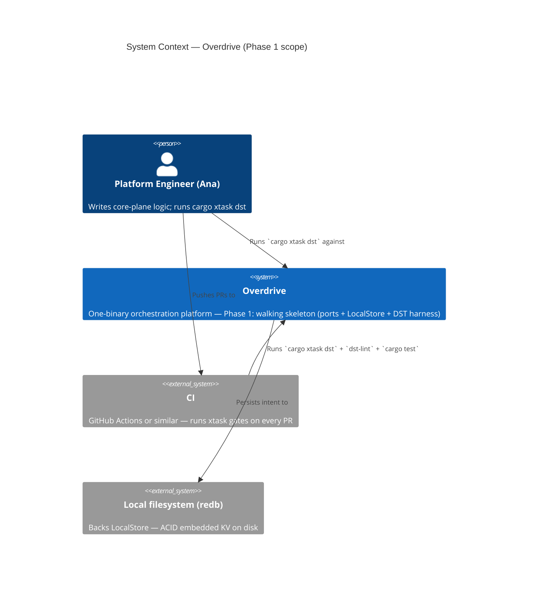
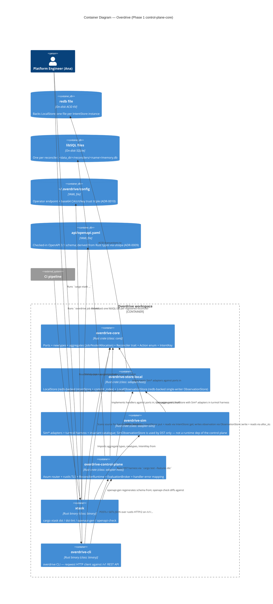
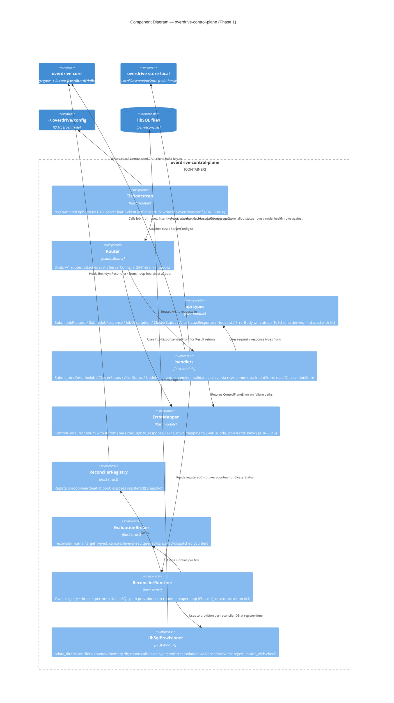
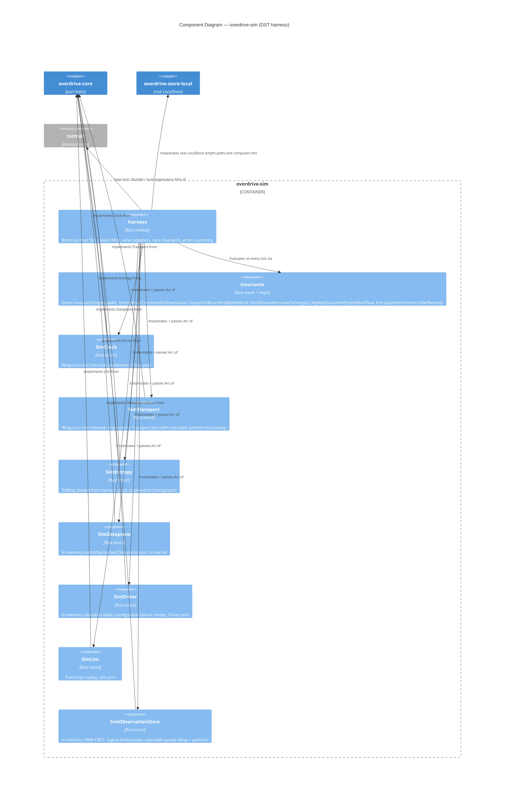

# Overdrive Architecture Brief

**Source of truth for platform architecture.** Cross-cut with `docs/whitepaper.md`
(platform design) and `docs/commercial.md` (tenancy / tiers / licensing). This
brief records the *architectural decisions* those documents imply, at three
levels of ownership:

1. **System Architecture** — cluster-scale decisions: Intent/Observation split,
   role-at-bootstrap, regional topology, dataplane layer. *(Future architect:
   placeholder.)*
2. **Domain Model** — aggregates, bounded contexts, ubiquitous language.
   *(Future architect: placeholder.)*
3. **Application Architecture** — crate topology, module boundaries, trait
   surfaces, enforcement mechanisms. *(Owned here, by Morgan — Phase 1
   foundation.)*

Each section is owned by exactly one architect. Later waves build on top; they
do not rewrite prior sections without a corresponding ADR marked
`supersedes ADR-XXXX`.

---

## Status

| Section | Owner | Status |
|---|---|---|
| System Architecture | Titan (future) | placeholder |
| Domain Model | Hera (future) | placeholder |
| Application Architecture | Morgan (this doc) | **extended — Phase 1 control-plane-core** |

---

## System Architecture

*Placeholder for Titan.* System-level decisions that apply to the whole cluster
topology (per-region Raft vs global CRDT, role declaration at bootstrap, mesh
VPN underlay, etc.) live here. For now, read `docs/whitepaper.md` §2-§4 as the
authoritative source.

---

## Domain Model

*Placeholder for Hera.* Aggregates, bounded contexts, and ubiquitous language
live here once the domain crosses the complexity threshold that warrants DDD.
For Phase 1 the language is thin: `Job`, `Allocation`, `Node`, `Policy`,
`Certificate`, `Investigation`, plus the identifier newtypes enumerated below.

---

## Application Architecture

**Scope**: crate topology, trait surfaces, module boundaries, and enforcement
tooling for the Phase 1 walking skeleton and everything that will build on it.

### 1. Architectural style

**Hexagonal (ports and adapters), single-process**.

The whitepaper §21 nondeterminism-trait table *is* the ports layer:

| Port (trait) | Concern | Real adapter | Sim adapter |
|---|---|---|---|
| `Clock` | time | `SystemClock` | `SimClock` |
| `Transport` | network | `TcpTransport` | `SimTransport` |
| `Entropy` | RNG | `OsEntropy` | `SeededEntropy` |
| `Dataplane` | kernel/eBPF | `EbpfDataplane` (Phase 2+) | `SimDataplane` |
| `Driver` | workload exec | `CloudHypervisorDriver` etc. (Phase 2+) | `SimDriver` |
| `IntentStore` | linearizable state | `LocalStore` (Phase 1) / `RaftStore` (Phase 2+) | `LocalStore` reused |
| `ObservationStore` | eventually-consistent state | `LocalObservationStore` (Phase 1, redb) / `CorrosionStore` (Phase 2+) | `SimObservationStore` |
| `Llm` | inference | `RigLlm` (Phase 3+) | `SimLlm` |

Core logic (future reconcilers, workflows, investigation agent) depends on
ports only. Wiring crates pick real adapters; DST picks sim adapters. This
matches whitepaper §21 word-for-word and is what makes the §21 DST claim
structural rather than aspirational.

**Why not microservices, layered, or event-driven?**

- The whole platform is **one binary** (whitepaper principle 8). Roles are
  declared at bootstrap, not at build time. Microservices at the Phase 1 scope
  contradicts the central design commitment.
- Layered (N-tier) has no answer for the DST seam; it routes I/O through
  infrastructure interfaces that are not injectable by default.
- Event-driven is the *consequence* of the reconciler/workflow primitives
  (whitepaper §18) — not the top-level organising principle. Reconcilers
  converge; workflows orchestrate. Both are hosted inside the hexagon.

The decision to name this hexagonal-only (rather than "hexagonal + DDD +
vertical slice") is a deliberate narrowing: Phase 1 ships identifier types
and traits, not aggregates with behaviour, so there is no domain-model
surface for DDD to organise yet.

### 2. Paradigm

**OOP (Rust trait-based)**.

- Ports are `trait` objects. Adapters are `struct` types implementing them.
- Errors are `enum` variants under `thiserror`.
- Identifiers are `struct` newtypes with validating constructors.
- Composition over inheritance everywhere (Rust has no inheritance anyway).
- `async_trait` for async trait methods (Rust 2024 + `dyn` compatibility).

The `development.md` rules codify this: thiserror for libs, newtypes STRICT,
pass-through `#[from]` error embedding, `Send + Sync` on core data structures.
No pull toward functional-first organisation (no algebra-of-effects, no
free monads, no lens-style derives) — the injectable trait surface already
gives us the substitution semantics functional style would be reaching for.

### 3. Crate topology (Phase 1 target)

```
workspace/
├── crates/
│   ├── overdrive-core/          # ports + newtypes + Result alias + Error
│   │                            # (class: core, lint-scanned, no I/O primitives)
│   ├── overdrive-store-local/   # LocalStore (redb) adapter
│   │                            # (class: adapter-host, uses redb directly)
│   ├── overdrive-sim/           # Sim* adapters + invariants + turmoil harness
│   │                            # (class: adapter-sim, dev-profile only)
│   ├── overdrive-cli/           # bin: `overdrive` (binary boundary, eyre)
│   └── overdrive-node/          # bin: `overdrive-node` (future wiring crate)
└── xtask/                        # bin: `cargo xtask ...`
```

Phase 1 ships `overdrive-core`, `overdrive-store-local`, `overdrive-sim`, and
extends `xtask` with `dst`/`dst-lint`. `overdrive-cli` already exists;
`overdrive-node` is a future placeholder.

**Phase 1 control-plane-core extension** (ADR-0008 — ADR-0015):

- **`crates/overdrive-control-plane/`** — NEW, class = `adapter-host`. Hosts
  the axum router + handlers, rustls TLS bootstrap, `ReconcilerRuntime`,
  `EvaluationBroker`, and the `overdrive-control-plane::api` shared
  request/response types. Depends on `overdrive-core`,
  `overdrive-store-local` (for both `LocalStore` and
  `LocalObservationStore` — ADR-0012, revised 2026-04-24),
  `axum`, `utoipa`, `utoipa-axum`, `rustls`, `rcgen`, `libsql`, `hyper`,
  `tokio`, `bytes`, `serde`, `serde_json`, `thiserror`. `overdrive-sim`
  is **not** a runtime dep — it stays in `overdrive-control-plane`'s
  `[dev-dependencies]` only (if used for DST-shaped crate-local tests).
- **`crates/overdrive-cli/`** — EXTENDED. Gains `reqwest` dep (ADR-0014),
  imports shared types from `overdrive-control-plane::api`, adds HTTP
  client module under `src/client.rs`, fills in the previously-stub
  subcommand handlers.
- **`xtask`** — EXTENDED with `openapi-gen` and `openapi-check` subcommands
  (ADR-0009).
- **`api/openapi.yaml`** — NEW at workspace root. Checked-in OpenAPI 3.1
  document, derived from the Rust request/response types; drift caught
  by `cargo xtask openapi-check` in CI.

New crate-class assignments:

| Crate | Class | Notes |
|---|---|---|
| `overdrive-control-plane` | `adapter-host` | Uses rustls, hyper, axum; not DST-pure. Reconciler bodies inside this crate that want DST coverage must be in separate `core`-class sub-crates when they appear in Phase 2+. |

**Crate classes** (`package.metadata.overdrive.crate_class`):

| Class | Meaning | Banned-API lint | Examples |
|---|---|---|---|
| `core` | ports + pure logic | **yes** — lint scans for `Instant::now`, `rand::*`, `tokio::net::*`, `std::thread::sleep` | `overdrive-core` |
| `adapter-host` | host adapter | no — allowed to use banned APIs to *implement* ports against the host OS / kernel / network | `overdrive-host`, `overdrive-store-local`, future `overdrive-node` |
| `adapter-sim` | sim adapter + harness | no — legitimately uses `turmoil`, `StdRng`, etc. | `overdrive-sim` |
| `binary` | binary boundary | no | `overdrive-cli`, `xtask` |
| *(unset)* | legacy / not classified | no | — |

A crate without the metadata label is *not scanned*. `xtask dst-lint` walks
the workspace, filters to `crate_class = "core"`, and scans only those crates.
A self-test inside `xtask` asserts the core-class set is non-empty (preventing
a silent "all scanning turned off" regression).

See **ADR-0003** for the labelling-mechanism rationale.

### 4. State-layer discipline (mapped to types)

The state-layer table from `development.md` is the load-bearing boundary.
Application architecture enforces it by type:

| Layer | Trait | Impl (Phase 1) | Enforcement |
|---|---|---|---|
| Intent (should-be) | `IntentStore` | `LocalStore` (redb) | Distinct trait, distinct types; no shared `put(key, value)` surface |
| Observation (is) | `ObservationStore` | `LocalObservationStore` (redb, single-writer) | Distinct trait, distinct types; compile-time test asserts non-substitutability |
| Memory (was) | per-primitive libSQL (Phase 2+) | — | N/A in Phase 1 |
| Scratch (this tick) | `bumpalo::Bump` | — | N/A in Phase 1 (reconcilers land Phase 2) |

Nothing in Phase 1 admits a cross-boundary write path. A future reconciler
cannot persist a `JobSpec` into `ObservationStore` because the trait does not
expose a `write_bytes(key, bytes)` surface — `write` is parametrised on
observation-row shapes, not raw bytes. Likewise, `IntentStore::put` takes
`&[u8]` by key but its *callers* are constrained to intent-class keys by the
typed wrappers the reconciler runtime will provide in Phase 2.

### 5. Module topology inside `overdrive-core`

```
overdrive-core/
├── src/
│   ├── lib.rs              # re-exports + module docs
│   ├── error.rs            # top-level Error + Result alias
│   ├── id.rs               # 11 identifier newtypes (Phase 1 complete)
│   └── traits/
│       ├── mod.rs          # pub use ...
│       ├── clock.rs        # Clock
│       ├── transport.rs    # Transport + Connection + TransportError
│       ├── entropy.rs      # Entropy
│       ├── dataplane.rs    # Dataplane + Verdict + FlowEvent + ...
│       ├── driver.rs       # Driver + DriverType + AllocationSpec + ...
│       ├── intent_store.rs # IntentStore + TxnOp + StateSnapshot + ...
│       ├── observation_store.rs # ObservationStore + Value + Rows + ...
│       └── llm.rs          # Llm + Prompt + ToolDef + ...
```

The existing scaffolding (`crates/overdrive-core/src/{error.rs, id.rs,
traits/*.rs}`) is structurally correct. Phase 1 **completes in place**: adds
the two missing identifier newtypes (`SchematicId` canonicalisation signed,
`CorrelationKey` already present) and adds proptest/trait-contract tests where
missing. No refactor. See **ADR-0001**.

### 6. Observation-store row shapes — Phase 1 minimal set

Two implementations of `ObservationStore` coexist in the Phase 1 workspace:

- **`LocalObservationStore`** (class `adapter-host`, in
  `overdrive-store-local`, per ADR-0012 revised 2026-04-24) — the
  **production** single-node server adapter. Redb-backed on disk
  (`<data_dir>/observation.redb`); single-writer overwrite semantics (no
  LWW merge, no site-IDs, no tombstones — those land with Phase 2's
  `CorrosionStore`); subscriptions via `tokio::sync::broadcast` in the
  same idiom as `LocalStore::watch`.
- **`SimObservationStore`** (class `adapter-sim`, in `overdrive-sim`)
  — the **DST harness** adapter. In-memory LWW with injectable gossip
  delay + partition; used exclusively by the simulation test suite
  (`SimObservationLwwConverges` invariant, Fly-style contagion scenarios,
  reconciler DST tests).

Both implement the same trait surface against the same typed row shapes,
the minimum the DST harness needs (per US-04 and whitepaper §4):

- `alloc_status { alloc_id, job_id, node_id, state, updated_at }`
- `node_health { node_id, region, last_heartbeat }`

Rows are full-row writes (§4 guardrail) — no field-diff merges. Logical
timestamps are `(lamport_counter, writer_node_id)` tuples preserved in
every row for forward-compatibility with the Phase 2 Corrosion gossip
layer; `LocalObservationStore` does not consult them (single-writer has
no ordering question to resolve), `SimObservationStore` and the future
`CorrosionStore` do.

Production `CorrosionStore` (Phase 2+) will implement the same trait with
the same row shapes, backed by cr-sqlite and SWIM/QUIC. It replaces
`LocalObservationStore` at the `wire_single_node_observation` construction
seam via a single `Box<dyn ObservationStore>` swap. Sim, local, and
real-distributed share the shape definitions; they do not share the wire
format.

Row schema versioning (for Phase 2+ forward compatibility of Phase 1 test
artifacts) is a crafter decision at implementation time; Phase 2 feature
scope will lock the mechanism.

### 7. DST harness architecture

The harness is the integration point for every Phase 1 invariant. It is
hosted in a dedicated crate (`overdrive-sim`) and invoked from `xtask dst`.

See the C4 component diagram below; the short form:

- `xtask dst` parses the seed (random if unspecified), invokes
  `cargo test --features dst --package overdrive-sim`.
- `overdrive-sim` depends on `turmoil` and `overdrive-core`; it owns
  `SimClock`, `SimTransport`, `SimEntropy`, `SimDataplane`, `SimDriver`,
  `SimLlm`, `SimObservationStore`.
- The harness composes **real** `LocalStore` (`overdrive-store-local`) with
  all Sim* adapters in a `turmoil::Sim` — matching US-06 AC.
- Invariants live in `overdrive-sim::invariants::Invariant` (an enum). The
  enum name IS the canonical invariant name; `--only <NAME>` resolves to an
  enum variant via `FromStr`. This prevents printed-vs-flag name drift (the
  `shared-artifacts-registry` `invariant_name` HIGH risk).
- Seed is printed on every run; failure output prints invariant name, seed,
  tick, turmoil host, and a reproduction command (matching the US-06 AC).

See **ADR-0004** for why `overdrive-sim` is one crate, not three.

### 8. Test distribution

Per-crate `tests/*.rs` for integration tests that exercise a single crate's
public surface; top-level `crates/{crate}/tests/acceptance/*.rs` *only* for
acceptance scenarios that explicitly correspond to a DISTILL test-scenarios
entry (they may exist in Phase 1 only as US-06 scenarios once DISTILL lands).

Unit tests stay in `#[cfg(test)] mod tests` inside the module they test.
`.feature` files are banned project-wide (`.claude/rules/testing.md`).

See **ADR-0005**.

### 9. Enforcement tooling

**Style**: Hexagonal, single-process, Rust workspace
**Language**: Rust 2024 edition, rustc ≥ 1.85
**Primary enforcement tool**: `cargo xtask dst-lint` (custom)
**Secondary enforcement**: `cargo clippy` workspace-wide with pedantic+nursery+cargo

**Rules to enforce**:

| Rule | Enforcement | Where |
|---|---|---|
| Core crates do not use `Instant::now`, `SystemTime::now`, `rand::random`, `rand::thread_rng`, `tokio::time::sleep`, `std::thread::sleep`, `tokio::net::{TcpStream, TcpListener, UdpSocket}` | Custom: `xtask dst-lint` via `syn` walk over `src/**/*.rs` of every `crate_class = "core"` crate | xtask/src/dst_lint.rs |
| Violations print file:line:col, banned symbol, replacement trait, link to `development.md` | Custom: error-formatter inside `dst-lint` | xtask/src/dst_lint.rs |
| Every banned symbol is covered by a synthetic-file self-test | xtask unit test | xtask/src/dst_lint.rs |
| Core-class set is non-empty | xtask assertion at start of `dst-lint` | xtask/src/dst_lint.rs |
| `thiserror` + Result alias convention | Code review + clippy (no structural enforcer exists for this in Rust today) | — |
| Newtypes: FromStr / Display / serde round-trip lossless | proptest in `overdrive-core/tests/` for every newtype | overdrive-core/tests |
| `IntentStore` and `ObservationStore` are not substitutable | `trybuild` or `tests/compile_fail/*.rs` asserting the substitution fails to compile | overdrive-core/tests/compile_fail |

`import-linter` (Python) and `ArchUnit` (JVM) have no Rust analogue with
equivalent semantics; `cargo-deny` checks dependency licenses but not
API-usage within a crate. The custom `dst-lint` is the only way to enforce
the banned-API rule, which is the load-bearing invariant for DST.

**Mutation testing.** Not a design-level decision — the `nw-mutation-test`
skill enforces the ≥80% kill-rate gate at DELIVER time per
`.claude/rules/testing.md` using `cargo-mutants`. Phase 1 applicable
targets: newtype `FromStr`/validators (US-01, US-02), `SchematicId` rkyv
canonicalisation / hash determinism paths (ADR-0002), and
`IntentStore::export_snapshot` / `bootstrap_from` round-trip code (US-03).
Other `testing.md`-listed targets (reconciler logic, policy verdicts,
scheduler bin-pack, workflow `run` bodies) do not exist in Phase 1 and
therefore have no Phase 1 kill-rate obligation.

### 10. Dependencies — Phase 1

OSS-only, already in workspace `Cargo.toml`:

| Dep | Version | License | Role | Why chosen |
|---|---|---|---|---|
| `redb` | 2.x | MIT-or-Apache-2 | IntentStore backend | Pure Rust embedded ACID KV; ~30MB RAM matches commercial density claim; whitepaper §4 explicit choice |
| `rkyv` | 0.8 | MIT | Snapshot framing; zero-copy deserialization | Archived bytes are canonical → deterministic hashing (§development.md rule); whitepaper §17/18 explicit choice |
| `turmoil` | 0.6 | MIT-or-Apache-2 | DST harness | Rust-native controllable async simulation; whitepaper §21 + testing.md Tier 1 explicit choice |
| `bumpalo` | 3.x | MIT-or-Apache-2 | Per-reconciler scratch (Phase 2+) | Already in workspace; declared for reconciler hot path per development.md |
| `thiserror` | 2.x | MIT-or-Apache-2 | Typed errors | Rust community standard; `#[from]` preserves error chain |
| `proptest` | 1.x | MIT-or-Apache-2 | Property-based tests | Newtype round-trip, snapshot round-trip, LWW convergence |
| `async-trait` | 0.1 | MIT-or-Apache-2 | Async trait methods | Still needed for `dyn`-compatible async traits in stable Rust 2024 |
| `futures` | 0.3 | MIT-or-Apache-2 | Stream trait | `IntentStore::watch` returns `Stream<Item=(Bytes, Bytes)>` |
| `bytes` | 1.x | MIT | Zero-copy buffers | Cheap clone for put/get values |
| `serde` / `serde_json` | 1.x | MIT-or-Apache-2 | Transparent identifier serialisation | `try_from = "String"` for validating deserialize |
| `sha2` | 0.10 | MIT-or-Apache-2 | `ContentHash::of` | SHA-256 |
| `hex` | 0.4 | MIT-or-Apache-2 | `ContentHash` hex `Display`/`FromStr` | Lowercase hex |

No proprietary dependencies. All maintained, active, above 1k stars.

### 11. Non-functional / Quality attributes (ISO 25010, mapped)

| Attribute | Target | How it is addressed |
|---|---|---|
| Performance efficiency — time behaviour | *Phase 2+ guardrail* — `commercial.md` "Control Plane Density" target (<50ms cold start) | Direct redb open; no Raft overhead. Not a Phase 1 CI gate — density claims become measurable only once tenant clusters run on the infrastructure layer (see `upstream-changes.md` for K4 reframe). |
| Performance efficiency — resource util. | *Phase 2+ guardrail* — `commercial.md` "Control Plane Density" target (<30MB RSS empty) | Single redb file; no background tasks (single-mode). Not a Phase 1 CI gate — same reframe as above. |
| Performance efficiency — DST wall-clock | < 60s default catalogue | Turmoil tick-duration 1ms; 3-node default topology; CI gate (K1) |
| Reliability — fault tolerance | DST catches partition, clock skew, reorder, node crash | Sim adapters inject the fault catalogue from testing.md |
| Reliability — recoverability | Snapshot round-trip bit-identical | proptest with randomised contents; CI gate (K6) |
| Maintainability — testability | Every source of nondeterminism injectable | Ports table above; `dst-lint` enforces; CI gate (K2) |
| Maintainability — modifiability | New banned APIs added by editing one constant | `BANNED_APIS` constant in `xtask::dst_lint` |
| Security — accountability (future) | SPIFFE identity on every flow event | `SpiffeId` newtype already lands in Phase 1; flow-event wiring Phase 2+ |
| Compatibility — interoperability | Snapshot format stable across `LocalStore` → `RaftStore` | Versioned framing header on snapshot bytes; both impls share format |

No performance architecture beyond the above is in scope for Phase 1 — there
is no end-user request path yet.

### 12. Integration patterns

Phase 1 has **no external integrations**. No external APIs, no webhooks, no
OAuth, no third-party services. The DST harness runs entirely in-process.
`overdrive-cli` is already a placeholder that logs and returns — it will
gain a control-plane connection in Phase 2.

Consequently **no contract tests** are recommended for Phase 1. The
platform-architect handoff annotation remains empty at this phase; it will
fill up starting Phase 2 (gRPC control-plane API, future Phase 3 ACME, etc.).

### 13. Residuality / stressor posture

Phase 1 carries **one** named residual stressor: *turmoil upstream version
drift*. Bit-identical reproduction depends on deterministic scheduler output
from turmoil's `Sim::run`. A minor-version turmoil update that changes tick
ordering would invalidate historical seeds.

Mitigation: pin turmoil to a precise workspace version (`turmoil = "=0.6.X"`
once first seed is captured in a test). The twin-run identity self-test
(US-06 AC) catches drift continuously in CI.

No other stressors rise to the level requiring a hidden residuality pass at
this scope. The DST fault catalogue from `.claude/rules/testing.md` IS the
platform's realistic-fault surface; the sim adapters exercise it
continuously.

---

## Phase 1 control-plane-core extension

This section extends §1–§13 with the application-architecture decisions
landed by feature `phase-1-control-plane-core` (2026-04-23). Nothing in
§1–§13 is rewritten. New ADRs are ADR-0008 through ADR-0015.

### 14. External API — REST + OpenAPI over axum/rustls

Per ADR-0008 and whitepaper §3/§4, the Phase 1 control-plane external
API is **HTTP + JSON served by `axum` over `hyper` with `rustls`**,
HTTP/2 preferred (ALPN `h2`) with HTTP/1.1 fallback, routes under the
non-negotiable `/v1` prefix. Binds `https://127.0.0.1:7001` by default.

Walking-skeleton endpoints (exact shapes fixed by the OpenAPI schema
per ADR-0009):

| Method + path | Handler | Purpose |
|---|---|---|
| `POST /v1/jobs` | SubmitJob | Submit a Job spec; returns `{job_id, commit_index}` |
| `GET /v1/jobs/{id}` | DescribeJob | Read back a committed Job; returns `{spec, commit_index, spec_digest}` |
| `GET /v1/cluster/info` | ClusterStatus | Mode / region / commit_index / reconciler registry / broker counters |
| `GET /v1/allocs` | AllocStatus | ObservationStore read on `alloc_status` (Phase 1: zero rows) |
| `GET /v1/nodes` | NodeList | ObservationStore read on `node_health` (Phase 1: zero rows) |

Internal RPC (node-agent control-flow streams) is explicitly
out-of-scope for this feature and lands in `phase-1-first-workload`
via `tarpc` or `postcard-rpc` — pure Rust, no `protoc` in toolchain.

### 15. OpenAPI schema derivation — `utoipa`, checked-in, CI-gated

Per ADR-0009. The OpenAPI 3.1 schema is derived from the Rust
request/response types in `overdrive-control-plane::api` via `utoipa`
+ `utoipa-axum`. The generated document lives at `api/openapi.yaml`
(workspace root) as a checked-in artifact. `cargo xtask openapi-gen`
regenerates it; `cargo xtask openapi-check` regenerates to a temp file
and diffs against the checked-in version — non-empty diff fails CI.

The Rust types are the contract; the OpenAPI document is their report.
A workspace-level test enumerates handlers and asserts each has a
matching `#[utoipa::path(...)]` annotation.

### 16. Phase 1 TLS bootstrap — ephemeral CA + embedded trust triple

Per ADR-0010, adopting Talos research R1–R5 (see
`docs/research/security/talos-bootstrap-tls-strategy-comprehensive-research.md`):

- **Ephemeral in-process CA** generated by `rcgen` on every
  `overdrive serve` start — the sole cert-minting site in Phase 1
  (ADR-0010 *Amendment 2026-04-26*; Phase 5 reintroduction of `cluster
  init` tracked in GH #81). CA private key lives in process memory only;
  re-starting re-mints.
- **Base64-embedded trust triple** (CA cert, client leaf cert, client
  private key) in `~/.overdrive/config` — same YAML shape as
  `~/.talos/config` / `~/.kube/config`.
- **Server leaf cert** carries SANs: `127.0.0.1`, `::1`, `localhost`,
  `<gethostname(3)>`.
- **No `--insecure` flag**. No TOFU. No fingerprint pinning.
- **Deferred to Phase 5**: rotation, revocation, operator RBAC, cert
  persistence, `acceptedCAs` multi-CA trust, SPIFFE URI SAN roles.

**Overdrive-specific divergence from Talos research**: operator role is
NOT encoded in the client cert's Organization (O) field — whitepaper §8
requires SPIFFE URI SANs for roles. Phase 1 has no role encoding; Phase 5
adds SPIFFE URI SANs directly.

### 17. `Job` / `Node` / `Allocation` aggregates — intent layer

Per ADR-0011. New module `overdrive-core::aggregate`:

- `Job` — validating constructor `from_spec(...)`, derives
  `rkyv::Archive + rkyv::Serialize + rkyv::Deserialize + serde::Serialize
  + serde::Deserialize`. Fields include `id: JobId`, `replicas: NonZeroU32`,
  `resources: Resources` (reused from `traits/driver.rs`).
- `Node` — same derive profile; `id: NodeId`, `region: Region`,
  `capacity: Resources`.
- `Allocation` — same derive profile; `id: AllocationId`, `job_id: JobId`,
  `node_id: NodeId`.
- `Policy`, `Investigation` — stub aggregates with ID newtype as primary
  field; no behavioural stubs.

**Intent-side vs observation-side**: `overdrive-core::aggregate::*` are
intent (written to `IntentStore` via `IntentKey::for_job(&JobId)` etc.);
`overdrive-core::traits::observation_store::AllocStatusRow` is observation
(LWW-gossiped row shape). The two never merge. Any vestigial `JobSpec`-named
struct in `observation_store.rs` is deleted or renamed to make its
observation-side role obvious.

Canonical intent-key derivation: `overdrive-core::intent_key` exposes
`for_job(&JobId) -> IntentKey` (and peers for `Node`, `Allocation`). The
canonical string form is `jobs/<JobId::display>` / `nodes/<NodeId::display>` /
`allocations/<AllocationId::display>`.

### 18. ObservationStore server impl — real `LocalObservationStore` in `overdrive-store-local`

Per ADR-0012 (revised 2026-04-24, reversing the original 2026-04-23
decision to reuse `SimObservationStore`). The Phase 1 server uses
`LocalObservationStore`, a real redb-backed, single-writer adapter
living alongside `LocalStore` in `overdrive-store-local` (class
`adapter-host`). Phase 2+ swaps in `CorrosionStore` via a single
`Box<dyn ObservationStore>` trait-object replacement at the
`observation_wiring::wire_single_node_observation` construction seam;
no handler changes.

Key properties of `LocalObservationStore`:

- **Persistent.** Rows survive process restart; `<data_dir>/observation.redb`
  is the backing file. The restart-round-trip case is the objection that
  drove the ADR revision.
- **Class `adapter-host`.** Production posture, not a sim crate pressed
  into production service. `overdrive-sim` is no longer a runtime
  dependency of `overdrive-control-plane`; it stays the DST harness's
  home.
- **No CRDT machinery.** Single-writer overwrite semantics. Owner-writer
  site-IDs, LWW logical-timestamp merges, and tombstone discipline land
  with `CorrosionStore` in Phase 2, where they have peers to
  coordinate.
- **Subscriptions via `tokio::sync::broadcast`.** Same idiom as
  `LocalStore::watch` per its Phase 1 substitute; lagging subscribers
  get `RecvError::Lagged`, stream wrapper terminates, caller
  resubscribes.
- **Trait-object swap seam unchanged.**
  `wire_single_node_observation() -> Result<Box<dyn ObservationStore>>`
  keeps its signature; only the construction line moves from
  `SimObservationStore::single_peer(...)` to
  `LocalObservationStore::open(path)`.

The DST harness continues to exercise `SimObservationStore` (for LWW
convergence invariants, gossip-delay scenarios, partition matrices) —
that adapter stays in `overdrive-sim` where `adapter-sim` is the
accurate class for what the code does.

### 19. Reconciler primitive — trait in `overdrive-core`, runtime in `overdrive-control-plane`

Per ADR-0013.

**`overdrive-core::reconciler`** (new module):

- `trait Reconciler { fn name(&self) -> &ReconcilerName; fn reconcile(&self,
  desired: &State, actual: &State, db: &Db) -> Vec<Action>; }` — synchronous,
  no `async`, no `.await`, no I/O-port parameters. Purity is load-bearing.
- `enum Action { Noop, HttpCall {...}, StartWorkflow {...} }` — the
  `HttpCall` variant is part of the Phase 1 surface even though the
  runtime shim lands in Phase 3 (per development.md §Reconciler I/O).
- `ReconcilerName` newtype — kebab-case, `^[a-z][a-z0-9-]{0,62}$`; rejects
  path-traversal characters by construction.
- `Db` handle — `Arc<libsql::Connection>`-equivalent, exposed as `&Db`
  to `reconcile(...)`.

**`overdrive-control-plane::reconciler_runtime`** (new module):

- `ReconcilerRuntime` — registers reconcilers at boot; owns the broker;
  surfaces `registered()` + broker counters.
- `EvaluationBroker` — keyed on `(ReconcilerName, TargetResource)`;
  cancelable-eval-set semantics per whitepaper §18; counters
  `queued` / `cancelled` / `dispatched`.
- **Per-primitive libSQL path**: `<data_dir>/reconcilers/<name>/memory.db`.
  Path provisioner canonicalises `data_dir` once at startup, enforces
  isolation by construction via the `ReconcilerName` regex plus a
  defence-in-depth `starts_with` check.
- `noop-heartbeat` reconciler registered at boot — living proof of the
  contract.

**DST invariants** added to `overdrive-sim::invariants::Invariant`:

- `AtLeastOneReconcilerRegistered` — post-boot registry is non-empty.
- `DuplicateEvaluationsCollapse` — N (≥3) concurrent evaluations at the
  same key → 1 dispatched, N-1 cancelled.
- `ReconcilerIsPure` — twin invocation with identical inputs produces
  bit-identical `Vec<Action>` outputs.

Slice 4 ships **whole** — not split 4A / 4B. DISCUSS-wave split remains
available as a crafter-time escape hatch if material complexity surfaces.

### 20. CLI HTTP client — hand-rolled `reqwest`; types shared across CLI and server

Per ADR-0014. The CLI uses a ~200 LoC hand-rolled client over `reqwest`
(already in workspace). CLI and server share the same Rust request/response
types imported from `overdrive-control-plane::api`. The OpenAPI schema
is a byproduct of the types via `utoipa`; the types are the contract.

No OpenAPI code generator in Phase 1 (no Java toolchain; Progenitor
deferred to Phase 2+ if a second Rust REST consumer appears — unlikely
given `tarpc` for the internal path).

### 21. HTTP error mapping — `ControlPlaneError` with `#[from]`, bespoke 7807-compatible body

Per ADR-0015. One top-level `ControlPlaneError` in
`overdrive-control-plane::error` with pass-through `#[from]` embedding
for `IntentStoreError`, `ObservationStoreError`, and aggregate
constructor errors. One `to_response(err)` function maps variants
exhaustively to `(StatusCode, Json<ErrorBody>)`.

Status-code matrix:

| Condition | Status | `error` kind |
|---|---|---|
| Validation failure | `400` | `"validation"` |
| Unknown resource | `404` | `"not_found"` |
| Duplicate intent-key with *different* spec | `409` | `"conflict"` |
| Infra failure | `500` | `"internal"` |

Byte-identical re-submission of the same spec is idempotent success
(200 OK, same commit_index). 409 fires only on a *different* spec at
an occupied key — the handler implements idempotency as a read-then-write
pattern against `LocalStore`.

Body shape is bespoke `{error, message, field}` — deliberately a
**subset compatible with RFC 7807** so that `type: Uri` and `instance: Uri`
can be added additively in a future v1.1.

### 22. Updated quality-attribute scenarios (Phase 1 control-plane extension)

| Attribute | Phase 1 control-plane-core target | How it is addressed |
|---|---|---|
| Performance efficiency — time behaviour (REST round-trip) | CLI → server → LocalStore → response < 100 ms on localhost | Axum + rustls over localhost; no proxy, no schedule jitter. `cargo xtask openapi-check` stays under 10 s. |
| Reliability — fault tolerance (submit) | Validation failures reject before any IntentStore write | Handler gate per Slice 3 AC; unit test asserts no-write on malformed input |
| Reliability — storm-proofing | Evaluation broker collapses N concurrent duplicate evaluations | DST `DuplicateEvaluationsCollapse` invariant |
| Maintainability — testability (reconciler purity) | Twin invocation produces bit-identical outputs | DST `ReconcilerIsPure` + `dst-lint` banned-API gate |
| Maintainability — schema drift | No field rename disagreement between CLI and server | `utoipa`-derived schema + `openapi-check` CI gate + shared Rust types |
| Security — confidentiality | All CLI↔server traffic is TLS 1.3 via rustls | ADR-0010 trust triple; no plaintext, no `--insecure` |
| Security — accountability | All error paths surface a structured JSON body; no raw stack traces | `ControlPlaneError::to_response` exhaustive mapping |
| Compatibility — upgrade path | `/v1` prefix; future `/v2` served in parallel during deprecation window | ADR-0008 versioning rule |

### 23. External integrations — Phase 1 control-plane-core

**None.** The Phase 1 control-plane talks only to:

- The local `LocalStore` (redb file on disk) — not external.
- The local `LocalObservationStore` (redb file on disk) — not external.
- The local CLI over localhost rustls — not external.
- Per-primitive libSQL files on disk — not external.

No external APIs, no webhooks, no OAuth, no third-party services. The
platform-architect handoff annotation remains empty (no contract tests
recommended). The first external surface worth contract-testing lands
in Phase 2+ (node-agent `tarpc` streams are internal to the cluster;
the first external boundary is Phase 3+ ACME / Phase 5+ OIDC).

---

### C4 Level 1 — System Context



### C4 Level 2 — Container diagram (Phase 1 control-plane-core)



### C4 Level 3 — `overdrive-control-plane` component diagram (Phase 1)

The control-plane crate is complex enough to warrant a component view:
router + handlers + reconciler runtime + evaluation broker + TLS
bootstrap + error mapper add up to 6+ components with non-trivial
relationships.



### C4 Level 3 — `overdrive-sim` component diagram

The DST harness is complex enough to warrant a component view (5+ components
interacting non-trivially). Every other crate's internal structure is
adequately described by the container-level view.



---

## Architecture Enforcement

Style: Hexagonal (single-process, Rust workspace)
Language: Rust 2024 edition
Tool: **`cargo xtask dst-lint`** (custom, `syn`-based; see
`xtask/src/dst_lint.rs`)
Secondary: `cargo clippy` workspace pedantic+nursery+cargo
Contract enforcement: `overdrive-core/tests/compile_fail/*.rs`
(`trybuild`-powered) for trait-non-substitutability

Rules to enforce:

- Core crates (class = `core`) do not import banned APIs (`Instant::now`,
  `SystemTime::now`, `rand::random`, `rand::thread_rng`, `tokio::time::sleep`,
  `std::thread::sleep`, `tokio::net::{TcpStream, TcpListener, UdpSocket}`).
- The set of core-class crates is non-empty at every lint run.
- Every banned symbol is covered by a synthetic-file self-test inside xtask.
- Violation messages include file:line:col, banned symbol, replacement trait,
  and a link to `.claude/rules/development.md`.
- `IntentStore` and `ObservationStore` are not type-substitutable (compile-fail
  test).
- Every newtype is lossless under Display / FromStr / serde / rkyv round-trip
  (proptest).

---

## ADR index

| # | Title | Status |
|---|---|---|
| 0001 | Complete existing trait scaffolding in place | Accepted |
| 0002 | SchematicId canonicalisation uses rkyv-archived bytes | Accepted |
| 0003 | Core-crate labelling via `package.metadata.overdrive.crate_class` | Accepted |
| 0004 | Single `overdrive-sim` crate, not split | Accepted |
| 0005 | Test distribution: per-crate `tests/`, top-level `tests/acceptance/` for acceptance only | Accepted |
| 0006 | `cargo xtask dst` + `dst-lint` are the required CI checks; seeds surfaced on failure | Accepted |
| 0007 | cr-sqlite deletion discipline (tombstones + bounded sweep) | Accepted |
| 0008 | Control-plane external API is REST + OpenAPI over axum/rustls | Accepted |
| 0009 | OpenAPI schema is derived from Rust types via `utoipa`, checked-in, CI-gated | Accepted |
| 0010 | Phase 1 TLS bootstrap: ephemeral in-process CA, embedded trust triple in `~/.overdrive/config` | Accepted |
| 0011 | Intent-side `Job` aggregate and observation-side `AllocStatusRow` stay separate types | Accepted |
| 0012 | Phase 1 server uses a real `LocalObservationStore` (redb-backed, single-writer) | Accepted (revised 2026-04-24) |
| 0013 | Reconciler primitive: trait in `overdrive-core`, runtime in `overdrive-control-plane`, libSQL private memory | Accepted |
| 0014 | CLI HTTP client is hand-rolled `reqwest`; CLI and server share Rust request/response types | Accepted |
| 0015 | HTTP error mapping: `ControlPlaneError` with `#[from]`, bespoke 7807-compatible JSON body | Accepted |

---

## Handoff annotations

**To acceptance-designer (DISTILL)**:

- Source of AC: `docs/feature/phase-1-foundation/discuss/user-stories.md`
  + Design decisions below.
- Trait surfaces and error variants are stable at this point; test scenarios
  can name `IntentStore`, `ObservationStore`, `Clock` etc. in their GIVEN
  clauses without further consultation.
- Every AC in the user stories is observable through the DST harness output,
  the `LocalStore` public surface, or the lint-gate output — no scenarios
  need to inspect private methods.

**To platform-architect (DEVOPS)**:

- Architecture document + ADRs in `docs/product/architecture/`.
- Paradigm: OOP (Rust trait-based).
- External integrations in Phase 1 (foundation + control-plane-core):
  **none**. No contract tests recommended. Starting Phase 2 the
  node-agent `tarpc` / `postcard-rpc` streams will be the first
  internal contract worth testing; Phase 3+ ACME and Phase 5+ OIDC
  land the first truly external surfaces.
- CI integration — the required checks are now:
  - `cargo xtask dst` (DST harness, phase-1-foundation ADR-0006)
  - `cargo xtask dst-lint` (banned-API scan, phase-1-foundation ADR-0006)
  - `cargo xtask openapi-check` (NEW — ADR-0009; diffs regenerated
    OpenAPI against checked-in `api/openapi.yaml`)
  - `cargo nextest run --workspace` with `cargo test --doc --workspace`
    paired per `.claude/rules/testing.md`
  - Mutation-testing kill-rate gate ≥80% on Phase 1 applicable targets
    (newtype `FromStr`, aggregate validators, `IntentStore::{export,bootstrap}`,
    rkyv canonicalisation paths); reconciler `reconcile(...)` bodies
    added to the gate as their authors land them in Phase 2+.
- Quality-attribute thresholds to alert on:
  - DST wall-clock > 60s on main (K1)
  - Lint-gate false-positive rate > 0 (K2)
  - OpenAPI schema drift between regeneration and checked-in copy (new)
  - CLI round-trip (submit → describe) > 100 ms on localhost (Slice 5
    first-output target)
- K4 (LocalStore cold start / RSS) remains a Phase 2+ commercial
  guardrail, not a Phase 1 CI gate (see
  `docs/feature/phase-1-foundation/design/upstream-changes.md`).
- `rcgen`-based ephemeral CA is process-memory only; no CI secret
  management, no disk persistence in Phase 1.

---

## Changelog

| Date | Change |
|---|---|
| 2026-04-21 | Initial Application Architecture section (Phase 1 foundation) — Morgan. |
| 2026-04-22 | Review revisions: mutation-testing note in §9 (owned by nw-mutation-test skill); K4 reframed as Phase 2+ commercial guardrail, not Phase 1 CI gate (see upstream-changes.md); row schema versioning deferred to crafter per §6. |
| 2026-04-23 | Phase 1 control-plane-core extension (§14–§23). Added ADR-0008 (REST + OpenAPI transport), ADR-0009 (OpenAPI via utoipa + CI gate), ADR-0010 (Phase 1 TLS bootstrap via R1–R5), ADR-0011 (aggregates / JobSpec collision), ADR-0012 (SimObservationStore for Phase 1 server), ADR-0013 (reconciler primitive + runtime), ADR-0014 (CLI HTTP client + shared types), ADR-0015 (HTTP error mapping). New crate `overdrive-control-plane`; new workspace deps `axum`, `utoipa`, `utoipa-axum`, `libsql`. C4 container diagram extended; new component diagram for `overdrive-control-plane` (Phase 1). — Morgan. |
| 2026-04-23 | Remediation pass (Atlas peer review, APPROVED-WITH-NOTES): §1 replace "dataplane substrate" with "dataplane layer" per user-memory `feedback_no_substrate.md` (phrase was inherited from prior phase placeholder). No scope change. — Morgan. |
| 2026-04-26 | §16 Phase 1 TLS bootstrap: `serve` is the sole cert-minting site (ADR-0010 *Amendment 2026-04-26*; #81 tracks Phase 5 reintroduction of `cluster init`). — Morgan. |
