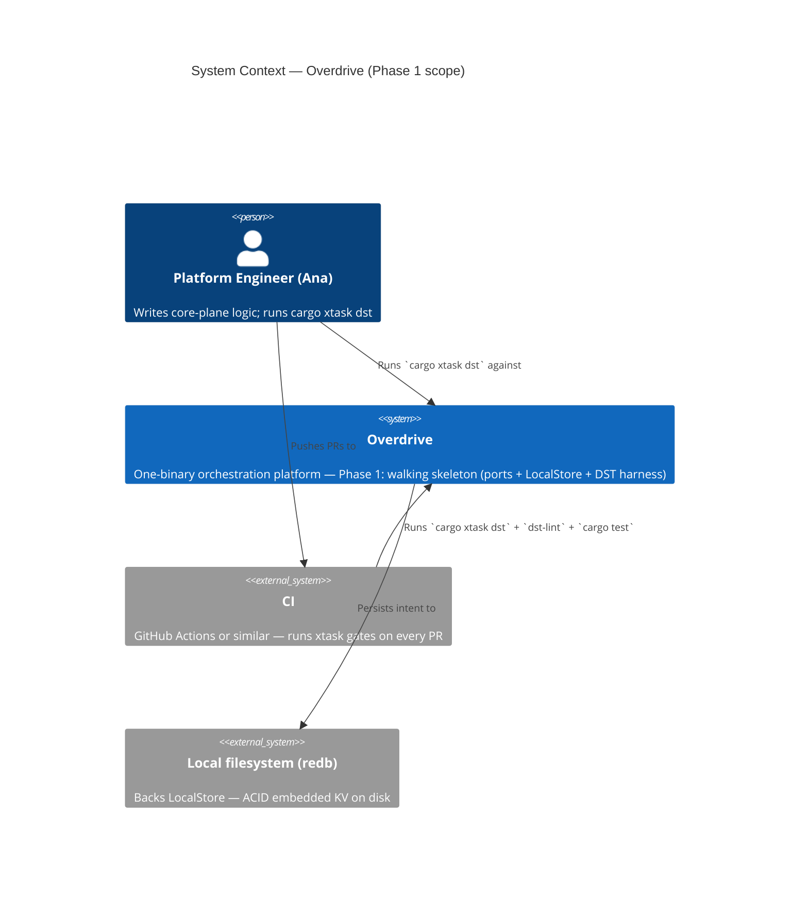
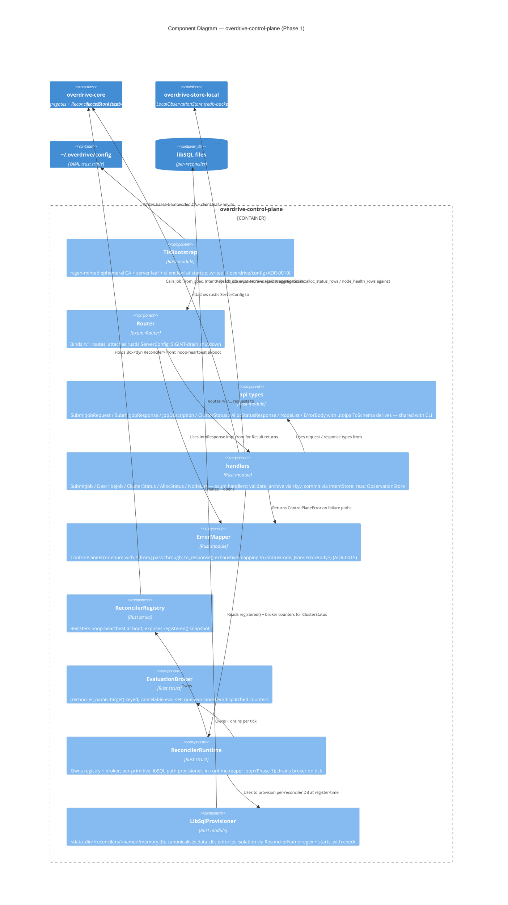
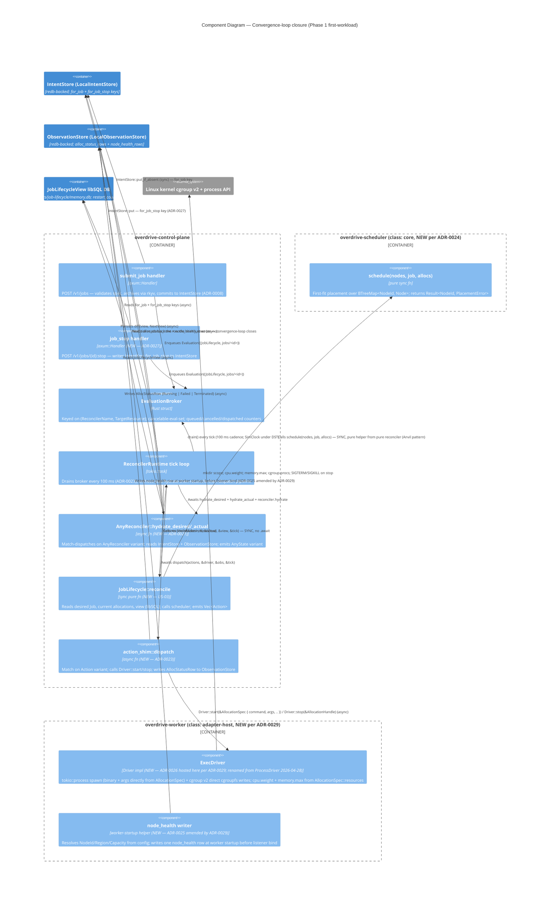
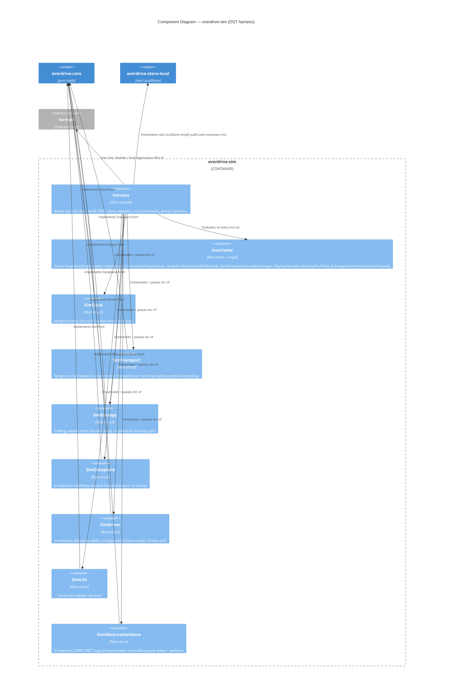
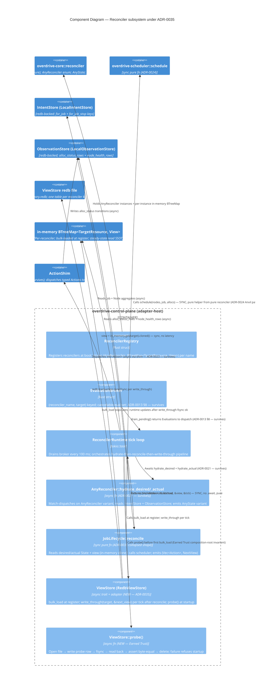

# Overdrive Architecture Brief

**Source of truth for platform architecture.** Cross-cut with `docs/whitepaper.md`
(platform design) and `docs/commercial.md` (tenancy / tiers / licensing). This
brief records the *architectural decisions* those documents imply, at three
levels of ownership:

1. **System Architecture** — cluster-scale decisions: Intent/Observation split,
   role-at-bootstrap, regional topology, dataplane layer. *(Future architect:
   placeholder.)*
2. **Domain Model** — aggregates, bounded contexts, ubiquitous language.
   *(Future architect: placeholder.)*
3. **Application Architecture** — crate topology, module boundaries, trait
   surfaces, enforcement mechanisms. *(Owned here, by Morgan — Phase 1
   foundation.)*

Each section is owned by exactly one architect. Later waves build on top; they
do not rewrite prior sections without a corresponding ADR marked
`supersedes ADR-XXXX`.

---

## Status

| Section | Owner | Status |
|---|---|---|
| System Architecture | Titan (future) | placeholder |
| Domain Model | Hera (future) | placeholder |
| Application Architecture | Morgan (this doc) | **extended — Phase 2.2 XDP service map (2026-05-05)** |

---

## System Architecture

*Placeholder for Titan.* System-level decisions that apply to the whole cluster
topology (per-region Raft vs global CRDT, role declaration at bootstrap, mesh
VPN underlay, etc.) live here. For now, read `docs/whitepaper.md` §2-§4 as the
authoritative source.

---

## Domain Model

*Placeholder for Hera.* Aggregates, bounded contexts, and ubiquitous language
live here once the domain crosses the complexity threshold that warrants DDD.
For Phase 1 the language is thin: `Job`, `Allocation`, `Node`, `Policy`,
`Certificate`, `Investigation`, plus the identifier newtypes enumerated below.

---

## Application Architecture

**Scope**: crate topology, trait surfaces, module boundaries, and enforcement
tooling for the Phase 1 walking skeleton and everything that will build on it.

### 1. Architectural style

**Hexagonal (ports and adapters), single-process**.

The whitepaper §21 nondeterminism-trait table *is* the ports layer:

| Port (trait) | Concern | Real adapter | Sim adapter |
|---|---|---|---|
| `Clock` | time | `SystemClock` | `SimClock` |
| `Transport` | network | `TcpTransport` | `SimTransport` |
| `Entropy` | RNG | `OsEntropy` | `SeededEntropy` |
| `Dataplane` | kernel/eBPF | `EbpfDataplane` (Phase 2+) | `SimDataplane` |
| `Driver` | workload exec | `CloudHypervisorDriver` etc. (Phase 2+) | `SimDriver` |
| `IntentStore` | linearizable state | `LocalStore` (Phase 1) / `RaftStore` (Phase 2+) | `LocalStore` reused |
| `ObservationStore` | eventually-consistent state | `LocalObservationStore` (Phase 1, redb) / `CorrosionStore` (Phase 2+) | `SimObservationStore` |
| `Llm` | inference | `RigLlm` (Phase 3+) | `SimLlm` |

Core logic (future reconcilers, workflows, investigation agent) depends on
ports only. Wiring crates pick real adapters; DST picks sim adapters. This
matches whitepaper §21 word-for-word and is what makes the §21 DST claim
structural rather than aspirational.

**Why not microservices, layered, or event-driven?**

- The whole platform is **one binary** (whitepaper principle 8). Roles are
  declared at bootstrap, not at build time. Microservices at the Phase 1 scope
  contradicts the central design commitment.
- Layered (N-tier) has no answer for the DST seam; it routes I/O through
  infrastructure interfaces that are not injectable by default.
- Event-driven is the *consequence* of the reconciler/workflow primitives
  (whitepaper §18) — not the top-level organising principle. Reconcilers
  converge; workflows orchestrate. Both are hosted inside the hexagon.

The decision to name this hexagonal-only (rather than "hexagonal + DDD +
vertical slice") is a deliberate narrowing: Phase 1 ships identifier types
and traits, not aggregates with behaviour, so there is no domain-model
surface for DDD to organise yet.

### 2. Paradigm

**OOP (Rust trait-based)**.

- Ports are `trait` objects. Adapters are `struct` types implementing them.
- Errors are `enum` variants under `thiserror`.
- Identifiers are `struct` newtypes with validating constructors.
- Composition over inheritance everywhere (Rust has no inheritance anyway).
- `async_trait` for async trait methods (Rust 2024 + `dyn` compatibility).

The `development.md` rules codify this: thiserror for libs, newtypes STRICT,
pass-through `#[from]` error embedding, `Send + Sync` on core data structures.
No pull toward functional-first organisation (no algebra-of-effects, no
free monads, no lens-style derives) — the injectable trait surface already
gives us the substitution semantics functional style would be reaching for.

### 3. Crate topology (Phase 1 target)

```
workspace/
├── crates/
│   ├── overdrive-core/          # ports + newtypes + Result alias + Error
│   │                            # (class: core, lint-scanned, no I/O primitives)
│   ├── overdrive-scheduler/     # pure-fn placement (ADR-0024 — first-workload)
│   │                            # (class: core, lint-scanned)
│   ├── overdrive-store-local/   # LocalStore (redb) adapter
│   │                            # (class: adapter-host, uses redb directly)
│   ├── overdrive-host/          # production adapters: SystemClock, OsEntropy,
│   │                            # TcpTransport (host-OS primitives — ADR-0016)
│   │                            # (class: adapter-host)
│   ├── overdrive-worker/        # ExecDriver + workload-cgroup management
│   │                            # + node_health writer (ADR-0029 — first-workload)
│   │                            # (class: adapter-host)
│   ├── overdrive-control-plane/ # axum + rustls + reconciler runtime
│   │                            # (class: adapter-host)
│   ├── overdrive-sim/           # Sim* adapters + invariants + turmoil harness
│   │                            # (class: adapter-sim, dev-profile only)
│   ├── overdrive-cli/           # bin: `overdrive` (binary boundary, eyre)
│   └── overdrive-node/          # bin: `overdrive-node` (future wiring crate)
└── xtask/                        # bin: `cargo xtask ...`
```

Phase 1 ships `overdrive-core`, `overdrive-store-local`, `overdrive-sim`, and
extends `xtask` with `dst`/`dst-lint`. `overdrive-cli` already exists;
`overdrive-node` is a future placeholder.

**Phase 1 control-plane-core extension** (ADR-0008 — ADR-0015):

- **`crates/overdrive-control-plane/`** — NEW, class = `adapter-host`. Hosts
  the axum router + handlers, rustls TLS bootstrap, `ReconcilerRuntime`,
  `EvaluationBroker`, and the `overdrive-control-plane::api` shared
  request/response types. Depends on `overdrive-core`,
  `overdrive-store-local` (for both `LocalStore` and
  `LocalObservationStore` — ADR-0012, revised 2026-04-24),
  `axum`, `utoipa`, `utoipa-axum`, `rustls`, `rcgen`, `libsql`, `hyper`,
  `tokio`, `bytes`, `serde`, `serde_json`, `thiserror`. `overdrive-sim`
  is **not** a runtime dep — it stays in `overdrive-control-plane`'s
  `[dev-dependencies]` only (if used for DST-shaped crate-local tests).
- **`crates/overdrive-cli/`** — EXTENDED. Gains `reqwest` dep (ADR-0014),
  imports shared types from `overdrive-control-plane::api`, adds HTTP
  client module under `src/client.rs`, fills in the previously-stub
  subcommand handlers.
- **`xtask`** — EXTENDED with `openapi-gen` and `openapi-check` subcommands
  (ADR-0009).
- **`api/openapi.yaml`** — NEW at workspace root. Checked-in OpenAPI 3.1
  document, derived from the Rust request/response types; drift caught
  by `cargo xtask openapi-check` in CI.

**Phase 1 first-workload extension** (ADR-0021 — ADR-0029):

- **`crates/overdrive-scheduler/`** — NEW, class = `core` (ADR-0024 user
  override of the originally-proposed module-inside-control-plane
  placement). Hosts the pure synchronous `schedule(...)` function
  consumed by the `JobLifecycle` reconciler. Depends only on
  `overdrive-core`. `dst-lint` mechanically enforces the BTreeMap-only
  iteration discipline + banned-API contract.
- **`crates/overdrive-worker/`** — NEW, class = `adapter-host`
  (ADR-0029, amended 2026-04-28 — `ProcessDriver` renamed to
  `ExecDriver`; `DriverType::Process` renamed to `DriverType::Exec`;
  `AllocationSpec.image` renamed to `AllocationSpec.command` and
  `args: Vec<String>` field added). Hosts `ExecDriver` (ADR-0026,
  formerly slated for `overdrive-host`), workload-cgroup management
  (`overdrive.slice/workloads.slice/<alloc_id>.scope` create / limit
  writes / teardown), and the boot-time `node_health` row writer
  (relocated from control-plane bootstrap per ADR-0025 amendment).
  The crate exposes a worker subsystem entrypoint the binary calls
  during startup; `overdrive-control-plane` does NOT depend on this
  crate — the action shim calls `Driver::*` against an injected
  `&dyn Driver` whose impl the binary plugs in.
- **`crates/overdrive-host/`** — UNCHANGED at the application-architecture
  level. Per ADR-0029, `overdrive-host` retains its ADR-0016 intent
  (host-OS primitive bindings: `SystemClock`, `OsEntropy`,
  `TcpTransport`); workload drivers were never landed there.
- **`crates/overdrive-control-plane/`** — EXTENDED. Gains
  `reconciler_runtime::action_shim` submodule (ADR-0023), `AppState::driver:
  Arc<dyn Driver>` field (ADR-0022), `JobLifecycle` reconciler
  body, control-plane-cgroup management + pre-flight (ADR-0028 +
  ADR-0026 amendment — workload-cgroup half moves to
  `overdrive-worker`), and `POST /v1/jobs/{id}:stop` handler
  (ADR-0027).
- **`crates/overdrive-core/`** — EXTENDED. Gains `AnyState` enum
  (ADR-0021), `JobLifecycleState` struct, `AnyReconciler::JobLifecycle`
  variant, `IntentKey::for_job_stop` constructor (ADR-0027),
  `NodeId::from_hostname` (ADR-0025), three new `Action` variants
  (`StartAllocation`, `StopAllocation`, `RestartAllocation`).
- **`crates/overdrive-cli/`** — EXTENDED. Gains `overdrive job stop <id>`
  subcommand. The `serve` subcommand becomes the binary-composition
  root: hard-depends on both `overdrive-control-plane` and
  `overdrive-worker`; runtime `[node] role` config selects which
  subsystems boot (ADR-0029).

New crate-class assignments:

| Crate | Class | Notes |
|---|---|---|
| `overdrive-control-plane` | `adapter-host` | Uses rustls, hyper, axum; not DST-pure. Reconciler bodies inside this crate that want DST coverage must be in separate `core`-class sub-crates when they appear in Phase 2+. |
| `overdrive-scheduler` | `core` | NEW (ADR-0024). Pure synchronous placement function; `dst-lint`-scanned; depends only on `overdrive-core`. |
| `overdrive-worker` | `adapter-host` | NEW (ADR-0029; amended 2026-04-28 — type renamed `ProcessDriver` → `ExecDriver`, `AllocationSpec.image` → `AllocationSpec.command`, `args` field added). ExecDriver + workload-cgroup management + node_health writer. Composed alongside `overdrive-control-plane` by the binary; control-plane crate does NOT depend on it. |

**Crate classes** (`package.metadata.overdrive.crate_class`):

| Class | Meaning | Banned-API lint | Examples |
|---|---|---|---|
| `core` | ports + pure logic | **yes** — lint scans for `Instant::now`, `rand::*`, `tokio::net::*`, `std::thread::sleep` | `overdrive-core` |
| `adapter-host` | host adapter | no — allowed to use banned APIs to *implement* ports against the host OS / kernel / network | `overdrive-host`, `overdrive-store-local`, `overdrive-control-plane`, `overdrive-worker` (ADR-0029) |
| `adapter-sim` | sim adapter + harness | no — legitimately uses `turmoil`, `StdRng`, etc. | `overdrive-sim` |
| `binary` | binary boundary | no | `overdrive-cli`, `xtask` |
| *(unset)* | legacy / not classified | no | — |

A crate without the metadata label is *not scanned*. `xtask dst-lint` walks
the workspace, filters to `crate_class = "core"`, and scans only those crates.
A self-test inside `xtask` asserts the core-class set is non-empty (preventing
a silent "all scanning turned off" regression).

See **ADR-0003** for the labelling-mechanism rationale.

### 4. State-layer discipline (mapped to types)

The state-layer table from `development.md` is the load-bearing boundary.
Application architecture enforces it by type:

| Layer | Trait | Impl (Phase 1) | Enforcement |
|---|---|---|---|
| Intent (should-be) | `IntentStore` | `LocalStore` (redb) | Distinct trait, distinct types; no shared `put(key, value)` surface |
| Observation (is) | `ObservationStore` | `LocalObservationStore` (redb, single-writer) | Distinct trait, distinct types; compile-time test asserts non-substitutability |
| Memory (was) | per-primitive libSQL (Phase 2+) | — | N/A in Phase 1 |
| Scratch (this tick) | `bumpalo::Bump` | — | N/A in Phase 1 (reconcilers land Phase 2) |

Nothing in Phase 1 admits a cross-boundary write path. A future reconciler
cannot persist a `JobSpec` into `ObservationStore` because the trait does not
expose a `write_bytes(key, bytes)` surface — `write` is parametrised on
observation-row shapes, not raw bytes. Likewise, `IntentStore::put` takes
`&[u8]` by key but its *callers* are constrained to intent-class keys by the
typed wrappers the reconciler runtime will provide in Phase 2.

### 5. Module topology inside `overdrive-core`

```
overdrive-core/
├── src/
│   ├── lib.rs              # re-exports + module docs
│   ├── error.rs            # top-level Error + Result alias
│   ├── id.rs               # 11 identifier newtypes (Phase 1 complete)
│   └── traits/
│       ├── mod.rs          # pub use ...
│       ├── clock.rs        # Clock
│       ├── transport.rs    # Transport + Connection + TransportError
│       ├── entropy.rs      # Entropy
│       ├── dataplane.rs    # Dataplane + Verdict + FlowEvent + ...
│       ├── driver.rs       # Driver + DriverType + AllocationSpec + ...
│       ├── intent_store.rs # IntentStore + TxnOp + StateSnapshot + ...
│       ├── observation_store.rs # ObservationStore + Value + Rows + ...
│       └── llm.rs          # Llm + Prompt + ToolDef + ...
```

The existing scaffolding (`crates/overdrive-core/src/{error.rs, id.rs,
traits/*.rs}`) is structurally correct. Phase 1 **completes in place**: adds
the two missing identifier newtypes (`SchematicId` canonicalisation signed,
`CorrelationKey` already present) and adds proptest/trait-contract tests where
missing. No refactor. See **ADR-0001**.

### 6. Observation-store row shapes — Phase 1 minimal set

Two implementations of `ObservationStore` coexist in the Phase 1 workspace:

- **`LocalObservationStore`** (class `adapter-host`, in
  `overdrive-store-local`, per ADR-0012 revised 2026-04-24) — the
  **production** single-node server adapter. Redb-backed on disk
  (`<data_dir>/observation.redb`); single-writer overwrite semantics (no
  LWW merge, no site-IDs, no tombstones — those land with Phase 2's
  `CorrosionStore`); subscriptions via `tokio::sync::broadcast` in the
  same idiom as `LocalStore::watch`.
- **`SimObservationStore`** (class `adapter-sim`, in `overdrive-sim`)
  — the **DST harness** adapter. In-memory LWW with injectable gossip
  delay + partition; used exclusively by the simulation test suite
  (`SimObservationLwwConverges` invariant, Fly-style contagion scenarios,
  reconciler DST tests).

Both implement the same trait surface against the same typed row shapes,
the minimum the DST harness needs (per US-04 and whitepaper §4):

- `alloc_status { alloc_id, job_id, node_id, state, updated_at }`
- `node_health { node_id, region, last_heartbeat }`

Rows are full-row writes (§4 guardrail) — no field-diff merges. Logical
timestamps are `(lamport_counter, writer_node_id)` tuples preserved in
every row for forward-compatibility with the Phase 2 Corrosion gossip
layer; `LocalObservationStore` does not consult them (single-writer has
no ordering question to resolve), `SimObservationStore` and the future
`CorrosionStore` do.

Production `CorrosionStore` (Phase 2+) will implement the same trait with
the same row shapes, backed by cr-sqlite and SWIM/QUIC. It replaces
`LocalObservationStore` at the `wire_single_node_observation` construction
seam via a single `Box<dyn ObservationStore>` swap. Sim, local, and
real-distributed share the shape definitions; they do not share the wire
format.

Row schema versioning (for Phase 2+ forward compatibility of Phase 1 test
artifacts) is a crafter decision at implementation time; Phase 2 feature
scope will lock the mechanism.

### 7. DST harness architecture

The harness is the integration point for every Phase 1 invariant. It is
hosted in a dedicated crate (`overdrive-sim`) and invoked from `xtask dst`.

See the C4 component diagram below; the short form:

- `xtask dst` parses the seed (random if unspecified), invokes
  `cargo test --features dst --package overdrive-sim`.
- `overdrive-sim` depends on `turmoil` and `overdrive-core`; it owns
  `SimClock`, `SimTransport`, `SimEntropy`, `SimDataplane`, `SimDriver`,
  `SimLlm`, `SimObservationStore`.
- The harness composes **real** `LocalStore` (`overdrive-store-local`) with
  all Sim* adapters in a `turmoil::Sim` — matching US-06 AC.
- Invariants live in `overdrive-sim::invariants::Invariant` (an enum). The
  enum name IS the canonical invariant name; `--only <NAME>` resolves to an
  enum variant via `FromStr`. This prevents printed-vs-flag name drift (the
  `shared-artifacts-registry` `invariant_name` HIGH risk).
- Seed is printed on every run; failure output prints invariant name, seed,
  tick, turmoil host, and a reproduction command (matching the US-06 AC).

See **ADR-0004** for why `overdrive-sim` is one crate, not three.

### 8. Test distribution

Per-crate `tests/*.rs` for integration tests that exercise a single crate's
public surface; top-level `crates/{crate}/tests/acceptance/*.rs` *only* for
acceptance scenarios that explicitly correspond to a DISTILL test-scenarios
entry (they may exist in Phase 1 only as US-06 scenarios once DISTILL lands).

Unit tests stay in `#[cfg(test)] mod tests` inside the module they test.
`.feature` files are banned project-wide (`.claude/rules/testing.md`).

See **ADR-0005**.

### 9. Enforcement tooling

**Style**: Hexagonal, single-process, Rust workspace
**Language**: Rust 2024 edition, rustc ≥ 1.85
**Primary enforcement tool**: `cargo xtask dst-lint` (custom)
**Secondary enforcement**: `cargo clippy` workspace-wide with pedantic+nursery+cargo

**Rules to enforce**:

| Rule | Enforcement | Where |
|---|---|---|
| Core crates do not use `Instant::now`, `SystemTime::now`, `rand::random`, `rand::thread_rng`, `tokio::time::sleep`, `std::thread::sleep`, `tokio::net::{TcpStream, TcpListener, UdpSocket}` | Custom: `xtask dst-lint` via `syn` walk over `src/**/*.rs` of every `crate_class = "core"` crate | xtask/src/dst_lint.rs |
| Violations print file:line:col, banned symbol, replacement trait, link to `development.md` | Custom: error-formatter inside `dst-lint` | xtask/src/dst_lint.rs |
| Every banned symbol is covered by a synthetic-file self-test | xtask unit test | xtask/src/dst_lint.rs |
| Core-class set is non-empty | xtask assertion at start of `dst-lint` | xtask/src/dst_lint.rs |
| `thiserror` + Result alias convention | Code review + clippy (no structural enforcer exists for this in Rust today) | — |
| Newtypes: FromStr / Display / serde round-trip lossless | proptest in `overdrive-core/tests/` for every newtype | overdrive-core/tests |
| `IntentStore` and `ObservationStore` are not substitutable | `trybuild` or `tests/compile_fail/*.rs` asserting the substitution fails to compile | overdrive-core/tests/compile_fail |

`import-linter` (Python) and `ArchUnit` (JVM) have no Rust analogue with
equivalent semantics; `cargo-deny` checks dependency licenses but not
API-usage within a crate. The custom `dst-lint` is the only way to enforce
the banned-API rule, which is the load-bearing invariant for DST.

**Mutation testing.** Not a design-level decision — the `nw-mutation-test`
skill enforces the ≥80% kill-rate gate at DELIVER time per
`.claude/rules/testing.md` using `cargo-mutants`. Phase 1 applicable
targets: newtype `FromStr`/validators (US-01, US-02), `SchematicId` rkyv
canonicalisation / hash determinism paths (ADR-0002), and
`IntentStore::export_snapshot` / `bootstrap_from` round-trip code (US-03).
Other `testing.md`-listed targets (reconciler logic, policy verdicts,
scheduler bin-pack, workflow `run` bodies) do not exist in Phase 1 and
therefore have no Phase 1 kill-rate obligation.

### 10. Dependencies — Phase 1

OSS-only, already in workspace `Cargo.toml`:

| Dep | Version | License | Role | Why chosen |
|---|---|---|---|---|
| `redb` | 2.x | MIT-or-Apache-2 | IntentStore backend | Pure Rust embedded ACID KV; ~30MB RAM matches commercial density claim; whitepaper §4 explicit choice |
| `rkyv` | 0.8 | MIT | Snapshot framing; zero-copy deserialization | Archived bytes are canonical → deterministic hashing (§development.md rule); whitepaper §17/18 explicit choice |
| `turmoil` | 0.6 | MIT-or-Apache-2 | DST harness | Rust-native controllable async simulation; whitepaper §21 + testing.md Tier 1 explicit choice |
| `bumpalo` | 3.x | MIT-or-Apache-2 | Per-reconciler scratch (Phase 2+) | Already in workspace; declared for reconciler hot path per development.md |
| `thiserror` | 2.x | MIT-or-Apache-2 | Typed errors | Rust community standard; `#[from]` preserves error chain |
| `proptest` | 1.x | MIT-or-Apache-2 | Property-based tests | Newtype round-trip, snapshot round-trip, LWW convergence |
| `async-trait` | 0.1 | MIT-or-Apache-2 | Async trait methods | Still needed for `dyn`-compatible async traits in stable Rust 2024 |
| `futures` | 0.3 | MIT-or-Apache-2 | Stream trait | `IntentStore::watch` returns `Stream<Item=(Bytes, Bytes)>` |
| `bytes` | 1.x | MIT | Zero-copy buffers | Cheap clone for put/get values |
| `serde` / `serde_json` | 1.x | MIT-or-Apache-2 | Transparent identifier serialisation | `try_from = "String"` for validating deserialize |
| `sha2` | 0.10 | MIT-or-Apache-2 | `ContentHash::of` | SHA-256 |
| `hex` | 0.4 | MIT-or-Apache-2 | `ContentHash` hex `Display`/`FromStr` | Lowercase hex |

No proprietary dependencies. All maintained, active, above 1k stars.

### 11. Non-functional / Quality attributes (ISO 25010, mapped)

| Attribute | Target | How it is addressed |
|---|---|---|
| Performance efficiency — time behaviour | *Phase 2+ guardrail* — `commercial.md` "Control Plane Density" target (<50ms cold start) | Direct redb open; no Raft overhead. Not a Phase 1 CI gate — density claims become measurable only once tenant clusters run on the infrastructure layer (see `upstream-changes.md` for K4 reframe). |
| Performance efficiency — resource util. | *Phase 2+ guardrail* — `commercial.md` "Control Plane Density" target (<30MB RSS empty) | Single redb file; no background tasks (single-mode). Not a Phase 1 CI gate — same reframe as above. |
| Performance efficiency — DST wall-clock | < 60s default catalogue | Turmoil tick-duration 1ms; 3-node default topology; CI gate (K1) |
| Reliability — fault tolerance | DST catches partition, clock skew, reorder, node crash | Sim adapters inject the fault catalogue from testing.md |
| Reliability — recoverability | Snapshot round-trip bit-identical | proptest with randomised contents; CI gate (K6) |
| Maintainability — testability | Every source of nondeterminism injectable | Ports table above; `dst-lint` enforces; CI gate (K2) |
| Maintainability — modifiability | New banned APIs added by editing one constant | `BANNED_APIS` constant in `xtask::dst_lint` |
| Security — accountability (future) | SPIFFE identity on every flow event | `SpiffeId` newtype already lands in Phase 1; flow-event wiring Phase 2+ |
| Compatibility — interoperability | Snapshot format stable across `LocalStore` → `RaftStore` | Versioned framing header on snapshot bytes; both impls share format |

No performance architecture beyond the above is in scope for Phase 1 — there
is no end-user request path yet.

### 12. Integration patterns

Phase 1 has **no external integrations**. No external APIs, no webhooks, no
OAuth, no third-party services. The DST harness runs entirely in-process.
`overdrive-cli` is already a placeholder that logs and returns — it will
gain a control-plane connection in Phase 2.

Consequently **no contract tests** are recommended for Phase 1. The
platform-architect handoff annotation remains empty at this phase; it will
fill up starting Phase 2 (gRPC control-plane API, future Phase 3 ACME, etc.).

### 13. Residuality / stressor posture

Phase 1 carries **one** named residual stressor: *turmoil upstream version
drift*. Bit-identical reproduction depends on deterministic scheduler output
from turmoil's `Sim::run`. A minor-version turmoil update that changes tick
ordering would invalidate historical seeds.

Mitigation: pin turmoil to a precise workspace version (`turmoil = "=0.6.X"`
once first seed is captured in a test). The twin-run identity self-test
(US-06 AC) catches drift continuously in CI.

No other stressors rise to the level requiring a hidden residuality pass at
this scope. The DST fault catalogue from `.claude/rules/testing.md` IS the
platform's realistic-fault surface; the sim adapters exercise it
continuously.

---

## Phase 1 control-plane-core extension

This section extends §1–§13 with the application-architecture decisions
landed by feature `phase-1-control-plane-core` (2026-04-23). Nothing in
§1–§13 is rewritten. New ADRs are ADR-0008 through ADR-0015.

### 14. External API — REST + OpenAPI over axum/rustls

Per ADR-0008 and whitepaper §3/§4, the Phase 1 control-plane external
API is **HTTP + JSON served by `axum` over `hyper` with `rustls`**,
HTTP/2 preferred (ALPN `h2`) with HTTP/1.1 fallback, routes under the
non-negotiable `/v1` prefix. Binds `https://127.0.0.1:7001` by default.

Walking-skeleton endpoints (exact shapes fixed by the OpenAPI schema
per ADR-0009):

| Method + path | Handler | Purpose |
|---|---|---|
| `POST /v1/jobs` | SubmitJob | Submit a Job spec; returns `{job_id, spec_digest, outcome}` |
| `GET /v1/jobs/{id}` | DescribeJob | Read back a committed Job; returns `{spec, spec_digest}` |
| `GET /v1/cluster/info` | ClusterStatus | Mode / region / reconciler registry / broker counters |
| `GET /v1/allocs` | AllocStatus | ObservationStore read on `alloc_status` (Phase 1: zero rows) |
| `GET /v1/nodes` | NodeList | ObservationStore read on `node_health` (Phase 1: zero rows) |

Internal RPC (node-agent control-flow streams) is explicitly
out-of-scope for this feature and lands in `phase-1-first-workload`
via `tarpc` or `postcard-rpc` — pure Rust, no `protoc` in toolchain.

### 15. OpenAPI schema derivation — `utoipa`, checked-in, CI-gated

Per ADR-0009. The OpenAPI 3.1 schema is derived from the Rust
request/response types in `overdrive-control-plane::api` via `utoipa`
+ `utoipa-axum`. The generated document lives at `api/openapi.yaml`
(workspace root) as a checked-in artifact. `cargo xtask openapi-gen`
regenerates it; `cargo xtask openapi-check` regenerates to a temp file
and diffs against the checked-in version — non-empty diff fails CI.

The Rust types are the contract; the OpenAPI document is their report.
A workspace-level test enumerates handlers and asserts each has a
matching `#[utoipa::path(...)]` annotation.

### 16. Phase 1 TLS bootstrap — ephemeral CA + embedded trust triple

Per ADR-0010, adopting Talos research R1–R5 (see
`docs/research/security/talos-bootstrap-tls-strategy-comprehensive-research.md`):

- **Ephemeral in-process CA** generated by `rcgen` on every
  `overdrive serve` start — the sole cert-minting site in Phase 1
  (ADR-0010 *Amendment 2026-04-26*; Phase 5 reintroduction of `cluster
  init` tracked in GH #81). CA private key lives in process memory only;
  re-starting re-mints.
- **Base64-embedded trust triple** (CA cert, client leaf cert, client
  private key) in `~/.overdrive/config` — same YAML shape as
  `~/.talos/config` / `~/.kube/config`.
- **Server leaf cert** carries SANs: `127.0.0.1`, `::1`, `localhost`,
  `<gethostname(3)>`.
- **No `--insecure` flag**. No TOFU. No fingerprint pinning.
- **Deferred to Phase 5**: rotation, revocation, operator RBAC, cert
  persistence, `acceptedCAs` multi-CA trust, SPIFFE URI SAN roles.

**Overdrive-specific divergence from Talos research**: operator role is
NOT encoded in the client cert's Organization (O) field — whitepaper §8
requires SPIFFE URI SANs for roles. Phase 1 has no role encoding; Phase 5
adds SPIFFE URI SANs directly.

### 17. `Job` / `Node` / `Allocation` aggregates — intent layer

Per ADR-0011. New module `overdrive-core::aggregate`:

- `Job` — validating constructor `from_spec(...)`, derives
  `rkyv::Archive + rkyv::Serialize + rkyv::Deserialize + serde::Serialize
  + serde::Deserialize`. Fields include `id: JobId`, `replicas: NonZeroU32`,
  `resources: Resources` (reused from `traits/driver.rs`).
- `Node` — same derive profile; `id: NodeId`, `region: Region`,
  `capacity: Resources`.
- `Allocation` — same derive profile; `id: AllocationId`, `job_id: JobId`,
  `node_id: NodeId`.
- `Policy`, `Investigation` — stub aggregates with ID newtype as primary
  field; no behavioural stubs.

**Intent-side vs observation-side**: `overdrive-core::aggregate::*` are
intent (written to `IntentStore` via `IntentKey::for_job(&JobId)` etc.);
`overdrive-core::traits::observation_store::AllocStatusRow` is observation
(LWW-gossiped row shape). The two never merge. Any vestigial `JobSpec`-named
struct in `observation_store.rs` is deleted or renamed to make its
observation-side role obvious.

Canonical intent-key derivation: `overdrive-core::intent_key` exposes
`for_job(&JobId) -> IntentKey` (and peers for `Node`, `Allocation`). The
canonical string form is `jobs/<JobId::display>` / `nodes/<NodeId::display>` /
`allocations/<AllocationId::display>`.

### 18. ObservationStore server impl — real `LocalObservationStore` in `overdrive-store-local`

Per ADR-0012 (revised 2026-04-24, reversing the original 2026-04-23
decision to reuse `SimObservationStore`). The Phase 1 server uses
`LocalObservationStore`, a real redb-backed, single-writer adapter
living alongside `LocalStore` in `overdrive-store-local` (class
`adapter-host`). Phase 2+ swaps in `CorrosionStore` via a single
`Box<dyn ObservationStore>` trait-object replacement at the
`observation_wiring::wire_single_node_observation` construction seam;
no handler changes.

Key properties of `LocalObservationStore`:

- **Persistent.** Rows survive process restart; `<data_dir>/observation.redb`
  is the backing file. The restart-round-trip case is the objection that
  drove the ADR revision.
- **Class `adapter-host`.** Production posture, not a sim crate pressed
  into production service. `overdrive-sim` is no longer a runtime
  dependency of `overdrive-control-plane`; it stays the DST harness's
  home.
- **No CRDT machinery.** Single-writer overwrite semantics. Owner-writer
  site-IDs, LWW logical-timestamp merges, and tombstone discipline land
  with `CorrosionStore` in Phase 2, where they have peers to
  coordinate.
- **Subscriptions via `tokio::sync::broadcast`.** Same idiom as
  `LocalStore::watch` per its Phase 1 substitute; lagging subscribers
  get `RecvError::Lagged`, stream wrapper terminates, caller
  resubscribes.
- **Trait-object swap seam unchanged.**
  `wire_single_node_observation() -> Result<Box<dyn ObservationStore>>`
  keeps its signature; only the construction line moves from
  `SimObservationStore::single_peer(...)` to
  `LocalObservationStore::open(path)`.

The DST harness continues to exercise `SimObservationStore` (for LWW
convergence invariants, gossip-delay scenarios, partition matrices) —
that adapter stays in `overdrive-sim` where `adapter-sim` is the
accurate class for what the code does.

### 19. Reconciler primitive — trait in `overdrive-core`, runtime in `overdrive-control-plane`

Per ADR-0013.

**`overdrive-core::reconciler`** (new module):

- `trait Reconciler { fn name(&self) -> &ReconcilerName; fn reconcile(&self,
  desired: &State, actual: &State, db: &Db) -> Vec<Action>; }` — synchronous,
  no `async`, no `.await`, no I/O-port parameters. Purity is load-bearing.
- `enum Action { Noop, HttpCall {...}, StartWorkflow {...} }` — the
  `HttpCall` variant is part of the Phase 1 surface even though the
  runtime shim lands in Phase 3 (per development.md §Reconciler I/O).
- `ReconcilerName` newtype — kebab-case, `^[a-z][a-z0-9-]{0,62}$`; rejects
  path-traversal characters by construction.
- `Db` handle — `Arc<libsql::Connection>`-equivalent, exposed as `&Db`
  to `reconcile(...)`.

**`overdrive-control-plane::reconciler_runtime`** (new module):

- `ReconcilerRuntime` — registers reconcilers at boot; owns the broker;
  surfaces `registered()` + broker counters.
- `EvaluationBroker` — keyed on `(ReconcilerName, TargetResource)`;
  cancelable-eval-set semantics per whitepaper §18; counters
  `queued` / `cancelled` / `dispatched`.
- **Per-primitive libSQL path**: `<data_dir>/reconcilers/<name>/memory.db`.
  Path provisioner canonicalises `data_dir` once at startup, enforces
  isolation by construction via the `ReconcilerName` regex plus a
  defence-in-depth `starts_with` check.
- `noop-heartbeat` reconciler registered at boot — living proof of the
  contract.

**DST invariants** added to `overdrive-sim::invariants::Invariant`:

- `AtLeastOneReconcilerRegistered` — post-boot registry is non-empty.
- `DuplicateEvaluationsCollapse` — N (≥3) concurrent evaluations at the
  same key → 1 dispatched, N-1 cancelled.
- `ReconcilerIsPure` — twin invocation with identical inputs produces
  bit-identical `Vec<Action>` outputs.

Slice 4 ships **whole** — not split 4A / 4B. DISCUSS-wave split remains
available as a crafter-time escape hatch if material complexity surfaces.

### 20. CLI HTTP client — hand-rolled `reqwest`; types shared across CLI and server

Per ADR-0014. The CLI uses a ~200 LoC hand-rolled client over `reqwest`
(already in workspace). CLI and server share the same Rust request/response
types imported from `overdrive-control-plane::api`. The OpenAPI schema
is a byproduct of the types via `utoipa`; the types are the contract.

No OpenAPI code generator in Phase 1 (no Java toolchain; Progenitor
deferred to Phase 2+ if a second Rust REST consumer appears — unlikely
given `tarpc` for the internal path).

### 21. HTTP error mapping — `ControlPlaneError` with `#[from]`, bespoke 7807-compatible body

Per ADR-0015. One top-level `ControlPlaneError` in
`overdrive-control-plane::error` with pass-through `#[from]` embedding
for `IntentStoreError`, `ObservationStoreError`, and aggregate
constructor errors. One `to_response(err)` function maps variants
exhaustively to `(StatusCode, Json<ErrorBody>)`.

Status-code matrix:

| Condition | Status | `error` kind |
|---|---|---|
| Validation failure | `400` | `"validation"` |
| Unknown resource | `404` | `"not_found"` |
| Duplicate intent-key with *different* spec | `409` | `"conflict"` |
| Infra failure | `500` | `"internal"` |

Byte-identical re-submission of the same spec is idempotent success
(200 OK, same `spec_digest`, with `outcome: IdempotencyOutcome::Unchanged`
per ADR-0020). 409 fires only on a *different* spec at an occupied
key — the handler implements idempotency as a read-then-write pattern
against `LocalStore` via `IntentStore::put_if_absent`.

Body shape is bespoke `{error, message, field}` — deliberately a
**subset compatible with RFC 7807** so that `type: Uri` and `instance: Uri`
can be added additively in a future v1.1.

### 22. Updated quality-attribute scenarios (Phase 1 control-plane extension)

| Attribute | Phase 1 control-plane-core target | How it is addressed |
|---|---|---|
| Performance efficiency — time behaviour (REST round-trip) | CLI → server → LocalStore → response < 100 ms on localhost | Axum + rustls over localhost; no proxy, no schedule jitter. `cargo xtask openapi-check` stays under 10 s. |
| Reliability — fault tolerance (submit) | Validation failures reject before any IntentStore write | Handler gate per Slice 3 AC; unit test asserts no-write on malformed input |
| Reliability — storm-proofing | Evaluation broker collapses N concurrent duplicate evaluations | DST `DuplicateEvaluationsCollapse` invariant |
| Maintainability — testability (reconciler purity) | Twin invocation produces bit-identical outputs | DST `ReconcilerIsPure` + `dst-lint` banned-API gate |
| Maintainability — schema drift | No field rename disagreement between CLI and server | `utoipa`-derived schema + `openapi-check` CI gate + shared Rust types |
| Security — confidentiality | All CLI↔server traffic is TLS 1.3 via rustls | ADR-0010 trust triple; no plaintext, no `--insecure` |
| Security — accountability | All error paths surface a structured JSON body; no raw stack traces | `ControlPlaneError::to_response` exhaustive mapping |
| Compatibility — upgrade path | `/v1` prefix; future `/v2` served in parallel during deprecation window | ADR-0008 versioning rule |

### 23. External integrations — Phase 1 control-plane-core

**None.** The Phase 1 control-plane talks only to:

- The local `LocalStore` (redb file on disk) — not external.
- The local `LocalObservationStore` (redb file on disk) — not external.
- The local CLI over localhost rustls — not external.
- Per-primitive libSQL files on disk — not external.

No external APIs, no webhooks, no OAuth, no third-party services. The
platform-architect handoff annotation remains empty (no contract tests
recommended). The first external surface worth contract-testing lands
in Phase 2+ (node-agent `tarpc` streams are internal to the cluster;
the first external boundary is Phase 3+ ACME / Phase 5+ OIDC).

---

## Phase 1 first-workload extension

This section extends §1–§23 with the application-architecture decisions
landed by feature `phase-1-first-workload` (2026-04-27). Nothing in
§1–§23 is rewritten. New ADRs are ADR-0021 through ADR-0028.

### 24. State shape — per-reconciler `AnyState` enum

Per ADR-0021. The `Reconciler` trait gains an associated type
`type State`, and a sister `enum AnyState` mirrors the existing
`AnyReconciler` and `AnyReconcilerView` enum-dispatch shape:

```rust
pub enum AnyState {
    Unit,                              // NoopHeartbeat
    JobLifecycle(JobLifecycleState),   // first-workload reconciler
}

pub struct JobLifecycleState {
    pub job:         Option<Job>,
    pub nodes:       BTreeMap<NodeId, Node>,
    pub allocations: BTreeMap<AllocationId, AllocStatusRow>,
}
```

`desired` and `actual` collapse into the same `JobLifecycleState`
struct — the reconciler interprets `desired.job` as the spec and
`actual.allocations` as the running set. Future variants may diverge
internally if a different shape is genuinely required.

The runtime — not the reconciler — populates `desired` and `actual`
via two new async surfaces (`hydrate_desired`, `hydrate_actual`)
match-dispatched on `AnyReconciler`. The reconciler's existing
`hydrate(target, db)` retains its narrow remit (the libSQL private-
memory read). Per-tick I/O cost is proportional to the running
reconciler, not the registered set.

### 25. `AppState::driver: Arc<dyn Driver>` extension

Per ADR-0022 (amended 2026-04-27 by ADR-0029). `AppState` gains a
`driver: Arc<dyn Driver>` field; production wiring threads an
`Arc<ExecDriver>` from the worker subsystem (`overdrive-worker`,
per ADR-0029, type renamed from `ProcessDriver` 2026-04-28); test
fixtures thread `SimDriver`. The renamed entry
point `run_server_with_obs_and_driver(config, obs, driver)` is the
test-fixture seam; the binary's `serve` subcommand instantiates the
worker subsystem and threads its `Arc<dyn Driver>` into the
control-plane's `AppState`.

`AppState: Clone` is preserved (every field is `Arc<…>`). Phase 2+
multi-driver dispatch (Process / MicroVm / Wasm) replaces
`Arc<dyn Driver>` with `Arc<DriverRegistry>` at one field declaration
plus the action shim's call site — no handler or test signature
churn outside the field's immediate consumers.

### 26. Action shim placement and tick cadence

Per ADR-0023. The action shim lives at
`overdrive-control-plane::reconciler_runtime::action_shim`,
alongside `EvaluationBroker` and `ReconcilerRegistry`. The shim's
signature:

```rust
pub async fn dispatch(
    actions: Vec<Action>,
    driver:  &dyn Driver,
    obs:     &dyn ObservationStore,
    tick:    &TickContext,
) -> Result<(), ShimError>;
```

The reconciler-runtime tick loop drains the broker every **100 ms**
in production (configurable via `ServerConfig`); each drained
evaluation runs hydrate-then-reconcile-then-dispatch synchronously
within its tick. Under DST the tick task runs against `SimClock`
and the harness advances simulated time explicitly. The
`clock.sleep(...)` indirection through the injected `Clock` trait
is the seam: the same shim code runs in production and under DST,
no conditional compilation.

Action match is exhaustive. New variants (Phase 3+ `HttpCall`
runtime, workflow runtime, etc.) produce non-exhaustive-match
compile errors at extension time.

### 27. `overdrive-scheduler` crate (D4 user override)

Per ADR-0024. The originally-proposed `overdrive-control-plane::scheduler`
module placement was overridden by the user in favour of a dedicated
`overdrive-scheduler` crate, class `core`. The crate depends only on
`overdrive-core` and exposes:

```rust
pub fn schedule(
    nodes:          &BTreeMap<NodeId, Node>,
    job:            &Job,
    current_allocs: &[AllocStatusRow],
) -> Result<NodeId, PlacementError>;
```

The dependency graph:
`overdrive-core ← overdrive-scheduler ← overdrive-control-plane`.
Acyclic — the new edge is consistent with ADR-0003 (crate-class
labelling) and ADR-0016 (overdrive-host extraction).

**The override is the load-bearing decision.** Putting the
scheduler in a `core`-class crate means `dst-lint` mechanically
enforces the `BTreeMap`-only iteration discipline and the banned-API
contract (no `Instant::now`, no `rand::*`, no `tokio::net::*`). The
determinism property becomes a structural property of the crate,
not a review concern. The xtask self-test that the core-class set
is non-empty (ADR-0003) continues to pass — set size grows from
one (`overdrive-core`) to two.

### 28. Single-node startup wiring

Per ADR-0025 (amended 2026-04-27 by ADR-0029). `NodeId` is
hostname-derived by default, with optional `[node].id` config
override. `Region("local")` is the default, overridable via
`[node].region`. Capacity defaults to a deliberately-conservative
`Resources` sentinel (1000 cores / 1 TiB), overridable via
`[node].cpu_milli` + `[node].memory_bytes`.

Per ADR-0029, the `node_health` row writer is a **worker-subsystem
responsibility**, not a control-plane bootstrap responsibility. The
write happens during worker startup, before the worker is considered
"started" and before the control plane binds its listener — the
fail-fast property of the original ADR-0025 ordering is preserved,
the relocation just routes the row write through the worker
subsystem that owns the node's runtime presence:

```
1. Run cgroup pre-flight check                    (ADR-0028; control plane)
2. Mint ephemeral CA + leaf certs                 (ADR-0010; control plane)
3. Open LocalIntentStore                          (control plane)
4. Worker subsystem startup                       (ADR-0029):
     a. Resolve NodeId, Region, Capacity from config   (ADR-0025)
     b. Write node_health row to ObservationStore      (ADR-0025 amended)
     c. Construct ExecDriver                           (ADR-0026 amended 2026-04-28; formerly ProcessDriver)
5. Construct ReconcilerRuntime; thread Arc<dyn Driver> (ADR-0022)
6. Build AppState, Router                         (existing)
7. Bind TCP listener                              (existing)
8. Write trust triple                             (ADR-0010)
9. Spawn axum_server task                         (existing)
```

The `[node]` config block is operator-owned; servers READ it and
NEVER write it. The trust triple stays server-managed at
`[ca]` / `[client]` blocks per ADR-0010.

### 29. cgroup v2 direct writes; resource enforcement

Per ADR-0026 (amended 2026-04-27 by ADR-0029; amended 2026-04-28 —
`ProcessDriver` renamed to `ExecDriver`, `DriverType::Process` to
`DriverType::Exec`, `AllocationSpec.image` to `AllocationSpec.command`,
`args: Vec<String>` field added; magic image-name dispatch in
`build_command` removed in favour of
`Command::new(&spec.command).args(&spec.args)`). `ExecDriver`
(hosted in `overdrive-worker`) writes cgroup files directly via
`std::fs::write` / `std::fs::create_dir_all` — no `cgroups-rs` dep.
Five filesystem operations per workload lifecycle:

```
mkdir overdrive.slice/workloads.slice/<alloc_id>.scope    (create)
echo <pid> > .../cgroup.procs                             (place)
echo <weight> > .../cpu.weight                            (limit)
echo <bytes>  > .../memory.max                            (limit)
rmdir overdrive.slice/workloads.slice/<alloc_id>.scope    (remove)
```

`cpu.weight` derivation: `clamp(cpu_milli / 10, 1, 10000)`.
`memory.max` derivation: direct byte count. Limits are written
*before* the PID is placed in the scope — the moment the PID lands
in the scope it is already under the declared bounds.

Failure dispositions:

- Scope creation / `cgroup.procs` write fails → fatal,
  `DriverError::SpawnFailed`, alloc row written `state: Failed`.
- Limit write fails → warn-and-continue, alloc row written
  `state: Running`. Phase 1 prioritises isolation (the scope) over
  bounding (the limits); the limit failure is recoverable in
  operator-actionable ways and the workload itself is correctly
  placed.

cgroup v1 is NOT supported (operator confirmed). The pre-flight
check refuses to start on v1 hosts.

**Cgroup hierarchy ownership** (ADR-0029 amendment to ADR-0026):
the worker subsystem (`overdrive-worker`) owns
`overdrive.slice/workloads.slice/<alloc_id>.scope` create / limit
write / teardown — the *workload* half. The control plane subsystem
(`overdrive-control-plane`) owns `overdrive.slice/control-plane.slice/`
create + own-PID enrolment + ADR-0028 pre-flight check — the
*control-plane* half. Each subsystem manages its own slice; the
two never cross. The boundary mirrors whitepaper §4 *Workload
Isolation on Co-located Nodes* exactly.

### 30. `POST /v1/jobs/{id}:stop` HTTP shape; separate stop intent key

Per ADR-0027. The job-stop endpoint follows AIP-136 verb-suffix
convention:

```
POST /v1/jobs/{id}:stop
```

Empty request body. Response body:

```json
{ "job_id": "payments", "outcome": "stopped" }
```

`outcome ∈ { "stopped", "already_stopped" }`. 404 fires on unknown
job id; 409 is reserved for future Phase 2+ start/stop conflicts.

The stop intent is recorded as a separate
`IntentKey::for_job_stop(&JobId)` key (canonical form
`jobs/<JobId::display>/stop`). The reconciler's `hydrate_desired`
path reads BOTH the job spec and the stop key:

```
(Some(spec), None)        => DesiredState::Run { spec }
(Some(_),    Some(_))     => DesiredState::Stop
(None,       _)           => DesiredState::Absent
```

The lifecycle reconciler emits `Action::StopAllocation` for each
running allocation when `desired_state == DesiredState::Stop`. The
shim calls `Driver::stop`, which sends SIGTERM, waits the grace
period, escalates to SIGKILL, removes the cgroup scope.

Future companion verbs (`:start`, `:restart`, `:cancel`,
`:checkpoint`) compose with the same path-suffix shape. The
`Job` aggregate is **not** mutated on stop — the spec stays
readable via `GET /v1/jobs/{id}` for audit / rollback / debugging.

### 31. cgroup v2 delegation pre-flight: hard refusal (no escape hatch)

Per ADR-0028 (hard refusal) as superseded in part by ADR-0034
(escape hatch removed). `overdrive serve` runs a four-step
pre-flight check at boot (kernel exposes cgroup v2; cgroup v2 is
mounted; UID is root OR has delegation; `cpu` and `memory`
controllers are in `subtree_control`). On failure, the server logs
an actionable error naming the failed step + remediation, exits
non-zero, does NOT bind the listener.

```
Try one of:
  1. systemctl --user start overdrive            (production)
  2. sudo systemctl set-property user-1000.slice Delegate=yes
  3. sudo overdrive serve                        (root, dev only)
  4. cargo xtask lima run -- overdrive serve     (canonical dev
                                                  path on macOS /
                                                  non-delegated
                                                  Linux)
```

There is no in-binary escape hatch. ADR-0034 deletes the
`--allow-no-cgroups` flag introduced by ADR-0028: in code review
the flag was found to silently leak workloads in the
`StopAllocation` path (handle had `pid: None`, cgroup-kill branch
gated off, stop returned `Ok(())` while the process kept running),
producing a `state: Terminated`-while-process-alive convergence
mismatch. The canonical dev path is `cargo xtask lima run --`
(documented in `.claude/rules/testing.md`), which runs as root
inside the bundled Lima VM with full cgroup v2 delegation.

Hard refusal at boot is the disposition that respects the §4
"control plane runs in dedicated cgroups with kernel-enforced
resource reservations" architectural commitment. With the escape
hatch deleted, the commitment is structurally guaranteed rather
than defaulted-with-bypass.

### 32. Updated quality-attribute scenarios — Phase 1 first-workload

| Attribute | Phase 1 first-workload target | How it is addressed |
|---|---|---|
| Performance — convergence latency | submit → Running within 1-3 reconciler ticks (≤300 ms on default cadence) | 100 ms tick + level-triggered drain; ADR-0023 |
| Performance — `cluster status` under workload pressure | < 100 ms during 100% CPU workload burst | cgroup `overdrive.slice/control-plane.slice/`; ADR-0026 + ADR-0028 |
| Reliability — fault tolerance | Driver failure surfaces as `state: Failed` row, not stalled tick | per-action error isolation in shim; ADR-0023 |
| Reliability — recoverability | Killed workload restarts within N+M ticks (M = backoff delay) | `JobLifecycleView::restart_counts` libSQL state; US-03 AC. Backoff schedule is workspace-global today — TODO(#137) threads a per-job `RestartPolicy`. |
| Reliability — backoff exhaustion | Repeatedly-crashing workload stops at M attempts (no infinite restart) | per-alloc backoff counter in `JobLifecycleView`; US-03 AC. Ceiling is workspace-global today — TODO(#137) makes it operator-configurable. |
| Reliability — stale-alloc cleanup | `JobSpec` deleted from intent with `Running` rows still present is acknowledged but not yet drained | TODO(#148) cleanup reconciler. Today's `JobLifecycle::reconcile` no-ops the absent-desired-job branch. |
| Reliability — boot-time integrity | Pre-flight detects misconfiguration; node_health write surfaces store breakage | ADR-0025 + ADR-0028 |
| Maintainability — testability (scheduler determinism) | proptest: identical inputs → identical results, BTreeMap-order invariance | `overdrive-scheduler/tests/`; ADR-0024 |
| Maintainability — testability (reconciler purity) | Twin invocation produces bit-identical outputs (`ReconcilerIsPure`) | DST invariant catalogue; ADR-0017 |
| Maintainability — schema drift | OpenAPI gate covers new `:stop` endpoint | ADR-0009 + ADR-0027 |
| Security — workload isolation | Workload kernel-isolated from control plane via cgroup hierarchy | ADR-0026 + ADR-0028 |
| Compatibility — single-mode → multi-mode migration path | NodeId derivation works at N=1 and N>1; node_health row pattern is additive | ADR-0025 |

### 33. External integrations — Phase 1 first-workload

**None.** The first-workload feature talks only to:

- The local `LocalStore` (redb file on disk) — not external.
- The local `LocalObservationStore` (redb file on disk) — not external.
- The local CLI over localhost rustls — not external.
- Per-primitive libSQL files on disk — not external.
- The Linux kernel's cgroup v2 unified hierarchy at `/sys/fs/cgroup/`
  — host filesystem; not a network external.
- The Linux kernel's process API (`fork`, `execve`, `kill`, `waitpid`
  via `tokio::process`) — host kernel; not a network external.

No external APIs, no webhooks, no OAuth, no third-party services.
The platform-architect handoff annotation remains empty (no contract
tests recommended). Phase 2+ may add the first external surface
worth contract-testing.

---

### 34. Job spec — exec block wiring

The Phase 1 operator-facing TOML now nests `[resources]` and `[exec]`
tables; driver dispatch is implicit by table name. Top-level scalars
(`id`, `replicas`) carry identity and scale; `[resources]` carries the
resource envelope; `[exec]` carries the driver invocation. Future
drivers (`[microvm]`, `[wasm]`) slot in additively as new sibling
tables — exactly one driver table per spec is enforced by serde
(`deny_unknown_fields` + tagged-enum dispatch with `#[serde(flatten)]`)
at parse time.

```toml
id = "payments"
replicas = 1

[resources]
cpu_milli    = 500
memory_bytes = 134217728

[exec]
command = "/opt/payments/bin/payments-server"
args    = ["--port", "8080"]
```

The validated `Job` aggregate carries a tagged-enum `driver:
WorkloadDriver` field (mirroring the wire-shape `JobSpecInput.driver:
DriverInput`). Today the enum has one variant — `WorkloadDriver::Exec(Exec
{ command, args })` — that holds the operator's exec-driver invocation.
Future drivers add variants (`WorkloadDriver::MicroVm(MicroVm)`,
`WorkloadDriver::Wasm(Wasm)`) additively; the compiler enforces match
exhaustiveness at every reconciler/shim site, making driver-class
exclusivity structurally enforced at the intent layer (`make invalid
states unrepresentable` per development.md). `Job::from_spec` remains
THE single validating constructor (per ADR-0011) on both CLI and server
lanes, and projects `DriverInput → WorkloadDriver` as part of the
construction; the new `exec.command` non-empty rule slots in alongside
the existing replicas/memory rules and surfaces as
`AggregateError::Validation { field: "exec.command", message: "command
must be non-empty" }`. The validation field name is the operator-facing
path through the spec (matches the TOML the operator typed), not the
internal Rust nesting. Argv carries no per-element validation — it is
opaque to the driver, and the kernel's `execve(2)` enforces NUL-byte
and `PATH_MAX` posture at exec time.

The `Action::RestartAllocation` variant grows `spec: AllocationSpec`,
mirroring `StartAllocation { spec }`. `AllocationSpec` itself stays
flat per ADR-0030 §6 — at the driver-trait input boundary the
implementing driver knows its own class (`impl Driver for ExecDriver`
IS the discriminator), and ADR-0030's predicted Phase 2+ shape is
**per-driver-class spec types** (a future `Spec` enum with
`Spec::Exec(ExecSpec) | Spec::MicroVm(MicroVmSpec) | Spec::Wasm(WasmSpec)`),
NOT a discriminator on a shared `AllocationSpec`. The reconciler
projects `&job.driver` (today an irrefutable destructure of
`WorkloadDriver::Exec(Exec { command, args })`; tomorrow a `match`)
into the flat `AllocationSpec` at action-emit time. The shim's
`build_phase1_restart_spec`, `build_identity`, and
`default_restart_resources` placeholders delete in the same PR — the
Restart arm reads `spec` straight off the action.

See [ADR-0031](./adr-0031-job-spec-exec-block.md) for the full decision
record (TOML wire shape, Rust types, `Action` enum revision, action-shim
deletions, single-cut migration scope, C4 component diagram, and
Alternatives A-E). ADR-0031 was amended 2026-04-30 (Amendment 1) to
introduce the `WorkloadDriver` tagged-enum on `Job` for type-shape
consistency across the wire (`JobSpecInput.driver`) and intent
(`Job.driver`) layers; AllocationSpec was deliberately preserved flat
per ADR-0030 §6. [ADR-0030](./adr-0030-exec-driver-and-allocation-spec-args.md)
is the upstream type-shape decision that ratified `AllocationSpec
{ command, args }` on the internal driver surface; ADR-0030 is
unaffected by Amendment 1.

---

### C4 Level 1 — System Context



### C4 Level 2 — Container diagram (Phase 1 first-workload)

This diagram extends the prior phase's container view with four new
containers: the dedicated `overdrive-scheduler` crate (ADR-0024
override), the dedicated `overdrive-worker` crate (ADR-0029) hosting
`ExecDriver` (renamed from `ProcessDriver` 2026-04-28 per ADR-0029
amendment) and workload-cgroup management and the
`node_health` writer, the binary-composition pattern in
`overdrive-cli` (which hard-depends on both `overdrive-control-plane`
and `overdrive-worker`), and the on-host kernel cgroup hierarchy that
both subsystems manage at boot (each owning its own slice per
ADR-0028 + ADR-0029).

```mermaid
C4Container
  title Container Diagram — Overdrive (Phase 1 first-workload)

  Person(engineer, "Platform Engineer (Ana)")

  Container_Boundary(workspace, "Overdrive workspace") {
    Container(core, "overdrive-core", "Rust crate (class: core)", "Ports + newtypes + aggregates (Job/Node/Allocation) + Reconciler trait + AnyState/View enums + Action enum + IntentKey (incl. for_job_stop)")
    Container(scheduler, "overdrive-scheduler", "Rust crate (class: core, NEW per ADR-0024)", "Pure-fn first-fit `schedule(nodes, job, allocs)` over BTreeMap inputs; dst-lint-scanned; depends only on overdrive-core")
    Container(store_local, "overdrive-store-local", "Rust crate (class: adapter-host)", "LocalStore (redb-backed IntentStore with put_if_absent semantics per ADR-0020) + LocalObservationStore (redb-backed single-writer ObservationStore)")
    Container(host, "overdrive-host", "Rust crate (class: adapter-host)", "Host-OS primitive bindings: SystemClock, OsEntropy, TcpTransport (ADR-0016 intent preserved per ADR-0029)")
    Container(worker, "overdrive-worker", "Rust crate (class: adapter-host, NEW per ADR-0029; amended 2026-04-28)", "ExecDriver (Linux-only; renamed from ProcessDriver) + workload-cgroup management (overdrive.slice/workloads.slice/<alloc>.scope per ADR-0026) + boot-time node_health row writer (per ADR-0025 amendment)")
    Container(sim, "overdrive-sim", "Rust crate (class: adapter-sim)", "Sim* adapters + turmoil harness + invariant catalogue; SimDriver / SimObservationStore are used by DST only — not runtime deps of the control plane or worker")
    Container(ctrl, "overdrive-control-plane", "Rust crate (class: adapter-host)", "Axum router + rustls TLS + ReconcilerRuntime + EvaluationBroker + ActionShim + JobLifecycle reconciler + control-plane cgroup management + pre-flight (ADR-0028)")
    Container(xtask, "xtask", "Rust binary (class: binary)", "cargo xtask dst / dst-lint / openapi-gen / openapi-check")
    Container(cli, "overdrive-cli", "Rust binary (class: binary)", "overdrive CLI — reqwest HTTP client against /v1 REST API; gains `job stop` subcommand (ADR-0027). `serve` subcommand is the binary-composition root: hard-depends on both overdrive-control-plane and overdrive-worker; runtime [node] role config selects which subsystems boot (ADR-0029)")
  }

  ContainerDb(redb_file, "redb file", "On-disk ACID KV", "Backs LocalStore + LocalObservationStore; one file per store instance")
  ContainerDb(libsql_files, "libSQL files", "On-disk SQLite", "One per reconciler; <data_dir>/reconcilers/<name>/memory.db")
  ContainerDb(config_file, "~/.overdrive/config", "TOML file", "Operator endpoint + trust triple (ADR-0010) + optional [node] block (ADR-0025)")
  ContainerDb(openapi_yaml, "api/openapi.yaml", "YAML file", "Checked-in OpenAPI 3.1 schema; derived from Rust types via utoipa (ADR-0009)")
  System_Ext(kernel, "Linux kernel cgroup v2", "Unified hierarchy at /sys/fs/cgroup/", "overdrive.slice/{control-plane.slice (ctrl-owned), workloads.slice/<alloc>.scope (worker-owned)}")
  System_Ext(workload, "Workload process", "tokio::process child", "fork/exec child placed in cgroup scope by ExecDriver")
  System_Ext(ci, "CI pipeline")

  Rel(engineer, xtask, "Runs `cargo xtask ...`")
  Rel(engineer, cli, "Runs `overdrive job submit/stop/...`")
  Rel(ci, xtask, "Invokes on every PR (dst / dst-lint / openapi-check)")

  Rel(cli, config_file, "Reads endpoint + trust triple from")
  Rel(cli, ctrl, "Composition root: instantiates control-plane subsystem when [node] role includes control-plane (ADR-0029)")
  Rel(cli, worker, "Composition root: instantiates worker subsystem when [node] role includes worker; threads Arc<dyn Driver> from worker into control-plane AppState (ADR-0029)")
  Rel(cli, ctrl, "POSTs / GETs JSON over rustls HTTP/2 on /v1/...")
  Rel(cli, core, "Imports aggregate types, newtypes, IntentKey from")

  Rel(ctrl, core, "Implements handlers against ports in; uses aggregates and AnyState/AnyReconciler enums from")
  Rel(ctrl, scheduler, "Calls `schedule(...)` from inside JobLifecycle::reconcile (pure helper from pure reconciler, ADR-0024)")
  Rel(ctrl, store_local, "Writes intent via IntentStore::put + reads via IntentStore::get; writes observation via ObservationStore::write + reads alloc_status_rows / node_health_rows")
  Rel(ctrl, libsql_files, "Provisions one libSQL DB per registered reconciler")
  Rel(ctrl, kernel, "Pre-flight reads /proc/filesystems, /sys/fs/cgroup/.../subtree_control; mkdirs control-plane.slice; writes own PID into cgroup.procs (ADR-0028)")
  Rel(ctrl, config_file, "Reads optional [node] block; writes trust triple after bind")

  Rel(worker, core, "Implements Driver port against; reads NodeId / Region / Resources newtypes; writes AllocStatusRow + NodeHealthRow shapes from")
  Rel(worker, store_local, "Writes node_health row at startup via ObservationStore::write (per ADR-0025 amended)")
  Rel(worker, kernel, "ExecDriver mkdirs workload scope; writes cpu.weight + memory.max + cgroup.procs; rmdirs scope on stop (ADR-0026 + ADR-0029)")
  Rel(worker, workload, "tokio::process spawns child; SIGTERM/SIGKILL on stop")
  Rel(worker, config_file, "Reads optional [node] block at worker startup")

  Rel(ctrl, worker, "Action shim calls Driver::start/stop/status against &dyn Driver; impl crate is overdrive-worker but ctrl does NOT depend on it directly — Arc<dyn Driver> is plugged in by the binary at AppState construction (ADR-0029)", "via &dyn Driver")

  Rel(scheduler, core, "Imports Resources, NodeId, Node, Job, AllocStatusRow from")

  Rel(host, core, "Implements Clock, Entropy, Transport ports against")

  Rel(store_local, redb_file, "ACID transactions to")

  Rel(xtask, sim, "Runs DST harness via `cargo test --features dst`")
  Rel(xtask, core, "Scans source for banned APIs (dst-lint)")
  Rel(xtask, scheduler, "Scans source for banned APIs (dst-lint) — NEW core-class crate")
  Rel(xtask, ctrl, "openapi-gen regenerates schema from; openapi-check diffs against")
  Rel(xtask, openapi_yaml, "Writes (openapi-gen) / reads (openapi-check)")

  Rel(sim, core, "Implements Sim* adapters against ports in")
  Rel(sim, store_local, "Composes real LocalStore with Sim* adapters in turmoil harness")
```



### C4 Level 3 — `overdrive-control-plane` component diagram (Phase 1)

The control-plane crate is complex enough to warrant a component view:
router + handlers + reconciler runtime + evaluation broker + TLS
bootstrap + error mapper add up to 6+ components with non-trivial
relationships.



### C4 Level 3 — Convergence-loop closure (Phase 1 first-workload)

The convergence loop is the central architectural feature of the
first-workload feature: it is the path from `overdrive job submit`
through the JobLifecycle reconciler + scheduler + action shim +
ExecDriver and back into ObservationStore, where the next tick
sees the new state. The diagram below shows the components and
their async / sync boundaries explicitly.



The diagram makes one architectural property visually explicit: the
**only async boundary inside the convergence loop is the action
shim**. `JobLifecycle::reconcile` is sync; `schedule(…)` is sync;
`hydrate_desired` / `hydrate_actual` / `reconciler.hydrate` /
`shim::dispatch` are async. The reconciler's purity contract —
ADR-0013, `ReconcilerIsPure` invariant in ADR-0017 — is preserved
by construction.

### C4 Level 3 — `overdrive-sim` component diagram

The DST harness is complex enough to warrant a component view (5+ components
interacting non-trivially). Every other crate's internal structure is
adequately described by the container-level view.



---

## Architecture Enforcement

Style: Hexagonal (single-process, Rust workspace)
Language: Rust 2024 edition
Tool: **`cargo xtask dst-lint`** (custom, `syn`-based; see
`xtask/src/dst_lint.rs`)
Secondary: `cargo clippy` workspace pedantic+nursery+cargo
Contract enforcement: `overdrive-core/tests/compile_fail/*.rs`
(`trybuild`-powered) for trait-non-substitutability

Rules to enforce:

- Core crates (class = `core`) do not import banned APIs (`Instant::now`,
  `SystemTime::now`, `rand::random`, `rand::thread_rng`, `tokio::time::sleep`,
  `std::thread::sleep`, `tokio::net::{TcpStream, TcpListener, UdpSocket}`).
- The set of core-class crates is non-empty at every lint run.
- Every banned symbol is covered by a synthetic-file self-test inside xtask.
- Violation messages include file:line:col, banned symbol, replacement trait,
  and a link to `.claude/rules/development.md`.
- `IntentStore` and `ObservationStore` are not type-substitutable (compile-fail
  test).
- Every newtype is lossless under Display / FromStr / serde / rkyv round-trip
  (proptest).

---

## ADR index

| # | Title | Status |
|---|---|---|
| 0001 | Complete existing trait scaffolding in place | Accepted |
| 0002 | SchematicId canonicalisation uses rkyv-archived bytes | Accepted |
| 0003 | Core-crate labelling via `package.metadata.overdrive.crate_class` | Accepted |
| 0004 | Single `overdrive-sim` crate, not split | Accepted |
| 0005 | Test distribution: per-crate `tests/`, top-level `tests/acceptance/` for acceptance only | Accepted |
| 0006 | `cargo xtask dst` + `dst-lint` are the required CI checks; seeds surfaced on failure | Accepted |
| 0007 | cr-sqlite deletion discipline (tombstones + bounded sweep) | Accepted |
| 0008 | Control-plane external API is REST + OpenAPI over axum/rustls | Accepted |
| 0009 | OpenAPI schema is derived from Rust types via `utoipa`, checked-in, CI-gated | Accepted |
| 0010 | Phase 1 TLS bootstrap: ephemeral in-process CA, embedded trust triple in `~/.overdrive/config` | Accepted |
| 0011 | Intent-side `Job` aggregate and observation-side `AllocStatusRow` stay separate types | Accepted |
| 0012 | Phase 1 server uses a real `LocalObservationStore` (redb-backed, single-writer) | Accepted (revised 2026-04-24) |
| 0013 | Reconciler primitive: trait in `overdrive-core`, runtime in `overdrive-control-plane`, libSQL private memory | Superseded by 0035 |
| 0014 | CLI HTTP client is hand-rolled `reqwest`; CLI and server share Rust request/response types | Accepted |
| 0015 | HTTP error mapping: `ControlPlaneError` with `#[from]`, bespoke 7807-compatible JSON body | Accepted |
| 0021 | Reconciler `State` shape: per-reconciler typed `AnyState` enum mirroring `AnyReconcilerView` | Accepted (amended by 0036) |
| 0022 | `AppState::driver: Arc<dyn Driver>` extension | Accepted |
| 0023 | Action shim placement: `reconciler_runtime::action_shim` submodule; 100 ms tick cadence | Accepted |
| 0024 | Dedicated `overdrive-scheduler` crate (class `core`); D4 user override | Accepted |
| 0025 | Single-node startup wiring: hostname-derived NodeId; one-shot node_health write at boot | Accepted |
| 0026 | cgroup v2 direct cgroupfs writes (no `cgroups-rs` dep); `cpu.weight` + `memory.max` from spec | Accepted |
| 0027 | Job-stop HTTP shape: `POST /v1/jobs/{id}:stop`; separate `IntentKey::for_job_stop` | Accepted |
| 0028 | cgroup v2 delegation pre-flight: hard refusal (escape-hatch portion superseded by ADR-0034) | Superseded in part by 0034 |
| 0034 | Remove `--allow-no-cgroups` escape hatch; canonical dev path is `cargo xtask lima run --` | Accepted |
| 0029 | Dedicated `overdrive-worker` crate (class `adapter-host`); ExecDriver (formerly ProcessDriver, renamed 2026-04-28) + workload-cgroup management + node_health writer extracted from `overdrive-host` | Accepted (amended 2026-04-28) |
| 0032 | NDJSON streaming submit: `overdrive job submit` streams convergence as NDJSON when `Accept: application/x-ndjson` is sent; back-compat single-JSON ack otherwise. CLI exits non-zero on convergence failure. 60 s server-side cap. | Accepted |
| 0033 | `alloc status` snapshot enrichment: `AllocStatusResponse` extended in place with state, last-transition reason, restart budget, exit code, started_at; `TransitionReason` shared with ADR-0032 streaming events. | Accepted |
| 0035 | Reconciler memory: collapse trait to one method, typed-View blob auto-persisted, redb backend, in-memory hot copy as steady-state read SSOT (supersedes 0013) | Accepted |
| 0036 | Amendment to ADR-0021: remove the per-reconciler `hydrate(target, db)` surface; runtime owns all hydration | Accepted |
| 0037 | Reconciler emits typed `TerminalCondition`; streaming forwards it; `LifecycleEvent` no longer projects reconciler-private View state (replaces step-02-04's `restart_count_max: u32` with `terminal: Option<TerminalCondition>`; durable home on `AllocStatusRow.terminal`; K8s-Condition-shaped SemVer convention) | Accepted |
| 0038 | eBPF crate layout (`overdrive-bpf` + `overdrive-dataplane`) + `xtask bpf-build` + `build.rs` shim build pipeline (Phase 2.1) | Accepted |
| 0040 | SERVICE_MAP three-map split (SERVICE_MAP / BACKEND_MAP / MAGLEV_MAP) + HASH_OF_MAPS atomic-swap primitive; checksum helper = `bpf_l3_csum_replace`/`bpf_l4_csum_replace`; sanity prologue = shared `#[inline(always)]` Rust helper; HASH_OF_MAPS inner-map size = 256; `DropClass` slots = 6 (Phase 2.2) | Accepted |
| 0041 | Weighted Maglev consistent hashing (M=16_381 default, prime, M ≥ 100·N) + REVERSE_NAT_MAP shape + endianness lockstep contract (wire = network-order; map storage = host-order; conversion site `crates/overdrive-bpf/src/shared/sanity.rs`) + TC-egress for `tc_reverse_nat` (Phase 2.2) | Accepted |
| 0042 | `ServiceMapHydrator` reconciler + new `Action::DataplaneUpdateService` variant + new `service_hydration_results` ObservationStore table; failure surface is observation, NOT `TerminalCondition` (preserves ADR-0037); ESR pair `HydratorEventuallyConverges` + `HydratorIdempotentSteadyState` (Phase 2.2; closes J-PLAT-004) | Accepted |

---

## Phase 1 reconciler-memory redesign extension (issue-139)

This section extends §1–§33 with the application-architecture
decisions landed by feature `reconciler-memory-redb`
(2026-05-03). Nothing in §1–§33 is rewritten outside the explicit
amendments noted below; §19 (Reconciler primitive) and §24 (State
shape) are *amended in place* by reference to ADR-0035 and ADR-0036.

### 34. Collapsed `Reconciler` trait + runtime-owned `ViewStore` (supersedes §19's trait shape)

Per ADR-0035. The four-method `Reconciler` trait shape originally
introduced by ADR-0013 (and extended to four methods by the
in-flight issue-139 work — `migrate` / `hydrate` / `reconcile` /
`persist`) collapses to a single synchronous method:

```rust
pub trait Reconciler: Send + Sync {
    type State: Send + Sync;
    type View:  Serialize + DeserializeOwned + Default + Clone + Send + Sync;
    fn name(&self) -> &ReconcilerName;
    fn reconcile(
        &self,
        desired: &Self::State,
        actual:  &Self::State,
        view:    &Self::View,
        tick:    &TickContext,
    ) -> (Vec<Action>, Self::View);
}
```

No `async`. No `migrate`, `hydrate`, or `persist`. No `LibsqlHandle`
parameter. The author derives `Serialize + Deserialize + Default +
Clone` on the `View` struct and writes `reconcile` — nothing else.

Storage moves to a runtime-owned port:

```rust
// in overdrive-control-plane::view_store
pub trait ViewStore: Send + Sync {
    async fn bulk_load<V>(&self, name: &ReconcilerName)
        -> Result<BTreeMap<TargetResource, V>, ViewStoreError>
        where V: DeserializeOwned + Send;
    async fn write_through<V>(
        &self, name: &ReconcilerName,
        target: &TargetResource, view: &V,
    ) -> Result<(), ViewStoreError>
        where V: Serialize + Sync;
    async fn delete(
        &self, name: &ReconcilerName,
        target: &TargetResource,
    ) -> Result<(), ViewStoreError>;
    async fn probe(&self) -> Result<(), ProbeError>;
}
```

Production adapter: `RedbViewStore` (one redb file per node at
`<data_dir>/reconcilers/memory.redb`; one redb table per reconciler
kind; CBOR-encoded value blob via `ciborium`).

Sim adapter: `SimViewStore` (in-memory `BTreeMap`; injected
fsync-failure for the `WriteThroughOrdering` invariant).

`LibsqlHandle` is deleted. `libsql_provisioner` is deleted. The
per-reconciler libSQL files at `<data_dir>/reconcilers/<name>/
memory.db` are replaced by the single per-node redb file.

### 35. Runtime tick contract under ADR-0035 (supersedes §19's runtime contract)

`ReconcilerRuntime` gains a boot-time bulk-load step and a write-
through path on persist. The steady-state read SSOT is an
in-memory `BTreeMap<TargetResource, View>` per reconciler held in
RAM, populated once at register-time from `ViewStore::bulk_load`.

Boot / register:

```
register(reconciler):
  1. view_store.probe().await?                   (Earned Trust gate)
  2. views = view_store.bulk_load(name).await?   (BTreeMap<TargetResource, View>)
  3. registry.insert(name, (AnyReconciler, views))
```

Steady-state tick (every 100 ms per ADR-0023, unchanged):

```
for evaluation in broker.drain_pending():
  1. (any_reconciler, views) = registry.lookup(name)
  2. tick    = TickContext::snapshot(clock)        (ADR-0013 §2c — survives)
  3. desired = AnyReconciler::hydrate_desired(...)  (ADR-0021 — survives)
  4. actual  = AnyReconciler::hydrate_actual(...)   (ADR-0021 — survives)
  5. view    = views.get(target).cloned()
                .unwrap_or_else(R::View::default)
  6. (actions, next_view) = reconciler.reconcile(
       &desired, &actual, &view, &tick)
  7. view_store.write_through(name, target, &next_view).await?
                                                   (durable fsync)
  8. views.insert(target.clone(), next_view)       (after fsync OK)
  9. action_shim::dispatch(actions, ...)           (ADR-0023 — survives)
```

Step ordering 7 → 8 is load-bearing for crash durability. The
`BTreeMap`-not-`HashMap` choice is mandated by development.md §
"Ordered-collection choice" (the map is iterated on `bulk_load`,
observed by DST invariants).

### 36. Storage tier table — amendment to brief.md §6

Per ADR-0035. The reconciler-memory tier in the State / Storage
table changes from libSQL to redb:

| Layer | Trait | Phase 1 adapter | Notes |
|---|---|---|---|
| Intent (should-be) | `IntentStore` | `LocalStore` (redb) | Distinct trait, distinct types; no shared `put(key, value)` surface |
| Observation (is) | `ObservationStore` | `LocalObservationStore` (redb, single-writer) | Distinct trait, distinct types; compile-time test asserts non-substitutability |
| **Reconciler memory (was)** | **`ViewStore`** | **`RedbViewStore` (separate redb file at `<data_dir>/reconcilers/memory.redb`)** | **One file per node, one table per reconciler kind, CBOR blob via `ciborium`. ADR-0035.** |
| Scratch (this tick) | `bumpalo::Bump` | — | N/A in Phase 1 (reconcilers Phase 2+) |

libSQL is retained as a workspace dep for incident memory and
DuckLake catalog (whitepaper §12, §17), Phase 3+. It is no longer
on the reconciler-memory hot path.

### 37. Amendment to §24 — `AnyState` enum and ADR-0021 hydration surfaces

Per ADR-0036. The §24 description of ADR-0021 stands. The single
amendment: the third sentence in §24 ("The reconciler's existing
`hydrate(target, db)` retains its narrow remit (the libSQL
private-memory read)") is overturned. Per ADR-0035 the reconciler
no longer has any async surface; the runtime owns all three
hydration paths (`hydrate_desired`, `hydrate_actual` are
runtime-side and stay async; the View hydration is a sync
`BTreeMap::get` after the boot-time `ViewStore::bulk_load`).

The `AnyState` enum, `JobLifecycleState` shape, per-reconciler
typing, and compile-time exhaustiveness contracts in ADR-0021 are
preserved.

### 38. Updated quality-attribute scenarios (issue-139)

| Attribute | Target | How addressed |
|---|---|---|
| Performance — time behaviour (steady-state hydrate) | `BTreeMap::get` (ns) — order-of-magnitude better than libSQL roundtrip | ADR-0035 §5: in-memory `BTreeMap` is the steady-state read SSOT |
| Maintainability — modifiability (LOC per reconciler) | ~0 lines of plumbing | Author derives `Serialize + Deserialize + Default + Clone`; `reconcile` is the only required method |
| Reliability — recoverability | Bounded crash recovery (no WAL replay) | redb 1PC+C with checksum + monotonic txn id; bulk_load is one read transaction |
| Reliability — durability | Per-tick fsync; crash between fsync and BTreeMap update preserves convergence | Step ordering 7 → 8 in §35 (write-through then memory update) |
| Maintainability — testability (View persistence) | Roundtrip is bit-identical for every reconciler's View | DST invariant `ViewStoreRoundtripIsLossless` (proptest-backed) |
| Maintainability — testability (boot determinism) | Two `bulk_load` calls produce equal `BTreeMap`s | DST invariant `BulkLoadIsDeterministic` |
| Maintainability — testability (write ordering) | Failed fsync does not update in-memory map | DST invariant `WriteThroughOrdering` (under `SimViewStore` injected fsync-failure) |
| Reliability — fault tolerance (storage probe) | `RedbViewStore::probe` runs before first `bulk_load`; failure refuses startup | Earned Trust principle 12; `ControlPlaneError::Internal` + `health.startup.refused` event |

### 39. C4 Component diagram — reconciler subsystem under ADR-0035

The convergence-loop component diagram from §33 (existing
brief.md) gets the `JobLifecycleView libSQL DB` container replaced
by `JobLifecycleView redb table` and the `Reads JobLifecycleView
(async)` arrow replaced by `Bulk-loads at register; reads in-memory
BTreeMap on tick`. The full updated reconciler-subsystem Component
diagram:



The Container-level diagram from §32 also requires an amendment:
the `libSQL files (per-reconciler)` ContainerDb element is replaced
by a single `redb file (<data_dir>/reconcilers/memory.redb)`
ContainerDb element. The Container diagram is otherwise unchanged.

---

## Phase 2.1 — eBPF dataplane scaffolding extension

**Source:** `docs/feature/phase-2-aya-rs-scaffolding/design/architecture.md`
**ADR:** ADR-0038 (eBPF crate layout + build pipeline).
**Date:** 2026-05-04.

### 40. Two new crates: `overdrive-bpf` (kernel) + `overdrive-dataplane` (loader)

Phase 2.1 (issue #23) lands the eBPF dataplane scaffolding. Two crates
ship together to honour the BPF-target compile contract:

- **`crates/overdrive-bpf/`** — class `binary` (ADR-0003), target
  `bpfel-unknown-none`, `#![no_std]`, deps `aya-ebpf` only. Hosts
  kernel-side eBPF programs. Phase 2.1 ships one no-op XDP
  `xdp_pass` plus an `LruHashMap<u32, u64>` packet counter, attached
  to `lo` for the Tier 3 smoke test. Compiles to a single ELF object
  copied to `target/xtask/bpf-objects/overdrive_bpf.o`. Excluded from
  workspace `default-members` so `cargo check --workspace` on macOS
  skips it; built explicitly via `cargo xtask bpf-build`.
- **`crates/overdrive-dataplane/`** — class `adapter-host` (ADR-0003,
  matching `overdrive-host`/`overdrive-store-local`/`overdrive-worker`).
  Userspace BPF loader. Hosts `EbpfDataplane` — the production
  binding of the `Dataplane` port trait from `overdrive-core`,
  mirroring `SimDataplane`'s constructor shape at the seam. Embeds
  the BPF object via `include_bytes!`; a small `build.rs` shim
  fails fast with a single-line diagnostic if the artifact is
  missing. Compiles on macOS with `#[cfg(target_os = "linux")]`
  stub bodies that return `DataplaneError::LoadFailed("non-Linux
  build target")`.

**Build pipeline.** Hybrid `cargo xtask bpf-build` + `build.rs`
artifact-check shim. The xtask subcommand is the primary mechanism
(invokes `cargo build --target bpfel-unknown-none` against the
kernel crate, copies the ELF to a stable path); the `build.rs`
shim is purely diagnostic (no recursive cargo invocation, ever).
`bpf-linker` is provisioned via the Lima image's `cargo install
--locked` line plus a `cargo xtask dev-setup` for non-Lima Linux
developers; `cargo xtask bpf-build` calls `which_or_hint` at the
top to surface a missing-tool error with an actionable install
hint.

**xtask harness extension** — `cargo xtask bpf-build` is NEW;
`cargo xtask bpf-unit` and `cargo xtask integration-test vm` are
filled in (against the no-op program — Tier 2 PKTGEN/SETUP/CHECK
triptych and Tier 3 LVH smoke); `cargo xtask verifier-regress` and
`cargo xtask xdp-perf` remain stubbed with `// TODO(#29): wire when
first real program lands`. Tier 4 gates are deferred to #29 — there
is no point baselining a no-op program.

**Method bodies in #23.** `EbpfDataplane::new(iface)` does real work
(load + attach the no-op program). `update_policy`, `update_service`,
`drain_flow_events` ship as no-op stubs (`Ok(())` / empty `Vec`)
with doc comments naming the issue that fills them in (#24 / #25 /
#27 respectively). `EbpfDataplane` is **not** wired into `AppState`
in #23 — the binary-composition edge is added by the slice that
needs it (probably #24's SERVICE_MAP).

### 41. C4 — see `c4-diagrams.md` § Phase 2.1

The Phase 2.1 C4 Level 1 (System Context) and Level 2 (Container)
diagrams live in `docs/product/architecture/c4-diagrams.md`. The L2
diagram shows the workspace at 10 crates + xtask, with the two new
crates highlighted. L3 is intentionally skipped for Phase 2.1 — the
loader is a single struct with three trait methods (two no-ops);
component decomposition would not add information. L3 becomes
warranted around #25 (SERVICE_MAP) when the loader gains
map-update, flow-event-consumer, and attachment-state components.

### 42. Crate-class table extension

| Crate | Class | Notes |
|---|---|---|
| `overdrive-bpf` | `binary` | NEW (ADR-0038). Kernel-side eBPF programs; target `bpfel-unknown-none`; `#![no_std]`; deps `aya-ebpf` only. Excluded from `default-members`; built via `cargo xtask bpf-build`. dst-lint does not scan `binary` crates. |
| `overdrive-dataplane` | `adapter-host` | NEW (ADR-0038). Userspace BPF loader; hosts `EbpfDataplane` impl of `Dataplane` port trait. Compiles on macOS via `#[cfg(target_os = "linux")]` stub bodies. dst-lint does not scan `adapter-host` crates by design. |

Workspace `members` grows from 9 entries (8 crates + xtask) to 11
entries (10 crates + xtask). New `default-members` declaration omits
`overdrive-bpf` to keep `cargo check --workspace` building on
macOS.

### 43. Updated handoff annotations — Phase 2.1

To DEVOPS — required CI checks gain:

- `cargo xtask bpf-build` (compiles `overdrive-bpf` to
  `target/xtask/bpf-objects/overdrive_bpf.o`; runs on every PR
  before any job that compiles `overdrive-dataplane`).
- `cargo xtask bpf-unit` (Tier 2; runs `cargo nextest run -p
  overdrive-bpf --features integration-tests --test '*'` against
  the no-op program's PKTGEN/SETUP/CHECK triptych).
- `cargo xtask integration-test vm latest` (Tier 3; runs the
  end-to-end load → attach → counter → detach smoke inside LVH on
  the latest LTS kernel; PR critical path runs `latest` only,
  nightly runs the full kernel matrix).

To DEVOPS — Lima image change: `infra/lima/overdrive-dev.yaml` line
205 extended with `bpf-linker` in the existing `cargo install
--locked` line. Existing Lima users re-provision; new users get it
on first boot.

External integrations in Phase 2.1: **none**. The eBPF subsystem
is kernel-bound, not external. Contract testing posture unchanged
from the Phase 1 first-workload extension.

---

## Phase 2.2 — XDP service map extension

**Source:** `docs/feature/phase-2-xdp-service-map/design/architecture.md`
**ADRs:** ADR-0040 (three-map split + HASH_OF_MAPS), ADR-0041
(weighted Maglev + REVERSE_NAT + endianness lockstep), ADR-0042
(`ServiceMapHydrator` reconciler + `Action::DataplaneUpdateService`
+ `service_hydration_results` table).
**Date:** 2026-05-05.

This section extends §1–§43 with the application-architecture
decisions landed by feature `phase-2-xdp-service-map` (GH #24).
Nothing in §1–§43 is rewritten. The feature fills the empty body of
`Dataplane::update_service` left as a stub by ADR-0038 and lands
the first non-trivial reconciler against a real (non-Sim)
Dataplane port body — closing `J-PLAT-004` (reconciler
convergence).

### 44. New newtypes — module placement under `overdrive-core`

Five STRICT newtypes ship in `overdrive-core` with full FromStr /
Display / serde / rkyv / proptest discipline per
`development.md` § Newtype completeness:

| Newtype | Module | Purpose |
|---|---|---|
| `ServiceVip` | `overdrive-core/src/id.rs` (extend) | Virtual IP. Stored host-order; converted at kernel boundary (§47 endianness). |
| `ServiceId` | `overdrive-core/src/id.rs` (extend) | Service identity (u64, content-hashed from `(VIP, port, scope)`). MAGLEV_MAP outer key. |
| `BackendId` | `overdrive-core/src/id.rs` (extend) | BACKEND_MAP key (u32, monotonic). Backends are shared across services; one global map. |
| `MaglevTableSize` | `overdrive-core/src/dataplane/maglev_table_size.rs` (NEW module) | u32; validating constructor enforces prime + ≥ 1 + ≤ 131_071. Default M=16_381. Q6=A. |
| `DropClass` | `overdrive-core/src/dataplane/drop_class.rs` (NEW module) | `#[repr(u32)]` enum, 6 variants. PERCPU_ARRAY index for DROP_COUNTER. Q7=B. |

`MaglevTableSize` and `DropClass` get their own module under a new
`dataplane/` sibling because they are *dataplane-internal* concerns
rather than first-class workload identifiers — the natural-decomposition
shape that mirrors `overdrive-core::traits::dataplane`.

### 45. `overdrive-bpf` program structure (Phase 2.2 extension)

```
crates/overdrive-bpf/src/
├── lib.rs                       # `#![no_std]` crate root
├── programs/
│   ├── xdp_service_map.rs       # XDP attach @ NIC; Slices 02-04 + 06
│   └── tc_reverse_nat.rs        # TC egress hook; Slice 05
├── maps/
│   ├── service_map.rs           # SERVICE_MAP (HASH_OF_MAPS outer)
│   ├── backend_map.rs           # BACKEND_MAP
│   ├── maglev_map.rs            # MAGLEV_MAP (HASH_OF_MAPS outer)
│   ├── reverse_nat_map.rs       # REVERSE_NAT_MAP
│   └── drop_counter.rs          # DROP_COUNTER (PERCPU_ARRAY)
└── shared/
    └── sanity.rs                # `#[inline(always)]` prologue helpers
                                 # + endianness conversion site
```

Phase 2.1's no-op `xdp_pass` stays in place; Phase 2.2 adds the
two real programs (`xdp_service_map`, `tc_reverse_nat`) alongside.

### 46. `overdrive-dataplane` extension

```
crates/overdrive-dataplane/src/
├── ebpf_dataplane.rs            # impl `Dataplane` for `EbpfDataplane`
│                                # (Phase 2.1 stub bodies → real impl)
├── loader.rs                    # aya-rs program load + attach;
│                                # gains TcLink for `tc_reverse_nat`
├── maps/
│   ├── service_map_handle.rs    # typed handles per research rec #5
│   ├── backend_map_handle.rs
│   ├── maglev_map_handle.rs
│   ├── reverse_nat_map_handle.rs
│   └── drop_counter_handle.rs
├── swap.rs                      # atomic HASH_OF_MAPS inner-map swap
│                                # (Slice 03 — zero-drop primitive)
└── maglev/
    ├── permutation.rs           # Eisenbud permutation generation
    └── table.rs                 # weighted multiplicity expansion
```

`Dataplane::update_service` signature locked at:

```rust
async fn update_service(
    &self,
    service_id: ServiceId,
    vip: ServiceVip,
    backends: Vec<Backend>,
) -> Result<(), DataplaneError>;
```

Q-Sig=A — three explicit args. `SimDataplane` mirrors the same
shape with in-memory `BTreeMap` book-keeping.

### 47. BPF map shapes (Phase 2.2)

| Map | Type | Key | Value | Notes |
|---|---|---|---|---|
| `SERVICE_MAP` | `BPF_MAP_TYPE_HASH_OF_MAPS` (outer) | `(ServiceVip, u16 port)` | inner-map fd | **Drift 3 locked outer key.** Inner = `BPF_MAP_TYPE_HASH` keyed by `BackendId` → `BackendEntry`, `max_entries = 256` (Q5=A). Atomic swap via outer-map fd replace. |
| `BACKEND_MAP` | `BPF_MAP_TYPE_HASH` | `BackendId` (u32) | `BackendEntry { ipv4, port, weight, healthy, _pad }` | Single global. `max_entries = 65_536`. |
| `MAGLEV_MAP` | `BPF_MAP_TYPE_HASH_OF_MAPS` (outer) | `ServiceId` (u64) | inner-map fd | Inner = `BPF_MAP_TYPE_ARRAY` of `BackendId` slots, size = `MaglevTableSize` (default 16_381). |
| `REVERSE_NAT_MAP` | `BPF_MAP_TYPE_HASH` | `ReverseKey {client_ip, client_port, backend_ip, backend_port, proto, _pad}` | `OriginalDest {vip, vip_port, _pad}` | Host-order storage; conversion at kernel boundary. `max_entries = 1_048_576`. |
| `DROP_COUNTER` | `BPF_MAP_TYPE_PERCPU_ARRAY` | `u32` (= `DropClass as u32`) | `u64` count | 6 slots locked (Q7=B). |

**Endianness lockstep contract (§47.1):** wire = network-order
(IPs and L4 ports as `__be32` / `__be16`); map storage = host-order;
conversion site is the single `#[inline(always)]` helper at
`crates/overdrive-bpf/src/shared/sanity.rs::reverse_key_from_packet` /
`original_dest_to_wire`. Tier 2 BPF unit roundtrip + userspace
proptest gate the contract. Closes the Eclipse-review remediation
note.

### 48. New ObservationStore table — `service_hydration_results`

Schema:

| Column | Type | Notes |
|---|---|---|
| `service_id` | `ServiceId` (u64) | PK |
| `fingerprint` | `BackendSetFingerprint` (u64) | Content-hash of `(vip, backends)` per `development.md` § Hashing requires deterministic serialization (rkyv-archived). |
| `status` | tagged enum: `Pending` / `Completed` / `Failed` | See `ServiceHydrationStatus` shape. |
| `applied_at` / `failed_at` | `UnixInstant` | Tagged-enum payload. |
| `reason` | `String` | `Failed`-variant only. |
| `lamport_counter` / `writer_node_id` | per ObservationStore convention | Forward-compat with Phase 2 Corrosion gossip. |

**Migration:** additive-only (no `ALTER TABLE ADD COLUMN NULL`
against existing tables). **Single-writer in Phase 2.2** — only
the action shim's `service_hydration` module writes; the hydrator
reconciler is the sole reader. Trait surface adds typed row helpers
`service_hydration_results_rows(service_id)` /
`write_service_hydration_result(row)` matching the existing
`alloc_status_rows` / `node_health_rows` precedent.

Drift 2 rationale: `actual` reads what the action shim **confirmed**
by writing an observation row after the dataplane call returned;
deriving `actual` from the last-emitted action would be a
write-only loop incapable of detecting silent dataplane failures —
exactly the failure shape J-PLAT-004 closes (per ADR-0042).

### 49. `ServiceMapHydrator` reconciler — placement

The hydrator lands in the existing `overdrive-control-plane`
reconciler set, at:

```
crates/overdrive-control-plane/src/reconcilers/service_map_hydrator/
├── mod.rs                       # `pub struct ServiceMapHydrator`,
│                                # impl Reconciler for ...
├── state.rs                     # ServiceMapHydratorState,
│                                # ServiceDesired, ServiceHydrationStatus,
│                                # BackendSetFingerprint
├── view.rs                      # ServiceMapHydratorView, RetryMemory
└── hydrate.rs                   # async hydrate_desired / hydrate_actual
                                 # (called by runtime per ADR-0036)
```

The action-shim wrapper for `Action::DataplaneUpdateService` lands
at
`crates/overdrive-control-plane/src/action_shim/service_hydration.rs`
(NEW file alongside the existing per-action shim files). Hosts
`ServiceHydrationDispatchError` enum + `dispatch` function.

Per-target keying = `ServiceId`. View persists `RetryMemory` inputs
(`attempts`, `last_failure_seen_at`, `last_attempted_fingerprint`)
NOT a `next_attempt_at` deadline (per `development.md` § Persist
inputs, not derived state). The deadline is recomputed every tick.

ESR pair (locked names): `HydratorEventuallyConverges`,
`HydratorIdempotentSteadyState` — both live in
`crates/overdrive-sim/src/invariants/` and run on every PR per
`.claude/rules/testing.md` § Tier 1.

### 50. Updated quality-attribute scenarios — Phase 2.2 (extending §32 / §38)

| ASR | Quality attribute | Scenario | Pass criterion |
|---|---|---|---|
| ASR-2.2-01 | Reliability — zero-drop atomic swap | Synthetic XDP traffic at 50 kpps (CI) / 100 kpps (Lima) traversing a service VIP; SERVICE_MAP outer-map inner-fd swap to a new backend set during sustained traffic; native XDP on virtio-net. | 0 swap-boundary drops over a 30-second swap-storm window (research § 3) |
| ASR-2.2-02 | Reliability — flow-affinity bound under churn | Synthetic 5-tuple connection set; backend churn — remove 1/N backends, rebuild Maglev table, atomically swap; M=16_381, N=100, M ≥ 100·N. | ≤ 1 % of 5-tuples remap per single-backend removal (research § 5.2) |
| ASR-2.2-03 | Maintainability — verifier-budget headroom | `cargo xtask verifier-regress` on each PR; instruction-count delta vs Slice 04 baseline + absolute fraction of 1M verifier ceiling. | Delta ≤ 20 % per PR; absolute ≤ 60 % of 1M ceiling |
| ASR-2.2-04 | Correctness — hydrator ESR closure | DST harness with `SimDataplane` + `SimObservationStore`; arbitrary sequence of `service_backends` row mutations + injected `DataplaneError` failures + clock advances; `HydratorIdempotentSteadyState` + `HydratorEventuallyConverges`. | Both invariants hold across the seeded fault catalogue (J-PLAT-004) |

### 51. C4 — see `c4-diagrams.md` § Phase 2.2

The Phase 2.2 C4 Level 3 (Component) diagram for the dataplane
subsystem lives in `docs/product/architecture/c4-diagrams.md` § Phase
2.2. C4 Container (L2) is unchanged from Phase 2.1 — `overdrive-bpf`
and `overdrive-dataplane` are already on the L2 from #23
(ADR-0038). L1 (System Context) is unchanged.

### 52. Updated handoff annotations — Phase 2.2 (extending §43)

To DEVOPS — required CI checks gain:

- `cargo xtask verifier-regress` (Tier 4; veristat baseline ≤ 20 %
  delta per PR, absolute ≤ 60 % of 1M ceiling — Slice 07 fills the
  Phase 2.1 stub).
- `cargo xtask xdp-perf` (Tier 4; xdp-bench relative-delta gates —
  Slice 07 fills the Phase 2.1 stub).
- `cargo nextest run -p overdrive-sim --features integration-tests`
  with the two new ESR invariants
  (`HydratorEventuallyConverges`, `HydratorIdempotentSteadyState`).

External integrations in Phase 2.2: **none**. The eBPF subsystem is
kernel-bound, not external. The new `service_hydration_results`
ObservationStore table is internal. Contract testing posture
unchanged.

---

## Handoff annotations

**To acceptance-designer (DISTILL)**:

- Source of AC: `docs/feature/phase-1-foundation/discuss/user-stories.md`
  + Design decisions below.
- Trait surfaces and error variants are stable at this point; test scenarios
  can name `IntentStore`, `ObservationStore`, `Clock` etc. in their GIVEN
  clauses without further consultation.
- Every AC in the user stories is observable through the DST harness output,
  the `LocalStore` public surface, or the lint-gate output — no scenarios
  need to inspect private methods.

**To platform-architect (DEVOPS)**:

- Architecture document + ADRs in `docs/product/architecture/`.
- Paradigm: OOP (Rust trait-based).
- External integrations in Phase 1 (foundation + control-plane-core +
  first-workload): **none**. No contract tests recommended. Starting
  Phase 2 the node-agent `tarpc` / `postcard-rpc` streams will be the
  first internal contract worth testing; Phase 3+ ACME and Phase 5+
  OIDC land the first truly external surfaces.
- CI integration — the required checks are now:
  - `cargo xtask dst` (DST harness, phase-1-foundation ADR-0006)
  - `cargo xtask dst-lint` (banned-API scan; first-workload extension:
    `overdrive-scheduler` is now in scope per ADR-0024 — set size
    grows from one core-class crate to two)
  - `cargo xtask openapi-check` (ADR-0009; first-workload extension
    adds the `POST /v1/jobs/{id}:stop` endpoint per ADR-0027)
  - `cargo nextest run --workspace` with `cargo test --doc --workspace`
    paired per `.claude/rules/testing.md`
  - Mutation-testing kill-rate gate ≥80% on Phase 1 applicable targets
    (newtype `FromStr`, aggregate validators, `IntentStore::{export,bootstrap}`,
    rkyv canonicalisation paths). First-workload extension adds:
    `overdrive-scheduler::schedule` (pure function — proptest +
    mutants), `JobLifecycle::reconcile` body, action shim Action
    match arms, ExecDriver cgroup operations.
  - Workspace-feature self-test (`every_workspace_member_declares_integration_tests_feature`)
    continues to pass — `overdrive-scheduler/Cargo.toml` declares the
    `integration-tests = []` no-op feature per the workspace
    convention.
  - Linux-only `integration-tests`-gated suites: ExecDriver real-
    cgroup tests (US-02), control-plane cgroup-isolation burst test
    (US-04). Run on the Linux Tier 3 matrix per
    `.claude/rules/testing.md`.
- Quality-attribute thresholds to alert on:
  - DST wall-clock > 60s on main (K1)
  - Lint-gate false-positive rate > 0 (K2)
  - OpenAPI schema drift between regeneration and checked-in copy
  - CLI round-trip (submit → describe) > 100 ms on localhost
  - First-workload extensions:
    - submit → Running convergence > 3 reconciler ticks (~300 ms)
    - `cluster status` > 100 ms during 100% CPU workload burst
    - reconciler-purity twin-invocation divergence count > 0
- K4 (LocalStore cold start / RSS) remains a Phase 2+ commercial
  guardrail, not a Phase 1 CI gate (see
  `docs/feature/phase-1-foundation/design/upstream-changes.md`).
- `rcgen`-based ephemeral CA is process-memory only; no CI secret
  management, no disk persistence in Phase 1.
- **Linux-only requirements (first-workload)**: cgroup v2 unified
  hierarchy + delegation of `cpu` and `memory` controllers to the
  running UID. Bundled systemd unit (DEVOPS / packaging) should
  include `Delegate=yes` so the production install path passes the
  ADR-0028 pre-flight without operator intervention. Per ADR-0034
  there is no in-binary escape hatch; macOS / Windows / non-
  delegated Linux dev boxes use `cargo xtask lima run --` (the
  canonical Lima wrapper documented in `.claude/rules/testing.md`).

---

## Changelog

| Date | Change |
|---|---|
| 2026-04-21 | Initial Application Architecture section (Phase 1 foundation) — Morgan. |
| 2026-04-22 | Review revisions: mutation-testing note in §9 (owned by nw-mutation-test skill); K4 reframed as Phase 2+ commercial guardrail, not Phase 1 CI gate (see upstream-changes.md); row schema versioning deferred to crafter per §6. |
| 2026-04-23 | Phase 1 control-plane-core extension (§14–§23). Added ADR-0008 (REST + OpenAPI transport), ADR-0009 (OpenAPI via utoipa + CI gate), ADR-0010 (Phase 1 TLS bootstrap via R1–R5), ADR-0011 (aggregates / JobSpec collision), ADR-0012 (SimObservationStore for Phase 1 server), ADR-0013 (reconciler primitive + runtime), ADR-0014 (CLI HTTP client + shared types), ADR-0015 (HTTP error mapping). New crate `overdrive-control-plane`; new workspace deps `axum`, `utoipa`, `utoipa-axum`, `libsql`. C4 container diagram extended; new component diagram for `overdrive-control-plane` (Phase 1). — Morgan. |
| 2026-04-23 | Remediation pass (Atlas peer review, APPROVED-WITH-NOTES): §1 replace "dataplane substrate" with "dataplane layer" per user-memory `feedback_no_substrate.md` (phrase was inherited from prior phase placeholder). No scope change. — Morgan. |
| 2026-04-26 | §16 Phase 1 TLS bootstrap: `serve` is the sole cert-minting site (ADR-0010 *Amendment 2026-04-26*; #81 tracks Phase 5 reintroduction of `cluster init`). — Morgan. |
| 2026-04-27 | Phase 1 first-workload extension (§24–§33). Added ADR-0021 (reconciler `State` shape via `AnyState` enum mirroring `AnyReconcilerView`), ADR-0022 (`AppState::driver: Arc<dyn Driver>` extension), ADR-0023 (action shim placement + 100 ms tick cadence + DST-driven ticks under simulation), ADR-0024 (dedicated `overdrive-scheduler` crate, class `core` — D4 user override of the originally-proposed module-inside-control-plane placement; dst-lint scope expansion), ADR-0025 (single-node startup wiring: hostname-derived NodeId + one-shot node_health row at boot), ADR-0026 (cgroup v2 direct cgroupfs writes, no `cgroups-rs` dep; `cpu.weight` + `memory.max` from `AllocationSpec::resources`), ADR-0027 (job-stop HTTP shape: `POST /v1/jobs/{id}:stop` + separate `IntentKey::for_job_stop` intent key), ADR-0028 (cgroup v2 delegation pre-flight: hard refusal + explicit `--allow-no-cgroups` dev flag). New crate `overdrive-scheduler` (class `core`, depends only on `overdrive-core`); `overdrive-host` gains `ProcessDriver`. C4 Container diagram extended (new scheduler container + ProcessDriver row + kernel cgroup external system); new C4 Component diagram for the convergence-loop closure (submit → reconciler → scheduler → action shim → ProcessDriver → ObservationStore). No assumptions changed from prior phases. — Morgan. |
| 2026-05-03 | Reconciler-memory redesign extension (§34–§39). Added ADR-0035 (collapse `Reconciler` trait to a single sync `reconcile` method; runtime owns persistence via `ViewStore` port + `RedbViewStore` adapter; one redb file per node at `<data_dir>/reconcilers/memory.redb` with one table per reconciler kind; CBOR via `ciborium` as wire format; in-memory `BTreeMap<TargetResource, View>` per reconciler bulk-loaded at register and used as steady-state read SSOT; write-through fsync-then-update ordering for crash durability) — supersedes ADR-0013. Added ADR-0036 (amends ADR-0021: per-reconciler `Reconciler::hydrate(target, db)` async surface removed; runtime owns all three hydration paths). New ports: `ViewStore` in `overdrive-control-plane`, `RedbViewStore` (host adapter), `SimViewStore` (sim adapter, in `overdrive-sim`). New workspace dep: `ciborium`. Deletions: `LibsqlHandle` newtype; `libsql_provisioner` module; per-reconciler libSQL files in `data_dir`. New DST invariants: `ViewStoreRoundtripIsLossless` (proptest-backed), `BulkLoadIsDeterministic`, `WriteThroughOrdering`. C4 Component diagram updated for reconciler subsystem; Container diagram amendment (per-reconciler libSQL files → single redb file). ADR-0013 marked Superseded by 0035; ADR-0021 marked Amended by 0036. Whitepaper §17 / §18 amendments + `.claude/rules/development.md` § Reconciler I/O rewrite flagged for DELIVER per `docs/feature/reconciler-memory-redb/design/upstream-changes.md`. — Morgan. |
| 2026-05-03 | Added ADR-0037 (reconciler emits typed `TerminalCondition`; streaming forwards it; `LifecycleEvent` no longer projects reconciler-private View state). Codifies the recommendation in `docs/research/control-plane/issue-139-followup-streaming-restart-budget-research.md` candidate (c). Replaces step-02-04's `restart_count_max: u32` projection on `LifecycleEvent` with `terminal: Option<TerminalCondition>`; the deciding action carries `terminal` so the action shim writes both `AllocStatusRow.terminal` (durable home) and the broadcast event with the same value. `streaming.rs::check_terminal` collapses from ~30 LOC to ~5 LOC; `lagged_recover`'s `restart_count_max_hint` parameter is deleted; `exit_observer.rs`'s structurally-meaningless `restart_count_max: 0` literal becomes the structurally-meaningful `terminal: None`. ADR-0033's `RestartBudget.exhausted` source changes from a `restart_counts` recomputation to a `row.terminal` row-field read (the `RestartBudget` wire shape itself is unchanged). New variants: `TerminalCondition::{ BackoffExhausted { attempts }, Stopped { by: StoppedBy }, Custom { type_name, detail } }` — `Custom` is the WASM-third-party extension surface per whitepaper §18. K8s-`Condition.Reason`-shaped SemVer convention documented (well-known variants stable; renames are major; new variants additive minor). Lands alongside the ADR-0035 reset of the in-flight `marcus-sa/libsql-view-cache` branch; the new DELIVER roadmap must wire `terminal` from day one rather than ship ADR-0035 first and `terminal` second. — Morgan. |
| 2026-04-27 | Post-ratification amendment: ADR-0029 (dedicated `overdrive-worker` crate, class `adapter-host`). User-proposed and ratified 2026-04-27 same day as the original first-workload DESIGN pass. The new crate hosts `ProcessDriver` (formerly slated for `overdrive-host`), workload-cgroup management (`overdrive.slice/workloads.slice/<alloc>.scope`; the workload half of ADR-0026), and the boot-time `node_health` row writer (relocated from control-plane bootstrap per ADR-0025 amendment). `overdrive-host` shrinks back to ADR-0016's original host-OS-primitives intent (`SystemClock`, `OsEntropy`, `TcpTransport`). Composition pattern: binary-composition — `overdrive-cli`'s `serve` subcommand hard-depends on both `overdrive-control-plane` and `overdrive-worker`; runtime `[node] role` config selects which subsystems boot. `overdrive-control-plane` does NOT depend on `overdrive-worker` — the action shim calls `Driver::*` against an injected `&dyn Driver`, impl plugged in by the binary at AppState construction. ADRs 0022, 0023, 0025, 0026 amended in-place (Amendment subsections at the end); structural shape unchanged in each. C4 Container diagram updated (new `overdrive-worker` container + binary-composition arrows from `overdrive-cli`); C4 Component (convergence-loop) diagram updated (ProcessDriver moves from `overdrive-host` boundary to `overdrive-worker` boundary; node_health writer added). Crate inventory grows from seven Rust crates to eight (excluding xtask). — Morgan. |
| 2026-05-02 | ADR-0028 superseded in part by ADR-0034: the `--allow-no-cgroups` escape hatch is removed. Reasons: (a) structural leak in the `StopAllocation` action path (handle had `pid: None`, cgroup-kill branch gated off, `stop` returned `Ok(())` while the process kept running, producing `state: Terminated`-while-process-alive on the next reconciler tick); (b) redundancy — the canonical dev path is now `cargo xtask lima run --` (documented in `.claude/rules/testing.md`), which absorbs the dev-ergonomics objection ADR-0028 § Alternative A documented. Hard-refusal pre-flight from ADR-0028 stays. §31 rewritten; ADR index entry for 0028 marked Superseded; ADR-0034 added to index; Linux-only requirements bullet replaces flag reference with the Lima wrapper. Single-cut migration per greenfield convention — code/test deletions land in the crafter PR, not in this changelog entry. — Morgan. |
| 2026-05-05 | Phase 2.2 XDP service map extension (§44–§52). Added ADR-0040 (SERVICE_MAP three-map split — SERVICE_MAP / BACKEND_MAP / MAGLEV_MAP — with HASH_OF_MAPS atomic-swap primitive; Q1=A `bpf_l3_csum_replace`/`bpf_l4_csum_replace` kernel helpers; Q3=C shared `#[inline(always)]` Rust helper for sanity prologue; Q5=A inner-map size 256; Q7=B `DropClass` slots = 6 — `MalformedHeader=0, UnknownVip=1, NoHealthyBackend=2, SanityPrologue=3, ReverseNatMiss=4, OversizePacket=5`). Added ADR-0041 (weighted Maglev consistent hashing M=16_381 default + Eisenbud permutation + multiplicity expansion in deterministic `BTreeMap` order; REVERSE_NAT_MAP shape and host-order storage; Q2=A TC-egress for `tc_reverse_nat`; endianness lockstep contract with conversion site at `crates/overdrive-bpf/src/shared/sanity.rs`). Added ADR-0042 (`ServiceMapHydrator` reconciler closes J-PLAT-004; new `Action::DataplaneUpdateService` typed variant; new `service_hydration_results` ObservationStore table for `actual` projection — Drift 2 fix; failure surface is observation, NOT `TerminalCondition` — preserves ADR-0037 invariant; ESR pair `HydratorEventuallyConverges` + `HydratorIdempotentSteadyState`). Drift 3: SERVICE_MAP outer key locked at `(ServiceVip, u16 port)` (the kernel sees wire packets and must look up by `(VIP, port)`); MAGLEV_MAP outer key on `ServiceId`; BACKEND_MAP key on `BackendId`. Five new STRICT newtypes in `overdrive-core` — `ServiceVip`, `ServiceId`, `BackendId` (extending `id.rs`); `MaglevTableSize` (u32) + `DropClass` (#[repr(u32)] enum) in NEW `dataplane/` sibling module. `Dataplane::update_service(service_id, vip, backends)` signature locked (Q-Sig=A — three explicit args). One additive ObservationStore table; no edits to existing observation rows. C4 Level 3 component diagram for the Phase 2.2 dataplane subsystem added to `c4-diagrams.md`. ADR index grows from 32 to 35 entries; no entry changes status. — Morgan. |
| 2026-05-05 | Atlas review remediation pass (review ID `arch-rev-2026-05-05-phase2.2-xdp-service-map`; verdict `NEEDS_REVISION` → `APPROVED after remediation`): B1–B3 + S4–S5 + Q1–Q2 addressed in a single pass — concrete `hydrate_desired` / `hydrate_actual` arm signatures inlined in ADR-0042 § 2 + architecture.md § 8 (B1); full `service_hydration_results` schema replicated inline in ADR-0042 § 4 with LWW resolution semantics (B2); `BackendSetFingerprint` declared as a `pub type … = u64;` alias in `crates/overdrive-core/src/dataplane/mod.rs` with computation site at `dataplane/fingerprint.rs` and rationale in architecture.md § 6 *Type aliases* (B3); `DropClass` and `MaglevTableSize` carry full Rust code blocks in their respective ADRs and architecture.md § 6 (S4); `CorrelationKey::derive` derivation pinned with explicit `(target, spec_hash, purpose)` snippet in architecture.md § 7 + ADR-0042 § 1 (S5); test-file inventory added as architecture.md § 13 advisory subsection (Q1); `service_backends.vip` typing clarified as Case A — row carries `vip: Ipv4Addr` as its existing wire-shape field, `ServiceVip` is a userspace-only newtype wrapped at the hydrate boundary, no schema migration (Q2). `## Review` section appended to architecture.md. No design decisions changed; artifact lockdowns only. Atlas not re-invoked. — Morgan. |
| 2026-05-04 | Phase 2.1 eBPF dataplane scaffolding extension (§40–§43). Added ADR-0038 (eBPF crate layout `overdrive-bpf` + `overdrive-dataplane`; `xtask bpf-build` + `build.rs` artifact-check shim build pipeline; `bpf-linker` provisioning via Lima image + xtask dev-setup + which-or-hint; `default-members` exclusion for the kernel-side crate; `EbpfDataplane` mirroring `SimDataplane`'s constructor seam). Two new crates: `overdrive-bpf` (class `binary`, target `bpfel-unknown-none`, `#![no_std]`, `aya-ebpf`-only) and `overdrive-dataplane` (class `adapter-host`, hosts `EbpfDataplane` impl of `Dataplane` port). `cargo xtask bpf-build` is NEW; `cargo xtask bpf-unit` and `cargo xtask integration-test vm` filled in (against the no-op XDP `xdp_pass` + `LruHashMap<u32,u64>` packet counter); `verifier-regress` and `xdp-perf` remain stubbed for #29. Workspace `members` grows from 9 to 11 entries; new `default-members` declaration excludes `overdrive-bpf` so `cargo check --workspace` builds on macOS. Lima image `cargo install --locked` line extended with `bpf-linker`. C4 L1 (System Context) + L2 (Container) added at `c4-diagrams.md` § Phase 2.1; L3 deliberately skipped (loader is a single struct with two no-op methods). dst-lint scope unchanged — both new crates are non-`core`. ADR-0029 mirrored as the closest-precedent extraction ADR. — Morgan. |
