# Overdrive Architecture Brief

**Source of truth for platform architecture.** Cross-cut with `docs/whitepaper.md`
(platform design) and `docs/commercial.md` (tenancy / tiers / licensing). This
brief records the *architectural decisions* those documents imply, at three
levels of ownership:

1. **System Architecture** — cluster-scale decisions: Intent/Observation split,
   role-at-bootstrap, regional topology, dataplane layer. *(Future architect:
   placeholder.)*
2. **Domain Model** — aggregates, bounded contexts, ubiquitous language.
   *(Future architect: placeholder.)*
3. **Application Architecture** — crate topology, module boundaries, trait
   surfaces, enforcement mechanisms. *(Owned here, by Morgan — Phase 1
   foundation.)*

Each section is owned by exactly one architect. Later waves build on top; they
do not rewrite prior sections without a corresponding ADR marked
`supersedes ADR-XXXX`.

---

## Status

| Section | Owner | Status |
|---|---|---|
| System Architecture | Titan | **single-node dataplane interface wiring (2026-06-02, ADR-0061 Accepted); extended — Cloud Hypervisor VM driver: host-process failure domain, per-allocation host state, and the VM substrate probe (2026-08-10, GH #42; revised 2026-08-11 after adversarial review — VM reclamation is a `Reconciler` (`reconcilers.md` Bar 2) per user ruling, and one restore-path memory citation withdrawn)** |
| Domain Model | Hera | **VM workloads — the ending taxonomy (three classes, not two), restart-budget vs restart-count accounting, and the driver/kind axis (2026-08-11, GH #42). No new bounded context, no new aggregate; revised 2026-08-11 after adversarial review — the Bar-2 ruling falsified "no new `Action` variant", so DD-5 now specifies two (`ReclaimAllocation`, `DiscardStrandedArtifacts`), and DD-1(b) rules SD-1's two regimes one Ending Class with a precondition plus one non-ending concept (Artifact Disposal, DD-4). DD-1 / DD-1(b) / DD-1(b.i) minted as [ADR-0081](adr-0081-three-ending-classes-platform-reclamation-and-artifact-disposal.md) (2026-08-11, deferral H-1) — the platform-wide decision record; this section remains the full rationale and evidence base.** |
| Application Architecture | Morgan (this doc) | **extended — Phase 2.2 XDP service map (2026-05-05); pivot to `bpf_redirect_neigh` datapath (2026-05-07, GH #159, ADR-0045); `ServiceFrontend` on `update_service` for per-proto reverse-NAT (2026-06-02, GH #163, ADR-0060); built-in CA `Ca` port trait + 3-tier hierarchy (2026-06-05, GH #28, ADR-0063); transparent-mTLS enrollment Path A — per-workload netns+veth + nft-TPROXY both directions + `MtlsResolve` port (2026-06-16, GH #236, ADR-0071, amends ADR-0069); Cloud Hypervisor VM driver — `Vmm` port + `VmConfig` anti-corruption value, `DriverRegistry` (executes ADR-0022's deferred migration), per-driver `AllocationSpec` payload, and the DD-1 reclamation binding (2026-08-11, GH #42, ADR-0082 + ADR-0083); revised 2026-08-11 after adversarial review — reclamation reshaped into the `VmReclamation` **`Reconciler`** (§ 105a) with a new `VmHostState` port per the user's Bar-2 ruling, the graceful-shutdown evidence claim relabelled, the C-1…C-7 slice corrections landed, and ADR-0082's "unrepresentable" headers downgraded to what the body delivers** |

---

## System Architecture

System-level decisions that apply to the whole cluster topology (per-region
Raft vs global CRDT, role declaration at bootstrap, mesh VPN underlay, etc.)
live here. For the broader cluster-scale topology not yet decided, read
`docs/whitepaper.md` §2-§4 as the authoritative source. Decisions recorded so
far:

### Single-node dataplane interface wiring (ADR-0061, 2026-06-02)

**Decision.** Single-node `overdrive serve` attaches its two XDP programs
(forward `xdp_service_map_lookup`, reverse `xdp_reverse_nat_lookup`) to a
**dedicated host-netns veth pair** (`ovd-veth-cli` ↔ `ovd-veth-bk`),
auto-provisioned at boot — **not** to `lo`.

**Why.** The kernel permits exactly one program per netdev XDP hook, so
pointing both ifaces at `lo` (the prior `DataplaneConfig::loopback()` default)
returned `EBUSY` on the second attach and aborted boot. `lo` additionally has
no native XDP driver, forcing generic/SKB mode, which can bypass cloned skbs
(TCP retransmit path) and silently miss traffic. A veth pair restores the
two-distinct-iface invariant (no `EBUSY`) **and** native veth XDP (correct
cloned-skb handling), with zero kernel-side / BPF change.

**Provisioning is idempotent detect-and-reuse, and OS-image-adoptable.**
Serve-boot provisioning is the single-node default, but it detects and
adopts a pre-existing veth pair rather than recreating or failing — so an
OS image (**Yocto**) or VM-boot provisioner (**Lima**, which already
provisions its veth/networking at VM boot) can own the interface lifecycle
and `serve` reuses what it finds. The two mechanisms are interchangeable
by construction because reuse is idempotent; the same property persists
the pair across serve restarts (mirrors bpffs-pin persistence per
ADR-0052 § 3).

**Topology (G-4 steering).** The single host plays all three roles the
Tier-3 `ThreeIfaceTopology` (ADR-0043) splits across `client-ns`/`lb-ns`/
`backend-ns`, collapsed into the host network namespace. A host route
(`ip route add <vip_range> dev ovd-veth-cli`) makes the platform-issued VIP
range (ADR-0049) on-link via the client-side veth; a connection to
`<vip>:<port>` routes out `ovd-veth-cli`, where the forward program does the
SERVICE_MAP lookup + `bpf_fib_lookup` + `bpf_redirect` across the pair to the
backend. The cross-iface `bpf_redirect` datapath (ADR-0045) is **preserved
verbatim** — it is the reason the two programs must stay on two distinct
ifaces (a merged single-hook program has no second iface to redirect to).

**Boundaries.** Two-NIC / multi-NIC production deployments override
`client_iface`/`backend_iface` with real NIC names and skip auto-provisioning
— the existing path is unchanged. The explicit `[dataplane] provision =
"veth" | "none"` opt-out knob is deferred to issue **#194**. A typed
`DataplaneError::IfaceXdpSlotBusy` variant replaces the prior
`DRV_MODE`-masking error string for the residual same-iface collision case.
The datapath is **IPv4-only**; IPv6 / AF_INET6 single-node veth steering is
deferred to issue **#195** (depends on IPv6 dataplane forwarding, #155).

See ADR-0061 (Accepted 2026-06-02) and
`docs/feature/single-node-dataplane-wiring/feature-delta.md`.

### Cloud Hypervisor VM driver — host-process failure domain, per-allocation host state, and the VM substrate probe (2026-08-10, GH #42)

**Scope of this entry.** A VM-class workload boots through `overdrive serve` +
`overdrive deploy` on a single node. Five decisions are recorded here because
each is a **node-level infrastructure property** — a failure domain, a state
placement, a dispatch-latency budget, a resource-commitment rule, or a
substrate-trust gate. Everything else this feature needs (the `Vmm` port
signature, the `VmConfig` value shape, spec parsing, `TransitionReason`
vocabulary, driver dispatch) is **application architecture and is not decided
here**. There is deliberately **no** placement, sharding, replication,
queueing, caching, or consistency-model design in this entry: a single node
booting one VM per allocation has none of those problems, and inventing them
would be over-engineering.

Evidence base: `docs/feature/microvm-driver-cloud-hypervisor/spike/findings.md`
(14 probes, Cloud Hypervisor **v53.0**, bare-metal x86_64 AMD EPYC 8024P,
`systemd-detect-virt: none`) and `spike/wave-decisions.md` (PROMOTE, revised
2026-08-10).

**Three premises are carried unmeasured and are labelled here so no downstream
wave reads them as evidence.** Each names its sensitivity — what changes if the
premise is wrong — because an unlabelled assumption is how a measured design
acquires an unmeasured load-bearing claim.

| # | Unmeasured premise | Sensitivity if wrong |
|---|---|---|
| **A-1** | **Cloud Hypervisor's failure-to-*exit* latency.** The spike recorded CH's exit *status* on every failure path and never its exit *latency* | SD-3's VMM-exit arm is expected to resolve a bad kernel / unloadable rootfs / Landlock denial far below the boot deadline. If CH's failure-exit approaches the deadline *D*, that arm's advantage collapses and SD-3's rejected asynchronous-readiness seam must be re-opened |
| **A-2** | **`reserve(memory_bytes)`'s value on the boot path.** Two floors are known (~5.4 MiB steady-state, ~11.9 MiB pre-residency), both from the restore path, and neither includes host page tables — RSS structurally cannot see them | SD-4's *decision* (`memory.max = memory_bytes + reserve`) is unaffected; the *constant* is not shippable until measured via `memory.current` / `memory.stat`. Guessing between the floors is intake precedent warning #7's "magic version floor" |
| **A-3** | **`--memory shared=on` on aarch64.** P6 measured the `shared=on` volume path on **x86_64 only**; `findings.md`'s verdict table says *"aarch64 still unmeasured"* and `wave-decisions.md` carries it under Still-open | Slice 04 designs the volume path (`shared=on` derivation, `rlimit_fsize = max(rootfs, guest RAM)`, the volume payload) for **both** shipping arches on a single-arch measurement. **If `shared=on` misbehaves on Arm metal, Slice 04 is x86_64-only until measured** — the volume capability, not the whole driver, is what gates |

A-1 and A-2 were labelled in the first draft of this entry; **A-3 was labelled
nowhere** and is added here after review. All three are on DELIVER's measurement
list.

---

#### SD-1 — The hypervisor is OUTSIDE `overdrive serve`'s failure domain, and VM host state is reclaimed by a **`Reconciler` (Bar 2)** whose boot-epoch pass **reaps** (never adopts)

**Decision.** The `cloud-hypervisor` process inherits `ExecDriver`'s existing
survival semantics — `kill_on_drop(false)` + `setsid(2)`
(`crates/overdrive-worker/src/driver.rs:355`, `:372-377`), so it survives a
`serve` restart. `overdrive serve` gains a **registered `Reconciler` that
converges the per-allocation VM host-state ensemble** — cgroup scope, run
directory, rootfs clone — against the allocation set. Its **boot-epoch pass
reaps surviving VM-backed allocations** and lets the existing restart/backoff
reconciler re-drive them; its **steady-state ticks** repair drift that appears
while the node is up. **VM allocations are never adopted.**

**The triage, run properly this time — and the answer is Bar 2.** An earlier
draft of this entry ran only the *workflow-disqualification* test
(`workflows.md` criterion 3: every step idempotent, every partial state
converging, therefore not workflow-shaped) and then asserted `reconcilers.md`
**Bar 1** by analogy to `veth_provisioner::provision`. Those are two different
tests and only the first was performed. The Bar-1-vs-Bar-2 test is one
question — ***does `actual` drift while the system is up, or only across
restarts?*** — and the honest answer here is **it drifts while the system is
up**, from this design's own text:

- **A rootfs clone leaked by a crash between cleanup steps.** The
  deadline/failure arms of SD-3's three-way race and `stop` both remove a clone
  as one step of a multi-step teardown. A crash mid-teardown strands it, and
  under a boot-only pass nothing re-examines it until the next restart.
- **A cgroup scope or run directory stranded by a failed stop.** The VM behind
  it is then **unstoppable until the next `serve` restart** — the exact
  unstoppable-orphan failure this decision exists to refuse, re-entering through
  a different door.
- **SD-2's clone-leak GC would be boot-only.** SD-2 quantifies that leak as
  *unbounded over the appliance's lifetime*, on a target with no operator shell.
  A node whose `serve` never restarts would then **never sweep it**. A boot-only
  GC for an unbounded-over-lifetime leak is not a GC.

Continuous convergence is the only mechanism that repairs any of those while the
system is up. This is `reconcilers.md` **Bar 2**, and reclamation ships as a
registered `Reconciler` rather than a converge-on-boot pass. **User ruling,
2026-08-11.**

**One argument that does NOT support Bar 2, and must not be used anywhere.**
*"The VMM is detached, so `serve` cannot observe its mid-run exit, so continuous
convergence is required"* is **false**. `setsid(2)` detaches the **session and
process group, not parentage** (`driver.rs:355`, `:372-377`). The VMM stays a
child of `serve`; the per-allocation exit watcher owns the `Child` and its
`wait()` fires on **any** VMM death mid-run, including the cgroup OOM kill SD-4
makes the expected overrun failure. That path is correct today and is unchanged
here. What forces Bar 2 is the *host-state ensemble around* the process —
clones, scopes, run directories — which no `wait()` observes.

**Bar 2 does not license an imperative reap.** The observe → pure diff →
idempotent execute shape below is retained verbatim; it is now the body of
`reconcile` (the pure diff) plus Actions dispatched through the action-shim (the
impure half), instead of a directly-invoked executor. An apply-once reap would
still be the half-provisioned-resource bug this feature would otherwise
reproduce in its own headline decision.

- **Observe** three surfaces: every `<alloc>.scope` under
  `overdrive.slice/workloads.slice/` and its `cgroup.procs`; every directory
  under `/run/overdrive/vm/`; every per-launch clone in the image staging
  directory. Cross-reference against non-terminal allocation rows.
- **"Is this a VM allocation" is a two-surface join, not a row field.**
  `AllocStatusRow.kind` is `WorkloadKind` (`Job` / `Service` / `Schedule`, per
  ADR-0047) — it does **not** carry the driver. The pass resolves the row's
  `workload_id` against the intent aggregate and matches `WorkloadDriver::Vm`.
  Both stores are up before the existing boot passes run, so the join is
  available; it is named here because assuming a row field that does not exist
  is how this rule would quietly become unimplementable.
- **Authority rule when surfaces disagree.** The **cgroup scope** is
  authoritative for *is it alive*. The **intent-side `WorkloadDriver`** is
  authoritative for *is this a VM allocation* — the run directory is **not**,
  because it is an *epoch* marker (*"was a VMM launched in this boot epoch"*),
  and after a host reboot it is absent for every VM. They can disagree
  legitimately — a `/run` remount clears the directory while the VMM keeps
  running; a crash between converge steps clears the scope while the directory
  stands. Either disagreement converges toward *gone*, never toward *adopt*.
  **The consequence of getting this wrong is not cosmetic:** if the directory
  were the kind authority, then "directory gone, scope populated" would be
  undecidable, and reaping on it would silently change `ExecDriver`'s
  survive-a-restart behaviour for **process** workloads, which today reach
  `adopt_on_restart_recovery` untouched. Keying on the allocation row confines
  the reap to VM allocations, which is the whole intent.
- **Converge**, every step a no-op on re-apply: `cgroup.kill` on an
  already-empty or absent scope; `rmdir` on an absent scope; recursive unlink
  of an absent run directory; the terminal row written under the existing LWW
  merge, so a re-run is a same-value write.
- **Every partial-crash state converges on the next pass — which, under Bar 2,
  is the next *tick*, not the next boot.** That is the whole difference the bar
  buys: the enumeration below was already correct, but under Bar 1 its "next
  pass" was gated on a `serve` restart. Killed but no row →
  the directory still stands and the row is non-terminal, so the next pass
  unlinks and writes. Row written but directory not unlinked → the next pass
  unlinks only. Directory gone (a `/run` remount) but the scope populated and
  the row a non-terminal **VM** allocation → the scope is authoritative for
  liveness and is killed — **at the boot epoch only**; at a steady-state tick
  the same shape describes a *supervised, live* VM whose run directory was
  remounted away, and killing it would destroy a healthy workload (see the
  two-regime table below). A populated scope whose row is *not* a VM allocation
  is left alone in both regimes, so `ExecDriver`'s survive-a-restart behaviour
  is unchanged.

**The same reconciler sweeps reboot-orphaned rootfs clones — on every tick, not
only at boot.** A host reboot clears the tmpfs run directory (SD-2) but **not**
the clone, which lives on the persistent filesystem by necessity. Slice 03's
*"no leaked … rootfs copies after terminal states"* covers the terminal-state
path and **not** this one — there is no allocation left to key the GC off. The
reconciler already walks the allocation set, so it sweeps any clone whose
allocation is terminal or unknown, at the tick cadence rather than at the
restart cadence. **The clone must
therefore be attributable to its allocation without the run directory**, since
that directory is gone after a reboot. Encoding the allocation id in the clone's
filename is the simplest way and is the one recommended here — persisting the
clone path on the allocation's durable record is the alternative. Either works;
**neither being chosen** is what breaks the sweep.

**Why reap and not adopt — the vsock channel is not reconstructible.** The
guest agent opens **one** guest→host connection and carries **both** the
readiness beacon and the exit status over it (spike P2: `accepted
guest-initiated connection` → `msg#1 "READY …"` → `msg#2 "EXIT 7"` → `EOF`,
`separate_reads=2`). The host end is a UNIX domain socket bound by the driver
inside `overdrive serve`. When `serve` dies, the accepted connection dies with
it and the ~200-line PID-1 agent does not re-dial. An adopted VM is therefore a
VM **whose ending can never be honestly classified** — which is precisely the
lie the whole feature exists to refuse (feature-delta `[D3]`). Adoption without
a guest reconnect protocol is not available at this scope; a reconnect protocol
is GH [#100](https://github.com/overdrive-sh/overdrive/issues/100) territory.

**Why a reap is mandatory rather than optional.** Doing nothing is the *default
outcome*, and it is the worst of the three. After a `serve` restart
`ExecDriver.live` is reconstructed empty, so `Driver::stop` short-circuits
`Err(DriverError::NotFound)` (`driver.rs:592-595`) before it reaches
`cgroup_kill`; the shim swallows that with `let _ =`
(`action_shim/mod.rs:1697`) and writes a `Terminated` row anyway. A surviving
workload becomes **unstoppable through the driver while the observation store
claims it terminated.** For an exec workload that leaks a few MB. For a VM it
leaks the **entire committed guest RAM**, an exclusively-owned socket
directory, and a per-launch rootfs clone. `veth_provisioner::provision`
(ADR-0061 § 3.1, amended 2026-06-03) is the in-tree precedent for the
observe → pure diff → idempotent execute *shape*; it is **not** the precedent
for the *bar*, because that provisioner's actual does not drift while the node
is up and this one's does (see the triage above).

**No shutdown-time stop is added.** One mechanism, not two: a graceful
shutdown path fails exactly when it matters (SIGKILL, host crash, OOM), so the
boot reap must exist regardless — and once it exists a second path buys
nothing but a second thing to keep correct.

**Two regimes, one diff — and the distinction is a safety property, not a
refinement.** The reconciler runs the *same* pure diff in both, but the
allocation classes it may reclaim differ, and conflating them would kill live
VMs:

| Regime | May reclaim | Must not touch |
|---|---|---|
| **Boot epoch** — one synchronous convergence during `serve` boot | **Every** VM allocation with surviving host state, non-terminal ones included: their vsock channel died with the previous `serve` and their ending can no longer be classified (see below) | Non-VM allocations — they reach `adopt_on_restart_recovery` untouched |
| **Steady state** — every tick thereafter | Host state whose allocation is **terminal or unknown**; artifacts stranded by a failed stop or a crash between teardown steps | **Any host state for a non-terminal VM allocation this `serve` is currently supervising.** Reclaiming it would kill a healthy running VM |

The steady-state discriminator — *"is this `serve` supervising this VMM?"* —
**must be an observed input hydrated into `actual`** (the driver's live-handle
set is the surface), never a marker the reconciler stamped on its own emit path.
A View field recording what the reconciler last did is `reconcilers.md`'s
fingerprint-as-diff anti-pattern, and here it would be load-bearing on whether a
running VM is killed.

**Ordering constraint (load-bearing), and Bar 2 changes its mechanism.** The VM
reclamation must converge **before**
`veth_provisioner::adopt_on_restart_recovery` (`lib.rs:2117-2145`). Both walk
`overdrive.slice/workloads.slice/*/cgroup.procs`. If adoption runs first it
adopts a netns slot for an allocation the reap is about to destroy, and that
allocation's netns then escapes the same pass's orphan GC. Reap first and the
adopt pass sees an empty scope, treats the netns as orphaned, and reclaims it.

A broker-driven reconciler has **no bootstrap sweep** — registration hydrates
its views and then waits for an evaluation — so "before adopt" cannot be
expressed as a tick. The resolution has three parts and all three are decided
here:

1. **A synchronous first convergence at boot.** The boot-epoch pass is driven
   inline in the boot sequence, between `Vmm::probe()` (SD-5) and
   `adopt_on_restart_recovery`, and must **complete** before adopt reads the
   tree. It is not a second implementation: it computes the *same* pure diff and
   executes it through the *same* effect surface the reconciler's Actions reach.
   One diff function, one set of executors, two drivers.
2. **The settle contract binds the boot drive.** The boot convergence must not
   return until every killed scope's `rmdir` has succeeded or returned
   `NotFound` — `adopt_on_restart_recovery` reads the same tree and treats any
   other error as a **boot refusal** (`veth_provisioner.rs:1984-1997`,
   `lib.rs:2139-2146`). The steady-state ticks have no such adjacency and carry
   no settle obligation.
3. **No tick may interleave with the boot passes the drive is sequenced
   against** — and the mechanism that delivers this is the convergence loop's
   **spawn point**, not registration order. Registration is **inert**: it probes
   the `ViewStore` and hydrates views, and drives nothing. The only production
   driver of ticks is `spawn_convergence_loop`, which runs **strictly after** the
   boot passes, and **that spawn ordering is the load-bearing constraint.**
   Registering *after* the boot passes is structurally unavailable — the runtime
   is behind an `Arc` before `AppState` is built, and the boot passes read
   `AppState` — but the property does not depend on it (§ 105a.7). Registration
   is **not** gated on the `Vmm` adapter being composed: a node where
   `cloud-hypervisor` was uninstalled still has surviving VM host state to
   reclaim, and gating reclamation on the capability would strand exactly the
   state nothing else will ever clean up.

**The steady-state driver needs a wake source, and it is specified in § 105a.**
The evaluation broker is purely event-driven, nothing in the tree would ever
submit a `vm-reclamation` evaluation, and `has_work` only re-enqueues a
reconciler that *already* ticked — so the second driver's cadence is a mechanism
this design must supply, not something Bar 2 grants for free. A fixed sweep
interval, submitted on the injected `Clock` by the convergence loop (hence
DST-controllable, not wall-clock), is pinned in § 105a and **ratified by the user
on 2026-08-11**; it is not operator-tunable and no knob is promised. It is
deliberately **not restated here** — § 105a is the single site — but recorded so
a later reader does not find a ticking reconciler with no stated wake source.
That cadence is also the **node-scoped wake mechanism
[#197](https://github.com/overdrive-sh/overdrive/issues/197) /
[#198](https://github.com/overdrive-sh/overdrive/issues/198) /
[#199](https://github.com/overdrive-sh/overdrive/issues/199) /
[#234](https://github.com/overdrive-sh/overdrive/issues/234) will each need**,
and it is the one place this feature touches shared convergence machinery.

**Availability constraint.** A platform-initiated reap **must not consume
restart budget.** `RESTART_BACKOFF_CEILING = 5`
(`crates/overdrive-core/src/reconcilers/workload_lifecycle.rs:23`), so six
`serve` restarts would otherwise drive **every** VM workload on the node to
`RestartBudgetExhausted` — a node-wide terminal cascade caused by routine
upgrades. The reap's terminal row carries a distinct reason and is excluded
from the budget.

**Observability constraint.** The reap is an occurrence-bearing event
(`.claude/rules/development.md` § *"A convergent record cannot answer 'did it
happen'"*): it must reach the durable `LastTerminated` snapshot per ADR-0078,
not merely converge back to `Running` on the restart.

**What Bar 2 costs, stated rather than absorbed.** Bar 2 is not a relabelling of
Bar 1; it brings a `Reconciler` impl with a `State` hydrated from **host
surfaces** (the cgroup tree, the run-directory root, the staging directory) and
from the **intent-side `WorkloadDriver::Vm` join**, a `View` that should be
field-less per ADR-0079, registration in `run_server`, ESR (progress +
stability) specifications, and DST reachability. Two consequences bind other
architects and are named here rather than discovered in DELIVER:

- **Reclamation now mutates through `Action`s.** A registered `Reconciler` is
  pure and emits Actions dispatched by the action-shim (ADR-0023); it does not
  call an executor directly. So reclamation needs **at least one new `Action`
  variant plus its executor surface** — which falsifies the domain model's
  *"nothing structural — no new `Action` variant"*. That is the domain
  architect's item, flagged in the handoff.
- **The plan/execute split survives as a reshape, not a loss.** `reconcile` is
  the pure diff returning the plan value; the Actions *are* the plan; the
  executors are the impure half. The effect-isolation contracts (pure-function
  diff, bounded-change executor) are unchanged in substance.

**Does this found the shared "host/node infrastructure reconciler" model, or ship
a bespoke fifth? — It ships a concrete instance and sets the precedent; it does
NOT found the shared abstraction.** `reconcilers.md` names four deferred Bar-2
promotions ([#197](https://github.com/overdrive-sh/overdrive/issues/197) veth,
[#198](https://github.com/overdrive-sh/overdrive/issues/198) cgroup hierarchy,
[#199](https://github.com/overdrive-sh/overdrive/issues/199) XDP attachment,
[#234](https://github.com/overdrive-sh/overdrive/issues/234) inbound-TPROXY
routing) as sharing that machinery, with **#197 as the candidate home**.
Generalising an abstraction from its first instance — inside a driver feature,
across four resource classes with different shapes (veth pairs, cgroup
hierarchy, kernel program attachment, nft chains) — is speculative generality
and the same scope creep SD-3 refuses for the dispatch path. **The choice: build
the reclamation reconciler concretely, and leave #197 the home for
generalisation.**

**The consequence of that choice, both directions.** What is *gained*: no
cross-feature abstraction invented on one datapoint, and this feature stays
sized to a loop that `serve` + `deploy` actually drives. What is *paid*: this
becomes a **fifth** site for #197 to migrate, and the real risk is that its shape
gets copy-pasted four times before anyone generalises it. **The mitigation is a
design obligation, not a hope:** the host-observation hydration must be a named,
separable step producing a plain observed-state value, and the diff must be a
pure function over that value. Built that way, #197's generalisation is a
refactor of a seam that already exists; built as a monolithic `reconcile` body
that walks the filesystem inline, it is a rewrite. This reconciler is
nonetheless the first in-tree reconciler whose `actual` comes from **host state
rather than from the intent or observation stores**, so #197 inherits a worked
example of exactly the hydration problem it exists to solve.

---

#### SD-2 — Per-allocation host state spans two filesystems with **different invalidation semantics**, and that split is the design

**Decision.**

| State | Location | Lifetime property |
|---|---|---|
| vsock UDS (CH-bound) · beacon UDS (driver-bound) · CH API socket · **this allocation's own kernel copy** (US-VM-7 / ADR-0082 fourth amendment) | `/run/overdrive/vm/<alloc-id>/` — **tmpfs**, one directory per allocation, holding **nothing else** (the kernel copy is this allocation's own artifact, inside its own Landlock boundary) | Survives a `serve` restart; **self-clears on host reboot** |
| Per-launch rootfs clone | **Platform-owned clone-staging root on the VM data filesystem** (`clone_staging_dir(data_dir)`), which the operator's rootfs master must share (US-VM-7 / ADR-0082 fourth amendment) | Survives both; **requires explicit GC** |

**Why the run directory must be tmpfs, and why that is not incidental.** Its
survival semantics are exactly the discriminator the reap needs: a surviving
directory means "a VMM was launched for this allocation and `serve` restarted";
an absent one after a host reboot means "the VM is genuinely gone." No durable
`(alloc → pid)` record exists anywhere in the system — a repo-wide search finds
host PID persisted in **no** observation row (`AllocationHandle.pid`,
`traits/driver.rs:241`, is in-memory only) — so the directory *is* the durable
`alloc ↔ VM` join, exactly as the cgroup scope is the `alloc ↔ PID` join. It is
an **input** (a fact created by the start effect), not derived state.

**Why the directory must be exclusive.** Spike P5, *the vsock-UDS Landlock gap*
(cited by content: `findings.md` and `wave-decisions.md` number P5's three
corrections in **different orders**): the vsock UDS
needs an explicit per-VM `--landlock-rules` **directory** grant. CH
auto-derives rules for `--kernel` / `--disk` / `--serial file=` /
`--api-socket` but **not** for the vsock socket it binds itself; the failure is
`CreateVsockBackend(UnixBind(EACCES))`, which never mentions Landlock. A
read-only rule is insufficient, and the rule **cannot name the socket path**
(CH validates path existence at config-parse time, before the socket exists).
So the grant is the containing directory — which makes directory exclusivity a
**confinement** property, not tidiness.

**Why the rootfs clone cannot live in the run directory.** Reflink is
intra-filesystem. Spike P4 measured `--reflink` at **0.015 s / +0 MiB** versus
**3.970 s / +4096 MiB** for a genuine copy (~260×, extents confirmed shared),
and the increment-f run that staged images into `/run` failed
`Invalid cross-device link`. Sockets and logs on tmpfs; **disk images on the
master's filesystem.**

**Confinement corollary (US-VM-7 / ADR-0082 fourth amendment): the confined
hypervisor reaches its artifacts WITHOUT any operator-owned path being
permission-mutated.** DAC (orthogonal to Landlock) requires the uid-dropped
hypervisor to read the kernel and rootfs clone and to traverse every directory
on the path to them. The design keeps that path entirely on platform-owned
directories: the **kernel** is copied (root, read-only source) into the
per-alloc run dir and the copy chown'd to the confined identity; the **rootfs
clone** is FICLONE'd into the platform-owned `clone_staging_dir(data_dir)` and
chown'd to the confined identity, with the staging root granted confined-identity
traverse once at node setup. Consequently the **rootfs master must reside on the
VM data filesystem** (so FICLONE, an intra-filesystem ioctl, can stage the clone
there) — on the appliance's single durable data partition this holds by
construction; a master on a foreign filesystem FAILS CLOSED
(`ConfinementUnavailable`, from the FICLONE `EXDEV`), never a silent operator-dir
widening and never a full copy. The **kernel** master carries no such filesystem
constraint (it is copied, not cloned) and may live on any host path. No operator
artifact's mode or bytes is ever changed.

**Consequence, and it is assigned rather than merely noted.** Rootfs clones do
*not* self-clear on host reboot. The leak is bounded by guest *writes*, not
image size — 100 leaked clones of a 2 GiB image where each guest dirtied 50 MiB
costs ~5 GiB, not 200 GiB — but it is **unbounded over the appliance's
lifetime**, on a target with no operator shell. **SD-1's reconciler sweeps
them**, which is why the clone filename must carry the allocation id.

**And the sweep's cadence is the reason SD-1 is Bar 2.** A boot-only sweep of an
unbounded-over-lifetime leak only bounds it by the restart rate: a node whose
`serve` never restarts never sweeps, and the appliance has no operator shell to
sweep by hand. Under SD-1's ticking reconciler the sweep runs continuously, so
the bound is the tick cadence rather than the upgrade schedule. This paragraph
is the concrete cost that the Bar-1-vs-Bar-2 test above turns on.

---

#### SD-3 — A blocking `start()` on a serial, deadline-free dispatch loop: the stall is bounded in the driver, and the residual is stated

**The property being introduced.** Reconciler actions are dispatched **fully
serially** on one tokio task: `spawn_convergence_loop` (`lib.rs:2427-2477`)
drains the broker and `for eval in pending { run_convergence_tick(...).await }`;
`action_shim::dispatch` (`action_shim/mod.rs:671-719`) loops
`for action in actions { dispatch_single(...).await }`. There is **no**
`tokio::spawn`, `join_all`, or `FuturesUnordered` on this path; **no** timeout
wraps `driver.start(&spec).await` (`action_shim/mod.rs:1313`); and
`TickContext.deadline` is constructed and **never read** by any reconciler or
by the runtime *(the DST invariant harness does read it; no production reconciler
and no runtime code does)*. `ExecDriver::start` returns fast — a cgroup scope
create plus two limit writes **through the `CgroupFs` port** (`driver.rs:172`:
*"no direct `tokio::fs::*` calls from `driver.rs`"*, ADR-0054 § D5), then
`spawn` — so the loop has never had to care. *(Its absolute latency is not
measured anywhere; only the order-of-magnitude gap against a guest boot is
load-bearing here.)*

Feature-delta `[D2]` makes `VmDriver::start` block until the guest's ready
beacon arrives. **Measured cost:** guest reaches `/init` in **0.730–0.746 s**
(12/12 runs, 16 ms spread, bare metal) and the beacon lands at **~1.1 s**;
under nested virtualisation the same beacon took **8.7 s**. Against a 100 ms
tick cadence that is **~11 ticks of wall clock per VM start on metal**, and it
serialises: *B* VM starts in one drain batch stall the **entire** convergence
loop — every reconciler, every allocation — for *B* × ~1.1 s.

**Decision.** Bound the blocking **inside the driver**, and do not change the
dispatch topology.

1. **`VmDriver::start` races three outcomes, not two** — the ready beacon, the
   **VMM process exiting**, and the boot deadline. The VMM-exit arm exists
   because a bad kernel, an unloadable rootfs, a Landlock denial or an OOM kill
   all terminate `cloud-hypervisor` *without ever producing a beacon*, so
   without that arm every one of them costs the full deadline. That arm also
   carries CH's stderr, which is where the diagnosis lives (see SD-5 and
   feature-delta `[D5]`).
   **Stated as an assumption, because it is not measured (A-1):** CH's
   failure-to-exit latency is expected to be far below any plausible boot
   deadline — the spike recorded CH's exit *status* but never its exit
   *latency*. **If that assumption is wrong, this arm's advantage collapses and
   the asynchronous-readiness option below should be re-opened.** DELIVER
   measures it alongside SD-4's reserve.
2. **The boot deadline is a stated policy input, not a magic constant.**
   It must accommodate the slowest supported substrate — 8.7 s observed under
   nesting, plus guest fsck and the three `CONFIG_VSOCKETS=m` module loads —
   and it is *derived at read time* from persisted inputs, never persisted
   (`.claude/rules/development.md` § *"Persist inputs, not derived state"*).
3. **The residual is named, not hidden.** Worst case remains
   `pending_vm_starts × boot_deadline` of full control-plane stall — a VM that
   boots but never beacons is the one case the fast-negative arm cannot catch.
   At a 30 s deadline, five such VMs in one drain batch freeze convergence for
   ~150 s.

**Rejected: an asynchronous readiness seam** (`start()` returns fast; a
separate observation promotes `Pending → Running`). It is what a mature
orchestrator does and is very likely the right end state, but it requires a
shim change — precisely what `[D2]` was chosen to avoid — and re-opens the
`Running`-lie surface the feature exists to close. **Rejected: a semaphore or
queue-depth bound** on `StartAllocation` dispatch — a control-plane-wide change
that this feature's scope does not justify, recorded as the named follow-on if
VM density grows.

---

#### SD-4 — `memory.max` **cannot** equal the guest's RAM

**Decision.** The allocation's cgroup limit is
`resources.memory_bytes + reserve(resources.memory_bytes)`, where `reserve` is
a **policy function evaluated at start time**, not a persisted field. The
guest's RAM is `resources.memory_bytes` — the operator's declared figure is the
quantity the workload observes, and the platform accounts for its own overhead.

**Why, and it is arithmetic rather than a judgement.** The cgroup charges the
`cloud-hypervisor` process's **entire** RSS: guest RAM **plus** vCPU thread
stacks, virtio device rings, the HTTP API server, the binary's text, and the
host page tables backing the guest mapping. `CgroupManager::write_resource_limits`
writes `memory.max = resources.memory_bytes` verbatim
(`crates/overdrive-worker/src/cgroup_manager.rs:346-360`), and feature-delta
`[D1]` derives guest memory from the same figure. Set both from one number and
the scope is over its limit by construction: the VMM's own footprint and the
host page tables backing the guest mapping are charged **on top of** whatever
the guest has made resident, from the first byte. The collision therefore does
**not** depend on the guest reaching full residency — full residency only fixes
*when* the limit is crossed, not *whether*. The VM is cgroup-OOM-killed and,
because
`TransitionReason::OutOfMemory` (`transition_reason.rs:164-169`) has **no
production emit site** — it is constructed only in archive-roundtrip and
snapshot tests — it surfaces as
`Failed / WorkloadCrashedImmediately { signal: 9 }` — indistinguishable from
`kill -9`, with no mention of memory.

**The reserve has partial floors and no measured boot-path value, and RSS
cannot supply one (A-2).** Two figures from P13's restore path bound it from
below:

- **~5.4 MiB steady-state above guest RAM** — `VmRSS 2,102,684 kB` against a
  2 GiB (2,097,152 kB) guest. Most of that is the binary's shared-clean text
  (`RssFile` sits flat at ~4.5 MB, `findings.md`), so the genuinely dynamic
  per-VM part is small.
- **~11.9 MiB before guest RAM is resident** — `VmRSS 12,136 kB`
  (`RssAnon 7,580` / `RssFile 4,556` / `RssShmem 0`) at t=0 of an `ondemand`
  restore with the guest touching nothing. Restore-path, and it includes the
  `uffd-handler` thread, so it does not transfer verbatim to a cold boot.

**Neither is sufficient, because the cgroup charges more than RSS reports.**
Host page tables for the guest mapping are charged to the scope
(`memory.stat pagetables`) and are **invisible to RSS** — at 2 GiB of 4 KiB
pages that is on the order of megabytes the figures above structurally cannot
see. The beacon-time `VmRSS 276,888 kB` sample (`noshare`, 128 MiB deliberately
touched, P5) is an *upper* bound that mixes in guest-kernel boot footprint.
**The design must not ship a guessed constant between them.** DELIVER measures
the reserve against a real boot **via `memory.current` / `memory.stat`, not
RSS**, and the number goes into the policy function with its measurement cited.

**Forward property, and it rests on assumption A-3.** Under `--memory shared=on`
(volume-carrying VMs, Slice 04) the footprint *reclassifies* rather than grows —
`RssAnon 273,232 kB → RssShmem 260,952 kB`, net ~11 MB **lower** (P5) —
**measured on x86_64 only; aarch64 is unmeasured (A-3), and if `shared=on`
misbehaves on Arm metal, Slice 04 is x86_64-only until it is measured.**
`virtiofsd` joins the
same scope (`[D8e]`), so the reserve function must take the daemon into
account. Slice 05 already flags the daemon allowance; it does **not** flag the
hypervisor's own — and that half bites from **whichever slice first derives
guest RAM from `memory_bytes`**. Slice 01 already writes resource limits (its
own `[D7]` item-5 four-step shape) and must give the guest *some* memory size,
so either it applies `[D1]`'s derivation — and the collision is present at
Slice 01 — or it hardcodes a default and ships a VM that ignores `[resources]`.
Both are Slice 01 decisions; neither can wait for Slice 05.

**Not fixed here, and named:** there is no cross-workload capacity accounting
on this node. `baseline_nodes_phase1()` hardcodes a 4000 mCPU / 8 GiB fiction
(`reconciler_runtime.rs:3204-3216`), the allocation set reaching the scheduler
is filtered to a single workload (`reconciler_runtime.rs:2871`),
`AllocStatusRow` carries no `Resources`, and `TransitionReason::NoCapacity` has
**no production emit site** (tests only — and note the unrelated, live
`PlacementError::NoCapacity` at `scheduler.rs:70`, which is a different type and
must not be conflated with it). Over-admission is soft for processes (the kernel
overcommits; the OOM killer takes one process) and **hard for VMs**: a VM's
declared RAM is a standing claim on the host, and the host-resident share of it
grows as the guest touches pages and does not shrink back — the guest's own page
cache retains what it has read, so residency trends toward the declared figure
over the run. **How fast, and how far, is workload-dependent and is not measured
on the cold-boot path.** The one cold-boot datapoint is P5's `VmRSS 276,888 kB`
at beacon with 128 MiB deliberately touched — nowhere near full residency.
*(An earlier draft cited "~2.5 s to full guest RAM residency (P13/P14)". That
figure is P13's `ondemand`-**restore** uffd backfill, a restore-path property of
a banked probe, applied to the cold-boot path this feature ships; P5 refutes the
generalisation. It is withdrawn. SD-4's decision never rested on it — the
RSS-plus-page-tables charging argument above is independent of residency
timing.)* This feature does not fix admission control;
SD-4 confines the blast radius to the offending allocation's own scope
rather than letting the host OOM killer choose a victim.

---

#### SD-5 — Earned Trust: seven substrate lies, and a **composition-gated hard refusal**

**Decision.** The `Vmm` port carries `probe()`, in the shape five existing port
traits already use (`ViewStore`, `JournalStore`, `CgroupFs`, `MtlsEnforcement`,
`MtlsResolve`). Two cases, and they are **not** the same failure:

| Case | Disposition |
|---|---|
| **The node does not offer VM workloads** — `cloud-hypervisor` is absent | The `Vmm` adapter is **not composed**. `serve` boots normally; `[vm]` deploys are rejected at admission naming the absent capability. Not a fault. |
| **The node offers VM workloads and the substrate lies** — CH present, but reflink, Landlock, `/dev/kvm` or a kernel-format check fails | `probe()` fails ⇒ **`serve` refuses to boot** with `health.startup.refused`, uniform with every other Earned-Trust probe in the tree. |

**Correcting a precedent this entry originally got backwards.** An earlier draft
claimed `EbpfDataplane::probe` failure emits `health.startup.refused` at `warn!`
and *lets boot continue*, and built a "capability refusal" disposition on it.
**That is false.** `lib.rs:1681-1693` emits at `warn!` **and then
`return Err(ControlPlaneError::DataplaneBoot(..))`** — the comment above it says
*"refuse to boot"* verbatim. The logging level is a logging choice, not a
disposition. **There is no in-tree precedent for a probe that fails and lets the
node start.** Every Earned-Trust gate — `cgroup_preflight`, `ViewStore`,
`CgroupFs`, `MtlsEnforcement`, `MtlsResolve`, `EbpfDataplane`, `ProbeRunner`
(`probe_runner_boot.rs:63`), `DnsResponder` (`lib.rs:2253`) — refuses; the one
exception, `JournalStore`, is **never called at all** (see the deferrals in the
feature-delta). The decision above therefore conforms to the existing pattern
rather than diverging from it.

**And option C is not merely *analogous* to an existing pattern — it already
ships.** `MtlsEnforcement::probe` (`lib.rs:1988`) and `MtlsResolve::probe`
(`:2021`) both sit **inside `if compose_mtls`** (`:1935`): composed
conditionally, and once composed, a failing probe refuses the node. That is
composition-gated hard refusal, in tree, today. SD-5 is that pattern applied to
a second optional subsystem.

**Why the split is the right shape rather than a hedge.** *"CH is not
installed"* and *"CH is installed and your staging filesystem cannot reflink"*
are different facts. The first is a node that does not offer a capability; the
second is a misconfiguration the operator must fix, and degrading it to "every
VM deploy fails at runtime" would bury it exactly as the substrate lies in the
table below bury themselves. Fail-closed applies to the fault, not to the
absence.

**Composition is gated on an observable, not a new operator knob.** The presence
of the hypervisor binary is the configuration — the same shape as
`compose_mtls = config.dataplane_override.is_none()`. **How the composition root
expresses that gate is a solution-architect decision**, not this entry's; what is
decided here is that a *substrate lie* refuses the node and a *capability
absence* does not.

**The gate's inverse hazard, named because it is the mirror of the failure SD-5
exists to prevent.** Under this rule, **installing the `cloud-hypervisor` binary
can flip a node from booting to refusing to boot** — if that node's staging
filesystem cannot reflink, the probe that was previously not composed now runs
and refuses. The disposition: that refusal lands at the **next `serve` boot**,
not at install time, so the operator sees it on a restart they initiated rather
than as a package-manager side effect. It is the correct behaviour — a node
advertising VM support on a substrate that cannot honestly deliver it should not
run — but it must be *stated*, or it is discovered as an unexplained boot
failure after an unrelated package update.

**Six of the seven lies are measured; row 1 is a sound inference and is marked
as one.** Each row is a case where the substrate reports success, or reports a
failure that names the wrong thing. "Refuse" below means the composition-gated
hard refusal decided above — the node does not start.

| # | The lie | Evidence | Probe / refusal |
|---|---|---|---|
| 1 | **`cp --reflink=auto` degrades to a full copy with no error** — coreutils ≥9 makes `auto` the default for plain `cp`, so the identical command silently becomes 3.97 s / +4096 MiB on a non-reflink filesystem | **Inference, not a direct measurement.** P4 measured `auto` at 0.015 s / +0 MiB on reflink-capable XFS; increment-f measured `--reflink=always` *failing* cross-device. `findings.md` states the degradation counterfactually (*"**would have** silently done a FULL COPY"*). The inference follows from documented coreutils semantics; **DELIVER should measure `auto` cross-device to close it** | Real `FICLONE` clone in the staging directory at boot; refuse if it fails. **And use `--reflink=always` (or `FICLONE` directly) at every launch**, so a later filesystem change fails loudly instead of regressing ~260× in silence |
| 2 | **`image_type` auto-detect disables sector-0 writes** — our images are bare filesystems where sector 0 *is* the filesystem, so the guest faults, `panic=1` reboots it, and the failure surfaces two layers from its cause | P10/P11, CH v53 | `image_type=raw` passed **explicitly on every `--disk`**; never rely on detection |
| 3 | **An unloadable `--kernel` is reinterpreted as UEFI firmware and reported as a size cap** (`VmBoot(UefiLoad(UefiTooBig))` for a 23.8 MB image against a 3 MiB firmware cap) | P1, both arches | Validate the kernel image magic before handing it to CH; refuse with a **format** error naming the real problem |
| 4 | **Landlock silently withholds the vsock socket** — CH auto-derives rules for four path flags but not the socket it binds itself; the error is `UnixBind(EACCES)` and never mentions Landlock | P5 — *the vsock-UDS Landlock gap* | Verify `--landlock` is present on the installed CH **and** that the host kernel exposes the LSM, at boot; grant the per-VM directory (SD-2) |
| 5 | **Seccomp reports 0 on a correctly-confined process** — the thread-group leader shows `Seccomp: 0` while the filters sit on `vmm` / `http-server` / `vcpu0` | P5 — *the per-thread seccomp correction* | Every verification reads `/proc/<pid>/task/*/status`, never `/proc/<pid>/status` |
| 6 | **`RLIMIT_FSIZE` sized off the rootfs kills the VM with an opaque `SIGXFSZ`** — `shared=on` backs guest RAM with a memfd, and a memfd is a *file* for `RLIMIT_FSIZE` | P5 — *the `RLIMIT_FSIZE` × memfd correction* | The limit is `max(rootfs image, guest RAM)` whenever `shared=on` is in play — encoded as that `max` from Slice 01, before Slice 04 turns `shared=on` on |
| 7 | **`/dev/kvm` is `0660 root:kvm`**, so a uid-dropped VMM reaches it only via group membership | P5 (settled: unprivileged uid + `kvm` group; **not** 0666) | Open `/dev/kvm` under the target identity at boot; refuse otherwise |

**Self-application (principle 9, recursively).** The boot probe can go stale —
a remount, a package upgrade, or a different staging path invalidates it. Rows
1 and 2 therefore keep their per-launch enforcement (`--reflink=always`,
explicit `image_type=raw`) so the *launch* refuses rather than degrades even
when the boot probe passed. The probe is the gate; the per-launch flag is the
proof the gate is still honest.

---

#### C4 Level 1 — System Context

```mermaid
C4Context
    title VM-class workload — system context (single node, GH #42)

    Person(ana, "Ana — platform engineer", "Declares workloads in TOML; reads workload describe as a promise")

    System_Boundary(node, "Overdrive node (single host)") {
        System(serve, "overdrive serve", "Control plane + worker. Owns intent, convergence, and the driver.")
        System(vm, "VM-class workload", "Cloud Hypervisor guest running the operator's command under its own kernel")
    }

    System_Ext(artifacts, "Operator artifacts", "BYO kernel image + ext4 rootfs on a host path")
    System_Ext(kernelsub, "Host kernel substrate", "KVM · cgroup v2 · Landlock LSM · seccomp · reflink-capable filesystem")

    Rel(ana, serve, "overdrive deploy <spec.toml>", "mTLS HTTP")
    Rel(ana, serve, "overdrive workload describe", "mTLS HTTP")
    Rel(serve, artifacts, "reads kernel; FICLONE-clones rootfs per launch")
    Rel(serve, vm, "spawns + confines the hypervisor; awaits ready beacon", "process + vsock UDS")
    Rel(vm, serve, "READY beacon, then real guest exit status", "one guest-initiated vsock connection")
    Rel(serve, kernelsub, "probes at boot; refuses the VM capability on any lie", "SD-5")
```

#### C4 Level 2 — Container

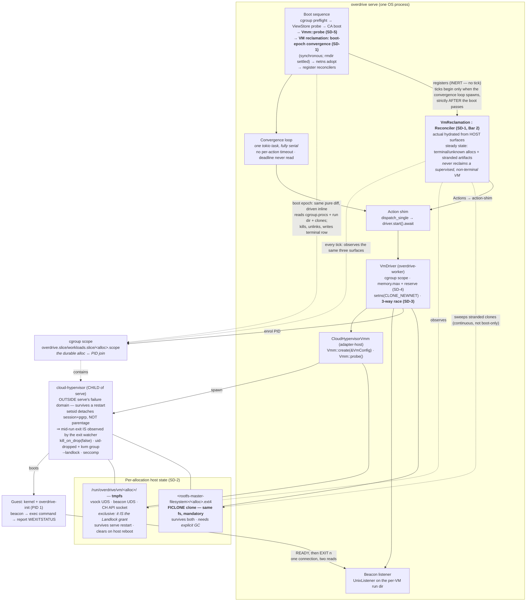
```mermaid
flowchart TB
    subgraph SERVE["overdrive serve (one OS process)"]
        direction TB
        BOOT["Boot sequence<br/>cgroup preflight → ViewStore probe → CA boot<br/><b>→ Vmm::probe (SD-5)</b><br/><b>→ VM reclamation: boot-epoch convergence (SD-1)</b><br/>(synchronous; rmdir settled) → netns adopt<br/>→ register reconcilers"]
        LOOP["Convergence loop<br/><i>one tokio task, fully serial</i><br/>no per-action timeout · deadline never read"]
        RECL["<b>VmReclamation : Reconciler (SD-1, Bar 2)</b><br/>actual hydrated from HOST surfaces<br/>steady state: terminal/unknown allocs + stranded artifacts<br/><i>never reclaims a supervised, non-terminal VM</i>"]
        SHIM["Action shim<br/>dispatch_single → driver.start().await"]
        DRV["VmDriver (overdrive-worker)<br/>cgroup scope · memory.max + reserve (SD-4)<br/>setns(CLONE_NEWNET) · <b>3-way race (SD-3)</b>"]
        VMM["CloudHypervisorVmm (adapter-host)<br/>Vmm::create(&VmConfig) · Vmm::probe()"]
        BEACON["Beacon listener<br/>UnixListener on the per-VM run dir"]
    end

    subgraph HOSTSTATE["Per-allocation host state (SD-2)"]
        direction TB
        RUN["/run/overdrive/vm/&lt;alloc&gt;/ — <b>tmpfs</b><br/>vsock UDS · beacon UDS · CH API socket<br/><i>exclusive: it IS the Landlock grant</i><br/>survives serve restart · clears on host reboot"]
        IMG["&lt;rootfs-master-filesystem&gt;/&lt;alloc&gt;.ext4<br/><b>FICLONE clone — same fs, mandatory</b><br/>survives both · <i>needs explicit GC</i>"]
    end

    CH["cloud-hypervisor (CHILD of serve)<br/>OUTSIDE serve's failure domain — survives a restart<br/>setsid detaches session+pgrp, NOT parentage<br/>⇒ mid-run exit IS observed by the exit watcher<br/>kill_on_drop(false) · uid-dropped + kvm group<br/>--landlock · seccomp"]
    GUEST["Guest: kernel + overdrive-init (PID 1)<br/>beacon → exec command → report WEXITSTATUS"]
    CG["cgroup scope<br/>overdrive.slice/workloads.slice/&lt;alloc&gt;.scope<br/><i>the durable alloc ↔ PID join</i>"]

    BOOT --> LOOP --> SHIM --> DRV --> VMM
    DRV --> BEACON
    VMM -->|spawn| CH
    DRV -->|enrol PID| CG
    CG -.->|contains| CH
    CH -->|boots| GUEST
    GUEST -->|"READY, then EXIT n<br/>one connection, two reads"| BEACON
    VMM --- RUN
    DRV --- IMG
    CH --- RUN
    CH --- IMG
    BOOT -.->|"boot epoch: same pure diff, driven inline<br/>reads cgroup.procs + run dir + clones;<br/>kills, unlinks, writes terminal row"| CG
    BOOT -->|"registers (INERT — no tick)<br/>ticks begin only when the convergence loop spawns,<br/>strictly AFTER the boot passes"| RECL
    RECL -.->|"every tick: observes the same three surfaces"| CG
    RECL -.->|observes| RUN
    RECL -.->|"sweeps stranded clones (continuous, not boot-only)"| IMG
    RECL -->|"Actions → action-shim"| SHIM
```

---

**Boundaries — what this entry does NOT decide.** The `Vmm` trait signature and
`VmConfig` value shape, the `[vm]` spec surface, `TransitionReason` variants,
driver dispatch at the composition root, the guest agent's wire protocol, and
the vCPU/memory derivation *functions* are **application architecture**
(solution-architect) and **domain model** (ddd-architect). Volumes, virtiofsd,
snapshot/restore, warm pools, persistent rootfs and the chunk store are out of
this feature entirely — GH #96 / #97 / #100.

See `docs/feature/microvm-driver-cloud-hypervisor/feature-delta.md`
§ *Wave: DESIGN — system/infrastructure scope* for the option analysis,
estimation, reuse analysis, and the seven spike-versus-slice contradictions
this entry resolves.

---

## Domain Model

**Scope**: bounded contexts, aggregates, ubiquitous language, and the domain
rules that bind reconcilers, drivers and the observation surface alike. Owned by
Hera.

For Phase 1 the language is thin: `Job`, `Allocation`, `Node`, `Policy`,
`Certificate`, `Investigation`, plus the identifier newtypes enumerated under
§ *Application Architecture*. Entries below are recorded only where a feature
pushed a specific corner of that language past the point at which leaving it
implicit was safe. **Absence of an entry is a claim that the language needed no
decision, not an omission.**

### VM workloads — the ending taxonomy, restart accounting, and the driver/kind axis (2026-08-11, GH #42)

**Verdict, up front and deliberately narrow: this feature introduces NO new
bounded context and NO new aggregate.** `Job`, `Allocation`, `AllocationSpec`
and `AllocStatusRow` already model everything a VM workload is. A VM is a new
*execution substrate* inside an existing lifecycle, not a new lifecycle. Applying
the primary boundary heuristic — *does a word mean two different things to two
groups?* — returns nothing: "allocation", "workload", "terminal", "stop" and
"restart" mean for a VM exactly what they mean for a process, which is the whole
premise of `[G1]` ("one control plane, all workload types"). Inventing a `VM`
aggregate to justify the wave would have added a second lifecycle owner for a
thing that has exactly one.

**What the feature DOES force is a rule the language has been able to leave
implicit until now, because until now it was never violated.** SD-1 introduces
the platform's first *routine, non-exceptional* destruction of a healthy running
workload that the platform is then obliged to recreate. The existing ending
vocabulary has no word for that, and both available defaults are wrong — in
opposite directions. That is DD-1, and it, not the VM, is the domain content of
this wave.

Three decisions (**DD-1 … DD-3**) plus the language pins (**DD-4**), the aggregate
contract (**DD-5**) and the context map (**DD-6**). **DD-1(b)** and the second
half of DD-5 were added in the 2026-08-11 revision pass, after the user ruled
reclamation a Bar-2 `Reconciler`: that ruling gave the reclamation a *steady-state
tick* alongside its boot-epoch drive (a taxonomy question — DD-1(b)) and moved its
effect onto the `Action` boundary (a contract question — DD-5). **DD-1(b.i)**
followed in the iteration-2 remediation pass, and its origin is the same ruling
one step further out: a steady-state tick made *the interval over which a
supervision handle is held* load-bearing for the first time, and DD-1(b) had
stated its precondition over the steady state without stating it over the **exit
path**, which transits that precondition's blank cell on every ordinary exit
(review NEW-1 / NEW-3, 2026-08-11). Evidence base:
SD-1 … SD-5 in § *System Architecture* above, `spike/findings.md` P2, ADR-0078,
ADR-0077, ADR-0037, ADR-0047, ADR-0030, ADR-0023.

**DD-1, DD-1(b) and DD-1(b.i) are minted as
[ADR-0081](adr-0081-three-ending-classes-platform-reclamation-and-artifact-disposal.md)**
(2026-08-11), per deferral H-1's ruling that the rule is platform-wide and
ADR-worthy, not VM-specific — the next free number, reserved for it and now
taken. This subsection remains the full rationale, evidence and trap-by-trap
argument the ADR compresses into a durable decision record; ADR-0081 is what
ADR-0082 § D8 and ADR-0083 §§ D5–D7 already cite by name.

---

#### DD-1 — An ending classifies into **three** classes, not two, and restart eligibility + budget consumption are both functions of the class

**The rule.**

> **Every terminal `AllocStatusRow` belongs to exactly one Ending Class. Restart
> eligibility, restart-budget consumption, and job finalisation are functions of
> that class — never of the driver, never of the terminal state alone, and never
> of a substring of a reason's text.**

| Ending Class | Meaning | Re-drive the workload? | Consumes **Restart Budget** (`WorkloadLifecycleView.restart_counts`) | Finalises a Job-kind workload? | Increments observable **Restart Count** (`AllocStatusRow.restart_count`, ADR-0078) |
|---|---|---|---|---|---|
| **Intentional Stop** | An authority withdrew the workload or its intent | **No** | n/a | n/a (no successor) | n/a |
| **Workload Failure** | The workload itself ended badly | **Yes** | **Yes** | **Yes** — the run is over | Yes |
| **Platform Reclamation** | The platform destroyed *one runtime instance* while the workload's intent still stands | **Yes** | **No** | **No** — the run is not over | **Yes** |

**Platform Reclamation is not an ending of the workload. It is an interruption of
one allocation attempt.** That single sentence generates all four columns, and it
is the sentence the codebase currently cannot express.

**Both defaults are wrong, and they fail in opposite directions — which is why
this could not be left to the driver.**

1. **Classify the reap as an Intentional Stop** (the tempting move, because
   `StoppedBy::SystemGc` already exists and already means "the platform did it").
   `is_intentionally_stopped` (`workload_lifecycle.rs:1096-1111`) is
   `state == Terminated` **and** `StoppedBy::{Operator, SystemGc}` on **either**
   `row.terminal` or `row.reason`; `is_restartable` (`:1116-1120`) is its negation
   over the wider `Terminated | Draining | Failed` set — the `Terminated` conjunct
   is what makes the two sets asymmetric. Result: **every VM on the
   node stays dead after an `overdrive serve` restart.** The exact inverse of
   SD-1's stated intent ("lets the existing restart/backoff reconciler re-drive
   them"), reached by reusing the nearest existing word.
2. **Classify the reap as a Workload Failure** (the do-nothing default). Six
   `serve` restarts against `RESTART_BACKOFF_CEILING = 5`
   (`workload_lifecycle.rs:23`, checked at `:678-679`) drive **every** VM workload
   on the node to `RestartBudgetExhausted` — a node-wide terminal cascade caused
   by routine upgrades. This is the failure SD-1 names.
3. **And a third, which SD-1 does not name and which bites first.** For a
   **Job**-kind workload the finalise branch is evaluated *before* the restart
   branch (`workload_lifecycle.rs:622-624` vs `:673`), gated on `is_natural_exit`
   (`:1124-1131`) — which is `row.state.is_terminal() && !is_intentionally_stopped(row)`.
   A reap row that is merely "not an intentional stop" therefore satisfies
   `is_natural_exit`, and `classify_natural_exit_terminal` (`:1136-1146`) falls
   through to `TerminalCondition::Failed { exit_code: Some(0) }`. **A reaped
   Job-kind VM is finalised as a failed job with exit code 0 and is never
   restarted at all** — a fabricated exit code on a workload that never exited.
   Fixing (2) without fixing this converts a budget cascade into a silent lie,
   which is strictly worse.

**The general form of the rule, which is what makes it enforceable:**

> **No reconciler may author a terminal claim on a Platform-Reclamation row.** A
> terminal claim (`TerminalCondition`) asserts *how the workload's run ended*; a
> reclaimed run has not ended. Every branch that emits `FinalizeFailed` is
> therefore a binding site, in **every** reconciler — not only in
> `WorkloadLifecycle`.

**The sites the rule binds.** Named so the rule is falsifiable rather than
aspirational; the *shape* of each change is the solution architect's.

| Reconciler | Site | Today | Must become |
|---|---|---|---|
| `WorkloadLifecycle` | `is_intentionally_stopped` (`:1096`) | `state == Terminated` ∧ `Stopped { by: Operator \| SystemGc }` on `terminal` or `reason` | unchanged in meaning — Platform Reclamation must **not** match it |
| `WorkloadLifecycle` | `is_restartable` (`:1116`) | restartable-state ∧ ¬intentional | unchanged in meaning — Platform Reclamation **must** match it |
| `WorkloadLifecycle` | `is_natural_exit` (`:1124`) | terminal ∧ ¬intentional | terminal ∧ ¬intentional ∧ **¬reclamation** |
| `WorkloadLifecycle` | budget check (`:678`) | `restart_counts[alloc] >= CEILING` | unchanged; the **increment** site (`:788`, the only writer in the workspace) must skip on Platform Reclamation |
| `ServiceLifecycle` | startup-probe branch — `startup_probe_failed_action` (`service_lifecycle.rs:968-991`), emitted at `:651-658` | gated **only** on `started_at.is_some()` ∧ attempts ∧ deadline ∧ no-Pass — **no `AllocState` gate at all**, and the enclosing loop at `:500` filters no state | must additionally exclude reclamation. **This is DD-1 trap 3's shape on the Service path**: a Service alloc reclaimed after Running but before Stable can be handed a fabricated `ServiceFailed { StartupProbeFailed }` terminal for probes that never failed. |
| `ServiceLifecycle` | liveness branch (`:769-788`) | gated on `state == AllocState::Running` | **no change** — a reclaimed alloc is not `Running`, so it is unreachable. The one branch that is already safe. |

**Why the Service path was nearly missed, and why it is recorded rather than
elided.** The first pass of this section asserted `ServiceLifecycle` was benign
after examining only its liveness branch — the branch that *is* state-gated. It
emits actions at five sites; four are not liveness. Certifying a component from
one branch is the same error as certifying an ending from one predicate, which is
the error DD-1 exists to correct.

**Naming, and where the word belongs.** `StoppedBy` (`transition_reason.rs:229-255`)
is already the platform's "who ended this" vocabulary — `Operator`, `Reconciler`,
`Process`, `SystemGc` — is `#[non_exhaustive]`, and documents an append-only rkyv
discriminant discipline verbatim (`:238-253`). **Recommendation:
`StoppedBy::PlatformReclaimed`, appended.** It is the cheapest correct home: the
domain question *is* "who ended it", the answer *is* "the platform", and the
existing `SystemGc` sits one variant away as the contrast case — `SystemGc` means
*the intent is gone*, `PlatformReclaimed` means *the intent stands and the
platform owes you a replacement*.

**Not VM-specific, and deliberately so.** Node drain, live migration, eviction
under pressure, and rolling node upgrades are all Platform Reclamation. Minting a
VM-shaped word here would guarantee a parallel model at the first of those — the
same mistake `[D3]` avoided by generalising into system constraint 9 rather than
special-casing `virtiofsd`. **"Reap" is SD-1's implementation name for its
boot-epoch drive; it is not the domain term, and it names only the
ending-authoring half of what that reconciler does (DD-1(b)).**

**Boundary — what DD-1 does and does NOT decide about the reclaimed row's
`AllocState`.** Whether the reclamation cause travels as a `StoppedBy` variant, a
`TransitionReason` variant, or both, is a surface question for the solution
architect. The **state** is *not* fully free, and treating it as free was an error
in this section's first pass:

- **`AllocState::Failed` is excluded on domain grounds.** `Failed` asserts the
  workload's run ended badly. A reclaimed run did not end at all — that is the
  whole content of DD-1 — so `Failed` would be the misclassification this feature
  exists to refuse, written into the reclamation itself.
- **And the choice is load-bearing beyond that, which is why it cannot be left
  implicit.** `ServiceLifecycle`'s EarlyExit branch is gated on
  `fact.state == AllocState::Failed` (`service_lifecycle.rs:611`) and fabricates
  `ServiceFailed { EarlyExit { exit_code } }` at `:631-636`. A reclamation written
  as `Failed` makes that branch reachable and manufactures an exit code for a
  workload that never exited. `Terminated` does not.
- **`Terminated` is therefore the indicated value**; any *other* candidate must be
  checked against the same question — *does any reconciler's failure branch key on
  this state?* — before it is chosen.

What is binding in every case: the Ending Class must be **derivable from the
terminal row alone**, the three classes must be **total and disjoint** over
terminal rows, and no site may recover the class by matching on free text.

**Why "from the terminal row alone" — and not the reason it first appears to be.**
It is *not* that the reconciler lacks other input: `WorkloadLifecycleState.job`
is in scope in the very same match arm and is read at `workload_lifecycle.rs:734`,
`:742`, `:750`, so `WorkloadDriver` is available at the classification seam. The
binding reason is **generality**: a class derived from the driver is a class only
VMs can be in, and node drain, eviction under pressure and live migration are all
Platform Reclamation on workloads that are not VMs. Keying on the row keeps one
rule for one concept. (A predicate whose signature takes only the row is a
consequence of this, not the justification for it.)

**DD-1(b) — SD-1's two reclamation regimes are ONE class with a precondition, plus
a second concept that is not an ending at all.** *(Added 2026-08-11 at the system
designer's request, after the Bar-2 ruling gave the reclamation reconciler a
steady-state tick alongside its boot-epoch drive.)*

SD-1's two-regime table asks a domain question: is *boot-epoch reclamation* the
same thing as *steady-state reclamation*? **Ruling: the regimes are not the
distinction.** What actually differs between the two rows of that table is
**whether an ending is authored at all** —

| SD-1 regime | What it destroys | Domain concept |
|---|---|---|
| **Boot epoch** — may reclaim *every* VM allocation with surviving host state | a runtime instance of a **non-terminal** allocation | **Platform Reclamation** — DD-1's third Ending Class, unchanged |
| **Steady state** — may reclaim only terminal/unknown allocations and stranded artifacts | host state backing **no live instance of a non-terminal allocation** | **Artifact Disposal** — not an ending; authors no terminal row |

A steady-state tick, as SD-1 scopes it, **never authors an ending**: a terminal
allocation's ending is already authored, and an unknown one has no allocation to
end. So "boot reclamation" and "tick reclamation" are not two classes of ending —
one of them is not an ending.

**Read that table by its middle column, not its first.** The regime is only where
each case *happens to arise under this feature's scoping*; the concept is fixed by
**what is destroyed**. Consequence 1 below names the case that breaks a naive
regime → concept mapping — and that it breaks is itself the argument against
promoting the regimes to classes.

**Why not two classes, stated as three refusals:**

1. **A regime-derived class is not derivable from the terminal row alone**, which
   DD-1 makes binding. The row must not — and should not be able to — say which
   pass wrote it.
2. **It would not survive DD-1's own generality pin.** Node drain, eviction under
   pressure and live migration each destroy a **live, supervised** instance at
   **steady state**. Under a regime-keyed vocabulary every one of them is either
   unnameable or needs a fourth word; under the precondition below they are the
   class that already exists.
3. **SD-1's steady-state prohibition is a property of this reconciler's
   authorisation, not of the class.** *"Never reclaim a supervised non-terminal
   VM"* is this feature's conservatism — correct, and correctly load-bearing —
   but freezing it into the platform's vocabulary would make the safety rule and
   the taxonomy inseparable, so the first feature that legitimately reclaims a
   live instance would have to break the taxonomy to do it.

**The precondition — stated so the safety property falls out of it rather than
sitting beside it:**

> **A reconciler may author a Platform Reclamation for an allocation exactly when
> the platform can no longer honestly classify that instance's ending** — that is,
> when it holds **no live supervision handle** for it. Where the handle exists the
> ending is still classifiable (the exit watcher owns the `Child` and fires on any
> VMM death; the vsock channel that carries `EXIT n` is live), so reclamation is
> **never** authorised and a supervised, non-terminal VM survives every tick.

This is not a new rule. It is **the same sentence SD-1 uses to justify reap-rather-
than-adopt** — *"an adopted VM is a VM whose ending can never be honestly
classified"* — applied one level up, to the tick as well as to the boot. And it
makes the boot epoch **the degenerate case of the steady-state rule rather than a
second rule**: at boot the driver's live-handle set is reconstructed empty
(SD-1; DD-2's `ExitEvent` argument), so the predicate is true for *every* VM
allocation by construction. That is also the domain reason SD-1's *"one pure diff,
two drivers"* is the right shape and not merely an economy — there is one rule
being evaluated against an input that happens to be uniformly empty at boot.

**DD-1(b.i) — The supervision handle's lifecycle: it is a claim on *authoring an
ending*, not a grip on a running process.** *(Added 2026-08-11, iteration-2 review
NEW-1 / NEW-3. The precondition above is correct and is not withdrawn; it was
stated over the **steady state** and left **incomplete in time**, and the ordinary
exit path is what exposes the gap.)*

The precondition asks *"can the platform still honestly classify this instance's
ending?"* and answers it by asking whether a **handle** is held. That substitution
is sound **only if the handle is held for exactly as long as the answer is yes** —
and it is not, if the handle is released when the *process* dies. Between a VMM's
death and its terminal row's write the platform holds the exit report and is *in
the act of classifying it*: the answer is demonstrably **yes** while the handle
already reads *released*. The instance then occupies DD-1(b)'s blank cell
(non-terminal, unsupervised) **transiently, on every ordinary exit** — and the two
halves are on separate tasks, so the window is real rather than theoretical. A
sweep landing inside it authors a Platform Reclamation over an ending the platform
was mid-way through classifying honestly. **The result is DD-1's traps 2 and 3 at
the same two sites, misclassified in the opposite direction** — which is why this
rule's absence is not caught by anything DD-1 already binds: a **crash** relabelled
reclamation is exempted from the restart budget, so a crash-looping VM restarts
budget-free and the ceiling never fills (trap 2's node-wide cascade, run backwards);
and a **completed Job** relabelled reclamation is not finalised but **re-driven** —
a duplicate execution of a side-effecting run (trap 3's fabricated ending, run
backwards). Both are lies DD-1 exists to refuse, arrived at through the predicate
DD-1(b) added to refuse them.

> **The supervision handle is the platform's claim to author ONE instance's
> ending. It is held from the moment that instance starts until the moment that
> ending has been AUTHORED — the terminal row is written — or until authorship has
> been ABANDONED as impossible. It is not released at process death, at the exit
> watcher's return, or at any point at which an exit report is still in flight.**

Three readings follow, and each closes a case the process-death reading leaves
open:

1. **Ordinary exit.** The handle is held across the exit report, so the blank cell
   is never entered and nothing races the honest ending. The transient
   *non-terminal + unsupervised* state ceases to exist rather than being defended
   against downstream.
2. **A stop whose kill failed, same `serve` (SD-1's unstoppable orphan).** The
   ending is authored **on the stop path** — the row is terminal while the VMM
   survives, which is exactly what makes it an orphan — so the handle is released
   **then**, notwithstanding the live process. What remains is an orphan process,
   not a supervised instance: the platform's claim to author that ending is
   discharged, and holding the handle past it would assert a second authorship
   over an ending already on the record. This is what makes the orphan reachable
   by **Artifact Disposal** at all; under the process-death reading the platform
   would report itself as supervising an instance whose ending it had already
   written, and the disposal's kill would then fire a still-live watcher into a
   row that DD-5 declares byte-unchanged.
3. **Abandonment.** Where authorship cannot complete — the write fails terminally,
   the authoring task dies with the process — the handle is released and the
   allocation becomes reclaimable. That is not a loophole; it is the precondition
   read correctly, because at that point the platform genuinely **cannot** classify
   the ending, which is precisely DD-1's Platform Reclamation. **The abandonment
   boundary must be pinned mechanically** — what concludes an authorship attempt —
   because a handle that is never released is a permanently unreclaimable orphan,
   i.e. SD-1's headline failure reintroduced by the fix for it.

**The corollary, and it binds the ending-authoring paths rather than the
reclamation:** *once an instance's ending is authored, no further ending may be
authored for that instance.* Retiring the handle at authorship is the same
sentence as DD-1(b)'s refusal to let Artifact Disposal overwrite an authored
ending, applied to the **exit path** instead of to the sweep. Two consequences
worth stating because they are testable: a terminal-row instance that is *still
supervised* becomes **unrepresentable**, so the byte-unchanged assertion on the
disposal path holds **structurally** rather than by the luck of no watcher being
alive; and the assertion thereby gains a second target — an implementation that
keeps an exit watcher alive past the ending it authored.

**The boot epoch is unchanged by all of this, and that is the check that the rule
is the same rule.** A `serve` that dies mid-exit-report loses the watcher with the
process: the handle is gone, the ending is unrecoverable, the row is non-terminal
— authorship was *abandoned*, reading 3, and reclamation is authorised. The empty
live-handle set at boot remains evidence for the same reason it always was.

**What this obliges the solution architect to pin (§ 105a / § 104), stated so the
ruling is implementable rather than merely correct:** the **release point** of the
per-allocation handle, ordered strictly after the terminal-row write; the
**abandonment boundary** that releases it when the write cannot land; the
**write-time precondition** of consequence 3 below; the **skew direction** of
consequence 2 below; and the restatement of the byte-unchanged acceptance
criterion, whose scenario is now *a terminal-row VMM with no live watcher* — the
restart orphan and the failed-stop orphan alike — plus an invariant covering the
exit window, which the existing supervised-survives-every-tick invariant cannot
reach because it is scoped to membership the allocation has just left.

**Where the discriminating fact must live, and the domain reason.** SD-1 requires
the supervision discriminator to be an **observed input hydrated into `actual`**,
never a `View` marker, citing `reconcilers.md`'s fingerprint-as-diff anti-pattern.
Confirmed, and the domain adds a second reason that holds independently of that
anti-pattern: the predicate asks *"can the platform still classify this ending?"*,
which is a fact **about the world** — does a watcher hold this instance? — not a
fact about what the reconciler last emitted. A `View` marker would answer a
different question, and here that substitution gates **whether a live VM is
killed**.

**Three consequences of the precondition — two that SD-1's table leaves implicit,
and one that the iteration-2 review found the design had lost between emit and
execute. Recorded because each is kill-authorising and none should be discovered
in DELIVER.**

1. **The blank cell: a non-terminal allocation this `serve` is *not* supervising,
   at steady state — where *not supervising* means SETTLED, never MOMENTARILY
   ABSENT.** SD-1's steady-state row permits *terminal or unknown* and forbids
   *supervised non-terminal*; this case falls in neither. The precondition
   classifies it as **authorised Platform Reclamation** — but only where the
   platform's inability to classify is **settled**: no handle held **and** no
   ending in flight for that instance. Under DD-1(b.i) those two are one
   statement, and that identity is the entire warrant for using handle-absence as
   a proxy for unclassifiability. Under a process-death handle reading they are
   **not** one statement, and this cell silently swallows every ordinary exit
   (review NEW-1) — the authorisation would then be granted on the strength of an
   allocation's absence from a set that is *momentarily stale*, rather than on the
   platform's actual inability to classify, which is the only thing DD-1(b)
   licenses. Where the reading is stale rather than settled the answer is **not
   authorised** (consequence 2); where it is settled, the alternative is precisely
   SD-1's headline failure: an unstoppable orphan holding the entire committed
   guest RAM with the row still claiming the workload is alive. This is the one
   place the domain formalisation *extends* SD-1's table rather than restating it,
   and it is flagged as such rather than folded in silently.
2. **Absence of evidence is not evidence of absence — the predicate fails safe.**
   "No live supervision handle" authorises a kill, so a discriminator that is
   *unavailable* (not yet hydrated, hydration errored, the surface is empty because
   it has not been populated rather than because nothing is supervised) must read
   as **not authorised**, never as "unsupervised". The boot epoch is the *only*
   regime where an empty handle set is itself the evidence, and it is evidence
   there because `ExecDriver.live` is reconstructed empty by construction (SD-1) —
   a known fact about the world, not a missing observation. Anywhere else, an empty
   or absent reading means *do nothing this tick*.

   **A STALE reading is a species of unavailable, and the direction it must fail
   in is binding.** The supervision reading and the host observation are taken at
   two different instants; whichever is taken first is, by the time the diff runs,
   a statement about the past. Because the predicate is kill-authorising, that skew
   must resolve toward **held** — an allocation supervised at either instant is
   supervised for the purposes of this tick. Doing nothing on a stale *held*
   reading costs one sweep interval; acting on a stale *unsupervised* one kills a
   live VM. Which read order discharges this is the solution architect's to pin
   (§ 105a.2); the **direction** is fixed here.

3. **Authorisation is a precondition of the WRITE, not merely of the emission.** A
   tick decides at *t* and its executor writes at *t + ε*; an ending authored
   inside that gap is an ending, and DD-1(b)'s refusal to overwrite an authored
   ending binds the **reclamation** path exactly as it binds the disposal path.
   An allocation re-observed **terminal** at execute time therefore authorises
   nothing, and the command's declared delta collapses to empty (DD-5). This is
   not redundant with DD-1(b.i): that rule removes the window at its source, this
   one refuses the write in the residual emit→execute gap, and the two fail
   independently. Recorded because the executor **already re-reads the row** — the
   observation is in hand — and the defect was that it was read only as a lookup
   for the `workload_id` the `alloc_id`-only payload omits, never as the guard;
   so *losing* the race did not save the honest ending either (review NEW-1).

**And the second concept needs its own word, because reusing the first one is a
lie.** Disposing of a *terminal* allocation's leftover host state must **not**
write a Platform-Reclamation row. That allocation's ending is already authored —
possibly as an **Intentional Stop**, by an operator `stop` whose kill failed
(SD-1's unstoppable-orphan case) — and overwriting it would re-classify an honest
ending as a platform one, increment `restart_count` for a restart that never
happens, and clobber `LastTerminated`. The two are therefore separate commands
with separate contracts (DD-5), and **Artifact Disposal** is pinned as vocabulary
in DD-4.

---

#### DD-2 — Reclamation is occurrence-bearing, and its durable surface is ADR-0078's — **unchanged**

`.claude/rules/development.md` § *"A convergent record cannot answer 'did it
happen'"* applies verbatim: a reaped-then-restarted VM converges back to
`Running`, and a convergent row cannot afterwards answer *"was this VM reclaimed,
and how often?"* Crash-loop detection, upgrade-blast-radius forensics and the
operator's `workload describe` all depend on the occurrence surviving.

**Decision: the durable surface is `LastTerminated` + `restart_count`
(ADR-0078), and `CrashFacts::advance` requires no change.** The mechanism already
produces the right answer: the reap writes a terminal row; the restart writes
`Running` superseding it at the same LWW key (`RestartAllocation` reuses
`failed.alloc_id`, `workload_lifecycle.rs:743-746`); `advance`
(`observation_store.rs:1144-1159`) snapshots the terminal row into
`last_terminated` and increments `restart_count`. **Do not "fix" `advance` to
exempt reclamation** — that would erase the occurrence, which is the ADR-0078
defect reproduced in the feature that cites ADR-0078.

**The exemption applies to the budget, and only to the budget.** These are two
different quantities and the codebase already says so
(`observation_store.rs:1210-1228`); the word "restart" does not distinguish them,
which is exactly how a crafter zeroes the wrong one:

| Quantity | Where | Semantics | Under Platform Reclamation |
|---|---|---|---|
| **Restart Budget** — `WorkloadLifecycleView.restart_counts` | reconciler-private View (CBOR) | *how much patience is left*; gates `RestartAllocation`; publishes `RestartBudgetExhausted { attempts }` | **exempt — must not increment** |
| **Restart Count** — `AllocStatusRow.restart_count` | durable observation row (rkyv, ADR-0078) | *how many times this allocation actually came back*; operator-visible | **must increment** |

**The reap writes its own terminal row; no `ExitEvent` is involved, and that is
what keeps it out of the Intentional Stop class.** `ExitEvent.intentional_stop`
(`traits/driver.rs:299-303`, contract at `:278-283`) is the platform's existing
**two-class** ending discriminator — set by `Driver::stop` before SIGTERM
(`:293-298`) and mapping the exit to `Terminated` rather than `Failed`. It cannot
be the reclamation discriminator, and it cannot accidentally claim the reclamation
either: after a `serve` restart `ExecDriver.live` is reconstructed empty (SD-1),
so no watcher holds the flag and no `ExitEvent` is produced for a surviving VMM at
all. The reclamation therefore authors the terminal row itself — through its own
`Action`'s executor (DD-5), never through an exit watcher. **This is the structural
reason DD-1 needs a third class rather than a third value of an existing flag** —
`intentional_stop` is a `bool` on an event that, in this path, never fires.

**One docstring narrows, and must be corrected rather than left to contradict
the code.** `CrashFacts::advance`'s edge-case block
(`observation_store.rs:1122-1132`) states that a `Terminated → Running`
transition on the same key "is unreachable in Phase 1" because `is_restartable`
excludes intentionally-stopped rows. Platform Reclamation makes it **reachable
for the first time**, and reachable *correctly* — the count should tick. The
docstring's advice ("excluding operator stops from the count is a decision to
take THEN … do not improvise it now") still stands for **operator** stops, which
remain excluded upstream by `is_restartable`. The clause must be amended in the
same commit that lands the reclamation class, per
`.claude/rules/development.md` § *Documentation* (no aspirational or stale doc
claims) and the behaviour-change-marks-stale-adjacent-docs discipline.

---

#### DD-3 — The reason vocabulary has **two axes**, and one **declared hole**

**The axes.** `TransitionReason` is carrying two unrelated questions, and US-VM-2's
"no two share a variant" invariant is scoped to only one of them:

| Axis | Question | Members touched by this feature | The invariant |
|---|---|---|---|
| **Cause** | *Why did the workload's run end badly?* | Slice 02's four (kernel-not-found, rootfs-not-found, hypervisor-absent, boot-deadline-exceeded), Slice 03's fifth (confinement-unavailable), C-7's sixth (**kernel present but not loadable**), Slice 04's five | **US-VM-2 / K3 apply here.** No two distinct causes share a variant; ≥4 distinct. |
| **Disposition** | *Who ended it, and does the workload's story continue?* | `Stopped { by }` and DD-1's Platform Reclamation | **US-VM-2 does NOT apply here**, and a reclamation reason must **not** be counted toward K3's "≥ 4 distinct" — counting a disposition as a failure cause would let the feature satisfy K3 without shipping a fourth diagnosis. |

**C-7's variant is a Cause and is genuinely missing.** Cloud Hypervisor reports an
unloadable `--kernel` as `VmBoot(UefiLoad(UefiTooBig))` — a firmware **size cap**
for what is actually a **format** rejection (P1). Slice 02's unclassified-verbatim
arm reports that text faithfully, which is accurate reporting of a misleading
upstream term. In domain terms this is an **anti-corruption failure**: an upstream
context's word entered the operator's language unchallenged (see the context map
below). The variant must say *kernel image format not loadable by this
hypervisor*, and the verbatim CH text belongs in `detail`, never in the variant's
meaning.

**The declared hole — D-3 is modelled here, and deliberately NOT resolved.**

`TransitionReason::OutOfMemory { peak_bytes, limit_bytes }`
(`transition_reason.rs:169`) exists in the language and has **no production emit
site** — it is constructed only in archive-roundtrip and snapshot tests. A cgroup
OOM therefore ships as `WorkloadCrashedImmediately { signal: 9 }`, indistinguishable
from `kill -9`, with no mention of memory.

**`NoCapacity` (`:161`) is the same absence but is NOT the same defect, and the
difference is the whole point of the rule below.** `OutOfMemory` **declares
itself**: the emit-inventory table at `transition_reason.rs:56` marks it
`NO — Phase 2` and `:59-61` explains why. `NoCapacity` is marked **`yes`** at
`:55` — *"reconciler — scheduler returned `NoCapacity`"* — while having no
production construction site anywhere in the tree. That is not a declared hole; it
is a **false documentation claim** of exactly the shape
`.claude/rules/development.md` § *Documentation* forbids, and it is the same
violation this section demands be fixed for `CrashFacts::advance`'s stale clause
(DD-2). It must be corrected to `NO` in the same commit that touches this
vocabulary. *(Note the live, unrelated `PlacementError::NoCapacity` in the
scheduler — a different type, and not a construction site for this variant.)*

The domain framing, stated so the user's ruling on deferral **D-3** is taken with
the cost visible:

> **A `TransitionReason` variant with no production emit site is a word the
> language owns but the system cannot say.** That is not neutral. It is a
> *declared hole*: the correct word exists, the fact occurs, and the system
> answers with a different word. `[D3]` — the feature's north star — is precisely
> the refusal to do that. So `OutOfMemory`'s hole is not a missing feature; it is
> a **standing, knowing misclassification**, and it must be recorded as one
> rather than read as routine.

**Two things this feature changes about that hole, neither of which resolves it.**

1. **Its exposure grows.** SD-4 confines a memory overrun to the allocation's own
   cgroup scope rather than letting the host OOM killer pick a victim — which is
   the right call, and it means **cgroup OOM becomes the *expected* VM overrun
   failure** rather than a rare one. A VM's declared RAM is a standing claim on
   the host, and its host-resident share trends toward that declared figure over
   the run without shrinking back (the guest's own page cache retains what it
   reads) — **at a rate this feature has not measured on the cold-boot path**; a
   process typically makes no such claim at all. **The variant that has never been
   emitted becomes the one VM workloads will hit first**, and that follows from
   SD-4's confinement decision by itself.
   *(An earlier draft of this bullet cited "P13/P14: full residency in ~2.5 s".
   That figure is P13's `ondemand`-**restore** uffd backfill — a restore-path
   property of a banked probe — applied to the cold-boot path this feature ships,
   and the design's own P5 datapoint refutes the generalisation: `VmRSS
   276,888 kB` at beacon with 128 MiB deliberately touched, nowhere near full
   residency. It is **withdrawn** here, as it has been from SD-4. **D-3 stays open
   and stays non-routine** — the claim above is what carries that, and it never
   rested on a residency-timing number.)*
2. **Its blast radius is now bounded and nameable.** Because the hole is declared
   here, the discharge condition is a single sentence rather than a search: *the
   first cgroup `memory.events` subscription on the allocation's scope*. Until
   then, no artifact may describe VM memory-limit behaviour as "diagnosed" — the
   claim available is "confined", which SD-4 earns, and no more.

**The general rule these two instances establish:** a vocabulary entry defined for
forward wire-compatibility (which `OutOfMemory`'s own docstring says it is) is
legitimate — but the hole **must be declared, not discovered**. `OutOfMemory` is
the compliant case with a real cost; `NoCapacity` is the non-compliant one, where
the inventory asserts an emit site that does not exist. **A word the language owns
but the system cannot say is a hole; a word the *documentation* claims the system
says when it cannot is a lie.** The rule covers both, and only the second needs a
correction rather than a decision.

---

#### DD-4 — Ubiquitous language: four terms pinned

| Term | Pinned meaning | What it is NOT | Why it needed pinning |
|---|---|---|---|
| **Workload Kind** (`WorkloadKind ∈ {Job, Service, Schedule}`, ADR-0047) | The *shape of the lifecycle* — does it terminate, converge, or recur? Lives on the observation row (`AllocStatusRow.kind`). | **Not the driver.** | SD-1's reclamation reconciler must answer *"is this a VM allocation"* — under the Bar-2 ruling **on every tick, not only at boot**, which raises the cost of getting it wrong from once-per-restart to continuous. `kind` cannot answer it. The question is **intent-side**: resolve `workload_id` against the `Job` aggregate and match `WorkloadDriver::Vm`. Assuming a row field that does not exist is how the reap rule would have become quietly unimplementable. |
| **Workload Driver** (`WorkloadDriver ∈ {Exec, Vm}`, intent-side, rkyv-persisted in `Job`) | The *execution substrate*. | Not the lifecycle shape; not `DriverType` (which is the wire/dispatch tag and is **not** persisted on any row — intake I-5). | Two orthogonal axes both colloquially called "kind"/"type" in prose. Every `Job × Driver` combination is meaningful, which is what makes them axes rather than one enum. |
| **Restart Budget** vs **Restart Count** | Budget = remaining patience, reconciler-private, gates the action. Count = observed recurrences, durable, operator-visible. | Not synonyms; not the same number. | DD-2. The whole reclamation rule turns on exempting one and preserving the other, and one English word covers both. |
| **Platform Reclamation** | The platform destroyed one runtime instance while the workload's intent still stands, and owes a replacement. | Not a stop, not a crash, not garbage collection (`SystemGc` = the intent is *gone*). "Reap" is one implementation of it. | DD-1. |
| **Artifact Disposal** | Destroying per-allocation host state — cgroup scope, run directory, rootfs clone — that backs **no live runtime instance of a non-terminal allocation**. Authors no ending, writes no row, moves neither counter. | **Not** Platform Reclamation: that ends a live instance, and this one has no live instance to end. Not `SystemGc` either — `SystemGc` is a *disposition carried by an ending*; this is the absence of one. | DD-1(b). SD-1's steady-state tick does this and only this; its boot-epoch drive does both. One English verb — "reclaim" — covers them, and the whole difference is whether a terminal row is authored. |

**Boot epoch** and **steady state** are **regimes of SD-1's reconciler, not Ending
Classes.** They are correct vocabulary when describing *when* the reconciler runs;
they must never appear in the vocabulary of a row, an Ending Class, an `Action`
payload, or a predicate — see DD-1(b) and DD-5's payload prohibitions.

**`vm`, not `microvm`, at every operator-facing surface** (intake I-5): the TOML
table is `[vm]`, the surviving driver tag is `DriverType::Vm`, and the domain term
is **VM Workload**. The feature slug and GH #96–#100 retain "microVM" as prose
about *this feature*, which is fine. **Two drift sites name a `microvm` surface
that will not exist:**

1. `ADR-0031:539` — *"Future drivers add new sibling tables (`[microvm]`,
   `[wasm]`)"*. Outside #42's scope; an ADR amendment, routed to the architect
   agent, not made here.
2. `crates/overdrive-core/src/aggregate/mod.rs:166` —
   `// Future Phase 2+: MicroVm(MicroVm), Wasm(Wasm).`, sitting **inside
   `WorkloadDriver`**, the enum this feature adds `Vm` to. In scope, and the
   commit that adds the variant is the commit that makes the comment false — so
   it is corrected there, per the behaviour-change-marks-stale-adjacent-docs
   discipline, not deferred. (Whitepaper §6 is also stale on this and on
Firecracker's memory hotplug; per the 2026-06-25 ruling the whitepaper is **not
SSOT** and is not cited as evidence anywhere in this section.)

**One precision the feature's own north star requires.** For a VM,
`ExitKind::CleanExit` means **"the guest agent reported a clean exit"**, not "the
workload succeeded". The report arrives over a channel inside the guest (P2), and
under BYO-artifact the operator supplies the rootfs that carries the agent. This
is still a strict improvement over classifying on the VMM's `WEXITSTATUS` — which
reports `0` for a guest that boots, panics and powers off (intake precedent
warning #3) — and it is the honest reading of `[D3]`. No artifact may state or
imply that a VM's reported exit status is independently verified by the platform.
Hardening the guest↔host channel is GH #100 / #258 territory; the **word's
meaning** is pinned here.

---

#### DD-5 — Aggregates: `Job` keeps its boundary; the bounded-change contracts

**No new aggregate. `Job` remains the single intent aggregate root** and gains one
variant on a value type it already owns (`WorkloadDriver::Vm`), which is an rkyv
schema-evolution event (`JobEnvelope` V1 → V2, user-ruled, intake I-5 / `[G4]`)
and **not** an aggregate-boundary change. Checked against Vernon's four rules:

1. **True invariants inside the boundary.** A VM adds no invariant `Job` does not
   already protect. The candidate — *"the VM's guest RAM and the allocation's
   cgroup limit are consistent"* (SD-4) — is a **derivation at start time from
   `resources.memory_bytes`**, not a stored pair, so there is no two-field
   invariant to protect. Per § *"Persist inputs, not derived state"* the reserve is
   a policy function, never a field; making it a field would manufacture the very
   invariant that would then justify an aggregate.
2. **Design small aggregates.** `Job` is root + value types. A `VmInstance`
   aggregate would have exactly the allocation's lifetime and no independent
   identity — the ~70% case where the answer is a value type, not a root.
3. **Reference other aggregates by identity.** Unchanged: `AllocationId`,
   `JobId`, `NodeId` newtypes throughout; the reap's *"is this a VM allocation"*
   join is `workload_id → Job → WorkloadDriver::Vm`, i.e. by identity across the
   Intent/Observation boundary, exactly as rule 3 prescribes.
4. **Update other aggregates by eventual consistency.** Unchanged and load-bearing:
   the observation layer converges under LWW (ADR-0077); the reclamation writes its
   terminal row through the same merge, which is what makes a repeated convergence
   a same-value write — under Bar 2 that repetition is the **next tick**, not the
   next boot, so the property is exercised continuously rather than once per
   restart.

**Bounded-change contracts.** Per the 2026-05-15 mandate, each command below
declares the slots it may change; **everything else must be complement-equal**.
The partition is not invented here — `LastTerminated`'s membership rule
(`observation_store.rs:959-967`) already states it: *overwritten ⇒ snapshotted,
forward-carried ⇒ not.*

*Universe* — `alloc_status[alloc_id]`, one LWW key:
`{ alloc_id, workload_id, node_id, kind, listeners, workload_addr }` (forward-carried)
∪ `{ state, reason, detail, terminal, stderr_tail, started_at, updated_at }` (overwritable)
∪ `{ last_terminated, restart_count }` (ADR-0078 pair)
— plus, for commands that touch it, `WorkloadLifecycleView.restart_counts[alloc_id]`.

**Naming discipline for the table below — restated 2026-08-11, because the Bar-2
ruling falsified what this paragraph previously said.** The first pass recorded
that these are domain command names mapping to **no new `Action`**, and forbade a
crafter from minting `Action::ReclaimAllocation`. That was correct **for a
converge-on-boot pass**, which invokes an executor directly and so needs nothing to
cross the publication boundary. It is **false for a `Reconciler`**: a registrant on
the reconciler runtime is a pure function and mutates only through `Action`s
dispatched by the action-shim (ADR-0023), so the reclamation effect must now cross
that boundary **as data**. The prohibition therefore **inverts**: the two `Action`
variants below are specified here, and per CLAUDE.md § *"Implement to the design —
never invent API surface"* a crafter must mint **exactly these two** and must not
improvise a third, a flag, or a payload field the domain does not sanction. The
change of answer is recorded rather than silently edited: the premise changed
upstream, the reuse verdicts underneath did not.

**Why two variants and not one with a flag.** One authors an Ending and the other
must not (DD-1(b)). A single `ReclaimAllocation { alloc_id, authors_ending: bool }`
would put the Ending Class in a **caller-declared boolean** — precisely the mistake
DD-2 rejects for `ExitEvent.intentional_stop` ("a `bool` cannot carry a third
class"), and a sentinel where a sum type belongs (§ *Type-driven design*). The
split is by *what the command does to the ending taxonomy*, never by which regime
emitted it.

| `Action` (recommended name) | Domain-mandated payload | Authorised exactly when | Authors an ending? |
|---|---|---|---|
| **`ReclaimAllocation`** | `alloc_id: AllocationId` **and nothing else** | the allocation is **non-terminal** *and* the platform holds **no live supervision handle** for it (DD-1(b)) — with *handle* read per DD-1(b.i) (held until the ending is authored or abandoned, **not** until the process dies), and **both conjuncts re-checked at the write**, not only at the emission: an allocation re-observed terminal at execute time authorises nothing (DD-1(b) consequence 3) | **Yes** — Platform Reclamation |
| **`DiscardStrandedArtifacts`** | `alloc_id: AllocationId` **and nothing else** | the allocation is **terminal or unknown**, and host state attributable to it survives | **No** — Artifact Disposal |

**Two payload prohibitions, each closing a specific failure:**

1. **No disposition parameter.** The reclamation disposition
   (`StoppedBy::PlatformReclaimed`, DD-1) is **constant** for `ReclaimAllocation` —
   the variant *is* the class. A `by:` parameter would let a call site pass
   `SystemGc` and re-open DD-1's default 1 (*every VM on the node stays dead after
   a `serve` restart*) from inside the very Action the rule exists to constrain.
2. **No regime field.** Neither variant may carry `boot_epoch` / `steady_state` /
   `is_boot`. The Ending Class must be derivable from the terminal row alone
   (DD-1), and a regime field would put the safety check on a **self-declared
   flag** instead of on the observed live-handle set — the substitution SD-1 and
   DD-1(b) both forbid, and here it gates whether a live VM is killed.

Both are keyed on `AllocationId` and on nothing else because **the executor
re-observes**: every SD-1 converge step is a no-op on re-apply, so the Action names
*which* allocation's host-state ensemble to converge, never *what the reconciler
found*. Enumerating the surviving artifacts in the payload would carry an
observation into the plan, where it goes stale between emit and execute. For an
**unknown** allocation the key is still available because SD-1 requires the clone
filename to carry the allocation id — without that attribution the disposal has no
key and the sweep silently covers nothing.

The exact enum placement, field types and executor signatures are the solution
architect's, as with `StoppedBy::PlatformReclaimed`. **Binding regardless:** the
two-variant split, the two payload prohibitions, and the contracts below.

| Command (domain name) | Actual code surface | Declared delta | Complement equality (what must NOT change) |
|---|---|---|---|
| **`ReclaimAllocation`** | **NEW — `Action::ReclaimAllocation { alloc_id }`** (Bar-2 ruling, 2026-08-11; see the naming block above). Emitted by SD-1's reclamation reconciler, executed through the action-shim; no `ExitEvent` and no watcher is involved (DD-2). The boot-epoch drive emits the **same** Action through the **same** executor | `state → Terminated` (per DD-1's boundary note — **not** `Failed`, on domain grounds and because `Failed` opens `service_lifecycle.rs:611`'s EarlyExit fabrication); `reason → <reclamation disposition>`; `updated_at` advances one LWW counter step; `last_terminated`, `restart_count` **forward-carried verbatim** (`advance` forwards both on a non-terminal → terminal write — postcondition 3, `observation_store.rs:1088-1092`; code at `:1148-1158`) | every forward-carried identity field; `started_at`; `restart_counts[alloc_id]`; **every other allocation's key** — **and, when the row re-observed at execute time is already terminal, the WHOLE row**: the declared delta collapses to empty and the assertion degenerates to `after == before`, identically to `DiscardStrandedArtifacts`'s (DD-1(b) consequence 3). Under DD-1(b.i) that collapse is the residual-gap backstop, not the primary defence — the exit window it guards is closed at its source by the handle's lifetime |
| **`RestartAfterReclamation`** | The **existing** `Action::RestartAllocation` (`workload_lifecycle.rs:743`), re-driven — unchanged | `state → Running`; `reason → Started`; `started_at` set; `last_terminated → Some(<snapshot of the reclaimed row>)`; `restart_count += 1`; `updated_at` advances | **`restart_counts[alloc_id]` — unchanged. This is the budget exemption, expressed as a complement-equality assertion rather than a comment, and it is the single most testable statement in this section.** Also: `alloc_id` (the restart reuses the key, `workload_lifecycle.rs:744`) |
| **`FinalizeJobOnNaturalExit`** | The **existing** `Action::FinalizeFailed` (`workload_lifecycle.rs:635`) — unchanged | `terminal → Completed{..} \| Failed{..}` | **must not fire at all on a Platform-Reclamation row** (DD-1 trap 3) — the complement here is the *absence* of the command |
| **`DiscardStrandedArtifacts`** | **NEW — `Action::DiscardStrandedArtifacts { alloc_id }`** (DD-1(b)). Emitted for a **terminal or unknown** allocation whose host state survives | **Empty over the universe.** The entire declared delta sits *outside* it: the allocation's cgroup scope, run directory and rootfs clone are removed, or were already absent | **The whole `alloc_status[alloc_id]` row** — `state`, `reason`, `detail`, `terminal`, `stderr_tail`, `started_at`, **`updated_at`**, `last_terminated`, `restart_count` — plus `restart_counts[alloc_id]` and every other allocation's key. **An empty declared delta is the strongest complement-equality assertion in this section:** any row write from the disposal path fails it on the spot, which is exactly the re-classification DD-1(b) forbids |

Crafters assert these as `after.without(declared) == before.without(declared)`
over the row and the View entry. The reclamation exemption then cannot be
under-declared: it is not "remember to skip the increment", it is "the budget slot
is outside the declared delta." For `DiscardStrandedArtifacts` the assertion
degenerates to `after == before` over the whole observation universe — **and that
degenerate form is the point**: the one way to get Artifact Disposal wrong is to
let it author an ending, and a universe-wide equality is what refuses it.

---

#### DD-6 — Context map, and the ES/CQRS assessment

**One bounded context owns the domain rules here.** The other two nodes are real
but external/subordinate, and each relationship is load-bearing rather than
decorative.

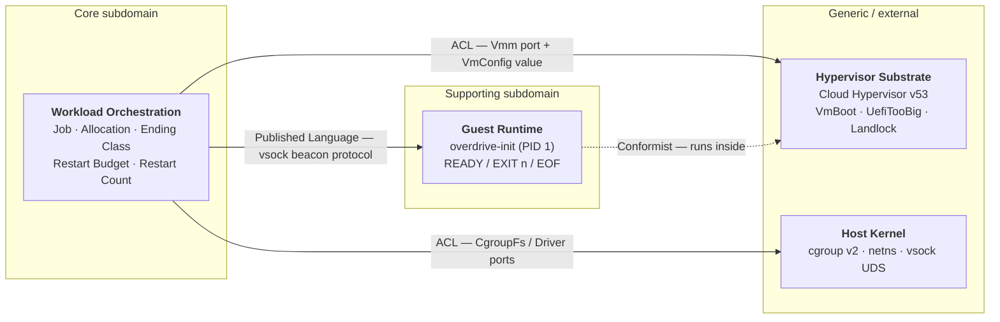
```mermaid
flowchart LR
    subgraph Core["Core subdomain"]
        WO["<b>Workload Orchestration</b><br/>Job · Allocation · Ending Class<br/>Restart Budget · Restart Count"]
    end
    subgraph Supporting["Supporting subdomain"]
        GR["<b>Guest Runtime</b><br/>overdrive-init (PID 1)<br/>READY / EXIT n / EOF"]
    end
    subgraph Generic["Generic / external"]
        HV["<b>Hypervisor Substrate</b><br/>Cloud Hypervisor v53<br/>VmBoot · UefiTooBig · Landlock"]
        HK["<b>Host Kernel</b><br/>cgroup v2 · netns · vsock UDS"]
    end

    WO -->|"ACL — Vmm port + VmConfig value"| HV
    WO -->|"Published Language — vsock beacon protocol"| GR
    WO -->|"ACL — CgroupFs / Driver ports"| HK
    GR -.->|"Conformist — runs inside"| HV
```

**Why each label is the right pattern, with evidence.**

- **Workload Orchestration → Hypervisor Substrate: Anti-Corruption Layer.** Not
  Conformist. CH's vocabulary is actively misleading at the exact boundary this
  feature cares about: an unloadable kernel surfaces as `UefiLoad(UefiTooBig)`, a
  *firmware size cap* for a *format* rejection (P1); a missing Landlock grant
  surfaces as `CreateVsockBackend(UnixBind(EACCES))`, which never mentions
  Landlock (P5); a `--disk` without `image_type=raw` faults two layers from its
  cause (P10/P11). **C-7 is this ACL leaking** — Slice 02's verbatim arm passes an
  upstream term straight into the operator's language. The `Vmm` port plus the
  `VmConfig` *value* is the translation layer, and DD-3's C-7 variant is the
  translation that is currently missing.
- **Workload Orchestration → Guest Runtime: Published Language.** The vsock
  protocol is a small, explicit, versionable contract — one guest-initiated
  connection carrying `READY …` then `EXIT n` as **two distinct reads**, then EOF
  (P2, `separate_reads=2`). It is the sole source of `ExitKind::CleanExit`
  (DD-4), and it is what makes an *adopted* VM's ending unclassifiable and hence
  forces SD-1's reclamation. Duties are enumerated (`[D4]` (a)–(e)), which is the
  Published-Language discipline rather than an ad-hoc channel.
- **Guest Runtime → Hypervisor Substrate: Conformist.** The guest takes the
  hypervisor's device model as given (virtio-blk, virtiofs, PSCI/`RB_POWER_OFF`);
  there is nothing to negotiate and no value in translating.

**Not modelled as bounded contexts, deliberately.** Intent / Observation /
Reconciler-Memory are three *models with different consistency semantics* inside
one context — enforced by non-substitutable trait objects and a trybuild
compile-fail test (§ *Architecture Enforcement*), not by a context boundary. They
fail the boundary checklist on team ownership and independent deployability. Calling
them contexts would inflate the map without changing a single decision.

**ES/CQRS: NO, for every context above, and the codebase has already ruled why.**

| Signal | Reading |
|---|---|
| Audit trail needed? | **Partially — and already answered, boundedly.** ADR-0078's `LastTerminated` (depth-1, non-nesting **by type**) + monotone `restart_count` is the ratified answer. An unbounded in-row event history was explicitly **disqualified under gossip merge** (`docs/research/orchestration/crash-observability-under-lww-comprehensive-research.md`); re-opening it here would reverse an accepted decision on weaker evidence. |
| Temporal queries? | **No.** No operator question in this feature asks for state-at-time-T. The reap asks "is it alive now"; the classification asks "what ended this run". |
| Multiple read models? | **No.** One row, one `workload describe` projection. |
| Complex state transitions? | **No new ones.** Zero new `AllocState` values; the transitions are the existing ones re-classified. |
| Is the reap workflow-shaped? | **No — but the Bar-1 half of this cell was wrong and is corrected.** `workflows.md` criterion 3 still fails (every step idempotent, no journal needed), so it is not a workflow. It is **not** Bar 1 either: that verdict was reached by analogy to `veth_provisioner::provision` without running the Bar-1-vs-Bar-2 test, whose answer is that `actual` **does** drift while the node is up. Per the user ruling of 2026-08-11 reclamation is `reconcilers.md` **Bar 2 — a registered `Reconciler`**; see § *System Architecture* → SD-1 for the triage. *(Correction landed by the system designer's revision pass; the surrounding domain-model consequences are **discharged in DD-5** — two `Action` variants with constrained payloads — and in **DD-1(b)**, which rules the two regimes one Ending Class with a precondition.)* |

**Trade-off stated rather than buried:** without ES, the detail of reclamation
N-1 is permanently lost once reclamation N is observed — a workload reclaimed
across ten `serve` upgrades yields one `LastTerminated` and `restart_count = 10`.
That is Kubernetes' accepted `lastState` limitation, already ratified in ADR-0078,
and it is the correct trade for a gossip-converged observation layer.

See `docs/feature/microvm-driver-cloud-hypervisor/feature-delta.md`
§ *Wave: DESIGN — domain / bounded-context scope* for the reuse analysis,
contradiction check against SD-1…SD-5, and the deferrals surfaced for user
approval.

---

## Application Architecture

**Scope**: crate topology, trait surfaces, module boundaries, and enforcement
tooling for the Phase 1 walking skeleton and everything that will build on it.

### 1. Architectural style

**Hexagonal (ports and adapters), single-process**.

The whitepaper §21 nondeterminism-trait table *is* the ports layer:

| Port (trait) | Concern | Real adapter | Sim adapter |
|---|---|---|---|
| `Clock` | time | `SystemClock` | `SimClock` |
| `Transport` | network | `TcpTransport` | `SimTransport` |
| `Entropy` | RNG | `OsEntropy` | `SeededEntropy` |
| `Dataplane` | kernel/eBPF | `EbpfDataplane` (Phase 2+) | `SimDataplane` |
| `Driver` | workload exec | `CloudHypervisorDriver` etc. (Phase 2+) | `SimDriver` |
| `IntentStore` | linearizable state | `LocalStore` (Phase 1) / `RaftStore` (Phase 2+) | `LocalStore` reused |
| `ObservationStore` | eventually-consistent state | `LocalObservationStore` (Phase 1, redb) / `CorrosionStore` (Phase 2+) | `SimObservationStore` |
| `Llm` | inference | `RigLlm` (Phase 3+) | `SimLlm` |

Core logic (future reconcilers, workflows, investigation agent) depends on
ports only. Wiring crates pick real adapters; DST picks sim adapters. This
matches whitepaper §21 word-for-word and is what makes the §21 DST claim
structural rather than aspirational.

**Why not microservices, layered, or event-driven?**

- The whole platform is **one binary** (whitepaper principle 8). Roles are
  declared at bootstrap, not at build time. Microservices at the Phase 1 scope
  contradicts the central design commitment.
- Layered (N-tier) has no answer for the DST seam; it routes I/O through
  infrastructure interfaces that are not injectable by default.
- Event-driven is the *consequence* of the reconciler/workflow primitives
  (whitepaper §18) — not the top-level organising principle. Reconcilers
  converge; workflows orchestrate. Both are hosted inside the hexagon.

The decision to name this hexagonal-only (rather than "hexagonal + DDD +
vertical slice") is a deliberate narrowing: Phase 1 ships identifier types
and traits, not aggregates with behaviour, so there is no domain-model
surface for DDD to organise yet.

### 2. Paradigm

**OOP (Rust trait-based)**.

- Ports are `trait` objects. Adapters are `struct` types implementing them.
- Errors are `enum` variants under `thiserror`.
- Identifiers are `struct` newtypes with validating constructors.
- Composition over inheritance everywhere (Rust has no inheritance anyway).
- `async_trait` for async trait methods (Rust 2024 + `dyn` compatibility).

The `development.md` rules codify this: thiserror for libs, newtypes STRICT,
pass-through `#[from]` error embedding, `Send + Sync` on core data structures.
No pull toward functional-first organisation (no algebra-of-effects, no
free monads, no lens-style derives) — the injectable trait surface already
gives us the substitution semantics functional style would be reaching for.

### 3. Crate topology (Phase 1 target)

```
workspace/
├── crates/
│   ├── overdrive-core/          # ports + newtypes + Result alias + Error
│   │                            # (class: core, lint-scanned, no I/O primitives)
│   ├── overdrive-scheduler/     # pure-fn placement (ADR-0024 — first-workload)
│   │                            # (class: core, lint-scanned)
│   ├── overdrive-store-local/   # LocalStore (redb) adapter
│   │                            # (class: adapter-host, uses redb directly)
│   ├── overdrive-host/          # production adapters: SystemClock, OsEntropy,
│   │                            # TcpTransport (host-OS primitives — ADR-0016)
│   │                            # (class: adapter-host)
│   ├── overdrive-worker/        # ExecDriver + workload-cgroup management
│   │                            # + node_health writer (ADR-0029 — first-workload)
│   │                            # (class: adapter-host)
│   ├── overdrive-control-plane/ # axum + rustls + reconciler runtime
│   │                            # (class: adapter-host)
│   ├── overdrive-sim/           # Sim* adapters + invariants + turmoil harness
│   │                            # (class: adapter-sim, dev-profile only)
│   ├── overdrive-cli/           # bin: `overdrive` (binary boundary, eyre)
│   └── overdrive-node/          # bin: `overdrive-node` (future wiring crate)
└── xtask/                        # bin: `cargo xtask ...`
```

Phase 1 ships `overdrive-core`, `overdrive-store-local`, `overdrive-sim`, and
extends `xtask` with `dst`/`dst-lint`. `overdrive-cli` already exists;
`overdrive-node` is a future placeholder.

**Phase 1 control-plane-core extension** (ADR-0008 — ADR-0015):

- **`crates/overdrive-control-plane/`** — NEW, class = `adapter-host`. Hosts
  the axum router + handlers, rustls TLS bootstrap, `ReconcilerRuntime`,
  `EvaluationBroker`, and the `overdrive-control-plane::api` shared
  request/response types. Depends on `overdrive-core`,
  `overdrive-store-local` (for both `LocalStore` and
  `LocalObservationStore` — ADR-0012, revised 2026-04-24),
  `axum`, `utoipa`, `utoipa-axum`, `rustls`, `rcgen`, `libsql`, `hyper`,
  `tokio`, `bytes`, `serde`, `serde_json`, `thiserror`. `overdrive-sim`
  is **not** a runtime dep — it stays in `overdrive-control-plane`'s
  `[dev-dependencies]` only (if used for DST-shaped crate-local tests).
- **`crates/overdrive-cli/`** — EXTENDED. Gains `reqwest` dep (ADR-0014),
  imports shared types from `overdrive-control-plane::api`, adds HTTP
  client module under `src/client.rs`, fills in the previously-stub
  subcommand handlers.
- **`xtask`** — EXTENDED with `openapi-gen` and `openapi-check` subcommands
  (ADR-0009).
- **`api/openapi.yaml`** — NEW at workspace root. Checked-in OpenAPI 3.1
  document, derived from the Rust request/response types; drift caught
  by `cargo openapi-check` in CI.

**Phase 1 first-workload extension** (ADR-0021 — ADR-0029):

- **`crates/overdrive-scheduler/`** — NEW, class = `core` (ADR-0024 user
  override of the originally-proposed module-inside-control-plane
  placement). Hosts the pure synchronous `schedule(...)` function
  consumed by the `JobLifecycle` reconciler. Depends only on
  `overdrive-core`. `dst-lint` mechanically enforces the BTreeMap-only
  iteration discipline + banned-API contract.
- **`crates/overdrive-worker/`** — NEW, class = `adapter-host`
  (ADR-0029, amended 2026-04-28 — `ProcessDriver` renamed to
  `ExecDriver`; `DriverType::Process` renamed to `DriverType::Exec`;
  `AllocationSpec.image` renamed to `AllocationSpec.command` and
  `args: Vec<String>` field added). Hosts `ExecDriver` (ADR-0026,
  formerly slated for `overdrive-host`), workload-cgroup management
  (`overdrive.slice/workloads.slice/<alloc_id>.scope` create / limit
  writes / teardown), and the boot-time `node_health` row writer
  (relocated from control-plane bootstrap per ADR-0025 amendment).
  The crate exposes a worker subsystem entrypoint the binary calls
  during startup; `overdrive-control-plane` does NOT depend on this
  crate — the action shim calls `Driver::*` against an injected
  `&dyn Driver` whose impl the binary plugs in.
- **`crates/overdrive-host/`** — UNCHANGED at the application-architecture
  level. Per ADR-0029, `overdrive-host` retains its ADR-0016 intent
  (host-OS primitive bindings: `SystemClock`, `OsEntropy`,
  `TcpTransport`); workload drivers were never landed there.
- **`crates/overdrive-control-plane/`** — EXTENDED. Gains
  `reconciler_runtime::action_shim` submodule (ADR-0023), `AppState::driver:
  Arc<dyn Driver>` field (ADR-0022), `JobLifecycle` reconciler
  body, control-plane-cgroup management + pre-flight (ADR-0028 +
  ADR-0026 amendment — workload-cgroup half moves to
  `overdrive-worker`), and `POST /v1/jobs/{id}:stop` handler
  (ADR-0027).
- **`crates/overdrive-core/`** — EXTENDED. Gains `AnyState` enum
  (ADR-0021), `JobLifecycleState` struct, `AnyReconciler::JobLifecycle`
  variant, `IntentKey::for_job_stop` constructor (ADR-0027),
  `NodeId::from_hostname` (ADR-0025), three new `Action` variants
  (`StartAllocation`, `StopAllocation`, `RestartAllocation`).
- **`crates/overdrive-cli/`** — EXTENDED. Gains `overdrive job stop <id>`
  subcommand. The `serve` subcommand becomes the binary-composition
  root: hard-depends on both `overdrive-control-plane` and
  `overdrive-worker`; runtime `[node] role` config selects which
  subsystems boot (ADR-0029).

New crate-class assignments:

| Crate | Class | Notes |
|---|---|---|
| `overdrive-control-plane` | `adapter-host` | Uses rustls, hyper, axum; not DST-pure. Reconciler bodies inside this crate that want DST coverage must be in separate `core`-class sub-crates when they appear in Phase 2+. |
| `overdrive-scheduler` | `core` | NEW (ADR-0024). Pure synchronous placement function; `dst-lint`-scanned; depends only on `overdrive-core`. |
| `overdrive-worker` | `adapter-host` | NEW (ADR-0029; amended 2026-04-28 — type renamed `ProcessDriver` → `ExecDriver`, `AllocationSpec.image` → `AllocationSpec.command`, `args` field added). ExecDriver + workload-cgroup management + node_health writer. Composed alongside `overdrive-control-plane` by the binary; control-plane crate does NOT depend on it. |

**Crate classes** (`package.metadata.overdrive.crate_class`):

| Class | Meaning | Banned-API lint | Examples |
|---|---|---|---|
| `core` | ports + pure logic | **yes** — lint scans for `Instant::now`, `rand::*`, `tokio::net::*`, `std::thread::sleep` | `overdrive-core` |
| `adapter-host` | host adapter | no — allowed to use banned APIs to *implement* ports against the host OS / kernel / network | `overdrive-host`, `overdrive-store-local`, `overdrive-control-plane`, `overdrive-worker` (ADR-0029) |
| `adapter-sim` | sim adapter + harness | no — legitimately uses `turmoil`, `StdRng`, etc. | `overdrive-sim` |
| `binary` | binary boundary | no | `overdrive-cli`, `xtask` |
| *(unset)* | legacy / not classified | no | — |

A crate without the metadata label is *not scanned*. `xtask dst-lint` walks
the workspace, filters to `crate_class = "core"`, and scans only those crates.
A self-test inside `xtask` asserts the core-class set is non-empty (preventing
a silent "all scanning turned off" regression).

See **ADR-0003** for the labelling-mechanism rationale.

### 4. State-layer discipline (mapped to types)

The state-layer table from `development.md` is the load-bearing boundary.
Application architecture enforces it by type:

| Layer | Trait | Impl (Phase 1) | Enforcement |
|---|---|---|---|
| Intent (should-be) | `IntentStore` | `LocalStore` (redb) | Distinct trait, distinct types; no shared `put(key, value)` surface |
| Observation (is) | `ObservationStore` | `LocalObservationStore` (redb, single-writer) | Distinct trait, distinct types; compile-time test asserts non-substitutability |
| Memory (was) | per-primitive libSQL (Phase 2+) | — | N/A in Phase 1 |
| Scratch (this tick) | `bumpalo::Bump` | — | N/A in Phase 1 (reconcilers land Phase 2) |

Nothing in Phase 1 admits a cross-boundary write path. A future reconciler
cannot persist a `JobSpec` into `ObservationStore` because the trait does not
expose a `write_bytes(key, bytes)` surface — `write` is parametrised on
observation-row shapes, not raw bytes. Likewise, `IntentStore::put` takes
`&[u8]` by key but its *callers* are constrained to intent-class keys by the
typed wrappers the reconciler runtime will provide in Phase 2.

### 5. Module topology inside `overdrive-core`

```
overdrive-core/
├── src/
│   ├── lib.rs              # re-exports + module docs
│   ├── error.rs            # top-level Error + Result alias
│   ├── id.rs               # 11 identifier newtypes (Phase 1 complete)
│   └── traits/
│       ├── mod.rs          # pub use ...
│       ├── clock.rs        # Clock
│       ├── transport.rs    # Transport + Connection + TransportError
│       ├── entropy.rs      # Entropy
│       ├── dataplane.rs    # Dataplane + Verdict + FlowEvent + ...
│       ├── driver.rs       # Driver + DriverType + AllocationSpec + ...
│       ├── intent_store.rs # IntentStore + TxnOp + StateSnapshot + ...
│       ├── observation_store.rs # ObservationStore + Value + Rows + ...
│       └── llm.rs          # Llm + Prompt + ToolDef + ...
```

The existing scaffolding (`crates/overdrive-core/src/{error.rs, id.rs,
traits/*.rs}`) is structurally correct. Phase 1 **completes in place**: adds
the two missing identifier newtypes (`SchematicId` canonicalisation signed,
`CorrelationKey` already present) and adds proptest/trait-contract tests where
missing. No refactor. See **ADR-0001**.

### 6. Observation-store row shapes — Phase 1 minimal set

Two implementations of `ObservationStore` coexist in the Phase 1 workspace:

- **`LocalObservationStore`** (class `adapter-host`, in
  `overdrive-store-local`, per ADR-0012 revised 2026-04-24) — the
  **production** single-node server adapter. Redb-backed on disk
  (`<data_dir>/observation.redb`); single-writer *posture* (one writing
  process, no gossip peers) — but it **does** perform the LWW merge on
  every durable row, corrected 2026-08-01, see the correction below. No
  site-IDs and no tombstones; those genuinely land with Phase 2's
  `CorrosionStore`. Subscriptions via `tokio::sync::broadcast` in the
  same idiom as `LocalStore::watch`.
- **`SimObservationStore`** (class `adapter-sim`, in `overdrive-sim`)
  — the **DST harness** adapter. In-memory LWW with injectable gossip
  delay + partition; used exclusively by the simulation test suite
  (`SimObservationLwwConverges` invariant, Fly-style contagion scenarios,
  reconciler DST tests).

Both implement the same trait surface against the same typed row shapes,
the minimum the DST harness needs (per US-04 and whitepaper §4):

- `alloc_status { alloc_id, job_id, node_id, state, updated_at }`
- `node_health { node_id, region, last_heartbeat }`

Rows are full-row writes (§4 guardrail) — no field-diff merges. Logical
timestamps are `(counter, writer)` tuples — `LogicalTimestamp`,
`crates/overdrive-core/src/traits/observation_store.rs:253` — carried in
every row.

> **Correction (2026-08-01).** This paragraph previously read
> *"`LocalObservationStore` does not consult them (single-writer has no
> ordering question to resolve)"*. **That is false.**
> `LocalObservationStore` is the **production LWW path**. Every durable
> write goes through an `apply_*_lww` helper that reads the row already
> stored at the key and admits the incoming row **only** when
> `incoming.updated_at.dominates(&prior_row.updated_at)` — six of them,
> in `crates/overdrive-store-local/src/observation_backend.rs`:
> `apply_alloc_status_lww` (`:1058`), `apply_node_health_lww` (`:1103`),
> `apply_service_backends_lww` (`:1141`), `apply_probe_result_lww`
> (`:1179`), `apply_service_hydration_lww` (`:1204`),
> `apply_reconcile_conflict_lww` (`:1241`). A row that does not dominate
> is **discarded**, and `ObservationStore::write` still returns
> `Ok(())` — so no caller can distinguish a dropped write from a
> successful one. That comparison is what silently dropped writes in the
> cross-restart regression
> (`docs/analysis/root-cause-analysis-cross-restart-lww-counter-regression.md`).
>
> The claim was **already false before ADR-0077**: `dominates`
> (`observation_store.rs:337`) is the single comparator **both** adapters
> must consult, and it was promoted out of the sim leaf crate into
> `overdrive-core` precisely so the production adapter would use it —
> its own docstring cites the RCA that motivated the promotion
> (`observation_store.rs:330-335` →
> `docs/feature/fix-observation-lww-merge/deliver/rca.md`). This section
> was not updated then either.

What is true: the tuples **are** forward-compatible with the Phase 2
Corrosion gossip layer, and `SimObservationStore` and the future
`CorrosionStore` consult them as well. `LocalObservationStore` is not
the exception the old text made it.

**Counter semantics — per-key, not per-tick (ADR-0077).** ADR-0077
defines `counter` as a durable **per-LWW-key version number** that must
be monotone at a given row key including across process restarts. It is
*not* a scheduling coordinate: deriving it from the convergence tick
conflates two different quantities and breaks the merge across a restart
— which is what today's tick-derived sites do (§ 63 records the
reproduced defect). ADR-0077 § D1 mandates that every durable write
mint its stamp with `LogicalTimestamp::dominating(tick_floor, writer,
prior)` — counter derived from the row it replaces, tick only a floor,
so the merge survives a restart.

That is an **accepted decision, not yet a landed implementation.**
ADR-0077 § D9 splits the work into Unit A (the constructor + the eight
action-shim sites) and Unit B (the two reconciler sites, blocked on the
bridge-convergence step). Neither unit has landed at the time of
writing; § 63 records the per-site state for the two sites this brief
names. Do not read the mandated rule as a description of current
behaviour — ADR-0077 § D2 is the authoritative per-site register.

Production `CorrosionStore` (Phase 2+) will implement the same trait with
the same row shapes, backed by cr-sqlite and SWIM/QUIC. It replaces
`LocalObservationStore` at the `wire_single_node_observation` construction
seam via a single `Box<dyn ObservationStore>` swap. Sim, local, and
real-distributed share the shape definitions; they do not share the wire
format.

Row schema versioning (for Phase 2+ forward compatibility of Phase 1 test
artifacts) is a crafter decision at implementation time; Phase 2 feature
scope will lock the mechanism.

### 7. DST harness architecture

The harness is the integration point for every Phase 1 invariant. It is
hosted in a dedicated crate (`overdrive-sim`) and invoked from `xtask dst`.

See the C4 component diagram below; the short form:

- `xtask dst` parses the seed (random if unspecified), invokes
  `cargo test --features dst --package overdrive-sim`.
- `overdrive-sim` depends on `turmoil` and `overdrive-core`; it owns
  `SimClock`, `SimTransport`, `SimEntropy`, `SimDataplane`, `SimDriver`,
  `SimLlm`, `SimObservationStore`.
- The harness composes **real** `LocalStore` (`overdrive-store-local`) with
  all Sim* adapters in a `turmoil::Sim` — matching US-06 AC.
- Invariants live in `overdrive-sim::invariants::Invariant` (an enum). The
  enum name IS the canonical invariant name; `--only <NAME>` resolves to an
  enum variant via `FromStr`. This prevents printed-vs-flag name drift (the
  `shared-artifacts-registry` `invariant_name` HIGH risk).
- Seed is printed on every run; failure output prints invariant name, seed,
  tick, turmoil host, and a reproduction command (matching the US-06 AC).

See **ADR-0004** for why `overdrive-sim` is one crate, not three.

### 8. Test distribution

Per-crate `tests/*.rs` for integration tests that exercise a single crate's
public surface; top-level `crates/{crate}/tests/acceptance/*.rs` *only* for
acceptance scenarios that explicitly correspond to a DISTILL test-scenarios
entry (they may exist in Phase 1 only as US-06 scenarios once DISTILL lands).

Unit tests stay in `#[cfg(test)] mod tests` inside the module they test.
`.feature` files are banned project-wide (`.claude/rules/testing.md`).

See **ADR-0005**.

### 9. Enforcement tooling

**Style**: Hexagonal, single-process, Rust workspace
**Language**: Rust 2024 edition, rustc ≥ 1.85
**Primary enforcement tool**: `cargo xtask dst-lint` (custom)
**Secondary enforcement**: `cargo clippy` workspace-wide with pedantic+nursery+cargo

**Rules to enforce**:

| Rule | Enforcement | Where |
|---|---|---|
| Core crates do not use `Instant::now`, `SystemTime::now`, `rand::random`, `rand::thread_rng`, `tokio::time::sleep`, `std::thread::sleep`, `tokio::net::{TcpStream, TcpListener, UdpSocket}` | Custom: `xtask dst-lint` via `syn` walk over `src/**/*.rs` of every `crate_class = "core"` crate | xtask/src/dst_lint.rs |
| Violations print file:line:col, banned symbol, replacement trait, link to `development.md` | Custom: error-formatter inside `dst-lint` | xtask/src/dst_lint.rs |
| Every banned symbol is covered by a synthetic-file self-test | xtask unit test | xtask/src/dst_lint.rs |
| Core-class set is non-empty | xtask assertion at start of `dst-lint` | xtask/src/dst_lint.rs |
| `thiserror` + Result alias convention | Code review + clippy (no structural enforcer exists for this in Rust today) | — |
| Newtypes: FromStr / Display / serde round-trip lossless | proptest in `overdrive-core/tests/` for every newtype | overdrive-core/tests |
| `IntentStore` and `ObservationStore` are not substitutable | `trybuild` or `tests/compile_fail/*.rs` asserting the substitution fails to compile | overdrive-core/tests/compile_fail |

`import-linter` (Python) and `ArchUnit` (JVM) have no Rust analogue with
equivalent semantics; `cargo-deny` checks dependency licenses but not
API-usage within a crate. The custom `dst-lint` is the only way to enforce
the banned-API rule, which is the load-bearing invariant for DST.

**Mutation testing.** Not a design-level decision — the `nw-mutation-test`
skill enforces the ≥80% kill-rate gate at DELIVER time per
`.claude/rules/testing.md` using `cargo-mutants`. Phase 1 applicable
targets: newtype `FromStr`/validators (US-01, US-02), `SchematicId` rkyv
canonicalisation / hash determinism paths (ADR-0002), and
`IntentStore::export_snapshot` / `bootstrap_from` round-trip code (US-03).
Other `testing.md`-listed targets (reconciler logic, policy verdicts,
scheduler bin-pack, workflow `run` bodies) do not exist in Phase 1 and
therefore have no Phase 1 kill-rate obligation.

### 10. Dependencies — Phase 1

OSS-only, already in workspace `Cargo.toml`:

| Dep | Version | License | Role | Why chosen |
|---|---|---|---|---|
| `redb` | 2.x | MIT-or-Apache-2 | IntentStore backend | Pure Rust embedded ACID KV; ~30MB RAM matches commercial density claim; whitepaper §4 explicit choice |
| `rkyv` | 0.8 | MIT | Snapshot framing; zero-copy deserialization; persistence boundary | Archived bytes are canonical → deterministic hashing (§development.md rule); whitepaper §17/18 explicit choice. Every rkyv-persisted type at a redb boundary goes through a per-type versioned envelope enum (ADR-0048); writer-side discipline enforced by inner-payload visibility + `xtask::dst_lint` clause. |
| `turmoil` | 0.6 | MIT-or-Apache-2 | DST harness | Rust-native controllable async simulation; whitepaper §21 + testing.md Tier 1 explicit choice |
| `bumpalo` | 3.x | MIT-or-Apache-2 | Per-reconciler scratch (Phase 2+) | Already in workspace; declared for reconciler hot path per development.md |
| `thiserror` | 2.x | MIT-or-Apache-2 | Typed errors | Rust community standard; `#[from]` preserves error chain |
| `proptest` | 1.x | MIT-or-Apache-2 | Property-based tests | Newtype round-trip, snapshot round-trip, LWW convergence |
| `async-trait` | 0.1 | MIT-or-Apache-2 | Async trait methods | Still needed for `dyn`-compatible async traits in stable Rust 2024 |
| `futures` | 0.3 | MIT-or-Apache-2 | Stream trait | `IntentStore::watch` returns `Stream<Item=(Bytes, Bytes)>` |
| `bytes` | 1.x | MIT | Zero-copy buffers | Cheap clone for put/get values |
| `serde` / `serde_json` | 1.x | MIT-or-Apache-2 | Transparent identifier serialisation | `try_from = "String"` for validating deserialize |
| `sha2` | 0.10 | MIT-or-Apache-2 | `ContentHash::of` | SHA-256 |
| `hex` | 0.4 | MIT-or-Apache-2 | `ContentHash` hex `Display`/`FromStr` | Lowercase hex |

No proprietary dependencies. All maintained, active, above 1k stars.

### 11. Non-functional / Quality attributes (ISO 25010, mapped)

| Attribute | Target | How it is addressed |
|---|---|---|
| Performance efficiency — time behaviour | *Phase 2+ guardrail* — `commercial.md` "Control Plane Density" target (<50ms cold start) | Direct redb open; no Raft overhead. Not a Phase 1 CI gate — density claims become measurable only once tenant clusters run on the infrastructure layer (see `upstream-changes.md` for K4 reframe). |
| Performance efficiency — resource util. | *Phase 2+ guardrail* — `commercial.md` "Control Plane Density" target (<30MB RSS empty) | Single redb file; no background tasks (single-mode). Not a Phase 1 CI gate — same reframe as above. |
| Performance efficiency — DST wall-clock | < 60s default catalogue | Turmoil tick-duration 1ms; 3-node default topology; CI gate (K1) |
| Reliability — fault tolerance | DST catches partition, clock skew, reorder, node crash | Sim adapters inject the fault catalogue from testing.md |
| Reliability — recoverability | Snapshot round-trip bit-identical | proptest with randomised contents; CI gate (K6) |
| Maintainability — testability | Every source of nondeterminism injectable | Ports table above; `dst-lint` enforces; CI gate (K2) |
| Maintainability — modifiability | New banned APIs added by editing one constant | `BANNED_APIS` constant in `xtask::dst_lint` |
| Security — accountability (future) | SPIFFE identity on every flow event | `SpiffeId` newtype already lands in Phase 1; flow-event wiring Phase 2+ |
| Compatibility — interoperability | Snapshot format stable across `LocalStore` → `RaftStore` | Versioned framing header on snapshot bytes; both impls share format |

No performance architecture beyond the above is in scope for Phase 1 — there
is no end-user request path yet.

### 12. Integration patterns

Phase 1 has **no external integrations**. No external APIs, no webhooks, no
OAuth, no third-party services. The DST harness runs entirely in-process.
`overdrive-cli` is already a placeholder that logs and returns — it will
gain a control-plane connection in Phase 2.

Consequently **no contract tests** are recommended for Phase 1. The
platform-architect handoff annotation remains empty at this phase; it will
fill up starting Phase 2 (gRPC control-plane API, future Phase 3 ACME, etc.).

### 13. Residuality / stressor posture

Phase 1 carries **one** named residual stressor: *turmoil upstream version
drift*. Bit-identical reproduction depends on deterministic scheduler output
from turmoil's `Sim::run`. A minor-version turmoil update that changes tick
ordering would invalidate historical seeds.

Mitigation: pin turmoil to a precise workspace version (`turmoil = "=0.6.X"`
once first seed is captured in a test). The twin-run identity self-test
(US-06 AC) catches drift continuously in CI.

No other stressors rise to the level requiring a hidden residuality pass at
this scope. The DST fault catalogue from `.claude/rules/testing.md` IS the
platform's realistic-fault surface; the sim adapters exercise it
continuously.

---

## Phase 1 control-plane-core extension

This section extends §1–§13 with the application-architecture decisions
landed by feature `phase-1-control-plane-core` (2026-04-23). Nothing in
§1–§13 is rewritten. New ADRs are ADR-0008 through ADR-0015.

### 14. External API — REST + OpenAPI over axum/rustls

Per ADR-0008 and whitepaper §3/§4, the Phase 1 control-plane external
API is **HTTP + JSON served by `axum` over `hyper` with `rustls`**,
HTTP/2 preferred (ALPN `h2`) with HTTP/1.1 fallback, routes under the
non-negotiable `/v1` prefix. Binds `https://127.0.0.1:7001` by default.

Walking-skeleton endpoints (exact shapes fixed by the OpenAPI schema
per ADR-0009):

| Method + path | Handler | Purpose |
|---|---|---|
| `POST /v1/jobs` | SubmitJob | Submit a Job spec; returns `{job_id, spec_digest, outcome}` |
| `GET /v1/jobs/{id}` | DescribeJob | Read back a committed Job; returns `{spec, spec_digest}` |
| `GET /v1/cluster/info` | ClusterStatus | Mode / region / reconciler registry / broker counters |
| `GET /v1/allocs` | AllocStatus | ObservationStore read on `alloc_status` (Phase 1: zero rows) |
| `GET /v1/nodes` | NodeList | ObservationStore read on `node_health` (Phase 1: zero rows) |

Internal RPC (node-agent control-flow streams) is explicitly
out-of-scope for this feature and lands in `phase-1-first-workload`
via `tarpc` or `postcard-rpc` — pure Rust, no `protoc` in toolchain.

### 15. OpenAPI schema derivation — `utoipa`, checked-in, CI-gated

Per ADR-0009. The OpenAPI 3.1 schema is derived from the Rust
request/response types in `overdrive-control-plane::api` via `utoipa`
+ `utoipa-axum`. The generated document lives at `api/openapi.yaml`
(workspace root) as a checked-in artifact. `cargo openapi-gen`
regenerates it; `cargo openapi-check` regenerates to a temp file
and diffs against the checked-in version — non-empty diff fails CI.

The Rust types are the contract; the OpenAPI document is their report.
A workspace-level test enumerates handlers and asserts each has a
matching `#[utoipa::path(...)]` annotation.

### 16. Phase 1 TLS bootstrap — ephemeral CA + embedded trust triple

Per ADR-0010, adopting Talos research R1–R5 (see
`docs/research/security/talos-bootstrap-tls-strategy-comprehensive-research.md`):

- **Ephemeral in-process CA** generated by `rcgen` on every
  `overdrive serve` start — the sole cert-minting site in Phase 1
  (ADR-0010 *Amendment 2026-04-26*; Phase 5 reintroduction of `cluster
  init` tracked in GH #81). CA private key lives in process memory only;
  re-starting re-mints.
- **Base64-embedded trust triple** (CA cert, client leaf cert, client
  private key) in `~/.overdrive/config` — same YAML shape as
  `~/.talos/config` / `~/.kube/config`.
- **Server leaf cert** carries SANs: `127.0.0.1`, `::1`, `localhost`,
  `<gethostname(3)>`.
- **No `--insecure` flag**. No TOFU. No fingerprint pinning.
- **Deferred to Phase 5**: rotation, revocation, operator RBAC, cert
  persistence, `acceptedCAs` multi-CA trust, SPIFFE URI SAN roles.

**Overdrive-specific divergence from Talos research**: operator role is
NOT encoded in the client cert's Organization (O) field — whitepaper §8
requires SPIFFE URI SANs for roles. Phase 1 has no role encoding; Phase 5
adds SPIFFE URI SANs directly.

### 17. `Job` / `Node` / `Allocation` aggregates — intent layer

Per ADR-0011. New module `overdrive-core::aggregate`:

- `Job` — validating constructor `from_spec(...)`, derives
  `rkyv::Archive + rkyv::Serialize + rkyv::Deserialize + serde::Serialize
  + serde::Deserialize`. Fields include `id: JobId`, `replicas: NonZeroU32`,
  `resources: Resources` (reused from `traits/driver.rs`).
- `Node` — same derive profile; `id: NodeId`, `region: Region`,
  `capacity: Resources`.
- `Allocation` — same derive profile; `id: AllocationId`, `job_id: JobId`,
  `node_id: NodeId`.
- `Policy`, `Investigation` — stub aggregates with ID newtype as primary
  field; no behavioural stubs.

**Intent-side vs observation-side**: `overdrive-core::aggregate::*` are
intent (written to `IntentStore` via `IntentKey::for_job(&JobId)` etc.);
`overdrive-core::traits::observation_store::AllocStatusRow` is observation
(LWW-gossiped row shape). The two never merge. Any vestigial `JobSpec`-named
struct in `observation_store.rs` is deleted or renamed to make its
observation-side role obvious.

Canonical intent-key derivation: `overdrive-core::intent_key` exposes
`for_job(&JobId) -> IntentKey` (and peers for `Node`, `Allocation`). The
canonical string form is `jobs/<JobId::display>` / `nodes/<NodeId::display>` /
`allocations/<AllocationId::display>`.

### 18. ObservationStore server impl — real `LocalObservationStore` in `overdrive-store-local`

Per ADR-0012 (revised 2026-04-24, reversing the original 2026-04-23
decision to reuse `SimObservationStore`). The Phase 1 server uses
`LocalObservationStore`, a real redb-backed, single-writer adapter
living alongside `LocalStore` in `overdrive-store-local` (class
`adapter-host`). Phase 2+ swaps in `CorrosionStore` via a single
`Box<dyn ObservationStore>` trait-object replacement at the
`observation_wiring::wire_single_node_observation` construction seam;
no handler changes.

Key properties of `LocalObservationStore`:

- **Persistent.** Rows survive process restart; `<data_dir>/observation.redb`
  is the backing file. The restart-round-trip case is the objection that
  drove the ADR revision.
- **Class `adapter-host`.** Production posture, not a sim crate pressed
  into production service. `overdrive-sim` is no longer a runtime
  dependency of `overdrive-control-plane`; it stays the DST harness's
  home.
- **No CRDT machinery — but the LWW merge is live** (corrected
  2026-08-01). **LWW logical-timestamp merges do NOT wait for Phase 2**:
  `LocalObservationStore` applies one on every durable row today, via
  six `apply_*_lww` helpers that discard a non-dominating incoming row
  (§ 6, `crates/overdrive-store-local/src/observation_backend.rs:1058`
  ff.). What genuinely lands with `CorrosionStore` in Phase 2, where
  there are peers to coordinate, is **owner-writer site-IDs and
  tombstone discipline**. "Single-writer" describes the deployment
  posture — one writing process, no gossip — not the absence of an
  ordering check.
- **Subscriptions via `tokio::sync::broadcast`.** Same idiom as
  `LocalStore::watch` per its Phase 1 substitute; lagging subscribers
  get `RecvError::Lagged`, stream wrapper terminates, caller
  resubscribes.
- **Trait-object swap seam unchanged.**
  `wire_single_node_observation() -> Result<Box<dyn ObservationStore>>`
  keeps its signature; only the construction line moves from
  `SimObservationStore::single_peer(...)` to
  `LocalObservationStore::open(path)`.

The DST harness continues to exercise `SimObservationStore` (for LWW
convergence invariants, gossip-delay scenarios, partition matrices) —
that adapter stays in `overdrive-sim` where `adapter-sim` is the
accurate class for what the code does.

### 19. Reconciler primitive — trait in `overdrive-core`, runtime in `overdrive-control-plane`

Per ADR-0013.

**`overdrive-core::reconciler`** (new module):

- `trait Reconciler { fn name(&self) -> &ReconcilerName; fn reconcile(&self,
  desired: &State, actual: &State, db: &Db) -> Vec<Action>; }` — synchronous,
  no `async`, no `.await`, no I/O-port parameters. Purity is load-bearing.
- `enum Action { Noop, HttpCall {...}, StartWorkflow {...} }` — the
  `HttpCall` variant is part of the Phase 1 surface even though the
  runtime shim lands in Phase 3 (per development.md §Reconciler I/O).
- `ReconcilerName` newtype — kebab-case, `^[a-z][a-z0-9-]{0,62}$`; rejects
  path-traversal characters by construction.
- `Db` handle — `Arc<libsql::Connection>`-equivalent, exposed as `&Db`
  to `reconcile(...)`.

**`overdrive-control-plane::reconciler_runtime`** (new module):

- `ReconcilerRuntime` — registers reconcilers at boot; owns the broker;
  surfaces `registered()` + broker counters.
- `EvaluationBroker` — keyed on `(ReconcilerName, TargetResource)`;
  cancelable-eval-set semantics per whitepaper §18; counters
  `queued` / `cancelled` / `dispatched`.
- **Per-primitive libSQL path**: `<data_dir>/reconcilers/<name>/memory.db`.
  Path provisioner canonicalises `data_dir` once at startup, enforces
  isolation by construction via the `ReconcilerName` regex plus a
  defence-in-depth `starts_with` check.
- `noop-heartbeat` reconciler registered at boot — living proof of the
  contract.

**DST invariants** added to `overdrive-sim::invariants::Invariant`:

- `AtLeastOneReconcilerRegistered` — post-boot registry is non-empty.
- `DuplicateEvaluationsCollapse` — N (≥3) concurrent evaluations at the
  same key → 1 dispatched, N-1 cancelled.
- `ReconcilerIsPure` — twin invocation with identical inputs produces
  bit-identical `Vec<Action>` outputs.

Slice 4 ships **whole** — not split 4A / 4B. DISCUSS-wave split remains
available as a crafter-time escape hatch if material complexity surfaces.

### 20. CLI HTTP client — hand-rolled `reqwest`; types shared across CLI and server

Per ADR-0014. The CLI uses a ~200 LoC hand-rolled client over `reqwest`
(already in workspace). CLI and server share the same Rust request/response
types imported from `overdrive-control-plane::api`. The OpenAPI schema
is a byproduct of the types via `utoipa`; the types are the contract.

No OpenAPI code generator in Phase 1 (no Java toolchain; Progenitor
deferred to Phase 2+ if a second Rust REST consumer appears — unlikely
given `tarpc` for the internal path).

### 21. HTTP error mapping — `ControlPlaneError` with `#[from]`, bespoke 7807-compatible body

Per ADR-0015. One top-level `ControlPlaneError` in
`overdrive-control-plane::error` with pass-through `#[from]` embedding
for `IntentStoreError`, `ObservationStoreError`, and aggregate
constructor errors. One `to_response(err)` function maps variants
exhaustively to `(StatusCode, Json<ErrorBody>)`.

Status-code matrix:

| Condition | Status | `error` kind |
|---|---|---|
| Validation failure | `400` | `"validation"` |
| Unknown resource | `404` | `"not_found"` |
| Duplicate intent-key with *different* spec | `409` | `"conflict"` |
| Infra failure | `500` | `"internal"` |

Byte-identical re-submission of the same spec is idempotent success
(200 OK, same `spec_digest`, with `outcome: IdempotencyOutcome::Unchanged`
per ADR-0020). 409 fires only on a *different* spec at an occupied
key — the handler implements idempotency as a read-then-write pattern
against `LocalStore` via `IntentStore::put_if_absent`.

Body shape is bespoke `{error, message, field}` — deliberately a
**subset compatible with RFC 7807** so that `type: Uri` and `instance: Uri`
can be added additively in a future v1.1.

### 22. Updated quality-attribute scenarios (Phase 1 control-plane extension)

| Attribute | Phase 1 control-plane-core target | How it is addressed |
|---|---|---|
| Performance efficiency — time behaviour (REST round-trip) | CLI → server → LocalStore → response < 100 ms on localhost | Axum + rustls over localhost; no proxy, no schedule jitter. `cargo openapi-check` stays under 10 s. |
| Reliability — fault tolerance (submit) | Validation failures reject before any IntentStore write | Handler gate per Slice 3 AC; unit test asserts no-write on malformed input |
| Reliability — storm-proofing | Evaluation broker collapses N concurrent duplicate evaluations | DST `DuplicateEvaluationsCollapse` invariant |
| Maintainability — testability (reconciler purity) | Twin invocation produces bit-identical outputs | DST `ReconcilerIsPure` + `dst-lint` banned-API gate |
| Maintainability — schema drift | No field rename disagreement between CLI and server | `utoipa`-derived schema + `openapi-check` CI gate + shared Rust types |
| Security — confidentiality | All CLI↔server traffic is TLS 1.3 via rustls | ADR-0010 trust triple; no plaintext, no `--insecure` |
| Security — accountability | All error paths surface a structured JSON body; no raw stack traces | `ControlPlaneError::to_response` exhaustive mapping |
| Compatibility — upgrade path | `/v1` prefix; future `/v2` served in parallel during deprecation window | ADR-0008 versioning rule |

### 23. External integrations — Phase 1 control-plane-core

**None.** The Phase 1 control-plane talks only to:

- The local `LocalStore` (redb file on disk) — not external.
- The local `LocalObservationStore` (redb file on disk) — not external.
- The local CLI over localhost rustls — not external.
- Per-primitive libSQL files on disk — not external.

No external APIs, no webhooks, no OAuth, no third-party services. The
platform-architect handoff annotation remains empty (no contract tests
recommended). The first external surface worth contract-testing lands
in Phase 2+ (node-agent `tarpc` streams are internal to the cluster;
the first external boundary is Phase 3+ ACME / Phase 5+ OIDC).

---

## Phase 1 first-workload extension

This section extends §1–§23 with the application-architecture decisions
landed by feature `phase-1-first-workload` (2026-04-27). Nothing in
§1–§23 is rewritten. New ADRs are ADR-0021 through ADR-0028.

### 24. State shape — per-reconciler `AnyState` enum

Per ADR-0021. The `Reconciler` trait gains an associated type
`type State`, and a sister `enum AnyState` mirrors the existing
`AnyReconciler` and `AnyReconcilerView` enum-dispatch shape:

```rust
pub enum AnyState {
    Unit,                              // NoopHeartbeat
    JobLifecycle(JobLifecycleState),   // first-workload reconciler
}

pub struct JobLifecycleState {
    pub job:         Option<Job>,
    pub nodes:       BTreeMap<NodeId, Node>,
    pub allocations: BTreeMap<AllocationId, AllocStatusRow>,
}
```

`desired` and `actual` collapse into the same `JobLifecycleState`
struct — the reconciler interprets `desired.job` as the spec and
`actual.allocations` as the running set. Future variants may diverge
internally if a different shape is genuinely required.

The runtime — not the reconciler — populates `desired` and `actual`
via two new async surfaces (`hydrate_desired`, `hydrate_actual`)
match-dispatched on `AnyReconciler`. The reconciler's existing
`hydrate(target, db)` retains its narrow remit (the libSQL private-
memory read). Per-tick I/O cost is proportional to the running
reconciler, not the registered set.

### 25. `AppState::driver: Arc<dyn Driver>` extension

Per ADR-0022 (amended 2026-04-27 by ADR-0029). `AppState` gains a
`driver: Arc<dyn Driver>` field; production wiring threads an
`Arc<ExecDriver>` from the worker subsystem (`overdrive-worker`,
per ADR-0029, type renamed from `ProcessDriver` 2026-04-28); test
fixtures thread `SimDriver`. The renamed entry
point `run_server_with_obs_and_driver(config, obs, driver)` is the
test-fixture seam; the binary's `serve` subcommand instantiates the
worker subsystem and threads its `Arc<dyn Driver>` into the
control-plane's `AppState`.

`AppState: Clone` is preserved (every field is `Arc<…>`). Phase 2+
multi-driver dispatch (Process / MicroVm / Wasm) replaces
`Arc<dyn Driver>` with `Arc<DriverRegistry>` at one field declaration
plus the action shim's call site — no handler or test signature
churn outside the field's immediate consumers.

### 26. Action shim placement and tick cadence

Per ADR-0023. The action shim lives at
`overdrive-control-plane::reconciler_runtime::action_shim`,
alongside `EvaluationBroker` and `ReconcilerRegistry`. The shim's
signature:

```rust
pub async fn dispatch(
    actions: Vec<Action>,
    driver:  &dyn Driver,
    obs:     &dyn ObservationStore,
    tick:    &TickContext,
) -> Result<(), ShimError>;
```

The reconciler-runtime tick loop drains the broker every **100 ms**
in production (configurable via `ServerConfig`); each drained
evaluation runs hydrate-then-reconcile-then-dispatch synchronously
within its tick. Under DST the tick task runs against `SimClock`
and the harness advances simulated time explicitly. The
`clock.sleep(...)` indirection through the injected `Clock` trait
is the seam: the same shim code runs in production and under DST,
no conditional compilation.

Action match is exhaustive. New variants (Phase 3+ `HttpCall`
runtime, workflow runtime, etc.) produce non-exhaustive-match
compile errors at extension time.

### 27. `overdrive-scheduler` crate (D4 user override)

Per ADR-0024. The originally-proposed `overdrive-control-plane::scheduler`
module placement was overridden by the user in favour of a dedicated
`overdrive-scheduler` crate, class `core`. The crate depends only on
`overdrive-core` and exposes:

```rust
pub fn schedule(
    nodes:          &BTreeMap<NodeId, Node>,
    job:            &Job,
    current_allocs: &[AllocStatusRow],
) -> Result<NodeId, PlacementError>;
```

The dependency graph:
`overdrive-core ← overdrive-scheduler ← overdrive-control-plane`.
Acyclic — the new edge is consistent with ADR-0003 (crate-class
labelling) and ADR-0016 (overdrive-host extraction).

**The override is the load-bearing decision.** Putting the
scheduler in a `core`-class crate means `dst-lint` mechanically
enforces the `BTreeMap`-only iteration discipline and the banned-API
contract (no `Instant::now`, no `rand::*`, no `tokio::net::*`). The
determinism property becomes a structural property of the crate,
not a review concern. The xtask self-test that the core-class set
is non-empty (ADR-0003) continues to pass — set size grows from
one (`overdrive-core`) to two.

### 28. Single-node startup wiring

Per ADR-0025 (amended 2026-04-27 by ADR-0029). `NodeId` is
hostname-derived by default, with optional `[node].id` config
override. `Region("local")` is the default, overridable via
`[node].region`. Capacity defaults to a deliberately-conservative
`Resources` sentinel (1000 cores / 1 TiB), overridable via
`[node].cpu_milli` + `[node].memory_bytes`.

Per ADR-0029, the `node_health` row writer is a **worker-subsystem
responsibility**, not a control-plane bootstrap responsibility. The
write happens during worker startup, before the worker is considered
"started" and before the control plane binds its listener — the
fail-fast property of the original ADR-0025 ordering is preserved,
the relocation just routes the row write through the worker
subsystem that owns the node's runtime presence:

```
1. Run cgroup pre-flight check                    (ADR-0028; control plane)
2. Mint ephemeral CA + leaf certs                 (ADR-0010; control plane)
3. Open LocalIntentStore                          (control plane)
4. Worker subsystem startup                       (ADR-0029):
     a. Resolve NodeId, Region, Capacity from config   (ADR-0025)
     b. Write node_health row to ObservationStore      (ADR-0025 amended)
     c. Construct ExecDriver                           (ADR-0026 amended 2026-04-28; formerly ProcessDriver)
5. Construct ReconcilerRuntime; thread Arc<dyn Driver> (ADR-0022)
6. Build AppState, Router                         (existing)
7. Bind TCP listener                              (existing)
8. Write trust triple                             (ADR-0010)
9. Spawn axum_server task                         (existing)
```

The `[node]` config block is operator-owned; servers READ it and
NEVER write it. The trust triple stays server-managed at
`[ca]` / `[client]` blocks per ADR-0010.

### 29. cgroup v2 direct writes; resource enforcement

Per ADR-0026 (amended 2026-04-27 by ADR-0029; amended 2026-04-28 —
`ProcessDriver` renamed to `ExecDriver`, `DriverType::Process` to
`DriverType::Exec`, `AllocationSpec.image` to `AllocationSpec.command`,
`args: Vec<String>` field added; magic image-name dispatch in
`build_command` removed in favour of
`Command::new(&spec.command).args(&spec.args)`). `ExecDriver`
(hosted in `overdrive-worker`) writes cgroup files directly via
`std::fs::write` / `std::fs::create_dir_all` — no `cgroups-rs` dep.
Five filesystem operations per workload lifecycle:

```
mkdir overdrive.slice/workloads.slice/<alloc_id>.scope    (create)
echo <pid> > .../cgroup.procs                             (place)
echo <weight> > .../cpu.weight                            (limit)
echo <bytes>  > .../memory.max                            (limit)
rmdir overdrive.slice/workloads.slice/<alloc_id>.scope    (remove)
```

`cpu.weight` derivation: `clamp(cpu_milli / 10, 1, 10000)`.
`memory.max` derivation: direct byte count. Limits are written
*before* the PID is placed in the scope — the moment the PID lands
in the scope it is already under the declared bounds.

Failure dispositions:

- Scope creation / `cgroup.procs` write fails → fatal,
  `DriverError::SpawnFailed`, alloc row written `state: Failed`.
- Limit write fails → warn-and-continue, alloc row written
  `state: Running`. Phase 1 prioritises isolation (the scope) over
  bounding (the limits); the limit failure is recoverable in
  operator-actionable ways and the workload itself is correctly
  placed.

cgroup v1 is NOT supported (operator confirmed). The pre-flight
check refuses to start on v1 hosts.

**Cgroup hierarchy ownership** (ADR-0029 amendment to ADR-0026):
the worker subsystem (`overdrive-worker`) owns
`overdrive.slice/workloads.slice/<alloc_id>.scope` create / limit
write / teardown — the *workload* half. The control plane subsystem
(`overdrive-control-plane`) owns `overdrive.slice/control-plane.slice/`
create + own-PID enrolment + ADR-0028 pre-flight check — the
*control-plane* half. Each subsystem manages its own slice; the
two never cross. The boundary mirrors whitepaper §4 *Workload
Isolation on Co-located Nodes* exactly.

### 30. `POST /v1/jobs/{id}:stop` HTTP shape; separate stop intent key

Per ADR-0027. The job-stop endpoint follows AIP-136 verb-suffix
convention:

```
POST /v1/jobs/{id}:stop
```

Empty request body. Response body:

```json
{ "job_id": "payments", "outcome": "stopped" }
```

`outcome ∈ { "stopped", "already_stopped" }`. 404 fires on unknown
job id; 409 is reserved for future Phase 2+ start/stop conflicts.

The stop intent is recorded as a separate
`IntentKey::for_job_stop(&JobId)` key (canonical form
`jobs/<JobId::display>/stop`). The reconciler's `hydrate_desired`
path reads BOTH the job spec and the stop key:

```
(Some(spec), None)        => DesiredState::Run { spec }
(Some(_),    Some(_))     => DesiredState::Stop
(None,       _)           => DesiredState::Absent
```

The lifecycle reconciler emits `Action::StopAllocation` for each
running allocation when `desired_state == DesiredState::Stop`. The
shim calls `Driver::stop`, which sends SIGTERM, waits the grace
period, escalates to SIGKILL, removes the cgroup scope.

Future companion verbs (`:start`, `:restart`, `:cancel`,
`:checkpoint`) compose with the same path-suffix shape. The
`Job` aggregate is **not** mutated on stop — the spec stays
readable via `GET /v1/jobs/{id}` for audit / rollback / debugging.

### 31. cgroup v2 delegation pre-flight: hard refusal (no escape hatch)

Per ADR-0028 (hard refusal) as superseded in part by ADR-0034
(escape hatch removed). `overdrive serve` runs a four-step
pre-flight check at boot (kernel exposes cgroup v2; cgroup v2 is
mounted; UID is root OR has delegation; `cpu` and `memory`
controllers are in `subtree_control`). On failure, the server logs
an actionable error naming the failed step + remediation, exits
non-zero, does NOT bind the listener.

```
Try one of:
  1. systemctl --user start overdrive            (production)
  2. sudo systemctl set-property user-1000.slice Delegate=yes
  3. sudo overdrive serve                        (root, dev only)
  4. cargo xtask lima run -- overdrive serve     (canonical dev
                                                  path on macOS /
                                                  non-delegated
                                                  Linux)
```

There is no in-binary escape hatch. ADR-0034 deletes the
`--allow-no-cgroups` flag introduced by ADR-0028: in code review
the flag was found to silently leak workloads in the
`StopAllocation` path (handle had `pid: None`, cgroup-kill branch
gated off, stop returned `Ok(())` while the process kept running),
producing a `state: Terminated`-while-process-alive convergence
mismatch. The canonical dev path is `cargo xtask lima run --`
(documented in `.claude/rules/testing.md`), which runs as root
inside the bundled Lima VM with full cgroup v2 delegation.

Hard refusal at boot is the disposition that respects the §4
"control plane runs in dedicated cgroups with kernel-enforced
resource reservations" architectural commitment. With the escape
hatch deleted, the commitment is structurally guaranteed rather
than defaulted-with-bypass.

### 32. Updated quality-attribute scenarios — Phase 1 first-workload

| Attribute | Phase 1 first-workload target | How it is addressed |
|---|---|---|
| Performance — convergence latency | submit → Running within 1-3 reconciler ticks (≤300 ms on default cadence) | 100 ms tick + level-triggered drain; ADR-0023 |
| Performance — `cluster status` under workload pressure | < 100 ms during 100% CPU workload burst | cgroup `overdrive.slice/control-plane.slice/`; ADR-0026 + ADR-0028 |
| Reliability — fault tolerance | Driver failure surfaces as `state: Failed` row, not stalled tick | per-action error isolation in shim; ADR-0023 |
| Reliability — recoverability | Killed workload restarts within N+M ticks (M = backoff delay) | `JobLifecycleView::restart_counts` libSQL state; US-03 AC. Backoff schedule is workspace-global today — TODO(#137) threads a per-job `RestartPolicy`. |
| Reliability — backoff exhaustion | Repeatedly-crashing workload stops at M attempts (no infinite restart) | per-alloc backoff counter in `JobLifecycleView`; US-03 AC. Ceiling is workspace-global today — TODO(#137) makes it operator-configurable. |
| Reliability — stale-alloc cleanup | `JobSpec` deleted from intent with `Running` rows still present is acknowledged but not yet drained | TODO(#148) cleanup reconciler. Today's `JobLifecycle::reconcile` no-ops the absent-desired-job branch. |
| Reliability — boot-time integrity | Pre-flight detects misconfiguration; node_health write surfaces store breakage | ADR-0025 + ADR-0028 |
| Maintainability — testability (scheduler determinism) | proptest: identical inputs → identical results, BTreeMap-order invariance | `overdrive-scheduler/tests/`; ADR-0024 |
| Maintainability — testability (reconciler purity) | Twin invocation produces bit-identical outputs (`ReconcilerIsPure`) | DST invariant catalogue; ADR-0017 |
| Maintainability — schema drift | OpenAPI gate covers new `:stop` endpoint | ADR-0009 + ADR-0027 |
| Security — workload isolation | Workload kernel-isolated from control plane via cgroup hierarchy | ADR-0026 + ADR-0028 |
| Compatibility — single-mode → multi-mode migration path | NodeId derivation works at N=1 and N>1; node_health row pattern is additive | ADR-0025 |

### 33. External integrations — Phase 1 first-workload

**None.** The first-workload feature talks only to:

- The local `LocalStore` (redb file on disk) — not external.
- The local `LocalObservationStore` (redb file on disk) — not external.
- The local CLI over localhost rustls — not external.
- Per-primitive libSQL files on disk — not external.
- The Linux kernel's cgroup v2 unified hierarchy at `/sys/fs/cgroup/`
  — host filesystem; not a network external.
- The Linux kernel's process API (`fork`, `execve`, `kill`, `waitpid`
  via `tokio::process`) — host kernel; not a network external.

No external APIs, no webhooks, no OAuth, no third-party services.
The platform-architect handoff annotation remains empty (no contract
tests recommended). Phase 2+ may add the first external surface
worth contract-testing.

---

### 34. Job spec — exec block wiring

The Phase 1 operator-facing TOML now nests `[resources]` and `[exec]`
tables; driver dispatch is implicit by table name. Top-level scalars
(`id`, `replicas`) carry identity and scale; `[resources]` carries the
resource envelope; `[exec]` carries the driver invocation. Future
drivers (`[microvm]`, `[wasm]`) slot in additively as new sibling
tables — exactly one driver table per spec is enforced by serde
(`deny_unknown_fields` + tagged-enum dispatch with `#[serde(flatten)]`)
at parse time.

```toml
id = "payments"
replicas = 1

[resources]
cpu_milli    = 500
memory_bytes = 134217728

[exec]
command = "/opt/payments/bin/payments-server"
args    = ["--port", "8080"]
```

The validated `Job` aggregate carries a tagged-enum `driver:
WorkloadDriver` field (mirroring the wire-shape `JobSpecInput.driver:
DriverInput`). Today the enum has one variant — `WorkloadDriver::Exec(Exec
{ command, args })` — that holds the operator's exec-driver invocation.
Future drivers add variants (`WorkloadDriver::MicroVm(MicroVm)`,
`WorkloadDriver::Wasm(Wasm)`) additively; the compiler enforces match
exhaustiveness at every reconciler/shim site, making driver-class
exclusivity structurally enforced at the intent layer (`make invalid
states unrepresentable` per development.md). `Job::from_spec` remains
THE single validating constructor (per ADR-0011) on both CLI and server
lanes, and projects `DriverInput → WorkloadDriver` as part of the
construction; the new `exec.command` non-empty rule slots in alongside
the existing replicas/memory rules and surfaces as
`AggregateError::Validation { field: "exec.command", message: "command
must be non-empty" }`. The validation field name is the operator-facing
path through the spec (matches the TOML the operator typed), not the
internal Rust nesting. Argv carries no per-element validation — it is
opaque to the driver, and the kernel's `execve(2)` enforces NUL-byte
and `PATH_MAX` posture at exec time.

The `Action::RestartAllocation` variant grows `spec: AllocationSpec`,
mirroring `StartAllocation { spec }`. `AllocationSpec` itself stays
flat per ADR-0030 §6 — at the driver-trait input boundary the
implementing driver knows its own class (`impl Driver for ExecDriver`
IS the discriminator), and ADR-0030's predicted Phase 2+ shape is
**per-driver-class spec types** (a future `Spec` enum with
`Spec::Exec(ExecSpec) | Spec::MicroVm(MicroVmSpec) | Spec::Wasm(WasmSpec)`),
NOT a discriminator on a shared `AllocationSpec`. The reconciler
projects `&job.driver` (today an irrefutable destructure of
`WorkloadDriver::Exec(Exec { command, args })`; tomorrow a `match`)
into the flat `AllocationSpec` at action-emit time. The shim's
`build_phase1_restart_spec`, `build_identity`, and
`default_restart_resources` placeholders delete in the same PR — the
Restart arm reads `spec` straight off the action.

See [ADR-0031](./adr-0031-job-spec-exec-block.md) for the full decision
record (TOML wire shape, Rust types, `Action` enum revision, action-shim
deletions, single-cut migration scope, C4 component diagram, and
Alternatives A-E). ADR-0031 was amended 2026-04-30 (Amendment 1) to
introduce the `WorkloadDriver` tagged-enum on `Job` for type-shape
consistency across the wire (`JobSpecInput.driver`) and intent
(`Job.driver`) layers; AllocationSpec was deliberately preserved flat
per ADR-0030 §6. [ADR-0030](./adr-0030-exec-driver-and-allocation-spec-args.md)
is the upstream type-shape decision that ratified `AllocationSpec
{ command, args }` on the internal driver surface; ADR-0030 is
unaffected by Amendment 1.

---

## Phase 2 transparent-mTLS-enrollment extension (Path A, ADR-0071)

### 35. East-west transparent mTLS — enrollment via per-workload netns+veth + nft-TPROXY both directions

**Scope**: the ENFORCE/interception layer for east-west transparent mTLS under
the enrollment / capture-and-resolve model (#236), built on **Path A**
(ADR-0071, which amends ADR-0069's outbound framing). This section extends the
Application Architecture; it does NOT design the resolve *primitive* (#178) or
the *name* layer (#61) — only the boundary contract with them.

**Mechanism (Path A)**: each exec workload is born into its **own netns** (the
`ExecDriver` `setns(CLONE_NEWNET)` hook enters an already-created netns;
CNI-aligned) with a **veth pair**. The workload's outbound `connect()` leaves
its netns, ingresses the **host-side veth** where **nft-TPROXY PREROUTING**
captures it → the agent's leg-F `IP_TRANSPARENT` listener → **`getsockname`**
recovers the original destination — the **active-side mirror of the
already-shipped, already-proven inbound passive side**
(`mtls_intercept.rs::install_inbound_tproxy` / `accept_inbound_leg`). Inbound is
UNCHANGED. Both directions share one mechanism, one shared `prerouting` chain,
one fwmark, one F5 leg-dial exemption (#234 shared routing infra).

**Why Path A**: the spike (Probe A, real kernel) proved
`cgroup/connect4`+`getsockopt(SO_ORIGINAL_DST)` cannot recover orig-dst on the
appliance kernel (three independent walls: connect-before-bind; non-DNAT
rewrite → conntrack `ENOENT`; getsockopt-hook scoped to the in-cgroup caller).
The only proven kernel-native recovery is TPROXY+`getsockname`, which Cilium
independently confirms (`main @ dac977e678`). nft-TPROXY beats `bpf_sk_assign`
*for us* because we already run it inbound — Path A unifies both directions on
one proven, shipped mechanism. Retired: the `cgroup_connect4_mtls` program, the
`MTLS_REDIRECT_DEST` per-destination map, the `MtlsDataplane` outbound
attach/program surface, and the test-only `program_declared_peer_redirect`
stand-in.

**Enrollment resolve (per-connection)**: after `getsockname`, the agent resolves
`orig_dst → MtlsResolution` filtered to `running` via a new **`MtlsResolve`
driven port** (the #178 anti-corruption boundary, **fail-closed not silent** —
Q3). The return is a **3-variant sum type, NOT a binary `Option`** (C1 — a
binary `Option` cannot distinguish non-mesh pass-through from unreachable-mesh
fail-closed; CLAUDE.md § "Type-driven design — sum types over sentinels"):
- **`Mesh(ResolvedBackend)` → ENFORCE** mTLS to that `running` backend;
- **`NonMesh` → PASS-THROUGH** (the dialed dst is genuinely not a mesh peer;
  cleartext egress, by design — the classification arm);
- **`MeshUnreachable` → FAIL-CLOSED** (should-be-mesh but unresolvable/
  unreachable/invalid → refuse, NO cleartext).

`ResolvedBackend` is bounded to **exactly `{ addr, expected_svid }`** (C2);
multi-backend candidate sets + LB-pick are #178's concern. This replaces the
per-destination map; the silent-cleartext-on-miss footgun is removed and the
distinction is structural in the type. The `MtlsResolve` v1 host adapter
(`ServiceBackendsResolve`) reads `service_backends` via the `ObservationStore`
and **returns `expected_svid: None`** for every backend — it is a SHELL,
authn-only; the expected-SVID join is #178 (filling it here = boundary
divergence). Its Earned-Trust `probe()` refuses boot (`health.startup.refused`)
on an unreadable store rather than silently returning empty/`NonMesh`; **#178**
owns the expected-SVID join and multi-backend LB-pick; **#61** owns the
name→virt layer upstream of `orig_dst`.

**Name-layer integration (Q5a) — the DNS name → resolve → enforce fold-in**: the
per-workload netns (Q2) is ALSO the **DNS injection point**. When the provisioner
creates a per-alloc netns it writes the **node-local DNS responder's address**
into that netns's own `/etc/resolv.conf` (a per-netns mount, the stock `ip netns`
convention — the Fly.io `fdaa::3` model), so the workload's libc
`getaddrinfo("<job>.svc.overdrive.local")` reaches the responder with **zero app
config**. THIS feature owns only the **injection step** (one idempotent converge
step on the Q2 provisioner) and the **return-shape contract alignment**; the DNS
responder **daemon** is **#61** (a separate build) and the VIP allocator is
**#167** (NOT a v1 dependency under the headless return shape) — both are named
DEPENDENCIES, not builds here. **DNS-return shape = headless for v1** (D-TME-10):
the responder returns a `running` backend addr straight from `service_backends`
(K8s-headless / Fly.io-`.internal` shaped, NOT a per-service VIP). That returned
address **IS** the `orig_dst` that `MtlsResolve.resolve` later recognizes — DNS
and the resolve port read the *same* `service_backends` source, so `orig_dst` is
byte-consistent by construction with **no translation layer** and **no #167
dependency in v1**. *(D-TME-10 forward-reference SUPERSEDED by ADR-0072 REV-2 / §36
below: the responder answers a STABLE per-`<job>` frontend addr `F` in
`10.98.0.0/16` and `MtlsResolve` is re-keyed to translate `(F, listener.port[,
proto])` → a live backend — a translation layer, VIP-shaped via nft-TPROXY but NOT
#167/#61. The byte-consistency anchor moved from the backend addr to `F`. This §35
text records ADR-0071's original contract; the live name-answer shape is §36.)* Headless keeps `MtlsResolve` v1 thin (identity-only lookup, no
LB — LB-pick is the #178-deferred multi-backend policy) and is forward-compatible
(multi-node can add a VIP-recognizing arm fed by #167 + the XDP `SERVICE_MAP` LB
*alongside* headless, K8s ships both, without reworking the v1 enforce path). VIP
is the multi-node evolution, not a v1 build.

**Enforcement contract — UNCHANGED**. The 4-method `MtlsEnforcement` port
(`probe`/`enforce`/`liveness`/`teardown`, ADR-0069/0070) is reused with NO
contract change: `enforce` still takes `Routed::Outbound { peer }`. Path A
changes only how the *worker* obtains `peer` (now `getsockname`, not a
declared-peer slot). The agent-light kTLS pumps, the probe sentinel, and the
(C)+(B) supervision (ADR-0070) carry forward verbatim.

**Component map** (EXTEND default; one justified CREATE-NEW):

| Component | Home | Verdict |
|---|---|---|
| `MtlsInterceptWorker` per-alloc lifecycle | `overdrive-worker/src/mtls_intercept_worker.rs` | EXTEND (swap outbound install; delete declared-peer slots) |
| `install_outbound_tproxy` (egress capture) | `overdrive-worker/src/mtls_intercept.rs` | EXTEND (sibling of `install_inbound_tproxy`; shared routing infra) |
| `accept_outbound_leg` orig-dst via `getsockname` | `overdrive-worker/src/mtls_intercept.rs` | EXTEND (reuse `getsockname_orig`) |
| per-workload netns+veth provisioner | `overdrive-control-plane/src/veth_provisioner.rs` (Q2 ratified — extend) | EXTEND (call site PINNED, C3: runs at action-shim `on_alloc_running`, BEFORE `MtlsInterceptWorker::start_alloc` / `Driver::start`) |
| `ExecDriver` setns hook | `overdrive-worker/src/driver.rs:181-198` | reuse the seam (driver enters; provisioner creates) |
| `MtlsResolve` driven port + `ServiceBackendsResolve` host adapter | `overdrive-core/src/traits/` + adapter-host | **CREATE-NEW** (the #178 boundary; no existing port fits) |
| resolv.conf injection (name-layer, Q5a) | same per-alloc netns provisioner (`veth_provisioner.rs`) | EXTEND (one converge step: write the node-local DNS responder addr into the netns resolv.conf) |
| DNS responder daemon | (#61, separate build) | DEPENDENCY (NOT built here; this feature consumes its address + aligns the headless return shape) |
| VIP allocator | (#167, separate build) | DEPENDENCY (NOT a v1 dependency under headless; multi-node VIP evolution only) |
| `cgroup_connect4_mtls` program; `MTLS_REDIRECT_DEST` | `overdrive-bpf` / `overdrive-dataplane` | DELETE |

**Changed assumption (back-propagation)**: v1 single-node moves OFF the host
netns (§ "System Architecture" / `veth_provisioner.rs:36-37`) ONTO per-workload
netns+veth. ADR-0069's `cgroup/connect4`-rewrite OUTBOUND framing is amended by
ADR-0071.

**Ratified sub-decisions (Q1–Q4 RATIFIED 2026-06-16; Q5a folded in)**:
**Q1 = thin Tier-3 spike NOW** (`increment-b/`), before DELIVER — egress
nft-TPROXY + `getsockname` orig-dst recovery is the single novel, no-Tier-2-backstop
piece (D-TME-7). **Q2 = extend `veth_provisioner`** for the per-workload netns+veth
(parameterize the existing pure-derive + idempotent converge-on-boot shape per-alloc
+ a netns-create step; **lifecycle call site PINNED (C3): action-shim
`on_alloc_running`, BEFORE `MtlsInterceptWorker::start_alloc` and BEFORE
`start_alloc`/`Driver::start`** — the netns must exist before the workload is
spawned into it via the setns seam; driver-creates rejected — the setns hook
ENTERS, never creates; a per-alloc reconciler is the Bar-2 promotion when runtime
drift matters, the #197/#234 family) (D-TME-2). **Q3 = `MtlsResolve` port in
`overdrive-core` + a v1 `service_backends`-reading host adapter, fail-closed
(not silent)** — `resolve` returns the 3-variant `MtlsResolution::{Mesh,
NonMesh, MeshUnreachable}` (C1) with `ResolvedBackend { addr, expected_svid }`
bounded to two fields (C2, v1 `expected_svid: None`); an adapter that cannot read
the store refuses boot, never silently returns empty/`NonMesh` (D-TME-6). **Q4 = BOTH directions in v1**;
intended-peer SVID pinning (`expected_peer`/`PeerIdentityMismatch`) **deferred to
#178** (v1 = authn-only, chain-to-bundle); the resolve port carries `expected_svid`
so the pin wires the moment #178 supplies the join (D-TME-8). **Q5a (folded in) =
DNS name-layer integration via resolv.conf injection** into the per-workload netns;
**DNS-return = headless for v1** — a `running` `service_backends` addr, no VIP, no
#167 v1 dependency (D-TME-9/D-TME-10). Full rationale:
`docs/feature/transparent-mtls-enrollment/feature-delta.md` + ADR-0071.

**No-Tier-2-backstop constraint (ADR-0068)**: the `cgroup_sock_addr`/`sockopt`
families have no `BPF_PROG_TEST_RUN` — any interception change is Tier-3 on a
real connect under Lima; pinned 6.18 is the authoritative merge signal.
TPROXY/`IP_TRANSPARENT`/`getsockname` are far under any floor.

#### C4 Level 1 — System Context (transparent-mTLS enrollment)

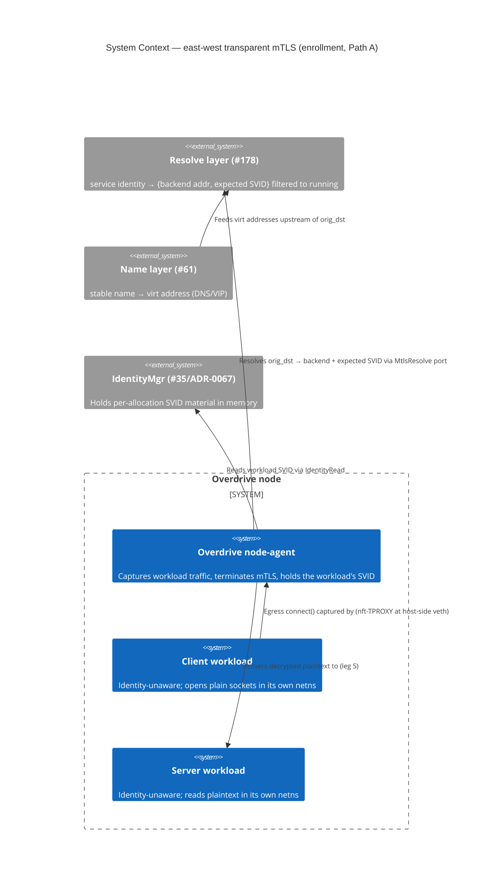
```mermaid
C4Context
  title System Context — east-west transparent mTLS (enrollment, Path A)

  System_Boundary(node, "Overdrive node") {
    System(agent, "Overdrive node-agent", "Captures workload traffic, terminates mTLS, holds the workload's SVID")
    System(clientwl, "Client workload", "Identity-unaware; opens plain sockets in its own netns")
    System(serverwl, "Server workload", "Identity-unaware; reads plaintext in its own netns")
  }
  System_Ext(resolve, "Resolve layer (#178)", "service identity → {backend addr, expected SVID} filtered to running")
  System_Ext(name, "Name layer (#61)", "stable name → virt address (DNS/VIP)")
  System_Ext(identity, "IdentityMgr (#35/ADR-0067)", "Holds per-allocation SVID material in memory")

  Rel(clientwl, agent, "Egress connect() captured by (nft-TPROXY at host-side veth)")
  Rel(agent, serverwl, "Delivers decrypted plaintext to (leg S)")
  Rel(agent, resolve, "Resolves orig_dst → backend + expected SVID via MtlsResolve port")
  Rel(name, resolve, "Feeds virt addresses upstream of orig_dst")
  Rel(agent, identity, "Reads workload SVID via IdentityRead")
```

#### C4 Level 2 — Container diagram (Path A interception + enforce)

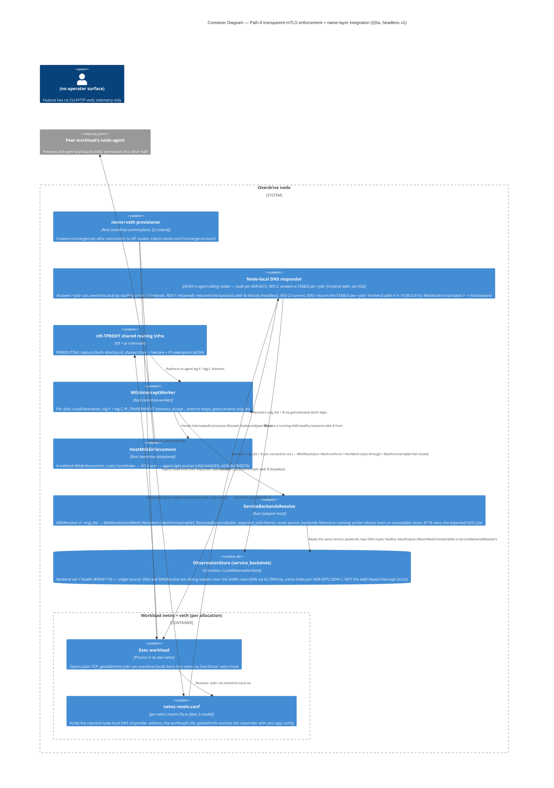
```mermaid
C4Container
  title Container Diagram — Path A transparent-mTLS enforcement + name-layer integration (Q5a, headless v1)

  Person(none, "(no operator surface)", "Feature has no CLI/HTTP verb; telemetry only")

  System_Boundary(node, "Overdrive node") {
    Container_Boundary(wlns, "Workload netns + veth (per allocation)") {
      Container(workload, "Exec workload", "Process in its own netns", "Opens plain TCP; getaddrinfo(<job>.svc.overdrive.local); born into netns via ExecDriver setns hook")
      Container(resolvconf, "netns resolv.conf", "per-netns mount (Fly.io fdaa::3 model)", "Holds the injected node-local DNS responder address; the workload's libc getaddrinfo reaches the responder with zero app config")
    }
    Container(provisioner, "netns+veth provisioner", "Rust (overdrive-control-plane, Q2 extend)", "Creates+converges per-alloc netns/veth; tx off; routes; injects resolv.conf (converge-on-boot)")
    Container(dns, "Node-local DNS responder", "(#243 in-agent sibling reader — built per ADR-0072; REV-2: answers a STABLE per-<job> frontend addr, see §36)", "Answers <job>.svc.overdrive.local by reading service_backends. REV-1 (retained): returned the backend addr B directly (headless). REV-2 (current, §36): returns the STABLE per-<job> frontend addr F in 10.98.0.0/16; MtlsResolve translates F -> live backend")
    Container(nft, "nft-TPROXY shared routing infra", "nft + ip rule/route", "PREROUTING capture (both directions); shared chain + fwmark + F5 exemption (#234)")
    Container(worker, "MtlsInterceptWorker", "Rust (overdrive-worker)", "Per-alloc install/teardown; leg-F + leg-C IP_TRANSPARENT listeners; accept→enforce loops; getsockname orig-dst")
    Container(enforce, "HostMtlsEnforcement", "Rust (overdrive-dataplane)", "4-method MtlsEnforcement: rustls handshake → kTLS arm → agent-light pumps (UNCHANGED, ADR-0069/0070)")
    Container(resolveadapter, "ServiceBackendsResolve", "Rust (adapter-host)", "MtlsResolve v1: orig_dst → MtlsResolution{Mesh|NonMesh|MeshUnreachable}; ResolvedBackend{addr, expected_svid=None}; reads service_backends filtered to running; probe refuses boot on unreadable store; #178 owns the expected-SVID join")
    ContainerDb(obs, "ObservationStore (service_backends)", "Corrosion / LocalObservationStore", "Backend set + health (#69/#174) — single source: DNS and MtlsResolve are sibling readers over the SAME rows (DNS via its OWN by_name index per ADR-0072 DDN-1, NOT the addr-keyed intercept struct)")
  }
  System_Ext(peeragent, "Peer workload's node-agent", "Presents the peer workload's SVID; terminates the other half")

  Rel(provisioner, workload, "Provisions netns+veth for")
  Rel(provisioner, resolvconf, "Injects node-local DNS responder address into")
  Rel(workload, resolvconf, "Resolves <job>.svc.overdrive.local via")
  Rel(resolvconf, dns, "Points libc getaddrinfo at")
  Rel(dns, obs, "Returns a running-AND-healthy backend addr B from")
  Rel(dns, workload, "Answers getaddrinfo with addr B (headless)")
  Rel(workload, nft, "connect(B) egress ingresses host-side veth, captured by")
  Rel(nft, worker, "Redirects to agent leg-F / leg-C listeners")
  Rel(worker, worker, "Recovers orig_dst = B via getsockname (both legs)")
  Rel(worker, resolveadapter, "Resolves orig_dst = B per connection via (→ MtlsResolution: Mesh=enforce / NonMesh=pass-through / MeshUnreachable=fail-closed)")
  Rel(resolveadapter, obs, "Reads the same service_backends rows DNS reads; healthy classification (Mesh/MeshUnreachable) is ServiceBackendsResolve's")
  Rel(worker, enforce, "Hands InterceptedConnection (Routed::Outbound{peer:B}) to")
  Rel(enforce, peeragent, "mTLS 1.3 (kTLS) to")
```

> **Node-local DNS responder — built in-agent per ADR-0072 (#243).** The
> `dns` container's earlier "#61 daemon, NOT built here" placeholder is
> superseded: the responder is the **in-agent sibling name-keyed reader**
> designed in ADR-0072 (DDN-1/DDN-2), not a standalone daemon. It reads the
> SAME `service_backends` rows as `MtlsResolve` but through its OWN `by_name`
> index (DDN-1), gates `Backend.healthy == true` (running-AND-healthy — an
> unhealthy addr classifies `MeshUnreachable` and is never answered), and is
> NOT the addr-keyed intercept struct. The ADR-0071 decision below is
> unchanged; this note only corrects the responder's ownership pointer (#243
> corrected the earlier "#61 owns the DNS daemon" framing — #61 is the VIP
> path).

---

### 35a. Canonical-workload-address inbound TPROXY production install (#241, ADR-0071 + ADR-0053 amendments 2026-06-22)

The keystone slice that closes the **inbound** half of §35's loop — productionises
the inbound nft-TPROXY install ADR-0071 deferred (`start_alloc` recorded
`tproxy_guard = None`) and flips the bridge advertise addr to the canonical
`workload_addr`. Settled by three Tier-3 spikes (no new routing primitive; the
`cgroup_connect4_service` LB hook FIRES for Path-A; the VIP/LB path is INERT under
a real deploy). Full design:
`docs/feature/canonical-workload-address-inbound-tproxy/{feature-delta,design/wave-decisions}.md`.

**Production wiring (all EXTEND/REUSE — zero new component):**

- **A1 — keystone install.** `AllocationSpec` gains pure in-memory
  `workload_addr: Option<Ipv4Addr>` + `service_ports: Vec<NonZeroU16>` (same
  no-serde/no-rkyv channel as `netns`/`host_veth`). `workload_addr` set at the C3
  `provision_and_inject_netns` site from `plan.workload_addr`; `service_ports` set
  by `WorkloadLifecycle` via `project_service_listen_ports` (mirrors
  `project_probe_descriptors`). `start_alloc` installs one
  `install_inbound_tproxy(SocketAddrV4::new(workload_addr, port), leg_c_addr.port())`
  per declared listener (N listeners → N RAII guards; Job-kind → 0).
- **BLOCKER1 — dport contract.** The inbound rule keys on `ip daddr <workload_addr>
  tcp dport <service_port>`, `service_port` = the declared Service listener port
  (D-TME-10 one-source/two-readers — the same value `service_backends` advertises
  and `MtlsResolve` keys on), NOT the ephemeral leg-C port.
- **B2 — canonical advertise.** `BackendDiscoveryBridge` advertises
  `Backend.addr = workload_addr:port` (was `host_ipv4:port`); `ServiceBackendRow.vip`
  UNCHANGED. The egress `MtlsResolve` `by_addr` index (§35) now classifies a dial
  to the canonical addr as `Mesh`.
- **BLOCKER2 — observed-input persistence.** `workload_addr` is persisted directly
  on `AllocStatusRow` (an `AllocStatusRowEnvelope::V2` additive bump) and read by
  the bridge as an observed fact — NOT recomputed from `NetSlot` (the derivation +
  `WORKLOAD_SUBNET_BASE` live in `overdrive-control-plane`, and recompute against a
  future-tunable base (#239) would diverge from the addr the inbound rule was
  installed on). `RunningAllocSet.running` widens to
  `BTreeMap<AllocationId, Option<Ipv4Addr>>`.
- **GATE — ADR-0053↔ADR-0071 boundary.** `ServiceMapHydrator` gains a
  `workload_subnet: Ipv4Net` ctor param and a third partition arm: backends whose
  `addr.ip() ∈ WORKLOAD_SUBNET_BASE (10.99.0.0/16)` program NEITHER
  `LOCAL_BACKEND_MAP` NOR the XDP maps — the firing `cgroup_connect4_service` hook
  then misses and nft-TPROXY owns mesh delivery. The hook + XDP programs stay
  attached (reserved for remote/VIP-LB — the dialable-VIP territory #61; the VIP
  *allocator* #167 already shipped). Empirically safe (no live VIP-LB consumer);
  TEACH/full-retire deferred to a live dialable-VIP path (#61; the headless name
  responder #243 returns the `workload_addr`, NOT a VIP, so it is not a VIP-dial
  trigger; the ADR-0053 amendment is the durable GATE→TEACH record).

`ip_forward` + /30 routes + `rp_filter` and `ensure_shared_routing_infra` are
already converged/reused (no new boot call site; Bar-2 → #234). Driven end-to-end
through `overdrive serve` + `overdrive deploy`.

---

### C4 Level 1 — System Context

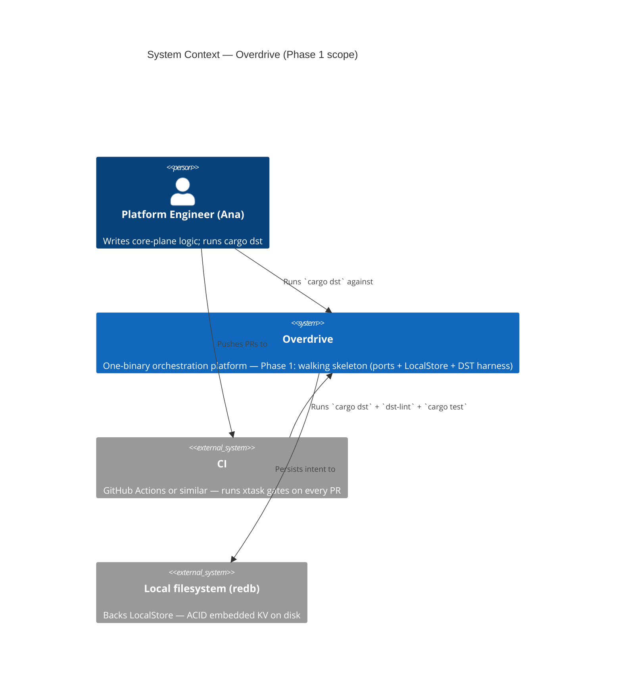
```mermaid
C4Context
  title System Context — Overdrive (Phase 1 scope)

  Person(engineer, "Platform Engineer (Ana)", "Writes core-plane logic; runs cargo dst")
  System(overdrive, "Overdrive", "One-binary orchestration platform — Phase 1: walking skeleton (ports + LocalStore + DST harness)")
  System_Ext(ci, "CI", "GitHub Actions or similar — runs xtask gates on every PR")
  System_Ext(fs, "Local filesystem (redb)", "Backs LocalStore — ACID embedded KV on disk")

  Rel(engineer, overdrive, "Runs `cargo dst` against")
  Rel(engineer, ci, "Pushes PRs to")
  Rel(ci, overdrive, "Runs `cargo dst` + `dst-lint` + `cargo test`")
  Rel(overdrive, fs, "Persists intent to")
```

### C4 Level 2 — Container diagram (Phase 1 first-workload)

This diagram extends the prior phase's container view with four new
containers: the dedicated `overdrive-scheduler` crate (ADR-0024
override), the dedicated `overdrive-worker` crate (ADR-0029) hosting
`ExecDriver` (renamed from `ProcessDriver` 2026-04-28 per ADR-0029
amendment) and workload-cgroup management and the
`node_health` writer, the binary-composition pattern in
`overdrive-cli` (which hard-depends on both `overdrive-control-plane`
and `overdrive-worker`), and the on-host kernel cgroup hierarchy that
both subsystems manage at boot (each owning its own slice per
ADR-0028 + ADR-0029).


```mermaid
C4Container
  title Container Diagram — Overdrive (Phase 1 first-workload)

  Person(engineer, "Platform Engineer (Ana)")

  Container_Boundary(workspace, "Overdrive workspace") {
    Container(core, "overdrive-core", "Rust crate (class: core)", "Ports + newtypes + aggregates (Job/Node/Allocation) + Reconciler trait + AnyState/View enums + Action enum + IntentKey (incl. for_job_stop)")
    Container(scheduler, "overdrive-scheduler", "Rust crate (class: core, NEW per ADR-0024)", "Pure-fn first-fit `schedule(nodes, job, allocs)` over BTreeMap inputs; dst-lint-scanned; depends only on overdrive-core")
    Container(store_local, "overdrive-store-local", "Rust crate (class: adapter-host)", "LocalStore (redb-backed IntentStore with put_if_absent semantics per ADR-0020) + LocalObservationStore (redb-backed single-writer ObservationStore)")
    Container(host, "overdrive-host", "Rust crate (class: adapter-host)", "Host-OS primitive bindings: SystemClock, OsEntropy, TcpTransport (ADR-0016 intent preserved per ADR-0029)")
    Container(worker, "overdrive-worker", "Rust crate (class: adapter-host, NEW per ADR-0029; amended 2026-04-28)", "ExecDriver (Linux-only; renamed from ProcessDriver) + workload-cgroup management (overdrive.slice/workloads.slice/<alloc>.scope per ADR-0026) + boot-time node_health row writer (per ADR-0025 amendment)")
    Container(sim, "overdrive-sim", "Rust crate (class: adapter-sim)", "Sim* adapters + turmoil harness + invariant catalogue; SimDriver / SimObservationStore are used by DST only — not runtime deps of the control plane or worker")
    Container(ctrl, "overdrive-control-plane", "Rust crate (class: adapter-host)", "Axum router + rustls TLS + ReconcilerRuntime + EvaluationBroker + ActionShim + JobLifecycle reconciler + control-plane cgroup management + pre-flight (ADR-0028)")
    Container(xtask, "xtask", "Rust binary (class: binary)", "cargo dst / dst-lint / openapi-gen / openapi-check")
    Container(cli, "overdrive-cli", "Rust binary (class: binary)", "overdrive CLI — reqwest HTTP client against /v1 REST API; gains `job stop` subcommand (ADR-0027). `serve` subcommand is the binary-composition root: hard-depends on both overdrive-control-plane and overdrive-worker; runtime [node] role config selects which subsystems boot (ADR-0029)")
  }

  ContainerDb(redb_file, "redb file", "On-disk ACID KV", "Backs LocalStore + LocalObservationStore; one file per store instance")
  ContainerDb(libsql_files, "libSQL files", "On-disk SQLite", "One per reconciler; <data_dir>/reconcilers/<name>/memory.db")
  ContainerDb(config_file, "~/.overdrive/config", "TOML file", "Operator endpoint + trust triple (ADR-0010) + optional [node] block (ADR-0025)")
  ContainerDb(openapi_yaml, "api/openapi.yaml", "YAML file", "Checked-in OpenAPI 3.1 schema; derived from Rust types via utoipa (ADR-0009)")
  System_Ext(kernel, "Linux kernel cgroup v2", "Unified hierarchy at /sys/fs/cgroup/", "overdrive.slice/{control-plane.slice (ctrl-owned), workloads.slice/<alloc>.scope (worker-owned)}")
  System_Ext(workload, "Workload process", "tokio::process child", "fork/exec child placed in cgroup scope by ExecDriver")
  System_Ext(ci, "CI pipeline")

  Rel(engineer, xtask, "Runs `cargo xtask ...`")
  Rel(engineer, cli, "Runs `overdrive job submit/stop/...`")
  Rel(ci, xtask, "Invokes on every PR (dst / dst-lint / openapi-check)")

  Rel(cli, config_file, "Reads endpoint + trust triple from")
  Rel(cli, ctrl, "Composition root: instantiates control-plane subsystem when [node] role includes control-plane (ADR-0029)")
  Rel(cli, worker, "Composition root: instantiates worker subsystem when [node] role includes worker; threads Arc<dyn Driver> from worker into control-plane AppState (ADR-0029)")
  Rel(cli, ctrl, "POSTs / GETs JSON over rustls HTTP/2 on /v1/...")
  Rel(cli, core, "Imports aggregate types, newtypes, IntentKey from")

  Rel(ctrl, core, "Implements handlers against ports in; uses aggregates and AnyState/AnyReconciler enums from")
  Rel(ctrl, scheduler, "Calls `schedule(...)` from inside JobLifecycle::reconcile (pure helper from pure reconciler, ADR-0024)")
  Rel(ctrl, store_local, "Writes intent via IntentStore::put + reads via IntentStore::get; writes observation via ObservationStore::write + reads alloc_status_rows / node_health_rows")
  Rel(ctrl, libsql_files, "Provisions one libSQL DB per registered reconciler")
  Rel(ctrl, kernel, "Pre-flight reads /proc/filesystems, /sys/fs/cgroup/.../subtree_control; mkdirs control-plane.slice; writes own PID into cgroup.procs (ADR-0028)")
  Rel(ctrl, config_file, "Reads optional [node] block; writes trust triple after bind")

  Rel(worker, core, "Implements Driver port against; reads NodeId / Region / Resources newtypes; writes AllocStatusRow + NodeHealthRow shapes from")
  Rel(worker, store_local, "Writes node_health row at startup via ObservationStore::write (per ADR-0025 amended)")
  Rel(worker, kernel, "ExecDriver mkdirs workload scope; writes cpu.weight + memory.max + cgroup.procs; rmdirs scope on stop (ADR-0026 + ADR-0029)")
  Rel(worker, workload, "tokio::process spawns child; SIGTERM/SIGKILL on stop")
  Rel(worker, config_file, "Reads optional [node] block at worker startup")

  Rel(ctrl, worker, "Action shim calls Driver::start/stop/status against &dyn Driver; impl crate is overdrive-worker but ctrl does NOT depend on it directly — Arc<dyn Driver> is plugged in by the binary at AppState construction (ADR-0029)", "via &dyn Driver")

  Rel(scheduler, core, "Imports Resources, NodeId, Node, Job, AllocStatusRow from")

  Rel(host, core, "Implements Clock, Entropy, Transport ports against")

  Rel(store_local, redb_file, "ACID transactions to")

  Rel(xtask, sim, "Runs DST harness via `cargo test --features dst`")
  Rel(xtask, core, "Scans source for banned APIs (dst-lint)")
  Rel(xtask, scheduler, "Scans source for banned APIs (dst-lint) — NEW core-class crate")
  Rel(xtask, ctrl, "openapi-gen regenerates schema from; openapi-check diffs against")
  Rel(xtask, openapi_yaml, "Writes (openapi-gen) / reads (openapi-check)")

  Rel(sim, core, "Implements Sim* adapters against ports in")
  Rel(sim, store_local, "Composes real LocalStore with Sim* adapters in turmoil harness")
```

### C4 Level 3 — `overdrive-control-plane` component diagram (Phase 1)

The control-plane crate is complex enough to warrant a component view:
router + handlers + reconciler runtime + evaluation broker + TLS
bootstrap + error mapper add up to 6+ components with non-trivial
relationships.

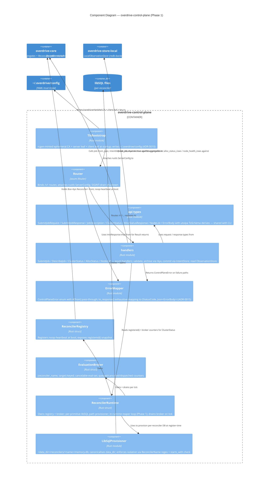
```mermaid
C4Component
  title Component Diagram — overdrive-control-plane (Phase 1)

  Container_Boundary(ctrl, "overdrive-control-plane") {
    Component(tls_boot, "TlsBootstrap", "Rust module", "rcgen-minted ephemeral CA + server leaf + client leaf at startup; writes ~/.overdrive/config (ADR-0010)")
    Component(router, "Router", "axum::Router", "Binds /v1 routes; attaches rustls ServerConfig; SIGINT-drain shutdown")
    Component(api, "api types", "Rust module", "SubmitJobRequest / SubmitJobResponse / JobDescription / ClusterStatus / AllocStatusResponse / NodeList / ErrorBody with utoipa ToSchema derives — shared with CLI")
    Component(handlers, "handlers", "Rust module", "SubmitJob / DescribeJob / ClusterStatus / AllocStatus / NodeList — axum handlers; validate, archive via rkyv, commit via IntentStore; read ObservationStore")
    Component(errmap, "ErrorMapper", "Rust module", "ControlPlaneError enum with #[from] pass-through; to_response() exhaustive mapping to (StatusCode, Json<ErrorBody>) (ADR-0015)")
    Component(reg, "ReconcilerRegistry", "Rust struct", "Registers noop-heartbeat at boot; exposes registered() snapshot")
    Component(broker, "EvaluationBroker", "Rust struct", "(reconciler_name, target) keyed; cancelable-eval-set; queued/cancelled/dispatched counters")
    Component(runtime, "ReconcilerRuntime", "Rust struct", "Owns registry + broker; per-primitive libSQL path provisioner; in-runtime reaper loop (Phase 1); drains broker on tick")
    Component(libsql_prov, "LibSqlProvisioner", "Rust module", "<data_dir>/reconcilers/<name>/memory.db; canonicalises data_dir; enforces isolation via ReconcilerName regex + starts_with check")
  }

  Container(core, "overdrive-core", "ports + aggregates + Reconciler trait + Action + IntentKey")
  Container(store_local, "overdrive-store-local", "LocalStore (redb-backed intent) + LocalObservationStore (redb-backed observation, ADR-0012 revised)")
  Container(config, "~/.overdrive/config", "YAML trust triple")
  ContainerDb(libsql_files, "libSQL files", "per-reconciler")

  Rel(tls_boot, config, "Writes base64-embedded CA + client leaf + key to")
  Rel(tls_boot, router, "Attaches rustls ServerConfig to")

  Rel(router, handlers, "Routes /v1/... requests to")
  Rel(router, errmap, "Uses IntoResponse impl from for Result returns")

  Rel(handlers, api, "Uses request / response types from")
  Rel(handlers, core, "Calls Job::from_spec, IntentKey::for_job, rkyv::Archive against aggregates in")
  Rel(handlers, store_local, "Writes via IntentStore::put; reads via IntentStore::get")
  Rel(handlers, store_local, "Reads observation rows via ObservationStore::alloc_status_rows / node_health_rows against")
  Rel(handlers, runtime, "Reads registered() + broker counters for ClusterStatus")
  Rel(handlers, errmap, "Returns ControlPlaneError on failure paths")

  Rel(runtime, reg, "Owns")
  Rel(runtime, broker, "Owns + drains per tick")
  Rel(runtime, libsql_prov, "Uses to provision per-reconciler DB at register-time")
  Rel(reg, core, "Holds Box<dyn Reconciler> from; noop-heartbeat at boot")

  Rel(libsql_prov, libsql_files, "Creates + opens")
```

### C4 Level 3 — Convergence-loop closure (Phase 1 first-workload)

The convergence loop is the central architectural feature of the
first-workload feature: it is the path from `overdrive job submit`
through the JobLifecycle reconciler + scheduler + action shim +
ExecDriver and back into ObservationStore, where the next tick
sees the new state. The diagram below shows the components and
their async / sync boundaries explicitly.

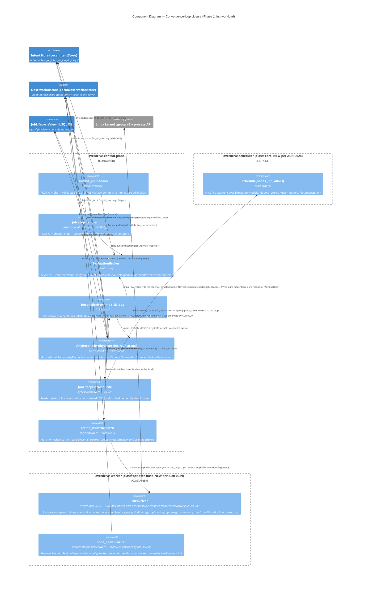
```mermaid
C4Component
  title Component Diagram — Convergence-loop closure (Phase 1 first-workload)

  Container_Boundary(ctrl, "overdrive-control-plane") {
    Component(handler_submit, "submit_job handler", "axum::Handler", "POST /v1/jobs — validates spec, archives via rkyv, commits to IntentStore (ADR-0008)")
    Component(handler_stop, "job_stop handler", "axum::Handler (NEW — ADR-0027)", "POST /v1/jobs/{id}:stop — writes IntentKey::for_job_stop to IntentStore")
    Component(broker, "EvaluationBroker", "Rust struct", "Keyed on (ReconcilerName, TargetResource); cancelable-eval-set; queued/cancelled/dispatched counters")
    Component(runtime, "ReconcilerRuntime tick loop", "tokio::task", "Drains broker every 100 ms (ADR-0023); orchestrates hydrate-then-reconcile-then-dispatch pipeline")
    Component(hydrate, "AnyReconciler::hydrate_desired/_actual", "async fn (NEW — ADR-0021)", "Match-dispatches on AnyReconciler variant; reads IntentStore + ObservationStore; emits AnyState variant")
    Component(reconciler, "JobLifecycle::reconcile", "sync pure fn (NEW — US-03)", "Reads desired Job, current allocations, view (libSQL); calls scheduler; emits Vec<Action>")
    Component(shim, "action_shim::dispatch", "async fn (NEW — ADR-0023)", "Match on Action variant; calls Driver::start/stop; writes AllocStatusRow to ObservationStore")
  }

  Container_Boundary(scheduler_crate, "overdrive-scheduler (class: core, NEW per ADR-0024)") {
    Component(schedule_fn, "schedule(nodes, job, allocs)", "pure sync fn", "First-fit placement over BTreeMap<NodeId, Node>; returns Result<NodeId, PlacementError>")
  }

  Container_Boundary(worker_crate, "overdrive-worker (class: adapter-host, NEW per ADR-0029)") {
    Component(process_driver, "ExecDriver", "Driver impl (NEW — ADR-0026 hosted here per ADR-0029; renamed from ProcessDriver 2026-04-28)", "tokio::process spawn (binary + args directly from AllocationSpec) + cgroup v2 direct cgroupfs writes; cpu.weight + memory.max from AllocationSpec::resources")
    Component(node_health_writer, "node_health writer", "worker-startup helper (NEW — ADR-0025 amended by ADR-0029)", "Resolves NodeId/Region/Capacity from config; writes one node_health row at worker startup before listener bind")
  }

  Container(intent, "IntentStore (LocalIntentStore)", "redb-backed; for_job + for_job_stop keys")
  Container(obs, "ObservationStore (LocalObservationStore)", "redb-backed; alloc_status_rows + node_health_rows")
  Container(libsql_db, "JobLifecycleView libSQL DB", "<data_dir>/reconcilers/job-lifecycle/memory.db; restart_counts + next_attempt_at")
  System_Ext(kernel, "Linux kernel cgroup v2 + process API")

  Rel(handler_submit, intent, "IntentStore::put_if_absent (sync) — for_job key")
  Rel(handler_submit, broker, "Enqueues Evaluation((JobLifecycle, jobs/<id>))")
  Rel(handler_stop, intent, "IntentStore::put — for_job_stop key (ADR-0027)")
  Rel(handler_stop, broker, "Enqueues Evaluation((JobLifecycle, jobs/<id>))")

  Rel(runtime, broker, "drain() every tick (100 ms cadence; SimClock under DST)")
  Rel(runtime, hydrate, "Awaits hydrate_desired + hydrate_actual + reconciler.hydrate")
  Rel(hydrate, intent, "Reads for_job + for_job_stop keys (async)")
  Rel(hydrate, obs, "Reads alloc_status_rows + node_health_rows (async)")
  Rel(hydrate, libsql_db, "Reads JobLifecycleView (async)")

  Rel(runtime, reconciler, "Calls reconcile(&desired, &actual, &view, &tick) — SYNC, no .await")
  Rel(reconciler, schedule_fn, "Calls schedule(nodes, job, allocs) — SYNC, pure helper from pure reconciler (Anvil pattern)")
  Rel(reconciler, runtime, "Returns (Vec<Action>, NextView)")

  Rel(runtime, libsql_db, "Persists diff(view, NextView) (async)")
  Rel(runtime, shim, "Awaits dispatch(actions, &driver, &obs, &tick)")
  Rel(shim, process_driver, "Driver::start(&AllocationSpec { command, args, .. }) / Driver::stop(&AllocationHandle) (async)")
  Rel(shim, obs, "Writes AllocStatusRow {Running | Failed | Terminated} (async)")
  Rel(process_driver, kernel, "mkdir scope; cpu.weight; memory.max; cgroup.procs; SIGTERM/SIGKILL on stop")
  Rel(node_health_writer, obs, "Writes node_health row at worker startup, before listener bind (ADR-0025 amended by ADR-0029)")

  Rel(obs, hydrate, "Next tick reads back the row the shim just wrote — convergence-loop closes")
```

The diagram makes one architectural property visually explicit: the
**only async boundary inside the convergence loop is the action
shim**. `JobLifecycle::reconcile` is sync; `schedule(…)` is sync;
`hydrate_desired` / `hydrate_actual` / `reconciler.hydrate` /
`shim::dispatch` are async. The reconciler's purity contract —
ADR-0013, `ReconcilerIsPure` invariant in ADR-0017 — is preserved
by construction.

### C4 Level 3 — `overdrive-sim` component diagram

The DST harness is complex enough to warrant a component view (5+ components
interacting non-trivially). Every other crate's internal structure is
adequately described by the container-level view.

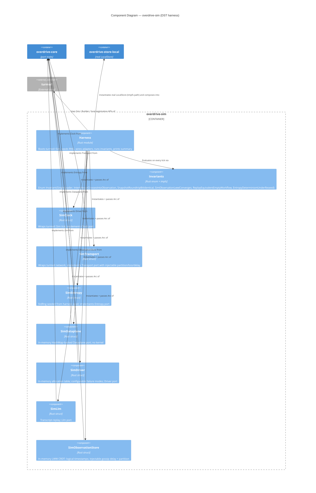
```mermaid
C4Component
  title Component Diagram — overdrive-sim (DST harness)

  Container_Boundary(sim, "overdrive-sim") {
    Component(harness, "Harness", "Rust module", "Boots turmoil::Sim, seeds RNG, wires adapters, runs invariants, prints summary")
    Component(invariants, "Invariants", "Rust enum + impls", "Enum Invariant{SingleLeader, IntentNeverCrossesIntoObservation, SnapshotRoundtripBitIdentical, SimObservationLwwConverges, ReplayEquivalentEmptyWorkflow, EntropyDeterminismUnderReseed}")
    Component(sim_clock, "SimClock", "Rust struct", "Wraps turmoil::Sim tick; implements Clock port")
    Component(sim_transport, "SimTransport", "Rust struct", "Wraps turmoil network; implements Transport port with injectable partition/loss/delay")
    Component(sim_entropy, "SimEntropy", "Rust struct", "StdRng seeded from harness seed; implements Entropy port")
    Component(sim_dataplane, "SimDataplane", "Rust struct", "In-memory HashMap-backed Dataplane port; no kernel")
    Component(sim_driver, "SimDriver", "Rust struct", "In-memory allocation table; configurable failure modes; Driver port")
    Component(sim_llm, "SimLlm", "Rust struct", "Transcript-replay; Llm port")
    Component(sim_obs, "SimObservationStore", "Rust struct", "In-memory LWW CRDT; logical timestamps; injectable gossip delay + partition")
  }

  Container(core, "overdrive-core", "port traits")
  Container(store_local, "overdrive-store-local", "real LocalStore")
  Container_Ext(turmoil_ext, "turmoil", "External crate")

  Rel(harness, turmoil_ext, "Uses Sim / Builder / host registration APIs of")
  Rel(harness, sim_clock, "Instantiates + passes Arc of")
  Rel(harness, sim_transport, "Instantiates + passes Arc of")
  Rel(harness, sim_entropy, "Instantiates + passes Arc of")
  Rel(harness, sim_dataplane, "Instantiates + passes Arc of")
  Rel(harness, sim_driver, "Instantiates + passes Arc of")
  Rel(harness, sim_llm, "Instantiates + passes Arc of")
  Rel(harness, sim_obs, "Instantiates + passes Arc of")
  Rel(harness, store_local, "Instantiates real LocalStore (tmpfs path) and composes into")
  Rel(harness, invariants, "Evaluates on every tick via")

  Rel(sim_clock, core, "implements Clock from")
  Rel(sim_transport, core, "implements Transport from")
  Rel(sim_entropy, core, "implements Entropy from")
  Rel(sim_dataplane, core, "implements Dataplane from")
  Rel(sim_driver, core, "implements Driver from")
  Rel(sim_llm, core, "implements Llm from")
  Rel(sim_obs, core, "implements ObservationStore from")
```

---

## Architecture Enforcement

Style: Hexagonal (single-process, Rust workspace)
Language: Rust 2024 edition
Tool: **`cargo xtask dst-lint`** (custom, `syn`-based; see
`xtask/src/dst_lint.rs`)
Secondary: `cargo clippy` workspace pedantic+nursery+cargo
Contract enforcement: `overdrive-core/tests/compile_fail/*.rs`
(`trybuild`-powered) for trait-non-substitutability

Rules to enforce:

- Core crates (class = `core`) do not import banned APIs (`Instant::now`,
  `SystemTime::now`, `rand::random`, `rand::thread_rng`, `tokio::time::sleep`,
  `std::thread::sleep`, `tokio::net::{TcpStream, TcpListener, UdpSocket}`).
- The set of core-class crates is non-empty at every lint run.
- Every banned symbol is covered by a synthetic-file self-test inside xtask.
- Violation messages include file:line:col, banned symbol, replacement trait,
  and a link to `.claude/rules/development.md`.
- `IntentStore` and `ObservationStore` are not type-substitutable (compile-fail
  test).
- Every newtype is lossless under Display / FromStr / serde / rkyv round-trip
  (proptest).

---

## ADR index

| # | Title | Status |
|---|---|---|
| 0001 | Complete existing trait scaffolding in place | Accepted |
| 0002 | SchematicId canonicalisation uses rkyv-archived bytes | Accepted |
| 0003 | Core-crate labelling via `package.metadata.overdrive.crate_class` | Accepted |
| 0004 | Single `overdrive-sim` crate, not split | Accepted |
| 0005 | Test distribution: per-crate `tests/`, top-level `tests/acceptance/` for acceptance only | Accepted |
| 0006 | `cargo dst` + `dst-lint` are the required CI checks; seeds surfaced on failure | Accepted |
| 0007 | cr-sqlite deletion discipline (tombstones + bounded sweep) | Accepted |
| 0008 | Control-plane external API is REST + OpenAPI over axum/rustls | Accepted |
| 0009 | OpenAPI schema is derived from Rust types via `utoipa`, checked-in, CI-gated | Accepted |
| 0010 | Phase 1 TLS bootstrap: ephemeral in-process CA, embedded trust triple in `~/.overdrive/config` | Accepted |
| 0011 | Intent-side `Job` aggregate and observation-side `AllocStatusRow` stay separate types | Accepted |
| 0012 | Phase 1 server uses a real `LocalObservationStore` (redb-backed, single-writer) | Accepted (revised 2026-04-24) |
| 0013 | Reconciler primitive: trait in `overdrive-core`, runtime in `overdrive-control-plane`, libSQL private memory | Superseded by 0035 |
| 0014 | CLI HTTP client is hand-rolled `reqwest`; CLI and server share Rust request/response types | Accepted |
| 0015 | HTTP error mapping: `ControlPlaneError` with `#[from]`, bespoke 7807-compatible JSON body | Accepted |
| 0021 | Reconciler `State` shape: per-reconciler typed `AnyState` enum mirroring `AnyReconcilerView` | Accepted (amended by 0036) |
| 0022 | `AppState::driver: Arc<dyn Driver>` extension | Accepted |
| 0023 | Action shim placement: `reconciler_runtime::action_shim` submodule; 100 ms tick cadence | Accepted |
| 0024 | Dedicated `overdrive-scheduler` crate (class `core`); D4 user override | Accepted |
| 0025 | Single-node startup wiring: hostname-derived NodeId; one-shot node_health write at boot | Accepted |
| 0026 | cgroup v2 direct cgroupfs writes (no `cgroups-rs` dep); `cpu.weight` + `memory.max` from spec | Accepted |
| 0027 | Job-stop HTTP shape: `POST /v1/jobs/{id}:stop`; separate `IntentKey::for_job_stop` | Accepted |
| 0028 | cgroup v2 delegation pre-flight: hard refusal (escape-hatch portion superseded by ADR-0034) | Superseded in part by 0034 |
| 0034 | Remove `--allow-no-cgroups` escape hatch; canonical dev path is `cargo xtask lima run --` | Accepted |
| 0029 | Dedicated `overdrive-worker` crate (class `adapter-host`); ExecDriver (formerly ProcessDriver, renamed 2026-04-28) + workload-cgroup management + node_health writer extracted from `overdrive-host` | Accepted (amended 2026-04-28) |
| 0032 | NDJSON streaming submit: `overdrive job submit` streams convergence as NDJSON when `Accept: application/x-ndjson` is sent; back-compat single-JSON ack otherwise. CLI exits non-zero on convergence failure. 60 s server-side cap. | Accepted |
| 0033 | `alloc status` snapshot enrichment: `AllocStatusResponse` extended in place with state, last-transition reason, restart budget, exit code, started_at; `TransitionReason` shared with ADR-0032 streaming events. | Accepted |
| 0035 | Reconciler memory: collapse trait to one method, typed-View blob auto-persisted, redb backend, in-memory hot copy as steady-state read SSOT (supersedes 0013) | Accepted |
| 0036 | Amendment to ADR-0021: remove the per-reconciler `hydrate(target, db)` surface; runtime owns all hydration | Accepted |
| 0037 | Reconciler emits typed `TerminalCondition`; streaming forwards it; `LifecycleEvent` no longer projects reconciler-private View state (replaces step-02-04's `restart_count_max: u32` with `terminal: Option<TerminalCondition>`; durable home on `AllocStatusRow.terminal`; K8s-Condition-shaped SemVer convention) | Accepted |
| 0038 | eBPF crate layout (`overdrive-bpf` + `overdrive-dataplane`) + `xtask bpf-build` + `build.rs` shim build pipeline (Phase 2.1) | Accepted |
| 0040 | SERVICE_MAP three-map split (SERVICE_MAP / BACKEND_MAP / MAGLEV_MAP) + HASH_OF_MAPS atomic-swap primitive; checksum helper = `bpf_l3_csum_replace`/`bpf_l4_csum_replace`; sanity prologue = shared `#[inline(always)]` Rust helper; HASH_OF_MAPS inner-map size = 256; `DropClass` slots = 6 (Phase 2.2) | Accepted |
| 0041 | Weighted Maglev consistent hashing (M=16_381 default, prime, M ≥ 100·N) + REVERSE_NAT_MAP shape + endianness lockstep contract (wire = network-order; map storage = host-order; conversion site `crates/overdrive-bpf/src/shared/sanity.rs`) + TC-egress for `tc_reverse_nat` (Phase 2.2) | Accepted |
| 0042 | `ServiceMapHydrator` reconciler + new `Action::DataplaneUpdateService` variant + new `service_hydration_results` ObservationStore table; failure surface is observation, NOT `TerminalCondition` (preserves ADR-0037); ESR pair `HydratorEventuallyConverges` + `HydratorIdempotentSteadyState` (Phase 2.2; closes J-PLAT-004) | Accepted |
| 0043 | XDP L4LB three-iface transit test topology (`client-ns ↔ lb-ns ↔ backend-ns`) — `lb-ns` carries the routing host that `XDP_TX` returned frames need to reach the backend network; restores production XDP L4LB shape in netns form (Phase 2.2) | Accepted |
| 0044 | XDP per-CPU LRU conntrack table — Phase 2.16 design lockpoint. **SUPERSEDED 2026-05-07** — empirically falsified; the conntrack-shaped fix this ADR proposed is unnecessary. The actual S-2.2-17 root cause was the sanity prologue's `claimed_pkt_len > packet_len` check firing spuriously on forwarded skbs at TC egress. Fix lives in ADR-0040 § Revision 2026-05-07 (Q3 amendment — sanity prologue is ingress-only). See ADR-0044 § Falsification for the diagnostic trail. GH #154 remains open with its original flow-affinity-across-rotations scope, no longer urgency-attached to Phase 2.2. | Superseded |
| 0055 | **docs-platform (website)** — MCP server is a same-Worker Next route handler (`website/app/mcp/route.ts`, Node runtime) sharing the ONE in-process build-time `source` index with `/api/search` and the llms export; stateless Streamable HTTP; strongest no-divergence guarantee for C-4 | Accepted |
| 0056 | **docs-platform (website)** — D1 analytics binding for MCP tool-call logging (real SQL: top zero-result queries = one `SELECT … WHERE result_count=0 GROUP BY query`); best-effort contract via `ctx.waitUntil()` + catch-swallow — a logging failure NEVER alters/delays the tool response (resolves DISCUSS D-2) | Accepted |
| 0057 | **docs-platform (website)** — in-Worker Orama search now (`createFromSource`) behind a `lib/search.ts` seam shared by `/api/search` and MCP `search_docs`; benchmarked external-search migration trigger (>~5k pages OR ~60–70 MB of the 128 MB isolate — inference, to be benchmarked) | Accepted |
| 0058 | **docs-platform (website)** — build-time one-index enforcement assertion (Node build step in `website/`, NOT a Rust gate): every `source.getPages()` page has a reachable `.md`, appears in `llms.txt`, and is in the search index; blog joins the same index — makes the C-4 invariant structural | Accepted |
| 0060 | `ServiceFrontend` newtype on `Dataplane::update_service` — threads per-service `(ServiceVip [V4-by-construction], NonZeroU16 port, Proto)` so the REVERSE_NAT key set is derivable per declared proto (fixes GH #163 UDP reverse-NAT bypass); per-proto purge on empty backends; three-tier `ReverseNatLockstep` gate. Supersedes phase-2 §5 Q-Sig locked-A (paper, never landed); records shipped option-C as true from-state (Phase 2.2 / udp-service-support) | Accepted |
| 0062 | Listener-fact in-memory view — `ListenerFactStore` (`Arc<Mutex<…>>` on `AppState`; primary `BTreeMap<ServiceId, ListenerRow>` keyed by the hydrator read key + secondary `BTreeMap<WorkloadId, Vec<ServiceId>>` cleanup index for stop) replaces the O(S²) per-tick `gather_service_listener_facts` scan in the `ServiceMapHydrator` hydrate arm; per-row `store.get(&row.service_id)` is O(1) and drops the prior `vip == row.vip` listener scan; boot-rebuilt from intent + edge-maintained on submit/stop (key derived via `ServiceId::derive(&vip, port, "service-map")`); steady-state hydrate pays zero redb reads. Not a persisted View (no durable state — intent store is SSOT; honors "persist inputs, not derived state"). Extends 0035; amends 0042; references 0049 (allocator lifecycle imitated, not extended); preserves 0060 C3. Candidate (d) per reconciler-desired-hydration-efficiency research | Accepted |
| 0063 | Built-in CA — `Ca` port trait (`overdrive-core`; pure, no rcgen) + `RcgenCa` host adapter (all rcgen/crypto-backend [`ring` today; aws-lc-rs + FIPS pending #204]/HKDF/AES-256-GCM) + `SimCa` sim adapter (fixture P-256 keys); 3-tier hierarchy (self-signed P-256 root → pathLen=0 node intermediate → single-URI-SAN SVID, 1h TTL); single-node (one intermediate). Root key at rest = rkyv `RootCaKeyEnvelope` (ADR-0048) in IntentStore; KEK in Linux kernel keyring delivered per-boot by systemd-creds (TPM/host-key); HKDF-SHA256-from-KEK subkey → AES-256-GCM (reconciliation A); pure `CertSpec` builder in core, host adapter translates to `rcgen::CertificateParams` (reconciliation B). Serials via `Entropy`; key-gen via backend CSPRNG (not injectable, F11). `issued_certificates` ObservationStore audit row. Refuse-to-start on decrypt failure — never silent re-mint. `ca_equivalence` DST test enforces the trait contract. Supersedes ADR-0010 for *workload identity* only (`tls_bootstrap.rs` keeps the control-plane-HTTPS consumer). GH #28 [2.6] | Accepted |
| 0063 | **Workflow primitive** — workflow `await`-point journal is a **second redb table layout** on the shared runtime-owned substrate (`<data_dir>/reconcilers/memory.redb`), distinct `JournalStore` port + `RedbJournalStore`/`SimJournalStore` adapters; one append-only table `__wf_journal__` keyed `(WorkflowId, u32 step)`, value = CBOR `JournalEntry` (`ciborium`, ADR-0035 §3 discipline, NOT the ADR-0048 rkyv envelope — mutable runtime memory, additive entry-variants per slice via `#[serde(default)]`); fsync-then-suspend ordering + Earned-Trust `probe()` reused from 0035; `SleepArmed` records the deadline (input, not "remaining"). Resolves DIVERGE D4/open-Q3 in favour of redb (R2); supersedes pre-DIVERGE "per-primitive libSQL" phrasing. Extends 0035. Single-node scope; cross-node resume (#205) not precluded | Accepted |
| 0064 | **Workflow primitive** — `Workflow` trait + `WorkflowCtx` type + `WorkflowResult` + concrete `WorkflowStart` in NEW `overdrive-core::workflow` (no tokio in core; injected ports + `async_trait`); durable-async `WorkflowEngine` in NEW `overdrive-control-plane::workflow_runtime` driven **off the action-shim**. Engine↔reconciler boundary: the workflow-lifecycle reconciler stays a **pure-sync ADR-0035 reconciler** emitting `Action::StartWorkflow` + observing terminal rows; the engine runs the async body off the shim exactly as `StartAllocation`→`Driver::start`. Check-then-record journal replay ⇒ bit-identical replay (K4); `ctx` surface additive per slice (`call`/`sleep`/`wait_for_signal`/`emit_action`); `WorkflowResult` distinct from `TerminalCondition` (inherits the SemVer convention, not the type); `ctx.emit_action` → Action channel → Raft (no IntentStore bypass). Companion to 0063 | Accepted (§2/§3/§5/§6 amended by 0065) |
| 0065 | **Workflow result/error model** — body returns `Result<Output, TerminalError>` (typed success output + terminal-error failure channel, the Restate/Temporal/DBOS/Step-Functions shape), retryable errors absorbed/re-driven by the engine, never reaching the return type. Object safety via author-edge typing + a CBOR-erasing `ErasedWorkflowAdapter<W>` → object-safe `ErasedWorkflow` the engine drives (same typed-edge/erased-interior split as `ctx.run<T>`). `WorkflowResult` DELETED (greenfield single-cut); the status enum survives only as engine-owned control-plane projection `WorkflowStatus { Completed{output} \| Failed{terminal} \| Cancelled \| TimedOut }` (carried by journal `Terminal` + `ObservationRow::WorkflowTerminal`, distinct from the body return AND `TerminalCondition`). `TerminalError { kind, detail }` concrete core type (closes the `reason: String` replay-determinism hazard). Retry budget in the engine/journal (journal-`RetryAttempted`-derived attempts + engine-constant policy), NOT the body, NOT a reconciler `View` (contrast `RetryMemory` — a workflow has an engine). Typed `WorkflowStart { name, input }` crosses Raft via rkyv `WorkflowStartEnvelope` (V1) + co-located typed codec (ADR-0048 `Job` precedent); `input_digest` off `spec.input` — resolves #217, unblocks the first external/root rotation workflow consumer. *(Historical: "unblocks #40"; SUPERSEDED — #40 is the now-closed internal SVID reissue `Action::IssueSvid`, not a workflow; the future workflow consumer is external-ACME / public-trust or root-CA rotation, TBD.)* Amends ADR-0064 §2/§3/§5/§6 | Proposed |
| 0069 | **Transparent mTLS via a universal agent-light L4 proxy** — folds #222 into #26; ONE enforcement mechanism for ALL workload kinds (process/exec, WASM, microVM, unikernel). Workload's outbound TCP transparently intercepted (`cgroup_connect4`-rewrite default / TPROXY alt) to an agent-owned plaintext leg F; the agent drains plaintext losslessly + rustls TLS 1.3 handshake on a peer-facing leg B presenting the held SVID (read via `IdentityRead`, never minted/cached) + arms kTLS on leg B (reusing `ktls::KtlsStream` for control records). Steady state: **forward F→B = in-kernel sockmap EGRESS-redirect (`bpf_sk_redirect_map`, flags=0) → kTLS-TX, AGENT-IDLE**; **return B→F = `splice(2)` via `tls_sw_splice_read` on a plain (no-psock) kTLS-RX leg, AGENT-LIGHT zero-copy (~1 splice/record)**. New driven port `MtlsEnforcement` in `overdrive-core` (does NOT fit `Dataplane` — per-connection socket ops, not map writes) + host adapter (`adapter-host`, over sockops/sk_msg/sockmap/kTLS/splice/cgroup_connect4, consumes `IdentityRead`) + `SimMtlsEnforcement` for DST. Earned-Trust `probe()` (wire→probe→use; sentinel handshake + splice-read + egress-redirect, refuse-to-start on failure). Decided on 6 Tier-3 spikes + 3 research docs (kernel 7.0, `353cdc52`): in-band lossless foreclosed 3 ways; proxy proven agent-light both directions. **Amends whitepaper §7/§8** (two mechanisms → one); **supersedes** in-band kTLS-on-own-socket as v1 — retained as a post-v1 optimization tracked in **#231** (restart-survival + 1-socket density). J-SEC-003 / GH #26 (folds #222) | Accepted |
| 0070 | **Transparent-mTLS connection liveness — kernel TCP timeouts + per-connection self-supervision** — refines ADR-0069 § ATAM "Pump supervision policy (F6)" / the SD-4 supervision shape. v1 supervises connection liveness with **(C) `TCP_USER_TIMEOUT` + keepalive on the spliced legs** (kernel reaps transport-death; Linkerd/ztunnel precedent) **+ (B) per-connection self-supervision** in each SD-2 port-owned enforce task (self-tear-down fail-closed on EOF/error). **Rejects (A) a central tick enumerator** over the live-connection set (no surveyed production dataplane uses it for liveness; `reconcilers.md` disqualifies it — a stalled connection is not desired-vs-actual config drift). The central `MtlsSupervisor` (step 04-01) + its tests are **deleted** (delete, not refactor). The 4-method `MtlsEnforcement` contract is UNCHANGED — `liveness`/`PumpLiveness`/`pump_stall_deadline` are RETAINED (the `Gone` post-teardown no-leak observable the equivalence + F4 tests assert, plus the (B) verdict + the reserved hook for the deferred watchdog). Two NAMED deferrals (no issue created): the kernel-invisible progress-stall watchdog (Tier-3 spike; the kTLS-spliced progress predicate is undocumented upstream) and the Phase-5 policy-plane force-close (revocation/authz drain — a central registry IS correct THERE, not for v1 liveness). Decided on `transparent-mtls-connection-supervision-research.md` (22 sources). Refines ADR-0069 (locked core UNCHANGED: D-MTLS-1/fold/OQ-2/SD-1(a)/SD-2/SD-3/4-method contract/F3/F4-7/F5/authn-only). GH #26 | Accepted |
| 0072 | **Dial-by-name responder — node-local in-agent DNS over the ObservationStore (the THIRD reader)** *(REV-2, supersedes headless v1 — see ADR-0072 § Changed Assumptions)* — answers `<job>.svc.overdrive.local` for an unmodified workload's `getaddrinfo`, closing the dial-by-name leg (#236 deferral). NEW `DnsResponder` host adapter (`overdrive-control-plane`, `adapter-host`) with its OWN name-keyed `name_index` (`<job>` → the **stable per-`<job>` frontend addr `F` in `10.98.0.0/16`**, NOT → backend addrs) over `service_backends ∩ running-AND-healthy` via the SAME List-then-Watch + relist-on-`Lagged` + single-owner-drain + `probe()` pattern as `ServiceBackendsResolve` — a **sibling reader** (DDN-1, ratified A1). The **ClusterIP split**: DNS answers a STABLE address; the already-live dataplane (nft-TPROXY Path-A + a re-keyed per-connection `MtlsResolve`) translates `(F, listener.port[, proto])` → a current running-AND-healthy backend and enforces SPIFFE mTLS, so the answer never goes stale on a backend cycle (the SQ1 fix). The byte-consistency anchor moved from the backend addr to `F` (the answered `F` is byte-identical to the addr `MtlsResolve` recognizes; the translation always lands a `Mesh` backend). `MtlsResolve` is **re-keyed** (1b-A) — `BackendIndex` gains `by_frontend: BTreeMap<FrontendKey, ServiceId>` where `FrontendKey = (SocketAddrV4, Proto)` (2nd-round Finding-1: the proto axis is carried so `tcp/53`/`udp/53` never collide; v1 captures TCP at the worker layer) + a three-way `classify` arm (frontend hit → translate; frontend-subnet miss → `MeshUnreachable` fail-closed; general miss → today's `by_addr`); this EDITS the security-critical resolve index, superseding REV-1's "intercept struct untouched" — pinned in the trait docstring + a DST equivalence test. NEW per-`<job>` `FrontendAddrAllocator` (1a-A, sibling to `NetSlotAllocator`, `WORKLOAD_FRONTEND_BASE = 10.98.0.0/16`, collision-checked disjoint from VIP `10.96.0.0/16` + workload `10.99.0.0/16`); `F` is per-LOGICAL-workload — WITHHELD at the `name_index` on transient zero-healthy (→ NXDOMAIN), RELEASED only on logical-workload deletion (Finding-2). `<job>` ← `Backend.alloc: SpiffeId` job segment = `WorkloadId` = deploy `[service].id` (verified mapping). Wire codec = **`hickory-proto`** (Apache-2.0/MIT, OSS-first); `hickory-server` REJECTED (no per-packet reply-source control on a multi-homed wildcard socket) → our OWN `IP_PKTINFO` recv/sendmsg loop with `ipi_spec_dst` source-pinning (spike-mandatory; `getaddrinfo` rejects wrong-source replies). DST seam = pure `answer_for(name, qtype, &index) -> NameAnswer` + a separately-proptested encoder (NO port trait / NO Sim adapter — the socket is irreducibly Tier-3, no Tier-2 backstop). Bind `0.0.0.0:53` wildcard first (`SO_REUSEADDR`), fall back to N per-gateway-addr sockets on `EADDRINUSE` — gateway set PINNED (DDN-5) to `NetSlotAllocator` + `responder_addr_for_slot`, re-derived on the converge tick. `run_server` owns it (construct after `resolve.probe()`, `responder.probe()`, spawn, hold `JoinHandle`; same `mtls_worker.is_some()` gate; `health.startup.refused` on bind/List failure — wire→probe→use). NEW `MeshServiceName` newtype (`overdrive-core::id`, `SUFFIX = svc.overdrive.local`, single `<job>` label v1, full newtype completeness + proptest). DNS contract: A+running-and-healthy → NOERROR+A (the stable `F`); AAAA+live → NODATA(+SOA); 0 running-and-healthy (declared-not-running OR unhealthy OR unknown, indistinguishable v1) → NXDOMAIN(+1s-MINIMUM SOA); never a stale/unhealthy addr. v1 IPv4-only; a stable IPv4 frontend is **VIP-shaped** but delivered via nft-TPROXY (NOT #61 XDP/`SERVICE_MAP`/#167). BLOCKER-1 (frontend-subnet capture) RESOLVED → WORKS on a real kernel; BLOCKER-2 (multi-replica selection) pinned deterministic first-by-`Ord`. Spike PROMOTE (dev-Lima 7.0; re-confirm 6.18 appliance in DELIVER Tier-3). Builds on ADR-0071 (Q5a name-layer). GH #243 / J-MESH-001 | Accepted |
| 0073 | **Backend instance replacement — `overdrive workload restart <id>` + a minimal desired-run generation precursor** — closes the `[D1]` DISCUSS gate (#249). NEW top-level `overdrive workload restart <id>` verb (new `workload` CLI namespace, #220-aligned; NOT under `job`); single verb, rollout-restart breadth (running → stop-then-start; operator-stopped → start; non-existent → 404). Mechanism = a minimal desired-run `generation: u64` at a NEW standalone sibling key `workloads/<id>/generation` (8-byte big-endian — NOT an rkyv aggregate field, so NO ADR-0048 envelope bump / golden fixture); the `WorkloadLifecycle` reconciler gains `State.generation` (hydrated input) + `View.observed_generation` (persisted input, `#[serde(default)]`) and gates the stale line-520 operator-stop observation-veto on restart-pending **AND scoped to the current instance** — `!restart_pending && current_alloc(&allocs_vec).is_some_and(is_operator_stopped)`, where the new minimal pure helper `current_alloc` selects the latest-placed alloc by the numeric `mint_alloc_id` suffix so a superseded prior-generation `Terminated{Operator}` row can never veto a fresh instance's later crash-restart (the iteration-3 fix; iteration-2's transient generation-gating-only override was rejected for re-arming stale prior-generation rows after placement). The reconciler edit is required since clearing the `workloads/<id>/stop` sentinel alone is necessary-but-NOT-sufficient (the observed Operator-stop row persists). Bug-3 preserved: ONLY `restart` bumps the generation; `overdrive deploy` stays pure-declare and never bumps it, so a same-spec re-deploy cannot resurrect an operator-stopped workload. TOCTOU-safe + monotonic: the generation bump + sentinel delete commit in ONE `IntentStore::txn` via the NEW `TxnOp::IncrementU64` variant (read-modify-write inside the redb write txn; redb serializes writers ⇒ atomic, two concurrent restarts advance `generation` by 2, never wedge) + `TxnOp::Delete` — **NO `Conflict` retry** (the `Put`-then-retry-on-`Conflict` shape was the iteration-1-rejected design; `LocalIntentStore::txn` returns `Committed` unconditionally so that conflict is unproduceable). HTTP = `POST /v1/jobs/:id/restart` (mirrors `stop_workload`; the `jobs/` HTTP prefix vs `workloads/` IntentKey prefix vs `workload` CLI verb split is the already-shipped `job stop` shape); `RestartWorkloadResponse { workload_id, outcome ∈ {restarted, resumed} }`; 404 `NotFound { resource: workloads/<id> }`. `restart` is **level-triggered / coalescing** (iteration-2 contract): generation advances monotonically per call (audited), the reconciler converges to ONE fresh instance for the latest generation; sequential restarts each cycle the workload, concurrent / pre-placement restarts coalesce into one cycle. The new AllocationId/`workload_addr` come free from `mint_alloc_id`'s `attempt = allocs_vec.len()` (the SystemGc-resubmit precedent). Seam is THIN per ADR-0050 OQ-1 — only `generation`/`observed_generation`, NO revision rows / `RevisionId` / retention (deferred to #180, where `generation` folds into the `workloads/<id>/current` pointer); reused verbatim by #64 (rolling deploy), #253 (zero-downtime), #254 (multi-replica). Reuse: 6 EXTEND (`stop_workload` shape, reconciler, `IntentKey`, http-client, api response enum, `hydrate_desired`), 5 minimal CREATE-NEW (`workload` namespace, restart handler+route, generation key+codec, the `TxnOp::IncrementU64` store primitive, the pure `current_alloc` reconciler helper). Wholly internal — no external integration, no new crate, no new dep. Alternatives rejected: lean narrow-veto edit (no forward seam), re-stamp observed row to SystemGc (corrupts observation honesty), full #180 pull-forward (over-build). GH #249 / J-OPS-003 (extended) | Accepted |

---

## Phase 2 dial-by-name-responder extension (ADR-0072, GH #243)

### 36. Node-local in-agent DNS responder — the THIRD reader of the `service_backends` observation surface

**Scope**: the **name-answering** layer for east-west mesh reachability under
the **stable-frontend / ClusterIP-split** model. ADR-0071 (§35) shipped
`resolv.conf` injection (each per-netns `/etc/resolv.conf` points at the
per-netns gateway) and named the node-local DNS responder daemon as a DEPENDENCY
*"(#61 daemon, NOT built here)"*; the arc was finalized with that responder
reframed from #61 (VIP) onto **#243**. **This section builds it.** The DNS
responder itself is a new READER of an existing observation surface (it adds no
enforcement surface of its own). REV-2's ClusterIP split, however, makes ONE
**additive edit to the security-critical resolve/enforcement path**: it re-keys
`MtlsResolve` (`BackendIndex` gains `by_frontend: BTreeMap<FrontendKey,
ServiceId>` + a three-way `classify` arm, including the fail-closed
frontend-subnet-miss → `MeshUnreachable` branch) so the answered stable frontend
addr translates to a current live backend. That re-key edits
`mtls_resolve_adapter.rs` and is pinned in the `MtlsResolve` trait docstring + a
DST equivalence test; this section does NOT claim it leaves the security-critical
path untouched (it deliberately and additively extends it). Full rationale +
alternatives: **ADR-0072**; `docs/feature/dial-by-name-responder/feature-delta.md`.

> **REVISED (REV-2, 2026-06-25) — FINAL. Both forks RATIFIED; the gating spike
> returned WORKS.** The user ratified shifting the answered address from a
> *volatile per-instance backend addr* (the headless-v1 contract described below)
> to a **stable per-`<job>` frontend addr** while the already-live dataplane
> (nft-TPROXY + per-connection `MtlsResolve`, ADR-0071 / ADR-0053) owns backend
> churn — the **ClusterIP split**. DNS answers a stable address; the dataplane
> translates frontend → current live backend and enforces SPIFFE mTLS. This
> **supersedes the "headless / answer-the-backend-addr / NO VIP" contract below**
> (now read through ADR-0072 § "Changed Assumptions (REV-2)"). It is NOT the #61
> IPv6-VIP / XDP-VIP-LB path — the stable IPv4 frontend is VIP-*shaped* but
> delivered via nft-TPROXY, no XDP / `SERVICE_MAP` / #167. The two forks are
> DECIDED: **REV-1a = 1a-A** (a NEW per-`<job>` `FrontendAddrAllocator`, sibling
> to `NetSlotAllocator`, carving from **`WORKLOAD_FRONTEND_BASE = 10.98.0.0/16`**)
> and **REV-1b = 1b-A** (an additive `by_frontend: BTreeMap<FrontendKey,
> ServiceId>` map, `FrontendKey = (SocketAddrV4, Proto)` — the proto axis is
> carried so `tcp/53`/`udp/53` never collide, Finding 1 — on `BackendIndex` + a
> `classify` translation arm). The frontend
> subnet is pinned to **`10.98.0.0/16`** — the spike's `10.96.0.0/16` candidate
> was REJECTED for a total collision with the live service-VIP allocator default
> (`VipRange::default() = 10.96.0.0/16`, `crates/overdrive-dataplane/src/allocators/vip_range.rs`;
> the same `/16` shown in the VIP-allocator config examples in this brief);
> `10.98.0.0/16` is disjoint from both VIP `10.96.0.0/16` and workload
> `10.99.0.0/16`. **BLOCKER-1 (dataplane capture of the frontend subnet) is
> RESOLVED → WORKS** on a real kernel
> (`spike/findings-blocker1-frontend-addr-capture.md`): a non-`/30` frontend addr
> routes out the workload netns via the per-netns default route production already
> installs, is captured by the destination-blind egress nft-TPROXY, and `orig_dst`
> is recovered verbatim — **no new routing/capture dataplane work; REV-2 stays
> thin**. **BLOCKER-2 (multi-replica selection) is pinned: deterministic
> first-by-`Ord`** for v1. Committed steps 01-01/01-02 are unaffected (the
> `SocketAddrV4` substrate + the `hickory-proto` codec carry any IPv4 addr).
> Code-grounded inputs: the two `docs/research/networking/dial-by-name-*` research
> docs + `findings-blocker1-frontend-addr-capture.md`. The `MtlsResolve` re-key is
> an EDIT to the security-critical resolve index (`mtls_resolve_adapter.rs`) —
> superseding REV-1's "intercept struct provably untouched" — pinned in the trait
> docstring + a DST equivalence test. NO `sock_destroy` in the thin path (the
> terminating-proxy pump task + `TCP_USER_TIMEOUT` surface backend death;
> `sock_destroy` is #61 scope). The only remaining user-gated item is the #61
> corrected-scope GitHub edit (relayed by the orchestrator, not run here).

> **The prose below is the REV-2 contract (supersedes headless v1 — see ADR-0072
> § Changed Assumptions).** DNS answers a stable per-`<job>` frontend addr `F`;
> `MtlsResolve` translates `(F, listener.port[, proto])` → the current live
> backend. (ADR-0072 retains the verbatim superseded REV-1 contract for its
> audit trail; this brief is the architecture SUMMARY and carries only the live
> REV-2 contract.)

**The gap it closes**: an unmodified workload's
`getaddrinfo("<peer>.svc.overdrive.local")` reaches the injected stub resolver,
**nothing answers**, and resolution times out in every deploy — the
dial-by-name leg the transparent-mTLS arc deferred (#236). With the responder,
the query resolves to the peer's **stable per-`<job>` frontend addr `F`** (in
`10.98.0.0/16`), the workload connects to `F`, the existing nft-TPROXY intercept
path captures it, and the re-keyed `MtlsResolve` translates `F` → a current
running-AND-healthy backend and mTLS's the hop. Because `F` is stable, the
answer never goes stale when the backend cycles (the SQ1 fix).

**One source, THREE readers (made precise)**: the responder is the third reader
of the **ObservationStore `service_backends` surface** — NOT a reader of the
addr-keyed intercept-index *struct*. Both `ServiceBackendsResolve` (outbound
resolve) and `DnsResponder` (name answers), plus the inbound install (#241),
fold the SAME `ServiceBackendRow` rows from the SAME `ObservationStore` via the
SAME List-then-Watch contract. Byte-consistency (REV-2): the answered `F` is
byte-identical to the addr `MtlsResolve` is re-keyed to recognize, and the
translation always lands a `Mesh` backend — consistency is a property of the
shared rows + the shared `<job>→F` binding, not of a shared in-RAM struct.

**The v1 DNS answer contract** (honored exactly — the answered `A` is the stable
frontend `F`, REV-2):

| Query | `<job>` has ≥1 running-AND-healthy IPv4 backend | `<job>` has 0 running-and-healthy backends* |
|---|---|---|
| `A` | NOERROR + A (the **stable per-`<job>` frontend addr `F`**) | NXDOMAIN (+ 1 s-MINIMUM SOA) |
| `AAAA` | NOERROR / NODATA (ANCOUNT=0, same SOA in authority) | NXDOMAIN (+ 1 s SOA) |

\* *declared-but-not-running, unhealthy / not-ready, AND unknown all collapse in
v1 (the responder reads only the running-AND-healthy set — the `name_index`
gates on `Backend.healthy == true`); on a transient zero-healthy state the
`name_index` WITHHOLDS the answer (→ NXDOMAIN) while the `FrontendAddrAllocator`
RETAINS `F` (Finding-2: `F` is per-logical-workload, released only on deletion).
A stale/cached/unhealthy/guessed addr is NEVER returned; the translated backend
classifies `Mesh` (an unhealthy backend → `MeshUnreachable`, fail-closed).*

**Name→frontend mapping (REV-2, VERIFIED)**: `<job>` ← the SVID job segment of
`Backend.alloc: SpiffeId` (path `spiffe://overdrive.local/job/<WorkloadId>/alloc/<id>`,
`SpiffeId::for_allocation`); `WorkloadId` IS the deploy `[service].id`.
`service_backends` rows are built by `BackendDiscoveryBridge` from
`actual.actual.running` only, so "∩ running" holds by construction. The
`name_index` maps `<job>` → the **stable frontend addr `F`** (1a-A) — NOT → the
volatile backend-addr set (REV-1, superseded) — and gates the answer on the
`<job>` having ≥1 running-AND-healthy backend right now (else WITHHOLD →
NXDOMAIN). The backend churn is owned by the dataplane's per-connection
`MtlsResolve` translation, not by the DNS answer.

**Component boundaries** (REV-2 — adds the frontend allocator + the resolve
re-key to the REV-1 set):

| Component | Home | Change |
|---|---|---|
| `MeshServiceName` newtype + `NameAnswer` enum | `overdrive-core` (`id.rs` / small `dns` module) | CREATE NEW |
| `dns_responder/name_index.rs` (`name_index`: `<job>` → stable frontend `F`, List-then-Watch) | `overdrive-control-plane/src/dns_responder/` | CREATE NEW |
| `dns_responder/answer.rs` (pure `answer_for`) | `overdrive-control-plane/src/dns_responder/` | CREATE NEW |
| `dns_responder/wire.rs` (hickory-proto encode/decode) | `overdrive-control-plane/src/dns_responder/` | CREATE NEW |
| `dns_responder/responder.rs` (`DnsResponder` adapter + `IP_PKTINFO` socket loop) | `overdrive-control-plane/src/dns_responder/` | CREATE NEW |
| `DnsResponderError` (typed `thiserror`) | `dns_responder/` | CREATE NEW |
| `FrontendAddrAllocator` (per-`<job>` stable `F` in `WORKLOAD_FRONTEND_BASE = 10.98.0.0/16`; 1a-A) | `overdrive-control-plane` (sibling to `NetSlotAllocator`) | CREATE NEW (REV-2) |
| `BackendIndex` re-key — add `by_frontend: BTreeMap<FrontendKey, ServiceId>` (`FrontendKey = (SocketAddrV4, Proto)`) + three-way `classify` arm (1b-A) | `overdrive-control-plane/src/mtls_resolve_adapter.rs` | EXTEND (REV-2 — edits the security-critical resolve index; trait docstring + DST equivalence test pin the contract) |
| `run_server_with_obs_and_driver` composition | `overdrive-control-plane/src/lib.rs` (~1893-1957) | EXTEND (REV-2: also wires `FrontendAddrAllocator` on `AppState` + the re-keyed resolve) |
| `hickory-proto` workspace dep | root `Cargo.toml` | ADD (Apache-2.0/MIT) |

**Pinned signatures** (CLAUDE.md "implement to the design"):

- `MeshServiceName` — label-shaped newtype, `const SUFFIX = "svc.overdrive.local"`,
  single `<job>` label (≤ 63 octets, the DNS single-label max, RFC 1035 §2.3.4;
  NOT `LABEL_MAX`/253 which is the DNS-name max), case-insensitive `FromStr`,
  canonical lowercase `Display`, serde matching, mandatory proptest round-trip.
- `enum NameAnswer { Records(Vec<SocketAddrV4>), NoData, NxDomain }` (the pure
  classification result — variant names PINNED in DESIGN; the three arms are
  fixed by the contract table: `Records` = ≥1 running-and-healthy backend,
  `NoData` = AAAA on a live name, `NxDomain` = 0 running-and-healthy).
- `answer_for(name: &MeshServiceName, qtype: hickory_proto::rr::RecordType, index: &NameIndex) -> NameAnswer`
  — pure, the mutation-gate target. The `qtype` type is PINNED to
  `hickory_proto::rr::RecordType` (reuse the codec vocabulary; `NameAnswer`
  itself stays hickory-free — only `qtype` crosses the `wire.rs` ACL boundary).
- `DnsResponder::new(store: Arc<dyn ObservationStore>, clock: Arc<dyn Clock>, slots: veth_provisioner::NetSlotAllocator) -> Self`
  — required deps, no builder, no default. The `NetSlotAllocator` handle is the
  PINNED fallback gateway-set source (DDN-5): on the per-addr fallback path it
  re-derives `responder_addr_for_slot(slot)` over `slots.snapshot()` on the
  converge tick (add/drop sockets as slots come/go); the wildcard path never
  reads it.
- `async fn probe(&self) -> Result<(), DnsResponderError>` — binds (wildcard
  first, per-addr fallback on `EADDRINUSE`) + Lists the snapshot into the
  `by_name` index + opens the single-owner watch; refuses boot on failure.
- `async fn serve(self: Arc<Self>)` — the `IP_PKTINFO` recv/decode/`answer_for`/
  encode/sendmsg loop (source-pinned `ipi_spec_dst`).
- `enum DnsResponderError { Bind { addr, source }, ListSeed { reason }, Probe { reason }, Socket { source } }`
  — typed (no `Internal(String)`); each → a distinct `health.startup.refused`
  reason. Mirrors the `MtlsResolveError::{Probe, StoreUnreadable}` shape.

**Read mechanism** (REV-2; mirrors `ServiceBackendsResolve` D-TME-11): the
`name_index` maps `<job>` (`MeshServiceName`) → the **stable frontend addr `F`**
(from the `FrontendAddrAllocator` binding), behind a `parking_lot::RwLock`,
`Arc`-shared with a single-owner drain task that folds
`SubscriptionEvent::Row(ServiceBackend(..))` and relists on
`SubscriptionEvent::Lagged` via `all_service_backends_rows`; `BTreeMap`-backed
(iteration observed, deterministic). `BackendDiscoveryBridge`'s running-only
construction guarantees the ∩-running filter at the row; the index ADDITIONALLY
gates `Backend.healthy == true` and WITHHOLDS the answer on a transient
zero-healthy state (Finding-2). **DNS↔resolve coherence (Finding-3):** a SINGLE
ordered drain updates `by_frontend` (resolve) BEFORE `name_index` exposes `F`
(option (b) write-time barrier), so DNS never answers an `F` the resolve index
has not learned; a residual frontend-subnet miss in `classify` fails CLOSED
(`MeshUnreachable`, never cleartext).

**Source-pinning verdict (`hickory-server` vs `hickory-proto`)**:
`hickory-proto` codec + our OWN socket loop. The spike empirically proved
`IP_PKTINFO` `ipi_spec_dst` source-pinning on ONE wildcard `0.0.0.0:53` socket
is MANDATORY (`getaddrinfo`/glibc rejects a reply whose source ≠ the queried
gateway); `hickory-server`'s UDP server gives no per-packet reply-source control
on a multi-homed wildcard socket, so it cannot satisfy it.

**Spike-pinned constraints (DELIVER MUST honor)**: `IP_PKTINFO` source-pinning
mandatory; acceptance = `getaddrinfo`/`getent`, never `dig @gw`; responder runs
in the ROOT netns answering on each per-netns gateway addr (no per-netns
listener); `ip_forward=1` prerequisite; verdict pinned to dev-Lima
`7.0.0-22-generic` — **re-confirm on the 6.18 appliance kernel in the DELIVER
Tier-3 matrix** (DEVOPS/Tier-3 obligation).

#### C4 Level 1 — System Context (dial-by-name responder, REV-2 stable-frontend)

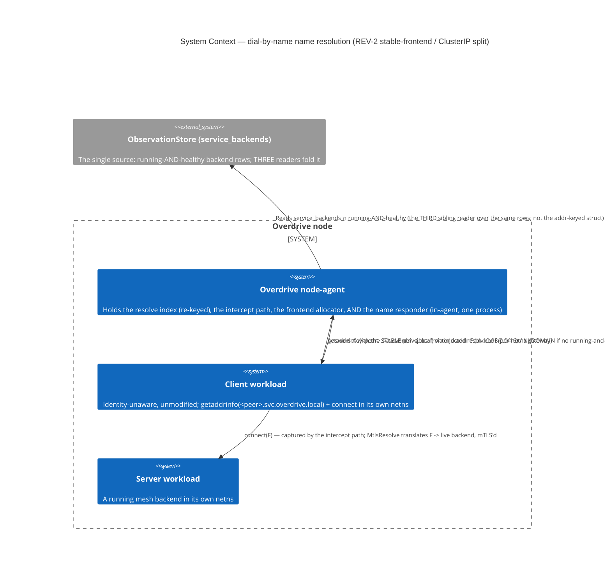
```mermaid
C4Context
  title System Context — dial-by-name name resolution (REV-2 stable-frontend / ClusterIP split)

  System_Boundary(node, "Overdrive node") {
    System(agent, "Overdrive node-agent", "Holds the resolve index (re-keyed), the intercept path, the frontend allocator, AND the name responder (in-agent, one process)")
    System(clientwl, "Client workload", "Identity-unaware, unmodified; getaddrinfo(<peer>.svc.overdrive.local) + connect in its own netns")
    System(serverwl, "Server workload", "A running mesh backend in its own netns")
  }
  System_Ext(obs, "ObservationStore (service_backends)", "The single source: running-AND-healthy backend rows; THREE readers fold it")

  Rel(clientwl, agent, "getaddrinfo(<peer>.svc.overdrive.local) via injected resolv.conf (per-netns gateway)")
  Rel(agent, clientwl, "Answers A with the STABLE per-<job> frontend addr F (in 10.98.0.0/16) / NXDOMAIN if no running-and-healthy backend")
  Rel(agent, obs, "Reads service_backends ∩ running-AND-healthy (the THIRD sibling reader over the same rows; not the addr-keyed struct)")
  Rel(clientwl, serverwl, "connect(F) — captured by the intercept path; MtlsResolve translates F -> live backend, mTLS'd")
```

#### C4 Level 2 — Container diagram (REV-2 stable-frontend / ClusterIP split)

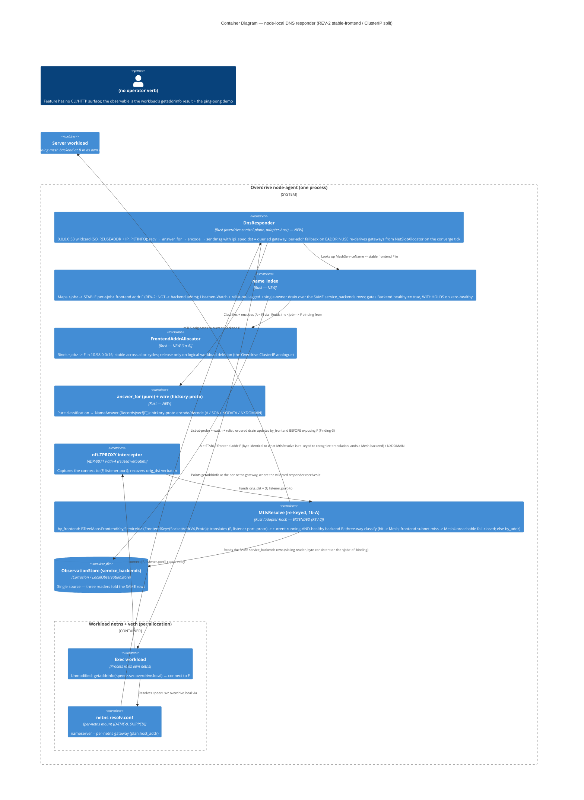
```mermaid
C4Container
  title Container Diagram — node-local DNS responder (REV-2 stable-frontend / ClusterIP split)

  Person(none, "(no operator verb)", "Feature has no CLI/HTTP surface; the observable is the workload's getaddrinfo result + the ping-pong demo")

  System_Boundary(node, "Overdrive node-agent (one process)") {
    Container_Boundary(wlns, "Workload netns + veth (per allocation)") {
      Container(workload, "Exec workload", "Process in its own netns", "Unmodified; getaddrinfo(<peer>.svc.overdrive.local) → connect to F")
      Container(resolvconf, "netns resolv.conf", "per-netns mount (D-TME-9, SHIPPED)", "nameserver = per-netns gateway (plan.host_addr)")
    }
    Container(responder, "DnsResponder", "Rust (overdrive-control-plane, adapter-host) — NEW", "0.0.0.0:53 wildcard (SO_REUSEADDR + IP_PKTINFO); recv → answer_for → encode → sendmsg with ipi_spec_dst = queried gateway; per-addr fallback on EADDRINUSE re-derives gateways from NetSlotAllocator on the converge tick")
    Container(nameindex, "name_index", "Rust — NEW", "Maps <job> -> STABLE per-<job> frontend addr F (REV-2: NOT -> backend addrs); List-then-Watch + relist-on-Lagged + single-owner drain over the SAME service_backends rows; gates Backend.healthy == true, WITHHOLDS on zero-healthy")
    Container(falloc, "FrontendAddrAllocator", "Rust — NEW (1a-A)", "Binds <job> -> F in 10.98.0.0/16; stable across alloc cycles; release only on logical-workload deletion (the Overdrive ClusterIP analogue)")
    Container(answer, "answer_for (pure) + wire (hickory-proto)", "Rust — NEW", "Pure classification → NameAnswer (Records(vec![F])); hickory-proto encode/decode (A / SOA / NODATA / NXDOMAIN)")
    Container(tproxy, "nft-TPROXY interceptor", "ADR-0071 Path-A (reused verbatim)", "Captures the connect to (F, listener.port); recovers orig_dst verbatim")
    Container(resolveadapter, "MtlsResolve (re-keyed, 1b-A)", "Rust (adapter-host) — EXTENDED (REV-2)", "by_frontend: BTreeMap<FrontendKey,ServiceId> (FrontendKey=(SocketAddrV4,Proto)); translates (F, listener.port, proto) -> current running-AND-healthy backend B; three-way classify (hit -> Mesh; frontend-subnet miss -> MeshUnreachable fail-closed; else by_addr)")
    ContainerDb(obs, "ObservationStore (service_backends)", "Corrosion / LocalObservationStore", "Single source — three readers fold the SAME rows")
  }
  Container(backend, "Server workload", "a running mesh backend at B in its own netns", "")

  Rel(workload, resolvconf, "Resolves <peer>.svc.overdrive.local via")
  Rel(resolvconf, responder, "Points getaddrinfo at the per-netns gateway, where the wildcard responder receives it")
  Rel(responder, nameindex, "Looks up MeshServiceName -> stable frontend F in")
  Rel(nameindex, falloc, "Reads the <job> -> F binding from")
  Rel(responder, answer, "Classifies + encodes (A = F) via")
  Rel(nameindex, obs, "List-at-probe + watch + relist; ordered drain updates by_frontend BEFORE exposing F (Finding-3)")
  Rel(resolveadapter, obs, "Reads the SAME service_backends rows (sibling reader, byte-consistent on the <job>->F binding)")
  Rel(responder, workload, "A = STABLE frontend addr F (byte-identical to what MtlsResolve is re-keyed to recognize; translation lands a Mesh backend) / NXDOMAIN")
  Rel(workload, tproxy, "connect((F, listener.port)) captured by")
  Rel(tproxy, resolveadapter, "hands orig_dst = (F, listener.port) to")
  Rel(resolveadapter, backend, "mTLS-originates to current backend B")
```

---

## Phase 1 reconciler-memory redesign extension (issue-139)

This section extends §1–§33 with the application-architecture
decisions landed by feature `reconciler-memory-redb`
(2026-05-03). Nothing in §1–§33 is rewritten outside the explicit
amendments noted below; §19 (Reconciler primitive) and §24 (State
shape) are *amended in place* by reference to ADR-0035 and ADR-0036.

### 34. Collapsed `Reconciler` trait + runtime-owned `ViewStore` (supersedes §19's trait shape)

Per ADR-0035. The four-method `Reconciler` trait shape originally
introduced by ADR-0013 (and extended to four methods by the
in-flight issue-139 work — `migrate` / `hydrate` / `reconcile` /
`persist`) collapses to a single synchronous method:

```rust
pub trait Reconciler: Send + Sync {
    type State: Send + Sync;
    type View:  Serialize + DeserializeOwned + Default + Clone + Send + Sync;
    fn name(&self) -> &ReconcilerName;
    fn reconcile(
        &self,
        desired: &Self::State,
        actual:  &Self::State,
        view:    &Self::View,
        tick:    &TickContext,
    ) -> (Vec<Action>, Self::View);
}
```

No `async`. No `migrate`, `hydrate`, or `persist`. No `LibsqlHandle`
parameter. The author derives `Serialize + Deserialize + Default +
Clone` on the `View` struct and writes `reconcile` — nothing else.

Storage moves to a runtime-owned port:

```rust
// in overdrive-control-plane::view_store
pub trait ViewStore: Send + Sync {
    async fn bulk_load<V>(&self, name: &ReconcilerName)
        -> Result<BTreeMap<TargetResource, V>, ViewStoreError>
        where V: DeserializeOwned + Send;
    async fn write_through<V>(
        &self, name: &ReconcilerName,
        target: &TargetResource, view: &V,
    ) -> Result<(), ViewStoreError>
        where V: Serialize + Sync;
    async fn delete(
        &self, name: &ReconcilerName,
        target: &TargetResource,
    ) -> Result<(), ViewStoreError>;
    async fn probe(&self) -> Result<(), ProbeError>;
}
```

Production adapter: `RedbViewStore` (one redb file per node at
`<data_dir>/reconcilers/memory.redb`; one redb table per reconciler
kind; CBOR-encoded value blob via `ciborium`).

Sim adapter: `SimViewStore` (in-memory `BTreeMap`; injected
fsync-failure for the `WriteThroughOrdering` invariant).

`LibsqlHandle` is deleted. `libsql_provisioner` is deleted. The
per-reconciler libSQL files at `<data_dir>/reconcilers/<name>/
memory.db` are replaced by the single per-node redb file.

### 35. Runtime tick contract under ADR-0035 (supersedes §19's runtime contract)

`ReconcilerRuntime` gains a boot-time bulk-load step and a write-
through path on persist. The steady-state read SSOT is an
in-memory `BTreeMap<TargetResource, View>` per reconciler held in
RAM, populated once at register-time from `ViewStore::bulk_load`.

Boot / register:

```
register(reconciler):
  1. view_store.probe().await?                   (Earned Trust gate)
  2. views = view_store.bulk_load(name).await?   (BTreeMap<TargetResource, View>)
  3. registry.insert(name, (AnyReconciler, views))
```

Steady-state tick (every 100 ms per ADR-0023, unchanged):

```
for evaluation in broker.drain_pending():
  1. (any_reconciler, views) = registry.lookup(name)
  2. tick    = TickContext::snapshot(clock)        (ADR-0013 §2c — survives)
  3. desired = AnyReconciler::hydrate_desired(...)  (ADR-0021 — survives)
  4. actual  = AnyReconciler::hydrate_actual(...)   (ADR-0021 — survives)
  5. view    = views.get(target).cloned()
                .unwrap_or_else(R::View::default)
  6. (actions, next_view) = reconciler.reconcile(
       &desired, &actual, &view, &tick)
  7. view_store.write_through(name, target, &next_view).await?
                                                   (durable fsync)
  8. views.insert(target.clone(), next_view)       (after fsync OK)
  9. action_shim::dispatch(actions, ...)           (ADR-0023 — survives)
```

Step ordering 7 → 8 is load-bearing for crash durability. The
`BTreeMap`-not-`HashMap` choice is mandated by development.md §
"Ordered-collection choice" (the map is iterated on `bulk_load`,
observed by DST invariants).

### 36. Storage tier table — amendment to brief.md §6

Per ADR-0035. The reconciler-memory tier in the State / Storage
table changes from libSQL to redb:

| Layer | Trait | Phase 1 adapter | Notes |
|---|---|---|---|
| Intent (should-be) | `IntentStore` | `LocalStore` (redb) | Distinct trait, distinct types; no shared `put(key, value)` surface |
| Observation (is) | `ObservationStore` | `LocalObservationStore` (redb, single-writer) | Distinct trait, distinct types; compile-time test asserts non-substitutability |
| **Reconciler memory (was)** | **`ViewStore`** | **`RedbViewStore` (separate redb file at `<data_dir>/reconcilers/memory.redb`)** | **One file per node, one table per reconciler kind, CBOR blob via `ciborium`. ADR-0035.** |
| Scratch (this tick) | `bumpalo::Bump` | — | N/A in Phase 1 (reconcilers Phase 2+) |

libSQL is retained as a workspace dep for incident memory and
DuckLake catalog (whitepaper §12, §17), Phase 3+. It is no longer
on the reconciler-memory hot path.

### 37. Amendment to §24 — `AnyState` enum and ADR-0021 hydration surfaces

Per ADR-0036. The §24 description of ADR-0021 stands. The single
amendment: the third sentence in §24 ("The reconciler's existing
`hydrate(target, db)` retains its narrow remit (the libSQL
private-memory read)") is overturned. Per ADR-0035 the reconciler
no longer has any async surface; the runtime owns all three
hydration paths (`hydrate_desired`, `hydrate_actual` are
runtime-side and stay async; the View hydration is a sync
`BTreeMap::get` after the boot-time `ViewStore::bulk_load`).

The `AnyState` enum, `JobLifecycleState` shape, per-reconciler
typing, and compile-time exhaustiveness contracts in ADR-0021 are
preserved.

### 38. Updated quality-attribute scenarios (issue-139)

| Attribute | Target | How addressed |
|---|---|---|
| Performance — time behaviour (steady-state hydrate) | `BTreeMap::get` (ns) — order-of-magnitude better than libSQL roundtrip | ADR-0035 §5: in-memory `BTreeMap` is the steady-state read SSOT |
| Maintainability — modifiability (LOC per reconciler) | ~0 lines of plumbing | Author derives `Serialize + Deserialize + Default + Clone`; `reconcile` is the only required method |
| Reliability — recoverability | Bounded crash recovery (no WAL replay) | redb 1PC+C with checksum + monotonic txn id; bulk_load is one read transaction |
| Reliability — durability | Per-tick fsync; crash between fsync and BTreeMap update preserves convergence | Step ordering 7 → 8 in §35 (write-through then memory update) |
| Maintainability — testability (View persistence) | Roundtrip is bit-identical for every reconciler's View | DST invariant `ViewStoreRoundtripIsLossless` (proptest-backed) |
| Maintainability — testability (boot determinism) | Two `bulk_load` calls produce equal `BTreeMap`s | DST invariant `BulkLoadIsDeterministic` |
| Maintainability — testability (write ordering) | Failed fsync does not update in-memory map | DST invariant `WriteThroughOrdering` (under `SimViewStore` injected fsync-failure) |
| Reliability — fault tolerance (storage probe) | `RedbViewStore::probe` runs before first `bulk_load`; failure refuses startup | Earned Trust principle 12; `ControlPlaneError::Internal` + `health.startup.refused` event |

### 39. C4 Component diagram — reconciler subsystem under ADR-0035

The convergence-loop component diagram from §33 (existing
brief.md) gets the `JobLifecycleView libSQL DB` container replaced
by `JobLifecycleView redb table` and the `Reads JobLifecycleView
(async)` arrow replaced by `Bulk-loads at register; reads in-memory
BTreeMap on tick`. The full updated reconciler-subsystem Component
diagram:

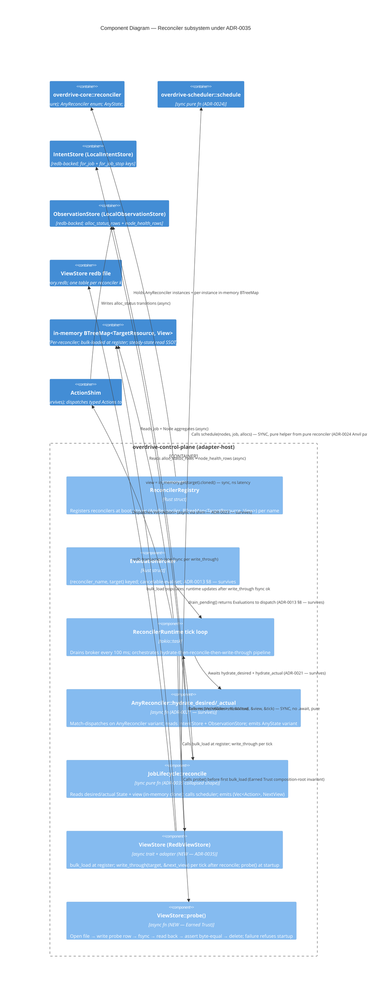
```mermaid
C4Component
  title Component Diagram — Reconciler subsystem under ADR-0035

  Container_Boundary(ctrl, "overdrive-control-plane (adapter-host)") {
    Component(reg, "ReconcilerRegistry", "Rust struct", "Registers reconcilers at boot; stores (AnyReconciler, BTreeMap<TargetResource, View>) per name")
    Component(broker, "EvaluationBroker", "Rust struct", "(reconciler_name, target) keyed; cancelable-eval-set; ADR-0013 §8 — survives")
    Component(runtime, "ReconcilerRuntime tick loop", "tokio::task", "Drains broker every 100 ms; orchestrates hydrate-then-reconcile-then-write-through pipeline")
    Component(hydrate, "AnyReconciler::hydrate_desired/_actual", "async fn (ADR-0021 — survives)", "Match-dispatches on AnyReconciler variant; reads IntentStore + ObservationStore; emits AnyState variant")
    Component(reconciler, "JobLifecycle::reconcile", "sync pure fn (ADR-0035 collapsed shape)", "Reads desired/actual State + view (in-memory clone); calls scheduler; emits (Vec<Action>, NextView)")
    Component(view_store, "ViewStore (RedbViewStore)", "async trait + adapter (NEW — ADR-0035)", "bulk_load at register; write_through(target, &next_view) per tick after reconcile; probe() at startup")
    Component(probe, "ViewStore::probe()", "async fn (NEW — Earned Trust)", "Open file → write probe row → fsync → read back → assert byte-equal → delete; failure refuses startup")
  }

  Container(core, "overdrive-core::reconciler", "Reconciler trait (one method, sync, pure); AnyReconciler enum; AnyState; Action; TickContext; ReconcilerName")
  Container(scheduler, "overdrive-scheduler::schedule", "sync pure fn (ADR-0024)")
  Container(intent, "IntentStore (LocalIntentStore)", "redb-backed; for_job + for_job_stop keys")
  Container(obs, "ObservationStore (LocalObservationStore)", "redb-backed; alloc_status_rows + node_health_rows")
  Container(view_redb, "ViewStore redb file", "<data_dir>/reconcilers/memory.redb; one table per reconciler kind; CBOR blob via ciborium")
  Container(in_memory, "in-memory BTreeMap<TargetResource, View>", "Per-reconciler; bulk-loaded at register; steady-state read SSOT")
  Container(action_shim, "ActionShim", "tokio::task (ADR-0023 — survives); dispatches typed Actions to Driver + ObservationStore")

  Rel(broker, runtime, "drain_pending() returns Evaluations to dispatch (ADR-0013 §8 — survives)")
  Rel(runtime, view_store, "Calls bulk_load at register; write_through per tick")
  Rel(runtime, probe, "Calls probe() before first bulk_load (Earned Trust composition-root invariant)")
  Rel(view_store, view_redb, "redb transaction (one fsync per write_through)")
  Rel(view_store, in_memory, "bulk_load populates; runtime updates after write_through fsync ok")
  Rel(runtime, hydrate, "Awaits hydrate_desired + hydrate_actual (ADR-0021 — survives)")
  Rel(hydrate, intent, "Reads Job + Node aggregates (async)")
  Rel(hydrate, obs, "Reads alloc_status_rows + node_health_rows (async)")
  Rel(runtime, in_memory, "view = in_memory.get(target).cloned() — sync, ns latency")
  Rel(runtime, reconciler, "Calls reconcile(&desired, &actual, &view, &tick) — SYNC, no .await, pure")
  Rel(reconciler, scheduler, "Calls schedule(nodes, job, allocs) — SYNC, pure helper from pure reconciler (ADR-0024 Anvil pattern)")
  Rel(reconciler, runtime, "Returns (Vec<Action>, NextView)")
  Rel(runtime, action_shim, "Dispatches Vec<Action> (async via shim — ADR-0023 — survives)")
  Rel(action_shim, obs, "Writes alloc_status transitions (async)")
  Rel(reg, core, "Holds AnyReconciler instances + per-instance in-memory BTreeMap")
```

The Container-level diagram from §32 also requires an amendment:
the `libSQL files (per-reconciler)` ContainerDb element is replaced
by a single `redb file (<data_dir>/reconcilers/memory.redb)`
ContainerDb element. The Container diagram is otherwise unchanged.

---

## Phase 2.1 — eBPF dataplane scaffolding extension

**Source:** `docs/feature/phase-2-aya-rs-scaffolding/design/architecture.md`
**ADR:** ADR-0038 (eBPF crate layout + build pipeline).
**Date:** 2026-05-04.

### 40. Two new crates: `overdrive-bpf` (kernel) + `overdrive-dataplane` (loader)

Phase 2.1 (issue #23) lands the eBPF dataplane scaffolding. Two crates
ship together to honour the BPF-target compile contract:

- **`crates/overdrive-bpf/`** — class `binary` (ADR-0003), target
  `bpfel-unknown-none`, `#![no_std]`, deps `aya-ebpf` only. Hosts
  kernel-side eBPF programs. Phase 2.1 ships one no-op XDP
  `xdp_pass` plus an `LruHashMap<u32, u64>` packet counter, attached
  to `lo` for the Tier 3 smoke test. Compiles to a single ELF object
  copied to `target/bpf/overdrive_bpf.o`. Excluded from
  workspace `default-members` so `cargo check --workspace` on macOS
  skips it; built explicitly via `cargo xtask bpf-build`.
- **`crates/overdrive-dataplane/`** — class `adapter-host` (ADR-0003,
  matching `overdrive-host`/`overdrive-store-local`/`overdrive-worker`).
  Userspace BPF loader. Hosts `EbpfDataplane` — the production
  binding of the `Dataplane` port trait from `overdrive-core`,
  mirroring `SimDataplane`'s constructor shape at the seam. Embeds
  the BPF object via `include_bytes!`; a small `build.rs` shim
  fails fast with a single-line diagnostic if the artifact is
  missing. Compiles on macOS with `#[cfg(target_os = "linux")]`
  stub bodies that return `DataplaneError::LoadFailed("non-Linux
  build target")`.

**Build pipeline.** Hybrid `cargo xtask bpf-build` + `build.rs`
artifact-check shim. The xtask subcommand is the primary mechanism
(invokes `cargo build --target bpfel-unknown-none` against the
kernel crate, copies the ELF to a stable path); the `build.rs`
shim is purely diagnostic (no recursive cargo invocation, ever).
`bpf-linker` is provisioned via the Lima image's `cargo install
--locked` line plus a `cargo xtask dev-setup` for non-Lima Linux
developers; `cargo xtask bpf-build` calls `which_or_hint` at the
top to surface a missing-tool error with an actionable install
hint.

**xtask harness extension** — `cargo xtask bpf-build` is NEW;
`cargo xtask bpf-unit` and `cargo xtask integration-test vm` are
filled in (against the no-op program — Tier 2 PKTGEN/SETUP/CHECK
triptych and Tier 3 LVH smoke); `cargo xtask verifier-regress` and
`cargo xtask xdp-perf` remain stubbed with `// TODO(#29): wire when
first real program lands`. Tier 4 gates are deferred to #29 — there
is no point baselining a no-op program.

**Method bodies in #23.** `EbpfDataplane::new(iface)` does real work
(load + attach the no-op program). `update_policy`, `update_service`,
`drain_flow_events` ship as no-op stubs (`Ok(())` / empty `Vec`)
with doc comments naming the issue that fills them in (#24 / #25 /
#27 respectively). `EbpfDataplane` is **not** wired into `AppState`
in #23 — the binary-composition edge is added by the slice that
needs it (probably #24's SERVICE_MAP).

### 41. C4 — see `c4-diagrams.md` § Phase 2.1

The Phase 2.1 C4 Level 1 (System Context) and Level 2 (Container)
diagrams live in `docs/product/architecture/c4-diagrams.md`. The L2
diagram shows the workspace at 10 crates + xtask, with the two new
crates highlighted. L3 is intentionally skipped for Phase 2.1 — the
loader is a single struct with three trait methods (two no-ops);
component decomposition would not add information. L3 becomes
warranted around #25 (SERVICE_MAP) when the loader gains
map-update, flow-event-consumer, and attachment-state components.

### 42. Crate-class table extension

| Crate | Class | Notes |
|---|---|---|
| `overdrive-bpf` | `binary` | NEW (ADR-0038). Kernel-side eBPF programs; target `bpfel-unknown-none`; `#![no_std]`; deps `aya-ebpf` only. Excluded from `default-members`; built via `cargo xtask bpf-build`. dst-lint does not scan `binary` crates. |
| `overdrive-dataplane` | `adapter-host` | NEW (ADR-0038). Userspace BPF loader; hosts `EbpfDataplane` impl of `Dataplane` port trait. Compiles on macOS via `#[cfg(target_os = "linux")]` stub bodies. dst-lint does not scan `adapter-host` crates by design. |

Workspace `members` grows from 9 entries (8 crates + xtask) to 11
entries (10 crates + xtask). New `default-members` declaration omits
`overdrive-bpf` to keep `cargo check --workspace` building on
macOS.

### 43. Updated handoff annotations — Phase 2.1

To DEVOPS — required CI checks gain:

- `cargo xtask bpf-build` (compiles `overdrive-bpf` to
  `target/bpf/overdrive_bpf.o`; runs on every PR
  before any job that compiles `overdrive-dataplane`).
- `cargo xtask bpf-unit` (Tier 2; runs `cargo nextest run -p
  overdrive-bpf --features integration-tests --test '*'` against
  the no-op program's PKTGEN/SETUP/CHECK triptych).
- `cargo xtask integration-test vm latest` (Tier 3; runs the
  end-to-end load → attach → counter → detach smoke inside LVH on
  the latest LTS kernel; PR critical path runs `latest` only,
  nightly runs the full kernel matrix).

To DEVOPS — Lima image change: `infra/lima/overdrive-dev.yaml` line
205 extended with `bpf-linker` in the existing `cargo install
--locked` line. Existing Lima users re-provision; new users get it
on first boot.

External integrations in Phase 2.1: **none**. The eBPF subsystem
is kernel-bound, not external. Contract testing posture unchanged
from the Phase 1 first-workload extension.

---

## Phase 2.2 — XDP service map extension

**Source:** `docs/feature/phase-2-xdp-service-map/design/architecture.md`
**ADRs:** ADR-0040 (three-map split + HASH_OF_MAPS), ADR-0041
(weighted Maglev + REVERSE_NAT + endianness lockstep), ADR-0042
(`ServiceMapHydrator` reconciler + `Action::DataplaneUpdateService`
+ `service_hydration_results` table).
**Date:** 2026-05-05.

This section extends §1–§43 with the application-architecture
decisions landed by feature `phase-2-xdp-service-map` (GH #24).
Nothing in §1–§43 is rewritten. The feature fills the empty body of
`Dataplane::update_service` left as a stub by ADR-0038 and lands
the first non-trivial reconciler against a real (non-Sim)
Dataplane port body — closing `J-PLAT-004` (reconciler
convergence).

### 44. New newtypes — module placement under `overdrive-core`

Five STRICT newtypes ship in `overdrive-core` with full FromStr /
Display / serde / rkyv / proptest discipline per
`development.md` § Newtype completeness:

| Newtype | Module | Purpose |
|---|---|---|
| `ServiceVip` | `overdrive-core/src/id.rs` (extend) | Virtual IP. Stored host-order; converted at kernel boundary (§47 endianness). |
| `ServiceId` | `overdrive-core/src/id.rs` (extend) | Service identity (u64, content-hashed from `(VIP, port, scope)`). MAGLEV_MAP outer key. |
| `BackendId` | `overdrive-core/src/id.rs` (extend) | BACKEND_MAP key (u32, monotonic). Backends are shared across services; one global map. |
| `MaglevTableSize` | `overdrive-core/src/dataplane/maglev_table_size.rs` (NEW module) | u32; validating constructor enforces prime + ≥ 1 + ≤ 131_071. Default M=16_381. Q6=A. |
| `DropClass` | `overdrive-core/src/dataplane/drop_class.rs` (NEW module) | `#[repr(u32)]` enum, 6 variants. PERCPU_ARRAY index for DROP_COUNTER. Q7=B. |

`MaglevTableSize` and `DropClass` get their own module under a new
`dataplane/` sibling because they are *dataplane-internal* concerns
rather than first-class workload identifiers — the natural-decomposition
shape that mirrors `overdrive-core::traits::dataplane`.

### 45. `overdrive-bpf` program structure (Phase 2.2 extension)

```
crates/overdrive-bpf/src/
├── lib.rs                       # `#![no_std]` crate root
├── programs/
│   ├── xdp_service_map.rs       # XDP attach @ NIC; Slices 02-04 + 06
│   └── tc_reverse_nat.rs        # TC egress hook; Slice 05
├── maps/
│   ├── service_map.rs           # SERVICE_MAP (HASH_OF_MAPS outer)
│   ├── backend_map.rs           # BACKEND_MAP
│   ├── maglev_map.rs            # MAGLEV_MAP (HASH_OF_MAPS outer)
│   ├── reverse_nat_map.rs       # REVERSE_NAT_MAP
│   └── drop_counter.rs          # DROP_COUNTER (PERCPU_ARRAY)
└── shared/
    └── sanity.rs                # `#[inline(always)]` prologue helpers
                                 # + endianness conversion site
```

Phase 2.1's no-op `xdp_pass` stays in place; Phase 2.2 adds the
two real programs (`xdp_service_map`, `tc_reverse_nat`) alongside.

### 46. `overdrive-dataplane` extension

```
crates/overdrive-dataplane/src/
├── ebpf_dataplane.rs            # impl `Dataplane` for `EbpfDataplane`
│                                # (Phase 2.1 stub bodies → real impl)
├── loader.rs                    # aya-rs program load + attach;
│                                # gains TcLink for `tc_reverse_nat`
├── maps/
│   ├── service_map_handle.rs    # typed handles per research rec #5
│   ├── backend_map_handle.rs
│   ├── maglev_map_handle.rs
│   ├── reverse_nat_map_handle.rs
│   └── drop_counter_handle.rs
├── swap.rs                      # atomic HASH_OF_MAPS inner-map swap
│                                # (Slice 03 — zero-drop primitive)
└── maglev/
    ├── permutation.rs           # Eisenbud permutation generation
    └── table.rs                 # weighted multiplicity expansion
```

`Dataplane::update_service` signature locked at:

```rust
async fn update_service(
    &self,
    service_id: ServiceId,
    vip: ServiceVip,
    backends: Vec<Backend>,
) -> Result<(), DataplaneError>;
```

Q-Sig=A — three explicit args. `SimDataplane` mirrors the same
shape with in-memory `BTreeMap` book-keeping.

### 47. BPF map shapes (Phase 2.2)

| Map | Type | Key | Value | Notes |
|---|---|---|---|---|
| `SERVICE_MAP` | `BPF_MAP_TYPE_HASH_OF_MAPS` (outer) | `(ServiceVip, u16 port)` | inner-map fd | **Drift 3 locked outer key.** Inner = `BPF_MAP_TYPE_HASH` keyed by `BackendId` → `BackendEntry`, `max_entries = 256` (Q5=A). Atomic swap via outer-map fd replace. |
| `BACKEND_MAP` | `BPF_MAP_TYPE_HASH` | `BackendId` (u32) | `BackendEntry { ipv4, port, weight, healthy, _pad }` | Single global. `max_entries = 65_536`. |
| `MAGLEV_MAP` | `BPF_MAP_TYPE_HASH_OF_MAPS` (outer) | `ServiceId` (u64) | inner-map fd | Inner = `BPF_MAP_TYPE_ARRAY` of `BackendId` slots, size = `MaglevTableSize` (default 16_381). |
| `REVERSE_NAT_MAP` | `BPF_MAP_TYPE_HASH` | `ReverseKey {client_ip, client_port, backend_ip, backend_port, proto, _pad}` | `OriginalDest {vip, vip_port, _pad}` | Host-order storage; conversion at kernel boundary. `max_entries = 1_048_576`. |
| `DROP_COUNTER` | `BPF_MAP_TYPE_PERCPU_ARRAY` | `u32` (= `DropClass as u32`) | `u64` count | 6 slots locked (Q7=B). |

**Endianness lockstep contract (§47.1):** wire = network-order
(IPs and L4 ports as `__be32` / `__be16`); map storage = host-order;
conversion site is the single `#[inline(always)]` helper at
`crates/overdrive-bpf/src/shared/sanity.rs::reverse_key_from_packet` /
`original_dest_to_wire`. Tier 2 BPF unit roundtrip + userspace
proptest gate the contract. Closes the Eclipse-review remediation
note.

### 48. New ObservationStore table — `service_hydration_results`

Schema:

| Column | Type | Notes |
|---|---|---|
| `service_id` | `ServiceId` (u64) | PK |
| `fingerprint` | `BackendSetFingerprint` (u64) | Content-hash of `(vip, backends)` per `development.md` § Hashing requires deterministic serialization (rkyv-archived). |
| `status` | tagged enum: `Pending` / `Completed` / `Failed` | See `ServiceHydrationStatus` shape. |
| `applied_at` / `failed_at` | `UnixInstant` | Tagged-enum payload. |
| `reason` | `String` | `Failed`-variant only. |
| `lamport_counter` / `writer_node_id` | `LogicalTimestamp`, per ObservationStore convention | **Load-bearing in Phase 1, not merely forward-compat** (corrected 2026-08-01). `apply_service_hydration_lww` (`crates/overdrive-store-local/src/observation_backend.rs:1204`) discards an incoming row that does not dominate the row stored at `(service_id, fingerprint)`. Also forward-compat with Phase 2 Corrosion gossip. Counter derivation per ADR-0077 (§ 6). |

**Migration:** additive-only (no `ALTER TABLE ADD COLUMN NULL`
against existing tables). **Single-writer in Phase 2.2** — only
the action shim's `service_hydration` module writes; the hydrator
reconciler is the sole reader. Trait surface adds typed row helpers
`service_hydration_results_rows(service_id)` /
`write_service_hydration_result(row)` matching the existing
`alloc_status_rows` / `node_health_rows` precedent.

Drift 2 rationale: `actual` reads what the action shim **confirmed**
by writing an observation row after the dataplane call returned;
deriving `actual` from the last-emitted action would be a
write-only loop incapable of detecting silent dataplane failures —
exactly the failure shape J-PLAT-004 closes (per ADR-0042).

### 49. `ServiceMapHydrator` reconciler — placement

The hydrator lands in the existing `overdrive-control-plane`
reconciler set, at:

```
crates/overdrive-control-plane/src/reconcilers/service_map_hydrator/
├── mod.rs                       # `pub struct ServiceMapHydrator`,
│                                # impl Reconciler for ...
├── state.rs                     # ServiceMapHydratorState,
│                                # ServiceDesired, ServiceHydrationStatus,
│                                # BackendSetFingerprint
├── view.rs                      # ServiceMapHydratorView, RetryMemory
└── hydrate.rs                   # async hydrate_desired / hydrate_actual
                                 # (called by runtime per ADR-0036)
```

The action-shim wrapper for `Action::DataplaneUpdateService` lands
at
`crates/overdrive-control-plane/src/action_shim/service_hydration.rs`
(NEW file alongside the existing per-action shim files). Hosts
`ServiceHydrationDispatchError` enum + `dispatch` function.

Per-target keying = `ServiceId`. View persists `RetryMemory` inputs
(`attempts`, `last_failure_seen_at`, `last_attempted_fingerprint`)
NOT a `next_attempt_at` deadline (per `development.md` § Persist
inputs, not derived state). The deadline is recomputed every tick.

ESR pair (locked names): `HydratorEventuallyConverges`,
`HydratorIdempotentSteadyState` — both live in
`crates/overdrive-sim/src/invariants/` and run on every PR per
`.claude/rules/testing.md` § Tier 1.

### 50. Updated quality-attribute scenarios — Phase 2.2 (extending §32 / §38)

| ASR | Quality attribute | Scenario | Pass criterion |
|---|---|---|---|
| ASR-2.2-01 | Reliability — zero-drop atomic swap | Synthetic XDP traffic at 50 kpps (CI) / 100 kpps (Lima) traversing a service VIP; SERVICE_MAP outer-map inner-fd swap to a new backend set during sustained traffic; native XDP on virtio-net. | 0 swap-boundary drops over a 30-second swap-storm window (research § 3) |
| ASR-2.2-02 | Reliability — flow-affinity bound under churn | Synthetic 5-tuple connection set; backend churn — remove 1/N backends, rebuild Maglev table, atomically swap; M=16_381, N=100, M ≥ 100·N. | ≤ 1 % of 5-tuples remap per single-backend removal (research § 5.2) |
| ASR-2.2-03 | Maintainability — verifier-budget headroom | `cargo xtask verifier-regress` on each PR; instruction-count delta vs Slice 04 baseline + absolute fraction of 1M verifier ceiling. | Delta ≤ 20 % per PR; absolute ≤ 60 % of 1M ceiling |
| ASR-2.2-04 | Correctness — hydrator ESR closure | DST harness with `SimDataplane` + `SimObservationStore`; arbitrary sequence of `service_backends` row mutations + injected `DataplaneError` failures + clock advances; `HydratorIdempotentSteadyState` + `HydratorEventuallyConverges`. | Both invariants hold across the seeded fault catalogue (J-PLAT-004) |

### 51. C4 — see `c4-diagrams.md` § Phase 2.2

The Phase 2.2 C4 Level 3 (Component) diagram for the dataplane
subsystem lives in `docs/product/architecture/c4-diagrams.md` § Phase
2.2. C4 Container (L2) is unchanged from Phase 2.1 — `overdrive-bpf`
and `overdrive-dataplane` are already on the L2 from #23
(ADR-0038). L1 (System Context) is unchanged.

### 52. Updated handoff annotations — Phase 2.2 (extending §43)

To DEVOPS — required CI checks gain:

- `cargo xtask verifier-regress` (Tier 4; veristat baseline ≤ 20 %
  delta per PR, absolute ≤ 60 % of 1M ceiling — Slice 07 fills the
  Phase 2.1 stub).
- `cargo xtask xdp-perf` (Tier 4; xdp-bench relative-delta gates —
  Slice 07 fills the Phase 2.1 stub).
- `cargo nextest run -p overdrive-sim --features integration-tests`
  with the two new ESR invariants
  (`HydratorEventuallyConverges`, `HydratorIdempotentSteadyState`).

External integrations in Phase 2.2: **none**. The eBPF subsystem is
kernel-bound, not external. The new `service_hydration_results`
ObservationStore table is internal. Contract testing posture
unchanged.

### 53. Phase 2.2 dataplane shape — pivot to `bpf_redirect_neigh` (2026-05-07)

**Supersession source**: ADR-0045 (`adr-0045-bpf-redirect-neigh-
datapath.md`); ADR-0040 § Revision 2026-05-07 (later) — Q2 reopened.
**Tracking**: GH #159 — *[2.x] Replace IP-forward + TCX-egress with
bpf_redirect_neigh datapath*. **Empirical evidence**:
`docs/analysis/e1-bpftrace-results.md` probes 1–7.

The Phase 2.2 dataplane shape recorded in §§ 45–52 above (TC-egress
reverse-NAT via `tc_reverse_nat`, kernel IP-forwarder in the request
data path) is **partially superseded** by ADR-0045. The change is
additive at the architecture-brief layer:

- **§ 45 — `overdrive-bpf` program structure.** `programs/tc_reverse_nat.rs`
  is retired. A new `programs/xdp_reverse_nat.rs` lands in its place,
  attached at XDP ingress on the backend-facing veth. The
  `programs/xdp_service_map.rs` body is extended with `bpf_fib_lookup`
  + L2 MAC rewrite + `bpf_redirect_neigh`; its file path is unchanged.
  The crate-internal `maps/` and `shared/` modules are unaffected.
- **§ 46 — `overdrive-dataplane` extension.** `loader.rs` retires
  the `SchedClassifier` + TcLink attach for `tc_reverse_nat` and
  gains a second `Xdp::attach` for `xdp_reverse_nat_lookup` on the
  backend-facing veth. The `Dataplane::update_service` trait surface
  is unchanged; the typed map handles in `maps/` are unchanged. The
  `swap.rs` HASH_OF_MAPS atomic-swap primitive is unchanged
  (direction-agnostic).
- **§ 47 — BPF map shapes.** Unchanged. SERVICE_MAP, BACKEND_MAP,
  MAGLEV_MAP, REVERSE_NAT_MAP, DROP_COUNTER all preserve their key
  shapes, value shapes, and atomic-swap semantics across the pivot.
  REVERSE_NAT_MAP is now read by an XDP-ingress program rather than
  a TCX-egress program; the row contents and lookup key are
  identical.
- **§ 47.1 — endianness lockstep contract.** Preserved verbatim.
  Wire = network-order; map storage = host-order; conversion site
  is the single `#[inline(always)]` helper in
  `crates/overdrive-bpf/src/shared/sanity.rs`. Both XDP programs go
  through the same helper.
- **§§ 48–49 — `service_hydration_results` table + `ServiceMapHydrator`
  reconciler.** Unchanged. The reconciler writes into the same
  three SERVICE-class maps via the same typed handles; the dataplane
  shape pivot is below the `Dataplane::update_service` trait
  surface.
- **§ 50 — quality-attribute scenarios (ASR-2.2-01..04).** Preserved
  in shape; ASR-2.2-03's verifier-budget envelope (≤ 20% delta per
  PR; ≤ 60% of 1M ceiling) is reset to the post-pivot baseline. The
  Slice 06-05 baseline-update step records the new baseline against
  both `xdp_service_map_lookup` (extended body) and
  `xdp_reverse_nat_lookup` (new program). The retired
  `tc_reverse_nat` baseline file is deleted in the same commit.
- **§ 51 — C4.** The C4 Component diagram in `c4-diagrams.md` § Phase
  2.2 references `tc_reverse_nat` as a TC egress program. That
  diagram is updated as part of the GH #159 production work to
  reflect the new shape (two XDP programs, no TC programs in the
  Phase 2.2 dataplane). The C4 Container (L2) diagram is unchanged
  — `overdrive-bpf` and `overdrive-dataplane` remain the
  dataplane crates.
- **§ 52 — handoff annotations.** Unchanged in shape. The CI checks
  (`cargo xtask verifier-regress`, `cargo xtask xdp-perf`, the two
  ESR invariants) all apply to the post-pivot programs identically.
  External-integrations posture: still **none**.

**ADR-0045 deletes nothing in this brief**; it adds § 53 as a
supersession pointer and amends the file paths in § 45 / § 46 via
this section. Future readers should treat ADR-0045 as the SSOT for
the dataplane *shape* and §§ 45–52 above as the SSOT for the
dataplane *crate / map / handoff structure*, with the references in
§ 45 / § 46 read through the lens of this section.

---

## Phase 1 workload-kind-discriminator extension

**Source:** `docs/feature/workload-kind-discriminator/design/`
**ADR:** ADR-0047 (workload kind discriminator), with amendments to
ADR-0011, ADR-0031, ADR-0032, ADR-0033, ADR-0037.
**Date:** 2026-05-10.

This section extends §§ 1–53 with the application-architecture
decisions landed by feature `workload-kind-discriminator`. Nothing
in §§ 1–53 is rewritten. The feature closes the
`coinflip-submit-reports-running-on-exit-1` bug (RCA root causes
B + C + D, structurally) and lands the three-aggregate workload
taxonomy validated against 13/15 vendor primaries
(`docs/research/platform/workload-type-taxonomy-research.md`).

### 54. `WorkloadSpec` aggregate — tagged enum at parser boundary

The Phase 1 `Job` aggregate (introduced in §17, locked by ADR-0011,
re-shaped by ADR-0031 Amendment 1) is **renamed in place** and
restructured per ADR-0047. The new shape:

```rust
// crates/overdrive-core/src/aggregate/mod.rs
pub enum WorkloadSpec {
    Service(ServiceSpec),
    Job(JobSpec),         // existing `Job` struct renamed; `replicas`
                          // field removed (Job kind is run-to-completion)
    Schedule(ScheduleSpec),
}

pub enum WorkloadKind {   // projection function output; not stored
    Service, Job, Schedule,
}
```

Repository-wide single-cut migration per
`feedback_single_cut_greenfield_migrations.md`: every `Job` consumer
in `overdrive-control-plane`, `overdrive-cli`,
`overdrive-store-local`, and `overdrive-worker` updates to the new
type names in the same PR train. No compat shim, no deprecation
path. Phase 1 has no surviving rows pre-feature; greenfield.

### 55. Per-kind streaming protocol — three sibling `*SubmitEvent` enums

ADR-0032 §2's flat `SubmitEvent` becomes a kind-discriminating outer
envelope per ADR-0047 §3:

```rust
#[serde(tag = "kind", rename_all = "snake_case")]
pub enum SubmitEvent {
    Service(ServiceSubmitEvent),
    Job(JobSubmitEvent),         // NO ConvergedRunning variant
    Schedule(ScheduleSubmitEvent),
}
```

The `JobSubmitEvent` enum has no `ConvergedRunning` variant — the
structural fix for RCA root causes B + C. The Job streaming
subscriber waits for the ExitObserver's terminal observation row
before emitting `Succeeded { exit_code: 0, .. }` /
`Failed { exit_code: N, .. }`. The literal `"live"` is removed from
every render path (RCA root cause D); a grep gate in
`xtask::dst_lint` rejects re-introduction.

### 56. `AllocStatusRow.kind` denormalisation + `listeners: Vec<ListenerRow>`

Per ADR-0047 §4, the observation-side `AllocStatusRow` (intent-side
row shape per ADR-0011 §Decision) gains:

- `kind: WorkloadKind` — denormalised at write time from the
  originally-submitted spec. Never re-derived. Consumers (`alloc
  status` render) branch on this field.
- `listeners: Vec<ListenerRow>` — embedded vec on the row (NOT a
  separate `service_listener` table). Present for Service kind
  only; empty for Job / Schedule. Single read returns everything
  the render layer needs; cross-alloc listener queries belong to
  the runtime VIP allocator primitive (#167) when it lands.

The intent-vs-observation type-distinctness from ADR-0011 is
preserved verbatim — `WorkloadSpec` lives in
`overdrive-core::aggregate::*`; `AllocStatusRow` lives in
`overdrive-core::traits::observation_store::*`. The two never share
a struct definition.

### 57. CLI render branches + deferral URL constants

Per ADR-0047 §5/§6, the CLI render layer branches on
`AllocStatusRow.kind`:

- **Service**: `format_running_summary` is reached only on this
  path (vocabulary updated to "Service"; `"live"` removed).
  Listeners section emitted from `row.listeners`. No Exit column.
- **Job**: new `format_job_*` family — `Succeeded` / `Failed` /
  `attempt_failed` for streaming; `alloc_status_header` +
  `attempts_table` for status. Per-attempt Exit column. Stderr
  tail on Failed.
- **Schedule**: `format_schedule_registered` (submit echo) +
  `format_schedule_alloc_status`. Both read the deferral URL from
  a single CLI constant `SCHEDULE_EXECUTION_TRACKING_URL`
  (`https://github.com/overdrive-sh/overdrive/issues/166`); KPI K5
  asserts byte-equality across submit echo and `workload describe`.

A second constant `SERVICE_VIP_ALLOCATOR_TRACKING_URL`
(`https://github.com/overdrive-sh/overdrive/issues/167`) is the SSOT
for the pending-VIP marker `(vip: pending allocation — see #167)`
emitted on Service listener lines whose `vip` is `None`. KPI K6
asserts byte-equality across the two surfaces.

### 58. Listener spec shape (Slice 06 / GH #164)

Per ADR-0047 §1 + ADR-0031 Amendment 2, Service-kind specs gain a
top-level `[[listener]]` array-of-tables (sibling to `[service]` /
`[exec]` / `[resources]`). Each listener carries `port: NonZeroU16`,
`protocol: Proto` (case-insensitive `tcp`/`udp` reusing the existing
`overdrive-core::Proto` newtype from §44; no second copy), and
`vip: Option<ServiceVip>` (existing newtype from §44 — no second
copy). Parser uniqueness validation on `(vip, port, protocol)`
within a Service. Section name `[[listener]]` not `[[backend]]` —
avoids collision with the dataplane's destination-address `Backend`
type at `crates/overdrive-core/src/traits/dataplane.rs:54`.

The listener slice is **invalid for `[job]` and `[schedule]` kinds**
in this feature; the parser rejects with named guidance. Listener
attachment to non-Service kinds is out of scope.

### 59. Reconciler-side typed terminal conditions (Job kind)

Per ADR-0037 Amendment 2026-05-10, the Phase 1 reconciler emits
per-kind typed `TerminalCondition` variants:

- **Service**: existing `ConvergedRunning` /  `ConvergedFailed` /
  `ConvergedStopped` shape preserved.
- **Job**: new `Completed { exit_code: 0, duration_ms, attempts }` /
  `Failed { exit_code, duration_ms, attempts, max_attempts,
  stderr_tail }`. Streaming dispatcher routes onto
  `JobSubmitEvent::Succeeded` / `JobSubmitEvent::Failed`.
- **Schedule**: only `Registered { deferral_url }`, emitted at
  submit-handler ingress (no firing reconciler this slice; deferred
  to GH #166).

The §19 reconciler primitive shape is preserved — reconciler
decides terminal-or-not from inputs in scope; streaming forwards
without re-deriving.

### 60. Updated quality-attribute scenarios (extending §22 / §32 / §38 / §50)

| ASR | Quality attribute | Scenario | Pass criterion |
|---|---|---|---|
| ASR-WKD-01 | Reliability — Job-kind verdict honesty | `examples/coinflip.toml` submitted 100× via `overdrive job submit`; bash workload exits 0 or 1 randomly. CLI process exit code observed. | ≥ 99 / 100 trials produce CLI exit code matching workload exit code (KPI K1; baseline 0/100 today) |
| ASR-WKD-02 | Maintainability — kind-mix rejection latency | Parser ingest of mixed-kind / missing-section / malformed specs. | p95 < 50 ms per parse-and-reject (KPI K2) |
| ASR-WKD-03 | Functional correctness — Listener round-trip | 100 Service spec submits with pinned VIPs; submit echo Listeners section vs `workload describe` Listeners section. | 100 / 100 byte-identical (KPI K6) |
| ASR-WKD-04 | Maintainability — anti-pattern grep gate | `xtask dst-lint` scan after every PR. | 0 occurrences of `"live"` literal in render-path source |
| ASR-WKD-05 | Operator usability — Failed-Job exit-code comprehension | Usability check against rendered fixture; 5–10 operators read a `Failed (backoff exhausted)` `workload describe` and state the exit code. | ≥ 95 % correct (KPI K3; pre-release manual gate; see § "K3 measurement cadence" in feature wave-decisions) |

### 61. C4 — see `docs/feature/workload-kind-discriminator/design/c4-diagrams.md`

The feature ships:

- **L1 (System Context)** — unchanged from §C4 L1 in `c4-diagrams.md`
  (operator + CLI + control plane + driver + workload boundaries are
  not affected by the kind split).
- **L2 (Container)** — annotated to mark `overdrive-cli` and
  `overdrive-control-plane` as "extended for `WorkloadKind` parsing
  / streaming dispatch / kind-aware render".
- **L3 (Component)** — new diagram for the spec-parser pipeline
  (TOML `Value::Table` → custom `Deserialize` → `WorkloadSpec`
  variant → `JobLifecycle*` reconciler + streaming dispatcher).

### 62. Updated handoff annotations — workload-kind-discriminator

To DEVOPS — required CI checks gain:

- `xtask dst-lint` extended with the `"live"` grep gate (ASR-WKD-04).
- KPI K1 integration test: `cargo xtask lima run -- cargo nextest
  run -p overdrive-cli -E 'test(coinflip_honesty)'` runs the 100-trial
  honesty check.
- KPI K6 integration test: `cargo xtask lima run -- cargo nextest
  run -p overdrive-cli -E 'test(service_listener_roundtrip)'`.
- `cargo openapi-check` rerun on the new `*SubmitEvent` schemas
  and the new `Listener` / `ServiceVip` ToSchema derives.

External integrations in this feature: **none**. No contract tests
recommended. The kind discriminator is purely internal type-shape
work.
## Phase 2.2 backend-discovery-bridge-service-reachability extension

**Source:** `docs/feature/backend-discovery-bridge-service-reachability/design/`
**ADR:** ADR-0052 (backend discovery bridge reconciler + `EbpfDataplane`
production single-mode boot). _Renumbered 2026-05-20 from ADR-0049 after
ADR-0049 was reassigned to the platform-issued Service VIP allocator
(delivered 2026-05-19; see `docs/evolution/2026-05-19-service-vip-allocator.md`)._
**Tracks:** GH #174 (backend discovery bridge) + GH #175 (wire
`EbpfDataplane` into production single-mode boot).
**Date:** 2026-05-13 (revised 2026-05-20 for ADR-0049 / 0050 / 0051 landing).

This section extends §§ 1–62 with the application-architecture
decisions landed by feature `backend-discovery-bridge-service-reachability`. Nothing in
§§ 1–62 is rewritten. The feature closes the *no production code
path writes `ServiceBackendRow`* gap surfaced as a Phase 2 XDP
blocker (and wires the production single-mode boot for the kernel-side
`EbpfDataplane` for the first time), jointly closing J-PLAT-004
end-to-end.

The bridge consumes three companion ADRs landed in PR #184 (Phase 1
service-vip-allocator feature):

- **ADR-0049** — platform-issued `ServiceVipAllocator`; bridge reads
  `ServiceVipAllocator::get(&spec_digest)` for each Service's VIP.
- **ADR-0050** — intent-side `WorkloadIntent` aggregate; bridge reads
  `WorkloadIntent::Service(ServiceV1)` via `from_store_bytes`.
- **ADR-0051** — wire-side `SubmitSpecInput`; transitively consumed
  (admission projects onto `WorkloadIntent` before the bridge runs).

### 63. `BackendDiscoveryBridge` reconciler — placement

A new reconciler kind, `backend-discovery-bridge`, lands at:

```
crates/overdrive-control-plane/src/reconcilers/backend_discovery_bridge/
├── mod.rs                       # re-exports + ReconcilerName const
├── state.rs                     # re-exports of BackendDiscoveryBridge*
│                                # types from overdrive_core::reconciler
└── view.rs                      # re-exports of BackendDiscoveryBridgeView
```


The canonical types (`BackendDiscoveryBridge` struct,
`BackendDiscoveryBridgeState`, `BackendDiscoveryBridgeView`,
`ServiceListenerSet`, `ProjectedListener`, `RunningAllocSet`) live in
`overdrive-core::reconciler` because `AnyReconciler` holds the
concrete type — same layering as `WorkloadLifecycle` and
`ServiceMapHydrator` (per § 49).

Per-target keying = `WorkloadId`. The bridge:

| Projection | Source | Hydrator surface |
|---|---|---|
| `desired.listeners` (intent listeners) | `WorkloadIntent::Service(ServiceV1).listeners` per ADR-0050 — read via `IntentKey::for_workload(&workload_id)` + `WorkloadIntent::from_store_bytes`. `Listener` is `(port, protocol)` only per ADR-0049 § 5 (parser-level removal of `vip`). | New match arm in `hydrate_desired` |
| `desired.assigned_vip` | `ServiceVipAllocator::get(&spec_digest)` per ADR-0049 § 5a, where `spec_digest = WorkloadIntent::spec_digest(&intent)?`. Sync in-memory lookup against `state.allocator: Arc<Mutex<PersistentServiceVipAllocator>>` (added by ADR-0049). | Same `hydrate_desired` arm |
| `actual.running` | `ObservationStore::alloc_status_rows_for_workload(workload_id)` filtered to `state == Running` | New match arm in `hydrate_actual` |
| `actual.service_backends` — the rows the bridge MANAGES, its genuine `actual` | `ObservationStore::service_backends_rows(&service_id)`, one keyed read per derived `ServiceId` | Same `hydrate_actual` arm (ADR-0079 § D1, `crates/overdrive-control-plane/src/reconciler_runtime.rs:2792-2806`) |
| `view` | field-less — the bridge holds no per-tick memory (ADR-0079 § D3) | still registered in the runtime's `AnyViewMap`; the Eq-diff gate now always short-circuits, so `write_through` never fires for it |

**The View carries nothing, and the strike is resolved. Rewritten
2026-08-02 (ADR-0079).** This paragraph originally claimed the View held
"inputs only" per `.claude/rules/development.md` § "Persist inputs, not
derived state"; that claim was struck as false on 2026-08-01 with the
remedy left to a then-undesigned "bridge-convergence step". ADR-0079 is
that step, and it has been implemented — so the strike is replaced by
what is now true, rather than left dangling.

*Why the original claim was false.* `last_written_fingerprint` was
**derived state**, not an input: a hash of `(vip, backends)` the bridge
itself computed, stamped on the **emit** path rather than on a confirmed
write — and `ObservationStore::write` returns `Ok(())` on a dropped
write, so there was no success signal to record. The genuine input was
the observed `ServiceBackendRow`, which the bridge declined to read: its
`hydrate_actual` arm read `alloc_status_rows()`, never
`service_backends_rows`. The fingerprint therefore *was* the diff — the
`.claude/rules/reconcilers.md` § "Symptoms during review" marker
anti-pattern — so Bar 1 ("converge, don't apply-once") was not met and a
dropped write was never retried
(`docs/analysis/root-cause-analysis-cross-restart-lww-counter-regression.md`
§ 4.2–4.3).

*What is true now.* The bridge hydrates the `service_backends` rows it
manages into `actual` and diffs structurally against the observed row on
`(vip, membership, addr, weight)`
(`crates/overdrive-core/src/reconcilers/backend_discovery_bridge.rs:410-415`).
`Backend.healthy` is **carried through** from that row rather than
recomputed, because `ServiceLifecycle` — not the bridge — authors it
(`:377-379`); carrying it through both stops the bridge erasing the
readiness verdict and makes the field diff-inert, so no convergence
decision can derive from a field the bridge does not own.
`last_written_fingerprint` is deleted and `BackendDiscoveryBridgeView` is
a field-less struct (`:256`); `fingerprint()` survives only as the
correlation content-address (`:419-423`). Retry after a dropped write
falls out of the runtime's `has_work` self-re-enqueue — no View field, no
backoff memo, no write receipt on the `ObservationStore` trait.

**Landed status:** the ADR-0079 implementation is complete in the working
tree and **not yet committed** as of 2026-08-02. ADR-0077 § D8 carries
the identical correction for the code-side View docstring, which is
applied in the same uncommitted change.


New action variant `Action::WriteServiceBackendRow { row, correlation }`
in `crates/overdrive-core/src/reconciler.rs`. Action-shim wrapper at
`crates/overdrive-control-plane/src/action_shim/write_service_backend_row.rs`
mirrors the `dataplane_update_service.rs` shape; dispatch is
`observation.write(ObservationRow::ServiceBackend(row))`.

**`LogicalTimestamp` for the bridge's writes — superseded by ADR-0077
(2026-08-01).** This paragraph previously recorded the rule as
`counter = tick.tick.saturating_add(1)`, `writer = AppState.node_id`.
The writer half stands. **The counter half is the defect, not the
design.**

The convergence tick resets to `0` on every process start
(`crates/overdrive-control-plane/src/lib.rs:2434` — a literal `0`, never
seeded from persistent state) while observation rows are fsync-durable
across restarts. A tick-derived counter therefore *regresses* at
restart, and every write for a surviving row silently loses the LWW
merge until the tick climbs back past the pre-restart high-water mark.
The writer tiebreak cannot rescue the tie: `NodeId` is the compile-time
literal `"local"` (`lib.rs:1701`), so `dominates`' `Equal` arm evaluates
`"local" > "local"` → deterministic `false`
(`crates/overdrive-core/src/traits/observation_store.rs:344`). The
outage window scales with the *previous* process's uptime — reproduced
end-to-end through real `serve` + `deploy` + restart at prior counter
4 → 0.5 s, 269 → 29 s, 522 → 52 s
(`docs/analysis/root-cause-analysis-cross-restart-lww-counter-regression.md`
§ 2–3).

**"Per-node monotonic counter" was false.** The old multi-node-compat
sentence read *"per-node monotonic counter + writer tiebreak IS the
CR-SQLite LWW shape."* The tiebreak half is accurate and the conclusion
survives — the bridge still does NOT preclude a future owner-writer
convention. But the tick counter is **not** monotonic per node: it
resets per process while durable rows keep their high-water mark, which
is the entire defect. Under ADR-0077's rule the counter *is* per-key
monotone across restarts, which is what makes the Phase 2+ CR-SQLite
compat claim true rather than aspirational.

**The mandated rule** (ADR-0077 § D1) is
`LogicalTimestamp::dominating(tick_floor, writer, prior)` — the counter
derives from the row the write replaces; the tick is only a floor.

**Per-site status — updated 2026-08-02.** The three sites that touch this
row sit in two implementation units and must not be read as one. All
three are now migrated; they differ in whether they are committed.

| Site | ADR-0077 | Status (2026-08-02) |
|---|---|---|
| The action shim's service-hydration write — `crates/overdrive-control-plane/src/action_shim/dataplane_update_service.rs` | sites 6/7, **Unit A** | **Migrated and committed** in `e2a8cb07` ("derive LWW counters from the prior row; make crash-and-recover observable"), alongside ADR-0078. Citable as precedent. |
| The bridge's `WriteServiceBackendRow` stamp — `crates/overdrive-core/src/reconcilers/backend_discovery_bridge.rs:433-437` | site 9, **Unit B** | **Migrated to `LogicalTimestamp::dominating`; uncommitted.** `reconcile` is pure-sync with no store handle (ADR-0035/0036), so the prior stamp arrives through `actual` — supplied by the `service_backends` map ADR-0079 § D1 adds to `BackendDiscoveryBridgeState`. The dependency ADR-0077 § D2 named is discharged by ADR-0079, not still pending. |
| `ServiceLifecycle`'s readiness `WriteServiceBackendRow` — `crates/overdrive-core/src/service_lifecycle.rs:880-884` | site 10, **Unit B** | **Migrated to `LogicalTimestamp::dominating`; uncommitted.** The prior stamp is hydrated into `ServiceLifecycleState::prior_backend_row_at` (`:253`) from `service_backends_rows` (`reconciler_runtime.rs:2943-2948`). Landed with site 9 because the enforcement lint is crate-scoped, not file-scoped (ADR-0079 § D6). |

Enforcement caught up in the same change: the `LogicalTimestamp`
struct-literal lint scope widened from control-plane-only to include
`crates/overdrive-core/src/` (`xtask/src/dst_lint.rs:2064-2065`), so a
regression at site 9 or 10 fails CI rather than relying on review.

The bridge's independent Bar 1 violation — its dedup diffed against a
fingerprint of what it *emitted* rather than against the rows it manages,
so a dropped write was never retried — is **also resolved by ADR-0079**;
see the corrected View paragraph above. `ServiceLifecycle` still carries
the same emit-time-marker-as-diff defect in
`ServiceLifecycleView::last_emitted_backend_fingerprint`
(`service_lifecycle.rs:370-387`), deliberately not fixed (ADR-0079 § D4)
because it authors only `healthy` on a row it shares with the bridge;
converging it on the whole row would make the two writers fight.

VIP handling (revised 2026-05-20 for ADR-0049): VIPs are
**platform-issued**. The operator cannot supply a VIP — the field
is structurally absent from `Listener` at the parser layer (ADR-0049
§ 5), from `ServiceV1` at the intent layer (ADR-0050 § 2), and from
`ListenerInput` at the wire layer (ADR-0051 § 2 — `deny_unknown_fields`
rejects a smuggled one). The bridge consumes the allocator-issued
VIP via `ServiceVipAllocator::get(&spec_digest)` at hydrate time
(ADR-0049 § 5a placement decision C — the allocator's own persisted
memo IS the source of truth). One VIP per Service, shared across the
Service's listeners — the standard Cilium/k8s LB shape.

Phase 1 invariant: admission allocates the VIP synchronously before
the IntentStore write (ADR-0049 § 4), so by the time the bridge ever
runs against a persisted Service intent, the allocator memo is
populated. A `None` response at hydrate time is structurally
impossible in Phase 1; if it occurs (regression, corruption), the
bridge emits a structured `bridge.allocator_memo_absent` debug event
and defers the convergence to a subsequent tick.

ESR pair (locked names):

- **`BridgeEventuallyWritesBackendRow`** — for every Service workload
  with `≥ 1` listener AND an allocator-issued VIP for its
  `spec_digest` AND `≥ 1` Running alloc, a `ServiceBackendRow` is
  written whose `backends` field reflects exactly the Running
  endpoints, within a bounded number of ticks. The DST harness seeds
  the `ServiceVipAllocator` memo as a precondition (mirrors the
  production submit-time admission path per ADR-0049 § 4).
- **`BridgeIdempotentSteadyState`** — once converged, no further
  `Action::WriteServiceBackendRow` actions emitted on subsequent
  ticks.

Both invariants live in `crates/overdrive-sim/src/invariants/` and
run on every PR per `.claude/rules/testing.md` § Tier 1.

### 64. Production `EbpfDataplane` single-mode boot composition

Production single-mode boot replaces `NoopDataplane` with
`EbpfDataplane` at `crates/overdrive-control-plane/src/lib.rs:560-566`.
`NoopDataplane` is **deleted** (single-cut migration per
`feedback_single_cut_greenfield_migrations.md`) from both
`overdrive-host::dataplane` and the `lib.rs` re-export. Tests bind
`Arc<SimDataplane>` via test-harness construction — no
`NoopDataplane` consumers remain.

**New `[dataplane]` operator config keys** in `overdrive.toml`:

```toml
[dataplane]
client_iface = "lb_veth_a"
backend_iface = "lb_veth_b"

# (existing) ADR-0049 § 3 subsection — independent of this feature's keys.
[dataplane.vip_allocator]
ranges   = ["10.96.0.0/16"]
reserved = ["10.96.0.0", "10.96.0.1", "10.96.255.255"]
```

The `client_iface` + `backend_iface` keys are this feature's
addition; both nest under the existing `[dataplane]` parent already
in use by `[dataplane.vip_allocator]` from ADR-0049 § 3. Required
for production boot — missing → typed `ConfigError` (same shape as
missing `[tls]` per ADR-0010). The configured `client_iface` also
resolves the bridge's `host_ipv4` via `getifaddrs` at boot.

**New `DataplaneBootError` variant** on `ControlPlaneError` via
`#[from]`, following the `ViewStoreBoot` / `Cgroup` /
`CgroupBootstrap` / `WorkloadsBootstrap` precedents in
`crates/overdrive-control-plane/src/error.rs`:

```rust
pub enum DataplaneBootError {
    Construct { client_iface, backend_iface, #[source] source: DataplaneError },
    Probe     { #[source] source: DataplaneError },
    IfaceAddrResolution { iface, #[source] source: io::Error },
}
```

Per `.claude/rules/development.md` § Errors / "Never flatten a typed
error to `Internal(String)`" — boot-time `EbpfDataplane::new`
failures MUST flow through this dedicated `#[from]` variant.


**Earned-Trust probe** (`EbpfDataplane::probe()`) per principle 12:
the composition root invariant is wire-then-probe-then-use. After
`EbpfDataplane::new` succeeds, `probe()` writes + reads back a
sentinel BACKEND_MAP entry at `BackendId::PROBE = u32::MAX`,
asserts byte-equal, deletes it. Failure refuses startup with a
structured `health.startup.refused` event — same pattern as
`ViewStoreBootError::Probe` (per ADR-0035 § 5).

**Attach-mode fallback emit** — the structured `tracing::warn!(name:
"xdp.attach.fallback_generic", iface, errno)` event fires inside
`EbpfDataplane::new` at the moment the `EOPNOTSUPP`/`ENOTSUP`
fallback decision is taken, per-iface. The classifier
`should_fallback_to_generic` stays a pure decision fn; the emit +
retry is the imperative dispatch and lives at the same level.

**Shutdown** — RAII via `Drop on EbpfDataplane`. XDP detach is
already RAII through `aya::programs::XdpLinkId::Drop`; the new
project-owned cleanup is `std::fs::remove_file(pin_dir/SERVICE_MAP_NAME)`.
SIGKILL leaks are the operator-side recovery scenario per
`.claude/rules/debugging.md` § "Leftover XDP attachments across
runs" — not a code bug to fix.


**BPF object path** — `include_bytes!`-embedded at build time via
the existing `crates/overdrive-dataplane/build.rs` precedent, with
`OVERDRIVE_BPF_OBJECT` env override for dev/test (per
`.claude/rules/testing.md` § "BPF-object-dependent crates work via
env override"). No operator config field needed.

### 65. Joint walking-skeleton acceptance gate (Tier 3)

One Tier 3 integration test at
`crates/overdrive-control-plane/tests/integration/backend_discovery_bridge/walking_skeleton.rs`
gates both #174 and #175. Gated by the existing `integration-tests`
feature; runs via `cargo xtask lima run --` per
`.claude/rules/testing.md` § "Running tests — Lima VM".

Scenario shape (revised 2026-05-20 for ADR-0049 platform-issued VIPs):

```
GIVEN a control-plane configured with EbpfDataplane on Lima
       (client_iface=lb_veth_a, backend_iface=lb_veth_b)
  AND  BackendDiscoveryBridge + ServiceMapHydrator both registered
  AND  ServiceVipAllocator bulk-loaded + probe-passed (allocator state
       empty at boot for the fresh test fixture)
WHEN  a Service spec is submitted with one listener
       (port=8080, protocol=tcp)
       — NO vip field; the parser rejects an unknown field per
         ADR-0049 § 5 / ADR-0051 § 2
  AND  admission allocates VIP V via ServiceVipAllocator (synchronous,
       before IntentStore write per ADR-0049 § 4)
  AND  the test reads V from the submit-echo response and verifies
       the allocator memo is populated for the workload's spec_digest
  AND  the alloc reaches Running
THEN  within ≤ 5 reconciler ticks (≤ 500ms plus slack):
       - BACKEND_MAP contains an entry whose ipv4 matches the host's
         lb_veth_a IPv4 and whose port = 8080
       - SERVICE_MAP for (vip=V, port=8080) resolves to a
         non-empty inner map containing that BackendId
```

Per `.claude/rules/testing.md` § "Tier 3 → Assertion rules", the
test asserts on **observable kernel side effects** (BPF map state
via typed handles), NOT on program internal reachability. **AND**
(D3 decision 2026-05-21 — do NOT defer) opens a real TCP connection
to `<assigned_vip>:<port>` and asserts a round-trip payload through
the kernel XDP / reverse-NAT path. The walking-skeleton is the
joint e2e acceptance for #174 + #175; map state alone proves wiring,
not reachability, and reachability IS the feature's value. DISTILL
pins the bind-readiness wait shape and the listener choice (plain
`nc -l` is unsuitable; `socat TCP-LISTEN:port,fork EXEC:cat` or a
baked-in echo binary is the canonical shape).

### 66. Updated quality-attribute scenarios

| ASR | Quality attribute | Scenario | Pass criterion |
|---|---|---|---|
| ASR-BDB-01 | Correctness — bridge ESR closure | DST harness; arbitrary alloc transitions for Service workloads with multiple listeners. | `BridgeEventuallyWritesBackendRow` + `BridgeIdempotentSteadyState` hold across the seeded fault catalogue. |
| ASR-BDB-02 | Reliability — production boot under valid `[dataplane]` config | Production boot on Lima with `lb_veth_a` / `lb_veth_b`. | `EbpfDataplane` constructs, both XDP programs attach, probe round-trip succeeds. No `health.startup.refused` event. |
| ASR-BDB-03 | Reliability — production boot under invalid `[dataplane]` config | Production boot with `[dataplane]` pointing at a non-existent iface. | `ControlPlaneError::DataplaneBoot(Construct { source: IfaceNotFound { iface }, .. })`; binary exits non-zero; operator-facing message suggests `ip link show`. |
| ASR-BDB-04 | End-to-end — walking-skeleton | Tier 3 per § 65. | BACKEND_MAP + SERVICE_MAP populated within ≤ 5 reconciler ticks of alloc Running; AND a TCP round-trip to `<assigned_vip>:<port>` succeeds end-to-end within 2s (D3 decision 2026-05-21). |

### 67. C4 — see `docs/feature/backend-discovery-bridge-service-reachability/design/architecture.md`

- **L1 (System Context)** — unchanged from Phase 2.2 base.
- **L2 (Container)** — same as Phase 2.2; the
  `overdrive-control-plane` → `overdrive-dataplane` arrow now carries
  traffic in production (was no-op via `NoopDataplane`).
- **L3 (Component)** — new diagram in `architecture.md` showing
  `BackendDiscoveryBridge` slotting between intent-side
  `ServiceSpec.listeners` / observation-side `AllocStatusRow` and
  the downstream `ServiceMapHydrator` consumer; new
  `action_shim::write_service_backend_row` peer to the existing
  `action_shim::dataplane_update_service`.

### 68. Updated handoff annotations — backend-discovery-bridge-service-reachability

To DEVOPS — required CI checks gain:

- The two new ESR invariants (`BridgeEventuallyWritesBackendRow`,
  `BridgeIdempotentSteadyState`) under `cargo dst`.
- The walking-skeleton Tier 3 test (`cargo xtask lima run -- cargo
  nextest run -p overdrive-control-plane -E 'test(walking_skeleton)'
  --features integration-tests`).
- Mutation-testing kill-rate gate ≥ 80% on the bridge's `reconcile`
  body and the `should_write_row` pure decision fn (the dedup
  fingerprint check).

External integrations: **none**. The eBPF subsystem is kernel-bound,
not external. No contract tests recommended.

Operator-facing deferrals (each carries an existing GH issue
reference):

- **GH #170** — Health-check probing: bridge writes
  `Backend.healthy = true` for every Running alloc until #170 lands.

(The prior GH #167 deferral — "VIP allocator skip" — is **closed**:
ADR-0049 / feature `service-vip-allocator` delivered 2026-05-19.
VIPs are platform-issued and the bridge consumes the allocator's
output; there is no skip-on-VIP-absent case.)

Architect-surfaced deferrals (D1–D5) — all resolved 2026-05-21,
no follow-up issues created:

- **D1** `[dataplane] disabled = true` escape hatch — **do not ship**.
  Boot refuses without `[dataplane]` `client_iface`/`backend_iface`
  keys; hosts without XDP cannot run Service workloads.
- **D2** `EbpfDataplane::probe()` Earned-Trust round-trip —
  **ship in #175 Slice 2** alongside boot composition. Probe failure
  → `ControlPlaneError::DataplaneBoot(Probe { .. })`.
- **D3** Walking-skeleton real TCP connection through the VIP —
  **in-gate, not deferred**. The test opens a TCP connection to
  `<assigned_vip>:<port>` and asserts round-trip; map state alone
  proves wiring, not reachability. DISTILL pins flake-mitigation
  shape (bind-readiness wait + listener choice).
- **D4** `host_ipv4` resolution via `getifaddrs` on `client_iface`
  at boot — **ship in #175 Slice 2** as part of boot composition.
  One-shot lookup, cached on `AppState`.
- **D5** Bridge `View.listeners_skipped` telemetry — **WITHDRAWN**.
  Operator-supplied VIPs are unrepresentable per ADR-0049 § 5;
  nothing to skip or count.

---

_This section extends §§ 1–68 with the application-architecture
decision landed by feature `describe-workload-oneof-discriminator`
(ADR-0064, Accepted 2026-06-06). Nothing in §§ 1–68 is rewritten._
**Tracks:** GH #183. **Date:** 2026-06-06.

### 69. Describe-side wire layer — `DescribeSpecOutput` (the fourth type-family corner)

ADR-0051 § 1 established three type families for "a workload" (TOML
parser `WorkloadSpec`, HTTP submit wire `SubmitSpecInput`, persisted
`WorkloadIntent`). ADR-0064 adds a **fourth, narrow corner** — the
HTTP **describe** wire — because the describe response must surface a
field the submit wire structurally cannot carry: the platform-issued
Service VIP.

| Layer | Type | Direction | Module |
|---|---|---|---|
| TOML parser | `WorkloadSpec` | operator → parser | `aggregate::workload_spec` (ADR-0047) |
| HTTP submit wire | `SubmitSpecInput` | request (client → server) | `api::submit` (ADR-0051) |
| Persisted | `WorkloadIntent` | server-internal | `aggregate` (ADR-0050) |
| **HTTP describe wire** | **`DescribeSpecOutput`** | **response (server → client)** | **`api::describe` (ADR-0064)** |

`DescribeSpecOutput` is a kind-discriminated `oneOf`
(`#[serde(tag = "kind", rename_all = "snake_case")]`, `utoipa::ToSchema`
→ `discriminator: propertyName: kind`) with three arms:

- **`Job(JobSpecInput)`** — reuses the existing Job wire type verbatim
  (no platform-derived field to surface); the existing `From<&Job>`
  impl is the render path, wrapped in the enum.
- **`Service(ServiceSpecOutput)`** — the submit Service field set PLUS
  a **required** `vip: ServiceVip` (dotted-quad string on the wire).
  The VIP is the platform-issued address surfaced read-only; absence is
  unrepresentable (OQ-4). A persisted Service always has an allocated
  VIP (submit-time admission per ADR-0049 § 4); a missing allocator
  entry is an internal-invariant violation → HTTP 500
  (`ControlPlaneError::ServiceVipMissing`).
- **`Schedule(ScheduleSpecOutput)`** — exhaustive-enum completeness;
  the `ScheduleV1::to_describe()` render path is a RED scaffold (Phase 1
  cannot persist a Schedule; describe rejects `WorkloadIntent::Schedule`
  structurally).

`WorkloadDescription.spec` changes type from `JobSpecInput` to
`DescribeSpecOutput` (single-cut); `spec_digest` stays top-level.

**VIP retrieval is read-only and reuses an existing method.** The
describe handler resolves the VIP via
`PersistentServiceVipAllocator::get(&spec_digest)` — the read-only
(`&self`, sync) accessor that already exists for the
`BackendDiscoveryBridge` (§ 63). Describe never calls the mutating
`allocate` / `release` (OQ-7). The VIP is read at describe time, never
persisted on the response shape (per `.claude/rules/development.md` §
"Persist inputs, not derived state" — the allocator memo is the source
of truth per ADR-0049 § 5a).

**No new container; no new arrow.** The describe path is a read against
the same `IntentStore` + `ServiceVipAllocator` the control-plane
container already holds. The C4 L2 container topology is unchanged from
§ 67. The only new component-level edge is the read-only
`describe_workload → ServiceVipAllocator::get` lookup, captured in the
feature's `design/c4-component-describe.md`.

**Render constructors** mirror the `from_submit` family as the inverse
direction: `JobV1::to_describe()`, `ServiceV1::to_describe(vip)`,
`ScheduleV1::to_describe()` (RED scaffold). The VIP is passed in by the
handler (core must not depend on the control-plane crate that holds the
allocator).

**Upstream change:** ADR-0051 § 1's describe-echo boundary note
("`WorkloadIntent → SubmitSpecInput` — describe echoes back") is
amended — describe now uses `DescribeSpecOutput`, not `SubmitSpecInput`.
See ADR-0051 § "Amendment (2026-06-06)".

External integrations: **none**. No contract tests recommended.

---

---

## Handoff annotations

**To acceptance-designer (DISTILL)**:

- Source of AC: `docs/feature/phase-1-foundation/discuss/user-stories.md`
  + Design decisions below.
- Trait surfaces and error variants are stable at this point; test scenarios
  can name `IntentStore`, `ObservationStore`, `Clock` etc. in their GIVEN
  clauses without further consultation.
- Every AC in the user stories is observable through the DST harness output,
  the `LocalStore` public surface, or the lint-gate output — no scenarios
  need to inspect private methods.

**To platform-architect (DEVOPS)**:

- Architecture document + ADRs in `docs/product/architecture/`.
- Paradigm: OOP (Rust trait-based).
- External integrations in Phase 1 (foundation + control-plane-core +
  first-workload): **none**. No contract tests recommended. Starting
  Phase 2 the node-agent `tarpc` / `postcard-rpc` streams will be the
  first internal contract worth testing; Phase 3+ ACME and Phase 5+
  OIDC land the first truly external surfaces.
- CI integration — the required checks are now:
  - `cargo dst` (DST harness, phase-1-foundation ADR-0006)
  - `cargo xtask dst-lint` (banned-API scan; first-workload extension:
    `overdrive-scheduler` is now in scope per ADR-0024 — set size
    grows from one core-class crate to two)
  - `cargo openapi-check` (ADR-0009; first-workload extension
    adds the `POST /v1/jobs/{id}:stop` endpoint per ADR-0027)
  - `cargo nextest run --workspace` with `cargo test --doc --workspace`
    paired per `.claude/rules/testing.md`
  - Mutation-testing kill-rate gate ≥80% on Phase 1 applicable targets
    (newtype `FromStr`, aggregate validators, `IntentStore::{export,bootstrap}`,
    rkyv canonicalisation paths). First-workload extension adds:
    `overdrive-scheduler::schedule` (pure function — proptest +
    mutants), `JobLifecycle::reconcile` body, action shim Action
    match arms, ExecDriver cgroup operations.
  - Workspace-feature self-test (`every_workspace_member_declares_integration_tests_feature`)
    continues to pass — `overdrive-scheduler/Cargo.toml` declares the
    `integration-tests = []` no-op feature per the workspace
    convention.
  - Linux-only `integration-tests`-gated suites: ExecDriver real-
    cgroup tests (US-02), control-plane cgroup-isolation burst test
    (US-04). Run on the Linux Tier 3 matrix per
    `.claude/rules/testing.md`.
- Quality-attribute thresholds to alert on:
  - DST wall-clock > 60s on main (K1)
  - Lint-gate false-positive rate > 0 (K2)
  - OpenAPI schema drift between regeneration and checked-in copy
  - CLI round-trip (submit → describe) > 100 ms on localhost
  - First-workload extensions:
    - submit → Running convergence > 3 reconciler ticks (~300 ms)
    - `cluster status` > 100 ms during 100% CPU workload burst
    - reconciler-purity twin-invocation divergence count > 0
- K4 (LocalStore cold start / RSS) remains a Phase 2+ commercial
  guardrail, not a Phase 1 CI gate (see
  `docs/feature/phase-1-foundation/design/upstream-changes.md`).
- `rcgen`-based ephemeral CA is process-memory only; no CI secret
  management, no disk persistence in Phase 1.
- **Linux-only requirements (first-workload)**: cgroup v2 unified
  hierarchy + delegation of `cpu` and `memory` controllers to the
  running UID. Bundled systemd unit (DEVOPS / packaging) should
  include `Delegate=yes` so the production install path passes the
  ADR-0028 pre-flight without operator intervention. Per ADR-0034
  there is no in-binary escape hatch; macOS / Windows / non-
  delegated Linux dev boxes use `cargo xtask lima run --` (the
  canonical Lima wrapper documented in `.claude/rules/testing.md`).

---

## Phase 1 service-vip-allocator extension

**Scope**: Generalises the existing `BackendIdAllocator` (ADR-0046)
into a shared pool primitive that hosts a second consumer — the
new `ServiceVipAllocator` that issues IPv4 VIPs to admitted Service
workloads. The shared primitive lives in
`crates/overdrive-dataplane/src/allocators/`. Closes GH #167; resolves
all five DESIGN-wave open questions from
`docs/feature/service-vip-allocator/discuss/wave-decisions.md`.

### Open Questions resolution index

Navigation aid mapping each of the five DISCUSS-wave open questions to
the sections that resolve it. The authoritative resolution table also
lives in
`docs/feature/service-vip-allocator/design/wave-decisions.md`.

| Q | Topic | brief.md section | ADR-0049 section |
|---|---|---|---|
| Q1 | Reclamation trigger | § 65 | § 6 |
| Q2 | When admission allocates | § 64 | § 4 |
| Q3 | Pool config shape | § 68 | § 3 |
| Q4 | Shared allocator trait shape | § 63 | § 1 + § 1a |
| Q5 | Upstream slice-06 spec shape | § 66 + § 67a | § 5 + § 5a |

### 63. VIP-pool allocator + persistence shim — two concrete allocators

*(Amended 2026-05-14 — was "Shared allocator primitive — pure core +
persistence shim". The generic `PoolAllocator<T: Token>` core and
`IntentBackedAllocator<T>` shim were rejected during DELIVER step
01-01; see ADR-0049 § Considered alternatives → Alt-0 and § Amendments.)*

Two concrete allocators side-by-side under
`crates/overdrive-dataplane/src/allocators/`:

```
allocators/
├── mod.rs                       # re-exports
├── error.rs                     # ServiceVipAllocatorError + VipAllocatorConfigError
├── vip_range.rs                 # VipRange (CIDR + reserved set; ServiceVip-only)
├── backend_id.rs                # BackendIdAllocator (relocated from src/allocator.rs; body untouched)
├── service_vip.rs               # ServiceVipAllocator (new, concrete)
└── persistent_service_vip.rs    # PersistentServiceVipAllocator (concrete persistence shim)
```

- **`BackendIdAllocator`** — existing concrete struct relocated from
  `src/allocator.rs` to `allocators/backend_id.rs` via a structural
  move (file path changes; struct body is untouched). `BTreeMap`-backed
  memo keyed by `(ip, port, proto)` + monotonic counter; sync, no I/O;
  no slot reuse on release. Re-hydrated on restart by
  `ServiceMapHydrator` per ADR-0042 (unchanged contract).
- **`ServiceVipAllocator`** — new concrete struct (NOT generic).
  `BTreeMap`-backed memo keyed by `ServiceSpecDigest` + monotonic
  counter + `VipRange`; sync, no I/O; no slot reuse on release. Same
  shape as `BackendIdAllocator` but a separate concrete type — no
  shared trait. Returns `ServiceVipAllocatorError::Exhausted` on
  capacity.
- **`PersistentServiceVipAllocator`** — concrete persistence shim
  (NOT generic) that wraps `ServiceVipAllocator` behind
  `parking_lot::Mutex` and writes through to `IntentStore` on every
  mutation. Ordering is fsync-then-memory (matches §35 / ADR-0035
  "Step ordering 7 → 8 is load-bearing"). Bulk-loads persisted state
  at construction; refuses to start if persisted state fails round-trip
  through the rkyv envelope (Earned Trust gate, see §71). Satisfies
  AC-02 (survives restart).

The persistence boundary is structural at the type level:
`BackendIdAllocator` compile-time-cannot-persist (no IntentStore
edge; no `PersistentBackendIdAllocator` wrapper exists);
`ServiceVipAllocator` is wrapped by `PersistentServiceVipAllocator`
whenever persistence is required. The wrapping is concrete — there
is no generic `IntentBackedAllocator<T>` template.

**AC-05 — "the underlying allocator logic is shared"** — is now true
as **shape-similarity, not literal code reuse**: both allocators
follow memo + monotonic counter + memo-hit-returns-existing + no
slot reuse on release. The shared shape is documented in the two
modules' rustdoc and structurally enforced by matching test
batteries. The generic factoring of this shape was rejected as
overstated abstraction — the trait surface required to factor the
two consumers is heavier than the actual shared logic earns.

### 64. Admission flow — submit-time VIP allocation

Resolves DESIGN Open Q2. The admission handler in
`overdrive-control-plane` allocates synchronously, **before** the
IntentStore admission write. *(Amended 2026-05-14 — § 66.)* Per
the parser-level removal of the `vip` field on `Listener`, the
operator-submitted spec cannot represent a `vip` at all; the prior
admission-walk loop is deleted:

```
operator submit
  → parser deserialises the ServiceSpec; Listener has no vip field
    (operator-supplied `vip = "..."` fails at TOML deserialise with
     `unknown field` + named guidance — see §66)
  → spec digest computed over the operator-input ServiceSpec directly
  → ServiceVipAllocator::allocate(spec_digest):
       - memo hit → returns existing VIP (AC-02 idempotency)
       - memo miss + capacity → assigns next; writes through to
         IntentStore (fsync) into the allocator_entries table; returns VIP
       - memo miss + exhausted → AllocatorError::Exhausted → 503
  → IntentStore admission write of the spec AS-IS
    (no `listener.vip = Some(...)` projection step — Listener has
     no vip field; the allocator's allocator_entries row is the
     durable record of the assignment — see §66, §67a)
  → submit echo consults ServiceVipAllocator::get(&spec_digest) at
    render time and shows the assigned VIP at the Service level (AC-01)
```

**Spec-digest invariance**: the digest is computed over the
operator-input ServiceSpec directly. With no `vip` field on the
spec, the assigned VIP cannot contaminate the digest by construction
— the operator's input IS the digest input. Resubmitting an
unchanged file produces the same digest → same memo hit → same
returned VIP. AC-02 is structural.

Failure surface at admission time is typed:

- `AllocatorError::Exhausted { allocated, capacity }` — AC-04 typed
  rejection; HTTP 503; no partial state persisted.
- *(Removed by 2026-05-14 amendment.)* The prior
  `AdmissionError::VipNotOperatorAssignable` variant is deleted; the
  parser handles the rejection upstream with `unknown field` +
  named guidance.

### 65. Reclamation flow — `WorkloadLifecycle` + `Action::ReleaseServiceVip`

Resolves DESIGN Open Q1. On terminal-state observation, the
`WorkloadLifecycle` reconciler (per ADR-0013 / §19 / §34) emits a
new `Action::ReleaseServiceVip { spec_digest, correlation }`. The
action-shim arm calls `ServiceVipAllocator::release(&spec_digest)`,
which idempotently removes the memo + persists the deletion.

The reconciler's View gains one field per ADR-0049 § 6:

```rust
pub struct WorkloadLifecycleView {
    // ... existing fields ...

    /// Set of Service spec digests for which a release action has
    /// already been emitted. Prevents re-emission on every tick
    /// after the terminal-state observation. Per `development.md`
    /// § "Persist inputs, not derived state" — this set is the
    /// INPUT (history of past emissions), not a derived deadline.
    pub released_for_terminal: BTreeSet<ServiceSpecDigest>,
}
```

K3 (p99 ≤ 5 s reclamation lag) is structurally bounded: tick cadence
100 ms (ADR-0023) + action-shim dispatch + write-through fsync. The
worst-case path is one tick + a single redb write.

### 66. Parser-level removal of the `vip` field on `Listener` (Q5; amended 2026-05-14)

Resolves DESIGN Open Q5. Per
`.claude/rules/development.md` § "Type-driven design" → **make
invalid states unrepresentable**: the `vip` field on `Listener` is
removed at the parser/spec layer. An operator-supplied `vip` is
structurally unrepresentable in the parsed spec; the prior
admission-level rejection is unnecessary and is deleted.

The earlier resolution (admission-level rejection preserving
`Listener.vip: Option<ServiceVip>` for forward-compatibility with
operator-pinned VIPs) is withdrawn. Operator-pinned VIPs are a
feature the project has explicitly decided against; defending
future-compatibility with a non-feature is the
deferral-without-issue shape CLAUDE.md § "Deferrals require GitHub
issues" forbids. Greenfield single-cut migration
(`feedback_single_cut_greenfield_migrations.md`): field, validator,
error variant, and slice-06's defending tests delete in one commit.

**Spec-side change** (in the workload-kind-discriminator parser
that landed slice-06's `Listener` — updated by the
service-vip-allocator implementation crafter):

```rust
pub struct Listener {
    pub port:     NonZeroU16,
    pub protocol: Proto,
    // vip field removed per ADR-0049 § 5 (2026-05-14 amendment).
}
```

The parser uses `#[serde(deny_unknown_fields)]` (or the TOML
deserializer's equivalent) so an operator-supplied `vip = "..."`
fails at TOML deserialise with a typed `unknown field` error +
named guidance ("the `vip` field is not operator-assignable; the
platform allocates Service VIPs automatically").

**Cascade points** (all land in the same commit per single-cut):

1. **`Listener` struct loses `vip`.** Becomes `(port, protocol)`-only.
2. **Listener uniqueness rule simplifies** — `(port, protocol)`-only;
   the prior `(vip, port, protocol)` + the "both None" branch are
   deleted.
3. **Submit-echo + `workload describe` render shape changes** — listener
   lines become `<port>/<protocol>`; the assigned VIP renders at the
   Service level via `ServiceVipAllocator::get(&spec_digest)`. See
   §67a for the placement decision.
4. **`AdmissionError::VipNotOperatorAssignable` is DELETED.** Field
   is gone; the variant is unreachable; per
   `.claude/rules/development.md` § "Deletion discipline" the variant
   + any test that would defend it delete in the same commit.
5. **Slice-06 already-shipped tests delete** (mixed-pinned-and-pending
   parser test; one-pinned-one-pending integration test; property test
   re-targets `(port, protocol)` pairs). Per deletion discipline. New
   tests defending the new shape (`vip` rejected at parse with named
   guidance; uniqueness on `(port, protocol)`) are written from
   scratch. See `upstream-changes.md` for line-number references into
   slice-06's brief.
6. **Slice-06 R6.1 risk mitigation is moot** — its "the Option-shaped
   field is forward-compatible" framing no longer applies; the field
   is removed.

### 67a. Where the assigned VIP lives (placement decision)

With the `vip` field removed from `Listener`, the post-amendment
question is: where IS the assigned VIP recorded? One VIP per
Service (shared across listeners — standard Cilium/k8s LB shape).
Allocator key is `(spec_digest) → ServiceVip` via the
`allocator_entries` redb table (§69).

Three options were considered (full table in
`wave-decisions.md` K8a + ADR-0049 § 5a):

- **Option A** — `Service::assigned_vip` aggregate field set by
  admission. **REJECTED** — puts an operator-shape field that is
  not operator-set on the aggregate; reintroduces the smell the
  parser-level removal is fixing.
- **Option B** — observation-only (e.g. `alloc_status` column or
  new `service_assignments` table). **REJECTED** — AC-01 requires
  synchronous submit-echo render of the assigned VIP, which
  conflicts with admission-not-writing-observation; creates a
  second source of truth; chicken-and-egg on restart hydration.
- **Option C — chosen.** The allocator's own persisted
  `allocator_entries` row IS the source of truth. `Job`/`ServiceSpec`
  stays purely operator-input — the aggregate cannot represent or
  reference the assigned VIP at all (type-driven-design discipline
  preserved). Submit-echo and `workload describe` consult
  `ServiceVipAllocator::get(&spec_digest)` at render time. Restart
  hydration is already covered by `IntentBackedAllocator::bulk_load`
  + probe (§71).

**Downstream consumer impact (`ServiceMapHydrator` per ADR-0042)**:
the hydrator's input changes from "spec-with-vip" (reading
`spec.listener.vip`) to "spec + allocator handle" (reading via
`ServiceVipAllocator::get(&spec_digest)`). ADR-0042's contract is
unchanged — the kernel-side `Dataplane::update_service(_, vip, _)`
parameter remains `ServiceVip`-typed. Only the source of the VIP
within the hydrator shifts.

This is the upstream application of `.claude/rules/development.md`
§ "Persist inputs, not derived state": the spec carries inputs
(operator-supplied `(port, protocol)` tuples); the assigned VIP is
derived from those inputs + the allocator's pool policy and is
owned by the allocator.

### 67. `ServiceVip` newtype consolidation

The codebase had two `ServiceVip` declarations
(`crates/overdrive-core/src/aggregate/workload_spec.rs:360` over
`Ipv4Addr`; `crates/overdrive-core/src/id.rs:647` over `IpAddr`).
ADR-0049 § 2 consolidates to one canonical declaration at
`overdrive-core::id::ServiceVip(Ipv4Addr)`. IPv4-only per #167
§ Out of scope; IPv6 VIPs are GH #61. The duplicate is deleted in
the same commit (single-cut migration per
`feedback_single_cut_greenfield_migrations.md`). Per the 2026-05-14
amendment (§66), `Listener` carries no `vip` field at all, so post-
consolidation references to `ServiceVip` are: the allocator's
`AllocatorTokenBytes::ServiceVip` codec payload, the kernel-side
`Dataplane::update_service(_, vip: ServiceVip, _)` parameter, and
the `ServiceMapHydrator`'s allocator consult (§67a). Newtype
completeness preserved (`FromStr`, `Display`, serde + validation).

### 68. Operator config — `[dataplane.vip_allocator]` subsection

Resolves DESIGN Open Q3. New TOML subsection nested under the
existing/forthcoming `[dataplane]` block per ADR-0019:

```toml
[dataplane.vip_allocator]
ranges   = ["10.96.0.0/16"]                     # required, list of CIDRs
reserved = ["10.96.0.0", "10.96.255.255"]       # optional, IPv4 addresses within ranges
```

Required — boot fails with a typed `VipAllocatorConfigError::Missing`
error if absent. Per #167 § Out of scope: "Opinionated default VIP
ranges. The allocator is pool-agnostic." Validation at boot:

- `ranges` non-empty; CIDRs parse as `Ipv4Net`; no overlapping pairs.
- Every `reserved` address lies within at least one of `ranges`.
- Total capacity = sum(CIDR sizes) - `len(reserved)` > 0.

### 69. Persistence wire format — `ServiceVipAllocatorEntryEnvelope` per ADR-0048

*(Amended 2026-05-14 — concrete to ServiceVip; no generic across
token types since BackendId does not persist.)*

Persisted allocator state crosses a redb boundary, so it follows
ADR-0048 envelope discipline:

```rust
// codec-internal envelope (NOT re-exported from overdrive-core::lib.rs
// per ADR-0048 § Layer 1)
pub enum ServiceVipAllocatorEntryEnvelope { V1(ServiceVipAllocatorEntryV1) }

pub struct ServiceVipAllocatorEntryV1 {
    pub spec_digest: [u8; 32],   // ServiceSpecDigest
    pub vip:         u32,        // host-order IPv4 octets
    pub counter:     u32,        // monotonic counter value at allocation
}

pub type ServiceVipAllocatorEntry = ServiceVipAllocatorEntryV1;  // alias-to-payload per UI-02
```

One envelope, ServiceVip-only (BackendId does not persist).
Golden-bytes fixture under
`crates/overdrive-dataplane/tests/schema_evolution/service_vip_allocator_entry.rs`
per `.claude/rules/testing.md` § "Archive schema-evolution roundtrip".
Layer 2 dst-lint clause from ADR-0048 already covers the new envelope
(generic `<Envelope>::V<N>(` scanner). The crafter may choose the
exact type name (`ServiceVipAllocatorEntry` vs `AllocatorEntry`); the
load-bearing property is one envelope scoped to ServiceVip with no
`AllocatorTokenBytes` sum type.

### 70. New `Action::ReleaseServiceVip` variant

Append to the `pub enum Action` block in
`crates/overdrive-core/src/reconciler.rs`:

```rust
/// Release a previously-allocated Service VIP back to the
/// allocator pool. Idempotent — releasing an already-released
/// key is a no-op. Emitted by `WorkloadLifecycle` on observed
/// terminal-state transition.
ReleaseServiceVip {
    spec_digest: ServiceSpecDigest,
    correlation: CorrelationKey,
},
```

`correlation` is required (not optional) — same precedent as
ADR-0042 § 1's `Action::DataplaneUpdateService`. Derived via the
existing `CorrelationKey::derive(target, spec_hash, purpose)`
constructor.

Action-shim arm in `overdrive-control-plane::reconciler_runtime::action_shim`
dispatches to `ServiceVipAllocator::release`. Exhaustive-match shape
preserved per ADR-0023.

### 71. Earned Trust — allocator `probe()` at composition root

Per the project's core principle 12. `PersistentServiceVipAllocator::bulk_load`
runs at composition-root time and verifies:

1. `IntentStore` reachable + supports the `allocator_entries` table
   (throwaway key round-trips).
2. `VipRange` non-empty (`range.capacity() > 0`).
3. Bulk-loaded state internally consistent — every persisted token
   projects back to an address within `range` (defends against the
   "operator shrunk CIDR below previously-allocated VIPs" drift).

Failures are typed `AllocatorBootError` variants → structured
`health.startup.refused` events → control plane refuses to start
(per ADR-0048 intent-layer unknown-handling discipline).

The probe contract is enforced three ways per principle 12:

- **Subtype check**: the `probe()` method is on the `Allocator` trait
  the composition root sees; missing impl fails to compile.
- **Structural check**: `xtask::dst_lint` AST scanner walks every
  `PersistentServiceVipAllocator::bulk_load` use site and verifies `probe()`
  is called before first `allocate()` / `release()`. AST-only; xtask
  remains decoupled from `overdrive-*` crates per §"xtask is build /
  test / dev orchestration" rule.
- **Behavioral check**: a CI gold-test configures a
  CIDR-too-small-for-persisted-state fixture and asserts the probe
  refuses to start.

### 72. Updated quality-attribute scenarios (extending §22 / §32 / §38 / §50 / §60)

| KPI | Architecture-side support |
|---|---|
| K1 — 100% successful allocation on non-empty pool | Synchronous allocation at admission; pool size validated at boot; typed error not silent failure |
| K2 — p50 ≤ 5 ms, p99 ≤ 25 ms allocator-induced admission latency | In-memory `ServiceVipAllocator` is O(log N) BTreeMap; single redb write + fsync; no network, no per-tick polling |
| K3 — p50 ≤ 1 s, p99 ≤ 5 s VIP reclamation lag | Reconciler tick cadence 100 ms; reclamation is one tick after terminal observation + action-shim dispatch + write-through fsync |
| K4 — 0 pool-exhaustion rejections per 24 h under nominal load | Pool capacity operator-configured; boot probe validates persisted state fits within range; typed `pool_exhausted` counter for DEVOPS instrumentation |

### 73. C4 — see `c4-diagrams.md` § Phase 1 Service VIP Allocator

A new component diagram covers the allocator subsystem: the
admission handler, the concrete `ServiceVipAllocator` +
`PersistentServiceVipAllocator` (post 2026-05-14 amendment — no
generic `PoolAllocator<T>` core; see ADR-0049 § Considered
alternatives → Alt-0), the relocated `BackendIdAllocator`, the
`WorkloadLifecycle` reconciler reclamation path, the action-shim arm,
the IntentStore boundary, and the existing `ServiceMapHydrator` as
the downstream VIP consumer. System Context
(L1) and Container (L2) inherit from prior phases unchanged.

### 74. Updated handoff annotations — service-vip-allocator

- **`crates/overdrive-dataplane/`** — gains `allocators/` module (six
  files: `mod.rs`, `error.rs`, `vip_range.rs`, `backend_id.rs`,
  `service_vip.rs`, `persistent_service_vip.rs`).
  `BackendIdAllocator` moves into the module via a structural file
  move; API signature-stable; body untouched. `ServiceVipAllocator`
  (concrete, in-memory) and `PersistentServiceVipAllocator`
  (concrete persistence shim wrapping it) are new. No generic
  `PoolAllocator<T>` or `Token` trait — the original DESIGN's
  generic factoring was rejected at DELIVER step 01-01 (2026-05-14
  amendment; see ADR-0049 § Considered alternatives → Alt-0).
- **`crates/overdrive-core/`** — `id::ServiceVip` consolidated to
  IPv4-only canonical form; duplicate at `aggregate/workload_spec.rs`
  deleted. New `dataplane::AllocatorEntry*` codec types. New
  `Action::ReleaseServiceVip` variant in `reconciler.rs`. New
  `ServiceSpecDigest` newtype (or `ContentHash` reused — crafter's
  call; both shapes satisfy).
- **`crates/overdrive-control-plane/`** — allocator wired at
  composition root via `Arc<ServiceVipAllocator>`; admission handler
  consults the allocator synchronously at submit time (per §64); no
  `vip.is_none()` validator (per the 2026-05-14 amendment — the
  parser handles operator-supplied `vip` with `unknown field` +
  named guidance); submit-echo render path consults
  `ServiceVipAllocator::get(&spec_digest)` for Service-level VIP
  render; action-shim arm for `Action::ReleaseServiceVip`; new TOML
  config subsection `[dataplane.vip_allocator]` deserialised at
  boot.
- **`crates/overdrive-core/src/aggregate/workload_spec.rs`
  (slice-06 territory)** — `Listener.vip` field removed; uniqueness
  rule simplifies to `(port, protocol)`; parser
  `#[serde(deny_unknown_fields)]` rejects operator-supplied `vip`
  at TOML deserialise. Slice-06's already-shipped tests update in
  the same commit (delete + replace per single-cut). See
  `docs/feature/service-vip-allocator/design/upstream-changes.md`
  for the line-by-line back-propagation against slice-06's brief.
- **No external integrations introduced**; no contract-test
  annotations for platform-architect.
- **DEVOPS instrumentation hooks** (from `outcome-kpis.md`): counters
  on K1's numerator/denominator; span on allocator entry/exit for K2;
  twin timestamps for K3; pool-utilisation gauge + typed
  `pool_exhausted` rejection counter for K4.

---

## Phase 1 service-health-check-probes extension

**Source:** `docs/feature/service-health-check-probes/design/` (DESIGN
wave artifacts under `docs/feature/service-health-check-probes/` —
DISCUSS already landed, DESIGN appends here).
**ADRs:** ADR-0054 (ProbeRunner subsystem), ADR-0055
(ServiceLifecycleReconciler), ADR-0056 (ServiceSubmitEvent
Stable/Failed evolution), ADR-0057 (`[[health_check.*]]` TOML spec),
ADR-0058 (default-probe inference), ADR-0059 (exec-probe cgroup
placement). Amendments to ADR-0032, ADR-0033, ADR-0037, ADR-0048,
ADR-0050.
**Date:** 2026-05-24.
**Closes:** RCA-A
(`docs/analysis/root-cause-analysis-coinflip-submit-reports-running-on-exit-1.md`)
for Service kind, structurally.

This section extends §§ 1–74 with the application-architecture
decisions landed by feature `service-health-check-probes`. Nothing in
§§ 1–74 is rewritten. The feature builds on the workload-kind
discriminator (ADR-0047 / §§ 54–58) to add operator-declared probe
semantics to the Service kind.

### 75. ProbeRunner subsystem — `overdrive-worker` adapter-host

Per ADR-0054. A new module tree
`crates/overdrive-worker/src/probe_runner/` lands as a sibling of
`ExecDriver` (ADR-0030) and `CgroupManager` (ADR-0026). The runner
holds an `Arc` shared across every Service-kind alloc on the node;
when an alloc reaches `Running`, the runner spawns a per-alloc
supervisor task that in turn spawns one per-probe-instance tokio
task per declared probe. Per-task isolation via
`tokio_util::sync::CancellationToken`, arranged as a two-level
token graph — `root → per-role → per-task` (ADR-0080 § D4).

The supervisor holds **no** `JoinSet` and never calls
`JoinHandle::abort()`: each spawned task's handle is detached, and
shutdown is cooperative — every task body observes its token in a
biased `select!` arm and returns on the next async yield.
Cancellation alone is therefore sufficient to drain the task set.
Cancelling the root propagates through every role token in the same
instant, so whole-supervisor teardown stays atomic; cancelling a
single role token retires only that role's tasks. That per-role
level is what lets `Stable` — a NON-terminal condition per
ADR-0055 — retire startup probing while readiness and liveness
supervision keep ticking.

The task graph shape ("per-alloc-per-probe tokio task") matches
Kubernetes' `prober.Manager` design (research § 3.3 D5) and was
chosen over (b) per-alloc multiplex via `select!` and (c) shared
worker-process scheduler. Rationale: (b) head-of-line blocks fast
probes behind slow ones; (c) introduces cross-alloc cascading
failure surface. The chosen shape gives independent failure
isolation per probe at a cost of ~1 KB per supervisor.

Three new port traits land in `overdrive-core::traits::prober`
(NEW module):

- `TcpProber` — `async fn probe(SocketAddrV4, Duration) -> ProbeOutcome`
- `HttpProber` — `async fn probe(HttpProbeRequest, Duration) -> ProbeOutcome`
- `ExecProber` — `async fn probe(ExecProbeSpec, Duration, &CgroupPath) -> ProbeOutcome`

Each trait carries rustdoc pinning preconditions, postconditions,
edge cases, and observable invariants per
`.claude/rules/development.md` § "Trait definitions specify
behavior, not just signature". Production bindings
(`TokioTcpProber`, `HyperHttpProber`, `CgroupExecProber`) live in
`overdrive-worker`; sim bindings (`SimTcpProber`, `SimHttpProber`,
`SimExecProber`) live in `crates/overdrive-sim/src/adapters/probers.rs`
(new) and honour the same trait surface (per `.claude/rules/development.md`
§ "Production code is not shaped by simulation").

Earned Trust composition-root invariant: the runner exposes
`async fn probe(&self) -> Result<(), ProbeRunnerError>`; the
composition root (`overdrive-cli::commands::serve`) calls it after
construction and before binding the HTTP server. Failure refuses
startup via `health.startup.refused` structured event (per ADR-0035
§7).

### 76. ProbeResultRow — LWW observation, additive ObservationStore row

Per ADR-0054 §5 as amended by ADR-0080 § D2. A new rkyv-archived
row `ProbeResultRow` lives in
`crates/overdrive-core/src/observation/probe_result_row.rs` (new)
with composite primary key `(alloc_id, role, probe_idx)` — LWW per
`.claude/rules/development.md` § "Persist inputs, not derived
state".

`role` is load-bearing in that key, not decoration. `probe_idx` is
0-indexed **within its own role array** (ADR-0057:132-134, ADR-0080
§ D1), so a key omitting `role` makes `(alloc, Startup, 0)`,
`(alloc, Readiness, 0)` and `(alloc, Liveness, 0)` encode
identically and clobber one another under LWW — silent durable data
loss, not a read-miss. ADR-0080 § A2 records that two-part shape as
rejected-as-actively-dangerous, and § D7 item 2 is its regression
guard. The encoder (`encode_probe_result_key`,
`crates/overdrive-store-local/src/observation_backend.rs`) lays the
key out as `alloc_id_bytes || 0x00 || role_byte || probe_idx LE
u32`, with `role_byte` from `ProbeRole::as_key_byte` — a PERSISTED
discriminant, never renumbered. The role byte sits after the NUL, so
the per-alloc prefix scan still captures every role in one range
read.

The `ObservationStore` trait gains two methods
(`write_probe_result`, `list_probe_results_for_alloc`); the latter
returns `Vec<ProbeResultRow>`. Ordering is a documented
postcondition on the method, NOT encoded in the return type: rows
come grouped by `role` in `ProbeRole::as_key_byte` order (which
agrees with the enum's derived `Ord`), and within a role ascending
by `probe_idx`, per `.claude/rules/development.md`
§ "Ordered-collection choice". Every adapter MUST agree on that
order — the byte-keyed `LocalObservationStore` inherits it from the
key layout, the tuple-keyed `SimObservationStore` from its
`BTreeMap<(AllocationId, ProbeRole, ProbeIdx), ProbeResultRow>`.

Per ADR-0048 § "Version-bump procedure", `ProbeResultRow` ships as
`ProbeResultRowEnvelope::V1(ProbeResultRowV1)` with its own
`FIXTURE_V1` constant. Existing fixtures are unaffected (greenfield
row).

### 77. ServiceLifecycleReconciler — typed View, pure reconcile, `Stable` non-terminal

Per ADR-0055. A new reconciler lives at
`crates/overdrive-control-plane/src/reconcilers/service_lifecycle/`
(new module tree). `AnyState`, `AnyReconcilerView`, `AnyReconciler`
enums (per §§ 34–35) gain a `ServiceLifecycle(...)` variant each;
match arms in `AnyReconciler::reconcile` and `AnyReconciler::name`
gain corresponding cases.

The typed `ServiceLifecycleView`
(`crates/overdrive-core/src/service_lifecycle.rs:289-388`) carries
inputs — per `.claude/rules/development.md` § "Persist inputs, not
derived state", with one deliberate exception noted below — from
which every threshold verdict and deadline is recomputed each tick.
Five `BTreeMap`s: `startup_attempts_per_alloc`, keyed per **alloc**
(not per probe); `liveness_consecutive_failures` and
`readiness_consecutive_successes`, both keyed per `(alloc,
probe_idx)`; `startup_last_fail_seen_at`, the UNIX-epoch-ms of the
most recent startup Fail from which the startup deadline is
recomputed; and `last_emitted_backend_fingerprint`. Three
`BTreeSet<AllocationId>`s: `stable_announced`; `terminal_announced`,
the same dedup for the non-Stable terminals (`EarlyExit` /
`StartupProbeFailed`); and `observed`, the allocs the reconciler has
seen in a non-terminal state — which, differenced against the two
terminal sets by `has_alloc_mid_startup_window` (`:403`), is what the
runtime's `view_has_backoff_pending` arm consults to keep the
reconciler ticking through a startup window in which it emits no
actions at all.

`last_emitted_backend_fingerprint` is the one field that is not an
input: it is the emit-time-marker-as-diff anti-pattern that ADR-0079
§ D2 deleted from the bridge and § D4 deliberately left live here
(see § 63 above). ADR-0080 § D5 would delete it by construction, by
moving `ServiceBackendRow` to sole bridge ownership; that stage is
**not implemented**.

The `Stable` predicate is recomputed
every tick from the per-alloc facts on `actual` — the alloc's
observed `state` plus `ServiceAllocFact.latest_startup_probe`
(`service_lifecycle.rs:581`) — and is NEVER persisted as a derived
field.

The two state layers stay separated here, and an earlier phrasing of
this paragraph ("observation inputs (`probe_results` + spec)") blurred
them: a spec is **intent**, not observation. `reconcile` binds
`_desired` (`service_lifecycle.rs:489-491`) and does not read intent
at decision time at all. The spec's probe thresholds enter one step
earlier, in the runtime's `hydrate_actual` pass
(`reconciler_runtime.rs` — `spec_facts_for_service` /
`readiness_facts_for_service` / `liveness_facts_for_service`), which
joins them against the observed `probe_results` rows to produce the
per-alloc facts. So "recomputed every tick" means recomputed from that
projection, not re-derived from the spec inside `reconcile`.

The `stable_announced` set is the publication-side dedup gate that
prevents the deciding-tick emission from re-firing every subsequent
tick.

`reconcile` is pure sync per `.claude/rules/development.md` §
"Reconciler I/O" — no `.await`, no I/O, no wall-clock outside
`tick.now`. Decision priority: terminal check (EarlyExit) → startup
gate (Stable / StartupProbeFailed) → readiness branch
(Backend.healthy flip via `Action::WriteServiceBackendRow`) →
liveness branch (`Action::RestartAllocation` on threshold).

Multi-startup-probe AND-of-all semantics per ADR-0055 §5 (P2-Q7):
every declared startup probe must Pass for Stable. Witness names
the LAST probe to cross threshold. OR-semantics deferred behind
a future operator-configurable combinator knob (non-breaking).

Readiness `successThreshold` default = 1 (matches K8s default per
P2-Q8 / ADR-0055 §6). Configurable upward via TOML
`success_threshold` field. The counter (input) is persisted; the
healthy gate (output) is recomputed every tick.

Cascading-restart rate-limiter (P2-Q9): Phase 1 single-node
single-replica has no cascading surface;
`Action::RestartAllocation` is emitted unconditionally;
architecture leaves room for a future Phase 2+
`LivenessRestartGovernor` reconciler that filters restarts per
per-Service budget. No `gh issue` required for this future surface
because the user is not promised it.

### 78. TerminalCondition gains `Stable` and `Failed`; ServiceFailureReason enum

Per ADR-0056 §1. `overdrive-core::transition_reason::TerminalCondition`
gains two additive variants (per ADR-0037 §5 SemVer convention):

```rust
TerminalCondition::Stable { settled_in: Duration, witness: ProbeWitness },
TerminalCondition::Failed { reason: ServiceFailureReason },
```

`Stable` is **non-terminal** semantically (Service alloc continues
to process readiness/liveness/restart after emission). The
non-terminal property is encoded structurally via
`ServiceLifecycleView::stable_announced` set, NOT via a flag on
`TerminalCondition` itself. ADR-0037's layering rule ("reconciler
decides terminal-or-not; streaming forwards without re-deriving")
is preserved verbatim: the streaming consumer cannot tell `Stable`
apart from `BackoffExhausted` structurally; both flow through
`LifecycleEvent.terminal: Some(...)`.

`ServiceFailureReason` is a new enum at
`overdrive-core::transition_reason` next to `TerminalCondition`:

```rust
#[non_exhaustive]
pub enum ServiceFailureReason {
    StartupProbeFailed { probe_idx, attempts, last_fail, elapsed, startup_deadline },
    EarlyExit { exit_code, elapsed, startup_deadline, stderr_tail },
    BackoffExhausted { attempts, last_exit_code, stderr_tail },
}
```

Per P1-Q3 resolution: single per-kind enum (not per-condition
sub-enums); operator-facing single surface; future variants
additive minor per ADR-0037 §5 convention. Wire projection
`ServiceFailureReasonWire` is kept in lockstep via property test
`every_typed_reason_has_wire_projection`.

### 79. ServiceSubmitEvent V1 → V2 wire shape

Per ADR-0056. `ServiceSubmitEvent` (per ADR-0047 §3 / §55) is
amended:

- DELETED: `ConvergedRunning`, `ConvergedFailed` (single-cut greenfield
  migration per `feedback_single_cut_greenfield_migrations.md`).
- ADDED: `Stable { alloc_id, settled_in_ms, witness: ProbeWitnessWire }`
- ADDED: `Failed { reason: ServiceFailureReasonWire }`
- PRESERVED: `Accepted`, `Pending`, `Running` (informational, not
  terminal), `ConvergedStopped`.

The wire is JSON-on-NDJSON per ADR-0032; no rkyv envelope bump on
the wire (additive variants are serde-compatible with `#[serde(tag
= "kind")]`). The persisted `AllocStatusRow.terminal` field carries
the new variants via `TerminalCondition` (additive); no envelope
bump required there either.

Action-shim integration follows ADR-0037 §4 byte-equality contract
unchanged: the mapping `TerminalCondition → ServiceSubmitEvent`
happens at a single site in `streaming.rs`; row write + broadcast
write are both sourced from the same `Action::SetTerminalCondition`
payload.

### 80. Streaming-cap (P2-Q5) — deliberate non-decision

Per ADR-0056 §5 / `feature-delta.md` C10. The 60s `streaming_cap`
default is unchanged. Slow-warming Services (>60s startup budget)
receive `ServiceSubmitEvent::Running` until cap; cap elapses;
client exits with existing Timeout. Reconciler continues driving
probes after disconnect; `Stable` eventually lands on
`AllocStatusRow`; operator inspects via `workload describe` (Probes
section per US-06 / §82 below).

No new operator knob in Phase 1. If operator feedback demands
per-spec `[service.streaming].timeout_seconds` or
`--wait-cap` CLI flag, a new ADR adds it (additive).

### 81. `[[health_check.*]]` TOML spec + ServiceSpec aggregate extension

Per ADR-0057. The TOML parser (per ADR-0047 §2 / ADR-0051)
accepts three new array-of-tables sections under the `[service]`
discriminator only:

- `[[health_check.startup]]` — required: `type`, `port` (TCP) or
  `path`+`port` (HTTP) or `command` (Exec); optional:
  `timeout_seconds` (default 5), `interval_seconds` (default 2),
  `max_attempts` (default 30 → `startup_deadline = 60s`).
- `[[health_check.readiness]]` — same body + `success_threshold`
  (default 1) + `failure_threshold` (default 1).
- `[[health_check.liveness]]` — same body + `failure_threshold`
  (default 3); `interval_seconds` defaults to 10 (slower than
  readiness to avoid restart-storm pressure).

Defaults diverge from K8s where defensible (per P2-Q4 / ADR-0057
§2): timeout 5s vs K8s 1s (K8s 1s widely criticised); intervals 2s
startup/readiness vs K8s 10s (Phase 1 single-node makes 2s
cheap); failure_threshold 1 readiness / 3 liveness matches K8s
restart-storm posture.

Probes on `[job]` or `[schedule]` rejected at parse time with
`ParseError::ProbesNotAllowedOnKind { kind, guidance }` (per
ADR-0057 §4 / US-07). The kind discriminator from ADR-0047 is the
gate; `ProbeDescriptor` appears ONLY on `ServiceSpec`
structurally — Job/Schedule cannot represent probes.

`ServiceSpec` (per ADR-0050) gains three Vec fields:
`startup_probes`, `readiness_probes`, `liveness_probes`. The
rkyv envelope bumps `ServiceSpecEnvelope::V1 → V2` per ADR-0048
"Version-bump procedure" — single commit, fixture file added,
existing `FIXTURE_V1` untouched.

### 82. Default-probe inference — "honest by default"

Per ADR-0058. When operator submits a Service spec with:

- `[[health_check.startup]]` ABSENT, AND
- `[[listener]]` non-empty

→ parser synthesises ONE TCP-connect probe targeting
`SocketAddrV4(0.0.0.0, listeners[0].port)` with
timeout=5s, interval=2s, max_attempts=30 (startup_deadline=60s),
`inferred = true`. The synthesised probe behaves identically to
an explicitly-declared TCP probe in the reconciler; the
`inferred` flag is operator-visibility-only (CLI marks `(inferred)`
in Probes section).

Explicit opt-out: `[[health_check.startup]] = []` empty array →
no startup gate → alloc reaches Stable immediately on Running
(preserves Phase 1 spec compatibility for operators who genuinely
want first-Running semantics).

This DIVERGES from K8s / Nomad default ("no probe, ready on
exec") — a deliberate choice per ADR-0058 §4: RCA-A proves
kernel-accepted exec is not operator-meaningful liveness; the
platform must do better by default. The inference rule is a
SemVer contract; future changes require an operator-configurable
knob.

### 83. Exec-probe cgroup placement — `cgroup.procs` write (Phase 1)

Per ADR-0059. The `CgroupExecProber` uses mechanism (b) —
`tokio::process::Command::spawn` + post-spawn write of the child's
PID to `<alloc_cgroup>/cgroup.procs`. Reuses
`cgroup_manager::place_pid_in_scope` from `ExecDriver` per
ADR-0026; reuses `cgroup_manager::cgroup_kill` for timeout
cleanup (mass-kill via cgroup.kill, prevents orphaned
descendants).

Mechanism (a) — `clone3 + CLONE_INTO_CGROUP` — is structurally
cleaner (atomic, no transient parent-cgroup membership) but
deferred: `nix` 0.27 does not wrap the flag; the production
sim adapter shape would diverge; code reuse with `ExecDriver` is
lost. Phase 2+ may migrate to (a) once `nix-rust/nix#2120` ships;
non-breaking trait-internal swap.

The probe runs INSIDE the workload's cgroup; CPU + memory
consumption attribute to the workload's limits (per ADR-0026
`cpu.weight` + `memory.max`). Matches K8s semantic (probes inside
the container's cgroup).

### 84. CLI render — Probes section for Service kind

Per US-06 / ADR-0033 enrichment. `crates/overdrive-cli/src/render.rs`
Service-kind handler emits a Probes section under each alloc:

```
Allocations:
  alloc-payments-0   state=Running   terminal=Stable
    Probes:
      startup   #0  http GET /healthz       last=ok    at 18:42:11Z
      readiness #0  http GET /healthz       last=ok    at 18:42:43Z
      liveness  #0  http GET /healthz       last=ok    at 18:42:43Z
```

Section present iff `kind == Service AND probes_present`; absent
for Job and Schedule kinds (renderer-side guard). Inferred default
probe rendered with `(inferred)` marker. JSON-mode shape per ADR-0056
§6 (`ProbeResultRowJson` via `utoipa::ToSchema`).

### 85. Updated quality-attribute scenarios

| ASR | Quality attribute | Scenario | Pass criterion |
|---|---|---|---|
| ASR-SHCP-01 | Reliability — Service-submit honesty (K1) | `coinflip-as-service.toml` submitted 100×; exits 1 within 50ms | ≥ 99 / 100 emit `ServiceSubmitEvent::Failed { reason: EarlyExit { ... } }`, zero emit `Stable` |
| ASR-SHCP-02 | Reliability — Dataplane health convergence (K2) | 3-backend Service; backend 2 readiness HTTP probe returns 503 | Within 1 reconciler tick, `Backend{2}.healthy = false`; fingerprint changes |
| ASR-SHCP-03 | Reliability — Liveness restart effectiveness (K3) | Service alloc with `failure_threshold = 3`; liveness HTTP probe returns 503 | Within 3×interval + 1 tick, `Action::RestartAllocation { reason: LivenessExhausted { .. } }` emitted; `restart_count` increments |
| ASR-SHCP-04 | Usability — Probes section visibility (K4) | Stable Service with 3 probes; `workload describe <id>` | 100% of probes rendered in Probes section; Job/Schedule kinds show 0% Probes section |
| ASR-SHCP-05 | Functional correctness — kind rejection (K5) | TOML with `[job]` + `[[health_check.startup]]` | 100% rejected at parse time with `ParseError::ProbesNotAllowedOnKind` |
| ASR-SHCP-06 | Performance — runner CPU guardrail | 1 Service alloc with 3 probes ticking at 2s/2s/10s | CPU consumption per alloc-with-3-probes ≤ 0.5% sustained |
| ASR-SHCP-07 | Reliability — fault isolation per probe | Two probes on one alloc; one probe hangs 5s timeout, the other completes 100ms | Fast probe completes within 100ms ± scheduling jitter; slow probe times out at 5s; no cross-probe head-of-line |
| ASR-SHCP-08 | Maintainability — trait equivalence | DST equivalence harness drives `TcpProber` / `HttpProber` / `ExecProber` impl pairs through same sequence | Sim and production adapters produce same `ProbeOutcome` for every step |

### 86. C4 — see `c4-diagrams.md` § Phase 1 Service Health-Check Probes

The feature ships:

- **L1 (System Context)** — unchanged. Operator → CLI → control
  plane → worker boundary is preserved.
- **L2 (Container)** — annotated to mark `overdrive-worker` as
  "extended with ProbeRunner subsystem"; new arrow from
  `overdrive-worker` (ProbeRunner) to `LocalObservationStore`
  (writes `ProbeResultRow`).
- **L3 (Component)** — NEW diagram for ProbeRunner subsystem
  topology. Embedded below.

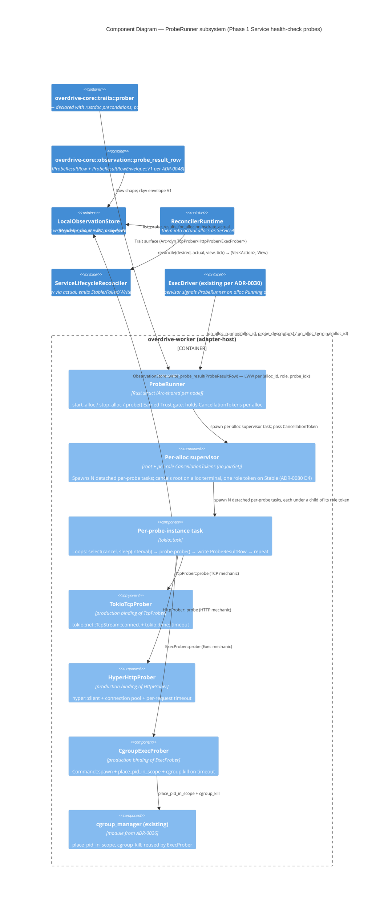
```mermaid
C4Component
  title Component Diagram — ProbeRunner subsystem (Phase 1 Service health-check probes)

  Container_Boundary(worker, "overdrive-worker (adapter-host)") {
    Component(runner, "ProbeRunner", "Rust struct (Arc-shared per node)", "start_alloc / stop_alloc / probe() Earned Trust gate; holds CancellationTokens per alloc")
    Component(supervisor, "Per-alloc supervisor", "root + per-role CancellationTokens (no JoinSet)", "Spawns N detached per-probe tasks; cancels root on alloc terminal, one role token on Stable (ADR-0080 D4)")
    Component(probe_task, "Per-probe-instance task", "tokio::task", "Loops: select(cancel, sleep(interval)) → probe.probe() → write ProbeResultRow → repeat")
    Component(tcp_prober, "TokioTcpProber", "production binding of TcpProber", "tokio::net::TcpStream::connect + tokio::time::timeout")
    Component(http_prober, "HyperHttpProber", "production binding of HttpProber", "hyper::client + connection pool + per-request timeout")
    Component(exec_prober, "CgroupExecProber", "production binding of ExecProber", "Command::spawn + place_pid_in_scope + cgroup.kill on timeout")
    Component(cgmgr, "cgroup_manager (existing)", "module from ADR-0026", "place_pid_in_scope, cgroup_kill; reused by ExecProber")
  }

  Container(core_traits, "overdrive-core::traits::prober", "Three port traits — TcpProber / HttpProber / ExecProber — declared with rustdoc preconditions, postconditions, edge cases, invariants per development.md")
  Container(core_obs, "overdrive-core::observation::probe_result_row", "ProbeResultRow + ProbeResultRowEnvelope::V1 per ADR-0048")
  Container(obs_store, "LocalObservationStore", "redb-backed; write_probe_result + list_probe_results_for_alloc")
  Container(reconciler_runtime, "ReconcilerRuntime", "Reads probe_results on hydrate_actual; projects them into actual.allocs as ServiceAllocFact.latest_startup/readiness/liveness_probe")
  Container(service_reconciler, "ServiceLifecycleReconciler", "Pure sync reconcile; consumes ProbeResultRow via actual; emits Stable/Failed/WriteServiceBackendRow/RestartAllocation Actions")
  Container(exec_driver, "ExecDriver (existing per ADR-0030)", "Per-alloc supervisor signals ProbeRunner on alloc Running and terminal")

  Rel(exec_driver, runner, "on_alloc_running(alloc_id, probe_descriptors) / on_alloc_terminal(alloc_id)")
  Rel(runner, supervisor, "spawn per-alloc supervisor task; pass CancellationToken")
  Rel(supervisor, probe_task, "spawn N detached per-probe tasks, each under a child of its role token")
  Rel(probe_task, tcp_prober, "TcpProber::probe (TCP mechanic)")
  Rel(probe_task, http_prober, "HttpProber::probe (HTTP mechanic)")
  Rel(probe_task, exec_prober, "ExecProber::probe (Exec mechanic)")
  Rel(exec_prober, cgmgr, "place_pid_in_scope + cgroup_kill")
  Rel(probe_task, obs_store, "ObservationStore::write_probe_result(ProbeResultRow) — LWW per (alloc_id, role, probe_idx)")
  Rel(reconciler_runtime, obs_store, "list_probe_results_for_alloc on hydrate_actual")
  Rel(reconciler_runtime, service_reconciler, "reconcile(desired, actual, view, tick) → (Vec<Action>, View)")
  Rel(core_traits, runner, "Trait surface (Arc<dyn TcpProber/HttpProber/ExecProber>)")
  Rel(core_obs, obs_store, "Row shape; rkyv envelope V1")
```

### 87. Updated handoff annotations — service-health-check-probes

To DEVOPS (platform-architect, parallel with DISTILL):

- New CI integration tests gated on `integration-tests` feature:
  - `cargo xtask lima run -- cargo nextest run -p overdrive-cli --features integration-tests -E 'test(service_honest_stable)'` — K1 100-trial regression test for RCA-A closure
  - `cargo xtask lima run -- cargo nextest run -p overdrive-control-plane --features integration-tests -E 'test(readiness_flips_backend_healthy)'` — K2
  - `cargo xtask lima run -- cargo nextest run -p overdrive-control-plane --features integration-tests -E 'test(liveness_threshold_triggers_restart)'` — K3
  - `cargo xtask lima run -- cargo nextest run -p overdrive-cli --features integration-tests -E 'test(render_probes_section)'` — K4
  - `cargo xtask lima run -- cargo nextest run -p overdrive-core --features integration-tests -E 'test(reject_probes_on_job_schedule)'` — K5
  - `cargo xtask lima run -- cargo nextest run -p overdrive-worker --features integration-tests -E 'test(exec_prober_cgroup_membership)'` — ADR-0059 Tier 3
- New schema-evolution fixture file:
  `crates/overdrive-core/tests/schema_evolution/probe_result_row.rs`
  pinning `ProbeResultRowEnvelope::V1` archived bytes
- `ServiceSpecEnvelope::V2` fixture: `FIXTURE_V1` untouched;
  new `FIXTURE_V2_FORWARD_ROUNDTRIP` test
- New OpenAPI schemas: `ProbeResultRowJson`,
  `ProbeWitnessWire`, `ServiceFailureReasonWire`,
  `ServiceSubmitEvent::Stable`, `ServiceSubmitEvent::Failed` —
  all `utoipa::ToSchema` derives; `cargo openapi-check` rerun
- DST invariant additions: `ProbeRunnerCleanCancellation`
  (cancel token → all per-probe tasks drop within 1s);
  `ServiceLifecycleStableIsDeduplicated` (multiple ticks after
  Stable do NOT re-emit deciding action);
  `ProbeResultRowIsLww` (latest write per
  `(alloc_id, role, probe_idx)` wins; no append-mode)
- **K2a — ProbeRunner memory footprint guardrail (regression-only,
  not a leading KPI).** K2 above measures CPU only (≤ 0.5 % per
  Service-alloc-with-3-probes); it does not catch growth in
  per-probe HTTP-client connection-pool memory. On a 10-alloc node
  × 3 HTTP probes (≈ 30 simultaneous pool entries) the footprint
  could grow to ~ 10 MB without surfacing in the CPU number.
  Steady-state RSS attributable to `ProbeRunner` per
  Service-alloc-with-3-HTTP-probes ≤ 1 MB at the 99th percentile.
  Measurement: `cargo xtask lima run -- cargo xtask
  integration-test vm` with the K2 fixture extended to 10 allocs
  × 3 HTTP probes; measure `/proc/self/status:VmRSS` delta between
  baseline (no probes declared) and probe-runner-active
  steady-state after 60 s. Captured as a regression guardrail
  rather than a leading KPI because `hyper-util`'s connection-pool
  sizing is hard to predict pre-implementation; the K2a number is
  a regression line, not a design target. The DEVOPS instrumentation
  surface owns the gating wiring (CI failure shape, baseline
  storage, trend tracking).

External integrations in this feature: **none**. The HTTP probes
target operator-declared local endpoints (the workload's own
listener); they are not third-party services. No contract tests
recommended.

New crate workspace dependencies (lockstep with DELIVER):

- `hyper-util` ~ 0.1.x (HTTP client connection pool for
  `HyperHttpProber`); already in workspace graph via
  `axum` transitive
- `tokio-util` ~ 0.7.x (`CancellationToken`); already in
  workspace graph via `tokio` transitive

No new top-level dependencies. License audit: both are MIT
(`hyper-util`) and MIT (`tokio-util`); compliant with workspace OSS
policy.

---

## docs-platform website (overdrive.sh)

> **This section is architecturally INDEPENDENT of the Rust platform above.** It
> documents the overdrive.sh documentation / marketing / agent-discovery site —
> a greenfield TypeScript/Next.js application living in the `website/` subtree
> (DISCUSS D-DEC-1, C-5), OUTSIDE `crates/`, EXEMPT from the Rust crate-class /
> dst-lint / nextest / cargo-mutants gates. It shares no code, no runtime, and
> no deployment with the Rust control plane / dataplane; it consumes the Rust
> platform only as documentation *subject matter* (and only behaviour that is
> already implemented — DISCUSS C-6). Its quality gates are: typecheck, lint,
> build, a build-time one-index assertion (ADR-0058), and a deploy smoke test.
> Owner: Morgan (DESIGN wave for docs-platform, 2026-05-30). Paradigm:
> TypeScript / React / Next.js — the project-wide OOP paradigm line in CLAUDE.md
> governs Rust only and is NOT extended here.

The feature ships J-DOCS-001/002/003 (human evaluator finds answers; a coding
agent grounds itself via MCP; the maintainer prioritises from logged demand)
across 8 thin slices. Full DISCUSS detail:
`docs/feature/docs-platform/feature-delta.md`; the cross-feature journey:
`docs/product/journeys/docs-platform.yaml`.

### The strategic invariant — one index, multiple consumers (C-4)

Everything in this architecture is organised around DISCUSS C-4: there is ONE
build-time content index (`source.getPages()`) and ONE LLM-text primitive
(`getLLMText`), and every surface that searches or exports docs is a *consumer*
of those two, never a re-builder. The browser search dialog, the MCP
`search_docs` tool, the `llms.txt`/`llms-full.txt`/per-page `.md` exports, and
the blog all read the same index. Divergence between what a human searches and
what an agent searches is an integration failure. Three design moves make the
invariant structural rather than aspirational:

- **One Worker, one in-process index** (ADR-0055): the MCP handler is a route
  in the same Worker as `/api/search` and the exports — they literally import
  the same module graph, so there is no second index to drift.
- **One query seam** `lib/search.ts` (ADR-0057): `/api/search` and MCP
  `search_docs` both call `searchIndex(query)`; one ranking path.
- **One LLM-text primitive** `lib/get-llm-text.ts` (`getLLMText`): MCP
  `get_doc`, per-page `.md`, and `llms-full.txt` all call it; `get_doc` output
  is byte-identical to the `.md` export (US-05 AC).
- **A build-time assertion** (ADR-0058) probes the invariant on every build:
  every page has a reachable `.md`, appears in `llms.txt`, and is in the search
  index; blog posts are in the same index.

### Component decomposition (one container: the OpenNext Worker)

This is a **modular monolith** — one Next.js application, one OpenNext-built
Cloudflare Worker, internal boundaries enforced by the shared seams
(ports-and-adapters-equivalent). Team ≪ 10, time-to-market and no-divergence are
the driving quality attributes; microservices / a second Worker were rejected
(ADR-0055 Alternative A). Node runtime everywhere; never `runtime = 'edge'`
(C-2). SSG / build-time content; no runtime `fs` (C-3); no R2 ISR cache binding
(SSG — research § Decision); `next/image` → `unoptimized` (D-G).

| Component | Path (`website/`) | Change type |
|---|---|---|
| Next config + MDX plugin | `next.config.*` (`createMDX()` from `fumadocs-mdx/next`) | USE library primitive |
| Content source (the ONE index) | `lib/source.ts` (`loader()` over the Next-emitted source) | USE library primitive |
| Search seam | `lib/search.ts` (`searchIndex(query)` over `createFromSource`) | **CREATE-NEW glue** |
| LLM-text primitive | `lib/get-llm-text.ts` (`getLLMText`) | **CREATE-NEW glue** (thin wrapper over `getText('processed')`) |
| Site-origin config | `lib/site.ts` (`SITE_ORIGIN`) | **CREATE-NEW glue** (D-F) |
| Shared nav shell | `lib/layout.shared.tsx` (`baseOptions()`) | USE library primitive (one instance) |
| Landing (`/`) | `app/(home)/page.tsx` (`HomeLayout`, content from `index.html`) | **CREATE-NEW glue** (content port) |
| Docs (`/docs/[[...slug]]`) | `app/docs/[[...slug]]/page.tsx` (`DocsLayout`) | USE library primitive |
| Blog list + post | `app/(home)/blog/page.tsx`, `app/(home)/blog/[slug]/page.tsx` | **CREATE-NEW glue** (no turnkey blog layout) |
| Search API | `app/api/search/route.ts` (`export const { GET } = createFromSource(source)`) | USE library primitive (calls seam) |
| MCP endpoint | `app/mcp/route.ts` (stateless Streamable HTTP) | **CREATE-NEW glue** (handler + zod tool schemas) |
| Tool-call logging wrapper | inside `app/mcp/route.ts` (`ctx.waitUntil()` + catch-swallow → D1) | **CREATE-NEW glue** |
| llms exports | `app/llms.txt/route.ts`, `app/llms-full.txt/route.ts`, per-page `.md` route | USE library primitive (calls `getLLMText`) |
| One-index assertion | `scripts/assert-one-index.ts` (build step) | **CREATE-NEW glue** (ADR-0058) |
| Content (authored) | `content/docs/`, `content/blog/` | content (not repo-root `docs/`) — D-G |

### Driving ports (inbound HTTP surface)

| Port | Serves | Story |
|---|---|---|
| `GET /` | Landing (`HomeLayout`, value prop) | US-08 |
| `GET /docs/[[...slug]]` | Docs pages (sidebar + TOC) | US-01, US-02 |
| `GET /blog`, `GET /blog/[slug]` | Blog list + post | US-07 |
| `GET /api/search` | Browser search (Cmd+K dialog backend) | US-03 |
| `POST/GET /mcp` | MCP Streamable HTTP (`search_docs`, `get_doc`) | US-05, US-06 |
| `GET /llms.txt` | Doc-URL index | US-04 |
| `GET /llms-full.txt` | Full corpus as clean markdown | US-04 |
| `GET /docs/<page>.md` | Per-page clean markdown | US-04 |

### Driven ports / seams (outbound + shared)

| Driven port / seam | Adapter | Purpose |
|---|---|---|
| `source` (one build-time index) | `lib/source.ts` over Fumadocs `loader()` | C-4 SSOT; consumed by search, MCP, llms, blog |
| `searchIndex(query)` | `lib/search.ts` over in-Worker Orama (`createFromSource`) | one query path for `/api/search` + MCP `search_docs` (ADR-0057) |
| `getLLMText(page)` | `lib/get-llm-text.ts` over `getText('processed')` | one text path for `get_doc` + `.md` + `llms-full.txt` |
| `SITE_ORIGIN` | `lib/site.ts` constant | absolute URLs for llms.txt, MCP `get_doc`, canonical/OG (D-F) |
| analytics sink | D1 binding (`tool_calls` table) via `wrangler.jsonc` | best-effort tool-call log (ADR-0056) |
| RUM / funnel analytics | Cloudflare Web Analytics (page-view) | KPI-1/2/6 approximation (D-D) |

### Technology stack (pinned)

OSS-first; every primary dependency is permissively licensed.

| Technology | Version | License | Role |
|---|---|---|---|
| Next.js | 15 (latest minor) or 16 | MIT | App Router / RSC framework (research: Next 14 dropped Q1 2026) |
| Fumadocs (`fumadocs-core` / `fumadocs-ui`) | v16 | MIT | docs framework (layout, page tree, search, llms, MDX source) |
| `fumadocs-mdx` | v16-compatible | MIT | build-time MDX compilation (`createMDX()` Next plugin) |
| Orama | (Fumadocs-bundled) | Apache-2.0 | in-Worker search engine (`createFromSource`) |
| `@opennextjs/cloudflare` (OpenNext) | current | MIT | Next → Cloudflare Workers adapter |
| Cloudflare Workers runtime | — | (platform) | Node runtime, 128 MB isolate, 3 MiB/10 MiB bundle ceiling |
| Cloudflare D1 | — | (platform) | analytics sink (ADR-0056) |
| Cloudflare Web Analytics | — | (platform) | RUM page-view funnels (D-D) |
| MCP TypeScript SDK (`@modelcontextprotocol/sdk`) | current | MIT | MCP server transport / tool registration |
| Cloudflare Agents SDK (`createMcpHandler()`) | current | MIT/Apache-2.0 | OPTIONAL inside the MCP route (implementation latitude — ADR-0055) |
| `zod` | current | MIT | MCP tool input schemas |
| React | 19 (Next-pinned) | MIT | UI runtime |
| TypeScript | 5.x | Apache-2.0 | language |

### Decisions table (DDD)

| ID | Decision | Verdict | Rationale (one line) | ADR |
|---|---|---|---|---|
| DDD-1 | Modular monolith — one Next app / one OpenNext Worker | ACCEPT | team ≪ 10; no-divergence + time-to-market; microservices unjustified | ADR-0055 |
| DDD-2 | MCP topology = same-Worker Next route handler | ACCEPT | strongest C-4 no-divergence guarantee; one in-process index | ADR-0055 |
| DDD-3 | Analytics binding = D1 (real SQL) | ACCEPT | top-zero-result query = one `SELECT … GROUP BY` | ADR-0056 |
| DDD-4 | Tool-call logging = best-effort (`ctx.waitUntil` + catch-swallow) | ACCEPT | C-7 — logging never alters/delays the tool response | ADR-0056 |
| DDD-5 | Search = in-Worker Orama now, behind `lib/search.ts` seam | ACCEPT | simplest viable for launch corpus; one query path; single-file external swap | ADR-0057 |
| DDD-6 | External-search migration trigger (benchmarked) | THRESHOLD | >~5k pages OR ~60–70 MB of 128 MB isolate — inference, benchmark first | ADR-0057 |
| DDD-7 | Browser KPIs = page-view funnel approximation (CF Web Analytics) | ACCEPT | KPI-2/6 explicitly approximated; no custom-event beacon, no 9th slice | (D-D) |
| DDD-8 | OpenAPI playground (`fumadocs-openapi`) | OUT OF SCOPE | user non-goal; Next/RSC path keeps it addable later with zero rework | (D-E) |
| DDD-9 | `SITE_ORIGIN` single config constant | ACCEPT | one flip `workers.dev` → `overdrive.sh`; DNS/binding is DEVOPS | (D-F) |
| DDD-10 | `website/` App Router layout; content in `content/docs|blog/` | ACCEPT | not repo-root `docs/` (whitepaper/ADR tree); C-6 — site ≠ internal-design mirror | (D-G) |
| DDD-11 | One-index build-time assertion | ACCEPT | C-4 made structural; enforceable rule + Earned-Trust probe | ADR-0058 |

### C4 — System Context (Level 1)

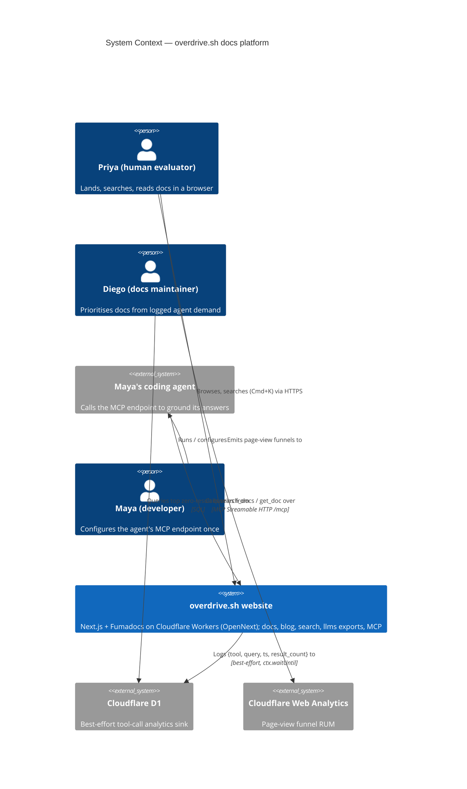
```mermaid
C4Context
  title System Context — overdrive.sh docs platform
  Person(priya, "Priya (human evaluator)", "Lands, searches, reads docs in a browser")
  Person(diego, "Diego (docs maintainer)", "Prioritises docs from logged agent demand")
  System_Ext(agent, "Maya's coding agent", "Calls the MCP endpoint to ground its answers")
  Person(maya, "Maya (developer)", "Configures the agent's MCP endpoint once")

  System(site, "overdrive.sh website", "Next.js + Fumadocs on Cloudflare Workers (OpenNext); docs, blog, search, llms exports, MCP")

  System_Ext(d1, "Cloudflare D1", "Best-effort tool-call analytics sink")
  System_Ext(rum, "Cloudflare Web Analytics", "Page-view funnel RUM")

  Rel(priya, site, "Browses, searches (Cmd+K) via HTTPS")
  Rel(maya, agent, "Runs / configures")
  Rel(agent, site, "Calls search_docs / get_doc over", "MCP Streamable HTTP /mcp")
  Rel(site, d1, "Logs {tool, query, ts, result_count} to", "best-effort, ctx.waitUntil")
  Rel(diego, d1, "Queries top zero-result queries from", "SQL")
  Rel(priya, rum, "Emits page-view funnels to")
  UpdateRelStyle(site, d1, $offsetY="-10")
```

### C4 — Container (Level 2)

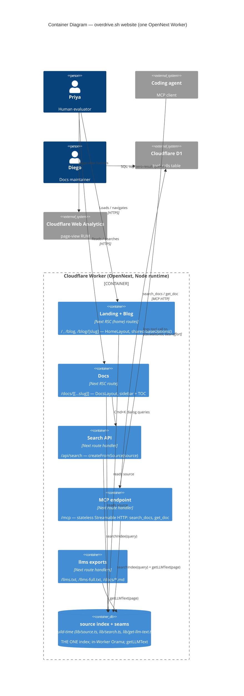
```mermaid
C4Container
  title Container Diagram — overdrive.sh website (one OpenNext Worker)
  Person(priya, "Priya", "Human evaluator")
  System_Ext(agent, "Coding agent", "MCP client")
  Person(diego, "Diego", "Docs maintainer")

  Container_Boundary(worker, "Cloudflare Worker (OpenNext, Node runtime)") {
    Container(landing, "Landing + Blog", "Next RSC (home) routes", "/ , /blog, /blog/[slug] — HomeLayout, shared baseOptions()")
    Container(docs, "Docs", "Next RSC route", "/docs/[[...slug]] — DocsLayout, sidebar + TOC")
    Container(searchapi, "Search API", "Next route handler", "/api/search — createFromSource(source)")
    Container(mcp, "MCP endpoint", "Next route handler", "/mcp — stateless Streamable HTTP: search_docs, get_doc")
    Container(llms, "llms exports", "Next route handlers", "/llms.txt, /llms-full.txt, /docs/*.md")
    ContainerDb(index, "source index + seams", "build-time (lib/source.ts, lib/search.ts, lib/get-llm-text.ts)", "THE ONE index; in-Worker Orama; getLLMText")
  }

  System_Ext(d1, "Cloudflare D1", "tool_calls table")
  System_Ext(rum, "Cloudflare Web Analytics", "page-view RUM")

  Rel(priya, landing, "Loads / navigates", "HTTPS")
  Rel(priya, docs, "Reads / searches", "HTTPS")
  Rel(docs, searchapi, "Cmd+K dialog queries")
  Rel(agent, mcp, "search_docs / get_doc", "MCP HTTP")
  Rel(searchapi, index, "searchIndex(query)")
  Rel(mcp, index, "searchIndex(query) + getLLMText(page)")
  Rel(llms, index, "getLLMText(page)")
  Rel(landing, index, "reads source")
  Rel(docs, index, "reads source")
  Rel(mcp, d1, "logs tool call to", "ctx.waitUntil, best-effort")
  Rel(diego, d1, "SQL: top zero-result queries")
  Rel(priya, rum, "page-view funnels")
```

### C4 — Component (Level 3): MCP + search + index subsystem (the C-4 invariant)

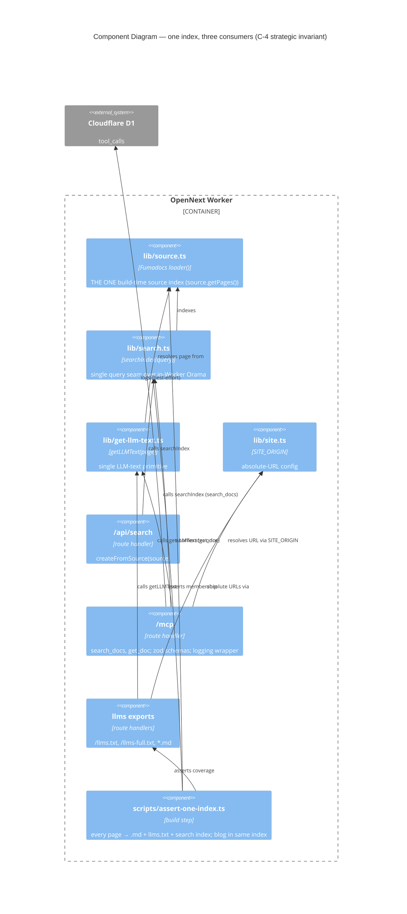
```mermaid
C4Component
  title Component Diagram — one index, three consumers (C-4 strategic invariant)
  Container_Boundary(b, "OpenNext Worker") {
    Component(source, "lib/source.ts", "Fumadocs loader()", "THE ONE build-time source index (source.getPages())")
    Component(search, "lib/search.ts", "searchIndex(query)", "single query seam over in-Worker Orama")
    Component(llmtext, "lib/get-llm-text.ts", "getLLMText(page)", "single LLM-text primitive")
    Component(site, "lib/site.ts", "SITE_ORIGIN", "absolute-URL config")

    Component(searchapi, "/api/search", "route handler", "createFromSource(source)")
    Component(mcp, "/mcp", "route handler", "search_docs, get_doc; zod schemas; logging wrapper")
    Component(llms, "llms exports", "route handlers", "/llms.txt, /llms-full.txt, *.md")
    Component(assert, "scripts/assert-one-index.ts", "build step", "every page → .md + llms.txt + search index; blog in same index")
  }
  System_Ext(d1, "Cloudflare D1", "tool_calls")

  Rel(search, source, "indexes")
  Rel(llmtext, source, "resolves page from")
  Rel(searchapi, search, "calls searchIndex")
  Rel(mcp, search, "calls searchIndex (search_docs)")
  Rel(mcp, llmtext, "calls getLLMText (get_doc)")
  Rel(mcp, site, "resolves URL via SITE_ORIGIN")
  Rel(llms, llmtext, "calls getLLMText")
  Rel(llms, site, "absolute URLs via")
  Rel(mcp, d1, "logs (best-effort)")
  Rel(assert, source, "enumerates once")
  Rel(assert, search, "asserts membership")
  Rel(assert, llms, "asserts coverage")
```

### Reuse Analysis (HARD GATE — library-primitive USE vs CREATE-NEW glue)

The Fumadocs + Next + OpenNext + Orama + MCP-SDK stack supplies the overwhelming
majority of the surface as **library primitives used as documented**. The only
**CREATE-NEW glue** is the application-specific wiring that the libraries cannot
supply because it encodes *our* invariants (C-4, C-7) and *our* content.

| Capability | Verdict | What / why |
|---|---|---|
| MDX build pipeline | USE | `createMDX()` from `fumadocs-mdx/next` — documented Next plugin |
| Content source / one index | USE | `loader()` / `source.getPages()` — framework-agnostic core |
| Docs layout + nav + TOC | USE | `DocsLayout`, page tree, `meta.json` ordering |
| Shared nav shell | USE | one `baseOptions()` instance (the `baseOptions_shell` invariant) |
| Search engine + `/api/search` | USE | in-Worker Orama via `createFromSource(source)` (documented Next default) |
| llms.txt / llms-full.txt / per-page `.md` | USE | `llms(source).index()` + `getText('processed')` — documented |
| Cmd+K search dialog | USE | Fumadocs default `RootProvider search` dialog (fetch client) |
| MCP transport / tool registration | USE | MCP TS SDK (or CF `createMcpHandler()`) — Streamable HTTP |
| Deploy to Workers | USE | `@opennextjs/cloudflare` scaffold (`npm create cloudflare … --framework=next`) |
| **MCP route handler + tool schemas** | **CREATE-NEW** | the `/mcp` handler body + zod `search_docs`/`get_doc` schemas + not-found honesty |
| **D1 logging wrapper** | **CREATE-NEW** | `ctx.waitUntil()` + catch-swallow best-effort write (C-7) |
| **`lib/search.ts` seam** | **CREATE-NEW** | one `searchIndex(query)` for both consumers (C-4) |
| **`lib/get-llm-text.ts` seam** | **CREATE-NEW** | thin wrapper pinning `getLLMText` as the one text path |
| **`lib/site.ts` seam** | **CREATE-NEW** | `SITE_ORIGIN` config constant (D-F) |
| **Blog list / post components** | **CREATE-NEW** | no turnkey Fumadocs blog layout (hand-rolled, documented Next components) |
| **Landing content port** | **CREATE-NEW** | `HomeLayout` page seeded from `index.html` |
| **One-index assertion script** | **CREATE-NEW** | build-time C-4 enforcement (ADR-0058) |

No CREATE-NEW item re-implements a library primitive; each encodes an
application invariant or our content. No proprietary dependency; the only
non-OSS elements are the Cloudflare *platform* bindings (Workers/D1/Web
Analytics), which are the chosen deployment target, not a library choice.

### Quality attributes (ISO 25010 mapping)

- **Functional suitability / reliability**: the one-index assertion (ADR-0058)
  + deploy smoke test (US-01) are the build-time correctness gate; SSG means
  every page is a static asset (no runtime `fs`, no per-request compute for
  docs).
- **Performance efficiency**: SSG static serving; in-Worker Orama is single-MB
  for the launch corpus; the 128 MB isolate and 3/10 MiB bundle ceilings are
  the watched budgets (C-8, ADR-0057 trigger).
- **Maintainability / testability**: ports-and-adapters-equivalent seams
  (`lib/search.ts`, `lib/get-llm-text.ts`, `lib/site.ts`) isolate the swappable
  infrastructure; the external-search migration is a single-file change.
- **Security**: stateless MCP (no session state to leak); best-effort logging
  cannot be weaponised to break the answer path; no auth surface in scope
  (public docs).
- **Reliability of the analytics loop**: deliberately lossy-under-failure (C-7)
  — the maintainer reads trends, not an audit ledger.

### Open questions / handoff notes

- **Custom-domain wiring** (`overdrive.sh` DNS + Workers binding) is
  **DEVOPS-wave** — the skeleton uses `workers.dev`; production flips the single
  `SITE_ORIGIN` constant (D-F). Not a deferral-with-forward-pointer; a one-flip
  config property.
- **External-search migration trigger** numbers (>~5k pages / ~60–70 MB) are
  **inference to be benchmarked** against the real corpus before being treated
  as committed (ADR-0057). Carried to DEVOPS/DISTILL as a measurement task.
- **KPI-2 (search→click) and KPI-6 (landing→proceed)** are explicitly
  **approximated from page-view funnels** at baseline (D-D); no custom-event
  beacon is in scope.
- **DEVOPS handoff (external integrations)**: at launch there are no third-party
  external API integrations to contract-test. IF/WHEN the ADR-0057 external-
  search migration is taken, Orama Cloud / Algolia become external integrations
  warranting consumer-driven contract tests (Pact-JS) on the build-time `sync()`
  boundary — flagged for that future wave, not needed now.

---

## UDP service support extension (GH #163, ADR-0060)

**Source:** `docs/feature/udp-service-support/` (DISCUSS approved; DESIGN
2026-06-02). **ADR:** ADR-0060. Extends the Phase 2.2 XDP service-map
subsection above.

### Problem this extension closes

The shipped `Dataplane::update_service(vip: Ipv4Addr, backends)`
(`crates/overdrive-core/src/traits/dataplane.rs:101`, option C) carries no
L4 protocol. The kernel-side reverse-NAT key is
`BackendKey { ip, port, proto }`, so without a protocol on the boundary the
production `EbpfDataplane` installs only TCP REVERSE_NAT entries — UDP
backend responses hit `xdp_reverse_nat_lookup` with proto=17, miss, and
return `XDP_PASS` un-rewritten (GH #163). Meanwhile the `SimDataplane` over-
installs both protos (`reverse_nat_keys_for` hardcodes `[Tcp, Udp]`,
`overdrive-sim/src/adapters/dataplane.rs:277`), and the two adapters were
never compared.

### `ServiceFrontend` trait surface

The dataplane boundary gains a typed per-service L4 frontend:

```rust
async fn update_service(
    &self,
    frontend: ServiceFrontend,   // (ServiceVip [V4-by-construction], NonZeroU16 port, Proto)
    backends: Vec<Backend>,
) -> Result<(), DataplaneError>;
```

`ServiceFrontend` is a new newtype in
`crates/overdrive-core/src/dataplane/service_frontend.rs` (sibling of
`backend_key.rs`), derives `Debug, Clone, Copy, PartialEq, Eq` only (not
wire, not persisted). Its embedded `ServiceVip` is **IPv4-guaranteed by
construction** via a fallible `ServiceFrontend::new(vip, port, proto)` that
validates at the action-shim — the existing operator-visible IPv6-rejection
site (`action_shim/dataplane_update_service.rs:160`,
`ServiceHydrationStatus::Failed`). Adapters narrow `IpAddr → Ipv4Addr`
infallibly via `vip_v4()`. Contract: after `Ok(())`, the adapter's
REVERSE_NAT set **for `frontend.proto`** equals the keys derived from
`backends`; other protos of the same VIP are untouched; empty `backends`
purges **only** `frontend.proto`'s keys (per-proto purge). Full contract in
ADR-0060.

### True blast radius (US-01, single-cut per C6)

The DISCUSS "5 sites / hydrator unchanged" claim is corrected: protocol is
plumbed **end-to-end** (C3 — never defaulted to `Tcp`), so the Action and
the desired projection also gain the protocol dimension. Eight sites:

| # | Site | Path | Change |
|---|------|------|--------|
| 1 | `Dataplane::update_service` | `overdrive-core/src/traits/dataplane.rs:101` | `(frontend, backends)` |
| 2 | `ServiceFrontend` | `overdrive-core/src/dataplane/service_frontend.rs` | **CREATE NEW** |
| 3 | `SimDataplane` + `reverse_nat_keys_for` | `overdrive-sim/src/adapters/dataplane.rs:266,289` | narrow `[Tcp,Udp]`→`frontend.proto` |
| 4 | `EbpfDataplane::update_service` | `overdrive-dataplane/src/lib.rs` | consume frontend; Step 4b proto fan-out (US-02) |
| 5 | action-shim dispatch | `action_shim/dataplane_update_service.rs:100,130,160` | build `ServiceFrontend` (IPv6-reject site); call with frontend |
| 6 | `ReverseNatLockstep` | `overdrive-sim/src/invariants/reverse_nat_lockstep.rs` | per-proto set assertion |
| 7 | **`Action::DataplaneUpdateService`** | `overdrive-core/src/reconcilers/mod.rs:440` | **+ protocol dimension** |
| 8 | **`ServiceDesired` + obs→desired projection** | `overdrive-core/src/reconcilers/service_map_hydrator.rs:40,235,263` | **+ protocol dimension** sourced from a listener-bearing fact (`ListenerRow` / `BackendDiscoveryBridge` per-listener projection), **NOT** `service_backends` (carries no port/proto); proto MUST resolve from a listener fact — never a silent `Proto::Tcp` default (C3) |

The site #8 protocol dimension is sourced from a listener-bearing fact —
`ListenerRow` (`overdrive-core/src/traits/observation_store.rs:321`) and/or
the `BackendDiscoveryBridge` per-listener projection
(`overdrive-control-plane/src/reconciler_runtime.rs:2569`, keyed
`ServiceId::derive(vip, port, "service-map")`) — **never** `service_backends`
(`ServiceBackendRowV1`, `observation_store.rs:875`), which carries neither
port nor proto. An unresolvable listener proto is a structured error, never a
silent `Proto::Tcp` default (C3). See ADR-0060 § "True blast radius" site #8.

`service_id` and `correlation` stay on the `Action::DataplaneUpdateService`
envelope (action-routing, not a dataplane key) — they are **not** folded
into `ServiceFrontend`.

### Enforcement — three-tier `ReverseNatLockstep` gate

Sim≡Ebpf REVERSE_NAT equality is the DST-equivalence guard (no single-
process two-adapter DST — the real adapter needs a kernel + bpffs):

- **Tier 1** (`cargo dst`, per-PR critical path): Sim installs exactly the
  declared-`frontend.proto` `BTreeSet<BackendKey>`.
- **Tier 2** (`cargo xtask bpf-unit`): `BPF_PROG_TEST_RUN` triptych —
  `xdp_reverse_nat_lookup` rewrites a proto=17 response source to the VIP.
- **Tier 3** (`cargo xtask lima run`, `integration-tests`): real Ebpf —
  `bpftool map dump REVERSE_NAT_MAP` shows `(ip,port,udp)` + VIP-source wire
  capture.

### Forward pointer — US-05 per-listener fan-out

Multi-listener (TCP+UDP on one VIP) emits one `update_service` per
`Listener` from the `ServiceMapHydrator`. The `SERVICE_MAP` forward-key
granularity (VIP-only per `validate.rs:218` vs `(VIP, port)` per phase-2
architecture.md § 5 Drift-3) is a known disagreement deferred to US-05
DESIGN to reconcile — it does not affect the REVERSE_NAT (#163) surface.
No new endianness discipline (`Proto` is a single IANA byte; § 11 governs
ip/port only).

---

## Unconnected-UDP sendmsg4 extension (GH #200, ADR-0053 rev 2026-06-05)

**Source:** `docs/feature/unconnected-udp-sendmsg4/` (DISCUSS approved
2026-06-05; DESIGN 2026-06-05). **ADR:** ADR-0053 revision 2026-06-05.
Extends the same-host cgroup path (ADR-0053 Decision 1; the 2026-06-03
proto-keying revision). Delivers what Amendment 4 (2026-06-03) scoped
OUT and tracked as #200.

### Problem this extension closes

The shipped `cgroup_connect4_service` fires at `connect(2)` time only.
The dominant DNS-resolver idiom (`dig`, glibc `getaddrinfo`, musl) is
**unconnected** — `sendto(VIP)` per query, never `connect()`. So a
same-host UDP service is reachable today only by clients that connect
first; most do not. The datagram is never intercepted, `LOCAL_BACKEND_MAP`
is never consulted, and the VIP→backend rewrite never happens — a
half-working service (healthy upstream, unreachable client).

### What lands

Two new `cgroup_sock_addr` hooks on the same `cgroup_attach_path`:

- **`cgroup/sendmsg4`** (`cgroup_sendmsg4_service`) — forward: rewrites
  the unconnected request destination VIP→backend over the existing
  `LOCAL_BACKEND_MAP[(vip, vip_port, proto)]`. Per-datagram analogue of
  connect4's per-connect rewrite.
- **`cgroup/recvmsg4`** (`cgroup_recvmsg4_service`) — reply: rewrites the
  reply *source* the app reads (`recvfrom`/`msg_name`) backend→VIP over a
  NEW `REVERSE_LOCAL_MAP`.

Plus the new reverse store and the dual-write that fills it:

- **`REVERSE_LOCAL_MAP`** — `BPF_MAP_TYPE_HASH`, key = the existing
  `BackendKey {ip, port, proto}` newtype (byte-parity with SERVICE_MAP /
  REVERSE_NAT / LOCAL_BACKEND_MAP), value = VIP `u32`. Written in
  **ordered (reverse-first)** sequence by the same `register_local_backend`
  call that writes `LOCAL_BACKEND_MAP` — two BPF map syscalls, not one
  transaction; the guarantee is ordering, not atomicity (no new trait
  method; the trait contract is amended so observers never see a forward
  entry without its reverse). `deregister_local_backend` removes both.
  NOT a reverse scan, NOT conntrack (UDP is stateless).

### The recvmsg4 cannot-deny finding (load-bearing)

Per `docs/research/dataplane/recvmsg4-reply-source-rewrite-and-miss-semantics-research.md`
(Nova, High confidence): the kernel verifier restricts
`BPF_CGROUP_UDP4_RECVMSG` to a return-value range of exactly `[1,1]` — a
program returning 0 is **rejected at load time**. So "drop on miss" is
impossible at any layer. recvmsg4 attaches at a cgroup **ancestor** and
fires on **every** unconnected-UDP recv from any descendant, so the
`REVERSE_LOCAL_MAP` lookup IS the "this is a service reply"
discriminator. On a **HIT** (source is a registered backend → a service
reply) recvmsg4 rewrites the reply source `backend → VIP`; on a **MISS**
(not a service reply — a backend's own inbound-query `recvfrom`, any
unrelated same-host UDP) recvmsg4 performs a **pure no-op** — it leaves
the real source intact and bumps `REVERSE_LOCAL_MISS_COUNTER` for
observability only. This is **Cilium-aligned** (`cil_sock4_recvmsg`
returns `SYS_PROCEED` and leaves the source unchanged on a reverse-SK
miss). The K5 no-leak guarantee is preserved by the **reverse-first
dual-write** (every registered backend has a visible reverse entry
before its forward entry is usable, so a genuine service reply ALWAYS
hits → always VIP-rewritten), NOT by a miss-path sentinel. A source
rewrite on a miss would corrupt every non-service datagram's sender
address (observed and fixed in DELIVER step 01-03 — back-prop finding
UI-1; ADR-0053 D3 sub-revision 2026-06-05b corrects the earlier
"sentinel on miss" decision).

### Layer boundary — application sockaddr, NOT wire

recvmsg4 fires inside `udp_recvmsg()` AFTER the kernel populated the
source sockaddr from the backend's skb; a `tcpdump -i lo` sees the
backend-sourced reply on every round-trip regardless of the hook.
recvmsg4's domain is the **application sockaddr** (`recvfrom`/`msg_name`)
only. Wire-level no-leak is XDP's concern (the out-of-scope
connected/remote REVERSE_NAT path), NOT recvmsg4's. The DISCUSS
US-01/US-03/K2/K5 ACs were reframed from wire (`tcpdump`, "left the
host") to application-sockaddr layer accordingly (see
`design/upstream-changes.md`).

### Shared key-build helper (Option 3 — refactors connect4)

Only the genuinely-shared primitive — **service-key construction +
`user_port` low-16-NBO handling** — is factored into ONE
`#[inline(always)]` kernel helper (`build_local_service_key`, the
`shared::sanity`/`shared::access` precedent) consumed by **all three**
hooks. The helper does **not** perform any map lookup or any rewrite:
the **map lookup differs per hook** (connect4 + sendmsg4 look up
`LOCAL_BACKEND_MAP`; recvmsg4 looks up `REVERSE_LOCAL_MAP`) and the
**rewrite direction differs per hook and stays in the per-hook program
body** (connect4/sendmsg4 do a forward DEST rewrite; recvmsg4 does a
reverse SOURCE rewrite). One helper MUST NOT serve both rewrite
directions. This **refactors shipped connect4** — its inline key-build /
NBO code is replaced by a call to the helper (its own lookup + forward
dest-rewrite stay in its body): behavior-preserving, **Tier-3-reverified**
(no Tier-2 backstop —
`BPF_PROG_TEST_RUN` returns ENOTSUPP for `cgroup_sock_addr` ≤ 6.8, so
the connect4 refactor's regression surface is Tier-3-only; honest risk).
This changes the DISCUSS "0 connect4 changes / pure addition" claim:
connect4 is now EXTEND (net-new behavior 0, diff non-zero).

### Probe extension and below-floor preflight

The Earned-Trust probe attaches sendmsg4 + recvmsg4 on the same
`cgroup_attach_path` and round-trips a `REVERSE_LOCAL_MAP` sentinel. The
**`attach()` syscall IS the below-floor preflight** — sendmsg4 (≥4.18)
and recvmsg4 (≥4.20) are both below the 5.10 floor, so a below-floor
host fails attach → structured `health.startup.refused`. NO `/proc` /
`uname` parsing (avoids the `unwrap_or_default` boundary-read footgun).
New `#[from]`-routed `DataplaneError`/`DataplaneBootError` variant(s),
never flattened to `Internal(String)`.

### SimDataplane reply mirror

`SimDataplane` gains a reply mirror `BTreeMap<BackendKey, Ipv4Addr>`
written under the SAME mutex acquisition as `local_backends` inside
`register_local_backend` (the `services`+`reverse_nat` lockstep idiom is
the template), plus a `reply_source_for(...)` test-only accessor so the
Tier-1 J-PLAT-004 equivalence invariant can assert "Sim reply source =
VIP." Models the observable contract only — does not shape production.

### Reuse posture

Only `REVERSE_LOCAL_MAP` (map + handle) and the two programs + shared
helper + miss counter are CREATE NEW. `BackendKey`, `Proto`,
`LOCAL_BACKEND_MAP`, `register_local_backend`, the hydrator classifier,
the action variants, `cgroup_attach_path` are all REUSE/EXTEND. Full
table in `feature-delta.md` § DESIGN.

### Shipped — Component Inventory (FINALIZE 2026-06-05)

All of "What lands" above is **SHIPPED** (DELIVER complete; 7 steps
01-01…03-02 all COMMIT/PASS; closes ADR-0053 OQ-3 / #200). Nothing in
this section is deferred-that-shipped. Evolution record:
`docs/evolution/2026-06-05-unconnected-udp-sendmsg4.md`.

| Component | Path | Disposition |
|---|---|---|
| `cgroup_sendmsg4_service` program | `crates/overdrive-bpf/src/programs/cgroup_sendmsg4_service.rs` | NEW |
| `cgroup_recvmsg4_service` program | `crates/overdrive-bpf/src/programs/cgroup_recvmsg4_service.rs` | NEW |
| `build_local_service_key` shared helper (key-build + NBO only) | `crates/overdrive-bpf/src/shared/build_local_service_key.rs` | NEW |
| `REVERSE_LOCAL_MAP` kernel map | `crates/overdrive-bpf/src/maps/reverse_local_map.rs` | NEW |
| `REVERSE_LOCAL_MISS_COUNTER` (`PERCPU_ARRAY`) | `crates/overdrive-bpf/src/maps/` | NEW |
| `ReverseLocalMapHandle` userspace handle | `crates/overdrive-dataplane/src/maps/reverse_local_map_handle.rs` | NEW |
| `cgroup_connect4_service` (key-build/NBO via shared helper) | `crates/overdrive-bpf/src/programs/cgroup_connect4_service.rs` | EXTEND (behavior-preserving) |
| `register_local_backend` reverse-first dual-write + amended contract | `crates/overdrive-core/src/traits/dataplane.rs`, `crates/overdrive-dataplane/src/lib.rs` | EXTEND (no new trait method) |
| `SimDataplane` reply mirror + `reply_source_for()` | `crates/overdrive-sim/src/adapters/dataplane.rs` | EXTEND |
| `reply_source_rewrite_lockstep` Tier-1 DST invariant | `crates/overdrive-sim/src/invariants/reply_source_rewrite_lockstep.rs` | NEW |
| `CgroupSendRecvAttach` / `ReverseLocalProbe` typed error variants (`#[from]`-routed → `health.startup.refused`) | `crates/overdrive-core/src/traits/dataplane.rs` | EXTEND |

> **`REVERSE_LOCAL_MISS_COUNTER` operational-semantics design note (for
> DEVOPS):** recvmsg4 fires on ALL subtree unconnected UDP, so the
> counter's absolute value is dominated by non-service traffic and is
> NOT a "service reply failed to translate" alarm. Whether to keep,
> demote, or replace it (e.g. a control-plane reconciler comparing
> forward-vs-reverse map cardinality) is a metric-semantics decision,
> recorded as a DESIGN NOTE (feature-delta § Open questions #1) — NOT a
> tracking issue. The no-op-on-miss behavior is correct regardless.

### Shipped — Component Inventory (FINALIZE 2026-06-11) — built-in-ca-operator-composition

The built-in CA composed into the operator binary: persistent KEK-sealed
workload-identity root booted in `overdrive serve`, near-expiry SVID rotation
as a reconciler action (#40), and the current issued-cert summary surfaced via
`overdrive workload describe` (#215). DELIVER complete (8 steps 01-01…03-03 all
COMMIT/PASS); closes the D-CA-4 "CA not wired into serve" deferral and folds
GH #40 + #215. Evolution record:
`docs/evolution/2026-06-11-built-in-ca-operator-composition.md`.

| Component | Path | Disposition |
|---|---|---|
| Near-expiry branch → unconditional rotate `Action::IssueSvid` (`"rotate-svid"`); rotation gate + workflow consts deleted | `crates/overdrive-core/src/reconcilers/svid_lifecycle.rs` | EXTEND (no new action variant) / DELETE (gate, single-cut) |
| `IssuanceOrdinal(u64)` monotonic issuance-rank newtype (current-cert selection key) | `crates/overdrive-core/src/id.rs` | NEW |
| `issuance_ordinal` field on `IssuedCertificateRowV1` (additive, in-place; `FIXTURE_V1` regenerated) | `crates/overdrive-core/src/ca/issued_certificate_row.rs` | EXTEND (additive V1 field, greenfield single-cut) |
| `boot_ca` + `bootstrap_node_intermediate` wired into `run_server` (single-cut replacing the ephemeral `RcgenCa` block) | `crates/overdrive-control-plane/src/lib.rs` | EXTEND (newly called) / DELETE (ephemeral block, single-cut) |
| Mandatory `ServerConfig.kek: Arc<dyn Kek>` injection seam (`Default` removed; `ServerConfig::new(kek)` added) | `crates/overdrive-control-plane/src/lib.rs` | EXTEND (new mandatory field) |
| `ControlPlaneError::CaBoot(#[from] CaBootError)` + exhaustive `to_response` arm | `crates/overdrive-control-plane/src/error.rs` | EXTEND (additive variant) |
| `IssuedCertSummary { serial, spiffe_id, issuer_serial, not_after }` + `AllocStatusResponse.issued_certificates` (skip-if-empty) | `crates/overdrive-control-plane/src/api.rs` | NEW (wire struct) / EXTEND (additive field) |
| `alloc_status` max-`issuance_ordinal` projection per running alloc; `issue_and_audit` stamps the ordinal | `crates/overdrive-control-plane/src/handlers.rs`, `src/ca_issuance.rs` | EXTEND |
| `SimKek::for_boot()` hermetic in-process `Kek` test double | `crates/overdrive-sim/src/adapters/kek.rs` | NEW (sim adapter) |
| `SystemdCredsKeyring::new()` composed at the CLI `serve` boundary; issued-cert section on `render::alloc_status` | `crates/overdrive-cli/src/commands/serve.rs`, `src/render.rs` | EXTEND |

> **The append-only precondition for the `len()`-derived issuance ordinal is
> load-bearing across a future phase (DESIGN NOTE for DEVOPS / Phase-5
> revocation):** the ordinal is monotonic only because `issued_certificates`
> rows are never deleted/overwritten/compacted. The first future work to add a
> delete path (Phase-5 revocation pruning, or audit-log GC) MUST re-source the
> ordinal (a persisted monotonic counter a delete cannot rewind). Tracked as
> [overdrive-sh/overdrive#226](https://github.com/overdrive-sh/overdrive/issues/226).

> **EDD status at finalize:** D01 (root key never plaintext at rest), O04
> (refuse-to-start, cause-distinct), and E03 (full chain verifies, 3 sub-claims)
> are `satisfied` (different-fox audited). O05 (issued-certificates audit row
> operator-visible) is `pending` — the behavior is implemented and
> integration-tested, but the black-box operator-CLI capture needs a disposable
> full-system VM ([#227](https://github.com/overdrive-sh/overdrive/issues/227)).

### Shipped — Component Inventory (FINALIZE 2026-06-16) — transparent-mtls-host-socket

Kernel-mediated **transparent mTLS** for host-socket mesh workloads (GH #26 /
J-SEC-003): the on-the-wire ENFORCEMENT peer that completes the mint (#28) →
hold (#35) → **enforce (#26)** chain. The workload holds nothing; a node-agent
agent-light L4 proxy (ADR-0069) terminates/originates TLS 1.3 on its own
peer-facing leg and hands steady state to the kernel (outbound
`cgroup_connect4` rewrite → kTLS-TX write_all forward + zero-copy splice return;
inbound nft-TPROXY + `IP_TRANSPARENT` → server-mTLS → kTLS-RX splice deliver).
Supervision is per-connection self-teardown (ADR-0070, central `MtlsSupervisor`
deleted). DELIVER complete (9 steps 01-01…06-03 all COMMIT/PASS); supersedes the
decomposed Phase-05 (D-MTLS-17). Evolution record:
`docs/evolution/2026-06-16-transparent-mtls-host-socket.md`.

| Component | Path | Disposition |
|---|---|---|
| `MtlsEnforcement` port (4 methods — probe/enforce/liveness/teardown; `enforce` dispatches on `Direction`; cause-distinct error variants; `PumpLiveness`) | `crates/overdrive-core/src/traits/mtls_enforcement.rs` | NEW |
| `HostMtlsEnforcement` adapter (handshake / kTLS arm / outbound / inbound / pumps / limits / supervision) | `crates/overdrive-dataplane/src/mtls/{mod,handshake,ktls,outbound,inbound,splice,limits,supervision}.rs` | NEW |
| `MtlsDataplane` + `MtlsCgroupLink` RAII (second `EbpfLoader`; per-alloc cgroup attach; typed `MTLS_REDIRECT_DEST` programming; SERVICE_MAP HoM reused by-name) | `crates/overdrive-dataplane/src/mtls/dataplane.rs` | NEW |
| `cgroup_connect4_mtls` outbound-intercept program (extends `cgroup_connect4_service`) | `crates/overdrive-bpf/src/programs/cgroup_connect4_mtls.rs` | NEW |
| `MTLS_REDIRECT_DEST` kernel map (plain `BPF_MAP_TYPE_HASH`) | `crates/overdrive-bpf/src/maps/` | NEW |
| Worker intercept-install + leg-acquire free fns (D-MTLS-14: `make_transparent_listener` / `install_inbound_tproxy` + `TproxyInterceptGuard` / `accept_outbound_leg` / `accept_inbound_leg`) | `crates/overdrive-worker/src/mtls_intercept.rs` | NEW |
| `MtlsInterceptWorker` per-alloc lifecycle component (mechanism (B); mandatory `Arc<dyn MtlsEnforcement>` + `MtlsDataplane`; `on_alloc_running`/`on_alloc_terminal`; `ExecDriver::new` unchanged) | `crates/overdrive-worker/src/` | NEW |
| `MTLS_LEG_S_DIAL_MARK` const (hoisted to core to break the worker→dataplane edge) | `crates/overdrive-core/src/` | NEW |
| `EnforcedConnectionId` newtype + `mtls_mark` | `crates/overdrive-core/src/` | NEW |
| `run_server` composition-root: construct + `probe()` `MtlsDataplane` + `HostMtlsEnforcement` AFTER `IdentityMgr`, fail-closed `health.startup.refused`; inject into `MtlsInterceptWorker` | `crates/overdrive-control-plane/src/lib.rs` | EXTEND |
| Central `MtlsSupervisor` + its tests (ADR-0070 / D-MTLS-16) | `crates/overdrive-worker/src/mtls_supervisor.rs`, `tests/acceptance/mtls_supervisor_teardown_on_stall.rs` | DELETE (single-cut) |
| `SimMtlsEnforcement` double + `mtls_enforcement_equivalence` DST harness | `crates/overdrive-sim/src/adapters/`, `crates/overdrive-sim/tests/acceptance/mtls_enforcement_equivalence.rs` | NEW |

> **v1 boundary (DESIGN NOTE for DEVOPS / future phases):** v1 is process/exec
> only, single-node, **chain-to-bundle authn only** — a valid-but-unintended
> peer SVID is NOT prevented and nothing is called "protected" until intended-peer
> pinning lands ([#178](https://github.com/overdrive-sh/overdrive/issues/178);
> VIP path [#61](https://github.com/overdrive-sh/overdrive/issues/61)). Authz
> (allow/deny) is the separate BPF-LSM `socket_connect` subsystem
> ([#27](https://github.com/overdrive-sh/overdrive/issues/27)/[#38](https://github.com/overdrive-sh/overdrive/issues/38))
> — the proxy MUST NOT embed a policy engine. Other tracked deferrals:
> guest-stack adapter [#222](https://github.com/overdrive-sh/overdrive/issues/222),
> in-place rekey [#229](https://github.com/overdrive-sh/overdrive/issues/229),
> operator-tunable `MtlsLimits` [#230](https://github.com/overdrive-sh/overdrive/issues/230),
> restart-survival / 1-socket density (the accepted proxy trade) [#231](https://github.com/overdrive-sh/overdrive/issues/231),
> kernel-invisible progress-stall watchdog [#232](https://github.com/overdrive-sh/overdrive/issues/232),
> inbound-TPROXY shared-routing Bar-2 reconciler [#234](https://github.com/overdrive-sh/overdrive/issues/234).

### Shipped — Component Inventory (FINALIZE 2026-06-24) — canonical-workload-address-inbound-tproxy

The **inbound keystone** of ADR-0071 Path A (GH #241): the canonical
per-workload `workload_addr` becomes the advertised routable inbound identity,
and `start_alloc` installs a per-listener inbound nft-TPROXY rule on it that
feeds the leg-C mTLS interception path — productionising the
`tproxy_guard = None` deferral #236 left and closing the inbound half of the
Path-A loop, driven end-to-end through `overdrive serve` + `overdrive deploy`.
**Zero CREATE-NEW components** — every change is additive-on-existing or pure
reuse. DELIVER complete (6 steps 01-01…03-02 all COMMIT/PASS).

> **STATUS — NOT YET MERGED.** Implementation complete; all 6 steps GREEN on
> **dev-Lima 7.0.0-22**; the S-WS keystone is **MERGE-GATED on the pinned-6.18
> appliance-kernel Tier-3 CI matrix (ADR-0068) — not yet observed.** dev-Lima
> 7.0 is necessary-but-not-sufficient; the 6.18 signal has NOT passed. Evolution
> record: `docs/evolution/2026-06-24-canonical-workload-address-inbound-tproxy.md`.

| Component | Path | Disposition |
|---|---|---|
| `AllocStatusRowEnvelope::V2` + `AllocStatusRowV2.workload_addr: Option<Ipv4Addr>` (additive field, `From<V1> for V2`, golden FIXTURE_V1 untouched + FIXTURE_V2, re-pinned discriminant offset) | `crates/overdrive-core/src/traits/observation_store.rs` | EXTEND (additive rkyv V2 envelope) |
| `AllocationSpec.{workload_addr: Option<Ipv4Addr>, service_ports: Vec<NonZeroU16>}` (pure in-memory, no serde/rkyv — same slot-derived channel as `netns`/`host_veth`) | `crates/overdrive-core/src/traits/driver.rs` | EXTEND (two additive fields) |
| `WorkloadLifecycle::project_service_listen_ports` (mirrors `project_probe_descriptors`); `service_ports` threaded into the emitted spec | `crates/overdrive-core/src/reconcilers/workload_lifecycle.rs` | EXTEND (one projection fn) |
| `ServiceV1::listen_ports()` single declared-listener-port source (both port-set readers read through it — D-BLOCKER1 one-source/two-readers) | `crates/overdrive-core/src/aggregate/mod.rs` | EXTEND |
| `BackendDiscoveryBridge` advertises `Backend.addr = workload_addr:port` when `Some` (D-B2); `ServiceBackendRow.vip` UNCHANGED; `RunningAllocSet.running` widened `BTreeSet<AllocationId>` → `BTreeMap<AllocationId, Option<Ipv4Addr>>` | `crates/overdrive-core/src/reconcilers/backend_discovery_bridge.rs` | EXTEND (advertise addr source; Set→Map) |
| `ServiceMapHydrator` three-way subnet-membership mesh gate (mesh ∈ `WORKLOAD_SUBNET_BASE` → skip LB; local/remote arms unchanged); `workload_subnet: Ipv4Net` mandatory ctor param (D-GATE / D-GATE-PRED) | `crates/overdrive-core/src/reconcilers/service_map_hydrator.rs` | EXTEND (third partition arm + ctor param) |
| C3 seam injects `spec.workload_addr = Some(plan.workload_addr)`; **convergence fix** — `FinalizeFailed{Stable}` must NOT tear down a live Running alloc's netns/slot (`is_stable` gate) | `crates/overdrive-control-plane/src/action_shim/mod.rs` | EXTEND (C3 injection + convergence fix) |
| `hydrate_actual` populates the per-alloc `workload_addr` map (Obligation #2a); L3 extraction `hydrate_workload_lifecycle_actual` | `crates/overdrive-control-plane/src/reconciler_runtime.rs` | EXTEND |
| `WORKLOAD_SUBNET_BASE` threaded into the hydrator ctor (one source, D-GATE-PRED) | `crates/overdrive-control-plane/src/lib.rs` | EXTEND |
| `start_alloc` per-port `install_inbound_tproxy` (replaces `tproxy_guard = None`); `AllocIntercept._inbound_tproxy_guards: Vec<TproxyInterceptGuard>` (N listeners → N RAII guards; 0 listeners / `None` addr → 0 rules) | `crates/overdrive-worker/src/mtls_intercept_worker.rs` | EXTEND (named #241 install site) / REUSE `install_inbound_tproxy` AS-IS |
| Exit-observer / status write path forward-carries `spec.workload_addr` into the written `AllocStatusRowV2` (an observed input) | `crates/overdrive-control-plane/src/worker/exit_observer.rs` | EXTEND |

> **DEFERRED — later, independently-drivable slices (NOT part of this thin
> canonical-address slice; per the CLAUDE.md vertical-slice precedent #236):**
> **intended-peer SVID pinning** (`expected_peer` SAN-match; v1 is authn-only)
> → [#242](https://github.com/overdrive-sh/overdrive/issues/242); the **in-agent
> DNS / name-responder daemon** for dial-by-name (this slice dials the concrete
> `workload_addr` directly — no DNS needed to prove the loop) →
> [#243](https://github.com/overdrive-sh/overdrive/issues/243). Also deferred:
> the inbound-TPROXY shared-routing Bar-2 reconciler
> [#234](https://github.com/overdrive-sh/overdrive/issues/234), operator-tunable
> `WORKLOAD_SUBNET_BASE` [#239](https://github.com/overdrive-sh/overdrive/issues/239),
> and the dialable-VIP TEACH trigger [#61](https://github.com/overdrive-sh/overdrive/issues/61)
> (the VIP *allocator* #167 already shipped). The **E04** black-box mesh-mTLS
> capture (real `serve` + real `deploy` ×2, no test PKI) is `pending`, deferred
> to [#227](https://github.com/overdrive-sh/overdrive/issues/227) (EDD harness)
> on [#75](https://github.com/overdrive-sh/overdrive/issues/75) (Image Factory
> MVP).

---

### 88. Listener-fact in-memory view extension (ADR-0062)

**Source:** `docs/feature/reconciler-listener-fact-view/` (DESIGN 2026-06-03;
escalation from /nw-bugfix → /nw-research → /nw-design, no DISCUSS). **ADR:**
ADR-0062. Extends ADR-0035; amends ADR-0042; references ADR-0049; preserves
ADR-0060 C3. **Research:**
`docs/research/control-plane/reconciler-desired-hydration-efficiency.md`.

**Status: IMPLEMENTED** (shipped 2026-06-03, commits `3bdb3618..99733646`,
ADR-0062 Accepted). `ListenerFactStore` + boot rebuild + edge maintenance +
the O(1) keyed hydrator read all landed; invariants A/B/C green (per-feature
mutation gate 100% kill). See `docs/evolution/2026-06-03-reconciler-listener-fact-view.md`.
The design prose below records the locked DESIGN; one mechanism was corrected
in DELIVER — invariant A is proven by a delete-intent-then-tick behavioral
proof, **not** the counting-`scan_prefix`-decorator the DST/determinism note
and the 2026-06-03 changelog row describe (the read seam `AppState.store` is a
concrete `Arc<LocalIntentStore>`, not `dyn`; back-propagated to ADR-0062 §
Testability + feature-delta § Changed Assumptions).

#### Problem this extension closes

`ServiceMapHydrator`'s desired-hydration helper `gather_service_listener_facts`
(`reconciler_runtime.rs:1733-1796`) does a full `scan_prefix(b"workloads/")` +
rkyv-decode of every Service intent + an `allocator.lock().await` per intent,
**once per `ServiceMapHydrator` target per ~100 ms tick** → **O(S²) decodes +
O(S²) lock acquisitions per active tick** (S = services). The derived
`ListenerRow { vip, port, protocol }` is stable between operator spec
submissions; re-deriving it on a timer is the Kubernetes informer-cache
anti-pattern the research names.

#### Decision (candidate d — locked upstream)

A new in-memory `ListenerFactStore` (`overdrive-control-plane`,
`src/listener_facts.rs`), `Arc<tokio::sync::Mutex<…>>` on `AppState` beside
`allocator`, holding two `BTreeMap`s:

- **Primary (read path):** `BTreeMap<ServiceId, ListenerRow>` — keyed by the
  **same `ServiceId` the hydrator reads by**, one entry per `[[listener]]`.
- **Secondary (cleanup index):** `BTreeMap<WorkloadId, Vec<ServiceId>>` — used
  only by the stop/conflict-release path (which holds a `WorkloadId`, not the
  `ServiceId`s) to find the entries to evict.

The keying is load-bearing: the `ServiceMapHydrator` read path never holds a
`WorkloadId` — it resolves `service_id` from the target
(`reconciler_runtime.rs:1323`) and iterates `service_backends_rows`, keying its
desired map by `row.service_id` (line 1347). Keying the store by `ServiceId`
makes the read `store.get(&row.service_id)` genuinely O(1) and directly yields
the `(port, protocol)`, **eliminating** the prior per-row `vip == row.vip` scan
in `project_service_desired`. The edge derives the key with the exact call the
bridge already uses — `ServiceId::derive(&vip, listener.port, "service-map")`
(`id.rs:825`; `reconciler_runtime.rs:1705`) — taking the submit handler's
`service_vip: Option<ServiceVip>`.

- **Boot-rebuilt** by the relocated `gather_*` body
  (`ListenerFactStore::rebuild_from_intent`), once, next to
  `PersistentServiceVipAllocator::bulk_load`; reconstructs **both** maps by
  deriving each listener's `ServiceId` during the scan. NOT persisted — the
  intent store is the SSOT; cold boot re-projects (honors "persist inputs, not
  derived state").
- **Edge-maintained** in `handlers.rs`: `upsert` after a successful submit
  (`PutOutcome::Inserted`) — one `ServiceId` entry per listener, plus the
  secondary-index `Vec`; `remove_workload(&workload_id)` on stop /
  conflict-release (evicts via the secondary index, no intent decode or
  allocator lock needed). Co-located with the existing VIP-memo mutation
  (`handlers.rs:323-331,424-432`). `stop_workload` (`handlers.rs:642-681`) holds
  only the `WorkloadId` — hence the secondary cleanup index.
- **Read O(1)** in the `ServiceMapHydrator` hydrate arm
  (`reconciler_runtime.rs:1322-1364`) — per-row `store.get(&row.service_id)`
  replaces the cluster-wide scan; guard→clone→drop before any `.await`; C3
  unresolvable-proto guard preserved.

Steady-state `ServiceMapHydrator` hydrate pays **zero redb reads** and **zero
per-row listener scan** — restores the ADR-0035 contract without adding a
persisted View (no durable state to persist).

#### Why not a persisted View / not the VIP allocator

A persisted `ViewStore` View (option i) would technically fit the ADR-0035 View
contract, but is rejected because (a) the facts are a pure derivation of
already-persisted inputs — the intent store is the SSOT, so persisting buys zero
durability and would violate "persist inputs, not derived state"; and (b) a View
needs an owning reconciler with a `reconcile()`, so hosting edge-maintained facts
would require a synthetic reconciler-with-no-`reconcile`. Extending
`PersistentServiceVipAllocator` (option iii) breaks its single-responsibility (VIP
issuance + range management) and forces an unwanted rkyv version bump. The in-memory
store *imitates* the allocator's proven boot-rebuild + edge-maintain lifecycle as a
separate, cohesive type. See ADR-0062 for the full alternatives analysis (incl.
rejected research candidates a — recomputed-digest cache — and b — once-per-tick
scan).

#### DST / determinism

`BTreeMap` keying for both maps (§ "Ordered-collection choice"). DELIVER asserts
three invariants: **(A) zero `scan_prefix` calls in steady-state hydrate** —
`scan_prefix` is a public method on the `IntentStore` trait
(`overdrive-core/src/traits/intent_store.rs:255`), so a counting decorator wraps
`&dyn IntentStore` directly (verified fact, no new sim surface) over N ticks × S
services; **(B) byte-equivalence of the edge-maintained store (both maps) to a
fresh `rebuild_from_intent`, asserted over the full set of `ServiceId` entries
including multi-listener services** — the same drift-defense the allocator
upholds between `allocate` and `bulk_load`; and **(C) the `ListenerFactStore`
guard is never held across `.await`** (DST invariant; the read path and the
submit/stop edge contend on the same mutex, so this is a deadlock hazard, not a
style note — `.claude/rules/development.md` § "Concurrency & async").

#### C4

System Context / Container / Component (the listener-fact read/write path) live
in ADR-0062 (Mermaid).

#### Reuse Analysis

1 CREATE NEW (`ListenerFactStore`), 4 EXTEND (`gather_*`→boot rebuild,
`AppState`, `submit_workload`/`stop_workload`, `ServiceMapHydrator` arm), 2
DO-NOT-REUSE-with-rationale (ViewStore Views; action-shim). The CREATE NEW is
justified — no existing structure hosts cluster-wide-keyed listener facts
without abusing the View contract or the allocator's SRP.

## built-in-ca extension

This section extends the Application Architecture with the built-in CA
primitive (GH #28 [2.6]). Nothing prior is rewritten; the only supersession is
**ADR-0010 for *workload identity*** — its ephemeral CA (`tls_bootstrap.rs`)
keeps serving the control-plane-HTTPS / operator-CLI consumer unchanged.

**ADR:** ADR-0063. **DESIGN artifacts:** `docs/feature/built-in-ca/`.
**C4:** `c4-diagrams.md` § "Built-in CA" (L1 + L2 + L3, Mermaid).
**Date:** 2026-06-05. **Mode:** GUIDE (locked decisions from 2026-06-05 Q&A).

### Capability and DDD

One bounded context — **workload identity / CA** — spanning ~4 crates. The
core domain is "mint a forgery-proof, chain-verifiable, SPIFFE-compliant
identity the platform owns." Three certificate roles form a 3-tier hierarchy:
**Root CA** (self-signed P-256, CA:TRUE, keyCertSign|cRLSign) → **Node
Intermediate CA** (signed by root, pathLen=0 — cannot mint further CAs) →
**Workload SVID** (leaf, exactly ONE `spiffe://` URI SAN, CA:FALSE,
keyUsage=digitalSignature critical, 1h TTL). The CA *material* is **intent**
(linearizable, IntentStore); the *audit of what was issued* is **observation**
(`issued_certificates`, gossiped when #36 lands). These never merge
(whitepaper §4). This is a *supporting* security primitive that the
mTLS+kTLS handshake consumer, the SPIFFE-billing pillar, and the FIPS tier
(FIPS posture is **contingent on #204** — the aws-lc-rs switch; the workspace
is on `ring` today, which is not FIPS-validated) build on — it mints
identities; it does not perform handshakes or rotation.

### Component decomposition (which crate gets what)

| Component | Crate (class) | Responsibility |
|---|---|---|
| `Ca` trait | `overdrive-core` (core) | Pure port trait — `root` / `issue_intermediate` / `issue_svid` / `trust_bundle`. Speaks newtypes + typed PEM/DER byte newtypes. NO rcgen. |
| `CertSpec` builder | `overdrive-core` (core) | Pure cert policy — `CertRole` + the role→extension mapping; `svid()` enforces the single-URI-SAN invariant. DST-testable, dst-lint-clean. |
| `RootCaKeyEnvelope` | `overdrive-core` (core) | rkyv versioned envelope (ADR-0048) for the root key at rest; payload carries the AEAD fields. |
| `IssuedCertificateRowEnvelope` | `overdrive-core` (core) | rkyv envelope for the `issued_certificates` observation row, mirroring `AllocStatusRow`. |
| `Kek` provider port | `overdrive-core` (core) | The pluggable KEK-source seam (`kek() -> KekBytes`). |
| `RcgenCa` | `overdrive-host` (adapter-host) | Implements `Ca`. ALL rcgen + crypto-backend usage (`ring` today; aws-lc-rs switch pending #204); `CertSpec → rcgen::CertificateParams` translation; signing-key custody. |
| Root-key AEAD codec | `overdrive-host` (adapter-host) | HKDF-SHA256 subkey-derive from keyring KEK → AES-256-GCM seal/open. |
| `SystemdCredsKeyring` | `overdrive-host` (adapter-host) | `Kek` provider — systemd-creds → kernel keyring; `OVERDRIVE_CA_KEK` dev-only fallback. |
| `SimCa` + fixture `Kek` | `overdrive-sim` (adapter-sim) | Implements `Ca` via fixture P-256 PEM keys; serials via `SeededEntropy`; shares the `CertSpec` policy. |
| Boot/issuance wiring | `overdrive-control-plane`, `overdrive-worker` | Control-plane boot → `root()`; node bootstrap → `issue_intermediate(node)`; workload-start → `issue_svid(req)` + audit-row write. |

### Driving ports (inbound) and driven ports (outbound)

**Driving** (trigger CA behaviour): control-plane bootstrap → `root()`
(generate-or-load); node bootstrap → `issue_intermediate(node)`;
workload-start (existing allocation lifecycle) → `issue_svid(req)`. **No
operator CLI verb** — by design (D-CA-4); the only operator-observable read
surface is the `issued_certificates` row via the existing `workload describe` path.
Internal SVID near-expiry reissue is **not** a driving caller of a workflow —
it is a live `Action::IssueSvid` (rev 6, `"rotate-svid"` correlation) driven
through the existing action-shim executor. The only future *workflow*-shaped
driving caller is **external-ACME / public-trust gateway** rotation (Phase 3+,
genuinely multi-step) — distinct from internal SVID reissue.

**Driven** (CA reaches out): `IntentStore` (persist/read
`RootCaKeyEnvelope`); `ObservationStore` (write `issued_certificates`);
`Kek` provider → kernel keyring + systemd-creds; `Entropy` (serials). All
are required constructor parameters on the consuming types — never defaulted
(`.claude/rules/development.md` § "Port-trait dependencies").

### `Ca` trait surface (signatures; full contract in trait rustdoc)

```rust
pub trait Ca: Send + Sync {
    fn root(&self) -> Result<RootCaHandle, CaError>;
    fn issue_intermediate(&self, node: &NodeId) -> Result<IntermediateHandle, CaError>;
    fn issue_svid(&self, req: &SvidRequest) -> Result<SvidMaterial, CaError>;
    fn trust_bundle(&self) -> Result<TrustBundle, CaError>;
}
```

Per `.claude/rules/development.md` § "Trait definitions specify behavior", the
rustdoc on every method pins preconditions / postconditions / edge cases /
observable invariants. For `issue_svid`, the single-URI-SAN invariant is
honored **by construction**, not by a runtime cardinality guard: `SvidRequest
{ spiffe_id: SpiffeId }` carries exactly one validated identity, so a
zero-or-≥2-SAN request is *unrepresentable* at the adapter (no
`CaError::InvalidSan` branch inside `issue_svid` to reach). Enforcement is
three-layer (ADR-0063 D5): (1) the request type makes ≠1 unrepresentable; (2)
the pure-core `CertSpec::svid(Vec<SpiffeId>)` parse is the single fallible
boundary (rejects 0/≥2 with `CertSpecError`, tested at L1 by S-04-02); (3) the
SPIFFE-spec-mandated *runtime* reject (X.509-SVID §5.2) lives at the
relying-party verifier (#26 sockops/kTLS), not the issuer. (Research:
`docs/research/security/svid-request-cardinality-enforcement-research.md` —
SPIFFE §2/§5.2 + SPIRE reference impl + "parse, don't validate".) The rustdoc
also pins re-issue idempotency (fresh serial, new validity window, same
SpiffeId) and what `issue_intermediate` guarantees about pathLen (=0, enforced
not merely set). **Validity window (ADR-0063 rev 2 amendment, 2026-06-08):**
`SvidMaterial` carries a `not_after: UnixInstant` (+ accessor); the window
(`not_before`/`not_after`) is supplied by the caller on `SvidRequest` from a
single injected-`Clock` read in `ca_issuance::issue_and_audit`, so the adapter
stamps that exact window on the leaf (host) or carries it on `SvidMaterial`
(sim fixture) rather than reading its own clock — guaranteeing `svid.not_after()
== issued_certificates.not_after` by construction and DST-determinism under
`SimClock`. The **enforcement** is
`crates/<crate>/tests/integration/ca_equivalence.rs` — a DST equivalence test
driving `RcgenCa` and `SimCa` through the same call sequence asserting
observable equivalence.

### Technology choices (OSS-first; all in-graph)

| Choice | License | Rationale |
|---|---|---|
| `rcgen` 0.14.8 (`ring` feature, MSRV 1.88) | MIT/Apache-2.0 | X.509 generation; every required extension present (research F1/F4); already in workspace (current pin 0.13.2 → **bump to `rcgen = { version = "0.14", default-features = false, features = ["ring", "pem"] }` is a DELIVER first-compile prerequisite**). The `ring` feature matches the workspace crypto provider (ADR-0039's `aws-lc-rs` switch is unimplemented; #204). Extension/SAN/keyUsage APIs (`IsCa::Ca(BasicConstraints::Constrained(0))`, `SanType::URI(Ia5String)`, `KeyUsagePurpose`) are stable 0.13.2→0.14.x; the 0.14 cert-builder API changed (`params.self_signed`/`params.signed_by` flow), so `mint_ephemeral_ca` (written against 0.13) migrates in the same change. Verify builder + extension surface at first compile. |
| `ring` (workspace crypto provider) | ISC + OpenSSL/SSLeay/MIT | Crypto backend **today** — `rustls` and `rcgen` both pin the `ring` feature; provides P-256 signing, AES-256-GCM AEAD, HKDF-SHA256 (all the built-in-CA design needs). **FIPS 140-3 (Cert #4816) requires aws-lc-rs and is pending #204** (ADR-0039's intended switch is unimplemented; `ring` is not FIPS-validated). The `fips` feature is unavailable until #204 lands. |
| Linux kernel keyring (`add_key`/`keyctl`) | kernel ABI | KEK held in kernel space, not heap (locked Q1b). |
| systemd-creds (`LoadCredentialEncrypted`) | system ABI | Per-boot KEK delivery, host-key/TPM-backed (locked Q4). |
| `rkyv` (existing envelope machinery) | MIT | Root key at rest + audit row (ADR-0048); reused, not reinvented. |

No proprietary technology. P-256 (ECDSA) is the research default; the `fips`
feature is the enterprise-tier upgrade path — **contingent on #204** (the
aws-lc-rs switch; unavailable while the workspace is on `ring`), and not forced
in Phase 2.6 regardless.

### Reconciliation decisions resolved (stated, not punted)

- **(A) AEAD shape — HKDF-from-KEK, not direct-AEAD or passphrase-KDF.** The
  KEK is now a raw 256-bit keyring key (Q1b), so the DISCUSS passphrase-KDF
  (scrypt/argon2) is **dropped**. `RcgenCa` HKDF-SHA256-derives a per-use
  subkey from the keyring KEK (`info = "overdrive/ca/root-key/v1"`, random
  `salt`), then AES-256-GCM-seals the root key (aad = `kek_id`). Envelope =
  `{kek_id, salt, info, nonce, ciphertext, aead_tag}`. Rationale: HKDF costs
  one extract+expand and buys domain separation (reuse the KEK for future
  secrets via `info`) + a clean rotation seam (`kek_id`/`salt`) — exactly what
  future KEK/root-CA rotation and a future HSM KEK provider need. (ADR-0063 D4.)
- **(B) Pure cert-param construction in core; host adapter does the rcgen
  call.** `CertSpec` (core) owns the *decision* of which extensions each role
  carries (the single-URI-SAN rejection, pathLen=0, CA:TRUE/FALSE, keyUsage
  sets); `RcgenCa` (host) translates `CertSpec → rcgen::CertificateParams` and
  signs. rcgen stays entirely out of core. Rationale: the highest-value
  invariant (single-URI-SAN, K2) becomes DST-testable and the sim adapter
  shares the policy. (ADR-0063 D5.)

### Root-key protection scheme (the trust-anchor path)

Root key → HKDF+AES-256-GCM-sealed under the keyring KEK → `RootCaKeyEnvelope`
in IntentStore (redb; Raft-replicated in HA). KEK in kernel keyring, delivered
per-boot by systemd-creds (TPM/host-key root-of-trust). **First boot**:
generate root → seal → persist. **Subsequent boot**: systemd-creds → keyring →
read envelope → HKDF-derive → AES-GCM-open. **Decrypt failure → refuse to
start** (`health.startup.refused`, typed `CaError`) — NEVER silent re-mint
(a re-mint orphans every issued identity). AEAD authentication distinguishes
tampered-envelope from wrong-KEK as distinct errors. Dev/non-systemd:
`OVERDRIVE_CA_KEK` env, gated dev-only.

### Earned Trust (probe contract — wire → probe → use)

The composition root (`overdrive-cli serve`) probes the CA before the control
plane accepts traffic: (a) KEK present in keyring (round-trip `add_key`/read);
(b) the persisted envelope decrypts (trial HKDF + AES-GCM-open); (c)
systemd-creds delivery present (absent credential + absent dev opt-in →
refuse-to-start, never silent generated-KEK fallback). Probe failure refuses
startup with `health.startup.refused`. This mirrors the ADR-0054 `CgroupFs`
and ADR-0049 allocator Earned-Trust precedents. Fault-injection scenarios
(tampered ciphertext, wrong KEK, absent credential) flagged for DISTILL.

### Quality-attribute scenarios (built-in-ca extension)

| Attribute | Scenario | Strategy |
|---|---|---|
| Security/integrity (K1,K2,K3) | Every SVID chain-verifies; single-URI-SAN; no plaintext key at rest | 3-tier hierarchy verified by `openssl verify` (Tier 3); `CertSpec::svid` rejection (core); AES-256-GCM envelope + keyring KEK; IntentStore byte-scan test |
| Testability (K5) | CA composes deterministically under DST | Serials via `Entropy` (`SeededEntropy`); fixture keys in `SimCa`; `ca_equivalence` DST test |
| Reliability | Trust anchor survives restart; never orphans identities | Persistent envelope reuse; refuse-to-start over silent re-mint |
| Operational simplicity (K4) | Zero external identity components | CA ships inside the one binary — no SPIRE/cert-manager/Vault |
| Maintainability | KEK source / rotation / multi-node extend without format change | `Kek` provider port; `kek_id`/HKDF rotation seam; `CertSpec` role enum |

### Reuse Analysis (HARD GATE)

| Candidate | Verdict | Evidence |
|---|---|---|
| `tls_bootstrap.rs` ephemeral CA (ADR-0010) | **LEAVE AS-IS (distinct consumer)** | Serves control-plane-HTTPS / operator-CLI (`:7001`), CN-only, 2-tier, ephemeral. This feature is *workload identity* (SPIFFE SAN, 3-tier, persistent). Per DISCUSS D-CA-5 it is NOT deleted; Phase 5 operator-mTLS (#81) replaces it. Its proven rcgen usage (P-256, `self_signed`, `signed_by`, `SanType`, `KeyUsagePurpose`, `IsCa`) *de-risks* `RcgenCa` but is not shared code. |
| Existing `rcgen` usage | **REUSE (proven), via new adapter** | `mint_ephemeral_ca` proves the *extension* API surface (`IsCa`, `SanType`, `KeyUsagePurpose`, P-256) — these shapes are stable 0.13.2→0.14.x, so they de-risk `RcgenCa`'s extension/SAN/keyUsage translation. But `mint_ephemeral_ca` is written against the 0.13 *builder* API (`self_signed`/`signed_by`), which changed in 0.14; the bump to 0.14.8 (DELIVER prerequisite) requires migrating it too, so the builder calls are **not** de-risked. `RcgenCa` re-shapes the extension usage behind the `Ca` trait — same extension APIs, new structure (persistence, SPIFFE SAN, intermediate tier, HKDF/AEAD are net-new). |
| `IntentStore` trait | **REUSE AS-IS** | `LocalStore` already persists certificates-class intent (its docstring names "certificates"); `RootCaKeyEnvelope` is one more typed value through the existing typed-codec boundary (ADR-0048 § 4b). No trait change. |
| `ObservationStore` trait | **EXTEND (additive)** | `issued_certificates` is one more observation row mirroring `AllocStatusRow`/`NodeHealthRow` (alias-to-payload + `…V1` envelope), routed through the port on BOTH `LocalObservationStore` and `SimObservationStore` (DST-testable): one additive `ObservationRow::IssuedCertificate` variant + one additive typed reader `issued_certificate_rows()`, mirroring the sibling rows (`alloc_status_rows`/`node_health_rows`); no existing method-signature changes — the enum + reader grow additively exactly as every prior observation row did (DELIVER correction, commit `aab5a69b`). |
| `Entropy` port | **REUSE AS-IS** | `Entropy::fill` already exists; serials drawn through it → DST-deterministic. `OsEntropy`/`SeededEntropy` unchanged. |
| `SpiffeId` / `CertSerial` / `NodeId` | **REUSE AS-IS** | All three exist in `id.rs` (`SpiffeId` canonical-lowercase + trust-domain/path accessors; `CertSerial(String)` hex bounded; `NodeId` validated). Used directly in the trait + `CertSpec` + audit row. |
| `VersionedEnvelope` / `codec::envelope` | **REUSE AS-IS** | `RootCaKeyEnvelope` + `IssuedCertificateRowEnvelope` implement the existing `VersionedEnvelope` trait; reuse `decode_envelope_bytes` / `probe_known_variant`. Each carries the golden-bytes fixture obligation (new fixtures; existing untouched). |
| `Ca` trait + `CertSpec` + `RcgenCa` + `SimCa` + `Kek` provider + 2 envelopes | **CREATE NEW (justified)** | No existing port covers certificate authority; no existing pure builder covers cert-extension policy; the keyring/systemd-creds KEK provider is net-new. Each justified — no existing alternative. |

**Verdict: 5 REUSE AS-IS, 1 EXTEND (additive — `ObservationStore`), 1
REUSE-proven-via-new-adapter, 1 LEAVE-AS-IS (distinct consumer), 8 CREATE-NEW
(justified).** The reuse-heavy profile is the expected shape — the crypto
stack, state layers, newtypes, and envelope machinery all already exist; the
feature is the *composition* behind a new port trait. The one EXTEND
(`ObservationStore`) is purely additive — a new `ObservationRow` variant + a
new typed reader, the same shape every prior observation row was added
(DELIVER correction, commit `aab5a69b`).

### Open questions deferred to DISTILL / DELIVER

- Golden-bytes `FIXTURE_V1` + empirically-pinned `discriminant_offset_from_end`
  for both new envelopes (ADR-0048 obligation; real work).
- Fault-injection scenario set for the Earned-Trust probes (tampered
  ciphertext, wrong KEK, absent systemd credential).
- The exact `rcgen` **0.14.8** API confirmation (`Constrained(0)` /
  `SanType::URI`) + bump from the current 0.13.2 pin to `features = ["ring",
  "pem"]` (MSRV 1.88) + `mint_ephemeral_ca`
  migration to the 0.14 builder API + `ring` feature non-conflict with the
  workspace `rustls`/`ring` provider (research Gap 3; the `aws-lc-rs` switch is
  #204) — first-compile check in
  Slice 01.
- Tier-2 expansion recommendation (NOT auto-expanded, lean default): an
  `alternatives-considered` deep-dive for the AEAD shape (A1–A6 in ADR-0063
  already cover this) and a `journey-deep-dive` for the boot error-path map —
  both optional; the ADR + SSOT journey already carry the substance.

### Out-of-scope (deferrals — all cite EXISTING issues, no inventions)

| Non-goal | Owner |
|---|---|
| Certificate rotation lifecycle | **CURRENT (rev 6 — `built-in-ca-operator-composition`):** internal SVID near-expiry reissue is a **live `Action::IssueSvid`** (NOT a workflow, does NOT need #39). Only **external-ACME / public-trust gateway** rotation stays workflow-shaped + future-owned. *(Historical: "#40 [3.3] workflow needs #39 [3.2]" — that framing was external-ACME, never internal SVID reissue.)* |
| Root CA rotation (dual-bundle two-phase) | **Future KEK / root-CA rotation** (workflow-shaped, separate concern; future / not yet ticketed — NOT #40, which is the now-closed internal SVID near-expiry reissue `Action::IssueSvid`. Distinct from leaf SVID reissue; genuinely multi-step, may be workflow-shaped when it ships) |
| Multi-node per-node intermediates + node attestation | **#36 [2.14]** (`Depends on #28`) |
| Multi-region CA federation | **#104 [7.1]** + **#83 [5.17]** |
| Operator cert minting / OIDC / Biscuit | **Phase 5/7**, **#81** |
| Gossip-propagated revocation (CRL/OCSP) | **Phase 5** (SVID revocation-by-expiry, 1h TTL, is the model) |
| mTLS handshake + kTLS session-key install | **Separate consumer feature** (whitepaper §8 Kernel mTLS) |
| SPIFFE Workload API + SVID distribution to workloads | **Phase 7+** / consumer feature (research Gap 1) |
| HSM / KMS KEK source | **Later phase** — the `Kek` provider port is the seam |
## workload-identity-manager extension

This section extends the Application Architecture with the workload identity
holder/reader/dropper (GH #35 [2.13]). Nothing prior is rewritten; this builds
**on** the built-in-ca extension above — ADR-0063 *mints* a SPIFFE SVID, and
this feature *holds, reads, and drops* what it mints. Supersedes nothing.

**ADR:** ADR-0067 (rev 2). **DESIGN artifacts:** `docs/feature/workload-identity-manager/`.
**C4:** `c4-diagrams.md` § "Workload Identity Manager" (L1 + L2 + L3, Mermaid).
**Date:** 2026-06-08. **Mode:** GUIDE (PASS-1 menu; all surfaces user-pinned).
**Rev 2 (2026-06-08):** reworked against the DESIGN review — the held set is the
reconciler's **`actual`** (held-set-observability), restart recovery is **re-issue
on boot** (not recompute), the View is **retry memory** (not issuance success
facts), and `SvidLifecycle` is triggered by an explicit `Action::EnqueueEvaluation`
handoff. See ADR-0067 § Revision (rev 2).

### Capability and DDD

One bounded context — **workload identity (holder)** — spanning ~3 crates
(`overdrive-core`, `overdrive-control-plane`, `overdrive-sim`). The core
domain is "bind a live, chain-verifiable SVID to the *exact set of
currently-running allocations*, hold it where the dataplane can read it, and
drop it the moment a workload stops." Overdrive is **sidecarless** (whitepaper
§7) — there is no in-pod agent to fetch/hold/drop a credential, so the
credential's lifecycle can *only* be driven from the allocation lifecycle the
control plane already owns (this is **J-SEC-002**, distinct from #28's
J-SEC-001 "mintable in principle"). Three state layers stay separate (whitepaper
§4): the **held `SvidMaterial`** (incl. the node-held leaf private key) is
**in-process** runtime state in `IdentityMgr` (neither intent nor observation —
ephemeral, bounded to the running set, never persisted: a leaf key is not an
audit fact) — and **this held set IS the reconciler's `actual`** (rev 2: the
runtime projects a held-snapshot into `SvidLifecycle`'s `actual` exactly as it
projects the workflow engine's live-task set into `WorkflowLifecycle`'s `actual`);
the **`issued_certificates` audit row** is **observation** (ADR-0063 D6); the
**`SvidLifecycle` View** is **reconciler memory** (the runtime-owned ViewStore,
carrying only **retry memory** for a failed issue — `attempts` +
`last_failure_seen_at`, NOT issuance success facts). This is a *holder* primitive
— it does not mint (that is the `Ca` port, #28) or perform handshakes (that is #26
sockops/kTLS). Internal SVID near-expiry reissue IS in scope here (rev 6 — a live
`Action::IssueSvid`, not #40); only **external-ACME / public-trust root rotation**
remains a separate future concern.

**Restart recovery (rev 2):** the held `SvidMaterial` cannot survive a restart —
the leaf key is non-persistable (`CaKeyPem` has no `Serialize`, ADR-0063 D9) and
non-reconstructable (each `issue_and_audit` mints a fresh leaf). So restart
recovery is **re-issue on boot** for every still-Running allocation
(`running ∧ ¬held → IssueSvid`, bounded, audited) — RECOVERY, a distinct branch
from the near-expiry reissue branch (`held ∧ near-expiry → IssueSvid`, rev 6),
though both emit `Action::IssueSvid` through the same executor. "Recompute held
state without re-issue" is impossible; the honest model has no secret at rest.

This is a **FOUNDATION feature (F2)**: it builds the lifecycle, the held store,
the read port, WRITES the `issued_certificates` rows, and proves convergence —
but its **operator surface** (the `workload describe` render of `issued_certificates`
+ the deployed-SVID operator-verify flow) is **#215's** — *(rev 6, 2026-06-09:
#215 is CLOSED by `built-in-ca-operator-composition`, no longer blocked on #35;
the "blocked on #35" phrasing is rev-2-era historical)* — and the **consumer** is
**#26's**. #35's own Phase-2 proof is TEST-tier (`openssl verify` the chain +
ObservationStore row readback + the DST `assert_eventually!` convergence
invariant) — built-in-ca's `rcgen_ca_chain_verify` shape.

### Component decomposition (which crate gets what)

| Component | Crate (class) | Responsibility | Change |
|---|---|---|---|
| `SvidLifecycle` reconciler | `overdrive-core` (core) | Pure `reconcile()` — converges `desired` = running allocs (from `alloc_status` obs) vs `actual` = the `IdentityMgr` held set; `running ∧ ¬held → IssueSvid` (incl. restart re-issue), `¬running ∧ held → DropSvid`, `running ∧ held(valid) → Noop`; builds the `SpiffeId` (pure); GC retry-memory entries for non-Running allocs. No `.await`, no `Ca`/observation handle, wall-clock only via `tick.now`. | CREATE NEW |
| `SvidLifecycleView` + `IssueRetry` | `overdrive-core` (core) | Reconciler memory — **retry memory only** (`attempts` + `last_failure_seen_at`, the `development.md` `RetryMemory` shape), so a *failed* `IssueSvid` backs off. **NO `serial`/`issued_at`/`spiffe_id` success facts** (serial is a post-dispatch executor output; success lives in `issued_certificates`). 6 derive bounds (`+Eq` for the runtime NextView diff); manual `Default` (`UnixInstant: !Default`). | CREATE NEW |
| `Action::IssueSvid` / `Action::DropSvid` | `overdrive-core` (core) | Two additive plain-enum variants; `IssueSvid { alloc_id, spiffe_id, node_id, correlation }`, `DropSvid { alloc_id, correlation }`. +3 dispatch-enum variants (`AnyState`/`AnyReconciler`/`AnyReconcilerView`). | EXTEND (additive) |
| `SpiffeId::for_allocation` | `overdrive-core` (core) | Infallible `for_allocation(&WorkloadId, &AllocationId) -> Self`, `#[must_use]`, trust-domain `overdrive.local`; builds `spiffe://overdrive.local/job/<workload>/alloc/<alloc>`, validates via existing `new` with `unwrap_or_else(\|\| unreachable!(…))`. | EXTEND (impl) |
| `IdentityRead` port trait | `overdrive-core` (core) | Sync read surface — `svid_for(&AllocationId) -> Option<SvidMaterial>` + `current_bundle() -> Option<TrustBundle>`; owned clones; 5 behaviour-pinning rustdoc clauses. | CREATE NEW |
| `IdentityMgr` | `overdrive-control-plane` (adapter-host) | `RwLock<IdentityState{ held: BTreeMap<AllocationId, SvidMaterial>, bundle: Option<TrustBundle> }>`; `new(bundle)`; mutators `hold`/`drop_svid`/`set_bundle`; `impl IdentityRead`; **`held_snapshot() -> BTreeMap<AllocationId, HeldSvidFacts{spiffe_id, not_after}>`** (the sync `actual`-projection reader the runtime folds into `SvidLifecycle`'s `actual` — mirrors `WorkflowEngine::live_instances()`). `parking_lot::RwLock` (sync), `BTreeMap` mandatory. | CREATE NEW |
| `action_shim/issue_svid.rs` executor | `overdrive-control-plane` (adapter-host) | The 2 `dispatch_single` arms: `IssueSvid` → `ca_issuance::issue_and_audit` → `identity.hold` → `identity.set_bundle(ca.trust_bundle()?)`; `DropSvid` → `identity.drop_svid`. The one place CA I/O happens. | CREATE NEW |
| `AppState` + shim signature | `overdrive-control-plane` (adapter-host) | Gain `ca: Arc<dyn Ca>` (required) + `identity: Arc<IdentityMgr>`; thread `ca`/`clock`/`identity` into `dispatch`/`dispatch_single`. Production composes `Arc<dyn Ca>` as an **ephemeral workload `RcgenCa`** built directly in `run_server` (ADR-0067 D3 rev 4) — NOT `ca_boot` (`lib.rs:50` is a bare `pub mod ca_boot;`; `boot_ca`/`RcgenCa` are never called in `lib.rs`). No KEK / no persistence; the persistent KEK-backed root (ADR-0063 D2/D8) + operator surface are **#215**. | EXTEND |
| `SimIdentityRead` | `overdrive-sim` (adapter-sim) | Implements `IdentityRead` over a preloaded `BTreeMap` + `Option<TrustBundle>`. | CREATE NEW |

### Driving ports (inbound) and driven ports (outbound)

**Driving** (trigger identity behaviour): the **allocation lifecycle** → an
explicit **`Action::EnqueueEvaluation` handoff** (rev 2) → `SvidLifecycle` →
`IssueSvid` / `DropSvid` — the *only* trigger. The handoff is the missing
level-trigger rev 1 left implicit: `WorkloadLifecycle::reconcile`
(`workload_lifecycle.rs:181` alloc-mutating block) emits a third
`EnqueueEvaluation` (ungated by kind — identity matters for every alloc) keyed
`job/<workload_id>`, and the exit observer (`exit_observer.rs:230-256`) submits a
sibling `Evaluation` on an observed exit. Broker LWW at `(ReconcilerName,
TargetResource)` collapses duplicates. (Full design: § "Enqueue/handoff trigger"
below; ADR-0067 D5b.) The **dataplane consumers** (sockops #26 / gateway /
telemetry — themselves out of scope) read via the `IdentityRead` port. **No
operator CLI verb** — by design (System Constraints); #35's observables are
TEST-tier; the operator-visible `workload describe` render is **#215's** (blocked on
#35). Per CLAUDE.md the workload verb is `overdrive deploy <SPEC>`, never `job
submit`.

**Driven** (the executor reaches out): `Ca` (`issue_svid` via
`issue_and_audit`; `trust_bundle` for bundle hydration); `ObservationStore`
(the `issued_certificates` row, written *inside* `issue_and_audit`). Both are
required constructor parameters on the consuming types — never defaulted
(`.claude/rules/development.md` § "Port-trait dependencies").

### `IdentityRead` port surface (signatures; full contract in trait rustdoc)

```rust
pub trait IdentityRead: Send + Sync {
    fn svid_for(&self, alloc: &AllocationId) -> Option<SvidMaterial>;
    fn current_bundle(&self) -> Option<TrustBundle>;
}
```

Per `.claude/rules/development.md` § "Trait definitions specify behavior", the
rustdoc pins five observable clauses every adapter MUST honor: (1) a read never
issues (no `Ca::issue_svid` on the read path — the O3 guarantee); (2) a read
never mutates; (3) `None` is **explicit absence** (not an error, not an
empty-but-present credential — a consumer refuses the handshake rather than
present a stale credential); (4) returns **owned clones** (the caller holds no
lock); (5) post-`DropSvid(alloc)`, `svid_for(alloc) == None` (drop-on-stop
observable through the read surface). The **enforcement** is
`crates/<crate>/tests/integration/identity_read_equivalence.rs` — a DST
equivalence test driving `IdentityMgr` and `SimIdentityRead` through the same
calls asserting identical observable reads (mirrors ADR-0063's `ca_equivalence`).
Consumers — and the Slice-02 **test consumer/fixture** that proves the contract —
take `Arc<dyn IdentityRead>` as a **required constructor parameter** (never
defaulted). Production consumers (#26 / gateway / telemetry) are deferred to
those features.

### The two Actions + executor (the issue/hold/drop path)

`Action` gains two additive plain-enum variants — `IssueSvid { alloc_id,
spiffe_id, node_id, correlation }` and `DropSvid { alloc_id, correlation }` —
plus the standard reconciler-registration triple (+3 variants apiece on
`AnyState` / `AnyReconciler` / `AnyReconcilerView`) and 2 `dispatch_single` match
arms. **The pure reconciler builds the `SpiffeId`** (D5) and passes it in the
action; CA I/O stays in the executor (purity is a CORRECTNESS constraint —
DIVERGE D-WIM-3). **`node_id` is KEPT** on `IssueSvid`: self-describing (it is
the `issued_certificates` row's `node_id` + the `issue_and_audit(…, node, …)`
argument), #36-forward-compat, executor MAY use `AppState.node_id` in Phase 2.
Correlation is **derived** — `CorrelationKey::derive(target = "svid-lifecycle/<alloc>",
spec_hash, "issue-svid")` (ADR-0035 correlation discipline; links cause to the
audit surface across ticks, not a per-attempt request id).

The executor (`action_shim/issue_svid.rs`, mirroring
`dataplane_update_service.rs`) handles the arms: **`IssueSvid`** → the shipped
`ca_issuance::issue_and_audit` (mints the leaf, writes the audit row, **refuses
issuance on audit-write failure** — O5 served wholesale, NOT re-implemented) →
`identity.hold(alloc_id, svid)` → `identity.set_bundle(ca.trust_bundle()?)` (the
opportunistic bundle refresh, D6); **`DropSvid`** → `identity.drop_svid(alloc_id)`
(removes the entry so the node-held leaf key is no longer reachable — O2). To
wire it, **`AppState` is extended** (the "found wiring" — recorded as an ADR-0067
consequence): it gains `ca: Arc<dyn Ca>` + `identity: Arc<IdentityMgr>`, threaded
into `dispatch`/`dispatch_single` (`AppState.ca` stays a required `Arc<dyn Ca>`);
production composes `Arc<dyn Ca>` as an **ephemeral workload `RcgenCa`** built
directly in `run_server` (ADR-0067 D3 rev 4) — `RcgenCa::new(Arc::new(OsEntropy),
SpiffeId "spiffe://overdrive.local/overdrive/ca")` → `root()` →
`issue_intermediate(&node_id)` → `trust_bundle()` → `IdentityMgr::new(Some(bundle))`,
fresh in-memory root each boot, NO KEK / NO persistence.

> **rev 6 (2026-06-09) — SUPERSEDED.** The ephemeral-`RcgenCa`-in-`run_server`
> wiring described above is **rev-4-era historical**. `built-in-ca-operator-
> composition` Slice ② replaces it (single-cut) with the persistent
> `boot_ca(...)` + `bootstrap_node_intermediate(...)` path (KEK-sealed root,
> Earned-Trust probe-then-use, adopt-on-restart) — `boot_ca`/`RcgenCa` ARE now
> called in `lib.rs`. The persistent KEK-backed root (ADR-0063 D2/D8) + the
> operator surface are CLOSED by this feature, no longer #215-blocked-on-#35. A
> DELIVER agent must NOT preserve the ephemeral-fresh-root-each-boot path.

### Held-set-as-`actual` — the convergence model (rev 2)

The pure `SvidLifecycle::reconcile` converges two sets:

- **`desired`** = currently-**Running** allocs for the workload, from
  `obs.alloc_status_rows()` filtered `Running` (the filter
  `WorkloadLifecycle`/`BackendDiscoveryBridge` already use —
  `reconciler_runtime.rs:2210-2220, 2298-2325`).
- **`actual`** = allocs the `IdentityMgr` currently **holds** — the held set
  projected into `actual`.

The diff: `running ∧ ¬held → IssueSvid`; `¬running ∧ held → DropSvid`; `running ∧
held(valid `not_after`) → Noop`; `running ∧ held(near-expiry) →` emit
`Action::IssueSvid` **unconditionally** (rev 6 — `"rotate-svid"` correlation; the
threshold is ½ × `WORKLOAD_SVID_TTL` = 1800s, owned by THIS feature; there is no
`ROTATION_ENABLED` gate and no `StartWorkflow`). **Restart recovery falls out for
free** — on boot `IdentityMgr` is empty (held set never persisted), so `actual =
∅` and every still-Running alloc is re-issued (`running ∧ ¬held`). This is
RECOVERY, a *distinct branch* from the near-expiry reissue branch; both emit
`Action::IssueSvid` through the same executor, neither is a synchronous-rotation
path.

**Runtime wiring (grounded — feasibility verdict: FEASIBLE, no blocker).**
`hydrate_actual` (`reconciler_runtime.rs:2190`) is a `match` over `AnyReconciler`.
The `WorkflowLifecycle` arm (`:2206-2209`) already projects a non-persisted
in-process runtime set — the workflow engine's live-task set
(`hydrate_workflow_actual_instances:2152` → `state.workflow_engine.
live_instances():2166`) — into `actual.has_live_task`. `IdentityMgr` is an
`Arc<...>` field on `AppState` exactly as `workflow_engine` is (`lib.rs:281`); the
new `AnyReconciler::SvidLifecycle(_)` arm reads `state.identity.held_snapshot()`
(sync, in-process) and builds `SvidLifecycleState { desired, actual }`. Identical
shape to the workflow precedent, no runtime-mechanism change (one new `match`
arm). `held_snapshot` returns `HeldSvidFacts { spiffe_id, not_after }` per held
alloc — facts the convergence needs (presence = held; `not_after` drives the
near-expiry reissue branch), NOT the leaf key (which never leaves `IdentityMgr`
except via the `IdentityRead` getter).

### Enqueue/handoff trigger (rev 2 — the missing level-trigger)

A reconciler does not run unless the broker is told to evaluate it. The handoff
mirrors the shipped `WorkloadLifecycle → backend-discovery-bridge /
service-lifecycle` pattern:

- **Target key:** `job/<workload_id>` — the same workload grain
  backend/service-lifecycle use (`workload_lifecycle.rs:186-190, 236-240`); broker
  LWW at `(ReconcilerName, TargetResource)` dedups duplicate enqueues.
- **Producer 1 — `WorkloadLifecycle::reconcile`** (`:181`): inside the existing
  `if actions.iter().any(is_alloc_mutating_action)` block (where
  `is_alloc_mutating_action` = `StartAllocation | RestartAllocation |
  StopAllocation | FinalizeFailed`, `:279-285`), push a **third**
  `EnqueueEvaluation { reconciler: SVID_LIFECYCLE_NAME, target: job/<wl> }`,
  **ungated by workload kind** (identity matters for every alloc, not only
  Service). Use the same compile-time `NAME`-alias anti-drift const the file uses
  (`:258`).
- **Producer 2 — the exit observer** (`exit_observer.rs:230-256`): next to the
  existing `runtime.broker().submit(...)` for `workload_lifecycle` / `backend_
  discovery_bridge`, add a sibling submit for `svid_lifecycle` so an *exit*
  (Running → Failed/Stopped, outside the main action vector) ticks the
  `¬running ∧ held → DropSvid` branch (O2 — leaf key dropped on exit, not only on
  operator `StopAllocation`). Unconditional, cannot busy-loop (an already-dropped
  alloc reconciles to `Noop` and drains).
- **Emissions + dedup:** one per tick per producer (NOT per action); the two
  producers addressing the same key is intentional and safe (the existing
  handoffs already do this).
- **DELIVER regression obligation:** a test proving a Running transition AND a
  Stopped transition each tick `SvidLifecycle` for `job/<workload_id>` with no
  manual broker poke (mirrors the UI-06 / GAP-9 enqueue regression). Without it
  Slice 01 builds a correct reconciler that never runs.

### `IdentityMgr` (the in-process holder)

```rust
pub struct IdentityMgr { inner: parking_lot::RwLock<IdentityState> }
struct IdentityState {
    held:   BTreeMap<AllocationId, SvidMaterial>,
    bundle: Option<TrustBundle>,
}
```

`new(bundle: Option<TrustBundle>)`; mutators `hold` / `drop_svid` / `set_bundle`
(write-lock → mutate → drop guard, never across `.await`); `impl IdentityRead`
reads via read-lock → `.cloned()`-out (the guard dropped *within* the read
expression); **`held_snapshot()`** is the sync `actual`-projection reader (read-lock
→ `.iter().map(…).collect()` → drop, returning `HeldSvidFacts` per held alloc —
the runtime's `hydrate_actual` arm folds it into `SvidLifecycle`'s `actual`, sync
precisely so the arm needs no `.await`, mirroring `WorkflowEngine::live_instances()`).
**`parking_lot::RwLock`, NOT `tokio::sync`** — the critical section is a
synchronous map mutation / clone-out that does not cross an `.await` (the project
default for sync critical sections; keeps the guard off every await point).
**`BTreeMap` is MANDATORY** — the held map is iterated by the
`assert_eventually!("running allocs hold a valid SVID")` North-Star invariant AND
by `held_snapshot` (whose output the runtime folds into `actual`), so its
iteration order must be deterministic across DST seeds (K5).

### Bundle currency = HYDRATED (DIVERGE fork C → 5-A)

The `TrustBundle` is held **in** `IdentityMgr` — set at boot (composition root:
`Ca::trust_bundle()` → `IdentityMgr::new(Some(bundle))`) and refreshed
opportunistically by the issue executor (which holds `&dyn Ca`; after
`issue_and_audit`, `identity.set_bundle(ca.trust_bundle()?)`). `current_bundle()`
reads **in-process — ZERO CA I/O on the read hot path** (O3). `set_bundle` is the
seam the issue executor refreshes the bundle through, and the same seam a future
**external-ACME / public-trust root rotation** would use to push a rotated bundle
with no consumer change. (Rejected alternative: pull `Ca::trust_bundle()` on
demand per read — violates O3; hydration is strictly better and gives the future
external-rotation path its push seam. ADR-0067 D6 / A4.)

### The `SvidLifecycle` View (retry memory) + the near-expiry reissue branch

```rust
#[derive(Serialize, Deserialize, Default, Clone, PartialEq, Eq)]
pub struct SvidLifecycleView { #[serde(default)] retry: BTreeMap<AllocationId, IssueRetry> }

#[derive(Serialize, Deserialize, Clone, PartialEq, Eq)]
pub struct IssueRetry {
    attempts:             u32,           // input to the backoff schedule
    #[serde(default = "epoch_zero")]   // UnixInstant: !Default
    last_failure_seen_at: UnixInstant,   // input; deadline recomputed each tick
}
```

**The View is RETRY MEMORY ONLY** (rev 2) — the `development.md` § "Reconciler
I/O" `RetryMemory` shape — so a *failed* `IssueSvid` (CA error / audit-write
failure) backs off instead of re-firing every tick. **NO `serial`,
`issued_at`-as-success-fact, or `spiffe_id`**: rev 1's `IssuedInputs` was wrong
because (a) `serial` is a *post-dispatch executor output* the pure reconciler
cannot know, and the runtime persists `next_view` BEFORE dispatch
(`reconciler_runtime.rs:1222-1226` vs `:1324`) — a View claiming "issued" could be
durably written when the CA/audit write then fails; (b) "is this alloc held?" is
answered by `actual` (the held set), and the success fact lives in the
`issued_certificates` observation row. **6 derive bounds** on the View (not 4) —
`+Eq` for the runtime NextView diff. `UnixInstant` has **no `Default`**, so
`IssueRetry` needs `#[serde(default = "epoch_zero")]` + a **manual `impl Default`**
(the `ServiceMapHydrator::RetryMemory` precedent). The backoff **deadline is
recomputed each tick** (`now_unix >= last_failure_seen_at +
backoff_for_attempt(attempts)`), never persisted. **NO `expires_at`** — near-expiry
reads the held cert's real `not_after` off `actual` (`held_snapshot`), not a View
field. GC `IssueRetry` entries for allocs no longer Running (mirror
`ServiceMapHydrator`'s `retain`).

**The near-expiry branch emits `Action::IssueSvid` unconditionally (rev 6).**

> **rev 6 (2026-06-09) — CURRENT model; the EMIT-GATED-workflow framing below is
> SUPERSEDED.** `built-in-ca-operator-composition` flips the near-expiry branch
> from a gated `StartWorkflow(cert_rotation)` to an **unconditional
> `Action::IssueSvid`** (`"rotate-svid"` correlation). The `ROTATION_ENABLED`
> gate const, the `CERT_ROTATION_WORKFLOW` name, and the `StartWorkflow` /
> `WorkflowName` imports are **DELETED** (single-cut). Internal SVID near-expiry
> reissue is a single internal mint+swap — NOT a workflow, no #39 dependency,
> no `UnknownWorkflow` risk (nothing is committed to the empty-registry engine).
> **A DELIVER agent must NOT preserve `ROTATION_ENABLED` or
> `StartWorkflow(cert_rotation)`.**

The near-expiry branch (`held ∧ near-expiry`) emits `Action::IssueSvid`
**unconditionally** — a single internal mint+swap through the existing action-shim
executor, `"rotate-svid"` correlation. There is **no** `ROTATION_ENABLED` gate, no
`CERT_ROTATION_WORKFLOW`, no `StartWorkflow(cert_rotation)`, and no `#39`/workflow
dependency — nothing is committed to the workflow engine, so there is no
`UnknownWorkflow` risk. Near-expiry reads the held cert's real `not_after` off
`actual` (`held_snapshot`, rev 2), so the branch needs **no** View field to drive
it. Near-expiry reissue (`held ∧ near-expiry → IssueSvid`) is a *distinct branch*
from restart re-issue (`¬held → IssueSvid`, RECOVERY); both emit `Action::IssueSvid`
through the same executor and neither is a synchronous-rotation path. **NO throwaway
synchronous sync-rotate path.**

> **Provenance (rev-2-era, SUPERSEDED — do not implement):** rev 1–5 modelled this
> branch as an EMIT-GATED `Action::StartWorkflow(cert_rotation)` behind
> `const ROTATION_ENABLED: bool = false`, to be flipped by #40. rev 6 deletes that
> gate, name, and the `StartWorkflow`/`WorkflowName` imports (single-cut). A DELIVER
> agent must NOT preserve any of them.

### Reconciliation decisions resolved (stated, not punted)

The 5 design-sensitive surfaces DISCUSS handed to DESIGN (Open-Questions #1–#5)
are all RESOLVED here:

- **(#1) `Action` field set + `SpiffeId` derivation** — `IssueSvid { alloc_id,
  spiffe_id, node_id, correlation }` / `DropSvid { alloc_id, correlation }`;
  **the pure reconciler builds the `SpiffeId`** via the new infallible
  `SpiffeId::for_allocation` (`unwrap_or_else(|| unreachable!(…))` over the
  existing `new`); `node_id` KEPT. `for_allocation` is the **canonical extraction**
  of two existing private helpers (`mint_alloc_identity` /
  `mint_identity`) — DELIVER migrates both (rev 2). (ADR-0067 D2 / D5; A6.)
- **(#2) `IdentityRead` signatures + sim double** — `svid_for(&AllocationId) ->
  Option<SvidMaterial>` + `current_bundle() -> Option<TrustBundle>`; 5 rustdoc
  clauses; `SimIdentityRead` + `identity_read_equivalence` DST test. (ADR-0067 D7.)
- **(#3) `IdentityMgr` concurrency primitive + the held-set-as-`actual`** —
  `parking_lot::RwLock<IdentityState>` with `BTreeMap` held map (mandatory) +
  `held_snapshot()` (the sync `actual`-projection reader the runtime folds into
  `SvidLifecycle`'s `actual`, mirroring `WorkflowEngine::live_instances()` —
  feasibility grounded against `reconciler_runtime.rs:2206-2209`). (ADR-0067 D1 /
  D4; A7 / A8.)
- **(#4) View shape — RETRY MEMORY** — `IssueRetry { attempts,
  last_failure_seen_at }` (request inputs), NOT issuance success facts; held-ness
  is `actual`, success lives in `issued_certificates`; 6 bounds; manual `Default`.
  (ADR-0067 D8; A3.)
- **(#5) Trust-bundle currency** — **HYDRATED into `IdentityMgr`** (set at boot,
  refreshed by the executor, pushed by a future external/root-rotation path via
  `set_bundle`); zero CA I/O on the read hot path. (Internal SVID near-expiry
  reissue re-mints a leaf under the unchanged intermediate, so it does not touch
  this bundle seam.) (ADR-0067 D6; A4.)
- **(rev 2) Enqueue/handoff trigger** — `Action::EnqueueEvaluation` from
  `WorkloadLifecycle::reconcile` + the exit observer, keyed `job/<workload_id>`,
  broker LWW dedup; DELIVER regression proves Running AND Stopped transitions tick
  `SvidLifecycle`. (ADR-0067 D5b; § "Enqueue/handoff trigger" above.)

### Earned Trust (probe contract — wire → probe → use)

The identity subsystem inherits ADR-0063's CA boot probe: the composition root
pulls `Ca::trust_bundle()` to seed `IdentityMgr::new(Some(bundle))` — if the CA
refuses to start (KEK absent, persisted root fails to decrypt/adopt), the
identity subsystem never wires (`health.startup.refused`, ADR-0063). The
**behavioural probe** that the holder actually holds and actually drops is the
`assert_eventually!("running allocs hold a valid SVID")` North-Star invariant +
a deliberately-broken executor (drops the hold / fails to drop) failing it; the
`identity_read_equivalence` DST test exercises the `IdentityRead` contract (incl.
clause 5: post-drop `svid_for == None`) across both adapters. **No silent
issuance** is the `issue_and_audit` binding (refuse issuance on audit-write
failure, ADR-0063 D6) — the probe that the audit row is real before the SVID is
held. Fault-injection (audit-write failure, broken hold/drop) flagged for DISTILL.

### Quality-attribute scenarios (workload-identity-manager extension)

| Attribute | Scenario | Strategy |
|---|---|---|
| Availability of identity (O1 / K1 — North Star) | Every Running alloc holds a valid chain-verifiable SVID at every stable point | `assert_eventually!("running allocs hold a valid SVID")` over the held `BTreeMap` vs the running set; a broken executor fails it |
| Leak resistance (O2 / K2) | No SVID/leaf key held for a non-Running alloc | Drop-on-stop removes the held-map entry; `svid_for == None` post-drop; observable via the read surface |
| Read latency (O3) | Consumer reads current SVID + bundle in-process, no re-issue | `Arc` + sync `IdentityRead` getter; SVID from the held map; bundle hydrated (zero CA I/O on read) |
| Restart recovery (O4 / K3 — reframed rev 2) | Restart leaves no Running alloc without a held SVID; re-issue is bounded + audited; no stale/silent credential | Held set is `actual`; on boot `actual = ∅` (leaf key non-persistable) → `running ∧ ¬held → IssueSvid` re-issues every running alloc, each audited via `issue_and_audit`; a *failed* re-issue backs off via the retry-memory View. (RECOVERY — a distinct branch from near-expiry reissue, though both emit `Action::IssueSvid`; rev 6: neither is a workflow.) |
| No silent issuance (O5 / K4) | Every issuance has an `issued_certificates` row; unauditable issuance refused | Reuse `issue_and_audit` (binds audit row, refuses on audit-write failure) — no unaudited material reaches the held map |
| Mechanism economy (O6) | No new concurrency/storage beyond runtime + `Ca` + ObservationStore | One `RwLock<BTreeMap>` holder; reconciler runtime + action-shim; near-expiry reissue reuses the same `Action::IssueSvid` executor (rev 6); a future external/root-rotation path reuses the same `set_bundle` push seam |
| Testability (K5) | Identity subsystem reproduces bit-identically from a seed | `BTreeMap` iteration; serials via `Entropy`; fixture keys; `identity_read_equivalence` + twin-run DST |

### Reuse Analysis (HARD GATE)

| Candidate | Verdict | Evidence |
|---|---|---|
| `Ca` port + `ca_issuance::issue_and_audit` | **REUSE (logic) + small amendment (ADR-0063 rev 2)** | The executor *calls* `issue_and_audit(ca, observation, clock, node, request)` wholesale — it mints the leaf via `Ca::issue_svid`, writes the `issued_certificates` row, and refuses issuance on audit-write failure (ADR-0063 D6). O5 served by reuse, not re-implementation. **Amendment (2026-06-08):** `issue_and_audit` computes the validity window once from `clock` and threads it through `SvidRequest` into `Ca::issue_svid`, reusing the same window for the audit row; `Ca::issue_svid`'s signature is unchanged (window rides on `SvidRequest`). Minting + audit-binding logic untouched. |
| `SvidMaterial` / `TrustBundle` / `IssuedCertificateRow` | **REUSE + `SvidMaterial` amendment (ADR-0063 rev 2)** | The held map holds `SvidMaterial` (cert + node-held `leaf_key`, redacted Debug — ADR-0063 D9); `IdentityRead` returns `SvidMaterial` + `TrustBundle`; the audit row is `IssuedCertificateRow`. All three exist (ADR-0063). **Amendment (2026-06-08):** `SvidMaterial` gains a `not_after: UnixInstant` field + accessor (one trailing `new(...)` param) so `held_snapshot` reads the leaf's real validity end (D4); `TrustBundle` / `IssuedCertificateRow` unchanged. |
| Reconciler runtime (pure `reconcile()` + ViewStore bulk-load/write-through) | **REUSE AS-IS** | `SvidLifecycle` is one more `Reconciler` on the shipped runtime (ADR-0035/0036); the runtime owns View persistence end-to-end. No runtime change. |
| Action-shim executor pattern (`ServiceMapHydrator` → `Action::DataplaneUpdateService` → executor) | **REUSE (pattern), new executor** | `action_shim/issue_svid.rs` mirrors `dataplane_update_service.rs` exactly — a new executor on the existing shim. No shim *mechanism* change (the dispatch grows additively). |
| `Action` enum | **EXTEND (additive)** | +2 plain-enum variants (`IssueSvid`/`DropSvid`) + 2 `dispatch_single` arms + the 3 dispatch-enum variants (`AnyState`/`AnyReconciler`/`AnyReconcilerView`) — the same additive shape `DataplaneUpdateService`/`StartWorkflow` were added. No existing variant changes. |
| `AppState` + shim signature | **EXTEND** | Gain `ca: Arc<dyn Ca>` (required) + `identity: Arc<IdentityMgr>`; thread `ca`/`clock`/`identity` into the 2 new arms. Additive — existing `AppState` consumers untouched. Production `Arc<dyn Ca>` is an **ephemeral workload `RcgenCa`** built in `run_server` (ADR-0067 D3 rev 4) — NOT `ca_boot` (`lib.rs:50` is a bare module decl; `boot_ca`/`RcgenCa` are never called in `lib.rs`). Persistent KEK-backed root (ADR-0063 D2/D8) + operator surface = **#215**. |
| `SpiffeId` | **EXTEND (impl) — CONSOLIDATION** | Add infallible `SpiffeId::for_allocation(&WorkloadId, &AllocationId) -> Self` — the **canonical extraction** of two existing private helpers that already derive the identical `spiffe://overdrive.local/job/<wl>/alloc/<id>` string: `mint_alloc_identity` (`backend_discovery_bridge.rs:424`) + `mint_identity` (`workload_lifecycle.rs:808`). Validates via the existing `new` with `unwrap_or_else(\|\| unreachable!(…))`; type / `new` / `Display`/`FromStr`/serde unchanged. **DELIVER migrates both call sites** to it (single-cut — prevents a third implementation). |
| `CorrelationKey::derive` | **REUSE AS-IS** | `derive(target, spec_hash, purpose)` already exists (ADR-0035 reconciler-I/O / `id.rs`); the actions reuse it (`target = "svid-lifecycle/<alloc>"`, `"issue-svid"`). No change. |
| `AllocationId` / `NodeId` / `WorkloadId` / `CertSerial` / `UnixInstant` | **REUSE AS-IS** | All exist in `id.rs` / the time types; used directly in the actions / View / `for_allocation`. No change. |
| `Entropy` port | **REUSE AS-IS** | Serials flow through `Entropy` inside `issue_and_audit` (ADR-0063 D7) → DST-deterministic. Unchanged. |
| `IdentityMgr` + `IdentityRead` + `SvidLifecycle` + `SvidLifecycleView` + `SimIdentityRead` + `action_shim/issue_svid.rs` | **CREATE NEW (justified)** | No existing component holds an SVID set in process, exposes a sync identity read surface, or reconciles identity as a separate convergence target. The holder/reader/dropper is the *feature* — no existing alternative. Each mirrors a shipped precedent (`ServiceMapHydrator` reconciler, the `Ca` port-trait+sim-double shape, the action-shim executor). |

**Verdict: 8 REUSE AS-IS, 2 EXTEND (additive — `Action`, `SpiffeId`), 1 EXTEND
(`AppState`), 1 REUSE-pattern-via-new-executor, 6 CREATE-NEW (justified).** The
reuse-heavy profile is the expected shape — the CA, state layers, newtypes,
reconciler runtime, and action-shim all already exist; the feature is the
*holder/reader/dropper composition* behind a new reconciler + port trait. The
EXTENDs are purely additive (new enum variants, a new impl method, two new
`AppState` fields), the same shape prior features grew the same surfaces.

### Open questions deferred to DISTILL / DELIVER

- Whether to **additionally zeroize** the leaf key on drop (memory-scrubbing
  beyond removing the held-map entry) — drop-on-stop removes the entry so the key
  is no longer reachable (O2 met); zeroization is a hardening call, not invented
  here (DISCUSS Out-of-scope: "DESIGN call / future hardening").
- The near-expiry *threshold* is owned by **THIS feature** (rev 6) and pinned at
  **½ × `WORKLOAD_SVID_TTL` (= 1800s)** — `WORKLOAD_SVID_TTL` is ADR-0063's 1h SVID
  TTL policy. (No longer deferred: with internal near-expiry reissue reframed as a
  live `Action::IssueSvid`, there is no #40 gate to flip and nothing for #40 to pin
  — only external-ACME / public-trust rotation, which carries its own threshold,
  remains future-owned.)
- Fault-injection scenario set for the Earned-Trust probes (audit-write failure
  refuses issuance; a broken executor fails the convergence invariant).

### Out-of-scope (deferrals — all cite EXISTING issues, no inventions)

| Non-goal | Owner |
|---|---|
| Certificate **rotation lifecycle** (near-expiry → mint-fresh → swap → retire) | **CURRENT (rev 6 — `built-in-ca-operator-composition`, 2026-06-09):** internal SVID near-expiry reissue is a **live reconciler action** — `SvidLifecycle::reconcile` emits `Action::IssueSvid` (`"rotate-svid"` correlation) **unconditionally**; the `ROTATION_ENABLED` gate, the `CERT_ROTATION_WORKFLOW` name, and `StartWorkflow`/`WorkflowName` are DELETED. It is **NOT a workflow and does NOT need #39** — a single internal mint+swap coordinates no external steps and has no external-wait terminal. The held cert's real `not_after` (from `actual`) keys the near-expiry comparison; the threshold is ½ × `WORKLOAD_SVID_TTL` (1800s). **A DELIVER agent must NOT preserve `ROTATION_ENABLED` or `StartWorkflow(cert_rotation)`.** Restart re-issue (`¬held → IssueSvid`) is RECOVERY, a *distinct* branch. **Only external-ACME / public-trust gateway rotation remains workflow-shaped and future-owned** (see ACME row below). **Historical (ADR-0067 rev 2, superseded):** #40 was framed as a `cert_rotation` workflow needing #39; that framing was external-ACME, never internal SVID reissue (the leaf key never enters the gossiped ObservationStore — `CaKeyPem` no `Serialize`, ADR-0063 D9; rotation status/audit lands as observation, material swapped IN-PROCESS into `IdentityMgr`). |
| The dataplane **consumers** that present identity (sockops/kTLS mTLS, L7 gateway, telemetry sink) | **#26** (sockops/kTLS) + gateway/telemetry features. This feature ships the `IdentityRead` *read port + sim double + a test consumer*, not the production consumers. |
| The operator `workload describe` render of `issued_certificates` + the deployed-SVID operator-verify flow | **CLOSED by `built-in-ca-operator-composition` (rev 6, 2026-06-09) — folds #215.** Its Slice ②/③ land the boot-side (persistent CA wired into `serve`) + consumer-side (`AllocStatusResponse.issued_certificates` summary + CLI render) surfaces; no longer blocked on #35. **Surface split (load-bearing for DELIVER):** O05 is the `issued_certificates` summary render (operator-legible metadata, NO cert bytes/key); E03 (full chain verifies) is proven SEPARATELY by an exported-PEM `openssl verify` capture (test-only env-gated export from `rcgen_ca_chain_verify.rs`), NOT by the summary render. **Boundary (carried forward):** re-issue-on-restart + rotation ⇒ **many `issued_certificates` rows per alloc** (append-only audit) — the surface renders the **current** cert (the **max-`issuance_ordinal`** row matching `SpiffeId::for_allocation(...)` — the strictly-ordered selection key; `issued_at` is retained as an audit fact, NOT the selection key), NOT one-per-alloc; a post-restart serial change reads as *legible* recovery, NOT anomalous. O05 "no silent issuance" is reinforced (every re-issue leaves a row). **Historical (ADR-0067 rev 2, superseded):** #215 was "blocked on #35; this ADR does not build it." |
| **Multi-node** held sets, gossiped audit rows across nodes, per-node identity, node attestation | **#36 [2.14]** (`Depends on #28`). Single-node Phase 2: one node's running set. |
| **ACME / public-trust gateway certs** unified into `IdentityMgr` | **Roadmap step 4.7** (whitepaper §11). `IdentityMgr` is shaped to admit them later, not to hold them now. |
| The `watch`/`broadcast` **push** read surface (consumers notified on change) | **Future (DIVERGE Option 3)** — a non-breaking change behind the `IdentityRead` port; a future external/root-rotation path pushes a rotated bundle down the same `set_bundle` seam (NOT internal SVID near-expiry reissue, which is a live `Action::IssueSvid`). No new issue. |
| SVID **revocation** (CRL / OCSP) | **Phase 5** (whitepaper §8) — revocation-by-expiry (1h TTL) is the model. |
| Leaf-key **zeroization** on drop | **NOT in #35 — accepted residual risk** — O2 is reachability: drop removes the entry so the key is unreachable (O2 met); memory-scrubbing the key bytes is separate hardening, out of #35 scope (explicit scoping decision, not an open question). |

### Built-in CA operator composition (built-in-ca-operator-composition extension)

This section extends the Application Architecture with the decisions landed by
feature `built-in-ca-operator-composition` (folds GH #40 + GH #215, 2026-06-09).
It is a **composition + lifecycle-completion** feature over the shipped
`built-in-ca` (ADR-0063) and `workload-identity-manager` (ADR-0067) — nothing
prior is rewritten; three existing seams are *completed*. Touches **ADR-0067
rev 6** (A5 reframe, D8 + #40-boundary rewrite) and an **ADR-0063 dated
amendment** (D-CA-4 closure). See `docs/feature/built-in-ca-operator-composition/
feature-delta.md` for the full delta.

**The load-bearing reframe (back-propagated):** #40 internal SVID near-expiry
reissue is a reconciler **action** (`Action::IssueSvid` with a `"rotate-svid"`
correlation), NOT a `cert_rotation` workflow. A single internal mint+swap does
not coordinate ≥2 external steps and has no external-wait terminal — it fails the
`.claude/rules/workflows.md` candidacy test. The prior "near-expiry → request →
wait-for-DNS-propagation → validate → publish" 4-step framing was external-ACME
public-cert rotation, never internal SVID reissue.

#### Rotation as a reconciler action (folds #40)

`SvidLifecycle::reconcile`'s `running ∧ held(near-expiry)` branch flips from a
gated `StartWorkflow(cert_rotation)` to an unconditional `Action::IssueSvid`:

- The `ROTATION_ENABLED` gate const, the `CERT_ROTATION_WORKFLOW` name, and the
  `StartWorkflow`/`WorkflowName` imports are **deleted** (single-cut). With the
  action reframe there is no unregistered workflow to guard against.
- The branch emits `Action::IssueSvid { alloc_id, spiffe_id: held.spiffe_id,
  node_id: running.node_id, correlation: identity_correlation(alloc, &held.spiffe_id,
  "rotate-svid") }` — the **existing variant, unchanged** (no new field/flag —
  honors "never invent API surface"). The rotate `IssueSvid` dispatches through
  the SAME action-shim executor as first-issue and restart-reissue:
  `issue_and_audit` mints a fresh leaf (distinct serial, new window), writes the
  `issued_certificates` audit row, and the holder `hold`-replaces the prior entry.
- The near-expiry threshold is **½ × `WORKLOAD_SVID_TTL` = 1800s** (verified TTL
  = 3600s) — derived-from-TTL (persist-inputs spirit; SPIRE half-life norm), not
  a bare literal. The `near_expiry` `<=` boundary is now a **live mutation
  target** (the gate is gone), so its `#[mutants::skip]` and the
  `.cargo/mutants.toml` `exclude_re` entry are removed and a boundary kill-test
  lands in the same slice.

#### Persistent CA wired into `serve` (folds #215 boot-side; closes D-CA-4)

`run_server` (`overdrive-control-plane/src/lib.rs`) replaces the ephemeral
`RcgenCa::new` + `root()` + `issue_intermediate()` block with the
already-implemented, already-probing persistent boot path:

- Construct `SystemdCredsKeyring::new()` (the `Kek` provider) +
  `RootKeyAeadCodec::new()` + `root_kek_id()`; coerce `store` to `Arc<dyn
  IntentStore>`.
- `boot_ca(...).await?` (generate-or-load the KEK-sealed root, **probe-then-use**:
  KEK-resolve probe (a) + envelope decrypt-probe (b), adopt-on-restart) then
  `bootstrap_node_intermediate(...).await?` (generate-or-load the node
  intermediate, adopt-on-restart).
- Earned-Trust composition-root invariant **wire → probe → use**: a KEK-absent
  boot returns `CaBootError::KekUnavailable` (no throwaway KEK); a tampered /
  wrong-KEK envelope returns `CaBootError::EnvelopeDecrypt` (no silent re-mint —
  it would orphan every issued identity). Both emit `health.startup.refused` and
  refuse to start.
- `ControlPlaneError::CaBoot(#[from] CaBootError)` is the dedicated typed variant
  (never flattened to `Internal`, per `development.md` § Errors) — so the
  composition root can `matches!` and the distinct `CaError` cause (`WrongKek` vs
  `TamperedEnvelope`, already-split Display) survives to the operator's stderr.

#### Operator-visible current SVID (folds #215 consumer-side)

The `workload describe` read aggregates the append-only `issued_certificates` audit
and surfaces the **current** cert per running alloc:

- `AllocStatusResponse` gains an additive `issued_certificates:
  Vec<IssuedCertSummary>` field (`skip_serializing_if = "Vec::is_empty"` —
  JSON-backward-compatible). `IssuedCertSummary { serial, spiffe_id,
  issuer_serial, not_after }` carries NO cert bytes and NO key.
- The server reads `obs.issued_certificate_rows()` and projects, per running
  alloc, the **max-`issuance_ordinal`** row whose `spiffe_id ==
  SpiffeId::for_allocation(workload_id, alloc_id)` (the strictly-ordered
  selection key; `issued_at` is retained as an audit fact, NOT the selection
  key — a fixed `SimClock` can tie two issuances on `issued_at`). Append-only audit means many
  rows per alloc over time (first issue + each restart re-mint + each near-expiry
  rotate); the surface renders the current one, NOT history. A post-restart serial
  change reads as legible recovery, not an anomaly.
- The CLI renders `serial / spiffe_id / issuer_serial / not_after`.

#### Reuse posture

11 REUSE AS-IS (`boot_ca`, `bootstrap_node_intermediate`, `SystemdCredsKeyring`,
`RootKeyAeadCodec`, `Action::IssueSvid`, the `IssueSvid` executor,
`IssuedCertificateRow`, `issued_certificate_rows()`, `SpiffeId::for_allocation`,
`identity_correlation`, the reconciler runtime); 2 EXTEND (additive —
`AllocStatusResponse`, `ControlPlaneError`); 3 DELETE (single-cut — the ephemeral
`RcgenCa` composition, the rotation gate consts, the mutation exclusion). Zero
new dependency, zero new subsystem, zero new public API surface beyond one
additive wire struct.

## Phase 1 workflow-primitive extension

This section extends the Application Architecture with the decisions
landed by feature `workflow-primitive` (GH #39, roadmap [3.2], 2026-06-05).
Nothing prior is rewritten. New ADRs are **ADR-0066** (workflow journal —
redb second table layout) and **ADR-0064** (`Workflow` trait + `WorkflowCtx`
+ engine↔reconciler boundary). The §18 *durable-async* `Workflow` primitive
is the §18 peer of the pure-sync `Reconciler` primitive (§19 / §34); this
section is its application-architecture realisation. Architecture **locked
to B′** per `docs/feature/workflow-primitive/wave-decisions.md` § "RATIFIED
DIRECTION" — designed over, not re-litigated.

### 89. The `Workflow` primitive — trait+ctx in core, async engine in control-plane

Per ADR-0064. Mirrors the §34 reconciler split (trait in `overdrive-core`,
runtime in `overdrive-control-plane`) but with the inverse purity posture:
the reconciler is pure-sync; the workflow is durable-async.

- **`overdrive-core::workflow`** (NEW module, class `core`): the
  `Workflow` trait (`async fn run(&self, ctx: &WorkflowCtx) -> WorkflowResult`),
  the `WorkflowCtx` *type* (a bundle of injected ports — `Arc<dyn Clock>`,
  `Arc<dyn Transport>`, `Arc<dyn Entropy>` — plus a journal-cursor handle,
  the workflow analogue of `TickContext`), `WorkflowResult` (`Success` /
  `Failed { reason }` / `Cancelled` — `#[non_exhaustive]`, K8s-`Condition`
  SemVer per ADR-0037 §5, **distinct from** `TerminalCondition`), and the
  concrete `WorkflowStart` (replacing the `reconcilers/mod.rs:562`
  placeholder). **No `tokio` enters core** — the trait declares an async
  signature via `async_trait` (already a core dep) and its body's I/O flows
  through `ctx`'s injected ports; dst-lint scope unchanged.
- **`overdrive-control-plane::workflow_runtime::WorkflowEngine`** (NEW,
  class `adapter-host`): the genuinely-async executor that drives `run`,
  owns the per-instance journal cursor, performs the suspend/resume replay,
  and holds the live-instance `tokio::task` set. Sits alongside
  `ReconcilerRuntime` and the action-shim, the same way `RedbViewStore`
  sits alongside the reconciler runtime.
- **`overdrive-control-plane::journal`** (NEW): the `JournalStore` port +
  `RedbJournalStore` adapter (ADR-0066). `SimJournalStore` lives in
  `overdrive-sim`.

### 90. Workflow journal — a second redb table layout on the shared substrate

Per ADR-0066. The step/`await` journal is a **distinct `JournalStore` port
and table layout** sharing the **same redb file** as the reconciler `View`
store (`<data_dir>/reconcilers/memory.redb`, one `Arc<Database>` handle —
the §17 "second table layout" reconciliation; one durable-memory story for
both primitives, O6/K5; **no libSQL journal**, K5). One append-only table
`__wf_journal__`, key `(WorkflowId, u32 step)`, value = CBOR-encoded
`JournalEntry`. **CBOR via `ciborium`** (the ADR-0035 §3 codec discipline,
NOT the ADR-0048 rkyv envelope — the journal is mutable runtime memory, not
a content-addressed/hashed type; additive entry-variants per await-surface
slice ride `#[serde(default)]`). fsync-then-suspend write-through ordering
+ Earned-Trust `probe()` reused verbatim from ADR-0035. `SleepArmed` records
the **deadline** (input), not a "remaining" cache (development.md "Persist
inputs, not derived state").

### 91. Replay mechanism + the engine↔lifecycle-reconciler boundary

Per ADR-0064 §3, §5. The engine re-executes `run` from the top on each
(re)start; every `ctx.*` await is a **check-then-record** point — on replay
(cursor < journal length) it returns the recorded result without re-firing
the effect (exactly-once on resume, K1); live (cursor == length) it performs
the real effect through the injected port, **appends the entry with fsync
before returning/suspending**, advances the cursor. All non-determinism
through `ctx` + journal-replay of completed awaits ⇒ bit-identical replay
(K4, D-INH-5) by construction.

**The boundary (the subtlest decision):** the **workflow-lifecycle
reconciler stays a pure-sync ADR-0035 reconciler** — it owns *instance
lifecycle* (spec → running → journaled → terminated) as desired-vs-actual
convergence, emitting `Action::StartWorkflow { start, correlation }` and
observing terminal ObservationStore rows; it **never `.await`s** the body.
The **engine runs the async body off the action-shim** (ADR-0023's
sanctioned async boundary) — exactly where the shim dispatches
`Action::StartAllocation` to `Driver::start`. The engine is to workflows
what `Driver` is to allocations: the async executor a pure reconciler drives
through typed Actions and observes through the ObservationStore. On restart
(US-WP-3 AC4) the reconciler re-emits the start; the engine's `load_journal`
finds the persisted journal and *resumes* (replays) rather than restarting —
the reconciler does not know or care whether a start is cold or a
crash-resume. This is why the engine is **not itself a reconciler** (the
rejected Option C, R3): a reconciler converges one desired/actual relation
and cannot express the inner await/suspension/signal surface ergonomically.

### 92. `WorkflowCtx` surface — additive per slice

Per ADR-0064 §4. The journal-cursor + suspend/resume *machinery* ships whole
in slice 01; the `ctx` *methods* grow additively, one per await-surface
slice, each an additive journal entry-variant:

| Method | Slice | Journal entry | Port | Channel |
|---|---|---|---|---|
| `ctx.call(req) -> Result<Resp>` | 01 | `CallResult` | `Transport` | — |
| `ctx.sleep(Duration)` | 02 | `SleepArmed` (deadline) | `Clock` (parks on deadline) | — |
| `ctx.wait_for_signal(SignalKey) -> SignalValue` | 03 | `SignalAwaited`/`SignalSeen` | ObservationStore (typed signal rows) | — |
| `ctx.emit_action(Action)` | 03 | `ActionEmitted` | — | Action channel → **Raft** (no IntentStore bypass; slice-03 AC2) |
| `ctx.activity(...)` | post-skeleton | (forward) | per-activity | — |

Slice 01 ships `ctx.call` only (`ProvisionRecord` — the thinnest sequence
with a real non-idempotent-to-repeat effect). Cross-workflow coordination
(`ctx.wait_for_signal`) uses **typed signals in the ObservationStore**
(whitepaper §18); workflow→cluster mutation (`ctx.emit_action`) goes through
the **same Action channel the reconciler runtime consumes** — lands in Raft,
never a direct IntentStore write (development.md Workflow contract rule 6).

### 93. DST invariants — K4 replay-equivalence graduates the placeholder

Per ADR-0064 §6 / ADR-0066 §6. The existing
`Invariant::ReplayEquivalentEmptyWorkflow` (a two-`SimEntropy`-transcript
placeholder at `overdrive-sim::invariants::evaluators::evaluate_replay_equivalent_empty_workflow`)
**graduates** into a real journal replay against the engine +
`SimJournalStore`, renamed to the slice-specific
`replay_equivalence_provision_record` (no inline string literal — house
convention, US-WP-4 AC1). New invariants:

- **`replay_equivalence_provision_record`** — uninterrupted vs crash-resumed
  trajectory byte-equality + `assert_eventually!(is_terminal)` bounded
  progress. **K4, the load-bearing KPI, on the CI critical path.**
- **`WorkflowJournalWriteOrdering`** — fsync-failure injection → engine does
  not advance/suspend (mirrors `WriteThroughOrdering`).
- **`WorkflowExactlyOnceEffectOnResume`** — crash after `ctx.call` records →
  resume → `SimTransport` call count == 1 (K1).

### 94. Reuse Analysis

| Existing component | File | Overlap | Decision | Justification |
|---|---|---|---|---|
| `Action::StartWorkflow { start, correlation }` placeholder | `overdrive-core/src/reconcilers/mod.rs:373` | The reconciler→workflow lifecycle trigger | **EXTEND** | Already the exact shape D-INH-3 names; the engine consumes it off the shim. No new Action variant for start. |
| `WorkflowStart` placeholder struct | `overdrive-core/src/reconcilers/mod.rs:562` | The spec the trigger carries | **EXTEND** (make concrete) | Replace the empty placeholder with the real shape; it already lives in core because `Action` is core. |
| `Invariant::ReplayEquivalentEmptyWorkflow` + evaluator | `overdrive-sim/src/invariants/{mod.rs:136,evaluators.rs:584}` | The replay-equivalence DST invariant | **EXTEND** (graduate) | The placeholder explicitly says "Phase 2 replaces this with an actual workflow journal replay." K4 is that replacement. Rename to `replay_equivalence_provision_record`. |
| `Action::HttpCall` + `CorrelationKey::derive` + `external_call_results` table | `overdrive-core/src/reconcilers/mod.rs:357`, `id.rs:538` | The `ctx.call`-shaped external-call + correlation machinery | **EXTEND/REUSE** | `ctx.call` reuses the `Transport`-call + `CorrelationKey` correlation precedent; the terminal-result row keys on `CorrelationKey` (slice-01 AC5). Engine reuses the correlation derivation, not the reconciler `HttpCall` path. |
| `RedbViewStore` / `SimViewStore` / `ViewStore` port | `overdrive-control-plane/src/view_store/{mod.rs,redb.rs}`, `overdrive-sim` | redb durable memory; fsync-then-memory write-through; bulk-load-on-boot; Earned-Trust probe; CBOR codec | **REUSE substrate + discipline; CREATE NEW port** | THE central reuse call (ADR-0066 §1, Alt B). The redb **file + `Arc<Database>` handle + codec + fsync-ordering + probe discipline** are shared. The **trait + table layout** differ (single-blob-overwrite vs append-only-ordered-run) — a distinct `JournalStore` port avoids overloading one trait with two non-overlapping contracts, with zero reuse loss (the substrate IS shared). |
| Reconciler runtime + action-shim (`dispatch`) | `overdrive-control-plane/src/action_shim/mod.rs`, `reconciler_runtime` | The per-tick pipeline that drives async effects off pure `reconcile` | **EXTEND** | The workflow engine is driven off the same shim (a new arm hands the workflow-start to `WorkflowEngine::start`), exactly as `StartAllocation` → `Driver::start`. The `Action::StartWorkflow` arm at `action_shim/mod.rs:446` (currently a no-op `Ok(())`) becomes the engine-start dispatch. |
| Port traits `Clock` / `Transport` / `Entropy` | `overdrive-core/src/traits/` | The injected non-determinism `WorkflowCtx` consumes | **EXTEND/REUSE** | `WorkflowCtx` is a new ctx *wrapper* over the existing port traits (the §18 "ctx consumes the same injected traits the reconciler runtime uses"). No new port trait. |
| `TerminalCondition` (ADR-0037) | `overdrive-core` | Terminal modelling | **DO NOT REUSE (relate)** | `WorkflowResult` is the workflow's *return value*; `TerminalCondition` is the reconciler's *allocation-lifecycle claim*. Different things; not substitutable. `WorkflowResult` inherits the `#[non_exhaustive]` + SemVer *convention*, not the type. |
| `TickContext` (ADR-0035 §2c) | `overdrive-core::reconcilers` | Injected time bundle | **DO NOT REUSE (analogue)** | `WorkflowCtx` is the workflow analogue but carries the full ctx surface (call/sleep/signal/emit + journal cursor), not just time. Distinct type, same injection principle. |
| `JournalStore` port + `RedbJournalStore` + `SimJournalStore` | NEW (`overdrive-control-plane::journal`, `overdrive-sim`) | The journal layout | **CREATE NEW** | Justified: no existing trait hosts append-only-ordered-per-instance point-access; overloading `ViewStore` would give it two contracts (§1 / Alt B). Shapes mirror `ViewStore`/`RedbViewStore`/`SimViewStore` line-for-line. |
| `WorkflowEngine` | NEW (`overdrive-control-plane::workflow_runtime`) | The durable-async executor | **CREATE NEW** | Justified: no existing component runs an async body with journaled await-points; the reconciler runtime is pure-sync and cannot (R3, ADR-0064 Alt C). |

**Verdict: 6 EXTEND/REUSE, 2 DO-NOT-REUSE-(relate), 2 CREATE NEW (both
justified).** The central call — journal store vs `ViewStore` — is
**REUSE the substrate + discipline, CREATE NEW the port** (ADR-0066 §1).

### 95. Quality-attribute scenarios (extending prior §-numbered tables)

| Attribute | Target | How addressed |
|---|---|---|
| Reliability — recoverability | Single-node crash-resume: kill process mid-run → restart → resume from redb journal, no lost committed step | Engine `load_journal` replay (§91); `replay_equivalence_provision_record` + `WorkflowJournalWriteOrdering` DST invariants (K2/K4) |
| Reliability — fault tolerance | Recorded external effect re-executes 0 times on resume (call count == 1) | Check-then-record replay (§91); `WorkflowExactlyOnceEffectOnResume` (K1) |
| Maintainability — testability | Replay-equivalence provable from a seed before ship, on the CI critical path | K4 named SimInvariant, seed-reproducible (US-WP-4) |
| Maintainability — modifiability | New await-surface = additive ctx method + additive CBOR journal variant; no migration ceremony | §92; ADR-0066 §2 |
| Maintainability — analyzability (O6) | One durable-memory mechanism for both primitives; no libSQL journal | §90; K5 (grep/dep-graph clean) |
| Security — integrity | Workflow→cluster mutation goes through Raft, never a direct IntentStore write | `ctx.emit_action` → Action channel (§92; slice-03 AC2) |

### 96. External integrations — none (Phase 1 single-node)

The workflow primitive's `ctx.call` targets are reached through the injected
`Transport` (DST-controllable). Phase-1 `ProvisionRecord` writes a record
via the same in-cluster path the reconciler `HttpCall` uses — not an
external third-party API. **No contract tests recommended for this feature.**
When real first-party workflows (cert rotation → ACME, Phase 3+) land, the
external boundary (ACME / DNS provider) is the contract-test surface — the
engine's `ctx.call` is the seam where consumer-driven contracts (Pact-shaped)
would attach. Annotated for the platform-architect handoff.

### 97. C4 — see `c4-diagrams.md` § Phase 1 Workflow Primitive

System Context (L1) + Container (L2) + Component (L3 — the workflow engine +
journal + replay subsystem) added as Mermaid.

### 98. Journal command/notification split (2026-06-06; ADR-0066/0064 amended)

Extension landed by feature `workflow-journal-command-notification-split`
(GUIDE-mode Q1–Q6, user-ratified). It reshapes the journal/cursor subsystem
of §89–§93 to **type the journal stream** so the positional replay cursor
advances **only over replayable command entries** — closing a latent
replay-corruption trap: `Started` was documented as the journal's first
entry but the engine never wrote it, and the positional cursor cannot
consume a non-`await` entry at a walked position. Nothing in §89–§93 is
rewritten; this is the back-propagated correction, and the two ADRs carry
`## Changed Assumptions` blocks (ADR-0066 CA-1..CA-4; ADR-0064 CA-5..CA-7).
The Restate journal-v2 `Command`/`Notification` split is the evidenced
precedent (`docs/research/workflow/restate-journal-replay-model.md`).

**The reshape, by decision:**

- **Q1 — taxonomy = two typed enums + a boundary sum.** The single
  7-variant `JournalEntry` splits into `JournalCommand` (`Started`,
  `RunResult`, `SleepArmed`, `SignalAwaited`, `ActionEmitted`, `Terminal` —
  replayable, advance the cursor) and `JournalNotification` (`SignalSeen` —
  correlated by `SignalKey`, off the positional walk), with a boundary sum
  `LoadedEntry = Command(JournalCommand) | Notification(JournalNotification)`
  as the on-disk/append/load representation (commands + notifications
  interleave in one ordered table). Rationale: "make invalid states
  unrepresentable" — a notification cannot enter the command walk *by type*.
  **No `#[serde(tag = "v")]` envelope bump** — greenfield single-cut, no
  surviving on-disk journals; CBOR additive evolution unchanged. ADR-0066
  §2 / CA-1.
- **Q2 — partition at the cursor; store stays a dumb ordered log.**
  `JournalStore::load_journal` returns the flat ordered `Vec<LoadedEntry>`;
  `JournalCursorHandle::new` / `new_with_channels` partitions once at
  construction into `Vec<JournalCommand>` (positional walk) +
  `BTreeMap<SignalKey, JournalNotification>` (correlated lookup, `BTreeMap`
  per the ordered-collection rule). `SignalAwaited` = command (advances the
  cursor by 1); `SignalSeen` = notification (keyed). This RETIRES the
  former `*cursor += 2` two-positional-entry signal walk. "Crashed while
  blocked" = `SignalAwaited` command present, no matching `SignalSeen`
  notification → re-block. ADR-0064 §3 / CA-5.
- **Q3 — derived command-index; redb key unchanged.** The redb key stays
  `(WorkflowId, u32)` = storage append-position over ALL entries; `next_step`
  (count-all over the single table) is UNCHANGED. The replay command-index
  is DERIVED at the cursor during the Q2 partition; `Started` = command-index
  0. Storage-step ≠ command-index by design (storage = ordering/observability;
  command-index = replay identity). ADR-0066 §3 / CA-3.
- **Q4 — determinism gate = Layers 1+2, fail-closed.** Layer 1 (type-at-index,
  Restate RT0016 shape): the recorded `JournalCommand` variant at command-index
  N must match the await-op the resumed body performs; mismatch →
  `WorkflowCtxError::NonDeterministic { expected, actual }` fail-closed
  (CLOSES the trap's twin — the former silent fall-to-live on a variant
  mismatch). Layer 2 (name within `RunResult`): recorded `name` must match.
  **Layer 3 (content/digest) DEFERRED → [#214](https://github.com/overdrive-sh/overdrive/issues/214).**
  ADR-0064 §3 / CA-6.
- **Q5 — in-entry `step: u32` DROPPED** from `RunResult` / `SleepArmed` /
  `SignalAwaited` / `ActionEmitted`. Identity is structural (position in
  `Vec<JournalCommand>` for commands; `SignalKey` for notifications); a
  persisted `step` is derived state ("persist inputs, not derived state").
  DELIVER must verify no consumer reads it (the store counts; the cursor
  derives) and move any reader to position-derived. ADR-0066 §2 / CA-2.
- **Q6 — minimal notification model; new DST guard in scope.** Only
  `BTreeMap<SignalKey, JournalNotification>` is built — no general
  `NotificationId` correlation model (rejected; single-node Phase-1 has one
  notification shape). `replay_equivalence_provision_record` (verbatim name,
  NOT a new invariant family) is EXTENDED to drive a run whose journal has
  `Started` at command-index 0, crash after step-N, resume, and assert (a)
  the resumed `ctx.run` effect fires 0 times (K1) AND (b) the resumed command
  sequence is byte-identical incl. `Started` at index 0, with zero
  re-executions caused by a non-command consumed as a command (K4). This is
  the guard that would have caught the trap. ADR-0064 §6 / CA-7.

**C4 — System Context (L1), largely unchanged.** The actors, the single
Overdrive node, and the external boundaries are identical to §97 / the
Phase-1 Workflow Primitive System Context — this is an *internal* reshape of
the journal/cursor subsystem, not a change to who uses the system or what it
exposes. Reproduced for self-containment:

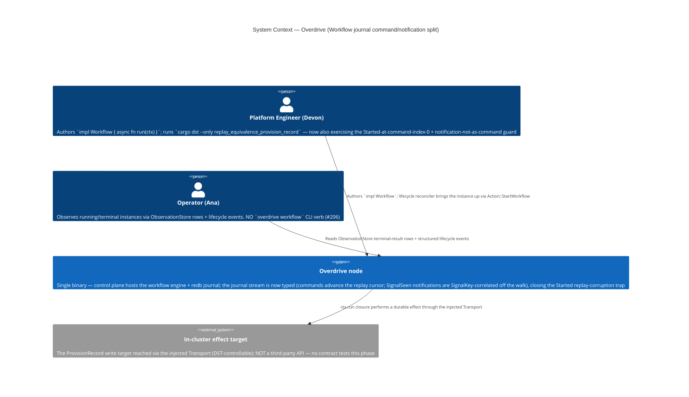
```mermaid
C4Context
  title System Context — Overdrive (Workflow journal command/notification split)
  Person(devon, "Platform Engineer (Devon)", "Authors `impl Workflow { async fn run(ctx) }`; runs `cargo dst --only replay_equivalence_provision_record` — now also exercising the Started-at-command-index-0 + notification-not-as-command guard")
  Person(ana, "Operator (Ana)", "Observes running/terminal instances via ObservationStore rows + lifecycle events. NO `overdrive workflow` CLI verb (#206)")
  System(overdrive, "Overdrive node", "Single binary — control plane hosts the workflow engine + redb journal; the journal stream is now typed (commands advance the replay cursor; SignalSeen notifications are SignalKey-correlated off the walk), closing the Started replay-corruption trap")
  System_Ext(target, "In-cluster effect target", "The ProvisionRecord write target reached via the injected Transport (DST-controllable); NOT a third-party API — no contract tests this phase")
  Rel(devon, overdrive, "Authors `impl Workflow`; lifecycle reconciler brings the instance up via Action::StartWorkflow")
  Rel(ana, overdrive, "Reads ObservationStore terminal-result rows + structured lifecycle events")
  Rel(overdrive, target, "ctx.run closure performs a durable effect through the injected Transport")
```

**C4 — Container (L2), the journal/engine/cursor/store reshape.** Containers
are the same Rust crates as §97's Container diagram; what changes is the
*shape of the journal types* (two enums + sum), the *cursor's internal
partition*, and the *determinism gate*. Annotated for the reshape:

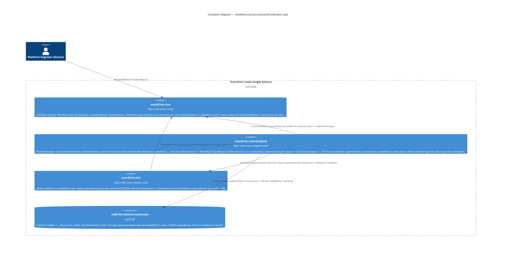
```mermaid
C4Container
  title Container Diagram — Workflow journal command/notification split
  Person(devon, "Platform Engineer (Devon)")
  System_Boundary(node, "Overdrive node (single binary)") {
    Container(core, "overdrive-core", "Rust crate (class: core)", "workflow module: Workflow trait, WorkflowCtx, WorkflowResult, WorkflowStart. AMENDED type surface: JournalCommand / JournalNotification / LoadedEntry split; in-entry step:u32 dropped (identity is structural). No tokio.")
    Container(ctrl, "overdrive-control-plane", "Rust crate (class: adapter-host)", "WorkflowEngine: now writes Started at command-index 0 on first start; JournalCursorHandle partitions LoadedEntry → Vec<JournalCommand> + BTreeMap<SignalKey,JournalNotification> at construction; determinism gate Layers 1+2 fail-closed (Layer 3 → #214). JournalStore: append/load_journal deal in LoadedEntry; store stays a dumb ordered log (next_step count-all unchanged).")
    Container(sim, "overdrive-sim", "Rust crate (class: adapter-sim)", "SimJournalStore (LoadedEntry log). replay_equivalence_provision_record EXTENDED with the Started-at-0 + notification-not-as-command cursor-advance guard (K1 + K4).")
    ContainerDb(redb, "redb file (shared substrate)", "ACID KV", "ViewStore tables + __wf_journal__ table. Key (WorkflowId, u32) = storage append-position over all LoadedEntry; value = CBOR LoadedEntry. One Arc<Database> handle.")
  }
  Rel(devon, core, "impl Workflow for ProvisionRecord")
  Rel(ctrl, core, "Drives Workflow::run; partitions the loaded run; enforces Layers 1+2 determinism gate")
  Rel(ctrl, redb, "RedbJournalStore append (fsync) / load_journal — flat Vec<LoadedEntry>, dumb log")
  Rel(sim, core, "SimJournalStore + replay-equivalence invariant drive the engine under DST")
  Rel(ctrl, sim, "DST binds SimJournalStore; the cursor-advance guard exercises Started-at-0 + notification correlation")
```

#### Forward concerns (tracked, design must not preclude)

Cross-NODE resume — [#205](https://github.com/overdrive-sh/overdrive/issues/205)
(the journal is `WorkflowId`-keyed node-independent CBOR behind a
`JournalStore` trait — a Phase-2 HA adapter is not precluded). Operator
`overdrive workflow` CLI verb — [#206](https://github.com/overdrive-sh/overdrive/issues/206)
(operators observe via ObservationStore rows; an ad-hoc journal-query view
is a deferrable read-only projection, not a replay requirement). Typed-signal
scope under partition — [#207](https://github.com/overdrive-sh/overdrive/issues/207).
Journal retention/compaction — [#208](https://github.com/overdrive-sh/overdrive/issues/208)
(a range-delete per terminal `WorkflowId`; the layout supports it). WASM
workflow SDK + version-skew code-graph hashing — [#209](https://github.com/overdrive-sh/overdrive/issues/209)
(no design element hinges on code-graph hashing, R1/D-INH-6).

## Phase 1 workflow-result-error-model extension (2026-06-06; ADR-0065 amends ADR-0064 §2/§3/§5/§6)

Extension landed by feature `workflow-result-error-model` (PROPOSE mode; the
evidence base is the 4-platform research
`docs/research/workflow-durable-execution/result-error-retry-semantics-research.md`,
High confidence — there was no DISCUSS wave). It reshapes the **workflow body
contract** of §89 to the Restate/Temporal/DBOS/Step-Functions shape: the body
returns its **typed value with a terminal-error failure channel**, and the
status enum survives only as an **engine-owned control-plane projection**.
Nothing in §90–§93 (the journal substrate, the replay cursor, the
engine↔reconciler boundary) is rewritten; §98's command/notification split is
carried forward verbatim. Greenfield single-cut — `WorkflowResult` is deleted,
the new contract lands in the same change (the only registered workflow is the
`provision-record` test fixture).

**The reshape, by decision (ADR-0065 §§1–5):**

- **§89 amended — `WorkflowResult` deleted; body returns
  `Result<Output, TerminalError>`.** The `Workflow` trait grows associated
  `type Output` / `type Input` (CBOR-serializable) and `async fn run(&self, ctx,
  input: Self::Input) -> Result<Self::Output, TerminalError>`. Success is the
  typed `Output` (not a contentless `Success` variant); terminal failure is a
  `TerminalError`; retryable failures never reach the return type (the engine
  absorbs + re-drives them, §4). ADR-0065 §1.
- **D1 — object safety via author-edge typing + engine-boundary CBOR
  erasure.** The typed `Workflow` trait is not object-safe; a generic
  `ErasedWorkflowAdapter<W>` blanket-erases `Output`/`Input` to CBOR into an
  object-safe `ErasedWorkflow { run_erased(&self, ctx, input_bytes) ->
  Result<Vec<u8>, TerminalError> }`. The engine holds `Box<dyn ErasedWorkflow>`;
  the registry maps `WorkflowName → Box<dyn Fn() -> Box<dyn ErasedWorkflow>>`.
  This is the SAME typed-edge / CBOR-erased-interior split `ctx.run<T>` already
  uses for step results — not a new mechanism. ADR-0065 §1.
- **D2 — `TerminalError` is a concrete core type** (`overdrive-core::workflow`):
  `{ kind: TerminalErrorKind, detail: String }`, `kind ∈ {Explicit,
  BudgetExhausted, MalformedInput, OutputEncode}`, `detail` length-capped at
  construction. The bounded typed kind + capped author-detail closes the
  free-text `reason: String` replay-determinism hazard the §89 engine's
  panic-containment path worked around. `BudgetExhausted` is engine-minted.
  ADR-0065 §2.
- **D3 — `WorkflowStatus` is the engine-owned control-plane projection**,
  distinct from the body return AND from `TerminalCondition` (ADR-0037):
  `{Completed{output: Vec<u8>}, Failed{terminal: TerminalError}, Cancelled,
  TimedOut}` (`#[non_exhaustive]`; `Cancelled`/`TimedOut` are forward variants
  the Phase-1 engine never writes but the lifecycle reconciler matches
  exhaustively). The engine maps `Ok(output)` → `Completed{output}`,
  `Err(TerminalError)`/budget-exhausted → `Failed{terminal}`. It is carried by
  the journal `JournalCommand::Terminal` (`result: WorkflowResult` →
  `status: WorkflowStatus`) and `ObservationRow::WorkflowTerminal` (same field
  rename); `WorkflowInstanceState.terminal` becomes `Option<WorkflowStatus>`
  (the `terminal.is_some()` convergence check is unchanged). This is the crux
  of the research finding — the body return and the observable status are two
  different types. ADR-0065 §3.
- **D4 — retryable-vs-terminal model + retry budget in the engine/journal,
  NOT the body.** Retryable = engine absorbs + re-drives from the journal;
  terminal = explicit `Err(TerminalError)` or engine-minted `BudgetExhausted`
  on budget exhaustion. The budget POLICY is an engine constant (not
  persisted); the budget INPUTS (attempts, last-failure) derive from journal
  `RetryAttempted` entries (an additive `#[serde(default)]` command, ADR-0066
  §2) recomputed against the live policy. This CONTRASTS the reconciler
  `RetryMemory`-in-`View` precedent (a reconciler has no engine; a workflow
  does — the journal is the single durable SSOT, not a second View store). The
  full re-drive loop is Slice 04; Slices 01–03 land the types + success/
  explicit-terminal paths (body contract stable from Slice 01). ADR-0065 §4.
- **D5 — typed `WorkflowStart.input` crossing Raft with rkyv-envelope
  discipline; resolves [#217](https://github.com/overdrive-sh/overdrive/issues/217).**
  `WorkflowStart { name: WorkflowName, input: Vec<u8> }` (opaque CBOR
  `W::Input`). The durable desired-intent persists the FULL spec via a
  `WorkflowStartEnvelope` (V1) + co-located typed codec
  (`WorkflowStart::archive_for_store`/`from_store_bytes`, the ADR-0048 `Job`
  precedent — intent-class durable state read across restarts, NOT the journal
  CBOR class), replacing the action-shim's current `spec.name` bytes write and
  the reconciler's `WorkflowName::new(from_utf8(value))` read.
  `started_digests` now derives `input_digest = ContentHash::of(&spec.input)`
  and `spec_digest = ContentHash::of(spec.name…)` — they diverge as intended
  (discharges the engine's `TODO(#217)`). The rkyv envelope wraps the OUTER
  `WorkflowStart`; the inner `input` stays opaque CBOR. **Unblocks the first
  external/root rotation workflow consumer** (the validating consumer of typed
  input + typed output). *(Historical: [#40](https://github.com/overdrive-sh/overdrive/issues/40)
  was then expected to be that first workflow consumer; SUPERSEDED — #40's
  internal SVID near-expiry reissue is now an `Action::IssueSvid`, not a
  workflow. The future workflow consumer is external-ACME / public-trust or
  root-CA rotation, TBD.)* ADR-0065 §5.

**C4 — Container (L2), the body-contract + spec-input reshape.** Containers
are the same Rust crates as §97/§98; what changes is the *body return type*,
the *erasure adapter*, the *status projection type*, and the *typed durable
spec*. Annotated for the reshape:

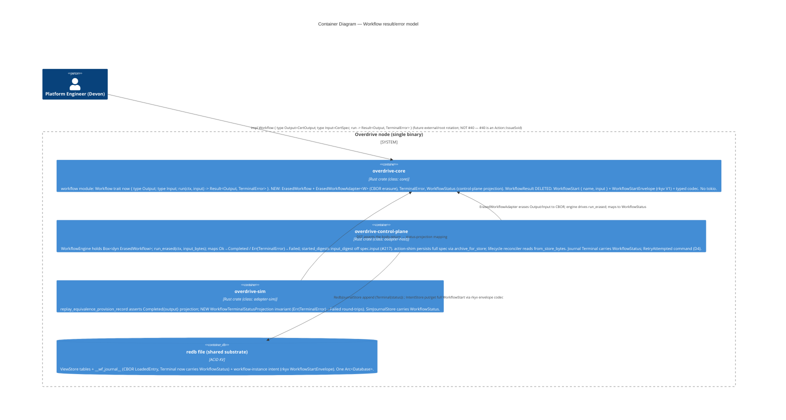
```mermaid
C4Container
  title Container Diagram — Workflow result/error model
  Person(devon, "Platform Engineer (Devon)")
  System_Boundary(node, "Overdrive node (single binary)") {
    Container(core, "overdrive-core", "Rust crate (class: core)", "workflow module: Workflow trait now { type Output; type Input; run(ctx, input) -> Result<Output, TerminalError> }. NEW: ErasedWorkflow + ErasedWorkflowAdapter<W> (CBOR erasure), TerminalError, WorkflowStatus (control-plane projection). WorkflowResult DELETED. WorkflowStart { name, input } + WorkflowStartEnvelope (rkyv V1) + typed codec. No tokio.")
    Container(ctrl, "overdrive-control-plane", "Rust crate (class: adapter-host)", "WorkflowEngine holds Box<dyn ErasedWorkflow>; run_erased(ctx, input_bytes); maps Ok→Completed / Err(TerminalError)→Failed; started_digests input_digest off spec.input (#217). action-shim persists full spec via archive_for_store; lifecycle reconciler reads from_store_bytes. Journal Terminal carries WorkflowStatus; RetryAttempted command (D4).")
    Container(sim, "overdrive-sim", "Rust crate (class: adapter-sim)", "replay_equivalence_provision_record asserts Completed{output} projection; NEW WorkflowTerminalStatusProjection invariant (Err(TerminalError)→Failed round-trips). SimJournalStore carries WorkflowStatus.")
    ContainerDb(redb, "redb file (shared substrate)", "ACID KV", "ViewStore tables + __wf_journal__ (CBOR LoadedEntry, Terminal now carries WorkflowStatus) + workflow-instance intent (rkyv WorkflowStartEnvelope). One Arc<Database>.")
  }
  Rel(devon, core, "impl Workflow { type Output=CertOutput; type Input=CertSpec; run -> Result<Output, TerminalError> } (future external/root rotation; NOT #40 — #40 is an Action::IssueSvid)")
  Rel(ctrl, core, "ErasedWorkflowAdapter erases Output/Input to CBOR; engine drives run_erased; maps to WorkflowStatus")
  Rel(ctrl, redb, "RedbJournalStore append (Terminal{status}) ; IntentStore put/get full WorkflowStart via rkyv envelope codec")
  Rel(sim, core, "DST asserts the body-return → status-projection mapping")
```

**C4 — Component (L3), the erasure + projection boundary.** The one subsystem
this feature reshapes internally — the author-typed edge, the CBOR erasure
adapter, the engine's status mapping, and the typed-spec durable codec:

```mermaid
C4Component
  title Component Diagram — Workflow body contract + spec input (L3)
  Container_Boundary(core, "overdrive-core::workflow") {
    Component(wf, "Workflow<Output, Input>", "trait", "Author edge: run(ctx, input: Input) -> Result<Output, TerminalError>")
    Component(erased, "ErasedWorkflow", "trait (object-safe)", "run_erased(ctx, input_bytes) -> Result<Vec<u8>, TerminalError>")
    Component(adapter, "ErasedWorkflowAdapter<W>", "blanket impl", "Decodes input_bytes -> W::Input; calls run; encodes W::Output -> bytes")
    Component(terr, "TerminalError", "type", "{ kind, detail } — bounded, serde, journal/obs input")
    Component(status, "WorkflowStatus", "enum (#[non_exhaustive])", "Completed{output} | Failed{terminal} | Cancelled | TimedOut")
    Component(spec, "WorkflowStart + WorkflowStartEnvelope", "type + rkyv V1", "{ name, input } ; archive_for_store / from_store_bytes")
  }
  Container_Boundary(ctrl, "overdrive-control-plane::workflow_runtime") {
    Component(engine, "WorkflowEngine", "struct", "Box<dyn ErasedWorkflow>; run_erased; status mapping; started_digests(input=spec.input)")
    Component(registry, "WorkflowRegistry", "struct", "WorkflowName -> factory<Box<dyn ErasedWorkflow>>")
  }
  Rel(adapter, wf, "wraps + drives the typed body")
  Rel(adapter, erased, "implements (blanket)")
  Rel(adapter, terr, "malformed_input / output_encode on codec failure")
  Rel(engine, registry, "resolve(name) -> Box<dyn ErasedWorkflow>")
  Rel(engine, erased, "run_erased(ctx, input_bytes)")
  Rel(engine, status, "maps Ok(bytes)->Completed / Err(TerminalError)->Failed")
  Rel(engine, spec, "from_store_bytes on resume; input_digest off spec.input")
```

### Reuse Analysis (this extension)

| Existing component | Decision | Justification |
|---|---|---|
| `ctx.run<T>` CBOR typed-edge/erased-interior | REUSE (pattern) | D1's erasure adapter is the same erasure `ctx.run<T>` already does. |
| `WorkflowStart` (name-only) | EXTEND | add `input` + rkyv envelope + typed codec. |
| `Action::StartWorkflow` variant | REUSE (unchanged) | `spec` reshapes; variant shape unchanged. |
| `JournalCommand::Terminal`, `::` (additive) | EXTEND | `result`→`status`; `RetryAttempted` additive (ADR-0066 §2). |
| `ObservationRow::WorkflowTerminal` | EXTEND | `result`→`status`. |
| `WorkflowInstanceState.terminal` | EXTEND | `Option<WorkflowStatus>`; convergence check unchanged. |
| `started_digests` `TODO(#217)` | MODIFY | `input_digest` off `spec.input`. |
| `persist_workflow_intents` / `hydrate_workflow_desired_instances` | MODIFY | persist/read full spec via rkyv codec (#217 value+read sides). |
| `Job::archive_for_store` / envelope (ADR-0048) | REUSE (pattern) | `WorkflowStart` codec is the same shape. |
| `RetryMemory` reconciler precedent | CONTRAST (do NOT reuse) | reconciler has no engine → View; workflow has an engine → journal-derived budget (D4). |
| `WorkflowResult` | DELETE | greenfield single-cut; replaced by `Result<Output, TerminalError>` + `WorkflowStatus`. |

### Quality-attribute scenarios (this extension)

| Attribute | Target | How addressed |
|---|---|---|
| Functional suitability — correctness | The durable terminal carries no engine-derived non-deterministic value | Typed `WorkflowStatus`; bounded `TerminalError` (D2/D3); closes the `reason: String` hazard |
| Reliability — recoverability | Terminal replays losslessly incl. the typed output bytes | `Completed{output}` in journal `Terminal` + obs row; short-circuit re-publishes (§91 carried forward) |
| Reliability — fault tolerance | Retryable failures never end the workflow; budget exhaustion is engine-minted | D4 engine-owned retry; `WorkflowBudgetExhaustionMintsTerminal` DST invariant (Slice 04) |
| Maintainability — modifiability | Author writes domain types, not status variants | typed `Output`/`Input`; the future external-ACME / public-trust or root-CA rotation workflow is the consumer (NOT #40 — #40's internal SVID reissue is an `Action::IssueSvid`) |
| Maintainability — testability | The erasure adapter + body-return→status mapping are unit/DST testable | `ErasedWorkflowAdapter` isolated; `WorkflowTerminalStatusProjection` invariant |
| Maintainability — modifiability | Parameter-bearing durable intent evolves safely | `WorkflowStartEnvelope` (rkyv V1) + golden-bytes schema-evolution fixture (ADR-0048) |

### External integrations — none (carried forward from §96)

This feature reshapes types and the engine's body-contract; no new external
boundary. When the future external-ACME / public-trust (or root-CA) rotation
workflow lands its ACME/DNS effects (Phase 3+), the `ctx.run` closure is the
contract-test seam (Pact-shaped) — annotated for the platform-architect
handoff, unchanged from §96. *(This was historically framed as #40; SUPERSEDED
— #40 is the now-closed internal SVID near-expiry reissue, an
`Action::IssueSvid`, with no ACME/DNS effects.)*

## Transparent mTLS — universal agent-light L4 proxy extension (ADR-0069, GH #26 folds #222)

**Scope**: the application-architecture decomposition for the ONE universal
transparent-mTLS enforcement mechanism. Companion to **ADR-0069** (the decision +
alternatives + consequences) and `docs/feature/transparent-mtls-host-socket/`
(the DISCUSS job J-SEC-003, the 6 Tier-3 spikes, the feature-delta DESIGN
sections). This section is the SSOT for the component/port decomposition; the ADR
is the SSOT for the decision.

### 1. What this replaces

Whitepaper §7's "one identity model, **two** enforcement mechanisms" (host-socket
in-band kTLS #26 + guest-stack L4 tap proxy #222) collapses to ONE: a universal
agent-light L4 proxy for every workload kind. The identity model is unchanged
(one CA, one SVID set, one trust bundle, one `IdentityRead` port). Only the
enforcement mechanism unifies. The in-band kTLS-on-the-workload's-own-socket model
is superseded as v1 and is out of v1 scope — a post-v1 optimization tracked in
**#231** (ADR-0069 § A1).

**The proxy is BIDIRECTIONAL (F3, host-socket v1).** Each node's agent enforces
BOTH halves: the **outbound/client** half (`cgroup_connect4` intercept → client
mTLS presenting the workload SVID) AND the **inbound/server** half (TPROXY
intercept → `getsockname` orig-dst → server mTLS presenting the server SVID +
verifying the client SVID → splice the decrypted plaintext to the identity-unaware
server workload). BOTH workloads hold NOTHING — the peer's *agent* presents the
peer workload's SVID, never the workload itself. The per-direction primitives AND
the composed INBOUND flow are spike-proven on 7.0 (increment-i;
`findings-inbound-intercept.md` for the inbound half); **Slice 00 composes the
remaining gaps** — outbound composed in one flow, the bidirectional response legs,
and real netns/veth + cgroup isolation (these three are NOT yet proven). The
**guest-stack
intercept adapter** (microVM/unikernel, tap/TPROXY/TC source → same
`MtlsEnforcement` port) is STAGED to #222 (repurposed — not a separate mechanism).

**Honest v1 security claim (F5).** v1 #26 provides **chain-to-bundle transport
authentication + encryption, with NO intended-peer identity pinning** — both
directions verify only that the peer chains to the trust bundle (is *some* valid
cluster workload). A routing bug / VIP collision / malicious in-cluster endpoint
presenting a **valid-but-unintended SVID is NOT prevented in v1**. Intended-peer
SAN-matching is the **#178 upgrade** (east-west SPIFFE-ID resolution), not a v1
prerequisite; docs/tests MUST NOT call the wrong-but-valid-peer case "protected"
until #178 lands.

### 2. Architectural style — fits the existing hexagon

No new style. This is ports-and-adapters over the existing single-process hexagon
(§1 of this brief). The proxy is a **driven adapter** behind a **new driven port**;
the agent that orchestrates it is core-adjacent control logic in the node-agent
crate. The DST sim/host split (`.claude/rules/development.md` § "Port-trait
dependencies") applies verbatim: production wires the host adapter, tests wire the
sim adapter.

### 3. Component decomposition

| Component | Home crate | Class | Responsibility |
|---|---|---|---|
| **`MtlsEnforcement` port (trait)** | `overdrive-core` (new `traits/mtls_enforcement.rs`) | `core` | The driven-port contract for per-connection transparent-mTLS enforcement: intercept-arm, drive-handshake-and-arm-kTLS, run-steady-state-splice, teardown. Pure trait, no I/O. Behaviour pinned in rustdoc (§ "Trait definitions specify behavior") + a DST equivalence harness. |
| **`HostMtlsEnforcement` adapter** | EXTEND `overdrive-dataplane` (OQ-2 resolved 2026-06-12; `overdrive-host` ruled out for `#![forbid(unsafe_code)]`) | `adapter-host` | The production proxy, BIDIRECTIONAL (F3). OUTBOUND: `cgroup_connect4`-rewrite intercept, lossless capture, rustls CLIENT handshake on leg B, kTLS arm, sockmap EGRESS-redirect (agent-idle), `splice` return pump (agent-light). INBOUND: `nft`-TPROXY + `IP_TRANSPARENT` intercept, `getsockname` orig-dst, rustls SERVER handshake on leg C (present server SVID + `WebPkiClientVerifier` verify client), kTLS-RX arm, `splice`-to-server deliver pump (agent-light); fail-closed on `nocert`/`wrongca`. Consumes `IdentityRead`. Extends the established userspace eBPF crate (already hosts `EbpfDataplane`; `unsafe` allowed, `aya` + BPF `build.rs` present). |
| **`SimMtlsEnforcement` adapter** | `overdrive-sim` | `adapter-sim` | The DST double: models the observable contract (intercept→handshake→arm→steady-state→teardown) in-memory, no real sockets/kTLS/BPF. Drives the `mtls_enforcement_equivalence` DST test. |
| **mTLS proxy agent (node-agent control logic)** | `overdrive-worker` (the node-agent home) | `adapter-host` | Per-connection lifecycle owner, BOTH directions: receives the intercept event (outbound connect / inbound TPROXY), calls the port to drive the handshake (reading the held SVID + bundle via `IdentityRead`), manages leg F/B (outbound) or leg C/S (inbound) lifecycle, supervises the return/deliver splice pump (F6: tears the connection down on `Stalled`). The agent holds the leaf key (via the port read); BOTH the client and the server workload hold nothing. |
| **New BPF programs** | `overdrive-bpf` (extend) | (BPF) | OUTBOUND: `sockops` (ESTABLISHED detect → SOCKHASH + ringbuf), `sk_skb/stream_verdict` (forward egress-redirect leg F → leg B), `cgroup_connect4` *transparent-mTLS variant* (intercept rewrite — extends the existing `cgroup_connect4_service` shape). INBOUND (F3): `nft`-TPROXY + `IP_TRANSPARENT` listener (server intercept — the mirror of `connect4`; orig-dst via `getsockname`). NO psock/verdict on the kTLS-RX leg (leg B return / leg C deliver use plain `splice`). |
| **`IdentityRead` consumer seam** | `overdrive-core` (consume as-is) | `core` | The agent reads `svid_for(&AllocationId)` + `current_bundle()` to drive the rustls handshake. #26 is a READER; never mints, re-issues, or caches. |

### 4. Driving (primary) ports

The feature has **no operator-facing driving port** (no CLI verb — it is a D1
foundation primitive; encryption is automatic and undisableable, whitepaper
principle 2). The driving surface is the **kernel-originated connection-detect /
intercept event**, in BOTH directions: OUTBOUND — a host-socket workload's
`connect()` transparently rewritten to the agent (`cgroup_connect4`) + the
`sockops` ESTABLISHED transition; INBOUND — a connection aimed at a server
workload's logical address TPROXY-redirected to the agent's `IP_TRANSPARENT`
listener. Either event drives the agent's per-connection enforcement. The honest
observable surfaces (the "acceptance" surface) are TEST-tier: `tcpdump` (TLS 1.3
records on the peer-facing / client-facing wire), `ss -tie` (kTLS ULP on the kTLS
leg), fail-closed negative tests (outbound absent-SVID; inbound `nocert`/`wrongca`),
a no-cleartext race-window probe, and (inbound) byte-exact plaintext at the server
workload.

### 5. Driven (secondary) ports & adapters

```mermaid
flowchart LR
    subgraph core["overdrive-core (core, no I/O)"]
        IR["IdentityRead (port, consumed)"]
        ME["MtlsEnforcement (port, NEW)"]
    end
    subgraph agent["overdrive-worker (adapter-host) — mTLS proxy agent"]
        A["per-connection lifecycle owner (both directions; supervises pump, F6)"]
    end
    subgraph host["overdrive-dataplane (adapter-host) — HostMtlsEnforcement"]
        H["intercept · handshake-drive · kTLS-arm · splice-pump (outbound + inbound)"]
        BPF["overdrive-bpf: sockops · sk_skb verdict · cgroup_connect4 (mtls variant) · nft-TPROXY + IP_TRANSPARENT (inbound)"]
    end
    subgraph sim["overdrive-sim (adapter-sim)"]
        S["SimMtlsEnforcement (in-memory contract model)"]
    end
    A -->|"reads held SVID + bundle"| IR
    A -->|"drives per connection"| ME
    ME -. "prod wiring" .-> H
    ME -. "DST wiring" .-> S
    H --> BPF
    H -->|"reads leaf key + bundle"| IR
```

**Why a NEW port, not `Dataplane`** (ADR-0069 Decision): the `Dataplane` port
models **map writes** (`update_policy`, `update_service`, `register_local_backend`
— ADR-0040/0049/0053) keyed by service/policy identity. The proxy is
**per-connection socket operations** (intercept a `connect()`, drive a handshake
on an acquired socket, arm kTLS on a leg, run a `splice` pump) — a different
abstraction with a different lifecycle (per-connection, not per-service-update).
Forcing it onto `Dataplane` would conflate two contracts and break the DST
equivalence story. CREATE-NEW is justified.

**The exact `MtlsEnforcement` signature is a DESIGN decision, NOT improvised by
the crafter** (CLAUDE.md "Implement to the design"). The *model* is fixed by
ADR-0069 (the four lifecycle phases: intercept-arm → drive-handshake-and-arm →
run-steady-state → teardown; consumes `IdentityRead`; async only at the
adapter-host boundary, never on a `core` compile path). The *method shapes* are
pinned in the feature-delta DESIGN § "Ports". **OQ-1 is ACCEPTED (user-approved
2026-06-12): the exact feature-delta `MtlsEnforcement` contract is binding and is
the contract DELIVER implements to; no contract-approval blocker remains.** The
crafter must not add public surface beyond what the feature-delta names.

### 6. Reuse Analysis (HARD GATE — every overlap classified; default EXTEND)

| # | Existing asset | Overlap | Verdict | Justification |
|---|---|---|---|---|
| 1 | `IdentityRead` port (`overdrive-core/src/traits/identity_read.rs`) | The agent must read the held SVID + trust bundle to drive the handshake | **REUSE AS-IS** | The port already exposes `svid_for` + `current_bundle` with the exact owned-clone, no-issue, no-mutate contract #26 needs. #26 is a pure reader; no signature change. |
| 2 | `SvidMaterial` / `TrustBundle` (`overdrive-core`, ADR-0063) | The material presented in the rustls handshake + peer verification anchor | **REUSE AS-IS** | Cert + leaf key + bundle are exactly what rustls `ClientConfig`/`ServerConfig` consume. No change. |
| 3 | `cgroup_connect4_service` program (`overdrive-bpf/src/programs/cgroup_connect4_service.rs`) | Transparent destination rewrite (workload `connect()` → agent leg, OUTBOUND); attach-boundary precedent for the F5 intercept exemption | **EXTEND** | The connect4-rewrite shape is proven for the outbound intercept (`findings-userspace-relay.md` Unknown 1). Add a transparent-mTLS variant (rewrite to the agent listener) rather than reimplementing the rewrite mechanism. The INBOUND intercept (F3) is the mirror — `nft`-TPROXY + `IP_TRANSPARENT` (proven in `findings-inbound-intercept.md` §1), a net-new program family in `overdrive-bpf`/`overdrive-dataplane` (orig-dst via `getsockname`, NOT `SO_ORIGINAL_DST`). |
| 4 | `Dataplane` port (`overdrive-core/src/traits/dataplane.rs`) | Kernel-side enforcement boundary | **DO-NOT-REUSE (CREATE-NEW port)** | Models map writes, NOT per-connection socket ops. The proxy's intercept/handshake-drive/kTLS-arm/splice-pump lifecycle does not fit; forcing it conflates contracts (ADR-0069 Decision). CREATE-NEW `MtlsEnforcement`. |
| 5 | `overdrive-bpf` crate (maps, XDP/cgroup programs, `pinning = ByName` discipline) | Home for the new sockops / `sk_skb` verdict / cgroup_connect4-mtls programs | **EXTEND** | The crate is the BPF home; reuse the build pipeline (`xtask bpf-build`, ADR-0038) and the bpffs-pin discipline. Add programs; no new BPF crate. NOTE: sockops/sk_skb/sockmap/ringbuf are net-new program *types* here (no prior sockops in tree) — the programs are CREATE-NEW *within* the EXTENDED crate. aya-ebpf 0.1.1 has no `#[sk_skb]` macro → hand-roll via `#[link_section]` (proven in the spikes). |
| 6 | `overdrive-worker` crate (node-agent: ExecDriver, cgroup mgr, probe-runner) | Home for the per-connection mTLS proxy agent | **EXTEND** | The node-agent already owns host-side per-workload lifecycle (drivers, cgroups, probes). The mTLS proxy agent is another node-agent responsibility; add a module, not a crate. |
| 7 | `rustls 0.23 [ring]` (`[workspace.dependencies]`) | The TLS 1.3 handshake on leg B | **REUSE AS-IS** | Already in the workspace graph (ADR-0039 / built-in CA). `dangerous_extract_secrets()` is the kTLS-arm seam (proven in spikes). |
| 8 | `ktls` crate (NOT yet a dep) | kTLS arm + control-record loop (`NewSessionTicket`/KeyUpdate → `EIO` on raw RX) | **CREATE-NEW (add dependency)** | `findings.md` #4 + spike-wave-decisions favour `ktls::KtlsStream` over raw `setsockopt` for control records. New workspace dep (`ktls 6.x`, MIT/Apache-2.0 — OSS, open-source-first). Documented as a tech choice in the feature-delta. |
| 9 | `overdrive-host` crate (Clock/Entropy/Transport/cgroup_fs/CA host adapters) | Possible home for `HostMtlsEnforcement` | **RULED OUT (OQ-2 resolved 2026-06-12)** | `overdrive-host` is `#![forbid(unsafe_code)]` (`src/lib.rs:21`) — the safe-bindings crate. The proxy is irreducibly `unsafe` (`setsockopt(TCP_ULP/TLS_TX/TLS_RX)`, `splice(2)`, `pidfd`/BPF-fd plumbing), so it cannot share this crate without lifting a load-bearing safety property for every unrelated safe module. Home is `overdrive-dataplane` instead (row 10). |
| 10 | `EbpfDataplane` / `overdrive-dataplane` (aya loader, HoM, bpffs pins) | Home for `HostMtlsEnforcement`; aya BPF-loading machinery, pin-path discipline | **EXTEND (the `HostMtlsEnforcement` home — OQ-2 resolved)** | The established `adapter-host` userspace eBPF crate already satisfies every requirement: `unsafe` allowed (9 `src` files use it, no `forbid`/`deny`), `aya.workspace = true` already a dep, a BPF `build.rs` (`overdrive_bpf.o`) already present, and it already hosts `EbpfDataplane` (it IS the userspace↔kernel host adapter). The aya `EbpfLoader` + `map_pin_path("/sys/fs/bpf/overdrive")` + `pinning = ByName` shape (ADR-0040 §"pin-by-name") is reused for the sockops/sockmap loading. Adding `ktls` + `rustls` is a modest dep bump. **Revisit trigger** (not a blocker): split into a dedicated crate later if mTLS needs isolation from the LB/service dataplane. |

**Verdict tally**: 3 REUSE-AS-IS (1, 2, 7) · 5 EXTEND (3, 5, 6, 10 home + pattern)
· 1 CREATE-NEW port (4) · 1 CREATE-NEW dep (8) · 1 RULED OUT (9, `overdrive-host`).
OQ-2 **resolved**: `HostMtlsEnforcement` extends `overdrive-dataplane`, kernel
programs extend `overdrive-bpf`; no new crate. Default-EXTEND honored; the two
CREATE-NEWs (the port, the `ktls` dep) are justified above.

### 7. C4 diagrams

C4 System Context (L1) + Container (L2) + Component (L3, rendered TWICE — once
per direction) are in
`docs/feature/transparent-mtls-host-socket/design/c4-diagrams.md` (Mermaid). L3
OUTBOUND traces detect→intercept→handshake→kTLS-arm→forward-splice→return-splice;
L3 INBOUND (F3) traces TPROXY-intercept→orig-dst→server-mTLS→kTLS-RX→splice-to-server.
L1/L2 fixed the prior self-contradiction (the peer's *agent* presents the peer
workload's SVID; the workload holds nothing).

### 8. Quality attribute strategies (ISO 25010)

| Attribute | Strategy | Observable |
|---|---|---|
| Security (confidentiality/authenticity) | Transparent intercept guarantees the workload never reaches the real peer un-proxied (BOTH directions); auth-session == data-session (rustls secrets → kTLS); fail-closed on absent SVID (`IdentityRead` `None` → refuse) AND on a peer that does not chain to the bundle (outbound: server cert; inbound: client SVID — `nocert`/`wrongca`). **v1 = chain-to-bundle authn + encryption, NO intended-peer pinning (F5); a valid-but-unintended SVID is NOT prevented in v1 (the #178 upgrade adds the SAN-match).** | `tcpdump`: TLS 1.3 records, zero cleartext on the peer wire (both directions); fail-closed negative tests (outbound + inbound `nocert`/`wrongca`); the wrong-but-valid-peer test `#[ignore]`-gated on #178 |
| Reliability (losslessness) | Handshake-window capture is a userspace buffer (trivially lossless); no DROP-RESET; no server-speaks-first assumption | No dropped pre-arm bytes; no RESET on client-speaks-first |
| Reliability (pump supervision, F6) | The return/deliver `splice` pump is supervised: `Stalled` (no bytes-spliced progress for `pump_stall_deadline` (30 s) with a record pending) → the worker tears the connection down (fail-closed reset), never degrades to a userspace copy loop | Tier-3: inject a stalled pump → `liveness == Stalled` → worker teardown → `Gone`, no fd/sockmap/kTLS leak |
| Reliability (resource bounds, F4/F7) | `MtlsLimits` CONCRETE defaults (256 KiB pre-arm buffer / 5 s handshake deadline / 128 in-flight per alloc / 30 s pump-stall), all fail-closed; budget ≤ 32 MiB + ≤ 384 fds per alloc in-flight | Tier-3 asserts the VALUES: `BufferLimitExceeded` at 256 KiB+1, `HandshakeTimeout` at 5 s, `InFlightLimitExceeded` at the 129th |
| Performance (agent-light) | Forward = agent-idle sockmap-egress-redirect → kTLS-TX; return/deliver = zero-copy `splice` (~1/record), both directions | strace: zero per-byte forward syscalls; ~1 splice/record return + inbound deliver |
| Maintainability (one mechanism, DST-testable) | One driven port + host/sim adapters + `mtls_enforcement_equivalence` DST harness | DST equivalence test passes for both adapters |
| Portability | All primitives in-tree at the pinned 6.18 floor (ADR-0068); no kernel patch | Tier-3 on the pinned kernel |

### 9. Earned-Trust probe (principle 12 — mandatory)

`HostMtlsEnforcement` ships a `probe()` (specified in the feature-delta DESIGN §
Ports). At the composition root, "wire → probe → use": before the proxy is
declared usable, probe verifies (a) the kTLS arm round-trips (sentinel handshake +
one `tls_sw_splice_read` on a loopback leg), (b) the sockmap egress-redirect fires
(a sentinel F→B byte emerges encrypted), (c) the SOCKMAP-insert-before-`TCP_ULP`
ordering holds. On probe failure the node refuses to start with
`health.startup.refused`. This exercises the *specific substrate lies the spikes
catalogued* (ordering invariant; kTLS-RX-no-psock; egress-flag-not-ingress-flag) —
not a convention, a compile-and-CI-enforced contract (subtype + structural +
behavioural layers per principle 12).

### 10. External integrations — none new

The only "external" boundary is the **real peer's TLS endpoint**, which is another
Overdrive workload presenting its own SVID — internal east-west mTLS, not a
third-party API. No consumer-driven contract tests (Pact-shaped) are warranted:
both sides are Overdrive-native, verified against the same trust bundle. (Contrast
the future external-ACME workflow, which IS a contract-test seam — unrelated to
#26.) Flagged for the platform-architect handoff: none.

## Phase 2 backend-instance-replacement extension (ADR-0073, GH #249)

**Scope**: the `overdrive workload restart <id>` lifecycle verb + the minimal
desired-run generation precursor that gates the `WorkloadLifecycle` reconciler's
operator-stop veto. Single-node, Phase 2. Closes the DISCUSS `[D1]` gate. Full
record: **ADR-0073** + `docs/feature/backend-instance-replacement/feature-delta.md`
(DESIGN sections) + `c4-diagrams.md` § "Backend instance replacement".

### 1. Component boundaries

The feature adds one driving port (the `workload restart` verb) and a generation
seam threaded through the existing intent → reconcile loop. No new crate, no new
trait, no new dependency — every change EXTENDS a shipped surface except four
minimal genuinely-new additions (the `workload` CLI namespace, the
`restart_workload` handler+route, the `workloads/<id>/generation` key+codec, and
the `TxnOp::IncrementU64` atomic-bump variant on the existing `IntentStore`
port — added post-DESIGN-review to make the generation bump provably atomic +
monotonic; the prior read-then-`Put`-retry-on-`Conflict` relied on a conflict the
store cannot produce). The reconciler edit additionally adds one minimal pure
internal helper, `current_alloc` (iteration-3 fix), that scopes the operator-stop
veto to the workload's current instance so a superseded prior-generation
operator-stop row cannot wedge the fresh instance — no new public surface, no
rkyv `AllocStatusRow` change.

| Boundary | Crate (class) | Change |
|---|---|---|
| `overdrive workload restart` verb + handler | `overdrive-cli` (binary), `overdrive-control-plane` (adapter-host) | new `WorkloadCommand` namespace + `restart_workload` handler mirroring `stop_workload` |
| Generation intent surface | `overdrive-core` (core) | `IntentKey::for_workload_generation` → `workloads/<id>/generation`, u64 big-endian; sibling of `/stop`, `/kind` |
| Generation gate (current-instance-scoped) | `overdrive-core` (core) | `WorkloadLifecycleState.generation` (hydrated input) + `WorkloadLifecycleView.observed_generation` (persisted input); the line-520 veto gated on `observed_generation < generation` **AND scoped to the current instance** (`!restart_pending && current_alloc(&allocs_vec).is_some_and(is_operator_stopped)` — a superseded prior-generation Operator-stop row never vetoes; the iteration-3 fix, via the new pure `current_alloc` helper — numeric `mint_alloc_id`-suffix max, NO rkyv `AllocStatusRow` change); running-origin sequencing + the post-restart fresh-alloc-crash case per ADR-0073's R1–R5 + R1-crash table (stamp on the placement tick only) |
| Atomic generation bump | `overdrive-core` (core) + `overdrive-store-local` (adapter-host) | NEW `TxnOp::IncrementU64` variant on the `IntentStore` port — read-modify-write inside the redb write txn (atomic + monotonic; redb serializes writers). Carries a trait behavior contract + a concurrency acceptance test. The existing `Put`/`put_if_absent` surface cannot express atomic monotonic increment; #180's generation model reuses this primitive verbatim. |
| Hydrate read | `overdrive-control-plane` (adapter-host) | `hydrate_desired` reads the generation key (sibling of `stop_intent_present`) |

### 2. The generation seam (forward-compat with #180)

The generation is a **standalone sibling intent key** (`workloads/<id>/generation`,
8-byte big-endian u64), NOT a field on the rkyv `WorkloadIntent` aggregate. This
keeps the seam minimal (no ADR-0048 versioned-envelope bump, no golden-bytes
fixture) and aligns with the #180 revision-lineage model that ADR-0050 OQ-1
deferred: when #180 lands, `generation` folds into the `workloads/<id>/current`
pointer row (where ADR-0050 § Consequences already places it), the reconciler's
`observed_generation < generation` gate is unchanged, and only the hydrate source
moves. The THIN seam — `generation` / `observed_generation` only, NO revision
rows / `RevisionId` / retention — is reused verbatim by #64 (rolling deploy),
#253 (zero-downtime), and #254 (multi-replica).

### 3. Why this style (no new pattern)

The feature is a pure extension of the hexagonal + reconciler/intent topology
(§1 Application Architecture above). The verb is a driving port; the generation
key is intent state read through the existing `IntentStore` port; the gate is a
pure-sync reconciler edit. No microservices, no event-sourcing, no new
architectural surface — the simplest change that closes `[D1]` while leaving the
forward-compat seam #64/#253/#254 reuse.

### 4. State-layer discipline

The generation is **intent** (what-should-be — the operator declared "run a fresh
generation"), written only via the typed `IntentStore::txn` boundary; the
`observed_generation` is the reconciler's **View** memory (persisted input, never
a derived deadline — `development.md` § "Persist inputs, not derived state"). No
observation row is mutated by the restart path (Alt-B in ADR-0073 rejected
precisely because relabelling an observed Operator-stop row would cross the
intent/observation boundary and corrupt `workload describe` honesty).

### 5. External integrations — none

Wholly internal control-plane lifecycle. No third-party API, no external service
boundary. No consumer-driven contract tests warranted; nothing flagged for the
platform-architect handoff.

## Cloud Hypervisor VM driver extension (2026-08-11, GH #42, ADR-0082 + ADR-0083)

**Scope**: the application-architecture third of the DESIGN wave for
`microvm-driver-cloud-hypervisor` — the `Vmm` port surface, the `VmConfig`
value, driver dispatch, the spec-parse surface, the reason vocabulary, and the
wiring that lets `overdrive deploy` actually reach a hypervisor. Third and last
of three architects.

**Consumes, does not amend:** § *System Architecture* → SD-1 … SD-5 (Titan,
2026-08-10, **revised 2026-08-11**) and § *Domain Model* → DD-1 … DD-6 (Hera,
2026-08-11, **revised** — DD-1(b) added). Where this
section sharpens an upstream statement it says so; where it would contradict
one, it does not. **One sharpening is called out here because it is a mechanism
substitution rather than an elaboration**: SD-1's pin 5 named *"registered after
the boot passes"* as the carrier of *"no tick interleaves with the boot passes"*;
that mechanism is structurally unavailable (`register` takes `&mut self` and
`Arc::new(runtime)` at `lib.rs:1774` precedes `AppState`), and the **property is
delivered instead by the convergence loop's spawn point at `lib.rs:2314-2320`** —
see § 105a.7. **Settled 2026-08-11: this is closed, not an outstanding
divergence.** Titan revised § *System Architecture* so pin 5 asserts the property
and names registration as inert, its C4 L2 registration edge says so too, and the
cross-reference is mutual.

**Feature scope, per the user's 2026-08-10 ruling:** boot a VM through
`overdrive serve` + `overdrive deploy`. Slices 01–05. Checkpoint/restore,
persistent rootfs, warm pools, `overdrive-fs` and the guest agent's full
protocol are GH #96 / #97 / #100 and are **not** designed against here.

---

### 99. Architectural style — the existing hexagon, one new driven port, no new pattern

No new architectural style. This is ports-and-adapters exactly as § 1 already
describes it: one new **driven (secondary) port** (`Vmm`), two adapters
(`CloudHypervisorVmm` production, `SimVmm` simulation), and one new `Driver`
implementor composing over it. The default — modular monolith with
dependency inversion — is unchanged and was not re-litigated.

**The one genuinely new architectural obligation is an Anti-Corruption Layer**,
and it is forced by measurement rather than chosen: Hera's DD-6 classifies
Workload Orchestration → Hypervisor Substrate as an **ACL, not Conformist**,
because Cloud Hypervisor's vocabulary is actively misleading at exactly the
boundary this feature cares about (an unloadable kernel reported as a firmware
*size cap*; a missing Landlock grant reported as `UnixBind(EACCES)`; a `--disk`
without `image_type=raw` faulting two layers from its cause). The `Vmm` port
plus the `VmConfig` **value** is that translation layer. ADR-0082 is the ACL,
built.

### 100. Component decomposition — which crate gets what

| Component | Crate | Class | Responsibility |
|---|---|---|---|
| `Vmm` trait, `VmConfig` + its value types, `VmmError`, `VmmProbeError` | `overdrive-core` | `core` | The port and its vocabulary. Pure; no I/O. |
| `DriverRegistry`, `DriverPayload` / `ExecPayload` / `VmPayload` | `overdrive-core` | `core` | Driver dispatch as data; the per-driver allocation payload. |
| `is_platform_reclaimed`, the fourteen `TransitionReason::Vm*` causes, `StoppedBy::PlatformReclaimed`, `ConfinementControl` | `overdrive-core` | `core` | DD-1's classification and DD-3's cause axis. *(Corrected 2026-08-11 — twelve at original design, thirteen after the D-3 fold-in's `VmOutOfMemory`, fourteen after the gap-closure amendment's `VmStorageDaemonDied`; see ADR-0083 § D5.)* |
| `overdrive_core::vm::beacon` | `overdrive-core` | `core` | The guest↔host Published Language (pure parse/format). |
| `VmHostState` trait, `VmHostObservation`, `VmHostStateError` / `VmHostStateProbeError` | `overdrive-core` | `core` | SD-1's host-observation port and the plain observed-state value its diff is a pure function over. |
| `VmReclamation` (`Reconciler`), `VmReclamationState`, `SupervisionSet`, `plan_reclamation` | `overdrive-core` | `core` | SD-1's Bar-2 reconciler and its **pure** diff. |
| `Action::ReclaimAllocation` / `Action::DiscardStrandedArtifacts` | `overdrive-core` | `core` | DD-5's two reclamation commands. |
| `CloudHypervisorVmm` | `overdrive-host` | `adapter-host` | Spawns and confines one `cloud-hypervisor` process; stages the per-launch clone via `FICLONE`. |
| `RealVmHostState` | `overdrive-host` | `adapter-host` | Walks the cgroup tree, the VM run root and the staging directory; kills a scope and discards artifacts. |
| `SimVmm`, `SimVmHostState` | `overdrive-sim` | `adapter-sim` | The DST bindings; `SimVmm` is the injection point for Slice 03's fail-closed confinement case, `SimVmHostState` is what makes the reclamation reconciler DST-reachable. |
| `VmDriver` | `overdrive-worker` | `adapter-host` | `Driver` over `Arc<dyn Vmm>`: cgroup scope + limits, netns, the beacon listener, the three-way race, exit classification. Also the **only** reporter of live VM supervision handles. |
| `action_shim::reclamation` (the two executors) | `overdrive-control-plane` | — | The impure half of SD-1's plan, reached from the shim at steady state and called directly by the boot drive. |
| `vm_reclamation_boot::converge` | `overdrive-control-plane` | — | SD-1's synchronous boot-epoch drive: same observation, same pure diff, same executors. |
| `overdrive-init` | `overdrive-init` (**new**) | `binary` | The in-guest PID 1. Static musl, both shipping arches. |

**Why `CloudHypervisorVmm` is in `overdrive-host` and `VmDriver` is in
`overdrive-worker`.** `overdrive-host`'s charter is *production bindings from
core port traits to the host OS/kernel/network* — a hypervisor process is
exactly that. `VmDriver` is **allocation-shaped** (it owns the exit watcher,
the Running-confirmed gate, cgroup placement and netns entry), which is
`overdrive-worker`'s charter per ADR-0029 and puts it beside `ExecDriver`,
which it deliberately mirrors rather than modifies.

**Every port is a required `new()` parameter.** `VmDriver::new(vmm, clock, fs,
layout)`. No `with_vmm` builder override — per § "Port-trait dependencies" a
builder makes the dependency optional, and *optional* means *tests can forget*.

### 101. `Vmm` port surface (signatures; full behavioural contract in the trait rustdoc)

```rust
#[async_trait]
pub trait Vmm: Send + Sync + 'static {
    fn kind(&self) -> &'static str;
    async fn probe(&self) -> std::result::Result<(), VmmProbeError>;
    async fn create(&self, config: &VmConfig) -> Result<VmProcess>;
    /// Terminate the hypervisor PROCESS. Does NOT ask the guest to power
    /// down — that request rides the beacon session, which `VmDriver` owns.
    async fn terminate(&self, control: &VmControl, grace: Duration) -> Result<VmTermination>;
}
```

Four methods. Every method the reference implementation's `Virtualizer` carried
beyond these (`configure`, `set_boot_source`, `attach_drive`) existed only to
accumulate state that `VmConfig` already holds — the hand-rolled state machine
intake I-2 warns off by name.

**The port carries no guest-facing surface at all** — no readiness, no shutdown
request, no exit report. Everything guest-shaped rides the beacon session, held
by `VmDriver`. This boundary is load-bearing rather than stylistic: the first
draft named the fourth method `shutdown` and specified it as *"ask the guest to
power down"*, which was **unimplementable** — `VmControl` is
`{ pid, api_socket }`, the beacon listener is bound by `VmDriver` in
`overdrive-worker`, and `CloudHypervisorVmm` lives in `overdrive-host`, so the
adapter had no handle to the connection the mechanism required.

Per § "Trait definitions specify behavior, not just signature", each method's
rustdoc pins preconditions, postconditions, edge cases and observable
invariants. The load-bearing edge cases are enumerated in ADR-0082 § D6 —
notably: `create` replaces a stale clone destination; `create` removes its clone
if the spawn fails; `config.netns == None` is **not** an error; `terminate` on an
already-dead VMM is `Ok`; `probe` is idempotent and leaves no residue.

**Enforcement:** `crates/overdrive-host/tests/integration/vmm_equivalence.rs`
drives `CloudHypervisorVmm` and `SimVmm` through the same sequence and asserts
observable equivalence at every step. Without it, "production and sim observe
the same behaviour" is a slogan rather than a property.

### 102. `VmConfig` — three substrate lies made structurally discouraged and lint-enforced

The rule, stated once rather than as three fixes: **for each lie, the field a
crafter could get wrong does not exist; the correct value is computed from a
field that cannot be omitted.**

**Precision about what that buys, because the word "unrepresentable" was
overclaimed in an earlier draft.** What is genuinely structural: no
`image_type`, no Landlock path list, no `memory_max` and no `rlimit_fsize` is
an *input* to anything; no operator surface reaches any of them; and each has
exactly one producing site in the workspace. What is **private fields + one
site + a lint**: that adapters call those sites rather than formatting their own
strings, and that `MemoryPlan` (whose fields are private but
struct-literal-constructible *within* `overdrive-core`) is never built by
literal. **The three `xtask dst-lint` clauses in § 113 are therefore a Slice 01
deliverable with an acceptance criterion, not a recommendation** — without
them, that half is convention.

| Contradiction | Lie | The lever |
|---|---|---|
| **C-2** — no slice mentions `image_type` | CH v53's auto-detect *"disables sector-0 writes"*, so our bare-filesystem rootfs faults and `panic=1` reboots | `DiskAttachment` has **no `image_type` field**; `to_disk_arg()` emits `image_type=raw` unconditionally, on the value, in `core` — one pure, mutation-targetable site |
| **C-4** — US-VM-7 names the three paths CH auto-derives and omits the only one needing a rule | CH auto-derives Landlock rules for `--kernel` / `--disk` / `--serial file=` / `--api-socket` but **not** for the vsock socket it binds itself | `VmRunDir` owns every path inside itself; `landlock_grant()` returns an `access=rw` grant on the **directory** (the rule cannot name the socket — CH validates path existence at config-parse time, before the socket exists). There is no field to forget |
| **C-3 / SD-4** — `memory.max` == guest RAM | The cgroup charges the VMM's whole RSS *plus* page tables RSS cannot see ⇒ cgroup-OOM by construction, surfaced as `signal: 9` | `MemoryPlan::derive(declared)` is the **only** constructor; `guest_bytes == cgroup_max_bytes` is not representable |
| **C-6** — no `RLIMIT_FSIZE` sizing rule | `shared=on` backs guest RAM with a memfd, and a memfd is a *file* ⇒ opaque `SIGXFSZ` on every volume-carrying VM | `VmConfig::rlimit_fsize()` is `max(rootfs, guest RAM)`, **encoded from Slice 01**, before Slice 04 turns `shared=on` on |
| **C-7** — the vocabulary is missing the kernel-format cause | An unloadable `--kernel` is silently reinterpreted as UEFI firmware and reported as a 3 MiB size cap | `KernelImage::validate(path, arch, header)` is **pure** and runs before CH sees the file; `TransitionReason::VmKernelFormatUnsupported` says *format*. CH's verbatim text lives in `detail`, never in the variant's meaning |
| **C-1** — `cp --reflink=auto` silently full-copies | Measured 0.015 s / +0 MiB versus 3.970 s / +4096 MiB (~260×) | The clone uses the **`FICLONE` ioctl directly**, not `cp` — there is no `auto` path to degrade and no coreutils-version dependency. Plus a real `FICLONE` boot probe |
| **C-5** — an AC that fails against correct behaviour | The thread-group leader reports `Seccomp: 0` on a *correctly* confined CH; the filters sit on `vmm` / `http-server` / `vcpu0` | The AC must read `/proc/<pid>/task/*/status`. **Correction to Slice 01, not a design lever** — see § 106 |

**Seccomp uses the same lever as `--disk`.** `VmConfinement::seccomp_arg()`
renders `"true"` and is the mutation site Slice 01's `[D7]` item 6 asks for
(*"killed by an assertion over the constructed argument"*); CH's `log` and
`false` modes have no representation anywhere. An earlier draft kept a
three-variant `SeccompMode` on the argument that a one-inhabitant type would
make that AC vacuous — which was wrong, since the **renderer** is a mutation
site regardless of the enum's cardinality.

**The reserve is measured in DELIVER, not guessed here.** `reserve_bytes` ships
as a `todo!("RED scaffold: …")`: RSS structurally cannot supply the value (host
page tables for the guest mapping are charged to the scope via `memory.stat
pagetables` and are invisible to RSS), the two honest floors are ~5.4 MiB
steady-state and ~11.9 MiB pre-residency, and shipping a constant between them
is intake-precedent-#7's "magic version floor" failure. **This is a hard DELIVER
dependency**: until it is measured, VM memory limits are not deliverable.

### 103. `VmDriver::start` — the three-way race, pinned

```rust
let VmProcess { control, mut exit } = vmm.create(&config).await?;
let outcome = tokio::select! {
    biased;
    ready = beacon.accept_ready()          => /* guest READY   → Ok(handle) */,
    ended = exit.recv()                    => /* VMM died first → Err(StartRejected) */,
    ()    = clock.sleep(VM_BOOT_DEADLINE)  => /* deadline       → Err(StartRejected) */,
};
// On the Ok path `exit` is STILL LIVE and is moved, with the accepted beacon
// session, into the per-alloc exit watcher.
```

Per CLAUDE.md § *"Implement to the design — never invent API surface"* this
signature is **pinned**; crafters must not improvise it.

- **`biased;` is load-bearing.** Beacon wins a tie: a guest that beaconed and
  then died is a *started* VM whose ending belongs to the exit watcher. **This
  is only meaningful because `VmExitWatch::recv` takes `&mut self`, not
  `self`** — a by-value `recv` moves the whole watch into the select arm's
  future, so on the beacon-wins path the receiver is dropped, the adapter's
  `send` fails, and the VMM's exit is never observed. (It also would not
  compile: a by-value `recv` partially moves `exit`, so the `Ok` arm could not
  hand the watch to the watcher, which is precisely what this bullet requires.)
- **The VMM-exit arm carries CH's stderr into the diagnosis** — the `[D5]`
  "name the real problem" text — so it does double duty regardless of how fast
  CH exits. Titan flagged CH's failure-to-exit *latency* as **unmeasured**;
  DELIVER measures it, and if it approaches the deadline, SD-3 option C (an
  asynchronous readiness seam) is the named re-opening.
- **`VM_BOOT_DEADLINE = 30 s`** — a policy constant in the driver, derived from
  the slowest measured substrate (8.7 s nested; ~1.1 s bare metal, 12/12 runs,
  16 ms spread) plus guest fsck and three `CONFIG_VSOCKETS=m` module loads. Not
  persisted; there is no per-workload input to persist, so § "Persist inputs,
  not derived state" is satisfied trivially.
- **Every non-`Ok` arm cleans up before returning** — SIGKILL the VMM,
  `cgroup.kill` the scope, unlink the run directory and the clone, **and release
  the supervision claim taken at step 0 below**. Slice 03's *"no leaked
  hypervisor processes or rootfs copies"* must hold on the **deadline** arm too,
  which is the arm an implementation is most likely to leak on. Releasing the
  claim here is correct rather than an exception to § 105a.3: a `start` that
  returns `Err` produced no instance, so there is no ending for the platform to
  claim — and the shim's own terminal-row write for the rejected start is a
  second, idempotent release site.

**Start-path ordering (SD-1 handoff item 6), pinned:** **take the supervision
claim (§ 105a.3)** → create the per-VM run directory → **bind the beacon
`UnixListener`** → create the cgroup scope + write limits → `Vmm::create` (which
clones the rootfs on the *master's* filesystem and spawns the confined VMM) →
enrol the VMM pid in `cgroup.procs` → race. The listener must exist before the
guest dials; the clone must not land on tmpfs.

**The claim is step 0, and that ordinal is load-bearing rather than tidy.** The
run directory and the per-launch clone are **VM-exclusive host surfaces**
(§ 105a.4), and they exist from step 1 and step 4 onward — while the
allocation's `AllocStatusRow` does **not** yet exist at all, because the shim's
`StartAllocation` arm reads the prior row (`action_shim/mod.rs:1256`) and writes
only **after** `driver.start` has answered. So for the whole boot race — up to
`VM_BOOT_DEADLINE`, 30 s, against a 30 s sweep cadence — a first-seen VM
allocation is *on two VM-exclusive surfaces with no row*, which is verbatim the
shape § 105a.4's unknown-allocation row matches. Taking the claim before the
first surface is created is what makes that row's supervision gate protective;
taking it at the end of `start` (the obvious placement) would leave the sweep
free to `kill_scope` a booting VM. The resulting invariant is the one every
skew argument in § 105a.2 rests on: **at every instant, an allocation present on
any host surface is an allocation whose claim is held.**

**Exit classification (`[D3]`) — the join, and the ordering hazard.**

| Guest report | ⇒ `ExitKind` |
|---|---|
| `EXIT 0` | `CleanExit` |
| `EXIT n≠0` | `Crashed { exit_code: Some(n), signal: None }` |
| none (EOF, or the connection died) | `Crashed { exit_code: None, signal: <VMM signal> }` + `VmGuestExitUnreported` |

**No code path derives `ExitKind` from the `cloud-hypervisor` process's own exit
status** — that is intake precedent warning #3, where a guest that boots, panics
and powers off cleanly still exits the VMM `0`. The ordering hazard Slice 03
flags (*"a reported exit is never overwritten by the subsequent teardown"*) is
closed by making the **guest report authoritative and read to completion before
the `ExitEvent` is emitted**, bounded by a short drain deadline — the same shape
as `ExecDriver`'s stderr-drain-before-emit (`driver.rs:869-887`). The
Running-confirmed `oneshot` gate is reused verbatim.

**`ExitKind::CleanExit` for a VM means "the guest agent reported a clean exit"**,
never "the platform verified the workload succeeded" (DD-4). No artifact may
state or imply otherwise.

### 104. Driver dispatch, the composition gate, and the spec surface (ADR-0083)

`AppState.driver: Arc<dyn Driver>` becomes `AppState.drivers: Arc<DriverRegistry>`,
executing the migration ADR-0022 pre-committed. The old field is **deleted in the
same PR** (intake I-5's single cut; § "Deletion discipline").

**The registry *is* SD-5's capability gate.** A node with no `cloud-hypervisor`
has no `Vm` key; `[vm]` deploys are rejected at admission naming the absent
capability. A node **with** CH present and a lying substrate fails
`Vmm::probe()` and **refuses to boot** with `health.startup.refused` — uniform
with every other Earned-Trust gate in tree, and shape-identical to
`MtlsEnforcement::probe` / `MtlsResolve::probe` sitting inside `if compose_mtls`.
Expressing the gate as a **missing map entry** rather than a `bool` beside a
`match` is what stops the two representations disagreeing.

**`AppState.driver` has four consumers, and the fix for one of them reaches a
fifth seam.** Replacing it is a five-seam change; specifying only the first
would ship a VM that starts, cannot be stopped, whose exit is never observed,
and which gets host-socket mTLS interception installed on a datapath its guest
traffic never traverses:

| Seam | Today | Pinned shape (ADR-0083 § D2a) |
|---|---|---|
| Composition root (`lib.rs:1422-1425`) | one `Arc::new(ExecDriver::new(..))` | discover → probe → insert into the registry |
| `exit_observer::spawn_with_runtime` (`lib.rs:2293`) | called **once** with the single driver; `take_exit_receiver()` yields *the one* receiver and returns early on `None`; `driver_kind` captured once (`exit_observer.rs:171`) and stamped on every row | **one observer task per registry entry**, each capturing its own `driver_kind`, **and each releasing the allocation's supervision claim exactly once per `ExitEvent` (§ 105a.3) — on every `RetryOutcome` arm, not only the successful write**. `ExitEvent` carries no driver discriminator, so merging channels cannot recover provenance — and without this, VM `ExitEvent`s never reach the ObservationStore and `[D3]` is dead on the production path |
| The shim's stop / terminal arms (`action_shim/mod.rs:1697`, `:1472`, `:1211`, `:1209`) | route to the single driver | **`AppState.alloc_drivers: BTreeMap<AllocationId, DriverType>`**, written on Start/Restart and read on stop/terminal. `StopAllocation` and `FinalizeFailed` carry **no spec and no `workload_id`** (`reconcilers/mod.rs:411-416`, `:448-453`), and `AllocStatusRow.kind` is `WorkloadKind`, not the driver — so there is otherwise no key at all. `action_shim::dispatch`'s `driver: &dyn Driver` (`:852`) becomes `drivers: &DriverRegistry`, and that signature is **pinned** too. **Every one of these arms is an ending-authoring path**, so each releases the allocation's supervision claim strictly after its terminal-row write resolves `Ok` (§ 105a.3) |
| `MtlsInterceptWorker::start_alloc` (`action_shim/mod.rs:1425`, `:1643`) | fired for **every** alloc reaching `Running` on an mTLS-composed boot — gated on `state == Running` (`:1400`, `:1632`) and `mtls_worker.is_some()` (`:1424`, `:1642`), and on **nothing driver-shaped**. Its docstring says the predicate is `DriverType::Exec`, *"unconditionally true on the worker's exec lifecycle path"* (`mtls_intercept_worker.rs:474-477`) | **gated on `DriverType::Exec`.** A microVM terminates TCP *inside the guest*, so host sockops are structurally blind — GH #222's whole premise. The install is fail-closed (`:482-497`), so ungated it either kills the VM or makes a silent false confidentiality claim |
| **`ServerHandle`'s shutdown** (`lib.rs:1020`, `:1135-1136`) — *the fifth seam, reached by the fix for the second* | a **scalar** `exit_observer_task: JoinHandle<()>`, one token minted at `:2290`, one await | `exit_observer_tasks: Vec<JoinHandle<()>>`, cancel-once-then-await-all, and the loop **clones** the single token. Dropping a tokio `JoinHandle` **detaches** rather than aborts, so N−1 observers would outlive `shutdown()` holding `Arc` clones; and a token minted per driver leaves N−1 tasks parked on `rx.recv()` with no cancel path |

A miss on the `alloc_drivers` lookup **broadcasts the stop/terminal call to every
composed driver** — which includes the driver that owns the alloc, so it is *not*
a silent fallback to `ExecDriver` and strands no orphan *(amended 2026-08-14,
DWD-22 / GH #42; the earlier `ShimError::UnknownDriverForAlloc` pin rested on a
strawman fallback the shipped code never implemented and is retired — see
ADR-0083 § D2a(b))*. The index is in-memory and per-boot, so a miss is a
legitimate state (an operator `stop` of an alloc `Running` since before a `serve`
restart; a lifecycle hook exercised directly in a test), not a bug — a hard error
would route the stop to nobody and create the very orphan SD-1 prevents.
Broadcast is safe because every `Driver::stop` / `on_alloc_*` is NotFound-tolerant
/ no-op for an alloc it does not own. `provision_and_inject_netns` is deliberately
**not** gated: a VM allocation still gets its netns, and an empty netns is stronger
confinement.

`AllocationSpec.command` / `.args` are replaced by
`AllocationSpec.driver: DriverPayload` — the routing key the shim currently
lacks (today it reads `driver.r#type()` from the driver it already holds, which
is circular the moment there are two). `AllocationSpec` derives neither serde nor
rkyv, so this is **not** a schema-evolution event.

The parser gains a driver-table dispatch: `ParseError::MissingExec` is deleted
and replaced by `MissingDriverSection` / `MultipleDriverSections`, mirroring the
existing `MixedServiceAndJob` / `MissingKindSection` pair one axis over.
ADR-0031's *table-name-is-the-discriminator* property holds (`[vm]` ↔
`DriverType::Vm`).

**The parse rejection and the capability rejection are deliberately separate.** A
`[vm]` spec on a node with no VM driver is *syntactically valid* and fails at
admission. Putting it in the parser would make a **host** property look like a
**spec** property — which is the refinement Titan flagged against Slice 02, whose
ACs are unaffected: the deploy still fails, the message improves.

> **Implementation status (2026-08-14, DWD-23 — closes 01-09 review finding D2).**
> The *admission-time* rejection above is **ratified design intent that stays in
> force**; it is **not yet built**. Step 01-09 shipped — and its
> `implementation_scope` only ever covered — the **dispatch-time fallback**
> (`action_shim`'s `drivers.get(kind) → None` arm): a `[vm]` deploy on a node with
> no `Vm` entry is *admitted* (`IdempotencyOutcome::Inserted`) and the allocation
> then reaches `Failed` at dispatch, its reason naming the absent capability
> (S-VM-12). That is **SAFE** — never silently accepted-and-hung — but it is not
> the "the deploy still fails" shape above (under it the deploy *succeeds*). The
> true admission gate (`handlers.rs::submit_workload` consulting
> `state.drivers.supports(..)` before the intent `put_if_absent`, returning a typed
> capability rejection) is a **small, well-supported addition** — `AppState`
> already carries `drivers: Arc<DriverRegistry>` (step 01-08) and
> `DriverRegistry::{supports, kinds}` already exist for exactly this message — and
> is scoped to a **follow-up step, pending user build-vs-defer approval** (DWD-23).
> The dispatch-time fallback **STAYS** regardless: at dispatch the alloc's node is
> known, so it is the node-correct check that generalises to the multi-node
> scheduler-admission form; the admission gate is the Phase-1 single-node operator
> fast-fail layered above it, not a replacement for it.

**Fourteen `TransitionReason::Vm*` cause variants** are named in ADR-0083 § D5
(cause-variant naming was re-assigned to me by Hera's DD-3) — twelve from the
original design, plus `VmOutOfMemory` (the D-3 fold-in) and
`VmStorageDaemonDied` (the 2026-08-11 gap-closure amendment). Against K3's
"≥ 4 distinct": fourteen. Per DD-3 the reclamation **disposition** is
deliberately not among them and must not be counted — counting a disposition
as a failure cause would satisfy K3 without shipping a fourth diagnosis.

### 105. DD-1, bound: one predicate, five binding sites across two reconcilers, two property tests

`StoppedBy::PlatformReclaimed` (appended, discriminant 4). The reclaimed row is
`state: Terminated` / `reason: Stopped { by: PlatformReclaimed }` / `terminal:
None`. **No parallel boolean flag** — the class is on the row, per DD-1.

One new public predicate, `is_platform_reclaimed(row)`, co-located with the
vocabulary it reads.

| Reconciler | Site | Change |
|---|---|---|
| `WorkloadLifecycle` | `is_intentionally_stopped` (`:1096-1111`) | **none** — `PlatformReclaimed` fails its `Operator \| SystemGc` match for free |
| `WorkloadLifecycle` | `is_restartable` (`:1116-1120`) | **none** — satisfied for free, as a consequence of the above |
| `WorkloadLifecycle` | the three `StopAllocation { terminal: Some(..) }` emitters (`:390-393`, `:439-442`, `:515-518`) | **none** — each filters `r.state == AllocState::Running`; a reclaimed row is `Terminated`. Enumerated rather than assumed, because "certified from one branch" is the error DD-1's own review caught twice |
| `WorkloadLifecycle` | `is_natural_exit` (`:1124`) | **the only predicate that changes meaning**: `&& !is_platform_reclaimed(row)`. This is what stops the Job finalise branch (`:622-639`, which returns *unconditionally* and *before* the restart branch at `:673`) fabricating `Failed { exit_code: Some(0) }` on a workload that never exited |
| `WorkloadLifecycle` | View writes (`:788-789`, `:799`) | guarded: on a reclaimed row **no View field is written at all** |
| `WorkloadLifecycle` | **backoff-ceiling branch (`:679`, emitting `FinalizeFailed { BackoffExhausted }` at `:703`)** | guarded with `!is_platform_reclaimed(failed)`. **A second `FinalizeFailed` emitter that the reclaimed row now reaches**: `restart_counts` accumulate across genuine prior failures (`RestartAllocation` reuses the alloc_id, `:744`), so a workload that had already failed five times and is then reclaimed hits the ceiling; the idempotency guard at `:687` reads `failed.terminal`, which a reclamation row carries as `None`, so it does not short-circuit — and `BackoffExhausted` is fabricated on a workload that never failed |
| `ServiceLifecycle` | `startup_probe_failed_action` (`:956-996`) | early `None` for a reclaimed fact — it has **no `AllocState` gate at all**, and the enclosing loop (`:500`) filters no state, so a Service alloc reclaimed after Running but before Stable would otherwise get a fabricated `ServiceFailed { StartupProbeFailed }` for probes that never failed |
| `ServiceLifecycle` | branches (a') `:557`, (a) `:580`, EarlyExit `:611`, liveness `:769` | **none** — gated on `Running` / `Failed`; a reclaimed alloc is `Terminated` and reaches none of them. `Failed` was excluded partly *because* it opens `:611`'s EarlyExit fabrication |
| `ServiceLifecycle` | `update_startup_attempts` | **none**, and checked rather than assumed: it is driven by `latest_startup_probe`, not by state, and a reclaimed alloc produces no new probe result |

`last_failure_seen_at` is exempt for the same reason `restart_counts` is — it is
**failure memory**, and a reclamation is not a failure; stamping it would also
make the reclaimed workload serve a backoff window before returning, the opposite
of SD-1's intent. This **extends** Hera's DD-5 declared universe by one slot and
declares it complement-equal.

**Two things that must not be done**, named because they are the tempting moves:
do **not** "fix" `CrashFacts::advance` to exempt reclamation (that erases the
occurrence — ADR-0078's own defect, reproduced in the feature that cites
ADR-0078), and do **not** zero `AllocStatusRow.restart_count` (budget and
occurrence are two quantities; the **budget** is exempt, the **occurrence** must
increment).

**Enforcement — two properties, and the second is the binding one.**
**P1 (predicates):** for every terminal `AllocStatusRow`, exactly one of
{intentional stop, platform reclamation, workload failure} holds.
**P2 (emissions), over ALL THREE reconcilers** — `WorkloadLifecycle`,
`ServiceLifecycle` and, since the Bar-2 ruling, **`VmReclamation`** (§ 105a):
for every reconcile whose observed allocs include a reclaimed row, the returned
`Vec<Action>` contains **no `FinalizeFailed`** for that `alloc_id` and no
`StopAllocation` for it carrying `terminal: Some(_)`.

P2 is the direct transcription of DD-1's general form (*"no reconciler may
author a terminal claim on a Platform-Reclamation row"*) and holds against
reconcilers that do not exist yet — **which is exactly why extending it to
`VmReclamation` cost nothing when one did**: the property was already written in
the general form, so the new reconciler enters its range rather than needing a
new rule. **P1 alone is structurally incapable of
catching the `:703` site above** — DD-1 is a statement about emissions, not
predicates — which is why a hand-maintained site list is not the enforcement.
An `EndingClass` enum would make P1 structural and was rejected as a refactor of
a working classifier disproportionate to this feature's scope; it is the shape
to reach for if a fourth class appears.

### 105a. `VmReclamation` — SD-1's Bar-2 reconciler, pinned

*(Added 2026-08-11 in the revision pass after the user ruled reclamation a
`reconcilers.md` **Bar 2** registered `Reconciler`. The plan/execute split
**reshapes, it is not lost**: `reconcile` is the pure diff, the `Action`s are the
plan, the executors are the impure half. Consumes SD-1's five pin obligations and
Hera's DD-1(b)/DD-5 verbatim; neither is amended.)*

*(Amended 2026-08-11 by the iteration-2 adversarial review's NEW-1 … NEW-3.
Every change implements Hera's **DD-1(b.i)** — the supervision handle is a claim
on **authoring an ending**, not a grip on a running process — and none of it
re-derives the design. Five pins, all of them kill-authorising: the claim's
**release point** (§ 105a.3, strictly after the terminal-row write); the
**abandonment boundary** (§ 105a.3, the one genuinely new decision); the
**write-time terminality guard** (§ 105a.5); the **hydration read order**
(§ 105a.2, `observe()` first and supervision **last** — the opposite of the
obvious choice, for a reason given there); and the restated **AC 5** plus the new
`EndingInFlightIsNeverReclaimed` invariant (§ 105a.10, § 105a.11). NEW-2's
falsified "ONE predicate" claim is repaired in § 105a.4 by stating the terminal
row as an exemption and **gating the unknown row on the predicate**.)*

#### 105a.1 — The shape, in one table

| Element | Pinned |
|---|---|
| Crate / module | `crates/overdrive-core/src/reconcilers/vm_reclamation.rs`, beside `workload_lifecycle.rs` and `svid_lifecycle.rs` |
| `const NAME` | `"vm-reclamation"` (`Reconciler::NAME`, `reconcilers/mod.rs:302`) |
| `TargetResource` | **node-scoped**: `node/<node_id>`. Every existing reconciler is `workload/<id>`-scoped; this one observes a whole-node tree, so a per-workload target would re-walk it once per workload |
| `type State` | `VmReclamationState` — desired half `allocations`, actual half `host` + `supervision` (§ 105a.2) |
| `type View` | `VmReclamationView {}` — **field-less**, per the ADR-0079 precedent (`BackendDiscoveryBridgeView`, `backend_discovery_bridge.rs:256`), with that type's derive set verbatim (`Debug, Clone, Default, PartialEq, Eq, Serialize, Deserialize` at `:255`; the trait's bound is `Serialize + DeserializeOwned + Default + Clone + Eq + Send + Sync`, `reconcilers/mod.rs:312`). Needs the same `#[expect(clippy::zero_sized_map_values, …)]` on its `register` bulk-load arm |
| The diff | `plan_reclamation(desired, actual) -> Vec<Action>` — a **pure free function** with no port parameter; `reconcile` is `(plan_reclamation(desired, actual), VmReclamationView::default())` |
| Actions | `Action::ReclaimAllocation { alloc_id }` and `Action::DiscardStrandedArtifacts { alloc_id }` (DD-5, appended after `LivenessExhausted` at `reconcilers/mod.rs:615`; `Action` derives neither serde nor rkyv — `:367` — so **no envelope bump** and append order is free) |
| Executors | `action_shim::reclamation::{execute_reclaim_allocation, execute_discard_stranded_artifacts}`, bound by two `dispatch_single` arms in the established per-action-submodule shape (`action_shim/mod.rs:1881-1884`, `Action::DropSvid`) |
| Registration | `runtime.register(vm_reclamation(node_id)).await?` alongside the existing seven (`lib.rs:1525-1773`), **unconditional** — never inside a `Vmm`-composed gate |
| Retry | none authored. The runtime's `has_work` self-re-enqueue re-drives an executor error on the next tick — **no View field, no backoff memo** (ADR-0079's ruling, adopted verbatim) |

**Why field-less is safe here, stated rather than assumed.** The diff is
`desired` versus **observed** `actual`; nothing the reconciler emitted is ever
consulted. A `last_swept_at` (or any marker) would be the
`reconcilers.md` fingerprint-as-diff shape stamped on the **emit** path, which
the runtime fsyncs *before* dispatching (§ *"Reconciler I/O"*, STEP 7 → STEP 8) —
so it would outlive the effect it claims to record. Here that marker would gate
**whether a live VM is killed**.

#### 105a.2 — `State`: the hydration seam is a named, separable step

SD-1's pin 1 is a **design obligation**, not a preference: this is the first
in-tree reconciler whose `actual` comes from **host state** rather than from the
intent or observation stores, and #197's generalisation must be a refactor of a
seam that already exists rather than a rewrite. The seam is the port method
itself:

```rust
// crates/overdrive-core/src/traits/vm_host_state.rs — the driven port.
#[async_trait]
pub trait VmHostState: Send + Sync + 'static {
    fn kind(&self) -> &'static str;
    async fn probe(&self) -> std::result::Result<(), VmHostStateProbeError>;

    /// THE HYDRATION SEAM. One call, one plain observed-state value, no
    /// interpretation. This is the method #197 lifts.
    async fn observe(&self) -> Result<VmHostObservation>;

    /// Write `cgroup.kill`, then `rmdir`. POSTCONDITION: does not return until
    /// the `rmdir` has succeeded or returned `NotFound` (§ 105a.5).
    async fn kill_scope(&self, scope: &CgroupPath) -> Result<()>;

    /// Remove this allocation's run directory and per-launch rootfs clone.
    /// Absence of either is success.
    async fn discard_artifacts(&self, alloc: &AllocationId) -> Result<()>;
}

/// A PLAIN VALUE. Three surfaces, no verdicts, no derivation.
pub struct VmHostObservation {
    /// `overdrive.slice/workloads.slice/<alloc>.scope` → its `cgroup.procs`.
    /// NOT VM-exclusive — exec allocations live here too.
    pub scopes:   BTreeMap<AllocationId, ScopeFacts>,
    /// Directories under the VM run root. VM-exclusive by construction (SD-2).
    pub run_dirs: BTreeSet<AllocationId>,
    /// Per-launch clones in the staging directory, attributed by filename.
    /// VM-exclusive by construction (ADR-0082 § D2).
    pub clones:   BTreeMap<AllocationId, PathBuf>,
}
```

```rust
pub struct VmReclamationState {
    /// DESIRED half — hydrated from the intent + observation stores.
    /// Contains ONLY allocations whose intent-side `WorkloadDriver` is `Vm`;
    /// the two-surface join (SD-1, DD-4) is applied here, once.
    pub allocations: BTreeMap<AllocationId, VmAllocFacts>,   // { workload_id, terminal }
    /// ACTUAL half — the resource this reconciler manages.
    pub host:        VmHostObservation,
    /// ACTUAL half — the supervision discriminator (§ 105a.3).
    pub supervision: SupervisionSet,
}
```

`hydrate_desired`'s arm fills `allocations` and leaves the other two at
`Default`; `hydrate_actual`'s arm calls `VmHostState::observe()` and reads the
supervision set, leaving `allocations` empty — mirroring
`BackendDiscoveryBridge`'s two arms (`reconciler_runtime.rs:1830-1849` and
`:2822`) exactly.

**The read order inside `hydrate_actual` is pinned, and it is the opposite of
the obvious one.** Hera's DD-1(b.i) consequence 2 fixes the *direction* — skew
must resolve toward **held** — and leaves the order to be pinned here. Pinned:

> **`observe()` first; the supervision set LAST.** The kill-authorising input is
> the freshest thing the tick reads; the host snapshot is the stalest. Overall
> the tick reads rows (`hydrate_desired`) → host surfaces → supervision.

Why the reverse order — supervision first, which reads as "fail toward held" and
is what an iteration-2 recommendation proposed — is the **dangerous** one. The
skew has two directions, and only one of them is a departure from the supervision
set. Write `S(t)` for the claim set and `H(t)` for the host observation; § 103's
step-0 claim gives the invariant *present-on-any-host-surface(t) ⇒ in `S(t)`*.

| Order | The allocation that skews | Outcome |
|---|---|---|
| **`observe()` at t₁, supervision at t₂ > t₁** (pinned) | one whose ending is **authored** in (t₁, t₂] — it is in `H(t₁)` and gone from `S(t₂)` | authorised ⇒ `ReclaimAllocation` emitted, **and the row is terminal by t₂**, so the write-time guard (§ 105a.5) refuses it. One wasted action, no kill |
| supervision at t₁, `observe()` at t₂ > t₁ | one that **starts** in (t₁, t₂] — absent from `S(t₁)`, present in `H(t₂)` | authorised ⇒ `ReclaimAllocation` emitted against a **booting VM whose row is `Pending` or absent**, i.e. non-terminal, so the write-time guard **passes** and a live VM dies |

The asymmetry is the whole argument: a *departure*-stale error lands on a
terminal row and is caught by the residual-gap guard Hera's consequence 3
already requires; an *arrival*-stale error lands on a non-terminal row and
nothing downstream can distinguish it from a genuine orphan. So "stale fails
toward held" is discharged by making the supervision read the last one — every
allocation in the older host snapshot is measured against a claim set that has
had *more* time to acquire it, never less.

**A new port rather than widening `CgroupFs`, and the reason is not taste.**
`CgroupFs` is deliberately **write-only** — `create_dir` / `write` / `remove_dir`
/ `probe` / `kind` (`traits/cgroup_fs.rs:58-257`), with its `write`
postcondition phrased against a *hypothetical* read (`:124-128`) — and two of the
three surfaces above are not cgroupfs at all. `VmHostState` is composed
**unconditionally**, exactly like `CgroupFs`, which is the mechanism for SD-1's
*"registration is not gated on `Vmm` composition"*: a node that uninstalled
`cloud-hypervisor` still observes and still reclaims.

**Its `probe()` asserts a different fact from `Vmm::probe()`'s scenario 5, and
the difference is load-bearing.** `Vmm::probe` asks *"is the run root creatable
and bindable"* — the question a **launch** depends on — and is composition-gated.
`VmHostState::probe` asks *"are the three roots enumerable"* — the question a
**reclamation** depends on — and is unconditional. An **absent** root is `Ok`: a
node that has never run a VM has no run root, and refusing its boot would be
absurd. Every other `io::ErrorKind` (`PermissionDenied`, `EIO`, an unreadable
cgroup tree) is a **discrete typed variant** and refuses the node, per
§ *"Distinct failure modes get distinct error variants"* — absorbing them into
"absent" is the exact `unwrap_or_default` failure that rule names.

#### 105a.3 — The supervision discriminator: an observed input that fails safe by construction

Hera's DD-1(b) precondition — *a reclamation is authorised exactly when the
platform can no longer honestly classify that instance's ending, i.e. when it
holds **no live supervision handle*** — is kill-authorising, so **absence of
evidence must not read as evidence of absence**. That is made structural rather
than remembered:

```rust
#[derive(Debug, Clone, PartialEq, Eq, Default)]
pub enum SupervisionSet {
    /// DEFAULT. The platform's live-supervision handles have not been
    /// enumerated on this half of the state, or the enumeration failed.
    /// Authorises NOTHING.
    #[default]
    Unavailable,
    /// A SUCCESSFUL enumeration. Membership is authoritative, and an EMPTY set
    /// means "the platform supervises nothing" — it means that only because
    /// the enumeration succeeded.
    Observed(BTreeSet<AllocationId>),
}

impl SupervisionSet {
    /// The ONE kill-authorising predicate in the design: every
    /// `plan_reclamation` row that can reach a LIVE VMM consults it, with
    /// exactly one stated exemption whose value is a theorem rather than an
    /// observation (§ 105a.4, the terminal row). `Unavailable` is `false` —
    /// never "unsupervised". Mandatory mutation target.
    pub fn reclamation_authorised(&self, alloc: &AllocationId) -> bool {
        match self {
            Self::Unavailable        => false,
            Self::Observed(held)     => !held.contains(alloc),
        }
    }
}
```

**`Unavailable` being the `Default` is the whole trick.** `hydrate_desired`
constructs its half without a supervision set, so a crafter who reads
`desired.supervision` instead of `actual.supervision` gets *"nothing is
authorised"* rather than *"nothing is supervised"* — Hera's
"empty-because-unpopulated" case, closed by the type rather than by review.

**Where the set comes from, and two defaulted `Driver` methods.** The handle is
`VmDriver`'s per-allocation `LiveVm` (ADR-0082 § D4), so the component that holds
it is the component that must report it — and, per the lifecycle below, the
component that must be told when to let it go:

```rust
// ADDED to the existing `Driver` trait — the first of TWO methods (the
// second is `release_supervision`, below), defaulted, SYNC.
/// The allocations for which this driver currently holds a live supervision
/// handle — an authorship claim in EITHER phase, `Held` or `EndingInFlight`.
/// Reporting only the first phase is exactly the defect DD-1(b.i) refuses.
/// `None` = "this driver does not report supervision", which the caller MUST
/// read as `SupervisionSet::Unavailable`, never as "supervises nothing". Sync
/// deliberately: the live map is a `parking_lot` guard and a lock must not be
/// held across `.await`.
fn live_allocations(&self) -> Option<Vec<AllocationId>> { None }
```

`VmDriver` overrides it. `ExecDriver` keeps the default, and that is **correct**
rather than an omission: the reclamation only ever acts on VM allocations
(SD-1's authority rule), so exec supervision is not an input to it.

**The claim's lifecycle — DD-1(b.i) made mechanical.** *(Added 2026-08-11,
iteration-2 review NEW-1 / NEW-3. Hera's rule governs verbatim: the handle is
held from instance start until the ending has been **authored** — the terminal
row written — or authorship **abandoned as impossible**; it is not released at
process death, at the exit watcher's return, or while an exit report is in
flight.)*

Two observations make that rule implementable rather than merely correct. First,
the claim has exactly **two holders** across its life: `VmDriver` while the
instance runs, then the ending-authoring path while the row is written. Second,
an entry that records only *presence* cannot distinguish *"the watcher still
holds this"* from *"the watcher has handed it on"* — and that distinction is the
only thing standing between the two failure directions the rule is exposed to.
So the claim is **the `VmDriver` live map's VALUE**, a sum type over the states
that value can be in:

```rust
/// EVERY variant is supervised — `live_allocations()` reports all three,
/// and that is the one-line form of NEW-1's fix. The type answers exactly
/// one question: may the holder that is giving up now REMOVE the entry, or
/// has it already handed the claim on to someone still using it?
enum VmSupervision {
    /// Claimed; the boot race is in progress (§ 103 step 0).
    Starting,
    /// Running: the claim plus the per-allocation live state.
    Live(LiveVm),
    /// The ending is being authored; the live state has been released.
    EndingInFlight,
}
```

**Why the claim is the map value rather than a field on `LiveVm` or a second map
beside it.** `LiveVm` (ADR-0082 § D4) holds a `VmControl`, which `Vmm::create`
has not returned at § 103 step 0 — so a flag *on* `LiveVm` cannot exist when the
claim must be taken, and a `LiveVm` behind an `Option` would be a sentinel where
a sum type belongs (§ *"Sum types over sentinels"*; the same reasoning ADR-0082
applies to `Option<BeaconSession>`, which stays as it is because it genuinely has
two inhabitants). A **separate claim map** beside the live map is worse: two
representations of one fact that can disagree — precisely the failure this design
rejects for the capability gate. `LiveVm` itself is unchanged.

**`Held` in the transition table below means `Starting | Live`** — the two
variants `VmDriver` itself holds.

| # | Event | Transition | Why |
|---|---|---|---|
| 1 | `VmDriver::start`, before the run directory exists | ∅ → `Held` | § 103 step 0; makes *on-a-host-surface ⇒ claimed* an invariant |
| 2 | `start` returns non-`Ok` | `Held` → ∅ | no instance was produced, so there is no ending to claim |
| 3 | the exit watcher, **immediately before** emitting its `ExitEvent` | `Held` → `EndingInFlight` | the hand-off. **Atomic, and the emission is gated on its verdict** — see below |
| 3b | `VmDriver::stop`, on an operator stop, after extracting the live state under the same lock | `Held` → `EndingInFlight` | **NEW — 2026-08-14, 01-07 review (item 1).** Makes the `Driver` post-stop `status() → NotFound` contract hold **synchronously** (`status` maps `EndingInFlight → NotFound`) while the claim is RETAINED (`live_allocations()` still reports it), so § 105a.11 holds across the stop→terminal-row window. Emits **no** `ExitEvent`; the ending is authored on the stop path (transition 6). Shares row 3's lock as an atomic check-and-act — see the amendment below |
| 4 | the exit watcher terminates **without** having emitted | `Held` → ∅, **and only from `Held`** | abandonment: an attempt that can never begin. A drop guard, so an unwind or an abort is covered |
| 5 | the exit observer, **once per `ExitEvent`**, at the bottom of the loop body | `*` → ∅ | the authorship attempt concluded — see the boundary below |
| 6 | any shim arm that writes a terminal row for the allocation, after the write resolves `Ok` | `*` → ∅ | the ending was authored on the stop path — Hera's reading 2 |
| 7 | the process dies | the whole map → ∅ | unchanged from SD-1: the next boot reconstructs it empty and the boot epoch reclaims |

> **Amendment 2026-08-14 (01-07 review, item 1 — reconciling the `Driver` post-stop `status()` contract with this FSM).** The base `Driver` trait binds every implementor: *after `stop()` returns `Ok(())`, `status()` returns `Err(NotFound)`* (`crates/overdrive-core/src/traits/driver.rs`). The shipped `VmDriver::stop` left the entry `Live`, so `status()` returned `Running` until the watcher happened to fire — a real violation. **Transition 3b** closes it: `stop` drives `Held → EndingInFlight` under the same lock it extracts the live state with, and `VmDriver::status` already maps `EndingInFlight → NotFound`, so the contract holds **synchronously**. This is the *only* correct reconciliation, for three reasons. (1) It does **not** weaken or carve out the trait contract — `EndingInFlight` is an in-flight authorship claim, released once the ending is authored (transitions 5/6), not the permanent "terminal-state memory" the contract forbids, so no `driver.rs` docstring change is needed. (2) It is **not** the `ExecDriver` full-removal shape, and must not be — `ExecDriver::stop` may remove its entry because nothing consults its supervision set (`live_allocations() → None`), whereas `VmDriver`'s set is consumed by `VmReclamation`, so removing the entry at `stop` would drop the claim across the stop→terminal-row window and let `plan_reclamation` author a competing `PlatformReclaimed` ending (the NEW-1 failure, a direct violation of `EndingInFlightIsNeverReclaimed` — § 105a.11's own wording already names *"or its stop has been issued"* as an `EndingInFlight` trigger, which is exactly this transition). (3) The stop/watcher race is safe by the same atomicity as transition 3 — both 3 and 3b are `Held → EndingInFlight` check-and-acts under the one `parking_lot` map lock, so the entry becomes `EndingInFlight` exactly once, an `ExitEvent` is emitted at most once (only if the *watcher* won a natural exit that beat the stop), and the loser observes non-`Held` and takes its idempotent no-op / `NotFound` path. On the stop-wins ordering the operator-stop ending is authored on the **stop path** (transition 6), which also lets the shim record `Stopped { by: Operator }` rather than the `intentional_stop: false` the watcher hard-codes. Lands as the 01-07 review-remediation (`VmDriver::stop`/`status`); the release side (transitions 5/6) stays step **02-02**, whose S-VM-77 transition-table proptest picks up row 3b. See DWD-20.

**The abandonment boundary, which is the one genuinely new decision here:**

> **An authorship attempt concludes when the exit observer's handling of that
> `ExitEvent` returns — on EVERY `RetryOutcome` arm, not only the successful
> write. An attempt that can never begin is concluded by the watcher's drop
> guard. There is no third terminating condition inside a live `serve`.**

Mechanically that is one release call at the bottom of the observer's loop body,
outside the `match outcome` (`worker/exit_observer.rs:204-371`), covering all
three arms:

| `RetryOutcome` | Ending | Release |
|---|---|---|
| `Wrote` | **authored** | yes — the release point Hera pins, strictly after the row write |
| `Failed` (retry budget exhausted; the row is still `Running` and the observer escalates a degraded `LifecycleEvent`, `:327-370`) | **abandoned** — the write cannot land | yes |
| `NoPriorRow` (`:323`) | **abandoned** — there is no row to write a successor against, so no ending will ever be authored on it | yes |

**Both failure directions are closed, and each by a different clause.** Release
only on `Wrote` — the tempting reading — leaves a `Failed` or `NoPriorRow`
allocation claimed forever, which is a permanently unreclaimable orphan: SD-1's
headline failure reintroduced by the fix for it. Release at process death, at
`wait()`'s return, or at the watcher's return is NEW-1. Release on the watcher's
drop unconditionally is NEW-1 again by a slower route, which is why transition 4
fires **only from `Held`**.

**The release surface is one more defaulted `Driver` method, symmetric with
`live_allocations()` — the reporter of a claim is its releaser:**

```rust
/// Retire this driver's claim to author `alloc`'s ending. Called exactly
/// once per `ExitEvent` by the exit observer, and once by each shim arm
/// that writes a terminal row, in both cases strictly AFTER the write
/// attempt has concluded. IDEMPOTENT — an unknown id is a no-op, so the
/// two callers may both fire for one allocation. Sync, for the same
/// reason `live_allocations` is: the live map is a `parking_lot` guard.
/// Default: no-op, for drivers that do not report supervision.
fn release_supervision(&self, _alloc: &AllocationId) {}
```

The exit observer already holds a `Weak<dyn Driver>` for exactly this shape and
already upgrades it transiently to call `release_for_exit_emission`
(`exit_observer.rs:192`, `:349-352`) — this is the same seam, not a new one. A
`None` upgrade means the driver has been dropped, i.e. the process is shutting
down, and transition 7 covers it.

**Transition 3 is a check-and-act and must be atomic** per § *"Check-and-act must
be atomic (no TOCTOU)"*: one map operation whose return value **is** the verdict
(`did I still hold this claim?`), and the `ExitEvent` is emitted only on `true`.
Never `if map.contains(alloc) { emit }` and never a discarded return. This is
what makes Hera's corollary — *once an instance's ending is authored, no further
ending may be authored for it* — structural rather than remembered, and it is the
direct fix for NEW-3: a failed-stop orphan's row is terminal and its claim was
released by transition 6, so when `execute_discard_stranded_artifacts` kills the
surviving VMM the watcher wakes, **fails** the transition, emits nothing, and no
row is written. AC 5's byte-unchanged assertion then holds by construction rather
than by the luck of no watcher being alive.

**One residual, named rather than papered over.** If the exit-observer task
itself dies mid-attempt while `serve` survives, an `EndingInFlight` entry is left
that nothing clears until restart, and that allocation is unreclaimable for the
life of the process. This is accepted, for two reasons: the observer's death is
the node's entire exit pipeline dying — a strictly larger failure than one stuck
claim, and one that no reclamation sweep would repair anyway — and the direction
of the residual is *toward held*, which is the correct direction for a
kill-authorising predicate. Transition 7 bounds it at the next boot.

**A bounded authorship deadline was considered and rejected** as the abandonment
boundary: releasing the claim a fixed interval after VMM death would need a
policy constant, a per-allocation timer and a clock read in the driver, and it is
strictly weaker — a deadline shorter than a slow `RETRY_BACKOFFS` chain reopens
NEW-1, and a longer one buys nothing the three `RetryOutcome` arms do not already
give exactly.

The hydration composes the set as:

| Registry state | `SupervisionSet` | Why |
|---|---|---|
| No `Vm` entry (CH absent or uninstalled) | `Observed(∅)` | The platform **provably** holds no VM supervision handle — a known fact about the world, not a missing observation. This is what lets an uninstalled-CH node reclaim, per SD-1 |
| `Vm` entry, `live_allocations() == Some(s)` | `Observed(s)` | The enumeration succeeded |
| `Vm` entry, `live_allocations() == None` | `Unavailable` | Unreachable for `VmDriver` (it overrides), and the fail-safe reading for any future driver that does not report |

**The boot epoch is not a case.** At boot the drivers are freshly composed and
hold no handles, so the enumeration returns `Observed(∅)` and the predicate is
true for **every** VM allocation by construction — exactly Hera's *"the boot
epoch is the degenerate case of the steady-state rule rather than a second
rule"*. **There is no `boot_epoch` variant, field, flag or predicate anywhere in
this design** (DD-4, DD-5 payload prohibition 2): the regimes describe *when* the
diff runs, never *what* it decides.

#### 105a.4 — The diff: one pure function, and it is the whole safety property

```rust
/// PURE. No port parameter, no clock, no I/O — the bug class "the observe pass
/// wrote something" is not representable because this function has nothing to
/// write with. Mandatory mutation target.
pub fn plan_reclamation(
    desired: &VmReclamationState,
    actual:  &VmReclamationState,
) -> Vec<Action>;
```

For every allocation id appearing on any of `actual.host`'s three surfaces:

| `desired.allocations` says | `actual.supervision.reclamation_authorised(alloc)` | Emit |
|---|---|---|
| a **non-terminal** VM allocation | `true` | **`ReclaimAllocation { alloc_id }`** — authors an ending (Platform Reclamation) |
| a **non-terminal** VM allocation | `false` (handle held, **or** `Unavailable`) | **nothing** — a supervised, non-terminal VM survives every tick |
| a **terminal** VM allocation | **exempt** — the value is a theorem, not an observation (below) | **`DiscardStrandedArtifacts { alloc_id }`** — authors no ending |
| **no entry**, and the id appears on a **VM-exclusive** surface (run dir or clone) | `true` | **`DiscardStrandedArtifacts { alloc_id }`** — the unknown-allocation sweep |
| **no entry**, and the id appears on a **VM-exclusive** surface | `false` (claim held, **or** `Unavailable`) | **nothing** — this is a VM inside its boot race, or a driver whose supervision could not be read |
| **no entry**, and the id appears **only** as a cgroup scope | *(not reached — no VM-exclusive surface)* | **nothing** |

**Rows 3 and 4 both reach a LIVE VMM through `kill_scope`, so both owe the
predicate an answer.** *(Amended 2026-08-11, iteration-2 review NEW-2. The prior
table marked both `(not consulted)`, which falsified § 105a.3's "the ONE
kill-authorising predicate" claim — a `DiscardStrandedArtifacts` executor kills a
live VMM just as surely as a `ReclaimAllocation` one does.)*

**Row 3 — the terminal allocation — is an EXEMPTION, and it is stated as one
rather than left looking unchecked.** It is the case SD-1 exists for: an
unstoppable orphan **is** a terminal row with a live VMM, and refusing to kill it
would refuse the feature's headline requirement. The exemption is safe for a
reason stronger than "we checked the row": under DD-1(b.i)'s corollary a
terminal-row instance is **never still claimed** — the claim is released at the
moment the ending is authored (§ 105a.3 transitions 5 and 6) — so
`reclamation_authorised` is *provably* `true` for every terminal row. The
predicate is not skipped here; its value is a theorem rather than an observation,
and calling it would be a tautology. What the exemption costs is a genuine
coupling: **if the corollary is ever weakened, row 3 must start consulting the
predicate**, and that dependency is recorded here rather than discovered later.

**Row 4 — the unknown allocation — is GATED on `reclamation_authorised`.** The
alternative the review offered was to *ground the premise* that no production
path can present a live VM as "no entry"; that premise is **false**, and the
counter-example is not exotic. The shim's `StartAllocation` arm reads the prior
row at `action_shim/mod.rs:1256` and writes only **after** `driver.start` answers,
while § 103 creates the run directory and the per-launch clone — both
VM-exclusive surfaces — during the boot race. A first-seen VM allocation is
therefore *on two VM-exclusive surfaces with no row at all* for as long as
`VM_BOOT_DEADLINE` (30 s), against a 30 s sweep cadence. Ungated, row 4 is a
`kill_scope` on a booting VM on the ordinary deploy path. The gate is free for the
case row 4 exists to serve — a genuinely abandoned or reboot-orphaned allocation
has no claim, so the predicate reads `true` and the sweep proceeds unchanged —
and § 103's step-0 claim is what makes it protective rather than decorative.
This also subsumes the review's own speculative case (a live VM whose intent join
fails mid-run reads as "no entry"): claimed is claimed, whatever made the join
fail.

**The last row is what keeps `ExecDriver`'s survive-a-restart behaviour intact,
and it is a precision SD-1's prose leaves implicit.** The cgroup scope surface is
**shared with exec allocations** — `overdrive.slice/workloads.slice/<alloc>.scope`
is not VM-shaped — so a scope with no row is unattributable and is left alone.
The run directory (SD-2's exclusive per-allocation tmpfs dir) and the clone
(whose filename carries the allocation id, ADR-0082 § D2) **are** VM-exclusive by
construction, so an entry there with no row is an unknown **VM** allocation and
is swept — subject to row 4's supervision gate, which is what distinguishes an
unknown allocation from a booting one. The consequence is a small, pleasing one:
**a scope is never the sole trigger.** A reboot-orphaned VM is caught by its clone (the only surface that
survives a host reboot); a `/run`-remounted VM is caught because its row is
present. And `ReclaimAllocation`'s executor kills the scope anyway, so nothing
attributable is missed.

**Titan's two-regime safety table falls out of this one rule rather than sitting
beside it.** His *"directory gone, scope populated, row a non-terminal VM"* case:
at the boot epoch `supervision` is `Observed(∅)` ⇒ authorised ⇒ reclaimed; at a
steady-state tick the same shape is a **supervised, live** VM ⇒ the handle is
held ⇒ nothing. Same input, same function, opposite outcome — because the
*observed world* differs, not because a flag says which pass is running.

**Two variants, never one with a flag (DD-5, binding).** One authors an ending
and the other must not. A single `ReclaimAllocation { alloc_id, authors_ending:
bool }` would put the Ending Class in a caller-declared boolean — DD-2's
`ExitEvent.intentional_stop` mistake, and a sentinel where a sum type belongs.
Both payloads are `alloc_id` **and nothing else**: no disposition parameter
(`StoppedBy::PlatformReclaimed` is *constant* for the first — the variant **is**
the class), no regime field, and no enumeration of the artifacts found, because
**the executor re-observes** and an observation carried into a plan goes stale
between emit and execute.

#### 105a.5 — The two executors, and what each may change

```rust
// crates/overdrive-control-plane/src/action_shim/reclamation.rs
pub async fn execute_reclaim_allocation(
    alloc_id: &AllocationId,
    host:  &dyn VmHostState,
    obs:   &dyn ObservationStore,
    clock: &dyn Clock,
    writer_node: &NodeId,
    broker: &parking_lot::Mutex<EvaluationBroker>,
) -> Result<(), ReclamationError>;

pub async fn execute_discard_stranded_artifacts(
    alloc_id: &AllocationId,
    host: &dyn VmHostState,
) -> Result<(), ReclamationError>;
```

**Neither takes a `workload_id`, and that is a consequence of DD-5's
`alloc_id`-only payload rather than an oversight.** `execute_reclaim_allocation`
resolves the `workload_id` it needs for the four `TargetResource`s by re-reading
the row it is about to supersede — `find_prior_alloc_row(obs, alloc_id)`
(`action_shim/mod.rs:1892`) is the existing helper and the existing shape. That
is the same "the executor re-observes" rule that keeps the artifact list out of
the payload: an observation carried from the diff into the plan goes stale
between emit and execute.

**That re-read is a GUARD, not a lookup — and it gates the whole executor, not
just the write.** *(Amended 2026-08-11, iteration-2 review NEW-1; Hera's
DD-1(b.i) consequence 3.)* Authorisation is a precondition of the **write**, and
a tick decides at *t* while its executor runs at *t + ε*; an ending authored
inside that gap is an ending, and DD-1(b)'s refusal to overwrite an authored
ending binds this path exactly as it binds the disposal path. The observation is
already in hand — the defect was that it was consulted only for the `workload_id`
the `alloc_id`-only payload omits, so **losing** the race did not save the honest
ending either. Pinned:

```
find_prior_alloc_row(obs, alloc_id):
  Some(row) if !row.state.is_terminal()  -> AUTHORISED  — proceed (below)
  Some(row)  // is_terminal()            -> REFUSED     — do NOTHING; Ok(())
  None                                   -> REFUSED     — do NOTHING; Ok(())
```

`AllocState::is_terminal` already exists (`traits/observation_store.rs:221`).

**A refusal is a total no-op, not a degradation to disposal**, and that is the
deliberate choice: the executor does not kill, does not discard, and returns
`Ok(())` with a structured `vm.reclamation.refused` event carrying the
`alloc_id` and the observed state. It is **not** an error — no
`ReclamationError` variant, and certainly no `Internal(String)`. The next tick
re-observes and re-decides, and for a genuinely terminal row that decision is
`DiscardStrandedArtifacts` — the command that actually carries the
authors-no-ending contract. Having `execute_reclaim_allocation` improvise a
disposal instead would smuggle back exactly the one-command-two-behaviours shape
DD-5's two-variant split refuses. The cost of refusing is one sweep interval on a
stranded artifact; the cost of proceeding is a fabricated Platform Reclamation
over an honest ending. That asymmetry is the same one § 105a.2's read order turns
on.

**The supervision half is deliberately NOT re-checked at execute time**, and the
premise is grounded rather than assumed (§ *"Ground the premise"*). For a
refused-by-terminality row to become dangerous again the allocation would have to
go non-terminal inside ε — which requires a terminal row, a `WorkloadLifecycle`
tick, a `RestartAllocation`, and a **VM boot** (seconds; `VM_BOOT_DEADLINE` is
30 s) to complete inside a single `dispatch_single` hop. No production path
produces that state, so no defense is built for it. If VM start ever becomes
sub-millisecond, this paragraph is the one to revisit.

**`execute_reclaim_allocation`** (on the AUTHORISED branch) — `kill_scope` →
`discard_artifacts` → write the
terminal row (`state: Terminated`, `reason: Stopped { by: PlatformReclaimed }`,
`terminal: None` — § 105) through the existing LWW merge, so a re-run is a
same-value write → submit the **four** evaluations the exit observer submits per
exit (`worker/exit_observer.rs:234`, `:254`, `:295`, `:318-320`; the fourth,
`svid_lifecycle`, is the one whose omission leaves the node holding the dead
allocation's leaf private key — ADR-0083 § D7).

**`execute_discard_stranded_artifacts`** — `kill_scope` → `discard_artifacts`,
and **nothing else**. It **writes no row and submits no evaluation**, which is
the operational form of DD-5's *"declared delta empty over the observation
universe"*: there is no code path from this function to a row, so
`after == before` is not an assertion someone must remember to make. It still
kills a live scope, because a *terminal* allocation whose VMM survived a failed
stop is precisely SD-1's unstoppable orphan — and killing it authors no ending,
since that allocation's ending is already authored (possibly as an **Intentional
Stop** by the operator whose kill failed).

**The settle contract is a postcondition of `kill_scope`, not a rule the boot
drive must remember.** `adopt_on_restart_recovery` reads the same tree via
`alloc_scope_pids` (`veth_provisioner.rs:1988-1994`) and treats any
non-benign-absence io error as `NetnsRecoveryError::ObserveRead` (`:1994`), which
**refuses the boot** (`lib.rs:2146`); a scope mid-deletion or a `cgroup.kill`
still draining produces exactly that error class. Putting the settle in the port
method means the boot drive inherits it structurally. **Per SD-1 the *obligation*
binds the boot drive only** — a steady-state tick has no such adjacency — but a
uniform postcondition is how the obligation is discharged without a second code
path, and it costs a steady-state tick nothing.

#### 105a.6 — Two drivers, one diff, one executor set

| | **Boot-epoch drive** | **Steady-state tick** |
|---|---|---|
| Entry | `vm_reclamation_boot::converge(state)` in `run_server`, **immediately before** the `if state.mtls_worker.is_some()` block at `lib.rs:2131` (outside that gate — VM allocations exist whether or not mTLS is composed) | `run_convergence_tick` → `reconcile` (`reconciler_runtime.rs:1421`, `:1465`) |
| Observation | `VmHostState::observe()` + the same intent join + the same supervision read, **in § 105a.2's pinned order** (rows → host → supervision last) | the same, via `hydrate_actual` / `hydrate_desired` (`:2673`, `:1729`) |
| Diff | **`plan_reclamation`** | **`plan_reclamation`** |
| Effect | calls the two executors **directly** on the returned `Vec<Action>` — **including `execute_reclaim_allocation`'s terminality guard** (§ 105a.5), which is in the executor and so cannot be skipped by the path that reaches it | the same two executors, reached through `dispatch_single` (`action_shim/mod.rs:983`) |
| Settle | inherited from `kill_scope`'s postcondition; **binding here** | inherited; no obligation |

**It is not a second implementation.** One observation function, one pure diff,
one executor pair. The boot drive calls the executors directly rather than
routing through `dispatch_single` because that function takes fifteen parameters
including `driver`, `dataplane`, `ca`, `identity` and `mtls_worker`
(`action_shim/mod.rs:983`), none of which reclamation touches — dragging the full
shim into the boot sequence would add coupling, not share code. The **`Action`
values are the plan in both paths**, which is exactly what makes them the same
mechanism.

#### 105a.7 — Registration, and how "no tick interleaves with the boot passes" is actually delivered

SD-1's pin 5 asks for two properties: **(a)** no tick interleaves with the boot
passes the drive is sequenced against, and **(b)** registration is not gated on
`Vmm` composition. **(b)** is unconditional and is satisfied verbatim. **(a) is
satisfied, and the mechanism is the convergence loop's spawn point rather than
registration order — this is a sharpening of SD-1, not a weakening of it**, and
it is stated rather than quietly diverged:

- Registration must happen at the **existing** site (`lib.rs:1525-1773`), because
  `ReconcilerRuntime::register` takes `&mut self` and `let runtime =
  Arc::new(runtime)` at **`lib.rs:1774`** precedes `AppState`'s construction —
  which the boot passes at `:2131-2147` then read. Registering after them would
  require `Arc::get_mut`, interior mutability on the runtime, or restructuring
  `AppState`; none is warranted by the property being bought.
- **Registration is inert.** It probes the `ViewStore` and `bulk_load`s views
  (`reconciler_runtime.rs:239-329`); it drives no tick. The only production
  driver of ticks is `spawn_convergence_loop`, spawned at **`lib.rs:2314-2320`**
  — **strictly after** the boot passes at `:2131-2147`. So no tick can interleave
  with them regardless of where registration sits, and **that spawn ordering is
  the load-bearing fact**, which the design pins as such.
- The boot drive submits **one** `Evaluation { vm-reclamation, node/<id> }` on
  completion, so the first steady-state tick does not wait for the sweep cadence.

**Status: closed, 2026-08-11 — the two sections now agree and cross-reference
each other.** Titan revised § *System Architecture* so pin 5 asserts the
*property* (*"no tick may interleave with the boot passes"*), names registration
as **inert**, and pins `spawn_convergence_loop`'s strictly-after spawn as the
load-bearing constraint; the C4 L2 registration edge reads *"registers (INERT —
no tick) / ticks begin only when the convergence loop spawns, strictly AFTER the
boot passes"*, and pin 5 points back here. **There is no residual divergence
between the two sections** — the substitution above stands as designed and
nothing in it changes. The record of *why* is kept deliberately: registration
order is not the constraint because `register` takes `&mut self` and
`Arc::new(runtime)` at `lib.rs:1774` precedes `AppState`'s construction, so
"register last" is structurally unavailable. A later reader who wonders why the
obvious mechanism was not used needs that fact.

#### 105a.8 — The wake: a broker-driven loop has no bootstrap sweep, so the cadence is designed rather than assumed

`EvaluationBroker` is purely event-driven — `spawn_convergence_loop`
(`lib.rs:2427-2477`) drains `drain_pending()` and does nothing when it is empty,
and `has_work` only *re*-enqueues a reconciler that already ticked. **Nothing in
the tree would ever submit a `vm-reclamation` evaluation**, so "steady-state
ticks" is not something the Bar-2 ruling gives for free; it is a mechanism this
design must supply.

**Decision: one periodic submission in the convergence loop**, at a node-scoped
sweep cadence. **Both halves — the mechanism and the value — were ratified by the
user on 2026-08-11**; this is a settled decision, not a proposal awaiting
confirmation:

```
VM_RECLAMATION_SWEEP_INTERVAL = 30 s
```

**It is a compile-time constant: not operator-tunable, and no knob is promised.**
That is a *property* of the ratified decision, not an open question — an operator
knob would be a new decision, taken elsewhere, and nothing in this design carries
a forward pointer to one.

Derivation — retained because it is the reasoning the ratification rests on, and
a later reader who wants to change the value needs it: it bounds **(i)** the
unstoppable-orphan window after a failed stop and **(ii)** the repair latency for
a clone stranded by a crash between teardown steps — the two drifts SD-1's
Bar-1-vs-Bar-2 triage turns on — while sitting ~300× above the 100 ms tick
cadence so the three-surface walk never lands on the hot path. On a node with
~50 allocations the walk is a directory listing plus one `cgroup.procs` read per
scope, twice a minute. The loop already holds the injected `Clock`, so the
cadence is **DST-controllable**, not wall-clock.

The three alternatives below are likewise retained rather than pruned: they are
the options the ratified decision was chosen *against*, and a reader revisiting
the cadence needs to know they were considered and why each failed.

**Rejected: a `last_swept_at` View field** driving self-re-enqueue — it is a
marker stamped on the emit path, which SD-1's pin 2 and ADR-0079 both refuse, and
the runtime fsyncs the View *before* dispatching so it would record "last
attempted". **Rejected: unconditional self-re-enqueue** via
`Action::EnqueueEvaluation` — that is a 100 ms poll of three filesystem surfaces.
**Rejected: waking only on allocation-lifecycle events** (a fifth exit-observer
submission plus the shim's stop/terminal arms) — it repairs only drift that had
an event, which re-derives converge-on-*event* and quietly gives back the
continuous convergence the ruling bought.

**This is the one place the design touches shared machinery**, and it is named as
such: a node-scoped sweep cadence is precisely what
[#197](https://github.com/overdrive-sh/overdrive/issues/197)'s shared
host/node-infrastructure reconciler model will need for #198 / #199 / #234 too.
Per SD-1 this design does **not** found that abstraction — it adds one
submission and leaves the generalisation where Titan put it. § *System
Architecture* carries a one-sentence pointer to the same fact and **defers to
this section**: it deliberately does not restate the constant, its derivation or
the rejected alternatives, all of which live here and only here.

#### 105a.9 — The mechanical cost, enumerated so DELIVER does not discover it

A new reconciler touches **five enums and four matches**, all compiler-enforced:

| Site | Edit |
|---|---|
| `AnyReconciler` (`reconcilers/mod.rs:798`) | a `VmReclamation` variant |
| `AnyState` (`:334`) | a `VmReclamation` variant |
| `AnyReconcilerView` (`:930`) | a `VmReclamation` variant |
| `AnyReconciler::reconcile`'s 4-tuple match (`:859`, mismatch arm `:916-921`) | one arm |
| `AnyViewMap` + `register`'s bulk-load match (`reconciler_runtime.rs:76`, `:274`) | one arm, with the `#[expect(clippy::zero_sized_map_values, …)]` the field-less View requires |
| `hydrate_desired`'s match (`:1734`) | one arm |
| `hydrate_actual`'s match (`:2678`) | one arm |
| `dispatch_single`'s match (`action_shim/mod.rs:999`) | two arms |

**The authorship claim's sites are NOT compiler-enforced, and are enumerated
separately for that reason** — a missed release is a silent unreclaimable
orphan, not a build failure:

| Site | Edit |
|---|---|
| `Driver` trait (`traits/driver.rs:330`) | **two** defaulted methods: `live_allocations`, `release_supervision` |
| `VmDriver::start` | take the claim at step 0; release on **every** non-`Ok` arm (§ 103) |
| `VmDriver`'s exit watcher | the atomic `Held → EndingInFlight` transition gating emission, plus the `Held`-only drop guard |
| `exit_observer`'s loop body (`worker/exit_observer.rs:204-371`) | **one** release call, below the `match outcome`, covering all three arms |
| the shim's terminal-row arms (`action_shim/mod.rs:1697`, `:1472`, `:1211`, `:1209`) | one release call each, after the write resolves `Ok` |

#### 105a.10 — Acceptance criteria this reconciler adds

Five, and the fifth is the one that catches an implementation that collapsed the
two `Action`s into one:

1. **Mid-run drift repair without a `serve` restart.** A VM allocation is stopped
   and its scope removal is made to fail; **without restarting `serve`**, a later
   tick reclaims the stranded scope, run directory and clone. This is the AC that
   distinguishes Bar 2 from Bar 1 — under converge-on-boot it can only pass by
   restarting the process.
2. **A live VMM whose allocation row is terminal is killed at tick *N*.** The
   VMM process is gone and its artifacts are gone after the sweep.
3. **Boot-epoch `rmdir` settled before adopt reads.** With N surviving VM scopes,
   `adopt_on_restart_recovery` runs after the boot drive and **does not** refuse
   the boot: no `NetnsRecoveryError::ObserveRead` is produced by a scope
   mid-deletion, and every reclaimed allocation's netns is treated as orphaned
   and reclaimed.
4. **The safety half — a supervised, non-terminal VM SURVIVES every tick.** With
   a VM running and supervised, the sweep runs repeatedly and the VMM process,
   its scope, its run directory and its clone are **all still present**, and its
   row is untouched. *(Without this AC the reconciler passes its whole suite by
   killing everything.)*
5. **A live VMM whose row is *already terminal* is killed at tick *N*, and the
   row is BYTE-UNCHANGED afterwards** — every field of `alloc_status[alloc_id]`
   including `updated_at`, `last_terminated` and `restart_count`, plus
   `restart_counts[alloc_id]`.

   *(Restated 2026-08-11, iteration-2 review NEW-3.)* **The scenario is *a
   terminal-row VMM with no live authorship claim*, and it must be run in BOTH
   shapes that takes** — the original wording assumed only the first, and the
   second is the one SD-1 names as its headline failure:

   - **(a) the restart orphan** — the terminal row survived a `serve` restart,
     so no exit watcher exists at all.
   - **(b) the failed-stop orphan** — an operator `stop` whose kill failed. The
     shim authored the ending on the stop path and released the claim (§ 105a.3
     transition 6) **while the VMM survived**, so the watcher is still
     *physically alive*, parked on a process the sweep is about to kill.

   **Two targets, and shape (b) is the only route to the second:**

   - the **collapsed-Action** implementation — one that folded
     `DiscardStrandedArtifacts` into `ReclaimAllocation`. It still kills the VMM
     and still passes AC 2, and betrays itself only by re-classifying an honest
     ending as a platform one. This was Hera's original target.
   - the **watcher-that-outlives-its-authored-ending** implementation. Under
     shape (b) the disposal's `kill_scope` wakes the surviving watcher; an
     implementation that did not gate emission on the authorship claim
     (§ 105a.3 transition 3) emits an `ExitEvent`, whose observer write advances
     `updated_at` at minimum. Nothing else in the suite reaches this, and it is
     why the assertion covers `updated_at` rather than only the class-bearing
     fields.

   Under DD-1(b.i)'s corollary a terminal-row instance that is still claimed is
   **unrepresentable**, so the byte-unchanged property holds *structurally*
   rather than by the luck of no watcher being alive — and this AC is what
   proves the structure is actually there.

Plus two that extend existing enforcement: **P2 (§ 105) now ranges over
`VmReclamation` as well** — for a reconcile whose observed allocations include a
reclaimed row, the returned `Vec<Action>` contains no `FinalizeFailed` and no
`StopAllocation { terminal: Some(_) }` for that `alloc_id` — and **a node that
uninstalled `cloud-hypervisor` still reclaims its survivors** (no `Vm` registry
entry ⇒ `Observed(∅)` ⇒ authorised), which is SD-1's not-`Vmm`-gated requirement
as a falsifiable case rather than a sentence.

#### 105a.11 — ESR specifications and DST reachability

`.claude/rules/testing.md` requires progress + stability specifications for every
reconciler. The mechanical form in this tree is an `Invariant` variant plus an
async evaluator (`overdrive-sim/src/invariants/mod.rs:147`, `ALL` at `:593`,
`as_canonical` at `:737`, dispatch in `harness.rs:380`) — **four** new ones, in a
new `invariants/vm_reclamation.rs`:

| Invariant | Class | Statement |
|---|---|---|
| `VmReclamationConverges` | liveness — `assert_eventually!` | eventually, **no** host state on any surface is attributable to a terminal or unknown allocation |
| `SupervisedVmSurvivesEveryTick` | safety — `assert_always!` | **always**, an allocation that is non-terminal **and** in the observed supervision set has its scope, run directory and clone intact, and its row unmodified. This is AC 4 as an invariant |
| `VmReclamationIdempotentSteadyState` | stability — `assert_always!` | **always**, a second reconcile over an unchanged observation returns an **empty** `Vec<Action>` (mirrors `HydratorIdempotentSteadyState`, `invariants/mod.rs:360`) |
| `EndingInFlightIsNeverReclaimed` | safety — `assert_always!` | **always**, an allocation whose ending is **in flight** — its VMM has exited, or its stop has been issued, and its terminal row is not yet written — is absent from `plan_reclamation`'s `ReclaimAllocation` output |

**The fourth is new** *(2026-08-11, iteration-2 review NEW-1)* and it is not
foldable into the second. `SupervisedVmSurvivesEveryTick` is scoped to
**membership in the observed supervision set**; the exit window is precisely the
interval in which a process-death handle reading has just *removed* the
allocation from that set, so the existing invariant is vacuously satisfied
exactly where the bug lives. `EndingInFlightIsNeverReclaimed` is stated over the
**world** — has this instance's ending been written yet? — rather than over the
set, which is why it can witness the window at all. Under DD-1(b.i) the two now
coincide, and that coincidence is the property being asserted: the invariant
fails the moment an implementation reverts to releasing the claim at process
death, at `wait()`'s return, or at the watcher's return.

Hera's corollary — *no second ending for an authored one* — is enforced by
AC 5 shape (b) plus § 105a.3's atomic transition 3, not by a fifth invariant: the
violation is an **emission by a retired watcher**, which is observable on the row
(AC 5) and structurally refused at the transition, so a DST invariant over the
plan would be looking in the wrong place.

`ReconcilerIsPure` (`:200`) covers the diff for free. DST reachability is
`SimVmHostState` — the reason the observation is a port at all — driven with a
`SimClock` so the 30 s sweep cadence is advanced deterministically rather than
waited on.

### 106. Slice and AC corrections carried (C-1 … C-7)

All seven of Titan's contradictions are slice-text and AC corrections in this
lane, plus three of Hera's documentation corrections. C-1, C-2, C-3, C-4, C-6 and
C-7 are discharged **structurally** by § 102 — they cannot regress. Two needed a
crafter's hand in the slice text:

- **C-5 was the urgent one: an acceptance criterion that failed against correct
  behaviour.** Slice 01's AC read *"`/proc/<vmm-pid>/status`'s non-zero
  `Seccomp:` mode"* as the runtime regression guard, while P5 measured
  `Seccomp: 0` on the thread-group leader of a **correctly** confined CH.
  **Corrected — `slice-01:15` and `:180-185` now read
  `/proc/<pid>/task/*/status`** *(tense fixed 2026-08-11, iteration-2 review
  NEW-4; the correction had landed while this paragraph still described it as
  pending)*. It did not weaken Slice 01's other half — the argv assertion over
  the constructed seccomp argument stays, because CH's `log` mode still installs
  a filter and would survive a `/proc`-only check.
- **Slice 03's "open DESIGN input: which uid/gid" is answered, not returned as a
  blocker.** P5 settled it: an unprivileged uid in the `kvm` group against
  `0660 root:kvm`. No appliance-image change, no `0666`.

Documentation corrections landing in the same commits that touch the vocabulary,
per § "Documentation" (no aspirational or stale claims): the emit-inventory row
marking `NoCapacity` emitted **`yes`** while it has no production construction
site (Hera's **H-4(a)** — a false claim, not a deferral); the two variants
missing from that inventory (`MtlsInterceptInstallFailed`,
`WorkloadNetnsProvisionFailed` — 15 rows against 17 variants); `CrashFacts::
advance`'s *"unreachable in Phase 1"* clause, which reclamation makes reachable
and reachable **correctly**; and **two** stale forward pointers on **two
distinct types**, both falsified by the commit that adds the `Vm` variants —
`aggregate/mod.rs:166`'s `// Future Phase 2+: MicroVm(MicroVm), Wasm(Wasm).`
inside `WorkloadDriver`, and `aggregate/mod.rs:909`'s
`// Future: MicroVm(MicroVmInput), Wasm(WasmInput)` inside `DriverInput`.

### 107. Earned Trust — `Vmm::probe()` and its enumerated fault injections

The sixth trait instance of the established pattern (`CgroupFs` at
`traits/cgroup_fs.rs:235`, `MtlsResolve` at `:179`, `MtlsEnforcement` at `:588`,
plus `ViewStore` and `JournalStore` in `overdrive-control-plane`). Per principle
13 the probe is a **first-class design responsibility** and its fault-injection
scenarios are specified here, not left to DELIVER:

| Scenario | Closes | Variant |
|---|---|---|
| The VM image directory cannot `FICLONE` (`EOPNOTSUPP` on ext4, `EXDEV` cross-device) | Lie 1 | `ReflinkUnsupported` |
| The installed `cloud-hypervisor` has no `--landlock` | Lie 4 (binary half) | `LandlockFlagAbsent` |
| The host kernel does not expose the Landlock LSM | Lie 4 (kernel half) | `LandlockLsmAbsent` |
| `/dev/kvm` not openable **under the target identity** | Lie 7 | `KvmUnreachable` |
| The run-directory root is absent or unwritable — an executed `mkdir` → `bind` → `unlink` round-trip | SD-2 | `RunDirUnusable` |

Scenario 1 is an **executed `FICLONE`**, never an fstype string comparison —
`infra/metal/provision.sh:419-430` already does exactly this and is the pattern
to reuse. Asking the substrate to describe itself is the failure Earned Trust
exists to refuse. *(Scenario 5 originally asserted "not tmpfs", which is a
filesystem-type string comparison and therefore the very failure this paragraph
condemns. Dropped: the reclamation needs the run directory's **absence after a
reboot**, which it observes directly, not its fstype.)*

**This is the composition-gated half only.** `VmHostState::probe()` (§ 105a.2)
is its unconditional counterpart and asks a different question — *"are the three
observation roots enumerable?"* rather than *"is the run root creatable and
bindable?"* — because a node that never ran a VM must still boot, and a node that
uninstalled `cloud-hypervisor` must still reclaim. An **absent** root is `Ok`
there; every other `io::ErrorKind` is a discrete typed variant that refuses the
node.

**Self-application (recursively).** A boot probe goes stale — a remount, a
package upgrade, a different staging path. So two lies keep **per-launch**
enforcement as well: `image_type=raw` is structural in `DiskAttachment`, and the
clone uses the `FICLONE` ioctl directly. The probe is the gate; the per-launch
mechanism is the proof the gate is still honest.

### 108. Effect isolation and contract shapes (principle 12)

| Component | Contract shape | Universe / declared change set | Assertion mechanism |
|---|---|---|---|
| `plan_reclamation` (and `VmReclamation::reconcile` over it) | **pure-function** (return-only) | ∅ | Unit + proptest over synthetic `VmReclamationState`s. The bug class *"the observe pass wrote something"* is not representable because the function **takes no port** — there is nothing to write with. Mandatory mutation target |
| `SupervisionSet::reclamation_authorised` | **pure-function** | ∅ | The one kill-authorising predicate. Proptest: `Unavailable` authorises nothing for any input; `Observed(s)` authorises exactly the complement of `s`. Mandatory mutation target |
| `VmHostState::observe` | **pure-function in effect** (read-only) | ∅ | The named hydration seam (§ 105a.2). Returns a plain `VmHostObservation`; asserted in a `vm_host_state_equivalence` test across the real and sim adapters |
| `execute_reclaim_allocation` | **bounded-change** | this allocation's cgroup scope, run directory and rootfs clone; **one** `alloc_status[alloc_id]` row write; **four** broker evaluations (`workload_lifecycle`, `backend_discovery_bridge`, `service_lifecycle`, `svid_lifecycle`) | Every step a no-op on re-apply; the terminal row is a same-value write under LWW; a duplicate evaluation is idempotent by the broker's `pending`-keyed-by-`(reconciler, target)` shape (`eval_broker.rs:85`). Complement-equality per DD-5: `last_terminated` / `restart_count` forward-carried, `restart_counts[alloc_id]` and `last_failure_seen_at[alloc_id]` untouched, every other allocation's key untouched |
| `execute_discard_stranded_artifacts` | **bounded-change**, and its **declared delta over the observation universe is EMPTY** | this allocation's cgroup scope, run directory and rootfs clone — **all outside the observation universe** | `after == before` over the whole of `alloc_status[alloc_id]` plus `restart_counts[alloc_id]`. The degenerate assertion is the point (DD-5): the one way to get Artifact Disposal wrong is to let it author an ending, and a universe-wide equality refuses it. Structurally reinforced — the function has **no `ObservationStore` and no broker parameter**, so there is no code path from it to a row |
| `VmHostState::kill_scope` | **bounded-change** | one cgroup scope | Idempotent (`cgroup.kill` on an empty or absent scope, `rmdir` on an absent scope). **Postcondition: does not return until the `rmdir` has succeeded or returned `NotFound`** — `adopt_on_restart_recovery` reads the same tree via `alloc_scope_pids` (`veth_provisioner.rs:1988-1994`) and treats any other error as `NetnsRecoveryError::ObserveRead` (`:1994`), which **refuses the boot** (`lib.rs:2146`). Per SD-1 the obligation binds the **boot drive**; making it a postcondition is how the boot drive inherits it without a second code path |
| `VmHostState::discard_artifacts` | **bounded-change** | one run directory, one rootfs clone | Absence of either is success; total on every partial state a crash between teardown steps can leave |
| `vm_reclamation_boot::converge` | **bounded-change** | exactly the union of the two executors' sets, over the allocations the diff selected, **plus one** `Evaluation { vm-reclamation, node/<id> }` submitted on completion | It is not a third implementation: same `observe`, same `plan_reclamation`, same two executors (§ 105a.6). Its own postcondition is that every `kill_scope` it issued has settled before it returns — inherited, not restated |
| `KernelImage::validate`, `MemoryPlan::derive`, `DiskAttachment::to_disk_arg`, `VmConfinement::seccomp_arg`, `VmConfig::rlimit_fsize` | **pure-function** | ∅ | Unit + proptest; all are Slice 01 mutation targets. **`rlimit_fsize` is pure only because `RootfsPlan` carries `master_bytes` captured at construction** — without that field it is a `stat(2)` wearing a pure signature. *(`VmConfig::landlock_rules` was listed here through 2026-08-11; per the 2026-08-12 gap-5 ruling it and `LandlockRule` are **deferred to Slice 03 / US-VM-7** — ADR-0082 § D2 — so it is no longer a Slice-01 target.)* |
| `reserve_bytes` | **pure-function**, body pending | ∅ | RED scaffold; its mutation and proptest obligations attach at the DELIVER step that **measures** it. A `todo!()` body has nothing to mutate, so listing it as a Slice 01 target would be a vacuously satisfiable gate |
| `Vmm::probe` | **bounded-change** | probe-scoped scratch inside the image dir and run root, removed before return | Contract postcondition *"leaves no probe-scoped residue"*; asserted in `vmm_equivalence` |
| `Vmm::create` | **bounded-change** | the clone destination, the VMM process, the run directory's sockets | On `Err`, the clone is removed — no partial artifact escapes a failed `create`. Cgroup enrolment is the **driver's**, not `create`'s |
| `Vmm::terminate` | **bounded-change** | the VMM process only | Idempotent on an already-dead VMM; touches no artifact and no guest |
| `VmDriver::start` | **bounded-change** | one cgroup scope, one run dir, one clone, one VMM process, one beacon listener, **one authorship-claim entry** | Every non-`Ok` arm cleans up before returning — **including releasing the claim taken at step 0**; leak assertions on the deadline arm |
| The **authorship claim** — `VmDriver`'s live map, plus `Driver::{live_allocations, release_supervision}` (§ 105a.3) | **bounded-change**, capability-shaped | exactly **one** entry per allocation, in one of two phases; no other allocation's entry is ever touched | The claim is what the kill-authorising predicate reads, so its lifecycle is the safety property, not bookkeeping. Assertions: transition 3 is an atomic check-and-act whose discarded return is the § *"Check-and-act must be atomic"* defect; transition 4 fires **only** from `Held`; `release_supervision` is idempotent (proptest: any interleaving of the observer's and the shim's release for one allocation converges to absent); and `EndingInFlightIsNeverReclaimed` (§ 105a.11) is the DST witness that the release point is not the process's or the watcher's death |
| `VmDriver::stop` | **bounded-change** | the beacon session, the VMM process, the cgroup scope, the run dir, the clone | Total over every point in the start path — including **before** the guest has beaconed, where there is no session to write `SHUTDOWN` to and the step is skipped |
| `DriverRegistry`, `DriverPayload`, the parser's driver-table dispatch, `classify_driver_failure`'s VM arm | **pure-function** | ∅ | Unit tests; the parser and classifier arms are mutation targets |
| `overdrive-init` (in-guest PID 1) | **bounded-change** | the guest's mount points and the beacon session; **nothing on the host** | Its only host-visible effect is bytes on one socket — the Published Language of § D7 |
| `WorkloadLifecycle` / `ServiceLifecycle` reclamation edits | **bounded-change** | DD-5's universe **extended by `last_failure_seen_at`** | `after.without(declared) == before.without(declared)` over the row and the View entry |

Reclamation is the clearest instance of the **plan-value pattern**: the diff is a
pure function returning the plan, and the executors are the only executing
functions. It is **not** workflow-shaped: `workflows.md` criterion 3 fails,
because every step is idempotent and no completed step is expensive to repeat —
verbatim the *end-to-end-idempotent fire-and-forget* non-candidate.

**The Bar-1 claim this paragraph used to carry is withdrawn.** Reclamation is
`reconcilers.md` **Bar 2 — a registered `Reconciler`** (user ruling 2026-08-11;
triage in § *System Architecture* → SD-1). **The application architect's pass on
this table is done and is § 105a**, which replaced the two `vm_reap` rows above
with seven: the plan-value pattern survives as a **reshape, not a loss** —
`plan_reclamation` is the pure diff, the two `Action`s **are** the plan, and the
executors are the impure half, reached through the action-shim (ADR-0023) at
steady state and called directly by the boot drive (§ 105a.6). Two consequences
are now carried explicitly rather than flagged: the impure half is
**Action-driven and split in two**, because one authors an ending and the other
must not (DD-5) — which is why
`execute_discard_stranded_artifacts` has no `ObservationStore` parameter at all —
and the **rmdir-settled-before-adopt** obligation is discharged as a
**postcondition of `VmHostState::kill_scope`**, so the boot drive inherits it
structurally while the steady-state ticks, which have no such adjacency, pay
nothing for it.

### 109. Technology choices (OSS-first; all already in-graph or FSL-compatible)

| Choice | Version | License | Rationale | Alternatives rejected |
|---|---|---|---|---|
| Cloud Hypervisor | **v53.0** (pinned, `infra/provision/versions.env`) | Apache-2.0 / BSD-3-Clause | CPU hotplug (ACPI) unblocks GH #92; virtiofs and Windows guests are the other genuine differentiators | **Firecracker** — no CPU hotplug ([#2609](https://github.com/firecracker-microvm/firecracker/issues/2609), OPEN / `Priority: Low` / `Status: Parked` since 2021), so half the right-sizing story dies for VM workloads. **QEMU** — orders of magnitude more surface for the same job |
| `nix` | workspace | MIT | `FICLONE` ioctl, `setns`, `setrlimit`, `setgroups` — already an `overdrive-worker` dependency | Shelling out to `cp --reflink=always` — a coreutils-version dependency and a subprocess for one ioctl |
| `tokio` (`process`, `net::UnixListener`) | workspace | MIT | The project runtime; already in-graph | — |
| — no new third-party crate — | | | | |

**The version floor is named against a capability, not a number.** The floor is
*"CH must accept `--landlock` and `--landlock-rules`"* (verified present at
v53.0 by P5, and asserted at provision time by
`infra/provision/common-system.sh:73-76`). Intake precedent warning #7 is the
reference implementation's unexplained "≥ 48.0" asserted in six documents with no
stated reason and never enforced; the corrective is to say what breaks below the
floor, which this does.

**Rejected: an HTTP client for CH's API socket.** No path in this feature depends
on it (§ 103's shutdown uses the vsock channel the guest already opened), so
adding a dependency for a capability GH #92 will need is speculative.

### 110. C4 — extending, not duplicating

**Level 1 (System Context) and Level 2 (Container) for the VM subsystem already
exist** in § *System Architecture* → *Cloud Hypervisor VM driver*, produced by
Titan. They are correct at the system scope and are **not** reproduced here.
This section adds the **container-topology delta** this wave introduces and the
**Level 3 component decomposition** Titan's L2 deliberately left to application
architecture.

#### C4 Level 2 (delta) — crate topology introduced by this wave

```mermaid
flowchart TB
    subgraph CORE["overdrive-core — class: core (no I/O)"]
        VMMT["<b>Vmm</b> port trait<br/>kind · probe · create · terminate"]
        VHS["<b>VmHostState</b> port trait (NEW)<br/>probe · <b>observe</b> · kill_scope · discard_artifacts<br/><i>observe() IS the hydration seam (#197 lifts it)</i>"]
        VALS["VmConfig · VmRunDir · MemoryPlan<br/>KernelImage · DiskAttachment · RootfsPlan<br/><i>the ACL: one rendering site per lie, lint-enforced</i>"]
        REG["<b>DriverRegistry</b><br/>BTreeMap&lt;DriverType, Arc&lt;dyn Driver&gt;&gt;<br/><i>absence of a key IS the capability gate</i>"]
        PAY["DriverPayload<br/>Exec(..) | Vm(..)"]
        VOCAB["StoppedBy::PlatformReclaimed<br/>12 × TransitionReason::Vm*<br/>is_platform_reclaimed()"]
        RECON["<b>VmReclamation : Reconciler</b> (SD-1, Bar 2)<br/>State: allocations | host | supervision<br/>View: FIELD-LESS (ADR-0079)<br/><b>plan_reclamation — PURE, takes no port</b>"]
        ACTS["Action::ReclaimAllocation { alloc_id }<br/>Action::DiscardStrandedArtifacts { alloc_id }<br/><i>two variants, never one with a flag (DD-5)</i>"]
        BEAC["vm::beacon — Published Language<br/>READY / EXIT n / SHUTDOWN / EOF"]
    end

    subgraph HOST["overdrive-host — adapter-host"]
        CHV["<b>CloudHypervisorVmm</b><br/>FICLONE stage · argv render · spawn+confine"]
        RVHS["<b>RealVmHostState</b><br/>walks cgroup tree + run root + staging dir"]
    end
    subgraph SIM["overdrive-sim — adapter-sim"]
        SV["<b>SimVmm</b><br/>DST binding + fail-closed injection point"]
        SVHS["<b>SimVmHostState</b><br/>makes VmReclamation DST-reachable"]
    end
    subgraph WORKER["overdrive-worker — adapter-host"]
        VD["<b>VmDriver</b> : Driver<br/>cgroup · netns · beacon · 3-way race · [D3]<br/><b>holds the authorship claim: Held → EndingInFlight</b><br/><b>live_allocations() → Some(set) — BOTH phases</b>"]
        ED["ExecDriver : Driver<br/><i>unchanged; live_allocations() defaults to None</i>"]
    end
    subgraph CP["overdrive-control-plane"]
        COMP["compose_production_driver<br/>discover → probe → insert"]
        BOOT["<b>vm_reclamation_boot::converge</b><br/>synchronous, before adopt_on_restart_recovery"]
        EXEC["<b>action_shim::reclamation</b><br/>execute_reclaim_allocation (row + 4 evals)<br/>execute_discard_stranded_artifacts (NO obs param)"]
        SHIM["action_shim::dispatch_single<br/><i>routes on spec.driver.driver_type()</i>"]
        LOOP["spawn_convergence_loop<br/><i>+ 30 s vm-reclamation sweep submission</i>"]
        OBSV["<b>exit_observer</b> — one task per registry entry<br/>writes the terminal row, THEN releases the claim"]
    end
    subgraph GUEST["overdrive-init — class: binary (NEW)"]
        INIT["PID 1, static musl<br/>x86_64 + aarch64"]
    end

    CHV -.->|implements| VMMT
    SV  -.->|implements| VMMT
    RVHS -.->|implements| VHS
    SVHS -.->|implements| VHS
    VD  -->|"Arc&lt;dyn Vmm&gt; — required ctor param"| VMMT
    VD  -->|builds| VALS
    COMP -->|"inserts Exec always,<br/>Vm iff discovered + probed"| REG
    COMP --> VD
    COMP --> ED
    COMP -->|"composes UNCONDITIONALLY<br/>(not Vmm-gated)"| VHS
    SHIM -->|"get(driver_type)"| REG
    RECON -->|"actual, read FIRST: observe()"| VHS
    RECON -->|"actual, read LAST: live_allocations()"| REG
    VD -->|"emits ExitEvent iff Held → EndingInFlight succeeds"| OBSV
    OBSV -->|"release_supervision() — after EVERY RetryOutcome"| VD
    SHIM -->|"release_supervision() — after the terminal-row write"| VD
    RECON -->|emits| ACTS
    ACTS --> SHIM
    SHIM -->|"steady state"| EXEC
    BOOT -->|"boot epoch: SAME diff"| RECON
    BOOT -->|"SAME executors, called directly"| EXEC
    EXEC --> VHS
    LOOP -->|"submits Evaluation every 30 s"| RECON
    VD  -->|speaks| BEAC
    INIT -->|speaks| BEAC
    SHIM --> VOCAB
    VD  --> PAY
```

#### C4 Level 3 — the VM driver subsystem (start path)

```mermaid
C4Component
    title Component diagram — VM driver subsystem, start path (GH #42)

    Container_Boundary(serve, "overdrive serve (one OS process)") {
        Component(shim, "Action shim", "dispatch_single", "Routes StartAllocation on spec.driver.driver_type()")
        Component(reg, "DriverRegistry", "overdrive-core", "Maps DriverType to a composed Driver; a missing key is the capability gate")
        Component(vd, "VmDriver", "overdrive-worker", "Owns the allocation-shaped concerns: scope, limits, netns, beacon, race, classification")
        Component(beacon, "Beacon listener", "tokio UnixListener", "Bound on the per-VM run dir BEFORE the VMM is spawned")
        Component(cfg, "VmConfig builder", "overdrive-core values", "Derives the Landlock grant, memory plan, rlimit and disk args")
        Component(chv, "CloudHypervisorVmm", "overdrive-host", "FICLONE stage, argv render, spawn under uid-drop + rlimits + Landlock + seccomp")
        Component(cgm, "CgroupManager", "overdrive-worker", "create scope, write limits, enrol pid")
        Component(recl, "VmReclamation", "overdrive-core reconciler", "SD-1 Bar 2: pure diff over observed host state; emits ReclaimAllocation / DiscardStrandedArtifacts")
        Component(vhs, "VmHostState", "port + RealVmHostState", "observe() is the hydration seam; kill_scope settles rmdir before returning")
        Component(reclx, "action_shim::reclamation", "overdrive-control-plane", "The two executors. Boot drive calls them directly; the shim calls them at steady state")
    }

    Container_Ext(ch, "cloud-hypervisor", "child process", "Outside serve's failure domain: setsid, kill_on_drop(false)")
    Container_Ext(guest, "overdrive-init (PID 1)", "in-guest, static musl", "Beacons READY, execs the command, reports the real WEXITSTATUS")
    System_Ext(fsmaster, "Rootfs master filesystem", "reflink-capable; clones live HERE, never on tmpfs")
    System_Ext(rundir, "/run/overdrive/vm/<alloc>/", "tmpfs; exclusive; IS the Landlock grant")

    Rel(shim, reg, "looks up the driver for")
    Rel(reg, vd, "returns")
    Rel(vd, cfg, "derives config from AllocationSpec + Resources")
    Rel(vd, beacon, "binds before spawning")
    Rel(vd, cgm, "creates scope and writes memory.max = guest + reserve")
    Rel(vd, chv, "calls create with")
    Rel(chv, fsmaster, "FICLONE-clones the rootfs into")
    Rel(chv, ch, "spawns and confines")
    Rel(ch, rundir, "binds its vsock socket in")
    Rel(beacon, rundir, "listens on a socket in")
    Rel(ch, guest, "boots")
    Rel(guest, beacon, "sends READY then EXIT n over one connection")
    Rel(vd, ch, "races beacon against VMM exit against deadline")
    Rel(recl, vhs, "hydrates actual from observe() FIRST; never reads a View marker")
    Rel(recl, vd, "reads live_allocations() LAST as the supervision discriminator — the claim is held until the ending is authored or abandoned")
    Rel(recl, reclx, "emits the two Actions into")
    Rel(reclx, vhs, "kills the scope and discards artifacts through")
    Rel(reclx, ch, "kills survivors — at boot before netns adopt, and at every 30 s sweep")
```

### 111. Quality-attribute scenarios (extending § 22 / § 32 / § 38 / § 50 / § 60 / § 72 / § 85)

| Attribute (ISO 25010) | Scenario | Response measure |
|---|---|---|
| **Reliability — fault tolerance** | `overdrive serve` restarts while N VMs run | The boot-epoch drive kills and re-drives all N; **zero** unstoppable orphans; **zero** restart budget consumed; `restart_count` increments on each |
| **Reliability — recoverability** | The node crashes between reclamation steps | Every partial state converges on the next **tick** — not the next boot (§ 105a.10 AC 1); each step is a no-op on re-apply |
| **Reliability — maturity (the Bar-2 win)** | A stop fails mid-teardown while the node stays up, stranding a scope and a clone | Repaired within `VM_RECLAMATION_SWEEP_INTERVAL` (30 s) **without a `serve` restart**. Under converge-on-boot the same VM stays unstoppable until the next upgrade |
| **Reliability — availability (the safety half)** | A supervised, non-terminal VM is running while the sweep ticks repeatedly | The VMM, its scope, its run directory, its clone and its row are **all untouched**. `SupervisionSet::Unavailable` — the `Default` — authorises nothing, so an unhydrated or errored discriminator degrades to "do nothing this tick", never to "kill" |
| **Reliability — availability (the exit window)** | A VM exits 7 and a sweep tick lands between the VMM's death and the terminal row's write | The honest ending is authored: `Crashed { exit_code: Some(7) }`, **zero** fabricated `PlatformReclaimed` rows, the restart budget consumed as a genuine failure. The claim is held across the exit report (DD-1(b.i)), so the window does not exist; the write-time terminality guard closes the residual emit→execute gap; `EndingInFlightIsNeverReclaimed` is the DST witness |
| **Reliability — availability (a boot in progress)** | A first-seen VM allocation is 10 s into its boot race, on two VM-exclusive host surfaces with **no row yet**, when a sweep tick lands | Untouched. The claim is taken at § 103 step 0 and the unknown-allocation row is gated on it (§ 105a.4 row 4) |
| **Functional correctness** | A guest exits 7 while `cloud-hypervisor` exits 0 | `workload describe` reports **7**. No path derives `ExitKind` from the VMM's status |
| **Functional correctness** | A rootfs with no working init is deployed | Reaches `Failed` **without** passing through `Running`; `Running` follows the beacon, never a 2xx |
| **Security — confidentiality** | A compromised hypervisor **process** attempts to open a sibling VM's disk | Denied by Landlock (P5: `expect=deny /run/…/vm-b/rootfs.ext4 → DENIED errno=13`). The grant is one exclusive directory. **Scoped to the process, not the guest**, and carrying P5's own caveat: *"this is the same path set CH was given, not a byte-copy of CH's internal ruleset — CH exposes no way to prove the latter"*. P5 tested a host-side process under the identical path set; it did not test a guest, and a guest reaches host paths only through virtio devices |
| **Security — integrity** | A workload declares no volume | `--memory shared=on` is off, no storage daemon starts, and the allocation is byte-identical to Slices 01–03 |
| **Performance efficiency — time** | A VM starts on bare metal | Guest reaches `/init` in 0.730–0.746 s (12/12, 16 ms spread); beacon at ~1.1 s; per-launch clone 0.015 s |
| **Performance efficiency — resources** | 100 launches of a 2 GiB rootfs | +0 MiB from cloning (extents shared); leak bounded by guest **writes**, and swept continuously at the 30 s sweep cadence rather than at the restart cadence — which is the concrete cost SD-2 says the Bar-1-vs-Bar-2 test turns on |
| **Maintainability — testability** | Slice 03's fail-closed confinement case | Injected at the `Vmm` port boundary via `SimVmm` — no genuinely Landlock-less host exists in the test envelope |
| **Maintainability — modifiability** | A second `Vmm` adapter (hypothetical) | Contained to the port; `DiskAttachment::to_disk_arg` is the one CH-flavoured value that would move |
| **Portability — adaptability** | aarch64 vs x86_64 | `KernelImage::validate` is arch-parameterised; x86_64 takes a distro `bzImage` as-is, aarch64 needs a raw PE `Image` |
| **Availability** | Six routine `serve` upgrades | **No** node-wide `RestartBudgetExhausted` cascade — reclamation is budget-exempt |

**Named residual, not fixed:** SD-3's worst case stands —
`pending_vm_starts × VM_BOOT_DEADLINE` of full convergence stall for VMs that
boot but never beacon (five such VMs ≈ 150 s). The structural fix is deferral
**D-1** and is control-plane-wide.

### 112. Reuse Analysis (HARD GATE)

Every existing component whose responsibility overlaps this design. `CREATE NEW`
requires evidence that extending is impossible. Rows 1–13 are Titan's
system-scope gate re-checked at the application scope; rows 14–25 are this
wave's own; **rows 26–31 were added at review iteration 1**, when the gate was
found to have specified `DriverRegistry` for the `StartAllocation` path only
while three other seams consume the single `AppState.driver`; **row 32 was added
at iteration 2**, when the *fix* for one of those three was found to reach a
fifth seam of its own. Both omissions are recorded rather than quietly patched:
a table declared a hard gate that misses the consumers of the field the design
replaces is the gate failing, not a detail — and the second miss is the same
shape as the first, one layer down, which is worth a reader knowing.

**Rows 33–37 and the re-verdicts on rows 14 and 31 were added at iteration 3**,
when the user's **Bar-2 ruling** moved reclamation from a converge-on-boot pass
to a registered `Reconciler`. Two of those are verdict *reversals* and are
recorded as such rather than edited over: **row 14** (`Driver` unchanged →
one defaulted method) and **row 31** (`spawn_convergence_loop` reused → extended
with a sweep submission). Both reversals have the same cause — a Bar-1 pass
invokes an executor directly and needs no wake and no supervision discriminator,
while a Bar-2 reconciler needs both.

| # | Existing component | Overlap | Verdict | Evidence |
|---|---|---|---|---|
| 1 | `veth_provisioner::adopt_on_restart_recovery` (`lib.rs:2131-2147`) | boot-time reconciliation of host-resident per-alloc state | **EXTEND** | Same boot phase and same `cgroup.procs` walk; a separate pass would race it. The **boot-epoch drive** runs immediately before, **outside** its `mtls_worker.is_some()` gate — VM allocs exist whether or not mTLS is composed. *(Re-checked at iteration 3: the Bar-2 ruling changes what runs at steady state, not this adjacency)* |
| 2 | `cgroup_preflight::run_preflight` | host-capability refusal at boot | **EXTEND** | Same "before any on-disk side effects" seam and the same disposition |
| 3 | `CgroupFs::probe` / `MtlsResolve::probe` / `MtlsEnforcement::probe` / `ViewStore::probe` / `JournalStore::probe` | Earned-Trust boot gate | **EXTEND** | Five trait instances; `Vmm::probe()` copies `CgroupFs`'s contract wording verbatim. *(`EbpfDataplane::probe` is an inherent method, precedent for the disposition only)* |
| 4 | `CgroupManager` create-scope → write-limits → enrol-pid | VMM cgroup placement + `memory.max` | **EXTEND** | SD-4 changes the **value** written, not the mechanism. `write_resource_limits(&scope, &Resources)` is untouched; the reserve is a derivation upstream of it |
| 5 | `ExecDriver`'s `pre_exec` + `setns(CLONE_NEWNET)` (`driver.rs:389-400`) | VMM netns entry | **REUSE VERBATIM** | Pre-opened netns FD, `setns` in a `pre_exec` hook. Copied, not designed |
| 6 | `spawn_exit_watcher` (`driver.rs:810-829`) + `STDERR_TAIL_LINES` | watching the VMM process | **EXTEND** | Same shape — own the child, `wait()`, drain stderr, park on the Running-confirmed gate. What differs is the **classification input** (`[D3]`), a substitution inside the existing structure |
| 7 | `exit_observer::classify` + `ExitKind` + `WorkloadLifecycle` restart/backoff | exit classification and restart | **REUSE UNCHANGED** | Slice 03's learning hypothesis. The reclamation row is authored by `execute_reclaim_allocation` — in **both** drives — never by the exit observer, so it never reaches `classify`. *(Re-checked at iteration 3: unchanged by the Bar-2 ruling, which moves *when* the executor runs, not *who* authors the row)* |
| 8 | `AllocationHandle { alloc, pid: Option<u32> }` | driver handle | **REUSE UNCHANGED** | `pid` already models the VMM's PID with no shape change |
| 9 | `spawn_convergence_loop` / `action_shim::dispatch` / `EvaluationBroker` | dispatch topology, concurrency, timeouts | **NO CHANGE — deliberate** | SD-3 bounds the blocking inside the driver. Deferral D-1 |
| 10 | `scheduler::schedule` / `baseline_nodes_phase1` | admission control, node capacity | **NO CHANGE — named gap** | Pre-existing and structural. Deferral D-2 |
| 11 | `TransitionReason::OutOfMemory` | OOM diagnosis | **NO CHANGE — declared hole** | Needs a `memory.events` subscription. Deferral D-3; DD-3 records the cost |
| 12 | `TcpProber` / `HttpProber` / `ExecProber` | readiness | **NO REUSE — different concept** | Runtime workload health checks; none reaches inside a guest. The VM readiness gate is the vsock beacon |
| 13 | Composition root `compose_production_driver` (declared `lib.rs:1401`; composes the one `ExecDriver` at `:1422-1425`) | which driver an allocation reaches | **EXTEND** | ADR-0022 pre-committed the registry migration to "the second driver class". This is it |
| 14 | `Driver` trait (`traits/driver.rs:329-532`) | the driver contract | **EXTEND — two defaulted methods** | *Re-verdicted at iteration 3; the first two passes said REUSE UNCHANGED and that was correct **for Bar 1**. Widened to two methods at iteration 4 (review NEW-1).* `VmDriver` still provides `r#type`/`start`/`stop`/`status`/`resize` and takes every existing default. The Bar-2 ruling adds **`fn live_allocations(&self) -> Option<Vec<AllocationId>>`, defaulted to `None`** — because DD-1(b)'s discriminator must be an **observed fact read from the component that holds the handle**, and holding a second copy of `VmDriver`'s live map beside it is the *"two representations of one fact that can disagree"* failure this design rejects for the capability gate. DD-1(b.i) adds the second, **`fn release_supervision(&self, alloc: &AllocationId)`, defaulted to a no-op** — the claim's holder must also be tellable when to let go, and the release point is on the *ending-authoring* path, in another crate. Intake I-2's licence is therefore exercised twice, minimally. **`None` is the fail-safe default** (⇒ `SupervisionSet::Unavailable` ⇒ authorises nothing); `ExecDriver` keeps both defaults, correctly, since reclamation never acts on exec allocations. **Contract shape (principle 12): `live_allocations` is pure-function/read-only (universe ∅, asserted by the `Unavailable`-as-`Default` proptest); `release_supervision` is bounded-change over exactly one map entry, idempotent, asserted by the interleaving proptest and by `EndingInFlightIsNeverReclaimed` (§ 105a.11)** — the DST witness that the release point is neither the process's nor the watcher's death. Precedent for the whole shape: `release_for_exit_emission` (`:416`), a defaulted sync `Driver` method the exit observer already calls through a `Weak` upgrade |
| 15 | `DriverType` (`:35-85`) | driver tag | **EXTEND (by deletion)** | `Vm` and `MicroVm` both already exist. I-5 deletes `MicroVm`; `Vm` survives. Two exhaustive-match arms, an OpenAPI regeneration, one stale docstring |
| 16 | `AllocationSpec` (`:132-234`) | the driver's input | **EXTEND** | `command`/`args` → `driver: DriverPayload`. No serde, no rkyv ⇒ no envelope bump. ADR-0030 §6 pre-sanctioned per-driver-class spec types |
| 17 | `classify_driver_failure` (`action_shim/mod.rs:179-202`) | failure vocabulary seam | **EXTEND** | Its `DriverType` parameter is documented as *"accepted for forward-compatibility"* and is currently `_`-prefixed. Cashing it is the whole change; zero exec cases move |
| 18 | `WorkloadSpecInput::from_toml_str` (`workload_spec.rs:710`) | spec parse | **EXTEND** | Hardcodes `contains_key("exec")` → `MissingExec`. Becomes a driver-table dispatch mirroring the existing `MixedServiceAndJob` / `MissingKindSection` pair |
| 19 | `StoppedBy` (`transition_reason.rs:212-255`) | "who ended this" | **EXTEND** | `#[non_exhaustive]`, append-only rkyv discipline stated verbatim at `:237-241` and exercised twice. A fifth append is the established move |
| 20 | `TransitionReason` (`:74-210`) | cause vocabulary | **EXTEND** | `#[non_exhaustive]`; fourteen appended variants in the existing `Exec*` naming shape (twelve original + `VmOutOfMemory` + `VmStorageDaemonDied`, the latter two added by amendment; ADR-0083 § D5) |
| 21 | `CrashFacts::advance` + `LastTerminated` + `restart_count` (ADR-0078) | occurrence surface | **REUSE UNCHANGED** | Already produces the right answer. Changing it would erase the occurrence |
| 22 | `WorkloadLifecycleView.restart_counts` (`:1312`) | restart **budget** | **REUSE UNCHANGED** | Structure and ceiling check correct as they stand; the exemption is at the increment site, as a complement-equality assertion. **No `budget_exempt` View field** — that would be derived state persisted, and the class is already on the row |
| 23 | `ExitEvent.intentional_stop` (`:299-303`) | the existing **two**-class discriminator | **REUSE UNCHANGED** | It is a `bool` and cannot carry a third class — and it cannot accidentally claim the reclamation: after a `serve` restart the driver's `live` map is empty, so no watcher holds the flag and **no `ExitEvent` is produced for a surviving VMM at all** |
| 24 | `SimDriver` (`overdrive-sim/src/adapters/driver.rs`) | DST driver double | **REUSE UNCHANGED** | Already `DriverType`-parametric; `SimDriver::new(DriverType::Vm)` needs no change. `SimVmm` is a *different* port's double, not a replacement for it |
| 25 | `infra/metal/provision.sh:419-430` FICLONE probe | reflink capability assertion | **REUSE (pattern)** | A real `cp --reflink=always` against a real file, not an fstype string. `Vmm::probe`'s scenario 1 is the same shape in Rust |
| 26 | **`exit_observer::spawn_with_runtime`** (`exit_observer.rs:156-163`, called once at `lib.rs:2293`) | draining `ExitEvent`s from **the** driver | **EXTEND** | *Added at review iteration 1 — the first draft's row 7 asserted only that `classify` is unchanged, which is true and insufficient.* `take_exit_receiver()` (`:165`) yields *the one* receiver and returns early on `None`; `driver_kind` is captured once (`:171`) and stamped on every row (`:209`, `:362`); `ExitEvent` carries no driver discriminator. Shape: **one observer task per registry entry.** Without it, VM exits never reach the ObservationStore and `[D3]` is dead on the production path |
| 27 | **`Action::StopAllocation` / `Action::FinalizeFailed`** (`reconcilers/mod.rs:411-416`, `:448-453`) | the stop / terminal dispatch path | **EXTEND (a new index, not the variants)** | Both carry `alloc_id` + `terminal` and **no spec, no `workload_id`**; `AllocStatusRow.kind` is `WorkloadKind`, which § 105 pins as not the driver. Resolved by `AppState.alloc_drivers`, written on Start/Restart. Widening the two variants with `workload_id` is the more principled shape and is the named follow-on for a third driver |
| 28 | **`action_shim::dispatch`** (`action_shim/mod.rs:852`) | the shim's driver parameter | **EXTEND** | `driver: &dyn Driver` → `drivers: &DriverRegistry`. **Pinned**, because leaving the one function that *is* the `[G1]` pass/fail bar unpinned while pinning three others was an inconsistency |
| 29 | **`MtlsInterceptWorker::start_alloc`** (`mtls_intercept_worker.rs:472-497`, fired `action_shim/mod.rs:1425`, `:1643`) | per-alloc mesh enrollment | **EXTEND (gate)** | Its docstring's stated predicate — `DriverType::Exec`, *"unconditionally true on the worker's exec lifecycle path"* — is falsified by a second driver. Fail-closed install, so ungated a VM alloc is either killed or given a silent false confidentiality claim. Gated on `Exec`; GH #222 is the removal condition |
| 30 | `provision_and_inject_netns` (`action_shim/mod.rs:906`) | per-alloc netns | **REUSE UNCHANGED** | Deliberately **not** driver-gated. A VM alloc still gets a netns slot; an empty netns is stronger confinement, and ADR-0082 § D6 makes `config.netns == None` a supported case for the mTLS-uncomposed boot rather than a VM-specific one |
| 31 | `spawn_convergence_loop` (`lib.rs:2427-2477`) + `EvaluationBroker` (`eval_broker.rs:59`, `submit` at `:85`) | waking reconcilers | **EXTEND — re-verdicted at iteration 3** | Two obligations, and the first was the only one the Bar-1 draft had. **(a) The wake after a row write:** `execute_reclaim_allocation` submits the **four** evaluations the exit observer submits per exit — `workload_lifecycle` (`worker/exit_observer.rs:234`), `backend_discovery_bridge` (`:254`), `service_lifecycle` (`:295`) and **`svid_lifecycle` (`:318-320`)**; without the fourth, `DropSvid` never fires and **the node keeps the dead allocation's leaf private key** (`svid_lifecycle.rs:316-317`, `:506-513` — ADR-0067 O2). **(b) NEW, and Bar 2 does not supply it for free: the loop must submit a `vm-reclamation` evaluation every `VM_RECLAMATION_SWEEP_INTERVAL` (30 s).** The broker is purely event-driven with no bootstrap sweep and `has_work` only *re*-enqueues a reconciler that already ticked, so **nothing in tree would ever tick this one**. This is the single point where the design touches shared machinery, and it is exactly the node-scoped sweep cadence [#197](https://github.com/overdrive-sh/overdrive/issues/197) will need — see § 105a.8 for the three rejected alternatives |
| 32 | **`ServerHandle`** (`lib.rs:1020`, `:1135-1136`, `:2290`) | observer-task ownership and shutdown | **EXTEND** | *Added at review iteration 2.* Scalar `JoinHandle` + one token; a per-driver observer loop needs `Vec<JoinHandle>`, cancel-once-then-await-all, and a **cloned** token. Detaching (not aborting) on drop is what makes the naive loop a teardown hang rather than a tidy-up nit |
| 33 | **`Reconciler` trait + `AnyReconciler` / `AnyState` / `AnyReconcilerView` / `AnyViewMap` + the four dispatch matches** (`reconcilers/mod.rs:279-326`, `:798`, `:334`, `:930`, `:859`; `reconciler_runtime.rs:76`, `:274`, `:1734`, `:2678`) | the reconciler primitive | **EXTEND** | *Added at iteration 3 (Bar-2 ruling).* `VmReclamation` is the eighth registrant. Enumerated in § 105a.9 so the five-enum / four-match cost is not discovered mid-slice; all compiler-enforced |
| 34 | **`BackendDiscoveryBridgeView` / ADR-0079's field-less View** (`backend_discovery_bridge.rs:256`) | View shape | **REUSE (pattern)** | The precedent SD-1's pin 2 names. `VmReclamationView` is field-less for the same reason and takes the same `#[expect(clippy::zero_sized_map_values, …)]` on its bulk-load arm. Retry falls out of `has_work`, not a View field |
| 35 | **`CgroupFs`** (`traits/cgroup_fs.rs:58-257`) | host cgroup effects | **NO REUSE for observation — evidence stated** | *Added at iteration 3.* The trait is deliberately **write-only** (`create_dir`/`write`/`remove_dir`/`probe`/`kind`), with its `write` postcondition phrased against a *hypothetical* read (`:124-128`); it has **no read, no listing, no `cgroup.procs` accessor**. And two of reclamation's three surfaces are not cgroupfs at all. Widening it would change an established contract for a consumer that also needs a run-dir and a staging-dir walk — hence `VmHostState`. Its *write* half is still the model `kill_scope` follows |
| 36 | **`CgroupFs::probe` / the five other Earned-Trust probes** | boot capability gate | **EXTEND** | `VmHostState::probe` is the **seventh** trait instance, and asks a *different* question from `Vmm::probe`'s scenario 5: *"are the three roots enumerable"* (unconditional, reclamation) versus *"is the run root creatable and bindable"* (composition-gated, launch). An **absent** root is `Ok`; every other `io::ErrorKind` is a discrete typed variant that refuses the node |
| 37 | **`Invariant` catalogue** (`overdrive-sim/src/invariants/mod.rs:147`, `ALL` `:593`, `as_canonical` `:737`, `harness.rs:380`) | ESR specifications | **EXTEND** | *Added at iteration 3.* Three new variants (§ 105a.11) plus a new `invariants/vm_reclamation.rs`; `ReconcilerIsPure` (`:200`) covers the diff unchanged. `assert_always!` / `assert_eventually!` are **prose classes** in this tree, not macros — the mechanical form is the variant plus its evaluator |

**CREATE NEW — seven items, each with evidence that extending is impossible.**
*(Six until iteration 3; the Bar-2 ruling split `vm_reap` into the
`VmReclamation` reconciler and added the `VmHostState` port.)*

| New | Why extending is impossible | Pre-ratified by |
|---|---|---|
| `Vmm` port trait + `VmConfig` value family | Every host effect (process spawn, `FICLONE`, vsock UDS, Landlock) is unreachable from Tier-1 DST without a port, and Slice 03's fail-closed AC requires injection **at a port boundary**. No existing port has hypervisor semantics | intake **I-2**, ADR-0082 |
| `CloudHypervisorVmm` + `SimVmm` | The two halves of that port | intake I-2 |
| `VmDriver` | `ExecDriver` is exec-shaped throughout (`Child`, `WEXITSTATUS`, `send_sigkill_pgrp`); the VM path substitutes the classification source and adds the beacon race. Composition over the port, not modification of `ExecDriver` | intake I-2, ADR-0029 |
| `DriverRegistry` | A second driver cannot be reached without changing `lib.rs:1422-1425`, and SD-5's gate needs the capability set to be **data** rather than a bool beside a match | **ADR-0022's pre-committed migration**, ADR-0083 |
| `VmReclamation` reconciler + `plan_reclamation` + the two `Action` variants + their executors | SD-1's own new surface, at Bar 2. Every half is an addition to an existing pattern (rows 1, 3, 33, 34), not a new subsystem — and DD-5 **specifies** the two variants, so minting them is implementing the design rather than inventing surface | SD-1 (user ruling 2026-08-11), DD-5 |
| `VmHostState` port + `RealVmHostState` + `SimVmHostState` | Row 35: `CgroupFs` is write-only by design and two of the three surfaces are not cgroupfs. Without a port the reconciler's `actual` is unreachable from Tier-1 DST, which SD-1's pin explicitly requires; and `observe()` is the named separable seam SD-1's pin 1 makes a design obligation so #197's generalisation is a refactor rather than a rewrite | SD-1 pin 1, `.claude/rules/testing.md` § *"Nondeterminism must be injectable"* |
| `overdrive-init` crate | There is no in-guest code today. Under BYO-artifact the platform ships the binary and the contract; the operator bakes it into the rootfs | `[D4]`, Slice 01 |

**Zero new third-party dependencies.** `nix` (already an `overdrive-worker`
dependency) supplies `FICLONE`, `setns`, `setrlimit`; `tokio` supplies the
process and `UnixListener` surfaces.

### 113. Architecture-enforcement recommendations (language-appropriate)

**The three lint clauses are Slice 01 deliverables with an acceptance
criterion, not recommendations** — they are the half of § 102's
"unrepresentable" claim that is not carried by the type system.

| Rule | Mechanism | Where |
|---|---|---|
| `--disk` is never rendered outside `DiskAttachment::to_disk_arg` | `xtask dst-lint` AST clause — reject a string literal containing `"--disk"` outside that fn | `xtask/src/dst_lint.rs`, path-scoped like the existing `CrashObservabilityStructLiteral` clause |
| Landlock rules are never built outside `VmRunDir::landlock_grant` | same clause, `"--landlock-rules"` | idem |
| `--seccomp` is never rendered outside `VmConfinement::seccomp_arg` | same clause | idem |
| `MemoryPlan` is never struct-literal-constructed | same clause, mirroring the ADR-0078 `LastTerminated{}` literal ban already in tree | idem |
| Both `Vmm` adapters honour one contract | `vmm_equivalence.rs` under `integration-tests` | `overdrive-host/tests/integration/` |
| Both `VmHostState` adapters honour one contract | `vm_host_state_equivalence.rs` under `integration-tests` — same shape, and it is where `kill_scope`'s **settle** postcondition and `discard_artifacts`' absence-is-success postcondition are asserted | `overdrive-host/tests/integration/` |
| **P1** — the three Ending Classes are total and disjoint | proptest over terminal `AllocStatusRow`s | `overdrive-core` |
| **P2** — no reconciler emits a terminal claim on a reclaimed row | proptest over `reconcile` **outputs**, now over **three** reconcilers (`WorkloadLifecycle`, `ServiceLifecycle`, `VmReclamation`). **This is the binding one**; P1 cannot catch a missed emission site, and P2 ranging over the new reconciler is what stops reclamation authoring a terminal claim on a row it already reclaimed | `overdrive-core` |
| **P3** — the disposal path cannot author an ending | proptest: for every `VmReclamationState`, every `DiscardStrandedArtifacts` the diff emits leaves `alloc_status[alloc_id]` and `restart_counts[alloc_id]` byte-identical (`after == before`, DD-5's degenerate complement equality). Structurally reinforced by `execute_discard_stranded_artifacts` having **no `ObservationStore` parameter** | `overdrive-core` + `overdrive-control-plane` |
| **P4** — the discriminator fails safe | proptest over `SupervisionSet`: `Unavailable` authorises **nothing** for every allocation id; `Observed(s)` authorises exactly the complement of `s`. The `Default` is `Unavailable`, so an unpopulated state half is covered by the same property | `overdrive-core` |
| **P5** — the authorship claim is released on every path | proptest over the transition table (§ 105a.3): from any interleaving of transitions 3–6 for one allocation the map converges to **absent**, and no interleaving leaves an entry when both the watcher has finished and an authorship attempt has concluded. Catches release-only-on-`Wrote` (a permanently unreclaimable orphan) and an unconditional watcher drop guard (NEW-1 by a slower route) | `overdrive-worker` |
| **The exit observer releases on EVERY arm** | `xtask dst-lint` AST clause — the observer's loop body must contain **exactly one** `release_supervision` call, and it must sit **outside** the `match outcome`. A call inside any arm is the shape that silently omits `Failed` / `NoPriorRow` | `xtask/src/dst_lint.rs`, path-scoped to `worker/exit_observer.rs` |
| **ESR — progress + stability** for `VmReclamation` | **four** `Invariant` variants + evaluators: `VmReclamationConverges` (eventually), `SupervisedVmSurvivesEveryTick` (always), `VmReclamationIdempotentSteadyState` (always), **`EndingInFlightIsNeverReclaimed` (always)**. `ReconcilerIsPure` reused unchanged | `overdrive-sim/src/invariants/vm_reclamation.rs` |
| Mandatory mutation targets (≥ 80 % kill) | `cargo xtask mutants` | `MemoryPlan::derive`, `KernelImage::validate`, `to_disk_arg`, `seccomp_arg`, `rlimit_fsize`, **`plan_reclamation`**, **`SupervisionSet::reclamation_authorised`**, the three race arms, the `[D3]` classification join, `is_natural_exit`, the budget-exemption guard, **the backoff-ceiling reclamation guard**, `startup_probe_failed_action`'s reclamation guard, **`execute_reclaim_allocation`'s terminality guard** (§ 105a.5 — a kill-authorising branch, and a mutation that flips `is_terminal` there re-opens NEW-1's residual gap), **the watcher's `Held → EndingInFlight` transition** (§ 105a.3 transition 3 — a mutation that ignores its verdict re-opens NEW-3), the parser's driver-table dispatch. **`reserve_bytes` joins this list at the DELIVER step that gives it a body**, not at Slice 01 — a `todo!()` has nothing to mutate |

`import-linter`-style import-graph tooling remains rejected for this codebase
(no API for method-presence enforcement); the `xtask dst-lint` AST scanner is the
established equivalent and every clause above is an addition to it.

### 114. External integrations — one, and it is a local process, not a service

Cloud Hypervisor is an **external program invoked as a local child process over
a CLI argument surface and a UNIX socket** — not a network service, not a
third-party API, no wire protocol we do not control on both ends. **Consumer-driven
contract testing (Pact et al.) does not apply**: there is no provider to verify
against and no versioned network contract.

The analogous risk — an upstream whose behaviour changes under us — is real and
is answered by the mechanism appropriate to it: `Vmm::probe()`'s capability
assertions at boot (§ 107), a version floor stated against a **capability**
rather than a number, and the `vmm_equivalence` contract test. That combination
is what a consumer-driven contract *is* for a local binary.

**Handoff annotation for `nw-platform-architect` / DEVOPS:** the appliance image
must provision the VM data directory on a **reflink-capable** filesystem and
assert it with a real `FICLONE` probe rather than an fstype string —
`infra/metal/provision.sh` already does exactly this and is the pattern to
reuse. The CH version floor is enforced at provision time by
`infra/provision/common-system.sh:73-76` (hard-fails if the build has no
`--landlock`); keep it. `overdrive-init` adds two static musl build targets to
CI. Tier-3 gating for VM boot **must not** run on the nested-Apple Lima path — a
green run there is evidence, a red run is uninformative.

---

## Changelog

| Date | Change |
|---|---|
| 2026-08-11 | **Cloud Hypervisor VM driver — targeted remediation of the iteration-2 adversarial review (NEW-1 … NEW-4; GH #42). No design re-derived.** **NEW-1 (high) — implements Hera's DD-1(b.i): the supervision handle is a claim on *authoring an ending*, not a grip on a running process.** Five pins, all kill-authorising. **(a) The release point** is strictly after the terminal-row write; § 104's separate exit-watcher / exit-observer tasks become a *constraint*. **(b) The abandonment boundary — the one genuinely new decision** — is *an authorship attempt concludes when the exit observer's handling of that `ExitEvent` returns, on EVERY `RetryOutcome` arm, not only `Wrote`*; an attempt that can never begin is concluded by the watcher's drop guard; there is no third terminating condition inside a live `serve`. Releasing only on `Wrote` leaves a `Failed`/`NoPriorRow` allocation claimed forever — SD-1's unreclaimable orphan reintroduced by the fix for it — and releasing at process death, at `wait()`'s return or at the watcher's return is NEW-1 itself; the two-phase claim (`Held` → `EndingInFlight`, both reported as supervised) is what closes both. **(c) The write-time terminality guard** promotes `execute_reclaim_allocation`'s existing `find_prior_alloc_row` re-read from a `workload_id` lookup to a guard over the **whole executor**: a non-non-terminal row is a total no-op returning `Ok(())` with a `vm.reclamation.refused` event — not a degradation to disposal, which would smuggle back the one-command-two-behaviours shape DD-5's split refuses. **(d) The read order** in `hydrate_actual` is pinned **`observe()` first, supervision LAST** — the *opposite* of the review's recommendation, because the skew has two directions: a *departure*-stale error lands on a terminal row and is caught by (c), while an *arrival*-stale error lands on a **booting VM** whose row is non-terminal and nothing downstream can catch it. **(e) AC 5 restated** over *a terminal-row VMM with no live authorship claim* in **both** shapes — restart orphan and failed-stop orphan — gaining a second target (a watcher kept alive past the ending it authored), plus a fourth ESR invariant **`EndingInFlightIsNeverReclaimed`**, which `SupervisedVmSurvivesEveryTick` cannot reach because it is scoped to set-membership the allocation has just left. Two supporting pins fall out: the claim is taken at **§ 103 step 0**, before the run directory exists, and `Driver` gains a **second** defaulted sync method `release_supervision` (precedent: `release_for_exit_emission`). **NEW-2 (medium) — the "ONE kill-authorising predicate" claim, repaired rather than softened.** `plan_reclamation` row 3 (terminal) is stated as an explicit **exemption** whose predicate value is a *theorem* under DD-1(b.i)'s corollary, with the coupling recorded; row 4 (unknown) is **gated on `reclamation_authorised`** — the "ground the premise" alternative was attempted and the premise is **false**: the shim writes an alloc's row only *after* `driver.start` answers, so a first-seen VM sits on two VM-exclusive surfaces with **no row** for up to `VM_BOOT_DEADLINE` (30 s) against a 30 s sweep. Ungated, row 4 kills booting VMs on the ordinary deploy path. **NEW-3 (medium)** is closed at its root by Hera's EXTEND: the watcher's emission is gated on an **atomic** `Held → EndingInFlight` transition (§ *"Check-and-act must be atomic"*), so a disposal `kill_scope` on a failed-stop orphan wakes a watcher that emits nothing — AC 5's byte-unchanged assertion holds structurally. **NEW-4 (low)** — § 106's C-5 tense corrected; `slice-01:15,180-185` had already landed. **NEW-5 is Titan's and is untouched**, as are § *System Architecture* and § *Domain Model*. Enforcement added: **P5** (claim-release interleaving proptest), a `dst-lint` clause requiring exactly one `release_supervision` call **outside** the observer's `match outcome`, two new mutation targets, two quality-attribute scenarios, one C4 L3 node + three edges. One residual named rather than papered over: an exit-observer task that dies mid-attempt while `serve` survives leaves an `EndingInFlight` entry until the next boot — accepted, because the direction is *toward held* and the observer's death is a strictly larger failure. No GitHub issues created; no deferral language added. — Morgan. |
| 2026-08-11 | **Cloud Hypervisor VM driver — two escalated items converted from OPEN to SETTLED (status change only; no design changed).** (1) **`VM_RECLAMATION_SWEEP_INTERVAL = 30 s` — RATIFIED by the user**, mechanism *and* value. § 105a.8 now records the ratification and states *not operator-tunable, no knob promised* as a **property** rather than an open question; the derivation and the three rejected alternatives are retained verbatim, since they are the reasoning the ratification rests on. (2) **SD-1 pin 5 — CLOSED.** Titan revised § *System Architecture* so pin 5 asserts the property (*"no tick may interleave with the boot passes"*), names registration **inert**, and pins `spawn_convergence_loop`'s strictly-after spawn as the load-bearing constraint, with the C4 L2 registration edge reading the same and a cross-reference to § 105a.7. § 105a.7 and the section preamble now record the closure and the mutual cross-reference; the substitution stands unchanged, and the reason registration order is *not* the constraint (`register` takes `&mut self` and `Arc::new(runtime)` at `lib.rs:1774` precedes `AppState`) is deliberately retained. Same status change applied in ADR-0083 § D7 and the feature-delta contradiction-check rows 10 and 11. |
| 2026-08-11 | **Cloud Hypervisor VM driver — application DESIGN, revision after the cross-wave adversarial review (GH #42; ADR-0082 + ADR-0083).** Four items in this lane, one of them a reshape cascaded from the user's **Bar-2 ruling** upstream. **CRITICAL (R-C1, cascaded) — reclamation becomes a registered `Reconciler`.** `plan_vm_reap` / `execute_vm_reap` / `VmReapPlan` **deleted**; new **§ 105a** (eleven sub-sections) pins the shape, ADR-0083 § D7 rewritten, **A7–A9** added. The plan-value split survives as a **reshape, not a loss**: `plan_reclamation(desired, actual) -> Vec<Action>` is pure and **takes no port**, the two `Action`s *are* the plan, the two executors are the impure half. **Titan's five pins discharged:** the hydration seam is a **named port method** (`VmHostState::observe()` returning a plain `VmHostObservation`, so #197 generalises by refactoring an existing seam); the `View` is **field-less** per ADR-0079 with retry from `has_work`; the supervision discriminator is an **observed input on `actual`** via a new **defaulted, sync** `Driver::live_allocations() -> Option<Vec<AllocationId>>`, **failing safe by construction** because `SupervisionSet::Unavailable` is the `Default` and authorises nothing; **one observation, one pure diff, one executor pair, two drivers**; and registration is unconditional, with the *"no tick interleaves with the boot passes"* property delivered by `spawn_convergence_loop`'s spawn point (`lib.rs:2314-2320`) rather than by registration order — `register` takes `&mut self` and `Arc::new(runtime)` at `:1774` precedes `AppState`, so "register last" is structurally unavailable; **that sharpening is stated, not smuggled**. **Hera's DD-1(b)/DD-5 adopted verbatim**: two `Action` variants (one authors an ending, one must not), `alloc_id`-only payloads, no disposition parameter, **no regime field, and no `boot_epoch` anywhere** — at boot the enumeration returns `Observed(∅)`, so the single predicate is true for every VM allocation by construction. `execute_discard_stranded_artifacts` carries **no `ObservationStore` and no broker parameter**, making the empty declared delta structural. **One gap the ruling created and did not fill:** the broker is event-driven with no bootstrap sweep and `has_work` only *re*-enqueues, so **nothing in tree would ever tick this reconciler** — `spawn_convergence_loop` gains one submission every `VM_RECLAMATION_SWEEP_INTERVAL = 30 s` on its injected `Clock`; a `last_swept_at` View field, unconditional self-re-enqueue and event-only wakes are each rejected with a reason. **One precision SD-1 leaves implicit:** the three surfaces are **not equally attributable** — the cgroup tree is shared with exec allocations, so an unattributable scope is left alone (preserving `ExecDriver`'s survive-a-restart behaviour), while the run dir and clone are VM-exclusive, so **a scope is never the sole trigger**. Reuse gate **31 → 37 rows, with two verdict REVERSALS recorded rather than edited over** (row 14 `Driver` REUSE UNCHANGED → EXTEND, one defaulted method, exercising intake I-2's licence the first two drafts recorded as unexercised; row 31 `spawn_convergence_loop` REUSE → EXTEND) and `VmHostState` justified against `CgroupFs`'s deliberately write-only contract (row 35). Five ACs added (§ 105a.10), P2 extended to **three** reconcilers, **P3**/**P4** minted, three `Invariant` variants for ESR, and `plan_reclamation` + `reclamation_authorised` added to the mutation list. **HIGH (R-H2) — evidence overclaim**: the graceful-shutdown row's *"Proven: P2, both arches"* is corrected to *"transport and lifetime proven (P2); the host→guest command byte is unprobed"* — P2 exercised the vsock connection **guest→host only** (`findings.md:357`; `:2787` records host→guest as not established), and the Slice-03 Tier-3 stop AC is the mechanism's **first** evidence. The decision stands; the deciding facts are independent and the 2 s escalation bounds the failure. **HIGH (R-H4) — C-1…C-7 landed in the slices**, which DISTILL reads: `superseded-by-DESIGN` markers on slices 01–05 naming the governing section, plus in-place corrections for `cp --reflink=auto` → `FICLONE` (C-1), the previously-unmentioned `image_type=raw` (C-2), `memory.max = guest + reserve` (C-3), the vsock-directory Landlock grant (C-4), the seccomp AC that **failed against correct behaviour** (C-5), `RLIMIT_FSIZE = max(rootfs, guest RAM)` (C-6), the fifth Slice-02 variant (C-7), and Titan's **A-3** carried onto slice-04. **LOW — ADR-0082's title and D2 heading** claimed *"unrepresentable"* while the corrected body downgrades to *"private fields + one rendering site + a `dst-lint` clause"*; title, heading and § 102's heading now read **"structurally discouraged and lint-enforced"**. — Morgan. |
| 2026-08-11 | **Cloud Hypervisor VM driver — application DESIGN, review-fix round 2 (GH #42; ADR-0082 + ADR-0083).** Iteration-2 review verified 7 of 16 iteration-1 findings landed cleanly and found **the round-1 fixes reproduced iteration-1's own diagnosis inside themselves** — three of the four composition fixes each stopped **one seam short**. **CRITICAL ×4, all mechanical:** (1) C1 landed in the trait block but **not in the § D6 edge-case table** — the table the ADR calls *"pinned so they cannot be interpreted"* and the one `vmm_equivalence` asserts — which still named `shutdown` / `VmShutdownOutcome`, plus stale copies in §101's prose and the §110 L2 mermaid; (2) **C4's per-driver observer loop reaches a FIFTH seam**: `ServerHandle` holds a **scalar** `exit_observer_task` (`lib.rs:1020`) awaited once (`:1135-1136`) with a token minted per call (`:2290`) — a naive loop **detaches** N−1 tasks (dropping a tokio `JoinHandle` does not abort) so they outlive `shutdown()` holding `Arc` clones, and per-driver tokens leave N−1 parked on `rx.recv()` with no cancel path; pinned to `Vec<JoinHandle>`, cancel-once-then-await-all, **cloned** token, and added as reuse row 32 + a fifth seam-table row; (3) **C6 miscounted the precedent** — the exit observer submits **four** evaluations per exit, not three, and the omitted one is **`svid_lifecycle`** (`exit_observer.rs:318-320`), its **only** on-exit producer, so a reap-authored terminal row would leave `DropSvid` unfired and **the node holding the dead allocation's leaf private key** (ADR-0067 O2's leak-resistance property); all four now submitted; (4) **C5's pinned signature was mis-cited and unimplementable** — `dispatch` is at `:671` (`:852` is an argument), and the index is used inside **`dispatch_single`** (`:983`) whose signature was unpinned, forcing exactly the API invention the ADR forbids; both now pinned. **HIGH ×6:** the relocated guest half had no bound — `VM_SHUTDOWN_REQUEST_DEADLINE` (2 s) and `VM_STOP_GRACE` (10 s) pinned with derivations, **without which the "unresponsive guest still lands `Terminated/Stopped{Operator}`" claim had no mechanism**; `LiveVm.beacon: Option<BeaconSession>` names the session and makes the pre-beacon window structural; a `VmDriver`-level acceptance case closes the enforcement gap the relocation created (`vmm_equivalence` cannot reach past the port); the C3 fix **diagnosed** the audit asymmetry and still did not enumerate — all five `WorkloadLifecycle` `terminal: Some(..)` emitters now tabled (three unchanged, each filtering `state == Running`); the binding count contradicted itself **three ways in one PR**; `alloc_drivers` pinned on lock discipline (the "never hold a lock across `.await`" trap) and lifetime; and six fix-introduced citations corrected — most importantly the **settle contract's own evidence** (`veth_provisioner.rs:1984-1997` is `alloc_scope_pids`, not `adopt_on_restart_recovery` at `:2099`). **MEDIUM ×4:** three of four LOW citation corrections had landed **only in the changelog**, not in normative text; `aggregate/mod.rs:909` likewise (now a fifth doc correction); blast radius is **ten** destructures, not eleven; *"fired unconditionally"* reworded to *"no driver-type gate"* (`MtlsInterceptWorker` is double-gated on `Running` and `mtls_worker.is_some()`). **Verified closed:** P2 is per-`alloc_id`-scoped, so it does not false-positive on a legitimate `FinalizeFailed` for another alloc in the same tick. **Iteration 2 of a maximum 2 — the escalation threshold is reached and is surfaced to the user.** — Morgan. |
| 2026-08-11 | **Cloud Hypervisor VM driver — application DESIGN, review-fix round (GH #42; ADR-0082 + ADR-0083).** Adversarial review returned **`rejected_pending_revisions`** with **6 critical + 8 high + 3 medium + 2 low**; all fixed, none waived. Theme: the design reasoned well about *values* and badly about *composition*. **`AppState.driver` has FOUR consumers and only one was specified** — §104 gains the four-seam table: `exit_observer::spawn_with_runtime` is called once with the single driver (`take_exit_receiver` yields *the one* receiver, `driver_kind` captured once, `ExitEvent` carries no discriminator) so VM exits would never have reached the ObservationStore, killing **`[D3]` on the production path** → one observer task per registry entry; `StopAllocation`/`FinalizeFailed` carry **no spec and no `workload_id`** so the stop path had **no routing key at all** (and `ExecDriver::stop` on a VM alloc returns `NotFound`, swallowed by `let _ =` — the unstoppable orphan SD-1 exists to prevent) → `AppState.alloc_drivers` index + `action_shim::dispatch`'s signature pinned; `MtlsInterceptWorker::start_alloc` fires unconditionally with a docstring predicate a second driver falsifies, fail-closed → gated on `Exec` (GH #222 is the removal condition). **Two pinned signatures could not be implemented as written:** `Vmm::shutdown` required a beacon connection the adapter cannot reach (`overdrive-host` vs `overdrive-worker`) → re-scoped to `Vmm::terminate` (process half) with the guest request moved to `VmDriver::stop`, **plus the previously-unnamed window** (a stop before the guest beacons has no session — skip the request, still land `Terminated/Stopped{Operator}`); and `VmExitWatch::recv(self)` **destroyed the exit watch on the success path** and would not compile → `recv(&mut self)`. **The DD-1 binding was incomplete on the branch the fix routes rows into**: `workload_lifecycle.rs:679-708` is a second `FinalizeFailed` emitter reachable because `restart_counts` accumulate across prior genuine failures and the `:687` idempotency guard reads a `terminal` a reclamation row leaves `None` → fourth guard added, and **the enforcement replaced**: the predicate-disjointness proptest (**P1**) cannot catch a missed emission site, so an emission-level property (**P2**, both reconcilers) is now binding. **Reuse table 25 → 31 rows** with the gate's own first-pass failure recorded rather than patched. §102's *"unrepresentable"* **downgraded** to what it delivers (private fields + one site + a lint), with the three `dst-lint` clauses promoted to **Slice 01 deliverables with an AC** and the missing constructors pinned. `reserve_bytes` removed from the Slice 01 mutation list (a `todo!()` is a vacuous gate); `rlimit_fsize` made genuinely pure via `RootfsPlan.master_bytes`; `Vmm::probe` scenario 5's **fstype check dropped** (it contradicted the anti-fstype rule three paragraphs above); §111's confidentiality scenario **re-scoped from the guest to the hypervisor process** with P5's own caveat carried; a **settle contract** added to `execute_vm_reap` (adopt refuses the boot on any non-`NotFound` read error, which a scope mid-deletion produces); §108 gains six missing rows. **`SeccompMode` collapsed** into `VmConfinement::seccomp_arg()` — the three-variant compromise was a rationalisation, since the *renderer* is a mutation site regardless of cardinality, so the AC is satisfied **and** `Off`/`Log` become unrepresentable. Four citation corrections (`lib.rs:1401`→`:1422-1425`, `:1300`→`:1301`, `:1088`→`:1096-1111`, `:1113`→`:1116-1120`). Lane discipline reviewed and cleared. — Morgan. |
| 2026-08-11 | **Cloud Hypervisor VM driver — application/component DESIGN (GH #42; ADR-0082 + ADR-0083). Third and last of three DESIGN dispatches**, consuming Titan's SD-1…SD-5 (§ System Architecture) and Hera's DD-1…DD-6 (§ Domain Model) without amending either. PROPOSE mode. Adds § 99–114 (*Cloud Hypervisor VM driver extension*). **`Vmm` port trait** in `overdrive-core` — four methods (`kind`/`probe`/`create`/`shutdown`), `CloudHypervisorVmm` in `overdrive-host`, `SimVmm` in `overdrive-sim`, `VmDriver` in `overdrive-worker` over `Arc<dyn Vmm>` as a **required** ctor param (no builder). Explicitly NOT the reference implementation's `configure → set_boot_source → attach_drive → start` state machine (intake I-2 caveat). **`VmConfig` makes five substrate lies unrepresentable rather than documented**: `DiskAttachment` has no `image_type` field and `to_disk_arg()` emits `image_type=raw` unconditionally (C-2); `VmRunDir` owns every path inside itself and derives the `access=rw` **directory** Landlock grant, so the vsock gap CH does not auto-derive cannot be forgotten and SD-2's exclusivity is structural (C-4); `MemoryPlan::derive` is the only constructor so `guest_bytes == cgroup_max_bytes` is not representable (C-3/SD-4); `VmConfig::rlimit_fsize()` is `max(rootfs, guest RAM)` encoded from Slice 01 (C-6); `KernelImage::validate` is a **pure** arch-parameterised magic check running before CH sees the file (C-7). `reserve_bytes` ships as a **RED scaffold — a hard DELIVER dependency** (RSS structurally cannot supply the value; page tables are charged to the scope and invisible to it). `SeccompMode` deliberately keeps three variants with `VmConfinement::confined()` the only reachable constructor, because a one-inhabitant type would make Slice 01's `[D7]` item-6 AC **vacuous**. **Three-way race pinned** (`biased;` beacon ‖ VMM exit ‖ `VM_BOOT_DEADLINE = 30 s`), with every non-`Ok` arm cleaning up — including the deadline arm. **`[D3]` join pinned**: `CleanExit` only from an agent-reported guest status, guest report authoritative and drained before emit (the Slice-03 teardown-overwrite hazard). **`DriverRegistry` replaces `AppState.driver`**, executing ADR-0022's pre-committed migration; **the registry IS SD-5's capability gate** (a missing `Vm` key = capability absence → node boots, `[vm]` rejected at admission; CH present + lying substrate → `probe()` fails → `health.startup.refused` + refuse to boot, shape-identical to `MtlsEnforcement`/`MtlsResolve` inside `if compose_mtls`). `AllocationSpec.command`/`.args` → `driver: DriverPayload` (no serde/rkyv ⇒ no envelope bump); `ParseError::MissingExec` deleted for `MissingDriverSection`/`MultipleDriverSections`; `classify_driver_failure`'s documented-but-unused `DriverType` param cashed with zero exec cases moved. **Twelve `TransitionReason::Vm*` cause variants named** (cause naming re-assigned to Morgan by DD-3; the reclamation **disposition** deliberately excluded from K3's count). **DD-1 bound at three lines across two reconcilers**: `is_natural_exit` gains `&& !is_platform_reclaimed` (the only predicate whose meaning changes — it stops the Job finalise branch fabricating `Failed{exit_code: Some(0)}`); the View writes at `:788-799` are guarded so **no** View field is written on reclamation (extending DD-5's universe by `last_failure_seen_at`, declared complement-equal); `startup_probe_failed_action` returns `None` for a reclaimed fact (it has **no `AllocState` gate at all**). Totality/disjointness is a **proptest**, not a type — `EndingClass` rejected as disproportionate. `CrashFacts::advance` **unchanged** (changing it would erase the occurrence — ADR-0078's own defect). `vm_reap` is Bar-1 converge-on-boot structured as **plan-value** (`plan_vm_reap` pure → `execute_vm_reap` impure), running **before** `adopt_on_restart_recovery` and **outside** its `mtls_worker.is_some()` gate; NOT `Vmm`-gated, so a node that uninstalled CH still reclaims survivors. `Vmm::probe()`'s five fault-injection scenarios enumerated (executed `FICLONE`, never an fstype string). New `overdrive-init` `binary`-class crate + `overdrive_core::vm::beacon` Published Language; shutdown reuses the guest's open vsock connection — CH's `vm.power-button` **rejected** (no `acpid` in a 200-line PID 1; aarch64 uses PSCI). Reuse: 25 rows (13 EXTEND/REUSE re-checked from Titan + 12 new), 6 CREATE-NEW all pre-ratified, **zero new third-party dependencies**. `Driver` trait **unchanged** — intake I-2's licence to change it deliberately not exercised. C4: extends Titan's L1/L2 rather than duplicating; adds an L2 crate-topology delta + a full L3 start-path component diagram. Corrections carried: C-5 (an AC that fails against correct behaviour — per-thread seccomp), Slice 03's uid/gid open input **answered** by P5, and four documentation fixes (`NoCapacity` false emit claim / H-4(a), two variants missing from the emit inventory, `advance`'s now-reachable clause, `aggregate/mod.rs:166`). ADR-0081 left **reserved** for Hera's H-1 (DD-1 → ADR), which is a user ruling. — Morgan. |
| 2026-06-29 | **backend-instance-replacement DESIGN (GH #249; ADR-0073) — closes `[D1]`.** GUIDE mode (guided session pre-run; locked decision set formalized). Verb = **`overdrive workload restart <id>`** (new top-level `workload` namespace, #220-aligned; NOT under `job`). Single verb, rollout-restart breadth (running → stop-then-start; operator-stopped → start; non-existent → 404). Mechanism = a minimal **desired-run `generation: u64` precursor** (`workloads/<id>/generation`, 8-byte BE sibling key — NO ADR-0048 envelope bump): the `WorkloadLifecycle` reconciler gates the stale line-520 operator-stop observation-veto on `observed_generation < generation` (the reconciler edit — clearing the sentinel alone is necessary-but-not-sufficient because the observed Operator-stop row persists). Bug 3 preserved (only `restart` bumps; `deploy` never does). TOCTOU-safe + monotonic: generation bump + sentinel delete in ONE `IntentStore::txn` via the NEW `TxnOp::IncrementU64` variant (read-modify-write inside the write txn; redb serializes writers ⇒ atomic, two concurrent restarts advance by 2, never wedge). **Revised 2026-06-29 post-DESIGN-review** — the original read-then-`Put`-retry-on-`Conflict` was a Critical correctness blocker (`LocalIntentStore::txn` returns `Committed` unconditionally; the `Conflict` retry path is unreachable, so concurrent restarts lost a bump and a stale read could drive `generation` backwards and wedge). `RestartOutcome` PINNED (Finding 2 — classified from the check-exists `/stop` read, cosmetic; no residual open question); running-origin sequencing PINNED as an R1–R5 state table (Finding 4). HTTP = `POST /v1/jobs/:id/restart` (mirrors `stop`); response `{ workload_id, outcome ∈ {restarted, resumed} }`; 404 on absent `workloads/<id>`. Six signatures pinned in ADR-0073 (CLI `WorkloadCommand::Restart` + `RestartArgs`/`RestartOutput`/`RestartOutcome`; handler + `RestartWorkloadResponse`; http-client `restart_workload`; `for_workload_generation` key + BE codec; State/View fields + the before/after reconciler gate; the handler sequence + atomicity argument). Seam is THIN per ADR-0050 OQ-1 — only `generation`/`observed_generation`, NO revision rows/retention (deferred to #180); reused by #64/#253/#254. Reuse: 6 EXTEND, 4 minimal CREATE-NEW (`workload` namespace, restart handler+route, generation key+codec, `TxnOp::IncrementU64` store primitive), 0 unjustified. Adds the `## Phase 2 backend-instance-replacement extension` section + ADR-0073 + `c4-diagrams.md` L1/L2/L3. No new crate, no new dep, no external integration. — Morgan. |
| 2026-06-30 | **backend-instance-replacement DESIGN iteration-3 review revision (GH #249; ADR-0073).** Resolves the iteration-3 review's single Critical — a post-iteration-2 **blocking correctness bug** in the reconciler gate. The veto keyed off `allocs_vec.iter().any(is_operator_stopped)` across ALL alloc history; because `mint_alloc_id` deliberately retains the superseded `payments-0 / Terminated{Operator}` row (the mechanism that achieves `A1 ≠ A2`), that stale row re-armed the veto after the fresh instance was placed and `restart_pending` flipped false — so a later crash of the fresh instance hit the veto (line 485 finds no Running → veto on the stale row) and never reached the `is_restartable` crash-restart branch, **wedging the fresh instance forever** (both stopped-origin and running-origin). **Fix:** scope the veto to the workload's **current instance** — `!restart_pending && current_alloc(&allocs_vec).is_some_and(is_operator_stopped)`, where `current_alloc` (a new minimal pure helper, co-located with `mint_alloc_id`) returns the latest-placed alloc by numeric `mint_alloc_id`-suffix max (NOT `BTreeMap`/`.values()` order, which is lexical — `alloc-x-10 < alloc-x-2`). A superseded prior-generation row is never the current instance ⇒ never vetoes. Added an R1-crash row to the R1–R5 table (post-restart fresh-alloc crash → `RestartAllocation`, NOT veto), the stale-row-does-not-veto invariant made explicit, a **regression acceptance case** (deploy → stop → restart → fresh Running → fresh crash → assert crash-restart, both origins) added as a mandatory mutation target. **No rkyv `AllocStatusRow` schema change** — reuses the alloc-id-suffix monotonicity (rows never deleted); no per-row `generation` field, no ADR-0048 envelope bump (the lightest of the iteration-3 review's three acceptable shapes). Bug-3 re-confirmed: the *current* instance is the operator-stopped row in the re-deploy scenario, so the scoped veto still fires (scoping narrows which row arms, never weakens). Updated ADR-0073 (Status, Context forward-pointer, § 5 reconciler edit + R1-crash + "Why the veto must be scoped to the current instance" + Bug-3 argument), the feature-delta (DDD-6 + DDD-13, component decomposition, verification regression case, changelog), `design/wave-decisions.md` (review index, DDD-6 + DDD-13, summary, signature 5, reuse, assumptions), `c4-diagrams.md` (L2/L3 + property 6), this section. Locked decisions unchanged (verb, generation precursor, `TxnOp::IncrementU64`, coalescing contract, thin #180 seam, `replicas=1`). No new ADR; no scope re-opened. — Morgan. |
| 2026-06-30 | **backend-instance-replacement DESIGN iteration-4 review revision (GH #249; ADR-0073) — index-row correction only.** Iteration-4 review CONDITIONALLY APPROVED with one High finding: the ADR-0073 **index-table row** still summarized the `WorkloadLifecycle` reconciler edit with the iteration-2 phrasing (operator-stop veto "gated on `observed_generation < generation`" — generation-gating only), which iteration-3 REJECTED (a transient generation override re-arms stale prior-generation `Terminated{Operator}` rows after placement). The detailed brief section (`brief.md:6328`), `ADR-0073:549-579`, `c4-diagrams.md`, and `wave-decisions.md` were already correct; only the index row was stale. Corrected the index row so the veto reads current-instance-scoped — `!restart_pending && current_alloc(&allocs_vec).is_some_and(is_operator_stopped)`, `current_alloc` selecting the latest-placed alloc by numeric `mint_alloc_id`-suffix max — and bumped the row's CREATE-NEW tally 4 → 5 to include the pure `current_alloc` helper, matching the detailed section + `wave-decisions.md`. Documentation-only: no mechanism re-opened, no other artifact touched, all other row content (verb, `TxnOp::IncrementU64` atomicity, coalescing contract, thin #180 seam) preserved verbatim. — Morgan. |
| 2026-06-30 | **backend-instance-replacement DESIGN iteration-2 review revision (GH #249; ADR-0073).** Resolves the iteration-2 review's Critical + High + Low. **Critical (cardinality contract):** the contract was over-claimed as *non-idempotent / each call → a fresh instance* while the state machine (stamp `observed = desired` on placement) *coalesces* multiple pre-placement bumps into one placement — mechanism and stated contract disagreed. Adopted **Option B (level-triggered coalescing)** across all artifacts: generation advances monotonically per call (audited), the reconciler converges to ONE fresh instance for the latest generation; *sequential* restarts each cycle the workload, *concurrent / pre-placement* restarts coalesce. Rationale: a "replace the instance" op is definitionally a *level*, not a command queue — per-generation consumption would graft an edge-triggered replay queue onto the reconciler, the anti-pattern ADR-0064's two-primitive doctrine rejects. The mechanism (stamp `observed = desired`) is UNCHANGED; the prose, the R5 note (no longer claims a coalesced second bump re-places), the `RestartOutcome` discussion (coalescing loser returns its outcome truthfully), and the concurrency test assertion (concurrent ⇒ gen+2 AND exactly one instance; new sequential case ⇒ two instances) were corrected. Added ADR-0073 § "Idempotency posture: level-triggered coalescing". **High (SSOT-internal conflict):** the ADR-0073 index row above still recorded the iteration-1-REJECTED atomicity design (`TxnOp::Put` + retry-on-`Conflict`, three CREATE-NEW); corrected to `TxnOp::IncrementU64 + Delete`, no `Conflict` retry, four CREATE-NEW (matching the detailed section). **Low:** added a review-index pointer to `design/wave-decisions.md` (iteration-2 = current handoff; iteration-1 superseded). Locked decisions unchanged (verb, generation-precursor, `IncrementU64`, thin #180 seam, `replicas=1` end-then-bring-up). No new ADR; no scope re-opened. — Morgan. |
| 2026-06-12 | **transparent-mtls-host-socket DESIGN re-review revision (GH #26; ADR-0069 amended) — BIDIRECTIONAL + F3–F7.** Adversarial RE-review (`design/review-adversarial-2026-06-12.md`) accepted the fold + OQ-2 + SD-1…SD-4 + prior F1/F4/F5 fixes (all LOCKED, unchanged) and flagged five gaps; the inbound mechanism is now spike-PROVEN (`findings-inbound-intercept.md`, increment-i, kernel 7.0). **F3 (CRITICAL)**: designed the inbound/passive half as a first-class path — TPROXY intercept → `getsockname` orig-dst → server-SVID selection → `WebPkiClientVerifier` client-auth → kTLS-RX arm → splice-to-server (agent-light), fail-closed on `nocert`/`wrongca`. Fixed the model (BOTH workloads identity-unaware; each node's agent does its side) + the C4 self-contradiction (the peer's *agent* presents the peer workload's SVID). Contract now BIDIRECTIONAL: `InterceptedConnection` carries `direction: Direction { Outbound, Inbound }` + `Routed { Outbound { peer } \| Inbound { orig_dst } }`; `enforce` dispatches (NOT a sibling method). **F4 (MEDIUM)**: guest-stack intercept adapter (tap/TPROXY/TC → same `InterceptedConnection`) STAGED to #222 (repurposed to "the guest-stack intercept adapter for the #26 universal proxy"); fixed the product journey's stale "#222 is a SEPARATE feature" line. **F5 (HIGH)**: honest v1 claim everywhere — "chain-to-bundle transport authn + encryption, NO intended-peer pinning"; a valid-but-unintended SVID is NOT prevented in v1; #178 is the upgrade; the wrong-but-valid-peer test stays `#[ignore]`-gated on #178 and is never called "protected" until #178 lands. **F6 (MEDIUM)**: pump supervision policy pinned — progress = bytes-spliced advancing; stall = `pump_stall_deadline` (30 s) with a record pending; reactor = the worker; action = teardown + fail-closed reset; telemetry + acceptance test. **F7 (MEDIUM)**: CONCRETE `MtlsLimits` defaults (256 KiB / 5 s / 128 / 30 s) + per-alloc/node budget; acceptance asserts the VALUES. The v1 `MtlsLimits` values are pinned, compile-time defaults; **operator-tunability is tracked in [#230](https://github.com/overdrive-sh/overdrive/issues/230)** (verified-existing) — no contract-approval blocker remains. Locked decisions (fold, OQ-2, SD-1…SD-4, prior F1/F4/F5) UNCHANGED — F3/F6/F7 are additive fields/values; the contract is **ACCEPTED (user-approved 2026-06-12, bidirectional)** — the binding `MtlsEnforcement` contract DELIVER implements to. GH issues cited (none created here): #230 (operator-tunable `MtlsLimits`), #222 (guest-stack), #178 (peer-pinning), #27/#38 (authz). Updated ADR-0069, the feature-delta DESIGN contract, `c4-diagrams.md` (L1/L2 fix + L3 inbound), `design/wave-decisions.md`, `design/upstream-changes.md`, this section. — Morgan. |
| 2026-06-12 | **transparent-mtls-host-socket DESIGN (GH #26 folds #222; ADR-0069)** — formalises the user's LOCKED decision (2026-06-12): ONE universal "transparent mTLS via an agent-light L4 proxy" as THE enforcement mechanism for ALL workload kinds (process/exec, WASM, microVM, unikernel), collapsing whitepaper §7's two-mechanism framing. Decided on 6 Tier-3 spikes + 3 research docs (kernel 7.0, `353cdc52`): in-band lossless foreclosed 3 ways (no `sk_msg` HOLD; source-TX-bypass RST on live-socket redirect; lossless capture requires a proxy); the proxy proven agent-light BOTH directions (forward agent-IDLE sockmap-egress→kTLS-TX 15/15; return agent-LIGHT zero-copy `splice` via `tls_sw_splice_read` ~1/record). Adds ADR-0069 + the `## Transparent mTLS — universal agent-light L4 proxy extension` section. New driven port `MtlsEnforcement` (`overdrive-core`; does NOT fit `Dataplane`) + `HostMtlsEnforcement` (extends `overdrive-dataplane`, `adapter-host`, over sockops/sk_msg/sockmap/kTLS/splice/cgroup_connect4, consumes `IdentityRead`) + `SimMtlsEnforcement` (DST). OQ-2 resolved (user 2026-06-12): `HostMtlsEnforcement` extends `overdrive-dataplane`, kernel programs extend `overdrive-bpf`; no new crate; `overdrive-host` ruled out (`#![forbid(unsafe_code)]`). Earned-Trust `probe()` (wire→probe→use). Reuse: 3 REUSE-AS-IS, 5 EXTEND (incl. `overdrive-dataplane` as the adapter home), 1 CREATE-NEW port, 1 CREATE-NEW dep (`ktls`). C4 L1+L2+L3 at `docs/feature/transparent-mtls-host-socket/design/c4-diagrams.md`. In-band kTLS-on-own-socket SUPERSEDED as v1, retained as a post-v1 optimization tracked in **#231** (restart-survival + 1-socket density). Amends whitepaper §7/§8. J-SEC-003 back-propagation flagged for the product-owner in `design/upstream-changes.md` (does NOT edit `jobs.yaml`). — Morgan. |
| 2026-06-11 | **built-in-ca-operator-composition DELIVERED** (GH #215 boot-side + #40 near-expiry rotation; folds both into one composition feature over the shipped built-in CA (ADR-0063) + SVID lifecycle (ADR-0067)). Three moves, 8 DES steps all COMMIT/PASS, no new subsystem and no new dependency: (1) `SvidLifecycle` near-expiry branch flips from a gated `StartWorkflow(cert_rotation)` seam to an **unconditional rotate `Action::IssueSvid`** (`"rotate-svid"` correlation; the `ROTATION_ENABLED` gate + `cert_rotation` workflow name single-cut retired) — internal SVID near-expiry reissue is a reconciler ACTION, NOT a workflow; threshold = ½ × `WORKLOAD_SVID_TTL` (1800s, derived). (2) `run_server` boots the **persistent KEK-sealed workload-identity root** via `boot_ca` + `bootstrap_node_intermediate` (single-cut replacing the ephemeral `RcgenCa` block; closes the D-CA-4 "CA not wired into serve" deferral); `ControlPlaneError::CaBoot(#[from] CaBootError)` carries cause-distinct refuse-to-start. The `Kek` provider is a **mandatory injected `ServerConfig.kek`** field (`Default` removed, `ServerConfig::new(kek)` added — production composes `SystemdCredsKeyring::new()` at the CLI `serve` boundary; tests inject hermetic `SimKek::for_boot()`), the C1-AMEND fix for the inline-production-binding cold-boot regression. (3) `overdrive alloc status` surfaces the current issued-cert summary (`serial / spiffe_id / issuer_serial / not_after`, NO cert bytes/key) via an additive `AllocStatusResponse.issued_certificates`, projecting the **max-`issuance_ordinal`** row per running alloc — a new monotonic `IssuanceOrdinal` newtype (D1-AMEND) replaces the equal-`issued_at` tie that surfaced a stale cert. Back-propagates the "#40 = cert-rotation workflow" conflation correction into ADR-0067 (rev 7), ADR-0063 (amendment), and `.claude/rules/workflows.md`. Quality: adversarial review APPROVE 0 blockers; mutation 100% kill (45 mutants, 0 missed); 1645 tests pass. EDD D01/O04/E03 `satisfied` (different-fox audited); O05 `pending` (operator-CLI capture needs a disposable full-system VM, #227). The `issuance_ordinal` append-only precondition is tracked for the first future delete-path (Phase-5 revocation) at #226. Evolution: `docs/evolution/2026-06-11-built-in-ca-operator-composition.md`. — Morgan. |
| 2026-06-06 | **workflow-result-error-model — body returns `Result<Output, TerminalError>`; status enum becomes an engine-owned projection; typed `WorkflowStart.input` (ADR-0065 amends ADR-0064 §2/§3/§5/§6).** PROPOSE mode, evidence base = the 4-platform research (Restate/Temporal/DBOS/Step Functions, High confidence) — no DISCUSS wave. Adds the "Phase 1 workflow-result-error-model extension" section (§ body-contract reshape, D1–D5, C4 L2+L3, Reuse Analysis, quality scenarios) and ADR-0065 to the index; marks ADR-0064 §2/§3/§5/§6 amended. Greenfield single-cut: `WorkflowResult` deleted, new contract lands in the same change (only the `provision-record` test fixture is registered). Resolves #217 (input_digest off parameter bytes), unblocks the first external/root rotation workflow consumer. *(Historical: written as "unblocks #40 (cert-rotation)"; SUPERSEDED — #40's internal SVID reissue is now an `Action::IssueSvid`, not a workflow; the future workflow consumer is external-ACME / public-trust or root-CA rotation, TBD.)* — Morgan. |
| 2026-06-06 | **built-in-ca Reuse-Analysis correction — `ObservationStore` is EXTEND (additive), not REUSE AS-IS (DELIVER back-propagation).** The `issued_certificates` audit row first shipped via a non-compliant concrete-adapter bypass (a parallel redb table + inherent methods on `LocalObservationStore`, which was NOT DST-testable because it never routed through the port). The user directed the correction (2026-06-06) to the faithful "mirroring `AllocStatusRow`/`NodeHealthRow`" shape ADR-0063 D6 always intended: the audit now routes through the `ObservationStore` trait on BOTH `LocalObservationStore` and `SimObservationStore` (commit `aab5a69b`). The fix added TWO purely-additive trait members — `ObservationRow::IssuedCertificate(IssuedCertificateRow)` (a new enum variant, like the 5 existing sibling rows) and `ObservationStore::issued_certificate_rows()` (a typed reader mirroring `alloc_status_rows()`/`node_health_rows()`/`service_backends_rows()`). NO existing `ObservationStore` method signature changed; the additions grow the enum + reader exactly as every prior observation row did. The brief's Reuse-Analysis row + verdict tally are corrected (ObservationStore: REUSE AS-IS → EXTEND; tally 6 REUSE-AS-IS → 5 REUSE-AS-IS + 1 EXTEND); ADR-0063 D6 gains a one-line clarification of what "mirroring `AllocStatusRow`/`NodeHealthRow`" means (additive variant + reader through the port on both adapters, not a concrete-adapter-only surface). No prior decision reversed — D6 always specified the observation-row pattern; this only corrects a brief line that had become factually stale relative to the landed, DST-testable shape. — Morgan. |
| 2026-06-06 | **built-in-ca `issue_svid` contract clarification — single-URI-SAN enforced by TYPE, not an adapter runtime guard (Option A; DELIVER-surfaced).** DELIVER step 04 found the `Ca::issue_svid` rustdoc + the brief/ADR trait-contract prose claimed the adapter "rejects an empty or oversized SAN set with `CaError::InvalidSan` before any cert" — a rejection the request type (`SvidRequest { spiffe_id: SpiffeId }`, one validated identity by construction) makes *unreachable* (aspirational-doc bug per `development.md` § "No aspirational docs"). User ratified **Option A — type-enforced** (2026-06-06) on the strength of `docs/research/security/svid-request-cardinality-enforcement-research.md` (committed `b6a5278b`; SPIFFE X.509-SVID §2 "exactly one URI SAN" + §5.2 places the runtime MUST-reject at the *relying party*, not the issuer; SPIRE reference impl carries a single `spiffeid.ID` not a SAN slice; "parse, don't validate"). The `## built-in-ca extension` § "`Ca` trait surface" prose is corrected to the three-layer enforcement-location statement: (1) the request type makes ≠1 unrepresentable; (2) the pure-core `CertSpec::svid(Vec<SpiffeId>)` parse is the single fallible boundary (rejects 0/≥2, tested at L1 by S-04-02); (3) the runtime reject lives at the verifier (#26), not `issue_svid`. ADR-0063 D5 gains the same enforcement-location note + an Amendments changelog entry; the `Ca` trait SIGNATURE is unchanged (no widening — `SvidRequest` is correct under Option A). DISTILL scenarios S-04-09 + S-04-10 (which tested the type-unreachable adapter path) are RETIRED as redundant under Option A (S-04-08 already asserts host single-URI-SAN; S-04-06 asserts cross-adapter SAN-cardinality equivalence; S-04-02 tests the live `CertSpec` parse reject); built-in-ca scenario count 39 → 37, `@error` 15/39 → 13/37 (non-gating DISTILL metric, accepted as a consequence of the type-honest design). No prior decision reversed — D5 already put policy in core; this only pins WHERE the runtime reject lives and retires the aspirational claim. The crafter applies the corrected `issue_svid` rustdoc + retires the two scaffolds. — Morgan. |
| 2026-06-05 | **built-in-ca extension** (GH #28 [2.6]; GUIDE mode — locked decisions from 2026-06-05 Q&A). New `## built-in-ca extension` section under Application Architecture. Added ADR-0063 (built-in CA: `Ca` port trait in `overdrive-core` [pure, no rcgen — dst-lint boundary verified: core is `crate_class = "core"`, bans `rand::*`/FFI] + `RcgenCa` host adapter [all rcgen 0.14.8 `features = ["ring", "pem"]` (bump from current 0.13.2 pin — DELIVER first-compile prerequisite; extension APIs stable 0.13→0.14, builder API changed so `mint_ephemeral_ca` migrates too)/crypto-backend (`ring` today; aws-lc-rs + FIPS pending #204)/HKDF/AES-256-GCM] + `SimCa` sim adapter [fixture P-256 keys, `SeededEntropy` serials]; 3-tier self-signed-P-256-root → pathLen=0-intermediate → single-URI-SAN-SVID hierarchy, single-node = one intermediate). **Reconciliation A resolved**: root-key AEAD = HKDF-SHA256-derive a per-use subkey from the kernel-keyring KEK → AES-256-GCM (passphrase-KDF dropped; HKDF buys domain-separation + rotation seam for future KEK/root-CA rotation + HSM). **Reconciliation B resolved**: pure `CertSpec` builder in core owns cert-extension policy (single-URI-SAN rejection, pathLen=0, keyUsage sets — DST-testable), host adapter translates `CertSpec → rcgen::CertificateParams`. Root key at rest = rkyv `RootCaKeyEnvelope` (ADR-0048) in IntentStore (intent, never observation — whitepaper §4); KEK in Linux kernel keyring, delivered per-boot by systemd-creds (TPM/host-key root-of-trust), `OVERDRIVE_CA_KEK` dev-only fallback. Refuse-to-start (`health.startup.refused`) on decrypt failure — never silent re-mint. Serials via `Entropy` (DST-deterministic); key-gen via backend CSPRNG (not injectable, research F11). `issued_certificates` ObservationStore audit row (research F15). Earned-Trust probe (wire→probe→use): KEK-present + envelope-decrypt + credential-present, refuse-to-start on failure. `tests/integration/ca_equivalence.rs` DST test enforces the trait contract. Supersedes ADR-0010 for *workload identity* only — `tls_bootstrap.rs` keeps serving the control-plane-HTTPS / operator-CLI consumer (Phase 5 / #81 replaces it). C4 L1+L2+L3 (Mermaid) added at `c4-diagrams.md` § "Built-in CA". Reuse: 6 REUSE-AS-IS (`IntentStore`/`ObservationStore`/`Entropy`/`SpiffeId`/`CertSerial`/`NodeId`/`VersionedEnvelope`), 1 REUSE-proven-via-new-adapter (rcgen usage from `mint_ephemeral_ca`), 1 LEAVE-AS-IS-distinct-consumer (`tls_bootstrap.rs`), 8 CREATE-NEW (justified). Deferrals all cite existing issues: #40 rotation (needs #39) *(historical framing, SUPERSEDED 2026-06-09 by `built-in-ca-operator-composition` rev 6 — #40's internal SVID near-expiry reissue is now a live `Action::IssueSvid`, NOT a workflow and does NOT need #39; only future external-ACME / public-trust or root-CA rotation stays workflow-shaped)*, #36 multi-node CA, #104/#83 multi-region, #81/Phase 5/7 operator-auth/revocation, separate consumer feature for mTLS+kTLS. ADR index grows by 1 (0063). No roadmap (DELIVER owns that). — Morgan. |
| 2026-06-06 | **Workflow journal command/notification split (§98; ADR-0066/0064 amended)** — feature `workflow-journal-command-notification-split` (GUIDE-mode Q1–Q6, user-ratified). Types the journal stream so the positional replay cursor advances ONLY over replayable command entries, closing a latent replay-corruption trap (`Started` documented as the journal's first entry but never engine-written; the positional cursor cannot consume a non-`await` entry at a walked position). **Q1** — single 7-variant `JournalEntry` → `JournalCommand` (`Started`/`RunResult`/`SleepArmed`/`SignalAwaited`/`ActionEmitted`/`Terminal`, advance the cursor) + `JournalNotification` (`SignalSeen`, `SignalKey`-correlated, off the walk) + a `LoadedEntry = Command | Notification` boundary sum (the on-disk/append/load shape); "make invalid states unrepresentable." No `#[serde(tag="v")]` envelope bump — greenfield single-cut. **Q2** — partition at the cursor: `load_journal` returns flat `Vec<LoadedEntry>`; `JournalCursorHandle::new`/`new_with_channels` partitions once into `Vec<JournalCommand>` + `BTreeMap<SignalKey, JournalNotification>`; retires the `*cursor += 2` two-positional-entry signal walk; "crashed while blocked" = `SignalAwaited` command present, no matching `SignalSeen` notification. **Q3** — redb key stays `(WorkflowId, u32)` = storage append-position over ALL entries (`next_step` count-all UNCHANGED); command-index derived at the cursor; `Started` = command-index 0; storage-step ≠ command-index by design. **Q4** — determinism gate Layers 1+2 fail-closed (`WorkflowCtxError::NonDeterministic`): Layer 1 type-at-index (Restate RT0016 shape, CLOSES the silent-fall-to-live twin), Layer 2 name within `RunResult`; **Layer 3 content/digest DEFERRED → [#214](https://github.com/overdrive-sh/overdrive/issues/214)**. **Q5** — in-entry `step: u32` DROPPED from all variants (identity structural; "persist inputs, not derived state"); DELIVER verifies no reader. **Q6** — minimal notification model (no general `NotificationId`); `replay_equivalence_provision_record` (verbatim name) EXTENDED with the `Started`-at-command-index-0 + notification-not-as-command cursor-advance guard (K1 effect-fires-0-times + K4 byte-identical command sequence) — the guard that would have caught the trap. ADR-0066 `## Changed Assumptions` CA-1..CA-4; ADR-0064 `## Changed Assumptions` CA-5..CA-7. Reuse: EXTEND-dominant, 1 genuinely-new type (`LoadedEntry` boundary sum), zero new components. C4 System Context (L1, largely unchanged) + Container (L2, the journal/engine/cursor/store reshape) added as Mermaid in §98. Restate evidence: `docs/research/workflow/restate-journal-replay-model.md`. Forward pointers: #205 (HA cross-node resume — not precluded) + #214 (determinism Layer 3) only; no GH issues created. No assumptions changed beyond the trap correction; §89–§93 not rewritten. — Morgan. |
| 2026-06-05 | **Phase 1 workflow-primitive extension (§89–§97)** — the §18 durable-async `Workflow` primitive (GH #39, roadmap [3.2]). Architecture locked to B′ per DIVERGE/DISCUSS. Added **ADR-0066** (workflow `await`-point journal — a **second redb table layout** on the shared runtime-owned substrate `<data_dir>/reconcilers/memory.redb`, distinct `JournalStore` port + `RedbJournalStore`/`SimJournalStore` adapters; one append-only table `__wf_journal__` keyed `(WorkflowId, u32 step)`; **CBOR via `ciborium`** per ADR-0035 §3 discipline, NOT the ADR-0048 rkyv envelope — additive entry-variants per slice ride `#[serde(default)]`; fsync-then-suspend ordering + Earned-Trust `probe()` reused verbatim; resolves DIVERGE D4/open-Q3 in favour of redb per R2, supersedes the pre-DIVERGE whitepaper "per-primitive libSQL" phrasing). Added **ADR-0064** (`Workflow` trait + `WorkflowCtx` type + `WorkflowResult` + concrete `WorkflowStart` in NEW `overdrive-core::workflow` — no tokio in core; durable-async `WorkflowEngine` in NEW `overdrive-control-plane::workflow_runtime` driven **off the action-shim**; engine↔lifecycle-reconciler boundary — the workflow-lifecycle reconciler stays a pure-sync ADR-0035 reconciler emitting `Action::StartWorkflow` and observing terminal rows, the engine runs the async body off the shim exactly as `StartAllocation`→`Driver::start`; check-then-record journal replay ⇒ bit-identical replay K4; `ctx` surface additive per slice — `call`/`sleep`/`wait_for_signal`/`emit_action`; `WorkflowResult` distinct from `TerminalCondition`). Reuse: 6 EXTEND/REUSE, 2 DO-NOT-REUSE-(relate), 2 CREATE NEW. EXTENDED: `Action::StartWorkflow` placeholder, `WorkflowStart` placeholder (made concrete), `ReplayEquivalentEmptyWorkflow` invariant (graduated to `replay_equivalence_provision_record`, the load-bearing K4 invariant), action-shim no-op `StartWorkflow` arm (`action_shim/mod.rs:446`), `CorrelationKey`/`HttpCall`/`Transport` machinery. REUSED substrate+discipline (CREATE NEW port): the `RedbViewStore` redb file + `Arc<Database>` + codec + fsync-ordering + probe. CREATE NEW: `JournalStore`/`RedbJournalStore`/`SimJournalStore`, `WorkflowEngine`. No new external dep (redb + ciborium + async_trait already in graph). No external integrations; no contract tests this phase (ACME boundary lands Phase 3+). Single-node scope (D3); cross-node resume not precluded. Deferrals #205–#209 cited by real issue number; no design element hinges on code-graph hashing (R1). C4 L1+L2+L3 added at `c4-diagrams.md` § Phase 1 Workflow Primitive. Outcome Collision Check: N/A (no `docs/product/outcomes/registry.yaml`). — Morgan. |
| 2026-04-21 | Initial Application Architecture section (Phase 1 foundation) — Morgan. |
| 2026-06-03 | Listener-fact in-memory view extension (ADR-0062). New `ListenerFactStore` (in-memory `Arc<Mutex<…>>` on `AppState`; primary `BTreeMap<ServiceId, ListenerRow>` keyed by the hydrator's read key + secondary `BTreeMap<WorkloadId, Vec<ServiceId>>` cleanup index for the stop path) replaces the per-tick cluster-wide `gather_service_listener_facts` scan in the `ServiceMapHydrator` hydrate arm; per-row read `store.get(&row.service_id)` is O(1) and eliminates the prior `vip == row.vip` listener scan. Boot-rebuilt from intent + edge-maintained on `submit_workload`/`stop_workload` (co-located with the VIP-memo mutation; key derived via `ServiceId::derive(&vip, listener.port, "service-map")`); steady-state hydrate pays zero redb reads (restores ADR-0035 contract without a persisted View). Candidate (d) per `docs/research/control-plane/reconciler-desired-hydration-efficiency.md`. `gather_*` relocated+renamed to `ListenerFactStore::rebuild_from_intent` (boot path; both maps); per-tick caller deleted. DELIVER invariants: (A) zero steady-state `scan_prefix` (counting decorator on the trait-public `IntentStore::scan_prefix`), (B) store byte-equivalent to re-scan over all `ServiceId` entries incl. multi-listener, (C) guard never held across `.await`. Extends ADR-0035; amends ADR-0042; references ADR-0049 (allocator lifecycle imitated, NOT extended); preserves ADR-0060 C3. Reuse: 1 CREATE NEW, 4 EXTEND, 2 DO-NOT-REUSE. — Morgan. (Second-review rekey `WorkloadId`→`ServiceId` + stop-path cleanup index + invariants B/C clarified + `scan_prefix` trait-visibility verified.) |
| 2026-06-02 | UDP service support extension — `ServiceFrontend` on `update_service`, per-proto reverse-NAT, three-tier lockstep gate (GH #163, ADR-0060) — Morgan. |
| 2026-04-22 | Review revisions: mutation-testing note in §9 (owned by nw-mutation-test skill); K4 reframed as Phase 2+ commercial guardrail, not Phase 1 CI gate (see upstream-changes.md); row schema versioning deferred to crafter per §6. |
| 2026-04-23 | Phase 1 control-plane-core extension (§14–§23). Added ADR-0008 (REST + OpenAPI transport), ADR-0009 (OpenAPI via utoipa + CI gate), ADR-0010 (Phase 1 TLS bootstrap via R1–R5), ADR-0011 (aggregates / JobSpec collision), ADR-0012 (SimObservationStore for Phase 1 server), ADR-0013 (reconciler primitive + runtime), ADR-0014 (CLI HTTP client + shared types), ADR-0015 (HTTP error mapping). New crate `overdrive-control-plane`; new workspace deps `axum`, `utoipa`, `utoipa-axum`, `libsql`. C4 container diagram extended; new component diagram for `overdrive-control-plane` (Phase 1). — Morgan. |
| 2026-04-23 | Remediation pass (Atlas peer review, APPROVED-WITH-NOTES): §1 replace "dataplane substrate" with "dataplane layer" per user-memory `feedback_no_substrate.md` (phrase was inherited from prior phase placeholder). No scope change. — Morgan. |
| 2026-04-26 | §16 Phase 1 TLS bootstrap: `serve` is the sole cert-minting site (ADR-0010 *Amendment 2026-04-26*; #81 tracks Phase 5 reintroduction of `cluster init`). — Morgan. |
| 2026-04-27 | Phase 1 first-workload extension (§24–§33). Added ADR-0021 (reconciler `State` shape via `AnyState` enum mirroring `AnyReconcilerView`), ADR-0022 (`AppState::driver: Arc<dyn Driver>` extension), ADR-0023 (action shim placement + 100 ms tick cadence + DST-driven ticks under simulation), ADR-0024 (dedicated `overdrive-scheduler` crate, class `core` — D4 user override of the originally-proposed module-inside-control-plane placement; dst-lint scope expansion), ADR-0025 (single-node startup wiring: hostname-derived NodeId + one-shot node_health row at boot), ADR-0026 (cgroup v2 direct cgroupfs writes, no `cgroups-rs` dep; `cpu.weight` + `memory.max` from `AllocationSpec::resources`), ADR-0027 (job-stop HTTP shape: `POST /v1/jobs/{id}:stop` + separate `IntentKey::for_job_stop` intent key), ADR-0028 (cgroup v2 delegation pre-flight: hard refusal + explicit `--allow-no-cgroups` dev flag). New crate `overdrive-scheduler` (class `core`, depends only on `overdrive-core`); `overdrive-host` gains `ProcessDriver`. C4 Container diagram extended (new scheduler container + ProcessDriver row + kernel cgroup external system); new C4 Component diagram for the convergence-loop closure (submit → reconciler → scheduler → action shim → ProcessDriver → ObservationStore). No assumptions changed from prior phases. — Morgan. |
| 2026-05-03 | Reconciler-memory redesign extension (§34–§39). Added ADR-0035 (collapse `Reconciler` trait to a single sync `reconcile` method; runtime owns persistence via `ViewStore` port + `RedbViewStore` adapter; one redb file per node at `<data_dir>/reconcilers/memory.redb` with one table per reconciler kind; CBOR via `ciborium` as wire format; in-memory `BTreeMap<TargetResource, View>` per reconciler bulk-loaded at register and used as steady-state read SSOT; write-through fsync-then-update ordering for crash durability) — supersedes ADR-0013. Added ADR-0036 (amends ADR-0021: per-reconciler `Reconciler::hydrate(target, db)` async surface removed; runtime owns all three hydration paths). New ports: `ViewStore` in `overdrive-control-plane`, `RedbViewStore` (host adapter), `SimViewStore` (sim adapter, in `overdrive-sim`). New workspace dep: `ciborium`. Deletions: `LibsqlHandle` newtype; `libsql_provisioner` module; per-reconciler libSQL files in `data_dir`. New DST invariants: `ViewStoreRoundtripIsLossless` (proptest-backed), `BulkLoadIsDeterministic`, `WriteThroughOrdering`. C4 Component diagram updated for reconciler subsystem; Container diagram amendment (per-reconciler libSQL files → single redb file). ADR-0013 marked Superseded by 0035; ADR-0021 marked Amended by 0036. Whitepaper §17 / §18 amendments + `.claude/rules/development.md` § Reconciler I/O rewrite flagged for DELIVER per `docs/feature/reconciler-memory-redb/design/upstream-changes.md`. — Morgan. |
| 2026-05-03 | Added ADR-0037 (reconciler emits typed `TerminalCondition`; streaming forwards it; `LifecycleEvent` no longer projects reconciler-private View state). Codifies the recommendation in `docs/research/control-plane/issue-139-followup-streaming-restart-budget-research.md` candidate (c). Replaces step-02-04's `restart_count_max: u32` projection on `LifecycleEvent` with `terminal: Option<TerminalCondition>`; the deciding action carries `terminal` so the action shim writes both `AllocStatusRow.terminal` (durable home) and the broadcast event with the same value. `streaming.rs::check_terminal` collapses from ~30 LOC to ~5 LOC; `lagged_recover`'s `restart_count_max_hint` parameter is deleted; `exit_observer.rs`'s structurally-meaningless `restart_count_max: 0` literal becomes the structurally-meaningful `terminal: None`. ADR-0033's `RestartBudget.exhausted` source changes from a `restart_counts` recomputation to a `row.terminal` row-field read (the `RestartBudget` wire shape itself is unchanged). New variants: `TerminalCondition::{ BackoffExhausted { attempts }, Stopped { by: StoppedBy }, Custom { type_name, detail } }` — `Custom` is the WASM-third-party extension surface per whitepaper §18. K8s-`Condition.Reason`-shaped SemVer convention documented (well-known variants stable; renames are major; new variants additive minor). Lands alongside the ADR-0035 reset of the in-flight `marcus-sa/libsql-view-cache` branch; the new DELIVER roadmap must wire `terminal` from day one rather than ship ADR-0035 first and `terminal` second. — Morgan. |
| 2026-04-27 | Post-ratification amendment: ADR-0029 (dedicated `overdrive-worker` crate, class `adapter-host`). User-proposed and ratified 2026-04-27 same day as the original first-workload DESIGN pass. The new crate hosts `ProcessDriver` (formerly slated for `overdrive-host`), workload-cgroup management (`overdrive.slice/workloads.slice/<alloc>.scope`; the workload half of ADR-0026), and the boot-time `node_health` row writer (relocated from control-plane bootstrap per ADR-0025 amendment). `overdrive-host` shrinks back to ADR-0016's original host-OS-primitives intent (`SystemClock`, `OsEntropy`, `TcpTransport`). Composition pattern: binary-composition — `overdrive-cli`'s `serve` subcommand hard-depends on both `overdrive-control-plane` and `overdrive-worker`; runtime `[node] role` config selects which subsystems boot. `overdrive-control-plane` does NOT depend on `overdrive-worker` — the action shim calls `Driver::*` against an injected `&dyn Driver`, impl plugged in by the binary at AppState construction. ADRs 0022, 0023, 0025, 0026 amended in-place (Amendment subsections at the end); structural shape unchanged in each. C4 Container diagram updated (new `overdrive-worker` container + binary-composition arrows from `overdrive-cli`); C4 Component (convergence-loop) diagram updated (ProcessDriver moves from `overdrive-host` boundary to `overdrive-worker` boundary; node_health writer added). Crate inventory grows from seven Rust crates to eight (excluding xtask). — Morgan. |
| 2026-05-02 | ADR-0028 superseded in part by ADR-0034: the `--allow-no-cgroups` escape hatch is removed. Reasons: (a) structural leak in the `StopAllocation` action path (handle had `pid: None`, cgroup-kill branch gated off, `stop` returned `Ok(())` while the process kept running, producing `state: Terminated`-while-process-alive on the next reconciler tick); (b) redundancy — the canonical dev path is now `cargo xtask lima run --` (documented in `.claude/rules/testing.md`), which absorbs the dev-ergonomics objection ADR-0028 § Alternative A documented. Hard-refusal pre-flight from ADR-0028 stays. §31 rewritten; ADR index entry for 0028 marked Superseded; ADR-0034 added to index; Linux-only requirements bullet replaces flag reference with the Lima wrapper. Single-cut migration per greenfield convention — code/test deletions land in the crafter PR, not in this changelog entry. — Morgan. |
| 2026-05-05 | Phase 2.2 XDP service map extension (§44–§52). Added ADR-0040 (SERVICE_MAP three-map split — SERVICE_MAP / BACKEND_MAP / MAGLEV_MAP — with HASH_OF_MAPS atomic-swap primitive; Q1=A `bpf_l3_csum_replace`/`bpf_l4_csum_replace` kernel helpers; Q3=C shared `#[inline(always)]` Rust helper for sanity prologue; Q5=A inner-map size 256; Q7=B `DropClass` slots = 6 — `MalformedHeader=0, UnknownVip=1, NoHealthyBackend=2, SanityPrologue=3, ReverseNatMiss=4, OversizePacket=5`). Added ADR-0041 (weighted Maglev consistent hashing M=16_381 default + Eisenbud permutation + multiplicity expansion in deterministic `BTreeMap` order; REVERSE_NAT_MAP shape and host-order storage; Q2=A TC-egress for `tc_reverse_nat`; endianness lockstep contract with conversion site at `crates/overdrive-bpf/src/shared/sanity.rs`). Added ADR-0042 (`ServiceMapHydrator` reconciler closes J-PLAT-004; new `Action::DataplaneUpdateService` typed variant; new `service_hydration_results` ObservationStore table for `actual` projection — Drift 2 fix; failure surface is observation, NOT `TerminalCondition` — preserves ADR-0037 invariant; ESR pair `HydratorEventuallyConverges` + `HydratorIdempotentSteadyState`). Drift 3: SERVICE_MAP outer key locked at `(ServiceVip, u16 port)` (the kernel sees wire packets and must look up by `(VIP, port)`); MAGLEV_MAP outer key on `ServiceId`; BACKEND_MAP key on `BackendId`. Five new STRICT newtypes in `overdrive-core` — `ServiceVip`, `ServiceId`, `BackendId` (extending `id.rs`); `MaglevTableSize` (u32) + `DropClass` (#[repr(u32)] enum) in NEW `dataplane/` sibling module. `Dataplane::update_service(service_id, vip, backends)` signature locked (Q-Sig=A — three explicit args). One additive ObservationStore table; no edits to existing observation rows. C4 Level 3 component diagram for the Phase 2.2 dataplane subsystem added to `c4-diagrams.md`. ADR index grows from 32 to 35 entries; no entry changes status. — Morgan. |
| 2026-05-05 | Atlas review remediation pass (review ID `arch-rev-2026-05-05-phase2.2-xdp-service-map`; verdict `NEEDS_REVISION` → `APPROVED after remediation`): B1–B3 + S4–S5 + Q1–Q2 addressed in a single pass — concrete `hydrate_desired` / `hydrate_actual` arm signatures inlined in ADR-0042 § 2 + architecture.md § 8 (B1); full `service_hydration_results` schema replicated inline in ADR-0042 § 4 with LWW resolution semantics (B2); `BackendSetFingerprint` declared as a `pub type … = u64;` alias in `crates/overdrive-core/src/dataplane/mod.rs` with computation site at `dataplane/fingerprint.rs` and rationale in architecture.md § 6 *Type aliases* (B3); `DropClass` and `MaglevTableSize` carry full Rust code blocks in their respective ADRs and architecture.md § 6 (S4); `CorrelationKey::derive` derivation pinned with explicit `(target, spec_hash, purpose)` snippet in architecture.md § 7 + ADR-0042 § 1 (S5); test-file inventory added as architecture.md § 13 advisory subsection (Q1); `service_backends.vip` typing clarified as Case A — row carries `vip: Ipv4Addr` as its existing wire-shape field, `ServiceVip` is a userspace-only newtype wrapped at the hydrate boundary, no schema migration (Q2). `## Review` section appended to architecture.md. No design decisions changed; artifact lockdowns only. Atlas not re-invoked. — Morgan. |
| 2026-05-14 | Phase 1 service-vip-allocator extension (§63–§74). Added ADR-0049 (platform-issued Service VIP allocator: shared pool primitive under `overdrive-dataplane`; `IntentStore`-persisted; submit-time admission; reconciler-driven reclamation). Closes GH #167. Generalises ADR-0046's `BackendIdAllocator` into a two-layer factoring at `crates/overdrive-dataplane/src/allocators/`: pure core `PoolAllocator<T: Token>` + persistence shim `IntentBackedAllocator<T>`. New `ServiceVipAllocator = IntentBackedAllocator<ServiceVip>`. New `Action::ReleaseServiceVip` variant. New TOML config subsection `[dataplane.vip_allocator]`. New rkyv envelope `AllocatorEntryEnvelope` per ADR-0048. Admission-level rejection of operator-supplied `vip = Some(...)` per AC-06 (preserves ADR-0047 § 4a `Option<ServiceVip>` field shape verbatim). `ServiceVip` newtype consolidated to single IPv4-only canonical declaration at `overdrive-core::id::ServiceVip(Ipv4Addr)`; duplicate at `aggregate/workload_spec.rs:360` deleted in same commit. Earned Trust `probe()` enforced via subtype + structural (xtask AST scanner) + behavioural (CI gold-test) layers. Reuse Analysis: 8 EXTEND, 5 REUSE AS-IS, 4 CREATE NEW (justified). C4 Component diagram added at `c4-diagrams.md` § Phase 1 Service VIP Allocator. — Morgan. |
| 2026-05-14 (amendment 2) | service-vip-allocator allocator-design course-correction. During DELIVER step 01-01 implementation the crafter discovered that the originally-designed generic `PoolAllocator<T: Token>` core + `IntentBackedAllocator<T>` shim is overstated abstraction — the actually-shared logic between `BackendIdAllocator` and `ServiceVipAllocator` is thinner than the `Token` trait surface required (memo + monotonic counter + memo-hit-returns-existing), while `T::Range` bakes `VipRange` (a CIDR-shaped concept) into a generic core that `BackendIdAllocator` has no use for. The landing shape (6/6 tests passing in Lima as of 2026-05-14) is two concrete allocators (`BackendIdAllocator` relocated body-untouched + new concrete `ServiceVipAllocator`) plus a concrete `PersistentServiceVipAllocator` shim. AC-05 is satisfied as shape-similarity, not literal code reuse. §63 rewritten (drops Token/PoolAllocator framing); §69 narrowed (single ServiceVip envelope; no AllocatorTokenBytes sum); §71 / §72 updated to name `PersistentServiceVipAllocator`; §74 handoff annotations updated. ADR-0049 § Considered alternatives gains Alt-0 documenting the rejection; § Amendments records the new shape. Roadmap step 01-04 absorbed into 01-01 (relocation forced by deleting the generic); total_steps 11 → 10. C4 diagram updated. — Morgan. |
| 2026-05-14 (amendment) | service-vip-allocator Q5 resolution amendment. Per user direction citing `.claude/rules/development.md` § "Type-driven design" → "make invalid states unrepresentable": ADR-0049 § 5 rewritten from admission-level rejection (preserving `Listener.vip: Option<ServiceVip>` for forward-compatibility) to **parser-level removal of the `vip` field on `Listener`** entirely. The prior "Option-shaped field is forward-compatible" framing defended a feature (operator-pinned VIPs) the project has explicitly decided against — the deferral-without-issue shape CLAUDE.md § "Deferrals require GitHub issues" forbids. Greenfield single-cut: field, validator, error variant, and slice-06's defending tests delete in one commit. ADR-0049 § 5a (new) records the placement decision for the assigned VIP — Option C of three: the allocator's own persisted `allocator_entries` memo IS the source of truth (Option A — aggregate field — rejected as putting an operator-shape field that's not operator-set on the aggregate; Option B — observation-only — rejected as introducing a second source of truth and chicken-and-egg restart hydration). Submit-echo and `alloc status` consult `ServiceVipAllocator::get(&spec_digest)` at render time. `Job`/`ServiceSpec` stays purely operator-input. Cascade: §64 admission flow loses the `listener.vip = Some(...)` projection step; §66 rewritten to parser-level removal; §67a (new) records placement decision; §67 `ServiceVip` consolidation references updated; §74 handoff annotations updated (parser change; `AdmissionError::VipNotOperatorAssignable` deleted). C4 component diagram updated. Real spec-shape back-propagation to slice-06 documented in `docs/feature/service-vip-allocator/design/upstream-changes.md` (rewritten — was "zero change to Slice 06 spec shape"). Reuse Analysis verdict shifts from 8 EXTEND/5 REUSE/4 CREATE to 7 EXTEND/4 REUSE/4 CREATE/2 DELETE. — Morgan. |
| 2026-05-24 | Phase 1 service-health-check-probes extension (§§75–87). Added ADR-0054 (ProbeRunner subsystem — per-alloc-per-probe tokio tasks in `overdrive-worker`; `TcpProber`/`HttpProber`/`ExecProber` port traits; `ProbeResultRow` LWW observation). Added ADR-0055 (ServiceLifecycleReconciler — typed View, pure sync reconcile, `Stable` non-terminal condition extending ADR-0037; AND-of-all multi-startup-probe semantic; readiness `successThreshold` default 1; cascading-restart rate-limiter Phase 2+ surface). Added ADR-0056 (ServiceSubmitEvent V1→V2 — `Stable { settled_in, witness }` + `Failed { reason: ServiceFailureReason }`; single per-kind reason enum; `ConvergedRunning`/`ConvergedFailed` deleted per single-cut greenfield migration; streaming-cap 60s unchanged as deliberate non-decision). Added ADR-0057 (`[[health_check.*]]` TOML spec — defaults table aligned with K8s where defensible (timeout 5s vs K8s 1s justified); kind rejection for `[job]`/`[schedule]`; `ServiceSpecEnvelope::V1→V2` bump per ADR-0048). Added ADR-0058 (default-probe inference — "honest by default" TCP-connect on `listener[0]` when probes absent; explicit opt-out via empty array; divergence from K8s/Nomad defaults justified by RCA-A). Added ADR-0059 (exec-probe cgroup placement — `cgroup.procs` write Phase 1; reuses `place_pid_in_scope` from ExecDriver; `clone3 + CLONE_INTO_CGROUP` deferred to Phase 2+ pending `nix-rust/nix#2120`). Amendments to ADR-0032 (Service wire variants), ADR-0037 (TerminalCondition gains `Stable`, `Failed` additive variants), ADR-0048 (`ProbeResultRowEnvelope::V1` + `ServiceSpecEnvelope::V2` fixtures), ADR-0050 (`ServiceSpec` gains `startup_probes`/`readiness_probes`/`liveness_probes` Vec fields). C4 Component diagram added for ProbeRunner subsystem topology (§86). Closes RCA-A (`docs/analysis/root-cause-analysis-coinflip-submit-reports-running-on-exit-1.md`) for Service kind structurally — `Stable` cannot fire from a kernel-accepted exec; it fires only from a reconciler-confirmed startup-gate pass against `ProbeResultRow.status == Pass`. — Morgan. |
| 2026-05-04 | Phase 2.1 eBPF dataplane scaffolding extension (§40–§43). Added ADR-0038 (eBPF crate layout `overdrive-bpf` + `overdrive-dataplane`; `xtask bpf-build` + `build.rs` artifact-check shim build pipeline; `bpf-linker` provisioning via Lima image + xtask dev-setup + which-or-hint; `default-members` exclusion for the kernel-side crate; `EbpfDataplane` mirroring `SimDataplane`'s constructor seam). Two new crates: `overdrive-bpf` (class `binary`, target `bpfel-unknown-none`, `#![no_std]`, `aya-ebpf`-only) and `overdrive-dataplane` (class `adapter-host`, hosts `EbpfDataplane` impl of `Dataplane` port). `cargo xtask bpf-build` is NEW; `cargo xtask bpf-unit` and `cargo xtask integration-test vm` filled in (against the no-op XDP `xdp_pass` + `LruHashMap<u32,u64>` packet counter); `verifier-regress` and `xdp-perf` remain stubbed for #29. Workspace `members` grows from 9 to 11 entries; new `default-members` declaration excludes `overdrive-bpf` so `cargo check --workspace` builds on macOS. Lima image `cargo install --locked` line extended with `bpf-linker`. C4 L1 (System Context) + L2 (Container) added at `c4-diagrams.md` § Phase 2.1; L3 deliberately skipped (loader is a single struct with two no-op methods). dst-lint scope unchanged — both new crates are non-`core`. ADR-0029 mirrored as the closest-precedent extraction ADR. — Morgan. |
| 2026-05-24 | Phase 1 cgroup-fs-port extension. Added ADR-0054 (`CgroupFs` port trait — narrow, cgroup-semantic; lives in `overdrive-core::traits::cgroup_fs`; `RealCgroupFs` adapter in `overdrive-host` wrapping `tokio::fs::*`; `SimCgroupFs` adapter in `overdrive-sim` over a `BTreeMap<PathBuf, Vec<u8>>` byte store with per-(method, path) injectable error schedule). Closes GH #136. Refactors the eight free functions in `crates/overdrive-worker/src/cgroup_manager.rs` into methods on a new `CgroupManager` struct holding `Arc<dyn CgroupFs>`; `ExecDriver::new` signature gains a mandatory `fs: Arc<dyn CgroupFs>` parameter (no builder, no default — per `.claude/rules/development.md` § "Port-trait dependencies"). Composition root in `overdrive-cli`'s `serve` subcommand instantiates `RealCgroupFs`, calls `probe()` (Earned Trust per CLAUDE.md principle 12 — round-trip a payload through the substrate; failure surfaces as `health.startup.refused` event and the binary exits non-zero), threads `Arc<dyn CgroupFs>` through the worker subsystem entrypoint into `ExecDriver::new`. `AppState` gains no new field — control-plane crate never names `CgroupFs`, preserving ADR-0029's `overdrive-control-plane`-does-NOT-depend-on-`overdrive-worker` invariant. ADR-0026's direct-cgroupfs-writes mechanism unchanged in substance; only the call surface from `tokio::fs::*` to `self.fs.{create_dir, write, remove_dir}.await` changes. **Non-replacement contract** recorded: SimCgroupFs is byte-write only and does NOT model kernel-side effects (`cgroup.kill` mass-kill, `subtree_control` EBUSY-on-live-child, controller-value rejection, kernel-managed pseudo-files); Tier 3 integration tests under `cargo xtask lima run --` stay mandatory for kernel-semantic coverage; ADR-0034's removal of `--allow-no-cgroups` continues to hold (SimCgroupFs cannot smuggle in as a production wiring because the existing `cgroup_preflight` v2-delegation gate from ADR-0028 still requires real `/sys/fs/cgroup`). Cancellation semantics for SimCgroupFs: method-entry deterministic (mutation happens atomically inside the method body before the first `.await`; mid-syscall is a kernel concept that does not apply in-process); K3 (seed → bit-identical trajectory) extends naturally — only nondeterminism source is the BTreeMap-keyed injection schedule. Migration is single-cut greenfield per `feedback_single_cut_greenfield_migrations`: no compatibility shim, no `cfg(test)` swap, no `#[deprecated]`. Existing 12 tempfile-based unit tests triaged per-test — 8 convert to SimCgroupFs (logic + byte-side-effect assertions), 4 stay tempfile-backed against `RealCgroupFs` (`ENOTDIR` error-kind discrimination requires real kernel VFS semantics). No new external dep — `tokio::fs` already in workspace; `BTreeMap` std; `parking_lot::Mutex` already in workspace; `uuid` already in workspace (probe tempdir naming). C4 Container diagram embedded in ADR-0054; System-Context (L1) deliberately omitted (internal refactor at known scale, no external boundary change). ADR-0016 / ADR-0026 / ADR-0028 / ADR-0029 / ADR-0030 / ADR-0034 / ADR-0049 (Earned Trust precedent at §71) cross-referenced. — Morgan. |
| 2026-05-30 | **docs-platform website (overdrive.sh) extension** — NEW top-level section `## docs-platform website (overdrive.sh)`, architecturally independent of the Rust platform (greenfield TypeScript/Next.js `website/` subtree, C-5-exempt). DESIGN pass 2 (GUIDE mode) writing the locked decisions. Added ADR-0055 (MCP = same-Worker Next route handler at `website/app/mcp/route.ts`, Node runtime, stateless Streamable HTTP, sharing the ONE in-process build-time `source` index — strongest C-4 no-divergence guarantee; rejected separate-Worker + `mcpdoc`), ADR-0056 (D1 analytics binding — real SQL for top-zero-result-query aggregation; best-effort `ctx.waitUntil()` + catch-swallow logging contract per C-7; resolves DISCUSS D-2; rejected Analytics Engine + synchronous logging), ADR-0057 (in-Worker Orama now via `createFromSource` behind a `lib/search.ts` seam shared by `/api/search` + MCP `search_docs`; benchmarked external-search migration trigger — >~5k pages OR ~60–70 MB of 128 MB isolate, labelled inference; rejected day-one external search + no-seam), ADR-0058 (build-time one-index enforcement assertion — Node build step in `website/`, NOT a Rust gate — every `source.getPages()` page has reachable `.md` + appears in `llms.txt` + is in the search index, blog in same index; makes C-4 structural per nWave principle 11/12; rejected seam-only-no-assertion). C4 System Context (L1) + Container (L2) + Component (L3, the MCP+search+index subsystem) added as Mermaid in the new section. DDD-1..DDD-11 decisions table; component decomposition + driving/driven ports + Reuse Analysis (USE library-primitive vs CREATE-NEW glue) tables. OUT OF SCOPE (non-goal, not a deferral): `fumadocs-openapi` playground (D-E). DEVOPS-wave: custom-domain DNS/binding (single `SITE_ORIGIN` flip, D-F); external-search migration benchmark + contract tests if/when taken. KPI-2/6 approximated from page-view funnels (CF Web Analytics, D-D). No Rust-section edits; no assumptions changed from DISCUSS. ADR index grows by 4 (0055–0058). Outcome Collision Check: N/A (no `docs/product/outcomes/registry.yaml`). — Morgan. |
| 2026-05-24 (amendment) | ADR-0054 § Production probe (RealCgroupFs) amended in-place. The original probe spec wrote a regular `probe-file` inside the probe cgroup and asserted byte-equality on read-back; DELIVER step 01-02 empirically falsified this against real `/sys/fs/cgroup` — cgroupfs only permits kernel-managed pseudo-files inside cgroup directories, so the regular-file write was rejected by the kernel substrate. Amended spec round-trips on `cgroup.subtree_control` (kernel-managed pseudo-file production code already touches): step 1 `create_dir` the probe leaf cgroup, step 2 `write(&probe_dir.join("cgroup.subtree_control"), b"")` (kernel-supported no-op empty controller-diff), step 3 `tokio::fs::read` and assert "no error + valid UTF-8 response" (NOT byte-equality with what was written — kernel returns its own canonical controller-list payload), step 4 `remove_dir` (no `remove_file` — kernel forbids unlinking its own pseudo-files; kernel garbage-collects them on rmdir). `ProbeError::RoundTripMismatch { wrote, read }` repurposed: for RealCgroupFs `wrote = vec![]` and the leg fires on non-UTF-8 kernel response (substrate-lying signal); for SimCgroupFs unchanged semantics. The 2026-05-24 brief.md row above implicitly carries the amended probe semantic — the "round-trip a payload through the substrate" framing remains accurate at this row's level of detail; the specifics live in ADR-0054 § Production probe and § Alternatives considered → Alternative F (the rejected regular-file approach, with empirical disproof). Scenario names (`C-probe-success`, `C-probe-with-custom-root`) and DISTILL-level scope unchanged — only the probe internals shift. User-approved 2026-05-24. — Morgan. |
| 2026-05-30 | **docs-platform website DELIVERED** (LEAN, non-DES; DISTILL skipped by agreement, the four glue checks folded into slices). The `website/` Next 16 + Fumadocs v16 + OpenNext subtree shipped end-to-end across 8 committed slices (`8f644c2e`..`c13756f3`): (01) skeleton — OpenNext-on-Workers builds Fumadocs + serves locally [the key de-risk]; (02) real docs content (intent/observation + DST) + nav tree; (03) Orama search via the `lib/search.ts` seam (ADR-0057); (04) llms.txt/llms-full.txt/per-page `.md` via `lib/get-llm-text.ts` + the falsifiable one-index assertion (ADR-0058); (05) the docs-MCP server `search_docs`+`get_doc` over the one index (ADR-0055), with `get_doc`===`.md` byte-identity proven; (06) D1 `tool_calls` best-effort analytics with a genuine C-7 fault-injection test (ADR-0056); (07) blog as a second collection joining the ONE combined index + single `publishedBlogPages()` draft gate; (08) HomeLayout landing seeded from `index.html`. All components in the docs-platform Component Decomposition shipped as designed. **Pending the user's Cloudflare account (not code blockers):** real `wrangler deploy` + live URL (slice 01 landed build + local-workerd serve + the deploy workflow), custom-domain/`SITE_ORIGIN` flip, real D1 `database_id` + migration apply, and the scheduled `deploy-pages.yml` removal (deferred until the working deploy lands). Untouched deferrals: RSS/OG (D-4), `fumadocs-openapi` out-of-scope (D-5), KPI-2/6 approximated (D-D). Implemented by nw-software-crafter; orchestrated lean. |
