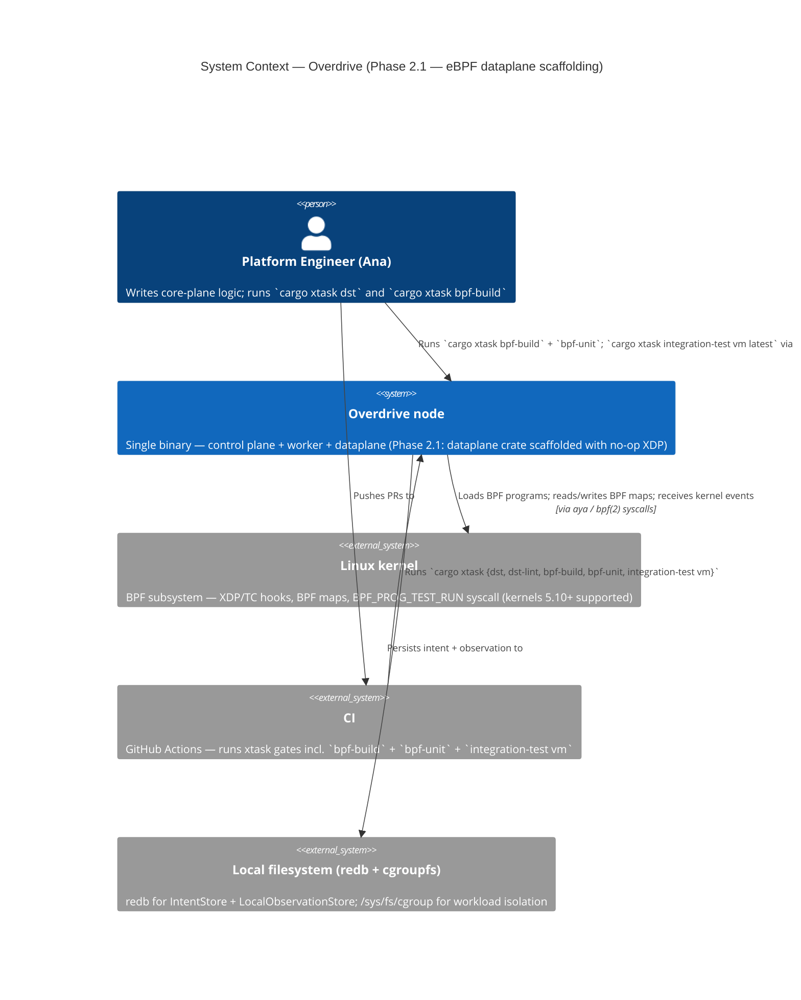
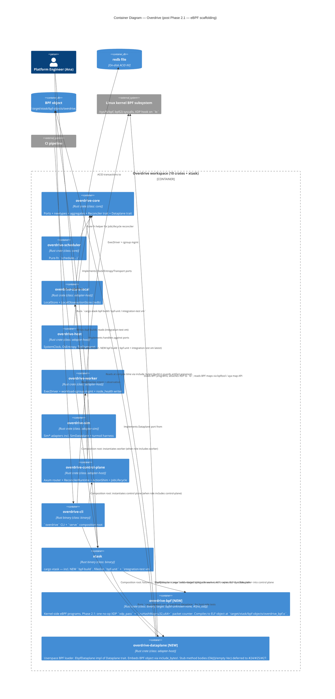

# C4 Diagrams — Overdrive

This file collects per-phase / per-feature C4 diagrams referenced from
`brief.md`, ADRs, and per-feature DESIGN docs. Each section is a
snapshot of the system at the close of a feature; superseded sections
remain for traceability.

---

## Phase 2.1 — eBPF Dataplane Containers

**Source:** `docs/feature/phase-2-aya-rs-scaffolding/design/architecture.md`
**ADR:** ADR-0038
**Date:** 2026-05-04

### C4 Level 1 — System Context

### C4 Level 2 — Container

L3 (component diagram) is intentionally skipped for Phase 2.1 — the
loader is a single struct with three trait methods (two no-ops) and
component decomposition would not add information. L3 becomes
warranted around #25 (SERVICE_MAP) when the loader gains map-update,
flow-event-consumer, and attachment-state components.
