# C4 Diagrams — Overdrive

This file collects per-phase / per-feature C4 diagrams referenced from
`brief.md`, ADRs, and per-feature DESIGN docs. Each section is a
snapshot of the system at the close of a feature; superseded sections
remain for traceability.

---

## Phase 2.1 — eBPF Dataplane Containers

**Source:** `docs/feature/phase-2-aya-rs-scaffolding/design/architecture.md`
**ADR:** ADR-0038
**Date:** 2026-05-04

### C4 Level 1 — System Context

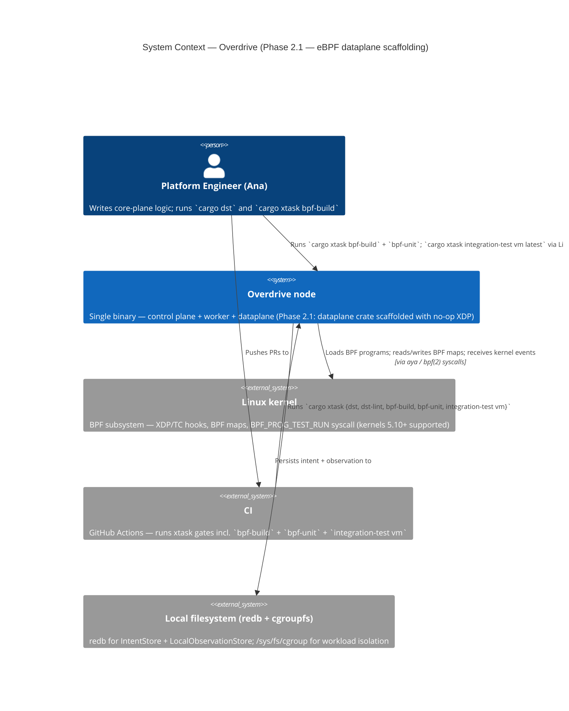
```mermaid
C4Context
  title System Context — Overdrive (Phase 2.1 — eBPF dataplane scaffolding)

  Person(engineer, "Platform Engineer (Ana)", "Writes core-plane logic; runs `cargo dst` and `cargo xtask bpf-build`")
  System(overdrive, "Overdrive node", "Single binary — control plane + worker + dataplane (Phase 2.1: dataplane crate scaffolded with no-op XDP)")
  System_Ext(kernel, "Linux kernel", "BPF subsystem — XDP/TC hooks, BPF maps, BPF_PROG_TEST_RUN syscall (kernels 5.10+ supported)")
  System_Ext(ci, "CI", "GitHub Actions — runs xtask gates incl. `bpf-build` + `bpf-unit` + `integration-test vm`")
  System_Ext(fs, "Local filesystem (redb + cgroupfs)", "redb for IntentStore + LocalObservationStore; /sys/fs/cgroup for workload isolation")

  Rel(engineer, overdrive, "Runs `cargo xtask bpf-build` + `bpf-unit`; `cargo xtask integration-test vm latest` via Lima")
  Rel(engineer, ci, "Pushes PRs to")
  Rel(ci, overdrive, "Runs `cargo xtask {dst, dst-lint, bpf-build, bpf-unit, integration-test vm}`")
  Rel(overdrive, kernel, "Loads BPF programs; reads/writes BPF maps; receives kernel events", "via aya / bpf(2) syscalls")
  Rel(overdrive, fs, "Persists intent + observation to")
```

### C4 Level 2 — Container

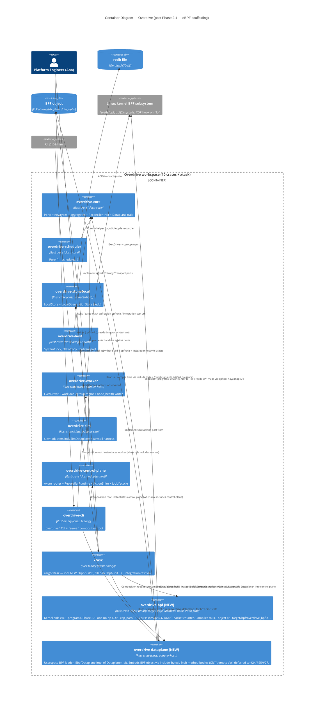
```mermaid
C4Container
  title Container Diagram — Overdrive (post Phase 2.1 — eBPF scaffolding)

  Person(engineer, "Platform Engineer (Ana)")

  Container_Boundary(workspace, "Overdrive workspace (10 crates + xtask)") {
    Container(core, "overdrive-core", "Rust crate (class: core)", "Ports + newtypes + aggregates + Reconciler trait + Dataplane trait")
    Container(scheduler, "overdrive-scheduler", "Rust crate (class: core)", "Pure-fn `schedule(...)`")
    Container(store_local, "overdrive-store-local", "Rust crate (class: adapter-host)", "LocalStore + LocalObservationStore (redb)")
    Container(host, "overdrive-host", "Rust crate (class: adapter-host)", "SystemClock, OsEntropy, TcpTransport")
    Container(worker, "overdrive-worker", "Rust crate (class: adapter-host)", "ExecDriver + workload-cgroup mgmt + node_health writer")
    Container(sim, "overdrive-sim", "Rust crate (class: adapter-sim)", "Sim* adapters incl. SimDataplane + turmoil harness")
    Container(ctrl, "overdrive-control-plane", "Rust crate (class: adapter-host)", "Axum router + ReconcilerRuntime + ActionShim + JobLifecycle")
    Container(cli, "overdrive-cli", "Rust binary (class: binary)", "`overdrive` CLI + `serve` composition root")
    Container(xtask, "xtask", "Rust binary (class: binary)", "cargo xtask — incl. NEW `bpf-build`, filled-in `bpf-unit` + `integration-test vm`")

    Container(bpf, "overdrive-bpf  [NEW]", "Rust crate (class: binary, target: bpfel-unknown-none, #![no_std])", "Kernel-side eBPF programs. Phase 2.1: one no-op XDP `xdp_pass` + `LruHashMap<u32,u64>` packet counter. Compiles to ELF object at `target/bpf/overdrive_bpf.o`.")
    Container(dataplane, "overdrive-dataplane  [NEW]", "Rust crate (class: adapter-host)", "Userspace BPF loader. EbpfDataplane impl of Dataplane trait. Embeds BPF object via include_bytes!. Stub method bodies (Ok(())/empty Vec) deferred to #24/#25/#27.")
  }

  ContainerDb(redb_file, "redb file", "On-disk ACID KV")
  ContainerDb(bpf_obj, "BPF object", "ELF at target/bpf/overdrive_bpf.o")
  System_Ext(kernel, "Linux kernel BPF subsystem", "/sys/fs/bpf, bpf(2) syscalls, XDP hook on `lo`")
  System_Ext(ci, "CI pipeline")

  Rel(engineer, xtask, "Runs `cargo xtask bpf-build / bpf-unit / integration-test vm`")
  Rel(engineer, cli, "Runs `overdrive ...`")
  Rel(ci, xtask, "Invokes per-PR (incl. NEW bpf-build + bpf-unit + integration-test vm latest)")

  Rel(xtask, bpf, "Compiles via `cargo build --target bpfel-unknown-none`; copies ELF to stable path")
  Rel(xtask, bpf_obj, "Writes (bpf-build); reads (integration-test vm)")
  Rel(xtask, dataplane, "Runs `cargo nextest run -p overdrive-dataplane` for host-side tests")

  Rel(dataplane, core, "Implements Dataplane port from")
  Rel(dataplane, bpf_obj, "Reads at compile time via include_bytes! (build.rs guards artifact presence)")
  Rel(dataplane, kernel, "Loads BPF programs; attaches XDP to `lo`; reads BPF maps via bpftool / aya map API")

  Rel(ctrl, core, "Implements handlers against ports")
  Rel(ctrl, store_local, "Reads/writes intent + observation")
  Rel(worker, kernel, "ExecDriver + cgroup mgmt")
  Rel(host, core, "Implements Clock/Entropy/Transport ports")
  Rel(scheduler, core, "Pure-fn helper for JobLifecycle reconciler")
  Rel(store_local, redb_file, "ACID transactions to")

  Rel(cli, ctrl, "Composition root: instantiates control plane (when role includes control-plane)")
  Rel(cli, worker, "Composition root: instantiates worker (when role includes worker)")
  Rel(cli, dataplane, "Composition root: future — `EbpfDataplane::new` instantiated alongside worker; #24+ wires Arc<dyn Dataplane> into control plane")
```

L3 (component diagram) is intentionally skipped for Phase 2.1 — the
loader is a single struct with three trait methods (two no-ops) and
component decomposition would not add information. L3 becomes
warranted around #25 (SERVICE_MAP) when the loader gains map-update,
flow-event-consumer, and attachment-state components.

---

## Phase 2.2 — Dataplane component diagram (Mermaid)

**Source:** `docs/feature/phase-2-xdp-service-map/design/architecture.md`
**ADRs:** ADR-0040 (three-map split + HASH_OF_MAPS), ADR-0041
(weighted Maglev + REVERSE_NAT + endianness), ADR-0042
(`ServiceMapHydrator` reconciler).
**Date:** 2026-05-05

C4 Level 1 (System Context) and Level 2 (Container) are unchanged
from Phase 2.1 — `overdrive-bpf` and `overdrive-dataplane` are
already on the L2 from #23 (ADR-0038); no new crates ship in this
phase.

L3 becomes warranted now: the loader gains real-program
attachment, four typed BPF map handles, the HASH_OF_MAPS atomic
swap primitive, and the userspace Maglev permutation generator.
The hydrator reconciler is a new component on the control-plane
side that drives the dataplane port body via a new typed Action.

### C4 Level 3 — Dataplane subsystem (Phase 2.2)

```mermaid
C4Component
  title Component Diagram — Dataplane subsystem (Phase 2.2)

  Container_Boundary(ctrl, "overdrive-control-plane (adapter-host)") {
    Component(hydrator, "ServiceMapHydrator", "Reconciler impl (NEW — ADR-0042)", "sync `reconcile`; per-target keying on ServiceId; View persists RetryMemory inputs (attempts, last_failure_seen_at) NOT deadlines per development.md")
    Component(hydrate, "AnyReconciler::hydrate_desired/_actual", "async fn (ADR-0036)", "hydrate_desired reads `service_backends` rows; hydrate_actual reads `service_hydration_results` rows (NEW table)")
    Component(svc_shim, "action_shim::service_hydration::dispatch", "async fn (NEW — ADR-0042)", "Consumes Action::DataplaneUpdateService; calls Dataplane::update_service; writes Completed/Failed row to service_hydration_results")
  }

  Container_Boundary(dataplane, "overdrive-dataplane (adapter-host)") {
    Component(ebpf_dp, "EbpfDataplane", "impl Dataplane (Phase 2.1 stubs → real impl)", "update_service(service_id, vip, backends) — Q-Sig=A three explicit args")
    Component(loader, "loader (aya::Bpf)", "Rust module", "Loads ELF; XDP attach for xdp_service_map; TC egress attach for tc_reverse_nat (Q2=A)")
    Component(swap, "swap.rs", "Rust module (NEW — Slice 03)", "Atomic HASH_OF_MAPS outer-map fd replacement — zero-drop primitive (ASR-2.2-01)")
    Component(maglev_userspace, "maglev/{permutation,table}", "Rust modules (NEW — Slice 04)", "Eisenbud permutation + weighted multiplicity expansion in deterministic BTreeMap order")
    Component(svc_handle, "ServiceMapHandle", "typed map handle (NEW — Slice 02)", "BPF_MAP_TYPE_HASH_OF_MAPS; outer key (ServiceVip, u16 port)")
    Component(backend_handle, "BackendMapHandle", "typed map handle", "BPF_MAP_TYPE_HASH; key BackendId; max_entries=65_536")
    Component(maglev_handle, "MaglevMapHandle", "typed map handle", "BPF_MAP_TYPE_HASH_OF_MAPS; outer key ServiceId; inner ARRAY size=MaglevTableSize")
    Component(reverse_handle, "ReverseNatMapHandle", "typed map handle", "BPF_MAP_TYPE_HASH; key ReverseKey; value OriginalDest; max_entries=1_048_576")
    Component(drop_handle, "DropCounterHandle", "typed map handle", "BPF_MAP_TYPE_PERCPU_ARRAY; index DropClass; 6 slots (Q7=B)")
  }

  Container_Boundary(bpf, "overdrive-bpf (binary, target bpfel-unknown-none, #![no_std])") {
    Component(xdp_prog, "xdp_service_map", "XDP program", "Forward path: sanity prologue → SERVICE_MAP → MAGLEV_MAP → BACKEND_MAP → DNAT → REVERSE_NAT_MAP write")
    Component(tc_prog, "tc_reverse_nat", "TC egress program (NEW — Slice 05)", "Reverse path: REVERSE_NAT_MAP lookup → DNAT rewrite + checksum recompute")
    Component(sanity, "shared::sanity", "#[inline(always)] helpers (NEW — Slice 06; Q3=C)", "Pre-SERVICE_MAP packet-shape checks; reverse_key_from_packet / original_dest_to_wire (endianness conversion site — ADR-0041)")
  }

  Container(core, "overdrive-core::reconciler", "Reconciler trait (ADR-0035); AnyReconciler/AnyState extended with ServiceMapHydrator variant; Action enum extended with DataplaneUpdateService variant (NEW)")
  Container(core_id, "overdrive-core::id + overdrive-core::dataplane", "Newtypes: ServiceVip, ServiceId, BackendId (NEW); MaglevTableSize, DropClass (NEW dataplane/ module)")
  Container(intent, "IntentStore (LocalIntentStore)", "redb-backed; service-related intent keys")
  Container(obs, "ObservationStore (LocalObservationStore)", "redb-backed; service_backends rows + NEW service_hydration_results table")
  Container(view_redb, "ViewStore redb file", "<data_dir>/reconcilers/memory.redb; service-map-hydrator table; CBOR blob via ciborium")
  System_Ext(kernel, "Linux kernel BPF subsystem", "bpf(2) syscalls; XDP hook on iface; TC egress qdisc; HASH_OF_MAPS atomic outer-fd replace")

  Rel(hydrate, obs, "Reads service_backends rows; reads service_hydration_results rows (NEW table)")
  Rel(hydrator, core, "Implements Reconciler trait against; emits Action::DataplaneUpdateService (NEW variant)")
  Rel(hydrator, core_id, "Uses ServiceVip / ServiceId / BackendId / MaglevTableSize / DropClass newtypes")
  Rel(hydrator, view_redb, "Runtime persists ServiceMapHydratorView (RetryMemory inputs) via RedbViewStore (ADR-0035)")
  Rel(svc_shim, ebpf_dp, "Calls update_service(service_id, vip, backends) on Arc<dyn Dataplane>")
  Rel(svc_shim, obs, "Writes service_hydration_results row {Completed | Failed} after dataplane call returns")

  Rel(ebpf_dp, loader, "Owns aya::Bpf loader; attaches XDP + TC programs")
  Rel(ebpf_dp, swap, "Calls atomic HASH_OF_MAPS swap on backend-set change")
  Rel(ebpf_dp, maglev_userspace, "Generates Maglev permutation table for new MAGLEV_MAP inner array")
  Rel(ebpf_dp, svc_handle, "Writes inner-map fd to SERVICE_MAP outer (atomic)")
  Rel(ebpf_dp, backend_handle, "Inserts/removes BackendEntry rows")
  Rel(ebpf_dp, maglev_handle, "Writes inner-map fd to MAGLEV_MAP outer (atomic)")
  Rel(ebpf_dp, reverse_handle, "Read-only from userspace (kernel-side write only); cleanup on service teardown")
  Rel(ebpf_dp, drop_handle, "Read-only from userspace (kernel-side increments only); userspace sums per-CPU at read time")

  Rel(loader, kernel, "bpf(2) syscalls; XDP attach to iface; TC egress qdisc attach")
  Rel(xdp_prog, sanity, "Calls reverse_key_from_packet (endianness conversion); calls sanity-prologue helpers")
  Rel(xdp_prog, svc_handle, "Looks up (vip, port) → inner_map_fd")
  Rel(xdp_prog, maglev_handle, "Looks up ServiceId → MaglevTableSize-sized BackendId array")
  Rel(xdp_prog, backend_handle, "Looks up BackendId → BackendEntry")
  Rel(xdp_prog, reverse_handle, "Writes ReverseKey → OriginalDest on forward path")
  Rel(xdp_prog, drop_handle, "Increments per-class counter on drop")
  Rel(tc_prog, reverse_handle, "Looks up ReverseKey → OriginalDest on reverse path")
  Rel(tc_prog, sanity, "Calls original_dest_to_wire (endianness conversion)")
```

The diagram makes three architectural properties visually explicit:

1. **Hydrator → Action → shim → Dataplane → ObservationStore → next
   tick** — the convergence loop closes via the new
   `service_hydration_results` table, NOT via deriving `actual`
   from the last-emitted action (Drift 2 fix per ADR-0042).
2. **Three keyed maps, three typed handles, three different keys**
   — `(ServiceVip, u16 port)` for SERVICE_MAP, `ServiceId` for
   MAGLEV_MAP, `BackendId` for BACKEND_MAP (Drift 3 correction per
   ADR-0040). No type confusion at compile time.
3. **One conversion site for endianness** — wire packets go through
   `shared::sanity::reverse_key_from_packet` and back through
   `original_dest_to_wire`; map storage is host-order everywhere
   else (per ADR-0041). Tier 2 BPF unit roundtrip + userspace
   proptest gate the contract.

---

## Phase 1 — Service VIP Allocator component diagram (Mermaid)

**Source:** `docs/feature/service-vip-allocator/design/wave-decisions.md` + ADR-0049
**ADR:** ADR-0049 (relates to ADR-0046, ADR-0042, ADR-0047, ADR-0048, ADR-0019, ADR-0013)
**Date:** 2026-05-14

System Context (L1) and Container (L2) inherit from prior phases
unchanged — the allocator introduces no new external actors and no
new containers (the primitive is internal to `overdrive-dataplane`).
Only L3 is new here.

### C4 Level 3 — Service VIP Allocator subsystem (Phase 1)

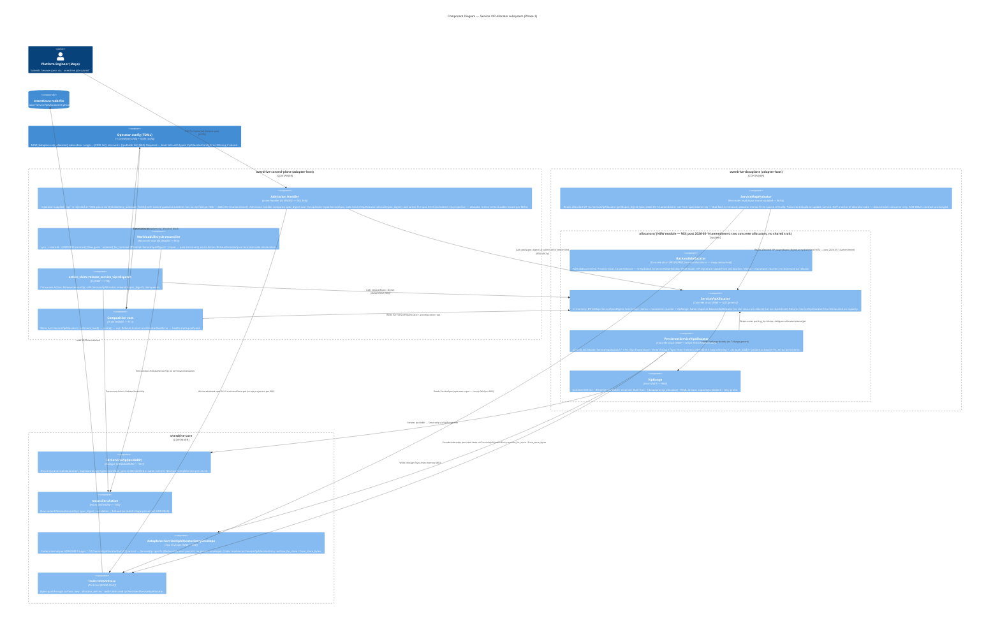
```mermaid
C4Component
  title Component Diagram — Service VIP Allocator subsystem (Phase 1)

  Person(operator, "Platform Engineer (Maya)", "Submits Service specs via `overdrive job submit`")

  Container_Boundary(ctrl, "overdrive-control-plane (adapter-host)") {
    Component(admit, "Admission Handler", "axum handler (EXTENDED — §64, §66)", "Operator-supplied `vip` is rejected at TOML parse via #[serde(deny_unknown_fields)] with named guidance (Listener has no vip field per §66 — 2026-05-14 amendment). Admission handler computes spec_digest over the operator-input ServiceSpec, calls ServiceVipAllocator::allocate(spec_digest), and writes the spec AS-IS (no listener.vip projection — allocator memo is the durable record per §67a).")
    Component(wl_recon, "WorkloadLifecycle reconciler", "Reconciler impl (EXTENDED — §65)", "sync `reconcile` (ADR-0035 contract); View gains `released_for_terminal: BTreeSet<ServiceSpecDigest>` (input — past emissions); emits Action::ReleaseServiceVip on terminal-state observation.")
    Component(vip_shim, "action_shim::release_service_vip::dispatch", "fn (NEW — §70)", "Consumes Action::ReleaseServiceVip; calls ServiceVipAllocator::release(&spec_digest); idempotent.")
    Component(boot_probe, "Composition root", "fn (EXTENDED — §71)", "Wires Arc<ServiceVipAllocator>; calls bulk_load() → probe() → use. Refuses to start on AllocatorBootError → health.startup.refused.")
  }

  Container_Boundary(dp, "overdrive-dataplane (adapter-host)") {
    Boundary(allocs, "allocators/ (NEW module — §63; post 2026-05-14 amendment: two concrete allocators, no shared trait)") {
      Component(backend_alloc, "BackendIdAllocator", "Concrete struct (RELOCATED from src/allocator.rs — body untouched)", "ADR-0046 primitive. Process-local, no persistence — re-hydrated by ServiceMapHydrator (ADR-0042). API signature-stable from old location. Memo + monotonic counter; no slot reuse on release.")
      Component(vip_alloc, "ServiceVipAllocator", "Concrete struct (NEW — NOT generic)", "In-memory: BTreeMap<ServiceSpecDigest, ServiceVip> memo + monotonic counter + VipRange. Same shape as BackendIdAllocator (no slot reuse on release) but no shared trait. Returns ServiceVipAllocatorError::Exhausted on capacity.")
      Component(shim, "PersistentServiceVipAllocator", "Concrete struct (NEW — wraps ServiceVipAllocator)", "parking_lot::Mutex<ServiceVipAllocator> + Arc<dyn IntentStore>. Write-through fsync-then-memory (ADR-0035 § Step ordering 7→8). bulk_load() + probe() at boot (§71). AC-02 persistence.")
      Component(vip_range, "VipRange", "struct (NEW — §68)", "Ipv4Net CIDR list + BTreeSet<Ipv4Addr> reserved. Built from `[dataplane.vip_allocator]` TOML at boot. capacity() validated > 0 by probe.")
    }
    Component(hydrator, "ServiceMapHydrator", "Reconciler impl (input source updated — §67a)", "Reads allocated VIP via ServiceVipAllocator::get(&spec_digest) (post 2026-05-14 amendment: not from spec.listener.vip — that field is removed; allocator memo IS the source of truth). Passes to Dataplane::update_service. NOT a writer of allocator state — downstream consumer only. ADR-0042's contract unchanged.")
  }

  Container_Boundary(corebox, "overdrive-core") {
    Component(vip_newtype, "id::ServiceVip(Ipv4Addr)", "Newtype (CONSOLIDATED — §67)", "IPv4-only canonical declaration; duplicate at aggregate/workload_spec.rs:360 deleted in same commit. Newtype completeness preserved.")
    Component(action, "reconciler::Action", "enum (EXTENDED — §70)", "New variant ReleaseServiceVip { spec_digest, correlation }. Exhaustive-match shape preserved (ADR-0023).")
    Component(envelope, "dataplane::ServiceVipAllocatorEntryEnvelope", "rkyv envelope (NEW — §69)", "Codec-internal per ADR-0048 § Layer 1; V1(ServiceVipAllocatorEntryV1) variant — ServiceVip-specific (BackendId never persists; no generic envelope). Codec module on ServiceVipAllocatorEntry: archive_for_store / from_store_bytes.")
    Component(intent_trait, "traits::IntentStore", "Port trait (REUSE AS-IS)", "Bytes-passthrough surface; new `allocator_entries` redb table used by PersistentServiceVipAllocator.")
  }

  ContainerDb(intent_db, "IntentStore redb file", "On-disk ACID KV; new `allocator_entries` table — key=spec_digest, value=ServiceVipAllocatorEntryEnvelope archived bytes (ServiceVip-only — BackendId does not persist)")
  Container(config, "Operator config (TOML)", "~/.overdrive/config + node config", "NEW [dataplane.vip_allocator] subsection: ranges = [CIDR list], reserved = [Ipv4Addr list] (§68). Required — boot fails with typed VipAllocatorConfigError::Missing if absent.")

  Rel(operator, admit, "POST /v1/jobs/{id} (Service spec)", "HTTPS")

  Rel(admit, vip_alloc, "Calls allocate(spec_digest) → ServiceVip", "SYNC at submit-time (§64)")
  Rel(admit, vip_alloc, "Calls get(&spec_digest) at submit-echo render time", "READ (§67a)")
  Rel(admit, intent_trait, "Writes admitted spec AS-IS via IntentStore.put (no vip projection per §66)")

  Rel(boot_probe, vip_alloc, "Wires Arc<ServiceVipAllocator> at composition root")
  Rel(boot_probe, config, "Deserialises [dataplane.vip_allocator] block")

  Rel(shim, vip_alloc, "Wraps under parking_lot::Mutex; delegates allocate/release/get")
  Rel(shim, intent_trait, "Write-through fsync-then-memory (§63)")
  Rel(shim, envelope, "Encodes/decodes persisted state via ServiceVipAllocatorEntry::archive_for_store / from_store_bytes")
  Rel(vip_alloc, vip_range, "Holds VipRange directly (no T::Range generic)")
  Rel(vip_range, vip_newtype, "Iterates Ipv4Addr → ServiceVip via VipRange::nth")

  Rel(wl_recon, action, "Emits Action::ReleaseServiceVip on terminal observation")
  Rel(vip_shim, action, "Consumes Action::ReleaseServiceVip")
  Rel(vip_shim, vip_alloc, "Calls release(&spec_digest)", "IDEMPOTENT (§65)")

  Rel(hydrator, vip_alloc, "Reads allocated VIP via get(&spec_digest) at hydrate time (§67a — post 2026-05-14 amendment)")
  Rel(hydrator, intent_trait, "Reads ServiceSpec (operator-input — no vip field per §66)")

  Rel(intent_trait, intent_db, "redb ACID transactions")
  Rel(config, boot_probe, "Parsed at boot")
```

The diagram makes five architectural properties visually explicit:

1. **Persistence is a structural boundary** *(amended 2026-05-14)* —
   `BackendIdAllocator` lives directly in `allocators/backend_id.rs`
   with no IntentStore edge (re-hydrates via ServiceMapHydrator);
   `ServiceVipAllocator` is wrapped by concrete
   `PersistentServiceVipAllocator` which holds the
   `Arc<dyn IntentStore>` edge. Persistence is enforced via concrete
   wrapping, not via a generic `IntentBackedAllocator<T>` shim — the
   prior generic shape was rejected during DELIVER step 01-01 (see
   ADR-0049 § Considered alternatives → Alt-0). The
   "compile-time-must-persist vs compile-time-cannot-persist"
   distinction remains a type-level shape: the wrapper exists OR it
   doesn't; the wrapping is concrete.
2. **Submit-time allocation is the single source of VIP truth** —
   the admission handler is the only writer of the allocator;
   the allocator's `allocator_entries` redb table IS the durable
   record of the assignment (post 2026-05-14 amendment — §67a:
   `Listener` has no `vip` field; the spec does not carry the
   assigned VIP). `ServiceMapHydrator` (downstream consumer) reads
   the allocated VIP via `ServiceVipAllocator::get(&spec_digest)`
   directly. The intent-vs-observation split is preserved
   (allocation IS intent — allocator memo lives in IntentStore).
3. **Reclamation rides the existing reconciler primitive** —
   `WorkloadLifecycle` emits `Action::ReleaseServiceVip`; the
   action-shim arm dispatches; no new orchestration surface. The
   reconciler View carries the *inputs* (`released_for_terminal`
   set of past emissions), not a derived deadline per
   `development.md` § "Persist inputs, not derived state".
4. **Earned Trust at composition root** — `bulk_load()` runs
   `probe()` before the allocator is exposed to any caller. Three
   enforcement layers per principle 12: subtype (`probe()` on the
   trait), structural (xtask AST scanner verifies probe-call
   ordering), behavioural (CI gold-test with
   CIDR-too-small-for-persisted-state fixture).
5. **One canonical `ServiceVip`** — the consolidation to
   `overdrive-core::id::ServiceVip(Ipv4Addr)` makes the `Token`
   impl unambiguous. The previously-duplicate declaration at
   `aggregate/workload_spec.rs:360` is deleted in the same commit.
   Post 2026-05-14 amendment, `Listener` no longer references
   `ServiceVip` at all (the `vip` field is removed entirely per
   §66 / ADR-0049 § 5); references narrow to the allocator codec,
   the kernel-side `Dataplane::update_service(_, vip: ServiceVip, _)`
   parameter, and the hydrator's allocator consult.

6. **Type-driven design — make invalid states unrepresentable**
   (added 2026-05-14 amendment). The operator-input spec
   structurally cannot carry an assigned VIP — `Listener` has no
   `vip` field; the aggregate has no `assigned_vip` field. The
   allocator's persisted memo is the only place the assignment
   exists. Operator-supplied `vip = "..."` fails at TOML deserialise
   with `unknown field`, never reaching admission. The prior
   admission-layer validator (`AdmissionError::VipNotOperatorAssignable`)
   is deleted per `.claude/rules/development.md` § "Deletion
   discipline".

## Phase 1 — Service Health-Check Probes component diagram (Mermaid)

**Source:** `docs/feature/service-health-check-probes/` DESIGN-wave
artifacts + ADR-0054..ADR-0059.
**ADRs:** ADR-0054 (ProbeRunner), ADR-0055
(ServiceLifecycleReconciler), ADR-0056 (ServiceSubmitEvent
evolution), ADR-0057 (TOML spec), ADR-0058 (default-probe
inference), ADR-0059 (exec-probe cgroup placement). Amendments to
ADR-0032 / ADR-0033 / ADR-0037 / ADR-0048 / ADR-0050.
**Date:** 2026-05-24.

System Context (L1) and Container (L2) inherit unchanged: no new
external actors, no new top-level containers. `overdrive-worker`
gains the ProbeRunner subsystem; `overdrive-control-plane` gains
the `ServiceLifecycleReconciler` (a sibling of `WorkloadLifecycle`
under the `reconcilers/` module).

### C4 Level 2 — Container annotation (Phase 1 service-health-check-probes)

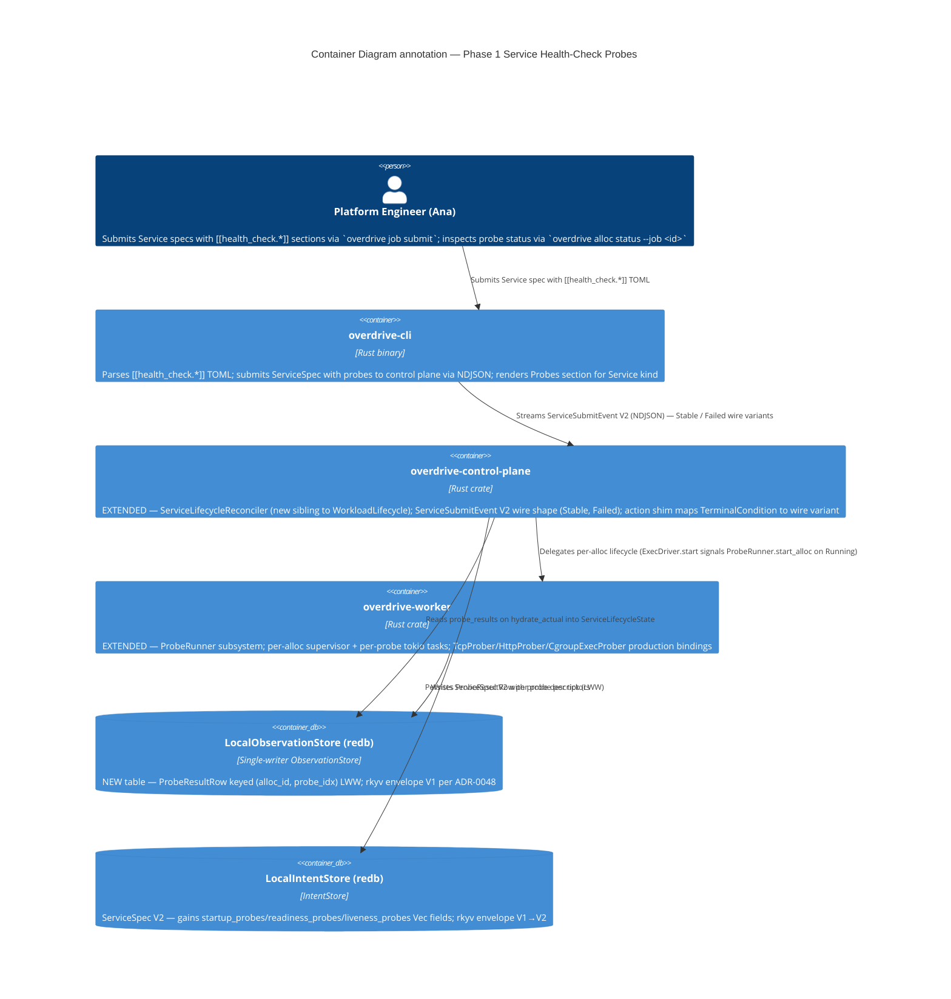
```mermaid
C4Container
  title Container Diagram annotation — Phase 1 Service Health-Check Probes

  Person(operator, "Platform Engineer (Ana)", "Submits Service specs with [[health_check.*]] sections via `overdrive job submit`; inspects probe status via `overdrive alloc status --job <id>`")

  Container(cli, "overdrive-cli", "Rust binary", "Parses [[health_check.*]] TOML; submits ServiceSpec with probes to control plane via NDJSON; renders Probes section for Service kind")
  Container(ctrl, "overdrive-control-plane", "Rust crate", "EXTENDED — ServiceLifecycleReconciler (new sibling to WorkloadLifecycle); ServiceSubmitEvent V2 wire shape (Stable, Failed); action shim maps TerminalCondition to wire variant")
  Container(worker, "overdrive-worker", "Rust crate", "EXTENDED — ProbeRunner subsystem; per-alloc supervisor + per-probe tokio tasks; TcpProber/HttpProber/CgroupExecProber production bindings")
  ContainerDb(obs, "LocalObservationStore (redb)", "Single-writer ObservationStore", "NEW table — ProbeResultRow keyed (alloc_id, probe_idx) LWW; rkyv envelope V1 per ADR-0048")
  ContainerDb(intent, "LocalIntentStore (redb)", "IntentStore", "ServiceSpec V2 — gains startup_probes/readiness_probes/liveness_probes Vec fields; rkyv envelope V1→V2")

  Rel(operator, cli, "Submits Service spec with [[health_check.*]] TOML")
  Rel(cli, ctrl, "Streams ServiceSubmitEvent V2 (NDJSON) — Stable / Failed wire variants")
  Rel(ctrl, intent, "Persists ServiceSpec V2 with probe descriptors")
  Rel(ctrl, worker, "Delegates per-alloc lifecycle (ExecDriver.start signals ProbeRunner.start_alloc on Running)")
  Rel(worker, obs, "Writes ProbeResultRow per probe per tick (LWW)")
  Rel(ctrl, obs, "Reads probe_results on hydrate_actual into ServiceLifecycleState")
```

### C4 Level 3 — ProbeRunner subsystem topology

This is the load-bearing new component diagram for the feature.
See `brief.md` § 86 for the canonical embedding; reproduced here
for cross-reference.

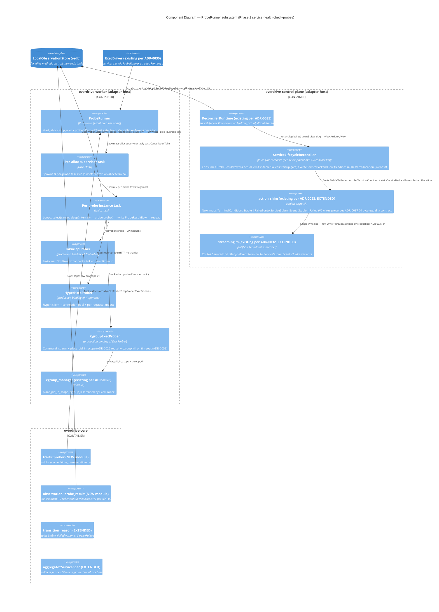
```mermaid
C4Component
  title Component Diagram — ProbeRunner subsystem (Phase 1 service-health-check-probes)

  Container_Boundary(worker, "overdrive-worker (adapter-host)") {
    Component(runner, "ProbeRunner", "Rust struct (Arc-shared per node)", "start_alloc / stop_alloc / probe() Earned Trust gate; holds CancellationTokens per alloc")
    Component(supervisor, "Per-alloc supervisor task", "tokio::task", "Spawns N per-probe tasks via JoinSet; cancels on alloc terminal")
    Component(probe_task, "Per-probe-instance task", "tokio::task", "Loops: select(cancel, sleep(interval)) → probe.probe() → write ProbeResultRow → repeat")
    Component(tcp_prober, "TokioTcpProber", "production binding of TcpProber", "tokio::net::TcpStream::connect + tokio::time::timeout")
    Component(http_prober, "HyperHttpProber", "production binding of HttpProber", "hyper::client + connection pool + per-request timeout")
    Component(exec_prober, "CgroupExecProber", "production binding of ExecProber", "Command::spawn + place_pid_in_scope (ADR-0026 reuse) + cgroup.kill on timeout (ADR-0059)")
    Component(cgmgr, "cgroup_manager (existing per ADR-0026)", "module", "place_pid_in_scope, cgroup_kill; reused by ExecProber")
  }

  Container_Boundary(ctrl, "overdrive-control-plane (adapter-host)") {
    Component(reconciler_runtime, "ReconcilerRuntime (existing per ADR-0035)", "Reads probe_results into ServiceLifecycleState.actual on hydrate_actual; dispatches to ServiceLifecycleReconciler")
    Component(service_reconciler, "ServiceLifecycleReconciler", "Pure sync reconcile (per development.md § Reconciler I/O)", "Consumes ProbeResultRow via actual; emits Stable/Failed (startup gate) / WriteServiceBackendRow (readiness) / RestartAllocation (liveness)")
    Component(action_shim, "action_shim (existing per ADR-0023, EXTENDED)", "Action dispatch", "New: maps TerminalCondition::Stable | Failed onto ServiceSubmitEvent::Stable | Failed (V2 wire); preserves ADR-0037 §4 byte-equality contract")
    Component(streaming, "streaming.rs (existing per ADR-0032, EXTENDED)", "NDJSON broadcast subscriber", "Routes Service-kind LifecycleEvent.terminal to ServiceSubmitEvent V2 wire variants")
  }

  Container_Boundary(core, "overdrive-core") {
    Component(core_traits, "traits::prober (NEW module)", "TcpProber / HttpProber / ExecProber port traits with rustdoc preconditions, postconditions, edge cases, observable invariants per development.md")
    Component(core_obs, "observation::probe_result (NEW module)", "ProbeResultRow + ProbeResultRowEnvelope::V1 per ADR-0048")
    Component(core_tc, "transition_reason (EXTENDED)", "TerminalCondition gains Stable, Failed variants; ServiceFailureReason enum NEW")
    Component(core_spec, "aggregate::ServiceSpec (EXTENDED)", "Gains startup_probes / readiness_probes / liveness_probes Vec<ProbeDescriptor>; rkyv envelope V2")
  }

  ContainerDb(obs_store, "LocalObservationStore (redb)", "EXTENDED — write_probe_result + list_probe_results_for_alloc methods on trait; new redb table for ProbeResultRow keyed (alloc_id, probe_idx) LWW")
  Container(exec_driver, "ExecDriver (existing per ADR-0030)", "Per-alloc supervisor signals ProbeRunner on alloc Running and terminal")

  Rel(exec_driver, runner, "on_alloc_running(alloc_id, probe_descriptors) / on_alloc_terminal(alloc_id)")
  Rel(runner, supervisor, "spawn per-alloc supervisor task; pass CancellationToken")
  Rel(supervisor, probe_task, "spawn N per-probe tasks via JoinSet")
  Rel(probe_task, tcp_prober, "TcpProber::probe (TCP mechanic)")
  Rel(probe_task, http_prober, "HttpProber::probe (HTTP mechanic)")
  Rel(probe_task, exec_prober, "ExecProber::probe (Exec mechanic)")
  Rel(exec_prober, cgmgr, "place_pid_in_scope + cgroup_kill")
  Rel(probe_task, obs_store, "ObservationStore::write_probe_result(ProbeResultRow) — LWW per (alloc_id, probe_idx)")
  Rel(reconciler_runtime, obs_store, "list_probe_results_for_alloc on hydrate_actual")
  Rel(reconciler_runtime, service_reconciler, "reconcile(desired, actual, view, tick) → (Vec<Action>, View)")
  Rel(service_reconciler, action_shim, "Emits Stable/Failed Action::SetTerminalCondition + WriteServiceBackendRow + RestartAllocation")
  Rel(action_shim, streaming, "Single write site — row write + broadcast write byte-equal per ADR-0037 §4")
  Rel(core_traits, runner, "Trait surface (Arc<dyn TcpProber/HttpProber/ExecProber>)")
  Rel(core_obs, obs_store, "Row shape; rkyv envelope V1")
```

The diagram makes six architectural properties visually explicit:

1. **Reconciler is a pure consumer of observation rows** (per
   `.claude/rules/development.md` § "Reconciler I/O"). The
   `ServiceLifecycleReconciler` has no edge to `ProbeRunner`,
   `TcpProber`, `HttpProber`, or `ExecProber` — it reads from
   `actual.probe_results` only. Probe execution is observation
   production; the reconciler is the pure decision boundary.
2. **Per-alloc-per-probe failure isolation** (per ADR-0054 §2 +
   feature-delta Risk #1). Each per-probe-instance task owns its
   own `clock.sleep(interval)` and `probe.probe()` call; no
   shared scheduler, no head-of-line blocking across probes.
   `JoinSet` drop on supervisor cancel guarantees bounded
   shutdown.
3. **Three port traits, three production adapters, three sim
   adapters** (per ADR-0054 §3). Each trait carries explicit
   rustdoc preconditions, postconditions, edge cases. DST
   equivalence harnesses drive each pair independently per
   `.claude/rules/development.md` § "Trait definitions specify
   behavior, not just signature".
4. **Cgroup-aware exec via reused cgroup-manager primitives**
   (per ADR-0059). `CgroupExecProber` reuses
   `place_pid_in_scope` + `cgroup_kill` from `ExecDriver`'s
   existing module; bounded new code in the exec-probe path.
5. **LWW observation, not append-mode** (per ADR-0054 §5 +
   `.claude/rules/development.md` § "Persist inputs, not derived
   state"). Composite primary key `(alloc_id, probe_idx)`;
   `redb::insert` semantics give LWW structurally; no merge
   logic. Operational history (consecutive failures,
   last_observed_at) is the reconciler's recomputation at read
   time, not a persisted derived field.
6. **`Stable` non-terminal semantics encoded structurally** (per
   ADR-0055 §2 / §4). The `ServiceLifecycleView::stable_announced`
   `BTreeSet<AllocationId>` is the publication-side dedup gate;
   `TerminalCondition::Stable` carries no `is_terminal: bool`
   flag because the dedup lives in the reconciler View. ADR-0037
   layering rule preserved verbatim — streaming forwards
   `LifecycleEvent.terminal` without re-deriving.

---

## UDP service support — `ServiceFrontend` on `update_service` (Mermaid)

**Source:** `docs/feature/udp-service-support/` DESIGN-wave artifacts.
**ADR:** ADR-0060. Extends Phase 2.2 (ADR-0040..0042).
**Date:** 2026-06-02. **GH:** #163.

### C4 Level 1 — System Context

System Context inherits unchanged from Phase 2.1/2.2: no new external
actors, no new external systems. The operator (Ana) submits a Service-kind
workload with a `protocol = "udp"` listener; the Linux kernel's BPF
subsystem is the enforcement boundary. Reproduced for self-containment.

```mermaid
C4Context
  title System Context — Overdrive (UDP service support, GH #163)

  Person(operator, "Platform Engineer (Ana)", "Submits a Service with a udp listener via `overdrive job submit`; verifies the reverse path with a wire capture")
  System(overdrive, "Overdrive node", "Single binary — control plane + worker + dataplane; per-service L4 protocol now threaded to the dataplane boundary")
  System_Ext(kernel, "Linux kernel (BPF)", "XDP/TC hooks; REVERSE_NAT_MAP; xdp_reverse_nat_lookup rewrites a backend response source back to the VIP per (ip,port,proto)")
  System_Ext(ci, "CI", "Runs the three-tier ReverseNatLockstep gate: cargo dst (T1) + cargo xtask bpf-unit (T2) + cargo xtask lima run integration (T3)")

  Rel(operator, overdrive, "Submits a udp Service; sends a UDP datagram to the VIP")
  Rel(overdrive, kernel, "Installs REVERSE_NAT_MAP (backend_ip, port, proto) → vip via update_service(frontend, backends)")
  Rel(kernel, operator, "UDP response source-rewritten to the VIP (was: backend IP — the #163 defect)")
  Rel(ci, overdrive, "Gates Sim≡Ebpf REVERSE_NAT key-set equality per declared proto")
```

### C4 Level 2 — Container annotation

Container topology inherits unchanged: no new container. `overdrive-core`
gains the `ServiceFrontend` newtype + the protocol dimension on the Action
and the desired projection; `overdrive-dataplane` (Ebpf) and `overdrive-sim`
(Sim) gain the per-proto REVERSE_NAT fan-out; `overdrive-control-plane`'s
action-shim builds the frontend (and is the operator-visible IPv6-rejection
site).

The desired projection's NEW protocol dimension is sourced from a
listener-bearing fact — `ListenerRow` / the `BackendDiscoveryBridge`
per-listener projection — **NOT** from `service_backends` (which carries no
port/proto). This is distinct from `hydrate_desired` reading `service_backends`
rows for VIP/backends today (line 122): the proto comes from the listener fact,
never that row, and never a silent `Proto::Tcp` default (C3). See ADR-0060.

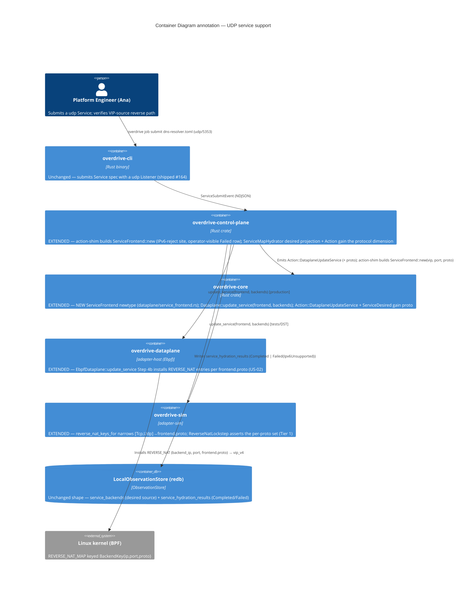
```mermaid
C4Container
  title Container Diagram annotation — UDP service support

  Person(operator, "Platform Engineer (Ana)", "Submits a udp Service; verifies VIP-source reverse path")

  Container(cli, "overdrive-cli", "Rust binary", "Unchanged — submits Service spec with a udp Listener (shipped #164)")
  Container(ctrl, "overdrive-control-plane", "Rust crate", "EXTENDED — action-shim builds ServiceFrontend::new (IPv6-reject site, operator-visible Failed row); ServiceMapHydrator desired projection + Action gain the protocol dimension")
  Container(core, "overdrive-core", "Rust crate", "EXTENDED — NEW ServiceFrontend newtype (dataplane/service_frontend.rs); Dataplane::update_service(frontend, backends); Action::DataplaneUpdateService + ServiceDesired gain proto")
  Container(dp, "overdrive-dataplane", "adapter-host (Ebpf)", "EXTENDED — EbpfDataplane::update_service Step 4b installs REVERSE_NAT entries per frontend.proto (US-02)")
  Container(sim, "overdrive-sim", "adapter-sim", "EXTENDED — reverse_nat_keys_for narrows [Tcp,Udp]→frontend.proto; ReverseNatLockstep asserts the per-proto set (Tier 1)")
  ContainerDb(obs, "LocalObservationStore (redb)", "ObservationStore", "Unchanged shape — service_backends (desired source) + service_hydration_results (Completed/Failed)")
  System_Ext(kernel, "Linux kernel (BPF)", "REVERSE_NAT_MAP keyed BackendKey{ip,port,proto}")

  Rel(operator, cli, "overdrive job submit dns-resolver.toml (udp/5353)")
  Rel(cli, ctrl, "ServiceSubmitEvent (NDJSON)")
  Rel(ctrl, obs, "Reads service_backends → ServiceDesired{vip, port, proto, backends}")
  Rel(ctrl, core, "Emits Action::DataplaneUpdateService (+ proto); action-shim builds ServiceFrontend::new(vip, port, proto)")
  Rel(ctrl, dp, "update_service(frontend, backends) [production]")
  Rel(ctrl, sim, "update_service(frontend, backends) [tests/DST]")
  Rel(dp, kernel, "Installs REVERSE_NAT (backend_ip, port, frontend.proto) → vip_v4")
  Rel(ctrl, obs, "Writes service_hydration_results (Completed | Failed{Ipv6Unsupported})")
```

### C4 Level 3 — `update_service` call-path fan-out (the 8-site blast radius)

The component diagram makes the true blast radius (ADR-0060 D6) visually
explicit: the protocol dimension is plumbed end-to-end (C3), so it touches
the Action and the desired projection, not only the trait.

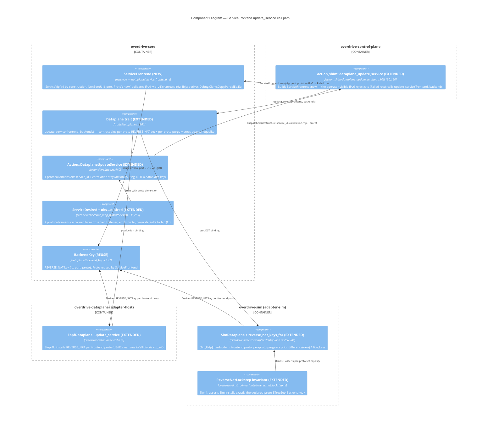
```mermaid
C4Component
  title Component Diagram — ServiceFrontend update_service call path

  Container_Boundary(core, "overdrive-core") {
    Component(frontend, "ServiceFrontend (NEW)", "newtype — dataplane/service_frontend.rs", "(ServiceVip V4-by-construction, NonZeroU16 port, Proto); new() validates IPv4; vip_v4() narrows infallibly; derives Debug,Clone,Copy,PartialEq,Eq")
    Component(trait_dp, "Dataplane trait (EXTENDED)", "traits/dataplane.rs:101", "update_service(frontend, backends) — contract pins per-proto REVERSE_NAT set + per-proto purge + cross-adapter equality")
    Component(action, "Action::DataplaneUpdateService (EXTENDED)", "reconcilers/mod.rs:440", "+ protocol dimension; service_id + correlation stay (action-routing, NOT a dataplane key)")
    Component(desired, "ServiceDesired + obs→desired (EXTENDED)", "reconcilers/service_map_hydrator.rs:40,235,263", "+ protocol dimension carried from observed Listener; emits proto, never defaults to Tcp (C3)")
    Component(backend_key, "BackendKey (REUSE)", "dataplane/backend_key.rs:137", "REVERSE_NAT key {ip, port, proto}; Proto reused by ServiceFrontend")
  }

  Container_Boundary(ctrl, "overdrive-control-plane") {
    Component(shim, "action_shim::dataplane_update_service (EXTENDED)", "action_shim/dataplane_update_service.rs:100,130,160", "Builds ServiceFrontend::new — the operator-visible IPv6-reject site (Failed row); calls update_service(frontend, backends)")
  }

  Container_Boundary(dp, "overdrive-dataplane (adapter-host)") {
    Component(ebpf, "EbpfDataplane::update_service (EXTENDED)", "overdrive-dataplane/src/lib.rs", "Step 4b installs REVERSE_NAT per frontend.proto (US-02); narrows infallibly via vip_v4()")
  }

  Container_Boundary(sim, "overdrive-sim (adapter-sim)") {
    Component(simdp, "SimDataplane + reverse_nat_keys_for (EXTENDED)", "overdrive-sim/src/adapters/dataplane.rs:266,289", "[Tcp,Udp] hardcode → frontend.proto; per-proto purge via prior.difference(new) ∖ live_keys")
    Component(lockstep, "ReverseNatLockstep invariant (EXTENDED)", "overdrive-sim/src/invariants/reverse_nat_lockstep.rs", "Tier 1: asserts Sim installs exactly the declared-proto BTreeSet<BackendKey>")
  }

  Rel(desired, action, "Emits with proto dimension")
  Rel(action, shim, "Dispatched (destructure service_id, correlation, vip, +proto)")
  Rel(shim, frontend, "ServiceFrontend::new(vip, port, proto) — IPv6 → Failed row")
  Rel(shim, trait_dp, "update_service(frontend, backends)")
  Rel(trait_dp, ebpf, "production binding")
  Rel(trait_dp, simdp, "test/DST binding")
  Rel(ebpf, backend_key, "Derives REVERSE_NAT key per frontend.proto")
  Rel(simdp, backend_key, "Derives REVERSE_NAT key per frontend.proto")
  Rel(lockstep, simdp, "Drives + asserts per-proto set equality")
  Rel(frontend, backend_key, "Reuses Proto; port→u16 via .get()")
```

Four properties the diagram makes explicit:

1. **The protocol is plumbed end-to-end, never defaulted** (C3). The
   `ServiceDesired` → `Action` → `ServiceFrontend` chain carries `proto`
   from the observed `Listener`; there is no edge on which `Proto::Tcp` is
   synthesised as a default. This is the correction to the DISCUSS "hydrator
   unchanged" claim.
2. **`service_id`/`correlation` are NOT in the dataplane key.** They stay on
   `Action::DataplaneUpdateService` (action-routing); `ServiceFrontend`
   carries only `(vip, port, proto)`. The trait surface has no `service_id`
   edge.
3. **IPv6 rejection stays operator-visible.** The only construction site for
   `ServiceFrontend` is the action-shim's `new()`, which is the existing
   `ipv4_from_vip` rejection point (Failed observation row). Adapters narrow
   infallibly — no late opaque `DataplaneError`.
4. **The three-tier gate is the equivalence guard.** `ReverseNatLockstep`
   (Tier 1, Sim) + the Ebpf `bpftool` acceptance (Tier 3) + the
   `BPF_PROG_TEST_RUN` triptych (Tier 2) meet at the shared `BackendKey`
   set; there is no single-process two-adapter DST because the real adapter
   needs a kernel + bpffs.

---

## Phase 1 — Workflow Primitive (Mermaid)

**Source:** `docs/feature/workflow-primitive/` DESIGN-wave artifacts.
**ADR:** ADR-0066 (journal), ADR-0064 (trait+ctx+engine). Extends ADR-0035
(reconciler memory / `ViewStore`) + ADR-0023 (action-shim).
**Date:** 2026-06-05. **GH:** #39 (roadmap [3.2]). Architecture locked to B′.

### C4 Level 1 — System Context

```mermaid
C4Context
  title System Context — Overdrive (Workflow primitive, GH #39)

  Person(devon, "Platform Engineer (Devon)", "Authors a durable sequence as `impl Workflow { async fn run(ctx) }`; runs `cargo dst --only replay_equivalence_provision_record`")
  Person(ana, "Operator (Ana)", "Observes a running/terminal instance via ObservationStore rows + lifecycle events. NO `overdrive workflow` CLI verb (#206)")
  System(overdrive, "Overdrive node", "Single binary — control plane hosts the workflow engine + redb journal; runs durable-async sequences to a terminal WorkflowResult, crash-resumable on the same node")
  System_Ext(fs, "Local filesystem (redb)", "ONE redb file `<data_dir>/reconcilers/memory.redb` — reconciler View tables + the `__wf_journal__` append-only journal table (second layout, same substrate)")
  System_Ext(ci, "CI", "Runs `cargo dst` incl. the K4 `replay_equivalence_provision_record` SimInvariant on the critical path, seed-reproducible")

  Rel(devon, overdrive, "Authors `impl Workflow`; the workflow-lifecycle reconciler brings the instance up via Action::StartWorkflow")
  Rel(ana, overdrive, "Reads ObservationStore terminal-result row (keyed by CorrelationKey) + structured lifecycle events")
  Rel(overdrive, fs, "Appends journal checkpoints (fsync-before-suspend); replays on resume")
  Rel(ci, overdrive, "Gates replay-equivalence + bounded-progress (K4)")
```

### C4 Level 2 — Container

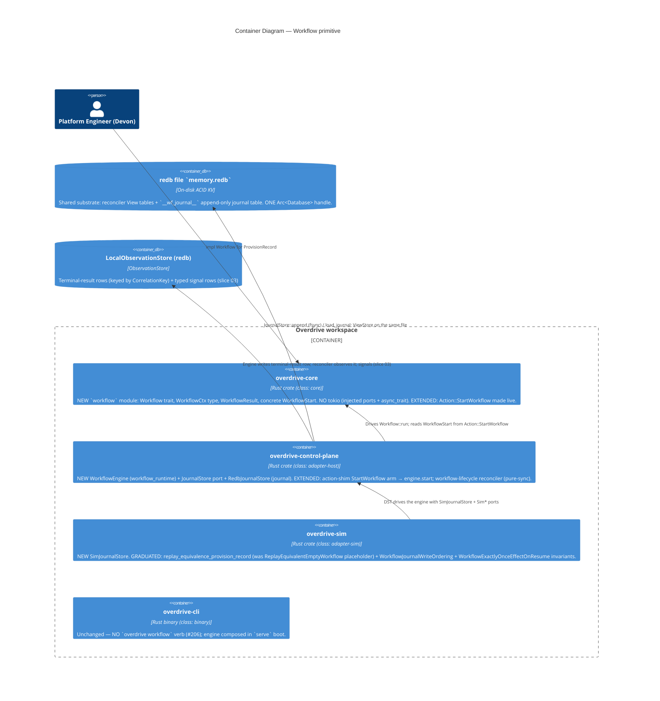
```mermaid
C4Container
  title Container Diagram — Workflow primitive

  Person(devon, "Platform Engineer (Devon)")

  Container_Boundary(workspace, "Overdrive workspace") {
    Container(core, "overdrive-core", "Rust crate (class: core)", "NEW `workflow` module: Workflow trait, WorkflowCtx type, WorkflowResult, concrete WorkflowStart. NO tokio (injected ports + async_trait). EXTENDED: Action::StartWorkflow made live.")
    Container(ctrl, "overdrive-control-plane", "Rust crate (class: adapter-host)", "NEW WorkflowEngine (workflow_runtime) + JournalStore port + RedbJournalStore (journal). EXTENDED: action-shim StartWorkflow arm → engine.start; workflow-lifecycle reconciler (pure-sync).")
    Container(sim, "overdrive-sim", "Rust crate (class: adapter-sim)", "NEW SimJournalStore. GRADUATED: replay_equivalence_provision_record (was ReplayEquivalentEmptyWorkflow placeholder) + WorkflowJournalWriteOrdering + WorkflowExactlyOnceEffectOnResume invariants.")
    Container(cli, "overdrive-cli", "Rust binary (class: binary)", "Unchanged — NO `overdrive workflow` verb (#206); engine composed in `serve` boot.")
  }

  ContainerDb(redb_file, "redb file `memory.redb`", "On-disk ACID KV", "Shared substrate: reconciler View tables + `__wf_journal__` append-only journal table. ONE Arc<Database> handle.")
  ContainerDb(obs, "LocalObservationStore (redb)", "ObservationStore", "Terminal-result rows (keyed by CorrelationKey) + typed signal rows (slice 03)")

  Rel(devon, core, "impl Workflow for ProvisionRecord")
  Rel(ctrl, core, "Drives Workflow::run; reads WorkflowStart from Action::StartWorkflow")
  Rel(ctrl, redb_file, "JournalStore::append (fsync) / load_journal; ViewStore on the same file")
  Rel(ctrl, obs, "Engine writes terminal-result row; reconciler observes it; signals (slice 03)")
  Rel(sim, ctrl, "DST drives the engine with SimJournalStore + Sim* ports")
```

### C4 Level 3 — Workflow engine + journal + replay subsystem

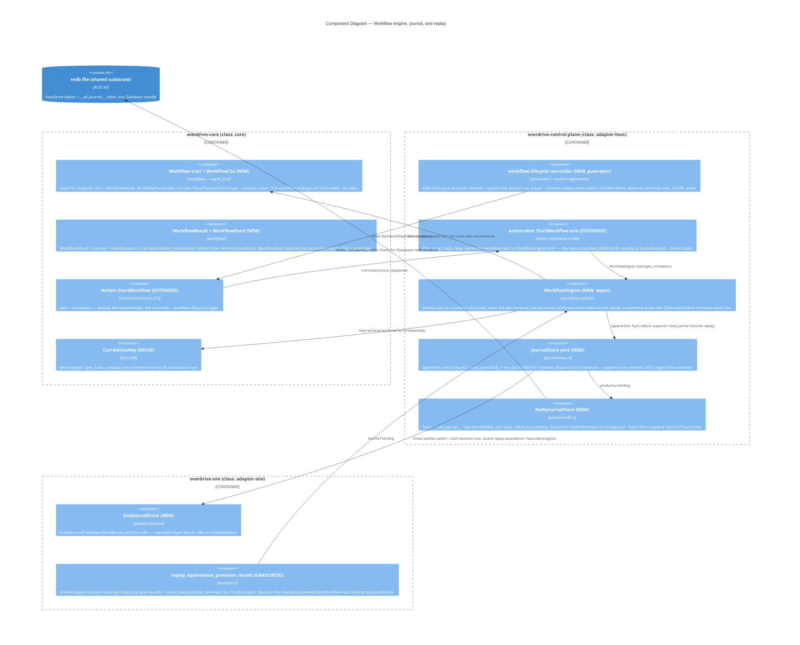
```mermaid
C4Component
  title Component Diagram — Workflow engine, journal, and replay

  Container_Boundary(core, "overdrive-core (class: core)") {
    Component(wf_trait, "Workflow trait + WorkflowCtx (NEW)", "workflow/ — async_trait", "async fn run(&self, ctx) -> WorkflowResult. WorkflowCtx bundles Arc<dyn Clock/Transport/Entropy> + journal cursor. The workflow analogue of TickContext. No tokio.")
    Component(wf_result, "WorkflowResult + WorkflowStart (NEW)", "workflow/", "WorkflowResult = Success | Failed{reason} | Cancelled (#[non_exhaustive], distinct from TerminalCondition). WorkflowStart replaces the reconcilers/mod.rs:562 placeholder.")
    Component(action_sw, "Action::StartWorkflow (EXTENDED)", "reconcilers/mod.rs:373", "spec + correlation — already the locked shape; the reconciler→workflow lifecycle trigger.")
    Component(corr, "CorrelationKey (REUSE)", "id.rs:538", "derive(target, spec_hash, purpose); keys the terminal-result observation row.")
  }

  Container_Boundary(ctrl, "overdrive-control-plane (class: adapter-host)") {
    Component(wf_lifecycle, "workflow-lifecycle reconciler (NEW, pure-sync)", "reconcilers + runtime registration", "ADR-0035 pure reconcile: desired = spec(s) that should run; actual = instance states; emits Action::StartWorkflow, observes terminal rows. NEVER .await.")
    Component(shim, "action-shim StartWorkflow arm (EXTENDED)", "action_shim/mod.rs:446", "Was no-op Ok(()). Now: hands the workflow-start to WorkflowEngine::start — the async boundary (ADR-0023), exactly as StartAllocation→Driver::start.")
    Component(engine, "WorkflowEngine (NEW, async)", "workflow_runtime", "Drives run() as a tracked tokio::task; owns the per-instance journal cursor; performs check-then-record replay; on terminal writes the ObservationStore terminal-result row.")
    Component(journal_port, "JournalStore port (NEW)", "journal/mod.rs", "append(id, entry) [fsync] / load_journal(id) -> Vec<JournalEntry> / probe(). Distinct from ViewStore — append-only-ordered, NOT single-blob-overwrite.")
    Component(redb_journal, "RedbJournalStore (NEW)", "journal/redb.rs", "Table `__wf_journal__` key (WorkflowId, u32 step), CBOR JournalEntry. Shares the RedbViewStore Arc<Database>. fsync-then-suspend; Earned-Trust probe.")
  }

  Container_Boundary(sim, "overdrive-sim (class: adapter-sim)") {
    Component(sim_journal, "SimJournalStore (NEW)", "adapters/journal", "In-memory BTreeMap<(WorkflowId,u32),Vec<u8>> + injectable fsync-failure. Mirrors SimViewStore.")
    Component(inv, "replay_equivalence_provision_record (GRADUATED)", "invariants/", "Uninterrupted vs crash-resumed trajectory byte-equality + assert_eventually!(is_terminal). K4, CI critical path. Replaces the ReplayEquivalentEmptyWorkflow two-SimEntropy placeholder.")
  }

  ContainerDb(redb_file, "redb file (shared substrate)", "ACID KV", "ViewStore tables + __wf_journal__ table, one Database handle")

  Rel(wf_lifecycle, action_sw, "Emits StartWorkflow{start, correlation}")
  Rel(action_sw, shim, "Committed Action dispatched")
  Rel(shim, engine, "WorkflowEngine::start(spec, correlation)")
  Rel(engine, wf_trait, "Calls run(&ctx).await; ctx.* are check-then-record points")
  Rel(engine, journal_port, "append (live: fsync before suspend) / load_journal (resume: replay)")
  Rel(journal_port, redb_journal, "production binding")
  Rel(journal_port, sim_journal, "test/DST binding")
  Rel(redb_journal, redb_file, "Writes __wf_journal__ table; shares Arc<Database> with ViewStore")
  Rel(engine, corr, "Keys terminal-result row by CorrelationKey")
  Rel(inv, engine, "Drives uninterrupted + crash-resumed runs; asserts replay-equivalence + bounded progress")
```

Five properties the diagram makes explicit:

1. **`reconcile` stays pure.** The workflow-lifecycle reconciler only emits
   `StartWorkflow` and observes terminal rows; all `.await` lives in the
   engine off the shim (ADR-0023's sanctioned async boundary). The
   `ReconcilerIsPure` invariant is untouched.
2. **The journal is a *second table layout on the same redb file*.** The
   `RedbJournalStore` shares the `RedbViewStore`'s `Arc<Database>`; the
   `__wf_journal__` append-only table coexists with the reconciler-`View`
   tables. One durable-memory story (O6/K5); no libSQL.
3. **Replay is structural.** Every `ctx.*` await is check-then-record: on
   replay it returns the recorded result without re-firing the effect
   (exactly-once, K1); live it performs the effect, appends with fsync
   before suspend, advances the cursor. All non-determinism through `ctx` ⇒
   bit-identical replay (K4).
4. **The K4 invariant graduates the placeholder.** The existing
   `ReplayEquivalentEmptyWorkflow` two-SimEntropy stand-in becomes a real
   journal replay against the engine + `SimJournalStore`, renamed
   `replay_equivalence_provision_record`.
5. **Cross-node resume is not precluded.** The journal is `WorkflowId`-keyed
   node-independent CBOR behind a `JournalStore` trait — a Phase-2 HA
   adapter slots in where `RedbJournalStore` is, exactly as `ViewStore`
   leaves room for a `RaftStore`-shaped successor (#205).

---

## Unconnected-UDP sendmsg4 + recvmsg4 (GH #200, ADR-0053 rev 2026-06-05)

**Source:** `docs/feature/unconnected-udp-sendmsg4/`. **ADR:** ADR-0053
revision 2026-06-05. Adds two cgroup hooks + the `REVERSE_LOCAL_MAP`
reply store to the same-host cgroup path; the XDP SERVICE_MAP/REVERSE_NAT
wire path (above) is untouched and remains distinct.

### C4 Level 1 — System Context

**Unchanged.** No new external actor, no new external system. Ana (the
platform engineer) and the Linux kernel (BPF) are the same actors as the
shipped same-host path; the only delta is two additional cgroup hook
types and one additional kernel map, all inside the existing
`overdrive` ↔ `kernel` relationship. No L1 diagram is reproduced —
adding one would be redundant noise (the same posture the 2026-06-03
proto-keying revision took).

### C4 Level 2 — Container delta

Container topology inherits unchanged (no new container). The delta is
internal to `overdrive-bpf` (two new programs + a shared helper),
`overdrive-dataplane` (the new `REVERSE_LOCAL_MAP` handle + dual-write +
miss counter), `overdrive-sim` (the reply mirror), and the kernel (the
new map + two hook types). The diagram below makes the **same-host
cgroup path distinct from the XDP SERVICE_MAP/REVERSE_NAT wire path**.

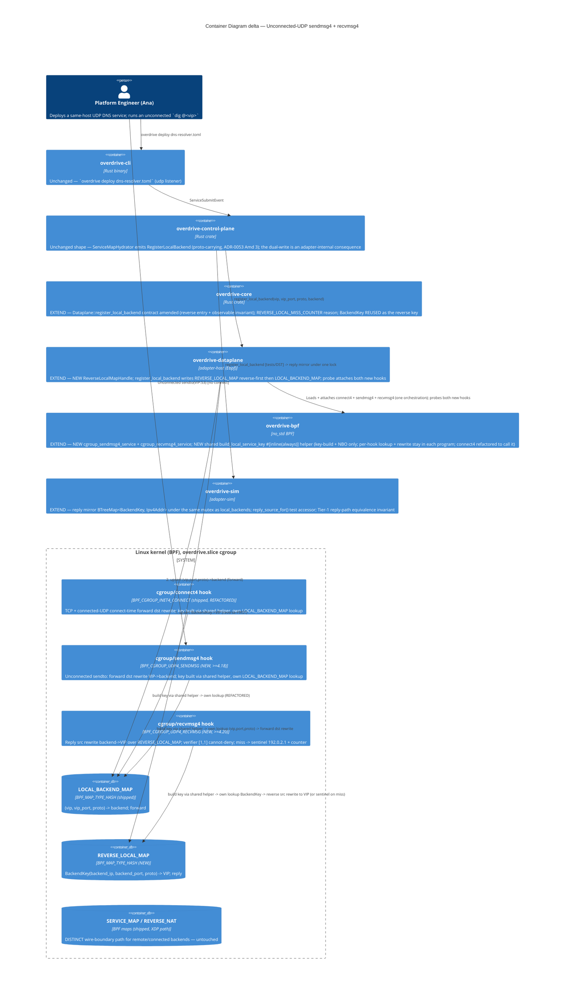
```mermaid
C4Container
  title Container Diagram delta — Unconnected-UDP sendmsg4 + recvmsg4

  Person(ana, "Platform Engineer (Ana)", "Deploys a same-host UDP DNS service; runs an unconnected `dig @<vip>`")

  Container(cli, "overdrive-cli", "Rust binary", "Unchanged — `overdrive deploy dns-resolver.toml` (udp listener)")
  Container(ctrl, "overdrive-control-plane", "Rust crate", "Unchanged shape — ServiceMapHydrator emits RegisterLocalBackend (proto-carrying, ADR-0053 Amd 3); the dual-write is an adapter-internal consequence")
  Container(core, "overdrive-core", "Rust crate", "EXTEND — Dataplane::register_local_backend contract amended (reverse entry + observable invariant); REVERSE_LOCAL_MISS_COUNTER reason; BackendKey REUSED as the reverse key")
  Container(dp, "overdrive-dataplane", "adapter-host (Ebpf)", "EXTEND — NEW ReverseLocalMapHandle; register_local_backend writes REVERSE_LOCAL_MAP reverse-first then LOCAL_BACKEND_MAP; probe attaches both new hooks")
  Container(bpf, "overdrive-bpf", "no_std BPF", "EXTEND — NEW cgroup_sendmsg4_service + cgroup_recvmsg4_service; NEW shared build_local_service_key #[inline(always)] helper (key-build + NBO only; per-hook lookup + rewrite stay in each program; connect4 refactored to call it)")
  Container(sim, "overdrive-sim", "adapter-sim", "EXTEND — reply mirror BTreeMap<BackendKey, Ipv4Addr> under the same mutex as local_backends; reply_source_for() test accessor; Tier-1 reply-path equivalence invariant")

  System_Boundary(kern, "Linux kernel (BPF), overdrive.slice cgroup") {
    Container(connect4, "cgroup/connect4 hook", "BPF_CGROUP_INET4_CONNECT (shipped, REFACTORED)", "TCP + connected-UDP connect-time forward dst rewrite; key built via shared helper, own LOCAL_BACKEND_MAP lookup")
    Container(sendmsg4, "cgroup/sendmsg4 hook", "BPF_CGROUP_UDP4_SENDMSG (NEW, >=4.18)", "Unconnected sendto: forward dst rewrite VIP->backend; key built via shared helper, own LOCAL_BACKEND_MAP lookup")
    Container(recvmsg4, "cgroup/recvmsg4 hook", "BPF_CGROUP_UDP4_RECVMSG (NEW, >=4.20)", "Reply src rewrite backend->VIP over REVERSE_LOCAL_MAP; verifier [1,1] cannot-deny; miss -> sentinel 192.0.2.1 + counter")
    ContainerDb(fwdmap, "LOCAL_BACKEND_MAP", "BPF_MAP_TYPE_HASH (shipped)", "(vip, vip_port, proto) -> backend; forward")
    ContainerDb(revmap, "REVERSE_LOCAL_MAP", "BPF_MAP_TYPE_HASH (NEW)", "BackendKey(backend_ip, backend_port, proto) -> VIP; reply")
    ContainerDb(svcmap, "SERVICE_MAP / REVERSE_NAT", "BPF maps (shipped, XDP path)", "DISTINCT wire-boundary path for remote/connected backends — untouched")
  }

  Rel(ana, cli, "overdrive deploy dns-resolver.toml")
  Rel(cli, ctrl, "ServiceSubmitEvent")
  Rel(ctrl, dp, "register_local_backend(vip, vip_port, proto, backend)")
  Rel(dp, revmap, "1. upsert BackendKey->VIP (reverse-FIRST)")
  Rel(dp, fwdmap, "2. upsert (vip,port,proto)->backend (forward)")
  Rel(ana, sendmsg4, "Unconnected sendto(VIP:53) [no connect]")
  Rel(sendmsg4, fwdmap, "build key via shared helper -> own lookup (vip,port,proto) -> forward dst rewrite")
  Rel(recvmsg4, revmap, "build key via shared helper -> own lookup BackendKey -> reverse src rewrite to VIP (or sentinel on miss)")
  Rel(connect4, fwdmap, "build key via shared helper -> own lookup (REFACTORED)")
  Rel(dp, bpf, "Loads + attaches connect4 + sendmsg4 + recvmsg4 (one orchestration); probes both new hooks")
  Rel(ctrl, sim, "register_local_backend [tests/DST] -> reply mirror under one lock")
```

Three properties the diagram makes explicit:

1. **The cgroup same-host path and the XDP wire path are disjoint.**
   `REVERSE_LOCAL_MAP` (cgroup recvmsg4) and `REVERSE_NAT` (XDP) are
   different maps on different hooks for different backend classes
   (same-host vs remote/connected). The diagram keeps them in separate
   boxes to defuse the wrong-map-on-wrong-hook trap the sibling-journey
   decision named.
2. **The dual-write is reverse-first.** Edge "1." (reverse) precedes
   edge "2." (forward) — the reply path is never ahead of the request
   path; no observer sees a forward entry without its reverse.
3. **recvmsg4 cannot deny.** The hook box pins the verifier `[1,1]`
   constraint; the miss path is a sentinel substitution + counter, not a
   drop. This is the application-sockaddr-layer guarantee — wire-level
   no-leak is the XDP box's concern, not recvmsg4's.

### C4 Level 3

No new L3 component diagram is warranted. The cgroup path's internal
decomposition is the three hooks + the shared helper + two maps already
shown at L2; an L3 would restate the L2 boxes at finer grain without new
signal. The shared-helper call graph (connect4 + sendmsg4 + recvmsg4 →
`build_local_service_key`; each hook then does its own map lookup —
`LOCAL_BACKEND_MAP` for connect4/sendmsg4, `REVERSE_LOCAL_MAP` for
recvmsg4 — and its own rewrite direction) is captured in
`feature-delta.md` § DESIGN component decomposition.

---

## Built-in CA — `Ca` port trait + 3-tier hierarchy (Mermaid)

**Source:** `docs/feature/built-in-ca/` DESIGN-wave artifacts.
**ADR:** ADR-0063. Supersedes ADR-0010 for *workload identity* only.
**Date:** 2026-06-05. **GH:** #28 [2.6]. Single-node.

### C4 Level 1 — System Context

The platform IS the CA — no external PKI (SPIRE / cert-manager / Vault).
The new external boundaries are the **Linux kernel keyring** (holds the KEK
in kernel space) and **systemd-creds** (delivers the KEK at boot,
host-key/TPM-backed). Sam (platform/security engineer) verifies the chain
with `openssl verify`, not by trusting the platform's word.

```mermaid
C4Context
  title System Context — Overdrive built-in CA (GH #28)

  Person(sam, "Platform/Security Engineer (Sam)", "Builds + operates the identity layer; verifies the chain with `openssl verify`; threat-models by default")
  System(overdrive, "Overdrive node", "Single binary — control plane + worker; now mints a persistent Root → Node-Intermediate → Workload-SVID hierarchy behind a `Ca` port trait")
  System_Ext(keyring, "Linux kernel keyring", "Holds the 256-bit KEK in kernel space (add_key/keyctl); volatile across reboots")
  System_Ext(systemd_creds, "systemd-creds", "LoadCredentialEncrypted — host-key/TPM-backed; delivers the KEK to the service at each boot")
  System_Ext(ci, "CI", "Runs `openssl verify` over real rcgen output (Tier-3, integration-tests via Lima) + seeded DST equivalence (Tier-1)")

  Rel(sam, overdrive, "Runs a workload (overdrive deploy); reads the issued_certificates audit row; verifies chains")
  Rel(overdrive, systemd_creds, "Loads the encrypted KEK credential at boot")
  Rel(overdrive, keyring, "Loads KEK into the keyring; reads it back to derive the root-key encryption subkey")
  Rel(ci, overdrive, "Gates: 100% of SVIDs chain-verify (K1); single-URI-SAN (K2); no plaintext key at rest (K3); DST determinism (K5)")
```

### C4 Level 2 — Container

`overdrive-core` gains the pure `Ca` trait + `CertSpec` builder + the two
rkyv envelopes + the `Kek` provider port — **no rcgen, no aws-lc-rs** (dst-lint
boundary). `overdrive-host` gains `RcgenCa` (all rcgen/aws-lc-rs/HKDF/AEAD usage)
+ `SystemdCredsKeyring`. `overdrive-sim` gains `SimCa` (fixture keys) for DST.
The Root-CA key persists as intent (IntentStore/redb); the
`issued_certificates` audit row is observation.

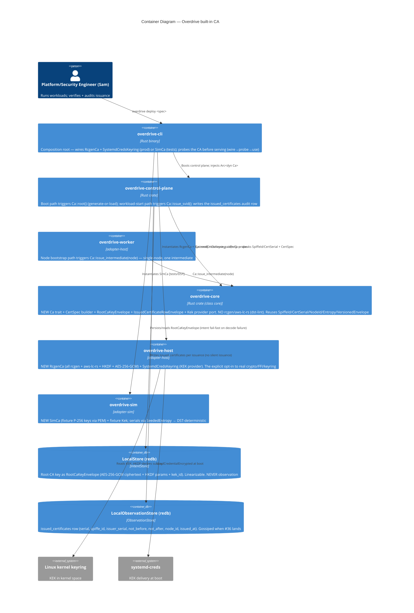
```mermaid
C4Container
  title Container Diagram — Overdrive built-in CA

  Person(sam, "Platform/Security Engineer (Sam)", "Runs workloads; verifies + audits issuance")

  Container(cli, "overdrive-cli", "Rust binary", "Composition root — wires RcgenCa + SystemdCredsKeyring (prod) or SimCa (tests); probes the CA before serving (wire→probe→use)")
  Container(ctrl, "overdrive-control-plane", "Rust crate", "Boot path triggers Ca::root() (generate-or-load); workload-start path triggers Ca::issue_svid(); writes the issued_certificates audit row")
  Container(worker, "overdrive-worker", "adapter-host", "Node bootstrap path triggers Ca::issue_intermediate(node) — single-node, one intermediate")
  Container(core, "overdrive-core", "Rust crate (class core)", "NEW Ca trait + CertSpec builder + RootCaKeyEnvelope + IssuedCertificateRowEnvelope + Kek provider port. NO rcgen/aws-lc-rs (dst-lint). Reuses SpiffeId/CertSerial/NodeId/Entropy/VersionedEnvelope")
  Container(host, "overdrive-host", "adapter-host", "NEW RcgenCa (all rcgen + aws-lc-rs + HKDF + AES-256-GCM) + SystemdCredsKeyring (KEK provider). The explicit opt-in to real crypto/FFI/keyring")
  Container(sim, "overdrive-sim", "adapter-sim", "NEW SimCa (fixture P-256 keys via PEM) + fixture Kek; serials via SeededEntropy → DST-deterministic")
  ContainerDb(intent, "LocalStore (redb)", "IntentStore", "Root-CA key as RootCaKeyEnvelope (AES-256-GCM ciphertext + HKDF params + kek_id). Linearizable. NEVER observation")
  ContainerDb(obs, "LocalObservationStore (redb)", "ObservationStore", "issued_certificates row (serial, spiffe_id, issuer_serial, not_before, not_after, node_id, issued_at). Gossiped when #36 lands")
  System_Ext(keyring, "Linux kernel keyring", "KEK in kernel space")
  System_Ext(systemd_creds, "systemd-creds", "KEK delivery at boot")

  Rel(sam, cli, "overdrive deploy <spec>")
  Rel(cli, ctrl, "Boots control plane; injects Arc<dyn Ca>")
  Rel(cli, host, "Instantiates RcgenCa + SystemdCredsKeyring; calls Ca probe")
  Rel(cli, sim, "Instantiates SimCa [tests/DST]")
  Rel(ctrl, core, "Ca::root() / Ca::issue_svid(req) — speaks SpiffeId/CertSerial + CertSpec")
  Rel(worker, core, "Ca::issue_intermediate(node)")
  Rel(host, keyring, "Reads KEK; HKDF-derives subkey")
  Rel(host, systemd_creds, "LoadCredentialEncrypted at boot")
  Rel(ctrl, intent, "Persists/reads RootCaKeyEnvelope (intent fail-fast on decode failure)")
  Rel(ctrl, obs, "Writes issued_certificates per issuance (no silent issuance)")
```

### C4 Level 3 — CA subsystem component decomposition

Warranted by the complexity (trait → host/sim adapters → IntentStore /
ObservationStore / keyring / Entropy). Makes the two reconciliation
decisions explicit: **(B)** the pure `CertSpec` builder lives in core and the
host adapter translates it to `rcgen::CertificateParams`; **(A)** the
`RcgenCa` HKDF-derives a subkey from the keyring KEK before AES-256-GCM.

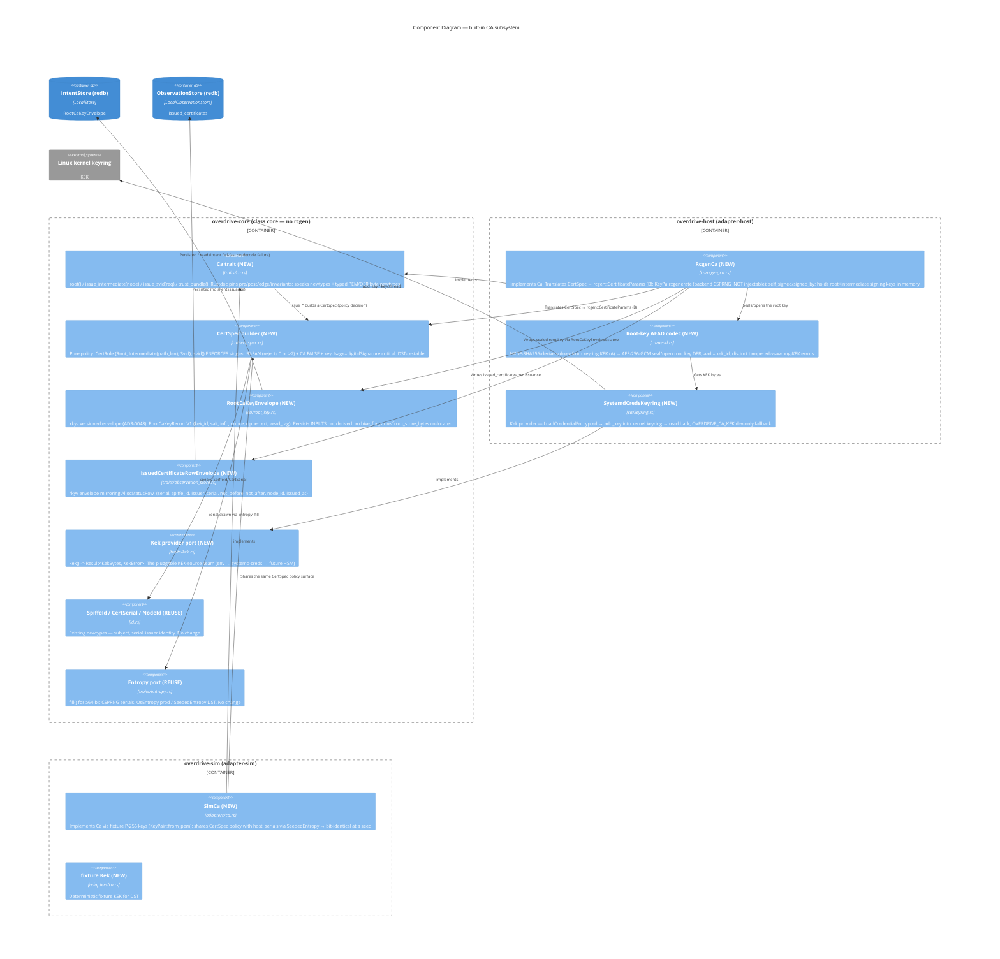
```mermaid
C4Component
  title Component Diagram — built-in CA subsystem

  Container_Boundary(core, "overdrive-core (class core — no rcgen)") {
    Component(ca_trait, "Ca trait (NEW)", "traits/ca.rs", "root() / issue_intermediate(node) / issue_svid(req) / trust_bundle(). Rustdoc pins pre/post/edge/invariants; speaks newtypes + typed PEM/DER byte newtypes")
    Component(certspec, "CertSpec builder (NEW)", "ca/cert_spec.rs", "Pure policy: CertRole {Root, Intermediate{path_len}, Svid}; svid() ENFORCES single-URI-SAN (rejects 0 or ≥2) + CA:FALSE + keyUsage=digitalSignature critical. DST-testable")
    Component(rootenv, "RootCaKeyEnvelope (NEW)", "ca/root_key.rs", "rkyv versioned envelope (ADR-0048). RootCaKeyRecordV1 {kek_id, salt, info, nonce, ciphertext, aead_tag}. Persists INPUTS not derived. archive_for_store/from_store_bytes co-located")
    Component(auditenv, "IssuedCertificateRowEnvelope (NEW)", "traits/observation_store.rs", "rkyv envelope mirroring AllocStatusRow. {serial, spiffe_id, issuer_serial, not_before, not_after, node_id, issued_at}")
    Component(kekport, "Kek provider port (NEW)", "traits/kek.rs", "kek() -> Result<KekBytes, KekError>. The pluggable KEK-source seam (env → systemd-creds → future HSM)")
    Component(ids, "SpiffeId / CertSerial / NodeId (REUSE)", "id.rs", "Existing newtypes — subject, serial, issuer identity. No change")
    Component(entropy, "Entropy port (REUSE)", "traits/entropy.rs", "fill() for ≥64-bit CSPRNG serials. OsEntropy prod / SeededEntropy DST. No change")
  }

  Container_Boundary(host, "overdrive-host (adapter-host)") {
    Component(rcgenca, "RcgenCa (NEW)", "ca/rcgen_ca.rs", "Implements Ca. Translates CertSpec → rcgen::CertificateParams (B); KeyPair::generate (backend CSPRNG, NOT injectable); self_signed/signed_by; holds root+intermediate signing keys in memory")
    Component(aead, "Root-key AEAD codec (NEW)", "ca/aead.rs", "HKDF-SHA256-derive subkey from keyring KEK (A) → AES-256-GCM seal/open root key DER; aad = kek_id; distinct tampered-vs-wrong-KEK errors")
    Component(keyringkek, "SystemdCredsKeyring (NEW)", "ca/keyring.rs", "Kek provider — LoadCredentialEncrypted → add_key into kernel keyring → read back; OVERDRIVE_CA_KEK dev-only fallback")
  }

  Container_Boundary(sim, "overdrive-sim (adapter-sim)") {
    Component(simca, "SimCa (NEW)", "adapters/ca.rs", "Implements Ca via fixture P-256 keys (KeyPair::from_pem); shares CertSpec policy with host; serials via SeededEntropy → bit-identical at a seed")
    Component(simkek, "fixture Kek (NEW)", "adapters/ca.rs", "Deterministic fixture KEK for DST")
  }

  ContainerDb(intent, "IntentStore (redb)", "LocalStore", "RootCaKeyEnvelope")
  ContainerDb(obs, "ObservationStore (redb)", "LocalObservationStore", "issued_certificates")
  System_Ext(keyring, "Linux kernel keyring", "KEK")

  Rel(ca_trait, certspec, "issue_* builds a CertSpec (policy decision)")
  Rel(certspec, ids, "Speaks SpiffeId/CertSerial")
  Rel(certspec, entropy, "Serial drawn via Entropy::fill")
  Rel(rcgenca, ca_trait, "implements")
  Rel(simca, ca_trait, "implements")
  Rel(rcgenca, certspec, "Translates CertSpec → rcgen::CertificateParams (B)")
  Rel(simca, certspec, "Shares the same CertSpec policy surface")
  Rel(rcgenca, aead, "Seals/opens the root key")
  Rel(aead, keyringkek, "Gets KEK bytes")
  Rel(keyringkek, kekport, "implements")
  Rel(keyringkek, keyring, "add_key / keyctl read")
  Rel(rcgenca, rootenv, "Wraps sealed root key via RootCaKeyEnvelope::latest")
  Rel(rootenv, intent, "Persisted / read (intent fail-fast on decode failure)")
  Rel(rcgenca, auditenv, "Writes issued_certificates per issuance")
  Rel(auditenv, obs, "Persisted (no silent issuance)")
```

Five properties the diagrams make explicit:

1. **rcgen/aws-lc-rs never touch `overdrive-core`** (dst-lint boundary). The
   trait speaks newtypes + typed byte newtypes; `CertSpec` is pure policy; the
   `RcgenCa` adapter is the sole rcgen site. (B resolved.)
2. **The single-URI-SAN rejection is in core** (`CertSpec::svid`), so it is
   DST-testable and the sim adapter shares the exact policy — the highest-value
   invariant (K2) is not a host-adapter shortcut.
3. **CA material is intent; the audit is observation.** `RootCaKeyEnvelope` →
   IntentStore (linearizable, fail-fast); `issued_certificates` →
   ObservationStore (gossiped when #36 lands). They never merge (whitepaper §4).
4. **The KEK lives in kernel space** (keyring), delivered by systemd-creds at
   boot; the root key is HKDF+AES-256-GCM-sealed under it (A resolved). The dev
   `OVERDRIVE_CA_KEK` fallback is gated dev-only.
5. **Earned Trust: wire → probe → use.** The composition root probes KEK
   presence + envelope-decrypt before the control plane serves; a probe failure
   refuses startup (`health.startup.refused`), distinct errors for tampered vs
   wrong-KEK.

## Workload Identity Manager — `SvidLifecycle` reconciler + `IdentityMgr` holder (Mermaid)

**Source:** `docs/feature/workload-identity-manager/` DESIGN-wave artifacts.
**ADR:** ADR-0067. Builds on ADR-0063 (built-in CA) — ADR-0063 *mints*,
this *holds/reads/drops*. **Date:** 2026-06-08. **GH:** #35 [2.13]. Single-node.

### C4 Level 1 — System Context

The platform binds a live SVID to the running set, holds it where the
dataplane can read it, and drops it on stop — sidecarless (whitepaper §7), so
the credential's lifecycle is driven from the allocation lifecycle the control
plane already owns. #35 is a FOUNDATION feature: its observable proof is
TEST-tier (`openssl verify` the held chain + ObservationStore readback of the
`issued_certificates` row + the DST `assert_eventually!` convergence
invariant). The **operator** `alloc status` render is **#215's** (blocked on
#35); the dataplane **consumer** is **#26's** (sockops/kTLS).

```mermaid
C4Context
  title System Context — Overdrive Workload Identity Manager (GH #35)

  Person(sam, "Platform/Security Engineer (Sam)", "Operates the running set; verifies the held chain with `openssl verify`; defends the identity story to a security reviewer")
  System(overdrive, "Overdrive node", "Single binary — control plane + worker; now BINDS a held SVID to each Running allocation, exposes it behind an IdentityRead port, and drops it on stop")
  System_Ext(ca, "Built-in CA (#28, ADR-0063)", "Mints the SVID + audit row via ca_issuance::issue_and_audit; supplies the trust bundle. This feature HOLDS what it mints")
  System_Ext(consumer, "Dataplane consumer (#26, future)", "sockops/kTLS mTLS + L7 gateway + telemetry — read the held SVID + trust bundle via IdentityRead; fail closed on absence. OUT OF SCOPE this phase")
  System_Ext(ci, "CI", "Gates: 100% Running allocs hold a valid SVID (K1); no leak on stop (K2); bounded audited restart re-issue, no stale credential (K3, rev 2); no silent issuance (K4); DST determinism (K5)")

  Rel(sam, overdrive, "Runs a workload (overdrive deploy); verifies the held leaf chain; reads the issued_certificates audit row (test-tier)")
  Rel(overdrive, ca, "issue_and_audit (mint + audit + refuse-on-audit-failure); trust_bundle (hydrate at boot + refresh per issuance)")
  Rel(consumer, overdrive, "Reads svid_for(alloc) + current_bundle() through the IdentityRead port (in-process, no re-issue)")
  Rel(ci, overdrive, "assert_eventually!(running allocs hold a valid SVID); drop-on-stop; identity_read_equivalence; openssl verify at the test tier")
```

### C4 Level 2 — Container

`overdrive-core` gains the pure `SvidLifecycle` reconciler + its View + the two
`Action` variants + `SpiffeId::for_allocation` + the `IdentityRead` port — **no
CA handle, no `.await`** (dst-lint boundary). `overdrive-control-plane` gains
`IdentityMgr` (the in-process `RwLock<BTreeMap>` holder) + the
`action_shim/issue_svid.rs` executor (the sole CA-I/O site) + the two
`AppState` fields. `overdrive-sim` gains `SimIdentityRead`. The held
`SvidMaterial` is in-process runtime state (never persisted) and **IS the
reconciler's `actual`** (rev 2 — the runtime's `hydrate_actual` projects a
held-snapshot in, mirroring `WorkflowEngine::live_instances()`); the View carries
**retry memory** (not issuance success facts); the `issued_certificates` row is
observation (ADR-0063). `SvidLifecycle` is triggered by an explicit
`Action::EnqueueEvaluation` handoff from `WorkloadLifecycle` + the exit observer
(rev 2).

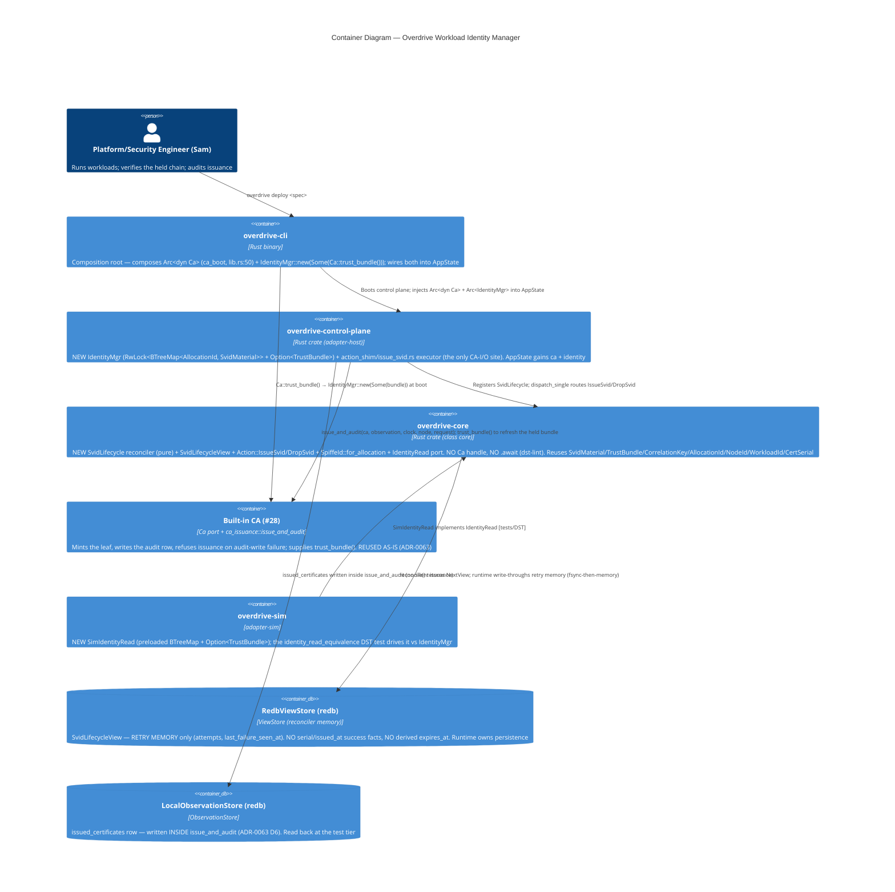
```mermaid
C4Container
  title Container Diagram — Overdrive Workload Identity Manager

  Person(sam, "Platform/Security Engineer (Sam)", "Runs workloads; verifies the held chain; audits issuance")

  Container(cli, "overdrive-cli", "Rust binary", "Composition root — composes Arc<dyn Ca> (ca_boot, lib.rs:50) + IdentityMgr::new(Some(Ca::trust_bundle())); wires both into AppState")
  Container(ctrl, "overdrive-control-plane", "Rust crate (adapter-host)", "NEW IdentityMgr (RwLock<BTreeMap<AllocationId, SvidMaterial>> + Option<TrustBundle>) + action_shim/issue_svid.rs executor (the only CA-I/O site). AppState gains ca + identity")
  Container(core, "overdrive-core", "Rust crate (class core)", "NEW SvidLifecycle reconciler (pure) + SvidLifecycleView + Action::IssueSvid/DropSvid + SpiffeId::for_allocation + IdentityRead port. NO Ca handle, NO .await (dst-lint). Reuses SvidMaterial/TrustBundle/CorrelationKey/AllocationId/NodeId/WorkloadId/CertSerial")
  Container(ca, "Built-in CA (#28)", "Ca port + ca_issuance::issue_and_audit", "Mints the leaf, writes the audit row, refuses issuance on audit-write failure; supplies trust_bundle(). REUSED AS-IS (ADR-0063)")
  Container(sim, "overdrive-sim", "adapter-sim", "NEW SimIdentityRead (preloaded BTreeMap + Option<TrustBundle>); the identity_read_equivalence DST test drives it vs IdentityMgr")
  ContainerDb(view, "RedbViewStore (redb)", "ViewStore (reconciler memory)", "SvidLifecycleView — RETRY MEMORY only (attempts, last_failure_seen_at). NO serial/issued_at success facts, NO derived expires_at. Runtime owns persistence")
  ContainerDb(obs, "LocalObservationStore (redb)", "ObservationStore", "issued_certificates row — written INSIDE issue_and_audit (ADR-0063 D6). Read back at the test tier")

  Rel(sam, cli, "overdrive deploy <spec>")
  Rel(cli, ctrl, "Boots control plane; injects Arc<dyn Ca> + Arc<IdentityMgr> into AppState")
  Rel(cli, ca, "Ca::trust_bundle() → IdentityMgr::new(Some(bundle)) at boot")
  Rel(ctrl, core, "Registers SvidLifecycle; dispatch_single routes IssueSvid/DropSvid")
  Rel(core, view, "reconcile() returns NextView; runtime write-throughs retry memory (fsync-then-memory)")
  Rel(ctrl, ca, "issue_and_audit(ca, observation, clock, node, request); trust_bundle() to refresh the held bundle")
  Rel(ctrl, obs, "issued_certificates written inside issue_and_audit (no silent issuance)")
  Rel(sim, core, "SimIdentityRead implements IdentityRead [tests/DST]")
```

### C4 Level 3 — Identity subsystem component decomposition

Warranted by the complexity (enqueue handoff → broker → hydrate-actual → pure
reconciler → action → executor → in-process holder → read port → CA). Makes the
load-bearing decisions explicit: **the held set IS `actual`** (rev 2 — projected
by `hydrate_actual` via `held_snapshot`, the `WorkflowLifecycle`/`live_instances()`
precedent); **`SvidLifecycle` is level-triggered** by `EnqueueEvaluation` from
`WorkloadLifecycle` (`:181`) + the exit observer (`:230-256`); **the reconciler
builds the `SpiffeId` (pure)**, CA I/O stays in the executor; the held map is
`RwLock<BTreeMap>` (sync lock, deterministic iteration); the View is **retry
memory** (not success facts); the bundle is **hydrated** into `IdentityMgr` (zero
CA I/O on read); the #40 rotation seam is pre-wired but **emit-gated**, keyed off
`actual.not_after`.

```mermaid
C4Component
  title Component Diagram — Workload Identity subsystem

  Container_Boundary(core, "overdrive-core (class core — no Ca handle, no .await)") {
    Component(recon, "SvidLifecycle reconciler (NEW)", "reconcilers/svid_lifecycle.rs", "Pure reconcile(): converges desired=running allocs vs actual=IdentityMgr HELD SET. running∧¬held→IssueSvid (incl. restart re-issue), ¬running∧held→DropSvid, running∧held(valid)→Noop. BUILDS the SpiffeId (pure). #40 near-expiry branch (running∧held(near-expiry)) pre-wired, emit GATED (ROTATION_ENABLED=false), keyed off actual.not_after")
    Component(view, "SvidLifecycleView + IssueRetry (NEW)", "reconcilers/svid_lifecycle.rs", "retry: BTreeMap<AllocationId, IssueRetry{attempts, last_failure_seen_at}>. RETRY MEMORY only — a failed IssueSvid backs off. NO serial/issued_at/spiffe_id success facts (held-ness is actual; success is the issued_certificates row). 6 derive bounds (+Eq); manual Default")
    Component(actions, "Action::IssueSvid / DropSvid (NEW)", "reconcilers/mod.rs", "IssueSvid{alloc_id, spiffe_id, node_id, correlation} / DropSvid{alloc_id, correlation}. Plain enum +2 variants; +3 dispatch-enum variants (AnyState/AnyReconciler/AnyReconcilerView). correlation = CorrelationKey::derive(svid-lifecycle/<alloc>, spec_hash, issue-svid)")
    Component(spiffe, "SpiffeId::for_allocation (NEW impl)", "id.rs", "Infallible for_allocation(&WorkloadId, &AllocationId) -> Self; #[must_use]; trust-domain overdrive.local; builds spiffe://…/job/<wl>/alloc/<id>; validates via new with unwrap_or_else(|| unreachable!(…))")
    Component(readport, "IdentityRead port (NEW)", "traits/identity_read.rs", "svid_for(&AllocationId) -> Option<SvidMaterial> + current_bundle() -> Option<TrustBundle>. Sync, owned clones. 5 rustdoc clauses: no-issue, no-mutate, None=absent, owned-clone, post-drop None")
    Component(svidmat, "SvidMaterial / TrustBundle (REUSE)", "traits/ca.rs", "Existing — cert + node-held leaf_key (redacted Debug, ADR-0063 D9); trust bundle. No change")
    Component(corr, "CorrelationKey::derive (REUSE)", "id.rs", "Existing derive(target, spec_hash, purpose). No change")
  }

  Container_Boundary(ctrl, "overdrive-control-plane (adapter-host)") {
    Component(mgr, "IdentityMgr (NEW)", "identity_mgr.rs", "parking_lot::RwLock<IdentityState{held: BTreeMap<AllocationId, SvidMaterial>, bundle: Option<TrustBundle>}>. new(bundle); hold/drop_svid/set_bundle; impl IdentityRead; held_snapshot()→BTreeMap<AllocationId, HeldSvidFacts{spiffe_id, not_after}> (sync actual-projection, mirrors WorkflowEngine::live_instances()). All reads/writes read-or-write-lock→clone/mutate→drop, NEVER across .await. BTreeMap MANDATORY")
    Component(exec, "action_shim/issue_svid.rs executor (NEW)", "action_shim/issue_svid.rs", "IssueSvid → issue_and_audit → identity.hold → identity.set_bundle(ca.trust_bundle()?). DropSvid → identity.drop_svid. The ONE CA-I/O site (mirrors dataplane_update_service.rs)")
    Component(appstate, "AppState + shim signature (EXTEND)", "lib.rs", "Gains ca: Arc<dyn Ca> + identity: Arc<IdentityMgr>; threads ca/clock/identity into dispatch/dispatch_single. Prod composes Arc<dyn Ca> from ca_boot (lib.rs:50)")
  }

  Container_Boundary(sim, "overdrive-sim (adapter-sim)") {
    Component(simread, "SimIdentityRead (NEW)", "adapters/identity_read.rs", "Implements IdentityRead over a preloaded BTreeMap + Option<TrustBundle>. identity_read_equivalence DST test drives it vs IdentityMgr")
  }

  Container(ca, "Built-in CA (#28, REUSE)", "Ca port + issue_and_audit", "Mints leaf, writes issued_certificates, refuses on audit-write failure; trust_bundle()")
  ContainerDb(view_db, "ViewStore (redb)", "RedbViewStore", "SvidLifecycleView — RETRY MEMORY (attempts, last_failure_seen_at)")
  ContainerDb(obs, "ObservationStore (redb)", "LocalObservationStore", "alloc_status (→ desired) + issued_certificates (written inside issue_and_audit)")

  Container_Boundary(runtime, "Reconciler runtime + broker (REUSE) — the enqueue/handoff + hydrate-actual wiring (rev 2)") {
    Component(broker, "EvaluationBroker (REUSE)", "reconciler_runtime.rs", "LWW at (ReconcilerName, TargetResource). Drains evaluations → run_convergence_tick. Dedups duplicate EnqueueEvaluation for job/<workload_id>")
    Component(hydrate, "hydrate_actual SvidLifecycle arm (NEW arm)", "reconciler_runtime.rs:2190", "Reads state.identity.held_snapshot() (sync, in-process) → SvidLifecycleState{desired: running allocs (alloc_status), actual: held set}. IDENTICAL shape to the WorkflowLifecycle arm (:2206-2209 → live_instances():2166). FEASIBLE — one new match arm")
    Component(wll, "WorkloadLifecycle::reconcile (EXTEND)", "reconcilers/workload_lifecycle.rs:181", "On is_alloc_mutating_action (Start/Restart/Stop/Finalize): pushes a THIRD EnqueueEvaluation → svid-lifecycle, target job/<wl>, ungated by kind")
    Component(exobs, "exit observer (EXTEND)", "worker/exit_observer.rs:230-256", "On observed exit (Running→Failed/Stopped): broker().submit a sibling Evaluation → svid-lifecycle (drops leaf key on exit, not only operator StopAllocation)")
  }

  Rel(recon, actions, "Emits IssueSvid/DropSvid (the desired-vs-actual diff)")
  Rel(recon, spiffe, "Builds the SpiffeId per allocation (PURE)")
  Rel(recon, view, "Returns NextView (retry memory); GC non-Running entries")
  Rel(view, view_db, "Runtime write-through (fsync-then-memory)")
  Rel(actions, exec, "dispatch_single routes the 2 arms to the executor")
  Rel(exec, appstate, "Reads ca + identity (+ node_id) from AppState")
  Rel(exec, ca, "issue_and_audit (mint + audit + refuse); trust_bundle() to refresh bundle")
  Rel(exec, obs, "issued_certificates written inside issue_and_audit")
  Rel(exec, mgr, "identity.hold / drop_svid / set_bundle")
  Rel(mgr, readport, "implements (sync getters, owned clones)")
  Rel(mgr, svidmat, "Holds SvidMaterial + TrustBundle")
  Rel(simread, readport, "implements [tests/DST]")
  Rel(actions, corr, "correlation via CorrelationKey::derive")
  Rel(wll, broker, "EnqueueEvaluation → svid-lifecycle (job/<wl>) [handoff]")
  Rel(exobs, broker, "submit Evaluation → svid-lifecycle (job/<wl>) [on exit]")
  Rel(broker, hydrate, "Drains → run_convergence_tick → hydrate_actual")
  Rel(hydrate, mgr, "held_snapshot() — projects the HELD SET into actual (sync, in-process)")
  Rel(hydrate, obs, "alloc_status_rows() — projects RUNNING allocs into desired")
  Rel(hydrate, recon, "Calls reconcile(desired, actual, view, tick)")
```

Eight properties the diagrams make explicit (rev 2):

1. **The reconciler is pure — CA I/O is the executor's.** `SvidLifecycle`
   builds the `SpiffeId` and emits the actions with NO `Ca` handle and NO
   `.await` (dst-lint boundary); `issue_and_audit` runs only in
   `action_shim/issue_svid.rs`. (Purity is a CORRECTNESS constraint — DIVERGE
   D-WIM-3 / ADR-0067 D1.)
2. **The held set IS the reconciler's `actual` (rev 2).** `hydrate_actual` reads
   `state.identity.held_snapshot()` (sync, in-process) into `actual`, exactly as
   the `WorkflowLifecycle` arm reads `live_instances()` into `actual.has_live_task`
   (`reconciler_runtime.rs:2206-2209`/`:2166`). The convergence is `desired`
   (running allocs) vs `actual` (held set); on restart `actual = ∅` → re-issue all
   running (RECOVERY). (ADR-0067 D1 / D4 — FEASIBLE, one new match arm.)
3. **The held map is `RwLock<BTreeMap>`, iterated by the North-Star invariant.**
   `parking_lot::RwLock` (sync — the guard never crosses `.await`); `BTreeMap`
   mandatory so `assert_eventually!("running allocs hold a valid SVID")` and
   `held_snapshot` walk a deterministic order across seeds (K5). (ADR-0067 D4.)
4. **The View is RETRY MEMORY, not success facts (rev 2).** `IssueRetry{attempts,
   last_failure_seen_at}` — a failed `IssueSvid` backs off. NO `serial`/`issued_at`
   (serial is a post-dispatch output; `next_view` persists BEFORE dispatch,
   `reconciler_runtime.rs:1222-1226` vs `:1324`); held-ness is `actual`, success is
   the `issued_certificates` row. 6 derive bounds (+`Eq`). (ADR-0067 D8.)
5. **`SvidLifecycle` is level-triggered via `EnqueueEvaluation` (rev 2).**
   `WorkloadLifecycle::reconcile` (`:181`) + the exit observer (`:230-256`) emit/
   submit to the broker for `job/<workload_id>`; broker LWW dedups. Without the
   handoff the reconciler builds but never ticks. (ADR-0067 D5b.)
6. **The trust bundle is HYDRATED — zero CA I/O on the read hot path.** Set at
   boot (`Ca::trust_bundle()` → `IdentityMgr::new`), refreshed by the executor
   (`set_bundle(ca.trust_bundle()?)`), pushed by #40 via the same `set_bundle`
   seam; `current_bundle()` reads in-process. (O3 / ADR-0067 D6.)
7. **No silent issuance — the audit row is bound to issuance.** `issue_and_audit`
   writes `issued_certificates` and refuses the issuance on audit-write failure
   (ADR-0063 D6) — no unaudited `SvidMaterial` reaches the held map. (O5.)
8. **The #40 rotation seam is pre-wired but EMIT-GATED.** The near-expiry branch
   (`running ∧ held(near-expiry)`) exists, keyed off the held cert's real
   `not_after` from `actual` (NOT a View field — rev 2); the
   `StartWorkflow(cert_rotation)` emit is suppressed until #40 registers the kind —
   production wires an empty-registry engine, so a naïve emit would raise
   `UnknownWorkflow` every tick. Restart re-issue (`¬held → IssueSvid`) is RECOVERY,
   a *distinct* branch from this gated rotation. (ADR-0067 D8 / D1.)

