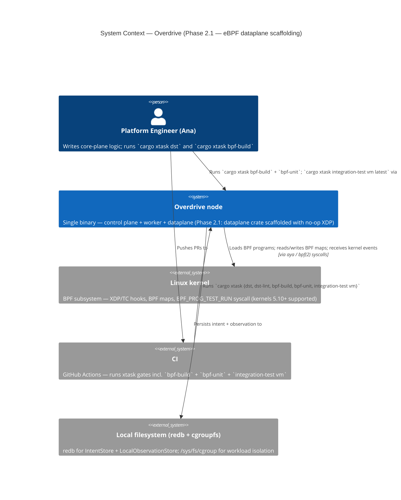
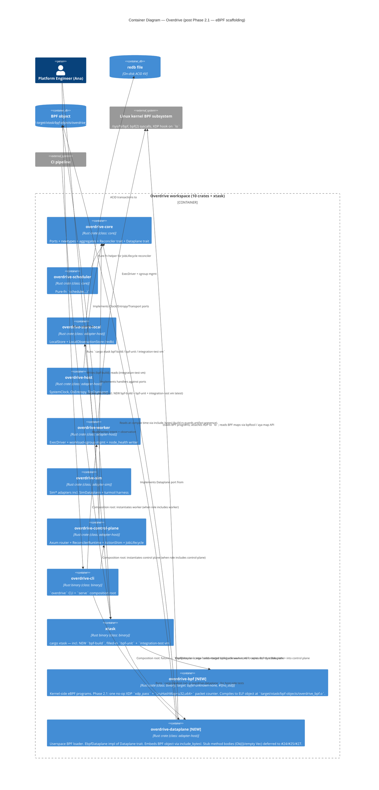

# C4 Diagrams — Overdrive

This file collects per-phase / per-feature C4 diagrams referenced from
`brief.md`, ADRs, and per-feature DESIGN docs. Each section is a
snapshot of the system at the close of a feature; superseded sections
remain for traceability.

---

## Phase 2.1 — eBPF Dataplane Containers

**Source:** `docs/feature/phase-2-aya-rs-scaffolding/design/architecture.md`
**ADR:** ADR-0038
**Date:** 2026-05-04

### C4 Level 1 — System Context

### C4 Level 2 — Container

L3 (component diagram) is intentionally skipped for Phase 2.1 — the
loader is a single struct with three trait methods (two no-ops) and
component decomposition would not add information. L3 becomes
warranted around #25 (SERVICE_MAP) when the loader gains map-update,
flow-event-consumer, and attachment-state components.

---

## Phase 2.2 — Dataplane component diagram (Mermaid)

**Source:** `docs/feature/phase-2-xdp-service-map/design/architecture.md`
**ADRs:** ADR-0040 (three-map split + HASH_OF_MAPS), ADR-0041
(weighted Maglev + REVERSE_NAT + endianness), ADR-0042
(`ServiceMapHydrator` reconciler).
**Date:** 2026-05-05

C4 Level 1 (System Context) and Level 2 (Container) are unchanged
from Phase 2.1 — `overdrive-bpf` and `overdrive-dataplane` are
already on the L2 from #23 (ADR-0038); no new crates ship in this
phase.

L3 becomes warranted now: the loader gains real-program
attachment, four typed BPF map handles, the HASH_OF_MAPS atomic
swap primitive, and the userspace Maglev permutation generator.
The hydrator reconciler is a new component on the control-plane
side that drives the dataplane port body via a new typed Action.

### C4 Level 3 — Dataplane subsystem (Phase 2.2)

```mermaid
C4Component
  title Component Diagram — Dataplane subsystem (Phase 2.2)

  Container_Boundary(ctrl, "overdrive-control-plane (adapter-host)") {
    Component(hydrator, "ServiceMapHydrator", "Reconciler impl (NEW — ADR-0042)", "sync `reconcile`; per-target keying on ServiceId; View persists RetryMemory inputs (attempts, last_failure_seen_at) NOT deadlines per development.md")
    Component(hydrate, "AnyReconciler::hydrate_desired/_actual", "async fn (ADR-0036)", "hydrate_desired reads `service_backends` rows; hydrate_actual reads `service_hydration_results` rows (NEW table)")
    Component(svc_shim, "action_shim::service_hydration::dispatch", "async fn (NEW — ADR-0042)", "Consumes Action::DataplaneUpdateService; calls Dataplane::update_service; writes Completed/Failed row to service_hydration_results")
  }

  Container_Boundary(dataplane, "overdrive-dataplane (adapter-host)") {
    Component(ebpf_dp, "EbpfDataplane", "impl Dataplane (Phase 2.1 stubs → real impl)", "update_service(service_id, vip, backends) — Q-Sig=A three explicit args")
    Component(loader, "loader (aya::Bpf)", "Rust module", "Loads ELF; XDP attach for xdp_service_map; TC egress attach for tc_reverse_nat (Q2=A)")
    Component(swap, "swap.rs", "Rust module (NEW — Slice 03)", "Atomic HASH_OF_MAPS outer-map fd replacement — zero-drop primitive (ASR-2.2-01)")
    Component(maglev_userspace, "maglev/{permutation,table}", "Rust modules (NEW — Slice 04)", "Eisenbud permutation + weighted multiplicity expansion in deterministic BTreeMap order")
    Component(svc_handle, "ServiceMapHandle", "typed map handle (NEW — Slice 02)", "BPF_MAP_TYPE_HASH_OF_MAPS; outer key (ServiceVip, u16 port)")
    Component(backend_handle, "BackendMapHandle", "typed map handle", "BPF_MAP_TYPE_HASH; key BackendId; max_entries=65_536")
    Component(maglev_handle, "MaglevMapHandle", "typed map handle", "BPF_MAP_TYPE_HASH_OF_MAPS; outer key ServiceId; inner ARRAY size=MaglevTableSize")
    Component(reverse_handle, "ReverseNatMapHandle", "typed map handle", "BPF_MAP_TYPE_HASH; key ReverseKey; value OriginalDest; max_entries=1_048_576")
    Component(drop_handle, "DropCounterHandle", "typed map handle", "BPF_MAP_TYPE_PERCPU_ARRAY; index DropClass; 6 slots (Q7=B)")
  }

  Container_Boundary(bpf, "overdrive-bpf (binary, target bpfel-unknown-none, #![no_std])") {
    Component(xdp_prog, "xdp_service_map", "XDP program", "Forward path: sanity prologue → SERVICE_MAP → MAGLEV_MAP → BACKEND_MAP → DNAT → REVERSE_NAT_MAP write")
    Component(tc_prog, "tc_reverse_nat", "TC egress program (NEW — Slice 05)", "Reverse path: REVERSE_NAT_MAP lookup → DNAT rewrite + checksum recompute")
    Component(sanity, "shared::sanity", "#[inline(always)] helpers (NEW — Slice 06; Q3=C)", "Pre-SERVICE_MAP packet-shape checks; reverse_key_from_packet / original_dest_to_wire (endianness conversion site — ADR-0041)")
  }

  Container(core, "overdrive-core::reconciler", "Reconciler trait (ADR-0035); AnyReconciler/AnyState extended with ServiceMapHydrator variant; Action enum extended with DataplaneUpdateService variant (NEW)")
  Container(core_id, "overdrive-core::id + overdrive-core::dataplane", "Newtypes: ServiceVip, ServiceId, BackendId (NEW); MaglevTableSize, DropClass (NEW dataplane/ module)")
  Container(intent, "IntentStore (LocalIntentStore)", "redb-backed; service-related intent keys")
  Container(obs, "ObservationStore (LocalObservationStore)", "redb-backed; service_backends rows + NEW service_hydration_results table")
  Container(view_redb, "ViewStore redb file", "<data_dir>/reconcilers/memory.redb; service-map-hydrator table; CBOR blob via ciborium")
  System_Ext(kernel, "Linux kernel BPF subsystem", "bpf(2) syscalls; XDP hook on iface; TC egress qdisc; HASH_OF_MAPS atomic outer-fd replace")

  Rel(hydrate, obs, "Reads service_backends rows; reads service_hydration_results rows (NEW table)")
  Rel(hydrator, core, "Implements Reconciler trait against; emits Action::DataplaneUpdateService (NEW variant)")
  Rel(hydrator, core_id, "Uses ServiceVip / ServiceId / BackendId / MaglevTableSize / DropClass newtypes")
  Rel(hydrator, view_redb, "Runtime persists ServiceMapHydratorView (RetryMemory inputs) via RedbViewStore (ADR-0035)")
  Rel(svc_shim, ebpf_dp, "Calls update_service(service_id, vip, backends) on Arc<dyn Dataplane>")
  Rel(svc_shim, obs, "Writes service_hydration_results row {Completed | Failed} after dataplane call returns")

  Rel(ebpf_dp, loader, "Owns aya::Bpf loader; attaches XDP + TC programs")
  Rel(ebpf_dp, swap, "Calls atomic HASH_OF_MAPS swap on backend-set change")
  Rel(ebpf_dp, maglev_userspace, "Generates Maglev permutation table for new MAGLEV_MAP inner array")
  Rel(ebpf_dp, svc_handle, "Writes inner-map fd to SERVICE_MAP outer (atomic)")
  Rel(ebpf_dp, backend_handle, "Inserts/removes BackendEntry rows")
  Rel(ebpf_dp, maglev_handle, "Writes inner-map fd to MAGLEV_MAP outer (atomic)")
  Rel(ebpf_dp, reverse_handle, "Read-only from userspace (kernel-side write only); cleanup on service teardown")
  Rel(ebpf_dp, drop_handle, "Read-only from userspace (kernel-side increments only); userspace sums per-CPU at read time")

  Rel(loader, kernel, "bpf(2) syscalls; XDP attach to iface; TC egress qdisc attach")
  Rel(xdp_prog, sanity, "Calls reverse_key_from_packet (endianness conversion); calls sanity-prologue helpers")
  Rel(xdp_prog, svc_handle, "Looks up (vip, port) → inner_map_fd")
  Rel(xdp_prog, maglev_handle, "Looks up ServiceId → MaglevTableSize-sized BackendId array")
  Rel(xdp_prog, backend_handle, "Looks up BackendId → BackendEntry")
  Rel(xdp_prog, reverse_handle, "Writes ReverseKey → OriginalDest on forward path")
  Rel(xdp_prog, drop_handle, "Increments per-class counter on drop")
  Rel(tc_prog, reverse_handle, "Looks up ReverseKey → OriginalDest on reverse path")
  Rel(tc_prog, sanity, "Calls original_dest_to_wire (endianness conversion)")
```

The diagram makes three architectural properties visually explicit:

1. **Hydrator → Action → shim → Dataplane → ObservationStore → next
   tick** — the convergence loop closes via the new
   `service_hydration_results` table, NOT via deriving `actual`
   from the last-emitted action (Drift 2 fix per ADR-0042).
2. **Three keyed maps, three typed handles, three different keys**
   — `(ServiceVip, u16 port)` for SERVICE_MAP, `ServiceId` for
   MAGLEV_MAP, `BackendId` for BACKEND_MAP (Drift 3 correction per
   ADR-0040). No type confusion at compile time.
3. **One conversion site for endianness** — wire packets go through
   `shared::sanity::reverse_key_from_packet` and back through
   `original_dest_to_wire`; map storage is host-order everywhere
   else (per ADR-0041). Tier 2 BPF unit roundtrip + userspace
   proptest gate the contract.
